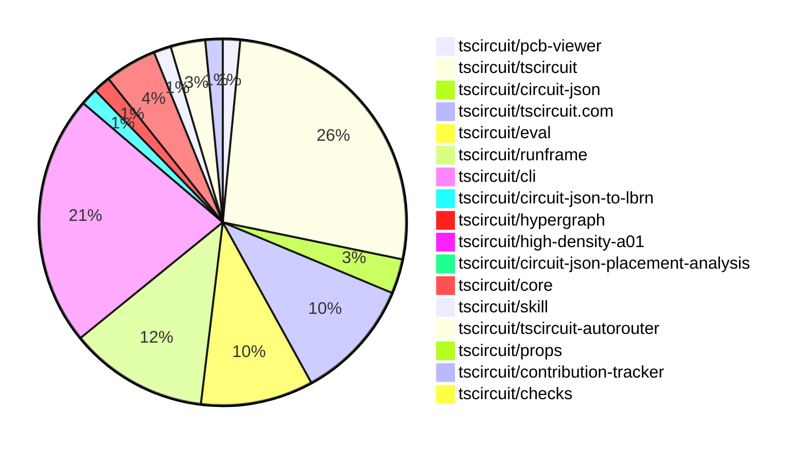

# Contribution Overview 2026-03-03

The current week is shown below. There are 3 major sections:

- [Contributor Overview](#contributor-overview)
- [PRs by Repository](#prs-by-repository)
- [PRs by Contributor](#changes-by-contributor)
- [Scoring & Sponsorship Details](/docs/sponsorship-calculation-explanation.md)

## PRs by Repository

## Contributor Overview

| Contributor | 🐳 Major | 🐙 Minor | 🐌 Tiny | ⭐ | Discussion Contributions |
|-------------|---------|---------|---------|-----|--------------------------|
| [seveibar](#seveibar) | 3 | 5 | 3 | ⭐⭐ | 0🔹 0🔶 0💎 |
| [tscircuitbot](#tscircuitbot) | 0 | 0 | 106 | ⭐⭐ | 0🔹 0🔶 0💎 |
| [imrishabh18](#imrishabh18) | 1 | 3 | 2 | ⭐⭐ | 0🔹 0🔶 0💎 |
| [MustafaMulla29](#MustafaMulla29) | 0 | 3 | 1 | ⭐ | 0🔹 0🔶 0💎 |
| [ShiboSoftwareDev](#ShiboSoftwareDev) | 0 | 2 | 2 | ⭐ | 0🔹 0🔶 0💎 |
| [rushabhcodes](#rushabhcodes) | 1 | 1 | 0 | ⭐ | 0🔹 0🔶 0💎 |
| [Abse2001](#Abse2001) | 1 | 0 | 0 | ⭐ | 0🔹 0🔶 0💎 |
| [AnasSarkiz](#AnasSarkiz) | 0 | 1 | 0 |  | 0🔹 0🔶 0💎 |

> Note: AI evaluates PRs and assigns 1-3 star ratings automatically. 4 and 5 star ratings require manual staff review.

### Discussion Contribution Legend

- 🔹 Normal Comments: Basic participation with minimal effort
- 🔶 Great Informative Comments: Thoughtful participation that adds value
- 💎 Incredible Comments: Exceptional participation with high-quality content

## Review Table

[reviews-received-hover]: ## "Number of reviews received for PRs for this contributor"
[approvals-received-hover]: ## "Number of approvals received for PRs this contributor authored"
[rejections-received-hover]: ## "Number of rejections received for PRs this contributor authored"
[prs-opened-hover]: ## "Number of PRs opened by this contributor"
[issues-created-hover]: ## "Number of issues created by this contributor"

| Contributor | Reviews Received | Approvals Received | Rejections Received | Approvals | Rejections Given | PRs Opened | PRs Merged | Issues Created |
|---|---|---|---|---|---|---|---|---|
| [tscircuitbot](#tscircuitbot) | 0 | 0 | 0 | 0 | 0 | 137 | 107 | 0 |
| [ShiboSoftwareDev](#ShiboSoftwareDev) | 5 | 4 | 0 | 0 | 0 | 4 | 4 | 0 |
| [seveibar](#seveibar) | 2 | 0 | 0 | 16 | 0 | 11 | 11 | 0 |
| [MustafaMulla29](#MustafaMulla29) | 8 | 7 | 0 | 0 | 0 | 5 | 5 | 0 |
| [Devesh36](#Devesh36) | 2 | 1 | 0 | 0 | 0 | 1 | 0 | 0 |
| [rushabhcodes](#rushabhcodes) | 9 | 2 | 0 | 1 | 0 | 5 | 2 | 0 |
| [chassidysandraik-hash](#chassidysandraik-hash) | 0 | 0 | 0 | 0 | 0 | 1 | 0 | 0 |
| [legendary658](#legendary658) | 0 | 0 | 0 | 0 | 0 | 1 | 0 | 0 |
| [imrishabh18](#imrishabh18) | 2 | 2 | 0 | 2 | 0 | 6 | 6 | 0 |
| [CuboYe](#CuboYe) | 0 | 0 | 0 | 0 | 0 | 4 | 0 | 0 |
| [davidweb3-ctrl](#davidweb3-ctrl) | 1 | 0 | 0 | 0 | 0 | 1 | 0 | 0 |
| [0hmX](#0hmX) | 0 | 0 | 0 | 0 | 0 | 1 | 0 | 0 |
| [Abse2001](#Abse2001) | 2 | 2 | 0 | 0 | 0 | 2 | 1 | 0 |
| [AnasSarkiz](#AnasSarkiz) | 1 | 1 | 0 | 0 | 0 | 2 | 1 | 0 |

## Changes by Repository

### [tscircuit/pcb-viewer](https://github.com/tscircuit/pcb-viewer)

🐌 Tiny Contributions (2)

| PR # | Impact | Contributor | Description |
|------|--------|-------------|-------------|
| [#688](https://github.com/tscircuit/pcb-viewer/pull/688) | 🐌 Tiny | tscircuitbot | Automated package update |
| [#687](https://github.com/tscircuit/pcb-viewer/pull/687) | 🐌 Tiny | ShiboSoftwareDev | Hides the group overlay for subpanels in the PCB viewer to improve clarity and usability. |

### [tscircuit/tscircuit](https://github.com/tscircuit/tscircuit)

🐌 Tiny Contributions (35)

| PR # | Impact | Contributor | Description |
|------|--------|-------------|-------------|
| [#2463](https://github.com/tscircuit/tscircuit/pull/2463) | 🐌 Tiny | tscircuitbot | Updates the tscircuitcli package to version 0.1.1034 in the package.json file. |
| [#2462](https://github.com/tscircuit/tscircuit/pull/2462) | 🐌 Tiny | tscircuitbot | Automated package update |
| [#2461](https://github.com/tscircuit/tscircuit/pull/2461) | 🐌 Tiny | tscircuitbot | Updates the tscircuitcli package from version 0.1.1032 to 0.1.1033 |
| [#2460](https://github.com/tscircuit/tscircuit/pull/2460) | 🐌 Tiny | tscircuitbot | Automated package update |
| [#2459](https://github.com/tscircuit/tscircuit/pull/2459) | 🐌 Tiny | tscircuitbot | Updates the tscircuitcli package to version 0.1.1032 in package.json |
| [#2458](https://github.com/tscircuit/tscircuit/pull/2458) | 🐌 Tiny | tscircuitbot | Automated package update |
| [#2457](https://github.com/tscircuit/tscircuit/pull/2457) | 🐌 Tiny | tscircuitbot | Updates the tscircuitcli package to version 0.1.1031 in package.json |
| [#2456](https://github.com/tscircuit/tscircuit/pull/2456) | 🐌 Tiny | tscircuitbot | Automated package update |
| [#2455](https://github.com/tscircuit/tscircuit/pull/2455) | 🐌 Tiny | tscircuitbot | Updates the tscircuitcli package version from 0.1.1029 to 0.1.1030 in package.json |
| [#2454](https://github.com/tscircuit/tscircuit/pull/2454) | 🐌 Tiny | tscircuitbot | Automated package update |
| [#2453](https://github.com/tscircuit/tscircuit/pull/2453) | 🐌 Tiny | tscircuitbot | Updates the tscircuitrunframe package version from 0.0.1680 to 0.0.1681 in package.json |
| [#2452](https://github.com/tscircuit/tscircuit/pull/2452) | 🐌 Tiny | tscircuitbot | Automated package update |
| [#2451](https://github.com/tscircuit/tscircuit/pull/2451) | 🐌 Tiny | tscircuitbot | Automated package update |
| [#2450](https://github.com/tscircuit/tscircuit/pull/2450) | 🐌 Tiny | tscircuitbot | Automated package update to version 0.0.1423 |
| [#2449](https://github.com/tscircuit/tscircuit/pull/2449) | 🐌 Tiny | tscircuitbot | Automated package update |
| [#2448](https://github.com/tscircuit/tscircuit/pull/2448) | 🐌 Tiny | tscircuitbot | Automated package update |
| [#2447](https://github.com/tscircuit/tscircuit/pull/2447) | 🐌 Tiny | tscircuitbot | Automated package update |
| [#2446](https://github.com/tscircuit/tscircuit/pull/2446) | 🐌 Tiny | tscircuitbot | Automated package update |
| [#2445](https://github.com/tscircuit/tscircuit/pull/2445) | 🐌 Tiny | tscircuitbot | Updates the tscircuitcli package to version 0.1.1027 in package.json |
| [#2444](https://github.com/tscircuit/tscircuit/pull/2444) | 🐌 Tiny | tscircuitbot | Automated package update |
| [#2443](https://github.com/tscircuit/tscircuit/pull/2443) | 🐌 Tiny | tscircuitbot | Updates the tscircuitcli package version from 0.1.1024 to 0.1.1026 in package.json |
| [#2441](https://github.com/tscircuit/tscircuit/pull/2441) | 🐌 Tiny | tscircuitbot | Automated package update |
| [#2440](https://github.com/tscircuit/tscircuit/pull/2440) | 🐌 Tiny | tscircuitbot | Updates the tscircuitcli and tscircuitrunframe packages to their latest versions. |
| [#2439](https://github.com/tscircuit/tscircuit/pull/2439) | 🐌 Tiny | tscircuitbot | Automated package update to version 0.0.1418 |
| [#2438](https://github.com/tscircuit/tscircuit/pull/2438) | 🐌 Tiny | tscircuitbot | Updates the version of the tscircuiteval package from 0.0.676 to 0.0.677 in package.json |
| [#2437](https://github.com/tscircuit/tscircuit/pull/2437) | 🐌 Tiny | tscircuitbot | Automated package update to version 0.0.1417 |
| [#2436](https://github.com/tscircuit/tscircuit/pull/2436) | 🐌 Tiny | tscircuitbot | Automated package update |
| [#2435](https://github.com/tscircuit/tscircuit/pull/2435) | 🐌 Tiny | tscircuitbot | Updates the package version from 0.0.1415 to 0.0.1416 in package.json |
| [#2434](https://github.com/tscircuit/tscircuit/pull/2434) | 🐌 Tiny | tscircuitbot | Updates the versions of several dependencies in the package.json file, including tscircuitcli and others. |
| [#2432](https://github.com/tscircuit/tscircuit/pull/2432) | 🐌 Tiny | tscircuitbot | Automated package update |
| [#2431](https://github.com/tscircuit/tscircuit/pull/2431) | 🐌 Tiny | tscircuitbot | Automated package update |
| [#2430](https://github.com/tscircuit/tscircuit/pull/2430) | 🐌 Tiny | tscircuitbot | Automated package update |
| [#2429](https://github.com/tscircuit/tscircuit/pull/2429) | 🐌 Tiny | tscircuitbot | Updates the tscircuitcli package from version 0.1.1018 to 0.1.1020 and the tscircuitrunframe package from version 0.0.1673 to 0.0.1674 in package.json |
| [#2428](https://github.com/tscircuit/tscircuit/pull/2428) | 🐌 Tiny | tscircuitbot | Automated package update |
| [#2427](https://github.com/tscircuit/tscircuit/pull/2427) | 🐌 Tiny | tscircuitbot | Updates the versions of tscircuitcore and tscircuiteval packages in package.json |

### [tscircuit/circuit-json](https://github.com/tscircuit/circuit-json)

| PR # | Impact | Rating | Contributor | Description |
|------|--------|--------|-------------|-------------|
| [#485](https://github.com/tscircuit/circuit-json/pull/485) | 🐳 Major | ⭐⭐⭐ | seveibar | Adds optional anchor metadata for flexible component placement and a new position mode for referencing other components in PCB design. |
| [#487](https://github.com/tscircuit/circuit-json/pull/487) | 🐙 Minor | ⭐⭐ | MustafaMulla29 | Adds a specification for the simple_connector component, including its type and optional standards. |

🐌 Tiny Contributions (2)

| PR # | Impact | Contributor | Description |
|------|--------|-------------|-------------|
| [#488](https://github.com/tscircuit/circuit-json/pull/488) | 🐌 Tiny | tscircuitbot | Automated package update |
| [#486](https://github.com/tscircuit/circuit-json/pull/486) | 🐌 Tiny | tscircuitbot | Automated package update |

### [tscircuit/tscircuit.com](https://github.com/tscircuit/tscircuit.com)

| PR # | Impact | Rating | Contributor | Description |
|------|--------|--------|-------------|-------------|
| [#2922](https://github.com/tscircuit/tscircuit.com/pull/2922) | 🐙 Minor | ⭐⭐ | imrishabh18 | Fixes the issue of duplicate build logs being displayed during live streaming by ensuring that completed logs are only shown after streaming finishes. |

🐌 Tiny Contributions (13)

| PR # | Impact | Contributor | Description |
|------|--------|-------------|-------------|
| [#2921](https://github.com/tscircuit/tscircuit.com/pull/2921) | 🐌 Tiny | tscircuitbot | Automated package update |
| [#2920](https://github.com/tscircuit/tscircuit.com/pull/2920) | 🐌 Tiny | tscircuitbot | Updates the tscircuitrunframe package from version 0.0.1677 to 0.0.1680 |
| [#2919](https://github.com/tscircuit/tscircuit.com/pull/2919) | 🐌 Tiny | tscircuitbot | Updates the tscircuiteval package from version 0.0.679 to 0.0.680 |
| [#2917](https://github.com/tscircuit/tscircuit.com/pull/2917) | 🐌 Tiny | tscircuitbot | Updates the tscircuiteval package to version 0.0.679 in the package.json file |
| [#2915](https://github.com/tscircuit/tscircuit.com/pull/2915) | 🐌 Tiny | tscircuitbot | Automated package update |
| [#2914](https://github.com/tscircuit/tscircuit.com/pull/2914) | 🐌 Tiny | tscircuitbot | Updates the tscircuitrunframe package from version 0.0.1676 to 0.0.1677 |
| [#2913](https://github.com/tscircuit/tscircuit.com/pull/2913) | 🐌 Tiny | tscircuitbot | Automated package update |
| [#2912](https://github.com/tscircuit/tscircuit.com/pull/2912) | 🐌 Tiny | tscircuitbot | Updates the tscircuitrunframe package from version 0.0.1675 to 0.0.1676 |
| [#2911](https://github.com/tscircuit/tscircuit.com/pull/2911) | 🐌 Tiny | tscircuitbot | Updates the tscircuiteval package from version 0.0.675 to 0.0.676 |
| [#2910](https://github.com/tscircuit/tscircuit.com/pull/2910) | 🐌 Tiny | tscircuitbot | Updates the tscircuitrunframe package from version 0.0.1674 to 0.0.1675 |
| [#2909](https://github.com/tscircuit/tscircuit.com/pull/2909) | 🐌 Tiny | tscircuitbot | Updates the version of the tscircuiteval package from 0.0.674 to 0.0.675 in package.json |
| [#2908](https://github.com/tscircuit/tscircuit.com/pull/2908) | 🐌 Tiny | tscircuitbot | Updates the tscircuitrunframe package from version 0.0.1673 to 0.0.1674 |
| [#2907](https://github.com/tscircuit/tscircuit.com/pull/2907) | 🐌 Tiny | tscircuitbot | Updates the tscircuiteval package version from 0.0.672 to 0.0.674 in package.json |

### [tscircuit/eval](https://github.com/tscircuit/eval)

🐌 Tiny Contributions (13)

| PR # | Impact | Contributor | Description |
|------|--------|-------------|-------------|
| [#2175](https://github.com/tscircuit/eval/pull/2175) | 🐌 Tiny | tscircuitbot | Automated package update |
| [#2174](https://github.com/tscircuit/eval/pull/2174) | 🐌 Tiny | tscircuitbot | Updates the version of the tscircuitcore package from 0.0.1077 to 0.0.1078 in package.json |
| [#2172](https://github.com/tscircuit/eval/pull/2172) | 🐌 Tiny | tscircuitbot | Automated package update |
| [#2171](https://github.com/tscircuit/eval/pull/2171) | 🐌 Tiny | tscircuitbot | Updates the version of the tscircuitcore package from 0.0.1076 to 0.0.1077 in package.json |
| [#2169](https://github.com/tscircuit/eval/pull/2169) | 🐌 Tiny | tscircuitbot | Automated package update |
| [#2168](https://github.com/tscircuit/eval/pull/2168) | 🐌 Tiny | tscircuitbot | Automated package update |
| [#2166](https://github.com/tscircuit/eval/pull/2166) | 🐌 Tiny | tscircuitbot | Automated package update |
| [#2165](https://github.com/tscircuit/eval/pull/2165) | 🐌 Tiny | tscircuitbot | Updates the version of tscircuitcore from 0.0.1074 to 0.0.1075 and tscircuitprops from 0.0.485 to 0.0.487 in package.json |
| [#2163](https://github.com/tscircuit/eval/pull/2163) | 🐌 Tiny | tscircuitbot | Automated package update |
| [#2162](https://github.com/tscircuit/eval/pull/2162) | 🐌 Tiny | tscircuitbot | Updates the versions of tscircuitcircuit-json-util and tscircuitcore packages in package.json |
| [#2161](https://github.com/tscircuit/eval/pull/2161) | 🐌 Tiny | tscircuitbot | Automated package update |
| [#2160](https://github.com/tscircuit/eval/pull/2160) | 🐌 Tiny | tscircuitbot | Updates the package versions in package.json to their latest compatible versions. |
| [#2158](https://github.com/tscircuit/eval/pull/2158) | 🐌 Tiny | tscircuitbot | Automated package update |

### [tscircuit/runframe](https://github.com/tscircuit/runframe)

🐌 Tiny Contributions (16)

| PR # | Impact | Contributor | Description |
|------|--------|-------------|-------------|
| [#2800](https://github.com/tscircuit/runframe/pull/2800) | 🐌 Tiny | tscircuitbot | Automated package update |
| [#2799](https://github.com/tscircuit/runframe/pull/2799) | 🐌 Tiny | tscircuitbot | Updates the tscircuitpcb-viewer package from version 1.11.345 to 1.11.346 |
| [#2798](https://github.com/tscircuit/runframe/pull/2798) | 🐌 Tiny | tscircuitbot | Automated package update |
| [#2797](https://github.com/tscircuit/runframe/pull/2797) | 🐌 Tiny | tscircuitbot | Updates the tscircuiteval package from version 0.0.679 to 0.0.680 |
| [#2796](https://github.com/tscircuit/runframe/pull/2796) | 🐌 Tiny | tscircuitbot | Automated package update |
| [#2795](https://github.com/tscircuit/runframe/pull/2795) | 🐌 Tiny | tscircuitbot | Updates the tscircuiteval package to version 0.0.679 in the package.json file. |
| [#2794](https://github.com/tscircuit/runframe/pull/2794) | 🐌 Tiny | tscircuitbot | Automated package update |
| [#2793](https://github.com/tscircuit/runframe/pull/2793) | 🐌 Tiny | tscircuitbot | Updates the tscircuiteval package to version 0.0.678 in the package.json file. |
| [#2792](https://github.com/tscircuit/runframe/pull/2792) | 🐌 Tiny | tscircuitbot | Automated package update |
| [#2791](https://github.com/tscircuit/runframe/pull/2791) | 🐌 Tiny | tscircuitbot | Updates the tscircuiteval package to version 0.0.677 in the package.json file. |
| [#2790](https://github.com/tscircuit/runframe/pull/2790) | 🐌 Tiny | tscircuitbot | Updates the package version from 0.0.1675 to 0.0.1676 in package.json |
| [#2789](https://github.com/tscircuit/runframe/pull/2789) | 🐌 Tiny | tscircuitbot | Updates the tscircuiteval package to version 0.0.676 in the package.json file. |
| [#2788](https://github.com/tscircuit/runframe/pull/2788) | 🐌 Tiny | tscircuitbot | Automated package update |
| [#2787](https://github.com/tscircuit/runframe/pull/2787) | 🐌 Tiny | tscircuitbot | Updates the tscircuiteval package to version 0.0.675 in the package.json file. |
| [#2786](https://github.com/tscircuit/runframe/pull/2786) | 🐌 Tiny | tscircuitbot | Updates the package version from v0.0.1673 to v0.0.1674 in package.json |
| [#2785](https://github.com/tscircuit/runframe/pull/2785) | 🐌 Tiny | tscircuitbot | Updates the tscircuiteval package from version 0.0.673 to 0.0.674 in the package.json file. |

### [tscircuit/cli](https://github.com/tscircuit/cli)

| PR # | Impact | Rating | Contributor | Description |
|------|--------|--------|-------------|-------------|
| [#2233](https://github.com/tscircuit/cli/pull/2233) | 🐳 Major | ⭐⭐⭐ | imrishabh18 | Adds support for concurrent GLB conversion in the circuit-json build process, enhancing performance by utilizing worker threads for file processing. |
| [#2187](https://github.com/tscircuit/cli/pull/2187) | 🐳 Major | ⭐⭐⭐ | rushabhcodes | Adds support for camera angle presets when generating 3D snapshots via the CLI, allowing users to select different viewpoints for rendered images. |
| [#2210](https://github.com/tscircuit/cli/pull/2210) | 🐙 Minor | ⭐⭐ | seveibar | Enables PCB geometry generation for placement checks while disabling routing, and updates dependencies to newer versions. |
| [#2229](https://github.com/tscircuit/cli/pull/2229) | 🐙 Minor | ⭐⭐ | imrishabh18 | Allows uploading of binary files via multipartform-data in the local sync pipeline, eliminating the need for base64 encoding on the client side. |
| [#2235](https://github.com/tscircuit/cli/pull/2235) | 🐙 Minor | ⭐⭐ | imrishabh18 | Adds a stall timeout feature to the GLB worker pool to handle stalled jobs during the build process. |
| [#2232](https://github.com/tscircuit/cli/pull/2232) | 🐙 Minor | ⭐⭐ | rushabhcodes | Adds a new camera preset for a pseudo-orthographic top-down view and a normalizeDir function to ensure direction vectors are consistently normalized for improved camera positioning. |

🐌 Tiny Contributions (23)

| PR # | Impact | Contributor | Description |
|------|--------|-------------|-------------|
| [#2237](https://github.com/tscircuit/cli/pull/2237) | 🐌 Tiny | tscircuitbot | Automated package update |
| [#2236](https://github.com/tscircuit/cli/pull/2236) | 🐌 Tiny | tscircuitbot | Automated package update |
| [#2234](https://github.com/tscircuit/cli/pull/2234) | 🐌 Tiny | tscircuitbot | Automated package update |
| [#2228](https://github.com/tscircuit/cli/pull/2228) | 🐌 Tiny | tscircuitbot | Updates the package version from 0.1.1029 to 0.1.1030 in package.json |
| [#2227](https://github.com/tscircuit/cli/pull/2227) | 🐌 Tiny | tscircuitbot | Updates the tscircuitrunframe package from version 0.0.1680 to 0.0.1681 |
| [#2226](https://github.com/tscircuit/cli/pull/2226) | 🐌 Tiny | tscircuitbot | Automated package update |
| [#2225](https://github.com/tscircuit/cli/pull/2225) | 🐌 Tiny | tscircuitbot | Updates the tscircuitrunframe package from version 0.0.1678 to 0.0.1680 |
| [#2223](https://github.com/tscircuit/cli/pull/2223) | 🐌 Tiny | tscircuitbot | Automated package update |
| [#2222](https://github.com/tscircuit/cli/pull/2222) | 🐌 Tiny | tscircuitbot | Updates the tscircuitrunframe package from version 0.0.1677 to 0.0.1678 |
| [#2221](https://github.com/tscircuit/cli/pull/2221) | 🐌 Tiny | tscircuitbot | Automated package update |
| [#2220](https://github.com/tscircuit/cli/pull/2220) | 🐌 Tiny | tscircuitbot | Automated README update with latest CLI usage output. |
| [#2219](https://github.com/tscircuit/cli/pull/2219) | 🐌 Tiny | tscircuitbot | Automated package update |
| [#2214](https://github.com/tscircuit/cli/pull/2214) | 🐌 Tiny | tscircuitbot | Automated package update |
| [#2213](https://github.com/tscircuit/cli/pull/2213) | 🐌 Tiny | tscircuitbot | Automated package update |
| [#2211](https://github.com/tscircuit/cli/pull/2211) | 🐌 Tiny | tscircuitbot | Automated package update |
| [#2209](https://github.com/tscircuit/cli/pull/2209) | 🐌 Tiny | tscircuitbot | Automated package update |
| [#2208](https://github.com/tscircuit/cli/pull/2208) | 🐌 Tiny | tscircuitbot | Updates the tscircuitrunframe package from version 0.0.1675 to 0.0.1676 |
| [#2207](https://github.com/tscircuit/cli/pull/2207) | 🐌 Tiny | tscircuitbot | Automated package update |
| [#2206](https://github.com/tscircuit/cli/pull/2206) | 🐌 Tiny | tscircuitbot | Updates the tscircuitrunframe package from version 0.0.1674 to 0.0.1675 |
| [#2205](https://github.com/tscircuit/cli/pull/2205) | 🐌 Tiny | tscircuitbot | Automated package update |
| [#2204](https://github.com/tscircuit/cli/pull/2204) | 🐌 Tiny | tscircuitbot | Updates the tscircuitrunframe package from version 0.0.1673 to 0.0.1674 |
| [#2202](https://github.com/tscircuit/cli/pull/2202) | 🐌 Tiny | tscircuitbot | Automated README update with latest CLI usage output. |
| [#2215](https://github.com/tscircuit/cli/pull/2215) | 🐌 Tiny | seveibar | Restores the placement-check behavior while ensuring placement analysis runs with PCB generation enabled and routing disabled, and improves test coverage for component details. |

### [tscircuit/circuit-json-to-lbrn](https://github.com/tscircuit/circuit-json-to-lbrn)

| PR # | Impact | Rating | Contributor | Description |
|------|--------|--------|-------------|-------------|
| [#149](https://github.com/tscircuit/circuit-json-to-lbrn/pull/149) | 🐙 Minor | ⭐⭐ | AnasSarkiz | This PR introduces dedicated top and bottom soldermask layers, along with matching soldermask-cure layers, so mask geometry is no longer merged through a single shared output path. |

🐌 Tiny Contributions (1)

| PR # | Impact | Contributor | Description |
|------|--------|-------------|-------------|
| [#150](https://github.com/tscircuit/circuit-json-to-lbrn/pull/150) | 🐌 Tiny | tscircuitbot | Automated package update |

### [tscircuit/hypergraph](https://github.com/tscircuit/hypergraph)

| PR # | Impact | Rating | Contributor | Description |
|------|--------|--------|-------------|-------------|
| [#112](https://github.com/tscircuit/hypergraph/pull/112) | 🐳 Major | ⭐⭐⭐ | Abse2001 | Adds functionality for automatic selection of via tiles in convex via graph generation, improving the accuracy of graph generation based on dataset2. |

🐌 Tiny Contributions (1)

| PR # | Impact | Contributor | Description |
|------|--------|-------------|-------------|
| [#114](https://github.com/tscircuit/hypergraph/pull/114) | 🐌 Tiny | tscircuitbot | Automated package update |

### [tscircuit/high-density-a01](https://github.com/tscircuit/high-density-a01)

🐌 Tiny Contributions (1)

| PR # | Impact | Contributor | Description |
|------|--------|-------------|-------------|
| [#17](https://github.com/tscircuit/high-density-a01/pull/17) | 🐌 Tiny | tscircuitbot | Automated package update |

### [tscircuit/circuit-json-placement-analysis](https://github.com/tscircuit/circuit-json-placement-analysis)

🐌 Tiny Contributions (1)

| PR # | Impact | Contributor | Description |
|------|--------|-------------|-------------|
| [#1](https://github.com/tscircuit/circuit-json-placement-analysis/pull/1) | 🐌 Tiny | tscircuitbot | Updates the package version from 0.0.1 to 0.0.2 in package.json |

### [tscircuit/core](https://github.com/tscircuit/core)

| PR # | Impact | Rating | Contributor | Description |
|------|--------|--------|-------------|-------------|
| [#2005](https://github.com/tscircuit/core/pull/2005) | 🐙 Minor | ⭐⭐ | ShiboSoftwareDev | Prevents subpanels from triggering the regular group layout system and allows nested boards to be included in panelization. |
| [#2002](https://github.com/tscircuit/core/pull/2002) | 🐙 Minor | ⭐⭐ | ShiboSoftwareDev | Adds support for subpanels in grid layout and consolidates packing utilities while fixing PCB note transformations. |
| [#1998](https://github.com/tscircuit/core/pull/1998) | 🐙 Minor | ⭐⭐ | MustafaMulla29 | Emits a pcb_missing_footprint_error when no footprint is specified for a chip component, improving error handling in the circuit design process. |
| [#1997](https://github.com/tscircuit/core/pull/1997) | 🐙 Minor | ⭐⭐ | MustafaMulla29 | Updates the error message for invalid pin labels to specify that they can only contain letters, numbers, and underscores. |
| [#2003](https://github.com/tscircuit/core/pull/2003) | 🐙 Minor | ⭐⭐ | seveibar | Add support for platform-level toggles to disable specific PCB DRC categories (netlist, placement, routing) allowing CIhost environments to selectively skip checks. |

🐌 Tiny Contributions (1)

| PR # | Impact | Contributor | Description |
|------|--------|-------------|-------------|
| [#2001](https://github.com/tscircuit/core/pull/2001) | 🐌 Tiny | imrishabh18 | Updates the tscircuitchecks package to version 0.0.100 and removes the check for PCB component footprint pad overlap. |

### [tscircuit/skill](https://github.com/tscircuit/skill)

🐌 Tiny Contributions (2)

| PR # | Impact | Contributor | Description |
|------|--------|-------------|-------------|
| [#5](https://github.com/tscircuit/skill/pull/5) | 🐌 Tiny | ShiboSoftwareDev | Adds documentation for pinLabels and pinAttributes, including examples for chip components and their usage in schematic design. |
| [#6](https://github.com/tscircuit/skill/pull/6) | 🐌 Tiny | MustafaMulla29 | Adds a new trace example for the V3_3 net in the SYNTAX.md documentation. |

### [tscircuit/tscircuit-autorouter](https://github.com/tscircuit/tscircuit-autorouter)

| PR # | Impact | Rating | Contributor | Description |
|------|--------|--------|-------------|-------------|
| [#621](https://github.com/tscircuit/tscircuit-autorouter/pull/621) | 🐳 Major | ⭐⭐⭐ | seveibar | Adjusts the MAX_ITERATIONS parameter for the FixedTopologyHighDensitySolver and introduces a profiling script for solvers to capture performance metrics. |
| [#619](https://github.com/tscircuit/tscircuit-autorouter/pull/619) | 🐳 Major | ⭐⭐⭐ | seveibar | Optimizes obstacle checks in the SingleHighDensityRouteSolver by implementing a spatial index using Flatbush, reducing computational overhead during routing iterations. |

🐌 Tiny Contributions (2)

| PR # | Impact | Contributor | Description |
|------|--------|-------------|-------------|
| [#620](https://github.com/tscircuit/tscircuit-autorouter/pull/620) | 🐌 Tiny | seveibar | Adds a link to the GitHub Actions workflow run in the benchmark status comment for easier debugging and log access. |
| [#618](https://github.com/tscircuit/tscircuit-autorouter/pull/618) | 🐌 Tiny | seveibar | Add workflow_dispatch to benchmark workflow allowing manual benchmark runs with options for solver name, scenario limit, concurrency, and inclusion of assignable pipelines, while excluding assignable solvers by default. |

### [tscircuit/props](https://github.com/tscircuit/props)

| PR # | Impact | Rating | Contributor | Description |
|------|--------|--------|-------------|-------------|
| [#608](https://github.com/tscircuit/props/pull/608) | 🐙 Minor | ⭐⭐ | seveibar | Add optional boolean flags to the PlatformConfig interface to disable specific DRC checks (netlist, routing, placement) for downstream tooling. |

### [tscircuit/contribution-tracker](https://github.com/tscircuit/contribution-tracker)

| PR # | Impact | Rating | Contributor | Description |
|------|--------|--------|-------------|-------------|
| [#318](https://github.com/tscircuit/contribution-tracker/pull/318) | 🐙 Minor | ⭐⭐ | seveibar | Aligns the mapping between raw weekly scores and starcrown strings with updated thresholds used for sponsorship calculations, ensures documentation and CSV generation logic reflect the new score ranges and crown handling consistently, and adds a unit test for the updated score mapping. |
| [#317](https://github.com/tscircuit/contribution-tracker/pull/317) | 🐙 Minor | ⭐⭐ | seveibar | Updates the scoring thresholds for star ratings and sponsorship tiers in the contribution tracker to align with revised weekly score boundaries. |

### [tscircuit/checks](https://github.com/tscircuit/checks)

🐌 Tiny Contributions (1)

| PR # | Impact | Contributor | Description |
|------|--------|-------------|-------------|
| [#105](https://github.com/tscircuit/checks/pull/105) | 🐌 Tiny | imrishabh18 | Removes the checkPcbComponentOwnFootprintPadOverlap check from the checks pipeline to simplify the placement check process and reduce the public API surface. |

## Changes by Contributor

### [tscircuitbot](https://github.com/tscircuitbot)

🐌 Tiny Contributions (106)

| PR # | Impact | Description |
|------|--------|-------------|
| [#688](https://github.com/tscircuit/pcb-viewer/pull/688) | 🐌 Tiny | Automated package update |
| [#2463](https://github.com/tscircuit/tscircuit/pull/2463) | 🐌 Tiny | Updates the tscircuitcli package to version 0.1.1034 in the package.json file. |
| [#2462](https://github.com/tscircuit/tscircuit/pull/2462) | 🐌 Tiny | Automated package update |
| [#2461](https://github.com/tscircuit/tscircuit/pull/2461) | 🐌 Tiny | Updates the tscircuitcli package from version 0.1.1032 to 0.1.1033 |
| [#2460](https://github.com/tscircuit/tscircuit/pull/2460) | 🐌 Tiny | Automated package update |
| [#2459](https://github.com/tscircuit/tscircuit/pull/2459) | 🐌 Tiny | Updates the tscircuitcli package to version 0.1.1032 in package.json |
| [#2458](https://github.com/tscircuit/tscircuit/pull/2458) | 🐌 Tiny | Automated package update |
| [#2457](https://github.com/tscircuit/tscircuit/pull/2457) | 🐌 Tiny | Updates the tscircuitcli package to version 0.1.1031 in package.json |
| [#2456](https://github.com/tscircuit/tscircuit/pull/2456) | 🐌 Tiny | Automated package update |
| [#2455](https://github.com/tscircuit/tscircuit/pull/2455) | 🐌 Tiny | Updates the tscircuitcli package version from 0.1.1029 to 0.1.1030 in package.json |
| [#2454](https://github.com/tscircuit/tscircuit/pull/2454) | 🐌 Tiny | Automated package update |
| [#2453](https://github.com/tscircuit/tscircuit/pull/2453) | 🐌 Tiny | Updates the tscircuitrunframe package version from 0.0.1680 to 0.0.1681 in package.json |
| [#2452](https://github.com/tscircuit/tscircuit/pull/2452) | 🐌 Tiny | Automated package update |
| [#2451](https://github.com/tscircuit/tscircuit/pull/2451) | 🐌 Tiny | Automated package update |
| [#2450](https://github.com/tscircuit/tscircuit/pull/2450) | 🐌 Tiny | Automated package update to version 0.0.1423 |
| [#2449](https://github.com/tscircuit/tscircuit/pull/2449) | 🐌 Tiny | Automated package update |
| [#2448](https://github.com/tscircuit/tscircuit/pull/2448) | 🐌 Tiny | Automated package update |
| [#2447](https://github.com/tscircuit/tscircuit/pull/2447) | 🐌 Tiny | Automated package update |
| [#2446](https://github.com/tscircuit/tscircuit/pull/2446) | 🐌 Tiny | Automated package update |
| [#2445](https://github.com/tscircuit/tscircuit/pull/2445) | 🐌 Tiny | Updates the tscircuitcli package to version 0.1.1027 in package.json |
| [#2444](https://github.com/tscircuit/tscircuit/pull/2444) | 🐌 Tiny | Automated package update |
| [#2443](https://github.com/tscircuit/tscircuit/pull/2443) | 🐌 Tiny | Updates the tscircuitcli package version from 0.1.1024 to 0.1.1026 in package.json |
| [#2441](https://github.com/tscircuit/tscircuit/pull/2441) | 🐌 Tiny | Automated package update |
| [#2440](https://github.com/tscircuit/tscircuit/pull/2440) | 🐌 Tiny | Updates the tscircuitcli and tscircuitrunframe packages to their latest versions. |
| [#2439](https://github.com/tscircuit/tscircuit/pull/2439) | 🐌 Tiny | Automated package update to version 0.0.1418 |
| [#2438](https://github.com/tscircuit/tscircuit/pull/2438) | 🐌 Tiny | Updates the version of the tscircuiteval package from 0.0.676 to 0.0.677 in package.json |
| [#2437](https://github.com/tscircuit/tscircuit/pull/2437) | 🐌 Tiny | Automated package update to version 0.0.1417 |
| [#2436](https://github.com/tscircuit/tscircuit/pull/2436) | 🐌 Tiny | Automated package update |
| [#2435](https://github.com/tscircuit/tscircuit/pull/2435) | 🐌 Tiny | Updates the package version from 0.0.1415 to 0.0.1416 in package.json |
| [#2434](https://github.com/tscircuit/tscircuit/pull/2434) | 🐌 Tiny | Updates the versions of several dependencies in the package.json file, including tscircuitcli and others. |
| [#2432](https://github.com/tscircuit/tscircuit/pull/2432) | 🐌 Tiny | Automated package update |
| [#2431](https://github.com/tscircuit/tscircuit/pull/2431) | 🐌 Tiny | Automated package update |
| [#2430](https://github.com/tscircuit/tscircuit/pull/2430) | 🐌 Tiny | Automated package update |
| [#2429](https://github.com/tscircuit/tscircuit/pull/2429) | 🐌 Tiny | Updates the tscircuitcli package from version 0.1.1018 to 0.1.1020 and the tscircuitrunframe package from version 0.0.1673 to 0.0.1674 in package.json |
| [#2428](https://github.com/tscircuit/tscircuit/pull/2428) | 🐌 Tiny | Automated package update |
| [#2427](https://github.com/tscircuit/tscircuit/pull/2427) | 🐌 Tiny | Updates the versions of tscircuitcore and tscircuiteval packages in package.json |
| [#488](https://github.com/tscircuit/circuit-json/pull/488) | 🐌 Tiny | Automated package update |
| [#486](https://github.com/tscircuit/circuit-json/pull/486) | 🐌 Tiny | Automated package update |
| [#2921](https://github.com/tscircuit/tscircuit.com/pull/2921) | 🐌 Tiny | Automated package update |
| [#2920](https://github.com/tscircuit/tscircuit.com/pull/2920) | 🐌 Tiny | Updates the tscircuitrunframe package from version 0.0.1677 to 0.0.1680 |
| [#2919](https://github.com/tscircuit/tscircuit.com/pull/2919) | 🐌 Tiny | Updates the tscircuiteval package from version 0.0.679 to 0.0.680 |
| [#2917](https://github.com/tscircuit/tscircuit.com/pull/2917) | 🐌 Tiny | Updates the tscircuiteval package to version 0.0.679 in the package.json file |
| [#2915](https://github.com/tscircuit/tscircuit.com/pull/2915) | 🐌 Tiny | Automated package update |
| [#2914](https://github.com/tscircuit/tscircuit.com/pull/2914) | 🐌 Tiny | Updates the tscircuitrunframe package from version 0.0.1676 to 0.0.1677 |
| [#2913](https://github.com/tscircuit/tscircuit.com/pull/2913) | 🐌 Tiny | Automated package update |
| [#2912](https://github.com/tscircuit/tscircuit.com/pull/2912) | 🐌 Tiny | Updates the tscircuitrunframe package from version 0.0.1675 to 0.0.1676 |
| [#2911](https://github.com/tscircuit/tscircuit.com/pull/2911) | 🐌 Tiny | Updates the tscircuiteval package from version 0.0.675 to 0.0.676 |
| [#2910](https://github.com/tscircuit/tscircuit.com/pull/2910) | 🐌 Tiny | Updates the tscircuitrunframe package from version 0.0.1674 to 0.0.1675 |
| [#2909](https://github.com/tscircuit/tscircuit.com/pull/2909) | 🐌 Tiny | Updates the version of the tscircuiteval package from 0.0.674 to 0.0.675 in package.json |
| [#2908](https://github.com/tscircuit/tscircuit.com/pull/2908) | 🐌 Tiny | Updates the tscircuitrunframe package from version 0.0.1673 to 0.0.1674 |
| [#2907](https://github.com/tscircuit/tscircuit.com/pull/2907) | 🐌 Tiny | Updates the tscircuiteval package version from 0.0.672 to 0.0.674 in package.json |
| [#2175](https://github.com/tscircuit/eval/pull/2175) | 🐌 Tiny | Automated package update |
| [#2174](https://github.com/tscircuit/eval/pull/2174) | 🐌 Tiny | Updates the version of the tscircuitcore package from 0.0.1077 to 0.0.1078 in package.json |
| [#2172](https://github.com/tscircuit/eval/pull/2172) | 🐌 Tiny | Automated package update |
| [#2171](https://github.com/tscircuit/eval/pull/2171) | 🐌 Tiny | Updates the version of the tscircuitcore package from 0.0.1076 to 0.0.1077 in package.json |
| [#2169](https://github.com/tscircuit/eval/pull/2169) | 🐌 Tiny | Automated package update |
| [#2168](https://github.com/tscircuit/eval/pull/2168) | 🐌 Tiny | Automated package update |
| [#2166](https://github.com/tscircuit/eval/pull/2166) | 🐌 Tiny | Automated package update |
| [#2165](https://github.com/tscircuit/eval/pull/2165) | 🐌 Tiny | Updates the version of tscircuitcore from 0.0.1074 to 0.0.1075 and tscircuitprops from 0.0.485 to 0.0.487 in package.json |
| [#2163](https://github.com/tscircuit/eval/pull/2163) | 🐌 Tiny | Automated package update |
| [#2162](https://github.com/tscircuit/eval/pull/2162) | 🐌 Tiny | Updates the versions of tscircuitcircuit-json-util and tscircuitcore packages in package.json |
| [#2161](https://github.com/tscircuit/eval/pull/2161) | 🐌 Tiny | Automated package update |
| [#2160](https://github.com/tscircuit/eval/pull/2160) | 🐌 Tiny | Updates the package versions in package.json to their latest compatible versions. |
| [#2158](https://github.com/tscircuit/eval/pull/2158) | 🐌 Tiny | Automated package update |
| [#2800](https://github.com/tscircuit/runframe/pull/2800) | 🐌 Tiny | Automated package update |
| [#2799](https://github.com/tscircuit/runframe/pull/2799) | 🐌 Tiny | Updates the tscircuitpcb-viewer package from version 1.11.345 to 1.11.346 |
| [#2798](https://github.com/tscircuit/runframe/pull/2798) | 🐌 Tiny | Automated package update |
| [#2797](https://github.com/tscircuit/runframe/pull/2797) | 🐌 Tiny | Updates the tscircuiteval package from version 0.0.679 to 0.0.680 |
| [#2796](https://github.com/tscircuit/runframe/pull/2796) | 🐌 Tiny | Automated package update |
| [#2795](https://github.com/tscircuit/runframe/pull/2795) | 🐌 Tiny | Updates the tscircuiteval package to version 0.0.679 in the package.json file. |
| [#2794](https://github.com/tscircuit/runframe/pull/2794) | 🐌 Tiny | Automated package update |
| [#2793](https://github.com/tscircuit/runframe/pull/2793) | 🐌 Tiny | Updates the tscircuiteval package to version 0.0.678 in the package.json file. |
| [#2792](https://github.com/tscircuit/runframe/pull/2792) | 🐌 Tiny | Automated package update |
| [#2791](https://github.com/tscircuit/runframe/pull/2791) | 🐌 Tiny | Updates the tscircuiteval package to version 0.0.677 in the package.json file. |
| [#2790](https://github.com/tscircuit/runframe/pull/2790) | 🐌 Tiny | Updates the package version from 0.0.1675 to 0.0.1676 in package.json |
| [#2789](https://github.com/tscircuit/runframe/pull/2789) | 🐌 Tiny | Updates the tscircuiteval package to version 0.0.676 in the package.json file. |
| [#2788](https://github.com/tscircuit/runframe/pull/2788) | 🐌 Tiny | Automated package update |
| [#2787](https://github.com/tscircuit/runframe/pull/2787) | 🐌 Tiny | Updates the tscircuiteval package to version 0.0.675 in the package.json file. |
| [#2786](https://github.com/tscircuit/runframe/pull/2786) | 🐌 Tiny | Updates the package version from v0.0.1673 to v0.0.1674 in package.json |
| [#2785](https://github.com/tscircuit/runframe/pull/2785) | 🐌 Tiny | Updates the tscircuiteval package from version 0.0.673 to 0.0.674 in the package.json file. |
| [#2237](https://github.com/tscircuit/cli/pull/2237) | 🐌 Tiny | Automated package update |
| [#2236](https://github.com/tscircuit/cli/pull/2236) | 🐌 Tiny | Automated package update |
| [#2234](https://github.com/tscircuit/cli/pull/2234) | 🐌 Tiny | Automated package update |
| [#2228](https://github.com/tscircuit/cli/pull/2228) | 🐌 Tiny | Updates the package version from 0.1.1029 to 0.1.1030 in package.json |
| [#2227](https://github.com/tscircuit/cli/pull/2227) | 🐌 Tiny | Updates the tscircuitrunframe package from version 0.0.1680 to 0.0.1681 |
| [#2226](https://github.com/tscircuit/cli/pull/2226) | 🐌 Tiny | Automated package update |
| [#2225](https://github.com/tscircuit/cli/pull/2225) | 🐌 Tiny | Updates the tscircuitrunframe package from version 0.0.1678 to 0.0.1680 |
| [#2223](https://github.com/tscircuit/cli/pull/2223) | 🐌 Tiny | Automated package update |
| [#2222](https://github.com/tscircuit/cli/pull/2222) | 🐌 Tiny | Updates the tscircuitrunframe package from version 0.0.1677 to 0.0.1678 |
| [#2221](https://github.com/tscircuit/cli/pull/2221) | 🐌 Tiny | Automated package update |
| [#2220](https://github.com/tscircuit/cli/pull/2220) | 🐌 Tiny | Automated README update with latest CLI usage output. |
| [#2219](https://github.com/tscircuit/cli/pull/2219) | 🐌 Tiny | Automated package update |
| [#2214](https://github.com/tscircuit/cli/pull/2214) | 🐌 Tiny | Automated package update |
| [#2213](https://github.com/tscircuit/cli/pull/2213) | 🐌 Tiny | Automated package update |
| [#2211](https://github.com/tscircuit/cli/pull/2211) | 🐌 Tiny | Automated package update |
| [#2209](https://github.com/tscircuit/cli/pull/2209) | 🐌 Tiny | Automated package update |
| [#2208](https://github.com/tscircuit/cli/pull/2208) | 🐌 Tiny | Updates the tscircuitrunframe package from version 0.0.1675 to 0.0.1676 |
| [#2207](https://github.com/tscircuit/cli/pull/2207) | 🐌 Tiny | Automated package update |
| [#2206](https://github.com/tscircuit/cli/pull/2206) | 🐌 Tiny | Updates the tscircuitrunframe package from version 0.0.1674 to 0.0.1675 |
| [#2205](https://github.com/tscircuit/cli/pull/2205) | 🐌 Tiny | Automated package update |
| [#2204](https://github.com/tscircuit/cli/pull/2204) | 🐌 Tiny | Updates the tscircuitrunframe package from version 0.0.1673 to 0.0.1674 |
| [#2202](https://github.com/tscircuit/cli/pull/2202) | 🐌 Tiny | Automated README update with latest CLI usage output. |
| [#150](https://github.com/tscircuit/circuit-json-to-lbrn/pull/150) | 🐌 Tiny | Automated package update |
| [#114](https://github.com/tscircuit/hypergraph/pull/114) | 🐌 Tiny | Automated package update |
| [#17](https://github.com/tscircuit/high-density-a01/pull/17) | 🐌 Tiny | Automated package update |
| [#1](https://github.com/tscircuit/circuit-json-placement-analysis/pull/1) | 🐌 Tiny | Updates the package version from 0.0.1 to 0.0.2 in package.json |

### [ShiboSoftwareDev](https://github.com/ShiboSoftwareDev)

| PRs # | Impact | Rating | Description |
|------|--------|--------|-------------|
| [#2005](https://github.com/tscircuit/core/pull/2005) | 🐙 Minor | ⭐⭐ | Prevents subpanels from triggering the regular group layout system and allows nested boards to be included in panelization. |
| [#2002](https://github.com/tscircuit/core/pull/2002) | 🐙 Minor | ⭐⭐ | Adds support for subpanels in grid layout and consolidates packing utilities while fixing PCB note transformations. |

🐌 Tiny Contributions (2)

| PR # | Impact | Description |
|------|--------|-------------|
| [#687](https://github.com/tscircuit/pcb-viewer/pull/687) | 🐌 Tiny | Hides the group overlay for subpanels in the PCB viewer to improve clarity and usability. |
| [#5](https://github.com/tscircuit/skill/pull/5) | 🐌 Tiny | Adds documentation for pinLabels and pinAttributes, including examples for chip components and their usage in schematic design. |

### [MustafaMulla29](https://github.com/MustafaMulla29)

| PRs # | Impact | Rating | Description |
|------|--------|--------|-------------|
| [#487](https://github.com/tscircuit/circuit-json/pull/487) | 🐙 Minor | ⭐⭐ | Adds a specification for the simple_connector component, including its type and optional standards. |
| [#1998](https://github.com/tscircuit/core/pull/1998) | 🐙 Minor | ⭐⭐ | Emits a pcb_missing_footprint_error when no footprint is specified for a chip component, improving error handling in the circuit design process. |
| [#1997](https://github.com/tscircuit/core/pull/1997) | 🐙 Minor | ⭐⭐ | Updates the error message for invalid pin labels to specify that they can only contain letters, numbers, and underscores. |

🐌 Tiny Contributions (1)

| PR # | Impact | Description |
|------|--------|-------------|
| [#6](https://github.com/tscircuit/skill/pull/6) | 🐌 Tiny | Adds a new trace example for the V3_3 net in the SYNTAX.md documentation. |

### [seveibar](https://github.com/seveibar)

| PRs # | Impact | Rating | Description |
|------|--------|--------|-------------|
| [#485](https://github.com/tscircuit/circuit-json/pull/485) | 🐳 Major | ⭐⭐⭐ | Adds optional anchor metadata for flexible component placement and a new position mode for referencing other components in PCB design. |
| [#621](https://github.com/tscircuit/tscircuit-autorouter/pull/621) | 🐳 Major | ⭐⭐⭐ | Adjusts the MAX_ITERATIONS parameter for the FixedTopologyHighDensitySolver and introduces a profiling script for solvers to capture performance metrics. |
| [#619](https://github.com/tscircuit/tscircuit-autorouter/pull/619) | 🐳 Major | ⭐⭐⭐ | Optimizes obstacle checks in the SingleHighDensityRouteSolver by implementing a spatial index using Flatbush, reducing computational overhead during routing iterations. |
| [#608](https://github.com/tscircuit/props/pull/608) | 🐙 Minor | ⭐⭐ | Add optional boolean flags to the PlatformConfig interface to disable specific DRC checks (netlist, routing, placement) for downstream tooling. |
| [#2003](https://github.com/tscircuit/core/pull/2003) | 🐙 Minor | ⭐⭐ | Add support for platform-level toggles to disable specific PCB DRC categories (netlist, placement, routing) allowing CIhost environments to selectively skip checks. |
| [#318](https://github.com/tscircuit/contribution-tracker/pull/318) | 🐙 Minor | ⭐⭐ | Aligns the mapping between raw weekly scores and starcrown strings with updated thresholds used for sponsorship calculations, ensures documentation and CSV generation logic reflect the new score ranges and crown handling consistently, and adds a unit test for the updated score mapping. |
| [#317](https://github.com/tscircuit/contribution-tracker/pull/317) | 🐙 Minor | ⭐⭐ | Updates the scoring thresholds for star ratings and sponsorship tiers in the contribution tracker to align with revised weekly score boundaries. |
| [#2210](https://github.com/tscircuit/cli/pull/2210) | 🐙 Minor | ⭐⭐ | Enables PCB geometry generation for placement checks while disabling routing, and updates dependencies to newer versions. |

🐌 Tiny Contributions (3)

| PR # | Impact | Description |
|------|--------|-------------|
| [#2215](https://github.com/tscircuit/cli/pull/2215) | 🐌 Tiny | Restores the placement-check behavior while ensuring placement analysis runs with PCB generation enabled and routing disabled, and improves test coverage for component details. |
| [#620](https://github.com/tscircuit/tscircuit-autorouter/pull/620) | 🐌 Tiny | Adds a link to the GitHub Actions workflow run in the benchmark status comment for easier debugging and log access. |
| [#618](https://github.com/tscircuit/tscircuit-autorouter/pull/618) | 🐌 Tiny | Add workflow_dispatch to benchmark workflow allowing manual benchmark runs with options for solver name, scenario limit, concurrency, and inclusion of assignable pipelines, while excluding assignable solvers by default. |

### [imrishabh18](https://github.com/imrishabh18)

| PRs # | Impact | Rating | Description |
|------|--------|--------|-------------|
| [#2233](https://github.com/tscircuit/cli/pull/2233) | 🐳 Major | ⭐⭐⭐ | Adds support for concurrent GLB conversion in the circuit-json build process, enhancing performance by utilizing worker threads for file processing. |
| [#2922](https://github.com/tscircuit/tscircuit.com/pull/2922) | 🐙 Minor | ⭐⭐ | Fixes the issue of duplicate build logs being displayed during live streaming by ensuring that completed logs are only shown after streaming finishes. |
| [#2229](https://github.com/tscircuit/cli/pull/2229) | 🐙 Minor | ⭐⭐ | Allows uploading of binary files via multipartform-data in the local sync pipeline, eliminating the need for base64 encoding on the client side. |
| [#2235](https://github.com/tscircuit/cli/pull/2235) | 🐙 Minor | ⭐⭐ | Adds a stall timeout feature to the GLB worker pool to handle stalled jobs during the build process. |

🐌 Tiny Contributions (2)

| PR # | Impact | Description |
|------|--------|-------------|
| [#2001](https://github.com/tscircuit/core/pull/2001) | 🐌 Tiny | Updates the tscircuitchecks package to version 0.0.100 and removes the check for PCB component footprint pad overlap. |
| [#105](https://github.com/tscircuit/checks/pull/105) | 🐌 Tiny | Removes the checkPcbComponentOwnFootprintPadOverlap check from the checks pipeline to simplify the placement check process and reduce the public API surface. |

### [rushabhcodes](https://github.com/rushabhcodes)

| PRs # | Impact | Rating | Description |
|------|--------|--------|-------------|
| [#2187](https://github.com/tscircuit/cli/pull/2187) | 🐳 Major | ⭐⭐⭐ | Adds support for camera angle presets when generating 3D snapshots via the CLI, allowing users to select different viewpoints for rendered images. |
| [#2232](https://github.com/tscircuit/cli/pull/2232) | 🐙 Minor | ⭐⭐ | Adds a new camera preset for a pseudo-orthographic top-down view and a normalizeDir function to ensure direction vectors are consistently normalized for improved camera positioning. |

### [AnasSarkiz](https://github.com/AnasSarkiz)

| PRs # | Impact | Rating | Description |
|------|--------|--------|-------------|
| [#149](https://github.com/tscircuit/circuit-json-to-lbrn/pull/149) | 🐙 Minor | ⭐⭐ | This PR introduces dedicated top and bottom soldermask layers, along with matching soldermask-cure layers, so mask geometry is no longer merged through a single shared output path. |

### [Abse2001](https://github.com/Abse2001)

| PRs # | Impact | Rating | Description |
|------|--------|--------|-------------|
| [#112](https://github.com/tscircuit/hypergraph/pull/112) | 🐳 Major | ⭐⭐⭐ | Adds functionality for automatic selection of via tiles in convex via graph generation, improving the accuracy of graph generation based on dataset2. |

## Repository Owners

| Repository | Codeowners |
|------------|------------|
| [builder](https://github.com/tscircuit/builder/blob/main/.github/CODEOWNERS) | [seveibar](https://github.com/seveibar)
| [pcb-viewer](https://github.com/tscircuit/pcb-viewer/blob/main/.github/CODEOWNERS) | [seveibar](https://github.com/seveibar), [ShiboSoftwareDev](https://github.com/ShiboSoftwareDev), [Abse2001](https://github.com/Abse2001)
| [footprints-old](https://github.com/tscircuit/footprints-old/blob/main/.github/CODEOWNERS) | [seveibar](https://github.com/seveibar)
| [footprinter](https://github.com/tscircuit/footprinter/blob/main/.github/CODEOWNERS) | [seveibar](https://github.com/seveibar), [techmannih](https://github.com/techmannih)
| [3d-viewer](https://github.com/tscircuit/3d-viewer/blob/main/.github/CODEOWNERS) | [ShiboSoftwareDev](https://github.com/ShiboSoftwareDev), [Abse2001](https://github.com/Abse2001)
| [winterspec](https://github.com/tscircuit/winterspec/blob/main/.github/CODEOWNERS) | [seveibar](https://github.com/seveibar), [ShiboSoftwareDev](https://github.com/ShiboSoftwareDev)
| [jscad-electronics](https://github.com/tscircuit/jscad-electronics/blob/main/.github/CODEOWNERS) | [seveibar](https://github.com/seveibar), [techmannih](https://github.com/techmannih), [ShiboSoftwareDev](https://github.com/ShiboSoftwareDev), [anas-sarkez](https://github.com/anas-sarkez)
| [circuit-to-svg](https://github.com/tscircuit/circuit-to-svg/blob/main/.github/CODEOWNERS) | [imrishabh18](https://github.com/imrishabh18)
| [schematic-symbols](https://github.com/tscircuit/schematic-symbols/blob/main/.github/CODEOWNERS) | [seveibar](https://github.com/seveibar), [imrishabh18](https://github.com/imrishabh18), [techmannih](https://github.com/techmannih)
| [circuit-json-to-gerber](https://github.com/tscircuit/circuit-json-to-gerber/blob/main/.github/CODEOWNERS) | [seveibar](https://github.com/seveibar), [ShiboSoftwareDev](https://github.com/ShiboSoftwareDev)
| [tscircuit.com](https://github.com/tscircuit/tscircuit.com/blob/main/.github/CODEOWNERS) | [seveibar](https://github.com/seveibar), [imrishabh18](https://github.com/imrishabh18)
| [issue-roulette](https://github.com/tscircuit/issue-roulette/blob/main/.github/CODEOWNERS) | [Anshgrover23](https://github.com/Anshgrover23)
| [sparkfun-boards](https://github.com/tscircuit/sparkfun-boards/blob/main/.github/CODEOWNERS) | [ShiboSoftwareDev](https://github.com/ShiboSoftwareDev), [Abse2001](https://github.com/Abse2001), [MustafaMulla29](https://github.com/MustafaMulla29), [Anshgrover23](https://github.com/Anshgrover23), [techmannih](https://github.com/techmannih)
| [schematic-corpus](https://github.com/tscircuit/schematic-corpus/blob/main/.github/CODEOWNERS) | [Abse2001](https://github.com/Abse2001)
| [copper-pour-solver](https://github.com/tscircuit/copper-pour-solver/blob/main/.github/CODEOWNERS) | [seveibar](https://github.com/seveibar), [ShiboSoftwareDev](https://github.com/ShiboSoftwareDev)
| [common](https://github.com/tscircuit/common/blob/main/.github/CODEOWNERS) | [seveibar](https://github.com/seveibar), [Abse2001](https://github.com/Abse2001)
| [circuit-to-canvas](https://github.com/tscircuit/circuit-to-canvas/blob/main/.github/CODEOWNERS) | [ShiboSoftwareDev](https://github.com/ShiboSoftwareDev), [Abse2001](https://github.com/Abse2001), [techmannih](https://github.com/techmannih)
| [circuit-json-to-lbrn](https://github.com/tscircuit/circuit-json-to-lbrn/blob/main/.github/CODEOWNERS) | [AnasSarkiz](https://github.com/AnasSarkiz)
| [pcbburn.com](https://github.com/tscircuit/pcbburn.com/blob/main/.github/CODEOWNERS) | [AnasSarkiz](https://github.com/AnasSarkiz)

## Repositories by Owner

| User | Repo |
|------|------|
| [seveibar](https://github.com/seveibar) | [builder](https://github.com/tscircuit/builder/blob/main/.github/CODEOWNERS) |
|  | [pcb-viewer](https://github.com/tscircuit/pcb-viewer/blob/main/.github/CODEOWNERS) |
|  | [footprints-old](https://github.com/tscircuit/footprints-old/blob/main/.github/CODEOWNERS) |
|  | [footprinter](https://github.com/tscircuit/footprinter/blob/main/.github/CODEOWNERS) |
|  | [winterspec](https://github.com/tscircuit/winterspec/blob/main/.github/CODEOWNERS) |
|  | [jscad-electronics](https://github.com/tscircuit/jscad-electronics/blob/main/.github/CODEOWNERS) |
|  | [schematic-symbols](https://github.com/tscircuit/schematic-symbols/blob/main/.github/CODEOWNERS) |
|  | [circuit-json-to-gerber](https://github.com/tscircuit/circuit-json-to-gerber/blob/main/.github/CODEOWNERS) |
|  | [tscircuit.com](https://github.com/tscircuit/tscircuit.com/blob/main/.github/CODEOWNERS) |
|  | [copper-pour-solver](https://github.com/tscircuit/copper-pour-solver/blob/main/.github/CODEOWNERS) |
|  | [common](https://github.com/tscircuit/common/blob/main/.github/CODEOWNERS) |
| [ShiboSoftwareDev](https://github.com/ShiboSoftwareDev) | [pcb-viewer](https://github.com/tscircuit/pcb-viewer/blob/main/.github/CODEOWNERS) |
|  | [3d-viewer](https://github.com/tscircuit/3d-viewer/blob/main/.github/CODEOWNERS) |
|  | [winterspec](https://github.com/tscircuit/winterspec/blob/main/.github/CODEOWNERS) |
|  | [jscad-electronics](https://github.com/tscircuit/jscad-electronics/blob/main/.github/CODEOWNERS) |
|  | [circuit-json-to-gerber](https://github.com/tscircuit/circuit-json-to-gerber/blob/main/.github/CODEOWNERS) |
|  | [sparkfun-boards](https://github.com/tscircuit/sparkfun-boards/blob/main/.github/CODEOWNERS) |
|  | [copper-pour-solver](https://github.com/tscircuit/copper-pour-solver/blob/main/.github/CODEOWNERS) |
|  | [circuit-to-canvas](https://github.com/tscircuit/circuit-to-canvas/blob/main/.github/CODEOWNERS) |
| [Abse2001](https://github.com/Abse2001) | [pcb-viewer](https://github.com/tscircuit/pcb-viewer/blob/main/.github/CODEOWNERS) |
|  | [3d-viewer](https://github.com/tscircuit/3d-viewer/blob/main/.github/CODEOWNERS) |
|  | [sparkfun-boards](https://github.com/tscircuit/sparkfun-boards/blob/main/.github/CODEOWNERS) |
|  | [schematic-corpus](https://github.com/tscircuit/schematic-corpus/blob/main/.github/CODEOWNERS) |
|  | [common](https://github.com/tscircuit/common/blob/main/.github/CODEOWNERS) |
|  | [circuit-to-canvas](https://github.com/tscircuit/circuit-to-canvas/blob/main/.github/CODEOWNERS) |
| [techmannih](https://github.com/techmannih) | [footprinter](https://github.com/tscircuit/footprinter/blob/main/.github/CODEOWNERS) |
|  | [jscad-electronics](https://github.com/tscircuit/jscad-electronics/blob/main/.github/CODEOWNERS) |
|  | [schematic-symbols](https://github.com/tscircuit/schematic-symbols/blob/main/.github/CODEOWNERS) |
|  | [sparkfun-boards](https://github.com/tscircuit/sparkfun-boards/blob/main/.github/CODEOWNERS) |
|  | [circuit-to-canvas](https://github.com/tscircuit/circuit-to-canvas/blob/main/.github/CODEOWNERS) |
| [anas-sarkez](https://github.com/anas-sarkez) | [jscad-electronics](https://github.com/tscircuit/jscad-electronics/blob/main/.github/CODEOWNERS) |
| [imrishabh18](https://github.com/imrishabh18) | [circuit-to-svg](https://github.com/tscircuit/circuit-to-svg/blob/main/.github/CODEOWNERS) |
|  | [schematic-symbols](https://github.com/tscircuit/schematic-symbols/blob/main/.github/CODEOWNERS) |
|  | [tscircuit.com](https://github.com/tscircuit/tscircuit.com/blob/main/.github/CODEOWNERS) |
| [Anshgrover23](https://github.com/Anshgrover23) | [issue-roulette](https://github.com/tscircuit/issue-roulette/blob/main/.github/CODEOWNERS) |
|  | [sparkfun-boards](https://github.com/tscircuit/sparkfun-boards/blob/main/.github/CODEOWNERS) |
| [MustafaMulla29](https://github.com/MustafaMulla29) | [sparkfun-boards](https://github.com/tscircuit/sparkfun-boards/blob/main/.github/CODEOWNERS) |
| [AnasSarkiz](https://github.com/AnasSarkiz) | [circuit-json-to-lbrn](https://github.com/tscircuit/circuit-json-to-lbrn/blob/main/.github/CODEOWNERS) |
|  | [pcbburn.com](https://github.com/tscircuit/pcbburn.com/blob/main/.github/CODEOWNERS) |

