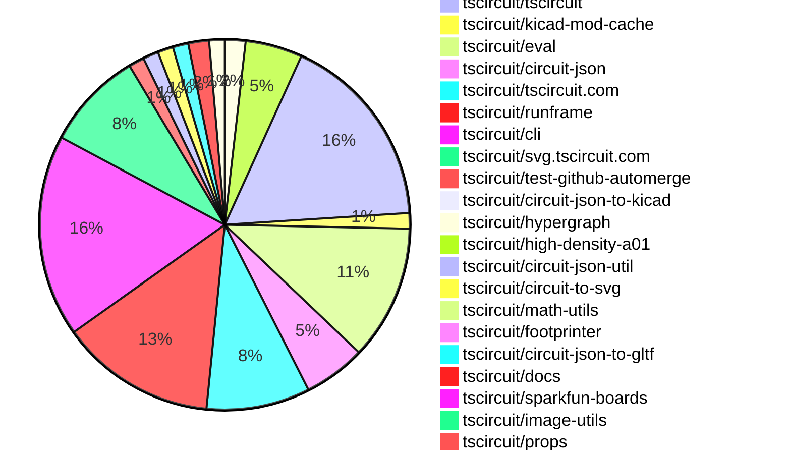

# Contribution Overview 2026-03-10

The current week is shown below. There are 3 major sections:

- [Contributor Overview](#contributor-overview)
- [PRs by Repository](#prs-by-repository)
- [PRs by Contributor](#changes-by-contributor)
- [Scoring & Sponsorship Details](/docs/sponsorship-calculation-explanation.md)

## PRs by Repository

## Contributor Overview

| Contributor | 🐳 Major | 🐙 Minor | 🐌 Tiny | Score | ⭐ | Discussion Contributions |
|-------------|---------|---------|---------|-------|-----|--------------------------|
| [ShiboSoftwareDev](#ShiboSoftwareDev) | 2 | 11 | 1 | 31 | ⭐⭐ | 0🔹 0🔶 0💎 |
| [seveibar](#seveibar) | 2 | 5 | 5 | 24 | ⭐⭐ | 0🔹 0🔶 0💎 |
| [MustafaMulla29](#MustafaMulla29) | 0 | 6 | 8 | 21 | ⭐⭐ | 0🔹 0🔶 0💎 |
| [techmannih](#techmannih) | 2 | 2 | 4 | 17 | ⭐⭐ | 0🔹 0🔶 0💎 |
| [tscircuitbot](#tscircuitbot) | 0 | 0 | 173 | 14.5 | ⭐⭐ | 0🔹 0🔶 0💎 |
| [imrishabh18](#imrishabh18) | 1 | 1 | 6 | 12.5 | ⭐⭐ | 0🔹 0🔶 0💎 |
| [Abse2001](#Abse2001) | 1 | 2 | 0 | 8 | ⭐ | 0🔹 0🔶 0💎 |
| [AnasSarkiz](#AnasSarkiz) | 0 | 2 | 1 | 5 | ⭐ | 0🔹 0🔶 0💎 |
| [0hmX](#0hmX) | 1 | 0 | 1 | 5 | ⭐ | 0🔹 0🔶 0💎 |
| [ArnavK-09](#ArnavK-09) | 0 | 0 | 1 | 1 |  | 0🔹 0🔶 0💎 |

> Note: AI evaluates PRs and assigns 1-3 star ratings automatically. 4 and 5 star ratings require manual staff review.

### Discussion Contribution Legend

- 🔹 Normal Comments: Basic participation with minimal effort
- 🔶 Great Informative Comments: Thoughtful participation that adds value
- 💎 Incredible Comments: Exceptional participation with high-quality content

## Review Table

[reviews-received-hover]: ## "Number of reviews received for PRs for this contributor"
[approvals-received-hover]: ## "Number of approvals received for PRs this contributor authored"
[rejections-received-hover]: ## "Number of rejections received for PRs this contributor authored"
[prs-opened-hover]: ## "Number of PRs opened by this contributor"
[issues-created-hover]: ## "Number of issues created by this contributor"

| Contributor | Reviews Received | Approvals Received | Rejections Received | Approvals | Rejections Given | PRs Opened | PRs Merged | Issues Created |
|---|---|---|---|---|---|---|---|---|
| [rushabhcodes](#rushabhcodes) | 5 | 0 | 2 | 1 | 0 | 3 | 0 | 0 |
| [seveibar](#seveibar) | 0 | 0 | 0 | 35 | 7 | 18 | 12 | 0 |
| [techmannih](#techmannih) | 12 | 7 | 4 | 1 | 0 | 12 | 8 | 0 |
| [tscircuitbot](#tscircuitbot) | 2 | 0 | 0 | 0 | 0 | 218 | 173 | 0 |
| [Nicolas-Rozas](#Nicolas-Rozas) | 2 | 1 | 0 | 0 | 0 | 4 | 0 | 0 |
| [MustafaMulla29](#MustafaMulla29) | 13 | 10 | 0 | 1 | 0 | 17 | 15 | 0 |
| [imrishabh18](#imrishabh18) | 3 | 1 | 0 | 4 | 0 | 10 | 8 | 0 |
| [CharlesWong](#CharlesWong) | 0 | 0 | 0 | 0 | 0 | 3 | 0 | 0 |
| [Abse2001](#Abse2001) | 4 | 3 | 0 | 0 | 0 | 3 | 3 | 0 |
| [ShiboSoftwareDev](#ShiboSoftwareDev) | 21 | 14 | 1 | 0 | 0 | 16 | 14 | 0 |
| [ChengPeng-1010](#ChengPeng-1010) | 0 | 0 | 0 | 0 | 0 | 3 | 0 | 0 |
| [AnasSarkiz](#AnasSarkiz) | 6 | 3 | 0 | 0 | 0 | 4 | 3 | 0 |
| [mfiumara](#mfiumara) | 0 | 0 | 0 | 0 | 0 | 1 | 0 | 0 |
| [songshanhua-eng](#songshanhua-eng) | 1 | 0 | 0 | 0 | 0 | 1 | 0 | 0 |
| [ZheYanyan](#ZheYanyan) | 1 | 0 | 0 | 0 | 0 | 2 | 0 | 0 |
| [ArnavK-09](#ArnavK-09) | 1 | 1 | 0 | 0 | 0 | 1 | 1 | 0 |
| [Excellencedev](#Excellencedev) | 1 | 0 | 0 | 0 | 0 | 2 | 0 | 0 |
| [0hmX](#0hmX) | 4 | 2 | 0 | 0 | 0 | 9 | 2 | 0 |

## Changes by Repository

### [tscircuit/pcb-viewer](https://github.com/tscircuit/pcb-viewer)

| PR # | Impact | Rating | Contributor | Description |
|------|--------|--------|-------------|-------------|
| [#692](https://github.com/tscircuit/pcb-viewer/pull/692) | 🐳 Major | ⭐⭐⭐ | techmannih | Updates the default state of the PCB viewer to hide position anchors by default, even in development mode. |

🐌 Tiny Contributions (1)

| PR # | Impact | Contributor | Description |
|------|--------|-------------|-------------|
| [#693](https://github.com/tscircuit/pcb-viewer/pull/693) | 🐌 Tiny | tscircuitbot | Automated package update |

### [tscircuit/kicad-component-converter](https://github.com/tscircuit/kicad-component-converter)

| PR # | Impact | Rating | Contributor | Description |
|------|--------|--------|-------------|-------------|
| [#192](https://github.com/tscircuit/kicad-component-converter/pull/192) | 🐳 Major | ⭐⭐⭐ | techmannih | Converts KiCad footprint courtyard layers into tscircuit pcb_courtyard_outline elements for accurate component boundary representation in circuit JSON and PCB renders. |
| [#194](https://github.com/tscircuit/kicad-component-converter/pull/194) | 🐙 Minor | ⭐⭐ | techmannih | Removes redundant conversion of .crtyd layers to pcb_courtyard_outline objects in the KiCad JSON to TSCircuit conversion process |
| [#193](https://github.com/tscircuit/kicad-component-converter/pull/193) | 🐙 Minor | ⭐⭐ | MustafaMulla29 | Converts KiCad F.CrtYdB.CrtYd layer elements to circuit-json courtyard types, including support for fp_rect parsing in the kicad-zod schema and adding SVG snapshot tests for various fixtures. |

🐌 Tiny Contributions (1)

| PR # | Impact | Contributor | Description |
|------|--------|-------------|-------------|
| [#191](https://github.com/tscircuit/kicad-component-converter/pull/191) | 🐌 Tiny | techmannih | Fixes handling of non-plated through holes in KiCad footprint conversion, ensuring correct representation of circular holes. |

### [tscircuit/core](https://github.com/tscircuit/core)

| PR # | Impact | Rating | Contributor | Description |
|------|--------|--------|-------------|-------------|
| [#2034](https://github.com/tscircuit/core/pull/2034) | 🐙 Minor | ⭐⭐ | techmannih | Replaces external network requests for KiCad footprints with local JSON fixtures in the test suite to ensure deterministic and faster tests without external dependencies. |
| [#2041](https://github.com/tscircuit/core/pull/2041) | 🐙 Minor | ⭐⭐ | ShiboSoftwareDev | Validates PCB coordinate calculations before placement and preserves edge property names in error messages. |
| [#2038](https://github.com/tscircuit/core/pull/2038) | 🐙 Minor | ⭐⭐ | ShiboSoftwareDev | Adds a warning when footprint primitives use component-relative calc(...) references in pcbXpcbY (e.g. R1.maxX), instead of silently falling back. |
| [#2033](https://github.com/tscircuit/core/pull/2033) | 🐙 Minor | ⭐⭐ | ShiboSoftwareDev | Adds pin specification design rule checks (DRC) to the board check pipeline, enhancing validation for pin specifications in circuit designs. |
| [#2032](https://github.com/tscircuit/core/pull/2032) | 🐙 Minor | ⭐⭐ | ShiboSoftwareDev | Fixes primitive PCB calc so expressions like pcbXcalc(R1.maxX  1mm) and pcbYcalc(R1.y) work for primitives outside footprints (e.g. via). |
| [#2031](https://github.com/tscircuit/core/pull/2031) | 🐙 Minor | ⭐⭐ | ShiboSoftwareDev | Adds PCB rendering support for currentsource and voltagesource when a footprint is provided, and enforces a clear error when explicit PCB placement props are used without a footprint. |
| [#2027](https://github.com/tscircuit/core/pull/2027) | 🐙 Minor | ⭐⭐ | ShiboSoftwareDev | Implements BoardI interface on MountedBoard so that calc(board.) expressions in pcbXpcbY resolve against the carrier boards bounds. |
| [#2042](https://github.com/tscircuit/core/pull/2042) | 🐙 Minor | ⭐⭐ | seveibar | Exports the getSimpleRouteJsonFromCircuitJson function for use in other modules. |
| [#2040](https://github.com/tscircuit/core/pull/2040) | 🐙 Minor | ⭐⭐ | seveibar | Enables the use of the AutoroutingPipelineSolver3_HgPortPointPathing when autorouterVersion is set to v3 in the autorouter options. |

🐌 Tiny Contributions (2)

| PR # | Impact | Contributor | Description |
|------|--------|-------------|-------------|
| [#2043](https://github.com/tscircuit/core/pull/2043) | 🐌 Tiny | MustafaMulla29 | Updates the footprinter dependency version from 0.0.316 to 0.0.321 in package.json |
| [#2035](https://github.com/tscircuit/core/pull/2035) | 🐌 Tiny | MustafaMulla29 | Updates the portHints property access in PlatedHole component and bumps the tscircuitprops dependency version from 0.0.490 to 0.0.494 |

### [tscircuit/tscircuit](https://github.com/tscircuit/tscircuit)

🐌 Tiny Contributions (38)

| PR # | Impact | Contributor | Description |
|------|--------|-------------|-------------|
| [#2541](https://github.com/tscircuit/tscircuit/pull/2541) | 🐌 Tiny | techmannih | Updates the kicad-to-circuit-json dependency to version 0.0.32 in package.json |
| [#2594](https://github.com/tscircuit/tscircuit/pull/2594) | 🐌 Tiny | tscircuitbot | Automated package update to version 0.0.1487 |
| [#2592](https://github.com/tscircuit/tscircuit/pull/2592) | 🐌 Tiny | tscircuitbot | Automated package update |
| [#2591](https://github.com/tscircuit/tscircuit/pull/2591) | 🐌 Tiny | tscircuitbot | Updates the tscircuitcli package from version 0.1.1091 to 0.1.1092 and the tscircuitrunframe package from version 0.0.1718 to 0.0.1719 in package.json |
| [#2590](https://github.com/tscircuit/tscircuit/pull/2590) | 🐌 Tiny | tscircuitbot | Automated package update |
| [#2589](https://github.com/tscircuit/tscircuit/pull/2589) | 🐌 Tiny | tscircuitbot | Updates the tscircuitcli and other related package versions in package.json |
| [#2588](https://github.com/tscircuit/tscircuit/pull/2588) | 🐌 Tiny | tscircuitbot | Automated package update to version 0.0.1484 |
| [#2587](https://github.com/tscircuit/tscircuit/pull/2587) | 🐌 Tiny | tscircuitbot | Automated package update |
| [#2586](https://github.com/tscircuit/tscircuit/pull/2586) | 🐌 Tiny | tscircuitbot | Automated package update |
| [#2585](https://github.com/tscircuit/tscircuit/pull/2585) | 🐌 Tiny | tscircuitbot | Automated package update |
| [#2584](https://github.com/tscircuit/tscircuit/pull/2584) | 🐌 Tiny | tscircuitbot | Automated package update |
| [#2583](https://github.com/tscircuit/tscircuit/pull/2583) | 🐌 Tiny | tscircuitbot | Automated package update |
| [#2582](https://github.com/tscircuit/tscircuit/pull/2582) | 🐌 Tiny | tscircuitbot | Automated package update |
| [#2581](https://github.com/tscircuit/tscircuit/pull/2581) | 🐌 Tiny | tscircuitbot | Updates the tscircuitcli package to version 0.1.1088 in package.json |
| [#2579](https://github.com/tscircuit/tscircuit/pull/2579) | 🐌 Tiny | tscircuitbot | Automated package update |
| [#2578](https://github.com/tscircuit/tscircuit/pull/2578) | 🐌 Tiny | tscircuitbot | Automated package update |
| [#2577](https://github.com/tscircuit/tscircuit/pull/2577) | 🐌 Tiny | tscircuitbot | Automated package update |
| [#2575](https://github.com/tscircuit/tscircuit/pull/2575) | 🐌 Tiny | tscircuitbot | Automated package update to version 0.0.1478 |
| [#2566](https://github.com/tscircuit/tscircuit/pull/2566) | 🐌 Tiny | tscircuitbot | Updates package versions for tscircuitchecks, tscircuitcli, tscircuitcore, tscircuiteval, and tscircuitrunframe in package.json |
| [#2559](https://github.com/tscircuit/tscircuit/pull/2559) | 🐌 Tiny | tscircuitbot | Updates the tscircuitcli package from version 0.1.1078 to 0.1.1079 and the tscircuitrunframe package from version 0.0.1711 to 0.0.1712 in package.json |
| [#2562](https://github.com/tscircuit/tscircuit/pull/2562) | 🐌 Tiny | tscircuitbot | Automated package update |
| [#2563](https://github.com/tscircuit/tscircuit/pull/2563) | 🐌 Tiny | tscircuitbot | Updates the tscircuitcli package version from 0.1.1080 to 0.1.1081 in package.json |
| [#2574](https://github.com/tscircuit/tscircuit/pull/2574) | 🐌 Tiny | tscircuitbot | Updates the tscircuitcli package from version 0.1.1084 to 0.1.1085 |
| [#2570](https://github.com/tscircuit/tscircuit/pull/2570) | 🐌 Tiny | tscircuitbot | Automated package update to version 0.0.1476 |
| [#2569](https://github.com/tscircuit/tscircuit/pull/2569) | 🐌 Tiny | tscircuitbot | Automated package update |
| [#2561](https://github.com/tscircuit/tscircuit/pull/2561) | 🐌 Tiny | tscircuitbot | Updates the tscircuitcli package to version 0.1.1080 in the package.json file. |
| [#2557](https://github.com/tscircuit/tscircuit/pull/2557) | 🐌 Tiny | tscircuitbot | Updates the tscircuitcli package from version 0.1.1077 to 0.1.1078 |
| [#2572](https://github.com/tscircuit/tscircuit/pull/2572) | 🐌 Tiny | tscircuitbot | Automated package update |
| [#2564](https://github.com/tscircuit/tscircuit/pull/2564) | 🐌 Tiny | tscircuitbot | Updates the package version from 0.0.1473 to 0.0.1474 in package.json |
| [#2560](https://github.com/tscircuit/tscircuit/pull/2560) | 🐌 Tiny | tscircuitbot | Automated package update |
| [#2542](https://github.com/tscircuit/tscircuit/pull/2542) | 🐌 Tiny | tscircuitbot | Updates the package version from 0.0.1468 to 0.0.1469 in package.json |
| [#2555](https://github.com/tscircuit/tscircuit/pull/2555) | 🐌 Tiny | tscircuitbot | Automated package update |
| [#2571](https://github.com/tscircuit/tscircuit/pull/2571) | 🐌 Tiny | tscircuitbot | Updates the tscircuitcli package from version 0.1.1083 to 0.1.1084 and the tscircuitrunframe package from version 0.0.1713 to 0.0.1714 in package.json |
| [#2567](https://github.com/tscircuit/tscircuit/pull/2567) | 🐌 Tiny | tscircuitbot | Automated package update |
| [#2558](https://github.com/tscircuit/tscircuit/pull/2558) | 🐌 Tiny | tscircuitbot | Automated package update to version 0.0.1471 |
| [#2556](https://github.com/tscircuit/tscircuit/pull/2556) | 🐌 Tiny | tscircuitbot | Automated package update |
| [#2593](https://github.com/tscircuit/tscircuit/pull/2593) | 🐌 Tiny | MustafaMulla29 | Updates the math-utils dependency from version 0.0.29 to 0.0.36 in package.json |
| [#2576](https://github.com/tscircuit/tscircuit/pull/2576) | 🐌 Tiny | imrishabh18 | Sets the fast mode as the default for the circuit-json-to-gltf package, updating its version in package.json. |

### [tscircuit/kicad-mod-cache](https://github.com/tscircuit/kicad-mod-cache)

🐌 Tiny Contributions (3)

| PR # | Impact | Contributor | Description |
|------|--------|-------------|-------------|
| [#17](https://github.com/tscircuit/kicad-mod-cache/pull/17) | 🐌 Tiny | techmannih | Updates the kicad-component-converter dependency from version 0.1.30 to 0.1.37 in package.json |
| [#20](https://github.com/tscircuit/kicad-mod-cache/pull/20) | 🐌 Tiny | MustafaMulla29 | Updates the kicad-component-converter dependency from version 0.1.38 to 0.1.40 in package.json |
| [#18](https://github.com/tscircuit/kicad-mod-cache/pull/18) | 🐌 Tiny | MustafaMulla29 | Updates the kicad-component-converter dependency to version 0.1.38 in package.json |

### [tscircuit/eval](https://github.com/tscircuit/eval)

🐌 Tiny Contributions (26)

| PR # | Impact | Contributor | Description |
|------|--------|-------------|-------------|
| [#2219](https://github.com/tscircuit/eval/pull/2219) | 🐌 Tiny | techmannih | Updates the kicad-to-circuit-json dependency to version 0.0.32 in package.json |
| [#2254](https://github.com/tscircuit/eval/pull/2254) | 🐌 Tiny | tscircuitbot | Automated package update |
| [#2253](https://github.com/tscircuit/eval/pull/2253) | 🐌 Tiny | tscircuitbot | Automated package update |
| [#2251](https://github.com/tscircuit/eval/pull/2251) | 🐌 Tiny | tscircuitbot | Automated package update |
| [#2249](https://github.com/tscircuit/eval/pull/2249) | 🐌 Tiny | tscircuitbot | Automated package update |
| [#2248](https://github.com/tscircuit/eval/pull/2248) | 🐌 Tiny | tscircuitbot | Updates the versions of several dependencies in the package.json file. |
| [#2246](https://github.com/tscircuit/eval/pull/2246) | 🐌 Tiny | tscircuitbot | Automated package update |
| [#2245](https://github.com/tscircuit/eval/pull/2245) | 🐌 Tiny | tscircuitbot | Automated package update |
| [#2241](https://github.com/tscircuit/eval/pull/2241) | 🐌 Tiny | tscircuitbot | Automated package update |
| [#2240](https://github.com/tscircuit/eval/pull/2240) | 🐌 Tiny | tscircuitbot | Updates package dependencies to their latest versions as part of routine maintenance. |
| [#2233](https://github.com/tscircuit/eval/pull/2233) | 🐌 Tiny | tscircuitbot | Automated package update |
| [#2230](https://github.com/tscircuit/eval/pull/2230) | 🐌 Tiny | tscircuitbot | Automated package update |
| [#2228](https://github.com/tscircuit/eval/pull/2228) | 🐌 Tiny | tscircuitbot | Updates the version of the tscircuitcore package from 0.0.1096 to 0.0.1097 in package.json |
| [#2225](https://github.com/tscircuit/eval/pull/2225) | 🐌 Tiny | tscircuitbot | Automated package update |
| [#2224](https://github.com/tscircuit/eval/pull/2224) | 🐌 Tiny | tscircuitbot | Updates the version of the tscircuitcore package from 0.0.1095 to 0.0.1096 in package.json |
| [#2222](https://github.com/tscircuit/eval/pull/2222) | 🐌 Tiny | tscircuitbot | Automated package update |
| [#2221](https://github.com/tscircuit/eval/pull/2221) | 🐌 Tiny | tscircuitbot | Automated package update |
| [#2239](https://github.com/tscircuit/eval/pull/2239) | 🐌 Tiny | tscircuitbot | Automated package update to version 0.0.702 |
| [#2238](https://github.com/tscircuit/eval/pull/2238) | 🐌 Tiny | tscircuitbot | Automated package update |
| [#2236](https://github.com/tscircuit/eval/pull/2236) | 🐌 Tiny | tscircuitbot | Automated package update |
| [#2235](https://github.com/tscircuit/eval/pull/2235) | 🐌 Tiny | tscircuitbot | Updates package dependencies to their latest versions |
| [#2229](https://github.com/tscircuit/eval/pull/2229) | 🐌 Tiny | tscircuitbot | Automated package update |
| [#2226](https://github.com/tscircuit/eval/pull/2226) | 🐌 Tiny | tscircuitbot | Automated package update |
| [#2232](https://github.com/tscircuit/eval/pull/2232) | 🐌 Tiny | tscircuitbot | Updates the version of the tscircuitcore package from 0.0.1097 to 0.0.1098 in package.json |
| [#2250](https://github.com/tscircuit/eval/pull/2250) | 🐌 Tiny | MustafaMulla29 | Updates the footprinter dependency version from 0.0.316 to 0.0.321 in package.json |
| [#2218](https://github.com/tscircuit/eval/pull/2218) | 🐌 Tiny | MustafaMulla29 | Fixes the test-loading-all-kicad-footprints script to correctly extract footprint keys from the updated kicad-autocomplete.ts format |

### [tscircuit/circuit-json](https://github.com/tscircuit/circuit-json)

| PR # | Impact | Rating | Contributor | Description |
|------|--------|--------|-------------|-------------|
| [#507](https://github.com/tscircuit/circuit-json/pull/507) | 🐳 Major | ⭐⭐⭐ | ShiboSoftwareDev | Adds copper pour metadata fields to pcb_trace.route points, allowing for better tracking of copper pour relationships in PCB designs. |
| [#511](https://github.com/tscircuit/circuit-json/pull/511) | 🐙 Minor | ⭐⭐ | MustafaMulla29 | Adds a new error type for detecting overlaps between PCB component courtyards, enhancing error handling in PCB design. |
| [#509](https://github.com/tscircuit/circuit-json/pull/509) | 🐙 Minor | ⭐⭐ | Abse2001 | Aligns the cad_components model_board_normal_direction field with the defined CAD model axis directions, enhancing consistency with CAD model conventions. |
| [#505](https://github.com/tscircuit/circuit-json/pull/505) | 🐙 Minor | ⭐⭐ | Abse2001 | Adds conventions for CAD model formats and their default orientations for board normal alignment. |
| [#501](https://github.com/tscircuit/circuit-json/pull/501) | 🐙 Minor | ⭐⭐ | ShiboSoftwareDev | Adds new warning types for circuit elements when no power, no ground, or underspecified pins are defined. |
| [#503](https://github.com/tscircuit/circuit-json/pull/503) | 🐙 Minor | ⭐⭐ | ShiboSoftwareDev | Adds a new error type for invalid component properties in circuit JSON, enhancing error handling for source components. |

🐌 Tiny Contributions (6)

| PR # | Impact | Contributor | Description |
|------|--------|-------------|-------------|
| [#512](https://github.com/tscircuit/circuit-json/pull/512) | 🐌 Tiny | tscircuitbot | Automated package update |
| [#510](https://github.com/tscircuit/circuit-json/pull/510) | 🐌 Tiny | tscircuitbot | Automated package update |
| [#508](https://github.com/tscircuit/circuit-json/pull/508) | 🐌 Tiny | tscircuitbot | Automated package update |
| [#504](https://github.com/tscircuit/circuit-json/pull/504) | 🐌 Tiny | tscircuitbot | Automated package update |
| [#506](https://github.com/tscircuit/circuit-json/pull/506) | 🐌 Tiny | tscircuitbot | Automated package update |
| [#502](https://github.com/tscircuit/circuit-json/pull/502) | 🐌 Tiny | tscircuitbot | Automated package update |

### [tscircuit/tscircuit.com](https://github.com/tscircuit/tscircuit.com)

🐌 Tiny Contributions (20)

| PR # | Impact | Contributor | Description |
|------|--------|-------------|-------------|
| [#2986](https://github.com/tscircuit/tscircuit.com/pull/2986) | 🐌 Tiny | tscircuitbot | Updates the tscircuitrunframe package to version 0.0.1719 in package.json |
| [#2985](https://github.com/tscircuit/tscircuit.com/pull/2985) | 🐌 Tiny | tscircuitbot | Updates the tscircuitrunframe package from version 0.0.1717 to 0.0.1718 |
| [#2984](https://github.com/tscircuit/tscircuit.com/pull/2984) | 🐌 Tiny | tscircuitbot | Updates the tscircuiteval package from version 0.0.705 to 0.0.706 |
| [#2983](https://github.com/tscircuit/tscircuit.com/pull/2983) | 🐌 Tiny | tscircuitbot | Updates the tscircuitrunframe package from version 0.0.1716 to 0.0.1717 |
| [#2982](https://github.com/tscircuit/tscircuit.com/pull/2982) | 🐌 Tiny | tscircuitbot | Updates the tscircuiteval package from version 0.0.703 to 0.0.705 |
| [#2981](https://github.com/tscircuit/tscircuit.com/pull/2981) | 🐌 Tiny | tscircuitbot | Updates the tscircuitrunframe package from version 0.0.1715 to 0.0.1716 |
| [#2978](https://github.com/tscircuit/tscircuit.com/pull/2978) | 🐌 Tiny | tscircuitbot | Automated package update for tscircuitrunframe from version 0.0.1714 to 0.0.1715 |
| [#2977](https://github.com/tscircuit/tscircuit.com/pull/2977) | 🐌 Tiny | tscircuitbot | Updates the tscircuiteval package from version 0.0.701 to 0.0.703 in the package.json file. |
| [#2976](https://github.com/tscircuit/tscircuit.com/pull/2976) | 🐌 Tiny | tscircuitbot | Updates the tscircuitrunframe package from version 0.0.1713 to 0.0.1714 |
| [#2966](https://github.com/tscircuit/tscircuit.com/pull/2966) | 🐌 Tiny | tscircuitbot | Automated package update |
| [#2965](https://github.com/tscircuit/tscircuit.com/pull/2965) | 🐌 Tiny | tscircuitbot | Updates the tscircuitrunframe package from version 0.0.1706 to 0.0.1708 |
| [#2961](https://github.com/tscircuit/tscircuit.com/pull/2961) | 🐌 Tiny | tscircuitbot | Updates the tscircuitrunframe package from version 0.0.1704 to 0.0.1706 |
| [#2972](https://github.com/tscircuit/tscircuit.com/pull/2972) | 🐌 Tiny | tscircuitbot | Updates the tscircuitrunframe package from version 0.0.1711 to 0.0.1712 |
| [#2974](https://github.com/tscircuit/tscircuit.com/pull/2974) | 🐌 Tiny | tscircuitbot | Updates the tscircuitrunframe package from version 0.0.1712 to 0.0.1713 |
| [#2970](https://github.com/tscircuit/tscircuit.com/pull/2970) | 🐌 Tiny | tscircuitbot | Updates the tscircuiteval package from version 0.0.698 to 0.0.700 |
| [#2964](https://github.com/tscircuit/tscircuit.com/pull/2964) | 🐌 Tiny | tscircuitbot | Automated package update |
| [#2958](https://github.com/tscircuit/tscircuit.com/pull/2958) | 🐌 Tiny | tscircuitbot | Automated package update |
| [#2973](https://github.com/tscircuit/tscircuit.com/pull/2973) | 🐌 Tiny | tscircuitbot | Updates the tscircuiteval package version from 0.0.700 to 0.0.701 in package.json |
| [#2971](https://github.com/tscircuit/tscircuit.com/pull/2971) | 🐌 Tiny | tscircuitbot | Updates the tscircuitrunframe package version from 0.0.1708 to 0.0.1711 in package.json |
| [#2960](https://github.com/tscircuit/tscircuit.com/pull/2960) | 🐌 Tiny | tscircuitbot | Automated package update |

### [tscircuit/runframe](https://github.com/tscircuit/runframe)

🐌 Tiny Contributions (30)

| PR # | Impact | Contributor | Description |
|------|--------|-------------|-------------|
| [#2888](https://github.com/tscircuit/runframe/pull/2888) | 🐌 Tiny | tscircuitbot | Automated package update |
| [#2887](https://github.com/tscircuit/runframe/pull/2887) | 🐌 Tiny | tscircuitbot | Updates the tscircuiteval package from version 0.0.706 to 0.0.707 in the package.json file. |
| [#2886](https://github.com/tscircuit/runframe/pull/2886) | 🐌 Tiny | tscircuitbot | Automated package update |
| [#2885](https://github.com/tscircuit/runframe/pull/2885) | 🐌 Tiny | tscircuitbot | Updates the tscircuiteval package from version 0.0.705 to 0.0.706 in the package.json file. |
| [#2884](https://github.com/tscircuit/runframe/pull/2884) | 🐌 Tiny | tscircuitbot | Automated package update |
| [#2883](https://github.com/tscircuit/runframe/pull/2883) | 🐌 Tiny | tscircuitbot | Updates the tscircuiteval package from version 0.0.704 to 0.0.705 in the package.json file. |
| [#2882](https://github.com/tscircuit/runframe/pull/2882) | 🐌 Tiny | tscircuitbot | Automated package update |
| [#2881](https://github.com/tscircuit/runframe/pull/2881) | 🐌 Tiny | tscircuitbot | Updates the tscircuiteval package from version 0.0.703 to 0.0.704 |
| [#2879](https://github.com/tscircuit/runframe/pull/2879) | 🐌 Tiny | tscircuitbot | Automated package update |
| [#2878](https://github.com/tscircuit/runframe/pull/2878) | 🐌 Tiny | tscircuitbot | Updates the tscircuiteval package from version 0.0.702 to 0.0.703 in the package.json file. |
| [#2872](https://github.com/tscircuit/runframe/pull/2872) | 🐌 Tiny | tscircuitbot | Updates the circuit-json-to-kicad package from version 0.0.83 to 0.0.84 |
| [#2865](https://github.com/tscircuit/runframe/pull/2865) | 🐌 Tiny | tscircuitbot | Updates the tscircuiteval package from version 0.0.697 to 0.0.698 in the package.json file. |
| [#2877](https://github.com/tscircuit/runframe/pull/2877) | 🐌 Tiny | tscircuitbot | Automated package update |
| [#2860](https://github.com/tscircuit/runframe/pull/2860) | 🐌 Tiny | tscircuitbot | Updates the package version from v0.0.1704 to v0.0.1706 in package.json |
| [#2866](https://github.com/tscircuit/runframe/pull/2866) | 🐌 Tiny | tscircuitbot | Automated package update |
| [#2859](https://github.com/tscircuit/runframe/pull/2859) | 🐌 Tiny | tscircuitbot | Automated package update for the tscircuiteval dependency in package.json |
| [#2875](https://github.com/tscircuit/runframe/pull/2875) | 🐌 Tiny | tscircuitbot | Automated package update |
| [#2861](https://github.com/tscircuit/runframe/pull/2861) | 🐌 Tiny | tscircuitbot | Updates the tscircuiteval package to version 0.0.696 in the package.json file. |
| [#2857](https://github.com/tscircuit/runframe/pull/2857) | 🐌 Tiny | tscircuitbot | Automated package update |
| [#2862](https://github.com/tscircuit/runframe/pull/2862) | 🐌 Tiny | tscircuitbot | Automated package update |
| [#2864](https://github.com/tscircuit/runframe/pull/2864) | 🐌 Tiny | tscircuitbot | Automated package update |
| [#2867](https://github.com/tscircuit/runframe/pull/2867) | 🐌 Tiny | tscircuitbot | Updates the tscircuiteval package from version 0.0.698 to 0.0.699 in the package.json file. |
| [#2874](https://github.com/tscircuit/runframe/pull/2874) | 🐌 Tiny | tscircuitbot | Updates the tscircuiteval package to version 0.0.701 in the package.json file. |
| [#2863](https://github.com/tscircuit/runframe/pull/2863) | 🐌 Tiny | tscircuitbot | Updates the tscircuiteval package from version 0.0.696 to 0.0.697 |
| [#2856](https://github.com/tscircuit/runframe/pull/2856) | 🐌 Tiny | tscircuitbot | Updates the tscircuitpcb-viewer package to version 1.11.348 |
| [#2876](https://github.com/tscircuit/runframe/pull/2876) | 🐌 Tiny | tscircuitbot | Updates the tscircuiteval package to version 0.0.702 in the package.json file. |
| [#2870](https://github.com/tscircuit/runframe/pull/2870) | 🐌 Tiny | tscircuitbot | Automated package update |
| [#2869](https://github.com/tscircuit/runframe/pull/2869) | 🐌 Tiny | tscircuitbot | Updates the tscircuiteval package from version 0.0.699 to 0.0.700 in the package.json file. |
| [#2873](https://github.com/tscircuit/runframe/pull/2873) | 🐌 Tiny | tscircuitbot | Automated package update |
| [#2855](https://github.com/tscircuit/runframe/pull/2855) | 🐌 Tiny | ArnavK-09 | !Video Project 2(https:github.comuser-attachmentsassetsc156efe1-8c0a-4105-8942-db967bb29563) |

### [tscircuit/cli](https://github.com/tscircuit/cli)

| PR # | Impact | Rating | Contributor | Description |
|------|--------|--------|-------------|-------------|
| [#2334](https://github.com/tscircuit/cli/pull/2334) | 🐳 Major | ⭐⭐⭐ | seveibar | Add a --compress flag to the tsci push command to allow users to upload a single compressed archive of the project instead of individual files, improving push performance. |
| [#2340](https://github.com/tscircuit/cli/pull/2340) | 🐙 Minor | ⭐⭐ | imrishabh18 | Adds support for exporting circuit data in the SRJ format, allowing users to generate simple route JSON files from circuit JSON inputs. |
| [#2363](https://github.com/tscircuit/cli/pull/2363) | 🐙 Minor | ⭐⭐ | seveibar | Add a new tsci registry packages update subcommand that allows users to toggle a packages public distribution state via the CLI by posting to the packagesupdate endpoint with the specified package name and distribution state. |
| [#2349](https://github.com/tscircuit/cli/pull/2349) | 🐙 Minor | ⭐⭐ | seveibar | Add a new tsci registry command group and packages subgroup with tsci registry packages create implemented to allow creating packages in the tscircuit registry from the CLI, supporting organization-scoped naming and visibility semantics. |

🐌 Tiny Contributions (35)

| PR # | Impact | Contributor | Description |
|------|--------|-------------|-------------|
| [#2371](https://github.com/tscircuit/cli/pull/2371) | 🐌 Tiny | tscircuitbot | Automated package update |
| [#2370](https://github.com/tscircuit/cli/pull/2370) | 🐌 Tiny | tscircuitbot | Updates the tscircuitrunframe package from version 0.0.1718 to 0.0.1719 |
| [#2368](https://github.com/tscircuit/cli/pull/2368) | 🐌 Tiny | tscircuitbot | Updates the tscircuitrunframe package to version 0.0.1718 |
| [#2367](https://github.com/tscircuit/cli/pull/2367) | 🐌 Tiny | tscircuitbot | Automated package update |
| [#2366](https://github.com/tscircuit/cli/pull/2366) | 🐌 Tiny | tscircuitbot | Updates the tscircuitrunframe package from version 0.0.1716 to 0.0.1717 |
| [#2365](https://github.com/tscircuit/cli/pull/2365) | 🐌 Tiny | tscircuitbot | Automated package update |
| [#2364](https://github.com/tscircuit/cli/pull/2364) | 🐌 Tiny | tscircuitbot | Updates the tscircuitrunframe package from version 0.0.1715 to 0.0.1716 |
| [#2361](https://github.com/tscircuit/cli/pull/2361) | 🐌 Tiny | tscircuitbot | Automated package update |
| [#2360](https://github.com/tscircuit/cli/pull/2360) | 🐌 Tiny | tscircuitbot | Automated README update with latest CLI usage output. |
| [#2357](https://github.com/tscircuit/cli/pull/2357) | 🐌 Tiny | tscircuitbot | Updates the tscircuitrunframe package from version 0.0.1714 to 0.0.1715 |
| [#2327](https://github.com/tscircuit/cli/pull/2327) | 🐌 Tiny | tscircuitbot | Updates the tscircuitrunframe package from version 0.0.1705 to 0.0.1707 |
| [#2330](https://github.com/tscircuit/cli/pull/2330) | 🐌 Tiny | tscircuitbot | Updates the tscircuitrunframe package from version 0.0.1707 to 0.0.1708 |
| [#2354](https://github.com/tscircuit/cli/pull/2354) | 🐌 Tiny | tscircuitbot | Automated README update with latest CLI usage output. |
| [#2339](https://github.com/tscircuit/cli/pull/2339) | 🐌 Tiny | tscircuitbot | Automated package update |
| [#2331](https://github.com/tscircuit/cli/pull/2331) | 🐌 Tiny | tscircuitbot | Automated package update |
| [#2343](https://github.com/tscircuit/cli/pull/2343) | 🐌 Tiny | tscircuitbot | Automated README update with latest CLI usage output. |
| [#2344](https://github.com/tscircuit/cli/pull/2344) | 🐌 Tiny | tscircuitbot | Automated package update |
| [#2332](https://github.com/tscircuit/cli/pull/2332) | 🐌 Tiny | tscircuitbot | Updates the tscircuitrunframe package from version 0.0.1708 to 0.0.1709 |
| [#2337](https://github.com/tscircuit/cli/pull/2337) | 🐌 Tiny | tscircuitbot | Automated package update |
| [#2342](https://github.com/tscircuit/cli/pull/2342) | 🐌 Tiny | tscircuitbot | Automated package update |
| [#2341](https://github.com/tscircuit/cli/pull/2341) | 🐌 Tiny | tscircuitbot | Updates the tscircuitrunframe package from version 0.0.1711 to 0.0.1712 |
| [#2325](https://github.com/tscircuit/cli/pull/2325) | 🐌 Tiny | tscircuitbot | Updates the tscircuitrunframe package from version 0.0.1704 to 0.0.1705 |
| [#2338](https://github.com/tscircuit/cli/pull/2338) | 🐌 Tiny | tscircuitbot | Updates the tscircuitrunframe package from version 0.0.1710 to 0.0.1711 |
| [#2347](https://github.com/tscircuit/cli/pull/2347) | 🐌 Tiny | tscircuitbot | Updates the tscircuitrunframe package from version 0.0.1712 to 0.0.1713 |
| [#2323](https://github.com/tscircuit/cli/pull/2323) | 🐌 Tiny | tscircuitbot | Updates the tscircuitrunframe package from version 0.0.1703 to 0.0.1704 |
| [#2355](https://github.com/tscircuit/cli/pull/2355) | 🐌 Tiny | tscircuitbot | Automated package update |
| [#2346](https://github.com/tscircuit/cli/pull/2346) | 🐌 Tiny | tscircuitbot | Automated package update |
| [#2335](https://github.com/tscircuit/cli/pull/2335) | 🐌 Tiny | tscircuitbot | Automated package update |
| [#2348](https://github.com/tscircuit/cli/pull/2348) | 🐌 Tiny | tscircuitbot | Automated package update |
| [#2333](https://github.com/tscircuit/cli/pull/2333) | 🐌 Tiny | tscircuitbot | Automated package update |
| [#2352](https://github.com/tscircuit/cli/pull/2352) | 🐌 Tiny | tscircuitbot | Updates the tscircuitrunframe package from version 0.0.1713 to 0.0.1714 |
| [#2336](https://github.com/tscircuit/cli/pull/2336) | 🐌 Tiny | tscircuitbot | Updates the tscircuitrunframe package from version 0.0.1709 to 0.0.1710 |
| [#2328](https://github.com/tscircuit/cli/pull/2328) | 🐌 Tiny | tscircuitbot | Automated package update |
| [#2324](https://github.com/tscircuit/cli/pull/2324) | 🐌 Tiny | tscircuitbot | Automated package update |
| [#2359](https://github.com/tscircuit/cli/pull/2359) | 🐌 Tiny | imrishabh18 | Updates the tscircuit dependency version to 0.0.1479-libonly in package.json |

### [tscircuit/svg.tscircuit.com](https://github.com/tscircuit/svg.tscircuit.com)

🐌 Tiny Contributions (19)

| PR # | Impact | Contributor | Description |
|------|--------|-------------|-------------|
| [#1175](https://github.com/tscircuit/svg.tscircuit.com/pull/1175) | 🐌 Tiny | tscircuitbot | Updates the tscircuit package version from 0.0.1486 to 0.0.1487 in package.json |
| [#1174](https://github.com/tscircuit/svg.tscircuit.com/pull/1174) | 🐌 Tiny | tscircuitbot | Updates the tscircuit package version from 0.0.1485 to 0.0.1486 in package.json |
| [#1173](https://github.com/tscircuit/svg.tscircuit.com/pull/1173) | 🐌 Tiny | tscircuitbot | Updates the tscircuit package version from 0.0.1484 to 0.0.1485 in package.json |
| [#1172](https://github.com/tscircuit/svg.tscircuit.com/pull/1172) | 🐌 Tiny | tscircuitbot | Updates the tscircuit package version from 0.0.1483 to 0.0.1484 in package.json |
| [#1171](https://github.com/tscircuit/svg.tscircuit.com/pull/1171) | 🐌 Tiny | tscircuitbot | Updates the tscircuit package version from 0.0.1482 to 0.0.1483 in package.json |
| [#1170](https://github.com/tscircuit/svg.tscircuit.com/pull/1170) | 🐌 Tiny | tscircuitbot | Updates the tscircuit package version from 0.0.1481 to 0.0.1482 in package.json |
| [#1169](https://github.com/tscircuit/svg.tscircuit.com/pull/1169) | 🐌 Tiny | tscircuitbot | Updates the tscircuit package version from 0.0.1480 to 0.0.1481 in package.json |
| [#1168](https://github.com/tscircuit/svg.tscircuit.com/pull/1168) | 🐌 Tiny | tscircuitbot | Updates the tscircuit package version from 0.0.1479 to 0.0.1480 in package.json |
| [#1167](https://github.com/tscircuit/svg.tscircuit.com/pull/1167) | 🐌 Tiny | tscircuitbot | Updates the tscircuit package version from 0.0.1478 to 0.0.1479 in package.json |
| [#1163](https://github.com/tscircuit/svg.tscircuit.com/pull/1163) | 🐌 Tiny | tscircuitbot | Updates the tscircuit package version from 0.0.1474 to 0.0.1475 in package.json |
| [#1165](https://github.com/tscircuit/svg.tscircuit.com/pull/1165) | 🐌 Tiny | tscircuitbot | Updates the tscircuit package version from 0.0.1476 to 0.0.1477 in package.json |
| [#1160](https://github.com/tscircuit/svg.tscircuit.com/pull/1160) | 🐌 Tiny | tscircuitbot | Updates the tscircuit package version from 0.0.1471 to 0.0.1472 in package.json |
| [#1164](https://github.com/tscircuit/svg.tscircuit.com/pull/1164) | 🐌 Tiny | tscircuitbot | Updates the tscircuit package version from 0.0.1475 to 0.0.1476 in package.json |
| [#1159](https://github.com/tscircuit/svg.tscircuit.com/pull/1159) | 🐌 Tiny | tscircuitbot | Updates the tscircuit package version from 0.0.1470 to 0.0.1471 in package.json |
| [#1161](https://github.com/tscircuit/svg.tscircuit.com/pull/1161) | 🐌 Tiny | tscircuitbot | Updates the tscircuit package version from 0.0.1472 to 0.0.1473 in package.json |
| [#1162](https://github.com/tscircuit/svg.tscircuit.com/pull/1162) | 🐌 Tiny | tscircuitbot | Updates the tscircuit package version from 0.0.1473 to 0.0.1474 in package.json |
| [#1158](https://github.com/tscircuit/svg.tscircuit.com/pull/1158) | 🐌 Tiny | tscircuitbot | Updates the tscircuit package version from 0.0.1469 to 0.0.1470 in package.json |
| [#1157](https://github.com/tscircuit/svg.tscircuit.com/pull/1157) | 🐌 Tiny | tscircuitbot | Updates the tscircuit package version from 0.0.1468 to 0.0.1469 in package.json |
| [#1166](https://github.com/tscircuit/svg.tscircuit.com/pull/1166) | 🐌 Tiny | tscircuitbot | Updates the tscircuit package version from 0.0.1477 to 0.0.1478 in package.json |

### [tscircuit/test-github-automerge](https://github.com/tscircuit/test-github-automerge)

🐌 Tiny Contributions (3)

| PR # | Impact | Contributor | Description |
|------|--------|-------------|-------------|
| [#36](https://github.com/tscircuit/test-github-automerge/pull/36) | 🐌 Tiny | tscircuitbot | Updates the tscircuitcircuit-json-util package from version 0.0.89 to 0.0.90 |
| [#34](https://github.com/tscircuit/test-github-automerge/pull/34) | 🐌 Tiny | tscircuitbot | Updates the tscircuitcircuit-json-util package from version 0.0.88 to 0.0.89 in the development dependencies. |
| [#33](https://github.com/tscircuit/test-github-automerge/pull/33) | 🐌 Tiny | tscircuitbot | Automated package update |

### [tscircuit/circuit-json-to-kicad](https://github.com/tscircuit/circuit-json-to-kicad)

🐌 Tiny Contributions (2)

| PR # | Impact | Contributor | Description |
|------|--------|-------------|-------------|
| [#160](https://github.com/tscircuit/circuit-json-to-kicad/pull/160) | 🐌 Tiny | tscircuitbot | Automated package update |
| [#159](https://github.com/tscircuit/circuit-json-to-kicad/pull/159) | 🐌 Tiny | imrishabh18 | Updates the tscircuit version to 0.0.1471 and removes dependencies that are now included in tscircuit. |

### [tscircuit/hypergraph](https://github.com/tscircuit/hypergraph)

| PR # | Impact | Rating | Contributor | Description |
|------|--------|--------|-------------|-------------|
| [#130](https://github.com/tscircuit/hypergraph/pull/130) | 🐳 Major | ⭐⭐⭐ | seveibar | Adds a new type SerializedSolvedRoute for route serialization, enhancing the data structure for serialized hypergraphs. |

🐌 Tiny Contributions (1)

| PR # | Impact | Contributor | Description |
|------|--------|-------------|-------------|
| [#131](https://github.com/tscircuit/hypergraph/pull/131) | 🐌 Tiny | tscircuitbot | Automated package update |

### [tscircuit/high-density-a01](https://github.com/tscircuit/high-density-a01)

🐌 Tiny Contributions (2)

| PR # | Impact | Contributor | Description |
|------|--------|-------------|-------------|
| [#23](https://github.com/tscircuit/high-density-a01/pull/23) | 🐌 Tiny | tscircuitbot | Automated package update |
| [#22](https://github.com/tscircuit/high-density-a01/pull/22) | 🐌 Tiny | seveibar | Adds a new fixture and test for a large node in the HighDensitySolverA01, including a JSON representation of the node and its port points. |

### [tscircuit/circuit-json-util](https://github.com/tscircuit/circuit-json-util)

| PR # | Impact | Rating | Contributor | Description |
|------|--------|--------|-------------|-------------|
| [#90](https://github.com/tscircuit/circuit-json-util/pull/90) | 🐙 Minor | ⭐⭐ | MustafaMulla29 | Adds support for courtyard elements in the getBoundsOfPcbElements function, allowing for accurate bounding box calculations for pcb_courtyard_outline and pcb_courtyard_polygon types. |
| [#89](https://github.com/tscircuit/circuit-json-util/pull/89) | 🐙 Minor | ⭐⭐ | MustafaMulla29 | Adds support for courtyard elements (rectangles, circles, outlines, and polygons) in the transformPCBElement function, allowing for proper transformation of these elements in PCB designs. |
| [#88](https://github.com/tscircuit/circuit-json-util/pull/88) | 🐙 Minor | ⭐⭐ | ShiboSoftwareDev | Adds a new category pin_specification to categorize DRC errorwarning types related to pin specifications in the circuit JSON utility. |

### [tscircuit/circuit-to-svg](https://github.com/tscircuit/circuit-to-svg)

| PR # | Impact | Rating | Contributor | Description |
|------|--------|--------|-------------|-------------|
| [#523](https://github.com/tscircuit/circuit-to-svg/pull/523) | 🐳 Major | ⭐⭐⭐ | ShiboSoftwareDev | This pull request modifies the behavior of the SVG generation process to exclude traces that are completely inside copper pours. This change is intended to improve the visual clarity of the generated SVGs by not displaying traces that are not visible due to being covered by copper pours. |
| [#522](https://github.com/tscircuit/circuit-to-svg/pull/522) | 🐙 Minor | ⭐⭐ | MustafaMulla29 | Adds functionality to render a visual error indication for PCB courtyard overlap errors in the SVG output. |
| [#524](https://github.com/tscircuit/circuit-to-svg/pull/524) | 🐙 Minor | ⭐⭐ | AnasSarkiz | Adds a render-time toggle for PCB note visibility in convertCircuitJsonToPcbSvg, defaulting to true for backward compatibility, with updated tests and documentation. |

### [tscircuit/math-utils](https://github.com/tscircuit/math-utils)

| PR # | Impact | Rating | Contributor | Description |
|------|--------|--------|-------------|-------------|
| [#34](https://github.com/tscircuit/math-utils/pull/34) | 🐙 Minor | ⭐⭐ | MustafaMulla29 | Fixes isPointOnSegment returning incorrect result for zero-length segments, preventing incorrect point-in-polygon calculations. |

### [tscircuit/footprinter](https://github.com/tscircuit/footprinter)

🐌 Tiny Contributions (1)

| PR # | Impact | Contributor | Description |
|------|--------|-------------|-------------|
| [#523](https://github.com/tscircuit/footprinter/pull/523) | 🐌 Tiny | MustafaMulla29 | Adds courtyard generation for passive footprints to ensure proper enclosure of body, pads, and silkscreen outline. |

### [tscircuit/circuit-json-to-gltf](https://github.com/tscircuit/circuit-json-to-gltf)

| PR # | Impact | Rating | Contributor | Description |
|------|--------|--------|-------------|-------------|
| [#134](https://github.com/tscircuit/circuit-json-to-gltf/pull/134) | 🐳 Major | ⭐⭐⭐ | imrishabh18 | Default mode (High) img width2214 height1444 altimage srchttps:github.comuser-attachmentsassetscf3c1d03-20f0-4ab4-9141-2adfe543d339   New mode (Fast) img width1788 height1380 altimage srchttps:github.comuser-attachmentsassetsee75b150-6409-4c5e-8436-cc5b65650df8 |
| [#137](https://github.com/tscircuit/circuit-json-to-gltf/pull/137) | 🐳 Major | ⭐⭐⭐ | Abse2001 | Refactors the CAD model placement pipeline to include orientation, origin alignment, and fit controls for improved model positioning. |
| [#138](https://github.com/tscircuit/circuit-json-to-gltf/pull/138) | 🐙 Minor | ⭐⭐ | AnasSarkiz | Adds end-to-end showPcbNotes propagation across the GLTF conversion and board-texture pipeline so note rendering is explicit and predictable. |

### [tscircuit/docs](https://github.com/tscircuit/docs)

🐌 Tiny Contributions (4)

| PR # | Impact | Contributor | Description |
|------|--------|-------------|-------------|
| [#506](https://github.com/tscircuit/docs/pull/506) | 🐌 Tiny | imrishabh18 | Removes the mention of autoupdate for the circuit-json-to-gltf package in Runframe documentation as it is not a dependency in the package.json. |
| [#503](https://github.com/tscircuit/docs/pull/503) | 🐌 Tiny | seveibar | Documents the new --compress option for tsci push to inform users about reducing upload size for large projects or slow connections. |
| [#501](https://github.com/tscircuit/docs/pull/501) | 🐌 Tiny | seveibar | Clarifies how pcbXpcbY coordinates are interpreted when positioning components by non-center points such as pins or footprint edges, and provides examples for anchoring placement to a pin or footprint boundaries. |
| [#504](https://github.com/tscircuit/docs/pull/504) | 🐌 Tiny | AnasSarkiz | This PR updates the tsci build docs to reflect the current output structure and image generation behavior, clarifying the output directory structure and documenting image generation flags. |

### [tscircuit/sparkfun-boards](https://github.com/tscircuit/sparkfun-boards)

🐌 Tiny Contributions (1)

| PR # | Impact | Contributor | Description |
|------|--------|-------------|-------------|
| [#270](https://github.com/tscircuit/sparkfun-boards/pull/270) | 🐌 Tiny | imrishabh18 | This pull request updates the version of tscircuit and includes updates to the snapshots, reflecting changes in the routing of some circuits while noting that some circuits have failed to route correctly. |

### [tscircuit/image-utils](https://github.com/tscircuit/image-utils)

🐌 Tiny Contributions (1)

| PR # | Impact | Contributor | Description |
|------|--------|-------------|-------------|
| [#1](https://github.com/tscircuit/image-utils/pull/1) | 🐌 Tiny | imrishabh18 | Adds GitHub workflows for publishing, testing, and type checking, along with initial project configuration files. |

### [tscircuit/props](https://github.com/tscircuit/props)

| PR # | Impact | Rating | Contributor | Description |
|------|--------|--------|-------------|-------------|
| [#615](https://github.com/tscircuit/props/pull/615) | 🐙 Minor | ⭐⭐ | ShiboSoftwareDev | Adds a new configuration option pinSpecificationDrcChecksDisabled to the PlatformConfig interface, allowing users to disable DRC checks for pin specifications. |
| [#616](https://github.com/tscircuit/props/pull/616) | 🐙 Minor | ⭐⭐ | seveibar | Adds v3 as a valid option for autorouterVersion in SubcircuitGroupProps, updating TypeScript types and Zod validation accordingly. |

### [tscircuit/checks](https://github.com/tscircuit/checks)

| PR # | Impact | Rating | Contributor | Description |
|------|--------|--------|-------------|-------------|
| [#116](https://github.com/tscircuit/checks/pull/116) | 🐙 Minor | ⭐⭐ | ShiboSoftwareDev | Adds checks to ensure that each chip has at least one pin marked as requires_powertrue, returning warnings for chips without such pins. |

🐌 Tiny Contributions (1)

| PR # | Impact | Contributor | Description |
|------|--------|-------------|-------------|
| [#118](https://github.com/tscircuit/checks/pull/118) | 🐌 Tiny | ShiboSoftwareDev | Refactors the import of SourcePinAttributes to be type-only and defines local constants for pin attribute keys instead of using the imported shape directly. |

### [tscircuit/tscircuit-autorouter](https://github.com/tscircuit/tscircuit-autorouter)

🐌 Tiny Contributions (3)

| PR # | Impact | Contributor | Description |
|------|--------|-------------|-------------|
| [#647](https://github.com/tscircuit/tscircuit-autorouter/pull/647) | 🐌 Tiny | seveibar | Pins the version of the high-density-dataset-z04 dependency to a specific commit for stability. |
| [#646](https://github.com/tscircuit/tscircuit-autorouter/pull/646) | 🐌 Tiny | seveibar | Motivation Provide a concrete autorouting bug report and a visual fixture to reproduce and debug an edge-case routing failure for the Arduino Uno layout.  Description Add fixturesbug-reportsbugreport46-ac4337bugreport46-ac4337-arduino-uno.json containing the simple_route_json for the bug report payload. Add fixturesbug-reportsbugreport46-ac4337bugreport46-ac4337-arduino-uno.fixture.tsx that renders AutoroutingPipelineDebugger srjbugReportJson.simple_route_json  (with  ts-nocheck). Add testsbugsbugreport46-ac4337-arduino-uno.test.ts which imports the fixture JSON and constructs an AutoroutingPipelineSolver to run solver.solve() and compare the final SVG via getLastStepSvg, with the test marked test.skip to avoid breaking CI.  Testing Added a bun:test file at testsbugsbugreport46-ac4337-arduino-uno.test.ts but it is test.skip, so it did not run in automated test runs. No other automated tests were modified and no test failures were introduced by these additions. |
| [#648](https://github.com/tscircuit/tscircuit-autorouter/pull/648) | 🐌 Tiny | 0hmX | Moves bun-match-svg from dependencies to devDependencies in package.json |

### [tscircuit/high-density-dataset-z04](https://github.com/tscircuit/high-density-dataset-z04)

| PR # | Impact | Rating | Contributor | Description |
|------|--------|--------|-------------|-------------|
| [#4](https://github.com/tscircuit/high-density-dataset-z04/pull/4) | 🐳 Major | ⭐⭐⭐ | 0hmX | Add hard problem data imports and mapping structure and export for hard problem module in package.json |

## Changes by Contributor

### [techmannih](https://github.com/techmannih)

| PRs # | Impact | Rating | Description |
|------|--------|--------|-------------|
| [#692](https://github.com/tscircuit/pcb-viewer/pull/692) | 🐳 Major | ⭐⭐⭐ | Updates the default state of the PCB viewer to hide position anchors by default, even in development mode. |
| [#192](https://github.com/tscircuit/kicad-component-converter/pull/192) | 🐳 Major | ⭐⭐⭐ | Converts KiCad footprint courtyard layers into tscircuit pcb_courtyard_outline elements for accurate component boundary representation in circuit JSON and PCB renders. |
| [#194](https://github.com/tscircuit/kicad-component-converter/pull/194) | 🐙 Minor | ⭐⭐ | Removes redundant conversion of .crtyd layers to pcb_courtyard_outline objects in the KiCad JSON to TSCircuit conversion process |
| [#2034](https://github.com/tscircuit/core/pull/2034) | 🐙 Minor | ⭐⭐ | Replaces external network requests for KiCad footprints with local JSON fixtures in the test suite to ensure deterministic and faster tests without external dependencies. |

🐌 Tiny Contributions (4)

| PR # | Impact | Description |
|------|--------|-------------|
| [#2541](https://github.com/tscircuit/tscircuit/pull/2541) | 🐌 Tiny | Updates the kicad-to-circuit-json dependency to version 0.0.32 in package.json |
| [#191](https://github.com/tscircuit/kicad-component-converter/pull/191) | 🐌 Tiny | Fixes handling of non-plated through holes in KiCad footprint conversion, ensuring correct representation of circular holes. |
| [#17](https://github.com/tscircuit/kicad-mod-cache/pull/17) | 🐌 Tiny | Updates the kicad-component-converter dependency from version 0.1.30 to 0.1.37 in package.json |
| [#2219](https://github.com/tscircuit/eval/pull/2219) | 🐌 Tiny | Updates the kicad-to-circuit-json dependency to version 0.0.32 in package.json |

### [tscircuitbot](https://github.com/tscircuitbot)

🐌 Tiny Contributions (173)

| PR # | Impact | Description |
|------|--------|-------------|
| [#693](https://github.com/tscircuit/pcb-viewer/pull/693) | 🐌 Tiny | Automated package update |
| [#2594](https://github.com/tscircuit/tscircuit/pull/2594) | 🐌 Tiny | Automated package update to version 0.0.1487 |
| [#2592](https://github.com/tscircuit/tscircuit/pull/2592) | 🐌 Tiny | Automated package update |
| [#2591](https://github.com/tscircuit/tscircuit/pull/2591) | 🐌 Tiny | Updates the tscircuitcli package from version 0.1.1091 to 0.1.1092 and the tscircuitrunframe package from version 0.0.1718 to 0.0.1719 in package.json |
| [#2590](https://github.com/tscircuit/tscircuit/pull/2590) | 🐌 Tiny | Automated package update |
| [#2589](https://github.com/tscircuit/tscircuit/pull/2589) | 🐌 Tiny | Updates the tscircuitcli and other related package versions in package.json |
| [#2588](https://github.com/tscircuit/tscircuit/pull/2588) | 🐌 Tiny | Automated package update to version 0.0.1484 |
| [#2587](https://github.com/tscircuit/tscircuit/pull/2587) | 🐌 Tiny | Automated package update |
| [#2586](https://github.com/tscircuit/tscircuit/pull/2586) | 🐌 Tiny | Automated package update |
| [#2585](https://github.com/tscircuit/tscircuit/pull/2585) | 🐌 Tiny | Automated package update |
| [#2584](https://github.com/tscircuit/tscircuit/pull/2584) | 🐌 Tiny | Automated package update |
| [#2583](https://github.com/tscircuit/tscircuit/pull/2583) | 🐌 Tiny | Automated package update |
| [#2582](https://github.com/tscircuit/tscircuit/pull/2582) | 🐌 Tiny | Automated package update |
| [#2581](https://github.com/tscircuit/tscircuit/pull/2581) | 🐌 Tiny | Updates the tscircuitcli package to version 0.1.1088 in package.json |
| [#2579](https://github.com/tscircuit/tscircuit/pull/2579) | 🐌 Tiny | Automated package update |
| [#2578](https://github.com/tscircuit/tscircuit/pull/2578) | 🐌 Tiny | Automated package update |
| [#2577](https://github.com/tscircuit/tscircuit/pull/2577) | 🐌 Tiny | Automated package update |
| [#2575](https://github.com/tscircuit/tscircuit/pull/2575) | 🐌 Tiny | Automated package update to version 0.0.1478 |
| [#2566](https://github.com/tscircuit/tscircuit/pull/2566) | 🐌 Tiny | Updates package versions for tscircuitchecks, tscircuitcli, tscircuitcore, tscircuiteval, and tscircuitrunframe in package.json |
| [#2559](https://github.com/tscircuit/tscircuit/pull/2559) | 🐌 Tiny | Updates the tscircuitcli package from version 0.1.1078 to 0.1.1079 and the tscircuitrunframe package from version 0.0.1711 to 0.0.1712 in package.json |
| [#2562](https://github.com/tscircuit/tscircuit/pull/2562) | 🐌 Tiny | Automated package update |
| [#2563](https://github.com/tscircuit/tscircuit/pull/2563) | 🐌 Tiny | Updates the tscircuitcli package version from 0.1.1080 to 0.1.1081 in package.json |
| [#2574](https://github.com/tscircuit/tscircuit/pull/2574) | 🐌 Tiny | Updates the tscircuitcli package from version 0.1.1084 to 0.1.1085 |
| [#2570](https://github.com/tscircuit/tscircuit/pull/2570) | 🐌 Tiny | Automated package update to version 0.0.1476 |
| [#2569](https://github.com/tscircuit/tscircuit/pull/2569) | 🐌 Tiny | Automated package update |
| [#2561](https://github.com/tscircuit/tscircuit/pull/2561) | 🐌 Tiny | Updates the tscircuitcli package to version 0.1.1080 in the package.json file. |
| [#2557](https://github.com/tscircuit/tscircuit/pull/2557) | 🐌 Tiny | Updates the tscircuitcli package from version 0.1.1077 to 0.1.1078 |
| [#2572](https://github.com/tscircuit/tscircuit/pull/2572) | 🐌 Tiny | Automated package update |
| [#2564](https://github.com/tscircuit/tscircuit/pull/2564) | 🐌 Tiny | Updates the package version from 0.0.1473 to 0.0.1474 in package.json |
| [#2560](https://github.com/tscircuit/tscircuit/pull/2560) | 🐌 Tiny | Automated package update |
| [#2542](https://github.com/tscircuit/tscircuit/pull/2542) | 🐌 Tiny | Updates the package version from 0.0.1468 to 0.0.1469 in package.json |
| [#2555](https://github.com/tscircuit/tscircuit/pull/2555) | 🐌 Tiny | Automated package update |
| [#2571](https://github.com/tscircuit/tscircuit/pull/2571) | 🐌 Tiny | Updates the tscircuitcli package from version 0.1.1083 to 0.1.1084 and the tscircuitrunframe package from version 0.0.1713 to 0.0.1714 in package.json |
| [#2567](https://github.com/tscircuit/tscircuit/pull/2567) | 🐌 Tiny | Automated package update |
| [#2558](https://github.com/tscircuit/tscircuit/pull/2558) | 🐌 Tiny | Automated package update to version 0.0.1471 |
| [#2556](https://github.com/tscircuit/tscircuit/pull/2556) | 🐌 Tiny | Automated package update |
| [#512](https://github.com/tscircuit/circuit-json/pull/512) | 🐌 Tiny | Automated package update |
| [#510](https://github.com/tscircuit/circuit-json/pull/510) | 🐌 Tiny | Automated package update |
| [#508](https://github.com/tscircuit/circuit-json/pull/508) | 🐌 Tiny | Automated package update |
| [#504](https://github.com/tscircuit/circuit-json/pull/504) | 🐌 Tiny | Automated package update |
| [#506](https://github.com/tscircuit/circuit-json/pull/506) | 🐌 Tiny | Automated package update |
| [#502](https://github.com/tscircuit/circuit-json/pull/502) | 🐌 Tiny | Automated package update |
| [#2986](https://github.com/tscircuit/tscircuit.com/pull/2986) | 🐌 Tiny | Updates the tscircuitrunframe package to version 0.0.1719 in package.json |
| [#2985](https://github.com/tscircuit/tscircuit.com/pull/2985) | 🐌 Tiny | Updates the tscircuitrunframe package from version 0.0.1717 to 0.0.1718 |
| [#2984](https://github.com/tscircuit/tscircuit.com/pull/2984) | 🐌 Tiny | Updates the tscircuiteval package from version 0.0.705 to 0.0.706 |
| [#2983](https://github.com/tscircuit/tscircuit.com/pull/2983) | 🐌 Tiny | Updates the tscircuitrunframe package from version 0.0.1716 to 0.0.1717 |
| [#2982](https://github.com/tscircuit/tscircuit.com/pull/2982) | 🐌 Tiny | Updates the tscircuiteval package from version 0.0.703 to 0.0.705 |
| [#2981](https://github.com/tscircuit/tscircuit.com/pull/2981) | 🐌 Tiny | Updates the tscircuitrunframe package from version 0.0.1715 to 0.0.1716 |
| [#2978](https://github.com/tscircuit/tscircuit.com/pull/2978) | 🐌 Tiny | Automated package update for tscircuitrunframe from version 0.0.1714 to 0.0.1715 |
| [#2977](https://github.com/tscircuit/tscircuit.com/pull/2977) | 🐌 Tiny | Updates the tscircuiteval package from version 0.0.701 to 0.0.703 in the package.json file. |
| [#2976](https://github.com/tscircuit/tscircuit.com/pull/2976) | 🐌 Tiny | Updates the tscircuitrunframe package from version 0.0.1713 to 0.0.1714 |
| [#2966](https://github.com/tscircuit/tscircuit.com/pull/2966) | 🐌 Tiny | Automated package update |
| [#2965](https://github.com/tscircuit/tscircuit.com/pull/2965) | 🐌 Tiny | Updates the tscircuitrunframe package from version 0.0.1706 to 0.0.1708 |
| [#2961](https://github.com/tscircuit/tscircuit.com/pull/2961) | 🐌 Tiny | Updates the tscircuitrunframe package from version 0.0.1704 to 0.0.1706 |
| [#2972](https://github.com/tscircuit/tscircuit.com/pull/2972) | 🐌 Tiny | Updates the tscircuitrunframe package from version 0.0.1711 to 0.0.1712 |
| [#2974](https://github.com/tscircuit/tscircuit.com/pull/2974) | 🐌 Tiny | Updates the tscircuitrunframe package from version 0.0.1712 to 0.0.1713 |
| [#2970](https://github.com/tscircuit/tscircuit.com/pull/2970) | 🐌 Tiny | Updates the tscircuiteval package from version 0.0.698 to 0.0.700 |
| [#2964](https://github.com/tscircuit/tscircuit.com/pull/2964) | 🐌 Tiny | Automated package update |
| [#2958](https://github.com/tscircuit/tscircuit.com/pull/2958) | 🐌 Tiny | Automated package update |
| [#2973](https://github.com/tscircuit/tscircuit.com/pull/2973) | 🐌 Tiny | Updates the tscircuiteval package version from 0.0.700 to 0.0.701 in package.json |
| [#2971](https://github.com/tscircuit/tscircuit.com/pull/2971) | 🐌 Tiny | Updates the tscircuitrunframe package version from 0.0.1708 to 0.0.1711 in package.json |
| [#2960](https://github.com/tscircuit/tscircuit.com/pull/2960) | 🐌 Tiny | Automated package update |
| [#2254](https://github.com/tscircuit/eval/pull/2254) | 🐌 Tiny | Automated package update |
| [#2253](https://github.com/tscircuit/eval/pull/2253) | 🐌 Tiny | Automated package update |
| [#2251](https://github.com/tscircuit/eval/pull/2251) | 🐌 Tiny | Automated package update |
| [#2249](https://github.com/tscircuit/eval/pull/2249) | 🐌 Tiny | Automated package update |
| [#2248](https://github.com/tscircuit/eval/pull/2248) | 🐌 Tiny | Updates the versions of several dependencies in the package.json file. |
| [#2246](https://github.com/tscircuit/eval/pull/2246) | 🐌 Tiny | Automated package update |
| [#2245](https://github.com/tscircuit/eval/pull/2245) | 🐌 Tiny | Automated package update |
| [#2241](https://github.com/tscircuit/eval/pull/2241) | 🐌 Tiny | Automated package update |
| [#2240](https://github.com/tscircuit/eval/pull/2240) | 🐌 Tiny | Updates package dependencies to their latest versions as part of routine maintenance. |
| [#2233](https://github.com/tscircuit/eval/pull/2233) | 🐌 Tiny | Automated package update |
| [#2230](https://github.com/tscircuit/eval/pull/2230) | 🐌 Tiny | Automated package update |
| [#2228](https://github.com/tscircuit/eval/pull/2228) | 🐌 Tiny | Updates the version of the tscircuitcore package from 0.0.1096 to 0.0.1097 in package.json |
| [#2225](https://github.com/tscircuit/eval/pull/2225) | 🐌 Tiny | Automated package update |
| [#2224](https://github.com/tscircuit/eval/pull/2224) | 🐌 Tiny | Updates the version of the tscircuitcore package from 0.0.1095 to 0.0.1096 in package.json |
| [#2222](https://github.com/tscircuit/eval/pull/2222) | 🐌 Tiny | Automated package update |
| [#2221](https://github.com/tscircuit/eval/pull/2221) | 🐌 Tiny | Automated package update |
| [#2239](https://github.com/tscircuit/eval/pull/2239) | 🐌 Tiny | Automated package update to version 0.0.702 |
| [#2238](https://github.com/tscircuit/eval/pull/2238) | 🐌 Tiny | Automated package update |
| [#2236](https://github.com/tscircuit/eval/pull/2236) | 🐌 Tiny | Automated package update |
| [#2235](https://github.com/tscircuit/eval/pull/2235) | 🐌 Tiny | Updates package dependencies to their latest versions |
| [#2229](https://github.com/tscircuit/eval/pull/2229) | 🐌 Tiny | Automated package update |
| [#2226](https://github.com/tscircuit/eval/pull/2226) | 🐌 Tiny | Automated package update |
| [#2232](https://github.com/tscircuit/eval/pull/2232) | 🐌 Tiny | Updates the version of the tscircuitcore package from 0.0.1097 to 0.0.1098 in package.json |
| [#2888](https://github.com/tscircuit/runframe/pull/2888) | 🐌 Tiny | Automated package update |
| [#2887](https://github.com/tscircuit/runframe/pull/2887) | 🐌 Tiny | Updates the tscircuiteval package from version 0.0.706 to 0.0.707 in the package.json file. |
| [#2886](https://github.com/tscircuit/runframe/pull/2886) | 🐌 Tiny | Automated package update |
| [#2885](https://github.com/tscircuit/runframe/pull/2885) | 🐌 Tiny | Updates the tscircuiteval package from version 0.0.705 to 0.0.706 in the package.json file. |
| [#2884](https://github.com/tscircuit/runframe/pull/2884) | 🐌 Tiny | Automated package update |
| [#2883](https://github.com/tscircuit/runframe/pull/2883) | 🐌 Tiny | Updates the tscircuiteval package from version 0.0.704 to 0.0.705 in the package.json file. |
| [#2882](https://github.com/tscircuit/runframe/pull/2882) | 🐌 Tiny | Automated package update |
| [#2881](https://github.com/tscircuit/runframe/pull/2881) | 🐌 Tiny | Updates the tscircuiteval package from version 0.0.703 to 0.0.704 |
| [#2879](https://github.com/tscircuit/runframe/pull/2879) | 🐌 Tiny | Automated package update |
| [#2878](https://github.com/tscircuit/runframe/pull/2878) | 🐌 Tiny | Updates the tscircuiteval package from version 0.0.702 to 0.0.703 in the package.json file. |
| [#2872](https://github.com/tscircuit/runframe/pull/2872) | 🐌 Tiny | Updates the circuit-json-to-kicad package from version 0.0.83 to 0.0.84 |
| [#2865](https://github.com/tscircuit/runframe/pull/2865) | 🐌 Tiny | Updates the tscircuiteval package from version 0.0.697 to 0.0.698 in the package.json file. |
| [#2877](https://github.com/tscircuit/runframe/pull/2877) | 🐌 Tiny | Automated package update |
| [#2860](https://github.com/tscircuit/runframe/pull/2860) | 🐌 Tiny | Updates the package version from v0.0.1704 to v0.0.1706 in package.json |
| [#2866](https://github.com/tscircuit/runframe/pull/2866) | 🐌 Tiny | Automated package update |
| [#2859](https://github.com/tscircuit/runframe/pull/2859) | 🐌 Tiny | Automated package update for the tscircuiteval dependency in package.json |
| [#2875](https://github.com/tscircuit/runframe/pull/2875) | 🐌 Tiny | Automated package update |
| [#2861](https://github.com/tscircuit/runframe/pull/2861) | 🐌 Tiny | Updates the tscircuiteval package to version 0.0.696 in the package.json file. |
| [#2857](https://github.com/tscircuit/runframe/pull/2857) | 🐌 Tiny | Automated package update |
| [#2862](https://github.com/tscircuit/runframe/pull/2862) | 🐌 Tiny | Automated package update |
| [#2864](https://github.com/tscircuit/runframe/pull/2864) | 🐌 Tiny | Automated package update |
| [#2867](https://github.com/tscircuit/runframe/pull/2867) | 🐌 Tiny | Updates the tscircuiteval package from version 0.0.698 to 0.0.699 in the package.json file. |
| [#2874](https://github.com/tscircuit/runframe/pull/2874) | 🐌 Tiny | Updates the tscircuiteval package to version 0.0.701 in the package.json file. |
| [#2863](https://github.com/tscircuit/runframe/pull/2863) | 🐌 Tiny | Updates the tscircuiteval package from version 0.0.696 to 0.0.697 |
| [#2856](https://github.com/tscircuit/runframe/pull/2856) | 🐌 Tiny | Updates the tscircuitpcb-viewer package to version 1.11.348 |
| [#2876](https://github.com/tscircuit/runframe/pull/2876) | 🐌 Tiny | Updates the tscircuiteval package to version 0.0.702 in the package.json file. |
| [#2870](https://github.com/tscircuit/runframe/pull/2870) | 🐌 Tiny | Automated package update |
| [#2869](https://github.com/tscircuit/runframe/pull/2869) | 🐌 Tiny | Updates the tscircuiteval package from version 0.0.699 to 0.0.700 in the package.json file. |
| [#2873](https://github.com/tscircuit/runframe/pull/2873) | 🐌 Tiny | Automated package update |
| [#2371](https://github.com/tscircuit/cli/pull/2371) | 🐌 Tiny | Automated package update |
| [#2370](https://github.com/tscircuit/cli/pull/2370) | 🐌 Tiny | Updates the tscircuitrunframe package from version 0.0.1718 to 0.0.1719 |
| [#2368](https://github.com/tscircuit/cli/pull/2368) | 🐌 Tiny | Updates the tscircuitrunframe package to version 0.0.1718 |
| [#2367](https://github.com/tscircuit/cli/pull/2367) | 🐌 Tiny | Automated package update |
| [#2366](https://github.com/tscircuit/cli/pull/2366) | 🐌 Tiny | Updates the tscircuitrunframe package from version 0.0.1716 to 0.0.1717 |
| [#2365](https://github.com/tscircuit/cli/pull/2365) | 🐌 Tiny | Automated package update |
| [#2364](https://github.com/tscircuit/cli/pull/2364) | 🐌 Tiny | Updates the tscircuitrunframe package from version 0.0.1715 to 0.0.1716 |
| [#2361](https://github.com/tscircuit/cli/pull/2361) | 🐌 Tiny | Automated package update |
| [#2360](https://github.com/tscircuit/cli/pull/2360) | 🐌 Tiny | Automated README update with latest CLI usage output. |
| [#2357](https://github.com/tscircuit/cli/pull/2357) | 🐌 Tiny | Updates the tscircuitrunframe package from version 0.0.1714 to 0.0.1715 |
| [#2327](https://github.com/tscircuit/cli/pull/2327) | 🐌 Tiny | Updates the tscircuitrunframe package from version 0.0.1705 to 0.0.1707 |
| [#2330](https://github.com/tscircuit/cli/pull/2330) | 🐌 Tiny | Updates the tscircuitrunframe package from version 0.0.1707 to 0.0.1708 |
| [#2354](https://github.com/tscircuit/cli/pull/2354) | 🐌 Tiny | Automated README update with latest CLI usage output. |
| [#2339](https://github.com/tscircuit/cli/pull/2339) | 🐌 Tiny | Automated package update |
| [#2331](https://github.com/tscircuit/cli/pull/2331) | 🐌 Tiny | Automated package update |
| [#2343](https://github.com/tscircuit/cli/pull/2343) | 🐌 Tiny | Automated README update with latest CLI usage output. |
| [#2344](https://github.com/tscircuit/cli/pull/2344) | 🐌 Tiny | Automated package update |
| [#2332](https://github.com/tscircuit/cli/pull/2332) | 🐌 Tiny | Updates the tscircuitrunframe package from version 0.0.1708 to 0.0.1709 |
| [#2337](https://github.com/tscircuit/cli/pull/2337) | 🐌 Tiny | Automated package update |
| [#2342](https://github.com/tscircuit/cli/pull/2342) | 🐌 Tiny | Automated package update |
| [#2341](https://github.com/tscircuit/cli/pull/2341) | 🐌 Tiny | Updates the tscircuitrunframe package from version 0.0.1711 to 0.0.1712 |
| [#2325](https://github.com/tscircuit/cli/pull/2325) | 🐌 Tiny | Updates the tscircuitrunframe package from version 0.0.1704 to 0.0.1705 |
| [#2338](https://github.com/tscircuit/cli/pull/2338) | 🐌 Tiny | Updates the tscircuitrunframe package from version 0.0.1710 to 0.0.1711 |
| [#2347](https://github.com/tscircuit/cli/pull/2347) | 🐌 Tiny | Updates the tscircuitrunframe package from version 0.0.1712 to 0.0.1713 |
| [#2323](https://github.com/tscircuit/cli/pull/2323) | 🐌 Tiny | Updates the tscircuitrunframe package from version 0.0.1703 to 0.0.1704 |
| [#2355](https://github.com/tscircuit/cli/pull/2355) | 🐌 Tiny | Automated package update |
| [#2346](https://github.com/tscircuit/cli/pull/2346) | 🐌 Tiny | Automated package update |
| [#2335](https://github.com/tscircuit/cli/pull/2335) | 🐌 Tiny | Automated package update |
| [#2348](https://github.com/tscircuit/cli/pull/2348) | 🐌 Tiny | Automated package update |
| [#2333](https://github.com/tscircuit/cli/pull/2333) | 🐌 Tiny | Automated package update |
| [#2352](https://github.com/tscircuit/cli/pull/2352) | 🐌 Tiny | Updates the tscircuitrunframe package from version 0.0.1713 to 0.0.1714 |
| [#2336](https://github.com/tscircuit/cli/pull/2336) | 🐌 Tiny | Updates the tscircuitrunframe package from version 0.0.1709 to 0.0.1710 |
| [#2328](https://github.com/tscircuit/cli/pull/2328) | 🐌 Tiny | Automated package update |
| [#2324](https://github.com/tscircuit/cli/pull/2324) | 🐌 Tiny | Automated package update |
| [#1175](https://github.com/tscircuit/svg.tscircuit.com/pull/1175) | 🐌 Tiny | Updates the tscircuit package version from 0.0.1486 to 0.0.1487 in package.json |
| [#1174](https://github.com/tscircuit/svg.tscircuit.com/pull/1174) | 🐌 Tiny | Updates the tscircuit package version from 0.0.1485 to 0.0.1486 in package.json |
| [#1173](https://github.com/tscircuit/svg.tscircuit.com/pull/1173) | 🐌 Tiny | Updates the tscircuit package version from 0.0.1484 to 0.0.1485 in package.json |
| [#1172](https://github.com/tscircuit/svg.tscircuit.com/pull/1172) | 🐌 Tiny | Updates the tscircuit package version from 0.0.1483 to 0.0.1484 in package.json |
| [#1171](https://github.com/tscircuit/svg.tscircuit.com/pull/1171) | 🐌 Tiny | Updates the tscircuit package version from 0.0.1482 to 0.0.1483 in package.json |
| [#1170](https://github.com/tscircuit/svg.tscircuit.com/pull/1170) | 🐌 Tiny | Updates the tscircuit package version from 0.0.1481 to 0.0.1482 in package.json |
| [#1169](https://github.com/tscircuit/svg.tscircuit.com/pull/1169) | 🐌 Tiny | Updates the tscircuit package version from 0.0.1480 to 0.0.1481 in package.json |
| [#1168](https://github.com/tscircuit/svg.tscircuit.com/pull/1168) | 🐌 Tiny | Updates the tscircuit package version from 0.0.1479 to 0.0.1480 in package.json |
| [#1167](https://github.com/tscircuit/svg.tscircuit.com/pull/1167) | 🐌 Tiny | Updates the tscircuit package version from 0.0.1478 to 0.0.1479 in package.json |
| [#1163](https://github.com/tscircuit/svg.tscircuit.com/pull/1163) | 🐌 Tiny | Updates the tscircuit package version from 0.0.1474 to 0.0.1475 in package.json |
| [#1165](https://github.com/tscircuit/svg.tscircuit.com/pull/1165) | 🐌 Tiny | Updates the tscircuit package version from 0.0.1476 to 0.0.1477 in package.json |
| [#1160](https://github.com/tscircuit/svg.tscircuit.com/pull/1160) | 🐌 Tiny | Updates the tscircuit package version from 0.0.1471 to 0.0.1472 in package.json |
| [#1164](https://github.com/tscircuit/svg.tscircuit.com/pull/1164) | 🐌 Tiny | Updates the tscircuit package version from 0.0.1475 to 0.0.1476 in package.json |
| [#1159](https://github.com/tscircuit/svg.tscircuit.com/pull/1159) | 🐌 Tiny | Updates the tscircuit package version from 0.0.1470 to 0.0.1471 in package.json |
| [#1161](https://github.com/tscircuit/svg.tscircuit.com/pull/1161) | 🐌 Tiny | Updates the tscircuit package version from 0.0.1472 to 0.0.1473 in package.json |
| [#1162](https://github.com/tscircuit/svg.tscircuit.com/pull/1162) | 🐌 Tiny | Updates the tscircuit package version from 0.0.1473 to 0.0.1474 in package.json |
| [#1158](https://github.com/tscircuit/svg.tscircuit.com/pull/1158) | 🐌 Tiny | Updates the tscircuit package version from 0.0.1469 to 0.0.1470 in package.json |
| [#1157](https://github.com/tscircuit/svg.tscircuit.com/pull/1157) | 🐌 Tiny | Updates the tscircuit package version from 0.0.1468 to 0.0.1469 in package.json |
| [#1166](https://github.com/tscircuit/svg.tscircuit.com/pull/1166) | 🐌 Tiny | Updates the tscircuit package version from 0.0.1477 to 0.0.1478 in package.json |
| [#36](https://github.com/tscircuit/test-github-automerge/pull/36) | 🐌 Tiny | Updates the tscircuitcircuit-json-util package from version 0.0.89 to 0.0.90 |
| [#34](https://github.com/tscircuit/test-github-automerge/pull/34) | 🐌 Tiny | Updates the tscircuitcircuit-json-util package from version 0.0.88 to 0.0.89 in the development dependencies. |
| [#33](https://github.com/tscircuit/test-github-automerge/pull/33) | 🐌 Tiny | Automated package update |
| [#160](https://github.com/tscircuit/circuit-json-to-kicad/pull/160) | 🐌 Tiny | Automated package update |
| [#131](https://github.com/tscircuit/hypergraph/pull/131) | 🐌 Tiny | Automated package update |
| [#23](https://github.com/tscircuit/high-density-a01/pull/23) | 🐌 Tiny | Automated package update |

### [MustafaMulla29](https://github.com/MustafaMulla29)

| PRs # | Impact | Rating | Description |
|------|--------|--------|-------------|
| [#511](https://github.com/tscircuit/circuit-json/pull/511) | 🐙 Minor | ⭐⭐ | Adds a new error type for detecting overlaps between PCB component courtyards, enhancing error handling in PCB design. |
| [#90](https://github.com/tscircuit/circuit-json-util/pull/90) | 🐙 Minor | ⭐⭐ | Adds support for courtyard elements in the getBoundsOfPcbElements function, allowing for accurate bounding box calculations for pcb_courtyard_outline and pcb_courtyard_polygon types. |
| [#89](https://github.com/tscircuit/circuit-json-util/pull/89) | 🐙 Minor | ⭐⭐ | Adds support for courtyard elements (rectangles, circles, outlines, and polygons) in the transformPCBElement function, allowing for proper transformation of these elements in PCB designs. |
| [#193](https://github.com/tscircuit/kicad-component-converter/pull/193) | 🐙 Minor | ⭐⭐ | Converts KiCad F.CrtYdB.CrtYd layer elements to circuit-json courtyard types, including support for fp_rect parsing in the kicad-zod schema and adding SVG snapshot tests for various fixtures. |
| [#522](https://github.com/tscircuit/circuit-to-svg/pull/522) | 🐙 Minor | ⭐⭐ | Adds functionality to render a visual error indication for PCB courtyard overlap errors in the SVG output. |
| [#34](https://github.com/tscircuit/math-utils/pull/34) | 🐙 Minor | ⭐⭐ | Fixes isPointOnSegment returning incorrect result for zero-length segments, preventing incorrect point-in-polygon calculations. |

🐌 Tiny Contributions (8)

| PR # | Impact | Description |
|------|--------|-------------|
| [#2593](https://github.com/tscircuit/tscircuit/pull/2593) | 🐌 Tiny | Updates the math-utils dependency from version 0.0.29 to 0.0.36 in package.json |
| [#523](https://github.com/tscircuit/footprinter/pull/523) | 🐌 Tiny | Adds courtyard generation for passive footprints to ensure proper enclosure of body, pads, and silkscreen outline. |
| [#20](https://github.com/tscircuit/kicad-mod-cache/pull/20) | 🐌 Tiny | Updates the kicad-component-converter dependency from version 0.1.38 to 0.1.40 in package.json |
| [#18](https://github.com/tscircuit/kicad-mod-cache/pull/18) | 🐌 Tiny | Updates the kicad-component-converter dependency to version 0.1.38 in package.json |
| [#2043](https://github.com/tscircuit/core/pull/2043) | 🐌 Tiny | Updates the footprinter dependency version from 0.0.316 to 0.0.321 in package.json |
| [#2035](https://github.com/tscircuit/core/pull/2035) | 🐌 Tiny | Updates the portHints property access in PlatedHole component and bumps the tscircuitprops dependency version from 0.0.490 to 0.0.494 |
| [#2250](https://github.com/tscircuit/eval/pull/2250) | 🐌 Tiny | Updates the footprinter dependency version from 0.0.316 to 0.0.321 in package.json |
| [#2218](https://github.com/tscircuit/eval/pull/2218) | 🐌 Tiny | Fixes the test-loading-all-kicad-footprints script to correctly extract footprint keys from the updated kicad-autocomplete.ts format |

### [imrishabh18](https://github.com/imrishabh18)

| PRs # | Impact | Rating | Description |
|------|--------|--------|-------------|
| [#134](https://github.com/tscircuit/circuit-json-to-gltf/pull/134) | 🐳 Major | ⭐⭐⭐ | Default mode (High) img width2214 height1444 altimage srchttps:github.comuser-attachmentsassetscf3c1d03-20f0-4ab4-9141-2adfe543d339   New mode (Fast) img width1788 height1380 altimage srchttps:github.comuser-attachmentsassetsee75b150-6409-4c5e-8436-cc5b65650df8 |
| [#2340](https://github.com/tscircuit/cli/pull/2340) | 🐙 Minor | ⭐⭐ | Adds support for exporting circuit data in the SRJ format, allowing users to generate simple route JSON files from circuit JSON inputs. |

🐌 Tiny Contributions (6)

| PR # | Impact | Description |
|------|--------|-------------|
| [#2576](https://github.com/tscircuit/tscircuit/pull/2576) | 🐌 Tiny | Sets the fast mode as the default for the circuit-json-to-gltf package, updating its version in package.json. |
| [#2359](https://github.com/tscircuit/cli/pull/2359) | 🐌 Tiny | Updates the tscircuit dependency version to 0.0.1479-libonly in package.json |
| [#506](https://github.com/tscircuit/docs/pull/506) | 🐌 Tiny | Removes the mention of autoupdate for the circuit-json-to-gltf package in Runframe documentation as it is not a dependency in the package.json. |
| [#270](https://github.com/tscircuit/sparkfun-boards/pull/270) | 🐌 Tiny | This pull request updates the version of tscircuit and includes updates to the snapshots, reflecting changes in the routing of some circuits while noting that some circuits have failed to route correctly. |
| [#159](https://github.com/tscircuit/circuit-json-to-kicad/pull/159) | 🐌 Tiny | Updates the tscircuit version to 0.0.1471 and removes dependencies that are now included in tscircuit. |
| [#1](https://github.com/tscircuit/image-utils/pull/1) | 🐌 Tiny | Adds GitHub workflows for publishing, testing, and type checking, along with initial project configuration files. |

### [Abse2001](https://github.com/Abse2001)

| PRs # | Impact | Rating | Description |
|------|--------|--------|-------------|
| [#137](https://github.com/tscircuit/circuit-json-to-gltf/pull/137) | 🐳 Major | ⭐⭐⭐ | Refactors the CAD model placement pipeline to include orientation, origin alignment, and fit controls for improved model positioning. |
| [#509](https://github.com/tscircuit/circuit-json/pull/509) | 🐙 Minor | ⭐⭐ | Aligns the cad_components model_board_normal_direction field with the defined CAD model axis directions, enhancing consistency with CAD model conventions. |
| [#505](https://github.com/tscircuit/circuit-json/pull/505) | 🐙 Minor | ⭐⭐ | Adds conventions for CAD model formats and their default orientations for board normal alignment. |

### [ShiboSoftwareDev](https://github.com/ShiboSoftwareDev)

| PRs # | Impact | Rating | Description |
|------|--------|--------|-------------|
| [#507](https://github.com/tscircuit/circuit-json/pull/507) | 🐳 Major | ⭐⭐⭐ | Adds copper pour metadata fields to pcb_trace.route points, allowing for better tracking of copper pour relationships in PCB designs. |
| [#523](https://github.com/tscircuit/circuit-to-svg/pull/523) | 🐳 Major | ⭐⭐⭐ | This pull request modifies the behavior of the SVG generation process to exclude traces that are completely inside copper pours. This change is intended to improve the visual clarity of the generated SVGs by not displaying traces that are not visible due to being covered by copper pours. |
| [#501](https://github.com/tscircuit/circuit-json/pull/501) | 🐙 Minor | ⭐⭐ | Adds new warning types for circuit elements when no power, no ground, or underspecified pins are defined. |
| [#503](https://github.com/tscircuit/circuit-json/pull/503) | 🐙 Minor | ⭐⭐ | Adds a new error type for invalid component properties in circuit JSON, enhancing error handling for source components. |
| [#88](https://github.com/tscircuit/circuit-json-util/pull/88) | 🐙 Minor | ⭐⭐ | Adds a new category pin_specification to categorize DRC errorwarning types related to pin specifications in the circuit JSON utility. |
| [#615](https://github.com/tscircuit/props/pull/615) | 🐙 Minor | ⭐⭐ | Adds a new configuration option pinSpecificationDrcChecksDisabled to the PlatformConfig interface, allowing users to disable DRC checks for pin specifications. |
| [#2041](https://github.com/tscircuit/core/pull/2041) | 🐙 Minor | ⭐⭐ | Validates PCB coordinate calculations before placement and preserves edge property names in error messages. |
| [#2038](https://github.com/tscircuit/core/pull/2038) | 🐙 Minor | ⭐⭐ | Adds a warning when footprint primitives use component-relative calc(...) references in pcbXpcbY (e.g. R1.maxX), instead of silently falling back. |
| [#2033](https://github.com/tscircuit/core/pull/2033) | 🐙 Minor | ⭐⭐ | Adds pin specification design rule checks (DRC) to the board check pipeline, enhancing validation for pin specifications in circuit designs. |
| [#2032](https://github.com/tscircuit/core/pull/2032) | 🐙 Minor | ⭐⭐ | Fixes primitive PCB calc so expressions like pcbXcalc(R1.maxX  1mm) and pcbYcalc(R1.y) work for primitives outside footprints (e.g. via). |
| [#2031](https://github.com/tscircuit/core/pull/2031) | 🐙 Minor | ⭐⭐ | Adds PCB rendering support for currentsource and voltagesource when a footprint is provided, and enforces a clear error when explicit PCB placement props are used without a footprint. |
| [#2027](https://github.com/tscircuit/core/pull/2027) | 🐙 Minor | ⭐⭐ | Implements BoardI interface on MountedBoard so that calc(board.) expressions in pcbXpcbY resolve against the carrier boards bounds. |
| [#116](https://github.com/tscircuit/checks/pull/116) | 🐙 Minor | ⭐⭐ | Adds checks to ensure that each chip has at least one pin marked as requires_powertrue, returning warnings for chips without such pins. |

🐌 Tiny Contributions (1)

| PR # | Impact | Description |
|------|--------|-------------|
| [#118](https://github.com/tscircuit/checks/pull/118) | 🐌 Tiny | Refactors the import of SourcePinAttributes to be type-only and defines local constants for pin attribute keys instead of using the imported shape directly. |

### [seveibar](https://github.com/seveibar)

| PRs # | Impact | Rating | Description |
|------|--------|--------|-------------|
| [#2334](https://github.com/tscircuit/cli/pull/2334) | 🐳 Major | ⭐⭐⭐ | Add a --compress flag to the tsci push command to allow users to upload a single compressed archive of the project instead of individual files, improving push performance. |
| [#130](https://github.com/tscircuit/hypergraph/pull/130) | 🐳 Major | ⭐⭐⭐ | Adds a new type SerializedSolvedRoute for route serialization, enhancing the data structure for serialized hypergraphs. |
| [#616](https://github.com/tscircuit/props/pull/616) | 🐙 Minor | ⭐⭐ | Adds v3 as a valid option for autorouterVersion in SubcircuitGroupProps, updating TypeScript types and Zod validation accordingly. |
| [#2042](https://github.com/tscircuit/core/pull/2042) | 🐙 Minor | ⭐⭐ | Exports the getSimpleRouteJsonFromCircuitJson function for use in other modules. |
| [#2040](https://github.com/tscircuit/core/pull/2040) | 🐙 Minor | ⭐⭐ | Enables the use of the AutoroutingPipelineSolver3_HgPortPointPathing when autorouterVersion is set to v3 in the autorouter options. |
| [#2363](https://github.com/tscircuit/cli/pull/2363) | 🐙 Minor | ⭐⭐ | Add a new tsci registry packages update subcommand that allows users to toggle a packages public distribution state via the CLI by posting to the packagesupdate endpoint with the specified package name and distribution state. |
| [#2349](https://github.com/tscircuit/cli/pull/2349) | 🐙 Minor | ⭐⭐ | Add a new tsci registry command group and packages subgroup with tsci registry packages create implemented to allow creating packages in the tscircuit registry from the CLI, supporting organization-scoped naming and visibility semantics. |

🐌 Tiny Contributions (5)

| PR # | Impact | Description |
|------|--------|-------------|
| [#503](https://github.com/tscircuit/docs/pull/503) | 🐌 Tiny | Documents the new --compress option for tsci push to inform users about reducing upload size for large projects or slow connections. |
| [#501](https://github.com/tscircuit/docs/pull/501) | 🐌 Tiny | Clarifies how pcbXpcbY coordinates are interpreted when positioning components by non-center points such as pins or footprint edges, and provides examples for anchoring placement to a pin or footprint boundaries. |
| [#647](https://github.com/tscircuit/tscircuit-autorouter/pull/647) | 🐌 Tiny | Pins the version of the high-density-dataset-z04 dependency to a specific commit for stability. |
| [#646](https://github.com/tscircuit/tscircuit-autorouter/pull/646) | 🐌 Tiny | Motivation Provide a concrete autorouting bug report and a visual fixture to reproduce and debug an edge-case routing failure for the Arduino Uno layout.  Description Add fixturesbug-reportsbugreport46-ac4337bugreport46-ac4337-arduino-uno.json containing the simple_route_json for the bug report payload. Add fixturesbug-reportsbugreport46-ac4337bugreport46-ac4337-arduino-uno.fixture.tsx that renders AutoroutingPipelineDebugger srjbugReportJson.simple_route_json  (with  ts-nocheck). Add testsbugsbugreport46-ac4337-arduino-uno.test.ts which imports the fixture JSON and constructs an AutoroutingPipelineSolver to run solver.solve() and compare the final SVG via getLastStepSvg, with the test marked test.skip to avoid breaking CI.  Testing Added a bun:test file at testsbugsbugreport46-ac4337-arduino-uno.test.ts but it is test.skip, so it did not run in automated test runs. No other automated tests were modified and no test failures were introduced by these additions. |
| [#22](https://github.com/tscircuit/high-density-a01/pull/22) | 🐌 Tiny | Adds a new fixture and test for a large node in the HighDensitySolverA01, including a JSON representation of the node and its port points. |

### [AnasSarkiz](https://github.com/AnasSarkiz)

| PRs # | Impact | Rating | Description |
|------|--------|--------|-------------|
| [#524](https://github.com/tscircuit/circuit-to-svg/pull/524) | 🐙 Minor | ⭐⭐ | Adds a render-time toggle for PCB note visibility in convertCircuitJsonToPcbSvg, defaulting to true for backward compatibility, with updated tests and documentation. |
| [#138](https://github.com/tscircuit/circuit-json-to-gltf/pull/138) | 🐙 Minor | ⭐⭐ | Adds end-to-end showPcbNotes propagation across the GLTF conversion and board-texture pipeline so note rendering is explicit and predictable. |

🐌 Tiny Contributions (1)

| PR # | Impact | Description |
|------|--------|-------------|
| [#504](https://github.com/tscircuit/docs/pull/504) | 🐌 Tiny | This PR updates the tsci build docs to reflect the current output structure and image generation behavior, clarifying the output directory structure and documenting image generation flags. |

### [ArnavK-09](https://github.com/ArnavK-09)

🐌 Tiny Contributions (1)

| PR # | Impact | Description |
|------|--------|-------------|
| [#2855](https://github.com/tscircuit/runframe/pull/2855) | 🐌 Tiny | !Video Project 2(https:github.comuser-attachmentsassetsc156efe1-8c0a-4105-8942-db967bb29563) |

### [0hmX](https://github.com/0hmX)

| PRs # | Impact | Rating | Description |
|------|--------|--------|-------------|
| [#4](https://github.com/tscircuit/high-density-dataset-z04/pull/4) | 🐳 Major | ⭐⭐⭐ | Add hard problem data imports and mapping structure and export for hard problem module in package.json |

🐌 Tiny Contributions (1)

| PR # | Impact | Description |
|------|--------|-------------|
| [#648](https://github.com/tscircuit/tscircuit-autorouter/pull/648) | 🐌 Tiny | Moves bun-match-svg from dependencies to devDependencies in package.json |

## Repository Owners

| Repository | Codeowners |
|------------|------------|
| [builder](https://github.com/tscircuit/builder/blob/main/.github/CODEOWNERS) | [seveibar](https://github.com/seveibar)
| [pcb-viewer](https://github.com/tscircuit/pcb-viewer/blob/main/.github/CODEOWNERS) | [seveibar](https://github.com/seveibar), [ShiboSoftwareDev](https://github.com/ShiboSoftwareDev), [Abse2001](https://github.com/Abse2001)
| [footprints-old](https://github.com/tscircuit/footprints-old/blob/main/.github/CODEOWNERS) | [seveibar](https://github.com/seveibar)
| [footprinter](https://github.com/tscircuit/footprinter/blob/main/.github/CODEOWNERS) | [seveibar](https://github.com/seveibar), [techmannih](https://github.com/techmannih)
| [3d-viewer](https://github.com/tscircuit/3d-viewer/blob/main/.github/CODEOWNERS) | [ShiboSoftwareDev](https://github.com/ShiboSoftwareDev), [Abse2001](https://github.com/Abse2001)
| [winterspec](https://github.com/tscircuit/winterspec/blob/main/.github/CODEOWNERS) | [seveibar](https://github.com/seveibar), [ShiboSoftwareDev](https://github.com/ShiboSoftwareDev)
| [jscad-electronics](https://github.com/tscircuit/jscad-electronics/blob/main/.github/CODEOWNERS) | [seveibar](https://github.com/seveibar), [techmannih](https://github.com/techmannih), [ShiboSoftwareDev](https://github.com/ShiboSoftwareDev), [anas-sarkez](https://github.com/anas-sarkez)
| [circuit-to-svg](https://github.com/tscircuit/circuit-to-svg/blob/main/.github/CODEOWNERS) | [imrishabh18](https://github.com/imrishabh18)
| [schematic-symbols](https://github.com/tscircuit/schematic-symbols/blob/main/.github/CODEOWNERS) | [seveibar](https://github.com/seveibar), [imrishabh18](https://github.com/imrishabh18), [techmannih](https://github.com/techmannih)
| [circuit-json-to-gerber](https://github.com/tscircuit/circuit-json-to-gerber/blob/main/.github/CODEOWNERS) | [seveibar](https://github.com/seveibar), [ShiboSoftwareDev](https://github.com/ShiboSoftwareDev)
| [tscircuit.com](https://github.com/tscircuit/tscircuit.com/blob/main/.github/CODEOWNERS) | [seveibar](https://github.com/seveibar), [imrishabh18](https://github.com/imrishabh18)
| [issue-roulette](https://github.com/tscircuit/issue-roulette/blob/main/.github/CODEOWNERS) | [Anshgrover23](https://github.com/Anshgrover23)
| [sparkfun-boards](https://github.com/tscircuit/sparkfun-boards/blob/main/.github/CODEOWNERS) | [ShiboSoftwareDev](https://github.com/ShiboSoftwareDev), [Abse2001](https://github.com/Abse2001), [MustafaMulla29](https://github.com/MustafaMulla29), [Anshgrover23](https://github.com/Anshgrover23), [techmannih](https://github.com/techmannih)
| [schematic-corpus](https://github.com/tscircuit/schematic-corpus/blob/main/.github/CODEOWNERS) | [Abse2001](https://github.com/Abse2001)
| [copper-pour-solver](https://github.com/tscircuit/copper-pour-solver/blob/main/.github/CODEOWNERS) | [seveibar](https://github.com/seveibar), [ShiboSoftwareDev](https://github.com/ShiboSoftwareDev)
| [common](https://github.com/tscircuit/common/blob/main/.github/CODEOWNERS) | [seveibar](https://github.com/seveibar), [Abse2001](https://github.com/Abse2001)
| [circuit-to-canvas](https://github.com/tscircuit/circuit-to-canvas/blob/main/.github/CODEOWNERS) | [ShiboSoftwareDev](https://github.com/ShiboSoftwareDev), [Abse2001](https://github.com/Abse2001), [techmannih](https://github.com/techmannih)
| [circuit-json-to-lbrn](https://github.com/tscircuit/circuit-json-to-lbrn/blob/main/.github/CODEOWNERS) | [AnasSarkiz](https://github.com/AnasSarkiz)
| [pcbburn.com](https://github.com/tscircuit/pcbburn.com/blob/main/.github/CODEOWNERS) | [AnasSarkiz](https://github.com/AnasSarkiz)

## Repositories by Owner

| User | Repo |
|------|------|
| [seveibar](https://github.com/seveibar) | [builder](https://github.com/tscircuit/builder/blob/main/.github/CODEOWNERS) |
|  | [pcb-viewer](https://github.com/tscircuit/pcb-viewer/blob/main/.github/CODEOWNERS) |
|  | [footprints-old](https://github.com/tscircuit/footprints-old/blob/main/.github/CODEOWNERS) |
|  | [footprinter](https://github.com/tscircuit/footprinter/blob/main/.github/CODEOWNERS) |
|  | [winterspec](https://github.com/tscircuit/winterspec/blob/main/.github/CODEOWNERS) |
|  | [jscad-electronics](https://github.com/tscircuit/jscad-electronics/blob/main/.github/CODEOWNERS) |
|  | [schematic-symbols](https://github.com/tscircuit/schematic-symbols/blob/main/.github/CODEOWNERS) |
|  | [circuit-json-to-gerber](https://github.com/tscircuit/circuit-json-to-gerber/blob/main/.github/CODEOWNERS) |
|  | [tscircuit.com](https://github.com/tscircuit/tscircuit.com/blob/main/.github/CODEOWNERS) |
|  | [copper-pour-solver](https://github.com/tscircuit/copper-pour-solver/blob/main/.github/CODEOWNERS) |
|  | [common](https://github.com/tscircuit/common/blob/main/.github/CODEOWNERS) |
| [ShiboSoftwareDev](https://github.com/ShiboSoftwareDev) | [pcb-viewer](https://github.com/tscircuit/pcb-viewer/blob/main/.github/CODEOWNERS) |
|  | [3d-viewer](https://github.com/tscircuit/3d-viewer/blob/main/.github/CODEOWNERS) |
|  | [winterspec](https://github.com/tscircuit/winterspec/blob/main/.github/CODEOWNERS) |
|  | [jscad-electronics](https://github.com/tscircuit/jscad-electronics/blob/main/.github/CODEOWNERS) |
|  | [circuit-json-to-gerber](https://github.com/tscircuit/circuit-json-to-gerber/blob/main/.github/CODEOWNERS) |
|  | [sparkfun-boards](https://github.com/tscircuit/sparkfun-boards/blob/main/.github/CODEOWNERS) |
|  | [copper-pour-solver](https://github.com/tscircuit/copper-pour-solver/blob/main/.github/CODEOWNERS) |
|  | [circuit-to-canvas](https://github.com/tscircuit/circuit-to-canvas/blob/main/.github/CODEOWNERS) |
| [Abse2001](https://github.com/Abse2001) | [pcb-viewer](https://github.com/tscircuit/pcb-viewer/blob/main/.github/CODEOWNERS) |
|  | [3d-viewer](https://github.com/tscircuit/3d-viewer/blob/main/.github/CODEOWNERS) |
|  | [sparkfun-boards](https://github.com/tscircuit/sparkfun-boards/blob/main/.github/CODEOWNERS) |
|  | [schematic-corpus](https://github.com/tscircuit/schematic-corpus/blob/main/.github/CODEOWNERS) |
|  | [common](https://github.com/tscircuit/common/blob/main/.github/CODEOWNERS) |
|  | [circuit-to-canvas](https://github.com/tscircuit/circuit-to-canvas/blob/main/.github/CODEOWNERS) |
| [techmannih](https://github.com/techmannih) | [footprinter](https://github.com/tscircuit/footprinter/blob/main/.github/CODEOWNERS) |
|  | [jscad-electronics](https://github.com/tscircuit/jscad-electronics/blob/main/.github/CODEOWNERS) |
|  | [schematic-symbols](https://github.com/tscircuit/schematic-symbols/blob/main/.github/CODEOWNERS) |
|  | [sparkfun-boards](https://github.com/tscircuit/sparkfun-boards/blob/main/.github/CODEOWNERS) |
|  | [circuit-to-canvas](https://github.com/tscircuit/circuit-to-canvas/blob/main/.github/CODEOWNERS) |
| [anas-sarkez](https://github.com/anas-sarkez) | [jscad-electronics](https://github.com/tscircuit/jscad-electronics/blob/main/.github/CODEOWNERS) |
| [imrishabh18](https://github.com/imrishabh18) | [circuit-to-svg](https://github.com/tscircuit/circuit-to-svg/blob/main/.github/CODEOWNERS) |
|  | [schematic-symbols](https://github.com/tscircuit/schematic-symbols/blob/main/.github/CODEOWNERS) |
|  | [tscircuit.com](https://github.com/tscircuit/tscircuit.com/blob/main/.github/CODEOWNERS) |
| [Anshgrover23](https://github.com/Anshgrover23) | [issue-roulette](https://github.com/tscircuit/issue-roulette/blob/main/.github/CODEOWNERS) |
|  | [sparkfun-boards](https://github.com/tscircuit/sparkfun-boards/blob/main/.github/CODEOWNERS) |
| [MustafaMulla29](https://github.com/MustafaMulla29) | [sparkfun-boards](https://github.com/tscircuit/sparkfun-boards/blob/main/.github/CODEOWNERS) |
| [AnasSarkiz](https://github.com/AnasSarkiz) | [circuit-json-to-lbrn](https://github.com/tscircuit/circuit-json-to-lbrn/blob/main/.github/CODEOWNERS) |
|  | [pcbburn.com](https://github.com/tscircuit/pcbburn.com/blob/main/.github/CODEOWNERS) |

