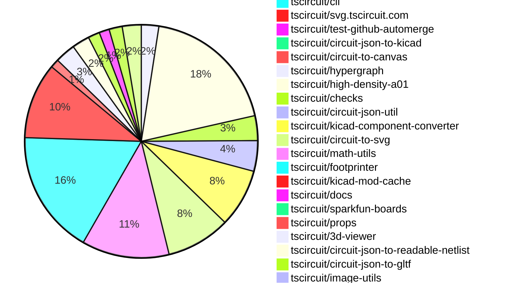

# Contribution Overview 2026-03-10

The current week is shown below. There are 3 major sections:

- [Contributor Overview](#contributor-overview)
- [PRs by Repository](#prs-by-repository)
- [PRs by Contributor](#changes-by-contributor)
- [Scoring & Sponsorship Details](/docs/sponsorship-calculation-explanation.md)

## PRs by Repository

## Contributor Overview

| Contributor | 🐳 Major | 🐙 Minor | 🐌 Tiny | Score | ⭐ | Discussion Contributions |
|-------------|---------|---------|---------|-------|-----|--------------------------|
| [seveibar](#seveibar) | 9 | 14 | 16 | 73.5 | ⭐⭐⭐ | 0🔹 0🔶 0💎 |
| [ShiboSoftwareDev](#ShiboSoftwareDev) | 5 | 13 | 5 | 50 | ⭐⭐⭐ | 0🔹 0🔶 0💎 |
| [MustafaMulla29](#MustafaMulla29) | 1 | 15 | 16 | 41 | ⭐⭐ | 0🔹 0🔶 0💎 |
| [imrishabh18](#imrishabh18) | 4 | 5 | 11 | 37.5 | ⭐⭐ | 0🔹 0🔶 0💎 |
| [Abse2001](#Abse2001) | 3 | 4 | 0 | 28 | ⭐⭐ | 0🔹 0🔶 0💎 |
| [AnasSarkiz](#AnasSarkiz) | 3 | 3 | 3 | 22 | ⭐⭐ | 0🔹 0🔶 0💎 |
| [tscircuitbot](#tscircuitbot) | 0 | 0 | 380 | 16.5 | ⭐⭐ | 0🔹 0🔶 0💎 |
| [rushabhcodes](#rushabhcodes) | 2 | 2 | 3 | 16 | ⭐⭐ | 0🔹 0🔶 0💎 |
| [techmannih](#techmannih) | 2 | 2 | 3 | 16 | ⭐⭐ | 0🔹 0🔶 0💎 |
| [0hmX](#0hmX) | 2 | 2 | 4 | 16 | ⭐⭐ | 0🔹 0🔶 0💎 |
| [ArnavK-09](#ArnavK-09) | 0 | 0 | 1 | 1 |  | 0🔹 0🔶 0💎 |

## Staff Pass Ratio (SPR)

| Contributor | Reviewed PRs | Rejections | Approvals | SPR |
|-------------|--------------|------------|-----------|-----|
| [ShiboSoftwareDev](#ShiboSoftwareDev) | 18 | 4 | 19 | 77.8% |
| [MustafaMulla29](#MustafaMulla29) | 11 | 0 | 11 | 100.0% |
| [Abse2001](#Abse2001) | 8 | 0 | 8 | 100.0% |
| [techmannih](#techmannih) | 8 | 6 | 3 | 25.0% |
| [AnasSarkiz](#AnasSarkiz) | 6 | 0 | 6 | 100.0% |
| [rushabhcodes](#rushabhcodes) | 5 | 3 | 2 | 40.0% |
| [imrishabh18](#imrishabh18) | 4 | 0 | 4 | 100.0% |
| [0hmX](#0hmX) | 2 | 0 | 2 | 100.0% |
| [Nicolas-Rozas](#Nicolas-Rozas) | 1 | 0 | 1 | 100.0% |
| [1028bc](#1028bc) | 1 | 1 | 0 | 0.0% |

ShiboSoftwareDev SPR PRs (18)

- [#507](https://github.com/tscircuit/circuit-json/pull/507) Add copper pour metadata fields to pcb_trace.route points
- [#501](https://github.com/tscircuit/circuit-json/pull/501) Add source warning types for no-power, no-ground, and underspecified pins
- [#503](https://github.com/tscircuit/circuit-json/pull/503) Add source_invalid_component_property_error to circuit-json
- [#88](https://github.com/tscircuit/circuit-json-util/pull/88) new category pin_specification
- [#615](https://github.com/tscircuit/props/pull/615) introduce pinSpecificationDrcChecksDisabled
- [#2039](https://github.com/tscircuit/core/pull/2039) Report invalid pcbX/pcbY calc inputs as source_invalid_component_property_error (including malformed wrappers)
- [#2044](https://github.com/tscircuit/core/pull/2044)  Improve PCB calc coordinate error handling and edge-prop diagnostics
- [#2050](https://github.com/tscircuit/core/pull/2050) Mark Fully Covered Trace Segments With Copper Pour Metadata
- [#2041](https://github.com/tscircuit/core/pull/2041) Validate PCB coordinate calc refs before placement and preserve edge prop names in errors
- [#2038](https://github.com/tscircuit/core/pull/2038) Warn on component-relative calc refs in footprint primitives
- [#2033](https://github.com/tscircuit/core/pull/2033) Add Pin Specification DRC to Board Check Pipeline
- [#2032](https://github.com/tscircuit/core/pull/2032) Support primitive component-relative calc() outside footprints and centralize named PCB calc vars
- [#2031](https://github.com/tscircuit/core/pull/2031) Enable PCB placement for current/voltage sources with footprint and validate calc positioning
- [#2027](https://github.com/tscircuit/core/pull/2027)  Add calc(board.*) support for MountedBoard positioning
- [#523](https://github.com/tscircuit/circuit-to-svg/pull/523) hide traces that are inside copper pours
- [#116](https://github.com/tscircuit/checks/pull/116) Introduce checkNoPowerPinDefinedForChip
- [#2393](https://github.com/tscircuit/cli/pull/2393) Introduce ignore DRC flags
- [#2353](https://github.com/tscircuit/cli/pull/2353) tsci check pin_specification

MustafaMulla29 SPR PRs (11)

- [#517](https://github.com/tscircuit/circuit-json/pull/517) Add ccw_rotation to pcb_courtyard_rect
- [#527](https://github.com/tscircuit/footprinter/pull/527) Feat: courtyard for dip, quad, soic, sot footprint
- [#522](https://github.com/tscircuit/footprinter/pull/522) Update kicad-parity snapshots to include courtyards
- [#193](https://github.com/tscircuit/kicad-component-converter/pull/193) Feat: Add courtyard conversion support from kicad_mod to circuit-json
- [#2051](https://github.com/tscircuit/core/pull/2051) Feat: integrate courtyards and tests for courtyard overlap
- [#2047](https://github.com/tscircuit/core/pull/2047) Export kicadFootprintStrings
- [#2052](https://github.com/tscircuit/core/pull/2052) Fix rotation for CourtyardRect
- [#525](https://github.com/tscircuit/circuit-to-svg/pull/525) Fix PCB courtyard rect rotation and add rotation tests
- [#125](https://github.com/tscircuit/checks/pull/125) Fix: component outside board false positive for rotated components
- [#123](https://github.com/tscircuit/checks/pull/123) Fix: courtyard overlap detection to account for rotation
- [#119](https://github.com/tscircuit/checks/pull/119) Add new check for courtyard overlaps

Abse2001 SPR PRs (8)

- [#509](https://github.com/tscircuit/circuit-json/pull/509) Align cad_component Orientation Field with CAD Model Convention Definitions
- [#505](https://github.com/tscircuit/circuit-json/pull/505) Add CAD Model Format Conventions for Board Normal Orientation
- [#618](https://github.com/tscircuit/props/pull/618) Added modelOriginPosition to cadModel
- [#355](https://github.com/tscircuit/easyeda-converter/pull/355) Derive EasyEDA CAD Z placement from OBJ bounds and SVGNODE offset + fix 270° rotation handling
- [#2055](https://github.com/tscircuit/core/pull/2055) Improve CAD Model Placement with Explicit Origin Position and PCB Rotation Offset
- [#145](https://github.com/tscircuit/circuit-json-to-gltf/pull/145) Fix model_origin_position Handling by Applying Loader Transform and Orientation
- [#143](https://github.com/tscircuit/circuit-json-to-gltf/pull/143) Fix EasyEDA OBJ dissolve handling to prevent unintended translucency in GLTF materials
- [#137](https://github.com/tscircuit/circuit-json-to-gltf/pull/137) Refactor CAD Model Placement Pipeline with Orientation, Origin Alignment, and Fit Controls

techmannih SPR PRs (8)

- [#704](https://github.com/tscircuit/pcb-viewer/pull/704) fix: prevent duplicate hover boxes for plated holes and multi-layer elements
- [#692](https://github.com/tscircuit/pcb-viewer/pull/692) feat: disable position anchors by default in dev mode
- [#195](https://github.com/tscircuit/kicad-component-converter/pull/195) feat: hide reference placeholders ($REFERENCE, ${REFERENCE}, %R) on fab layer
- [#192](https://github.com/tscircuit/kicad-component-converter/pull/192) Convert KiCad courtyard layers to tscircuit PcbCourtyardOutline elements and fix vercel deployment
- [#2058](https://github.com/tscircuit/core/pull/2058) feat: Resolve reference designator text  for {NAME}, {REF}, and {REFERENCE} in SchematicText
- [#2030](https://github.com/tscircuit/core/pull/2030) feat: add test for KiCad JST XH connector
- [#2037](https://github.com/tscircuit/core/pull/2037)  fix: strip kicad prefix from circuit-json and prevent footprinter crashes for library footprints
- [#2034](https://github.com/tscircuit/core/pull/2034) feat: replace external KiCad footprint requests with local mocks in tests

AnasSarkiz SPR PRs (6)

- [#736](https://github.com/tscircuit/3d-viewer/pull/736) Fix translucent CAD occlusion over PCB by enforcing deterministic render order
- [#524](https://github.com/tscircuit/circuit-to-svg/pull/524) Add `showPcbNotes` render-time toggle (default `true`) to `convertCircuitJsonToPcbSvg`
- [#2390](https://github.com/tscircuit/cli/pull/2390) Enforce deterministic no-match failures for tsci snapshot <directory> and surface exact includeBoardFiles source
- [#661](https://github.com/tscircuit/tscircuit-autorouter/pull/661) Enable Hypergraph Auto‑Baked Tile Selection in FixedTopology Solver by Removing Hardcoded Via Tile and Via Diameter Overrides
- [#138](https://github.com/tscircuit/circuit-json-to-gltf/pull/138) fix(gltf): ensure board textures render notes only when showPcbNotes is enabled
- [#139](https://github.com/tscircuit/hypergraph/pull/139) benchmark via graph dataset04

rushabhcodes SPR PRs (5)

- [#708](https://github.com/tscircuit/pcb-viewer/pull/708) feat: add functionality to show/hide courtyards in the viewer
- [#699](https://github.com/tscircuit/pcb-viewer/pull/699) Fix per-layer PCB trace rendering for via routes and add minimal plated-hole/via repro fixture
- [#698](https://github.com/tscircuit/pcb-viewer/pull/698) Fix plated_holes showing wrong color on bottom layer in PCB viewer
- [#695](https://github.com/tscircuit/pcb-viewer/pull/695) feat(pcb-viewer): add controlled viewState API, deprecate initialState, and ship full all-features controlled fixture
- [#2880](https://github.com/tscircuit/runframe/pull/2880) Improve API status indicator accessibility — use shadcn tooltip and increase hit area

imrishabh18 SPR PRs (4)

- [#2372](https://github.com/tscircuit/cli/pull/2372) Add periodic heartbeat logs for thread worker pool
- [#144](https://github.com/tscircuit/circuit-json-to-gltf/pull/144) Use direct mesh generation for the pcb boards with holes and cutouts (Performance increase around ~4.75× faster)
- [#134](https://github.com/tscircuit/circuit-json-to-gltf/pull/134) Add a `fast` mode for the holes/cutout drill quality which uses less polygon segments
- [#2](https://github.com/tscircuit/image-utils/pull/2) feat: create the basic implementation of looks-same to compare png buffer

0hmX SPR PRs (2)

- [#654](https://github.com/tscircuit/tscircuit-autorouter/pull/654) Add Pipeline3 HG failure analyzer and relax via-limit to reduce circuit100 failures
- [#4](https://github.com/tscircuit/high-density-dataset-z04/pull/4) hard problems list

Nicolas-Rozas SPR PRs (1)

- [#694](https://github.com/tscircuit/pcb-viewer/pull/694) fix: persist selected layer across snippet reruns using localStorage

1028bc SPR PRs (1)

- [#665](https://github.com/tscircuit/tscircuit-autorouter/pull/665) test: increase bugreport23 timeout to 120s and update snapshots

> Note: AI evaluates PRs and assigns 1-3 star ratings automatically. 4 and 5 star ratings require manual staff review.

### Discussion Contribution Legend

- 🔹 Normal Comments: Basic participation with minimal effort
- 🔶 Great Informative Comments: Thoughtful participation that adds value
- 💎 Incredible Comments: Exceptional participation with high-quality content

## Review Table

[reviews-received-hover]: ## "Number of reviews received for PRs for this contributor"
[approvals-received-hover]: ## "Number of approvals received for PRs this contributor authored"
[rejections-received-hover]: ## "Number of rejections received for PRs this contributor authored"
[prs-opened-hover]: ## "Number of PRs opened by this contributor"
[issues-created-hover]: ## "Number of issues created by this contributor"

| Contributor | Reviews Received | Approvals Received | Rejections Received | Approvals | Rejections Given | PRs Opened | PRs Merged | Issues Created |
|---|---|---|---|---|---|---|---|---|
| [tscircuitbot](#tscircuitbot) | 2 | 0 | 0 | 0 | 0 | 463 | 399 | 0 |
| [MustafaMulla29](#MustafaMulla29) | 30 | 20 | 0 | 1 | 0 | 37 | 33 | 0 |
| [rushabhcodes](#rushabhcodes) | 27 | 9 | 3 | 1 | 1 | 14 | 7 | 0 |
| [Abse2001](#Abse2001) | 11 | 7 | 0 | 9 | 0 | 10 | 7 | 0 |
| [seveibar](#seveibar) | 3 | 0 | 0 | 64 | 11 | 54 | 40 | 0 |
| [ShiboSoftwareDev](#ShiboSoftwareDev) | 30 | 23 | 1 | 1 | 0 | 25 | 23 | 0 |
| [javery556](#javery556) | 0 | 0 | 0 | 0 | 0 | 1 | 0 | 0 |
| [techmannih](#techmannih) | 21 | 8 | 7 | 1 | 0 | 16 | 8 | 0 |
| [Nicolas-Rozas](#Nicolas-Rozas) | 2 | 1 | 0 | 0 | 0 | 4 | 0 | 0 |
| [imrishabh18](#imrishabh18) | 6 | 4 | 0 | 7 | 0 | 22 | 21 | 0 |
| [kira-autonoma](#kira-autonoma) | 0 | 0 | 0 | 0 | 0 | 1 | 0 | 0 |
| [CharlesWong](#CharlesWong) | 0 | 0 | 0 | 0 | 0 | 3 | 0 | 0 |
| [bossco7598](#bossco7598) | 0 | 0 | 0 | 0 | 0 | 2 | 0 | 0 |
| [AnasSarkiz](#AnasSarkiz) | 12 | 9 | 0 | 1 | 0 | 10 | 9 | 0 |
| [CelebrityPunks](#CelebrityPunks) | 0 | 0 | 0 | 0 | 0 | 2 | 0 | 0 |
| [ChengPeng-1010](#ChengPeng-1010) | 0 | 0 | 0 | 0 | 0 | 3 | 0 | 0 |
| [TheAuroraAI](#TheAuroraAI) | 1 | 0 | 0 | 0 | 0 | 5 | 0 | 0 |
| [mfiumara](#mfiumara) | 0 | 0 | 0 | 0 | 0 | 2 | 0 | 0 |
| [songshanhua-eng](#songshanhua-eng) | 4 | 0 | 0 | 0 | 0 | 1 | 0 | 0 |
| [ZheYanyan](#ZheYanyan) | 1 | 0 | 0 | 0 | 0 | 2 | 0 | 0 |
| [ArnavK-09](#ArnavK-09) | 1 | 1 | 0 | 0 | 0 | 1 | 1 | 0 |
| [Drgonzoh](#Drgonzoh) | 0 | 0 | 0 | 0 | 0 | 2 | 0 | 0 |
| [Excellencedev](#Excellencedev) | 1 | 0 | 0 | 0 | 0 | 2 | 0 | 0 |
| [0hmX](#0hmX) | 6 | 3 | 0 | 0 | 0 | 21 | 8 | 0 |
| [1028bc](#1028bc) | 3 | 0 | 1 | 0 | 0 | 5 | 0 | 0 |
| [wdxia134](#wdxia134) | 1 | 0 | 0 | 0 | 0 | 1 | 0 | 0 |
| [CuboYe](#CuboYe) | 0 | 0 | 0 | 0 | 0 | 1 | 0 | 0 |
| [Prashant27-07](#Prashant27-07) | 0 | 0 | 0 | 0 | 0 | 1 | 0 | 0 |
| [youcef3300](#youcef3300) | 0 | 0 | 0 | 0 | 0 | 1 | 0 | 0 |
| [noorbalaum](#noorbalaum) | 0 | 0 | 0 | 0 | 0 | 1 | 0 | 0 |

## Changes by Repository

### [tscircuit/pcb-viewer](https://github.com/tscircuit/pcb-viewer)

| PR # | Impact | Rating | Contributor | Description |
|------|--------|--------|-------------|-------------|
| [#708](https://github.com/tscircuit/pcb-viewer/pull/708) | 🐳 Major | ⭐⭐⭐ | rushabhcodes | Adds support for toggling the visibility of courtyards in the PCB viewer, including a new global state property and UI control for user preference persistence. |
| [#692](https://github.com/tscircuit/pcb-viewer/pull/692) | 🐳 Major | ⭐⭐⭐ | techmannih | Updates the default state of the PCB viewer to hide position anchors by default, even in development mode. |
| [#699](https://github.com/tscircuit/pcb-viewer/pull/699) | 🐙 Minor | ⭐⭐ | rushabhcodes | Refactors PCB trace drawing logic to improve type safety and layer filtering, and adds a new SparkfunBoards fixture for PCB visualization. |

🐌 Tiny Contributions (9)

| PR # | Impact | Contributor | Description |
|------|--------|-------------|-------------|
| [#711](https://github.com/tscircuit/pcb-viewer/pull/711) | 🐌 Tiny | tscircuitbot | Automated package update |
| [#709](https://github.com/tscircuit/pcb-viewer/pull/709) | 🐌 Tiny | tscircuitbot | Automated package update |
| [#707](https://github.com/tscircuit/pcb-viewer/pull/707) | 🐌 Tiny | tscircuitbot | Automated package update |
| [#703](https://github.com/tscircuit/pcb-viewer/pull/703) | 🐌 Tiny | tscircuitbot | Automated package update |
| [#701](https://github.com/tscircuit/pcb-viewer/pull/701) | 🐌 Tiny | tscircuitbot | Automated package update |
| [#693](https://github.com/tscircuit/pcb-viewer/pull/693) | 🐌 Tiny | tscircuitbot | Automated package update |
| [#710](https://github.com/tscircuit/pcb-viewer/pull/710) | 🐌 Tiny | MustafaMulla29 | Updates dependencies and adds a fixture for rotated resistors in the PCB viewer. |
| [#702](https://github.com/tscircuit/pcb-viewer/pull/702) | 🐌 Tiny | rushabhcodes | Updates the circuit-to-canvas dependency to version 0.0.91 in the package.json file |
| [#706](https://github.com/tscircuit/pcb-viewer/pull/706) | 🐌 Tiny | ShiboSoftwareDev | img width2024 height1146 altimage srchttps:github.comuser-attachmentsassetsdbc22835-c627-495c-b5fd-76089fcc5720 |

### [tscircuit/tscircuit](https://github.com/tscircuit/tscircuit)

🐌 Tiny Contributions (94)

| PR # | Impact | Contributor | Description |
|------|--------|-------------|-------------|
| [#2663](https://github.com/tscircuit/tscircuit/pull/2663) | 🐌 Tiny | tscircuitbot | Automated package update |
| [#2662](https://github.com/tscircuit/tscircuit/pull/2662) | 🐌 Tiny | tscircuitbot | Updates the tscircuitcli package version from 0.1.1120 to 0.1.1121 |
| [#2661](https://github.com/tscircuit/tscircuit/pull/2661) | 🐌 Tiny | tscircuitbot | Automated package update |
| [#2659](https://github.com/tscircuit/tscircuit/pull/2659) | 🐌 Tiny | tscircuitbot | Updates the package version from 0.0.1517 to 0.0.1518 in package.json |
| [#2658](https://github.com/tscircuit/tscircuit/pull/2658) | 🐌 Tiny | tscircuitbot | Automated package update |
| [#2657](https://github.com/tscircuit/tscircuit/pull/2657) | 🐌 Tiny | tscircuitbot | Automated package update to version 0.0.1517 |
| [#2656](https://github.com/tscircuit/tscircuit/pull/2656) | 🐌 Tiny | tscircuitbot | Updates the tscircuitcli package from version 0.1.1118 to 0.1.1119 and the tscircuitrunframe package from version 0.0.1732 to 0.0.1733 in package.json |
| [#2655](https://github.com/tscircuit/tscircuit/pull/2655) | 🐌 Tiny | tscircuitbot | Automated package update to version 0.0.1516 |
| [#2654](https://github.com/tscircuit/tscircuit/pull/2654) | 🐌 Tiny | tscircuitbot | Updates the tscircuitcli package from version 0.1.1117 to 0.1.1118 and the tscircuitrunframe package from version 0.0.1731 to 0.0.1732 in package.json |
| [#2651](https://github.com/tscircuit/tscircuit/pull/2651) | 🐌 Tiny | tscircuitbot | Updates the tscircuitcli package from version 0.1.1116 to 0.1.1117 and the tscircuitrunframe package from version 0.0.1730 to 0.0.1731 in package.json |
| [#2648](https://github.com/tscircuit/tscircuit/pull/2648) | 🐌 Tiny | tscircuitbot | Automated package update |
| [#2649](https://github.com/tscircuit/tscircuit/pull/2649) | 🐌 Tiny | tscircuitbot | Automated package update |
| [#2646](https://github.com/tscircuit/tscircuit/pull/2646) | 🐌 Tiny | tscircuitbot | Automated package update |
| [#2647](https://github.com/tscircuit/tscircuit/pull/2647) | 🐌 Tiny | tscircuitbot | Automated package update |
| [#2644](https://github.com/tscircuit/tscircuit/pull/2644) | 🐌 Tiny | tscircuitbot | Automated package update |
| [#2652](https://github.com/tscircuit/tscircuit/pull/2652) | 🐌 Tiny | tscircuitbot | Automated package update |
| [#2650](https://github.com/tscircuit/tscircuit/pull/2650) | 🐌 Tiny | tscircuitbot | Automated package update |
| [#2645](https://github.com/tscircuit/tscircuit/pull/2645) | 🐌 Tiny | tscircuitbot | Updates the tscircuitcli package and other dependencies to their latest versions. |
| [#2638](https://github.com/tscircuit/tscircuit/pull/2638) | 🐌 Tiny | tscircuitbot | Automated package update |
| [#2637](https://github.com/tscircuit/tscircuit/pull/2637) | 🐌 Tiny | tscircuitbot | Updates the tscircuitcli package from version 0.1.1110 to 0.1.1111 in the package.json file. |
| [#2642](https://github.com/tscircuit/tscircuit/pull/2642) | 🐌 Tiny | tscircuitbot | Updates the package version from 0.0.1509 to 0.0.1510 in package.json |
| [#2640](https://github.com/tscircuit/tscircuit/pull/2640) | 🐌 Tiny | tscircuitbot | Automated package update |
| [#2639](https://github.com/tscircuit/tscircuit/pull/2639) | 🐌 Tiny | tscircuitbot | Updates the tscircuitcli package from version 0.1.1111 to 0.1.1112 |
| [#2635](https://github.com/tscircuit/tscircuit/pull/2635) | 🐌 Tiny | tscircuitbot | Updates the tscircuitcli package to version 0.1.1110 in package.json |
| [#2636](https://github.com/tscircuit/tscircuit/pull/2636) | 🐌 Tiny | tscircuitbot | Automated package update |
| [#2641](https://github.com/tscircuit/tscircuit/pull/2641) | 🐌 Tiny | tscircuitbot | Updates the tscircuitcli package version from 0.1.1112 to 0.1.1113 in package.json |
| [#2619](https://github.com/tscircuit/tscircuit/pull/2619) | 🐌 Tiny | tscircuitbot | Updates the tscircuitcli package version from 0.1.1100 to 0.1.1101 and the circuit-json-to-gltf package version from 0.0.81 to 0.0.73. |
| [#2595](https://github.com/tscircuit/tscircuit/pull/2595) | 🐌 Tiny | tscircuitbot | Updates the tscircuitcli package from version 0.1.1092 to 0.1.1093 and the tscircuitmath-utils package from version 0.0.36 to 0.0.29. |
| [#2632](https://github.com/tscircuit/tscircuit/pull/2632) | 🐌 Tiny | tscircuitbot | Automated package update |
| [#2599](https://github.com/tscircuit/tscircuit/pull/2599) | 🐌 Tiny | tscircuitbot | Updates the version of the tscircuitcore package from 0.0.1105 to 0.0.1106 in package.json |
| [#2603](https://github.com/tscircuit/tscircuit/pull/2603) | 🐌 Tiny | tscircuitbot | Updates the tscircuitcli package from version 0.1.1095 to 0.1.1096 in package.json |
| [#2628](https://github.com/tscircuit/tscircuit/pull/2628) | 🐌 Tiny | tscircuitbot | Updates the tscircuitcli package from version 0.1.1105 to 0.1.1106 and the tscircuitrunframe package from version 0.0.1723 to 0.0.1724 |
| [#2596](https://github.com/tscircuit/tscircuit/pull/2596) | 🐌 Tiny | tscircuitbot | Automated package update to version 0.0.1488 |
| [#2597](https://github.com/tscircuit/tscircuit/pull/2597) | 🐌 Tiny | tscircuitbot | Updates the tscircuitcli package from version 0.1.1093 to 0.1.1094 |
| [#2613](https://github.com/tscircuit/tscircuit/pull/2613) | 🐌 Tiny | tscircuitbot | Updates the tscircuitcli package to version 0.1.1100 in the package.json file. |
| [#2626](https://github.com/tscircuit/tscircuit/pull/2626) | 🐌 Tiny | tscircuitbot | Updates the tscircuitcli package from version 0.1.1104 to 0.1.1105 and the tscircuiteval package from version 0.0.712 to 0.0.713 in package.json |
| [#2620](https://github.com/tscircuit/tscircuit/pull/2620) | 🐌 Tiny | tscircuitbot | Automated package update to version 0.0.1500 |
| [#2605](https://github.com/tscircuit/tscircuit/pull/2605) | 🐌 Tiny | tscircuitbot | Updates the tscircuitcli package version from 0.1.1096 to 0.1.1097 in package.json |
| [#2610](https://github.com/tscircuit/tscircuit/pull/2610) | 🐌 Tiny | tscircuitbot | Automated package update to version 0.0.1495 |
| [#2629](https://github.com/tscircuit/tscircuit/pull/2629) | 🐌 Tiny | tscircuitbot | Updates the package version from 0.0.1503 to 0.0.1504 in package.json |
| [#2615](https://github.com/tscircuit/tscircuit/pull/2615) | 🐌 Tiny | tscircuitbot | Automated package update |
| [#2616](https://github.com/tscircuit/tscircuit/pull/2616) | 🐌 Tiny | tscircuitbot | Updates the package version from 0.0.1497 to 0.0.1498 in package.json |
| [#2623](https://github.com/tscircuit/tscircuit/pull/2623) | 🐌 Tiny | tscircuitbot | Updates various package dependencies to their latest versions in package.json |
| [#2630](https://github.com/tscircuit/tscircuit/pull/2630) | 🐌 Tiny | tscircuitbot | Automated package update |
| [#2601](https://github.com/tscircuit/tscircuit/pull/2601) | 🐌 Tiny | tscircuitbot | Automated package update |
| [#2609](https://github.com/tscircuit/tscircuit/pull/2609) | 🐌 Tiny | tscircuitbot | Automated package update |
| [#2600](https://github.com/tscircuit/tscircuit/pull/2600) | 🐌 Tiny | tscircuitbot | Automated package update |
| [#2612](https://github.com/tscircuit/tscircuit/pull/2612) | 🐌 Tiny | tscircuitbot | Automated package update |
| [#2611](https://github.com/tscircuit/tscircuit/pull/2611) | 🐌 Tiny | tscircuitbot | Automated package update |
| [#2621](https://github.com/tscircuit/tscircuit/pull/2621) | 🐌 Tiny | tscircuitbot | Automated package update |
| [#2614](https://github.com/tscircuit/tscircuit/pull/2614) | 🐌 Tiny | tscircuitbot | Automated package update |
| [#2618](https://github.com/tscircuit/tscircuit/pull/2618) | 🐌 Tiny | tscircuitbot | Automated package update |
| [#2598](https://github.com/tscircuit/tscircuit/pull/2598) | 🐌 Tiny | tscircuitbot | Automated package update to version 0.0.1489 |
| [#2624](https://github.com/tscircuit/tscircuit/pull/2624) | 🐌 Tiny | tscircuitbot | Automated package update |
| [#2627](https://github.com/tscircuit/tscircuit/pull/2627) | 🐌 Tiny | tscircuitbot | Automated package update |
| [#2604](https://github.com/tscircuit/tscircuit/pull/2604) | 🐌 Tiny | tscircuitbot | Automated package update |
| [#2631](https://github.com/tscircuit/tscircuit/pull/2631) | 🐌 Tiny | tscircuitbot | Automated package update |
| [#2602](https://github.com/tscircuit/tscircuit/pull/2602) | 🐌 Tiny | tscircuitbot | Automated package update |
| [#2622](https://github.com/tscircuit/tscircuit/pull/2622) | 🐌 Tiny | tscircuitbot | Automated package update |
| [#2633](https://github.com/tscircuit/tscircuit/pull/2633) | 🐌 Tiny | tscircuitbot | Automated package update to version 0.0.1506 |
| [#2608](https://github.com/tscircuit/tscircuit/pull/2608) | 🐌 Tiny | tscircuitbot | Automated package update to version 0.0.1494 |
| [#2606](https://github.com/tscircuit/tscircuit/pull/2606) | 🐌 Tiny | tscircuitbot | Automated package update |
| [#2582](https://github.com/tscircuit/tscircuit/pull/2582) | 🐌 Tiny | tscircuitbot | Automated package update |
| [#2590](https://github.com/tscircuit/tscircuit/pull/2590) | 🐌 Tiny | tscircuitbot | Automated package update |
| [#2591](https://github.com/tscircuit/tscircuit/pull/2591) | 🐌 Tiny | tscircuitbot | Updates the tscircuitcli package from version 0.1.1091 to 0.1.1092 and the tscircuitrunframe package from version 0.0.1718 to 0.0.1719 in package.json |
| [#2586](https://github.com/tscircuit/tscircuit/pull/2586) | 🐌 Tiny | tscircuitbot | Automated package update |
| [#2581](https://github.com/tscircuit/tscircuit/pull/2581) | 🐌 Tiny | tscircuitbot | Updates the tscircuitcli package to version 0.1.1088 in package.json |
| [#2578](https://github.com/tscircuit/tscircuit/pull/2578) | 🐌 Tiny | tscircuitbot | Automated package update |
| [#2589](https://github.com/tscircuit/tscircuit/pull/2589) | 🐌 Tiny | tscircuitbot | Updates the tscircuitcli and other related package versions in package.json |
| [#2587](https://github.com/tscircuit/tscircuit/pull/2587) | 🐌 Tiny | tscircuitbot | Automated package update |
| [#2579](https://github.com/tscircuit/tscircuit/pull/2579) | 🐌 Tiny | tscircuitbot | Automated package update |
| [#2592](https://github.com/tscircuit/tscircuit/pull/2592) | 🐌 Tiny | tscircuitbot | Automated package update |
| [#2577](https://github.com/tscircuit/tscircuit/pull/2577) | 🐌 Tiny | tscircuitbot | Automated package update |
| [#2594](https://github.com/tscircuit/tscircuit/pull/2594) | 🐌 Tiny | tscircuitbot | Automated package update to version 0.0.1487 |
| [#2584](https://github.com/tscircuit/tscircuit/pull/2584) | 🐌 Tiny | tscircuitbot | Automated package update |
| [#2583](https://github.com/tscircuit/tscircuit/pull/2583) | 🐌 Tiny | tscircuitbot | Automated package update |
| [#2585](https://github.com/tscircuit/tscircuit/pull/2585) | 🐌 Tiny | tscircuitbot | Automated package update |
| [#2588](https://github.com/tscircuit/tscircuit/pull/2588) | 🐌 Tiny | tscircuitbot | Automated package update to version 0.0.1484 |
| [#2575](https://github.com/tscircuit/tscircuit/pull/2575) | 🐌 Tiny | tscircuitbot | Automated package update to version 0.0.1478 |
| [#2566](https://github.com/tscircuit/tscircuit/pull/2566) | 🐌 Tiny | tscircuitbot | Updates package versions for tscircuitchecks, tscircuitcli, tscircuitcore, tscircuiteval, and tscircuitrunframe in package.json |
| [#2563](https://github.com/tscircuit/tscircuit/pull/2563) | 🐌 Tiny | tscircuitbot | Updates the tscircuitcli package version from 0.1.1080 to 0.1.1081 in package.json |
| [#2570](https://github.com/tscircuit/tscircuit/pull/2570) | 🐌 Tiny | tscircuitbot | Automated package update to version 0.0.1476 |
| [#2574](https://github.com/tscircuit/tscircuit/pull/2574) | 🐌 Tiny | tscircuitbot | Updates the tscircuitcli package from version 0.1.1084 to 0.1.1085 |
| [#2561](https://github.com/tscircuit/tscircuit/pull/2561) | 🐌 Tiny | tscircuitbot | Updates the tscircuitcli package to version 0.1.1080 in the package.json file. |
| [#2562](https://github.com/tscircuit/tscircuit/pull/2562) | 🐌 Tiny | tscircuitbot | Automated package update |
| [#2569](https://github.com/tscircuit/tscircuit/pull/2569) | 🐌 Tiny | tscircuitbot | Automated package update |
| [#2559](https://github.com/tscircuit/tscircuit/pull/2559) | 🐌 Tiny | tscircuitbot | Updates the tscircuitcli package from version 0.1.1078 to 0.1.1079 and the tscircuitrunframe package from version 0.0.1711 to 0.0.1712 in package.json |
| [#2557](https://github.com/tscircuit/tscircuit/pull/2557) | 🐌 Tiny | tscircuitbot | Updates the tscircuitcli package from version 0.1.1077 to 0.1.1078 |
| [#2660](https://github.com/tscircuit/tscircuit/pull/2660) | 🐌 Tiny | MustafaMulla29 | Updates the kicad-component-converter dependency from version 0.1.30 to 0.1.40 in package.json |
| [#2607](https://github.com/tscircuit/tscircuit/pull/2607) | 🐌 Tiny | MustafaMulla29 | Updates several dependencies in the package.json file to their latest versions. |
| [#2593](https://github.com/tscircuit/tscircuit/pull/2593) | 🐌 Tiny | MustafaMulla29 | Updates the math-utils dependency from version 0.0.29 to 0.0.36 in package.json |
| [#2643](https://github.com/tscircuit/tscircuit/pull/2643) | 🐌 Tiny | imrishabh18 | Updates the circuit-json-to-gltf dependency to version 0.0.84, enhancing performance through direct mesh generation. |
| [#2617](https://github.com/tscircuit/tscircuit/pull/2617) | 🐌 Tiny | imrishabh18 | Updates the version of the circuit-json-to-gltf dependency from 0.0.73 to 0.0.81 in package.json |
| [#2576](https://github.com/tscircuit/tscircuit/pull/2576) | 🐌 Tiny | imrishabh18 | Sets the fast mode as the default for the circuit-json-to-gltf package, updating its version in package.json. |

### [tscircuit/circuit-json](https://github.com/tscircuit/circuit-json)

| PR # | Impact | Rating | Contributor | Description |
|------|--------|--------|-------------|-------------|
| [#507](https://github.com/tscircuit/circuit-json/pull/507) | 🐳 Major | ⭐⭐⭐ | ShiboSoftwareDev | Adds copper pour metadata fields to pcb_trace.route points, allowing for better tracking of copper pour relationships in PCB designs. |
| [#517](https://github.com/tscircuit/circuit-json/pull/517) | 🐙 Minor | ⭐⭐ | MustafaMulla29 | Adds an optional ccw_rotation property to the pcb_courtyard_rect definition, allowing for counter-clockwise rotation specification. |
| [#511](https://github.com/tscircuit/circuit-json/pull/511) | 🐙 Minor | ⭐⭐ | MustafaMulla29 | Adds a new error type for detecting overlaps between PCB component courtyards, enhancing error handling in PCB design. |
| [#501](https://github.com/tscircuit/circuit-json/pull/501) | 🐙 Minor | ⭐⭐ | ShiboSoftwareDev | Adds new warning types for circuit elements when no power, no ground, or underspecified pins are defined. |
| [#503](https://github.com/tscircuit/circuit-json/pull/503) | 🐙 Minor | ⭐⭐ | ShiboSoftwareDev | Adds a new error type for invalid component properties in circuit JSON, enhancing error handling for source components. |
| [#513](https://github.com/tscircuit/circuit-json/pull/513) | 🐙 Minor | ⭐⭐ | seveibar | Adds a new alignment option for CAD components to specify that the model origin is at the bottom center of the component, enhancing model alignment workflows. |
| [#509](https://github.com/tscircuit/circuit-json/pull/509) | 🐙 Minor | ⭐⭐ | Abse2001 | Aligns the cad_components model_board_normal_direction field with the defined CAD model axis directions, enhancing consistency with CAD model conventions. |
| [#505](https://github.com/tscircuit/circuit-json/pull/505) | 🐙 Minor | ⭐⭐ | Abse2001 | Adds conventions for CAD model formats and their default orientations for board normal alignment. |

🐌 Tiny Contributions (9)

| PR # | Impact | Contributor | Description |
|------|--------|-------------|-------------|
| [#516](https://github.com/tscircuit/circuit-json/pull/516) | 🐌 Tiny | tscircuitbot | Automated package update |
| [#514](https://github.com/tscircuit/circuit-json/pull/514) | 🐌 Tiny | tscircuitbot | Automated package update |
| [#510](https://github.com/tscircuit/circuit-json/pull/510) | 🐌 Tiny | tscircuitbot | Automated package update |
| [#512](https://github.com/tscircuit/circuit-json/pull/512) | 🐌 Tiny | tscircuitbot | Automated package update |
| [#508](https://github.com/tscircuit/circuit-json/pull/508) | 🐌 Tiny | tscircuitbot | Automated package update |
| [#504](https://github.com/tscircuit/circuit-json/pull/504) | 🐌 Tiny | tscircuitbot | Automated package update |
| [#506](https://github.com/tscircuit/circuit-json/pull/506) | 🐌 Tiny | tscircuitbot | Automated package update |
| [#502](https://github.com/tscircuit/circuit-json/pull/502) | 🐌 Tiny | tscircuitbot | Automated package update |
| [#515](https://github.com/tscircuit/circuit-json/pull/515) | 🐌 Tiny | seveibar | Changes the enum values for anchor_alignment in cad_component from xy_center_z_board to center_of_component_on_board_surface |

### [tscircuit/core](https://github.com/tscircuit/core)

| PR # | Impact | Rating | Contributor | Description |
|------|--------|--------|-------------|-------------|
| [#2055](https://github.com/tscircuit/core/pull/2055) | 🐳 Major | ⭐⭐⭐ | Abse2001 | Adds explicit origin position and PCB rotation offset for CAD model placement in the circuit design. |
| [#2051](https://github.com/tscircuit/core/pull/2051) | 🐙 Minor | ⭐⭐ | MustafaMulla29 | Integrates courtyard components and adds tests to detect overlapping courtyards for PCB components. |
| [#2047](https://github.com/tscircuit/core/pull/2047) | 🐙 Minor | ⭐⭐ | MustafaMulla29 | Exports kicadFootprintStrings from the tscircuitprops module to make it accessible in the core library. |
| [#2052](https://github.com/tscircuit/core/pull/2052) | 🐙 Minor | ⭐⭐ | MustafaMulla29 | Fixes incorrect rotation handling for CourtyardRect in PCB layout calculations |
| [#2044](https://github.com/tscircuit/core/pull/2044) | 🐙 Minor | ⭐⭐ | ShiboSoftwareDev | Enhances error handling for PCB coordinate calculations and improves diagnostics for edge properties in the component rendering process. |
| [#2050](https://github.com/tscircuit/core/pull/2050) | 🐙 Minor | ⭐⭐ | ShiboSoftwareDev | Marks trace segments as being inside copper pours, enhancing the PCB design process by improving trace management and connectivity checks. |
| [#2041](https://github.com/tscircuit/core/pull/2041) | 🐙 Minor | ⭐⭐ | ShiboSoftwareDev | Validates PCB coordinate calculations before placement and preserves edge property names in error messages. |
| [#2038](https://github.com/tscircuit/core/pull/2038) | 🐙 Minor | ⭐⭐ | ShiboSoftwareDev | Adds a warning when footprint primitives use component-relative calc(...) references in pcbXpcbY (e.g. R1.maxX), instead of silently falling back. |
| [#2033](https://github.com/tscircuit/core/pull/2033) | 🐙 Minor | ⭐⭐ | ShiboSoftwareDev | Adds pin specification design rule checks (DRC) to the board check pipeline, enhancing validation for pin specifications in circuit designs. |
| [#2032](https://github.com/tscircuit/core/pull/2032) | 🐙 Minor | ⭐⭐ | ShiboSoftwareDev | Fixes primitive PCB calc so expressions like pcbXcalc(R1.maxX  1mm) and pcbYcalc(R1.y) work for primitives outside footprints (e.g. via). |
| [#2031](https://github.com/tscircuit/core/pull/2031) | 🐙 Minor | ⭐⭐ | ShiboSoftwareDev | Adds PCB rendering support for currentsource and voltagesource when a footprint is provided, and enforces a clear error when explicit PCB placement props are used without a footprint. |
| [#2027](https://github.com/tscircuit/core/pull/2027) | 🐙 Minor | ⭐⭐ | ShiboSoftwareDev | Implements BoardI interface on MountedBoard so that calc(board.) expressions in pcbXpcbY resolve against the carrier boards bounds. |
| [#2034](https://github.com/tscircuit/core/pull/2034) | 🐙 Minor | ⭐⭐ | techmannih | Replaces external network requests for KiCad footprints with local JSON fixtures in the test suite to ensure deterministic and faster tests without external dependencies. |
| [#2042](https://github.com/tscircuit/core/pull/2042) | 🐙 Minor | ⭐⭐ | seveibar | Exports the getSimpleRouteJsonFromCircuitJson function for use in other modules. |
| [#2040](https://github.com/tscircuit/core/pull/2040) | 🐙 Minor | ⭐⭐ | seveibar | Enables the use of the AutoroutingPipelineSolver3_HgPortPointPathing when autorouterVersion is set to v3 in the autorouter options. |

🐌 Tiny Contributions (6)

| PR # | Impact | Contributor | Description |
|------|--------|-------------|-------------|
| [#2057](https://github.com/tscircuit/core/pull/2057) | 🐌 Tiny | tscircuitbot | Updates tscircuitcapacity-autorouter to v0.0.334 and refreshes Bun snapshots. |
| [#2043](https://github.com/tscircuit/core/pull/2043) | 🐌 Tiny | MustafaMulla29 | Updates the footprinter dependency version from 0.0.316 to 0.0.321 in package.json |
| [#2035](https://github.com/tscircuit/core/pull/2035) | 🐌 Tiny | MustafaMulla29 | Updates the portHints property access in PlatedHole component and bumps the tscircuitprops dependency version from 0.0.490 to 0.0.494 |
| [#2046](https://github.com/tscircuit/core/pull/2046) | 🐌 Tiny | rushabhcodes | Updates the tscircuitchecks dependency to version 0.0.110 in package.json |
| [#2049](https://github.com/tscircuit/core/pull/2049) | 🐌 Tiny | ShiboSoftwareDev | Updates the circuit-json-util dependency from version 0.0.82 to 0.0.90 and modifies a test to reflect the expected number of overlap errors in PCB design rule checks. |
| [#2056](https://github.com/tscircuit/core/pull/2056) | 🐌 Tiny | seveibar | Adds a GitHub workflow for automatically updating the tscircuitcapacity-autorouter dependency and refreshing Bun snapshots. |

### [tscircuit/tscircuit.com](https://github.com/tscircuit/tscircuit.com)

| PR # | Impact | Rating | Contributor | Description |
|------|--------|--------|-------------|-------------|
| [#3000](https://github.com/tscircuit/tscircuit.com/pull/3000) | 🐙 Minor | ⭐⭐ | seveibar | Expose a public_dist_enabled package property so the fake API and frontend can indicate whether a packages dist is installable without authorization. |

🐌 Tiny Contributions (39)

| PR # | Impact | Contributor | Description |
|------|--------|-------------|-------------|
| [#3009](https://github.com/tscircuit/tscircuit.com/pull/3009) | 🐌 Tiny | tscircuitbot | Automated package update |
| [#3008](https://github.com/tscircuit/tscircuit.com/pull/3008) | 🐌 Tiny | tscircuitbot | Automated package update |
| [#3005](https://github.com/tscircuit/tscircuit.com/pull/3005) | 🐌 Tiny | tscircuitbot | Updates the version of the tscircuitrunframe package from 0.0.1728 to 0.0.1730 and the tscircuitpcb-viewer package from 1.11.350 to 1.11.351 in package.json |
| [#3006](https://github.com/tscircuit/tscircuit.com/pull/3006) | 🐌 Tiny | tscircuitbot | Automated package update |
| [#3004](https://github.com/tscircuit/tscircuit.com/pull/3004) | 🐌 Tiny | tscircuitbot | Updates the tscircuiteval package from version 0.0.715 to 0.0.716 |
| [#3003](https://github.com/tscircuit/tscircuit.com/pull/3003) | 🐌 Tiny | tscircuitbot | Automated package update |
| [#3002](https://github.com/tscircuit/tscircuit.com/pull/3002) | 🐌 Tiny | tscircuitbot | Automated package update |
| [#3001](https://github.com/tscircuit/tscircuit.com/pull/3001) | 🐌 Tiny | tscircuitbot | Automated package update |
| [#2998](https://github.com/tscircuit/tscircuit.com/pull/2998) | 🐌 Tiny | tscircuitbot | Updates the tscircuiteval package from version 0.0.713 to 0.0.714 |
| [#2992](https://github.com/tscircuit/tscircuit.com/pull/2992) | 🐌 Tiny | tscircuitbot | Automated package update |
| [#2991](https://github.com/tscircuit/tscircuit.com/pull/2991) | 🐌 Tiny | tscircuitbot | Updates the tscircuiteval package from version 0.0.709 to 0.0.711 |
| [#2990](https://github.com/tscircuit/tscircuit.com/pull/2990) | 🐌 Tiny | tscircuitbot | Updates the tscircuitrunframe package from version 0.0.1720 to 0.0.1721 |
| [#2989](https://github.com/tscircuit/tscircuit.com/pull/2989) | 🐌 Tiny | tscircuitbot | Updates the tscircuiteval package from version 0.0.708 to 0.0.709 |
| [#2988](https://github.com/tscircuit/tscircuit.com/pull/2988) | 🐌 Tiny | tscircuitbot | Updates the tscircuitrunframe package to version 0.0.1720 |
| [#2996](https://github.com/tscircuit/tscircuit.com/pull/2996) | 🐌 Tiny | tscircuitbot | Automated package update |
| [#2995](https://github.com/tscircuit/tscircuit.com/pull/2995) | 🐌 Tiny | tscircuitbot | Automated package update |
| [#2993](https://github.com/tscircuit/tscircuit.com/pull/2993) | 🐌 Tiny | tscircuitbot | Updates the tscircuiteval package from version 0.0.711 to 0.0.712 |
| [#2987](https://github.com/tscircuit/tscircuit.com/pull/2987) | 🐌 Tiny | tscircuitbot | Updates the tscircuiteval package from version 0.0.706 to 0.0.708 |
| [#2999](https://github.com/tscircuit/tscircuit.com/pull/2999) | 🐌 Tiny | tscircuitbot | Automated package update |
| [#2982](https://github.com/tscircuit/tscircuit.com/pull/2982) | 🐌 Tiny | tscircuitbot | Updates the tscircuiteval package from version 0.0.703 to 0.0.705 |
| [#2986](https://github.com/tscircuit/tscircuit.com/pull/2986) | 🐌 Tiny | tscircuitbot | Updates the tscircuitrunframe package to version 0.0.1719 in package.json |
| [#2985](https://github.com/tscircuit/tscircuit.com/pull/2985) | 🐌 Tiny | tscircuitbot | Updates the tscircuitrunframe package from version 0.0.1717 to 0.0.1718 |
| [#2984](https://github.com/tscircuit/tscircuit.com/pull/2984) | 🐌 Tiny | tscircuitbot | Updates the tscircuiteval package from version 0.0.705 to 0.0.706 |
| [#2983](https://github.com/tscircuit/tscircuit.com/pull/2983) | 🐌 Tiny | tscircuitbot | Updates the tscircuitrunframe package from version 0.0.1716 to 0.0.1717 |
| [#2981](https://github.com/tscircuit/tscircuit.com/pull/2981) | 🐌 Tiny | tscircuitbot | Updates the tscircuitrunframe package from version 0.0.1715 to 0.0.1716 |
| [#2978](https://github.com/tscircuit/tscircuit.com/pull/2978) | 🐌 Tiny | tscircuitbot | Automated package update for tscircuitrunframe from version 0.0.1714 to 0.0.1715 |
| [#2977](https://github.com/tscircuit/tscircuit.com/pull/2977) | 🐌 Tiny | tscircuitbot | Updates the tscircuiteval package from version 0.0.701 to 0.0.703 in the package.json file. |
| [#2976](https://github.com/tscircuit/tscircuit.com/pull/2976) | 🐌 Tiny | tscircuitbot | Updates the tscircuitrunframe package from version 0.0.1713 to 0.0.1714 |
| [#2974](https://github.com/tscircuit/tscircuit.com/pull/2974) | 🐌 Tiny | tscircuitbot | Updates the tscircuitrunframe package from version 0.0.1712 to 0.0.1713 |
| [#2972](https://github.com/tscircuit/tscircuit.com/pull/2972) | 🐌 Tiny | tscircuitbot | Updates the tscircuitrunframe package from version 0.0.1711 to 0.0.1712 |
| [#2970](https://github.com/tscircuit/tscircuit.com/pull/2970) | 🐌 Tiny | tscircuitbot | Updates the tscircuiteval package from version 0.0.698 to 0.0.700 |
| [#2966](https://github.com/tscircuit/tscircuit.com/pull/2966) | 🐌 Tiny | tscircuitbot | Automated package update |
| [#2965](https://github.com/tscircuit/tscircuit.com/pull/2965) | 🐌 Tiny | tscircuitbot | Updates the tscircuitrunframe package from version 0.0.1706 to 0.0.1708 |
| [#2961](https://github.com/tscircuit/tscircuit.com/pull/2961) | 🐌 Tiny | tscircuitbot | Updates the tscircuitrunframe package from version 0.0.1704 to 0.0.1706 |
| [#2973](https://github.com/tscircuit/tscircuit.com/pull/2973) | 🐌 Tiny | tscircuitbot | Updates the tscircuiteval package version from 0.0.700 to 0.0.701 in package.json |
| [#2964](https://github.com/tscircuit/tscircuit.com/pull/2964) | 🐌 Tiny | tscircuitbot | Automated package update |
| [#2958](https://github.com/tscircuit/tscircuit.com/pull/2958) | 🐌 Tiny | tscircuitbot | Automated package update |
| [#2971](https://github.com/tscircuit/tscircuit.com/pull/2971) | 🐌 Tiny | tscircuitbot | Updates the tscircuitrunframe package version from 0.0.1708 to 0.0.1711 in package.json |
| [#2960](https://github.com/tscircuit/tscircuit.com/pull/2960) | 🐌 Tiny | tscircuitbot | Automated package update |

### [tscircuit/eval](https://github.com/tscircuit/eval)

🐌 Tiny Contributions (44)

| PR # | Impact | Contributor | Description |
|------|--------|-------------|-------------|
| [#2278](https://github.com/tscircuit/eval/pull/2278) | 🐌 Tiny | tscircuitbot | Automated package update |
| [#2277](https://github.com/tscircuit/eval/pull/2277) | 🐌 Tiny | tscircuitbot | Updates the versions of several dependencies in the package.json file. |
| [#2276](https://github.com/tscircuit/eval/pull/2276) | 🐌 Tiny | tscircuitbot | Automated package update to version 0.0.715 |
| [#2275](https://github.com/tscircuit/eval/pull/2275) | 🐌 Tiny | tscircuitbot | Automated package update |
| [#2271](https://github.com/tscircuit/eval/pull/2271) | 🐌 Tiny | tscircuitbot | Automated package update |
| [#2270](https://github.com/tscircuit/eval/pull/2270) | 🐌 Tiny | tscircuitbot | Updates the version of the tscircuitcore package from 0.0.1110 to 0.0.1111 in package.json |
| [#2268](https://github.com/tscircuit/eval/pull/2268) | 🐌 Tiny | tscircuitbot | Automated package update |
| [#2267](https://github.com/tscircuit/eval/pull/2267) | 🐌 Tiny | tscircuitbot | Automated package update |
| [#2264](https://github.com/tscircuit/eval/pull/2264) | 🐌 Tiny | tscircuitbot | Updates the version of the tscircuitcore package from 0.0.1108 to 0.0.1109 in package.json |
| [#2263](https://github.com/tscircuit/eval/pull/2263) | 🐌 Tiny | tscircuitbot | Automated package update |
| [#2262](https://github.com/tscircuit/eval/pull/2262) | 🐌 Tiny | tscircuitbot | Automated package update |
| [#2260](https://github.com/tscircuit/eval/pull/2260) | 🐌 Tiny | tscircuitbot | Automated package update |
| [#2256](https://github.com/tscircuit/eval/pull/2256) | 🐌 Tiny | tscircuitbot | Updates the version of the tscircuitcore package from 0.0.1105 to 0.0.1106 in package.json |
| [#2265](https://github.com/tscircuit/eval/pull/2265) | 🐌 Tiny | tscircuitbot | Automated package update |
| [#2259](https://github.com/tscircuit/eval/pull/2259) | 🐌 Tiny | tscircuitbot | Automated package update |
| [#2257](https://github.com/tscircuit/eval/pull/2257) | 🐌 Tiny | tscircuitbot | Automated package update |
| [#2273](https://github.com/tscircuit/eval/pull/2273) | 🐌 Tiny | tscircuitbot | Automated package update |
| [#2272](https://github.com/tscircuit/eval/pull/2272) | 🐌 Tiny | tscircuitbot | Automated package update |
| [#2254](https://github.com/tscircuit/eval/pull/2254) | 🐌 Tiny | tscircuitbot | Automated package update |
| [#2253](https://github.com/tscircuit/eval/pull/2253) | 🐌 Tiny | tscircuitbot | Automated package update |
| [#2251](https://github.com/tscircuit/eval/pull/2251) | 🐌 Tiny | tscircuitbot | Automated package update |
| [#2249](https://github.com/tscircuit/eval/pull/2249) | 🐌 Tiny | tscircuitbot | Automated package update |
| [#2248](https://github.com/tscircuit/eval/pull/2248) | 🐌 Tiny | tscircuitbot | Updates the versions of several dependencies in the package.json file. |
| [#2246](https://github.com/tscircuit/eval/pull/2246) | 🐌 Tiny | tscircuitbot | Automated package update |
| [#2245](https://github.com/tscircuit/eval/pull/2245) | 🐌 Tiny | tscircuitbot | Automated package update |
| [#2241](https://github.com/tscircuit/eval/pull/2241) | 🐌 Tiny | tscircuitbot | Automated package update |
| [#2240](https://github.com/tscircuit/eval/pull/2240) | 🐌 Tiny | tscircuitbot | Updates package dependencies to their latest versions as part of routine maintenance. |
| [#2233](https://github.com/tscircuit/eval/pull/2233) | 🐌 Tiny | tscircuitbot | Automated package update |
| [#2230](https://github.com/tscircuit/eval/pull/2230) | 🐌 Tiny | tscircuitbot | Automated package update |
| [#2228](https://github.com/tscircuit/eval/pull/2228) | 🐌 Tiny | tscircuitbot | Updates the version of the tscircuitcore package from 0.0.1096 to 0.0.1097 in package.json |
| [#2225](https://github.com/tscircuit/eval/pull/2225) | 🐌 Tiny | tscircuitbot | Automated package update |
| [#2224](https://github.com/tscircuit/eval/pull/2224) | 🐌 Tiny | tscircuitbot | Updates the version of the tscircuitcore package from 0.0.1095 to 0.0.1096 in package.json |
| [#2222](https://github.com/tscircuit/eval/pull/2222) | 🐌 Tiny | tscircuitbot | Automated package update |
| [#2221](https://github.com/tscircuit/eval/pull/2221) | 🐌 Tiny | tscircuitbot | Automated package update |
| [#2239](https://github.com/tscircuit/eval/pull/2239) | 🐌 Tiny | tscircuitbot | Automated package update to version 0.0.702 |
| [#2238](https://github.com/tscircuit/eval/pull/2238) | 🐌 Tiny | tscircuitbot | Automated package update |
| [#2236](https://github.com/tscircuit/eval/pull/2236) | 🐌 Tiny | tscircuitbot | Automated package update |
| [#2235](https://github.com/tscircuit/eval/pull/2235) | 🐌 Tiny | tscircuitbot | Updates package dependencies to their latest versions |
| [#2229](https://github.com/tscircuit/eval/pull/2229) | 🐌 Tiny | tscircuitbot | Automated package update |
| [#2226](https://github.com/tscircuit/eval/pull/2226) | 🐌 Tiny | tscircuitbot | Automated package update |
| [#2232](https://github.com/tscircuit/eval/pull/2232) | 🐌 Tiny | tscircuitbot | Updates the version of the tscircuitcore package from 0.0.1097 to 0.0.1098 in package.json |
| [#2250](https://github.com/tscircuit/eval/pull/2250) | 🐌 Tiny | MustafaMulla29 | Updates the footprinter dependency version from 0.0.316 to 0.0.321 in package.json |
| [#2218](https://github.com/tscircuit/eval/pull/2218) | 🐌 Tiny | MustafaMulla29 | Fixes the test-loading-all-kicad-footprints script to correctly extract footprint keys from the updated kicad-autocomplete.ts format |
| [#2219](https://github.com/tscircuit/eval/pull/2219) | 🐌 Tiny | techmannih | Updates the kicad-to-circuit-json dependency to version 0.0.32 in package.json |

### [tscircuit/runframe](https://github.com/tscircuit/runframe)

🐌 Tiny Contributions (60)

| PR # | Impact | Contributor | Description |
|------|--------|-------------|-------------|
| [#2919](https://github.com/tscircuit/runframe/pull/2919) | 🐌 Tiny | tscircuitbot | Automated package update |
| [#2918](https://github.com/tscircuit/runframe/pull/2918) | 🐌 Tiny | tscircuitbot | Updates the tscircuitpcb-viewer package to version 1.11.353 |
| [#2917](https://github.com/tscircuit/runframe/pull/2917) | 🐌 Tiny | tscircuitbot | Automated package update |
| [#2916](https://github.com/tscircuit/runframe/pull/2916) | 🐌 Tiny | tscircuitbot | Updates the tscircuit3d-viewer package to version 0.0.538 |
| [#2915](https://github.com/tscircuit/runframe/pull/2915) | 🐌 Tiny | tscircuitbot | Automated package update |
| [#2914](https://github.com/tscircuit/runframe/pull/2914) | 🐌 Tiny | tscircuitbot | Updates the tscircuitpcb-viewer package to version 1.11.352 |
| [#2913](https://github.com/tscircuit/runframe/pull/2913) | 🐌 Tiny | tscircuitbot | Automated package update |
| [#2908](https://github.com/tscircuit/runframe/pull/2908) | 🐌 Tiny | tscircuitbot | Updates the tscircuiteval package from version 0.0.715 to 0.0.716 in the package.json file. |
| [#2906](https://github.com/tscircuit/runframe/pull/2906) | 🐌 Tiny | tscircuitbot | Updates the tscircuiteval package from version 0.0.714 to 0.0.715 in the package.json file. |
| [#2911](https://github.com/tscircuit/runframe/pull/2911) | 🐌 Tiny | tscircuitbot | Automated package update |
| [#2910](https://github.com/tscircuit/runframe/pull/2910) | 🐌 Tiny | tscircuitbot | Updates the tscircuitpcb-viewer package to version 1.11.351 |
| [#2909](https://github.com/tscircuit/runframe/pull/2909) | 🐌 Tiny | tscircuitbot | Automated package update |
| [#2907](https://github.com/tscircuit/runframe/pull/2907) | 🐌 Tiny | tscircuitbot | Automated package update |
| [#2912](https://github.com/tscircuit/runframe/pull/2912) | 🐌 Tiny | tscircuitbot | Updates the tscircuit3d-viewer package to version 0.0.537 in package.json |
| [#2905](https://github.com/tscircuit/runframe/pull/2905) | 🐌 Tiny | tscircuitbot | Automated package update |
| [#2904](https://github.com/tscircuit/runframe/pull/2904) | 🐌 Tiny | tscircuitbot | Updates the tscircuitpcb-viewer package from version 1.11.349 to 1.11.350 |
| [#2889](https://github.com/tscircuit/runframe/pull/2889) | 🐌 Tiny | tscircuitbot | Updates the tscircuiteval package from version 0.0.707 to 0.0.708 in the package.json file. |
| [#2902](https://github.com/tscircuit/runframe/pull/2902) | 🐌 Tiny | tscircuitbot | Updates the tscircuiteval package from version 0.0.713 to 0.0.714 in the package.json file. |
| [#2897](https://github.com/tscircuit/runframe/pull/2897) | 🐌 Tiny | tscircuitbot | Automated package update |
| [#2899](https://github.com/tscircuit/runframe/pull/2899) | 🐌 Tiny | tscircuitbot | Automated package update |
| [#2896](https://github.com/tscircuit/runframe/pull/2896) | 🐌 Tiny | tscircuitbot | Updates the tscircuiteval package from version 0.0.711 to 0.0.712 in the package.json file. |
| [#2894](https://github.com/tscircuit/runframe/pull/2894) | 🐌 Tiny | tscircuitbot | Updates the tscircuiteval package from version 0.0.709 to 0.0.711 in the package.json file. |
| [#2892](https://github.com/tscircuit/runframe/pull/2892) | 🐌 Tiny | tscircuitbot | Updates the tscircuiteval package to version 0.0.709 in the package.json file. |
| [#2903](https://github.com/tscircuit/runframe/pull/2903) | 🐌 Tiny | tscircuitbot | Automated package update |
| [#2901](https://github.com/tscircuit/runframe/pull/2901) | 🐌 Tiny | tscircuitbot | Automated package update |
| [#2890](https://github.com/tscircuit/runframe/pull/2890) | 🐌 Tiny | tscircuitbot | Automated package update |
| [#2900](https://github.com/tscircuit/runframe/pull/2900) | 🐌 Tiny | tscircuitbot | Updates the tscircuitpcb-viewer package from version 1.11.348 to 1.11.349 |
| [#2898](https://github.com/tscircuit/runframe/pull/2898) | 🐌 Tiny | tscircuitbot | Updates the tscircuiteval package from version 0.0.712 to 0.0.713 in the package.json file. |
| [#2895](https://github.com/tscircuit/runframe/pull/2895) | 🐌 Tiny | tscircuitbot | Automated package update |
| [#2893](https://github.com/tscircuit/runframe/pull/2893) | 🐌 Tiny | tscircuitbot | Automated package update |
| [#2882](https://github.com/tscircuit/runframe/pull/2882) | 🐌 Tiny | tscircuitbot | Automated package update |
| [#2888](https://github.com/tscircuit/runframe/pull/2888) | 🐌 Tiny | tscircuitbot | Automated package update |
| [#2887](https://github.com/tscircuit/runframe/pull/2887) | 🐌 Tiny | tscircuitbot | Updates the tscircuiteval package from version 0.0.706 to 0.0.707 in the package.json file. |
| [#2885](https://github.com/tscircuit/runframe/pull/2885) | 🐌 Tiny | tscircuitbot | Updates the tscircuiteval package from version 0.0.705 to 0.0.706 in the package.json file. |
| [#2883](https://github.com/tscircuit/runframe/pull/2883) | 🐌 Tiny | tscircuitbot | Updates the tscircuiteval package from version 0.0.704 to 0.0.705 in the package.json file. |
| [#2881](https://github.com/tscircuit/runframe/pull/2881) | 🐌 Tiny | tscircuitbot | Updates the tscircuiteval package from version 0.0.703 to 0.0.704 |
| [#2879](https://github.com/tscircuit/runframe/pull/2879) | 🐌 Tiny | tscircuitbot | Automated package update |
| [#2878](https://github.com/tscircuit/runframe/pull/2878) | 🐌 Tiny | tscircuitbot | Updates the tscircuiteval package from version 0.0.702 to 0.0.703 in the package.json file. |
| [#2886](https://github.com/tscircuit/runframe/pull/2886) | 🐌 Tiny | tscircuitbot | Automated package update |
| [#2884](https://github.com/tscircuit/runframe/pull/2884) | 🐌 Tiny | tscircuitbot | Automated package update |
| [#2872](https://github.com/tscircuit/runframe/pull/2872) | 🐌 Tiny | tscircuitbot | Updates the circuit-json-to-kicad package from version 0.0.83 to 0.0.84 |
| [#2877](https://github.com/tscircuit/runframe/pull/2877) | 🐌 Tiny | tscircuitbot | Automated package update |
| [#2865](https://github.com/tscircuit/runframe/pull/2865) | 🐌 Tiny | tscircuitbot | Updates the tscircuiteval package from version 0.0.697 to 0.0.698 in the package.json file. |
| [#2876](https://github.com/tscircuit/runframe/pull/2876) | 🐌 Tiny | tscircuitbot | Updates the tscircuiteval package to version 0.0.702 in the package.json file. |
| [#2875](https://github.com/tscircuit/runframe/pull/2875) | 🐌 Tiny | tscircuitbot | Automated package update |
| [#2874](https://github.com/tscircuit/runframe/pull/2874) | 🐌 Tiny | tscircuitbot | Updates the tscircuiteval package to version 0.0.701 in the package.json file. |
| [#2870](https://github.com/tscircuit/runframe/pull/2870) | 🐌 Tiny | tscircuitbot | Automated package update |
| [#2869](https://github.com/tscircuit/runframe/pull/2869) | 🐌 Tiny | tscircuitbot | Updates the tscircuiteval package from version 0.0.699 to 0.0.700 in the package.json file. |
| [#2867](https://github.com/tscircuit/runframe/pull/2867) | 🐌 Tiny | tscircuitbot | Updates the tscircuiteval package from version 0.0.698 to 0.0.699 in the package.json file. |
| [#2866](https://github.com/tscircuit/runframe/pull/2866) | 🐌 Tiny | tscircuitbot | Automated package update |
| [#2864](https://github.com/tscircuit/runframe/pull/2864) | 🐌 Tiny | tscircuitbot | Automated package update |
| [#2863](https://github.com/tscircuit/runframe/pull/2863) | 🐌 Tiny | tscircuitbot | Updates the tscircuiteval package from version 0.0.696 to 0.0.697 |
| [#2862](https://github.com/tscircuit/runframe/pull/2862) | 🐌 Tiny | tscircuitbot | Automated package update |
| [#2861](https://github.com/tscircuit/runframe/pull/2861) | 🐌 Tiny | tscircuitbot | Updates the tscircuiteval package to version 0.0.696 in the package.json file. |
| [#2860](https://github.com/tscircuit/runframe/pull/2860) | 🐌 Tiny | tscircuitbot | Updates the package version from v0.0.1704 to v0.0.1706 in package.json |
| [#2859](https://github.com/tscircuit/runframe/pull/2859) | 🐌 Tiny | tscircuitbot | Automated package update for the tscircuiteval dependency in package.json |
| [#2857](https://github.com/tscircuit/runframe/pull/2857) | 🐌 Tiny | tscircuitbot | Automated package update |
| [#2856](https://github.com/tscircuit/runframe/pull/2856) | 🐌 Tiny | tscircuitbot | Updates the tscircuitpcb-viewer package to version 1.11.348 |
| [#2873](https://github.com/tscircuit/runframe/pull/2873) | 🐌 Tiny | tscircuitbot | Automated package update |
| [#2855](https://github.com/tscircuit/runframe/pull/2855) | 🐌 Tiny | ArnavK-09 | !Video Project 2(https:github.comuser-attachmentsassetsc156efe1-8c0a-4105-8942-db967bb29563) |

### [tscircuit/cli](https://github.com/tscircuit/cli)

| PR # | Impact | Rating | Contributor | Description |
|------|--------|--------|-------------|-------------|
| [#2393](https://github.com/tscircuit/cli/pull/2393) | 🐳 Major | ⭐⭐⭐ | ShiboSoftwareDev | Adds options to suppress various DRC diagnostics during the build process, allowing users to ignore netlist, pin specification, placement, and routing DRC errors and warnings. |
| [#2353](https://github.com/tscircuit/cli/pull/2353) | 🐳 Major | ⭐⭐⭐ | ShiboSoftwareDev | Adds a command to check and validate pin specifications in circuit designs, enhancing error reporting for pin-related issues. |
| [#2334](https://github.com/tscircuit/cli/pull/2334) | 🐳 Major | ⭐⭐⭐ | seveibar | Add a --compress flag to the tsci push command to allow users to upload a single compressed archive of the project instead of individual files, improving push performance. |
| [#2390](https://github.com/tscircuit/cli/pull/2390) | 🐳 Major | ⭐⭐⭐ | AnasSarkiz | Enforces strict exit codes and detailed error messages for no-match scenarios in tsci snapshot command, improving clarity on includeBoardFiles patterns used. |
| [#2416](https://github.com/tscircuit/cli/pull/2416) | 🐙 Minor | ⭐⭐ | imrishabh18 | Adds logging functionality to explicitly log when a task exceeds its timeout limit in the thread worker pool. |
| [#2414](https://github.com/tscircuit/cli/pull/2414) | 🐙 Minor | ⭐⭐ | imrishabh18 | Sets the worker thread timeout to 3 minutes instead of the previous 10 minutes, improving resource management during build processes. |
| [#2372](https://github.com/tscircuit/cli/pull/2372) | 🐙 Minor | ⭐⭐ | imrishabh18 | Add an optional heartbeat logging feature to the ThreadWorkerPool to provide visibility into worker pool health, including busyidle worker counts and queue depth. |
| [#2340](https://github.com/tscircuit/cli/pull/2340) | 🐙 Minor | ⭐⭐ | imrishabh18 | Adds support for exporting circuit data in the SRJ format, allowing users to generate simple route JSON files from circuit JSON inputs. |
| [#2380](https://github.com/tscircuit/cli/pull/2380) | 🐙 Minor | ⭐⭐ | seveibar | Add a --routing-disabled CLI flag to allow disabling routing during circuit generation, ensuring consistent builds without autorouting behavior. |
| [#2363](https://github.com/tscircuit/cli/pull/2363) | 🐙 Minor | ⭐⭐ | seveibar | Add a new tsci registry packages update subcommand that allows users to toggle a packages public distribution state via the CLI by posting to the packagesupdate endpoint with the specified package name and distribution state. |
| [#2349](https://github.com/tscircuit/cli/pull/2349) | 🐙 Minor | ⭐⭐ | seveibar | Add a new tsci registry command group and packages subgroup with tsci registry packages create implemented to allow creating packages in the tscircuit registry from the CLI, supporting organization-scoped naming and visibility semantics. |

🐌 Tiny Contributions (74)

| PR # | Impact | Contributor | Description |
|------|--------|-------------|-------------|
| [#2433](https://github.com/tscircuit/cli/pull/2433) | 🐌 Tiny | tscircuitbot | Automated package update |
| [#2431](https://github.com/tscircuit/cli/pull/2431) | 🐌 Tiny | tscircuitbot | Automated package update |
| [#2430](https://github.com/tscircuit/cli/pull/2430) | 🐌 Tiny | tscircuitbot | Updates the tscircuitrunframe package to version 0.0.1734 |
| [#2429](https://github.com/tscircuit/cli/pull/2429) | 🐌 Tiny | tscircuitbot | Automated package update |
| [#2428](https://github.com/tscircuit/cli/pull/2428) | 🐌 Tiny | tscircuitbot | Updates the tscircuitrunframe package from version 0.0.1732 to 0.0.1733 |
| [#2427](https://github.com/tscircuit/cli/pull/2427) | 🐌 Tiny | tscircuitbot | Automated package update |
| [#2426](https://github.com/tscircuit/cli/pull/2426) | 🐌 Tiny | tscircuitbot | Updates the tscircuitrunframe package from version 0.0.1731 to 0.0.1732 |
| [#2421](https://github.com/tscircuit/cli/pull/2421) | 🐌 Tiny | tscircuitbot | Automated package update |
| [#2420](https://github.com/tscircuit/cli/pull/2420) | 🐌 Tiny | tscircuitbot | Updates the tscircuitrunframe package from version 0.0.1726 to 0.0.1728 |
| [#2425](https://github.com/tscircuit/cli/pull/2425) | 🐌 Tiny | tscircuitbot | Automated package update |
| [#2424](https://github.com/tscircuit/cli/pull/2424) | 🐌 Tiny | tscircuitbot | Updates the tscircuitrunframe package from version 0.0.1730 to 0.0.1731 |
| [#2423](https://github.com/tscircuit/cli/pull/2423) | 🐌 Tiny | tscircuitbot | Automated package update |
| [#2419](https://github.com/tscircuit/cli/pull/2419) | 🐌 Tiny | tscircuitbot | Automated package update |
| [#2422](https://github.com/tscircuit/cli/pull/2422) | 🐌 Tiny | tscircuitbot | Updates the tscircuitrunframe package from version 0.0.1728 to 0.0.1730 |
| [#2415](https://github.com/tscircuit/cli/pull/2415) | 🐌 Tiny | tscircuitbot | Automated package update |
| [#2413](https://github.com/tscircuit/cli/pull/2413) | 🐌 Tiny | tscircuitbot | Automated package update |
| [#2417](https://github.com/tscircuit/cli/pull/2417) | 🐌 Tiny | tscircuitbot | Automated package update |
| [#2410](https://github.com/tscircuit/cli/pull/2410) | 🐌 Tiny | tscircuitbot | Updates the CLI usage section in the README to reflect the latest command options for the version command. |
| [#2409](https://github.com/tscircuit/cli/pull/2409) | 🐌 Tiny | tscircuitbot | Automated package update |
| [#2391](https://github.com/tscircuit/cli/pull/2391) | 🐌 Tiny | tscircuitbot | Updates the tscircuitrunframe package from version 0.0.1721 to 0.0.1722 |
| [#2400](https://github.com/tscircuit/cli/pull/2400) | 🐌 Tiny | tscircuitbot | Updates the tscircuitrunframe package from version 0.0.1722 to 0.0.1724 |
| [#2385](https://github.com/tscircuit/cli/pull/2385) | 🐌 Tiny | tscircuitbot | Updates the package version from v0.1.1098 to v0.1.1099 in package.json |
| [#2405](https://github.com/tscircuit/cli/pull/2405) | 🐌 Tiny | tscircuitbot | Automated package update |
| [#2401](https://github.com/tscircuit/cli/pull/2401) | 🐌 Tiny | tscircuitbot | Automated package update |
| [#2389](https://github.com/tscircuit/cli/pull/2389) | 🐌 Tiny | tscircuitbot | Updates the package version from 0.1.1100 to 0.1.1101 in package.json |
| [#2377](https://github.com/tscircuit/cli/pull/2377) | 🐌 Tiny | tscircuitbot | Automated package update |
| [#2404](https://github.com/tscircuit/cli/pull/2404) | 🐌 Tiny | tscircuitbot | Updates the tscircuitrunframe package from version 0.0.1725 to 0.0.1726 |
| [#2403](https://github.com/tscircuit/cli/pull/2403) | 🐌 Tiny | tscircuitbot | Automated package update |
| [#2402](https://github.com/tscircuit/cli/pull/2402) | 🐌 Tiny | tscircuitbot | Updates the tscircuitrunframe package version from 0.0.1724 to 0.0.1725 |
| [#2397](https://github.com/tscircuit/cli/pull/2397) | 🐌 Tiny | tscircuitbot | Automated package update |
| [#2396](https://github.com/tscircuit/cli/pull/2396) | 🐌 Tiny | tscircuitbot | Automated README update with latest CLI usage output. |
| [#2387](https://github.com/tscircuit/cli/pull/2387) | 🐌 Tiny | tscircuitbot | Automated package update |
| [#2384](https://github.com/tscircuit/cli/pull/2384) | 🐌 Tiny | tscircuitbot | Updates the tscircuitrunframe package from version 0.0.1720 to 0.0.1721 |
| [#2379](https://github.com/tscircuit/cli/pull/2379) | 🐌 Tiny | tscircuitbot | Automated package update |
| [#2374](https://github.com/tscircuit/cli/pull/2374) | 🐌 Tiny | tscircuitbot | Automated README update with latest CLI usage output. |
| [#2392](https://github.com/tscircuit/cli/pull/2392) | 🐌 Tiny | tscircuitbot | Automated package update |
| [#2383](https://github.com/tscircuit/cli/pull/2383) | 🐌 Tiny | tscircuitbot | Automated package update |
| [#2376](https://github.com/tscircuit/cli/pull/2376) | 🐌 Tiny | tscircuitbot | Updates the tscircuitrunframe package to version 0.0.1720 |
| [#2375](https://github.com/tscircuit/cli/pull/2375) | 🐌 Tiny | tscircuitbot | Automated package update |
| [#2381](https://github.com/tscircuit/cli/pull/2381) | 🐌 Tiny | tscircuitbot | Automated package update |
| [#2373](https://github.com/tscircuit/cli/pull/2373) | 🐌 Tiny | tscircuitbot | Automated package update |
| [#2370](https://github.com/tscircuit/cli/pull/2370) | 🐌 Tiny | tscircuitbot | Updates the tscircuitrunframe package from version 0.0.1718 to 0.0.1719 |
| [#2368](https://github.com/tscircuit/cli/pull/2368) | 🐌 Tiny | tscircuitbot | Updates the tscircuitrunframe package to version 0.0.1718 |
| [#2367](https://github.com/tscircuit/cli/pull/2367) | 🐌 Tiny | tscircuitbot | Automated package update |
| [#2366](https://github.com/tscircuit/cli/pull/2366) | 🐌 Tiny | tscircuitbot | Updates the tscircuitrunframe package from version 0.0.1716 to 0.0.1717 |
| [#2365](https://github.com/tscircuit/cli/pull/2365) | 🐌 Tiny | tscircuitbot | Automated package update |
| [#2364](https://github.com/tscircuit/cli/pull/2364) | 🐌 Tiny | tscircuitbot | Updates the tscircuitrunframe package from version 0.0.1715 to 0.0.1716 |
| [#2361](https://github.com/tscircuit/cli/pull/2361) | 🐌 Tiny | tscircuitbot | Automated package update |
| [#2360](https://github.com/tscircuit/cli/pull/2360) | 🐌 Tiny | tscircuitbot | Automated README update with latest CLI usage output. |
| [#2357](https://github.com/tscircuit/cli/pull/2357) | 🐌 Tiny | tscircuitbot | Updates the tscircuitrunframe package from version 0.0.1714 to 0.0.1715 |
| [#2371](https://github.com/tscircuit/cli/pull/2371) | 🐌 Tiny | tscircuitbot | Automated package update |
| [#2354](https://github.com/tscircuit/cli/pull/2354) | 🐌 Tiny | tscircuitbot | Automated README update with latest CLI usage output. |
| [#2330](https://github.com/tscircuit/cli/pull/2330) | 🐌 Tiny | tscircuitbot | Updates the tscircuitrunframe package from version 0.0.1707 to 0.0.1708 |
| [#2327](https://github.com/tscircuit/cli/pull/2327) | 🐌 Tiny | tscircuitbot | Updates the tscircuitrunframe package from version 0.0.1705 to 0.0.1707 |
| [#2339](https://github.com/tscircuit/cli/pull/2339) | 🐌 Tiny | tscircuitbot | Automated package update |
| [#2331](https://github.com/tscircuit/cli/pull/2331) | 🐌 Tiny | tscircuitbot | Automated package update |
| [#2344](https://github.com/tscircuit/cli/pull/2344) | 🐌 Tiny | tscircuitbot | Automated package update |
| [#2343](https://github.com/tscircuit/cli/pull/2343) | 🐌 Tiny | tscircuitbot | Automated README update with latest CLI usage output. |
| [#2347](https://github.com/tscircuit/cli/pull/2347) | 🐌 Tiny | tscircuitbot | Updates the tscircuitrunframe package from version 0.0.1712 to 0.0.1713 |
| [#2342](https://github.com/tscircuit/cli/pull/2342) | 🐌 Tiny | tscircuitbot | Automated package update |
| [#2341](https://github.com/tscircuit/cli/pull/2341) | 🐌 Tiny | tscircuitbot | Updates the tscircuitrunframe package from version 0.0.1711 to 0.0.1712 |
| [#2338](https://github.com/tscircuit/cli/pull/2338) | 🐌 Tiny | tscircuitbot | Updates the tscircuitrunframe package from version 0.0.1710 to 0.0.1711 |
| [#2337](https://github.com/tscircuit/cli/pull/2337) | 🐌 Tiny | tscircuitbot | Automated package update |
| [#2332](https://github.com/tscircuit/cli/pull/2332) | 🐌 Tiny | tscircuitbot | Updates the tscircuitrunframe package from version 0.0.1708 to 0.0.1709 |
| [#2325](https://github.com/tscircuit/cli/pull/2325) | 🐌 Tiny | tscircuitbot | Updates the tscircuitrunframe package from version 0.0.1704 to 0.0.1705 |
| [#2432](https://github.com/tscircuit/cli/pull/2432) | 🐌 Tiny | MustafaMulla29 | Updates various dependencies in the project to their latest versions. |
| [#2382](https://github.com/tscircuit/cli/pull/2382) | 🐌 Tiny | MustafaMulla29 | Updates various dependencies in the package.json file to their latest versions. |
| [#2418](https://github.com/tscircuit/cli/pull/2418) | 🐌 Tiny | imrishabh18 | Updates the tscircuit dependency to version 0.0.1511-libonly in package.json |
| [#2388](https://github.com/tscircuit/cli/pull/2388) | 🐌 Tiny | imrishabh18 | Updates the tscircuit dependency version from 0.0.1494-libonly to 0.0.1499-libonly in package.json |
| [#2386](https://github.com/tscircuit/cli/pull/2386) | 🐌 Tiny | imrishabh18 | Reduces noisy heartbeat output from the thread worker pool by gating detailed heartbeat messages behind a DEBUG environment variable, ensuring they are only emitted during debugging sessions. |
| [#2359](https://github.com/tscircuit/cli/pull/2359) | 🐌 Tiny | imrishabh18 | Updates the tscircuit dependency version to 0.0.1479-libonly in package.json |
| [#2407](https://github.com/tscircuit/cli/pull/2407) | 🐌 Tiny | seveibar | Changes the version output of the CLI to prefer the actual tscircuit version when available, and adds a verbose option to display related package versions for debugging. |
| [#2406](https://github.com/tscircuit/cli/pull/2406) | 🐌 Tiny | seveibar | Allows tsci registry packages update to be used inside a project without requiring --package-name to be passed, falling back to the current directory package.json name and providing clear warnings and errors as needed. |
| [#2378](https://github.com/tscircuit/cli/pull/2378) | 🐌 Tiny | AnasSarkiz | Provides clear diagnostics for no-match errors in tsci build directory by replacing generic exceptions with specific error messages that include target directory, active patterns, and remediation hints. |

### [tscircuit/svg.tscircuit.com](https://github.com/tscircuit/svg.tscircuit.com)

🐌 Tiny Contributions (52)

| PR # | Impact | Contributor | Description |
|------|--------|-------------|-------------|
| [#1208](https://github.com/tscircuit/svg.tscircuit.com/pull/1208) | 🐌 Tiny | tscircuitbot | Updates the tscircuit package version from 0.0.1519 to 0.0.1520 in package.json |
| [#1207](https://github.com/tscircuit/svg.tscircuit.com/pull/1207) | 🐌 Tiny | tscircuitbot | Updates the tscircuit package version from 0.0.1518 to 0.0.1519 in package.json |
| [#1206](https://github.com/tscircuit/svg.tscircuit.com/pull/1206) | 🐌 Tiny | tscircuitbot | Updates the tscircuit package version from 0.0.1517 to 0.0.1518 in package.json |
| [#1205](https://github.com/tscircuit/svg.tscircuit.com/pull/1205) | 🐌 Tiny | tscircuitbot | Updates the tscircuit package version from 0.0.1516 to 0.0.1517 in package.json |
| [#1204](https://github.com/tscircuit/svg.tscircuit.com/pull/1204) | 🐌 Tiny | tscircuitbot | Updates the tscircuit package version from 0.0.1515 to 0.0.1516 in package.json |
| [#1199](https://github.com/tscircuit/svg.tscircuit.com/pull/1199) | 🐌 Tiny | tscircuitbot | Updates the tscircuit package version from 0.0.1510 to 0.0.1511 in package.json |
| [#1203](https://github.com/tscircuit/svg.tscircuit.com/pull/1203) | 🐌 Tiny | tscircuitbot | Updates the tscircuit package version from 0.0.1514 to 0.0.1515 in package.json |
| [#1202](https://github.com/tscircuit/svg.tscircuit.com/pull/1202) | 🐌 Tiny | tscircuitbot | Updates the tscircuit package version from 0.0.1513 to 0.0.1514 in package.json |
| [#1201](https://github.com/tscircuit/svg.tscircuit.com/pull/1201) | 🐌 Tiny | tscircuitbot | Updates the tscircuit package version from 0.0.1512 to 0.0.1513 in package.json |
| [#1200](https://github.com/tscircuit/svg.tscircuit.com/pull/1200) | 🐌 Tiny | tscircuitbot | Updates the tscircuit package version from 0.0.1511 to 0.0.1512 in package.json |
| [#1198](https://github.com/tscircuit/svg.tscircuit.com/pull/1198) | 🐌 Tiny | tscircuitbot | Updates the tscircuit package version from 0.0.1509 to 0.0.1510 in package.json |
| [#1196](https://github.com/tscircuit/svg.tscircuit.com/pull/1196) | 🐌 Tiny | tscircuitbot | Updates the tscircuit package version from 0.0.1507 to 0.0.1508 in package.json |
| [#1195](https://github.com/tscircuit/svg.tscircuit.com/pull/1195) | 🐌 Tiny | tscircuitbot | Updates the tscircuit package version from 0.0.1506 to 0.0.1507 in package.json |
| [#1197](https://github.com/tscircuit/svg.tscircuit.com/pull/1197) | 🐌 Tiny | tscircuitbot | Updates the tscircuit package version from 0.0.1508 to 0.0.1509 in package.json |
| [#1180](https://github.com/tscircuit/svg.tscircuit.com/pull/1180) | 🐌 Tiny | tscircuitbot | Updates the tscircuit package version from 0.0.1491 to 0.0.1492 in package.json |
| [#1181](https://github.com/tscircuit/svg.tscircuit.com/pull/1181) | 🐌 Tiny | tscircuitbot | Updates the tscircuit package version from 0.0.1492 to 0.0.1493 in package.json |
| [#1178](https://github.com/tscircuit/svg.tscircuit.com/pull/1178) | 🐌 Tiny | tscircuitbot | Updates the tscircuit package version from 0.0.1489 to 0.0.1490 in package.json |
| [#1184](https://github.com/tscircuit/svg.tscircuit.com/pull/1184) | 🐌 Tiny | tscircuitbot | Updates the tscircuit package version from 0.0.1495 to 0.0.1496 in package.json |
| [#1188](https://github.com/tscircuit/svg.tscircuit.com/pull/1188) | 🐌 Tiny | tscircuitbot | Updates the tscircuit package version from 0.0.1499 to 0.0.1500 in package.json |
| [#1187](https://github.com/tscircuit/svg.tscircuit.com/pull/1187) | 🐌 Tiny | tscircuitbot | Updates the tscircuit package version from 0.0.1498 to 0.0.1499 in package.json |
| [#1192](https://github.com/tscircuit/svg.tscircuit.com/pull/1192) | 🐌 Tiny | tscircuitbot | Updates the tscircuit package version from 0.0.1503 to 0.0.1504 in package.json |
| [#1179](https://github.com/tscircuit/svg.tscircuit.com/pull/1179) | 🐌 Tiny | tscircuitbot | Updates the tscircuit package version from 0.0.1490 to 0.0.1491 in package.json |
| [#1177](https://github.com/tscircuit/svg.tscircuit.com/pull/1177) | 🐌 Tiny | tscircuitbot | Updates the tscircuit package version from 0.0.1488 to 0.0.1489 in package.json |
| [#1194](https://github.com/tscircuit/svg.tscircuit.com/pull/1194) | 🐌 Tiny | tscircuitbot | Updates the tscircuit package version from 0.0.1505 to 0.0.1506 in package.json |
| [#1191](https://github.com/tscircuit/svg.tscircuit.com/pull/1191) | 🐌 Tiny | tscircuitbot | Automated package update |
| [#1186](https://github.com/tscircuit/svg.tscircuit.com/pull/1186) | 🐌 Tiny | tscircuitbot | Updates the tscircuit package version from 0.0.1497 to 0.0.1498 in package.json |
| [#1193](https://github.com/tscircuit/svg.tscircuit.com/pull/1193) | 🐌 Tiny | tscircuitbot | Updates the tscircuit package version from 0.0.1504 to 0.0.1505 in package.json |
| [#1182](https://github.com/tscircuit/svg.tscircuit.com/pull/1182) | 🐌 Tiny | tscircuitbot | Updates the tscircuit package version from 0.0.1493 to 0.0.1494 in package.json |
| [#1183](https://github.com/tscircuit/svg.tscircuit.com/pull/1183) | 🐌 Tiny | tscircuitbot | Updates the tscircuit package version from 0.0.1494 to 0.0.1495 in package.json |
| [#1189](https://github.com/tscircuit/svg.tscircuit.com/pull/1189) | 🐌 Tiny | tscircuitbot | Updates the tscircuit package version from 0.0.1500 to 0.0.1501 in package.json |
| [#1176](https://github.com/tscircuit/svg.tscircuit.com/pull/1176) | 🐌 Tiny | tscircuitbot | Updates the tscircuit package version from 0.0.1487 to 0.0.1488 in package.json |
| [#1190](https://github.com/tscircuit/svg.tscircuit.com/pull/1190) | 🐌 Tiny | tscircuitbot | Updates the tscircuit package version from 0.0.1501 to 0.0.1502 in package.json |
| [#1185](https://github.com/tscircuit/svg.tscircuit.com/pull/1185) | 🐌 Tiny | tscircuitbot | Updates the tscircuit package version from 0.0.1496 to 0.0.1497 in package.json |
| [#1169](https://github.com/tscircuit/svg.tscircuit.com/pull/1169) | 🐌 Tiny | tscircuitbot | Updates the tscircuit package version from 0.0.1480 to 0.0.1481 in package.json |
| [#1167](https://github.com/tscircuit/svg.tscircuit.com/pull/1167) | 🐌 Tiny | tscircuitbot | Updates the tscircuit package version from 0.0.1478 to 0.0.1479 in package.json |
| [#1174](https://github.com/tscircuit/svg.tscircuit.com/pull/1174) | 🐌 Tiny | tscircuitbot | Updates the tscircuit package version from 0.0.1485 to 0.0.1486 in package.json |
| [#1171](https://github.com/tscircuit/svg.tscircuit.com/pull/1171) | 🐌 Tiny | tscircuitbot | Updates the tscircuit package version from 0.0.1482 to 0.0.1483 in package.json |
| [#1172](https://github.com/tscircuit/svg.tscircuit.com/pull/1172) | 🐌 Tiny | tscircuitbot | Updates the tscircuit package version from 0.0.1483 to 0.0.1484 in package.json |
| [#1175](https://github.com/tscircuit/svg.tscircuit.com/pull/1175) | 🐌 Tiny | tscircuitbot | Updates the tscircuit package version from 0.0.1486 to 0.0.1487 in package.json |
| [#1173](https://github.com/tscircuit/svg.tscircuit.com/pull/1173) | 🐌 Tiny | tscircuitbot | Updates the tscircuit package version from 0.0.1484 to 0.0.1485 in package.json |
| [#1170](https://github.com/tscircuit/svg.tscircuit.com/pull/1170) | 🐌 Tiny | tscircuitbot | Updates the tscircuit package version from 0.0.1481 to 0.0.1482 in package.json |
| [#1168](https://github.com/tscircuit/svg.tscircuit.com/pull/1168) | 🐌 Tiny | tscircuitbot | Updates the tscircuit package version from 0.0.1479 to 0.0.1480 in package.json |
| [#1163](https://github.com/tscircuit/svg.tscircuit.com/pull/1163) | 🐌 Tiny | tscircuitbot | Updates the tscircuit package version from 0.0.1474 to 0.0.1475 in package.json |
| [#1165](https://github.com/tscircuit/svg.tscircuit.com/pull/1165) | 🐌 Tiny | tscircuitbot | Updates the tscircuit package version from 0.0.1476 to 0.0.1477 in package.json |
| [#1160](https://github.com/tscircuit/svg.tscircuit.com/pull/1160) | 🐌 Tiny | tscircuitbot | Updates the tscircuit package version from 0.0.1471 to 0.0.1472 in package.json |
| [#1164](https://github.com/tscircuit/svg.tscircuit.com/pull/1164) | 🐌 Tiny | tscircuitbot | Updates the tscircuit package version from 0.0.1475 to 0.0.1476 in package.json |
| [#1159](https://github.com/tscircuit/svg.tscircuit.com/pull/1159) | 🐌 Tiny | tscircuitbot | Updates the tscircuit package version from 0.0.1470 to 0.0.1471 in package.json |
| [#1161](https://github.com/tscircuit/svg.tscircuit.com/pull/1161) | 🐌 Tiny | tscircuitbot | Updates the tscircuit package version from 0.0.1472 to 0.0.1473 in package.json |
| [#1162](https://github.com/tscircuit/svg.tscircuit.com/pull/1162) | 🐌 Tiny | tscircuitbot | Updates the tscircuit package version from 0.0.1473 to 0.0.1474 in package.json |
| [#1158](https://github.com/tscircuit/svg.tscircuit.com/pull/1158) | 🐌 Tiny | tscircuitbot | Updates the tscircuit package version from 0.0.1469 to 0.0.1470 in package.json |
| [#1157](https://github.com/tscircuit/svg.tscircuit.com/pull/1157) | 🐌 Tiny | tscircuitbot | Updates the tscircuit package version from 0.0.1468 to 0.0.1469 in package.json |
| [#1166](https://github.com/tscircuit/svg.tscircuit.com/pull/1166) | 🐌 Tiny | tscircuitbot | Updates the tscircuit package version from 0.0.1477 to 0.0.1478 in package.json |

### [tscircuit/test-github-automerge](https://github.com/tscircuit/test-github-automerge)

🐌 Tiny Contributions (3)

| PR # | Impact | Contributor | Description |
|------|--------|-------------|-------------|
| [#36](https://github.com/tscircuit/test-github-automerge/pull/36) | 🐌 Tiny | tscircuitbot | Updates the tscircuitcircuit-json-util package from version 0.0.89 to 0.0.90 |
| [#34](https://github.com/tscircuit/test-github-automerge/pull/34) | 🐌 Tiny | tscircuitbot | Updates the tscircuitcircuit-json-util package from version 0.0.88 to 0.0.89 in the development dependencies. |
| [#33](https://github.com/tscircuit/test-github-automerge/pull/33) | 🐌 Tiny | tscircuitbot | Automated package update |

### [tscircuit/circuit-json-to-kicad](https://github.com/tscircuit/circuit-json-to-kicad)

🐌 Tiny Contributions (2)

| PR # | Impact | Contributor | Description |
|------|--------|-------------|-------------|
| [#160](https://github.com/tscircuit/circuit-json-to-kicad/pull/160) | 🐌 Tiny | tscircuitbot | Automated package update |
| [#159](https://github.com/tscircuit/circuit-json-to-kicad/pull/159) | 🐌 Tiny | imrishabh18 | Updates the tscircuit version to 0.0.1471 and removes dependencies that are now included in tscircuit. |

### [tscircuit/circuit-to-canvas](https://github.com/tscircuit/circuit-to-canvas)

| PR # | Impact | Rating | Contributor | Description |
|------|--------|--------|-------------|-------------|
| [#212](https://github.com/tscircuit/circuit-to-canvas/pull/212) | 🐳 Major | ⭐⭐⭐ | ShiboSoftwareDev | This pull request modifies the PCB trace drawing logic to hide traces that are on the same net and are located inside copper pours. This change aims to improve the visual clarity of PCB designs by preventing overlapping traces from being displayed, which can lead to confusion during design review and manufacturing processes. |
| [#214](https://github.com/tscircuit/circuit-to-canvas/pull/214) | 🐙 Minor | ⭐⭐ | MustafaMulla29 | Adds ccw_rotation parameter to the drawing function for PCB courtyard rectangles, allowing for rotation adjustments in rendering. |
| [#210](https://github.com/tscircuit/circuit-to-canvas/pull/210) | 🐙 Minor | ⭐⭐ | rushabhcodes | Fixes incorrect copper color rendering for plated holes and vias based on the selected copper layer in PCB visualizations. |

🐌 Tiny Contributions (3)

| PR # | Impact | Contributor | Description |
|------|--------|-------------|-------------|
| [#215](https://github.com/tscircuit/circuit-to-canvas/pull/215) | 🐌 Tiny | tscircuitbot | Automated package update |
| [#213](https://github.com/tscircuit/circuit-to-canvas/pull/213) | 🐌 Tiny | tscircuitbot | Automated package version bump from 0.0.91 to 0.0.92 |
| [#211](https://github.com/tscircuit/circuit-to-canvas/pull/211) | 🐌 Tiny | tscircuitbot | Automated package update |

### [tscircuit/hypergraph](https://github.com/tscircuit/hypergraph)

| PR # | Impact | Rating | Contributor | Description |
|------|--------|--------|-------------|-------------|
| [#137](https://github.com/tscircuit/hypergraph/pull/137) | 🐳 Major | ⭐⭐⭐ | seveibar | Remove optional solvedRoutes from HyperGraph and SerializedHyperGraph types Fix type assertion for baseGraph in solver creation across tests WIP WIP WIP WIP WIP minor renaming refactor board to global, more section terminology more refactoring snapshot |
| [#130](https://github.com/tscircuit/hypergraph/pull/130) | 🐳 Major | ⭐⭐⭐ | seveibar | Adds a new type SerializedSolvedRoute for route serialization, enhancing the data structure for serialized hypergraphs. |
| [#139](https://github.com/tscircuit/hypergraph/pull/139) | 🐳 Major | ⭐⭐⭐ | AnasSarkiz | Adds a new benchmarking script for the ViaGraphSolver using the high-density dataset04, allowing users to evaluate the solvers performance on various graph problems. |
| [#134](https://github.com/tscircuit/hypergraph/pull/134) | 🐙 Minor | ⭐⭐ | seveibar | Exposes the solvedRoutes property in the HyperGraph data structure to allow access to the routes that have been solved during graph processing. |
| [#145](https://github.com/tscircuit/hypergraph/pull/145) | 🐙 Minor | ⭐⭐ | 0hmX | Removes the unused computeRegionCost parameter and fixes the logic to copy .d from the region in the HyperGraphSectionOptimizer. |
| [#143](https://github.com/tscircuit/hypergraph/pull/143) | 🐙 Minor | ⭐⭐ | 0hmX | Removes the getOutput method from HgPortPointPathingSolver to resolve type conflicts with the base class HyperGraphSolver. |

🐌 Tiny Contributions (8)

| PR # | Impact | Contributor | Description |
|------|--------|-------------|-------------|
| [#146](https://github.com/tscircuit/hypergraph/pull/146) | 🐌 Tiny | tscircuitbot | Automated package update |
| [#144](https://github.com/tscircuit/hypergraph/pull/144) | 🐌 Tiny | tscircuitbot | Automated package update |
| [#142](https://github.com/tscircuit/hypergraph/pull/142) | 🐌 Tiny | tscircuitbot | Automated package update |
| [#140](https://github.com/tscircuit/hypergraph/pull/140) | 🐌 Tiny | tscircuitbot | Automated package update |
| [#138](https://github.com/tscircuit/hypergraph/pull/138) | 🐌 Tiny | tscircuitbot | Automated package update |
| [#135](https://github.com/tscircuit/hypergraph/pull/135) | 🐌 Tiny | tscircuitbot | Automated package update |
| [#131](https://github.com/tscircuit/hypergraph/pull/131) | 🐌 Tiny | tscircuitbot | Automated package update |
| [#141](https://github.com/tscircuit/hypergraph/pull/141) | 🐌 Tiny | 0hmX | Updates the dependency tscircuitsolver-utils from version 0.0.14 to 0.0.16 in package.json |

### [tscircuit/high-density-a01](https://github.com/tscircuit/high-density-a01)

| PR # | Impact | Rating | Contributor | Description |
|------|--------|--------|-------------|-------------|
| [#37](https://github.com/tscircuit/high-density-a01/pull/37) | 🐳 Major | ⭐⭐⭐ | seveibar | a03 solver a03 benchmarking, common benchmarking improved validation on benchmarks seam fixes for a03 |
| [#31](https://github.com/tscircuit/high-density-a01/pull/31) | 🐳 Major | ⭐⭐⭐ | seveibar | Adds a transformation to the A02 solver to align the grid with specified bounds, ensuring accurate mapping of cell positions during routing. |
| [#27](https://github.com/tscircuit/high-density-a01/pull/27) | 🐳 Major | ⭐⭐⭐ | seveibar | This pull request introduces a new solver, HighDensitySolverA02, which implements a dual grid system for high-density routing. It replaces the previous solver (HighDensitySolverA01) and includes significant changes to the underlying algorithms and data structures used for routing. The new solver aims to improve performance and flexibility in handling complex routing scenarios. |
| [#40](https://github.com/tscircuit/high-density-a01/pull/40) | 🐙 Minor | ⭐⭐ | seveibar | Preserves the exact user-provided start and end points for routes in the HighDensitySolverA03 implementation. |

🐌 Tiny Contributions (8)

| PR # | Impact | Contributor | Description |
|------|--------|-------------|-------------|
| [#41](https://github.com/tscircuit/high-density-a01/pull/41) | 🐌 Tiny | tscircuitbot | Automated package update |
| [#32](https://github.com/tscircuit/high-density-a01/pull/32) | 🐌 Tiny | tscircuitbot | Automated package update |
| [#34](https://github.com/tscircuit/high-density-a01/pull/34) | 🐌 Tiny | tscircuitbot | Automated package update |
| [#38](https://github.com/tscircuit/high-density-a01/pull/38) | 🐌 Tiny | tscircuitbot | Automated package update |
| [#29](https://github.com/tscircuit/high-density-a01/pull/29) | 🐌 Tiny | tscircuitbot | Updates the package version from 0.0.15 to 0.0.16 in package.json |
| [#30](https://github.com/tscircuit/high-density-a01/pull/30) | 🐌 Tiny | tscircuitbot | Automated package update |
| [#23](https://github.com/tscircuit/high-density-a01/pull/23) | 🐌 Tiny | tscircuitbot | Automated package update |
| [#22](https://github.com/tscircuit/high-density-a01/pull/22) | 🐌 Tiny | seveibar | Adds a new fixture and test for a large node in the HighDensitySolverA01, including a JSON representation of the node and its port points. |

### [tscircuit/checks](https://github.com/tscircuit/checks)

| PR # | Impact | Rating | Contributor | Description |
|------|--------|--------|-------------|-------------|
| [#123](https://github.com/tscircuit/checks/pull/123) | 🐳 Major | ⭐⭐⭐ | MustafaMulla29 | Fixes courtyard overlap detection to correctly account for the rotation of components, ensuring accurate overlap checks between PCB elements. |
| [#121](https://github.com/tscircuit/checks/pull/121) | 🐳 Major | ⭐⭐⭐ | rushabhcodes | Problem SMT pads positioned at the same XY coordinates but on different layers (e.g. top vs bottom) were incorrectly reported as overlapping. Since these pads exist on physically separate copper planes, there is no actual conflict. fixes 120  Fix Updated doPcbElementsOverlap to check layer intersection before comparing XY bounds. If the two elements share no common layers, the function returns false immediately without performing a bounds check. pcb_smtpad elements carry a single layer value pcb_plated_hole  pcb_hole  pcb_via span all layers and will still be checked against everything (correct behaviour preserved)  Tests Added different-layer-pads-no-overlap.test.ts with snapshot tests: 1. Pads on top vs bottom at the same position  0 errors (reproduces the bug and confirms the fix) |
| [#125](https://github.com/tscircuit/checks/pull/125) | 🐙 Minor | ⭐⭐ | MustafaMulla29 | Fixes false positives in component boundary checks for rotated components by correcting the application of rotation to axis-aligned bounding box dimensions. |
| [#119](https://github.com/tscircuit/checks/pull/119) | 🐙 Minor | ⭐⭐ | MustafaMulla29 | Adds a new check for overlapping PCB component courtyards, returning errors for overlapping elements. |
| [#122](https://github.com/tscircuit/checks/pull/122) | 🐙 Minor | ⭐⭐ | MustafaMulla29 | Fixes false positive errors when pinrow connectors are rotated 90270 degrees inside the board. |
| [#116](https://github.com/tscircuit/checks/pull/116) | 🐙 Minor | ⭐⭐ | ShiboSoftwareDev | Adds checks to ensure that each chip has at least one pin marked as requires_powertrue, returning warnings for chips without such pins. |

🐌 Tiny Contributions (2)

| PR # | Impact | Contributor | Description |
|------|--------|-------------|-------------|
| [#124](https://github.com/tscircuit/checks/pull/124) | 🐌 Tiny | MustafaMulla29 | Updates the test repository to utilize circuit-json for pinrow components, ensuring accurate representation and functionality in PCB design. |
| [#118](https://github.com/tscircuit/checks/pull/118) | 🐌 Tiny | ShiboSoftwareDev | Refactors the import of SourcePinAttributes to be type-only and defines local constants for pin attribute keys instead of using the imported shape directly. |

### [tscircuit/circuit-json-util](https://github.com/tscircuit/circuit-json-util)

| PR # | Impact | Rating | Contributor | Description |
|------|--------|--------|-------------|-------------|
| [#90](https://github.com/tscircuit/circuit-json-util/pull/90) | 🐙 Minor | ⭐⭐ | MustafaMulla29 | Adds support for courtyard elements in the getBoundsOfPcbElements function, allowing for accurate bounding box calculations for pcb_courtyard_outline and pcb_courtyard_polygon types. |
| [#89](https://github.com/tscircuit/circuit-json-util/pull/89) | 🐙 Minor | ⭐⭐ | MustafaMulla29 | Adds support for courtyard elements (rectangles, circles, outlines, and polygons) in the transformPCBElement function, allowing for proper transformation of these elements in PCB designs. |
| [#88](https://github.com/tscircuit/circuit-json-util/pull/88) | 🐙 Minor | ⭐⭐ | ShiboSoftwareDev | Adds a new category pin_specification to categorize DRC errorwarning types related to pin specifications in the circuit JSON utility. |

### [tscircuit/kicad-component-converter](https://github.com/tscircuit/kicad-component-converter)

| PR # | Impact | Rating | Contributor | Description |
|------|--------|--------|-------------|-------------|
| [#192](https://github.com/tscircuit/kicad-component-converter/pull/192) | 🐳 Major | ⭐⭐⭐ | techmannih | Converts KiCad footprint courtyard layers into tscircuit pcb_courtyard_outline elements for accurate component boundary representation in circuit JSON and PCB renders. |
| [#193](https://github.com/tscircuit/kicad-component-converter/pull/193) | 🐙 Minor | ⭐⭐ | MustafaMulla29 | Converts KiCad F.CrtYdB.CrtYd layer elements to circuit-json courtyard types, including support for fp_rect parsing in the kicad-zod schema and adding SVG snapshot tests for various fixtures. |
| [#194](https://github.com/tscircuit/kicad-component-converter/pull/194) | 🐙 Minor | ⭐⭐ | techmannih | Removes redundant conversion of .crtyd layers to pcb_courtyard_outline objects in the KiCad JSON to TSCircuit conversion process |

🐌 Tiny Contributions (1)

| PR # | Impact | Contributor | Description |
|------|--------|-------------|-------------|
| [#191](https://github.com/tscircuit/kicad-component-converter/pull/191) | 🐌 Tiny | techmannih | Fixes handling of non-plated through holes in KiCad footprint conversion, ensuring correct representation of circular holes. |

### [tscircuit/circuit-to-svg](https://github.com/tscircuit/circuit-to-svg)

| PR # | Impact | Rating | Contributor | Description |
|------|--------|--------|-------------|-------------|
| [#523](https://github.com/tscircuit/circuit-to-svg/pull/523) | 🐳 Major | ⭐⭐⭐ | ShiboSoftwareDev | This pull request modifies the behavior of the SVG generation process to exclude traces that are completely inside copper pours. This change is intended to improve the visual clarity of the generated SVGs by not displaying traces that are not visible due to being covered by copper pours. |
| [#525](https://github.com/tscircuit/circuit-to-svg/pull/525) | 🐙 Minor | ⭐⭐ | MustafaMulla29 | Fixes the rotation of PCB courtyard rectangles and adds tests for verifying rotation functionality. |
| [#522](https://github.com/tscircuit/circuit-to-svg/pull/522) | 🐙 Minor | ⭐⭐ | MustafaMulla29 | Adds functionality to render a visual error indication for PCB courtyard overlap errors in the SVG output. |
| [#524](https://github.com/tscircuit/circuit-to-svg/pull/524) | 🐙 Minor | ⭐⭐ | AnasSarkiz | Adds a render-time toggle for PCB note visibility in convertCircuitJsonToPcbSvg, defaulting to true for backward compatibility, with updated tests and documentation. |

### [tscircuit/math-utils](https://github.com/tscircuit/math-utils)

| PR # | Impact | Rating | Contributor | Description |
|------|--------|--------|-------------|-------------|
| [#34](https://github.com/tscircuit/math-utils/pull/34) | 🐙 Minor | ⭐⭐ | MustafaMulla29 | Fixes isPointOnSegment returning incorrect result for zero-length segments, preventing incorrect point-in-polygon calculations. |

### [tscircuit/footprinter](https://github.com/tscircuit/footprinter)

🐌 Tiny Contributions (2)

| PR # | Impact | Contributor | Description |
|------|--------|-------------|-------------|
| [#524](https://github.com/tscircuit/footprinter/pull/524) | 🐌 Tiny | MustafaMulla29 | Changes the representation of the courtyard for passive components from a rectangular format to an outline format, enhancing the accuracy of passive component placement. |
| [#523](https://github.com/tscircuit/footprinter/pull/523) | 🐌 Tiny | MustafaMulla29 | Adds courtyard generation for passive footprints to ensure proper enclosure of body, pads, and silkscreen outline. |

### [tscircuit/kicad-mod-cache](https://github.com/tscircuit/kicad-mod-cache)

🐌 Tiny Contributions (3)

| PR # | Impact | Contributor | Description |
|------|--------|-------------|-------------|
| [#20](https://github.com/tscircuit/kicad-mod-cache/pull/20) | 🐌 Tiny | MustafaMulla29 | Updates the kicad-component-converter dependency from version 0.1.38 to 0.1.40 in package.json |
| [#18](https://github.com/tscircuit/kicad-mod-cache/pull/18) | 🐌 Tiny | MustafaMulla29 | Updates the kicad-component-converter dependency to version 0.1.38 in package.json |
| [#17](https://github.com/tscircuit/kicad-mod-cache/pull/17) | 🐌 Tiny | techmannih | Updates the kicad-component-converter dependency from version 0.1.30 to 0.1.37 in package.json |

### [tscircuit/docs](https://github.com/tscircuit/docs)

🐌 Tiny Contributions (7)

| PR # | Impact | Contributor | Description |
|------|--------|-------------|-------------|
| [#509](https://github.com/tscircuit/docs/pull/509) | 🐌 Tiny | MustafaMulla29 | Adds documentation for the kicadFootprintStrings object to assist with TypeScript autocomplete and compile-time validation. |
| [#506](https://github.com/tscircuit/docs/pull/506) | 🐌 Tiny | imrishabh18 | Removes the mention of autoupdate for the circuit-json-to-gltf package in Runframe documentation as it is not a dependency in the package.json. |
| [#510](https://github.com/tscircuit/docs/pull/510) | 🐌 Tiny | seveibar | Provides a guide on how to publish and distribute tscircuit libraries, including enabling public distribution of private packages. |
| [#508](https://github.com/tscircuit/docs/pull/508) | 🐌 Tiny | seveibar | Clarifies the recommended import for programmatic circuit construction by referencing RootCircuit from tscircuit instead of tscircuitcore in the guide. |
| [#503](https://github.com/tscircuit/docs/pull/503) | 🐌 Tiny | seveibar | Documents the new --compress option for tsci push to inform users about reducing upload size for large projects or slow connections. |
| [#501](https://github.com/tscircuit/docs/pull/501) | 🐌 Tiny | seveibar | Clarifies how pcbXpcbY coordinates are interpreted when positioning components by non-center points such as pins or footprint edges, and provides examples for anchoring placement to a pin or footprint boundaries. |
| [#504](https://github.com/tscircuit/docs/pull/504) | 🐌 Tiny | AnasSarkiz | This PR updates the tsci build docs to reflect the current output structure and image generation behavior, clarifying the output directory structure and documenting image generation flags. |

### [tscircuit/sparkfun-boards](https://github.com/tscircuit/sparkfun-boards)

🐌 Tiny Contributions (2)

| PR # | Impact | Contributor | Description |
|------|--------|-------------|-------------|
| [#273](https://github.com/tscircuit/sparkfun-boards/pull/273) | 🐌 Tiny | rushabhcodes | Bumped tscircuitprops from 0.0.470 to 0.0.497 Bumped tscircuit from 0.0.1471 to 0.0.1510 |
| [#270](https://github.com/tscircuit/sparkfun-boards/pull/270) | 🐌 Tiny | imrishabh18 | This pull request updates the version of tscircuit and includes updates to the snapshots, reflecting changes in the routing of some circuits while noting that some circuits have failed to route correctly. |

### [tscircuit/props](https://github.com/tscircuit/props)

| PR # | Impact | Rating | Contributor | Description |
|------|--------|--------|-------------|-------------|
| [#618](https://github.com/tscircuit/props/pull/618) | 🐳 Major | ⭐⭐⭐ | Abse2001 | Adds modelOriginPosition property to CadModelBase interface for specifying the origin position of CAD models in 3D space. |
| [#615](https://github.com/tscircuit/props/pull/615) | 🐙 Minor | ⭐⭐ | ShiboSoftwareDev | Adds a new configuration option pinSpecificationDrcChecksDisabled to the PlatformConfig interface, allowing users to disable DRC checks for pin specifications. |
| [#617](https://github.com/tscircuit/props/pull/617) | 🐙 Minor | ⭐⭐ | seveibar | Expose CAD model axis orientation and an optional PCB rotation offset so CAD model placement can specify which model axis is the board-normal and apply an additional rotation on the PCB. |
| [#616](https://github.com/tscircuit/props/pull/616) | 🐙 Minor | ⭐⭐ | seveibar | Adds v3 as a valid option for autorouterVersion in SubcircuitGroupProps, updating TypeScript types and Zod validation accordingly. |

### [tscircuit/3d-viewer](https://github.com/tscircuit/3d-viewer)

| PR # | Impact | Rating | Contributor | Description |
|------|--------|--------|-------------|-------------|
| [#736](https://github.com/tscircuit/3d-viewer/pull/736) | 🐙 Minor | ⭐⭐ | AnasSarkiz | Fixes rendering issue where translucent CAD components disappear or appear opaque at certain camera angles due to non-deterministic draw ordering. |

🐌 Tiny Contributions (1)

| PR # | Impact | Contributor | Description |
|------|--------|-------------|-------------|
| [#735](https://github.com/tscircuit/3d-viewer/pull/735) | 🐌 Tiny | ShiboSoftwareDev | img width2748 height1164 altimage srchttps:github.comuser-attachmentsassets6a281b44-6833-4523-ae44-4efbb37ac4f7 |

### [tscircuit/circuit-json-to-readable-netlist](https://github.com/tscircuit/circuit-json-to-readable-netlist)

🐌 Tiny Contributions (1)

| PR # | Impact | Contributor | Description |
|------|--------|-------------|-------------|
| [#22](https://github.com/tscircuit/circuit-json-to-readable-netlist/pull/22) | 🐌 Tiny | ShiboSoftwareDev | Updates the dependency version of tscircuitcircuit-json-util from 0.0.87 to 0.0.90 in package.json |

### [tscircuit/circuit-json-to-gltf](https://github.com/tscircuit/circuit-json-to-gltf)

| PR # | Impact | Rating | Contributor | Description |
|------|--------|--------|-------------|-------------|
| [#144](https://github.com/tscircuit/circuit-json-to-gltf/pull/144) | 🐳 Major | ⭐⭐⭐ | imrishabh18 | Implements direct mesh generation for PCB boards with holes and cutouts, resulting in a performance increase of approximately 4.75 times. |
| [#134](https://github.com/tscircuit/circuit-json-to-gltf/pull/134) | 🐳 Major | ⭐⭐⭐ | imrishabh18 | Default mode (High) img width2214 height1444 altimage srchttps:github.comuser-attachmentsassetscf3c1d03-20f0-4ab4-9141-2adfe543d339   New mode (Fast) img width1788 height1380 altimage srchttps:github.comuser-attachmentsassetsee75b150-6409-4c5e-8436-cc5b65650df8 |
| [#137](https://github.com/tscircuit/circuit-json-to-gltf/pull/137) | 🐳 Major | ⭐⭐⭐ | Abse2001 | Refactors the CAD model placement pipeline to include orientation, origin alignment, and fit controls for improved model positioning. |
| [#142](https://github.com/tscircuit/circuit-json-to-gltf/pull/142) | 🐙 Minor | ⭐⭐ | imrishabh18 | Adds a fetchWithTimeout function to implement a timeout mechanism for fetching GLB and OBJ files, preventing indefinite waiting on network requests. |
| [#140](https://github.com/tscircuit/circuit-json-to-gltf/pull/140) | 🐙 Minor | ⭐⭐ | seveibar | Changes the size mapping for CAD components to ensure the z-dimension is aligned with the boards normal orientation. |
| [#145](https://github.com/tscircuit/circuit-json-to-gltf/pull/145) | 🐙 Minor | ⭐⭐ | Abse2001 | Fixes handling of model origin position by applying loader transform and orientation adjustments in the 3D conversion process. |
| [#143](https://github.com/tscircuit/circuit-json-to-gltf/pull/143) | 🐙 Minor | ⭐⭐ | Abse2001 | Fixes unintended translucency in GLTF materials by correcting the handling of dissolve values from EasyEDA OBJ exports. |
| [#138](https://github.com/tscircuit/circuit-json-to-gltf/pull/138) | 🐙 Minor | ⭐⭐ | AnasSarkiz | Adds end-to-end showPcbNotes propagation across the GLTF conversion and board-texture pipeline so note rendering is explicit and predictable. |

🐌 Tiny Contributions (1)

| PR # | Impact | Contributor | Description |
|------|--------|-------------|-------------|
| [#141](https://github.com/tscircuit/circuit-json-to-gltf/pull/141) | 🐌 Tiny | seveibar | Fixes the size parameters for CAD models and adds supersampling functionality. |

### [tscircuit/image-utils](https://github.com/tscircuit/image-utils)

| PR # | Impact | Rating | Contributor | Description |
|------|--------|--------|-------------|-------------|
| [#2](https://github.com/tscircuit/image-utils/pull/2) | 🐳 Major | ⭐⭐⭐ | imrishabh18 | Adds a new implementation for comparing PNG buffers using the looks-same library, enabling image comparison functionality. |

🐌 Tiny Contributions (1)

| PR # | Impact | Contributor | Description |
|------|--------|-------------|-------------|
| [#1](https://github.com/tscircuit/image-utils/pull/1) | 🐌 Tiny | imrishabh18 | Adds GitHub workflows for publishing, testing, and type checking, along with initial project configuration files. |

### [tscircuit/dataset-srj05](https://github.com/tscircuit/dataset-srj05)

| PR # | Impact | Rating | Contributor | Description |
|------|--------|--------|-------------|-------------|
| [#2](https://github.com/tscircuit/dataset-srj05/pull/2) | 🐳 Major | ⭐⭐⭐ | imrishabh18 | This pull request introduces a new naming convention for dataset files by adding a sampleXXX prefix to each file. This change aims to standardize the naming of dataset files, making it easier to identify and manage them. The changes include updates to the export statements in the index.ts file, where the previous names have been replaced with the new format. This is a significant update as it affects the way datasets are referenced throughout the codebase. |

### [tscircuit/tscircuit-autorouter](https://github.com/tscircuit/tscircuit-autorouter)

| PR # | Impact | Rating | Contributor | Description |
|------|--------|--------|-------------|-------------|
| [#663](https://github.com/tscircuit/tscircuit-autorouter/pull/663) | 🐳 Major | ⭐⭐⭐ | seveibar | Replaces HighDensityA02 with HighDensityA03 in the autorouting algorithm, increasing maximum iterations and modifying solver parameters for improved performance. |
| [#662](https://github.com/tscircuit/tscircuit-autorouter/pull/662) | 🐳 Major | ⭐⭐⭐ | seveibar | Fixes missing vias by rescaling the grid to the capacity node bounds in the autorouter. |
| [#660](https://github.com/tscircuit/tscircuit-autorouter/pull/660) | 🐳 Major | ⭐⭐⭐ | seveibar | Integrates the A02 High Density solver with new hyperparameters into the autorouting system, allowing for improved routing capabilities. |
| [#661](https://github.com/tscircuit/tscircuit-autorouter/pull/661) | 🐳 Major | ⭐⭐⭐ | AnasSarkiz | Removes hardcoded via tile and diameter overrides in FixedTopology routing, standardizing it on hypergraphs auto tile selection. |
| [#669](https://github.com/tscircuit/tscircuit-autorouter/pull/669) | 🐳 Major | ⭐⭐⭐ | 0hmX | Adds a new method to the HgPortPointPathingSolver class to retrieve output with port points, enhancing the autorouting functionality. |
| [#659](https://github.com/tscircuit/tscircuit-autorouter/pull/659) | 🐙 Minor | ⭐⭐ | seveibar | Adds a menu option to configure layer overrides for autorouting, allowing users to specify the number of layers used in the routing process. |

🐌 Tiny Contributions (7)

| PR # | Impact | Contributor | Description |
|------|--------|-------------|-------------|
| [#667](https://github.com/tscircuit/tscircuit-autorouter/pull/667) | 🐌 Tiny | seveibar | Fixes the strokeDash property for non-top layers in graphics rendering to improve visual representation. |
| [#666](https://github.com/tscircuit/tscircuit-autorouter/pull/666) | 🐌 Tiny | seveibar | Adjusts the benchmark PR comment order to display the main-branch context first (collapsed) and the PR-specific results second (expanded), improving the comment UX. |
| [#646](https://github.com/tscircuit/tscircuit-autorouter/pull/646) | 🐌 Tiny | seveibar | Motivation Provide a concrete autorouting bug report and a visual fixture to reproduce and debug an edge-case routing failure for the Arduino Uno layout.  Description Add fixturesbug-reportsbugreport46-ac4337bugreport46-ac4337-arduino-uno.json containing the simple_route_json for the bug report payload. Add fixturesbug-reportsbugreport46-ac4337bugreport46-ac4337-arduino-uno.fixture.tsx that renders AutoroutingPipelineDebugger srjbugReportJson.simple_route_json  (with  ts-nocheck). Add testsbugsbugreport46-ac4337-arduino-uno.test.ts which imports the fixture JSON and constructs an AutoroutingPipelineSolver to run solver.solve() and compare the final SVG via getLastStepSvg, with the test marked test.skip to avoid breaking CI.  Testing Added a bun:test file at testsbugsbugreport46-ac4337-arduino-uno.test.ts but it is test.skip, so it did not run in automated test runs. No other automated tests were modified and no test failures were introduced by these additions. |
| [#647](https://github.com/tscircuit/tscircuit-autorouter/pull/647) | 🐌 Tiny | seveibar | Pins the version of the high-density-dataset-z04 dependency to a specific commit for stability. |
| [#672](https://github.com/tscircuit/tscircuit-autorouter/pull/672) | 🐌 Tiny | 0hmX | Updates the tscircuithypergraph dependency to version 0.0.64 in the package.json file. |
| [#656](https://github.com/tscircuit/tscircuit-autorouter/pull/656) | 🐌 Tiny | 0hmX | Adds a reproduction test for a hypergraph pathing issue derived from circuit018, ensuring the solver logic remains unchanged while providing a stable regression check. |
| [#648](https://github.com/tscircuit/tscircuit-autorouter/pull/648) | 🐌 Tiny | 0hmX | Moves bun-match-svg from dependencies to devDependencies in package.json |

### [tscircuit/poppygl](https://github.com/tscircuit/poppygl)

| PR # | Impact | Rating | Contributor | Description |
|------|--------|--------|-------------|-------------|
| [#23](https://github.com/tscircuit/poppygl/pull/23) | 🐙 Minor | ⭐⭐ | seveibar | Adds an option to include debug points in the poppygl output for world-space debugging markers. |

### [tscircuit/easyeda-converter](https://github.com/tscircuit/easyeda-converter)

🐌 Tiny Contributions (1)

| PR # | Impact | Contributor | Description |
|------|--------|-------------|-------------|
| [#356](https://github.com/tscircuit/easyeda-converter/pull/356) | 🐌 Tiny | seveibar | Changes the courtyard outline property from points to outline in the component rendering and associated tests. |

### [tscircuit/contribution-tracker](https://github.com/tscircuit/contribution-tracker)

🐌 Tiny Contributions (1)

| PR # | Impact | Contributor | Description |
|------|--------|-------------|-------------|
| [#320](https://github.com/tscircuit/contribution-tracker/pull/320) | 🐌 Tiny | seveibar | This pull request introduces a new section in the README that details the Staff Pass Ratio (SPR) for contributors. It includes a table that lists contributors along with their reviewed PRs, rejections, approvals, and the calculated SPR percentage. This addition aims to enhance transparency and provide insights into the contribution quality and review process within the project. |

### [tscircuit/pcbburn.com](https://github.com/tscircuit/pcbburn.com)

🐌 Tiny Contributions (1)

| PR # | Impact | Contributor | Description |
|------|--------|-------------|-------------|
| [#81](https://github.com/tscircuit/pcbburn.com/pull/81) | 🐌 Tiny | AnasSarkiz | Removes Firefox number-input spinners by applying -moz-appearance: textfield alongside existing WebKit spinner suppression, ensuring consistent, arrow-free NumericControl UI across browsers. |

### [tscircuit/high-density-dataset-z04](https://github.com/tscircuit/high-density-dataset-z04)

| PR # | Impact | Rating | Contributor | Description |
|------|--------|--------|-------------|-------------|
| [#4](https://github.com/tscircuit/high-density-dataset-z04/pull/4) | 🐳 Major | ⭐⭐⭐ | 0hmX | Add hard problem data imports and mapping structure and export for hard problem module in package.json |

## Changes by Contributor

### [tscircuitbot](https://github.com/tscircuitbot)

🐌 Tiny Contributions (380)

| PR # | Impact | Description |
|------|--------|-------------|
| [#711](https://github.com/tscircuit/pcb-viewer/pull/711) | 🐌 Tiny | Automated package update |
| [#709](https://github.com/tscircuit/pcb-viewer/pull/709) | 🐌 Tiny | Automated package update |
| [#707](https://github.com/tscircuit/pcb-viewer/pull/707) | 🐌 Tiny | Automated package update |
| [#703](https://github.com/tscircuit/pcb-viewer/pull/703) | 🐌 Tiny | Automated package update |
| [#701](https://github.com/tscircuit/pcb-viewer/pull/701) | 🐌 Tiny | Automated package update |
| [#693](https://github.com/tscircuit/pcb-viewer/pull/693) | 🐌 Tiny | Automated package update |
| [#2663](https://github.com/tscircuit/tscircuit/pull/2663) | 🐌 Tiny | Automated package update |
| [#2662](https://github.com/tscircuit/tscircuit/pull/2662) | 🐌 Tiny | Updates the tscircuitcli package version from 0.1.1120 to 0.1.1121 |
| [#2661](https://github.com/tscircuit/tscircuit/pull/2661) | 🐌 Tiny | Automated package update |
| [#2659](https://github.com/tscircuit/tscircuit/pull/2659) | 🐌 Tiny | Updates the package version from 0.0.1517 to 0.0.1518 in package.json |
| [#2658](https://github.com/tscircuit/tscircuit/pull/2658) | 🐌 Tiny | Automated package update |
| [#2657](https://github.com/tscircuit/tscircuit/pull/2657) | 🐌 Tiny | Automated package update to version 0.0.1517 |
| [#2656](https://github.com/tscircuit/tscircuit/pull/2656) | 🐌 Tiny | Updates the tscircuitcli package from version 0.1.1118 to 0.1.1119 and the tscircuitrunframe package from version 0.0.1732 to 0.0.1733 in package.json |
| [#2655](https://github.com/tscircuit/tscircuit/pull/2655) | 🐌 Tiny | Automated package update to version 0.0.1516 |
| [#2654](https://github.com/tscircuit/tscircuit/pull/2654) | 🐌 Tiny | Updates the tscircuitcli package from version 0.1.1117 to 0.1.1118 and the tscircuitrunframe package from version 0.0.1731 to 0.0.1732 in package.json |
| [#2651](https://github.com/tscircuit/tscircuit/pull/2651) | 🐌 Tiny | Updates the tscircuitcli package from version 0.1.1116 to 0.1.1117 and the tscircuitrunframe package from version 0.0.1730 to 0.0.1731 in package.json |
| [#2648](https://github.com/tscircuit/tscircuit/pull/2648) | 🐌 Tiny | Automated package update |
| [#2649](https://github.com/tscircuit/tscircuit/pull/2649) | 🐌 Tiny | Automated package update |
| [#2646](https://github.com/tscircuit/tscircuit/pull/2646) | 🐌 Tiny | Automated package update |
| [#2647](https://github.com/tscircuit/tscircuit/pull/2647) | 🐌 Tiny | Automated package update |
| [#2644](https://github.com/tscircuit/tscircuit/pull/2644) | 🐌 Tiny | Automated package update |
| [#2652](https://github.com/tscircuit/tscircuit/pull/2652) | 🐌 Tiny | Automated package update |
| [#2650](https://github.com/tscircuit/tscircuit/pull/2650) | 🐌 Tiny | Automated package update |
| [#2645](https://github.com/tscircuit/tscircuit/pull/2645) | 🐌 Tiny | Updates the tscircuitcli package and other dependencies to their latest versions. |
| [#2638](https://github.com/tscircuit/tscircuit/pull/2638) | 🐌 Tiny | Automated package update |
| [#2637](https://github.com/tscircuit/tscircuit/pull/2637) | 🐌 Tiny | Updates the tscircuitcli package from version 0.1.1110 to 0.1.1111 in the package.json file. |
| [#2642](https://github.com/tscircuit/tscircuit/pull/2642) | 🐌 Tiny | Updates the package version from 0.0.1509 to 0.0.1510 in package.json |
| [#2640](https://github.com/tscircuit/tscircuit/pull/2640) | 🐌 Tiny | Automated package update |
| [#2639](https://github.com/tscircuit/tscircuit/pull/2639) | 🐌 Tiny | Updates the tscircuitcli package from version 0.1.1111 to 0.1.1112 |
| [#2635](https://github.com/tscircuit/tscircuit/pull/2635) | 🐌 Tiny | Updates the tscircuitcli package to version 0.1.1110 in package.json |
| [#2636](https://github.com/tscircuit/tscircuit/pull/2636) | 🐌 Tiny | Automated package update |
| [#2641](https://github.com/tscircuit/tscircuit/pull/2641) | 🐌 Tiny | Updates the tscircuitcli package version from 0.1.1112 to 0.1.1113 in package.json |
| [#2619](https://github.com/tscircuit/tscircuit/pull/2619) | 🐌 Tiny | Updates the tscircuitcli package version from 0.1.1100 to 0.1.1101 and the circuit-json-to-gltf package version from 0.0.81 to 0.0.73. |
| [#2595](https://github.com/tscircuit/tscircuit/pull/2595) | 🐌 Tiny | Updates the tscircuitcli package from version 0.1.1092 to 0.1.1093 and the tscircuitmath-utils package from version 0.0.36 to 0.0.29. |
| [#2632](https://github.com/tscircuit/tscircuit/pull/2632) | 🐌 Tiny | Automated package update |
| [#2599](https://github.com/tscircuit/tscircuit/pull/2599) | 🐌 Tiny | Updates the version of the tscircuitcore package from 0.0.1105 to 0.0.1106 in package.json |
| [#2603](https://github.com/tscircuit/tscircuit/pull/2603) | 🐌 Tiny | Updates the tscircuitcli package from version 0.1.1095 to 0.1.1096 in package.json |
| [#2628](https://github.com/tscircuit/tscircuit/pull/2628) | 🐌 Tiny | Updates the tscircuitcli package from version 0.1.1105 to 0.1.1106 and the tscircuitrunframe package from version 0.0.1723 to 0.0.1724 |
| [#2596](https://github.com/tscircuit/tscircuit/pull/2596) | 🐌 Tiny | Automated package update to version 0.0.1488 |
| [#2597](https://github.com/tscircuit/tscircuit/pull/2597) | 🐌 Tiny | Updates the tscircuitcli package from version 0.1.1093 to 0.1.1094 |
| [#2613](https://github.com/tscircuit/tscircuit/pull/2613) | 🐌 Tiny | Updates the tscircuitcli package to version 0.1.1100 in the package.json file. |
| [#2626](https://github.com/tscircuit/tscircuit/pull/2626) | 🐌 Tiny | Updates the tscircuitcli package from version 0.1.1104 to 0.1.1105 and the tscircuiteval package from version 0.0.712 to 0.0.713 in package.json |
| [#2620](https://github.com/tscircuit/tscircuit/pull/2620) | 🐌 Tiny | Automated package update to version 0.0.1500 |
| [#2605](https://github.com/tscircuit/tscircuit/pull/2605) | 🐌 Tiny | Updates the tscircuitcli package version from 0.1.1096 to 0.1.1097 in package.json |
| [#2610](https://github.com/tscircuit/tscircuit/pull/2610) | 🐌 Tiny | Automated package update to version 0.0.1495 |
| [#2629](https://github.com/tscircuit/tscircuit/pull/2629) | 🐌 Tiny | Updates the package version from 0.0.1503 to 0.0.1504 in package.json |
| [#2615](https://github.com/tscircuit/tscircuit/pull/2615) | 🐌 Tiny | Automated package update |
| [#2616](https://github.com/tscircuit/tscircuit/pull/2616) | 🐌 Tiny | Updates the package version from 0.0.1497 to 0.0.1498 in package.json |
| [#2623](https://github.com/tscircuit/tscircuit/pull/2623) | 🐌 Tiny | Updates various package dependencies to their latest versions in package.json |
| [#2630](https://github.com/tscircuit/tscircuit/pull/2630) | 🐌 Tiny | Automated package update |
| [#2601](https://github.com/tscircuit/tscircuit/pull/2601) | 🐌 Tiny | Automated package update |
| [#2609](https://github.com/tscircuit/tscircuit/pull/2609) | 🐌 Tiny | Automated package update |
| [#2600](https://github.com/tscircuit/tscircuit/pull/2600) | 🐌 Tiny | Automated package update |
| [#2612](https://github.com/tscircuit/tscircuit/pull/2612) | 🐌 Tiny | Automated package update |
| [#2611](https://github.com/tscircuit/tscircuit/pull/2611) | 🐌 Tiny | Automated package update |
| [#2621](https://github.com/tscircuit/tscircuit/pull/2621) | 🐌 Tiny | Automated package update |
| [#2614](https://github.com/tscircuit/tscircuit/pull/2614) | 🐌 Tiny | Automated package update |
| [#2618](https://github.com/tscircuit/tscircuit/pull/2618) | 🐌 Tiny | Automated package update |
| [#2598](https://github.com/tscircuit/tscircuit/pull/2598) | 🐌 Tiny | Automated package update to version 0.0.1489 |
| [#2624](https://github.com/tscircuit/tscircuit/pull/2624) | 🐌 Tiny | Automated package update |
| [#2627](https://github.com/tscircuit/tscircuit/pull/2627) | 🐌 Tiny | Automated package update |
| [#2604](https://github.com/tscircuit/tscircuit/pull/2604) | 🐌 Tiny | Automated package update |
| [#2631](https://github.com/tscircuit/tscircuit/pull/2631) | 🐌 Tiny | Automated package update |
| [#2602](https://github.com/tscircuit/tscircuit/pull/2602) | 🐌 Tiny | Automated package update |
| [#2622](https://github.com/tscircuit/tscircuit/pull/2622) | 🐌 Tiny | Automated package update |
| [#2633](https://github.com/tscircuit/tscircuit/pull/2633) | 🐌 Tiny | Automated package update to version 0.0.1506 |
| [#2608](https://github.com/tscircuit/tscircuit/pull/2608) | 🐌 Tiny | Automated package update to version 0.0.1494 |
| [#2606](https://github.com/tscircuit/tscircuit/pull/2606) | 🐌 Tiny | Automated package update |
| [#2582](https://github.com/tscircuit/tscircuit/pull/2582) | 🐌 Tiny | Automated package update |
| [#2590](https://github.com/tscircuit/tscircuit/pull/2590) | 🐌 Tiny | Automated package update |
| [#2591](https://github.com/tscircuit/tscircuit/pull/2591) | 🐌 Tiny | Updates the tscircuitcli package from version 0.1.1091 to 0.1.1092 and the tscircuitrunframe package from version 0.0.1718 to 0.0.1719 in package.json |
| [#2586](https://github.com/tscircuit/tscircuit/pull/2586) | 🐌 Tiny | Automated package update |
| [#2581](https://github.com/tscircuit/tscircuit/pull/2581) | 🐌 Tiny | Updates the tscircuitcli package to version 0.1.1088 in package.json |
| [#2578](https://github.com/tscircuit/tscircuit/pull/2578) | 🐌 Tiny | Automated package update |
| [#2589](https://github.com/tscircuit/tscircuit/pull/2589) | 🐌 Tiny | Updates the tscircuitcli and other related package versions in package.json |
| [#2587](https://github.com/tscircuit/tscircuit/pull/2587) | 🐌 Tiny | Automated package update |
| [#2579](https://github.com/tscircuit/tscircuit/pull/2579) | 🐌 Tiny | Automated package update |
| [#2592](https://github.com/tscircuit/tscircuit/pull/2592) | 🐌 Tiny | Automated package update |
| [#2577](https://github.com/tscircuit/tscircuit/pull/2577) | 🐌 Tiny | Automated package update |
| [#2594](https://github.com/tscircuit/tscircuit/pull/2594) | 🐌 Tiny | Automated package update to version 0.0.1487 |
| [#2584](https://github.com/tscircuit/tscircuit/pull/2584) | 🐌 Tiny | Automated package update |
| [#2583](https://github.com/tscircuit/tscircuit/pull/2583) | 🐌 Tiny | Automated package update |
| [#2585](https://github.com/tscircuit/tscircuit/pull/2585) | 🐌 Tiny | Automated package update |
| [#2588](https://github.com/tscircuit/tscircuit/pull/2588) | 🐌 Tiny | Automated package update to version 0.0.1484 |
| [#2575](https://github.com/tscircuit/tscircuit/pull/2575) | 🐌 Tiny | Automated package update to version 0.0.1478 |
| [#2566](https://github.com/tscircuit/tscircuit/pull/2566) | 🐌 Tiny | Updates package versions for tscircuitchecks, tscircuitcli, tscircuitcore, tscircuiteval, and tscircuitrunframe in package.json |
| [#2563](https://github.com/tscircuit/tscircuit/pull/2563) | 🐌 Tiny | Updates the tscircuitcli package version from 0.1.1080 to 0.1.1081 in package.json |
| [#2570](https://github.com/tscircuit/tscircuit/pull/2570) | 🐌 Tiny | Automated package update to version 0.0.1476 |
| [#2574](https://github.com/tscircuit/tscircuit/pull/2574) | 🐌 Tiny | Updates the tscircuitcli package from version 0.1.1084 to 0.1.1085 |
| [#2561](https://github.com/tscircuit/tscircuit/pull/2561) | 🐌 Tiny | Updates the tscircuitcli package to version 0.1.1080 in the package.json file. |
| [#2562](https://github.com/tscircuit/tscircuit/pull/2562) | 🐌 Tiny | Automated package update |
| [#2569](https://github.com/tscircuit/tscircuit/pull/2569) | 🐌 Tiny | Automated package update |
| [#2559](https://github.com/tscircuit/tscircuit/pull/2559) | 🐌 Tiny | Updates the tscircuitcli package from version 0.1.1078 to 0.1.1079 and the tscircuitrunframe package from version 0.0.1711 to 0.0.1712 in package.json |
| [#2557](https://github.com/tscircuit/tscircuit/pull/2557) | 🐌 Tiny | Updates the tscircuitcli package from version 0.1.1077 to 0.1.1078 |
| [#516](https://github.com/tscircuit/circuit-json/pull/516) | 🐌 Tiny | Automated package update |
| [#514](https://github.com/tscircuit/circuit-json/pull/514) | 🐌 Tiny | Automated package update |
| [#510](https://github.com/tscircuit/circuit-json/pull/510) | 🐌 Tiny | Automated package update |
| [#512](https://github.com/tscircuit/circuit-json/pull/512) | 🐌 Tiny | Automated package update |
| [#508](https://github.com/tscircuit/circuit-json/pull/508) | 🐌 Tiny | Automated package update |
| [#504](https://github.com/tscircuit/circuit-json/pull/504) | 🐌 Tiny | Automated package update |
| [#506](https://github.com/tscircuit/circuit-json/pull/506) | 🐌 Tiny | Automated package update |
| [#502](https://github.com/tscircuit/circuit-json/pull/502) | 🐌 Tiny | Automated package update |
| [#2057](https://github.com/tscircuit/core/pull/2057) | 🐌 Tiny | Updates tscircuitcapacity-autorouter to v0.0.334 and refreshes Bun snapshots. |
| [#3009](https://github.com/tscircuit/tscircuit.com/pull/3009) | 🐌 Tiny | Automated package update |
| [#3008](https://github.com/tscircuit/tscircuit.com/pull/3008) | 🐌 Tiny | Automated package update |
| [#3005](https://github.com/tscircuit/tscircuit.com/pull/3005) | 🐌 Tiny | Updates the version of the tscircuitrunframe package from 0.0.1728 to 0.0.1730 and the tscircuitpcb-viewer package from 1.11.350 to 1.11.351 in package.json |
| [#3006](https://github.com/tscircuit/tscircuit.com/pull/3006) | 🐌 Tiny | Automated package update |
| [#3004](https://github.com/tscircuit/tscircuit.com/pull/3004) | 🐌 Tiny | Updates the tscircuiteval package from version 0.0.715 to 0.0.716 |
| [#3003](https://github.com/tscircuit/tscircuit.com/pull/3003) | 🐌 Tiny | Automated package update |
| [#3002](https://github.com/tscircuit/tscircuit.com/pull/3002) | 🐌 Tiny | Automated package update |
| [#3001](https://github.com/tscircuit/tscircuit.com/pull/3001) | 🐌 Tiny | Automated package update |
| [#2998](https://github.com/tscircuit/tscircuit.com/pull/2998) | 🐌 Tiny | Updates the tscircuiteval package from version 0.0.713 to 0.0.714 |
| [#2992](https://github.com/tscircuit/tscircuit.com/pull/2992) | 🐌 Tiny | Automated package update |
| [#2991](https://github.com/tscircuit/tscircuit.com/pull/2991) | 🐌 Tiny | Updates the tscircuiteval package from version 0.0.709 to 0.0.711 |
| [#2990](https://github.com/tscircuit/tscircuit.com/pull/2990) | 🐌 Tiny | Updates the tscircuitrunframe package from version 0.0.1720 to 0.0.1721 |
| [#2989](https://github.com/tscircuit/tscircuit.com/pull/2989) | 🐌 Tiny | Updates the tscircuiteval package from version 0.0.708 to 0.0.709 |
| [#2988](https://github.com/tscircuit/tscircuit.com/pull/2988) | 🐌 Tiny | Updates the tscircuitrunframe package to version 0.0.1720 |
| [#2996](https://github.com/tscircuit/tscircuit.com/pull/2996) | 🐌 Tiny | Automated package update |
| [#2995](https://github.com/tscircuit/tscircuit.com/pull/2995) | 🐌 Tiny | Automated package update |
| [#2993](https://github.com/tscircuit/tscircuit.com/pull/2993) | 🐌 Tiny | Updates the tscircuiteval package from version 0.0.711 to 0.0.712 |
| [#2987](https://github.com/tscircuit/tscircuit.com/pull/2987) | 🐌 Tiny | Updates the tscircuiteval package from version 0.0.706 to 0.0.708 |
| [#2999](https://github.com/tscircuit/tscircuit.com/pull/2999) | 🐌 Tiny | Automated package update |
| [#2982](https://github.com/tscircuit/tscircuit.com/pull/2982) | 🐌 Tiny | Updates the tscircuiteval package from version 0.0.703 to 0.0.705 |
| [#2986](https://github.com/tscircuit/tscircuit.com/pull/2986) | 🐌 Tiny | Updates the tscircuitrunframe package to version 0.0.1719 in package.json |
| [#2985](https://github.com/tscircuit/tscircuit.com/pull/2985) | 🐌 Tiny | Updates the tscircuitrunframe package from version 0.0.1717 to 0.0.1718 |
| [#2984](https://github.com/tscircuit/tscircuit.com/pull/2984) | 🐌 Tiny | Updates the tscircuiteval package from version 0.0.705 to 0.0.706 |
| [#2983](https://github.com/tscircuit/tscircuit.com/pull/2983) | 🐌 Tiny | Updates the tscircuitrunframe package from version 0.0.1716 to 0.0.1717 |
| [#2981](https://github.com/tscircuit/tscircuit.com/pull/2981) | 🐌 Tiny | Updates the tscircuitrunframe package from version 0.0.1715 to 0.0.1716 |
| [#2978](https://github.com/tscircuit/tscircuit.com/pull/2978) | 🐌 Tiny | Automated package update for tscircuitrunframe from version 0.0.1714 to 0.0.1715 |
| [#2977](https://github.com/tscircuit/tscircuit.com/pull/2977) | 🐌 Tiny | Updates the tscircuiteval package from version 0.0.701 to 0.0.703 in the package.json file. |
| [#2976](https://github.com/tscircuit/tscircuit.com/pull/2976) | 🐌 Tiny | Updates the tscircuitrunframe package from version 0.0.1713 to 0.0.1714 |
| [#2974](https://github.com/tscircuit/tscircuit.com/pull/2974) | 🐌 Tiny | Updates the tscircuitrunframe package from version 0.0.1712 to 0.0.1713 |
| [#2972](https://github.com/tscircuit/tscircuit.com/pull/2972) | 🐌 Tiny | Updates the tscircuitrunframe package from version 0.0.1711 to 0.0.1712 |
| [#2970](https://github.com/tscircuit/tscircuit.com/pull/2970) | 🐌 Tiny | Updates the tscircuiteval package from version 0.0.698 to 0.0.700 |
| [#2966](https://github.com/tscircuit/tscircuit.com/pull/2966) | 🐌 Tiny | Automated package update |
| [#2965](https://github.com/tscircuit/tscircuit.com/pull/2965) | 🐌 Tiny | Updates the tscircuitrunframe package from version 0.0.1706 to 0.0.1708 |
| [#2961](https://github.com/tscircuit/tscircuit.com/pull/2961) | 🐌 Tiny | Updates the tscircuitrunframe package from version 0.0.1704 to 0.0.1706 |
| [#2973](https://github.com/tscircuit/tscircuit.com/pull/2973) | 🐌 Tiny | Updates the tscircuiteval package version from 0.0.700 to 0.0.701 in package.json |
| [#2964](https://github.com/tscircuit/tscircuit.com/pull/2964) | 🐌 Tiny | Automated package update |
| [#2958](https://github.com/tscircuit/tscircuit.com/pull/2958) | 🐌 Tiny | Automated package update |
| [#2971](https://github.com/tscircuit/tscircuit.com/pull/2971) | 🐌 Tiny | Updates the tscircuitrunframe package version from 0.0.1708 to 0.0.1711 in package.json |
| [#2960](https://github.com/tscircuit/tscircuit.com/pull/2960) | 🐌 Tiny | Automated package update |
| [#2278](https://github.com/tscircuit/eval/pull/2278) | 🐌 Tiny | Automated package update |
| [#2277](https://github.com/tscircuit/eval/pull/2277) | 🐌 Tiny | Updates the versions of several dependencies in the package.json file. |
| [#2276](https://github.com/tscircuit/eval/pull/2276) | 🐌 Tiny | Automated package update to version 0.0.715 |
| [#2275](https://github.com/tscircuit/eval/pull/2275) | 🐌 Tiny | Automated package update |
| [#2271](https://github.com/tscircuit/eval/pull/2271) | 🐌 Tiny | Automated package update |
| [#2270](https://github.com/tscircuit/eval/pull/2270) | 🐌 Tiny | Updates the version of the tscircuitcore package from 0.0.1110 to 0.0.1111 in package.json |
| [#2268](https://github.com/tscircuit/eval/pull/2268) | 🐌 Tiny | Automated package update |
| [#2267](https://github.com/tscircuit/eval/pull/2267) | 🐌 Tiny | Automated package update |
| [#2264](https://github.com/tscircuit/eval/pull/2264) | 🐌 Tiny | Updates the version of the tscircuitcore package from 0.0.1108 to 0.0.1109 in package.json |
| [#2263](https://github.com/tscircuit/eval/pull/2263) | 🐌 Tiny | Automated package update |
| [#2262](https://github.com/tscircuit/eval/pull/2262) | 🐌 Tiny | Automated package update |
| [#2260](https://github.com/tscircuit/eval/pull/2260) | 🐌 Tiny | Automated package update |
| [#2256](https://github.com/tscircuit/eval/pull/2256) | 🐌 Tiny | Updates the version of the tscircuitcore package from 0.0.1105 to 0.0.1106 in package.json |
| [#2265](https://github.com/tscircuit/eval/pull/2265) | 🐌 Tiny | Automated package update |
| [#2259](https://github.com/tscircuit/eval/pull/2259) | 🐌 Tiny | Automated package update |
| [#2257](https://github.com/tscircuit/eval/pull/2257) | 🐌 Tiny | Automated package update |
| [#2273](https://github.com/tscircuit/eval/pull/2273) | 🐌 Tiny | Automated package update |
| [#2272](https://github.com/tscircuit/eval/pull/2272) | 🐌 Tiny | Automated package update |
| [#2254](https://github.com/tscircuit/eval/pull/2254) | 🐌 Tiny | Automated package update |
| [#2253](https://github.com/tscircuit/eval/pull/2253) | 🐌 Tiny | Automated package update |
| [#2251](https://github.com/tscircuit/eval/pull/2251) | 🐌 Tiny | Automated package update |
| [#2249](https://github.com/tscircuit/eval/pull/2249) | 🐌 Tiny | Automated package update |
| [#2248](https://github.com/tscircuit/eval/pull/2248) | 🐌 Tiny | Updates the versions of several dependencies in the package.json file. |
| [#2246](https://github.com/tscircuit/eval/pull/2246) | 🐌 Tiny | Automated package update |
| [#2245](https://github.com/tscircuit/eval/pull/2245) | 🐌 Tiny | Automated package update |
| [#2241](https://github.com/tscircuit/eval/pull/2241) | 🐌 Tiny | Automated package update |
| [#2240](https://github.com/tscircuit/eval/pull/2240) | 🐌 Tiny | Updates package dependencies to their latest versions as part of routine maintenance. |
| [#2233](https://github.com/tscircuit/eval/pull/2233) | 🐌 Tiny | Automated package update |
| [#2230](https://github.com/tscircuit/eval/pull/2230) | 🐌 Tiny | Automated package update |
| [#2228](https://github.com/tscircuit/eval/pull/2228) | 🐌 Tiny | Updates the version of the tscircuitcore package from 0.0.1096 to 0.0.1097 in package.json |
| [#2225](https://github.com/tscircuit/eval/pull/2225) | 🐌 Tiny | Automated package update |
| [#2224](https://github.com/tscircuit/eval/pull/2224) | 🐌 Tiny | Updates the version of the tscircuitcore package from 0.0.1095 to 0.0.1096 in package.json |
| [#2222](https://github.com/tscircuit/eval/pull/2222) | 🐌 Tiny | Automated package update |
| [#2221](https://github.com/tscircuit/eval/pull/2221) | 🐌 Tiny | Automated package update |
| [#2239](https://github.com/tscircuit/eval/pull/2239) | 🐌 Tiny | Automated package update to version 0.0.702 |
| [#2238](https://github.com/tscircuit/eval/pull/2238) | 🐌 Tiny | Automated package update |
| [#2236](https://github.com/tscircuit/eval/pull/2236) | 🐌 Tiny | Automated package update |
| [#2235](https://github.com/tscircuit/eval/pull/2235) | 🐌 Tiny | Updates package dependencies to their latest versions |
| [#2229](https://github.com/tscircuit/eval/pull/2229) | 🐌 Tiny | Automated package update |
| [#2226](https://github.com/tscircuit/eval/pull/2226) | 🐌 Tiny | Automated package update |
| [#2232](https://github.com/tscircuit/eval/pull/2232) | 🐌 Tiny | Updates the version of the tscircuitcore package from 0.0.1097 to 0.0.1098 in package.json |
| [#2919](https://github.com/tscircuit/runframe/pull/2919) | 🐌 Tiny | Automated package update |
| [#2918](https://github.com/tscircuit/runframe/pull/2918) | 🐌 Tiny | Updates the tscircuitpcb-viewer package to version 1.11.353 |
| [#2917](https://github.com/tscircuit/runframe/pull/2917) | 🐌 Tiny | Automated package update |
| [#2916](https://github.com/tscircuit/runframe/pull/2916) | 🐌 Tiny | Updates the tscircuit3d-viewer package to version 0.0.538 |
| [#2915](https://github.com/tscircuit/runframe/pull/2915) | 🐌 Tiny | Automated package update |
| [#2914](https://github.com/tscircuit/runframe/pull/2914) | 🐌 Tiny | Updates the tscircuitpcb-viewer package to version 1.11.352 |
| [#2913](https://github.com/tscircuit/runframe/pull/2913) | 🐌 Tiny | Automated package update |
| [#2908](https://github.com/tscircuit/runframe/pull/2908) | 🐌 Tiny | Updates the tscircuiteval package from version 0.0.715 to 0.0.716 in the package.json file. |
| [#2906](https://github.com/tscircuit/runframe/pull/2906) | 🐌 Tiny | Updates the tscircuiteval package from version 0.0.714 to 0.0.715 in the package.json file. |
| [#2911](https://github.com/tscircuit/runframe/pull/2911) | 🐌 Tiny | Automated package update |
| [#2910](https://github.com/tscircuit/runframe/pull/2910) | 🐌 Tiny | Updates the tscircuitpcb-viewer package to version 1.11.351 |
| [#2909](https://github.com/tscircuit/runframe/pull/2909) | 🐌 Tiny | Automated package update |
| [#2907](https://github.com/tscircuit/runframe/pull/2907) | 🐌 Tiny | Automated package update |
| [#2912](https://github.com/tscircuit/runframe/pull/2912) | 🐌 Tiny | Updates the tscircuit3d-viewer package to version 0.0.537 in package.json |
| [#2905](https://github.com/tscircuit/runframe/pull/2905) | 🐌 Tiny | Automated package update |
| [#2904](https://github.com/tscircuit/runframe/pull/2904) | 🐌 Tiny | Updates the tscircuitpcb-viewer package from version 1.11.349 to 1.11.350 |
| [#2889](https://github.com/tscircuit/runframe/pull/2889) | 🐌 Tiny | Updates the tscircuiteval package from version 0.0.707 to 0.0.708 in the package.json file. |
| [#2902](https://github.com/tscircuit/runframe/pull/2902) | 🐌 Tiny | Updates the tscircuiteval package from version 0.0.713 to 0.0.714 in the package.json file. |
| [#2897](https://github.com/tscircuit/runframe/pull/2897) | 🐌 Tiny | Automated package update |
| [#2899](https://github.com/tscircuit/runframe/pull/2899) | 🐌 Tiny | Automated package update |
| [#2896](https://github.com/tscircuit/runframe/pull/2896) | 🐌 Tiny | Updates the tscircuiteval package from version 0.0.711 to 0.0.712 in the package.json file. |
| [#2894](https://github.com/tscircuit/runframe/pull/2894) | 🐌 Tiny | Updates the tscircuiteval package from version 0.0.709 to 0.0.711 in the package.json file. |
| [#2892](https://github.com/tscircuit/runframe/pull/2892) | 🐌 Tiny | Updates the tscircuiteval package to version 0.0.709 in the package.json file. |
| [#2903](https://github.com/tscircuit/runframe/pull/2903) | 🐌 Tiny | Automated package update |
| [#2901](https://github.com/tscircuit/runframe/pull/2901) | 🐌 Tiny | Automated package update |
| [#2890](https://github.com/tscircuit/runframe/pull/2890) | 🐌 Tiny | Automated package update |
| [#2900](https://github.com/tscircuit/runframe/pull/2900) | 🐌 Tiny | Updates the tscircuitpcb-viewer package from version 1.11.348 to 1.11.349 |
| [#2898](https://github.com/tscircuit/runframe/pull/2898) | 🐌 Tiny | Updates the tscircuiteval package from version 0.0.712 to 0.0.713 in the package.json file. |
| [#2895](https://github.com/tscircuit/runframe/pull/2895) | 🐌 Tiny | Automated package update |
| [#2893](https://github.com/tscircuit/runframe/pull/2893) | 🐌 Tiny | Automated package update |
| [#2882](https://github.com/tscircuit/runframe/pull/2882) | 🐌 Tiny | Automated package update |
| [#2888](https://github.com/tscircuit/runframe/pull/2888) | 🐌 Tiny | Automated package update |
| [#2887](https://github.com/tscircuit/runframe/pull/2887) | 🐌 Tiny | Updates the tscircuiteval package from version 0.0.706 to 0.0.707 in the package.json file. |
| [#2885](https://github.com/tscircuit/runframe/pull/2885) | 🐌 Tiny | Updates the tscircuiteval package from version 0.0.705 to 0.0.706 in the package.json file. |
| [#2883](https://github.com/tscircuit/runframe/pull/2883) | 🐌 Tiny | Updates the tscircuiteval package from version 0.0.704 to 0.0.705 in the package.json file. |
| [#2881](https://github.com/tscircuit/runframe/pull/2881) | 🐌 Tiny | Updates the tscircuiteval package from version 0.0.703 to 0.0.704 |
| [#2879](https://github.com/tscircuit/runframe/pull/2879) | 🐌 Tiny | Automated package update |
| [#2878](https://github.com/tscircuit/runframe/pull/2878) | 🐌 Tiny | Updates the tscircuiteval package from version 0.0.702 to 0.0.703 in the package.json file. |
| [#2886](https://github.com/tscircuit/runframe/pull/2886) | 🐌 Tiny | Automated package update |
| [#2884](https://github.com/tscircuit/runframe/pull/2884) | 🐌 Tiny | Automated package update |
| [#2872](https://github.com/tscircuit/runframe/pull/2872) | 🐌 Tiny | Updates the circuit-json-to-kicad package from version 0.0.83 to 0.0.84 |
| [#2877](https://github.com/tscircuit/runframe/pull/2877) | 🐌 Tiny | Automated package update |
| [#2865](https://github.com/tscircuit/runframe/pull/2865) | 🐌 Tiny | Updates the tscircuiteval package from version 0.0.697 to 0.0.698 in the package.json file. |
| [#2876](https://github.com/tscircuit/runframe/pull/2876) | 🐌 Tiny | Updates the tscircuiteval package to version 0.0.702 in the package.json file. |
| [#2875](https://github.com/tscircuit/runframe/pull/2875) | 🐌 Tiny | Automated package update |
| [#2874](https://github.com/tscircuit/runframe/pull/2874) | 🐌 Tiny | Updates the tscircuiteval package to version 0.0.701 in the package.json file. |
| [#2870](https://github.com/tscircuit/runframe/pull/2870) | 🐌 Tiny | Automated package update |
| [#2869](https://github.com/tscircuit/runframe/pull/2869) | 🐌 Tiny | Updates the tscircuiteval package from version 0.0.699 to 0.0.700 in the package.json file. |
| [#2867](https://github.com/tscircuit/runframe/pull/2867) | 🐌 Tiny | Updates the tscircuiteval package from version 0.0.698 to 0.0.699 in the package.json file. |
| [#2866](https://github.com/tscircuit/runframe/pull/2866) | 🐌 Tiny | Automated package update |
| [#2864](https://github.com/tscircuit/runframe/pull/2864) | 🐌 Tiny | Automated package update |
| [#2863](https://github.com/tscircuit/runframe/pull/2863) | 🐌 Tiny | Updates the tscircuiteval package from version 0.0.696 to 0.0.697 |
| [#2862](https://github.com/tscircuit/runframe/pull/2862) | 🐌 Tiny | Automated package update |
| [#2861](https://github.com/tscircuit/runframe/pull/2861) | 🐌 Tiny | Updates the tscircuiteval package to version 0.0.696 in the package.json file. |
| [#2860](https://github.com/tscircuit/runframe/pull/2860) | 🐌 Tiny | Updates the package version from v0.0.1704 to v0.0.1706 in package.json |
| [#2859](https://github.com/tscircuit/runframe/pull/2859) | 🐌 Tiny | Automated package update for the tscircuiteval dependency in package.json |
| [#2857](https://github.com/tscircuit/runframe/pull/2857) | 🐌 Tiny | Automated package update |
| [#2856](https://github.com/tscircuit/runframe/pull/2856) | 🐌 Tiny | Updates the tscircuitpcb-viewer package to version 1.11.348 |
| [#2873](https://github.com/tscircuit/runframe/pull/2873) | 🐌 Tiny | Automated package update |
| [#2433](https://github.com/tscircuit/cli/pull/2433) | 🐌 Tiny | Automated package update |
| [#2431](https://github.com/tscircuit/cli/pull/2431) | 🐌 Tiny | Automated package update |
| [#2430](https://github.com/tscircuit/cli/pull/2430) | 🐌 Tiny | Updates the tscircuitrunframe package to version 0.0.1734 |
| [#2429](https://github.com/tscircuit/cli/pull/2429) | 🐌 Tiny | Automated package update |
| [#2428](https://github.com/tscircuit/cli/pull/2428) | 🐌 Tiny | Updates the tscircuitrunframe package from version 0.0.1732 to 0.0.1733 |
| [#2427](https://github.com/tscircuit/cli/pull/2427) | 🐌 Tiny | Automated package update |
| [#2426](https://github.com/tscircuit/cli/pull/2426) | 🐌 Tiny | Updates the tscircuitrunframe package from version 0.0.1731 to 0.0.1732 |
| [#2421](https://github.com/tscircuit/cli/pull/2421) | 🐌 Tiny | Automated package update |
| [#2420](https://github.com/tscircuit/cli/pull/2420) | 🐌 Tiny | Updates the tscircuitrunframe package from version 0.0.1726 to 0.0.1728 |
| [#2425](https://github.com/tscircuit/cli/pull/2425) | 🐌 Tiny | Automated package update |
| [#2424](https://github.com/tscircuit/cli/pull/2424) | 🐌 Tiny | Updates the tscircuitrunframe package from version 0.0.1730 to 0.0.1731 |
| [#2423](https://github.com/tscircuit/cli/pull/2423) | 🐌 Tiny | Automated package update |
| [#2419](https://github.com/tscircuit/cli/pull/2419) | 🐌 Tiny | Automated package update |
| [#2422](https://github.com/tscircuit/cli/pull/2422) | 🐌 Tiny | Updates the tscircuitrunframe package from version 0.0.1728 to 0.0.1730 |
| [#2415](https://github.com/tscircuit/cli/pull/2415) | 🐌 Tiny | Automated package update |
| [#2413](https://github.com/tscircuit/cli/pull/2413) | 🐌 Tiny | Automated package update |
| [#2417](https://github.com/tscircuit/cli/pull/2417) | 🐌 Tiny | Automated package update |
| [#2410](https://github.com/tscircuit/cli/pull/2410) | 🐌 Tiny | Updates the CLI usage section in the README to reflect the latest command options for the version command. |
| [#2409](https://github.com/tscircuit/cli/pull/2409) | 🐌 Tiny | Automated package update |
| [#2391](https://github.com/tscircuit/cli/pull/2391) | 🐌 Tiny | Updates the tscircuitrunframe package from version 0.0.1721 to 0.0.1722 |
| [#2400](https://github.com/tscircuit/cli/pull/2400) | 🐌 Tiny | Updates the tscircuitrunframe package from version 0.0.1722 to 0.0.1724 |
| [#2385](https://github.com/tscircuit/cli/pull/2385) | 🐌 Tiny | Updates the package version from v0.1.1098 to v0.1.1099 in package.json |
| [#2405](https://github.com/tscircuit/cli/pull/2405) | 🐌 Tiny | Automated package update |
| [#2401](https://github.com/tscircuit/cli/pull/2401) | 🐌 Tiny | Automated package update |
| [#2389](https://github.com/tscircuit/cli/pull/2389) | 🐌 Tiny | Updates the package version from 0.1.1100 to 0.1.1101 in package.json |
| [#2377](https://github.com/tscircuit/cli/pull/2377) | 🐌 Tiny | Automated package update |
| [#2404](https://github.com/tscircuit/cli/pull/2404) | 🐌 Tiny | Updates the tscircuitrunframe package from version 0.0.1725 to 0.0.1726 |
| [#2403](https://github.com/tscircuit/cli/pull/2403) | 🐌 Tiny | Automated package update |
| [#2402](https://github.com/tscircuit/cli/pull/2402) | 🐌 Tiny | Updates the tscircuitrunframe package version from 0.0.1724 to 0.0.1725 |
| [#2397](https://github.com/tscircuit/cli/pull/2397) | 🐌 Tiny | Automated package update |
| [#2396](https://github.com/tscircuit/cli/pull/2396) | 🐌 Tiny | Automated README update with latest CLI usage output. |
| [#2387](https://github.com/tscircuit/cli/pull/2387) | 🐌 Tiny | Automated package update |
| [#2384](https://github.com/tscircuit/cli/pull/2384) | 🐌 Tiny | Updates the tscircuitrunframe package from version 0.0.1720 to 0.0.1721 |
| [#2379](https://github.com/tscircuit/cli/pull/2379) | 🐌 Tiny | Automated package update |
| [#2374](https://github.com/tscircuit/cli/pull/2374) | 🐌 Tiny | Automated README update with latest CLI usage output. |
| [#2392](https://github.com/tscircuit/cli/pull/2392) | 🐌 Tiny | Automated package update |
| [#2383](https://github.com/tscircuit/cli/pull/2383) | 🐌 Tiny | Automated package update |
| [#2376](https://github.com/tscircuit/cli/pull/2376) | 🐌 Tiny | Updates the tscircuitrunframe package to version 0.0.1720 |
| [#2375](https://github.com/tscircuit/cli/pull/2375) | 🐌 Tiny | Automated package update |
| [#2381](https://github.com/tscircuit/cli/pull/2381) | 🐌 Tiny | Automated package update |
| [#2373](https://github.com/tscircuit/cli/pull/2373) | 🐌 Tiny | Automated package update |
| [#2370](https://github.com/tscircuit/cli/pull/2370) | 🐌 Tiny | Updates the tscircuitrunframe package from version 0.0.1718 to 0.0.1719 |
| [#2368](https://github.com/tscircuit/cli/pull/2368) | 🐌 Tiny | Updates the tscircuitrunframe package to version 0.0.1718 |
| [#2367](https://github.com/tscircuit/cli/pull/2367) | 🐌 Tiny | Automated package update |
| [#2366](https://github.com/tscircuit/cli/pull/2366) | 🐌 Tiny | Updates the tscircuitrunframe package from version 0.0.1716 to 0.0.1717 |
| [#2365](https://github.com/tscircuit/cli/pull/2365) | 🐌 Tiny | Automated package update |
| [#2364](https://github.com/tscircuit/cli/pull/2364) | 🐌 Tiny | Updates the tscircuitrunframe package from version 0.0.1715 to 0.0.1716 |
| [#2361](https://github.com/tscircuit/cli/pull/2361) | 🐌 Tiny | Automated package update |
| [#2360](https://github.com/tscircuit/cli/pull/2360) | 🐌 Tiny | Automated README update with latest CLI usage output. |
| [#2357](https://github.com/tscircuit/cli/pull/2357) | 🐌 Tiny | Updates the tscircuitrunframe package from version 0.0.1714 to 0.0.1715 |
| [#2371](https://github.com/tscircuit/cli/pull/2371) | 🐌 Tiny | Automated package update |
| [#2354](https://github.com/tscircuit/cli/pull/2354) | 🐌 Tiny | Automated README update with latest CLI usage output. |
| [#2330](https://github.com/tscircuit/cli/pull/2330) | 🐌 Tiny | Updates the tscircuitrunframe package from version 0.0.1707 to 0.0.1708 |
| [#2327](https://github.com/tscircuit/cli/pull/2327) | 🐌 Tiny | Updates the tscircuitrunframe package from version 0.0.1705 to 0.0.1707 |
| [#2339](https://github.com/tscircuit/cli/pull/2339) | 🐌 Tiny | Automated package update |
| [#2331](https://github.com/tscircuit/cli/pull/2331) | 🐌 Tiny | Automated package update |
| [#2344](https://github.com/tscircuit/cli/pull/2344) | 🐌 Tiny | Automated package update |
| [#2343](https://github.com/tscircuit/cli/pull/2343) | 🐌 Tiny | Automated README update with latest CLI usage output. |
| [#2347](https://github.com/tscircuit/cli/pull/2347) | 🐌 Tiny | Updates the tscircuitrunframe package from version 0.0.1712 to 0.0.1713 |
| [#2342](https://github.com/tscircuit/cli/pull/2342) | 🐌 Tiny | Automated package update |
| [#2341](https://github.com/tscircuit/cli/pull/2341) | 🐌 Tiny | Updates the tscircuitrunframe package from version 0.0.1711 to 0.0.1712 |
| [#2338](https://github.com/tscircuit/cli/pull/2338) | 🐌 Tiny | Updates the tscircuitrunframe package from version 0.0.1710 to 0.0.1711 |
| [#2337](https://github.com/tscircuit/cli/pull/2337) | 🐌 Tiny | Automated package update |
| [#2332](https://github.com/tscircuit/cli/pull/2332) | 🐌 Tiny | Updates the tscircuitrunframe package from version 0.0.1708 to 0.0.1709 |
| [#2325](https://github.com/tscircuit/cli/pull/2325) | 🐌 Tiny | Updates the tscircuitrunframe package from version 0.0.1704 to 0.0.1705 |
| [#1208](https://github.com/tscircuit/svg.tscircuit.com/pull/1208) | 🐌 Tiny | Updates the tscircuit package version from 0.0.1519 to 0.0.1520 in package.json |
| [#1207](https://github.com/tscircuit/svg.tscircuit.com/pull/1207) | 🐌 Tiny | Updates the tscircuit package version from 0.0.1518 to 0.0.1519 in package.json |
| [#1206](https://github.com/tscircuit/svg.tscircuit.com/pull/1206) | 🐌 Tiny | Updates the tscircuit package version from 0.0.1517 to 0.0.1518 in package.json |
| [#1205](https://github.com/tscircuit/svg.tscircuit.com/pull/1205) | 🐌 Tiny | Updates the tscircuit package version from 0.0.1516 to 0.0.1517 in package.json |
| [#1204](https://github.com/tscircuit/svg.tscircuit.com/pull/1204) | 🐌 Tiny | Updates the tscircuit package version from 0.0.1515 to 0.0.1516 in package.json |
| [#1199](https://github.com/tscircuit/svg.tscircuit.com/pull/1199) | 🐌 Tiny | Updates the tscircuit package version from 0.0.1510 to 0.0.1511 in package.json |
| [#1203](https://github.com/tscircuit/svg.tscircuit.com/pull/1203) | 🐌 Tiny | Updates the tscircuit package version from 0.0.1514 to 0.0.1515 in package.json |
| [#1202](https://github.com/tscircuit/svg.tscircuit.com/pull/1202) | 🐌 Tiny | Updates the tscircuit package version from 0.0.1513 to 0.0.1514 in package.json |
| [#1201](https://github.com/tscircuit/svg.tscircuit.com/pull/1201) | 🐌 Tiny | Updates the tscircuit package version from 0.0.1512 to 0.0.1513 in package.json |
| [#1200](https://github.com/tscircuit/svg.tscircuit.com/pull/1200) | 🐌 Tiny | Updates the tscircuit package version from 0.0.1511 to 0.0.1512 in package.json |
| [#1198](https://github.com/tscircuit/svg.tscircuit.com/pull/1198) | 🐌 Tiny | Updates the tscircuit package version from 0.0.1509 to 0.0.1510 in package.json |
| [#1196](https://github.com/tscircuit/svg.tscircuit.com/pull/1196) | 🐌 Tiny | Updates the tscircuit package version from 0.0.1507 to 0.0.1508 in package.json |
| [#1195](https://github.com/tscircuit/svg.tscircuit.com/pull/1195) | 🐌 Tiny | Updates the tscircuit package version from 0.0.1506 to 0.0.1507 in package.json |
| [#1197](https://github.com/tscircuit/svg.tscircuit.com/pull/1197) | 🐌 Tiny | Updates the tscircuit package version from 0.0.1508 to 0.0.1509 in package.json |
| [#1180](https://github.com/tscircuit/svg.tscircuit.com/pull/1180) | 🐌 Tiny | Updates the tscircuit package version from 0.0.1491 to 0.0.1492 in package.json |
| [#1181](https://github.com/tscircuit/svg.tscircuit.com/pull/1181) | 🐌 Tiny | Updates the tscircuit package version from 0.0.1492 to 0.0.1493 in package.json |
| [#1178](https://github.com/tscircuit/svg.tscircuit.com/pull/1178) | 🐌 Tiny | Updates the tscircuit package version from 0.0.1489 to 0.0.1490 in package.json |
| [#1184](https://github.com/tscircuit/svg.tscircuit.com/pull/1184) | 🐌 Tiny | Updates the tscircuit package version from 0.0.1495 to 0.0.1496 in package.json |
| [#1188](https://github.com/tscircuit/svg.tscircuit.com/pull/1188) | 🐌 Tiny | Updates the tscircuit package version from 0.0.1499 to 0.0.1500 in package.json |
| [#1187](https://github.com/tscircuit/svg.tscircuit.com/pull/1187) | 🐌 Tiny | Updates the tscircuit package version from 0.0.1498 to 0.0.1499 in package.json |
| [#1192](https://github.com/tscircuit/svg.tscircuit.com/pull/1192) | 🐌 Tiny | Updates the tscircuit package version from 0.0.1503 to 0.0.1504 in package.json |
| [#1179](https://github.com/tscircuit/svg.tscircuit.com/pull/1179) | 🐌 Tiny | Updates the tscircuit package version from 0.0.1490 to 0.0.1491 in package.json |
| [#1177](https://github.com/tscircuit/svg.tscircuit.com/pull/1177) | 🐌 Tiny | Updates the tscircuit package version from 0.0.1488 to 0.0.1489 in package.json |
| [#1194](https://github.com/tscircuit/svg.tscircuit.com/pull/1194) | 🐌 Tiny | Updates the tscircuit package version from 0.0.1505 to 0.0.1506 in package.json |
| [#1191](https://github.com/tscircuit/svg.tscircuit.com/pull/1191) | 🐌 Tiny | Automated package update |
| [#1186](https://github.com/tscircuit/svg.tscircuit.com/pull/1186) | 🐌 Tiny | Updates the tscircuit package version from 0.0.1497 to 0.0.1498 in package.json |
| [#1193](https://github.com/tscircuit/svg.tscircuit.com/pull/1193) | 🐌 Tiny | Updates the tscircuit package version from 0.0.1504 to 0.0.1505 in package.json |
| [#1182](https://github.com/tscircuit/svg.tscircuit.com/pull/1182) | 🐌 Tiny | Updates the tscircuit package version from 0.0.1493 to 0.0.1494 in package.json |
| [#1183](https://github.com/tscircuit/svg.tscircuit.com/pull/1183) | 🐌 Tiny | Updates the tscircuit package version from 0.0.1494 to 0.0.1495 in package.json |
| [#1189](https://github.com/tscircuit/svg.tscircuit.com/pull/1189) | 🐌 Tiny | Updates the tscircuit package version from 0.0.1500 to 0.0.1501 in package.json |
| [#1176](https://github.com/tscircuit/svg.tscircuit.com/pull/1176) | 🐌 Tiny | Updates the tscircuit package version from 0.0.1487 to 0.0.1488 in package.json |
| [#1190](https://github.com/tscircuit/svg.tscircuit.com/pull/1190) | 🐌 Tiny | Updates the tscircuit package version from 0.0.1501 to 0.0.1502 in package.json |
| [#1185](https://github.com/tscircuit/svg.tscircuit.com/pull/1185) | 🐌 Tiny | Updates the tscircuit package version from 0.0.1496 to 0.0.1497 in package.json |
| [#1169](https://github.com/tscircuit/svg.tscircuit.com/pull/1169) | 🐌 Tiny | Updates the tscircuit package version from 0.0.1480 to 0.0.1481 in package.json |
| [#1167](https://github.com/tscircuit/svg.tscircuit.com/pull/1167) | 🐌 Tiny | Updates the tscircuit package version from 0.0.1478 to 0.0.1479 in package.json |
| [#1174](https://github.com/tscircuit/svg.tscircuit.com/pull/1174) | 🐌 Tiny | Updates the tscircuit package version from 0.0.1485 to 0.0.1486 in package.json |
| [#1171](https://github.com/tscircuit/svg.tscircuit.com/pull/1171) | 🐌 Tiny | Updates the tscircuit package version from 0.0.1482 to 0.0.1483 in package.json |
| [#1172](https://github.com/tscircuit/svg.tscircuit.com/pull/1172) | 🐌 Tiny | Updates the tscircuit package version from 0.0.1483 to 0.0.1484 in package.json |
| [#1175](https://github.com/tscircuit/svg.tscircuit.com/pull/1175) | 🐌 Tiny | Updates the tscircuit package version from 0.0.1486 to 0.0.1487 in package.json |
| [#1173](https://github.com/tscircuit/svg.tscircuit.com/pull/1173) | 🐌 Tiny | Updates the tscircuit package version from 0.0.1484 to 0.0.1485 in package.json |
| [#1170](https://github.com/tscircuit/svg.tscircuit.com/pull/1170) | 🐌 Tiny | Updates the tscircuit package version from 0.0.1481 to 0.0.1482 in package.json |
| [#1168](https://github.com/tscircuit/svg.tscircuit.com/pull/1168) | 🐌 Tiny | Updates the tscircuit package version from 0.0.1479 to 0.0.1480 in package.json |
| [#1163](https://github.com/tscircuit/svg.tscircuit.com/pull/1163) | 🐌 Tiny | Updates the tscircuit package version from 0.0.1474 to 0.0.1475 in package.json |
| [#1165](https://github.com/tscircuit/svg.tscircuit.com/pull/1165) | 🐌 Tiny | Updates the tscircuit package version from 0.0.1476 to 0.0.1477 in package.json |
| [#1160](https://github.com/tscircuit/svg.tscircuit.com/pull/1160) | 🐌 Tiny | Updates the tscircuit package version from 0.0.1471 to 0.0.1472 in package.json |
| [#1164](https://github.com/tscircuit/svg.tscircuit.com/pull/1164) | 🐌 Tiny | Updates the tscircuit package version from 0.0.1475 to 0.0.1476 in package.json |
| [#1159](https://github.com/tscircuit/svg.tscircuit.com/pull/1159) | 🐌 Tiny | Updates the tscircuit package version from 0.0.1470 to 0.0.1471 in package.json |
| [#1161](https://github.com/tscircuit/svg.tscircuit.com/pull/1161) | 🐌 Tiny | Updates the tscircuit package version from 0.0.1472 to 0.0.1473 in package.json |
| [#1162](https://github.com/tscircuit/svg.tscircuit.com/pull/1162) | 🐌 Tiny | Updates the tscircuit package version from 0.0.1473 to 0.0.1474 in package.json |
| [#1158](https://github.com/tscircuit/svg.tscircuit.com/pull/1158) | 🐌 Tiny | Updates the tscircuit package version from 0.0.1469 to 0.0.1470 in package.json |
| [#1157](https://github.com/tscircuit/svg.tscircuit.com/pull/1157) | 🐌 Tiny | Updates the tscircuit package version from 0.0.1468 to 0.0.1469 in package.json |
| [#1166](https://github.com/tscircuit/svg.tscircuit.com/pull/1166) | 🐌 Tiny | Updates the tscircuit package version from 0.0.1477 to 0.0.1478 in package.json |
| [#36](https://github.com/tscircuit/test-github-automerge/pull/36) | 🐌 Tiny | Updates the tscircuitcircuit-json-util package from version 0.0.89 to 0.0.90 |
| [#34](https://github.com/tscircuit/test-github-automerge/pull/34) | 🐌 Tiny | Updates the tscircuitcircuit-json-util package from version 0.0.88 to 0.0.89 in the development dependencies. |
| [#33](https://github.com/tscircuit/test-github-automerge/pull/33) | 🐌 Tiny | Automated package update |
| [#160](https://github.com/tscircuit/circuit-json-to-kicad/pull/160) | 🐌 Tiny | Automated package update |
| [#215](https://github.com/tscircuit/circuit-to-canvas/pull/215) | 🐌 Tiny | Automated package update |
| [#213](https://github.com/tscircuit/circuit-to-canvas/pull/213) | 🐌 Tiny | Automated package version bump from 0.0.91 to 0.0.92 |
| [#211](https://github.com/tscircuit/circuit-to-canvas/pull/211) | 🐌 Tiny | Automated package update |
| [#146](https://github.com/tscircuit/hypergraph/pull/146) | 🐌 Tiny | Automated package update |
| [#144](https://github.com/tscircuit/hypergraph/pull/144) | 🐌 Tiny | Automated package update |
| [#142](https://github.com/tscircuit/hypergraph/pull/142) | 🐌 Tiny | Automated package update |
| [#140](https://github.com/tscircuit/hypergraph/pull/140) | 🐌 Tiny | Automated package update |
| [#138](https://github.com/tscircuit/hypergraph/pull/138) | 🐌 Tiny | Automated package update |
| [#135](https://github.com/tscircuit/hypergraph/pull/135) | 🐌 Tiny | Automated package update |
| [#131](https://github.com/tscircuit/hypergraph/pull/131) | 🐌 Tiny | Automated package update |
| [#41](https://github.com/tscircuit/high-density-a01/pull/41) | 🐌 Tiny | Automated package update |
| [#32](https://github.com/tscircuit/high-density-a01/pull/32) | 🐌 Tiny | Automated package update |
| [#34](https://github.com/tscircuit/high-density-a01/pull/34) | 🐌 Tiny | Automated package update |
| [#38](https://github.com/tscircuit/high-density-a01/pull/38) | 🐌 Tiny | Automated package update |
| [#29](https://github.com/tscircuit/high-density-a01/pull/29) | 🐌 Tiny | Updates the package version from 0.0.15 to 0.0.16 in package.json |
| [#30](https://github.com/tscircuit/high-density-a01/pull/30) | 🐌 Tiny | Automated package update |
| [#23](https://github.com/tscircuit/high-density-a01/pull/23) | 🐌 Tiny | Automated package update |

### [MustafaMulla29](https://github.com/MustafaMulla29)

| PRs # | Impact | Rating | Description |
|------|--------|--------|-------------|
| [#123](https://github.com/tscircuit/checks/pull/123) | 🐳 Major | ⭐⭐⭐ | Fixes courtyard overlap detection to correctly account for the rotation of components, ensuring accurate overlap checks between PCB elements. |
| [#517](https://github.com/tscircuit/circuit-json/pull/517) | 🐙 Minor | ⭐⭐ | Adds an optional ccw_rotation property to the pcb_courtyard_rect definition, allowing for counter-clockwise rotation specification. |
| [#511](https://github.com/tscircuit/circuit-json/pull/511) | 🐙 Minor | ⭐⭐ | Adds a new error type for detecting overlaps between PCB component courtyards, enhancing error handling in PCB design. |
| [#90](https://github.com/tscircuit/circuit-json-util/pull/90) | 🐙 Minor | ⭐⭐ | Adds support for courtyard elements in the getBoundsOfPcbElements function, allowing for accurate bounding box calculations for pcb_courtyard_outline and pcb_courtyard_polygon types. |
| [#89](https://github.com/tscircuit/circuit-json-util/pull/89) | 🐙 Minor | ⭐⭐ | Adds support for courtyard elements (rectangles, circles, outlines, and polygons) in the transformPCBElement function, allowing for proper transformation of these elements in PCB designs. |
| [#193](https://github.com/tscircuit/kicad-component-converter/pull/193) | 🐙 Minor | ⭐⭐ | Converts KiCad F.CrtYdB.CrtYd layer elements to circuit-json courtyard types, including support for fp_rect parsing in the kicad-zod schema and adding SVG snapshot tests for various fixtures. |
| [#2051](https://github.com/tscircuit/core/pull/2051) | 🐙 Minor | ⭐⭐ | Integrates courtyard components and adds tests to detect overlapping courtyards for PCB components. |
| [#2047](https://github.com/tscircuit/core/pull/2047) | 🐙 Minor | ⭐⭐ | Exports kicadFootprintStrings from the tscircuitprops module to make it accessible in the core library. |
| [#2052](https://github.com/tscircuit/core/pull/2052) | 🐙 Minor | ⭐⭐ | Fixes incorrect rotation handling for CourtyardRect in PCB layout calculations |
| [#525](https://github.com/tscircuit/circuit-to-svg/pull/525) | 🐙 Minor | ⭐⭐ | Fixes the rotation of PCB courtyard rectangles and adds tests for verifying rotation functionality. |
| [#522](https://github.com/tscircuit/circuit-to-svg/pull/522) | 🐙 Minor | ⭐⭐ | Adds functionality to render a visual error indication for PCB courtyard overlap errors in the SVG output. |
| [#125](https://github.com/tscircuit/checks/pull/125) | 🐙 Minor | ⭐⭐ | Fixes false positives in component boundary checks for rotated components by correcting the application of rotation to axis-aligned bounding box dimensions. |
| [#119](https://github.com/tscircuit/checks/pull/119) | 🐙 Minor | ⭐⭐ | Adds a new check for overlapping PCB component courtyards, returning errors for overlapping elements. |
| [#122](https://github.com/tscircuit/checks/pull/122) | 🐙 Minor | ⭐⭐ | Fixes false positive errors when pinrow connectors are rotated 90270 degrees inside the board. |
| [#34](https://github.com/tscircuit/math-utils/pull/34) | 🐙 Minor | ⭐⭐ | Fixes isPointOnSegment returning incorrect result for zero-length segments, preventing incorrect point-in-polygon calculations. |
| [#214](https://github.com/tscircuit/circuit-to-canvas/pull/214) | 🐙 Minor | ⭐⭐ | Adds ccw_rotation parameter to the drawing function for PCB courtyard rectangles, allowing for rotation adjustments in rendering. |

🐌 Tiny Contributions (16)

| PR # | Impact | Description |
|------|--------|-------------|
| [#710](https://github.com/tscircuit/pcb-viewer/pull/710) | 🐌 Tiny | Updates dependencies and adds a fixture for rotated resistors in the PCB viewer. |
| [#2660](https://github.com/tscircuit/tscircuit/pull/2660) | 🐌 Tiny | Updates the kicad-component-converter dependency from version 0.1.30 to 0.1.40 in package.json |
| [#2607](https://github.com/tscircuit/tscircuit/pull/2607) | 🐌 Tiny | Updates several dependencies in the package.json file to their latest versions. |
| [#2593](https://github.com/tscircuit/tscircuit/pull/2593) | 🐌 Tiny | Updates the math-utils dependency from version 0.0.29 to 0.0.36 in package.json |
| [#524](https://github.com/tscircuit/footprinter/pull/524) | 🐌 Tiny | Changes the representation of the courtyard for passive components from a rectangular format to an outline format, enhancing the accuracy of passive component placement. |
| [#523](https://github.com/tscircuit/footprinter/pull/523) | 🐌 Tiny | Adds courtyard generation for passive footprints to ensure proper enclosure of body, pads, and silkscreen outline. |
| [#20](https://github.com/tscircuit/kicad-mod-cache/pull/20) | 🐌 Tiny | Updates the kicad-component-converter dependency from version 0.1.38 to 0.1.40 in package.json |
| [#18](https://github.com/tscircuit/kicad-mod-cache/pull/18) | 🐌 Tiny | Updates the kicad-component-converter dependency to version 0.1.38 in package.json |
| [#2043](https://github.com/tscircuit/core/pull/2043) | 🐌 Tiny | Updates the footprinter dependency version from 0.0.316 to 0.0.321 in package.json |
| [#2035](https://github.com/tscircuit/core/pull/2035) | 🐌 Tiny | Updates the portHints property access in PlatedHole component and bumps the tscircuitprops dependency version from 0.0.490 to 0.0.494 |
| [#124](https://github.com/tscircuit/checks/pull/124) | 🐌 Tiny | Updates the test repository to utilize circuit-json for pinrow components, ensuring accurate representation and functionality in PCB design. |
| [#2250](https://github.com/tscircuit/eval/pull/2250) | 🐌 Tiny | Updates the footprinter dependency version from 0.0.316 to 0.0.321 in package.json |
| [#2218](https://github.com/tscircuit/eval/pull/2218) | 🐌 Tiny | Fixes the test-loading-all-kicad-footprints script to correctly extract footprint keys from the updated kicad-autocomplete.ts format |
| [#2432](https://github.com/tscircuit/cli/pull/2432) | 🐌 Tiny | Updates various dependencies in the project to their latest versions. |
| [#2382](https://github.com/tscircuit/cli/pull/2382) | 🐌 Tiny | Updates various dependencies in the package.json file to their latest versions. |
| [#509](https://github.com/tscircuit/docs/pull/509) | 🐌 Tiny | Adds documentation for the kicadFootprintStrings object to assist with TypeScript autocomplete and compile-time validation. |

### [rushabhcodes](https://github.com/rushabhcodes)

| PRs # | Impact | Rating | Description |
|------|--------|--------|-------------|
| [#708](https://github.com/tscircuit/pcb-viewer/pull/708) | 🐳 Major | ⭐⭐⭐ | Adds support for toggling the visibility of courtyards in the PCB viewer, including a new global state property and UI control for user preference persistence. |
| [#121](https://github.com/tscircuit/checks/pull/121) | 🐳 Major | ⭐⭐⭐ | Problem SMT pads positioned at the same XY coordinates but on different layers (e.g. top vs bottom) were incorrectly reported as overlapping. Since these pads exist on physically separate copper planes, there is no actual conflict. fixes 120  Fix Updated doPcbElementsOverlap to check layer intersection before comparing XY bounds. If the two elements share no common layers, the function returns false immediately without performing a bounds check. pcb_smtpad elements carry a single layer value pcb_plated_hole  pcb_hole  pcb_via span all layers and will still be checked against everything (correct behaviour preserved)  Tests Added different-layer-pads-no-overlap.test.ts with snapshot tests: 1. Pads on top vs bottom at the same position  0 errors (reproduces the bug and confirms the fix) |
| [#699](https://github.com/tscircuit/pcb-viewer/pull/699) | 🐙 Minor | ⭐⭐ | Refactors PCB trace drawing logic to improve type safety and layer filtering, and adds a new SparkfunBoards fixture for PCB visualization. |
| [#210](https://github.com/tscircuit/circuit-to-canvas/pull/210) | 🐙 Minor | ⭐⭐ | Fixes incorrect copper color rendering for plated holes and vias based on the selected copper layer in PCB visualizations. |

🐌 Tiny Contributions (3)

| PR # | Impact | Description |
|------|--------|-------------|
| [#702](https://github.com/tscircuit/pcb-viewer/pull/702) | 🐌 Tiny | Updates the circuit-to-canvas dependency to version 0.0.91 in the package.json file |
| [#2046](https://github.com/tscircuit/core/pull/2046) | 🐌 Tiny | Updates the tscircuitchecks dependency to version 0.0.110 in package.json |
| [#273](https://github.com/tscircuit/sparkfun-boards/pull/273) | 🐌 Tiny | Bumped tscircuitprops from 0.0.470 to 0.0.497 Bumped tscircuit from 0.0.1471 to 0.0.1510 |

### [ShiboSoftwareDev](https://github.com/ShiboSoftwareDev)

| PRs # | Impact | Rating | Description |
|------|--------|--------|-------------|
| [#507](https://github.com/tscircuit/circuit-json/pull/507) | 🐳 Major | ⭐⭐⭐ | Adds copper pour metadata fields to pcb_trace.route points, allowing for better tracking of copper pour relationships in PCB designs. |
| [#523](https://github.com/tscircuit/circuit-to-svg/pull/523) | 🐳 Major | ⭐⭐⭐ | This pull request modifies the behavior of the SVG generation process to exclude traces that are completely inside copper pours. This change is intended to improve the visual clarity of the generated SVGs by not displaying traces that are not visible due to being covered by copper pours. |
| [#2393](https://github.com/tscircuit/cli/pull/2393) | 🐳 Major | ⭐⭐⭐ | Adds options to suppress various DRC diagnostics during the build process, allowing users to ignore netlist, pin specification, placement, and routing DRC errors and warnings. |
| [#2353](https://github.com/tscircuit/cli/pull/2353) | 🐳 Major | ⭐⭐⭐ | Adds a command to check and validate pin specifications in circuit designs, enhancing error reporting for pin-related issues. |
| [#212](https://github.com/tscircuit/circuit-to-canvas/pull/212) | 🐳 Major | ⭐⭐⭐ | This pull request modifies the PCB trace drawing logic to hide traces that are on the same net and are located inside copper pours. This change aims to improve the visual clarity of PCB designs by preventing overlapping traces from being displayed, which can lead to confusion during design review and manufacturing processes. |
| [#501](https://github.com/tscircuit/circuit-json/pull/501) | 🐙 Minor | ⭐⭐ | Adds new warning types for circuit elements when no power, no ground, or underspecified pins are defined. |
| [#503](https://github.com/tscircuit/circuit-json/pull/503) | 🐙 Minor | ⭐⭐ | Adds a new error type for invalid component properties in circuit JSON, enhancing error handling for source components. |
| [#88](https://github.com/tscircuit/circuit-json-util/pull/88) | 🐙 Minor | ⭐⭐ | Adds a new category pin_specification to categorize DRC errorwarning types related to pin specifications in the circuit JSON utility. |
| [#615](https://github.com/tscircuit/props/pull/615) | 🐙 Minor | ⭐⭐ | Adds a new configuration option pinSpecificationDrcChecksDisabled to the PlatformConfig interface, allowing users to disable DRC checks for pin specifications. |
| [#2044](https://github.com/tscircuit/core/pull/2044) | 🐙 Minor | ⭐⭐ | Enhances error handling for PCB coordinate calculations and improves diagnostics for edge properties in the component rendering process. |
| [#2050](https://github.com/tscircuit/core/pull/2050) | 🐙 Minor | ⭐⭐ | Marks trace segments as being inside copper pours, enhancing the PCB design process by improving trace management and connectivity checks. |
| [#2041](https://github.com/tscircuit/core/pull/2041) | 🐙 Minor | ⭐⭐ | Validates PCB coordinate calculations before placement and preserves edge property names in error messages. |
| [#2038](https://github.com/tscircuit/core/pull/2038) | 🐙 Minor | ⭐⭐ | Adds a warning when footprint primitives use component-relative calc(...) references in pcbXpcbY (e.g. R1.maxX), instead of silently falling back. |
| [#2033](https://github.com/tscircuit/core/pull/2033) | 🐙 Minor | ⭐⭐ | Adds pin specification design rule checks (DRC) to the board check pipeline, enhancing validation for pin specifications in circuit designs. |
| [#2032](https://github.com/tscircuit/core/pull/2032) | 🐙 Minor | ⭐⭐ | Fixes primitive PCB calc so expressions like pcbXcalc(R1.maxX  1mm) and pcbYcalc(R1.y) work for primitives outside footprints (e.g. via). |
| [#2031](https://github.com/tscircuit/core/pull/2031) | 🐙 Minor | ⭐⭐ | Adds PCB rendering support for currentsource and voltagesource when a footprint is provided, and enforces a clear error when explicit PCB placement props are used without a footprint. |
| [#2027](https://github.com/tscircuit/core/pull/2027) | 🐙 Minor | ⭐⭐ | Implements BoardI interface on MountedBoard so that calc(board.) expressions in pcbXpcbY resolve against the carrier boards bounds. |
| [#116](https://github.com/tscircuit/checks/pull/116) | 🐙 Minor | ⭐⭐ | Adds checks to ensure that each chip has at least one pin marked as requires_powertrue, returning warnings for chips without such pins. |

🐌 Tiny Contributions (5)

| PR # | Impact | Description |
|------|--------|-------------|
| [#706](https://github.com/tscircuit/pcb-viewer/pull/706) | 🐌 Tiny | img width2024 height1146 altimage srchttps:github.comuser-attachmentsassetsdbc22835-c627-495c-b5fd-76089fcc5720 |
| [#735](https://github.com/tscircuit/3d-viewer/pull/735) | 🐌 Tiny | img width2748 height1164 altimage srchttps:github.comuser-attachmentsassets6a281b44-6833-4523-ae44-4efbb37ac4f7 |
| [#2049](https://github.com/tscircuit/core/pull/2049) | 🐌 Tiny | Updates the circuit-json-util dependency from version 0.0.82 to 0.0.90 and modifies a test to reflect the expected number of overlap errors in PCB design rule checks. |
| [#118](https://github.com/tscircuit/checks/pull/118) | 🐌 Tiny | Refactors the import of SourcePinAttributes to be type-only and defines local constants for pin attribute keys instead of using the imported shape directly. |
| [#22](https://github.com/tscircuit/circuit-json-to-readable-netlist/pull/22) | 🐌 Tiny | Updates the dependency version of tscircuitcircuit-json-util from 0.0.87 to 0.0.90 in package.json |

### [techmannih](https://github.com/techmannih)

| PRs # | Impact | Rating | Description |
|------|--------|--------|-------------|
| [#692](https://github.com/tscircuit/pcb-viewer/pull/692) | 🐳 Major | ⭐⭐⭐ | Updates the default state of the PCB viewer to hide position anchors by default, even in development mode. |
| [#192](https://github.com/tscircuit/kicad-component-converter/pull/192) | 🐳 Major | ⭐⭐⭐ | Converts KiCad footprint courtyard layers into tscircuit pcb_courtyard_outline elements for accurate component boundary representation in circuit JSON and PCB renders. |
| [#194](https://github.com/tscircuit/kicad-component-converter/pull/194) | 🐙 Minor | ⭐⭐ | Removes redundant conversion of .crtyd layers to pcb_courtyard_outline objects in the KiCad JSON to TSCircuit conversion process |
| [#2034](https://github.com/tscircuit/core/pull/2034) | 🐙 Minor | ⭐⭐ | Replaces external network requests for KiCad footprints with local JSON fixtures in the test suite to ensure deterministic and faster tests without external dependencies. |

🐌 Tiny Contributions (3)

| PR # | Impact | Description |
|------|--------|-------------|
| [#191](https://github.com/tscircuit/kicad-component-converter/pull/191) | 🐌 Tiny | Fixes handling of non-plated through holes in KiCad footprint conversion, ensuring correct representation of circular holes. |
| [#17](https://github.com/tscircuit/kicad-mod-cache/pull/17) | 🐌 Tiny | Updates the kicad-component-converter dependency from version 0.1.30 to 0.1.37 in package.json |
| [#2219](https://github.com/tscircuit/eval/pull/2219) | 🐌 Tiny | Updates the kicad-to-circuit-json dependency to version 0.0.32 in package.json |

### [imrishabh18](https://github.com/imrishabh18)

| PRs # | Impact | Rating | Description |
|------|--------|--------|-------------|
| [#144](https://github.com/tscircuit/circuit-json-to-gltf/pull/144) | 🐳 Major | ⭐⭐⭐ | Implements direct mesh generation for PCB boards with holes and cutouts, resulting in a performance increase of approximately 4.75 times. |
| [#134](https://github.com/tscircuit/circuit-json-to-gltf/pull/134) | 🐳 Major | ⭐⭐⭐ | Default mode (High) img width2214 height1444 altimage srchttps:github.comuser-attachmentsassetscf3c1d03-20f0-4ab4-9141-2adfe543d339   New mode (Fast) img width1788 height1380 altimage srchttps:github.comuser-attachmentsassetsee75b150-6409-4c5e-8436-cc5b65650df8 |
| [#2](https://github.com/tscircuit/image-utils/pull/2) | 🐳 Major | ⭐⭐⭐ | Adds a new implementation for comparing PNG buffers using the looks-same library, enabling image comparison functionality. |
| [#2](https://github.com/tscircuit/dataset-srj05/pull/2) | 🐳 Major | ⭐⭐⭐ | This pull request introduces a new naming convention for dataset files by adding a sampleXXX prefix to each file. This change aims to standardize the naming of dataset files, making it easier to identify and manage them. The changes include updates to the export statements in the index.ts file, where the previous names have been replaced with the new format. This is a significant update as it affects the way datasets are referenced throughout the codebase. |
| [#2416](https://github.com/tscircuit/cli/pull/2416) | 🐙 Minor | ⭐⭐ | Adds logging functionality to explicitly log when a task exceeds its timeout limit in the thread worker pool. |
| [#2414](https://github.com/tscircuit/cli/pull/2414) | 🐙 Minor | ⭐⭐ | Sets the worker thread timeout to 3 minutes instead of the previous 10 minutes, improving resource management during build processes. |
| [#2372](https://github.com/tscircuit/cli/pull/2372) | 🐙 Minor | ⭐⭐ | Add an optional heartbeat logging feature to the ThreadWorkerPool to provide visibility into worker pool health, including busyidle worker counts and queue depth. |
| [#2340](https://github.com/tscircuit/cli/pull/2340) | 🐙 Minor | ⭐⭐ | Adds support for exporting circuit data in the SRJ format, allowing users to generate simple route JSON files from circuit JSON inputs. |
| [#142](https://github.com/tscircuit/circuit-json-to-gltf/pull/142) | 🐙 Minor | ⭐⭐ | Adds a fetchWithTimeout function to implement a timeout mechanism for fetching GLB and OBJ files, preventing indefinite waiting on network requests. |

🐌 Tiny Contributions (11)

| PR # | Impact | Description |
|------|--------|-------------|
| [#2643](https://github.com/tscircuit/tscircuit/pull/2643) | 🐌 Tiny | Updates the circuit-json-to-gltf dependency to version 0.0.84, enhancing performance through direct mesh generation. |
| [#2617](https://github.com/tscircuit/tscircuit/pull/2617) | 🐌 Tiny | Updates the version of the circuit-json-to-gltf dependency from 0.0.73 to 0.0.81 in package.json |
| [#2576](https://github.com/tscircuit/tscircuit/pull/2576) | 🐌 Tiny | Sets the fast mode as the default for the circuit-json-to-gltf package, updating its version in package.json. |
| [#2418](https://github.com/tscircuit/cli/pull/2418) | 🐌 Tiny | Updates the tscircuit dependency to version 0.0.1511-libonly in package.json |
| [#2388](https://github.com/tscircuit/cli/pull/2388) | 🐌 Tiny | Updates the tscircuit dependency version from 0.0.1494-libonly to 0.0.1499-libonly in package.json |
| [#2386](https://github.com/tscircuit/cli/pull/2386) | 🐌 Tiny | Reduces noisy heartbeat output from the thread worker pool by gating detailed heartbeat messages behind a DEBUG environment variable, ensuring they are only emitted during debugging sessions. |
| [#2359](https://github.com/tscircuit/cli/pull/2359) | 🐌 Tiny | Updates the tscircuit dependency version to 0.0.1479-libonly in package.json |
| [#506](https://github.com/tscircuit/docs/pull/506) | 🐌 Tiny | Removes the mention of autoupdate for the circuit-json-to-gltf package in Runframe documentation as it is not a dependency in the package.json. |
| [#270](https://github.com/tscircuit/sparkfun-boards/pull/270) | 🐌 Tiny | This pull request updates the version of tscircuit and includes updates to the snapshots, reflecting changes in the routing of some circuits while noting that some circuits have failed to route correctly. |
| [#159](https://github.com/tscircuit/circuit-json-to-kicad/pull/159) | 🐌 Tiny | Updates the tscircuit version to 0.0.1471 and removes dependencies that are now included in tscircuit. |
| [#1](https://github.com/tscircuit/image-utils/pull/1) | 🐌 Tiny | Adds GitHub workflows for publishing, testing, and type checking, along with initial project configuration files. |

### [seveibar](https://github.com/seveibar)

| PRs # | Impact | Rating | Description |
|------|--------|--------|-------------|
| [#2334](https://github.com/tscircuit/cli/pull/2334) | 🐳 Major | ⭐⭐⭐ | Add a --compress flag to the tsci push command to allow users to upload a single compressed archive of the project instead of individual files, improving push performance. |
| [#663](https://github.com/tscircuit/tscircuit-autorouter/pull/663) | 🐳 Major | ⭐⭐⭐ | Replaces HighDensityA02 with HighDensityA03 in the autorouting algorithm, increasing maximum iterations and modifying solver parameters for improved performance. |
| [#662](https://github.com/tscircuit/tscircuit-autorouter/pull/662) | 🐳 Major | ⭐⭐⭐ | Fixes missing vias by rescaling the grid to the capacity node bounds in the autorouter. |
| [#660](https://github.com/tscircuit/tscircuit-autorouter/pull/660) | 🐳 Major | ⭐⭐⭐ | Integrates the A02 High Density solver with new hyperparameters into the autorouting system, allowing for improved routing capabilities. |
| [#137](https://github.com/tscircuit/hypergraph/pull/137) | 🐳 Major | ⭐⭐⭐ | Remove optional solvedRoutes from HyperGraph and SerializedHyperGraph types Fix type assertion for baseGraph in solver creation across tests WIP WIP WIP WIP WIP minor renaming refactor board to global, more section terminology more refactoring snapshot |
| [#130](https://github.com/tscircuit/hypergraph/pull/130) | 🐳 Major | ⭐⭐⭐ | Adds a new type SerializedSolvedRoute for route serialization, enhancing the data structure for serialized hypergraphs. |
| [#37](https://github.com/tscircuit/high-density-a01/pull/37) | 🐳 Major | ⭐⭐⭐ | a03 solver a03 benchmarking, common benchmarking improved validation on benchmarks seam fixes for a03 |
| [#31](https://github.com/tscircuit/high-density-a01/pull/31) | 🐳 Major | ⭐⭐⭐ | Adds a transformation to the A02 solver to align the grid with specified bounds, ensuring accurate mapping of cell positions during routing. |
| [#27](https://github.com/tscircuit/high-density-a01/pull/27) | 🐳 Major | ⭐⭐⭐ | This pull request introduces a new solver, HighDensitySolverA02, which implements a dual grid system for high-density routing. It replaces the previous solver (HighDensitySolverA01) and includes significant changes to the underlying algorithms and data structures used for routing. The new solver aims to improve performance and flexibility in handling complex routing scenarios. |
| [#513](https://github.com/tscircuit/circuit-json/pull/513) | 🐙 Minor | ⭐⭐ | Adds a new alignment option for CAD components to specify that the model origin is at the bottom center of the component, enhancing model alignment workflows. |
| [#617](https://github.com/tscircuit/props/pull/617) | 🐙 Minor | ⭐⭐ | Expose CAD model axis orientation and an optional PCB rotation offset so CAD model placement can specify which model axis is the board-normal and apply an additional rotation on the PCB. |
| [#616](https://github.com/tscircuit/props/pull/616) | 🐙 Minor | ⭐⭐ | Adds v3 as a valid option for autorouterVersion in SubcircuitGroupProps, updating TypeScript types and Zod validation accordingly. |
| [#2042](https://github.com/tscircuit/core/pull/2042) | 🐙 Minor | ⭐⭐ | Exports the getSimpleRouteJsonFromCircuitJson function for use in other modules. |
| [#2040](https://github.com/tscircuit/core/pull/2040) | 🐙 Minor | ⭐⭐ | Enables the use of the AutoroutingPipelineSolver3_HgPortPointPathing when autorouterVersion is set to v3 in the autorouter options. |
| [#3000](https://github.com/tscircuit/tscircuit.com/pull/3000) | 🐙 Minor | ⭐⭐ | Expose a public_dist_enabled package property so the fake API and frontend can indicate whether a packages dist is installable without authorization. |
| [#2380](https://github.com/tscircuit/cli/pull/2380) | 🐙 Minor | ⭐⭐ | Add a --routing-disabled CLI flag to allow disabling routing during circuit generation, ensuring consistent builds without autorouting behavior. |
| [#2363](https://github.com/tscircuit/cli/pull/2363) | 🐙 Minor | ⭐⭐ | Add a new tsci registry packages update subcommand that allows users to toggle a packages public distribution state via the CLI by posting to the packagesupdate endpoint with the specified package name and distribution state. |
| [#2349](https://github.com/tscircuit/cli/pull/2349) | 🐙 Minor | ⭐⭐ | Add a new tsci registry command group and packages subgroup with tsci registry packages create implemented to allow creating packages in the tscircuit registry from the CLI, supporting organization-scoped naming and visibility semantics. |
| [#659](https://github.com/tscircuit/tscircuit-autorouter/pull/659) | 🐙 Minor | ⭐⭐ | Adds a menu option to configure layer overrides for autorouting, allowing users to specify the number of layers used in the routing process. |
| [#140](https://github.com/tscircuit/circuit-json-to-gltf/pull/140) | 🐙 Minor | ⭐⭐ | Changes the size mapping for CAD components to ensure the z-dimension is aligned with the boards normal orientation. |
| [#23](https://github.com/tscircuit/poppygl/pull/23) | 🐙 Minor | ⭐⭐ | Adds an option to include debug points in the poppygl output for world-space debugging markers. |
| [#134](https://github.com/tscircuit/hypergraph/pull/134) | 🐙 Minor | ⭐⭐ | Exposes the solvedRoutes property in the HyperGraph data structure to allow access to the routes that have been solved during graph processing. |
| [#40](https://github.com/tscircuit/high-density-a01/pull/40) | 🐙 Minor | ⭐⭐ | Preserves the exact user-provided start and end points for routes in the HighDensitySolverA03 implementation. |

🐌 Tiny Contributions (16)

| PR # | Impact | Description |
|------|--------|-------------|
| [#515](https://github.com/tscircuit/circuit-json/pull/515) | 🐌 Tiny | Changes the enum values for anchor_alignment in cad_component from xy_center_z_board to center_of_component_on_board_surface |
| [#356](https://github.com/tscircuit/easyeda-converter/pull/356) | 🐌 Tiny | Changes the courtyard outline property from points to outline in the component rendering and associated tests. |
| [#2056](https://github.com/tscircuit/core/pull/2056) | 🐌 Tiny | Adds a GitHub workflow for automatically updating the tscircuitcapacity-autorouter dependency and refreshing Bun snapshots. |
| [#320](https://github.com/tscircuit/contribution-tracker/pull/320) | 🐌 Tiny | This pull request introduces a new section in the README that details the Staff Pass Ratio (SPR) for contributors. It includes a table that lists contributors along with their reviewed PRs, rejections, approvals, and the calculated SPR percentage. This addition aims to enhance transparency and provide insights into the contribution quality and review process within the project. |
| [#2407](https://github.com/tscircuit/cli/pull/2407) | 🐌 Tiny | Changes the version output of the CLI to prefer the actual tscircuit version when available, and adds a verbose option to display related package versions for debugging. |
| [#2406](https://github.com/tscircuit/cli/pull/2406) | 🐌 Tiny | Allows tsci registry packages update to be used inside a project without requiring --package-name to be passed, falling back to the current directory package.json name and providing clear warnings and errors as needed. |
| [#510](https://github.com/tscircuit/docs/pull/510) | 🐌 Tiny | Provides a guide on how to publish and distribute tscircuit libraries, including enabling public distribution of private packages. |
| [#508](https://github.com/tscircuit/docs/pull/508) | 🐌 Tiny | Clarifies the recommended import for programmatic circuit construction by referencing RootCircuit from tscircuit instead of tscircuitcore in the guide. |
| [#503](https://github.com/tscircuit/docs/pull/503) | 🐌 Tiny | Documents the new --compress option for tsci push to inform users about reducing upload size for large projects or slow connections. |
| [#501](https://github.com/tscircuit/docs/pull/501) | 🐌 Tiny | Clarifies how pcbXpcbY coordinates are interpreted when positioning components by non-center points such as pins or footprint edges, and provides examples for anchoring placement to a pin or footprint boundaries. |
| [#667](https://github.com/tscircuit/tscircuit-autorouter/pull/667) | 🐌 Tiny | Fixes the strokeDash property for non-top layers in graphics rendering to improve visual representation. |
| [#666](https://github.com/tscircuit/tscircuit-autorouter/pull/666) | 🐌 Tiny | Adjusts the benchmark PR comment order to display the main-branch context first (collapsed) and the PR-specific results second (expanded), improving the comment UX. |
| [#646](https://github.com/tscircuit/tscircuit-autorouter/pull/646) | 🐌 Tiny | Motivation Provide a concrete autorouting bug report and a visual fixture to reproduce and debug an edge-case routing failure for the Arduino Uno layout.  Description Add fixturesbug-reportsbugreport46-ac4337bugreport46-ac4337-arduino-uno.json containing the simple_route_json for the bug report payload. Add fixturesbug-reportsbugreport46-ac4337bugreport46-ac4337-arduino-uno.fixture.tsx that renders AutoroutingPipelineDebugger srjbugReportJson.simple_route_json  (with  ts-nocheck). Add testsbugsbugreport46-ac4337-arduino-uno.test.ts which imports the fixture JSON and constructs an AutoroutingPipelineSolver to run solver.solve() and compare the final SVG via getLastStepSvg, with the test marked test.skip to avoid breaking CI.  Testing Added a bun:test file at testsbugsbugreport46-ac4337-arduino-uno.test.ts but it is test.skip, so it did not run in automated test runs. No other automated tests were modified and no test failures were introduced by these additions. |
| [#647](https://github.com/tscircuit/tscircuit-autorouter/pull/647) | 🐌 Tiny | Pins the version of the high-density-dataset-z04 dependency to a specific commit for stability. |
| [#141](https://github.com/tscircuit/circuit-json-to-gltf/pull/141) | 🐌 Tiny | Fixes the size parameters for CAD models and adds supersampling functionality. |
| [#22](https://github.com/tscircuit/high-density-a01/pull/22) | 🐌 Tiny | Adds a new fixture and test for a large node in the HighDensitySolverA01, including a JSON representation of the node and its port points. |

### [Abse2001](https://github.com/Abse2001)

| PRs # | Impact | Rating | Description |
|------|--------|--------|-------------|
| [#618](https://github.com/tscircuit/props/pull/618) | 🐳 Major | ⭐⭐⭐ | Adds modelOriginPosition property to CadModelBase interface for specifying the origin position of CAD models in 3D space. |
| [#2055](https://github.com/tscircuit/core/pull/2055) | 🐳 Major | ⭐⭐⭐ | Adds explicit origin position and PCB rotation offset for CAD model placement in the circuit design. |
| [#137](https://github.com/tscircuit/circuit-json-to-gltf/pull/137) | 🐳 Major | ⭐⭐⭐ | Refactors the CAD model placement pipeline to include orientation, origin alignment, and fit controls for improved model positioning. |
| [#509](https://github.com/tscircuit/circuit-json/pull/509) | 🐙 Minor | ⭐⭐ | Aligns the cad_components model_board_normal_direction field with the defined CAD model axis directions, enhancing consistency with CAD model conventions. |
| [#505](https://github.com/tscircuit/circuit-json/pull/505) | 🐙 Minor | ⭐⭐ | Adds conventions for CAD model formats and their default orientations for board normal alignment. |
| [#145](https://github.com/tscircuit/circuit-json-to-gltf/pull/145) | 🐙 Minor | ⭐⭐ | Fixes handling of model origin position by applying loader transform and orientation adjustments in the 3D conversion process. |
| [#143](https://github.com/tscircuit/circuit-json-to-gltf/pull/143) | 🐙 Minor | ⭐⭐ | Fixes unintended translucency in GLTF materials by correcting the handling of dissolve values from EasyEDA OBJ exports. |

### [AnasSarkiz](https://github.com/AnasSarkiz)

| PRs # | Impact | Rating | Description |
|------|--------|--------|-------------|
| [#2390](https://github.com/tscircuit/cli/pull/2390) | 🐳 Major | ⭐⭐⭐ | Enforces strict exit codes and detailed error messages for no-match scenarios in tsci snapshot command, improving clarity on includeBoardFiles patterns used. |
| [#661](https://github.com/tscircuit/tscircuit-autorouter/pull/661) | 🐳 Major | ⭐⭐⭐ | Removes hardcoded via tile and diameter overrides in FixedTopology routing, standardizing it on hypergraphs auto tile selection. |
| [#139](https://github.com/tscircuit/hypergraph/pull/139) | 🐳 Major | ⭐⭐⭐ | Adds a new benchmarking script for the ViaGraphSolver using the high-density dataset04, allowing users to evaluate the solvers performance on various graph problems. |
| [#736](https://github.com/tscircuit/3d-viewer/pull/736) | 🐙 Minor | ⭐⭐ | Fixes rendering issue where translucent CAD components disappear or appear opaque at certain camera angles due to non-deterministic draw ordering. |
| [#524](https://github.com/tscircuit/circuit-to-svg/pull/524) | 🐙 Minor | ⭐⭐ | Adds a render-time toggle for PCB note visibility in convertCircuitJsonToPcbSvg, defaulting to true for backward compatibility, with updated tests and documentation. |
| [#138](https://github.com/tscircuit/circuit-json-to-gltf/pull/138) | 🐙 Minor | ⭐⭐ | Adds end-to-end showPcbNotes propagation across the GLTF conversion and board-texture pipeline so note rendering is explicit and predictable. |

🐌 Tiny Contributions (3)

| PR # | Impact | Description |
|------|--------|-------------|
| [#2378](https://github.com/tscircuit/cli/pull/2378) | 🐌 Tiny | Provides clear diagnostics for no-match errors in tsci build directory by replacing generic exceptions with specific error messages that include target directory, active patterns, and remediation hints. |
| [#504](https://github.com/tscircuit/docs/pull/504) | 🐌 Tiny | This PR updates the tsci build docs to reflect the current output structure and image generation behavior, clarifying the output directory structure and documenting image generation flags. |
| [#81](https://github.com/tscircuit/pcbburn.com/pull/81) | 🐌 Tiny | Removes Firefox number-input spinners by applying -moz-appearance: textfield alongside existing WebKit spinner suppression, ensuring consistent, arrow-free NumericControl UI across browsers. |

### [ArnavK-09](https://github.com/ArnavK-09)

🐌 Tiny Contributions (1)

| PR # | Impact | Description |
|------|--------|-------------|
| [#2855](https://github.com/tscircuit/runframe/pull/2855) | 🐌 Tiny | !Video Project 2(https:github.comuser-attachmentsassetsc156efe1-8c0a-4105-8942-db967bb29563) |

### [0hmX](https://github.com/0hmX)

| PRs # | Impact | Rating | Description |
|------|--------|--------|-------------|
| [#669](https://github.com/tscircuit/tscircuit-autorouter/pull/669) | 🐳 Major | ⭐⭐⭐ | Adds a new method to the HgPortPointPathingSolver class to retrieve output with port points, enhancing the autorouting functionality. |
| [#4](https://github.com/tscircuit/high-density-dataset-z04/pull/4) | 🐳 Major | ⭐⭐⭐ | Add hard problem data imports and mapping structure and export for hard problem module in package.json |
| [#145](https://github.com/tscircuit/hypergraph/pull/145) | 🐙 Minor | ⭐⭐ | Removes the unused computeRegionCost parameter and fixes the logic to copy .d from the region in the HyperGraphSectionOptimizer. |
| [#143](https://github.com/tscircuit/hypergraph/pull/143) | 🐙 Minor | ⭐⭐ | Removes the getOutput method from HgPortPointPathingSolver to resolve type conflicts with the base class HyperGraphSolver. |

🐌 Tiny Contributions (4)

| PR # | Impact | Description |
|------|--------|-------------|
| [#672](https://github.com/tscircuit/tscircuit-autorouter/pull/672) | 🐌 Tiny | Updates the tscircuithypergraph dependency to version 0.0.64 in the package.json file. |
| [#656](https://github.com/tscircuit/tscircuit-autorouter/pull/656) | 🐌 Tiny | Adds a reproduction test for a hypergraph pathing issue derived from circuit018, ensuring the solver logic remains unchanged while providing a stable regression check. |
| [#648](https://github.com/tscircuit/tscircuit-autorouter/pull/648) | 🐌 Tiny | Moves bun-match-svg from dependencies to devDependencies in package.json |
| [#141](https://github.com/tscircuit/hypergraph/pull/141) | 🐌 Tiny | Updates the dependency tscircuitsolver-utils from version 0.0.14 to 0.0.16 in package.json |

## Repository Owners

| Repository | Codeowners |
|------------|------------|
| [builder](https://github.com/tscircuit/builder/blob/main/.github/CODEOWNERS) | [seveibar](https://github.com/seveibar)
| [pcb-viewer](https://github.com/tscircuit/pcb-viewer/blob/main/.github/CODEOWNERS) | [seveibar](https://github.com/seveibar), [ShiboSoftwareDev](https://github.com/ShiboSoftwareDev), [Abse2001](https://github.com/Abse2001)
| [footprints-old](https://github.com/tscircuit/footprints-old/blob/main/.github/CODEOWNERS) | [seveibar](https://github.com/seveibar)
| [footprinter](https://github.com/tscircuit/footprinter/blob/main/.github/CODEOWNERS) | [seveibar](https://github.com/seveibar), [techmannih](https://github.com/techmannih)
| [3d-viewer](https://github.com/tscircuit/3d-viewer/blob/main/.github/CODEOWNERS) | [ShiboSoftwareDev](https://github.com/ShiboSoftwareDev), [Abse2001](https://github.com/Abse2001)
| [winterspec](https://github.com/tscircuit/winterspec/blob/main/.github/CODEOWNERS) | [seveibar](https://github.com/seveibar), [ShiboSoftwareDev](https://github.com/ShiboSoftwareDev)
| [jscad-electronics](https://github.com/tscircuit/jscad-electronics/blob/main/.github/CODEOWNERS) | [seveibar](https://github.com/seveibar), [techmannih](https://github.com/techmannih), [ShiboSoftwareDev](https://github.com/ShiboSoftwareDev), [anas-sarkez](https://github.com/anas-sarkez)
| [circuit-to-svg](https://github.com/tscircuit/circuit-to-svg/blob/main/.github/CODEOWNERS) | [imrishabh18](https://github.com/imrishabh18)
| [schematic-symbols](https://github.com/tscircuit/schematic-symbols/blob/main/.github/CODEOWNERS) | [seveibar](https://github.com/seveibar), [imrishabh18](https://github.com/imrishabh18), [techmannih](https://github.com/techmannih)
| [circuit-json-to-gerber](https://github.com/tscircuit/circuit-json-to-gerber/blob/main/.github/CODEOWNERS) | [seveibar](https://github.com/seveibar), [ShiboSoftwareDev](https://github.com/ShiboSoftwareDev)
| [tscircuit.com](https://github.com/tscircuit/tscircuit.com/blob/main/.github/CODEOWNERS) | [seveibar](https://github.com/seveibar), [imrishabh18](https://github.com/imrishabh18)
| [issue-roulette](https://github.com/tscircuit/issue-roulette/blob/main/.github/CODEOWNERS) | [Anshgrover23](https://github.com/Anshgrover23)
| [sparkfun-boards](https://github.com/tscircuit/sparkfun-boards/blob/main/.github/CODEOWNERS) | [ShiboSoftwareDev](https://github.com/ShiboSoftwareDev), [Abse2001](https://github.com/Abse2001), [MustafaMulla29](https://github.com/MustafaMulla29), [Anshgrover23](https://github.com/Anshgrover23), [techmannih](https://github.com/techmannih)
| [schematic-corpus](https://github.com/tscircuit/schematic-corpus/blob/main/.github/CODEOWNERS) | [Abse2001](https://github.com/Abse2001)
| [copper-pour-solver](https://github.com/tscircuit/copper-pour-solver/blob/main/.github/CODEOWNERS) | [seveibar](https://github.com/seveibar), [ShiboSoftwareDev](https://github.com/ShiboSoftwareDev)
| [common](https://github.com/tscircuit/common/blob/main/.github/CODEOWNERS) | [seveibar](https://github.com/seveibar), [Abse2001](https://github.com/Abse2001)
| [circuit-to-canvas](https://github.com/tscircuit/circuit-to-canvas/blob/main/.github/CODEOWNERS) | [ShiboSoftwareDev](https://github.com/ShiboSoftwareDev), [Abse2001](https://github.com/Abse2001), [techmannih](https://github.com/techmannih)
| [circuit-json-to-lbrn](https://github.com/tscircuit/circuit-json-to-lbrn/blob/main/.github/CODEOWNERS) | [AnasSarkiz](https://github.com/AnasSarkiz)
| [pcbburn.com](https://github.com/tscircuit/pcbburn.com/blob/main/.github/CODEOWNERS) | [AnasSarkiz](https://github.com/AnasSarkiz)

## Repositories by Owner

| User | Repo |
|------|------|
| [seveibar](https://github.com/seveibar) | [builder](https://github.com/tscircuit/builder/blob/main/.github/CODEOWNERS) |
|  | [pcb-viewer](https://github.com/tscircuit/pcb-viewer/blob/main/.github/CODEOWNERS) |
|  | [footprints-old](https://github.com/tscircuit/footprints-old/blob/main/.github/CODEOWNERS) |
|  | [footprinter](https://github.com/tscircuit/footprinter/blob/main/.github/CODEOWNERS) |
|  | [winterspec](https://github.com/tscircuit/winterspec/blob/main/.github/CODEOWNERS) |
|  | [jscad-electronics](https://github.com/tscircuit/jscad-electronics/blob/main/.github/CODEOWNERS) |
|  | [schematic-symbols](https://github.com/tscircuit/schematic-symbols/blob/main/.github/CODEOWNERS) |
|  | [circuit-json-to-gerber](https://github.com/tscircuit/circuit-json-to-gerber/blob/main/.github/CODEOWNERS) |
|  | [tscircuit.com](https://github.com/tscircuit/tscircuit.com/blob/main/.github/CODEOWNERS) |
|  | [copper-pour-solver](https://github.com/tscircuit/copper-pour-solver/blob/main/.github/CODEOWNERS) |
|  | [common](https://github.com/tscircuit/common/blob/main/.github/CODEOWNERS) |
| [ShiboSoftwareDev](https://github.com/ShiboSoftwareDev) | [pcb-viewer](https://github.com/tscircuit/pcb-viewer/blob/main/.github/CODEOWNERS) |
|  | [3d-viewer](https://github.com/tscircuit/3d-viewer/blob/main/.github/CODEOWNERS) |
|  | [winterspec](https://github.com/tscircuit/winterspec/blob/main/.github/CODEOWNERS) |
|  | [jscad-electronics](https://github.com/tscircuit/jscad-electronics/blob/main/.github/CODEOWNERS) |
|  | [circuit-json-to-gerber](https://github.com/tscircuit/circuit-json-to-gerber/blob/main/.github/CODEOWNERS) |
|  | [sparkfun-boards](https://github.com/tscircuit/sparkfun-boards/blob/main/.github/CODEOWNERS) |
|  | [copper-pour-solver](https://github.com/tscircuit/copper-pour-solver/blob/main/.github/CODEOWNERS) |
|  | [circuit-to-canvas](https://github.com/tscircuit/circuit-to-canvas/blob/main/.github/CODEOWNERS) |
| [Abse2001](https://github.com/Abse2001) | [pcb-viewer](https://github.com/tscircuit/pcb-viewer/blob/main/.github/CODEOWNERS) |
|  | [3d-viewer](https://github.com/tscircuit/3d-viewer/blob/main/.github/CODEOWNERS) |
|  | [sparkfun-boards](https://github.com/tscircuit/sparkfun-boards/blob/main/.github/CODEOWNERS) |
|  | [schematic-corpus](https://github.com/tscircuit/schematic-corpus/blob/main/.github/CODEOWNERS) |
|  | [common](https://github.com/tscircuit/common/blob/main/.github/CODEOWNERS) |
|  | [circuit-to-canvas](https://github.com/tscircuit/circuit-to-canvas/blob/main/.github/CODEOWNERS) |
| [techmannih](https://github.com/techmannih) | [footprinter](https://github.com/tscircuit/footprinter/blob/main/.github/CODEOWNERS) |
|  | [jscad-electronics](https://github.com/tscircuit/jscad-electronics/blob/main/.github/CODEOWNERS) |
|  | [schematic-symbols](https://github.com/tscircuit/schematic-symbols/blob/main/.github/CODEOWNERS) |
|  | [sparkfun-boards](https://github.com/tscircuit/sparkfun-boards/blob/main/.github/CODEOWNERS) |
|  | [circuit-to-canvas](https://github.com/tscircuit/circuit-to-canvas/blob/main/.github/CODEOWNERS) |
| [anas-sarkez](https://github.com/anas-sarkez) | [jscad-electronics](https://github.com/tscircuit/jscad-electronics/blob/main/.github/CODEOWNERS) |
| [imrishabh18](https://github.com/imrishabh18) | [circuit-to-svg](https://github.com/tscircuit/circuit-to-svg/blob/main/.github/CODEOWNERS) |
|  | [schematic-symbols](https://github.com/tscircuit/schematic-symbols/blob/main/.github/CODEOWNERS) |
|  | [tscircuit.com](https://github.com/tscircuit/tscircuit.com/blob/main/.github/CODEOWNERS) |
| [Anshgrover23](https://github.com/Anshgrover23) | [issue-roulette](https://github.com/tscircuit/issue-roulette/blob/main/.github/CODEOWNERS) |
|  | [sparkfun-boards](https://github.com/tscircuit/sparkfun-boards/blob/main/.github/CODEOWNERS) |
| [MustafaMulla29](https://github.com/MustafaMulla29) | [sparkfun-boards](https://github.com/tscircuit/sparkfun-boards/blob/main/.github/CODEOWNERS) |
| [AnasSarkiz](https://github.com/AnasSarkiz) | [circuit-json-to-lbrn](https://github.com/tscircuit/circuit-json-to-lbrn/blob/main/.github/CODEOWNERS) |
|  | [pcbburn.com](https://github.com/tscircuit/pcbburn.com/blob/main/.github/CODEOWNERS) |

