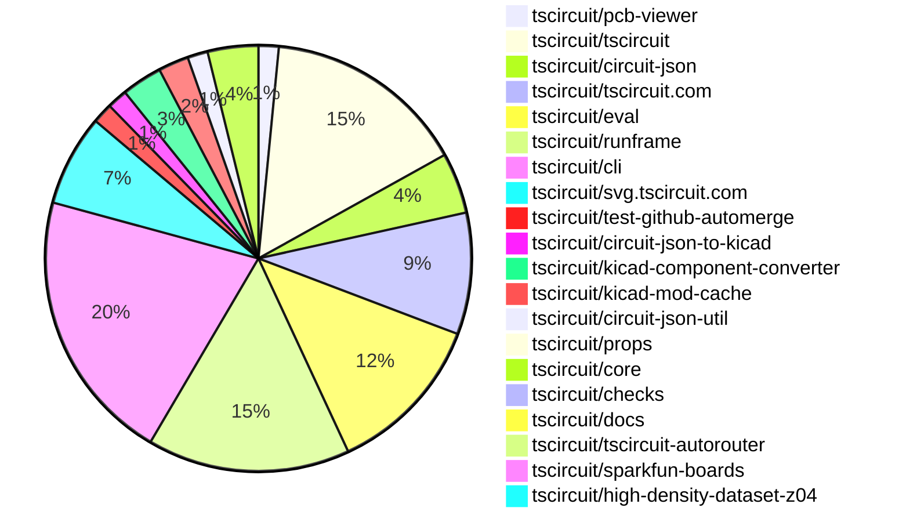

# Contribution Overview 2026-03-10

The current week is shown below. There are 3 major sections:

- [Contributor Overview](#contributor-overview)
- [PRs by Repository](#prs-by-repository)
- [PRs by Contributor](#changes-by-contributor)
- [Scoring & Sponsorship Details](/docs/sponsorship-calculation-explanation.md)

## PRs by Repository

## Contributor Overview

| Contributor | 🐳 Major | 🐙 Minor | 🐌 Tiny | Score | ⭐ | Discussion Contributions |
|-------------|---------|---------|---------|-------|-----|--------------------------|
| [ShiboSoftwareDev](#ShiboSoftwareDev) | 0 | 9 | 0 | 18 | ⭐⭐ | 0🔹 0🔶 0💎 |
| [techmannih](#techmannih) | 2 | 1 | 4 | 15 | ⭐⭐ | 0🔹 0🔶 0💎 |
| [tscircuitbot](#tscircuitbot) | 0 | 0 | 104 | 14.5 | ⭐⭐ | 0🔹 0🔶 0💎 |
| [MustafaMulla29](#MustafaMulla29) | 0 | 2 | 4 | 9 | ⭐ | 0🔹 0🔶 0💎 |
| [seveibar](#seveibar) | 1 | 1 | 2 | 9 | ⭐ | 0🔹 0🔶 0💎 |
| [imrishabh18](#imrishabh18) | 0 | 1 | 2 | 4.5 | ⭐ | 0🔹 0🔶 0💎 |
| [0hmX](#0hmX) | 1 | 0 | 0 | 4 | ⭐ | 0🔹 0🔶 0💎 |
| [Abse2001](#Abse2001) | 0 | 1 | 0 | 2 |  | 0🔹 0🔶 0💎 |
| [ArnavK-09](#ArnavK-09) | 0 | 0 | 1 | 1 |  | 0🔹 0🔶 0💎 |

> Note: AI evaluates PRs and assigns 1-3 star ratings automatically. 4 and 5 star ratings require manual staff review.

### Discussion Contribution Legend

- 🔹 Normal Comments: Basic participation with minimal effort
- 🔶 Great Informative Comments: Thoughtful participation that adds value
- 💎 Incredible Comments: Exceptional participation with high-quality content

## Review Table

[reviews-received-hover]: ## "Number of reviews received for PRs for this contributor"
[approvals-received-hover]: ## "Number of approvals received for PRs this contributor authored"
[rejections-received-hover]: ## "Number of rejections received for PRs this contributor authored"
[prs-opened-hover]: ## "Number of PRs opened by this contributor"
[issues-created-hover]: ## "Number of issues created by this contributor"

| Contributor | Reviews Received | Approvals Received | Rejections Received | Approvals | Rejections Given | PRs Opened | PRs Merged | Issues Created |
|---|---|---|---|---|---|---|---|---|
| [Nicolas-Rozas](#Nicolas-Rozas) | 2 | 1 | 0 | 0 | 0 | 4 | 0 | 0 |
| [seveibar](#seveibar) | 0 | 0 | 0 | 21 | 2 | 7 | 4 | 0 |
| [tscircuitbot](#tscircuitbot) | 1 | 0 | 0 | 0 | 0 | 139 | 105 | 0 |
| [techmannih](#techmannih) | 8 | 6 | 1 | 1 | 0 | 11 | 7 | 0 |
| [CharlesWong](#CharlesWong) | 0 | 0 | 0 | 0 | 0 | 3 | 0 | 0 |
| [Abse2001](#Abse2001) | 2 | 1 | 0 | 0 | 0 | 1 | 1 | 0 |
| [ShiboSoftwareDev](#ShiboSoftwareDev) | 12 | 9 | 0 | 0 | 0 | 10 | 9 | 0 |
| [MustafaMulla29](#MustafaMulla29) | 6 | 6 | 0 | 1 | 0 | 8 | 7 | 0 |
| [imrishabh18](#imrishabh18) | 1 | 0 | 0 | 1 | 0 | 3 | 3 | 0 |
| [ZheYanyan](#ZheYanyan) | 1 | 0 | 0 | 0 | 0 | 2 | 0 | 0 |
| [rushabhcodes](#rushabhcodes) | 1 | 0 | 0 | 1 | 0 | 1 | 0 | 0 |
| [ArnavK-09](#ArnavK-09) | 1 | 1 | 0 | 0 | 0 | 1 | 1 | 0 |
| [AnasSarkiz](#AnasSarkiz) | 6 | 0 | 1 | 0 | 0 | 2 | 0 | 0 |
| [0hmX](#0hmX) | 2 | 1 | 0 | 0 | 0 | 4 | 1 | 0 |

## Changes by Repository

### [tscircuit/pcb-viewer](https://github.com/tscircuit/pcb-viewer)

| PR # | Impact | Rating | Contributor | Description |
|------|--------|--------|-------------|-------------|
| [#692](https://github.com/tscircuit/pcb-viewer/pull/692) | 🐳 Major | ⭐⭐⭐ | techmannih | Updates the default state of the PCB viewer to hide position anchors by default, even in development mode. |

🐌 Tiny Contributions (1)

| PR # | Impact | Contributor | Description |
|------|--------|-------------|-------------|
| [#693](https://github.com/tscircuit/pcb-viewer/pull/693) | 🐌 Tiny | tscircuitbot | Automated package update |

### [tscircuit/tscircuit](https://github.com/tscircuit/tscircuit)

🐌 Tiny Contributions (20)

| PR # | Impact | Contributor | Description |
|------|--------|-------------|-------------|
| [#2575](https://github.com/tscircuit/tscircuit/pull/2575) | 🐌 Tiny | tscircuitbot | Automated package update to version 0.0.1478 |
| [#2574](https://github.com/tscircuit/tscircuit/pull/2574) | 🐌 Tiny | tscircuitbot | Updates the tscircuitcli package from version 0.1.1084 to 0.1.1085 |
| [#2572](https://github.com/tscircuit/tscircuit/pull/2572) | 🐌 Tiny | tscircuitbot | Automated package update |
| [#2571](https://github.com/tscircuit/tscircuit/pull/2571) | 🐌 Tiny | tscircuitbot | Updates the tscircuitcli package from version 0.1.1083 to 0.1.1084 and the tscircuitrunframe package from version 0.0.1713 to 0.0.1714 in package.json |
| [#2570](https://github.com/tscircuit/tscircuit/pull/2570) | 🐌 Tiny | tscircuitbot | Automated package update to version 0.0.1476 |
| [#2569](https://github.com/tscircuit/tscircuit/pull/2569) | 🐌 Tiny | tscircuitbot | Automated package update |
| [#2567](https://github.com/tscircuit/tscircuit/pull/2567) | 🐌 Tiny | tscircuitbot | Automated package update |
| [#2566](https://github.com/tscircuit/tscircuit/pull/2566) | 🐌 Tiny | tscircuitbot | Updates package versions for tscircuitchecks, tscircuitcli, tscircuitcore, tscircuiteval, and tscircuitrunframe in package.json |
| [#2564](https://github.com/tscircuit/tscircuit/pull/2564) | 🐌 Tiny | tscircuitbot | Updates the package version from 0.0.1473 to 0.0.1474 in package.json |
| [#2563](https://github.com/tscircuit/tscircuit/pull/2563) | 🐌 Tiny | tscircuitbot | Updates the tscircuitcli package version from 0.1.1080 to 0.1.1081 in package.json |
| [#2562](https://github.com/tscircuit/tscircuit/pull/2562) | 🐌 Tiny | tscircuitbot | Automated package update |
| [#2561](https://github.com/tscircuit/tscircuit/pull/2561) | 🐌 Tiny | tscircuitbot | Updates the tscircuitcli package to version 0.1.1080 in the package.json file. |
| [#2560](https://github.com/tscircuit/tscircuit/pull/2560) | 🐌 Tiny | tscircuitbot | Automated package update |
| [#2559](https://github.com/tscircuit/tscircuit/pull/2559) | 🐌 Tiny | tscircuitbot | Updates the tscircuitcli package from version 0.1.1078 to 0.1.1079 and the tscircuitrunframe package from version 0.0.1711 to 0.0.1712 in package.json |
| [#2558](https://github.com/tscircuit/tscircuit/pull/2558) | 🐌 Tiny | tscircuitbot | Automated package update to version 0.0.1471 |
| [#2557](https://github.com/tscircuit/tscircuit/pull/2557) | 🐌 Tiny | tscircuitbot | Updates the tscircuitcli package from version 0.1.1077 to 0.1.1078 |
| [#2556](https://github.com/tscircuit/tscircuit/pull/2556) | 🐌 Tiny | tscircuitbot | Automated package update |
| [#2555](https://github.com/tscircuit/tscircuit/pull/2555) | 🐌 Tiny | tscircuitbot | Automated package update |
| [#2542](https://github.com/tscircuit/tscircuit/pull/2542) | 🐌 Tiny | tscircuitbot | Updates the package version from 0.0.1468 to 0.0.1469 in package.json |
| [#2541](https://github.com/tscircuit/tscircuit/pull/2541) | 🐌 Tiny | techmannih | Updates the kicad-to-circuit-json dependency to version 0.0.32 in package.json |

### [tscircuit/circuit-json](https://github.com/tscircuit/circuit-json)

| PR # | Impact | Rating | Contributor | Description |
|------|--------|--------|-------------|-------------|
| [#505](https://github.com/tscircuit/circuit-json/pull/505) | 🐙 Minor | ⭐⭐ | Abse2001 | Adds conventions for CAD model formats and their default orientations for board normal alignment. |
| [#503](https://github.com/tscircuit/circuit-json/pull/503) | 🐙 Minor | ⭐⭐ | ShiboSoftwareDev | Adds a new error type for invalid component properties in circuit JSON, enhancing error handling for source components. |
| [#501](https://github.com/tscircuit/circuit-json/pull/501) | 🐙 Minor | ⭐⭐ | ShiboSoftwareDev | Adds new warning types for circuit elements when no power, no ground, or underspecified pins are defined. |

🐌 Tiny Contributions (3)

| PR # | Impact | Contributor | Description |
|------|--------|-------------|-------------|
| [#506](https://github.com/tscircuit/circuit-json/pull/506) | 🐌 Tiny | tscircuitbot | Automated package update |
| [#504](https://github.com/tscircuit/circuit-json/pull/504) | 🐌 Tiny | tscircuitbot | Automated package update |
| [#502](https://github.com/tscircuit/circuit-json/pull/502) | 🐌 Tiny | tscircuitbot | Automated package update |

### [tscircuit/tscircuit.com](https://github.com/tscircuit/tscircuit.com)

🐌 Tiny Contributions (12)

| PR # | Impact | Contributor | Description |
|------|--------|-------------|-------------|
| [#2976](https://github.com/tscircuit/tscircuit.com/pull/2976) | 🐌 Tiny | tscircuitbot | Updates the tscircuitrunframe package from version 0.0.1713 to 0.0.1714 |
| [#2974](https://github.com/tscircuit/tscircuit.com/pull/2974) | 🐌 Tiny | tscircuitbot | Updates the tscircuitrunframe package from version 0.0.1712 to 0.0.1713 |
| [#2973](https://github.com/tscircuit/tscircuit.com/pull/2973) | 🐌 Tiny | tscircuitbot | Updates the tscircuiteval package version from 0.0.700 to 0.0.701 in package.json |
| [#2972](https://github.com/tscircuit/tscircuit.com/pull/2972) | 🐌 Tiny | tscircuitbot | Updates the tscircuitrunframe package from version 0.0.1711 to 0.0.1712 |
| [#2971](https://github.com/tscircuit/tscircuit.com/pull/2971) | 🐌 Tiny | tscircuitbot | Updates the tscircuitrunframe package version from 0.0.1708 to 0.0.1711 in package.json |
| [#2970](https://github.com/tscircuit/tscircuit.com/pull/2970) | 🐌 Tiny | tscircuitbot | Updates the tscircuiteval package from version 0.0.698 to 0.0.700 |
| [#2966](https://github.com/tscircuit/tscircuit.com/pull/2966) | 🐌 Tiny | tscircuitbot | Automated package update |
| [#2965](https://github.com/tscircuit/tscircuit.com/pull/2965) | 🐌 Tiny | tscircuitbot | Updates the tscircuitrunframe package from version 0.0.1706 to 0.0.1708 |
| [#2964](https://github.com/tscircuit/tscircuit.com/pull/2964) | 🐌 Tiny | tscircuitbot | Automated package update |
| [#2961](https://github.com/tscircuit/tscircuit.com/pull/2961) | 🐌 Tiny | tscircuitbot | Updates the tscircuitrunframe package from version 0.0.1704 to 0.0.1706 |
| [#2960](https://github.com/tscircuit/tscircuit.com/pull/2960) | 🐌 Tiny | tscircuitbot | Automated package update |
| [#2958](https://github.com/tscircuit/tscircuit.com/pull/2958) | 🐌 Tiny | tscircuitbot | Automated package update |

### [tscircuit/eval](https://github.com/tscircuit/eval)

🐌 Tiny Contributions (16)

| PR # | Impact | Contributor | Description |
|------|--------|-------------|-------------|
| [#2239](https://github.com/tscircuit/eval/pull/2239) | 🐌 Tiny | tscircuitbot | Automated package update to version 0.0.702 |
| [#2238](https://github.com/tscircuit/eval/pull/2238) | 🐌 Tiny | tscircuitbot | Automated package update |
| [#2236](https://github.com/tscircuit/eval/pull/2236) | 🐌 Tiny | tscircuitbot | Automated package update |
| [#2235](https://github.com/tscircuit/eval/pull/2235) | 🐌 Tiny | tscircuitbot | Updates package dependencies to their latest versions |
| [#2233](https://github.com/tscircuit/eval/pull/2233) | 🐌 Tiny | tscircuitbot | Automated package update |
| [#2232](https://github.com/tscircuit/eval/pull/2232) | 🐌 Tiny | tscircuitbot | Updates the version of the tscircuitcore package from 0.0.1097 to 0.0.1098 in package.json |
| [#2230](https://github.com/tscircuit/eval/pull/2230) | 🐌 Tiny | tscircuitbot | Automated package update |
| [#2229](https://github.com/tscircuit/eval/pull/2229) | 🐌 Tiny | tscircuitbot | Automated package update |
| [#2228](https://github.com/tscircuit/eval/pull/2228) | 🐌 Tiny | tscircuitbot | Updates the version of the tscircuitcore package from 0.0.1096 to 0.0.1097 in package.json |
| [#2226](https://github.com/tscircuit/eval/pull/2226) | 🐌 Tiny | tscircuitbot | Automated package update |
| [#2225](https://github.com/tscircuit/eval/pull/2225) | 🐌 Tiny | tscircuitbot | Automated package update |
| [#2224](https://github.com/tscircuit/eval/pull/2224) | 🐌 Tiny | tscircuitbot | Updates the version of the tscircuitcore package from 0.0.1095 to 0.0.1096 in package.json |
| [#2222](https://github.com/tscircuit/eval/pull/2222) | 🐌 Tiny | tscircuitbot | Automated package update |
| [#2221](https://github.com/tscircuit/eval/pull/2221) | 🐌 Tiny | tscircuitbot | Automated package update |
| [#2219](https://github.com/tscircuit/eval/pull/2219) | 🐌 Tiny | techmannih | Updates the kicad-to-circuit-json dependency to version 0.0.32 in package.json |
| [#2218](https://github.com/tscircuit/eval/pull/2218) | 🐌 Tiny | MustafaMulla29 | Fixes the test-loading-all-kicad-footprints script to correctly extract footprint keys from the updated kicad-autocomplete.ts format |

### [tscircuit/runframe](https://github.com/tscircuit/runframe)

🐌 Tiny Contributions (20)

| PR # | Impact | Contributor | Description |
|------|--------|-------------|-------------|
| [#2877](https://github.com/tscircuit/runframe/pull/2877) | 🐌 Tiny | tscircuitbot | Automated package update |
| [#2876](https://github.com/tscircuit/runframe/pull/2876) | 🐌 Tiny | tscircuitbot | Updates the tscircuiteval package to version 0.0.702 in the package.json file. |
| [#2875](https://github.com/tscircuit/runframe/pull/2875) | 🐌 Tiny | tscircuitbot | Automated package update |
| [#2874](https://github.com/tscircuit/runframe/pull/2874) | 🐌 Tiny | tscircuitbot | Updates the tscircuiteval package to version 0.0.701 in the package.json file. |
| [#2873](https://github.com/tscircuit/runframe/pull/2873) | 🐌 Tiny | tscircuitbot | Automated package update |
| [#2872](https://github.com/tscircuit/runframe/pull/2872) | 🐌 Tiny | tscircuitbot | Updates the circuit-json-to-kicad package from version 0.0.83 to 0.0.84 |
| [#2870](https://github.com/tscircuit/runframe/pull/2870) | 🐌 Tiny | tscircuitbot | Automated package update |
| [#2869](https://github.com/tscircuit/runframe/pull/2869) | 🐌 Tiny | tscircuitbot | Updates the tscircuiteval package from version 0.0.699 to 0.0.700 in the package.json file. |
| [#2867](https://github.com/tscircuit/runframe/pull/2867) | 🐌 Tiny | tscircuitbot | Updates the tscircuiteval package from version 0.0.698 to 0.0.699 in the package.json file. |
| [#2866](https://github.com/tscircuit/runframe/pull/2866) | 🐌 Tiny | tscircuitbot | Automated package update |
| [#2865](https://github.com/tscircuit/runframe/pull/2865) | 🐌 Tiny | tscircuitbot | Updates the tscircuiteval package from version 0.0.697 to 0.0.698 in the package.json file. |
| [#2864](https://github.com/tscircuit/runframe/pull/2864) | 🐌 Tiny | tscircuitbot | Automated package update |
| [#2863](https://github.com/tscircuit/runframe/pull/2863) | 🐌 Tiny | tscircuitbot | Updates the tscircuiteval package from version 0.0.696 to 0.0.697 |
| [#2862](https://github.com/tscircuit/runframe/pull/2862) | 🐌 Tiny | tscircuitbot | Automated package update |
| [#2861](https://github.com/tscircuit/runframe/pull/2861) | 🐌 Tiny | tscircuitbot | Updates the tscircuiteval package to version 0.0.696 in the package.json file. |
| [#2860](https://github.com/tscircuit/runframe/pull/2860) | 🐌 Tiny | tscircuitbot | Updates the package version from v0.0.1704 to v0.0.1706 in package.json |
| [#2859](https://github.com/tscircuit/runframe/pull/2859) | 🐌 Tiny | tscircuitbot | Automated package update for the tscircuiteval dependency in package.json |
| [#2857](https://github.com/tscircuit/runframe/pull/2857) | 🐌 Tiny | tscircuitbot | Automated package update |
| [#2856](https://github.com/tscircuit/runframe/pull/2856) | 🐌 Tiny | tscircuitbot | Updates the tscircuitpcb-viewer package to version 1.11.348 |
| [#2855](https://github.com/tscircuit/runframe/pull/2855) | 🐌 Tiny | ArnavK-09 | !Video Project 2(https:github.comuser-attachmentsassetsc156efe1-8c0a-4105-8942-db967bb29563) |

### [tscircuit/cli](https://github.com/tscircuit/cli)

| PR # | Impact | Rating | Contributor | Description |
|------|--------|--------|-------------|-------------|
| [#2334](https://github.com/tscircuit/cli/pull/2334) | 🐳 Major | ⭐⭐⭐ | seveibar | Add a --compress flag to the tsci push command to allow users to upload a single compressed archive of the project instead of individual files, improving push performance. |
| [#2349](https://github.com/tscircuit/cli/pull/2349) | 🐙 Minor | ⭐⭐ | seveibar | Add a new tsci registry command group and packages subgroup with tsci registry packages create implemented to allow creating packages in the tscircuit registry from the CLI, supporting organization-scoped naming and visibility semantics. |
| [#2340](https://github.com/tscircuit/cli/pull/2340) | 🐙 Minor | ⭐⭐ | imrishabh18 | Adds support for exporting circuit data in the SRJ format, allowing users to generate simple route JSON files from circuit JSON inputs. |

🐌 Tiny Contributions (24)

| PR # | Impact | Contributor | Description |
|------|--------|-------------|-------------|
| [#2355](https://github.com/tscircuit/cli/pull/2355) | 🐌 Tiny | tscircuitbot | Automated package update |
| [#2354](https://github.com/tscircuit/cli/pull/2354) | 🐌 Tiny | tscircuitbot | Automated README update with latest CLI usage output. |
| [#2352](https://github.com/tscircuit/cli/pull/2352) | 🐌 Tiny | tscircuitbot | Updates the tscircuitrunframe package from version 0.0.1713 to 0.0.1714 |
| [#2348](https://github.com/tscircuit/cli/pull/2348) | 🐌 Tiny | tscircuitbot | Automated package update |
| [#2347](https://github.com/tscircuit/cli/pull/2347) | 🐌 Tiny | tscircuitbot | Updates the tscircuitrunframe package from version 0.0.1712 to 0.0.1713 |
| [#2346](https://github.com/tscircuit/cli/pull/2346) | 🐌 Tiny | tscircuitbot | Automated package update |
| [#2343](https://github.com/tscircuit/cli/pull/2343) | 🐌 Tiny | tscircuitbot | Automated README update with latest CLI usage output. |
| [#2344](https://github.com/tscircuit/cli/pull/2344) | 🐌 Tiny | tscircuitbot | Automated package update |
| [#2342](https://github.com/tscircuit/cli/pull/2342) | 🐌 Tiny | tscircuitbot | Automated package update |
| [#2341](https://github.com/tscircuit/cli/pull/2341) | 🐌 Tiny | tscircuitbot | Updates the tscircuitrunframe package from version 0.0.1711 to 0.0.1712 |
| [#2339](https://github.com/tscircuit/cli/pull/2339) | 🐌 Tiny | tscircuitbot | Automated package update |
| [#2338](https://github.com/tscircuit/cli/pull/2338) | 🐌 Tiny | tscircuitbot | Updates the tscircuitrunframe package from version 0.0.1710 to 0.0.1711 |
| [#2337](https://github.com/tscircuit/cli/pull/2337) | 🐌 Tiny | tscircuitbot | Automated package update |
| [#2336](https://github.com/tscircuit/cli/pull/2336) | 🐌 Tiny | tscircuitbot | Updates the tscircuitrunframe package from version 0.0.1709 to 0.0.1710 |
| [#2335](https://github.com/tscircuit/cli/pull/2335) | 🐌 Tiny | tscircuitbot | Automated package update |
| [#2333](https://github.com/tscircuit/cli/pull/2333) | 🐌 Tiny | tscircuitbot | Automated package update |
| [#2332](https://github.com/tscircuit/cli/pull/2332) | 🐌 Tiny | tscircuitbot | Updates the tscircuitrunframe package from version 0.0.1708 to 0.0.1709 |
| [#2331](https://github.com/tscircuit/cli/pull/2331) | 🐌 Tiny | tscircuitbot | Automated package update |
| [#2330](https://github.com/tscircuit/cli/pull/2330) | 🐌 Tiny | tscircuitbot | Updates the tscircuitrunframe package from version 0.0.1707 to 0.0.1708 |
| [#2328](https://github.com/tscircuit/cli/pull/2328) | 🐌 Tiny | tscircuitbot | Automated package update |
| [#2327](https://github.com/tscircuit/cli/pull/2327) | 🐌 Tiny | tscircuitbot | Updates the tscircuitrunframe package from version 0.0.1705 to 0.0.1707 |
| [#2325](https://github.com/tscircuit/cli/pull/2325) | 🐌 Tiny | tscircuitbot | Updates the tscircuitrunframe package from version 0.0.1704 to 0.0.1705 |
| [#2324](https://github.com/tscircuit/cli/pull/2324) | 🐌 Tiny | tscircuitbot | Automated package update |
| [#2323](https://github.com/tscircuit/cli/pull/2323) | 🐌 Tiny | tscircuitbot | Updates the tscircuitrunframe package from version 0.0.1703 to 0.0.1704 |

### [tscircuit/svg.tscircuit.com](https://github.com/tscircuit/svg.tscircuit.com)

🐌 Tiny Contributions (9)

| PR # | Impact | Contributor | Description |
|------|--------|-------------|-------------|
| [#1165](https://github.com/tscircuit/svg.tscircuit.com/pull/1165) | 🐌 Tiny | tscircuitbot | Updates the tscircuit package version from 0.0.1476 to 0.0.1477 in package.json |
| [#1164](https://github.com/tscircuit/svg.tscircuit.com/pull/1164) | 🐌 Tiny | tscircuitbot | Updates the tscircuit package version from 0.0.1475 to 0.0.1476 in package.json |
| [#1163](https://github.com/tscircuit/svg.tscircuit.com/pull/1163) | 🐌 Tiny | tscircuitbot | Updates the tscircuit package version from 0.0.1474 to 0.0.1475 in package.json |
| [#1162](https://github.com/tscircuit/svg.tscircuit.com/pull/1162) | 🐌 Tiny | tscircuitbot | Updates the tscircuit package version from 0.0.1473 to 0.0.1474 in package.json |
| [#1161](https://github.com/tscircuit/svg.tscircuit.com/pull/1161) | 🐌 Tiny | tscircuitbot | Updates the tscircuit package version from 0.0.1472 to 0.0.1473 in package.json |
| [#1160](https://github.com/tscircuit/svg.tscircuit.com/pull/1160) | 🐌 Tiny | tscircuitbot | Updates the tscircuit package version from 0.0.1471 to 0.0.1472 in package.json |
| [#1159](https://github.com/tscircuit/svg.tscircuit.com/pull/1159) | 🐌 Tiny | tscircuitbot | Updates the tscircuit package version from 0.0.1470 to 0.0.1471 in package.json |
| [#1158](https://github.com/tscircuit/svg.tscircuit.com/pull/1158) | 🐌 Tiny | tscircuitbot | Updates the tscircuit package version from 0.0.1469 to 0.0.1470 in package.json |
| [#1157](https://github.com/tscircuit/svg.tscircuit.com/pull/1157) | 🐌 Tiny | tscircuitbot | Updates the tscircuit package version from 0.0.1468 to 0.0.1469 in package.json |

### [tscircuit/test-github-automerge](https://github.com/tscircuit/test-github-automerge)

🐌 Tiny Contributions (2)

| PR # | Impact | Contributor | Description |
|------|--------|-------------|-------------|
| [#34](https://github.com/tscircuit/test-github-automerge/pull/34) | 🐌 Tiny | tscircuitbot | Updates the tscircuitcircuit-json-util package from version 0.0.88 to 0.0.89 in the development dependencies. |
| [#33](https://github.com/tscircuit/test-github-automerge/pull/33) | 🐌 Tiny | tscircuitbot | Automated package update |

### [tscircuit/circuit-json-to-kicad](https://github.com/tscircuit/circuit-json-to-kicad)

🐌 Tiny Contributions (2)

| PR # | Impact | Contributor | Description |
|------|--------|-------------|-------------|
| [#160](https://github.com/tscircuit/circuit-json-to-kicad/pull/160) | 🐌 Tiny | tscircuitbot | Automated package update |
| [#159](https://github.com/tscircuit/circuit-json-to-kicad/pull/159) | 🐌 Tiny | imrishabh18 | Updates the tscircuit version to 0.0.1471 and removes dependencies that are now included in tscircuit. |

### [tscircuit/kicad-component-converter](https://github.com/tscircuit/kicad-component-converter)

| PR # | Impact | Rating | Contributor | Description |
|------|--------|--------|-------------|-------------|
| [#192](https://github.com/tscircuit/kicad-component-converter/pull/192) | 🐳 Major | ⭐⭐⭐ | techmannih | Converts KiCad footprint courtyard layers into tscircuit pcb_courtyard_outline elements for accurate component boundary representation in circuit JSON and PCB renders. |
| [#194](https://github.com/tscircuit/kicad-component-converter/pull/194) | 🐙 Minor | ⭐⭐ | techmannih | Removes redundant conversion of .crtyd layers to pcb_courtyard_outline objects in the KiCad JSON to TSCircuit conversion process |
| [#193](https://github.com/tscircuit/kicad-component-converter/pull/193) | 🐙 Minor | ⭐⭐ | MustafaMulla29 | Converts KiCad F.CrtYdB.CrtYd layer elements to circuit-json courtyard types, including support for fp_rect parsing in the kicad-zod schema and adding SVG snapshot tests for various fixtures. |

🐌 Tiny Contributions (1)

| PR # | Impact | Contributor | Description |
|------|--------|-------------|-------------|
| [#191](https://github.com/tscircuit/kicad-component-converter/pull/191) | 🐌 Tiny | techmannih | Fixes handling of non-plated through holes in KiCad footprint conversion, ensuring correct representation of circular holes. |

### [tscircuit/kicad-mod-cache](https://github.com/tscircuit/kicad-mod-cache)

🐌 Tiny Contributions (3)

| PR # | Impact | Contributor | Description |
|------|--------|-------------|-------------|
| [#17](https://github.com/tscircuit/kicad-mod-cache/pull/17) | 🐌 Tiny | techmannih | Updates the kicad-component-converter dependency from version 0.1.30 to 0.1.37 in package.json |
| [#20](https://github.com/tscircuit/kicad-mod-cache/pull/20) | 🐌 Tiny | MustafaMulla29 | Updates the kicad-component-converter dependency from version 0.1.38 to 0.1.40 in package.json |
| [#18](https://github.com/tscircuit/kicad-mod-cache/pull/18) | 🐌 Tiny | MustafaMulla29 | Updates the kicad-component-converter dependency to version 0.1.38 in package.json |

### [tscircuit/circuit-json-util](https://github.com/tscircuit/circuit-json-util)

| PR # | Impact | Rating | Contributor | Description |
|------|--------|--------|-------------|-------------|
| [#88](https://github.com/tscircuit/circuit-json-util/pull/88) | 🐙 Minor | ⭐⭐ | ShiboSoftwareDev | Adds a new category pin_specification to categorize DRC errorwarning types related to pin specifications in the circuit JSON utility. |
| [#89](https://github.com/tscircuit/circuit-json-util/pull/89) | 🐙 Minor | ⭐⭐ | MustafaMulla29 | Adds support for courtyard elements (rectangles, circles, outlines, and polygons) in the transformPCBElement function, allowing for proper transformation of these elements in PCB designs. |

### [tscircuit/props](https://github.com/tscircuit/props)

| PR # | Impact | Rating | Contributor | Description |
|------|--------|--------|-------------|-------------|
| [#615](https://github.com/tscircuit/props/pull/615) | 🐙 Minor | ⭐⭐ | ShiboSoftwareDev | Adds a new configuration option pinSpecificationDrcChecksDisabled to the PlatformConfig interface, allowing users to disable DRC checks for pin specifications. |

### [tscircuit/core](https://github.com/tscircuit/core)

| PR # | Impact | Rating | Contributor | Description |
|------|--------|--------|-------------|-------------|
| [#2032](https://github.com/tscircuit/core/pull/2032) | 🐙 Minor | ⭐⭐ | ShiboSoftwareDev | Fixes primitive PCB calc so expressions like pcbXcalc(R1.maxX  1mm) and pcbYcalc(R1.y) work for primitives outside footprints (e.g. via). |
| [#2033](https://github.com/tscircuit/core/pull/2033) | 🐙 Minor | ⭐⭐ | ShiboSoftwareDev | Adds pin specification design rule checks (DRC) to the board check pipeline, enhancing validation for pin specifications in circuit designs. |
| [#2031](https://github.com/tscircuit/core/pull/2031) | 🐙 Minor | ⭐⭐ | ShiboSoftwareDev | Adds PCB rendering support for currentsource and voltagesource when a footprint is provided, and enforces a clear error when explicit PCB placement props are used without a footprint. |
| [#2027](https://github.com/tscircuit/core/pull/2027) | 🐙 Minor | ⭐⭐ | ShiboSoftwareDev | Implements BoardI interface on MountedBoard so that calc(board.) expressions in pcbXpcbY resolve against the carrier boards bounds. |

🐌 Tiny Contributions (1)

| PR # | Impact | Contributor | Description |
|------|--------|-------------|-------------|
| [#2035](https://github.com/tscircuit/core/pull/2035) | 🐌 Tiny | MustafaMulla29 | Updates the portHints property access in PlatedHole component and bumps the tscircuitprops dependency version from 0.0.490 to 0.0.494 |

### [tscircuit/checks](https://github.com/tscircuit/checks)

| PR # | Impact | Rating | Contributor | Description |
|------|--------|--------|-------------|-------------|
| [#116](https://github.com/tscircuit/checks/pull/116) | 🐙 Minor | ⭐⭐ | ShiboSoftwareDev | Adds checks to ensure that each chip has at least one pin marked as requires_powertrue, returning warnings for chips without such pins. |

### [tscircuit/docs](https://github.com/tscircuit/docs)

🐌 Tiny Contributions (1)

| PR # | Impact | Contributor | Description |
|------|--------|-------------|-------------|
| [#501](https://github.com/tscircuit/docs/pull/501) | 🐌 Tiny | seveibar | Clarifies how pcbXpcbY coordinates are interpreted when positioning components by non-center points such as pins or footprint edges, and provides examples for anchoring placement to a pin or footprint boundaries. |

### [tscircuit/tscircuit-autorouter](https://github.com/tscircuit/tscircuit-autorouter)

🐌 Tiny Contributions (1)

| PR # | Impact | Contributor | Description |
|------|--------|-------------|-------------|
| [#647](https://github.com/tscircuit/tscircuit-autorouter/pull/647) | 🐌 Tiny | seveibar | Pins the version of the high-density-dataset-z04 dependency to a specific commit for stability. |

### [tscircuit/sparkfun-boards](https://github.com/tscircuit/sparkfun-boards)

🐌 Tiny Contributions (1)

| PR # | Impact | Contributor | Description |
|------|--------|-------------|-------------|
| [#270](https://github.com/tscircuit/sparkfun-boards/pull/270) | 🐌 Tiny | imrishabh18 | This pull request updates the version of tscircuit and includes updates to the snapshots, reflecting changes in the routing of some circuits while noting that some circuits have failed to route correctly. |

### [tscircuit/high-density-dataset-z04](https://github.com/tscircuit/high-density-dataset-z04)

| PR # | Impact | Rating | Contributor | Description |
|------|--------|--------|-------------|-------------|
| [#4](https://github.com/tscircuit/high-density-dataset-z04/pull/4) | 🐳 Major | ⭐⭐⭐ | 0hmX | Add hard problem data imports and mapping structure and export for hard problem module in package.json |

## Changes by Contributor

### [tscircuitbot](https://github.com/tscircuitbot)

🐌 Tiny Contributions (104)

| PR # | Impact | Description |
|------|--------|-------------|
| [#693](https://github.com/tscircuit/pcb-viewer/pull/693) | 🐌 Tiny | Automated package update |
| [#2575](https://github.com/tscircuit/tscircuit/pull/2575) | 🐌 Tiny | Automated package update to version 0.0.1478 |
| [#2574](https://github.com/tscircuit/tscircuit/pull/2574) | 🐌 Tiny | Updates the tscircuitcli package from version 0.1.1084 to 0.1.1085 |
| [#2572](https://github.com/tscircuit/tscircuit/pull/2572) | 🐌 Tiny | Automated package update |
| [#2571](https://github.com/tscircuit/tscircuit/pull/2571) | 🐌 Tiny | Updates the tscircuitcli package from version 0.1.1083 to 0.1.1084 and the tscircuitrunframe package from version 0.0.1713 to 0.0.1714 in package.json |
| [#2570](https://github.com/tscircuit/tscircuit/pull/2570) | 🐌 Tiny | Automated package update to version 0.0.1476 |
| [#2569](https://github.com/tscircuit/tscircuit/pull/2569) | 🐌 Tiny | Automated package update |
| [#2567](https://github.com/tscircuit/tscircuit/pull/2567) | 🐌 Tiny | Automated package update |
| [#2566](https://github.com/tscircuit/tscircuit/pull/2566) | 🐌 Tiny | Updates package versions for tscircuitchecks, tscircuitcli, tscircuitcore, tscircuiteval, and tscircuitrunframe in package.json |
| [#2564](https://github.com/tscircuit/tscircuit/pull/2564) | 🐌 Tiny | Updates the package version from 0.0.1473 to 0.0.1474 in package.json |
| [#2563](https://github.com/tscircuit/tscircuit/pull/2563) | 🐌 Tiny | Updates the tscircuitcli package version from 0.1.1080 to 0.1.1081 in package.json |
| [#2562](https://github.com/tscircuit/tscircuit/pull/2562) | 🐌 Tiny | Automated package update |
| [#2561](https://github.com/tscircuit/tscircuit/pull/2561) | 🐌 Tiny | Updates the tscircuitcli package to version 0.1.1080 in the package.json file. |
| [#2560](https://github.com/tscircuit/tscircuit/pull/2560) | 🐌 Tiny | Automated package update |
| [#2559](https://github.com/tscircuit/tscircuit/pull/2559) | 🐌 Tiny | Updates the tscircuitcli package from version 0.1.1078 to 0.1.1079 and the tscircuitrunframe package from version 0.0.1711 to 0.0.1712 in package.json |
| [#2558](https://github.com/tscircuit/tscircuit/pull/2558) | 🐌 Tiny | Automated package update to version 0.0.1471 |
| [#2557](https://github.com/tscircuit/tscircuit/pull/2557) | 🐌 Tiny | Updates the tscircuitcli package from version 0.1.1077 to 0.1.1078 |
| [#2556](https://github.com/tscircuit/tscircuit/pull/2556) | 🐌 Tiny | Automated package update |
| [#2555](https://github.com/tscircuit/tscircuit/pull/2555) | 🐌 Tiny | Automated package update |
| [#2542](https://github.com/tscircuit/tscircuit/pull/2542) | 🐌 Tiny | Updates the package version from 0.0.1468 to 0.0.1469 in package.json |
| [#506](https://github.com/tscircuit/circuit-json/pull/506) | 🐌 Tiny | Automated package update |
| [#504](https://github.com/tscircuit/circuit-json/pull/504) | 🐌 Tiny | Automated package update |
| [#502](https://github.com/tscircuit/circuit-json/pull/502) | 🐌 Tiny | Automated package update |
| [#2976](https://github.com/tscircuit/tscircuit.com/pull/2976) | 🐌 Tiny | Updates the tscircuitrunframe package from version 0.0.1713 to 0.0.1714 |
| [#2974](https://github.com/tscircuit/tscircuit.com/pull/2974) | 🐌 Tiny | Updates the tscircuitrunframe package from version 0.0.1712 to 0.0.1713 |
| [#2973](https://github.com/tscircuit/tscircuit.com/pull/2973) | 🐌 Tiny | Updates the tscircuiteval package version from 0.0.700 to 0.0.701 in package.json |
| [#2972](https://github.com/tscircuit/tscircuit.com/pull/2972) | 🐌 Tiny | Updates the tscircuitrunframe package from version 0.0.1711 to 0.0.1712 |
| [#2971](https://github.com/tscircuit/tscircuit.com/pull/2971) | 🐌 Tiny | Updates the tscircuitrunframe package version from 0.0.1708 to 0.0.1711 in package.json |
| [#2970](https://github.com/tscircuit/tscircuit.com/pull/2970) | 🐌 Tiny | Updates the tscircuiteval package from version 0.0.698 to 0.0.700 |
| [#2966](https://github.com/tscircuit/tscircuit.com/pull/2966) | 🐌 Tiny | Automated package update |
| [#2965](https://github.com/tscircuit/tscircuit.com/pull/2965) | 🐌 Tiny | Updates the tscircuitrunframe package from version 0.0.1706 to 0.0.1708 |
| [#2964](https://github.com/tscircuit/tscircuit.com/pull/2964) | 🐌 Tiny | Automated package update |
| [#2961](https://github.com/tscircuit/tscircuit.com/pull/2961) | 🐌 Tiny | Updates the tscircuitrunframe package from version 0.0.1704 to 0.0.1706 |
| [#2960](https://github.com/tscircuit/tscircuit.com/pull/2960) | 🐌 Tiny | Automated package update |
| [#2958](https://github.com/tscircuit/tscircuit.com/pull/2958) | 🐌 Tiny | Automated package update |
| [#2239](https://github.com/tscircuit/eval/pull/2239) | 🐌 Tiny | Automated package update to version 0.0.702 |
| [#2238](https://github.com/tscircuit/eval/pull/2238) | 🐌 Tiny | Automated package update |
| [#2236](https://github.com/tscircuit/eval/pull/2236) | 🐌 Tiny | Automated package update |
| [#2235](https://github.com/tscircuit/eval/pull/2235) | 🐌 Tiny | Updates package dependencies to their latest versions |
| [#2233](https://github.com/tscircuit/eval/pull/2233) | 🐌 Tiny | Automated package update |
| [#2232](https://github.com/tscircuit/eval/pull/2232) | 🐌 Tiny | Updates the version of the tscircuitcore package from 0.0.1097 to 0.0.1098 in package.json |
| [#2230](https://github.com/tscircuit/eval/pull/2230) | 🐌 Tiny | Automated package update |
| [#2229](https://github.com/tscircuit/eval/pull/2229) | 🐌 Tiny | Automated package update |
| [#2228](https://github.com/tscircuit/eval/pull/2228) | 🐌 Tiny | Updates the version of the tscircuitcore package from 0.0.1096 to 0.0.1097 in package.json |
| [#2226](https://github.com/tscircuit/eval/pull/2226) | 🐌 Tiny | Automated package update |
| [#2225](https://github.com/tscircuit/eval/pull/2225) | 🐌 Tiny | Automated package update |
| [#2224](https://github.com/tscircuit/eval/pull/2224) | 🐌 Tiny | Updates the version of the tscircuitcore package from 0.0.1095 to 0.0.1096 in package.json |
| [#2222](https://github.com/tscircuit/eval/pull/2222) | 🐌 Tiny | Automated package update |
| [#2221](https://github.com/tscircuit/eval/pull/2221) | 🐌 Tiny | Automated package update |
| [#2877](https://github.com/tscircuit/runframe/pull/2877) | 🐌 Tiny | Automated package update |
| [#2876](https://github.com/tscircuit/runframe/pull/2876) | 🐌 Tiny | Updates the tscircuiteval package to version 0.0.702 in the package.json file. |
| [#2875](https://github.com/tscircuit/runframe/pull/2875) | 🐌 Tiny | Automated package update |
| [#2874](https://github.com/tscircuit/runframe/pull/2874) | 🐌 Tiny | Updates the tscircuiteval package to version 0.0.701 in the package.json file. |
| [#2873](https://github.com/tscircuit/runframe/pull/2873) | 🐌 Tiny | Automated package update |
| [#2872](https://github.com/tscircuit/runframe/pull/2872) | 🐌 Tiny | Updates the circuit-json-to-kicad package from version 0.0.83 to 0.0.84 |
| [#2870](https://github.com/tscircuit/runframe/pull/2870) | 🐌 Tiny | Automated package update |
| [#2869](https://github.com/tscircuit/runframe/pull/2869) | 🐌 Tiny | Updates the tscircuiteval package from version 0.0.699 to 0.0.700 in the package.json file. |
| [#2867](https://github.com/tscircuit/runframe/pull/2867) | 🐌 Tiny | Updates the tscircuiteval package from version 0.0.698 to 0.0.699 in the package.json file. |
| [#2866](https://github.com/tscircuit/runframe/pull/2866) | 🐌 Tiny | Automated package update |
| [#2865](https://github.com/tscircuit/runframe/pull/2865) | 🐌 Tiny | Updates the tscircuiteval package from version 0.0.697 to 0.0.698 in the package.json file. |
| [#2864](https://github.com/tscircuit/runframe/pull/2864) | 🐌 Tiny | Automated package update |
| [#2863](https://github.com/tscircuit/runframe/pull/2863) | 🐌 Tiny | Updates the tscircuiteval package from version 0.0.696 to 0.0.697 |
| [#2862](https://github.com/tscircuit/runframe/pull/2862) | 🐌 Tiny | Automated package update |
| [#2861](https://github.com/tscircuit/runframe/pull/2861) | 🐌 Tiny | Updates the tscircuiteval package to version 0.0.696 in the package.json file. |
| [#2860](https://github.com/tscircuit/runframe/pull/2860) | 🐌 Tiny | Updates the package version from v0.0.1704 to v0.0.1706 in package.json |
| [#2859](https://github.com/tscircuit/runframe/pull/2859) | 🐌 Tiny | Automated package update for the tscircuiteval dependency in package.json |
| [#2857](https://github.com/tscircuit/runframe/pull/2857) | 🐌 Tiny | Automated package update |
| [#2856](https://github.com/tscircuit/runframe/pull/2856) | 🐌 Tiny | Updates the tscircuitpcb-viewer package to version 1.11.348 |
| [#2355](https://github.com/tscircuit/cli/pull/2355) | 🐌 Tiny | Automated package update |
| [#2354](https://github.com/tscircuit/cli/pull/2354) | 🐌 Tiny | Automated README update with latest CLI usage output. |
| [#2352](https://github.com/tscircuit/cli/pull/2352) | 🐌 Tiny | Updates the tscircuitrunframe package from version 0.0.1713 to 0.0.1714 |
| [#2348](https://github.com/tscircuit/cli/pull/2348) | 🐌 Tiny | Automated package update |
| [#2347](https://github.com/tscircuit/cli/pull/2347) | 🐌 Tiny | Updates the tscircuitrunframe package from version 0.0.1712 to 0.0.1713 |
| [#2346](https://github.com/tscircuit/cli/pull/2346) | 🐌 Tiny | Automated package update |
| [#2343](https://github.com/tscircuit/cli/pull/2343) | 🐌 Tiny | Automated README update with latest CLI usage output. |
| [#2344](https://github.com/tscircuit/cli/pull/2344) | 🐌 Tiny | Automated package update |
| [#2342](https://github.com/tscircuit/cli/pull/2342) | 🐌 Tiny | Automated package update |
| [#2341](https://github.com/tscircuit/cli/pull/2341) | 🐌 Tiny | Updates the tscircuitrunframe package from version 0.0.1711 to 0.0.1712 |
| [#2339](https://github.com/tscircuit/cli/pull/2339) | 🐌 Tiny | Automated package update |
| [#2338](https://github.com/tscircuit/cli/pull/2338) | 🐌 Tiny | Updates the tscircuitrunframe package from version 0.0.1710 to 0.0.1711 |
| [#2337](https://github.com/tscircuit/cli/pull/2337) | 🐌 Tiny | Automated package update |
| [#2336](https://github.com/tscircuit/cli/pull/2336) | 🐌 Tiny | Updates the tscircuitrunframe package from version 0.0.1709 to 0.0.1710 |
| [#2335](https://github.com/tscircuit/cli/pull/2335) | 🐌 Tiny | Automated package update |
| [#2333](https://github.com/tscircuit/cli/pull/2333) | 🐌 Tiny | Automated package update |
| [#2332](https://github.com/tscircuit/cli/pull/2332) | 🐌 Tiny | Updates the tscircuitrunframe package from version 0.0.1708 to 0.0.1709 |
| [#2331](https://github.com/tscircuit/cli/pull/2331) | 🐌 Tiny | Automated package update |
| [#2330](https://github.com/tscircuit/cli/pull/2330) | 🐌 Tiny | Updates the tscircuitrunframe package from version 0.0.1707 to 0.0.1708 |
| [#2328](https://github.com/tscircuit/cli/pull/2328) | 🐌 Tiny | Automated package update |
| [#2327](https://github.com/tscircuit/cli/pull/2327) | 🐌 Tiny | Updates the tscircuitrunframe package from version 0.0.1705 to 0.0.1707 |
| [#2325](https://github.com/tscircuit/cli/pull/2325) | 🐌 Tiny | Updates the tscircuitrunframe package from version 0.0.1704 to 0.0.1705 |
| [#2324](https://github.com/tscircuit/cli/pull/2324) | 🐌 Tiny | Automated package update |
| [#2323](https://github.com/tscircuit/cli/pull/2323) | 🐌 Tiny | Updates the tscircuitrunframe package from version 0.0.1703 to 0.0.1704 |
| [#1165](https://github.com/tscircuit/svg.tscircuit.com/pull/1165) | 🐌 Tiny | Updates the tscircuit package version from 0.0.1476 to 0.0.1477 in package.json |
| [#1164](https://github.com/tscircuit/svg.tscircuit.com/pull/1164) | 🐌 Tiny | Updates the tscircuit package version from 0.0.1475 to 0.0.1476 in package.json |
| [#1163](https://github.com/tscircuit/svg.tscircuit.com/pull/1163) | 🐌 Tiny | Updates the tscircuit package version from 0.0.1474 to 0.0.1475 in package.json |
| [#1162](https://github.com/tscircuit/svg.tscircuit.com/pull/1162) | 🐌 Tiny | Updates the tscircuit package version from 0.0.1473 to 0.0.1474 in package.json |
| [#1161](https://github.com/tscircuit/svg.tscircuit.com/pull/1161) | 🐌 Tiny | Updates the tscircuit package version from 0.0.1472 to 0.0.1473 in package.json |
| [#1160](https://github.com/tscircuit/svg.tscircuit.com/pull/1160) | 🐌 Tiny | Updates the tscircuit package version from 0.0.1471 to 0.0.1472 in package.json |
| [#1159](https://github.com/tscircuit/svg.tscircuit.com/pull/1159) | 🐌 Tiny | Updates the tscircuit package version from 0.0.1470 to 0.0.1471 in package.json |
| [#1158](https://github.com/tscircuit/svg.tscircuit.com/pull/1158) | 🐌 Tiny | Updates the tscircuit package version from 0.0.1469 to 0.0.1470 in package.json |
| [#1157](https://github.com/tscircuit/svg.tscircuit.com/pull/1157) | 🐌 Tiny | Updates the tscircuit package version from 0.0.1468 to 0.0.1469 in package.json |
| [#34](https://github.com/tscircuit/test-github-automerge/pull/34) | 🐌 Tiny | Updates the tscircuitcircuit-json-util package from version 0.0.88 to 0.0.89 in the development dependencies. |
| [#33](https://github.com/tscircuit/test-github-automerge/pull/33) | 🐌 Tiny | Automated package update |
| [#160](https://github.com/tscircuit/circuit-json-to-kicad/pull/160) | 🐌 Tiny | Automated package update |

### [techmannih](https://github.com/techmannih)

| PRs # | Impact | Rating | Description |
|------|--------|--------|-------------|
| [#692](https://github.com/tscircuit/pcb-viewer/pull/692) | 🐳 Major | ⭐⭐⭐ | Updates the default state of the PCB viewer to hide position anchors by default, even in development mode. |
| [#192](https://github.com/tscircuit/kicad-component-converter/pull/192) | 🐳 Major | ⭐⭐⭐ | Converts KiCad footprint courtyard layers into tscircuit pcb_courtyard_outline elements for accurate component boundary representation in circuit JSON and PCB renders. |
| [#194](https://github.com/tscircuit/kicad-component-converter/pull/194) | 🐙 Minor | ⭐⭐ | Removes redundant conversion of .crtyd layers to pcb_courtyard_outline objects in the KiCad JSON to TSCircuit conversion process |

🐌 Tiny Contributions (4)

| PR # | Impact | Description |
|------|--------|-------------|
| [#2541](https://github.com/tscircuit/tscircuit/pull/2541) | 🐌 Tiny | Updates the kicad-to-circuit-json dependency to version 0.0.32 in package.json |
| [#191](https://github.com/tscircuit/kicad-component-converter/pull/191) | 🐌 Tiny | Fixes handling of non-plated through holes in KiCad footprint conversion, ensuring correct representation of circular holes. |
| [#17](https://github.com/tscircuit/kicad-mod-cache/pull/17) | 🐌 Tiny | Updates the kicad-component-converter dependency from version 0.1.30 to 0.1.37 in package.json |
| [#2219](https://github.com/tscircuit/eval/pull/2219) | 🐌 Tiny | Updates the kicad-to-circuit-json dependency to version 0.0.32 in package.json |

### [Abse2001](https://github.com/Abse2001)

| PRs # | Impact | Rating | Description |
|------|--------|--------|-------------|
| [#505](https://github.com/tscircuit/circuit-json/pull/505) | 🐙 Minor | ⭐⭐ | Adds conventions for CAD model formats and their default orientations for board normal alignment. |

### [ShiboSoftwareDev](https://github.com/ShiboSoftwareDev)

| PRs # | Impact | Rating | Description |
|------|--------|--------|-------------|
| [#503](https://github.com/tscircuit/circuit-json/pull/503) | 🐙 Minor | ⭐⭐ | Adds a new error type for invalid component properties in circuit JSON, enhancing error handling for source components. |
| [#501](https://github.com/tscircuit/circuit-json/pull/501) | 🐙 Minor | ⭐⭐ | Adds new warning types for circuit elements when no power, no ground, or underspecified pins are defined. |
| [#88](https://github.com/tscircuit/circuit-json-util/pull/88) | 🐙 Minor | ⭐⭐ | Adds a new category pin_specification to categorize DRC errorwarning types related to pin specifications in the circuit JSON utility. |
| [#615](https://github.com/tscircuit/props/pull/615) | 🐙 Minor | ⭐⭐ | Adds a new configuration option pinSpecificationDrcChecksDisabled to the PlatformConfig interface, allowing users to disable DRC checks for pin specifications. |
| [#2032](https://github.com/tscircuit/core/pull/2032) | 🐙 Minor | ⭐⭐ | Fixes primitive PCB calc so expressions like pcbXcalc(R1.maxX  1mm) and pcbYcalc(R1.y) work for primitives outside footprints (e.g. via). |
| [#2033](https://github.com/tscircuit/core/pull/2033) | 🐙 Minor | ⭐⭐ | Adds pin specification design rule checks (DRC) to the board check pipeline, enhancing validation for pin specifications in circuit designs. |
| [#2031](https://github.com/tscircuit/core/pull/2031) | 🐙 Minor | ⭐⭐ | Adds PCB rendering support for currentsource and voltagesource when a footprint is provided, and enforces a clear error when explicit PCB placement props are used without a footprint. |
| [#2027](https://github.com/tscircuit/core/pull/2027) | 🐙 Minor | ⭐⭐ | Implements BoardI interface on MountedBoard so that calc(board.) expressions in pcbXpcbY resolve against the carrier boards bounds. |
| [#116](https://github.com/tscircuit/checks/pull/116) | 🐙 Minor | ⭐⭐ | Adds checks to ensure that each chip has at least one pin marked as requires_powertrue, returning warnings for chips without such pins. |

### [MustafaMulla29](https://github.com/MustafaMulla29)

| PRs # | Impact | Rating | Description |
|------|--------|--------|-------------|
| [#89](https://github.com/tscircuit/circuit-json-util/pull/89) | 🐙 Minor | ⭐⭐ | Adds support for courtyard elements (rectangles, circles, outlines, and polygons) in the transformPCBElement function, allowing for proper transformation of these elements in PCB designs. |
| [#193](https://github.com/tscircuit/kicad-component-converter/pull/193) | 🐙 Minor | ⭐⭐ | Converts KiCad F.CrtYdB.CrtYd layer elements to circuit-json courtyard types, including support for fp_rect parsing in the kicad-zod schema and adding SVG snapshot tests for various fixtures. |

🐌 Tiny Contributions (4)

| PR # | Impact | Description |
|------|--------|-------------|
| [#20](https://github.com/tscircuit/kicad-mod-cache/pull/20) | 🐌 Tiny | Updates the kicad-component-converter dependency from version 0.1.38 to 0.1.40 in package.json |
| [#18](https://github.com/tscircuit/kicad-mod-cache/pull/18) | 🐌 Tiny | Updates the kicad-component-converter dependency to version 0.1.38 in package.json |
| [#2035](https://github.com/tscircuit/core/pull/2035) | 🐌 Tiny | Updates the portHints property access in PlatedHole component and bumps the tscircuitprops dependency version from 0.0.490 to 0.0.494 |
| [#2218](https://github.com/tscircuit/eval/pull/2218) | 🐌 Tiny | Fixes the test-loading-all-kicad-footprints script to correctly extract footprint keys from the updated kicad-autocomplete.ts format |

### [ArnavK-09](https://github.com/ArnavK-09)

🐌 Tiny Contributions (1)

| PR # | Impact | Description |
|------|--------|-------------|
| [#2855](https://github.com/tscircuit/runframe/pull/2855) | 🐌 Tiny | !Video Project 2(https:github.comuser-attachmentsassetsc156efe1-8c0a-4105-8942-db967bb29563) |

### [seveibar](https://github.com/seveibar)

| PRs # | Impact | Rating | Description |
|------|--------|--------|-------------|
| [#2334](https://github.com/tscircuit/cli/pull/2334) | 🐳 Major | ⭐⭐⭐ | Add a --compress flag to the tsci push command to allow users to upload a single compressed archive of the project instead of individual files, improving push performance. |
| [#2349](https://github.com/tscircuit/cli/pull/2349) | 🐙 Minor | ⭐⭐ | Add a new tsci registry command group and packages subgroup with tsci registry packages create implemented to allow creating packages in the tscircuit registry from the CLI, supporting organization-scoped naming and visibility semantics. |

🐌 Tiny Contributions (2)

| PR # | Impact | Description |
|------|--------|-------------|
| [#501](https://github.com/tscircuit/docs/pull/501) | 🐌 Tiny | Clarifies how pcbXpcbY coordinates are interpreted when positioning components by non-center points such as pins or footprint edges, and provides examples for anchoring placement to a pin or footprint boundaries. |
| [#647](https://github.com/tscircuit/tscircuit-autorouter/pull/647) | 🐌 Tiny | Pins the version of the high-density-dataset-z04 dependency to a specific commit for stability. |

### [imrishabh18](https://github.com/imrishabh18)

| PRs # | Impact | Rating | Description |
|------|--------|--------|-------------|
| [#2340](https://github.com/tscircuit/cli/pull/2340) | 🐙 Minor | ⭐⭐ | Adds support for exporting circuit data in the SRJ format, allowing users to generate simple route JSON files from circuit JSON inputs. |

🐌 Tiny Contributions (2)

| PR # | Impact | Description |
|------|--------|-------------|
| [#270](https://github.com/tscircuit/sparkfun-boards/pull/270) | 🐌 Tiny | This pull request updates the version of tscircuit and includes updates to the snapshots, reflecting changes in the routing of some circuits while noting that some circuits have failed to route correctly. |
| [#159](https://github.com/tscircuit/circuit-json-to-kicad/pull/159) | 🐌 Tiny | Updates the tscircuit version to 0.0.1471 and removes dependencies that are now included in tscircuit. |

### [0hmX](https://github.com/0hmX)

| PRs # | Impact | Rating | Description |
|------|--------|--------|-------------|
| [#4](https://github.com/tscircuit/high-density-dataset-z04/pull/4) | 🐳 Major | ⭐⭐⭐ | Add hard problem data imports and mapping structure and export for hard problem module in package.json |

## Repository Owners

| Repository | Codeowners |
|------------|------------|
| [builder](https://github.com/tscircuit/builder/blob/main/.github/CODEOWNERS) | [seveibar](https://github.com/seveibar)
| [pcb-viewer](https://github.com/tscircuit/pcb-viewer/blob/main/.github/CODEOWNERS) | [seveibar](https://github.com/seveibar), [ShiboSoftwareDev](https://github.com/ShiboSoftwareDev), [Abse2001](https://github.com/Abse2001)
| [footprints-old](https://github.com/tscircuit/footprints-old/blob/main/.github/CODEOWNERS) | [seveibar](https://github.com/seveibar)
| [footprinter](https://github.com/tscircuit/footprinter/blob/main/.github/CODEOWNERS) | [seveibar](https://github.com/seveibar), [techmannih](https://github.com/techmannih)
| [3d-viewer](https://github.com/tscircuit/3d-viewer/blob/main/.github/CODEOWNERS) | [ShiboSoftwareDev](https://github.com/ShiboSoftwareDev), [Abse2001](https://github.com/Abse2001)
| [winterspec](https://github.com/tscircuit/winterspec/blob/main/.github/CODEOWNERS) | [seveibar](https://github.com/seveibar), [ShiboSoftwareDev](https://github.com/ShiboSoftwareDev)
| [jscad-electronics](https://github.com/tscircuit/jscad-electronics/blob/main/.github/CODEOWNERS) | [seveibar](https://github.com/seveibar), [techmannih](https://github.com/techmannih), [ShiboSoftwareDev](https://github.com/ShiboSoftwareDev), [anas-sarkez](https://github.com/anas-sarkez)
| [circuit-to-svg](https://github.com/tscircuit/circuit-to-svg/blob/main/.github/CODEOWNERS) | [imrishabh18](https://github.com/imrishabh18)
| [schematic-symbols](https://github.com/tscircuit/schematic-symbols/blob/main/.github/CODEOWNERS) | [seveibar](https://github.com/seveibar), [imrishabh18](https://github.com/imrishabh18), [techmannih](https://github.com/techmannih)
| [circuit-json-to-gerber](https://github.com/tscircuit/circuit-json-to-gerber/blob/main/.github/CODEOWNERS) | [seveibar](https://github.com/seveibar), [ShiboSoftwareDev](https://github.com/ShiboSoftwareDev)
| [tscircuit.com](https://github.com/tscircuit/tscircuit.com/blob/main/.github/CODEOWNERS) | [seveibar](https://github.com/seveibar), [imrishabh18](https://github.com/imrishabh18)
| [issue-roulette](https://github.com/tscircuit/issue-roulette/blob/main/.github/CODEOWNERS) | [Anshgrover23](https://github.com/Anshgrover23)
| [sparkfun-boards](https://github.com/tscircuit/sparkfun-boards/blob/main/.github/CODEOWNERS) | [ShiboSoftwareDev](https://github.com/ShiboSoftwareDev), [Abse2001](https://github.com/Abse2001), [MustafaMulla29](https://github.com/MustafaMulla29), [Anshgrover23](https://github.com/Anshgrover23), [techmannih](https://github.com/techmannih)
| [schematic-corpus](https://github.com/tscircuit/schematic-corpus/blob/main/.github/CODEOWNERS) | [Abse2001](https://github.com/Abse2001)
| [copper-pour-solver](https://github.com/tscircuit/copper-pour-solver/blob/main/.github/CODEOWNERS) | [seveibar](https://github.com/seveibar), [ShiboSoftwareDev](https://github.com/ShiboSoftwareDev)
| [common](https://github.com/tscircuit/common/blob/main/.github/CODEOWNERS) | [seveibar](https://github.com/seveibar), [Abse2001](https://github.com/Abse2001)
| [circuit-to-canvas](https://github.com/tscircuit/circuit-to-canvas/blob/main/.github/CODEOWNERS) | [ShiboSoftwareDev](https://github.com/ShiboSoftwareDev), [Abse2001](https://github.com/Abse2001), [techmannih](https://github.com/techmannih)
| [circuit-json-to-lbrn](https://github.com/tscircuit/circuit-json-to-lbrn/blob/main/.github/CODEOWNERS) | [AnasSarkiz](https://github.com/AnasSarkiz)
| [pcbburn.com](https://github.com/tscircuit/pcbburn.com/blob/main/.github/CODEOWNERS) | [AnasSarkiz](https://github.com/AnasSarkiz)

## Repositories by Owner

| User | Repo |
|------|------|
| [seveibar](https://github.com/seveibar) | [builder](https://github.com/tscircuit/builder/blob/main/.github/CODEOWNERS) |
|  | [pcb-viewer](https://github.com/tscircuit/pcb-viewer/blob/main/.github/CODEOWNERS) |
|  | [footprints-old](https://github.com/tscircuit/footprints-old/blob/main/.github/CODEOWNERS) |
|  | [footprinter](https://github.com/tscircuit/footprinter/blob/main/.github/CODEOWNERS) |
|  | [winterspec](https://github.com/tscircuit/winterspec/blob/main/.github/CODEOWNERS) |
|  | [jscad-electronics](https://github.com/tscircuit/jscad-electronics/blob/main/.github/CODEOWNERS) |
|  | [schematic-symbols](https://github.com/tscircuit/schematic-symbols/blob/main/.github/CODEOWNERS) |
|  | [circuit-json-to-gerber](https://github.com/tscircuit/circuit-json-to-gerber/blob/main/.github/CODEOWNERS) |
|  | [tscircuit.com](https://github.com/tscircuit/tscircuit.com/blob/main/.github/CODEOWNERS) |
|  | [copper-pour-solver](https://github.com/tscircuit/copper-pour-solver/blob/main/.github/CODEOWNERS) |
|  | [common](https://github.com/tscircuit/common/blob/main/.github/CODEOWNERS) |
| [ShiboSoftwareDev](https://github.com/ShiboSoftwareDev) | [pcb-viewer](https://github.com/tscircuit/pcb-viewer/blob/main/.github/CODEOWNERS) |
|  | [3d-viewer](https://github.com/tscircuit/3d-viewer/blob/main/.github/CODEOWNERS) |
|  | [winterspec](https://github.com/tscircuit/winterspec/blob/main/.github/CODEOWNERS) |
|  | [jscad-electronics](https://github.com/tscircuit/jscad-electronics/blob/main/.github/CODEOWNERS) |
|  | [circuit-json-to-gerber](https://github.com/tscircuit/circuit-json-to-gerber/blob/main/.github/CODEOWNERS) |
|  | [sparkfun-boards](https://github.com/tscircuit/sparkfun-boards/blob/main/.github/CODEOWNERS) |
|  | [copper-pour-solver](https://github.com/tscircuit/copper-pour-solver/blob/main/.github/CODEOWNERS) |
|  | [circuit-to-canvas](https://github.com/tscircuit/circuit-to-canvas/blob/main/.github/CODEOWNERS) |
| [Abse2001](https://github.com/Abse2001) | [pcb-viewer](https://github.com/tscircuit/pcb-viewer/blob/main/.github/CODEOWNERS) |
|  | [3d-viewer](https://github.com/tscircuit/3d-viewer/blob/main/.github/CODEOWNERS) |
|  | [sparkfun-boards](https://github.com/tscircuit/sparkfun-boards/blob/main/.github/CODEOWNERS) |
|  | [schematic-corpus](https://github.com/tscircuit/schematic-corpus/blob/main/.github/CODEOWNERS) |
|  | [common](https://github.com/tscircuit/common/blob/main/.github/CODEOWNERS) |
|  | [circuit-to-canvas](https://github.com/tscircuit/circuit-to-canvas/blob/main/.github/CODEOWNERS) |
| [techmannih](https://github.com/techmannih) | [footprinter](https://github.com/tscircuit/footprinter/blob/main/.github/CODEOWNERS) |
|  | [jscad-electronics](https://github.com/tscircuit/jscad-electronics/blob/main/.github/CODEOWNERS) |
|  | [schematic-symbols](https://github.com/tscircuit/schematic-symbols/blob/main/.github/CODEOWNERS) |
|  | [sparkfun-boards](https://github.com/tscircuit/sparkfun-boards/blob/main/.github/CODEOWNERS) |
|  | [circuit-to-canvas](https://github.com/tscircuit/circuit-to-canvas/blob/main/.github/CODEOWNERS) |
| [anas-sarkez](https://github.com/anas-sarkez) | [jscad-electronics](https://github.com/tscircuit/jscad-electronics/blob/main/.github/CODEOWNERS) |
| [imrishabh18](https://github.com/imrishabh18) | [circuit-to-svg](https://github.com/tscircuit/circuit-to-svg/blob/main/.github/CODEOWNERS) |
|  | [schematic-symbols](https://github.com/tscircuit/schematic-symbols/blob/main/.github/CODEOWNERS) |
|  | [tscircuit.com](https://github.com/tscircuit/tscircuit.com/blob/main/.github/CODEOWNERS) |
| [Anshgrover23](https://github.com/Anshgrover23) | [issue-roulette](https://github.com/tscircuit/issue-roulette/blob/main/.github/CODEOWNERS) |
|  | [sparkfun-boards](https://github.com/tscircuit/sparkfun-boards/blob/main/.github/CODEOWNERS) |
| [MustafaMulla29](https://github.com/MustafaMulla29) | [sparkfun-boards](https://github.com/tscircuit/sparkfun-boards/blob/main/.github/CODEOWNERS) |
| [AnasSarkiz](https://github.com/AnasSarkiz) | [circuit-json-to-lbrn](https://github.com/tscircuit/circuit-json-to-lbrn/blob/main/.github/CODEOWNERS) |
|  | [pcbburn.com](https://github.com/tscircuit/pcbburn.com/blob/main/.github/CODEOWNERS) |

