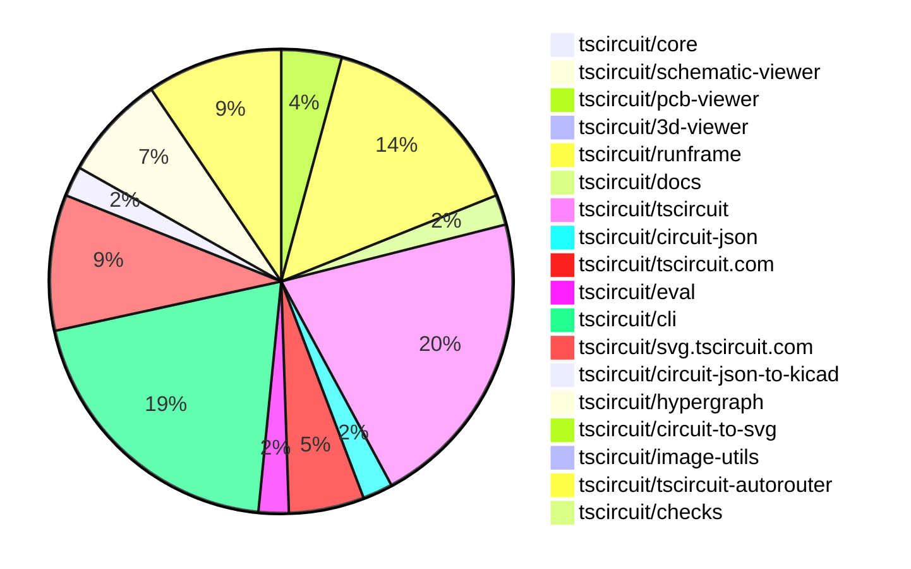

# Contribution Overview 2026-03-17

The current week is shown below. There are 3 major sections:

- [Contributor Overview](#contributor-overview)
- [PRs by Repository](#prs-by-repository)
- [PRs by Contributor](#changes-by-contributor)
- [Scoring & Sponsorship Details](/docs/sponsorship-calculation-explanation.md)

## PRs by Repository

## Contributor Overview

| Contributor | 🐳 Major | 🐙 Minor | 🐌 Tiny | Score | ⭐ | Discussion Contributions |
|-------------|---------|---------|---------|-------|-----|--------------------------|
| [seveibar](#seveibar) | 5 | 0 | 0 | 21 | ⭐⭐ | 0🔹 0🔶 0💎 |
| [0hmX](#0hmX) | 3 | 0 | 2 | 14 | ⭐⭐ | 0🔹 0🔶 0💎 |
| [tscircuitbot](#tscircuitbot) | 0 | 0 | 72 | 13 | ⭐⭐ | 0🔹 0🔶 0💎 |
| [ShiboSoftwareDev](#ShiboSoftwareDev) | 1 | 3 | 2 | 12 | ⭐⭐ | 0🔹 0🔶 0💎 |
| [techmannih](#techmannih) | 0 | 1 | 5 | 7 | ⭐ | 0🔹 0🔶 0💎 |
| [MustafaMulla29](#MustafaMulla29) | 1 | 1 | 0 | 7 | ⭐ | 0🔹 0🔶 0💎 |
| [rushabhcodes](#rushabhcodes) | 1 | 1 | 0 | 6 | ⭐ | 0🔹 0🔶 0💎 |
| [imrishabh18](#imrishabh18) | 0 | 3 | 0 | 6 | ⭐ | 0🔹 0🔶 0💎 |

## Staff Pass Ratio (SPR)

| Contributor | Reviewed PRs | Rejections | Approvals | SPR |
|-------------|--------------|------------|-----------|-----|
| [ShiboSoftwareDev](#ShiboSoftwareDev) | 3 | 0 | 3 | 100.0% |
| [rushabhcodes](#rushabhcodes) | 2 | 0 | 2 | 100.0% |
| [MustafaMulla29](#MustafaMulla29) | 2 | 0 | 2 | 100.0% |
| [techmannih](#techmannih) | 1 | 0 | 1 | 100.0% |

ShiboSoftwareDev SPR PRs (3)

- [#126](https://github.com/tscircuit/checks/pull/126) Add minSpacing option to checkEachPcbTraceNonOverlapping
- [#687](https://github.com/tscircuit/tscircuit-autorouter/pull/687) Add Relaxed DRC action to debugger and share preset with benchmark
- [#686](https://github.com/tscircuit/tscircuit-autorouter/pull/686) Replaces manual benchmark relaxedDrcPassed evaluation with the same DRC implementation used by Debug → Run DRC Checks

rushabhcodes SPR PRs (2)

- [#712](https://github.com/tscircuit/pcb-viewer/pull/712) feat: add toggle for showing/hiding silkscreen in the viewer
- [#2446](https://github.com/tscircuit/cli/pull/2446) feat: add support for exporting kicad_pro format in exportSnippet and tests

MustafaMulla29 SPR PRs (2)

- [#2456](https://github.com/tscircuit/cli/pull/2456) feat: include builtin and user specified 3D models in kicad_zip export
- [#161](https://github.com/tscircuit/circuit-json-to-kicad/pull/161) feat: embed builtin and user specified 3D model refs in kicad_pcb and expose model source paths for zip export

techmannih SPR PRs (1)

- [#2061](https://github.com/tscircuit/core/pull/2061) feat: implement dynamic text resolution for SilkscreenText componentsin footprints and add a corresponding test

> Note: AI evaluates PRs and assigns 1-3 star ratings automatically. 4 and 5 star ratings require manual staff review.

### Discussion Contribution Legend

- 🔹 Normal Comments: Basic participation with minimal effort
- 🔶 Great Informative Comments: Thoughtful participation that adds value
- 💎 Incredible Comments: Exceptional participation with high-quality content

## Review Table

[reviews-received-hover]: ## "Number of reviews received for PRs for this contributor"
[approvals-received-hover]: ## "Number of approvals received for PRs this contributor authored"
[rejections-received-hover]: ## "Number of rejections received for PRs this contributor authored"
[prs-opened-hover]: ## "Number of PRs opened by this contributor"
[issues-created-hover]: ## "Number of issues created by this contributor"

| Contributor | Reviews Received | Approvals Received | Rejections Received | Approvals | Rejections Given | PRs Opened | PRs Merged | Issues Created |
|---|---|---|---|---|---|---|---|---|
| [techmannih](#techmannih) | 7 | 7 | 0 | 0 | 0 | 8 | 6 | 0 |
| [seveibar](#seveibar) | 1 | 0 | 0 | 15 | 0 | 6 | 5 | 0 |
| [tscircuitbot](#tscircuitbot) | 1 | 0 | 0 | 0 | 0 | 81 | 72 | 0 |
| [rushabhcodes](#rushabhcodes) | 5 | 3 | 0 | 0 | 0 | 2 | 2 | 0 |
| [imrishabh18](#imrishabh18) | 0 | 0 | 0 | 0 | 0 | 5 | 3 | 0 |
| [blessuselessk](#blessuselessk) | 1 | 0 | 0 | 0 | 0 | 2 | 0 | 0 |
| [Abse2001](#Abse2001) | 0 | 0 | 0 | 1 | 0 | 1 | 0 | 0 |
| [ShiboSoftwareDev](#ShiboSoftwareDev) | 8 | 5 | 0 | 0 | 0 | 6 | 6 | 0 |
| [dwiel](#dwiel) | 0 | 0 | 0 | 0 | 0 | 1 | 0 | 0 |
| [MustafaMulla29](#MustafaMulla29) | 4 | 2 | 0 | 1 | 0 | 2 | 2 | 0 |
| [0hmX](#0hmX) | 1 | 0 | 0 | 0 | 0 | 5 | 5 | 0 |

## Changes by Repository

### [tscircuit/core](https://github.com/tscircuit/core)

| PR # | Impact | Rating | Contributor | Description |
|------|--------|--------|-------------|-------------|
| [#2061](https://github.com/tscircuit/core/pull/2061) | 🐙 Minor | ⭐⭐ | techmannih | Implements dynamic text resolution for SilkscreenText components in footprints and adds a corresponding test to validate the functionality. |

### [tscircuit/schematic-viewer](https://github.com/tscircuit/schematic-viewer)

🐌 Tiny Contributions (1)

| PR # | Impact | Contributor | Description |
|------|--------|-------------|-------------|
| [#170](https://github.com/tscircuit/schematic-viewer/pull/170) | 🐌 Tiny | techmannih | Adds a new example for a custom op-amp symbol in the schematic viewer and updates the tscircuit dependency version. |

### [tscircuit/pcb-viewer](https://github.com/tscircuit/pcb-viewer)

| PR # | Impact | Rating | Contributor | Description |
|------|--------|--------|-------------|-------------|
| [#712](https://github.com/tscircuit/pcb-viewer/pull/712) | 🐳 Major | ⭐⭐⭐ | rushabhcodes | Adds support for toggling the visibility of silkscreen layers in the PCB viewer, allowing users to show or hide silkscreen layers using a new checkbox in the view settings menu. |

🐌 Tiny Contributions (3)

| PR # | Impact | Contributor | Description |
|------|--------|-------------|-------------|
| [#714](https://github.com/tscircuit/pcb-viewer/pull/714) | 🐌 Tiny | techmannih | Adds a new fixture for a custom plated hole footprint and updates the tscircuit dependency version. |
| [#715](https://github.com/tscircuit/pcb-viewer/pull/715) | 🐌 Tiny | tscircuitbot | Automated package update |
| [#713](https://github.com/tscircuit/pcb-viewer/pull/713) | 🐌 Tiny | tscircuitbot | Automated package update |

### [tscircuit/3d-viewer](https://github.com/tscircuit/3d-viewer)

🐌 Tiny Contributions (1)

| PR # | Impact | Contributor | Description |
|------|--------|-------------|-------------|
| [#741](https://github.com/tscircuit/3d-viewer/pull/741) | 🐌 Tiny | techmannih | Adds a fixture for reference designators in footprints and updates the tscircuit dependency version to 0.0.1532. |

### [tscircuit/runframe](https://github.com/tscircuit/runframe)

🐌 Tiny Contributions (14)

| PR # | Impact | Contributor | Description |
|------|--------|-------------|-------------|
| [#2934](https://github.com/tscircuit/runframe/pull/2934) | 🐌 Tiny | techmannih | Updates the tscircuiteval dependency to version 0.0.718 in package.json |
| [#2947](https://github.com/tscircuit/runframe/pull/2947) | 🐌 Tiny | tscircuitbot | Automated package update |
| [#2946](https://github.com/tscircuit/runframe/pull/2946) | 🐌 Tiny | tscircuitbot | Updates the circuit-json-to-kicad package from version 0.0.84 to 0.0.85 in package.json |
| [#2944](https://github.com/tscircuit/runframe/pull/2944) | 🐌 Tiny | tscircuitbot | Automated package update |
| [#2943](https://github.com/tscircuit/runframe/pull/2943) | 🐌 Tiny | tscircuitbot | Updates the tscircuit3d-viewer package to version 0.0.543 in package.json |
| [#2942](https://github.com/tscircuit/runframe/pull/2942) | 🐌 Tiny | tscircuitbot | Automated package update |
| [#2941](https://github.com/tscircuit/runframe/pull/2941) | 🐌 Tiny | tscircuitbot | Updates the tscircuitpcb-viewer package from version 1.11.354 to 1.11.355 |
| [#2940](https://github.com/tscircuit/runframe/pull/2940) | 🐌 Tiny | tscircuitbot | Automated package update |
| [#2939](https://github.com/tscircuit/runframe/pull/2939) | 🐌 Tiny | tscircuitbot | Updates the tscircuiteval package to version 0.0.719 in the package.json file. |
| [#2938](https://github.com/tscircuit/runframe/pull/2938) | 🐌 Tiny | tscircuitbot | Automated package update |
| [#2937](https://github.com/tscircuit/runframe/pull/2937) | 🐌 Tiny | tscircuitbot | Updates the tscircuitschematic-viewer package to version 2.0.59 |
| [#2935](https://github.com/tscircuit/runframe/pull/2935) | 🐌 Tiny | tscircuitbot | Automated package update |
| [#2932](https://github.com/tscircuit/runframe/pull/2932) | 🐌 Tiny | tscircuitbot | Updates the tscircuitpcb-viewer package from version 1.11.353 to 1.11.354 |
| [#2933](https://github.com/tscircuit/runframe/pull/2933) | 🐌 Tiny | tscircuitbot | Automated package update |

### [tscircuit/docs](https://github.com/tscircuit/docs)

🐌 Tiny Contributions (2)

| PR # | Impact | Contributor | Description |
|------|--------|-------------|-------------|
| [#513](https://github.com/tscircuit/docs/pull/513) | 🐌 Tiny | techmannih | Add support for NAME, REF, and REFERENCE substitutions in the text property of schematictext  elements within symbol  components. |
| [#514](https://github.com/tscircuit/docs/pull/514) | 🐌 Tiny | ShiboSoftwareDev | Adds documentation for new command line interface flags to ignore various DRC errors and warnings during the build process. |

### [tscircuit/tscircuit](https://github.com/tscircuit/tscircuit)

🐌 Tiny Contributions (20)

| PR # | Impact | Contributor | Description |
|------|--------|-------------|-------------|
| [#2696](https://github.com/tscircuit/tscircuit/pull/2696) | 🐌 Tiny | tscircuitbot | Updates the package version from 0.0.1535 to 0.0.1536 in package.json |
| [#2695](https://github.com/tscircuit/tscircuit/pull/2695) | 🐌 Tiny | tscircuitbot | Updates the tscircuitcli package to version 0.1.1136 in the package.json file. |
| [#2694](https://github.com/tscircuit/tscircuit/pull/2694) | 🐌 Tiny | tscircuitbot | Automated package update |
| [#2693](https://github.com/tscircuit/tscircuit/pull/2693) | 🐌 Tiny | tscircuitbot | Updates the tscircuitcli package from version 0.1.1134 to 0.1.1135 and the tscircuitrunframe package from version 0.0.1745 to 0.0.1746 in package.json |
| [#2692](https://github.com/tscircuit/tscircuit/pull/2692) | 🐌 Tiny | tscircuitbot | Automated package update |
| [#2691](https://github.com/tscircuit/tscircuit/pull/2691) | 🐌 Tiny | tscircuitbot | Automated package update |
| [#2690](https://github.com/tscircuit/tscircuit/pull/2690) | 🐌 Tiny | tscircuitbot | Automated package update |
| [#2689](https://github.com/tscircuit/tscircuit/pull/2689) | 🐌 Tiny | tscircuitbot | Updates the tscircuitcli package to version 0.1.1133 in the package.json file. |
| [#2688](https://github.com/tscircuit/tscircuit/pull/2688) | 🐌 Tiny | tscircuitbot | Automated package update |
| [#2687](https://github.com/tscircuit/tscircuit/pull/2687) | 🐌 Tiny | tscircuitbot | Updates the tscircuitcli package to version 0.1.1132 in package.json |
| [#2686](https://github.com/tscircuit/tscircuit/pull/2686) | 🐌 Tiny | tscircuitbot | Automated package update |
| [#2685](https://github.com/tscircuit/tscircuit/pull/2685) | 🐌 Tiny | tscircuitbot | Updates the tscircuitcli package from version 0.1.1130 to 0.1.1131 and the tscircuitrunframe package from version 0.0.1743 to 0.0.1744 in package.json |
| [#2684](https://github.com/tscircuit/tscircuit/pull/2684) | 🐌 Tiny | tscircuitbot | Automated package update to version 0.0.1530 |
| [#2683](https://github.com/tscircuit/tscircuit/pull/2683) | 🐌 Tiny | tscircuitbot | Automated package update |
| [#2682](https://github.com/tscircuit/tscircuit/pull/2682) | 🐌 Tiny | tscircuitbot | Updates the package version from 0.0.1528 to 0.0.1529 in package.json |
| [#2681](https://github.com/tscircuit/tscircuit/pull/2681) | 🐌 Tiny | tscircuitbot | Updates the tscircuitcli package from version 0.1.1128 to 0.1.1129 and the tscircuitrunframe package from version 0.0.1741 to 0.0.1742 in package.json |
| [#2680](https://github.com/tscircuit/tscircuit/pull/2680) | 🐌 Tiny | tscircuitbot | Updates the package version from 0.0.1527 to 0.0.1528 in package.json |
| [#2679](https://github.com/tscircuit/tscircuit/pull/2679) | 🐌 Tiny | tscircuitbot | Automated package update |
| [#2678](https://github.com/tscircuit/tscircuit/pull/2678) | 🐌 Tiny | tscircuitbot | Automated package update |
| [#2677](https://github.com/tscircuit/tscircuit/pull/2677) | 🐌 Tiny | tscircuitbot | Updates the tscircuitcli package from version 0.1.1126 to 0.1.1127 and the tscircuitrunframe package from version 0.0.1739 to 0.0.1740 in package.json |

### [tscircuit/circuit-json](https://github.com/tscircuit/circuit-json)

| PR # | Impact | Rating | Contributor | Description |
|------|--------|--------|-------------|-------------|
| [#519](https://github.com/tscircuit/circuit-json/pull/519) | 🐙 Minor | ⭐⭐ | imrishabh18 | Adds an optional is_filled property to the pcb_silkscreen_circle Zod schema and TypeScript interface to indicate filled circles in PCB silkscreen data. |

🐌 Tiny Contributions (1)

| PR # | Impact | Contributor | Description |
|------|--------|-------------|-------------|
| [#520](https://github.com/tscircuit/circuit-json/pull/520) | 🐌 Tiny | tscircuitbot | Automated package update |

### [tscircuit/tscircuit.com](https://github.com/tscircuit/tscircuit.com)

🐌 Tiny Contributions (5)

| PR # | Impact | Contributor | Description |
|------|--------|-------------|-------------|
| [#3025](https://github.com/tscircuit/tscircuit.com/pull/3025) | 🐌 Tiny | tscircuitbot | Updates the tscircuitrunframe package from version 0.0.1745 to 0.0.1746 |
| [#3024](https://github.com/tscircuit/tscircuit.com/pull/3024) | 🐌 Tiny | tscircuitbot | Updates the tscircuitrunframe package from version 0.0.1744 to 0.0.1745 |
| [#3022](https://github.com/tscircuit/tscircuit.com/pull/3022) | 🐌 Tiny | tscircuitbot | Automated package update |
| [#3019](https://github.com/tscircuit/tscircuit.com/pull/3019) | 🐌 Tiny | tscircuitbot | Automated package update |
| [#3017](https://github.com/tscircuit/tscircuit.com/pull/3017) | 🐌 Tiny | tscircuitbot | Automated package update |

### [tscircuit/eval](https://github.com/tscircuit/eval)

🐌 Tiny Contributions (2)

| PR # | Impact | Contributor | Description |
|------|--------|-------------|-------------|
| [#2287](https://github.com/tscircuit/eval/pull/2287) | 🐌 Tiny | tscircuitbot | Automated package update |
| [#2286](https://github.com/tscircuit/eval/pull/2286) | 🐌 Tiny | tscircuitbot | Automated package update |

### [tscircuit/cli](https://github.com/tscircuit/cli)

| PR # | Impact | Rating | Contributor | Description |
|------|--------|--------|-------------|-------------|
| [#2456](https://github.com/tscircuit/cli/pull/2456) | 🐳 Major | ⭐⭐⭐ | MustafaMulla29 | Includes builtin and user-specified 3D models in the KiCad zip export functionality, allowing for enhanced 3D model integration in exported files. |
| [#2446](https://github.com/tscircuit/cli/pull/2446) | 🐙 Minor | ⭐⭐ | rushabhcodes | Adds support for exporting KiCad project files (.kicad_pro) alongside schematic (.kicad_sch) and PCB (.kicad_pcb) files when exporting a circuit as a KiCad zip archive, ensuring the generated zip includes all three file types and updates the test suite accordingly. |

🐌 Tiny Contributions (17)

| PR # | Impact | Contributor | Description |
|------|--------|-------------|-------------|
| [#2462](https://github.com/tscircuit/cli/pull/2462) | 🐌 Tiny | tscircuitbot | Automated package update |
| [#2461](https://github.com/tscircuit/cli/pull/2461) | 🐌 Tiny | tscircuitbot | Automated package update |
| [#2460](https://github.com/tscircuit/cli/pull/2460) | 🐌 Tiny | tscircuitbot | Automated package update |
| [#2459](https://github.com/tscircuit/cli/pull/2459) | 🐌 Tiny | tscircuitbot | Updates the tscircuitrunframe package to version 0.0.1745 |
| [#2458](https://github.com/tscircuit/cli/pull/2458) | 🐌 Tiny | tscircuitbot | Automated package update |
| [#2455](https://github.com/tscircuit/cli/pull/2455) | 🐌 Tiny | tscircuitbot | Automated package update |
| [#2454](https://github.com/tscircuit/cli/pull/2454) | 🐌 Tiny | tscircuitbot | Automated package update |
| [#2453](https://github.com/tscircuit/cli/pull/2453) | 🐌 Tiny | tscircuitbot | Updates the tscircuitrunframe package from version 0.0.1743 to 0.0.1744 |
| [#2452](https://github.com/tscircuit/cli/pull/2452) | 🐌 Tiny | tscircuitbot | Automated package update |
| [#2451](https://github.com/tscircuit/cli/pull/2451) | 🐌 Tiny | tscircuitbot | Updates the tscircuitrunframe package from version 0.0.1742 to 0.0.1743 |
| [#2450](https://github.com/tscircuit/cli/pull/2450) | 🐌 Tiny | tscircuitbot | Automated package update |
| [#2449](https://github.com/tscircuit/cli/pull/2449) | 🐌 Tiny | tscircuitbot | Updates the tscircuitrunframe package from version 0.0.1741 to 0.0.1742 |
| [#2448](https://github.com/tscircuit/cli/pull/2448) | 🐌 Tiny | tscircuitbot | Automated package update |
| [#2447](https://github.com/tscircuit/cli/pull/2447) | 🐌 Tiny | tscircuitbot | Updates the tscircuitrunframe package to version 0.0.1741 |
| [#2445](https://github.com/tscircuit/cli/pull/2445) | 🐌 Tiny | tscircuitbot | Automated package update |
| [#2444](https://github.com/tscircuit/cli/pull/2444) | 🐌 Tiny | tscircuitbot | Automated package update |
| [#2457](https://github.com/tscircuit/cli/pull/2457) | 🐌 Tiny | ShiboSoftwareDev | Changes the snapshot processing to skip visual diff checks unless the --ci or --test flags are used, improving performance during local development. |

### [tscircuit/svg.tscircuit.com](https://github.com/tscircuit/svg.tscircuit.com)

🐌 Tiny Contributions (9)

| PR # | Impact | Contributor | Description |
|------|--------|-------------|-------------|
| [#1224](https://github.com/tscircuit/svg.tscircuit.com/pull/1224) | 🐌 Tiny | tscircuitbot | Updates the tscircuit package version from 0.0.1535 to 0.0.1536 in package.json |
| [#1223](https://github.com/tscircuit/svg.tscircuit.com/pull/1223) | 🐌 Tiny | tscircuitbot | Updates the tscircuit package version from 0.0.1534 to 0.0.1535 in package.json |
| [#1222](https://github.com/tscircuit/svg.tscircuit.com/pull/1222) | 🐌 Tiny | tscircuitbot | Updates the tscircuit package version from 0.0.1533 to 0.0.1534 in package.json |
| [#1221](https://github.com/tscircuit/svg.tscircuit.com/pull/1221) | 🐌 Tiny | tscircuitbot | Updates the tscircuit package version from 0.0.1532 to 0.0.1533 in package.json |
| [#1220](https://github.com/tscircuit/svg.tscircuit.com/pull/1220) | 🐌 Tiny | tscircuitbot | Updates the tscircuit package version from 0.0.1530 to 0.0.1532 in package.json |
| [#1218](https://github.com/tscircuit/svg.tscircuit.com/pull/1218) | 🐌 Tiny | tscircuitbot | Updates the tscircuit package version from 0.0.1529 to 0.0.1530 in package.json |
| [#1217](https://github.com/tscircuit/svg.tscircuit.com/pull/1217) | 🐌 Tiny | tscircuitbot | Updates the tscircuit package version from 0.0.1528 to 0.0.1529 in package.json |
| [#1216](https://github.com/tscircuit/svg.tscircuit.com/pull/1216) | 🐌 Tiny | tscircuitbot | Updates the tscircuit package version from 0.0.1527 to 0.0.1528 in package.json |
| [#1215](https://github.com/tscircuit/svg.tscircuit.com/pull/1215) | 🐌 Tiny | tscircuitbot | Updates the tscircuit package version from 0.0.1526 to 0.0.1527 in package.json |

### [tscircuit/circuit-json-to-kicad](https://github.com/tscircuit/circuit-json-to-kicad)

| PR # | Impact | Rating | Contributor | Description |
|------|--------|--------|-------------|-------------|
| [#161](https://github.com/tscircuit/circuit-json-to-kicad/pull/161) | 🐙 Minor | ⭐⭐ | MustafaMulla29 | Adds functionality to embed builtin and user-specified 3D model references in KiCad PCB files and exposes model source paths for zip export. |

🐌 Tiny Contributions (1)

| PR # | Impact | Contributor | Description |
|------|--------|-------------|-------------|
| [#162](https://github.com/tscircuit/circuit-json-to-kicad/pull/162) | 🐌 Tiny | tscircuitbot | Automated package update |

### [tscircuit/hypergraph](https://github.com/tscircuit/hypergraph)

| PR # | Impact | Rating | Contributor | Description |
|------|--------|--------|-------------|-------------|
| [#156](https://github.com/tscircuit/hypergraph/pull/156) | 🐳 Major | ⭐⭐⭐ | seveibar | Adds a new HyperGraph optimizer with enhanced functionality for solving complex routing problems in circuit design. |
| [#152](https://github.com/tscircuit/hypergraph/pull/152) | 🐳 Major | ⭐⭐⭐ | seveibar | Add createBlankHyperGraphFromHyperGraphWithSolvedRoutes to deserialize solved routes, strip synthetic boundary regions, and rebuild a blank serialized graph with new connection endpoints derived from port geometry; expand section-solver fixturestests to cover both section extraction and the blank-hypergraph conversion, plus add the corresponding fixture snapshot; refresh documentation and CI workflows to align with the new utilities and test suite. |
| [#150](https://github.com/tscircuit/hypergraph/pull/150) | 🐳 Major | ⭐⭐⭐ | seveibar | Add serialization helpers for solved routes, expose extractSectionOfHyperGraph, and update pipeline naming to use deserializing terminology, including mutual network IDs during connection (de)serialization and wire solved-route reconstruction to round-trip section extraction, covered with a stacked SVG snapshot using the stack-svgs module. |

🐌 Tiny Contributions (4)

| PR # | Impact | Contributor | Description |
|------|--------|-------------|-------------|
| [#157](https://github.com/tscircuit/hypergraph/pull/157) | 🐌 Tiny | tscircuitbot | Automated package update |
| [#155](https://github.com/tscircuit/hypergraph/pull/155) | 🐌 Tiny | tscircuitbot | Automated package update |
| [#151](https://github.com/tscircuit/hypergraph/pull/151) | 🐌 Tiny | tscircuitbot | Automated package update |
| [#153](https://github.com/tscircuit/hypergraph/pull/153) | 🐌 Tiny | 0hmX | Sets the values of g, h, and f to zero for each candidate in the path during route slicing. |

### [tscircuit/circuit-to-svg](https://github.com/tscircuit/circuit-to-svg)

| PR # | Impact | Rating | Contributor | Description |
|------|--------|--------|-------------|-------------|
| [#529](https://github.com/tscircuit/circuit-to-svg/pull/529) | 🐙 Minor | ⭐⭐ | imrishabh18 | Enables rendering of filled silkscreen circles when the PCB data includes an is_filled flag, allowing circles to be filled with the layer color instead of being only stroked. |

### [tscircuit/image-utils](https://github.com/tscircuit/image-utils)

| PR # | Impact | Rating | Contributor | Description |
|------|--------|--------|-------------|-------------|
| [#3](https://github.com/tscircuit/image-utils/pull/3) | 🐙 Minor | ⭐⭐ | imrishabh18 | Adds functionality to return the number of different pixels and total pixels in image comparison, enabling percentage change calculations. |

### [tscircuit/tscircuit-autorouter](https://github.com/tscircuit/tscircuit-autorouter)

| PR # | Impact | Rating | Contributor | Description |
|------|--------|--------|-------------|-------------|
| [#686](https://github.com/tscircuit/tscircuit-autorouter/pull/686) | 🐳 Major | ⭐⭐⭐ | ShiboSoftwareDev | Replaces the manual evaluation of relaxedDrcPassed with a standardized DRC check implementation, improving consistency in DRC error handling during benchmarks. |
| [#684](https://github.com/tscircuit/tscircuit-autorouter/pull/684) | 🐳 Major | ⭐⭐⭐ | 0hmX | Adds a new visualization overlay for pf values and crossing information on hover in the HgPortPointPathingSolver. |
| [#682](https://github.com/tscircuit/tscircuit-autorouter/pull/682) | 🐳 Major | ⭐⭐⭐ | 0hmX | Adds defensive handling around capacity calculations to avoid 00 and non-finite values in calculateNodeProbabilityOfFailure, while keeping the final NaN throw intact. |
| [#680](https://github.com/tscircuit/tscircuit-autorouter/pull/680) | 🐳 Major | ⭐⭐⭐ | 0hmX | Adds a hypergraph section optimizer to the autorouting pipeline, enhancing the routing capabilities by optimizing connections in a hypergraph structure. |
| [#681](https://github.com/tscircuit/tscircuit-autorouter/pull/681) | 🐳 Major | ⭐⭐⭐ | seveibar | Displays the root connection name alongside the connection name and point layers when hovering over connection points in the autorouter. |
| [#679](https://github.com/tscircuit/tscircuit-autorouter/pull/679) | 🐳 Major | ⭐⭐⭐ | seveibar | Add a right-aligned toggle next to Pipeline Steps in the debugger and wire the generic tscircuitsolver-utils pipeline stage table into AutoroutingPipelineDebugger, adapting existing pipeline solver bookkeeping fields to the generic table API and bumping tscircuitsolver-utils version. |
| [#687](https://github.com/tscircuit/tscircuit-autorouter/pull/687) | 🐙 Minor | ⭐⭐ | ShiboSoftwareDev | Adds a relaxed Design Rule Check (DRC) action to the autorouting debugger and allows sharing of DRC presets with benchmarks. |
| [#685](https://github.com/tscircuit/tscircuit-autorouter/pull/685) | 🐙 Minor | ⭐⭐ | ShiboSoftwareDev | Visualizes the results of the high-density solver by adding center and boundary markers for each node, indicating their solve status and related metadata. |

🐌 Tiny Contributions (1)

| PR # | Impact | Contributor | Description |
|------|--------|-------------|-------------|
| [#683](https://github.com/tscircuit/tscircuit-autorouter/pull/683) | 🐌 Tiny | 0hmX | Updates the tscircuithypergraph dependency to version 0.0.68 in the package.json file. |

### [tscircuit/checks](https://github.com/tscircuit/checks)

| PR # | Impact | Rating | Contributor | Description |
|------|--------|--------|-------------|-------------|
| [#126](https://github.com/tscircuit/checks/pull/126) | 🐙 Minor | ⭐⭐ | ShiboSoftwareDev | Adds a minSpacing option to the checkEachPcbTraceNonOverlapping function to allow users to specify minimum spacing between PCB traces. |

## Changes by Contributor

### [techmannih](https://github.com/techmannih)

| PRs # | Impact | Rating | Description |
|------|--------|--------|-------------|
| [#2061](https://github.com/tscircuit/core/pull/2061) | 🐙 Minor | ⭐⭐ | Implements dynamic text resolution for SilkscreenText components in footprints and adds a corresponding test to validate the functionality. |

🐌 Tiny Contributions (5)

| PR # | Impact | Description |
|------|--------|-------------|
| [#170](https://github.com/tscircuit/schematic-viewer/pull/170) | 🐌 Tiny | Adds a new example for a custom op-amp symbol in the schematic viewer and updates the tscircuit dependency version. |
| [#714](https://github.com/tscircuit/pcb-viewer/pull/714) | 🐌 Tiny | Adds a new fixture for a custom plated hole footprint and updates the tscircuit dependency version. |
| [#741](https://github.com/tscircuit/3d-viewer/pull/741) | 🐌 Tiny | Adds a fixture for reference designators in footprints and updates the tscircuit dependency version to 0.0.1532. |
| [#2934](https://github.com/tscircuit/runframe/pull/2934) | 🐌 Tiny | Updates the tscircuiteval dependency to version 0.0.718 in package.json |
| [#513](https://github.com/tscircuit/docs/pull/513) | 🐌 Tiny | Add support for NAME, REF, and REFERENCE substitutions in the text property of schematictext  elements within symbol  components. |

### [tscircuitbot](https://github.com/tscircuitbot)

🐌 Tiny Contributions (72)

| PR # | Impact | Description |
|------|--------|-------------|
| [#715](https://github.com/tscircuit/pcb-viewer/pull/715) | 🐌 Tiny | Automated package update |
| [#713](https://github.com/tscircuit/pcb-viewer/pull/713) | 🐌 Tiny | Automated package update |
| [#2696](https://github.com/tscircuit/tscircuit/pull/2696) | 🐌 Tiny | Updates the package version from 0.0.1535 to 0.0.1536 in package.json |
| [#2695](https://github.com/tscircuit/tscircuit/pull/2695) | 🐌 Tiny | Updates the tscircuitcli package to version 0.1.1136 in the package.json file. |
| [#2694](https://github.com/tscircuit/tscircuit/pull/2694) | 🐌 Tiny | Automated package update |
| [#2693](https://github.com/tscircuit/tscircuit/pull/2693) | 🐌 Tiny | Updates the tscircuitcli package from version 0.1.1134 to 0.1.1135 and the tscircuitrunframe package from version 0.0.1745 to 0.0.1746 in package.json |
| [#2692](https://github.com/tscircuit/tscircuit/pull/2692) | 🐌 Tiny | Automated package update |
| [#2691](https://github.com/tscircuit/tscircuit/pull/2691) | 🐌 Tiny | Automated package update |
| [#2690](https://github.com/tscircuit/tscircuit/pull/2690) | 🐌 Tiny | Automated package update |
| [#2689](https://github.com/tscircuit/tscircuit/pull/2689) | 🐌 Tiny | Updates the tscircuitcli package to version 0.1.1133 in the package.json file. |
| [#2688](https://github.com/tscircuit/tscircuit/pull/2688) | 🐌 Tiny | Automated package update |
| [#2687](https://github.com/tscircuit/tscircuit/pull/2687) | 🐌 Tiny | Updates the tscircuitcli package to version 0.1.1132 in package.json |
| [#2686](https://github.com/tscircuit/tscircuit/pull/2686) | 🐌 Tiny | Automated package update |
| [#2685](https://github.com/tscircuit/tscircuit/pull/2685) | 🐌 Tiny | Updates the tscircuitcli package from version 0.1.1130 to 0.1.1131 and the tscircuitrunframe package from version 0.0.1743 to 0.0.1744 in package.json |
| [#2684](https://github.com/tscircuit/tscircuit/pull/2684) | 🐌 Tiny | Automated package update to version 0.0.1530 |
| [#2683](https://github.com/tscircuit/tscircuit/pull/2683) | 🐌 Tiny | Automated package update |
| [#2682](https://github.com/tscircuit/tscircuit/pull/2682) | 🐌 Tiny | Updates the package version from 0.0.1528 to 0.0.1529 in package.json |
| [#2681](https://github.com/tscircuit/tscircuit/pull/2681) | 🐌 Tiny | Updates the tscircuitcli package from version 0.1.1128 to 0.1.1129 and the tscircuitrunframe package from version 0.0.1741 to 0.0.1742 in package.json |
| [#2680](https://github.com/tscircuit/tscircuit/pull/2680) | 🐌 Tiny | Updates the package version from 0.0.1527 to 0.0.1528 in package.json |
| [#2679](https://github.com/tscircuit/tscircuit/pull/2679) | 🐌 Tiny | Automated package update |
| [#2678](https://github.com/tscircuit/tscircuit/pull/2678) | 🐌 Tiny | Automated package update |
| [#2677](https://github.com/tscircuit/tscircuit/pull/2677) | 🐌 Tiny | Updates the tscircuitcli package from version 0.1.1126 to 0.1.1127 and the tscircuitrunframe package from version 0.0.1739 to 0.0.1740 in package.json |
| [#520](https://github.com/tscircuit/circuit-json/pull/520) | 🐌 Tiny | Automated package update |
| [#3025](https://github.com/tscircuit/tscircuit.com/pull/3025) | 🐌 Tiny | Updates the tscircuitrunframe package from version 0.0.1745 to 0.0.1746 |
| [#3024](https://github.com/tscircuit/tscircuit.com/pull/3024) | 🐌 Tiny | Updates the tscircuitrunframe package from version 0.0.1744 to 0.0.1745 |
| [#3022](https://github.com/tscircuit/tscircuit.com/pull/3022) | 🐌 Tiny | Automated package update |
| [#3019](https://github.com/tscircuit/tscircuit.com/pull/3019) | 🐌 Tiny | Automated package update |
| [#3017](https://github.com/tscircuit/tscircuit.com/pull/3017) | 🐌 Tiny | Automated package update |
| [#2287](https://github.com/tscircuit/eval/pull/2287) | 🐌 Tiny | Automated package update |
| [#2286](https://github.com/tscircuit/eval/pull/2286) | 🐌 Tiny | Automated package update |
| [#2947](https://github.com/tscircuit/runframe/pull/2947) | 🐌 Tiny | Automated package update |
| [#2946](https://github.com/tscircuit/runframe/pull/2946) | 🐌 Tiny | Updates the circuit-json-to-kicad package from version 0.0.84 to 0.0.85 in package.json |
| [#2944](https://github.com/tscircuit/runframe/pull/2944) | 🐌 Tiny | Automated package update |
| [#2943](https://github.com/tscircuit/runframe/pull/2943) | 🐌 Tiny | Updates the tscircuit3d-viewer package to version 0.0.543 in package.json |
| [#2942](https://github.com/tscircuit/runframe/pull/2942) | 🐌 Tiny | Automated package update |
| [#2941](https://github.com/tscircuit/runframe/pull/2941) | 🐌 Tiny | Updates the tscircuitpcb-viewer package from version 1.11.354 to 1.11.355 |
| [#2940](https://github.com/tscircuit/runframe/pull/2940) | 🐌 Tiny | Automated package update |
| [#2939](https://github.com/tscircuit/runframe/pull/2939) | 🐌 Tiny | Updates the tscircuiteval package to version 0.0.719 in the package.json file. |
| [#2938](https://github.com/tscircuit/runframe/pull/2938) | 🐌 Tiny | Automated package update |
| [#2937](https://github.com/tscircuit/runframe/pull/2937) | 🐌 Tiny | Updates the tscircuitschematic-viewer package to version 2.0.59 |
| [#2935](https://github.com/tscircuit/runframe/pull/2935) | 🐌 Tiny | Automated package update |
| [#2932](https://github.com/tscircuit/runframe/pull/2932) | 🐌 Tiny | Updates the tscircuitpcb-viewer package from version 1.11.353 to 1.11.354 |
| [#2933](https://github.com/tscircuit/runframe/pull/2933) | 🐌 Tiny | Automated package update |
| [#2462](https://github.com/tscircuit/cli/pull/2462) | 🐌 Tiny | Automated package update |
| [#2461](https://github.com/tscircuit/cli/pull/2461) | 🐌 Tiny | Automated package update |
| [#2460](https://github.com/tscircuit/cli/pull/2460) | 🐌 Tiny | Automated package update |
| [#2459](https://github.com/tscircuit/cli/pull/2459) | 🐌 Tiny | Updates the tscircuitrunframe package to version 0.0.1745 |
| [#2458](https://github.com/tscircuit/cli/pull/2458) | 🐌 Tiny | Automated package update |
| [#2455](https://github.com/tscircuit/cli/pull/2455) | 🐌 Tiny | Automated package update |
| [#2454](https://github.com/tscircuit/cli/pull/2454) | 🐌 Tiny | Automated package update |
| [#2453](https://github.com/tscircuit/cli/pull/2453) | 🐌 Tiny | Updates the tscircuitrunframe package from version 0.0.1743 to 0.0.1744 |
| [#2452](https://github.com/tscircuit/cli/pull/2452) | 🐌 Tiny | Automated package update |
| [#2451](https://github.com/tscircuit/cli/pull/2451) | 🐌 Tiny | Updates the tscircuitrunframe package from version 0.0.1742 to 0.0.1743 |
| [#2450](https://github.com/tscircuit/cli/pull/2450) | 🐌 Tiny | Automated package update |
| [#2449](https://github.com/tscircuit/cli/pull/2449) | 🐌 Tiny | Updates the tscircuitrunframe package from version 0.0.1741 to 0.0.1742 |
| [#2448](https://github.com/tscircuit/cli/pull/2448) | 🐌 Tiny | Automated package update |
| [#2447](https://github.com/tscircuit/cli/pull/2447) | 🐌 Tiny | Updates the tscircuitrunframe package to version 0.0.1741 |
| [#2445](https://github.com/tscircuit/cli/pull/2445) | 🐌 Tiny | Automated package update |
| [#2444](https://github.com/tscircuit/cli/pull/2444) | 🐌 Tiny | Automated package update |
| [#1224](https://github.com/tscircuit/svg.tscircuit.com/pull/1224) | 🐌 Tiny | Updates the tscircuit package version from 0.0.1535 to 0.0.1536 in package.json |
| [#1223](https://github.com/tscircuit/svg.tscircuit.com/pull/1223) | 🐌 Tiny | Updates the tscircuit package version from 0.0.1534 to 0.0.1535 in package.json |
| [#1222](https://github.com/tscircuit/svg.tscircuit.com/pull/1222) | 🐌 Tiny | Updates the tscircuit package version from 0.0.1533 to 0.0.1534 in package.json |
| [#1221](https://github.com/tscircuit/svg.tscircuit.com/pull/1221) | 🐌 Tiny | Updates the tscircuit package version from 0.0.1532 to 0.0.1533 in package.json |
| [#1220](https://github.com/tscircuit/svg.tscircuit.com/pull/1220) | 🐌 Tiny | Updates the tscircuit package version from 0.0.1530 to 0.0.1532 in package.json |
| [#1218](https://github.com/tscircuit/svg.tscircuit.com/pull/1218) | 🐌 Tiny | Updates the tscircuit package version from 0.0.1529 to 0.0.1530 in package.json |
| [#1217](https://github.com/tscircuit/svg.tscircuit.com/pull/1217) | 🐌 Tiny | Updates the tscircuit package version from 0.0.1528 to 0.0.1529 in package.json |
| [#1216](https://github.com/tscircuit/svg.tscircuit.com/pull/1216) | 🐌 Tiny | Updates the tscircuit package version from 0.0.1527 to 0.0.1528 in package.json |
| [#1215](https://github.com/tscircuit/svg.tscircuit.com/pull/1215) | 🐌 Tiny | Updates the tscircuit package version from 0.0.1526 to 0.0.1527 in package.json |
| [#162](https://github.com/tscircuit/circuit-json-to-kicad/pull/162) | 🐌 Tiny | Automated package update |
| [#157](https://github.com/tscircuit/hypergraph/pull/157) | 🐌 Tiny | Automated package update |
| [#155](https://github.com/tscircuit/hypergraph/pull/155) | 🐌 Tiny | Automated package update |
| [#151](https://github.com/tscircuit/hypergraph/pull/151) | 🐌 Tiny | Automated package update |

### [rushabhcodes](https://github.com/rushabhcodes)

| PRs # | Impact | Rating | Description |
|------|--------|--------|-------------|
| [#712](https://github.com/tscircuit/pcb-viewer/pull/712) | 🐳 Major | ⭐⭐⭐ | Adds support for toggling the visibility of silkscreen layers in the PCB viewer, allowing users to show or hide silkscreen layers using a new checkbox in the view settings menu. |
| [#2446](https://github.com/tscircuit/cli/pull/2446) | 🐙 Minor | ⭐⭐ | Adds support for exporting KiCad project files (.kicad_pro) alongside schematic (.kicad_sch) and PCB (.kicad_pcb) files when exporting a circuit as a KiCad zip archive, ensuring the generated zip includes all three file types and updates the test suite accordingly. |

### [imrishabh18](https://github.com/imrishabh18)

| PRs # | Impact | Rating | Description |
|------|--------|--------|-------------|
| [#519](https://github.com/tscircuit/circuit-json/pull/519) | 🐙 Minor | ⭐⭐ | Adds an optional is_filled property to the pcb_silkscreen_circle Zod schema and TypeScript interface to indicate filled circles in PCB silkscreen data. |
| [#529](https://github.com/tscircuit/circuit-to-svg/pull/529) | 🐙 Minor | ⭐⭐ | Enables rendering of filled silkscreen circles when the PCB data includes an is_filled flag, allowing circles to be filled with the layer color instead of being only stroked. |
| [#3](https://github.com/tscircuit/image-utils/pull/3) | 🐙 Minor | ⭐⭐ | Adds functionality to return the number of different pixels and total pixels in image comparison, enabling percentage change calculations. |

### [ShiboSoftwareDev](https://github.com/ShiboSoftwareDev)

| PRs # | Impact | Rating | Description |
|------|--------|--------|-------------|
| [#686](https://github.com/tscircuit/tscircuit-autorouter/pull/686) | 🐳 Major | ⭐⭐⭐ | Replaces the manual evaluation of relaxedDrcPassed with a standardized DRC check implementation, improving consistency in DRC error handling during benchmarks. |
| [#126](https://github.com/tscircuit/checks/pull/126) | 🐙 Minor | ⭐⭐ | Adds a minSpacing option to the checkEachPcbTraceNonOverlapping function to allow users to specify minimum spacing between PCB traces. |
| [#687](https://github.com/tscircuit/tscircuit-autorouter/pull/687) | 🐙 Minor | ⭐⭐ | Adds a relaxed Design Rule Check (DRC) action to the autorouting debugger and allows sharing of DRC presets with benchmarks. |
| [#685](https://github.com/tscircuit/tscircuit-autorouter/pull/685) | 🐙 Minor | ⭐⭐ | Visualizes the results of the high-density solver by adding center and boundary markers for each node, indicating their solve status and related metadata. |

🐌 Tiny Contributions (2)

| PR # | Impact | Description |
|------|--------|-------------|
| [#2457](https://github.com/tscircuit/cli/pull/2457) | 🐌 Tiny | Changes the snapshot processing to skip visual diff checks unless the --ci or --test flags are used, improving performance during local development. |
| [#514](https://github.com/tscircuit/docs/pull/514) | 🐌 Tiny | Adds documentation for new command line interface flags to ignore various DRC errors and warnings during the build process. |

### [MustafaMulla29](https://github.com/MustafaMulla29)

| PRs # | Impact | Rating | Description |
|------|--------|--------|-------------|
| [#2456](https://github.com/tscircuit/cli/pull/2456) | 🐳 Major | ⭐⭐⭐ | Includes builtin and user-specified 3D models in the KiCad zip export functionality, allowing for enhanced 3D model integration in exported files. |
| [#161](https://github.com/tscircuit/circuit-json-to-kicad/pull/161) | 🐙 Minor | ⭐⭐ | Adds functionality to embed builtin and user-specified 3D model references in KiCad PCB files and exposes model source paths for zip export. |

### [0hmX](https://github.com/0hmX)

| PRs # | Impact | Rating | Description |
|------|--------|--------|-------------|
| [#684](https://github.com/tscircuit/tscircuit-autorouter/pull/684) | 🐳 Major | ⭐⭐⭐ | Adds a new visualization overlay for pf values and crossing information on hover in the HgPortPointPathingSolver. |
| [#682](https://github.com/tscircuit/tscircuit-autorouter/pull/682) | 🐳 Major | ⭐⭐⭐ | Adds defensive handling around capacity calculations to avoid 00 and non-finite values in calculateNodeProbabilityOfFailure, while keeping the final NaN throw intact. |
| [#680](https://github.com/tscircuit/tscircuit-autorouter/pull/680) | 🐳 Major | ⭐⭐⭐ | Adds a hypergraph section optimizer to the autorouting pipeline, enhancing the routing capabilities by optimizing connections in a hypergraph structure. |

🐌 Tiny Contributions (2)

| PR # | Impact | Description |
|------|--------|-------------|
| [#683](https://github.com/tscircuit/tscircuit-autorouter/pull/683) | 🐌 Tiny | Updates the tscircuithypergraph dependency to version 0.0.68 in the package.json file. |
| [#153](https://github.com/tscircuit/hypergraph/pull/153) | 🐌 Tiny | Sets the values of g, h, and f to zero for each candidate in the path during route slicing. |

### [seveibar](https://github.com/seveibar)

| PRs # | Impact | Rating | Description |
|------|--------|--------|-------------|
| [#681](https://github.com/tscircuit/tscircuit-autorouter/pull/681) | 🐳 Major | ⭐⭐⭐ | Displays the root connection name alongside the connection name and point layers when hovering over connection points in the autorouter. |
| [#679](https://github.com/tscircuit/tscircuit-autorouter/pull/679) | 🐳 Major | ⭐⭐⭐ | Add a right-aligned toggle next to Pipeline Steps in the debugger and wire the generic tscircuitsolver-utils pipeline stage table into AutoroutingPipelineDebugger, adapting existing pipeline solver bookkeeping fields to the generic table API and bumping tscircuitsolver-utils version. |
| [#156](https://github.com/tscircuit/hypergraph/pull/156) | 🐳 Major | ⭐⭐⭐ | Adds a new HyperGraph optimizer with enhanced functionality for solving complex routing problems in circuit design. |
| [#152](https://github.com/tscircuit/hypergraph/pull/152) | 🐳 Major | ⭐⭐⭐ | Add createBlankHyperGraphFromHyperGraphWithSolvedRoutes to deserialize solved routes, strip synthetic boundary regions, and rebuild a blank serialized graph with new connection endpoints derived from port geometry; expand section-solver fixturestests to cover both section extraction and the blank-hypergraph conversion, plus add the corresponding fixture snapshot; refresh documentation and CI workflows to align with the new utilities and test suite. |
| [#150](https://github.com/tscircuit/hypergraph/pull/150) | 🐳 Major | ⭐⭐⭐ | Add serialization helpers for solved routes, expose extractSectionOfHyperGraph, and update pipeline naming to use deserializing terminology, including mutual network IDs during connection (de)serialization and wire solved-route reconstruction to round-trip section extraction, covered with a stacked SVG snapshot using the stack-svgs module. |

## Repository Owners

| Repository | Codeowners |
|------------|------------|
| [builder](https://github.com/tscircuit/builder/blob/main/.github/CODEOWNERS) | [seveibar](https://github.com/seveibar)
| [pcb-viewer](https://github.com/tscircuit/pcb-viewer/blob/main/.github/CODEOWNERS) | [seveibar](https://github.com/seveibar), [ShiboSoftwareDev](https://github.com/ShiboSoftwareDev), [Abse2001](https://github.com/Abse2001)
| [footprints-old](https://github.com/tscircuit/footprints-old/blob/main/.github/CODEOWNERS) | [seveibar](https://github.com/seveibar)
| [footprinter](https://github.com/tscircuit/footprinter/blob/main/.github/CODEOWNERS) | [seveibar](https://github.com/seveibar), [techmannih](https://github.com/techmannih)
| [3d-viewer](https://github.com/tscircuit/3d-viewer/blob/main/.github/CODEOWNERS) | [ShiboSoftwareDev](https://github.com/ShiboSoftwareDev), [Abse2001](https://github.com/Abse2001)
| [winterspec](https://github.com/tscircuit/winterspec/blob/main/.github/CODEOWNERS) | [seveibar](https://github.com/seveibar), [ShiboSoftwareDev](https://github.com/ShiboSoftwareDev)
| [jscad-electronics](https://github.com/tscircuit/jscad-electronics/blob/main/.github/CODEOWNERS) | [seveibar](https://github.com/seveibar), [techmannih](https://github.com/techmannih), [ShiboSoftwareDev](https://github.com/ShiboSoftwareDev), [anas-sarkez](https://github.com/anas-sarkez)
| [circuit-to-svg](https://github.com/tscircuit/circuit-to-svg/blob/main/.github/CODEOWNERS) | [imrishabh18](https://github.com/imrishabh18)
| [schematic-symbols](https://github.com/tscircuit/schematic-symbols/blob/main/.github/CODEOWNERS) | [seveibar](https://github.com/seveibar), [imrishabh18](https://github.com/imrishabh18), [techmannih](https://github.com/techmannih)
| [circuit-json-to-gerber](https://github.com/tscircuit/circuit-json-to-gerber/blob/main/.github/CODEOWNERS) | [seveibar](https://github.com/seveibar), [ShiboSoftwareDev](https://github.com/ShiboSoftwareDev)
| [tscircuit.com](https://github.com/tscircuit/tscircuit.com/blob/main/.github/CODEOWNERS) | [seveibar](https://github.com/seveibar), [imrishabh18](https://github.com/imrishabh18)
| [issue-roulette](https://github.com/tscircuit/issue-roulette/blob/main/.github/CODEOWNERS) | [Anshgrover23](https://github.com/Anshgrover23)
| [sparkfun-boards](https://github.com/tscircuit/sparkfun-boards/blob/main/.github/CODEOWNERS) | [ShiboSoftwareDev](https://github.com/ShiboSoftwareDev), [Abse2001](https://github.com/Abse2001), [MustafaMulla29](https://github.com/MustafaMulla29), [Anshgrover23](https://github.com/Anshgrover23), [techmannih](https://github.com/techmannih)
| [schematic-corpus](https://github.com/tscircuit/schematic-corpus/blob/main/.github/CODEOWNERS) | [Abse2001](https://github.com/Abse2001)
| [copper-pour-solver](https://github.com/tscircuit/copper-pour-solver/blob/main/.github/CODEOWNERS) | [seveibar](https://github.com/seveibar), [ShiboSoftwareDev](https://github.com/ShiboSoftwareDev)
| [common](https://github.com/tscircuit/common/blob/main/.github/CODEOWNERS) | [seveibar](https://github.com/seveibar), [Abse2001](https://github.com/Abse2001)
| [circuit-to-canvas](https://github.com/tscircuit/circuit-to-canvas/blob/main/.github/CODEOWNERS) | [ShiboSoftwareDev](https://github.com/ShiboSoftwareDev), [Abse2001](https://github.com/Abse2001), [techmannih](https://github.com/techmannih)
| [circuit-json-to-lbrn](https://github.com/tscircuit/circuit-json-to-lbrn/blob/main/.github/CODEOWNERS) | [AnasSarkiz](https://github.com/AnasSarkiz)
| [pcbburn.com](https://github.com/tscircuit/pcbburn.com/blob/main/.github/CODEOWNERS) | [AnasSarkiz](https://github.com/AnasSarkiz)

## Repositories by Owner

| User | Repo |
|------|------|
| [seveibar](https://github.com/seveibar) | [builder](https://github.com/tscircuit/builder/blob/main/.github/CODEOWNERS) |
|  | [pcb-viewer](https://github.com/tscircuit/pcb-viewer/blob/main/.github/CODEOWNERS) |
|  | [footprints-old](https://github.com/tscircuit/footprints-old/blob/main/.github/CODEOWNERS) |
|  | [footprinter](https://github.com/tscircuit/footprinter/blob/main/.github/CODEOWNERS) |
|  | [winterspec](https://github.com/tscircuit/winterspec/blob/main/.github/CODEOWNERS) |
|  | [jscad-electronics](https://github.com/tscircuit/jscad-electronics/blob/main/.github/CODEOWNERS) |
|  | [schematic-symbols](https://github.com/tscircuit/schematic-symbols/blob/main/.github/CODEOWNERS) |
|  | [circuit-json-to-gerber](https://github.com/tscircuit/circuit-json-to-gerber/blob/main/.github/CODEOWNERS) |
|  | [tscircuit.com](https://github.com/tscircuit/tscircuit.com/blob/main/.github/CODEOWNERS) |
|  | [copper-pour-solver](https://github.com/tscircuit/copper-pour-solver/blob/main/.github/CODEOWNERS) |
|  | [common](https://github.com/tscircuit/common/blob/main/.github/CODEOWNERS) |
| [ShiboSoftwareDev](https://github.com/ShiboSoftwareDev) | [pcb-viewer](https://github.com/tscircuit/pcb-viewer/blob/main/.github/CODEOWNERS) |
|  | [3d-viewer](https://github.com/tscircuit/3d-viewer/blob/main/.github/CODEOWNERS) |
|  | [winterspec](https://github.com/tscircuit/winterspec/blob/main/.github/CODEOWNERS) |
|  | [jscad-electronics](https://github.com/tscircuit/jscad-electronics/blob/main/.github/CODEOWNERS) |
|  | [circuit-json-to-gerber](https://github.com/tscircuit/circuit-json-to-gerber/blob/main/.github/CODEOWNERS) |
|  | [sparkfun-boards](https://github.com/tscircuit/sparkfun-boards/blob/main/.github/CODEOWNERS) |
|  | [copper-pour-solver](https://github.com/tscircuit/copper-pour-solver/blob/main/.github/CODEOWNERS) |
|  | [circuit-to-canvas](https://github.com/tscircuit/circuit-to-canvas/blob/main/.github/CODEOWNERS) |
| [Abse2001](https://github.com/Abse2001) | [pcb-viewer](https://github.com/tscircuit/pcb-viewer/blob/main/.github/CODEOWNERS) |
|  | [3d-viewer](https://github.com/tscircuit/3d-viewer/blob/main/.github/CODEOWNERS) |
|  | [sparkfun-boards](https://github.com/tscircuit/sparkfun-boards/blob/main/.github/CODEOWNERS) |
|  | [schematic-corpus](https://github.com/tscircuit/schematic-corpus/blob/main/.github/CODEOWNERS) |
|  | [common](https://github.com/tscircuit/common/blob/main/.github/CODEOWNERS) |
|  | [circuit-to-canvas](https://github.com/tscircuit/circuit-to-canvas/blob/main/.github/CODEOWNERS) |
| [techmannih](https://github.com/techmannih) | [footprinter](https://github.com/tscircuit/footprinter/blob/main/.github/CODEOWNERS) |
|  | [jscad-electronics](https://github.com/tscircuit/jscad-electronics/blob/main/.github/CODEOWNERS) |
|  | [schematic-symbols](https://github.com/tscircuit/schematic-symbols/blob/main/.github/CODEOWNERS) |
|  | [sparkfun-boards](https://github.com/tscircuit/sparkfun-boards/blob/main/.github/CODEOWNERS) |
|  | [circuit-to-canvas](https://github.com/tscircuit/circuit-to-canvas/blob/main/.github/CODEOWNERS) |
| [anas-sarkez](https://github.com/anas-sarkez) | [jscad-electronics](https://github.com/tscircuit/jscad-electronics/blob/main/.github/CODEOWNERS) |
| [imrishabh18](https://github.com/imrishabh18) | [circuit-to-svg](https://github.com/tscircuit/circuit-to-svg/blob/main/.github/CODEOWNERS) |
|  | [schematic-symbols](https://github.com/tscircuit/schematic-symbols/blob/main/.github/CODEOWNERS) |
|  | [tscircuit.com](https://github.com/tscircuit/tscircuit.com/blob/main/.github/CODEOWNERS) |
| [Anshgrover23](https://github.com/Anshgrover23) | [issue-roulette](https://github.com/tscircuit/issue-roulette/blob/main/.github/CODEOWNERS) |
|  | [sparkfun-boards](https://github.com/tscircuit/sparkfun-boards/blob/main/.github/CODEOWNERS) |
| [MustafaMulla29](https://github.com/MustafaMulla29) | [sparkfun-boards](https://github.com/tscircuit/sparkfun-boards/blob/main/.github/CODEOWNERS) |
| [AnasSarkiz](https://github.com/AnasSarkiz) | [circuit-json-to-lbrn](https://github.com/tscircuit/circuit-json-to-lbrn/blob/main/.github/CODEOWNERS) |
|  | [pcbburn.com](https://github.com/tscircuit/pcbburn.com/blob/main/.github/CODEOWNERS) |

