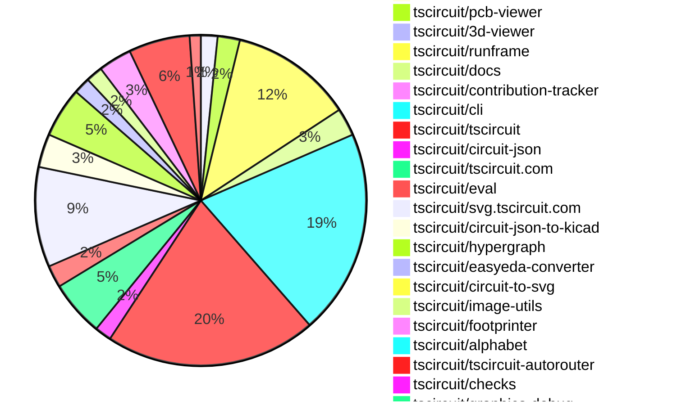

# Contribution Overview 2026-03-17

The current week is shown below. There are 3 major sections:

- [Contributor Overview](#contributor-overview)
- [PRs by Repository](#prs-by-repository)
- [PRs by Contributor](#changes-by-contributor)
- [Scoring & Sponsorship Details](/docs/sponsorship-calculation-explanation.md)

## PRs by Repository

## Contributor Overview

| Contributor | 🐳 Major | 🐙 Minor | 🐌 Tiny | Score | ⭐ | Discussion Contributions |
|-------------|---------|---------|---------|-------|-----|--------------------------|
| [seveibar](#seveibar) | 7 | 0 | 1 | 30 | ⭐⭐ | 0🔹 0🔶 0💎 |
| [rushabhcodes](#rushabhcodes) | 3 | 4 | 1 | 22 | ⭐⭐ | 0🔹 0🔶 0💎 |
| [MustafaMulla29](#MustafaMulla29) | 1 | 4 | 3 | 16 | ⭐⭐ | 0🔹 0🔶 0💎 |
| [imrishabh18](#imrishabh18) | 0 | 5 | 4 | 15 | ⭐⭐ | 0🔹 0🔶 0💎 |
| [0hmX](#0hmX) | 3 | 0 | 3 | 15 | ⭐⭐ | 0🔹 0🔶 0💎 |
| [ShiboSoftwareDev](#ShiboSoftwareDev) | 1 | 4 | 2 | 14 | ⭐⭐ | 0🔹 0🔶 0💎 |
| [tscircuitbot](#tscircuitbot) | 0 | 0 | 128 | 13 | ⭐⭐ | 0🔹 0🔶 0💎 |
| [AnasSarkiz](#AnasSarkiz) | 3 | 0 | 0 | 12 | ⭐⭐ | 0🔹 0🔶 0💎 |
| [techmannih](#techmannih) | 0 | 1 | 6 | 8 | ⭐ | 0🔹 0🔶 0💎 |
| [Abse2001](#Abse2001) | 1 | 1 | 0 | 8 | ⭐ | 0🔹 0🔶 0💎 |
| [victorjzq](#victorjzq) | 0 | 2 | 2 | 6 | ⭐ | 0🔹 0🔶 0💎 |
| [dwiel](#dwiel) | 1 | 0 | 0 | 4 | ⭐ | 0🔹 0🔶 0💎 |

## Staff Pass Ratio (SPR)

| Contributor | Reviewed PRs | Rejections | Approvals | SPR |
|-------------|--------------|------------|-----------|-----|
| [rushabhcodes](#rushabhcodes) | 5 | 0 | 5 | 100.0% |
| [ShiboSoftwareDev](#ShiboSoftwareDev) | 4 | 0 | 4 | 100.0% |
| [victorjzq](#victorjzq) | 3 | 1 | 2 | 66.7% |
| [AnasSarkiz](#AnasSarkiz) | 3 | 0 | 3 | 100.0% |
| [techmannih](#techmannih) | 2 | 1 | 1 | 50.0% |
| [MustafaMulla29](#MustafaMulla29) | 2 | 0 | 2 | 100.0% |
| [Abse2001](#Abse2001) | 2 | 0 | 2 | 100.0% |
| [dwiel](#dwiel) | 1 | 0 | 1 | 100.0% |
| [imrishabh18](#imrishabh18) | 1 | 1 | 1 | 0.0% |

rushabhcodes SPR PRs (5)

- [#712](https://github.com/tscircuit/pcb-viewer/pull/712) feat: add toggle for showing/hiding silkscreen in the viewer
- [#2064](https://github.com/tscircuit/core/pull/2064) Fix packed-component CAD rotation in core so 3D models match post-pack footprint orientation
- [#2446](https://github.com/tscircuit/cli/pull/2446) feat: add support for exporting kicad_pro format in exportSnippet and tests
- [#487](https://github.com/tscircuit/docs/pull/487) feat: add and enhance documentation for various `tsci` command-line tools.
- [#516](https://github.com/tscircuit/docs/pull/516) Updated the CLI documentation for `tsci` in the `docs/intro/installation.md`

ShiboSoftwareDev SPR PRs (4)

- [#126](https://github.com/tscircuit/checks/pull/126) Add minSpacing option to checkEachPcbTraceNonOverlapping
- [#102](https://github.com/tscircuit/graphics-debug/pull/102) Render Points Above All Other Graphics Elements
- [#687](https://github.com/tscircuit/tscircuit-autorouter/pull/687) Add Relaxed DRC action to debugger and share preset with benchmark
- [#686](https://github.com/tscircuit/tscircuit-autorouter/pull/686) Replaces manual benchmark relaxedDrcPassed evaluation with the same DRC implementation used by Debug → Run DRC Checks

victorjzq SPR PRs (3)

- [#548](https://github.com/tscircuit/footprinter/pull/548) fix: remove non-existent pcb_thtpad type from apply-origin filter
- [#551](https://github.com/tscircuit/footprinter/pull/551) fix: add KiCad parity test for SOIC-8 with correct IPC-7351B dimensions
- [#552](https://github.com/tscircuit/footprinter/pull/552) fix: correct SOD-523 pad dimensions to match KiCad IPC-7351B standard

AnasSarkiz SPR PRs (3)

- [#694](https://github.com/tscircuit/tscircuit-autorouter/pull/694) Introduce `zdwiel` benchmark dataset support and allow dataset selection across the benchmarking workflow
- [#688](https://github.com/tscircuit/tscircuit-autorouter/pull/688) Eliminate false DRC via-collision errors by carrying true routed via diameters through SRJ→circuit-json conversion
- [#5](https://github.com/tscircuit/high-density-dataset-z04/pull/5) Add generated z04-large export for 5x5+ nodes

techmannih SPR PRs (2)

- [#2061](https://github.com/tscircuit/core/pull/2061) feat: implement dynamic text resolution for SilkscreenText componentsin footprints and add a corresponding test
- [#2471](https://github.com/tscircuit/cli/pull/2471) feat: add support --download flag to downloading and localizing 3D models from JLCPCB

MustafaMulla29 SPR PRs (2)

- [#2456](https://github.com/tscircuit/cli/pull/2456) feat: include builtin and user specified 3D models in kicad_zip export
- [#161](https://github.com/tscircuit/circuit-json-to-kicad/pull/161) feat: embed builtin and user specified 3D model refs in kicad_pcb and expose model source paths for zip export

Abse2001 SPR PRs (2)

- [#363](https://github.com/tscircuit/easyeda-converter/pull/363) Make websafe bundle avoid core dependency
- [#43](https://github.com/tscircuit/alphabet/pull/43) Precompute Glyph Outline Polygons Export for Fill and Knockout Rendering

dwiel SPR PRs (1)

- [#521](https://github.com/tscircuit/circuit-json/pull/521) fix: use LayerRef for via route point from_layer/to_layer

imrishabh18 SPR PRs (1)

- [#364](https://github.com/tscircuit/easyeda-converter/pull/364) Add support for the `stepUrl` for `cadModel`

> Note: AI evaluates PRs and assigns 1-3 star ratings automatically. 4 and 5 star ratings require manual staff review.

### Discussion Contribution Legend

- 🔹 Normal Comments: Basic participation with minimal effort
- 🔶 Great Informative Comments: Thoughtful participation that adds value
- 💎 Incredible Comments: Exceptional participation with high-quality content

## Review Table

[reviews-received-hover]: ## "Number of reviews received for PRs for this contributor"
[approvals-received-hover]: ## "Number of approvals received for PRs this contributor authored"
[rejections-received-hover]: ## "Number of rejections received for PRs this contributor authored"
[prs-opened-hover]: ## "Number of PRs opened by this contributor"
[issues-created-hover]: ## "Number of issues created by this contributor"

| Contributor | Reviews Received | Approvals Received | Rejections Received | Approvals | Rejections Given | PRs Opened | PRs Merged | Issues Created |
|---|---|---|---|---|---|---|---|---|
| [techmannih](#techmannih) | 18 | 11 | 2 | 0 | 0 | 13 | 7 | 0 |
| [seveibar](#seveibar) | 1 | 0 | 0 | 32 | 2 | 14 | 8 | 0 |
| [mendarb](#mendarb) | 3 | 0 | 0 | 0 | 0 | 12 | 0 | 0 |
| [victorjzq](#victorjzq) | 19 | 6 | 4 | 0 | 0 | 34 | 4 | 0 |
| [blessuselessk](#blessuselessk) | 4 | 0 | 0 | 0 | 0 | 12 | 0 | 0 |
| [rushabhcodes](#rushabhcodes) | 23 | 10 | 0 | 6 | 3 | 9 | 8 | 0 |
| [tscircuitbot](#tscircuitbot) | 1 | 0 | 0 | 0 | 0 | 142 | 128 | 0 |
| [dwiel](#dwiel) | 2 | 2 | 0 | 0 | 0 | 2 | 1 | 0 |
| [imrishabh18](#imrishabh18) | 3 | 2 | 0 | 3 | 1 | 13 | 9 | 0 |
| [MustafaMulla29](#MustafaMulla29) | 10 | 5 | 0 | 5 | 0 | 8 | 8 | 0 |
| [FraktalDeFiDAO](#FraktalDeFiDAO) | 1 | 0 | 0 | 0 | 0 | 1 | 0 | 0 |
| [Abse2001](#Abse2001) | 2 | 2 | 0 | 2 | 0 | 3 | 2 | 0 |
| [ShiboSoftwareDev](#ShiboSoftwareDev) | 11 | 6 | 0 | 0 | 0 | 8 | 7 | 0 |
| [1028bc](#1028bc) | 0 | 0 | 0 | 0 | 0 | 1 | 0 | 0 |
| [AnasSarkiz](#AnasSarkiz) | 4 | 3 | 0 | 0 | 0 | 4 | 3 | 0 |
| [0hmX](#0hmX) | 3 | 1 | 0 | 0 | 0 | 8 | 6 | 0 |

## Changes by Repository

### [tscircuit/core](https://github.com/tscircuit/core)

| PR # | Impact | Rating | Contributor | Description |
|------|--------|--------|-------------|-------------|
| [#2061](https://github.com/tscircuit/core/pull/2061) | 🐙 Minor | ⭐⭐ | techmannih | Implements dynamic text resolution for SilkscreenText components in footprints and adds a corresponding test to validate the functionality. |
| [#2064](https://github.com/tscircuit/core/pull/2064) | 🐙 Minor | ⭐⭐ | rushabhcodes | Fixes CAD model rotation for packed components to align with post-pack footprint orientation in 3D views. |
| [#2062](https://github.com/tscircuit/core/pull/2062) | 🐙 Minor | ⭐⭐ | rushabhcodes | Adds a fixture to test the correct orientation of components in the circuit model, specifically addressing the issue where component R9 is not rotated properly. |

### [tscircuit/schematic-viewer](https://github.com/tscircuit/schematic-viewer)

🐌 Tiny Contributions (1)

| PR # | Impact | Contributor | Description |
|------|--------|-------------|-------------|
| [#170](https://github.com/tscircuit/schematic-viewer/pull/170) | 🐌 Tiny | techmannih | Adds a new example for a custom op-amp symbol in the schematic viewer and updates the tscircuit dependency version. |

### [tscircuit/pcb-viewer](https://github.com/tscircuit/pcb-viewer)

| PR # | Impact | Rating | Contributor | Description |
|------|--------|--------|-------------|-------------|
| [#712](https://github.com/tscircuit/pcb-viewer/pull/712) | 🐳 Major | ⭐⭐⭐ | rushabhcodes | Adds support for toggling the visibility of silkscreen layers in the PCB viewer, allowing users to show or hide silkscreen layers using a new checkbox in the view settings menu. |

🐌 Tiny Contributions (3)

| PR # | Impact | Contributor | Description |
|------|--------|-------------|-------------|
| [#714](https://github.com/tscircuit/pcb-viewer/pull/714) | 🐌 Tiny | techmannih | Adds a new fixture for a custom plated hole footprint and updates the tscircuit dependency version. |
| [#713](https://github.com/tscircuit/pcb-viewer/pull/713) | 🐌 Tiny | tscircuitbot | Automated package update |
| [#715](https://github.com/tscircuit/pcb-viewer/pull/715) | 🐌 Tiny | tscircuitbot | Automated package update |

### [tscircuit/3d-viewer](https://github.com/tscircuit/3d-viewer)

🐌 Tiny Contributions (1)

| PR # | Impact | Contributor | Description |
|------|--------|-------------|-------------|
| [#741](https://github.com/tscircuit/3d-viewer/pull/741) | 🐌 Tiny | techmannih | Adds a fixture for reference designators in footprints and updates the tscircuit dependency version to 0.0.1532. |

### [tscircuit/runframe](https://github.com/tscircuit/runframe)

🐌 Tiny Contributions (22)

| PR # | Impact | Contributor | Description |
|------|--------|-------------|-------------|
| [#2934](https://github.com/tscircuit/runframe/pull/2934) | 🐌 Tiny | techmannih | Updates the tscircuiteval dependency to version 0.0.718 in package.json |
| [#2880](https://github.com/tscircuit/runframe/pull/2880) | 🐌 Tiny | rushabhcodes | This pull request enhances the user experience for the API status indicator in the RunFrameWithApi component by adding a tooltip for accessibility and clarity. UIUX Improvements: Added a tooltip to the API status indicator using the Tooltip, TooltipTrigger, TooltipContent, and TooltipProvider components from libcomponentsuitooltip, improving accessibility and providing a clearer status message on hover or focus. Replaced the direct use of title and aria-label on the status indicator with a button wrapped in a tooltip, and adjusted the indicators opacity for the connected state for better visual feedback. |
| [#2956](https://github.com/tscircuit/runframe/pull/2956) | 🐌 Tiny | tscircuitbot | Automated package update |
| [#2955](https://github.com/tscircuit/runframe/pull/2955) | 🐌 Tiny | tscircuitbot | Updates the circuit-json-to-kicad package version from 0.0.86 to 0.0.87 in package.json |
| [#2953](https://github.com/tscircuit/runframe/pull/2953) | 🐌 Tiny | tscircuitbot | Automated package update |
| [#2952](https://github.com/tscircuit/runframe/pull/2952) | 🐌 Tiny | tscircuitbot | Updates the tscircuiteval package from version 0.0.719 to 0.0.720 in the package.json file. |
| [#2948](https://github.com/tscircuit/runframe/pull/2948) | 🐌 Tiny | tscircuitbot | Automated package update |
| [#2951](https://github.com/tscircuit/runframe/pull/2951) | 🐌 Tiny | tscircuitbot | Automated package update |
| [#2950](https://github.com/tscircuit/runframe/pull/2950) | 🐌 Tiny | tscircuitbot | Updates the circuit-json-to-kicad package from version 0.0.85 to 0.0.86 |
| [#2947](https://github.com/tscircuit/runframe/pull/2947) | 🐌 Tiny | tscircuitbot | Automated package update |
| [#2946](https://github.com/tscircuit/runframe/pull/2946) | 🐌 Tiny | tscircuitbot | Updates the circuit-json-to-kicad package from version 0.0.84 to 0.0.85 in package.json |
| [#2944](https://github.com/tscircuit/runframe/pull/2944) | 🐌 Tiny | tscircuitbot | Automated package update |
| [#2941](https://github.com/tscircuit/runframe/pull/2941) | 🐌 Tiny | tscircuitbot | Updates the tscircuitpcb-viewer package from version 1.11.354 to 1.11.355 |
| [#2939](https://github.com/tscircuit/runframe/pull/2939) | 🐌 Tiny | tscircuitbot | Updates the tscircuiteval package to version 0.0.719 in the package.json file. |
| [#2932](https://github.com/tscircuit/runframe/pull/2932) | 🐌 Tiny | tscircuitbot | Updates the tscircuitpcb-viewer package from version 1.11.353 to 1.11.354 |
| [#2942](https://github.com/tscircuit/runframe/pull/2942) | 🐌 Tiny | tscircuitbot | Automated package update |
| [#2940](https://github.com/tscircuit/runframe/pull/2940) | 🐌 Tiny | tscircuitbot | Automated package update |
| [#2938](https://github.com/tscircuit/runframe/pull/2938) | 🐌 Tiny | tscircuitbot | Automated package update |
| [#2937](https://github.com/tscircuit/runframe/pull/2937) | 🐌 Tiny | tscircuitbot | Updates the tscircuitschematic-viewer package to version 2.0.59 |
| [#2935](https://github.com/tscircuit/runframe/pull/2935) | 🐌 Tiny | tscircuitbot | Automated package update |
| [#2933](https://github.com/tscircuit/runframe/pull/2933) | 🐌 Tiny | tscircuitbot | Automated package update |
| [#2943](https://github.com/tscircuit/runframe/pull/2943) | 🐌 Tiny | tscircuitbot | Updates the tscircuit3d-viewer package to version 0.0.543 in package.json |

### [tscircuit/docs](https://github.com/tscircuit/docs)

| PR # | Impact | Rating | Contributor | Description |
|------|--------|--------|-------------|-------------|
| [#487](https://github.com/tscircuit/docs/pull/487) | 🐳 Major | ⭐⭐⭐ | rushabhcodes | This pull request significantly expands and standardizes the tscircuit CLI documentation. It adds full documentation for many previously undocumented commands, improves and clarifies options for existing commands, and enhances authentication and configuration docs. The update also documents new export and simulation formats and unifies formatting (usage, options, examples) across all CLI command pages for better clarity and consistency. |
| [#516](https://github.com/tscircuit/docs/pull/516) | 🐳 Major | ⭐⭐⭐ | rushabhcodes | Updates the CLI documentation for tsci to reflect a shift in terminology from snippets to packages and adds several new commands for improved user reference. |

🐌 Tiny Contributions (3)

| PR # | Impact | Contributor | Description |
|------|--------|-------------|-------------|
| [#515](https://github.com/tscircuit/docs/pull/515) | 🐌 Tiny | techmannih | Adds the ability to use reference designators in the text property of the silkscreentext  element within a footprint, allowing automatic labeling of components on the silkscreen layer. |
| [#513](https://github.com/tscircuit/docs/pull/513) | 🐌 Tiny | techmannih | Add support for NAME, REF, and REFERENCE substitutions in the text property of schematictext  elements within symbol  components. |
| [#514](https://github.com/tscircuit/docs/pull/514) | 🐌 Tiny | ShiboSoftwareDev | Adds documentation for new command line interface flags to ignore various DRC errors and warnings during the build process. |

### [tscircuit/contribution-tracker](https://github.com/tscircuit/contribution-tracker)

| PR # | Impact | Rating | Contributor | Description |
|------|--------|--------|-------------|-------------|
| [#322](https://github.com/tscircuit/contribution-tracker/pull/322) | 🐙 Minor | ⭐⭐ | rushabhcodes | Fixes website crash in MaintainersList due to missing maintainer5 role configuration, restoring stability to the UI. |

### [tscircuit/cli](https://github.com/tscircuit/cli)

| PR # | Impact | Rating | Contributor | Description |
|------|--------|--------|-------------|-------------|
| [#2456](https://github.com/tscircuit/cli/pull/2456) | 🐳 Major | ⭐⭐⭐ | MustafaMulla29 | Includes builtin and user-specified 3D models in the KiCad zip export functionality, allowing for enhanced 3D model integration in exported files. |
| [#2468](https://github.com/tscircuit/cli/pull/2468) | 🐳 Major | ⭐⭐⭐ | seveibar | Adds a new command to analyze routing difficulty in circuit designs. |
| [#2446](https://github.com/tscircuit/cli/pull/2446) | 🐙 Minor | ⭐⭐ | rushabhcodes | Adds support for exporting KiCad project files (.kicad_pro) alongside schematic (.kicad_sch) and PCB (.kicad_pcb) files when exporting a circuit as a KiCad zip archive, ensuring the generated zip includes all three file types and updates the test suite accordingly. |
| [#2472](https://github.com/tscircuit/cli/pull/2472) | 🐙 Minor | ⭐⭐ | MustafaMulla29 | Embeds 3D model files in the KiCad project build output, ensuring paths are consistent with KIPRJMOD for both built-in and custom models. |

🐌 Tiny Contributions (33)

| PR # | Impact | Contributor | Description |
|------|--------|-------------|-------------|
| [#2486](https://github.com/tscircuit/cli/pull/2486) | 🐌 Tiny | tscircuitbot | Automated package update |
| [#2485](https://github.com/tscircuit/cli/pull/2485) | 🐌 Tiny | tscircuitbot | Automated package update |
| [#2481](https://github.com/tscircuit/cli/pull/2481) | 🐌 Tiny | tscircuitbot | Automated package update |
| [#2480](https://github.com/tscircuit/cli/pull/2480) | 🐌 Tiny | tscircuitbot | Automated package update |
| [#2475](https://github.com/tscircuit/cli/pull/2475) | 🐌 Tiny | tscircuitbot | Automated package update |
| [#2473](https://github.com/tscircuit/cli/pull/2473) | 🐌 Tiny | tscircuitbot | Automated package update |
| [#2469](https://github.com/tscircuit/cli/pull/2469) | 🐌 Tiny | tscircuitbot | Automated package update |
| [#2478](https://github.com/tscircuit/cli/pull/2478) | 🐌 Tiny | tscircuitbot | Automated package update |
| [#2470](https://github.com/tscircuit/cli/pull/2470) | 🐌 Tiny | tscircuitbot | Automated package update |
| [#2466](https://github.com/tscircuit/cli/pull/2466) | 🐌 Tiny | tscircuitbot | Automated package update |
| [#2467](https://github.com/tscircuit/cli/pull/2467) | 🐌 Tiny | tscircuitbot | Updates the tscircuitrunframe package from version 0.0.1746 to 0.0.1747 |
| [#2474](https://github.com/tscircuit/cli/pull/2474) | 🐌 Tiny | tscircuitbot | Updates the tscircuitrunframe package from version 0.0.1747 to 0.0.1748 |
| [#2458](https://github.com/tscircuit/cli/pull/2458) | 🐌 Tiny | tscircuitbot | Automated package update |
| [#2460](https://github.com/tscircuit/cli/pull/2460) | 🐌 Tiny | tscircuitbot | Automated package update |
| [#2453](https://github.com/tscircuit/cli/pull/2453) | 🐌 Tiny | tscircuitbot | Updates the tscircuitrunframe package from version 0.0.1743 to 0.0.1744 |
| [#2445](https://github.com/tscircuit/cli/pull/2445) | 🐌 Tiny | tscircuitbot | Automated package update |
| [#2452](https://github.com/tscircuit/cli/pull/2452) | 🐌 Tiny | tscircuitbot | Automated package update |
| [#2444](https://github.com/tscircuit/cli/pull/2444) | 🐌 Tiny | tscircuitbot | Automated package update |
| [#2454](https://github.com/tscircuit/cli/pull/2454) | 🐌 Tiny | tscircuitbot | Automated package update |
| [#2459](https://github.com/tscircuit/cli/pull/2459) | 🐌 Tiny | tscircuitbot | Updates the tscircuitrunframe package to version 0.0.1745 |
| [#2455](https://github.com/tscircuit/cli/pull/2455) | 🐌 Tiny | tscircuitbot | Automated package update |
| [#2450](https://github.com/tscircuit/cli/pull/2450) | 🐌 Tiny | tscircuitbot | Automated package update |
| [#2448](https://github.com/tscircuit/cli/pull/2448) | 🐌 Tiny | tscircuitbot | Automated package update |
| [#2449](https://github.com/tscircuit/cli/pull/2449) | 🐌 Tiny | tscircuitbot | Updates the tscircuitrunframe package from version 0.0.1741 to 0.0.1742 |
| [#2447](https://github.com/tscircuit/cli/pull/2447) | 🐌 Tiny | tscircuitbot | Updates the tscircuitrunframe package to version 0.0.1741 |
| [#2461](https://github.com/tscircuit/cli/pull/2461) | 🐌 Tiny | tscircuitbot | Automated package update |
| [#2462](https://github.com/tscircuit/cli/pull/2462) | 🐌 Tiny | tscircuitbot | Automated package update |
| [#2451](https://github.com/tscircuit/cli/pull/2451) | 🐌 Tiny | tscircuitbot | Updates the tscircuitrunframe package from version 0.0.1742 to 0.0.1743 |
| [#2476](https://github.com/tscircuit/cli/pull/2476) | 🐌 Tiny | imrishabh18 | Replaces the dependency on sharp and looks-same with tscircuitimage-utils for image comparison functionality. |
| [#2479](https://github.com/tscircuit/cli/pull/2479) | 🐌 Tiny | imrishabh18 | Updates snapshot tests to assert the generated diff images for PCB and schematic using SVG snapshot matching. |
| [#2477](https://github.com/tscircuit/cli/pull/2477) | 🐌 Tiny | MustafaMulla29 | Updates the circuit-json-to-kicad dependency to version 0.0.86 in package.json |
| [#2457](https://github.com/tscircuit/cli/pull/2457) | 🐌 Tiny | ShiboSoftwareDev | Changes the snapshot processing to skip visual diff checks unless the --ci or --test flags are used, improving performance during local development. |
| [#2465](https://github.com/tscircuit/cli/pull/2465) | 🐌 Tiny | seveibar | Adds pcbSnapshotSettings to the snapshot processing options, allowing for customizable PCB snapshot rendering settings. |

### [tscircuit/tscircuit](https://github.com/tscircuit/tscircuit)

🐌 Tiny Contributions (38)

| PR # | Impact | Contributor | Description |
|------|--------|-------------|-------------|
| [#2715](https://github.com/tscircuit/tscircuit/pull/2715) | 🐌 Tiny | tscircuitbot | Automated package version bump from 0.0.1544 to 0.0.1545 |
| [#2714](https://github.com/tscircuit/tscircuit/pull/2714) | 🐌 Tiny | tscircuitbot | Automated package update |
| [#2713](https://github.com/tscircuit/tscircuit/pull/2713) | 🐌 Tiny | tscircuitbot | Automated package update |
| [#2712](https://github.com/tscircuit/tscircuit/pull/2712) | 🐌 Tiny | tscircuitbot | Updates the tscircuitcli package to version 0.1.1144 in the package.json file |
| [#2711](https://github.com/tscircuit/tscircuit/pull/2711) | 🐌 Tiny | tscircuitbot | Automated package update to version 0.0.1543 |
| [#2710](https://github.com/tscircuit/tscircuit/pull/2710) | 🐌 Tiny | tscircuitbot | Updates the tscircuitcli package to version 0.1.1143 in package.json |
| [#2699](https://github.com/tscircuit/tscircuit/pull/2699) | 🐌 Tiny | tscircuitbot | Updates the tscircuitcli package from version 0.1.1137 to 0.1.1138 and the tscircuitrunframe package from version 0.0.1746 to 0.0.1747 in package.json |
| [#2706](https://github.com/tscircuit/tscircuit/pull/2706) | 🐌 Tiny | tscircuitbot | Updates the tscircuitcli package from version 0.1.1140 to 0.1.1141 and the tscircuitrunframe package from version 0.0.1747 to 0.0.1748 in package.json |
| [#2708](https://github.com/tscircuit/tscircuit/pull/2708) | 🐌 Tiny | tscircuitbot | Updates the tscircuitcli package to version 0.1.1142 in package.json |
| [#2704](https://github.com/tscircuit/tscircuit/pull/2704) | 🐌 Tiny | tscircuitbot | Automated package update |
| [#2700](https://github.com/tscircuit/tscircuit/pull/2700) | 🐌 Tiny | tscircuitbot | Automated package update |
| [#2703](https://github.com/tscircuit/tscircuit/pull/2703) | 🐌 Tiny | tscircuitbot | Updates the tscircuitcli package to version 0.1.1140 in the package.json file. |
| [#2702](https://github.com/tscircuit/tscircuit/pull/2702) | 🐌 Tiny | tscircuitbot | Automated package update |
| [#2698](https://github.com/tscircuit/tscircuit/pull/2698) | 🐌 Tiny | tscircuitbot | Automated package update |
| [#2709](https://github.com/tscircuit/tscircuit/pull/2709) | 🐌 Tiny | tscircuitbot | Automated package update |
| [#2707](https://github.com/tscircuit/tscircuit/pull/2707) | 🐌 Tiny | tscircuitbot | Automated package update |
| [#2697](https://github.com/tscircuit/tscircuit/pull/2697) | 🐌 Tiny | tscircuitbot | Updates the tscircuitcli package to version 0.1.1137 in package.json |
| [#2701](https://github.com/tscircuit/tscircuit/pull/2701) | 🐌 Tiny | tscircuitbot | Updates the tscircuitcli package to version 0.1.1139 |
| [#2686](https://github.com/tscircuit/tscircuit/pull/2686) | 🐌 Tiny | tscircuitbot | Automated package update |
| [#2690](https://github.com/tscircuit/tscircuit/pull/2690) | 🐌 Tiny | tscircuitbot | Automated package update |
| [#2688](https://github.com/tscircuit/tscircuit/pull/2688) | 🐌 Tiny | tscircuitbot | Automated package update |
| [#2685](https://github.com/tscircuit/tscircuit/pull/2685) | 🐌 Tiny | tscircuitbot | Updates the tscircuitcli package from version 0.1.1130 to 0.1.1131 and the tscircuitrunframe package from version 0.0.1743 to 0.0.1744 in package.json |
| [#2681](https://github.com/tscircuit/tscircuit/pull/2681) | 🐌 Tiny | tscircuitbot | Updates the tscircuitcli package from version 0.1.1128 to 0.1.1129 and the tscircuitrunframe package from version 0.0.1741 to 0.0.1742 in package.json |
| [#2684](https://github.com/tscircuit/tscircuit/pull/2684) | 🐌 Tiny | tscircuitbot | Automated package update to version 0.0.1530 |
| [#2689](https://github.com/tscircuit/tscircuit/pull/2689) | 🐌 Tiny | tscircuitbot | Updates the tscircuitcli package to version 0.1.1133 in the package.json file. |
| [#2677](https://github.com/tscircuit/tscircuit/pull/2677) | 🐌 Tiny | tscircuitbot | Updates the tscircuitcli package from version 0.1.1126 to 0.1.1127 and the tscircuitrunframe package from version 0.0.1739 to 0.0.1740 in package.json |
| [#2693](https://github.com/tscircuit/tscircuit/pull/2693) | 🐌 Tiny | tscircuitbot | Updates the tscircuitcli package from version 0.1.1134 to 0.1.1135 and the tscircuitrunframe package from version 0.0.1745 to 0.0.1746 in package.json |
| [#2695](https://github.com/tscircuit/tscircuit/pull/2695) | 🐌 Tiny | tscircuitbot | Updates the tscircuitcli package to version 0.1.1136 in the package.json file. |
| [#2683](https://github.com/tscircuit/tscircuit/pull/2683) | 🐌 Tiny | tscircuitbot | Automated package update |
| [#2682](https://github.com/tscircuit/tscircuit/pull/2682) | 🐌 Tiny | tscircuitbot | Updates the package version from 0.0.1528 to 0.0.1529 in package.json |
| [#2678](https://github.com/tscircuit/tscircuit/pull/2678) | 🐌 Tiny | tscircuitbot | Automated package update |
| [#2691](https://github.com/tscircuit/tscircuit/pull/2691) | 🐌 Tiny | tscircuitbot | Automated package update |
| [#2692](https://github.com/tscircuit/tscircuit/pull/2692) | 🐌 Tiny | tscircuitbot | Automated package update |
| [#2696](https://github.com/tscircuit/tscircuit/pull/2696) | 🐌 Tiny | tscircuitbot | Updates the package version from 0.0.1535 to 0.0.1536 in package.json |
| [#2687](https://github.com/tscircuit/tscircuit/pull/2687) | 🐌 Tiny | tscircuitbot | Updates the tscircuitcli package to version 0.1.1132 in package.json |
| [#2680](https://github.com/tscircuit/tscircuit/pull/2680) | 🐌 Tiny | tscircuitbot | Updates the package version from 0.0.1527 to 0.0.1528 in package.json |
| [#2679](https://github.com/tscircuit/tscircuit/pull/2679) | 🐌 Tiny | tscircuitbot | Automated package update |
| [#2694](https://github.com/tscircuit/tscircuit/pull/2694) | 🐌 Tiny | tscircuitbot | Automated package update |

### [tscircuit/circuit-json](https://github.com/tscircuit/circuit-json)

| PR # | Impact | Rating | Contributor | Description |
|------|--------|--------|-------------|-------------|
| [#521](https://github.com/tscircuit/circuit-json/pull/521) | 🐳 Major | ⭐⭐⭐ | dwiel | Changes the from_layer and to_layer fields in the PcbTraceRoutePointVia interface from string to LayerRef, ensuring consistency with the wire route point variant and eliminating type assertions in downstream consumers. |
| [#519](https://github.com/tscircuit/circuit-json/pull/519) | 🐙 Minor | ⭐⭐ | imrishabh18 | Adds an optional is_filled property to the pcb_silkscreen_circle Zod schema and TypeScript interface to indicate filled circles in PCB silkscreen data. |

🐌 Tiny Contributions (1)

| PR # | Impact | Contributor | Description |
|------|--------|-------------|-------------|
| [#520](https://github.com/tscircuit/circuit-json/pull/520) | 🐌 Tiny | tscircuitbot | Automated package update |

### [tscircuit/tscircuit.com](https://github.com/tscircuit/tscircuit.com)

🐌 Tiny Contributions (10)

| PR # | Impact | Contributor | Description |
|------|--------|-------------|-------------|
| [#3033](https://github.com/tscircuit/tscircuit.com/pull/3033) | 🐌 Tiny | tscircuitbot | Automated package update |
| [#3032](https://github.com/tscircuit/tscircuit.com/pull/3032) | 🐌 Tiny | tscircuitbot | Updates the tscircuitrunframe package from version 0.0.1748 to 0.0.1749 |
| [#3031](https://github.com/tscircuit/tscircuit.com/pull/3031) | 🐌 Tiny | tscircuitbot | Updates the tscircuiteval package from version 0.0.718 to 0.0.720 |
| [#3027](https://github.com/tscircuit/tscircuit.com/pull/3027) | 🐌 Tiny | tscircuitbot | Updates the tscircuitrunframe package from version 0.0.1746 to 0.0.1747 |
| [#3028](https://github.com/tscircuit/tscircuit.com/pull/3028) | 🐌 Tiny | tscircuitbot | Updates the tscircuitrunframe package from version 0.0.1747 to 0.0.1748 |
| [#3025](https://github.com/tscircuit/tscircuit.com/pull/3025) | 🐌 Tiny | tscircuitbot | Updates the tscircuitrunframe package from version 0.0.1745 to 0.0.1746 |
| [#3024](https://github.com/tscircuit/tscircuit.com/pull/3024) | 🐌 Tiny | tscircuitbot | Updates the tscircuitrunframe package from version 0.0.1744 to 0.0.1745 |
| [#3017](https://github.com/tscircuit/tscircuit.com/pull/3017) | 🐌 Tiny | tscircuitbot | Automated package update |
| [#3019](https://github.com/tscircuit/tscircuit.com/pull/3019) | 🐌 Tiny | tscircuitbot | Automated package update |
| [#3022](https://github.com/tscircuit/tscircuit.com/pull/3022) | 🐌 Tiny | tscircuitbot | Automated package update |

### [tscircuit/eval](https://github.com/tscircuit/eval)

🐌 Tiny Contributions (4)

| PR # | Impact | Contributor | Description |
|------|--------|-------------|-------------|
| [#2290](https://github.com/tscircuit/eval/pull/2290) | 🐌 Tiny | tscircuitbot | Automated package update |
| [#2289](https://github.com/tscircuit/eval/pull/2289) | 🐌 Tiny | tscircuitbot | Updates the version of the tscircuitcore package from 0.0.1117 to 0.0.1118 in package.json |
| [#2286](https://github.com/tscircuit/eval/pull/2286) | 🐌 Tiny | tscircuitbot | Automated package update |
| [#2287](https://github.com/tscircuit/eval/pull/2287) | 🐌 Tiny | tscircuitbot | Automated package update |

### [tscircuit/svg.tscircuit.com](https://github.com/tscircuit/svg.tscircuit.com)

🐌 Tiny Contributions (18)

| PR # | Impact | Contributor | Description |
|------|--------|-------------|-------------|
| [#1233](https://github.com/tscircuit/svg.tscircuit.com/pull/1233) | 🐌 Tiny | tscircuitbot | Updates the tscircuit package version from 0.0.1544 to 0.0.1545 in package.json |
| [#1232](https://github.com/tscircuit/svg.tscircuit.com/pull/1232) | 🐌 Tiny | tscircuitbot | Updates the tscircuit package version from 0.0.1543 to 0.0.1544 in package.json |
| [#1231](https://github.com/tscircuit/svg.tscircuit.com/pull/1231) | 🐌 Tiny | tscircuitbot | Updates the tscircuit package version from 0.0.1542 to 0.0.1543 in package.json |
| [#1226](https://github.com/tscircuit/svg.tscircuit.com/pull/1226) | 🐌 Tiny | tscircuitbot | Updates the tscircuit package version from 0.0.1537 to 0.0.1538 in package.json |
| [#1230](https://github.com/tscircuit/svg.tscircuit.com/pull/1230) | 🐌 Tiny | tscircuitbot | Updates the tscircuit package version from 0.0.1541 to 0.0.1542 in package.json |
| [#1228](https://github.com/tscircuit/svg.tscircuit.com/pull/1228) | 🐌 Tiny | tscircuitbot | Updates the tscircuit package version from 0.0.1539 to 0.0.1540 in package.json |
| [#1225](https://github.com/tscircuit/svg.tscircuit.com/pull/1225) | 🐌 Tiny | tscircuitbot | Updates the tscircuit package version from 0.0.1536 to 0.0.1537 in package.json |
| [#1227](https://github.com/tscircuit/svg.tscircuit.com/pull/1227) | 🐌 Tiny | tscircuitbot | Updates the tscircuit package version from 0.0.1538 to 0.0.1539 in package.json |
| [#1229](https://github.com/tscircuit/svg.tscircuit.com/pull/1229) | 🐌 Tiny | tscircuitbot | Updates the tscircuit package version from 0.0.1540 to 0.0.1541 in package.json |
| [#1217](https://github.com/tscircuit/svg.tscircuit.com/pull/1217) | 🐌 Tiny | tscircuitbot | Updates the tscircuit package version from 0.0.1528 to 0.0.1529 in package.json |
| [#1224](https://github.com/tscircuit/svg.tscircuit.com/pull/1224) | 🐌 Tiny | tscircuitbot | Updates the tscircuit package version from 0.0.1535 to 0.0.1536 in package.json |
| [#1215](https://github.com/tscircuit/svg.tscircuit.com/pull/1215) | 🐌 Tiny | tscircuitbot | Updates the tscircuit package version from 0.0.1526 to 0.0.1527 in package.json |
| [#1222](https://github.com/tscircuit/svg.tscircuit.com/pull/1222) | 🐌 Tiny | tscircuitbot | Updates the tscircuit package version from 0.0.1533 to 0.0.1534 in package.json |
| [#1223](https://github.com/tscircuit/svg.tscircuit.com/pull/1223) | 🐌 Tiny | tscircuitbot | Updates the tscircuit package version from 0.0.1534 to 0.0.1535 in package.json |
| [#1218](https://github.com/tscircuit/svg.tscircuit.com/pull/1218) | 🐌 Tiny | tscircuitbot | Updates the tscircuit package version from 0.0.1529 to 0.0.1530 in package.json |
| [#1220](https://github.com/tscircuit/svg.tscircuit.com/pull/1220) | 🐌 Tiny | tscircuitbot | Updates the tscircuit package version from 0.0.1530 to 0.0.1532 in package.json |
| [#1221](https://github.com/tscircuit/svg.tscircuit.com/pull/1221) | 🐌 Tiny | tscircuitbot | Updates the tscircuit package version from 0.0.1532 to 0.0.1533 in package.json |
| [#1216](https://github.com/tscircuit/svg.tscircuit.com/pull/1216) | 🐌 Tiny | tscircuitbot | Updates the tscircuit package version from 0.0.1527 to 0.0.1528 in package.json |

### [tscircuit/circuit-json-to-kicad](https://github.com/tscircuit/circuit-json-to-kicad)

| PR # | Impact | Rating | Contributor | Description |
|------|--------|--------|-------------|-------------|
| [#166](https://github.com/tscircuit/circuit-json-to-kicad/pull/166) | 🐙 Minor | ⭐⭐ | MustafaMulla29 | Fixes incorrect 3D model z-offset in KiCad by adjusting for PCB board thickness, ensuring accurate component placement in the 3D viewer. |
| [#164](https://github.com/tscircuit/circuit-json-to-kicad/pull/164) | 🐙 Minor | ⭐⭐ | MustafaMulla29 | Preserves the tscircuit_builtin.3dshapes path for remote stepUrl models in KiCad project and library outputs, ensuring correct referencing of 3D models. |
| [#161](https://github.com/tscircuit/circuit-json-to-kicad/pull/161) | 🐙 Minor | ⭐⭐ | MustafaMulla29 | Adds functionality to embed builtin and user-specified 3D model references in KiCad PCB files and exposes model source paths for zip export. |

🐌 Tiny Contributions (3)

| PR # | Impact | Contributor | Description |
|------|--------|-------------|-------------|
| [#167](https://github.com/tscircuit/circuit-json-to-kicad/pull/167) | 🐌 Tiny | tscircuitbot | Automated package update |
| [#165](https://github.com/tscircuit/circuit-json-to-kicad/pull/165) | 🐌 Tiny | tscircuitbot | Automated package update |
| [#162](https://github.com/tscircuit/circuit-json-to-kicad/pull/162) | 🐌 Tiny | tscircuitbot | Automated package update |

### [tscircuit/hypergraph](https://github.com/tscircuit/hypergraph)

| PR # | Impact | Rating | Contributor | Description |
|------|--------|--------|-------------|-------------|
| [#158](https://github.com/tscircuit/hypergraph/pull/158) | 🐳 Major | ⭐⭐⭐ | seveibar | Adds linear interpolation for acceptable central region cost in the HyperGraphSectionOptimizer2, allowing for dynamic cost adjustments based on section attempts. |
| [#156](https://github.com/tscircuit/hypergraph/pull/156) | 🐳 Major | ⭐⭐⭐ | seveibar | Adds a new HyperGraph optimizer with enhanced functionality for solving complex routing problems in circuit design. |
| [#152](https://github.com/tscircuit/hypergraph/pull/152) | 🐳 Major | ⭐⭐⭐ | seveibar | Add createBlankHyperGraphFromHyperGraphWithSolvedRoutes to deserialize solved routes, strip synthetic boundary regions, and rebuild a blank serialized graph with new connection endpoints derived from port geometry; expand section-solver fixturestests to cover both section extraction and the blank-hypergraph conversion, plus add the corresponding fixture snapshot; refresh documentation and CI workflows to align with the new utilities and test suite. |
| [#150](https://github.com/tscircuit/hypergraph/pull/150) | 🐳 Major | ⭐⭐⭐ | seveibar | Add serialization helpers for solved routes, expose extractSectionOfHyperGraph, and update pipeline naming to use deserializing terminology, including mutual network IDs during connection (de)serialization and wire solved-route reconstruction to round-trip section extraction, covered with a stacked SVG snapshot using the stack-svgs module. |

🐌 Tiny Contributions (5)

| PR # | Impact | Contributor | Description |
|------|--------|-------------|-------------|
| [#159](https://github.com/tscircuit/hypergraph/pull/159) | 🐌 Tiny | tscircuitbot | Automated package update |
| [#151](https://github.com/tscircuit/hypergraph/pull/151) | 🐌 Tiny | tscircuitbot | Automated package update |
| [#155](https://github.com/tscircuit/hypergraph/pull/155) | 🐌 Tiny | tscircuitbot | Automated package update |
| [#157](https://github.com/tscircuit/hypergraph/pull/157) | 🐌 Tiny | tscircuitbot | Automated package update |
| [#153](https://github.com/tscircuit/hypergraph/pull/153) | 🐌 Tiny | 0hmX | Sets the values of g, h, and f to zero for each candidate in the path during route slicing. |

### [tscircuit/easyeda-converter](https://github.com/tscircuit/easyeda-converter)

| PR # | Impact | Rating | Contributor | Description |
|------|--------|--------|-------------|-------------|
| [#367](https://github.com/tscircuit/easyeda-converter/pull/367) | 🐙 Minor | ⭐⭐ | imrishabh18 | Adds support for displaying both the stepUrl and objUrl for EasyEDA models in the TypeScript component conversion process. |
| [#364](https://github.com/tscircuit/easyeda-converter/pull/364) | 🐙 Minor | ⭐⭐ | imrishabh18 | Adds support for the stepUrl in the cadModel to allow for STEP file integration alongside OBJ files. |
| [#363](https://github.com/tscircuit/easyeda-converter/pull/363) | 🐙 Minor | ⭐⭐ | Abse2001 | Refactors the websafe bundle to eliminate reliance on the core dependency by implementing a local normalization function for pin labels. |

### [tscircuit/circuit-to-svg](https://github.com/tscircuit/circuit-to-svg)

| PR # | Impact | Rating | Contributor | Description |
|------|--------|--------|-------------|-------------|
| [#529](https://github.com/tscircuit/circuit-to-svg/pull/529) | 🐙 Minor | ⭐⭐ | imrishabh18 | Enables rendering of filled silkscreen circles when the PCB data includes an is_filled flag, allowing circles to be filled with the layer color instead of being only stroked. |

### [tscircuit/image-utils](https://github.com/tscircuit/image-utils)

| PR # | Impact | Rating | Contributor | Description |
|------|--------|--------|-------------|-------------|
| [#3](https://github.com/tscircuit/image-utils/pull/3) | 🐙 Minor | ⭐⭐ | imrishabh18 | Adds functionality to return the number of different pixels and total pixels in image comparison, enabling percentage change calculations. |

🐌 Tiny Contributions (2)

| PR # | Impact | Contributor | Description |
|------|--------|-------------|-------------|
| [#5](https://github.com/tscircuit/image-utils/pull/5) | 🐌 Tiny | imrishabh18 | Updates the tscircuit dependency version from 0.0.1481 to 0.0.1541 in package.json |
| [#4](https://github.com/tscircuit/image-utils/pull/4) | 🐌 Tiny | imrishabh18 | Updates the version number in package.json from 0.0.0 to 0.0.1 |

### [tscircuit/footprinter](https://github.com/tscircuit/footprinter)

| PR # | Impact | Rating | Contributor | Description |
|------|--------|--------|-------------|-------------|
| [#544](https://github.com/tscircuit/footprinter/pull/544) | 🐙 Minor | ⭐⭐ | victorjzq | Fixes the default value for the SOD-323F footprint body width from 3,05mm to 3.05mm to ensure correct rendering in circuit-json. |
| [#548](https://github.com/tscircuit/footprinter/pull/548) | 🐙 Minor | ⭐⭐ | victorjzq | Removes invalid pcb_thtpad type from apply-origin filter to eliminate TypeScript error and ensure correct handling of THT pad bounds with pcb_plated_hole type. |

🐌 Tiny Contributions (4)

| PR # | Impact | Contributor | Description |
|------|--------|-------------|-------------|
| [#557](https://github.com/tscircuit/footprinter/pull/557) | 🐌 Tiny | MustafaMulla29 | This pull request introduces courtyard rectangles for various component footprints in the footprinter project. It modifies multiple component definitions to include a new courtyard element, enhancing the design and layout capabilities of the PCB design tool. |
| [#540](https://github.com/tscircuit/footprinter/pull/540) | 🐌 Tiny | MustafaMulla29 | Adds courtyard rectangles to various component footprints to enhance PCB layout and design. |
| [#553](https://github.com/tscircuit/footprinter/pull/553) | 🐌 Tiny | victorjzq | Fixes incorrect pad dimensions for the SMC (DO-214AB) footprint where pl and pw were swapped, correcting the pad length and width to match KiCad specifications. |
| [#554](https://github.com/tscircuit/footprinter/pull/554) | 🐌 Tiny | victorjzq | Fixes slightly incorrect pad dimensions for the SMA (DO-214AC) footprint by updating pad spacing and length to match the KiCad D_SMA reference footprint. |

### [tscircuit/alphabet](https://github.com/tscircuit/alphabet)

| PR # | Impact | Rating | Contributor | Description |
|------|--------|--------|-------------|-------------|
| [#43](https://github.com/tscircuit/alphabet/pull/43) | 🐳 Major | ⭐⭐⭐ | Abse2001 | This pull request introduces a new feature that precomputes closed outline polygons for glyphs, which can be used for fill and knockout rendering operations. It adds a new module to the library that exports these outline polygons, enhancing the librarys capabilities for rendering text with complex fill patterns and boolean operations. |

### [tscircuit/tscircuit-autorouter](https://github.com/tscircuit/tscircuit-autorouter)

| PR # | Impact | Rating | Contributor | Description |
|------|--------|--------|-------------|-------------|
| [#686](https://github.com/tscircuit/tscircuit-autorouter/pull/686) | 🐳 Major | ⭐⭐⭐ | ShiboSoftwareDev | Replaces the manual evaluation of relaxedDrcPassed with a standardized DRC check implementation, improving consistency in DRC error handling during benchmarks. |
| [#679](https://github.com/tscircuit/tscircuit-autorouter/pull/679) | 🐳 Major | ⭐⭐⭐ | seveibar | Add a right-aligned toggle next to Pipeline Steps in the debugger and wire the generic tscircuitsolver-utils pipeline stage table into AutoroutingPipelineDebugger, adapting existing pipeline solver bookkeeping fields to the generic table API and bumping tscircuitsolver-utils version. |
| [#681](https://github.com/tscircuit/tscircuit-autorouter/pull/681) | 🐳 Major | ⭐⭐⭐ | seveibar | Displays the root connection name alongside the connection name and point layers when hovering over connection points in the autorouter. |
| [#694](https://github.com/tscircuit/tscircuit-autorouter/pull/694) | 🐳 Major | ⭐⭐⭐ | AnasSarkiz | Adds support for the zdwiel benchmark dataset and allows users to select datasets dynamically during benchmarking. |
| [#688](https://github.com/tscircuit/tscircuit-autorouter/pull/688) | 🐳 Major | ⭐⭐⭐ | AnasSarkiz | Fixes a high-impact DRC correctness issue where converted vias could be oversized, producing false touchingoverlap violations |
| [#680](https://github.com/tscircuit/tscircuit-autorouter/pull/680) | 🐳 Major | ⭐⭐⭐ | 0hmX | Adds a hypergraph section optimizer to the autorouting pipeline, enhancing the routing capabilities by optimizing connections in a hypergraph structure. |
| [#682](https://github.com/tscircuit/tscircuit-autorouter/pull/682) | 🐳 Major | ⭐⭐⭐ | 0hmX | Adds defensive handling around capacity calculations to avoid 00 and non-finite values in calculateNodeProbabilityOfFailure, while keeping the final NaN throw intact. |
| [#684](https://github.com/tscircuit/tscircuit-autorouter/pull/684) | 🐳 Major | ⭐⭐⭐ | 0hmX | Adds a new visualization overlay for pf values and crossing information on hover in the HgPortPointPathingSolver. |
| [#687](https://github.com/tscircuit/tscircuit-autorouter/pull/687) | 🐙 Minor | ⭐⭐ | ShiboSoftwareDev | Adds a relaxed Design Rule Check (DRC) action to the autorouting debugger and allows sharing of DRC presets with benchmarks. |
| [#685](https://github.com/tscircuit/tscircuit-autorouter/pull/685) | 🐙 Minor | ⭐⭐ | ShiboSoftwareDev | Visualizes the results of the high-density solver by adding center and boundary markers for each node, indicating their solve status and related metadata. |

🐌 Tiny Contributions (1)

| PR # | Impact | Contributor | Description |
|------|--------|-------------|-------------|
| [#683](https://github.com/tscircuit/tscircuit-autorouter/pull/683) | 🐌 Tiny | 0hmX | Updates the tscircuithypergraph dependency to version 0.0.68 in the package.json file. |

### [tscircuit/checks](https://github.com/tscircuit/checks)

| PR # | Impact | Rating | Contributor | Description |
|------|--------|--------|-------------|-------------|
| [#126](https://github.com/tscircuit/checks/pull/126) | 🐙 Minor | ⭐⭐ | ShiboSoftwareDev | Adds a minSpacing option to the checkEachPcbTraceNonOverlapping function to allow users to specify minimum spacing between PCB traces. |

### [tscircuit/graphics-debug](https://github.com/tscircuit/graphics-debug)

| PR # | Impact | Rating | Contributor | Description |
|------|--------|--------|-------------|-------------|
| [#102](https://github.com/tscircuit/graphics-debug/pull/102) | 🐙 Minor | ⭐⭐ | ShiboSoftwareDev | Renders points on the canvas above all other graphic elements, ensuring they are visible and correctly labeled. |

### [tscircuit/high-density-dataset-z04](https://github.com/tscircuit/high-density-dataset-z04)

| PR # | Impact | Rating | Contributor | Description |
|------|--------|--------|-------------|-------------|
| [#5](https://github.com/tscircuit/high-density-dataset-z04/pull/5) | 🐳 Major | ⭐⭐⭐ | AnasSarkiz | adds .z04-large package export in package.json adds dedicated generator scriptgenerate-z04-large-index.ts (width  5  height  5) includes generated z04-largeindex.ts (589 nodes) and README usagedocs updates |

🐌 Tiny Contributions (1)

| PR # | Impact | Contributor | Description |
|------|--------|-------------|-------------|
| [#7](https://github.com/tscircuit/high-density-dataset-z04/pull/7) | 🐌 Tiny | 0hmX | Add a preview component for interactive graphics visualization in the application. |

## Changes by Contributor

### [techmannih](https://github.com/techmannih)

| PRs # | Impact | Rating | Description |
|------|--------|--------|-------------|
| [#2061](https://github.com/tscircuit/core/pull/2061) | 🐙 Minor | ⭐⭐ | Implements dynamic text resolution for SilkscreenText components in footprints and adds a corresponding test to validate the functionality. |

🐌 Tiny Contributions (6)

| PR # | Impact | Description |
|------|--------|-------------|
| [#170](https://github.com/tscircuit/schematic-viewer/pull/170) | 🐌 Tiny | Adds a new example for a custom op-amp symbol in the schematic viewer and updates the tscircuit dependency version. |
| [#714](https://github.com/tscircuit/pcb-viewer/pull/714) | 🐌 Tiny | Adds a new fixture for a custom plated hole footprint and updates the tscircuit dependency version. |
| [#741](https://github.com/tscircuit/3d-viewer/pull/741) | 🐌 Tiny | Adds a fixture for reference designators in footprints and updates the tscircuit dependency version to 0.0.1532. |
| [#2934](https://github.com/tscircuit/runframe/pull/2934) | 🐌 Tiny | Updates the tscircuiteval dependency to version 0.0.718 in package.json |
| [#515](https://github.com/tscircuit/docs/pull/515) | 🐌 Tiny | Adds the ability to use reference designators in the text property of the silkscreentext  element within a footprint, allowing automatic labeling of components on the silkscreen layer. |
| [#513](https://github.com/tscircuit/docs/pull/513) | 🐌 Tiny | Add support for NAME, REF, and REFERENCE substitutions in the text property of schematictext  elements within symbol  components. |

### [rushabhcodes](https://github.com/rushabhcodes)

| PRs # | Impact | Rating | Description |
|------|--------|--------|-------------|
| [#712](https://github.com/tscircuit/pcb-viewer/pull/712) | 🐳 Major | ⭐⭐⭐ | Adds support for toggling the visibility of silkscreen layers in the PCB viewer, allowing users to show or hide silkscreen layers using a new checkbox in the view settings menu. |
| [#487](https://github.com/tscircuit/docs/pull/487) | 🐳 Major | ⭐⭐⭐ | This pull request significantly expands and standardizes the tscircuit CLI documentation. It adds full documentation for many previously undocumented commands, improves and clarifies options for existing commands, and enhances authentication and configuration docs. The update also documents new export and simulation formats and unifies formatting (usage, options, examples) across all CLI command pages for better clarity and consistency. |
| [#516](https://github.com/tscircuit/docs/pull/516) | 🐳 Major | ⭐⭐⭐ | Updates the CLI documentation for tsci to reflect a shift in terminology from snippets to packages and adds several new commands for improved user reference. |
| [#2064](https://github.com/tscircuit/core/pull/2064) | 🐙 Minor | ⭐⭐ | Fixes CAD model rotation for packed components to align with post-pack footprint orientation in 3D views. |
| [#2062](https://github.com/tscircuit/core/pull/2062) | 🐙 Minor | ⭐⭐ | Adds a fixture to test the correct orientation of components in the circuit model, specifically addressing the issue where component R9 is not rotated properly. |
| [#322](https://github.com/tscircuit/contribution-tracker/pull/322) | 🐙 Minor | ⭐⭐ | Fixes website crash in MaintainersList due to missing maintainer5 role configuration, restoring stability to the UI. |
| [#2446](https://github.com/tscircuit/cli/pull/2446) | 🐙 Minor | ⭐⭐ | Adds support for exporting KiCad project files (.kicad_pro) alongside schematic (.kicad_sch) and PCB (.kicad_pcb) files when exporting a circuit as a KiCad zip archive, ensuring the generated zip includes all three file types and updates the test suite accordingly. |

🐌 Tiny Contributions (1)

| PR # | Impact | Description |
|------|--------|-------------|
| [#2880](https://github.com/tscircuit/runframe/pull/2880) | 🐌 Tiny | This pull request enhances the user experience for the API status indicator in the RunFrameWithApi component by adding a tooltip for accessibility and clarity. UIUX Improvements: Added a tooltip to the API status indicator using the Tooltip, TooltipTrigger, TooltipContent, and TooltipProvider components from libcomponentsuitooltip, improving accessibility and providing a clearer status message on hover or focus. Replaced the direct use of title and aria-label on the status indicator with a button wrapped in a tooltip, and adjusted the indicators opacity for the connected state for better visual feedback. |

### [tscircuitbot](https://github.com/tscircuitbot)

🐌 Tiny Contributions (128)

| PR # | Impact | Description |
|------|--------|-------------|
| [#713](https://github.com/tscircuit/pcb-viewer/pull/713) | 🐌 Tiny | Automated package update |
| [#715](https://github.com/tscircuit/pcb-viewer/pull/715) | 🐌 Tiny | Automated package update |
| [#2715](https://github.com/tscircuit/tscircuit/pull/2715) | 🐌 Tiny | Automated package version bump from 0.0.1544 to 0.0.1545 |
| [#2714](https://github.com/tscircuit/tscircuit/pull/2714) | 🐌 Tiny | Automated package update |
| [#2713](https://github.com/tscircuit/tscircuit/pull/2713) | 🐌 Tiny | Automated package update |
| [#2712](https://github.com/tscircuit/tscircuit/pull/2712) | 🐌 Tiny | Updates the tscircuitcli package to version 0.1.1144 in the package.json file |
| [#2711](https://github.com/tscircuit/tscircuit/pull/2711) | 🐌 Tiny | Automated package update to version 0.0.1543 |
| [#2710](https://github.com/tscircuit/tscircuit/pull/2710) | 🐌 Tiny | Updates the tscircuitcli package to version 0.1.1143 in package.json |
| [#2699](https://github.com/tscircuit/tscircuit/pull/2699) | 🐌 Tiny | Updates the tscircuitcli package from version 0.1.1137 to 0.1.1138 and the tscircuitrunframe package from version 0.0.1746 to 0.0.1747 in package.json |
| [#2706](https://github.com/tscircuit/tscircuit/pull/2706) | 🐌 Tiny | Updates the tscircuitcli package from version 0.1.1140 to 0.1.1141 and the tscircuitrunframe package from version 0.0.1747 to 0.0.1748 in package.json |
| [#2708](https://github.com/tscircuit/tscircuit/pull/2708) | 🐌 Tiny | Updates the tscircuitcli package to version 0.1.1142 in package.json |
| [#2704](https://github.com/tscircuit/tscircuit/pull/2704) | 🐌 Tiny | Automated package update |
| [#2700](https://github.com/tscircuit/tscircuit/pull/2700) | 🐌 Tiny | Automated package update |
| [#2703](https://github.com/tscircuit/tscircuit/pull/2703) | 🐌 Tiny | Updates the tscircuitcli package to version 0.1.1140 in the package.json file. |
| [#2702](https://github.com/tscircuit/tscircuit/pull/2702) | 🐌 Tiny | Automated package update |
| [#2698](https://github.com/tscircuit/tscircuit/pull/2698) | 🐌 Tiny | Automated package update |
| [#2709](https://github.com/tscircuit/tscircuit/pull/2709) | 🐌 Tiny | Automated package update |
| [#2707](https://github.com/tscircuit/tscircuit/pull/2707) | 🐌 Tiny | Automated package update |
| [#2697](https://github.com/tscircuit/tscircuit/pull/2697) | 🐌 Tiny | Updates the tscircuitcli package to version 0.1.1137 in package.json |
| [#2701](https://github.com/tscircuit/tscircuit/pull/2701) | 🐌 Tiny | Updates the tscircuitcli package to version 0.1.1139 |
| [#2686](https://github.com/tscircuit/tscircuit/pull/2686) | 🐌 Tiny | Automated package update |
| [#2690](https://github.com/tscircuit/tscircuit/pull/2690) | 🐌 Tiny | Automated package update |
| [#2688](https://github.com/tscircuit/tscircuit/pull/2688) | 🐌 Tiny | Automated package update |
| [#2685](https://github.com/tscircuit/tscircuit/pull/2685) | 🐌 Tiny | Updates the tscircuitcli package from version 0.1.1130 to 0.1.1131 and the tscircuitrunframe package from version 0.0.1743 to 0.0.1744 in package.json |
| [#2681](https://github.com/tscircuit/tscircuit/pull/2681) | 🐌 Tiny | Updates the tscircuitcli package from version 0.1.1128 to 0.1.1129 and the tscircuitrunframe package from version 0.0.1741 to 0.0.1742 in package.json |
| [#2684](https://github.com/tscircuit/tscircuit/pull/2684) | 🐌 Tiny | Automated package update to version 0.0.1530 |
| [#2689](https://github.com/tscircuit/tscircuit/pull/2689) | 🐌 Tiny | Updates the tscircuitcli package to version 0.1.1133 in the package.json file. |
| [#2677](https://github.com/tscircuit/tscircuit/pull/2677) | 🐌 Tiny | Updates the tscircuitcli package from version 0.1.1126 to 0.1.1127 and the tscircuitrunframe package from version 0.0.1739 to 0.0.1740 in package.json |
| [#2693](https://github.com/tscircuit/tscircuit/pull/2693) | 🐌 Tiny | Updates the tscircuitcli package from version 0.1.1134 to 0.1.1135 and the tscircuitrunframe package from version 0.0.1745 to 0.0.1746 in package.json |
| [#2695](https://github.com/tscircuit/tscircuit/pull/2695) | 🐌 Tiny | Updates the tscircuitcli package to version 0.1.1136 in the package.json file. |
| [#2683](https://github.com/tscircuit/tscircuit/pull/2683) | 🐌 Tiny | Automated package update |
| [#2682](https://github.com/tscircuit/tscircuit/pull/2682) | 🐌 Tiny | Updates the package version from 0.0.1528 to 0.0.1529 in package.json |
| [#2678](https://github.com/tscircuit/tscircuit/pull/2678) | 🐌 Tiny | Automated package update |
| [#2691](https://github.com/tscircuit/tscircuit/pull/2691) | 🐌 Tiny | Automated package update |
| [#2692](https://github.com/tscircuit/tscircuit/pull/2692) | 🐌 Tiny | Automated package update |
| [#2696](https://github.com/tscircuit/tscircuit/pull/2696) | 🐌 Tiny | Updates the package version from 0.0.1535 to 0.0.1536 in package.json |
| [#2687](https://github.com/tscircuit/tscircuit/pull/2687) | 🐌 Tiny | Updates the tscircuitcli package to version 0.1.1132 in package.json |
| [#2680](https://github.com/tscircuit/tscircuit/pull/2680) | 🐌 Tiny | Updates the package version from 0.0.1527 to 0.0.1528 in package.json |
| [#2679](https://github.com/tscircuit/tscircuit/pull/2679) | 🐌 Tiny | Automated package update |
| [#2694](https://github.com/tscircuit/tscircuit/pull/2694) | 🐌 Tiny | Automated package update |
| [#520](https://github.com/tscircuit/circuit-json/pull/520) | 🐌 Tiny | Automated package update |
| [#3033](https://github.com/tscircuit/tscircuit.com/pull/3033) | 🐌 Tiny | Automated package update |
| [#3032](https://github.com/tscircuit/tscircuit.com/pull/3032) | 🐌 Tiny | Updates the tscircuitrunframe package from version 0.0.1748 to 0.0.1749 |
| [#3031](https://github.com/tscircuit/tscircuit.com/pull/3031) | 🐌 Tiny | Updates the tscircuiteval package from version 0.0.718 to 0.0.720 |
| [#3027](https://github.com/tscircuit/tscircuit.com/pull/3027) | 🐌 Tiny | Updates the tscircuitrunframe package from version 0.0.1746 to 0.0.1747 |
| [#3028](https://github.com/tscircuit/tscircuit.com/pull/3028) | 🐌 Tiny | Updates the tscircuitrunframe package from version 0.0.1747 to 0.0.1748 |
| [#3025](https://github.com/tscircuit/tscircuit.com/pull/3025) | 🐌 Tiny | Updates the tscircuitrunframe package from version 0.0.1745 to 0.0.1746 |
| [#3024](https://github.com/tscircuit/tscircuit.com/pull/3024) | 🐌 Tiny | Updates the tscircuitrunframe package from version 0.0.1744 to 0.0.1745 |
| [#3017](https://github.com/tscircuit/tscircuit.com/pull/3017) | 🐌 Tiny | Automated package update |
| [#3019](https://github.com/tscircuit/tscircuit.com/pull/3019) | 🐌 Tiny | Automated package update |
| [#3022](https://github.com/tscircuit/tscircuit.com/pull/3022) | 🐌 Tiny | Automated package update |
| [#2290](https://github.com/tscircuit/eval/pull/2290) | 🐌 Tiny | Automated package update |
| [#2289](https://github.com/tscircuit/eval/pull/2289) | 🐌 Tiny | Updates the version of the tscircuitcore package from 0.0.1117 to 0.0.1118 in package.json |
| [#2286](https://github.com/tscircuit/eval/pull/2286) | 🐌 Tiny | Automated package update |
| [#2287](https://github.com/tscircuit/eval/pull/2287) | 🐌 Tiny | Automated package update |
| [#2956](https://github.com/tscircuit/runframe/pull/2956) | 🐌 Tiny | Automated package update |
| [#2955](https://github.com/tscircuit/runframe/pull/2955) | 🐌 Tiny | Updates the circuit-json-to-kicad package version from 0.0.86 to 0.0.87 in package.json |
| [#2953](https://github.com/tscircuit/runframe/pull/2953) | 🐌 Tiny | Automated package update |
| [#2952](https://github.com/tscircuit/runframe/pull/2952) | 🐌 Tiny | Updates the tscircuiteval package from version 0.0.719 to 0.0.720 in the package.json file. |
| [#2948](https://github.com/tscircuit/runframe/pull/2948) | 🐌 Tiny | Automated package update |
| [#2951](https://github.com/tscircuit/runframe/pull/2951) | 🐌 Tiny | Automated package update |
| [#2950](https://github.com/tscircuit/runframe/pull/2950) | 🐌 Tiny | Updates the circuit-json-to-kicad package from version 0.0.85 to 0.0.86 |
| [#2947](https://github.com/tscircuit/runframe/pull/2947) | 🐌 Tiny | Automated package update |
| [#2946](https://github.com/tscircuit/runframe/pull/2946) | 🐌 Tiny | Updates the circuit-json-to-kicad package from version 0.0.84 to 0.0.85 in package.json |
| [#2944](https://github.com/tscircuit/runframe/pull/2944) | 🐌 Tiny | Automated package update |
| [#2941](https://github.com/tscircuit/runframe/pull/2941) | 🐌 Tiny | Updates the tscircuitpcb-viewer package from version 1.11.354 to 1.11.355 |
| [#2939](https://github.com/tscircuit/runframe/pull/2939) | 🐌 Tiny | Updates the tscircuiteval package to version 0.0.719 in the package.json file. |
| [#2932](https://github.com/tscircuit/runframe/pull/2932) | 🐌 Tiny | Updates the tscircuitpcb-viewer package from version 1.11.353 to 1.11.354 |
| [#2942](https://github.com/tscircuit/runframe/pull/2942) | 🐌 Tiny | Automated package update |
| [#2940](https://github.com/tscircuit/runframe/pull/2940) | 🐌 Tiny | Automated package update |
| [#2938](https://github.com/tscircuit/runframe/pull/2938) | 🐌 Tiny | Automated package update |
| [#2937](https://github.com/tscircuit/runframe/pull/2937) | 🐌 Tiny | Updates the tscircuitschematic-viewer package to version 2.0.59 |
| [#2935](https://github.com/tscircuit/runframe/pull/2935) | 🐌 Tiny | Automated package update |
| [#2933](https://github.com/tscircuit/runframe/pull/2933) | 🐌 Tiny | Automated package update |
| [#2943](https://github.com/tscircuit/runframe/pull/2943) | 🐌 Tiny | Updates the tscircuit3d-viewer package to version 0.0.543 in package.json |
| [#2486](https://github.com/tscircuit/cli/pull/2486) | 🐌 Tiny | Automated package update |
| [#2485](https://github.com/tscircuit/cli/pull/2485) | 🐌 Tiny | Automated package update |
| [#2481](https://github.com/tscircuit/cli/pull/2481) | 🐌 Tiny | Automated package update |
| [#2480](https://github.com/tscircuit/cli/pull/2480) | 🐌 Tiny | Automated package update |
| [#2475](https://github.com/tscircuit/cli/pull/2475) | 🐌 Tiny | Automated package update |
| [#2473](https://github.com/tscircuit/cli/pull/2473) | 🐌 Tiny | Automated package update |
| [#2469](https://github.com/tscircuit/cli/pull/2469) | 🐌 Tiny | Automated package update |
| [#2478](https://github.com/tscircuit/cli/pull/2478) | 🐌 Tiny | Automated package update |
| [#2470](https://github.com/tscircuit/cli/pull/2470) | 🐌 Tiny | Automated package update |
| [#2466](https://github.com/tscircuit/cli/pull/2466) | 🐌 Tiny | Automated package update |
| [#2467](https://github.com/tscircuit/cli/pull/2467) | 🐌 Tiny | Updates the tscircuitrunframe package from version 0.0.1746 to 0.0.1747 |
| [#2474](https://github.com/tscircuit/cli/pull/2474) | 🐌 Tiny | Updates the tscircuitrunframe package from version 0.0.1747 to 0.0.1748 |
| [#2458](https://github.com/tscircuit/cli/pull/2458) | 🐌 Tiny | Automated package update |
| [#2460](https://github.com/tscircuit/cli/pull/2460) | 🐌 Tiny | Automated package update |
| [#2453](https://github.com/tscircuit/cli/pull/2453) | 🐌 Tiny | Updates the tscircuitrunframe package from version 0.0.1743 to 0.0.1744 |
| [#2445](https://github.com/tscircuit/cli/pull/2445) | 🐌 Tiny | Automated package update |
| [#2452](https://github.com/tscircuit/cli/pull/2452) | 🐌 Tiny | Automated package update |
| [#2444](https://github.com/tscircuit/cli/pull/2444) | 🐌 Tiny | Automated package update |
| [#2454](https://github.com/tscircuit/cli/pull/2454) | 🐌 Tiny | Automated package update |
| [#2459](https://github.com/tscircuit/cli/pull/2459) | 🐌 Tiny | Updates the tscircuitrunframe package to version 0.0.1745 |
| [#2455](https://github.com/tscircuit/cli/pull/2455) | 🐌 Tiny | Automated package update |
| [#2450](https://github.com/tscircuit/cli/pull/2450) | 🐌 Tiny | Automated package update |
| [#2448](https://github.com/tscircuit/cli/pull/2448) | 🐌 Tiny | Automated package update |
| [#2449](https://github.com/tscircuit/cli/pull/2449) | 🐌 Tiny | Updates the tscircuitrunframe package from version 0.0.1741 to 0.0.1742 |
| [#2447](https://github.com/tscircuit/cli/pull/2447) | 🐌 Tiny | Updates the tscircuitrunframe package to version 0.0.1741 |
| [#2461](https://github.com/tscircuit/cli/pull/2461) | 🐌 Tiny | Automated package update |
| [#2462](https://github.com/tscircuit/cli/pull/2462) | 🐌 Tiny | Automated package update |
| [#2451](https://github.com/tscircuit/cli/pull/2451) | 🐌 Tiny | Updates the tscircuitrunframe package from version 0.0.1742 to 0.0.1743 |
| [#1233](https://github.com/tscircuit/svg.tscircuit.com/pull/1233) | 🐌 Tiny | Updates the tscircuit package version from 0.0.1544 to 0.0.1545 in package.json |
| [#1232](https://github.com/tscircuit/svg.tscircuit.com/pull/1232) | 🐌 Tiny | Updates the tscircuit package version from 0.0.1543 to 0.0.1544 in package.json |
| [#1231](https://github.com/tscircuit/svg.tscircuit.com/pull/1231) | 🐌 Tiny | Updates the tscircuit package version from 0.0.1542 to 0.0.1543 in package.json |
| [#1226](https://github.com/tscircuit/svg.tscircuit.com/pull/1226) | 🐌 Tiny | Updates the tscircuit package version from 0.0.1537 to 0.0.1538 in package.json |
| [#1230](https://github.com/tscircuit/svg.tscircuit.com/pull/1230) | 🐌 Tiny | Updates the tscircuit package version from 0.0.1541 to 0.0.1542 in package.json |
| [#1228](https://github.com/tscircuit/svg.tscircuit.com/pull/1228) | 🐌 Tiny | Updates the tscircuit package version from 0.0.1539 to 0.0.1540 in package.json |
| [#1225](https://github.com/tscircuit/svg.tscircuit.com/pull/1225) | 🐌 Tiny | Updates the tscircuit package version from 0.0.1536 to 0.0.1537 in package.json |
| [#1227](https://github.com/tscircuit/svg.tscircuit.com/pull/1227) | 🐌 Tiny | Updates the tscircuit package version from 0.0.1538 to 0.0.1539 in package.json |
| [#1229](https://github.com/tscircuit/svg.tscircuit.com/pull/1229) | 🐌 Tiny | Updates the tscircuit package version from 0.0.1540 to 0.0.1541 in package.json |
| [#1217](https://github.com/tscircuit/svg.tscircuit.com/pull/1217) | 🐌 Tiny | Updates the tscircuit package version from 0.0.1528 to 0.0.1529 in package.json |
| [#1224](https://github.com/tscircuit/svg.tscircuit.com/pull/1224) | 🐌 Tiny | Updates the tscircuit package version from 0.0.1535 to 0.0.1536 in package.json |
| [#1215](https://github.com/tscircuit/svg.tscircuit.com/pull/1215) | 🐌 Tiny | Updates the tscircuit package version from 0.0.1526 to 0.0.1527 in package.json |
| [#1222](https://github.com/tscircuit/svg.tscircuit.com/pull/1222) | 🐌 Tiny | Updates the tscircuit package version from 0.0.1533 to 0.0.1534 in package.json |
| [#1223](https://github.com/tscircuit/svg.tscircuit.com/pull/1223) | 🐌 Tiny | Updates the tscircuit package version from 0.0.1534 to 0.0.1535 in package.json |
| [#1218](https://github.com/tscircuit/svg.tscircuit.com/pull/1218) | 🐌 Tiny | Updates the tscircuit package version from 0.0.1529 to 0.0.1530 in package.json |
| [#1220](https://github.com/tscircuit/svg.tscircuit.com/pull/1220) | 🐌 Tiny | Updates the tscircuit package version from 0.0.1530 to 0.0.1532 in package.json |
| [#1221](https://github.com/tscircuit/svg.tscircuit.com/pull/1221) | 🐌 Tiny | Updates the tscircuit package version from 0.0.1532 to 0.0.1533 in package.json |
| [#1216](https://github.com/tscircuit/svg.tscircuit.com/pull/1216) | 🐌 Tiny | Updates the tscircuit package version from 0.0.1527 to 0.0.1528 in package.json |
| [#167](https://github.com/tscircuit/circuit-json-to-kicad/pull/167) | 🐌 Tiny | Automated package update |
| [#165](https://github.com/tscircuit/circuit-json-to-kicad/pull/165) | 🐌 Tiny | Automated package update |
| [#162](https://github.com/tscircuit/circuit-json-to-kicad/pull/162) | 🐌 Tiny | Automated package update |
| [#159](https://github.com/tscircuit/hypergraph/pull/159) | 🐌 Tiny | Automated package update |
| [#151](https://github.com/tscircuit/hypergraph/pull/151) | 🐌 Tiny | Automated package update |
| [#155](https://github.com/tscircuit/hypergraph/pull/155) | 🐌 Tiny | Automated package update |
| [#157](https://github.com/tscircuit/hypergraph/pull/157) | 🐌 Tiny | Automated package update |

### [dwiel](https://github.com/dwiel)

| PRs # | Impact | Rating | Description |
|------|--------|--------|-------------|
| [#521](https://github.com/tscircuit/circuit-json/pull/521) | 🐳 Major | ⭐⭐⭐ | Changes the from_layer and to_layer fields in the PcbTraceRoutePointVia interface from string to LayerRef, ensuring consistency with the wire route point variant and eliminating type assertions in downstream consumers. |

### [imrishabh18](https://github.com/imrishabh18)

| PRs # | Impact | Rating | Description |
|------|--------|--------|-------------|
| [#519](https://github.com/tscircuit/circuit-json/pull/519) | 🐙 Minor | ⭐⭐ | Adds an optional is_filled property to the pcb_silkscreen_circle Zod schema and TypeScript interface to indicate filled circles in PCB silkscreen data. |
| [#367](https://github.com/tscircuit/easyeda-converter/pull/367) | 🐙 Minor | ⭐⭐ | Adds support for displaying both the stepUrl and objUrl for EasyEDA models in the TypeScript component conversion process. |
| [#364](https://github.com/tscircuit/easyeda-converter/pull/364) | 🐙 Minor | ⭐⭐ | Adds support for the stepUrl in the cadModel to allow for STEP file integration alongside OBJ files. |
| [#529](https://github.com/tscircuit/circuit-to-svg/pull/529) | 🐙 Minor | ⭐⭐ | Enables rendering of filled silkscreen circles when the PCB data includes an is_filled flag, allowing circles to be filled with the layer color instead of being only stroked. |
| [#3](https://github.com/tscircuit/image-utils/pull/3) | 🐙 Minor | ⭐⭐ | Adds functionality to return the number of different pixels and total pixels in image comparison, enabling percentage change calculations. |

🐌 Tiny Contributions (4)

| PR # | Impact | Description |
|------|--------|-------------|
| [#2476](https://github.com/tscircuit/cli/pull/2476) | 🐌 Tiny | Replaces the dependency on sharp and looks-same with tscircuitimage-utils for image comparison functionality. |
| [#2479](https://github.com/tscircuit/cli/pull/2479) | 🐌 Tiny | Updates snapshot tests to assert the generated diff images for PCB and schematic using SVG snapshot matching. |
| [#5](https://github.com/tscircuit/image-utils/pull/5) | 🐌 Tiny | Updates the tscircuit dependency version from 0.0.1481 to 0.0.1541 in package.json |
| [#4](https://github.com/tscircuit/image-utils/pull/4) | 🐌 Tiny | Updates the version number in package.json from 0.0.0 to 0.0.1 |

### [MustafaMulla29](https://github.com/MustafaMulla29)

| PRs # | Impact | Rating | Description |
|------|--------|--------|-------------|
| [#2456](https://github.com/tscircuit/cli/pull/2456) | 🐳 Major | ⭐⭐⭐ | Includes builtin and user-specified 3D models in the KiCad zip export functionality, allowing for enhanced 3D model integration in exported files. |
| [#2472](https://github.com/tscircuit/cli/pull/2472) | 🐙 Minor | ⭐⭐ | Embeds 3D model files in the KiCad project build output, ensuring paths are consistent with KIPRJMOD for both built-in and custom models. |
| [#166](https://github.com/tscircuit/circuit-json-to-kicad/pull/166) | 🐙 Minor | ⭐⭐ | Fixes incorrect 3D model z-offset in KiCad by adjusting for PCB board thickness, ensuring accurate component placement in the 3D viewer. |
| [#164](https://github.com/tscircuit/circuit-json-to-kicad/pull/164) | 🐙 Minor | ⭐⭐ | Preserves the tscircuit_builtin.3dshapes path for remote stepUrl models in KiCad project and library outputs, ensuring correct referencing of 3D models. |
| [#161](https://github.com/tscircuit/circuit-json-to-kicad/pull/161) | 🐙 Minor | ⭐⭐ | Adds functionality to embed builtin and user-specified 3D model references in KiCad PCB files and exposes model source paths for zip export. |

🐌 Tiny Contributions (3)

| PR # | Impact | Description |
|------|--------|-------------|
| [#557](https://github.com/tscircuit/footprinter/pull/557) | 🐌 Tiny | This pull request introduces courtyard rectangles for various component footprints in the footprinter project. It modifies multiple component definitions to include a new courtyard element, enhancing the design and layout capabilities of the PCB design tool. |
| [#540](https://github.com/tscircuit/footprinter/pull/540) | 🐌 Tiny | Adds courtyard rectangles to various component footprints to enhance PCB layout and design. |
| [#2477](https://github.com/tscircuit/cli/pull/2477) | 🐌 Tiny | Updates the circuit-json-to-kicad dependency to version 0.0.86 in package.json |

### [victorjzq](https://github.com/victorjzq)

| PRs # | Impact | Rating | Description |
|------|--------|--------|-------------|
| [#544](https://github.com/tscircuit/footprinter/pull/544) | 🐙 Minor | ⭐⭐ | Fixes the default value for the SOD-323F footprint body width from 3,05mm to 3.05mm to ensure correct rendering in circuit-json. |
| [#548](https://github.com/tscircuit/footprinter/pull/548) | 🐙 Minor | ⭐⭐ | Removes invalid pcb_thtpad type from apply-origin filter to eliminate TypeScript error and ensure correct handling of THT pad bounds with pcb_plated_hole type. |

🐌 Tiny Contributions (2)

| PR # | Impact | Description |
|------|--------|-------------|
| [#553](https://github.com/tscircuit/footprinter/pull/553) | 🐌 Tiny | Fixes incorrect pad dimensions for the SMC (DO-214AB) footprint where pl and pw were swapped, correcting the pad length and width to match KiCad specifications. |
| [#554](https://github.com/tscircuit/footprinter/pull/554) | 🐌 Tiny | Fixes slightly incorrect pad dimensions for the SMA (DO-214AC) footprint by updating pad spacing and length to match the KiCad D_SMA reference footprint. |

### [Abse2001](https://github.com/Abse2001)

| PRs # | Impact | Rating | Description |
|------|--------|--------|-------------|
| [#43](https://github.com/tscircuit/alphabet/pull/43) | 🐳 Major | ⭐⭐⭐ | This pull request introduces a new feature that precomputes closed outline polygons for glyphs, which can be used for fill and knockout rendering operations. It adds a new module to the library that exports these outline polygons, enhancing the librarys capabilities for rendering text with complex fill patterns and boolean operations. |
| [#363](https://github.com/tscircuit/easyeda-converter/pull/363) | 🐙 Minor | ⭐⭐ | Refactors the websafe bundle to eliminate reliance on the core dependency by implementing a local normalization function for pin labels. |

### [ShiboSoftwareDev](https://github.com/ShiboSoftwareDev)

| PRs # | Impact | Rating | Description |
|------|--------|--------|-------------|
| [#686](https://github.com/tscircuit/tscircuit-autorouter/pull/686) | 🐳 Major | ⭐⭐⭐ | Replaces the manual evaluation of relaxedDrcPassed with a standardized DRC check implementation, improving consistency in DRC error handling during benchmarks. |
| [#126](https://github.com/tscircuit/checks/pull/126) | 🐙 Minor | ⭐⭐ | Adds a minSpacing option to the checkEachPcbTraceNonOverlapping function to allow users to specify minimum spacing between PCB traces. |
| [#102](https://github.com/tscircuit/graphics-debug/pull/102) | 🐙 Minor | ⭐⭐ | Renders points on the canvas above all other graphic elements, ensuring they are visible and correctly labeled. |
| [#687](https://github.com/tscircuit/tscircuit-autorouter/pull/687) | 🐙 Minor | ⭐⭐ | Adds a relaxed Design Rule Check (DRC) action to the autorouting debugger and allows sharing of DRC presets with benchmarks. |
| [#685](https://github.com/tscircuit/tscircuit-autorouter/pull/685) | 🐙 Minor | ⭐⭐ | Visualizes the results of the high-density solver by adding center and boundary markers for each node, indicating their solve status and related metadata. |

🐌 Tiny Contributions (2)

| PR # | Impact | Description |
|------|--------|-------------|
| [#2457](https://github.com/tscircuit/cli/pull/2457) | 🐌 Tiny | Changes the snapshot processing to skip visual diff checks unless the --ci or --test flags are used, improving performance during local development. |
| [#514](https://github.com/tscircuit/docs/pull/514) | 🐌 Tiny | Adds documentation for new command line interface flags to ignore various DRC errors and warnings during the build process. |

### [seveibar](https://github.com/seveibar)

| PRs # | Impact | Rating | Description |
|------|--------|--------|-------------|
| [#2468](https://github.com/tscircuit/cli/pull/2468) | 🐳 Major | ⭐⭐⭐ | Adds a new command to analyze routing difficulty in circuit designs. |
| [#679](https://github.com/tscircuit/tscircuit-autorouter/pull/679) | 🐳 Major | ⭐⭐⭐ | Add a right-aligned toggle next to Pipeline Steps in the debugger and wire the generic tscircuitsolver-utils pipeline stage table into AutoroutingPipelineDebugger, adapting existing pipeline solver bookkeeping fields to the generic table API and bumping tscircuitsolver-utils version. |
| [#681](https://github.com/tscircuit/tscircuit-autorouter/pull/681) | 🐳 Major | ⭐⭐⭐ | Displays the root connection name alongside the connection name and point layers when hovering over connection points in the autorouter. |
| [#158](https://github.com/tscircuit/hypergraph/pull/158) | 🐳 Major | ⭐⭐⭐ | Adds linear interpolation for acceptable central region cost in the HyperGraphSectionOptimizer2, allowing for dynamic cost adjustments based on section attempts. |
| [#156](https://github.com/tscircuit/hypergraph/pull/156) | 🐳 Major | ⭐⭐⭐ | Adds a new HyperGraph optimizer with enhanced functionality for solving complex routing problems in circuit design. |
| [#152](https://github.com/tscircuit/hypergraph/pull/152) | 🐳 Major | ⭐⭐⭐ | Add createBlankHyperGraphFromHyperGraphWithSolvedRoutes to deserialize solved routes, strip synthetic boundary regions, and rebuild a blank serialized graph with new connection endpoints derived from port geometry; expand section-solver fixturestests to cover both section extraction and the blank-hypergraph conversion, plus add the corresponding fixture snapshot; refresh documentation and CI workflows to align with the new utilities and test suite. |
| [#150](https://github.com/tscircuit/hypergraph/pull/150) | 🐳 Major | ⭐⭐⭐ | Add serialization helpers for solved routes, expose extractSectionOfHyperGraph, and update pipeline naming to use deserializing terminology, including mutual network IDs during connection (de)serialization and wire solved-route reconstruction to round-trip section extraction, covered with a stacked SVG snapshot using the stack-svgs module. |

🐌 Tiny Contributions (1)

| PR # | Impact | Description |
|------|--------|-------------|
| [#2465](https://github.com/tscircuit/cli/pull/2465) | 🐌 Tiny | Adds pcbSnapshotSettings to the snapshot processing options, allowing for customizable PCB snapshot rendering settings. |

### [AnasSarkiz](https://github.com/AnasSarkiz)

| PRs # | Impact | Rating | Description |
|------|--------|--------|-------------|
| [#694](https://github.com/tscircuit/tscircuit-autorouter/pull/694) | 🐳 Major | ⭐⭐⭐ | Adds support for the zdwiel benchmark dataset and allows users to select datasets dynamically during benchmarking. |
| [#688](https://github.com/tscircuit/tscircuit-autorouter/pull/688) | 🐳 Major | ⭐⭐⭐ | Fixes a high-impact DRC correctness issue where converted vias could be oversized, producing false touchingoverlap violations |
| [#5](https://github.com/tscircuit/high-density-dataset-z04/pull/5) | 🐳 Major | ⭐⭐⭐ | adds .z04-large package export in package.json adds dedicated generator scriptgenerate-z04-large-index.ts (width  5  height  5) includes generated z04-largeindex.ts (589 nodes) and README usagedocs updates |

### [0hmX](https://github.com/0hmX)

| PRs # | Impact | Rating | Description |
|------|--------|--------|-------------|
| [#680](https://github.com/tscircuit/tscircuit-autorouter/pull/680) | 🐳 Major | ⭐⭐⭐ | Adds a hypergraph section optimizer to the autorouting pipeline, enhancing the routing capabilities by optimizing connections in a hypergraph structure. |
| [#682](https://github.com/tscircuit/tscircuit-autorouter/pull/682) | 🐳 Major | ⭐⭐⭐ | Adds defensive handling around capacity calculations to avoid 00 and non-finite values in calculateNodeProbabilityOfFailure, while keeping the final NaN throw intact. |
| [#684](https://github.com/tscircuit/tscircuit-autorouter/pull/684) | 🐳 Major | ⭐⭐⭐ | Adds a new visualization overlay for pf values and crossing information on hover in the HgPortPointPathingSolver. |

🐌 Tiny Contributions (3)

| PR # | Impact | Description |
|------|--------|-------------|
| [#683](https://github.com/tscircuit/tscircuit-autorouter/pull/683) | 🐌 Tiny | Updates the tscircuithypergraph dependency to version 0.0.68 in the package.json file. |
| [#153](https://github.com/tscircuit/hypergraph/pull/153) | 🐌 Tiny | Sets the values of g, h, and f to zero for each candidate in the path during route slicing. |
| [#7](https://github.com/tscircuit/high-density-dataset-z04/pull/7) | 🐌 Tiny | Add a preview component for interactive graphics visualization in the application. |

## Repository Owners

| Repository | Codeowners |
|------------|------------|
| [builder](https://github.com/tscircuit/builder/blob/main/.github/CODEOWNERS) | [seveibar](https://github.com/seveibar)
| [pcb-viewer](https://github.com/tscircuit/pcb-viewer/blob/main/.github/CODEOWNERS) | [seveibar](https://github.com/seveibar), [ShiboSoftwareDev](https://github.com/ShiboSoftwareDev), [Abse2001](https://github.com/Abse2001)
| [footprints-old](https://github.com/tscircuit/footprints-old/blob/main/.github/CODEOWNERS) | [seveibar](https://github.com/seveibar)
| [footprinter](https://github.com/tscircuit/footprinter/blob/main/.github/CODEOWNERS) | [seveibar](https://github.com/seveibar), [techmannih](https://github.com/techmannih)
| [3d-viewer](https://github.com/tscircuit/3d-viewer/blob/main/.github/CODEOWNERS) | [ShiboSoftwareDev](https://github.com/ShiboSoftwareDev), [Abse2001](https://github.com/Abse2001)
| [winterspec](https://github.com/tscircuit/winterspec/blob/main/.github/CODEOWNERS) | [seveibar](https://github.com/seveibar), [ShiboSoftwareDev](https://github.com/ShiboSoftwareDev)
| [jscad-electronics](https://github.com/tscircuit/jscad-electronics/blob/main/.github/CODEOWNERS) | [seveibar](https://github.com/seveibar), [techmannih](https://github.com/techmannih), [ShiboSoftwareDev](https://github.com/ShiboSoftwareDev), [anas-sarkez](https://github.com/anas-sarkez)
| [circuit-to-svg](https://github.com/tscircuit/circuit-to-svg/blob/main/.github/CODEOWNERS) | [imrishabh18](https://github.com/imrishabh18)
| [schematic-symbols](https://github.com/tscircuit/schematic-symbols/blob/main/.github/CODEOWNERS) | [seveibar](https://github.com/seveibar), [imrishabh18](https://github.com/imrishabh18), [techmannih](https://github.com/techmannih)
| [circuit-json-to-gerber](https://github.com/tscircuit/circuit-json-to-gerber/blob/main/.github/CODEOWNERS) | [seveibar](https://github.com/seveibar), [ShiboSoftwareDev](https://github.com/ShiboSoftwareDev)
| [tscircuit.com](https://github.com/tscircuit/tscircuit.com/blob/main/.github/CODEOWNERS) | [seveibar](https://github.com/seveibar), [imrishabh18](https://github.com/imrishabh18)
| [issue-roulette](https://github.com/tscircuit/issue-roulette/blob/main/.github/CODEOWNERS) | [Anshgrover23](https://github.com/Anshgrover23)
| [sparkfun-boards](https://github.com/tscircuit/sparkfun-boards/blob/main/.github/CODEOWNERS) | [ShiboSoftwareDev](https://github.com/ShiboSoftwareDev), [Abse2001](https://github.com/Abse2001), [MustafaMulla29](https://github.com/MustafaMulla29), [Anshgrover23](https://github.com/Anshgrover23), [techmannih](https://github.com/techmannih)
| [schematic-corpus](https://github.com/tscircuit/schematic-corpus/blob/main/.github/CODEOWNERS) | [Abse2001](https://github.com/Abse2001)
| [copper-pour-solver](https://github.com/tscircuit/copper-pour-solver/blob/main/.github/CODEOWNERS) | [seveibar](https://github.com/seveibar), [ShiboSoftwareDev](https://github.com/ShiboSoftwareDev)
| [common](https://github.com/tscircuit/common/blob/main/.github/CODEOWNERS) | [seveibar](https://github.com/seveibar), [Abse2001](https://github.com/Abse2001)
| [circuit-to-canvas](https://github.com/tscircuit/circuit-to-canvas/blob/main/.github/CODEOWNERS) | [ShiboSoftwareDev](https://github.com/ShiboSoftwareDev), [Abse2001](https://github.com/Abse2001), [techmannih](https://github.com/techmannih)
| [circuit-json-to-lbrn](https://github.com/tscircuit/circuit-json-to-lbrn/blob/main/.github/CODEOWNERS) | [AnasSarkiz](https://github.com/AnasSarkiz)
| [pcbburn.com](https://github.com/tscircuit/pcbburn.com/blob/main/.github/CODEOWNERS) | [AnasSarkiz](https://github.com/AnasSarkiz)

## Repositories by Owner

| User | Repo |
|------|------|
| [seveibar](https://github.com/seveibar) | [builder](https://github.com/tscircuit/builder/blob/main/.github/CODEOWNERS) |
|  | [pcb-viewer](https://github.com/tscircuit/pcb-viewer/blob/main/.github/CODEOWNERS) |
|  | [footprints-old](https://github.com/tscircuit/footprints-old/blob/main/.github/CODEOWNERS) |
|  | [footprinter](https://github.com/tscircuit/footprinter/blob/main/.github/CODEOWNERS) |
|  | [winterspec](https://github.com/tscircuit/winterspec/blob/main/.github/CODEOWNERS) |
|  | [jscad-electronics](https://github.com/tscircuit/jscad-electronics/blob/main/.github/CODEOWNERS) |
|  | [schematic-symbols](https://github.com/tscircuit/schematic-symbols/blob/main/.github/CODEOWNERS) |
|  | [circuit-json-to-gerber](https://github.com/tscircuit/circuit-json-to-gerber/blob/main/.github/CODEOWNERS) |
|  | [tscircuit.com](https://github.com/tscircuit/tscircuit.com/blob/main/.github/CODEOWNERS) |
|  | [copper-pour-solver](https://github.com/tscircuit/copper-pour-solver/blob/main/.github/CODEOWNERS) |
|  | [common](https://github.com/tscircuit/common/blob/main/.github/CODEOWNERS) |
| [ShiboSoftwareDev](https://github.com/ShiboSoftwareDev) | [pcb-viewer](https://github.com/tscircuit/pcb-viewer/blob/main/.github/CODEOWNERS) |
|  | [3d-viewer](https://github.com/tscircuit/3d-viewer/blob/main/.github/CODEOWNERS) |
|  | [winterspec](https://github.com/tscircuit/winterspec/blob/main/.github/CODEOWNERS) |
|  | [jscad-electronics](https://github.com/tscircuit/jscad-electronics/blob/main/.github/CODEOWNERS) |
|  | [circuit-json-to-gerber](https://github.com/tscircuit/circuit-json-to-gerber/blob/main/.github/CODEOWNERS) |
|  | [sparkfun-boards](https://github.com/tscircuit/sparkfun-boards/blob/main/.github/CODEOWNERS) |
|  | [copper-pour-solver](https://github.com/tscircuit/copper-pour-solver/blob/main/.github/CODEOWNERS) |
|  | [circuit-to-canvas](https://github.com/tscircuit/circuit-to-canvas/blob/main/.github/CODEOWNERS) |
| [Abse2001](https://github.com/Abse2001) | [pcb-viewer](https://github.com/tscircuit/pcb-viewer/blob/main/.github/CODEOWNERS) |
|  | [3d-viewer](https://github.com/tscircuit/3d-viewer/blob/main/.github/CODEOWNERS) |
|  | [sparkfun-boards](https://github.com/tscircuit/sparkfun-boards/blob/main/.github/CODEOWNERS) |
|  | [schematic-corpus](https://github.com/tscircuit/schematic-corpus/blob/main/.github/CODEOWNERS) |
|  | [common](https://github.com/tscircuit/common/blob/main/.github/CODEOWNERS) |
|  | [circuit-to-canvas](https://github.com/tscircuit/circuit-to-canvas/blob/main/.github/CODEOWNERS) |
| [techmannih](https://github.com/techmannih) | [footprinter](https://github.com/tscircuit/footprinter/blob/main/.github/CODEOWNERS) |
|  | [jscad-electronics](https://github.com/tscircuit/jscad-electronics/blob/main/.github/CODEOWNERS) |
|  | [schematic-symbols](https://github.com/tscircuit/schematic-symbols/blob/main/.github/CODEOWNERS) |
|  | [sparkfun-boards](https://github.com/tscircuit/sparkfun-boards/blob/main/.github/CODEOWNERS) |
|  | [circuit-to-canvas](https://github.com/tscircuit/circuit-to-canvas/blob/main/.github/CODEOWNERS) |
| [anas-sarkez](https://github.com/anas-sarkez) | [jscad-electronics](https://github.com/tscircuit/jscad-electronics/blob/main/.github/CODEOWNERS) |
| [imrishabh18](https://github.com/imrishabh18) | [circuit-to-svg](https://github.com/tscircuit/circuit-to-svg/blob/main/.github/CODEOWNERS) |
|  | [schematic-symbols](https://github.com/tscircuit/schematic-symbols/blob/main/.github/CODEOWNERS) |
|  | [tscircuit.com](https://github.com/tscircuit/tscircuit.com/blob/main/.github/CODEOWNERS) |
| [Anshgrover23](https://github.com/Anshgrover23) | [issue-roulette](https://github.com/tscircuit/issue-roulette/blob/main/.github/CODEOWNERS) |
|  | [sparkfun-boards](https://github.com/tscircuit/sparkfun-boards/blob/main/.github/CODEOWNERS) |
| [MustafaMulla29](https://github.com/MustafaMulla29) | [sparkfun-boards](https://github.com/tscircuit/sparkfun-boards/blob/main/.github/CODEOWNERS) |
| [AnasSarkiz](https://github.com/AnasSarkiz) | [circuit-json-to-lbrn](https://github.com/tscircuit/circuit-json-to-lbrn/blob/main/.github/CODEOWNERS) |
|  | [pcbburn.com](https://github.com/tscircuit/pcbburn.com/blob/main/.github/CODEOWNERS) |

