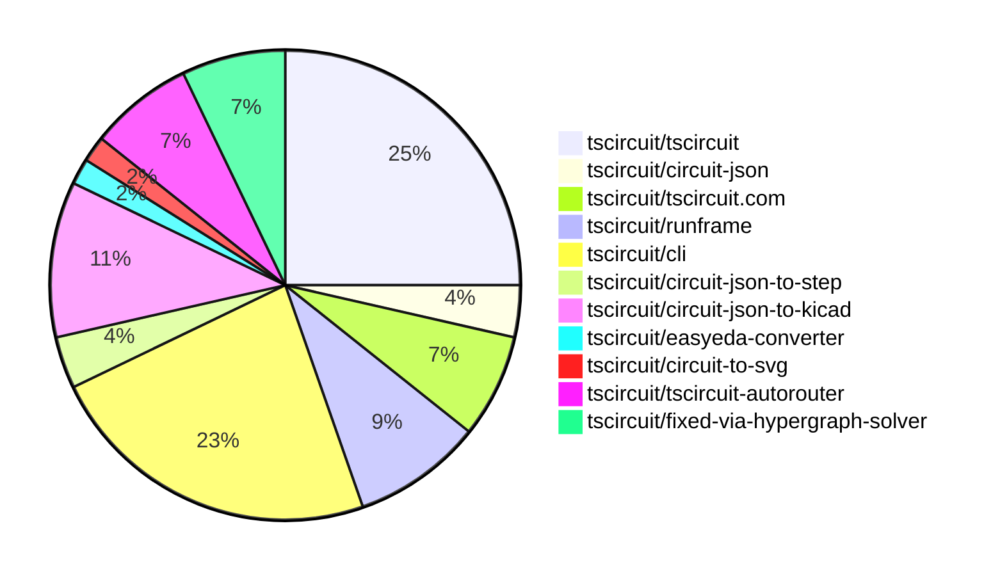

# Contribution Overview 2026-03-24

The current week is shown below. There are 3 major sections:

- [Contributor Overview](#contributor-overview)
- [PRs by Repository](#prs-by-repository)
- [PRs by Contributor](#changes-by-contributor)
- [Scoring & Sponsorship Details](/docs/sponsorship-calculation-explanation.md)

## PRs by Repository

## Contributor Overview

| Contributor | 🐳 Major | 🐙 Minor | 🐌 Tiny | Score | ⭐ | Discussion Contributions |
|-------------|---------|---------|---------|-------|-----|--------------------------|
| [AnasSarkiz](#AnasSarkiz) | 3 | 0 | 2 | 14 | ⭐⭐ | 0🔹 0🔶 0💎 |
| [tscircuitbot](#tscircuitbot) | 0 | 0 | 36 | 12 | ⭐⭐ | 0🔹 0🔶 0💎 |
| [ShiboSoftwareDev](#ShiboSoftwareDev) | 2 | 0 | 1 | 9 | ⭐ | 0🔹 0🔶 0💎 |
| [Abse2001](#Abse2001) | 1 | 1 | 0 | 6 | ⭐ | 0🔹 0🔶 0💎 |
| [MustafaMulla29](#MustafaMulla29) | 0 | 1 | 2 | 5 | ⭐ | 0🔹 0🔶 0💎 |
| [techmannih](#techmannih) | 0 | 1 | 2 | 4 | ⭐ | 0🔹 0🔶 0💎 |
| [mohan-bee](#mohan-bee) | 0 | 1 | 1 | 3 |  | 0🔹 0🔶 0💎 |
| [imrishabh18](#imrishabh18) | 0 | 0 | 1 | 2 |  | 0🔹 0🔶 0💎 |
| [seveibar](#seveibar) | 0 | 0 | 1 | 2 |  | 0🔹 0🔶 0💎 |

## Staff Pass Ratio (SPR)

| Contributor | Reviewed PRs | Rejections | Approvals | SPR |
|-------------|--------------|------------|-----------|-----|
| [ShiboSoftwareDev](#ShiboSoftwareDev) | 4 | 0 | 4 | 100.0% |
| [Abse2001](#Abse2001) | 2 | 0 | 2 | 100.0% |
| [imrishabh18](#imrishabh18) | 1 | 1 | 0 | 0.0% |
| [MustafaMulla29](#MustafaMulla29) | 1 | 0 | 1 | 100.0% |
| [techmannih](#techmannih) | 1 | 0 | 1 | 100.0% |
| [mohan-bee](#mohan-bee) | 1 | 0 | 1 | 100.0% |
| [AnasSarkiz](#AnasSarkiz) | 1 | 0 | 1 | 100.0% |

ShiboSoftwareDev SPR PRs (4)

- [#715](https://github.com/tscircuit/tscircuit-autorouter/pull/715) auto-solve debug option
- [#714](https://github.com/tscircuit/tscircuit-autorouter/pull/714) Revert "add auto solve debug option"
- [#712](https://github.com/tscircuit/tscircuit-autorouter/pull/712) Add auto-run DRC toggle to autorouting debugger & Remove DRC alerts on DRC completed
- [#708](https://github.com/tscircuit/tscircuit-autorouter/pull/708) Avoid center-via shortcuts for same-point intra-node layer changes

Abse2001 SPR PRs (2)

- [#524](https://github.com/tscircuit/circuit-json/pull/524) Added thickness to pcb_panel
- [#368](https://github.com/tscircuit/easyeda-converter/pull/368) Derive Accurate XY CAD Model Offsets from EasyEDA Metadata

imrishabh18 SPR PRs (1)

- [#533](https://github.com/tscircuit/circuit-to-svg/pull/533) `show_as_schematic_box` if true for a group show them as a box and not individual components

MustafaMulla29 SPR PRs (1)

- [#173](https://github.com/tscircuit/circuit-json-to-kicad/pull/173) Fix KiCad 3D model Y-offset sign to match tscircuit placement

techmannih SPR PRs (1)

- [#170](https://github.com/tscircuit/circuit-json-to-kicad/pull/170) feat: Implement a dedicated stage for standalone pcb elements and correct hole association in component footprints

mohan-bee SPR PRs (1)

- [#2519](https://github.com/tscircuit/cli/pull/2519) feat: implement core STEP 3D export for high-fidelity CAD integration

AnasSarkiz SPR PRs (1)

- [#711](https://github.com/tscircuit/tscircuit-autorouter/pull/711) Migrate FixedTopologyHighDensityIntraNodeSolver to fixed-via-hypergraph-solver

> Note: AI evaluates PRs and assigns 1-3 star ratings automatically. 4 and 5 star ratings require manual staff review.

### Discussion Contribution Legend

- 🔹 Normal Comments: Basic participation with minimal effort
- 🔶 Great Informative Comments: Thoughtful participation that adds value
- 💎 Incredible Comments: Exceptional participation with high-quality content

## Review Table

[reviews-received-hover]: ## "Number of reviews received for PRs for this contributor"
[approvals-received-hover]: ## "Number of approvals received for PRs this contributor authored"
[rejections-received-hover]: ## "Number of rejections received for PRs this contributor authored"
[prs-opened-hover]: ## "Number of PRs opened by this contributor"
[issues-created-hover]: ## "Number of issues created by this contributor"

| Contributor | Reviews Received | Approvals Received | Rejections Received | Approvals | Rejections Given | PRs Opened | PRs Merged | Issues Created |
|---|---|---|---|---|---|---|---|---|
| [tscircuitbot](#tscircuitbot) | 0 | 0 | 0 | 0 | 0 | 48 | 36 | 0 |
| [Abse2001](#Abse2001) | 2 | 2 | 0 | 0 | 0 | 3 | 2 | 0 |
| [seveibar](#seveibar) | 0 | 0 | 0 | 12 | 1 | 2 | 1 | 0 |
| [zhaog100](#zhaog100) | 0 | 0 | 0 | 0 | 0 | 2 | 0 | 0 |
| [imrishabh18](#imrishabh18) | 2 | 0 | 1 | 4 | 0 | 2 | 1 | 0 |
| [Koizain](#Koizain) | 2 | 0 | 0 | 0 | 0 | 1 | 0 | 0 |
| [MustafaMulla29](#MustafaMulla29) | 4 | 3 | 0 | 4 | 0 | 3 | 3 | 0 |
| [techmannih](#techmannih) | 11 | 5 | 0 | 0 | 0 | 5 | 3 | 0 |
| [mohan-bee](#mohan-bee) | 5 | 4 | 0 | 0 | 0 | 2 | 2 | 0 |
| [ShiboSoftwareDev](#ShiboSoftwareDev) | 6 | 5 | 0 | 0 | 0 | 8 | 4 | 0 |
| [AnasSarkiz](#AnasSarkiz) | 1 | 1 | 0 | 0 | 0 | 6 | 5 | 0 |

## Changes by Repository

### [tscircuit/tscircuit](https://github.com/tscircuit/tscircuit)

🐌 Tiny Contributions (14)

| PR # | Impact | Contributor | Description |
|------|--------|-------------|-------------|
| [#2761](https://github.com/tscircuit/tscircuit/pull/2761) | 🐌 Tiny | tscircuitbot | Automated package update |
| [#2760](https://github.com/tscircuit/tscircuit/pull/2760) | 🐌 Tiny | tscircuitbot | Updates the tscircuitcli package to version 0.1.1167 in package.json |
| [#2759](https://github.com/tscircuit/tscircuit/pull/2759) | 🐌 Tiny | tscircuitbot | Automated package update |
| [#2758](https://github.com/tscircuit/tscircuit/pull/2758) | 🐌 Tiny | tscircuitbot | Updates the tscircuitcli package to version 0.1.1166 |
| [#2757](https://github.com/tscircuit/tscircuit/pull/2757) | 🐌 Tiny | tscircuitbot | Automated package update to version 0.0.1566 |
| [#2756](https://github.com/tscircuit/tscircuit/pull/2756) | 🐌 Tiny | tscircuitbot | Updates the tscircuitcli package to version 0.1.1165 in the package.json file |
| [#2755](https://github.com/tscircuit/tscircuit/pull/2755) | 🐌 Tiny | tscircuitbot | Automated package update |
| [#2754](https://github.com/tscircuit/tscircuit/pull/2754) | 🐌 Tiny | tscircuitbot | Automated package update |
| [#2753](https://github.com/tscircuit/tscircuit/pull/2753) | 🐌 Tiny | tscircuitbot | Automated package update |
| [#2752](https://github.com/tscircuit/tscircuit/pull/2752) | 🐌 Tiny | tscircuitbot | Updates the tscircuitcli package to version 0.1.1163 |
| [#2751](https://github.com/tscircuit/tscircuit/pull/2751) | 🐌 Tiny | tscircuitbot | Automated package update |
| [#2750](https://github.com/tscircuit/tscircuit/pull/2750) | 🐌 Tiny | tscircuitbot | Updates the tscircuitcli package to version 0.1.1162 in the package.json file |
| [#2749](https://github.com/tscircuit/tscircuit/pull/2749) | 🐌 Tiny | tscircuitbot | Automated package update |
| [#2748](https://github.com/tscircuit/tscircuit/pull/2748) | 🐌 Tiny | tscircuitbot | Automated package update |

### [tscircuit/circuit-json](https://github.com/tscircuit/circuit-json)

| PR # | Impact | Rating | Contributor | Description |
|------|--------|--------|-------------|-------------|
| [#524](https://github.com/tscircuit/circuit-json/pull/524) | 🐙 Minor | ⭐⭐ | Abse2001 | Adds a thickness property to the pcb_panel interface and implementation, allowing for more detailed PCB panel specifications. |

🐌 Tiny Contributions (1)

| PR # | Impact | Contributor | Description |
|------|--------|-------------|-------------|
| [#525](https://github.com/tscircuit/circuit-json/pull/525) | 🐌 Tiny | tscircuitbot | Automated package update |

### [tscircuit/tscircuit.com](https://github.com/tscircuit/tscircuit.com)

🐌 Tiny Contributions (4)

| PR # | Impact | Contributor | Description |
|------|--------|-------------|-------------|
| [#3059](https://github.com/tscircuit/tscircuit.com/pull/3059) | 🐌 Tiny | tscircuitbot | Updates the tscircuitrunframe package from version 0.0.1763 to 0.0.1764 |
| [#3058](https://github.com/tscircuit/tscircuit.com/pull/3058) | 🐌 Tiny | tscircuitbot | Updates the tscircuitrunframe package from version 0.0.1762 to 0.0.1763 |
| [#3056](https://github.com/tscircuit/tscircuit.com/pull/3056) | 🐌 Tiny | tscircuitbot | Updates the tscircuitrunframe package from version 0.0.1761 to 0.0.1762 |
| [#3057](https://github.com/tscircuit/tscircuit.com/pull/3057) | 🐌 Tiny | seveibar | Adds an autorouting demonstration video and reorganizes the landing page content for better clarity and user engagement. |

### [tscircuit/runframe](https://github.com/tscircuit/runframe)

🐌 Tiny Contributions (5)

| PR # | Impact | Contributor | Description |
|------|--------|-------------|-------------|
| [#2989](https://github.com/tscircuit/runframe/pull/2989) | 🐌 Tiny | tscircuitbot | Updates the package version from 0.0.1762 to 0.0.1764 in package.json |
| [#2988](https://github.com/tscircuit/runframe/pull/2988) | 🐌 Tiny | tscircuitbot | Updates the circuit-json-to-kicad package version from 0.0.90 to 0.0.91 in package.json |
| [#2985](https://github.com/tscircuit/runframe/pull/2985) | 🐌 Tiny | tscircuitbot | Updates the circuit-json-to-kicad package from version 0.0.89 to 0.0.90 |
| [#2982](https://github.com/tscircuit/runframe/pull/2982) | 🐌 Tiny | tscircuitbot | Updates the package version from v0.0.1761 to v0.0.1762 in package.json |
| [#2981](https://github.com/tscircuit/runframe/pull/2981) | 🐌 Tiny | tscircuitbot | Updates the circuit-json-to-kicad package from version 0.0.88 to 0.0.89 |

### [tscircuit/cli](https://github.com/tscircuit/cli)

| PR # | Impact | Rating | Contributor | Description |
|------|--------|--------|-------------|-------------|
| [#2519](https://github.com/tscircuit/cli/pull/2519) | 🐙 Minor | ⭐⭐ | mohan-bee | Implements STEP file export support for high-fidelity CAD integration. |

🐌 Tiny Contributions (12)

| PR # | Impact | Contributor | Description |
|------|--------|-------------|-------------|
| [#2533](https://github.com/tscircuit/cli/pull/2533) | 🐌 Tiny | tscircuitbot | Automated package update |
| [#2531](https://github.com/tscircuit/cli/pull/2531) | 🐌 Tiny | tscircuitbot | Automated package update |
| [#2530](https://github.com/tscircuit/cli/pull/2530) | 🐌 Tiny | tscircuitbot | Automated package update |
| [#2528](https://github.com/tscircuit/cli/pull/2528) | 🐌 Tiny | tscircuitbot | Updates the tscircuitrunframe package from version 0.0.1763 to 0.0.1764 |
| [#2526](https://github.com/tscircuit/cli/pull/2526) | 🐌 Tiny | tscircuitbot | Updates the tscircuitrunframe package to version 0.0.1763 in package.json |
| [#2525](https://github.com/tscircuit/cli/pull/2525) | 🐌 Tiny | tscircuitbot | Automated package update |
| [#2523](https://github.com/tscircuit/cli/pull/2523) | 🐌 Tiny | tscircuitbot | Automated package update |
| [#2521](https://github.com/tscircuit/cli/pull/2521) | 🐌 Tiny | tscircuitbot | Automated package update |
| [#2520](https://github.com/tscircuit/cli/pull/2520) | 🐌 Tiny | tscircuitbot | Updates the tscircuitrunframe package from version 0.0.1761 to 0.0.1762 |
| [#2532](https://github.com/tscircuit/cli/pull/2532) | 🐌 Tiny | MustafaMulla29 | Changes the installation command for the tsci package to use tscircuitlatest instead of tscircuitclilatest during upgrades. |
| [#2529](https://github.com/tscircuit/cli/pull/2529) | 🐌 Tiny | MustafaMulla29 | Updates the version of the circuit-json-to-kicad dependency from 0.0.89 to 0.0.91 in package.json |
| [#2522](https://github.com/tscircuit/cli/pull/2522) | 🐌 Tiny | techmannih | Updates the version of the circuit-json-to-kicad dependency from 0.0.87 to 0.0.89 in package.json |

### [tscircuit/circuit-json-to-step](https://github.com/tscircuit/circuit-json-to-step)

🐌 Tiny Contributions (2)

| PR # | Impact | Contributor | Description |
|------|--------|-------------|-------------|
| [#61](https://github.com/tscircuit/circuit-json-to-step/pull/61) | 🐌 Tiny | tscircuitbot | Automated package update |
| [#60](https://github.com/tscircuit/circuit-json-to-step/pull/60) | 🐌 Tiny | mohan-bee | Updates the circuit-json-to-gltf dependency from version 0.0.62 to 0.0.87 in package.json |

### [tscircuit/circuit-json-to-kicad](https://github.com/tscircuit/circuit-json-to-kicad)

| PR # | Impact | Rating | Contributor | Description |
|------|--------|--------|-------------|-------------|
| [#173](https://github.com/tscircuit/circuit-json-to-kicad/pull/173) | 🐙 Minor | ⭐⭐ | MustafaMulla29 | Fixes 3D model placement in KiCad by correcting the Y offset mapping during PCB export. |
| [#170](https://github.com/tscircuit/circuit-json-to-kicad/pull/170) | 🐙 Minor | ⭐⭐ | techmannih | Fixes a bug where standalone holes (holes with pcb_component_id: null) were incorrectly duplicated across all component footprints in the KiCad PCB output by introducing a dedicated AddStandalonePcbElements to handle these holes as independent footprints. |

🐌 Tiny Contributions (4)

| PR # | Impact | Contributor | Description |
|------|--------|-------------|-------------|
| [#175](https://github.com/tscircuit/circuit-json-to-kicad/pull/175) | 🐌 Tiny | tscircuitbot | Automated package update |
| [#174](https://github.com/tscircuit/circuit-json-to-kicad/pull/174) | 🐌 Tiny | tscircuitbot | Automated package update |
| [#171](https://github.com/tscircuit/circuit-json-to-kicad/pull/171) | 🐌 Tiny | tscircuitbot | Automated package update |
| [#172](https://github.com/tscircuit/circuit-json-to-kicad/pull/172) | 🐌 Tiny | techmannih | Adds a test case to reproduce the issue of missing standalone plated holes in KiCad PCB output, highlighting a bug in the converters handling of plated holes. |

### [tscircuit/easyeda-converter](https://github.com/tscircuit/easyeda-converter)

| PR # | Impact | Rating | Contributor | Description |
|------|--------|--------|-------------|-------------|
| [#368](https://github.com/tscircuit/easyeda-converter/pull/368) | 🐳 Major | ⭐⭐⭐ | Abse2001 | Derives accurate XY CAD model offsets from EasyEDA metadata to improve component placement accuracy in circuit designs. |

### [tscircuit/circuit-to-svg](https://github.com/tscircuit/circuit-to-svg)

🐌 Tiny Contributions (1)

| PR # | Impact | Contributor | Description |
|------|--------|-------------|-------------|
| [#532](https://github.com/tscircuit/circuit-to-svg/pull/532) | 🐌 Tiny | imrishabh18 | Updates the tscircuit dependency version from 0.0.1248 to 0.0.1564 and modifies related test snapshots and error messages for PCB trace checks. |

### [tscircuit/tscircuit-autorouter](https://github.com/tscircuit/tscircuit-autorouter)

| PR # | Impact | Rating | Contributor | Description |
|------|--------|--------|-------------|-------------|
| [#712](https://github.com/tscircuit/tscircuit-autorouter/pull/712) | 🐳 Major | ⭐⭐⭐ | ShiboSoftwareDev | Adds an auto-run DRC toggle to the autorouting debugger and removes DRC alerts when DRC checks are completed. |
| [#708](https://github.com/tscircuit/tscircuit-autorouter/pull/708) | 🐳 Major | ⭐⭐⭐ | ShiboSoftwareDev | Updates the same-x,y, cross-layer fast path in IntraNodeSolver to stop routing through the node center by default, preventing overlapping geometry by ensuring obstacle checks are performed before routing. |
| [#711](https://github.com/tscircuit/tscircuit-autorouter/pull/711) | 🐳 Major | ⭐⭐⭐ | AnasSarkiz | Replaces the FixedTopologyHighDensityIntraNodeSolvers dependency on ViaGraphSolver with FixedViaHypergraphSolver, updating the solvers implementation for improved functionality. |

🐌 Tiny Contributions (1)

| PR # | Impact | Contributor | Description |
|------|--------|-------------|-------------|
| [#710](https://github.com/tscircuit/tscircuit-autorouter/pull/710) | 🐌 Tiny | ShiboSoftwareDev | Changes the default benchmark solver from AutoroutingPipelineSolver to AutoroutingPipelineSolver4 in the benchmark workflow and script. |

### [tscircuit/fixed-via-hypergraph-solver](https://github.com/tscircuit/fixed-via-hypergraph-solver)

| PR # | Impact | Rating | Contributor | Description |
|------|--------|--------|-------------|-------------|
| [#10](https://github.com/tscircuit/fixed-via-hypergraph-solver/pull/10) | 🐳 Major | ⭐⭐⭐ | AnasSarkiz | Adds a React Cosmos fixture for visualizing and debugging the FixedViaHypergraphSolver using convex via-graph generation on dataset02. |
| [#8](https://github.com/tscircuit/fixed-via-hypergraph-solver/pull/8) | 🐳 Major | ⭐⭐⭐ | AnasSarkiz | Add a parallel benchmark runner for FixedViaHypergraphSolver that utilizes worker threads to process convex regions from a dataset, enhancing performance and efficiency in benchmarking. |

🐌 Tiny Contributions (2)

| PR # | Impact | Contributor | Description |
|------|--------|-------------|-------------|
| [#11](https://github.com/tscircuit/fixed-via-hypergraph-solver/pull/11) | 🐌 Tiny | AnasSarkiz | Changes asset JSON imports to be relative paths for better compatibility with bundlers. |
| [#9](https://github.com/tscircuit/fixed-via-hypergraph-solver/pull/9) | 🐌 Tiny | AnasSarkiz | Adds a React Cosmos sandbox powered by Vite for developing, previewing, and debugging FixedViaHypergraphSolver fixtures. |

## Changes by Contributor

### [tscircuitbot](https://github.com/tscircuitbot)

🐌 Tiny Contributions (36)

| PR # | Impact | Description |
|------|--------|-------------|
| [#2761](https://github.com/tscircuit/tscircuit/pull/2761) | 🐌 Tiny | Automated package update |
| [#2760](https://github.com/tscircuit/tscircuit/pull/2760) | 🐌 Tiny | Updates the tscircuitcli package to version 0.1.1167 in package.json |
| [#2759](https://github.com/tscircuit/tscircuit/pull/2759) | 🐌 Tiny | Automated package update |
| [#2758](https://github.com/tscircuit/tscircuit/pull/2758) | 🐌 Tiny | Updates the tscircuitcli package to version 0.1.1166 |
| [#2757](https://github.com/tscircuit/tscircuit/pull/2757) | 🐌 Tiny | Automated package update to version 0.0.1566 |
| [#2756](https://github.com/tscircuit/tscircuit/pull/2756) | 🐌 Tiny | Updates the tscircuitcli package to version 0.1.1165 in the package.json file |
| [#2755](https://github.com/tscircuit/tscircuit/pull/2755) | 🐌 Tiny | Automated package update |
| [#2754](https://github.com/tscircuit/tscircuit/pull/2754) | 🐌 Tiny | Automated package update |
| [#2753](https://github.com/tscircuit/tscircuit/pull/2753) | 🐌 Tiny | Automated package update |
| [#2752](https://github.com/tscircuit/tscircuit/pull/2752) | 🐌 Tiny | Updates the tscircuitcli package to version 0.1.1163 |
| [#2751](https://github.com/tscircuit/tscircuit/pull/2751) | 🐌 Tiny | Automated package update |
| [#2750](https://github.com/tscircuit/tscircuit/pull/2750) | 🐌 Tiny | Updates the tscircuitcli package to version 0.1.1162 in the package.json file |
| [#2749](https://github.com/tscircuit/tscircuit/pull/2749) | 🐌 Tiny | Automated package update |
| [#2748](https://github.com/tscircuit/tscircuit/pull/2748) | 🐌 Tiny | Automated package update |
| [#525](https://github.com/tscircuit/circuit-json/pull/525) | 🐌 Tiny | Automated package update |
| [#3059](https://github.com/tscircuit/tscircuit.com/pull/3059) | 🐌 Tiny | Updates the tscircuitrunframe package from version 0.0.1763 to 0.0.1764 |
| [#3058](https://github.com/tscircuit/tscircuit.com/pull/3058) | 🐌 Tiny | Updates the tscircuitrunframe package from version 0.0.1762 to 0.0.1763 |
| [#3056](https://github.com/tscircuit/tscircuit.com/pull/3056) | 🐌 Tiny | Updates the tscircuitrunframe package from version 0.0.1761 to 0.0.1762 |
| [#2989](https://github.com/tscircuit/runframe/pull/2989) | 🐌 Tiny | Updates the package version from 0.0.1762 to 0.0.1764 in package.json |
| [#2988](https://github.com/tscircuit/runframe/pull/2988) | 🐌 Tiny | Updates the circuit-json-to-kicad package version from 0.0.90 to 0.0.91 in package.json |
| [#2985](https://github.com/tscircuit/runframe/pull/2985) | 🐌 Tiny | Updates the circuit-json-to-kicad package from version 0.0.89 to 0.0.90 |
| [#2982](https://github.com/tscircuit/runframe/pull/2982) | 🐌 Tiny | Updates the package version from v0.0.1761 to v0.0.1762 in package.json |
| [#2981](https://github.com/tscircuit/runframe/pull/2981) | 🐌 Tiny | Updates the circuit-json-to-kicad package from version 0.0.88 to 0.0.89 |
| [#2533](https://github.com/tscircuit/cli/pull/2533) | 🐌 Tiny | Automated package update |
| [#2531](https://github.com/tscircuit/cli/pull/2531) | 🐌 Tiny | Automated package update |
| [#2530](https://github.com/tscircuit/cli/pull/2530) | 🐌 Tiny | Automated package update |
| [#2528](https://github.com/tscircuit/cli/pull/2528) | 🐌 Tiny | Updates the tscircuitrunframe package from version 0.0.1763 to 0.0.1764 |
| [#2526](https://github.com/tscircuit/cli/pull/2526) | 🐌 Tiny | Updates the tscircuitrunframe package to version 0.0.1763 in package.json |
| [#2525](https://github.com/tscircuit/cli/pull/2525) | 🐌 Tiny | Automated package update |
| [#2523](https://github.com/tscircuit/cli/pull/2523) | 🐌 Tiny | Automated package update |
| [#2521](https://github.com/tscircuit/cli/pull/2521) | 🐌 Tiny | Automated package update |
| [#2520](https://github.com/tscircuit/cli/pull/2520) | 🐌 Tiny | Updates the tscircuitrunframe package from version 0.0.1761 to 0.0.1762 |
| [#61](https://github.com/tscircuit/circuit-json-to-step/pull/61) | 🐌 Tiny | Automated package update |
| [#175](https://github.com/tscircuit/circuit-json-to-kicad/pull/175) | 🐌 Tiny | Automated package update |
| [#174](https://github.com/tscircuit/circuit-json-to-kicad/pull/174) | 🐌 Tiny | Automated package update |
| [#171](https://github.com/tscircuit/circuit-json-to-kicad/pull/171) | 🐌 Tiny | Automated package update |

### [Abse2001](https://github.com/Abse2001)

| PRs # | Impact | Rating | Description |
|------|--------|--------|-------------|
| [#368](https://github.com/tscircuit/easyeda-converter/pull/368) | 🐳 Major | ⭐⭐⭐ | Derives accurate XY CAD model offsets from EasyEDA metadata to improve component placement accuracy in circuit designs. |
| [#524](https://github.com/tscircuit/circuit-json/pull/524) | 🐙 Minor | ⭐⭐ | Adds a thickness property to the pcb_panel interface and implementation, allowing for more detailed PCB panel specifications. |

### [imrishabh18](https://github.com/imrishabh18)

🐌 Tiny Contributions (1)

| PR # | Impact | Description |
|------|--------|-------------|
| [#532](https://github.com/tscircuit/circuit-to-svg/pull/532) | 🐌 Tiny | Updates the tscircuit dependency version from 0.0.1248 to 0.0.1564 and modifies related test snapshots and error messages for PCB trace checks. |

### [seveibar](https://github.com/seveibar)

🐌 Tiny Contributions (1)

| PR # | Impact | Description |
|------|--------|-------------|
| [#3057](https://github.com/tscircuit/tscircuit.com/pull/3057) | 🐌 Tiny | Adds an autorouting demonstration video and reorganizes the landing page content for better clarity and user engagement. |

### [MustafaMulla29](https://github.com/MustafaMulla29)

| PRs # | Impact | Rating | Description |
|------|--------|--------|-------------|
| [#173](https://github.com/tscircuit/circuit-json-to-kicad/pull/173) | 🐙 Minor | ⭐⭐ | Fixes 3D model placement in KiCad by correcting the Y offset mapping during PCB export. |

🐌 Tiny Contributions (2)

| PR # | Impact | Description |
|------|--------|-------------|
| [#2532](https://github.com/tscircuit/cli/pull/2532) | 🐌 Tiny | Changes the installation command for the tsci package to use tscircuitlatest instead of tscircuitclilatest during upgrades. |
| [#2529](https://github.com/tscircuit/cli/pull/2529) | 🐌 Tiny | Updates the version of the circuit-json-to-kicad dependency from 0.0.89 to 0.0.91 in package.json |

### [mohan-bee](https://github.com/mohan-bee)

| PRs # | Impact | Rating | Description |
|------|--------|--------|-------------|
| [#2519](https://github.com/tscircuit/cli/pull/2519) | 🐙 Minor | ⭐⭐ | Implements STEP file export support for high-fidelity CAD integration. |

🐌 Tiny Contributions (1)

| PR # | Impact | Description |
|------|--------|-------------|
| [#60](https://github.com/tscircuit/circuit-json-to-step/pull/60) | 🐌 Tiny | Updates the circuit-json-to-gltf dependency from version 0.0.62 to 0.0.87 in package.json |

### [techmannih](https://github.com/techmannih)

| PRs # | Impact | Rating | Description |
|------|--------|--------|-------------|
| [#170](https://github.com/tscircuit/circuit-json-to-kicad/pull/170) | 🐙 Minor | ⭐⭐ | Fixes a bug where standalone holes (holes with pcb_component_id: null) were incorrectly duplicated across all component footprints in the KiCad PCB output by introducing a dedicated AddStandalonePcbElements to handle these holes as independent footprints. |

🐌 Tiny Contributions (2)

| PR # | Impact | Description |
|------|--------|-------------|
| [#2522](https://github.com/tscircuit/cli/pull/2522) | 🐌 Tiny | Updates the version of the circuit-json-to-kicad dependency from 0.0.87 to 0.0.89 in package.json |
| [#172](https://github.com/tscircuit/circuit-json-to-kicad/pull/172) | 🐌 Tiny | Adds a test case to reproduce the issue of missing standalone plated holes in KiCad PCB output, highlighting a bug in the converters handling of plated holes. |

### [ShiboSoftwareDev](https://github.com/ShiboSoftwareDev)

| PRs # | Impact | Rating | Description |
|------|--------|--------|-------------|
| [#712](https://github.com/tscircuit/tscircuit-autorouter/pull/712) | 🐳 Major | ⭐⭐⭐ | Adds an auto-run DRC toggle to the autorouting debugger and removes DRC alerts when DRC checks are completed. |
| [#708](https://github.com/tscircuit/tscircuit-autorouter/pull/708) | 🐳 Major | ⭐⭐⭐ | Updates the same-x,y, cross-layer fast path in IntraNodeSolver to stop routing through the node center by default, preventing overlapping geometry by ensuring obstacle checks are performed before routing. |

🐌 Tiny Contributions (1)

| PR # | Impact | Description |
|------|--------|-------------|
| [#710](https://github.com/tscircuit/tscircuit-autorouter/pull/710) | 🐌 Tiny | Changes the default benchmark solver from AutoroutingPipelineSolver to AutoroutingPipelineSolver4 in the benchmark workflow and script. |

### [AnasSarkiz](https://github.com/AnasSarkiz)

| PRs # | Impact | Rating | Description |
|------|--------|--------|-------------|
| [#711](https://github.com/tscircuit/tscircuit-autorouter/pull/711) | 🐳 Major | ⭐⭐⭐ | Replaces the FixedTopologyHighDensityIntraNodeSolvers dependency on ViaGraphSolver with FixedViaHypergraphSolver, updating the solvers implementation for improved functionality. |
| [#10](https://github.com/tscircuit/fixed-via-hypergraph-solver/pull/10) | 🐳 Major | ⭐⭐⭐ | Adds a React Cosmos fixture for visualizing and debugging the FixedViaHypergraphSolver using convex via-graph generation on dataset02. |
| [#8](https://github.com/tscircuit/fixed-via-hypergraph-solver/pull/8) | 🐳 Major | ⭐⭐⭐ | Add a parallel benchmark runner for FixedViaHypergraphSolver that utilizes worker threads to process convex regions from a dataset, enhancing performance and efficiency in benchmarking. |

🐌 Tiny Contributions (2)

| PR # | Impact | Description |
|------|--------|-------------|
| [#11](https://github.com/tscircuit/fixed-via-hypergraph-solver/pull/11) | 🐌 Tiny | Changes asset JSON imports to be relative paths for better compatibility with bundlers. |
| [#9](https://github.com/tscircuit/fixed-via-hypergraph-solver/pull/9) | 🐌 Tiny | Adds a React Cosmos sandbox powered by Vite for developing, previewing, and debugging FixedViaHypergraphSolver fixtures. |

## Repository Owners

| Repository | Codeowners |
|------------|------------|
| [builder](https://github.com/tscircuit/builder/blob/main/.github/CODEOWNERS) | [seveibar](https://github.com/seveibar)
| [pcb-viewer](https://github.com/tscircuit/pcb-viewer/blob/main/.github/CODEOWNERS) | [seveibar](https://github.com/seveibar), [ShiboSoftwareDev](https://github.com/ShiboSoftwareDev), [Abse2001](https://github.com/Abse2001)
| [footprints-old](https://github.com/tscircuit/footprints-old/blob/main/.github/CODEOWNERS) | [seveibar](https://github.com/seveibar)
| [footprinter](https://github.com/tscircuit/footprinter/blob/main/.github/CODEOWNERS) | [seveibar](https://github.com/seveibar), [techmannih](https://github.com/techmannih)
| [3d-viewer](https://github.com/tscircuit/3d-viewer/blob/main/.github/CODEOWNERS) | [ShiboSoftwareDev](https://github.com/ShiboSoftwareDev), [Abse2001](https://github.com/Abse2001)
| [winterspec](https://github.com/tscircuit/winterspec/blob/main/.github/CODEOWNERS) | [seveibar](https://github.com/seveibar), [ShiboSoftwareDev](https://github.com/ShiboSoftwareDev)
| [jscad-electronics](https://github.com/tscircuit/jscad-electronics/blob/main/.github/CODEOWNERS) | [seveibar](https://github.com/seveibar), [techmannih](https://github.com/techmannih), [ShiboSoftwareDev](https://github.com/ShiboSoftwareDev), [anas-sarkez](https://github.com/anas-sarkez)
| [circuit-to-svg](https://github.com/tscircuit/circuit-to-svg/blob/main/.github/CODEOWNERS) | [imrishabh18](https://github.com/imrishabh18)
| [schematic-symbols](https://github.com/tscircuit/schematic-symbols/blob/main/.github/CODEOWNERS) | [seveibar](https://github.com/seveibar), [imrishabh18](https://github.com/imrishabh18), [techmannih](https://github.com/techmannih)
| [circuit-json-to-gerber](https://github.com/tscircuit/circuit-json-to-gerber/blob/main/.github/CODEOWNERS) | [seveibar](https://github.com/seveibar), [ShiboSoftwareDev](https://github.com/ShiboSoftwareDev)
| [tscircuit.com](https://github.com/tscircuit/tscircuit.com/blob/main/.github/CODEOWNERS) | [seveibar](https://github.com/seveibar), [imrishabh18](https://github.com/imrishabh18)
| [issue-roulette](https://github.com/tscircuit/issue-roulette/blob/main/.github/CODEOWNERS) | [Anshgrover23](https://github.com/Anshgrover23)
| [sparkfun-boards](https://github.com/tscircuit/sparkfun-boards/blob/main/.github/CODEOWNERS) | [ShiboSoftwareDev](https://github.com/ShiboSoftwareDev), [Abse2001](https://github.com/Abse2001), [MustafaMulla29](https://github.com/MustafaMulla29), [Anshgrover23](https://github.com/Anshgrover23), [techmannih](https://github.com/techmannih)
| [schematic-corpus](https://github.com/tscircuit/schematic-corpus/blob/main/.github/CODEOWNERS) | [Abse2001](https://github.com/Abse2001)
| [copper-pour-solver](https://github.com/tscircuit/copper-pour-solver/blob/main/.github/CODEOWNERS) | [seveibar](https://github.com/seveibar), [ShiboSoftwareDev](https://github.com/ShiboSoftwareDev)
| [common](https://github.com/tscircuit/common/blob/main/.github/CODEOWNERS) | [seveibar](https://github.com/seveibar), [Abse2001](https://github.com/Abse2001)
| [circuit-to-canvas](https://github.com/tscircuit/circuit-to-canvas/blob/main/.github/CODEOWNERS) | [ShiboSoftwareDev](https://github.com/ShiboSoftwareDev), [Abse2001](https://github.com/Abse2001), [techmannih](https://github.com/techmannih)
| [circuit-json-to-lbrn](https://github.com/tscircuit/circuit-json-to-lbrn/blob/main/.github/CODEOWNERS) | [AnasSarkiz](https://github.com/AnasSarkiz)
| [pcbburn.com](https://github.com/tscircuit/pcbburn.com/blob/main/.github/CODEOWNERS) | [AnasSarkiz](https://github.com/AnasSarkiz)

## Repositories by Owner

| User | Repo |
|------|------|
| [seveibar](https://github.com/seveibar) | [builder](https://github.com/tscircuit/builder/blob/main/.github/CODEOWNERS) |
|  | [pcb-viewer](https://github.com/tscircuit/pcb-viewer/blob/main/.github/CODEOWNERS) |
|  | [footprints-old](https://github.com/tscircuit/footprints-old/blob/main/.github/CODEOWNERS) |
|  | [footprinter](https://github.com/tscircuit/footprinter/blob/main/.github/CODEOWNERS) |
|  | [winterspec](https://github.com/tscircuit/winterspec/blob/main/.github/CODEOWNERS) |
|  | [jscad-electronics](https://github.com/tscircuit/jscad-electronics/blob/main/.github/CODEOWNERS) |
|  | [schematic-symbols](https://github.com/tscircuit/schematic-symbols/blob/main/.github/CODEOWNERS) |
|  | [circuit-json-to-gerber](https://github.com/tscircuit/circuit-json-to-gerber/blob/main/.github/CODEOWNERS) |
|  | [tscircuit.com](https://github.com/tscircuit/tscircuit.com/blob/main/.github/CODEOWNERS) |
|  | [copper-pour-solver](https://github.com/tscircuit/copper-pour-solver/blob/main/.github/CODEOWNERS) |
|  | [common](https://github.com/tscircuit/common/blob/main/.github/CODEOWNERS) |
| [ShiboSoftwareDev](https://github.com/ShiboSoftwareDev) | [pcb-viewer](https://github.com/tscircuit/pcb-viewer/blob/main/.github/CODEOWNERS) |
|  | [3d-viewer](https://github.com/tscircuit/3d-viewer/blob/main/.github/CODEOWNERS) |
|  | [winterspec](https://github.com/tscircuit/winterspec/blob/main/.github/CODEOWNERS) |
|  | [jscad-electronics](https://github.com/tscircuit/jscad-electronics/blob/main/.github/CODEOWNERS) |
|  | [circuit-json-to-gerber](https://github.com/tscircuit/circuit-json-to-gerber/blob/main/.github/CODEOWNERS) |
|  | [sparkfun-boards](https://github.com/tscircuit/sparkfun-boards/blob/main/.github/CODEOWNERS) |
|  | [copper-pour-solver](https://github.com/tscircuit/copper-pour-solver/blob/main/.github/CODEOWNERS) |
|  | [circuit-to-canvas](https://github.com/tscircuit/circuit-to-canvas/blob/main/.github/CODEOWNERS) |
| [Abse2001](https://github.com/Abse2001) | [pcb-viewer](https://github.com/tscircuit/pcb-viewer/blob/main/.github/CODEOWNERS) |
|  | [3d-viewer](https://github.com/tscircuit/3d-viewer/blob/main/.github/CODEOWNERS) |
|  | [sparkfun-boards](https://github.com/tscircuit/sparkfun-boards/blob/main/.github/CODEOWNERS) |
|  | [schematic-corpus](https://github.com/tscircuit/schematic-corpus/blob/main/.github/CODEOWNERS) |
|  | [common](https://github.com/tscircuit/common/blob/main/.github/CODEOWNERS) |
|  | [circuit-to-canvas](https://github.com/tscircuit/circuit-to-canvas/blob/main/.github/CODEOWNERS) |
| [techmannih](https://github.com/techmannih) | [footprinter](https://github.com/tscircuit/footprinter/blob/main/.github/CODEOWNERS) |
|  | [jscad-electronics](https://github.com/tscircuit/jscad-electronics/blob/main/.github/CODEOWNERS) |
|  | [schematic-symbols](https://github.com/tscircuit/schematic-symbols/blob/main/.github/CODEOWNERS) |
|  | [sparkfun-boards](https://github.com/tscircuit/sparkfun-boards/blob/main/.github/CODEOWNERS) |
|  | [circuit-to-canvas](https://github.com/tscircuit/circuit-to-canvas/blob/main/.github/CODEOWNERS) |
| [anas-sarkez](https://github.com/anas-sarkez) | [jscad-electronics](https://github.com/tscircuit/jscad-electronics/blob/main/.github/CODEOWNERS) |
| [imrishabh18](https://github.com/imrishabh18) | [circuit-to-svg](https://github.com/tscircuit/circuit-to-svg/blob/main/.github/CODEOWNERS) |
|  | [schematic-symbols](https://github.com/tscircuit/schematic-symbols/blob/main/.github/CODEOWNERS) |
|  | [tscircuit.com](https://github.com/tscircuit/tscircuit.com/blob/main/.github/CODEOWNERS) |
| [Anshgrover23](https://github.com/Anshgrover23) | [issue-roulette](https://github.com/tscircuit/issue-roulette/blob/main/.github/CODEOWNERS) |
|  | [sparkfun-boards](https://github.com/tscircuit/sparkfun-boards/blob/main/.github/CODEOWNERS) |
| [MustafaMulla29](https://github.com/MustafaMulla29) | [sparkfun-boards](https://github.com/tscircuit/sparkfun-boards/blob/main/.github/CODEOWNERS) |
| [AnasSarkiz](https://github.com/AnasSarkiz) | [circuit-json-to-lbrn](https://github.com/tscircuit/circuit-json-to-lbrn/blob/main/.github/CODEOWNERS) |
|  | [pcbburn.com](https://github.com/tscircuit/pcbburn.com/blob/main/.github/CODEOWNERS) |

