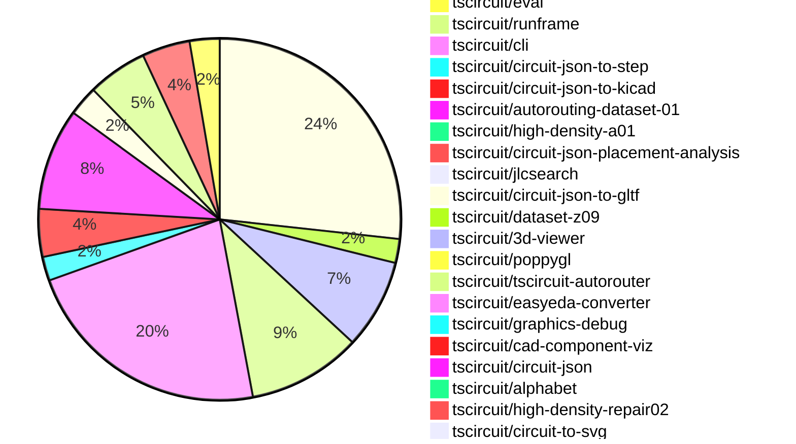

# Contribution Overview 2026-03-24

The current week is shown below. There are 3 major sections:

- [Contributor Overview](#contributor-overview)
- [PRs by Repository](#prs-by-repository)
- [PRs by Contributor](#changes-by-contributor)
- [Scoring & Sponsorship Details](/docs/sponsorship-calculation-explanation.md)

## PRs by Repository

## Contributor Overview

| Contributor | 🐳 Major | 🐙 Minor | 🐌 Tiny | Score | ⭐ | Discussion Contributions |
|-------------|---------|---------|---------|-------|-----|--------------------------|
| [seveibar](#seveibar) | 7 | 6 | 6 | 47 | ⭐⭐ | 0🔹 0🔶 0💎 |
| [ShiboSoftwareDev](#ShiboSoftwareDev) | 9 | 2 | 2 | 46 | ⭐⭐ | 0🔹 0🔶 0💎 |
| [AnasSarkiz](#AnasSarkiz) | 6 | 0 | 2 | 28 | ⭐⭐ | 0🔹 0🔶 0💎 |
| [Abse2001](#Abse2001) | 3 | 1 | 7 | 22 | ⭐⭐ | 0🔹 0🔶 0💎 |
| [0hmX](#0hmX) | 2 | 3 | 3 | 17 | ⭐⭐ | 0🔹 0🔶 0💎 |
| [tscircuitbot](#tscircuitbot) | 0 | 0 | 131 | 12.5 | ⭐⭐ | 0🔹 0🔶 0💎 |
| [MustafaMulla29](#MustafaMulla29) | 0 | 1 | 7 | 10 | ⭐ | 0🔹 0🔶 0💎 |
| [imrishabh18](#imrishabh18) | 0 | 1 | 5 | 8 | ⭐ | 0🔹 0🔶 0💎 |
| [rushabhcodes](#rushabhcodes) | 2 | 0 | 0 | 8 | ⭐ | 0🔹 0🔶 0💎 |
| [dwiel](#dwiel) | 1 | 0 | 0 | 4 | ⭐ | 0🔹 0🔶 0💎 |
| [mohan-bee](#mohan-bee) | 0 | 1 | 1 | 3 |  | 0🔹 0🔶 0💎 |

## Staff Pass Ratio (SPR)

| Contributor | Reviewed PRs | Rejections | Approvals | SPR |
|-------------|--------------|------------|-----------|-----|
| [ShiboSoftwareDev](#ShiboSoftwareDev) | 7 | 0 | 8 | 100.0% |
| [Abse2001](#Abse2001) | 3 | 0 | 3 | 100.0% |
| [rushabhcodes](#rushabhcodes) | 3 | 1 | 2 | 66.7% |
| [AnasSarkiz](#AnasSarkiz) | 3 | 1 | 3 | 66.7% |
| [imrishabh18](#imrishabh18) | 2 | 1 | 1 | 50.0% |
| [mohan-bee](#mohan-bee) | 2 | 1 | 1 | 50.0% |
| [MustafaMulla29](#MustafaMulla29) | 1 | 0 | 1 | 100.0% |
| [dwiel](#dwiel) | 1 | 0 | 1 | 100.0% |

ShiboSoftwareDev SPR PRs (7)

- [#726](https://github.com/tscircuit/tscircuit-autorouter/pull/726)  Fix intra-node routing for disconnected multipoint branches
- [#728](https://github.com/tscircuit/tscircuit-autorouter/pull/728) Fix benchmark solver discovery for grouped pipeline exports
- [#725](https://github.com/tscircuit/tscircuit-autorouter/pull/725) change AutoroutingPipelineSolver export to AutoroutingPipelineSolver4_TinyHypergraph
- [#715](https://github.com/tscircuit/tscircuit-autorouter/pull/715) auto-solve debug option
- [#708](https://github.com/tscircuit/tscircuit-autorouter/pull/708) Avoid center-via shortcuts for same-point intra-node layer changes
- [#712](https://github.com/tscircuit/tscircuit-autorouter/pull/712) Add auto-run DRC toggle to autorouting debugger & Remove DRC alerts on DRC completed
- [#714](https://github.com/tscircuit/tscircuit-autorouter/pull/714) Revert "add auto solve debug option"

Abse2001 SPR PRs (3)

- [#524](https://github.com/tscircuit/circuit-json/pull/524) Added thickness to pcb_panel
- [#368](https://github.com/tscircuit/easyeda-converter/pull/368) Derive Accurate XY CAD Model Offsets from EasyEDA Metadata
- [#2](https://github.com/tscircuit/cad-component-viz/pull/2) Add STEP Support and Unified Model Loading Pipeline (URL + Local Files)

rushabhcodes SPR PRs (3)

- [#747](https://github.com/tscircuit/3d-viewer/pull/747) Fix silkscreen knockout text rendering
- [#3073](https://github.com/tscircuit/tscircuit.com/pull/3073) Reorganize the download menu and expose multi-format image exports on package pages
- [#3030](https://github.com/tscircuit/tscircuit.com/pull/3030) Prevent RunFrame keydown blur from breaking Circuit JSON search in the editor preview

AnasSarkiz SPR PRs (3)

- [#719](https://github.com/tscircuit/tscircuit-autorouter/pull/719) Dynamic HD 01/03 Iteration by Size/Connections
- [#711](https://github.com/tscircuit/tscircuit-autorouter/pull/711) Migrate FixedTopologyHighDensityIntraNodeSolver to fixed-via-hypergraph-solver
- [#47](https://github.com/tscircuit/high-density-a01/pull/47) Add adaptive iteration limits and search budgets based on node size and trace count

imrishabh18 SPR PRs (2)

- [#533](https://github.com/tscircuit/circuit-to-svg/pull/533) `show_as_schematic_box` if true for a group show them as a box and not individual components
- [#2567](https://github.com/tscircuit/cli/pull/2567) Enable worker pool heartbeat logs by default and increase interval to 30s

mohan-bee SPR PRs (2)

- [#2569](https://github.com/tscircuit/cli/pull/2569) Fix: Show Cli Version Instead of tscircuit Version
- [#2519](https://github.com/tscircuit/cli/pull/2519) feat: implement core STEP 3D export for high-fidelity CAD integration

MustafaMulla29 SPR PRs (1)

- [#173](https://github.com/tscircuit/circuit-json-to-kicad/pull/173) Fix KiCad 3D model Y-offset sign to match tscircuit placement

dwiel SPR PRs (1)

- [#153](https://github.com/tscircuit/circuit-json-to-gltf/pull/153) Add label to CAD component boxes for GLTF node naming

> Note: AI evaluates PRs and assigns 1-3 star ratings automatically. 4 and 5 star ratings require manual staff review.

### Discussion Contribution Legend

- 🔹 Normal Comments: Basic participation with minimal effort
- 🔶 Great Informative Comments: Thoughtful participation that adds value
- 💎 Incredible Comments: Exceptional participation with high-quality content

## Review Table

[reviews-received-hover]: ## "Number of reviews received for PRs for this contributor"
[approvals-received-hover]: ## "Number of approvals received for PRs this contributor authored"
[rejections-received-hover]: ## "Number of rejections received for PRs this contributor authored"
[prs-opened-hover]: ## "Number of PRs opened by this contributor"
[issues-created-hover]: ## "Number of issues created by this contributor"

| Contributor | Reviews Received | Approvals Received | Rejections Received | Approvals | Rejections Given | PRs Opened | PRs Merged | Issues Created |
|---|---|---|---|---|---|---|---|---|
| [ysdy823](#ysdy823) | 0 | 0 | 0 | 0 | 0 | 4 | 0 | 0 |
| [tscircuitbot](#tscircuitbot) | 1 | 0 | 0 | 0 | 0 | 178 | 132 | 0 |
| [seveibar](#seveibar) | 5 | 2 | 0 | 29 | 3 | 24 | 19 | 0 |
| [Abse2001](#Abse2001) | 12 | 12 | 0 | 1 | 0 | 11 | 11 | 0 |
| [imrishabh18](#imrishabh18) | 4 | 1 | 1 | 4 | 2 | 8 | 6 | 0 |
| [chengyixu](#chengyixu) | 1 | 0 | 0 | 0 | 0 | 10 | 0 | 0 |
| [claw-explorer](#claw-explorer) | 2 | 0 | 0 | 0 | 0 | 2 | 0 | 0 |
| [Koizain](#Koizain) | 3 | 0 | 0 | 0 | 0 | 2 | 0 | 0 |
| [rushabhcodes](#rushabhcodes) | 12 | 3 | 1 | 0 | 0 | 5 | 2 | 0 |
| [zhaog100](#zhaog100) | 0 | 0 | 0 | 0 | 0 | 2 | 0 | 0 |
| [MustafaMulla29](#MustafaMulla29) | 9 | 8 | 0 | 3 | 0 | 10 | 8 | 0 |
| [AnasSarkiz](#AnasSarkiz) | 3 | 3 | 0 | 2 | 0 | 8 | 8 | 0 |
| [mohan-bee](#mohan-bee) | 8 | 4 | 1 | 0 | 0 | 4 | 2 | 0 |
| [bitsbyritik](#bitsbyritik) | 2 | 0 | 2 | 0 | 0 | 1 | 0 | 0 |
| [ShiboSoftwareDev](#ShiboSoftwareDev) | 17 | 9 | 0 | 4 | 0 | 23 | 14 | 0 |
| [MGrin](#MGrin) | 0 | 0 | 0 | 0 | 0 | 1 | 0 | 0 |
| [zicaiw625](#zicaiw625) | 0 | 0 | 0 | 0 | 0 | 1 | 0 | 0 |
| [cmalthusian-cyber](#cmalthusian-cyber) | 0 | 0 | 0 | 0 | 0 | 3 | 0 | 0 |
| [dwiel](#dwiel) | 1 | 1 | 0 | 0 | 0 | 1 | 1 | 0 |
| [tarsassistant25-oss](#tarsassistant25-oss) | 0 | 0 | 0 | 0 | 0 | 2 | 0 | 0 |
| [arkitek-dev](#arkitek-dev) | 0 | 0 | 0 | 0 | 0 | 1 | 0 | 0 |
| [0hmX](#0hmX) | 0 | 0 | 0 | 0 | 0 | 12 | 11 | 0 |

## Changes by Repository

### [tscircuit/pcb-viewer](https://github.com/tscircuit/pcb-viewer)

| PR # | Impact | Rating | Contributor | Description |
|------|--------|--------|-------------|-------------|
| [#725](https://github.com/tscircuit/pcb-viewer/pull/725) | 🐙 Minor | ⭐⭐ | seveibar | before img width1278 height1244 altimage srchttps:github.comuser-attachmentsassetsec8ff117-3007-44c3-9346-78a68dcfa622   after img width682 height608 altimage srchttps:github.comuser-attachmentsassetsea78a306-f69c-4067-ac6e-7fe98a9bf130 |

🐌 Tiny Contributions (1)

| PR # | Impact | Contributor | Description |
|------|--------|-------------|-------------|
| [#726](https://github.com/tscircuit/pcb-viewer/pull/726) | 🐌 Tiny | tscircuitbot | Automated package update |

### [tscircuit/tscircuit](https://github.com/tscircuit/tscircuit)

🐌 Tiny Contributions (50)

| PR # | Impact | Contributor | Description |
|------|--------|-------------|-------------|
| [#2798](https://github.com/tscircuit/tscircuit/pull/2798) | 🐌 Tiny | tscircuitbot | Updates the package version from 0.0.1585 to 0.0.1586 in package.json |
| [#2796](https://github.com/tscircuit/tscircuit/pull/2796) | 🐌 Tiny | tscircuitbot | Automated package update |
| [#2795](https://github.com/tscircuit/tscircuit/pull/2795) | 🐌 Tiny | tscircuitbot | Automated package update |
| [#2792](https://github.com/tscircuit/tscircuit/pull/2792) | 🐌 Tiny | tscircuitbot | Automated package update |
| [#2791](https://github.com/tscircuit/tscircuit/pull/2791) | 🐌 Tiny | tscircuitbot | Updates the tscircuitcli package from version 0.1.1181 to 0.1.1182 and the tscircuitrunframe package from version 0.0.1769 to 0.0.1771 in package.json |
| [#2793](https://github.com/tscircuit/tscircuit/pull/2793) | 🐌 Tiny | tscircuitbot | Updates the tscircuitcli package version from 0.1.1182 to 0.1.1183 in package.json |
| [#2794](https://github.com/tscircuit/tscircuit/pull/2794) | 🐌 Tiny | tscircuitbot | Automated package update |
| [#2790](https://github.com/tscircuit/tscircuit/pull/2790) | 🐌 Tiny | tscircuitbot | Automated package update |
| [#2780](https://github.com/tscircuit/tscircuit/pull/2780) | 🐌 Tiny | tscircuitbot | Automated package update to version 0.0.1577 |
| [#2784](https://github.com/tscircuit/tscircuit/pull/2784) | 🐌 Tiny | tscircuitbot | Automated package update |
| [#2782](https://github.com/tscircuit/tscircuit/pull/2782) | 🐌 Tiny | tscircuitbot | Updates the package version from 0.0.1577 to 0.0.1578 in package.json |
| [#2779](https://github.com/tscircuit/tscircuit/pull/2779) | 🐌 Tiny | tscircuitbot | Updates the tscircuitcli package from version 0.1.1176 to 0.1.1177 and the tscircuitrunframe package from version 0.0.1766 to 0.0.1767 in package.json |
| [#2785](https://github.com/tscircuit/tscircuit/pull/2785) | 🐌 Tiny | tscircuitbot | Updates the tscircuitcli package version from 0.1.1178 to 0.1.1179 and downgrades the circuit-json-to-gltf package from 0.0.91 to 0.0.85 in package.json |
| [#2781](https://github.com/tscircuit/tscircuit/pull/2781) | 🐌 Tiny | tscircuitbot | Updates the tscircuitcli package from version 0.1.1177 to 0.1.1178 and the tscircuitrunframe package from version 0.0.1767 to 0.0.1768 in the package.json file. |
| [#2787](https://github.com/tscircuit/tscircuit/pull/2787) | 🐌 Tiny | tscircuitbot | Updates the tscircuitcli package to version 0.1.1180 in the package.json file. |
| [#2789](https://github.com/tscircuit/tscircuit/pull/2789) | 🐌 Tiny | tscircuitbot | Automated package update |
| [#2786](https://github.com/tscircuit/tscircuit/pull/2786) | 🐌 Tiny | tscircuitbot | Automated package update |
| [#2788](https://github.com/tscircuit/tscircuit/pull/2788) | 🐌 Tiny | tscircuitbot | Automated package update to version 0.0.1581 |
| [#2767](https://github.com/tscircuit/tscircuit/pull/2767) | 🐌 Tiny | tscircuitbot | Updates the tscircuitcli package from version 0.1.1170 to 0.1.1171 and the tscircuitrunframe package from version 0.0.1765 to 0.0.1766. |
| [#2771](https://github.com/tscircuit/tscircuit/pull/2771) | 🐌 Tiny | tscircuitbot | Updates the tscircuitcli package from version 0.1.1172 to 0.1.1173 |
| [#2770](https://github.com/tscircuit/tscircuit/pull/2770) | 🐌 Tiny | tscircuitbot | Updates the package version from 0.0.1571 to 0.0.1572 in package.json |
| [#2769](https://github.com/tscircuit/tscircuit/pull/2769) | 🐌 Tiny | tscircuitbot | Updates the tscircuitcli package version from 0.1.1171 to 0.1.1172 in package.json |
| [#2765](https://github.com/tscircuit/tscircuit/pull/2765) | 🐌 Tiny | tscircuitbot | Updates the tscircuitcli package from version 0.1.1168 to 0.1.1170 and the tscircuitrunframe package from version 0.0.1764 to 0.0.1765. |
| [#2773](https://github.com/tscircuit/tscircuit/pull/2773) | 🐌 Tiny | tscircuitbot | Updates the tscircuitcli package to version 0.1.1174 in package.json |
| [#2774](https://github.com/tscircuit/tscircuit/pull/2774) | 🐌 Tiny | tscircuitbot | Automated package update |
| [#2776](https://github.com/tscircuit/tscircuit/pull/2776) | 🐌 Tiny | tscircuitbot | Automated package update |
| [#2762](https://github.com/tscircuit/tscircuit/pull/2762) | 🐌 Tiny | tscircuitbot | Updates the tscircuitcli package to version 0.1.1168 in the package.json file |
| [#2766](https://github.com/tscircuit/tscircuit/pull/2766) | 🐌 Tiny | tscircuitbot | Automated package update |
| [#2777](https://github.com/tscircuit/tscircuit/pull/2777) | 🐌 Tiny | tscircuitbot | Updates the tscircuitcli package from version 0.1.1175 to 0.1.1176 |
| [#2763](https://github.com/tscircuit/tscircuit/pull/2763) | 🐌 Tiny | tscircuitbot | Automated package update |
| [#2775](https://github.com/tscircuit/tscircuit/pull/2775) | 🐌 Tiny | tscircuitbot | Updates the tscircuitcli package from version 0.1.1174 to 0.1.1175 |
| [#2778](https://github.com/tscircuit/tscircuit/pull/2778) | 🐌 Tiny | tscircuitbot | Automated package update to version 0.0.1576 |
| [#2772](https://github.com/tscircuit/tscircuit/pull/2772) | 🐌 Tiny | tscircuitbot | Automated package update to version 0.0.1573 |
| [#2768](https://github.com/tscircuit/tscircuit/pull/2768) | 🐌 Tiny | tscircuitbot | Automated package update |
| [#2748](https://github.com/tscircuit/tscircuit/pull/2748) | 🐌 Tiny | tscircuitbot | Automated package update |
| [#2755](https://github.com/tscircuit/tscircuit/pull/2755) | 🐌 Tiny | tscircuitbot | Automated package update |
| [#2752](https://github.com/tscircuit/tscircuit/pull/2752) | 🐌 Tiny | tscircuitbot | Updates the tscircuitcli package to version 0.1.1163 |
| [#2756](https://github.com/tscircuit/tscircuit/pull/2756) | 🐌 Tiny | tscircuitbot | Updates the tscircuitcli package to version 0.1.1165 in the package.json file |
| [#2754](https://github.com/tscircuit/tscircuit/pull/2754) | 🐌 Tiny | tscircuitbot | Automated package update |
| [#2753](https://github.com/tscircuit/tscircuit/pull/2753) | 🐌 Tiny | tscircuitbot | Automated package update |
| [#2761](https://github.com/tscircuit/tscircuit/pull/2761) | 🐌 Tiny | tscircuitbot | Automated package update |
| [#2749](https://github.com/tscircuit/tscircuit/pull/2749) | 🐌 Tiny | tscircuitbot | Automated package update |
| [#2750](https://github.com/tscircuit/tscircuit/pull/2750) | 🐌 Tiny | tscircuitbot | Updates the tscircuitcli package to version 0.1.1162 in the package.json file |
| [#2760](https://github.com/tscircuit/tscircuit/pull/2760) | 🐌 Tiny | tscircuitbot | Updates the tscircuitcli package to version 0.1.1167 in package.json |
| [#2751](https://github.com/tscircuit/tscircuit/pull/2751) | 🐌 Tiny | tscircuitbot | Automated package update |
| [#2759](https://github.com/tscircuit/tscircuit/pull/2759) | 🐌 Tiny | tscircuitbot | Automated package update |
| [#2757](https://github.com/tscircuit/tscircuit/pull/2757) | 🐌 Tiny | tscircuitbot | Automated package update to version 0.0.1566 |
| [#2758](https://github.com/tscircuit/tscircuit/pull/2758) | 🐌 Tiny | tscircuitbot | Updates the tscircuitcli package to version 0.1.1166 |
| [#2797](https://github.com/tscircuit/tscircuit/pull/2797) | 🐌 Tiny | Abse2001 | Updates the graphics-debug dependency version from 0.0.60 to 0.0.89 in package.json |
| [#2783](https://github.com/tscircuit/tscircuit/pull/2783) | 🐌 Tiny | imrishabh18 | Updates the circuit-json-to-gltf dependency to version 0.0.91, significantly reducing the size of generated glb and gltf files. |

### [tscircuit/core](https://github.com/tscircuit/core)

🐌 Tiny Contributions (4)

| PR # | Impact | Contributor | Description |
|------|--------|-------------|-------------|
| [#2083](https://github.com/tscircuit/core/pull/2083) | 🐌 Tiny | tscircuitbot | Updates the tscircuitchecks package from version 0.0.114 to 0.0.115 |
| [#2078](https://github.com/tscircuit/core/pull/2078) | 🐌 Tiny | Abse2001 | Updates the version of the circuit-json-to-gltf dependency from 0.0.85 to 0.0.91 in package.json |
| [#2081](https://github.com/tscircuit/core/pull/2081) | 🐌 Tiny | MustafaMulla29 | Adds a GitHub Actions workflow to automate the updating of specified package dependencies and manage pull requests for these updates. |
| [#2076](https://github.com/tscircuit/core/pull/2076) | 🐌 Tiny | MustafaMulla29 | Updates the tscircuitchecks dependency to version 0.0.114 to eliminate false positive DRC issues during circuit validation. |

### [tscircuit/tscircuit.com](https://github.com/tscircuit/tscircuit.com)

| PR # | Impact | Rating | Contributor | Description |
|------|--------|--------|-------------|-------------|
| [#3073](https://github.com/tscircuit/tscircuit.com/pull/3073) | 🐳 Major | ⭐⭐⭐ | rushabhcodes | This PR restructures the download menu to group related export formats and enables users to select specific image exports directly from the package page, improving the overall download experience. |
| [#3030](https://github.com/tscircuit/tscircuit.com/pull/3030) | 🐳 Major | ⭐⭐⭐ | rushabhcodes | Fixes a bug where typing in the RunFrame Circuit JSON search box removes focus, making the search unusable in the editor preview. |

🐌 Tiny Contributions (13)

| PR # | Impact | Contributor | Description |
|------|--------|-------------|-------------|
| [#3070](https://github.com/tscircuit/tscircuit.com/pull/3070) | 🐌 Tiny | tscircuitbot | Updates the tscircuitrunframe package from version 0.0.1769 to 0.0.1770 |
| [#3064](https://github.com/tscircuit/tscircuit.com/pull/3064) | 🐌 Tiny | tscircuitbot | Updates the tscircuitrunframe package from version 0.0.1767 to 0.0.1768 |
| [#3063](https://github.com/tscircuit/tscircuit.com/pull/3063) | 🐌 Tiny | tscircuitbot | Updates the tscircuitrunframe package from version 0.0.1766 to 0.0.1767 |
| [#3069](https://github.com/tscircuit/tscircuit.com/pull/3069) | 🐌 Tiny | tscircuitbot | Updates the tscircuitrunframe package from version 0.0.1768 to 0.0.1769 |
| [#3068](https://github.com/tscircuit/tscircuit.com/pull/3068) | 🐌 Tiny | tscircuitbot | Updates the tscircuiteval package from version 0.0.724 to 0.0.725 |
| [#3061](https://github.com/tscircuit/tscircuit.com/pull/3061) | 🐌 Tiny | tscircuitbot | Automated package update |
| [#3062](https://github.com/tscircuit/tscircuit.com/pull/3062) | 🐌 Tiny | tscircuitbot | Updates the tscircuitrunframe package from version 0.0.1765 to 0.0.1766 |
| [#3059](https://github.com/tscircuit/tscircuit.com/pull/3059) | 🐌 Tiny | tscircuitbot | Updates the tscircuitrunframe package from version 0.0.1763 to 0.0.1764 |
| [#3058](https://github.com/tscircuit/tscircuit.com/pull/3058) | 🐌 Tiny | tscircuitbot | Updates the tscircuitrunframe package from version 0.0.1762 to 0.0.1763 |
| [#3056](https://github.com/tscircuit/tscircuit.com/pull/3056) | 🐌 Tiny | tscircuitbot | Updates the tscircuitrunframe package from version 0.0.1761 to 0.0.1762 |
| [#3060](https://github.com/tscircuit/tscircuit.com/pull/3060) | 🐌 Tiny | seveibar | Updates the landing page with refined typography, improved UI elements, and enhanced section separation for better readability and visual appeal. |
| [#3057](https://github.com/tscircuit/tscircuit.com/pull/3057) | 🐌 Tiny | seveibar | Adds an autorouting demonstration video and reorganizes the landing page content for better clarity and user engagement. |
| [#3067](https://github.com/tscircuit/tscircuit.com/pull/3067) | 🐌 Tiny | Abse2001 | Updates the circuit-json-to-gltf dependency version from 0.0.73 to 0.0.91 in package.json |

### [tscircuit/eval](https://github.com/tscircuit/eval)

🐌 Tiny Contributions (2)

| PR # | Impact | Contributor | Description |
|------|--------|-------------|-------------|
| [#2309](https://github.com/tscircuit/eval/pull/2309) | 🐌 Tiny | tscircuitbot | Automated package update to version 0.0.725 |
| [#2308](https://github.com/tscircuit/eval/pull/2308) | 🐌 Tiny | tscircuitbot | Automated package update |

### [tscircuit/runframe](https://github.com/tscircuit/runframe)

🐌 Tiny Contributions (19)

| PR # | Impact | Contributor | Description |
|------|--------|-------------|-------------|
| [#3007](https://github.com/tscircuit/runframe/pull/3007) | 🐌 Tiny | tscircuitbot | Updates the circuit-json-to-kicad package version from 0.0.94 to 0.0.96 in package.json |
| [#3008](https://github.com/tscircuit/runframe/pull/3008) | 🐌 Tiny | tscircuitbot | Automated package update |
| [#3005](https://github.com/tscircuit/runframe/pull/3005) | 🐌 Tiny | tscircuitbot | Automated package update |
| [#3004](https://github.com/tscircuit/runframe/pull/3004) | 🐌 Tiny | tscircuitbot | Updates the circuit-json-to-kicad package from version 0.0.93 to 0.0.94 |
| [#2999](https://github.com/tscircuit/runframe/pull/2999) | 🐌 Tiny | tscircuitbot | Updates the circuit-json-to-kicad package version from 0.0.92 to 0.0.93 in package.json |
| [#2996](https://github.com/tscircuit/runframe/pull/2996) | 🐌 Tiny | tscircuitbot | Updates the circuit-json-to-kicad package from version 0.0.91 to 0.0.92 |
| [#3002](https://github.com/tscircuit/runframe/pull/3002) | 🐌 Tiny | tscircuitbot | Automated package update |
| [#3001](https://github.com/tscircuit/runframe/pull/3001) | 🐌 Tiny | tscircuitbot | Automated package update |
| [#2997](https://github.com/tscircuit/runframe/pull/2997) | 🐌 Tiny | tscircuitbot | Automated package update |
| [#3000](https://github.com/tscircuit/runframe/pull/3000) | 🐌 Tiny | tscircuitbot | Automated package update |
| [#2993](https://github.com/tscircuit/runframe/pull/2993) | 🐌 Tiny | tscircuitbot | Automated package update |
| [#2992](https://github.com/tscircuit/runframe/pull/2992) | 🐌 Tiny | tscircuitbot | Updates the tscircuit3d-viewer package to version 0.0.546 in the package.json file. |
| [#2991](https://github.com/tscircuit/runframe/pull/2991) | 🐌 Tiny | tscircuitbot | Automated package update |
| [#2990](https://github.com/tscircuit/runframe/pull/2990) | 🐌 Tiny | tscircuitbot | Updates the tscircuitpcb-viewer package to version 1.11.359 |
| [#2989](https://github.com/tscircuit/runframe/pull/2989) | 🐌 Tiny | tscircuitbot | Updates the package version from 0.0.1762 to 0.0.1764 in package.json |
| [#2988](https://github.com/tscircuit/runframe/pull/2988) | 🐌 Tiny | tscircuitbot | Updates the circuit-json-to-kicad package version from 0.0.90 to 0.0.91 in package.json |
| [#2985](https://github.com/tscircuit/runframe/pull/2985) | 🐌 Tiny | tscircuitbot | Updates the circuit-json-to-kicad package from version 0.0.89 to 0.0.90 |
| [#2982](https://github.com/tscircuit/runframe/pull/2982) | 🐌 Tiny | tscircuitbot | Updates the package version from v0.0.1761 to v0.0.1762 in package.json |
| [#2981](https://github.com/tscircuit/runframe/pull/2981) | 🐌 Tiny | tscircuitbot | Updates the circuit-json-to-kicad package from version 0.0.88 to 0.0.89 |

### [tscircuit/cli](https://github.com/tscircuit/cli)

| PR # | Impact | Rating | Contributor | Description |
|------|--------|--------|-------------|-------------|
| [#2547](https://github.com/tscircuit/cli/pull/2547) | 🐳 Major | ⭐⭐⭐ | seveibar | Add a new --3d-png flag to the CLI for generating 3D PNG preview outputs independently of legacy flags, enhancing CLI clarity and compatibility. |
| [#2534](https://github.com/tscircuit/cli/pull/2534) | 🐳 Major | ⭐⭐⭐ | seveibar | Fixes the failure of the tsci import command when both registry and JLCPCB searches return no results by attempting a direct import for numericLCSC-style queries. |
| [#2537](https://github.com/tscircuit/cli/pull/2537) | 🐙 Minor | ⭐⭐ | seveibar | Changes the default behavior of searchimport commands to prioritize JLCPCB results unless the user opts into searching the tscircuit registry or KiCad results. |
| [#2544](https://github.com/tscircuit/cli/pull/2544) | 🐙 Minor | ⭐⭐ | seveibar | Add a CLI option to emit a PNG rendering of PCB output from tsci build, matching existing SVG and 3D PNG options. |
| [#2567](https://github.com/tscircuit/cli/pull/2567) | 🐙 Minor | ⭐⭐ | imrishabh18 | Enables heartbeat logs from the thread worker pool by default and increases the logging interval from 5 seconds to 30 seconds, reducing log noise and resource churn. |
| [#2519](https://github.com/tscircuit/cli/pull/2519) | 🐙 Minor | ⭐⭐ | mohan-bee | Implements STEP file export support for high-fidelity CAD integration. |

🐌 Tiny Contributions (36)

| PR # | Impact | Contributor | Description |
|------|--------|-------------|-------------|
| [#2565](https://github.com/tscircuit/cli/pull/2565) | 🐌 Tiny | tscircuitbot | Automated package update |
| [#2566](https://github.com/tscircuit/cli/pull/2566) | 🐌 Tiny | tscircuitbot | Automated package update |
| [#2563](https://github.com/tscircuit/cli/pull/2563) | 🐌 Tiny | tscircuitbot | Updates the tscircuitrunframe package to version 0.0.1771 in package.json |
| [#2554](https://github.com/tscircuit/cli/pull/2554) | 🐌 Tiny | tscircuitbot | Updates the tscircuitrunframe package to version 0.0.1768 |
| [#2555](https://github.com/tscircuit/cli/pull/2555) | 🐌 Tiny | tscircuitbot | Automated package update |
| [#2553](https://github.com/tscircuit/cli/pull/2553) | 🐌 Tiny | tscircuitbot | Automated package update |
| [#2560](https://github.com/tscircuit/cli/pull/2560) | 🐌 Tiny | tscircuitbot | Automated package update |
| [#2552](https://github.com/tscircuit/cli/pull/2552) | 🐌 Tiny | tscircuitbot | Automated package update |
| [#2557](https://github.com/tscircuit/cli/pull/2557) | 🐌 Tiny | tscircuitbot | Automated package update |
| [#2561](https://github.com/tscircuit/cli/pull/2561) | 🐌 Tiny | tscircuitbot | Updates the tscircuitrunframe package from version 0.0.1768 to 0.0.1769 |
| [#2559](https://github.com/tscircuit/cli/pull/2559) | 🐌 Tiny | tscircuitbot | Automated README update with latest CLI usage output. |
| [#2562](https://github.com/tscircuit/cli/pull/2562) | 🐌 Tiny | tscircuitbot | Automated package update |
| [#2538](https://github.com/tscircuit/cli/pull/2538) | 🐌 Tiny | tscircuitbot | Updates the tscircuitrunframe package from version 0.0.1764 to 0.0.1765 |
| [#2535](https://github.com/tscircuit/cli/pull/2535) | 🐌 Tiny | tscircuitbot | Automated package update |
| [#2541](https://github.com/tscircuit/cli/pull/2541) | 🐌 Tiny | tscircuitbot | Updates the tscircuitrunframe package from version 0.0.1765 to 0.0.1766 |
| [#2542](https://github.com/tscircuit/cli/pull/2542) | 🐌 Tiny | tscircuitbot | Automated package update |
| [#2545](https://github.com/tscircuit/cli/pull/2545) | 🐌 Tiny | tscircuitbot | Automated README update with latest CLI usage output. |
| [#2551](https://github.com/tscircuit/cli/pull/2551) | 🐌 Tiny | tscircuitbot | Automated package update |
| [#2546](https://github.com/tscircuit/cli/pull/2546) | 🐌 Tiny | tscircuitbot | Automated package update |
| [#2549](https://github.com/tscircuit/cli/pull/2549) | 🐌 Tiny | tscircuitbot | Automated package update |
| [#2543](https://github.com/tscircuit/cli/pull/2543) | 🐌 Tiny | tscircuitbot | Automated package update |
| [#2530](https://github.com/tscircuit/cli/pull/2530) | 🐌 Tiny | tscircuitbot | Automated package update |
| [#2526](https://github.com/tscircuit/cli/pull/2526) | 🐌 Tiny | tscircuitbot | Updates the tscircuitrunframe package to version 0.0.1763 in package.json |
| [#2533](https://github.com/tscircuit/cli/pull/2533) | 🐌 Tiny | tscircuitbot | Automated package update |
| [#2521](https://github.com/tscircuit/cli/pull/2521) | 🐌 Tiny | tscircuitbot | Automated package update |
| [#2520](https://github.com/tscircuit/cli/pull/2520) | 🐌 Tiny | tscircuitbot | Updates the tscircuitrunframe package from version 0.0.1761 to 0.0.1762 |
| [#2525](https://github.com/tscircuit/cli/pull/2525) | 🐌 Tiny | tscircuitbot | Automated package update |
| [#2523](https://github.com/tscircuit/cli/pull/2523) | 🐌 Tiny | tscircuitbot | Automated package update |
| [#2528](https://github.com/tscircuit/cli/pull/2528) | 🐌 Tiny | tscircuitbot | Updates the tscircuitrunframe package from version 0.0.1763 to 0.0.1764 |
| [#2531](https://github.com/tscircuit/cli/pull/2531) | 🐌 Tiny | tscircuitbot | Automated package update |
| [#2550](https://github.com/tscircuit/cli/pull/2550) | 🐌 Tiny | seveibar | Updates the circuit-json-placement-analysis package version and modifies the placement analysis logic to improve output formatting and handling of component placements. |
| [#2536](https://github.com/tscircuit/cli/pull/2536) | 🐌 Tiny | Abse2001 | Updates the easyeda dependency version from 0.0.252 to 0.0.253 in package.json |
| [#2558](https://github.com/tscircuit/cli/pull/2558) | 🐌 Tiny | imrishabh18 | Updates the dependency circuit-json-to-step in package.json from 0.0.19 to 0.0.20 to incorporate recent fixes and updates to the resolved dependency graph. |
| [#2556](https://github.com/tscircuit/cli/pull/2556) | 🐌 Tiny | imrishabh18 | Updates the tscircuit dependency to version 0.0.1579-libonly, which includes size improvements for GLB and GLTF files. |
| [#2529](https://github.com/tscircuit/cli/pull/2529) | 🐌 Tiny | MustafaMulla29 | Updates the version of the circuit-json-to-kicad dependency from 0.0.89 to 0.0.91 in package.json |
| [#2532](https://github.com/tscircuit/cli/pull/2532) | 🐌 Tiny | MustafaMulla29 | Changes the installation command for the tsci package to use tscircuitlatest instead of tscircuitclilatest during upgrades. |

### [tscircuit/circuit-json-to-step](https://github.com/tscircuit/circuit-json-to-step)

🐌 Tiny Contributions (4)

| PR # | Impact | Contributor | Description |
|------|--------|-------------|-------------|
| [#63](https://github.com/tscircuit/circuit-json-to-step/pull/63) | 🐌 Tiny | tscircuitbot | Updates the package version from 0.0.19 to 0.0.20 in package.json |
| [#61](https://github.com/tscircuit/circuit-json-to-step/pull/61) | 🐌 Tiny | tscircuitbot | Automated package update |
| [#62](https://github.com/tscircuit/circuit-json-to-step/pull/62) | 🐌 Tiny | imrishabh18 | Updates the GLTF converter dependency to a newer patch release to obtain fixes and improvements in circuit-json-to-gltf |
| [#60](https://github.com/tscircuit/circuit-json-to-step/pull/60) | 🐌 Tiny | mohan-bee | Updates the circuit-json-to-gltf dependency from version 0.0.62 to 0.0.87 in package.json |

### [tscircuit/circuit-json-to-kicad](https://github.com/tscircuit/circuit-json-to-kicad)

| PR # | Impact | Rating | Contributor | Description |
|------|--------|--------|-------------|-------------|
| [#173](https://github.com/tscircuit/circuit-json-to-kicad/pull/173) | 🐙 Minor | ⭐⭐ | MustafaMulla29 | Fixes 3D model placement in KiCad by correcting the Y offset mapping during PCB export. |

🐌 Tiny Contributions (7)

| PR # | Impact | Contributor | Description |
|------|--------|-------------|-------------|
| [#181](https://github.com/tscircuit/circuit-json-to-kicad/pull/181) | 🐌 Tiny | tscircuitbot | Automated package update |
| [#184](https://github.com/tscircuit/circuit-json-to-kicad/pull/184) | 🐌 Tiny | tscircuitbot | Automated package update |
| [#178](https://github.com/tscircuit/circuit-json-to-kicad/pull/178) | 🐌 Tiny | tscircuitbot | Automated package update |
| [#180](https://github.com/tscircuit/circuit-json-to-kicad/pull/180) | 🐌 Tiny | tscircuitbot | Automated package update |
| [#171](https://github.com/tscircuit/circuit-json-to-kicad/pull/171) | 🐌 Tiny | tscircuitbot | Automated package update |
| [#174](https://github.com/tscircuit/circuit-json-to-kicad/pull/174) | 🐌 Tiny | tscircuitbot | Automated package update |
| [#175](https://github.com/tscircuit/circuit-json-to-kicad/pull/175) | 🐌 Tiny | tscircuitbot | Automated package update |

### [tscircuit/autorouting-dataset-01](https://github.com/tscircuit/autorouting-dataset-01)

| PR # | Impact | Rating | Contributor | Description |
|------|--------|--------|-------------|-------------|
| [#107](https://github.com/tscircuit/autorouting-dataset-01/pull/107) | 🐳 Major | ⭐⭐⭐ | 0hmX | Implements new logic to retry component placements and ensure collision-free circuit board generation during random circuit dataset creation. |
| [#95](https://github.com/tscircuit/autorouting-dataset-01/pull/95) | 🐳 Major | ⭐⭐⭐ | 0hmX | Adds better color coding for layer understanding and draws connection lines with color net lines to indicate connections between components. |
| [#97](https://github.com/tscircuit/autorouting-dataset-01/pull/97) | 🐙 Minor | ⭐⭐ | 0hmX | Adds support for including circuit boards in the .includeBoardFiles section of tscircuit.config.json, allowing for better configuration management of circuit files. |
| [#105](https://github.com/tscircuit/autorouting-dataset-01/pull/105) | 🐙 Minor | ⭐⭐ | 0hmX | Adds board bounds in the preview of the autorouting dataset. |
| [#93](https://github.com/tscircuit/autorouting-dataset-01/pull/93) | 🐙 Minor | ⭐⭐ | 0hmX | Adds support for 2 and 4 layer circuit generation, fixes non-orthogonal rotations, and adds tscircuit to gitignore |

🐌 Tiny Contributions (12)

| PR # | Impact | Contributor | Description |
|------|--------|-------------|-------------|
| [#110](https://github.com/tscircuit/autorouting-dataset-01/pull/110) | 🐌 Tiny | tscircuitbot | Automated package update |
| [#100](https://github.com/tscircuit/autorouting-dataset-01/pull/100) | 🐌 Tiny | tscircuitbot | Automated package update |
| [#102](https://github.com/tscircuit/autorouting-dataset-01/pull/102) | 🐌 Tiny | tscircuitbot | Automated package update |
| [#104](https://github.com/tscircuit/autorouting-dataset-01/pull/104) | 🐌 Tiny | tscircuitbot | Automated package update |
| [#106](https://github.com/tscircuit/autorouting-dataset-01/pull/106) | 🐌 Tiny | tscircuitbot | Automated package update |
| [#108](https://github.com/tscircuit/autorouting-dataset-01/pull/108) | 🐌 Tiny | tscircuitbot | Automated package update |
| [#114](https://github.com/tscircuit/autorouting-dataset-01/pull/114) | 🐌 Tiny | tscircuitbot | Automated package update |
| [#94](https://github.com/tscircuit/autorouting-dataset-01/pull/94) | 🐌 Tiny | tscircuitbot | Automated package update |
| [#96](https://github.com/tscircuit/autorouting-dataset-01/pull/96) | 🐌 Tiny | tscircuitbot | Automated package update |
| [#109](https://github.com/tscircuit/autorouting-dataset-01/pull/109) | 🐌 Tiny | 0hmX | Adds new electronic component footprints including sizes for resistors, capacitors, and other components. |
| [#101](https://github.com/tscircuit/autorouting-dataset-01/pull/101) | 🐌 Tiny | 0hmX | Changes the main entry point of the package from TypeScript to JavaScript by renaming files from .ts to .js, affecting how the dataset is accessed and utilized. |
| [#103](https://github.com/tscircuit/autorouting-dataset-01/pull/103) | 🐌 Tiny | 0hmX | Adds new electronic component footprints and includes tests to verify their dimensions against expected values. |

### [tscircuit/high-density-a01](https://github.com/tscircuit/high-density-a01)

| PR # | Impact | Rating | Contributor | Description |
|------|--------|--------|-------------|-------------|
| [#47](https://github.com/tscircuit/high-density-a01/pull/47) | 🐳 Major | ⭐⭐⭐ | AnasSarkiz | Adds adaptive iteration limits and search budgets based on node size and trace count to improve the efficiency of the High Density Solver algorithms. |

🐌 Tiny Contributions (1)

| PR # | Impact | Contributor | Description |
|------|--------|-------------|-------------|
| [#48](https://github.com/tscircuit/high-density-a01/pull/48) | 🐌 Tiny | tscircuitbot | Automated package update |

### [tscircuit/circuit-json-placement-analysis](https://github.com/tscircuit/circuit-json-placement-analysis)

| PR # | Impact | Rating | Contributor | Description |
|------|--------|--------|-------------|-------------|
| [#6](https://github.com/tscircuit/circuit-json-placement-analysis/pull/6) | 🐳 Major | ⭐⭐⭐ | seveibar | Add a board-level placement report that prioritizes actionable issues over raw geometry dumps, classifies and ranks placement problems, exposes structured placement issuereport APIs for machine-readable consumers, and includes per-component rendered board-edge status, likely bad cluster grouping, and suggested moves for top issues. |

🐌 Tiny Contributions (1)

| PR # | Impact | Contributor | Description |
|------|--------|-------------|-------------|
| [#7](https://github.com/tscircuit/circuit-json-placement-analysis/pull/7) | 🐌 Tiny | tscircuitbot | Automated package update |

### [tscircuit/jlcsearch](https://github.com/tscircuit/jlcsearch)

| PR # | Impact | Rating | Contributor | Description |
|------|--------|--------|-------------|-------------|
| [#155](https://github.com/tscircuit/jlcsearch/pull/155) | 🐳 Major | ⭐⭐⭐ | seveibar | This pull request includes several changes to the deployment workflow, database synchronization script, and introduces new components and handlers for querying the component catalog. Key changes include fixing the deployment condition in the GitHub Actions workflow, updating the Dockerfile to expose a different port, enhancing the database synchronization script to allow for more flexible database source options, and adding new TypeScript interfaces and functions for querying the component catalog. |
| [#154](https://github.com/tscircuit/jlcsearch/pull/154) | 🐙 Minor | ⭐⭐ | seveibar | Implements stale-while-revalidate caching strategy to serve stale responses immediately while refreshing them in the background, sanitizes request headers to prevent sensitive data leakage, and updates dependencies in the lockfile. |

### [tscircuit/circuit-json-to-gltf](https://github.com/tscircuit/circuit-json-to-gltf)

| PR # | Impact | Rating | Contributor | Description |
|------|--------|--------|-------------|-------------|
| [#152](https://github.com/tscircuit/circuit-json-to-gltf/pull/152) | 🐳 Major | ⭐⭐⭐ | seveibar | Reduces repeated vertex buffers and materials for identical meshes to enable true instancing and keep exported GLB sizes small. Stops baking per-instance translation into vertex data so identical geometry can be shared across nodes. |
| [#150](https://github.com/tscircuit/circuit-json-to-gltf/pull/150) | 🐳 Major | ⭐⭐⭐ | seveibar | Add camera position presets and pseudo ortho view with examples for all presets |
| [#153](https://github.com/tscircuit/circuit-json-to-gltf/pull/153) | 🐳 Major | ⭐⭐⭐ | dwiel | Adds a label property to CAD component boxes in GLTF exports, allowing 3D viewers to identify components by their reference designators instead of generic names. |

🐌 Tiny Contributions (2)

| PR # | Impact | Contributor | Description |
|------|--------|-------------|-------------|
| [#151](https://github.com/tscircuit/circuit-json-to-gltf/pull/151) | 🐌 Tiny | seveibar | Updates the version of the poppygl library from 0.0.18 to 0.0.20 and refreshes the associated snapshots in the tests. |
| [#149](https://github.com/tscircuit/circuit-json-to-gltf/pull/149) | 🐌 Tiny | seveibar | This pull request adds a reproduction for the Arduino Uno chip that is missing legs, providing a detailed circuit representation in JSON format. |

### [tscircuit/dataset-z09](https://github.com/tscircuit/dataset-z09)

| PR # | Impact | Rating | Contributor | Description |
|------|--------|--------|-------------|-------------|
| [#1](https://github.com/tscircuit/dataset-z09/pull/1) | 🐳 Major | ⭐⭐⭐ | seveibar | This pull request introduces a new file that implements a force-directed improvement algorithm for routing in a dataset. It includes various types and functions to manage nodes, routes, and forces applied to them, aiming to enhance the routing process by ensuring proper clearance and repulsion between elements. |

### [tscircuit/3d-viewer](https://github.com/tscircuit/3d-viewer)

| PR # | Impact | Rating | Contributor | Description |
|------|--------|--------|-------------|-------------|
| [#746](https://github.com/tscircuit/3d-viewer/pull/746) | 🐙 Minor | ⭐⭐ | seveibar | Changes model type precedence to prefer OBJ, WRL, and STL formats over STEP, ensuring that the viewer uses available mesh models before falling back to STEP conversion. |

### [tscircuit/poppygl](https://github.com/tscircuit/poppygl)

| PR # | Impact | Rating | Contributor | Description |
|------|--------|--------|-------------|-------------|
| [#24](https://github.com/tscircuit/poppygl/pull/24) | 🐙 Minor | ⭐⭐ | seveibar | Adds new camera options for rotation and world-up axis selection in the rendering engine. |

### [tscircuit/tscircuit-autorouter](https://github.com/tscircuit/tscircuit-autorouter)

| PR # | Impact | Rating | Contributor | Description |
|------|--------|--------|-------------|-------------|
| [#726](https://github.com/tscircuit/tscircuit-autorouter/pull/726) | 🐳 Major | ⭐⭐⭐ | ShiboSoftwareDev | Fixes a bug in IntraNodeRouteSolver where multipoint intra-node connections could leave a branch unrouted. |
| [#728](https://github.com/tscircuit/tscircuit-autorouter/pull/728) | 🐳 Major | ⭐⭐⭐ | ShiboSoftwareDev | Restores benchmark solver discovery for grouped re-exports, ensuring legacy solver names remain available after switching the default AutoroutingPipelineSolver alias to pipeline 4. |
| [#715](https://github.com/tscircuit/tscircuit-autorouter/pull/715) | 🐳 Major | ⭐⭐⭐ | ShiboSoftwareDev | Adds an auto-solve feature to the autorouting debugger, allowing users to enable automatic solving of routing problems. |
| [#708](https://github.com/tscircuit/tscircuit-autorouter/pull/708) | 🐳 Major | ⭐⭐⭐ | ShiboSoftwareDev | Updates the same-x,y, cross-layer fast path in IntraNodeSolver to stop routing through the node center by default, preventing overlapping geometry by ensuring obstacle checks are performed before routing. |
| [#712](https://github.com/tscircuit/tscircuit-autorouter/pull/712) | 🐳 Major | ⭐⭐⭐ | ShiboSoftwareDev | Adds an auto-run DRC toggle to the autorouting debugger and removes DRC alerts when DRC checks are completed. |
| [#719](https://github.com/tscircuit/tscircuit-autorouter/pull/719) | 🐳 Major | ⭐⭐⭐ | AnasSarkiz | Updates the HyperSingleIntraNodeSolver to dynamically adjust iterations based on effort and modifies the dependency version for high-density processing. |
| [#711](https://github.com/tscircuit/tscircuit-autorouter/pull/711) | 🐳 Major | ⭐⭐⭐ | AnasSarkiz | Replaces the FixedTopologyHighDensityIntraNodeSolvers dependency on ViaGraphSolver with FixedViaHypergraphSolver, updating the solvers implementation for improved functionality. |
| [#725](https://github.com/tscircuit/tscircuit-autorouter/pull/725) | 🐙 Minor | ⭐⭐ | ShiboSoftwareDev | Changes the export of AutoroutingPipelineSolver to AutoroutingPipelineSolver4_TinyHypergraph, affecting how the autorouting pipeline is accessed in the library. |

🐌 Tiny Contributions (2)

| PR # | Impact | Contributor | Description |
|------|--------|-------------|-------------|
| [#724](https://github.com/tscircuit/tscircuit-autorouter/pull/724) | 🐌 Tiny | seveibar | Fixes Vercel build failures by ensuring the full source tree of the tscircuitfixed-via-hypergraph-solver dependency is available during installation. |
| [#710](https://github.com/tscircuit/tscircuit-autorouter/pull/710) | 🐌 Tiny | ShiboSoftwareDev | Changes the default benchmark solver from AutoroutingPipelineSolver to AutoroutingPipelineSolver4 in the benchmark workflow and script. |

### [tscircuit/easyeda-converter](https://github.com/tscircuit/easyeda-converter)

| PR # | Impact | Rating | Contributor | Description |
|------|--------|--------|-------------|-------------|
| [#368](https://github.com/tscircuit/easyeda-converter/pull/368) | 🐳 Major | ⭐⭐⭐ | Abse2001 | Derives accurate XY CAD model offsets from EasyEDA metadata to improve component placement accuracy in circuit designs. |

### [tscircuit/graphics-debug](https://github.com/tscircuit/graphics-debug)

| PR # | Impact | Rating | Contributor | Description |
|------|--------|--------|-------------|-------------|
| [#105](https://github.com/tscircuit/graphics-debug/pull/105) | 🐳 Major | ⭐⭐⭐ | Abse2001 | Replaces the existing hover model with a distance-based hit detection approach driven by a global mouse position, improving interaction with thin lines and small segments. |

### [tscircuit/cad-component-viz](https://github.com/tscircuit/cad-component-viz)

| PR # | Impact | Rating | Contributor | Description |
|------|--------|--------|-------------|-------------|
| [#2](https://github.com/tscircuit/cad-component-viz/pull/2) | 🐳 Major | ⭐⭐⭐ | Abse2001 | Adds support for loading STEP files and a unified model loading pipeline for both remote URLs and local files in the CAD component visualizer. |

### [tscircuit/circuit-json](https://github.com/tscircuit/circuit-json)

| PR # | Impact | Rating | Contributor | Description |
|------|--------|--------|-------------|-------------|
| [#524](https://github.com/tscircuit/circuit-json/pull/524) | 🐙 Minor | ⭐⭐ | Abse2001 | Adds a thickness property to the pcb_panel interface and implementation, allowing for more detailed PCB panel specifications. |

### [tscircuit/alphabet](https://github.com/tscircuit/alphabet)

🐌 Tiny Contributions (1)

| PR # | Impact | Contributor | Description |
|------|--------|-------------|-------------|
| [#44](https://github.com/tscircuit/alphabet/pull/44) | 🐌 Tiny | Abse2001 | This pull request improves the SVG paths and outlines for numeric glyphs, enhancing their rendering quality and consistency across different platforms and devices. The changes involve adjustments to the path data for each numeric character, ensuring smoother curves and more accurate representations. |

### [tscircuit/high-density-repair02](https://github.com/tscircuit/high-density-repair02)

| PR # | Impact | Rating | Contributor | Description |
|------|--------|--------|-------------|-------------|
| [#10](https://github.com/tscircuit/high-density-repair02/pull/10) | 🐳 Major | ⭐⭐⭐ | ShiboSoftwareDev | Enhances route redraw quality by implementing boundary-aware and obstacle-aware candidate selection for improved routing during boundary repairs. |
| [#12](https://github.com/tscircuit/high-density-repair02/pull/12) | 🐳 Major | ⭐⭐⭐ | ShiboSoftwareDev | Caches route geometry to speed up solver clearance checks, reducing computation time during routing operations. |
| [#11](https://github.com/tscircuit/high-density-repair02/pull/11) | 🐳 Major | ⭐⭐⭐ | ShiboSoftwareDev | Optimizes the performance of the grid bridge search and conflict checks in the solver by implementing a more efficient priority queue for pathfinding. |
| [#9](https://github.com/tscircuit/high-density-repair02/pull/9) | 🐳 Major | ⭐⭐⭐ | ShiboSoftwareDev | Propagates boundary trace moves across same-layer conflicts to ensure proper route adjustments during autorouting. |
| [#13](https://github.com/tscircuit/high-density-repair02/pull/13) | 🐙 Minor | ⭐⭐ | ShiboSoftwareDev | Adds original route visualization to candidate frames and modifies overlay rendering for better clarity in route acceptance and rejection. |

🐌 Tiny Contributions (3)

| PR # | Impact | Contributor | Description |
|------|--------|-------------|-------------|
| [#15](https://github.com/tscircuit/high-density-repair02/pull/15) | 🐌 Tiny | Abse2001 | Adds a benchmark script to evaluate the performance of the first 1000 samples in the dataset. |
| [#14](https://github.com/tscircuit/high-density-repair02/pull/14) | 🐌 Tiny | Abse2001 | Updates the graphics-debug dependency to version 0.0.89 to resolve issues with PCB traces hover functionality. |
| [#8](https://github.com/tscircuit/high-density-repair02/pull/8) | 🐌 Tiny | ShiboSoftwareDev | Add visual snapshot tests for various initial states of graphics rendering. |

### [tscircuit/circuit-to-svg](https://github.com/tscircuit/circuit-to-svg)

🐌 Tiny Contributions (1)

| PR # | Impact | Contributor | Description |
|------|--------|-------------|-------------|
| [#532](https://github.com/tscircuit/circuit-to-svg/pull/532) | 🐌 Tiny | imrishabh18 | Updates the tscircuit dependency version from 0.0.1248 to 0.0.1564 and modifies related test snapshots and error messages for PCB trace checks. |

### [tscircuit/checks](https://github.com/tscircuit/checks)

🐌 Tiny Contributions (1)

| PR # | Impact | Contributor | Description |
|------|--------|-------------|-------------|
| [#128](https://github.com/tscircuit/checks/pull/128) | 🐌 Tiny | MustafaMulla29 | Adds a workflow to trigger updates for upstream repositories after the checks release process is completed. |

### [tscircuit/docs](https://github.com/tscircuit/docs)

🐌 Tiny Contributions (1)

| PR # | Impact | Contributor | Description |
|------|--------|-------------|-------------|
| [#521](https://github.com/tscircuit/docs/pull/521) | 🐌 Tiny | MustafaMulla29 | Adds tscircuitchecks as a dependency in the documentation for package dependencies and auto-updates. |

### [tscircuit/agent-benchmarking-2026-02](https://github.com/tscircuit/agent-benchmarking-2026-02)

🐌 Tiny Contributions (1)

| PR # | Impact | Contributor | Description |
|------|--------|-------------|-------------|
| [#6](https://github.com/tscircuit/agent-benchmarking-2026-02/pull/6) | 🐌 Tiny | MustafaMulla29 | This pull request introduces a new dataset for the GPT-5.4 model, specifically designed for agent benchmarking. The dataset includes logs and interactions that can be used to evaluate the performance and capabilities of the model in various scenarios. |

### [tscircuit/fixed-via-hypergraph-solver](https://github.com/tscircuit/fixed-via-hypergraph-solver)

| PR # | Impact | Rating | Contributor | Description |
|------|--------|--------|-------------|-------------|
| [#12](https://github.com/tscircuit/fixed-via-hypergraph-solver/pull/12) | 🐳 Major | ⭐⭐⭐ | AnasSarkiz | Switches to convex topology generation, removes legacy implementation, and introduces createConvexViaGraphFromXYConnections for a simpler API. |
| [#8](https://github.com/tscircuit/fixed-via-hypergraph-solver/pull/8) | 🐳 Major | ⭐⭐⭐ | AnasSarkiz | Add a parallel benchmark runner for FixedViaHypergraphSolver that utilizes worker threads to process convex regions from a dataset, enhancing performance and efficiency in benchmarking. |
| [#10](https://github.com/tscircuit/fixed-via-hypergraph-solver/pull/10) | 🐳 Major | ⭐⭐⭐ | AnasSarkiz | Adds a React Cosmos fixture for visualizing and debugging the FixedViaHypergraphSolver using convex via-graph generation on dataset02. |

🐌 Tiny Contributions (2)

| PR # | Impact | Contributor | Description |
|------|--------|-------------|-------------|
| [#9](https://github.com/tscircuit/fixed-via-hypergraph-solver/pull/9) | 🐌 Tiny | AnasSarkiz | Adds a React Cosmos sandbox powered by Vite for developing, previewing, and debugging FixedViaHypergraphSolver fixtures. |
| [#11](https://github.com/tscircuit/fixed-via-hypergraph-solver/pull/11) | 🐌 Tiny | AnasSarkiz | Changes asset JSON imports to be relative paths for better compatibility with bundlers. |

## Changes by Contributor

### [tscircuitbot](https://github.com/tscircuitbot)

🐌 Tiny Contributions (131)

| PR # | Impact | Description |
|------|--------|-------------|
| [#726](https://github.com/tscircuit/pcb-viewer/pull/726) | 🐌 Tiny | Automated package update |
| [#2798](https://github.com/tscircuit/tscircuit/pull/2798) | 🐌 Tiny | Updates the package version from 0.0.1585 to 0.0.1586 in package.json |
| [#2796](https://github.com/tscircuit/tscircuit/pull/2796) | 🐌 Tiny | Automated package update |
| [#2795](https://github.com/tscircuit/tscircuit/pull/2795) | 🐌 Tiny | Automated package update |
| [#2792](https://github.com/tscircuit/tscircuit/pull/2792) | 🐌 Tiny | Automated package update |
| [#2791](https://github.com/tscircuit/tscircuit/pull/2791) | 🐌 Tiny | Updates the tscircuitcli package from version 0.1.1181 to 0.1.1182 and the tscircuitrunframe package from version 0.0.1769 to 0.0.1771 in package.json |
| [#2793](https://github.com/tscircuit/tscircuit/pull/2793) | 🐌 Tiny | Updates the tscircuitcli package version from 0.1.1182 to 0.1.1183 in package.json |
| [#2794](https://github.com/tscircuit/tscircuit/pull/2794) | 🐌 Tiny | Automated package update |
| [#2790](https://github.com/tscircuit/tscircuit/pull/2790) | 🐌 Tiny | Automated package update |
| [#2780](https://github.com/tscircuit/tscircuit/pull/2780) | 🐌 Tiny | Automated package update to version 0.0.1577 |
| [#2784](https://github.com/tscircuit/tscircuit/pull/2784) | 🐌 Tiny | Automated package update |
| [#2782](https://github.com/tscircuit/tscircuit/pull/2782) | 🐌 Tiny | Updates the package version from 0.0.1577 to 0.0.1578 in package.json |
| [#2779](https://github.com/tscircuit/tscircuit/pull/2779) | 🐌 Tiny | Updates the tscircuitcli package from version 0.1.1176 to 0.1.1177 and the tscircuitrunframe package from version 0.0.1766 to 0.0.1767 in package.json |
| [#2785](https://github.com/tscircuit/tscircuit/pull/2785) | 🐌 Tiny | Updates the tscircuitcli package version from 0.1.1178 to 0.1.1179 and downgrades the circuit-json-to-gltf package from 0.0.91 to 0.0.85 in package.json |
| [#2781](https://github.com/tscircuit/tscircuit/pull/2781) | 🐌 Tiny | Updates the tscircuitcli package from version 0.1.1177 to 0.1.1178 and the tscircuitrunframe package from version 0.0.1767 to 0.0.1768 in the package.json file. |
| [#2787](https://github.com/tscircuit/tscircuit/pull/2787) | 🐌 Tiny | Updates the tscircuitcli package to version 0.1.1180 in the package.json file. |
| [#2789](https://github.com/tscircuit/tscircuit/pull/2789) | 🐌 Tiny | Automated package update |
| [#2786](https://github.com/tscircuit/tscircuit/pull/2786) | 🐌 Tiny | Automated package update |
| [#2788](https://github.com/tscircuit/tscircuit/pull/2788) | 🐌 Tiny | Automated package update to version 0.0.1581 |
| [#2767](https://github.com/tscircuit/tscircuit/pull/2767) | 🐌 Tiny | Updates the tscircuitcli package from version 0.1.1170 to 0.1.1171 and the tscircuitrunframe package from version 0.0.1765 to 0.0.1766. |
| [#2771](https://github.com/tscircuit/tscircuit/pull/2771) | 🐌 Tiny | Updates the tscircuitcli package from version 0.1.1172 to 0.1.1173 |
| [#2770](https://github.com/tscircuit/tscircuit/pull/2770) | 🐌 Tiny | Updates the package version from 0.0.1571 to 0.0.1572 in package.json |
| [#2769](https://github.com/tscircuit/tscircuit/pull/2769) | 🐌 Tiny | Updates the tscircuitcli package version from 0.1.1171 to 0.1.1172 in package.json |
| [#2765](https://github.com/tscircuit/tscircuit/pull/2765) | 🐌 Tiny | Updates the tscircuitcli package from version 0.1.1168 to 0.1.1170 and the tscircuitrunframe package from version 0.0.1764 to 0.0.1765. |
| [#2773](https://github.com/tscircuit/tscircuit/pull/2773) | 🐌 Tiny | Updates the tscircuitcli package to version 0.1.1174 in package.json |
| [#2774](https://github.com/tscircuit/tscircuit/pull/2774) | 🐌 Tiny | Automated package update |
| [#2776](https://github.com/tscircuit/tscircuit/pull/2776) | 🐌 Tiny | Automated package update |
| [#2762](https://github.com/tscircuit/tscircuit/pull/2762) | 🐌 Tiny | Updates the tscircuitcli package to version 0.1.1168 in the package.json file |
| [#2766](https://github.com/tscircuit/tscircuit/pull/2766) | 🐌 Tiny | Automated package update |
| [#2777](https://github.com/tscircuit/tscircuit/pull/2777) | 🐌 Tiny | Updates the tscircuitcli package from version 0.1.1175 to 0.1.1176 |
| [#2763](https://github.com/tscircuit/tscircuit/pull/2763) | 🐌 Tiny | Automated package update |
| [#2775](https://github.com/tscircuit/tscircuit/pull/2775) | 🐌 Tiny | Updates the tscircuitcli package from version 0.1.1174 to 0.1.1175 |
| [#2778](https://github.com/tscircuit/tscircuit/pull/2778) | 🐌 Tiny | Automated package update to version 0.0.1576 |
| [#2772](https://github.com/tscircuit/tscircuit/pull/2772) | 🐌 Tiny | Automated package update to version 0.0.1573 |
| [#2768](https://github.com/tscircuit/tscircuit/pull/2768) | 🐌 Tiny | Automated package update |
| [#2748](https://github.com/tscircuit/tscircuit/pull/2748) | 🐌 Tiny | Automated package update |
| [#2755](https://github.com/tscircuit/tscircuit/pull/2755) | 🐌 Tiny | Automated package update |
| [#2752](https://github.com/tscircuit/tscircuit/pull/2752) | 🐌 Tiny | Updates the tscircuitcli package to version 0.1.1163 |
| [#2756](https://github.com/tscircuit/tscircuit/pull/2756) | 🐌 Tiny | Updates the tscircuitcli package to version 0.1.1165 in the package.json file |
| [#2754](https://github.com/tscircuit/tscircuit/pull/2754) | 🐌 Tiny | Automated package update |
| [#2753](https://github.com/tscircuit/tscircuit/pull/2753) | 🐌 Tiny | Automated package update |
| [#2761](https://github.com/tscircuit/tscircuit/pull/2761) | 🐌 Tiny | Automated package update |
| [#2749](https://github.com/tscircuit/tscircuit/pull/2749) | 🐌 Tiny | Automated package update |
| [#2750](https://github.com/tscircuit/tscircuit/pull/2750) | 🐌 Tiny | Updates the tscircuitcli package to version 0.1.1162 in the package.json file |
| [#2760](https://github.com/tscircuit/tscircuit/pull/2760) | 🐌 Tiny | Updates the tscircuitcli package to version 0.1.1167 in package.json |
| [#2751](https://github.com/tscircuit/tscircuit/pull/2751) | 🐌 Tiny | Automated package update |
| [#2759](https://github.com/tscircuit/tscircuit/pull/2759) | 🐌 Tiny | Automated package update |
| [#2757](https://github.com/tscircuit/tscircuit/pull/2757) | 🐌 Tiny | Automated package update to version 0.0.1566 |
| [#2758](https://github.com/tscircuit/tscircuit/pull/2758) | 🐌 Tiny | Updates the tscircuitcli package to version 0.1.1166 |
| [#2083](https://github.com/tscircuit/core/pull/2083) | 🐌 Tiny | Updates the tscircuitchecks package from version 0.0.114 to 0.0.115 |
| [#3070](https://github.com/tscircuit/tscircuit.com/pull/3070) | 🐌 Tiny | Updates the tscircuitrunframe package from version 0.0.1769 to 0.0.1770 |
| [#3064](https://github.com/tscircuit/tscircuit.com/pull/3064) | 🐌 Tiny | Updates the tscircuitrunframe package from version 0.0.1767 to 0.0.1768 |
| [#3063](https://github.com/tscircuit/tscircuit.com/pull/3063) | 🐌 Tiny | Updates the tscircuitrunframe package from version 0.0.1766 to 0.0.1767 |
| [#3069](https://github.com/tscircuit/tscircuit.com/pull/3069) | 🐌 Tiny | Updates the tscircuitrunframe package from version 0.0.1768 to 0.0.1769 |
| [#3068](https://github.com/tscircuit/tscircuit.com/pull/3068) | 🐌 Tiny | Updates the tscircuiteval package from version 0.0.724 to 0.0.725 |
| [#3061](https://github.com/tscircuit/tscircuit.com/pull/3061) | 🐌 Tiny | Automated package update |
| [#3062](https://github.com/tscircuit/tscircuit.com/pull/3062) | 🐌 Tiny | Updates the tscircuitrunframe package from version 0.0.1765 to 0.0.1766 |
| [#3059](https://github.com/tscircuit/tscircuit.com/pull/3059) | 🐌 Tiny | Updates the tscircuitrunframe package from version 0.0.1763 to 0.0.1764 |
| [#3058](https://github.com/tscircuit/tscircuit.com/pull/3058) | 🐌 Tiny | Updates the tscircuitrunframe package from version 0.0.1762 to 0.0.1763 |
| [#3056](https://github.com/tscircuit/tscircuit.com/pull/3056) | 🐌 Tiny | Updates the tscircuitrunframe package from version 0.0.1761 to 0.0.1762 |
| [#2309](https://github.com/tscircuit/eval/pull/2309) | 🐌 Tiny | Automated package update to version 0.0.725 |
| [#2308](https://github.com/tscircuit/eval/pull/2308) | 🐌 Tiny | Automated package update |
| [#3007](https://github.com/tscircuit/runframe/pull/3007) | 🐌 Tiny | Updates the circuit-json-to-kicad package version from 0.0.94 to 0.0.96 in package.json |
| [#3008](https://github.com/tscircuit/runframe/pull/3008) | 🐌 Tiny | Automated package update |
| [#3005](https://github.com/tscircuit/runframe/pull/3005) | 🐌 Tiny | Automated package update |
| [#3004](https://github.com/tscircuit/runframe/pull/3004) | 🐌 Tiny | Updates the circuit-json-to-kicad package from version 0.0.93 to 0.0.94 |
| [#2999](https://github.com/tscircuit/runframe/pull/2999) | 🐌 Tiny | Updates the circuit-json-to-kicad package version from 0.0.92 to 0.0.93 in package.json |
| [#2996](https://github.com/tscircuit/runframe/pull/2996) | 🐌 Tiny | Updates the circuit-json-to-kicad package from version 0.0.91 to 0.0.92 |
| [#3002](https://github.com/tscircuit/runframe/pull/3002) | 🐌 Tiny | Automated package update |
| [#3001](https://github.com/tscircuit/runframe/pull/3001) | 🐌 Tiny | Automated package update |
| [#2997](https://github.com/tscircuit/runframe/pull/2997) | 🐌 Tiny | Automated package update |
| [#3000](https://github.com/tscircuit/runframe/pull/3000) | 🐌 Tiny | Automated package update |
| [#2993](https://github.com/tscircuit/runframe/pull/2993) | 🐌 Tiny | Automated package update |
| [#2992](https://github.com/tscircuit/runframe/pull/2992) | 🐌 Tiny | Updates the tscircuit3d-viewer package to version 0.0.546 in the package.json file. |
| [#2991](https://github.com/tscircuit/runframe/pull/2991) | 🐌 Tiny | Automated package update |
| [#2990](https://github.com/tscircuit/runframe/pull/2990) | 🐌 Tiny | Updates the tscircuitpcb-viewer package to version 1.11.359 |
| [#2989](https://github.com/tscircuit/runframe/pull/2989) | 🐌 Tiny | Updates the package version from 0.0.1762 to 0.0.1764 in package.json |
| [#2988](https://github.com/tscircuit/runframe/pull/2988) | 🐌 Tiny | Updates the circuit-json-to-kicad package version from 0.0.90 to 0.0.91 in package.json |
| [#2985](https://github.com/tscircuit/runframe/pull/2985) | 🐌 Tiny | Updates the circuit-json-to-kicad package from version 0.0.89 to 0.0.90 |
| [#2982](https://github.com/tscircuit/runframe/pull/2982) | 🐌 Tiny | Updates the package version from v0.0.1761 to v0.0.1762 in package.json |
| [#2981](https://github.com/tscircuit/runframe/pull/2981) | 🐌 Tiny | Updates the circuit-json-to-kicad package from version 0.0.88 to 0.0.89 |
| [#2565](https://github.com/tscircuit/cli/pull/2565) | 🐌 Tiny | Automated package update |
| [#2566](https://github.com/tscircuit/cli/pull/2566) | 🐌 Tiny | Automated package update |
| [#2563](https://github.com/tscircuit/cli/pull/2563) | 🐌 Tiny | Updates the tscircuitrunframe package to version 0.0.1771 in package.json |
| [#2554](https://github.com/tscircuit/cli/pull/2554) | 🐌 Tiny | Updates the tscircuitrunframe package to version 0.0.1768 |
| [#2555](https://github.com/tscircuit/cli/pull/2555) | 🐌 Tiny | Automated package update |
| [#2553](https://github.com/tscircuit/cli/pull/2553) | 🐌 Tiny | Automated package update |
| [#2560](https://github.com/tscircuit/cli/pull/2560) | 🐌 Tiny | Automated package update |
| [#2552](https://github.com/tscircuit/cli/pull/2552) | 🐌 Tiny | Automated package update |
| [#2557](https://github.com/tscircuit/cli/pull/2557) | 🐌 Tiny | Automated package update |
| [#2561](https://github.com/tscircuit/cli/pull/2561) | 🐌 Tiny | Updates the tscircuitrunframe package from version 0.0.1768 to 0.0.1769 |
| [#2559](https://github.com/tscircuit/cli/pull/2559) | 🐌 Tiny | Automated README update with latest CLI usage output. |
| [#2562](https://github.com/tscircuit/cli/pull/2562) | 🐌 Tiny | Automated package update |
| [#2538](https://github.com/tscircuit/cli/pull/2538) | 🐌 Tiny | Updates the tscircuitrunframe package from version 0.0.1764 to 0.0.1765 |
| [#2535](https://github.com/tscircuit/cli/pull/2535) | 🐌 Tiny | Automated package update |
| [#2541](https://github.com/tscircuit/cli/pull/2541) | 🐌 Tiny | Updates the tscircuitrunframe package from version 0.0.1765 to 0.0.1766 |
| [#2542](https://github.com/tscircuit/cli/pull/2542) | 🐌 Tiny | Automated package update |
| [#2545](https://github.com/tscircuit/cli/pull/2545) | 🐌 Tiny | Automated README update with latest CLI usage output. |
| [#2551](https://github.com/tscircuit/cli/pull/2551) | 🐌 Tiny | Automated package update |
| [#2546](https://github.com/tscircuit/cli/pull/2546) | 🐌 Tiny | Automated package update |
| [#2549](https://github.com/tscircuit/cli/pull/2549) | 🐌 Tiny | Automated package update |
| [#2543](https://github.com/tscircuit/cli/pull/2543) | 🐌 Tiny | Automated package update |
| [#2530](https://github.com/tscircuit/cli/pull/2530) | 🐌 Tiny | Automated package update |
| [#2526](https://github.com/tscircuit/cli/pull/2526) | 🐌 Tiny | Updates the tscircuitrunframe package to version 0.0.1763 in package.json |
| [#2533](https://github.com/tscircuit/cli/pull/2533) | 🐌 Tiny | Automated package update |
| [#2521](https://github.com/tscircuit/cli/pull/2521) | 🐌 Tiny | Automated package update |
| [#2520](https://github.com/tscircuit/cli/pull/2520) | 🐌 Tiny | Updates the tscircuitrunframe package from version 0.0.1761 to 0.0.1762 |
| [#2525](https://github.com/tscircuit/cli/pull/2525) | 🐌 Tiny | Automated package update |
| [#2523](https://github.com/tscircuit/cli/pull/2523) | 🐌 Tiny | Automated package update |
| [#2528](https://github.com/tscircuit/cli/pull/2528) | 🐌 Tiny | Updates the tscircuitrunframe package from version 0.0.1763 to 0.0.1764 |
| [#2531](https://github.com/tscircuit/cli/pull/2531) | 🐌 Tiny | Automated package update |
| [#63](https://github.com/tscircuit/circuit-json-to-step/pull/63) | 🐌 Tiny | Updates the package version from 0.0.19 to 0.0.20 in package.json |
| [#61](https://github.com/tscircuit/circuit-json-to-step/pull/61) | 🐌 Tiny | Automated package update |
| [#181](https://github.com/tscircuit/circuit-json-to-kicad/pull/181) | 🐌 Tiny | Automated package update |
| [#184](https://github.com/tscircuit/circuit-json-to-kicad/pull/184) | 🐌 Tiny | Automated package update |
| [#178](https://github.com/tscircuit/circuit-json-to-kicad/pull/178) | 🐌 Tiny | Automated package update |
| [#180](https://github.com/tscircuit/circuit-json-to-kicad/pull/180) | 🐌 Tiny | Automated package update |
| [#171](https://github.com/tscircuit/circuit-json-to-kicad/pull/171) | 🐌 Tiny | Automated package update |
| [#174](https://github.com/tscircuit/circuit-json-to-kicad/pull/174) | 🐌 Tiny | Automated package update |
| [#175](https://github.com/tscircuit/circuit-json-to-kicad/pull/175) | 🐌 Tiny | Automated package update |
| [#110](https://github.com/tscircuit/autorouting-dataset-01/pull/110) | 🐌 Tiny | Automated package update |
| [#100](https://github.com/tscircuit/autorouting-dataset-01/pull/100) | 🐌 Tiny | Automated package update |
| [#102](https://github.com/tscircuit/autorouting-dataset-01/pull/102) | 🐌 Tiny | Automated package update |
| [#104](https://github.com/tscircuit/autorouting-dataset-01/pull/104) | 🐌 Tiny | Automated package update |
| [#106](https://github.com/tscircuit/autorouting-dataset-01/pull/106) | 🐌 Tiny | Automated package update |
| [#108](https://github.com/tscircuit/autorouting-dataset-01/pull/108) | 🐌 Tiny | Automated package update |
| [#114](https://github.com/tscircuit/autorouting-dataset-01/pull/114) | 🐌 Tiny | Automated package update |
| [#94](https://github.com/tscircuit/autorouting-dataset-01/pull/94) | 🐌 Tiny | Automated package update |
| [#96](https://github.com/tscircuit/autorouting-dataset-01/pull/96) | 🐌 Tiny | Automated package update |
| [#48](https://github.com/tscircuit/high-density-a01/pull/48) | 🐌 Tiny | Automated package update |
| [#7](https://github.com/tscircuit/circuit-json-placement-analysis/pull/7) | 🐌 Tiny | Automated package update |

### [seveibar](https://github.com/seveibar)

| PRs # | Impact | Rating | Description |
|------|--------|--------|-------------|
| [#155](https://github.com/tscircuit/jlcsearch/pull/155) | 🐳 Major | ⭐⭐⭐ | This pull request includes several changes to the deployment workflow, database synchronization script, and introduces new components and handlers for querying the component catalog. Key changes include fixing the deployment condition in the GitHub Actions workflow, updating the Dockerfile to expose a different port, enhancing the database synchronization script to allow for more flexible database source options, and adding new TypeScript interfaces and functions for querying the component catalog. |
| [#2547](https://github.com/tscircuit/cli/pull/2547) | 🐳 Major | ⭐⭐⭐ | Add a new --3d-png flag to the CLI for generating 3D PNG preview outputs independently of legacy flags, enhancing CLI clarity and compatibility. |
| [#2534](https://github.com/tscircuit/cli/pull/2534) | 🐳 Major | ⭐⭐⭐ | Fixes the failure of the tsci import command when both registry and JLCPCB searches return no results by attempting a direct import for numericLCSC-style queries. |
| [#152](https://github.com/tscircuit/circuit-json-to-gltf/pull/152) | 🐳 Major | ⭐⭐⭐ | Reduces repeated vertex buffers and materials for identical meshes to enable true instancing and keep exported GLB sizes small. Stops baking per-instance translation into vertex data so identical geometry can be shared across nodes. |
| [#150](https://github.com/tscircuit/circuit-json-to-gltf/pull/150) | 🐳 Major | ⭐⭐⭐ | Add camera position presets and pseudo ortho view with examples for all presets |
| [#6](https://github.com/tscircuit/circuit-json-placement-analysis/pull/6) | 🐳 Major | ⭐⭐⭐ | Add a board-level placement report that prioritizes actionable issues over raw geometry dumps, classifies and ranks placement problems, exposes structured placement issuereport APIs for machine-readable consumers, and includes per-component rendered board-edge status, likely bad cluster grouping, and suggested moves for top issues. |
| [#1](https://github.com/tscircuit/dataset-z09/pull/1) | 🐳 Major | ⭐⭐⭐ | This pull request introduces a new file that implements a force-directed improvement algorithm for routing in a dataset. It includes various types and functions to manage nodes, routes, and forces applied to them, aiming to enhance the routing process by ensuring proper clearance and repulsion between elements. |
| [#725](https://github.com/tscircuit/pcb-viewer/pull/725) | 🐙 Minor | ⭐⭐ | before img width1278 height1244 altimage srchttps:github.comuser-attachmentsassetsec8ff117-3007-44c3-9346-78a68dcfa622   after img width682 height608 altimage srchttps:github.comuser-attachmentsassetsea78a306-f69c-4067-ac6e-7fe98a9bf130 |
| [#746](https://github.com/tscircuit/3d-viewer/pull/746) | 🐙 Minor | ⭐⭐ | Changes model type precedence to prefer OBJ, WRL, and STL formats over STEP, ensuring that the viewer uses available mesh models before falling back to STEP conversion. |
| [#154](https://github.com/tscircuit/jlcsearch/pull/154) | 🐙 Minor | ⭐⭐ | Implements stale-while-revalidate caching strategy to serve stale responses immediately while refreshing them in the background, sanitizes request headers to prevent sensitive data leakage, and updates dependencies in the lockfile. |
| [#2537](https://github.com/tscircuit/cli/pull/2537) | 🐙 Minor | ⭐⭐ | Changes the default behavior of searchimport commands to prioritize JLCPCB results unless the user opts into searching the tscircuit registry or KiCad results. |
| [#2544](https://github.com/tscircuit/cli/pull/2544) | 🐙 Minor | ⭐⭐ | Add a CLI option to emit a PNG rendering of PCB output from tsci build, matching existing SVG and 3D PNG options. |
| [#24](https://github.com/tscircuit/poppygl/pull/24) | 🐙 Minor | ⭐⭐ | Adds new camera options for rotation and world-up axis selection in the rendering engine. |

🐌 Tiny Contributions (6)

| PR # | Impact | Description |
|------|--------|-------------|
| [#3060](https://github.com/tscircuit/tscircuit.com/pull/3060) | 🐌 Tiny | Updates the landing page with refined typography, improved UI elements, and enhanced section separation for better readability and visual appeal. |
| [#3057](https://github.com/tscircuit/tscircuit.com/pull/3057) | 🐌 Tiny | Adds an autorouting demonstration video and reorganizes the landing page content for better clarity and user engagement. |
| [#2550](https://github.com/tscircuit/cli/pull/2550) | 🐌 Tiny | Updates the circuit-json-placement-analysis package version and modifies the placement analysis logic to improve output formatting and handling of component placements. |
| [#724](https://github.com/tscircuit/tscircuit-autorouter/pull/724) | 🐌 Tiny | Fixes Vercel build failures by ensuring the full source tree of the tscircuitfixed-via-hypergraph-solver dependency is available during installation. |
| [#151](https://github.com/tscircuit/circuit-json-to-gltf/pull/151) | 🐌 Tiny | Updates the version of the poppygl library from 0.0.18 to 0.0.20 and refreshes the associated snapshots in the tests. |
| [#149](https://github.com/tscircuit/circuit-json-to-gltf/pull/149) | 🐌 Tiny | This pull request adds a reproduction for the Arduino Uno chip that is missing legs, providing a detailed circuit representation in JSON format. |

### [Abse2001](https://github.com/Abse2001)

| PRs # | Impact | Rating | Description |
|------|--------|--------|-------------|
| [#368](https://github.com/tscircuit/easyeda-converter/pull/368) | 🐳 Major | ⭐⭐⭐ | Derives accurate XY CAD model offsets from EasyEDA metadata to improve component placement accuracy in circuit designs. |
| [#105](https://github.com/tscircuit/graphics-debug/pull/105) | 🐳 Major | ⭐⭐⭐ | Replaces the existing hover model with a distance-based hit detection approach driven by a global mouse position, improving interaction with thin lines and small segments. |
| [#2](https://github.com/tscircuit/cad-component-viz/pull/2) | 🐳 Major | ⭐⭐⭐ | Adds support for loading STEP files and a unified model loading pipeline for both remote URLs and local files in the CAD component visualizer. |
| [#524](https://github.com/tscircuit/circuit-json/pull/524) | 🐙 Minor | ⭐⭐ | Adds a thickness property to the pcb_panel interface and implementation, allowing for more detailed PCB panel specifications. |

🐌 Tiny Contributions (7)

| PR # | Impact | Description |
|------|--------|-------------|
| [#2797](https://github.com/tscircuit/tscircuit/pull/2797) | 🐌 Tiny | Updates the graphics-debug dependency version from 0.0.60 to 0.0.89 in package.json |
| [#2078](https://github.com/tscircuit/core/pull/2078) | 🐌 Tiny | Updates the version of the circuit-json-to-gltf dependency from 0.0.85 to 0.0.91 in package.json |
| [#3067](https://github.com/tscircuit/tscircuit.com/pull/3067) | 🐌 Tiny | Updates the circuit-json-to-gltf dependency version from 0.0.73 to 0.0.91 in package.json |
| [#44](https://github.com/tscircuit/alphabet/pull/44) | 🐌 Tiny | This pull request improves the SVG paths and outlines for numeric glyphs, enhancing their rendering quality and consistency across different platforms and devices. The changes involve adjustments to the path data for each numeric character, ensuring smoother curves and more accurate representations. |
| [#2536](https://github.com/tscircuit/cli/pull/2536) | 🐌 Tiny | Updates the easyeda dependency version from 0.0.252 to 0.0.253 in package.json |
| [#15](https://github.com/tscircuit/high-density-repair02/pull/15) | 🐌 Tiny | Adds a benchmark script to evaluate the performance of the first 1000 samples in the dataset. |
| [#14](https://github.com/tscircuit/high-density-repair02/pull/14) | 🐌 Tiny | Updates the graphics-debug dependency to version 0.0.89 to resolve issues with PCB traces hover functionality. |

### [imrishabh18](https://github.com/imrishabh18)

| PRs # | Impact | Rating | Description |
|------|--------|--------|-------------|
| [#2567](https://github.com/tscircuit/cli/pull/2567) | 🐙 Minor | ⭐⭐ | Enables heartbeat logs from the thread worker pool by default and increases the logging interval from 5 seconds to 30 seconds, reducing log noise and resource churn. |

🐌 Tiny Contributions (5)

| PR # | Impact | Description |
|------|--------|-------------|
| [#2783](https://github.com/tscircuit/tscircuit/pull/2783) | 🐌 Tiny | Updates the circuit-json-to-gltf dependency to version 0.0.91, significantly reducing the size of generated glb and gltf files. |
| [#532](https://github.com/tscircuit/circuit-to-svg/pull/532) | 🐌 Tiny | Updates the tscircuit dependency version from 0.0.1248 to 0.0.1564 and modifies related test snapshots and error messages for PCB trace checks. |
| [#2558](https://github.com/tscircuit/cli/pull/2558) | 🐌 Tiny | Updates the dependency circuit-json-to-step in package.json from 0.0.19 to 0.0.20 to incorporate recent fixes and updates to the resolved dependency graph. |
| [#2556](https://github.com/tscircuit/cli/pull/2556) | 🐌 Tiny | Updates the tscircuit dependency to version 0.0.1579-libonly, which includes size improvements for GLB and GLTF files. |
| [#62](https://github.com/tscircuit/circuit-json-to-step/pull/62) | 🐌 Tiny | Updates the GLTF converter dependency to a newer patch release to obtain fixes and improvements in circuit-json-to-gltf |

### [MustafaMulla29](https://github.com/MustafaMulla29)

| PRs # | Impact | Rating | Description |
|------|--------|--------|-------------|
| [#173](https://github.com/tscircuit/circuit-json-to-kicad/pull/173) | 🐙 Minor | ⭐⭐ | Fixes 3D model placement in KiCad by correcting the Y offset mapping during PCB export. |

🐌 Tiny Contributions (7)

| PR # | Impact | Description |
|------|--------|-------------|
| [#2081](https://github.com/tscircuit/core/pull/2081) | 🐌 Tiny | Adds a GitHub Actions workflow to automate the updating of specified package dependencies and manage pull requests for these updates. |
| [#2076](https://github.com/tscircuit/core/pull/2076) | 🐌 Tiny | Updates the tscircuitchecks dependency to version 0.0.114 to eliminate false positive DRC issues during circuit validation. |
| [#128](https://github.com/tscircuit/checks/pull/128) | 🐌 Tiny | Adds a workflow to trigger updates for upstream repositories after the checks release process is completed. |
| [#2529](https://github.com/tscircuit/cli/pull/2529) | 🐌 Tiny | Updates the version of the circuit-json-to-kicad dependency from 0.0.89 to 0.0.91 in package.json |
| [#2532](https://github.com/tscircuit/cli/pull/2532) | 🐌 Tiny | Changes the installation command for the tsci package to use tscircuitlatest instead of tscircuitclilatest during upgrades. |
| [#521](https://github.com/tscircuit/docs/pull/521) | 🐌 Tiny | Adds tscircuitchecks as a dependency in the documentation for package dependencies and auto-updates. |
| [#6](https://github.com/tscircuit/agent-benchmarking-2026-02/pull/6) | 🐌 Tiny | This pull request introduces a new dataset for the GPT-5.4 model, specifically designed for agent benchmarking. The dataset includes logs and interactions that can be used to evaluate the performance and capabilities of the model in various scenarios. |

### [rushabhcodes](https://github.com/rushabhcodes)

| PRs # | Impact | Rating | Description |
|------|--------|--------|-------------|
| [#3073](https://github.com/tscircuit/tscircuit.com/pull/3073) | 🐳 Major | ⭐⭐⭐ | This PR restructures the download menu to group related export formats and enables users to select specific image exports directly from the package page, improving the overall download experience. |
| [#3030](https://github.com/tscircuit/tscircuit.com/pull/3030) | 🐳 Major | ⭐⭐⭐ | Fixes a bug where typing in the RunFrame Circuit JSON search box removes focus, making the search unusable in the editor preview. |

### [mohan-bee](https://github.com/mohan-bee)

| PRs # | Impact | Rating | Description |
|------|--------|--------|-------------|
| [#2519](https://github.com/tscircuit/cli/pull/2519) | 🐙 Minor | ⭐⭐ | Implements STEP file export support for high-fidelity CAD integration. |

🐌 Tiny Contributions (1)

| PR # | Impact | Description |
|------|--------|-------------|
| [#60](https://github.com/tscircuit/circuit-json-to-step/pull/60) | 🐌 Tiny | Updates the circuit-json-to-gltf dependency from version 0.0.62 to 0.0.87 in package.json |

### [ShiboSoftwareDev](https://github.com/ShiboSoftwareDev)

| PRs # | Impact | Rating | Description |
|------|--------|--------|-------------|
| [#726](https://github.com/tscircuit/tscircuit-autorouter/pull/726) | 🐳 Major | ⭐⭐⭐ | Fixes a bug in IntraNodeRouteSolver where multipoint intra-node connections could leave a branch unrouted. |
| [#728](https://github.com/tscircuit/tscircuit-autorouter/pull/728) | 🐳 Major | ⭐⭐⭐ | Restores benchmark solver discovery for grouped re-exports, ensuring legacy solver names remain available after switching the default AutoroutingPipelineSolver alias to pipeline 4. |
| [#715](https://github.com/tscircuit/tscircuit-autorouter/pull/715) | 🐳 Major | ⭐⭐⭐ | Adds an auto-solve feature to the autorouting debugger, allowing users to enable automatic solving of routing problems. |
| [#708](https://github.com/tscircuit/tscircuit-autorouter/pull/708) | 🐳 Major | ⭐⭐⭐ | Updates the same-x,y, cross-layer fast path in IntraNodeSolver to stop routing through the node center by default, preventing overlapping geometry by ensuring obstacle checks are performed before routing. |
| [#712](https://github.com/tscircuit/tscircuit-autorouter/pull/712) | 🐳 Major | ⭐⭐⭐ | Adds an auto-run DRC toggle to the autorouting debugger and removes DRC alerts when DRC checks are completed. |
| [#10](https://github.com/tscircuit/high-density-repair02/pull/10) | 🐳 Major | ⭐⭐⭐ | Enhances route redraw quality by implementing boundary-aware and obstacle-aware candidate selection for improved routing during boundary repairs. |
| [#12](https://github.com/tscircuit/high-density-repair02/pull/12) | 🐳 Major | ⭐⭐⭐ | Caches route geometry to speed up solver clearance checks, reducing computation time during routing operations. |
| [#11](https://github.com/tscircuit/high-density-repair02/pull/11) | 🐳 Major | ⭐⭐⭐ | Optimizes the performance of the grid bridge search and conflict checks in the solver by implementing a more efficient priority queue for pathfinding. |
| [#9](https://github.com/tscircuit/high-density-repair02/pull/9) | 🐳 Major | ⭐⭐⭐ | Propagates boundary trace moves across same-layer conflicts to ensure proper route adjustments during autorouting. |
| [#725](https://github.com/tscircuit/tscircuit-autorouter/pull/725) | 🐙 Minor | ⭐⭐ | Changes the export of AutoroutingPipelineSolver to AutoroutingPipelineSolver4_TinyHypergraph, affecting how the autorouting pipeline is accessed in the library. |
| [#13](https://github.com/tscircuit/high-density-repair02/pull/13) | 🐙 Minor | ⭐⭐ | Adds original route visualization to candidate frames and modifies overlay rendering for better clarity in route acceptance and rejection. |

🐌 Tiny Contributions (2)

| PR # | Impact | Description |
|------|--------|-------------|
| [#710](https://github.com/tscircuit/tscircuit-autorouter/pull/710) | 🐌 Tiny | Changes the default benchmark solver from AutoroutingPipelineSolver to AutoroutingPipelineSolver4 in the benchmark workflow and script. |
| [#8](https://github.com/tscircuit/high-density-repair02/pull/8) | 🐌 Tiny | Add visual snapshot tests for various initial states of graphics rendering. |

### [AnasSarkiz](https://github.com/AnasSarkiz)

| PRs # | Impact | Rating | Description |
|------|--------|--------|-------------|
| [#719](https://github.com/tscircuit/tscircuit-autorouter/pull/719) | 🐳 Major | ⭐⭐⭐ | Updates the HyperSingleIntraNodeSolver to dynamically adjust iterations based on effort and modifies the dependency version for high-density processing. |
| [#711](https://github.com/tscircuit/tscircuit-autorouter/pull/711) | 🐳 Major | ⭐⭐⭐ | Replaces the FixedTopologyHighDensityIntraNodeSolvers dependency on ViaGraphSolver with FixedViaHypergraphSolver, updating the solvers implementation for improved functionality. |
| [#47](https://github.com/tscircuit/high-density-a01/pull/47) | 🐳 Major | ⭐⭐⭐ | Adds adaptive iteration limits and search budgets based on node size and trace count to improve the efficiency of the High Density Solver algorithms. |
| [#12](https://github.com/tscircuit/fixed-via-hypergraph-solver/pull/12) | 🐳 Major | ⭐⭐⭐ | Switches to convex topology generation, removes legacy implementation, and introduces createConvexViaGraphFromXYConnections for a simpler API. |
| [#8](https://github.com/tscircuit/fixed-via-hypergraph-solver/pull/8) | 🐳 Major | ⭐⭐⭐ | Add a parallel benchmark runner for FixedViaHypergraphSolver that utilizes worker threads to process convex regions from a dataset, enhancing performance and efficiency in benchmarking. |
| [#10](https://github.com/tscircuit/fixed-via-hypergraph-solver/pull/10) | 🐳 Major | ⭐⭐⭐ | Adds a React Cosmos fixture for visualizing and debugging the FixedViaHypergraphSolver using convex via-graph generation on dataset02. |

🐌 Tiny Contributions (2)

| PR # | Impact | Description |
|------|--------|-------------|
| [#9](https://github.com/tscircuit/fixed-via-hypergraph-solver/pull/9) | 🐌 Tiny | Adds a React Cosmos sandbox powered by Vite for developing, previewing, and debugging FixedViaHypergraphSolver fixtures. |
| [#11](https://github.com/tscircuit/fixed-via-hypergraph-solver/pull/11) | 🐌 Tiny | Changes asset JSON imports to be relative paths for better compatibility with bundlers. |

### [dwiel](https://github.com/dwiel)

| PRs # | Impact | Rating | Description |
|------|--------|--------|-------------|
| [#153](https://github.com/tscircuit/circuit-json-to-gltf/pull/153) | 🐳 Major | ⭐⭐⭐ | Adds a label property to CAD component boxes in GLTF exports, allowing 3D viewers to identify components by their reference designators instead of generic names. |

### [0hmX](https://github.com/0hmX)

| PRs # | Impact | Rating | Description |
|------|--------|--------|-------------|
| [#107](https://github.com/tscircuit/autorouting-dataset-01/pull/107) | 🐳 Major | ⭐⭐⭐ | Implements new logic to retry component placements and ensure collision-free circuit board generation during random circuit dataset creation. |
| [#95](https://github.com/tscircuit/autorouting-dataset-01/pull/95) | 🐳 Major | ⭐⭐⭐ | Adds better color coding for layer understanding and draws connection lines with color net lines to indicate connections between components. |
| [#97](https://github.com/tscircuit/autorouting-dataset-01/pull/97) | 🐙 Minor | ⭐⭐ | Adds support for including circuit boards in the .includeBoardFiles section of tscircuit.config.json, allowing for better configuration management of circuit files. |
| [#105](https://github.com/tscircuit/autorouting-dataset-01/pull/105) | 🐙 Minor | ⭐⭐ | Adds board bounds in the preview of the autorouting dataset. |
| [#93](https://github.com/tscircuit/autorouting-dataset-01/pull/93) | 🐙 Minor | ⭐⭐ | Adds support for 2 and 4 layer circuit generation, fixes non-orthogonal rotations, and adds tscircuit to gitignore |

🐌 Tiny Contributions (3)

| PR # | Impact | Description |
|------|--------|-------------|
| [#109](https://github.com/tscircuit/autorouting-dataset-01/pull/109) | 🐌 Tiny | Adds new electronic component footprints including sizes for resistors, capacitors, and other components. |
| [#101](https://github.com/tscircuit/autorouting-dataset-01/pull/101) | 🐌 Tiny | Changes the main entry point of the package from TypeScript to JavaScript by renaming files from .ts to .js, affecting how the dataset is accessed and utilized. |
| [#103](https://github.com/tscircuit/autorouting-dataset-01/pull/103) | 🐌 Tiny | Adds new electronic component footprints and includes tests to verify their dimensions against expected values. |

## Repository Owners

| Repository | Codeowners |
|------------|------------|
| [builder](https://github.com/tscircuit/builder/blob/main/.github/CODEOWNERS) | [seveibar](https://github.com/seveibar)
| [pcb-viewer](https://github.com/tscircuit/pcb-viewer/blob/main/.github/CODEOWNERS) | [seveibar](https://github.com/seveibar), [ShiboSoftwareDev](https://github.com/ShiboSoftwareDev), [Abse2001](https://github.com/Abse2001)
| [footprints-old](https://github.com/tscircuit/footprints-old/blob/main/.github/CODEOWNERS) | [seveibar](https://github.com/seveibar)
| [footprinter](https://github.com/tscircuit/footprinter/blob/main/.github/CODEOWNERS) | [seveibar](https://github.com/seveibar), [techmannih](https://github.com/techmannih)
| [3d-viewer](https://github.com/tscircuit/3d-viewer/blob/main/.github/CODEOWNERS) | [ShiboSoftwareDev](https://github.com/ShiboSoftwareDev), [Abse2001](https://github.com/Abse2001)
| [winterspec](https://github.com/tscircuit/winterspec/blob/main/.github/CODEOWNERS) | [seveibar](https://github.com/seveibar), [ShiboSoftwareDev](https://github.com/ShiboSoftwareDev)
| [jscad-electronics](https://github.com/tscircuit/jscad-electronics/blob/main/.github/CODEOWNERS) | [seveibar](https://github.com/seveibar), [techmannih](https://github.com/techmannih), [ShiboSoftwareDev](https://github.com/ShiboSoftwareDev), [anas-sarkez](https://github.com/anas-sarkez)
| [circuit-to-svg](https://github.com/tscircuit/circuit-to-svg/blob/main/.github/CODEOWNERS) | [imrishabh18](https://github.com/imrishabh18)
| [schematic-symbols](https://github.com/tscircuit/schematic-symbols/blob/main/.github/CODEOWNERS) | [seveibar](https://github.com/seveibar), [imrishabh18](https://github.com/imrishabh18), [techmannih](https://github.com/techmannih)
| [circuit-json-to-gerber](https://github.com/tscircuit/circuit-json-to-gerber/blob/main/.github/CODEOWNERS) | [seveibar](https://github.com/seveibar), [ShiboSoftwareDev](https://github.com/ShiboSoftwareDev)
| [tscircuit.com](https://github.com/tscircuit/tscircuit.com/blob/main/.github/CODEOWNERS) | [seveibar](https://github.com/seveibar), [imrishabh18](https://github.com/imrishabh18)
| [issue-roulette](https://github.com/tscircuit/issue-roulette/blob/main/.github/CODEOWNERS) | [Anshgrover23](https://github.com/Anshgrover23)
| [sparkfun-boards](https://github.com/tscircuit/sparkfun-boards/blob/main/.github/CODEOWNERS) | [ShiboSoftwareDev](https://github.com/ShiboSoftwareDev), [Abse2001](https://github.com/Abse2001), [MustafaMulla29](https://github.com/MustafaMulla29), [Anshgrover23](https://github.com/Anshgrover23), [techmannih](https://github.com/techmannih)
| [schematic-corpus](https://github.com/tscircuit/schematic-corpus/blob/main/.github/CODEOWNERS) | [Abse2001](https://github.com/Abse2001)
| [copper-pour-solver](https://github.com/tscircuit/copper-pour-solver/blob/main/.github/CODEOWNERS) | [seveibar](https://github.com/seveibar), [ShiboSoftwareDev](https://github.com/ShiboSoftwareDev)
| [common](https://github.com/tscircuit/common/blob/main/.github/CODEOWNERS) | [seveibar](https://github.com/seveibar), [Abse2001](https://github.com/Abse2001)
| [circuit-to-canvas](https://github.com/tscircuit/circuit-to-canvas/blob/main/.github/CODEOWNERS) | [ShiboSoftwareDev](https://github.com/ShiboSoftwareDev), [Abse2001](https://github.com/Abse2001), [techmannih](https://github.com/techmannih)
| [circuit-json-to-lbrn](https://github.com/tscircuit/circuit-json-to-lbrn/blob/main/.github/CODEOWNERS) | [AnasSarkiz](https://github.com/AnasSarkiz)
| [pcbburn.com](https://github.com/tscircuit/pcbburn.com/blob/main/.github/CODEOWNERS) | [AnasSarkiz](https://github.com/AnasSarkiz)

## Repositories by Owner

| User | Repo |
|------|------|
| [seveibar](https://github.com/seveibar) | [builder](https://github.com/tscircuit/builder/blob/main/.github/CODEOWNERS) |
|  | [pcb-viewer](https://github.com/tscircuit/pcb-viewer/blob/main/.github/CODEOWNERS) |
|  | [footprints-old](https://github.com/tscircuit/footprints-old/blob/main/.github/CODEOWNERS) |
|  | [footprinter](https://github.com/tscircuit/footprinter/blob/main/.github/CODEOWNERS) |
|  | [winterspec](https://github.com/tscircuit/winterspec/blob/main/.github/CODEOWNERS) |
|  | [jscad-electronics](https://github.com/tscircuit/jscad-electronics/blob/main/.github/CODEOWNERS) |
|  | [schematic-symbols](https://github.com/tscircuit/schematic-symbols/blob/main/.github/CODEOWNERS) |
|  | [circuit-json-to-gerber](https://github.com/tscircuit/circuit-json-to-gerber/blob/main/.github/CODEOWNERS) |
|  | [tscircuit.com](https://github.com/tscircuit/tscircuit.com/blob/main/.github/CODEOWNERS) |
|  | [copper-pour-solver](https://github.com/tscircuit/copper-pour-solver/blob/main/.github/CODEOWNERS) |
|  | [common](https://github.com/tscircuit/common/blob/main/.github/CODEOWNERS) |
| [ShiboSoftwareDev](https://github.com/ShiboSoftwareDev) | [pcb-viewer](https://github.com/tscircuit/pcb-viewer/blob/main/.github/CODEOWNERS) |
|  | [3d-viewer](https://github.com/tscircuit/3d-viewer/blob/main/.github/CODEOWNERS) |
|  | [winterspec](https://github.com/tscircuit/winterspec/blob/main/.github/CODEOWNERS) |
|  | [jscad-electronics](https://github.com/tscircuit/jscad-electronics/blob/main/.github/CODEOWNERS) |
|  | [circuit-json-to-gerber](https://github.com/tscircuit/circuit-json-to-gerber/blob/main/.github/CODEOWNERS) |
|  | [sparkfun-boards](https://github.com/tscircuit/sparkfun-boards/blob/main/.github/CODEOWNERS) |
|  | [copper-pour-solver](https://github.com/tscircuit/copper-pour-solver/blob/main/.github/CODEOWNERS) |
|  | [circuit-to-canvas](https://github.com/tscircuit/circuit-to-canvas/blob/main/.github/CODEOWNERS) |
| [Abse2001](https://github.com/Abse2001) | [pcb-viewer](https://github.com/tscircuit/pcb-viewer/blob/main/.github/CODEOWNERS) |
|  | [3d-viewer](https://github.com/tscircuit/3d-viewer/blob/main/.github/CODEOWNERS) |
|  | [sparkfun-boards](https://github.com/tscircuit/sparkfun-boards/blob/main/.github/CODEOWNERS) |
|  | [schematic-corpus](https://github.com/tscircuit/schematic-corpus/blob/main/.github/CODEOWNERS) |
|  | [common](https://github.com/tscircuit/common/blob/main/.github/CODEOWNERS) |
|  | [circuit-to-canvas](https://github.com/tscircuit/circuit-to-canvas/blob/main/.github/CODEOWNERS) |
| [techmannih](https://github.com/techmannih) | [footprinter](https://github.com/tscircuit/footprinter/blob/main/.github/CODEOWNERS) |
|  | [jscad-electronics](https://github.com/tscircuit/jscad-electronics/blob/main/.github/CODEOWNERS) |
|  | [schematic-symbols](https://github.com/tscircuit/schematic-symbols/blob/main/.github/CODEOWNERS) |
|  | [sparkfun-boards](https://github.com/tscircuit/sparkfun-boards/blob/main/.github/CODEOWNERS) |
|  | [circuit-to-canvas](https://github.com/tscircuit/circuit-to-canvas/blob/main/.github/CODEOWNERS) |
| [anas-sarkez](https://github.com/anas-sarkez) | [jscad-electronics](https://github.com/tscircuit/jscad-electronics/blob/main/.github/CODEOWNERS) |
| [imrishabh18](https://github.com/imrishabh18) | [circuit-to-svg](https://github.com/tscircuit/circuit-to-svg/blob/main/.github/CODEOWNERS) |
|  | [schematic-symbols](https://github.com/tscircuit/schematic-symbols/blob/main/.github/CODEOWNERS) |
|  | [tscircuit.com](https://github.com/tscircuit/tscircuit.com/blob/main/.github/CODEOWNERS) |
| [Anshgrover23](https://github.com/Anshgrover23) | [issue-roulette](https://github.com/tscircuit/issue-roulette/blob/main/.github/CODEOWNERS) |
|  | [sparkfun-boards](https://github.com/tscircuit/sparkfun-boards/blob/main/.github/CODEOWNERS) |
| [MustafaMulla29](https://github.com/MustafaMulla29) | [sparkfun-boards](https://github.com/tscircuit/sparkfun-boards/blob/main/.github/CODEOWNERS) |
| [AnasSarkiz](https://github.com/AnasSarkiz) | [circuit-json-to-lbrn](https://github.com/tscircuit/circuit-json-to-lbrn/blob/main/.github/CODEOWNERS) |
|  | [pcbburn.com](https://github.com/tscircuit/pcbburn.com/blob/main/.github/CODEOWNERS) |

