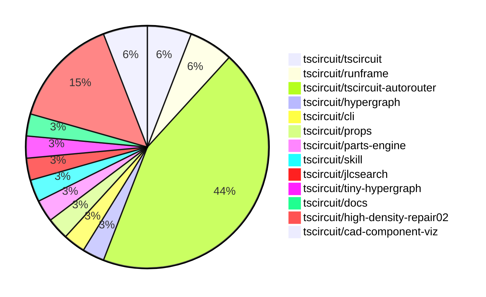

# Contribution Overview 2026-03-31

The current week is shown below. There are 3 major sections:

- [Contributor Overview](#contributor-overview)
- [PRs by Repository](#prs-by-repository)
- [PRs by Contributor](#changes-by-contributor)
- [Scoring & Sponsorship Details](/docs/sponsorship-calculation-explanation.md)

## PRs by Repository

## Contributor Overview

| Contributor | 🐳 Major | 🐙 Minor | 🐌 Tiny | Score | ⭐ | Discussion Contributions |
|-------------|---------|---------|---------|-------|-----|--------------------------|
| [ShiboSoftwareDev](#ShiboSoftwareDev) | 6 | 1 | 1 | 27 | ⭐⭐ | 0🔹 0🔶 0💎 |
| [tscircuitbot](#tscircuitbot) | 0 | 0 | 11 | 11 | ⭐⭐ | 0🔹 0🔶 0💎 |
| [seveibar](#seveibar) | 2 | 0 | 2 | 11 | ⭐⭐ | 0🔹 0🔶 0💎 |
| [Abse2001](#Abse2001) | 2 | 0 | 0 | 11 | ⭐⭐ | 0🔹 0🔶 0💎 |
| [MustafaMulla29](#MustafaMulla29) | 1 | 2 | 1 | 10 | ⭐ | 0🔹 0🔶 0💎 |
| [AnasSarkiz](#AnasSarkiz) | 2 | 0 | 1 | 9 | ⭐ | 0🔹 0🔶 0💎 |
| [techmannih2](#techmannih2) | 0 | 0 | 1 | 1 |  | 0🔹 0🔶 0💎 |
| [rushabhcodes](#rushabhcodes) | 0 | 0 | 1 | 1 |  | 0🔹 0🔶 0💎 |

## Staff Pass Ratio (SPR)

| Contributor | Reviewed PRs | Rejections | Approvals | SPR |
|-------------|--------------|------------|-----------|-----|
| [MustafaMulla29](#MustafaMulla29) | 3 | 0 | 4 | 100.0% |
| [ShiboSoftwareDev](#ShiboSoftwareDev) | 3 | 0 | 3 | 100.0% |
| [AnasSarkiz](#AnasSarkiz) | 2 | 0 | 2 | 100.0% |

MustafaMulla29 SPR PRs (3)

- [#625](https://github.com/tscircuit/props/pull/625) Extend ChipProps for ConnectorProps instead of CommonComponentProps
- [#2589](https://github.com/tscircuit/cli/pull/2589) feat: add --show-courtyards flag to snapshot, build, and export commands
- [#20](https://github.com/tscircuit/parts-engine/pull/20) Feat: add fetchPartCircuitJson and USB-C connector support

ShiboSoftwareDev SPR PRs (3)

- [#763](https://github.com/tscircuit/tscircuit-autorouter/pull/763) Fix obstacle pcb_port attribution in circuit-json conversion
- [#766](https://github.com/tscircuit/tscircuit-autorouter/pull/766) fix disconnected traces
- [#740](https://github.com/tscircuit/tscircuit-autorouter/pull/740) Fix plated-hole conversion for multilayer SRJ obstacles

AnasSarkiz SPR PRs (2)

- [#767](https://github.com/tscircuit/tscircuit-autorouter/pull/767) Fix stale fixed-via integration by removing manual convex graph bootstrapping and adopting `FixedViaHypergraphSolver` auto-convex API
- [#746](https://github.com/tscircuit/tscircuit-autorouter/pull/746) Introduce PCB SVG renderer with Debug menu toggle

> Note: AI evaluates PRs and assigns 1-3 star ratings automatically. 4 and 5 star ratings require manual staff review.

### Discussion Contribution Legend

- 🔹 Normal Comments: Basic participation with minimal effort
- 🔶 Great Informative Comments: Thoughtful participation that adds value
- 💎 Incredible Comments: Exceptional participation with high-quality content

## Review Table

[reviews-received-hover]: ## "Number of reviews received for PRs for this contributor"
[approvals-received-hover]: ## "Number of approvals received for PRs this contributor authored"
[rejections-received-hover]: ## "Number of rejections received for PRs this contributor authored"
[prs-opened-hover]: ## "Number of PRs opened by this contributor"
[issues-created-hover]: ## "Number of issues created by this contributor"

| Contributor | Reviews Received | Approvals Received | Rejections Received | Approvals | Rejections Given | PRs Opened | PRs Merged | Issues Created |
|---|---|---|---|---|---|---|---|---|
| [tscircuitbot](#tscircuitbot) | 0 | 0 | 0 | 0 | 0 | 14 | 11 | 0 |
| [MustafaMulla29](#MustafaMulla29) | 12 | 4 | 0 | 2 | 1 | 5 | 4 | 0 |
| [seveibar](#seveibar) | 2 | 0 | 0 | 9 | 0 | 10 | 4 | 0 |
| [claw-explorer](#claw-explorer) | 1 | 0 | 0 | 0 | 0 | 1 | 0 | 0 |
| [hinzwilliam52-ship-it](#hinzwilliam52-ship-it) | 0 | 0 | 0 | 0 | 0 | 1 | 0 | 0 |
| [Chronolapse411](#Chronolapse411) | 0 | 0 | 0 | 0 | 0 | 2 | 0 | 0 |
| [techmannih2](#techmannih2) | 4 | 1 | 1 | 0 | 0 | 4 | 1 | 0 |
| [rushabhcodes](#rushabhcodes) | 2 | 1 | 0 | 0 | 0 | 1 | 1 | 0 |
| [AnasSarkiz](#AnasSarkiz) | 5 | 5 | 0 | 0 | 0 | 4 | 4 | 0 |
| [ShiboSoftwareDev](#ShiboSoftwareDev) | 3 | 3 | 0 | 0 | 0 | 9 | 8 | 0 |
| [Abse2001](#Abse2001) | 0 | 0 | 0 | 3 | 0 | 3 | 2 | 0 |
| [billwestrup](#billwestrup) | 0 | 0 | 0 | 0 | 0 | 1 | 0 | 0 |

## Changes by Repository

### [tscircuit/tscircuit](https://github.com/tscircuit/tscircuit)

🐌 Tiny Contributions (2)

| PR # | Impact | Contributor | Description |
|------|--------|-------------|-------------|
| [#2814](https://github.com/tscircuit/tscircuit/pull/2814) | 🐌 Tiny | tscircuitbot | Automated package update |
| [#2813](https://github.com/tscircuit/tscircuit/pull/2813) | 🐌 Tiny | tscircuitbot | Automated package update |

### [tscircuit/runframe](https://github.com/tscircuit/runframe)

🐌 Tiny Contributions (2)

| PR # | Impact | Contributor | Description |
|------|--------|-------------|-------------|
| [#3018](https://github.com/tscircuit/runframe/pull/3018) | 🐌 Tiny | tscircuitbot | Automated package update |
| [#3017](https://github.com/tscircuit/runframe/pull/3017) | 🐌 Tiny | techmannih2 | Updates the easyeda dependency version from 0.0.252 to 0.0.254 in package.json |

### [tscircuit/tscircuit-autorouter](https://github.com/tscircuit/tscircuit-autorouter)

| PR # | Impact | Rating | Contributor | Description |
|------|--------|--------|-------------|-------------|
| [#767](https://github.com/tscircuit/tscircuit-autorouter/pull/767) | 🐳 Major | ⭐⭐⭐ | AnasSarkiz | Removes manual convex graph bootstrapping in favor of the FixedViaHypergraphSolver auto-convex API for improved integration and reduced maintenance risk. |
| [#746](https://github.com/tscircuit/tscircuit-autorouter/pull/746) | 🐳 Major | ⭐⭐⭐ | AnasSarkiz | Adds a PCB SVG renderer to the autorouting debugger, allowing users to toggle the display of PCB SVGs after successful routing. |
| [#763](https://github.com/tscircuit/tscircuit-autorouter/pull/763) | 🐳 Major | ⭐⭐⭐ | ShiboSoftwareDev | Fixes incorrect attribution of pcb_port in circuit-json conversion by selecting the nearest pcb_port_id for obstacles instead of the first connected port, ensuring accurate DRC labels and alignment with obstacle geometry. |
| [#766](https://github.com/tscircuit/tscircuit-autorouter/pull/766) | 🐳 Major | ⭐⭐⭐ | ShiboSoftwareDev | Fixes the issue of disconnected traces in the autorouting process, ensuring proper connectivity in circuit designs. |
| [#740](https://github.com/tscircuit/tscircuit-autorouter/pull/740) | 🐳 Major | ⭐⭐⭐ | ShiboSoftwareDev | Fixes misclassification of multilayer SRJ obstacles during circuit-json conversion, ensuring proper detection of plated-hole collisions in DRC. |

🐌 Tiny Contributions (10)

| PR # | Impact | Contributor | Description |
|------|--------|-------------|-------------|
| [#771](https://github.com/tscircuit/tscircuit-autorouter/pull/771) | 🐌 Tiny | tscircuitbot | Automated package update |
| [#768](https://github.com/tscircuit/tscircuit-autorouter/pull/768) | 🐌 Tiny | tscircuitbot | Automated package update |
| [#765](https://github.com/tscircuit/tscircuit-autorouter/pull/765) | 🐌 Tiny | tscircuitbot | Automated package update |
| [#762](https://github.com/tscircuit/tscircuit-autorouter/pull/762) | 🐌 Tiny | tscircuitbot | Automated package update |
| [#761](https://github.com/tscircuit/tscircuit-autorouter/pull/761) | 🐌 Tiny | tscircuitbot | Automated package update |
| [#757](https://github.com/tscircuit/tscircuit-autorouter/pull/757) | 🐌 Tiny | tscircuitbot | Automated package update |
| [#755](https://github.com/tscircuit/tscircuit-autorouter/pull/755) | 🐌 Tiny | tscircuitbot | Automated package update |
| [#764](https://github.com/tscircuit/tscircuit-autorouter/pull/764) | 🐌 Tiny | seveibar | Changes the benchmark GitHub comment script to use emoji indicators for test status instead of verbose text labels. |
| [#760](https://github.com/tscircuit/tscircuit-autorouter/pull/760) | 🐌 Tiny | seveibar | Updates the tiny-hypergraph dependency in package.json to a specific commit to ensure the inclusion of a fix for penalizing single-layer intersections in the region mask. |
| [#756](https://github.com/tscircuit/tscircuit-autorouter/pull/756) | 🐌 Tiny | AnasSarkiz | Fixes visualization issue where non-primary-layer traces appeared as near-continuous lines when zooming in by replacing fixed string dash pattern with numeric dash units and reducing non-primary-layer transparency for improved trace visibility. |

### [tscircuit/hypergraph](https://github.com/tscircuit/hypergraph)

🐌 Tiny Contributions (1)

| PR # | Impact | Contributor | Description |
|------|--------|-------------|-------------|
| [#163](https://github.com/tscircuit/hypergraph/pull/163) | 🐌 Tiny | tscircuitbot | Automated package update |

### [tscircuit/cli](https://github.com/tscircuit/cli)

| PR # | Impact | Rating | Contributor | Description |
|------|--------|--------|-------------|-------------|
| [#2589](https://github.com/tscircuit/cli/pull/2589) | 🐳 Major | ⭐⭐⭐ | MustafaMulla29 | Adds a --show-courtyards flag to the snapshot, build, and export commands to include courtyard outlines in PCB SVG outputs. |

### [tscircuit/props](https://github.com/tscircuit/props)

| PR # | Impact | Rating | Contributor | Description |
|------|--------|--------|-------------|-------------|
| [#625](https://github.com/tscircuit/props/pull/625) | 🐙 Minor | ⭐⭐ | MustafaMulla29 | Changes ConnectorProps to extend ChipPropsSU instead of CommonComponentProps, modifying its structure and properties. |

### [tscircuit/parts-engine](https://github.com/tscircuit/parts-engine)

| PR # | Impact | Rating | Contributor | Description |
|------|--------|--------|-------------|-------------|
| [#20](https://github.com/tscircuit/parts-engine/pull/20) | 🐙 Minor | ⭐⭐ | MustafaMulla29 | Adds fetchPartCircuitJson to PartsEngine to fetch full circuit JSON for a part via EasyEDA API and adds findPart support for simple_connector with standardusb_c. |

### [tscircuit/skill](https://github.com/tscircuit/skill)

🐌 Tiny Contributions (1)

| PR # | Impact | Contributor | Description |
|------|--------|-------------|-------------|
| [#15](https://github.com/tscircuit/skill/pull/15) | 🐌 Tiny | MustafaMulla29 | Enforces that the tsci check placement must pass with no actionable placement violations before finalizing the circuit layout in the tscircuit skill documentation. |

### [tscircuit/jlcsearch](https://github.com/tscircuit/jlcsearch)

| PR # | Impact | Rating | Contributor | Description |
|------|--------|--------|-------------|-------------|
| [#159](https://github.com/tscircuit/jlcsearch/pull/159) | 🐳 Major | ⭐⭐⭐ | seveibar | Caches D1 componentslist responses in KV for both HTML and JSON formats to reduce repeated query work and improve response times. |

### [tscircuit/tiny-hypergraph](https://github.com/tscircuit/tiny-hypergraph)

| PR # | Impact | Rating | Contributor | Description |
|------|--------|--------|-------------|-------------|
| [#16](https://github.com/tscircuit/tiny-hypergraph/pull/16) | 🐳 Major | ⭐⭐⭐ | seveibar | Adds support for region z mask and resolves the issue of impossible single-layer nodes being created in the hypergraph. |

### [tscircuit/docs](https://github.com/tscircuit/docs)

🐌 Tiny Contributions (1)

| PR # | Impact | Contributor | Description |
|------|--------|-------------|-------------|
| [#523](https://github.com/tscircuit/docs/pull/523) | 🐌 Tiny | rushabhcodes | This PR updates the CLI documentation to include missing tsci options and corrects existing descriptions, enhancing the clarity and completeness of the command reference pages. |

### [tscircuit/high-density-repair02](https://github.com/tscircuit/high-density-repair02)

| PR # | Impact | Rating | Contributor | Description |
|------|--------|--------|-------------|-------------|
| [#19](https://github.com/tscircuit/high-density-repair02/pull/19) | 🐳 Major | ⭐⭐⭐ | ShiboSoftwareDev | Reduces the geometry complexity for conflict detection in the high-density repair solver by collapsing collinear segment chains into single segments, improving performance without altering route points or solver output. |
| [#18](https://github.com/tscircuit/high-density-repair02/pull/18) | 🐳 Major | ⭐⭐⭐ | ShiboSoftwareDev | Reduces benchmark time from 5078ms to 4581ms by optimizing conflict detection and move evaluation in the routing algorithm. |
| [#16](https://github.com/tscircuit/high-density-repair02/pull/16) | 🐳 Major | ⭐⭐⭐ | ShiboSoftwareDev | Reduces solver overhead by skipping progress frame capture during normal solves and benchmarks, while allowing for explicit captureProgressFrames opt-in for full debugger visualization. |
| [#17](https://github.com/tscircuit/high-density-repair02/pull/17) | 🐙 Minor | ⭐⭐ | ShiboSoftwareDev | Preserves route endpoints on any node boundary side they originally touch exactly, so repair moves no longer pull terminals off the graph edge in the cmn_72 and cmn_79 repros. |

🐌 Tiny Contributions (1)

| PR # | Impact | Contributor | Description |
|------|--------|-------------|-------------|
| [#21](https://github.com/tscircuit/high-density-repair02/pull/21) | 🐌 Tiny | ShiboSoftwareDev | more hard nodes |

### [tscircuit/cad-component-viz](https://github.com/tscircuit/cad-component-viz)

| PR # | Impact | Rating | Contributor | Description |
|------|--------|--------|-------------|-------------|
| [#4](https://github.com/tscircuit/cad-component-viz/pull/4) | 🐳 Major | ⭐⭐⭐ | Abse2001 | Adds support for loading glTF and GLB model formats alongside existing formats, enhancing the model loading capabilities of the application. |
| [#3](https://github.com/tscircuit/cad-component-viz/pull/3) | 🐳 Major | ⭐⭐⭐ | Abse2001 | Consolidates the viewer into a single board-space view with an option to toggle the board overlay on or off. |

## Changes by Contributor

### [tscircuitbot](https://github.com/tscircuitbot)

🐌 Tiny Contributions (11)

| PR # | Impact | Description |
|------|--------|-------------|
| [#2814](https://github.com/tscircuit/tscircuit/pull/2814) | 🐌 Tiny | Automated package update |
| [#2813](https://github.com/tscircuit/tscircuit/pull/2813) | 🐌 Tiny | Automated package update |
| [#3018](https://github.com/tscircuit/runframe/pull/3018) | 🐌 Tiny | Automated package update |
| [#771](https://github.com/tscircuit/tscircuit-autorouter/pull/771) | 🐌 Tiny | Automated package update |
| [#768](https://github.com/tscircuit/tscircuit-autorouter/pull/768) | 🐌 Tiny | Automated package update |
| [#765](https://github.com/tscircuit/tscircuit-autorouter/pull/765) | 🐌 Tiny | Automated package update |
| [#762](https://github.com/tscircuit/tscircuit-autorouter/pull/762) | 🐌 Tiny | Automated package update |
| [#761](https://github.com/tscircuit/tscircuit-autorouter/pull/761) | 🐌 Tiny | Automated package update |
| [#757](https://github.com/tscircuit/tscircuit-autorouter/pull/757) | 🐌 Tiny | Automated package update |
| [#755](https://github.com/tscircuit/tscircuit-autorouter/pull/755) | 🐌 Tiny | Automated package update |
| [#163](https://github.com/tscircuit/hypergraph/pull/163) | 🐌 Tiny | Automated package update |

### [MustafaMulla29](https://github.com/MustafaMulla29)

| PRs # | Impact | Rating | Description |
|------|--------|--------|-------------|
| [#2589](https://github.com/tscircuit/cli/pull/2589) | 🐳 Major | ⭐⭐⭐ | Adds a --show-courtyards flag to the snapshot, build, and export commands to include courtyard outlines in PCB SVG outputs. |
| [#625](https://github.com/tscircuit/props/pull/625) | 🐙 Minor | ⭐⭐ | Changes ConnectorProps to extend ChipPropsSU instead of CommonComponentProps, modifying its structure and properties. |
| [#20](https://github.com/tscircuit/parts-engine/pull/20) | 🐙 Minor | ⭐⭐ | Adds fetchPartCircuitJson to PartsEngine to fetch full circuit JSON for a part via EasyEDA API and adds findPart support for simple_connector with standardusb_c. |

🐌 Tiny Contributions (1)

| PR # | Impact | Description |
|------|--------|-------------|
| [#15](https://github.com/tscircuit/skill/pull/15) | 🐌 Tiny | Enforces that the tsci check placement must pass with no actionable placement violations before finalizing the circuit layout in the tscircuit skill documentation. |

### [seveibar](https://github.com/seveibar)

| PRs # | Impact | Rating | Description |
|------|--------|--------|-------------|
| [#159](https://github.com/tscircuit/jlcsearch/pull/159) | 🐳 Major | ⭐⭐⭐ | Caches D1 componentslist responses in KV for both HTML and JSON formats to reduce repeated query work and improve response times. |
| [#16](https://github.com/tscircuit/tiny-hypergraph/pull/16) | 🐳 Major | ⭐⭐⭐ | Adds support for region z mask and resolves the issue of impossible single-layer nodes being created in the hypergraph. |

🐌 Tiny Contributions (2)

| PR # | Impact | Description |
|------|--------|-------------|
| [#764](https://github.com/tscircuit/tscircuit-autorouter/pull/764) | 🐌 Tiny | Changes the benchmark GitHub comment script to use emoji indicators for test status instead of verbose text labels. |
| [#760](https://github.com/tscircuit/tscircuit-autorouter/pull/760) | 🐌 Tiny | Updates the tiny-hypergraph dependency in package.json to a specific commit to ensure the inclusion of a fix for penalizing single-layer intersections in the region mask. |

### [techmannih2](https://github.com/techmannih2)

🐌 Tiny Contributions (1)

| PR # | Impact | Description |
|------|--------|-------------|
| [#3017](https://github.com/tscircuit/runframe/pull/3017) | 🐌 Tiny | Updates the easyeda dependency version from 0.0.252 to 0.0.254 in package.json |

### [rushabhcodes](https://github.com/rushabhcodes)

🐌 Tiny Contributions (1)

| PR # | Impact | Description |
|------|--------|-------------|
| [#523](https://github.com/tscircuit/docs/pull/523) | 🐌 Tiny | This PR updates the CLI documentation to include missing tsci options and corrects existing descriptions, enhancing the clarity and completeness of the command reference pages. |

### [AnasSarkiz](https://github.com/AnasSarkiz)

| PRs # | Impact | Rating | Description |
|------|--------|--------|-------------|
| [#767](https://github.com/tscircuit/tscircuit-autorouter/pull/767) | 🐳 Major | ⭐⭐⭐ | Removes manual convex graph bootstrapping in favor of the FixedViaHypergraphSolver auto-convex API for improved integration and reduced maintenance risk. |
| [#746](https://github.com/tscircuit/tscircuit-autorouter/pull/746) | 🐳 Major | ⭐⭐⭐ | Adds a PCB SVG renderer to the autorouting debugger, allowing users to toggle the display of PCB SVGs after successful routing. |

🐌 Tiny Contributions (1)

| PR # | Impact | Description |
|------|--------|-------------|
| [#756](https://github.com/tscircuit/tscircuit-autorouter/pull/756) | 🐌 Tiny | Fixes visualization issue where non-primary-layer traces appeared as near-continuous lines when zooming in by replacing fixed string dash pattern with numeric dash units and reducing non-primary-layer transparency for improved trace visibility. |

### [ShiboSoftwareDev](https://github.com/ShiboSoftwareDev)

| PRs # | Impact | Rating | Description |
|------|--------|--------|-------------|
| [#763](https://github.com/tscircuit/tscircuit-autorouter/pull/763) | 🐳 Major | ⭐⭐⭐ | Fixes incorrect attribution of pcb_port in circuit-json conversion by selecting the nearest pcb_port_id for obstacles instead of the first connected port, ensuring accurate DRC labels and alignment with obstacle geometry. |
| [#766](https://github.com/tscircuit/tscircuit-autorouter/pull/766) | 🐳 Major | ⭐⭐⭐ | Fixes the issue of disconnected traces in the autorouting process, ensuring proper connectivity in circuit designs. |
| [#740](https://github.com/tscircuit/tscircuit-autorouter/pull/740) | 🐳 Major | ⭐⭐⭐ | Fixes misclassification of multilayer SRJ obstacles during circuit-json conversion, ensuring proper detection of plated-hole collisions in DRC. |
| [#19](https://github.com/tscircuit/high-density-repair02/pull/19) | 🐳 Major | ⭐⭐⭐ | Reduces the geometry complexity for conflict detection in the high-density repair solver by collapsing collinear segment chains into single segments, improving performance without altering route points or solver output. |
| [#18](https://github.com/tscircuit/high-density-repair02/pull/18) | 🐳 Major | ⭐⭐⭐ | Reduces benchmark time from 5078ms to 4581ms by optimizing conflict detection and move evaluation in the routing algorithm. |
| [#16](https://github.com/tscircuit/high-density-repair02/pull/16) | 🐳 Major | ⭐⭐⭐ | Reduces solver overhead by skipping progress frame capture during normal solves and benchmarks, while allowing for explicit captureProgressFrames opt-in for full debugger visualization. |
| [#17](https://github.com/tscircuit/high-density-repair02/pull/17) | 🐙 Minor | ⭐⭐ | Preserves route endpoints on any node boundary side they originally touch exactly, so repair moves no longer pull terminals off the graph edge in the cmn_72 and cmn_79 repros. |

🐌 Tiny Contributions (1)

| PR # | Impact | Description |
|------|--------|-------------|
| [#21](https://github.com/tscircuit/high-density-repair02/pull/21) | 🐌 Tiny | more hard nodes |

### [Abse2001](https://github.com/Abse2001)

| PRs # | Impact | Rating | Description |
|------|--------|--------|-------------|
| [#4](https://github.com/tscircuit/cad-component-viz/pull/4) | 🐳 Major | ⭐⭐⭐ | Adds support for loading glTF and GLB model formats alongside existing formats, enhancing the model loading capabilities of the application. |
| [#3](https://github.com/tscircuit/cad-component-viz/pull/3) | 🐳 Major | ⭐⭐⭐ | Consolidates the viewer into a single board-space view with an option to toggle the board overlay on or off. |

## Repository Owners

| Repository | Codeowners |
|------------|------------|
| [builder](https://github.com/tscircuit/builder/blob/main/.github/CODEOWNERS) | [seveibar](https://github.com/seveibar)
| [pcb-viewer](https://github.com/tscircuit/pcb-viewer/blob/main/.github/CODEOWNERS) | [seveibar](https://github.com/seveibar), [ShiboSoftwareDev](https://github.com/ShiboSoftwareDev), [Abse2001](https://github.com/Abse2001)
| [footprints-old](https://github.com/tscircuit/footprints-old/blob/main/.github/CODEOWNERS) | [seveibar](https://github.com/seveibar)
| [footprinter](https://github.com/tscircuit/footprinter/blob/main/.github/CODEOWNERS) | [seveibar](https://github.com/seveibar), [techmannih](https://github.com/techmannih)
| [3d-viewer](https://github.com/tscircuit/3d-viewer/blob/main/.github/CODEOWNERS) | [ShiboSoftwareDev](https://github.com/ShiboSoftwareDev), [Abse2001](https://github.com/Abse2001)
| [winterspec](https://github.com/tscircuit/winterspec/blob/main/.github/CODEOWNERS) | [seveibar](https://github.com/seveibar), [ShiboSoftwareDev](https://github.com/ShiboSoftwareDev)
| [jscad-electronics](https://github.com/tscircuit/jscad-electronics/blob/main/.github/CODEOWNERS) | [seveibar](https://github.com/seveibar), [techmannih](https://github.com/techmannih), [ShiboSoftwareDev](https://github.com/ShiboSoftwareDev), [anas-sarkez](https://github.com/anas-sarkez)
| [circuit-to-svg](https://github.com/tscircuit/circuit-to-svg/blob/main/.github/CODEOWNERS) | [imrishabh18](https://github.com/imrishabh18)
| [schematic-symbols](https://github.com/tscircuit/schematic-symbols/blob/main/.github/CODEOWNERS) | [seveibar](https://github.com/seveibar), [imrishabh18](https://github.com/imrishabh18), [techmannih](https://github.com/techmannih)
| [circuit-json-to-gerber](https://github.com/tscircuit/circuit-json-to-gerber/blob/main/.github/CODEOWNERS) | [seveibar](https://github.com/seveibar), [ShiboSoftwareDev](https://github.com/ShiboSoftwareDev)
| [tscircuit.com](https://github.com/tscircuit/tscircuit.com/blob/main/.github/CODEOWNERS) | [seveibar](https://github.com/seveibar), [imrishabh18](https://github.com/imrishabh18)
| [issue-roulette](https://github.com/tscircuit/issue-roulette/blob/main/.github/CODEOWNERS) | [Anshgrover23](https://github.com/Anshgrover23)
| [sparkfun-boards](https://github.com/tscircuit/sparkfun-boards/blob/main/.github/CODEOWNERS) | [ShiboSoftwareDev](https://github.com/ShiboSoftwareDev), [Abse2001](https://github.com/Abse2001), [MustafaMulla29](https://github.com/MustafaMulla29), [Anshgrover23](https://github.com/Anshgrover23), [techmannih](https://github.com/techmannih)
| [schematic-corpus](https://github.com/tscircuit/schematic-corpus/blob/main/.github/CODEOWNERS) | [Abse2001](https://github.com/Abse2001)
| [copper-pour-solver](https://github.com/tscircuit/copper-pour-solver/blob/main/.github/CODEOWNERS) | [seveibar](https://github.com/seveibar), [ShiboSoftwareDev](https://github.com/ShiboSoftwareDev)
| [common](https://github.com/tscircuit/common/blob/main/.github/CODEOWNERS) | [seveibar](https://github.com/seveibar), [Abse2001](https://github.com/Abse2001)
| [circuit-to-canvas](https://github.com/tscircuit/circuit-to-canvas/blob/main/.github/CODEOWNERS) | [ShiboSoftwareDev](https://github.com/ShiboSoftwareDev), [Abse2001](https://github.com/Abse2001), [techmannih](https://github.com/techmannih)
| [circuit-json-to-lbrn](https://github.com/tscircuit/circuit-json-to-lbrn/blob/main/.github/CODEOWNERS) | [AnasSarkiz](https://github.com/AnasSarkiz)
| [pcbburn.com](https://github.com/tscircuit/pcbburn.com/blob/main/.github/CODEOWNERS) | [AnasSarkiz](https://github.com/AnasSarkiz)

## Repositories by Owner

| User | Repo |
|------|------|
| [seveibar](https://github.com/seveibar) | [builder](https://github.com/tscircuit/builder/blob/main/.github/CODEOWNERS) |
|  | [pcb-viewer](https://github.com/tscircuit/pcb-viewer/blob/main/.github/CODEOWNERS) |
|  | [footprints-old](https://github.com/tscircuit/footprints-old/blob/main/.github/CODEOWNERS) |
|  | [footprinter](https://github.com/tscircuit/footprinter/blob/main/.github/CODEOWNERS) |
|  | [winterspec](https://github.com/tscircuit/winterspec/blob/main/.github/CODEOWNERS) |
|  | [jscad-electronics](https://github.com/tscircuit/jscad-electronics/blob/main/.github/CODEOWNERS) |
|  | [schematic-symbols](https://github.com/tscircuit/schematic-symbols/blob/main/.github/CODEOWNERS) |
|  | [circuit-json-to-gerber](https://github.com/tscircuit/circuit-json-to-gerber/blob/main/.github/CODEOWNERS) |
|  | [tscircuit.com](https://github.com/tscircuit/tscircuit.com/blob/main/.github/CODEOWNERS) |
|  | [copper-pour-solver](https://github.com/tscircuit/copper-pour-solver/blob/main/.github/CODEOWNERS) |
|  | [common](https://github.com/tscircuit/common/blob/main/.github/CODEOWNERS) |
| [ShiboSoftwareDev](https://github.com/ShiboSoftwareDev) | [pcb-viewer](https://github.com/tscircuit/pcb-viewer/blob/main/.github/CODEOWNERS) |
|  | [3d-viewer](https://github.com/tscircuit/3d-viewer/blob/main/.github/CODEOWNERS) |
|  | [winterspec](https://github.com/tscircuit/winterspec/blob/main/.github/CODEOWNERS) |
|  | [jscad-electronics](https://github.com/tscircuit/jscad-electronics/blob/main/.github/CODEOWNERS) |
|  | [circuit-json-to-gerber](https://github.com/tscircuit/circuit-json-to-gerber/blob/main/.github/CODEOWNERS) |
|  | [sparkfun-boards](https://github.com/tscircuit/sparkfun-boards/blob/main/.github/CODEOWNERS) |
|  | [copper-pour-solver](https://github.com/tscircuit/copper-pour-solver/blob/main/.github/CODEOWNERS) |
|  | [circuit-to-canvas](https://github.com/tscircuit/circuit-to-canvas/blob/main/.github/CODEOWNERS) |
| [Abse2001](https://github.com/Abse2001) | [pcb-viewer](https://github.com/tscircuit/pcb-viewer/blob/main/.github/CODEOWNERS) |
|  | [3d-viewer](https://github.com/tscircuit/3d-viewer/blob/main/.github/CODEOWNERS) |
|  | [sparkfun-boards](https://github.com/tscircuit/sparkfun-boards/blob/main/.github/CODEOWNERS) |
|  | [schematic-corpus](https://github.com/tscircuit/schematic-corpus/blob/main/.github/CODEOWNERS) |
|  | [common](https://github.com/tscircuit/common/blob/main/.github/CODEOWNERS) |
|  | [circuit-to-canvas](https://github.com/tscircuit/circuit-to-canvas/blob/main/.github/CODEOWNERS) |
| [techmannih](https://github.com/techmannih) | [footprinter](https://github.com/tscircuit/footprinter/blob/main/.github/CODEOWNERS) |
|  | [jscad-electronics](https://github.com/tscircuit/jscad-electronics/blob/main/.github/CODEOWNERS) |
|  | [schematic-symbols](https://github.com/tscircuit/schematic-symbols/blob/main/.github/CODEOWNERS) |
|  | [sparkfun-boards](https://github.com/tscircuit/sparkfun-boards/blob/main/.github/CODEOWNERS) |
|  | [circuit-to-canvas](https://github.com/tscircuit/circuit-to-canvas/blob/main/.github/CODEOWNERS) |
| [anas-sarkez](https://github.com/anas-sarkez) | [jscad-electronics](https://github.com/tscircuit/jscad-electronics/blob/main/.github/CODEOWNERS) |
| [imrishabh18](https://github.com/imrishabh18) | [circuit-to-svg](https://github.com/tscircuit/circuit-to-svg/blob/main/.github/CODEOWNERS) |
|  | [schematic-symbols](https://github.com/tscircuit/schematic-symbols/blob/main/.github/CODEOWNERS) |
|  | [tscircuit.com](https://github.com/tscircuit/tscircuit.com/blob/main/.github/CODEOWNERS) |
| [Anshgrover23](https://github.com/Anshgrover23) | [issue-roulette](https://github.com/tscircuit/issue-roulette/blob/main/.github/CODEOWNERS) |
|  | [sparkfun-boards](https://github.com/tscircuit/sparkfun-boards/blob/main/.github/CODEOWNERS) |
| [MustafaMulla29](https://github.com/MustafaMulla29) | [sparkfun-boards](https://github.com/tscircuit/sparkfun-boards/blob/main/.github/CODEOWNERS) |
| [AnasSarkiz](https://github.com/AnasSarkiz) | [circuit-json-to-lbrn](https://github.com/tscircuit/circuit-json-to-lbrn/blob/main/.github/CODEOWNERS) |
|  | [pcbburn.com](https://github.com/tscircuit/pcbburn.com/blob/main/.github/CODEOWNERS) |

