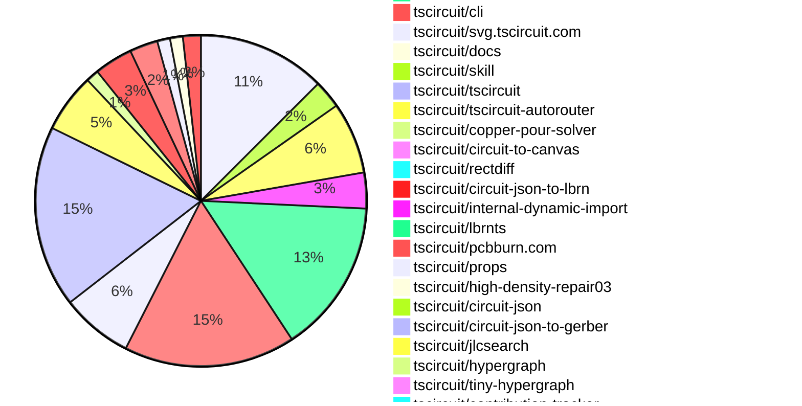

# Contribution Overview 2026-04-28

The current week is shown below. There are 3 major sections:

- [Contributor Overview](#contributor-overview)
- [PRs by Repository](#prs-by-repository)
- [PRs by Contributor](#changes-by-contributor)
- [Scoring & Sponsorship Details](/docs/sponsorship-calculation-explanation.md)

## PRs by Repository

## Contributor Overview

| Contributor | 🐳 Major | 🐙 Minor | 🐌 Tiny | Score | ⭐ | Discussion Contributions |
|-------------|---------|---------|---------|-------|-----|--------------------------|
| [imrishabh18](#imrishabh18) | 6 | 11 | 14 | 59 | ⭐⭐⭐ | 0🔹 0🔶 0💎 |
| [seveibar](#seveibar) | 7 | 8 | 6 | 51 | ⭐⭐⭐ | 0🔹 0🔶 0💎 |
| [Sang-it](#Sang-it) | 8 | 2 | 11 | 46 | ⭐⭐ | 0🔹 0🔶 0💎 |
| [AnasSarkiz](#AnasSarkiz) | 5 | 3 | 4 | 35 | ⭐⭐ | 0🔹 0🔶 0💎 |
| [Abse2001](#Abse2001) | 5 | 2 | 7 | 35 | ⭐⭐ | 0🔹 0🔶 0💎 |
| [ShiboSoftwareDev](#ShiboSoftwareDev) | 5 | 1 | 3 | 32 | ⭐⭐ | 0🔹 0🔶 0💎 |
| [MustafaMulla29](#MustafaMulla29) | 1 | 7 | 16 | 31 | ⭐⭐ | 0🔹 0🔶 0💎 |
| [techmannih](#techmannih) | 2 | 1 | 5 | 17 | ⭐⭐ | 0🔹 0🔶 0💎 |
| [tscircuitbot](#tscircuitbot) | 0 | 0 | 301 | 16.5 | ⭐⭐ | 0🔹 0🔶 0💎 |
| [rushabhcodes](#rushabhcodes) | 1 | 1 | 5 | 14 | ⭐⭐ | 0🔹 0🔶 0💎 |
| [mohan-bee](#mohan-bee) | 1 | 0 | 7 | 12 | ⭐⭐ | 0🔹 0🔶 0💎 |
| [0hmX](#0hmX) | 2 | 0 | 0 | 8 | ⭐ | 0🔹 0🔶 0💎 |
| [64johnlee](#64johnlee) | 0 | 0 | 1 | 1 |  | 0🔹 0🔶 0💎 |

## Staff Pass Ratio (SPR)

| Contributor | Reviewed PRs | Rejections | Approvals | SPR |
|-------------|--------------|------------|-----------|-----|
| [Sang-it](#Sang-it) | 8 | 1 | 7 | 87.5% |
| [imrishabh18](#imrishabh18) | 7 | 0 | 8 | 100.0% |
| [MustafaMulla29](#MustafaMulla29) | 6 | 2 | 7 | 66.7% |
| [ShiboSoftwareDev](#ShiboSoftwareDev) | 6 | 0 | 6 | 100.0% |
| [AnasSarkiz](#AnasSarkiz) | 4 | 0 | 4 | 100.0% |
| [techmannih](#techmannih) | 4 | 1 | 3 | 75.0% |
| [mohan-bee](#mohan-bee) | 3 | 1 | 2 | 66.7% |
| [Abse2001](#Abse2001) | 2 | 0 | 2 | 100.0% |
| [0hmX](#0hmX) | 2 | 0 | 2 | 100.0% |
| [rushabhcodes](#rushabhcodes) | 1 | 0 | 1 | 100.0% |

Sang-it SPR PRs (8)

- [#2201](https://github.com/tscircuit/core/pull/2201) fix 45 degree rect fix
- [#251](https://github.com/tscircuit/schematic-trace-solver/pull/251) add trace anchored net label overlap solver
- [#248](https://github.com/tscircuit/schematic-trace-solver/pull/248) move VCC labels to the corner whenever feasible
- [#244](https://github.com/tscircuit/schematic-trace-solver/pull/244) fix repro-28 -> net label trace collision
- [#247](https://github.com/tscircuit/schematic-trace-solver/pull/247) enforce availableNetOrientation
- [#14](https://github.com/tscircuit/circuit-json-schematic-placement-analysis/pull/14) analyzer for pin spacing too small or too large
- [#9](https://github.com/tscircuit/circuit-json-schematic-placement-analysis/pull/9) flag schematic-box-sizing too wide / folder restructure
- [#10](https://github.com/tscircuit/circuit-json-schematic-placement-analysis/pull/10) add analysis for pin to edge width distance

imrishabh18 SPR PRs (7)

- [#571](https://github.com/tscircuit/circuit-json/pull/571) Add same-net and different-net trace-edge clearance DRC properties
- [#2212](https://github.com/tscircuit/core/pull/2212) `minTraceToPadEdgeClearance` should be present in the SRJ output
- [#2206](https://github.com/tscircuit/core/pull/2206) Fix: Pass the minTraceWidth to the SRJ
- [#2202](https://github.com/tscircuit/core/pull/2202) Add `supplier_footprint_mismatch_warning` when footprint string does not match with the jlcpcb footprint
- [#1074](https://github.com/tscircuit/tscircuit-autorouter/pull/1074) Add support for `minTraceToPadEdgeClearance` to be passed to the repair03 solver
- [#157](https://github.com/tscircuit/circuit-json-to-lbrn/pull/157) Add a Reflected Bottom Board Cut Layer
- [#159](https://github.com/tscircuit/circuit-json-to-lbrn/pull/159) Add the Hole Punch Top and Hole Punch Bottom layers

MustafaMulla29 SPR PRs (6)

- [#3306](https://github.com/tscircuit/tscircuit.com/pull/3306) Add authorization header to the easyEdaProxyConfig
- [#2523](https://github.com/tscircuit/eval/pull/2523) Add EasyEDA proxy config plumbing to web worker and browser USB-C connector proxy integration test
- [#92](https://github.com/tscircuit/calculate-packing/pull/92) Fix Courtyard Extraction To Be Footprint-Scoped Instead Of Group Scoped
- [#91](https://github.com/tscircuit/calculate-packing/pull/91) Add courtyard support for component collision boundaries
- [#256](https://github.com/tscircuit/circuit-json-to-kicad/pull/256) Implement kicadSchematicScaleFactor to scale all schematic symbols and wiring in KiCad export
- [#12](https://github.com/tscircuit/circuit-json-schematic-placement-analysis/pull/12) feat(schematic-placemenent): add numeric resize suggestions for pin-padding-to-edge issues

ShiboSoftwareDev SPR PRs (6)

- [#2197](https://github.com/tscircuit/core/pull/2197) Add schematic box rendering for groups
- [#1084](https://github.com/tscircuit/tscircuit-autorouter/pull/1084) Fix Pipeline6 projection for constrained corridor nodes
- [#1059](https://github.com/tscircuit/tscircuit-autorouter/pull/1059) Add minimum projected rect dimensions to Pipeline6
- [#5](https://github.com/tscircuit/pcb-poly-hyper-graph/pull/5) Prevent free/free ports across occupied obstacle boundaries
- [#4](https://github.com/tscircuit/pcb-poly-hyper-graph/pull/4) Connect overlapping same-net obstacle regions
- [#3](https://github.com/tscircuit/pcb-poly-hyper-graph/pull/3) Use rectdiff-style port spacing for poly hypergraphs

AnasSarkiz SPR PRs (4)

- [#646](https://github.com/tscircuit/props/pull/646) feat(keepout): allow both layer and layers props
- [#2221](https://github.com/tscircuit/core/pull/2221) Fix Keepout Layer Handling & Include Keepouts as Autorouter Obstacles
- [#42](https://github.com/tscircuit/copper-pour-solver/pull/42) Eliminate Copper Pour Boolean Failures with Robust Manifold Geometry Engine
- [#33](https://github.com/tscircuit/lbrnts/pull/33)  Match LightBurn SVG previews for scan/fill layers

techmannih SPR PRs (4)

- [#612](https://github.com/tscircuit/footprinter/pull/612) fix: align passive silkscreen geometry with KiCad standards
- [#69](https://github.com/tscircuit/kicad-to-circuit-json/pull/69) Support gr_curve on Edge.Cuts board outlines
- [#68](https://github.com/tscircuit/kicad-to-circuit-json/pull/68) feat: add support for anchor alignment of text
- [#67](https://github.com/tscircuit/kicad-to-circuit-json/pull/67)  add support for pcb copper text

mohan-bee SPR PRs (3)

- [#3325](https://github.com/tscircuit/tscircuit.com/pull/3325) Fix new board editor stuck in Loading files…
- [#279](https://github.com/tscircuit/sparkfun-boards/pull/279) Add SparkFun RGB and Gesture Sensor - APDS-9960
- [#47](https://github.com/tscircuit/copper-pour-solver/pull/47) Fix Invalid URL for WASM initialization in sandboxed environments

Abse2001 SPR PRs (2)

- [#158](https://github.com/tscircuit/circuit-json-to-gltf/pull/158) Fix edge-crossing PCB holes in board mesh rendering
- [#1](https://github.com/tscircuit/dataset-srj13/pull/1) Refactor SRJ dataset generation to use core converter and primitive obstacle modeling

0hmX SPR PRs (2)

- [#118](https://github.com/tscircuit/rectdiff/pull/118) feat: implement an benchmark script
- [#113](https://github.com/tscircuit/rectdiff/pull/113) Promote sparse coverage into shared multilayer nodes

rushabhcodes SPR PRs (1)

- [#1](https://github.com/tscircuit/circuit-json-to-3d-png/pull/1) Add initial workflow configurations and project setup files

> Note: AI evaluates PRs and assigns 1-3 star ratings automatically. 4 and 5 star ratings require manual staff review.

### Discussion Contribution Legend

- 🔹 Normal Comments: Basic participation with minimal effort
- 🔶 Great Informative Comments: Thoughtful participation that adds value
- 💎 Incredible Comments: Exceptional participation with high-quality content

## Review Table

[reviews-received-hover]: ## "Number of reviews received for PRs for this contributor"
[approvals-received-hover]: ## "Number of approvals received for PRs this contributor authored"
[rejections-received-hover]: ## "Number of rejections received for PRs this contributor authored"
[prs-opened-hover]: ## "Number of PRs opened by this contributor"
[issues-created-hover]: ## "Number of issues created by this contributor"

| Contributor | Reviews Received | Approvals Received | Rejections Received | Approvals | Rejections Given | PRs Opened | PRs Merged | Issues Created |
|---|---|---|---|---|---|---|---|---|
| [yowanda](#yowanda) | 0 | 0 | 0 | 0 | 0 | 1 | 0 | 0 |
| [mohan-bee](#mohan-bee) | 38 | 14 | 3 | 1 | 0 | 12 | 8 | 0 |
| [rushabhcodes](#rushabhcodes) | 23 | 5 | 0 | 3 | 2 | 13 | 7 | 0 |
| [MustafaMulla29](#MustafaMulla29) | 16 | 11 | 0 | 6 | 0 | 27 | 24 | 0 |
| [seveibar](#seveibar) | 13 | 9 | 0 | 64 | 3 | 33 | 21 | 0 |
| [alchemistlethal-a11y](#alchemistlethal-a11y) | 0 | 0 | 0 | 0 | 0 | 1 | 0 | 0 |
| [64johnlee](#64johnlee) | 4 | 1 | 0 | 0 | 0 | 36 | 1 | 0 |
| [fancierbread7-ctrl](#fancierbread7-ctrl) | 0 | 0 | 0 | 0 | 0 | 27 | 0 | 0 |
| [tscircuitbot](#tscircuitbot) | 0 | 0 | 0 | 0 | 0 | 363 | 301 | 0 |
| [bounty-bot-beep](#bounty-bot-beep) | 0 | 0 | 0 | 0 | 0 | 1 | 0 | 0 |
| [AnasSarkiz](#AnasSarkiz) | 10 | 10 | 0 | 5 | 0 | 12 | 12 | 0 |
| [imrishabh18](#imrishabh18) | 12 | 9 | 0 | 9 | 0 | 32 | 31 | 0 |
| [billwestrup](#billwestrup) | 0 | 0 | 0 | 0 | 0 | 1 | 0 | 0 |
| [Sang-it](#Sang-it) | 15 | 12 | 1 | 0 | 0 | 29 | 21 | 0 |
| [techmannih](#techmannih) | 21 | 8 | 1 | 2 | 1 | 14 | 8 | 0 |
| [ShiboSoftwareDev](#ShiboSoftwareDev) | 12 | 10 | 0 | 7 | 0 | 16 | 9 | 0 |
| [Abse2001](#Abse2001) | 10 | 10 | 0 | 4 | 0 | 18 | 14 | 0 |
| [webhop123](#webhop123) | 1 | 0 | 0 | 0 | 0 | 3 | 0 | 0 |
| [orbitwebsites-cloud](#orbitwebsites-cloud) | 2 | 0 | 0 | 0 | 0 | 2 | 0 | 0 |
| [gavin913427-hash](#gavin913427-hash) | 0 | 0 | 0 | 0 | 0 | 1 | 0 | 0 |
| [chengyixu](#chengyixu) | 0 | 0 | 0 | 0 | 0 | 5 | 0 | 0 |
| [benzaid32](#benzaid32) | 1 | 0 | 1 | 0 | 0 | 2 | 0 | 0 |
| [0hmX](#0hmX) | 4 | 2 | 0 | 0 | 0 | 9 | 3 | 0 |
| [worthyfarmstead-rgb](#worthyfarmstead-rgb) | 0 | 0 | 0 | 0 | 0 | 1 | 0 | 0 |
| [irisdigitaldocs-maker](#irisdigitaldocs-maker) | 0 | 0 | 0 | 0 | 0 | 2 | 0 | 0 |
| [artylobos](#artylobos) | 0 | 0 | 0 | 0 | 0 | 2 | 0 | 0 |
| [mitin001](#mitin001) | 0 | 0 | 0 | 0 | 0 | 1 | 0 | 0 |
| [Ingenieralejo](#Ingenieralejo) | 0 | 0 | 0 | 0 | 0 | 2 | 0 | 0 |
| [yusef47](#yusef47) | 0 | 0 | 0 | 0 | 0 | 1 | 0 | 0 |
| [felixbeyer99-design](#felixbeyer99-design) | 0 | 0 | 0 | 0 | 0 | 1 | 0 | 0 |
| [0hmxbot](#0hmxbot) | 0 | 0 | 0 | 0 | 0 | 1 | 0 | 0 |

## Changes by Repository

### [tscircuit/tscircuit.com](https://github.com/tscircuit/tscircuit.com)

| PR # | Impact | Rating | Contributor | Description |
|------|--------|--------|-------------|-------------|
| [#3325](https://github.com/tscircuit/tscircuit.com/pull/3325) | 🐳 Major | ⭐⭐⭐ | mohan-bee | Fixes the issue where the new board editor remains stuck on Loading files... due to the absence of a package ID for new boards. |
| [#3312](https://github.com/tscircuit/tscircuit.com/pull/3312) | 🐳 Major | ⭐⭐⭐ | imrishabh18 | Changes the logic for determining if the editor is fully loaded to consider it ready when package metadata and the priority file are available, allowing other files to load in the background. |
| [#3306](https://github.com/tscircuit/tscircuit.com/pull/3306) | 🐙 Minor | ⭐⭐ | MustafaMulla29 | Adds an authorization header to the easyEdaProxyConfig for API requests when a session token is available. |
| [#3303](https://github.com/tscircuit/tscircuit.com/pull/3303) | 🐙 Minor | ⭐⭐ | MustafaMulla29 | Adds easyEdaProxyConfig to the CodeAndPreview component, allowing for proxy endpoint configuration. |

🐌 Tiny Contributions (46)

| PR # | Impact | Contributor | Description |
|------|--------|-------------|-------------|
| [#3288](https://github.com/tscircuit/tscircuit.com/pull/3288) | 🐌 Tiny | mohan-bee | Updates the circuit-json-to-kicad dependency from version 0.0.34 to 0.0.124 to enable courtyard export functionality that was previously not working in tscircuit.com. |
| [#3336](https://github.com/tscircuit/tscircuit.com/pull/3336) | 🐌 Tiny | tscircuitbot | Updates the tscircuitrunframe package from version 0.0.1914 to 0.0.1915 |
| [#3335](https://github.com/tscircuit/tscircuit.com/pull/3335) | 🐌 Tiny | tscircuitbot | Updates the tscircuitrunframe package from version 0.0.1913 to 0.0.1914 |
| [#3334](https://github.com/tscircuit/tscircuit.com/pull/3334) | 🐌 Tiny | tscircuitbot | Updates the tscircuitrunframe package from version 0.0.1912 to 0.0.1913 |
| [#3333](https://github.com/tscircuit/tscircuit.com/pull/3333) | 🐌 Tiny | tscircuitbot | Updates the tscircuitrunframe package from version 0.0.1911 to 0.0.1912 |
| [#3328](https://github.com/tscircuit/tscircuit.com/pull/3328) | 🐌 Tiny | tscircuitbot | Automated package update |
| [#3327](https://github.com/tscircuit/tscircuit.com/pull/3327) | 🐌 Tiny | tscircuitbot | Automated package update |
| [#3332](https://github.com/tscircuit/tscircuit.com/pull/3332) | 🐌 Tiny | tscircuitbot | Updates the tscircuiteval package from version 0.0.807 to 0.0.808 |
| [#3329](https://github.com/tscircuit/tscircuit.com/pull/3329) | 🐌 Tiny | tscircuitbot | Updates the tscircuitrunframe package from version 0.0.1910 to 0.0.1911 |
| [#3323](https://github.com/tscircuit/tscircuit.com/pull/3323) | 🐌 Tiny | tscircuitbot | Updates the tscircuitrunframe package from version 0.0.1908 to 0.0.1909 |
| [#3321](https://github.com/tscircuit/tscircuit.com/pull/3321) | 🐌 Tiny | tscircuitbot | Updates the tscircuitrunframe package from version 0.0.1907 to 0.0.1908 |
| [#3320](https://github.com/tscircuit/tscircuit.com/pull/3320) | 🐌 Tiny | tscircuitbot | Automated package update |
| [#3322](https://github.com/tscircuit/tscircuit.com/pull/3322) | 🐌 Tiny | tscircuitbot | Updates the tscircuiteval package to version 0.0.806 |
| [#3318](https://github.com/tscircuit/tscircuit.com/pull/3318) | 🐌 Tiny | tscircuitbot | Automated package update |
| [#3310](https://github.com/tscircuit/tscircuit.com/pull/3310) | 🐌 Tiny | tscircuitbot | Updates the tscircuitrunframe package from version 0.0.1903 to 0.0.1904 |
| [#3319](https://github.com/tscircuit/tscircuit.com/pull/3319) | 🐌 Tiny | tscircuitbot | Updates the tscircuitrunframe package from version 0.0.1906 to 0.0.1907 |
| [#3315](https://github.com/tscircuit/tscircuit.com/pull/3315) | 🐌 Tiny | tscircuitbot | Automated package update |
| [#3308](https://github.com/tscircuit/tscircuit.com/pull/3308) | 🐌 Tiny | tscircuitbot | Updates the tscircuitrunframe package from version 0.0.1902 to 0.0.1903 |
| [#3296](https://github.com/tscircuit/tscircuit.com/pull/3296) | 🐌 Tiny | tscircuitbot | Updates the tscircuiteval package version from 0.0.800 to 0.0.801 |
| [#3298](https://github.com/tscircuit/tscircuit.com/pull/3298) | 🐌 Tiny | tscircuitbot | Automated package update |
| [#3294](https://github.com/tscircuit/tscircuit.com/pull/3294) | 🐌 Tiny | tscircuitbot | Updates the tscircuitrunframe package from version 0.0.1894 to 0.0.1895 |
| [#3299](https://github.com/tscircuit/tscircuit.com/pull/3299) | 🐌 Tiny | tscircuitbot | Updates the tscircuitrunframe package from version 0.0.1896 to 0.0.1898 |
| [#3295](https://github.com/tscircuit/tscircuit.com/pull/3295) | 🐌 Tiny | tscircuitbot | Updates the tscircuitrunframe package from version 0.0.1895 to 0.0.1896 |
| [#3305](https://github.com/tscircuit/tscircuit.com/pull/3305) | 🐌 Tiny | tscircuitbot | Automated package update |
| [#3302](https://github.com/tscircuit/tscircuit.com/pull/3302) | 🐌 Tiny | tscircuitbot | Automated package update |
| [#3300](https://github.com/tscircuit/tscircuit.com/pull/3300) | 🐌 Tiny | tscircuitbot | Automated package update |
| [#3304](https://github.com/tscircuit/tscircuit.com/pull/3304) | 🐌 Tiny | tscircuitbot | Automated package update |
| [#3301](https://github.com/tscircuit/tscircuit.com/pull/3301) | 🐌 Tiny | tscircuitbot | Updates the tscircuiteval package from version 0.0.802 to 0.0.803 |
| [#3292](https://github.com/tscircuit/tscircuit.com/pull/3292) | 🐌 Tiny | tscircuitbot | Automated package update for tscircuiteval from version 0.0.799 to 0.0.800 |
| [#3284](https://github.com/tscircuit/tscircuit.com/pull/3284) | 🐌 Tiny | tscircuitbot | Automated package update |
| [#3287](https://github.com/tscircuit/tscircuit.com/pull/3287) | 🐌 Tiny | tscircuitbot | Updates the tscircuitrunframe package to version 0.0.1891 |
| [#3291](https://github.com/tscircuit/tscircuit.com/pull/3291) | 🐌 Tiny | tscircuitbot | Updates the tscircuitrunframe package from version 0.0.1892 to 0.0.1893 |
| [#3285](https://github.com/tscircuit/tscircuit.com/pull/3285) | 🐌 Tiny | tscircuitbot | Updates the tscircuitrunframe package to version 0.0.1890 in the package.json file. |
| [#3290](https://github.com/tscircuit/tscircuit.com/pull/3290) | 🐌 Tiny | tscircuitbot | Updates the tscircuitrunframe package from version 0.0.1891 to 0.0.1892 |
| [#3283](https://github.com/tscircuit/tscircuit.com/pull/3283) | 🐌 Tiny | tscircuitbot | Updates the tscircuitrunframe package from version 0.0.1887 to 0.0.1888 |
| [#3282](https://github.com/tscircuit/tscircuit.com/pull/3282) | 🐌 Tiny | tscircuitbot | Updates the tscircuitrunframe package from version 0.0.1885 to 0.0.1887 |
| [#3289](https://github.com/tscircuit/tscircuit.com/pull/3289) | 🐌 Tiny | tscircuitbot | Automated package update |
| [#3293](https://github.com/tscircuit/tscircuit.com/pull/3293) | 🐌 Tiny | tscircuitbot | Automated package update for tscircuitrunframe from version 0.0.1893 to 0.0.1894 |
| [#3279](https://github.com/tscircuit/tscircuit.com/pull/3279) | 🐌 Tiny | tscircuitbot | Updates the tscircuitrunframe package from version 0.0.1884 to 0.0.1885 |
| [#3281](https://github.com/tscircuit/tscircuit.com/pull/3281) | 🐌 Tiny | tscircuitbot | Updates the tscircuiteval package from version 0.0.796 to 0.0.797 |
| [#3286](https://github.com/tscircuit/tscircuit.com/pull/3286) | 🐌 Tiny | tscircuitbot | Automated package update |
| [#3280](https://github.com/tscircuit/tscircuit.com/pull/3280) | 🐌 Tiny | tscircuitbot | Updates the tscircuiteval package from version 0.0.794 to 0.0.796 |
| [#3311](https://github.com/tscircuit/tscircuit.com/pull/3311) | 🐌 Tiny | imrishabh18 | Bumps two dependencies to their latest published versions to pick up fixes and improvements for build and export tooling. |
| [#3309](https://github.com/tscircuit/tscircuit.com/pull/3309) | 🐌 Tiny | imrishabh18 | Updates the versions of tscircuitinternal-dynamic-import and circuit-json-to-gerber in package.json to their latest published versions, ensuring the application benefits from bug fixes and improvements in these dependencies. |
| [#3307](https://github.com/tscircuit/tscircuit.com/pull/3307) | 🐌 Tiny | imrishabh18 | Updates the version of the circuit-json-to-gerber dependency from 0.0.48 to 0.0.49 in package.json |
| [#3326](https://github.com/tscircuit/tscircuit.com/pull/3326) | 🐌 Tiny | rushabhcodes | Updates the playground redirect to use a relative path instead of an absolute URL, ensuring that traffic remains within the current Vercel deployment. |

### [tscircuit/schematic-viewer](https://github.com/tscircuit/schematic-viewer)

🐌 Tiny Contributions (2)

| PR # | Impact | Contributor | Description |
|------|--------|-------------|-------------|
| [#178](https://github.com/tscircuit/schematic-viewer/pull/178) | 🐌 Tiny | mohan-bee | Fixes schematic port rendering when the showSchematicPorts toggle is enabled, ensuring ports appear correctly in the SVG output. |
| [#179](https://github.com/tscircuit/schematic-viewer/pull/179) | 🐌 Tiny | MustafaMulla29 | Updates the tscircuit dependency version from 0.0.1528 to 0.0.1710 in package.json |

### [tscircuit/circuit-json-to-kicad](https://github.com/tscircuit/circuit-json-to-kicad)

| PR # | Impact | Rating | Contributor | Description |
|------|--------|--------|-------------|-------------|
| [#256](https://github.com/tscircuit/circuit-json-to-kicad/pull/256) | 🐙 Minor | ⭐⭐ | MustafaMulla29 | Adds a kicadSchematicScaleFactor to scale all schematic symbols and wiring in KiCad export, ensuring proper representation of components in the exported schematic. |

🐌 Tiny Contributions (10)

| PR # | Impact | Contributor | Description |
|------|--------|-------------|-------------|
| [#273](https://github.com/tscircuit/circuit-json-to-kicad/pull/273) | 🐌 Tiny | mohan-bee | Fixes the issue where standalone pcb_smtpad fiducials are not exported as footprints in KiCad, ensuring they are included in the final PCB output. |
| [#277](https://github.com/tscircuit/circuit-json-to-kicad/pull/277) | 🐌 Tiny | mohan-bee | Fixes KiCad schematic wire exports to ensure connection wires are serialized with an explicit visible stroke width instead of 0mm, correcting incorrect wire properties in KiCad. |
| [#274](https://github.com/tscircuit/circuit-json-to-kicad/pull/274) | 🐌 Tiny | mohan-bee | Updates the KiCad version from 10.0.0 to 10.0.1 in the GitHub Actions workflow and adds tests for standalone fiducial export as KiCad SMT pads. |
| [#263](https://github.com/tscircuit/circuit-json-to-kicad/pull/263) | 🐌 Tiny | mohan-bee | Fixes schematic export failures where simple pin headers were rendered as unknown symbols by explicitly generating and assigning generic chip fallback symbols and library IDs for these component types. |
| [#260](https://github.com/tscircuit/circuit-json-to-kicad/pull/260) | 🐌 Tiny | mohan-bee | Fixes missing library symbol for pin header in schematic rendering |
| [#279](https://github.com/tscircuit/circuit-json-to-kicad/pull/279) | 🐌 Tiny | tscircuitbot | Automated package update |
| [#278](https://github.com/tscircuit/circuit-json-to-kicad/pull/278) | 🐌 Tiny | tscircuitbot | Automated package update |
| [#276](https://github.com/tscircuit/circuit-json-to-kicad/pull/276) | 🐌 Tiny | tscircuitbot | Automated package update |
| [#262](https://github.com/tscircuit/circuit-json-to-kicad/pull/262) | 🐌 Tiny | tscircuitbot | Automated package update |
| [#261](https://github.com/tscircuit/circuit-json-to-kicad/pull/261) | 🐌 Tiny | tscircuitbot | Automated package update |

### [tscircuit/calculate-packing](https://github.com/tscircuit/calculate-packing)

| PR # | Impact | Rating | Contributor | Description |
|------|--------|--------|-------------|-------------|
| [#91](https://github.com/tscircuit/calculate-packing/pull/91) | 🐳 Major | ⭐⭐⭐ | MustafaMulla29 | Adds support for PCB courtyards (pcb_courtyard_rect, pcb_courtyard_polygon, pcb_courtyard_outline) as component collision boundaries. When a component has courtyard data, the packer uses it instead of pad-based bounds for overlap detection, outline construction, and obstacle clearance  preventing component bodies from overlapping even when pads dont. |
| [#92](https://github.com/tscircuit/calculate-packing/pull/92) | 🐙 Minor | ⭐⭐ | MustafaMulla29 | This change fixes courtyard semantics in convertCircuitJsonToPackOutput by only extracting a courtyard when the packed item maps to exactly one pcb_component_id. Previously, grouped components could get a synthesized aggregate courtyard box, which over-constrained board-level packing and caused solver failuresunstable placement. Now courtyards remain component-footprint scoped, while groupednodes use pad geometry for collisionoutline behavior. |

### [tscircuit/eval](https://github.com/tscircuit/eval)

| PR # | Impact | Rating | Contributor | Description |
|------|--------|--------|-------------|-------------|
| [#2523](https://github.com/tscircuit/eval/pull/2523) | 🐙 Minor | ⭐⭐ | MustafaMulla29 | Adds proxy configuration for EasyEDA API requests in the web worker and implements a browser test for USB-C connector rendering without CORS errors. |

🐌 Tiny Contributions (27)

| PR # | Impact | Contributor | Description |
|------|--------|-------------|-------------|
| [#2536](https://github.com/tscircuit/eval/pull/2536) | 🐌 Tiny | MustafaMulla29 | Updates the version of the tscircuitparts-engine dependency from 0.0.20 to 0.0.21 in package.json |
| [#2558](https://github.com/tscircuit/eval/pull/2558) | 🐌 Tiny | tscircuitbot | Updates the version of the tscircuitcore package from 0.0.1213 to 0.0.1214 in package.json |
| [#2561](https://github.com/tscircuit/eval/pull/2561) | 🐌 Tiny | tscircuitbot | Updates the package versions in package.json to the latest compatible versions. |
| [#2562](https://github.com/tscircuit/eval/pull/2562) | 🐌 Tiny | tscircuitbot | Automated package update |
| [#2559](https://github.com/tscircuit/eval/pull/2559) | 🐌 Tiny | tscircuitbot | Automated package update |
| [#2553](https://github.com/tscircuit/eval/pull/2553) | 🐌 Tiny | tscircuitbot | Automated package update |
| [#2552](https://github.com/tscircuit/eval/pull/2552) | 🐌 Tiny | tscircuitbot | Updates the versions of several dependencies in the package.json file. |
| [#2555](https://github.com/tscircuit/eval/pull/2555) | 🐌 Tiny | tscircuitbot | Updates the version of the tscircuitcore package from 0.0.1212 to 0.0.1213 in package.json |
| [#2556](https://github.com/tscircuit/eval/pull/2556) | 🐌 Tiny | tscircuitbot | Automated package update |
| [#2550](https://github.com/tscircuit/eval/pull/2550) | 🐌 Tiny | tscircuitbot | Automated package update |
| [#2549](https://github.com/tscircuit/eval/pull/2549) | 🐌 Tiny | tscircuitbot | Automated package update |
| [#2545](https://github.com/tscircuit/eval/pull/2545) | 🐌 Tiny | tscircuitbot | Updates the versions of several dependencies in the package.json file. |
| [#2542](https://github.com/tscircuit/eval/pull/2542) | 🐌 Tiny | tscircuitbot | Updates package dependencies to their latest versions as part of routine maintenance. |
| [#2539](https://github.com/tscircuit/eval/pull/2539) | 🐌 Tiny | tscircuitbot | Automated package update |
| [#2540](https://github.com/tscircuit/eval/pull/2540) | 🐌 Tiny | tscircuitbot | Automated package update |
| [#2546](https://github.com/tscircuit/eval/pull/2546) | 🐌 Tiny | tscircuitbot | Automated package update |
| [#2543](https://github.com/tscircuit/eval/pull/2543) | 🐌 Tiny | tscircuitbot | Automated package update |
| [#2526](https://github.com/tscircuit/eval/pull/2526) | 🐌 Tiny | tscircuitbot | Automated package update |
| [#2525](https://github.com/tscircuit/eval/pull/2525) | 🐌 Tiny | tscircuitbot | Updates the versions of several dependencies in the package.json file. |
| [#2529](https://github.com/tscircuit/eval/pull/2529) | 🐌 Tiny | tscircuitbot | Automated package update to version 0.0.796 |
| [#2534](https://github.com/tscircuit/eval/pull/2534) | 🐌 Tiny | tscircuitbot | Updates package dependencies to their latest versions. |
| [#2530](https://github.com/tscircuit/eval/pull/2530) | 🐌 Tiny | tscircuitbot | Automated package update |
| [#2535](https://github.com/tscircuit/eval/pull/2535) | 🐌 Tiny | tscircuitbot | Automated package update |
| [#2528](https://github.com/tscircuit/eval/pull/2528) | 🐌 Tiny | tscircuitbot | Automated package update |
| [#2537](https://github.com/tscircuit/eval/pull/2537) | 🐌 Tiny | tscircuitbot | Automated package update to version 0.0.800 |
| [#2531](https://github.com/tscircuit/eval/pull/2531) | 🐌 Tiny | tscircuitbot | Automated package update |
| [#2532](https://github.com/tscircuit/eval/pull/2532) | 🐌 Tiny | tscircuitbot | Automated package update |

### [tscircuit/parts-engine](https://github.com/tscircuit/parts-engine)

| PR # | Impact | Rating | Contributor | Description |
|------|--------|--------|-------------|-------------|
| [#29](https://github.com/tscircuit/parts-engine/pull/29) | 🐙 Minor | ⭐⭐ | MustafaMulla29 | Binds the fetchPartCircuitJson method in the JlcPcbPartsEngine constructor to ensure proper context for EasyEDA proxy connector fetches. |

🐌 Tiny Contributions (2)

| PR # | Impact | Contributor | Description |
|------|--------|-------------|-------------|
| [#31](https://github.com/tscircuit/parts-engine/pull/31) | 🐌 Tiny | MustafaMulla29 | Updates the easyeda dependency from version 0.0.266 to 0.0.267 in package.json |
| [#30](https://github.com/tscircuit/parts-engine/pull/30) | 🐌 Tiny | MustafaMulla29 | Updates the easyeda dependency version from 0.0.256 to 0.0.266 in package.json |

### [tscircuit/circuit-json-schematic-placement-analysis](https://github.com/tscircuit/circuit-json-schematic-placement-analysis)

| PR # | Impact | Rating | Contributor | Description |
|------|--------|--------|-------------|-------------|
| [#9](https://github.com/tscircuit/circuit-json-schematic-placement-analysis/pull/9) | 🐳 Major | ⭐⭐⭐ | Sang-it | Adds functionality to identify and flag schematic boxes that are too wide for pin headers and chips, along with restructuring the folder organization for analyzers. |
| [#10](https://github.com/tscircuit/circuit-json-schematic-placement-analysis/pull/10) | 🐳 Major | ⭐⭐⭐ | Sang-it | Adds analysis for pin padding to edge distance in schematic placement, identifying issues when the padding exceeds allowed limits. |
| [#12](https://github.com/tscircuit/circuit-json-schematic-placement-analysis/pull/12) | 🐙 Minor | ⭐⭐ | MustafaMulla29 | Adds actionable fields to SchematicPinPaddingToEdgeTooLarge issues: excessPadding, suggestedSchWidth, and suggestedSchHeight, and includes them in XML output. This makes schematic box-size fixes deterministic instead of trial-and-error. |

🐌 Tiny Contributions (1)

| PR # | Impact | Contributor | Description |
|------|--------|-------------|-------------|
| [#13](https://github.com/tscircuit/circuit-json-schematic-placement-analysis/pull/13) | 🐌 Tiny | Sang-it | Adds analysis for schematic box width issues for pin headers and generic components, allowing for better placement validation in circuit designs. |

### [tscircuit/pcb-viewer](https://github.com/tscircuit/pcb-viewer)

🐌 Tiny Contributions (2)

| PR # | Impact | Contributor | Description |
|------|--------|-------------|-------------|
| [#749](https://github.com/tscircuit/pcb-viewer/pull/749) | 🐌 Tiny | MustafaMulla29 | Updates the circuit-json dependency version from 0.0.403 to 0.0.421 and adds a thickness property to the PCB panel example fixture. |
| [#750](https://github.com/tscircuit/pcb-viewer/pull/750) | 🐌 Tiny | tscircuitbot | Automated package update |

### [tscircuit/3d-viewer](https://github.com/tscircuit/3d-viewer)

🐌 Tiny Contributions (2)

| PR # | Impact | Contributor | Description |
|------|--------|-------------|-------------|
| [#770](https://github.com/tscircuit/3d-viewer/pull/770) | 🐌 Tiny | MustafaMulla29 | Updates the version of several dependencies in the project, including circuit-json, tscircuitcopper-pour-solver, and tscircuit. |
| [#769](https://github.com/tscircuit/3d-viewer/pull/769) | 🐌 Tiny | Abse2001 | Add drill features to pad texture rendering and introduce a new Xiao board fixture with associated JSON data. |

### [tscircuit/core](https://github.com/tscircuit/core)

| PR # | Impact | Rating | Contributor | Description |
|------|--------|--------|-------------|-------------|
| [#2221](https://github.com/tscircuit/core/pull/2221) | 🐳 Major | ⭐⭐⭐ | AnasSarkiz | Fixes the issue where Keepout components were always assigned to the top layer, now allowing for user-defined layers and including keepouts in autorouter obstacle generation. |
| [#2207](https://github.com/tscircuit/core/pull/2207) | 🐳 Major | ⭐⭐⭐ | imrishabh18 | Fixes incorrect prop value being used for the autorouter trace input in simpleRouteJson calculations |
| [#2201](https://github.com/tscircuit/core/pull/2201) | 🐳 Major | ⭐⭐⭐ | Sang-it | Fixes the issue where multiple obstacles were incorrectly generated for 45-degree rotated rectangles in the autorouting system. |
| [#2204](https://github.com/tscircuit/core/pull/2204) | 🐙 Minor | ⭐⭐ | AnasSarkiz | Updates the copper-pour-solver to v0.0.29 and initializes manifold geometry before creating the copper pour solver, refreshing the copper pour snapshot output. |
| [#2212](https://github.com/tscircuit/core/pull/2212) | 🐙 Minor | ⭐⭐ | imrishabh18 | Adds minTraceToPadEdgeClearance to the SimpleRouteJson output for better routing specifications. |
| [#2206](https://github.com/tscircuit/core/pull/2206) | 🐙 Minor | ⭐⭐ | imrishabh18 | Fixes the minimum trace width handling in the autorouting function to ensure it uses the correct value from the board configuration. |
| [#2202](https://github.com/tscircuit/core/pull/2202) | 🐙 Minor | ⭐⭐ | imrishabh18 | Adds a warning when the footprint string does not match the supplier footprint, enhancing error handling for component placement. |
| [#2217](https://github.com/tscircuit/core/pull/2217) | 🐙 Minor | ⭐⭐ | Sang-it | Deprecates the schPinSpacing property, replacing its usage with a fixed pin spacing of 0.2 and issuing warnings when the deprecated property is used. |
| [#2209](https://github.com/tscircuit/core/pull/2209) | 🐙 Minor | ⭐⭐ | Sang-it | Avoids schematic creation when not needed by overriding rendering methods in Subpanel and optimizing schematic trace rendering logic. |
| [#2197](https://github.com/tscircuit/core/pull/2197) | 🐙 Minor | ⭐⭐ | ShiboSoftwareDev | Implements showAsSchematicBox by rendering collapsed groups as regular box-style schematic_components, with direct group ports exposed as schematic pins and internal schematic elements suppressed. |
| [#2214](https://github.com/tscircuit/core/pull/2214) | 🐙 Minor | ⭐⭐ | Abse2001 | Updates the tscircuitcapacity-autorouter dependency to version 0.0.484 and modifies the test for the Xiao board RP2040 PCB packing to use a new group structure for component placement. |

🐌 Tiny Contributions (3)

| PR # | Impact | Contributor | Description |
|------|--------|-------------|-------------|
| [#2213](https://github.com/tscircuit/core/pull/2213) | 🐌 Tiny | MustafaMulla29 | Updates the calculate-packing dependency from version 0.0.71 to 0.0.72 and modifies test cases to reflect changes in component dimensions and error handling. |
| [#2215](https://github.com/tscircuit/core/pull/2215) | 🐌 Tiny | imrishabh18 | Updates the tscircuitcapacity-autorouter dependency version from 0.0.484 to 0.0.485 in package.json |
| [#2203](https://github.com/tscircuit/core/pull/2203) | 🐌 Tiny | Sang-it | Renames variables for clarity in the getObstaclesFromCircuitJson function. |

### [tscircuit/runframe](https://github.com/tscircuit/runframe)

| PR # | Impact | Rating | Contributor | Description |
|------|--------|--------|-------------|-------------|
| [#3260](https://github.com/tscircuit/runframe/pull/3260) | 🐙 Minor | ⭐⭐ | imrishabh18 | Sets the default value of includeOxidationCleaningLayer to true for lbrn export options, ensuring that the oxidation cleaning layer is included by default in the exported files. |

🐌 Tiny Contributions (59)

| PR # | Impact | Contributor | Description |
|------|--------|-------------|-------------|
| [#3300](https://github.com/tscircuit/runframe/pull/3300) | 🐌 Tiny | MustafaMulla29 | Updates the version of the tscircuitschematic-viewer dependency from 2.0.59 to 2.0.60 in package.json |
| [#3278](https://github.com/tscircuit/runframe/pull/3278) | 🐌 Tiny | MustafaMulla29 | Fixes the proxy endpoint URL configuration for easyEdaProxyConfig to use the API_BASE directly instead of window.location.origin. |
| [#3291](https://github.com/tscircuit/runframe/pull/3291) | 🐌 Tiny | MustafaMulla29 | Updates the tscircuit3d-viewer dependency from version 0.0.558 to 0.0.559 in package.json |
| [#3269](https://github.com/tscircuit/runframe/pull/3269) | 🐌 Tiny | MustafaMulla29 | Adds EasyEDA proxy configuration to RunFrame to support USB-C connector integration. |
| [#3324](https://github.com/tscircuit/runframe/pull/3324) | 🐌 Tiny | tscircuitbot | Automated package update |
| [#3323](https://github.com/tscircuit/runframe/pull/3323) | 🐌 Tiny | tscircuitbot | Updates the circuit-json-to-kicad package from version 0.0.128 to 0.0.129 in package.json |
| [#3321](https://github.com/tscircuit/runframe/pull/3321) | 🐌 Tiny | tscircuitbot | Automated package update |
| [#3320](https://github.com/tscircuit/runframe/pull/3320) | 🐌 Tiny | tscircuitbot | Updates the circuit-json-to-kicad package version from 0.0.127 to 0.0.128 in package.json |
| [#3318](https://github.com/tscircuit/runframe/pull/3318) | 🐌 Tiny | tscircuitbot | Automated package update |
| [#3317](https://github.com/tscircuit/runframe/pull/3317) | 🐌 Tiny | tscircuitbot | Updates the circuit-json-to-kicad package version from 0.0.125 to 0.0.127 in package.json |
| [#3313](https://github.com/tscircuit/runframe/pull/3313) | 🐌 Tiny | tscircuitbot | Automated package update |
| [#3315](https://github.com/tscircuit/runframe/pull/3315) | 🐌 Tiny | tscircuitbot | Automated package update |
| [#3311](https://github.com/tscircuit/runframe/pull/3311) | 🐌 Tiny | tscircuitbot | Automated package update |
| [#3312](https://github.com/tscircuit/runframe/pull/3312) | 🐌 Tiny | tscircuitbot | Updates the tscircuiteval package from version 0.0.806 to 0.0.807 in the package.json file. |
| [#3314](https://github.com/tscircuit/runframe/pull/3314) | 🐌 Tiny | tscircuitbot | Updates the tscircuiteval package from version 0.0.807 to 0.0.808 |
| [#3310](https://github.com/tscircuit/runframe/pull/3310) | 🐌 Tiny | tscircuitbot | Updates the tscircuitschematic-viewer package to version 2.0.61 |
| [#3305](https://github.com/tscircuit/runframe/pull/3305) | 🐌 Tiny | tscircuitbot | Updates the tscircuiteval package from version 0.0.804 to 0.0.805 in the package.json file. |
| [#3307](https://github.com/tscircuit/runframe/pull/3307) | 🐌 Tiny | tscircuitbot | Updates the tscircuiteval package from version 0.0.805 to 0.0.806 in the package.json file. |
| [#3306](https://github.com/tscircuit/runframe/pull/3306) | 🐌 Tiny | tscircuitbot | Automated package update |
| [#3308](https://github.com/tscircuit/runframe/pull/3308) | 🐌 Tiny | tscircuitbot | Automated package update |
| [#3304](https://github.com/tscircuit/runframe/pull/3304) | 🐌 Tiny | tscircuitbot | Automated package update |
| [#3301](https://github.com/tscircuit/runframe/pull/3301) | 🐌 Tiny | tscircuitbot | Automated package update |
| [#3303](https://github.com/tscircuit/runframe/pull/3303) | 🐌 Tiny | tscircuitbot | Updates the tscircuiteval package from version 0.0.803 to 0.0.804 in the package.json file. |
| [#3294](https://github.com/tscircuit/runframe/pull/3294) | 🐌 Tiny | tscircuitbot | Updates the circuit-json-to-gerber package from version 0.0.49 to 0.0.50 |
| [#3299](https://github.com/tscircuit/runframe/pull/3299) | 🐌 Tiny | tscircuitbot | Updates the tscircuitschematic-viewer package from version 2.0.59 to 2.0.60 |
| [#3295](https://github.com/tscircuit/runframe/pull/3295) | 🐌 Tiny | tscircuitbot | Automated package update |
| [#3296](https://github.com/tscircuit/runframe/pull/3296) | 🐌 Tiny | tscircuitbot | Updates the circuit-json-to-gerber package from version 0.0.50 to 0.0.51 |
| [#3297](https://github.com/tscircuit/runframe/pull/3297) | 🐌 Tiny | tscircuitbot | Automated package update |
| [#3280](https://github.com/tscircuit/runframe/pull/3280) | 🐌 Tiny | tscircuitbot | Updates the tscircuiteval package from version 0.0.800 to 0.0.801 in the package.json file. |
| [#3289](https://github.com/tscircuit/runframe/pull/3289) | 🐌 Tiny | tscircuitbot | Updates the tscircuitpcb-viewer package to version 1.11.368 |
| [#3282](https://github.com/tscircuit/runframe/pull/3282) | 🐌 Tiny | tscircuitbot | Updates the tscircuiteval package from version 0.0.801 to 0.0.802 in the package.json file. |
| [#3285](https://github.com/tscircuit/runframe/pull/3285) | 🐌 Tiny | tscircuitbot | Automated package update |
| [#3283](https://github.com/tscircuit/runframe/pull/3283) | 🐌 Tiny | tscircuitbot | Updates the package version from v0.0.1897 to v0.0.1898 in package.json |
| [#3286](https://github.com/tscircuit/runframe/pull/3286) | 🐌 Tiny | tscircuitbot | Updates the tscircuiteval package from version 0.0.802 to 0.0.803 in the package.json file. |
| [#3277](https://github.com/tscircuit/runframe/pull/3277) | 🐌 Tiny | tscircuitbot | Automated package update |
| [#3292](https://github.com/tscircuit/runframe/pull/3292) | 🐌 Tiny | tscircuitbot | Updates the package version from v0.0.1901 to v0.0.1902 in package.json |
| [#3276](https://github.com/tscircuit/runframe/pull/3276) | 🐌 Tiny | tscircuitbot | Updates the circuit-json-to-kicad package version from 0.0.124 to 0.0.125 in package.json |
| [#3290](https://github.com/tscircuit/runframe/pull/3290) | 🐌 Tiny | tscircuitbot | Automated package update |
| [#3281](https://github.com/tscircuit/runframe/pull/3281) | 🐌 Tiny | tscircuitbot | Automated package update |
| [#3284](https://github.com/tscircuit/runframe/pull/3284) | 🐌 Tiny | tscircuitbot | Automated package update |
| [#3287](https://github.com/tscircuit/runframe/pull/3287) | 🐌 Tiny | tscircuitbot | Automated package update |
| [#3279](https://github.com/tscircuit/runframe/pull/3279) | 🐌 Tiny | tscircuitbot | Automated package update |
| [#3254](https://github.com/tscircuit/runframe/pull/3254) | 🐌 Tiny | tscircuitbot | Updates the tscircuiteval package from version 0.0.794 to 0.0.795 in the package.json file. |
| [#3258](https://github.com/tscircuit/runframe/pull/3258) | 🐌 Tiny | tscircuitbot | Updates the tscircuiteval package to version 0.0.797 in the package.json file. |
| [#3265](https://github.com/tscircuit/runframe/pull/3265) | 🐌 Tiny | tscircuitbot | Updates the circuit-json-to-kicad package from version 0.0.120 to 0.0.124 in package.json |
| [#3273](https://github.com/tscircuit/runframe/pull/3273) | 🐌 Tiny | tscircuitbot | Updates the tscircuiteval package from version 0.0.799 to 0.0.800 in the package.json file. |
| [#3256](https://github.com/tscircuit/runframe/pull/3256) | 🐌 Tiny | tscircuitbot | Updates the tscircuiteval package to version 0.0.796 in the package.json file. |
| [#3267](https://github.com/tscircuit/runframe/pull/3267) | 🐌 Tiny | tscircuitbot | Automated package update |
| [#3270](https://github.com/tscircuit/runframe/pull/3270) | 🐌 Tiny | tscircuitbot | Updates the tscircuiteval package from version 0.0.798 to 0.0.799 in the package.json file. |
| [#3272](https://github.com/tscircuit/runframe/pull/3272) | 🐌 Tiny | tscircuitbot | Automated package update |
| [#3263](https://github.com/tscircuit/runframe/pull/3263) | 🐌 Tiny | tscircuitbot | Automated package update |
| [#3266](https://github.com/tscircuit/runframe/pull/3266) | 🐌 Tiny | tscircuitbot | Automated package update |
| [#3274](https://github.com/tscircuit/runframe/pull/3274) | 🐌 Tiny | tscircuitbot | Automated package update |
| [#3268](https://github.com/tscircuit/runframe/pull/3268) | 🐌 Tiny | tscircuitbot | Automated package update |
| [#3259](https://github.com/tscircuit/runframe/pull/3259) | 🐌 Tiny | tscircuitbot | Automated package update |
| [#3255](https://github.com/tscircuit/runframe/pull/3255) | 🐌 Tiny | tscircuitbot | Automated package update |
| [#3271](https://github.com/tscircuit/runframe/pull/3271) | 🐌 Tiny | tscircuitbot | Automated package update |
| [#3261](https://github.com/tscircuit/runframe/pull/3261) | 🐌 Tiny | tscircuitbot | Automated package update |
| [#3262](https://github.com/tscircuit/runframe/pull/3262) | 🐌 Tiny | imrishabh18 | Update circuit-json-to-lbrn from 0.0.71 to 0.0.74 in package.json to include bug fixes and dependency updates. |

### [tscircuit/cli](https://github.com/tscircuit/cli)

| PR # | Impact | Rating | Contributor | Description |
|------|--------|--------|-------------|-------------|
| [#2868](https://github.com/tscircuit/cli/pull/2868) | 🐙 Minor | ⭐⭐ | seveibar | Fixes the tsci push command to resolve the package root without requiring an entrypoint when no file is passed, while maintaining explicit file pushes using entrypoint validation. |

🐌 Tiny Contributions (66)

| PR # | Impact | Contributor | Description |
|------|--------|-------------|-------------|
| [#2898](https://github.com/tscircuit/cli/pull/2898) | 🐌 Tiny | MustafaMulla29 | Updates the version of the circuit-json-to-kicad dependency from 0.0.114 to 0.0.125 in package.json |
| [#2929](https://github.com/tscircuit/cli/pull/2929) | 🐌 Tiny | tscircuitbot | Updates the package version from 0.1.1332 to 0.1.1333 in package.json |
| [#2928](https://github.com/tscircuit/cli/pull/2928) | 🐌 Tiny | tscircuitbot | Updates the tscircuitrunframe package from version 0.0.1914 to 0.0.1915 |
| [#2927](https://github.com/tscircuit/cli/pull/2927) | 🐌 Tiny | tscircuitbot | Updates the tscircuitrunframe package from version 0.0.1913 to 0.0.1914 |
| [#2926](https://github.com/tscircuit/cli/pull/2926) | 🐌 Tiny | tscircuitbot | Automated package update |
| [#2925](https://github.com/tscircuit/cli/pull/2925) | 🐌 Tiny | tscircuitbot | Updates the tscircuitrunframe package from version 0.0.1912 to 0.0.1913 |
| [#2923](https://github.com/tscircuit/cli/pull/2923) | 🐌 Tiny | tscircuitbot | Automated package update |
| [#2922](https://github.com/tscircuit/cli/pull/2922) | 🐌 Tiny | tscircuitbot | Updates the tscircuitrunframe package from version 0.0.1911 to 0.0.1912 |
| [#2920](https://github.com/tscircuit/cli/pull/2920) | 🐌 Tiny | tscircuitbot | Automated package update |
| [#2919](https://github.com/tscircuit/cli/pull/2919) | 🐌 Tiny | tscircuitbot | Updates the tscircuitrunframe package to version 0.0.1911 in the package.json file. |
| [#2918](https://github.com/tscircuit/cli/pull/2918) | 🐌 Tiny | tscircuitbot | Automated package update |
| [#2917](https://github.com/tscircuit/cli/pull/2917) | 🐌 Tiny | tscircuitbot | Updates the tscircuitrunframe package from version 0.0.1909 to 0.0.1910 |
| [#2912](https://github.com/tscircuit/cli/pull/2912) | 🐌 Tiny | tscircuitbot | Automated package update |
| [#2911](https://github.com/tscircuit/cli/pull/2911) | 🐌 Tiny | tscircuitbot | Updates the tscircuitrunframe package from version 0.0.1908 to 0.0.1909 |
| [#2910](https://github.com/tscircuit/cli/pull/2910) | 🐌 Tiny | tscircuitbot | Automated package update |
| [#2909](https://github.com/tscircuit/cli/pull/2909) | 🐌 Tiny | tscircuitbot | Automated README update with latest CLI usage output. |
| [#2907](https://github.com/tscircuit/cli/pull/2907) | 🐌 Tiny | tscircuitbot | Automated package update |
| [#2906](https://github.com/tscircuit/cli/pull/2906) | 🐌 Tiny | tscircuitbot | Updates the tscircuitrunframe package from version 0.0.1907 to 0.0.1908 |
| [#2903](https://github.com/tscircuit/cli/pull/2903) | 🐌 Tiny | tscircuitbot | Automated package update |
| [#2902](https://github.com/tscircuit/cli/pull/2902) | 🐌 Tiny | tscircuitbot | Updates the package version from v0.1.1322 to v0.1.1324 in package.json |
| [#2890](https://github.com/tscircuit/cli/pull/2890) | 🐌 Tiny | tscircuitbot | Automated package update |
| [#2889](https://github.com/tscircuit/cli/pull/2889) | 🐌 Tiny | tscircuitbot | Automated package update |
| [#2887](https://github.com/tscircuit/cli/pull/2887) | 🐌 Tiny | tscircuitbot | Updates the tscircuitrunframe package from version 0.0.1902 to 0.0.1903 |
| [#2904](https://github.com/tscircuit/cli/pull/2904) | 🐌 Tiny | tscircuitbot | Automated package update |
| [#2901](https://github.com/tscircuit/cli/pull/2901) | 🐌 Tiny | tscircuitbot | Updates the tscircuitrunframe package from version 0.0.1904 to 0.0.1905 |
| [#2896](https://github.com/tscircuit/cli/pull/2896) | 🐌 Tiny | tscircuitbot | Automated package update |
| [#2894](https://github.com/tscircuit/cli/pull/2894) | 🐌 Tiny | tscircuitbot | Automated README update with latest CLI usage output. |
| [#2892](https://github.com/tscircuit/cli/pull/2892) | 🐌 Tiny | tscircuitbot | Automated package update |
| [#2888](https://github.com/tscircuit/cli/pull/2888) | 🐌 Tiny | tscircuitbot | Automated package update |
| [#2897](https://github.com/tscircuit/cli/pull/2897) | 🐌 Tiny | tscircuitbot | Automated package update |
| [#2883](https://github.com/tscircuit/cli/pull/2883) | 🐌 Tiny | tscircuitbot | Updates the tscircuitrunframe package from version 0.0.1900 to 0.0.1902 in the package.json file. |
| [#2884](https://github.com/tscircuit/cli/pull/2884) | 🐌 Tiny | tscircuitbot | Automated package update |
| [#2881](https://github.com/tscircuit/cli/pull/2881) | 🐌 Tiny | tscircuitbot | Automated package update |
| [#2880](https://github.com/tscircuit/cli/pull/2880) | 🐌 Tiny | tscircuitbot | Updates the tscircuitrunframe package to version 0.0.1900 |
| [#2879](https://github.com/tscircuit/cli/pull/2879) | 🐌 Tiny | tscircuitbot | Automated package update |
| [#2878](https://github.com/tscircuit/cli/pull/2878) | 🐌 Tiny | tscircuitbot | Updates the tscircuitrunframe package from version 0.0.1898 to 0.0.1899 |
| [#2877](https://github.com/tscircuit/cli/pull/2877) | 🐌 Tiny | tscircuitbot | Automated package update |
| [#2876](https://github.com/tscircuit/cli/pull/2876) | 🐌 Tiny | tscircuitbot | Updates the tscircuitrunframe package to version 0.0.1898 in package.json |
| [#2875](https://github.com/tscircuit/cli/pull/2875) | 🐌 Tiny | tscircuitbot | Automated package update |
| [#2873](https://github.com/tscircuit/cli/pull/2873) | 🐌 Tiny | tscircuitbot | Automated package update |
| [#2872](https://github.com/tscircuit/cli/pull/2872) | 🐌 Tiny | tscircuitbot | Automated package update |
| [#2871](https://github.com/tscircuit/cli/pull/2871) | 🐌 Tiny | tscircuitbot | Automated package update |
| [#2870](https://github.com/tscircuit/cli/pull/2870) | 🐌 Tiny | tscircuitbot | Automated package update |
| [#2869](https://github.com/tscircuit/cli/pull/2869) | 🐌 Tiny | tscircuitbot | Automated package update |
| [#2874](https://github.com/tscircuit/cli/pull/2874) | 🐌 Tiny | tscircuitbot | Updates the tscircuitrunframe package to version 0.0.1897 |
| [#2866](https://github.com/tscircuit/cli/pull/2866) | 🐌 Tiny | tscircuitbot | Updates the tscircuitrunframe package to version 0.0.1894 in the package.json file. |
| [#2858](https://github.com/tscircuit/cli/pull/2858) | 🐌 Tiny | tscircuitbot | Updates the tscircuitrunframe package to version 0.0.1890 |
| [#2865](https://github.com/tscircuit/cli/pull/2865) | 🐌 Tiny | tscircuitbot | Automated package update |
| [#2862](https://github.com/tscircuit/cli/pull/2862) | 🐌 Tiny | tscircuitbot | Updates the tscircuitrunframe package to version 0.0.1892 in the package.json file. |
| [#2861](https://github.com/tscircuit/cli/pull/2861) | 🐌 Tiny | tscircuitbot | Automated package update |
| [#2860](https://github.com/tscircuit/cli/pull/2860) | 🐌 Tiny | tscircuitbot | Updates the tscircuitrunframe package from version 0.0.1890 to 0.0.1891 |
| [#2857](https://github.com/tscircuit/cli/pull/2857) | 🐌 Tiny | tscircuitbot | Automated package update |
| [#2856](https://github.com/tscircuit/cli/pull/2856) | 🐌 Tiny | tscircuitbot | Automated package update |
| [#2854](https://github.com/tscircuit/cli/pull/2854) | 🐌 Tiny | tscircuitbot | Updates the tscircuitrunframe package to version 0.0.1888 in the package.json file. |
| [#2853](https://github.com/tscircuit/cli/pull/2853) | 🐌 Tiny | tscircuitbot | Automated package update |
| [#2852](https://github.com/tscircuit/cli/pull/2852) | 🐌 Tiny | tscircuitbot | Updates the tscircuitrunframe package from version 0.0.1885 to 0.0.1887 |
| [#2849](https://github.com/tscircuit/cli/pull/2849) | 🐌 Tiny | tscircuitbot | Updates the tscircuitrunframe package to version 0.0.1885 |
| [#2867](https://github.com/tscircuit/cli/pull/2867) | 🐌 Tiny | tscircuitbot | Automated package update |
| [#2864](https://github.com/tscircuit/cli/pull/2864) | 🐌 Tiny | tscircuitbot | Updates the tscircuitrunframe package from version 0.0.1892 to 0.0.1893 |
| [#2863](https://github.com/tscircuit/cli/pull/2863) | 🐌 Tiny | tscircuitbot | Automated package update |
| [#2859](https://github.com/tscircuit/cli/pull/2859) | 🐌 Tiny | tscircuitbot | Automated package update |
| [#2855](https://github.com/tscircuit/cli/pull/2855) | 🐌 Tiny | tscircuitbot | Automated package update |
| [#2908](https://github.com/tscircuit/cli/pull/2908) | 🐌 Tiny | imrishabh18 | Updates the circuit-json-to-gerber dependency in package.json from 0.0.49 to 0.0.51 to ensure the CLI uses the current gerber exporter. |
| [#2895](https://github.com/tscircuit/cli/pull/2895) | 🐌 Tiny | Sang-it | Update the dependency version of tscircuitcircuit-json-schematic-placement-analysis to a8b1e6a and update bun.lock file accordingly. |
| [#2891](https://github.com/tscircuit/cli/pull/2891) | 🐌 Tiny | Sang-it | Updates the circuit-json-schematic-placement-analysis dependency to a specific commit for improved functionality. |
| [#2893](https://github.com/tscircuit/cli/pull/2893) | 🐌 Tiny | Sang-it | Updates the dependency for circuit-json-schematic-placement-analysis to a specific commit. |

### [tscircuit/svg.tscircuit.com](https://github.com/tscircuit/svg.tscircuit.com)

🐌 Tiny Contributions (28)

| PR # | Impact | Contributor | Description |
|------|--------|-------------|-------------|
| [#1417](https://github.com/tscircuit/svg.tscircuit.com/pull/1417) | 🐌 Tiny | MustafaMulla29 | Updates the tscircuit dependency version from 0.0.1718 to 0.0.1719 in package.json |
| [#1401](https://github.com/tscircuit/svg.tscircuit.com/pull/1401) | 🐌 Tiny | MustafaMulla29 | Removes the partsEngineDisabled flag from the platform configuration to enable the connector functionality. |
| [#1419](https://github.com/tscircuit/svg.tscircuit.com/pull/1419) | 🐌 Tiny | tscircuitbot | Updates the tscircuit package version from 0.0.1719 to 0.0.1720 in package.json |
| [#1414](https://github.com/tscircuit/svg.tscircuit.com/pull/1414) | 🐌 Tiny | tscircuitbot | Updates the tscircuit package version from 0.0.1717 to 0.0.1718 in package.json |
| [#1413](https://github.com/tscircuit/svg.tscircuit.com/pull/1413) | 🐌 Tiny | tscircuitbot | Updates the tscircuit package version from 0.0.1716 to 0.0.1717 in package.json |
| [#1411](https://github.com/tscircuit/svg.tscircuit.com/pull/1411) | 🐌 Tiny | tscircuitbot | Updates the tscircuit package from version 0.0.1714 to 0.0.1715 in package.json |
| [#1410](https://github.com/tscircuit/svg.tscircuit.com/pull/1410) | 🐌 Tiny | tscircuitbot | Updates the tscircuit package version from 0.0.1713 to 0.0.1714 in package.json |
| [#1412](https://github.com/tscircuit/svg.tscircuit.com/pull/1412) | 🐌 Tiny | tscircuitbot | Updates the tscircuit package version from 0.0.1715 to 0.0.1716 in package.json |
| [#1402](https://github.com/tscircuit/svg.tscircuit.com/pull/1402) | 🐌 Tiny | tscircuitbot | Updates the tscircuit package version from 0.0.1705 to 0.0.1706 in package.json |
| [#1408](https://github.com/tscircuit/svg.tscircuit.com/pull/1408) | 🐌 Tiny | tscircuitbot | Updates the tscircuit package version from 0.0.1711 to 0.0.1712 in package.json |
| [#1403](https://github.com/tscircuit/svg.tscircuit.com/pull/1403) | 🐌 Tiny | tscircuitbot | Updates the tscircuit package version from 0.0.1706 to 0.0.1707 in package.json |
| [#1407](https://github.com/tscircuit/svg.tscircuit.com/pull/1407) | 🐌 Tiny | tscircuitbot | Updates the tscircuit package version from 0.0.1709 to 0.0.1711 in package.json |
| [#1409](https://github.com/tscircuit/svg.tscircuit.com/pull/1409) | 🐌 Tiny | tscircuitbot | Updates the tscircuit package version from 0.0.1712 to 0.0.1713 in package.json |
| [#1404](https://github.com/tscircuit/svg.tscircuit.com/pull/1404) | 🐌 Tiny | tscircuitbot | Updates the tscircuit package version from 0.0.1707 to 0.0.1708 in package.json |
| [#1405](https://github.com/tscircuit/svg.tscircuit.com/pull/1405) | 🐌 Tiny | tscircuitbot | Updates the tscircuit package version from 0.0.1708 to 0.0.1709 in package.json |
| [#1391](https://github.com/tscircuit/svg.tscircuit.com/pull/1391) | 🐌 Tiny | tscircuitbot | Updates the tscircuit package version from 0.0.1695 to 0.0.1696 in package.json |
| [#1397](https://github.com/tscircuit/svg.tscircuit.com/pull/1397) | 🐌 Tiny | tscircuitbot | Updates the tscircuit package version from 0.0.1701 to 0.0.1702 in package.json |
| [#1399](https://github.com/tscircuit/svg.tscircuit.com/pull/1399) | 🐌 Tiny | tscircuitbot | Updates the tscircuit package version from 0.0.1703 to 0.0.1704 in package.json |
| [#1395](https://github.com/tscircuit/svg.tscircuit.com/pull/1395) | 🐌 Tiny | tscircuitbot | Updates the tscircuit package version from 0.0.1699 to 0.0.1700 in package.json |
| [#1400](https://github.com/tscircuit/svg.tscircuit.com/pull/1400) | 🐌 Tiny | tscircuitbot | Updates the tscircuit package version from 0.0.1704 to 0.0.1705 in package.json |
| [#1394](https://github.com/tscircuit/svg.tscircuit.com/pull/1394) | 🐌 Tiny | tscircuitbot | Updates the tscircuit package version from 0.0.1698 to 0.0.1699 in package.json |
| [#1392](https://github.com/tscircuit/svg.tscircuit.com/pull/1392) | 🐌 Tiny | tscircuitbot | Updates the tscircuit package version from 0.0.1696 to 0.0.1697 in package.json |
| [#1393](https://github.com/tscircuit/svg.tscircuit.com/pull/1393) | 🐌 Tiny | tscircuitbot | Updates the tscircuit package version from 0.0.1697 to 0.0.1698 in package.json |
| [#1396](https://github.com/tscircuit/svg.tscircuit.com/pull/1396) | 🐌 Tiny | tscircuitbot | Updates the tscircuit package version from 0.0.1700 to 0.0.1701 in package.json |
| [#1398](https://github.com/tscircuit/svg.tscircuit.com/pull/1398) | 🐌 Tiny | tscircuitbot | Updates the tscircuit package from version 0.0.1702 to 0.0.1703 in package.json |
| [#1390](https://github.com/tscircuit/svg.tscircuit.com/pull/1390) | 🐌 Tiny | tscircuitbot | Updates the tscircuit package version from 0.0.1693 to 0.0.1695 in package.json |
| [#1380](https://github.com/tscircuit/svg.tscircuit.com/pull/1380) | 🐌 Tiny | techmannih | This pull request adds regression tests to ensure that STEP files with parentheses in their local file paths are correctly handled by the system. It includes a new test file that checks the functionality of importing STEP files and verifies the responses from the endpoint for both circuit_json and PNG formats. The tests ensure that the model URLs are correctly generated and that the responses are as expected, including checking the content type and cache control headers. |
| [#1389](https://github.com/tscircuit/svg.tscircuit.com/pull/1389) | 🐌 Tiny | ShiboSoftwareDev | Updates the dependencies in package.json to newer versions for tscircuit and circuit-to-svg. |

### [tscircuit/docs](https://github.com/tscircuit/docs)

| PR # | Impact | Rating | Contributor | Description |
|------|--------|--------|-------------|-------------|
| [#540](https://github.com/tscircuit/docs/pull/540) | 🐳 Major | ⭐⭐⭐ | seveibar | Add functionality to the CircuitPreview component allowing users to edit circuit code snippets directly in a textarea, with changes reflected in the preview and a loading state displayed during updates. |

🐌 Tiny Contributions (3)

| PR # | Impact | Contributor | Description |
|------|--------|-------------|-------------|
| [#542](https://github.com/tscircuit/docs/pull/542) | 🐌 Tiny | MustafaMulla29 | Adds an example of a standard connector using USB-C in the documentation. |
| [#545](https://github.com/tscircuit/docs/pull/545) | 🐌 Tiny | rushabhcodes | Updates the board  documentation to match the current prop surface defined in tscircuitprops, adding missing autosizing, routing, and schematic props, and updating board anchoring documentation. |
| [#543](https://github.com/tscircuit/docs/pull/543) | 🐌 Tiny | rushabhcodes | This PR adds a dedicated docs page for the coppertext element, including usage examples and a props reference. |

### [tscircuit/skill](https://github.com/tscircuit/skill)

🐌 Tiny Contributions (1)

| PR # | Impact | Contributor | Description |
|------|--------|-------------|-------------|
| [#21](https://github.com/tscircuit/skill/pull/21) | 🐌 Tiny | MustafaMulla29 | Documents the preferred usage of the USB-C connector standard in the tscircuit framework, advising users to utilize built-in syntax instead of importing from JLCPCB. |

### [tscircuit/tscircuit](https://github.com/tscircuit/tscircuit)

🐌 Tiny Contributions (71)

| PR # | Impact | Contributor | Description |
|------|--------|-------------|-------------|
| [#3123](https://github.com/tscircuit/tscircuit/pull/3123) | 🐌 Tiny | tscircuitbot | Automated package update |
| [#3122](https://github.com/tscircuit/tscircuit/pull/3122) | 🐌 Tiny | tscircuitbot | Automated package update |
| [#3121](https://github.com/tscircuit/tscircuit/pull/3121) | 🐌 Tiny | tscircuitbot | Updates the package version from 0.0.1719 to 0.0.1720 in package.json |
| [#3120](https://github.com/tscircuit/tscircuit/pull/3120) | 🐌 Tiny | tscircuitbot | Updates the tscircuitcli package from version 0.1.1331 to 0.1.1332 and the tscircuitrunframe package from version 0.0.1912 to 0.0.1913 |
| [#3118](https://github.com/tscircuit/tscircuit/pull/3118) | 🐌 Tiny | tscircuitbot | Automated package update |
| [#3115](https://github.com/tscircuit/tscircuit/pull/3115) | 🐌 Tiny | tscircuitbot | Automated package update |
| [#3114](https://github.com/tscircuit/tscircuit/pull/3114) | 🐌 Tiny | tscircuitbot | Automated package update |
| [#3113](https://github.com/tscircuit/tscircuit/pull/3113) | 🐌 Tiny | tscircuitbot | Automated package update |
| [#3119](https://github.com/tscircuit/tscircuit/pull/3119) | 🐌 Tiny | tscircuitbot | Automated package update |
| [#3112](https://github.com/tscircuit/tscircuit/pull/3112) | 🐌 Tiny | tscircuitbot | Updates the tscircuitcli package from version 0.1.1328 to 0.1.1329 and the tscircuitrunframe package from version 0.0.1909 to 0.0.1910 in package.json |
| [#3110](https://github.com/tscircuit/tscircuit/pull/3110) | 🐌 Tiny | tscircuitbot | Updates the tscircuitcli package and other related dependencies to their latest versions. |
| [#3106](https://github.com/tscircuit/tscircuit/pull/3106) | 🐌 Tiny | tscircuitbot | Automated package update |
| [#3107](https://github.com/tscircuit/tscircuit/pull/3107) | 🐌 Tiny | tscircuitbot | Updates the tscircuitcli package version from 0.1.1326 to 0.1.1327 |
| [#3108](https://github.com/tscircuit/tscircuit/pull/3108) | 🐌 Tiny | tscircuitbot | Automated package update |
| [#3111](https://github.com/tscircuit/tscircuit/pull/3111) | 🐌 Tiny | tscircuitbot | Automated package update |
| [#3105](https://github.com/tscircuit/tscircuit/pull/3105) | 🐌 Tiny | tscircuitbot | Automated package update |
| [#3090](https://github.com/tscircuit/tscircuit/pull/3090) | 🐌 Tiny | tscircuitbot | Updates the tscircuitcli package from version 0.1.1318 to 0.1.1319 and the tscircuitrunframe package from version 0.0.1903 to 0.0.1904 in package.json |
| [#3103](https://github.com/tscircuit/tscircuit/pull/3103) | 🐌 Tiny | tscircuitbot | Automated package update |
| [#3091](https://github.com/tscircuit/tscircuit/pull/3091) | 🐌 Tiny | tscircuitbot | Automated package update |
| [#3096](https://github.com/tscircuit/tscircuit/pull/3096) | 🐌 Tiny | tscircuitbot | Updates the tscircuitcli package to version 0.1.1322 in the package.json file |
| [#3101](https://github.com/tscircuit/tscircuit/pull/3101) | 🐌 Tiny | tscircuitbot | Automated package update |
| [#3088](https://github.com/tscircuit/tscircuit/pull/3088) | 🐌 Tiny | tscircuitbot | Automated package update |
| [#3092](https://github.com/tscircuit/tscircuit/pull/3092) | 🐌 Tiny | tscircuitbot | Updates the tscircuitcli package to version 0.1.1320 in the package.json file. |
| [#3100](https://github.com/tscircuit/tscircuit/pull/3100) | 🐌 Tiny | tscircuitbot | Automated package update |
| [#3093](https://github.com/tscircuit/tscircuit/pull/3093) | 🐌 Tiny | tscircuitbot | Automated package update |
| [#3089](https://github.com/tscircuit/tscircuit/pull/3089) | 🐌 Tiny | tscircuitbot | Automated package update |
| [#3102](https://github.com/tscircuit/tscircuit/pull/3102) | 🐌 Tiny | tscircuitbot | Updates the package version from 0.0.1711 to 0.0.1712 in package.json |
| [#3104](https://github.com/tscircuit/tscircuit/pull/3104) | 🐌 Tiny | tscircuitbot | Updates the package version from 0.0.1712 to 0.0.1713 in package.json |
| [#3097](https://github.com/tscircuit/tscircuit/pull/3097) | 🐌 Tiny | tscircuitbot | Automated package update |
| [#3095](https://github.com/tscircuit/tscircuit/pull/3095) | 🐌 Tiny | tscircuitbot | Updates the package version from 0.0.1708 to 0.0.1709 in package.json |
| [#3099](https://github.com/tscircuit/tscircuit/pull/3099) | 🐌 Tiny | tscircuitbot | Updates the tscircuitcli package to version 0.1.1323 |
| [#3094](https://github.com/tscircuit/tscircuit/pull/3094) | 🐌 Tiny | tscircuitbot | Updates the tscircuitcli package to version 0.1.1321 in the package.json file |
| [#3082](https://github.com/tscircuit/tscircuit/pull/3082) | 🐌 Tiny | tscircuitbot | Automated package update |
| [#3067](https://github.com/tscircuit/tscircuit/pull/3067) | 🐌 Tiny | tscircuitbot | Updates the tscircuitcli package from version 0.1.1310 to 0.1.1311 and the tscircuitrunframe package from version 0.0.1894 to 0.0.1895 in package.json |
| [#3080](https://github.com/tscircuit/tscircuit/pull/3080) | 🐌 Tiny | tscircuitbot | Automated package update |
| [#3074](https://github.com/tscircuit/tscircuit/pull/3074) | 🐌 Tiny | tscircuitbot | Automated package update |
| [#3083](https://github.com/tscircuit/tscircuit/pull/3083) | 🐌 Tiny | tscircuitbot | Automated package update |
| [#3069](https://github.com/tscircuit/tscircuit/pull/3069) | 🐌 Tiny | tscircuitbot | Automated package update |
| [#3070](https://github.com/tscircuit/tscircuit/pull/3070) | 🐌 Tiny | tscircuitbot | Updates the package version from 0.0.1697 to 0.0.1698 |
| [#3066](https://github.com/tscircuit/tscircuit/pull/3066) | 🐌 Tiny | tscircuitbot | Automated package update |
| [#3073](https://github.com/tscircuit/tscircuit/pull/3073) | 🐌 Tiny | tscircuitbot | Updates the tscircuitcli package to version 0.1.1313 in the package.json file. |
| [#3075](https://github.com/tscircuit/tscircuit/pull/3075) | 🐌 Tiny | tscircuitbot | Automated package update |
| [#3072](https://github.com/tscircuit/tscircuit/pull/3072) | 🐌 Tiny | tscircuitbot | Automated package update |
| [#3086](https://github.com/tscircuit/tscircuit/pull/3086) | 🐌 Tiny | tscircuitbot | Automated package update |
| [#3081](https://github.com/tscircuit/tscircuit/pull/3081) | 🐌 Tiny | tscircuitbot | Updates the package version from 0.0.1702 to 0.0.1703 in package.json |
| [#3087](https://github.com/tscircuit/tscircuit/pull/3087) | 🐌 Tiny | tscircuitbot | Automated package update |
| [#3076](https://github.com/tscircuit/tscircuit/pull/3076) | 🐌 Tiny | tscircuitbot | Automated package update to version 0.0.1701 |
| [#3079](https://github.com/tscircuit/tscircuit/pull/3079) | 🐌 Tiny | tscircuitbot | Automated package update |
| [#3071](https://github.com/tscircuit/tscircuit/pull/3071) | 🐌 Tiny | tscircuitbot | Automated package update |
| [#3068](https://github.com/tscircuit/tscircuit/pull/3068) | 🐌 Tiny | tscircuitbot | Automated package update |
| [#3065](https://github.com/tscircuit/tscircuit/pull/3065) | 🐌 Tiny | tscircuitbot | Updates the tscircuitcli package to version 0.1.1310 |
| [#3048](https://github.com/tscircuit/tscircuit/pull/3048) | 🐌 Tiny | tscircuitbot | Automated package update |
| [#3053](https://github.com/tscircuit/tscircuit/pull/3053) | 🐌 Tiny | tscircuitbot | Updates the tscircuitcli package from version 0.1.1303 to 0.1.1304 and the tscircuitrunframe package from version 0.0.1888 to 0.0.1889 in package.json |
| [#3055](https://github.com/tscircuit/tscircuit/pull/3055) | 🐌 Tiny | tscircuitbot | Automated package update |
| [#3062](https://github.com/tscircuit/tscircuit/pull/3062) | 🐌 Tiny | tscircuitbot | Automated package update |
| [#3054](https://github.com/tscircuit/tscircuit/pull/3054) | 🐌 Tiny | tscircuitbot | Automated package update to version 0.0.1690 |
| [#3061](https://github.com/tscircuit/tscircuit/pull/3061) | 🐌 Tiny | tscircuitbot | Updates the tscircuitcli package from version 0.1.1307 to 0.1.1308 and the tscircuitrunframe package from version 0.0.1892 to 0.0.1893 in package.json |
| [#3056](https://github.com/tscircuit/tscircuit/pull/3056) | 🐌 Tiny | tscircuitbot | Updates the package version from 0.0.1690 to 0.0.1691 in package.json |
| [#3060](https://github.com/tscircuit/tscircuit/pull/3060) | 🐌 Tiny | tscircuitbot | Automated package update |
| [#3047](https://github.com/tscircuit/tscircuit/pull/3047) | 🐌 Tiny | tscircuitbot | Automated package update |
| [#3063](https://github.com/tscircuit/tscircuit/pull/3063) | 🐌 Tiny | tscircuitbot | Automated package update |
| [#3050](https://github.com/tscircuit/tscircuit/pull/3050) | 🐌 Tiny | tscircuitbot | Automated package update |
| [#3052](https://github.com/tscircuit/tscircuit/pull/3052) | 🐌 Tiny | tscircuitbot | Automated package update |
| [#3064](https://github.com/tscircuit/tscircuit/pull/3064) | 🐌 Tiny | tscircuitbot | Automated package update |
| [#3059](https://github.com/tscircuit/tscircuit/pull/3059) | 🐌 Tiny | tscircuitbot | Automated package update |
| [#3049](https://github.com/tscircuit/tscircuit/pull/3049) | 🐌 Tiny | tscircuitbot | Automated package update |
| [#3058](https://github.com/tscircuit/tscircuit/pull/3058) | 🐌 Tiny | tscircuitbot | Automated package update |
| [#3057](https://github.com/tscircuit/tscircuit/pull/3057) | 🐌 Tiny | tscircuitbot | Automated package update |
| [#3051](https://github.com/tscircuit/tscircuit/pull/3051) | 🐌 Tiny | tscircuitbot | Automated package update |
| [#3078](https://github.com/tscircuit/tscircuit/pull/3078) | 🐌 Tiny | AnasSarkiz | Fixes the publish action to npm, ensuring that the package is correctly published during CICD processes. |
| [#3077](https://github.com/tscircuit/tscircuit/pull/3077) | 🐌 Tiny | AnasSarkiz | Adds the manifold-3d dependency to the project, enabling 3D manifold functionalities. |

### [tscircuit/tscircuit-autorouter](https://github.com/tscircuit/tscircuit-autorouter)

| PR # | Impact | Rating | Contributor | Description |
|------|--------|--------|-------------|-------------|
| [#1056](https://github.com/tscircuit/tscircuit-autorouter/pull/1056) | 🐳 Major | ⭐⭐⭐ | AnasSarkiz | This PR dramatically improves benchmark throughput and reliability by upgrading profile-solvers to run scenarios in parallel worker processes with per-sample timeout protection. |
| [#1071](https://github.com/tscircuit/tscircuit-autorouter/pull/1071) | 🐳 Major | ⭐⭐⭐ | imrishabh18 | Updates DRC checks to the latest version and adds new checks for minimum clearance requirements in PCB design. |
| [#1075](https://github.com/tscircuit/tscircuit-autorouter/pull/1075) | 🐳 Major | ⭐⭐⭐ | seveibar | Adds support for the KRT autorouting pipeline solver, allowing users to view KRT results in the autorouting benchmark tool. |
| [#1063](https://github.com/tscircuit/tscircuit-autorouter/pull/1063) | 🐳 Major | ⭐⭐⭐ | seveibar | Add tsciseveibar.dataset-srj13 as a benchmark dataset source and register it as srj13, allowing --dataset 13 across benchmark, profiling, and sample-loading entry points via dataset alias normalization, and adding a Cosmos fixture for browsing example_01 through example_50 in the new dataset with regression tests. |
| [#1084](https://github.com/tscircuit/tscircuit-autorouter/pull/1084) | 🐳 Major | ⭐⭐⭐ | ShiboSoftwareDev | Fixes over-expansion of narrow routing corridors in Pipeline6 projection by adjusting projection clamp based on trace width, via diameter, and obstacle margin, while adding a regression test for conservative projection routes. |
| [#1059](https://github.com/tscircuit/tscircuit-autorouter/pull/1059) | 🐳 Major | ⭐⭐⭐ | ShiboSoftwareDev | Adds a minimum dimension for projected rectangles in Pipeline6 to ensure adequate space for local routing, particularly for narrow or sliver-shaped polygons. |
| [#1074](https://github.com/tscircuit/tscircuit-autorouter/pull/1074) | 🐙 Minor | ⭐⭐ | imrishabh18 | Adds support for minTraceToPadEdgeClearance parameter in the repair03 solver to enhance trace clearance settings. |

🐌 Tiny Contributions (16)

| PR # | Impact | Contributor | Description |
|------|--------|-------------|-------------|
| [#1096](https://github.com/tscircuit/tscircuit-autorouter/pull/1096) | 🐌 Tiny | tscircuitbot | Automated package update |
| [#1089](https://github.com/tscircuit/tscircuit-autorouter/pull/1089) | 🐌 Tiny | tscircuitbot | Automated package update |
| [#1082](https://github.com/tscircuit/tscircuit-autorouter/pull/1082) | 🐌 Tiny | tscircuitbot | Automated package update |
| [#1076](https://github.com/tscircuit/tscircuit-autorouter/pull/1076) | 🐌 Tiny | tscircuitbot | Automated package update |
| [#1068](https://github.com/tscircuit/tscircuit-autorouter/pull/1068) | 🐌 Tiny | tscircuitbot | Automated package update |
| [#1067](https://github.com/tscircuit/tscircuit-autorouter/pull/1067) | 🐌 Tiny | tscircuitbot | Automated package update |
| [#1062](https://github.com/tscircuit/tscircuit-autorouter/pull/1062) | 🐌 Tiny | tscircuitbot | Automated package update |
| [#1066](https://github.com/tscircuit/tscircuit-autorouter/pull/1066) | 🐌 Tiny | tscircuitbot | Automated package update |
| [#1061](https://github.com/tscircuit/tscircuit-autorouter/pull/1061) | 🐌 Tiny | imrishabh18 | Motivation Provide a reproducible fixture for autorouting bug report 44d3c953-cdea-4d3b-9698-3fd69edad73c to enable manual debugging and visualization in the dev environment.  Description Added a raw bug report JSON at fixturesbug-reportsbugreport56-44d3c9bugreport56-44d3c9.json containing the downloaded simple_route_json payload. Added a minimal fixture component at fixturesbug-reportsbugreport56-44d3c9bugreport56-44d3c9.fixture.tsx that loads the SRJ into AutoroutingPipelineDebugger for interactive inspection. Applied repository formatting to keep code style consistent.  Testing Ran bun run bug-report https:api.tscircuit.comautoroutingbug_reportsview?autorouting_bug_report_id44d3c953-cdea-4d3b-9698-3fd69edad73c to download and scaffold the fixture successfully. Ran biome format --write . to format files successfully. No snapshot or unit tests were added per request. |
| [#1095](https://github.com/tscircuit/tscircuit-autorouter/pull/1095) | 🐌 Tiny | Sang-it | Updates the dataset reference for the srj11 45 degree rect component in the package.json file. |
| [#1057](https://github.com/tscircuit/tscircuit-autorouter/pull/1057) | 🐌 Tiny | ShiboSoftwareDev | Fixes port spacing in the pcb-poly-hyper-graph dependency to ensure proper layout in PCB designs. |
| [#1087](https://github.com/tscircuit/tscircuit-autorouter/pull/1087) | 🐌 Tiny | Abse2001 | Fixes boundary endpoint issue in high-density-repair03 component |
| [#1077](https://github.com/tscircuit/tscircuit-autorouter/pull/1077) | 🐌 Tiny | Abse2001 | Updates the dependency version of tsciseveibar.dataset-srj13 in package.json to a newer commit. |
| [#1070](https://github.com/tscircuit/tscircuit-autorouter/pull/1070) | 🐌 Tiny | Abse2001 | Updates the dependency reference for high-density-repair03 to a newer commit in the repository. |
| [#1064](https://github.com/tscircuit/tscircuit-autorouter/pull/1064) | 🐌 Tiny | Abse2001 | Prevents R2 uploads when the pull request is from a forked repository. |
| [#1054](https://github.com/tscircuit/tscircuit-autorouter/pull/1054) | 🐌 Tiny | Abse2001 | Updates the high-density-repair03 dependency to a newer commit to improve DRC (Design Rule Check) scores. |

### [tscircuit/copper-pour-solver](https://github.com/tscircuit/copper-pour-solver)

| PR # | Impact | Rating | Contributor | Description |
|------|--------|--------|-------------|-------------|
| [#42](https://github.com/tscircuit/copper-pour-solver/pull/42) | 🐳 Major | ⭐⭐⭐ | AnasSarkiz | Replaces the legacy flatten-js copper pour boolean pipeline with a new manifold-3d geometry engine, improving robustness on complex boards and dense obstacle layouts. |
| [#44](https://github.com/tscircuit/copper-pour-solver/pull/44) | 🐙 Minor | ⭐⭐ | AnasSarkiz | Fixes empty copper-pour blocker inputs to preserve the full pour geometry instead of hitting an empty manifold polygon path. |

🐌 Tiny Contributions (3)

| PR # | Impact | Contributor | Description |
|------|--------|-------------|-------------|
| [#45](https://github.com/tscircuit/copper-pour-solver/pull/45) | 🐌 Tiny | tscircuitbot | Automated package update |
| [#41](https://github.com/tscircuit/copper-pour-solver/pull/41) | 🐌 Tiny | tscircuitbot | Automated package update |
| [#40](https://github.com/tscircuit/copper-pour-solver/pull/40) | 🐌 Tiny | tscircuitbot | Updates the package version from 0.0.24 to 0.0.25 in package.json |

### [tscircuit/circuit-to-canvas](https://github.com/tscircuit/circuit-to-canvas)

| PR # | Impact | Rating | Contributor | Description |
|------|--------|--------|-------------|-------------|
| [#234](https://github.com/tscircuit/circuit-to-canvas/pull/234) | 🐳 Major | ⭐⭐⭐ | Abse2001 | Adds support for rendering drill cutouts in SMT pads by utilizing holes, vias, and plated holes, enhancing the visual representation of pads in the canvas rendering. |

🐌 Tiny Contributions (1)

| PR # | Impact | Contributor | Description |
|------|--------|-------------|-------------|
| [#235](https://github.com/tscircuit/circuit-to-canvas/pull/235) | 🐌 Tiny | tscircuitbot | Automated package update |

### [tscircuit/rectdiff](https://github.com/tscircuit/rectdiff)

| PR # | Impact | Rating | Contributor | Description |
|------|--------|--------|-------------|-------------|
| [#118](https://github.com/tscircuit/rectdiff/pull/118) | 🐳 Major | ⭐⭐⭐ | 0hmX | Implement a benchmark script for faster loops with configurable concurrency and scenario limits. |
| [#113](https://github.com/tscircuit/rectdiff/pull/113) | 🐳 Major | ⭐⭐⭐ | 0hmX | Promotes sparse single-layer free space into shared multilayer coverage when usable multilayer volume is too low. |

🐌 Tiny Contributions (2)

| PR # | Impact | Contributor | Description |
|------|--------|-------------|-------------|
| [#119](https://github.com/tscircuit/rectdiff/pull/119) | 🐌 Tiny | tscircuitbot | Automated package update |
| [#115](https://github.com/tscircuit/rectdiff/pull/115) | 🐌 Tiny | tscircuitbot | Automated package update to version 0.0.39 |

### [tscircuit/circuit-json-to-lbrn](https://github.com/tscircuit/circuit-json-to-lbrn)

| PR # | Impact | Rating | Contributor | Description |
|------|--------|--------|-------------|-------------|
| [#159](https://github.com/tscircuit/circuit-json-to-lbrn/pull/159) | 🐳 Major | ⭐⭐⭐ | imrishabh18 | This pull request introduces two new layers, Hole Punch Top and Hole Punch Bottom, to mark hole centers for drilling in the PCB design. It adds options to include these layers in the conversion process, enhancing the functionality of the circuit design tool. |
| [#163](https://github.com/tscircuit/circuit-json-to-lbrn/pull/163) | 🐙 Minor | ⭐⭐ | imrishabh18 | Changes oxidation cleaning layers from scan-based fill output to outline-only cut paths, keeping the board contour as the generated geometry and removing scan-only cut settings. |
| [#157](https://github.com/tscircuit/circuit-json-to-lbrn/pull/157) | 🐙 Minor | ⭐⭐ | imrishabh18 | Adds a reflected bottom board cut layer to the project, enabling the mirroring of the bottom layer in the output. |
| [#155](https://github.com/tscircuit/circuit-json-to-lbrn/pull/155) | 🐙 Minor | ⭐⭐ | imrishabh18 | Adds board outlines for the oxidation cleaning layer, enabling laser cleaning of oxidation from the copper surface of the board. |
| [#161](https://github.com/tscircuit/circuit-json-to-lbrn/pull/161) | 🐙 Minor | ⭐⭐ | imrishabh18 | Fixes the copper cut fill layer by normalizing contours to ensure correct area calculations and clipping against the board outline. |
| [#177](https://github.com/tscircuit/circuit-json-to-lbrn/pull/177) | 🐙 Minor | ⭐⭐ | seveibar | Allows users to create copper fill outside the board outline, with an option to clip it to the outline if desired. |
| [#175](https://github.com/tscircuit/circuit-json-to-lbrn/pull/175) | 🐙 Minor | ⭐⭐ | seveibar | Handles unconnected pcb_smtpad by allowing it to be rendered as its own copper net in the project. |
| [#171](https://github.com/tscircuit/circuit-json-to-lbrn/pull/171) | 🐙 Minor | ⭐⭐ | seveibar | This pull request addresses an issue with the trace line generation in the PCB design tool. It introduces a miter limit to improve the handling of intersections between trace segments, ensuring that the generated outlines are more accurate and visually appealing. The changes include the addition of a function to check if the intersection is acceptable based on the miter limit, which helps in avoiding long miter spikes in the generated traces. |
| [#167](https://github.com/tscircuit/circuit-json-to-lbrn/pull/167) | 🐙 Minor | ⭐⭐ | seveibar | Assigns a net to unconnected smtpads and ensures they are processed correctly in the copper geometry generation. |

🐌 Tiny Contributions (6)

| PR # | Impact | Contributor | Description |
|------|--------|-------------|-------------|
| [#176](https://github.com/tscircuit/circuit-json-to-lbrn/pull/176) | 🐌 Tiny | tscircuitbot | Automated package update |
| [#168](https://github.com/tscircuit/circuit-json-to-lbrn/pull/168) | 🐌 Tiny | tscircuitbot | Automated package update |
| [#162](https://github.com/tscircuit/circuit-json-to-lbrn/pull/162) | 🐌 Tiny | tscircuitbot | Automated package update |
| [#156](https://github.com/tscircuit/circuit-json-to-lbrn/pull/156) | 🐌 Tiny | tscircuitbot | Automated package update |
| [#165](https://github.com/tscircuit/circuit-json-to-lbrn/pull/165) | 🐌 Tiny | AnasSarkiz | Updates the lbrnts dependency to version 0.0.19 in package.json |
| [#169](https://github.com/tscircuit/circuit-json-to-lbrn/pull/169) | 🐌 Tiny | seveibar | This pull request introduces a new circuit design for a Tetris controller using the RP2040 XIAO microcontroller. It includes a comprehensive JSON representation of the circuit, detailing various components, ports, and connections necessary for the functionality of the controller. |

### [tscircuit/internal-dynamic-import](https://github.com/tscircuit/internal-dynamic-import)

🐌 Tiny Contributions (4)

| PR # | Impact | Contributor | Description |
|------|--------|-------------|-------------|
| [#8](https://github.com/tscircuit/internal-dynamic-import/pull/8) | 🐌 Tiny | tscircuitbot | Automated package update |
| [#6](https://github.com/tscircuit/internal-dynamic-import/pull/6) | 🐌 Tiny | tscircuitbot | Automated package update |
| [#5](https://github.com/tscircuit/internal-dynamic-import/pull/5) | 🐌 Tiny | imrishabh18 | Updates the version of circuit-json-to-gerber from 0.0.48 to 0.0.50 in package.json |
| [#7](https://github.com/tscircuit/internal-dynamic-import/pull/7) | 🐌 Tiny | imrishabh18 | Updates the version of circuit-json-to-gerber from 0.0.50 to 0.0.51 in package.json |

### [tscircuit/lbrnts](https://github.com/tscircuit/lbrnts)

| PR # | Impact | Rating | Contributor | Description |
|------|--------|--------|-------------|-------------|
| [#33](https://github.com/tscircuit/lbrnts/pull/33) | 🐳 Major | ⭐⭐⭐ | AnasSarkiz | Updates SVG snapshot rendering so Scan  ScanCutfill layers always preview as outlines, matching LightBurns software view, while removing hatch-pattern SVG preview logic and keeping .lbrn2 generation unchanged. |

### [tscircuit/pcbburn.com](https://github.com/tscircuit/pcbburn.com)

| PR # | Impact | Rating | Contributor | Description |
|------|--------|--------|-------------|-------------|
| [#93](https://github.com/tscircuit/pcbburn.com/pull/93) | 🐳 Major | ⭐⭐⭐ | AnasSarkiz | Adds a preview-only Cutting Layers dropdown beside the layer selector so users can inspect every generated LightBurn layer individually without changing exported .lbrn output. |
| [#91](https://github.com/tscircuit/pcbburn.com/pull/91) | 🐳 Major | ⭐⭐⭐ | imrishabh18 | Adds settings to allow users to combine fiducial and conductivity pad templates with the board circuit JSON, enhancing the circuit design process. |
| [#95](https://github.com/tscircuit/pcbburn.com/pull/95) | 🐳 Major | ⭐⭐⭐ | seveibar | Fixes the visibility options for cutting layers by adding functionality to show and hide all layers at once, and updates the circuit-json-to-lbrn dependency version. |
| [#96](https://github.com/tscircuit/pcbburn.com/pull/96) | 🐙 Minor | ⭐⭐ | seveibar | Fixes the issue where the PCB view fails to load by sanitizing circuit JSON data and ensuring proper SVG generation. |

🐌 Tiny Contributions (7)

| PR # | Impact | Contributor | Description |
|------|--------|-------------|-------------|
| [#92](https://github.com/tscircuit/pcbburn.com/pull/92) | 🐌 Tiny | AnasSarkiz | Updates the versions of circuit-json-to-lbrn and lbrnts in package.json to 0.0.77 and 0.0.19 respectively. |
| [#89](https://github.com/tscircuit/pcbburn.com/pull/89) | 🐌 Tiny | imrishabh18 | Update circuit-json-to-lbrn from 0.0.74 to 0.0.75 and refresh bun.lock to match the new package version and integrity hash |
| [#86](https://github.com/tscircuit/pcbburn.com/pull/86) | 🐌 Tiny | imrishabh18 | Updates the Bun workspace lockfile to change the circuit-json-to-lbrn dependency version from 0.0.71 to 0.0.74 and adjusts the lbrnts version accordingly, ensuring consistency in the dependency graph without altering any source code. |
| [#90](https://github.com/tscircuit/pcbburn.com/pull/90) | 🐌 Tiny | imrishabh18 | Bumps circuit-json-to-lbrn to version 0.0.76 and sets includeOxidationCleaningLayer to true by default in workspace state, while preserving explicit settings during LBRN updates. |
| [#87](https://github.com/tscircuit/pcbburn.com/pull/87) | 🐌 Tiny | imrishabh18 | Changes the default setting of the oxidation cleaning layer to false in the WorkspaceProvider to prevent unintentional enabling during workspace creation and option merges. |
| [#97](https://github.com/tscircuit/pcbburn.com/pull/97) | 🐌 Tiny | seveibar | Adds conductivity test pads on the bottom copper cut fill layer of the PCB design. |
| [#94](https://github.com/tscircuit/pcbburn.com/pull/94) | 🐌 Tiny | seveibar | Updates the version of the circuit-json-to-lbrn dependency in package.json from 0.0.77 to 0.0.80 |

### [tscircuit/props](https://github.com/tscircuit/props)

| PR # | Impact | Rating | Contributor | Description |
|------|--------|--------|-------------|-------------|
| [#646](https://github.com/tscircuit/props/pull/646) | 🐙 Minor | ⭐⭐ | AnasSarkiz | Allows the use of both layer and layers properties in PCB keepout definitions, enhancing flexibility in specifying layers for keepout areas. |
| [#647](https://github.com/tscircuit/props/pull/647) | 🐙 Minor | ⭐⭐ | seveibar | Adds support for flexible PCBs by allowing flex as a board material option so consumers can specify flexible board types in props. |

🐌 Tiny Contributions (3)

| PR # | Impact | Contributor | Description |
|------|--------|-------------|-------------|
| [#648](https://github.com/tscircuit/props/pull/648) | 🐌 Tiny | seveibar | Deprecates schPinSpacing in favor of the richer schPinStyle configuration to steer users toward the preferred API for schematic pin layout. |
| [#644](https://github.com/tscircuit/props/pull/644) | 🐌 Tiny | Sang-it | Deprecates the schPinSpacing property in favor of schPinStyle for better clarity and usage. |
| [#645](https://github.com/tscircuit/props/pull/645) | 🐌 Tiny | Sang-it | Deprecates the schPinSpacing property in favor of schPinStyle, updating the README to reflect this change. |

### [tscircuit/high-density-repair03](https://github.com/tscircuit/high-density-repair03)

| PR # | Impact | Rating | Contributor | Description |
|------|--------|--------|-------------|-------------|
| [#6](https://github.com/tscircuit/high-density-repair03/pull/6) | 🐳 Major | ⭐⭐⭐ | imrishabh18 | Add minTraceToPadEdgeClearance handling to the Global DRC force-improvement solver, using the SRJ-provided clearance in obstacle repulsion and default DRC snapshot options while keeping the existing preferred clearance as fallback. |
| [#7](https://github.com/tscircuit/high-density-repair03/pull/7) | 🐳 Major | ⭐⭐⭐ | Abse2001 | This pull request introduces board-edge-aware design rule check (DRC) force moves, ensuring that movements of components respect the board edges with safe translations and clearance guards. It enhances the routing algorithm to prevent violations of clearance rules when moving components close to the board edges. |
| [#4](https://github.com/tscircuit/high-density-repair03/pull/4) | 🐳 Major | ⭐⭐⭐ | Abse2001 | Refactors the DRC solver to implement targeted error iteration and an adaptive fallback mechanism for improved error handling and performance. |
| [#3](https://github.com/tscircuit/high-density-repair03/pull/3) | 🐳 Major | ⭐⭐⭐ | Abse2001 | Refactors the GlobalDrcForceImproveSolver to implement targeted error iteration and adaptive fallback mechanisms for improved error handling in DRC processes. |

🐌 Tiny Contributions (1)

| PR # | Impact | Contributor | Description |
|------|--------|-------------|-------------|
| [#5](https://github.com/tscircuit/high-density-repair03/pull/5) | 🐌 Tiny | Abse2001 | This pull request focuses on cleaning up the codebase by removing unnecessary imports, types, and constants, thereby improving readability and maintainability. |

### [tscircuit/circuit-json](https://github.com/tscircuit/circuit-json)

| PR # | Impact | Rating | Contributor | Description |
|------|--------|--------|-------------|-------------|
| [#571](https://github.com/tscircuit/circuit-json/pull/571) | 🐙 Minor | ⭐⭐ | imrishabh18 | Add minimum track-edge-to-track-edge clearances for same-net and different-net cases in manufacturing DRC properties. |

### [tscircuit/circuit-json-to-gerber](https://github.com/tscircuit/circuit-json-to-gerber)

| PR # | Impact | Rating | Contributor | Description |
|------|--------|--------|-------------|-------------|
| [#81](https://github.com/tscircuit/circuit-json-to-gerber/pull/81) | 🐙 Minor | ⭐⭐ | imrishabh18 | This pull request addresses an issue where square pads were incorrectly adding rotation information in the generated Gerber files. The change ensures that square pads do not include unnecessary rotation data, which can lead to cleaner and more accurate Gerber outputs. |

🐌 Tiny Contributions (1)

| PR # | Impact | Contributor | Description |
|------|--------|-------------|-------------|
| [#80](https://github.com/tscircuit/circuit-json-to-gerber/pull/80) | 🐌 Tiny | imrishabh18 | Updates the versions of tscircuit and circuit-json dependencies in the project. |

### [tscircuit/jlcsearch](https://github.com/tscircuit/jlcsearch)

| PR # | Impact | Rating | Contributor | Description |
|------|--------|--------|-------------|-------------|
| [#182](https://github.com/tscircuit/jlcsearch/pull/182) | 🐳 Major | ⭐⭐⭐ | seveibar | Adds a full-text search index to the database for improved search functionality. |
| [#180](https://github.com/tscircuit/jlcsearch/pull/180) | 🐙 Minor | ⭐⭐ | seveibar | Normalizes barrel jack queries to the connector wording used in the catalog, ignores nominal voltage tokens like 5v when the query is clearly about a barrel jack, applies the same search behavior across the API route, component listings, and proxy search paths, and adds unit coverage for the new token grouping behavior. |

### [tscircuit/hypergraph](https://github.com/tscircuit/hypergraph)

| PR # | Impact | Rating | Contributor | Description |
|------|--------|--------|-------------|-------------|
| [#164](https://github.com/tscircuit/hypergraph/pull/164) | 🐳 Major | ⭐⭐⭐ | seveibar | Adds optional start and end port IDs to the Connection and SerializedConnection types to facilitate serialization processes. |

### [tscircuit/tiny-hypergraph](https://github.com/tscircuit/tiny-hypergraph)

| PR # | Impact | Rating | Contributor | Description |
|------|--------|--------|-------------|-------------|
| [#77](https://github.com/tscircuit/tiny-hypergraph/pull/77) | 🐳 Major | ⭐⭐⭐ | seveibar | Fixes a bug in the bus routing algorithm that prevents correct pathfinding when starting from certain regions. |

### [tscircuit/contribution-tracker](https://github.com/tscircuit/contribution-tracker)

🐌 Tiny Contributions (2)

| PR # | Impact | Contributor | Description |
|------|--------|-------------|-------------|
| [#326](https://github.com/tscircuit/contribution-tracker/pull/326) | 🐌 Tiny | seveibar | Adds mohan-bee as a maintainer in the maintainers list of the project. |
| [#325](https://github.com/tscircuit/contribution-tracker/pull/325) | 🐌 Tiny | seveibar | Updates the maintainers list by adding techmannih and rushabhcodes as maintainers while removing ArnavK-09 due to inactivity for over a month. |

### [tscircuit/schematic-trace-solver](https://github.com/tscircuit/schematic-trace-solver)

| PR # | Impact | Rating | Contributor | Description |
|------|--------|--------|-------------|-------------|
| [#251](https://github.com/tscircuit/schematic-trace-solver/pull/251) | 🐳 Major | ⭐⭐⭐ | Sang-it | Adds a solver for managing overlaps of trace-anchored net labels in schematic designs, enhancing the layout optimization process. |
| [#249](https://github.com/tscircuit/schematic-trace-solver/pull/249) | 🐳 Major | ⭐⭐⭐ | Sang-it | Adds a solver for managing overlaps between trace-anchored net labels in schematic designs, enhancing the placement accuracy of net labels. |
| [#248](https://github.com/tscircuit/schematic-trace-solver/pull/248) | 🐳 Major | ⭐⭐⭐ | Sang-it | Moves VCC labels to the corner of the schematic whenever feasible to improve layout and readability. |
| [#244](https://github.com/tscircuit/schematic-trace-solver/pull/244) | 🐳 Major | ⭐⭐⭐ | Sang-it | Fixes net label trace collision in the Example28 solver by implementing a rerouting algorithm to avoid overlaps between traces and net labels. |
| [#247](https://github.com/tscircuit/schematic-trace-solver/pull/247) | 🐳 Major | ⭐⭐⭐ | Sang-it | Adds a new solver for determining available net orientations in schematic trace solving, enhancing the placement of net labels based on available orientations and avoiding collisions. |

🐌 Tiny Contributions (2)

| PR # | Impact | Contributor | Description |
|------|--------|-------------|-------------|
| [#259](https://github.com/tscircuit/schematic-trace-solver/pull/259) | 🐌 Tiny | Sang-it | Changes the color of the y label to red and the y- label to black in the schematic trace solver. |
| [#245](https://github.com/tscircuit/schematic-trace-solver/pull/245) | 🐌 Tiny | Sang-it | Adds a new example and test to ensure VCC net labels are positioned at the corner whenever feasible. |

### [tscircuit/dataset-srj11-45-degree](https://github.com/tscircuit/dataset-srj11-45-degree)

🐌 Tiny Contributions (1)

| PR # | Impact | Contributor | Description |
|------|--------|-------------|-------------|
| [#3](https://github.com/tscircuit/dataset-srj11-45-degree/pull/3) | 🐌 Tiny | Sang-it | This pull request updates the SRJ datasets by modifying the dimensions and positions of various circuit elements in the JSON files. The changes include adjustments to the center coordinates, width, and height of several components, as well as the addition of a new parameter for trace clearance. |

### [tscircuit/kicad-to-circuit-json](https://github.com/tscircuit/kicad-to-circuit-json)

| PR # | Impact | Rating | Contributor | Description |
|------|--------|--------|-------------|-------------|
| [#69](https://github.com/tscircuit/kicad-to-circuit-json/pull/69) | 🐳 Major | ⭐⭐⭐ | techmannih | This pull request introduces support for the gr_curve graphics element in the Edge.Cuts layer of PCB designs. It enhances the existing functionality by allowing curves to be processed alongside lines and arcs, improving the representation of board outlines. |
| [#68](https://github.com/tscircuit/kicad-to-circuit-json/pull/68) | 🐳 Major | ⭐⭐⭐ | techmannih | This pull request introduces support for anchor alignment of text in the PCB design process. It includes a new utility function to map KiCad text justification to Circuit JSON anchor alignment, enhancing the text rendering capabilities in the PCB graphics stage. |
| [#67](https://github.com/tscircuit/kicad-to-circuit-json/pull/67) | 🐙 Minor | ⭐⭐ | techmannih | Adds support for rendering copper text on PCBs in the Kicad to Circuit JSON converter. |

### [tscircuit/footprinter](https://github.com/tscircuit/footprinter)

🐌 Tiny Contributions (3)

| PR # | Impact | Contributor | Description |
|------|--------|-------------|-------------|
| [#623](https://github.com/tscircuit/footprinter/pull/623) | 🐌 Tiny | techmannih | Adds support for nonpolarized resistors in KiCad by introducing a new silkscreen representation and a nonpolarized passive flag in the footprint definitions. |
| [#613](https://github.com/tscircuit/footprinter/pull/613) | 🐌 Tiny | techmannih | Fixes the silkscreen representation of the 0402 resistor footprint to use a dual-line geometry instead of a polarized outline. |
| [#624](https://github.com/tscircuit/footprinter/pull/624) | 🐌 Tiny | 64johnlee | Fixes parsing issue for led and diode footprints to support imperialmetric size codes, aligning with existing functionality for resistors and capacitors. |

### [tscircuit/jscad-electronics](https://github.com/tscircuit/jscad-electronics)

🐌 Tiny Contributions (2)

| PR # | Impact | Contributor | Description |
|------|--------|-------------|-------------|
| [#289](https://github.com/tscircuit/jscad-electronics/pull/289) | 🐌 Tiny | techmannih | Refactors the TSSOP model to enhance its dimensions and rendering, and introduces a new footprint for TSSOP-16 IC packages. |
| [#288](https://github.com/tscircuit/jscad-electronics/pull/288) | 🐌 Tiny | techmannih | Reduces the lead foot length for QFP components and refines the default pad contact lengths for better fitting. |

### [tscircuit/pcb-poly-hyper-graph](https://github.com/tscircuit/pcb-poly-hyper-graph)

| PR # | Impact | Rating | Contributor | Description |
|------|--------|--------|-------------|-------------|
| [#5](https://github.com/tscircuit/pcb-poly-hyper-graph/pull/5) | 🐳 Major | ⭐⭐⭐ | ShiboSoftwareDev | Suppresses normal freefree shared-edge ports when an obstacle region occupies the same boundary on the same layer, ensuring routing access goes through obstacle ports instead of creating mixed traversable ports at identical coordinates. |
| [#4](https://github.com/tscircuit/pcb-poly-hyper-graph/pull/4) | 🐳 Major | ⭐⭐⭐ | ShiboSoftwareDev | Adds obstacle-contact ports when same-net obstacle polygons overlap or touch on a shared layer, allowing both serialized obstacle regions to reference the shared contact point, with test coverage for overlapping pad regions. |
| [#3](https://github.com/tscircuit/pcb-poly-hyper-graph/pull/3) | 🐳 Major | ⭐⭐⭐ | ShiboSoftwareDev | Updates poly hypergraph port generation to match rectdiff conventions: spacing now derives from trace width plus obstacle margin, endpoint margins use 34 spacing, and long shared edges decimate dense port candidates after 5 ports. Short midpoint-only ports are marked as cramped, and tests cover the new defaults, decimation behavior, and cramped metadata. |

### [tscircuit/easyeda-converter](https://github.com/tscircuit/easyeda-converter)

🐌 Tiny Contributions (1)

| PR # | Impact | Contributor | Description |
|------|--------|-------------|-------------|
| [#389](https://github.com/tscircuit/easyeda-converter/pull/389) | 🐌 Tiny | ShiboSoftwareDev | Fixes the incorrect conversion of EasyEDA VIA drill radius to diameter by renaming the parsed field to holeRadius and doubling it when emitting hole_diameter. |

### [tscircuit/dataset-srj13](https://github.com/tscircuit/dataset-srj13)

| PR # | Impact | Rating | Contributor | Description |
|------|--------|--------|-------------|-------------|
| [#1](https://github.com/tscircuit/dataset-srj13/pull/1) | 🐳 Major | ⭐⭐⭐ | Abse2001 | tested localy in tscircuit-autorouter https:github.comuser-attachmentsassets6dedf36c-503e-4d26-b9e9-c33f5c3e1adf |

### [tscircuit/circuit-json-to-gltf](https://github.com/tscircuit/circuit-json-to-gltf)

| PR # | Impact | Rating | Contributor | Description |
|------|--------|--------|-------------|-------------|
| [#158](https://github.com/tscircuit/circuit-json-to-gltf/pull/158) | 🐙 Minor | ⭐⭐ | Abse2001 | Fixes rendering issues caused by edgecastellated holes that extend outside the board outline, ensuring consistent 3D output by detecting boundary-crossing holes and applying a boolean mesh cut path. |

### [tscircuit/tscircuit.com-landing](https://github.com/tscircuit/tscircuit.com-landing)

| PR # | Impact | Rating | Contributor | Description |
|------|--------|--------|-------------|-------------|
| [#14](https://github.com/tscircuit/tscircuit.com-landing/pull/14) | 🐳 Major | ⭐⭐⭐ | rushabhcodes | This PR makes the landing page auth CTA reflect the users current client-side session state. |
| [#15](https://github.com/tscircuit/tscircuit.com-landing/pull/15) | 🐙 Minor | ⭐⭐ | rushabhcodes | Updates the landing page auth CTA so signed-in users see a Dashboard button that links to the dashboard instead of an in-page Sign out action, aligning button behavior with navigation-only auth flows. |

🐌 Tiny Contributions (2)

| PR # | Impact | Contributor | Description |
|------|--------|-------------|-------------|
| [#16](https://github.com/tscircuit/tscircuit.com-landing/pull/16) | 🐌 Tiny | rushabhcodes | Replace hardcoded https:tscircuit.com... links with relative same-origin paths across the landing page. |
| [#13](https://github.com/tscircuit/tscircuit.com-landing/pull/13) | 🐌 Tiny | rushabhcodes | Updates the image file for the LED water accelerometer in the project assets. |

## Changes by Contributor

### [mohan-bee](https://github.com/mohan-bee)

| PRs # | Impact | Rating | Description |
|------|--------|--------|-------------|
| [#3325](https://github.com/tscircuit/tscircuit.com/pull/3325) | 🐳 Major | ⭐⭐⭐ | Fixes the issue where the new board editor remains stuck on Loading files... due to the absence of a package ID for new boards. |

🐌 Tiny Contributions (7)

| PR # | Impact | Description |
|------|--------|-------------|
| [#178](https://github.com/tscircuit/schematic-viewer/pull/178) | 🐌 Tiny | Fixes schematic port rendering when the showSchematicPorts toggle is enabled, ensuring ports appear correctly in the SVG output. |
| [#3288](https://github.com/tscircuit/tscircuit.com/pull/3288) | 🐌 Tiny | Updates the circuit-json-to-kicad dependency from version 0.0.34 to 0.0.124 to enable courtyard export functionality that was previously not working in tscircuit.com. |
| [#273](https://github.com/tscircuit/circuit-json-to-kicad/pull/273) | 🐌 Tiny | Fixes the issue where standalone pcb_smtpad fiducials are not exported as footprints in KiCad, ensuring they are included in the final PCB output. |
| [#277](https://github.com/tscircuit/circuit-json-to-kicad/pull/277) | 🐌 Tiny | Fixes KiCad schematic wire exports to ensure connection wires are serialized with an explicit visible stroke width instead of 0mm, correcting incorrect wire properties in KiCad. |
| [#274](https://github.com/tscircuit/circuit-json-to-kicad/pull/274) | 🐌 Tiny | Updates the KiCad version from 10.0.0 to 10.0.1 in the GitHub Actions workflow and adds tests for standalone fiducial export as KiCad SMT pads. |
| [#263](https://github.com/tscircuit/circuit-json-to-kicad/pull/263) | 🐌 Tiny | Fixes schematic export failures where simple pin headers were rendered as unknown symbols by explicitly generating and assigning generic chip fallback symbols and library IDs for these component types. |
| [#260](https://github.com/tscircuit/circuit-json-to-kicad/pull/260) | 🐌 Tiny | Fixes missing library symbol for pin header in schematic rendering |

### [MustafaMulla29](https://github.com/MustafaMulla29)

| PRs # | Impact | Rating | Description |
|------|--------|--------|-------------|
| [#91](https://github.com/tscircuit/calculate-packing/pull/91) | 🐳 Major | ⭐⭐⭐ | Adds support for PCB courtyards (pcb_courtyard_rect, pcb_courtyard_polygon, pcb_courtyard_outline) as component collision boundaries. When a component has courtyard data, the packer uses it instead of pad-based bounds for overlap detection, outline construction, and obstacle clearance  preventing component bodies from overlapping even when pads dont. |
| [#3306](https://github.com/tscircuit/tscircuit.com/pull/3306) | 🐙 Minor | ⭐⭐ | Adds an authorization header to the easyEdaProxyConfig for API requests when a session token is available. |
| [#3303](https://github.com/tscircuit/tscircuit.com/pull/3303) | 🐙 Minor | ⭐⭐ | Adds easyEdaProxyConfig to the CodeAndPreview component, allowing for proxy endpoint configuration. |
| [#2523](https://github.com/tscircuit/eval/pull/2523) | 🐙 Minor | ⭐⭐ | Adds proxy configuration for EasyEDA API requests in the web worker and implements a browser test for USB-C connector rendering without CORS errors. |
| [#29](https://github.com/tscircuit/parts-engine/pull/29) | 🐙 Minor | ⭐⭐ | Binds the fetchPartCircuitJson method in the JlcPcbPartsEngine constructor to ensure proper context for EasyEDA proxy connector fetches. |
| [#92](https://github.com/tscircuit/calculate-packing/pull/92) | 🐙 Minor | ⭐⭐ | This change fixes courtyard semantics in convertCircuitJsonToPackOutput by only extracting a courtyard when the packed item maps to exactly one pcb_component_id. Previously, grouped components could get a synthesized aggregate courtyard box, which over-constrained board-level packing and caused solver failuresunstable placement. Now courtyards remain component-footprint scoped, while groupednodes use pad geometry for collisionoutline behavior. |
| [#256](https://github.com/tscircuit/circuit-json-to-kicad/pull/256) | 🐙 Minor | ⭐⭐ | Adds a kicadSchematicScaleFactor to scale all schematic symbols and wiring in KiCad export, ensuring proper representation of components in the exported schematic. |
| [#12](https://github.com/tscircuit/circuit-json-schematic-placement-analysis/pull/12) | 🐙 Minor | ⭐⭐ | Adds actionable fields to SchematicPinPaddingToEdgeTooLarge issues: excessPadding, suggestedSchWidth, and suggestedSchHeight, and includes them in XML output. This makes schematic box-size fixes deterministic instead of trial-and-error. |

🐌 Tiny Contributions (16)

| PR # | Impact | Description |
|------|--------|-------------|
| [#179](https://github.com/tscircuit/schematic-viewer/pull/179) | 🐌 Tiny | Updates the tscircuit dependency version from 0.0.1528 to 0.0.1710 in package.json |
| [#749](https://github.com/tscircuit/pcb-viewer/pull/749) | 🐌 Tiny | Updates the circuit-json dependency version from 0.0.403 to 0.0.421 and adds a thickness property to the PCB panel example fixture. |
| [#770](https://github.com/tscircuit/3d-viewer/pull/770) | 🐌 Tiny | Updates the version of several dependencies in the project, including circuit-json, tscircuitcopper-pour-solver, and tscircuit. |
| [#2213](https://github.com/tscircuit/core/pull/2213) | 🐌 Tiny | Updates the calculate-packing dependency from version 0.0.71 to 0.0.72 and modifies test cases to reflect changes in component dimensions and error handling. |
| [#2536](https://github.com/tscircuit/eval/pull/2536) | 🐌 Tiny | Updates the version of the tscircuitparts-engine dependency from 0.0.20 to 0.0.21 in package.json |
| [#3300](https://github.com/tscircuit/runframe/pull/3300) | 🐌 Tiny | Updates the version of the tscircuitschematic-viewer dependency from 2.0.59 to 2.0.60 in package.json |
| [#3278](https://github.com/tscircuit/runframe/pull/3278) | 🐌 Tiny | Fixes the proxy endpoint URL configuration for easyEdaProxyConfig to use the API_BASE directly instead of window.location.origin. |
| [#3291](https://github.com/tscircuit/runframe/pull/3291) | 🐌 Tiny | Updates the tscircuit3d-viewer dependency from version 0.0.558 to 0.0.559 in package.json |
| [#3269](https://github.com/tscircuit/runframe/pull/3269) | 🐌 Tiny | Adds EasyEDA proxy configuration to RunFrame to support USB-C connector integration. |
| [#2898](https://github.com/tscircuit/cli/pull/2898) | 🐌 Tiny | Updates the version of the circuit-json-to-kicad dependency from 0.0.114 to 0.0.125 in package.json |
| [#1417](https://github.com/tscircuit/svg.tscircuit.com/pull/1417) | 🐌 Tiny | Updates the tscircuit dependency version from 0.0.1718 to 0.0.1719 in package.json |
| [#1401](https://github.com/tscircuit/svg.tscircuit.com/pull/1401) | 🐌 Tiny | Removes the partsEngineDisabled flag from the platform configuration to enable the connector functionality. |
| [#542](https://github.com/tscircuit/docs/pull/542) | 🐌 Tiny | Adds an example of a standard connector using USB-C in the documentation. |
| [#31](https://github.com/tscircuit/parts-engine/pull/31) | 🐌 Tiny | Updates the easyeda dependency from version 0.0.266 to 0.0.267 in package.json |
| [#30](https://github.com/tscircuit/parts-engine/pull/30) | 🐌 Tiny | Updates the easyeda dependency version from 0.0.256 to 0.0.266 in package.json |
| [#21](https://github.com/tscircuit/skill/pull/21) | 🐌 Tiny | Documents the preferred usage of the USB-C connector standard in the tscircuit framework, advising users to utilize built-in syntax instead of importing from JLCPCB. |

### [tscircuitbot](https://github.com/tscircuitbot)

🐌 Tiny Contributions (301)

| PR # | Impact | Description |
|------|--------|-------------|
| [#750](https://github.com/tscircuit/pcb-viewer/pull/750) | 🐌 Tiny | Automated package update |
| [#3123](https://github.com/tscircuit/tscircuit/pull/3123) | 🐌 Tiny | Automated package update |
| [#3122](https://github.com/tscircuit/tscircuit/pull/3122) | 🐌 Tiny | Automated package update |
| [#3121](https://github.com/tscircuit/tscircuit/pull/3121) | 🐌 Tiny | Updates the package version from 0.0.1719 to 0.0.1720 in package.json |
| [#3120](https://github.com/tscircuit/tscircuit/pull/3120) | 🐌 Tiny | Updates the tscircuitcli package from version 0.1.1331 to 0.1.1332 and the tscircuitrunframe package from version 0.0.1912 to 0.0.1913 |
| [#3118](https://github.com/tscircuit/tscircuit/pull/3118) | 🐌 Tiny | Automated package update |
| [#3115](https://github.com/tscircuit/tscircuit/pull/3115) | 🐌 Tiny | Automated package update |
| [#3114](https://github.com/tscircuit/tscircuit/pull/3114) | 🐌 Tiny | Automated package update |
| [#3113](https://github.com/tscircuit/tscircuit/pull/3113) | 🐌 Tiny | Automated package update |
| [#3119](https://github.com/tscircuit/tscircuit/pull/3119) | 🐌 Tiny | Automated package update |
| [#3112](https://github.com/tscircuit/tscircuit/pull/3112) | 🐌 Tiny | Updates the tscircuitcli package from version 0.1.1328 to 0.1.1329 and the tscircuitrunframe package from version 0.0.1909 to 0.0.1910 in package.json |
| [#3110](https://github.com/tscircuit/tscircuit/pull/3110) | 🐌 Tiny | Updates the tscircuitcli package and other related dependencies to their latest versions. |
| [#3106](https://github.com/tscircuit/tscircuit/pull/3106) | 🐌 Tiny | Automated package update |
| [#3107](https://github.com/tscircuit/tscircuit/pull/3107) | 🐌 Tiny | Updates the tscircuitcli package version from 0.1.1326 to 0.1.1327 |
| [#3108](https://github.com/tscircuit/tscircuit/pull/3108) | 🐌 Tiny | Automated package update |
| [#3111](https://github.com/tscircuit/tscircuit/pull/3111) | 🐌 Tiny | Automated package update |
| [#3105](https://github.com/tscircuit/tscircuit/pull/3105) | 🐌 Tiny | Automated package update |
| [#3090](https://github.com/tscircuit/tscircuit/pull/3090) | 🐌 Tiny | Updates the tscircuitcli package from version 0.1.1318 to 0.1.1319 and the tscircuitrunframe package from version 0.0.1903 to 0.0.1904 in package.json |
| [#3103](https://github.com/tscircuit/tscircuit/pull/3103) | 🐌 Tiny | Automated package update |
| [#3091](https://github.com/tscircuit/tscircuit/pull/3091) | 🐌 Tiny | Automated package update |
| [#3096](https://github.com/tscircuit/tscircuit/pull/3096) | 🐌 Tiny | Updates the tscircuitcli package to version 0.1.1322 in the package.json file |
| [#3101](https://github.com/tscircuit/tscircuit/pull/3101) | 🐌 Tiny | Automated package update |
| [#3088](https://github.com/tscircuit/tscircuit/pull/3088) | 🐌 Tiny | Automated package update |
| [#3092](https://github.com/tscircuit/tscircuit/pull/3092) | 🐌 Tiny | Updates the tscircuitcli package to version 0.1.1320 in the package.json file. |
| [#3100](https://github.com/tscircuit/tscircuit/pull/3100) | 🐌 Tiny | Automated package update |
| [#3093](https://github.com/tscircuit/tscircuit/pull/3093) | 🐌 Tiny | Automated package update |
| [#3089](https://github.com/tscircuit/tscircuit/pull/3089) | 🐌 Tiny | Automated package update |
| [#3102](https://github.com/tscircuit/tscircuit/pull/3102) | 🐌 Tiny | Updates the package version from 0.0.1711 to 0.0.1712 in package.json |
| [#3104](https://github.com/tscircuit/tscircuit/pull/3104) | 🐌 Tiny | Updates the package version from 0.0.1712 to 0.0.1713 in package.json |
| [#3097](https://github.com/tscircuit/tscircuit/pull/3097) | 🐌 Tiny | Automated package update |
| [#3095](https://github.com/tscircuit/tscircuit/pull/3095) | 🐌 Tiny | Updates the package version from 0.0.1708 to 0.0.1709 in package.json |
| [#3099](https://github.com/tscircuit/tscircuit/pull/3099) | 🐌 Tiny | Updates the tscircuitcli package to version 0.1.1323 |
| [#3094](https://github.com/tscircuit/tscircuit/pull/3094) | 🐌 Tiny | Updates the tscircuitcli package to version 0.1.1321 in the package.json file |
| [#3082](https://github.com/tscircuit/tscircuit/pull/3082) | 🐌 Tiny | Automated package update |
| [#3067](https://github.com/tscircuit/tscircuit/pull/3067) | 🐌 Tiny | Updates the tscircuitcli package from version 0.1.1310 to 0.1.1311 and the tscircuitrunframe package from version 0.0.1894 to 0.0.1895 in package.json |
| [#3080](https://github.com/tscircuit/tscircuit/pull/3080) | 🐌 Tiny | Automated package update |
| [#3074](https://github.com/tscircuit/tscircuit/pull/3074) | 🐌 Tiny | Automated package update |
| [#3083](https://github.com/tscircuit/tscircuit/pull/3083) | 🐌 Tiny | Automated package update |
| [#3069](https://github.com/tscircuit/tscircuit/pull/3069) | 🐌 Tiny | Automated package update |
| [#3070](https://github.com/tscircuit/tscircuit/pull/3070) | 🐌 Tiny | Updates the package version from 0.0.1697 to 0.0.1698 |
| [#3066](https://github.com/tscircuit/tscircuit/pull/3066) | 🐌 Tiny | Automated package update |
| [#3073](https://github.com/tscircuit/tscircuit/pull/3073) | 🐌 Tiny | Updates the tscircuitcli package to version 0.1.1313 in the package.json file. |
| [#3075](https://github.com/tscircuit/tscircuit/pull/3075) | 🐌 Tiny | Automated package update |
| [#3072](https://github.com/tscircuit/tscircuit/pull/3072) | 🐌 Tiny | Automated package update |
| [#3086](https://github.com/tscircuit/tscircuit/pull/3086) | 🐌 Tiny | Automated package update |
| [#3081](https://github.com/tscircuit/tscircuit/pull/3081) | 🐌 Tiny | Updates the package version from 0.0.1702 to 0.0.1703 in package.json |
| [#3087](https://github.com/tscircuit/tscircuit/pull/3087) | 🐌 Tiny | Automated package update |
| [#3076](https://github.com/tscircuit/tscircuit/pull/3076) | 🐌 Tiny | Automated package update to version 0.0.1701 |
| [#3079](https://github.com/tscircuit/tscircuit/pull/3079) | 🐌 Tiny | Automated package update |
| [#3071](https://github.com/tscircuit/tscircuit/pull/3071) | 🐌 Tiny | Automated package update |
| [#3068](https://github.com/tscircuit/tscircuit/pull/3068) | 🐌 Tiny | Automated package update |
| [#3065](https://github.com/tscircuit/tscircuit/pull/3065) | 🐌 Tiny | Updates the tscircuitcli package to version 0.1.1310 |
| [#3048](https://github.com/tscircuit/tscircuit/pull/3048) | 🐌 Tiny | Automated package update |
| [#3053](https://github.com/tscircuit/tscircuit/pull/3053) | 🐌 Tiny | Updates the tscircuitcli package from version 0.1.1303 to 0.1.1304 and the tscircuitrunframe package from version 0.0.1888 to 0.0.1889 in package.json |
| [#3055](https://github.com/tscircuit/tscircuit/pull/3055) | 🐌 Tiny | Automated package update |
| [#3062](https://github.com/tscircuit/tscircuit/pull/3062) | 🐌 Tiny | Automated package update |
| [#3054](https://github.com/tscircuit/tscircuit/pull/3054) | 🐌 Tiny | Automated package update to version 0.0.1690 |
| [#3061](https://github.com/tscircuit/tscircuit/pull/3061) | 🐌 Tiny | Updates the tscircuitcli package from version 0.1.1307 to 0.1.1308 and the tscircuitrunframe package from version 0.0.1892 to 0.0.1893 in package.json |
| [#3056](https://github.com/tscircuit/tscircuit/pull/3056) | 🐌 Tiny | Updates the package version from 0.0.1690 to 0.0.1691 in package.json |
| [#3060](https://github.com/tscircuit/tscircuit/pull/3060) | 🐌 Tiny | Automated package update |
| [#3047](https://github.com/tscircuit/tscircuit/pull/3047) | 🐌 Tiny | Automated package update |
| [#3063](https://github.com/tscircuit/tscircuit/pull/3063) | 🐌 Tiny | Automated package update |
| [#3050](https://github.com/tscircuit/tscircuit/pull/3050) | 🐌 Tiny | Automated package update |
| [#3052](https://github.com/tscircuit/tscircuit/pull/3052) | 🐌 Tiny | Automated package update |
| [#3064](https://github.com/tscircuit/tscircuit/pull/3064) | 🐌 Tiny | Automated package update |
| [#3059](https://github.com/tscircuit/tscircuit/pull/3059) | 🐌 Tiny | Automated package update |
| [#3049](https://github.com/tscircuit/tscircuit/pull/3049) | 🐌 Tiny | Automated package update |
| [#3058](https://github.com/tscircuit/tscircuit/pull/3058) | 🐌 Tiny | Automated package update |
| [#3057](https://github.com/tscircuit/tscircuit/pull/3057) | 🐌 Tiny | Automated package update |
| [#3051](https://github.com/tscircuit/tscircuit/pull/3051) | 🐌 Tiny | Automated package update |
| [#3336](https://github.com/tscircuit/tscircuit.com/pull/3336) | 🐌 Tiny | Updates the tscircuitrunframe package from version 0.0.1914 to 0.0.1915 |
| [#3335](https://github.com/tscircuit/tscircuit.com/pull/3335) | 🐌 Tiny | Updates the tscircuitrunframe package from version 0.0.1913 to 0.0.1914 |
| [#3334](https://github.com/tscircuit/tscircuit.com/pull/3334) | 🐌 Tiny | Updates the tscircuitrunframe package from version 0.0.1912 to 0.0.1913 |
| [#3333](https://github.com/tscircuit/tscircuit.com/pull/3333) | 🐌 Tiny | Updates the tscircuitrunframe package from version 0.0.1911 to 0.0.1912 |
| [#3328](https://github.com/tscircuit/tscircuit.com/pull/3328) | 🐌 Tiny | Automated package update |
| [#3327](https://github.com/tscircuit/tscircuit.com/pull/3327) | 🐌 Tiny | Automated package update |
| [#3332](https://github.com/tscircuit/tscircuit.com/pull/3332) | 🐌 Tiny | Updates the tscircuiteval package from version 0.0.807 to 0.0.808 |
| [#3329](https://github.com/tscircuit/tscircuit.com/pull/3329) | 🐌 Tiny | Updates the tscircuitrunframe package from version 0.0.1910 to 0.0.1911 |
| [#3323](https://github.com/tscircuit/tscircuit.com/pull/3323) | 🐌 Tiny | Updates the tscircuitrunframe package from version 0.0.1908 to 0.0.1909 |
| [#3321](https://github.com/tscircuit/tscircuit.com/pull/3321) | 🐌 Tiny | Updates the tscircuitrunframe package from version 0.0.1907 to 0.0.1908 |
| [#3320](https://github.com/tscircuit/tscircuit.com/pull/3320) | 🐌 Tiny | Automated package update |
| [#3322](https://github.com/tscircuit/tscircuit.com/pull/3322) | 🐌 Tiny | Updates the tscircuiteval package to version 0.0.806 |
| [#3318](https://github.com/tscircuit/tscircuit.com/pull/3318) | 🐌 Tiny | Automated package update |
| [#3310](https://github.com/tscircuit/tscircuit.com/pull/3310) | 🐌 Tiny | Updates the tscircuitrunframe package from version 0.0.1903 to 0.0.1904 |
| [#3319](https://github.com/tscircuit/tscircuit.com/pull/3319) | 🐌 Tiny | Updates the tscircuitrunframe package from version 0.0.1906 to 0.0.1907 |
| [#3315](https://github.com/tscircuit/tscircuit.com/pull/3315) | 🐌 Tiny | Automated package update |
| [#3308](https://github.com/tscircuit/tscircuit.com/pull/3308) | 🐌 Tiny | Updates the tscircuitrunframe package from version 0.0.1902 to 0.0.1903 |
| [#3296](https://github.com/tscircuit/tscircuit.com/pull/3296) | 🐌 Tiny | Updates the tscircuiteval package version from 0.0.800 to 0.0.801 |
| [#3298](https://github.com/tscircuit/tscircuit.com/pull/3298) | 🐌 Tiny | Automated package update |
| [#3294](https://github.com/tscircuit/tscircuit.com/pull/3294) | 🐌 Tiny | Updates the tscircuitrunframe package from version 0.0.1894 to 0.0.1895 |
| [#3299](https://github.com/tscircuit/tscircuit.com/pull/3299) | 🐌 Tiny | Updates the tscircuitrunframe package from version 0.0.1896 to 0.0.1898 |
| [#3295](https://github.com/tscircuit/tscircuit.com/pull/3295) | 🐌 Tiny | Updates the tscircuitrunframe package from version 0.0.1895 to 0.0.1896 |
| [#3305](https://github.com/tscircuit/tscircuit.com/pull/3305) | 🐌 Tiny | Automated package update |
| [#3302](https://github.com/tscircuit/tscircuit.com/pull/3302) | 🐌 Tiny | Automated package update |
| [#3300](https://github.com/tscircuit/tscircuit.com/pull/3300) | 🐌 Tiny | Automated package update |
| [#3304](https://github.com/tscircuit/tscircuit.com/pull/3304) | 🐌 Tiny | Automated package update |
| [#3301](https://github.com/tscircuit/tscircuit.com/pull/3301) | 🐌 Tiny | Updates the tscircuiteval package from version 0.0.802 to 0.0.803 |
| [#3292](https://github.com/tscircuit/tscircuit.com/pull/3292) | 🐌 Tiny | Automated package update for tscircuiteval from version 0.0.799 to 0.0.800 |
| [#3284](https://github.com/tscircuit/tscircuit.com/pull/3284) | 🐌 Tiny | Automated package update |
| [#3287](https://github.com/tscircuit/tscircuit.com/pull/3287) | 🐌 Tiny | Updates the tscircuitrunframe package to version 0.0.1891 |
| [#3291](https://github.com/tscircuit/tscircuit.com/pull/3291) | 🐌 Tiny | Updates the tscircuitrunframe package from version 0.0.1892 to 0.0.1893 |
| [#3285](https://github.com/tscircuit/tscircuit.com/pull/3285) | 🐌 Tiny | Updates the tscircuitrunframe package to version 0.0.1890 in the package.json file. |
| [#3290](https://github.com/tscircuit/tscircuit.com/pull/3290) | 🐌 Tiny | Updates the tscircuitrunframe package from version 0.0.1891 to 0.0.1892 |
| [#3283](https://github.com/tscircuit/tscircuit.com/pull/3283) | 🐌 Tiny | Updates the tscircuitrunframe package from version 0.0.1887 to 0.0.1888 |
| [#3282](https://github.com/tscircuit/tscircuit.com/pull/3282) | 🐌 Tiny | Updates the tscircuitrunframe package from version 0.0.1885 to 0.0.1887 |
| [#3289](https://github.com/tscircuit/tscircuit.com/pull/3289) | 🐌 Tiny | Automated package update |
| [#3293](https://github.com/tscircuit/tscircuit.com/pull/3293) | 🐌 Tiny | Automated package update for tscircuitrunframe from version 0.0.1893 to 0.0.1894 |
| [#3279](https://github.com/tscircuit/tscircuit.com/pull/3279) | 🐌 Tiny | Updates the tscircuitrunframe package from version 0.0.1884 to 0.0.1885 |
| [#3281](https://github.com/tscircuit/tscircuit.com/pull/3281) | 🐌 Tiny | Updates the tscircuiteval package from version 0.0.796 to 0.0.797 |
| [#3286](https://github.com/tscircuit/tscircuit.com/pull/3286) | 🐌 Tiny | Automated package update |
| [#3280](https://github.com/tscircuit/tscircuit.com/pull/3280) | 🐌 Tiny | Updates the tscircuiteval package from version 0.0.794 to 0.0.796 |
| [#2558](https://github.com/tscircuit/eval/pull/2558) | 🐌 Tiny | Updates the version of the tscircuitcore package from 0.0.1213 to 0.0.1214 in package.json |
| [#2561](https://github.com/tscircuit/eval/pull/2561) | 🐌 Tiny | Updates the package versions in package.json to the latest compatible versions. |
| [#2562](https://github.com/tscircuit/eval/pull/2562) | 🐌 Tiny | Automated package update |
| [#2559](https://github.com/tscircuit/eval/pull/2559) | 🐌 Tiny | Automated package update |
| [#2553](https://github.com/tscircuit/eval/pull/2553) | 🐌 Tiny | Automated package update |
| [#2552](https://github.com/tscircuit/eval/pull/2552) | 🐌 Tiny | Updates the versions of several dependencies in the package.json file. |
| [#2555](https://github.com/tscircuit/eval/pull/2555) | 🐌 Tiny | Updates the version of the tscircuitcore package from 0.0.1212 to 0.0.1213 in package.json |
| [#2556](https://github.com/tscircuit/eval/pull/2556) | 🐌 Tiny | Automated package update |
| [#2550](https://github.com/tscircuit/eval/pull/2550) | 🐌 Tiny | Automated package update |
| [#2549](https://github.com/tscircuit/eval/pull/2549) | 🐌 Tiny | Automated package update |
| [#2545](https://github.com/tscircuit/eval/pull/2545) | 🐌 Tiny | Updates the versions of several dependencies in the package.json file. |
| [#2542](https://github.com/tscircuit/eval/pull/2542) | 🐌 Tiny | Updates package dependencies to their latest versions as part of routine maintenance. |
| [#2539](https://github.com/tscircuit/eval/pull/2539) | 🐌 Tiny | Automated package update |
| [#2540](https://github.com/tscircuit/eval/pull/2540) | 🐌 Tiny | Automated package update |
| [#2546](https://github.com/tscircuit/eval/pull/2546) | 🐌 Tiny | Automated package update |
| [#2543](https://github.com/tscircuit/eval/pull/2543) | 🐌 Tiny | Automated package update |
| [#2526](https://github.com/tscircuit/eval/pull/2526) | 🐌 Tiny | Automated package update |
| [#2525](https://github.com/tscircuit/eval/pull/2525) | 🐌 Tiny | Updates the versions of several dependencies in the package.json file. |
| [#2529](https://github.com/tscircuit/eval/pull/2529) | 🐌 Tiny | Automated package update to version 0.0.796 |
| [#2534](https://github.com/tscircuit/eval/pull/2534) | 🐌 Tiny | Updates package dependencies to their latest versions. |
| [#2530](https://github.com/tscircuit/eval/pull/2530) | 🐌 Tiny | Automated package update |
| [#2535](https://github.com/tscircuit/eval/pull/2535) | 🐌 Tiny | Automated package update |
| [#2528](https://github.com/tscircuit/eval/pull/2528) | 🐌 Tiny | Automated package update |
| [#2537](https://github.com/tscircuit/eval/pull/2537) | 🐌 Tiny | Automated package update to version 0.0.800 |
| [#2531](https://github.com/tscircuit/eval/pull/2531) | 🐌 Tiny | Automated package update |
| [#2532](https://github.com/tscircuit/eval/pull/2532) | 🐌 Tiny | Automated package update |
| [#3324](https://github.com/tscircuit/runframe/pull/3324) | 🐌 Tiny | Automated package update |
| [#3323](https://github.com/tscircuit/runframe/pull/3323) | 🐌 Tiny | Updates the circuit-json-to-kicad package from version 0.0.128 to 0.0.129 in package.json |
| [#3321](https://github.com/tscircuit/runframe/pull/3321) | 🐌 Tiny | Automated package update |
| [#3320](https://github.com/tscircuit/runframe/pull/3320) | 🐌 Tiny | Updates the circuit-json-to-kicad package version from 0.0.127 to 0.0.128 in package.json |
| [#3318](https://github.com/tscircuit/runframe/pull/3318) | 🐌 Tiny | Automated package update |
| [#3317](https://github.com/tscircuit/runframe/pull/3317) | 🐌 Tiny | Updates the circuit-json-to-kicad package version from 0.0.125 to 0.0.127 in package.json |
| [#3313](https://github.com/tscircuit/runframe/pull/3313) | 🐌 Tiny | Automated package update |
| [#3315](https://github.com/tscircuit/runframe/pull/3315) | 🐌 Tiny | Automated package update |
| [#3311](https://github.com/tscircuit/runframe/pull/3311) | 🐌 Tiny | Automated package update |
| [#3312](https://github.com/tscircuit/runframe/pull/3312) | 🐌 Tiny | Updates the tscircuiteval package from version 0.0.806 to 0.0.807 in the package.json file. |
| [#3314](https://github.com/tscircuit/runframe/pull/3314) | 🐌 Tiny | Updates the tscircuiteval package from version 0.0.807 to 0.0.808 |
| [#3310](https://github.com/tscircuit/runframe/pull/3310) | 🐌 Tiny | Updates the tscircuitschematic-viewer package to version 2.0.61 |
| [#3305](https://github.com/tscircuit/runframe/pull/3305) | 🐌 Tiny | Updates the tscircuiteval package from version 0.0.804 to 0.0.805 in the package.json file. |
| [#3307](https://github.com/tscircuit/runframe/pull/3307) | 🐌 Tiny | Updates the tscircuiteval package from version 0.0.805 to 0.0.806 in the package.json file. |
| [#3306](https://github.com/tscircuit/runframe/pull/3306) | 🐌 Tiny | Automated package update |
| [#3308](https://github.com/tscircuit/runframe/pull/3308) | 🐌 Tiny | Automated package update |
| [#3304](https://github.com/tscircuit/runframe/pull/3304) | 🐌 Tiny | Automated package update |
| [#3301](https://github.com/tscircuit/runframe/pull/3301) | 🐌 Tiny | Automated package update |
| [#3303](https://github.com/tscircuit/runframe/pull/3303) | 🐌 Tiny | Updates the tscircuiteval package from version 0.0.803 to 0.0.804 in the package.json file. |
| [#3294](https://github.com/tscircuit/runframe/pull/3294) | 🐌 Tiny | Updates the circuit-json-to-gerber package from version 0.0.49 to 0.0.50 |
| [#3299](https://github.com/tscircuit/runframe/pull/3299) | 🐌 Tiny | Updates the tscircuitschematic-viewer package from version 2.0.59 to 2.0.60 |
| [#3295](https://github.com/tscircuit/runframe/pull/3295) | 🐌 Tiny | Automated package update |
| [#3296](https://github.com/tscircuit/runframe/pull/3296) | 🐌 Tiny | Updates the circuit-json-to-gerber package from version 0.0.50 to 0.0.51 |
| [#3297](https://github.com/tscircuit/runframe/pull/3297) | 🐌 Tiny | Automated package update |
| [#3280](https://github.com/tscircuit/runframe/pull/3280) | 🐌 Tiny | Updates the tscircuiteval package from version 0.0.800 to 0.0.801 in the package.json file. |
| [#3289](https://github.com/tscircuit/runframe/pull/3289) | 🐌 Tiny | Updates the tscircuitpcb-viewer package to version 1.11.368 |
| [#3282](https://github.com/tscircuit/runframe/pull/3282) | 🐌 Tiny | Updates the tscircuiteval package from version 0.0.801 to 0.0.802 in the package.json file. |
| [#3285](https://github.com/tscircuit/runframe/pull/3285) | 🐌 Tiny | Automated package update |
| [#3283](https://github.com/tscircuit/runframe/pull/3283) | 🐌 Tiny | Updates the package version from v0.0.1897 to v0.0.1898 in package.json |
| [#3286](https://github.com/tscircuit/runframe/pull/3286) | 🐌 Tiny | Updates the tscircuiteval package from version 0.0.802 to 0.0.803 in the package.json file. |
| [#3277](https://github.com/tscircuit/runframe/pull/3277) | 🐌 Tiny | Automated package update |
| [#3292](https://github.com/tscircuit/runframe/pull/3292) | 🐌 Tiny | Updates the package version from v0.0.1901 to v0.0.1902 in package.json |
| [#3276](https://github.com/tscircuit/runframe/pull/3276) | 🐌 Tiny | Updates the circuit-json-to-kicad package version from 0.0.124 to 0.0.125 in package.json |
| [#3290](https://github.com/tscircuit/runframe/pull/3290) | 🐌 Tiny | Automated package update |
| [#3281](https://github.com/tscircuit/runframe/pull/3281) | 🐌 Tiny | Automated package update |
| [#3284](https://github.com/tscircuit/runframe/pull/3284) | 🐌 Tiny | Automated package update |
| [#3287](https://github.com/tscircuit/runframe/pull/3287) | 🐌 Tiny | Automated package update |
| [#3279](https://github.com/tscircuit/runframe/pull/3279) | 🐌 Tiny | Automated package update |
| [#3254](https://github.com/tscircuit/runframe/pull/3254) | 🐌 Tiny | Updates the tscircuiteval package from version 0.0.794 to 0.0.795 in the package.json file. |
| [#3258](https://github.com/tscircuit/runframe/pull/3258) | 🐌 Tiny | Updates the tscircuiteval package to version 0.0.797 in the package.json file. |
| [#3265](https://github.com/tscircuit/runframe/pull/3265) | 🐌 Tiny | Updates the circuit-json-to-kicad package from version 0.0.120 to 0.0.124 in package.json |
| [#3273](https://github.com/tscircuit/runframe/pull/3273) | 🐌 Tiny | Updates the tscircuiteval package from version 0.0.799 to 0.0.800 in the package.json file. |
| [#3256](https://github.com/tscircuit/runframe/pull/3256) | 🐌 Tiny | Updates the tscircuiteval package to version 0.0.796 in the package.json file. |
| [#3267](https://github.com/tscircuit/runframe/pull/3267) | 🐌 Tiny | Automated package update |
| [#3270](https://github.com/tscircuit/runframe/pull/3270) | 🐌 Tiny | Updates the tscircuiteval package from version 0.0.798 to 0.0.799 in the package.json file. |
| [#3272](https://github.com/tscircuit/runframe/pull/3272) | 🐌 Tiny | Automated package update |
| [#3263](https://github.com/tscircuit/runframe/pull/3263) | 🐌 Tiny | Automated package update |
| [#3266](https://github.com/tscircuit/runframe/pull/3266) | 🐌 Tiny | Automated package update |
| [#3274](https://github.com/tscircuit/runframe/pull/3274) | 🐌 Tiny | Automated package update |
| [#3268](https://github.com/tscircuit/runframe/pull/3268) | 🐌 Tiny | Automated package update |
| [#3259](https://github.com/tscircuit/runframe/pull/3259) | 🐌 Tiny | Automated package update |
| [#3255](https://github.com/tscircuit/runframe/pull/3255) | 🐌 Tiny | Automated package update |
| [#3271](https://github.com/tscircuit/runframe/pull/3271) | 🐌 Tiny | Automated package update |
| [#3261](https://github.com/tscircuit/runframe/pull/3261) | 🐌 Tiny | Automated package update |
| [#2929](https://github.com/tscircuit/cli/pull/2929) | 🐌 Tiny | Updates the package version from 0.1.1332 to 0.1.1333 in package.json |
| [#2928](https://github.com/tscircuit/cli/pull/2928) | 🐌 Tiny | Updates the tscircuitrunframe package from version 0.0.1914 to 0.0.1915 |
| [#2927](https://github.com/tscircuit/cli/pull/2927) | 🐌 Tiny | Updates the tscircuitrunframe package from version 0.0.1913 to 0.0.1914 |
| [#2926](https://github.com/tscircuit/cli/pull/2926) | 🐌 Tiny | Automated package update |
| [#2925](https://github.com/tscircuit/cli/pull/2925) | 🐌 Tiny | Updates the tscircuitrunframe package from version 0.0.1912 to 0.0.1913 |
| [#2923](https://github.com/tscircuit/cli/pull/2923) | 🐌 Tiny | Automated package update |
| [#2922](https://github.com/tscircuit/cli/pull/2922) | 🐌 Tiny | Updates the tscircuitrunframe package from version 0.0.1911 to 0.0.1912 |
| [#2920](https://github.com/tscircuit/cli/pull/2920) | 🐌 Tiny | Automated package update |
| [#2919](https://github.com/tscircuit/cli/pull/2919) | 🐌 Tiny | Updates the tscircuitrunframe package to version 0.0.1911 in the package.json file. |
| [#2918](https://github.com/tscircuit/cli/pull/2918) | 🐌 Tiny | Automated package update |
| [#2917](https://github.com/tscircuit/cli/pull/2917) | 🐌 Tiny | Updates the tscircuitrunframe package from version 0.0.1909 to 0.0.1910 |
| [#2912](https://github.com/tscircuit/cli/pull/2912) | 🐌 Tiny | Automated package update |
| [#2911](https://github.com/tscircuit/cli/pull/2911) | 🐌 Tiny | Updates the tscircuitrunframe package from version 0.0.1908 to 0.0.1909 |
| [#2910](https://github.com/tscircuit/cli/pull/2910) | 🐌 Tiny | Automated package update |
| [#2909](https://github.com/tscircuit/cli/pull/2909) | 🐌 Tiny | Automated README update with latest CLI usage output. |
| [#2907](https://github.com/tscircuit/cli/pull/2907) | 🐌 Tiny | Automated package update |
| [#2906](https://github.com/tscircuit/cli/pull/2906) | 🐌 Tiny | Updates the tscircuitrunframe package from version 0.0.1907 to 0.0.1908 |
| [#2903](https://github.com/tscircuit/cli/pull/2903) | 🐌 Tiny | Automated package update |
| [#2902](https://github.com/tscircuit/cli/pull/2902) | 🐌 Tiny | Updates the package version from v0.1.1322 to v0.1.1324 in package.json |
| [#2890](https://github.com/tscircuit/cli/pull/2890) | 🐌 Tiny | Automated package update |
| [#2889](https://github.com/tscircuit/cli/pull/2889) | 🐌 Tiny | Automated package update |
| [#2887](https://github.com/tscircuit/cli/pull/2887) | 🐌 Tiny | Updates the tscircuitrunframe package from version 0.0.1902 to 0.0.1903 |
| [#2904](https://github.com/tscircuit/cli/pull/2904) | 🐌 Tiny | Automated package update |
| [#2901](https://github.com/tscircuit/cli/pull/2901) | 🐌 Tiny | Updates the tscircuitrunframe package from version 0.0.1904 to 0.0.1905 |
| [#2896](https://github.com/tscircuit/cli/pull/2896) | 🐌 Tiny | Automated package update |
| [#2894](https://github.com/tscircuit/cli/pull/2894) | 🐌 Tiny | Automated README update with latest CLI usage output. |
| [#2892](https://github.com/tscircuit/cli/pull/2892) | 🐌 Tiny | Automated package update |
| [#2888](https://github.com/tscircuit/cli/pull/2888) | 🐌 Tiny | Automated package update |
| [#2897](https://github.com/tscircuit/cli/pull/2897) | 🐌 Tiny | Automated package update |
| [#2883](https://github.com/tscircuit/cli/pull/2883) | 🐌 Tiny | Updates the tscircuitrunframe package from version 0.0.1900 to 0.0.1902 in the package.json file. |
| [#2884](https://github.com/tscircuit/cli/pull/2884) | 🐌 Tiny | Automated package update |
| [#2881](https://github.com/tscircuit/cli/pull/2881) | 🐌 Tiny | Automated package update |
| [#2880](https://github.com/tscircuit/cli/pull/2880) | 🐌 Tiny | Updates the tscircuitrunframe package to version 0.0.1900 |
| [#2879](https://github.com/tscircuit/cli/pull/2879) | 🐌 Tiny | Automated package update |
| [#2878](https://github.com/tscircuit/cli/pull/2878) | 🐌 Tiny | Updates the tscircuitrunframe package from version 0.0.1898 to 0.0.1899 |
| [#2877](https://github.com/tscircuit/cli/pull/2877) | 🐌 Tiny | Automated package update |
| [#2876](https://github.com/tscircuit/cli/pull/2876) | 🐌 Tiny | Updates the tscircuitrunframe package to version 0.0.1898 in package.json |
| [#2875](https://github.com/tscircuit/cli/pull/2875) | 🐌 Tiny | Automated package update |
| [#2873](https://github.com/tscircuit/cli/pull/2873) | 🐌 Tiny | Automated package update |
| [#2872](https://github.com/tscircuit/cli/pull/2872) | 🐌 Tiny | Automated package update |
| [#2871](https://github.com/tscircuit/cli/pull/2871) | 🐌 Tiny | Automated package update |
| [#2870](https://github.com/tscircuit/cli/pull/2870) | 🐌 Tiny | Automated package update |
| [#2869](https://github.com/tscircuit/cli/pull/2869) | 🐌 Tiny | Automated package update |
| [#2874](https://github.com/tscircuit/cli/pull/2874) | 🐌 Tiny | Updates the tscircuitrunframe package to version 0.0.1897 |
| [#2866](https://github.com/tscircuit/cli/pull/2866) | 🐌 Tiny | Updates the tscircuitrunframe package to version 0.0.1894 in the package.json file. |
| [#2858](https://github.com/tscircuit/cli/pull/2858) | 🐌 Tiny | Updates the tscircuitrunframe package to version 0.0.1890 |
| [#2865](https://github.com/tscircuit/cli/pull/2865) | 🐌 Tiny | Automated package update |
| [#2862](https://github.com/tscircuit/cli/pull/2862) | 🐌 Tiny | Updates the tscircuitrunframe package to version 0.0.1892 in the package.json file. |
| [#2861](https://github.com/tscircuit/cli/pull/2861) | 🐌 Tiny | Automated package update |
| [#2860](https://github.com/tscircuit/cli/pull/2860) | 🐌 Tiny | Updates the tscircuitrunframe package from version 0.0.1890 to 0.0.1891 |
| [#2857](https://github.com/tscircuit/cli/pull/2857) | 🐌 Tiny | Automated package update |
| [#2856](https://github.com/tscircuit/cli/pull/2856) | 🐌 Tiny | Automated package update |
| [#2854](https://github.com/tscircuit/cli/pull/2854) | 🐌 Tiny | Updates the tscircuitrunframe package to version 0.0.1888 in the package.json file. |
| [#2853](https://github.com/tscircuit/cli/pull/2853) | 🐌 Tiny | Automated package update |
| [#2852](https://github.com/tscircuit/cli/pull/2852) | 🐌 Tiny | Updates the tscircuitrunframe package from version 0.0.1885 to 0.0.1887 |
| [#2849](https://github.com/tscircuit/cli/pull/2849) | 🐌 Tiny | Updates the tscircuitrunframe package to version 0.0.1885 |
| [#2867](https://github.com/tscircuit/cli/pull/2867) | 🐌 Tiny | Automated package update |
| [#2864](https://github.com/tscircuit/cli/pull/2864) | 🐌 Tiny | Updates the tscircuitrunframe package from version 0.0.1892 to 0.0.1893 |
| [#2863](https://github.com/tscircuit/cli/pull/2863) | 🐌 Tiny | Automated package update |
| [#2859](https://github.com/tscircuit/cli/pull/2859) | 🐌 Tiny | Automated package update |
| [#2855](https://github.com/tscircuit/cli/pull/2855) | 🐌 Tiny | Automated package update |
| [#1419](https://github.com/tscircuit/svg.tscircuit.com/pull/1419) | 🐌 Tiny | Updates the tscircuit package version from 0.0.1719 to 0.0.1720 in package.json |
| [#1414](https://github.com/tscircuit/svg.tscircuit.com/pull/1414) | 🐌 Tiny | Updates the tscircuit package version from 0.0.1717 to 0.0.1718 in package.json |
| [#1413](https://github.com/tscircuit/svg.tscircuit.com/pull/1413) | 🐌 Tiny | Updates the tscircuit package version from 0.0.1716 to 0.0.1717 in package.json |
| [#1411](https://github.com/tscircuit/svg.tscircuit.com/pull/1411) | 🐌 Tiny | Updates the tscircuit package from version 0.0.1714 to 0.0.1715 in package.json |
| [#1410](https://github.com/tscircuit/svg.tscircuit.com/pull/1410) | 🐌 Tiny | Updates the tscircuit package version from 0.0.1713 to 0.0.1714 in package.json |
| [#1412](https://github.com/tscircuit/svg.tscircuit.com/pull/1412) | 🐌 Tiny | Updates the tscircuit package version from 0.0.1715 to 0.0.1716 in package.json |
| [#1402](https://github.com/tscircuit/svg.tscircuit.com/pull/1402) | 🐌 Tiny | Updates the tscircuit package version from 0.0.1705 to 0.0.1706 in package.json |
| [#1408](https://github.com/tscircuit/svg.tscircuit.com/pull/1408) | 🐌 Tiny | Updates the tscircuit package version from 0.0.1711 to 0.0.1712 in package.json |
| [#1403](https://github.com/tscircuit/svg.tscircuit.com/pull/1403) | 🐌 Tiny | Updates the tscircuit package version from 0.0.1706 to 0.0.1707 in package.json |
| [#1407](https://github.com/tscircuit/svg.tscircuit.com/pull/1407) | 🐌 Tiny | Updates the tscircuit package version from 0.0.1709 to 0.0.1711 in package.json |
| [#1409](https://github.com/tscircuit/svg.tscircuit.com/pull/1409) | 🐌 Tiny | Updates the tscircuit package version from 0.0.1712 to 0.0.1713 in package.json |
| [#1404](https://github.com/tscircuit/svg.tscircuit.com/pull/1404) | 🐌 Tiny | Updates the tscircuit package version from 0.0.1707 to 0.0.1708 in package.json |
| [#1405](https://github.com/tscircuit/svg.tscircuit.com/pull/1405) | 🐌 Tiny | Updates the tscircuit package version from 0.0.1708 to 0.0.1709 in package.json |
| [#1391](https://github.com/tscircuit/svg.tscircuit.com/pull/1391) | 🐌 Tiny | Updates the tscircuit package version from 0.0.1695 to 0.0.1696 in package.json |
| [#1397](https://github.com/tscircuit/svg.tscircuit.com/pull/1397) | 🐌 Tiny | Updates the tscircuit package version from 0.0.1701 to 0.0.1702 in package.json |
| [#1399](https://github.com/tscircuit/svg.tscircuit.com/pull/1399) | 🐌 Tiny | Updates the tscircuit package version from 0.0.1703 to 0.0.1704 in package.json |
| [#1395](https://github.com/tscircuit/svg.tscircuit.com/pull/1395) | 🐌 Tiny | Updates the tscircuit package version from 0.0.1699 to 0.0.1700 in package.json |
| [#1400](https://github.com/tscircuit/svg.tscircuit.com/pull/1400) | 🐌 Tiny | Updates the tscircuit package version from 0.0.1704 to 0.0.1705 in package.json |
| [#1394](https://github.com/tscircuit/svg.tscircuit.com/pull/1394) | 🐌 Tiny | Updates the tscircuit package version from 0.0.1698 to 0.0.1699 in package.json |
| [#1392](https://github.com/tscircuit/svg.tscircuit.com/pull/1392) | 🐌 Tiny | Updates the tscircuit package version from 0.0.1696 to 0.0.1697 in package.json |
| [#1393](https://github.com/tscircuit/svg.tscircuit.com/pull/1393) | 🐌 Tiny | Updates the tscircuit package version from 0.0.1697 to 0.0.1698 in package.json |
| [#1396](https://github.com/tscircuit/svg.tscircuit.com/pull/1396) | 🐌 Tiny | Updates the tscircuit package version from 0.0.1700 to 0.0.1701 in package.json |
| [#1398](https://github.com/tscircuit/svg.tscircuit.com/pull/1398) | 🐌 Tiny | Updates the tscircuit package from version 0.0.1702 to 0.0.1703 in package.json |
| [#1390](https://github.com/tscircuit/svg.tscircuit.com/pull/1390) | 🐌 Tiny | Updates the tscircuit package version from 0.0.1693 to 0.0.1695 in package.json |
| [#1096](https://github.com/tscircuit/tscircuit-autorouter/pull/1096) | 🐌 Tiny | Automated package update |
| [#1089](https://github.com/tscircuit/tscircuit-autorouter/pull/1089) | 🐌 Tiny | Automated package update |
| [#1082](https://github.com/tscircuit/tscircuit-autorouter/pull/1082) | 🐌 Tiny | Automated package update |
| [#1076](https://github.com/tscircuit/tscircuit-autorouter/pull/1076) | 🐌 Tiny | Automated package update |
| [#1068](https://github.com/tscircuit/tscircuit-autorouter/pull/1068) | 🐌 Tiny | Automated package update |
| [#1067](https://github.com/tscircuit/tscircuit-autorouter/pull/1067) | 🐌 Tiny | Automated package update |
| [#1062](https://github.com/tscircuit/tscircuit-autorouter/pull/1062) | 🐌 Tiny | Automated package update |
| [#1066](https://github.com/tscircuit/tscircuit-autorouter/pull/1066) | 🐌 Tiny | Automated package update |
| [#45](https://github.com/tscircuit/copper-pour-solver/pull/45) | 🐌 Tiny | Automated package update |
| [#41](https://github.com/tscircuit/copper-pour-solver/pull/41) | 🐌 Tiny | Automated package update |
| [#40](https://github.com/tscircuit/copper-pour-solver/pull/40) | 🐌 Tiny | Updates the package version from 0.0.24 to 0.0.25 in package.json |
| [#279](https://github.com/tscircuit/circuit-json-to-kicad/pull/279) | 🐌 Tiny | Automated package update |
| [#278](https://github.com/tscircuit/circuit-json-to-kicad/pull/278) | 🐌 Tiny | Automated package update |
| [#276](https://github.com/tscircuit/circuit-json-to-kicad/pull/276) | 🐌 Tiny | Automated package update |
| [#262](https://github.com/tscircuit/circuit-json-to-kicad/pull/262) | 🐌 Tiny | Automated package update |
| [#261](https://github.com/tscircuit/circuit-json-to-kicad/pull/261) | 🐌 Tiny | Automated package update |
| [#235](https://github.com/tscircuit/circuit-to-canvas/pull/235) | 🐌 Tiny | Automated package update |
| [#119](https://github.com/tscircuit/rectdiff/pull/119) | 🐌 Tiny | Automated package update |
| [#115](https://github.com/tscircuit/rectdiff/pull/115) | 🐌 Tiny | Automated package update to version 0.0.39 |
| [#176](https://github.com/tscircuit/circuit-json-to-lbrn/pull/176) | 🐌 Tiny | Automated package update |
| [#168](https://github.com/tscircuit/circuit-json-to-lbrn/pull/168) | 🐌 Tiny | Automated package update |
| [#162](https://github.com/tscircuit/circuit-json-to-lbrn/pull/162) | 🐌 Tiny | Automated package update |
| [#156](https://github.com/tscircuit/circuit-json-to-lbrn/pull/156) | 🐌 Tiny | Automated package update |
| [#8](https://github.com/tscircuit/internal-dynamic-import/pull/8) | 🐌 Tiny | Automated package update |
| [#6](https://github.com/tscircuit/internal-dynamic-import/pull/6) | 🐌 Tiny | Automated package update |

### [AnasSarkiz](https://github.com/AnasSarkiz)

| PRs # | Impact | Rating | Description |
|------|--------|--------|-------------|
| [#2221](https://github.com/tscircuit/core/pull/2221) | 🐳 Major | ⭐⭐⭐ | Fixes the issue where Keepout components were always assigned to the top layer, now allowing for user-defined layers and including keepouts in autorouter obstacle generation. |
| [#1056](https://github.com/tscircuit/tscircuit-autorouter/pull/1056) | 🐳 Major | ⭐⭐⭐ | This PR dramatically improves benchmark throughput and reliability by upgrading profile-solvers to run scenarios in parallel worker processes with per-sample timeout protection. |
| [#42](https://github.com/tscircuit/copper-pour-solver/pull/42) | 🐳 Major | ⭐⭐⭐ | Replaces the legacy flatten-js copper pour boolean pipeline with a new manifold-3d geometry engine, improving robustness on complex boards and dense obstacle layouts. |
| [#33](https://github.com/tscircuit/lbrnts/pull/33) | 🐳 Major | ⭐⭐⭐ | Updates SVG snapshot rendering so Scan  ScanCutfill layers always preview as outlines, matching LightBurns software view, while removing hatch-pattern SVG preview logic and keeping .lbrn2 generation unchanged. |
| [#93](https://github.com/tscircuit/pcbburn.com/pull/93) | 🐳 Major | ⭐⭐⭐ | Adds a preview-only Cutting Layers dropdown beside the layer selector so users can inspect every generated LightBurn layer individually without changing exported .lbrn output. |
| [#646](https://github.com/tscircuit/props/pull/646) | 🐙 Minor | ⭐⭐ | Allows the use of both layer and layers properties in PCB keepout definitions, enhancing flexibility in specifying layers for keepout areas. |
| [#2204](https://github.com/tscircuit/core/pull/2204) | 🐙 Minor | ⭐⭐ | Updates the copper-pour-solver to v0.0.29 and initializes manifold geometry before creating the copper pour solver, refreshing the copper pour snapshot output. |
| [#44](https://github.com/tscircuit/copper-pour-solver/pull/44) | 🐙 Minor | ⭐⭐ | Fixes empty copper-pour blocker inputs to preserve the full pour geometry instead of hitting an empty manifold polygon path. |

🐌 Tiny Contributions (4)

| PR # | Impact | Description |
|------|--------|-------------|
| [#3078](https://github.com/tscircuit/tscircuit/pull/3078) | 🐌 Tiny | Fixes the publish action to npm, ensuring that the package is correctly published during CICD processes. |
| [#3077](https://github.com/tscircuit/tscircuit/pull/3077) | 🐌 Tiny | Adds the manifold-3d dependency to the project, enabling 3D manifold functionalities. |
| [#165](https://github.com/tscircuit/circuit-json-to-lbrn/pull/165) | 🐌 Tiny | Updates the lbrnts dependency to version 0.0.19 in package.json |
| [#92](https://github.com/tscircuit/pcbburn.com/pull/92) | 🐌 Tiny | Updates the versions of circuit-json-to-lbrn and lbrnts in package.json to 0.0.77 and 0.0.19 respectively. |

### [imrishabh18](https://github.com/imrishabh18)

| PRs # | Impact | Rating | Description |
|------|--------|--------|-------------|
| [#2207](https://github.com/tscircuit/core/pull/2207) | 🐳 Major | ⭐⭐⭐ | Fixes incorrect prop value being used for the autorouter trace input in simpleRouteJson calculations |
| [#3312](https://github.com/tscircuit/tscircuit.com/pull/3312) | 🐳 Major | ⭐⭐⭐ | Changes the logic for determining if the editor is fully loaded to consider it ready when package metadata and the priority file are available, allowing other files to load in the background. |
| [#1071](https://github.com/tscircuit/tscircuit-autorouter/pull/1071) | 🐳 Major | ⭐⭐⭐ | Updates DRC checks to the latest version and adds new checks for minimum clearance requirements in PCB design. |
| [#159](https://github.com/tscircuit/circuit-json-to-lbrn/pull/159) | 🐳 Major | ⭐⭐⭐ | This pull request introduces two new layers, Hole Punch Top and Hole Punch Bottom, to mark hole centers for drilling in the PCB design. It adds options to include these layers in the conversion process, enhancing the functionality of the circuit design tool. |
| [#91](https://github.com/tscircuit/pcbburn.com/pull/91) | 🐳 Major | ⭐⭐⭐ | Adds settings to allow users to combine fiducial and conductivity pad templates with the board circuit JSON, enhancing the circuit design process. |
| [#6](https://github.com/tscircuit/high-density-repair03/pull/6) | 🐳 Major | ⭐⭐⭐ | Add minTraceToPadEdgeClearance handling to the Global DRC force-improvement solver, using the SRJ-provided clearance in obstacle repulsion and default DRC snapshot options while keeping the existing preferred clearance as fallback. |
| [#571](https://github.com/tscircuit/circuit-json/pull/571) | 🐙 Minor | ⭐⭐ | Add minimum track-edge-to-track-edge clearances for same-net and different-net cases in manufacturing DRC properties. |
| [#2212](https://github.com/tscircuit/core/pull/2212) | 🐙 Minor | ⭐⭐ | Adds minTraceToPadEdgeClearance to the SimpleRouteJson output for better routing specifications. |
| [#2206](https://github.com/tscircuit/core/pull/2206) | 🐙 Minor | ⭐⭐ | Fixes the minimum trace width handling in the autorouting function to ensure it uses the correct value from the board configuration. |
| [#2202](https://github.com/tscircuit/core/pull/2202) | 🐙 Minor | ⭐⭐ | Adds a warning when the footprint string does not match the supplier footprint, enhancing error handling for component placement. |
| [#81](https://github.com/tscircuit/circuit-json-to-gerber/pull/81) | 🐙 Minor | ⭐⭐ | This pull request addresses an issue where square pads were incorrectly adding rotation information in the generated Gerber files. The change ensures that square pads do not include unnecessary rotation data, which can lead to cleaner and more accurate Gerber outputs. |
| [#3260](https://github.com/tscircuit/runframe/pull/3260) | 🐙 Minor | ⭐⭐ | Sets the default value of includeOxidationCleaningLayer to true for lbrn export options, ensuring that the oxidation cleaning layer is included by default in the exported files. |
| [#1074](https://github.com/tscircuit/tscircuit-autorouter/pull/1074) | 🐙 Minor | ⭐⭐ | Adds support for minTraceToPadEdgeClearance parameter in the repair03 solver to enhance trace clearance settings. |
| [#163](https://github.com/tscircuit/circuit-json-to-lbrn/pull/163) | 🐙 Minor | ⭐⭐ | Changes oxidation cleaning layers from scan-based fill output to outline-only cut paths, keeping the board contour as the generated geometry and removing scan-only cut settings. |
| [#157](https://github.com/tscircuit/circuit-json-to-lbrn/pull/157) | 🐙 Minor | ⭐⭐ | Adds a reflected bottom board cut layer to the project, enabling the mirroring of the bottom layer in the output. |
| [#155](https://github.com/tscircuit/circuit-json-to-lbrn/pull/155) | 🐙 Minor | ⭐⭐ | Adds board outlines for the oxidation cleaning layer, enabling laser cleaning of oxidation from the copper surface of the board. |
| [#161](https://github.com/tscircuit/circuit-json-to-lbrn/pull/161) | 🐙 Minor | ⭐⭐ | Fixes the copper cut fill layer by normalizing contours to ensure correct area calculations and clipping against the board outline. |

🐌 Tiny Contributions (14)

| PR # | Impact | Description |
|------|--------|-------------|
| [#2215](https://github.com/tscircuit/core/pull/2215) | 🐌 Tiny | Updates the tscircuitcapacity-autorouter dependency version from 0.0.484 to 0.0.485 in package.json |
| [#80](https://github.com/tscircuit/circuit-json-to-gerber/pull/80) | 🐌 Tiny | Updates the versions of tscircuit and circuit-json dependencies in the project. |
| [#3311](https://github.com/tscircuit/tscircuit.com/pull/3311) | 🐌 Tiny | Bumps two dependencies to their latest published versions to pick up fixes and improvements for build and export tooling. |
| [#3309](https://github.com/tscircuit/tscircuit.com/pull/3309) | 🐌 Tiny | Updates the versions of tscircuitinternal-dynamic-import and circuit-json-to-gerber in package.json to their latest published versions, ensuring the application benefits from bug fixes and improvements in these dependencies. |
| [#3307](https://github.com/tscircuit/tscircuit.com/pull/3307) | 🐌 Tiny | Updates the version of the circuit-json-to-gerber dependency from 0.0.48 to 0.0.49 in package.json |
| [#3262](https://github.com/tscircuit/runframe/pull/3262) | 🐌 Tiny | Update circuit-json-to-lbrn from 0.0.71 to 0.0.74 in package.json to include bug fixes and dependency updates. |
| [#2908](https://github.com/tscircuit/cli/pull/2908) | 🐌 Tiny | Updates the circuit-json-to-gerber dependency in package.json from 0.0.49 to 0.0.51 to ensure the CLI uses the current gerber exporter. |
| [#1061](https://github.com/tscircuit/tscircuit-autorouter/pull/1061) | 🐌 Tiny | Motivation Provide a reproducible fixture for autorouting bug report 44d3c953-cdea-4d3b-9698-3fd69edad73c to enable manual debugging and visualization in the dev environment.  Description Added a raw bug report JSON at fixturesbug-reportsbugreport56-44d3c9bugreport56-44d3c9.json containing the downloaded simple_route_json payload. Added a minimal fixture component at fixturesbug-reportsbugreport56-44d3c9bugreport56-44d3c9.fixture.tsx that loads the SRJ into AutoroutingPipelineDebugger for interactive inspection. Applied repository formatting to keep code style consistent.  Testing Ran bun run bug-report https:api.tscircuit.comautoroutingbug_reportsview?autorouting_bug_report_id44d3c953-cdea-4d3b-9698-3fd69edad73c to download and scaffold the fixture successfully. Ran biome format --write . to format files successfully. No snapshot or unit tests were added per request. |
| [#89](https://github.com/tscircuit/pcbburn.com/pull/89) | 🐌 Tiny | Update circuit-json-to-lbrn from 0.0.74 to 0.0.75 and refresh bun.lock to match the new package version and integrity hash |
| [#86](https://github.com/tscircuit/pcbburn.com/pull/86) | 🐌 Tiny | Updates the Bun workspace lockfile to change the circuit-json-to-lbrn dependency version from 0.0.71 to 0.0.74 and adjusts the lbrnts version accordingly, ensuring consistency in the dependency graph without altering any source code. |
| [#90](https://github.com/tscircuit/pcbburn.com/pull/90) | 🐌 Tiny | Bumps circuit-json-to-lbrn to version 0.0.76 and sets includeOxidationCleaningLayer to true by default in workspace state, while preserving explicit settings during LBRN updates. |
| [#87](https://github.com/tscircuit/pcbburn.com/pull/87) | 🐌 Tiny | Changes the default setting of the oxidation cleaning layer to false in the WorkspaceProvider to prevent unintentional enabling during workspace creation and option merges. |
| [#5](https://github.com/tscircuit/internal-dynamic-import/pull/5) | 🐌 Tiny | Updates the version of circuit-json-to-gerber from 0.0.48 to 0.0.50 in package.json |
| [#7](https://github.com/tscircuit/internal-dynamic-import/pull/7) | 🐌 Tiny | Updates the version of circuit-json-to-gerber from 0.0.50 to 0.0.51 in package.json |

### [seveibar](https://github.com/seveibar)

| PRs # | Impact | Rating | Description |
|------|--------|--------|-------------|
| [#182](https://github.com/tscircuit/jlcsearch/pull/182) | 🐳 Major | ⭐⭐⭐ | Adds a full-text search index to the database for improved search functionality. |
| [#540](https://github.com/tscircuit/docs/pull/540) | 🐳 Major | ⭐⭐⭐ | Add functionality to the CircuitPreview component allowing users to edit circuit code snippets directly in a textarea, with changes reflected in the preview and a loading state displayed during updates. |
| [#1075](https://github.com/tscircuit/tscircuit-autorouter/pull/1075) | 🐳 Major | ⭐⭐⭐ | Adds support for the KRT autorouting pipeline solver, allowing users to view KRT results in the autorouting benchmark tool. |
| [#1063](https://github.com/tscircuit/tscircuit-autorouter/pull/1063) | 🐳 Major | ⭐⭐⭐ | Add tsciseveibar.dataset-srj13 as a benchmark dataset source and register it as srj13, allowing --dataset 13 across benchmark, profiling, and sample-loading entry points via dataset alias normalization, and adding a Cosmos fixture for browsing example_01 through example_50 in the new dataset with regression tests. |
| [#95](https://github.com/tscircuit/pcbburn.com/pull/95) | 🐳 Major | ⭐⭐⭐ | Fixes the visibility options for cutting layers by adding functionality to show and hide all layers at once, and updates the circuit-json-to-lbrn dependency version. |
| [#164](https://github.com/tscircuit/hypergraph/pull/164) | 🐳 Major | ⭐⭐⭐ | Adds optional start and end port IDs to the Connection and SerializedConnection types to facilitate serialization processes. |
| [#77](https://github.com/tscircuit/tiny-hypergraph/pull/77) | 🐳 Major | ⭐⭐⭐ | Fixes a bug in the bus routing algorithm that prevents correct pathfinding when starting from certain regions. |
| [#647](https://github.com/tscircuit/props/pull/647) | 🐙 Minor | ⭐⭐ | Adds support for flexible PCBs by allowing flex as a board material option so consumers can specify flexible board types in props. |
| [#180](https://github.com/tscircuit/jlcsearch/pull/180) | 🐙 Minor | ⭐⭐ | Normalizes barrel jack queries to the connector wording used in the catalog, ignores nominal voltage tokens like 5v when the query is clearly about a barrel jack, applies the same search behavior across the API route, component listings, and proxy search paths, and adds unit coverage for the new token grouping behavior. |
| [#2868](https://github.com/tscircuit/cli/pull/2868) | 🐙 Minor | ⭐⭐ | Fixes the tsci push command to resolve the package root without requiring an entrypoint when no file is passed, while maintaining explicit file pushes using entrypoint validation. |
| [#177](https://github.com/tscircuit/circuit-json-to-lbrn/pull/177) | 🐙 Minor | ⭐⭐ | Allows users to create copper fill outside the board outline, with an option to clip it to the outline if desired. |
| [#175](https://github.com/tscircuit/circuit-json-to-lbrn/pull/175) | 🐙 Minor | ⭐⭐ | Handles unconnected pcb_smtpad by allowing it to be rendered as its own copper net in the project. |
| [#171](https://github.com/tscircuit/circuit-json-to-lbrn/pull/171) | 🐙 Minor | ⭐⭐ | This pull request addresses an issue with the trace line generation in the PCB design tool. It introduces a miter limit to improve the handling of intersections between trace segments, ensuring that the generated outlines are more accurate and visually appealing. The changes include the addition of a function to check if the intersection is acceptable based on the miter limit, which helps in avoiding long miter spikes in the generated traces. |
| [#167](https://github.com/tscircuit/circuit-json-to-lbrn/pull/167) | 🐙 Minor | ⭐⭐ | Assigns a net to unconnected smtpads and ensures they are processed correctly in the copper geometry generation. |
| [#96](https://github.com/tscircuit/pcbburn.com/pull/96) | 🐙 Minor | ⭐⭐ | Fixes the issue where the PCB view fails to load by sanitizing circuit JSON data and ensuring proper SVG generation. |

🐌 Tiny Contributions (6)

| PR # | Impact | Description |
|------|--------|-------------|
| [#648](https://github.com/tscircuit/props/pull/648) | 🐌 Tiny | Deprecates schPinSpacing in favor of the richer schPinStyle configuration to steer users toward the preferred API for schematic pin layout. |
| [#326](https://github.com/tscircuit/contribution-tracker/pull/326) | 🐌 Tiny | Adds mohan-bee as a maintainer in the maintainers list of the project. |
| [#325](https://github.com/tscircuit/contribution-tracker/pull/325) | 🐌 Tiny | Updates the maintainers list by adding techmannih and rushabhcodes as maintainers while removing ArnavK-09 due to inactivity for over a month. |
| [#169](https://github.com/tscircuit/circuit-json-to-lbrn/pull/169) | 🐌 Tiny | This pull request introduces a new circuit design for a Tetris controller using the RP2040 XIAO microcontroller. It includes a comprehensive JSON representation of the circuit, detailing various components, ports, and connections necessary for the functionality of the controller. |
| [#97](https://github.com/tscircuit/pcbburn.com/pull/97) | 🐌 Tiny | Adds conductivity test pads on the bottom copper cut fill layer of the PCB design. |
| [#94](https://github.com/tscircuit/pcbburn.com/pull/94) | 🐌 Tiny | Updates the version of the circuit-json-to-lbrn dependency in package.json from 0.0.77 to 0.0.80 |

### [Sang-it](https://github.com/Sang-it)

| PRs # | Impact | Rating | Description |
|------|--------|--------|-------------|
| [#2201](https://github.com/tscircuit/core/pull/2201) | 🐳 Major | ⭐⭐⭐ | Fixes the issue where multiple obstacles were incorrectly generated for 45-degree rotated rectangles in the autorouting system. |
| [#251](https://github.com/tscircuit/schematic-trace-solver/pull/251) | 🐳 Major | ⭐⭐⭐ | Adds a solver for managing overlaps of trace-anchored net labels in schematic designs, enhancing the layout optimization process. |
| [#249](https://github.com/tscircuit/schematic-trace-solver/pull/249) | 🐳 Major | ⭐⭐⭐ | Adds a solver for managing overlaps between trace-anchored net labels in schematic designs, enhancing the placement accuracy of net labels. |
| [#248](https://github.com/tscircuit/schematic-trace-solver/pull/248) | 🐳 Major | ⭐⭐⭐ | Moves VCC labels to the corner of the schematic whenever feasible to improve layout and readability. |
| [#244](https://github.com/tscircuit/schematic-trace-solver/pull/244) | 🐳 Major | ⭐⭐⭐ | Fixes net label trace collision in the Example28 solver by implementing a rerouting algorithm to avoid overlaps between traces and net labels. |
| [#247](https://github.com/tscircuit/schematic-trace-solver/pull/247) | 🐳 Major | ⭐⭐⭐ | Adds a new solver for determining available net orientations in schematic trace solving, enhancing the placement of net labels based on available orientations and avoiding collisions. |
| [#9](https://github.com/tscircuit/circuit-json-schematic-placement-analysis/pull/9) | 🐳 Major | ⭐⭐⭐ | Adds functionality to identify and flag schematic boxes that are too wide for pin headers and chips, along with restructuring the folder organization for analyzers. |
| [#10](https://github.com/tscircuit/circuit-json-schematic-placement-analysis/pull/10) | 🐳 Major | ⭐⭐⭐ | Adds analysis for pin padding to edge distance in schematic placement, identifying issues when the padding exceeds allowed limits. |
| [#2217](https://github.com/tscircuit/core/pull/2217) | 🐙 Minor | ⭐⭐ | Deprecates the schPinSpacing property, replacing its usage with a fixed pin spacing of 0.2 and issuing warnings when the deprecated property is used. |
| [#2209](https://github.com/tscircuit/core/pull/2209) | 🐙 Minor | ⭐⭐ | Avoids schematic creation when not needed by overriding rendering methods in Subpanel and optimizing schematic trace rendering logic. |

🐌 Tiny Contributions (11)

| PR # | Impact | Description |
|------|--------|-------------|
| [#644](https://github.com/tscircuit/props/pull/644) | 🐌 Tiny | Deprecates the schPinSpacing property in favor of schPinStyle for better clarity and usage. |
| [#645](https://github.com/tscircuit/props/pull/645) | 🐌 Tiny | Deprecates the schPinSpacing property in favor of schPinStyle, updating the README to reflect this change. |
| [#2203](https://github.com/tscircuit/core/pull/2203) | 🐌 Tiny | Renames variables for clarity in the getObstaclesFromCircuitJson function. |
| [#2895](https://github.com/tscircuit/cli/pull/2895) | 🐌 Tiny | Update the dependency version of tscircuitcircuit-json-schematic-placement-analysis to a8b1e6a and update bun.lock file accordingly. |
| [#2891](https://github.com/tscircuit/cli/pull/2891) | 🐌 Tiny | Updates the circuit-json-schematic-placement-analysis dependency to a specific commit for improved functionality. |
| [#2893](https://github.com/tscircuit/cli/pull/2893) | 🐌 Tiny | Updates the dependency for circuit-json-schematic-placement-analysis to a specific commit. |
| [#1095](https://github.com/tscircuit/tscircuit-autorouter/pull/1095) | 🐌 Tiny | Updates the dataset reference for the srj11 45 degree rect component in the package.json file. |
| [#259](https://github.com/tscircuit/schematic-trace-solver/pull/259) | 🐌 Tiny | Changes the color of the y label to red and the y- label to black in the schematic trace solver. |
| [#245](https://github.com/tscircuit/schematic-trace-solver/pull/245) | 🐌 Tiny | Adds a new example and test to ensure VCC net labels are positioned at the corner whenever feasible. |
| [#13](https://github.com/tscircuit/circuit-json-schematic-placement-analysis/pull/13) | 🐌 Tiny | Adds analysis for schematic box width issues for pin headers and generic components, allowing for better placement validation in circuit designs. |
| [#3](https://github.com/tscircuit/dataset-srj11-45-degree/pull/3) | 🐌 Tiny | This pull request updates the SRJ datasets by modifying the dimensions and positions of various circuit elements in the JSON files. The changes include adjustments to the center coordinates, width, and height of several components, as well as the addition of a new parameter for trace clearance. |

### [techmannih](https://github.com/techmannih)

| PRs # | Impact | Rating | Description |
|------|--------|--------|-------------|
| [#69](https://github.com/tscircuit/kicad-to-circuit-json/pull/69) | 🐳 Major | ⭐⭐⭐ | This pull request introduces support for the gr_curve graphics element in the Edge.Cuts layer of PCB designs. It enhances the existing functionality by allowing curves to be processed alongside lines and arcs, improving the representation of board outlines. |
| [#68](https://github.com/tscircuit/kicad-to-circuit-json/pull/68) | 🐳 Major | ⭐⭐⭐ | This pull request introduces support for anchor alignment of text in the PCB design process. It includes a new utility function to map KiCad text justification to Circuit JSON anchor alignment, enhancing the text rendering capabilities in the PCB graphics stage. |
| [#67](https://github.com/tscircuit/kicad-to-circuit-json/pull/67) | 🐙 Minor | ⭐⭐ | Adds support for rendering copper text on PCBs in the Kicad to Circuit JSON converter. |

🐌 Tiny Contributions (5)

| PR # | Impact | Description |
|------|--------|-------------|
| [#623](https://github.com/tscircuit/footprinter/pull/623) | 🐌 Tiny | Adds support for nonpolarized resistors in KiCad by introducing a new silkscreen representation and a nonpolarized passive flag in the footprint definitions. |
| [#613](https://github.com/tscircuit/footprinter/pull/613) | 🐌 Tiny | Fixes the silkscreen representation of the 0402 resistor footprint to use a dual-line geometry instead of a polarized outline. |
| [#289](https://github.com/tscircuit/jscad-electronics/pull/289) | 🐌 Tiny | Refactors the TSSOP model to enhance its dimensions and rendering, and introduces a new footprint for TSSOP-16 IC packages. |
| [#288](https://github.com/tscircuit/jscad-electronics/pull/288) | 🐌 Tiny | Reduces the lead foot length for QFP components and refines the default pad contact lengths for better fitting. |
| [#1380](https://github.com/tscircuit/svg.tscircuit.com/pull/1380) | 🐌 Tiny | This pull request adds regression tests to ensure that STEP files with parentheses in their local file paths are correctly handled by the system. It includes a new test file that checks the functionality of importing STEP files and verifies the responses from the endpoint for both circuit_json and PNG formats. The tests ensure that the model URLs are correctly generated and that the responses are as expected, including checking the content type and cache control headers. |

### [64johnlee](https://github.com/64johnlee)

🐌 Tiny Contributions (1)

| PR # | Impact | Description |
|------|--------|-------------|
| [#624](https://github.com/tscircuit/footprinter/pull/624) | 🐌 Tiny | Fixes parsing issue for led and diode footprints to support imperialmetric size codes, aligning with existing functionality for resistors and capacitors. |

### [ShiboSoftwareDev](https://github.com/ShiboSoftwareDev)

| PRs # | Impact | Rating | Description |
|------|--------|--------|-------------|
| [#1084](https://github.com/tscircuit/tscircuit-autorouter/pull/1084) | 🐳 Major | ⭐⭐⭐ | Fixes over-expansion of narrow routing corridors in Pipeline6 projection by adjusting projection clamp based on trace width, via diameter, and obstacle margin, while adding a regression test for conservative projection routes. |
| [#1059](https://github.com/tscircuit/tscircuit-autorouter/pull/1059) | 🐳 Major | ⭐⭐⭐ | Adds a minimum dimension for projected rectangles in Pipeline6 to ensure adequate space for local routing, particularly for narrow or sliver-shaped polygons. |
| [#5](https://github.com/tscircuit/pcb-poly-hyper-graph/pull/5) | 🐳 Major | ⭐⭐⭐ | Suppresses normal freefree shared-edge ports when an obstacle region occupies the same boundary on the same layer, ensuring routing access goes through obstacle ports instead of creating mixed traversable ports at identical coordinates. |
| [#4](https://github.com/tscircuit/pcb-poly-hyper-graph/pull/4) | 🐳 Major | ⭐⭐⭐ | Adds obstacle-contact ports when same-net obstacle polygons overlap or touch on a shared layer, allowing both serialized obstacle regions to reference the shared contact point, with test coverage for overlapping pad regions. |
| [#3](https://github.com/tscircuit/pcb-poly-hyper-graph/pull/3) | 🐳 Major | ⭐⭐⭐ | Updates poly hypergraph port generation to match rectdiff conventions: spacing now derives from trace width plus obstacle margin, endpoint margins use 34 spacing, and long shared edges decimate dense port candidates after 5 ports. Short midpoint-only ports are marked as cramped, and tests cover the new defaults, decimation behavior, and cramped metadata. |
| [#2197](https://github.com/tscircuit/core/pull/2197) | 🐙 Minor | ⭐⭐ | Implements showAsSchematicBox by rendering collapsed groups as regular box-style schematic_components, with direct group ports exposed as schematic pins and internal schematic elements suppressed. |

🐌 Tiny Contributions (3)

| PR # | Impact | Description |
|------|--------|-------------|
| [#389](https://github.com/tscircuit/easyeda-converter/pull/389) | 🐌 Tiny | Fixes the incorrect conversion of EasyEDA VIA drill radius to diameter by renaming the parsed field to holeRadius and doubling it when emitting hole_diameter. |
| [#1389](https://github.com/tscircuit/svg.tscircuit.com/pull/1389) | 🐌 Tiny | Updates the dependencies in package.json to newer versions for tscircuit and circuit-to-svg. |
| [#1057](https://github.com/tscircuit/tscircuit-autorouter/pull/1057) | 🐌 Tiny | Fixes port spacing in the pcb-poly-hyper-graph dependency to ensure proper layout in PCB designs. |

### [Abse2001](https://github.com/Abse2001)

| PRs # | Impact | Rating | Description |
|------|--------|--------|-------------|
| [#234](https://github.com/tscircuit/circuit-to-canvas/pull/234) | 🐳 Major | ⭐⭐⭐ | Adds support for rendering drill cutouts in SMT pads by utilizing holes, vias, and plated holes, enhancing the visual representation of pads in the canvas rendering. |
| [#7](https://github.com/tscircuit/high-density-repair03/pull/7) | 🐳 Major | ⭐⭐⭐ | This pull request introduces board-edge-aware design rule check (DRC) force moves, ensuring that movements of components respect the board edges with safe translations and clearance guards. It enhances the routing algorithm to prevent violations of clearance rules when moving components close to the board edges. |
| [#4](https://github.com/tscircuit/high-density-repair03/pull/4) | 🐳 Major | ⭐⭐⭐ | Refactors the DRC solver to implement targeted error iteration and an adaptive fallback mechanism for improved error handling and performance. |
| [#3](https://github.com/tscircuit/high-density-repair03/pull/3) | 🐳 Major | ⭐⭐⭐ | Refactors the GlobalDrcForceImproveSolver to implement targeted error iteration and adaptive fallback mechanisms for improved error handling in DRC processes. |
| [#1](https://github.com/tscircuit/dataset-srj13/pull/1) | 🐳 Major | ⭐⭐⭐ | tested localy in tscircuit-autorouter https:github.comuser-attachmentsassets6dedf36c-503e-4d26-b9e9-c33f5c3e1adf |
| [#2214](https://github.com/tscircuit/core/pull/2214) | 🐙 Minor | ⭐⭐ | Updates the tscircuitcapacity-autorouter dependency to version 0.0.484 and modifies the test for the Xiao board RP2040 PCB packing to use a new group structure for component placement. |
| [#158](https://github.com/tscircuit/circuit-json-to-gltf/pull/158) | 🐙 Minor | ⭐⭐ | Fixes rendering issues caused by edgecastellated holes that extend outside the board outline, ensuring consistent 3D output by detecting boundary-crossing holes and applying a boolean mesh cut path. |

🐌 Tiny Contributions (7)

| PR # | Impact | Description |
|------|--------|-------------|
| [#769](https://github.com/tscircuit/3d-viewer/pull/769) | 🐌 Tiny | Add drill features to pad texture rendering and introduce a new Xiao board fixture with associated JSON data. |
| [#1087](https://github.com/tscircuit/tscircuit-autorouter/pull/1087) | 🐌 Tiny | Fixes boundary endpoint issue in high-density-repair03 component |
| [#1077](https://github.com/tscircuit/tscircuit-autorouter/pull/1077) | 🐌 Tiny | Updates the dependency version of tsciseveibar.dataset-srj13 in package.json to a newer commit. |
| [#1070](https://github.com/tscircuit/tscircuit-autorouter/pull/1070) | 🐌 Tiny | Updates the dependency reference for high-density-repair03 to a newer commit in the repository. |
| [#1064](https://github.com/tscircuit/tscircuit-autorouter/pull/1064) | 🐌 Tiny | Prevents R2 uploads when the pull request is from a forked repository. |
| [#1054](https://github.com/tscircuit/tscircuit-autorouter/pull/1054) | 🐌 Tiny | Updates the high-density-repair03 dependency to a newer commit to improve DRC (Design Rule Check) scores. |
| [#5](https://github.com/tscircuit/high-density-repair03/pull/5) | 🐌 Tiny | This pull request focuses on cleaning up the codebase by removing unnecessary imports, types, and constants, thereby improving readability and maintainability. |

### [rushabhcodes](https://github.com/rushabhcodes)

| PRs # | Impact | Rating | Description |
|------|--------|--------|-------------|
| [#14](https://github.com/tscircuit/tscircuit.com-landing/pull/14) | 🐳 Major | ⭐⭐⭐ | This PR makes the landing page auth CTA reflect the users current client-side session state. |
| [#15](https://github.com/tscircuit/tscircuit.com-landing/pull/15) | 🐙 Minor | ⭐⭐ | Updates the landing page auth CTA so signed-in users see a Dashboard button that links to the dashboard instead of an in-page Sign out action, aligning button behavior with navigation-only auth flows. |

🐌 Tiny Contributions (5)

| PR # | Impact | Description |
|------|--------|-------------|
| [#3326](https://github.com/tscircuit/tscircuit.com/pull/3326) | 🐌 Tiny | Updates the playground redirect to use a relative path instead of an absolute URL, ensuring that traffic remains within the current Vercel deployment. |
| [#545](https://github.com/tscircuit/docs/pull/545) | 🐌 Tiny | Updates the board  documentation to match the current prop surface defined in tscircuitprops, adding missing autosizing, routing, and schematic props, and updating board anchoring documentation. |
| [#543](https://github.com/tscircuit/docs/pull/543) | 🐌 Tiny | This PR adds a dedicated docs page for the coppertext element, including usage examples and a props reference. |
| [#16](https://github.com/tscircuit/tscircuit.com-landing/pull/16) | 🐌 Tiny | Replace hardcoded https:tscircuit.com... links with relative same-origin paths across the landing page. |
| [#13](https://github.com/tscircuit/tscircuit.com-landing/pull/13) | 🐌 Tiny | Updates the image file for the LED water accelerometer in the project assets. |

### [0hmX](https://github.com/0hmX)

| PRs # | Impact | Rating | Description |
|------|--------|--------|-------------|
| [#118](https://github.com/tscircuit/rectdiff/pull/118) | 🐳 Major | ⭐⭐⭐ | Implement a benchmark script for faster loops with configurable concurrency and scenario limits. |
| [#113](https://github.com/tscircuit/rectdiff/pull/113) | 🐳 Major | ⭐⭐⭐ | Promotes sparse single-layer free space into shared multilayer coverage when usable multilayer volume is too low. |

## Repository Owners

| Repository | Codeowners |
|------------|------------|
| [builder](https://github.com/tscircuit/builder/blob/main/.github/CODEOWNERS) | [seveibar](https://github.com/seveibar)
| [pcb-viewer](https://github.com/tscircuit/pcb-viewer/blob/main/.github/CODEOWNERS) | [seveibar](https://github.com/seveibar), [ShiboSoftwareDev](https://github.com/ShiboSoftwareDev), [Abse2001](https://github.com/Abse2001)
| [footprints-old](https://github.com/tscircuit/footprints-old/blob/main/.github/CODEOWNERS) | [seveibar](https://github.com/seveibar)
| [footprinter](https://github.com/tscircuit/footprinter/blob/main/.github/CODEOWNERS) | [seveibar](https://github.com/seveibar), [techmannih](https://github.com/techmannih)
| [3d-viewer](https://github.com/tscircuit/3d-viewer/blob/main/.github/CODEOWNERS) | [ShiboSoftwareDev](https://github.com/ShiboSoftwareDev), [Abse2001](https://github.com/Abse2001)
| [winterspec](https://github.com/tscircuit/winterspec/blob/main/.github/CODEOWNERS) | [seveibar](https://github.com/seveibar), [ShiboSoftwareDev](https://github.com/ShiboSoftwareDev)
| [jscad-electronics](https://github.com/tscircuit/jscad-electronics/blob/main/.github/CODEOWNERS) | [seveibar](https://github.com/seveibar), [techmannih](https://github.com/techmannih), [ShiboSoftwareDev](https://github.com/ShiboSoftwareDev), [anas-sarkez](https://github.com/anas-sarkez)
| [circuit-to-svg](https://github.com/tscircuit/circuit-to-svg/blob/main/.github/CODEOWNERS) | [imrishabh18](https://github.com/imrishabh18)
| [schematic-symbols](https://github.com/tscircuit/schematic-symbols/blob/main/.github/CODEOWNERS) | [seveibar](https://github.com/seveibar), [imrishabh18](https://github.com/imrishabh18), [techmannih](https://github.com/techmannih)
| [circuit-json-to-gerber](https://github.com/tscircuit/circuit-json-to-gerber/blob/main/.github/CODEOWNERS) | [seveibar](https://github.com/seveibar), [ShiboSoftwareDev](https://github.com/ShiboSoftwareDev)
| [tscircuit.com](https://github.com/tscircuit/tscircuit.com/blob/main/.github/CODEOWNERS) | [seveibar](https://github.com/seveibar), [imrishabh18](https://github.com/imrishabh18)
| [issue-roulette](https://github.com/tscircuit/issue-roulette/blob/main/.github/CODEOWNERS) | [Anshgrover23](https://github.com/Anshgrover23)
| [sparkfun-boards](https://github.com/tscircuit/sparkfun-boards/blob/main/.github/CODEOWNERS) | [ShiboSoftwareDev](https://github.com/ShiboSoftwareDev), [Abse2001](https://github.com/Abse2001), [MustafaMulla29](https://github.com/MustafaMulla29), [Anshgrover23](https://github.com/Anshgrover23), [techmannih](https://github.com/techmannih)
| [schematic-corpus](https://github.com/tscircuit/schematic-corpus/blob/main/.github/CODEOWNERS) | [Abse2001](https://github.com/Abse2001)
| [copper-pour-solver](https://github.com/tscircuit/copper-pour-solver/blob/main/.github/CODEOWNERS) | [seveibar](https://github.com/seveibar), [ShiboSoftwareDev](https://github.com/ShiboSoftwareDev)
| [common](https://github.com/tscircuit/common/blob/main/.github/CODEOWNERS) | [seveibar](https://github.com/seveibar), [Abse2001](https://github.com/Abse2001)
| [circuit-to-canvas](https://github.com/tscircuit/circuit-to-canvas/blob/main/.github/CODEOWNERS) | [ShiboSoftwareDev](https://github.com/ShiboSoftwareDev), [Abse2001](https://github.com/Abse2001), [techmannih](https://github.com/techmannih)
| [circuit-json-to-lbrn](https://github.com/tscircuit/circuit-json-to-lbrn/blob/main/.github/CODEOWNERS) | [AnasSarkiz](https://github.com/AnasSarkiz)
| [pcbburn.com](https://github.com/tscircuit/pcbburn.com/blob/main/.github/CODEOWNERS) | [AnasSarkiz](https://github.com/AnasSarkiz)

## Repositories by Owner

| User | Repo |
|------|------|
| [seveibar](https://github.com/seveibar) | [builder](https://github.com/tscircuit/builder/blob/main/.github/CODEOWNERS) |
|  | [pcb-viewer](https://github.com/tscircuit/pcb-viewer/blob/main/.github/CODEOWNERS) |
|  | [footprints-old](https://github.com/tscircuit/footprints-old/blob/main/.github/CODEOWNERS) |
|  | [footprinter](https://github.com/tscircuit/footprinter/blob/main/.github/CODEOWNERS) |
|  | [winterspec](https://github.com/tscircuit/winterspec/blob/main/.github/CODEOWNERS) |
|  | [jscad-electronics](https://github.com/tscircuit/jscad-electronics/blob/main/.github/CODEOWNERS) |
|  | [schematic-symbols](https://github.com/tscircuit/schematic-symbols/blob/main/.github/CODEOWNERS) |
|  | [circuit-json-to-gerber](https://github.com/tscircuit/circuit-json-to-gerber/blob/main/.github/CODEOWNERS) |
|  | [tscircuit.com](https://github.com/tscircuit/tscircuit.com/blob/main/.github/CODEOWNERS) |
|  | [copper-pour-solver](https://github.com/tscircuit/copper-pour-solver/blob/main/.github/CODEOWNERS) |
|  | [common](https://github.com/tscircuit/common/blob/main/.github/CODEOWNERS) |
| [ShiboSoftwareDev](https://github.com/ShiboSoftwareDev) | [pcb-viewer](https://github.com/tscircuit/pcb-viewer/blob/main/.github/CODEOWNERS) |
|  | [3d-viewer](https://github.com/tscircuit/3d-viewer/blob/main/.github/CODEOWNERS) |
|  | [winterspec](https://github.com/tscircuit/winterspec/blob/main/.github/CODEOWNERS) |
|  | [jscad-electronics](https://github.com/tscircuit/jscad-electronics/blob/main/.github/CODEOWNERS) |
|  | [circuit-json-to-gerber](https://github.com/tscircuit/circuit-json-to-gerber/blob/main/.github/CODEOWNERS) |
|  | [sparkfun-boards](https://github.com/tscircuit/sparkfun-boards/blob/main/.github/CODEOWNERS) |
|  | [copper-pour-solver](https://github.com/tscircuit/copper-pour-solver/blob/main/.github/CODEOWNERS) |
|  | [circuit-to-canvas](https://github.com/tscircuit/circuit-to-canvas/blob/main/.github/CODEOWNERS) |
| [Abse2001](https://github.com/Abse2001) | [pcb-viewer](https://github.com/tscircuit/pcb-viewer/blob/main/.github/CODEOWNERS) |
|  | [3d-viewer](https://github.com/tscircuit/3d-viewer/blob/main/.github/CODEOWNERS) |
|  | [sparkfun-boards](https://github.com/tscircuit/sparkfun-boards/blob/main/.github/CODEOWNERS) |
|  | [schematic-corpus](https://github.com/tscircuit/schematic-corpus/blob/main/.github/CODEOWNERS) |
|  | [common](https://github.com/tscircuit/common/blob/main/.github/CODEOWNERS) |
|  | [circuit-to-canvas](https://github.com/tscircuit/circuit-to-canvas/blob/main/.github/CODEOWNERS) |
| [techmannih](https://github.com/techmannih) | [footprinter](https://github.com/tscircuit/footprinter/blob/main/.github/CODEOWNERS) |
|  | [jscad-electronics](https://github.com/tscircuit/jscad-electronics/blob/main/.github/CODEOWNERS) |
|  | [schematic-symbols](https://github.com/tscircuit/schematic-symbols/blob/main/.github/CODEOWNERS) |
|  | [sparkfun-boards](https://github.com/tscircuit/sparkfun-boards/blob/main/.github/CODEOWNERS) |
|  | [circuit-to-canvas](https://github.com/tscircuit/circuit-to-canvas/blob/main/.github/CODEOWNERS) |
| [anas-sarkez](https://github.com/anas-sarkez) | [jscad-electronics](https://github.com/tscircuit/jscad-electronics/blob/main/.github/CODEOWNERS) |
| [imrishabh18](https://github.com/imrishabh18) | [circuit-to-svg](https://github.com/tscircuit/circuit-to-svg/blob/main/.github/CODEOWNERS) |
|  | [schematic-symbols](https://github.com/tscircuit/schematic-symbols/blob/main/.github/CODEOWNERS) |
|  | [tscircuit.com](https://github.com/tscircuit/tscircuit.com/blob/main/.github/CODEOWNERS) |
| [Anshgrover23](https://github.com/Anshgrover23) | [issue-roulette](https://github.com/tscircuit/issue-roulette/blob/main/.github/CODEOWNERS) |
|  | [sparkfun-boards](https://github.com/tscircuit/sparkfun-boards/blob/main/.github/CODEOWNERS) |
| [MustafaMulla29](https://github.com/MustafaMulla29) | [sparkfun-boards](https://github.com/tscircuit/sparkfun-boards/blob/main/.github/CODEOWNERS) |
| [AnasSarkiz](https://github.com/AnasSarkiz) | [circuit-json-to-lbrn](https://github.com/tscircuit/circuit-json-to-lbrn/blob/main/.github/CODEOWNERS) |
|  | [pcbburn.com](https://github.com/tscircuit/pcbburn.com/blob/main/.github/CODEOWNERS) |

