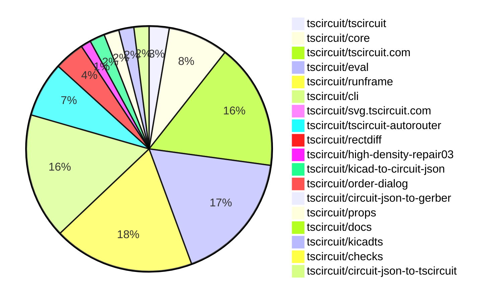

# Contribution Overview 2026-05-05

The current week is shown below. There are 3 major sections:

- [Contributor Overview](#contributor-overview)
- [PRs by Repository](#prs-by-repository)
- [PRs by Contributor](#changes-by-contributor)
- [Scoring & Sponsorship Details](/docs/sponsorship-calculation-explanation.md)

## PRs by Repository

## Contributor Overview

| Contributor | 🐳 Major | 🐙 Minor | 🐌 Tiny | Score | ⭐ | Discussion Contributions |
|-------------|---------|---------|---------|-------|-----|--------------------------|
| [imrishabh18](#imrishabh18) | 5 | 4 | 7 | 36 | ⭐⭐ | 0🔹 0🔶 0💎 |
| [ShiboSoftwareDev](#ShiboSoftwareDev) | 2 | 6 | 1 | 22 | ⭐⭐ | 0🔹 0🔶 0💎 |
| [techmannih](#techmannih) | 4 | 3 | 0 | 22 | ⭐⭐ | 0🔹 0🔶 0💎 |
| [tscircuitbot](#tscircuitbot) | 0 | 0 | 111 | 14 | ⭐⭐ | 0🔹 0🔶 0💎 |
| [seveibar](#seveibar) | 2 | 2 | 0 | 13 | ⭐⭐ | 0🔹 0🔶 0💎 |
| [Abse2001](#Abse2001) | 3 | 0 | 0 | 13 | ⭐⭐ | 0🔹 0🔶 0💎 |
| [0hmX](#0hmX) | 0 | 0 | 4 | 4 | ⭐ | 0🔹 0🔶 0💎 |
| [Sang-it](#Sang-it) | 0 | 1 | 0 | 2 |  | 0🔹 0🔶 0💎 |
| [rushabhcodes](#rushabhcodes) | 0 | 0 | 1 | 1 |  | 0🔹 0🔶 0💎 |

## Staff Pass Ratio (SPR)

| Contributor | Reviewed PRs | Rejections | Approvals | SPR |
|-------------|--------------|------------|-----------|-----|
| [techmannih](#techmannih) | 7 | 2 | 6 | 71.4% |
| [imrishabh18](#imrishabh18) | 6 | 0 | 6 | 100.0% |
| [ShiboSoftwareDev](#ShiboSoftwareDev) | 6 | 0 | 7 | 100.0% |
| [Abse2001](#Abse2001) | 3 | 1 | 2 | 66.7% |
| [Sang-it](#Sang-it) | 1 | 0 | 1 | 100.0% |
| [mohan-bee](#mohan-bee) | 1 | 1 | 0 | 0.0% |
| [0hmX](#0hmX) | 1 | 0 | 1 | 100.0% |
| [AnasSarkiz](#AnasSarkiz) | 1 | 1 | 0 | 0.0% |

techmannih SPR PRs (7)

- [#2244](https://github.com/tscircuit/core/pull/2244) Normalize resistor footprints to resistor-specific packages
- [#28](https://github.com/tscircuit/circuit-json-to-tscircuit/pull/28) Support plated hole rotation for oval and pill holes
- [#29](https://github.com/tscircuit/circuit-json-to-tscircuit/pull/29) Render fabrication note paths on the fabrication layer
- [#30](https://github.com/tscircuit/circuit-json-to-tscircuit/pull/30) Support top and bottom courtyard layers in footprint generation
- [#33](https://github.com/tscircuit/kicadts/pull/33) Add typed KicadPcb graphic collections
- [#72](https://github.com/tscircuit/kicad-to-circuit-json/pull/72) Support Edge.Cuts gr_circle with typed KicadPcb graphics
- [#71](https://github.com/tscircuit/kicad-to-circuit-json/pull/71)  Preserve JLCPCB Part no footprint properties in circuit-json 

imrishabh18 SPR PRs (6)

- [#2245](https://github.com/tscircuit/core/pull/2245) Add the method `unrouteCircuitJson`
- [#2576](https://github.com/tscircuit/eval/pull/2576) Test verifying that multiple subcircuit with circuitJson being passed works
- [#2574](https://github.com/tscircuit/eval/pull/2574) Import `kicad_pcb` file as Board component
- [#1113](https://github.com/tscircuit/tscircuit-autorouter/pull/1113) Add via and pad clearance solver when `minViaEdgeToPadEdgeClearance` is present
- [#9](https://github.com/tscircuit/high-density-repair03/pull/9) Also consider inferred vias in trace-to-pad clearance relaxation
- [#8](https://github.com/tscircuit/high-density-repair03/pull/8) Add Via to Pad clearance solver

ShiboSoftwareDev SPR PRs (6)

- [#2249](https://github.com/tscircuit/core/pull/2249) Support rectangular reroute phases in autoroutingphase
- [#2239](https://github.com/tscircuit/core/pull/2239) Use port direction for group schematic box pin placement
- [#2237](https://github.com/tscircuit/core/pull/2237) Fix named schPinArrangement ports for group schematic boxes
- [#2236](https://github.com/tscircuit/core/pull/2236) Add autorouting phase component support
- [#85](https://github.com/tscircuit/circuit-json-to-gerber/pull/85) submit 8 layers
- [#541](https://github.com/tscircuit/docs/pull/541) Document group schematic box rendering

Abse2001 SPR PRs (3)

- [#143](https://github.com/tscircuit/checks/pull/143) Add polygon-aware DRC checks for rotated pads and plated holes
- [#1125](https://github.com/tscircuit/tscircuit-autorouter/pull/1125) Preserve original obstacle geometry and rotation in circuit-json conversion
- [#1118](https://github.com/tscircuit/tscircuit-autorouter/pull/1118) Add geometry-aware DRC checks for rotated pads and reconstructed obstacle geometry

Sang-it SPR PRs (1)

- [#2234](https://github.com/tscircuit/core/pull/2234) add schematic section

mohan-bee SPR PRs (1)

- [#36](https://github.com/tscircuit/kicadts/pull/36) Fix unhandled PCB syntax blocking KiCad board conversion

0hmX SPR PRs (1)

- [#128](https://github.com/tscircuit/rectdiff/pull/128) Prepare gap-fill logic for board boundary handling

AnasSarkiz SPR PRs (1)

- [#1121](https://github.com/tscircuit/tscircuit-autorouter/pull/1121) Prevent downstream crashes by adding x/y to through_obstacle route points

> Note: AI evaluates PRs and assigns 1-3 star ratings automatically. 4 and 5 star ratings require manual staff review.

### Discussion Contribution Legend

- 🔹 Normal Comments: Basic participation with minimal effort
- 🔶 Great Informative Comments: Thoughtful participation that adds value
- 💎 Incredible Comments: Exceptional participation with high-quality content

## Review Table

[reviews-received-hover]: ## "Number of reviews received for PRs for this contributor"
[approvals-received-hover]: ## "Number of approvals received for PRs this contributor authored"
[rejections-received-hover]: ## "Number of rejections received for PRs this contributor authored"
[prs-opened-hover]: ## "Number of PRs opened by this contributor"
[issues-created-hover]: ## "Number of issues created by this contributor"

| Contributor | Reviews Received | Approvals Received | Rejections Received | Approvals | Rejections Given | PRs Opened | PRs Merged | Issues Created |
|---|---|---|---|---|---|---|---|---|
| [tscircuitbot](#tscircuitbot) | 1 | 1 | 0 | 0 | 0 | 127 | 111 | 0 |
| [imrishabh18](#imrishabh18) | 10 | 8 | 0 | 4 | 1 | 19 | 16 | 0 |
| [ShiboSoftwareDev](#ShiboSoftwareDev) | 8 | 8 | 0 | 1 | 0 | 10 | 9 | 0 |
| [gsdali](#gsdali) | 0 | 0 | 0 | 0 | 0 | 8 | 0 | 0 |
| [seveibar](#seveibar) | 0 | 0 | 0 | 22 | 4 | 5 | 4 | 0 |
| [techmannih](#techmannih) | 9 | 6 | 1 | 0 | 0 | 13 | 7 | 0 |
| [Sang-it](#Sang-it) | 1 | 1 | 0 | 0 | 0 | 1 | 1 | 0 |
| [64johnlee](#64johnlee) | 0 | 0 | 0 | 0 | 0 | 4 | 0 | 0 |
| [mohan-bee](#mohan-bee) | 4 | 0 | 2 | 0 | 0 | 6 | 0 | 0 |
| [Abse2001](#Abse2001) | 7 | 3 | 1 | 2 | 0 | 4 | 3 | 0 |
| [CrocCartelDevTeam](#CrocCartelDevTeam) | 0 | 0 | 0 | 0 | 0 | 2 | 0 | 0 |
| [Bortlesboat](#Bortlesboat) | 0 | 0 | 0 | 0 | 0 | 1 | 0 | 0 |
| [rushabhcodes](#rushabhcodes) | 2 | 1 | 0 | 0 | 0 | 1 | 1 | 0 |
| [0hmX](#0hmX) | 2 | 1 | 0 | 0 | 0 | 9 | 4 | 0 |
| [AnasSarkiz](#AnasSarkiz) | 1 | 0 | 1 | 0 | 0 | 1 | 0 | 0 |
| [chengyixu](#chengyixu) | 0 | 0 | 0 | 0 | 0 | 1 | 0 | 0 |
| [sagarshuklaa](#sagarshuklaa) | 0 | 0 | 0 | 0 | 0 | 1 | 0 | 0 |

## Changes by Repository

### [tscircuit/tscircuit](https://github.com/tscircuit/tscircuit)

🐌 Tiny Contributions (4)

| PR # | Impact | Contributor | Description |
|------|--------|-------------|-------------|
| [#3143](https://github.com/tscircuit/tscircuit/pull/3143) | 🐌 Tiny | tscircuitbot | Updates the package version from 0.0.1730 to 0.0.1731 in package.json |
| [#3141](https://github.com/tscircuit/tscircuit/pull/3141) | 🐌 Tiny | tscircuitbot | Automated package update |
| [#3142](https://github.com/tscircuit/tscircuit/pull/3142) | 🐌 Tiny | imrishabh18 | Updates the kicad-to-circuit-json dependency from 0.0.32 to 0.0.51 in package.json and refreshes bun.lock to reflect the new version. |
| [#3140](https://github.com/tscircuit/tscircuit/pull/3140) | 🐌 Tiny | imrishabh18 | Updates dependencies for tscircuit, core, eval, and cli to their latest versions. |

### [tscircuit/core](https://github.com/tscircuit/core)

| PR # | Impact | Rating | Contributor | Description |
|------|--------|--------|-------------|-------------|
| [#2236](https://github.com/tscircuit/core/pull/2236) | 🐳 Major | ⭐⭐⭐ | ShiboSoftwareDev | Adds a self-closing autoroutingphase  primitive for configuring autorouter behavior per existing routingPhaseIndex phase. Routing phase plans now attach matching phase autorouter configs, local autorouting uses those configs per phase, and net-derived trace phases reuse the existing net phase lookup. |
| [#2251](https://github.com/tscircuit/core/pull/2251) | 🐙 Minor | ⭐⭐ | imrishabh18 | Fixes the issue where inflated footprints were not persisted to their original layer in the PCB design. |
| [#2250](https://github.com/tscircuit/core/pull/2250) | 🐙 Minor | ⭐⭐ | imrishabh18 | Fixes incorrect assignment of minViaEdgeToPadEdgeClearance in autorouting calculations, ensuring proper clearance values are used. |
| [#2245](https://github.com/tscircuit/core/pull/2245) | 🐙 Minor | ⭐⭐ | imrishabh18 | Adds a method to filter out unrouted elements from circuit JSON data. |
| [#2249](https://github.com/tscircuit/core/pull/2249) | 🐙 Minor | ⭐⭐ | ShiboSoftwareDev | Adds reroute and region handling to autoroutingphase, allowing a later phase to rip previously routed traces inside a rectangular region, autoroute only the clipped regional connections, and reconnect the result back into the full route set. |
| [#2239](https://github.com/tscircuit/core/pull/2239) | 🐙 Minor | ⭐⭐ | ShiboSoftwareDev | Adds direction-based schematic box placement for group ports when no explicit schPinArrangement is provided, while preserving schPinArrangement as the override. |
| [#2237](https://github.com/tscircuit/core/pull/2237) | 🐙 Minor | ⭐⭐ | ShiboSoftwareDev | Fixes handling of named child ports in schPinArrangement for group schematic boxes, centralizing pin extraction and improving pin count calculations. |
| [#2238](https://github.com/tscircuit/core/pull/2238) | 🐙 Minor | ⭐⭐ | seveibar | Fixes the issue where the subcircuit anchor alignment does not function correctly in circuit JSON, ensuring proper positioning of autosized subcircuits. |
| [#2235](https://github.com/tscircuit/core/pull/2235) | 🐙 Minor | ⭐⭐ | seveibar | Adds tests for rendering subcircuits with specific anchor alignments in circuit JSON. |
| [#2234](https://github.com/tscircuit/core/pull/2234) | 🐙 Minor | ⭐⭐ | Sang-it | Add support for schematic sections and include a missing package for enhanced schematic organization. |

🐌 Tiny Contributions (2)

| PR # | Impact | Contributor | Description |
|------|--------|-------------|-------------|
| [#2246](https://github.com/tscircuit/core/pull/2246) | 🐌 Tiny | tscircuitbot | Updates the version of the tscircuitchecks package from 0.0.125 to 0.0.126 in package.json |
| [#2241](https://github.com/tscircuit/core/pull/2241) | 🐌 Tiny | imrishabh18 | Updates the local autorouter dependency to the latest version (0.0.500) for bug fixes and improved routing behavior. |

### [tscircuit/tscircuit.com](https://github.com/tscircuit/tscircuit.com)

🐌 Tiny Contributions (25)

| PR # | Impact | Contributor | Description |
|------|--------|-------------|-------------|
| [#3372](https://github.com/tscircuit/tscircuit.com/pull/3372) | 🐌 Tiny | tscircuitbot | Automated package update |
| [#3371](https://github.com/tscircuit/tscircuit.com/pull/3371) | 🐌 Tiny | tscircuitbot | Updates the tscircuiteval package to version 0.0.824 in the package.json file. |
| [#3370](https://github.com/tscircuit/tscircuit.com/pull/3370) | 🐌 Tiny | tscircuitbot | Updates the tscircuitrunframe package from version 0.0.1930 to 0.0.1931 |
| [#3369](https://github.com/tscircuit/tscircuit.com/pull/3369) | 🐌 Tiny | tscircuitbot | Updates the tscircuiteval package from version 0.0.822 to 0.0.823 |
| [#3368](https://github.com/tscircuit/tscircuit.com/pull/3368) | 🐌 Tiny | tscircuitbot | Updates the tscircuitrunframe package from version 0.0.1929 to 0.0.1930 |
| [#3367](https://github.com/tscircuit/tscircuit.com/pull/3367) | 🐌 Tiny | tscircuitbot | Updates the tscircuiteval package from version 0.0.821 to 0.0.822 |
| [#3366](https://github.com/tscircuit/tscircuit.com/pull/3366) | 🐌 Tiny | tscircuitbot | Automated package update |
| [#3365](https://github.com/tscircuit/tscircuit.com/pull/3365) | 🐌 Tiny | tscircuitbot | Updates the tscircuiteval package from version 0.0.820 to 0.0.821 |
| [#3363](https://github.com/tscircuit/tscircuit.com/pull/3363) | 🐌 Tiny | tscircuitbot | Updates the tscircuitrunframe package from version 0.0.1926 to 0.0.1928 |
| [#3362](https://github.com/tscircuit/tscircuit.com/pull/3362) | 🐌 Tiny | tscircuitbot | Updates the tscircuiteval package from version 0.0.819 to 0.0.820 |
| [#3360](https://github.com/tscircuit/tscircuit.com/pull/3360) | 🐌 Tiny | tscircuitbot | Updates the tscircuiteval package from version 0.0.818 to 0.0.819 |
| [#3359](https://github.com/tscircuit/tscircuit.com/pull/3359) | 🐌 Tiny | tscircuitbot | Updates the tscircuitrunframe package from version 0.0.1925 to 0.0.1926 |
| [#3358](https://github.com/tscircuit/tscircuit.com/pull/3358) | 🐌 Tiny | tscircuitbot | Updates the tscircuiteval package from version 0.0.817 to 0.0.818 |
| [#3357](https://github.com/tscircuit/tscircuit.com/pull/3357) | 🐌 Tiny | tscircuitbot | Updates the tscircuitrunframe package from version 0.0.1924 to 0.0.1925 |
| [#3356](https://github.com/tscircuit/tscircuit.com/pull/3356) | 🐌 Tiny | tscircuitbot | Updates the tscircuiteval package from version 0.0.816 to 0.0.817 |
| [#3355](https://github.com/tscircuit/tscircuit.com/pull/3355) | 🐌 Tiny | tscircuitbot | Updates the tscircuitrunframe package from version 0.0.1923 to 0.0.1924 |
| [#3354](https://github.com/tscircuit/tscircuit.com/pull/3354) | 🐌 Tiny | tscircuitbot | Updates the tscircuiteval package to version 0.0.816 |
| [#3353](https://github.com/tscircuit/tscircuit.com/pull/3353) | 🐌 Tiny | tscircuitbot | Updates the tscircuitrunframe package from version 0.0.1922 to 0.0.1923 |
| [#3352](https://github.com/tscircuit/tscircuit.com/pull/3352) | 🐌 Tiny | tscircuitbot | Updates the tscircuiteval package from version 0.0.814 to 0.0.815 |
| [#3351](https://github.com/tscircuit/tscircuit.com/pull/3351) | 🐌 Tiny | tscircuitbot | Updates the tscircuitrunframe package from version 0.0.1921 to 0.0.1922 |
| [#3350](https://github.com/tscircuit/tscircuit.com/pull/3350) | 🐌 Tiny | tscircuitbot | Updates the tscircuiteval package from version 0.0.813 to 0.0.814 |
| [#3349](https://github.com/tscircuit/tscircuit.com/pull/3349) | 🐌 Tiny | tscircuitbot | Updates the tscircuitrunframe package to version 0.0.1921 |
| [#3348](https://github.com/tscircuit/tscircuit.com/pull/3348) | 🐌 Tiny | tscircuitbot | Updates the tscircuiteval package from version 0.0.811 to 0.0.813 in the package.json file. |
| [#3347](https://github.com/tscircuit/tscircuit.com/pull/3347) | 🐌 Tiny | tscircuitbot | Updates the tscircuitrunframe package from version 0.0.1919 to 0.0.1920 |
| [#3364](https://github.com/tscircuit/tscircuit.com/pull/3364) | 🐌 Tiny | imrishabh18 | Updates the tscircuitorder-dialog dependency to a specific commit to ensure intended upstream changes are pulled into the workspace. |

### [tscircuit/eval](https://github.com/tscircuit/eval)

| PR # | Impact | Rating | Contributor | Description |
|------|--------|--------|-------------|-------------|
| [#2574](https://github.com/tscircuit/eval/pull/2574) | 🐳 Major | ⭐⭐⭐ | imrishabh18 | This pull request introduces the ability to import .kicad_pcb files as Board components in the application. It includes a new converter for transforming KiCad PCB files into a circuit JSON format, which can then be utilized within the application. Additionally, it adds error handling for unsupported static asset URLs and updates the package dependencies for improved functionality. |
| [#2576](https://github.com/tscircuit/eval/pull/2576) | 🐙 Minor | ⭐⭐ | imrishabh18 | Adds a test to verify that multiple subcircuits can be imported and rendered correctly using circuitJson. |

🐌 Tiny Contributions (24)

| PR # | Impact | Contributor | Description |
|------|--------|-------------|-------------|
| [#2607](https://github.com/tscircuit/eval/pull/2607) | 🐌 Tiny | tscircuitbot | Automated package update to version 0.0.824 |
| [#2606](https://github.com/tscircuit/eval/pull/2606) | 🐌 Tiny | tscircuitbot | Automated package update |
| [#2604](https://github.com/tscircuit/eval/pull/2604) | 🐌 Tiny | tscircuitbot | Automated package update |
| [#2603](https://github.com/tscircuit/eval/pull/2603) | 🐌 Tiny | tscircuitbot | Updates the version of the tscircuitcore package from 0.0.1225 to 0.0.1226 in package.json |
| [#2601](https://github.com/tscircuit/eval/pull/2601) | 🐌 Tiny | tscircuitbot | Automated package update |
| [#2600](https://github.com/tscircuit/eval/pull/2600) | 🐌 Tiny | tscircuitbot | Updates the version of the tscircuitcore package from 0.0.1224 to 0.0.1225 in package.json |
| [#2598](https://github.com/tscircuit/eval/pull/2598) | 🐌 Tiny | tscircuitbot | Automated package update to version 0.0.821 |
| [#2594](https://github.com/tscircuit/eval/pull/2594) | 🐌 Tiny | tscircuitbot | Automated package update |
| [#2593](https://github.com/tscircuit/eval/pull/2593) | 🐌 Tiny | tscircuitbot | Automated package update |
| [#2592](https://github.com/tscircuit/eval/pull/2592) | 🐌 Tiny | tscircuitbot | Automated package update |
| [#2591](https://github.com/tscircuit/eval/pull/2591) | 🐌 Tiny | tscircuitbot | Automated package update |
| [#2589](https://github.com/tscircuit/eval/pull/2589) | 🐌 Tiny | tscircuitbot | Automated package update |
| [#2588](https://github.com/tscircuit/eval/pull/2588) | 🐌 Tiny | tscircuitbot | Automated package update |
| [#2586](https://github.com/tscircuit/eval/pull/2586) | 🐌 Tiny | tscircuitbot | Automated package update |
| [#2585](https://github.com/tscircuit/eval/pull/2585) | 🐌 Tiny | tscircuitbot | Automated package update |
| [#2583](https://github.com/tscircuit/eval/pull/2583) | 🐌 Tiny | tscircuitbot | Automated package update |
| [#2582](https://github.com/tscircuit/eval/pull/2582) | 🐌 Tiny | tscircuitbot | Updates the version of the tscircuitcore package from 0.0.1219 to 0.0.1220 in package.json |
| [#2580](https://github.com/tscircuit/eval/pull/2580) | 🐌 Tiny | tscircuitbot | Automated package update |
| [#2579](https://github.com/tscircuit/eval/pull/2579) | 🐌 Tiny | tscircuitbot | Automated package update |
| [#2577](https://github.com/tscircuit/eval/pull/2577) | 🐌 Tiny | tscircuitbot | Automated package update |
| [#2575](https://github.com/tscircuit/eval/pull/2575) | 🐌 Tiny | tscircuitbot | Automated package update |
| [#2573](https://github.com/tscircuit/eval/pull/2573) | 🐌 Tiny | tscircuitbot | Automated package update |
| [#2572](https://github.com/tscircuit/eval/pull/2572) | 🐌 Tiny | tscircuitbot | Automated package update |
| [#2597](https://github.com/tscircuit/eval/pull/2597) | 🐌 Tiny | rushabhcodes | Updates the kicadts dependency from version 0.0.22 to 0.0.31 in package.json to bring in the latest features and fixes. |

### [tscircuit/runframe](https://github.com/tscircuit/runframe)

🐌 Tiny Contributions (28)

| PR # | Impact | Contributor | Description |
|------|--------|-------------|-------------|
| [#3361](https://github.com/tscircuit/runframe/pull/3361) | 🐌 Tiny | tscircuitbot | Automated package update |
| [#3360](https://github.com/tscircuit/runframe/pull/3360) | 🐌 Tiny | tscircuitbot | Updates the tscircuiteval package to version 0.0.824 in the package.json file. |
| [#3359](https://github.com/tscircuit/runframe/pull/3359) | 🐌 Tiny | tscircuitbot | Automated package update |
| [#3358](https://github.com/tscircuit/runframe/pull/3358) | 🐌 Tiny | tscircuitbot | Updates the circuit-json-to-gerber package from version 0.0.51 to 0.0.52 |
| [#3357](https://github.com/tscircuit/runframe/pull/3357) | 🐌 Tiny | tscircuitbot | Automated package update |
| [#3356](https://github.com/tscircuit/runframe/pull/3356) | 🐌 Tiny | tscircuitbot | Updates the tscircuiteval package from version 0.0.822 to 0.0.823 |
| [#3355](https://github.com/tscircuit/runframe/pull/3355) | 🐌 Tiny | tscircuitbot | Automated package update |
| [#3354](https://github.com/tscircuit/runframe/pull/3354) | 🐌 Tiny | tscircuitbot | Updates the tscircuiteval package to version 0.0.822 in the package.json file. |
| [#3353](https://github.com/tscircuit/runframe/pull/3353) | 🐌 Tiny | tscircuitbot | Automated package update |
| [#3352](https://github.com/tscircuit/runframe/pull/3352) | 🐌 Tiny | tscircuitbot | Automated package update |
| [#3351](https://github.com/tscircuit/runframe/pull/3351) | 🐌 Tiny | tscircuitbot | Automated package update |
| [#3350](https://github.com/tscircuit/runframe/pull/3350) | 🐌 Tiny | tscircuitbot | Updates the tscircuiteval package from version 0.0.819 to 0.0.820 in the project dependencies. |
| [#3349](https://github.com/tscircuit/runframe/pull/3349) | 🐌 Tiny | tscircuitbot | Automated package update |
| [#3348](https://github.com/tscircuit/runframe/pull/3348) | 🐌 Tiny | tscircuitbot | Updates the tscircuiteval package from version 0.0.818 to 0.0.819 in the package.json file. |
| [#3347](https://github.com/tscircuit/runframe/pull/3347) | 🐌 Tiny | tscircuitbot | Automated package update |
| [#3346](https://github.com/tscircuit/runframe/pull/3346) | 🐌 Tiny | tscircuitbot | Updates the tscircuiteval package from version 0.0.817 to 0.0.818 in the package.json file. |
| [#3345](https://github.com/tscircuit/runframe/pull/3345) | 🐌 Tiny | tscircuitbot | Automated package update |
| [#3344](https://github.com/tscircuit/runframe/pull/3344) | 🐌 Tiny | tscircuitbot | Updates the tscircuiteval package from version 0.0.816 to 0.0.817 |
| [#3343](https://github.com/tscircuit/runframe/pull/3343) | 🐌 Tiny | tscircuitbot | Automated package update |
| [#3342](https://github.com/tscircuit/runframe/pull/3342) | 🐌 Tiny | tscircuitbot | Updates the tscircuiteval package from version 0.0.815 to 0.0.816 in the package.json file. |
| [#3341](https://github.com/tscircuit/runframe/pull/3341) | 🐌 Tiny | tscircuitbot | Automated package update |
| [#3340](https://github.com/tscircuit/runframe/pull/3340) | 🐌 Tiny | tscircuitbot | Updates the tscircuiteval package from version 0.0.814 to 0.0.815 in the package.json file. |
| [#3339](https://github.com/tscircuit/runframe/pull/3339) | 🐌 Tiny | tscircuitbot | Automated package update |
| [#3338](https://github.com/tscircuit/runframe/pull/3338) | 🐌 Tiny | tscircuitbot | Updates the tscircuiteval package from version 0.0.813 to 0.0.814 in the package.json file. |
| [#3337](https://github.com/tscircuit/runframe/pull/3337) | 🐌 Tiny | tscircuitbot | Automated package update |
| [#3336](https://github.com/tscircuit/runframe/pull/3336) | 🐌 Tiny | tscircuitbot | Updates the tscircuiteval package from version 0.0.812 to 0.0.813 in the package.json file. |
| [#3335](https://github.com/tscircuit/runframe/pull/3335) | 🐌 Tiny | tscircuitbot | Automated package update |
| [#3334](https://github.com/tscircuit/runframe/pull/3334) | 🐌 Tiny | tscircuitbot | Updates the tscircuiteval package from version 0.0.811 to 0.0.812 in the package.json file. |

### [tscircuit/cli](https://github.com/tscircuit/cli)

🐌 Tiny Contributions (25)

| PR # | Impact | Contributor | Description |
|------|--------|-------------|-------------|
| [#2969](https://github.com/tscircuit/cli/pull/2969) | 🐌 Tiny | tscircuitbot | Automated package update |
| [#2968](https://github.com/tscircuit/cli/pull/2968) | 🐌 Tiny | tscircuitbot | Updates the tscircuitrunframe package from version 0.0.1931 to 0.0.1933 |
| [#2967](https://github.com/tscircuit/cli/pull/2967) | 🐌 Tiny | tscircuitbot | Automated package update |
| [#2966](https://github.com/tscircuit/cli/pull/2966) | 🐌 Tiny | tscircuitbot | Automated package update |
| [#2965](https://github.com/tscircuit/cli/pull/2965) | 🐌 Tiny | tscircuitbot | Automated package update |
| [#2964](https://github.com/tscircuit/cli/pull/2964) | 🐌 Tiny | tscircuitbot | Automated package update |
| [#2963](https://github.com/tscircuit/cli/pull/2963) | 🐌 Tiny | tscircuitbot | Automated package update |
| [#2962](https://github.com/tscircuit/cli/pull/2962) | 🐌 Tiny | tscircuitbot | Automated package update |
| [#2961](https://github.com/tscircuit/cli/pull/2961) | 🐌 Tiny | tscircuitbot | Automated package update |
| [#2960](https://github.com/tscircuit/cli/pull/2960) | 🐌 Tiny | tscircuitbot | Updates the tscircuitrunframe package from version 0.0.1927 to 0.0.1928 |
| [#2958](https://github.com/tscircuit/cli/pull/2958) | 🐌 Tiny | tscircuitbot | Updates the tscircuitrunframe package from version 0.0.1926 to 0.0.1927 |
| [#2957](https://github.com/tscircuit/cli/pull/2957) | 🐌 Tiny | tscircuitbot | Automated package update |
| [#2956](https://github.com/tscircuit/cli/pull/2956) | 🐌 Tiny | tscircuitbot | Updates the tscircuitrunframe package to version 0.0.1926 in the package.json file |
| [#2955](https://github.com/tscircuit/cli/pull/2955) | 🐌 Tiny | tscircuitbot | Automated package update |
| [#2954](https://github.com/tscircuit/cli/pull/2954) | 🐌 Tiny | tscircuitbot | Automated package update |
| [#2951](https://github.com/tscircuit/cli/pull/2951) | 🐌 Tiny | tscircuitbot | Automated package update |
| [#2950](https://github.com/tscircuit/cli/pull/2950) | 🐌 Tiny | tscircuitbot | Updates the tscircuitrunframe package from version 0.0.1923 to 0.0.1924 |
| [#2949](https://github.com/tscircuit/cli/pull/2949) | 🐌 Tiny | tscircuitbot | Automated package update |
| [#2948](https://github.com/tscircuit/cli/pull/2948) | 🐌 Tiny | tscircuitbot | Updates the tscircuitrunframe package from version 0.0.1922 to 0.0.1923 |
| [#2947](https://github.com/tscircuit/cli/pull/2947) | 🐌 Tiny | tscircuitbot | Automated package update |
| [#2946](https://github.com/tscircuit/cli/pull/2946) | 🐌 Tiny | tscircuitbot | Updates the tscircuitrunframe package to version 0.0.1922 |
| [#2945](https://github.com/tscircuit/cli/pull/2945) | 🐌 Tiny | tscircuitbot | Automated package update |
| [#2944](https://github.com/tscircuit/cli/pull/2944) | 🐌 Tiny | tscircuitbot | Automated package update |
| [#2943](https://github.com/tscircuit/cli/pull/2943) | 🐌 Tiny | tscircuitbot | Automated package update |
| [#2942](https://github.com/tscircuit/cli/pull/2942) | 🐌 Tiny | tscircuitbot | Updates the tscircuitrunframe package to version 0.0.1920 in the package.json file |

### [tscircuit/svg.tscircuit.com](https://github.com/tscircuit/svg.tscircuit.com)

🐌 Tiny Contributions (1)

| PR # | Impact | Contributor | Description |
|------|--------|-------------|-------------|
| [#1432](https://github.com/tscircuit/svg.tscircuit.com/pull/1432) | 🐌 Tiny | tscircuitbot | Updates the tscircuit package version from 0.0.1722 to 0.0.1730 in package.json |

### [tscircuit/tscircuit-autorouter](https://github.com/tscircuit/tscircuit-autorouter)

| PR # | Impact | Rating | Contributor | Description |
|------|--------|--------|-------------|-------------|
| [#1127](https://github.com/tscircuit/tscircuit-autorouter/pull/1127) | 🐳 Major | ⭐⭐⭐ | imrishabh18 | Motivation Capture and preserve an autorouting bug report snapshot for regression prevention by downloading its simple_route_json payload. Provide a quick way to visually inspect the failing SRJ in Cosmos via a debugger fixture. Enable automated regression detection by adding a snapshot test that runs the solver and records the final SVG output.  Description Added the downloaded bug report data to fixturesbug-reportsbugreport58-b69d72bugreport58-b69d72.json containing the simple_route_json. Added a Cosmos debugger fixture at fixturesbug-reportsbugreport58-b69d72bugreport58-b69d72.fixture.tsx that renders AutoroutingPipelineDebugger with the SRJ. Added a Bun snapshot regression test testsbugsbugreport58-b69d72.test.ts and the generated SVG snapshot testsbugs__snapshots__bugreport58-b69d72.snap.svg which runs the AutoroutingPipelineSolver and snapshots the visualization.  Testing Ran bun test testsbugsbugreport58-b69d72.test.ts and the test passed (1 pass, 0 fail). Ran bun run format:check (biome format .) and it reported no unformatted files. The new files were committed and are ready for review. |
| [#1113](https://github.com/tscircuit/tscircuit-autorouter/pull/1113) | 🐳 Major | ⭐⭐⭐ | imrishabh18 | Adds a solver for via and pad clearance when the minimum via edge to pad edge clearance is specified, enhancing the autorouting capabilities. |
| [#1119](https://github.com/tscircuit/tscircuit-autorouter/pull/1119) | 🐳 Major | ⭐⭐⭐ | seveibar | This pull request introduces the ability to retrieve the version of a simple route JSON that is reroutable, specifically for rerouting a region. It also introduces a dataset (srj15) that tests the reroutability of regions, enhancing the benchmarking capabilities of the autorouter. |
| [#1125](https://github.com/tscircuit/tscircuit-autorouter/pull/1125) | 🐳 Major | ⭐⭐⭐ | Abse2001 | Preserves the original obstacle geometry and rotation when converting to circuit-json format, ensuring accurate representation of physical components in the design. |
| [#1123](https://github.com/tscircuit/tscircuit-autorouter/pull/1123) | 🐳 Major | ⭐⭐⭐ | Abse2001 | Preserves valid simplified path prefixes when a 45-degree path completion fails, ensuring connectivity by appending the original route slice. |

🐌 Tiny Contributions (6)

| PR # | Impact | Contributor | Description |
|------|--------|-------------|-------------|
| [#1131](https://github.com/tscircuit/tscircuit-autorouter/pull/1131) | 🐌 Tiny | tscircuitbot | Automated package update |
| [#1128](https://github.com/tscircuit/tscircuit-autorouter/pull/1128) | 🐌 Tiny | tscircuitbot | Automated package update |
| [#1124](https://github.com/tscircuit/tscircuit-autorouter/pull/1124) | 🐌 Tiny | tscircuitbot | Automated package update |
| [#1122](https://github.com/tscircuit/tscircuit-autorouter/pull/1122) | 🐌 Tiny | tscircuitbot | Automated package update |
| [#1120](https://github.com/tscircuit/tscircuit-autorouter/pull/1120) | 🐌 Tiny | tscircuitbot | Automated package update |
| [#1126](https://github.com/tscircuit/tscircuit-autorouter/pull/1126) | 🐌 Tiny | imrishabh18 | Updates the version of the high-density-repair03 dependency in the package.json file. |

### [tscircuit/rectdiff](https://github.com/tscircuit/rectdiff)

🐌 Tiny Contributions (6)

| PR # | Impact | Contributor | Description |
|------|--------|-------------|-------------|
| [#131](https://github.com/tscircuit/rectdiff/pull/131) | 🐌 Tiny | tscircuitbot | Automated package update |
| [#124](https://github.com/tscircuit/rectdiff/pull/124) | 🐌 Tiny | tscircuitbot | Automated package update |
| [#127](https://github.com/tscircuit/rectdiff/pull/127) | 🐌 Tiny | 0hmX | Adds a new page that implements a simplified out-of-bounds example using the RectDiffPipeline and SolverDebugger3d component. |
| [#125](https://github.com/tscircuit/rectdiff/pull/125) | 🐌 Tiny | 0hmX | This pull request relocates existing files and adds new Arduino-related resources to the project. It introduces new pages for Arduino examples and moves existing examples to a more organized structure. |
| [#122](https://github.com/tscircuit/rectdiff/pull/122) | 🐌 Tiny | 0hmX | Adds a new fixture for testing out-of-bounds scenarios in the RectDiffPipeline, including a corresponding test case to validate the behavior of generated nodes outside defined bounds. |
| [#120](https://github.com/tscircuit/rectdiff/pull/120) | 🐌 Tiny | 0hmX | Updates the tscircuitmath-utils package to version 0.0.36 in the package.json file. |

### [tscircuit/high-density-repair03](https://github.com/tscircuit/high-density-repair03)

| PR # | Impact | Rating | Contributor | Description |
|------|--------|--------|-------------|-------------|
| [#9](https://github.com/tscircuit/high-density-repair03/pull/9) | 🐳 Major | ⭐⭐⭐ | imrishabh18 | Adds functionality to consider inferred vias in trace clearance relaxation, addressing DRC regressions caused by layer transitions with empty vias. |
| [#8](https://github.com/tscircuit/high-density-repair03/pull/8) | 🐳 Major | ⭐⭐⭐ | imrishabh18 | Adds a new solver for adjusting via to pad clearance in routing, enhancing the routing algorithms ability to manage clearance between vias and pads effectively. |

### [tscircuit/kicad-to-circuit-json](https://github.com/tscircuit/kicad-to-circuit-json)

| PR # | Impact | Rating | Contributor | Description |
|------|--------|--------|-------------|-------------|
| [#72](https://github.com/tscircuit/kicad-to-circuit-json/pull/72) | 🐳 Major | ⭐⭐⭐ | techmannih | What changed added Edge.Cuts gr_circle support to board outline collection and PCB centering added a focused gr_circle Edge.Cuts PCB fixture and snapshot coverage switched the outline helpers to use typed public kicadts collections directly bumped kicadts to 0.0.30  Why Top-level gr_circle board graphics were not being included in pcb_board.outline, and the temporary local fallbacks around graphic primitives were only needed until kicadts exposed typed top-level graphic collections.  Impact Boards that use gr_circle on Edge.Cuts now produce the expected outline, and this repo now depends on the public typed kicadts API instead of local private-field fallbacks.  Validation bun test testspcbgr-circle-edge-cuts-fragment-pcb.test.ts testspcbgr-curve-edge-cuts-fragment-pcb.test.ts bunx tsc --noEmit |
| [#71](https://github.com/tscircuit/kicad-to-circuit-json/pull/71) | 🐳 Major | ⭐⭐⭐ | techmannih | Preserves JLCPCB part number footprint properties in the circuit-json output for better integration with supplier data. |

🐌 Tiny Contributions (1)

| PR # | Impact | Contributor | Description |
|------|--------|-------------|-------------|
| [#74](https://github.com/tscircuit/kicad-to-circuit-json/pull/74) | 🐌 Tiny | imrishabh18 | This pull request updates the kicad version to the latest 10.0. and updates the tscircuit package dependencies in the project. |

### [tscircuit/order-dialog](https://github.com/tscircuit/order-dialog)

🐌 Tiny Contributions (1)

| PR # | Impact | Contributor | Description |
|------|--------|-------------|-------------|
| [#1](https://github.com/tscircuit/order-dialog/pull/1) | 🐌 Tiny | imrishabh18 | Scoping CSS variables and styles to the order dialog component to prevent global CSS conflicts with the host page. |

### [tscircuit/circuit-json-to-gerber](https://github.com/tscircuit/circuit-json-to-gerber)

| PR # | Impact | Rating | Contributor | Description |
|------|--------|--------|-------------|-------------|
| [#85](https://github.com/tscircuit/circuit-json-to-gerber/pull/85) | 🐳 Major | ⭐⭐⭐ | ShiboSoftwareDev | This pull request introduces support for 8 layers in the Gerber file generation process. It expands the existing functionality to accommodate additional inner layers, enhancing the capability of the circuit design tool. |

### [tscircuit/props](https://github.com/tscircuit/props)

| PR # | Impact | Rating | Contributor | Description |
|------|--------|--------|-------------|-------------|
| [#659](https://github.com/tscircuit/props/pull/659) | 🐙 Minor | ⭐⭐ | ShiboSoftwareDev | Adds a shape property to the autorouting phase regions, allowing for rectangular region definitions in autorouting. |
| [#657](https://github.com/tscircuit/props/pull/657) | 🐙 Minor | ⭐⭐ | ShiboSoftwareDev | Makes the direction property optional for port components, allowing for more flexible port definitions without requiring a direction to be specified. |

🐌 Tiny Contributions (1)

| PR # | Impact | Contributor | Description |
|------|--------|-------------|-------------|
| [#658](https://github.com/tscircuit/props/pull/658) | 🐌 Tiny | ShiboSoftwareDev | Makes the name property optional in portProps, allowing for ports to be defined without a name. |

### [tscircuit/docs](https://github.com/tscircuit/docs)

| PR # | Impact | Rating | Contributor | Description |
|------|--------|--------|-------------|-------------|
| [#541](https://github.com/tscircuit/docs/pull/541) | 🐙 Minor | ⭐⭐ | ShiboSoftwareDev | Adds documentation for rendering groups as schematic boxes, allowing for better organization of schematic designs by collapsing internal components while exposing external connections. |

### [tscircuit/kicadts](https://github.com/tscircuit/kicadts)

| PR # | Impact | Rating | Contributor | Description |
|------|--------|--------|-------------|-------------|
| [#35](https://github.com/tscircuit/kicadts/pull/35) | 🐳 Major | ⭐⭐⭐ | seveibar | Adds support for parsing zones, rectangles, text boxes, and generator versions in KiCad schematic and symbol libraries, enhancing the parsing capabilities of the tscircuit library. |
| [#37](https://github.com/tscircuit/kicadts/pull/37) | 🐳 Major | ⭐⭐⭐ | techmannih | Add parser and serializer support needed for the pic_programmer KiCad demo board to round-trip successfully. |
| [#33](https://github.com/tscircuit/kicadts/pull/33) | 🐳 Major | ⭐⭐⭐ | techmannih | Add first-class KicadPcb collections for top-level arc, gr_arc, gr_circle, and gr_curve primitives, classifying those parsed children directly in KicadPcb instead of leaving them in otherChildren, and adding a focused parser test covering all four collections. |

### [tscircuit/checks](https://github.com/tscircuit/checks)

| PR # | Impact | Rating | Contributor | Description |
|------|--------|--------|-------------|-------------|
| [#143](https://github.com/tscircuit/checks/pull/143) | 🐳 Major | ⭐⭐⭐ | Abse2001 | Add polygon-aware DRC checks for rotated pads and plated holes |

### [tscircuit/circuit-json-to-tscircuit](https://github.com/tscircuit/circuit-json-to-tscircuit)

| PR # | Impact | Rating | Contributor | Description |
|------|--------|--------|-------------|-------------|
| [#28](https://github.com/tscircuit/circuit-json-to-tscircuit/pull/28) | 🐙 Minor | ⭐⭐ | techmannih | Adds support for rotation of plated holes with oval and pill shapes in the footprint generation process. |
| [#29](https://github.com/tscircuit/circuit-json-to-tscircuit/pull/29) | 🐙 Minor | ⭐⭐ | techmannih | Adds rendering of fabrication note paths on the fabrication layer with customizable stroke width and color attributes. |
| [#30](https://github.com/tscircuit/circuit-json-to-tscircuit/pull/30) | 🐙 Minor | ⭐⭐ | techmannih | Adds support for specifying top and bottom courtyard layers in the footprint generation process for PCB designs. |

## Changes by Contributor

### [tscircuitbot](https://github.com/tscircuitbot)

🐌 Tiny Contributions (111)

| PR # | Impact | Description |
|------|--------|-------------|
| [#3143](https://github.com/tscircuit/tscircuit/pull/3143) | 🐌 Tiny | Updates the package version from 0.0.1730 to 0.0.1731 in package.json |
| [#3141](https://github.com/tscircuit/tscircuit/pull/3141) | 🐌 Tiny | Automated package update |
| [#2246](https://github.com/tscircuit/core/pull/2246) | 🐌 Tiny | Updates the version of the tscircuitchecks package from 0.0.125 to 0.0.126 in package.json |
| [#3372](https://github.com/tscircuit/tscircuit.com/pull/3372) | 🐌 Tiny | Automated package update |
| [#3371](https://github.com/tscircuit/tscircuit.com/pull/3371) | 🐌 Tiny | Updates the tscircuiteval package to version 0.0.824 in the package.json file. |
| [#3370](https://github.com/tscircuit/tscircuit.com/pull/3370) | 🐌 Tiny | Updates the tscircuitrunframe package from version 0.0.1930 to 0.0.1931 |
| [#3369](https://github.com/tscircuit/tscircuit.com/pull/3369) | 🐌 Tiny | Updates the tscircuiteval package from version 0.0.822 to 0.0.823 |
| [#3368](https://github.com/tscircuit/tscircuit.com/pull/3368) | 🐌 Tiny | Updates the tscircuitrunframe package from version 0.0.1929 to 0.0.1930 |
| [#3367](https://github.com/tscircuit/tscircuit.com/pull/3367) | 🐌 Tiny | Updates the tscircuiteval package from version 0.0.821 to 0.0.822 |
| [#3366](https://github.com/tscircuit/tscircuit.com/pull/3366) | 🐌 Tiny | Automated package update |
| [#3365](https://github.com/tscircuit/tscircuit.com/pull/3365) | 🐌 Tiny | Updates the tscircuiteval package from version 0.0.820 to 0.0.821 |
| [#3363](https://github.com/tscircuit/tscircuit.com/pull/3363) | 🐌 Tiny | Updates the tscircuitrunframe package from version 0.0.1926 to 0.0.1928 |
| [#3362](https://github.com/tscircuit/tscircuit.com/pull/3362) | 🐌 Tiny | Updates the tscircuiteval package from version 0.0.819 to 0.0.820 |
| [#3360](https://github.com/tscircuit/tscircuit.com/pull/3360) | 🐌 Tiny | Updates the tscircuiteval package from version 0.0.818 to 0.0.819 |
| [#3359](https://github.com/tscircuit/tscircuit.com/pull/3359) | 🐌 Tiny | Updates the tscircuitrunframe package from version 0.0.1925 to 0.0.1926 |
| [#3358](https://github.com/tscircuit/tscircuit.com/pull/3358) | 🐌 Tiny | Updates the tscircuiteval package from version 0.0.817 to 0.0.818 |
| [#3357](https://github.com/tscircuit/tscircuit.com/pull/3357) | 🐌 Tiny | Updates the tscircuitrunframe package from version 0.0.1924 to 0.0.1925 |
| [#3356](https://github.com/tscircuit/tscircuit.com/pull/3356) | 🐌 Tiny | Updates the tscircuiteval package from version 0.0.816 to 0.0.817 |
| [#3355](https://github.com/tscircuit/tscircuit.com/pull/3355) | 🐌 Tiny | Updates the tscircuitrunframe package from version 0.0.1923 to 0.0.1924 |
| [#3354](https://github.com/tscircuit/tscircuit.com/pull/3354) | 🐌 Tiny | Updates the tscircuiteval package to version 0.0.816 |
| [#3353](https://github.com/tscircuit/tscircuit.com/pull/3353) | 🐌 Tiny | Updates the tscircuitrunframe package from version 0.0.1922 to 0.0.1923 |
| [#3352](https://github.com/tscircuit/tscircuit.com/pull/3352) | 🐌 Tiny | Updates the tscircuiteval package from version 0.0.814 to 0.0.815 |
| [#3351](https://github.com/tscircuit/tscircuit.com/pull/3351) | 🐌 Tiny | Updates the tscircuitrunframe package from version 0.0.1921 to 0.0.1922 |
| [#3350](https://github.com/tscircuit/tscircuit.com/pull/3350) | 🐌 Tiny | Updates the tscircuiteval package from version 0.0.813 to 0.0.814 |
| [#3349](https://github.com/tscircuit/tscircuit.com/pull/3349) | 🐌 Tiny | Updates the tscircuitrunframe package to version 0.0.1921 |
| [#3348](https://github.com/tscircuit/tscircuit.com/pull/3348) | 🐌 Tiny | Updates the tscircuiteval package from version 0.0.811 to 0.0.813 in the package.json file. |
| [#3347](https://github.com/tscircuit/tscircuit.com/pull/3347) | 🐌 Tiny | Updates the tscircuitrunframe package from version 0.0.1919 to 0.0.1920 |
| [#2607](https://github.com/tscircuit/eval/pull/2607) | 🐌 Tiny | Automated package update to version 0.0.824 |
| [#2606](https://github.com/tscircuit/eval/pull/2606) | 🐌 Tiny | Automated package update |
| [#2604](https://github.com/tscircuit/eval/pull/2604) | 🐌 Tiny | Automated package update |
| [#2603](https://github.com/tscircuit/eval/pull/2603) | 🐌 Tiny | Updates the version of the tscircuitcore package from 0.0.1225 to 0.0.1226 in package.json |
| [#2601](https://github.com/tscircuit/eval/pull/2601) | 🐌 Tiny | Automated package update |
| [#2600](https://github.com/tscircuit/eval/pull/2600) | 🐌 Tiny | Updates the version of the tscircuitcore package from 0.0.1224 to 0.0.1225 in package.json |
| [#2598](https://github.com/tscircuit/eval/pull/2598) | 🐌 Tiny | Automated package update to version 0.0.821 |
| [#2594](https://github.com/tscircuit/eval/pull/2594) | 🐌 Tiny | Automated package update |
| [#2593](https://github.com/tscircuit/eval/pull/2593) | 🐌 Tiny | Automated package update |
| [#2592](https://github.com/tscircuit/eval/pull/2592) | 🐌 Tiny | Automated package update |
| [#2591](https://github.com/tscircuit/eval/pull/2591) | 🐌 Tiny | Automated package update |
| [#2589](https://github.com/tscircuit/eval/pull/2589) | 🐌 Tiny | Automated package update |
| [#2588](https://github.com/tscircuit/eval/pull/2588) | 🐌 Tiny | Automated package update |
| [#2586](https://github.com/tscircuit/eval/pull/2586) | 🐌 Tiny | Automated package update |
| [#2585](https://github.com/tscircuit/eval/pull/2585) | 🐌 Tiny | Automated package update |
| [#2583](https://github.com/tscircuit/eval/pull/2583) | 🐌 Tiny | Automated package update |
| [#2582](https://github.com/tscircuit/eval/pull/2582) | 🐌 Tiny | Updates the version of the tscircuitcore package from 0.0.1219 to 0.0.1220 in package.json |
| [#2580](https://github.com/tscircuit/eval/pull/2580) | 🐌 Tiny | Automated package update |
| [#2579](https://github.com/tscircuit/eval/pull/2579) | 🐌 Tiny | Automated package update |
| [#2577](https://github.com/tscircuit/eval/pull/2577) | 🐌 Tiny | Automated package update |
| [#2575](https://github.com/tscircuit/eval/pull/2575) | 🐌 Tiny | Automated package update |
| [#2573](https://github.com/tscircuit/eval/pull/2573) | 🐌 Tiny | Automated package update |
| [#2572](https://github.com/tscircuit/eval/pull/2572) | 🐌 Tiny | Automated package update |
| [#3361](https://github.com/tscircuit/runframe/pull/3361) | 🐌 Tiny | Automated package update |
| [#3360](https://github.com/tscircuit/runframe/pull/3360) | 🐌 Tiny | Updates the tscircuiteval package to version 0.0.824 in the package.json file. |
| [#3359](https://github.com/tscircuit/runframe/pull/3359) | 🐌 Tiny | Automated package update |
| [#3358](https://github.com/tscircuit/runframe/pull/3358) | 🐌 Tiny | Updates the circuit-json-to-gerber package from version 0.0.51 to 0.0.52 |
| [#3357](https://github.com/tscircuit/runframe/pull/3357) | 🐌 Tiny | Automated package update |
| [#3356](https://github.com/tscircuit/runframe/pull/3356) | 🐌 Tiny | Updates the tscircuiteval package from version 0.0.822 to 0.0.823 |
| [#3355](https://github.com/tscircuit/runframe/pull/3355) | 🐌 Tiny | Automated package update |
| [#3354](https://github.com/tscircuit/runframe/pull/3354) | 🐌 Tiny | Updates the tscircuiteval package to version 0.0.822 in the package.json file. |
| [#3353](https://github.com/tscircuit/runframe/pull/3353) | 🐌 Tiny | Automated package update |
| [#3352](https://github.com/tscircuit/runframe/pull/3352) | 🐌 Tiny | Automated package update |
| [#3351](https://github.com/tscircuit/runframe/pull/3351) | 🐌 Tiny | Automated package update |
| [#3350](https://github.com/tscircuit/runframe/pull/3350) | 🐌 Tiny | Updates the tscircuiteval package from version 0.0.819 to 0.0.820 in the project dependencies. |
| [#3349](https://github.com/tscircuit/runframe/pull/3349) | 🐌 Tiny | Automated package update |
| [#3348](https://github.com/tscircuit/runframe/pull/3348) | 🐌 Tiny | Updates the tscircuiteval package from version 0.0.818 to 0.0.819 in the package.json file. |
| [#3347](https://github.com/tscircuit/runframe/pull/3347) | 🐌 Tiny | Automated package update |
| [#3346](https://github.com/tscircuit/runframe/pull/3346) | 🐌 Tiny | Updates the tscircuiteval package from version 0.0.817 to 0.0.818 in the package.json file. |
| [#3345](https://github.com/tscircuit/runframe/pull/3345) | 🐌 Tiny | Automated package update |
| [#3344](https://github.com/tscircuit/runframe/pull/3344) | 🐌 Tiny | Updates the tscircuiteval package from version 0.0.816 to 0.0.817 |
| [#3343](https://github.com/tscircuit/runframe/pull/3343) | 🐌 Tiny | Automated package update |
| [#3342](https://github.com/tscircuit/runframe/pull/3342) | 🐌 Tiny | Updates the tscircuiteval package from version 0.0.815 to 0.0.816 in the package.json file. |
| [#3341](https://github.com/tscircuit/runframe/pull/3341) | 🐌 Tiny | Automated package update |
| [#3340](https://github.com/tscircuit/runframe/pull/3340) | 🐌 Tiny | Updates the tscircuiteval package from version 0.0.814 to 0.0.815 in the package.json file. |
| [#3339](https://github.com/tscircuit/runframe/pull/3339) | 🐌 Tiny | Automated package update |
| [#3338](https://github.com/tscircuit/runframe/pull/3338) | 🐌 Tiny | Updates the tscircuiteval package from version 0.0.813 to 0.0.814 in the package.json file. |
| [#3337](https://github.com/tscircuit/runframe/pull/3337) | 🐌 Tiny | Automated package update |
| [#3336](https://github.com/tscircuit/runframe/pull/3336) | 🐌 Tiny | Updates the tscircuiteval package from version 0.0.812 to 0.0.813 in the package.json file. |
| [#3335](https://github.com/tscircuit/runframe/pull/3335) | 🐌 Tiny | Automated package update |
| [#3334](https://github.com/tscircuit/runframe/pull/3334) | 🐌 Tiny | Updates the tscircuiteval package from version 0.0.811 to 0.0.812 in the package.json file. |
| [#2969](https://github.com/tscircuit/cli/pull/2969) | 🐌 Tiny | Automated package update |
| [#2968](https://github.com/tscircuit/cli/pull/2968) | 🐌 Tiny | Updates the tscircuitrunframe package from version 0.0.1931 to 0.0.1933 |
| [#2967](https://github.com/tscircuit/cli/pull/2967) | 🐌 Tiny | Automated package update |
| [#2966](https://github.com/tscircuit/cli/pull/2966) | 🐌 Tiny | Automated package update |
| [#2965](https://github.com/tscircuit/cli/pull/2965) | 🐌 Tiny | Automated package update |
| [#2964](https://github.com/tscircuit/cli/pull/2964) | 🐌 Tiny | Automated package update |
| [#2963](https://github.com/tscircuit/cli/pull/2963) | 🐌 Tiny | Automated package update |
| [#2962](https://github.com/tscircuit/cli/pull/2962) | 🐌 Tiny | Automated package update |
| [#2961](https://github.com/tscircuit/cli/pull/2961) | 🐌 Tiny | Automated package update |
| [#2960](https://github.com/tscircuit/cli/pull/2960) | 🐌 Tiny | Updates the tscircuitrunframe package from version 0.0.1927 to 0.0.1928 |
| [#2958](https://github.com/tscircuit/cli/pull/2958) | 🐌 Tiny | Updates the tscircuitrunframe package from version 0.0.1926 to 0.0.1927 |
| [#2957](https://github.com/tscircuit/cli/pull/2957) | 🐌 Tiny | Automated package update |
| [#2956](https://github.com/tscircuit/cli/pull/2956) | 🐌 Tiny | Updates the tscircuitrunframe package to version 0.0.1926 in the package.json file |
| [#2955](https://github.com/tscircuit/cli/pull/2955) | 🐌 Tiny | Automated package update |
| [#2954](https://github.com/tscircuit/cli/pull/2954) | 🐌 Tiny | Automated package update |
| [#2951](https://github.com/tscircuit/cli/pull/2951) | 🐌 Tiny | Automated package update |
| [#2950](https://github.com/tscircuit/cli/pull/2950) | 🐌 Tiny | Updates the tscircuitrunframe package from version 0.0.1923 to 0.0.1924 |
| [#2949](https://github.com/tscircuit/cli/pull/2949) | 🐌 Tiny | Automated package update |
| [#2948](https://github.com/tscircuit/cli/pull/2948) | 🐌 Tiny | Updates the tscircuitrunframe package from version 0.0.1922 to 0.0.1923 |
| [#2947](https://github.com/tscircuit/cli/pull/2947) | 🐌 Tiny | Automated package update |
| [#2946](https://github.com/tscircuit/cli/pull/2946) | 🐌 Tiny | Updates the tscircuitrunframe package to version 0.0.1922 |
| [#2945](https://github.com/tscircuit/cli/pull/2945) | 🐌 Tiny | Automated package update |
| [#2944](https://github.com/tscircuit/cli/pull/2944) | 🐌 Tiny | Automated package update |
| [#2943](https://github.com/tscircuit/cli/pull/2943) | 🐌 Tiny | Automated package update |
| [#2942](https://github.com/tscircuit/cli/pull/2942) | 🐌 Tiny | Updates the tscircuitrunframe package to version 0.0.1920 in the package.json file |
| [#1432](https://github.com/tscircuit/svg.tscircuit.com/pull/1432) | 🐌 Tiny | Updates the tscircuit package version from 0.0.1722 to 0.0.1730 in package.json |
| [#1131](https://github.com/tscircuit/tscircuit-autorouter/pull/1131) | 🐌 Tiny | Automated package update |
| [#1128](https://github.com/tscircuit/tscircuit-autorouter/pull/1128) | 🐌 Tiny | Automated package update |
| [#1124](https://github.com/tscircuit/tscircuit-autorouter/pull/1124) | 🐌 Tiny | Automated package update |
| [#1122](https://github.com/tscircuit/tscircuit-autorouter/pull/1122) | 🐌 Tiny | Automated package update |
| [#1120](https://github.com/tscircuit/tscircuit-autorouter/pull/1120) | 🐌 Tiny | Automated package update |
| [#131](https://github.com/tscircuit/rectdiff/pull/131) | 🐌 Tiny | Automated package update |
| [#124](https://github.com/tscircuit/rectdiff/pull/124) | 🐌 Tiny | Automated package update |

### [imrishabh18](https://github.com/imrishabh18)

| PRs # | Impact | Rating | Description |
|------|--------|--------|-------------|
| [#2574](https://github.com/tscircuit/eval/pull/2574) | 🐳 Major | ⭐⭐⭐ | This pull request introduces the ability to import .kicad_pcb files as Board components in the application. It includes a new converter for transforming KiCad PCB files into a circuit JSON format, which can then be utilized within the application. Additionally, it adds error handling for unsupported static asset URLs and updates the package dependencies for improved functionality. |
| [#1127](https://github.com/tscircuit/tscircuit-autorouter/pull/1127) | 🐳 Major | ⭐⭐⭐ | Motivation Capture and preserve an autorouting bug report snapshot for regression prevention by downloading its simple_route_json payload. Provide a quick way to visually inspect the failing SRJ in Cosmos via a debugger fixture. Enable automated regression detection by adding a snapshot test that runs the solver and records the final SVG output.  Description Added the downloaded bug report data to fixturesbug-reportsbugreport58-b69d72bugreport58-b69d72.json containing the simple_route_json. Added a Cosmos debugger fixture at fixturesbug-reportsbugreport58-b69d72bugreport58-b69d72.fixture.tsx that renders AutoroutingPipelineDebugger with the SRJ. Added a Bun snapshot regression test testsbugsbugreport58-b69d72.test.ts and the generated SVG snapshot testsbugs__snapshots__bugreport58-b69d72.snap.svg which runs the AutoroutingPipelineSolver and snapshots the visualization.  Testing Ran bun test testsbugsbugreport58-b69d72.test.ts and the test passed (1 pass, 0 fail). Ran bun run format:check (biome format .) and it reported no unformatted files. The new files were committed and are ready for review. |
| [#1113](https://github.com/tscircuit/tscircuit-autorouter/pull/1113) | 🐳 Major | ⭐⭐⭐ | Adds a solver for via and pad clearance when the minimum via edge to pad edge clearance is specified, enhancing the autorouting capabilities. |
| [#9](https://github.com/tscircuit/high-density-repair03/pull/9) | 🐳 Major | ⭐⭐⭐ | Adds functionality to consider inferred vias in trace clearance relaxation, addressing DRC regressions caused by layer transitions with empty vias. |
| [#8](https://github.com/tscircuit/high-density-repair03/pull/8) | 🐳 Major | ⭐⭐⭐ | Adds a new solver for adjusting via to pad clearance in routing, enhancing the routing algorithms ability to manage clearance between vias and pads effectively. |
| [#2251](https://github.com/tscircuit/core/pull/2251) | 🐙 Minor | ⭐⭐ | Fixes the issue where inflated footprints were not persisted to their original layer in the PCB design. |
| [#2250](https://github.com/tscircuit/core/pull/2250) | 🐙 Minor | ⭐⭐ | Fixes incorrect assignment of minViaEdgeToPadEdgeClearance in autorouting calculations, ensuring proper clearance values are used. |
| [#2245](https://github.com/tscircuit/core/pull/2245) | 🐙 Minor | ⭐⭐ | Adds a method to filter out unrouted elements from circuit JSON data. |
| [#2576](https://github.com/tscircuit/eval/pull/2576) | 🐙 Minor | ⭐⭐ | Adds a test to verify that multiple subcircuits can be imported and rendered correctly using circuitJson. |

🐌 Tiny Contributions (7)

| PR # | Impact | Description |
|------|--------|-------------|
| [#3142](https://github.com/tscircuit/tscircuit/pull/3142) | 🐌 Tiny | Updates the kicad-to-circuit-json dependency from 0.0.32 to 0.0.51 in package.json and refreshes bun.lock to reflect the new version. |
| [#3140](https://github.com/tscircuit/tscircuit/pull/3140) | 🐌 Tiny | Updates dependencies for tscircuit, core, eval, and cli to their latest versions. |
| [#2241](https://github.com/tscircuit/core/pull/2241) | 🐌 Tiny | Updates the local autorouter dependency to the latest version (0.0.500) for bug fixes and improved routing behavior. |
| [#3364](https://github.com/tscircuit/tscircuit.com/pull/3364) | 🐌 Tiny | Updates the tscircuitorder-dialog dependency to a specific commit to ensure intended upstream changes are pulled into the workspace. |
| [#1126](https://github.com/tscircuit/tscircuit-autorouter/pull/1126) | 🐌 Tiny | Updates the version of the high-density-repair03 dependency in the package.json file. |
| [#74](https://github.com/tscircuit/kicad-to-circuit-json/pull/74) | 🐌 Tiny | This pull request updates the kicad version to the latest 10.0. and updates the tscircuit package dependencies in the project. |
| [#1](https://github.com/tscircuit/order-dialog/pull/1) | 🐌 Tiny | Scoping CSS variables and styles to the order dialog component to prevent global CSS conflicts with the host page. |

### [ShiboSoftwareDev](https://github.com/ShiboSoftwareDev)

| PRs # | Impact | Rating | Description |
|------|--------|--------|-------------|
| [#2236](https://github.com/tscircuit/core/pull/2236) | 🐳 Major | ⭐⭐⭐ | Adds a self-closing autoroutingphase  primitive for configuring autorouter behavior per existing routingPhaseIndex phase. Routing phase plans now attach matching phase autorouter configs, local autorouting uses those configs per phase, and net-derived trace phases reuse the existing net phase lookup. |
| [#85](https://github.com/tscircuit/circuit-json-to-gerber/pull/85) | 🐳 Major | ⭐⭐⭐ | This pull request introduces support for 8 layers in the Gerber file generation process. It expands the existing functionality to accommodate additional inner layers, enhancing the capability of the circuit design tool. |
| [#659](https://github.com/tscircuit/props/pull/659) | 🐙 Minor | ⭐⭐ | Adds a shape property to the autorouting phase regions, allowing for rectangular region definitions in autorouting. |
| [#657](https://github.com/tscircuit/props/pull/657) | 🐙 Minor | ⭐⭐ | Makes the direction property optional for port components, allowing for more flexible port definitions without requiring a direction to be specified. |
| [#2249](https://github.com/tscircuit/core/pull/2249) | 🐙 Minor | ⭐⭐ | Adds reroute and region handling to autoroutingphase, allowing a later phase to rip previously routed traces inside a rectangular region, autoroute only the clipped regional connections, and reconnect the result back into the full route set. |
| [#2239](https://github.com/tscircuit/core/pull/2239) | 🐙 Minor | ⭐⭐ | Adds direction-based schematic box placement for group ports when no explicit schPinArrangement is provided, while preserving schPinArrangement as the override. |
| [#2237](https://github.com/tscircuit/core/pull/2237) | 🐙 Minor | ⭐⭐ | Fixes handling of named child ports in schPinArrangement for group schematic boxes, centralizing pin extraction and improving pin count calculations. |
| [#541](https://github.com/tscircuit/docs/pull/541) | 🐙 Minor | ⭐⭐ | Adds documentation for rendering groups as schematic boxes, allowing for better organization of schematic designs by collapsing internal components while exposing external connections. |

🐌 Tiny Contributions (1)

| PR # | Impact | Description |
|------|--------|-------------|
| [#658](https://github.com/tscircuit/props/pull/658) | 🐌 Tiny | Makes the name property optional in portProps, allowing for ports to be defined without a name. |

### [seveibar](https://github.com/seveibar)

| PRs # | Impact | Rating | Description |
|------|--------|--------|-------------|
| [#1119](https://github.com/tscircuit/tscircuit-autorouter/pull/1119) | 🐳 Major | ⭐⭐⭐ | This pull request introduces the ability to retrieve the version of a simple route JSON that is reroutable, specifically for rerouting a region. It also introduces a dataset (srj15) that tests the reroutability of regions, enhancing the benchmarking capabilities of the autorouter. |
| [#35](https://github.com/tscircuit/kicadts/pull/35) | 🐳 Major | ⭐⭐⭐ | Adds support for parsing zones, rectangles, text boxes, and generator versions in KiCad schematic and symbol libraries, enhancing the parsing capabilities of the tscircuit library. |
| [#2238](https://github.com/tscircuit/core/pull/2238) | 🐙 Minor | ⭐⭐ | Fixes the issue where the subcircuit anchor alignment does not function correctly in circuit JSON, ensuring proper positioning of autosized subcircuits. |
| [#2235](https://github.com/tscircuit/core/pull/2235) | 🐙 Minor | ⭐⭐ | Adds tests for rendering subcircuits with specific anchor alignments in circuit JSON. |

### [Sang-it](https://github.com/Sang-it)

| PRs # | Impact | Rating | Description |
|------|--------|--------|-------------|
| [#2234](https://github.com/tscircuit/core/pull/2234) | 🐙 Minor | ⭐⭐ | Add support for schematic sections and include a missing package for enhanced schematic organization. |

### [Abse2001](https://github.com/Abse2001)

| PRs # | Impact | Rating | Description |
|------|--------|--------|-------------|
| [#143](https://github.com/tscircuit/checks/pull/143) | 🐳 Major | ⭐⭐⭐ | Add polygon-aware DRC checks for rotated pads and plated holes |
| [#1125](https://github.com/tscircuit/tscircuit-autorouter/pull/1125) | 🐳 Major | ⭐⭐⭐ | Preserves the original obstacle geometry and rotation when converting to circuit-json format, ensuring accurate representation of physical components in the design. |
| [#1123](https://github.com/tscircuit/tscircuit-autorouter/pull/1123) | 🐳 Major | ⭐⭐⭐ | Preserves valid simplified path prefixes when a 45-degree path completion fails, ensuring connectivity by appending the original route slice. |

### [rushabhcodes](https://github.com/rushabhcodes)

🐌 Tiny Contributions (1)

| PR # | Impact | Description |
|------|--------|-------------|
| [#2597](https://github.com/tscircuit/eval/pull/2597) | 🐌 Tiny | Updates the kicadts dependency from version 0.0.22 to 0.0.31 in package.json to bring in the latest features and fixes. |

### [techmannih](https://github.com/techmannih)

| PRs # | Impact | Rating | Description |
|------|--------|--------|-------------|
| [#37](https://github.com/tscircuit/kicadts/pull/37) | 🐳 Major | ⭐⭐⭐ | Add parser and serializer support needed for the pic_programmer KiCad demo board to round-trip successfully. |
| [#33](https://github.com/tscircuit/kicadts/pull/33) | 🐳 Major | ⭐⭐⭐ | Add first-class KicadPcb collections for top-level arc, gr_arc, gr_circle, and gr_curve primitives, classifying those parsed children directly in KicadPcb instead of leaving them in otherChildren, and adding a focused parser test covering all four collections. |
| [#72](https://github.com/tscircuit/kicad-to-circuit-json/pull/72) | 🐳 Major | ⭐⭐⭐ | What changed added Edge.Cuts gr_circle support to board outline collection and PCB centering added a focused gr_circle Edge.Cuts PCB fixture and snapshot coverage switched the outline helpers to use typed public kicadts collections directly bumped kicadts to 0.0.30  Why Top-level gr_circle board graphics were not being included in pcb_board.outline, and the temporary local fallbacks around graphic primitives were only needed until kicadts exposed typed top-level graphic collections.  Impact Boards that use gr_circle on Edge.Cuts now produce the expected outline, and this repo now depends on the public typed kicadts API instead of local private-field fallbacks.  Validation bun test testspcbgr-circle-edge-cuts-fragment-pcb.test.ts testspcbgr-curve-edge-cuts-fragment-pcb.test.ts bunx tsc --noEmit |
| [#71](https://github.com/tscircuit/kicad-to-circuit-json/pull/71) | 🐳 Major | ⭐⭐⭐ | Preserves JLCPCB part number footprint properties in the circuit-json output for better integration with supplier data. |
| [#28](https://github.com/tscircuit/circuit-json-to-tscircuit/pull/28) | 🐙 Minor | ⭐⭐ | Adds support for rotation of plated holes with oval and pill shapes in the footprint generation process. |
| [#29](https://github.com/tscircuit/circuit-json-to-tscircuit/pull/29) | 🐙 Minor | ⭐⭐ | Adds rendering of fabrication note paths on the fabrication layer with customizable stroke width and color attributes. |
| [#30](https://github.com/tscircuit/circuit-json-to-tscircuit/pull/30) | 🐙 Minor | ⭐⭐ | Adds support for specifying top and bottom courtyard layers in the footprint generation process for PCB designs. |

### [0hmX](https://github.com/0hmX)

🐌 Tiny Contributions (4)

| PR # | Impact | Description |
|------|--------|-------------|
| [#127](https://github.com/tscircuit/rectdiff/pull/127) | 🐌 Tiny | Adds a new page that implements a simplified out-of-bounds example using the RectDiffPipeline and SolverDebugger3d component. |
| [#125](https://github.com/tscircuit/rectdiff/pull/125) | 🐌 Tiny | This pull request relocates existing files and adds new Arduino-related resources to the project. It introduces new pages for Arduino examples and moves existing examples to a more organized structure. |
| [#122](https://github.com/tscircuit/rectdiff/pull/122) | 🐌 Tiny | Adds a new fixture for testing out-of-bounds scenarios in the RectDiffPipeline, including a corresponding test case to validate the behavior of generated nodes outside defined bounds. |
| [#120](https://github.com/tscircuit/rectdiff/pull/120) | 🐌 Tiny | Updates the tscircuitmath-utils package to version 0.0.36 in the package.json file. |

## Repository Owners

| Repository | Codeowners |
|------------|------------|
| [builder](https://github.com/tscircuit/builder/blob/main/.github/CODEOWNERS) | [seveibar](https://github.com/seveibar)
| [pcb-viewer](https://github.com/tscircuit/pcb-viewer/blob/main/.github/CODEOWNERS) | [seveibar](https://github.com/seveibar), [ShiboSoftwareDev](https://github.com/ShiboSoftwareDev), [Abse2001](https://github.com/Abse2001)
| [footprints-old](https://github.com/tscircuit/footprints-old/blob/main/.github/CODEOWNERS) | [seveibar](https://github.com/seveibar)
| [footprinter](https://github.com/tscircuit/footprinter/blob/main/.github/CODEOWNERS) | [seveibar](https://github.com/seveibar), [techmannih](https://github.com/techmannih)
| [3d-viewer](https://github.com/tscircuit/3d-viewer/blob/main/.github/CODEOWNERS) | [ShiboSoftwareDev](https://github.com/ShiboSoftwareDev), [Abse2001](https://github.com/Abse2001)
| [winterspec](https://github.com/tscircuit/winterspec/blob/main/.github/CODEOWNERS) | [seveibar](https://github.com/seveibar), [ShiboSoftwareDev](https://github.com/ShiboSoftwareDev)
| [jscad-electronics](https://github.com/tscircuit/jscad-electronics/blob/main/.github/CODEOWNERS) | [seveibar](https://github.com/seveibar), [techmannih](https://github.com/techmannih), [ShiboSoftwareDev](https://github.com/ShiboSoftwareDev), [anas-sarkez](https://github.com/anas-sarkez)
| [circuit-to-svg](https://github.com/tscircuit/circuit-to-svg/blob/main/.github/CODEOWNERS) | [imrishabh18](https://github.com/imrishabh18)
| [schematic-symbols](https://github.com/tscircuit/schematic-symbols/blob/main/.github/CODEOWNERS) | [seveibar](https://github.com/seveibar), [imrishabh18](https://github.com/imrishabh18), [techmannih](https://github.com/techmannih)
| [circuit-json-to-gerber](https://github.com/tscircuit/circuit-json-to-gerber/blob/main/.github/CODEOWNERS) | [seveibar](https://github.com/seveibar), [ShiboSoftwareDev](https://github.com/ShiboSoftwareDev)
| [tscircuit.com](https://github.com/tscircuit/tscircuit.com/blob/main/.github/CODEOWNERS) | [seveibar](https://github.com/seveibar), [imrishabh18](https://github.com/imrishabh18)
| [issue-roulette](https://github.com/tscircuit/issue-roulette/blob/main/.github/CODEOWNERS) | [Anshgrover23](https://github.com/Anshgrover23)
| [sparkfun-boards](https://github.com/tscircuit/sparkfun-boards/blob/main/.github/CODEOWNERS) | [ShiboSoftwareDev](https://github.com/ShiboSoftwareDev), [Abse2001](https://github.com/Abse2001), [MustafaMulla29](https://github.com/MustafaMulla29), [Anshgrover23](https://github.com/Anshgrover23), [techmannih](https://github.com/techmannih)
| [schematic-corpus](https://github.com/tscircuit/schematic-corpus/blob/main/.github/CODEOWNERS) | [Abse2001](https://github.com/Abse2001)
| [copper-pour-solver](https://github.com/tscircuit/copper-pour-solver/blob/main/.github/CODEOWNERS) | [seveibar](https://github.com/seveibar), [ShiboSoftwareDev](https://github.com/ShiboSoftwareDev)
| [common](https://github.com/tscircuit/common/blob/main/.github/CODEOWNERS) | [seveibar](https://github.com/seveibar), [Abse2001](https://github.com/Abse2001)
| [circuit-to-canvas](https://github.com/tscircuit/circuit-to-canvas/blob/main/.github/CODEOWNERS) | [ShiboSoftwareDev](https://github.com/ShiboSoftwareDev), [Abse2001](https://github.com/Abse2001), [techmannih](https://github.com/techmannih)
| [circuit-json-to-lbrn](https://github.com/tscircuit/circuit-json-to-lbrn/blob/main/.github/CODEOWNERS) | [AnasSarkiz](https://github.com/AnasSarkiz)
| [pcbburn.com](https://github.com/tscircuit/pcbburn.com/blob/main/.github/CODEOWNERS) | [AnasSarkiz](https://github.com/AnasSarkiz)

## Repositories by Owner

| User | Repo |
|------|------|
| [seveibar](https://github.com/seveibar) | [builder](https://github.com/tscircuit/builder/blob/main/.github/CODEOWNERS) |
|  | [pcb-viewer](https://github.com/tscircuit/pcb-viewer/blob/main/.github/CODEOWNERS) |
|  | [footprints-old](https://github.com/tscircuit/footprints-old/blob/main/.github/CODEOWNERS) |
|  | [footprinter](https://github.com/tscircuit/footprinter/blob/main/.github/CODEOWNERS) |
|  | [winterspec](https://github.com/tscircuit/winterspec/blob/main/.github/CODEOWNERS) |
|  | [jscad-electronics](https://github.com/tscircuit/jscad-electronics/blob/main/.github/CODEOWNERS) |
|  | [schematic-symbols](https://github.com/tscircuit/schematic-symbols/blob/main/.github/CODEOWNERS) |
|  | [circuit-json-to-gerber](https://github.com/tscircuit/circuit-json-to-gerber/blob/main/.github/CODEOWNERS) |
|  | [tscircuit.com](https://github.com/tscircuit/tscircuit.com/blob/main/.github/CODEOWNERS) |
|  | [copper-pour-solver](https://github.com/tscircuit/copper-pour-solver/blob/main/.github/CODEOWNERS) |
|  | [common](https://github.com/tscircuit/common/blob/main/.github/CODEOWNERS) |
| [ShiboSoftwareDev](https://github.com/ShiboSoftwareDev) | [pcb-viewer](https://github.com/tscircuit/pcb-viewer/blob/main/.github/CODEOWNERS) |
|  | [3d-viewer](https://github.com/tscircuit/3d-viewer/blob/main/.github/CODEOWNERS) |
|  | [winterspec](https://github.com/tscircuit/winterspec/blob/main/.github/CODEOWNERS) |
|  | [jscad-electronics](https://github.com/tscircuit/jscad-electronics/blob/main/.github/CODEOWNERS) |
|  | [circuit-json-to-gerber](https://github.com/tscircuit/circuit-json-to-gerber/blob/main/.github/CODEOWNERS) |
|  | [sparkfun-boards](https://github.com/tscircuit/sparkfun-boards/blob/main/.github/CODEOWNERS) |
|  | [copper-pour-solver](https://github.com/tscircuit/copper-pour-solver/blob/main/.github/CODEOWNERS) |
|  | [circuit-to-canvas](https://github.com/tscircuit/circuit-to-canvas/blob/main/.github/CODEOWNERS) |
| [Abse2001](https://github.com/Abse2001) | [pcb-viewer](https://github.com/tscircuit/pcb-viewer/blob/main/.github/CODEOWNERS) |
|  | [3d-viewer](https://github.com/tscircuit/3d-viewer/blob/main/.github/CODEOWNERS) |
|  | [sparkfun-boards](https://github.com/tscircuit/sparkfun-boards/blob/main/.github/CODEOWNERS) |
|  | [schematic-corpus](https://github.com/tscircuit/schematic-corpus/blob/main/.github/CODEOWNERS) |
|  | [common](https://github.com/tscircuit/common/blob/main/.github/CODEOWNERS) |
|  | [circuit-to-canvas](https://github.com/tscircuit/circuit-to-canvas/blob/main/.github/CODEOWNERS) |
| [techmannih](https://github.com/techmannih) | [footprinter](https://github.com/tscircuit/footprinter/blob/main/.github/CODEOWNERS) |
|  | [jscad-electronics](https://github.com/tscircuit/jscad-electronics/blob/main/.github/CODEOWNERS) |
|  | [schematic-symbols](https://github.com/tscircuit/schematic-symbols/blob/main/.github/CODEOWNERS) |
|  | [sparkfun-boards](https://github.com/tscircuit/sparkfun-boards/blob/main/.github/CODEOWNERS) |
|  | [circuit-to-canvas](https://github.com/tscircuit/circuit-to-canvas/blob/main/.github/CODEOWNERS) |
| [anas-sarkez](https://github.com/anas-sarkez) | [jscad-electronics](https://github.com/tscircuit/jscad-electronics/blob/main/.github/CODEOWNERS) |
| [imrishabh18](https://github.com/imrishabh18) | [circuit-to-svg](https://github.com/tscircuit/circuit-to-svg/blob/main/.github/CODEOWNERS) |
|  | [schematic-symbols](https://github.com/tscircuit/schematic-symbols/blob/main/.github/CODEOWNERS) |
|  | [tscircuit.com](https://github.com/tscircuit/tscircuit.com/blob/main/.github/CODEOWNERS) |
| [Anshgrover23](https://github.com/Anshgrover23) | [issue-roulette](https://github.com/tscircuit/issue-roulette/blob/main/.github/CODEOWNERS) |
|  | [sparkfun-boards](https://github.com/tscircuit/sparkfun-boards/blob/main/.github/CODEOWNERS) |
| [MustafaMulla29](https://github.com/MustafaMulla29) | [sparkfun-boards](https://github.com/tscircuit/sparkfun-boards/blob/main/.github/CODEOWNERS) |
| [AnasSarkiz](https://github.com/AnasSarkiz) | [circuit-json-to-lbrn](https://github.com/tscircuit/circuit-json-to-lbrn/blob/main/.github/CODEOWNERS) |
|  | [pcbburn.com](https://github.com/tscircuit/pcbburn.com/blob/main/.github/CODEOWNERS) |

