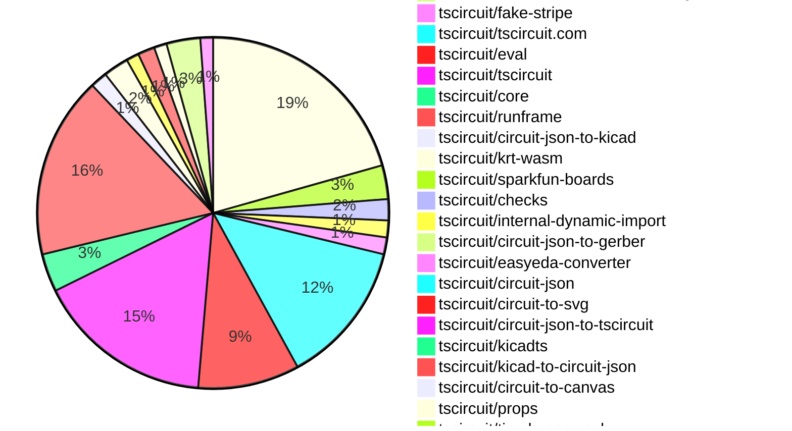

# Contribution Overview 2026-05-12

The current week is shown below. There are 3 major sections:

- [Contributor Overview](#contributor-overview)
- [PRs by Repository](#prs-by-repository)
- [PRs by Contributor](#changes-by-contributor)
- [Scoring & Sponsorship Details](/docs/sponsorship-calculation-explanation.md)

## PRs by Repository

## Contributor Overview

| Contributor | 🐳 Major | 🐙 Minor | 🐌 Tiny | Score | ⭐ | Discussion Contributions |
|-------------|---------|---------|---------|-------|-----|--------------------------|
| [imrishabh18](#imrishabh18) | 9 | 5 | 11 | 58 | ⭐⭐⭐ | 0🔹 0🔶 0💎 |
| [techmannih](#techmannih) | 1 | 11 | 6 | 33 | ⭐⭐ | 0🔹 0🔶 0💎 |
| [mohan-bee](#mohan-bee) | 3 | 7 | 2 | 28 | ⭐⭐ | 0🔹 0🔶 0💎 |
| [MustafaMulla29](#MustafaMulla29) | 3 | 3 | 8 | 27 | ⭐⭐ | 0🔹 1🔶 0💎 |
| [AnasSarkiz](#AnasSarkiz) | 3 | 0 | 6 | 25 | ⭐⭐ | 0🔹 0🔶 0💎 |
| [Abse2001](#Abse2001) | 3 | 1 | 0 | 17 | ⭐⭐ | 0🔹 0🔶 0💎 |
| [tscircuitbot](#tscircuitbot) | 0 | 0 | 181 | 14 | ⭐⭐ | 0🔹 0🔶 0💎 |
| [ShiboSoftwareDev](#ShiboSoftwareDev) | 2 | 2 | 0 | 12 | ⭐⭐ | 0🔹 0🔶 0💎 |
| [Sang-it](#Sang-it) | 1 | 2 | 1 | 9 | ⭐ | 0🔹 0🔶 0💎 |
| [seveibar](#seveibar) | 1 | 0 | 1 | 6 | ⭐ | 1🔹 0🔶 0💎 |
| [0hmX](#0hmX) | 1 | 0 | 0 | 5 | ⭐ | 0🔹 0🔶 0💎 |
| [rushabhcodes](#rushabhcodes) | 0 | 1 | 1 | 4 | ⭐ | 0🔹 0🔶 0💎 |
| [thisisharsh7](#thisisharsh7) | 0 | 1 | 0 | 2 |  | 0🔹 0🔶 0💎 |
| [MestreY0d4-Uninter](#MestreY0d4-Uninter) | 0 | 0 | 0 | 2 |  | 0🔹 1🔶 0💎 |

## Staff Pass Ratio (SPR)

| Contributor | Reviewed PRs | Rejections | Approvals | SPR |
|-------------|--------------|------------|-----------|-----|
| [techmannih](#techmannih) | 10 | 0 | 10 | 100.0% |
| [mohan-bee](#mohan-bee) | 4 | 3 | 4 | 25.0% |
| [ShiboSoftwareDev](#ShiboSoftwareDev) | 4 | 0 | 4 | 100.0% |
| [imrishabh18](#imrishabh18) | 3 | 0 | 3 | 100.0% |
| [MustafaMulla29](#MustafaMulla29) | 3 | 0 | 3 | 100.0% |
| [Sang-it](#Sang-it) | 3 | 0 | 3 | 100.0% |
| [rushabhcodes](#rushabhcodes) | 1 | 0 | 2 | 100.0% |
| [AnasSarkiz](#AnasSarkiz) | 1 | 0 | 1 | 100.0% |
| [thisisharsh7](#thisisharsh7) | 1 | 0 | 1 | 100.0% |

techmannih SPR PRs (10)

- [#583](https://github.com/tscircuit/circuit-json/pull/583) add ccw_rotation to pcb fabrication note text
- [#392](https://github.com/tscircuit/easyeda-converter/pull/392) Handle CircleSchema silkscreen circles in conversion
- [#2306](https://github.com/tscircuit/core/pull/2306) Extract CAD models from library footprint circuit json
- [#2301](https://github.com/tscircuit/core/pull/2301) Fix JLCPCB footprint prefix hint for invalid footprint props
- [#2655](https://github.com/tscircuit/eval/pull/2655) Add JLCPCB footprint library map support
- [#33](https://github.com/tscircuit/circuit-json-to-tscircuit/pull/33) Support all PCB fabrication note elements in footprint conversion
- [#41](https://github.com/tscircuit/kicadts/pull/41) Parse solid fills for graphics
- [#89](https://github.com/tscircuit/kicad-to-circuit-json/pull/89) use typed kicadts zones for copper pours
- [#87](https://github.com/tscircuit/kicad-to-circuit-json/pull/87) Preserve KiCad knockout board text in Circuit JSON
- [#236](https://github.com/tscircuit/circuit-to-canvas/pull/236) Preserve copper knockout text anchor alignment

mohan-bee SPR PRs (4)

- [#147](https://github.com/tscircuit/checks/pull/147) Detect footprint overlap when holes collides with courtyards
- [#149](https://github.com/tscircuit/checks/pull/149) Fix mounting holes inside own courtyard
- [#279](https://github.com/tscircuit/sparkfun-boards/pull/279) Add SparkFun RGB and Gesture Sensor - APDS-9960
- [#264](https://github.com/tscircuit/circuit-json-to-kicad/pull/264) Add Copper Pour Export

ShiboSoftwareDev SPR PRs (4)

- [#2295](https://github.com/tscircuit/core/pull/2295) Fix Arduino Uno region reroute cleanup
- [#2296](https://github.com/tscircuit/core/pull/2296) Fix invalid source trace IDs in region reroute output
- [#1167](https://github.com/tscircuit/tscircuit-autorouter/pull/1167) Fix same-root MST route disconnections in repro117
- [#1168](https://github.com/tscircuit/tscircuit-autorouter/pull/1168) Fix reroute reachability for overlapping target nodes

imrishabh18 SPR PRs (3)

- [#2665](https://github.com/tscircuit/eval/pull/2665) Add unpkg fallback for worker CDN fetch
- [#1178](https://github.com/tscircuit/tscircuit-autorouter/pull/1178) fix: stitch solver disconnecting the bridge fragment of the same root net
- [#88](https://github.com/tscircuit/circuit-json-to-step/pull/88) Dedeup STEP model according to the `model_step_url`

MustafaMulla29 SPR PRs (3)

- [#2297](https://github.com/tscircuit/core/pull/2297) Fix default nominal trace width for krt autorouter routes
- [#89](https://github.com/tscircuit/circuit-json-to-gerber/pull/89) Fix blind vias being emitted in through-board drill output
- [#2674](https://github.com/tscircuit/eval/pull/2674) Use jscdn as Primary CDN and keep jsDelivr as fallback

Sang-it SPR PRs (3)

- [#669](https://github.com/tscircuit/props/pull/669) add nominalTraceWidth field to Net
- [#2294](https://github.com/tscircuit/core/pull/2294) pass missing info to the schematic trace solver
- [#1166](https://github.com/tscircuit/tscircuit-autorouter/pull/1166) add nominalTraceWidth example001

rushabhcodes SPR PRs (1)

- [#560](https://github.com/tscircuit/circuit-to-svg/pull/560) Handle through-pad PCB trace segments in SVG rendering and bounds

AnasSarkiz SPR PRs (1)

- [#35](https://github.com/tscircuit/lbrnts/pull/35) Implement Automatic LightBurn Project Splitting by Cut Setting with Group-Aware Shape Isolation

thisisharsh7 SPR PRs (1)

- [#554](https://github.com/tscircuit/docs/pull/554) Fix blank preview in keyboard tutorial

> Note: AI evaluates PRs and assigns 1-3 star ratings automatically. 4 and 5 star ratings require manual staff review.

### Discussion Contribution Legend

- 🔹 Normal Comments: Basic participation with minimal effort
- 🔶 Great Informative Comments: Thoughtful participation that adds value
- 💎 Incredible Comments: Exceptional participation with high-quality content

## Review Table

[reviews-received-hover]: ## "Number of reviews received for PRs for this contributor"
[approvals-received-hover]: ## "Number of approvals received for PRs this contributor authored"
[rejections-received-hover]: ## "Number of rejections received for PRs this contributor authored"
[prs-opened-hover]: ## "Number of PRs opened by this contributor"
[issues-created-hover]: ## "Number of issues created by this contributor"

| Contributor | Reviews Received | Approvals Received | Rejections Received | Approvals | Rejections Given | PRs Opened | PRs Merged | Issues Created |
|---|---|---|---|---|---|---|---|---|
| [rimi11e](#rimi11e) | 0 | 0 | 0 | 0 | 0 | 1 | 0 | 0 |
| [TodouWisiper](#TodouWisiper) | 0 | 0 | 0 | 0 | 0 | 3 | 0 | 0 |
| [sandliu](#sandliu) | 0 | 0 | 0 | 0 | 0 | 1 | 0 | 0 |
| [Kidkrow12](#Kidkrow12) | 0 | 0 | 0 | 0 | 0 | 3 | 0 | 0 |
| [haocyan0723-code](#haocyan0723-code) | 0 | 0 | 0 | 0 | 0 | 2 | 0 | 0 |
| [dukunline-cyber](#dukunline-cyber) | 0 | 0 | 0 | 0 | 0 | 2 | 0 | 0 |
| [js360000](#js360000) | 0 | 0 | 0 | 0 | 0 | 7 | 0 | 0 |
| [imrishabh18](#imrishabh18) | 4 | 4 | 0 | 9 | 2 | 25 | 25 | 0 |
| [tscircuitbot](#tscircuitbot) | 0 | 0 | 0 | 0 | 0 | 228 | 181 | 0 |
| [minhduytran](#minhduytran) | 0 | 0 | 0 | 0 | 0 | 2 | 0 | 0 |
| [intagold561](#intagold561) | 1 | 0 | 0 | 0 | 0 | 8 | 0 | 0 |
| [seveibar](#seveibar) | 3 | 0 | 0 | 31 | 0 | 8 | 2 | 0 |
| [ma-moon](#ma-moon) | 0 | 0 | 0 | 0 | 0 | 3 | 0 | 0 |
| [gwhthompson](#gwhthompson) | 1 | 0 | 0 | 0 | 0 | 1 | 0 | 0 |
| [tungnguyentu](#tungnguyentu) | 0 | 0 | 0 | 0 | 0 | 21 | 0 | 0 |
| [mohan-bee](#mohan-bee) | 23 | 17 | 2 | 0 | 0 | 15 | 12 | 0 |
| [MustafaMulla29](#MustafaMulla29) | 8 | 7 | 0 | 10 | 1 | 16 | 15 | 0 |
| [techmannih](#techmannih) | 26 | 14 | 0 | 1 | 0 | 23 | 18 | 0 |
| [rushabhcodes](#rushabhcodes) | 7 | 4 | 0 | 1 | 0 | 2 | 2 | 0 |
| [AnasSarkiz](#AnasSarkiz) | 3 | 3 | 0 | 7 | 0 | 9 | 9 | 0 |
| [Abse2001](#Abse2001) | 5 | 5 | 0 | 3 | 0 | 9 | 5 | 0 |
| [Sang-it](#Sang-it) | 3 | 3 | 0 | 0 | 0 | 5 | 4 | 0 |
| [copperwisp](#copperwisp) | 0 | 0 | 0 | 0 | 0 | 2 | 0 | 0 |
| [BossChaos](#BossChaos) | 0 | 0 | 0 | 0 | 0 | 11 | 0 | 0 |
| [CodeForFee](#CodeForFee) | 0 | 0 | 0 | 0 | 0 | 8 | 0 | 0 |
| [ErguLan](#ErguLan) | 0 | 0 | 0 | 0 | 0 | 1 | 0 | 0 |
| [zzhang82](#zzhang82) | 0 | 0 | 0 | 0 | 0 | 2 | 0 | 0 |
| [jynbil1](#jynbil1) | 3 | 0 | 0 | 0 | 0 | 4 | 0 | 0 |
| [UnlimitedxIQ](#UnlimitedxIQ) | 0 | 0 | 0 | 0 | 0 | 1 | 0 | 0 |
| [Guzzzzzzzz](#Guzzzzzzzz) | 0 | 0 | 0 | 0 | 0 | 3 | 0 | 0 |
| [mochammadfarkhan](#mochammadfarkhan) | 0 | 0 | 0 | 0 | 0 | 1 | 0 | 0 |
| [watcharaponthod-code](#watcharaponthod-code) | 0 | 0 | 0 | 0 | 0 | 1 | 0 | 0 |
| [Jam-Ngai](#Jam-Ngai) | 0 | 0 | 0 | 0 | 0 | 1 | 0 | 0 |
| [iota3-cell](#iota3-cell) | 0 | 0 | 0 | 0 | 0 | 1 | 0 | 0 |
| [genson1808](#genson1808) | 0 | 0 | 0 | 0 | 0 | 2 | 0 | 0 |
| [fangzheli](#fangzheli) | 0 | 0 | 0 | 0 | 0 | 1 | 0 | 0 |
| [sureshchouksey8](#sureshchouksey8) | 0 | 0 | 0 | 0 | 0 | 2 | 0 | 0 |
| [starburtMr](#starburtMr) | 0 | 0 | 0 | 0 | 0 | 1 | 0 | 0 |
| [phungkaizen](#phungkaizen) | 1 | 0 | 0 | 0 | 0 | 6 | 0 | 0 |
| [newmattock](#newmattock) | 0 | 0 | 0 | 0 | 0 | 4 | 0 | 0 |
| [isteelfelix](#isteelfelix) | 1 | 0 | 0 | 0 | 0 | 1 | 0 | 0 |
| [colorbank](#colorbank) | 0 | 0 | 0 | 0 | 0 | 10 | 0 | 0 |
| [MestreY0d4-Uninter](#MestreY0d4-Uninter) | 0 | 0 | 0 | 0 | 0 | 1 | 0 | 0 |
| [ShiboSoftwareDev](#ShiboSoftwareDev) | 5 | 5 | 0 | 0 | 0 | 10 | 4 | 0 |
| [0hmX](#0hmX) | 7 | 0 | 0 | 1 | 0 | 9 | 1 | 0 |
| [tytkk2](#tytkk2) | 0 | 0 | 0 | 0 | 0 | 2 | 0 | 0 |
| [singhvishalkr](#singhvishalkr) | 1 | 0 | 1 | 0 | 0 | 5 | 0 | 0 |
| [william08190](#william08190) | 0 | 0 | 0 | 0 | 0 | 2 | 0 | 0 |
| [pon024587-collab](#pon024587-collab) | 0 | 0 | 0 | 0 | 0 | 11 | 0 | 0 |
| [ron1nrest](#ron1nrest) | 0 | 0 | 0 | 0 | 0 | 3 | 0 | 0 |
| [nikkkkj](#nikkkkj) | 0 | 0 | 0 | 0 | 0 | 2 | 0 | 0 |
| [kingzzoov-ctrl](#kingzzoov-ctrl) | 0 | 0 | 0 | 0 | 0 | 1 | 0 | 0 |
| [gshaowei6](#gshaowei6) | 0 | 0 | 0 | 0 | 0 | 2 | 0 | 0 |
| [Gimyoonsoo](#Gimyoonsoo) | 12 | 0 | 0 | 0 | 0 | 45 | 0 | 0 |
| [radiantjade](#radiantjade) | 0 | 0 | 0 | 0 | 0 | 5 | 0 | 0 |
| [felixbeyer99-design](#felixbeyer99-design) | 0 | 0 | 0 | 0 | 0 | 2 | 0 | 0 |
| [MAJINSI](#MAJINSI) | 0 | 0 | 0 | 0 | 0 | 1 | 0 | 0 |
| [Masihhedayati](#Masihhedayati) | 0 | 0 | 0 | 0 | 0 | 2 | 0 | 0 |
| [Arthurescc](#Arthurescc) | 0 | 0 | 0 | 0 | 0 | 1 | 0 | 0 |
| [CalyxNZ](#CalyxNZ) | 4 | 0 | 0 | 0 | 0 | 1 | 0 | 0 |
| [DomDigitalSimple](#DomDigitalSimple) | 0 | 0 | 0 | 0 | 0 | 0 | 0 | 0 |
| [kodokushi444-commits](#kodokushi444-commits) | 0 | 0 | 0 | 0 | 0 | 1 | 0 | 0 |
| [IbrahimLaeeq](#IbrahimLaeeq) | 4 | 0 | 0 | 0 | 0 | 4 | 0 | 0 |
| [haim1120](#haim1120) | 0 | 0 | 0 | 0 | 0 | 27 | 0 | 0 |
| [Minori016](#Minori016) | 0 | 0 | 0 | 0 | 0 | 1 | 0 | 0 |
| [Treasure520520](#Treasure520520) | 0 | 0 | 0 | 0 | 0 | 1 | 0 | 0 |
| [realkoreanbeef](#realkoreanbeef) | 1 | 0 | 0 | 0 | 0 | 4 | 0 | 0 |
| [Mira-Mjodheim](#Mira-Mjodheim) | 0 | 0 | 0 | 0 | 0 | 7 | 0 | 0 |
| [Adysekus](#Adysekus) | 0 | 0 | 0 | 0 | 0 | 1 | 0 | 0 |
| [Donutking20](#Donutking20) | 0 | 0 | 0 | 0 | 0 | 2 | 0 | 0 |
| [himanalot](#himanalot) | 0 | 0 | 0 | 0 | 0 | 1 | 0 | 0 |
| [ethever](#ethever) | 0 | 0 | 0 | 0 | 0 | 1 | 0 | 0 |
| [johnsmith507](#johnsmith507) | 0 | 0 | 0 | 0 | 0 | 1 | 0 | 0 |
| [xXGoziXx](#xXGoziXx) | 0 | 0 | 0 | 0 | 0 | 2 | 0 | 0 |
| [imaanmulji](#imaanmulji) | 0 | 0 | 0 | 0 | 0 | 1 | 0 | 0 |
| [richboyneedcash](#richboyneedcash) | 0 | 0 | 0 | 0 | 0 | 1 | 0 | 0 |
| [Jahrome907](#Jahrome907) | 1 | 0 | 0 | 0 | 0 | 1 | 0 | 0 |
| [JimmiFriborg](#JimmiFriborg) | 0 | 0 | 0 | 0 | 0 | 1 | 0 | 0 |
| [partyplatter08-lab](#partyplatter08-lab) | 0 | 0 | 0 | 0 | 0 | 2 | 0 | 0 |
| [dennywu2966](#dennywu2966) | 0 | 0 | 0 | 0 | 0 | 1 | 0 | 0 |
| [zaixincheng174-ai](#zaixincheng174-ai) | 1 | 0 | 0 | 0 | 0 | 1 | 0 | 0 |
| [raunaqsingh](#raunaqsingh) | 0 | 0 | 0 | 0 | 0 | 2 | 0 | 0 |
| [jorgeschulz](#jorgeschulz) | 0 | 0 | 0 | 0 | 0 | 3 | 0 | 0 |
| [lasgg](#lasgg) | 0 | 0 | 0 | 0 | 0 | 2 | 0 | 0 |
| [joel777rubio-web](#joel777rubio-web) | 0 | 0 | 0 | 0 | 0 | 1 | 0 | 0 |
| [qunqin219](#qunqin219) | 0 | 0 | 0 | 0 | 0 | 2 | 0 | 0 |
| [mdp28](#mdp28) | 0 | 0 | 0 | 0 | 0 | 1 | 0 | 0 |
| [0xdungki](#0xdungki) | 0 | 0 | 0 | 0 | 0 | 1 | 0 | 0 |
| [pnm03](#pnm03) | 0 | 0 | 0 | 0 | 0 | 2 | 0 | 0 |
| [jamilahmadzai](#jamilahmadzai) | 0 | 0 | 0 | 0 | 0 | 1 | 0 | 0 |
| [SkinnyFatBoy05](#SkinnyFatBoy05) | 0 | 0 | 0 | 0 | 0 | 4 | 0 | 0 |
| [snidova1](#snidova1) | 0 | 0 | 0 | 0 | 0 | 1 | 0 | 0 |
| [SUNNY-Fu-ai](#SUNNY-Fu-ai) | 0 | 0 | 0 | 0 | 0 | 2 | 0 | 0 |
| [nicovaleops](#nicovaleops) | 1 | 0 | 0 | 0 | 0 | 2 | 0 | 0 |
| [Sparvovic](#Sparvovic) | 0 | 0 | 0 | 0 | 0 | 1 | 0 | 0 |
| [adminlip](#adminlip) | 0 | 0 | 0 | 0 | 0 | 5 | 0 | 0 |
| [thisismyburner](#thisismyburner) | 0 | 0 | 0 | 0 | 0 | 1 | 0 | 0 |
| [bmoh95](#bmoh95) | 0 | 0 | 0 | 0 | 0 | 1 | 0 | 0 |
| [mercanet](#mercanet) | 0 | 0 | 0 | 0 | 0 | 1 | 0 | 0 |
| [8npyvz5bd8-lang](#8npyvz5bd8-lang) | 0 | 0 | 0 | 0 | 0 | 1 | 0 | 0 |
| [FJ-CX](#FJ-CX) | 0 | 0 | 0 | 0 | 0 | 1 | 0 | 0 |
| [zeppnyc](#zeppnyc) | 0 | 0 | 0 | 0 | 0 | 1 | 0 | 0 |
| [sagarmaurya64-ai](#sagarmaurya64-ai) | 0 | 0 | 0 | 0 | 0 | 1 | 0 | 0 |
| [Bilal-Lodhi](#Bilal-Lodhi) | 4 | 0 | 0 | 0 | 0 | 4 | 0 | 0 |
| [authenticarc](#authenticarc) | 0 | 0 | 0 | 0 | 0 | 1 | 0 | 0 |
| [jswagbo](#jswagbo) | 0 | 0 | 0 | 0 | 0 | 1 | 0 | 0 |
| [time-turner42](#time-turner42) | 0 | 0 | 0 | 0 | 0 | 1 | 0 | 0 |
| [arias-hooks](#arias-hooks) | 0 | 0 | 0 | 0 | 0 | 1 | 0 | 0 |
| [siyrs](#siyrs) | 0 | 0 | 0 | 0 | 0 | 1 | 0 | 0 |
| [vinaykrsinghal-stage](#vinaykrsinghal-stage) | 0 | 0 | 0 | 0 | 0 | 2 | 0 | 0 |
| [strongkeep-debug](#strongkeep-debug) | 0 | 0 | 0 | 0 | 0 | 1 | 0 | 0 |
| [JohnChen034](#JohnChen034) | 0 | 0 | 0 | 0 | 0 | 1 | 0 | 0 |
| [epowell40](#epowell40) | 0 | 0 | 0 | 0 | 0 | 1 | 0 | 0 |
| [lumenghz](#lumenghz) | 0 | 0 | 0 | 0 | 0 | 1 | 0 | 0 |
| [siiferdiiii](#siiferdiiii) | 0 | 0 | 0 | 0 | 0 | 1 | 0 | 0 |
| [dktran5105](#dktran5105) | 0 | 0 | 0 | 0 | 0 | 1 | 0 | 0 |
| [21nak](#21nak) | 0 | 0 | 0 | 0 | 0 | 1 | 0 | 0 |
| [digzrow-coder](#digzrow-coder) | 0 | 0 | 0 | 0 | 0 | 3 | 0 | 0 |
| [yyswhsccc](#yyswhsccc) | 0 | 0 | 0 | 0 | 0 | 2 | 0 | 0 |
| [FeeeeelixWong](#FeeeeelixWong) | 0 | 0 | 0 | 0 | 0 | 2 | 0 | 0 |
| [foxhub2020](#foxhub2020) | 0 | 0 | 0 | 0 | 0 | 1 | 0 | 0 |
| [KarlZhu-ZXC](#KarlZhu-ZXC) | 0 | 0 | 0 | 0 | 0 | 1 | 0 | 0 |
| [lyd123qw2008](#lyd123qw2008) | 0 | 0 | 0 | 0 | 0 | 1 | 0 | 0 |
| [albercr3](#albercr3) | 0 | 0 | 0 | 0 | 0 | 7 | 0 | 0 |
| [alan747271363-art](#alan747271363-art) | 0 | 0 | 0 | 0 | 0 | 1 | 0 | 0 |
| [yusufdalbudak](#yusufdalbudak) | 0 | 0 | 0 | 0 | 0 | 2 | 0 | 0 |
| [ramrap](#ramrap) | 0 | 0 | 0 | 0 | 0 | 1 | 0 | 0 |
| [tmchang1258](#tmchang1258) | 0 | 0 | 0 | 0 | 0 | 1 | 0 | 0 |
| [serendipitous-syntax](#serendipitous-syntax) | 0 | 0 | 0 | 0 | 0 | 1 | 0 | 0 |
| [kenproxx](#kenproxx) | 0 | 0 | 0 | 0 | 0 | 1 | 0 | 0 |
| [MNgaminhhh](#MNgaminhhh) | 0 | 0 | 0 | 0 | 0 | 1 | 0 | 0 |
| [Mermaid-Man](#Mermaid-Man) | 0 | 0 | 0 | 0 | 0 | 1 | 0 | 0 |
| [TsukinowaRin](#TsukinowaRin) | 0 | 0 | 0 | 0 | 0 | 1 | 0 | 0 |
| [douglasflysuper01-cell](#douglasflysuper01-cell) | 0 | 0 | 0 | 0 | 0 | 1 | 0 | 0 |
| [TheWaste11202](#TheWaste11202) | 0 | 0 | 0 | 0 | 0 | 7 | 0 | 0 |
| [suhail-ak-2](#suhail-ak-2) | 0 | 0 | 0 | 0 | 0 | 6 | 0 | 0 |
| [Serve63](#Serve63) | 0 | 0 | 0 | 0 | 0 | 1 | 0 | 0 |
| [nam27062002](#nam27062002) | 0 | 0 | 0 | 0 | 0 | 6 | 0 | 0 |
| [xlocalvn-svg](#xlocalvn-svg) | 0 | 0 | 0 | 0 | 0 | 1 | 0 | 0 |
| [GabrielSotto](#GabrielSotto) | 0 | 0 | 0 | 0 | 0 | 1 | 0 | 0 |
| [trucnhandeptrai2025-creator](#trucnhandeptrai2025-creator) | 0 | 0 | 0 | 0 | 0 | 1 | 0 | 0 |
| [andyphp](#andyphp) | 0 | 0 | 0 | 0 | 0 | 1 | 0 | 0 |
| [Vinzz2303](#Vinzz2303) | 0 | 0 | 0 | 0 | 0 | 2 | 0 | 0 |
| [autochamchikim-pixel](#autochamchikim-pixel) | 0 | 0 | 0 | 0 | 0 | 3 | 0 | 0 |
| [masuda-so](#masuda-so) | 0 | 0 | 0 | 0 | 0 | 1 | 0 | 0 |
| [qjly421](#qjly421) | 0 | 0 | 0 | 0 | 0 | 1 | 0 | 0 |
| [tarunag10](#tarunag10) | 1 | 0 | 0 | 0 | 0 | 1 | 0 | 0 |
| [AmanKishore](#AmanKishore) | 1 | 0 | 0 | 0 | 0 | 1 | 0 | 0 |
| [federicoschermi](#federicoschermi) | 0 | 0 | 0 | 0 | 0 | 1 | 0 | 0 |
| [mushfique-dgist](#mushfique-dgist) | 1 | 0 | 0 | 0 | 0 | 1 | 0 | 0 |
| [Two-wood-three-soil](#Two-wood-three-soil) | 0 | 0 | 0 | 0 | 0 | 1 | 0 | 0 |
| [thisisharsh7](#thisisharsh7) | 2 | 1 | 0 | 0 | 0 | 1 | 1 | 0 |
| [zp6](#zp6) | 0 | 0 | 0 | 0 | 0 | 6 | 0 | 0 |
| [pxtung299-bot](#pxtung299-bot) | 0 | 0 | 0 | 0 | 0 | 1 | 0 | 0 |
| [iamdinhthuan](#iamdinhthuan) | 0 | 0 | 0 | 0 | 0 | 1 | 0 | 0 |
| [prokesmic](#prokesmic) | 0 | 0 | 0 | 0 | 0 | 1 | 0 | 0 |
| [RYB-404](#RYB-404) | 0 | 0 | 0 | 0 | 0 | 1 | 0 | 0 |
| [Munirubenz](#Munirubenz) | 0 | 0 | 0 | 0 | 0 | 1 | 0 | 0 |
| [lezebomb](#lezebomb) | 0 | 0 | 0 | 0 | 0 | 1 | 0 | 0 |
| [Havarry](#Havarry) | 0 | 0 | 0 | 0 | 0 | 1 | 0 | 0 |
| [BuckyQ](#BuckyQ) | 0 | 0 | 0 | 0 | 0 | 1 | 0 | 0 |
| [mithustar39](#mithustar39) | 0 | 0 | 0 | 0 | 0 | 1 | 0 | 0 |
| [Sinceretoad](#Sinceretoad) | 1 | 0 | 0 | 0 | 0 | 1 | 0 | 0 |
| [chenchong0215](#chenchong0215) | 0 | 0 | 0 | 0 | 0 | 1 | 0 | 0 |
| [Chaos-among-us](#Chaos-among-us) | 0 | 0 | 0 | 0 | 0 | 1 | 0 | 0 |
| [theRadicalSoftware](#theRadicalSoftware) | 0 | 0 | 0 | 0 | 0 | 1 | 0 | 0 |
| [ArtemisMoysen](#ArtemisMoysen) | 1 | 0 | 0 | 0 | 0 | 1 | 0 | 0 |
| [Dannier314](#Dannier314) | 0 | 0 | 0 | 0 | 0 | 1 | 0 | 0 |
| [s53zo](#s53zo) | 1 | 0 | 0 | 0 | 0 | 1 | 0 | 0 |
| [IssacDanny](#IssacDanny) | 0 | 0 | 0 | 0 | 0 | 1 | 0 | 0 |

## Changes by Repository

### [tscircuit/pcb-viewer](https://github.com/tscircuit/pcb-viewer)

| PR # | Impact | Rating | Contributor | Description |
|------|--------|--------|-------------|-------------|
| [#864](https://github.com/tscircuit/pcb-viewer/pull/864) | 🐳 Major | ⭐⭐⭐ | imrishabh18 | Adds a new tool called Bounds that allows users to drag a rectangle around the view and select bounds, providing a callback with the selected coordinates. |

🐌 Tiny Contributions (1)

| PR # | Impact | Contributor | Description |
|------|--------|-------------|-------------|
| [#865](https://github.com/tscircuit/pcb-viewer/pull/865) | 🐌 Tiny | tscircuitbot | Automated package update |

### [tscircuit/cli](https://github.com/tscircuit/cli)

| PR # | Impact | Rating | Contributor | Description |
|------|--------|--------|-------------|-------------|
| [#3019](https://github.com/tscircuit/cli/pull/3019) | 🐳 Major | ⭐⭐⭐ | imrishabh18 | Adds concurrency support for generating STEP files from circuit JSON, allowing multiple files to be processed simultaneously. |
| [#3044](https://github.com/tscircuit/cli/pull/3044) | 🐙 Minor | ⭐⭐ | mohan-bee | Refactors the 3D model file handling in the KiCad project generation process to use a new utility function for improved loading and error handling. |
| [#3058](https://github.com/tscircuit/cli/pull/3058) | 🐙 Minor | ⭐⭐ | mohan-bee | Refactors the handling of 3D model files by replacing manual fetching and copying with a centralized function for loading 3D models in KiCad libraries. |

🐌 Tiny Contributions (50)

| PR # | Impact | Contributor | Description |
|------|--------|-------------|-------------|
| [#3039](https://github.com/tscircuit/cli/pull/3039) | 🐌 Tiny | imrishabh18 | Updates the circuit-json-to-step dependency to version 0.0.32, resulting in a reduction of the file size of the generated step. |
| [#3028](https://github.com/tscircuit/cli/pull/3028) | 🐌 Tiny | imrishabh18 | Updates the circuit-json-to-step dependency from version 0.0.28 to 0.0.30 in package.json |
| [#3067](https://github.com/tscircuit/cli/pull/3067) | 🐌 Tiny | tscircuitbot | Automated package update |
| [#3066](https://github.com/tscircuit/cli/pull/3066) | 🐌 Tiny | tscircuitbot | Updates the tscircuitrunframe package from version 0.0.1971 to 0.0.1972 |
| [#3065](https://github.com/tscircuit/cli/pull/3065) | 🐌 Tiny | tscircuitbot | Automated package update |
| [#3047](https://github.com/tscircuit/cli/pull/3047) | 🐌 Tiny | tscircuitbot | Updates the tscircuitrunframe package from version 0.0.1964 to 0.0.1965 |
| [#3020](https://github.com/tscircuit/cli/pull/3020) | 🐌 Tiny | tscircuitbot | Automated package update |
| [#3037](https://github.com/tscircuit/cli/pull/3037) | 🐌 Tiny | tscircuitbot | Updates the tscircuitrunframe package from version 0.0.1962 to 0.0.1963 |
| [#3027](https://github.com/tscircuit/cli/pull/3027) | 🐌 Tiny | tscircuitbot | Automated package update |
| [#3033](https://github.com/tscircuit/cli/pull/3033) | 🐌 Tiny | tscircuitbot | Updates the tscircuitrunframe package from version 0.0.1959 to 0.0.1961 |
| [#3015](https://github.com/tscircuit/cli/pull/3015) | 🐌 Tiny | tscircuitbot | Updates the tscircuitrunframe package from version 0.0.1953 to 0.0.1954 |
| [#3018](https://github.com/tscircuit/cli/pull/3018) | 🐌 Tiny | tscircuitbot | Automated package update |
| [#3057](https://github.com/tscircuit/cli/pull/3057) | 🐌 Tiny | tscircuitbot | Automated package update |
| [#3054](https://github.com/tscircuit/cli/pull/3054) | 🐌 Tiny | tscircuitbot | Automated package update |
| [#3056](https://github.com/tscircuit/cli/pull/3056) | 🐌 Tiny | tscircuitbot | Automated package update for tscircuitrunframe from version 0.0.1968 to 0.0.1969 |
| [#3052](https://github.com/tscircuit/cli/pull/3052) | 🐌 Tiny | tscircuitbot | Automated package update |
| [#3024](https://github.com/tscircuit/cli/pull/3024) | 🐌 Tiny | tscircuitbot | Updates the tscircuitrunframe package to version 0.0.1958 |
| [#3025](https://github.com/tscircuit/cli/pull/3025) | 🐌 Tiny | tscircuitbot | Automated package update |
| [#3010](https://github.com/tscircuit/cli/pull/3010) | 🐌 Tiny | tscircuitbot | Updates the tscircuitrunframe package to version 0.0.1951 in the package.json file. |
| [#3043](https://github.com/tscircuit/cli/pull/3043) | 🐌 Tiny | tscircuitbot | Automated package update |
| [#3036](https://github.com/tscircuit/cli/pull/3036) | 🐌 Tiny | tscircuitbot | Automated package update |
| [#3014](https://github.com/tscircuit/cli/pull/3014) | 🐌 Tiny | tscircuitbot | Automated package update |
| [#3017](https://github.com/tscircuit/cli/pull/3017) | 🐌 Tiny | tscircuitbot | Updates the tscircuitrunframe package from version 0.0.1954 to 0.0.1955 |
| [#3030](https://github.com/tscircuit/cli/pull/3030) | 🐌 Tiny | tscircuitbot | Automated package update |
| [#3022](https://github.com/tscircuit/cli/pull/3022) | 🐌 Tiny | tscircuitbot | Updates the tscircuitrunframe package version from 0.0.1955 to 0.0.1957 in package.json |
| [#3062](https://github.com/tscircuit/cli/pull/3062) | 🐌 Tiny | tscircuitbot | Updates the tscircuitrunframe package version from 0.0.1970 to 0.0.1971 in package.json |
| [#3051](https://github.com/tscircuit/cli/pull/3051) | 🐌 Tiny | tscircuitbot | Updates the tscircuitrunframe package from version 0.0.1966 to 0.0.1967 in the package.json file. |
| [#3032](https://github.com/tscircuit/cli/pull/3032) | 🐌 Tiny | tscircuitbot | Automated package update |
| [#3049](https://github.com/tscircuit/cli/pull/3049) | 🐌 Tiny | tscircuitbot | Updates the tscircuitrunframe package from version 0.0.1965 to 0.0.1966 |
| [#3059](https://github.com/tscircuit/cli/pull/3059) | 🐌 Tiny | tscircuitbot | Updates the tscircuitrunframe package from version 0.0.1969 to 0.0.1970 |
| [#3013](https://github.com/tscircuit/cli/pull/3013) | 🐌 Tiny | tscircuitbot | Updates the tscircuitrunframe package from version 0.0.1951 to 0.0.1953 |
| [#3045](https://github.com/tscircuit/cli/pull/3045) | 🐌 Tiny | tscircuitbot | Updates the tscircuitrunframe package from version 0.0.1963 to 0.0.1964 |
| [#3016](https://github.com/tscircuit/cli/pull/3016) | 🐌 Tiny | tscircuitbot | Automated package update |
| [#3060](https://github.com/tscircuit/cli/pull/3060) | 🐌 Tiny | tscircuitbot | Automated package update |
| [#3029](https://github.com/tscircuit/cli/pull/3029) | 🐌 Tiny | tscircuitbot | Automated README update with latest CLI usage output. |
| [#3061](https://github.com/tscircuit/cli/pull/3061) | 🐌 Tiny | tscircuitbot | Automated package update |
| [#3023](https://github.com/tscircuit/cli/pull/3023) | 🐌 Tiny | tscircuitbot | Automated package update |
| [#3046](https://github.com/tscircuit/cli/pull/3046) | 🐌 Tiny | tscircuitbot | Automated package update |
| [#3026](https://github.com/tscircuit/cli/pull/3026) | 🐌 Tiny | tscircuitbot | Automated package update |
| [#3042](https://github.com/tscircuit/cli/pull/3042) | 🐌 Tiny | tscircuitbot | Automated README update with latest CLI usage output. |
| [#3034](https://github.com/tscircuit/cli/pull/3034) | 🐌 Tiny | tscircuitbot | Automated package update |
| [#3038](https://github.com/tscircuit/cli/pull/3038) | 🐌 Tiny | tscircuitbot | Automated package update |
| [#3055](https://github.com/tscircuit/cli/pull/3055) | 🐌 Tiny | tscircuitbot | Automated package update |
| [#3050](https://github.com/tscircuit/cli/pull/3050) | 🐌 Tiny | tscircuitbot | Automated package update |
| [#3063](https://github.com/tscircuit/cli/pull/3063) | 🐌 Tiny | tscircuitbot | Automated package update |
| [#3048](https://github.com/tscircuit/cli/pull/3048) | 🐌 Tiny | tscircuitbot | Automated package update |
| [#3041](https://github.com/tscircuit/cli/pull/3041) | 🐌 Tiny | tscircuitbot | Automated package update |
| [#3035](https://github.com/tscircuit/cli/pull/3035) | 🐌 Tiny | tscircuitbot | Automated package update |
| [#3031](https://github.com/tscircuit/cli/pull/3031) | 🐌 Tiny | techmannih | Updates the easyeda dependency version from 0.0.258 to 0.0.269 in package.json |
| [#3064](https://github.com/tscircuit/cli/pull/3064) | 🐌 Tiny | Sang-it | Updates the dependency version of tscircuitcircuit-json-schematic-placement-analysis in package.json |

### [tscircuit/tscircuit-autorouter](https://github.com/tscircuit/tscircuit-autorouter)

| PR # | Impact | Rating | Contributor | Description |
|------|--------|--------|-------------|-------------|
| [#1178](https://github.com/tscircuit/tscircuit-autorouter/pull/1178) | 🐳 Major | ⭐⭐⭐ | imrishabh18 | Fixes the issue where the stitch solver disconnects the bridge fragment of the same root net during autorouting. |
| [#1173](https://github.com/tscircuit/tscircuit-autorouter/pull/1173) | 🐳 Major | ⭐⭐⭐ | ShiboSoftwareDev | Fixes reroute reachability for overlapping same-layer target nodes in the capacity mesh, ensuring reroute endpoints embedded in padtarget copper are reachable by the tiny-hypergraph pathing stage. |
| [#1167](https://github.com/tscircuit/tscircuit-autorouter/pull/1167) | 🐳 Major | ⭐⭐⭐ | ShiboSoftwareDev | Repairs disconnected intra-node route fragments when a same-root MST sibling already contains the missing local bridge, preserving connectivity for cases like cmn_68 in repro117. |
| [#1163](https://github.com/tscircuit/tscircuit-autorouter/pull/1163) | 🐳 Major | ⭐⭐⭐ | 0hmX | Adds a solver that detects rectangular component areas and treats them as small SRJs for separate solving, enhancing the component detection process. |
| [#1166](https://github.com/tscircuit/tscircuit-autorouter/pull/1166) | 🐙 Minor | ⭐⭐ | Sang-it | Adds functionality to annotate nominal trace widths in graphics based on connection specifications, enhancing visual representation in autorouting. |

🐌 Tiny Contributions (3)

| PR # | Impact | Contributor | Description |
|------|--------|-------------|-------------|
| [#1180](https://github.com/tscircuit/tscircuit-autorouter/pull/1180) | 🐌 Tiny | tscircuitbot | Automated package update |
| [#1177](https://github.com/tscircuit/tscircuit-autorouter/pull/1177) | 🐌 Tiny | tscircuitbot | Automated package update |
| [#1170](https://github.com/tscircuit/tscircuit-autorouter/pull/1170) | 🐌 Tiny | tscircuitbot | Automated package update |

### [tscircuit/circuit-json-to-step](https://github.com/tscircuit/circuit-json-to-step)

| PR # | Impact | Rating | Contributor | Description |
|------|--------|--------|-------------|-------------|
| [#90](https://github.com/tscircuit/circuit-json-to-step/pull/90) | 🐳 Major | ⭐⭐⭐ | imrishabh18 | Implements shared hole geometry for top and bottom layers, reducing the file size by optimizing the representation of holes in the circuit design. |
| [#92](https://github.com/tscircuit/circuit-json-to-step/pull/92) | 🐳 Major | ⭐⭐⭐ | imrishabh18 | Reduces file size by reusing pill boundary vertices at segment joins instead of creating duplicate vertices for each arc or line. |
| [#88](https://github.com/tscircuit/circuit-json-to-step/pull/88) | 🐙 Minor | ⭐⭐ | imrishabh18 | Fixes the issue where the geometry is stored once and each component placement references it, leading to loss of face-level STYLED_ITEM colors in the test snapshot. |

🐌 Tiny Contributions (2)

| PR # | Impact | Contributor | Description |
|------|--------|-------------|-------------|
| [#93](https://github.com/tscircuit/circuit-json-to-step/pull/93) | 🐌 Tiny | tscircuitbot | Automated package update |
| [#91](https://github.com/tscircuit/circuit-json-to-step/pull/91) | 🐌 Tiny | tscircuitbot | Automated package update |

### [tscircuit/order-dialog](https://github.com/tscircuit/order-dialog)

| PR # | Impact | Rating | Contributor | Description |
|------|--------|--------|-------------|-------------|
| [#2](https://github.com/tscircuit/order-dialog/pull/2) | 🐳 Major | ⭐⭐⭐ | imrishabh18 | Removes the shipping and payment sections from the order dialog and refactors the code by splitting it into smaller components. |
| [#3](https://github.com/tscircuit/order-dialog/pull/3) | 🐳 Major | ⭐⭐⭐ | imrishabh18 | This pull request integrates a fake Stripe server into the order checkout process, allowing for simulated payment processing during development. It adds a new script for running the fake Stripe server and modifies the order dialog to utilize this server for checkout sessions. |
| [#4](https://github.com/tscircuit/order-dialog/pull/4) | 🐙 Minor | ⭐⭐ | imrishabh18 | Adds support for using fake-stripe with winterspec for local development, enabling mock Stripe API interactions. |

🐌 Tiny Contributions (1)

| PR # | Impact | Contributor | Description |
|------|--------|-------------|-------------|
| [#5](https://github.com/tscircuit/order-dialog/pull/5) | 🐌 Tiny | imrishabh18 | Removes unnecessary configuration files and scripts from the project, streamlining the build process. |

### [tscircuit/arduino-uno-with-re-routing-demo](https://github.com/tscircuit/arduino-uno-with-re-routing-demo)

| PR # | Impact | Rating | Contributor | Description |
|------|--------|--------|-------------|-------------|
| [#1](https://github.com/tscircuit/arduino-uno-with-re-routing-demo/pull/1) | 🐳 Major | ⭐⭐⭐ | imrishabh18 | Adds functionality to upload a KiCad PCB file, allowing users to dynamically change the board being used in the application. |

### [tscircuit/fake-stripe](https://github.com/tscircuit/fake-stripe)

| PR # | Impact | Rating | Contributor | Description |
|------|--------|--------|-------------|-------------|
| [#4](https://github.com/tscircuit/fake-stripe/pull/4) | 🐳 Major | ⭐⭐⭐ | imrishabh18 | Refactors routing logic to utilize the Winterspec framework, enhancing the structure and maintainability of the routing code. |
| [#3](https://github.com/tscircuit/fake-stripe/pull/3) | 🐙 Minor | ⭐⭐ | imrishabh18 | Adds a hosted checkout page for simulating Stripe checkout sessions, including routes for creating, retrieving, and completing sessions. |

🐌 Tiny Contributions (2)

| PR # | Impact | Contributor | Description |
|------|--------|-------------|-------------|
| [#1](https://github.com/tscircuit/fake-stripe/pull/1) | 🐌 Tiny | imrishabh18 | Sets up a Bun-based server for a fake Stripe API, implementing checkout session functionalities including creation and retrieval of sessions. |
| [#2](https://github.com/tscircuit/fake-stripe/pull/2) | 🐌 Tiny | imrishabh18 | Removes the use of crypto UUID for generating payment intent IDs and separates endpoint handling into distinct files for better organization. |

### [tscircuit/tscircuit.com](https://github.com/tscircuit/tscircuit.com)

| PR # | Impact | Rating | Contributor | Description |
|------|--------|--------|-------------|-------------|
| [#3421](https://github.com/tscircuit/tscircuit.com/pull/3421) | 🐳 Major | ⭐⭐⭐ | mohan-bee | Updates the KiCad project build path to use resolveAndLoadKicad3dModelFiles from circuit-json-to-kicad0.0.137, ensuring 3D model assets are included in project exports for a self-contained ZIP file. |
| [#3445](https://github.com/tscircuit/tscircuit.com/pull/3445) | 🐙 Minor | ⭐⭐ | imrishabh18 | Integrates the fake-stripe library for simulating Stripe checkout sessions in the development environment. |

🐌 Tiny Contributions (32)

| PR # | Impact | Contributor | Description |
|------|--------|-------------|-------------|
| [#3438](https://github.com/tscircuit/tscircuit.com/pull/3438) | 🐌 Tiny | imrishabh18 | Applies CSS style fixes to the order dialog component, including background and z-index adjustments. |
| [#3444](https://github.com/tscircuit/tscircuit.com/pull/3444) | 🐌 Tiny | tscircuitbot | Automated package update |
| [#3409](https://github.com/tscircuit/tscircuit.com/pull/3409) | 🐌 Tiny | tscircuitbot | Updates the tscircuiteval package from version 0.0.839 to 0.0.840 |
| [#3410](https://github.com/tscircuit/tscircuit.com/pull/3410) | 🐌 Tiny | tscircuitbot | Updates the tscircuitrunframe package to version 0.0.1951 |
| [#3416](https://github.com/tscircuit/tscircuit.com/pull/3416) | 🐌 Tiny | tscircuitbot | Automated package update |
| [#3441](https://github.com/tscircuit/tscircuit.com/pull/3441) | 🐌 Tiny | tscircuitbot | Updates the tscircuitrunframe package from version 0.0.1969 to 0.0.1970 |
| [#3443](https://github.com/tscircuit/tscircuit.com/pull/3443) | 🐌 Tiny | tscircuitbot | Automated package update |
| [#3434](https://github.com/tscircuit/tscircuit.com/pull/3434) | 🐌 Tiny | tscircuitbot | Automated package update |
| [#3436](https://github.com/tscircuit/tscircuit.com/pull/3436) | 🐌 Tiny | tscircuitbot | Updates the tscircuiteval package to version 0.0.849 in the package.json file. |
| [#3429](https://github.com/tscircuit/tscircuit.com/pull/3429) | 🐌 Tiny | tscircuitbot | Updates the tscircuitrunframe package from version 0.0.1963 to 0.0.1964 |
| [#3420](https://github.com/tscircuit/tscircuit.com/pull/3420) | 🐌 Tiny | tscircuitbot | Automated package update |
| [#3431](https://github.com/tscircuit/tscircuit.com/pull/3431) | 🐌 Tiny | tscircuitbot | Automated package update |
| [#3415](https://github.com/tscircuit/tscircuit.com/pull/3415) | 🐌 Tiny | tscircuitbot | Automated package update |
| [#3428](https://github.com/tscircuit/tscircuit.com/pull/3428) | 🐌 Tiny | tscircuitbot | Updates the tscircuitrunframe package from version 0.0.1962 to 0.0.1963 |
| [#3440](https://github.com/tscircuit/tscircuit.com/pull/3440) | 🐌 Tiny | tscircuitbot | Updates the tscircuiteval package to version 0.0.850 in package.json |
| [#3430](https://github.com/tscircuit/tscircuit.com/pull/3430) | 🐌 Tiny | tscircuitbot | Automated package update |
| [#3418](https://github.com/tscircuit/tscircuit.com/pull/3418) | 🐌 Tiny | tscircuitbot | Automated package update |
| [#3413](https://github.com/tscircuit/tscircuit.com/pull/3413) | 🐌 Tiny | tscircuitbot | Automated package update |
| [#3423](https://github.com/tscircuit/tscircuit.com/pull/3423) | 🐌 Tiny | tscircuitbot | Updates the tscircuiteval package to version 0.0.845 in the package.json file. |
| [#3427](https://github.com/tscircuit/tscircuit.com/pull/3427) | 🐌 Tiny | tscircuitbot | Automated package update |
| [#3422](https://github.com/tscircuit/tscircuit.com/pull/3422) | 🐌 Tiny | tscircuitbot | Updates the tscircuitrunframe package to version 0.0.1958 in package.json |
| [#3424](https://github.com/tscircuit/tscircuit.com/pull/3424) | 🐌 Tiny | tscircuitbot | Updates the tscircuitrunframe package to version 0.0.1959 |
| [#3417](https://github.com/tscircuit/tscircuit.com/pull/3417) | 🐌 Tiny | tscircuitbot | Automated package update |
| [#3419](https://github.com/tscircuit/tscircuit.com/pull/3419) | 🐌 Tiny | tscircuitbot | Automated package update |
| [#3432](https://github.com/tscircuit/tscircuit.com/pull/3432) | 🐌 Tiny | tscircuitbot | Updates the tscircuitrunframe package to version 0.0.1966 in package.json |
| [#3439](https://github.com/tscircuit/tscircuit.com/pull/3439) | 🐌 Tiny | tscircuitbot | Updates the tscircuitrunframe package to version 0.0.1969 |
| [#3437](https://github.com/tscircuit/tscircuit.com/pull/3437) | 🐌 Tiny | tscircuitbot | Updates the tscircuitrunframe package from version 0.0.1967 to 0.0.1968 |
| [#3411](https://github.com/tscircuit/tscircuit.com/pull/3411) | 🐌 Tiny | tscircuitbot | Automated package update |
| [#3425](https://github.com/tscircuit/tscircuit.com/pull/3425) | 🐌 Tiny | tscircuitbot | Updates the tscircuiteval package to version 0.0.846 in the package.json file. |
| [#3433](https://github.com/tscircuit/tscircuit.com/pull/3433) | 🐌 Tiny | tscircuitbot | Automated package update |
| [#3442](https://github.com/tscircuit/tscircuit.com/pull/3442) | 🐌 Tiny | tscircuitbot | Automated package update for tscircuiteval from version 0.0.850 to 0.0.851 |
| [#3414](https://github.com/tscircuit/tscircuit.com/pull/3414) | 🐌 Tiny | tscircuitbot | Updates the tscircuitrunframe package from version 0.0.1951 to 0.0.1953 |

### [tscircuit/eval](https://github.com/tscircuit/eval)

| PR # | Impact | Rating | Contributor | Description |
|------|--------|--------|-------------|-------------|
| [#2665](https://github.com/tscircuit/eval/pull/2665) | 🐙 Minor | ⭐⭐ | imrishabh18 | Add a fallback mechanism for loading webworker entrypoints from an alternative CDN when the primary jsDelivr URL fails or returns a non-OK response. |
| [#2674](https://github.com/tscircuit/eval/pull/2674) | 🐙 Minor | ⭐⭐ | MustafaMulla29 | Changes the primary CDN for loading npm packages from jsDelivr to jscdn, with jsDelivr as a fallback option. |
| [#2655](https://github.com/tscircuit/eval/pull/2655) | 🐙 Minor | ⭐⭐ | techmannih | Adds support for fetching and rendering JLCPCB footprint data in the platform configuration. |

🐌 Tiny Contributions (21)

| PR # | Impact | Contributor | Description |
|------|--------|-------------|-------------|
| [#2678](https://github.com/tscircuit/eval/pull/2678) | 🐌 Tiny | tscircuitbot | Automated package update |
| [#2669](https://github.com/tscircuit/eval/pull/2669) | 🐌 Tiny | tscircuitbot | Automated package update |
| [#2677](https://github.com/tscircuit/eval/pull/2677) | 🐌 Tiny | tscircuitbot | Automated package update |
| [#2685](https://github.com/tscircuit/eval/pull/2685) | 🐌 Tiny | tscircuitbot | Updates the version of the tscircuitcore package from 0.0.1251 to 0.0.1252 in package.json |
| [#2682](https://github.com/tscircuit/eval/pull/2682) | 🐌 Tiny | tscircuitbot | Updates package versions in package.json to the latest compatible versions. |
| [#2686](https://github.com/tscircuit/eval/pull/2686) | 🐌 Tiny | tscircuitbot | Automated package update |
| [#2694](https://github.com/tscircuit/eval/pull/2694) | 🐌 Tiny | tscircuitbot | Automated package update |
| [#2689](https://github.com/tscircuit/eval/pull/2689) | 🐌 Tiny | tscircuitbot | Automated package update |
| [#2672](https://github.com/tscircuit/eval/pull/2672) | 🐌 Tiny | tscircuitbot | Automated package update |
| [#2668](https://github.com/tscircuit/eval/pull/2668) | 🐌 Tiny | tscircuitbot | Automated package update |
| [#2670](https://github.com/tscircuit/eval/pull/2670) | 🐌 Tiny | tscircuitbot | Automated package update to version 0.0.842 |
| [#2693](https://github.com/tscircuit/eval/pull/2693) | 🐌 Tiny | tscircuitbot | Updates various package dependencies in the project to their latest versions. |
| [#2676](https://github.com/tscircuit/eval/pull/2676) | 🐌 Tiny | tscircuitbot | Updates the version of the tscircuitcore package from 0.0.1248 to 0.0.1249 in package.json |
| [#2666](https://github.com/tscircuit/eval/pull/2666) | 🐌 Tiny | tscircuitbot | Automated package update |
| [#2695](https://github.com/tscircuit/eval/pull/2695) | 🐌 Tiny | tscircuitbot | Updates package versions for dependencies in the project. |
| [#2696](https://github.com/tscircuit/eval/pull/2696) | 🐌 Tiny | tscircuitbot | Automated package update |
| [#2673](https://github.com/tscircuit/eval/pull/2673) | 🐌 Tiny | tscircuitbot | Automated package update |
| [#2691](https://github.com/tscircuit/eval/pull/2691) | 🐌 Tiny | tscircuitbot | Automated package update |
| [#2688](https://github.com/tscircuit/eval/pull/2688) | 🐌 Tiny | tscircuitbot | Automated package update |
| [#2683](https://github.com/tscircuit/eval/pull/2683) | 🐌 Tiny | tscircuitbot | Automated package update |
| [#2690](https://github.com/tscircuit/eval/pull/2690) | 🐌 Tiny | techmannih | Updates the circuit-to-svg dependency version from 0.0.345 to 0.0.347 in package.json |

### [tscircuit/tscircuit](https://github.com/tscircuit/tscircuit)

🐌 Tiny Contributions (42)

| PR # | Impact | Contributor | Description |
|------|--------|-------------|-------------|
| [#3197](https://github.com/tscircuit/tscircuit/pull/3197) | 🐌 Tiny | imrishabh18 | Fixes the missing dependency in the sync list that was causing the tscircuit to auto-update incorrectly. |
| [#3191](https://github.com/tscircuit/tscircuit/pull/3191) | 🐌 Tiny | imrishabh18 | Updates the lockfile to ensure consistent dependency versions across environments. |
| [#3189](https://github.com/tscircuit/tscircuit/pull/3189) | 🐌 Tiny | imrishabh18 | Updates CLI dependencies to newer versions in package.json |
| [#3231](https://github.com/tscircuit/tscircuit/pull/3231) | 🐌 Tiny | tscircuitbot | Automated package update |
| [#3230](https://github.com/tscircuit/tscircuit/pull/3230) | 🐌 Tiny | tscircuitbot | Updates the tscircuitcli package from version 0.1.1393 to 0.1.1394 and the tscircuitrunframe package from version 0.0.1971 to 0.0.1972 in package.json |
| [#3228](https://github.com/tscircuit/tscircuit/pull/3228) | 🐌 Tiny | tscircuitbot | Updates the tscircuitcli package to version 0.1.1393 in the package.json file |
| [#3229](https://github.com/tscircuit/tscircuit/pull/3229) | 🐌 Tiny | tscircuitbot | Automated package update |
| [#3224](https://github.com/tscircuit/tscircuit/pull/3224) | 🐌 Tiny | tscircuitbot | Updates the version of the tscircuitchecks and tscircuitcore packages in package.json |
| [#3186](https://github.com/tscircuit/tscircuit/pull/3186) | 🐌 Tiny | tscircuitbot | Automated package update to version 0.0.1747 |
| [#3200](https://github.com/tscircuit/tscircuit/pull/3200) | 🐌 Tiny | tscircuitbot | Automated package update |
| [#3198](https://github.com/tscircuit/tscircuit/pull/3198) | 🐌 Tiny | tscircuitbot | Automated package update |
| [#3223](https://github.com/tscircuit/tscircuit/pull/3223) | 🐌 Tiny | tscircuitbot | Automated package update |
| [#3205](https://github.com/tscircuit/tscircuit/pull/3205) | 🐌 Tiny | tscircuitbot | Automated package update |
| [#3218](https://github.com/tscircuit/tscircuit/pull/3218) | 🐌 Tiny | tscircuitbot | Updates the tscircuitcli package version from 0.1.1388 to 0.1.1389 and the tscircuitrunframe package version from 0.0.1968 to 0.0.1969, while downgrading the circuit-to-svg package version from 0.0.347 to 0.0.345. |
| [#3222](https://github.com/tscircuit/tscircuit/pull/3222) | 🐌 Tiny | tscircuitbot | Updates the tscircuitcli package from version 0.1.1390 to 0.1.1391 |
| [#3219](https://github.com/tscircuit/tscircuit/pull/3219) | 🐌 Tiny | tscircuitbot | Automated package update |
| [#3213](https://github.com/tscircuit/tscircuit/pull/3213) | 🐌 Tiny | tscircuitbot | Automated package update |
| [#3203](https://github.com/tscircuit/tscircuit/pull/3203) | 🐌 Tiny | tscircuitbot | Updates the tscircuitcli package from version 0.1.1383 to 0.1.1384 and the tscircuitrunframe package from version 0.0.1964 to 0.0.1965. |
| [#3199](https://github.com/tscircuit/tscircuit/pull/3199) | 🐌 Tiny | tscircuitbot | Updates the tscircuitcli package version from 0.1.1381 to 0.1.1382 and the tscircuitrunframe package version from 0.0.1959 to 0.0.1963 in package.json |
| [#3212](https://github.com/tscircuit/tscircuit/pull/3212) | 🐌 Tiny | tscircuitbot | Updates the tscircuitcli and tscircuiteval packages to their latest versions. |
| [#3204](https://github.com/tscircuit/tscircuit/pull/3204) | 🐌 Tiny | tscircuitbot | Automated package update to version 0.0.1755 |
| [#3201](https://github.com/tscircuit/tscircuit/pull/3201) | 🐌 Tiny | tscircuitbot | Automated package update |
| [#3217](https://github.com/tscircuit/tscircuit/pull/3217) | 🐌 Tiny | tscircuitbot | Automated package update |
| [#3209](https://github.com/tscircuit/tscircuit/pull/3209) | 🐌 Tiny | tscircuitbot | Automated package update |
| [#3202](https://github.com/tscircuit/tscircuit/pull/3202) | 🐌 Tiny | tscircuitbot | Automated package update |
| [#3215](https://github.com/tscircuit/tscircuit/pull/3215) | 🐌 Tiny | tscircuitbot | Automated package update |
| [#3196](https://github.com/tscircuit/tscircuit/pull/3196) | 🐌 Tiny | tscircuitbot | Automated package update |
| [#3210](https://github.com/tscircuit/tscircuit/pull/3210) | 🐌 Tiny | tscircuitbot | Automated package update |
| [#3220](https://github.com/tscircuit/tscircuit/pull/3220) | 🐌 Tiny | tscircuitbot | Automated package update |
| [#3225](https://github.com/tscircuit/tscircuit/pull/3225) | 🐌 Tiny | tscircuitbot | Automated package update |
| [#3206](https://github.com/tscircuit/tscircuit/pull/3206) | 🐌 Tiny | tscircuitbot | Automated package update to version 0.0.1756 |
| [#3190](https://github.com/tscircuit/tscircuit/pull/3190) | 🐌 Tiny | tscircuitbot | Automated package version bump from 0.0.1747 to 0.0.1748 |
| [#3214](https://github.com/tscircuit/tscircuit/pull/3214) | 🐌 Tiny | tscircuitbot | Automated package update |
| [#3192](https://github.com/tscircuit/tscircuit/pull/3192) | 🐌 Tiny | tscircuitbot | Automated package update |
| [#3227](https://github.com/tscircuit/tscircuit/pull/3227) | 🐌 Tiny | tscircuitbot | Automated package update |
| [#3226](https://github.com/tscircuit/tscircuit/pull/3226) | 🐌 Tiny | tscircuitbot | Automated package update |
| [#3221](https://github.com/tscircuit/tscircuit/pull/3221) | 🐌 Tiny | tscircuitbot | Updates the package version from 0.0.1761 to 0.0.1762 in package.json |
| [#3194](https://github.com/tscircuit/tscircuit/pull/3194) | 🐌 Tiny | tscircuitbot | Automated package update |
| [#3184](https://github.com/tscircuit/tscircuit/pull/3184) | 🐌 Tiny | mohan-bee | Updates the versions of the CLI, eval, runframe, and core packages in the project dependencies. |
| [#3195](https://github.com/tscircuit/tscircuit/pull/3195) | 🐌 Tiny | MustafaMulla29 | Updates the tscircuiteval dependency version from 0.0.845 to 0.0.846 in package.json |
| [#3193](https://github.com/tscircuit/tscircuit/pull/3193) | 🐌 Tiny | MustafaMulla29 | Updates the tscircuitcore dependency version from 0.0.1249 to 0.0.1251 in package.json |
| [#3216](https://github.com/tscircuit/tscircuit/pull/3216) | 🐌 Tiny | techmannih | Updates the circuit-to-svg dependency version from 0.0.345 to 0.0.347 in package.json |

### [tscircuit/core](https://github.com/tscircuit/core)

| PR # | Impact | Rating | Contributor | Description |
|------|--------|--------|-------------|-------------|
| [#2303](https://github.com/tscircuit/core/pull/2303) | 🐳 Major | ⭐⭐⭐ | MustafaMulla29 | Fixes autorouting failure when rerouting a subcircuit using the updated krt-wasm dependency |
| [#2297](https://github.com/tscircuit/core/pull/2297) | 🐳 Major | ⭐⭐⭐ | MustafaMulla29 | Fixes the default nominal trace width for krt autorouter routes to ensure proper routing behavior in PCB designs. |
| [#2301](https://github.com/tscircuit/core/pull/2301) | 🐙 Minor | ⭐⭐ | techmannih | Fixes the hint provided for invalid JLCPCB footprint properties to guide users on the correct prefix usage. |
| [#2294](https://github.com/tscircuit/core/pull/2294) | 🐙 Minor | ⭐⭐ | Sang-it | Fixes schematic trace solver by passing missing information for better trace rendering and net label placement. |
| [#2295](https://github.com/tscircuit/core/pull/2295) | 🐙 Minor | ⭐⭐ | ShiboSoftwareDev | Refactors the Arduino Uno reroute repro helpers, adds SVG-backed repro coverage for multiple reroute regions, and fixes stale imported trace geometry left behind after merged region reroutes by expanding merged _reroute_ connection names back to all original source trace IDs before deletion. |
| [#2296](https://github.com/tscircuit/core/pull/2296) | 🐙 Minor | ⭐⭐ | ShiboSoftwareDev | Fixes invalid source trace IDs in reroute output by ensuring that source_trace_id is only assigned when it resolves to exactly one real source trace. |

🐌 Tiny Contributions (3)

| PR # | Impact | Contributor | Description |
|------|--------|-------------|-------------|
| [#2302](https://github.com/tscircuit/core/pull/2302) | 🐌 Tiny | imrishabh18 | Adds a test to verify that the krt-wasm autorouter fails to re-route a subcircuit in a PCB design. |
| [#2304](https://github.com/tscircuit/core/pull/2304) | 🐌 Tiny | tscircuitbot | Updates the tscircuitchecks package from version 0.0.129 to 0.0.130 |
| [#2299](https://github.com/tscircuit/core/pull/2299) | 🐌 Tiny | tscircuitbot | Updates the tscircuitchecks package from version 0.0.128 to 0.0.129 |

### [tscircuit/runframe](https://github.com/tscircuit/runframe)

| PR # | Impact | Rating | Contributor | Description |
|------|--------|--------|-------------|-------------|
| [#3417](https://github.com/tscircuit/runframe/pull/3417) | 🐳 Major | ⭐⭐⭐ | mohan-bee | Updates runframes KiCad project export to include referenced STEP files in the generated ZIP under 3dmodels, and enables local KIPRJMOD model paths in the exported .kicad_pcb. |
| [#3447](https://github.com/tscircuit/runframe/pull/3447) | 🐳 Major | ⭐⭐⭐ | seveibar | Fixes the autorouting report button functionality in the file menu of the CircuitJsonPreview component. |

🐌 Tiny Contributions (41)

| PR # | Impact | Contributor | Description |
|------|--------|-------------|-------------|
| [#3415](https://github.com/tscircuit/runframe/pull/3415) | 🐌 Tiny | imrishabh18 | This pull request introduces a new feature that allows users to reroute a selected region of the PCB view to autoroute, enhancing the PCB design workflow. |
| [#3448](https://github.com/tscircuit/runframe/pull/3448) | 🐌 Tiny | tscircuitbot | Automated package update |
| [#3419](https://github.com/tscircuit/runframe/pull/3419) | 🐌 Tiny | tscircuitbot | Automated package update |
| [#3444](https://github.com/tscircuit/runframe/pull/3444) | 🐌 Tiny | tscircuitbot | Automated package update |
| [#3407](https://github.com/tscircuit/runframe/pull/3407) | 🐌 Tiny | tscircuitbot | Updates the tscircuiteval package to version 0.0.842 in the package.json file. |
| [#3421](https://github.com/tscircuit/runframe/pull/3421) | 🐌 Tiny | tscircuitbot | Updates the package version from 0.0.1958 to 0.0.1959 in package.json |
| [#3412](https://github.com/tscircuit/runframe/pull/3412) | 🐌 Tiny | tscircuitbot | Automated package update |
| [#3431](https://github.com/tscircuit/runframe/pull/3431) | 🐌 Tiny | tscircuitbot | Updates the circuit-json-to-gerber package from version 0.0.55 to 0.0.56 |
| [#3434](https://github.com/tscircuit/runframe/pull/3434) | 🐌 Tiny | tscircuitbot | Updates the tscircuiteval package to version 0.0.847 in the package.json file. |
| [#3411](https://github.com/tscircuit/runframe/pull/3411) | 🐌 Tiny | tscircuitbot | Updates the tscircuiteval package to version 0.0.844 in the package.json file. |
| [#3435](https://github.com/tscircuit/runframe/pull/3435) | 🐌 Tiny | tscircuitbot | Automated package update |
| [#3424](https://github.com/tscircuit/runframe/pull/3424) | 🐌 Tiny | tscircuitbot | Automated package update |
| [#3442](https://github.com/tscircuit/runframe/pull/3442) | 🐌 Tiny | tscircuitbot | Automated package update |
| [#3403](https://github.com/tscircuit/runframe/pull/3403) | 🐌 Tiny | tscircuitbot | Updates the tscircuiteval package from version 0.0.839 to 0.0.840 in the project dependencies. |
| [#3409](https://github.com/tscircuit/runframe/pull/3409) | 🐌 Tiny | tscircuitbot | Updates the tscircuiteval package from version 0.0.842 to 0.0.843 in the package.json file. |
| [#3432](https://github.com/tscircuit/runframe/pull/3432) | 🐌 Tiny | tscircuitbot | Automated package update |
| [#3436](https://github.com/tscircuit/runframe/pull/3436) | 🐌 Tiny | tscircuitbot | Updates the tscircuiteval package to version 0.0.848 in the package.json file. |
| [#3416](https://github.com/tscircuit/runframe/pull/3416) | 🐌 Tiny | tscircuitbot | Automated package update |
| [#3420](https://github.com/tscircuit/runframe/pull/3420) | 🐌 Tiny | tscircuitbot | Updates the tscircuiteval package from version 0.0.844 to 0.0.845 in the package.json file. |
| [#3410](https://github.com/tscircuit/runframe/pull/3410) | 🐌 Tiny | tscircuitbot | Automated package update |
| [#3439](https://github.com/tscircuit/runframe/pull/3439) | 🐌 Tiny | tscircuitbot | Updates the tscircuiteval package from version 0.0.848 to 0.0.849 in the package.json file. |
| [#3404](https://github.com/tscircuit/runframe/pull/3404) | 🐌 Tiny | tscircuitbot | Automated package update |
| [#3408](https://github.com/tscircuit/runframe/pull/3408) | 🐌 Tiny | tscircuitbot | Automated package update |
| [#3427](https://github.com/tscircuit/runframe/pull/3427) | 🐌 Tiny | tscircuitbot | Updates the circuit-json-to-kicad package version from 0.0.136 to 0.0.137 in package.json |
| [#3413](https://github.com/tscircuit/runframe/pull/3413) | 🐌 Tiny | tscircuitbot | Updates the tscircuitpcb-viewer package from version 1.11.369 to 1.11.370 |
| [#3446](https://github.com/tscircuit/runframe/pull/3446) | 🐌 Tiny | tscircuitbot | Automated package update |
| [#3426](https://github.com/tscircuit/runframe/pull/3426) | 🐌 Tiny | tscircuitbot | Automated package update |
| [#3437](https://github.com/tscircuit/runframe/pull/3437) | 🐌 Tiny | tscircuitbot | Automated package update |
| [#3405](https://github.com/tscircuit/runframe/pull/3405) | 🐌 Tiny | tscircuitbot | Updates the tscircuiteval package from version 0.0.840 to 0.0.841 in the package.json file. |
| [#3433](https://github.com/tscircuit/runframe/pull/3433) | 🐌 Tiny | tscircuitbot | Automated package update |
| [#3430](https://github.com/tscircuit/runframe/pull/3430) | 🐌 Tiny | tscircuitbot | Automated package update |
| [#3445](https://github.com/tscircuit/runframe/pull/3445) | 🐌 Tiny | tscircuitbot | Updates the tscircuiteval package to version 0.0.851 in the package.json file. |
| [#3429](https://github.com/tscircuit/runframe/pull/3429) | 🐌 Tiny | tscircuitbot | Updates the circuit-json-to-gerber package from version 0.0.54 to 0.0.55 |
| [#3425](https://github.com/tscircuit/runframe/pull/3425) | 🐌 Tiny | tscircuitbot | Updates the tscircuiteval package to version 0.0.846 in the package.json file. |
| [#3443](https://github.com/tscircuit/runframe/pull/3443) | 🐌 Tiny | tscircuitbot | Updates the tscircuiteval package from version 0.0.849 to 0.0.850 |
| [#3428](https://github.com/tscircuit/runframe/pull/3428) | 🐌 Tiny | tscircuitbot | Automated package update |
| [#3440](https://github.com/tscircuit/runframe/pull/3440) | 🐌 Tiny | tscircuitbot | Automated package update |
| [#3423](https://github.com/tscircuit/runframe/pull/3423) | 🐌 Tiny | tscircuitbot | Updates the circuit-json-to-kicad package from version 0.0.135 to 0.0.136 in package.json |
| [#3414](https://github.com/tscircuit/runframe/pull/3414) | 🐌 Tiny | tscircuitbot | Automated package update |
| [#3441](https://github.com/tscircuit/runframe/pull/3441) | 🐌 Tiny | MustafaMulla29 | Updates the tscircuitinternal-dynamic-import dependency from version 0.0.6 to 0.0.7 in package.json |
| [#3418](https://github.com/tscircuit/runframe/pull/3418) | 🐌 Tiny | techmannih | Updates the easyeda dependency version from 0.0.266 to 0.0.269 in package.json |

### [tscircuit/circuit-json-to-kicad](https://github.com/tscircuit/circuit-json-to-kicad)

| PR # | Impact | Rating | Contributor | Description |
|------|--------|--------|-------------|-------------|
| [#264](https://github.com/tscircuit/circuit-json-to-kicad/pull/264) | 🐙 Minor | ⭐⭐ | mohan-bee | Adds functionality to export copper pours with correct geometry and net mapping in PCB designs. |
| [#302](https://github.com/tscircuit/circuit-json-to-kicad/pull/302) | 🐙 Minor | ⭐⭐ | mohan-bee | This adds resolveAndLoadKicad3dModelFiles so circuit-json-to-kicad owns the KiCad 3D model output path convention while callers still control how files are fetched, read, and written. The helper supports builtin model CDN URLs, custom CAD URLs, local model files, and optional best-effort error handling for consumers like the CLI. |

🐌 Tiny Contributions (2)

| PR # | Impact | Contributor | Description |
|------|--------|-------------|-------------|
| [#304](https://github.com/tscircuit/circuit-json-to-kicad/pull/304) | 🐌 Tiny | tscircuitbot | Automated package update |
| [#303](https://github.com/tscircuit/circuit-json-to-kicad/pull/303) | 🐌 Tiny | tscircuitbot | Automated package update |

### [tscircuit/krt-wasm](https://github.com/tscircuit/krt-wasm)

| PR # | Impact | Rating | Contributor | Description |
|------|--------|--------|-------------|-------------|
| [#4](https://github.com/tscircuit/krt-wasm/pull/4) | 🐳 Major | ⭐⭐⭐ | MustafaMulla29 | This fixes a KRT rerouting failure where the router reported no route for a valid reroute segment whose endpoints were exactly on the reroute region boundary. The issue showed up from cores autoroutingphase reroute  flow. Core was passing a valid SimpleRouteJson: the reroute region was bounded, and the segment endpoints were placed on the clipped region edges. KRT failed because its clearance-margin check treated cells near those boundary endpoints like normal routing cells. Since the required clearance margin extended outside the reroute bounds, the router rejected the endpoint area and returned no route. The fix updates GridObstacleMap::is_blocked_with_margin to respect existing endpoint exemptions. Cells within the endpoint exemption radius now skip the normal margin expansion and only check whether the cell itself is blocked. Normal routing cells still use the full clearance-margin behavior. Also adds a visual snapshot test that reproduces the core-style reroute case with a subcircuit and autoroutingphase reroute . |

🐌 Tiny Contributions (5)

| PR # | Impact | Contributor | Description |
|------|--------|-------------|-------------|
| [#8](https://github.com/tscircuit/krt-wasm/pull/8) | 🐌 Tiny | tscircuitbot | Automated package update |
| [#3](https://github.com/tscircuit/krt-wasm/pull/3) | 🐌 Tiny | MustafaMulla29 | Adds a GitHub Actions workflow for testing using Bun, including setup, dependency installation, and test execution. |
| [#5](https://github.com/tscircuit/krt-wasm/pull/5) | 🐌 Tiny | MustafaMulla29 | Adds a GitHub Actions workflow for publishing to npm, including version bumping and triggering updates for upstream repositories. |
| [#6](https://github.com/tscircuit/krt-wasm/pull/6) | 🐌 Tiny | MustafaMulla29 | Installs wasm-pack as a prerequisite before executing the build command in the CI workflow. |
| [#7](https://github.com/tscircuit/krt-wasm/pull/7) | 🐌 Tiny | MustafaMulla29 | Fixes the pver workflow and adds a new build workflow for the project. |

### [tscircuit/sparkfun-boards](https://github.com/tscircuit/sparkfun-boards)

| PR # | Impact | Rating | Contributor | Description |
|------|--------|--------|-------------|-------------|
| [#279](https://github.com/tscircuit/sparkfun-boards/pull/279) | 🐳 Major | ⭐⭐⭐ | mohan-bee | Adds support for the SparkFun RGB and Gesture Sensor APDS-9960 board by introducing new component definitions and updating the circuit layout. |

### [tscircuit/checks](https://github.com/tscircuit/checks)

| PR # | Impact | Rating | Contributor | Description |
|------|--------|--------|-------------|-------------|
| [#147](https://github.com/tscircuit/checks/pull/147) | 🐙 Minor | ⭐⭐ | mohan-bee | Updates the PCB component overlap check to include component courtyards in footprint overlap checks against standalone PCB holes, ensuring DRC reports violations correctly. |
| [#149](https://github.com/tscircuit/checks/pull/149) | 🐙 Minor | ⭐⭐ | mohan-bee | Fixes duplicate courtyard grouping in the PCB component overlap check, ensuring courtyard elements are added only once to each component and preventing duplicate footprint overlap errors while maintaining existing DRC behavior. |

### [tscircuit/internal-dynamic-import](https://github.com/tscircuit/internal-dynamic-import)

| PR # | Impact | Rating | Contributor | Description |
|------|--------|--------|-------------|-------------|
| [#11](https://github.com/tscircuit/internal-dynamic-import/pull/11) | 🐙 Minor | ⭐⭐ | mohan-bee | Syncs generated type bundle declarations for circuit-json-to-kicad, adding new interfaces and properties for better type definitions. |
| [#13](https://github.com/tscircuit/internal-dynamic-import/pull/13) | 🐙 Minor | ⭐⭐ | MustafaMulla29 | Changes the dynamic import mechanism to prioritize jscdn for module imports, falling back to esm.run if jscdn fails. |

🐌 Tiny Contributions (1)

| PR # | Impact | Contributor | Description |
|------|--------|-------------|-------------|
| [#9](https://github.com/tscircuit/internal-dynamic-import/pull/9) | 🐌 Tiny | mohan-bee | Updates the circuit-json-to-kicad package version from 0.0.91 to 0.0.137 in package.json |

### [tscircuit/circuit-json-to-gerber](https://github.com/tscircuit/circuit-json-to-gerber)

| PR # | Impact | Rating | Contributor | Description |
|------|--------|--------|-------------|-------------|
| [#89](https://github.com/tscircuit/circuit-json-to-gerber/pull/89) | 🐙 Minor | ⭐⭐ | MustafaMulla29 | Fixes drill generation for boards with blind vias by separating drill outputs for blind and through vias, ensuring accurate drill files are created. |

🐌 Tiny Contributions (1)

| PR # | Impact | Contributor | Description |
|------|--------|-------------|-------------|
| [#88](https://github.com/tscircuit/circuit-json-to-gerber/pull/88) | 🐌 Tiny | MustafaMulla29 | Reproduces a bug where a blind via drill is incorrectly emitted on the bottom layer without a copper pad in the Gerber output. |

### [tscircuit/easyeda-converter](https://github.com/tscircuit/easyeda-converter)

| PR # | Impact | Rating | Contributor | Description |
|------|--------|--------|-------------|-------------|
| [#392](https://github.com/tscircuit/easyeda-converter/pull/392) | 🐳 Major | ⭐⭐⭐ | techmannih | Summary convert EasyEDA CIRCLE shapes on silkscreen layers into pcb_silkscreen_path output approximate silkscreen circles with 24 segments so they render in soup and generated TypeScript footprints update affected conversion tests and snapshots to cover the newly emitted silkscreen geometry  Why Silkscreen circles were being dropped during conversion. That meant circular outline and marker graphics present in EasyEDA footprints did not make it into the generated soupTypeScript output or snapshots.  Impact Generated footprints now preserve circular silkscreen details more faithfully, improving visual accuracy for downstream rendering and snapshot-based regression coverage.  Root Cause The converter handled paths and arcs for silkscreen output, but it did not have a CIRCLE branch for silkscreen-layer shapes.  Validation bun test --timeout 20000 testsconvert-to-soup-testsC265111.test.ts testsconvert-to-soup-testsc3178291-to-soup.test.ts testsconvert-to-soup-testsc46497.test.ts testsconvert-to-soup-testsc88224.test.ts testsconvert-to-soup-testsesp32-to-soup.test.ts testsconvert-to-tsC113367-to-ts.test.ts testsconvert-to-tsC12084-to-ts.test.ts testsconvert-to-tsC128415-to-ts.test.ts testsconvert-to-tsC19076967-to-ts.test.ts testsconvert-to-tsC2040-to-ts.test.ts testsconvert-to-tsC23689428-to-ts.test.ts testsconvert-to-tsC265111-to-ts.test.ts testsconvert-to-tsC2652953-to-ts.test.ts testsconvert-to-tsC2838502-to-ts.test.ts testsconvert-to-tsC2848306-to-ts.test.ts testsconvert-to-tsC2913206-to-ts.test.ts testsconvert-to-tsC2998002-to-ts.test.ts testsconvert-to-tsC3178291-to-ts.test.ts testsconvert-to-tsC393941-to-ts.test.ts testsconvert-to-tsC46497-to-ts.test.ts testsconvert-to-tsC51950748-to-ts.test.ts testsconvert-to-tsC7203002-to-ts.test.ts testsconvert-to-tsC88224-to-ts.test.ts bun test currently hits an unrelated timeout in browser bundle websafe guard |

🐌 Tiny Contributions (1)

| PR # | Impact | Contributor | Description |
|------|--------|-------------|-------------|
| [#391](https://github.com/tscircuit/easyeda-converter/pull/391) | 🐌 Tiny | techmannih | Add fixture-backed coverage for C51950748 in the convert-to-ts suite, including test assets and snapshots for 3D rendering and PCB SVG output. |

### [tscircuit/circuit-json](https://github.com/tscircuit/circuit-json)

| PR # | Impact | Rating | Contributor | Description |
|------|--------|--------|-------------|-------------|
| [#583](https://github.com/tscircuit/circuit-json/pull/583) | 🐙 Minor | ⭐⭐ | techmannih | Adds an optional ccw_rotation property to the PCB fabrication note text schema, allowing for counter-clockwise rotation specification. |

### [tscircuit/circuit-to-svg](https://github.com/tscircuit/circuit-to-svg)

| PR # | Impact | Rating | Contributor | Description |
|------|--------|--------|-------------|-------------|
| [#561](https://github.com/tscircuit/circuit-to-svg/pull/561) | 🐙 Minor | ⭐⭐ | techmannih | Fixes knockout text placement so anchor_alignment is honored for knockout-rendered text in both silkscreen and copper rendering. |
| [#560](https://github.com/tscircuit/circuit-to-svg/pull/560) | 🐙 Minor | ⭐⭐ | rushabhcodes | Fixes pcb_trace.route handling for the new through_pad route-point variant from circuit-json, ensuring correct rendering and bounds calculation for through-pad traces in SVG output. |

### [tscircuit/circuit-json-to-tscircuit](https://github.com/tscircuit/circuit-json-to-tscircuit)

| PR # | Impact | Rating | Contributor | Description |
|------|--------|--------|-------------|-------------|
| [#33](https://github.com/tscircuit/circuit-json-to-tscircuit/pull/33) | 🐙 Minor | ⭐⭐ | techmannih | Expands circuit-json to tscircuit footprint generation to support the full PCB fabrication note family, including text, rectangles, and dimensions with preserved attributes. |

### [tscircuit/kicadts](https://github.com/tscircuit/kicadts)

| PR # | Impact | Rating | Contributor | Description |
|------|--------|--------|-------------|-------------|
| [#41](https://github.com/tscircuit/kicadts/pull/41) | 🐙 Minor | ⭐⭐ | techmannih | Parses fill solid as a filled shape for fp_rect, fp_circle, gr_rect, and board gr_poly, ensuring filled graphics are correctly represented and preventing fill registration collisions. |

### [tscircuit/kicad-to-circuit-json](https://github.com/tscircuit/kicad-to-circuit-json)

| PR # | Impact | Rating | Contributor | Description |
|------|--------|--------|-------------|-------------|
| [#89](https://github.com/tscircuit/kicad-to-circuit-json/pull/89) | 🐙 Minor | ⭐⭐ | techmannih | Summary This PR fixes copper-pour generation by switching CollectZonesStage to the typed kicadts zone API and bumping kicadts to the release that includes the merged typed-zone work. Concretely, the zone-to-copper-pour path now reads: zone.fill zone.filledPolygons zone.polygons zone.layer  zone.layers filled_polygon layer information pts arc segments via the shared arc approximation helper and this repo now depends on kicadts 0.0.37 instead of 0.0.33.  Root Cause There were two separate mismatches: 1. CollectZonesStage in this repo was still manually reparsing zone._rawChildren instead of using the parsed Zone API. 2. The PR branch was still committed with kicadts 0.0.33, while the typed zone fields used by the downstream change are provided by the newer merged kicadts release. That combination caused copper pours to disappear and led to runtime failures like: TypeError: undefined is not an object (evaluating zone.filledPolygons.length) in CI when the older dependency version was installed.  What Changed remove manual _rawChildren parsing from CollectZonesStage detect filled zones from typed zone.fill and zone.filledPolygons emit copper pours from typed filledPolygons first, then fall back to typed polygons resolve copper-pour layers from zone.layer, zone.layers, and per-filled_polygon layer data expand pts arc segments with the existing shared arc helper so polygon point extraction stays aligned with the rest of the PCB pipeline bump kicadts from 0.0.33 to 0.0.37 update the affected snapshots for via_grid_template and repro01-joule-thief  Impact This keeps KiCad parsing responsibility in kicadts and removes the repo-local zone parser from kicad-to-circuit-json. It also restores copper pours for the fixtures that depend on zone output, including multi-layer zone cases such as layers F.Cu B.Cu, and makes CI install the kicadts version that actually exposes the typed zone fields used by this change.  Validation bunx tsc --noEmit bun test .testsreprosrepro02-arduino-unoarduino-uno-trace-grouping.test.ts bun test .testsvia-grid-template.test.ts bun test .testsreprosrepro01-joule-thiefrepro01-joule-thief-pcb.test.ts |
| [#87](https://github.com/tscircuit/kicad-to-circuit-json/pull/87) | 🐙 Minor | ⭐⭐ | techmannih | Summary Preserve KiCad board-level gr_text knockout semantics when converting silkscreen text into Circuit JSON.  What changed detect KiCad knockout on board silkscreen gr_text in CollectGraphicsStage emit pcb_silkscreen_text.is_knockout  true for those items add targeted Arduino Nano repro assertions for the board texts NANO and GND update the Arduino Nano PNG golden to reflect the rendered knockout behavior  Why Board-level gr_text items with KiCad knockout were being emitted as ordinary pcb_silkscreen_text entries, so the knockout intent was lost in Circuit JSON and in downstream rendering.  Impact preserves silkscreen knockout semantics for board text imports tightens regression coverage around the existing Arduino Nano repro keeps the change scoped to the board text conversion path  Root cause CollectGraphicsStage converted board gr_text into pcb_silkscreen_text without checking whether the KiCad layer metadata included knockout.  Validation bunx tsc --noEmit bun test testsreprosarduino-nanoarduino-nano-pcb.test.ts |
| [#91](https://github.com/tscircuit/kicad-to-circuit-json/pull/91) | 🐙 Minor | ⭐⭐ | techmannih | Fixes the npm publish process by adding necessary properties for pcb fabrication notes in the CollectGraphicsStage class. |
| [#90](https://github.com/tscircuit/kicad-to-circuit-json/pull/90) | 🐙 Minor | ⭐⭐ | techmannih | Preserves standalone board text rotation when collecting KiCad gr_text into Circuit JSON, ensuring rotated labels are correctly represented in the output. |

### [tscircuit/circuit-to-canvas](https://github.com/tscircuit/circuit-to-canvas)

| PR # | Impact | Rating | Contributor | Description |
|------|--------|--------|-------------|-------------|
| [#236](https://github.com/tscircuit/circuit-to-canvas/pull/236) | 🐙 Minor | ⭐⭐ | techmannih | Preserves the alignment of copper knockout text anchors in PCB drawings by allowing for various anchor alignments instead of defaulting to center alignment. |

### [tscircuit/props](https://github.com/tscircuit/props)

| PR # | Impact | Rating | Contributor | Description |
|------|--------|--------|-------------|-------------|
| [#669](https://github.com/tscircuit/props/pull/669) | 🐳 Major | ⭐⭐⭐ | Sang-it | Adds a nominalTraceWidth field to the Net interface to specify the width of traces in the circuit. |

🐌 Tiny Contributions (2)

| PR # | Impact | Contributor | Description |
|------|--------|-------------|-------------|
| [#671](https://github.com/tscircuit/props/pull/671) | 🐌 Tiny | techmannih | Adds a generator for JLCPCB footprint autocomplete using the public jlcsearch API, enabling type-safe autocomplete for jlcpcb: footprint references in footprint props and pcbSx selectors. |
| [#672](https://github.com/tscircuit/props/pull/672) | 🐌 Tiny | rushabhcodes | Updates the circuit-json dependency to version 0.0.425 to fix issues in Sparkfun boards. |

### [tscircuit/tiny-hypergraph](https://github.com/tscircuit/tiny-hypergraph)

🐌 Tiny Contributions (1)

| PR # | Impact | Contributor | Description |
|------|--------|-------------|-------------|
| [#84](https://github.com/tscircuit/tiny-hypergraph/pull/84) | 🐌 Tiny | seveibar | Adds a new page to demonstrate that two different nets cannot share a single-port chokepoint in the Tiny Hypergraph solver. |

### [tscircuit/docs](https://github.com/tscircuit/docs)

| PR # | Impact | Rating | Contributor | Description |
|------|--------|--------|-------------|-------------|
| [#554](https://github.com/tscircuit/docs/pull/554) | 🐙 Minor | ⭐⭐ | thisisharsh7 | Fixes blank preview in the Building a Keyboard with tscircuit tutorial by disabling routing for the final 60 keyboard example. |

### [tscircuit/lbrnts](https://github.com/tscircuit/lbrnts)

| PR # | Impact | Rating | Contributor | Description |
|------|--------|--------|-------------|-------------|
| [#35](https://github.com/tscircuit/lbrnts/pull/35) | 🐳 Major | ⭐⭐⭐ | AnasSarkiz | Adds a new split-by-cut-setting utility that parses LightBurn project XML and generates separate .lbrn2 outputs for each cut setting, preserving relevant project metadata, filtering shapes by cut index, handling nested groups, producing safe unique filenames, and reporting shape counts per generated file. Also exports the new API from both root and lib entrypoints and adds a real-world LightBurn fixture for coverage. |

### [tscircuit/fabrication-operator-ui](https://github.com/tscircuit/fabrication-operator-ui)

| PR # | Impact | Rating | Contributor | Description |
|------|--------|--------|-------------|-------------|
| [#8](https://github.com/tscircuit/fabrication-operator-ui/pull/8) | 🐳 Major | ⭐⭐⭐ | AnasSarkiz | Adds an interactive PCB fabrication workflow with deep-linking for job execution stages, allowing users to navigate through different fabrication stages directly from the dashboard. |
| [#4](https://github.com/tscircuit/fabrication-operator-ui/pull/4) | 🐳 Major | ⭐⭐⭐ | AnasSarkiz | Adds a new dashboard UI for managing PCB fabrication jobs, including job queue, upload functionality, and workspace layout. |

🐌 Tiny Contributions (6)

| PR # | Impact | Contributor | Description |
|------|--------|-------------|-------------|
| [#7](https://github.com/tscircuit/fabrication-operator-ui/pull/7) | 🐌 Tiny | AnasSarkiz | Adds Anas as a code owner for the repository, indicating responsibility for code review and maintenance. |
| [#6](https://github.com/tscircuit/fabrication-operator-ui/pull/6) | 🐌 Tiny | AnasSarkiz | Adds a GitHub Actions workflow for building the project on push and pull request events to the main branch. |
| [#5](https://github.com/tscircuit/fabrication-operator-ui/pull/5) | 🐌 Tiny | AnasSarkiz | Replaces static mock PCB illustrations with dynamically rendered PCB previews generated directly from real circuit JSON assets using circuit-to-svg. |
| [#2](https://github.com/tscircuit/fabrication-operator-ui/pull/2) | 🐌 Tiny | AnasSarkiz | Sets up a new frontend workspace using React Cosmos, Vite, Tailwind CSS, and TypeScript for improved development and styling capabilities. |
| [#3](https://github.com/tscircuit/fabrication-operator-ui/pull/3) | 🐌 Tiny | AnasSarkiz | Adds CI workflows for automated formatting and TypeScript validation using Bun and GitHub Actions, ensuring code quality on every push and pull request to the main branch. |
| [#1](https://github.com/tscircuit/fabrication-operator-ui/pull/1) | 🐌 Tiny | AnasSarkiz | Adds an MIT License file and a biome.json configuration file for code formatting and linting. |

### [tscircuit/high-density-repair03](https://github.com/tscircuit/high-density-repair03)

| PR # | Impact | Rating | Contributor | Description |
|------|--------|--------|-------------|-------------|
| [#20](https://github.com/tscircuit/high-density-repair03/pull/20) | 🐳 Major | ⭐⭐⭐ | Abse2001 | Enhances the Global DRC solver by improving route translation, broad-force recovery, and endpoint connection handling for better routing efficiency. |
| [#18](https://github.com/tscircuit/high-density-repair03/pull/18) | 🐳 Major | ⭐⭐⭐ | Abse2001 | Add interactive DRC visualization tooling that allows users to visualize design rule check (DRC) errors with selectable error markers and layer-aware graphics, enhancing the debugging process for circuit designs. |
| [#19](https://github.com/tscircuit/high-density-repair03/pull/19) | 🐙 Minor | ⭐⭐ | Abse2001 | Adds a summary table to log samples that have remaining DRC errors after benchmarking, displaying sample number, ID, DRC counts, iterations, and elapsed time. |

### [tscircuit/dataset-srj16-bga-breakouts](https://github.com/tscircuit/dataset-srj16-bga-breakouts)

| PR # | Impact | Rating | Contributor | Description |
|------|--------|--------|-------------|-------------|
| [#2](https://github.com/tscircuit/dataset-srj16-bga-breakouts/pull/2) | 🐳 Major | ⭐⭐⭐ | Abse2001 | Add visualization tooling using React Cosmos for SRJ16 BGA breakout development |

## Changes by Contributor

### [imrishabh18](https://github.com/imrishabh18)

| PRs # | Impact | Rating | Description |
|------|--------|--------|-------------|
| [#864](https://github.com/tscircuit/pcb-viewer/pull/864) | 🐳 Major | ⭐⭐⭐ | Adds a new tool called Bounds that allows users to drag a rectangle around the view and select bounds, providing a callback with the selected coordinates. |
| [#3019](https://github.com/tscircuit/cli/pull/3019) | 🐳 Major | ⭐⭐⭐ | Adds concurrency support for generating STEP files from circuit JSON, allowing multiple files to be processed simultaneously. |
| [#1178](https://github.com/tscircuit/tscircuit-autorouter/pull/1178) | 🐳 Major | ⭐⭐⭐ | Fixes the issue where the stitch solver disconnects the bridge fragment of the same root net during autorouting. |
| [#90](https://github.com/tscircuit/circuit-json-to-step/pull/90) | 🐳 Major | ⭐⭐⭐ | Implements shared hole geometry for top and bottom layers, reducing the file size by optimizing the representation of holes in the circuit design. |
| [#92](https://github.com/tscircuit/circuit-json-to-step/pull/92) | 🐳 Major | ⭐⭐⭐ | Reduces file size by reusing pill boundary vertices at segment joins instead of creating duplicate vertices for each arc or line. |
| [#2](https://github.com/tscircuit/order-dialog/pull/2) | 🐳 Major | ⭐⭐⭐ | Removes the shipping and payment sections from the order dialog and refactors the code by splitting it into smaller components. |
| [#3](https://github.com/tscircuit/order-dialog/pull/3) | 🐳 Major | ⭐⭐⭐ | This pull request integrates a fake Stripe server into the order checkout process, allowing for simulated payment processing during development. It adds a new script for running the fake Stripe server and modifies the order dialog to utilize this server for checkout sessions. |
| [#1](https://github.com/tscircuit/arduino-uno-with-re-routing-demo/pull/1) | 🐳 Major | ⭐⭐⭐ | Adds functionality to upload a KiCad PCB file, allowing users to dynamically change the board being used in the application. |
| [#4](https://github.com/tscircuit/fake-stripe/pull/4) | 🐳 Major | ⭐⭐⭐ | Refactors routing logic to utilize the Winterspec framework, enhancing the structure and maintainability of the routing code. |
| [#3445](https://github.com/tscircuit/tscircuit.com/pull/3445) | 🐙 Minor | ⭐⭐ | Integrates the fake-stripe library for simulating Stripe checkout sessions in the development environment. |
| [#2665](https://github.com/tscircuit/eval/pull/2665) | 🐙 Minor | ⭐⭐ | Add a fallback mechanism for loading webworker entrypoints from an alternative CDN when the primary jsDelivr URL fails or returns a non-OK response. |
| [#88](https://github.com/tscircuit/circuit-json-to-step/pull/88) | 🐙 Minor | ⭐⭐ | Fixes the issue where the geometry is stored once and each component placement references it, leading to loss of face-level STYLED_ITEM colors in the test snapshot. |
| [#4](https://github.com/tscircuit/order-dialog/pull/4) | 🐙 Minor | ⭐⭐ | Adds support for using fake-stripe with winterspec for local development, enabling mock Stripe API interactions. |
| [#3](https://github.com/tscircuit/fake-stripe/pull/3) | 🐙 Minor | ⭐⭐ | Adds a hosted checkout page for simulating Stripe checkout sessions, including routes for creating, retrieving, and completing sessions. |

🐌 Tiny Contributions (11)

| PR # | Impact | Description |
|------|--------|-------------|
| [#3197](https://github.com/tscircuit/tscircuit/pull/3197) | 🐌 Tiny | Fixes the missing dependency in the sync list that was causing the tscircuit to auto-update incorrectly. |
| [#3191](https://github.com/tscircuit/tscircuit/pull/3191) | 🐌 Tiny | Updates the lockfile to ensure consistent dependency versions across environments. |
| [#3189](https://github.com/tscircuit/tscircuit/pull/3189) | 🐌 Tiny | Updates CLI dependencies to newer versions in package.json |
| [#2302](https://github.com/tscircuit/core/pull/2302) | 🐌 Tiny | Adds a test to verify that the krt-wasm autorouter fails to re-route a subcircuit in a PCB design. |
| [#3438](https://github.com/tscircuit/tscircuit.com/pull/3438) | 🐌 Tiny | Applies CSS style fixes to the order dialog component, including background and z-index adjustments. |
| [#3415](https://github.com/tscircuit/runframe/pull/3415) | 🐌 Tiny | This pull request introduces a new feature that allows users to reroute a selected region of the PCB view to autoroute, enhancing the PCB design workflow. |
| [#3039](https://github.com/tscircuit/cli/pull/3039) | 🐌 Tiny | Updates the circuit-json-to-step dependency to version 0.0.32, resulting in a reduction of the file size of the generated step. |
| [#3028](https://github.com/tscircuit/cli/pull/3028) | 🐌 Tiny | Updates the circuit-json-to-step dependency from version 0.0.28 to 0.0.30 in package.json |
| [#5](https://github.com/tscircuit/order-dialog/pull/5) | 🐌 Tiny | Removes unnecessary configuration files and scripts from the project, streamlining the build process. |
| [#1](https://github.com/tscircuit/fake-stripe/pull/1) | 🐌 Tiny | Sets up a Bun-based server for a fake Stripe API, implementing checkout session functionalities including creation and retrieval of sessions. |
| [#2](https://github.com/tscircuit/fake-stripe/pull/2) | 🐌 Tiny | Removes the use of crypto UUID for generating payment intent IDs and separates endpoint handling into distinct files for better organization. |

### [tscircuitbot](https://github.com/tscircuitbot)

🐌 Tiny Contributions (181)

| PR # | Impact | Description |
|------|--------|-------------|
| [#865](https://github.com/tscircuit/pcb-viewer/pull/865) | 🐌 Tiny | Automated package update |
| [#3231](https://github.com/tscircuit/tscircuit/pull/3231) | 🐌 Tiny | Automated package update |
| [#3230](https://github.com/tscircuit/tscircuit/pull/3230) | 🐌 Tiny | Updates the tscircuitcli package from version 0.1.1393 to 0.1.1394 and the tscircuitrunframe package from version 0.0.1971 to 0.0.1972 in package.json |
| [#3228](https://github.com/tscircuit/tscircuit/pull/3228) | 🐌 Tiny | Updates the tscircuitcli package to version 0.1.1393 in the package.json file |
| [#3229](https://github.com/tscircuit/tscircuit/pull/3229) | 🐌 Tiny | Automated package update |
| [#3224](https://github.com/tscircuit/tscircuit/pull/3224) | 🐌 Tiny | Updates the version of the tscircuitchecks and tscircuitcore packages in package.json |
| [#3186](https://github.com/tscircuit/tscircuit/pull/3186) | 🐌 Tiny | Automated package update to version 0.0.1747 |
| [#3200](https://github.com/tscircuit/tscircuit/pull/3200) | 🐌 Tiny | Automated package update |
| [#3198](https://github.com/tscircuit/tscircuit/pull/3198) | 🐌 Tiny | Automated package update |
| [#3223](https://github.com/tscircuit/tscircuit/pull/3223) | 🐌 Tiny | Automated package update |
| [#3205](https://github.com/tscircuit/tscircuit/pull/3205) | 🐌 Tiny | Automated package update |
| [#3218](https://github.com/tscircuit/tscircuit/pull/3218) | 🐌 Tiny | Updates the tscircuitcli package version from 0.1.1388 to 0.1.1389 and the tscircuitrunframe package version from 0.0.1968 to 0.0.1969, while downgrading the circuit-to-svg package version from 0.0.347 to 0.0.345. |
| [#3222](https://github.com/tscircuit/tscircuit/pull/3222) | 🐌 Tiny | Updates the tscircuitcli package from version 0.1.1390 to 0.1.1391 |
| [#3219](https://github.com/tscircuit/tscircuit/pull/3219) | 🐌 Tiny | Automated package update |
| [#3213](https://github.com/tscircuit/tscircuit/pull/3213) | 🐌 Tiny | Automated package update |
| [#3203](https://github.com/tscircuit/tscircuit/pull/3203) | 🐌 Tiny | Updates the tscircuitcli package from version 0.1.1383 to 0.1.1384 and the tscircuitrunframe package from version 0.0.1964 to 0.0.1965. |
| [#3199](https://github.com/tscircuit/tscircuit/pull/3199) | 🐌 Tiny | Updates the tscircuitcli package version from 0.1.1381 to 0.1.1382 and the tscircuitrunframe package version from 0.0.1959 to 0.0.1963 in package.json |
| [#3212](https://github.com/tscircuit/tscircuit/pull/3212) | 🐌 Tiny | Updates the tscircuitcli and tscircuiteval packages to their latest versions. |
| [#3204](https://github.com/tscircuit/tscircuit/pull/3204) | 🐌 Tiny | Automated package update to version 0.0.1755 |
| [#3201](https://github.com/tscircuit/tscircuit/pull/3201) | 🐌 Tiny | Automated package update |
| [#3217](https://github.com/tscircuit/tscircuit/pull/3217) | 🐌 Tiny | Automated package update |
| [#3209](https://github.com/tscircuit/tscircuit/pull/3209) | 🐌 Tiny | Automated package update |
| [#3202](https://github.com/tscircuit/tscircuit/pull/3202) | 🐌 Tiny | Automated package update |
| [#3215](https://github.com/tscircuit/tscircuit/pull/3215) | 🐌 Tiny | Automated package update |
| [#3196](https://github.com/tscircuit/tscircuit/pull/3196) | 🐌 Tiny | Automated package update |
| [#3210](https://github.com/tscircuit/tscircuit/pull/3210) | 🐌 Tiny | Automated package update |
| [#3220](https://github.com/tscircuit/tscircuit/pull/3220) | 🐌 Tiny | Automated package update |
| [#3225](https://github.com/tscircuit/tscircuit/pull/3225) | 🐌 Tiny | Automated package update |
| [#3206](https://github.com/tscircuit/tscircuit/pull/3206) | 🐌 Tiny | Automated package update to version 0.0.1756 |
| [#3190](https://github.com/tscircuit/tscircuit/pull/3190) | 🐌 Tiny | Automated package version bump from 0.0.1747 to 0.0.1748 |
| [#3214](https://github.com/tscircuit/tscircuit/pull/3214) | 🐌 Tiny | Automated package update |
| [#3192](https://github.com/tscircuit/tscircuit/pull/3192) | 🐌 Tiny | Automated package update |
| [#3227](https://github.com/tscircuit/tscircuit/pull/3227) | 🐌 Tiny | Automated package update |
| [#3226](https://github.com/tscircuit/tscircuit/pull/3226) | 🐌 Tiny | Automated package update |
| [#3221](https://github.com/tscircuit/tscircuit/pull/3221) | 🐌 Tiny | Updates the package version from 0.0.1761 to 0.0.1762 in package.json |
| [#3194](https://github.com/tscircuit/tscircuit/pull/3194) | 🐌 Tiny | Automated package update |
| [#2304](https://github.com/tscircuit/core/pull/2304) | 🐌 Tiny | Updates the tscircuitchecks package from version 0.0.129 to 0.0.130 |
| [#2299](https://github.com/tscircuit/core/pull/2299) | 🐌 Tiny | Updates the tscircuitchecks package from version 0.0.128 to 0.0.129 |
| [#3444](https://github.com/tscircuit/tscircuit.com/pull/3444) | 🐌 Tiny | Automated package update |
| [#3409](https://github.com/tscircuit/tscircuit.com/pull/3409) | 🐌 Tiny | Updates the tscircuiteval package from version 0.0.839 to 0.0.840 |
| [#3410](https://github.com/tscircuit/tscircuit.com/pull/3410) | 🐌 Tiny | Updates the tscircuitrunframe package to version 0.0.1951 |
| [#3416](https://github.com/tscircuit/tscircuit.com/pull/3416) | 🐌 Tiny | Automated package update |
| [#3441](https://github.com/tscircuit/tscircuit.com/pull/3441) | 🐌 Tiny | Updates the tscircuitrunframe package from version 0.0.1969 to 0.0.1970 |
| [#3443](https://github.com/tscircuit/tscircuit.com/pull/3443) | 🐌 Tiny | Automated package update |
| [#3434](https://github.com/tscircuit/tscircuit.com/pull/3434) | 🐌 Tiny | Automated package update |
| [#3436](https://github.com/tscircuit/tscircuit.com/pull/3436) | 🐌 Tiny | Updates the tscircuiteval package to version 0.0.849 in the package.json file. |
| [#3429](https://github.com/tscircuit/tscircuit.com/pull/3429) | 🐌 Tiny | Updates the tscircuitrunframe package from version 0.0.1963 to 0.0.1964 |
| [#3420](https://github.com/tscircuit/tscircuit.com/pull/3420) | 🐌 Tiny | Automated package update |
| [#3431](https://github.com/tscircuit/tscircuit.com/pull/3431) | 🐌 Tiny | Automated package update |
| [#3415](https://github.com/tscircuit/tscircuit.com/pull/3415) | 🐌 Tiny | Automated package update |
| [#3428](https://github.com/tscircuit/tscircuit.com/pull/3428) | 🐌 Tiny | Updates the tscircuitrunframe package from version 0.0.1962 to 0.0.1963 |
| [#3440](https://github.com/tscircuit/tscircuit.com/pull/3440) | 🐌 Tiny | Updates the tscircuiteval package to version 0.0.850 in package.json |
| [#3430](https://github.com/tscircuit/tscircuit.com/pull/3430) | 🐌 Tiny | Automated package update |
| [#3418](https://github.com/tscircuit/tscircuit.com/pull/3418) | 🐌 Tiny | Automated package update |
| [#3413](https://github.com/tscircuit/tscircuit.com/pull/3413) | 🐌 Tiny | Automated package update |
| [#3423](https://github.com/tscircuit/tscircuit.com/pull/3423) | 🐌 Tiny | Updates the tscircuiteval package to version 0.0.845 in the package.json file. |
| [#3427](https://github.com/tscircuit/tscircuit.com/pull/3427) | 🐌 Tiny | Automated package update |
| [#3422](https://github.com/tscircuit/tscircuit.com/pull/3422) | 🐌 Tiny | Updates the tscircuitrunframe package to version 0.0.1958 in package.json |
| [#3424](https://github.com/tscircuit/tscircuit.com/pull/3424) | 🐌 Tiny | Updates the tscircuitrunframe package to version 0.0.1959 |
| [#3417](https://github.com/tscircuit/tscircuit.com/pull/3417) | 🐌 Tiny | Automated package update |
| [#3419](https://github.com/tscircuit/tscircuit.com/pull/3419) | 🐌 Tiny | Automated package update |
| [#3432](https://github.com/tscircuit/tscircuit.com/pull/3432) | 🐌 Tiny | Updates the tscircuitrunframe package to version 0.0.1966 in package.json |
| [#3439](https://github.com/tscircuit/tscircuit.com/pull/3439) | 🐌 Tiny | Updates the tscircuitrunframe package to version 0.0.1969 |
| [#3437](https://github.com/tscircuit/tscircuit.com/pull/3437) | 🐌 Tiny | Updates the tscircuitrunframe package from version 0.0.1967 to 0.0.1968 |
| [#3411](https://github.com/tscircuit/tscircuit.com/pull/3411) | 🐌 Tiny | Automated package update |
| [#3425](https://github.com/tscircuit/tscircuit.com/pull/3425) | 🐌 Tiny | Updates the tscircuiteval package to version 0.0.846 in the package.json file. |
| [#3433](https://github.com/tscircuit/tscircuit.com/pull/3433) | 🐌 Tiny | Automated package update |
| [#3442](https://github.com/tscircuit/tscircuit.com/pull/3442) | 🐌 Tiny | Automated package update for tscircuiteval from version 0.0.850 to 0.0.851 |
| [#3414](https://github.com/tscircuit/tscircuit.com/pull/3414) | 🐌 Tiny | Updates the tscircuitrunframe package from version 0.0.1951 to 0.0.1953 |
| [#2678](https://github.com/tscircuit/eval/pull/2678) | 🐌 Tiny | Automated package update |
| [#2669](https://github.com/tscircuit/eval/pull/2669) | 🐌 Tiny | Automated package update |
| [#2677](https://github.com/tscircuit/eval/pull/2677) | 🐌 Tiny | Automated package update |
| [#2685](https://github.com/tscircuit/eval/pull/2685) | 🐌 Tiny | Updates the version of the tscircuitcore package from 0.0.1251 to 0.0.1252 in package.json |
| [#2682](https://github.com/tscircuit/eval/pull/2682) | 🐌 Tiny | Updates package versions in package.json to the latest compatible versions. |
| [#2686](https://github.com/tscircuit/eval/pull/2686) | 🐌 Tiny | Automated package update |
| [#2694](https://github.com/tscircuit/eval/pull/2694) | 🐌 Tiny | Automated package update |
| [#2689](https://github.com/tscircuit/eval/pull/2689) | 🐌 Tiny | Automated package update |
| [#2672](https://github.com/tscircuit/eval/pull/2672) | 🐌 Tiny | Automated package update |
| [#2668](https://github.com/tscircuit/eval/pull/2668) | 🐌 Tiny | Automated package update |
| [#2670](https://github.com/tscircuit/eval/pull/2670) | 🐌 Tiny | Automated package update to version 0.0.842 |
| [#2693](https://github.com/tscircuit/eval/pull/2693) | 🐌 Tiny | Updates various package dependencies in the project to their latest versions. |
| [#2676](https://github.com/tscircuit/eval/pull/2676) | 🐌 Tiny | Updates the version of the tscircuitcore package from 0.0.1248 to 0.0.1249 in package.json |
| [#2666](https://github.com/tscircuit/eval/pull/2666) | 🐌 Tiny | Automated package update |
| [#2695](https://github.com/tscircuit/eval/pull/2695) | 🐌 Tiny | Updates package versions for dependencies in the project. |
| [#2696](https://github.com/tscircuit/eval/pull/2696) | 🐌 Tiny | Automated package update |
| [#2673](https://github.com/tscircuit/eval/pull/2673) | 🐌 Tiny | Automated package update |
| [#2691](https://github.com/tscircuit/eval/pull/2691) | 🐌 Tiny | Automated package update |
| [#2688](https://github.com/tscircuit/eval/pull/2688) | 🐌 Tiny | Automated package update |
| [#2683](https://github.com/tscircuit/eval/pull/2683) | 🐌 Tiny | Automated package update |
| [#3448](https://github.com/tscircuit/runframe/pull/3448) | 🐌 Tiny | Automated package update |
| [#3419](https://github.com/tscircuit/runframe/pull/3419) | 🐌 Tiny | Automated package update |
| [#3444](https://github.com/tscircuit/runframe/pull/3444) | 🐌 Tiny | Automated package update |
| [#3407](https://github.com/tscircuit/runframe/pull/3407) | 🐌 Tiny | Updates the tscircuiteval package to version 0.0.842 in the package.json file. |
| [#3421](https://github.com/tscircuit/runframe/pull/3421) | 🐌 Tiny | Updates the package version from 0.0.1958 to 0.0.1959 in package.json |
| [#3412](https://github.com/tscircuit/runframe/pull/3412) | 🐌 Tiny | Automated package update |
| [#3431](https://github.com/tscircuit/runframe/pull/3431) | 🐌 Tiny | Updates the circuit-json-to-gerber package from version 0.0.55 to 0.0.56 |
| [#3434](https://github.com/tscircuit/runframe/pull/3434) | 🐌 Tiny | Updates the tscircuiteval package to version 0.0.847 in the package.json file. |
| [#3411](https://github.com/tscircuit/runframe/pull/3411) | 🐌 Tiny | Updates the tscircuiteval package to version 0.0.844 in the package.json file. |
| [#3435](https://github.com/tscircuit/runframe/pull/3435) | 🐌 Tiny | Automated package update |
| [#3424](https://github.com/tscircuit/runframe/pull/3424) | 🐌 Tiny | Automated package update |
| [#3442](https://github.com/tscircuit/runframe/pull/3442) | 🐌 Tiny | Automated package update |
| [#3403](https://github.com/tscircuit/runframe/pull/3403) | 🐌 Tiny | Updates the tscircuiteval package from version 0.0.839 to 0.0.840 in the project dependencies. |
| [#3409](https://github.com/tscircuit/runframe/pull/3409) | 🐌 Tiny | Updates the tscircuiteval package from version 0.0.842 to 0.0.843 in the package.json file. |
| [#3432](https://github.com/tscircuit/runframe/pull/3432) | 🐌 Tiny | Automated package update |
| [#3436](https://github.com/tscircuit/runframe/pull/3436) | 🐌 Tiny | Updates the tscircuiteval package to version 0.0.848 in the package.json file. |
| [#3416](https://github.com/tscircuit/runframe/pull/3416) | 🐌 Tiny | Automated package update |
| [#3420](https://github.com/tscircuit/runframe/pull/3420) | 🐌 Tiny | Updates the tscircuiteval package from version 0.0.844 to 0.0.845 in the package.json file. |
| [#3410](https://github.com/tscircuit/runframe/pull/3410) | 🐌 Tiny | Automated package update |
| [#3439](https://github.com/tscircuit/runframe/pull/3439) | 🐌 Tiny | Updates the tscircuiteval package from version 0.0.848 to 0.0.849 in the package.json file. |
| [#3404](https://github.com/tscircuit/runframe/pull/3404) | 🐌 Tiny | Automated package update |
| [#3408](https://github.com/tscircuit/runframe/pull/3408) | 🐌 Tiny | Automated package update |
| [#3427](https://github.com/tscircuit/runframe/pull/3427) | 🐌 Tiny | Updates the circuit-json-to-kicad package version from 0.0.136 to 0.0.137 in package.json |
| [#3413](https://github.com/tscircuit/runframe/pull/3413) | 🐌 Tiny | Updates the tscircuitpcb-viewer package from version 1.11.369 to 1.11.370 |
| [#3446](https://github.com/tscircuit/runframe/pull/3446) | 🐌 Tiny | Automated package update |
| [#3426](https://github.com/tscircuit/runframe/pull/3426) | 🐌 Tiny | Automated package update |
| [#3437](https://github.com/tscircuit/runframe/pull/3437) | 🐌 Tiny | Automated package update |
| [#3405](https://github.com/tscircuit/runframe/pull/3405) | 🐌 Tiny | Updates the tscircuiteval package from version 0.0.840 to 0.0.841 in the package.json file. |
| [#3433](https://github.com/tscircuit/runframe/pull/3433) | 🐌 Tiny | Automated package update |
| [#3430](https://github.com/tscircuit/runframe/pull/3430) | 🐌 Tiny | Automated package update |
| [#3445](https://github.com/tscircuit/runframe/pull/3445) | 🐌 Tiny | Updates the tscircuiteval package to version 0.0.851 in the package.json file. |
| [#3429](https://github.com/tscircuit/runframe/pull/3429) | 🐌 Tiny | Updates the circuit-json-to-gerber package from version 0.0.54 to 0.0.55 |
| [#3425](https://github.com/tscircuit/runframe/pull/3425) | 🐌 Tiny | Updates the tscircuiteval package to version 0.0.846 in the package.json file. |
| [#3443](https://github.com/tscircuit/runframe/pull/3443) | 🐌 Tiny | Updates the tscircuiteval package from version 0.0.849 to 0.0.850 |
| [#3428](https://github.com/tscircuit/runframe/pull/3428) | 🐌 Tiny | Automated package update |
| [#3440](https://github.com/tscircuit/runframe/pull/3440) | 🐌 Tiny | Automated package update |
| [#3423](https://github.com/tscircuit/runframe/pull/3423) | 🐌 Tiny | Updates the circuit-json-to-kicad package from version 0.0.135 to 0.0.136 in package.json |
| [#3414](https://github.com/tscircuit/runframe/pull/3414) | 🐌 Tiny | Automated package update |
| [#3067](https://github.com/tscircuit/cli/pull/3067) | 🐌 Tiny | Automated package update |
| [#3066](https://github.com/tscircuit/cli/pull/3066) | 🐌 Tiny | Updates the tscircuitrunframe package from version 0.0.1971 to 0.0.1972 |
| [#3065](https://github.com/tscircuit/cli/pull/3065) | 🐌 Tiny | Automated package update |
| [#3047](https://github.com/tscircuit/cli/pull/3047) | 🐌 Tiny | Updates the tscircuitrunframe package from version 0.0.1964 to 0.0.1965 |
| [#3020](https://github.com/tscircuit/cli/pull/3020) | 🐌 Tiny | Automated package update |
| [#3037](https://github.com/tscircuit/cli/pull/3037) | 🐌 Tiny | Updates the tscircuitrunframe package from version 0.0.1962 to 0.0.1963 |
| [#3027](https://github.com/tscircuit/cli/pull/3027) | 🐌 Tiny | Automated package update |
| [#3033](https://github.com/tscircuit/cli/pull/3033) | 🐌 Tiny | Updates the tscircuitrunframe package from version 0.0.1959 to 0.0.1961 |
| [#3015](https://github.com/tscircuit/cli/pull/3015) | 🐌 Tiny | Updates the tscircuitrunframe package from version 0.0.1953 to 0.0.1954 |
| [#3018](https://github.com/tscircuit/cli/pull/3018) | 🐌 Tiny | Automated package update |
| [#3057](https://github.com/tscircuit/cli/pull/3057) | 🐌 Tiny | Automated package update |
| [#3054](https://github.com/tscircuit/cli/pull/3054) | 🐌 Tiny | Automated package update |
| [#3056](https://github.com/tscircuit/cli/pull/3056) | 🐌 Tiny | Automated package update for tscircuitrunframe from version 0.0.1968 to 0.0.1969 |
| [#3052](https://github.com/tscircuit/cli/pull/3052) | 🐌 Tiny | Automated package update |
| [#3024](https://github.com/tscircuit/cli/pull/3024) | 🐌 Tiny | Updates the tscircuitrunframe package to version 0.0.1958 |
| [#3025](https://github.com/tscircuit/cli/pull/3025) | 🐌 Tiny | Automated package update |
| [#3010](https://github.com/tscircuit/cli/pull/3010) | 🐌 Tiny | Updates the tscircuitrunframe package to version 0.0.1951 in the package.json file. |
| [#3043](https://github.com/tscircuit/cli/pull/3043) | 🐌 Tiny | Automated package update |
| [#3036](https://github.com/tscircuit/cli/pull/3036) | 🐌 Tiny | Automated package update |
| [#3014](https://github.com/tscircuit/cli/pull/3014) | 🐌 Tiny | Automated package update |
| [#3017](https://github.com/tscircuit/cli/pull/3017) | 🐌 Tiny | Updates the tscircuitrunframe package from version 0.0.1954 to 0.0.1955 |
| [#3030](https://github.com/tscircuit/cli/pull/3030) | 🐌 Tiny | Automated package update |
| [#3022](https://github.com/tscircuit/cli/pull/3022) | 🐌 Tiny | Updates the tscircuitrunframe package version from 0.0.1955 to 0.0.1957 in package.json |
| [#3062](https://github.com/tscircuit/cli/pull/3062) | 🐌 Tiny | Updates the tscircuitrunframe package version from 0.0.1970 to 0.0.1971 in package.json |
| [#3051](https://github.com/tscircuit/cli/pull/3051) | 🐌 Tiny | Updates the tscircuitrunframe package from version 0.0.1966 to 0.0.1967 in the package.json file. |
| [#3032](https://github.com/tscircuit/cli/pull/3032) | 🐌 Tiny | Automated package update |
| [#3049](https://github.com/tscircuit/cli/pull/3049) | 🐌 Tiny | Updates the tscircuitrunframe package from version 0.0.1965 to 0.0.1966 |
| [#3059](https://github.com/tscircuit/cli/pull/3059) | 🐌 Tiny | Updates the tscircuitrunframe package from version 0.0.1969 to 0.0.1970 |
| [#3013](https://github.com/tscircuit/cli/pull/3013) | 🐌 Tiny | Updates the tscircuitrunframe package from version 0.0.1951 to 0.0.1953 |
| [#3045](https://github.com/tscircuit/cli/pull/3045) | 🐌 Tiny | Updates the tscircuitrunframe package from version 0.0.1963 to 0.0.1964 |
| [#3016](https://github.com/tscircuit/cli/pull/3016) | 🐌 Tiny | Automated package update |
| [#3060](https://github.com/tscircuit/cli/pull/3060) | 🐌 Tiny | Automated package update |
| [#3029](https://github.com/tscircuit/cli/pull/3029) | 🐌 Tiny | Automated README update with latest CLI usage output. |
| [#3061](https://github.com/tscircuit/cli/pull/3061) | 🐌 Tiny | Automated package update |
| [#3023](https://github.com/tscircuit/cli/pull/3023) | 🐌 Tiny | Automated package update |
| [#3046](https://github.com/tscircuit/cli/pull/3046) | 🐌 Tiny | Automated package update |
| [#3026](https://github.com/tscircuit/cli/pull/3026) | 🐌 Tiny | Automated package update |
| [#3042](https://github.com/tscircuit/cli/pull/3042) | 🐌 Tiny | Automated README update with latest CLI usage output. |
| [#3034](https://github.com/tscircuit/cli/pull/3034) | 🐌 Tiny | Automated package update |
| [#3038](https://github.com/tscircuit/cli/pull/3038) | 🐌 Tiny | Automated package update |
| [#3055](https://github.com/tscircuit/cli/pull/3055) | 🐌 Tiny | Automated package update |
| [#3050](https://github.com/tscircuit/cli/pull/3050) | 🐌 Tiny | Automated package update |
| [#3063](https://github.com/tscircuit/cli/pull/3063) | 🐌 Tiny | Automated package update |
| [#3048](https://github.com/tscircuit/cli/pull/3048) | 🐌 Tiny | Automated package update |
| [#3041](https://github.com/tscircuit/cli/pull/3041) | 🐌 Tiny | Automated package update |
| [#3035](https://github.com/tscircuit/cli/pull/3035) | 🐌 Tiny | Automated package update |
| [#1180](https://github.com/tscircuit/tscircuit-autorouter/pull/1180) | 🐌 Tiny | Automated package update |
| [#1177](https://github.com/tscircuit/tscircuit-autorouter/pull/1177) | 🐌 Tiny | Automated package update |
| [#1170](https://github.com/tscircuit/tscircuit-autorouter/pull/1170) | 🐌 Tiny | Automated package update |
| [#93](https://github.com/tscircuit/circuit-json-to-step/pull/93) | 🐌 Tiny | Automated package update |
| [#91](https://github.com/tscircuit/circuit-json-to-step/pull/91) | 🐌 Tiny | Automated package update |
| [#304](https://github.com/tscircuit/circuit-json-to-kicad/pull/304) | 🐌 Tiny | Automated package update |
| [#303](https://github.com/tscircuit/circuit-json-to-kicad/pull/303) | 🐌 Tiny | Automated package update |
| [#8](https://github.com/tscircuit/krt-wasm/pull/8) | 🐌 Tiny | Automated package update |

### [mohan-bee](https://github.com/mohan-bee)

| PRs # | Impact | Rating | Description |
|------|--------|--------|-------------|
| [#3421](https://github.com/tscircuit/tscircuit.com/pull/3421) | 🐳 Major | ⭐⭐⭐ | Updates the KiCad project build path to use resolveAndLoadKicad3dModelFiles from circuit-json-to-kicad0.0.137, ensuring 3D model assets are included in project exports for a self-contained ZIP file. |
| [#3417](https://github.com/tscircuit/runframe/pull/3417) | 🐳 Major | ⭐⭐⭐ | Updates runframes KiCad project export to include referenced STEP files in the generated ZIP under 3dmodels, and enables local KIPRJMOD model paths in the exported .kicad_pcb. |
| [#279](https://github.com/tscircuit/sparkfun-boards/pull/279) | 🐳 Major | ⭐⭐⭐ | Adds support for the SparkFun RGB and Gesture Sensor APDS-9960 board by introducing new component definitions and updating the circuit layout. |
| [#147](https://github.com/tscircuit/checks/pull/147) | 🐙 Minor | ⭐⭐ | Updates the PCB component overlap check to include component courtyards in footprint overlap checks against standalone PCB holes, ensuring DRC reports violations correctly. |
| [#149](https://github.com/tscircuit/checks/pull/149) | 🐙 Minor | ⭐⭐ | Fixes duplicate courtyard grouping in the PCB component overlap check, ensuring courtyard elements are added only once to each component and preventing duplicate footprint overlap errors while maintaining existing DRC behavior. |
| [#3044](https://github.com/tscircuit/cli/pull/3044) | 🐙 Minor | ⭐⭐ | Refactors the 3D model file handling in the KiCad project generation process to use a new utility function for improved loading and error handling. |
| [#3058](https://github.com/tscircuit/cli/pull/3058) | 🐙 Minor | ⭐⭐ | Refactors the handling of 3D model files by replacing manual fetching and copying with a centralized function for loading 3D models in KiCad libraries. |
| [#264](https://github.com/tscircuit/circuit-json-to-kicad/pull/264) | 🐙 Minor | ⭐⭐ | Adds functionality to export copper pours with correct geometry and net mapping in PCB designs. |
| [#302](https://github.com/tscircuit/circuit-json-to-kicad/pull/302) | 🐙 Minor | ⭐⭐ | This adds resolveAndLoadKicad3dModelFiles so circuit-json-to-kicad owns the KiCad 3D model output path convention while callers still control how files are fetched, read, and written. The helper supports builtin model CDN URLs, custom CAD URLs, local model files, and optional best-effort error handling for consumers like the CLI. |
| [#11](https://github.com/tscircuit/internal-dynamic-import/pull/11) | 🐙 Minor | ⭐⭐ | Syncs generated type bundle declarations for circuit-json-to-kicad, adding new interfaces and properties for better type definitions. |

🐌 Tiny Contributions (2)

| PR # | Impact | Description |
|------|--------|-------------|
| [#3184](https://github.com/tscircuit/tscircuit/pull/3184) | 🐌 Tiny | Updates the versions of the CLI, eval, runframe, and core packages in the project dependencies. |
| [#9](https://github.com/tscircuit/internal-dynamic-import/pull/9) | 🐌 Tiny | Updates the circuit-json-to-kicad package version from 0.0.91 to 0.0.137 in package.json |

### [MustafaMulla29](https://github.com/MustafaMulla29)

| PRs # | Impact | Rating | Description |
|------|--------|--------|-------------|
| [#2303](https://github.com/tscircuit/core/pull/2303) | 🐳 Major | ⭐⭐⭐ | Fixes autorouting failure when rerouting a subcircuit using the updated krt-wasm dependency |
| [#2297](https://github.com/tscircuit/core/pull/2297) | 🐳 Major | ⭐⭐⭐ | Fixes the default nominal trace width for krt autorouter routes to ensure proper routing behavior in PCB designs. |
| [#4](https://github.com/tscircuit/krt-wasm/pull/4) | 🐳 Major | ⭐⭐⭐ | This fixes a KRT rerouting failure where the router reported no route for a valid reroute segment whose endpoints were exactly on the reroute region boundary. The issue showed up from cores autoroutingphase reroute  flow. Core was passing a valid SimpleRouteJson: the reroute region was bounded, and the segment endpoints were placed on the clipped region edges. KRT failed because its clearance-margin check treated cells near those boundary endpoints like normal routing cells. Since the required clearance margin extended outside the reroute bounds, the router rejected the endpoint area and returned no route. The fix updates GridObstacleMap::is_blocked_with_margin to respect existing endpoint exemptions. Cells within the endpoint exemption radius now skip the normal margin expansion and only check whether the cell itself is blocked. Normal routing cells still use the full clearance-margin behavior. Also adds a visual snapshot test that reproduces the core-style reroute case with a subcircuit and autoroutingphase reroute . |
| [#89](https://github.com/tscircuit/circuit-json-to-gerber/pull/89) | 🐙 Minor | ⭐⭐ | Fixes drill generation for boards with blind vias by separating drill outputs for blind and through vias, ensuring accurate drill files are created. |
| [#2674](https://github.com/tscircuit/eval/pull/2674) | 🐙 Minor | ⭐⭐ | Changes the primary CDN for loading npm packages from jsDelivr to jscdn, with jsDelivr as a fallback option. |
| [#13](https://github.com/tscircuit/internal-dynamic-import/pull/13) | 🐙 Minor | ⭐⭐ | Changes the dynamic import mechanism to prioritize jscdn for module imports, falling back to esm.run if jscdn fails. |

🐌 Tiny Contributions (8)

| PR # | Impact | Description |
|------|--------|-------------|
| [#3195](https://github.com/tscircuit/tscircuit/pull/3195) | 🐌 Tiny | Updates the tscircuiteval dependency version from 0.0.845 to 0.0.846 in package.json |
| [#3193](https://github.com/tscircuit/tscircuit/pull/3193) | 🐌 Tiny | Updates the tscircuitcore dependency version from 0.0.1249 to 0.0.1251 in package.json |
| [#88](https://github.com/tscircuit/circuit-json-to-gerber/pull/88) | 🐌 Tiny | Reproduces a bug where a blind via drill is incorrectly emitted on the bottom layer without a copper pad in the Gerber output. |
| [#3441](https://github.com/tscircuit/runframe/pull/3441) | 🐌 Tiny | Updates the tscircuitinternal-dynamic-import dependency from version 0.0.6 to 0.0.7 in package.json |
| [#3](https://github.com/tscircuit/krt-wasm/pull/3) | 🐌 Tiny | Adds a GitHub Actions workflow for testing using Bun, including setup, dependency installation, and test execution. |
| [#5](https://github.com/tscircuit/krt-wasm/pull/5) | 🐌 Tiny | Adds a GitHub Actions workflow for publishing to npm, including version bumping and triggering updates for upstream repositories. |
| [#6](https://github.com/tscircuit/krt-wasm/pull/6) | 🐌 Tiny | Installs wasm-pack as a prerequisite before executing the build command in the CI workflow. |
| [#7](https://github.com/tscircuit/krt-wasm/pull/7) | 🐌 Tiny | Fixes the pver workflow and adds a new build workflow for the project. |

### [techmannih](https://github.com/techmannih)

| PRs # | Impact | Rating | Description |
|------|--------|--------|-------------|
| [#392](https://github.com/tscircuit/easyeda-converter/pull/392) | 🐳 Major | ⭐⭐⭐ | Summary convert EasyEDA CIRCLE shapes on silkscreen layers into pcb_silkscreen_path output approximate silkscreen circles with 24 segments so they render in soup and generated TypeScript footprints update affected conversion tests and snapshots to cover the newly emitted silkscreen geometry  Why Silkscreen circles were being dropped during conversion. That meant circular outline and marker graphics present in EasyEDA footprints did not make it into the generated soupTypeScript output or snapshots.  Impact Generated footprints now preserve circular silkscreen details more faithfully, improving visual accuracy for downstream rendering and snapshot-based regression coverage.  Root Cause The converter handled paths and arcs for silkscreen output, but it did not have a CIRCLE branch for silkscreen-layer shapes.  Validation bun test --timeout 20000 testsconvert-to-soup-testsC265111.test.ts testsconvert-to-soup-testsc3178291-to-soup.test.ts testsconvert-to-soup-testsc46497.test.ts testsconvert-to-soup-testsc88224.test.ts testsconvert-to-soup-testsesp32-to-soup.test.ts testsconvert-to-tsC113367-to-ts.test.ts testsconvert-to-tsC12084-to-ts.test.ts testsconvert-to-tsC128415-to-ts.test.ts testsconvert-to-tsC19076967-to-ts.test.ts testsconvert-to-tsC2040-to-ts.test.ts testsconvert-to-tsC23689428-to-ts.test.ts testsconvert-to-tsC265111-to-ts.test.ts testsconvert-to-tsC2652953-to-ts.test.ts testsconvert-to-tsC2838502-to-ts.test.ts testsconvert-to-tsC2848306-to-ts.test.ts testsconvert-to-tsC2913206-to-ts.test.ts testsconvert-to-tsC2998002-to-ts.test.ts testsconvert-to-tsC3178291-to-ts.test.ts testsconvert-to-tsC393941-to-ts.test.ts testsconvert-to-tsC46497-to-ts.test.ts testsconvert-to-tsC51950748-to-ts.test.ts testsconvert-to-tsC7203002-to-ts.test.ts testsconvert-to-tsC88224-to-ts.test.ts bun test currently hits an unrelated timeout in browser bundle websafe guard |
| [#583](https://github.com/tscircuit/circuit-json/pull/583) | 🐙 Minor | ⭐⭐ | Adds an optional ccw_rotation property to the PCB fabrication note text schema, allowing for counter-clockwise rotation specification. |
| [#2301](https://github.com/tscircuit/core/pull/2301) | 🐙 Minor | ⭐⭐ | Fixes the hint provided for invalid JLCPCB footprint properties to guide users on the correct prefix usage. |
| [#561](https://github.com/tscircuit/circuit-to-svg/pull/561) | 🐙 Minor | ⭐⭐ | Fixes knockout text placement so anchor_alignment is honored for knockout-rendered text in both silkscreen and copper rendering. |
| [#2655](https://github.com/tscircuit/eval/pull/2655) | 🐙 Minor | ⭐⭐ | Adds support for fetching and rendering JLCPCB footprint data in the platform configuration. |
| [#33](https://github.com/tscircuit/circuit-json-to-tscircuit/pull/33) | 🐙 Minor | ⭐⭐ | Expands circuit-json to tscircuit footprint generation to support the full PCB fabrication note family, including text, rectangles, and dimensions with preserved attributes. |
| [#41](https://github.com/tscircuit/kicadts/pull/41) | 🐙 Minor | ⭐⭐ | Parses fill solid as a filled shape for fp_rect, fp_circle, gr_rect, and board gr_poly, ensuring filled graphics are correctly represented and preventing fill registration collisions. |
| [#89](https://github.com/tscircuit/kicad-to-circuit-json/pull/89) | 🐙 Minor | ⭐⭐ | Summary This PR fixes copper-pour generation by switching CollectZonesStage to the typed kicadts zone API and bumping kicadts to the release that includes the merged typed-zone work. Concretely, the zone-to-copper-pour path now reads: zone.fill zone.filledPolygons zone.polygons zone.layer  zone.layers filled_polygon layer information pts arc segments via the shared arc approximation helper and this repo now depends on kicadts 0.0.37 instead of 0.0.33.  Root Cause There were two separate mismatches: 1. CollectZonesStage in this repo was still manually reparsing zone._rawChildren instead of using the parsed Zone API. 2. The PR branch was still committed with kicadts 0.0.33, while the typed zone fields used by the downstream change are provided by the newer merged kicadts release. That combination caused copper pours to disappear and led to runtime failures like: TypeError: undefined is not an object (evaluating zone.filledPolygons.length) in CI when the older dependency version was installed.  What Changed remove manual _rawChildren parsing from CollectZonesStage detect filled zones from typed zone.fill and zone.filledPolygons emit copper pours from typed filledPolygons first, then fall back to typed polygons resolve copper-pour layers from zone.layer, zone.layers, and per-filled_polygon layer data expand pts arc segments with the existing shared arc helper so polygon point extraction stays aligned with the rest of the PCB pipeline bump kicadts from 0.0.33 to 0.0.37 update the affected snapshots for via_grid_template and repro01-joule-thief  Impact This keeps KiCad parsing responsibility in kicadts and removes the repo-local zone parser from kicad-to-circuit-json. It also restores copper pours for the fixtures that depend on zone output, including multi-layer zone cases such as layers F.Cu B.Cu, and makes CI install the kicadts version that actually exposes the typed zone fields used by this change.  Validation bunx tsc --noEmit bun test .testsreprosrepro02-arduino-unoarduino-uno-trace-grouping.test.ts bun test .testsvia-grid-template.test.ts bun test .testsreprosrepro01-joule-thiefrepro01-joule-thief-pcb.test.ts |
| [#87](https://github.com/tscircuit/kicad-to-circuit-json/pull/87) | 🐙 Minor | ⭐⭐ | Summary Preserve KiCad board-level gr_text knockout semantics when converting silkscreen text into Circuit JSON.  What changed detect KiCad knockout on board silkscreen gr_text in CollectGraphicsStage emit pcb_silkscreen_text.is_knockout  true for those items add targeted Arduino Nano repro assertions for the board texts NANO and GND update the Arduino Nano PNG golden to reflect the rendered knockout behavior  Why Board-level gr_text items with KiCad knockout were being emitted as ordinary pcb_silkscreen_text entries, so the knockout intent was lost in Circuit JSON and in downstream rendering.  Impact preserves silkscreen knockout semantics for board text imports tightens regression coverage around the existing Arduino Nano repro keeps the change scoped to the board text conversion path  Root cause CollectGraphicsStage converted board gr_text into pcb_silkscreen_text without checking whether the KiCad layer metadata included knockout.  Validation bunx tsc --noEmit bun test testsreprosarduino-nanoarduino-nano-pcb.test.ts |
| [#91](https://github.com/tscircuit/kicad-to-circuit-json/pull/91) | 🐙 Minor | ⭐⭐ | Fixes the npm publish process by adding necessary properties for pcb fabrication notes in the CollectGraphicsStage class. |
| [#90](https://github.com/tscircuit/kicad-to-circuit-json/pull/90) | 🐙 Minor | ⭐⭐ | Preserves standalone board text rotation when collecting KiCad gr_text into Circuit JSON, ensuring rotated labels are correctly represented in the output. |
| [#236](https://github.com/tscircuit/circuit-to-canvas/pull/236) | 🐙 Minor | ⭐⭐ | Preserves the alignment of copper knockout text anchors in PCB drawings by allowing for various anchor alignments instead of defaulting to center alignment. |

🐌 Tiny Contributions (6)

| PR # | Impact | Description |
|------|--------|-------------|
| [#3216](https://github.com/tscircuit/tscircuit/pull/3216) | 🐌 Tiny | Updates the circuit-to-svg dependency version from 0.0.345 to 0.0.347 in package.json |
| [#671](https://github.com/tscircuit/props/pull/671) | 🐌 Tiny | Adds a generator for JLCPCB footprint autocomplete using the public jlcsearch API, enabling type-safe autocomplete for jlcpcb: footprint references in footprint props and pcbSx selectors. |
| [#391](https://github.com/tscircuit/easyeda-converter/pull/391) | 🐌 Tiny | Add fixture-backed coverage for C51950748 in the convert-to-ts suite, including test assets and snapshots for 3D rendering and PCB SVG output. |
| [#2690](https://github.com/tscircuit/eval/pull/2690) | 🐌 Tiny | Updates the circuit-to-svg dependency version from 0.0.345 to 0.0.347 in package.json |
| [#3418](https://github.com/tscircuit/runframe/pull/3418) | 🐌 Tiny | Updates the easyeda dependency version from 0.0.266 to 0.0.269 in package.json |
| [#3031](https://github.com/tscircuit/cli/pull/3031) | 🐌 Tiny | Updates the easyeda dependency version from 0.0.258 to 0.0.269 in package.json |

### [rushabhcodes](https://github.com/rushabhcodes)

| PRs # | Impact | Rating | Description |
|------|--------|--------|-------------|
| [#560](https://github.com/tscircuit/circuit-to-svg/pull/560) | 🐙 Minor | ⭐⭐ | Fixes pcb_trace.route handling for the new through_pad route-point variant from circuit-json, ensuring correct rendering and bounds calculation for through-pad traces in SVG output. |

🐌 Tiny Contributions (1)

| PR # | Impact | Description |
|------|--------|-------------|
| [#672](https://github.com/tscircuit/props/pull/672) | 🐌 Tiny | Updates the circuit-json dependency to version 0.0.425 to fix issues in Sparkfun boards. |

### [Sang-it](https://github.com/Sang-it)

| PRs # | Impact | Rating | Description |
|------|--------|--------|-------------|
| [#669](https://github.com/tscircuit/props/pull/669) | 🐳 Major | ⭐⭐⭐ | Adds a nominalTraceWidth field to the Net interface to specify the width of traces in the circuit. |
| [#2294](https://github.com/tscircuit/core/pull/2294) | 🐙 Minor | ⭐⭐ | Fixes schematic trace solver by passing missing information for better trace rendering and net label placement. |
| [#1166](https://github.com/tscircuit/tscircuit-autorouter/pull/1166) | 🐙 Minor | ⭐⭐ | Adds functionality to annotate nominal trace widths in graphics based on connection specifications, enhancing visual representation in autorouting. |

🐌 Tiny Contributions (1)

| PR # | Impact | Description |
|------|--------|-------------|
| [#3064](https://github.com/tscircuit/cli/pull/3064) | 🐌 Tiny | Updates the dependency version of tscircuitcircuit-json-schematic-placement-analysis in package.json |

### [ShiboSoftwareDev](https://github.com/ShiboSoftwareDev)

| PRs # | Impact | Rating | Description |
|------|--------|--------|-------------|
| [#1173](https://github.com/tscircuit/tscircuit-autorouter/pull/1173) | 🐳 Major | ⭐⭐⭐ | Fixes reroute reachability for overlapping same-layer target nodes in the capacity mesh, ensuring reroute endpoints embedded in padtarget copper are reachable by the tiny-hypergraph pathing stage. |
| [#1167](https://github.com/tscircuit/tscircuit-autorouter/pull/1167) | 🐳 Major | ⭐⭐⭐ | Repairs disconnected intra-node route fragments when a same-root MST sibling already contains the missing local bridge, preserving connectivity for cases like cmn_68 in repro117. |
| [#2295](https://github.com/tscircuit/core/pull/2295) | 🐙 Minor | ⭐⭐ | Refactors the Arduino Uno reroute repro helpers, adds SVG-backed repro coverage for multiple reroute regions, and fixes stale imported trace geometry left behind after merged region reroutes by expanding merged _reroute_ connection names back to all original source trace IDs before deletion. |
| [#2296](https://github.com/tscircuit/core/pull/2296) | 🐙 Minor | ⭐⭐ | Fixes invalid source trace IDs in reroute output by ensuring that source_trace_id is only assigned when it resolves to exactly one real source trace. |

### [seveibar](https://github.com/seveibar)

| PRs # | Impact | Rating | Description |
|------|--------|--------|-------------|
| [#3447](https://github.com/tscircuit/runframe/pull/3447) | 🐳 Major | ⭐⭐⭐ | Fixes the autorouting report button functionality in the file menu of the CircuitJsonPreview component. |

🐌 Tiny Contributions (1)

| PR # | Impact | Description |
|------|--------|-------------|
| [#84](https://github.com/tscircuit/tiny-hypergraph/pull/84) | 🐌 Tiny | Adds a new page to demonstrate that two different nets cannot share a single-port chokepoint in the Tiny Hypergraph solver. |

### [thisisharsh7](https://github.com/thisisharsh7)

| PRs # | Impact | Rating | Description |
|------|--------|--------|-------------|
| [#554](https://github.com/tscircuit/docs/pull/554) | 🐙 Minor | ⭐⭐ | Fixes blank preview in the Building a Keyboard with tscircuit tutorial by disabling routing for the final 60 keyboard example. |

### [0hmX](https://github.com/0hmX)

| PRs # | Impact | Rating | Description |
|------|--------|--------|-------------|
| [#1163](https://github.com/tscircuit/tscircuit-autorouter/pull/1163) | 🐳 Major | ⭐⭐⭐ | Adds a solver that detects rectangular component areas and treats them as small SRJs for separate solving, enhancing the component detection process. |

### [AnasSarkiz](https://github.com/AnasSarkiz)

| PRs # | Impact | Rating | Description |
|------|--------|--------|-------------|
| [#35](https://github.com/tscircuit/lbrnts/pull/35) | 🐳 Major | ⭐⭐⭐ | Adds a new split-by-cut-setting utility that parses LightBurn project XML and generates separate .lbrn2 outputs for each cut setting, preserving relevant project metadata, filtering shapes by cut index, handling nested groups, producing safe unique filenames, and reporting shape counts per generated file. Also exports the new API from both root and lib entrypoints and adds a real-world LightBurn fixture for coverage. |
| [#8](https://github.com/tscircuit/fabrication-operator-ui/pull/8) | 🐳 Major | ⭐⭐⭐ | Adds an interactive PCB fabrication workflow with deep-linking for job execution stages, allowing users to navigate through different fabrication stages directly from the dashboard. |
| [#4](https://github.com/tscircuit/fabrication-operator-ui/pull/4) | 🐳 Major | ⭐⭐⭐ | Adds a new dashboard UI for managing PCB fabrication jobs, including job queue, upload functionality, and workspace layout. |

🐌 Tiny Contributions (6)

| PR # | Impact | Description |
|------|--------|-------------|
| [#7](https://github.com/tscircuit/fabrication-operator-ui/pull/7) | 🐌 Tiny | Adds Anas as a code owner for the repository, indicating responsibility for code review and maintenance. |
| [#6](https://github.com/tscircuit/fabrication-operator-ui/pull/6) | 🐌 Tiny | Adds a GitHub Actions workflow for building the project on push and pull request events to the main branch. |
| [#5](https://github.com/tscircuit/fabrication-operator-ui/pull/5) | 🐌 Tiny | Replaces static mock PCB illustrations with dynamically rendered PCB previews generated directly from real circuit JSON assets using circuit-to-svg. |
| [#2](https://github.com/tscircuit/fabrication-operator-ui/pull/2) | 🐌 Tiny | Sets up a new frontend workspace using React Cosmos, Vite, Tailwind CSS, and TypeScript for improved development and styling capabilities. |
| [#3](https://github.com/tscircuit/fabrication-operator-ui/pull/3) | 🐌 Tiny | Adds CI workflows for automated formatting and TypeScript validation using Bun and GitHub Actions, ensuring code quality on every push and pull request to the main branch. |
| [#1](https://github.com/tscircuit/fabrication-operator-ui/pull/1) | 🐌 Tiny | Adds an MIT License file and a biome.json configuration file for code formatting and linting. |

### [Abse2001](https://github.com/Abse2001)

| PRs # | Impact | Rating | Description |
|------|--------|--------|-------------|
| [#20](https://github.com/tscircuit/high-density-repair03/pull/20) | 🐳 Major | ⭐⭐⭐ | Enhances the Global DRC solver by improving route translation, broad-force recovery, and endpoint connection handling for better routing efficiency. |
| [#18](https://github.com/tscircuit/high-density-repair03/pull/18) | 🐳 Major | ⭐⭐⭐ | Add interactive DRC visualization tooling that allows users to visualize design rule check (DRC) errors with selectable error markers and layer-aware graphics, enhancing the debugging process for circuit designs. |
| [#2](https://github.com/tscircuit/dataset-srj16-bga-breakouts/pull/2) | 🐳 Major | ⭐⭐⭐ | Add visualization tooling using React Cosmos for SRJ16 BGA breakout development |
| [#19](https://github.com/tscircuit/high-density-repair03/pull/19) | 🐙 Minor | ⭐⭐ | Adds a summary table to log samples that have remaining DRC errors after benchmarking, displaying sample number, ID, DRC counts, iterations, and elapsed time. |

## Repository Owners

| Repository | Codeowners |
|------------|------------|
| [builder](https://github.com/tscircuit/builder/blob/main/.github/CODEOWNERS) | [seveibar](https://github.com/seveibar)
| [pcb-viewer](https://github.com/tscircuit/pcb-viewer/blob/main/.github/CODEOWNERS) | [seveibar](https://github.com/seveibar), [ShiboSoftwareDev](https://github.com/ShiboSoftwareDev), [Abse2001](https://github.com/Abse2001)
| [footprints-old](https://github.com/tscircuit/footprints-old/blob/main/.github/CODEOWNERS) | [seveibar](https://github.com/seveibar)
| [footprinter](https://github.com/tscircuit/footprinter/blob/main/.github/CODEOWNERS) | [seveibar](https://github.com/seveibar), [techmannih](https://github.com/techmannih)
| [3d-viewer](https://github.com/tscircuit/3d-viewer/blob/main/.github/CODEOWNERS) | [ShiboSoftwareDev](https://github.com/ShiboSoftwareDev), [Abse2001](https://github.com/Abse2001)
| [winterspec](https://github.com/tscircuit/winterspec/blob/main/.github/CODEOWNERS) | [seveibar](https://github.com/seveibar), [ShiboSoftwareDev](https://github.com/ShiboSoftwareDev)
| [jscad-electronics](https://github.com/tscircuit/jscad-electronics/blob/main/.github/CODEOWNERS) | [seveibar](https://github.com/seveibar), [techmannih](https://github.com/techmannih), [ShiboSoftwareDev](https://github.com/ShiboSoftwareDev), [anas-sarkez](https://github.com/anas-sarkez)
| [circuit-to-svg](https://github.com/tscircuit/circuit-to-svg/blob/main/.github/CODEOWNERS) | [imrishabh18](https://github.com/imrishabh18)
| [schematic-symbols](https://github.com/tscircuit/schematic-symbols/blob/main/.github/CODEOWNERS) | [seveibar](https://github.com/seveibar), [imrishabh18](https://github.com/imrishabh18), [techmannih](https://github.com/techmannih)
| [circuit-json-to-gerber](https://github.com/tscircuit/circuit-json-to-gerber/blob/main/.github/CODEOWNERS) | [seveibar](https://github.com/seveibar), [ShiboSoftwareDev](https://github.com/ShiboSoftwareDev)
| [tscircuit.com](https://github.com/tscircuit/tscircuit.com/blob/main/.github/CODEOWNERS) | [seveibar](https://github.com/seveibar), [imrishabh18](https://github.com/imrishabh18)
| [issue-roulette](https://github.com/tscircuit/issue-roulette/blob/main/.github/CODEOWNERS) | [Anshgrover23](https://github.com/Anshgrover23)
| [sparkfun-boards](https://github.com/tscircuit/sparkfun-boards/blob/main/.github/CODEOWNERS) | [ShiboSoftwareDev](https://github.com/ShiboSoftwareDev), [Abse2001](https://github.com/Abse2001), [MustafaMulla29](https://github.com/MustafaMulla29), [Anshgrover23](https://github.com/Anshgrover23), [techmannih](https://github.com/techmannih)
| [schematic-corpus](https://github.com/tscircuit/schematic-corpus/blob/main/.github/CODEOWNERS) | [Abse2001](https://github.com/Abse2001)
| [copper-pour-solver](https://github.com/tscircuit/copper-pour-solver/blob/main/.github/CODEOWNERS) | [seveibar](https://github.com/seveibar), [ShiboSoftwareDev](https://github.com/ShiboSoftwareDev)
| [common](https://github.com/tscircuit/common/blob/main/.github/CODEOWNERS) | [seveibar](https://github.com/seveibar), [Abse2001](https://github.com/Abse2001)
| [circuit-to-canvas](https://github.com/tscircuit/circuit-to-canvas/blob/main/.github/CODEOWNERS) | [ShiboSoftwareDev](https://github.com/ShiboSoftwareDev), [Abse2001](https://github.com/Abse2001), [techmannih](https://github.com/techmannih)
| [circuit-json-to-lbrn](https://github.com/tscircuit/circuit-json-to-lbrn/blob/main/.github/CODEOWNERS) | [AnasSarkiz](https://github.com/AnasSarkiz)
| [pcbburn.com](https://github.com/tscircuit/pcbburn.com/blob/main/.github/CODEOWNERS) | [AnasSarkiz](https://github.com/AnasSarkiz)
| [high-density-repair03](https://github.com/tscircuit/high-density-repair03/blob/main/.github/CODEOWNERS) | [Abse2001](https://github.com/Abse2001)
| [fabrication-operator-ui](https://github.com/tscircuit/fabrication-operator-ui/blob/main/.github/CODEOWNERS) | [AnasSarkiz](https://github.com/AnasSarkiz)

## Repositories by Owner

| User | Repo |
|------|------|
| [seveibar](https://github.com/seveibar) | [builder](https://github.com/tscircuit/builder/blob/main/.github/CODEOWNERS) |
|  | [pcb-viewer](https://github.com/tscircuit/pcb-viewer/blob/main/.github/CODEOWNERS) |
|  | [footprints-old](https://github.com/tscircuit/footprints-old/blob/main/.github/CODEOWNERS) |
|  | [footprinter](https://github.com/tscircuit/footprinter/blob/main/.github/CODEOWNERS) |
|  | [winterspec](https://github.com/tscircuit/winterspec/blob/main/.github/CODEOWNERS) |
|  | [jscad-electronics](https://github.com/tscircuit/jscad-electronics/blob/main/.github/CODEOWNERS) |
|  | [schematic-symbols](https://github.com/tscircuit/schematic-symbols/blob/main/.github/CODEOWNERS) |
|  | [circuit-json-to-gerber](https://github.com/tscircuit/circuit-json-to-gerber/blob/main/.github/CODEOWNERS) |
|  | [tscircuit.com](https://github.com/tscircuit/tscircuit.com/blob/main/.github/CODEOWNERS) |
|  | [copper-pour-solver](https://github.com/tscircuit/copper-pour-solver/blob/main/.github/CODEOWNERS) |
|  | [common](https://github.com/tscircuit/common/blob/main/.github/CODEOWNERS) |
| [ShiboSoftwareDev](https://github.com/ShiboSoftwareDev) | [pcb-viewer](https://github.com/tscircuit/pcb-viewer/blob/main/.github/CODEOWNERS) |
|  | [3d-viewer](https://github.com/tscircuit/3d-viewer/blob/main/.github/CODEOWNERS) |
|  | [winterspec](https://github.com/tscircuit/winterspec/blob/main/.github/CODEOWNERS) |
|  | [jscad-electronics](https://github.com/tscircuit/jscad-electronics/blob/main/.github/CODEOWNERS) |
|  | [circuit-json-to-gerber](https://github.com/tscircuit/circuit-json-to-gerber/blob/main/.github/CODEOWNERS) |
|  | [sparkfun-boards](https://github.com/tscircuit/sparkfun-boards/blob/main/.github/CODEOWNERS) |
|  | [copper-pour-solver](https://github.com/tscircuit/copper-pour-solver/blob/main/.github/CODEOWNERS) |
|  | [circuit-to-canvas](https://github.com/tscircuit/circuit-to-canvas/blob/main/.github/CODEOWNERS) |
| [Abse2001](https://github.com/Abse2001) | [pcb-viewer](https://github.com/tscircuit/pcb-viewer/blob/main/.github/CODEOWNERS) |
|  | [3d-viewer](https://github.com/tscircuit/3d-viewer/blob/main/.github/CODEOWNERS) |
|  | [sparkfun-boards](https://github.com/tscircuit/sparkfun-boards/blob/main/.github/CODEOWNERS) |
|  | [schematic-corpus](https://github.com/tscircuit/schematic-corpus/blob/main/.github/CODEOWNERS) |
|  | [common](https://github.com/tscircuit/common/blob/main/.github/CODEOWNERS) |
|  | [circuit-to-canvas](https://github.com/tscircuit/circuit-to-canvas/blob/main/.github/CODEOWNERS) |
|  | [high-density-repair03](https://github.com/tscircuit/high-density-repair03/blob/main/.github/CODEOWNERS) |
| [techmannih](https://github.com/techmannih) | [footprinter](https://github.com/tscircuit/footprinter/blob/main/.github/CODEOWNERS) |
|  | [jscad-electronics](https://github.com/tscircuit/jscad-electronics/blob/main/.github/CODEOWNERS) |
|  | [schematic-symbols](https://github.com/tscircuit/schematic-symbols/blob/main/.github/CODEOWNERS) |
|  | [sparkfun-boards](https://github.com/tscircuit/sparkfun-boards/blob/main/.github/CODEOWNERS) |
|  | [circuit-to-canvas](https://github.com/tscircuit/circuit-to-canvas/blob/main/.github/CODEOWNERS) |
| [anas-sarkez](https://github.com/anas-sarkez) | [jscad-electronics](https://github.com/tscircuit/jscad-electronics/blob/main/.github/CODEOWNERS) |
| [imrishabh18](https://github.com/imrishabh18) | [circuit-to-svg](https://github.com/tscircuit/circuit-to-svg/blob/main/.github/CODEOWNERS) |
|  | [schematic-symbols](https://github.com/tscircuit/schematic-symbols/blob/main/.github/CODEOWNERS) |
|  | [tscircuit.com](https://github.com/tscircuit/tscircuit.com/blob/main/.github/CODEOWNERS) |
| [Anshgrover23](https://github.com/Anshgrover23) | [issue-roulette](https://github.com/tscircuit/issue-roulette/blob/main/.github/CODEOWNERS) |
|  | [sparkfun-boards](https://github.com/tscircuit/sparkfun-boards/blob/main/.github/CODEOWNERS) |
| [MustafaMulla29](https://github.com/MustafaMulla29) | [sparkfun-boards](https://github.com/tscircuit/sparkfun-boards/blob/main/.github/CODEOWNERS) |
| [AnasSarkiz](https://github.com/AnasSarkiz) | [circuit-json-to-lbrn](https://github.com/tscircuit/circuit-json-to-lbrn/blob/main/.github/CODEOWNERS) |
|  | [pcbburn.com](https://github.com/tscircuit/pcbburn.com/blob/main/.github/CODEOWNERS) |
|  | [fabrication-operator-ui](https://github.com/tscircuit/fabrication-operator-ui/blob/main/.github/CODEOWNERS) |

