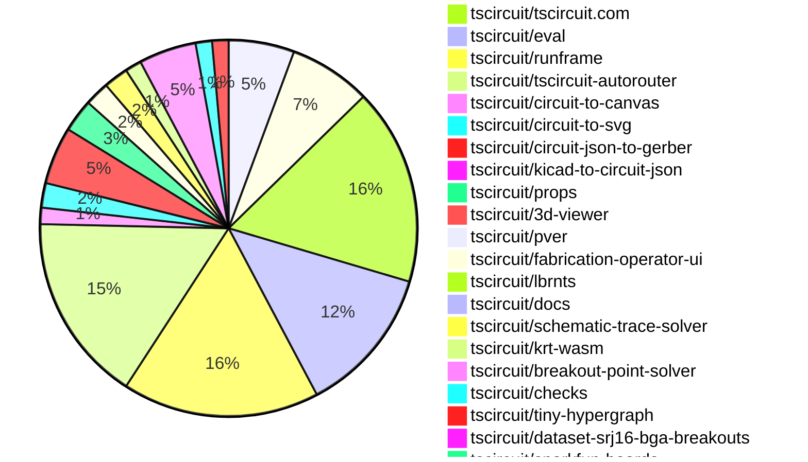

# Contribution Overview 2026-05-19

The current week is shown below. There are 3 major sections:

- [Contributor Overview](#contributor-overview)
- [PRs by Repository](#prs-by-repository)
- [PRs by Contributor](#changes-by-contributor)
- [Scoring & Sponsorship Details](/docs/sponsorship-calculation-explanation.md)

## PRs by Repository

## Contributor Overview

| Contributor | 🐳 Major | 🐙 Minor | 🐌 Tiny | Score | ⭐ | Discussion Contributions |
|-------------|---------|---------|---------|-------|-----|--------------------------|
| [techmannih](#techmannih) | 1 | 8 | 6 | 26 | ⭐⭐ | 0🔹 0🔶 0💎 |
| [MustafaMulla29](#MustafaMulla29) | 3 | 3 | 7 | 26 | ⭐⭐ | 0🔹 0🔶 0💎 |
| [imrishabh18](#imrishabh18) | 5 | 1 | 2 | 25 | ⭐⭐ | 0🔹 0🔶 0💎 |
| [Abse2001](#Abse2001) | 4 | 0 | 0 | 20 | ⭐⭐ | 0🔹 0🔶 0💎 |
| [AnasSarkiz](#AnasSarkiz) | 3 | 2 | 2 | 18 | ⭐⭐ | 0🔹 0🔶 0💎 |
| [ShiboSoftwareDev](#ShiboSoftwareDev) | 2 | 1 | 4 | 17.5 | ⭐⭐ | 0🔹 0🔶 0💎 |
| [0hmX](#0hmX) | 3 | 0 | 1 | 14 | ⭐⭐ | 0🔹 0🔶 0💎 |
| [tscircuitbot](#tscircuitbot) | 0 | 0 | 78 | 12.5 | ⭐⭐ | 0🔹 0🔶 0💎 |
| [Sang-it](#Sang-it) | 1 | 2 | 1 | 9 | ⭐ | 0🔹 0🔶 0💎 |
| [seveibar](#seveibar) | 2 | 0 | 0 | 9 | ⭐ | 0🔹 0🔶 0💎 |
| [itisrohit](#itisrohit) | 2 | 0 | 0 | 8 | ⭐ | 0🔹 0🔶 0💎 |
| [rushabhcodes](#rushabhcodes) | 1 | 0 | 1 | 5 | ⭐ | 0🔹 0🔶 0💎 |
| [Msa360](#Msa360) | 0 | 2 | 0 | 4 | ⭐ | 0🔹 0🔶 0💎 |
| [shehaban](#shehaban) | 1 | 0 | 0 | 4 | ⭐ | 0🔹 0🔶 0💎 |
| [mohan-bee](#mohan-bee) | 1 | 0 | 0 | 4 | ⭐ | 0🔹 0🔶 0💎 |

## Staff Pass Ratio (SPR)

| Contributor | Reviewed PRs | Rejections | Approvals | SPR |
|-------------|--------------|------------|-----------|-----|
| [techmannih](#techmannih) | 8 | 0 | 8 | 100.0% |
| [MustafaMulla29](#MustafaMulla29) | 6 | 0 | 7 | 100.0% |
| [imrishabh18](#imrishabh18) | 4 | 1 | 4 | 75.0% |
| [ShiboSoftwareDev](#ShiboSoftwareDev) | 3 | 0 | 3 | 100.0% |
| [Sang-it](#Sang-it) | 3 | 1 | 2 | 66.7% |
| [rushabhcodes](#rushabhcodes) | 2 | 0 | 2 | 100.0% |
| [Msa360](#Msa360) | 2 | 0 | 2 | 100.0% |
| [mohan-bee](#mohan-bee) | 1 | 0 | 1 | 100.0% |
| [AnasSarkiz](#AnasSarkiz) | 1 | 0 | 1 | 100.0% |
| [itisrohit](#itisrohit) | 1 | 0 | 1 | 100.0% |
| [0hmX](#0hmX) | 1 | 0 | 1 | 100.0% |

techmannih SPR PRs (8)

- [#2305](https://github.com/tscircuit/core/pull/2305) Fix jlcpcb CAD fallback for library footprints
- [#563](https://github.com/tscircuit/circuit-to-svg/pull/563) Render route vias from trace points
- [#564](https://github.com/tscircuit/circuit-to-svg/pull/564) fix knockout text anchor alignment
- [#562](https://github.com/tscircuit/circuit-to-svg/pull/562) Fix PCB text anchor alignment from rendered glyph bounds
- [#103](https://github.com/tscircuit/circuit-json-to-gerber/pull/103) fix rotated pill smtpad gerber rotation
- [#106](https://github.com/tscircuit/circuit-json-to-gerber/pull/106) support rounded SMT pad corner-radius apertures
- [#101](https://github.com/tscircuit/circuit-json-to-gerber/pull/101) Fix polygon plated hole Gerber support
- [#238](https://github.com/tscircuit/circuit-to-canvas/pull/238) Use text geometry for anchor alignment

MustafaMulla29 SPR PRs (6)

- [#2311](https://github.com/tscircuit/core/pull/2311) Add breakout repros and autorouting end-phase stack snapshots
- [#2312](https://github.com/tscircuit/core/pull/2312) Add autorouting start SRJ stack snapshots for breakout repros
- [#151](https://github.com/tscircuit/checks/pull/151) Fix false missing PCB trace errors for physically routed source traces
- [#10](https://github.com/tscircuit/krt-wasm/pull/10) Fix same-net routed traces being treated as obstacles in KRT
- [#4](https://github.com/tscircuit/breakout-point-solver/pull/4) Add breakout point spacing solver with clearer QFN snapshots
- [#2](https://github.com/tscircuit/breakout-point-solver/pull/2) Add initial breakout solver with ray-boundary placement

imrishabh18 SPR PRs (4)

- [#3479](https://github.com/tscircuit/tscircuit.com/pull/3479) Add the fake endpoits for /orders/*.ts
- [#1218](https://github.com/tscircuit/tscircuit-autorouter/pull/1218) fix: Increasing the effort level was preventing globalDrcForceImprovementSolver to use the preplaced via's
- [#1210](https://github.com/tscircuit/tscircuit-autorouter/pull/1210) fix: Don't send the routes which have pre placed via's to the later cleanup solver
- [#1203](https://github.com/tscircuit/tscircuit-autorouter/pull/1203) Add Pipeline8 for routing the board with pre placed via's

ShiboSoftwareDev SPR PRs (3)

- [#2318](https://github.com/tscircuit/core/pull/2318) Add connection-targeted autorouting phases
- [#1221](https://github.com/tscircuit/tscircuit-autorouter/pull/1221) Filter unchanged passing benchmark samples from oversized comments
- [#1205](https://github.com/tscircuit/tscircuit-autorouter/pull/1205) benchmark qol

Sang-it SPR PRs (3)

- [#394](https://github.com/tscircuit/schematic-trace-solver/pull/394) add netLabelWidth to direct connecitons / update Example28Solver alg
- [#403](https://github.com/tscircuit/schematic-trace-solver/pull/403) fix repro35
- [#1](https://github.com/tscircuit/fake-fabrication-server/pull/1) design initial api spec

rushabhcodes SPR PRs (2)

- [#2316](https://github.com/tscircuit/core/pull/2316) Normalize through_obstacle autorouter segments before persisting pcb_trace.route
- [#3473](https://github.com/tscircuit/runframe/pull/3473) Handle react-error-boundary unknown fallback errors in RunFrame error boundaries and update @tscircuit/3d-viewer to version 0.0.560

Msa360 SPR PRs (2)

- [#910](https://github.com/tscircuit/3d-viewer/pull/910) fix: persist CadViewer engine and camera choices across remounts
- [#31](https://github.com/tscircuit/pver/pull/31) fix: tag after rebase so v-tag points at the bump commit

mohan-bee SPR PRs (1)

- [#305](https://github.com/tscircuit/circuit-json-to-kicad/pull/305) Fix 3D model placement for rotated 3D components

AnasSarkiz SPR PRs (1)

- [#37](https://github.com/tscircuit/lbrnts/pull/37) Introduce LightBurn Content Offsetting API

itisrohit SPR PRs (1)

- [#3461](https://github.com/tscircuit/tscircuit.com/pull/3461) fix: preserve full redirect URL (path, query, and hash) on login and session timeout

0hmX SPR PRs (1)

- [#1200](https://github.com/tscircuit/tscircuit-autorouter/pull/1200) feat: add pipeline7 multigraph topology planner

> Note: AI evaluates PRs and assigns 1-3 star ratings automatically. 4 and 5 star ratings require manual staff review.

### Discussion Contribution Legend

- 🔹 Normal Comments: Basic participation with minimal effort
- 🔶 Great Informative Comments: Thoughtful participation that adds value
- 💎 Incredible Comments: Exceptional participation with high-quality content

## Review Table

[reviews-received-hover]: ## "Number of reviews received for PRs for this contributor"
[approvals-received-hover]: ## "Number of approvals received for PRs this contributor authored"
[rejections-received-hover]: ## "Number of rejections received for PRs this contributor authored"
[prs-opened-hover]: ## "Number of PRs opened by this contributor"
[issues-created-hover]: ## "Number of issues created by this contributor"

| Contributor | Reviews Received | Approvals Received | Rejections Received | Approvals | Rejections Given | PRs Opened | PRs Merged | Issues Created |
|---|---|---|---|---|---|---|---|---|
| [stevenczarnota-gif](#stevenczarnota-gif) | 0 | 0 | 0 | 0 | 0 | 1 | 0 | 0 |
| [Mandeep0402](#Mandeep0402) | 0 | 0 | 0 | 0 | 0 | 1 | 0 | 0 |
| [atukunare](#atukunare) | 0 | 0 | 0 | 0 | 0 | 2 | 0 | 0 |
| [junn-dev](#junn-dev) | 0 | 0 | 0 | 0 | 0 | 11 | 0 | 0 |
| [ChandraDvitiyah](#ChandraDvitiyah) | 0 | 0 | 0 | 0 | 0 | 3 | 0 | 0 |
| [onchito-walks](#onchito-walks) | 0 | 0 | 0 | 0 | 0 | 4 | 0 | 0 |
| [kayeve](#kayeve) | 0 | 0 | 0 | 0 | 0 | 1 | 0 | 0 |
| [RoyZhao1991](#RoyZhao1991) | 0 | 0 | 0 | 0 | 0 | 29 | 0 | 0 |
| [Myrarc](#Myrarc) | 0 | 0 | 0 | 0 | 0 | 1 | 0 | 0 |
| [fabicholas](#fabicholas) | 0 | 0 | 0 | 0 | 0 | 1 | 0 | 0 |
| [kodahhhhh](#kodahhhhh) | 0 | 0 | 0 | 0 | 0 | 1 | 0 | 0 |
| [JacKane21](#JacKane21) | 3 | 0 | 0 | 0 | 0 | 7 | 0 | 0 |
| [kpoxo6op](#kpoxo6op) | 0 | 0 | 0 | 0 | 0 | 6 | 0 | 0 |
| [harrrshall](#harrrshall) | 0 | 0 | 0 | 0 | 0 | 2 | 0 | 0 |
| [ZYM1160501013](#ZYM1160501013) | 0 | 0 | 0 | 0 | 0 | 1 | 0 | 0 |
| [Adamchaua](#Adamchaua) | 0 | 0 | 0 | 0 | 0 | 1 | 0 | 0 |
| [mjzs13](#mjzs13) | 0 | 0 | 0 | 0 | 0 | 2 | 0 | 0 |
| [NguyenTienDat-GTR](#NguyenTienDat-GTR) | 0 | 0 | 0 | 0 | 0 | 2 | 0 | 0 |
| [2bf](#2bf) | 0 | 0 | 0 | 0 | 0 | 11 | 0 | 0 |
| [absalonCRC](#absalonCRC) | 0 | 0 | 0 | 0 | 0 | 9 | 0 | 0 |
| [Begarudev](#Begarudev) | 1 | 0 | 0 | 0 | 0 | 1 | 0 | 0 |
| [SimplyRayYZL](#SimplyRayYZL) | 0 | 0 | 0 | 0 | 0 | 8 | 0 | 0 |
| [ajjucoder](#ajjucoder) | 0 | 0 | 0 | 0 | 0 | 1 | 0 | 0 |
| [tscircuitbot](#tscircuitbot) | 0 | 0 | 0 | 0 | 0 | 105 | 78 | 0 |
| [techmannih](#techmannih) | 20 | 13 | 0 | 0 | 0 | 20 | 15 | 0 |
| [tomaspinkas-com](#tomaspinkas-com) | 0 | 0 | 0 | 0 | 0 | 1 | 0 | 0 |
| [kennedydqz-del](#kennedydqz-del) | 0 | 0 | 0 | 0 | 0 | 2 | 0 | 0 |
| [ShiboSoftwareDev](#ShiboSoftwareDev) | 3 | 3 | 0 | 4 | 0 | 11 | 9 | 0 |
| [MINBBBIGcode](#MINBBBIGcode) | 2 | 0 | 0 | 0 | 0 | 3 | 0 | 0 |
| [NightVibes33](#NightVibes33) | 0 | 0 | 0 | 0 | 0 | 1 | 0 | 0 |
| [voltrace-io](#voltrace-io) | 0 | 0 | 0 | 0 | 0 | 8 | 0 | 0 |
| [ar-amk](#ar-amk) | 0 | 0 | 0 | 0 | 0 | 6 | 0 | 0 |
| [dukunline-cyber](#dukunline-cyber) | 0 | 0 | 0 | 0 | 0 | 1 | 0 | 0 |
| [rushabhcodes](#rushabhcodes) | 8 | 3 | 0 | 1 | 0 | 4 | 2 | 0 |
| [zergzorg](#zergzorg) | 0 | 0 | 0 | 0 | 0 | 6 | 0 | 0 |
| [cuongwf1711](#cuongwf1711) | 0 | 0 | 0 | 0 | 0 | 3 | 0 | 0 |
| [yuetongli-PL](#yuetongli-PL) | 0 | 0 | 0 | 0 | 0 | 1 | 0 | 0 |
| [Msa360](#Msa360) | 5 | 5 | 0 | 0 | 0 | 2 | 2 | 0 |
| [Abse2001](#Abse2001) | 7 | 1 | 0 | 4 | 0 | 9 | 4 | 0 |
| [seveibar](#seveibar) | 1 | 0 | 0 | 34 | 1 | 7 | 2 | 0 |
| [ktk-research-9185](#ktk-research-9185) | 0 | 0 | 0 | 0 | 0 | 1 | 0 | 0 |
| [LaoChouPro](#LaoChouPro) | 0 | 0 | 0 | 0 | 0 | 1 | 0 | 0 |
| [landiscode](#landiscode) | 0 | 0 | 0 | 0 | 0 | 7 | 0 | 0 |
| [leninug](#leninug) | 0 | 0 | 0 | 0 | 0 | 1 | 0 | 0 |
| [GX88](#GX88) | 0 | 0 | 0 | 0 | 0 | 1 | 0 | 0 |
| [cwklurks](#cwklurks) | 0 | 0 | 0 | 0 | 0 | 1 | 0 | 0 |
| [swhan0329](#swhan0329) | 0 | 0 | 0 | 0 | 0 | 39 | 0 | 0 |
| [Finesssee](#Finesssee) | 1 | 0 | 0 | 0 | 0 | 2 | 0 | 0 |
| [ayskobtw-lil](#ayskobtw-lil) | 0 | 0 | 0 | 0 | 0 | 1 | 0 | 0 |
| [jeffreybarts-max](#jeffreybarts-max) | 0 | 0 | 0 | 0 | 0 | 1 | 0 | 0 |
| [g8rr5dg2p7-svg](#g8rr5dg2p7-svg) | 0 | 0 | 0 | 0 | 0 | 1 | 0 | 0 |
| [rtbogt11-droid](#rtbogt11-droid) | 0 | 0 | 0 | 0 | 0 | 1 | 0 | 0 |
| [shriram-svg](#shriram-svg) | 0 | 0 | 0 | 0 | 0 | 1 | 0 | 0 |
| [maiqiu-cat](#maiqiu-cat) | 0 | 0 | 0 | 0 | 0 | 2 | 0 | 0 |
| [swright7001](#swright7001) | 0 | 0 | 0 | 0 | 0 | 1 | 0 | 0 |
| [itsdior01](#itsdior01) | 0 | 0 | 0 | 0 | 0 | 1 | 0 | 0 |
| [sdibella](#sdibella) | 0 | 0 | 0 | 0 | 0 | 1 | 0 | 0 |
| [Charolex](#Charolex) | 0 | 0 | 0 | 0 | 0 | 1 | 0 | 0 |
| [illgitthat](#illgitthat) | 0 | 0 | 0 | 0 | 0 | 1 | 0 | 0 |
| [Qian001A](#Qian001A) | 0 | 0 | 0 | 0 | 0 | 2 | 0 | 0 |
| [liangtovi-debug](#liangtovi-debug) | 0 | 0 | 0 | 0 | 0 | 2 | 0 | 0 |
| [mohan-bee](#mohan-bee) | 4 | 3 | 0 | 0 | 0 | 3 | 1 | 0 |
| [AnasSarkiz](#AnasSarkiz) | 4 | 4 | 0 | 0 | 0 | 7 | 7 | 0 |
| [MustafaMulla29](#MustafaMulla29) | 19 | 7 | 0 | 1 | 2 | 15 | 13 | 0 |
| [Sang-it](#Sang-it) | 16 | 3 | 1 | 0 | 0 | 8 | 4 | 0 |
| [imrishabh18](#imrishabh18) | 5 | 4 | 0 | 5 | 1 | 8 | 8 | 0 |
| [garrettparker245-code](#garrettparker245-code) | 0 | 0 | 0 | 0 | 0 | 2 | 0 | 0 |
| [100more](#100more) | 0 | 0 | 0 | 0 | 0 | 3 | 0 | 0 |
| [shootingallday](#shootingallday) | 0 | 0 | 0 | 0 | 0 | 2 | 0 | 0 |
| [iFaceTheWind](#iFaceTheWind) | 0 | 0 | 0 | 0 | 0 | 1 | 0 | 0 |
| [yeguacelestial](#yeguacelestial) | 0 | 0 | 0 | 0 | 0 | 1 | 0 | 0 |
| [itisrohit](#itisrohit) | 5 | 2 | 1 | 0 | 0 | 4 | 2 | 0 |
| [a1local](#a1local) | 0 | 0 | 0 | 0 | 0 | 3 | 0 | 0 |
| [Fire-Fairy84](#Fire-Fairy84) | 0 | 0 | 0 | 0 | 0 | 1 | 0 | 0 |
| [juanfgaviriac](#juanfgaviriac) | 0 | 0 | 0 | 0 | 0 | 2 | 0 | 0 |
| [ProtonsAndElectrons](#ProtonsAndElectrons) | 0 | 0 | 0 | 0 | 0 | 2 | 0 | 0 |
| [ryonakae](#ryonakae) | 0 | 0 | 0 | 0 | 0 | 1 | 0 | 0 |
| [Haenlein1](#Haenlein1) | 0 | 0 | 0 | 0 | 0 | 2 | 0 | 0 |
| [acdunbrack](#acdunbrack) | 0 | 0 | 0 | 0 | 0 | 1 | 0 | 0 |
| [codeaustral-oss](#codeaustral-oss) | 0 | 0 | 0 | 0 | 0 | 1 | 0 | 0 |
| [chriszlr](#chriszlr) | 0 | 0 | 0 | 0 | 0 | 5 | 0 | 0 |
| [hanjav](#hanjav) | 0 | 0 | 0 | 0 | 0 | 1 | 0 | 0 |
| [VOVANQUOCBAO](#VOVANQUOCBAO) | 0 | 0 | 0 | 0 | 0 | 2 | 0 | 0 |
| [demetacrypto](#demetacrypto) | 4 | 0 | 0 | 0 | 0 | 2 | 0 | 0 |
| [1aday](#1aday) | 5 | 0 | 0 | 0 | 0 | 2 | 0 | 0 |
| [jing11223344](#jing11223344) | 0 | 0 | 0 | 0 | 0 | 1 | 0 | 0 |
| [nyashahama](#nyashahama) | 0 | 0 | 0 | 0 | 0 | 2 | 0 | 0 |
| [robin081412108-coder](#robin081412108-coder) | 0 | 0 | 0 | 0 | 0 | 1 | 0 | 0 |
| [MinhThienNguyen040905](#MinhThienNguyen040905) | 0 | 0 | 0 | 0 | 0 | 2 | 0 | 0 |
| [7vf7gcpwsy-create](#7vf7gcpwsy-create) | 0 | 0 | 0 | 0 | 0 | 1 | 0 | 0 |
| [firewine](#firewine) | 4 | 0 | 0 | 0 | 0 | 2 | 0 | 0 |
| [hhyunbreh](#hhyunbreh) | 0 | 0 | 0 | 0 | 0 | 1 | 0 | 0 |
| [JPL-Jarvis](#JPL-Jarvis) | 0 | 0 | 0 | 0 | 0 | 44 | 0 | 0 |
| [TruongSz3](#TruongSz3) | 0 | 0 | 0 | 0 | 0 | 1 | 0 | 0 |
| [Globalpropertyguy](#Globalpropertyguy) | 0 | 0 | 0 | 0 | 0 | 2 | 0 | 0 |
| [MolhamHamwi](#MolhamHamwi) | 1 | 0 | 0 | 0 | 0 | 1 | 0 | 0 |
| [robsltd](#robsltd) | 0 | 0 | 0 | 0 | 0 | 1 | 0 | 0 |
| [mjshanker](#mjshanker) | 0 | 0 | 0 | 0 | 0 | 2 | 0 | 0 |
| [Okidoki9903](#Okidoki9903) | 0 | 0 | 0 | 0 | 0 | 1 | 0 | 0 |
| [6c696e68](#6c696e68) | 0 | 0 | 0 | 0 | 0 | 1 | 0 | 0 |
| [Neabigmo](#Neabigmo) | 0 | 0 | 0 | 0 | 0 | 1 | 0 | 0 |
| [SadmanPinon](#SadmanPinon) | 0 | 0 | 0 | 0 | 0 | 5 | 0 | 0 |
| [sk8kpwhrjt-creator](#sk8kpwhrjt-creator) | 0 | 0 | 0 | 0 | 0 | 1 | 0 | 0 |
| [jiangwen1115-ui](#jiangwen1115-ui) | 0 | 0 | 0 | 0 | 0 | 1 | 0 | 0 |
| [kiet1i38](#kiet1i38) | 0 | 0 | 0 | 0 | 0 | 1 | 0 | 0 |
| [aaronlab](#aaronlab) | 0 | 0 | 0 | 0 | 0 | 1 | 0 | 0 |
| [itsjustet-lab](#itsjustet-lab) | 0 | 0 | 0 | 0 | 0 | 1 | 0 | 0 |
| [khanwang009](#khanwang009) | 0 | 0 | 0 | 0 | 0 | 1 | 0 | 0 |
| [xfocus3](#xfocus3) | 0 | 0 | 0 | 0 | 0 | 7 | 0 | 0 |
| [steves83](#steves83) | 0 | 0 | 0 | 0 | 0 | 4 | 0 | 0 |
| [ZainKazmiii](#ZainKazmiii) | 1 | 0 | 0 | 0 | 0 | 1 | 0 | 0 |
| [Aquileo-hub](#Aquileo-hub) | 0 | 0 | 0 | 0 | 0 | 1 | 0 | 0 |
| [sonnymay](#sonnymay) | 0 | 0 | 0 | 0 | 0 | 1 | 0 | 0 |
| [DukeDawg](#DukeDawg) | 0 | 0 | 0 | 0 | 0 | 1 | 0 | 0 |
| [ya-nsh](#ya-nsh) | 0 | 0 | 0 | 0 | 0 | 2 | 0 | 0 |
| [KLSGG](#KLSGG) | 0 | 0 | 0 | 0 | 0 | 1 | 0 | 0 |
| [enormusdapp-prog](#enormusdapp-prog) | 0 | 0 | 0 | 0 | 0 | 1 | 0 | 0 |
| [FigLangHQ](#FigLangHQ) | 0 | 0 | 0 | 0 | 0 | 1 | 0 | 0 |
| [Wmedrado](#Wmedrado) | 2 | 0 | 0 | 0 | 0 | 2 | 0 | 0 |
| [mara-241](#mara-241) | 0 | 0 | 0 | 0 | 0 | 1 | 0 | 0 |
| [eric-cheong](#eric-cheong) | 0 | 0 | 0 | 0 | 0 | 2 | 0 | 0 |
| [MANFIT7](#MANFIT7) | 0 | 0 | 0 | 0 | 0 | 1 | 0 | 0 |
| [surim0n](#surim0n) | 0 | 0 | 0 | 0 | 0 | 2 | 0 | 0 |
| [Meliwat](#Meliwat) | 0 | 0 | 0 | 0 | 0 | 1 | 0 | 0 |
| [luoshui-coder](#luoshui-coder) | 0 | 0 | 0 | 0 | 0 | 1 | 0 | 0 |
| [dhrubasumatary](#dhrubasumatary) | 0 | 0 | 0 | 0 | 0 | 1 | 0 | 0 |
| [uniquenesslabs](#uniquenesslabs) | 0 | 0 | 0 | 0 | 0 | 1 | 0 | 0 |
| [emulatronicGIT](#emulatronicGIT) | 0 | 0 | 0 | 0 | 0 | 1 | 0 | 0 |
| [yangsori](#yangsori) | 0 | 0 | 0 | 0 | 0 | 4 | 0 | 0 |
| [haocyan0723-code](#haocyan0723-code) | 0 | 0 | 0 | 0 | 0 | 2 | 0 | 0 |
| [dekacchi](#dekacchi) | 0 | 0 | 0 | 0 | 0 | 1 | 0 | 0 |
| [nakulsingla2020-hash](#nakulsingla2020-hash) | 0 | 0 | 0 | 0 | 0 | 1 | 0 | 0 |
| [nguyenducshuy](#nguyenducshuy) | 0 | 0 | 0 | 0 | 0 | 1 | 0 | 0 |
| [hikali123456789](#hikali123456789) | 0 | 0 | 0 | 0 | 0 | 1 | 0 | 0 |
| [lukaIvanic](#lukaIvanic) | 0 | 0 | 0 | 0 | 0 | 1 | 0 | 0 |
| [EnesBrt](#EnesBrt) | 0 | 0 | 0 | 0 | 0 | 1 | 0 | 0 |
| [mg272011](#mg272011) | 0 | 0 | 0 | 0 | 0 | 1 | 0 | 0 |
| [thepianistdirector](#thepianistdirector) | 0 | 0 | 0 | 0 | 0 | 1 | 0 | 0 |
| [lloupp](#lloupp) | 0 | 0 | 0 | 0 | 0 | 1 | 0 | 0 |
| [kebanks2](#kebanks2) | 0 | 0 | 0 | 0 | 0 | 2 | 0 | 0 |
| [Misch369](#Misch369) | 0 | 0 | 0 | 0 | 0 | 1 | 0 | 0 |
| [nguyentamdat](#nguyentamdat) | 0 | 0 | 0 | 0 | 0 | 2 | 0 | 0 |
| [arthurgervais](#arthurgervais) | 0 | 0 | 0 | 0 | 0 | 1 | 0 | 0 |
| [Spina7](#Spina7) | 0 | 0 | 0 | 0 | 0 | 1 | 0 | 0 |
| [0hmX](#0hmX) | 3 | 1 | 0 | 1 | 0 | 5 | 4 | 0 |
| [a25955813-cloud](#a25955813-cloud) | 0 | 0 | 0 | 0 | 0 | 1 | 0 | 0 |
| [shehaban](#shehaban) | 2 | 1 | 0 | 0 | 0 | 1 | 1 | 0 |
| [ColumbusLabs](#ColumbusLabs) | 0 | 0 | 0 | 0 | 0 | 1 | 0 | 0 |
| [khozakhulile27-netizen](#khozakhulile27-netizen) | 0 | 0 | 0 | 0 | 0 | 1 | 0 | 0 |
| [anytimeatvibe](#anytimeatvibe) | 0 | 0 | 0 | 0 | 0 | 1 | 0 | 0 |
| [blackblue1](#blackblue1) | 0 | 0 | 0 | 0 | 0 | 1 | 0 | 0 |
| [JorisViaudQuantAI](#JorisViaudQuantAI) | 1 | 0 | 0 | 0 | 0 | 1 | 0 | 0 |
| [jamilahmadzai](#jamilahmadzai) | 0 | 0 | 0 | 0 | 0 | 1 | 0 | 0 |
| [tanmayxchoudhary](#tanmayxchoudhary) | 0 | 0 | 0 | 0 | 0 | 1 | 0 | 0 |
| [qkzdreamer](#qkzdreamer) | 1 | 0 | 0 | 0 | 0 | 1 | 0 | 0 |
| [Mohamed-elgypaly](#Mohamed-elgypaly) | 0 | 0 | 0 | 0 | 0 | 1 | 0 | 0 |
| [akmittal006](#akmittal006) | 0 | 0 | 0 | 0 | 0 | 1 | 0 | 0 |
| [morganschp](#morganschp) | 0 | 0 | 0 | 0 | 0 | 1 | 0 | 0 |
| [PassivelyWealthyDad](#PassivelyWealthyDad) | 0 | 0 | 0 | 0 | 0 | 2 | 0 | 0 |
| [patchplain](#patchplain) | 0 | 0 | 0 | 0 | 0 | 1 | 0 | 0 |
| [mauricemohr88-debug](#mauricemohr88-debug) | 0 | 0 | 0 | 0 | 0 | 1 | 0 | 0 |
| [Thanhdn1984](#Thanhdn1984) | 0 | 0 | 0 | 0 | 0 | 1 | 0 | 0 |
| [driptux](#driptux) | 0 | 0 | 0 | 0 | 0 | 1 | 0 | 0 |
| [kennynwokoye](#kennynwokoye) | 0 | 0 | 0 | 0 | 0 | 1 | 0 | 0 |
| [thebasedcapital](#thebasedcapital) | 0 | 0 | 0 | 0 | 0 | 1 | 0 | 0 |
| [HunterCML](#HunterCML) | 0 | 0 | 0 | 0 | 0 | 1 | 0 | 0 |
| [partyplatter08-lab](#partyplatter08-lab) | 0 | 0 | 0 | 0 | 0 | 1 | 0 | 0 |
| [Bilal-Lodhi](#Bilal-Lodhi) | 6 | 0 | 2 | 0 | 0 | 2 | 0 | 0 |

## Changes by Repository

### [tscircuit/tscircuit](https://github.com/tscircuit/tscircuit)

🐌 Tiny Contributions (8)

| PR # | Impact | Contributor | Description |
|------|--------|-------------|-------------|
| [#3256](https://github.com/tscircuit/tscircuit/pull/3256) | 🐌 Tiny | tscircuitbot | Updates the package version from 0.0.1777 to 0.0.1778 in package.json |
| [#3255](https://github.com/tscircuit/tscircuit/pull/3255) | 🐌 Tiny | tscircuitbot | Automated package update |
| [#3254](https://github.com/tscircuit/tscircuit/pull/3254) | 🐌 Tiny | tscircuitbot | Automated package update |
| [#3252](https://github.com/tscircuit/tscircuit/pull/3252) | 🐌 Tiny | tscircuitbot | Automated package update |
| [#3251](https://github.com/tscircuit/tscircuit/pull/3251) | 🐌 Tiny | tscircuitbot | Automated package update |
| [#3250](https://github.com/tscircuit/tscircuit/pull/3250) | 🐌 Tiny | tscircuitbot | Automated package update |
| [#3253](https://github.com/tscircuit/tscircuit/pull/3253) | 🐌 Tiny | techmannih | Updates the circuit-to-svg dependency version from 0.0.345 to 0.0.350 in package.json |
| [#3249](https://github.com/tscircuit/tscircuit/pull/3249) | 🐌 Tiny | techmannih | Updates the circuit-to-svg dependency version from 0.0.345 to 0.0.349 in package.json |

### [tscircuit/core](https://github.com/tscircuit/core)

| PR # | Impact | Rating | Contributor | Description |
|------|--------|--------|-------------|-------------|
| [#2318](https://github.com/tscircuit/core/pull/2318) | 🐳 Major | ⭐⭐⭐ | ShiboSoftwareDev | Adds support for autoroutingphase connection... and connections... to assign routing phases and reroute selected traces by endpoint selector. |
| [#2316](https://github.com/tscircuit/core/pull/2316) | 🐳 Major | ⭐⭐⭐ | rushabhcodes | Fixes a core autorouting bug where local autorouter output could write through_obstacle segments directly into pcb_trace.route, even though the public route format should expose those segments as through_pad. |
| [#2320](https://github.com/tscircuit/core/pull/2320) | 🐳 Major | ⭐⭐⭐ | imrishabh18 | Changes the autorouter to utilize AutoroutingPipelineSolver8 when the laser_prefab preset is selected. |
| [#2305](https://github.com/tscircuit/core/pull/2305) | 🐙 Minor | ⭐⭐ | techmannih | Fixes 3D rendering for library footprints that do not provide a CAD model by falling back cleanly to a bounding box instead of surfacing a parser error. |
| [#2324](https://github.com/tscircuit/core/pull/2324) | 🐙 Minor | ⭐⭐ | AnasSarkiz | Fixes handle through_pad in circuit-to-svg rendering. |
| [#2317](https://github.com/tscircuit/core/pull/2317) | 🐙 Minor | ⭐⭐ | Sang-it | Adds netLabelWidth to direct connections and updates the schematic trace solver. |
| [#2311](https://github.com/tscircuit/core/pull/2311) | 🐙 Minor | ⭐⭐ | MustafaMulla29 | Adds tests for breakout routing and autorouting end-phase stack snapshots, enhancing the testing framework for autorouting functionality. |
| [#2312](https://github.com/tscircuit/core/pull/2312) | 🐙 Minor | ⭐⭐ | MustafaMulla29 | Adds autorouting phase IO stack snapshots for breakout repros in the testing framework |

🐌 Tiny Contributions (2)

| PR # | Impact | Contributor | Description |
|------|--------|-------------|-------------|
| [#2326](https://github.com/tscircuit/core/pull/2326) | 🐌 Tiny | tscircuitbot | Updates the tscircuitchecks package from version 0.0.131 to 0.0.132 |
| [#2322](https://github.com/tscircuit/core/pull/2322) | 🐌 Tiny | tscircuitbot | Updates the tscircuitchecks package from version 0.0.130 to 0.0.131 in the package.json file. |

### [tscircuit/tscircuit.com](https://github.com/tscircuit/tscircuit.com)

| PR # | Impact | Rating | Contributor | Description |
|------|--------|--------|-------------|-------------|
| [#3481](https://github.com/tscircuit/tscircuit.com/pull/3481) | 🐳 Major | ⭐⭐⭐ | imrishabh18 | Adds a new order success page that displays order confirmation details and allows users to navigate to their orders or back to the home page. |
| [#3461](https://github.com/tscircuit/tscircuit.com/pull/3461) | 🐳 Major | ⭐⭐⭐ | itisrohit | Fixes the issue where logging back in after a session timeout discards the users location state, search parameters, or hash fragments, ensuring users are redirected back to their intended location with full URL structure preserved. |
| [#3479](https://github.com/tscircuit/tscircuit.com/pull/3479) | 🐙 Minor | ⭐⭐ | imrishabh18 | Adds fake endpoints for order creation and retrieval, integrating with a mock Stripe checkout session. |

🐌 Tiny Contributions (21)

| PR # | Impact | Contributor | Description |
|------|--------|-------------|-------------|
| [#3485](https://github.com/tscircuit/tscircuit.com/pull/3485) | 🐌 Tiny | tscircuitbot | Updates the tscircuitrunframe package from version 0.0.1993 to 0.0.1994 |
| [#3484](https://github.com/tscircuit/tscircuit.com/pull/3484) | 🐌 Tiny | tscircuitbot | Automated package update |
| [#3483](https://github.com/tscircuit/tscircuit.com/pull/3483) | 🐌 Tiny | tscircuitbot | Updates the tscircuitrunframe package from version 0.0.1992 to 0.0.1993 |
| [#3482](https://github.com/tscircuit/tscircuit.com/pull/3482) | 🐌 Tiny | tscircuitbot | Updates the tscircuitrunframe package from version 0.0.1991 to 0.0.1992 |
| [#3480](https://github.com/tscircuit/tscircuit.com/pull/3480) | 🐌 Tiny | tscircuitbot | Automated package update to version 0.0.210 |
| [#3478](https://github.com/tscircuit/tscircuit.com/pull/3478) | 🐌 Tiny | tscircuitbot | Automated package update |
| [#3477](https://github.com/tscircuit/tscircuit.com/pull/3477) | 🐌 Tiny | tscircuitbot | Updates the tscircuiteval package to version 0.0.863 in the package.json file. |
| [#3476](https://github.com/tscircuit/tscircuit.com/pull/3476) | 🐌 Tiny | tscircuitbot | Automated package update |
| [#3475](https://github.com/tscircuit/tscircuit.com/pull/3475) | 🐌 Tiny | tscircuitbot | Updates the tscircuiteval package from version 0.0.860 to 0.0.862 |
| [#3474](https://github.com/tscircuit/tscircuit.com/pull/3474) | 🐌 Tiny | tscircuitbot | Automated package update |
| [#3472](https://github.com/tscircuit/tscircuit.com/pull/3472) | 🐌 Tiny | tscircuitbot | Updates the tscircuitrunframe package from version 0.0.1986 to 0.0.1987 |
| [#3471](https://github.com/tscircuit/tscircuit.com/pull/3471) | 🐌 Tiny | tscircuitbot | Automated package update |
| [#3470](https://github.com/tscircuit/tscircuit.com/pull/3470) | 🐌 Tiny | tscircuitbot | Updates the tscircuitrunframe package from version 0.0.1985 to 0.0.1986 |
| [#3469](https://github.com/tscircuit/tscircuit.com/pull/3469) | 🐌 Tiny | tscircuitbot | Automated package update |
| [#3468](https://github.com/tscircuit/tscircuit.com/pull/3468) | 🐌 Tiny | tscircuitbot | Updates the tscircuitrunframe package from version 0.0.1984 to 0.0.1985 |
| [#3467](https://github.com/tscircuit/tscircuit.com/pull/3467) | 🐌 Tiny | tscircuitbot | Automated package update |
| [#3466](https://github.com/tscircuit/tscircuit.com/pull/3466) | 🐌 Tiny | tscircuitbot | Automated package update |
| [#3465](https://github.com/tscircuit/tscircuit.com/pull/3465) | 🐌 Tiny | tscircuitbot | Updates the version of the tscircuiteval package from 0.0.856 to 0.0.857 in package.json |
| [#3464](https://github.com/tscircuit/tscircuit.com/pull/3464) | 🐌 Tiny | tscircuitbot | Updates the tscircuitrunframe package from version 0.0.1982 to 0.0.1983 |
| [#3463](https://github.com/tscircuit/tscircuit.com/pull/3463) | 🐌 Tiny | tscircuitbot | Automated package update |
| [#3462](https://github.com/tscircuit/tscircuit.com/pull/3462) | 🐌 Tiny | imrishabh18 | Removes deprecated fake API endpoints for order files and quotes, cleaning up the codebase and eliminating unused functionality. |

### [tscircuit/eval](https://github.com/tscircuit/eval)

🐌 Tiny Contributions (18)

| PR # | Impact | Contributor | Description |
|------|--------|-------------|-------------|
| [#2731](https://github.com/tscircuit/eval/pull/2731) | 🐌 Tiny | tscircuitbot | Automated package update |
| [#2730](https://github.com/tscircuit/eval/pull/2730) | 🐌 Tiny | tscircuitbot | Automated package update |
| [#2728](https://github.com/tscircuit/eval/pull/2728) | 🐌 Tiny | tscircuitbot | Automated package update |
| [#2727](https://github.com/tscircuit/eval/pull/2727) | 🐌 Tiny | tscircuitbot | Automated package update |
| [#2724](https://github.com/tscircuit/eval/pull/2724) | 🐌 Tiny | tscircuitbot | Automated package update |
| [#2723](https://github.com/tscircuit/eval/pull/2723) | 🐌 Tiny | tscircuitbot | Automated package update |
| [#2721](https://github.com/tscircuit/eval/pull/2721) | 🐌 Tiny | tscircuitbot | Automated package update |
| [#2719](https://github.com/tscircuit/eval/pull/2719) | 🐌 Tiny | tscircuitbot | Automated package update |
| [#2717](https://github.com/tscircuit/eval/pull/2717) | 🐌 Tiny | tscircuitbot | Automated package update |
| [#2716](https://github.com/tscircuit/eval/pull/2716) | 🐌 Tiny | tscircuitbot | Updates the version of the tscircuitcore package from 0.0.1263 to 0.0.1264 in package.json |
| [#2714](https://github.com/tscircuit/eval/pull/2714) | 🐌 Tiny | tscircuitbot | Automated package update |
| [#2713](https://github.com/tscircuit/eval/pull/2713) | 🐌 Tiny | tscircuitbot | Updates the version of tscircuitcore from 0.0.1262 to 0.0.1263 and tscircuitschematic-trace-solver from 0.0.57 to 0.0.60 in package.json |
| [#2711](https://github.com/tscircuit/eval/pull/2711) | 🐌 Tiny | tscircuitbot | Automated package update |
| [#2710](https://github.com/tscircuit/eval/pull/2710) | 🐌 Tiny | tscircuitbot | Automated package update |
| [#2709](https://github.com/tscircuit/eval/pull/2709) | 🐌 Tiny | tscircuitbot | Automated package update |
| [#2708](https://github.com/tscircuit/eval/pull/2708) | 🐌 Tiny | tscircuitbot | Updates package dependencies to their latest versions in package.json |
| [#2720](https://github.com/tscircuit/eval/pull/2720) | 🐌 Tiny | techmannih | Updates the circuit-to-svg dependency to version 0.0.349 in package.json |
| [#2718](https://github.com/tscircuit/eval/pull/2718) | 🐌 Tiny | techmannih | Updates the circuit-to-svg dependency version from 0.0.345 to 0.0.348 in package.json |

### [tscircuit/runframe](https://github.com/tscircuit/runframe)

🐌 Tiny Contributions (24)

| PR # | Impact | Contributor | Description |
|------|--------|-------------|-------------|
| [#3495](https://github.com/tscircuit/runframe/pull/3495) | 🐌 Tiny | tscircuitbot | Automated package update |
| [#3494](https://github.com/tscircuit/runframe/pull/3494) | 🐌 Tiny | tscircuitbot | Updates the tscircuiteval package to version 0.0.864 in the package.json file. |
| [#3493](https://github.com/tscircuit/runframe/pull/3493) | 🐌 Tiny | tscircuitbot | Automated package update |
| [#3492](https://github.com/tscircuit/runframe/pull/3492) | 🐌 Tiny | tscircuitbot | Updates the circuit-json-to-gerber package from version 0.0.68 to 0.0.70 |
| [#3491](https://github.com/tscircuit/runframe/pull/3491) | 🐌 Tiny | tscircuitbot | Automated package update |
| [#3490](https://github.com/tscircuit/runframe/pull/3490) | 🐌 Tiny | tscircuitbot | Updates the circuit-json-to-gerber package from version 0.0.67 to 0.0.68 |
| [#3489](https://github.com/tscircuit/runframe/pull/3489) | 🐌 Tiny | tscircuitbot | Automated package update |
| [#3488](https://github.com/tscircuit/runframe/pull/3488) | 🐌 Tiny | tscircuitbot | Updates the tscircuiteval package to version 0.0.863 in the package.json file. |
| [#3487](https://github.com/tscircuit/runframe/pull/3487) | 🐌 Tiny | tscircuitbot | Automated package update |
| [#3486](https://github.com/tscircuit/runframe/pull/3486) | 🐌 Tiny | tscircuitbot | Updates the circuit-json-to-gerber package from version 0.0.64 to 0.0.67 |
| [#3485](https://github.com/tscircuit/runframe/pull/3485) | 🐌 Tiny | tscircuitbot | Automated package update |
| [#3484](https://github.com/tscircuit/runframe/pull/3484) | 🐌 Tiny | tscircuitbot | Updates the tscircuiteval package version from 0.0.861 to 0.0.862 in package.json |
| [#3483](https://github.com/tscircuit/runframe/pull/3483) | 🐌 Tiny | tscircuitbot | Automated package update |
| [#3482](https://github.com/tscircuit/runframe/pull/3482) | 🐌 Tiny | tscircuitbot | Updates the tscircuiteval package to version 0.0.861 in the package.json file. |
| [#3481](https://github.com/tscircuit/runframe/pull/3481) | 🐌 Tiny | tscircuitbot | Automated package update |
| [#3480](https://github.com/tscircuit/runframe/pull/3480) | 🐌 Tiny | tscircuitbot | Updates the tscircuiteval package from version 0.0.859 to 0.0.860 in the package.json file. |
| [#3479](https://github.com/tscircuit/runframe/pull/3479) | 🐌 Tiny | tscircuitbot | Automated package update |
| [#3478](https://github.com/tscircuit/runframe/pull/3478) | 🐌 Tiny | tscircuitbot | Updates the tscircuiteval package to version 0.0.859 in the package.json file. |
| [#3477](https://github.com/tscircuit/runframe/pull/3477) | 🐌 Tiny | tscircuitbot | Automated package update |
| [#3476](https://github.com/tscircuit/runframe/pull/3476) | 🐌 Tiny | tscircuitbot | Updates the tscircuiteval package to version 0.0.858 in the package.json file. |
| [#3475](https://github.com/tscircuit/runframe/pull/3475) | 🐌 Tiny | tscircuitbot | Automated package update |
| [#3474](https://github.com/tscircuit/runframe/pull/3474) | 🐌 Tiny | tscircuitbot | Updates the tscircuiteval package from version 0.0.856 to 0.0.857 in the package.json file. |
| [#3472](https://github.com/tscircuit/runframe/pull/3472) | 🐌 Tiny | tscircuitbot | Automated package update |
| [#3471](https://github.com/tscircuit/runframe/pull/3471) | 🐌 Tiny | tscircuitbot | Updates the tscircuiteval package from version 0.0.855 to 0.0.856 in the package.json file. |

### [tscircuit/tscircuit-autorouter](https://github.com/tscircuit/tscircuit-autorouter)

| PR # | Impact | Rating | Contributor | Description |
|------|--------|--------|-------------|-------------|
| [#1218](https://github.com/tscircuit/tscircuit-autorouter/pull/1218) | 🐳 Major | ⭐⭐⭐ | imrishabh18 | Fixes the issue where increasing the effort level prevents the globalDrcForceImprovementSolver from utilizing preplaced vias, leading to suboptimal DRC score layer transitions. |
| [#1210](https://github.com/tscircuit/tscircuit-autorouter/pull/1210) | 🐳 Major | ⭐⭐⭐ | imrishabh18 | Fixes the autorouting process by preventing routes with pre-placed vias from being sent to the cleanup solver, ensuring more accurate routing results. |
| [#1203](https://github.com/tscircuit/tscircuit-autorouter/pull/1203) | 🐳 Major | ⭐⭐⭐ | imrishabh18 | This pull request introduces Pipeline8, a new routing algorithm for the autorouter that utilizes pre-placed vias to enhance routing efficiency and accuracy. The implementation includes new test fixtures and a bug report for validation. |
| [#1206](https://github.com/tscircuit/tscircuit-autorouter/pull/1206) | 🐳 Major | ⭐⭐⭐ | itisrohit | Fixes a bug in the useless-via-removal solver that incorrectly flagged segments as colliding with adjacent traces or obstacles, preventing the removal of redundant vias in crowded routing areas. |
| [#1228](https://github.com/tscircuit/tscircuit-autorouter/pull/1228) | 🐳 Major | ⭐⭐⭐ | seveibar | Fixes autorouting failure when encountering impossible single-layer crossings due to invalid geometries. |
| [#1214](https://github.com/tscircuit/tscircuit-autorouter/pull/1214) | 🐳 Major | ⭐⭐⭐ | seveibar | Adds a new GrowShrinkHighDensityIntraNodeSolver to improve high-density autorouting by allowing dynamic resizing of nodes during the routing process. |
| [#1224](https://github.com/tscircuit/tscircuit-autorouter/pull/1224) | 🐳 Major | ⭐⭐⭐ | 0hmX | Preserves component-region shared edge segments during the necessary cramped port point solving process in the autorouting pipeline. |
| [#1200](https://github.com/tscircuit/tscircuit-autorouter/pull/1200) | 🐳 Major | ⭐⭐⭐ | 0hmX | https:github.comtscircuittscircuit-autorouterpull1175changes |
| [#1199](https://github.com/tscircuit/tscircuit-autorouter/pull/1199) | 🐳 Major | ⭐⭐⭐ | 0hmX | Adds a new portPointsInPairs field to NodeWithPortPoint to clarify connections between ports and nodes, enhancing the autorouting process. |
| [#1226](https://github.com/tscircuit/tscircuit-autorouter/pull/1226) | 🐳 Major | ⭐⭐⭐ | Abse2001 | Removes large vias from the srj16 dataset to improve routing efficiency and design integrity. |
| [#1205](https://github.com/tscircuit/tscircuit-autorouter/pull/1205) | 🐙 Minor | ⭐⭐ | ShiboSoftwareDev | Adds structured benchmark failure summaries so solver failures are separated from relaxed DRC failures, records DRC error countstypesmessages per sample, adds top solver failure buckets to textJSON output, and scales sample timeouts by concurrency to avoid misattributing parallel wall-clock contention as phase failures. |

🐌 Tiny Contributions (12)

| PR # | Impact | Contributor | Description |
|------|--------|-------------|-------------|
| [#1229](https://github.com/tscircuit/tscircuit-autorouter/pull/1229) | 🐌 Tiny | tscircuitbot | Automated package update |
| [#1227](https://github.com/tscircuit/tscircuit-autorouter/pull/1227) | 🐌 Tiny | tscircuitbot | Automated package update |
| [#1225](https://github.com/tscircuit/tscircuit-autorouter/pull/1225) | 🐌 Tiny | tscircuitbot | Automated package update |
| [#1223](https://github.com/tscircuit/tscircuit-autorouter/pull/1223) | 🐌 Tiny | tscircuitbot | Automated package update |
| [#1219](https://github.com/tscircuit/tscircuit-autorouter/pull/1219) | 🐌 Tiny | tscircuitbot | Automated package update |
| [#1215](https://github.com/tscircuit/tscircuit-autorouter/pull/1215) | 🐌 Tiny | tscircuitbot | Automated package update |
| [#1212](https://github.com/tscircuit/tscircuit-autorouter/pull/1212) | 🐌 Tiny | tscircuitbot | Automated package update |
| [#1211](https://github.com/tscircuit/tscircuit-autorouter/pull/1211) | 🐌 Tiny | tscircuitbot | Automated package update |
| [#1207](https://github.com/tscircuit/tscircuit-autorouter/pull/1207) | 🐌 Tiny | tscircuitbot | Automated package update |
| [#1198](https://github.com/tscircuit/tscircuit-autorouter/pull/1198) | 🐌 Tiny | ShiboSoftwareDev | This pull request adds more samples to the reroute dataset 15, increasing the sample count from 25 to 55. It introduces new datasets and modifies existing sample data, including adjustments to the retained trace counts and ripped connection counts for various samples. The changes aim to enhance the testing and validation of the autorouting functionality. |
| [#1208](https://github.com/tscircuit/tscircuit-autorouter/pull/1208) | 🐌 Tiny | imrishabh18 | Adds a reproduction for a failure in autorouting pipeline 8 with a new test and fixture files. |
| [#1222](https://github.com/tscircuit/tscircuit-autorouter/pull/1222) | 🐌 Tiny | 0hmX | Adds Pipeline7 Multi Graph to the autorouting menu bar options and includes its solver in the pipeline solvers list. |

### [tscircuit/circuit-to-canvas](https://github.com/tscircuit/circuit-to-canvas)

| PR # | Impact | Rating | Contributor | Description |
|------|--------|--------|-------------|-------------|
| [#238](https://github.com/tscircuit/circuit-to-canvas/pull/238) | 🐙 Minor | ⭐⭐ | techmannih | Replaces approximate text anchor offsets with geometry derived from actual glyph outline bounds, ensuring accurate text alignment and consistency in rendering knockout backgrounds and stroked text. |

🐌 Tiny Contributions (1)

| PR # | Impact | Contributor | Description |
|------|--------|-------------|-------------|
| [#239](https://github.com/tscircuit/circuit-to-canvas/pull/239) | 🐌 Tiny | tscircuitbot | Automated package update |

### [tscircuit/circuit-to-svg](https://github.com/tscircuit/circuit-to-svg)

| PR # | Impact | Rating | Contributor | Description |
|------|--------|--------|-------------|-------------|
| [#562](https://github.com/tscircuit/circuit-to-svg/pull/562) | 🐳 Major | ⭐⭐⭐ | techmannih | Summary This fixes the remaining PCB text anchor alignment offset in circuit-to-svg by deriving anchor placement from the rendered alphabet path geometry instead of from coarse widthheight box math.  What was wrong Copper text and knockout text were being anchored from centered layout dimensions rather than the actual rendered glyph bounds. That worked for some alignments, but top_, bottom_, and side-aligned cases could still land slightly off because the alignment math was not using the true outline extents. During the first pass of the fix, regular silkscreen text was also moved onto the alphabet stroke renderer. That improved consistency, but it changed the visible letterforms, which was a regression.  What changed added a shared helper for PCB alphabet text geometry compute text bounds from the rendered path segments themselves derive anchor offsets from those real bounds for copper text and knockout text use the shared geometry in both copper text and silkscreen knockout rendering remove the older centered widthheight anchor helper keep regular silkscreen text on the existing SVG text renderer so its visual design stays unchanged refresh affected snapshots to match the corrected placement  Why this approach This keeps the fix in the rendering model instead of layering more special-case offsets on top: one source of truth for alphabet-path text bounds anchor placement follows the real rendered shape knockout rectangles inherit the same geometry and stay aligned with the text they mask regular silkscreen text keeps its original appearance  Impact fixes residual sidetopbottom anchor drift for PCB copper text and knockout text keeps silkscreen text visuals stable makes future PCB text alignment changes easier to reason about because the geometry and anchoring logic are centralized  Validation sh bun test --timeout 30000  Passed: 207 pass, 0 fail |
| [#563](https://github.com/tscircuit/circuit-to-svg/pull/563) | 🐙 Minor | ⭐⭐ | techmannih | Render visible PCB via geometry for pcb_trace.route entries with route_type: via when the circuit JSON does not already include a matching top-level pcb_via element, and remove degenerate zero-length trace segments around via waypoints. |
| [#564](https://github.com/tscircuit/circuit-to-svg/pull/564) | 🐙 Minor | ⭐⭐ | techmannih | Fixes knockout text alignment so it anchors against the outer padded knockout bounds instead of the inner glyph bounds. |

### [tscircuit/circuit-json-to-gerber](https://github.com/tscircuit/circuit-json-to-gerber)

| PR # | Impact | Rating | Contributor | Description |
|------|--------|--------|-------------|-------------|
| [#104](https://github.com/tscircuit/circuit-json-to-gerber/pull/104) | 🐳 Major | ⭐⭐⭐ | AnasSarkiz | Introduces proper Gerber copper generation support for PCB trace routes containing through_pad segments, ensuring multilayer routing paths emit valid coordinates and continuous copper geometry. |
| [#99](https://github.com/tscircuit/circuit-json-to-gerber/pull/99) | 🐳 Major | ⭐⭐⭐ | AnasSarkiz | This pull request introduces support for native Gerber apertures specifically for pill-shaped SMT pads. It includes validation for the dimensions of the pill shape and defines the necessary configurations for both standard and solder mask layers. The changes ensure that the Gerber output correctly represents pill-shaped pads, enhancing the overall functionality of the circuit design tool. |
| [#103](https://github.com/tscircuit/circuit-json-to-gerber/pull/103) | 🐙 Minor | ⭐⭐ | techmannih | Fixes the rendering of rotated SMT pill pads in Gerber output to ensure correct orientation and geometry. |
| [#106](https://github.com/tscircuit/circuit-json-to-gerber/pull/106) | 🐙 Minor | ⭐⭐ | techmannih | Adds support for rounded SMT pad corner-radius apertures in Gerber output, ensuring that rounded geometries are preserved instead of being collapsed into plain rectangular shapes. |
| [#101](https://github.com/tscircuit/circuit-json-to-gerber/pull/101) | 🐙 Minor | ⭐⭐ | techmannih | Fixes Gerber generation failure for polygon plated-hole pads by implementing proper region-based rendering and aperture configuration. |
| [#105](https://github.com/tscircuit/circuit-json-to-gerber/pull/105) | 🐙 Minor | ⭐⭐ | techmannih | Renames the old rotated pill copper-vs-paste repro to a drill-focused repro, adds direct Excellon assertions for the rotated pill plated-hole slot direction, and keeps a side-by-side PCB vs Gerber comparison snapshot for easier debugging. |

🐌 Tiny Contributions (1)

| PR # | Impact | Contributor | Description |
|------|--------|-------------|-------------|
| [#100](https://github.com/tscircuit/circuit-json-to-gerber/pull/100) | 🐌 Tiny | techmannih | Adds targeted gerber repro coverage for the SMT pad issues we identified, including polygon SMT pad support repro, silkscreen knockout repro, SMT pad corner radius repro, rotated pill SMT pad repro, and rotated pill copper vs paste overlay snapshot repro. |

### [tscircuit/kicad-to-circuit-json](https://github.com/tscircuit/kicad-to-circuit-json)

🐌 Tiny Contributions (1)

| PR # | Impact | Contributor | Description |
|------|--------|-------------|-------------|
| [#93](https://github.com/tscircuit/kicad-to-circuit-json/pull/93) | 🐌 Tiny | techmannih | Updates the version of tscircuit in package.json and refreshes the associated snapshot images for tests. |

### [tscircuit/props](https://github.com/tscircuit/props)

| PR # | Impact | Rating | Contributor | Description |
|------|--------|--------|-------------|-------------|
| [#673](https://github.com/tscircuit/props/pull/673) | 🐳 Major | ⭐⭐⭐ | ShiboSoftwareDev | Adds connection and connections properties to AutoroutingPhaseProps for enhanced autorouting capabilities. |

🐌 Tiny Contributions (3)

| PR # | Impact | Contributor | Description |
|------|--------|-------------|-------------|
| [#674](https://github.com/tscircuit/props/pull/674) | 🐌 Tiny | ShiboSoftwareDev | Bumps the package version from 0.0.535 to 0.0.536 in package.json |
| [#676](https://github.com/tscircuit/props/pull/676) | 🐌 Tiny | ShiboSoftwareDev | Resets package version in package.json from 0.0.536 to 0.0.535 to match the currently published npm version and removes a trailing blank line in README.md. |
| [#675](https://github.com/tscircuit/props/pull/675) | 🐌 Tiny | ShiboSoftwareDev | Adds a new line to the README.md file for formatting purposes |

### [tscircuit/3d-viewer](https://github.com/tscircuit/3d-viewer)

| PR # | Impact | Rating | Contributor | Description |
|------|--------|--------|-------------|-------------|
| [#910](https://github.com/tscircuit/3d-viewer/pull/910) | 🐙 Minor | ⭐⭐ | Msa360 | Fixes a localStorage race condition in CadViewer that clobbered the users persisted engine and camera-type choices on every mount. |

### [tscircuit/pver](https://github.com/tscircuit/pver)

| PR # | Impact | Rating | Contributor | Description |
|------|--------|--------|-------------|-------------|
| [#31](https://github.com/tscircuit/pver/pull/31) | 🐙 Minor | ⭐⭐ | Msa360 | Fixes the tagging process in the release flow to ensure that the version tag points to the correct commit after a version bump, rather than an orphaned pre-rebase commit. |

### [tscircuit/fabrication-operator-ui](https://github.com/tscircuit/fabrication-operator-ui)

| PR # | Impact | Rating | Contributor | Description |
|------|--------|--------|-------------|-------------|
| [#10](https://github.com/tscircuit/fabrication-operator-ui/pull/10) | 🐳 Major | ⭐⭐⭐ | AnasSarkiz | Adds a CameraPreviewCard component for camera-assisted PCB alignment with controls for starting the camera, retaking snapshots, and using snapshots. |

🐌 Tiny Contributions (2)

| PR # | Impact | Contributor | Description |
|------|--------|-------------|-------------|
| [#9](https://github.com/tscircuit/fabrication-operator-ui/pull/9) | 🐌 Tiny | AnasSarkiz | Adds new React components for the Dashboard and Fabrication workflow, enabling fixture pages for development and testing. |
| [#11](https://github.com/tscircuit/fabrication-operator-ui/pull/11) | 🐌 Tiny | AnasSarkiz | Refactors the user interface to utilize Tailwind CSS for styling and enhances the visual representation of workflow state indicators across various components. |

### [tscircuit/lbrnts](https://github.com/tscircuit/lbrnts)

| PR # | Impact | Rating | Contributor | Description |
|------|--------|--------|-------------|-------------|
| [#37](https://github.com/tscircuit/lbrnts/pull/37) | 🐙 Minor | ⭐⭐ | AnasSarkiz | Adds a new applyOffsetToLbrn utility for translating LightBurn project geometry by applying XY offsets directly to shape transforms. |

### [tscircuit/docs](https://github.com/tscircuit/docs)

🐌 Tiny Contributions (1)

| PR # | Impact | Contributor | Description |
|------|--------|-------------|-------------|
| [#646](https://github.com/tscircuit/docs/pull/646) | 🐌 Tiny | rushabhcodes | Adds comprehensive documentation for the opamp  element used in analog circuit design, covering its properties, usage examples, and pin aliases. |

### [tscircuit/schematic-trace-solver](https://github.com/tscircuit/schematic-trace-solver)

| PR # | Impact | Rating | Contributor | Description |
|------|--------|--------|-------------|-------------|
| [#394](https://github.com/tscircuit/schematic-trace-solver/pull/394) | 🐳 Major | ⭐⭐⭐ | Sang-it | Adds netLabelWidth property to direct connections and updates the Example28Solver algorithm to utilize this property for better net label width handling. |
| [#403](https://github.com/tscircuit/schematic-trace-solver/pull/403) | 🐙 Minor | ⭐⭐ | Sang-it | Fixes a bug in the rectangle detection logic by using a precision threshold for point comparisons. |

🐌 Tiny Contributions (1)

| PR # | Impact | Contributor | Description |
|------|--------|-------------|-------------|
| [#390](https://github.com/tscircuit/schematic-trace-solver/pull/390) | 🐌 Tiny | Sang-it | Adds a new example page and corresponding test for the schematic trace solver using example35 data. |

### [tscircuit/krt-wasm](https://github.com/tscircuit/krt-wasm)

| PR # | Impact | Rating | Contributor | Description |
|------|--------|--------|-------------|-------------|
| [#10](https://github.com/tscircuit/krt-wasm/pull/10) | 🐳 Major | ⭐⭐⭐ | MustafaMulla29 | Fixes routing failure where same-net copper traces block later same-net traces in KRT. |

🐌 Tiny Contributions (1)

| PR # | Impact | Contributor | Description |
|------|--------|-------------|-------------|
| [#9](https://github.com/tscircuit/krt-wasm/pull/9) | 🐌 Tiny | MustafaMulla29 | Adds a test to reproduce an autorouting error when traces are routed on the same net with obstacles. |

### [tscircuit/breakout-point-solver](https://github.com/tscircuit/breakout-point-solver)

| PR # | Impact | Rating | Contributor | Description |
|------|--------|--------|-------------|-------------|
| [#4](https://github.com/tscircuit/breakout-point-solver/pull/4) | 🐳 Major | ⭐⭐⭐ | MustafaMulla29 | Computes a breakout boundary point for each inside port by projecting toward the outside target, avoids already-used boundary points when usedBoundaryPoints and boundaryPointSpacing are provided, chooses the nearest available point on the same boundary edge when the ideal point is occupied, and returns only breakoutPoints, not routed traces. |
| [#2](https://github.com/tscircuit/breakout-point-solver/pull/2) | 🐳 Major | ⭐⭐⭐ | MustafaMulla29 | Adds an initial implementation of a breakout solver that calculates breakout points based on ray-boundary intersections. |

🐌 Tiny Contributions (5)

| PR # | Impact | Contributor | Description |
|------|--------|-------------|-------------|
| [#7](https://github.com/tscircuit/breakout-point-solver/pull/7) | 🐌 Tiny | MustafaMulla29 | Updates the README file to provide detailed usage instructions and API documentation for the BreakoutPointSolver. |
| [#6](https://github.com/tscircuit/breakout-point-solver/pull/6) | 🐌 Tiny | MustafaMulla29 | Changes the package name to include the tscircuit scope in package.json |
| [#5](https://github.com/tscircuit/breakout-point-solver/pull/5) | 🐌 Tiny | MustafaMulla29 | Adds a GitHub Actions workflow for publishing to npm, including version bumping and triggering updates for upstream repositories. |
| [#1](https://github.com/tscircuit/breakout-point-solver/pull/1) | 🐌 Tiny | MustafaMulla29 | Adds GitHub workflows for format checking, testing, and type checking, along with initial project setup files and a basic README. |
| [#3](https://github.com/tscircuit/breakout-point-solver/pull/3) | 🐌 Tiny | MustafaMulla29 | Renames the BreakoutSolver class to BreakoutPointSolver and updates related types, while adding new test cases for the renamed solver. |

### [tscircuit/checks](https://github.com/tscircuit/checks)

| PR # | Impact | Rating | Contributor | Description |
|------|--------|--------|-------------|-------------|
| [#151](https://github.com/tscircuit/checks/pull/151) | 🐙 Minor | ⭐⭐ | MustafaMulla29 | Fixes false-positive pcb_trace_missing_error reports from checkSourceTracesHavePcbTraces by improving the check for routed PCB traces. |

🐌 Tiny Contributions (1)

| PR # | Impact | Contributor | Description |
|------|--------|-------------|-------------|
| [#150](https://github.com/tscircuit/checks/pull/150) | 🐌 Tiny | MustafaMulla29 | This pull request introduces a new test case that reproduces a false positive error related to missing PCB traces. The test case is designed to validate the behavior of the PCB trace checking mechanism in the software, ensuring that it correctly identifies and handles cases where traces are not actually missing, thus preventing unnecessary warnings or errors during the design process. |

### [tscircuit/tiny-hypergraph](https://github.com/tscircuit/tiny-hypergraph)

| PR # | Impact | Rating | Contributor | Description |
|------|--------|--------|-------------|-------------|
| [#89](https://github.com/tscircuit/tiny-hypergraph/pull/89) | 🐳 Major | ⭐⭐⭐ | Abse2001 | Adds a benchmarking script and a new interactive page for the SRJ13 core solver, allowing users to run benchmarks and debug datasets interactively. |
| [#90](https://github.com/tscircuit/tiny-hypergraph/pull/90) | 🐳 Major | ⭐⭐⭐ | Abse2001 | Adds configurable lazy heuristics and sparse candidate storage to improve rendering of large hypergraph visualizations, specifically fixing sample 02 in the srj13 dataset. |

### [tscircuit/dataset-srj16-bga-breakouts](https://github.com/tscircuit/dataset-srj16-bga-breakouts)

| PR # | Impact | Rating | Contributor | Description |
|------|--------|--------|-------------|-------------|
| [#4](https://github.com/tscircuit/dataset-srj16-bga-breakouts/pull/4) | 🐳 Major | ⭐⭐⭐ | Abse2001 | This pull request removes the minimum via hole diameter and minimum via pad diameter from multiple circuit JSON files in the dataset. The changes affect a total of 66 files, simplifying the dataset by eliminating these constraints. |

### [tscircuit/sparkfun-boards](https://github.com/tscircuit/sparkfun-boards)

| PR # | Impact | Rating | Contributor | Description |
|------|--------|--------|-------------|-------------|
| [#284](https://github.com/tscircuit/sparkfun-boards/pull/284) | 🐳 Major | ⭐⭐⭐ | shehaban | Adds a new SparkFun Qwiic Shield for Thing Plus, including schematic and footprint definitions for multiple connectors. |

### [tscircuit/circuit-json-to-kicad](https://github.com/tscircuit/circuit-json-to-kicad)

| PR # | Impact | Rating | Contributor | Description |
|------|--------|--------|-------------|-------------|
| [#305](https://github.com/tscircuit/circuit-json-to-kicad/pull/305) | 🐳 Major | ⭐⭐⭐ | mohan-bee | Fixes 3D model rotation and offset for rotated PCB components in KiCad export. The model rotation is now relative to the footprint rotation, and model_origin_position is included when calculating the model offset. |

## Changes by Contributor

### [tscircuitbot](https://github.com/tscircuitbot)

🐌 Tiny Contributions (78)

| PR # | Impact | Description |
|------|--------|-------------|
| [#3256](https://github.com/tscircuit/tscircuit/pull/3256) | 🐌 Tiny | Updates the package version from 0.0.1777 to 0.0.1778 in package.json |
| [#3255](https://github.com/tscircuit/tscircuit/pull/3255) | 🐌 Tiny | Automated package update |
| [#3254](https://github.com/tscircuit/tscircuit/pull/3254) | 🐌 Tiny | Automated package update |
| [#3252](https://github.com/tscircuit/tscircuit/pull/3252) | 🐌 Tiny | Automated package update |
| [#3251](https://github.com/tscircuit/tscircuit/pull/3251) | 🐌 Tiny | Automated package update |
| [#3250](https://github.com/tscircuit/tscircuit/pull/3250) | 🐌 Tiny | Automated package update |
| [#2326](https://github.com/tscircuit/core/pull/2326) | 🐌 Tiny | Updates the tscircuitchecks package from version 0.0.131 to 0.0.132 |
| [#2322](https://github.com/tscircuit/core/pull/2322) | 🐌 Tiny | Updates the tscircuitchecks package from version 0.0.130 to 0.0.131 in the package.json file. |
| [#3485](https://github.com/tscircuit/tscircuit.com/pull/3485) | 🐌 Tiny | Updates the tscircuitrunframe package from version 0.0.1993 to 0.0.1994 |
| [#3484](https://github.com/tscircuit/tscircuit.com/pull/3484) | 🐌 Tiny | Automated package update |
| [#3483](https://github.com/tscircuit/tscircuit.com/pull/3483) | 🐌 Tiny | Updates the tscircuitrunframe package from version 0.0.1992 to 0.0.1993 |
| [#3482](https://github.com/tscircuit/tscircuit.com/pull/3482) | 🐌 Tiny | Updates the tscircuitrunframe package from version 0.0.1991 to 0.0.1992 |
| [#3480](https://github.com/tscircuit/tscircuit.com/pull/3480) | 🐌 Tiny | Automated package update to version 0.0.210 |
| [#3478](https://github.com/tscircuit/tscircuit.com/pull/3478) | 🐌 Tiny | Automated package update |
| [#3477](https://github.com/tscircuit/tscircuit.com/pull/3477) | 🐌 Tiny | Updates the tscircuiteval package to version 0.0.863 in the package.json file. |
| [#3476](https://github.com/tscircuit/tscircuit.com/pull/3476) | 🐌 Tiny | Automated package update |
| [#3475](https://github.com/tscircuit/tscircuit.com/pull/3475) | 🐌 Tiny | Updates the tscircuiteval package from version 0.0.860 to 0.0.862 |
| [#3474](https://github.com/tscircuit/tscircuit.com/pull/3474) | 🐌 Tiny | Automated package update |
| [#3472](https://github.com/tscircuit/tscircuit.com/pull/3472) | 🐌 Tiny | Updates the tscircuitrunframe package from version 0.0.1986 to 0.0.1987 |
| [#3471](https://github.com/tscircuit/tscircuit.com/pull/3471) | 🐌 Tiny | Automated package update |
| [#3470](https://github.com/tscircuit/tscircuit.com/pull/3470) | 🐌 Tiny | Updates the tscircuitrunframe package from version 0.0.1985 to 0.0.1986 |
| [#3469](https://github.com/tscircuit/tscircuit.com/pull/3469) | 🐌 Tiny | Automated package update |
| [#3468](https://github.com/tscircuit/tscircuit.com/pull/3468) | 🐌 Tiny | Updates the tscircuitrunframe package from version 0.0.1984 to 0.0.1985 |
| [#3467](https://github.com/tscircuit/tscircuit.com/pull/3467) | 🐌 Tiny | Automated package update |
| [#3466](https://github.com/tscircuit/tscircuit.com/pull/3466) | 🐌 Tiny | Automated package update |
| [#3465](https://github.com/tscircuit/tscircuit.com/pull/3465) | 🐌 Tiny | Updates the version of the tscircuiteval package from 0.0.856 to 0.0.857 in package.json |
| [#3464](https://github.com/tscircuit/tscircuit.com/pull/3464) | 🐌 Tiny | Updates the tscircuitrunframe package from version 0.0.1982 to 0.0.1983 |
| [#3463](https://github.com/tscircuit/tscircuit.com/pull/3463) | 🐌 Tiny | Automated package update |
| [#2731](https://github.com/tscircuit/eval/pull/2731) | 🐌 Tiny | Automated package update |
| [#2730](https://github.com/tscircuit/eval/pull/2730) | 🐌 Tiny | Automated package update |
| [#2728](https://github.com/tscircuit/eval/pull/2728) | 🐌 Tiny | Automated package update |
| [#2727](https://github.com/tscircuit/eval/pull/2727) | 🐌 Tiny | Automated package update |
| [#2724](https://github.com/tscircuit/eval/pull/2724) | 🐌 Tiny | Automated package update |
| [#2723](https://github.com/tscircuit/eval/pull/2723) | 🐌 Tiny | Automated package update |
| [#2721](https://github.com/tscircuit/eval/pull/2721) | 🐌 Tiny | Automated package update |
| [#2719](https://github.com/tscircuit/eval/pull/2719) | 🐌 Tiny | Automated package update |
| [#2717](https://github.com/tscircuit/eval/pull/2717) | 🐌 Tiny | Automated package update |
| [#2716](https://github.com/tscircuit/eval/pull/2716) | 🐌 Tiny | Updates the version of the tscircuitcore package from 0.0.1263 to 0.0.1264 in package.json |
| [#2714](https://github.com/tscircuit/eval/pull/2714) | 🐌 Tiny | Automated package update |
| [#2713](https://github.com/tscircuit/eval/pull/2713) | 🐌 Tiny | Updates the version of tscircuitcore from 0.0.1262 to 0.0.1263 and tscircuitschematic-trace-solver from 0.0.57 to 0.0.60 in package.json |
| [#2711](https://github.com/tscircuit/eval/pull/2711) | 🐌 Tiny | Automated package update |
| [#2710](https://github.com/tscircuit/eval/pull/2710) | 🐌 Tiny | Automated package update |
| [#2709](https://github.com/tscircuit/eval/pull/2709) | 🐌 Tiny | Automated package update |
| [#2708](https://github.com/tscircuit/eval/pull/2708) | 🐌 Tiny | Updates package dependencies to their latest versions in package.json |
| [#3495](https://github.com/tscircuit/runframe/pull/3495) | 🐌 Tiny | Automated package update |
| [#3494](https://github.com/tscircuit/runframe/pull/3494) | 🐌 Tiny | Updates the tscircuiteval package to version 0.0.864 in the package.json file. |
| [#3493](https://github.com/tscircuit/runframe/pull/3493) | 🐌 Tiny | Automated package update |
| [#3492](https://github.com/tscircuit/runframe/pull/3492) | 🐌 Tiny | Updates the circuit-json-to-gerber package from version 0.0.68 to 0.0.70 |
| [#3491](https://github.com/tscircuit/runframe/pull/3491) | 🐌 Tiny | Automated package update |
| [#3490](https://github.com/tscircuit/runframe/pull/3490) | 🐌 Tiny | Updates the circuit-json-to-gerber package from version 0.0.67 to 0.0.68 |
| [#3489](https://github.com/tscircuit/runframe/pull/3489) | 🐌 Tiny | Automated package update |
| [#3488](https://github.com/tscircuit/runframe/pull/3488) | 🐌 Tiny | Updates the tscircuiteval package to version 0.0.863 in the package.json file. |
| [#3487](https://github.com/tscircuit/runframe/pull/3487) | 🐌 Tiny | Automated package update |
| [#3486](https://github.com/tscircuit/runframe/pull/3486) | 🐌 Tiny | Updates the circuit-json-to-gerber package from version 0.0.64 to 0.0.67 |
| [#3485](https://github.com/tscircuit/runframe/pull/3485) | 🐌 Tiny | Automated package update |
| [#3484](https://github.com/tscircuit/runframe/pull/3484) | 🐌 Tiny | Updates the tscircuiteval package version from 0.0.861 to 0.0.862 in package.json |
| [#3483](https://github.com/tscircuit/runframe/pull/3483) | 🐌 Tiny | Automated package update |
| [#3482](https://github.com/tscircuit/runframe/pull/3482) | 🐌 Tiny | Updates the tscircuiteval package to version 0.0.861 in the package.json file. |
| [#3481](https://github.com/tscircuit/runframe/pull/3481) | 🐌 Tiny | Automated package update |
| [#3480](https://github.com/tscircuit/runframe/pull/3480) | 🐌 Tiny | Updates the tscircuiteval package from version 0.0.859 to 0.0.860 in the package.json file. |
| [#3479](https://github.com/tscircuit/runframe/pull/3479) | 🐌 Tiny | Automated package update |
| [#3478](https://github.com/tscircuit/runframe/pull/3478) | 🐌 Tiny | Updates the tscircuiteval package to version 0.0.859 in the package.json file. |
| [#3477](https://github.com/tscircuit/runframe/pull/3477) | 🐌 Tiny | Automated package update |
| [#3476](https://github.com/tscircuit/runframe/pull/3476) | 🐌 Tiny | Updates the tscircuiteval package to version 0.0.858 in the package.json file. |
| [#3475](https://github.com/tscircuit/runframe/pull/3475) | 🐌 Tiny | Automated package update |
| [#3474](https://github.com/tscircuit/runframe/pull/3474) | 🐌 Tiny | Updates the tscircuiteval package from version 0.0.856 to 0.0.857 in the package.json file. |
| [#3472](https://github.com/tscircuit/runframe/pull/3472) | 🐌 Tiny | Automated package update |
| [#3471](https://github.com/tscircuit/runframe/pull/3471) | 🐌 Tiny | Updates the tscircuiteval package from version 0.0.855 to 0.0.856 in the package.json file. |
| [#1229](https://github.com/tscircuit/tscircuit-autorouter/pull/1229) | 🐌 Tiny | Automated package update |
| [#1227](https://github.com/tscircuit/tscircuit-autorouter/pull/1227) | 🐌 Tiny | Automated package update |
| [#1225](https://github.com/tscircuit/tscircuit-autorouter/pull/1225) | 🐌 Tiny | Automated package update |
| [#1223](https://github.com/tscircuit/tscircuit-autorouter/pull/1223) | 🐌 Tiny | Automated package update |
| [#1219](https://github.com/tscircuit/tscircuit-autorouter/pull/1219) | 🐌 Tiny | Automated package update |
| [#1215](https://github.com/tscircuit/tscircuit-autorouter/pull/1215) | 🐌 Tiny | Automated package update |
| [#1212](https://github.com/tscircuit/tscircuit-autorouter/pull/1212) | 🐌 Tiny | Automated package update |
| [#1211](https://github.com/tscircuit/tscircuit-autorouter/pull/1211) | 🐌 Tiny | Automated package update |
| [#1207](https://github.com/tscircuit/tscircuit-autorouter/pull/1207) | 🐌 Tiny | Automated package update |
| [#239](https://github.com/tscircuit/circuit-to-canvas/pull/239) | 🐌 Tiny | Automated package update |

### [techmannih](https://github.com/techmannih)

| PRs # | Impact | Rating | Description |
|------|--------|--------|-------------|
| [#562](https://github.com/tscircuit/circuit-to-svg/pull/562) | 🐳 Major | ⭐⭐⭐ | Summary This fixes the remaining PCB text anchor alignment offset in circuit-to-svg by deriving anchor placement from the rendered alphabet path geometry instead of from coarse widthheight box math.  What was wrong Copper text and knockout text were being anchored from centered layout dimensions rather than the actual rendered glyph bounds. That worked for some alignments, but top_, bottom_, and side-aligned cases could still land slightly off because the alignment math was not using the true outline extents. During the first pass of the fix, regular silkscreen text was also moved onto the alphabet stroke renderer. That improved consistency, but it changed the visible letterforms, which was a regression.  What changed added a shared helper for PCB alphabet text geometry compute text bounds from the rendered path segments themselves derive anchor offsets from those real bounds for copper text and knockout text use the shared geometry in both copper text and silkscreen knockout rendering remove the older centered widthheight anchor helper keep regular silkscreen text on the existing SVG text renderer so its visual design stays unchanged refresh affected snapshots to match the corrected placement  Why this approach This keeps the fix in the rendering model instead of layering more special-case offsets on top: one source of truth for alphabet-path text bounds anchor placement follows the real rendered shape knockout rectangles inherit the same geometry and stay aligned with the text they mask regular silkscreen text keeps its original appearance  Impact fixes residual sidetopbottom anchor drift for PCB copper text and knockout text keeps silkscreen text visuals stable makes future PCB text alignment changes easier to reason about because the geometry and anchoring logic are centralized  Validation sh bun test --timeout 30000  Passed: 207 pass, 0 fail |
| [#2305](https://github.com/tscircuit/core/pull/2305) | 🐙 Minor | ⭐⭐ | Fixes 3D rendering for library footprints that do not provide a CAD model by falling back cleanly to a bounding box instead of surfacing a parser error. |
| [#563](https://github.com/tscircuit/circuit-to-svg/pull/563) | 🐙 Minor | ⭐⭐ | Render visible PCB via geometry for pcb_trace.route entries with route_type: via when the circuit JSON does not already include a matching top-level pcb_via element, and remove degenerate zero-length trace segments around via waypoints. |
| [#564](https://github.com/tscircuit/circuit-to-svg/pull/564) | 🐙 Minor | ⭐⭐ | Fixes knockout text alignment so it anchors against the outer padded knockout bounds instead of the inner glyph bounds. |
| [#103](https://github.com/tscircuit/circuit-json-to-gerber/pull/103) | 🐙 Minor | ⭐⭐ | Fixes the rendering of rotated SMT pill pads in Gerber output to ensure correct orientation and geometry. |
| [#106](https://github.com/tscircuit/circuit-json-to-gerber/pull/106) | 🐙 Minor | ⭐⭐ | Adds support for rounded SMT pad corner-radius apertures in Gerber output, ensuring that rounded geometries are preserved instead of being collapsed into plain rectangular shapes. |
| [#101](https://github.com/tscircuit/circuit-json-to-gerber/pull/101) | 🐙 Minor | ⭐⭐ | Fixes Gerber generation failure for polygon plated-hole pads by implementing proper region-based rendering and aperture configuration. |
| [#105](https://github.com/tscircuit/circuit-json-to-gerber/pull/105) | 🐙 Minor | ⭐⭐ | Renames the old rotated pill copper-vs-paste repro to a drill-focused repro, adds direct Excellon assertions for the rotated pill plated-hole slot direction, and keeps a side-by-side PCB vs Gerber comparison snapshot for easier debugging. |
| [#238](https://github.com/tscircuit/circuit-to-canvas/pull/238) | 🐙 Minor | ⭐⭐ | Replaces approximate text anchor offsets with geometry derived from actual glyph outline bounds, ensuring accurate text alignment and consistency in rendering knockout backgrounds and stroked text. |

🐌 Tiny Contributions (6)

| PR # | Impact | Description |
|------|--------|-------------|
| [#3253](https://github.com/tscircuit/tscircuit/pull/3253) | 🐌 Tiny | Updates the circuit-to-svg dependency version from 0.0.345 to 0.0.350 in package.json |
| [#3249](https://github.com/tscircuit/tscircuit/pull/3249) | 🐌 Tiny | Updates the circuit-to-svg dependency version from 0.0.345 to 0.0.349 in package.json |
| [#100](https://github.com/tscircuit/circuit-json-to-gerber/pull/100) | 🐌 Tiny | Adds targeted gerber repro coverage for the SMT pad issues we identified, including polygon SMT pad support repro, silkscreen knockout repro, SMT pad corner radius repro, rotated pill SMT pad repro, and rotated pill copper vs paste overlay snapshot repro. |
| [#2720](https://github.com/tscircuit/eval/pull/2720) | 🐌 Tiny | Updates the circuit-to-svg dependency to version 0.0.349 in package.json |
| [#2718](https://github.com/tscircuit/eval/pull/2718) | 🐌 Tiny | Updates the circuit-to-svg dependency version from 0.0.345 to 0.0.348 in package.json |
| [#93](https://github.com/tscircuit/kicad-to-circuit-json/pull/93) | 🐌 Tiny | Updates the version of tscircuit in package.json and refreshes the associated snapshot images for tests. |

### [ShiboSoftwareDev](https://github.com/ShiboSoftwareDev)

| PRs # | Impact | Rating | Description |
|------|--------|--------|-------------|
| [#673](https://github.com/tscircuit/props/pull/673) | 🐳 Major | ⭐⭐⭐ | Adds connection and connections properties to AutoroutingPhaseProps for enhanced autorouting capabilities. |
| [#2318](https://github.com/tscircuit/core/pull/2318) | 🐳 Major | ⭐⭐⭐ | Adds support for autoroutingphase connection... and connections... to assign routing phases and reroute selected traces by endpoint selector. |
| [#1205](https://github.com/tscircuit/tscircuit-autorouter/pull/1205) | 🐙 Minor | ⭐⭐ | Adds structured benchmark failure summaries so solver failures are separated from relaxed DRC failures, records DRC error countstypesmessages per sample, adds top solver failure buckets to textJSON output, and scales sample timeouts by concurrency to avoid misattributing parallel wall-clock contention as phase failures. |

🐌 Tiny Contributions (4)

| PR # | Impact | Description |
|------|--------|-------------|
| [#674](https://github.com/tscircuit/props/pull/674) | 🐌 Tiny | Bumps the package version from 0.0.535 to 0.0.536 in package.json |
| [#676](https://github.com/tscircuit/props/pull/676) | 🐌 Tiny | Resets package version in package.json from 0.0.536 to 0.0.535 to match the currently published npm version and removes a trailing blank line in README.md. |
| [#675](https://github.com/tscircuit/props/pull/675) | 🐌 Tiny | Adds a new line to the README.md file for formatting purposes |
| [#1198](https://github.com/tscircuit/tscircuit-autorouter/pull/1198) | 🐌 Tiny | This pull request adds more samples to the reroute dataset 15, increasing the sample count from 25 to 55. It introduces new datasets and modifies existing sample data, including adjustments to the retained trace counts and ripped connection counts for various samples. The changes aim to enhance the testing and validation of the autorouting functionality. |

### [Msa360](https://github.com/Msa360)

| PRs # | Impact | Rating | Description |
|------|--------|--------|-------------|
| [#910](https://github.com/tscircuit/3d-viewer/pull/910) | 🐙 Minor | ⭐⭐ | Fixes a localStorage race condition in CadViewer that clobbered the users persisted engine and camera-type choices on every mount. |
| [#31](https://github.com/tscircuit/pver/pull/31) | 🐙 Minor | ⭐⭐ | Fixes the tagging process in the release flow to ensure that the version tag points to the correct commit after a version bump, rather than an orphaned pre-rebase commit. |

### [AnasSarkiz](https://github.com/AnasSarkiz)

| PRs # | Impact | Rating | Description |
|------|--------|--------|-------------|
| [#104](https://github.com/tscircuit/circuit-json-to-gerber/pull/104) | 🐳 Major | ⭐⭐⭐ | Introduces proper Gerber copper generation support for PCB trace routes containing through_pad segments, ensuring multilayer routing paths emit valid coordinates and continuous copper geometry. |
| [#99](https://github.com/tscircuit/circuit-json-to-gerber/pull/99) | 🐳 Major | ⭐⭐⭐ | This pull request introduces support for native Gerber apertures specifically for pill-shaped SMT pads. It includes validation for the dimensions of the pill shape and defines the necessary configurations for both standard and solder mask layers. The changes ensure that the Gerber output correctly represents pill-shaped pads, enhancing the overall functionality of the circuit design tool. |
| [#10](https://github.com/tscircuit/fabrication-operator-ui/pull/10) | 🐳 Major | ⭐⭐⭐ | Adds a CameraPreviewCard component for camera-assisted PCB alignment with controls for starting the camera, retaking snapshots, and using snapshots. |
| [#2324](https://github.com/tscircuit/core/pull/2324) | 🐙 Minor | ⭐⭐ | Fixes handle through_pad in circuit-to-svg rendering. |
| [#37](https://github.com/tscircuit/lbrnts/pull/37) | 🐙 Minor | ⭐⭐ | Adds a new applyOffsetToLbrn utility for translating LightBurn project geometry by applying XY offsets directly to shape transforms. |

🐌 Tiny Contributions (2)

| PR # | Impact | Description |
|------|--------|-------------|
| [#9](https://github.com/tscircuit/fabrication-operator-ui/pull/9) | 🐌 Tiny | Adds new React components for the Dashboard and Fabrication workflow, enabling fixture pages for development and testing. |
| [#11](https://github.com/tscircuit/fabrication-operator-ui/pull/11) | 🐌 Tiny | Refactors the user interface to utilize Tailwind CSS for styling and enhances the visual representation of workflow state indicators across various components. |

### [rushabhcodes](https://github.com/rushabhcodes)

| PRs # | Impact | Rating | Description |
|------|--------|--------|-------------|
| [#2316](https://github.com/tscircuit/core/pull/2316) | 🐳 Major | ⭐⭐⭐ | Fixes a core autorouting bug where local autorouter output could write through_obstacle segments directly into pcb_trace.route, even though the public route format should expose those segments as through_pad. |

🐌 Tiny Contributions (1)

| PR # | Impact | Description |
|------|--------|-------------|
| [#646](https://github.com/tscircuit/docs/pull/646) | 🐌 Tiny | Adds comprehensive documentation for the opamp  element used in analog circuit design, covering its properties, usage examples, and pin aliases. |

### [Sang-it](https://github.com/Sang-it)

| PRs # | Impact | Rating | Description |
|------|--------|--------|-------------|
| [#394](https://github.com/tscircuit/schematic-trace-solver/pull/394) | 🐳 Major | ⭐⭐⭐ | Adds netLabelWidth property to direct connections and updates the Example28Solver algorithm to utilize this property for better net label width handling. |
| [#2317](https://github.com/tscircuit/core/pull/2317) | 🐙 Minor | ⭐⭐ | Adds netLabelWidth to direct connections and updates the schematic trace solver. |
| [#403](https://github.com/tscircuit/schematic-trace-solver/pull/403) | 🐙 Minor | ⭐⭐ | Fixes a bug in the rectangle detection logic by using a precision threshold for point comparisons. |

🐌 Tiny Contributions (1)

| PR # | Impact | Description |
|------|--------|-------------|
| [#390](https://github.com/tscircuit/schematic-trace-solver/pull/390) | 🐌 Tiny | Adds a new example page and corresponding test for the schematic trace solver using example35 data. |

### [imrishabh18](https://github.com/imrishabh18)

| PRs # | Impact | Rating | Description |
|------|--------|--------|-------------|
| [#2320](https://github.com/tscircuit/core/pull/2320) | 🐳 Major | ⭐⭐⭐ | Changes the autorouter to utilize AutoroutingPipelineSolver8 when the laser_prefab preset is selected. |
| [#3481](https://github.com/tscircuit/tscircuit.com/pull/3481) | 🐳 Major | ⭐⭐⭐ | Adds a new order success page that displays order confirmation details and allows users to navigate to their orders or back to the home page. |
| [#1218](https://github.com/tscircuit/tscircuit-autorouter/pull/1218) | 🐳 Major | ⭐⭐⭐ | Fixes the issue where increasing the effort level prevents the globalDrcForceImprovementSolver from utilizing preplaced vias, leading to suboptimal DRC score layer transitions. |
| [#1210](https://github.com/tscircuit/tscircuit-autorouter/pull/1210) | 🐳 Major | ⭐⭐⭐ | Fixes the autorouting process by preventing routes with pre-placed vias from being sent to the cleanup solver, ensuring more accurate routing results. |
| [#1203](https://github.com/tscircuit/tscircuit-autorouter/pull/1203) | 🐳 Major | ⭐⭐⭐ | This pull request introduces Pipeline8, a new routing algorithm for the autorouter that utilizes pre-placed vias to enhance routing efficiency and accuracy. The implementation includes new test fixtures and a bug report for validation. |
| [#3479](https://github.com/tscircuit/tscircuit.com/pull/3479) | 🐙 Minor | ⭐⭐ | Adds fake endpoints for order creation and retrieval, integrating with a mock Stripe checkout session. |

🐌 Tiny Contributions (2)

| PR # | Impact | Description |
|------|--------|-------------|
| [#3462](https://github.com/tscircuit/tscircuit.com/pull/3462) | 🐌 Tiny | Removes deprecated fake API endpoints for order files and quotes, cleaning up the codebase and eliminating unused functionality. |
| [#1208](https://github.com/tscircuit/tscircuit-autorouter/pull/1208) | 🐌 Tiny | Adds a reproduction for a failure in autorouting pipeline 8 with a new test and fixture files. |

### [MustafaMulla29](https://github.com/MustafaMulla29)

| PRs # | Impact | Rating | Description |
|------|--------|--------|-------------|
| [#10](https://github.com/tscircuit/krt-wasm/pull/10) | 🐳 Major | ⭐⭐⭐ | Fixes routing failure where same-net copper traces block later same-net traces in KRT. |
| [#4](https://github.com/tscircuit/breakout-point-solver/pull/4) | 🐳 Major | ⭐⭐⭐ | Computes a breakout boundary point for each inside port by projecting toward the outside target, avoids already-used boundary points when usedBoundaryPoints and boundaryPointSpacing are provided, chooses the nearest available point on the same boundary edge when the ideal point is occupied, and returns only breakoutPoints, not routed traces. |
| [#2](https://github.com/tscircuit/breakout-point-solver/pull/2) | 🐳 Major | ⭐⭐⭐ | Adds an initial implementation of a breakout solver that calculates breakout points based on ray-boundary intersections. |
| [#2311](https://github.com/tscircuit/core/pull/2311) | 🐙 Minor | ⭐⭐ | Adds tests for breakout routing and autorouting end-phase stack snapshots, enhancing the testing framework for autorouting functionality. |
| [#2312](https://github.com/tscircuit/core/pull/2312) | 🐙 Minor | ⭐⭐ | Adds autorouting phase IO stack snapshots for breakout repros in the testing framework |
| [#151](https://github.com/tscircuit/checks/pull/151) | 🐙 Minor | ⭐⭐ | Fixes false-positive pcb_trace_missing_error reports from checkSourceTracesHavePcbTraces by improving the check for routed PCB traces. |

🐌 Tiny Contributions (7)

| PR # | Impact | Description |
|------|--------|-------------|
| [#150](https://github.com/tscircuit/checks/pull/150) | 🐌 Tiny | This pull request introduces a new test case that reproduces a false positive error related to missing PCB traces. The test case is designed to validate the behavior of the PCB trace checking mechanism in the software, ensuring that it correctly identifies and handles cases where traces are not actually missing, thus preventing unnecessary warnings or errors during the design process. |
| [#9](https://github.com/tscircuit/krt-wasm/pull/9) | 🐌 Tiny | Adds a test to reproduce an autorouting error when traces are routed on the same net with obstacles. |
| [#7](https://github.com/tscircuit/breakout-point-solver/pull/7) | 🐌 Tiny | Updates the README file to provide detailed usage instructions and API documentation for the BreakoutPointSolver. |
| [#6](https://github.com/tscircuit/breakout-point-solver/pull/6) | 🐌 Tiny | Changes the package name to include the tscircuit scope in package.json |
| [#5](https://github.com/tscircuit/breakout-point-solver/pull/5) | 🐌 Tiny | Adds a GitHub Actions workflow for publishing to npm, including version bumping and triggering updates for upstream repositories. |
| [#1](https://github.com/tscircuit/breakout-point-solver/pull/1) | 🐌 Tiny | Adds GitHub workflows for format checking, testing, and type checking, along with initial project setup files and a basic README. |
| [#3](https://github.com/tscircuit/breakout-point-solver/pull/3) | 🐌 Tiny | Renames the BreakoutSolver class to BreakoutPointSolver and updates related types, while adding new test cases for the renamed solver. |

### [itisrohit](https://github.com/itisrohit)

| PRs # | Impact | Rating | Description |
|------|--------|--------|-------------|
| [#3461](https://github.com/tscircuit/tscircuit.com/pull/3461) | 🐳 Major | ⭐⭐⭐ | Fixes the issue where logging back in after a session timeout discards the users location state, search parameters, or hash fragments, ensuring users are redirected back to their intended location with full URL structure preserved. |
| [#1206](https://github.com/tscircuit/tscircuit-autorouter/pull/1206) | 🐳 Major | ⭐⭐⭐ | Fixes a bug in the useless-via-removal solver that incorrectly flagged segments as colliding with adjacent traces or obstacles, preventing the removal of redundant vias in crowded routing areas. |

### [seveibar](https://github.com/seveibar)

| PRs # | Impact | Rating | Description |
|------|--------|--------|-------------|
| [#1228](https://github.com/tscircuit/tscircuit-autorouter/pull/1228) | 🐳 Major | ⭐⭐⭐ | Fixes autorouting failure when encountering impossible single-layer crossings due to invalid geometries. |
| [#1214](https://github.com/tscircuit/tscircuit-autorouter/pull/1214) | 🐳 Major | ⭐⭐⭐ | Adds a new GrowShrinkHighDensityIntraNodeSolver to improve high-density autorouting by allowing dynamic resizing of nodes during the routing process. |

### [0hmX](https://github.com/0hmX)

| PRs # | Impact | Rating | Description |
|------|--------|--------|-------------|
| [#1224](https://github.com/tscircuit/tscircuit-autorouter/pull/1224) | 🐳 Major | ⭐⭐⭐ | Preserves component-region shared edge segments during the necessary cramped port point solving process in the autorouting pipeline. |
| [#1200](https://github.com/tscircuit/tscircuit-autorouter/pull/1200) | 🐳 Major | ⭐⭐⭐ | https:github.comtscircuittscircuit-autorouterpull1175changes |
| [#1199](https://github.com/tscircuit/tscircuit-autorouter/pull/1199) | 🐳 Major | ⭐⭐⭐ | Adds a new portPointsInPairs field to NodeWithPortPoint to clarify connections between ports and nodes, enhancing the autorouting process. |

🐌 Tiny Contributions (1)

| PR # | Impact | Description |
|------|--------|-------------|
| [#1222](https://github.com/tscircuit/tscircuit-autorouter/pull/1222) | 🐌 Tiny | Adds Pipeline7 Multi Graph to the autorouting menu bar options and includes its solver in the pipeline solvers list. |

### [Abse2001](https://github.com/Abse2001)

| PRs # | Impact | Rating | Description |
|------|--------|--------|-------------|
| [#1226](https://github.com/tscircuit/tscircuit-autorouter/pull/1226) | 🐳 Major | ⭐⭐⭐ | Removes large vias from the srj16 dataset to improve routing efficiency and design integrity. |
| [#89](https://github.com/tscircuit/tiny-hypergraph/pull/89) | 🐳 Major | ⭐⭐⭐ | Adds a benchmarking script and a new interactive page for the SRJ13 core solver, allowing users to run benchmarks and debug datasets interactively. |
| [#90](https://github.com/tscircuit/tiny-hypergraph/pull/90) | 🐳 Major | ⭐⭐⭐ | Adds configurable lazy heuristics and sparse candidate storage to improve rendering of large hypergraph visualizations, specifically fixing sample 02 in the srj13 dataset. |
| [#4](https://github.com/tscircuit/dataset-srj16-bga-breakouts/pull/4) | 🐳 Major | ⭐⭐⭐ | This pull request removes the minimum via hole diameter and minimum via pad diameter from multiple circuit JSON files in the dataset. The changes affect a total of 66 files, simplifying the dataset by eliminating these constraints. |

### [shehaban](https://github.com/shehaban)

| PRs # | Impact | Rating | Description |
|------|--------|--------|-------------|
| [#284](https://github.com/tscircuit/sparkfun-boards/pull/284) | 🐳 Major | ⭐⭐⭐ | Adds a new SparkFun Qwiic Shield for Thing Plus, including schematic and footprint definitions for multiple connectors. |

### [mohan-bee](https://github.com/mohan-bee)

| PRs # | Impact | Rating | Description |
|------|--------|--------|-------------|
| [#305](https://github.com/tscircuit/circuit-json-to-kicad/pull/305) | 🐳 Major | ⭐⭐⭐ | Fixes 3D model rotation and offset for rotated PCB components in KiCad export. The model rotation is now relative to the footprint rotation, and model_origin_position is included when calculating the model offset. |

## Repository Owners

| Repository | Codeowners |
|------------|------------|
| [builder](https://github.com/tscircuit/builder/blob/main/.github/CODEOWNERS) | [seveibar](https://github.com/seveibar)
| [pcb-viewer](https://github.com/tscircuit/pcb-viewer/blob/main/.github/CODEOWNERS) | [seveibar](https://github.com/seveibar), [ShiboSoftwareDev](https://github.com/ShiboSoftwareDev), [Abse2001](https://github.com/Abse2001)
| [footprints-old](https://github.com/tscircuit/footprints-old/blob/main/.github/CODEOWNERS) | [seveibar](https://github.com/seveibar)
| [footprinter](https://github.com/tscircuit/footprinter/blob/main/.github/CODEOWNERS) | [seveibar](https://github.com/seveibar), [techmannih](https://github.com/techmannih)
| [3d-viewer](https://github.com/tscircuit/3d-viewer/blob/main/.github/CODEOWNERS) | [ShiboSoftwareDev](https://github.com/ShiboSoftwareDev), [Abse2001](https://github.com/Abse2001)
| [winterspec](https://github.com/tscircuit/winterspec/blob/main/.github/CODEOWNERS) | [seveibar](https://github.com/seveibar), [ShiboSoftwareDev](https://github.com/ShiboSoftwareDev)
| [jscad-electronics](https://github.com/tscircuit/jscad-electronics/blob/main/.github/CODEOWNERS) | [seveibar](https://github.com/seveibar), [techmannih](https://github.com/techmannih), [ShiboSoftwareDev](https://github.com/ShiboSoftwareDev), [anas-sarkez](https://github.com/anas-sarkez)
| [circuit-to-svg](https://github.com/tscircuit/circuit-to-svg/blob/main/.github/CODEOWNERS) | [imrishabh18](https://github.com/imrishabh18)
| [schematic-symbols](https://github.com/tscircuit/schematic-symbols/blob/main/.github/CODEOWNERS) | [seveibar](https://github.com/seveibar), [imrishabh18](https://github.com/imrishabh18), [techmannih](https://github.com/techmannih)
| [circuit-json-to-gerber](https://github.com/tscircuit/circuit-json-to-gerber/blob/main/.github/CODEOWNERS) | [seveibar](https://github.com/seveibar), [ShiboSoftwareDev](https://github.com/ShiboSoftwareDev)
| [tscircuit.com](https://github.com/tscircuit/tscircuit.com/blob/main/.github/CODEOWNERS) | [seveibar](https://github.com/seveibar), [imrishabh18](https://github.com/imrishabh18)
| [issue-roulette](https://github.com/tscircuit/issue-roulette/blob/main/.github/CODEOWNERS) | [Anshgrover23](https://github.com/Anshgrover23)
| [sparkfun-boards](https://github.com/tscircuit/sparkfun-boards/blob/main/.github/CODEOWNERS) | [ShiboSoftwareDev](https://github.com/ShiboSoftwareDev), [Abse2001](https://github.com/Abse2001), [MustafaMulla29](https://github.com/MustafaMulla29), [Anshgrover23](https://github.com/Anshgrover23), [techmannih](https://github.com/techmannih)
| [schematic-corpus](https://github.com/tscircuit/schematic-corpus/blob/main/.github/CODEOWNERS) | [Abse2001](https://github.com/Abse2001)
| [copper-pour-solver](https://github.com/tscircuit/copper-pour-solver/blob/main/.github/CODEOWNERS) | [seveibar](https://github.com/seveibar), [ShiboSoftwareDev](https://github.com/ShiboSoftwareDev)
| [common](https://github.com/tscircuit/common/blob/main/.github/CODEOWNERS) | [seveibar](https://github.com/seveibar), [Abse2001](https://github.com/Abse2001)
| [circuit-to-canvas](https://github.com/tscircuit/circuit-to-canvas/blob/main/.github/CODEOWNERS) | [ShiboSoftwareDev](https://github.com/ShiboSoftwareDev), [Abse2001](https://github.com/Abse2001), [techmannih](https://github.com/techmannih)
| [circuit-json-to-lbrn](https://github.com/tscircuit/circuit-json-to-lbrn/blob/main/.github/CODEOWNERS) | [AnasSarkiz](https://github.com/AnasSarkiz)
| [pcbburn.com](https://github.com/tscircuit/pcbburn.com/blob/main/.github/CODEOWNERS) | [AnasSarkiz](https://github.com/AnasSarkiz)
| [high-density-repair03](https://github.com/tscircuit/high-density-repair03/blob/main/.github/CODEOWNERS) | [Abse2001](https://github.com/Abse2001)
| [fabrication-operator-ui](https://github.com/tscircuit/fabrication-operator-ui/blob/main/.github/CODEOWNERS) | [AnasSarkiz](https://github.com/AnasSarkiz)

## Repositories by Owner

| User | Repo |
|------|------|
| [seveibar](https://github.com/seveibar) | [builder](https://github.com/tscircuit/builder/blob/main/.github/CODEOWNERS) |
|  | [pcb-viewer](https://github.com/tscircuit/pcb-viewer/blob/main/.github/CODEOWNERS) |
|  | [footprints-old](https://github.com/tscircuit/footprints-old/blob/main/.github/CODEOWNERS) |
|  | [footprinter](https://github.com/tscircuit/footprinter/blob/main/.github/CODEOWNERS) |
|  | [winterspec](https://github.com/tscircuit/winterspec/blob/main/.github/CODEOWNERS) |
|  | [jscad-electronics](https://github.com/tscircuit/jscad-electronics/blob/main/.github/CODEOWNERS) |
|  | [schematic-symbols](https://github.com/tscircuit/schematic-symbols/blob/main/.github/CODEOWNERS) |
|  | [circuit-json-to-gerber](https://github.com/tscircuit/circuit-json-to-gerber/blob/main/.github/CODEOWNERS) |
|  | [tscircuit.com](https://github.com/tscircuit/tscircuit.com/blob/main/.github/CODEOWNERS) |
|  | [copper-pour-solver](https://github.com/tscircuit/copper-pour-solver/blob/main/.github/CODEOWNERS) |
|  | [common](https://github.com/tscircuit/common/blob/main/.github/CODEOWNERS) |
| [ShiboSoftwareDev](https://github.com/ShiboSoftwareDev) | [pcb-viewer](https://github.com/tscircuit/pcb-viewer/blob/main/.github/CODEOWNERS) |
|  | [3d-viewer](https://github.com/tscircuit/3d-viewer/blob/main/.github/CODEOWNERS) |
|  | [winterspec](https://github.com/tscircuit/winterspec/blob/main/.github/CODEOWNERS) |
|  | [jscad-electronics](https://github.com/tscircuit/jscad-electronics/blob/main/.github/CODEOWNERS) |
|  | [circuit-json-to-gerber](https://github.com/tscircuit/circuit-json-to-gerber/blob/main/.github/CODEOWNERS) |
|  | [sparkfun-boards](https://github.com/tscircuit/sparkfun-boards/blob/main/.github/CODEOWNERS) |
|  | [copper-pour-solver](https://github.com/tscircuit/copper-pour-solver/blob/main/.github/CODEOWNERS) |
|  | [circuit-to-canvas](https://github.com/tscircuit/circuit-to-canvas/blob/main/.github/CODEOWNERS) |
| [Abse2001](https://github.com/Abse2001) | [pcb-viewer](https://github.com/tscircuit/pcb-viewer/blob/main/.github/CODEOWNERS) |
|  | [3d-viewer](https://github.com/tscircuit/3d-viewer/blob/main/.github/CODEOWNERS) |
|  | [sparkfun-boards](https://github.com/tscircuit/sparkfun-boards/blob/main/.github/CODEOWNERS) |
|  | [schematic-corpus](https://github.com/tscircuit/schematic-corpus/blob/main/.github/CODEOWNERS) |
|  | [common](https://github.com/tscircuit/common/blob/main/.github/CODEOWNERS) |
|  | [circuit-to-canvas](https://github.com/tscircuit/circuit-to-canvas/blob/main/.github/CODEOWNERS) |
|  | [high-density-repair03](https://github.com/tscircuit/high-density-repair03/blob/main/.github/CODEOWNERS) |
| [techmannih](https://github.com/techmannih) | [footprinter](https://github.com/tscircuit/footprinter/blob/main/.github/CODEOWNERS) |
|  | [jscad-electronics](https://github.com/tscircuit/jscad-electronics/blob/main/.github/CODEOWNERS) |
|  | [schematic-symbols](https://github.com/tscircuit/schematic-symbols/blob/main/.github/CODEOWNERS) |
|  | [sparkfun-boards](https://github.com/tscircuit/sparkfun-boards/blob/main/.github/CODEOWNERS) |
|  | [circuit-to-canvas](https://github.com/tscircuit/circuit-to-canvas/blob/main/.github/CODEOWNERS) |
| [anas-sarkez](https://github.com/anas-sarkez) | [jscad-electronics](https://github.com/tscircuit/jscad-electronics/blob/main/.github/CODEOWNERS) |
| [imrishabh18](https://github.com/imrishabh18) | [circuit-to-svg](https://github.com/tscircuit/circuit-to-svg/blob/main/.github/CODEOWNERS) |
|  | [schematic-symbols](https://github.com/tscircuit/schematic-symbols/blob/main/.github/CODEOWNERS) |
|  | [tscircuit.com](https://github.com/tscircuit/tscircuit.com/blob/main/.github/CODEOWNERS) |
| [Anshgrover23](https://github.com/Anshgrover23) | [issue-roulette](https://github.com/tscircuit/issue-roulette/blob/main/.github/CODEOWNERS) |
|  | [sparkfun-boards](https://github.com/tscircuit/sparkfun-boards/blob/main/.github/CODEOWNERS) |
| [MustafaMulla29](https://github.com/MustafaMulla29) | [sparkfun-boards](https://github.com/tscircuit/sparkfun-boards/blob/main/.github/CODEOWNERS) |
| [AnasSarkiz](https://github.com/AnasSarkiz) | [circuit-json-to-lbrn](https://github.com/tscircuit/circuit-json-to-lbrn/blob/main/.github/CODEOWNERS) |
|  | [pcbburn.com](https://github.com/tscircuit/pcbburn.com/blob/main/.github/CODEOWNERS) |
|  | [fabrication-operator-ui](https://github.com/tscircuit/fabrication-operator-ui/blob/main/.github/CODEOWNERS) |

