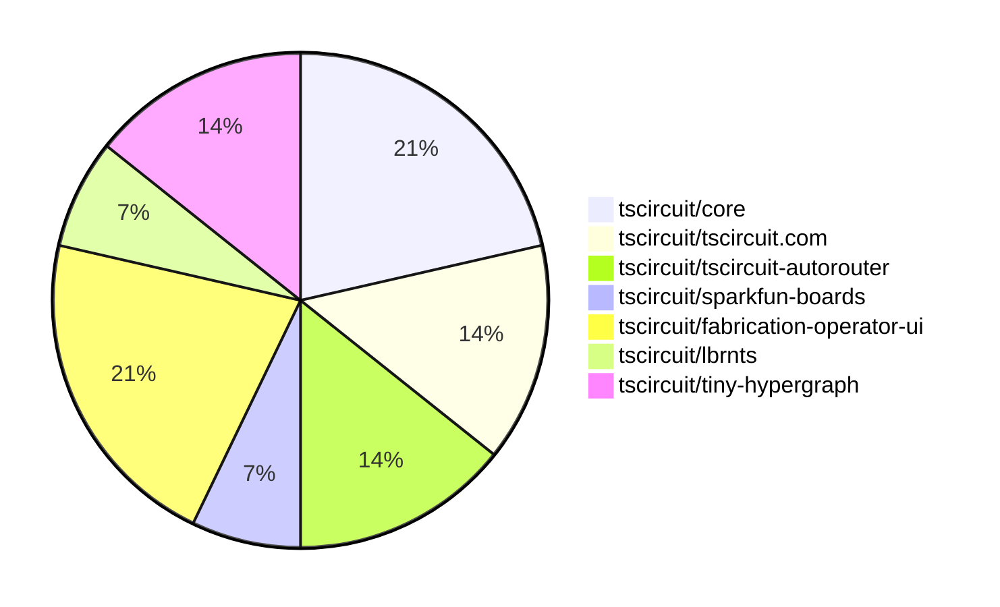

# Contribution Overview 2026-05-19

The current week is shown below. There are 3 major sections:

- [Contributor Overview](#contributor-overview)
- [PRs by Repository](#prs-by-repository)
- [PRs by Contributor](#changes-by-contributor)
- [Scoring & Sponsorship Details](/docs/sponsorship-calculation-explanation.md)

## PRs by Repository

## Contributor Overview

| Contributor | 🐳 Major | 🐙 Minor | 🐌 Tiny | Score | ⭐ | Discussion Contributions |
|-------------|---------|---------|---------|-------|-----|--------------------------|
| [Abse2001](#Abse2001) | 2 | 0 | 0 | 9 | ⭐ | 0🔹 0🔶 0💎 |
| [0hmX](#0hmX) | 2 | 0 | 0 | 8 | ⭐ | 0🔹 0🔶 0💎 |
| [AnasSarkiz](#AnasSarkiz) | 1 | 1 | 2 | 8 | ⭐ | 0🔹 0🔶 0💎 |
| [MustafaMulla29](#MustafaMulla29) | 0 | 2 | 0 | 4 | ⭐ | 0🔹 0🔶 0💎 |
| [itisrohit](#itisrohit) | 1 | 0 | 0 | 4 | ⭐ | 0🔹 0🔶 0💎 |
| [shehaban](#shehaban) | 1 | 0 | 0 | 4 | ⭐ | 0🔹 0🔶 0💎 |
| [techmannih](#techmannih) | 0 | 1 | 0 | 2 |  | 0🔹 0🔶 0💎 |
| [imrishabh18](#imrishabh18) | 0 | 0 | 1 | 1 |  | 0🔹 0🔶 0💎 |

## Staff Pass Ratio (SPR)

| Contributor | Reviewed PRs | Rejections | Approvals | SPR |
|-------------|--------------|------------|-----------|-----|
| [MustafaMulla29](#MustafaMulla29) | 2 | 0 | 2 | 100.0% |
| [techmannih](#techmannih) | 1 | 0 | 1 | 100.0% |
| [itisrohit](#itisrohit) | 1 | 0 | 1 | 100.0% |
| [0hmX](#0hmX) | 1 | 0 | 1 | 100.0% |
| [mohan-bee](#mohan-bee) | 1 | 0 | 1 | 100.0% |
| [AnasSarkiz](#AnasSarkiz) | 1 | 0 | 1 | 100.0% |

MustafaMulla29 SPR PRs (2)

- [#2312](https://github.com/tscircuit/core/pull/2312) Add autorouting start SRJ stack snapshots for breakout repros
- [#2311](https://github.com/tscircuit/core/pull/2311) Add breakout repros and autorouting end-phase stack snapshots

techmannih SPR PRs (1)

- [#2305](https://github.com/tscircuit/core/pull/2305) Fix jlcpcb CAD fallback for library footprints

itisrohit SPR PRs (1)

- [#3461](https://github.com/tscircuit/tscircuit.com/pull/3461) fix: preserve full redirect URL (path, query, and hash) on login and session timeout

0hmX SPR PRs (1)

- [#1200](https://github.com/tscircuit/tscircuit-autorouter/pull/1200) feat: add pipeline7 multigraph topology planner

mohan-bee SPR PRs (1)

- [#305](https://github.com/tscircuit/circuit-json-to-kicad/pull/305) Fix 3D model placement for rotated 3D components

AnasSarkiz SPR PRs (1)

- [#37](https://github.com/tscircuit/lbrnts/pull/37) Introduce LightBurn Content Offsetting API

> Note: AI evaluates PRs and assigns 1-3 star ratings automatically. 4 and 5 star ratings require manual staff review.

### Discussion Contribution Legend

- 🔹 Normal Comments: Basic participation with minimal effort
- 🔶 Great Informative Comments: Thoughtful participation that adds value
- 💎 Incredible Comments: Exceptional participation with high-quality content

## Review Table

[reviews-received-hover]: ## "Number of reviews received for PRs for this contributor"
[approvals-received-hover]: ## "Number of approvals received for PRs this contributor authored"
[rejections-received-hover]: ## "Number of rejections received for PRs this contributor authored"
[prs-opened-hover]: ## "Number of PRs opened by this contributor"
[issues-created-hover]: ## "Number of issues created by this contributor"

| Contributor | Reviews Received | Approvals Received | Rejections Received | Approvals | Rejections Given | PRs Opened | PRs Merged | Issues Created |
|---|---|---|---|---|---|---|---|---|
| [kayeve](#kayeve) | 0 | 0 | 0 | 0 | 0 | 1 | 0 | 0 |
| [RoyZhao1991](#RoyZhao1991) | 0 | 0 | 0 | 0 | 0 | 11 | 0 | 0 |
| [Myrarc](#Myrarc) | 0 | 0 | 0 | 0 | 0 | 1 | 0 | 0 |
| [fabicholas](#fabicholas) | 0 | 0 | 0 | 0 | 0 | 1 | 0 | 0 |
| [kodahhhhh](#kodahhhhh) | 0 | 0 | 0 | 0 | 0 | 1 | 0 | 0 |
| [mjzs13](#mjzs13) | 0 | 0 | 0 | 0 | 0 | 2 | 0 | 0 |
| [NguyenTienDat-GTR](#NguyenTienDat-GTR) | 0 | 0 | 0 | 0 | 0 | 2 | 0 | 0 |
| [2bf](#2bf) | 0 | 0 | 0 | 0 | 0 | 11 | 0 | 0 |
| [absalonCRC](#absalonCRC) | 0 | 0 | 0 | 0 | 0 | 4 | 0 | 0 |
| [Begarudev](#Begarudev) | 1 | 0 | 0 | 0 | 0 | 1 | 0 | 0 |
| [SimplyRayYZL](#SimplyRayYZL) | 0 | 0 | 0 | 0 | 0 | 8 | 0 | 0 |
| [ajjucoder](#ajjucoder) | 0 | 0 | 0 | 0 | 0 | 1 | 0 | 0 |
| [MINBBBIGcode](#MINBBBIGcode) | 2 | 0 | 0 | 0 | 0 | 3 | 0 | 0 |
| [jeffreybarts-max](#jeffreybarts-max) | 0 | 0 | 0 | 0 | 0 | 1 | 0 | 0 |
| [zergzorg](#zergzorg) | 0 | 0 | 0 | 0 | 0 | 2 | 0 | 0 |
| [g8rr5dg2p7-svg](#g8rr5dg2p7-svg) | 0 | 0 | 0 | 0 | 0 | 1 | 0 | 0 |
| [rtbogt11-droid](#rtbogt11-droid) | 0 | 0 | 0 | 0 | 0 | 1 | 0 | 0 |
| [shriram-svg](#shriram-svg) | 0 | 0 | 0 | 0 | 0 | 1 | 0 | 0 |
| [maiqiu-cat](#maiqiu-cat) | 0 | 0 | 0 | 0 | 0 | 1 | 0 | 0 |
| [yuetongli-PL](#yuetongli-PL) | 0 | 0 | 0 | 0 | 0 | 1 | 0 | 0 |
| [swhan0329](#swhan0329) | 0 | 0 | 0 | 0 | 0 | 39 | 0 | 0 |
| [swright7001](#swright7001) | 0 | 0 | 0 | 0 | 0 | 1 | 0 | 0 |
| [itsdior01](#itsdior01) | 0 | 0 | 0 | 0 | 0 | 1 | 0 | 0 |
| [sdibella](#sdibella) | 0 | 0 | 0 | 0 | 0 | 1 | 0 | 0 |
| [Charolex](#Charolex) | 0 | 0 | 0 | 0 | 0 | 1 | 0 | 0 |
| [illgitthat](#illgitthat) | 0 | 0 | 0 | 0 | 0 | 1 | 0 | 0 |
| [techmannih](#techmannih) | 1 | 1 | 0 | 0 | 0 | 1 | 1 | 0 |
| [seveibar](#seveibar) | 0 | 0 | 0 | 7 | 0 | 0 | 0 | 0 |
| [MustafaMulla29](#MustafaMulla29) | 3 | 2 | 0 | 2 | 1 | 3 | 2 | 0 |
| [garrettparker245-code](#garrettparker245-code) | 0 | 0 | 0 | 0 | 0 | 2 | 0 | 0 |
| [ShiboSoftwareDev](#ShiboSoftwareDev) | 0 | 0 | 0 | 1 | 0 | 3 | 1 | 0 |
| [iFaceTheWind](#iFaceTheWind) | 0 | 0 | 0 | 0 | 0 | 1 | 0 | 0 |
| [100more](#100more) | 0 | 0 | 0 | 0 | 0 | 3 | 0 | 0 |
| [yeguacelestial](#yeguacelestial) | 0 | 0 | 0 | 0 | 0 | 1 | 0 | 0 |
| [itisrohit](#itisrohit) | 1 | 1 | 0 | 0 | 0 | 1 | 1 | 0 |
| [imrishabh18](#imrishabh18) | 0 | 0 | 0 | 0 | 0 | 1 | 1 | 0 |
| [Fire-Fairy84](#Fire-Fairy84) | 0 | 0 | 0 | 0 | 0 | 1 | 0 | 0 |
| [a1local](#a1local) | 0 | 0 | 0 | 0 | 0 | 3 | 0 | 0 |
| [juanfgaviriac](#juanfgaviriac) | 0 | 0 | 0 | 0 | 0 | 2 | 0 | 0 |
| [codeaustral-oss](#codeaustral-oss) | 0 | 0 | 0 | 0 | 0 | 1 | 0 | 0 |
| [ryonakae](#ryonakae) | 0 | 0 | 0 | 0 | 0 | 1 | 0 | 0 |
| [chriszlr](#chriszlr) | 0 | 0 | 0 | 0 | 0 | 5 | 0 | 0 |
| [Haenlein1](#Haenlein1) | 0 | 0 | 0 | 0 | 0 | 1 | 0 | 0 |
| [hanjav](#hanjav) | 0 | 0 | 0 | 0 | 0 | 1 | 0 | 0 |
| [VOVANQUOCBAO](#VOVANQUOCBAO) | 0 | 0 | 0 | 0 | 0 | 2 | 0 | 0 |
| [demetacrypto](#demetacrypto) | 4 | 0 | 0 | 0 | 0 | 2 | 0 | 0 |
| [1aday](#1aday) | 5 | 0 | 0 | 0 | 0 | 2 | 0 | 0 |
| [jing11223344](#jing11223344) | 0 | 0 | 0 | 0 | 0 | 1 | 0 | 0 |
| [KLSGG](#KLSGG) | 0 | 0 | 0 | 0 | 0 | 1 | 0 | 0 |
| [enormusdapp-prog](#enormusdapp-prog) | 0 | 0 | 0 | 0 | 0 | 1 | 0 | 0 |
| [ya-nsh](#ya-nsh) | 0 | 0 | 0 | 0 | 0 | 2 | 0 | 0 |
| [FigLangHQ](#FigLangHQ) | 0 | 0 | 0 | 0 | 0 | 1 | 0 | 0 |
| [Wmedrado](#Wmedrado) | 2 | 0 | 0 | 0 | 0 | 2 | 0 | 0 |
| [mara-241](#mara-241) | 0 | 0 | 0 | 0 | 0 | 1 | 0 | 0 |
| [eric-cheong](#eric-cheong) | 0 | 0 | 0 | 0 | 0 | 2 | 0 | 0 |
| [MANFIT7](#MANFIT7) | 0 | 0 | 0 | 0 | 0 | 1 | 0 | 0 |
| [surim0n](#surim0n) | 0 | 0 | 0 | 0 | 0 | 2 | 0 | 0 |
| [Meliwat](#Meliwat) | 0 | 0 | 0 | 0 | 0 | 1 | 0 | 0 |
| [luoshui-coder](#luoshui-coder) | 0 | 0 | 0 | 0 | 0 | 1 | 0 | 0 |
| [dhrubasumatary](#dhrubasumatary) | 0 | 0 | 0 | 0 | 0 | 1 | 0 | 0 |
| [uniquenesslabs](#uniquenesslabs) | 0 | 0 | 0 | 0 | 0 | 1 | 0 | 0 |
| [emulatronicGIT](#emulatronicGIT) | 0 | 0 | 0 | 0 | 0 | 1 | 0 | 0 |
| [yangsori](#yangsori) | 0 | 0 | 0 | 0 | 0 | 4 | 0 | 0 |
| [7vf7gcpwsy-create](#7vf7gcpwsy-create) | 0 | 0 | 0 | 0 | 0 | 1 | 0 | 0 |
| [haocyan0723-code](#haocyan0723-code) | 0 | 0 | 0 | 0 | 0 | 2 | 0 | 0 |
| [steves83](#steves83) | 0 | 0 | 0 | 0 | 0 | 3 | 0 | 0 |
| [JacKane21](#JacKane21) | 0 | 0 | 0 | 0 | 0 | 1 | 0 | 0 |
| [EnesBrt](#EnesBrt) | 0 | 0 | 0 | 0 | 0 | 1 | 0 | 0 |
| [firewine](#firewine) | 3 | 0 | 0 | 0 | 0 | 1 | 0 | 0 |
| [mg272011](#mg272011) | 0 | 0 | 0 | 0 | 0 | 1 | 0 | 0 |
| [thepianistdirector](#thepianistdirector) | 0 | 0 | 0 | 0 | 0 | 1 | 0 | 0 |
| [Spina7](#Spina7) | 0 | 0 | 0 | 0 | 0 | 1 | 0 | 0 |
| [kebanks2](#kebanks2) | 0 | 0 | 0 | 0 | 0 | 2 | 0 | 0 |
| [Abse2001](#Abse2001) | 1 | 1 | 0 | 1 | 0 | 6 | 2 | 0 |
| [0hmX](#0hmX) | 1 | 1 | 0 | 0 | 0 | 2 | 2 | 0 |
| [Sang-it](#Sang-it) | 0 | 0 | 0 | 0 | 0 | 1 | 0 | 0 |
| [shehaban](#shehaban) | 2 | 1 | 0 | 0 | 0 | 1 | 1 | 0 |
| [PassivelyWealthyDad](#PassivelyWealthyDad) | 0 | 0 | 0 | 0 | 0 | 2 | 0 | 0 |
| [patchplain](#patchplain) | 0 | 0 | 0 | 0 | 0 | 1 | 0 | 0 |
| [mauricemohr88-debug](#mauricemohr88-debug) | 0 | 0 | 0 | 0 | 0 | 1 | 0 | 0 |
| [Thanhdn1984](#Thanhdn1984) | 0 | 0 | 0 | 0 | 0 | 1 | 0 | 0 |
| [morganschp](#morganschp) | 0 | 0 | 0 | 0 | 0 | 1 | 0 | 0 |
| [driptux](#driptux) | 0 | 0 | 0 | 0 | 0 | 1 | 0 | 0 |
| [kennynwokoye](#kennynwokoye) | 0 | 0 | 0 | 0 | 0 | 1 | 0 | 0 |
| [tanmayxchoudhary](#tanmayxchoudhary) | 0 | 0 | 0 | 0 | 0 | 1 | 0 | 0 |
| [liangtovi-debug](#liangtovi-debug) | 0 | 0 | 0 | 0 | 0 | 1 | 0 | 0 |
| [junn-dev](#junn-dev) | 0 | 0 | 0 | 0 | 0 | 1 | 0 | 0 |
| [thebasedcapital](#thebasedcapital) | 0 | 0 | 0 | 0 | 0 | 1 | 0 | 0 |
| [HunterCML](#HunterCML) | 0 | 0 | 0 | 0 | 0 | 1 | 0 | 0 |
| [partyplatter08-lab](#partyplatter08-lab) | 0 | 0 | 0 | 0 | 0 | 1 | 0 | 0 |
| [mohan-bee](#mohan-bee) | 5 | 3 | 0 | 0 | 0 | 1 | 0 | 0 |
| [AnasSarkiz](#AnasSarkiz) | 1 | 1 | 0 | 0 | 0 | 4 | 4 | 0 |
| [Bilal-Lodhi](#Bilal-Lodhi) | 5 | 0 | 1 | 0 | 0 | 2 | 0 | 0 |

## Changes by Repository

### [tscircuit/core](https://github.com/tscircuit/core)

| PR # | Impact | Rating | Contributor | Description |
|------|--------|--------|-------------|-------------|
| [#2305](https://github.com/tscircuit/core/pull/2305) | 🐙 Minor | ⭐⭐ | techmannih | Fixes 3D rendering for library footprints that do not provide a CAD model by falling back cleanly to a bounding box instead of surfacing a parser error. |
| [#2312](https://github.com/tscircuit/core/pull/2312) | 🐙 Minor | ⭐⭐ | MustafaMulla29 | Adds autorouting phase IO stack snapshots for breakout repros in the testing framework |
| [#2311](https://github.com/tscircuit/core/pull/2311) | 🐙 Minor | ⭐⭐ | MustafaMulla29 | Adds tests for breakout routing and autorouting end-phase stack snapshots, enhancing the testing framework for autorouting functionality. |

### [tscircuit/tscircuit.com](https://github.com/tscircuit/tscircuit.com)

| PR # | Impact | Rating | Contributor | Description |
|------|--------|--------|-------------|-------------|
| [#3461](https://github.com/tscircuit/tscircuit.com/pull/3461) | 🐳 Major | ⭐⭐⭐ | itisrohit | Fixes the issue where logging back in after a session timeout discards the users location state, search parameters, or hash fragments, ensuring users are redirected back to their intended location with full URL structure preserved. |

🐌 Tiny Contributions (1)

| PR # | Impact | Contributor | Description |
|------|--------|-------------|-------------|
| [#3462](https://github.com/tscircuit/tscircuit.com/pull/3462) | 🐌 Tiny | imrishabh18 | Removes deprecated fake API endpoints for order files and quotes, cleaning up the codebase and eliminating unused functionality. |

### [tscircuit/tscircuit-autorouter](https://github.com/tscircuit/tscircuit-autorouter)

| PR # | Impact | Rating | Contributor | Description |
|------|--------|--------|-------------|-------------|
| [#1200](https://github.com/tscircuit/tscircuit-autorouter/pull/1200) | 🐳 Major | ⭐⭐⭐ | 0hmX | https:github.comtscircuittscircuit-autorouterpull1175changes |
| [#1199](https://github.com/tscircuit/tscircuit-autorouter/pull/1199) | 🐳 Major | ⭐⭐⭐ | 0hmX | Adds a new portPointsInPairs field to NodeWithPortPoint to clarify connections between ports and nodes, enhancing the autorouting process. |

### [tscircuit/sparkfun-boards](https://github.com/tscircuit/sparkfun-boards)

| PR # | Impact | Rating | Contributor | Description |
|------|--------|--------|-------------|-------------|
| [#284](https://github.com/tscircuit/sparkfun-boards/pull/284) | 🐳 Major | ⭐⭐⭐ | shehaban | Adds a new SparkFun Qwiic Shield for Thing Plus, including schematic and footprint definitions for multiple connectors. |

### [tscircuit/fabrication-operator-ui](https://github.com/tscircuit/fabrication-operator-ui)

| PR # | Impact | Rating | Contributor | Description |
|------|--------|--------|-------------|-------------|
| [#10](https://github.com/tscircuit/fabrication-operator-ui/pull/10) | 🐳 Major | ⭐⭐⭐ | AnasSarkiz | Adds a CameraPreviewCard component for camera-assisted PCB alignment with controls for starting the camera, retaking snapshots, and using snapshots. |

🐌 Tiny Contributions (2)

| PR # | Impact | Contributor | Description |
|------|--------|-------------|-------------|
| [#11](https://github.com/tscircuit/fabrication-operator-ui/pull/11) | 🐌 Tiny | AnasSarkiz | Refactors the user interface to utilize Tailwind CSS for styling and enhances the visual representation of workflow state indicators across various components. |
| [#9](https://github.com/tscircuit/fabrication-operator-ui/pull/9) | 🐌 Tiny | AnasSarkiz | Adds new React components for the Dashboard and Fabrication workflow, enabling fixture pages for development and testing. |

### [tscircuit/lbrnts](https://github.com/tscircuit/lbrnts)

| PR # | Impact | Rating | Contributor | Description |
|------|--------|--------|-------------|-------------|
| [#37](https://github.com/tscircuit/lbrnts/pull/37) | 🐙 Minor | ⭐⭐ | AnasSarkiz | Adds a new applyOffsetToLbrn utility for translating LightBurn project geometry by applying XY offsets directly to shape transforms. |

### [tscircuit/tiny-hypergraph](https://github.com/tscircuit/tiny-hypergraph)

| PR # | Impact | Rating | Contributor | Description |
|------|--------|--------|-------------|-------------|
| [#90](https://github.com/tscircuit/tiny-hypergraph/pull/90) | 🐳 Major | ⭐⭐⭐ | Abse2001 | Adds configurable lazy heuristics and sparse candidate storage to improve rendering of large hypergraph visualizations, specifically fixing sample 02 in the srj13 dataset. |
| [#89](https://github.com/tscircuit/tiny-hypergraph/pull/89) | 🐳 Major | ⭐⭐⭐ | Abse2001 | Adds a benchmarking script and a new interactive page for the SRJ13 core solver, allowing users to run benchmarks and debug datasets interactively. |

## Changes by Contributor

### [techmannih](https://github.com/techmannih)

| PRs # | Impact | Rating | Description |
|------|--------|--------|-------------|
| [#2305](https://github.com/tscircuit/core/pull/2305) | 🐙 Minor | ⭐⭐ | Fixes 3D rendering for library footprints that do not provide a CAD model by falling back cleanly to a bounding box instead of surfacing a parser error. |

### [MustafaMulla29](https://github.com/MustafaMulla29)

| PRs # | Impact | Rating | Description |
|------|--------|--------|-------------|
| [#2312](https://github.com/tscircuit/core/pull/2312) | 🐙 Minor | ⭐⭐ | Adds autorouting phase IO stack snapshots for breakout repros in the testing framework |
| [#2311](https://github.com/tscircuit/core/pull/2311) | 🐙 Minor | ⭐⭐ | Adds tests for breakout routing and autorouting end-phase stack snapshots, enhancing the testing framework for autorouting functionality. |

### [itisrohit](https://github.com/itisrohit)

| PRs # | Impact | Rating | Description |
|------|--------|--------|-------------|
| [#3461](https://github.com/tscircuit/tscircuit.com/pull/3461) | 🐳 Major | ⭐⭐⭐ | Fixes the issue where logging back in after a session timeout discards the users location state, search parameters, or hash fragments, ensuring users are redirected back to their intended location with full URL structure preserved. |

### [imrishabh18](https://github.com/imrishabh18)

🐌 Tiny Contributions (1)

| PR # | Impact | Description |
|------|--------|-------------|
| [#3462](https://github.com/tscircuit/tscircuit.com/pull/3462) | 🐌 Tiny | Removes deprecated fake API endpoints for order files and quotes, cleaning up the codebase and eliminating unused functionality. |

### [0hmX](https://github.com/0hmX)

| PRs # | Impact | Rating | Description |
|------|--------|--------|-------------|
| [#1200](https://github.com/tscircuit/tscircuit-autorouter/pull/1200) | 🐳 Major | ⭐⭐⭐ | https:github.comtscircuittscircuit-autorouterpull1175changes |
| [#1199](https://github.com/tscircuit/tscircuit-autorouter/pull/1199) | 🐳 Major | ⭐⭐⭐ | Adds a new portPointsInPairs field to NodeWithPortPoint to clarify connections between ports and nodes, enhancing the autorouting process. |

### [shehaban](https://github.com/shehaban)

| PRs # | Impact | Rating | Description |
|------|--------|--------|-------------|
| [#284](https://github.com/tscircuit/sparkfun-boards/pull/284) | 🐳 Major | ⭐⭐⭐ | Adds a new SparkFun Qwiic Shield for Thing Plus, including schematic and footprint definitions for multiple connectors. |

### [AnasSarkiz](https://github.com/AnasSarkiz)

| PRs # | Impact | Rating | Description |
|------|--------|--------|-------------|
| [#10](https://github.com/tscircuit/fabrication-operator-ui/pull/10) | 🐳 Major | ⭐⭐⭐ | Adds a CameraPreviewCard component for camera-assisted PCB alignment with controls for starting the camera, retaking snapshots, and using snapshots. |
| [#37](https://github.com/tscircuit/lbrnts/pull/37) | 🐙 Minor | ⭐⭐ | Adds a new applyOffsetToLbrn utility for translating LightBurn project geometry by applying XY offsets directly to shape transforms. |

🐌 Tiny Contributions (2)

| PR # | Impact | Description |
|------|--------|-------------|
| [#11](https://github.com/tscircuit/fabrication-operator-ui/pull/11) | 🐌 Tiny | Refactors the user interface to utilize Tailwind CSS for styling and enhances the visual representation of workflow state indicators across various components. |
| [#9](https://github.com/tscircuit/fabrication-operator-ui/pull/9) | 🐌 Tiny | Adds new React components for the Dashboard and Fabrication workflow, enabling fixture pages for development and testing. |

### [Abse2001](https://github.com/Abse2001)

| PRs # | Impact | Rating | Description |
|------|--------|--------|-------------|
| [#90](https://github.com/tscircuit/tiny-hypergraph/pull/90) | 🐳 Major | ⭐⭐⭐ | Adds configurable lazy heuristics and sparse candidate storage to improve rendering of large hypergraph visualizations, specifically fixing sample 02 in the srj13 dataset. |
| [#89](https://github.com/tscircuit/tiny-hypergraph/pull/89) | 🐳 Major | ⭐⭐⭐ | Adds a benchmarking script and a new interactive page for the SRJ13 core solver, allowing users to run benchmarks and debug datasets interactively. |

## Repository Owners

| Repository | Codeowners |
|------------|------------|
| [builder](https://github.com/tscircuit/builder/blob/main/.github/CODEOWNERS) | [seveibar](https://github.com/seveibar)
| [pcb-viewer](https://github.com/tscircuit/pcb-viewer/blob/main/.github/CODEOWNERS) | [seveibar](https://github.com/seveibar), [ShiboSoftwareDev](https://github.com/ShiboSoftwareDev), [Abse2001](https://github.com/Abse2001)
| [footprints-old](https://github.com/tscircuit/footprints-old/blob/main/.github/CODEOWNERS) | [seveibar](https://github.com/seveibar)
| [footprinter](https://github.com/tscircuit/footprinter/blob/main/.github/CODEOWNERS) | [seveibar](https://github.com/seveibar), [techmannih](https://github.com/techmannih)
| [3d-viewer](https://github.com/tscircuit/3d-viewer/blob/main/.github/CODEOWNERS) | [ShiboSoftwareDev](https://github.com/ShiboSoftwareDev), [Abse2001](https://github.com/Abse2001)
| [winterspec](https://github.com/tscircuit/winterspec/blob/main/.github/CODEOWNERS) | [seveibar](https://github.com/seveibar), [ShiboSoftwareDev](https://github.com/ShiboSoftwareDev)
| [jscad-electronics](https://github.com/tscircuit/jscad-electronics/blob/main/.github/CODEOWNERS) | [seveibar](https://github.com/seveibar), [techmannih](https://github.com/techmannih), [ShiboSoftwareDev](https://github.com/ShiboSoftwareDev), [anas-sarkez](https://github.com/anas-sarkez)
| [circuit-to-svg](https://github.com/tscircuit/circuit-to-svg/blob/main/.github/CODEOWNERS) | [imrishabh18](https://github.com/imrishabh18)
| [schematic-symbols](https://github.com/tscircuit/schematic-symbols/blob/main/.github/CODEOWNERS) | [seveibar](https://github.com/seveibar), [imrishabh18](https://github.com/imrishabh18), [techmannih](https://github.com/techmannih)
| [circuit-json-to-gerber](https://github.com/tscircuit/circuit-json-to-gerber/blob/main/.github/CODEOWNERS) | [seveibar](https://github.com/seveibar), [ShiboSoftwareDev](https://github.com/ShiboSoftwareDev)
| [tscircuit.com](https://github.com/tscircuit/tscircuit.com/blob/main/.github/CODEOWNERS) | [seveibar](https://github.com/seveibar), [imrishabh18](https://github.com/imrishabh18)
| [issue-roulette](https://github.com/tscircuit/issue-roulette/blob/main/.github/CODEOWNERS) | [Anshgrover23](https://github.com/Anshgrover23)
| [sparkfun-boards](https://github.com/tscircuit/sparkfun-boards/blob/main/.github/CODEOWNERS) | [ShiboSoftwareDev](https://github.com/ShiboSoftwareDev), [Abse2001](https://github.com/Abse2001), [MustafaMulla29](https://github.com/MustafaMulla29), [Anshgrover23](https://github.com/Anshgrover23), [techmannih](https://github.com/techmannih)
| [schematic-corpus](https://github.com/tscircuit/schematic-corpus/blob/main/.github/CODEOWNERS) | [Abse2001](https://github.com/Abse2001)
| [copper-pour-solver](https://github.com/tscircuit/copper-pour-solver/blob/main/.github/CODEOWNERS) | [seveibar](https://github.com/seveibar), [ShiboSoftwareDev](https://github.com/ShiboSoftwareDev)
| [common](https://github.com/tscircuit/common/blob/main/.github/CODEOWNERS) | [seveibar](https://github.com/seveibar), [Abse2001](https://github.com/Abse2001)
| [circuit-to-canvas](https://github.com/tscircuit/circuit-to-canvas/blob/main/.github/CODEOWNERS) | [ShiboSoftwareDev](https://github.com/ShiboSoftwareDev), [Abse2001](https://github.com/Abse2001), [techmannih](https://github.com/techmannih)
| [circuit-json-to-lbrn](https://github.com/tscircuit/circuit-json-to-lbrn/blob/main/.github/CODEOWNERS) | [AnasSarkiz](https://github.com/AnasSarkiz)
| [pcbburn.com](https://github.com/tscircuit/pcbburn.com/blob/main/.github/CODEOWNERS) | [AnasSarkiz](https://github.com/AnasSarkiz)
| [high-density-repair03](https://github.com/tscircuit/high-density-repair03/blob/main/.github/CODEOWNERS) | [Abse2001](https://github.com/Abse2001)
| [fabrication-operator-ui](https://github.com/tscircuit/fabrication-operator-ui/blob/main/.github/CODEOWNERS) | [AnasSarkiz](https://github.com/AnasSarkiz)

## Repositories by Owner

| User | Repo |
|------|------|
| [seveibar](https://github.com/seveibar) | [builder](https://github.com/tscircuit/builder/blob/main/.github/CODEOWNERS) |
|  | [pcb-viewer](https://github.com/tscircuit/pcb-viewer/blob/main/.github/CODEOWNERS) |
|  | [footprints-old](https://github.com/tscircuit/footprints-old/blob/main/.github/CODEOWNERS) |
|  | [footprinter](https://github.com/tscircuit/footprinter/blob/main/.github/CODEOWNERS) |
|  | [winterspec](https://github.com/tscircuit/winterspec/blob/main/.github/CODEOWNERS) |
|  | [jscad-electronics](https://github.com/tscircuit/jscad-electronics/blob/main/.github/CODEOWNERS) |
|  | [schematic-symbols](https://github.com/tscircuit/schematic-symbols/blob/main/.github/CODEOWNERS) |
|  | [circuit-json-to-gerber](https://github.com/tscircuit/circuit-json-to-gerber/blob/main/.github/CODEOWNERS) |
|  | [tscircuit.com](https://github.com/tscircuit/tscircuit.com/blob/main/.github/CODEOWNERS) |
|  | [copper-pour-solver](https://github.com/tscircuit/copper-pour-solver/blob/main/.github/CODEOWNERS) |
|  | [common](https://github.com/tscircuit/common/blob/main/.github/CODEOWNERS) |
| [ShiboSoftwareDev](https://github.com/ShiboSoftwareDev) | [pcb-viewer](https://github.com/tscircuit/pcb-viewer/blob/main/.github/CODEOWNERS) |
|  | [3d-viewer](https://github.com/tscircuit/3d-viewer/blob/main/.github/CODEOWNERS) |
|  | [winterspec](https://github.com/tscircuit/winterspec/blob/main/.github/CODEOWNERS) |
|  | [jscad-electronics](https://github.com/tscircuit/jscad-electronics/blob/main/.github/CODEOWNERS) |
|  | [circuit-json-to-gerber](https://github.com/tscircuit/circuit-json-to-gerber/blob/main/.github/CODEOWNERS) |
|  | [sparkfun-boards](https://github.com/tscircuit/sparkfun-boards/blob/main/.github/CODEOWNERS) |
|  | [copper-pour-solver](https://github.com/tscircuit/copper-pour-solver/blob/main/.github/CODEOWNERS) |
|  | [circuit-to-canvas](https://github.com/tscircuit/circuit-to-canvas/blob/main/.github/CODEOWNERS) |
| [Abse2001](https://github.com/Abse2001) | [pcb-viewer](https://github.com/tscircuit/pcb-viewer/blob/main/.github/CODEOWNERS) |
|  | [3d-viewer](https://github.com/tscircuit/3d-viewer/blob/main/.github/CODEOWNERS) |
|  | [sparkfun-boards](https://github.com/tscircuit/sparkfun-boards/blob/main/.github/CODEOWNERS) |
|  | [schematic-corpus](https://github.com/tscircuit/schematic-corpus/blob/main/.github/CODEOWNERS) |
|  | [common](https://github.com/tscircuit/common/blob/main/.github/CODEOWNERS) |
|  | [circuit-to-canvas](https://github.com/tscircuit/circuit-to-canvas/blob/main/.github/CODEOWNERS) |
|  | [high-density-repair03](https://github.com/tscircuit/high-density-repair03/blob/main/.github/CODEOWNERS) |
| [techmannih](https://github.com/techmannih) | [footprinter](https://github.com/tscircuit/footprinter/blob/main/.github/CODEOWNERS) |
|  | [jscad-electronics](https://github.com/tscircuit/jscad-electronics/blob/main/.github/CODEOWNERS) |
|  | [schematic-symbols](https://github.com/tscircuit/schematic-symbols/blob/main/.github/CODEOWNERS) |
|  | [sparkfun-boards](https://github.com/tscircuit/sparkfun-boards/blob/main/.github/CODEOWNERS) |
|  | [circuit-to-canvas](https://github.com/tscircuit/circuit-to-canvas/blob/main/.github/CODEOWNERS) |
| [anas-sarkez](https://github.com/anas-sarkez) | [jscad-electronics](https://github.com/tscircuit/jscad-electronics/blob/main/.github/CODEOWNERS) |
| [imrishabh18](https://github.com/imrishabh18) | [circuit-to-svg](https://github.com/tscircuit/circuit-to-svg/blob/main/.github/CODEOWNERS) |
|  | [schematic-symbols](https://github.com/tscircuit/schematic-symbols/blob/main/.github/CODEOWNERS) |
|  | [tscircuit.com](https://github.com/tscircuit/tscircuit.com/blob/main/.github/CODEOWNERS) |
| [Anshgrover23](https://github.com/Anshgrover23) | [issue-roulette](https://github.com/tscircuit/issue-roulette/blob/main/.github/CODEOWNERS) |
|  | [sparkfun-boards](https://github.com/tscircuit/sparkfun-boards/blob/main/.github/CODEOWNERS) |
| [MustafaMulla29](https://github.com/MustafaMulla29) | [sparkfun-boards](https://github.com/tscircuit/sparkfun-boards/blob/main/.github/CODEOWNERS) |
| [AnasSarkiz](https://github.com/AnasSarkiz) | [circuit-json-to-lbrn](https://github.com/tscircuit/circuit-json-to-lbrn/blob/main/.github/CODEOWNERS) |
|  | [pcbburn.com](https://github.com/tscircuit/pcbburn.com/blob/main/.github/CODEOWNERS) |
|  | [fabrication-operator-ui](https://github.com/tscircuit/fabrication-operator-ui/blob/main/.github/CODEOWNERS) |

