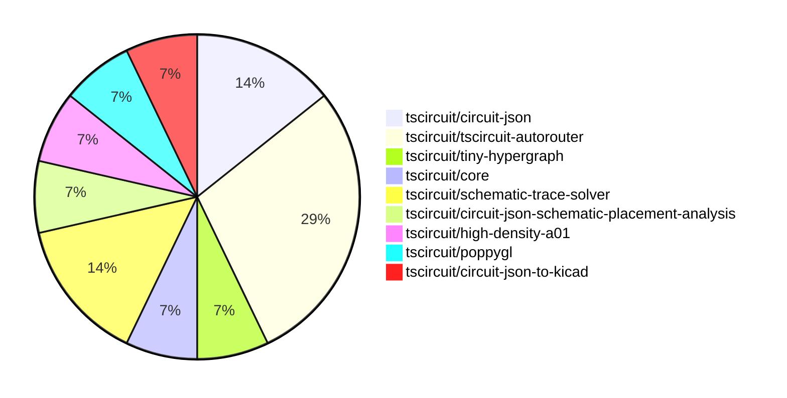

# Contribution Overview 2026-05-26

The current week is shown below. There are 3 major sections:

- [Contributor Overview](#contributor-overview)
- [PRs by Repository](#prs-by-repository)
- [PRs by Contributor](#changes-by-contributor)
- [Scoring & Sponsorship Details](/docs/sponsorship-calculation-explanation.md)

## PRs by Repository

## Contributor Overview

| Contributor | 🐳 Major | 🐙 Minor | 🐌 Tiny | Score | ⭐ | Discussion Contributions |
|-------------|---------|---------|---------|-------|-----|--------------------------|
| [0hmX](#0hmX) | 2 | 0 | 1 | 9 | ⭐ | 0🔹 0🔶 0💎 |
| [Sang-it](#Sang-it) | 0 | 1 | 3 | 5 | ⭐ | 0🔹 0🔶 0💎 |
| [seveibar](#seveibar) | 0 | 1 | 1 | 4 | ⭐ | 0🔹 0🔶 0💎 |
| [mohan-bee](#mohan-bee) | 1 | 0 | 0 | 4 | ⭐ | 0🔹 0🔶 0💎 |
| [tscircuitbot](#tscircuitbot) | 0 | 0 | 3 | 3 |  | 0🔹 0🔶 0💎 |
| [rushabhcodes](#rushabhcodes) | 0 | 0 | 1 | 1 |  | 0🔹 0🔶 0💎 |

## Staff Pass Ratio (SPR)

| Contributor | Reviewed PRs | Rejections | Approvals | SPR |
|-------------|--------------|------------|-----------|-----|
| [Sang-it](#Sang-it) | 1 | 0 | 1 | 100.0% |
| [0hmX](#0hmX) | 1 | 0 | 1 | 100.0% |
| [rushabhcodes](#rushabhcodes) | 1 | 1 | 0 | 0.0% |
| [mohan-bee](#mohan-bee) | 1 | 0 | 1 | 100.0% |

Sang-it SPR PRs (1)

- [#2337](https://github.com/tscircuit/core/pull/2337) add handcoded-rp2040 as reference

0hmX SPR PRs (1)

- [#82](https://github.com/tscircuit/high-density-a01/pull/82) add prev and next portPointId

rushabhcodes SPR PRs (1)

- [#27](https://github.com/tscircuit/poppygl/pull/27) Make GLTF-to-PNG rendering browser-safe with Node path support

mohan-bee SPR PRs (1)

- [#312](https://github.com/tscircuit/circuit-json-to-kicad/pull/312) repro: through_pad routes producing NaN KiCad PCB segments

> Note: AI evaluates PRs and assigns 1-3 star ratings automatically. 4 and 5 star ratings require manual staff review.

### Discussion Contribution Legend

- 🔹 Normal Comments: Basic participation with minimal effort
- 🔶 Great Informative Comments: Thoughtful participation that adds value
- 💎 Incredible Comments: Exceptional participation with high-quality content

## Review Table

[reviews-received-hover]: ## "Number of reviews received for PRs for this contributor"
[approvals-received-hover]: ## "Number of approvals received for PRs this contributor authored"
[rejections-received-hover]: ## "Number of rejections received for PRs this contributor authored"
[prs-opened-hover]: ## "Number of PRs opened by this contributor"
[issues-created-hover]: ## "Number of issues created by this contributor"

| Contributor | Reviews Received | Approvals Received | Rejections Received | Approvals | Rejections Given | PRs Opened | PRs Merged | Issues Created |
|---|---|---|---|---|---|---|---|---|
| [tscircuitbot](#tscircuitbot) | 0 | 0 | 0 | 0 | 0 | 4 | 3 | 0 |
| [seveibar](#seveibar) | 1 | 0 | 0 | 5 | 1 | 2 | 2 | 0 |
| [Sang-it](#Sang-it) | 7 | 2 | 0 | 0 | 0 | 5 | 4 | 0 |
| [michaelapollopimentel-svg](#michaelapollopimentel-svg) | 0 | 0 | 0 | 0 | 0 | 1 | 0 | 0 |
| [0hmX](#0hmX) | 1 | 1 | 0 | 0 | 0 | 5 | 3 | 0 |
| [sucloudflare](#sucloudflare) | 1 | 0 | 1 | 0 | 0 | 1 | 0 | 0 |
| [rushabhcodes](#rushabhcodes) | 11 | 1 | 1 | 0 | 1 | 2 | 1 | 0 |
| [Priyanshu31102003](#Priyanshu31102003) | 0 | 0 | 0 | 0 | 0 | 1 | 0 | 0 |
| [mohan-bee](#mohan-bee) | 1 | 1 | 0 | 0 | 0 | 2 | 1 | 0 |

## Changes by Repository

### [tscircuit/circuit-json](https://github.com/tscircuit/circuit-json)

| PR # | Impact | Rating | Contributor | Description |
|------|--------|--------|-------------|-------------|
| [#586](https://github.com/tscircuit/circuit-json/pull/586) | 🐙 Minor | ⭐⭐ | seveibar | Adds optional dash_length and dash_gap distance fields to schematic_line and schematic_path, along with tests and documentation updates. |

🐌 Tiny Contributions (1)

| PR # | Impact | Contributor | Description |
|------|--------|-------------|-------------|
| [#587](https://github.com/tscircuit/circuit-json/pull/587) | 🐌 Tiny | tscircuitbot | Automated package update |

### [tscircuit/tscircuit-autorouter](https://github.com/tscircuit/tscircuit-autorouter)

| PR # | Impact | Rating | Contributor | Description |
|------|--------|--------|-------------|-------------|
| [#1298](https://github.com/tscircuit/tscircuit-autorouter/pull/1298) | 🐳 Major | ⭐⭐⭐ | 0hmX | add prev and next port point ids svg update |

🐌 Tiny Contributions (3)

| PR # | Impact | Contributor | Description |
|------|--------|-------------|-------------|
| [#1300](https://github.com/tscircuit/tscircuit-autorouter/pull/1300) | 🐌 Tiny | tscircuitbot | Automated package update |
| [#1297](https://github.com/tscircuit/tscircuit-autorouter/pull/1297) | 🐌 Tiny | tscircuitbot | Automated package update |
| [#1296](https://github.com/tscircuit/tscircuit-autorouter/pull/1296) | 🐌 Tiny | 0hmX | Updates the dataset-srj11-45-degree dependency version and adds new sample circuits to the benchmark tests. |

### [tscircuit/tiny-hypergraph](https://github.com/tscircuit/tiny-hypergraph)

🐌 Tiny Contributions (1)

| PR # | Impact | Contributor | Description |
|------|--------|-------------|-------------|
| [#101](https://github.com/tscircuit/tiny-hypergraph/pull/101) | 🐌 Tiny | seveibar | Updates the dataset-srj18 dependency to a specific commit and modifies the DatasetSrj18Page to load samples dynamically from the updated dataset. |

### [tscircuit/core](https://github.com/tscircuit/core)

| PR # | Impact | Rating | Contributor | Description |
|------|--------|--------|-------------|-------------|
| [#2337](https://github.com/tscircuit/core/pull/2337) | 🐙 Minor | ⭐⭐ | Sang-it | Adds a new circuit design for the RP2040 microcontroller, including associated components and connections in the schematic. |

### [tscircuit/schematic-trace-solver](https://github.com/tscircuit/schematic-trace-solver)

🐌 Tiny Contributions (2)

| PR # | Impact | Contributor | Description |
|------|--------|-------------|-------------|
| [#445](https://github.com/tscircuit/schematic-trace-solver/pull/445) | 🐌 Tiny | Sang-it | Adds a new example for tracing through a component using the PipelineDebugger with a specific input problem. |
| [#443](https://github.com/tscircuit/schematic-trace-solver/pull/443) | 🐌 Tiny | Sang-it | Adds a new test case and example for a failing net label placement issue in the schematic trace solver. |

### [tscircuit/circuit-json-schematic-placement-analysis](https://github.com/tscircuit/circuit-json-schematic-placement-analysis)

🐌 Tiny Contributions (1)

| PR # | Impact | Contributor | Description |
|------|--------|-------------|-------------|
| [#29](https://github.com/tscircuit/circuit-json-schematic-placement-analysis/pull/29) | 🐌 Tiny | Sang-it | Adds a message to the capacitor orientation analyzer to guide users on fixing symbol orientation issues. |

### [tscircuit/high-density-a01](https://github.com/tscircuit/high-density-a01)

| PR # | Impact | Rating | Contributor | Description |
|------|--------|--------|-------------|-------------|
| [#82](https://github.com/tscircuit/high-density-a01/pull/82) | 🐳 Major | ⭐⭐⭐ | 0hmX | Add prev and next portPointId to enhance routing capabilities by linking port points in the circuit design. |

### [tscircuit/poppygl](https://github.com/tscircuit/poppygl)

🐌 Tiny Contributions (1)

| PR # | Impact | Contributor | Description |
|------|--------|-------------|-------------|
| [#26](https://github.com/tscircuit/poppygl/pull/26) | 🐌 Tiny | rushabhcodes | Adds Playwright-based browser compatibility testing and backward compatibility tests for the Node.js API, including a new browser compatibility fixture and improvements to the test setup. |

### [tscircuit/circuit-json-to-kicad](https://github.com/tscircuit/circuit-json-to-kicad)

| PR # | Impact | Rating | Contributor | Description |
|------|--------|--------|-------------|-------------|
| [#312](https://github.com/tscircuit/circuit-json-to-kicad/pull/312) | 🐳 Major | ⭐⭐⭐ | mohan-bee | Adds a repro using alarmv2.json showing that valid through_pad route points are converted into KiCad PCB segments with NaN coordinates, causing kicadts parsing to fail. core emits a valid circuit-json through_pad route point with startend coordinates, matching the circuit-json schema. where the converter assumes every route point has top-level xy, producing NaN for valid through_pad points. |

## Changes by Contributor

### [tscircuitbot](https://github.com/tscircuitbot)

🐌 Tiny Contributions (3)

| PR # | Impact | Description |
|------|--------|-------------|
| [#587](https://github.com/tscircuit/circuit-json/pull/587) | 🐌 Tiny | Automated package update |
| [#1300](https://github.com/tscircuit/tscircuit-autorouter/pull/1300) | 🐌 Tiny | Automated package update |
| [#1297](https://github.com/tscircuit/tscircuit-autorouter/pull/1297) | 🐌 Tiny | Automated package update |

### [seveibar](https://github.com/seveibar)

| PRs # | Impact | Rating | Description |
|------|--------|--------|-------------|
| [#586](https://github.com/tscircuit/circuit-json/pull/586) | 🐙 Minor | ⭐⭐ | Adds optional dash_length and dash_gap distance fields to schematic_line and schematic_path, along with tests and documentation updates. |

🐌 Tiny Contributions (1)

| PR # | Impact | Description |
|------|--------|-------------|
| [#101](https://github.com/tscircuit/tiny-hypergraph/pull/101) | 🐌 Tiny | Updates the dataset-srj18 dependency to a specific commit and modifies the DatasetSrj18Page to load samples dynamically from the updated dataset. |

### [Sang-it](https://github.com/Sang-it)

| PRs # | Impact | Rating | Description |
|------|--------|--------|-------------|
| [#2337](https://github.com/tscircuit/core/pull/2337) | 🐙 Minor | ⭐⭐ | Adds a new circuit design for the RP2040 microcontroller, including associated components and connections in the schematic. |

🐌 Tiny Contributions (3)

| PR # | Impact | Description |
|------|--------|-------------|
| [#445](https://github.com/tscircuit/schematic-trace-solver/pull/445) | 🐌 Tiny | Adds a new example for tracing through a component using the PipelineDebugger with a specific input problem. |
| [#443](https://github.com/tscircuit/schematic-trace-solver/pull/443) | 🐌 Tiny | Adds a new test case and example for a failing net label placement issue in the schematic trace solver. |
| [#29](https://github.com/tscircuit/circuit-json-schematic-placement-analysis/pull/29) | 🐌 Tiny | Adds a message to the capacitor orientation analyzer to guide users on fixing symbol orientation issues. |

### [0hmX](https://github.com/0hmX)

| PRs # | Impact | Rating | Description |
|------|--------|--------|-------------|
| [#1298](https://github.com/tscircuit/tscircuit-autorouter/pull/1298) | 🐳 Major | ⭐⭐⭐ | add prev and next port point ids svg update |
| [#82](https://github.com/tscircuit/high-density-a01/pull/82) | 🐳 Major | ⭐⭐⭐ | Add prev and next portPointId to enhance routing capabilities by linking port points in the circuit design. |

🐌 Tiny Contributions (1)

| PR # | Impact | Description |
|------|--------|-------------|
| [#1296](https://github.com/tscircuit/tscircuit-autorouter/pull/1296) | 🐌 Tiny | Updates the dataset-srj11-45-degree dependency version and adds new sample circuits to the benchmark tests. |

### [rushabhcodes](https://github.com/rushabhcodes)

🐌 Tiny Contributions (1)

| PR # | Impact | Description |
|------|--------|-------------|
| [#26](https://github.com/tscircuit/poppygl/pull/26) | 🐌 Tiny | Adds Playwright-based browser compatibility testing and backward compatibility tests for the Node.js API, including a new browser compatibility fixture and improvements to the test setup. |

### [mohan-bee](https://github.com/mohan-bee)

| PRs # | Impact | Rating | Description |
|------|--------|--------|-------------|
| [#312](https://github.com/tscircuit/circuit-json-to-kicad/pull/312) | 🐳 Major | ⭐⭐⭐ | Adds a repro using alarmv2.json showing that valid through_pad route points are converted into KiCad PCB segments with NaN coordinates, causing kicadts parsing to fail. core emits a valid circuit-json through_pad route point with startend coordinates, matching the circuit-json schema. where the converter assumes every route point has top-level xy, producing NaN for valid through_pad points. |

## Repository Owners

| Repository | Codeowners |
|------------|------------|
| [builder](https://github.com/tscircuit/builder/blob/main/.github/CODEOWNERS) | [seveibar](https://github.com/seveibar)
| [pcb-viewer](https://github.com/tscircuit/pcb-viewer/blob/main/.github/CODEOWNERS) | [seveibar](https://github.com/seveibar), [ShiboSoftwareDev](https://github.com/ShiboSoftwareDev), [Abse2001](https://github.com/Abse2001)
| [footprints-old](https://github.com/tscircuit/footprints-old/blob/main/.github/CODEOWNERS) | [seveibar](https://github.com/seveibar)
| [footprinter](https://github.com/tscircuit/footprinter/blob/main/.github/CODEOWNERS) | [seveibar](https://github.com/seveibar), [techmannih](https://github.com/techmannih)
| [3d-viewer](https://github.com/tscircuit/3d-viewer/blob/main/.github/CODEOWNERS) | [ShiboSoftwareDev](https://github.com/ShiboSoftwareDev), [Abse2001](https://github.com/Abse2001)
| [winterspec](https://github.com/tscircuit/winterspec/blob/main/.github/CODEOWNERS) | [seveibar](https://github.com/seveibar), [ShiboSoftwareDev](https://github.com/ShiboSoftwareDev)
| [jscad-electronics](https://github.com/tscircuit/jscad-electronics/blob/main/.github/CODEOWNERS) | [seveibar](https://github.com/seveibar), [techmannih](https://github.com/techmannih), [ShiboSoftwareDev](https://github.com/ShiboSoftwareDev), [anas-sarkez](https://github.com/anas-sarkez)
| [circuit-to-svg](https://github.com/tscircuit/circuit-to-svg/blob/main/.github/CODEOWNERS) | [imrishabh18](https://github.com/imrishabh18)
| [schematic-symbols](https://github.com/tscircuit/schematic-symbols/blob/main/.github/CODEOWNERS) | [seveibar](https://github.com/seveibar), [imrishabh18](https://github.com/imrishabh18), [techmannih](https://github.com/techmannih)
| [circuit-json-to-gerber](https://github.com/tscircuit/circuit-json-to-gerber/blob/main/.github/CODEOWNERS) | [seveibar](https://github.com/seveibar), [ShiboSoftwareDev](https://github.com/ShiboSoftwareDev)
| [tscircuit.com](https://github.com/tscircuit/tscircuit.com/blob/main/.github/CODEOWNERS) | [seveibar](https://github.com/seveibar), [imrishabh18](https://github.com/imrishabh18)
| [issue-roulette](https://github.com/tscircuit/issue-roulette/blob/main/.github/CODEOWNERS) | [Anshgrover23](https://github.com/Anshgrover23)
| [sparkfun-boards](https://github.com/tscircuit/sparkfun-boards/blob/main/.github/CODEOWNERS) | [ShiboSoftwareDev](https://github.com/ShiboSoftwareDev), [Abse2001](https://github.com/Abse2001), [MustafaMulla29](https://github.com/MustafaMulla29), [Anshgrover23](https://github.com/Anshgrover23), [techmannih](https://github.com/techmannih)
| [schematic-corpus](https://github.com/tscircuit/schematic-corpus/blob/main/.github/CODEOWNERS) | [Abse2001](https://github.com/Abse2001)
| [copper-pour-solver](https://github.com/tscircuit/copper-pour-solver/blob/main/.github/CODEOWNERS) | [seveibar](https://github.com/seveibar), [ShiboSoftwareDev](https://github.com/ShiboSoftwareDev)
| [common](https://github.com/tscircuit/common/blob/main/.github/CODEOWNERS) | [seveibar](https://github.com/seveibar), [Abse2001](https://github.com/Abse2001)
| [circuit-to-canvas](https://github.com/tscircuit/circuit-to-canvas/blob/main/.github/CODEOWNERS) | [ShiboSoftwareDev](https://github.com/ShiboSoftwareDev), [Abse2001](https://github.com/Abse2001), [techmannih](https://github.com/techmannih)
| [circuit-json-to-lbrn](https://github.com/tscircuit/circuit-json-to-lbrn/blob/main/.github/CODEOWNERS) | [AnasSarkiz](https://github.com/AnasSarkiz)
| [pcbburn.com](https://github.com/tscircuit/pcbburn.com/blob/main/.github/CODEOWNERS) | [AnasSarkiz](https://github.com/AnasSarkiz)
| [high-density-repair03](https://github.com/tscircuit/high-density-repair03/blob/main/.github/CODEOWNERS) | [Abse2001](https://github.com/Abse2001)
| [fabrication-operator-ui](https://github.com/tscircuit/fabrication-operator-ui/blob/main/.github/CODEOWNERS) | [AnasSarkiz](https://github.com/AnasSarkiz)

## Repositories by Owner

| User | Repo |
|------|------|
| [seveibar](https://github.com/seveibar) | [builder](https://github.com/tscircuit/builder/blob/main/.github/CODEOWNERS) |
|  | [pcb-viewer](https://github.com/tscircuit/pcb-viewer/blob/main/.github/CODEOWNERS) |
|  | [footprints-old](https://github.com/tscircuit/footprints-old/blob/main/.github/CODEOWNERS) |
|  | [footprinter](https://github.com/tscircuit/footprinter/blob/main/.github/CODEOWNERS) |
|  | [winterspec](https://github.com/tscircuit/winterspec/blob/main/.github/CODEOWNERS) |
|  | [jscad-electronics](https://github.com/tscircuit/jscad-electronics/blob/main/.github/CODEOWNERS) |
|  | [schematic-symbols](https://github.com/tscircuit/schematic-symbols/blob/main/.github/CODEOWNERS) |
|  | [circuit-json-to-gerber](https://github.com/tscircuit/circuit-json-to-gerber/blob/main/.github/CODEOWNERS) |
|  | [tscircuit.com](https://github.com/tscircuit/tscircuit.com/blob/main/.github/CODEOWNERS) |
|  | [copper-pour-solver](https://github.com/tscircuit/copper-pour-solver/blob/main/.github/CODEOWNERS) |
|  | [common](https://github.com/tscircuit/common/blob/main/.github/CODEOWNERS) |
| [ShiboSoftwareDev](https://github.com/ShiboSoftwareDev) | [pcb-viewer](https://github.com/tscircuit/pcb-viewer/blob/main/.github/CODEOWNERS) |
|  | [3d-viewer](https://github.com/tscircuit/3d-viewer/blob/main/.github/CODEOWNERS) |
|  | [winterspec](https://github.com/tscircuit/winterspec/blob/main/.github/CODEOWNERS) |
|  | [jscad-electronics](https://github.com/tscircuit/jscad-electronics/blob/main/.github/CODEOWNERS) |
|  | [circuit-json-to-gerber](https://github.com/tscircuit/circuit-json-to-gerber/blob/main/.github/CODEOWNERS) |
|  | [sparkfun-boards](https://github.com/tscircuit/sparkfun-boards/blob/main/.github/CODEOWNERS) |
|  | [copper-pour-solver](https://github.com/tscircuit/copper-pour-solver/blob/main/.github/CODEOWNERS) |
|  | [circuit-to-canvas](https://github.com/tscircuit/circuit-to-canvas/blob/main/.github/CODEOWNERS) |
| [Abse2001](https://github.com/Abse2001) | [pcb-viewer](https://github.com/tscircuit/pcb-viewer/blob/main/.github/CODEOWNERS) |
|  | [3d-viewer](https://github.com/tscircuit/3d-viewer/blob/main/.github/CODEOWNERS) |
|  | [sparkfun-boards](https://github.com/tscircuit/sparkfun-boards/blob/main/.github/CODEOWNERS) |
|  | [schematic-corpus](https://github.com/tscircuit/schematic-corpus/blob/main/.github/CODEOWNERS) |
|  | [common](https://github.com/tscircuit/common/blob/main/.github/CODEOWNERS) |
|  | [circuit-to-canvas](https://github.com/tscircuit/circuit-to-canvas/blob/main/.github/CODEOWNERS) |
|  | [high-density-repair03](https://github.com/tscircuit/high-density-repair03/blob/main/.github/CODEOWNERS) |
| [techmannih](https://github.com/techmannih) | [footprinter](https://github.com/tscircuit/footprinter/blob/main/.github/CODEOWNERS) |
|  | [jscad-electronics](https://github.com/tscircuit/jscad-electronics/blob/main/.github/CODEOWNERS) |
|  | [schematic-symbols](https://github.com/tscircuit/schematic-symbols/blob/main/.github/CODEOWNERS) |
|  | [sparkfun-boards](https://github.com/tscircuit/sparkfun-boards/blob/main/.github/CODEOWNERS) |
|  | [circuit-to-canvas](https://github.com/tscircuit/circuit-to-canvas/blob/main/.github/CODEOWNERS) |
| [anas-sarkez](https://github.com/anas-sarkez) | [jscad-electronics](https://github.com/tscircuit/jscad-electronics/blob/main/.github/CODEOWNERS) |
| [imrishabh18](https://github.com/imrishabh18) | [circuit-to-svg](https://github.com/tscircuit/circuit-to-svg/blob/main/.github/CODEOWNERS) |
|  | [schematic-symbols](https://github.com/tscircuit/schematic-symbols/blob/main/.github/CODEOWNERS) |
|  | [tscircuit.com](https://github.com/tscircuit/tscircuit.com/blob/main/.github/CODEOWNERS) |
| [Anshgrover23](https://github.com/Anshgrover23) | [issue-roulette](https://github.com/tscircuit/issue-roulette/blob/main/.github/CODEOWNERS) |
|  | [sparkfun-boards](https://github.com/tscircuit/sparkfun-boards/blob/main/.github/CODEOWNERS) |
| [MustafaMulla29](https://github.com/MustafaMulla29) | [sparkfun-boards](https://github.com/tscircuit/sparkfun-boards/blob/main/.github/CODEOWNERS) |
| [AnasSarkiz](https://github.com/AnasSarkiz) | [circuit-json-to-lbrn](https://github.com/tscircuit/circuit-json-to-lbrn/blob/main/.github/CODEOWNERS) |
|  | [pcbburn.com](https://github.com/tscircuit/pcbburn.com/blob/main/.github/CODEOWNERS) |
|  | [fabrication-operator-ui](https://github.com/tscircuit/fabrication-operator-ui/blob/main/.github/CODEOWNERS) |

