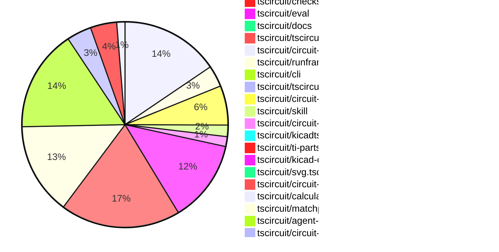

# Contribution Overview 2026-06-02

The current week is shown below. There are 3 major sections:

- [Contributor Overview](#contributor-overview)
- [PRs by Repository](#prs-by-repository)
- [PRs by Contributor](#changes-by-contributor)
- [Scoring & Sponsorship Details](/docs/sponsorship-calculation-explanation.md)

## PRs by Repository

## Contributor Overview

| Contributor | 🐳 Major | 🐙 Minor | 🐌 Tiny | Score | ⭐ | Discussion Contributions |
|-------------|---------|---------|---------|-------|-----|--------------------------|
| [rushabhcodes](#rushabhcodes) | 4 | 12 | 11 | 54 | ⭐⭐⭐ | 0🔹 0🔶 0💎 |
| [imrishabh18](#imrishabh18) | 4 | 16 | 13 | 53 | ⭐⭐⭐ | 0🔹 0🔶 0💎 |
| [Sang-it](#Sang-it) | 4 | 8 | 8 | 39.5 | ⭐⭐ | 0🔹 0🔶 0💎 |
| [seveibar](#seveibar) | 4 | 4 | 3 | 28 | ⭐⭐ | 0🔹 0🔶 0💎 |
| [MustafaMulla29](#MustafaMulla29) | 3 | 1 | 5 | 20 | ⭐⭐ | 0🔹 0🔶 0💎 |
| [Abse2001](#Abse2001) | 3 | 0 | 1 | 20 | ⭐⭐ | 0🔹 0🔶 0💎 |
| [AnasSarkiz](#AnasSarkiz) | 4 | 0 | 3 | 19.5 | ⭐⭐ | 0🔹 0🔶 0💎 |
| [techmannih](#techmannih) | 0 | 4 | 5 | 17 | ⭐⭐ | 0🔹 0🔶 0💎 |
| [tscircuitbot](#tscircuitbot) | 0 | 0 | 291 | 15 | ⭐⭐ | 0🔹 0🔶 0💎 |
| [mohan-bee](#mohan-bee) | 1 | 3 | 3 | 14 | ⭐⭐ | 0🔹 0🔶 0💎 |
| [ShiboSoftwareDev](#ShiboSoftwareDev) | 1 | 3 | 1 | 12 | ⭐⭐ | 0🔹 0🔶 0💎 |
| [anil08607](#anil08607) | 0 | 4 | 3 | 11 | ⭐⭐ | 0🔹 0🔶 0💎 |
| [0hmX](#0hmX) | 2 | 1 | 1 | 11 | ⭐⭐ | 0🔹 0🔶 0💎 |

## Staff Pass Ratio (SPR)

| Contributor | Reviewed PRs | Rejections | Approvals | SPR |
|-------------|--------------|------------|-----------|-----|
| [rushabhcodes](#rushabhcodes) | 11 | 2 | 10 | 81.8% |
| [imrishabh18](#imrishabh18) | 9 | 0 | 9 | 100.0% |
| [Sang-it](#Sang-it) | 6 | 2 | 7 | 66.7% |
| [techmannih](#techmannih) | 4 | 0 | 4 | 100.0% |
| [Abse2001](#Abse2001) | 4 | 0 | 5 | 100.0% |
| [MustafaMulla29](#MustafaMulla29) | 3 | 0 | 3 | 100.0% |
| [anil08607](#anil08607) | 3 | 1 | 2 | 66.7% |
| [mohan-bee](#mohan-bee) | 3 | 0 | 3 | 100.0% |
| [0hmX](#0hmX) | 3 | 0 | 5 | 100.0% |
| [AnasSarkiz](#AnasSarkiz) | 3 | 0 | 3 | 100.0% |
| [ShiboSoftwareDev](#ShiboSoftwareDev) | 2 | 0 | 2 | 100.0% |
| [itisrohit](#itisrohit) | 1 | 0 | 1 | 100.0% |

rushabhcodes SPR PRs (11)

- [#888](https://github.com/tscircuit/pcb-viewer/pull/888) Fix PCBViewer attribute update invalidation
- [#689](https://github.com/tscircuit/props/pull/689) add oval hole interface and corresponding tests
- [#2393](https://github.com/tscircuit/core/pull/2393) add oval hole support
- [#3558](https://github.com/tscircuit/tscircuit.com/pull/3558) Preserve  package view hash links while circuit JSON is loading
- [#39](https://github.com/tscircuit/circuit-json-to-tscircuit/pull/39) Add support for rectangular and pill-shaped PCB holes in footprint generation
- [#38](https://github.com/tscircuit/circuit-json-to-tscircuit/pull/38) Add pcb_silkscreen_circle footprint conversion
- [#37](https://github.com/tscircuit/circuit-json-to-tscircuit/pull/37) Add silkscreenrect footprint conversion and snapshot coverage
- [#134](https://github.com/tscircuit/kicad-to-circuit-json/pull/134) feat: add standalone footprint converter for KiCad .kicad_mod files
- [#131](https://github.com/tscircuit/kicad-to-circuit-json/pull/131) Add standalone `.kicad_mod` footprint conversion with regression test and website support
- [#126](https://github.com/tscircuit/kicad-to-circuit-json/pull/126) Add .kicad_sch and .kicad_sym support to the browser viewer
- [#118](https://github.com/tscircuit/kicad-to-circuit-json/pull/118) Update tscircuit version and make Arduino Uno via-overlay repro robust against via ordering

imrishabh18 SPR PRs (9)

- [#2405](https://github.com/tscircuit/core/pull/2405) Add `schematic_port` data to the footprinterCircuitJson output
- [#2398](https://github.com/tscircuit/core/pull/2398) Render the schematic symbol present inside the footprintCircuitJson
- [#3577](https://github.com/tscircuit/tscircuit.com/pull/3577) Track the order dialog activities in posthog
- [#3603](https://github.com/tscircuit/tscircuit.com/pull/3603) Add the crisp widget on the website
- [#2798](https://github.com/tscircuit/eval/pull/2798) Added support for package browser object mappings when resolving package entrypoints
- [#2784](https://github.com/tscircuit/eval/pull/2784) Override the platformConfig parts engine from the tscircuit.config.ts
- [#2786](https://github.com/tscircuit/eval/pull/2786) Support entrypoint of modules which have `./*.ts` extension
- [#3189](https://github.com/tscircuit/cli/pull/3189) Upload the transitive dependencies of the imported packages in tscircuit.config.ts
- [#23](https://github.com/tscircuit/ti-parts-engine/pull/23) Pass the schematic symbol circuit json

Sang-it SPR PRs (6)

- [#2396](https://github.com/tscircuit/core/pull/2396) fix inner label collision in chips with top and bottom pins
- [#2395](https://github.com/tscircuit/core/pull/2395) update regex for power/ground label detection
- [#2379](https://github.com/tscircuit/core/pull/2379) Fix missing net labels when accidentally removed because they were considered duplicates incorrectly
- [#2378](https://github.com/tscircuit/core/pull/2378) auto place schematic-sections for circuits without manual positions
- [#2390](https://github.com/tscircuit/core/pull/2390) allow hybrid placement for schematicsection
- [#2376](https://github.com/tscircuit/core/pull/2376) bump calculate-cell-boundaries to 0.0.8

techmannih SPR PRs (4)

- [#570](https://github.com/tscircuit/circuit-to-svg/pull/570) Add pcb_silkscreen_graphic support 
- [#114](https://github.com/tscircuit/circuit-json-to-gerber/pull/114) Fix silkscreen knockout Gerber rendering and snapshot coverage
- [#3157](https://github.com/tscircuit/cli/pull/3157) Use runtime project config in build, export, and simulate flows
- [#122](https://github.com/tscircuit/kicad-to-circuit-json/pull/122) fix: improve PCB text size and position

Abse2001 SPR PRs (4)

- [#700](https://github.com/tscircuit/docs/pull/700) Add documentation for creating and contributing autorouting datasets
- [#1332](https://github.com/tscircuit/tscircuit-autorouter/pull/1332) Improve QFP thermal-pad topology generation with narrow-gap merging and nested component mesh planning
- [#1](https://github.com/tscircuit/dataset-srj19/pull/1) Add SRJ19 dataset for BGA breakout routing with passive component overlays with visualization fixtures
- [#1](https://github.com/tscircuit/dataset-srj20/pull/1) Add SRJ20 partial BGA breakout dataset with visualization fixtures and missing-pad metadata

MustafaMulla29 SPR PRs (3)

- [#2386](https://github.com/tscircuit/core/pull/2386) Fix srj to set breakout bounds
- [#2377](https://github.com/tscircuit/core/pull/2377) Assign routed trace source IDs from source ports
- [#158](https://github.com/tscircuit/checks/pull/158) Fix false missing-connection DRC errors for branched PCB traces

anil08607 SPR PRs (3)

- [#2403](https://github.com/tscircuit/core/pull/2403) Add dashLength and dashGap support to schematic lines and paths
- [#47](https://github.com/tscircuit/circuit-json-to-tscircuit/pull/47) refactor: centralize optional footprint TSX attribute formatters
- [#330](https://github.com/tscircuit/circuit-json-to-kicad/pull/330) Support exporting pcb_cutout shapes to KiCad Edge.Cuts

mohan-bee SPR PRs (3)

- [#2387](https://github.com/tscircuit/core/pull/2387) Fix solderjumper bridged footprint resolution
- [#2385](https://github.com/tscircuit/core/pull/2385) Add normal component footprint resolver
- [#49](https://github.com/tscircuit/kicadts/pull/49) Add ZoneKeepout constructor support

0hmX SPR PRs (3)

- [#1343](https://github.com/tscircuit/tscircuit-autorouter/pull/1343) move componentDetectionSolver to just after preprocessSimpleRouteJsonSolver
- [#1341](https://github.com/tscircuit/tscircuit-autorouter/pull/1341) refactor component topology generator dispatch
- [#6](https://github.com/tscircuit/dataset-srj18/pull/6) Strip Pcb Traces From Circuit Json

AnasSarkiz SPR PRs (3)

- [#1336](https://github.com/tscircuit/tscircuit-autorouter/pull/1336) Introduce Direct-Overlap Via Grouping for Stable Same-Net Via Consolidation
- [#125](https://github.com/tscircuit/kicad-to-circuit-json/pull/125) Fix duplicate KiCad pad IDs corrupting circuit connectivity
- [#5](https://github.com/tscircuit/dataset-srj18/pull/5) Updated Kicad-to-circuit-json and regenerate the dataset

ShiboSoftwareDev SPR PRs (2)

- [#10](https://github.com/tscircuit/ngspice-spice-engine/pull/10) Add PSPICE compatibility mode support
- [#3](https://github.com/tscircuit/spicets/pull/3) Add PSPICE fixture parsing coverage

itisrohit SPR PRs (1)

- [#1331](https://github.com/tscircuit/tscircuit-autorouter/pull/1331) repro: document Pipeline8 preplaced-via layer-span validation gap

> Note: AI evaluates PRs and assigns 1-3 star ratings automatically. 4 and 5 star ratings require manual staff review.

### Discussion Contribution Legend

- 🔹 Normal Comments: Basic participation with minimal effort
- 🔶 Great Informative Comments: Thoughtful participation that adds value
- 💎 Incredible Comments: Exceptional participation with high-quality content

## Review Table

[reviews-received-hover]: ## "Number of reviews received for PRs for this contributor"
[approvals-received-hover]: ## "Number of approvals received for PRs this contributor authored"
[rejections-received-hover]: ## "Number of rejections received for PRs this contributor authored"
[prs-opened-hover]: ## "Number of PRs opened by this contributor"
[issues-created-hover]: ## "Number of issues created by this contributor"

| Contributor | Reviews Received | Approvals Received | Rejections Received | Approvals | Rejections Given | PRs Opened | PRs Merged | Issues Created |
|---|---|---|---|---|---|---|---|---|
| [Vinzz2303](#Vinzz2303) | 0 | 0 | 0 | 0 | 0 | 3 | 0 | 0 |
| [royliz3090-jpg](#royliz3090-jpg) | 0 | 0 | 0 | 0 | 0 | 2 | 0 | 0 |
| [Forage409](#Forage409) | 0 | 0 | 0 | 0 | 0 | 1 | 0 | 0 |
| [tonghuaxingdsb](#tonghuaxingdsb) | 0 | 0 | 0 | 0 | 0 | 2 | 0 | 0 |
| [yanziwei](#yanziwei) | 0 | 0 | 0 | 0 | 0 | 9 | 0 | 0 |
| [Aaloklovanshi](#Aaloklovanshi) | 0 | 0 | 0 | 0 | 0 | 1 | 0 | 0 |
| [ultra-pod](#ultra-pod) | 0 | 0 | 0 | 0 | 0 | 3 | 0 | 0 |
| [rushabhcodes](#rushabhcodes) | 74 | 27 | 2 | 4 | 0 | 35 | 27 | 0 |
| [seveibar](#seveibar) | 4 | 0 | 0 | 53 | 2 | 15 | 12 | 0 |
| [tscircuitbot](#tscircuitbot) | 0 | 0 | 0 | 0 | 0 | 362 | 291 | 0 |
| [MustafaMulla29](#MustafaMulla29) | 7 | 5 | 0 | 5 | 0 | 10 | 9 | 0 |
| [shwet369](#shwet369) | 0 | 0 | 0 | 0 | 0 | 2 | 0 | 0 |
| [gfgf-brain](#gfgf-brain) | 0 | 0 | 0 | 0 | 0 | 1 | 0 | 0 |
| [imrishabh18](#imrishabh18) | 10 | 9 | 0 | 17 | 2 | 38 | 34 | 0 |
| [techmannih](#techmannih) | 15 | 7 | 0 | 5 | 2 | 15 | 9 | 0 |
| [Abse2001](#Abse2001) | 13 | 5 | 0 | 7 | 0 | 11 | 6 | 0 |
| [Guciolek](#Guciolek) | 0 | 0 | 0 | 0 | 0 | 1 | 0 | 0 |
| [Ojas2095](#Ojas2095) | 0 | 0 | 0 | 0 | 0 | 17 | 0 | 0 |
| [sagarmaurya64-ai](#sagarmaurya64-ai) | 0 | 0 | 0 | 0 | 0 | 5 | 0 | 0 |
| [possibly6](#possibly6) | 0 | 0 | 0 | 0 | 0 | 1 | 0 | 0 |
| [anil08607](#anil08607) | 24 | 16 | 3 | 0 | 0 | 16 | 7 | 0 |
| [Sang-it](#Sang-it) | 12 | 7 | 0 | 0 | 0 | 22 | 20 | 0 |
| [mohan-bee](#mohan-bee) | 25 | 9 | 1 | 2 | 1 | 12 | 7 | 0 |
| [ShiboSoftwareDev](#ShiboSoftwareDev) | 2 | 2 | 0 | 1 | 0 | 8 | 5 | 0 |
| [as490024862-cmd](#as490024862-cmd) | 0 | 0 | 0 | 0 | 0 | 1 | 0 | 0 |
| [kkk02180218](#kkk02180218) | 0 | 0 | 0 | 0 | 0 | 10 | 0 | 0 |
| [bnpl7](#bnpl7) | 0 | 0 | 0 | 0 | 0 | 1 | 0 | 0 |
| [Adit-Jain-srm](#Adit-Jain-srm) | 0 | 0 | 0 | 0 | 0 | 1 | 0 | 0 |
| [Lathikaa-S](#Lathikaa-S) | 1 | 0 | 0 | 0 | 0 | 2 | 0 | 0 |
| [tick25108-cpu](#tick25108-cpu) | 0 | 0 | 0 | 0 | 0 | 1 | 0 | 0 |
| [exal-gh-33](#exal-gh-33) | 0 | 0 | 0 | 0 | 0 | 1 | 0 | 0 |
| [tracepatch-lab](#tracepatch-lab) | 0 | 0 | 0 | 0 | 0 | 2 | 0 | 0 |
| [MolhamHamwi](#MolhamHamwi) | 1 | 0 | 0 | 0 | 0 | 1 | 0 | 0 |
| [wer416182-afk](#wer416182-afk) | 0 | 0 | 0 | 0 | 0 | 1 | 0 | 0 |
| [Vamshidhar-0814](#Vamshidhar-0814) | 0 | 0 | 0 | 0 | 0 | 1 | 0 | 0 |
| [JirA44](#JirA44) | 0 | 0 | 0 | 0 | 0 | 16 | 0 | 0 |
| [liamramsey](#liamramsey) | 0 | 0 | 0 | 0 | 0 | 1 | 0 | 0 |
| [Rafly0078](#Rafly0078) | 0 | 0 | 0 | 0 | 0 | 1 | 0 | 0 |
| [itosa-kazu](#itosa-kazu) | 0 | 0 | 0 | 0 | 0 | 1 | 0 | 0 |
| [sosal123tyu1](#sosal123tyu1) | 0 | 0 | 0 | 0 | 0 | 2 | 0 | 0 |
| [EShener](#EShener) | 0 | 0 | 0 | 0 | 0 | 1 | 0 | 0 |
| [Heyzerohey](#Heyzerohey) | 0 | 0 | 0 | 0 | 0 | 1 | 0 | 0 |
| [LittleLemonDrop](#LittleLemonDrop) | 0 | 0 | 0 | 0 | 0 | 2 | 0 | 0 |
| [itisrohit](#itisrohit) | 8 | 1 | 2 | 0 | 0 | 4 | 0 | 0 |
| [midostes](#midostes) | 0 | 0 | 0 | 0 | 0 | 1 | 0 | 0 |
| [SalynPM](#SalynPM) | 0 | 0 | 0 | 0 | 0 | 1 | 0 | 0 |
| [jddark62](#jddark62) | 0 | 0 | 0 | 0 | 0 | 12 | 0 | 0 |
| [deaddeadbeef](#deaddeadbeef) | 0 | 0 | 0 | 0 | 0 | 2 | 0 | 0 |
| [0hmX](#0hmX) | 4 | 3 | 0 | 0 | 1 | 7 | 4 | 0 |
| [AnasSarkiz](#AnasSarkiz) | 4 | 4 | 0 | 1 | 0 | 8 | 8 | 0 |
| [forgehk](#forgehk) | 0 | 0 | 0 | 0 | 0 | 1 | 0 | 0 |
| [idan57570idan-svg](#idan57570idan-svg) | 0 | 0 | 0 | 0 | 0 | 1 | 0 | 0 |
| [workblock100](#workblock100) | 0 | 0 | 0 | 0 | 0 | 2 | 0 | 0 |
| [JJ80-spec](#JJ80-spec) | 1 | 0 | 0 | 0 | 0 | 1 | 0 | 0 |
| [Desalzes](#Desalzes) | 0 | 0 | 0 | 0 | 0 | 2 | 0 | 0 |
| [adesinamichael669-beep](#adesinamichael669-beep) | 0 | 0 | 0 | 0 | 0 | 1 | 0 | 0 |
| [luw8072-gif](#luw8072-gif) | 0 | 0 | 0 | 0 | 0 | 1 | 0 | 0 |
| [yanruiyang517](#yanruiyang517) | 0 | 0 | 0 | 0 | 0 | 1 | 0 | 0 |
| [xianzuyang9-blip](#xianzuyang9-blip) | 0 | 0 | 0 | 0 | 0 | 1 | 0 | 0 |
| [Sharjeel-freelancer](#Sharjeel-freelancer) | 0 | 0 | 0 | 0 | 0 | 2 | 0 | 0 |
| [ReimeiTechDev](#ReimeiTechDev) | 0 | 0 | 0 | 0 | 0 | 1 | 0 | 0 |
| [edusierragit](#edusierragit) | 0 | 0 | 0 | 0 | 0 | 1 | 0 | 0 |
| [codeboost-tr](#codeboost-tr) | 0 | 0 | 0 | 0 | 0 | 1 | 0 | 0 |
| [KooZuKi](#KooZuKi) | 0 | 0 | 0 | 0 | 0 | 1 | 0 | 0 |
| [uiydrt](#uiydrt) | 0 | 0 | 0 | 0 | 0 | 1 | 0 | 0 |
| [Diixs44](#Diixs44) | 0 | 0 | 0 | 0 | 0 | 1 | 0 | 0 |
| [khozakhulile27-netizen](#khozakhulile27-netizen) | 0 | 0 | 0 | 0 | 0 | 2 | 0 | 0 |
| [10xiaoli672-arch](#10xiaoli672-arch) | 0 | 0 | 0 | 0 | 0 | 1 | 0 | 0 |
| [LamX-05](#LamX-05) | 0 | 0 | 0 | 0 | 0 | 1 | 0 | 0 |
| [altanfurkann](#altanfurkann) | 0 | 0 | 0 | 0 | 0 | 1 | 0 | 0 |

## Changes by Repository

### [tscircuit/tscircuit.com](https://github.com/tscircuit/tscircuit.com)

| PR # | Impact | Rating | Contributor | Description |
|------|--------|--------|-------------|-------------|
| [#3604](https://github.com/tscircuit/tscircuit.com/pull/3604) | 🐳 Major | ⭐⭐⭐ | rushabhcodes | Adds a dedicated download button for pinout SVG files in the download menu, improving the consistency of image export options. |
| [#3558](https://github.com/tscircuit/tscircuit.com/pull/3558) | 🐳 Major | ⭐⭐⭐ | rushabhcodes | Preserves explicit package view hashes like schematic during initial page load instead of rewriting them to the files view. |
| [#3577](https://github.com/tscircuit/tscircuit.com/pull/3577) | 🐳 Major | ⭐⭐⭐ | imrishabh18 | Tracks user interactions with the order dialog, capturing events such as opening, closing, and placing orders for analytics. |
| [#3559](https://github.com/tscircuit/tscircuit.com/pull/3559) | 🐳 Major | ⭐⭐⭐ | imrishabh18 | Allows non-staff users to place orders from package pages and access their orders from the account menu, making ordering generally available to signed-in users rather than being restricted to tscircuit staff. |
| [#3603](https://github.com/tscircuit/tscircuit.com/pull/3603) | 🐙 Minor | ⭐⭐ | imrishabh18 | Adds the Crisp chat widget to the website for user interaction. |

🐌 Tiny Contributions (55)

| PR # | Impact | Contributor | Description |
|------|--------|-------------|-------------|
| [#3578](https://github.com/tscircuit/tscircuit.com/pull/3578) | 🐌 Tiny | rushabhcodes | Updates the tscircuit dependency to version 0.0.1819 and the props dependency to version 0.0.543 in package.json |
| [#3557](https://github.com/tscircuit/tscircuit.com/pull/3557) | 🐌 Tiny | rushabhcodes | Removes the footer link that pointed to https:chat.tscircuit.com |
| [#3623](https://github.com/tscircuit/tscircuit.com/pull/3623) | 🐌 Tiny | tscircuitbot | Updates the tscircuitrunframe package to version 0.0.2048 |
| [#3622](https://github.com/tscircuit/tscircuit.com/pull/3622) | 🐌 Tiny | tscircuitbot | Updates the tscircuiteval package to version 0.0.906 |
| [#3621](https://github.com/tscircuit/tscircuit.com/pull/3621) | 🐌 Tiny | tscircuitbot | Automated package update |
| [#3620](https://github.com/tscircuit/tscircuit.com/pull/3620) | 🐌 Tiny | tscircuitbot | Updates the tscircuiteval package to version 0.0.905 in the package.json file. |
| [#3619](https://github.com/tscircuit/tscircuit.com/pull/3619) | 🐌 Tiny | tscircuitbot | Updates the tscircuitrunframe package from version 0.0.2045 to 0.0.2046 |
| [#3618](https://github.com/tscircuit/tscircuit.com/pull/3618) | 🐌 Tiny | tscircuitbot | Automated package update |
| [#3614](https://github.com/tscircuit/tscircuit.com/pull/3614) | 🐌 Tiny | tscircuitbot | Updates the tscircuiteval package to version 0.0.902 |
| [#3613](https://github.com/tscircuit/tscircuit.com/pull/3613) | 🐌 Tiny | tscircuitbot | Automated package update |
| [#3616](https://github.com/tscircuit/tscircuit.com/pull/3616) | 🐌 Tiny | tscircuitbot | Updates the tscircuiteval package from version 0.0.902 to 0.0.903 |
| [#3615](https://github.com/tscircuit/tscircuit.com/pull/3615) | 🐌 Tiny | tscircuitbot | Updates the tscircuitrunframe package from version 0.0.2044 to 0.0.2045 |
| [#3611](https://github.com/tscircuit/tscircuit.com/pull/3611) | 🐌 Tiny | tscircuitbot | Updates the tscircuiteval package from version 0.0.900 to 0.0.901 |
| [#3612](https://github.com/tscircuit/tscircuit.com/pull/3612) | 🐌 Tiny | tscircuitbot | Automated package update |
| [#3610](https://github.com/tscircuit/tscircuit.com/pull/3610) | 🐌 Tiny | tscircuitbot | Updates the tscircuitrunframe package to version 0.0.2042 |
| [#3607](https://github.com/tscircuit/tscircuit.com/pull/3607) | 🐌 Tiny | tscircuitbot | Automated package update |
| [#3608](https://github.com/tscircuit/tscircuit.com/pull/3608) | 🐌 Tiny | tscircuitbot | Updates the tscircuitrunframe package to version 0.0.2041 in package.json |
| [#3609](https://github.com/tscircuit/tscircuit.com/pull/3609) | 🐌 Tiny | tscircuitbot | Updates the tscircuiteval package from version 0.0.899 to 0.0.900 |
| [#3606](https://github.com/tscircuit/tscircuit.com/pull/3606) | 🐌 Tiny | tscircuitbot | Updates the tscircuiteval package to version 0.0.899 in the package.json file. |
| [#3590](https://github.com/tscircuit/tscircuit.com/pull/3590) | 🐌 Tiny | tscircuitbot | Updates the tscircuitrunframe package from version 0.0.2032 to 0.0.2033 |
| [#3589](https://github.com/tscircuit/tscircuit.com/pull/3589) | 🐌 Tiny | tscircuitbot | Automated package update for tscircuiteval from version 0.0.892 to 0.0.893 |
| [#3597](https://github.com/tscircuit/tscircuit.com/pull/3597) | 🐌 Tiny | tscircuitbot | Updates the tscircuitrunframe package to version 0.0.2037 |
| [#3594](https://github.com/tscircuit/tscircuit.com/pull/3594) | 🐌 Tiny | tscircuitbot | Automated package update |
| [#3583](https://github.com/tscircuit/tscircuit.com/pull/3583) | 🐌 Tiny | tscircuitbot | Automated package update |
| [#3602](https://github.com/tscircuit/tscircuit.com/pull/3602) | 🐌 Tiny | tscircuitbot | Updates the tscircuitrunframe package from version 0.0.2038 to 0.0.2039 |
| [#3599](https://github.com/tscircuit/tscircuit.com/pull/3599) | 🐌 Tiny | tscircuitbot | Updates the tscircuitrunframe package to version 0.0.2038 in package.json |
| [#3593](https://github.com/tscircuit/tscircuit.com/pull/3593) | 🐌 Tiny | tscircuitbot | Updates the tscircuiteval package version from 0.0.894 to 0.0.895 in package.json |
| [#3601](https://github.com/tscircuit/tscircuit.com/pull/3601) | 🐌 Tiny | tscircuitbot | Updates the tscircuiteval package to version 0.0.898 |
| [#3598](https://github.com/tscircuit/tscircuit.com/pull/3598) | 🐌 Tiny | tscircuitbot | Automated package update |
| [#3596](https://github.com/tscircuit/tscircuit.com/pull/3596) | 🐌 Tiny | tscircuitbot | Updates the tscircuiteval package version from 0.0.895 to 0.0.896 in package.json |
| [#3595](https://github.com/tscircuit/tscircuit.com/pull/3595) | 🐌 Tiny | tscircuitbot | Automated package update |
| [#3581](https://github.com/tscircuit/tscircuit.com/pull/3581) | 🐌 Tiny | tscircuitbot | Automated package update |
| [#3588](https://github.com/tscircuit/tscircuit.com/pull/3588) | 🐌 Tiny | tscircuitbot | Automated package update |
| [#3591](https://github.com/tscircuit/tscircuit.com/pull/3591) | 🐌 Tiny | tscircuitbot | Updates the tscircuiteval package to version 0.0.894 |
| [#3585](https://github.com/tscircuit/tscircuit.com/pull/3585) | 🐌 Tiny | tscircuitbot | Automated package update |
| [#3587](https://github.com/tscircuit/tscircuit.com/pull/3587) | 🐌 Tiny | tscircuitbot | Updates the tscircuitrunframe package to version 0.0.2031 |
| [#3586](https://github.com/tscircuit/tscircuit.com/pull/3586) | 🐌 Tiny | tscircuitbot | Updates the tscircuiteval package to version 0.0.892 |
| [#3584](https://github.com/tscircuit/tscircuit.com/pull/3584) | 🐌 Tiny | tscircuitbot | Updates the tscircuiteval package version from 0.0.889 to 0.0.891 in package.json |
| [#3580](https://github.com/tscircuit/tscircuit.com/pull/3580) | 🐌 Tiny | tscircuitbot | Automated package update |
| [#3579](https://github.com/tscircuit/tscircuit.com/pull/3579) | 🐌 Tiny | tscircuitbot | Automated package update |
| [#3571](https://github.com/tscircuit/tscircuit.com/pull/3571) | 🐌 Tiny | tscircuitbot | Updates the tscircuiteval package from version 0.0.884 to 0.0.885 in the package.json file. |
| [#3572](https://github.com/tscircuit/tscircuit.com/pull/3572) | 🐌 Tiny | tscircuitbot | Automated package update |
| [#3574](https://github.com/tscircuit/tscircuit.com/pull/3574) | 🐌 Tiny | tscircuitbot | Automated package update |
| [#3573](https://github.com/tscircuit/tscircuit.com/pull/3573) | 🐌 Tiny | tscircuitbot | Updates the tscircuiteval package to version 0.0.886 in the package.json file. |
| [#3569](https://github.com/tscircuit/tscircuit.com/pull/3569) | 🐌 Tiny | tscircuitbot | Automated package update |
| [#3568](https://github.com/tscircuit/tscircuit.com/pull/3568) | 🐌 Tiny | tscircuitbot | Updates the tscircuiteval package to version 0.0.884 in the package.json file. |
| [#3575](https://github.com/tscircuit/tscircuit.com/pull/3575) | 🐌 Tiny | tscircuitbot | Updates the tscircuiteval package to version 0.0.887 in the package.json file. |
| [#3567](https://github.com/tscircuit/tscircuit.com/pull/3567) | 🐌 Tiny | tscircuitbot | Automated package update |
| [#3576](https://github.com/tscircuit/tscircuit.com/pull/3576) | 🐌 Tiny | tscircuitbot | Automated package update |
| [#3570](https://github.com/tscircuit/tscircuit.com/pull/3570) | 🐌 Tiny | tscircuitbot | Automated package update |
| [#3566](https://github.com/tscircuit/tscircuit.com/pull/3566) | 🐌 Tiny | tscircuitbot | Updates the tscircuiteval package to version 0.0.883 in the package.json file. |
| [#3565](https://github.com/tscircuit/tscircuit.com/pull/3565) | 🐌 Tiny | tscircuitbot | Updates the tscircuitrunframe package to version 0.0.2021 |
| [#3564](https://github.com/tscircuit/tscircuit.com/pull/3564) | 🐌 Tiny | tscircuitbot | Automated package update |
| [#3605](https://github.com/tscircuit/tscircuit.com/pull/3605) | 🐌 Tiny | anil08607 | Clarifies the sign-in message for importing components from JLCPCB to specify that users must be signed in to perform the action. |
| [#3617](https://github.com/tscircuit/tscircuit.com/pull/3617) | 🐌 Tiny | mohan-bee | Updates the circuit-json-to-bom-csv dependency from version 0.0.7 to 0.0.9 in package.json |

### [tscircuit/kicad-to-circuit-json](https://github.com/tscircuit/kicad-to-circuit-json)

| PR # | Impact | Rating | Contributor | Description |
|------|--------|--------|-------------|-------------|
| [#131](https://github.com/tscircuit/kicad-to-circuit-json/pull/131) | 🐳 Major | ⭐⭐⭐ | rushabhcodes | This pull request adds support for converting standalone KiCad footprint files (.kicad_mod) to Circuit JSON format, introduces a new converter class for footprints, updates the documentation and web UI, and ensures that .kicad_mod files are handled separately from other KiCad file types. |
| [#118](https://github.com/tscircuit/kicad-to-circuit-json/pull/118) | 🐳 Major | ⭐⭐⭐ | rushabhcodes | This pull request includes several dependency updates and improvements to PCB board JSON snapshot structure, as well as a significant refactor to the via overlay transform inference logic in the Arduino Uno test. The changes improve accuracy, extensibility, and maintainability of the code and test data. Dependency updates: Upgraded kicadts and tscircuit package versions in package.json to pull in the latest features and bug fixes. PCB board JSON snapshot structure improvements: Added a center property to each board, specifying the boards center coordinates. Added num_layers and ensured pcb_board_id is present at the end of each board object. Minor floating-point precision adjustments to some outline coordinates. Test data adjustment: Updated the font_size for silkscreen text in the JST-XH mounting hole test snapshot for improved accuracy. Via overlay transform inference refactor (Arduino Uno test): Replaced the previous two-point matching algorithm with a more robust approach that attempts all possible pairs of vias and rendered centers, checking for a valid transform mapping all vias. Extracted transformation logic into helper functions findMatchingViaSvgTransform, inferTransformFromPair, and toScreen for clarity and maintainability. These changes collectively enhance the reliability of PCB-related tests and improve the maintainability of both code and test data. |
| [#135](https://github.com/tscircuit/kicad-to-circuit-json/pull/135) | 🐳 Major | ⭐⭐⭐ | imrishabh18 | Adds a converter for KiCad symbol libraries to Circuit JSON format, enabling the conversion of .kicad_sym files into a structured JSON representation. |
| [#125](https://github.com/tscircuit/kicad-to-circuit-json/pull/125) | 🐳 Major | ⭐⭐⭐ | AnasSarkiz | Summary Fixes KiCad conversion paths that emitted hardcoded pcb_smtpad_id  pcb_plated_hole_id values, causing multiple physical pads to share the same circuit-json ID. This corrupted connectivity maps for converted boards like SRJ18 Arduino Nano, where unrelated padsnets could appear connected and later fail autorouting reachability checks.  Changes Generate unique pcb_smtpad_ IDs for SMD pad branches Generate unique pcb_plated_hole_ IDs for plated-hole branches Add regression coverage for required, unique pad IDs  Test sh bun test testspad-id-uniqueness.test.ts testssmd-pad-rotation-normalization.test.ts |
| [#134](https://github.com/tscircuit/kicad-to-circuit-json/pull/134) | 🐙 Minor | ⭐⭐ | rushabhcodes | Adds support for converting standalone KiCad footprint (.kicad_mod) files to Circuit JSON format with a new converter class, documentation updates, and tests. |
| [#126](https://github.com/tscircuit/kicad-to-circuit-json/pull/126) | 🐙 Minor | ⭐⭐ | rushabhcodes | This PR updates the browser viewer to accept .kicad_sch and .kicad_sym files, allowing users to upload schematic and symbol library files in addition to PCB files. |
| [#136](https://github.com/tscircuit/kicad-to-circuit-json/pull/136) | 🐙 Minor | ⭐⭐ | imrishabh18 | Adds the schematic_symbol element to the circuit-json output, enabling better representation of schematic symbols in the generated JSON. |
| [#129](https://github.com/tscircuit/kicad-to-circuit-json/pull/129) | 🐙 Minor | ⭐⭐ | imrishabh18 | Refactors the code to utilize the KicadSym types from the kicadts library, removing previously defined types for KiCad symbols. |
| [#130](https://github.com/tscircuit/kicad-to-circuit-json/pull/130) | 🐙 Minor | ⭐⭐ | imrishabh18 | Switch symbol-library previews to emit schematic_port metadata that circuit-to-svg can render directly, removing manual schematic_line pin stubs and allowing the renderer to generate pin lines and labels. |
| [#121](https://github.com/tscircuit/kicad-to-circuit-json/pull/121) | 🐙 Minor | ⭐⭐ | imrishabh18 | Adds pin line primitives for schematic symbols in the KiCad to Circuit JSON conversion process. |
| [#122](https://github.com/tscircuit/kicad-to-circuit-json/pull/122) | 🐙 Minor | ⭐⭐ | techmannih | Summary This PR fixes PCB text rendering so text from KiCad matches more closely in Circuit JSON output. Changes included: correct KiCad text height to Circuit JSON font size conversion from 23 to 1.5 apply the fix to both footprint text and board-level graphic text update PCB text parity expectations and refresh affected snapshots  Why PCB text was rendering too small compared with KiCad, which also made the text appear visually mispositioned. Using the inverse of the existing circuit-json-to-kicad scaling brings the output back in line with KiCad. |

🐌 Tiny Contributions (2)

| PR # | Impact | Contributor | Description |
|------|--------|-------------|-------------|
| [#120](https://github.com/tscircuit/kicad-to-circuit-json/pull/120) | 🐌 Tiny | imrishabh18 | Adjusts the scale factor, ordering, and spacing for the circuit JSON output of symbols to improve layout and organization. |
| [#123](https://github.com/tscircuit/kicad-to-circuit-json/pull/123) | 🐌 Tiny | mohan-bee | Adds a new SMD roundrect pill pad footprint with a specified corner radius for PCB design. |

### [tscircuit/props](https://github.com/tscircuit/props)

| PR # | Impact | Rating | Contributor | Description |
|------|--------|--------|-------------|-------------|
| [#689](https://github.com/tscircuit/props/pull/689) | 🐙 Minor | ⭐⭐ | rushabhcodes | Adds support for a new oval hole type to the PCB layout components by defining the new OvalHoleProps interface, updating type unions and validation schemas, and adding tests to ensure correct behavior. |

🐌 Tiny Contributions (2)

| PR # | Impact | Contributor | Description |
|------|--------|-------------|-------------|
| [#686](https://github.com/tscircuit/props/pull/686) | 🐌 Tiny | rushabhcodes | Removes cornerRadius from SchematicRectProps and the schematic rect schema to ensure only supported props are exposed for schematic rectangles. |
| [#688](https://github.com/tscircuit/props/pull/688) | 🐌 Tiny | seveibar | Add a new component for PCB silkscreen graphics that accepts image input and related layout properties, enhancing the circuit design capabilities. |

### [tscircuit/3d-viewer](https://github.com/tscircuit/3d-viewer)

| PR # | Impact | Rating | Contributor | Description |
|------|--------|--------|-------------|-------------|
| [#763](https://github.com/tscircuit/3d-viewer/pull/763) | 🐙 Minor | ⭐⭐ | rushabhcodes | Removes unused board-geometry constants and dangling imports, stops routing the SVG board export through the deprecated board-geometry wrapper, and removes the unused createBoardGeomFromCircuitJson export. |

🐌 Tiny Contributions (1)

| PR # | Impact | Contributor | Description |
|------|--------|-------------|-------------|
| [#768](https://github.com/tscircuit/3d-viewer/pull/768) | 🐌 Tiny | rushabhcodes | Removes the unused GeomModel component from the 3d viewer codebase, trimming dead code and clarifying the component surface. |

### [tscircuit/core](https://github.com/tscircuit/core)

| PR # | Impact | Rating | Contributor | Description |
|------|--------|--------|-------------|-------------|
| [#2386](https://github.com/tscircuit/core/pull/2386) | 🐳 Major | ⭐⭐⭐ | MustafaMulla29 | Fixes routing issues by adjusting breakout point positions to prevent overlap with inner copper, ensuring proper autorouting functionality. |
| [#2377](https://github.com/tscircuit/core/pull/2377) | 🐳 Major | ⭐⭐⭐ | MustafaMulla29 | Assigns source_trace_id to autorouted PCB trace segments from real source connectivity instead of relying on merged connection_name values. |
| [#2378](https://github.com/tscircuit/core/pull/2378) | 🐳 Major | ⭐⭐⭐ | Sang-it | This pull request introduces a feature that automatically places schematic sections for circuits that do not have manual positions specified. It enhances the layout process by checking for section names and explicitly positioned components, allowing for a more efficient and automated schematic design workflow. |
| [#2393](https://github.com/tscircuit/core/pull/2393) | 🐙 Minor | ⭐⭐ | rushabhcodes | Adds support for oval holes in the Hole primitive, allowing for correct emission and handling of oval shapes in PCB designs. |
| [#2405](https://github.com/tscircuit/core/pull/2405) | 🐙 Minor | ⭐⭐ | imrishabh18 | Adds schematic_port data to the footprinterCircuitJson output, enabling better representation of schematic components in the circuit JSON. |
| [#2398](https://github.com/tscircuit/core/pull/2398) | 🐙 Minor | ⭐⭐ | imrishabh18 | Renders schematic symbols defined in footprintCircuitJson, allowing for better integration of schematic representations within PCB layouts. |
| [#2391](https://github.com/tscircuit/core/pull/2391) | 🐙 Minor | ⭐⭐ | seveibar | Adds isDoneRendering method to IIsolatedCircuit interface and implements it in IsolatedCircuit class to improve rendering completion checks. |
| [#2403](https://github.com/tscircuit/core/pull/2403) | 🐙 Minor | ⭐⭐ | anil08607 | Adds support for dashLength and dashGap properties to schematic lines and paths, allowing for dashed line rendering in schematics. |
| [#2362](https://github.com/tscircuit/core/pull/2362) | 🐙 Minor | ⭐⭐ | anil08607 | Adds support for pcb_copper_text in the circuit-json footprint rehydration process, allowing preservation of copper text primitives during import. |
| [#2396](https://github.com/tscircuit/core/pull/2396) | 🐙 Minor | ⭐⭐ | Sang-it | Fixes inner label collision in chips when top and bottom pins are used, ensuring proper rendering and spacing of labels. |
| [#2394](https://github.com/tscircuit/core/pull/2394) | 🐙 Minor | ⭐⭐ | Sang-it | Adds a test for inner label collision in schematic boxes when no manual schHeight and schWidth are specified |
| [#2395](https://github.com/tscircuit/core/pull/2395) | 🐙 Minor | ⭐⭐ | Sang-it | Updates regex patterns for detecting power and ground labels in circuit schematics. |
| [#2379](https://github.com/tscircuit/core/pull/2379) | 🐙 Minor | ⭐⭐ | Sang-it | Fixes the issue of missing net labels that were incorrectly identified as duplicates, ensuring proper rendering of net labels in schematic traces. |
| [#2390](https://github.com/tscircuit/core/pull/2390) | 🐙 Minor | ⭐⭐ | Sang-it | Allows hybrid placement of components in schematic sections, enabling both manual and automatic positioning of components within the same section. |
| [#2376](https://github.com/tscircuit/core/pull/2376) | 🐙 Minor | ⭐⭐ | Sang-it | Updates the calculate-cell-boundaries dependency to version 0.0.8 and adjusts the SchematicSection component to account for cell margins in boundary calculations. |
| [#2387](https://github.com/tscircuit/core/pull/2387) | 🐙 Minor | ⭐⭐ | mohan-bee | Fixes solderjumper PCB rendering so bridged and bridgedPins now resolve to the correct bridged footprint automatically. |
| [#2385](https://github.com/tscircuit/core/pull/2385) | 🐙 Minor | ⭐⭐ | mohan-bee | Adds a method to resolve the effective footprint for normal components without rewriting user properties. |
| [#2383](https://github.com/tscircuit/core/pull/2383) | 🐙 Minor | ⭐⭐ | mohan-bee | Adds a test to verify that solderjumper bridged properties correctly resolve PCB footprints for specified connections. |

🐌 Tiny Contributions (6)

| PR # | Impact | Contributor | Description |
|------|--------|-------------|-------------|
| [#2389](https://github.com/tscircuit/core/pull/2389) | 🐌 Tiny | tscircuitbot | Updates the tscircuitchecks package from version 0.0.136 to 0.0.137 |
| [#2382](https://github.com/tscircuit/core/pull/2382) | 🐌 Tiny | tscircuitbot | Updates the version of the tscircuitchecks package from 0.0.135 to 0.0.136 in package.json |
| [#2381](https://github.com/tscircuit/core/pull/2381) | 🐌 Tiny | tscircuitbot | Updates the tscircuitchecks package from version 0.0.134 to 0.0.135 |
| [#2404](https://github.com/tscircuit/core/pull/2404) | 🐌 Tiny | MustafaMulla29 | Updates the schematic-trace-solver dependency to version 0.0.63 and adds a new test for a 64-pin MCU layout. |
| [#2384](https://github.com/tscircuit/core/pull/2384) | 🐌 Tiny | MustafaMulla29 | Updates test snapshots to reflect changes in design rule check (DRC) errors for breakout tests, ensuring that the expected number of errors is accurate after fixes. |
| [#2406](https://github.com/tscircuit/core/pull/2406) | 🐌 Tiny | imrishabh18 | Fixes the direction of schematic port stems to ensure they point towards the symbol body in the schematic representation. |

### [tscircuit/circuit-json-to-tscircuit](https://github.com/tscircuit/circuit-json-to-tscircuit)

| PR # | Impact | Rating | Contributor | Description |
|------|--------|--------|-------------|-------------|
| [#43](https://github.com/tscircuit/circuit-json-to-tscircuit/pull/43) | 🐙 Minor | ⭐⭐ | rushabhcodes | Fixes a footprint TSX generation bug where several valid pcb_plated_hole variants were not converted into tscircuit JSX, which left advanced plated-hole footprints unsupported during rendering. |
| [#40](https://github.com/tscircuit/circuit-json-to-tscircuit/pull/40) | 🐙 Minor | ⭐⭐ | rushabhcodes | Add support for pcb_smtpad footprints with shapes pill, polygon, and rotated_rect, including tests for these new shapes. |
| [#39](https://github.com/tscircuit/circuit-json-to-tscircuit/pull/39) | 🐙 Minor | ⭐⭐ | rushabhcodes | Adds support for rectangular and pill-shaped PCB holes in footprint generation, including new test cases for validation. |
| [#38](https://github.com/tscircuit/circuit-json-to-tscircuit/pull/38) | 🐙 Minor | ⭐⭐ | rushabhcodes | Adds support for converting pcb_silkscreen_circle circuit JSON elements into silkscreencircle  footprint JSX. |
| [#37](https://github.com/tscircuit/circuit-json-to-tscircuit/pull/37) | 🐙 Minor | ⭐⭐ | rushabhcodes | Adds silkscreenrect support to the footprint converter and covers it with a focused regression test. |
| [#36](https://github.com/tscircuit/circuit-json-to-tscircuit/pull/36) | 🐙 Minor | ⭐⭐ | rushabhcodes | Adds silkscreen line support to footprint generation by implementing a converter for silkscreenline  in circuit JSON and adding a dedicated snapshot test for regression guard. |

🐌 Tiny Contributions (1)

| PR # | Impact | Contributor | Description |
|------|--------|-------------|-------------|
| [#42](https://github.com/tscircuit/circuit-json-to-tscircuit/pull/42) | 🐌 Tiny | rushabhcodes | Restructures footprint generation into a modular converter-per-file architecture, enhancing maintainability and stability of output. |

### [tscircuit/circuit-to-canvas](https://github.com/tscircuit/circuit-to-canvas)

| PR # | Impact | Rating | Contributor | Description |
|------|--------|--------|-------------|-------------|
| [#241](https://github.com/tscircuit/circuit-to-canvas/pull/241) | 🐙 Minor | ⭐⭐ | rushabhcodes | Adds support for rounded corners to silkscreen rectangles in PCB drawing functionality by updating the drawing logic and adding a test case. |

🐌 Tiny Contributions (5)

| PR # | Impact | Contributor | Description |
|------|--------|-------------|-------------|
| [#243](https://github.com/tscircuit/circuit-to-canvas/pull/243) | 🐌 Tiny | rushabhcodes | Updates the tscircuitmath-utils dependency to version 0.0.36 in the package.json file. |
| [#246](https://github.com/tscircuit/circuit-to-canvas/pull/246) | 🐌 Tiny | tscircuitbot | Automated package update |
| [#244](https://github.com/tscircuit/circuit-to-canvas/pull/244) | 🐌 Tiny | tscircuitbot | Automated package update |
| [#242](https://github.com/tscircuit/circuit-to-canvas/pull/242) | 🐌 Tiny | tscircuitbot | Automated package update |
| [#245](https://github.com/tscircuit/circuit-to-canvas/pull/245) | 🐌 Tiny | anil08607 | Updates the circuit-json dependency to version 0.0.433 in package.json |

### [tscircuit/pcb-viewer](https://github.com/tscircuit/pcb-viewer)

🐌 Tiny Contributions (2)

| PR # | Impact | Contributor | Description |
|------|--------|-------------|-------------|
| [#889](https://github.com/tscircuit/pcb-viewer/pull/889) | 🐌 Tiny | rushabhcodes | Updates the tscircuitmath-utils dependency in package.json from version 0.0.29 to 0.0.36. |
| [#890](https://github.com/tscircuit/pcb-viewer/pull/890) | 🐌 Tiny | tscircuitbot | Automated package update |

### [tscircuit/checks](https://github.com/tscircuit/checks)

| PR # | Impact | Rating | Contributor | Description |
|------|--------|--------|-------------|-------------|
| [#158](https://github.com/tscircuit/checks/pull/158) | 🐙 Minor | ⭐⭐ | MustafaMulla29 | Fixes false missing-connection DRC errors for branched PCB traces by adding branch-aware handling to checkTracesAreContiguous, ensuring physically connected PCB trace segments are considered together when checking connectivity. |

🐌 Tiny Contributions (2)

| PR # | Impact | Contributor | Description |
|------|--------|-------------|-------------|
| [#159](https://github.com/tscircuit/checks/pull/159) | 🐌 Tiny | rushabhcodes | Updates the tscircuitcircuit-json-util package from version 0.0.93 to 0.0.95 in the projects package.json file. |
| [#157](https://github.com/tscircuit/checks/pull/157) | 🐌 Tiny | MustafaMulla29 | Updates circuit JSON files and tests to reflect changes in the software version and correct PCB trace errors. |

### [tscircuit/eval](https://github.com/tscircuit/eval)

| PR # | Impact | Rating | Contributor | Description |
|------|--------|--------|-------------|-------------|
| [#2798](https://github.com/tscircuit/eval/pull/2798) | 🐙 Minor | ⭐⭐ | imrishabh18 | Adds support for resolving package entrypoints using the browser field in package.json, allowing for better compatibility with browser environments. |
| [#2784](https://github.com/tscircuit/eval/pull/2784) | 🐙 Minor | ⭐⭐ | imrishabh18 | Adds functionality to override the platform configuration for the parts engine using the tscircuit.config.ts file. |
| [#2786](https://github.com/tscircuit/eval/pull/2786) | 🐙 Minor | ⭐⭐ | imrishabh18 | Allows modules with TypeScript entrypoints to be imported without throwing an error, enhancing compatibility with TypeScript projects. |
| [#2822](https://github.com/tscircuit/eval/pull/2822) | 🐙 Minor | ⭐⭐ | seveibar | Fixes a bug where the check for pre-supplied imports was incorrect, preventing the transformation-matrix from loading properly. |

🐌 Tiny Contributions (46)

| PR # | Impact | Contributor | Description |
|------|--------|-------------|-------------|
| [#2793](https://github.com/tscircuit/eval/pull/2793) | 🐌 Tiny | rushabhcodes | Updates the poppygl dependency version from 0.0.16 to 0.0.24 in package.json |
| [#2852](https://github.com/tscircuit/eval/pull/2852) | 🐌 Tiny | tscircuitbot | Automated package update |
| [#2851](https://github.com/tscircuit/eval/pull/2851) | 🐌 Tiny | tscircuitbot | Updates the version of the tscircuitcore package from 0.0.1304 to 0.0.1305 in package.json |
| [#2849](https://github.com/tscircuit/eval/pull/2849) | 🐌 Tiny | tscircuitbot | Automated package update |
| [#2848](https://github.com/tscircuit/eval/pull/2848) | 🐌 Tiny | tscircuitbot | Automated package update |
| [#2846](https://github.com/tscircuit/eval/pull/2846) | 🐌 Tiny | tscircuitbot | Automated package update |
| [#2840](https://github.com/tscircuit/eval/pull/2840) | 🐌 Tiny | tscircuitbot | Automated package update |
| [#2837](https://github.com/tscircuit/eval/pull/2837) | 🐌 Tiny | tscircuitbot | Automated package update |
| [#2839](https://github.com/tscircuit/eval/pull/2839) | 🐌 Tiny | tscircuitbot | Automated package update |
| [#2836](https://github.com/tscircuit/eval/pull/2836) | 🐌 Tiny | tscircuitbot | Updates the version of the tscircuitcore package from 0.0.1299 to 0.0.1300 in package.json |
| [#2833](https://github.com/tscircuit/eval/pull/2833) | 🐌 Tiny | tscircuitbot | Updates the version of the tscircuitcore package from 0.0.1298 to 0.0.1299 in package.json |
| [#2834](https://github.com/tscircuit/eval/pull/2834) | 🐌 Tiny | tscircuitbot | Automated package update |
| [#2831](https://github.com/tscircuit/eval/pull/2831) | 🐌 Tiny | tscircuitbot | Automated package update |
| [#2829](https://github.com/tscircuit/eval/pull/2829) | 🐌 Tiny | tscircuitbot | Automated package update |
| [#2832](https://github.com/tscircuit/eval/pull/2832) | 🐌 Tiny | tscircuitbot | Automated package update |
| [#2828](https://github.com/tscircuit/eval/pull/2828) | 🐌 Tiny | tscircuitbot | Updates the version of the tscircuitcore package from 0.0.1296 to 0.0.1297 in package.json |
| [#2801](https://github.com/tscircuit/eval/pull/2801) | 🐌 Tiny | tscircuitbot | Automated package update |
| [#2804](https://github.com/tscircuit/eval/pull/2804) | 🐌 Tiny | tscircuitbot | Updates the version of the tscircuitcore package from 0.0.1289 to 0.0.1290 in package.json |
| [#2826](https://github.com/tscircuit/eval/pull/2826) | 🐌 Tiny | tscircuitbot | Automated package update |
| [#2805](https://github.com/tscircuit/eval/pull/2805) | 🐌 Tiny | tscircuitbot | Automated package update |
| [#2813](https://github.com/tscircuit/eval/pull/2813) | 🐌 Tiny | tscircuitbot | Automated package update |
| [#2802](https://github.com/tscircuit/eval/pull/2802) | 🐌 Tiny | tscircuitbot | Automated package update |
| [#2814](https://github.com/tscircuit/eval/pull/2814) | 🐌 Tiny | tscircuitbot | Automated package update |
| [#2821](https://github.com/tscircuit/eval/pull/2821) | 🐌 Tiny | tscircuitbot | Automated package update |
| [#2825](https://github.com/tscircuit/eval/pull/2825) | 🐌 Tiny | tscircuitbot | Updates the version of the tscircuitcore package from 0.0.1295 to 0.0.1296 in package.json |
| [#2817](https://github.com/tscircuit/eval/pull/2817) | 🐌 Tiny | tscircuitbot | Automated package update to version 0.0.895 |
| [#2823](https://github.com/tscircuit/eval/pull/2823) | 🐌 Tiny | tscircuitbot | Automated package update |
| [#2811](https://github.com/tscircuit/eval/pull/2811) | 🐌 Tiny | tscircuitbot | Automated package update |
| [#2800](https://github.com/tscircuit/eval/pull/2800) | 🐌 Tiny | tscircuitbot | Automated package update |
| [#2820](https://github.com/tscircuit/eval/pull/2820) | 🐌 Tiny | tscircuitbot | Updates the version of the tscircuitcore package from 0.0.1294 to 0.0.1295 in package.json |
| [#2810](https://github.com/tscircuit/eval/pull/2810) | 🐌 Tiny | tscircuitbot | Automated package update |
| [#2816](https://github.com/tscircuit/eval/pull/2816) | 🐌 Tiny | tscircuitbot | Updates the version of the tscircuitcore package from 0.0.1293 to 0.0.1294 in package.json |
| [#2808](https://github.com/tscircuit/eval/pull/2808) | 🐌 Tiny | tscircuitbot | Automated package update |
| [#2807](https://github.com/tscircuit/eval/pull/2807) | 🐌 Tiny | tscircuitbot | Updates the version of the tscircuitcore package from 0.0.1290 to 0.0.1291 in package.json |
| [#2796](https://github.com/tscircuit/eval/pull/2796) | 🐌 Tiny | tscircuitbot | Automated package update |
| [#2789](https://github.com/tscircuit/eval/pull/2789) | 🐌 Tiny | tscircuitbot | Automated package update |
| [#2797](https://github.com/tscircuit/eval/pull/2797) | 🐌 Tiny | tscircuitbot | Automated package update |
| [#2785](https://github.com/tscircuit/eval/pull/2785) | 🐌 Tiny | tscircuitbot | Automated package update |
| [#2792](https://github.com/tscircuit/eval/pull/2792) | 🐌 Tiny | tscircuitbot | Automated package update |
| [#2791](https://github.com/tscircuit/eval/pull/2791) | 🐌 Tiny | tscircuitbot | Updates package dependencies to their latest versions without introducing new functionality. |
| [#2794](https://github.com/tscircuit/eval/pull/2794) | 🐌 Tiny | tscircuitbot | Automated package update |
| [#2787](https://github.com/tscircuit/eval/pull/2787) | 🐌 Tiny | tscircuitbot | Automated package update |
| [#2788](https://github.com/tscircuit/eval/pull/2788) | 🐌 Tiny | tscircuitbot | Updates the version of the tscircuitcore package from 0.0.1285 to 0.0.1286 in package.json |
| [#2783](https://github.com/tscircuit/eval/pull/2783) | 🐌 Tiny | tscircuitbot | Automated package update |
| [#2782](https://github.com/tscircuit/eval/pull/2782) | 🐌 Tiny | tscircuitbot | Automated package update |
| [#2845](https://github.com/tscircuit/eval/pull/2845) | 🐌 Tiny | imrishabh18 | Updates the core version to 0.0.1303 and resolves type failures in the getPlatformConfig function by ensuring proper type casting for partsEngine and footprintCircuitJson. |

### [tscircuit/docs](https://github.com/tscircuit/docs)

🐌 Tiny Contributions (4)

| PR # | Impact | Contributor | Description |
|------|--------|-------------|-------------|
| [#702](https://github.com/tscircuit/docs/pull/702) | 🐌 Tiny | rushabhcodes | Adds documentation for the cornerRadius property in the silkscreenrect component, including usage instructions and an example. |
| [#705](https://github.com/tscircuit/docs/pull/705) | 🐌 Tiny | rushabhcodes | Documents additional plated hole shape variants supported by the current coreprops contract and expands the properties table to include rectangular-pad and polygon-pad options. |
| [#703](https://github.com/tscircuit/docs/pull/703) | 🐌 Tiny | seveibar | Clarifies how to configure the tscircuit platform once per project instead of passing platform objects into each circuit, providing examples for using the TI parts engine. |
| [#723](https://github.com/tscircuit/docs/pull/723) | 🐌 Tiny | mohan-bee | Adds documentation for the keepout  element, detailing its usage and properties for PCB layout constraints. |

### [tscircuit/tscircuit](https://github.com/tscircuit/tscircuit)

🐌 Tiny Contributions (73)

| PR # | Impact | Contributor | Description |
|------|--------|-------------|-------------|
| [#3406](https://github.com/tscircuit/tscircuit/pull/3406) | 🐌 Tiny | tscircuitbot | Automated package update to version 0.0.1836 |
| [#3405](https://github.com/tscircuit/tscircuit/pull/3405) | 🐌 Tiny | tscircuitbot | Automated package update |
| [#3404](https://github.com/tscircuit/tscircuit/pull/3404) | 🐌 Tiny | tscircuitbot | Automated package update |
| [#3403](https://github.com/tscircuit/tscircuit/pull/3403) | 🐌 Tiny | tscircuitbot | Automated package update |
| [#3402](https://github.com/tscircuit/tscircuit/pull/3402) | 🐌 Tiny | tscircuitbot | Automated package update to version 0.0.1834 |
| [#3401](https://github.com/tscircuit/tscircuit/pull/3401) | 🐌 Tiny | tscircuitbot | Automated package update |
| [#3400](https://github.com/tscircuit/tscircuit/pull/3400) | 🐌 Tiny | tscircuitbot | Updates the package version from 0.0.1832 to 0.0.1833 in package.json |
| [#3395](https://github.com/tscircuit/tscircuit/pull/3395) | 🐌 Tiny | tscircuitbot | Automated package update |
| [#3396](https://github.com/tscircuit/tscircuit/pull/3396) | 🐌 Tiny | tscircuitbot | Automated package update to version 0.0.1832 |
| [#3394](https://github.com/tscircuit/tscircuit/pull/3394) | 🐌 Tiny | tscircuitbot | Automated package update |
| [#3393](https://github.com/tscircuit/tscircuit/pull/3393) | 🐌 Tiny | tscircuitbot | Automated package update |
| [#3387](https://github.com/tscircuit/tscircuit/pull/3387) | 🐌 Tiny | tscircuitbot | Automated package update |
| [#3385](https://github.com/tscircuit/tscircuit/pull/3385) | 🐌 Tiny | tscircuitbot | Updates the tscircuitcli package to version 0.1.1451 and the tscircuitrunframe package to version 0.0.2041 in package.json |
| [#3391](https://github.com/tscircuit/tscircuit/pull/3391) | 🐌 Tiny | tscircuitbot | Updates the tscircuitcli package version from 0.1.1452 to 0.1.1453 and updates kicad-to-circuit-json and kicadts package versions. |
| [#3390](https://github.com/tscircuit/tscircuit/pull/3390) | 🐌 Tiny | tscircuitbot | Automated package update to version 0.0.1829 |
| [#3384](https://github.com/tscircuit/tscircuit/pull/3384) | 🐌 Tiny | tscircuitbot | Automated package update |
| [#3388](https://github.com/tscircuit/tscircuit/pull/3388) | 🐌 Tiny | tscircuitbot | Updates the package version from 0.0.1827 to 0.0.1828 in package.json |
| [#3392](https://github.com/tscircuit/tscircuit/pull/3392) | 🐌 Tiny | tscircuitbot | Updates the package version from 0.0.1829 to 0.0.1830 in package.json |
| [#3383](https://github.com/tscircuit/tscircuit/pull/3383) | 🐌 Tiny | tscircuitbot | Automated package update |
| [#3386](https://github.com/tscircuit/tscircuit/pull/3386) | 🐌 Tiny | tscircuitbot | Automated package update |
| [#3369](https://github.com/tscircuit/tscircuit/pull/3369) | 🐌 Tiny | tscircuitbot | Updates the tscircuitcli package from version 0.1.1443 to 0.1.1444 and the tscircuitrunframe package from version 0.0.2032 to 0.0.2033 in the package.json file. |
| [#3366](https://github.com/tscircuit/tscircuit/pull/3366) | 🐌 Tiny | tscircuitbot | Automated package update to version 0.0.1817 |
| [#3355](https://github.com/tscircuit/tscircuit/pull/3355) | 🐌 Tiny | tscircuitbot | Updates the version of tscircuitcore package from 0.0.1289 to 0.0.1290 in package.json |
| [#3353](https://github.com/tscircuit/tscircuit/pull/3353) | 🐌 Tiny | tscircuitbot | Updates the tscircuitcli package to version 0.1.1437 in the package.json file |
| [#3368](https://github.com/tscircuit/tscircuit/pull/3368) | 🐌 Tiny | tscircuitbot | Automated package update |
| [#3382](https://github.com/tscircuit/tscircuit/pull/3382) | 🐌 Tiny | tscircuitbot | Automated package update |
| [#3364](https://github.com/tscircuit/tscircuit/pull/3364) | 🐌 Tiny | tscircuitbot | Automated package update to version 0.0.1816 |
| [#3374](https://github.com/tscircuit/tscircuit/pull/3374) | 🐌 Tiny | tscircuitbot | Automated package update to version 0.0.1821 |
| [#3362](https://github.com/tscircuit/tscircuit/pull/3362) | 🐌 Tiny | tscircuitbot | Updates the package version from 0.0.1814 to 0.0.1815 in package.json |
| [#3359](https://github.com/tscircuit/tscircuit/pull/3359) | 🐌 Tiny | tscircuitbot | Automated package update |
| [#3371](https://github.com/tscircuit/tscircuit/pull/3371) | 🐌 Tiny | tscircuitbot | Automated package update |
| [#3363](https://github.com/tscircuit/tscircuit/pull/3363) | 🐌 Tiny | tscircuitbot | Updates the tscircuitcli package to version 0.1.1441 |
| [#3365](https://github.com/tscircuit/tscircuit/pull/3365) | 🐌 Tiny | tscircuitbot | Updates the tscircuitcli package to version 0.1.1442 in the package.json file. |
| [#3361](https://github.com/tscircuit/tscircuit/pull/3361) | 🐌 Tiny | tscircuitbot | Updates the tscircuitcli package to version 0.1.1440 |
| [#3370](https://github.com/tscircuit/tscircuit/pull/3370) | 🐌 Tiny | tscircuitbot | Automated package update |
| [#3351](https://github.com/tscircuit/tscircuit/pull/3351) | 🐌 Tiny | tscircuitbot | Automated package update |
| [#3375](https://github.com/tscircuit/tscircuit/pull/3375) | 🐌 Tiny | tscircuitbot | Automated package update |
| [#3358](https://github.com/tscircuit/tscircuit/pull/3358) | 🐌 Tiny | tscircuitbot | Automated package update to version 0.0.1813 |
| [#3357](https://github.com/tscircuit/tscircuit/pull/3357) | 🐌 Tiny | tscircuitbot | Automated package update |
| [#3381](https://github.com/tscircuit/tscircuit/pull/3381) | 🐌 Tiny | tscircuitbot | Automated package update |
| [#3367](https://github.com/tscircuit/tscircuit/pull/3367) | 🐌 Tiny | tscircuitbot | Automated package update |
| [#3360](https://github.com/tscircuit/tscircuit/pull/3360) | 🐌 Tiny | tscircuitbot | Automated package update to version 0.0.1814 |
| [#3372](https://github.com/tscircuit/tscircuit/pull/3372) | 🐌 Tiny | tscircuitbot | Updates the package version from 0.0.1819 to 0.0.1820 in package.json |
| [#3373](https://github.com/tscircuit/tscircuit/pull/3373) | 🐌 Tiny | tscircuitbot | Automated package update |
| [#3380](https://github.com/tscircuit/tscircuit/pull/3380) | 🐌 Tiny | tscircuitbot | Updates the package version from 0.0.1823 to 0.0.1824 in package.json |
| [#3356](https://github.com/tscircuit/tscircuit/pull/3356) | 🐌 Tiny | tscircuitbot | Automated package update to version 0.0.1812 |
| [#3354](https://github.com/tscircuit/tscircuit/pull/3354) | 🐌 Tiny | tscircuitbot | Automated package update |
| [#3378](https://github.com/tscircuit/tscircuit/pull/3378) | 🐌 Tiny | tscircuitbot | Automated package update |
| [#3379](https://github.com/tscircuit/tscircuit/pull/3379) | 🐌 Tiny | tscircuitbot | Automated package update |
| [#3377](https://github.com/tscircuit/tscircuit/pull/3377) | 🐌 Tiny | tscircuitbot | Automated package update |
| [#3376](https://github.com/tscircuit/tscircuit/pull/3376) | 🐌 Tiny | tscircuitbot | Automated package update |
| [#3352](https://github.com/tscircuit/tscircuit/pull/3352) | 🐌 Tiny | tscircuitbot | Automated package update |
| [#3338](https://github.com/tscircuit/tscircuit/pull/3338) | 🐌 Tiny | tscircuitbot | Updates the tscircuitcli package from version 0.1.1428 to 0.1.1429 and the tscircuitrunframe package from version 0.0.2023 to 0.0.2024. |
| [#3334](https://github.com/tscircuit/tscircuit/pull/3334) | 🐌 Tiny | tscircuitbot | Updates the tscircuitcli and tscircuiteval packages to their latest versions. |
| [#3347](https://github.com/tscircuit/tscircuit/pull/3347) | 🐌 Tiny | tscircuitbot | Automated package update |
| [#3340](https://github.com/tscircuit/tscircuit/pull/3340) | 🐌 Tiny | tscircuitbot | Updates the version of several packages including tscircuitcli, tscircuitcore, and tscircuiteval in package.json |
| [#3332](https://github.com/tscircuit/tscircuit/pull/3332) | 🐌 Tiny | tscircuitbot | Automated package update |
| [#3343](https://github.com/tscircuit/tscircuit/pull/3343) | 🐌 Tiny | tscircuitbot | Updates the package version from 0.0.1805 to 0.0.1806 in package.json |
| [#3348](https://github.com/tscircuit/tscircuit/pull/3348) | 🐌 Tiny | tscircuitbot | Automated package update |
| [#3335](https://github.com/tscircuit/tscircuit/pull/3335) | 🐌 Tiny | tscircuitbot | Automated package update |
| [#3342](https://github.com/tscircuit/tscircuit/pull/3342) | 🐌 Tiny | tscircuitbot | Automated package update |
| [#3341](https://github.com/tscircuit/tscircuit/pull/3341) | 🐌 Tiny | tscircuitbot | Automated package update |
| [#3337](https://github.com/tscircuit/tscircuit/pull/3337) | 🐌 Tiny | tscircuitbot | Automated package update |
| [#3339](https://github.com/tscircuit/tscircuit/pull/3339) | 🐌 Tiny | tscircuitbot | Automated package update |
| [#3350](https://github.com/tscircuit/tscircuit/pull/3350) | 🐌 Tiny | tscircuitbot | Automated package update |
| [#3345](https://github.com/tscircuit/tscircuit/pull/3345) | 🐌 Tiny | tscircuitbot | Automated package update |
| [#3333](https://github.com/tscircuit/tscircuit/pull/3333) | 🐌 Tiny | tscircuitbot | Automated package update |
| [#3349](https://github.com/tscircuit/tscircuit/pull/3349) | 🐌 Tiny | tscircuitbot | Updates the tscircuitcli package to version 0.1.1435 in the package.json file |
| [#3336](https://github.com/tscircuit/tscircuit/pull/3336) | 🐌 Tiny | tscircuitbot | Updates the tscircuitcli and other related package versions in package.json |
| [#3346](https://github.com/tscircuit/tscircuit/pull/3346) | 🐌 Tiny | tscircuitbot | Automated package update to version 0.0.1807 |
| [#3331](https://github.com/tscircuit/tscircuit/pull/3331) | 🐌 Tiny | tscircuitbot | Automated package update |
| [#3399](https://github.com/tscircuit/tscircuit/pull/3399) | 🐌 Tiny | MustafaMulla29 | Updates the version of the tscircuitprops dependency from 0.0.542 to 0.0.545 in package.json |
| [#3389](https://github.com/tscircuit/tscircuit/pull/3389) | 🐌 Tiny | imrishabh18 | Updates the versions of kicadts and kicad-to-circuit-json in package.json to the latest releases. |

### [tscircuit/circuit-json](https://github.com/tscircuit/circuit-json)

| PR # | Impact | Rating | Contributor | Description |
|------|--------|--------|-------------|-------------|
| [#600](https://github.com/tscircuit/circuit-json/pull/600) | 🐳 Major | ⭐⭐⭐ | seveibar | Add a new schematype pcb_silkscreen_graphic that allows for defining a silkscreen graphic on a PCB using either a BRep or an optional image asset. |

🐌 Tiny Contributions (1)

| PR # | Impact | Contributor | Description |
|------|--------|-------------|-------------|
| [#601](https://github.com/tscircuit/circuit-json/pull/601) | 🐌 Tiny | tscircuitbot | Automated package update |

### [tscircuit/runframe](https://github.com/tscircuit/runframe)

| PR # | Impact | Rating | Contributor | Description |
|------|--------|--------|-------------|-------------|
| [#3597](https://github.com/tscircuit/runframe/pull/3597) | 🐙 Minor | ⭐⭐ | seveibar | Adds a utility function to determine if a file path corresponds to a dynamic file type, improving file handling in the application. |

🐌 Tiny Contributions (55)

| PR # | Impact | Contributor | Description |
|------|--------|-------------|-------------|
| [#3623](https://github.com/tscircuit/runframe/pull/3623) | 🐌 Tiny | tscircuitbot | Automated package update |
| [#3622](https://github.com/tscircuit/runframe/pull/3622) | 🐌 Tiny | tscircuitbot | Updates the tscircuiteval package from version 0.0.905 to 0.0.906 in the package.json file. |
| [#3621](https://github.com/tscircuit/runframe/pull/3621) | 🐌 Tiny | tscircuitbot | Automated package update |
| [#3620](https://github.com/tscircuit/runframe/pull/3620) | 🐌 Tiny | tscircuitbot | Updates the tscircuiteval package from version 0.0.904 to 0.0.905 in the package.json file. |
| [#3619](https://github.com/tscircuit/runframe/pull/3619) | 🐌 Tiny | tscircuitbot | Automated package update |
| [#3618](https://github.com/tscircuit/runframe/pull/3618) | 🐌 Tiny | tscircuitbot | Updates the tscircuiteval package from version 0.0.902 to 0.0.904 in the package.json file. |
| [#3614](https://github.com/tscircuit/runframe/pull/3614) | 🐌 Tiny | tscircuitbot | Updates the circuit-json-to-kicad package version from 0.0.147 to 0.0.148 in package.json |
| [#3617](https://github.com/tscircuit/runframe/pull/3617) | 🐌 Tiny | tscircuitbot | Automated package update |
| [#3616](https://github.com/tscircuit/runframe/pull/3616) | 🐌 Tiny | tscircuitbot | Updates the tscircuiteval package from version 0.0.901 to 0.0.902 in the package.json file. |
| [#3615](https://github.com/tscircuit/runframe/pull/3615) | 🐌 Tiny | tscircuitbot | Automated package update |
| [#3611](https://github.com/tscircuit/runframe/pull/3611) | 🐌 Tiny | tscircuitbot | Updates the tscircuiteval package from version 0.0.900 to 0.0.901 in the package.json file. |
| [#3612](https://github.com/tscircuit/runframe/pull/3612) | 🐌 Tiny | tscircuitbot | Automated package update |
| [#3609](https://github.com/tscircuit/runframe/pull/3609) | 🐌 Tiny | tscircuitbot | Updates the tscircuiteval package from version 0.0.899 to 0.0.900 in the package.json file. |
| [#3610](https://github.com/tscircuit/runframe/pull/3610) | 🐌 Tiny | tscircuitbot | Automated package update |
| [#3605](https://github.com/tscircuit/runframe/pull/3605) | 🐌 Tiny | tscircuitbot | Updates the tscircuiteval package to version 0.0.899 in the package.json file. |
| [#3608](https://github.com/tscircuit/runframe/pull/3608) | 🐌 Tiny | tscircuitbot | Automated package update |
| [#3607](https://github.com/tscircuit/runframe/pull/3607) | 🐌 Tiny | tscircuitbot | Updates the circuit-json-to-gerber package from version 0.0.75 to 0.0.77 |
| [#3606](https://github.com/tscircuit/runframe/pull/3606) | 🐌 Tiny | tscircuitbot | Automated package update |
| [#3586](https://github.com/tscircuit/runframe/pull/3586) | 🐌 Tiny | tscircuitbot | Automated package update |
| [#3582](https://github.com/tscircuit/runframe/pull/3582) | 🐌 Tiny | tscircuitbot | Updates the tscircuiteval package to version 0.0.889 in the package.json file. |
| [#3592](https://github.com/tscircuit/runframe/pull/3592) | 🐌 Tiny | tscircuitbot | Updates the package version from v0.0.2032 to v0.0.2033 in package.json |
| [#3587](https://github.com/tscircuit/runframe/pull/3587) | 🐌 Tiny | tscircuitbot | Updates the tscircuiteval package to version 0.0.892 in the package.json file. |
| [#3596](https://github.com/tscircuit/runframe/pull/3596) | 🐌 Tiny | tscircuitbot | Automated package update |
| [#3599](https://github.com/tscircuit/runframe/pull/3599) | 🐌 Tiny | tscircuitbot | Updates the tscircuiteval package to version 0.0.896 in the package.json file. |
| [#3602](https://github.com/tscircuit/runframe/pull/3602) | 🐌 Tiny | tscircuitbot | Automated package update |
| [#3589](https://github.com/tscircuit/runframe/pull/3589) | 🐌 Tiny | tscircuitbot | Updates the tscircuitpcb-viewer package from version 1.11.370 to 1.11.371 |
| [#3585](https://github.com/tscircuit/runframe/pull/3585) | 🐌 Tiny | tscircuitbot | Updates the tscircuiteval package from version 0.0.890 to 0.0.891 in the package.json file. |
| [#3600](https://github.com/tscircuit/runframe/pull/3600) | 🐌 Tiny | tscircuitbot | Automated package update |
| [#3584](https://github.com/tscircuit/runframe/pull/3584) | 🐌 Tiny | tscircuitbot | Automated package update |
| [#3601](https://github.com/tscircuit/runframe/pull/3601) | 🐌 Tiny | tscircuitbot | Updates the tscircuiteval package to version 0.0.897 in the package.json file. |
| [#3595](https://github.com/tscircuit/runframe/pull/3595) | 🐌 Tiny | tscircuitbot | Updates the tscircuiteval package to version 0.0.895 in the package.json file. |
| [#3591](https://github.com/tscircuit/runframe/pull/3591) | 🐌 Tiny | tscircuitbot | Updates the tscircuiteval package to version 0.0.893 in the package.json file. |
| [#3604](https://github.com/tscircuit/runframe/pull/3604) | 🐌 Tiny | tscircuitbot | Automated package update |
| [#3590](https://github.com/tscircuit/runframe/pull/3590) | 🐌 Tiny | tscircuitbot | Automated package update |
| [#3588](https://github.com/tscircuit/runframe/pull/3588) | 🐌 Tiny | tscircuitbot | Automated package update |
| [#3603](https://github.com/tscircuit/runframe/pull/3603) | 🐌 Tiny | tscircuitbot | Updates the tscircuiteval package version from 0.0.897 to 0.0.898 in package.json |
| [#3598](https://github.com/tscircuit/runframe/pull/3598) | 🐌 Tiny | tscircuitbot | Automated package update |
| [#3594](https://github.com/tscircuit/runframe/pull/3594) | 🐌 Tiny | tscircuitbot | Automated package update |
| [#3593](https://github.com/tscircuit/runframe/pull/3593) | 🐌 Tiny | tscircuitbot | Updates the tscircuiteval package to version 0.0.894 in the package.json file. |
| [#3583](https://github.com/tscircuit/runframe/pull/3583) | 🐌 Tiny | tscircuitbot | Updates the tscircuiteval package to version 0.0.890 in the project dependencies. |
| [#3571](https://github.com/tscircuit/runframe/pull/3571) | 🐌 Tiny | tscircuitbot | Updates the tscircuiteval package to version 0.0.885 in the package.json file. |
| [#3573](https://github.com/tscircuit/runframe/pull/3573) | 🐌 Tiny | tscircuitbot | Updates the tscircuiteval package to version 0.0.886 in the package.json file. |
| [#3565](https://github.com/tscircuit/runframe/pull/3565) | 🐌 Tiny | tscircuitbot | Updates the tscircuiteval package to version 0.0.883 in the package.json file. |
| [#3575](https://github.com/tscircuit/runframe/pull/3575) | 🐌 Tiny | tscircuitbot | Updates the tscircuiteval package to version 0.0.887 in the package.json file. |
| [#3576](https://github.com/tscircuit/runframe/pull/3576) | 🐌 Tiny | tscircuitbot | Automated package update |
| [#3578](https://github.com/tscircuit/runframe/pull/3578) | 🐌 Tiny | tscircuitbot | Updates the tscircuiteval package to version 0.0.888 in the package.json file. |
| [#3569](https://github.com/tscircuit/runframe/pull/3569) | 🐌 Tiny | tscircuitbot | Updates the tscircuit3d-viewer package to version 0.0.565 |
| [#3566](https://github.com/tscircuit/runframe/pull/3566) | 🐌 Tiny | tscircuitbot | Automated package update |
| [#3567](https://github.com/tscircuit/runframe/pull/3567) | 🐌 Tiny | tscircuitbot | Updates the tscircuiteval package to version 0.0.884 in the package.json file. |
| [#3568](https://github.com/tscircuit/runframe/pull/3568) | 🐌 Tiny | tscircuitbot | Automated package update |
| [#3579](https://github.com/tscircuit/runframe/pull/3579) | 🐌 Tiny | tscircuitbot | Automated package update |
| [#3572](https://github.com/tscircuit/runframe/pull/3572) | 🐌 Tiny | tscircuitbot | Automated package update |
| [#3574](https://github.com/tscircuit/runframe/pull/3574) | 🐌 Tiny | tscircuitbot | Automated package update |
| [#3564](https://github.com/tscircuit/runframe/pull/3564) | 🐌 Tiny | tscircuitbot | Updates the package version from 0.0.2020 to 0.0.2021 in package.json |
| [#3563](https://github.com/tscircuit/runframe/pull/3563) | 🐌 Tiny | tscircuitbot | Updates the tscircuiteval package to version 0.0.882 in the package.json file. |

### [tscircuit/cli](https://github.com/tscircuit/cli)

| PR # | Impact | Rating | Contributor | Description |
|------|--------|--------|-------------|-------------|
| [#3182](https://github.com/tscircuit/cli/pull/3182) | 🐳 Major | ⭐⭐⭐ | seveibar | Adds guidance for users on how to recover from expired session errors by logging out and back in when an expired session error is detected in API responses. |
| [#3221](https://github.com/tscircuit/cli/pull/3221) | 🐙 Minor | ⭐⭐ | imrishabh18 | Changes the condition for the runners async effects to check if rendering is complete instead of checking for incomplete async effects. |
| [#3189](https://github.com/tscircuit/cli/pull/3189) | 🐙 Minor | ⭐⭐ | imrishabh18 | Uploads transitive dependencies of packages imported in tscircuit.config.ts, enhancing dependency management. |
| [#3157](https://github.com/tscircuit/cli/pull/3157) | 🐙 Minor | ⭐⭐ | techmannih | This PR integrates runtime project configuration into the CLI command flows for build, export, and simulate, allowing user-defined configurations to influence command execution. |

🐌 Tiny Contributions (58)

| PR # | Impact | Contributor | Description |
|------|--------|-------------|-------------|
| [#3232](https://github.com/tscircuit/cli/pull/3232) | 🐌 Tiny | tscircuitbot | Automated package update |
| [#3231](https://github.com/tscircuit/cli/pull/3231) | 🐌 Tiny | tscircuitbot | Automated package update |
| [#3230](https://github.com/tscircuit/cli/pull/3230) | 🐌 Tiny | tscircuitbot | Automated package update |
| [#3229](https://github.com/tscircuit/cli/pull/3229) | 🐌 Tiny | tscircuitbot | Automated package update |
| [#3228](https://github.com/tscircuit/cli/pull/3228) | 🐌 Tiny | tscircuitbot | Automated package update |
| [#3227](https://github.com/tscircuit/cli/pull/3227) | 🐌 Tiny | tscircuitbot | Updates the tscircuitrunframe package to version 0.0.2046 |
| [#3224](https://github.com/tscircuit/cli/pull/3224) | 🐌 Tiny | tscircuitbot | Automated package update |
| [#3223](https://github.com/tscircuit/cli/pull/3223) | 🐌 Tiny | tscircuitbot | Updates the tscircuitrunframe package version from 0.0.2042 to 0.0.2044 in package.json |
| [#3225](https://github.com/tscircuit/cli/pull/3225) | 🐌 Tiny | tscircuitbot | Updates the tscircuitrunframe package to version 0.0.2045 in package.json |
| [#3226](https://github.com/tscircuit/cli/pull/3226) | 🐌 Tiny | tscircuitbot | Automated package update |
| [#3218](https://github.com/tscircuit/cli/pull/3218) | 🐌 Tiny | tscircuitbot | Automated package update |
| [#3222](https://github.com/tscircuit/cli/pull/3222) | 🐌 Tiny | tscircuitbot | Automated package update |
| [#3215](https://github.com/tscircuit/cli/pull/3215) | 🐌 Tiny | tscircuitbot | Automated package update |
| [#3219](https://github.com/tscircuit/cli/pull/3219) | 🐌 Tiny | tscircuitbot | Updates the tscircuitrunframe package to version 0.0.2042 |
| [#3217](https://github.com/tscircuit/cli/pull/3217) | 🐌 Tiny | tscircuitbot | Updates the tscircuitrunframe package to version 0.0.2041 |
| [#3214](https://github.com/tscircuit/cli/pull/3214) | 🐌 Tiny | tscircuitbot | Updates the tscircuitrunframe package version from 0.0.2039 to 0.0.2040 |
| [#3208](https://github.com/tscircuit/cli/pull/3208) | 🐌 Tiny | tscircuitbot | Updates the tscircuitrunframe package to version 0.0.2038 in the package.json file |
| [#3201](https://github.com/tscircuit/cli/pull/3201) | 🐌 Tiny | tscircuitbot | Updates the tscircuitrunframe package version from 0.0.2033 to 0.0.2035 in package.json |
| [#3196](https://github.com/tscircuit/cli/pull/3196) | 🐌 Tiny | tscircuitbot | Updates the tscircuitrunframe package from version 0.0.2031 to 0.0.2032 |
| [#3204](https://github.com/tscircuit/cli/pull/3204) | 🐌 Tiny | tscircuitbot | Automated package update |
| [#3210](https://github.com/tscircuit/cli/pull/3210) | 🐌 Tiny | tscircuitbot | Updates the tscircuitrunframe package to version 0.0.2039 |
| [#3198](https://github.com/tscircuit/cli/pull/3198) | 🐌 Tiny | tscircuitbot | Updates the tscircuitrunframe package to version 0.0.2033 in the package.json file |
| [#3188](https://github.com/tscircuit/cli/pull/3188) | 🐌 Tiny | tscircuitbot | Updates the tscircuitrunframe package from version 0.0.2030 to 0.0.2031 |
| [#3203](https://github.com/tscircuit/cli/pull/3203) | 🐌 Tiny | tscircuitbot | Updates the tscircuitrunframe package to version 0.0.2036 in the package.json file. |
| [#3183](https://github.com/tscircuit/cli/pull/3183) | 🐌 Tiny | tscircuitbot | Updates the tscircuitrunframe package to version 0.0.2029 in the package.json file |
| [#3187](https://github.com/tscircuit/cli/pull/3187) | 🐌 Tiny | tscircuitbot | Automated package update |
| [#3202](https://github.com/tscircuit/cli/pull/3202) | 🐌 Tiny | tscircuitbot | Automated package update |
| [#3190](https://github.com/tscircuit/cli/pull/3190) | 🐌 Tiny | tscircuitbot | Automated package update |
| [#3186](https://github.com/tscircuit/cli/pull/3186) | 🐌 Tiny | tscircuitbot | Updates the tscircuitrunframe package to version 0.0.2030 |
| [#3206](https://github.com/tscircuit/cli/pull/3206) | 🐌 Tiny | tscircuitbot | Automated package update |
| [#3211](https://github.com/tscircuit/cli/pull/3211) | 🐌 Tiny | tscircuitbot | Automated package update |
| [#3184](https://github.com/tscircuit/cli/pull/3184) | 🐌 Tiny | tscircuitbot | Automated package update |
| [#3199](https://github.com/tscircuit/cli/pull/3199) | 🐌 Tiny | tscircuitbot | Automated package update |
| [#3205](https://github.com/tscircuit/cli/pull/3205) | 🐌 Tiny | tscircuitbot | Automated package update |
| [#3195](https://github.com/tscircuit/cli/pull/3195) | 🐌 Tiny | tscircuitbot | Automated package update |
| [#3193](https://github.com/tscircuit/cli/pull/3193) | 🐌 Tiny | tscircuitbot | Automated package update |
| [#3209](https://github.com/tscircuit/cli/pull/3209) | 🐌 Tiny | tscircuitbot | Automated package update |
| [#3161](https://github.com/tscircuit/cli/pull/3161) | 🐌 Tiny | tscircuitbot | Automated package update |
| [#3171](https://github.com/tscircuit/cli/pull/3171) | 🐌 Tiny | tscircuitbot | Automated package update |
| [#3160](https://github.com/tscircuit/cli/pull/3160) | 🐌 Tiny | tscircuitbot | Updates the tscircuitrunframe package to version 0.0.2022 in package.json |
| [#3166](https://github.com/tscircuit/cli/pull/3166) | 🐌 Tiny | tscircuitbot | Updates the tscircuitrunframe package to version 0.0.2024 in package.json |
| [#3172](https://github.com/tscircuit/cli/pull/3172) | 🐌 Tiny | tscircuitbot | Updates the tscircuitrunframe package to version 0.0.2027 in package.json |
| [#3178](https://github.com/tscircuit/cli/pull/3178) | 🐌 Tiny | tscircuitbot | Automated package update |
| [#3168](https://github.com/tscircuit/cli/pull/3168) | 🐌 Tiny | tscircuitbot | Updates the tscircuitrunframe package from version 0.0.2024 to 0.0.2025 |
| [#3169](https://github.com/tscircuit/cli/pull/3169) | 🐌 Tiny | tscircuitbot | Automated package update |
| [#3177](https://github.com/tscircuit/cli/pull/3177) | 🐌 Tiny | tscircuitbot | Updates the tscircuitrunframe package from version 0.0.2027 to 0.0.2028 |
| [#3159](https://github.com/tscircuit/cli/pull/3159) | 🐌 Tiny | tscircuitbot | Automated package update |
| [#3173](https://github.com/tscircuit/cli/pull/3173) | 🐌 Tiny | tscircuitbot | Automated package update |
| [#3181](https://github.com/tscircuit/cli/pull/3181) | 🐌 Tiny | tscircuitbot | Automated package update |
| [#3170](https://github.com/tscircuit/cli/pull/3170) | 🐌 Tiny | tscircuitbot | Automated package update |
| [#3167](https://github.com/tscircuit/cli/pull/3167) | 🐌 Tiny | tscircuitbot | Automated package update |
| [#3164](https://github.com/tscircuit/cli/pull/3164) | 🐌 Tiny | tscircuitbot | Updates the tscircuitrunframe package to version 0.0.2023 in package.json |
| [#3165](https://github.com/tscircuit/cli/pull/3165) | 🐌 Tiny | tscircuitbot | Automated package update |
| [#3158](https://github.com/tscircuit/cli/pull/3158) | 🐌 Tiny | tscircuitbot | Automated package update |
| [#3194](https://github.com/tscircuit/cli/pull/3194) | 🐌 Tiny | imrishabh18 | Updates the example to utilize the ti-parts-engine for platform configuration and modifies the package.json scripts accordingly. |
| [#3175](https://github.com/tscircuit/cli/pull/3175) | 🐌 Tiny | imrishabh18 | Adds an example project that overrides the footprintLibraryMap for the TI LM358 component in the tscircuit framework. |
| [#3192](https://github.com/tscircuit/cli/pull/3192) | 🐌 Tiny | Sang-it | Updates the circuit-json-schematic-placement-analysis dependency to a specific commit for improved functionality and bug fixes. |
| [#3180](https://github.com/tscircuit/cli/pull/3180) | 🐌 Tiny | Sang-it | Updates the schematic placement analysis dependency to a newer commit version. |

### [tscircuit/tscircuit-autorouter](https://github.com/tscircuit/tscircuit-autorouter)

| PR # | Impact | Rating | Contributor | Description |
|------|--------|--------|-------------|-------------|
| [#1335](https://github.com/tscircuit/tscircuit-autorouter/pull/1335) | 🐳 Major | ⭐⭐⭐ | seveibar | Refactors component detection by splitting classification into per-type detector modules for BGA, SOIC, QFP, and QFP thermal-pad, while maintaining existing detection order and behavior. |
| [#1343](https://github.com/tscircuit/tscircuit-autorouter/pull/1343) | 🐳 Major | ⭐⭐⭐ | 0hmX | Reorders the autorouting pipeline by moving the componentDetectionSolver step to occur immediately after the preprocessSimpleRouteJsonSolver step, ensuring that component detection occurs earlier in the routing process. |
| [#1341](https://github.com/tscircuit/tscircuit-autorouter/pull/1341) | 🐳 Major | ⭐⭐⭐ | 0hmX | Refactors the component topology generator dispatch to streamline the registration and instantiation of topology generators for various component kinds. |
| [#1348](https://github.com/tscircuit/tscircuit-autorouter/pull/1348) | 🐳 Major | ⭐⭐⭐ | Abse2001 | Adds the SRJ20 partial BGA breakout dataset to the benchmark runner and includes corresponding fixtures for testing. |
| [#1345](https://github.com/tscircuit/tscircuit-autorouter/pull/1345) | 🐳 Major | ⭐⭐⭐ | Abse2001 | Adds the SRJ19 BGA passive-overlay dataset to the benchmark runner and includes corresponding fixtures for testing. |
| [#1336](https://github.com/tscircuit/tscircuit-autorouter/pull/1336) | 🐳 Major | ⭐⭐⭐ | AnasSarkiz | Introduces a direct-overlap grouping strategy for same-net via merging, ensuring via consolidation remains physically grounded and avoids unintended chain-collapse behavior. |

🐌 Tiny Contributions (9)

| PR # | Impact | Contributor | Description |
|------|--------|-------------|-------------|
| [#1354](https://github.com/tscircuit/tscircuit-autorouter/pull/1354) | 🐌 Tiny | tscircuitbot | Automated package update |
| [#1353](https://github.com/tscircuit/tscircuit-autorouter/pull/1353) | 🐌 Tiny | tscircuitbot | Automated package update |
| [#1351](https://github.com/tscircuit/tscircuit-autorouter/pull/1351) | 🐌 Tiny | tscircuitbot | Automated package update |
| [#1347](https://github.com/tscircuit/tscircuit-autorouter/pull/1347) | 🐌 Tiny | tscircuitbot | Automated package update |
| [#1349](https://github.com/tscircuit/tscircuit-autorouter/pull/1349) | 🐌 Tiny | tscircuitbot | Automated package update |
| [#1337](https://github.com/tscircuit/tscircuit-autorouter/pull/1337) | 🐌 Tiny | tscircuitbot | Automated package update |
| [#1334](https://github.com/tscircuit/tscircuit-autorouter/pull/1334) | 🐌 Tiny | tscircuitbot | Automated package update |
| [#1352](https://github.com/tscircuit/tscircuit-autorouter/pull/1352) | 🐌 Tiny | 0hmX | Updates the dataset-srj18 dependency to a new commit, which may include changes related to PCB trace handling in circuit JSON files. |
| [#1318](https://github.com/tscircuit/tscircuit-autorouter/pull/1318) | 🐌 Tiny | AnasSarkiz | Updates the dataset-srj18 dependency to a newer commit and increments the kicad-to-circuit-json version in package.json |

### [tscircuit/circuit-json-to-kicad](https://github.com/tscircuit/circuit-json-to-kicad)

| PR # | Impact | Rating | Contributor | Description |
|------|--------|--------|-------------|-------------|
| [#330](https://github.com/tscircuit/circuit-json-to-kicad/pull/330) | 🐙 Minor | ⭐⭐ | anil08607 | Adds support for exporting board-level pcb_cutout elements as KiCad Edge.Cuts graphics, ensuring they are included in the generated board outline data. |

🐌 Tiny Contributions (1)

| PR # | Impact | Contributor | Description |
|------|--------|-------------|-------------|
| [#331](https://github.com/tscircuit/circuit-json-to-kicad/pull/331) | 🐌 Tiny | tscircuitbot | Automated package update |

### [tscircuit/skill](https://github.com/tscircuit/skill)

| PR # | Impact | Rating | Contributor | Description |
|------|--------|--------|-------------|-------------|
| [#26](https://github.com/tscircuit/skill/pull/26) | 🐳 Major | ⭐⭐⭐ | MustafaMulla29 | Adds new breakout  and breakoutpoint  components to guide autorouter connections in circuit designs. |

### [tscircuit/circuit-json-to-connectivity-map](https://github.com/tscircuit/circuit-json-to-connectivity-map)

🐌 Tiny Contributions (1)

| PR # | Impact | Contributor | Description |
|------|--------|-------------|-------------|
| [#19](https://github.com/tscircuit/circuit-json-to-connectivity-map/pull/19) | 🐌 Tiny | MustafaMulla29 | Updates circuit JSON files to use the latest version of the core library and corrects trace connections in the test cases. |

### [tscircuit/kicadts](https://github.com/tscircuit/kicadts)

| PR # | Impact | Rating | Contributor | Description |
|------|--------|--------|-------------|-------------|
| [#48](https://github.com/tscircuit/kicadts/pull/48) | 🐳 Major | ⭐⭐⭐ | imrishabh18 | This pull request introduces the export of KicadSym types and addresses issues with parsing Kicad symbol files (kicad_sym) in the cm5io library. It adds new types and classes to enhance the handling of Kicad symbols, ensuring better compatibility and functionality within the library. |
| [#49](https://github.com/tscircuit/kicadts/pull/49) | 🐳 Major | ⭐⭐⭐ | mohan-bee | Adds support for constructing ZoneKeepout objects with customizable parameters for tracks, vias, pads, copper pours, and footprints. |

### [tscircuit/ti-parts-engine](https://github.com/tscircuit/ti-parts-engine)

| PR # | Impact | Rating | Contributor | Description |
|------|--------|--------|-------------|-------------|
| [#24](https://github.com/tscircuit/ti-parts-engine/pull/24) | 🐙 Minor | ⭐⭐ | imrishabh18 | Refactors the footprint conversion process by utilizing KicadFootprintToCircuitJsonConverter and KicadSymbolToCircuitJsonConverter for improved handling of KiCad files. |
| [#20](https://github.com/tscircuit/ti-parts-engine/pull/20) | 🐙 Minor | ⭐⭐ | imrishabh18 | Fixes illegal invocation errors caused by detached browser fetch in cross-origin requests by implementing a proxy fetch function. |
| [#23](https://github.com/tscircuit/ti-parts-engine/pull/23) | 🐙 Minor | ⭐⭐ | imrishabh18 | Adds functionality to read both footprint and symbol files from KiCad archives, enhancing the conversion process to circuit JSON. |
| [#17](https://github.com/tscircuit/ti-parts-engine/pull/17) | 🐙 Minor | ⭐⭐ | imrishabh18 | Makes the parts-engine compatible with browser environments by refactoring file extraction and path handling. |
| [#22](https://github.com/tscircuit/ti-parts-engine/pull/22) | 🐙 Minor | ⭐⭐ | seveibar | Add support for createTiFootprintLibrary to enable explicit TI footprint strings in circuit configurations. |

🐌 Tiny Contributions (11)

| PR # | Impact | Contributor | Description |
|------|--------|-------------|-------------|
| [#25](https://github.com/tscircuit/ti-parts-engine/pull/25) | 🐌 Tiny | imrishabh18 | Fixes the test to utilize a fake server for rendering circuit snapshots instead of a real server, ensuring consistent test results. |
| [#19](https://github.com/tscircuit/ti-parts-engine/pull/19) | 🐌 Tiny | imrishabh18 | Updates the tscircuit package to version 0.0.1813 and adds kicad-component-converter as a new dependency in the project. |
| [#18](https://github.com/tscircuit/ti-parts-engine/pull/18) | 🐌 Tiny | imrishabh18 | Removes the kicad-component-converter package from the project dependencies in package.json |
| [#15](https://github.com/tscircuit/ti-parts-engine/pull/15) | 🐌 Tiny | imrishabh18 | Adds the .ts file extension to all import and export statements in the codebase to ensure consistency and compatibility with TypeScript module resolution. |
| [#9](https://github.com/tscircuit/ti-parts-engine/pull/9) | 🐌 Tiny | imrishabh18 | Updates package.json to support GitHub style installation by changing the main entry point and versioning. |
| [#21](https://github.com/tscircuit/ti-parts-engine/pull/21) | 🐌 Tiny | seveibar | Enables the use of a CORS proxy without requiring a partner token for API calls, simplifying local development and testing. |
| [#10](https://github.com/tscircuit/ti-parts-engine/pull/10) | 🐌 Tiny | techmannih | Exports the Ultra Librarian bridge client from the package root, restructuring the module exports for better accessibility. |
| [#11](https://github.com/tscircuit/ti-parts-engine/pull/11) | 🐌 Tiny | techmannih | Corrects the file export paths for kicad-archive and ti-parts-engine modules in the index file. |
| [#12](https://github.com/tscircuit/ti-parts-engine/pull/12) | 🐌 Tiny | techmannih | Changes entrypoint paths in TypeScript exports to be explicit by including the .ts extension. |
| [#13](https://github.com/tscircuit/ti-parts-engine/pull/13) | 🐌 Tiny | techmannih | Replaces TI footprint examples and tests that used MSP430 with LM358 to align documentation and tests with a valid manufacturer part number. |
| [#14](https://github.com/tscircuit/ti-parts-engine/pull/14) | 🐌 Tiny | techmannih | Adds integration tests for the fake UL KiCad proxy and snapshot tests for the LM358 footprint. |

### [tscircuit/kicad-component-converter](https://github.com/tscircuit/kicad-component-converter)

🐌 Tiny Contributions (1)

| PR # | Impact | Contributor | Description |
|------|--------|-------------|-------------|
| [#224](https://github.com/tscircuit/kicad-component-converter/pull/224) | 🐌 Tiny | imrishabh18 | Adds zod as a dependency in package.json to ensure proper imports are recognized during the upload of kicad-component-converter. |

### [tscircuit/svg.tscircuit.com](https://github.com/tscircuit/svg.tscircuit.com)

| PR # | Impact | Rating | Contributor | Description |
|------|--------|--------|-------------|-------------|
| [#1535](https://github.com/tscircuit/svg.tscircuit.com/pull/1535) | 🐳 Major | ⭐⭐⭐ | seveibar | Adds support for the TI parts engine and custom configuration in the tscircuit application, allowing users to utilize TI components in their designs. |

🐌 Tiny Contributions (1)

| PR # | Impact | Contributor | Description |
|------|--------|-------------|-------------|
| [#1517](https://github.com/tscircuit/svg.tscircuit.com/pull/1517) | 🐌 Tiny | imrishabh18 | Updates the tscircuit dependency version from 0.0.1795 to 0.0.1807 in package.json |

### [tscircuit/circuit-to-svg](https://github.com/tscircuit/circuit-to-svg)

| PR # | Impact | Rating | Contributor | Description |
|------|--------|--------|-------------|-------------|
| [#568](https://github.com/tscircuit/circuit-to-svg/pull/568) | 🐙 Minor | ⭐⭐ | anil08607 | Adds dashed rendering support for schematic lines and paths in circuit-to-svg. |
| [#570](https://github.com/tscircuit/circuit-to-svg/pull/570) | 🐙 Minor | ⭐⭐ | techmannih | Add SVG rendering for pcb_silkscreen_graphic BRep silkscreen shapes, include silkscreen graphics in PCB bounds calculation and SVG layer ordering, and add regression coverage for top and bottom layer silkscreen graphics. |

🐌 Tiny Contributions (1)

| PR # | Impact | Contributor | Description |
|------|--------|-------------|-------------|
| [#569](https://github.com/tscircuit/circuit-to-svg/pull/569) | 🐌 Tiny | anil08607 | Bumps circuit-json from 0.0.424 to 0.0.432 and updates schematic test fixtures to include the newly required is_dashed field on schematic_path. |

### [tscircuit/calculate-cell-boundaries](https://github.com/tscircuit/calculate-cell-boundaries)

| PR # | Impact | Rating | Contributor | Description |
|------|--------|--------|-------------|-------------|
| [#25](https://github.com/tscircuit/calculate-cell-boundaries/pull/25) | 🐳 Major | ⭐⭐⭐ | Sang-it | Removes redundant separators from boundary lines to optimize cell boundary calculations. |
| [#20](https://github.com/tscircuit/calculate-cell-boundaries/pull/20) | 🐳 Major | ⭐⭐⭐ | Sang-it | Fixes the issue of uncleaned lines by removing redundant parallel bridges in the boundary line refinement process. |
| [#22](https://github.com/tscircuit/calculate-cell-boundaries/pull/22) | 🐙 Minor | ⭐⭐ | Sang-it | Sets stroke width proportionally based on the dimensions of cell contents in the graphics object. |

🐌 Tiny Contributions (2)

| PR # | Impact | Contributor | Description |
|------|--------|-------------|-------------|
| [#23](https://github.com/tscircuit/calculate-cell-boundaries/pull/23) | 🐌 Tiny | Sang-it | Fixes formatting of function calls in collapseHorizontalSteps.ts for improved readability. |
| [#24](https://github.com/tscircuit/calculate-cell-boundaries/pull/24) | 🐌 Tiny | Sang-it | Adds a new test case for calculating cell boundaries based on a predefined scene with specific cell contents. |

### [tscircuit/matchpack](https://github.com/tscircuit/matchpack)

| PR # | Impact | Rating | Contributor | Description |
|------|--------|--------|-------------|-------------|
| [#121](https://github.com/tscircuit/matchpack/pull/121) | 🐳 Major | ⭐⭐⭐ | Sang-it | Adds support for fixed position chips in the layout solver, allowing chips to maintain specified positions during layout calculations. |
| [#118](https://github.com/tscircuit/matchpack/pull/118) | 🐙 Minor | ⭐⭐ | Sang-it | Adds a fixedPosition property to the Chip type in the API to allow for fixed chip positioning. |

### [tscircuit/agent-benchmarking-2026-02](https://github.com/tscircuit/agent-benchmarking-2026-02)

🐌 Tiny Contributions (3)

| PR # | Impact | Contributor | Description |
|------|--------|-------------|-------------|
| [#11](https://github.com/tscircuit/agent-benchmarking-2026-02/pull/11) | 🐌 Tiny | Sang-it | This pull request introduces a new skill set for the tscircuit design framework, including detailed documentation on usage, syntax, and examples for various components such as chips, connectors, and constraints. It aims to enhance the user experience and provide comprehensive guidance for building and debugging tscircuit designs. |
| [#9](https://github.com/tscircuit/agent-benchmarking-2026-02/pull/9) | 🐌 Tiny | Sang-it | This pull request introduces a new dataset named june3-gpt-5_5 which includes logs and interactions for the GPT-5.5 model. The dataset is intended to enhance the benchmarking capabilities of the agent by providing real-world interaction data. |
| [#10](https://github.com/tscircuit/agent-benchmarking-2026-02/pull/10) | 🐌 Tiny | Sang-it | This pull request introduces a new dataset for the TI agent run, specifically sample001, which includes a log file capturing the interactions and processes involved in running the agent. The log details various commands sent and received, including initialization, configuration warnings, and command executions related to the agents operation. This addition aims to enhance the testing and benchmarking capabilities of the agent framework by providing a concrete example of its functionality in action. |

### [tscircuit/circuit-json-schematic-placement-analysis](https://github.com/tscircuit/circuit-json-schematic-placement-analysis)

🐌 Tiny Contributions (1)

| PR # | Impact | Contributor | Description |
|------|--------|-------------|-------------|
| [#30](https://github.com/tscircuit/circuit-json-schematic-placement-analysis/pull/30) | 🐌 Tiny | Sang-it | Updates the core library to version 0.0.1291 and the schematic-trace-solver to version 0.0.60 in the package.json file. |

### [tscircuit/circuit-json-to-gerber](https://github.com/tscircuit/circuit-json-to-gerber)

| PR # | Impact | Rating | Contributor | Description |
|------|--------|--------|-------------|-------------|
| [#114](https://github.com/tscircuit/circuit-json-to-gerber/pull/114) | 🐙 Minor | ⭐⭐ | techmannih | Fixes rendering issues with silkscreen knockout in Gerber files and improves snapshot coverage for non-copper layers. |

### [tscircuit/dataset-srj18](https://github.com/tscircuit/dataset-srj18)

| PR # | Impact | Rating | Contributor | Description |
|------|--------|--------|-------------|-------------|
| [#4](https://github.com/tscircuit/dataset-srj18/pull/4) | 🐳 Major | ⭐⭐⭐ | AnasSarkiz | Adds a new PCB viewer component to visualize circuit JSON data, replacing the previous SVG conversion method. |
| [#6](https://github.com/tscircuit/dataset-srj18/pull/6) | 🐙 Minor | ⭐⭐ | 0hmX | Because we already had existing PCB traces for some connections, some of the connections were getting treated as externally connected, which caused them to not get connected properly. We now Strip Pcb Traces From Circuit Json benchmark: https:github.comtscircuittscircuit-autorouterpull1352 |

### [tscircuit/cad-component-viz](https://github.com/tscircuit/cad-component-viz)

| PR # | Impact | Rating | Contributor | Description |
|------|--------|--------|-------------|-------------|
| [#18](https://github.com/tscircuit/cad-component-viz/pull/18) | 🐳 Major | ⭐⭐⭐ | Abse2001 | Enhances CAD loading performance by implementing worker-based model parsing for improved efficiency in handling large model files. |

🐌 Tiny Contributions (1)

| PR # | Impact | Contributor | Description |
|------|--------|-------------|-------------|
| [#17](https://github.com/tscircuit/cad-component-viz/pull/17) | 🐌 Tiny | Abse2001 | Adds on-demand rendering for SceneCanvas and provides guidance for using Bun instead of Node.js for project setup and development. |

### [tscircuit/fabrication-operator-ui](https://github.com/tscircuit/fabrication-operator-ui)

| PR # | Impact | Rating | Contributor | Description |
|------|--------|--------|-------------|-------------|
| [#14](https://github.com/tscircuit/fabrication-operator-ui/pull/14) | 🐳 Major | ⭐⭐⭐ | AnasSarkiz | Upgrades the dashboard heading from static intro copy into a live production-control summary driven by the active fabrication job and full job queue. |

### [tscircuit/copper-pour-solver](https://github.com/tscircuit/copper-pour-solver)

🐌 Tiny Contributions (1)

| PR # | Impact | Contributor | Description |
|------|--------|-------------|-------------|
| [#48](https://github.com/tscircuit/copper-pour-solver/pull/48) | 🐌 Tiny | AnasSarkiz | Updates the circuit-json and circuit-to-svg dependencies to newer versions in package.json |

### [tscircuit/pcbburn.com](https://github.com/tscircuit/pcbburn.com)

🐌 Tiny Contributions (1)

| PR # | Impact | Contributor | Description |
|------|--------|-------------|-------------|
| [#99](https://github.com/tscircuit/pcbburn.com/pull/99) | 🐌 Tiny | AnasSarkiz | Fixes blank LBRN preview by aligning the lbrnts runtime version with the updated kicad-to-circuit-json dependency. |

### [tscircuit/pspice-to-spice](https://github.com/tscircuit/pspice-to-spice)

| PR # | Impact | Rating | Contributor | Description |
|------|--------|--------|-------------|-------------|
| [#2](https://github.com/tscircuit/pspice-to-spice/pull/2) | 🐳 Major | ⭐⭐⭐ | ShiboSoftwareDev | Adds functions to parse PSpice netlists and convert them to Spice format, along with usage examples in the README. |

🐌 Tiny Contributions (1)

| PR # | Impact | Contributor | Description |
|------|--------|-------------|-------------|
| [#1](https://github.com/tscircuit/pspice-to-spice/pull/1) | 🐌 Tiny | ShiboSoftwareDev | Adds GitHub workflows for format checking, testing, and type checking, along with initial project setup files. |

### [tscircuit/ngspice-spice-engine](https://github.com/tscircuit/ngspice-spice-engine)

| PR # | Impact | Rating | Contributor | Description |
|------|--------|--------|-------------|-------------|
| [#10](https://github.com/tscircuit/ngspice-spice-engine/pull/10) | 🐙 Minor | ⭐⭐ | ShiboSoftwareDev | Adds a pspiceCompatibility option to createNgspiceSpiceEngine, enabling ngspice PSPICE translation via set ngbehaviorpsa before sourcing the netlist. |

### [tscircuit/spicets](https://github.com/tscircuit/spicets)

| PR # | Impact | Rating | Contributor | Description |
|------|--------|--------|-------------|-------------|
| [#3](https://github.com/tscircuit/spicets/pull/3) | 🐙 Minor | ⭐⭐ | ShiboSoftwareDev | Adds typed parsing support for PSPICE .PRINT and .PROBE, AC source magnitudephase, and LC IC initial conditions. Splits the seven PSPICE example circuits into separate tests that verify typed parsing, no unknownraw fallback cards, and exact round-trip preservation. |
| [#4](https://github.com/tscircuit/spicets/pull/4) | 🐙 Minor | ⭐⭐ | ShiboSoftwareDev | Adds typed parsing support and tests for PSpice-specific constructs including ABM VALUETABLELAPLACEFREQCHEBYSHEV sources, .TEXT, .VECTOR, .WATCH, and .TRANOP. |

## Changes by Contributor

### [rushabhcodes](https://github.com/rushabhcodes)

| PRs # | Impact | Rating | Description |
|------|--------|--------|-------------|
| [#3604](https://github.com/tscircuit/tscircuit.com/pull/3604) | 🐳 Major | ⭐⭐⭐ | Adds a dedicated download button for pinout SVG files in the download menu, improving the consistency of image export options. |
| [#3558](https://github.com/tscircuit/tscircuit.com/pull/3558) | 🐳 Major | ⭐⭐⭐ | Preserves explicit package view hashes like schematic during initial page load instead of rewriting them to the files view. |
| [#131](https://github.com/tscircuit/kicad-to-circuit-json/pull/131) | 🐳 Major | ⭐⭐⭐ | This pull request adds support for converting standalone KiCad footprint files (.kicad_mod) to Circuit JSON format, introduces a new converter class for footprints, updates the documentation and web UI, and ensures that .kicad_mod files are handled separately from other KiCad file types. |
| [#118](https://github.com/tscircuit/kicad-to-circuit-json/pull/118) | 🐳 Major | ⭐⭐⭐ | This pull request includes several dependency updates and improvements to PCB board JSON snapshot structure, as well as a significant refactor to the via overlay transform inference logic in the Arduino Uno test. The changes improve accuracy, extensibility, and maintainability of the code and test data. Dependency updates: Upgraded kicadts and tscircuit package versions in package.json to pull in the latest features and bug fixes. PCB board JSON snapshot structure improvements: Added a center property to each board, specifying the boards center coordinates. Added num_layers and ensured pcb_board_id is present at the end of each board object. Minor floating-point precision adjustments to some outline coordinates. Test data adjustment: Updated the font_size for silkscreen text in the JST-XH mounting hole test snapshot for improved accuracy. Via overlay transform inference refactor (Arduino Uno test): Replaced the previous two-point matching algorithm with a more robust approach that attempts all possible pairs of vias and rendered centers, checking for a valid transform mapping all vias. Extracted transformation logic into helper functions findMatchingViaSvgTransform, inferTransformFromPair, and toScreen for clarity and maintainability. These changes collectively enhance the reliability of PCB-related tests and improve the maintainability of both code and test data. |
| [#689](https://github.com/tscircuit/props/pull/689) | 🐙 Minor | ⭐⭐ | Adds support for a new oval hole type to the PCB layout components by defining the new OvalHoleProps interface, updating type unions and validation schemas, and adding tests to ensure correct behavior. |
| [#763](https://github.com/tscircuit/3d-viewer/pull/763) | 🐙 Minor | ⭐⭐ | Removes unused board-geometry constants and dangling imports, stops routing the SVG board export through the deprecated board-geometry wrapper, and removes the unused createBoardGeomFromCircuitJson export. |
| [#2393](https://github.com/tscircuit/core/pull/2393) | 🐙 Minor | ⭐⭐ | Adds support for oval holes in the Hole primitive, allowing for correct emission and handling of oval shapes in PCB designs. |
| [#43](https://github.com/tscircuit/circuit-json-to-tscircuit/pull/43) | 🐙 Minor | ⭐⭐ | Fixes a footprint TSX generation bug where several valid pcb_plated_hole variants were not converted into tscircuit JSX, which left advanced plated-hole footprints unsupported during rendering. |
| [#40](https://github.com/tscircuit/circuit-json-to-tscircuit/pull/40) | 🐙 Minor | ⭐⭐ | Add support for pcb_smtpad footprints with shapes pill, polygon, and rotated_rect, including tests for these new shapes. |
| [#39](https://github.com/tscircuit/circuit-json-to-tscircuit/pull/39) | 🐙 Minor | ⭐⭐ | Adds support for rectangular and pill-shaped PCB holes in footprint generation, including new test cases for validation. |
| [#38](https://github.com/tscircuit/circuit-json-to-tscircuit/pull/38) | 🐙 Minor | ⭐⭐ | Adds support for converting pcb_silkscreen_circle circuit JSON elements into silkscreencircle  footprint JSX. |
| [#37](https://github.com/tscircuit/circuit-json-to-tscircuit/pull/37) | 🐙 Minor | ⭐⭐ | Adds silkscreenrect support to the footprint converter and covers it with a focused regression test. |
| [#36](https://github.com/tscircuit/circuit-json-to-tscircuit/pull/36) | 🐙 Minor | ⭐⭐ | Adds silkscreen line support to footprint generation by implementing a converter for silkscreenline  in circuit JSON and adding a dedicated snapshot test for regression guard. |
| [#134](https://github.com/tscircuit/kicad-to-circuit-json/pull/134) | 🐙 Minor | ⭐⭐ | Adds support for converting standalone KiCad footprint (.kicad_mod) files to Circuit JSON format with a new converter class, documentation updates, and tests. |
| [#126](https://github.com/tscircuit/kicad-to-circuit-json/pull/126) | 🐙 Minor | ⭐⭐ | This PR updates the browser viewer to accept .kicad_sch and .kicad_sym files, allowing users to upload schematic and symbol library files in addition to PCB files. |
| [#241](https://github.com/tscircuit/circuit-to-canvas/pull/241) | 🐙 Minor | ⭐⭐ | Adds support for rounded corners to silkscreen rectangles in PCB drawing functionality by updating the drawing logic and adding a test case. |

🐌 Tiny Contributions (11)

| PR # | Impact | Description |
|------|--------|-------------|
| [#889](https://github.com/tscircuit/pcb-viewer/pull/889) | 🐌 Tiny | Updates the tscircuitmath-utils dependency in package.json from version 0.0.29 to 0.0.36. |
| [#686](https://github.com/tscircuit/props/pull/686) | 🐌 Tiny | Removes cornerRadius from SchematicRectProps and the schematic rect schema to ensure only supported props are exposed for schematic rectangles. |
| [#768](https://github.com/tscircuit/3d-viewer/pull/768) | 🐌 Tiny | Removes the unused GeomModel component from the 3d viewer codebase, trimming dead code and clarifying the component surface. |
| [#159](https://github.com/tscircuit/checks/pull/159) | 🐌 Tiny | Updates the tscircuitcircuit-json-util package from version 0.0.93 to 0.0.95 in the projects package.json file. |
| [#3578](https://github.com/tscircuit/tscircuit.com/pull/3578) | 🐌 Tiny | Updates the tscircuit dependency to version 0.0.1819 and the props dependency to version 0.0.543 in package.json |
| [#3557](https://github.com/tscircuit/tscircuit.com/pull/3557) | 🐌 Tiny | Removes the footer link that pointed to https:chat.tscircuit.com |
| [#2793](https://github.com/tscircuit/eval/pull/2793) | 🐌 Tiny | Updates the poppygl dependency version from 0.0.16 to 0.0.24 in package.json |
| [#42](https://github.com/tscircuit/circuit-json-to-tscircuit/pull/42) | 🐌 Tiny | Restructures footprint generation into a modular converter-per-file architecture, enhancing maintainability and stability of output. |
| [#702](https://github.com/tscircuit/docs/pull/702) | 🐌 Tiny | Adds documentation for the cornerRadius property in the silkscreenrect component, including usage instructions and an example. |
| [#705](https://github.com/tscircuit/docs/pull/705) | 🐌 Tiny | Documents additional plated hole shape variants supported by the current coreprops contract and expands the properties table to include rectangular-pad and polygon-pad options. |
| [#243](https://github.com/tscircuit/circuit-to-canvas/pull/243) | 🐌 Tiny | Updates the tscircuitmath-utils dependency to version 0.0.36 in the package.json file. |

### [tscircuitbot](https://github.com/tscircuitbot)

🐌 Tiny Contributions (291)

| PR # | Impact | Description |
|------|--------|-------------|
| [#890](https://github.com/tscircuit/pcb-viewer/pull/890) | 🐌 Tiny | Automated package update |
| [#3406](https://github.com/tscircuit/tscircuit/pull/3406) | 🐌 Tiny | Automated package update to version 0.0.1836 |
| [#3405](https://github.com/tscircuit/tscircuit/pull/3405) | 🐌 Tiny | Automated package update |
| [#3404](https://github.com/tscircuit/tscircuit/pull/3404) | 🐌 Tiny | Automated package update |
| [#3403](https://github.com/tscircuit/tscircuit/pull/3403) | 🐌 Tiny | Automated package update |
| [#3402](https://github.com/tscircuit/tscircuit/pull/3402) | 🐌 Tiny | Automated package update to version 0.0.1834 |
| [#3401](https://github.com/tscircuit/tscircuit/pull/3401) | 🐌 Tiny | Automated package update |
| [#3400](https://github.com/tscircuit/tscircuit/pull/3400) | 🐌 Tiny | Updates the package version from 0.0.1832 to 0.0.1833 in package.json |
| [#3395](https://github.com/tscircuit/tscircuit/pull/3395) | 🐌 Tiny | Automated package update |
| [#3396](https://github.com/tscircuit/tscircuit/pull/3396) | 🐌 Tiny | Automated package update to version 0.0.1832 |
| [#3394](https://github.com/tscircuit/tscircuit/pull/3394) | 🐌 Tiny | Automated package update |
| [#3393](https://github.com/tscircuit/tscircuit/pull/3393) | 🐌 Tiny | Automated package update |
| [#3387](https://github.com/tscircuit/tscircuit/pull/3387) | 🐌 Tiny | Automated package update |
| [#3385](https://github.com/tscircuit/tscircuit/pull/3385) | 🐌 Tiny | Updates the tscircuitcli package to version 0.1.1451 and the tscircuitrunframe package to version 0.0.2041 in package.json |
| [#3391](https://github.com/tscircuit/tscircuit/pull/3391) | 🐌 Tiny | Updates the tscircuitcli package version from 0.1.1452 to 0.1.1453 and updates kicad-to-circuit-json and kicadts package versions. |
| [#3390](https://github.com/tscircuit/tscircuit/pull/3390) | 🐌 Tiny | Automated package update to version 0.0.1829 |
| [#3384](https://github.com/tscircuit/tscircuit/pull/3384) | 🐌 Tiny | Automated package update |
| [#3388](https://github.com/tscircuit/tscircuit/pull/3388) | 🐌 Tiny | Updates the package version from 0.0.1827 to 0.0.1828 in package.json |
| [#3392](https://github.com/tscircuit/tscircuit/pull/3392) | 🐌 Tiny | Updates the package version from 0.0.1829 to 0.0.1830 in package.json |
| [#3383](https://github.com/tscircuit/tscircuit/pull/3383) | 🐌 Tiny | Automated package update |
| [#3386](https://github.com/tscircuit/tscircuit/pull/3386) | 🐌 Tiny | Automated package update |
| [#3369](https://github.com/tscircuit/tscircuit/pull/3369) | 🐌 Tiny | Updates the tscircuitcli package from version 0.1.1443 to 0.1.1444 and the tscircuitrunframe package from version 0.0.2032 to 0.0.2033 in the package.json file. |
| [#3366](https://github.com/tscircuit/tscircuit/pull/3366) | 🐌 Tiny | Automated package update to version 0.0.1817 |
| [#3355](https://github.com/tscircuit/tscircuit/pull/3355) | 🐌 Tiny | Updates the version of tscircuitcore package from 0.0.1289 to 0.0.1290 in package.json |
| [#3353](https://github.com/tscircuit/tscircuit/pull/3353) | 🐌 Tiny | Updates the tscircuitcli package to version 0.1.1437 in the package.json file |
| [#3368](https://github.com/tscircuit/tscircuit/pull/3368) | 🐌 Tiny | Automated package update |
| [#3382](https://github.com/tscircuit/tscircuit/pull/3382) | 🐌 Tiny | Automated package update |
| [#3364](https://github.com/tscircuit/tscircuit/pull/3364) | 🐌 Tiny | Automated package update to version 0.0.1816 |
| [#3374](https://github.com/tscircuit/tscircuit/pull/3374) | 🐌 Tiny | Automated package update to version 0.0.1821 |
| [#3362](https://github.com/tscircuit/tscircuit/pull/3362) | 🐌 Tiny | Updates the package version from 0.0.1814 to 0.0.1815 in package.json |
| [#3359](https://github.com/tscircuit/tscircuit/pull/3359) | 🐌 Tiny | Automated package update |
| [#3371](https://github.com/tscircuit/tscircuit/pull/3371) | 🐌 Tiny | Automated package update |
| [#3363](https://github.com/tscircuit/tscircuit/pull/3363) | 🐌 Tiny | Updates the tscircuitcli package to version 0.1.1441 |
| [#3365](https://github.com/tscircuit/tscircuit/pull/3365) | 🐌 Tiny | Updates the tscircuitcli package to version 0.1.1442 in the package.json file. |
| [#3361](https://github.com/tscircuit/tscircuit/pull/3361) | 🐌 Tiny | Updates the tscircuitcli package to version 0.1.1440 |
| [#3370](https://github.com/tscircuit/tscircuit/pull/3370) | 🐌 Tiny | Automated package update |
| [#3351](https://github.com/tscircuit/tscircuit/pull/3351) | 🐌 Tiny | Automated package update |
| [#3375](https://github.com/tscircuit/tscircuit/pull/3375) | 🐌 Tiny | Automated package update |
| [#3358](https://github.com/tscircuit/tscircuit/pull/3358) | 🐌 Tiny | Automated package update to version 0.0.1813 |
| [#3357](https://github.com/tscircuit/tscircuit/pull/3357) | 🐌 Tiny | Automated package update |
| [#3381](https://github.com/tscircuit/tscircuit/pull/3381) | 🐌 Tiny | Automated package update |
| [#3367](https://github.com/tscircuit/tscircuit/pull/3367) | 🐌 Tiny | Automated package update |
| [#3360](https://github.com/tscircuit/tscircuit/pull/3360) | 🐌 Tiny | Automated package update to version 0.0.1814 |
| [#3372](https://github.com/tscircuit/tscircuit/pull/3372) | 🐌 Tiny | Updates the package version from 0.0.1819 to 0.0.1820 in package.json |
| [#3373](https://github.com/tscircuit/tscircuit/pull/3373) | 🐌 Tiny | Automated package update |
| [#3380](https://github.com/tscircuit/tscircuit/pull/3380) | 🐌 Tiny | Updates the package version from 0.0.1823 to 0.0.1824 in package.json |
| [#3356](https://github.com/tscircuit/tscircuit/pull/3356) | 🐌 Tiny | Automated package update to version 0.0.1812 |
| [#3354](https://github.com/tscircuit/tscircuit/pull/3354) | 🐌 Tiny | Automated package update |
| [#3378](https://github.com/tscircuit/tscircuit/pull/3378) | 🐌 Tiny | Automated package update |
| [#3379](https://github.com/tscircuit/tscircuit/pull/3379) | 🐌 Tiny | Automated package update |
| [#3377](https://github.com/tscircuit/tscircuit/pull/3377) | 🐌 Tiny | Automated package update |
| [#3376](https://github.com/tscircuit/tscircuit/pull/3376) | 🐌 Tiny | Automated package update |
| [#3352](https://github.com/tscircuit/tscircuit/pull/3352) | 🐌 Tiny | Automated package update |
| [#3338](https://github.com/tscircuit/tscircuit/pull/3338) | 🐌 Tiny | Updates the tscircuitcli package from version 0.1.1428 to 0.1.1429 and the tscircuitrunframe package from version 0.0.2023 to 0.0.2024. |
| [#3334](https://github.com/tscircuit/tscircuit/pull/3334) | 🐌 Tiny | Updates the tscircuitcli and tscircuiteval packages to their latest versions. |
| [#3347](https://github.com/tscircuit/tscircuit/pull/3347) | 🐌 Tiny | Automated package update |
| [#3340](https://github.com/tscircuit/tscircuit/pull/3340) | 🐌 Tiny | Updates the version of several packages including tscircuitcli, tscircuitcore, and tscircuiteval in package.json |
| [#3332](https://github.com/tscircuit/tscircuit/pull/3332) | 🐌 Tiny | Automated package update |
| [#3343](https://github.com/tscircuit/tscircuit/pull/3343) | 🐌 Tiny | Updates the package version from 0.0.1805 to 0.0.1806 in package.json |
| [#3348](https://github.com/tscircuit/tscircuit/pull/3348) | 🐌 Tiny | Automated package update |
| [#3335](https://github.com/tscircuit/tscircuit/pull/3335) | 🐌 Tiny | Automated package update |
| [#3342](https://github.com/tscircuit/tscircuit/pull/3342) | 🐌 Tiny | Automated package update |
| [#3341](https://github.com/tscircuit/tscircuit/pull/3341) | 🐌 Tiny | Automated package update |
| [#3337](https://github.com/tscircuit/tscircuit/pull/3337) | 🐌 Tiny | Automated package update |
| [#3339](https://github.com/tscircuit/tscircuit/pull/3339) | 🐌 Tiny | Automated package update |
| [#3350](https://github.com/tscircuit/tscircuit/pull/3350) | 🐌 Tiny | Automated package update |
| [#3345](https://github.com/tscircuit/tscircuit/pull/3345) | 🐌 Tiny | Automated package update |
| [#3333](https://github.com/tscircuit/tscircuit/pull/3333) | 🐌 Tiny | Automated package update |
| [#3349](https://github.com/tscircuit/tscircuit/pull/3349) | 🐌 Tiny | Updates the tscircuitcli package to version 0.1.1435 in the package.json file |
| [#3336](https://github.com/tscircuit/tscircuit/pull/3336) | 🐌 Tiny | Updates the tscircuitcli and other related package versions in package.json |
| [#3346](https://github.com/tscircuit/tscircuit/pull/3346) | 🐌 Tiny | Automated package update to version 0.0.1807 |
| [#3331](https://github.com/tscircuit/tscircuit/pull/3331) | 🐌 Tiny | Automated package update |
| [#601](https://github.com/tscircuit/circuit-json/pull/601) | 🐌 Tiny | Automated package update |
| [#2389](https://github.com/tscircuit/core/pull/2389) | 🐌 Tiny | Updates the tscircuitchecks package from version 0.0.136 to 0.0.137 |
| [#2382](https://github.com/tscircuit/core/pull/2382) | 🐌 Tiny | Updates the version of the tscircuitchecks package from 0.0.135 to 0.0.136 in package.json |
| [#2381](https://github.com/tscircuit/core/pull/2381) | 🐌 Tiny | Updates the tscircuitchecks package from version 0.0.134 to 0.0.135 |
| [#3623](https://github.com/tscircuit/tscircuit.com/pull/3623) | 🐌 Tiny | Updates the tscircuitrunframe package to version 0.0.2048 |
| [#3622](https://github.com/tscircuit/tscircuit.com/pull/3622) | 🐌 Tiny | Updates the tscircuiteval package to version 0.0.906 |
| [#3621](https://github.com/tscircuit/tscircuit.com/pull/3621) | 🐌 Tiny | Automated package update |
| [#3620](https://github.com/tscircuit/tscircuit.com/pull/3620) | 🐌 Tiny | Updates the tscircuiteval package to version 0.0.905 in the package.json file. |
| [#3619](https://github.com/tscircuit/tscircuit.com/pull/3619) | 🐌 Tiny | Updates the tscircuitrunframe package from version 0.0.2045 to 0.0.2046 |
| [#3618](https://github.com/tscircuit/tscircuit.com/pull/3618) | 🐌 Tiny | Automated package update |
| [#3614](https://github.com/tscircuit/tscircuit.com/pull/3614) | 🐌 Tiny | Updates the tscircuiteval package to version 0.0.902 |
| [#3613](https://github.com/tscircuit/tscircuit.com/pull/3613) | 🐌 Tiny | Automated package update |
| [#3616](https://github.com/tscircuit/tscircuit.com/pull/3616) | 🐌 Tiny | Updates the tscircuiteval package from version 0.0.902 to 0.0.903 |
| [#3615](https://github.com/tscircuit/tscircuit.com/pull/3615) | 🐌 Tiny | Updates the tscircuitrunframe package from version 0.0.2044 to 0.0.2045 |
| [#3611](https://github.com/tscircuit/tscircuit.com/pull/3611) | 🐌 Tiny | Updates the tscircuiteval package from version 0.0.900 to 0.0.901 |
| [#3612](https://github.com/tscircuit/tscircuit.com/pull/3612) | 🐌 Tiny | Automated package update |
| [#3610](https://github.com/tscircuit/tscircuit.com/pull/3610) | 🐌 Tiny | Updates the tscircuitrunframe package to version 0.0.2042 |
| [#3607](https://github.com/tscircuit/tscircuit.com/pull/3607) | 🐌 Tiny | Automated package update |
| [#3608](https://github.com/tscircuit/tscircuit.com/pull/3608) | 🐌 Tiny | Updates the tscircuitrunframe package to version 0.0.2041 in package.json |
| [#3609](https://github.com/tscircuit/tscircuit.com/pull/3609) | 🐌 Tiny | Updates the tscircuiteval package from version 0.0.899 to 0.0.900 |
| [#3606](https://github.com/tscircuit/tscircuit.com/pull/3606) | 🐌 Tiny | Updates the tscircuiteval package to version 0.0.899 in the package.json file. |
| [#3590](https://github.com/tscircuit/tscircuit.com/pull/3590) | 🐌 Tiny | Updates the tscircuitrunframe package from version 0.0.2032 to 0.0.2033 |
| [#3589](https://github.com/tscircuit/tscircuit.com/pull/3589) | 🐌 Tiny | Automated package update for tscircuiteval from version 0.0.892 to 0.0.893 |
| [#3597](https://github.com/tscircuit/tscircuit.com/pull/3597) | 🐌 Tiny | Updates the tscircuitrunframe package to version 0.0.2037 |
| [#3594](https://github.com/tscircuit/tscircuit.com/pull/3594) | 🐌 Tiny | Automated package update |
| [#3583](https://github.com/tscircuit/tscircuit.com/pull/3583) | 🐌 Tiny | Automated package update |
| [#3602](https://github.com/tscircuit/tscircuit.com/pull/3602) | 🐌 Tiny | Updates the tscircuitrunframe package from version 0.0.2038 to 0.0.2039 |
| [#3599](https://github.com/tscircuit/tscircuit.com/pull/3599) | 🐌 Tiny | Updates the tscircuitrunframe package to version 0.0.2038 in package.json |
| [#3593](https://github.com/tscircuit/tscircuit.com/pull/3593) | 🐌 Tiny | Updates the tscircuiteval package version from 0.0.894 to 0.0.895 in package.json |
| [#3601](https://github.com/tscircuit/tscircuit.com/pull/3601) | 🐌 Tiny | Updates the tscircuiteval package to version 0.0.898 |
| [#3598](https://github.com/tscircuit/tscircuit.com/pull/3598) | 🐌 Tiny | Automated package update |
| [#3596](https://github.com/tscircuit/tscircuit.com/pull/3596) | 🐌 Tiny | Updates the tscircuiteval package version from 0.0.895 to 0.0.896 in package.json |
| [#3595](https://github.com/tscircuit/tscircuit.com/pull/3595) | 🐌 Tiny | Automated package update |
| [#3581](https://github.com/tscircuit/tscircuit.com/pull/3581) | 🐌 Tiny | Automated package update |
| [#3588](https://github.com/tscircuit/tscircuit.com/pull/3588) | 🐌 Tiny | Automated package update |
| [#3591](https://github.com/tscircuit/tscircuit.com/pull/3591) | 🐌 Tiny | Updates the tscircuiteval package to version 0.0.894 |
| [#3585](https://github.com/tscircuit/tscircuit.com/pull/3585) | 🐌 Tiny | Automated package update |
| [#3587](https://github.com/tscircuit/tscircuit.com/pull/3587) | 🐌 Tiny | Updates the tscircuitrunframe package to version 0.0.2031 |
| [#3586](https://github.com/tscircuit/tscircuit.com/pull/3586) | 🐌 Tiny | Updates the tscircuiteval package to version 0.0.892 |
| [#3584](https://github.com/tscircuit/tscircuit.com/pull/3584) | 🐌 Tiny | Updates the tscircuiteval package version from 0.0.889 to 0.0.891 in package.json |
| [#3580](https://github.com/tscircuit/tscircuit.com/pull/3580) | 🐌 Tiny | Automated package update |
| [#3579](https://github.com/tscircuit/tscircuit.com/pull/3579) | 🐌 Tiny | Automated package update |
| [#3571](https://github.com/tscircuit/tscircuit.com/pull/3571) | 🐌 Tiny | Updates the tscircuiteval package from version 0.0.884 to 0.0.885 in the package.json file. |
| [#3572](https://github.com/tscircuit/tscircuit.com/pull/3572) | 🐌 Tiny | Automated package update |
| [#3574](https://github.com/tscircuit/tscircuit.com/pull/3574) | 🐌 Tiny | Automated package update |
| [#3573](https://github.com/tscircuit/tscircuit.com/pull/3573) | 🐌 Tiny | Updates the tscircuiteval package to version 0.0.886 in the package.json file. |
| [#3569](https://github.com/tscircuit/tscircuit.com/pull/3569) | 🐌 Tiny | Automated package update |
| [#3568](https://github.com/tscircuit/tscircuit.com/pull/3568) | 🐌 Tiny | Updates the tscircuiteval package to version 0.0.884 in the package.json file. |
| [#3575](https://github.com/tscircuit/tscircuit.com/pull/3575) | 🐌 Tiny | Updates the tscircuiteval package to version 0.0.887 in the package.json file. |
| [#3567](https://github.com/tscircuit/tscircuit.com/pull/3567) | 🐌 Tiny | Automated package update |
| [#3576](https://github.com/tscircuit/tscircuit.com/pull/3576) | 🐌 Tiny | Automated package update |
| [#3570](https://github.com/tscircuit/tscircuit.com/pull/3570) | 🐌 Tiny | Automated package update |
| [#3566](https://github.com/tscircuit/tscircuit.com/pull/3566) | 🐌 Tiny | Updates the tscircuiteval package to version 0.0.883 in the package.json file. |
| [#3565](https://github.com/tscircuit/tscircuit.com/pull/3565) | 🐌 Tiny | Updates the tscircuitrunframe package to version 0.0.2021 |
| [#3564](https://github.com/tscircuit/tscircuit.com/pull/3564) | 🐌 Tiny | Automated package update |
| [#2852](https://github.com/tscircuit/eval/pull/2852) | 🐌 Tiny | Automated package update |
| [#2851](https://github.com/tscircuit/eval/pull/2851) | 🐌 Tiny | Updates the version of the tscircuitcore package from 0.0.1304 to 0.0.1305 in package.json |
| [#2849](https://github.com/tscircuit/eval/pull/2849) | 🐌 Tiny | Automated package update |
| [#2848](https://github.com/tscircuit/eval/pull/2848) | 🐌 Tiny | Automated package update |
| [#2846](https://github.com/tscircuit/eval/pull/2846) | 🐌 Tiny | Automated package update |
| [#2840](https://github.com/tscircuit/eval/pull/2840) | 🐌 Tiny | Automated package update |
| [#2837](https://github.com/tscircuit/eval/pull/2837) | 🐌 Tiny | Automated package update |
| [#2839](https://github.com/tscircuit/eval/pull/2839) | 🐌 Tiny | Automated package update |
| [#2836](https://github.com/tscircuit/eval/pull/2836) | 🐌 Tiny | Updates the version of the tscircuitcore package from 0.0.1299 to 0.0.1300 in package.json |
| [#2833](https://github.com/tscircuit/eval/pull/2833) | 🐌 Tiny | Updates the version of the tscircuitcore package from 0.0.1298 to 0.0.1299 in package.json |
| [#2834](https://github.com/tscircuit/eval/pull/2834) | 🐌 Tiny | Automated package update |
| [#2831](https://github.com/tscircuit/eval/pull/2831) | 🐌 Tiny | Automated package update |
| [#2829](https://github.com/tscircuit/eval/pull/2829) | 🐌 Tiny | Automated package update |
| [#2832](https://github.com/tscircuit/eval/pull/2832) | 🐌 Tiny | Automated package update |
| [#2828](https://github.com/tscircuit/eval/pull/2828) | 🐌 Tiny | Updates the version of the tscircuitcore package from 0.0.1296 to 0.0.1297 in package.json |
| [#2801](https://github.com/tscircuit/eval/pull/2801) | 🐌 Tiny | Automated package update |
| [#2804](https://github.com/tscircuit/eval/pull/2804) | 🐌 Tiny | Updates the version of the tscircuitcore package from 0.0.1289 to 0.0.1290 in package.json |
| [#2826](https://github.com/tscircuit/eval/pull/2826) | 🐌 Tiny | Automated package update |
| [#2805](https://github.com/tscircuit/eval/pull/2805) | 🐌 Tiny | Automated package update |
| [#2813](https://github.com/tscircuit/eval/pull/2813) | 🐌 Tiny | Automated package update |
| [#2802](https://github.com/tscircuit/eval/pull/2802) | 🐌 Tiny | Automated package update |
| [#2814](https://github.com/tscircuit/eval/pull/2814) | 🐌 Tiny | Automated package update |
| [#2821](https://github.com/tscircuit/eval/pull/2821) | 🐌 Tiny | Automated package update |
| [#2825](https://github.com/tscircuit/eval/pull/2825) | 🐌 Tiny | Updates the version of the tscircuitcore package from 0.0.1295 to 0.0.1296 in package.json |
| [#2817](https://github.com/tscircuit/eval/pull/2817) | 🐌 Tiny | Automated package update to version 0.0.895 |
| [#2823](https://github.com/tscircuit/eval/pull/2823) | 🐌 Tiny | Automated package update |
| [#2811](https://github.com/tscircuit/eval/pull/2811) | 🐌 Tiny | Automated package update |
| [#2800](https://github.com/tscircuit/eval/pull/2800) | 🐌 Tiny | Automated package update |
| [#2820](https://github.com/tscircuit/eval/pull/2820) | 🐌 Tiny | Updates the version of the tscircuitcore package from 0.0.1294 to 0.0.1295 in package.json |
| [#2810](https://github.com/tscircuit/eval/pull/2810) | 🐌 Tiny | Automated package update |
| [#2816](https://github.com/tscircuit/eval/pull/2816) | 🐌 Tiny | Updates the version of the tscircuitcore package from 0.0.1293 to 0.0.1294 in package.json |
| [#2808](https://github.com/tscircuit/eval/pull/2808) | 🐌 Tiny | Automated package update |
| [#2807](https://github.com/tscircuit/eval/pull/2807) | 🐌 Tiny | Updates the version of the tscircuitcore package from 0.0.1290 to 0.0.1291 in package.json |
| [#2796](https://github.com/tscircuit/eval/pull/2796) | 🐌 Tiny | Automated package update |
| [#2789](https://github.com/tscircuit/eval/pull/2789) | 🐌 Tiny | Automated package update |
| [#2797](https://github.com/tscircuit/eval/pull/2797) | 🐌 Tiny | Automated package update |
| [#2785](https://github.com/tscircuit/eval/pull/2785) | 🐌 Tiny | Automated package update |
| [#2792](https://github.com/tscircuit/eval/pull/2792) | 🐌 Tiny | Automated package update |
| [#2791](https://github.com/tscircuit/eval/pull/2791) | 🐌 Tiny | Updates package dependencies to their latest versions without introducing new functionality. |
| [#2794](https://github.com/tscircuit/eval/pull/2794) | 🐌 Tiny | Automated package update |
| [#2787](https://github.com/tscircuit/eval/pull/2787) | 🐌 Tiny | Automated package update |
| [#2788](https://github.com/tscircuit/eval/pull/2788) | 🐌 Tiny | Updates the version of the tscircuitcore package from 0.0.1285 to 0.0.1286 in package.json |
| [#2783](https://github.com/tscircuit/eval/pull/2783) | 🐌 Tiny | Automated package update |
| [#2782](https://github.com/tscircuit/eval/pull/2782) | 🐌 Tiny | Automated package update |
| [#3623](https://github.com/tscircuit/runframe/pull/3623) | 🐌 Tiny | Automated package update |
| [#3622](https://github.com/tscircuit/runframe/pull/3622) | 🐌 Tiny | Updates the tscircuiteval package from version 0.0.905 to 0.0.906 in the package.json file. |
| [#3621](https://github.com/tscircuit/runframe/pull/3621) | 🐌 Tiny | Automated package update |
| [#3620](https://github.com/tscircuit/runframe/pull/3620) | 🐌 Tiny | Updates the tscircuiteval package from version 0.0.904 to 0.0.905 in the package.json file. |
| [#3619](https://github.com/tscircuit/runframe/pull/3619) | 🐌 Tiny | Automated package update |
| [#3618](https://github.com/tscircuit/runframe/pull/3618) | 🐌 Tiny | Updates the tscircuiteval package from version 0.0.902 to 0.0.904 in the package.json file. |
| [#3614](https://github.com/tscircuit/runframe/pull/3614) | 🐌 Tiny | Updates the circuit-json-to-kicad package version from 0.0.147 to 0.0.148 in package.json |
| [#3617](https://github.com/tscircuit/runframe/pull/3617) | 🐌 Tiny | Automated package update |
| [#3616](https://github.com/tscircuit/runframe/pull/3616) | 🐌 Tiny | Updates the tscircuiteval package from version 0.0.901 to 0.0.902 in the package.json file. |
| [#3615](https://github.com/tscircuit/runframe/pull/3615) | 🐌 Tiny | Automated package update |
| [#3611](https://github.com/tscircuit/runframe/pull/3611) | 🐌 Tiny | Updates the tscircuiteval package from version 0.0.900 to 0.0.901 in the package.json file. |
| [#3612](https://github.com/tscircuit/runframe/pull/3612) | 🐌 Tiny | Automated package update |
| [#3609](https://github.com/tscircuit/runframe/pull/3609) | 🐌 Tiny | Updates the tscircuiteval package from version 0.0.899 to 0.0.900 in the package.json file. |
| [#3610](https://github.com/tscircuit/runframe/pull/3610) | 🐌 Tiny | Automated package update |
| [#3605](https://github.com/tscircuit/runframe/pull/3605) | 🐌 Tiny | Updates the tscircuiteval package to version 0.0.899 in the package.json file. |
| [#3608](https://github.com/tscircuit/runframe/pull/3608) | 🐌 Tiny | Automated package update |
| [#3607](https://github.com/tscircuit/runframe/pull/3607) | 🐌 Tiny | Updates the circuit-json-to-gerber package from version 0.0.75 to 0.0.77 |
| [#3606](https://github.com/tscircuit/runframe/pull/3606) | 🐌 Tiny | Automated package update |
| [#3586](https://github.com/tscircuit/runframe/pull/3586) | 🐌 Tiny | Automated package update |
| [#3582](https://github.com/tscircuit/runframe/pull/3582) | 🐌 Tiny | Updates the tscircuiteval package to version 0.0.889 in the package.json file. |
| [#3592](https://github.com/tscircuit/runframe/pull/3592) | 🐌 Tiny | Updates the package version from v0.0.2032 to v0.0.2033 in package.json |
| [#3587](https://github.com/tscircuit/runframe/pull/3587) | 🐌 Tiny | Updates the tscircuiteval package to version 0.0.892 in the package.json file. |
| [#3596](https://github.com/tscircuit/runframe/pull/3596) | 🐌 Tiny | Automated package update |
| [#3599](https://github.com/tscircuit/runframe/pull/3599) | 🐌 Tiny | Updates the tscircuiteval package to version 0.0.896 in the package.json file. |
| [#3602](https://github.com/tscircuit/runframe/pull/3602) | 🐌 Tiny | Automated package update |
| [#3589](https://github.com/tscircuit/runframe/pull/3589) | 🐌 Tiny | Updates the tscircuitpcb-viewer package from version 1.11.370 to 1.11.371 |
| [#3585](https://github.com/tscircuit/runframe/pull/3585) | 🐌 Tiny | Updates the tscircuiteval package from version 0.0.890 to 0.0.891 in the package.json file. |
| [#3600](https://github.com/tscircuit/runframe/pull/3600) | 🐌 Tiny | Automated package update |
| [#3584](https://github.com/tscircuit/runframe/pull/3584) | 🐌 Tiny | Automated package update |
| [#3601](https://github.com/tscircuit/runframe/pull/3601) | 🐌 Tiny | Updates the tscircuiteval package to version 0.0.897 in the package.json file. |
| [#3595](https://github.com/tscircuit/runframe/pull/3595) | 🐌 Tiny | Updates the tscircuiteval package to version 0.0.895 in the package.json file. |
| [#3591](https://github.com/tscircuit/runframe/pull/3591) | 🐌 Tiny | Updates the tscircuiteval package to version 0.0.893 in the package.json file. |
| [#3604](https://github.com/tscircuit/runframe/pull/3604) | 🐌 Tiny | Automated package update |
| [#3590](https://github.com/tscircuit/runframe/pull/3590) | 🐌 Tiny | Automated package update |
| [#3588](https://github.com/tscircuit/runframe/pull/3588) | 🐌 Tiny | Automated package update |
| [#3603](https://github.com/tscircuit/runframe/pull/3603) | 🐌 Tiny | Updates the tscircuiteval package version from 0.0.897 to 0.0.898 in package.json |
| [#3598](https://github.com/tscircuit/runframe/pull/3598) | 🐌 Tiny | Automated package update |
| [#3594](https://github.com/tscircuit/runframe/pull/3594) | 🐌 Tiny | Automated package update |
| [#3593](https://github.com/tscircuit/runframe/pull/3593) | 🐌 Tiny | Updates the tscircuiteval package to version 0.0.894 in the package.json file. |
| [#3583](https://github.com/tscircuit/runframe/pull/3583) | 🐌 Tiny | Updates the tscircuiteval package to version 0.0.890 in the project dependencies. |
| [#3571](https://github.com/tscircuit/runframe/pull/3571) | 🐌 Tiny | Updates the tscircuiteval package to version 0.0.885 in the package.json file. |
| [#3573](https://github.com/tscircuit/runframe/pull/3573) | 🐌 Tiny | Updates the tscircuiteval package to version 0.0.886 in the package.json file. |
| [#3565](https://github.com/tscircuit/runframe/pull/3565) | 🐌 Tiny | Updates the tscircuiteval package to version 0.0.883 in the package.json file. |
| [#3575](https://github.com/tscircuit/runframe/pull/3575) | 🐌 Tiny | Updates the tscircuiteval package to version 0.0.887 in the package.json file. |
| [#3576](https://github.com/tscircuit/runframe/pull/3576) | 🐌 Tiny | Automated package update |
| [#3578](https://github.com/tscircuit/runframe/pull/3578) | 🐌 Tiny | Updates the tscircuiteval package to version 0.0.888 in the package.json file. |
| [#3569](https://github.com/tscircuit/runframe/pull/3569) | 🐌 Tiny | Updates the tscircuit3d-viewer package to version 0.0.565 |
| [#3566](https://github.com/tscircuit/runframe/pull/3566) | 🐌 Tiny | Automated package update |
| [#3567](https://github.com/tscircuit/runframe/pull/3567) | 🐌 Tiny | Updates the tscircuiteval package to version 0.0.884 in the package.json file. |
| [#3568](https://github.com/tscircuit/runframe/pull/3568) | 🐌 Tiny | Automated package update |
| [#3579](https://github.com/tscircuit/runframe/pull/3579) | 🐌 Tiny | Automated package update |
| [#3572](https://github.com/tscircuit/runframe/pull/3572) | 🐌 Tiny | Automated package update |
| [#3574](https://github.com/tscircuit/runframe/pull/3574) | 🐌 Tiny | Automated package update |
| [#3564](https://github.com/tscircuit/runframe/pull/3564) | 🐌 Tiny | Updates the package version from 0.0.2020 to 0.0.2021 in package.json |
| [#3563](https://github.com/tscircuit/runframe/pull/3563) | 🐌 Tiny | Updates the tscircuiteval package to version 0.0.882 in the package.json file. |
| [#3232](https://github.com/tscircuit/cli/pull/3232) | 🐌 Tiny | Automated package update |
| [#3231](https://github.com/tscircuit/cli/pull/3231) | 🐌 Tiny | Automated package update |
| [#3230](https://github.com/tscircuit/cli/pull/3230) | 🐌 Tiny | Automated package update |
| [#3229](https://github.com/tscircuit/cli/pull/3229) | 🐌 Tiny | Automated package update |
| [#3228](https://github.com/tscircuit/cli/pull/3228) | 🐌 Tiny | Automated package update |
| [#3227](https://github.com/tscircuit/cli/pull/3227) | 🐌 Tiny | Updates the tscircuitrunframe package to version 0.0.2046 |
| [#3224](https://github.com/tscircuit/cli/pull/3224) | 🐌 Tiny | Automated package update |
| [#3223](https://github.com/tscircuit/cli/pull/3223) | 🐌 Tiny | Updates the tscircuitrunframe package version from 0.0.2042 to 0.0.2044 in package.json |
| [#3225](https://github.com/tscircuit/cli/pull/3225) | 🐌 Tiny | Updates the tscircuitrunframe package to version 0.0.2045 in package.json |
| [#3226](https://github.com/tscircuit/cli/pull/3226) | 🐌 Tiny | Automated package update |
| [#3218](https://github.com/tscircuit/cli/pull/3218) | 🐌 Tiny | Automated package update |
| [#3222](https://github.com/tscircuit/cli/pull/3222) | 🐌 Tiny | Automated package update |
| [#3215](https://github.com/tscircuit/cli/pull/3215) | 🐌 Tiny | Automated package update |
| [#3219](https://github.com/tscircuit/cli/pull/3219) | 🐌 Tiny | Updates the tscircuitrunframe package to version 0.0.2042 |
| [#3217](https://github.com/tscircuit/cli/pull/3217) | 🐌 Tiny | Updates the tscircuitrunframe package to version 0.0.2041 |
| [#3214](https://github.com/tscircuit/cli/pull/3214) | 🐌 Tiny | Updates the tscircuitrunframe package version from 0.0.2039 to 0.0.2040 |
| [#3208](https://github.com/tscircuit/cli/pull/3208) | 🐌 Tiny | Updates the tscircuitrunframe package to version 0.0.2038 in the package.json file |
| [#3201](https://github.com/tscircuit/cli/pull/3201) | 🐌 Tiny | Updates the tscircuitrunframe package version from 0.0.2033 to 0.0.2035 in package.json |
| [#3196](https://github.com/tscircuit/cli/pull/3196) | 🐌 Tiny | Updates the tscircuitrunframe package from version 0.0.2031 to 0.0.2032 |
| [#3204](https://github.com/tscircuit/cli/pull/3204) | 🐌 Tiny | Automated package update |
| [#3210](https://github.com/tscircuit/cli/pull/3210) | 🐌 Tiny | Updates the tscircuitrunframe package to version 0.0.2039 |
| [#3198](https://github.com/tscircuit/cli/pull/3198) | 🐌 Tiny | Updates the tscircuitrunframe package to version 0.0.2033 in the package.json file |
| [#3188](https://github.com/tscircuit/cli/pull/3188) | 🐌 Tiny | Updates the tscircuitrunframe package from version 0.0.2030 to 0.0.2031 |
| [#3203](https://github.com/tscircuit/cli/pull/3203) | 🐌 Tiny | Updates the tscircuitrunframe package to version 0.0.2036 in the package.json file. |
| [#3183](https://github.com/tscircuit/cli/pull/3183) | 🐌 Tiny | Updates the tscircuitrunframe package to version 0.0.2029 in the package.json file |
| [#3187](https://github.com/tscircuit/cli/pull/3187) | 🐌 Tiny | Automated package update |
| [#3202](https://github.com/tscircuit/cli/pull/3202) | 🐌 Tiny | Automated package update |
| [#3190](https://github.com/tscircuit/cli/pull/3190) | 🐌 Tiny | Automated package update |
| [#3186](https://github.com/tscircuit/cli/pull/3186) | 🐌 Tiny | Updates the tscircuitrunframe package to version 0.0.2030 |
| [#3206](https://github.com/tscircuit/cli/pull/3206) | 🐌 Tiny | Automated package update |
| [#3211](https://github.com/tscircuit/cli/pull/3211) | 🐌 Tiny | Automated package update |
| [#3184](https://github.com/tscircuit/cli/pull/3184) | 🐌 Tiny | Automated package update |
| [#3199](https://github.com/tscircuit/cli/pull/3199) | 🐌 Tiny | Automated package update |
| [#3205](https://github.com/tscircuit/cli/pull/3205) | 🐌 Tiny | Automated package update |
| [#3195](https://github.com/tscircuit/cli/pull/3195) | 🐌 Tiny | Automated package update |
| [#3193](https://github.com/tscircuit/cli/pull/3193) | 🐌 Tiny | Automated package update |
| [#3209](https://github.com/tscircuit/cli/pull/3209) | 🐌 Tiny | Automated package update |
| [#3161](https://github.com/tscircuit/cli/pull/3161) | 🐌 Tiny | Automated package update |
| [#3171](https://github.com/tscircuit/cli/pull/3171) | 🐌 Tiny | Automated package update |
| [#3160](https://github.com/tscircuit/cli/pull/3160) | 🐌 Tiny | Updates the tscircuitrunframe package to version 0.0.2022 in package.json |
| [#3166](https://github.com/tscircuit/cli/pull/3166) | 🐌 Tiny | Updates the tscircuitrunframe package to version 0.0.2024 in package.json |
| [#3172](https://github.com/tscircuit/cli/pull/3172) | 🐌 Tiny | Updates the tscircuitrunframe package to version 0.0.2027 in package.json |
| [#3178](https://github.com/tscircuit/cli/pull/3178) | 🐌 Tiny | Automated package update |
| [#3168](https://github.com/tscircuit/cli/pull/3168) | 🐌 Tiny | Updates the tscircuitrunframe package from version 0.0.2024 to 0.0.2025 |
| [#3169](https://github.com/tscircuit/cli/pull/3169) | 🐌 Tiny | Automated package update |
| [#3177](https://github.com/tscircuit/cli/pull/3177) | 🐌 Tiny | Updates the tscircuitrunframe package from version 0.0.2027 to 0.0.2028 |
| [#3159](https://github.com/tscircuit/cli/pull/3159) | 🐌 Tiny | Automated package update |
| [#3173](https://github.com/tscircuit/cli/pull/3173) | 🐌 Tiny | Automated package update |
| [#3181](https://github.com/tscircuit/cli/pull/3181) | 🐌 Tiny | Automated package update |
| [#3170](https://github.com/tscircuit/cli/pull/3170) | 🐌 Tiny | Automated package update |
| [#3167](https://github.com/tscircuit/cli/pull/3167) | 🐌 Tiny | Automated package update |
| [#3164](https://github.com/tscircuit/cli/pull/3164) | 🐌 Tiny | Updates the tscircuitrunframe package to version 0.0.2023 in package.json |
| [#3165](https://github.com/tscircuit/cli/pull/3165) | 🐌 Tiny | Automated package update |
| [#3158](https://github.com/tscircuit/cli/pull/3158) | 🐌 Tiny | Automated package update |
| [#1354](https://github.com/tscircuit/tscircuit-autorouter/pull/1354) | 🐌 Tiny | Automated package update |
| [#1353](https://github.com/tscircuit/tscircuit-autorouter/pull/1353) | 🐌 Tiny | Automated package update |
| [#1351](https://github.com/tscircuit/tscircuit-autorouter/pull/1351) | 🐌 Tiny | Automated package update |
| [#1347](https://github.com/tscircuit/tscircuit-autorouter/pull/1347) | 🐌 Tiny | Automated package update |
| [#1349](https://github.com/tscircuit/tscircuit-autorouter/pull/1349) | 🐌 Tiny | Automated package update |
| [#1337](https://github.com/tscircuit/tscircuit-autorouter/pull/1337) | 🐌 Tiny | Automated package update |
| [#1334](https://github.com/tscircuit/tscircuit-autorouter/pull/1334) | 🐌 Tiny | Automated package update |
| [#331](https://github.com/tscircuit/circuit-json-to-kicad/pull/331) | 🐌 Tiny | Automated package update |
| [#246](https://github.com/tscircuit/circuit-to-canvas/pull/246) | 🐌 Tiny | Automated package update |
| [#244](https://github.com/tscircuit/circuit-to-canvas/pull/244) | 🐌 Tiny | Automated package update |
| [#242](https://github.com/tscircuit/circuit-to-canvas/pull/242) | 🐌 Tiny | Automated package update |

### [MustafaMulla29](https://github.com/MustafaMulla29)

| PRs # | Impact | Rating | Description |
|------|--------|--------|-------------|
| [#2386](https://github.com/tscircuit/core/pull/2386) | 🐳 Major | ⭐⭐⭐ | Fixes routing issues by adjusting breakout point positions to prevent overlap with inner copper, ensuring proper autorouting functionality. |
| [#2377](https://github.com/tscircuit/core/pull/2377) | 🐳 Major | ⭐⭐⭐ | Assigns source_trace_id to autorouted PCB trace segments from real source connectivity instead of relying on merged connection_name values. |
| [#26](https://github.com/tscircuit/skill/pull/26) | 🐳 Major | ⭐⭐⭐ | Adds new breakout  and breakoutpoint  components to guide autorouter connections in circuit designs. |
| [#158](https://github.com/tscircuit/checks/pull/158) | 🐙 Minor | ⭐⭐ | Fixes false missing-connection DRC errors for branched PCB traces by adding branch-aware handling to checkTracesAreContiguous, ensuring physically connected PCB trace segments are considered together when checking connectivity. |

🐌 Tiny Contributions (5)

| PR # | Impact | Description |
|------|--------|-------------|
| [#3399](https://github.com/tscircuit/tscircuit/pull/3399) | 🐌 Tiny | Updates the version of the tscircuitprops dependency from 0.0.542 to 0.0.545 in package.json |
| [#2404](https://github.com/tscircuit/core/pull/2404) | 🐌 Tiny | Updates the schematic-trace-solver dependency to version 0.0.63 and adds a new test for a 64-pin MCU layout. |
| [#2384](https://github.com/tscircuit/core/pull/2384) | 🐌 Tiny | Updates test snapshots to reflect changes in design rule check (DRC) errors for breakout tests, ensuring that the expected number of errors is accurate after fixes. |
| [#157](https://github.com/tscircuit/checks/pull/157) | 🐌 Tiny | Updates circuit JSON files and tests to reflect changes in the software version and correct PCB trace errors. |
| [#19](https://github.com/tscircuit/circuit-json-to-connectivity-map/pull/19) | 🐌 Tiny | Updates circuit JSON files to use the latest version of the core library and corrects trace connections in the test cases. |

### [imrishabh18](https://github.com/imrishabh18)

| PRs # | Impact | Rating | Description |
|------|--------|--------|-------------|
| [#3577](https://github.com/tscircuit/tscircuit.com/pull/3577) | 🐳 Major | ⭐⭐⭐ | Tracks user interactions with the order dialog, capturing events such as opening, closing, and placing orders for analytics. |
| [#3559](https://github.com/tscircuit/tscircuit.com/pull/3559) | 🐳 Major | ⭐⭐⭐ | Allows non-staff users to place orders from package pages and access their orders from the account menu, making ordering generally available to signed-in users rather than being restricted to tscircuit staff. |
| [#48](https://github.com/tscircuit/kicadts/pull/48) | 🐳 Major | ⭐⭐⭐ | This pull request introduces the export of KicadSym types and addresses issues with parsing Kicad symbol files (kicad_sym) in the cm5io library. It adds new types and classes to enhance the handling of Kicad symbols, ensuring better compatibility and functionality within the library. |
| [#135](https://github.com/tscircuit/kicad-to-circuit-json/pull/135) | 🐳 Major | ⭐⭐⭐ | Adds a converter for KiCad symbol libraries to Circuit JSON format, enabling the conversion of .kicad_sym files into a structured JSON representation. |
| [#2405](https://github.com/tscircuit/core/pull/2405) | 🐙 Minor | ⭐⭐ | Adds schematic_port data to the footprinterCircuitJson output, enabling better representation of schematic components in the circuit JSON. |
| [#2398](https://github.com/tscircuit/core/pull/2398) | 🐙 Minor | ⭐⭐ | Renders schematic symbols defined in footprintCircuitJson, allowing for better integration of schematic representations within PCB layouts. |
| [#3603](https://github.com/tscircuit/tscircuit.com/pull/3603) | 🐙 Minor | ⭐⭐ | Adds the Crisp chat widget to the website for user interaction. |
| [#2798](https://github.com/tscircuit/eval/pull/2798) | 🐙 Minor | ⭐⭐ | Adds support for resolving package entrypoints using the browser field in package.json, allowing for better compatibility with browser environments. |
| [#2784](https://github.com/tscircuit/eval/pull/2784) | 🐙 Minor | ⭐⭐ | Adds functionality to override the platform configuration for the parts engine using the tscircuit.config.ts file. |
| [#2786](https://github.com/tscircuit/eval/pull/2786) | 🐙 Minor | ⭐⭐ | Allows modules with TypeScript entrypoints to be imported without throwing an error, enhancing compatibility with TypeScript projects. |
| [#3221](https://github.com/tscircuit/cli/pull/3221) | 🐙 Minor | ⭐⭐ | Changes the condition for the runners async effects to check if rendering is complete instead of checking for incomplete async effects. |
| [#3189](https://github.com/tscircuit/cli/pull/3189) | 🐙 Minor | ⭐⭐ | Uploads transitive dependencies of packages imported in tscircuit.config.ts, enhancing dependency management. |
| [#136](https://github.com/tscircuit/kicad-to-circuit-json/pull/136) | 🐙 Minor | ⭐⭐ | Adds the schematic_symbol element to the circuit-json output, enabling better representation of schematic symbols in the generated JSON. |
| [#129](https://github.com/tscircuit/kicad-to-circuit-json/pull/129) | 🐙 Minor | ⭐⭐ | Refactors the code to utilize the KicadSym types from the kicadts library, removing previously defined types for KiCad symbols. |
| [#130](https://github.com/tscircuit/kicad-to-circuit-json/pull/130) | 🐙 Minor | ⭐⭐ | Switch symbol-library previews to emit schematic_port metadata that circuit-to-svg can render directly, removing manual schematic_line pin stubs and allowing the renderer to generate pin lines and labels. |
| [#121](https://github.com/tscircuit/kicad-to-circuit-json/pull/121) | 🐙 Minor | ⭐⭐ | Adds pin line primitives for schematic symbols in the KiCad to Circuit JSON conversion process. |
| [#24](https://github.com/tscircuit/ti-parts-engine/pull/24) | 🐙 Minor | ⭐⭐ | Refactors the footprint conversion process by utilizing KicadFootprintToCircuitJsonConverter and KicadSymbolToCircuitJsonConverter for improved handling of KiCad files. |
| [#20](https://github.com/tscircuit/ti-parts-engine/pull/20) | 🐙 Minor | ⭐⭐ | Fixes illegal invocation errors caused by detached browser fetch in cross-origin requests by implementing a proxy fetch function. |
| [#23](https://github.com/tscircuit/ti-parts-engine/pull/23) | 🐙 Minor | ⭐⭐ | Adds functionality to read both footprint and symbol files from KiCad archives, enhancing the conversion process to circuit JSON. |
| [#17](https://github.com/tscircuit/ti-parts-engine/pull/17) | 🐙 Minor | ⭐⭐ | Makes the parts-engine compatible with browser environments by refactoring file extraction and path handling. |

🐌 Tiny Contributions (13)

| PR # | Impact | Description |
|------|--------|-------------|
| [#3389](https://github.com/tscircuit/tscircuit/pull/3389) | 🐌 Tiny | Updates the versions of kicadts and kicad-to-circuit-json in package.json to the latest releases. |
| [#224](https://github.com/tscircuit/kicad-component-converter/pull/224) | 🐌 Tiny | Adds zod as a dependency in package.json to ensure proper imports are recognized during the upload of kicad-component-converter. |
| [#2406](https://github.com/tscircuit/core/pull/2406) | 🐌 Tiny | Fixes the direction of schematic port stems to ensure they point towards the symbol body in the schematic representation. |
| [#2845](https://github.com/tscircuit/eval/pull/2845) | 🐌 Tiny | Updates the core version to 0.0.1303 and resolves type failures in the getPlatformConfig function by ensuring proper type casting for partsEngine and footprintCircuitJson. |
| [#3194](https://github.com/tscircuit/cli/pull/3194) | 🐌 Tiny | Updates the example to utilize the ti-parts-engine for platform configuration and modifies the package.json scripts accordingly. |
| [#3175](https://github.com/tscircuit/cli/pull/3175) | 🐌 Tiny | Adds an example project that overrides the footprintLibraryMap for the TI LM358 component in the tscircuit framework. |
| [#1517](https://github.com/tscircuit/svg.tscircuit.com/pull/1517) | 🐌 Tiny | Updates the tscircuit dependency version from 0.0.1795 to 0.0.1807 in package.json |
| [#120](https://github.com/tscircuit/kicad-to-circuit-json/pull/120) | 🐌 Tiny | Adjusts the scale factor, ordering, and spacing for the circuit JSON output of symbols to improve layout and organization. |
| [#25](https://github.com/tscircuit/ti-parts-engine/pull/25) | 🐌 Tiny | Fixes the test to utilize a fake server for rendering circuit snapshots instead of a real server, ensuring consistent test results. |
| [#19](https://github.com/tscircuit/ti-parts-engine/pull/19) | 🐌 Tiny | Updates the tscircuit package to version 0.0.1813 and adds kicad-component-converter as a new dependency in the project. |
| [#18](https://github.com/tscircuit/ti-parts-engine/pull/18) | 🐌 Tiny | Removes the kicad-component-converter package from the project dependencies in package.json |
| [#15](https://github.com/tscircuit/ti-parts-engine/pull/15) | 🐌 Tiny | Adds the .ts file extension to all import and export statements in the codebase to ensure consistency and compatibility with TypeScript module resolution. |
| [#9](https://github.com/tscircuit/ti-parts-engine/pull/9) | 🐌 Tiny | Updates package.json to support GitHub style installation by changing the main entry point and versioning. |

### [seveibar](https://github.com/seveibar)

| PRs # | Impact | Rating | Description |
|------|--------|--------|-------------|
| [#600](https://github.com/tscircuit/circuit-json/pull/600) | 🐳 Major | ⭐⭐⭐ | Add a new schematype pcb_silkscreen_graphic that allows for defining a silkscreen graphic on a PCB using either a BRep or an optional image asset. |
| [#3182](https://github.com/tscircuit/cli/pull/3182) | 🐳 Major | ⭐⭐⭐ | Adds guidance for users on how to recover from expired session errors by logging out and back in when an expired session error is detected in API responses. |
| [#1535](https://github.com/tscircuit/svg.tscircuit.com/pull/1535) | 🐳 Major | ⭐⭐⭐ | Adds support for the TI parts engine and custom configuration in the tscircuit application, allowing users to utilize TI components in their designs. |
| [#1335](https://github.com/tscircuit/tscircuit-autorouter/pull/1335) | 🐳 Major | ⭐⭐⭐ | Refactors component detection by splitting classification into per-type detector modules for BGA, SOIC, QFP, and QFP thermal-pad, while maintaining existing detection order and behavior. |
| [#2391](https://github.com/tscircuit/core/pull/2391) | 🐙 Minor | ⭐⭐ | Adds isDoneRendering method to IIsolatedCircuit interface and implements it in IsolatedCircuit class to improve rendering completion checks. |
| [#2822](https://github.com/tscircuit/eval/pull/2822) | 🐙 Minor | ⭐⭐ | Fixes a bug where the check for pre-supplied imports was incorrect, preventing the transformation-matrix from loading properly. |
| [#3597](https://github.com/tscircuit/runframe/pull/3597) | 🐙 Minor | ⭐⭐ | Adds a utility function to determine if a file path corresponds to a dynamic file type, improving file handling in the application. |
| [#22](https://github.com/tscircuit/ti-parts-engine/pull/22) | 🐙 Minor | ⭐⭐ | Add support for createTiFootprintLibrary to enable explicit TI footprint strings in circuit configurations. |

🐌 Tiny Contributions (3)

| PR # | Impact | Description |
|------|--------|-------------|
| [#688](https://github.com/tscircuit/props/pull/688) | 🐌 Tiny | Add a new component for PCB silkscreen graphics that accepts image input and related layout properties, enhancing the circuit design capabilities. |
| [#703](https://github.com/tscircuit/docs/pull/703) | 🐌 Tiny | Clarifies how to configure the tscircuit platform once per project instead of passing platform objects into each circuit, providing examples for using the TI parts engine. |
| [#21](https://github.com/tscircuit/ti-parts-engine/pull/21) | 🐌 Tiny | Enables the use of a CORS proxy without requiring a partner token for API calls, simplifying local development and testing. |

### [anil08607](https://github.com/anil08607)

| PRs # | Impact | Rating | Description |
|------|--------|--------|-------------|
| [#2403](https://github.com/tscircuit/core/pull/2403) | 🐙 Minor | ⭐⭐ | Adds support for dashLength and dashGap properties to schematic lines and paths, allowing for dashed line rendering in schematics. |
| [#2362](https://github.com/tscircuit/core/pull/2362) | 🐙 Minor | ⭐⭐ | Adds support for pcb_copper_text in the circuit-json footprint rehydration process, allowing preservation of copper text primitives during import. |
| [#568](https://github.com/tscircuit/circuit-to-svg/pull/568) | 🐙 Minor | ⭐⭐ | Adds dashed rendering support for schematic lines and paths in circuit-to-svg. |
| [#330](https://github.com/tscircuit/circuit-json-to-kicad/pull/330) | 🐙 Minor | ⭐⭐ | Adds support for exporting board-level pcb_cutout elements as KiCad Edge.Cuts graphics, ensuring they are included in the generated board outline data. |

🐌 Tiny Contributions (3)

| PR # | Impact | Description |
|------|--------|-------------|
| [#569](https://github.com/tscircuit/circuit-to-svg/pull/569) | 🐌 Tiny | Bumps circuit-json from 0.0.424 to 0.0.432 and updates schematic test fixtures to include the newly required is_dashed field on schematic_path. |
| [#3605](https://github.com/tscircuit/tscircuit.com/pull/3605) | 🐌 Tiny | Clarifies the sign-in message for importing components from JLCPCB to specify that users must be signed in to perform the action. |
| [#245](https://github.com/tscircuit/circuit-to-canvas/pull/245) | 🐌 Tiny | Updates the circuit-json dependency to version 0.0.433 in package.json |

### [Sang-it](https://github.com/Sang-it)

| PRs # | Impact | Rating | Description |
|------|--------|--------|-------------|
| [#2378](https://github.com/tscircuit/core/pull/2378) | 🐳 Major | ⭐⭐⭐ | This pull request introduces a feature that automatically places schematic sections for circuits that do not have manual positions specified. It enhances the layout process by checking for section names and explicitly positioned components, allowing for a more efficient and automated schematic design workflow. |
| [#25](https://github.com/tscircuit/calculate-cell-boundaries/pull/25) | 🐳 Major | ⭐⭐⭐ | Removes redundant separators from boundary lines to optimize cell boundary calculations. |
| [#20](https://github.com/tscircuit/calculate-cell-boundaries/pull/20) | 🐳 Major | ⭐⭐⭐ | Fixes the issue of uncleaned lines by removing redundant parallel bridges in the boundary line refinement process. |
| [#121](https://github.com/tscircuit/matchpack/pull/121) | 🐳 Major | ⭐⭐⭐ | Adds support for fixed position chips in the layout solver, allowing chips to maintain specified positions during layout calculations. |
| [#2396](https://github.com/tscircuit/core/pull/2396) | 🐙 Minor | ⭐⭐ | Fixes inner label collision in chips when top and bottom pins are used, ensuring proper rendering and spacing of labels. |
| [#2394](https://github.com/tscircuit/core/pull/2394) | 🐙 Minor | ⭐⭐ | Adds a test for inner label collision in schematic boxes when no manual schHeight and schWidth are specified |
| [#2395](https://github.com/tscircuit/core/pull/2395) | 🐙 Minor | ⭐⭐ | Updates regex patterns for detecting power and ground labels in circuit schematics. |
| [#2379](https://github.com/tscircuit/core/pull/2379) | 🐙 Minor | ⭐⭐ | Fixes the issue of missing net labels that were incorrectly identified as duplicates, ensuring proper rendering of net labels in schematic traces. |
| [#2390](https://github.com/tscircuit/core/pull/2390) | 🐙 Minor | ⭐⭐ | Allows hybrid placement of components in schematic sections, enabling both manual and automatic positioning of components within the same section. |
| [#2376](https://github.com/tscircuit/core/pull/2376) | 🐙 Minor | ⭐⭐ | Updates the calculate-cell-boundaries dependency to version 0.0.8 and adjusts the SchematicSection component to account for cell margins in boundary calculations. |
| [#22](https://github.com/tscircuit/calculate-cell-boundaries/pull/22) | 🐙 Minor | ⭐⭐ | Sets stroke width proportionally based on the dimensions of cell contents in the graphics object. |
| [#118](https://github.com/tscircuit/matchpack/pull/118) | 🐙 Minor | ⭐⭐ | Adds a fixedPosition property to the Chip type in the API to allow for fixed chip positioning. |

🐌 Tiny Contributions (8)

| PR # | Impact | Description |
|------|--------|-------------|
| [#3192](https://github.com/tscircuit/cli/pull/3192) | 🐌 Tiny | Updates the circuit-json-schematic-placement-analysis dependency to a specific commit for improved functionality and bug fixes. |
| [#3180](https://github.com/tscircuit/cli/pull/3180) | 🐌 Tiny | Updates the schematic placement analysis dependency to a newer commit version. |
| [#23](https://github.com/tscircuit/calculate-cell-boundaries/pull/23) | 🐌 Tiny | Fixes formatting of function calls in collapseHorizontalSteps.ts for improved readability. |
| [#24](https://github.com/tscircuit/calculate-cell-boundaries/pull/24) | 🐌 Tiny | Adds a new test case for calculating cell boundaries based on a predefined scene with specific cell contents. |
| [#11](https://github.com/tscircuit/agent-benchmarking-2026-02/pull/11) | 🐌 Tiny | This pull request introduces a new skill set for the tscircuit design framework, including detailed documentation on usage, syntax, and examples for various components such as chips, connectors, and constraints. It aims to enhance the user experience and provide comprehensive guidance for building and debugging tscircuit designs. |
| [#9](https://github.com/tscircuit/agent-benchmarking-2026-02/pull/9) | 🐌 Tiny | This pull request introduces a new dataset named june3-gpt-5_5 which includes logs and interactions for the GPT-5.5 model. The dataset is intended to enhance the benchmarking capabilities of the agent by providing real-world interaction data. |
| [#10](https://github.com/tscircuit/agent-benchmarking-2026-02/pull/10) | 🐌 Tiny | This pull request introduces a new dataset for the TI agent run, specifically sample001, which includes a log file capturing the interactions and processes involved in running the agent. The log details various commands sent and received, including initialization, configuration warnings, and command executions related to the agents operation. This addition aims to enhance the testing and benchmarking capabilities of the agent framework by providing a concrete example of its functionality in action. |
| [#30](https://github.com/tscircuit/circuit-json-schematic-placement-analysis/pull/30) | 🐌 Tiny | Updates the core library to version 0.0.1291 and the schematic-trace-solver to version 0.0.60 in the package.json file. |

### [mohan-bee](https://github.com/mohan-bee)

| PRs # | Impact | Rating | Description |
|------|--------|--------|-------------|
| [#49](https://github.com/tscircuit/kicadts/pull/49) | 🐳 Major | ⭐⭐⭐ | Adds support for constructing ZoneKeepout objects with customizable parameters for tracks, vias, pads, copper pours, and footprints. |
| [#2387](https://github.com/tscircuit/core/pull/2387) | 🐙 Minor | ⭐⭐ | Fixes solderjumper PCB rendering so bridged and bridgedPins now resolve to the correct bridged footprint automatically. |
| [#2385](https://github.com/tscircuit/core/pull/2385) | 🐙 Minor | ⭐⭐ | Adds a method to resolve the effective footprint for normal components without rewriting user properties. |
| [#2383](https://github.com/tscircuit/core/pull/2383) | 🐙 Minor | ⭐⭐ | Adds a test to verify that solderjumper bridged properties correctly resolve PCB footprints for specified connections. |

🐌 Tiny Contributions (3)

| PR # | Impact | Description |
|------|--------|-------------|
| [#3617](https://github.com/tscircuit/tscircuit.com/pull/3617) | 🐌 Tiny | Updates the circuit-json-to-bom-csv dependency from version 0.0.7 to 0.0.9 in package.json |
| [#723](https://github.com/tscircuit/docs/pull/723) | 🐌 Tiny | Adds documentation for the keepout  element, detailing its usage and properties for PCB layout constraints. |
| [#123](https://github.com/tscircuit/kicad-to-circuit-json/pull/123) | 🐌 Tiny | Adds a new SMD roundrect pill pad footprint with a specified corner radius for PCB design. |

### [techmannih](https://github.com/techmannih)

| PRs # | Impact | Rating | Description |
|------|--------|--------|-------------|
| [#570](https://github.com/tscircuit/circuit-to-svg/pull/570) | 🐙 Minor | ⭐⭐ | Add SVG rendering for pcb_silkscreen_graphic BRep silkscreen shapes, include silkscreen graphics in PCB bounds calculation and SVG layer ordering, and add regression coverage for top and bottom layer silkscreen graphics. |
| [#114](https://github.com/tscircuit/circuit-json-to-gerber/pull/114) | 🐙 Minor | ⭐⭐ | Fixes rendering issues with silkscreen knockout in Gerber files and improves snapshot coverage for non-copper layers. |
| [#3157](https://github.com/tscircuit/cli/pull/3157) | 🐙 Minor | ⭐⭐ | This PR integrates runtime project configuration into the CLI command flows for build, export, and simulate, allowing user-defined configurations to influence command execution. |
| [#122](https://github.com/tscircuit/kicad-to-circuit-json/pull/122) | 🐙 Minor | ⭐⭐ | Summary This PR fixes PCB text rendering so text from KiCad matches more closely in Circuit JSON output. Changes included: correct KiCad text height to Circuit JSON font size conversion from 23 to 1.5 apply the fix to both footprint text and board-level graphic text update PCB text parity expectations and refresh affected snapshots  Why PCB text was rendering too small compared with KiCad, which also made the text appear visually mispositioned. Using the inverse of the existing circuit-json-to-kicad scaling brings the output back in line with KiCad. |

🐌 Tiny Contributions (5)

| PR # | Impact | Description |
|------|--------|-------------|
| [#10](https://github.com/tscircuit/ti-parts-engine/pull/10) | 🐌 Tiny | Exports the Ultra Librarian bridge client from the package root, restructuring the module exports for better accessibility. |
| [#11](https://github.com/tscircuit/ti-parts-engine/pull/11) | 🐌 Tiny | Corrects the file export paths for kicad-archive and ti-parts-engine modules in the index file. |
| [#12](https://github.com/tscircuit/ti-parts-engine/pull/12) | 🐌 Tiny | Changes entrypoint paths in TypeScript exports to be explicit by including the .ts extension. |
| [#13](https://github.com/tscircuit/ti-parts-engine/pull/13) | 🐌 Tiny | Replaces TI footprint examples and tests that used MSP430 with LM358 to align documentation and tests with a valid manufacturer part number. |
| [#14](https://github.com/tscircuit/ti-parts-engine/pull/14) | 🐌 Tiny | Adds integration tests for the fake UL KiCad proxy and snapshot tests for the LM358 footprint. |

### [0hmX](https://github.com/0hmX)

| PRs # | Impact | Rating | Description |
|------|--------|--------|-------------|
| [#1343](https://github.com/tscircuit/tscircuit-autorouter/pull/1343) | 🐳 Major | ⭐⭐⭐ | Reorders the autorouting pipeline by moving the componentDetectionSolver step to occur immediately after the preprocessSimpleRouteJsonSolver step, ensuring that component detection occurs earlier in the routing process. |
| [#1341](https://github.com/tscircuit/tscircuit-autorouter/pull/1341) | 🐳 Major | ⭐⭐⭐ | Refactors the component topology generator dispatch to streamline the registration and instantiation of topology generators for various component kinds. |
| [#6](https://github.com/tscircuit/dataset-srj18/pull/6) | 🐙 Minor | ⭐⭐ | Because we already had existing PCB traces for some connections, some of the connections were getting treated as externally connected, which caused them to not get connected properly. We now Strip Pcb Traces From Circuit Json benchmark: https:github.comtscircuittscircuit-autorouterpull1352 |

🐌 Tiny Contributions (1)

| PR # | Impact | Description |
|------|--------|-------------|
| [#1352](https://github.com/tscircuit/tscircuit-autorouter/pull/1352) | 🐌 Tiny | Updates the dataset-srj18 dependency to a new commit, which may include changes related to PCB trace handling in circuit JSON files. |

### [Abse2001](https://github.com/Abse2001)

| PRs # | Impact | Rating | Description |
|------|--------|--------|-------------|
| [#1348](https://github.com/tscircuit/tscircuit-autorouter/pull/1348) | 🐳 Major | ⭐⭐⭐ | Adds the SRJ20 partial BGA breakout dataset to the benchmark runner and includes corresponding fixtures for testing. |
| [#1345](https://github.com/tscircuit/tscircuit-autorouter/pull/1345) | 🐳 Major | ⭐⭐⭐ | Adds the SRJ19 BGA passive-overlay dataset to the benchmark runner and includes corresponding fixtures for testing. |
| [#18](https://github.com/tscircuit/cad-component-viz/pull/18) | 🐳 Major | ⭐⭐⭐ | Enhances CAD loading performance by implementing worker-based model parsing for improved efficiency in handling large model files. |

🐌 Tiny Contributions (1)

| PR # | Impact | Description |
|------|--------|-------------|
| [#17](https://github.com/tscircuit/cad-component-viz/pull/17) | 🐌 Tiny | Adds on-demand rendering for SceneCanvas and provides guidance for using Bun instead of Node.js for project setup and development. |

### [AnasSarkiz](https://github.com/AnasSarkiz)

| PRs # | Impact | Rating | Description |
|------|--------|--------|-------------|
| [#1336](https://github.com/tscircuit/tscircuit-autorouter/pull/1336) | 🐳 Major | ⭐⭐⭐ | Introduces a direct-overlap grouping strategy for same-net via merging, ensuring via consolidation remains physically grounded and avoids unintended chain-collapse behavior. |
| [#125](https://github.com/tscircuit/kicad-to-circuit-json/pull/125) | 🐳 Major | ⭐⭐⭐ | Summary Fixes KiCad conversion paths that emitted hardcoded pcb_smtpad_id  pcb_plated_hole_id values, causing multiple physical pads to share the same circuit-json ID. This corrupted connectivity maps for converted boards like SRJ18 Arduino Nano, where unrelated padsnets could appear connected and later fail autorouting reachability checks.  Changes Generate unique pcb_smtpad_ IDs for SMD pad branches Generate unique pcb_plated_hole_ IDs for plated-hole branches Add regression coverage for required, unique pad IDs  Test sh bun test testspad-id-uniqueness.test.ts testssmd-pad-rotation-normalization.test.ts |
| [#14](https://github.com/tscircuit/fabrication-operator-ui/pull/14) | 🐳 Major | ⭐⭐⭐ | Upgrades the dashboard heading from static intro copy into a live production-control summary driven by the active fabrication job and full job queue. |
| [#4](https://github.com/tscircuit/dataset-srj18/pull/4) | 🐳 Major | ⭐⭐⭐ | Adds a new PCB viewer component to visualize circuit JSON data, replacing the previous SVG conversion method. |

🐌 Tiny Contributions (3)

| PR # | Impact | Description |
|------|--------|-------------|
| [#1318](https://github.com/tscircuit/tscircuit-autorouter/pull/1318) | 🐌 Tiny | Updates the dataset-srj18 dependency to a newer commit and increments the kicad-to-circuit-json version in package.json |
| [#48](https://github.com/tscircuit/copper-pour-solver/pull/48) | 🐌 Tiny | Updates the circuit-json and circuit-to-svg dependencies to newer versions in package.json |
| [#99](https://github.com/tscircuit/pcbburn.com/pull/99) | 🐌 Tiny | Fixes blank LBRN preview by aligning the lbrnts runtime version with the updated kicad-to-circuit-json dependency. |

### [ShiboSoftwareDev](https://github.com/ShiboSoftwareDev)

| PRs # | Impact | Rating | Description |
|------|--------|--------|-------------|
| [#2](https://github.com/tscircuit/pspice-to-spice/pull/2) | 🐳 Major | ⭐⭐⭐ | Adds functions to parse PSpice netlists and convert them to Spice format, along with usage examples in the README. |
| [#10](https://github.com/tscircuit/ngspice-spice-engine/pull/10) | 🐙 Minor | ⭐⭐ | Adds a pspiceCompatibility option to createNgspiceSpiceEngine, enabling ngspice PSPICE translation via set ngbehaviorpsa before sourcing the netlist. |
| [#3](https://github.com/tscircuit/spicets/pull/3) | 🐙 Minor | ⭐⭐ | Adds typed parsing support for PSPICE .PRINT and .PROBE, AC source magnitudephase, and LC IC initial conditions. Splits the seven PSPICE example circuits into separate tests that verify typed parsing, no unknownraw fallback cards, and exact round-trip preservation. |
| [#4](https://github.com/tscircuit/spicets/pull/4) | 🐙 Minor | ⭐⭐ | Adds typed parsing support and tests for PSpice-specific constructs including ABM VALUETABLELAPLACEFREQCHEBYSHEV sources, .TEXT, .VECTOR, .WATCH, and .TRANOP. |

🐌 Tiny Contributions (1)

| PR # | Impact | Description |
|------|--------|-------------|
| [#1](https://github.com/tscircuit/pspice-to-spice/pull/1) | 🐌 Tiny | Adds GitHub workflows for format checking, testing, and type checking, along with initial project setup files. |

## Repository Owners

| Repository | Codeowners |
|------------|------------|
| [builder](https://github.com/tscircuit/builder/blob/main/.github/CODEOWNERS) | [seveibar](https://github.com/seveibar)
| [pcb-viewer](https://github.com/tscircuit/pcb-viewer/blob/main/.github/CODEOWNERS) | [seveibar](https://github.com/seveibar), [ShiboSoftwareDev](https://github.com/ShiboSoftwareDev), [Abse2001](https://github.com/Abse2001)
| [footprints-old](https://github.com/tscircuit/footprints-old/blob/main/.github/CODEOWNERS) | [seveibar](https://github.com/seveibar)
| [footprinter](https://github.com/tscircuit/footprinter/blob/main/.github/CODEOWNERS) | [seveibar](https://github.com/seveibar), [techmannih](https://github.com/techmannih)
| [3d-viewer](https://github.com/tscircuit/3d-viewer/blob/main/.github/CODEOWNERS) | [ShiboSoftwareDev](https://github.com/ShiboSoftwareDev), [Abse2001](https://github.com/Abse2001)
| [winterspec](https://github.com/tscircuit/winterspec/blob/main/.github/CODEOWNERS) | [seveibar](https://github.com/seveibar), [ShiboSoftwareDev](https://github.com/ShiboSoftwareDev)
| [jscad-electronics](https://github.com/tscircuit/jscad-electronics/blob/main/.github/CODEOWNERS) | [seveibar](https://github.com/seveibar), [techmannih](https://github.com/techmannih), [ShiboSoftwareDev](https://github.com/ShiboSoftwareDev), [anas-sarkez](https://github.com/anas-sarkez)
| [circuit-to-svg](https://github.com/tscircuit/circuit-to-svg/blob/main/.github/CODEOWNERS) | [imrishabh18](https://github.com/imrishabh18)
| [schematic-symbols](https://github.com/tscircuit/schematic-symbols/blob/main/.github/CODEOWNERS) | [seveibar](https://github.com/seveibar), [imrishabh18](https://github.com/imrishabh18), [techmannih](https://github.com/techmannih)
| [circuit-json-to-gerber](https://github.com/tscircuit/circuit-json-to-gerber/blob/main/.github/CODEOWNERS) | [seveibar](https://github.com/seveibar), [ShiboSoftwareDev](https://github.com/ShiboSoftwareDev)
| [tscircuit.com](https://github.com/tscircuit/tscircuit.com/blob/main/.github/CODEOWNERS) | [seveibar](https://github.com/seveibar), [imrishabh18](https://github.com/imrishabh18)
| [issue-roulette](https://github.com/tscircuit/issue-roulette/blob/main/.github/CODEOWNERS) | [Anshgrover23](https://github.com/Anshgrover23)
| [sparkfun-boards](https://github.com/tscircuit/sparkfun-boards/blob/main/.github/CODEOWNERS) | [ShiboSoftwareDev](https://github.com/ShiboSoftwareDev), [Abse2001](https://github.com/Abse2001), [MustafaMulla29](https://github.com/MustafaMulla29), [Anshgrover23](https://github.com/Anshgrover23), [techmannih](https://github.com/techmannih)
| [schematic-corpus](https://github.com/tscircuit/schematic-corpus/blob/main/.github/CODEOWNERS) | [Abse2001](https://github.com/Abse2001)
| [copper-pour-solver](https://github.com/tscircuit/copper-pour-solver/blob/main/.github/CODEOWNERS) | [seveibar](https://github.com/seveibar), [ShiboSoftwareDev](https://github.com/ShiboSoftwareDev)
| [common](https://github.com/tscircuit/common/blob/main/.github/CODEOWNERS) | [seveibar](https://github.com/seveibar), [Abse2001](https://github.com/Abse2001)
| [circuit-to-canvas](https://github.com/tscircuit/circuit-to-canvas/blob/main/.github/CODEOWNERS) | [ShiboSoftwareDev](https://github.com/ShiboSoftwareDev), [Abse2001](https://github.com/Abse2001), [techmannih](https://github.com/techmannih)
| [circuit-json-to-lbrn](https://github.com/tscircuit/circuit-json-to-lbrn/blob/main/.github/CODEOWNERS) | [AnasSarkiz](https://github.com/AnasSarkiz)
| [pcbburn.com](https://github.com/tscircuit/pcbburn.com/blob/main/.github/CODEOWNERS) | [AnasSarkiz](https://github.com/AnasSarkiz)
| [high-density-repair03](https://github.com/tscircuit/high-density-repair03/blob/main/.github/CODEOWNERS) | [Abse2001](https://github.com/Abse2001)
| [fabrication-operator-ui](https://github.com/tscircuit/fabrication-operator-ui/blob/main/.github/CODEOWNERS) | [AnasSarkiz](https://github.com/AnasSarkiz)

## Repositories by Owner

| User | Repo |
|------|------|
| [seveibar](https://github.com/seveibar) | [builder](https://github.com/tscircuit/builder/blob/main/.github/CODEOWNERS) |
|  | [pcb-viewer](https://github.com/tscircuit/pcb-viewer/blob/main/.github/CODEOWNERS) |
|  | [footprints-old](https://github.com/tscircuit/footprints-old/blob/main/.github/CODEOWNERS) |
|  | [footprinter](https://github.com/tscircuit/footprinter/blob/main/.github/CODEOWNERS) |
|  | [winterspec](https://github.com/tscircuit/winterspec/blob/main/.github/CODEOWNERS) |
|  | [jscad-electronics](https://github.com/tscircuit/jscad-electronics/blob/main/.github/CODEOWNERS) |
|  | [schematic-symbols](https://github.com/tscircuit/schematic-symbols/blob/main/.github/CODEOWNERS) |
|  | [circuit-json-to-gerber](https://github.com/tscircuit/circuit-json-to-gerber/blob/main/.github/CODEOWNERS) |
|  | [tscircuit.com](https://github.com/tscircuit/tscircuit.com/blob/main/.github/CODEOWNERS) |
|  | [copper-pour-solver](https://github.com/tscircuit/copper-pour-solver/blob/main/.github/CODEOWNERS) |
|  | [common](https://github.com/tscircuit/common/blob/main/.github/CODEOWNERS) |
| [ShiboSoftwareDev](https://github.com/ShiboSoftwareDev) | [pcb-viewer](https://github.com/tscircuit/pcb-viewer/blob/main/.github/CODEOWNERS) |
|  | [3d-viewer](https://github.com/tscircuit/3d-viewer/blob/main/.github/CODEOWNERS) |
|  | [winterspec](https://github.com/tscircuit/winterspec/blob/main/.github/CODEOWNERS) |
|  | [jscad-electronics](https://github.com/tscircuit/jscad-electronics/blob/main/.github/CODEOWNERS) |
|  | [circuit-json-to-gerber](https://github.com/tscircuit/circuit-json-to-gerber/blob/main/.github/CODEOWNERS) |
|  | [sparkfun-boards](https://github.com/tscircuit/sparkfun-boards/blob/main/.github/CODEOWNERS) |
|  | [copper-pour-solver](https://github.com/tscircuit/copper-pour-solver/blob/main/.github/CODEOWNERS) |
|  | [circuit-to-canvas](https://github.com/tscircuit/circuit-to-canvas/blob/main/.github/CODEOWNERS) |
| [Abse2001](https://github.com/Abse2001) | [pcb-viewer](https://github.com/tscircuit/pcb-viewer/blob/main/.github/CODEOWNERS) |
|  | [3d-viewer](https://github.com/tscircuit/3d-viewer/blob/main/.github/CODEOWNERS) |
|  | [sparkfun-boards](https://github.com/tscircuit/sparkfun-boards/blob/main/.github/CODEOWNERS) |
|  | [schematic-corpus](https://github.com/tscircuit/schematic-corpus/blob/main/.github/CODEOWNERS) |
|  | [common](https://github.com/tscircuit/common/blob/main/.github/CODEOWNERS) |
|  | [circuit-to-canvas](https://github.com/tscircuit/circuit-to-canvas/blob/main/.github/CODEOWNERS) |
|  | [high-density-repair03](https://github.com/tscircuit/high-density-repair03/blob/main/.github/CODEOWNERS) |
| [techmannih](https://github.com/techmannih) | [footprinter](https://github.com/tscircuit/footprinter/blob/main/.github/CODEOWNERS) |
|  | [jscad-electronics](https://github.com/tscircuit/jscad-electronics/blob/main/.github/CODEOWNERS) |
|  | [schematic-symbols](https://github.com/tscircuit/schematic-symbols/blob/main/.github/CODEOWNERS) |
|  | [sparkfun-boards](https://github.com/tscircuit/sparkfun-boards/blob/main/.github/CODEOWNERS) |
|  | [circuit-to-canvas](https://github.com/tscircuit/circuit-to-canvas/blob/main/.github/CODEOWNERS) |
| [anas-sarkez](https://github.com/anas-sarkez) | [jscad-electronics](https://github.com/tscircuit/jscad-electronics/blob/main/.github/CODEOWNERS) |
| [imrishabh18](https://github.com/imrishabh18) | [circuit-to-svg](https://github.com/tscircuit/circuit-to-svg/blob/main/.github/CODEOWNERS) |
|  | [schematic-symbols](https://github.com/tscircuit/schematic-symbols/blob/main/.github/CODEOWNERS) |
|  | [tscircuit.com](https://github.com/tscircuit/tscircuit.com/blob/main/.github/CODEOWNERS) |
| [Anshgrover23](https://github.com/Anshgrover23) | [issue-roulette](https://github.com/tscircuit/issue-roulette/blob/main/.github/CODEOWNERS) |
|  | [sparkfun-boards](https://github.com/tscircuit/sparkfun-boards/blob/main/.github/CODEOWNERS) |
| [MustafaMulla29](https://github.com/MustafaMulla29) | [sparkfun-boards](https://github.com/tscircuit/sparkfun-boards/blob/main/.github/CODEOWNERS) |
| [AnasSarkiz](https://github.com/AnasSarkiz) | [circuit-json-to-lbrn](https://github.com/tscircuit/circuit-json-to-lbrn/blob/main/.github/CODEOWNERS) |
|  | [pcbburn.com](https://github.com/tscircuit/pcbburn.com/blob/main/.github/CODEOWNERS) |
|  | [fabrication-operator-ui](https://github.com/tscircuit/fabrication-operator-ui/blob/main/.github/CODEOWNERS) |

