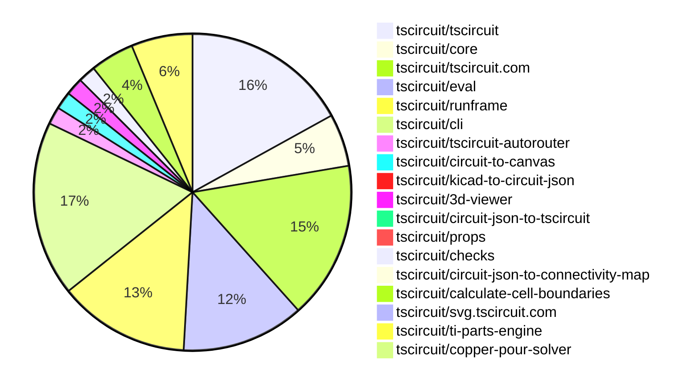

# Contribution Overview 2026-06-02

The current week is shown below. There are 3 major sections:

- [Contributor Overview](#contributor-overview)
- [PRs by Repository](#prs-by-repository)
- [PRs by Contributor](#changes-by-contributor)
- [Scoring & Sponsorship Details](/docs/sponsorship-calculation-explanation.md)

## PRs by Repository

## Contributor Overview

| Contributor | 🐳 Major | 🐙 Minor | 🐌 Tiny | Score | ⭐ | Discussion Contributions |
|-------------|---------|---------|---------|-------|-----|--------------------------|
| [rushabhcodes](#rushabhcodes) | 2 | 3 | 4 | 18 | ⭐⭐ | 0🔹 0🔶 0💎 |
| [Sang-it](#Sang-it) | 2 | 2 | 3 | 14.5 | ⭐⭐ | 0🔹 0🔶 0💎 |
| [tscircuitbot](#tscircuitbot) | 0 | 0 | 81 | 13 | ⭐⭐ | 0🔹 0🔶 0💎 |
| [imrishabh18](#imrishabh18) | 1 | 2 | 4 | 13 | ⭐⭐ | 0🔹 0🔶 0💎 |
| [MustafaMulla29](#MustafaMulla29) | 1 | 1 | 3 | 10 | ⭐ | 0🔹 0🔶 0💎 |
| [techmannih](#techmannih) | 0 | 1 | 5 | 7 | ⭐ | 0🔹 0🔶 0💎 |
| [mohan-bee](#mohan-bee) | 0 | 1 | 0 | 2 |  | 0🔹 0🔶 0💎 |
| [AnasSarkiz](#AnasSarkiz) | 0 | 0 | 2 | 1.5 |  | 0🔹 0🔶 0💎 |

## Staff Pass Ratio (SPR)

| Contributor | Reviewed PRs | Rejections | Approvals | SPR |
|-------------|--------------|------------|-----------|-----|
| [rushabhcodes](#rushabhcodes) | 3 | 1 | 3 | 66.7% |
| [Sang-it](#Sang-it) | 2 | 1 | 1 | 50.0% |
| [MustafaMulla29](#MustafaMulla29) | 2 | 0 | 2 | 100.0% |
| [imrishabh18](#imrishabh18) | 2 | 0 | 2 | 100.0% |
| [Abse2001](#Abse2001) | 1 | 0 | 1 | 100.0% |
| [techmannih](#techmannih) | 1 | 0 | 1 | 100.0% |

rushabhcodes SPR PRs (3)

- [#888](https://github.com/tscircuit/pcb-viewer/pull/888) Fix PCBViewer attribute update invalidation
- [#3558](https://github.com/tscircuit/tscircuit.com/pull/3558) Preserve  package view hash links while circuit JSON is loading
- [#118](https://github.com/tscircuit/kicad-to-circuit-json/pull/118) Update tscircuit version and make Arduino Uno via-overlay repro robust against via ordering

Sang-it SPR PRs (2)

- [#2378](https://github.com/tscircuit/core/pull/2378) auto place schematic-sections for circuits without manual positions
- [#2376](https://github.com/tscircuit/core/pull/2376) bump calculate-cell-boundaries to 0.0.8

MustafaMulla29 SPR PRs (2)

- [#2377](https://github.com/tscircuit/core/pull/2377) Assign routed trace source IDs from source ports
- [#158](https://github.com/tscircuit/checks/pull/158) Fix false missing-connection DRC errors for branched PCB traces

imrishabh18 SPR PRs (2)

- [#2786](https://github.com/tscircuit/eval/pull/2786) Support entrypoint of modules which have `./*.ts` extension
- [#2784](https://github.com/tscircuit/eval/pull/2784) Override the platformConfig parts engine from the tscircuit.config.ts

Abse2001 SPR PRs (1)

- [#1332](https://github.com/tscircuit/tscircuit-autorouter/pull/1332) Improve QFP thermal-pad topology generation with narrow-gap merging and nested component mesh planning

techmannih SPR PRs (1)

- [#3157](https://github.com/tscircuit/cli/pull/3157) Use runtime project config in build, export, and simulate flows

> Note: AI evaluates PRs and assigns 1-3 star ratings automatically. 4 and 5 star ratings require manual staff review.

### Discussion Contribution Legend

- 🔹 Normal Comments: Basic participation with minimal effort
- 🔶 Great Informative Comments: Thoughtful participation that adds value
- 💎 Incredible Comments: Exceptional participation with high-quality content

## Review Table

[reviews-received-hover]: ## "Number of reviews received for PRs for this contributor"
[approvals-received-hover]: ## "Number of approvals received for PRs this contributor authored"
[rejections-received-hover]: ## "Number of rejections received for PRs this contributor authored"
[prs-opened-hover]: ## "Number of PRs opened by this contributor"
[issues-created-hover]: ## "Number of issues created by this contributor"

| Contributor | Reviews Received | Approvals Received | Rejections Received | Approvals | Rejections Given | PRs Opened | PRs Merged | Issues Created |
|---|---|---|---|---|---|---|---|---|
| [rushabhcodes](#rushabhcodes) | 29 | 12 | 1 | 0 | 0 | 14 | 9 | 0 |
| [seveibar](#seveibar) | 0 | 0 | 0 | 9 | 2 | 1 | 0 | 0 |
| [tscircuitbot](#tscircuitbot) | 0 | 0 | 0 | 0 | 0 | 97 | 81 | 0 |
| [gfgf-brain](#gfgf-brain) | 0 | 0 | 0 | 0 | 0 | 1 | 0 | 0 |
| [Abse2001](#Abse2001) | 1 | 1 | 0 | 4 | 0 | 2 | 0 | 0 |
| [Sang-it](#Sang-it) | 11 | 2 | 1 | 0 | 0 | 10 | 7 | 0 |
| [mohan-bee](#mohan-bee) | 1 | 1 | 0 | 0 | 0 | 2 | 1 | 0 |
| [MustafaMulla29](#MustafaMulla29) | 3 | 2 | 0 | 4 | 0 | 5 | 5 | 0 |
| [Adit-Jain-srm](#Adit-Jain-srm) | 0 | 0 | 0 | 0 | 0 | 1 | 0 | 0 |
| [imrishabh18](#imrishabh18) | 3 | 2 | 0 | 6 | 0 | 11 | 7 | 0 |
| [Rafly0078](#Rafly0078) | 0 | 0 | 0 | 0 | 0 | 1 | 0 | 0 |
| [sosal123tyu1](#sosal123tyu1) | 0 | 0 | 0 | 0 | 0 | 2 | 0 | 0 |
| [liamramsey](#liamramsey) | 0 | 0 | 0 | 0 | 0 | 1 | 0 | 0 |
| [EShener](#EShener) | 0 | 0 | 0 | 0 | 0 | 1 | 0 | 0 |
| [Heyzerohey](#Heyzerohey) | 0 | 0 | 0 | 0 | 0 | 1 | 0 | 0 |
| [techmannih](#techmannih) | 8 | 3 | 0 | 0 | 0 | 10 | 6 | 0 |
| [AnasSarkiz](#AnasSarkiz) | 0 | 0 | 0 | 0 | 0 | 2 | 2 | 0 |
| [0hmX](#0hmX) | 0 | 0 | 0 | 0 | 0 | 1 | 0 | 0 |
| [itisrohit](#itisrohit) | 0 | 0 | 0 | 0 | 0 | 1 | 0 | 0 |
| [ShiboSoftwareDev](#ShiboSoftwareDev) | 0 | 0 | 0 | 0 | 0 | 3 | 0 | 0 |
| [sagarmaurya64-ai](#sagarmaurya64-ai) | 0 | 0 | 0 | 0 | 0 | 1 | 0 | 0 |

## Changes by Repository

### [tscircuit/tscircuit](https://github.com/tscircuit/tscircuit)

🐌 Tiny Contributions (19)

| PR # | Impact | Contributor | Description |
|------|--------|-------------|-------------|
| [#3350](https://github.com/tscircuit/tscircuit/pull/3350) | 🐌 Tiny | tscircuitbot | Automated package update |
| [#3349](https://github.com/tscircuit/tscircuit/pull/3349) | 🐌 Tiny | tscircuitbot | Updates the tscircuitcli package to version 0.1.1435 in the package.json file |
| [#3348](https://github.com/tscircuit/tscircuit/pull/3348) | 🐌 Tiny | tscircuitbot | Automated package update |
| [#3347](https://github.com/tscircuit/tscircuit/pull/3347) | 🐌 Tiny | tscircuitbot | Automated package update |
| [#3346](https://github.com/tscircuit/tscircuit/pull/3346) | 🐌 Tiny | tscircuitbot | Automated package update to version 0.0.1807 |
| [#3345](https://github.com/tscircuit/tscircuit/pull/3345) | 🐌 Tiny | tscircuitbot | Automated package update |
| [#3343](https://github.com/tscircuit/tscircuit/pull/3343) | 🐌 Tiny | tscircuitbot | Updates the package version from 0.0.1805 to 0.0.1806 in package.json |
| [#3342](https://github.com/tscircuit/tscircuit/pull/3342) | 🐌 Tiny | tscircuitbot | Automated package update |
| [#3341](https://github.com/tscircuit/tscircuit/pull/3341) | 🐌 Tiny | tscircuitbot | Automated package update |
| [#3340](https://github.com/tscircuit/tscircuit/pull/3340) | 🐌 Tiny | tscircuitbot | Updates the version of several packages including tscircuitcli, tscircuitcore, and tscircuiteval in package.json |
| [#3339](https://github.com/tscircuit/tscircuit/pull/3339) | 🐌 Tiny | tscircuitbot | Automated package update |
| [#3338](https://github.com/tscircuit/tscircuit/pull/3338) | 🐌 Tiny | tscircuitbot | Updates the tscircuitcli package from version 0.1.1428 to 0.1.1429 and the tscircuitrunframe package from version 0.0.2023 to 0.0.2024. |
| [#3337](https://github.com/tscircuit/tscircuit/pull/3337) | 🐌 Tiny | tscircuitbot | Automated package update |
| [#3336](https://github.com/tscircuit/tscircuit/pull/3336) | 🐌 Tiny | tscircuitbot | Updates the tscircuitcli and other related package versions in package.json |
| [#3335](https://github.com/tscircuit/tscircuit/pull/3335) | 🐌 Tiny | tscircuitbot | Automated package update |
| [#3333](https://github.com/tscircuit/tscircuit/pull/3333) | 🐌 Tiny | tscircuitbot | Automated package update |
| [#3334](https://github.com/tscircuit/tscircuit/pull/3334) | 🐌 Tiny | tscircuitbot | Updates the tscircuitcli and tscircuiteval packages to their latest versions. |
| [#3331](https://github.com/tscircuit/tscircuit/pull/3331) | 🐌 Tiny | tscircuitbot | Automated package update |
| [#3332](https://github.com/tscircuit/tscircuit/pull/3332) | 🐌 Tiny | tscircuitbot | Automated package update |

### [tscircuit/core](https://github.com/tscircuit/core)

| PR # | Impact | Rating | Contributor | Description |
|------|--------|--------|-------------|-------------|
| [#2377](https://github.com/tscircuit/core/pull/2377) | 🐳 Major | ⭐⭐⭐ | MustafaMulla29 | Assigns source_trace_id to autorouted PCB trace segments from real source connectivity instead of relying on merged connection_name values. |
| [#2383](https://github.com/tscircuit/core/pull/2383) | 🐙 Minor | ⭐⭐ | mohan-bee | Adds a test to verify that solderjumper bridged properties correctly resolve PCB footprints for specified connections. |
| [#2376](https://github.com/tscircuit/core/pull/2376) | 🐙 Minor | ⭐⭐ | Sang-it | Updates the calculate-cell-boundaries dependency to version 0.0.8 and adjusts the SchematicSection component to account for cell margins in boundary calculations. |

🐌 Tiny Contributions (3)

| PR # | Impact | Contributor | Description |
|------|--------|-------------|-------------|
| [#2382](https://github.com/tscircuit/core/pull/2382) | 🐌 Tiny | tscircuitbot | Updates the version of the tscircuitchecks package from 0.0.135 to 0.0.136 in package.json |
| [#2381](https://github.com/tscircuit/core/pull/2381) | 🐌 Tiny | tscircuitbot | Updates the tscircuitchecks package from version 0.0.134 to 0.0.135 |
| [#2384](https://github.com/tscircuit/core/pull/2384) | 🐌 Tiny | MustafaMulla29 | Updates test snapshots to reflect changes in design rule check (DRC) errors for breakout tests, ensuring that the expected number of errors is accurate after fixes. |

### [tscircuit/tscircuit.com](https://github.com/tscircuit/tscircuit.com)

| PR # | Impact | Rating | Contributor | Description |
|------|--------|--------|-------------|-------------|
| [#3558](https://github.com/tscircuit/tscircuit.com/pull/3558) | 🐳 Major | ⭐⭐⭐ | rushabhcodes | Preserves explicit package view hashes like schematic during initial page load instead of rewriting them to the files view. |
| [#3559](https://github.com/tscircuit/tscircuit.com/pull/3559) | 🐳 Major | ⭐⭐⭐ | imrishabh18 | Allows non-staff users to place orders from package pages and access their orders from the account menu, making ordering generally available to signed-in users rather than being restricted to tscircuit staff. |

🐌 Tiny Contributions (16)

| PR # | Impact | Contributor | Description |
|------|--------|-------------|-------------|
| [#3580](https://github.com/tscircuit/tscircuit.com/pull/3580) | 🐌 Tiny | tscircuitbot | Automated package update |
| [#3579](https://github.com/tscircuit/tscircuit.com/pull/3579) | 🐌 Tiny | tscircuitbot | Automated package update |
| [#3576](https://github.com/tscircuit/tscircuit.com/pull/3576) | 🐌 Tiny | tscircuitbot | Automated package update |
| [#3575](https://github.com/tscircuit/tscircuit.com/pull/3575) | 🐌 Tiny | tscircuitbot | Updates the tscircuiteval package to version 0.0.887 in the package.json file. |
| [#3574](https://github.com/tscircuit/tscircuit.com/pull/3574) | 🐌 Tiny | tscircuitbot | Automated package update |
| [#3573](https://github.com/tscircuit/tscircuit.com/pull/3573) | 🐌 Tiny | tscircuitbot | Updates the tscircuiteval package to version 0.0.886 in the package.json file. |
| [#3572](https://github.com/tscircuit/tscircuit.com/pull/3572) | 🐌 Tiny | tscircuitbot | Automated package update |
| [#3571](https://github.com/tscircuit/tscircuit.com/pull/3571) | 🐌 Tiny | tscircuitbot | Updates the tscircuiteval package from version 0.0.884 to 0.0.885 in the package.json file. |
| [#3570](https://github.com/tscircuit/tscircuit.com/pull/3570) | 🐌 Tiny | tscircuitbot | Automated package update |
| [#3569](https://github.com/tscircuit/tscircuit.com/pull/3569) | 🐌 Tiny | tscircuitbot | Automated package update |
| [#3568](https://github.com/tscircuit/tscircuit.com/pull/3568) | 🐌 Tiny | tscircuitbot | Updates the tscircuiteval package to version 0.0.884 in the package.json file. |
| [#3567](https://github.com/tscircuit/tscircuit.com/pull/3567) | 🐌 Tiny | tscircuitbot | Automated package update |
| [#3566](https://github.com/tscircuit/tscircuit.com/pull/3566) | 🐌 Tiny | tscircuitbot | Updates the tscircuiteval package to version 0.0.883 in the package.json file. |
| [#3565](https://github.com/tscircuit/tscircuit.com/pull/3565) | 🐌 Tiny | tscircuitbot | Updates the tscircuitrunframe package to version 0.0.2021 |
| [#3564](https://github.com/tscircuit/tscircuit.com/pull/3564) | 🐌 Tiny | tscircuitbot | Automated package update |
| [#3557](https://github.com/tscircuit/tscircuit.com/pull/3557) | 🐌 Tiny | rushabhcodes | Removes the footer link that pointed to https:chat.tscircuit.com |

### [tscircuit/eval](https://github.com/tscircuit/eval)

| PR # | Impact | Rating | Contributor | Description |
|------|--------|--------|-------------|-------------|
| [#2786](https://github.com/tscircuit/eval/pull/2786) | 🐙 Minor | ⭐⭐ | imrishabh18 | Allows modules with TypeScript entrypoints to be imported without throwing an error, enhancing compatibility with TypeScript projects. |
| [#2784](https://github.com/tscircuit/eval/pull/2784) | 🐙 Minor | ⭐⭐ | imrishabh18 | Adds functionality to override the platform configuration for the parts engine using the tscircuit.config.ts file. |

🐌 Tiny Contributions (12)

| PR # | Impact | Contributor | Description |
|------|--------|-------------|-------------|
| [#2797](https://github.com/tscircuit/eval/pull/2797) | 🐌 Tiny | tscircuitbot | Automated package update |
| [#2796](https://github.com/tscircuit/eval/pull/2796) | 🐌 Tiny | tscircuitbot | Automated package update |
| [#2794](https://github.com/tscircuit/eval/pull/2794) | 🐌 Tiny | tscircuitbot | Automated package update |
| [#2792](https://github.com/tscircuit/eval/pull/2792) | 🐌 Tiny | tscircuitbot | Automated package update |
| [#2791](https://github.com/tscircuit/eval/pull/2791) | 🐌 Tiny | tscircuitbot | Updates package dependencies to their latest versions without introducing new functionality. |
| [#2789](https://github.com/tscircuit/eval/pull/2789) | 🐌 Tiny | tscircuitbot | Automated package update |
| [#2788](https://github.com/tscircuit/eval/pull/2788) | 🐌 Tiny | tscircuitbot | Updates the version of the tscircuitcore package from 0.0.1285 to 0.0.1286 in package.json |
| [#2787](https://github.com/tscircuit/eval/pull/2787) | 🐌 Tiny | tscircuitbot | Automated package update |
| [#2785](https://github.com/tscircuit/eval/pull/2785) | 🐌 Tiny | tscircuitbot | Automated package update |
| [#2783](https://github.com/tscircuit/eval/pull/2783) | 🐌 Tiny | tscircuitbot | Automated package update |
| [#2782](https://github.com/tscircuit/eval/pull/2782) | 🐌 Tiny | tscircuitbot | Automated package update |
| [#2793](https://github.com/tscircuit/eval/pull/2793) | 🐌 Tiny | rushabhcodes | Updates the poppygl dependency version from 0.0.16 to 0.0.24 in package.json |

### [tscircuit/runframe](https://github.com/tscircuit/runframe)

🐌 Tiny Contributions (15)

| PR # | Impact | Contributor | Description |
|------|--------|-------------|-------------|
| [#3579](https://github.com/tscircuit/runframe/pull/3579) | 🐌 Tiny | tscircuitbot | Automated package update |
| [#3578](https://github.com/tscircuit/runframe/pull/3578) | 🐌 Tiny | tscircuitbot | Updates the tscircuiteval package to version 0.0.888 in the package.json file. |
| [#3576](https://github.com/tscircuit/runframe/pull/3576) | 🐌 Tiny | tscircuitbot | Automated package update |
| [#3575](https://github.com/tscircuit/runframe/pull/3575) | 🐌 Tiny | tscircuitbot | Updates the tscircuiteval package to version 0.0.887 in the package.json file. |
| [#3574](https://github.com/tscircuit/runframe/pull/3574) | 🐌 Tiny | tscircuitbot | Automated package update |
| [#3573](https://github.com/tscircuit/runframe/pull/3573) | 🐌 Tiny | tscircuitbot | Updates the tscircuiteval package to version 0.0.886 in the package.json file. |
| [#3572](https://github.com/tscircuit/runframe/pull/3572) | 🐌 Tiny | tscircuitbot | Automated package update |
| [#3571](https://github.com/tscircuit/runframe/pull/3571) | 🐌 Tiny | tscircuitbot | Updates the tscircuiteval package to version 0.0.885 in the package.json file. |
| [#3569](https://github.com/tscircuit/runframe/pull/3569) | 🐌 Tiny | tscircuitbot | Updates the tscircuit3d-viewer package to version 0.0.565 |
| [#3568](https://github.com/tscircuit/runframe/pull/3568) | 🐌 Tiny | tscircuitbot | Automated package update |
| [#3567](https://github.com/tscircuit/runframe/pull/3567) | 🐌 Tiny | tscircuitbot | Updates the tscircuiteval package to version 0.0.884 in the package.json file. |
| [#3566](https://github.com/tscircuit/runframe/pull/3566) | 🐌 Tiny | tscircuitbot | Automated package update |
| [#3565](https://github.com/tscircuit/runframe/pull/3565) | 🐌 Tiny | tscircuitbot | Updates the tscircuiteval package to version 0.0.883 in the package.json file. |
| [#3564](https://github.com/tscircuit/runframe/pull/3564) | 🐌 Tiny | tscircuitbot | Updates the package version from 0.0.2020 to 0.0.2021 in package.json |
| [#3563](https://github.com/tscircuit/runframe/pull/3563) | 🐌 Tiny | tscircuitbot | Updates the tscircuiteval package to version 0.0.882 in the package.json file. |

### [tscircuit/cli](https://github.com/tscircuit/cli)

| PR # | Impact | Rating | Contributor | Description |
|------|--------|--------|-------------|-------------|
| [#3157](https://github.com/tscircuit/cli/pull/3157) | 🐙 Minor | ⭐⭐ | techmannih | This PR integrates runtime project configuration into the CLI command flows for build, export, and simulate, allowing user-defined configurations to influence command execution. |

🐌 Tiny Contributions (19)

| PR # | Impact | Contributor | Description |
|------|--------|-------------|-------------|
| [#3181](https://github.com/tscircuit/cli/pull/3181) | 🐌 Tiny | tscircuitbot | Automated package update |
| [#3178](https://github.com/tscircuit/cli/pull/3178) | 🐌 Tiny | tscircuitbot | Automated package update |
| [#3177](https://github.com/tscircuit/cli/pull/3177) | 🐌 Tiny | tscircuitbot | Updates the tscircuitrunframe package from version 0.0.2027 to 0.0.2028 |
| [#3173](https://github.com/tscircuit/cli/pull/3173) | 🐌 Tiny | tscircuitbot | Automated package update |
| [#3172](https://github.com/tscircuit/cli/pull/3172) | 🐌 Tiny | tscircuitbot | Updates the tscircuitrunframe package to version 0.0.2027 in package.json |
| [#3171](https://github.com/tscircuit/cli/pull/3171) | 🐌 Tiny | tscircuitbot | Automated package update |
| [#3170](https://github.com/tscircuit/cli/pull/3170) | 🐌 Tiny | tscircuitbot | Automated package update |
| [#3169](https://github.com/tscircuit/cli/pull/3169) | 🐌 Tiny | tscircuitbot | Automated package update |
| [#3168](https://github.com/tscircuit/cli/pull/3168) | 🐌 Tiny | tscircuitbot | Updates the tscircuitrunframe package from version 0.0.2024 to 0.0.2025 |
| [#3167](https://github.com/tscircuit/cli/pull/3167) | 🐌 Tiny | tscircuitbot | Automated package update |
| [#3166](https://github.com/tscircuit/cli/pull/3166) | 🐌 Tiny | tscircuitbot | Updates the tscircuitrunframe package to version 0.0.2024 in package.json |
| [#3165](https://github.com/tscircuit/cli/pull/3165) | 🐌 Tiny | tscircuitbot | Automated package update |
| [#3164](https://github.com/tscircuit/cli/pull/3164) | 🐌 Tiny | tscircuitbot | Updates the tscircuitrunframe package to version 0.0.2023 in package.json |
| [#3161](https://github.com/tscircuit/cli/pull/3161) | 🐌 Tiny | tscircuitbot | Automated package update |
| [#3160](https://github.com/tscircuit/cli/pull/3160) | 🐌 Tiny | tscircuitbot | Updates the tscircuitrunframe package to version 0.0.2022 in package.json |
| [#3158](https://github.com/tscircuit/cli/pull/3158) | 🐌 Tiny | tscircuitbot | Automated package update |
| [#3159](https://github.com/tscircuit/cli/pull/3159) | 🐌 Tiny | tscircuitbot | Automated package update |
| [#3180](https://github.com/tscircuit/cli/pull/3180) | 🐌 Tiny | Sang-it | Updates the schematic placement analysis dependency to a newer commit version. |
| [#3175](https://github.com/tscircuit/cli/pull/3175) | 🐌 Tiny | imrishabh18 | Adds an example project that overrides the footprintLibraryMap for the TI LM358 component in the tscircuit framework. |

### [tscircuit/tscircuit-autorouter](https://github.com/tscircuit/tscircuit-autorouter)

🐌 Tiny Contributions (2)

| PR # | Impact | Contributor | Description |
|------|--------|-------------|-------------|
| [#1334](https://github.com/tscircuit/tscircuit-autorouter/pull/1334) | 🐌 Tiny | tscircuitbot | Automated package update |
| [#1318](https://github.com/tscircuit/tscircuit-autorouter/pull/1318) | 🐌 Tiny | AnasSarkiz | Updates the dataset-srj18 dependency to a newer commit and increments the kicad-to-circuit-json version in package.json |

### [tscircuit/circuit-to-canvas](https://github.com/tscircuit/circuit-to-canvas)

| PR # | Impact | Rating | Contributor | Description |
|------|--------|--------|-------------|-------------|
| [#241](https://github.com/tscircuit/circuit-to-canvas/pull/241) | 🐙 Minor | ⭐⭐ | rushabhcodes | Adds support for rounded corners to silkscreen rectangles in PCB drawing functionality by updating the drawing logic and adding a test case. |

🐌 Tiny Contributions (1)

| PR # | Impact | Contributor | Description |
|------|--------|-------------|-------------|
| [#242](https://github.com/tscircuit/circuit-to-canvas/pull/242) | 🐌 Tiny | tscircuitbot | Automated package update |

### [tscircuit/kicad-to-circuit-json](https://github.com/tscircuit/kicad-to-circuit-json)

| PR # | Impact | Rating | Contributor | Description |
|------|--------|--------|-------------|-------------|
| [#118](https://github.com/tscircuit/kicad-to-circuit-json/pull/118) | 🐳 Major | ⭐⭐⭐ | rushabhcodes | This pull request includes several dependency updates and improvements to PCB board JSON snapshot structure, as well as a significant refactor to the via overlay transform inference logic in the Arduino Uno test. The changes improve accuracy, extensibility, and maintainability of the code and test data. Dependency updates: Upgraded kicadts and tscircuit package versions in package.json to pull in the latest features and bug fixes. PCB board JSON snapshot structure improvements: Added a center property to each board, specifying the boards center coordinates. Added num_layers and ensured pcb_board_id is present at the end of each board object. Minor floating-point precision adjustments to some outline coordinates. Test data adjustment: Updated the font_size for silkscreen text in the JST-XH mounting hole test snapshot for improved accuracy. Via overlay transform inference refactor (Arduino Uno test): Replaced the previous two-point matching algorithm with a more robust approach that attempts all possible pairs of vias and rendered centers, checking for a valid transform mapping all vias. Extracted transformation logic into helper functions findMatchingViaSvgTransform, inferTransformFromPair, and toScreen for clarity and maintainability. These changes collectively enhance the reliability of PCB-related tests and improve the maintainability of both code and test data. |

### [tscircuit/3d-viewer](https://github.com/tscircuit/3d-viewer)

| PR # | Impact | Rating | Contributor | Description |
|------|--------|--------|-------------|-------------|
| [#763](https://github.com/tscircuit/3d-viewer/pull/763) | 🐙 Minor | ⭐⭐ | rushabhcodes | Removes unused board-geometry constants and dangling imports, stops routing the SVG board export through the deprecated board-geometry wrapper, and removes the unused createBoardGeomFromCircuitJson export. |

🐌 Tiny Contributions (1)

| PR # | Impact | Contributor | Description |
|------|--------|-------------|-------------|
| [#768](https://github.com/tscircuit/3d-viewer/pull/768) | 🐌 Tiny | rushabhcodes | Removes the unused GeomModel component from the 3d viewer codebase, trimming dead code and clarifying the component surface. |

### [tscircuit/circuit-json-to-tscircuit](https://github.com/tscircuit/circuit-json-to-tscircuit)

| PR # | Impact | Rating | Contributor | Description |
|------|--------|--------|-------------|-------------|
| [#36](https://github.com/tscircuit/circuit-json-to-tscircuit/pull/36) | 🐙 Minor | ⭐⭐ | rushabhcodes | Adds silkscreen line support to footprint generation by implementing a converter for silkscreenline  in circuit JSON and adding a dedicated snapshot test for regression guard. |

### [tscircuit/props](https://github.com/tscircuit/props)

🐌 Tiny Contributions (1)

| PR # | Impact | Contributor | Description |
|------|--------|-------------|-------------|
| [#686](https://github.com/tscircuit/props/pull/686) | 🐌 Tiny | rushabhcodes | Removes cornerRadius from SchematicRectProps and the schematic rect schema to ensure only supported props are exposed for schematic rectangles. |

### [tscircuit/checks](https://github.com/tscircuit/checks)

| PR # | Impact | Rating | Contributor | Description |
|------|--------|--------|-------------|-------------|
| [#158](https://github.com/tscircuit/checks/pull/158) | 🐙 Minor | ⭐⭐ | MustafaMulla29 | Fixes false missing-connection DRC errors for branched PCB traces by adding branch-aware handling to checkTracesAreContiguous, ensuring physically connected PCB trace segments are considered together when checking connectivity. |

🐌 Tiny Contributions (1)

| PR # | Impact | Contributor | Description |
|------|--------|-------------|-------------|
| [#157](https://github.com/tscircuit/checks/pull/157) | 🐌 Tiny | MustafaMulla29 | Updates circuit JSON files and tests to reflect changes in the software version and correct PCB trace errors. |

### [tscircuit/circuit-json-to-connectivity-map](https://github.com/tscircuit/circuit-json-to-connectivity-map)

🐌 Tiny Contributions (1)

| PR # | Impact | Contributor | Description |
|------|--------|-------------|-------------|
| [#19](https://github.com/tscircuit/circuit-json-to-connectivity-map/pull/19) | 🐌 Tiny | MustafaMulla29 | Updates circuit JSON files to use the latest version of the core library and corrects trace connections in the test cases. |

### [tscircuit/calculate-cell-boundaries](https://github.com/tscircuit/calculate-cell-boundaries)

| PR # | Impact | Rating | Contributor | Description |
|------|--------|--------|-------------|-------------|
| [#25](https://github.com/tscircuit/calculate-cell-boundaries/pull/25) | 🐳 Major | ⭐⭐⭐ | Sang-it | Removes redundant separators from boundary lines to optimize cell boundary calculations. |
| [#20](https://github.com/tscircuit/calculate-cell-boundaries/pull/20) | 🐳 Major | ⭐⭐⭐ | Sang-it | Fixes the issue of uncleaned lines by removing redundant parallel bridges in the boundary line refinement process. |
| [#22](https://github.com/tscircuit/calculate-cell-boundaries/pull/22) | 🐙 Minor | ⭐⭐ | Sang-it | Sets stroke width proportionally based on the dimensions of cell contents in the graphics object. |

🐌 Tiny Contributions (2)

| PR # | Impact | Contributor | Description |
|------|--------|-------------|-------------|
| [#24](https://github.com/tscircuit/calculate-cell-boundaries/pull/24) | 🐌 Tiny | Sang-it | Adds a new test case for calculating cell boundaries based on a predefined scene with specific cell contents. |
| [#23](https://github.com/tscircuit/calculate-cell-boundaries/pull/23) | 🐌 Tiny | Sang-it | Fixes formatting of function calls in collapseHorizontalSteps.ts for improved readability. |

### [tscircuit/svg.tscircuit.com](https://github.com/tscircuit/svg.tscircuit.com)

🐌 Tiny Contributions (1)

| PR # | Impact | Contributor | Description |
|------|--------|-------------|-------------|
| [#1517](https://github.com/tscircuit/svg.tscircuit.com/pull/1517) | 🐌 Tiny | imrishabh18 | Updates the tscircuit dependency version from 0.0.1795 to 0.0.1807 in package.json |

### [tscircuit/ti-parts-engine](https://github.com/tscircuit/ti-parts-engine)

🐌 Tiny Contributions (7)

| PR # | Impact | Contributor | Description |
|------|--------|-------------|-------------|
| [#15](https://github.com/tscircuit/ti-parts-engine/pull/15) | 🐌 Tiny | imrishabh18 | Adds the .ts file extension to all import and export statements in the codebase to ensure consistency and compatibility with TypeScript module resolution. |
| [#9](https://github.com/tscircuit/ti-parts-engine/pull/9) | 🐌 Tiny | imrishabh18 | Updates package.json to support GitHub style installation by changing the main entry point and versioning. |
| [#14](https://github.com/tscircuit/ti-parts-engine/pull/14) | 🐌 Tiny | techmannih | Adds integration tests for the fake UL KiCad proxy and snapshot tests for the LM358 footprint. |
| [#13](https://github.com/tscircuit/ti-parts-engine/pull/13) | 🐌 Tiny | techmannih | Replaces TI footprint examples and tests that used MSP430 with LM358 to align documentation and tests with a valid manufacturer part number. |
| [#12](https://github.com/tscircuit/ti-parts-engine/pull/12) | 🐌 Tiny | techmannih | Changes entrypoint paths in TypeScript exports to be explicit by including the .ts extension. |
| [#11](https://github.com/tscircuit/ti-parts-engine/pull/11) | 🐌 Tiny | techmannih | Corrects the file export paths for kicad-archive and ti-parts-engine modules in the index file. |
| [#10](https://github.com/tscircuit/ti-parts-engine/pull/10) | 🐌 Tiny | techmannih | Exports the Ultra Librarian bridge client from the package root, restructuring the module exports for better accessibility. |

### [tscircuit/copper-pour-solver](https://github.com/tscircuit/copper-pour-solver)

🐌 Tiny Contributions (1)

| PR # | Impact | Contributor | Description |
|------|--------|-------------|-------------|
| [#48](https://github.com/tscircuit/copper-pour-solver/pull/48) | 🐌 Tiny | AnasSarkiz | Updates the circuit-json and circuit-to-svg dependencies to newer versions in package.json |

## Changes by Contributor

### [tscircuitbot](https://github.com/tscircuitbot)

🐌 Tiny Contributions (81)

| PR # | Impact | Description |
|------|--------|-------------|
| [#3350](https://github.com/tscircuit/tscircuit/pull/3350) | 🐌 Tiny | Automated package update |
| [#3349](https://github.com/tscircuit/tscircuit/pull/3349) | 🐌 Tiny | Updates the tscircuitcli package to version 0.1.1435 in the package.json file |
| [#3348](https://github.com/tscircuit/tscircuit/pull/3348) | 🐌 Tiny | Automated package update |
| [#3347](https://github.com/tscircuit/tscircuit/pull/3347) | 🐌 Tiny | Automated package update |
| [#3346](https://github.com/tscircuit/tscircuit/pull/3346) | 🐌 Tiny | Automated package update to version 0.0.1807 |
| [#3345](https://github.com/tscircuit/tscircuit/pull/3345) | 🐌 Tiny | Automated package update |
| [#3343](https://github.com/tscircuit/tscircuit/pull/3343) | 🐌 Tiny | Updates the package version from 0.0.1805 to 0.0.1806 in package.json |
| [#3342](https://github.com/tscircuit/tscircuit/pull/3342) | 🐌 Tiny | Automated package update |
| [#3341](https://github.com/tscircuit/tscircuit/pull/3341) | 🐌 Tiny | Automated package update |
| [#3340](https://github.com/tscircuit/tscircuit/pull/3340) | 🐌 Tiny | Updates the version of several packages including tscircuitcli, tscircuitcore, and tscircuiteval in package.json |
| [#3339](https://github.com/tscircuit/tscircuit/pull/3339) | 🐌 Tiny | Automated package update |
| [#3338](https://github.com/tscircuit/tscircuit/pull/3338) | 🐌 Tiny | Updates the tscircuitcli package from version 0.1.1428 to 0.1.1429 and the tscircuitrunframe package from version 0.0.2023 to 0.0.2024. |
| [#3337](https://github.com/tscircuit/tscircuit/pull/3337) | 🐌 Tiny | Automated package update |
| [#3336](https://github.com/tscircuit/tscircuit/pull/3336) | 🐌 Tiny | Updates the tscircuitcli and other related package versions in package.json |
| [#3335](https://github.com/tscircuit/tscircuit/pull/3335) | 🐌 Tiny | Automated package update |
| [#3333](https://github.com/tscircuit/tscircuit/pull/3333) | 🐌 Tiny | Automated package update |
| [#3334](https://github.com/tscircuit/tscircuit/pull/3334) | 🐌 Tiny | Updates the tscircuitcli and tscircuiteval packages to their latest versions. |
| [#3331](https://github.com/tscircuit/tscircuit/pull/3331) | 🐌 Tiny | Automated package update |
| [#3332](https://github.com/tscircuit/tscircuit/pull/3332) | 🐌 Tiny | Automated package update |
| [#2382](https://github.com/tscircuit/core/pull/2382) | 🐌 Tiny | Updates the version of the tscircuitchecks package from 0.0.135 to 0.0.136 in package.json |
| [#2381](https://github.com/tscircuit/core/pull/2381) | 🐌 Tiny | Updates the tscircuitchecks package from version 0.0.134 to 0.0.135 |
| [#3580](https://github.com/tscircuit/tscircuit.com/pull/3580) | 🐌 Tiny | Automated package update |
| [#3579](https://github.com/tscircuit/tscircuit.com/pull/3579) | 🐌 Tiny | Automated package update |
| [#3576](https://github.com/tscircuit/tscircuit.com/pull/3576) | 🐌 Tiny | Automated package update |
| [#3575](https://github.com/tscircuit/tscircuit.com/pull/3575) | 🐌 Tiny | Updates the tscircuiteval package to version 0.0.887 in the package.json file. |
| [#3574](https://github.com/tscircuit/tscircuit.com/pull/3574) | 🐌 Tiny | Automated package update |
| [#3573](https://github.com/tscircuit/tscircuit.com/pull/3573) | 🐌 Tiny | Updates the tscircuiteval package to version 0.0.886 in the package.json file. |
| [#3572](https://github.com/tscircuit/tscircuit.com/pull/3572) | 🐌 Tiny | Automated package update |
| [#3571](https://github.com/tscircuit/tscircuit.com/pull/3571) | 🐌 Tiny | Updates the tscircuiteval package from version 0.0.884 to 0.0.885 in the package.json file. |
| [#3570](https://github.com/tscircuit/tscircuit.com/pull/3570) | 🐌 Tiny | Automated package update |
| [#3569](https://github.com/tscircuit/tscircuit.com/pull/3569) | 🐌 Tiny | Automated package update |
| [#3568](https://github.com/tscircuit/tscircuit.com/pull/3568) | 🐌 Tiny | Updates the tscircuiteval package to version 0.0.884 in the package.json file. |
| [#3567](https://github.com/tscircuit/tscircuit.com/pull/3567) | 🐌 Tiny | Automated package update |
| [#3566](https://github.com/tscircuit/tscircuit.com/pull/3566) | 🐌 Tiny | Updates the tscircuiteval package to version 0.0.883 in the package.json file. |
| [#3565](https://github.com/tscircuit/tscircuit.com/pull/3565) | 🐌 Tiny | Updates the tscircuitrunframe package to version 0.0.2021 |
| [#3564](https://github.com/tscircuit/tscircuit.com/pull/3564) | 🐌 Tiny | Automated package update |
| [#2797](https://github.com/tscircuit/eval/pull/2797) | 🐌 Tiny | Automated package update |
| [#2796](https://github.com/tscircuit/eval/pull/2796) | 🐌 Tiny | Automated package update |
| [#2794](https://github.com/tscircuit/eval/pull/2794) | 🐌 Tiny | Automated package update |
| [#2792](https://github.com/tscircuit/eval/pull/2792) | 🐌 Tiny | Automated package update |
| [#2791](https://github.com/tscircuit/eval/pull/2791) | 🐌 Tiny | Updates package dependencies to their latest versions without introducing new functionality. |
| [#2789](https://github.com/tscircuit/eval/pull/2789) | 🐌 Tiny | Automated package update |
| [#2788](https://github.com/tscircuit/eval/pull/2788) | 🐌 Tiny | Updates the version of the tscircuitcore package from 0.0.1285 to 0.0.1286 in package.json |
| [#2787](https://github.com/tscircuit/eval/pull/2787) | 🐌 Tiny | Automated package update |
| [#2785](https://github.com/tscircuit/eval/pull/2785) | 🐌 Tiny | Automated package update |
| [#2783](https://github.com/tscircuit/eval/pull/2783) | 🐌 Tiny | Automated package update |
| [#2782](https://github.com/tscircuit/eval/pull/2782) | 🐌 Tiny | Automated package update |
| [#3579](https://github.com/tscircuit/runframe/pull/3579) | 🐌 Tiny | Automated package update |
| [#3578](https://github.com/tscircuit/runframe/pull/3578) | 🐌 Tiny | Updates the tscircuiteval package to version 0.0.888 in the package.json file. |
| [#3576](https://github.com/tscircuit/runframe/pull/3576) | 🐌 Tiny | Automated package update |
| [#3575](https://github.com/tscircuit/runframe/pull/3575) | 🐌 Tiny | Updates the tscircuiteval package to version 0.0.887 in the package.json file. |
| [#3574](https://github.com/tscircuit/runframe/pull/3574) | 🐌 Tiny | Automated package update |
| [#3573](https://github.com/tscircuit/runframe/pull/3573) | 🐌 Tiny | Updates the tscircuiteval package to version 0.0.886 in the package.json file. |
| [#3572](https://github.com/tscircuit/runframe/pull/3572) | 🐌 Tiny | Automated package update |
| [#3571](https://github.com/tscircuit/runframe/pull/3571) | 🐌 Tiny | Updates the tscircuiteval package to version 0.0.885 in the package.json file. |
| [#3569](https://github.com/tscircuit/runframe/pull/3569) | 🐌 Tiny | Updates the tscircuit3d-viewer package to version 0.0.565 |
| [#3568](https://github.com/tscircuit/runframe/pull/3568) | 🐌 Tiny | Automated package update |
| [#3567](https://github.com/tscircuit/runframe/pull/3567) | 🐌 Tiny | Updates the tscircuiteval package to version 0.0.884 in the package.json file. |
| [#3566](https://github.com/tscircuit/runframe/pull/3566) | 🐌 Tiny | Automated package update |
| [#3565](https://github.com/tscircuit/runframe/pull/3565) | 🐌 Tiny | Updates the tscircuiteval package to version 0.0.883 in the package.json file. |
| [#3564](https://github.com/tscircuit/runframe/pull/3564) | 🐌 Tiny | Updates the package version from 0.0.2020 to 0.0.2021 in package.json |
| [#3563](https://github.com/tscircuit/runframe/pull/3563) | 🐌 Tiny | Updates the tscircuiteval package to version 0.0.882 in the package.json file. |
| [#3181](https://github.com/tscircuit/cli/pull/3181) | 🐌 Tiny | Automated package update |
| [#3178](https://github.com/tscircuit/cli/pull/3178) | 🐌 Tiny | Automated package update |
| [#3177](https://github.com/tscircuit/cli/pull/3177) | 🐌 Tiny | Updates the tscircuitrunframe package from version 0.0.2027 to 0.0.2028 |
| [#3173](https://github.com/tscircuit/cli/pull/3173) | 🐌 Tiny | Automated package update |
| [#3172](https://github.com/tscircuit/cli/pull/3172) | 🐌 Tiny | Updates the tscircuitrunframe package to version 0.0.2027 in package.json |
| [#3171](https://github.com/tscircuit/cli/pull/3171) | 🐌 Tiny | Automated package update |
| [#3170](https://github.com/tscircuit/cli/pull/3170) | 🐌 Tiny | Automated package update |
| [#3169](https://github.com/tscircuit/cli/pull/3169) | 🐌 Tiny | Automated package update |
| [#3168](https://github.com/tscircuit/cli/pull/3168) | 🐌 Tiny | Updates the tscircuitrunframe package from version 0.0.2024 to 0.0.2025 |
| [#3167](https://github.com/tscircuit/cli/pull/3167) | 🐌 Tiny | Automated package update |
| [#3166](https://github.com/tscircuit/cli/pull/3166) | 🐌 Tiny | Updates the tscircuitrunframe package to version 0.0.2024 in package.json |
| [#3165](https://github.com/tscircuit/cli/pull/3165) | 🐌 Tiny | Automated package update |
| [#3164](https://github.com/tscircuit/cli/pull/3164) | 🐌 Tiny | Updates the tscircuitrunframe package to version 0.0.2023 in package.json |
| [#3161](https://github.com/tscircuit/cli/pull/3161) | 🐌 Tiny | Automated package update |
| [#3160](https://github.com/tscircuit/cli/pull/3160) | 🐌 Tiny | Updates the tscircuitrunframe package to version 0.0.2022 in package.json |
| [#3158](https://github.com/tscircuit/cli/pull/3158) | 🐌 Tiny | Automated package update |
| [#3159](https://github.com/tscircuit/cli/pull/3159) | 🐌 Tiny | Automated package update |
| [#1334](https://github.com/tscircuit/tscircuit-autorouter/pull/1334) | 🐌 Tiny | Automated package update |
| [#242](https://github.com/tscircuit/circuit-to-canvas/pull/242) | 🐌 Tiny | Automated package update |

### [rushabhcodes](https://github.com/rushabhcodes)

| PRs # | Impact | Rating | Description |
|------|--------|--------|-------------|
| [#3558](https://github.com/tscircuit/tscircuit.com/pull/3558) | 🐳 Major | ⭐⭐⭐ | Preserves explicit package view hashes like schematic during initial page load instead of rewriting them to the files view. |
| [#118](https://github.com/tscircuit/kicad-to-circuit-json/pull/118) | 🐳 Major | ⭐⭐⭐ | This pull request includes several dependency updates and improvements to PCB board JSON snapshot structure, as well as a significant refactor to the via overlay transform inference logic in the Arduino Uno test. The changes improve accuracy, extensibility, and maintainability of the code and test data. Dependency updates: Upgraded kicadts and tscircuit package versions in package.json to pull in the latest features and bug fixes. PCB board JSON snapshot structure improvements: Added a center property to each board, specifying the boards center coordinates. Added num_layers and ensured pcb_board_id is present at the end of each board object. Minor floating-point precision adjustments to some outline coordinates. Test data adjustment: Updated the font_size for silkscreen text in the JST-XH mounting hole test snapshot for improved accuracy. Via overlay transform inference refactor (Arduino Uno test): Replaced the previous two-point matching algorithm with a more robust approach that attempts all possible pairs of vias and rendered centers, checking for a valid transform mapping all vias. Extracted transformation logic into helper functions findMatchingViaSvgTransform, inferTransformFromPair, and toScreen for clarity and maintainability. These changes collectively enhance the reliability of PCB-related tests and improve the maintainability of both code and test data. |
| [#763](https://github.com/tscircuit/3d-viewer/pull/763) | 🐙 Minor | ⭐⭐ | Removes unused board-geometry constants and dangling imports, stops routing the SVG board export through the deprecated board-geometry wrapper, and removes the unused createBoardGeomFromCircuitJson export. |
| [#36](https://github.com/tscircuit/circuit-json-to-tscircuit/pull/36) | 🐙 Minor | ⭐⭐ | Adds silkscreen line support to footprint generation by implementing a converter for silkscreenline  in circuit JSON and adding a dedicated snapshot test for regression guard. |
| [#241](https://github.com/tscircuit/circuit-to-canvas/pull/241) | 🐙 Minor | ⭐⭐ | Adds support for rounded corners to silkscreen rectangles in PCB drawing functionality by updating the drawing logic and adding a test case. |

🐌 Tiny Contributions (4)

| PR # | Impact | Description |
|------|--------|-------------|
| [#686](https://github.com/tscircuit/props/pull/686) | 🐌 Tiny | Removes cornerRadius from SchematicRectProps and the schematic rect schema to ensure only supported props are exposed for schematic rectangles. |
| [#768](https://github.com/tscircuit/3d-viewer/pull/768) | 🐌 Tiny | Removes the unused GeomModel component from the 3d viewer codebase, trimming dead code and clarifying the component surface. |
| [#3557](https://github.com/tscircuit/tscircuit.com/pull/3557) | 🐌 Tiny | Removes the footer link that pointed to https:chat.tscircuit.com |
| [#2793](https://github.com/tscircuit/eval/pull/2793) | 🐌 Tiny | Updates the poppygl dependency version from 0.0.16 to 0.0.24 in package.json |

### [mohan-bee](https://github.com/mohan-bee)

| PRs # | Impact | Rating | Description |
|------|--------|--------|-------------|
| [#2383](https://github.com/tscircuit/core/pull/2383) | 🐙 Minor | ⭐⭐ | Adds a test to verify that solderjumper bridged properties correctly resolve PCB footprints for specified connections. |

### [MustafaMulla29](https://github.com/MustafaMulla29)

| PRs # | Impact | Rating | Description |
|------|--------|--------|-------------|
| [#2377](https://github.com/tscircuit/core/pull/2377) | 🐳 Major | ⭐⭐⭐ | Assigns source_trace_id to autorouted PCB trace segments from real source connectivity instead of relying on merged connection_name values. |
| [#158](https://github.com/tscircuit/checks/pull/158) | 🐙 Minor | ⭐⭐ | Fixes false missing-connection DRC errors for branched PCB traces by adding branch-aware handling to checkTracesAreContiguous, ensuring physically connected PCB trace segments are considered together when checking connectivity. |

🐌 Tiny Contributions (3)

| PR # | Impact | Description |
|------|--------|-------------|
| [#2384](https://github.com/tscircuit/core/pull/2384) | 🐌 Tiny | Updates test snapshots to reflect changes in design rule check (DRC) errors for breakout tests, ensuring that the expected number of errors is accurate after fixes. |
| [#157](https://github.com/tscircuit/checks/pull/157) | 🐌 Tiny | Updates circuit JSON files and tests to reflect changes in the software version and correct PCB trace errors. |
| [#19](https://github.com/tscircuit/circuit-json-to-connectivity-map/pull/19) | 🐌 Tiny | Updates circuit JSON files to use the latest version of the core library and corrects trace connections in the test cases. |

### [Sang-it](https://github.com/Sang-it)

| PRs # | Impact | Rating | Description |
|------|--------|--------|-------------|
| [#25](https://github.com/tscircuit/calculate-cell-boundaries/pull/25) | 🐳 Major | ⭐⭐⭐ | Removes redundant separators from boundary lines to optimize cell boundary calculations. |
| [#20](https://github.com/tscircuit/calculate-cell-boundaries/pull/20) | 🐳 Major | ⭐⭐⭐ | Fixes the issue of uncleaned lines by removing redundant parallel bridges in the boundary line refinement process. |
| [#2376](https://github.com/tscircuit/core/pull/2376) | 🐙 Minor | ⭐⭐ | Updates the calculate-cell-boundaries dependency to version 0.0.8 and adjusts the SchematicSection component to account for cell margins in boundary calculations. |
| [#22](https://github.com/tscircuit/calculate-cell-boundaries/pull/22) | 🐙 Minor | ⭐⭐ | Sets stroke width proportionally based on the dimensions of cell contents in the graphics object. |

🐌 Tiny Contributions (3)

| PR # | Impact | Description |
|------|--------|-------------|
| [#3180](https://github.com/tscircuit/cli/pull/3180) | 🐌 Tiny | Updates the schematic placement analysis dependency to a newer commit version. |
| [#24](https://github.com/tscircuit/calculate-cell-boundaries/pull/24) | 🐌 Tiny | Adds a new test case for calculating cell boundaries based on a predefined scene with specific cell contents. |
| [#23](https://github.com/tscircuit/calculate-cell-boundaries/pull/23) | 🐌 Tiny | Fixes formatting of function calls in collapseHorizontalSteps.ts for improved readability. |

### [imrishabh18](https://github.com/imrishabh18)

| PRs # | Impact | Rating | Description |
|------|--------|--------|-------------|
| [#3559](https://github.com/tscircuit/tscircuit.com/pull/3559) | 🐳 Major | ⭐⭐⭐ | Allows non-staff users to place orders from package pages and access their orders from the account menu, making ordering generally available to signed-in users rather than being restricted to tscircuit staff. |
| [#2786](https://github.com/tscircuit/eval/pull/2786) | 🐙 Minor | ⭐⭐ | Allows modules with TypeScript entrypoints to be imported without throwing an error, enhancing compatibility with TypeScript projects. |
| [#2784](https://github.com/tscircuit/eval/pull/2784) | 🐙 Minor | ⭐⭐ | Adds functionality to override the platform configuration for the parts engine using the tscircuit.config.ts file. |

🐌 Tiny Contributions (4)

| PR # | Impact | Description |
|------|--------|-------------|
| [#3175](https://github.com/tscircuit/cli/pull/3175) | 🐌 Tiny | Adds an example project that overrides the footprintLibraryMap for the TI LM358 component in the tscircuit framework. |
| [#1517](https://github.com/tscircuit/svg.tscircuit.com/pull/1517) | 🐌 Tiny | Updates the tscircuit dependency version from 0.0.1795 to 0.0.1807 in package.json |
| [#15](https://github.com/tscircuit/ti-parts-engine/pull/15) | 🐌 Tiny | Adds the .ts file extension to all import and export statements in the codebase to ensure consistency and compatibility with TypeScript module resolution. |
| [#9](https://github.com/tscircuit/ti-parts-engine/pull/9) | 🐌 Tiny | Updates package.json to support GitHub style installation by changing the main entry point and versioning. |

### [techmannih](https://github.com/techmannih)

| PRs # | Impact | Rating | Description |
|------|--------|--------|-------------|
| [#3157](https://github.com/tscircuit/cli/pull/3157) | 🐙 Minor | ⭐⭐ | This PR integrates runtime project configuration into the CLI command flows for build, export, and simulate, allowing user-defined configurations to influence command execution. |

🐌 Tiny Contributions (5)

| PR # | Impact | Description |
|------|--------|-------------|
| [#14](https://github.com/tscircuit/ti-parts-engine/pull/14) | 🐌 Tiny | Adds integration tests for the fake UL KiCad proxy and snapshot tests for the LM358 footprint. |
| [#13](https://github.com/tscircuit/ti-parts-engine/pull/13) | 🐌 Tiny | Replaces TI footprint examples and tests that used MSP430 with LM358 to align documentation and tests with a valid manufacturer part number. |
| [#12](https://github.com/tscircuit/ti-parts-engine/pull/12) | 🐌 Tiny | Changes entrypoint paths in TypeScript exports to be explicit by including the .ts extension. |
| [#11](https://github.com/tscircuit/ti-parts-engine/pull/11) | 🐌 Tiny | Corrects the file export paths for kicad-archive and ti-parts-engine modules in the index file. |
| [#10](https://github.com/tscircuit/ti-parts-engine/pull/10) | 🐌 Tiny | Exports the Ultra Librarian bridge client from the package root, restructuring the module exports for better accessibility. |

### [AnasSarkiz](https://github.com/AnasSarkiz)

🐌 Tiny Contributions (2)

| PR # | Impact | Description |
|------|--------|-------------|
| [#1318](https://github.com/tscircuit/tscircuit-autorouter/pull/1318) | 🐌 Tiny | Updates the dataset-srj18 dependency to a newer commit and increments the kicad-to-circuit-json version in package.json |
| [#48](https://github.com/tscircuit/copper-pour-solver/pull/48) | 🐌 Tiny | Updates the circuit-json and circuit-to-svg dependencies to newer versions in package.json |

## Repository Owners

| Repository | Codeowners |
|------------|------------|
| [builder](https://github.com/tscircuit/builder/blob/main/.github/CODEOWNERS) | [seveibar](https://github.com/seveibar)
| [pcb-viewer](https://github.com/tscircuit/pcb-viewer/blob/main/.github/CODEOWNERS) | [seveibar](https://github.com/seveibar), [ShiboSoftwareDev](https://github.com/ShiboSoftwareDev), [Abse2001](https://github.com/Abse2001)
| [footprints-old](https://github.com/tscircuit/footprints-old/blob/main/.github/CODEOWNERS) | [seveibar](https://github.com/seveibar)
| [footprinter](https://github.com/tscircuit/footprinter/blob/main/.github/CODEOWNERS) | [seveibar](https://github.com/seveibar), [techmannih](https://github.com/techmannih)
| [3d-viewer](https://github.com/tscircuit/3d-viewer/blob/main/.github/CODEOWNERS) | [ShiboSoftwareDev](https://github.com/ShiboSoftwareDev), [Abse2001](https://github.com/Abse2001)
| [winterspec](https://github.com/tscircuit/winterspec/blob/main/.github/CODEOWNERS) | [seveibar](https://github.com/seveibar), [ShiboSoftwareDev](https://github.com/ShiboSoftwareDev)
| [jscad-electronics](https://github.com/tscircuit/jscad-electronics/blob/main/.github/CODEOWNERS) | [seveibar](https://github.com/seveibar), [techmannih](https://github.com/techmannih), [ShiboSoftwareDev](https://github.com/ShiboSoftwareDev), [anas-sarkez](https://github.com/anas-sarkez)
| [circuit-to-svg](https://github.com/tscircuit/circuit-to-svg/blob/main/.github/CODEOWNERS) | [imrishabh18](https://github.com/imrishabh18)
| [schematic-symbols](https://github.com/tscircuit/schematic-symbols/blob/main/.github/CODEOWNERS) | [seveibar](https://github.com/seveibar), [imrishabh18](https://github.com/imrishabh18), [techmannih](https://github.com/techmannih)
| [circuit-json-to-gerber](https://github.com/tscircuit/circuit-json-to-gerber/blob/main/.github/CODEOWNERS) | [seveibar](https://github.com/seveibar), [ShiboSoftwareDev](https://github.com/ShiboSoftwareDev)
| [tscircuit.com](https://github.com/tscircuit/tscircuit.com/blob/main/.github/CODEOWNERS) | [seveibar](https://github.com/seveibar), [imrishabh18](https://github.com/imrishabh18)
| [issue-roulette](https://github.com/tscircuit/issue-roulette/blob/main/.github/CODEOWNERS) | [Anshgrover23](https://github.com/Anshgrover23)
| [sparkfun-boards](https://github.com/tscircuit/sparkfun-boards/blob/main/.github/CODEOWNERS) | [ShiboSoftwareDev](https://github.com/ShiboSoftwareDev), [Abse2001](https://github.com/Abse2001), [MustafaMulla29](https://github.com/MustafaMulla29), [Anshgrover23](https://github.com/Anshgrover23), [techmannih](https://github.com/techmannih)
| [schematic-corpus](https://github.com/tscircuit/schematic-corpus/blob/main/.github/CODEOWNERS) | [Abse2001](https://github.com/Abse2001)
| [copper-pour-solver](https://github.com/tscircuit/copper-pour-solver/blob/main/.github/CODEOWNERS) | [seveibar](https://github.com/seveibar), [ShiboSoftwareDev](https://github.com/ShiboSoftwareDev)
| [common](https://github.com/tscircuit/common/blob/main/.github/CODEOWNERS) | [seveibar](https://github.com/seveibar), [Abse2001](https://github.com/Abse2001)
| [circuit-to-canvas](https://github.com/tscircuit/circuit-to-canvas/blob/main/.github/CODEOWNERS) | [ShiboSoftwareDev](https://github.com/ShiboSoftwareDev), [Abse2001](https://github.com/Abse2001), [techmannih](https://github.com/techmannih)
| [circuit-json-to-lbrn](https://github.com/tscircuit/circuit-json-to-lbrn/blob/main/.github/CODEOWNERS) | [AnasSarkiz](https://github.com/AnasSarkiz)
| [pcbburn.com](https://github.com/tscircuit/pcbburn.com/blob/main/.github/CODEOWNERS) | [AnasSarkiz](https://github.com/AnasSarkiz)
| [high-density-repair03](https://github.com/tscircuit/high-density-repair03/blob/main/.github/CODEOWNERS) | [Abse2001](https://github.com/Abse2001)
| [fabrication-operator-ui](https://github.com/tscircuit/fabrication-operator-ui/blob/main/.github/CODEOWNERS) | [AnasSarkiz](https://github.com/AnasSarkiz)

## Repositories by Owner

| User | Repo |
|------|------|
| [seveibar](https://github.com/seveibar) | [builder](https://github.com/tscircuit/builder/blob/main/.github/CODEOWNERS) |
|  | [pcb-viewer](https://github.com/tscircuit/pcb-viewer/blob/main/.github/CODEOWNERS) |
|  | [footprints-old](https://github.com/tscircuit/footprints-old/blob/main/.github/CODEOWNERS) |
|  | [footprinter](https://github.com/tscircuit/footprinter/blob/main/.github/CODEOWNERS) |
|  | [winterspec](https://github.com/tscircuit/winterspec/blob/main/.github/CODEOWNERS) |
|  | [jscad-electronics](https://github.com/tscircuit/jscad-electronics/blob/main/.github/CODEOWNERS) |
|  | [schematic-symbols](https://github.com/tscircuit/schematic-symbols/blob/main/.github/CODEOWNERS) |
|  | [circuit-json-to-gerber](https://github.com/tscircuit/circuit-json-to-gerber/blob/main/.github/CODEOWNERS) |
|  | [tscircuit.com](https://github.com/tscircuit/tscircuit.com/blob/main/.github/CODEOWNERS) |
|  | [copper-pour-solver](https://github.com/tscircuit/copper-pour-solver/blob/main/.github/CODEOWNERS) |
|  | [common](https://github.com/tscircuit/common/blob/main/.github/CODEOWNERS) |
| [ShiboSoftwareDev](https://github.com/ShiboSoftwareDev) | [pcb-viewer](https://github.com/tscircuit/pcb-viewer/blob/main/.github/CODEOWNERS) |
|  | [3d-viewer](https://github.com/tscircuit/3d-viewer/blob/main/.github/CODEOWNERS) |
|  | [winterspec](https://github.com/tscircuit/winterspec/blob/main/.github/CODEOWNERS) |
|  | [jscad-electronics](https://github.com/tscircuit/jscad-electronics/blob/main/.github/CODEOWNERS) |
|  | [circuit-json-to-gerber](https://github.com/tscircuit/circuit-json-to-gerber/blob/main/.github/CODEOWNERS) |
|  | [sparkfun-boards](https://github.com/tscircuit/sparkfun-boards/blob/main/.github/CODEOWNERS) |
|  | [copper-pour-solver](https://github.com/tscircuit/copper-pour-solver/blob/main/.github/CODEOWNERS) |
|  | [circuit-to-canvas](https://github.com/tscircuit/circuit-to-canvas/blob/main/.github/CODEOWNERS) |
| [Abse2001](https://github.com/Abse2001) | [pcb-viewer](https://github.com/tscircuit/pcb-viewer/blob/main/.github/CODEOWNERS) |
|  | [3d-viewer](https://github.com/tscircuit/3d-viewer/blob/main/.github/CODEOWNERS) |
|  | [sparkfun-boards](https://github.com/tscircuit/sparkfun-boards/blob/main/.github/CODEOWNERS) |
|  | [schematic-corpus](https://github.com/tscircuit/schematic-corpus/blob/main/.github/CODEOWNERS) |
|  | [common](https://github.com/tscircuit/common/blob/main/.github/CODEOWNERS) |
|  | [circuit-to-canvas](https://github.com/tscircuit/circuit-to-canvas/blob/main/.github/CODEOWNERS) |
|  | [high-density-repair03](https://github.com/tscircuit/high-density-repair03/blob/main/.github/CODEOWNERS) |
| [techmannih](https://github.com/techmannih) | [footprinter](https://github.com/tscircuit/footprinter/blob/main/.github/CODEOWNERS) |
|  | [jscad-electronics](https://github.com/tscircuit/jscad-electronics/blob/main/.github/CODEOWNERS) |
|  | [schematic-symbols](https://github.com/tscircuit/schematic-symbols/blob/main/.github/CODEOWNERS) |
|  | [sparkfun-boards](https://github.com/tscircuit/sparkfun-boards/blob/main/.github/CODEOWNERS) |
|  | [circuit-to-canvas](https://github.com/tscircuit/circuit-to-canvas/blob/main/.github/CODEOWNERS) |
| [anas-sarkez](https://github.com/anas-sarkez) | [jscad-electronics](https://github.com/tscircuit/jscad-electronics/blob/main/.github/CODEOWNERS) |
| [imrishabh18](https://github.com/imrishabh18) | [circuit-to-svg](https://github.com/tscircuit/circuit-to-svg/blob/main/.github/CODEOWNERS) |
|  | [schematic-symbols](https://github.com/tscircuit/schematic-symbols/blob/main/.github/CODEOWNERS) |
|  | [tscircuit.com](https://github.com/tscircuit/tscircuit.com/blob/main/.github/CODEOWNERS) |
| [Anshgrover23](https://github.com/Anshgrover23) | [issue-roulette](https://github.com/tscircuit/issue-roulette/blob/main/.github/CODEOWNERS) |
|  | [sparkfun-boards](https://github.com/tscircuit/sparkfun-boards/blob/main/.github/CODEOWNERS) |
| [MustafaMulla29](https://github.com/MustafaMulla29) | [sparkfun-boards](https://github.com/tscircuit/sparkfun-boards/blob/main/.github/CODEOWNERS) |
| [AnasSarkiz](https://github.com/AnasSarkiz) | [circuit-json-to-lbrn](https://github.com/tscircuit/circuit-json-to-lbrn/blob/main/.github/CODEOWNERS) |
|  | [pcbburn.com](https://github.com/tscircuit/pcbburn.com/blob/main/.github/CODEOWNERS) |
|  | [fabrication-operator-ui](https://github.com/tscircuit/fabrication-operator-ui/blob/main/.github/CODEOWNERS) |

