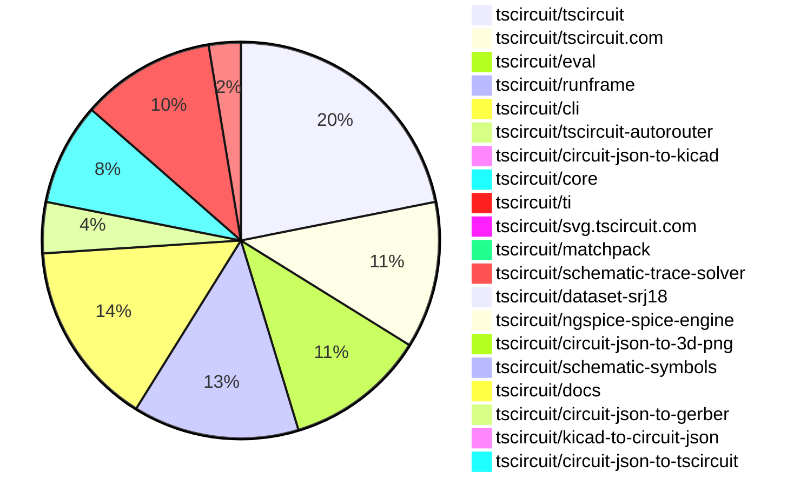

# Contribution Overview 2026-06-09

The current week is shown below. There are 3 major sections:

- [Contributor Overview](#contributor-overview)
- [PRs by Repository](#prs-by-repository)
- [PRs by Contributor](#changes-by-contributor)
- [Scoring & Sponsorship Details](/docs/sponsorship-calculation-explanation.md)

## PRs by Repository

## Contributor Overview

| Contributor | 🐳 Major | 🐙 Minor | 🐌 Tiny | Score | ⭐ | Discussion Contributions |
|-------------|---------|---------|---------|-------|-----|--------------------------|
| [ShiboSoftwareDev](#ShiboSoftwareDev) | 3 | 3 | 5 | 25 | ⭐⭐ | 0🔹 0🔶 0💎 |
| [imrishabh18](#imrishabh18) | 1 | 5 | 8 | 23 | ⭐⭐ | 0🔹 0🔶 0💎 |
| [AnasSarkiz](#AnasSarkiz) | 3 | 0 | 4 | 20 | ⭐⭐ | 0🔹 0🔶 0💎 |
| [MustafaMulla29](#MustafaMulla29) | 1 | 2 | 8 | 17 | ⭐⭐ | 0🔹 0🔶 0💎 |
| [tscircuitbot](#tscircuitbot) | 0 | 0 | 142 | 14.5 | ⭐⭐ | 0🔹 0🔶 0💎 |
| [Sang-it](#Sang-it) | 0 | 3 | 4 | 11 | ⭐⭐ | 0🔹 0🔶 0💎 |
| [techmannih](#techmannih) | 1 | 0 | 3 | 7 | ⭐ | 0🔹 0🔶 0💎 |
| [0hmX](#0hmX) | 1 | 0 | 1 | 6 | ⭐ | 0🔹 0🔶 0💎 |
| [rushabhcodes](#rushabhcodes) | 0 | 1 | 2 | 4 | ⭐ | 0🔹 0🔶 0💎 |
| [Abse2001](#Abse2001) | 0 | 1 | 2 | 4 | ⭐ | 0🔹 0🔶 0💎 |
| [anil08607](#anil08607) | 0 | 0 | 2 | 2 |  | 0🔹 0🔶 0💎 |

## Staff Pass Ratio (SPR)

| Contributor | Reviewed PRs | Rejections | Approvals | SPR |
|-------------|--------------|------------|-----------|-----|
| [techmannih](#techmannih) | 1 | 1 | 0 | 0.0% |

techmannih SPR PRs (1)

- [#602](https://github.com/tscircuit/circuit-json/pull/602) Add clearance to pcb_copper_pour

> Note: AI evaluates PRs and assigns 1-3 star ratings automatically. 4 and 5 star ratings require manual staff review.

### Discussion Contribution Legend

- 🔹 Normal Comments: Basic participation with minimal effort
- 🔶 Great Informative Comments: Thoughtful participation that adds value
- 💎 Incredible Comments: Exceptional participation with high-quality content

## Review Table

[reviews-received-hover]: ## "Number of reviews received for PRs for this contributor"
[approvals-received-hover]: ## "Number of approvals received for PRs this contributor authored"
[rejections-received-hover]: ## "Number of rejections received for PRs this contributor authored"
[prs-opened-hover]: ## "Number of PRs opened by this contributor"
[issues-created-hover]: ## "Number of issues created by this contributor"

| Contributor | Reviews Received | Approvals Received | Rejections Received | Approvals | Rejections Given | PRs Opened | PRs Merged | Issues Created |
|---|---|---|---|---|---|---|---|---|
| [Suryateja-byte](#Suryateja-byte) | 1 | 0 | 0 | 0 | 0 | 1 | 0 | 0 |
| [tscircuitbot](#tscircuitbot) | 0 | 0 | 0 | 0 | 0 | 180 | 142 | 0 |
| [qlufiq-collab](#qlufiq-collab) | 0 | 0 | 0 | 0 | 0 | 8 | 0 | 0 |
| [Shaidyk](#Shaidyk) | 0 | 0 | 0 | 0 | 0 | 6 | 0 | 0 |
| [Aaloklovanshi](#Aaloklovanshi) | 0 | 0 | 0 | 0 | 0 | 1 | 0 | 0 |
| [exodusdistro](#exodusdistro) | 0 | 0 | 0 | 0 | 0 | 2 | 0 | 0 |
| [nitin-rachabathuni](#nitin-rachabathuni) | 0 | 0 | 0 | 0 | 0 | 1 | 0 | 0 |
| [shauryam2807](#shauryam2807) | 0 | 0 | 0 | 0 | 0 | 1 | 0 | 0 |
| [techmannih](#techmannih) | 8 | 1 | 2 | 0 | 0 | 10 | 4 | 0 |
| [seveibar](#seveibar) | 0 | 0 | 0 | 0 | 1 | 0 | 0 | 0 |
| [rushabhcodes](#rushabhcodes) | 20 | 4 | 0 | 0 | 0 | 11 | 3 | 0 |
| [imrishabh18](#imrishabh18) | 0 | 0 | 0 | 15 | 3 | 16 | 14 | 0 |
| [Sang-it](#Sang-it) | 2 | 2 | 0 | 1 | 0 | 10 | 7 | 0 |
| [AnasSarkiz](#AnasSarkiz) | 9 | 8 | 0 | 4 | 0 | 8 | 7 | 0 |
| [MustafaMulla29](#MustafaMulla29) | 7 | 5 | 0 | 6 | 0 | 13 | 11 | 0 |
| [ShiboSoftwareDev](#ShiboSoftwareDev) | 5 | 2 | 1 | 2 | 0 | 14 | 12 | 0 |
| [0hmX](#0hmX) | 4 | 1 | 0 | 2 | 0 | 10 | 2 | 0 |
| [gwhthompson](#gwhthompson) | 0 | 0 | 0 | 0 | 0 | 2 | 0 | 0 |
| [Abse2001](#Abse2001) | 5 | 5 | 0 | 0 | 0 | 4 | 3 | 0 |
| [Eric89544](#Eric89544) | 0 | 0 | 0 | 0 | 0 | 1 | 0 | 0 |
| [bodyegypt](#bodyegypt) | 0 | 0 | 0 | 0 | 0 | 1 | 0 | 0 |
| [b3417](#b3417) | 0 | 0 | 0 | 0 | 0 | 4 | 0 | 0 |
| [anil08607](#anil08607) | 7 | 2 | 1 | 0 | 0 | 3 | 2 | 0 |
| [deaddeadbeef](#deaddeadbeef) | 0 | 0 | 0 | 0 | 0 | 2 | 0 | 0 |
| [JirA44](#JirA44) | 0 | 0 | 0 | 0 | 0 | 1 | 0 | 0 |
| [Vinzz2303](#Vinzz2303) | 0 | 0 | 0 | 0 | 0 | 2 | 0 | 0 |
| [george-pick](#george-pick) | 0 | 0 | 0 | 0 | 0 | 1 | 0 | 0 |
| [codeboost-tr](#codeboost-tr) | 0 | 0 | 0 | 0 | 0 | 1 | 0 | 0 |
| [Wh0FF24](#Wh0FF24) | 0 | 0 | 0 | 0 | 0 | 2 | 0 | 0 |
| [jawn1112](#jawn1112) | 0 | 0 | 0 | 0 | 0 | 1 | 0 | 0 |
| [Misterate](#Misterate) | 0 | 0 | 0 | 0 | 0 | 1 | 0 | 0 |
| [vivekvjnk](#vivekvjnk) | 0 | 0 | 0 | 0 | 0 | 1 | 0 | 0 |

## Changes by Repository

### [tscircuit/tscircuit](https://github.com/tscircuit/tscircuit)

🐌 Tiny Contributions (42)

| PR # | Impact | Contributor | Description |
|------|--------|-------------|-------------|
| [#3465](https://github.com/tscircuit/tscircuit/pull/3465) | 🐌 Tiny | tscircuitbot | Automated package update |
| [#3464](https://github.com/tscircuit/tscircuit/pull/3464) | 🐌 Tiny | tscircuitbot | Automated package update |
| [#3463](https://github.com/tscircuit/tscircuit/pull/3463) | 🐌 Tiny | tscircuitbot | Automated package update |
| [#3462](https://github.com/tscircuit/tscircuit/pull/3462) | 🐌 Tiny | tscircuitbot | Automated package update |
| [#3461](https://github.com/tscircuit/tscircuit/pull/3461) | 🐌 Tiny | tscircuitbot | Automated package update |
| [#3460](https://github.com/tscircuit/tscircuit/pull/3460) | 🐌 Tiny | tscircuitbot | Updates the tscircuiteval package version from 0.0.919 to 0.0.920 in package.json |
| [#3459](https://github.com/tscircuit/tscircuit/pull/3459) | 🐌 Tiny | tscircuitbot | Automated package update |
| [#3458](https://github.com/tscircuit/tscircuit/pull/3458) | 🐌 Tiny | tscircuitbot | Automated package update |
| [#3456](https://github.com/tscircuit/tscircuit/pull/3456) | 🐌 Tiny | tscircuitbot | Automated package update |
| [#3455](https://github.com/tscircuit/tscircuit/pull/3455) | 🐌 Tiny | tscircuitbot | Updates the tscircuitrunframe package to version 0.0.2063 in package.json |
| [#3454](https://github.com/tscircuit/tscircuit/pull/3454) | 🐌 Tiny | tscircuitbot | Updates the package version from 0.0.1855 to 0.0.1856 in package.json |
| [#3453](https://github.com/tscircuit/tscircuit/pull/3453) | 🐌 Tiny | tscircuitbot | Automated package update |
| [#3452](https://github.com/tscircuit/tscircuit/pull/3452) | 🐌 Tiny | tscircuitbot | Automated package update |
| [#3451](https://github.com/tscircuit/tscircuit/pull/3451) | 🐌 Tiny | tscircuitbot | Updates the tscircuitcli package from version 0.1.1472 to 0.1.1473 and the tscircuitrunframe package from version 0.0.2060 to 0.0.2061. |
| [#3450](https://github.com/tscircuit/tscircuit/pull/3450) | 🐌 Tiny | tscircuitbot | Automated package update |
| [#3449](https://github.com/tscircuit/tscircuit/pull/3449) | 🐌 Tiny | tscircuitbot | Automated package update |
| [#3448](https://github.com/tscircuit/tscircuit/pull/3448) | 🐌 Tiny | tscircuitbot | Automated package version bump from 0.0.1852 to 0.0.1853 |
| [#3447](https://github.com/tscircuit/tscircuit/pull/3447) | 🐌 Tiny | tscircuitbot | Automated package update |
| [#3446](https://github.com/tscircuit/tscircuit/pull/3446) | 🐌 Tiny | tscircuitbot | Automated package update |
| [#3445](https://github.com/tscircuit/tscircuit/pull/3445) | 🐌 Tiny | tscircuitbot | Updates the tscircuitcli package from version 0.1.1470 to 0.1.1471 and the tscircuitrunframe package from version 0.0.2058 to 0.0.2059 in package.json |
| [#3444](https://github.com/tscircuit/tscircuit/pull/3444) | 🐌 Tiny | tscircuitbot | Automated package update |
| [#3443](https://github.com/tscircuit/tscircuit/pull/3443) | 🐌 Tiny | tscircuitbot | Updates the tscircuitcli package to version 0.1.1470 |
| [#3442](https://github.com/tscircuit/tscircuit/pull/3442) | 🐌 Tiny | tscircuitbot | Automated package update |
| [#3441](https://github.com/tscircuit/tscircuit/pull/3441) | 🐌 Tiny | tscircuitbot | Updates the tscircuitcli package from version 0.1.1468 to 0.1.1469 and the tscircuitrunframe package from version 0.0.2057 to 0.0.2058. |
| [#3439](https://github.com/tscircuit/tscircuit/pull/3439) | 🐌 Tiny | tscircuitbot | Updates the tscircuitcli package version from 0.1.1467 to 0.1.1468 |
| [#3425](https://github.com/tscircuit/tscircuit/pull/3425) | 🐌 Tiny | tscircuitbot | Updates the version of tscircuitcore from 0.0.1309 to 0.0.1310 and tscircuitngspice-spice-engine from 0.0.8 to 0.0.9 in package.json |
| [#3426](https://github.com/tscircuit/tscircuit/pull/3426) | 🐌 Tiny | tscircuitbot | Automated package update |
| [#3429](https://github.com/tscircuit/tscircuit/pull/3429) | 🐌 Tiny | tscircuitbot | Automated package update |
| [#3434](https://github.com/tscircuit/tscircuit/pull/3434) | 🐌 Tiny | tscircuitbot | Updates the package version from 0.0.1845 to 0.0.1846 in package.json |
| [#3438](https://github.com/tscircuit/tscircuit/pull/3438) | 🐌 Tiny | tscircuitbot | Automated package update to version 0.0.1848 |
| [#3428](https://github.com/tscircuit/tscircuit/pull/3428) | 🐌 Tiny | tscircuitbot | Automated package update |
| [#3435](https://github.com/tscircuit/tscircuit/pull/3435) | 🐌 Tiny | tscircuitbot | Updates the tscircuitcore package version from 0.0.1312 to 0.0.1314 in package.json |
| [#3430](https://github.com/tscircuit/tscircuit/pull/3430) | 🐌 Tiny | tscircuitbot | Automated package update |
| [#3421](https://github.com/tscircuit/tscircuit/pull/3421) | 🐌 Tiny | tscircuitbot | Updates the package version from 0.0.1840 to 0.0.1841 in package.json |
| [#3431](https://github.com/tscircuit/tscircuit/pull/3431) | 🐌 Tiny | tscircuitbot | Automated package update |
| [#3436](https://github.com/tscircuit/tscircuit/pull/3436) | 🐌 Tiny | tscircuitbot | Automated package update |
| [#3427](https://github.com/tscircuit/tscircuit/pull/3427) | 🐌 Tiny | tscircuitbot | Automated package update |
| [#3437](https://github.com/tscircuit/tscircuit/pull/3437) | 🐌 Tiny | tscircuitbot | Automated package update |
| [#3433](https://github.com/tscircuit/tscircuit/pull/3433) | 🐌 Tiny | tscircuitbot | Automated package update |
| [#3432](https://github.com/tscircuit/tscircuit/pull/3432) | 🐌 Tiny | tscircuitbot | Automated package update |
| [#3440](https://github.com/tscircuit/tscircuit/pull/3440) | 🐌 Tiny | tscircuitbot | Automated package update |
| [#3420](https://github.com/tscircuit/tscircuit/pull/3420) | 🐌 Tiny | tscircuitbot | Updates the tscircuitcli package and other related dependencies to their latest versions. |

### [tscircuit/tscircuit.com](https://github.com/tscircuit/tscircuit.com)

🐌 Tiny Contributions (23)

| PR # | Impact | Contributor | Description |
|------|--------|-------------|-------------|
| [#3655](https://github.com/tscircuit/tscircuit.com/pull/3655) | 🐌 Tiny | tscircuitbot | Updates the tscircuiteval package from version 0.0.920 to 0.0.921 |
| [#3654](https://github.com/tscircuit/tscircuit.com/pull/3654) | 🐌 Tiny | tscircuitbot | Updates the tscircuitrunframe package to version 0.0.2065 in package.json |
| [#3653](https://github.com/tscircuit/tscircuit.com/pull/3653) | 🐌 Tiny | tscircuitbot | Updates the tscircuiteval package from version 0.0.919 to 0.0.920 |
| [#3652](https://github.com/tscircuit/tscircuit.com/pull/3652) | 🐌 Tiny | tscircuitbot | Automated package update |
| [#3651](https://github.com/tscircuit/tscircuit.com/pull/3651) | 🐌 Tiny | tscircuitbot | Automated package update |
| [#3650](https://github.com/tscircuit/tscircuit.com/pull/3650) | 🐌 Tiny | tscircuitbot | Updates the tscircuitrunframe package to version 0.0.2063 |
| [#3649](https://github.com/tscircuit/tscircuit.com/pull/3649) | 🐌 Tiny | tscircuitbot | Automated package update |
| [#3648](https://github.com/tscircuit/tscircuit.com/pull/3648) | 🐌 Tiny | tscircuitbot | Updates the tscircuiteval package to version 0.0.918 |
| [#3647](https://github.com/tscircuit/tscircuit.com/pull/3647) | 🐌 Tiny | tscircuitbot | Automated package update |
| [#3646](https://github.com/tscircuit/tscircuit.com/pull/3646) | 🐌 Tiny | tscircuitbot | Updates the tscircuiteval package to version 0.0.917 in the package.json file. |
| [#3645](https://github.com/tscircuit/tscircuit.com/pull/3645) | 🐌 Tiny | tscircuitbot | Automated package update |
| [#3644](https://github.com/tscircuit/tscircuit.com/pull/3644) | 🐌 Tiny | tscircuitbot | Automated package update |
| [#3643](https://github.com/tscircuit/tscircuit.com/pull/3643) | 🐌 Tiny | tscircuitbot | Automated package update |
| [#3639](https://github.com/tscircuit/tscircuit.com/pull/3639) | 🐌 Tiny | tscircuitbot | Updates the tscircuiteval package from version 0.0.913 to 0.0.914 |
| [#3634](https://github.com/tscircuit/tscircuit.com/pull/3634) | 🐌 Tiny | tscircuitbot | Updates the tscircuitrunframe package from version 0.0.2052 to 0.0.2053 |
| [#3635](https://github.com/tscircuit/tscircuit.com/pull/3635) | 🐌 Tiny | tscircuitbot | Updates the tscircuiteval package to version 0.0.912 in the package.json file. |
| [#3641](https://github.com/tscircuit/tscircuit.com/pull/3641) | 🐌 Tiny | tscircuitbot | Updates the tscircuiteval package from version 0.0.914 to 0.0.915 |
| [#3636](https://github.com/tscircuit/tscircuit.com/pull/3636) | 🐌 Tiny | tscircuitbot | Updates the tscircuitrunframe package to version 0.0.2054 |
| [#3638](https://github.com/tscircuit/tscircuit.com/pull/3638) | 🐌 Tiny | tscircuitbot | Updates the tscircuitrunframe package to version 0.0.2055 |
| [#3637](https://github.com/tscircuit/tscircuit.com/pull/3637) | 🐌 Tiny | tscircuitbot | Updates the tscircuiteval package from version 0.0.912 to 0.0.913 |
| [#3640](https://github.com/tscircuit/tscircuit.com/pull/3640) | 🐌 Tiny | tscircuitbot | Automated package update |
| [#3642](https://github.com/tscircuit/tscircuit.com/pull/3642) | 🐌 Tiny | tscircuitbot | Automated package update |
| [#3633](https://github.com/tscircuit/tscircuit.com/pull/3633) | 🐌 Tiny | tscircuitbot | Automated package update |

### [tscircuit/eval](https://github.com/tscircuit/eval)

| PR # | Impact | Rating | Contributor | Description |
|------|--------|--------|-------------|-------------|
| [#2864](https://github.com/tscircuit/eval/pull/2864) | 🐙 Minor | ⭐⭐ | ShiboSoftwareDev | Enables PSPICE compatibility in ngspice simulations by modifying the ngspice engine configuration and adding a corresponding test. |

🐌 Tiny Contributions (21)

| PR # | Impact | Contributor | Description |
|------|--------|-------------|-------------|
| [#2897](https://github.com/tscircuit/eval/pull/2897) | 🐌 Tiny | tscircuitbot | Automated package update |
| [#2896](https://github.com/tscircuit/eval/pull/2896) | 🐌 Tiny | tscircuitbot | Updates package dependencies to their latest versions as part of routine maintenance. |
| [#2894](https://github.com/tscircuit/eval/pull/2894) | 🐌 Tiny | tscircuitbot | Automated package update |
| [#2893](https://github.com/tscircuit/eval/pull/2893) | 🐌 Tiny | tscircuitbot | Updates the version of the tscircuitcore package from 0.0.1318 to 0.0.1319 in package.json |
| [#2891](https://github.com/tscircuit/eval/pull/2891) | 🐌 Tiny | tscircuitbot | Updates the package version from 0.0.918 to 0.0.919 in package.json |
| [#2890](https://github.com/tscircuit/eval/pull/2890) | 🐌 Tiny | tscircuitbot | Automated package update |
| [#2888](https://github.com/tscircuit/eval/pull/2888) | 🐌 Tiny | tscircuitbot | Automated package update |
| [#2887](https://github.com/tscircuit/eval/pull/2887) | 🐌 Tiny | tscircuitbot | Updates the version of the tscircuitcore package from 0.0.1316 to 0.0.1317 in package.json |
| [#2885](https://github.com/tscircuit/eval/pull/2885) | 🐌 Tiny | tscircuitbot | Automated package update |
| [#2884](https://github.com/tscircuit/eval/pull/2884) | 🐌 Tiny | tscircuitbot | Automated package update |
| [#2882](https://github.com/tscircuit/eval/pull/2882) | 🐌 Tiny | tscircuitbot | Automated package update |
| [#2881](https://github.com/tscircuit/eval/pull/2881) | 🐌 Tiny | tscircuitbot | Updates the version of the tscircuitcore package from 0.0.1314 to 0.0.1315 in package.json |
| [#2867](https://github.com/tscircuit/eval/pull/2867) | 🐌 Tiny | tscircuitbot | Updates the version of tscircuitcore to 0.0.1310 and downgrades eecircuit-engine to 1.5.6 in package.json |
| [#2870](https://github.com/tscircuit/eval/pull/2870) | 🐌 Tiny | tscircuitbot | Updates the package versions in package.json for various dependencies. |
| [#2879](https://github.com/tscircuit/eval/pull/2879) | 🐌 Tiny | tscircuitbot | Automated package update |
| [#2878](https://github.com/tscircuit/eval/pull/2878) | 🐌 Tiny | tscircuitbot | Updates the version of the tscircuitcore package from 0.0.1312 to 0.0.1314 in package.json |
| [#2871](https://github.com/tscircuit/eval/pull/2871) | 🐌 Tiny | tscircuitbot | Automated package update |
| [#2874](https://github.com/tscircuit/eval/pull/2874) | 🐌 Tiny | tscircuitbot | Automated package update |
| [#2873](https://github.com/tscircuit/eval/pull/2873) | 🐌 Tiny | tscircuitbot | Automated package update |
| [#2868](https://github.com/tscircuit/eval/pull/2868) | 🐌 Tiny | tscircuitbot | Automated package update |
| [#2865](https://github.com/tscircuit/eval/pull/2865) | 🐌 Tiny | tscircuitbot | Automated package update |

### [tscircuit/runframe](https://github.com/tscircuit/runframe)

🐌 Tiny Contributions (26)

| PR # | Impact | Contributor | Description |
|------|--------|-------------|-------------|
| [#3658](https://github.com/tscircuit/runframe/pull/3658) | 🐌 Tiny | tscircuitbot | Automated package update |
| [#3657](https://github.com/tscircuit/runframe/pull/3657) | 🐌 Tiny | tscircuitbot | Updates the tscircuiteval package from version 0.0.919 to 0.0.920 in the package.json file. |
| [#3656](https://github.com/tscircuit/runframe/pull/3656) | 🐌 Tiny | tscircuitbot | Automated package update |
| [#3655](https://github.com/tscircuit/runframe/pull/3655) | 🐌 Tiny | tscircuitbot | Updates the tscircuiteval package from version 0.0.918 to 0.0.919 in the package.json file. |
| [#3654](https://github.com/tscircuit/runframe/pull/3654) | 🐌 Tiny | tscircuitbot | Automated package update |
| [#3651](https://github.com/tscircuit/runframe/pull/3651) | 🐌 Tiny | tscircuitbot | Automated package update |
| [#3650](https://github.com/tscircuit/runframe/pull/3650) | 🐌 Tiny | tscircuitbot | Updates the tscircuiteval package from version 0.0.917 to 0.0.918 in the package.json file. |
| [#3649](https://github.com/tscircuit/runframe/pull/3649) | 🐌 Tiny | tscircuitbot | Automated package update |
| [#3648](https://github.com/tscircuit/runframe/pull/3648) | 🐌 Tiny | tscircuitbot | Updates the tscircuiteval package from version 0.0.916 to 0.0.917 |
| [#3647](https://github.com/tscircuit/runframe/pull/3647) | 🐌 Tiny | tscircuitbot | Automated package update |
| [#3646](https://github.com/tscircuit/runframe/pull/3646) | 🐌 Tiny | tscircuitbot | Updates the tscircuiteval package from version 0.0.915 to 0.0.916 in the package.json file. |
| [#3645](https://github.com/tscircuit/runframe/pull/3645) | 🐌 Tiny | tscircuitbot | Automated package update |
| [#3644](https://github.com/tscircuit/runframe/pull/3644) | 🐌 Tiny | tscircuitbot | Updates the circuit-json-to-kicad package version from 0.0.148 to 0.0.149 in package.json |
| [#3635](https://github.com/tscircuit/runframe/pull/3635) | 🐌 Tiny | tscircuitbot | Automated package update |
| [#3639](https://github.com/tscircuit/runframe/pull/3639) | 🐌 Tiny | tscircuitbot | Automated package update |
| [#3636](https://github.com/tscircuit/runframe/pull/3636) | 🐌 Tiny | tscircuitbot | Updates the tscircuiteval package from version 0.0.912 to 0.0.913 in the package.json file. |
| [#3632](https://github.com/tscircuit/runframe/pull/3632) | 🐌 Tiny | tscircuitbot | Updates the tscircuiteval package from version 0.0.910 to 0.0.911 in the package.json file. |
| [#3640](https://github.com/tscircuit/runframe/pull/3640) | 🐌 Tiny | tscircuitbot | Updates the tscircuiteval package from version 0.0.914 to 0.0.915 |
| [#3637](https://github.com/tscircuit/runframe/pull/3637) | 🐌 Tiny | tscircuitbot | Automated package update |
| [#3642](https://github.com/tscircuit/runframe/pull/3642) | 🐌 Tiny | tscircuitbot | Updates the circuit-json-to-gerber package from version 0.0.77 to 0.0.78 |
| [#3641](https://github.com/tscircuit/runframe/pull/3641) | 🐌 Tiny | tscircuitbot | Automated package update |
| [#3638](https://github.com/tscircuit/runframe/pull/3638) | 🐌 Tiny | tscircuitbot | Updates the tscircuiteval package from version 0.0.913 to 0.0.914 in the package.json file. |
| [#3634](https://github.com/tscircuit/runframe/pull/3634) | 🐌 Tiny | tscircuitbot | Updates the tscircuiteval package from version 0.0.911 to 0.0.912 in the package.json file. |
| [#3633](https://github.com/tscircuit/runframe/pull/3633) | 🐌 Tiny | tscircuitbot | Automated package update |
| [#3653](https://github.com/tscircuit/runframe/pull/3653) | 🐌 Tiny | ShiboSoftwareDev | This pull request removes changes made to the style files, reverting them to a previous state. |
| [#3652](https://github.com/tscircuit/runframe/pull/3652) | 🐌 Tiny | ShiboSoftwareDev | This pull request addresses issues related to the simulation tab, specifically fixing waiting and error pages that users encounter during analog simulations. It introduces new fixtures for slow analog simulations and error handling, enhancing the user experience by providing clearer feedback during simulation processes. |

### [tscircuit/cli](https://github.com/tscircuit/cli)

| PR # | Impact | Rating | Contributor | Description |
|------|--------|--------|-------------|-------------|
| [#3237](https://github.com/tscircuit/cli/pull/3237) | 🐙 Minor | ⭐⭐ | imrishabh18 | Fixes failure of tsci snapshot command to load the asynchronous footprint from parts-engine in tscircuit.config.ts |

🐌 Tiny Contributions (28)

| PR # | Impact | Contributor | Description |
|------|--------|-------------|-------------|
| [#3273](https://github.com/tscircuit/cli/pull/3273) | 🐌 Tiny | tscircuitbot | Automated package update |
| [#3272](https://github.com/tscircuit/cli/pull/3272) | 🐌 Tiny | tscircuitbot | Updates the tscircuitrunframe package from version 0.0.2064 to 0.0.2065 |
| [#3271](https://github.com/tscircuit/cli/pull/3271) | 🐌 Tiny | tscircuitbot | Automated package update |
| [#3270](https://github.com/tscircuit/cli/pull/3270) | 🐌 Tiny | tscircuitbot | Updates the tscircuitrunframe package from version 0.0.2063 to 0.0.2064 |
| [#3268](https://github.com/tscircuit/cli/pull/3268) | 🐌 Tiny | tscircuitbot | Updates the tscircuitrunframe package from version 0.0.2062 to 0.0.2063 |
| [#3267](https://github.com/tscircuit/cli/pull/3267) | 🐌 Tiny | tscircuitbot | Automated package update |
| [#3266](https://github.com/tscircuit/cli/pull/3266) | 🐌 Tiny | tscircuitbot | Updates the tscircuitrunframe package from version 0.0.2061 to 0.0.2062 |
| [#3265](https://github.com/tscircuit/cli/pull/3265) | 🐌 Tiny | tscircuitbot | Automated package update |
| [#3264](https://github.com/tscircuit/cli/pull/3264) | 🐌 Tiny | tscircuitbot | Updates the tscircuitrunframe package from version 0.0.2060 to 0.0.2061 |
| [#3263](https://github.com/tscircuit/cli/pull/3263) | 🐌 Tiny | tscircuitbot | Automated package update |
| [#3262](https://github.com/tscircuit/cli/pull/3262) | 🐌 Tiny | tscircuitbot | Updates the tscircuitrunframe package from version 0.0.2059 to 0.0.2060 |
| [#3261](https://github.com/tscircuit/cli/pull/3261) | 🐌 Tiny | tscircuitbot | Automated package update |
| [#3260](https://github.com/tscircuit/cli/pull/3260) | 🐌 Tiny | tscircuitbot | Automated package update |
| [#3259](https://github.com/tscircuit/cli/pull/3259) | 🐌 Tiny | tscircuitbot | Automated package update |
| [#3258](https://github.com/tscircuit/cli/pull/3258) | 🐌 Tiny | tscircuitbot | Automated README update with latest CLI usage output. |
| [#3257](https://github.com/tscircuit/cli/pull/3257) | 🐌 Tiny | tscircuitbot | Automated package update |
| [#3251](https://github.com/tscircuit/cli/pull/3251) | 🐌 Tiny | tscircuitbot | Updates the tscircuitrunframe package version from 0.0.2056 to 0.0.2057 in package.json |
| [#3246](https://github.com/tscircuit/cli/pull/3246) | 🐌 Tiny | tscircuitbot | Updates the tscircuitrunframe package from version 0.0.2054 to 0.0.2055 |
| [#3252](https://github.com/tscircuit/cli/pull/3252) | 🐌 Tiny | tscircuitbot | Automated package update |
| [#3244](https://github.com/tscircuit/cli/pull/3244) | 🐌 Tiny | tscircuitbot | Updates the tscircuitrunframe package to version 0.0.2054 in package.json |
| [#3245](https://github.com/tscircuit/cli/pull/3245) | 🐌 Tiny | tscircuitbot | Automated package update |
| [#3242](https://github.com/tscircuit/cli/pull/3242) | 🐌 Tiny | tscircuitbot | Updates the tscircuitrunframe package to version 0.0.2053 in package.json |
| [#3247](https://github.com/tscircuit/cli/pull/3247) | 🐌 Tiny | tscircuitbot | Automated package update |
| [#3243](https://github.com/tscircuit/cli/pull/3243) | 🐌 Tiny | tscircuitbot | Automated package update |
| [#3253](https://github.com/tscircuit/cli/pull/3253) | 🐌 Tiny | tscircuitbot | Automated package update |
| [#3248](https://github.com/tscircuit/cli/pull/3248) | 🐌 Tiny | tscircuitbot | Updates the tscircuitrunframe package version from 0.0.2055 to 0.0.2056 |
| [#3249](https://github.com/tscircuit/cli/pull/3249) | 🐌 Tiny | tscircuitbot | Automated package update |
| [#3255](https://github.com/tscircuit/cli/pull/3255) | 🐌 Tiny | techmannih | Updates the versions of the tscircuiteval and tscircuit packages in package.json to the latest compatible versions. |

### [tscircuit/tscircuit-autorouter](https://github.com/tscircuit/tscircuit-autorouter)

| PR # | Impact | Rating | Contributor | Description |
|------|--------|--------|-------------|-------------|
| [#1362](https://github.com/tscircuit/tscircuit-autorouter/pull/1362) | 🐳 Major | ⭐⭐⭐ | ShiboSoftwareDev | Fixes high-density solver metadata for child solvers that do not implement the getSolverName method, ensuring proper naming conventions are followed. |
| [#1368](https://github.com/tscircuit/tscircuit-autorouter/pull/1368) | 🐳 Major | ⭐⭐⭐ | 0hmX | Removes redundant parameters related to topology generator IDs from various solver classes, streamlining the output structure. |

🐌 Tiny Contributions (6)

| PR # | Impact | Contributor | Description |
|------|--------|-------------|-------------|
| [#1380](https://github.com/tscircuit/tscircuit-autorouter/pull/1380) | 🐌 Tiny | tscircuitbot | Automated package update |
| [#1374](https://github.com/tscircuit/tscircuit-autorouter/pull/1374) | 🐌 Tiny | tscircuitbot | Automated package update |
| [#1371](https://github.com/tscircuit/tscircuit-autorouter/pull/1371) | 🐌 Tiny | tscircuitbot | Automated package update |
| [#1365](https://github.com/tscircuit/tscircuit-autorouter/pull/1365) | 🐌 Tiny | tscircuitbot | Automated package update |
| [#1379](https://github.com/tscircuit/tscircuit-autorouter/pull/1379) | 🐌 Tiny | imrishabh18 | Moves the dependency tscircuithigh-density-a01 from dependencies to devDependencies in package.json |
| [#1373](https://github.com/tscircuit/tscircuit-autorouter/pull/1373) | 🐌 Tiny | 0hmX | Fixes the git hash issue by only passing the first 7 characters of the hash for the dependency tscircuithigh-density-a01 in package.json |

### [tscircuit/circuit-json-to-kicad](https://github.com/tscircuit/circuit-json-to-kicad)

🐌 Tiny Contributions (2)

| PR # | Impact | Contributor | Description |
|------|--------|-------------|-------------|
| [#335](https://github.com/tscircuit/circuit-json-to-kicad/pull/335) | 🐌 Tiny | tscircuitbot | Automated package update |
| [#334](https://github.com/tscircuit/circuit-json-to-kicad/pull/334) | 🐌 Tiny | techmannih | This pull request adds a new test dataset for autorouting, specifically focusing on copper pour functionality. The dataset includes various source ports and components, which are essential for testing the copper pour feature in the autorouting process. |

### [tscircuit/core](https://github.com/tscircuit/core)

| PR # | Impact | Rating | Contributor | Description |
|------|--------|--------|-------------|-------------|
| [#2432](https://github.com/tscircuit/core/pull/2432) | 🐳 Major | ⭐⭐⭐ | imrishabh18 | Fixes missing junctions for traces that are under the same net and crossing each other, ensuring proper connectivity in schematic rendering. |
| [#2430](https://github.com/tscircuit/core/pull/2430) | 🐳 Major | ⭐⭐⭐ | AnasSarkiz | Fixes autorouting failure by ensuring parent SRJ generation does not include descendant subcircuit source nets, preventing duplicate route requests and static reachability errors. |
| [#2422](https://github.com/tscircuit/core/pull/2422) | 🐳 Major | ⭐⭐⭐ | AnasSarkiz | Updates Simple Route JSON generation to ensure top-level autorouting inputs are derived from logical source_tracesource_net intent, rather than treating existing top-level pcb_trace records as already-routed state, addressing the dataset-srj18 missing traces issue. |
| [#2413](https://github.com/tscircuit/core/pull/2413) | 🐳 Major | ⭐⭐⭐ | ShiboSoftwareDev | This pull request integrates the AutoroutingPipelineSolver7_MultiGraph into the existing autorouting framework, enhancing the routing capabilities of the system. It also updates the autorouter versioning in the interface and modifies the package dependencies to ensure compatibility with the new solver. |
| [#2431](https://github.com/tscircuit/core/pull/2431) | 🐙 Minor | ⭐⭐ | imrishabh18 | Adds a test for missing junctions in the INA237 subcircuit. |
| [#2428](https://github.com/tscircuit/core/pull/2428) | 🐙 Minor | ⭐⭐ | imrishabh18 | Fixes incorrect netlabel assignment when connecting components across subcircuits in schematic rendering |
| [#2427](https://github.com/tscircuit/core/pull/2427) | 🐙 Minor | ⭐⭐ | imrishabh18 | Fixes incorrect netlabel assignment for components connected to subcircuit components in schematic rendering. |
| [#2433](https://github.com/tscircuit/core/pull/2433) | 🐙 Minor | ⭐⭐ | Sang-it | Fixes net label collisions by utilizing the output from netLabelNetLabelCollisionSolver to determine placements. |

🐌 Tiny Contributions (8)

| PR # | Impact | Contributor | Description |
|------|--------|-------------|-------------|
| [#2434](https://github.com/tscircuit/core/pull/2434) | 🐌 Tiny | imrishabh18 | Updates the version of the tscircuitcapacity-autorouter dependency from 0.0.579 to 0.0.583 in package.json |
| [#2423](https://github.com/tscircuit/core/pull/2423) | 🐌 Tiny | Sang-it | Fixes issues with trace overlap and merging in schematic rendering, ensuring clearer representation of traces. |
| [#2429](https://github.com/tscircuit/core/pull/2429) | 🐌 Tiny | ShiboSoftwareDev | Updates the ngspice engine dependency version from 0.0.9 to 0.0.10 in package.json |
| [#2417](https://github.com/tscircuit/core/pull/2417) | 🐌 Tiny | ShiboSoftwareDev | Updates the ngspice engine dependency version from 0.0.8 to 0.0.9 in package.json |
| [#2425](https://github.com/tscircuit/core/pull/2425) | 🐌 Tiny | MustafaMulla29 | Reproduces a bug related to custom symbols having incorrect connections in schematic rendering. |
| [#2420](https://github.com/tscircuit/core/pull/2420) | 🐌 Tiny | MustafaMulla29 | Adds a test to verify the correct direction of netlabels for custom symbols in schematic representations. |
| [#2421](https://github.com/tscircuit/core/pull/2421) | 🐌 Tiny | MustafaMulla29 | Fixes incorrect facing direction for custom symbol ports in schematics, ensuring netlabels point correctly based on declared port direction. |
| [#2418](https://github.com/tscircuit/core/pull/2418) | 🐌 Tiny | MustafaMulla29 | Updates the version of the schematic-trace-solver dependency from 0.0.63 to 0.0.65 in package.json |

### [tscircuit/ti](https://github.com/tscircuit/ti)

| PR # | Impact | Rating | Contributor | Description |
|------|--------|--------|-------------|-------------|
| [#20](https://github.com/tscircuit/ti/pull/20) | 🐙 Minor | ⭐⭐ | imrishabh18 | Refactors multiple subcircuits to accept props, enabling reuse of components across different circuits. |
| [#28](https://github.com/tscircuit/ti/pull/28) | 🐙 Minor | ⭐⭐ | ShiboSoftwareDev | This pull request removes the MSPM0_OPA PSPICE model and its references from the project. The model was previously used for simulating operational amplifier characteristics in circuit designs. |
| [#23](https://github.com/tscircuit/ti/pull/23) | 🐙 Minor | ⭐⭐ | ShiboSoftwareDev | img width2978 height1562 altimage srchttps:github.comuser-attachmentsassets24c2cac8-e905-490e-b284-01ce6561b7a4 |

🐌 Tiny Contributions (18)

| PR # | Impact | Contributor | Description |
|------|--------|-------------|-------------|
| [#29](https://github.com/tscircuit/ti/pull/29) | 🐌 Tiny | imrishabh18 | Updates the tscircuit dependency version from 0.0.1857 to 0.0.1861 in package.json |
| [#22](https://github.com/tscircuit/ti/pull/22) | 🐌 Tiny | imrishabh18 | Exports all subcircuits for various chips and updates connection syntax in existing circuit files to use string literals instead of a selection utility. |
| [#15](https://github.com/tscircuit/ti/pull/15) | 🐌 Tiny | imrishabh18 | Add BQ25895 subcircuit and its associated components to the library. |
| [#17](https://github.com/tscircuit/ti/pull/17) | 🐌 Tiny | imrishabh18 | Add a new BQ27441 component with its footprint and schematic representation for use in circuit designs. |
| [#18](https://github.com/tscircuit/ti/pull/18) | 🐌 Tiny | imrishabh18 | Adds the INA237 component with its footprint and schematic representation to the library. |
| [#19](https://github.com/tscircuit/ti/pull/19) | 🐌 Tiny | Sang-it | Adds a footprint for the DRV8833 and DRV8876 chips, including detailed pad specifications and CAD model links. |
| [#8](https://github.com/tscircuit/ti/pull/8) | 🐌 Tiny | Sang-it | Adds a new DRV8833 motor driver component and its associated schematic representation to the library. |
| [#26](https://github.com/tscircuit/ti/pull/26) | 🐌 Tiny | AnasSarkiz | Adds missing footprints for components, ensures all subcircuits are routed correctly, and modifies schematic coordinates for net labels to eliminate build log errors. |
| [#24](https://github.com/tscircuit/ti/pull/24) | 🐌 Tiny | AnasSarkiz | Updates the tscircuit dependency version in package.json from 0.0.1846 to 0.0.1856. |
| [#9](https://github.com/tscircuit/ti/pull/9) | 🐌 Tiny | AnasSarkiz | Adds a new demo for the TPS7A02 voltage regulator, including its footprint and schematic representation. |
| [#6](https://github.com/tscircuit/ti/pull/6) | 🐌 Tiny | AnasSarkiz | Adds a new subcircuit for the TPS63802 component, including its footprint and schematic representation. |
| [#16](https://github.com/tscircuit/ti/pull/16) | 🐌 Tiny | ShiboSoftwareDev | Adds HDC3022 and HDC3020 components with their respective footprints and schematic representations. |
| [#27](https://github.com/tscircuit/ti/pull/27) | 🐌 Tiny | MustafaMulla29 | Updates the PCB snapshot files in the repository to reflect the latest design changes. |
| [#25](https://github.com/tscircuit/ti/pull/25) | 🐌 Tiny | MustafaMulla29 | Adds pcbX and pcbY coordinates to components in the CC2340R5 and CC3235SF circuit definitions for improved PCB layout accuracy. |
| [#11](https://github.com/tscircuit/ti/pull/11) | 🐌 Tiny | MustafaMulla29 | Adds new components MSPM0G3507, CC2340R5, and CC3235SF with their respective pin configurations and schematic representations. |
| [#14](https://github.com/tscircuit/ti/pull/14) | 🐌 Tiny | Abse2001 | Adds a new PCB and schematic for the TMP1075 component, including detailed footprint and connections. |
| [#10](https://github.com/tscircuit/ti/pull/10) | 🐌 Tiny | Abse2001 | Adds a new HDC2080 TI board with its corresponding footprint and schematic representation. |
| [#13](https://github.com/tscircuit/ti/pull/13) | 🐌 Tiny | techmannih | Adds a new TPS22919 circuit component and its schematic representation to the library. |

### [tscircuit/svg.tscircuit.com](https://github.com/tscircuit/svg.tscircuit.com)

🐌 Tiny Contributions (1)

| PR # | Impact | Contributor | Description |
|------|--------|-------------|-------------|
| [#1570](https://github.com/tscircuit/svg.tscircuit.com/pull/1570) | 🐌 Tiny | imrishabh18 | Updates the tscircuit dependency version from 0.0.1807 to 0.0.1861 in package.json |

### [tscircuit/matchpack](https://github.com/tscircuit/matchpack)

| PR # | Impact | Rating | Contributor | Description |
|------|--------|--------|-------------|-------------|
| [#131](https://github.com/tscircuit/matchpack/pull/131) | 🐙 Minor | ⭐⭐ | Sang-it | Fixes empty visualization frames and adds a fixed suffix to fixed chips in the layout visualization. |

🐌 Tiny Contributions (1)

| PR # | Impact | Contributor | Description |
|------|--------|-------------|-------------|
| [#130](https://github.com/tscircuit/matchpack/pull/130) | 🐌 Tiny | Sang-it | Adds color coding to chip visualizations based on chip type in the SVG rendering. |

### [tscircuit/schematic-trace-solver](https://github.com/tscircuit/schematic-trace-solver)

| PR # | Impact | Rating | Contributor | Description |
|------|--------|--------|-------------|-------------|
| [#512](https://github.com/tscircuit/schematic-trace-solver/pull/512) | 🐳 Major | ⭐⭐⭐ | MustafaMulla29 | Fixes the issue where overlapping traces would shift into schematic component boxes by implementing obstacle-aware offsets during trace separation. |
| [#528](https://github.com/tscircuit/schematic-trace-solver/pull/528) | 🐙 Minor | ⭐⭐ | Sang-it | Fixes pipeline failure when a single net label cannot be placed, allowing the solver to continue processing other labels and preserving straight pin-to-pin traces. |
| [#524](https://github.com/tscircuit/schematic-trace-solver/pull/524) | 🐙 Minor | ⭐⭐ | MustafaMulla29 | Adds a test case for tracing through a capacitor in the schematic solver, ensuring that the trace correctly identifies obstacles and intersections with the capacitor component. |
| [#507](https://github.com/tscircuit/schematic-trace-solver/pull/507) | 🐙 Minor | ⭐⭐ | MustafaMulla29 | Fixes validation of connector traces to ensure they do not overlap netlabel edges, preventing potential routing errors. |

🐌 Tiny Contributions (1)

| PR # | Impact | Contributor | Description |
|------|--------|-------------|-------------|
| [#508](https://github.com/tscircuit/schematic-trace-solver/pull/508) | 🐌 Tiny | MustafaMulla29 | Adds a test case for trace overlap involving a resistor in the schematic trace solver. |

### [tscircuit/dataset-srj18](https://github.com/tscircuit/dataset-srj18)

| PR # | Impact | Rating | Contributor | Description |
|------|--------|--------|-------------|-------------|
| [#8](https://github.com/tscircuit/dataset-srj18/pull/8) | 🐳 Major | ⭐⭐⭐ | AnasSarkiz | BEFORE !Before(https:github.comuser-attachmentsassets0ec0f7d5-7f8f-4403-bb1c-a01af85e8701)  AFTER !After(https:github.comuser-attachmentsassetsa2869dcb-974a-4acd-8311-968d697385e3) !Additional View(https:github.comuser-attachmentsassetsdc37ceef-3703-49c2-a3af-d75e6fb4b80c) |

### [tscircuit/ngspice-spice-engine](https://github.com/tscircuit/ngspice-spice-engine)

| PR # | Impact | Rating | Contributor | Description |
|------|--------|--------|-------------|-------------|
| [#12](https://github.com/tscircuit/ngspice-spice-engine/pull/12) | 🐳 Major | ⭐⭐⭐ | ShiboSoftwareDev | Adds a targeted preprocessing hack for pspiceCompatibility to get the MSPM0G3507 OPA and TPS63802 vendor decks running through the embedded eecircuit-engine runtime, without requiring a native ngspice binary. This works around missing embedded XSPICEcodemodel support by rewriting a small PSPICE subset, but compromises model fidelity by stripping switch thresholds like VONVOFF, so the output is valid simulation data but not guaranteed to match true PSPICEnative ngspice behavior. |

### [tscircuit/circuit-json-to-3d-png](https://github.com/tscircuit/circuit-json-to-3d-png)

| PR # | Impact | Rating | Contributor | Description |
|------|--------|--------|-------------|-------------|
| [#9](https://github.com/tscircuit/circuit-json-to-3d-png/pull/9) | 🐙 Minor | ⭐⭐ | rushabhcodes | Refactors the renderCircuitJsonTo3dPng function to utilize an updated PNG rendering function, improving the rendering process. |

### [tscircuit/schematic-symbols](https://github.com/tscircuit/schematic-symbols)

🐌 Tiny Contributions (1)

| PR # | Impact | Contributor | Description |
|------|--------|-------------|-------------|
| [#427](https://github.com/tscircuit/schematic-symbols/pull/427) | 🐌 Tiny | rushabhcodes | Adjusted viewBox and path coordinates in capacitor_polarized_right.snap.svg for improved alignment and accuracy. Modified path definitions and added new paths to enhance visual representation. Updated text positions and added new text elements for better labeling. Corrected line coordinates for red indicators in both capacitor_polarized_right.snap.svg and capacitor_polarized_up.snap.svg. Enhanced overall SVG structure for clarity and consistency across snapshots. |

### [tscircuit/docs](https://github.com/tscircuit/docs)

🐌 Tiny Contributions (1)

| PR # | Impact | Contributor | Description |
|------|--------|-------------|-------------|
| [#729](https://github.com/tscircuit/docs/pull/729) | 🐌 Tiny | rushabhcodes | Updates the documentation for the hole  component to include support for oval holes, adding an example and updating the properties table accordingly. |

### [tscircuit/circuit-json-to-gerber](https://github.com/tscircuit/circuit-json-to-gerber)

| PR # | Impact | Rating | Contributor | Description |
|------|--------|--------|-------------|-------------|
| [#115](https://github.com/tscircuit/circuit-json-to-gerber/pull/115) | 🐙 Minor | ⭐⭐ | Abse2001 | Fixes Gerber and Excellon generation issues for non-plated holes in PCB designs. |

### [tscircuit/kicad-to-circuit-json](https://github.com/tscircuit/kicad-to-circuit-json)

| PR # | Impact | Rating | Contributor | Description |
|------|--------|--------|-------------|-------------|
| [#138](https://github.com/tscircuit/kicad-to-circuit-json/pull/138) | 🐳 Major | ⭐⭐⭐ | techmannih | This pull request adds a new symbol library for the CM5IO circuit, including JSON and SVG snapshots for various components. The changes include detailed definitions for schematic symbols, components, ports, and their respective attributes, enhancing the librarys usability and integration into circuit designs. |

### [tscircuit/circuit-json-to-tscircuit](https://github.com/tscircuit/circuit-json-to-tscircuit)

🐌 Tiny Contributions (2)

| PR # | Impact | Contributor | Description |
|------|--------|-------------|-------------|
| [#46](https://github.com/tscircuit/circuit-json-to-tscircuit/pull/46) | 🐌 Tiny | anil08607 | Adds support for additional plated hole shapes and properties, including rotated pill holes and various attributes related to solder mask and hole dimensions. |
| [#48](https://github.com/tscircuit/circuit-json-to-tscircuit/pull/48) | 🐌 Tiny | anil08607 | Centralizes the formatting of optional footprint TSX attributes by moving the formatOptionalMmAttr function to the helpers module, improving code organization and maintainability. |

## Changes by Contributor

### [tscircuitbot](https://github.com/tscircuitbot)

🐌 Tiny Contributions (142)

| PR # | Impact | Description |
|------|--------|-------------|
| [#3465](https://github.com/tscircuit/tscircuit/pull/3465) | 🐌 Tiny | Automated package update |
| [#3464](https://github.com/tscircuit/tscircuit/pull/3464) | 🐌 Tiny | Automated package update |
| [#3463](https://github.com/tscircuit/tscircuit/pull/3463) | 🐌 Tiny | Automated package update |
| [#3462](https://github.com/tscircuit/tscircuit/pull/3462) | 🐌 Tiny | Automated package update |
| [#3461](https://github.com/tscircuit/tscircuit/pull/3461) | 🐌 Tiny | Automated package update |
| [#3460](https://github.com/tscircuit/tscircuit/pull/3460) | 🐌 Tiny | Updates the tscircuiteval package version from 0.0.919 to 0.0.920 in package.json |
| [#3459](https://github.com/tscircuit/tscircuit/pull/3459) | 🐌 Tiny | Automated package update |
| [#3458](https://github.com/tscircuit/tscircuit/pull/3458) | 🐌 Tiny | Automated package update |
| [#3456](https://github.com/tscircuit/tscircuit/pull/3456) | 🐌 Tiny | Automated package update |
| [#3455](https://github.com/tscircuit/tscircuit/pull/3455) | 🐌 Tiny | Updates the tscircuitrunframe package to version 0.0.2063 in package.json |
| [#3454](https://github.com/tscircuit/tscircuit/pull/3454) | 🐌 Tiny | Updates the package version from 0.0.1855 to 0.0.1856 in package.json |
| [#3453](https://github.com/tscircuit/tscircuit/pull/3453) | 🐌 Tiny | Automated package update |
| [#3452](https://github.com/tscircuit/tscircuit/pull/3452) | 🐌 Tiny | Automated package update |
| [#3451](https://github.com/tscircuit/tscircuit/pull/3451) | 🐌 Tiny | Updates the tscircuitcli package from version 0.1.1472 to 0.1.1473 and the tscircuitrunframe package from version 0.0.2060 to 0.0.2061. |
| [#3450](https://github.com/tscircuit/tscircuit/pull/3450) | 🐌 Tiny | Automated package update |
| [#3449](https://github.com/tscircuit/tscircuit/pull/3449) | 🐌 Tiny | Automated package update |
| [#3448](https://github.com/tscircuit/tscircuit/pull/3448) | 🐌 Tiny | Automated package version bump from 0.0.1852 to 0.0.1853 |
| [#3447](https://github.com/tscircuit/tscircuit/pull/3447) | 🐌 Tiny | Automated package update |
| [#3446](https://github.com/tscircuit/tscircuit/pull/3446) | 🐌 Tiny | Automated package update |
| [#3445](https://github.com/tscircuit/tscircuit/pull/3445) | 🐌 Tiny | Updates the tscircuitcli package from version 0.1.1470 to 0.1.1471 and the tscircuitrunframe package from version 0.0.2058 to 0.0.2059 in package.json |
| [#3444](https://github.com/tscircuit/tscircuit/pull/3444) | 🐌 Tiny | Automated package update |
| [#3443](https://github.com/tscircuit/tscircuit/pull/3443) | 🐌 Tiny | Updates the tscircuitcli package to version 0.1.1470 |
| [#3442](https://github.com/tscircuit/tscircuit/pull/3442) | 🐌 Tiny | Automated package update |
| [#3441](https://github.com/tscircuit/tscircuit/pull/3441) | 🐌 Tiny | Updates the tscircuitcli package from version 0.1.1468 to 0.1.1469 and the tscircuitrunframe package from version 0.0.2057 to 0.0.2058. |
| [#3439](https://github.com/tscircuit/tscircuit/pull/3439) | 🐌 Tiny | Updates the tscircuitcli package version from 0.1.1467 to 0.1.1468 |
| [#3425](https://github.com/tscircuit/tscircuit/pull/3425) | 🐌 Tiny | Updates the version of tscircuitcore from 0.0.1309 to 0.0.1310 and tscircuitngspice-spice-engine from 0.0.8 to 0.0.9 in package.json |
| [#3426](https://github.com/tscircuit/tscircuit/pull/3426) | 🐌 Tiny | Automated package update |
| [#3429](https://github.com/tscircuit/tscircuit/pull/3429) | 🐌 Tiny | Automated package update |
| [#3434](https://github.com/tscircuit/tscircuit/pull/3434) | 🐌 Tiny | Updates the package version from 0.0.1845 to 0.0.1846 in package.json |
| [#3438](https://github.com/tscircuit/tscircuit/pull/3438) | 🐌 Tiny | Automated package update to version 0.0.1848 |
| [#3428](https://github.com/tscircuit/tscircuit/pull/3428) | 🐌 Tiny | Automated package update |
| [#3435](https://github.com/tscircuit/tscircuit/pull/3435) | 🐌 Tiny | Updates the tscircuitcore package version from 0.0.1312 to 0.0.1314 in package.json |
| [#3430](https://github.com/tscircuit/tscircuit/pull/3430) | 🐌 Tiny | Automated package update |
| [#3421](https://github.com/tscircuit/tscircuit/pull/3421) | 🐌 Tiny | Updates the package version from 0.0.1840 to 0.0.1841 in package.json |
| [#3431](https://github.com/tscircuit/tscircuit/pull/3431) | 🐌 Tiny | Automated package update |
| [#3436](https://github.com/tscircuit/tscircuit/pull/3436) | 🐌 Tiny | Automated package update |
| [#3427](https://github.com/tscircuit/tscircuit/pull/3427) | 🐌 Tiny | Automated package update |
| [#3437](https://github.com/tscircuit/tscircuit/pull/3437) | 🐌 Tiny | Automated package update |
| [#3433](https://github.com/tscircuit/tscircuit/pull/3433) | 🐌 Tiny | Automated package update |
| [#3432](https://github.com/tscircuit/tscircuit/pull/3432) | 🐌 Tiny | Automated package update |
| [#3440](https://github.com/tscircuit/tscircuit/pull/3440) | 🐌 Tiny | Automated package update |
| [#3420](https://github.com/tscircuit/tscircuit/pull/3420) | 🐌 Tiny | Updates the tscircuitcli package and other related dependencies to their latest versions. |
| [#3655](https://github.com/tscircuit/tscircuit.com/pull/3655) | 🐌 Tiny | Updates the tscircuiteval package from version 0.0.920 to 0.0.921 |
| [#3654](https://github.com/tscircuit/tscircuit.com/pull/3654) | 🐌 Tiny | Updates the tscircuitrunframe package to version 0.0.2065 in package.json |
| [#3653](https://github.com/tscircuit/tscircuit.com/pull/3653) | 🐌 Tiny | Updates the tscircuiteval package from version 0.0.919 to 0.0.920 |
| [#3652](https://github.com/tscircuit/tscircuit.com/pull/3652) | 🐌 Tiny | Automated package update |
| [#3651](https://github.com/tscircuit/tscircuit.com/pull/3651) | 🐌 Tiny | Automated package update |
| [#3650](https://github.com/tscircuit/tscircuit.com/pull/3650) | 🐌 Tiny | Updates the tscircuitrunframe package to version 0.0.2063 |
| [#3649](https://github.com/tscircuit/tscircuit.com/pull/3649) | 🐌 Tiny | Automated package update |
| [#3648](https://github.com/tscircuit/tscircuit.com/pull/3648) | 🐌 Tiny | Updates the tscircuiteval package to version 0.0.918 |
| [#3647](https://github.com/tscircuit/tscircuit.com/pull/3647) | 🐌 Tiny | Automated package update |
| [#3646](https://github.com/tscircuit/tscircuit.com/pull/3646) | 🐌 Tiny | Updates the tscircuiteval package to version 0.0.917 in the package.json file. |
| [#3645](https://github.com/tscircuit/tscircuit.com/pull/3645) | 🐌 Tiny | Automated package update |
| [#3644](https://github.com/tscircuit/tscircuit.com/pull/3644) | 🐌 Tiny | Automated package update |
| [#3643](https://github.com/tscircuit/tscircuit.com/pull/3643) | 🐌 Tiny | Automated package update |
| [#3639](https://github.com/tscircuit/tscircuit.com/pull/3639) | 🐌 Tiny | Updates the tscircuiteval package from version 0.0.913 to 0.0.914 |
| [#3634](https://github.com/tscircuit/tscircuit.com/pull/3634) | 🐌 Tiny | Updates the tscircuitrunframe package from version 0.0.2052 to 0.0.2053 |
| [#3635](https://github.com/tscircuit/tscircuit.com/pull/3635) | 🐌 Tiny | Updates the tscircuiteval package to version 0.0.912 in the package.json file. |
| [#3641](https://github.com/tscircuit/tscircuit.com/pull/3641) | 🐌 Tiny | Updates the tscircuiteval package from version 0.0.914 to 0.0.915 |
| [#3636](https://github.com/tscircuit/tscircuit.com/pull/3636) | 🐌 Tiny | Updates the tscircuitrunframe package to version 0.0.2054 |
| [#3638](https://github.com/tscircuit/tscircuit.com/pull/3638) | 🐌 Tiny | Updates the tscircuitrunframe package to version 0.0.2055 |
| [#3637](https://github.com/tscircuit/tscircuit.com/pull/3637) | 🐌 Tiny | Updates the tscircuiteval package from version 0.0.912 to 0.0.913 |
| [#3640](https://github.com/tscircuit/tscircuit.com/pull/3640) | 🐌 Tiny | Automated package update |
| [#3642](https://github.com/tscircuit/tscircuit.com/pull/3642) | 🐌 Tiny | Automated package update |
| [#3633](https://github.com/tscircuit/tscircuit.com/pull/3633) | 🐌 Tiny | Automated package update |
| [#2897](https://github.com/tscircuit/eval/pull/2897) | 🐌 Tiny | Automated package update |
| [#2896](https://github.com/tscircuit/eval/pull/2896) | 🐌 Tiny | Updates package dependencies to their latest versions as part of routine maintenance. |
| [#2894](https://github.com/tscircuit/eval/pull/2894) | 🐌 Tiny | Automated package update |
| [#2893](https://github.com/tscircuit/eval/pull/2893) | 🐌 Tiny | Updates the version of the tscircuitcore package from 0.0.1318 to 0.0.1319 in package.json |
| [#2891](https://github.com/tscircuit/eval/pull/2891) | 🐌 Tiny | Updates the package version from 0.0.918 to 0.0.919 in package.json |
| [#2890](https://github.com/tscircuit/eval/pull/2890) | 🐌 Tiny | Automated package update |
| [#2888](https://github.com/tscircuit/eval/pull/2888) | 🐌 Tiny | Automated package update |
| [#2887](https://github.com/tscircuit/eval/pull/2887) | 🐌 Tiny | Updates the version of the tscircuitcore package from 0.0.1316 to 0.0.1317 in package.json |
| [#2885](https://github.com/tscircuit/eval/pull/2885) | 🐌 Tiny | Automated package update |
| [#2884](https://github.com/tscircuit/eval/pull/2884) | 🐌 Tiny | Automated package update |
| [#2882](https://github.com/tscircuit/eval/pull/2882) | 🐌 Tiny | Automated package update |
| [#2881](https://github.com/tscircuit/eval/pull/2881) | 🐌 Tiny | Updates the version of the tscircuitcore package from 0.0.1314 to 0.0.1315 in package.json |
| [#2867](https://github.com/tscircuit/eval/pull/2867) | 🐌 Tiny | Updates the version of tscircuitcore to 0.0.1310 and downgrades eecircuit-engine to 1.5.6 in package.json |
| [#2870](https://github.com/tscircuit/eval/pull/2870) | 🐌 Tiny | Updates the package versions in package.json for various dependencies. |
| [#2879](https://github.com/tscircuit/eval/pull/2879) | 🐌 Tiny | Automated package update |
| [#2878](https://github.com/tscircuit/eval/pull/2878) | 🐌 Tiny | Updates the version of the tscircuitcore package from 0.0.1312 to 0.0.1314 in package.json |
| [#2871](https://github.com/tscircuit/eval/pull/2871) | 🐌 Tiny | Automated package update |
| [#2874](https://github.com/tscircuit/eval/pull/2874) | 🐌 Tiny | Automated package update |
| [#2873](https://github.com/tscircuit/eval/pull/2873) | 🐌 Tiny | Automated package update |
| [#2868](https://github.com/tscircuit/eval/pull/2868) | 🐌 Tiny | Automated package update |
| [#2865](https://github.com/tscircuit/eval/pull/2865) | 🐌 Tiny | Automated package update |
| [#3658](https://github.com/tscircuit/runframe/pull/3658) | 🐌 Tiny | Automated package update |
| [#3657](https://github.com/tscircuit/runframe/pull/3657) | 🐌 Tiny | Updates the tscircuiteval package from version 0.0.919 to 0.0.920 in the package.json file. |
| [#3656](https://github.com/tscircuit/runframe/pull/3656) | 🐌 Tiny | Automated package update |
| [#3655](https://github.com/tscircuit/runframe/pull/3655) | 🐌 Tiny | Updates the tscircuiteval package from version 0.0.918 to 0.0.919 in the package.json file. |
| [#3654](https://github.com/tscircuit/runframe/pull/3654) | 🐌 Tiny | Automated package update |
| [#3651](https://github.com/tscircuit/runframe/pull/3651) | 🐌 Tiny | Automated package update |
| [#3650](https://github.com/tscircuit/runframe/pull/3650) | 🐌 Tiny | Updates the tscircuiteval package from version 0.0.917 to 0.0.918 in the package.json file. |
| [#3649](https://github.com/tscircuit/runframe/pull/3649) | 🐌 Tiny | Automated package update |
| [#3648](https://github.com/tscircuit/runframe/pull/3648) | 🐌 Tiny | Updates the tscircuiteval package from version 0.0.916 to 0.0.917 |
| [#3647](https://github.com/tscircuit/runframe/pull/3647) | 🐌 Tiny | Automated package update |
| [#3646](https://github.com/tscircuit/runframe/pull/3646) | 🐌 Tiny | Updates the tscircuiteval package from version 0.0.915 to 0.0.916 in the package.json file. |
| [#3645](https://github.com/tscircuit/runframe/pull/3645) | 🐌 Tiny | Automated package update |
| [#3644](https://github.com/tscircuit/runframe/pull/3644) | 🐌 Tiny | Updates the circuit-json-to-kicad package version from 0.0.148 to 0.0.149 in package.json |
| [#3635](https://github.com/tscircuit/runframe/pull/3635) | 🐌 Tiny | Automated package update |
| [#3639](https://github.com/tscircuit/runframe/pull/3639) | 🐌 Tiny | Automated package update |
| [#3636](https://github.com/tscircuit/runframe/pull/3636) | 🐌 Tiny | Updates the tscircuiteval package from version 0.0.912 to 0.0.913 in the package.json file. |
| [#3632](https://github.com/tscircuit/runframe/pull/3632) | 🐌 Tiny | Updates the tscircuiteval package from version 0.0.910 to 0.0.911 in the package.json file. |
| [#3640](https://github.com/tscircuit/runframe/pull/3640) | 🐌 Tiny | Updates the tscircuiteval package from version 0.0.914 to 0.0.915 |
| [#3637](https://github.com/tscircuit/runframe/pull/3637) | 🐌 Tiny | Automated package update |
| [#3642](https://github.com/tscircuit/runframe/pull/3642) | 🐌 Tiny | Updates the circuit-json-to-gerber package from version 0.0.77 to 0.0.78 |
| [#3641](https://github.com/tscircuit/runframe/pull/3641) | 🐌 Tiny | Automated package update |
| [#3638](https://github.com/tscircuit/runframe/pull/3638) | 🐌 Tiny | Updates the tscircuiteval package from version 0.0.913 to 0.0.914 in the package.json file. |
| [#3634](https://github.com/tscircuit/runframe/pull/3634) | 🐌 Tiny | Updates the tscircuiteval package from version 0.0.911 to 0.0.912 in the package.json file. |
| [#3633](https://github.com/tscircuit/runframe/pull/3633) | 🐌 Tiny | Automated package update |
| [#3273](https://github.com/tscircuit/cli/pull/3273) | 🐌 Tiny | Automated package update |
| [#3272](https://github.com/tscircuit/cli/pull/3272) | 🐌 Tiny | Updates the tscircuitrunframe package from version 0.0.2064 to 0.0.2065 |
| [#3271](https://github.com/tscircuit/cli/pull/3271) | 🐌 Tiny | Automated package update |
| [#3270](https://github.com/tscircuit/cli/pull/3270) | 🐌 Tiny | Updates the tscircuitrunframe package from version 0.0.2063 to 0.0.2064 |
| [#3268](https://github.com/tscircuit/cli/pull/3268) | 🐌 Tiny | Updates the tscircuitrunframe package from version 0.0.2062 to 0.0.2063 |
| [#3267](https://github.com/tscircuit/cli/pull/3267) | 🐌 Tiny | Automated package update |
| [#3266](https://github.com/tscircuit/cli/pull/3266) | 🐌 Tiny | Updates the tscircuitrunframe package from version 0.0.2061 to 0.0.2062 |
| [#3265](https://github.com/tscircuit/cli/pull/3265) | 🐌 Tiny | Automated package update |
| [#3264](https://github.com/tscircuit/cli/pull/3264) | 🐌 Tiny | Updates the tscircuitrunframe package from version 0.0.2060 to 0.0.2061 |
| [#3263](https://github.com/tscircuit/cli/pull/3263) | 🐌 Tiny | Automated package update |
| [#3262](https://github.com/tscircuit/cli/pull/3262) | 🐌 Tiny | Updates the tscircuitrunframe package from version 0.0.2059 to 0.0.2060 |
| [#3261](https://github.com/tscircuit/cli/pull/3261) | 🐌 Tiny | Automated package update |
| [#3260](https://github.com/tscircuit/cli/pull/3260) | 🐌 Tiny | Automated package update |
| [#3259](https://github.com/tscircuit/cli/pull/3259) | 🐌 Tiny | Automated package update |
| [#3258](https://github.com/tscircuit/cli/pull/3258) | 🐌 Tiny | Automated README update with latest CLI usage output. |
| [#3257](https://github.com/tscircuit/cli/pull/3257) | 🐌 Tiny | Automated package update |
| [#3251](https://github.com/tscircuit/cli/pull/3251) | 🐌 Tiny | Updates the tscircuitrunframe package version from 0.0.2056 to 0.0.2057 in package.json |
| [#3246](https://github.com/tscircuit/cli/pull/3246) | 🐌 Tiny | Updates the tscircuitrunframe package from version 0.0.2054 to 0.0.2055 |
| [#3252](https://github.com/tscircuit/cli/pull/3252) | 🐌 Tiny | Automated package update |
| [#3244](https://github.com/tscircuit/cli/pull/3244) | 🐌 Tiny | Updates the tscircuitrunframe package to version 0.0.2054 in package.json |
| [#3245](https://github.com/tscircuit/cli/pull/3245) | 🐌 Tiny | Automated package update |
| [#3242](https://github.com/tscircuit/cli/pull/3242) | 🐌 Tiny | Updates the tscircuitrunframe package to version 0.0.2053 in package.json |
| [#3247](https://github.com/tscircuit/cli/pull/3247) | 🐌 Tiny | Automated package update |
| [#3243](https://github.com/tscircuit/cli/pull/3243) | 🐌 Tiny | Automated package update |
| [#3253](https://github.com/tscircuit/cli/pull/3253) | 🐌 Tiny | Automated package update |
| [#3248](https://github.com/tscircuit/cli/pull/3248) | 🐌 Tiny | Updates the tscircuitrunframe package version from 0.0.2055 to 0.0.2056 |
| [#3249](https://github.com/tscircuit/cli/pull/3249) | 🐌 Tiny | Automated package update |
| [#1380](https://github.com/tscircuit/tscircuit-autorouter/pull/1380) | 🐌 Tiny | Automated package update |
| [#1374](https://github.com/tscircuit/tscircuit-autorouter/pull/1374) | 🐌 Tiny | Automated package update |
| [#1371](https://github.com/tscircuit/tscircuit-autorouter/pull/1371) | 🐌 Tiny | Automated package update |
| [#1365](https://github.com/tscircuit/tscircuit-autorouter/pull/1365) | 🐌 Tiny | Automated package update |
| [#335](https://github.com/tscircuit/circuit-json-to-kicad/pull/335) | 🐌 Tiny | Automated package update |

### [imrishabh18](https://github.com/imrishabh18)

| PRs # | Impact | Rating | Description |
|------|--------|--------|-------------|
| [#2432](https://github.com/tscircuit/core/pull/2432) | 🐳 Major | ⭐⭐⭐ | Fixes missing junctions for traces that are under the same net and crossing each other, ensuring proper connectivity in schematic rendering. |
| [#2431](https://github.com/tscircuit/core/pull/2431) | 🐙 Minor | ⭐⭐ | Adds a test for missing junctions in the INA237 subcircuit. |
| [#2428](https://github.com/tscircuit/core/pull/2428) | 🐙 Minor | ⭐⭐ | Fixes incorrect netlabel assignment when connecting components across subcircuits in schematic rendering |
| [#2427](https://github.com/tscircuit/core/pull/2427) | 🐙 Minor | ⭐⭐ | Fixes incorrect netlabel assignment for components connected to subcircuit components in schematic rendering. |
| [#3237](https://github.com/tscircuit/cli/pull/3237) | 🐙 Minor | ⭐⭐ | Fixes failure of tsci snapshot command to load the asynchronous footprint from parts-engine in tscircuit.config.ts |
| [#20](https://github.com/tscircuit/ti/pull/20) | 🐙 Minor | ⭐⭐ | Refactors multiple subcircuits to accept props, enabling reuse of components across different circuits. |

🐌 Tiny Contributions (8)

| PR # | Impact | Description |
|------|--------|-------------|
| [#2434](https://github.com/tscircuit/core/pull/2434) | 🐌 Tiny | Updates the version of the tscircuitcapacity-autorouter dependency from 0.0.579 to 0.0.583 in package.json |
| [#1570](https://github.com/tscircuit/svg.tscircuit.com/pull/1570) | 🐌 Tiny | Updates the tscircuit dependency version from 0.0.1807 to 0.0.1861 in package.json |
| [#1379](https://github.com/tscircuit/tscircuit-autorouter/pull/1379) | 🐌 Tiny | Moves the dependency tscircuithigh-density-a01 from dependencies to devDependencies in package.json |
| [#29](https://github.com/tscircuit/ti/pull/29) | 🐌 Tiny | Updates the tscircuit dependency version from 0.0.1857 to 0.0.1861 in package.json |
| [#22](https://github.com/tscircuit/ti/pull/22) | 🐌 Tiny | Exports all subcircuits for various chips and updates connection syntax in existing circuit files to use string literals instead of a selection utility. |
| [#15](https://github.com/tscircuit/ti/pull/15) | 🐌 Tiny | Add BQ25895 subcircuit and its associated components to the library. |
| [#17](https://github.com/tscircuit/ti/pull/17) | 🐌 Tiny | Add a new BQ27441 component with its footprint and schematic representation for use in circuit designs. |
| [#18](https://github.com/tscircuit/ti/pull/18) | 🐌 Tiny | Adds the INA237 component with its footprint and schematic representation to the library. |

### [Sang-it](https://github.com/Sang-it)

| PRs # | Impact | Rating | Description |
|------|--------|--------|-------------|
| [#2433](https://github.com/tscircuit/core/pull/2433) | 🐙 Minor | ⭐⭐ | Fixes net label collisions by utilizing the output from netLabelNetLabelCollisionSolver to determine placements. |
| [#131](https://github.com/tscircuit/matchpack/pull/131) | 🐙 Minor | ⭐⭐ | Fixes empty visualization frames and adds a fixed suffix to fixed chips in the layout visualization. |
| [#528](https://github.com/tscircuit/schematic-trace-solver/pull/528) | 🐙 Minor | ⭐⭐ | Fixes pipeline failure when a single net label cannot be placed, allowing the solver to continue processing other labels and preserving straight pin-to-pin traces. |

🐌 Tiny Contributions (4)

| PR # | Impact | Description |
|------|--------|-------------|
| [#2423](https://github.com/tscircuit/core/pull/2423) | 🐌 Tiny | Fixes issues with trace overlap and merging in schematic rendering, ensuring clearer representation of traces. |
| [#130](https://github.com/tscircuit/matchpack/pull/130) | 🐌 Tiny | Adds color coding to chip visualizations based on chip type in the SVG rendering. |
| [#19](https://github.com/tscircuit/ti/pull/19) | 🐌 Tiny | Adds a footprint for the DRV8833 and DRV8876 chips, including detailed pad specifications and CAD model links. |
| [#8](https://github.com/tscircuit/ti/pull/8) | 🐌 Tiny | Adds a new DRV8833 motor driver component and its associated schematic representation to the library. |

### [AnasSarkiz](https://github.com/AnasSarkiz)

| PRs # | Impact | Rating | Description |
|------|--------|--------|-------------|
| [#2430](https://github.com/tscircuit/core/pull/2430) | 🐳 Major | ⭐⭐⭐ | Fixes autorouting failure by ensuring parent SRJ generation does not include descendant subcircuit source nets, preventing duplicate route requests and static reachability errors. |
| [#2422](https://github.com/tscircuit/core/pull/2422) | 🐳 Major | ⭐⭐⭐ | Updates Simple Route JSON generation to ensure top-level autorouting inputs are derived from logical source_tracesource_net intent, rather than treating existing top-level pcb_trace records as already-routed state, addressing the dataset-srj18 missing traces issue. |
| [#8](https://github.com/tscircuit/dataset-srj18/pull/8) | 🐳 Major | ⭐⭐⭐ | BEFORE !Before(https:github.comuser-attachmentsassets0ec0f7d5-7f8f-4403-bb1c-a01af85e8701)  AFTER !After(https:github.comuser-attachmentsassetsa2869dcb-974a-4acd-8311-968d697385e3) !Additional View(https:github.comuser-attachmentsassetsdc37ceef-3703-49c2-a3af-d75e6fb4b80c) |

🐌 Tiny Contributions (4)

| PR # | Impact | Description |
|------|--------|-------------|
| [#26](https://github.com/tscircuit/ti/pull/26) | 🐌 Tiny | Adds missing footprints for components, ensures all subcircuits are routed correctly, and modifies schematic coordinates for net labels to eliminate build log errors. |
| [#24](https://github.com/tscircuit/ti/pull/24) | 🐌 Tiny | Updates the tscircuit dependency version in package.json from 0.0.1846 to 0.0.1856. |
| [#9](https://github.com/tscircuit/ti/pull/9) | 🐌 Tiny | Adds a new demo for the TPS7A02 voltage regulator, including its footprint and schematic representation. |
| [#6](https://github.com/tscircuit/ti/pull/6) | 🐌 Tiny | Adds a new subcircuit for the TPS63802 component, including its footprint and schematic representation. |

### [ShiboSoftwareDev](https://github.com/ShiboSoftwareDev)

| PRs # | Impact | Rating | Description |
|------|--------|--------|-------------|
| [#2413](https://github.com/tscircuit/core/pull/2413) | 🐳 Major | ⭐⭐⭐ | This pull request integrates the AutoroutingPipelineSolver7_MultiGraph into the existing autorouting framework, enhancing the routing capabilities of the system. It also updates the autorouter versioning in the interface and modifies the package dependencies to ensure compatibility with the new solver. |
| [#1362](https://github.com/tscircuit/tscircuit-autorouter/pull/1362) | 🐳 Major | ⭐⭐⭐ | Fixes high-density solver metadata for child solvers that do not implement the getSolverName method, ensuring proper naming conventions are followed. |
| [#12](https://github.com/tscircuit/ngspice-spice-engine/pull/12) | 🐳 Major | ⭐⭐⭐ | Adds a targeted preprocessing hack for pspiceCompatibility to get the MSPM0G3507 OPA and TPS63802 vendor decks running through the embedded eecircuit-engine runtime, without requiring a native ngspice binary. This works around missing embedded XSPICEcodemodel support by rewriting a small PSPICE subset, but compromises model fidelity by stripping switch thresholds like VONVOFF, so the output is valid simulation data but not guaranteed to match true PSPICEnative ngspice behavior. |
| [#2864](https://github.com/tscircuit/eval/pull/2864) | 🐙 Minor | ⭐⭐ | Enables PSPICE compatibility in ngspice simulations by modifying the ngspice engine configuration and adding a corresponding test. |
| [#28](https://github.com/tscircuit/ti/pull/28) | 🐙 Minor | ⭐⭐ | This pull request removes the MSPM0_OPA PSPICE model and its references from the project. The model was previously used for simulating operational amplifier characteristics in circuit designs. |
| [#23](https://github.com/tscircuit/ti/pull/23) | 🐙 Minor | ⭐⭐ | img width2978 height1562 altimage srchttps:github.comuser-attachmentsassets24c2cac8-e905-490e-b284-01ce6561b7a4 |

🐌 Tiny Contributions (5)

| PR # | Impact | Description |
|------|--------|-------------|
| [#2429](https://github.com/tscircuit/core/pull/2429) | 🐌 Tiny | Updates the ngspice engine dependency version from 0.0.9 to 0.0.10 in package.json |
| [#2417](https://github.com/tscircuit/core/pull/2417) | 🐌 Tiny | Updates the ngspice engine dependency version from 0.0.8 to 0.0.9 in package.json |
| [#3653](https://github.com/tscircuit/runframe/pull/3653) | 🐌 Tiny | This pull request removes changes made to the style files, reverting them to a previous state. |
| [#3652](https://github.com/tscircuit/runframe/pull/3652) | 🐌 Tiny | This pull request addresses issues related to the simulation tab, specifically fixing waiting and error pages that users encounter during analog simulations. It introduces new fixtures for slow analog simulations and error handling, enhancing the user experience by providing clearer feedback during simulation processes. |
| [#16](https://github.com/tscircuit/ti/pull/16) | 🐌 Tiny | Adds HDC3022 and HDC3020 components with their respective footprints and schematic representations. |

### [MustafaMulla29](https://github.com/MustafaMulla29)

| PRs # | Impact | Rating | Description |
|------|--------|--------|-------------|
| [#512](https://github.com/tscircuit/schematic-trace-solver/pull/512) | 🐳 Major | ⭐⭐⭐ | Fixes the issue where overlapping traces would shift into schematic component boxes by implementing obstacle-aware offsets during trace separation. |
| [#524](https://github.com/tscircuit/schematic-trace-solver/pull/524) | 🐙 Minor | ⭐⭐ | Adds a test case for tracing through a capacitor in the schematic solver, ensuring that the trace correctly identifies obstacles and intersections with the capacitor component. |
| [#507](https://github.com/tscircuit/schematic-trace-solver/pull/507) | 🐙 Minor | ⭐⭐ | Fixes validation of connector traces to ensure they do not overlap netlabel edges, preventing potential routing errors. |

🐌 Tiny Contributions (8)

| PR # | Impact | Description |
|------|--------|-------------|
| [#2425](https://github.com/tscircuit/core/pull/2425) | 🐌 Tiny | Reproduces a bug related to custom symbols having incorrect connections in schematic rendering. |
| [#2420](https://github.com/tscircuit/core/pull/2420) | 🐌 Tiny | Adds a test to verify the correct direction of netlabels for custom symbols in schematic representations. |
| [#2421](https://github.com/tscircuit/core/pull/2421) | 🐌 Tiny | Fixes incorrect facing direction for custom symbol ports in schematics, ensuring netlabels point correctly based on declared port direction. |
| [#2418](https://github.com/tscircuit/core/pull/2418) | 🐌 Tiny | Updates the version of the schematic-trace-solver dependency from 0.0.63 to 0.0.65 in package.json |
| [#508](https://github.com/tscircuit/schematic-trace-solver/pull/508) | 🐌 Tiny | Adds a test case for trace overlap involving a resistor in the schematic trace solver. |
| [#27](https://github.com/tscircuit/ti/pull/27) | 🐌 Tiny | Updates the PCB snapshot files in the repository to reflect the latest design changes. |
| [#25](https://github.com/tscircuit/ti/pull/25) | 🐌 Tiny | Adds pcbX and pcbY coordinates to components in the CC2340R5 and CC3235SF circuit definitions for improved PCB layout accuracy. |
| [#11](https://github.com/tscircuit/ti/pull/11) | 🐌 Tiny | Adds new components MSPM0G3507, CC2340R5, and CC3235SF with their respective pin configurations and schematic representations. |

### [rushabhcodes](https://github.com/rushabhcodes)

| PRs # | Impact | Rating | Description |
|------|--------|--------|-------------|
| [#9](https://github.com/tscircuit/circuit-json-to-3d-png/pull/9) | 🐙 Minor | ⭐⭐ | Refactors the renderCircuitJsonTo3dPng function to utilize an updated PNG rendering function, improving the rendering process. |

🐌 Tiny Contributions (2)

| PR # | Impact | Description |
|------|--------|-------------|
| [#427](https://github.com/tscircuit/schematic-symbols/pull/427) | 🐌 Tiny | Adjusted viewBox and path coordinates in capacitor_polarized_right.snap.svg for improved alignment and accuracy. Modified path definitions and added new paths to enhance visual representation. Updated text positions and added new text elements for better labeling. Corrected line coordinates for red indicators in both capacitor_polarized_right.snap.svg and capacitor_polarized_up.snap.svg. Enhanced overall SVG structure for clarity and consistency across snapshots. |
| [#729](https://github.com/tscircuit/docs/pull/729) | 🐌 Tiny | Updates the documentation for the hole  component to include support for oval holes, adding an example and updating the properties table accordingly. |

### [Abse2001](https://github.com/Abse2001)

| PRs # | Impact | Rating | Description |
|------|--------|--------|-------------|
| [#115](https://github.com/tscircuit/circuit-json-to-gerber/pull/115) | 🐙 Minor | ⭐⭐ | Fixes Gerber and Excellon generation issues for non-plated holes in PCB designs. |

🐌 Tiny Contributions (2)

| PR # | Impact | Description |
|------|--------|-------------|
| [#14](https://github.com/tscircuit/ti/pull/14) | 🐌 Tiny | Adds a new PCB and schematic for the TMP1075 component, including detailed footprint and connections. |
| [#10](https://github.com/tscircuit/ti/pull/10) | 🐌 Tiny | Adds a new HDC2080 TI board with its corresponding footprint and schematic representation. |

### [techmannih](https://github.com/techmannih)

| PRs # | Impact | Rating | Description |
|------|--------|--------|-------------|
| [#138](https://github.com/tscircuit/kicad-to-circuit-json/pull/138) | 🐳 Major | ⭐⭐⭐ | This pull request adds a new symbol library for the CM5IO circuit, including JSON and SVG snapshots for various components. The changes include detailed definitions for schematic symbols, components, ports, and their respective attributes, enhancing the librarys usability and integration into circuit designs. |

🐌 Tiny Contributions (3)

| PR # | Impact | Description |
|------|--------|-------------|
| [#3255](https://github.com/tscircuit/cli/pull/3255) | 🐌 Tiny | Updates the versions of the tscircuiteval and tscircuit packages in package.json to the latest compatible versions. |
| [#334](https://github.com/tscircuit/circuit-json-to-kicad/pull/334) | 🐌 Tiny | This pull request adds a new test dataset for autorouting, specifically focusing on copper pour functionality. The dataset includes various source ports and components, which are essential for testing the copper pour feature in the autorouting process. |
| [#13](https://github.com/tscircuit/ti/pull/13) | 🐌 Tiny | Adds a new TPS22919 circuit component and its schematic representation to the library. |

### [anil08607](https://github.com/anil08607)

🐌 Tiny Contributions (2)

| PR # | Impact | Description |
|------|--------|-------------|
| [#46](https://github.com/tscircuit/circuit-json-to-tscircuit/pull/46) | 🐌 Tiny | Adds support for additional plated hole shapes and properties, including rotated pill holes and various attributes related to solder mask and hole dimensions. |
| [#48](https://github.com/tscircuit/circuit-json-to-tscircuit/pull/48) | 🐌 Tiny | Centralizes the formatting of optional footprint TSX attributes by moving the formatOptionalMmAttr function to the helpers module, improving code organization and maintainability. |

### [0hmX](https://github.com/0hmX)

| PRs # | Impact | Rating | Description |
|------|--------|--------|-------------|
| [#1368](https://github.com/tscircuit/tscircuit-autorouter/pull/1368) | 🐳 Major | ⭐⭐⭐ | Removes redundant parameters related to topology generator IDs from various solver classes, streamlining the output structure. |

🐌 Tiny Contributions (1)

| PR # | Impact | Description |
|------|--------|-------------|
| [#1373](https://github.com/tscircuit/tscircuit-autorouter/pull/1373) | 🐌 Tiny | Fixes the git hash issue by only passing the first 7 characters of the hash for the dependency tscircuithigh-density-a01 in package.json |

## Repository Owners

| Repository | Codeowners |
|------------|------------|
| [builder](https://github.com/tscircuit/builder/blob/main/.github/CODEOWNERS) | [seveibar](https://github.com/seveibar)
| [pcb-viewer](https://github.com/tscircuit/pcb-viewer/blob/main/.github/CODEOWNERS) | [seveibar](https://github.com/seveibar), [ShiboSoftwareDev](https://github.com/ShiboSoftwareDev), [Abse2001](https://github.com/Abse2001)
| [footprints-old](https://github.com/tscircuit/footprints-old/blob/main/.github/CODEOWNERS) | [seveibar](https://github.com/seveibar)
| [footprinter](https://github.com/tscircuit/footprinter/blob/main/.github/CODEOWNERS) | [seveibar](https://github.com/seveibar), [techmannih](https://github.com/techmannih)
| [3d-viewer](https://github.com/tscircuit/3d-viewer/blob/main/.github/CODEOWNERS) | [ShiboSoftwareDev](https://github.com/ShiboSoftwareDev), [Abse2001](https://github.com/Abse2001)
| [winterspec](https://github.com/tscircuit/winterspec/blob/main/.github/CODEOWNERS) | [seveibar](https://github.com/seveibar), [ShiboSoftwareDev](https://github.com/ShiboSoftwareDev)
| [jscad-electronics](https://github.com/tscircuit/jscad-electronics/blob/main/.github/CODEOWNERS) | [seveibar](https://github.com/seveibar), [techmannih](https://github.com/techmannih), [ShiboSoftwareDev](https://github.com/ShiboSoftwareDev), [anas-sarkez](https://github.com/anas-sarkez)
| [circuit-to-svg](https://github.com/tscircuit/circuit-to-svg/blob/main/.github/CODEOWNERS) | [imrishabh18](https://github.com/imrishabh18)
| [schematic-symbols](https://github.com/tscircuit/schematic-symbols/blob/main/.github/CODEOWNERS) | [seveibar](https://github.com/seveibar), [imrishabh18](https://github.com/imrishabh18), [techmannih](https://github.com/techmannih)
| [circuit-json-to-gerber](https://github.com/tscircuit/circuit-json-to-gerber/blob/main/.github/CODEOWNERS) | [seveibar](https://github.com/seveibar), [ShiboSoftwareDev](https://github.com/ShiboSoftwareDev)
| [tscircuit.com](https://github.com/tscircuit/tscircuit.com/blob/main/.github/CODEOWNERS) | [seveibar](https://github.com/seveibar), [imrishabh18](https://github.com/imrishabh18)
| [issue-roulette](https://github.com/tscircuit/issue-roulette/blob/main/.github/CODEOWNERS) | [Anshgrover23](https://github.com/Anshgrover23)
| [sparkfun-boards](https://github.com/tscircuit/sparkfun-boards/blob/main/.github/CODEOWNERS) | [ShiboSoftwareDev](https://github.com/ShiboSoftwareDev), [Abse2001](https://github.com/Abse2001), [MustafaMulla29](https://github.com/MustafaMulla29), [Anshgrover23](https://github.com/Anshgrover23), [techmannih](https://github.com/techmannih)
| [schematic-corpus](https://github.com/tscircuit/schematic-corpus/blob/main/.github/CODEOWNERS) | [Abse2001](https://github.com/Abse2001)
| [copper-pour-solver](https://github.com/tscircuit/copper-pour-solver/blob/main/.github/CODEOWNERS) | [seveibar](https://github.com/seveibar), [ShiboSoftwareDev](https://github.com/ShiboSoftwareDev)
| [common](https://github.com/tscircuit/common/blob/main/.github/CODEOWNERS) | [seveibar](https://github.com/seveibar), [Abse2001](https://github.com/Abse2001)
| [circuit-to-canvas](https://github.com/tscircuit/circuit-to-canvas/blob/main/.github/CODEOWNERS) | [ShiboSoftwareDev](https://github.com/ShiboSoftwareDev), [Abse2001](https://github.com/Abse2001), [techmannih](https://github.com/techmannih)
| [circuit-json-to-lbrn](https://github.com/tscircuit/circuit-json-to-lbrn/blob/main/.github/CODEOWNERS) | [AnasSarkiz](https://github.com/AnasSarkiz)
| [pcbburn.com](https://github.com/tscircuit/pcbburn.com/blob/main/.github/CODEOWNERS) | [AnasSarkiz](https://github.com/AnasSarkiz)
| [high-density-repair03](https://github.com/tscircuit/high-density-repair03/blob/main/.github/CODEOWNERS) | [Abse2001](https://github.com/Abse2001)
| [fabrication-operator-ui](https://github.com/tscircuit/fabrication-operator-ui/blob/main/.github/CODEOWNERS) | [AnasSarkiz](https://github.com/AnasSarkiz)

## Repositories by Owner

| User | Repo |
|------|------|
| [seveibar](https://github.com/seveibar) | [builder](https://github.com/tscircuit/builder/blob/main/.github/CODEOWNERS) |
|  | [pcb-viewer](https://github.com/tscircuit/pcb-viewer/blob/main/.github/CODEOWNERS) |
|  | [footprints-old](https://github.com/tscircuit/footprints-old/blob/main/.github/CODEOWNERS) |
|  | [footprinter](https://github.com/tscircuit/footprinter/blob/main/.github/CODEOWNERS) |
|  | [winterspec](https://github.com/tscircuit/winterspec/blob/main/.github/CODEOWNERS) |
|  | [jscad-electronics](https://github.com/tscircuit/jscad-electronics/blob/main/.github/CODEOWNERS) |
|  | [schematic-symbols](https://github.com/tscircuit/schematic-symbols/blob/main/.github/CODEOWNERS) |
|  | [circuit-json-to-gerber](https://github.com/tscircuit/circuit-json-to-gerber/blob/main/.github/CODEOWNERS) |
|  | [tscircuit.com](https://github.com/tscircuit/tscircuit.com/blob/main/.github/CODEOWNERS) |
|  | [copper-pour-solver](https://github.com/tscircuit/copper-pour-solver/blob/main/.github/CODEOWNERS) |
|  | [common](https://github.com/tscircuit/common/blob/main/.github/CODEOWNERS) |
| [ShiboSoftwareDev](https://github.com/ShiboSoftwareDev) | [pcb-viewer](https://github.com/tscircuit/pcb-viewer/blob/main/.github/CODEOWNERS) |
|  | [3d-viewer](https://github.com/tscircuit/3d-viewer/blob/main/.github/CODEOWNERS) |
|  | [winterspec](https://github.com/tscircuit/winterspec/blob/main/.github/CODEOWNERS) |
|  | [jscad-electronics](https://github.com/tscircuit/jscad-electronics/blob/main/.github/CODEOWNERS) |
|  | [circuit-json-to-gerber](https://github.com/tscircuit/circuit-json-to-gerber/blob/main/.github/CODEOWNERS) |
|  | [sparkfun-boards](https://github.com/tscircuit/sparkfun-boards/blob/main/.github/CODEOWNERS) |
|  | [copper-pour-solver](https://github.com/tscircuit/copper-pour-solver/blob/main/.github/CODEOWNERS) |
|  | [circuit-to-canvas](https://github.com/tscircuit/circuit-to-canvas/blob/main/.github/CODEOWNERS) |
| [Abse2001](https://github.com/Abse2001) | [pcb-viewer](https://github.com/tscircuit/pcb-viewer/blob/main/.github/CODEOWNERS) |
|  | [3d-viewer](https://github.com/tscircuit/3d-viewer/blob/main/.github/CODEOWNERS) |
|  | [sparkfun-boards](https://github.com/tscircuit/sparkfun-boards/blob/main/.github/CODEOWNERS) |
|  | [schematic-corpus](https://github.com/tscircuit/schematic-corpus/blob/main/.github/CODEOWNERS) |
|  | [common](https://github.com/tscircuit/common/blob/main/.github/CODEOWNERS) |
|  | [circuit-to-canvas](https://github.com/tscircuit/circuit-to-canvas/blob/main/.github/CODEOWNERS) |
|  | [high-density-repair03](https://github.com/tscircuit/high-density-repair03/blob/main/.github/CODEOWNERS) |
| [techmannih](https://github.com/techmannih) | [footprinter](https://github.com/tscircuit/footprinter/blob/main/.github/CODEOWNERS) |
|  | [jscad-electronics](https://github.com/tscircuit/jscad-electronics/blob/main/.github/CODEOWNERS) |
|  | [schematic-symbols](https://github.com/tscircuit/schematic-symbols/blob/main/.github/CODEOWNERS) |
|  | [sparkfun-boards](https://github.com/tscircuit/sparkfun-boards/blob/main/.github/CODEOWNERS) |
|  | [circuit-to-canvas](https://github.com/tscircuit/circuit-to-canvas/blob/main/.github/CODEOWNERS) |
| [anas-sarkez](https://github.com/anas-sarkez) | [jscad-electronics](https://github.com/tscircuit/jscad-electronics/blob/main/.github/CODEOWNERS) |
| [imrishabh18](https://github.com/imrishabh18) | [circuit-to-svg](https://github.com/tscircuit/circuit-to-svg/blob/main/.github/CODEOWNERS) |
|  | [schematic-symbols](https://github.com/tscircuit/schematic-symbols/blob/main/.github/CODEOWNERS) |
|  | [tscircuit.com](https://github.com/tscircuit/tscircuit.com/blob/main/.github/CODEOWNERS) |
| [Anshgrover23](https://github.com/Anshgrover23) | [issue-roulette](https://github.com/tscircuit/issue-roulette/blob/main/.github/CODEOWNERS) |
|  | [sparkfun-boards](https://github.com/tscircuit/sparkfun-boards/blob/main/.github/CODEOWNERS) |
| [MustafaMulla29](https://github.com/MustafaMulla29) | [sparkfun-boards](https://github.com/tscircuit/sparkfun-boards/blob/main/.github/CODEOWNERS) |
| [AnasSarkiz](https://github.com/AnasSarkiz) | [circuit-json-to-lbrn](https://github.com/tscircuit/circuit-json-to-lbrn/blob/main/.github/CODEOWNERS) |
|  | [pcbburn.com](https://github.com/tscircuit/pcbburn.com/blob/main/.github/CODEOWNERS) |
|  | [fabrication-operator-ui](https://github.com/tscircuit/fabrication-operator-ui/blob/main/.github/CODEOWNERS) |

