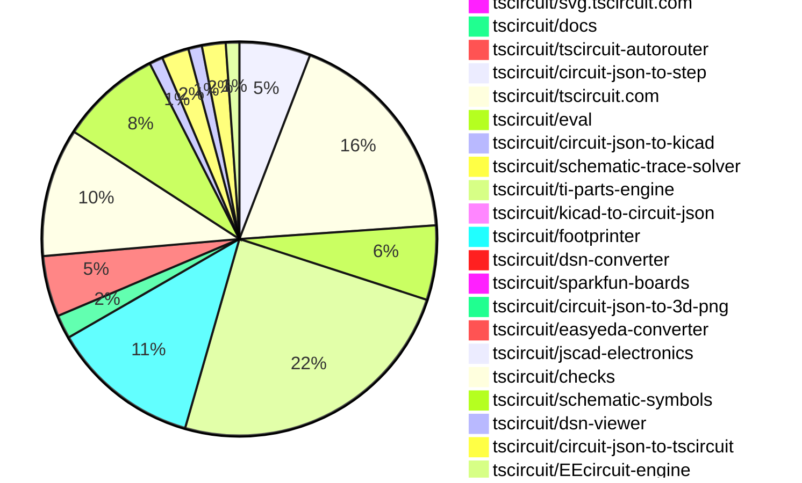

# Contribution Overview 2026-06-09

The current week is shown below. There are 3 major sections:

- [Contributor Overview](#contributor-overview)
- [PRs by Repository](#prs-by-repository)
- [PRs by Contributor](#changes-by-contributor)
- [Scoring & Sponsorship Details](/docs/sponsorship-calculation-explanation.md)

## PRs by Repository

## Contributor Overview

| Contributor | 🐳 Major | 🐙 Minor | 🐌 Tiny | Score | ⭐ | Discussion Contributions |
|-------------|---------|---------|---------|-------|-----|--------------------------|
| [ShiboSoftwareDev](#ShiboSoftwareDev) | 4 | 6 | 10 | 42 | ⭐⭐ | 0🔹 0🔶 0💎 |
| [rushabhcodes](#rushabhcodes) | 4 | 3 | 16 | 37 | ⭐⭐ | 0🔹 0🔶 0💎 |
| [MustafaMulla29](#MustafaMulla29) | 2 | 4 | 12 | 29 | ⭐⭐ | 0🔹 0🔶 0💎 |
| [imrishabh18](#imrishabh18) | 1 | 5 | 20 | 27.5 | ⭐⭐ | 0🔹 0🔶 0💎 |
| [0hmX](#0hmX) | 4 | 3 | 1 | 24 | ⭐⭐ | 0🔹 0🔶 0💎 |
| [AnasSarkiz](#AnasSarkiz) | 3 | 0 | 4 | 20 | ⭐⭐ | 0🔹 0🔶 0💎 |
| [tscircuitbot](#tscircuitbot) | 0 | 0 | 261 | 16.5 | ⭐⭐ | 0🔹 0🔶 0💎 |
| [techmannih](#techmannih) | 1 | 1 | 6 | 16 | ⭐⭐ | 0🔹 0🔶 0💎 |
| [Abse2001](#Abse2001) | 2 | 1 | 4 | 15 | ⭐⭐ | 0🔹 0🔶 0💎 |
| [Sang-it](#Sang-it) | 0 | 3 | 5 | 12 | ⭐⭐ | 0🔹 0🔶 0💎 |
| [anil08607](#anil08607) | 0 | 3 | 6 | 12 | ⭐⭐ | 0🔹 0🔶 0💎 |
| [mohan-bee](#mohan-bee) | 1 | 0 | 0 | 7 | ⭐ | 0🔹 0🔶 0💎 |
| [seveibar](#seveibar) | 0 | 0 | 4 | 5 | ⭐ | 0🔹 0🔶 0💎 |

## Staff Pass Ratio (SPR)

| Contributor | Reviewed PRs | Rejections | Approvals | SPR |
|-------------|--------------|------------|-----------|-----|
| [techmannih](#techmannih) | 4 | 4 | 1 | 0.0% |
| [0hmX](#0hmX) | 4 | 0 | 4 | 100.0% |
| [ShiboSoftwareDev](#ShiboSoftwareDev) | 3 | 2 | 1 | 33.3% |
| [rushabhcodes](#rushabhcodes) | 3 | 0 | 3 | 100.0% |
| [MustafaMulla29](#MustafaMulla29) | 1 | 0 | 2 | 100.0% |
| [Abse2001](#Abse2001) | 1 | 1 | 0 | 0.0% |
| [IamShreshth](#IamShreshth) | 1 | 1 | 0 | 0.0% |

techmannih SPR PRs (4)

- [#896](https://github.com/tscircuit/pcb-viewer/pull/896) Match KiCad layer behavior by reordering the selected layer instead of hiding other layers
- [#602](https://github.com/tscircuit/circuit-json/pull/602) Add clearance to pcb_copper_pour
- [#2415](https://github.com/tscircuit/core/pull/2415) Add pcb silkscreen graphic support
- [#336](https://github.com/tscircuit/circuit-json-to-kicad/pull/336) fix: export copper pours as filled KiCad zones

0hmX SPR PRs (4)

- [#1393](https://github.com/tscircuit/tscircuit-autorouter/pull/1393) feater: enable sparse candidate storage in tiny hypergraph
- [#1396](https://github.com/tscircuit/tscircuit-autorouter/pull/1396) feature: add avg via to benchmark
- [#113](https://github.com/tscircuit/tiny-hypergraph/pull/113) Reduce solver memory pressure in duplicate-port and section-pipeline flows
- [#119](https://github.com/tscircuit/tiny-hypergraph/pull/119) Compact hop cost storage for port-to-region search

ShiboSoftwareDev SPR PRs (3)

- [#2906](https://github.com/tscircuit/eval/pull/2906)  Bundle scoped ngspice engine for browser simulations
- [#1](https://github.com/tscircuit/EEcircuit-engine/pull/1)  Enable static XSPICE models and PSA compatibility tests
- [#14](https://github.com/tscircuit/ngspice-spice-engine/pull/14)  Use native ngspice for PSPICE compatibility when available

rushabhcodes SPR PRs (3)

- [#484](https://github.com/tscircuit/dsn-converter/pull/484) Fix polygon SMT pad export producing NaN DSN padstack and pin coordinates
- [#482](https://github.com/tscircuit/dsn-converter/pull/482) Fix pcb_trace route handling for through_pad points in DSN session round-trips
- [#1562](https://github.com/tscircuit/svg.tscircuit.com/pull/1562) Fix 3D PNG rendering to use poppygl's browser-safe GLB path

MustafaMulla29 SPR PRs (1)

- [#526](https://github.com/tscircuit/schematic-trace-solver/pull/526) Prevent the untangle pass from routing traces   through component bodies

Abse2001 SPR PRs (1)

- [#656](https://github.com/tscircuit/footprinter/pull/656) Fix diode silkscreen polarity marking to match cathode orientation

IamShreshth SPR PRs (1)

- [#531](https://github.com/tscircuit/schematic-trace-solver/pull/531) feat: add SameNetTraceMergeSolver to fix trace jogs and overlaps (Fix…

> Note: AI evaluates PRs and assigns 1-3 star ratings automatically. 4 and 5 star ratings require manual staff review.

### Discussion Contribution Legend

- 🔹 Normal Comments: Basic participation with minimal effort
- 🔶 Great Informative Comments: Thoughtful participation that adds value
- 💎 Incredible Comments: Exceptional participation with high-quality content

## Review Table

[reviews-received-hover]: ## "Number of reviews received for PRs for this contributor"
[approvals-received-hover]: ## "Number of approvals received for PRs this contributor authored"
[rejections-received-hover]: ## "Number of rejections received for PRs this contributor authored"
[prs-opened-hover]: ## "Number of PRs opened by this contributor"
[issues-created-hover]: ## "Number of issues created by this contributor"

| Contributor | Reviews Received | Approvals Received | Rejections Received | Approvals | Rejections Given | PRs Opened | PRs Merged | Issues Created |
|---|---|---|---|---|---|---|---|---|
| [zslydeapple-creator](#zslydeapple-creator) | 1 | 0 | 0 | 0 | 0 | 1 | 0 | 0 |
| [LuuOW](#LuuOW) | 0 | 0 | 0 | 0 | 0 | 0 | 0 | 0 |
| [imrishabh18](#imrishabh18) | 4 | 3 | 0 | 22 | 7 | 27 | 26 | 0 |
| [GhostAOI](#GhostAOI) | 0 | 0 | 0 | 0 | 0 | 2 | 0 | 0 |
| [Suryateja-byte](#Suryateja-byte) | 1 | 0 | 0 | 0 | 0 | 1 | 0 | 0 |
| [singhaditya21](#singhaditya21) | 0 | 0 | 0 | 0 | 0 | 8 | 0 | 0 |
| [varyavsksm-sudo](#varyavsksm-sudo) | 0 | 0 | 0 | 0 | 0 | 2 | 0 | 0 |
| [xnnnc](#xnnnc) | 0 | 0 | 0 | 0 | 0 | 4 | 0 | 0 |
| [pvbang](#pvbang) | 0 | 0 | 0 | 0 | 0 | 6 | 0 | 0 |
| [NydiaFang](#NydiaFang) | 0 | 0 | 0 | 0 | 0 | 1 | 0 | 0 |
| [techmannih](#techmannih) | 16 | 3 | 4 | 4 | 0 | 17 | 8 | 0 |
| [seveibar](#seveibar) | 3 | 2 | 0 | 19 | 7 | 7 | 4 | 0 |
| [tscircuitbot](#tscircuitbot) | 0 | 0 | 0 | 0 | 0 | 338 | 261 | 0 |
| [gfgf-brain](#gfgf-brain) | 0 | 0 | 0 | 0 | 0 | 1 | 0 | 0 |
| [MustafaMulla29](#MustafaMulla29) | 16 | 8 | 1 | 12 | 0 | 20 | 18 | 0 |
| [Shaidyk](#Shaidyk) | 0 | 0 | 0 | 0 | 0 | 7 | 0 | 0 |
| [Aaloklovanshi](#Aaloklovanshi) | 0 | 0 | 0 | 0 | 0 | 1 | 0 | 0 |
| [qlufiq-collab](#qlufiq-collab) | 0 | 0 | 0 | 0 | 0 | 8 | 0 | 0 |
| [b3417](#b3417) | 0 | 0 | 0 | 0 | 0 | 11 | 0 | 0 |
| [sourcesss](#sourcesss) | 0 | 0 | 0 | 0 | 0 | 1 | 0 | 0 |
| [shauryam2807](#shauryam2807) | 0 | 0 | 0 | 0 | 0 | 1 | 0 | 0 |
| [nitin-rachabathuni](#nitin-rachabathuni) | 0 | 0 | 0 | 0 | 0 | 1 | 0 | 0 |
| [Abse2001](#Abse2001) | 10 | 8 | 1 | 2 | 0 | 11 | 8 | 0 |
| [ShiboSoftwareDev](#ShiboSoftwareDev) | 8 | 3 | 3 | 4 | 0 | 28 | 22 | 0 |
| [sagarmaurya64-ai](#sagarmaurya64-ai) | 0 | 0 | 0 | 0 | 0 | 4 | 0 | 0 |
| [rushabhcodes](#rushabhcodes) | 60 | 25 | 1 | 4 | 0 | 41 | 23 | 0 |
| [Swately](#Swately) | 0 | 0 | 0 | 0 | 0 | 2 | 0 | 0 |
| [anil08607](#anil08607) | 17 | 10 | 1 | 0 | 0 | 10 | 9 | 0 |
| [gwhthompson](#gwhthompson) | 0 | 0 | 0 | 0 | 0 | 2 | 0 | 0 |
| [tongzhen1](#tongzhen1) | 0 | 0 | 0 | 0 | 0 | 3 | 0 | 0 |
| [Sang-it](#Sang-it) | 4 | 3 | 0 | 2 | 0 | 13 | 8 | 0 |
| [AnasSarkiz](#AnasSarkiz) | 9 | 8 | 0 | 5 | 0 | 8 | 7 | 0 |
| [0hmX](#0hmX) | 11 | 5 | 0 | 2 | 1 | 29 | 12 | 0 |
| [saitejabandaru-in](#saitejabandaru-in) | 2 | 0 | 0 | 0 | 0 | 2 | 0 | 0 |
| [Eric89544](#Eric89544) | 0 | 0 | 0 | 0 | 0 | 1 | 0 | 0 |
| [bcornish1797](#bcornish1797) | 0 | 0 | 0 | 0 | 0 | 1 | 0 | 0 |
| [monetizecompute](#monetizecompute) | 0 | 0 | 0 | 0 | 0 | 1 | 0 | 0 |
| [bodyegypt](#bodyegypt) | 0 | 0 | 0 | 0 | 0 | 1 | 0 | 0 |
| [harsh-matchmyflight](#harsh-matchmyflight) | 0 | 0 | 0 | 0 | 0 | 2 | 0 | 0 |
| [wengkit218-pixel](#wengkit218-pixel) | 0 | 0 | 0 | 0 | 0 | 1 | 0 | 0 |
| [nkar123412-hub](#nkar123412-hub) | 0 | 0 | 0 | 0 | 0 | 1 | 0 | 0 |
| [mohan-bee](#mohan-bee) | 4 | 1 | 0 | 3 | 0 | 3 | 1 | 0 |
| [ak10082247-max](#ak10082247-max) | 0 | 0 | 0 | 0 | 0 | 1 | 0 | 0 |
| [deaddeadbeef](#deaddeadbeef) | 0 | 0 | 0 | 0 | 0 | 2 | 0 | 0 |
| [Vinzz2303](#Vinzz2303) | 0 | 0 | 0 | 0 | 0 | 4 | 0 | 0 |
| [kish-00](#kish-00) | 0 | 0 | 0 | 0 | 0 | 2 | 0 | 0 |
| [JirA44](#JirA44) | 0 | 0 | 0 | 0 | 0 | 1 | 0 | 0 |
| [CoreArchitecture](#CoreArchitecture) | 0 | 0 | 0 | 0 | 0 | 1 | 0 | 0 |
| [majiahao-gif](#majiahao-gif) | 6 | 0 | 0 | 0 | 0 | 1 | 0 | 0 |
| [Ethan2040](#Ethan2040) | 0 | 0 | 0 | 0 | 0 | 1 | 0 | 0 |
| [SyntaxHQDEV](#SyntaxHQDEV) | 0 | 0 | 0 | 0 | 0 | 1 | 0 | 0 |
| [cmalthusian-cyber](#cmalthusian-cyber) | 0 | 0 | 0 | 0 | 0 | 1 | 0 | 0 |
| [shunfeng8421](#shunfeng8421) | 0 | 0 | 0 | 0 | 0 | 1 | 0 | 0 |
| [IamShreshth](#IamShreshth) | 4 | 0 | 4 | 0 | 0 | 1 | 0 | 0 |
| [ko4lax](#ko4lax) | 2 | 0 | 0 | 0 | 0 | 1 | 0 | 0 |
| [george-pick](#george-pick) | 0 | 0 | 0 | 0 | 0 | 1 | 0 | 0 |
| [codeboost-tr](#codeboost-tr) | 0 | 0 | 0 | 0 | 0 | 1 | 0 | 0 |
| [Wh0FF24](#Wh0FF24) | 0 | 0 | 0 | 0 | 0 | 2 | 0 | 0 |
| [jawn1112](#jawn1112) | 0 | 0 | 0 | 0 | 0 | 1 | 0 | 0 |
| [Misterate](#Misterate) | 0 | 0 | 0 | 0 | 0 | 1 | 0 | 0 |
| [vivekvjnk](#vivekvjnk) | 0 | 0 | 0 | 0 | 0 | 1 | 0 | 0 |

## Changes by Repository

### [tscircuit/core](https://github.com/tscircuit/core)

| PR # | Impact | Rating | Contributor | Description |
|------|--------|--------|-------------|-------------|
| [#2432](https://github.com/tscircuit/core/pull/2432) | 🐳 Major | ⭐⭐⭐ | imrishabh18 | Fixes missing junctions for traces that are under the same net and crossing each other, ensuring proper connectivity in schematic rendering. |
| [#2413](https://github.com/tscircuit/core/pull/2413) | 🐳 Major | ⭐⭐⭐ | ShiboSoftwareDev | This pull request integrates the AutoroutingPipelineSolver7_MultiGraph into the existing autorouting framework, enhancing the routing capabilities of the system. It also updates the autorouter versioning in the interface and modifies the package dependencies to ensure compatibility with the new solver. |
| [#2430](https://github.com/tscircuit/core/pull/2430) | 🐳 Major | ⭐⭐⭐ | AnasSarkiz | Fixes autorouting failure by ensuring parent SRJ generation does not include descendant subcircuit source nets, preventing duplicate route requests and static reachability errors. |
| [#2422](https://github.com/tscircuit/core/pull/2422) | 🐳 Major | ⭐⭐⭐ | AnasSarkiz | Updates Simple Route JSON generation to ensure top-level autorouting inputs are derived from logical source_tracesource_net intent, rather than treating existing top-level pcb_trace records as already-routed state, addressing the dataset-srj18 missing traces issue. |
| [#2431](https://github.com/tscircuit/core/pull/2431) | 🐙 Minor | ⭐⭐ | imrishabh18 | Adds a test for missing junctions in the INA237 subcircuit. |
| [#2427](https://github.com/tscircuit/core/pull/2427) | 🐙 Minor | ⭐⭐ | imrishabh18 | Fixes incorrect netlabel assignment for components connected to subcircuit components in schematic rendering. |
| [#2428](https://github.com/tscircuit/core/pull/2428) | 🐙 Minor | ⭐⭐ | imrishabh18 | Fixes incorrect netlabel assignment when connecting components across subcircuits in schematic rendering |
| [#2433](https://github.com/tscircuit/core/pull/2433) | 🐙 Minor | ⭐⭐ | Sang-it | Fixes net label collisions by utilizing the output from netLabelNetLabelCollisionSolver to determine placements. |

🐌 Tiny Contributions (13)

| PR # | Impact | Contributor | Description |
|------|--------|-------------|-------------|
| [#2434](https://github.com/tscircuit/core/pull/2434) | 🐌 Tiny | imrishabh18 | Updates the version of the tscircuitcapacity-autorouter dependency from 0.0.579 to 0.0.583 in package.json |
| [#2447](https://github.com/tscircuit/core/pull/2447) | 🐌 Tiny | tscircuitbot | Updates the version of the tscircuitchecks package from 0.0.137 to 0.0.138 in package.json |
| [#2438](https://github.com/tscircuit/core/pull/2438) | 🐌 Tiny | MustafaMulla29 | Updates the version of the tscircuitschematic-trace-solver dependency from 0.0.66 to 0.0.68 in package.json |
| [#2425](https://github.com/tscircuit/core/pull/2425) | 🐌 Tiny | MustafaMulla29 | Reproduces a bug related to custom symbols having incorrect connections in schematic rendering. |
| [#2418](https://github.com/tscircuit/core/pull/2418) | 🐌 Tiny | MustafaMulla29 | Updates the version of the schematic-trace-solver dependency from 0.0.63 to 0.0.65 in package.json |
| [#2420](https://github.com/tscircuit/core/pull/2420) | 🐌 Tiny | MustafaMulla29 | Adds a test to verify the correct direction of netlabels for custom symbols in schematic representations. |
| [#2421](https://github.com/tscircuit/core/pull/2421) | 🐌 Tiny | MustafaMulla29 | Fixes incorrect facing direction for custom symbol ports in schematics, ensuring netlabels point correctly based on declared port direction. |
| [#2444](https://github.com/tscircuit/core/pull/2444) | 🐌 Tiny | ShiboSoftwareDev | Updates the versions of circuit-json-to-spice and tscircuitngspice-spice-engine dependencies in package.json |
| [#2442](https://github.com/tscircuit/core/pull/2442) | 🐌 Tiny | ShiboSoftwareDev | Updates the ngspice-spice-engine dependency version from 0.0.10 to 0.0.12 in package.json |
| [#2429](https://github.com/tscircuit/core/pull/2429) | 🐌 Tiny | ShiboSoftwareDev | Updates the ngspice engine dependency version from 0.0.9 to 0.0.10 in package.json |
| [#2417](https://github.com/tscircuit/core/pull/2417) | 🐌 Tiny | ShiboSoftwareDev | Updates the ngspice engine dependency version from 0.0.8 to 0.0.9 in package.json |
| [#2435](https://github.com/tscircuit/core/pull/2435) | 🐌 Tiny | Sang-it | Updates the schematic trace solver dependency to version 0.0.66, addressing issues from a previous pull request. |
| [#2423](https://github.com/tscircuit/core/pull/2423) | 🐌 Tiny | Sang-it | Fixes issues with trace overlap and merging in schematic rendering, ensuring clearer representation of traces. |

### [tscircuit/cli](https://github.com/tscircuit/cli)

| PR # | Impact | Rating | Contributor | Description |
|------|--------|--------|-------------|-------------|
| [#3237](https://github.com/tscircuit/cli/pull/3237) | 🐙 Minor | ⭐⭐ | imrishabh18 | Fixes failure of tsci snapshot command to load the asynchronous footprint from parts-engine in tscircuit.config.ts |

🐌 Tiny Contributions (64)

| PR # | Impact | Contributor | Description |
|------|--------|-------------|-------------|
| [#3317](https://github.com/tscircuit/cli/pull/3317) | 🐌 Tiny | tscircuitbot | Automated package update |
| [#3316](https://github.com/tscircuit/cli/pull/3316) | 🐌 Tiny | tscircuitbot | Automated README update with latest CLI usage output. |
| [#3315](https://github.com/tscircuit/cli/pull/3315) | 🐌 Tiny | tscircuitbot | Automated package update |
| [#3312](https://github.com/tscircuit/cli/pull/3312) | 🐌 Tiny | tscircuitbot | Automated package update |
| [#3311](https://github.com/tscircuit/cli/pull/3311) | 🐌 Tiny | tscircuitbot | Automated README update with latest CLI usage output. |
| [#3308](https://github.com/tscircuit/cli/pull/3308) | 🐌 Tiny | tscircuitbot | Automated package update |
| [#3305](https://github.com/tscircuit/cli/pull/3305) | 🐌 Tiny | tscircuitbot | Updates the tscircuitrunframe package from version 0.0.2072 to 0.0.2073 |
| [#3299](https://github.com/tscircuit/cli/pull/3299) | 🐌 Tiny | tscircuitbot | Automated package update |
| [#3301](https://github.com/tscircuit/cli/pull/3301) | 🐌 Tiny | tscircuitbot | Automated package update |
| [#3307](https://github.com/tscircuit/cli/pull/3307) | 🐌 Tiny | tscircuitbot | Updates the tscircuitrunframe package from version 0.0.2073 to 0.0.2074 |
| [#3304](https://github.com/tscircuit/cli/pull/3304) | 🐌 Tiny | tscircuitbot | Automated package update |
| [#3306](https://github.com/tscircuit/cli/pull/3306) | 🐌 Tiny | tscircuitbot | Automated package update |
| [#3303](https://github.com/tscircuit/cli/pull/3303) | 🐌 Tiny | tscircuitbot | Updates the tscircuitrunframe package from version 0.0.2071 to 0.0.2072 |
| [#3300](https://github.com/tscircuit/cli/pull/3300) | 🐌 Tiny | tscircuitbot | Automated README update with latest CLI usage output. |
| [#3296](https://github.com/tscircuit/cli/pull/3296) | 🐌 Tiny | tscircuitbot | Automated package update |
| [#3295](https://github.com/tscircuit/cli/pull/3295) | 🐌 Tiny | tscircuitbot | Automated README update with latest CLI usage output. |
| [#3294](https://github.com/tscircuit/cli/pull/3294) | 🐌 Tiny | tscircuitbot | Automated package update |
| [#3277](https://github.com/tscircuit/cli/pull/3277) | 🐌 Tiny | tscircuitbot | Automated package update |
| [#3284](https://github.com/tscircuit/cli/pull/3284) | 🐌 Tiny | tscircuitbot | Updates the package version from v0.1.1481 to v0.1.1482 in package.json |
| [#3285](https://github.com/tscircuit/cli/pull/3285) | 🐌 Tiny | tscircuitbot | Updates the tscircuitrunframe package to version 0.0.2069 in the package.json file |
| [#3279](https://github.com/tscircuit/cli/pull/3279) | 🐌 Tiny | tscircuitbot | Updates the package version from 0.1.1479 to 0.1.1480 in package.json |
| [#3282](https://github.com/tscircuit/cli/pull/3282) | 🐌 Tiny | tscircuitbot | Automated package update |
| [#3287](https://github.com/tscircuit/cli/pull/3287) | 🐌 Tiny | tscircuitbot | Updates the tscircuitrunframe package to version 0.0.2070 |
| [#3283](https://github.com/tscircuit/cli/pull/3283) | 🐌 Tiny | tscircuitbot | Automated README update with latest CLI usage output. |
| [#3286](https://github.com/tscircuit/cli/pull/3286) | 🐌 Tiny | tscircuitbot | Automated package update |
| [#3290](https://github.com/tscircuit/cli/pull/3290) | 🐌 Tiny | tscircuitbot | Automated package update |
| [#3275](https://github.com/tscircuit/cli/pull/3275) | 🐌 Tiny | tscircuitbot | Automated package update |
| [#3278](https://github.com/tscircuit/cli/pull/3278) | 🐌 Tiny | tscircuitbot | Updates the tscircuitrunframe package from version 0.0.2067 to 0.0.2068 |
| [#3289](https://github.com/tscircuit/cli/pull/3289) | 🐌 Tiny | tscircuitbot | Updates the tscircuitrunframe package version from 0.0.2070 to 0.0.2071 |
| [#3276](https://github.com/tscircuit/cli/pull/3276) | 🐌 Tiny | tscircuitbot | Updates the tscircuitrunframe package to version 0.0.2067 in package.json |
| [#3274](https://github.com/tscircuit/cli/pull/3274) | 🐌 Tiny | tscircuitbot | Updates the tscircuitrunframe package to version 0.0.2066 in package.json |
| [#3262](https://github.com/tscircuit/cli/pull/3262) | 🐌 Tiny | tscircuitbot | Updates the tscircuitrunframe package from version 0.0.2059 to 0.0.2060 |
| [#3271](https://github.com/tscircuit/cli/pull/3271) | 🐌 Tiny | tscircuitbot | Automated package update |
| [#3268](https://github.com/tscircuit/cli/pull/3268) | 🐌 Tiny | tscircuitbot | Updates the tscircuitrunframe package from version 0.0.2062 to 0.0.2063 |
| [#3270](https://github.com/tscircuit/cli/pull/3270) | 🐌 Tiny | tscircuitbot | Updates the tscircuitrunframe package from version 0.0.2063 to 0.0.2064 |
| [#3263](https://github.com/tscircuit/cli/pull/3263) | 🐌 Tiny | tscircuitbot | Automated package update |
| [#3257](https://github.com/tscircuit/cli/pull/3257) | 🐌 Tiny | tscircuitbot | Automated package update |
| [#3264](https://github.com/tscircuit/cli/pull/3264) | 🐌 Tiny | tscircuitbot | Updates the tscircuitrunframe package from version 0.0.2060 to 0.0.2061 |
| [#3259](https://github.com/tscircuit/cli/pull/3259) | 🐌 Tiny | tscircuitbot | Automated package update |
| [#3261](https://github.com/tscircuit/cli/pull/3261) | 🐌 Tiny | tscircuitbot | Automated package update |
| [#3266](https://github.com/tscircuit/cli/pull/3266) | 🐌 Tiny | tscircuitbot | Updates the tscircuitrunframe package from version 0.0.2061 to 0.0.2062 |
| [#3267](https://github.com/tscircuit/cli/pull/3267) | 🐌 Tiny | tscircuitbot | Automated package update |
| [#3265](https://github.com/tscircuit/cli/pull/3265) | 🐌 Tiny | tscircuitbot | Automated package update |
| [#3273](https://github.com/tscircuit/cli/pull/3273) | 🐌 Tiny | tscircuitbot | Automated package update |
| [#3260](https://github.com/tscircuit/cli/pull/3260) | 🐌 Tiny | tscircuitbot | Automated package update |
| [#3272](https://github.com/tscircuit/cli/pull/3272) | 🐌 Tiny | tscircuitbot | Updates the tscircuitrunframe package from version 0.0.2064 to 0.0.2065 |
| [#3258](https://github.com/tscircuit/cli/pull/3258) | 🐌 Tiny | tscircuitbot | Automated README update with latest CLI usage output. |
| [#3251](https://github.com/tscircuit/cli/pull/3251) | 🐌 Tiny | tscircuitbot | Updates the tscircuitrunframe package version from 0.0.2056 to 0.0.2057 in package.json |
| [#3252](https://github.com/tscircuit/cli/pull/3252) | 🐌 Tiny | tscircuitbot | Automated package update |
| [#3246](https://github.com/tscircuit/cli/pull/3246) | 🐌 Tiny | tscircuitbot | Updates the tscircuitrunframe package from version 0.0.2054 to 0.0.2055 |
| [#3244](https://github.com/tscircuit/cli/pull/3244) | 🐌 Tiny | tscircuitbot | Updates the tscircuitrunframe package to version 0.0.2054 in package.json |
| [#3243](https://github.com/tscircuit/cli/pull/3243) | 🐌 Tiny | tscircuitbot | Automated package update |
| [#3242](https://github.com/tscircuit/cli/pull/3242) | 🐌 Tiny | tscircuitbot | Updates the tscircuitrunframe package to version 0.0.2053 in package.json |
| [#3247](https://github.com/tscircuit/cli/pull/3247) | 🐌 Tiny | tscircuitbot | Automated package update |
| [#3253](https://github.com/tscircuit/cli/pull/3253) | 🐌 Tiny | tscircuitbot | Automated package update |
| [#3245](https://github.com/tscircuit/cli/pull/3245) | 🐌 Tiny | tscircuitbot | Automated package update |
| [#3249](https://github.com/tscircuit/cli/pull/3249) | 🐌 Tiny | tscircuitbot | Automated package update |
| [#3248](https://github.com/tscircuit/cli/pull/3248) | 🐌 Tiny | tscircuitbot | Updates the tscircuitrunframe package version from 0.0.2055 to 0.0.2056 |
| [#3280](https://github.com/tscircuit/cli/pull/3280) | 🐌 Tiny | techmannih | Updates the version of circuit-json-to-kicad from 0.0.137 to 0.0.150 in package.json |
| [#3255](https://github.com/tscircuit/cli/pull/3255) | 🐌 Tiny | techmannih | Updates the versions of the tscircuiteval and tscircuit packages in package.json to the latest compatible versions. |
| [#3313](https://github.com/tscircuit/cli/pull/3313) | 🐌 Tiny | rushabhcodes | Updates the dsn-converter dependency version from 0.0.88 to 0.0.90 in package.json |
| [#3297](https://github.com/tscircuit/cli/pull/3297) | 🐌 Tiny | rushabhcodes | Updates the versions of kicad-to-circuit-json from 0.0.59 to 0.0.94 and kicadts from 0.0.35 to 0.0.45 in package.json |
| [#3292](https://github.com/tscircuit/cli/pull/3292) | 🐌 Tiny | rushabhcodes | Updates the dsn-converter dependency to version 0.0.88 in package.json |
| [#3309](https://github.com/tscircuit/cli/pull/3309) | 🐌 Tiny | anil08607 | Updates the dependency version of circuit-json-to-tscircuit from 0.0.9 to 0.0.35 in package.json |

### [tscircuit/ti](https://github.com/tscircuit/ti)

| PR # | Impact | Rating | Contributor | Description |
|------|--------|--------|-------------|-------------|
| [#20](https://github.com/tscircuit/ti/pull/20) | 🐙 Minor | ⭐⭐ | imrishabh18 | Refactors multiple subcircuits to accept props, enabling reuse of components across different circuits. |
| [#28](https://github.com/tscircuit/ti/pull/28) | 🐙 Minor | ⭐⭐ | ShiboSoftwareDev | This pull request removes the MSPM0_OPA PSPICE model and its references from the project. The model was previously used for simulating operational amplifier characteristics in circuit designs. |
| [#23](https://github.com/tscircuit/ti/pull/23) | 🐙 Minor | ⭐⭐ | ShiboSoftwareDev | img width2978 height1562 altimage srchttps:github.comuser-attachmentsassets24c2cac8-e905-490e-b284-01ce6561b7a4 |

🐌 Tiny Contributions (19)

| PR # | Impact | Contributor | Description |
|------|--------|-------------|-------------|
| [#22](https://github.com/tscircuit/ti/pull/22) | 🐌 Tiny | imrishabh18 | Exports all subcircuits for various chips and updates connection syntax in existing circuit files to use string literals instead of a selection utility. |
| [#29](https://github.com/tscircuit/ti/pull/29) | 🐌 Tiny | imrishabh18 | Updates the tscircuit dependency version from 0.0.1857 to 0.0.1861 in package.json |
| [#17](https://github.com/tscircuit/ti/pull/17) | 🐌 Tiny | imrishabh18 | Add a new BQ27441 component with its footprint and schematic representation for use in circuit designs. |
| [#15](https://github.com/tscircuit/ti/pull/15) | 🐌 Tiny | imrishabh18 | Add BQ25895 subcircuit and its associated components to the library. |
| [#18](https://github.com/tscircuit/ti/pull/18) | 🐌 Tiny | imrishabh18 | Adds the INA237 component with its footprint and schematic representation to the library. |
| [#30](https://github.com/tscircuit/ti/pull/30) | 🐌 Tiny | MustafaMulla29 | Updates the tscircuit dependency version from 0.0.1861 to 0.0.1880 in package.json |
| [#27](https://github.com/tscircuit/ti/pull/27) | 🐌 Tiny | MustafaMulla29 | Updates the PCB snapshot files in the repository to reflect the latest design changes. |
| [#25](https://github.com/tscircuit/ti/pull/25) | 🐌 Tiny | MustafaMulla29 | Adds pcbX and pcbY coordinates to components in the CC2340R5 and CC3235SF circuit definitions for improved PCB layout accuracy. |
| [#11](https://github.com/tscircuit/ti/pull/11) | 🐌 Tiny | MustafaMulla29 | Adds new components MSPM0G3507, CC2340R5, and CC3235SF with their respective pin configurations and schematic representations. |
| [#13](https://github.com/tscircuit/ti/pull/13) | 🐌 Tiny | techmannih | Adds a new TPS22919 circuit component and its schematic representation to the library. |
| [#16](https://github.com/tscircuit/ti/pull/16) | 🐌 Tiny | ShiboSoftwareDev | Adds HDC3022 and HDC3020 components with their respective footprints and schematic representations. |
| [#19](https://github.com/tscircuit/ti/pull/19) | 🐌 Tiny | Sang-it | Adds a footprint for the DRV8833 and DRV8876 chips, including detailed pad specifications and CAD model links. |
| [#8](https://github.com/tscircuit/ti/pull/8) | 🐌 Tiny | Sang-it | Adds a new DRV8833 motor driver component and its associated schematic representation to the library. |
| [#26](https://github.com/tscircuit/ti/pull/26) | 🐌 Tiny | AnasSarkiz | Adds missing footprints for components, ensures all subcircuits are routed correctly, and modifies schematic coordinates for net labels to eliminate build log errors. |
| [#24](https://github.com/tscircuit/ti/pull/24) | 🐌 Tiny | AnasSarkiz | Updates the tscircuit dependency version in package.json from 0.0.1846 to 0.0.1856. |
| [#9](https://github.com/tscircuit/ti/pull/9) | 🐌 Tiny | AnasSarkiz | Adds a new demo for the TPS7A02 voltage regulator, including its footprint and schematic representation. |
| [#6](https://github.com/tscircuit/ti/pull/6) | 🐌 Tiny | AnasSarkiz | Adds a new subcircuit for the TPS63802 component, including its footprint and schematic representation. |
| [#14](https://github.com/tscircuit/ti/pull/14) | 🐌 Tiny | Abse2001 | Adds a new PCB and schematic for the TMP1075 component, including detailed footprint and connections. |
| [#10](https://github.com/tscircuit/ti/pull/10) | 🐌 Tiny | Abse2001 | Adds a new HDC2080 TI board with its corresponding footprint and schematic representation. |

### [tscircuit/schematic-viewer](https://github.com/tscircuit/schematic-viewer)

🐌 Tiny Contributions (2)

| PR # | Impact | Contributor | Description |
|------|--------|-------------|-------------|
| [#225](https://github.com/tscircuit/schematic-viewer/pull/225) | 🐌 Tiny | imrishabh18 | Adds support for custom CSS styles in the SchematicViewer component, allowing users to apply custom themes and styles to schematic components. |
| [#226](https://github.com/tscircuit/schematic-viewer/pull/226) | 🐌 Tiny | imrishabh18 | Updates the lock file to resolve npm publishing issues. |

### [tscircuit/pcb-viewer](https://github.com/tscircuit/pcb-viewer)

🐌 Tiny Contributions (2)

| PR # | Impact | Contributor | Description |
|------|--------|-------------|-------------|
| [#897](https://github.com/tscircuit/pcb-viewer/pull/897) | 🐌 Tiny | imrishabh18 | Updates the circuit-to-svg dependency to version 0.0.354 in package.json |
| [#898](https://github.com/tscircuit/pcb-viewer/pull/898) | 🐌 Tiny | tscircuitbot | Automated package update |

### [tscircuit/tscircuit](https://github.com/tscircuit/tscircuit)

🐌 Tiny Contributions (88)

| PR # | Impact | Contributor | Description |
|------|--------|-------------|-------------|
| [#3482](https://github.com/tscircuit/tscircuit/pull/3482) | 🐌 Tiny | imrishabh18 | Updates the circuit-to-svg dependency to version 0.0.354 in package.json |
| [#3477](https://github.com/tscircuit/tscircuit/pull/3477) | 🐌 Tiny | imrishabh18 | Updates the circuit-to-svg dependency to version 0.0.354 in package.json |
| [#3518](https://github.com/tscircuit/tscircuit/pull/3518) | 🐌 Tiny | tscircuitbot | Automated package update |
| [#3517](https://github.com/tscircuit/tscircuit/pull/3517) | 🐌 Tiny | tscircuitbot | Updates the tscircuitcli package version from 0.1.1494 to 0.1.1495 in package.json |
| [#3515](https://github.com/tscircuit/tscircuit/pull/3515) | 🐌 Tiny | tscircuitbot | Automated package update |
| [#3514](https://github.com/tscircuit/tscircuit/pull/3514) | 🐌 Tiny | tscircuitbot | Updates the tscircuitcli package version from 0.1.1493 to 0.1.1494 |
| [#3513](https://github.com/tscircuit/tscircuit/pull/3513) | 🐌 Tiny | tscircuitbot | Automated package update to version 0.0.1882 |
| [#3512](https://github.com/tscircuit/tscircuit/pull/3512) | 🐌 Tiny | tscircuitbot | Updates the tscircuitcli package from version 0.1.1492 to 0.1.1493 and updates kicad-to-circuit-json and kicadts packages to newer versions. |
| [#3511](https://github.com/tscircuit/tscircuit/pull/3511) | 🐌 Tiny | tscircuitbot | Automated package update |
| [#3499](https://github.com/tscircuit/tscircuit/pull/3499) | 🐌 Tiny | tscircuitbot | Automated package update |
| [#3502](https://github.com/tscircuit/tscircuit/pull/3502) | 🐌 Tiny | tscircuitbot | Updates the tscircuitcore package from version 0.0.1322 to 0.0.1323 and the tscircuitngspice-spice-engine package from version 0.0.10 to 0.0.12 in package.json |
| [#3507](https://github.com/tscircuit/tscircuit/pull/3507) | 🐌 Tiny | tscircuitbot | Automated package update |
| [#3506](https://github.com/tscircuit/tscircuit/pull/3506) | 🐌 Tiny | tscircuitbot | Automated package update |
| [#3508](https://github.com/tscircuit/tscircuit/pull/3508) | 🐌 Tiny | tscircuitbot | Automated package update |
| [#3495](https://github.com/tscircuit/tscircuit/pull/3495) | 🐌 Tiny | tscircuitbot | Updates the tscircuitcli package to version 0.1.1488 |
| [#3505](https://github.com/tscircuit/tscircuit/pull/3505) | 🐌 Tiny | tscircuitbot | Updates the package version from 0.0.1877 to 0.0.1878 |
| [#3509](https://github.com/tscircuit/tscircuit/pull/3509) | 🐌 Tiny | tscircuitbot | Automated package update |
| [#3504](https://github.com/tscircuit/tscircuit/pull/3504) | 🐌 Tiny | tscircuitbot | Automated package update |
| [#3497](https://github.com/tscircuit/tscircuit/pull/3497) | 🐌 Tiny | tscircuitbot | Updates the tscircuitcli package to version 0.1.1489 |
| [#3498](https://github.com/tscircuit/tscircuit/pull/3498) | 🐌 Tiny | tscircuitbot | Automated package update |
| [#3503](https://github.com/tscircuit/tscircuit/pull/3503) | 🐌 Tiny | tscircuitbot | Automated package update |
| [#3496](https://github.com/tscircuit/tscircuit/pull/3496) | 🐌 Tiny | tscircuitbot | Automated package update |
| [#3500](https://github.com/tscircuit/tscircuit/pull/3500) | 🐌 Tiny | tscircuitbot | Updates the package version from 0.0.1875 to 0.0.1876 in package.json |
| [#3490](https://github.com/tscircuit/tscircuit/pull/3490) | 🐌 Tiny | tscircuitbot | Updates the package version from 0.0.1871 to 0.0.1872 in package.json |
| [#3491](https://github.com/tscircuit/tscircuit/pull/3491) | 🐌 Tiny | tscircuitbot | Updates the tscircuitcli package version from 0.1.1486 to 0.1.1487 |
| [#3492](https://github.com/tscircuit/tscircuit/pull/3492) | 🐌 Tiny | tscircuitbot | Automated package update to version 0.0.1873 |
| [#3489](https://github.com/tscircuit/tscircuit/pull/3489) | 🐌 Tiny | tscircuitbot | Updates the tscircuitcli package to version 0.1.1486 in the package.json file |
| [#3487](https://github.com/tscircuit/tscircuit/pull/3487) | 🐌 Tiny | tscircuitbot | Automated package update |
| [#3478](https://github.com/tscircuit/tscircuit/pull/3478) | 🐌 Tiny | tscircuitbot | Automated package update |
| [#3486](https://github.com/tscircuit/tscircuit/pull/3486) | 🐌 Tiny | tscircuitbot | Updates the tscircuitcli package from version 0.1.1484 to 0.1.1485 and the tscircuitrunframe package from version 0.0.2070 to 0.0.2071. |
| [#3473](https://github.com/tscircuit/tscircuit/pull/3473) | 🐌 Tiny | tscircuitbot | Updates the tscircuitcli package to version 0.1.1481 in the package.json file |
| [#3479](https://github.com/tscircuit/tscircuit/pull/3479) | 🐌 Tiny | tscircuitbot | Updates the tscircuitcli package version from 0.1.1482 to 0.1.1483 and updates the tscircuitrunframe package version from 0.0.2068 to 0.0.2069, while downgrading the circuit-to-svg package version from 0.0.354 to 0.0.353. |
| [#3467](https://github.com/tscircuit/tscircuit/pull/3467) | 🐌 Tiny | tscircuitbot | Updates the package version from 0.0.1861 to 0.0.1862 in package.json |
| [#3471](https://github.com/tscircuit/tscircuit/pull/3471) | 🐌 Tiny | tscircuitbot | Automated package update |
| [#3475](https://github.com/tscircuit/tscircuit/pull/3475) | 🐌 Tiny | tscircuitbot | Updates the tscircuitcli package to version 0.1.1482 in the package.json file |
| [#3469](https://github.com/tscircuit/tscircuit/pull/3469) | 🐌 Tiny | tscircuitbot | Automated package update |
| [#3476](https://github.com/tscircuit/tscircuit/pull/3476) | 🐌 Tiny | tscircuitbot | Automated package update |
| [#3466](https://github.com/tscircuit/tscircuit/pull/3466) | 🐌 Tiny | tscircuitbot | Automated package update |
| [#3468](https://github.com/tscircuit/tscircuit/pull/3468) | 🐌 Tiny | tscircuitbot | Updates the tscircuitcli package from version 0.1.1478 to 0.1.1479 and the tscircuitrunframe package from version 0.0.2066 to 0.0.2067 |
| [#3485](https://github.com/tscircuit/tscircuit/pull/3485) | 🐌 Tiny | tscircuitbot | Updates the package version from 0.0.1869 to 0.0.1870 in package.json |
| [#3472](https://github.com/tscircuit/tscircuit/pull/3472) | 🐌 Tiny | tscircuitbot | Automated package update |
| [#3484](https://github.com/tscircuit/tscircuit/pull/3484) | 🐌 Tiny | tscircuitbot | Automated package update |
| [#3483](https://github.com/tscircuit/tscircuit/pull/3483) | 🐌 Tiny | tscircuitbot | Automated package update |
| [#3480](https://github.com/tscircuit/tscircuit/pull/3480) | 🐌 Tiny | tscircuitbot | Automated package update |
| [#3474](https://github.com/tscircuit/tscircuit/pull/3474) | 🐌 Tiny | tscircuitbot | Automated package update to version 0.0.1865 |
| [#3449](https://github.com/tscircuit/tscircuit/pull/3449) | 🐌 Tiny | tscircuitbot | Automated package update |
| [#3445](https://github.com/tscircuit/tscircuit/pull/3445) | 🐌 Tiny | tscircuitbot | Updates the tscircuitcli package from version 0.1.1470 to 0.1.1471 and the tscircuitrunframe package from version 0.0.2058 to 0.0.2059 in package.json |
| [#3451](https://github.com/tscircuit/tscircuit/pull/3451) | 🐌 Tiny | tscircuitbot | Updates the tscircuitcli package from version 0.1.1472 to 0.1.1473 and the tscircuitrunframe package from version 0.0.2060 to 0.0.2061. |
| [#3442](https://github.com/tscircuit/tscircuit/pull/3442) | 🐌 Tiny | tscircuitbot | Automated package update |
| [#3455](https://github.com/tscircuit/tscircuit/pull/3455) | 🐌 Tiny | tscircuitbot | Updates the tscircuitrunframe package to version 0.0.2063 in package.json |
| [#3458](https://github.com/tscircuit/tscircuit/pull/3458) | 🐌 Tiny | tscircuitbot | Automated package update |
| [#3463](https://github.com/tscircuit/tscircuit/pull/3463) | 🐌 Tiny | tscircuitbot | Automated package update |
| [#3462](https://github.com/tscircuit/tscircuit/pull/3462) | 🐌 Tiny | tscircuitbot | Automated package update |
| [#3454](https://github.com/tscircuit/tscircuit/pull/3454) | 🐌 Tiny | tscircuitbot | Updates the package version from 0.0.1855 to 0.0.1856 in package.json |
| [#3465](https://github.com/tscircuit/tscircuit/pull/3465) | 🐌 Tiny | tscircuitbot | Automated package update |
| [#3443](https://github.com/tscircuit/tscircuit/pull/3443) | 🐌 Tiny | tscircuitbot | Updates the tscircuitcli package to version 0.1.1470 |
| [#3441](https://github.com/tscircuit/tscircuit/pull/3441) | 🐌 Tiny | tscircuitbot | Updates the tscircuitcli package from version 0.1.1468 to 0.1.1469 and the tscircuitrunframe package from version 0.0.2057 to 0.0.2058. |
| [#3448](https://github.com/tscircuit/tscircuit/pull/3448) | 🐌 Tiny | tscircuitbot | Automated package version bump from 0.0.1852 to 0.0.1853 |
| [#3452](https://github.com/tscircuit/tscircuit/pull/3452) | 🐌 Tiny | tscircuitbot | Automated package update |
| [#3456](https://github.com/tscircuit/tscircuit/pull/3456) | 🐌 Tiny | tscircuitbot | Automated package update |
| [#3459](https://github.com/tscircuit/tscircuit/pull/3459) | 🐌 Tiny | tscircuitbot | Automated package update |
| [#3460](https://github.com/tscircuit/tscircuit/pull/3460) | 🐌 Tiny | tscircuitbot | Updates the tscircuiteval package version from 0.0.919 to 0.0.920 in package.json |
| [#3450](https://github.com/tscircuit/tscircuit/pull/3450) | 🐌 Tiny | tscircuitbot | Automated package update |
| [#3461](https://github.com/tscircuit/tscircuit/pull/3461) | 🐌 Tiny | tscircuitbot | Automated package update |
| [#3447](https://github.com/tscircuit/tscircuit/pull/3447) | 🐌 Tiny | tscircuitbot | Automated package update |
| [#3446](https://github.com/tscircuit/tscircuit/pull/3446) | 🐌 Tiny | tscircuitbot | Automated package update |
| [#3453](https://github.com/tscircuit/tscircuit/pull/3453) | 🐌 Tiny | tscircuitbot | Automated package update |
| [#3464](https://github.com/tscircuit/tscircuit/pull/3464) | 🐌 Tiny | tscircuitbot | Automated package update |
| [#3444](https://github.com/tscircuit/tscircuit/pull/3444) | 🐌 Tiny | tscircuitbot | Automated package update |
| [#3438](https://github.com/tscircuit/tscircuit/pull/3438) | 🐌 Tiny | tscircuitbot | Automated package update to version 0.0.1848 |
| [#3435](https://github.com/tscircuit/tscircuit/pull/3435) | 🐌 Tiny | tscircuitbot | Updates the tscircuitcore package version from 0.0.1312 to 0.0.1314 in package.json |
| [#3430](https://github.com/tscircuit/tscircuit/pull/3430) | 🐌 Tiny | tscircuitbot | Automated package update |
| [#3426](https://github.com/tscircuit/tscircuit/pull/3426) | 🐌 Tiny | tscircuitbot | Automated package update |
| [#3434](https://github.com/tscircuit/tscircuit/pull/3434) | 🐌 Tiny | tscircuitbot | Updates the package version from 0.0.1845 to 0.0.1846 in package.json |
| [#3428](https://github.com/tscircuit/tscircuit/pull/3428) | 🐌 Tiny | tscircuitbot | Automated package update |
| [#3421](https://github.com/tscircuit/tscircuit/pull/3421) | 🐌 Tiny | tscircuitbot | Updates the package version from 0.0.1840 to 0.0.1841 in package.json |
| [#3429](https://github.com/tscircuit/tscircuit/pull/3429) | 🐌 Tiny | tscircuitbot | Automated package update |
| [#3425](https://github.com/tscircuit/tscircuit/pull/3425) | 🐌 Tiny | tscircuitbot | Updates the version of tscircuitcore from 0.0.1309 to 0.0.1310 and tscircuitngspice-spice-engine from 0.0.8 to 0.0.9 in package.json |
| [#3439](https://github.com/tscircuit/tscircuit/pull/3439) | 🐌 Tiny | tscircuitbot | Updates the tscircuitcli package version from 0.1.1467 to 0.1.1468 |
| [#3427](https://github.com/tscircuit/tscircuit/pull/3427) | 🐌 Tiny | tscircuitbot | Automated package update |
| [#3431](https://github.com/tscircuit/tscircuit/pull/3431) | 🐌 Tiny | tscircuitbot | Automated package update |
| [#3440](https://github.com/tscircuit/tscircuit/pull/3440) | 🐌 Tiny | tscircuitbot | Automated package update |
| [#3436](https://github.com/tscircuit/tscircuit/pull/3436) | 🐌 Tiny | tscircuitbot | Automated package update |
| [#3433](https://github.com/tscircuit/tscircuit/pull/3433) | 🐌 Tiny | tscircuitbot | Automated package update |
| [#3432](https://github.com/tscircuit/tscircuit/pull/3432) | 🐌 Tiny | tscircuitbot | Automated package update |
| [#3437](https://github.com/tscircuit/tscircuit/pull/3437) | 🐌 Tiny | tscircuitbot | Automated package update |
| [#3420](https://github.com/tscircuit/tscircuit/pull/3420) | 🐌 Tiny | tscircuitbot | Updates the tscircuitcli package and other related dependencies to their latest versions. |
| [#3510](https://github.com/tscircuit/tscircuit/pull/3510) | 🐌 Tiny | MustafaMulla29 | Updates the versions of kicad-to-circuit-json and kicadts in package.json to improve compatibility and functionality. |

### [tscircuit/circuit-to-svg](https://github.com/tscircuit/circuit-to-svg)

🐌 Tiny Contributions (1)

| PR # | Impact | Contributor | Description |
|------|--------|-------------|-------------|
| [#571](https://github.com/tscircuit/circuit-to-svg/pull/571) | 🐌 Tiny | imrishabh18 | Adds support for custom styling in schematic SVGs, allowing users to apply custom CSS classes and styles to schematic elements. |

### [tscircuit/runframe](https://github.com/tscircuit/runframe)

🐌 Tiny Contributions (44)

| PR # | Impact | Contributor | Description |
|------|--------|-------------|-------------|
| [#3671](https://github.com/tscircuit/runframe/pull/3671) | 🐌 Tiny | imrishabh18 | Adds schematicSvgOptions to the CircuitJsonPreview component, allowing users to override CSS styles for schematic rendering. |
| [#3675](https://github.com/tscircuit/runframe/pull/3675) | 🐌 Tiny | tscircuitbot | Automated package update |
| [#3677](https://github.com/tscircuit/runframe/pull/3677) | 🐌 Tiny | tscircuitbot | Automated package update |
| [#3678](https://github.com/tscircuit/runframe/pull/3678) | 🐌 Tiny | tscircuitbot | Updates the tscircuiteval package from version 0.0.924 to 0.0.925 in the package.json file. |
| [#3676](https://github.com/tscircuit/runframe/pull/3676) | 🐌 Tiny | tscircuitbot | Updates the tscircuiteval package from version 0.0.923 to 0.0.924 in the package.json file. |
| [#3679](https://github.com/tscircuit/runframe/pull/3679) | 🐌 Tiny | tscircuitbot | Automated package update |
| [#3664](https://github.com/tscircuit/runframe/pull/3664) | 🐌 Tiny | tscircuitbot | Updates the tscircuiteval package from version 0.0.922 to 0.0.923 |
| [#3669](https://github.com/tscircuit/runframe/pull/3669) | 🐌 Tiny | tscircuitbot | Updates the tscircuitpcb-viewer package to version 1.11.372 |
| [#3667](https://github.com/tscircuit/runframe/pull/3667) | 🐌 Tiny | tscircuitbot | Updates the tscircuitschematic-viewer package to version 2.0.62 |
| [#3659](https://github.com/tscircuit/runframe/pull/3659) | 🐌 Tiny | tscircuitbot | Updates the tscircuiteval package from version 0.0.920 to 0.0.922 in the package.json file. |
| [#3665](https://github.com/tscircuit/runframe/pull/3665) | 🐌 Tiny | tscircuitbot | Automated package update |
| [#3662](https://github.com/tscircuit/runframe/pull/3662) | 🐌 Tiny | tscircuitbot | Updates the circuit-json-to-kicad package from version 0.0.149 to 0.0.150 |
| [#3663](https://github.com/tscircuit/runframe/pull/3663) | 🐌 Tiny | tscircuitbot | Automated package update |
| [#3670](https://github.com/tscircuit/runframe/pull/3670) | 🐌 Tiny | tscircuitbot | Automated package update |
| [#3672](https://github.com/tscircuit/runframe/pull/3672) | 🐌 Tiny | tscircuitbot | Automated package update |
| [#3660](https://github.com/tscircuit/runframe/pull/3660) | 🐌 Tiny | tscircuitbot | Automated package update |
| [#3668](https://github.com/tscircuit/runframe/pull/3668) | 🐌 Tiny | tscircuitbot | Automated package update |
| [#3654](https://github.com/tscircuit/runframe/pull/3654) | 🐌 Tiny | tscircuitbot | Automated package update |
| [#3650](https://github.com/tscircuit/runframe/pull/3650) | 🐌 Tiny | tscircuitbot | Updates the tscircuiteval package from version 0.0.917 to 0.0.918 in the package.json file. |
| [#3655](https://github.com/tscircuit/runframe/pull/3655) | 🐌 Tiny | tscircuitbot | Updates the tscircuiteval package from version 0.0.918 to 0.0.919 in the package.json file. |
| [#3649](https://github.com/tscircuit/runframe/pull/3649) | 🐌 Tiny | tscircuitbot | Automated package update |
| [#3651](https://github.com/tscircuit/runframe/pull/3651) | 🐌 Tiny | tscircuitbot | Automated package update |
| [#3648](https://github.com/tscircuit/runframe/pull/3648) | 🐌 Tiny | tscircuitbot | Updates the tscircuiteval package from version 0.0.916 to 0.0.917 |
| [#3645](https://github.com/tscircuit/runframe/pull/3645) | 🐌 Tiny | tscircuitbot | Automated package update |
| [#3656](https://github.com/tscircuit/runframe/pull/3656) | 🐌 Tiny | tscircuitbot | Automated package update |
| [#3644](https://github.com/tscircuit/runframe/pull/3644) | 🐌 Tiny | tscircuitbot | Updates the circuit-json-to-kicad package version from 0.0.148 to 0.0.149 in package.json |
| [#3658](https://github.com/tscircuit/runframe/pull/3658) | 🐌 Tiny | tscircuitbot | Automated package update |
| [#3657](https://github.com/tscircuit/runframe/pull/3657) | 🐌 Tiny | tscircuitbot | Updates the tscircuiteval package from version 0.0.919 to 0.0.920 in the package.json file. |
| [#3647](https://github.com/tscircuit/runframe/pull/3647) | 🐌 Tiny | tscircuitbot | Automated package update |
| [#3646](https://github.com/tscircuit/runframe/pull/3646) | 🐌 Tiny | tscircuitbot | Updates the tscircuiteval package from version 0.0.915 to 0.0.916 in the package.json file. |
| [#3636](https://github.com/tscircuit/runframe/pull/3636) | 🐌 Tiny | tscircuitbot | Updates the tscircuiteval package from version 0.0.912 to 0.0.913 in the package.json file. |
| [#3635](https://github.com/tscircuit/runframe/pull/3635) | 🐌 Tiny | tscircuitbot | Automated package update |
| [#3639](https://github.com/tscircuit/runframe/pull/3639) | 🐌 Tiny | tscircuitbot | Automated package update |
| [#3637](https://github.com/tscircuit/runframe/pull/3637) | 🐌 Tiny | tscircuitbot | Automated package update |
| [#3634](https://github.com/tscircuit/runframe/pull/3634) | 🐌 Tiny | tscircuitbot | Updates the tscircuiteval package from version 0.0.911 to 0.0.912 in the package.json file. |
| [#3638](https://github.com/tscircuit/runframe/pull/3638) | 🐌 Tiny | tscircuitbot | Updates the tscircuiteval package from version 0.0.913 to 0.0.914 in the package.json file. |
| [#3640](https://github.com/tscircuit/runframe/pull/3640) | 🐌 Tiny | tscircuitbot | Updates the tscircuiteval package from version 0.0.914 to 0.0.915 |
| [#3642](https://github.com/tscircuit/runframe/pull/3642) | 🐌 Tiny | tscircuitbot | Updates the circuit-json-to-gerber package from version 0.0.77 to 0.0.78 |
| [#3641](https://github.com/tscircuit/runframe/pull/3641) | 🐌 Tiny | tscircuitbot | Automated package update |
| [#3632](https://github.com/tscircuit/runframe/pull/3632) | 🐌 Tiny | tscircuitbot | Updates the tscircuiteval package from version 0.0.910 to 0.0.911 in the package.json file. |
| [#3633](https://github.com/tscircuit/runframe/pull/3633) | 🐌 Tiny | tscircuitbot | Automated package update |
| [#3674](https://github.com/tscircuit/runframe/pull/3674) | 🐌 Tiny | rushabhcodes | Updates the kicad-to-circuit-json and kicadts dependencies to newer versions in package.json |
| [#3653](https://github.com/tscircuit/runframe/pull/3653) | 🐌 Tiny | ShiboSoftwareDev | This pull request removes changes made to the style files, reverting them to a previous state. |
| [#3652](https://github.com/tscircuit/runframe/pull/3652) | 🐌 Tiny | ShiboSoftwareDev | This pull request addresses issues related to the simulation tab, specifically fixing waiting and error pages that users encounter during analog simulations. It introduces new fixtures for slow analog simulations and error handling, enhancing the user experience by providing clearer feedback during simulation processes. |

### [tscircuit/assembly-viewer](https://github.com/tscircuit/assembly-viewer)

🐌 Tiny Contributions (1)

| PR # | Impact | Contributor | Description |
|------|--------|-------------|-------------|
| [#9](https://github.com/tscircuit/assembly-viewer/pull/9) | 🐌 Tiny | imrishabh18 | Updates the circuit-to-svg dependency in package.json from 0.0.199 to 0.0.347 to keep development dependencies current and incorporate fixes from the newer release. |

### [tscircuit/svg.tscircuit.com](https://github.com/tscircuit/svg.tscircuit.com)

🐌 Tiny Contributions (2)

| PR # | Impact | Contributor | Description |
|------|--------|-------------|-------------|
| [#1570](https://github.com/tscircuit/svg.tscircuit.com/pull/1570) | 🐌 Tiny | imrishabh18 | Updates the tscircuit dependency version from 0.0.1807 to 0.0.1861 in package.json |
| [#1588](https://github.com/tscircuit/svg.tscircuit.com/pull/1588) | 🐌 Tiny | anil08607 | Updates the tscircuit dependency version from 0.0.1861 to 0.0.1873 in package.json |

### [tscircuit/docs](https://github.com/tscircuit/docs)

🐌 Tiny Contributions (7)

| PR # | Impact | Contributor | Description |
|------|--------|-------------|-------------|
| [#737](https://github.com/tscircuit/docs/pull/737) | 🐌 Tiny | imrishabh18 | Removes the autorouterEffortLevel property from the component configuration in the documentation. |
| [#732](https://github.com/tscircuit/docs/pull/732) | 🐌 Tiny | imrishabh18 | Adds documentation for importing and using Texas Instruments parts from the tscircuit TI library. |
| [#733](https://github.com/tscircuit/docs/pull/733) | 🐌 Tiny | imrishabh18 | Adds documentation for using CSS classes to customize the styling of generated tscircuit schematics. |
| [#736](https://github.com/tscircuit/docs/pull/736) | 🐌 Tiny | rushabhcodes | Adds the pcbRotation property to the silkscreentext documentation, allowing users to specify the rotation of text on the PCB. |
| [#729](https://github.com/tscircuit/docs/pull/729) | 🐌 Tiny | rushabhcodes | Updates the documentation for the hole  component to include support for oval holes, adding an example and updating the properties table accordingly. |
| [#734](https://github.com/tscircuit/docs/pull/734) | 🐌 Tiny | seveibar | Adds a guide for using prefabricated vias with the autorouter, including examples and best practices. |
| [#700](https://github.com/tscircuit/docs/pull/700) | 🐌 Tiny | Abse2001 | Adds documentation outlining guidelines for creating and contributing autorouting datasets, including naming conventions, structure, visualization, and integration into benchmarks. |

### [tscircuit/tscircuit-autorouter](https://github.com/tscircuit/tscircuit-autorouter)

| PR # | Impact | Rating | Contributor | Description |
|------|--------|--------|-------------|-------------|
| [#1362](https://github.com/tscircuit/tscircuit-autorouter/pull/1362) | 🐳 Major | ⭐⭐⭐ | ShiboSoftwareDev | Fixes high-density solver metadata for child solvers that do not implement the getSolverName method, ensuring proper naming conventions are followed. |
| [#1393](https://github.com/tscircuit/tscircuit-autorouter/pull/1393) | 🐳 Major | ⭐⭐⭐ | 0hmX | Enables sparse candidate storage in the tiny hypergraph solver, optimizing memory usage during pathfinding operations. |
| [#1368](https://github.com/tscircuit/tscircuit-autorouter/pull/1368) | 🐳 Major | ⭐⭐⭐ | 0hmX | Removes redundant parameters related to topology generator IDs from various solver classes, streamlining the output structure. |
| [#1377](https://github.com/tscircuit/tscircuit-autorouter/pull/1377) | 🐙 Minor | ⭐⭐ | 0hmX | Pins tiny-hypergraph to a specific commit and defers the materialization of inputNodeWithPortPoints in TinyHypergraphPortPointPathingSolver to improve memory management. |
| [#1389](https://github.com/tscircuit/tscircuit-autorouter/pull/1389) | 🐙 Minor | ⭐⭐ | 0hmX | Updates the tiny-hypergraph dependency to a specific commit that introduces compact hop cost storage functionality. |
| [#1396](https://github.com/tscircuit/tscircuit-autorouter/pull/1396) | 🐙 Minor | ⭐⭐ | 0hmX | Adds average via count to benchmark reports in the autorouter workflow. |

🐌 Tiny Contributions (12)

| PR # | Impact | Contributor | Description |
|------|--------|-------------|-------------|
| [#1379](https://github.com/tscircuit/tscircuit-autorouter/pull/1379) | 🐌 Tiny | imrishabh18 | Moves the dependency tscircuithigh-density-a01 from dependencies to devDependencies in package.json |
| [#1397](https://github.com/tscircuit/tscircuit-autorouter/pull/1397) | 🐌 Tiny | tscircuitbot | Automated package update |
| [#1390](https://github.com/tscircuit/tscircuit-autorouter/pull/1390) | 🐌 Tiny | tscircuitbot | Automated package update |
| [#1387](https://github.com/tscircuit/tscircuit-autorouter/pull/1387) | 🐌 Tiny | tscircuitbot | Automated package update |
| [#1392](https://github.com/tscircuit/tscircuit-autorouter/pull/1392) | 🐌 Tiny | tscircuitbot | Automated package update |
| [#1385](https://github.com/tscircuit/tscircuit-autorouter/pull/1385) | 🐌 Tiny | tscircuitbot | Automated package update |
| [#1395](https://github.com/tscircuit/tscircuit-autorouter/pull/1395) | 🐌 Tiny | tscircuitbot | Automated package update |
| [#1374](https://github.com/tscircuit/tscircuit-autorouter/pull/1374) | 🐌 Tiny | tscircuitbot | Automated package update |
| [#1380](https://github.com/tscircuit/tscircuit-autorouter/pull/1380) | 🐌 Tiny | tscircuitbot | Automated package update |
| [#1371](https://github.com/tscircuit/tscircuit-autorouter/pull/1371) | 🐌 Tiny | tscircuitbot | Automated package update |
| [#1365](https://github.com/tscircuit/tscircuit-autorouter/pull/1365) | 🐌 Tiny | tscircuitbot | Automated package update |
| [#1373](https://github.com/tscircuit/tscircuit-autorouter/pull/1373) | 🐌 Tiny | 0hmX | Fixes the git hash issue by only passing the first 7 characters of the hash for the dependency tscircuithigh-density-a01 in package.json |

### [tscircuit/circuit-json-to-step](https://github.com/tscircuit/circuit-json-to-step)

| PR # | Impact | Rating | Contributor | Description |
|------|--------|--------|-------------|-------------|
| [#111](https://github.com/tscircuit/circuit-json-to-step/pull/111) | 🐙 Minor | ⭐⭐ | rushabhcodes | Replaces Buffer-based GLTF rendering with Uint8Array API in repro02 snapshot test, updating snapshots accordingly. |

🐌 Tiny Contributions (2)

| PR # | Impact | Contributor | Description |
|------|--------|-------------|-------------|
| [#109](https://github.com/tscircuit/circuit-json-to-step/pull/109) | 🐌 Tiny | imrishabh18 | Updates the circuit-to-svg dependency to version 0.0.354 and circuit-json-to-gltf to version 0.0.102 in package.json |
| [#112](https://github.com/tscircuit/circuit-json-to-step/pull/112) | 🐌 Tiny | tscircuitbot | Automated package update |

### [tscircuit/tscircuit.com](https://github.com/tscircuit/tscircuit.com)

🐌 Tiny Contributions (38)

| PR # | Impact | Contributor | Description |
|------|--------|-------------|-------------|
| [#3666](https://github.com/tscircuit/tscircuit.com/pull/3666) | 🐌 Tiny | tscircuitbot | Updates the tscircuitrunframe package from version 0.0.2071 to 0.0.2072 |
| [#3668](https://github.com/tscircuit/tscircuit.com/pull/3668) | 🐌 Tiny | tscircuitbot | Automated package update |
| [#3667](https://github.com/tscircuit/tscircuit.com/pull/3667) | 🐌 Tiny | tscircuitbot | Automated package update |
| [#3669](https://github.com/tscircuit/tscircuit.com/pull/3669) | 🐌 Tiny | tscircuitbot | Automated package update |
| [#3670](https://github.com/tscircuit/tscircuit.com/pull/3670) | 🐌 Tiny | tscircuitbot | Updates the tscircuitrunframe package to version 0.0.2074 |
| [#3664](https://github.com/tscircuit/tscircuit.com/pull/3664) | 🐌 Tiny | tscircuitbot | Automated package update |
| [#3660](https://github.com/tscircuit/tscircuit.com/pull/3660) | 🐌 Tiny | tscircuitbot | Updates the tscircuiteval package from version 0.0.921 to 0.0.923 |
| [#3661](https://github.com/tscircuit/tscircuit.com/pull/3661) | 🐌 Tiny | tscircuitbot | Updates the tscircuitrunframe package from version 0.0.2067 to 0.0.2068 |
| [#3663](https://github.com/tscircuit/tscircuit.com/pull/3663) | 🐌 Tiny | tscircuitbot | Automated package update |
| [#3657](https://github.com/tscircuit/tscircuit.com/pull/3657) | 🐌 Tiny | tscircuitbot | Automated package update |
| [#3662](https://github.com/tscircuit/tscircuit.com/pull/3662) | 🐌 Tiny | tscircuitbot | Automated package update |
| [#3659](https://github.com/tscircuit/tscircuit.com/pull/3659) | 🐌 Tiny | tscircuitbot | Updates the tscircuitrunframe package to version 0.0.2067 |
| [#3650](https://github.com/tscircuit/tscircuit.com/pull/3650) | 🐌 Tiny | tscircuitbot | Updates the tscircuitrunframe package to version 0.0.2063 |
| [#3653](https://github.com/tscircuit/tscircuit.com/pull/3653) | 🐌 Tiny | tscircuitbot | Updates the tscircuiteval package from version 0.0.919 to 0.0.920 |
| [#3655](https://github.com/tscircuit/tscircuit.com/pull/3655) | 🐌 Tiny | tscircuitbot | Updates the tscircuiteval package from version 0.0.920 to 0.0.921 |
| [#3652](https://github.com/tscircuit/tscircuit.com/pull/3652) | 🐌 Tiny | tscircuitbot | Automated package update |
| [#3644](https://github.com/tscircuit/tscircuit.com/pull/3644) | 🐌 Tiny | tscircuitbot | Automated package update |
| [#3649](https://github.com/tscircuit/tscircuit.com/pull/3649) | 🐌 Tiny | tscircuitbot | Automated package update |
| [#3654](https://github.com/tscircuit/tscircuit.com/pull/3654) | 🐌 Tiny | tscircuitbot | Updates the tscircuitrunframe package to version 0.0.2065 in package.json |
| [#3646](https://github.com/tscircuit/tscircuit.com/pull/3646) | 🐌 Tiny | tscircuitbot | Updates the tscircuiteval package to version 0.0.917 in the package.json file. |
| [#3645](https://github.com/tscircuit/tscircuit.com/pull/3645) | 🐌 Tiny | tscircuitbot | Automated package update |
| [#3647](https://github.com/tscircuit/tscircuit.com/pull/3647) | 🐌 Tiny | tscircuitbot | Automated package update |
| [#3648](https://github.com/tscircuit/tscircuit.com/pull/3648) | 🐌 Tiny | tscircuitbot | Updates the tscircuiteval package to version 0.0.918 |
| [#3651](https://github.com/tscircuit/tscircuit.com/pull/3651) | 🐌 Tiny | tscircuitbot | Automated package update |
| [#3643](https://github.com/tscircuit/tscircuit.com/pull/3643) | 🐌 Tiny | tscircuitbot | Automated package update |
| [#3638](https://github.com/tscircuit/tscircuit.com/pull/3638) | 🐌 Tiny | tscircuitbot | Updates the tscircuitrunframe package to version 0.0.2055 |
| [#3636](https://github.com/tscircuit/tscircuit.com/pull/3636) | 🐌 Tiny | tscircuitbot | Updates the tscircuitrunframe package to version 0.0.2054 |
| [#3639](https://github.com/tscircuit/tscircuit.com/pull/3639) | 🐌 Tiny | tscircuitbot | Updates the tscircuiteval package from version 0.0.913 to 0.0.914 |
| [#3635](https://github.com/tscircuit/tscircuit.com/pull/3635) | 🐌 Tiny | tscircuitbot | Updates the tscircuiteval package to version 0.0.912 in the package.json file. |
| [#3637](https://github.com/tscircuit/tscircuit.com/pull/3637) | 🐌 Tiny | tscircuitbot | Updates the tscircuiteval package from version 0.0.912 to 0.0.913 |
| [#3634](https://github.com/tscircuit/tscircuit.com/pull/3634) | 🐌 Tiny | tscircuitbot | Updates the tscircuitrunframe package from version 0.0.2052 to 0.0.2053 |
| [#3641](https://github.com/tscircuit/tscircuit.com/pull/3641) | 🐌 Tiny | tscircuitbot | Updates the tscircuiteval package from version 0.0.914 to 0.0.915 |
| [#3640](https://github.com/tscircuit/tscircuit.com/pull/3640) | 🐌 Tiny | tscircuitbot | Automated package update |
| [#3642](https://github.com/tscircuit/tscircuit.com/pull/3642) | 🐌 Tiny | tscircuitbot | Automated package update |
| [#3633](https://github.com/tscircuit/tscircuit.com/pull/3633) | 🐌 Tiny | tscircuitbot | Automated package update |
| [#3665](https://github.com/tscircuit/tscircuit.com/pull/3665) | 🐌 Tiny | techmannih | Updates the version of the circuit-json-to-kicad dependency from 0.0.137 to 0.0.150 in package.json |
| [#3672](https://github.com/tscircuit/tscircuit.com/pull/3672) | 🐌 Tiny | rushabhcodes | Updates the dsn-converter dependency from version 0.0.60 to 0.0.90 in package.json |
| [#3671](https://github.com/tscircuit/tscircuit.com/pull/3671) | 🐌 Tiny | anil08607 | Updates the version of the circuit-json-to-tscircuit dependency from 0.0.21 to 0.0.35 in package.json |

### [tscircuit/eval](https://github.com/tscircuit/eval)

| PR # | Impact | Rating | Contributor | Description |
|------|--------|--------|-------------|-------------|
| [#2864](https://github.com/tscircuit/eval/pull/2864) | 🐙 Minor | ⭐⭐ | ShiboSoftwareDev | Enables PSPICE compatibility in ngspice simulations by modifying the ngspice engine configuration and adding a corresponding test. |

🐌 Tiny Contributions (29)

| PR # | Impact | Contributor | Description |
|------|--------|-------------|-------------|
| [#2913](https://github.com/tscircuit/eval/pull/2913) | 🐌 Tiny | tscircuitbot | Automated package update |
| [#2910](https://github.com/tscircuit/eval/pull/2910) | 🐌 Tiny | tscircuitbot | Automated package update |
| [#2914](https://github.com/tscircuit/eval/pull/2914) | 🐌 Tiny | tscircuitbot | Automated package update |
| [#2902](https://github.com/tscircuit/eval/pull/2902) | 🐌 Tiny | tscircuitbot | Updates the version of several dependencies in the package.json file. |
| [#2899](https://github.com/tscircuit/eval/pull/2899) | 🐌 Tiny | tscircuitbot | Automated package update |
| [#2900](https://github.com/tscircuit/eval/pull/2900) | 🐌 Tiny | tscircuitbot | Automated package update to version 0.0.922 |
| [#2903](https://github.com/tscircuit/eval/pull/2903) | 🐌 Tiny | tscircuitbot | Automated package update to version 0.0.923 |
| [#2891](https://github.com/tscircuit/eval/pull/2891) | 🐌 Tiny | tscircuitbot | Updates the package version from 0.0.918 to 0.0.919 in package.json |
| [#2896](https://github.com/tscircuit/eval/pull/2896) | 🐌 Tiny | tscircuitbot | Updates package dependencies to their latest versions as part of routine maintenance. |
| [#2887](https://github.com/tscircuit/eval/pull/2887) | 🐌 Tiny | tscircuitbot | Updates the version of the tscircuitcore package from 0.0.1316 to 0.0.1317 in package.json |
| [#2881](https://github.com/tscircuit/eval/pull/2881) | 🐌 Tiny | tscircuitbot | Updates the version of the tscircuitcore package from 0.0.1314 to 0.0.1315 in package.json |
| [#2894](https://github.com/tscircuit/eval/pull/2894) | 🐌 Tiny | tscircuitbot | Automated package update |
| [#2890](https://github.com/tscircuit/eval/pull/2890) | 🐌 Tiny | tscircuitbot | Automated package update |
| [#2893](https://github.com/tscircuit/eval/pull/2893) | 🐌 Tiny | tscircuitbot | Updates the version of the tscircuitcore package from 0.0.1318 to 0.0.1319 in package.json |
| [#2884](https://github.com/tscircuit/eval/pull/2884) | 🐌 Tiny | tscircuitbot | Automated package update |
| [#2897](https://github.com/tscircuit/eval/pull/2897) | 🐌 Tiny | tscircuitbot | Automated package update |
| [#2888](https://github.com/tscircuit/eval/pull/2888) | 🐌 Tiny | tscircuitbot | Automated package update |
| [#2885](https://github.com/tscircuit/eval/pull/2885) | 🐌 Tiny | tscircuitbot | Automated package update |
| [#2882](https://github.com/tscircuit/eval/pull/2882) | 🐌 Tiny | tscircuitbot | Automated package update |
| [#2867](https://github.com/tscircuit/eval/pull/2867) | 🐌 Tiny | tscircuitbot | Updates the version of tscircuitcore to 0.0.1310 and downgrades eecircuit-engine to 1.5.6 in package.json |
| [#2870](https://github.com/tscircuit/eval/pull/2870) | 🐌 Tiny | tscircuitbot | Updates the package versions in package.json for various dependencies. |
| [#2879](https://github.com/tscircuit/eval/pull/2879) | 🐌 Tiny | tscircuitbot | Automated package update |
| [#2878](https://github.com/tscircuit/eval/pull/2878) | 🐌 Tiny | tscircuitbot | Updates the version of the tscircuitcore package from 0.0.1312 to 0.0.1314 in package.json |
| [#2868](https://github.com/tscircuit/eval/pull/2868) | 🐌 Tiny | tscircuitbot | Automated package update |
| [#2871](https://github.com/tscircuit/eval/pull/2871) | 🐌 Tiny | tscircuitbot | Automated package update |
| [#2874](https://github.com/tscircuit/eval/pull/2874) | 🐌 Tiny | tscircuitbot | Automated package update |
| [#2873](https://github.com/tscircuit/eval/pull/2873) | 🐌 Tiny | tscircuitbot | Automated package update |
| [#2865](https://github.com/tscircuit/eval/pull/2865) | 🐌 Tiny | tscircuitbot | Automated package update |
| [#2907](https://github.com/tscircuit/eval/pull/2907) | 🐌 Tiny | ShiboSoftwareDev | Updates the versions of tscircuitngspice-spice-engine and tscircuiteecircuit-engine in the package.json file, resolving import issues related to the eecircuit-engine module. |

### [tscircuit/circuit-json-to-kicad](https://github.com/tscircuit/circuit-json-to-kicad)

| PR # | Impact | Rating | Contributor | Description |
|------|--------|--------|-------------|-------------|
| [#336](https://github.com/tscircuit/circuit-json-to-kicad/pull/336) | 🐙 Minor | ⭐⭐ | techmannih | Fixes the export of copper pours in KiCad by ensuring they are represented as filled zones, enhancing the accuracy of PCB designs. |

🐌 Tiny Contributions (3)

| PR # | Impact | Contributor | Description |
|------|--------|-------------|-------------|
| [#337](https://github.com/tscircuit/circuit-json-to-kicad/pull/337) | 🐌 Tiny | tscircuitbot | Automated package update |
| [#335](https://github.com/tscircuit/circuit-json-to-kicad/pull/335) | 🐌 Tiny | tscircuitbot | Automated package update |
| [#334](https://github.com/tscircuit/circuit-json-to-kicad/pull/334) | 🐌 Tiny | techmannih | This pull request adds a new test dataset for autorouting, specifically focusing on copper pour functionality. The dataset includes various source ports and components, which are essential for testing the copper pour feature in the autorouting process. |

### [tscircuit/schematic-trace-solver](https://github.com/tscircuit/schematic-trace-solver)

| PR # | Impact | Rating | Contributor | Description |
|------|--------|--------|-------------|-------------|
| [#526](https://github.com/tscircuit/schematic-trace-solver/pull/526) | 🐳 Major | ⭐⭐⭐ | MustafaMulla29 | Prevents the untangle pass from making valid traces invalid by rejecting reroute candidates that cross component bodies, ensuring valid paths are maintained during trace cleanup. |
| [#512](https://github.com/tscircuit/schematic-trace-solver/pull/512) | 🐳 Major | ⭐⭐⭐ | MustafaMulla29 | Fixes the issue where overlapping traces would shift into schematic component boxes by implementing obstacle-aware offsets during trace separation. |
| [#530](https://github.com/tscircuit/schematic-trace-solver/pull/530) | 🐙 Minor | ⭐⭐ | MustafaMulla29 | Fixes trace routing issue where traces incorrectly pass through netlabel boundaries, ensuring proper routing behavior in schematic designs. |
| [#524](https://github.com/tscircuit/schematic-trace-solver/pull/524) | 🐙 Minor | ⭐⭐ | MustafaMulla29 | Adds a test case for tracing through a capacitor in the schematic solver, ensuring that the trace correctly identifies obstacles and intersections with the capacitor component. |
| [#507](https://github.com/tscircuit/schematic-trace-solver/pull/507) | 🐙 Minor | ⭐⭐ | MustafaMulla29 | Fixes validation of connector traces to ensure they do not overlap netlabel edges, preventing potential routing errors. |
| [#528](https://github.com/tscircuit/schematic-trace-solver/pull/528) | 🐙 Minor | ⭐⭐ | Sang-it | Fixes pipeline failure when a single net label cannot be placed, allowing the solver to continue processing other labels and preserving straight pin-to-pin traces. |

🐌 Tiny Contributions (2)

| PR # | Impact | Contributor | Description |
|------|--------|-------------|-------------|
| [#529](https://github.com/tscircuit/schematic-trace-solver/pull/529) | 🐌 Tiny | MustafaMulla29 | Reproduces a bug where the VDDS trace overlaps its own net label in the schematic trace solver. |
| [#508](https://github.com/tscircuit/schematic-trace-solver/pull/508) | 🐌 Tiny | MustafaMulla29 | Adds a test case for trace overlap involving a resistor in the schematic trace solver. |

### [tscircuit/ti-parts-engine](https://github.com/tscircuit/ti-parts-engine)

| PR # | Impact | Rating | Contributor | Description |
|------|--------|--------|-------------|-------------|
| [#27](https://github.com/tscircuit/ti-parts-engine/pull/27) | 🐙 Minor | ⭐⭐ | MustafaMulla29 | Exports types SearchPartResult and SearchPartsResponse for use with the CLI --ti flag |

### [tscircuit/kicad-to-circuit-json](https://github.com/tscircuit/kicad-to-circuit-json)

| PR # | Impact | Rating | Contributor | Description |
|------|--------|--------|-------------|-------------|
| [#138](https://github.com/tscircuit/kicad-to-circuit-json/pull/138) | 🐳 Major | ⭐⭐⭐ | techmannih | This pull request adds a new symbol library for the CM5IO circuit, including JSON and SVG snapshots for various components. The changes include detailed definitions for schematic symbols, components, ports, and their respective attributes, enhancing the librarys usability and integration into circuit designs. |
| [#140](https://github.com/tscircuit/kicad-to-circuit-json/pull/140) | 🐳 Major | ⭐⭐⭐ | mohan-bee | Why no reproduction ?? circuit-to-svg already draws vias so the vias will appear in the snapshot.  Motivation: KiCad vias were being represented only as route_type: via points inside pcb_trace.route. circuit-to-svg can render those, so testssnapshots passed. But pcb-viewer expects physical vias to exist as standalone pcb_via elements. Without those, the viewer had no via drills to draw.  Fix: The converter was treating trace vias as enough and skipped the real pcb_via objects. I changed it so KiCad vias are always written as real standalone pcb_via elements too, which gives PCB viewers an actual via object to draw.  Please refer the real kicad for the via size change : img width1470 height956 altimage srchttps:github.comuser-attachmentsassets43ac2f15-8bf7-4ed5-b7d2-f7175fb23c43 |

🐌 Tiny Contributions (1)

| PR # | Impact | Contributor | Description |
|------|--------|-------------|-------------|
| [#139](https://github.com/tscircuit/kicad-to-circuit-json/pull/139) | 🐌 Tiny | Abse2001 | Preserves KiCad silkscreen pin-1 markers and graphic stroke widths during footprint conversion |

### [tscircuit/footprinter](https://github.com/tscircuit/footprinter)

🐌 Tiny Contributions (1)

| PR # | Impact | Contributor | Description |
|------|--------|-------------|-------------|
| [#658](https://github.com/tscircuit/footprinter/pull/658) | 🐌 Tiny | techmannih | Adds a test case to reproduce the issue of pinrow overlapping with text in the PCB rendering. |

### [tscircuit/dsn-converter](https://github.com/tscircuit/dsn-converter)

| PR # | Impact | Rating | Contributor | Description |
|------|--------|--------|-------------|-------------|
| [#485](https://github.com/tscircuit/dsn-converter/pull/485) | 🐳 Major | ⭐⭐⭐ | rushabhcodes | Fixes a regression in DSN import where polygon-based SMT padstacks lose their geometry when converted back to circuit-json, ensuring accurate rendering and fidelity during round-trips. |
| [#482](https://github.com/tscircuit/dsn-converter/pull/482) | 🐳 Major | ⭐⭐⭐ | rushabhcodes | Fixes a bug in DSN conversion that incorrectly handled through_pad points in pcb_trace routes, ensuring type safety and correct route processing. |
| [#484](https://github.com/tscircuit/dsn-converter/pull/484) | 🐙 Minor | ⭐⭐ | rushabhcodes | Fixes DSN export for pcb_smtpad elements with shape: polygon by ensuring proper polygon padstack generation and preventing NaN values in exported DSN output. |

### [tscircuit/sparkfun-boards](https://github.com/tscircuit/sparkfun-boards)

| PR # | Impact | Rating | Contributor | Description |
|------|--------|--------|-------------|-------------|
| [#300](https://github.com/tscircuit/sparkfun-boards/pull/300) | 🐳 Major | ⭐⭐⭐ | rushabhcodes | Adds the SparkFun Ambient Light Sensor Breakout - TEMT6000 board, including the TEMT6000X01 phototransistor component, a 10K pull-down resistor, a decoupling capacitor, and a 3-pin VCCGNDSIG header, along with PCB, schematic, and 3D snapshots. |
| [#295](https://github.com/tscircuit/sparkfun-boards/pull/295) | 🐳 Major | ⭐⭐⭐ | rushabhcodes | Adds new components for the SparkFun Qwiic MicroPressure Sensor, including the MPRLS0025PA00001A component with pin configuration, footprint, and CAD model, as well as two additional components with their respective configurations and footprints. |

### [tscircuit/circuit-json-to-3d-png](https://github.com/tscircuit/circuit-json-to-3d-png)

| PR # | Impact | Rating | Contributor | Description |
|------|--------|--------|-------------|-------------|
| [#9](https://github.com/tscircuit/circuit-json-to-3d-png/pull/9) | 🐙 Minor | ⭐⭐ | rushabhcodes | Refactors the renderCircuitJsonTo3dPng function to utilize an updated PNG rendering function, improving the rendering process. |

### [tscircuit/easyeda-converter](https://github.com/tscircuit/easyeda-converter)

🐌 Tiny Contributions (1)

| PR # | Impact | Contributor | Description |
|------|--------|-------------|-------------|
| [#394](https://github.com/tscircuit/easyeda-converter/pull/394) | 🐌 Tiny | rushabhcodes | Updates dependencies and refactors the 3D rendering test utility to use the latest APIs from poppygl, ensuring compatibility with newer versions and improving maintainability. |

### [tscircuit/jscad-electronics](https://github.com/tscircuit/jscad-electronics)

🐌 Tiny Contributions (1)

| PR # | Impact | Contributor | Description |
|------|--------|-------------|-------------|
| [#296](https://github.com/tscircuit/jscad-electronics/pull/296) | 🐌 Tiny | rushabhcodes | Updates the poppygl dependency and refactors the test code to use the new renderGLTFToPNGFromGLB API, replacing the deprecated renderGLTFToPNGBufferFromGLBBuffer and updating the expected return type from Buffer to Uint8Array. |

### [tscircuit/checks](https://github.com/tscircuit/checks)

🐌 Tiny Contributions (1)

| PR # | Impact | Contributor | Description |
|------|--------|-------------|-------------|
| [#160](https://github.com/tscircuit/checks/pull/160) | 🐌 Tiny | rushabhcodes | Updates the circuit-to-svg dependency version from 0.0.344 to 0.0.354 in package.json |

### [tscircuit/schematic-symbols](https://github.com/tscircuit/schematic-symbols)

🐌 Tiny Contributions (1)

| PR # | Impact | Contributor | Description |
|------|--------|-------------|-------------|
| [#427](https://github.com/tscircuit/schematic-symbols/pull/427) | 🐌 Tiny | rushabhcodes | Adjusted viewBox and path coordinates in capacitor_polarized_right.snap.svg for improved alignment and accuracy. Modified path definitions and added new paths to enhance visual representation. Updated text positions and added new text elements for better labeling. Corrected line coordinates for red indicators in both capacitor_polarized_right.snap.svg and capacitor_polarized_up.snap.svg. Enhanced overall SVG structure for clarity and consistency across snapshots. |

### [tscircuit/dsn-viewer](https://github.com/tscircuit/dsn-viewer)

🐌 Tiny Contributions (4)

| PR # | Impact | Contributor | Description |
|------|--------|-------------|-------------|
| [#46](https://github.com/tscircuit/dsn-viewer/pull/46) | 🐌 Tiny | rushabhcodes | Updates the dsn-converter dependency to version 0.0.90 in the package.json file |
| [#45](https://github.com/tscircuit/dsn-viewer/pull/45) | 🐌 Tiny | rushabhcodes | Updates dsn-converter from 0.0.88 to 0.0.89 |
| [#44](https://github.com/tscircuit/dsn-viewer/pull/44) | 🐌 Tiny | rushabhcodes | Updates the dependencies for tscircuitpcb-viewer and React to newer versions in package.json |
| [#43](https://github.com/tscircuit/dsn-viewer/pull/43) | 🐌 Tiny | rushabhcodes | Updates the dsn-converter dependency from version 0.0.84 to 0.0.88 in the package.json file. |

### [tscircuit/circuit-json-to-tscircuit](https://github.com/tscircuit/circuit-json-to-tscircuit)

| PR # | Impact | Rating | Contributor | Description |
|------|--------|--------|-------------|-------------|
| [#45](https://github.com/tscircuit/circuit-json-to-tscircuit/pull/45) | 🐙 Minor | ⭐⭐ | anil08607 | Adds support for the missing pcb_smtpad field in circuit-json-to-tscircuit, ensuring that generated TSX retains detailed footprint pad information including layer, radius, and solder-mask properties. |
| [#55](https://github.com/tscircuit/circuit-json-to-tscircuit/pull/55) | 🐙 Minor | ⭐⭐ | anil08607 | Adds support for dashLength and dashGap attributes in schematic lines and paths, allowing for customizable dashed line styles in schematics. |
| [#54](https://github.com/tscircuit/circuit-json-to-tscircuit/pull/54) | 🐙 Minor | ⭐⭐ | anil08607 | Adds support for extended pcb_silkscreen_text attributes in circuit-json-to-tscircuit so the generated footprint TSX preserves more of the source circuit JSON styling and placement data. |

🐌 Tiny Contributions (4)

| PR # | Impact | Contributor | Description |
|------|--------|-------------|-------------|
| [#52](https://github.com/tscircuit/circuit-json-to-tscircuit/pull/52) | 🐌 Tiny | rushabhcodes | Fixes missing schematic_table and schematic_table_cell support in generateSymbolTsx, ensuring table-based schematic symbols survive conversion and are properly represented in the generated JSX tree. |
| [#56](https://github.com/tscircuit/circuit-json-to-tscircuit/pull/56) | 🐌 Tiny | anil08607 | Preserves pcbRotation and corner radius for rotated SMT pads in the generation of TSX output. |
| [#46](https://github.com/tscircuit/circuit-json-to-tscircuit/pull/46) | 🐌 Tiny | anil08607 | Adds support for additional plated hole shapes and properties, including rotated pill holes and various attributes related to solder mask and hole dimensions. |
| [#48](https://github.com/tscircuit/circuit-json-to-tscircuit/pull/48) | 🐌 Tiny | anil08607 | Centralizes the formatting of optional footprint TSX attributes by moving the formatOptionalMmAttr function to the helpers module, improving code organization and maintainability. |

### [tscircuit/EEcircuit-engine](https://github.com/tscircuit/EEcircuit-engine)

| PR # | Impact | Rating | Contributor | Description |
|------|--------|--------|-------------|-------------|
| [#1](https://github.com/tscircuit/EEcircuit-engine/pull/1) | 🐳 Major | ⭐⭐⭐ | ShiboSoftwareDev | Builds ngspice wasm with static XSPICE code models, adds an opt-in ngBehavior simulation option for PSpicePSA compatibility before sourcing netlists, and verifies TPS63802 PFM buck support through package and scope SVG regression tests. |
| [#5](https://github.com/tscircuit/EEcircuit-engine/pull/5) | 🐙 Minor | ⭐⭐ | ShiboSoftwareDev | Fixes the issue of duplicate parsing of raw output in the simulation process by ensuring that the raw output is parsed only once. |

🐌 Tiny Contributions (2)

| PR # | Impact | Contributor | Description |
|------|--------|-------------|-------------|
| [#4](https://github.com/tscircuit/EEcircuit-engine/pull/4) | 🐌 Tiny | ShiboSoftwareDev | Adds an ESM entry point for the eecircuit-engine and updates the package.json to include the new entry point in the files list. |
| [#2](https://github.com/tscircuit/EEcircuit-engine/pull/2) | 🐌 Tiny | seveibar | Add GitHub Packages publish workflow and Docker build step for spice.jswasm before vite build |

### [tscircuit/ngspice-spice-engine](https://github.com/tscircuit/ngspice-spice-engine)

| PR # | Impact | Rating | Contributor | Description |
|------|--------|--------|-------------|-------------|
| [#12](https://github.com/tscircuit/ngspice-spice-engine/pull/12) | 🐳 Major | ⭐⭐⭐ | ShiboSoftwareDev | Adds a targeted preprocessing hack for pspiceCompatibility to get the MSPM0G3507 OPA and TPS63802 vendor decks running through the embedded eecircuit-engine runtime, without requiring a native ngspice binary. This works around missing embedded XSPICEcodemodel support by rewriting a small PSPICE subset, but compromises model fidelity by stripping switch thresholds like VONVOFF, so the output is valid simulation data but not guaranteed to match true PSPICEnative ngspice behavior. |
| [#15](https://github.com/tscircuit/ngspice-spice-engine/pull/15) | 🐙 Minor | ⭐⭐ | ShiboSoftwareDev | Switches to tscircuiteecircuit-engine from the pinned jscdn 1.7.2 tarball and initializes Simulation with ngBehavior: psa directly. Removes the old pspiceCompatibility command-list mutation path and updates PSPICEtimestep snapshots for the new engine behavior. |

🐌 Tiny Contributions (1)

| PR # | Impact | Contributor | Description |
|------|--------|-------------|-------------|
| [#17](https://github.com/tscircuit/ngspice-spice-engine/pull/17) | 🐌 Tiny | ShiboSoftwareDev | Updates the tscircuiteecircuit-engine dependency from version 1.7.2 to 1.7.4 in the package.json file. |

### [tscircuit/circuit-json-to-spice](https://github.com/tscircuit/circuit-json-to-spice)

| PR # | Impact | Rating | Contributor | Description |
|------|--------|--------|-------------|-------------|
| [#37](https://github.com/tscircuit/circuit-json-to-spice/pull/37) | 🐙 Minor | ⭐⭐ | ShiboSoftwareDev | Add SAVE statements to simulation voltage probes to save memory by not getting every single output |

### [tscircuit/matchpack](https://github.com/tscircuit/matchpack)

| PR # | Impact | Rating | Contributor | Description |
|------|--------|--------|-------------|-------------|
| [#131](https://github.com/tscircuit/matchpack/pull/131) | 🐙 Minor | ⭐⭐ | Sang-it | Fixes empty visualization frames and adds a fixed suffix to fixed chips in the layout visualization. |

🐌 Tiny Contributions (1)

| PR # | Impact | Contributor | Description |
|------|--------|-------------|-------------|
| [#130](https://github.com/tscircuit/matchpack/pull/130) | 🐌 Tiny | Sang-it | Adds color coding to chip visualizations based on chip type in the SVG rendering. |

### [tscircuit/dataset-srj18](https://github.com/tscircuit/dataset-srj18)

| PR # | Impact | Rating | Contributor | Description |
|------|--------|--------|-------------|-------------|
| [#8](https://github.com/tscircuit/dataset-srj18/pull/8) | 🐳 Major | ⭐⭐⭐ | AnasSarkiz | BEFORE !Before(https:github.comuser-attachmentsassets0ec0f7d5-7f8f-4403-bb1c-a01af85e8701)  AFTER !After(https:github.comuser-attachmentsassetsa2869dcb-974a-4acd-8311-968d697385e3) !Additional View(https:github.comuser-attachmentsassetsdc37ceef-3703-49c2-a3af-d75e6fb4b80c) |

### [tscircuit/plop](https://github.com/tscircuit/plop)

🐌 Tiny Contributions (1)

| PR # | Impact | Contributor | Description |
|------|--------|-------------|-------------|
| [#29](https://github.com/tscircuit/plop/pull/29) | 🐌 Tiny | seveibar | Adds a GitHub Actions workflow for publishing packages to GitHub Packages upon pushing to the main branch. |

### [tscircuit/handbook](https://github.com/tscircuit/handbook)

🐌 Tiny Contributions (1)

| PR # | Impact | Contributor | Description |
|------|--------|-------------|-------------|
| [#8](https://github.com/tscircuit/handbook/pull/8) | 🐌 Tiny | seveibar | Updated installation instructions and added a section for publishing using GitHub Packages. |

### [tscircuit/cad-component-viz](https://github.com/tscircuit/cad-component-viz)

| PR # | Impact | Rating | Contributor | Description |
|------|--------|--------|-------------|-------------|
| [#21](https://github.com/tscircuit/cad-component-viz/pull/21) | 🐳 Major | ⭐⭐⭐ | Abse2001 | Adds interactive dimension overlays to the CAD viewer, allowing users to visualize dimensions of 3D objects in the scene. |
| [#20](https://github.com/tscircuit/cad-component-viz/pull/20) | 🐳 Major | ⭐⭐⭐ | Abse2001 | Adds performance statistics and loading diagnostics for CAD models, including mesh count, vertex count, triangle count, and loading times. |

### [tscircuit/circuit-json-to-gerber](https://github.com/tscircuit/circuit-json-to-gerber)

| PR # | Impact | Rating | Contributor | Description |
|------|--------|--------|-------------|-------------|
| [#115](https://github.com/tscircuit/circuit-json-to-gerber/pull/115) | 🐙 Minor | ⭐⭐ | Abse2001 | Fixes Gerber and Excellon generation issues for non-plated holes in PCB designs. |

### [tscircuit/tiny-hypergraph](https://github.com/tscircuit/tiny-hypergraph)

| PR # | Impact | Rating | Contributor | Description |
|------|--------|--------|-------------|-------------|
| [#113](https://github.com/tscircuit/tiny-hypergraph/pull/113) | 🐳 Major | ⭐⭐⭐ | 0hmX | Reduces memory usage across the duplicate-port repair path and the section pipeline, while fixing a regression around serialized metadata preservation. |
| [#119](https://github.com/tscircuit/tiny-hypergraph/pull/119) | 🐳 Major | ⭐⭐⭐ | 0hmX | Reduces memory usage in TinyHyperGraphSolver by changing the indexing and storage of per-hop best-cost state during route search, optimizing for actual port connectivity instead of global region count. |

## Changes by Contributor

### [imrishabh18](https://github.com/imrishabh18)

| PRs # | Impact | Rating | Description |
|------|--------|--------|-------------|
| [#2432](https://github.com/tscircuit/core/pull/2432) | 🐳 Major | ⭐⭐⭐ | Fixes missing junctions for traces that are under the same net and crossing each other, ensuring proper connectivity in schematic rendering. |
| [#2431](https://github.com/tscircuit/core/pull/2431) | 🐙 Minor | ⭐⭐ | Adds a test for missing junctions in the INA237 subcircuit. |
| [#2427](https://github.com/tscircuit/core/pull/2427) | 🐙 Minor | ⭐⭐ | Fixes incorrect netlabel assignment for components connected to subcircuit components in schematic rendering. |
| [#2428](https://github.com/tscircuit/core/pull/2428) | 🐙 Minor | ⭐⭐ | Fixes incorrect netlabel assignment when connecting components across subcircuits in schematic rendering |
| [#3237](https://github.com/tscircuit/cli/pull/3237) | 🐙 Minor | ⭐⭐ | Fixes failure of tsci snapshot command to load the asynchronous footprint from parts-engine in tscircuit.config.ts |
| [#20](https://github.com/tscircuit/ti/pull/20) | 🐙 Minor | ⭐⭐ | Refactors multiple subcircuits to accept props, enabling reuse of components across different circuits. |

🐌 Tiny Contributions (20)

| PR # | Impact | Description |
|------|--------|-------------|
| [#225](https://github.com/tscircuit/schematic-viewer/pull/225) | 🐌 Tiny | Adds support for custom CSS styles in the SchematicViewer component, allowing users to apply custom themes and styles to schematic components. |
| [#226](https://github.com/tscircuit/schematic-viewer/pull/226) | 🐌 Tiny | Updates the lock file to resolve npm publishing issues. |
| [#897](https://github.com/tscircuit/pcb-viewer/pull/897) | 🐌 Tiny | Updates the circuit-to-svg dependency to version 0.0.354 in package.json |
| [#3482](https://github.com/tscircuit/tscircuit/pull/3482) | 🐌 Tiny | Updates the circuit-to-svg dependency to version 0.0.354 in package.json |
| [#3477](https://github.com/tscircuit/tscircuit/pull/3477) | 🐌 Tiny | Updates the circuit-to-svg dependency to version 0.0.354 in package.json |
| [#2434](https://github.com/tscircuit/core/pull/2434) | 🐌 Tiny | Updates the version of the tscircuitcapacity-autorouter dependency from 0.0.579 to 0.0.583 in package.json |
| [#571](https://github.com/tscircuit/circuit-to-svg/pull/571) | 🐌 Tiny | Adds support for custom styling in schematic SVGs, allowing users to apply custom CSS classes and styles to schematic elements. |
| [#3671](https://github.com/tscircuit/runframe/pull/3671) | 🐌 Tiny | Adds schematicSvgOptions to the CircuitJsonPreview component, allowing users to override CSS styles for schematic rendering. |
| [#9](https://github.com/tscircuit/assembly-viewer/pull/9) | 🐌 Tiny | Updates the circuit-to-svg dependency in package.json from 0.0.199 to 0.0.347 to keep development dependencies current and incorporate fixes from the newer release. |
| [#1570](https://github.com/tscircuit/svg.tscircuit.com/pull/1570) | 🐌 Tiny | Updates the tscircuit dependency version from 0.0.1807 to 0.0.1861 in package.json |
| [#737](https://github.com/tscircuit/docs/pull/737) | 🐌 Tiny | Removes the autorouterEffortLevel property from the component configuration in the documentation. |
| [#732](https://github.com/tscircuit/docs/pull/732) | 🐌 Tiny | Adds documentation for importing and using Texas Instruments parts from the tscircuit TI library. |
| [#733](https://github.com/tscircuit/docs/pull/733) | 🐌 Tiny | Adds documentation for using CSS classes to customize the styling of generated tscircuit schematics. |
| [#1379](https://github.com/tscircuit/tscircuit-autorouter/pull/1379) | 🐌 Tiny | Moves the dependency tscircuithigh-density-a01 from dependencies to devDependencies in package.json |
| [#109](https://github.com/tscircuit/circuit-json-to-step/pull/109) | 🐌 Tiny | Updates the circuit-to-svg dependency to version 0.0.354 and circuit-json-to-gltf to version 0.0.102 in package.json |
| [#22](https://github.com/tscircuit/ti/pull/22) | 🐌 Tiny | Exports all subcircuits for various chips and updates connection syntax in existing circuit files to use string literals instead of a selection utility. |
| [#29](https://github.com/tscircuit/ti/pull/29) | 🐌 Tiny | Updates the tscircuit dependency version from 0.0.1857 to 0.0.1861 in package.json |
| [#17](https://github.com/tscircuit/ti/pull/17) | 🐌 Tiny | Add a new BQ27441 component with its footprint and schematic representation for use in circuit designs. |
| [#15](https://github.com/tscircuit/ti/pull/15) | 🐌 Tiny | Add BQ25895 subcircuit and its associated components to the library. |
| [#18](https://github.com/tscircuit/ti/pull/18) | 🐌 Tiny | Adds the INA237 component with its footprint and schematic representation to the library. |

### [tscircuitbot](https://github.com/tscircuitbot)

🐌 Tiny Contributions (261)

| PR # | Impact | Description |
|------|--------|-------------|
| [#898](https://github.com/tscircuit/pcb-viewer/pull/898) | 🐌 Tiny | Automated package update |
| [#3518](https://github.com/tscircuit/tscircuit/pull/3518) | 🐌 Tiny | Automated package update |
| [#3517](https://github.com/tscircuit/tscircuit/pull/3517) | 🐌 Tiny | Updates the tscircuitcli package version from 0.1.1494 to 0.1.1495 in package.json |
| [#3515](https://github.com/tscircuit/tscircuit/pull/3515) | 🐌 Tiny | Automated package update |
| [#3514](https://github.com/tscircuit/tscircuit/pull/3514) | 🐌 Tiny | Updates the tscircuitcli package version from 0.1.1493 to 0.1.1494 |
| [#3513](https://github.com/tscircuit/tscircuit/pull/3513) | 🐌 Tiny | Automated package update to version 0.0.1882 |
| [#3512](https://github.com/tscircuit/tscircuit/pull/3512) | 🐌 Tiny | Updates the tscircuitcli package from version 0.1.1492 to 0.1.1493 and updates kicad-to-circuit-json and kicadts packages to newer versions. |
| [#3511](https://github.com/tscircuit/tscircuit/pull/3511) | 🐌 Tiny | Automated package update |
| [#3499](https://github.com/tscircuit/tscircuit/pull/3499) | 🐌 Tiny | Automated package update |
| [#3502](https://github.com/tscircuit/tscircuit/pull/3502) | 🐌 Tiny | Updates the tscircuitcore package from version 0.0.1322 to 0.0.1323 and the tscircuitngspice-spice-engine package from version 0.0.10 to 0.0.12 in package.json |
| [#3507](https://github.com/tscircuit/tscircuit/pull/3507) | 🐌 Tiny | Automated package update |
| [#3506](https://github.com/tscircuit/tscircuit/pull/3506) | 🐌 Tiny | Automated package update |
| [#3508](https://github.com/tscircuit/tscircuit/pull/3508) | 🐌 Tiny | Automated package update |
| [#3495](https://github.com/tscircuit/tscircuit/pull/3495) | 🐌 Tiny | Updates the tscircuitcli package to version 0.1.1488 |
| [#3505](https://github.com/tscircuit/tscircuit/pull/3505) | 🐌 Tiny | Updates the package version from 0.0.1877 to 0.0.1878 |
| [#3509](https://github.com/tscircuit/tscircuit/pull/3509) | 🐌 Tiny | Automated package update |
| [#3504](https://github.com/tscircuit/tscircuit/pull/3504) | 🐌 Tiny | Automated package update |
| [#3497](https://github.com/tscircuit/tscircuit/pull/3497) | 🐌 Tiny | Updates the tscircuitcli package to version 0.1.1489 |
| [#3498](https://github.com/tscircuit/tscircuit/pull/3498) | 🐌 Tiny | Automated package update |
| [#3503](https://github.com/tscircuit/tscircuit/pull/3503) | 🐌 Tiny | Automated package update |
| [#3496](https://github.com/tscircuit/tscircuit/pull/3496) | 🐌 Tiny | Automated package update |
| [#3500](https://github.com/tscircuit/tscircuit/pull/3500) | 🐌 Tiny | Updates the package version from 0.0.1875 to 0.0.1876 in package.json |
| [#3490](https://github.com/tscircuit/tscircuit/pull/3490) | 🐌 Tiny | Updates the package version from 0.0.1871 to 0.0.1872 in package.json |
| [#3491](https://github.com/tscircuit/tscircuit/pull/3491) | 🐌 Tiny | Updates the tscircuitcli package version from 0.1.1486 to 0.1.1487 |
| [#3492](https://github.com/tscircuit/tscircuit/pull/3492) | 🐌 Tiny | Automated package update to version 0.0.1873 |
| [#3489](https://github.com/tscircuit/tscircuit/pull/3489) | 🐌 Tiny | Updates the tscircuitcli package to version 0.1.1486 in the package.json file |
| [#3487](https://github.com/tscircuit/tscircuit/pull/3487) | 🐌 Tiny | Automated package update |
| [#3478](https://github.com/tscircuit/tscircuit/pull/3478) | 🐌 Tiny | Automated package update |
| [#3486](https://github.com/tscircuit/tscircuit/pull/3486) | 🐌 Tiny | Updates the tscircuitcli package from version 0.1.1484 to 0.1.1485 and the tscircuitrunframe package from version 0.0.2070 to 0.0.2071. |
| [#3473](https://github.com/tscircuit/tscircuit/pull/3473) | 🐌 Tiny | Updates the tscircuitcli package to version 0.1.1481 in the package.json file |
| [#3479](https://github.com/tscircuit/tscircuit/pull/3479) | 🐌 Tiny | Updates the tscircuitcli package version from 0.1.1482 to 0.1.1483 and updates the tscircuitrunframe package version from 0.0.2068 to 0.0.2069, while downgrading the circuit-to-svg package version from 0.0.354 to 0.0.353. |
| [#3467](https://github.com/tscircuit/tscircuit/pull/3467) | 🐌 Tiny | Updates the package version from 0.0.1861 to 0.0.1862 in package.json |
| [#3471](https://github.com/tscircuit/tscircuit/pull/3471) | 🐌 Tiny | Automated package update |
| [#3475](https://github.com/tscircuit/tscircuit/pull/3475) | 🐌 Tiny | Updates the tscircuitcli package to version 0.1.1482 in the package.json file |
| [#3469](https://github.com/tscircuit/tscircuit/pull/3469) | 🐌 Tiny | Automated package update |
| [#3476](https://github.com/tscircuit/tscircuit/pull/3476) | 🐌 Tiny | Automated package update |
| [#3466](https://github.com/tscircuit/tscircuit/pull/3466) | 🐌 Tiny | Automated package update |
| [#3468](https://github.com/tscircuit/tscircuit/pull/3468) | 🐌 Tiny | Updates the tscircuitcli package from version 0.1.1478 to 0.1.1479 and the tscircuitrunframe package from version 0.0.2066 to 0.0.2067 |
| [#3485](https://github.com/tscircuit/tscircuit/pull/3485) | 🐌 Tiny | Updates the package version from 0.0.1869 to 0.0.1870 in package.json |
| [#3472](https://github.com/tscircuit/tscircuit/pull/3472) | 🐌 Tiny | Automated package update |
| [#3484](https://github.com/tscircuit/tscircuit/pull/3484) | 🐌 Tiny | Automated package update |
| [#3483](https://github.com/tscircuit/tscircuit/pull/3483) | 🐌 Tiny | Automated package update |
| [#3480](https://github.com/tscircuit/tscircuit/pull/3480) | 🐌 Tiny | Automated package update |
| [#3474](https://github.com/tscircuit/tscircuit/pull/3474) | 🐌 Tiny | Automated package update to version 0.0.1865 |
| [#3449](https://github.com/tscircuit/tscircuit/pull/3449) | 🐌 Tiny | Automated package update |
| [#3445](https://github.com/tscircuit/tscircuit/pull/3445) | 🐌 Tiny | Updates the tscircuitcli package from version 0.1.1470 to 0.1.1471 and the tscircuitrunframe package from version 0.0.2058 to 0.0.2059 in package.json |
| [#3451](https://github.com/tscircuit/tscircuit/pull/3451) | 🐌 Tiny | Updates the tscircuitcli package from version 0.1.1472 to 0.1.1473 and the tscircuitrunframe package from version 0.0.2060 to 0.0.2061. |
| [#3442](https://github.com/tscircuit/tscircuit/pull/3442) | 🐌 Tiny | Automated package update |
| [#3455](https://github.com/tscircuit/tscircuit/pull/3455) | 🐌 Tiny | Updates the tscircuitrunframe package to version 0.0.2063 in package.json |
| [#3458](https://github.com/tscircuit/tscircuit/pull/3458) | 🐌 Tiny | Automated package update |
| [#3463](https://github.com/tscircuit/tscircuit/pull/3463) | 🐌 Tiny | Automated package update |
| [#3462](https://github.com/tscircuit/tscircuit/pull/3462) | 🐌 Tiny | Automated package update |
| [#3454](https://github.com/tscircuit/tscircuit/pull/3454) | 🐌 Tiny | Updates the package version from 0.0.1855 to 0.0.1856 in package.json |
| [#3465](https://github.com/tscircuit/tscircuit/pull/3465) | 🐌 Tiny | Automated package update |
| [#3443](https://github.com/tscircuit/tscircuit/pull/3443) | 🐌 Tiny | Updates the tscircuitcli package to version 0.1.1470 |
| [#3441](https://github.com/tscircuit/tscircuit/pull/3441) | 🐌 Tiny | Updates the tscircuitcli package from version 0.1.1468 to 0.1.1469 and the tscircuitrunframe package from version 0.0.2057 to 0.0.2058. |
| [#3448](https://github.com/tscircuit/tscircuit/pull/3448) | 🐌 Tiny | Automated package version bump from 0.0.1852 to 0.0.1853 |
| [#3452](https://github.com/tscircuit/tscircuit/pull/3452) | 🐌 Tiny | Automated package update |
| [#3456](https://github.com/tscircuit/tscircuit/pull/3456) | 🐌 Tiny | Automated package update |
| [#3459](https://github.com/tscircuit/tscircuit/pull/3459) | 🐌 Tiny | Automated package update |
| [#3460](https://github.com/tscircuit/tscircuit/pull/3460) | 🐌 Tiny | Updates the tscircuiteval package version from 0.0.919 to 0.0.920 in package.json |
| [#3450](https://github.com/tscircuit/tscircuit/pull/3450) | 🐌 Tiny | Automated package update |
| [#3461](https://github.com/tscircuit/tscircuit/pull/3461) | 🐌 Tiny | Automated package update |
| [#3447](https://github.com/tscircuit/tscircuit/pull/3447) | 🐌 Tiny | Automated package update |
| [#3446](https://github.com/tscircuit/tscircuit/pull/3446) | 🐌 Tiny | Automated package update |
| [#3453](https://github.com/tscircuit/tscircuit/pull/3453) | 🐌 Tiny | Automated package update |
| [#3464](https://github.com/tscircuit/tscircuit/pull/3464) | 🐌 Tiny | Automated package update |
| [#3444](https://github.com/tscircuit/tscircuit/pull/3444) | 🐌 Tiny | Automated package update |
| [#3438](https://github.com/tscircuit/tscircuit/pull/3438) | 🐌 Tiny | Automated package update to version 0.0.1848 |
| [#3435](https://github.com/tscircuit/tscircuit/pull/3435) | 🐌 Tiny | Updates the tscircuitcore package version from 0.0.1312 to 0.0.1314 in package.json |
| [#3430](https://github.com/tscircuit/tscircuit/pull/3430) | 🐌 Tiny | Automated package update |
| [#3426](https://github.com/tscircuit/tscircuit/pull/3426) | 🐌 Tiny | Automated package update |
| [#3434](https://github.com/tscircuit/tscircuit/pull/3434) | 🐌 Tiny | Updates the package version from 0.0.1845 to 0.0.1846 in package.json |
| [#3428](https://github.com/tscircuit/tscircuit/pull/3428) | 🐌 Tiny | Automated package update |
| [#3421](https://github.com/tscircuit/tscircuit/pull/3421) | 🐌 Tiny | Updates the package version from 0.0.1840 to 0.0.1841 in package.json |
| [#3429](https://github.com/tscircuit/tscircuit/pull/3429) | 🐌 Tiny | Automated package update |
| [#3425](https://github.com/tscircuit/tscircuit/pull/3425) | 🐌 Tiny | Updates the version of tscircuitcore from 0.0.1309 to 0.0.1310 and tscircuitngspice-spice-engine from 0.0.8 to 0.0.9 in package.json |
| [#3439](https://github.com/tscircuit/tscircuit/pull/3439) | 🐌 Tiny | Updates the tscircuitcli package version from 0.1.1467 to 0.1.1468 |
| [#3427](https://github.com/tscircuit/tscircuit/pull/3427) | 🐌 Tiny | Automated package update |
| [#3431](https://github.com/tscircuit/tscircuit/pull/3431) | 🐌 Tiny | Automated package update |
| [#3440](https://github.com/tscircuit/tscircuit/pull/3440) | 🐌 Tiny | Automated package update |
| [#3436](https://github.com/tscircuit/tscircuit/pull/3436) | 🐌 Tiny | Automated package update |
| [#3433](https://github.com/tscircuit/tscircuit/pull/3433) | 🐌 Tiny | Automated package update |
| [#3432](https://github.com/tscircuit/tscircuit/pull/3432) | 🐌 Tiny | Automated package update |
| [#3437](https://github.com/tscircuit/tscircuit/pull/3437) | 🐌 Tiny | Automated package update |
| [#3420](https://github.com/tscircuit/tscircuit/pull/3420) | 🐌 Tiny | Updates the tscircuitcli package and other related dependencies to their latest versions. |
| [#2447](https://github.com/tscircuit/core/pull/2447) | 🐌 Tiny | Updates the version of the tscircuitchecks package from 0.0.137 to 0.0.138 in package.json |
| [#3666](https://github.com/tscircuit/tscircuit.com/pull/3666) | 🐌 Tiny | Updates the tscircuitrunframe package from version 0.0.2071 to 0.0.2072 |
| [#3668](https://github.com/tscircuit/tscircuit.com/pull/3668) | 🐌 Tiny | Automated package update |
| [#3667](https://github.com/tscircuit/tscircuit.com/pull/3667) | 🐌 Tiny | Automated package update |
| [#3669](https://github.com/tscircuit/tscircuit.com/pull/3669) | 🐌 Tiny | Automated package update |
| [#3670](https://github.com/tscircuit/tscircuit.com/pull/3670) | 🐌 Tiny | Updates the tscircuitrunframe package to version 0.0.2074 |
| [#3664](https://github.com/tscircuit/tscircuit.com/pull/3664) | 🐌 Tiny | Automated package update |
| [#3660](https://github.com/tscircuit/tscircuit.com/pull/3660) | 🐌 Tiny | Updates the tscircuiteval package from version 0.0.921 to 0.0.923 |
| [#3661](https://github.com/tscircuit/tscircuit.com/pull/3661) | 🐌 Tiny | Updates the tscircuitrunframe package from version 0.0.2067 to 0.0.2068 |
| [#3663](https://github.com/tscircuit/tscircuit.com/pull/3663) | 🐌 Tiny | Automated package update |
| [#3657](https://github.com/tscircuit/tscircuit.com/pull/3657) | 🐌 Tiny | Automated package update |
| [#3662](https://github.com/tscircuit/tscircuit.com/pull/3662) | 🐌 Tiny | Automated package update |
| [#3659](https://github.com/tscircuit/tscircuit.com/pull/3659) | 🐌 Tiny | Updates the tscircuitrunframe package to version 0.0.2067 |
| [#3650](https://github.com/tscircuit/tscircuit.com/pull/3650) | 🐌 Tiny | Updates the tscircuitrunframe package to version 0.0.2063 |
| [#3653](https://github.com/tscircuit/tscircuit.com/pull/3653) | 🐌 Tiny | Updates the tscircuiteval package from version 0.0.919 to 0.0.920 |
| [#3655](https://github.com/tscircuit/tscircuit.com/pull/3655) | 🐌 Tiny | Updates the tscircuiteval package from version 0.0.920 to 0.0.921 |
| [#3652](https://github.com/tscircuit/tscircuit.com/pull/3652) | 🐌 Tiny | Automated package update |
| [#3644](https://github.com/tscircuit/tscircuit.com/pull/3644) | 🐌 Tiny | Automated package update |
| [#3649](https://github.com/tscircuit/tscircuit.com/pull/3649) | 🐌 Tiny | Automated package update |
| [#3654](https://github.com/tscircuit/tscircuit.com/pull/3654) | 🐌 Tiny | Updates the tscircuitrunframe package to version 0.0.2065 in package.json |
| [#3646](https://github.com/tscircuit/tscircuit.com/pull/3646) | 🐌 Tiny | Updates the tscircuiteval package to version 0.0.917 in the package.json file. |
| [#3645](https://github.com/tscircuit/tscircuit.com/pull/3645) | 🐌 Tiny | Automated package update |
| [#3647](https://github.com/tscircuit/tscircuit.com/pull/3647) | 🐌 Tiny | Automated package update |
| [#3648](https://github.com/tscircuit/tscircuit.com/pull/3648) | 🐌 Tiny | Updates the tscircuiteval package to version 0.0.918 |
| [#3651](https://github.com/tscircuit/tscircuit.com/pull/3651) | 🐌 Tiny | Automated package update |
| [#3643](https://github.com/tscircuit/tscircuit.com/pull/3643) | 🐌 Tiny | Automated package update |
| [#3638](https://github.com/tscircuit/tscircuit.com/pull/3638) | 🐌 Tiny | Updates the tscircuitrunframe package to version 0.0.2055 |
| [#3636](https://github.com/tscircuit/tscircuit.com/pull/3636) | 🐌 Tiny | Updates the tscircuitrunframe package to version 0.0.2054 |
| [#3639](https://github.com/tscircuit/tscircuit.com/pull/3639) | 🐌 Tiny | Updates the tscircuiteval package from version 0.0.913 to 0.0.914 |
| [#3635](https://github.com/tscircuit/tscircuit.com/pull/3635) | 🐌 Tiny | Updates the tscircuiteval package to version 0.0.912 in the package.json file. |
| [#3637](https://github.com/tscircuit/tscircuit.com/pull/3637) | 🐌 Tiny | Updates the tscircuiteval package from version 0.0.912 to 0.0.913 |
| [#3634](https://github.com/tscircuit/tscircuit.com/pull/3634) | 🐌 Tiny | Updates the tscircuitrunframe package from version 0.0.2052 to 0.0.2053 |
| [#3641](https://github.com/tscircuit/tscircuit.com/pull/3641) | 🐌 Tiny | Updates the tscircuiteval package from version 0.0.914 to 0.0.915 |
| [#3640](https://github.com/tscircuit/tscircuit.com/pull/3640) | 🐌 Tiny | Automated package update |
| [#3642](https://github.com/tscircuit/tscircuit.com/pull/3642) | 🐌 Tiny | Automated package update |
| [#3633](https://github.com/tscircuit/tscircuit.com/pull/3633) | 🐌 Tiny | Automated package update |
| [#2913](https://github.com/tscircuit/eval/pull/2913) | 🐌 Tiny | Automated package update |
| [#2910](https://github.com/tscircuit/eval/pull/2910) | 🐌 Tiny | Automated package update |
| [#2914](https://github.com/tscircuit/eval/pull/2914) | 🐌 Tiny | Automated package update |
| [#2902](https://github.com/tscircuit/eval/pull/2902) | 🐌 Tiny | Updates the version of several dependencies in the package.json file. |
| [#2899](https://github.com/tscircuit/eval/pull/2899) | 🐌 Tiny | Automated package update |
| [#2900](https://github.com/tscircuit/eval/pull/2900) | 🐌 Tiny | Automated package update to version 0.0.922 |
| [#2903](https://github.com/tscircuit/eval/pull/2903) | 🐌 Tiny | Automated package update to version 0.0.923 |
| [#2891](https://github.com/tscircuit/eval/pull/2891) | 🐌 Tiny | Updates the package version from 0.0.918 to 0.0.919 in package.json |
| [#2896](https://github.com/tscircuit/eval/pull/2896) | 🐌 Tiny | Updates package dependencies to their latest versions as part of routine maintenance. |
| [#2887](https://github.com/tscircuit/eval/pull/2887) | 🐌 Tiny | Updates the version of the tscircuitcore package from 0.0.1316 to 0.0.1317 in package.json |
| [#2881](https://github.com/tscircuit/eval/pull/2881) | 🐌 Tiny | Updates the version of the tscircuitcore package from 0.0.1314 to 0.0.1315 in package.json |
| [#2894](https://github.com/tscircuit/eval/pull/2894) | 🐌 Tiny | Automated package update |
| [#2890](https://github.com/tscircuit/eval/pull/2890) | 🐌 Tiny | Automated package update |
| [#2893](https://github.com/tscircuit/eval/pull/2893) | 🐌 Tiny | Updates the version of the tscircuitcore package from 0.0.1318 to 0.0.1319 in package.json |
| [#2884](https://github.com/tscircuit/eval/pull/2884) | 🐌 Tiny | Automated package update |
| [#2897](https://github.com/tscircuit/eval/pull/2897) | 🐌 Tiny | Automated package update |
| [#2888](https://github.com/tscircuit/eval/pull/2888) | 🐌 Tiny | Automated package update |
| [#2885](https://github.com/tscircuit/eval/pull/2885) | 🐌 Tiny | Automated package update |
| [#2882](https://github.com/tscircuit/eval/pull/2882) | 🐌 Tiny | Automated package update |
| [#2867](https://github.com/tscircuit/eval/pull/2867) | 🐌 Tiny | Updates the version of tscircuitcore to 0.0.1310 and downgrades eecircuit-engine to 1.5.6 in package.json |
| [#2870](https://github.com/tscircuit/eval/pull/2870) | 🐌 Tiny | Updates the package versions in package.json for various dependencies. |
| [#2879](https://github.com/tscircuit/eval/pull/2879) | 🐌 Tiny | Automated package update |
| [#2878](https://github.com/tscircuit/eval/pull/2878) | 🐌 Tiny | Updates the version of the tscircuitcore package from 0.0.1312 to 0.0.1314 in package.json |
| [#2868](https://github.com/tscircuit/eval/pull/2868) | 🐌 Tiny | Automated package update |
| [#2871](https://github.com/tscircuit/eval/pull/2871) | 🐌 Tiny | Automated package update |
| [#2874](https://github.com/tscircuit/eval/pull/2874) | 🐌 Tiny | Automated package update |
| [#2873](https://github.com/tscircuit/eval/pull/2873) | 🐌 Tiny | Automated package update |
| [#2865](https://github.com/tscircuit/eval/pull/2865) | 🐌 Tiny | Automated package update |
| [#3675](https://github.com/tscircuit/runframe/pull/3675) | 🐌 Tiny | Automated package update |
| [#3677](https://github.com/tscircuit/runframe/pull/3677) | 🐌 Tiny | Automated package update |
| [#3678](https://github.com/tscircuit/runframe/pull/3678) | 🐌 Tiny | Updates the tscircuiteval package from version 0.0.924 to 0.0.925 in the package.json file. |
| [#3676](https://github.com/tscircuit/runframe/pull/3676) | 🐌 Tiny | Updates the tscircuiteval package from version 0.0.923 to 0.0.924 in the package.json file. |
| [#3679](https://github.com/tscircuit/runframe/pull/3679) | 🐌 Tiny | Automated package update |
| [#3664](https://github.com/tscircuit/runframe/pull/3664) | 🐌 Tiny | Updates the tscircuiteval package from version 0.0.922 to 0.0.923 |
| [#3669](https://github.com/tscircuit/runframe/pull/3669) | 🐌 Tiny | Updates the tscircuitpcb-viewer package to version 1.11.372 |
| [#3667](https://github.com/tscircuit/runframe/pull/3667) | 🐌 Tiny | Updates the tscircuitschematic-viewer package to version 2.0.62 |
| [#3659](https://github.com/tscircuit/runframe/pull/3659) | 🐌 Tiny | Updates the tscircuiteval package from version 0.0.920 to 0.0.922 in the package.json file. |
| [#3665](https://github.com/tscircuit/runframe/pull/3665) | 🐌 Tiny | Automated package update |
| [#3662](https://github.com/tscircuit/runframe/pull/3662) | 🐌 Tiny | Updates the circuit-json-to-kicad package from version 0.0.149 to 0.0.150 |
| [#3663](https://github.com/tscircuit/runframe/pull/3663) | 🐌 Tiny | Automated package update |
| [#3670](https://github.com/tscircuit/runframe/pull/3670) | 🐌 Tiny | Automated package update |
| [#3672](https://github.com/tscircuit/runframe/pull/3672) | 🐌 Tiny | Automated package update |
| [#3660](https://github.com/tscircuit/runframe/pull/3660) | 🐌 Tiny | Automated package update |
| [#3668](https://github.com/tscircuit/runframe/pull/3668) | 🐌 Tiny | Automated package update |
| [#3654](https://github.com/tscircuit/runframe/pull/3654) | 🐌 Tiny | Automated package update |
| [#3650](https://github.com/tscircuit/runframe/pull/3650) | 🐌 Tiny | Updates the tscircuiteval package from version 0.0.917 to 0.0.918 in the package.json file. |
| [#3655](https://github.com/tscircuit/runframe/pull/3655) | 🐌 Tiny | Updates the tscircuiteval package from version 0.0.918 to 0.0.919 in the package.json file. |
| [#3649](https://github.com/tscircuit/runframe/pull/3649) | 🐌 Tiny | Automated package update |
| [#3651](https://github.com/tscircuit/runframe/pull/3651) | 🐌 Tiny | Automated package update |
| [#3648](https://github.com/tscircuit/runframe/pull/3648) | 🐌 Tiny | Updates the tscircuiteval package from version 0.0.916 to 0.0.917 |
| [#3645](https://github.com/tscircuit/runframe/pull/3645) | 🐌 Tiny | Automated package update |
| [#3656](https://github.com/tscircuit/runframe/pull/3656) | 🐌 Tiny | Automated package update |
| [#3644](https://github.com/tscircuit/runframe/pull/3644) | 🐌 Tiny | Updates the circuit-json-to-kicad package version from 0.0.148 to 0.0.149 in package.json |
| [#3658](https://github.com/tscircuit/runframe/pull/3658) | 🐌 Tiny | Automated package update |
| [#3657](https://github.com/tscircuit/runframe/pull/3657) | 🐌 Tiny | Updates the tscircuiteval package from version 0.0.919 to 0.0.920 in the package.json file. |
| [#3647](https://github.com/tscircuit/runframe/pull/3647) | 🐌 Tiny | Automated package update |
| [#3646](https://github.com/tscircuit/runframe/pull/3646) | 🐌 Tiny | Updates the tscircuiteval package from version 0.0.915 to 0.0.916 in the package.json file. |
| [#3636](https://github.com/tscircuit/runframe/pull/3636) | 🐌 Tiny | Updates the tscircuiteval package from version 0.0.912 to 0.0.913 in the package.json file. |
| [#3635](https://github.com/tscircuit/runframe/pull/3635) | 🐌 Tiny | Automated package update |
| [#3639](https://github.com/tscircuit/runframe/pull/3639) | 🐌 Tiny | Automated package update |
| [#3637](https://github.com/tscircuit/runframe/pull/3637) | 🐌 Tiny | Automated package update |
| [#3634](https://github.com/tscircuit/runframe/pull/3634) | 🐌 Tiny | Updates the tscircuiteval package from version 0.0.911 to 0.0.912 in the package.json file. |
| [#3638](https://github.com/tscircuit/runframe/pull/3638) | 🐌 Tiny | Updates the tscircuiteval package from version 0.0.913 to 0.0.914 in the package.json file. |
| [#3640](https://github.com/tscircuit/runframe/pull/3640) | 🐌 Tiny | Updates the tscircuiteval package from version 0.0.914 to 0.0.915 |
| [#3642](https://github.com/tscircuit/runframe/pull/3642) | 🐌 Tiny | Updates the circuit-json-to-gerber package from version 0.0.77 to 0.0.78 |
| [#3641](https://github.com/tscircuit/runframe/pull/3641) | 🐌 Tiny | Automated package update |
| [#3632](https://github.com/tscircuit/runframe/pull/3632) | 🐌 Tiny | Updates the tscircuiteval package from version 0.0.910 to 0.0.911 in the package.json file. |
| [#3633](https://github.com/tscircuit/runframe/pull/3633) | 🐌 Tiny | Automated package update |
| [#3317](https://github.com/tscircuit/cli/pull/3317) | 🐌 Tiny | Automated package update |
| [#3316](https://github.com/tscircuit/cli/pull/3316) | 🐌 Tiny | Automated README update with latest CLI usage output. |
| [#3315](https://github.com/tscircuit/cli/pull/3315) | 🐌 Tiny | Automated package update |
| [#3312](https://github.com/tscircuit/cli/pull/3312) | 🐌 Tiny | Automated package update |
| [#3311](https://github.com/tscircuit/cli/pull/3311) | 🐌 Tiny | Automated README update with latest CLI usage output. |
| [#3308](https://github.com/tscircuit/cli/pull/3308) | 🐌 Tiny | Automated package update |
| [#3305](https://github.com/tscircuit/cli/pull/3305) | 🐌 Tiny | Updates the tscircuitrunframe package from version 0.0.2072 to 0.0.2073 |
| [#3299](https://github.com/tscircuit/cli/pull/3299) | 🐌 Tiny | Automated package update |
| [#3301](https://github.com/tscircuit/cli/pull/3301) | 🐌 Tiny | Automated package update |
| [#3307](https://github.com/tscircuit/cli/pull/3307) | 🐌 Tiny | Updates the tscircuitrunframe package from version 0.0.2073 to 0.0.2074 |
| [#3304](https://github.com/tscircuit/cli/pull/3304) | 🐌 Tiny | Automated package update |
| [#3306](https://github.com/tscircuit/cli/pull/3306) | 🐌 Tiny | Automated package update |
| [#3303](https://github.com/tscircuit/cli/pull/3303) | 🐌 Tiny | Updates the tscircuitrunframe package from version 0.0.2071 to 0.0.2072 |
| [#3300](https://github.com/tscircuit/cli/pull/3300) | 🐌 Tiny | Automated README update with latest CLI usage output. |
| [#3296](https://github.com/tscircuit/cli/pull/3296) | 🐌 Tiny | Automated package update |
| [#3295](https://github.com/tscircuit/cli/pull/3295) | 🐌 Tiny | Automated README update with latest CLI usage output. |
| [#3294](https://github.com/tscircuit/cli/pull/3294) | 🐌 Tiny | Automated package update |
| [#3277](https://github.com/tscircuit/cli/pull/3277) | 🐌 Tiny | Automated package update |
| [#3284](https://github.com/tscircuit/cli/pull/3284) | 🐌 Tiny | Updates the package version from v0.1.1481 to v0.1.1482 in package.json |
| [#3285](https://github.com/tscircuit/cli/pull/3285) | 🐌 Tiny | Updates the tscircuitrunframe package to version 0.0.2069 in the package.json file |
| [#3279](https://github.com/tscircuit/cli/pull/3279) | 🐌 Tiny | Updates the package version from 0.1.1479 to 0.1.1480 in package.json |
| [#3282](https://github.com/tscircuit/cli/pull/3282) | 🐌 Tiny | Automated package update |
| [#3287](https://github.com/tscircuit/cli/pull/3287) | 🐌 Tiny | Updates the tscircuitrunframe package to version 0.0.2070 |
| [#3283](https://github.com/tscircuit/cli/pull/3283) | 🐌 Tiny | Automated README update with latest CLI usage output. |
| [#3286](https://github.com/tscircuit/cli/pull/3286) | 🐌 Tiny | Automated package update |
| [#3290](https://github.com/tscircuit/cli/pull/3290) | 🐌 Tiny | Automated package update |
| [#3275](https://github.com/tscircuit/cli/pull/3275) | 🐌 Tiny | Automated package update |
| [#3278](https://github.com/tscircuit/cli/pull/3278) | 🐌 Tiny | Updates the tscircuitrunframe package from version 0.0.2067 to 0.0.2068 |
| [#3289](https://github.com/tscircuit/cli/pull/3289) | 🐌 Tiny | Updates the tscircuitrunframe package version from 0.0.2070 to 0.0.2071 |
| [#3276](https://github.com/tscircuit/cli/pull/3276) | 🐌 Tiny | Updates the tscircuitrunframe package to version 0.0.2067 in package.json |
| [#3274](https://github.com/tscircuit/cli/pull/3274) | 🐌 Tiny | Updates the tscircuitrunframe package to version 0.0.2066 in package.json |
| [#3262](https://github.com/tscircuit/cli/pull/3262) | 🐌 Tiny | Updates the tscircuitrunframe package from version 0.0.2059 to 0.0.2060 |
| [#3271](https://github.com/tscircuit/cli/pull/3271) | 🐌 Tiny | Automated package update |
| [#3268](https://github.com/tscircuit/cli/pull/3268) | 🐌 Tiny | Updates the tscircuitrunframe package from version 0.0.2062 to 0.0.2063 |
| [#3270](https://github.com/tscircuit/cli/pull/3270) | 🐌 Tiny | Updates the tscircuitrunframe package from version 0.0.2063 to 0.0.2064 |
| [#3263](https://github.com/tscircuit/cli/pull/3263) | 🐌 Tiny | Automated package update |
| [#3257](https://github.com/tscircuit/cli/pull/3257) | 🐌 Tiny | Automated package update |
| [#3264](https://github.com/tscircuit/cli/pull/3264) | 🐌 Tiny | Updates the tscircuitrunframe package from version 0.0.2060 to 0.0.2061 |
| [#3259](https://github.com/tscircuit/cli/pull/3259) | 🐌 Tiny | Automated package update |
| [#3261](https://github.com/tscircuit/cli/pull/3261) | 🐌 Tiny | Automated package update |
| [#3266](https://github.com/tscircuit/cli/pull/3266) | 🐌 Tiny | Updates the tscircuitrunframe package from version 0.0.2061 to 0.0.2062 |
| [#3267](https://github.com/tscircuit/cli/pull/3267) | 🐌 Tiny | Automated package update |
| [#3265](https://github.com/tscircuit/cli/pull/3265) | 🐌 Tiny | Automated package update |
| [#3273](https://github.com/tscircuit/cli/pull/3273) | 🐌 Tiny | Automated package update |
| [#3260](https://github.com/tscircuit/cli/pull/3260) | 🐌 Tiny | Automated package update |
| [#3272](https://github.com/tscircuit/cli/pull/3272) | 🐌 Tiny | Updates the tscircuitrunframe package from version 0.0.2064 to 0.0.2065 |
| [#3258](https://github.com/tscircuit/cli/pull/3258) | 🐌 Tiny | Automated README update with latest CLI usage output. |
| [#3251](https://github.com/tscircuit/cli/pull/3251) | 🐌 Tiny | Updates the tscircuitrunframe package version from 0.0.2056 to 0.0.2057 in package.json |
| [#3252](https://github.com/tscircuit/cli/pull/3252) | 🐌 Tiny | Automated package update |
| [#3246](https://github.com/tscircuit/cli/pull/3246) | 🐌 Tiny | Updates the tscircuitrunframe package from version 0.0.2054 to 0.0.2055 |
| [#3244](https://github.com/tscircuit/cli/pull/3244) | 🐌 Tiny | Updates the tscircuitrunframe package to version 0.0.2054 in package.json |
| [#3243](https://github.com/tscircuit/cli/pull/3243) | 🐌 Tiny | Automated package update |
| [#3242](https://github.com/tscircuit/cli/pull/3242) | 🐌 Tiny | Updates the tscircuitrunframe package to version 0.0.2053 in package.json |
| [#3247](https://github.com/tscircuit/cli/pull/3247) | 🐌 Tiny | Automated package update |
| [#3253](https://github.com/tscircuit/cli/pull/3253) | 🐌 Tiny | Automated package update |
| [#3245](https://github.com/tscircuit/cli/pull/3245) | 🐌 Tiny | Automated package update |
| [#3249](https://github.com/tscircuit/cli/pull/3249) | 🐌 Tiny | Automated package update |
| [#3248](https://github.com/tscircuit/cli/pull/3248) | 🐌 Tiny | Updates the tscircuitrunframe package version from 0.0.2055 to 0.0.2056 |
| [#1397](https://github.com/tscircuit/tscircuit-autorouter/pull/1397) | 🐌 Tiny | Automated package update |
| [#1390](https://github.com/tscircuit/tscircuit-autorouter/pull/1390) | 🐌 Tiny | Automated package update |
| [#1387](https://github.com/tscircuit/tscircuit-autorouter/pull/1387) | 🐌 Tiny | Automated package update |
| [#1392](https://github.com/tscircuit/tscircuit-autorouter/pull/1392) | 🐌 Tiny | Automated package update |
| [#1385](https://github.com/tscircuit/tscircuit-autorouter/pull/1385) | 🐌 Tiny | Automated package update |
| [#1395](https://github.com/tscircuit/tscircuit-autorouter/pull/1395) | 🐌 Tiny | Automated package update |
| [#1374](https://github.com/tscircuit/tscircuit-autorouter/pull/1374) | 🐌 Tiny | Automated package update |
| [#1380](https://github.com/tscircuit/tscircuit-autorouter/pull/1380) | 🐌 Tiny | Automated package update |
| [#1371](https://github.com/tscircuit/tscircuit-autorouter/pull/1371) | 🐌 Tiny | Automated package update |
| [#1365](https://github.com/tscircuit/tscircuit-autorouter/pull/1365) | 🐌 Tiny | Automated package update |
| [#112](https://github.com/tscircuit/circuit-json-to-step/pull/112) | 🐌 Tiny | Automated package update |
| [#337](https://github.com/tscircuit/circuit-json-to-kicad/pull/337) | 🐌 Tiny | Automated package update |
| [#335](https://github.com/tscircuit/circuit-json-to-kicad/pull/335) | 🐌 Tiny | Automated package update |

### [MustafaMulla29](https://github.com/MustafaMulla29)

| PRs # | Impact | Rating | Description |
|------|--------|--------|-------------|
| [#526](https://github.com/tscircuit/schematic-trace-solver/pull/526) | 🐳 Major | ⭐⭐⭐ | Prevents the untangle pass from making valid traces invalid by rejecting reroute candidates that cross component bodies, ensuring valid paths are maintained during trace cleanup. |
| [#512](https://github.com/tscircuit/schematic-trace-solver/pull/512) | 🐳 Major | ⭐⭐⭐ | Fixes the issue where overlapping traces would shift into schematic component boxes by implementing obstacle-aware offsets during trace separation. |
| [#530](https://github.com/tscircuit/schematic-trace-solver/pull/530) | 🐙 Minor | ⭐⭐ | Fixes trace routing issue where traces incorrectly pass through netlabel boundaries, ensuring proper routing behavior in schematic designs. |
| [#524](https://github.com/tscircuit/schematic-trace-solver/pull/524) | 🐙 Minor | ⭐⭐ | Adds a test case for tracing through a capacitor in the schematic solver, ensuring that the trace correctly identifies obstacles and intersections with the capacitor component. |
| [#507](https://github.com/tscircuit/schematic-trace-solver/pull/507) | 🐙 Minor | ⭐⭐ | Fixes validation of connector traces to ensure they do not overlap netlabel edges, preventing potential routing errors. |
| [#27](https://github.com/tscircuit/ti-parts-engine/pull/27) | 🐙 Minor | ⭐⭐ | Exports types SearchPartResult and SearchPartsResponse for use with the CLI --ti flag |

🐌 Tiny Contributions (12)

| PR # | Impact | Description |
|------|--------|-------------|
| [#3510](https://github.com/tscircuit/tscircuit/pull/3510) | 🐌 Tiny | Updates the versions of kicad-to-circuit-json and kicadts in package.json to improve compatibility and functionality. |
| [#2438](https://github.com/tscircuit/core/pull/2438) | 🐌 Tiny | Updates the version of the tscircuitschematic-trace-solver dependency from 0.0.66 to 0.0.68 in package.json |
| [#2425](https://github.com/tscircuit/core/pull/2425) | 🐌 Tiny | Reproduces a bug related to custom symbols having incorrect connections in schematic rendering. |
| [#2418](https://github.com/tscircuit/core/pull/2418) | 🐌 Tiny | Updates the version of the schematic-trace-solver dependency from 0.0.63 to 0.0.65 in package.json |
| [#2420](https://github.com/tscircuit/core/pull/2420) | 🐌 Tiny | Adds a test to verify the correct direction of netlabels for custom symbols in schematic representations. |
| [#2421](https://github.com/tscircuit/core/pull/2421) | 🐌 Tiny | Fixes incorrect facing direction for custom symbol ports in schematics, ensuring netlabels point correctly based on declared port direction. |
| [#529](https://github.com/tscircuit/schematic-trace-solver/pull/529) | 🐌 Tiny | Reproduces a bug where the VDDS trace overlaps its own net label in the schematic trace solver. |
| [#508](https://github.com/tscircuit/schematic-trace-solver/pull/508) | 🐌 Tiny | Adds a test case for trace overlap involving a resistor in the schematic trace solver. |
| [#30](https://github.com/tscircuit/ti/pull/30) | 🐌 Tiny | Updates the tscircuit dependency version from 0.0.1861 to 0.0.1880 in package.json |
| [#27](https://github.com/tscircuit/ti/pull/27) | 🐌 Tiny | Updates the PCB snapshot files in the repository to reflect the latest design changes. |
| [#25](https://github.com/tscircuit/ti/pull/25) | 🐌 Tiny | Adds pcbX and pcbY coordinates to components in the CC2340R5 and CC3235SF circuit definitions for improved PCB layout accuracy. |
| [#11](https://github.com/tscircuit/ti/pull/11) | 🐌 Tiny | Adds new components MSPM0G3507, CC2340R5, and CC3235SF with their respective pin configurations and schematic representations. |

### [techmannih](https://github.com/techmannih)

| PRs # | Impact | Rating | Description |
|------|--------|--------|-------------|
| [#138](https://github.com/tscircuit/kicad-to-circuit-json/pull/138) | 🐳 Major | ⭐⭐⭐ | This pull request adds a new symbol library for the CM5IO circuit, including JSON and SVG snapshots for various components. The changes include detailed definitions for schematic symbols, components, ports, and their respective attributes, enhancing the librarys usability and integration into circuit designs. |
| [#336](https://github.com/tscircuit/circuit-json-to-kicad/pull/336) | 🐙 Minor | ⭐⭐ | Fixes the export of copper pours in KiCad by ensuring they are represented as filled zones, enhancing the accuracy of PCB designs. |

🐌 Tiny Contributions (6)

| PR # | Impact | Description |
|------|--------|-------------|
| [#658](https://github.com/tscircuit/footprinter/pull/658) | 🐌 Tiny | Adds a test case to reproduce the issue of pinrow overlapping with text in the PCB rendering. |
| [#3665](https://github.com/tscircuit/tscircuit.com/pull/3665) | 🐌 Tiny | Updates the version of the circuit-json-to-kicad dependency from 0.0.137 to 0.0.150 in package.json |
| [#3280](https://github.com/tscircuit/cli/pull/3280) | 🐌 Tiny | Updates the version of circuit-json-to-kicad from 0.0.137 to 0.0.150 in package.json |
| [#3255](https://github.com/tscircuit/cli/pull/3255) | 🐌 Tiny | Updates the versions of the tscircuiteval and tscircuit packages in package.json to the latest compatible versions. |
| [#334](https://github.com/tscircuit/circuit-json-to-kicad/pull/334) | 🐌 Tiny | This pull request adds a new test dataset for autorouting, specifically focusing on copper pour functionality. The dataset includes various source ports and components, which are essential for testing the copper pour feature in the autorouting process. |
| [#13](https://github.com/tscircuit/ti/pull/13) | 🐌 Tiny | Adds a new TPS22919 circuit component and its schematic representation to the library. |

### [rushabhcodes](https://github.com/rushabhcodes)

| PRs # | Impact | Rating | Description |
|------|--------|--------|-------------|
| [#485](https://github.com/tscircuit/dsn-converter/pull/485) | 🐳 Major | ⭐⭐⭐ | Fixes a regression in DSN import where polygon-based SMT padstacks lose their geometry when converted back to circuit-json, ensuring accurate rendering and fidelity during round-trips. |
| [#482](https://github.com/tscircuit/dsn-converter/pull/482) | 🐳 Major | ⭐⭐⭐ | Fixes a bug in DSN conversion that incorrectly handled through_pad points in pcb_trace routes, ensuring type safety and correct route processing. |
| [#300](https://github.com/tscircuit/sparkfun-boards/pull/300) | 🐳 Major | ⭐⭐⭐ | Adds the SparkFun Ambient Light Sensor Breakout - TEMT6000 board, including the TEMT6000X01 phototransistor component, a 10K pull-down resistor, a decoupling capacitor, and a 3-pin VCCGNDSIG header, along with PCB, schematic, and 3D snapshots. |
| [#295](https://github.com/tscircuit/sparkfun-boards/pull/295) | 🐳 Major | ⭐⭐⭐ | Adds new components for the SparkFun Qwiic MicroPressure Sensor, including the MPRLS0025PA00001A component with pin configuration, footprint, and CAD model, as well as two additional components with their respective configurations and footprints. |
| [#484](https://github.com/tscircuit/dsn-converter/pull/484) | 🐙 Minor | ⭐⭐ | Fixes DSN export for pcb_smtpad elements with shape: polygon by ensuring proper polygon padstack generation and preventing NaN values in exported DSN output. |
| [#111](https://github.com/tscircuit/circuit-json-to-step/pull/111) | 🐙 Minor | ⭐⭐ | Replaces Buffer-based GLTF rendering with Uint8Array API in repro02 snapshot test, updating snapshots accordingly. |
| [#9](https://github.com/tscircuit/circuit-json-to-3d-png/pull/9) | 🐙 Minor | ⭐⭐ | Refactors the renderCircuitJsonTo3dPng function to utilize an updated PNG rendering function, improving the rendering process. |

🐌 Tiny Contributions (16)

| PR # | Impact | Description |
|------|--------|-------------|
| [#394](https://github.com/tscircuit/easyeda-converter/pull/394) | 🐌 Tiny | Updates dependencies and refactors the 3D rendering test utility to use the latest APIs from poppygl, ensuring compatibility with newer versions and improving maintainability. |
| [#296](https://github.com/tscircuit/jscad-electronics/pull/296) | 🐌 Tiny | Updates the poppygl dependency and refactors the test code to use the new renderGLTFToPNGFromGLB API, replacing the deprecated renderGLTFToPNGBufferFromGLBBuffer and updating the expected return type from Buffer to Uint8Array. |
| [#160](https://github.com/tscircuit/checks/pull/160) | 🐌 Tiny | Updates the circuit-to-svg dependency version from 0.0.344 to 0.0.354 in package.json |
| [#427](https://github.com/tscircuit/schematic-symbols/pull/427) | 🐌 Tiny | Adjusted viewBox and path coordinates in capacitor_polarized_right.snap.svg for improved alignment and accuracy. Modified path definitions and added new paths to enhance visual representation. Updated text positions and added new text elements for better labeling. Corrected line coordinates for red indicators in both capacitor_polarized_right.snap.svg and capacitor_polarized_up.snap.svg. Enhanced overall SVG structure for clarity and consistency across snapshots. |
| [#3672](https://github.com/tscircuit/tscircuit.com/pull/3672) | 🐌 Tiny | Updates the dsn-converter dependency from version 0.0.60 to 0.0.90 in package.json |
| [#46](https://github.com/tscircuit/dsn-viewer/pull/46) | 🐌 Tiny | Updates the dsn-converter dependency to version 0.0.90 in the package.json file |
| [#45](https://github.com/tscircuit/dsn-viewer/pull/45) | 🐌 Tiny | Updates dsn-converter from 0.0.88 to 0.0.89 |
| [#44](https://github.com/tscircuit/dsn-viewer/pull/44) | 🐌 Tiny | Updates the dependencies for tscircuitpcb-viewer and React to newer versions in package.json |
| [#43](https://github.com/tscircuit/dsn-viewer/pull/43) | 🐌 Tiny | Updates the dsn-converter dependency from version 0.0.84 to 0.0.88 in the package.json file. |
| [#3674](https://github.com/tscircuit/runframe/pull/3674) | 🐌 Tiny | Updates the kicad-to-circuit-json and kicadts dependencies to newer versions in package.json |
| [#3313](https://github.com/tscircuit/cli/pull/3313) | 🐌 Tiny | Updates the dsn-converter dependency version from 0.0.88 to 0.0.90 in package.json |
| [#3297](https://github.com/tscircuit/cli/pull/3297) | 🐌 Tiny | Updates the versions of kicad-to-circuit-json from 0.0.59 to 0.0.94 and kicadts from 0.0.35 to 0.0.45 in package.json |
| [#3292](https://github.com/tscircuit/cli/pull/3292) | 🐌 Tiny | Updates the dsn-converter dependency to version 0.0.88 in package.json |
| [#52](https://github.com/tscircuit/circuit-json-to-tscircuit/pull/52) | 🐌 Tiny | Fixes missing schematic_table and schematic_table_cell support in generateSymbolTsx, ensuring table-based schematic symbols survive conversion and are properly represented in the generated JSX tree. |
| [#736](https://github.com/tscircuit/docs/pull/736) | 🐌 Tiny | Adds the pcbRotation property to the silkscreentext documentation, allowing users to specify the rotation of text on the PCB. |
| [#729](https://github.com/tscircuit/docs/pull/729) | 🐌 Tiny | Updates the documentation for the hole  component to include support for oval holes, adding an example and updating the properties table accordingly. |

### [ShiboSoftwareDev](https://github.com/ShiboSoftwareDev)

| PRs # | Impact | Rating | Description |
|------|--------|--------|-------------|
| [#2413](https://github.com/tscircuit/core/pull/2413) | 🐳 Major | ⭐⭐⭐ | This pull request integrates the AutoroutingPipelineSolver7_MultiGraph into the existing autorouting framework, enhancing the routing capabilities of the system. It also updates the autorouter versioning in the interface and modifies the package dependencies to ensure compatibility with the new solver. |
| [#1362](https://github.com/tscircuit/tscircuit-autorouter/pull/1362) | 🐳 Major | ⭐⭐⭐ | Fixes high-density solver metadata for child solvers that do not implement the getSolverName method, ensuring proper naming conventions are followed. |
| [#1](https://github.com/tscircuit/EEcircuit-engine/pull/1) | 🐳 Major | ⭐⭐⭐ | Builds ngspice wasm with static XSPICE code models, adds an opt-in ngBehavior simulation option for PSpicePSA compatibility before sourcing netlists, and verifies TPS63802 PFM buck support through package and scope SVG regression tests. |
| [#12](https://github.com/tscircuit/ngspice-spice-engine/pull/12) | 🐳 Major | ⭐⭐⭐ | Adds a targeted preprocessing hack for pspiceCompatibility to get the MSPM0G3507 OPA and TPS63802 vendor decks running through the embedded eecircuit-engine runtime, without requiring a native ngspice binary. This works around missing embedded XSPICEcodemodel support by rewriting a small PSPICE subset, but compromises model fidelity by stripping switch thresholds like VONVOFF, so the output is valid simulation data but not guaranteed to match true PSPICEnative ngspice behavior. |
| [#2864](https://github.com/tscircuit/eval/pull/2864) | 🐙 Minor | ⭐⭐ | Enables PSPICE compatibility in ngspice simulations by modifying the ngspice engine configuration and adding a corresponding test. |
| [#37](https://github.com/tscircuit/circuit-json-to-spice/pull/37) | 🐙 Minor | ⭐⭐ | Add SAVE statements to simulation voltage probes to save memory by not getting every single output |
| [#5](https://github.com/tscircuit/EEcircuit-engine/pull/5) | 🐙 Minor | ⭐⭐ | Fixes the issue of duplicate parsing of raw output in the simulation process by ensuring that the raw output is parsed only once. |
| [#15](https://github.com/tscircuit/ngspice-spice-engine/pull/15) | 🐙 Minor | ⭐⭐ | Switches to tscircuiteecircuit-engine from the pinned jscdn 1.7.2 tarball and initializes Simulation with ngBehavior: psa directly. Removes the old pspiceCompatibility command-list mutation path and updates PSPICEtimestep snapshots for the new engine behavior. |
| [#28](https://github.com/tscircuit/ti/pull/28) | 🐙 Minor | ⭐⭐ | This pull request removes the MSPM0_OPA PSPICE model and its references from the project. The model was previously used for simulating operational amplifier characteristics in circuit designs. |
| [#23](https://github.com/tscircuit/ti/pull/23) | 🐙 Minor | ⭐⭐ | img width2978 height1562 altimage srchttps:github.comuser-attachmentsassets24c2cac8-e905-490e-b284-01ce6561b7a4 |

🐌 Tiny Contributions (10)

| PR # | Impact | Description |
|------|--------|-------------|
| [#2444](https://github.com/tscircuit/core/pull/2444) | 🐌 Tiny | Updates the versions of circuit-json-to-spice and tscircuitngspice-spice-engine dependencies in package.json |
| [#2442](https://github.com/tscircuit/core/pull/2442) | 🐌 Tiny | Updates the ngspice-spice-engine dependency version from 0.0.10 to 0.0.12 in package.json |
| [#2429](https://github.com/tscircuit/core/pull/2429) | 🐌 Tiny | Updates the ngspice engine dependency version from 0.0.9 to 0.0.10 in package.json |
| [#2417](https://github.com/tscircuit/core/pull/2417) | 🐌 Tiny | Updates the ngspice engine dependency version from 0.0.8 to 0.0.9 in package.json |
| [#2907](https://github.com/tscircuit/eval/pull/2907) | 🐌 Tiny | Updates the versions of tscircuitngspice-spice-engine and tscircuiteecircuit-engine in the package.json file, resolving import issues related to the eecircuit-engine module. |
| [#3653](https://github.com/tscircuit/runframe/pull/3653) | 🐌 Tiny | This pull request removes changes made to the style files, reverting them to a previous state. |
| [#3652](https://github.com/tscircuit/runframe/pull/3652) | 🐌 Tiny | This pull request addresses issues related to the simulation tab, specifically fixing waiting and error pages that users encounter during analog simulations. It introduces new fixtures for slow analog simulations and error handling, enhancing the user experience by providing clearer feedback during simulation processes. |
| [#4](https://github.com/tscircuit/EEcircuit-engine/pull/4) | 🐌 Tiny | Adds an ESM entry point for the eecircuit-engine and updates the package.json to include the new entry point in the files list. |
| [#17](https://github.com/tscircuit/ngspice-spice-engine/pull/17) | 🐌 Tiny | Updates the tscircuiteecircuit-engine dependency from version 1.7.2 to 1.7.4 in the package.json file. |
| [#16](https://github.com/tscircuit/ti/pull/16) | 🐌 Tiny | Adds HDC3022 and HDC3020 components with their respective footprints and schematic representations. |

### [Sang-it](https://github.com/Sang-it)

| PRs # | Impact | Rating | Description |
|------|--------|--------|-------------|
| [#2433](https://github.com/tscircuit/core/pull/2433) | 🐙 Minor | ⭐⭐ | Fixes net label collisions by utilizing the output from netLabelNetLabelCollisionSolver to determine placements. |
| [#131](https://github.com/tscircuit/matchpack/pull/131) | 🐙 Minor | ⭐⭐ | Fixes empty visualization frames and adds a fixed suffix to fixed chips in the layout visualization. |
| [#528](https://github.com/tscircuit/schematic-trace-solver/pull/528) | 🐙 Minor | ⭐⭐ | Fixes pipeline failure when a single net label cannot be placed, allowing the solver to continue processing other labels and preserving straight pin-to-pin traces. |

🐌 Tiny Contributions (5)

| PR # | Impact | Description |
|------|--------|-------------|
| [#2435](https://github.com/tscircuit/core/pull/2435) | 🐌 Tiny | Updates the schematic trace solver dependency to version 0.0.66, addressing issues from a previous pull request. |
| [#2423](https://github.com/tscircuit/core/pull/2423) | 🐌 Tiny | Fixes issues with trace overlap and merging in schematic rendering, ensuring clearer representation of traces. |
| [#130](https://github.com/tscircuit/matchpack/pull/130) | 🐌 Tiny | Adds color coding to chip visualizations based on chip type in the SVG rendering. |
| [#19](https://github.com/tscircuit/ti/pull/19) | 🐌 Tiny | Adds a footprint for the DRV8833 and DRV8876 chips, including detailed pad specifications and CAD model links. |
| [#8](https://github.com/tscircuit/ti/pull/8) | 🐌 Tiny | Adds a new DRV8833 motor driver component and its associated schematic representation to the library. |

### [AnasSarkiz](https://github.com/AnasSarkiz)

| PRs # | Impact | Rating | Description |
|------|--------|--------|-------------|
| [#2430](https://github.com/tscircuit/core/pull/2430) | 🐳 Major | ⭐⭐⭐ | Fixes autorouting failure by ensuring parent SRJ generation does not include descendant subcircuit source nets, preventing duplicate route requests and static reachability errors. |
| [#2422](https://github.com/tscircuit/core/pull/2422) | 🐳 Major | ⭐⭐⭐ | Updates Simple Route JSON generation to ensure top-level autorouting inputs are derived from logical source_tracesource_net intent, rather than treating existing top-level pcb_trace records as already-routed state, addressing the dataset-srj18 missing traces issue. |
| [#8](https://github.com/tscircuit/dataset-srj18/pull/8) | 🐳 Major | ⭐⭐⭐ | BEFORE !Before(https:github.comuser-attachmentsassets0ec0f7d5-7f8f-4403-bb1c-a01af85e8701)  AFTER !After(https:github.comuser-attachmentsassetsa2869dcb-974a-4acd-8311-968d697385e3) !Additional View(https:github.comuser-attachmentsassetsdc37ceef-3703-49c2-a3af-d75e6fb4b80c) |

🐌 Tiny Contributions (4)

| PR # | Impact | Description |
|------|--------|-------------|
| [#26](https://github.com/tscircuit/ti/pull/26) | 🐌 Tiny | Adds missing footprints for components, ensures all subcircuits are routed correctly, and modifies schematic coordinates for net labels to eliminate build log errors. |
| [#24](https://github.com/tscircuit/ti/pull/24) | 🐌 Tiny | Updates the tscircuit dependency version in package.json from 0.0.1846 to 0.0.1856. |
| [#9](https://github.com/tscircuit/ti/pull/9) | 🐌 Tiny | Adds a new demo for the TPS7A02 voltage regulator, including its footprint and schematic representation. |
| [#6](https://github.com/tscircuit/ti/pull/6) | 🐌 Tiny | Adds a new subcircuit for the TPS63802 component, including its footprint and schematic representation. |

### [seveibar](https://github.com/seveibar)

🐌 Tiny Contributions (4)

| PR # | Impact | Description |
|------|--------|-------------|
| [#29](https://github.com/tscircuit/plop/pull/29) | 🐌 Tiny | Adds a GitHub Actions workflow for publishing packages to GitHub Packages upon pushing to the main branch. |
| [#8](https://github.com/tscircuit/handbook/pull/8) | 🐌 Tiny | Updated installation instructions and added a section for publishing using GitHub Packages. |
| [#734](https://github.com/tscircuit/docs/pull/734) | 🐌 Tiny | Adds a guide for using prefabricated vias with the autorouter, including examples and best practices. |
| [#2](https://github.com/tscircuit/EEcircuit-engine/pull/2) | 🐌 Tiny | Add GitHub Packages publish workflow and Docker build step for spice.jswasm before vite build |

### [Abse2001](https://github.com/Abse2001)

| PRs # | Impact | Rating | Description |
|------|--------|--------|-------------|
| [#21](https://github.com/tscircuit/cad-component-viz/pull/21) | 🐳 Major | ⭐⭐⭐ | Adds interactive dimension overlays to the CAD viewer, allowing users to visualize dimensions of 3D objects in the scene. |
| [#20](https://github.com/tscircuit/cad-component-viz/pull/20) | 🐳 Major | ⭐⭐⭐ | Adds performance statistics and loading diagnostics for CAD models, including mesh count, vertex count, triangle count, and loading times. |
| [#115](https://github.com/tscircuit/circuit-json-to-gerber/pull/115) | 🐙 Minor | ⭐⭐ | Fixes Gerber and Excellon generation issues for non-plated holes in PCB designs. |

🐌 Tiny Contributions (4)

| PR # | Impact | Description |
|------|--------|-------------|
| [#700](https://github.com/tscircuit/docs/pull/700) | 🐌 Tiny | Adds documentation outlining guidelines for creating and contributing autorouting datasets, including naming conventions, structure, visualization, and integration into benchmarks. |
| [#139](https://github.com/tscircuit/kicad-to-circuit-json/pull/139) | 🐌 Tiny | Preserves KiCad silkscreen pin-1 markers and graphic stroke widths during footprint conversion |
| [#14](https://github.com/tscircuit/ti/pull/14) | 🐌 Tiny | Adds a new PCB and schematic for the TMP1075 component, including detailed footprint and connections. |
| [#10](https://github.com/tscircuit/ti/pull/10) | 🐌 Tiny | Adds a new HDC2080 TI board with its corresponding footprint and schematic representation. |

### [anil08607](https://github.com/anil08607)

| PRs # | Impact | Rating | Description |
|------|--------|--------|-------------|
| [#45](https://github.com/tscircuit/circuit-json-to-tscircuit/pull/45) | 🐙 Minor | ⭐⭐ | Adds support for the missing pcb_smtpad field in circuit-json-to-tscircuit, ensuring that generated TSX retains detailed footprint pad information including layer, radius, and solder-mask properties. |
| [#55](https://github.com/tscircuit/circuit-json-to-tscircuit/pull/55) | 🐙 Minor | ⭐⭐ | Adds support for dashLength and dashGap attributes in schematic lines and paths, allowing for customizable dashed line styles in schematics. |
| [#54](https://github.com/tscircuit/circuit-json-to-tscircuit/pull/54) | 🐙 Minor | ⭐⭐ | Adds support for extended pcb_silkscreen_text attributes in circuit-json-to-tscircuit so the generated footprint TSX preserves more of the source circuit JSON styling and placement data. |

🐌 Tiny Contributions (6)

| PR # | Impact | Description |
|------|--------|-------------|
| [#3671](https://github.com/tscircuit/tscircuit.com/pull/3671) | 🐌 Tiny | Updates the version of the circuit-json-to-tscircuit dependency from 0.0.21 to 0.0.35 in package.json |
| [#3309](https://github.com/tscircuit/cli/pull/3309) | 🐌 Tiny | Updates the dependency version of circuit-json-to-tscircuit from 0.0.9 to 0.0.35 in package.json |
| [#56](https://github.com/tscircuit/circuit-json-to-tscircuit/pull/56) | 🐌 Tiny | Preserves pcbRotation and corner radius for rotated SMT pads in the generation of TSX output. |
| [#46](https://github.com/tscircuit/circuit-json-to-tscircuit/pull/46) | 🐌 Tiny | Adds support for additional plated hole shapes and properties, including rotated pill holes and various attributes related to solder mask and hole dimensions. |
| [#48](https://github.com/tscircuit/circuit-json-to-tscircuit/pull/48) | 🐌 Tiny | Centralizes the formatting of optional footprint TSX attributes by moving the formatOptionalMmAttr function to the helpers module, improving code organization and maintainability. |
| [#1588](https://github.com/tscircuit/svg.tscircuit.com/pull/1588) | 🐌 Tiny | Updates the tscircuit dependency version from 0.0.1861 to 0.0.1873 in package.json |

### [0hmX](https://github.com/0hmX)

| PRs # | Impact | Rating | Description |
|------|--------|--------|-------------|
| [#1393](https://github.com/tscircuit/tscircuit-autorouter/pull/1393) | 🐳 Major | ⭐⭐⭐ | Enables sparse candidate storage in the tiny hypergraph solver, optimizing memory usage during pathfinding operations. |
| [#1368](https://github.com/tscircuit/tscircuit-autorouter/pull/1368) | 🐳 Major | ⭐⭐⭐ | Removes redundant parameters related to topology generator IDs from various solver classes, streamlining the output structure. |
| [#113](https://github.com/tscircuit/tiny-hypergraph/pull/113) | 🐳 Major | ⭐⭐⭐ | Reduces memory usage across the duplicate-port repair path and the section pipeline, while fixing a regression around serialized metadata preservation. |
| [#119](https://github.com/tscircuit/tiny-hypergraph/pull/119) | 🐳 Major | ⭐⭐⭐ | Reduces memory usage in TinyHyperGraphSolver by changing the indexing and storage of per-hop best-cost state during route search, optimizing for actual port connectivity instead of global region count. |
| [#1377](https://github.com/tscircuit/tscircuit-autorouter/pull/1377) | 🐙 Minor | ⭐⭐ | Pins tiny-hypergraph to a specific commit and defers the materialization of inputNodeWithPortPoints in TinyHypergraphPortPointPathingSolver to improve memory management. |
| [#1389](https://github.com/tscircuit/tscircuit-autorouter/pull/1389) | 🐙 Minor | ⭐⭐ | Updates the tiny-hypergraph dependency to a specific commit that introduces compact hop cost storage functionality. |
| [#1396](https://github.com/tscircuit/tscircuit-autorouter/pull/1396) | 🐙 Minor | ⭐⭐ | Adds average via count to benchmark reports in the autorouter workflow. |

🐌 Tiny Contributions (1)

| PR # | Impact | Description |
|------|--------|-------------|
| [#1373](https://github.com/tscircuit/tscircuit-autorouter/pull/1373) | 🐌 Tiny | Fixes the git hash issue by only passing the first 7 characters of the hash for the dependency tscircuithigh-density-a01 in package.json |

### [mohan-bee](https://github.com/mohan-bee)

| PRs # | Impact | Rating | Description |
|------|--------|--------|-------------|
| [#140](https://github.com/tscircuit/kicad-to-circuit-json/pull/140) | 🐳 Major | ⭐⭐⭐ | Why no reproduction ?? circuit-to-svg already draws vias so the vias will appear in the snapshot.  Motivation: KiCad vias were being represented only as route_type: via points inside pcb_trace.route. circuit-to-svg can render those, so testssnapshots passed. But pcb-viewer expects physical vias to exist as standalone pcb_via elements. Without those, the viewer had no via drills to draw.  Fix: The converter was treating trace vias as enough and skipped the real pcb_via objects. I changed it so KiCad vias are always written as real standalone pcb_via elements too, which gives PCB viewers an actual via object to draw.  Please refer the real kicad for the via size change : img width1470 height956 altimage srchttps:github.comuser-attachmentsassets43ac2f15-8bf7-4ed5-b7d2-f7175fb23c43 |

## Repository Owners

| Repository | Codeowners |
|------------|------------|
| [builder](https://github.com/tscircuit/builder/blob/main/.github/CODEOWNERS) | [seveibar](https://github.com/seveibar)
| [pcb-viewer](https://github.com/tscircuit/pcb-viewer/blob/main/.github/CODEOWNERS) | [seveibar](https://github.com/seveibar), [ShiboSoftwareDev](https://github.com/ShiboSoftwareDev), [Abse2001](https://github.com/Abse2001)
| [footprints-old](https://github.com/tscircuit/footprints-old/blob/main/.github/CODEOWNERS) | [seveibar](https://github.com/seveibar)
| [footprinter](https://github.com/tscircuit/footprinter/blob/main/.github/CODEOWNERS) | [seveibar](https://github.com/seveibar), [techmannih](https://github.com/techmannih)
| [3d-viewer](https://github.com/tscircuit/3d-viewer/blob/main/.github/CODEOWNERS) | [ShiboSoftwareDev](https://github.com/ShiboSoftwareDev), [Abse2001](https://github.com/Abse2001)
| [winterspec](https://github.com/tscircuit/winterspec/blob/main/.github/CODEOWNERS) | [seveibar](https://github.com/seveibar), [ShiboSoftwareDev](https://github.com/ShiboSoftwareDev)
| [jscad-electronics](https://github.com/tscircuit/jscad-electronics/blob/main/.github/CODEOWNERS) | [seveibar](https://github.com/seveibar), [techmannih](https://github.com/techmannih), [ShiboSoftwareDev](https://github.com/ShiboSoftwareDev), [anas-sarkez](https://github.com/anas-sarkez)
| [circuit-to-svg](https://github.com/tscircuit/circuit-to-svg/blob/main/.github/CODEOWNERS) | [imrishabh18](https://github.com/imrishabh18)
| [schematic-symbols](https://github.com/tscircuit/schematic-symbols/blob/main/.github/CODEOWNERS) | [seveibar](https://github.com/seveibar), [imrishabh18](https://github.com/imrishabh18), [techmannih](https://github.com/techmannih)
| [circuit-json-to-gerber](https://github.com/tscircuit/circuit-json-to-gerber/blob/main/.github/CODEOWNERS) | [seveibar](https://github.com/seveibar), [ShiboSoftwareDev](https://github.com/ShiboSoftwareDev)
| [tscircuit.com](https://github.com/tscircuit/tscircuit.com/blob/main/.github/CODEOWNERS) | [seveibar](https://github.com/seveibar), [imrishabh18](https://github.com/imrishabh18)
| [issue-roulette](https://github.com/tscircuit/issue-roulette/blob/main/.github/CODEOWNERS) | [Anshgrover23](https://github.com/Anshgrover23)
| [sparkfun-boards](https://github.com/tscircuit/sparkfun-boards/blob/main/.github/CODEOWNERS) | [ShiboSoftwareDev](https://github.com/ShiboSoftwareDev), [Abse2001](https://github.com/Abse2001), [MustafaMulla29](https://github.com/MustafaMulla29), [Anshgrover23](https://github.com/Anshgrover23), [techmannih](https://github.com/techmannih)
| [schematic-corpus](https://github.com/tscircuit/schematic-corpus/blob/main/.github/CODEOWNERS) | [Abse2001](https://github.com/Abse2001)
| [copper-pour-solver](https://github.com/tscircuit/copper-pour-solver/blob/main/.github/CODEOWNERS) | [seveibar](https://github.com/seveibar), [ShiboSoftwareDev](https://github.com/ShiboSoftwareDev)
| [common](https://github.com/tscircuit/common/blob/main/.github/CODEOWNERS) | [seveibar](https://github.com/seveibar), [Abse2001](https://github.com/Abse2001)
| [circuit-to-canvas](https://github.com/tscircuit/circuit-to-canvas/blob/main/.github/CODEOWNERS) | [ShiboSoftwareDev](https://github.com/ShiboSoftwareDev), [Abse2001](https://github.com/Abse2001), [techmannih](https://github.com/techmannih)
| [circuit-json-to-lbrn](https://github.com/tscircuit/circuit-json-to-lbrn/blob/main/.github/CODEOWNERS) | [AnasSarkiz](https://github.com/AnasSarkiz)
| [pcbburn.com](https://github.com/tscircuit/pcbburn.com/blob/main/.github/CODEOWNERS) | [AnasSarkiz](https://github.com/AnasSarkiz)
| [high-density-repair03](https://github.com/tscircuit/high-density-repair03/blob/main/.github/CODEOWNERS) | [Abse2001](https://github.com/Abse2001)
| [fabrication-operator-ui](https://github.com/tscircuit/fabrication-operator-ui/blob/main/.github/CODEOWNERS) | [AnasSarkiz](https://github.com/AnasSarkiz)

## Repositories by Owner

| User | Repo |
|------|------|
| [seveibar](https://github.com/seveibar) | [builder](https://github.com/tscircuit/builder/blob/main/.github/CODEOWNERS) |
|  | [pcb-viewer](https://github.com/tscircuit/pcb-viewer/blob/main/.github/CODEOWNERS) |
|  | [footprints-old](https://github.com/tscircuit/footprints-old/blob/main/.github/CODEOWNERS) |
|  | [footprinter](https://github.com/tscircuit/footprinter/blob/main/.github/CODEOWNERS) |
|  | [winterspec](https://github.com/tscircuit/winterspec/blob/main/.github/CODEOWNERS) |
|  | [jscad-electronics](https://github.com/tscircuit/jscad-electronics/blob/main/.github/CODEOWNERS) |
|  | [schematic-symbols](https://github.com/tscircuit/schematic-symbols/blob/main/.github/CODEOWNERS) |
|  | [circuit-json-to-gerber](https://github.com/tscircuit/circuit-json-to-gerber/blob/main/.github/CODEOWNERS) |
|  | [tscircuit.com](https://github.com/tscircuit/tscircuit.com/blob/main/.github/CODEOWNERS) |
|  | [copper-pour-solver](https://github.com/tscircuit/copper-pour-solver/blob/main/.github/CODEOWNERS) |
|  | [common](https://github.com/tscircuit/common/blob/main/.github/CODEOWNERS) |
| [ShiboSoftwareDev](https://github.com/ShiboSoftwareDev) | [pcb-viewer](https://github.com/tscircuit/pcb-viewer/blob/main/.github/CODEOWNERS) |
|  | [3d-viewer](https://github.com/tscircuit/3d-viewer/blob/main/.github/CODEOWNERS) |
|  | [winterspec](https://github.com/tscircuit/winterspec/blob/main/.github/CODEOWNERS) |
|  | [jscad-electronics](https://github.com/tscircuit/jscad-electronics/blob/main/.github/CODEOWNERS) |
|  | [circuit-json-to-gerber](https://github.com/tscircuit/circuit-json-to-gerber/blob/main/.github/CODEOWNERS) |
|  | [sparkfun-boards](https://github.com/tscircuit/sparkfun-boards/blob/main/.github/CODEOWNERS) |
|  | [copper-pour-solver](https://github.com/tscircuit/copper-pour-solver/blob/main/.github/CODEOWNERS) |
|  | [circuit-to-canvas](https://github.com/tscircuit/circuit-to-canvas/blob/main/.github/CODEOWNERS) |
| [Abse2001](https://github.com/Abse2001) | [pcb-viewer](https://github.com/tscircuit/pcb-viewer/blob/main/.github/CODEOWNERS) |
|  | [3d-viewer](https://github.com/tscircuit/3d-viewer/blob/main/.github/CODEOWNERS) |
|  | [sparkfun-boards](https://github.com/tscircuit/sparkfun-boards/blob/main/.github/CODEOWNERS) |
|  | [schematic-corpus](https://github.com/tscircuit/schematic-corpus/blob/main/.github/CODEOWNERS) |
|  | [common](https://github.com/tscircuit/common/blob/main/.github/CODEOWNERS) |
|  | [circuit-to-canvas](https://github.com/tscircuit/circuit-to-canvas/blob/main/.github/CODEOWNERS) |
|  | [high-density-repair03](https://github.com/tscircuit/high-density-repair03/blob/main/.github/CODEOWNERS) |
| [techmannih](https://github.com/techmannih) | [footprinter](https://github.com/tscircuit/footprinter/blob/main/.github/CODEOWNERS) |
|  | [jscad-electronics](https://github.com/tscircuit/jscad-electronics/blob/main/.github/CODEOWNERS) |
|  | [schematic-symbols](https://github.com/tscircuit/schematic-symbols/blob/main/.github/CODEOWNERS) |
|  | [sparkfun-boards](https://github.com/tscircuit/sparkfun-boards/blob/main/.github/CODEOWNERS) |
|  | [circuit-to-canvas](https://github.com/tscircuit/circuit-to-canvas/blob/main/.github/CODEOWNERS) |
| [anas-sarkez](https://github.com/anas-sarkez) | [jscad-electronics](https://github.com/tscircuit/jscad-electronics/blob/main/.github/CODEOWNERS) |
| [imrishabh18](https://github.com/imrishabh18) | [circuit-to-svg](https://github.com/tscircuit/circuit-to-svg/blob/main/.github/CODEOWNERS) |
|  | [schematic-symbols](https://github.com/tscircuit/schematic-symbols/blob/main/.github/CODEOWNERS) |
|  | [tscircuit.com](https://github.com/tscircuit/tscircuit.com/blob/main/.github/CODEOWNERS) |
| [Anshgrover23](https://github.com/Anshgrover23) | [issue-roulette](https://github.com/tscircuit/issue-roulette/blob/main/.github/CODEOWNERS) |
|  | [sparkfun-boards](https://github.com/tscircuit/sparkfun-boards/blob/main/.github/CODEOWNERS) |
| [MustafaMulla29](https://github.com/MustafaMulla29) | [sparkfun-boards](https://github.com/tscircuit/sparkfun-boards/blob/main/.github/CODEOWNERS) |
| [AnasSarkiz](https://github.com/AnasSarkiz) | [circuit-json-to-lbrn](https://github.com/tscircuit/circuit-json-to-lbrn/blob/main/.github/CODEOWNERS) |
|  | [pcbburn.com](https://github.com/tscircuit/pcbburn.com/blob/main/.github/CODEOWNERS) |
|  | [fabrication-operator-ui](https://github.com/tscircuit/fabrication-operator-ui/blob/main/.github/CODEOWNERS) |

