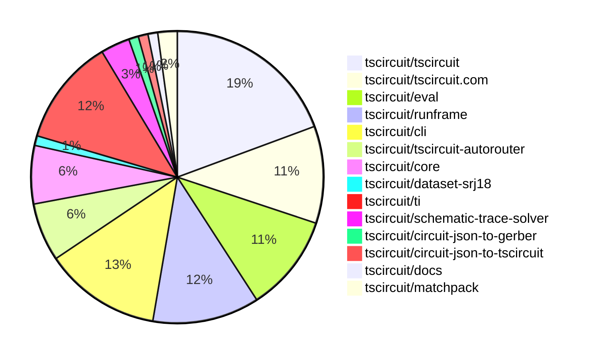

# Contribution Overview 2026-06-09

The current week is shown below. There are 3 major sections:

- [Contributor Overview](#contributor-overview)
- [PRs by Repository](#prs-by-repository)
- [PRs by Contributor](#changes-by-contributor)
- [Scoring & Sponsorship Details](/docs/sponsorship-calculation-explanation.md)

## PRs by Repository

## Contributor Overview

| Contributor | 🐳 Major | 🐙 Minor | 🐌 Tiny | Score | ⭐ | Discussion Contributions |
|-------------|---------|---------|---------|-------|-----|--------------------------|
| [ShiboSoftwareDev](#ShiboSoftwareDev) | 2 | 1 | 2 | 14 | ⭐⭐ | 0🔹 0🔶 0💎 |
| [tscircuitbot](#tscircuitbot) | 0 | 0 | 62 | 12.5 | ⭐⭐ | 0🔹 0🔶 0💎 |
| [AnasSarkiz](#AnasSarkiz) | 2 | 0 | 2 | 12 | ⭐⭐ | 0🔹 0🔶 0💎 |
| [MustafaMulla29](#MustafaMulla29) | 1 | 1 | 5 | 12 | ⭐⭐ | 0🔹 0🔶 0💎 |
| [imrishabh18](#imrishabh18) | 0 | 1 | 3 | 6 | ⭐ | 0🔹 0🔶 0💎 |
| [0hmX](#0hmX) | 1 | 0 | 1 | 6 | ⭐ | 0🔹 0🔶 0💎 |
| [Sang-it](#Sang-it) | 0 | 1 | 2 | 5 | ⭐ | 0🔹 0🔶 0💎 |
| [Abse2001](#Abse2001) | 0 | 1 | 2 | 4 | ⭐ | 0🔹 0🔶 0💎 |
| [anil08607](#anil08607) | 0 | 0 | 1 | 1 |  | 0🔹 0🔶 0💎 |
| [rushabhcodes](#rushabhcodes) | 0 | 0 | 1 | 1 |  | 0🔹 0🔶 0💎 |
| [techmannih](#techmannih) | 0 | 0 | 1 | 1 |  | 0🔹 0🔶 0💎 |

## Staff Pass Ratio (SPR)

| Contributor | Reviewed PRs | Rejections | Approvals | SPR |
|-------------|--------------|------------|-----------|-----|

> Note: AI evaluates PRs and assigns 1-3 star ratings automatically. 4 and 5 star ratings require manual staff review.

### Discussion Contribution Legend

- 🔹 Normal Comments: Basic participation with minimal effort
- 🔶 Great Informative Comments: Thoughtful participation that adds value
- 💎 Incredible Comments: Exceptional participation with high-quality content

## Review Table

[reviews-received-hover]: ## "Number of reviews received for PRs for this contributor"
[approvals-received-hover]: ## "Number of approvals received for PRs this contributor authored"
[rejections-received-hover]: ## "Number of rejections received for PRs this contributor authored"
[prs-opened-hover]: ## "Number of PRs opened by this contributor"
[issues-created-hover]: ## "Number of issues created by this contributor"

| Contributor | Reviews Received | Approvals Received | Rejections Received | Approvals | Rejections Given | PRs Opened | PRs Merged | Issues Created |
|---|---|---|---|---|---|---|---|---|
| [tscircuitbot](#tscircuitbot) | 0 | 0 | 0 | 0 | 0 | 78 | 62 | 0 |
| [Aaloklovanshi](#Aaloklovanshi) | 0 | 0 | 0 | 0 | 0 | 1 | 0 | 0 |
| [exodusdistro](#exodusdistro) | 0 | 0 | 0 | 0 | 0 | 2 | 0 | 0 |
| [Shaidyk](#Shaidyk) | 0 | 0 | 0 | 0 | 0 | 6 | 0 | 0 |
| [nitin-rachabathuni](#nitin-rachabathuni) | 0 | 0 | 0 | 0 | 0 | 1 | 0 | 0 |
| [shauryam2807](#shauryam2807) | 0 | 0 | 0 | 0 | 0 | 1 | 0 | 0 |
| [techmannih](#techmannih) | 2 | 1 | 0 | 0 | 0 | 7 | 1 | 0 |
| [ShiboSoftwareDev](#ShiboSoftwareDev) | 4 | 1 | 1 | 2 | 0 | 7 | 6 | 0 |
| [imrishabh18](#imrishabh18) | 0 | 0 | 0 | 9 | 1 | 4 | 4 | 0 |
| [AnasSarkiz](#AnasSarkiz) | 6 | 5 | 0 | 2 | 0 | 5 | 4 | 0 |
| [0hmX](#0hmX) | 4 | 1 | 0 | 2 | 0 | 3 | 2 | 0 |
| [MustafaMulla29](#MustafaMulla29) | 4 | 4 | 0 | 3 | 0 | 7 | 7 | 0 |
| [gwhthompson](#gwhthompson) | 0 | 0 | 0 | 0 | 0 | 2 | 0 | 0 |
| [Abse2001](#Abse2001) | 5 | 5 | 0 | 0 | 0 | 3 | 3 | 0 |
| [Eric89544](#Eric89544) | 0 | 0 | 0 | 0 | 0 | 1 | 0 | 0 |
| [rushabhcodes](#rushabhcodes) | 11 | 1 | 0 | 0 | 0 | 7 | 1 | 0 |
| [anil08607](#anil08607) | 3 | 1 | 0 | 0 | 0 | 2 | 1 | 0 |
| [JirA44](#JirA44) | 0 | 0 | 0 | 0 | 0 | 1 | 0 | 0 |
| [Vinzz2303](#Vinzz2303) | 0 | 0 | 0 | 0 | 0 | 2 | 0 | 0 |
| [Sang-it](#Sang-it) | 0 | 0 | 0 | 1 | 0 | 3 | 3 | 0 |
| [jawn1112](#jawn1112) | 0 | 0 | 0 | 0 | 0 | 1 | 0 | 0 |
| [codeboost-tr](#codeboost-tr) | 0 | 0 | 0 | 0 | 0 | 1 | 0 | 0 |
| [Misterate](#Misterate) | 0 | 0 | 0 | 0 | 0 | 1 | 0 | 0 |
| [Wh0FF24](#Wh0FF24) | 0 | 0 | 0 | 0 | 0 | 1 | 0 | 0 |

## Changes by Repository

### [tscircuit/tscircuit](https://github.com/tscircuit/tscircuit)

🐌 Tiny Contributions (18)

| PR # | Impact | Contributor | Description |
|------|--------|-------------|-------------|
| [#3440](https://github.com/tscircuit/tscircuit/pull/3440) | 🐌 Tiny | tscircuitbot | Automated package update |
| [#3439](https://github.com/tscircuit/tscircuit/pull/3439) | 🐌 Tiny | tscircuitbot | Updates the tscircuitcli package version from 0.1.1467 to 0.1.1468 |
| [#3438](https://github.com/tscircuit/tscircuit/pull/3438) | 🐌 Tiny | tscircuitbot | Automated package update to version 0.0.1848 |
| [#3437](https://github.com/tscircuit/tscircuit/pull/3437) | 🐌 Tiny | tscircuitbot | Automated package update |
| [#3436](https://github.com/tscircuit/tscircuit/pull/3436) | 🐌 Tiny | tscircuitbot | Automated package update |
| [#3435](https://github.com/tscircuit/tscircuit/pull/3435) | 🐌 Tiny | tscircuitbot | Updates the tscircuitcore package version from 0.0.1312 to 0.0.1314 in package.json |
| [#3434](https://github.com/tscircuit/tscircuit/pull/3434) | 🐌 Tiny | tscircuitbot | Updates the package version from 0.0.1845 to 0.0.1846 in package.json |
| [#3433](https://github.com/tscircuit/tscircuit/pull/3433) | 🐌 Tiny | tscircuitbot | Automated package update |
| [#3432](https://github.com/tscircuit/tscircuit/pull/3432) | 🐌 Tiny | tscircuitbot | Automated package update |
| [#3431](https://github.com/tscircuit/tscircuit/pull/3431) | 🐌 Tiny | tscircuitbot | Automated package update |
| [#3430](https://github.com/tscircuit/tscircuit/pull/3430) | 🐌 Tiny | tscircuitbot | Automated package update |
| [#3429](https://github.com/tscircuit/tscircuit/pull/3429) | 🐌 Tiny | tscircuitbot | Automated package update |
| [#3428](https://github.com/tscircuit/tscircuit/pull/3428) | 🐌 Tiny | tscircuitbot | Automated package update |
| [#3427](https://github.com/tscircuit/tscircuit/pull/3427) | 🐌 Tiny | tscircuitbot | Automated package update |
| [#3426](https://github.com/tscircuit/tscircuit/pull/3426) | 🐌 Tiny | tscircuitbot | Automated package update |
| [#3425](https://github.com/tscircuit/tscircuit/pull/3425) | 🐌 Tiny | tscircuitbot | Updates the version of tscircuitcore from 0.0.1309 to 0.0.1310 and tscircuitngspice-spice-engine from 0.0.8 to 0.0.9 in package.json |
| [#3421](https://github.com/tscircuit/tscircuit/pull/3421) | 🐌 Tiny | tscircuitbot | Updates the package version from 0.0.1840 to 0.0.1841 in package.json |
| [#3420](https://github.com/tscircuit/tscircuit/pull/3420) | 🐌 Tiny | tscircuitbot | Updates the tscircuitcli package and other related dependencies to their latest versions. |

### [tscircuit/tscircuit.com](https://github.com/tscircuit/tscircuit.com)

🐌 Tiny Contributions (10)

| PR # | Impact | Contributor | Description |
|------|--------|-------------|-------------|
| [#3642](https://github.com/tscircuit/tscircuit.com/pull/3642) | 🐌 Tiny | tscircuitbot | Automated package update |
| [#3641](https://github.com/tscircuit/tscircuit.com/pull/3641) | 🐌 Tiny | tscircuitbot | Updates the tscircuiteval package from version 0.0.914 to 0.0.915 |
| [#3640](https://github.com/tscircuit/tscircuit.com/pull/3640) | 🐌 Tiny | tscircuitbot | Automated package update |
| [#3639](https://github.com/tscircuit/tscircuit.com/pull/3639) | 🐌 Tiny | tscircuitbot | Updates the tscircuiteval package from version 0.0.913 to 0.0.914 |
| [#3638](https://github.com/tscircuit/tscircuit.com/pull/3638) | 🐌 Tiny | tscircuitbot | Updates the tscircuitrunframe package to version 0.0.2055 |
| [#3637](https://github.com/tscircuit/tscircuit.com/pull/3637) | 🐌 Tiny | tscircuitbot | Updates the tscircuiteval package from version 0.0.912 to 0.0.913 |
| [#3636](https://github.com/tscircuit/tscircuit.com/pull/3636) | 🐌 Tiny | tscircuitbot | Updates the tscircuitrunframe package to version 0.0.2054 |
| [#3635](https://github.com/tscircuit/tscircuit.com/pull/3635) | 🐌 Tiny | tscircuitbot | Updates the tscircuiteval package to version 0.0.912 in the package.json file. |
| [#3634](https://github.com/tscircuit/tscircuit.com/pull/3634) | 🐌 Tiny | tscircuitbot | Updates the tscircuitrunframe package from version 0.0.2052 to 0.0.2053 |
| [#3633](https://github.com/tscircuit/tscircuit.com/pull/3633) | 🐌 Tiny | tscircuitbot | Automated package update |

### [tscircuit/eval](https://github.com/tscircuit/eval)

| PR # | Impact | Rating | Contributor | Description |
|------|--------|--------|-------------|-------------|
| [#2864](https://github.com/tscircuit/eval/pull/2864) | 🐙 Minor | ⭐⭐ | ShiboSoftwareDev | Enables PSPICE compatibility in ngspice simulations by modifying the ngspice engine configuration and adding a corresponding test. |

🐌 Tiny Contributions (9)

| PR # | Impact | Contributor | Description |
|------|--------|-------------|-------------|
| [#2879](https://github.com/tscircuit/eval/pull/2879) | 🐌 Tiny | tscircuitbot | Automated package update |
| [#2878](https://github.com/tscircuit/eval/pull/2878) | 🐌 Tiny | tscircuitbot | Updates the version of the tscircuitcore package from 0.0.1312 to 0.0.1314 in package.json |
| [#2874](https://github.com/tscircuit/eval/pull/2874) | 🐌 Tiny | tscircuitbot | Automated package update |
| [#2873](https://github.com/tscircuit/eval/pull/2873) | 🐌 Tiny | tscircuitbot | Automated package update |
| [#2871](https://github.com/tscircuit/eval/pull/2871) | 🐌 Tiny | tscircuitbot | Automated package update |
| [#2870](https://github.com/tscircuit/eval/pull/2870) | 🐌 Tiny | tscircuitbot | Updates the package versions in package.json for various dependencies. |
| [#2868](https://github.com/tscircuit/eval/pull/2868) | 🐌 Tiny | tscircuitbot | Automated package update |
| [#2867](https://github.com/tscircuit/eval/pull/2867) | 🐌 Tiny | tscircuitbot | Updates the version of tscircuitcore to 0.0.1310 and downgrades eecircuit-engine to 1.5.6 in package.json |
| [#2865](https://github.com/tscircuit/eval/pull/2865) | 🐌 Tiny | tscircuitbot | Automated package update |

### [tscircuit/runframe](https://github.com/tscircuit/runframe)

🐌 Tiny Contributions (11)

| PR # | Impact | Contributor | Description |
|------|--------|-------------|-------------|
| [#3642](https://github.com/tscircuit/runframe/pull/3642) | 🐌 Tiny | tscircuitbot | Updates the circuit-json-to-gerber package from version 0.0.77 to 0.0.78 |
| [#3641](https://github.com/tscircuit/runframe/pull/3641) | 🐌 Tiny | tscircuitbot | Automated package update |
| [#3640](https://github.com/tscircuit/runframe/pull/3640) | 🐌 Tiny | tscircuitbot | Updates the tscircuiteval package from version 0.0.914 to 0.0.915 |
| [#3639](https://github.com/tscircuit/runframe/pull/3639) | 🐌 Tiny | tscircuitbot | Automated package update |
| [#3638](https://github.com/tscircuit/runframe/pull/3638) | 🐌 Tiny | tscircuitbot | Updates the tscircuiteval package from version 0.0.913 to 0.0.914 in the package.json file. |
| [#3637](https://github.com/tscircuit/runframe/pull/3637) | 🐌 Tiny | tscircuitbot | Automated package update |
| [#3636](https://github.com/tscircuit/runframe/pull/3636) | 🐌 Tiny | tscircuitbot | Updates the tscircuiteval package from version 0.0.912 to 0.0.913 in the package.json file. |
| [#3635](https://github.com/tscircuit/runframe/pull/3635) | 🐌 Tiny | tscircuitbot | Automated package update |
| [#3634](https://github.com/tscircuit/runframe/pull/3634) | 🐌 Tiny | tscircuitbot | Updates the tscircuiteval package from version 0.0.911 to 0.0.912 in the package.json file. |
| [#3633](https://github.com/tscircuit/runframe/pull/3633) | 🐌 Tiny | tscircuitbot | Automated package update |
| [#3632](https://github.com/tscircuit/runframe/pull/3632) | 🐌 Tiny | tscircuitbot | Updates the tscircuiteval package from version 0.0.910 to 0.0.911 in the package.json file. |

### [tscircuit/cli](https://github.com/tscircuit/cli)

| PR # | Impact | Rating | Contributor | Description |
|------|--------|--------|-------------|-------------|
| [#3237](https://github.com/tscircuit/cli/pull/3237) | 🐙 Minor | ⭐⭐ | imrishabh18 | Fixes failure of tsci snapshot command to load the asynchronous footprint from parts-engine in tscircuit.config.ts |

🐌 Tiny Contributions (11)

| PR # | Impact | Contributor | Description |
|------|--------|-------------|-------------|
| [#3253](https://github.com/tscircuit/cli/pull/3253) | 🐌 Tiny | tscircuitbot | Automated package update |
| [#3252](https://github.com/tscircuit/cli/pull/3252) | 🐌 Tiny | tscircuitbot | Automated package update |
| [#3251](https://github.com/tscircuit/cli/pull/3251) | 🐌 Tiny | tscircuitbot | Updates the tscircuitrunframe package version from 0.0.2056 to 0.0.2057 in package.json |
| [#3249](https://github.com/tscircuit/cli/pull/3249) | 🐌 Tiny | tscircuitbot | Automated package update |
| [#3248](https://github.com/tscircuit/cli/pull/3248) | 🐌 Tiny | tscircuitbot | Updates the tscircuitrunframe package version from 0.0.2055 to 0.0.2056 |
| [#3247](https://github.com/tscircuit/cli/pull/3247) | 🐌 Tiny | tscircuitbot | Automated package update |
| [#3246](https://github.com/tscircuit/cli/pull/3246) | 🐌 Tiny | tscircuitbot | Updates the tscircuitrunframe package from version 0.0.2054 to 0.0.2055 |
| [#3245](https://github.com/tscircuit/cli/pull/3245) | 🐌 Tiny | tscircuitbot | Automated package update |
| [#3244](https://github.com/tscircuit/cli/pull/3244) | 🐌 Tiny | tscircuitbot | Updates the tscircuitrunframe package to version 0.0.2054 in package.json |
| [#3243](https://github.com/tscircuit/cli/pull/3243) | 🐌 Tiny | tscircuitbot | Automated package update |
| [#3242](https://github.com/tscircuit/cli/pull/3242) | 🐌 Tiny | tscircuitbot | Updates the tscircuitrunframe package to version 0.0.2053 in package.json |

### [tscircuit/tscircuit-autorouter](https://github.com/tscircuit/tscircuit-autorouter)

| PR # | Impact | Rating | Contributor | Description |
|------|--------|--------|-------------|-------------|
| [#1362](https://github.com/tscircuit/tscircuit-autorouter/pull/1362) | 🐳 Major | ⭐⭐⭐ | ShiboSoftwareDev | Fixes high-density solver metadata for child solvers that do not implement the getSolverName method, ensuring proper naming conventions are followed. |
| [#1368](https://github.com/tscircuit/tscircuit-autorouter/pull/1368) | 🐳 Major | ⭐⭐⭐ | 0hmX | Removes redundant parameters related to topology generator IDs from various solver classes, streamlining the output structure. |

🐌 Tiny Contributions (4)

| PR # | Impact | Contributor | Description |
|------|--------|-------------|-------------|
| [#1374](https://github.com/tscircuit/tscircuit-autorouter/pull/1374) | 🐌 Tiny | tscircuitbot | Automated package update |
| [#1371](https://github.com/tscircuit/tscircuit-autorouter/pull/1371) | 🐌 Tiny | tscircuitbot | Automated package update |
| [#1365](https://github.com/tscircuit/tscircuit-autorouter/pull/1365) | 🐌 Tiny | tscircuitbot | Automated package update |
| [#1373](https://github.com/tscircuit/tscircuit-autorouter/pull/1373) | 🐌 Tiny | 0hmX | Fixes the git hash issue by only passing the first 7 characters of the hash for the dependency tscircuithigh-density-a01 in package.json |

### [tscircuit/core](https://github.com/tscircuit/core)

| PR # | Impact | Rating | Contributor | Description |
|------|--------|--------|-------------|-------------|
| [#2422](https://github.com/tscircuit/core/pull/2422) | 🐳 Major | ⭐⭐⭐ | AnasSarkiz | Updates Simple Route JSON generation to ensure top-level autorouting inputs are derived from logical source_tracesource_net intent, rather than treating existing top-level pcb_trace records as already-routed state, addressing the dataset-srj18 missing traces issue. |
| [#2413](https://github.com/tscircuit/core/pull/2413) | 🐳 Major | ⭐⭐⭐ | ShiboSoftwareDev | This pull request integrates the AutoroutingPipelineSolver7_MultiGraph into the existing autorouting framework, enhancing the routing capabilities of the system. It also updates the autorouter versioning in the interface and modifies the package dependencies to ensure compatibility with the new solver. |

🐌 Tiny Contributions (4)

| PR # | Impact | Contributor | Description |
|------|--------|-------------|-------------|
| [#2421](https://github.com/tscircuit/core/pull/2421) | 🐌 Tiny | MustafaMulla29 | Fixes incorrect facing direction for custom symbol ports in schematics, ensuring netlabels point correctly based on declared port direction. |
| [#2420](https://github.com/tscircuit/core/pull/2420) | 🐌 Tiny | MustafaMulla29 | Adds a test to verify the correct direction of netlabels for custom symbols in schematic representations. |
| [#2418](https://github.com/tscircuit/core/pull/2418) | 🐌 Tiny | MustafaMulla29 | Updates the version of the schematic-trace-solver dependency from 0.0.63 to 0.0.65 in package.json |
| [#2417](https://github.com/tscircuit/core/pull/2417) | 🐌 Tiny | ShiboSoftwareDev | Updates the ngspice engine dependency version from 0.0.8 to 0.0.9 in package.json |

### [tscircuit/dataset-srj18](https://github.com/tscircuit/dataset-srj18)

| PR # | Impact | Rating | Contributor | Description |
|------|--------|--------|-------------|-------------|
| [#8](https://github.com/tscircuit/dataset-srj18/pull/8) | 🐳 Major | ⭐⭐⭐ | AnasSarkiz | BEFORE !Before(https:github.comuser-attachmentsassets0ec0f7d5-7f8f-4403-bb1c-a01af85e8701)  AFTER !After(https:github.comuser-attachmentsassetsa2869dcb-974a-4acd-8311-968d697385e3) !Additional View(https:github.comuser-attachmentsassetsdc37ceef-3703-49c2-a3af-d75e6fb4b80c) |

### [tscircuit/ti](https://github.com/tscircuit/ti)

🐌 Tiny Contributions (11)

| PR # | Impact | Contributor | Description |
|------|--------|-------------|-------------|
| [#9](https://github.com/tscircuit/ti/pull/9) | 🐌 Tiny | AnasSarkiz | Adds a new demo for the TPS7A02 voltage regulator, including its footprint and schematic representation. |
| [#6](https://github.com/tscircuit/ti/pull/6) | 🐌 Tiny | AnasSarkiz | Adds a new subcircuit for the TPS63802 component, including its footprint and schematic representation. |
| [#11](https://github.com/tscircuit/ti/pull/11) | 🐌 Tiny | MustafaMulla29 | Adds new components MSPM0G3507, CC2340R5, and CC3235SF with their respective pin configurations and schematic representations. |
| [#16](https://github.com/tscircuit/ti/pull/16) | 🐌 Tiny | ShiboSoftwareDev | Adds HDC3022 and HDC3020 components with their respective footprints and schematic representations. |
| [#14](https://github.com/tscircuit/ti/pull/14) | 🐌 Tiny | Abse2001 | Adds a new PCB and schematic for the TMP1075 component, including detailed footprint and connections. |
| [#10](https://github.com/tscircuit/ti/pull/10) | 🐌 Tiny | Abse2001 | Adds a new HDC2080 TI board with its corresponding footprint and schematic representation. |
| [#18](https://github.com/tscircuit/ti/pull/18) | 🐌 Tiny | imrishabh18 | Adds the INA237 component with its footprint and schematic representation to the library. |
| [#17](https://github.com/tscircuit/ti/pull/17) | 🐌 Tiny | imrishabh18 | Add a new BQ27441 component with its footprint and schematic representation for use in circuit designs. |
| [#15](https://github.com/tscircuit/ti/pull/15) | 🐌 Tiny | imrishabh18 | Add BQ25895 subcircuit and its associated components to the library. |
| [#8](https://github.com/tscircuit/ti/pull/8) | 🐌 Tiny | Sang-it | Adds a new DRV8833 motor driver component and its associated schematic representation to the library. |
| [#13](https://github.com/tscircuit/ti/pull/13) | 🐌 Tiny | techmannih | Adds a new TPS22919 circuit component and its schematic representation to the library. |

### [tscircuit/schematic-trace-solver](https://github.com/tscircuit/schematic-trace-solver)

| PR # | Impact | Rating | Contributor | Description |
|------|--------|--------|-------------|-------------|
| [#512](https://github.com/tscircuit/schematic-trace-solver/pull/512) | 🐳 Major | ⭐⭐⭐ | MustafaMulla29 | Fixes the issue where overlapping traces would shift into schematic component boxes by implementing obstacle-aware offsets during trace separation. |
| [#507](https://github.com/tscircuit/schematic-trace-solver/pull/507) | 🐙 Minor | ⭐⭐ | MustafaMulla29 | Fixes validation of connector traces to ensure they do not overlap netlabel edges, preventing potential routing errors. |

🐌 Tiny Contributions (1)

| PR # | Impact | Contributor | Description |
|------|--------|-------------|-------------|
| [#508](https://github.com/tscircuit/schematic-trace-solver/pull/508) | 🐌 Tiny | MustafaMulla29 | Adds a test case for trace overlap involving a resistor in the schematic trace solver. |

### [tscircuit/circuit-json-to-gerber](https://github.com/tscircuit/circuit-json-to-gerber)

| PR # | Impact | Rating | Contributor | Description |
|------|--------|--------|-------------|-------------|
| [#115](https://github.com/tscircuit/circuit-json-to-gerber/pull/115) | 🐙 Minor | ⭐⭐ | Abse2001 | Fixes Gerber and Excellon generation issues for non-plated holes in PCB designs. |

### [tscircuit/circuit-json-to-tscircuit](https://github.com/tscircuit/circuit-json-to-tscircuit)

🐌 Tiny Contributions (1)

| PR # | Impact | Contributor | Description |
|------|--------|-------------|-------------|
| [#48](https://github.com/tscircuit/circuit-json-to-tscircuit/pull/48) | 🐌 Tiny | anil08607 | Centralizes the formatting of optional footprint TSX attributes by moving the formatOptionalMmAttr function to the helpers module, improving code organization and maintainability. |

### [tscircuit/docs](https://github.com/tscircuit/docs)

🐌 Tiny Contributions (1)

| PR # | Impact | Contributor | Description |
|------|--------|-------------|-------------|
| [#729](https://github.com/tscircuit/docs/pull/729) | 🐌 Tiny | rushabhcodes | Updates the documentation for the hole  component to include support for oval holes, adding an example and updating the properties table accordingly. |

### [tscircuit/matchpack](https://github.com/tscircuit/matchpack)

| PR # | Impact | Rating | Contributor | Description |
|------|--------|--------|-------------|-------------|
| [#131](https://github.com/tscircuit/matchpack/pull/131) | 🐙 Minor | ⭐⭐ | Sang-it | Fixes empty visualization frames and adds a fixed suffix to fixed chips in the layout visualization. |

🐌 Tiny Contributions (1)

| PR # | Impact | Contributor | Description |
|------|--------|-------------|-------------|
| [#130](https://github.com/tscircuit/matchpack/pull/130) | 🐌 Tiny | Sang-it | Adds color coding to chip visualizations based on chip type in the SVG rendering. |

## Changes by Contributor

### [tscircuitbot](https://github.com/tscircuitbot)

🐌 Tiny Contributions (62)

| PR # | Impact | Description |
|------|--------|-------------|
| [#3440](https://github.com/tscircuit/tscircuit/pull/3440) | 🐌 Tiny | Automated package update |
| [#3439](https://github.com/tscircuit/tscircuit/pull/3439) | 🐌 Tiny | Updates the tscircuitcli package version from 0.1.1467 to 0.1.1468 |
| [#3438](https://github.com/tscircuit/tscircuit/pull/3438) | 🐌 Tiny | Automated package update to version 0.0.1848 |
| [#3437](https://github.com/tscircuit/tscircuit/pull/3437) | 🐌 Tiny | Automated package update |
| [#3436](https://github.com/tscircuit/tscircuit/pull/3436) | 🐌 Tiny | Automated package update |
| [#3435](https://github.com/tscircuit/tscircuit/pull/3435) | 🐌 Tiny | Updates the tscircuitcore package version from 0.0.1312 to 0.0.1314 in package.json |
| [#3434](https://github.com/tscircuit/tscircuit/pull/3434) | 🐌 Tiny | Updates the package version from 0.0.1845 to 0.0.1846 in package.json |
| [#3433](https://github.com/tscircuit/tscircuit/pull/3433) | 🐌 Tiny | Automated package update |
| [#3432](https://github.com/tscircuit/tscircuit/pull/3432) | 🐌 Tiny | Automated package update |
| [#3431](https://github.com/tscircuit/tscircuit/pull/3431) | 🐌 Tiny | Automated package update |
| [#3430](https://github.com/tscircuit/tscircuit/pull/3430) | 🐌 Tiny | Automated package update |
| [#3429](https://github.com/tscircuit/tscircuit/pull/3429) | 🐌 Tiny | Automated package update |
| [#3428](https://github.com/tscircuit/tscircuit/pull/3428) | 🐌 Tiny | Automated package update |
| [#3427](https://github.com/tscircuit/tscircuit/pull/3427) | 🐌 Tiny | Automated package update |
| [#3426](https://github.com/tscircuit/tscircuit/pull/3426) | 🐌 Tiny | Automated package update |
| [#3425](https://github.com/tscircuit/tscircuit/pull/3425) | 🐌 Tiny | Updates the version of tscircuitcore from 0.0.1309 to 0.0.1310 and tscircuitngspice-spice-engine from 0.0.8 to 0.0.9 in package.json |
| [#3421](https://github.com/tscircuit/tscircuit/pull/3421) | 🐌 Tiny | Updates the package version from 0.0.1840 to 0.0.1841 in package.json |
| [#3420](https://github.com/tscircuit/tscircuit/pull/3420) | 🐌 Tiny | Updates the tscircuitcli package and other related dependencies to their latest versions. |
| [#3642](https://github.com/tscircuit/tscircuit.com/pull/3642) | 🐌 Tiny | Automated package update |
| [#3641](https://github.com/tscircuit/tscircuit.com/pull/3641) | 🐌 Tiny | Updates the tscircuiteval package from version 0.0.914 to 0.0.915 |
| [#3640](https://github.com/tscircuit/tscircuit.com/pull/3640) | 🐌 Tiny | Automated package update |
| [#3639](https://github.com/tscircuit/tscircuit.com/pull/3639) | 🐌 Tiny | Updates the tscircuiteval package from version 0.0.913 to 0.0.914 |
| [#3638](https://github.com/tscircuit/tscircuit.com/pull/3638) | 🐌 Tiny | Updates the tscircuitrunframe package to version 0.0.2055 |
| [#3637](https://github.com/tscircuit/tscircuit.com/pull/3637) | 🐌 Tiny | Updates the tscircuiteval package from version 0.0.912 to 0.0.913 |
| [#3636](https://github.com/tscircuit/tscircuit.com/pull/3636) | 🐌 Tiny | Updates the tscircuitrunframe package to version 0.0.2054 |
| [#3635](https://github.com/tscircuit/tscircuit.com/pull/3635) | 🐌 Tiny | Updates the tscircuiteval package to version 0.0.912 in the package.json file. |
| [#3634](https://github.com/tscircuit/tscircuit.com/pull/3634) | 🐌 Tiny | Updates the tscircuitrunframe package from version 0.0.2052 to 0.0.2053 |
| [#3633](https://github.com/tscircuit/tscircuit.com/pull/3633) | 🐌 Tiny | Automated package update |
| [#2879](https://github.com/tscircuit/eval/pull/2879) | 🐌 Tiny | Automated package update |
| [#2878](https://github.com/tscircuit/eval/pull/2878) | 🐌 Tiny | Updates the version of the tscircuitcore package from 0.0.1312 to 0.0.1314 in package.json |
| [#2874](https://github.com/tscircuit/eval/pull/2874) | 🐌 Tiny | Automated package update |
| [#2873](https://github.com/tscircuit/eval/pull/2873) | 🐌 Tiny | Automated package update |
| [#2871](https://github.com/tscircuit/eval/pull/2871) | 🐌 Tiny | Automated package update |
| [#2870](https://github.com/tscircuit/eval/pull/2870) | 🐌 Tiny | Updates the package versions in package.json for various dependencies. |
| [#2868](https://github.com/tscircuit/eval/pull/2868) | 🐌 Tiny | Automated package update |
| [#2867](https://github.com/tscircuit/eval/pull/2867) | 🐌 Tiny | Updates the version of tscircuitcore to 0.0.1310 and downgrades eecircuit-engine to 1.5.6 in package.json |
| [#2865](https://github.com/tscircuit/eval/pull/2865) | 🐌 Tiny | Automated package update |
| [#3642](https://github.com/tscircuit/runframe/pull/3642) | 🐌 Tiny | Updates the circuit-json-to-gerber package from version 0.0.77 to 0.0.78 |
| [#3641](https://github.com/tscircuit/runframe/pull/3641) | 🐌 Tiny | Automated package update |
| [#3640](https://github.com/tscircuit/runframe/pull/3640) | 🐌 Tiny | Updates the tscircuiteval package from version 0.0.914 to 0.0.915 |
| [#3639](https://github.com/tscircuit/runframe/pull/3639) | 🐌 Tiny | Automated package update |
| [#3638](https://github.com/tscircuit/runframe/pull/3638) | 🐌 Tiny | Updates the tscircuiteval package from version 0.0.913 to 0.0.914 in the package.json file. |
| [#3637](https://github.com/tscircuit/runframe/pull/3637) | 🐌 Tiny | Automated package update |
| [#3636](https://github.com/tscircuit/runframe/pull/3636) | 🐌 Tiny | Updates the tscircuiteval package from version 0.0.912 to 0.0.913 in the package.json file. |
| [#3635](https://github.com/tscircuit/runframe/pull/3635) | 🐌 Tiny | Automated package update |
| [#3634](https://github.com/tscircuit/runframe/pull/3634) | 🐌 Tiny | Updates the tscircuiteval package from version 0.0.911 to 0.0.912 in the package.json file. |
| [#3633](https://github.com/tscircuit/runframe/pull/3633) | 🐌 Tiny | Automated package update |
| [#3632](https://github.com/tscircuit/runframe/pull/3632) | 🐌 Tiny | Updates the tscircuiteval package from version 0.0.910 to 0.0.911 in the package.json file. |
| [#3253](https://github.com/tscircuit/cli/pull/3253) | 🐌 Tiny | Automated package update |
| [#3252](https://github.com/tscircuit/cli/pull/3252) | 🐌 Tiny | Automated package update |
| [#3251](https://github.com/tscircuit/cli/pull/3251) | 🐌 Tiny | Updates the tscircuitrunframe package version from 0.0.2056 to 0.0.2057 in package.json |
| [#3249](https://github.com/tscircuit/cli/pull/3249) | 🐌 Tiny | Automated package update |
| [#3248](https://github.com/tscircuit/cli/pull/3248) | 🐌 Tiny | Updates the tscircuitrunframe package version from 0.0.2055 to 0.0.2056 |
| [#3247](https://github.com/tscircuit/cli/pull/3247) | 🐌 Tiny | Automated package update |
| [#3246](https://github.com/tscircuit/cli/pull/3246) | 🐌 Tiny | Updates the tscircuitrunframe package from version 0.0.2054 to 0.0.2055 |
| [#3245](https://github.com/tscircuit/cli/pull/3245) | 🐌 Tiny | Automated package update |
| [#3244](https://github.com/tscircuit/cli/pull/3244) | 🐌 Tiny | Updates the tscircuitrunframe package to version 0.0.2054 in package.json |
| [#3243](https://github.com/tscircuit/cli/pull/3243) | 🐌 Tiny | Automated package update |
| [#3242](https://github.com/tscircuit/cli/pull/3242) | 🐌 Tiny | Updates the tscircuitrunframe package to version 0.0.2053 in package.json |
| [#1374](https://github.com/tscircuit/tscircuit-autorouter/pull/1374) | 🐌 Tiny | Automated package update |
| [#1371](https://github.com/tscircuit/tscircuit-autorouter/pull/1371) | 🐌 Tiny | Automated package update |
| [#1365](https://github.com/tscircuit/tscircuit-autorouter/pull/1365) | 🐌 Tiny | Automated package update |

### [AnasSarkiz](https://github.com/AnasSarkiz)

| PRs # | Impact | Rating | Description |
|------|--------|--------|-------------|
| [#2422](https://github.com/tscircuit/core/pull/2422) | 🐳 Major | ⭐⭐⭐ | Updates Simple Route JSON generation to ensure top-level autorouting inputs are derived from logical source_tracesource_net intent, rather than treating existing top-level pcb_trace records as already-routed state, addressing the dataset-srj18 missing traces issue. |
| [#8](https://github.com/tscircuit/dataset-srj18/pull/8) | 🐳 Major | ⭐⭐⭐ | BEFORE !Before(https:github.comuser-attachmentsassets0ec0f7d5-7f8f-4403-bb1c-a01af85e8701)  AFTER !After(https:github.comuser-attachmentsassetsa2869dcb-974a-4acd-8311-968d697385e3) !Additional View(https:github.comuser-attachmentsassetsdc37ceef-3703-49c2-a3af-d75e6fb4b80c) |

🐌 Tiny Contributions (2)

| PR # | Impact | Description |
|------|--------|-------------|
| [#9](https://github.com/tscircuit/ti/pull/9) | 🐌 Tiny | Adds a new demo for the TPS7A02 voltage regulator, including its footprint and schematic representation. |
| [#6](https://github.com/tscircuit/ti/pull/6) | 🐌 Tiny | Adds a new subcircuit for the TPS63802 component, including its footprint and schematic representation. |

### [MustafaMulla29](https://github.com/MustafaMulla29)

| PRs # | Impact | Rating | Description |
|------|--------|--------|-------------|
| [#512](https://github.com/tscircuit/schematic-trace-solver/pull/512) | 🐳 Major | ⭐⭐⭐ | Fixes the issue where overlapping traces would shift into schematic component boxes by implementing obstacle-aware offsets during trace separation. |
| [#507](https://github.com/tscircuit/schematic-trace-solver/pull/507) | 🐙 Minor | ⭐⭐ | Fixes validation of connector traces to ensure they do not overlap netlabel edges, preventing potential routing errors. |

🐌 Tiny Contributions (5)

| PR # | Impact | Description |
|------|--------|-------------|
| [#2421](https://github.com/tscircuit/core/pull/2421) | 🐌 Tiny | Fixes incorrect facing direction for custom symbol ports in schematics, ensuring netlabels point correctly based on declared port direction. |
| [#2420](https://github.com/tscircuit/core/pull/2420) | 🐌 Tiny | Adds a test to verify the correct direction of netlabels for custom symbols in schematic representations. |
| [#2418](https://github.com/tscircuit/core/pull/2418) | 🐌 Tiny | Updates the version of the schematic-trace-solver dependency from 0.0.63 to 0.0.65 in package.json |
| [#508](https://github.com/tscircuit/schematic-trace-solver/pull/508) | 🐌 Tiny | Adds a test case for trace overlap involving a resistor in the schematic trace solver. |
| [#11](https://github.com/tscircuit/ti/pull/11) | 🐌 Tiny | Adds new components MSPM0G3507, CC2340R5, and CC3235SF with their respective pin configurations and schematic representations. |

### [ShiboSoftwareDev](https://github.com/ShiboSoftwareDev)

| PRs # | Impact | Rating | Description |
|------|--------|--------|-------------|
| [#2413](https://github.com/tscircuit/core/pull/2413) | 🐳 Major | ⭐⭐⭐ | This pull request integrates the AutoroutingPipelineSolver7_MultiGraph into the existing autorouting framework, enhancing the routing capabilities of the system. It also updates the autorouter versioning in the interface and modifies the package dependencies to ensure compatibility with the new solver. |
| [#1362](https://github.com/tscircuit/tscircuit-autorouter/pull/1362) | 🐳 Major | ⭐⭐⭐ | Fixes high-density solver metadata for child solvers that do not implement the getSolverName method, ensuring proper naming conventions are followed. |
| [#2864](https://github.com/tscircuit/eval/pull/2864) | 🐙 Minor | ⭐⭐ | Enables PSPICE compatibility in ngspice simulations by modifying the ngspice engine configuration and adding a corresponding test. |

🐌 Tiny Contributions (2)

| PR # | Impact | Description |
|------|--------|-------------|
| [#2417](https://github.com/tscircuit/core/pull/2417) | 🐌 Tiny | Updates the ngspice engine dependency version from 0.0.8 to 0.0.9 in package.json |
| [#16](https://github.com/tscircuit/ti/pull/16) | 🐌 Tiny | Adds HDC3022 and HDC3020 components with their respective footprints and schematic representations. |

### [Abse2001](https://github.com/Abse2001)

| PRs # | Impact | Rating | Description |
|------|--------|--------|-------------|
| [#115](https://github.com/tscircuit/circuit-json-to-gerber/pull/115) | 🐙 Minor | ⭐⭐ | Fixes Gerber and Excellon generation issues for non-plated holes in PCB designs. |

🐌 Tiny Contributions (2)

| PR # | Impact | Description |
|------|--------|-------------|
| [#14](https://github.com/tscircuit/ti/pull/14) | 🐌 Tiny | Adds a new PCB and schematic for the TMP1075 component, including detailed footprint and connections. |
| [#10](https://github.com/tscircuit/ti/pull/10) | 🐌 Tiny | Adds a new HDC2080 TI board with its corresponding footprint and schematic representation. |

### [imrishabh18](https://github.com/imrishabh18)

| PRs # | Impact | Rating | Description |
|------|--------|--------|-------------|
| [#3237](https://github.com/tscircuit/cli/pull/3237) | 🐙 Minor | ⭐⭐ | Fixes failure of tsci snapshot command to load the asynchronous footprint from parts-engine in tscircuit.config.ts |

🐌 Tiny Contributions (3)

| PR # | Impact | Description |
|------|--------|-------------|
| [#18](https://github.com/tscircuit/ti/pull/18) | 🐌 Tiny | Adds the INA237 component with its footprint and schematic representation to the library. |
| [#17](https://github.com/tscircuit/ti/pull/17) | 🐌 Tiny | Add a new BQ27441 component with its footprint and schematic representation for use in circuit designs. |
| [#15](https://github.com/tscircuit/ti/pull/15) | 🐌 Tiny | Add BQ25895 subcircuit and its associated components to the library. |

### [anil08607](https://github.com/anil08607)

🐌 Tiny Contributions (1)

| PR # | Impact | Description |
|------|--------|-------------|
| [#48](https://github.com/tscircuit/circuit-json-to-tscircuit/pull/48) | 🐌 Tiny | Centralizes the formatting of optional footprint TSX attributes by moving the formatOptionalMmAttr function to the helpers module, improving code organization and maintainability. |

### [rushabhcodes](https://github.com/rushabhcodes)

🐌 Tiny Contributions (1)

| PR # | Impact | Description |
|------|--------|-------------|
| [#729](https://github.com/tscircuit/docs/pull/729) | 🐌 Tiny | Updates the documentation for the hole  component to include support for oval holes, adding an example and updating the properties table accordingly. |

### [0hmX](https://github.com/0hmX)

| PRs # | Impact | Rating | Description |
|------|--------|--------|-------------|
| [#1368](https://github.com/tscircuit/tscircuit-autorouter/pull/1368) | 🐳 Major | ⭐⭐⭐ | Removes redundant parameters related to topology generator IDs from various solver classes, streamlining the output structure. |

🐌 Tiny Contributions (1)

| PR # | Impact | Description |
|------|--------|-------------|
| [#1373](https://github.com/tscircuit/tscircuit-autorouter/pull/1373) | 🐌 Tiny | Fixes the git hash issue by only passing the first 7 characters of the hash for the dependency tscircuithigh-density-a01 in package.json |

### [Sang-it](https://github.com/Sang-it)

| PRs # | Impact | Rating | Description |
|------|--------|--------|-------------|
| [#131](https://github.com/tscircuit/matchpack/pull/131) | 🐙 Minor | ⭐⭐ | Fixes empty visualization frames and adds a fixed suffix to fixed chips in the layout visualization. |

🐌 Tiny Contributions (2)

| PR # | Impact | Description |
|------|--------|-------------|
| [#130](https://github.com/tscircuit/matchpack/pull/130) | 🐌 Tiny | Adds color coding to chip visualizations based on chip type in the SVG rendering. |
| [#8](https://github.com/tscircuit/ti/pull/8) | 🐌 Tiny | Adds a new DRV8833 motor driver component and its associated schematic representation to the library. |

### [techmannih](https://github.com/techmannih)

🐌 Tiny Contributions (1)

| PR # | Impact | Description |
|------|--------|-------------|
| [#13](https://github.com/tscircuit/ti/pull/13) | 🐌 Tiny | Adds a new TPS22919 circuit component and its schematic representation to the library. |

## Repository Owners

| Repository | Codeowners |
|------------|------------|
| [builder](https://github.com/tscircuit/builder/blob/main/.github/CODEOWNERS) | [seveibar](https://github.com/seveibar)
| [pcb-viewer](https://github.com/tscircuit/pcb-viewer/blob/main/.github/CODEOWNERS) | [seveibar](https://github.com/seveibar), [ShiboSoftwareDev](https://github.com/ShiboSoftwareDev), [Abse2001](https://github.com/Abse2001)
| [footprints-old](https://github.com/tscircuit/footprints-old/blob/main/.github/CODEOWNERS) | [seveibar](https://github.com/seveibar)
| [footprinter](https://github.com/tscircuit/footprinter/blob/main/.github/CODEOWNERS) | [seveibar](https://github.com/seveibar), [techmannih](https://github.com/techmannih)
| [3d-viewer](https://github.com/tscircuit/3d-viewer/blob/main/.github/CODEOWNERS) | [ShiboSoftwareDev](https://github.com/ShiboSoftwareDev), [Abse2001](https://github.com/Abse2001)
| [winterspec](https://github.com/tscircuit/winterspec/blob/main/.github/CODEOWNERS) | [seveibar](https://github.com/seveibar), [ShiboSoftwareDev](https://github.com/ShiboSoftwareDev)
| [jscad-electronics](https://github.com/tscircuit/jscad-electronics/blob/main/.github/CODEOWNERS) | [seveibar](https://github.com/seveibar), [techmannih](https://github.com/techmannih), [ShiboSoftwareDev](https://github.com/ShiboSoftwareDev), [anas-sarkez](https://github.com/anas-sarkez)
| [circuit-to-svg](https://github.com/tscircuit/circuit-to-svg/blob/main/.github/CODEOWNERS) | [imrishabh18](https://github.com/imrishabh18)
| [schematic-symbols](https://github.com/tscircuit/schematic-symbols/blob/main/.github/CODEOWNERS) | [seveibar](https://github.com/seveibar), [imrishabh18](https://github.com/imrishabh18), [techmannih](https://github.com/techmannih)
| [circuit-json-to-gerber](https://github.com/tscircuit/circuit-json-to-gerber/blob/main/.github/CODEOWNERS) | [seveibar](https://github.com/seveibar), [ShiboSoftwareDev](https://github.com/ShiboSoftwareDev)
| [tscircuit.com](https://github.com/tscircuit/tscircuit.com/blob/main/.github/CODEOWNERS) | [seveibar](https://github.com/seveibar), [imrishabh18](https://github.com/imrishabh18)
| [issue-roulette](https://github.com/tscircuit/issue-roulette/blob/main/.github/CODEOWNERS) | [Anshgrover23](https://github.com/Anshgrover23)
| [sparkfun-boards](https://github.com/tscircuit/sparkfun-boards/blob/main/.github/CODEOWNERS) | [ShiboSoftwareDev](https://github.com/ShiboSoftwareDev), [Abse2001](https://github.com/Abse2001), [MustafaMulla29](https://github.com/MustafaMulla29), [Anshgrover23](https://github.com/Anshgrover23), [techmannih](https://github.com/techmannih)
| [schematic-corpus](https://github.com/tscircuit/schematic-corpus/blob/main/.github/CODEOWNERS) | [Abse2001](https://github.com/Abse2001)
| [copper-pour-solver](https://github.com/tscircuit/copper-pour-solver/blob/main/.github/CODEOWNERS) | [seveibar](https://github.com/seveibar), [ShiboSoftwareDev](https://github.com/ShiboSoftwareDev)
| [common](https://github.com/tscircuit/common/blob/main/.github/CODEOWNERS) | [seveibar](https://github.com/seveibar), [Abse2001](https://github.com/Abse2001)
| [circuit-to-canvas](https://github.com/tscircuit/circuit-to-canvas/blob/main/.github/CODEOWNERS) | [ShiboSoftwareDev](https://github.com/ShiboSoftwareDev), [Abse2001](https://github.com/Abse2001), [techmannih](https://github.com/techmannih)
| [circuit-json-to-lbrn](https://github.com/tscircuit/circuit-json-to-lbrn/blob/main/.github/CODEOWNERS) | [AnasSarkiz](https://github.com/AnasSarkiz)
| [pcbburn.com](https://github.com/tscircuit/pcbburn.com/blob/main/.github/CODEOWNERS) | [AnasSarkiz](https://github.com/AnasSarkiz)
| [high-density-repair03](https://github.com/tscircuit/high-density-repair03/blob/main/.github/CODEOWNERS) | [Abse2001](https://github.com/Abse2001)
| [fabrication-operator-ui](https://github.com/tscircuit/fabrication-operator-ui/blob/main/.github/CODEOWNERS) | [AnasSarkiz](https://github.com/AnasSarkiz)

## Repositories by Owner

| User | Repo |
|------|------|
| [seveibar](https://github.com/seveibar) | [builder](https://github.com/tscircuit/builder/blob/main/.github/CODEOWNERS) |
|  | [pcb-viewer](https://github.com/tscircuit/pcb-viewer/blob/main/.github/CODEOWNERS) |
|  | [footprints-old](https://github.com/tscircuit/footprints-old/blob/main/.github/CODEOWNERS) |
|  | [footprinter](https://github.com/tscircuit/footprinter/blob/main/.github/CODEOWNERS) |
|  | [winterspec](https://github.com/tscircuit/winterspec/blob/main/.github/CODEOWNERS) |
|  | [jscad-electronics](https://github.com/tscircuit/jscad-electronics/blob/main/.github/CODEOWNERS) |
|  | [schematic-symbols](https://github.com/tscircuit/schematic-symbols/blob/main/.github/CODEOWNERS) |
|  | [circuit-json-to-gerber](https://github.com/tscircuit/circuit-json-to-gerber/blob/main/.github/CODEOWNERS) |
|  | [tscircuit.com](https://github.com/tscircuit/tscircuit.com/blob/main/.github/CODEOWNERS) |
|  | [copper-pour-solver](https://github.com/tscircuit/copper-pour-solver/blob/main/.github/CODEOWNERS) |
|  | [common](https://github.com/tscircuit/common/blob/main/.github/CODEOWNERS) |
| [ShiboSoftwareDev](https://github.com/ShiboSoftwareDev) | [pcb-viewer](https://github.com/tscircuit/pcb-viewer/blob/main/.github/CODEOWNERS) |
|  | [3d-viewer](https://github.com/tscircuit/3d-viewer/blob/main/.github/CODEOWNERS) |
|  | [winterspec](https://github.com/tscircuit/winterspec/blob/main/.github/CODEOWNERS) |
|  | [jscad-electronics](https://github.com/tscircuit/jscad-electronics/blob/main/.github/CODEOWNERS) |
|  | [circuit-json-to-gerber](https://github.com/tscircuit/circuit-json-to-gerber/blob/main/.github/CODEOWNERS) |
|  | [sparkfun-boards](https://github.com/tscircuit/sparkfun-boards/blob/main/.github/CODEOWNERS) |
|  | [copper-pour-solver](https://github.com/tscircuit/copper-pour-solver/blob/main/.github/CODEOWNERS) |
|  | [circuit-to-canvas](https://github.com/tscircuit/circuit-to-canvas/blob/main/.github/CODEOWNERS) |
| [Abse2001](https://github.com/Abse2001) | [pcb-viewer](https://github.com/tscircuit/pcb-viewer/blob/main/.github/CODEOWNERS) |
|  | [3d-viewer](https://github.com/tscircuit/3d-viewer/blob/main/.github/CODEOWNERS) |
|  | [sparkfun-boards](https://github.com/tscircuit/sparkfun-boards/blob/main/.github/CODEOWNERS) |
|  | [schematic-corpus](https://github.com/tscircuit/schematic-corpus/blob/main/.github/CODEOWNERS) |
|  | [common](https://github.com/tscircuit/common/blob/main/.github/CODEOWNERS) |
|  | [circuit-to-canvas](https://github.com/tscircuit/circuit-to-canvas/blob/main/.github/CODEOWNERS) |
|  | [high-density-repair03](https://github.com/tscircuit/high-density-repair03/blob/main/.github/CODEOWNERS) |
| [techmannih](https://github.com/techmannih) | [footprinter](https://github.com/tscircuit/footprinter/blob/main/.github/CODEOWNERS) |
|  | [jscad-electronics](https://github.com/tscircuit/jscad-electronics/blob/main/.github/CODEOWNERS) |
|  | [schematic-symbols](https://github.com/tscircuit/schematic-symbols/blob/main/.github/CODEOWNERS) |
|  | [sparkfun-boards](https://github.com/tscircuit/sparkfun-boards/blob/main/.github/CODEOWNERS) |
|  | [circuit-to-canvas](https://github.com/tscircuit/circuit-to-canvas/blob/main/.github/CODEOWNERS) |
| [anas-sarkez](https://github.com/anas-sarkez) | [jscad-electronics](https://github.com/tscircuit/jscad-electronics/blob/main/.github/CODEOWNERS) |
| [imrishabh18](https://github.com/imrishabh18) | [circuit-to-svg](https://github.com/tscircuit/circuit-to-svg/blob/main/.github/CODEOWNERS) |
|  | [schematic-symbols](https://github.com/tscircuit/schematic-symbols/blob/main/.github/CODEOWNERS) |
|  | [tscircuit.com](https://github.com/tscircuit/tscircuit.com/blob/main/.github/CODEOWNERS) |
| [Anshgrover23](https://github.com/Anshgrover23) | [issue-roulette](https://github.com/tscircuit/issue-roulette/blob/main/.github/CODEOWNERS) |
|  | [sparkfun-boards](https://github.com/tscircuit/sparkfun-boards/blob/main/.github/CODEOWNERS) |
| [MustafaMulla29](https://github.com/MustafaMulla29) | [sparkfun-boards](https://github.com/tscircuit/sparkfun-boards/blob/main/.github/CODEOWNERS) |
| [AnasSarkiz](https://github.com/AnasSarkiz) | [circuit-json-to-lbrn](https://github.com/tscircuit/circuit-json-to-lbrn/blob/main/.github/CODEOWNERS) |
|  | [pcbburn.com](https://github.com/tscircuit/pcbburn.com/blob/main/.github/CODEOWNERS) |
|  | [fabrication-operator-ui](https://github.com/tscircuit/fabrication-operator-ui/blob/main/.github/CODEOWNERS) |

