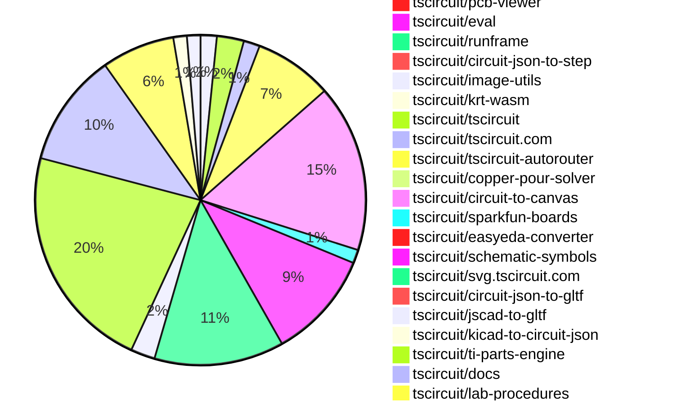

# Contribution Overview 2026-06-16

The current week is shown below. There are 3 major sections:

- [Contributor Overview](#contributor-overview)
- [PRs by Repository](#prs-by-repository)
- [PRs by Contributor](#changes-by-contributor)
- [Scoring & Sponsorship Details](/docs/sponsorship-calculation-explanation.md)

## PRs by Repository

## Contributor Overview

| Contributor | 🐳 Major | 🐙 Minor | 🐌 Tiny | Score | ⭐ | Discussion Contributions |
|-------------|---------|---------|---------|-------|-----|--------------------------|
| [ShiboSoftwareDev](#ShiboSoftwareDev) | 1 | 17 | 14 | 48.5 | ⭐⭐ | 0🔹 0🔶 0💎 |
| [rushabhcodes](#rushabhcodes) | 4 | 4 | 13 | 41 | ⭐⭐ | 0🔹 0🔶 0💎 |
| [AnasSarkiz](#AnasSarkiz) | 2 | 7 | 3 | 38 | ⭐⭐ | 0🔹 0🔶 0💎 |
| [imrishabh18](#imrishabh18) | 2 | 4 | 11 | 28 | ⭐⭐ | 0🔹 0🔶 0💎 |
| [0hmX](#0hmX) | 4 | 2 | 7 | 28 | ⭐⭐ | 0🔹 0🔶 0💎 |
| [techmannih](#techmannih) | 1 | 4 | 7 | 24 | ⭐⭐ | 0🔹 0🔶 0💎 |
| [Abse2001](#Abse2001) | 3 | 1 | 2 | 20 | ⭐⭐ | 0🔹 0🔶 0💎 |
| [MustafaMulla29](#MustafaMulla29) | 1 | 5 | 4 | 19 | ⭐⭐ | 0🔹 0🔶 0💎 |
| [tscircuitbot](#tscircuitbot) | 0 | 0 | 283 | 18 | ⭐⭐ | 0🔹 0🔶 0💎 |
| [anil08607](#anil08607) | 0 | 5 | 2 | 12 | ⭐⭐ | 0🔹 0🔶 0💎 |
| [Sang-it](#Sang-it) | 1 | 2 | 2 | 10 | ⭐ | 0🔹 0🔶 0💎 |
| [mohan-bee](#mohan-bee) | 0 | 1 | 1 | 7 | ⭐ | 0🔹 0🔶 0💎 |
| [r-bt](#r-bt) | 1 | 0 | 0 | 4 | ⭐ | 0🔹 0🔶 0💎 |
| [gwhthompson](#gwhthompson) | 0 | 1 | 0 | 2 |  | 0🔹 0🔶 0💎 |

## Staff Pass Ratio (SPR)

| Contributor | Reviewed PRs | Rejections | Approvals | SPR |
|-------------|--------------|------------|-----------|-----|
| [ShiboSoftwareDev](#ShiboSoftwareDev) | 6 | 2 | 6 | 66.7% |
| [AnasSarkiz](#AnasSarkiz) | 6 | 0 | 6 | 100.0% |
| [MustafaMulla29](#MustafaMulla29) | 4 | 1 | 3 | 75.0% |
| [0hmX](#0hmX) | 4 | 0 | 4 | 100.0% |
| [rushabhcodes](#rushabhcodes) | 2 | 0 | 2 | 100.0% |
| [anil08607](#anil08607) | 2 | 0 | 2 | 100.0% |
| [Sang-it](#Sang-it) | 2 | 1 | 1 | 50.0% |
| [techmannih](#techmannih) | 1 | 0 | 1 | 100.0% |
| [imrishabh18](#imrishabh18) | 1 | 0 | 1 | 100.0% |
| [Abse2001](#Abse2001) | 1 | 0 | 1 | 100.0% |
| [mohan-bee](#mohan-bee) | 1 | 0 | 1 | 100.0% |
| [gwhthompson](#gwhthompson) | 1 | 0 | 1 | 100.0% |

ShiboSoftwareDev SPR PRs (6)

- [#229](https://github.com/tscircuit/schematic-viewer/pull/229) fix AnalogSimulationViewer aspect ratio
- [#614](https://github.com/tscircuit/circuit-json/pull/614)  Rename simulation probe display fields for scope-style scaling
- [#699](https://github.com/tscircuit/props/pull/699) add name to analog simulation component props
- [#2459](https://github.com/tscircuit/core/pull/2459)  Wire simulation timing, SPICE options, pulse controls, and probe display options
- [#580](https://github.com/tscircuit/circuit-to-svg/pull/580) Add scope-style channel legend for simulation display options
- [#20](https://github.com/tscircuit/ngspice-spice-engine/pull/20)  Handle PSPICE resistor TC and VALUE caret compatibility

AnasSarkiz SPR PRs (6)

- [#612](https://github.com/tscircuit/circuit-json/pull/612) Introduce Ammeter Source Component
- [#610](https://github.com/tscircuit/circuit-json/pull/610) Introduce End-to-End Current Probe Support and Simulation Models
- [#695](https://github.com/tscircuit/props/pull/695) Introduce Ammeter Component Props with Validated Current Measurement Connections
- [#161](https://github.com/tscircuit/checks/pull/161) Adds comprehensive support for Rotated-Pill Pad Geometry across DRC, Connectivity, and Trace Validation
- [#39](https://github.com/tscircuit/circuit-json-to-spice/pull/39) Introduce SPICE Current Probe Instrumentation with Automatic Sense Sources and Transient Waveform Capture
- [#50](https://github.com/tscircuit/copper-pour-solver/pull/50) Introduce Native Pill-Pad Geometry Support for Copper Pour Obstacle Generation and Clearance Processing

MustafaMulla29 SPR PRs (4)

- [#98](https://github.com/tscircuit/calculate-packing/pull/98) Fix PackSolver2 initial rotation handling
- [#140](https://github.com/tscircuit/matchpack/pull/140) Align power/ground two-pin schematic groups by row
- [#138](https://github.com/tscircuit/matchpack/pull/138)  Constrain two-pin power/ground schematic rotations
- [#558](https://github.com/tscircuit/schematic-trace-solver/pull/558) Fix balanceZShapes turning orthogonal traces diagonal (float-equality shape detection)

0hmX SPR PRs (4)

- [#1425](https://github.com/tscircuit/tscircuit-autorouter/pull/1425) Track best-known via count per benchmark circuit
- [#1405](https://github.com/tscircuit/tscircuit-autorouter/pull/1405) 300s base + 60s x effort
- [#1408](https://github.com/tscircuit/tscircuit-autorouter/pull/1408) preprocessSimpleRouteJsonSolver: snap point to connect to nearest pad for rotated rect cases where the point is outside and enables STATIC_REACHABILITY_PRECHECK in DuplicateCongestedPortSolver
- [#1400](https://github.com/tscircuit/tscircuit-autorouter/pull/1400) Fix BGA detection and BGA topology generation for unevenly sized obstacle pads and super small grids.

rushabhcodes SPR PRs (2)

- [#100](https://github.com/tscircuit/circuit-json-util/pull/100) Fix pcb_keepout layer filtering to honor multi-layer keepout render layers
- [#3730](https://github.com/tscircuit/tscircuit.com/pull/3730) Render true 3D board image for "3D" PNG exports instead of a flat SVG approximation

anil08607 SPR PRs (2)

- [#700](https://github.com/tscircuit/props/pull/700) Allow pcbRotation on courtyard rect props
- [#25](https://github.com/tscircuit/kicad-mod-cache/pull/25) Replace legacy kicad-component-converter footprint path with KicadFootprintToCircuitJsonConverter

Sang-it SPR PRs (2)

- [#2467](https://github.com/tscircuit/core/pull/2467) Add text-aware bounding box to resistor
- [#2456](https://github.com/tscircuit/core/pull/2456) include resistor text labels in schematic bounding box passed to layout/trace solvers

techmannih SPR PRs (1)

- [#167](https://github.com/tscircuit/circuit-json-to-gltf/pull/167) Fix inferred board-surface origin for CAD meshes

imrishabh18 SPR PRs (1)

- [#2463](https://github.com/tscircuit/core/pull/2463) Add support for `<silkscreengraphics />`

Abse2001 SPR PRs (1)

- [#1](https://github.com/tscircuit/system-diagram-proposal/pull/1) Add additional reference image fixtures and a PIC32CM MC00 system diagram

mohan-bee SPR PRs (1)

- [#3363](https://github.com/tscircuit/cli/pull/3363) feat: add layer specific snapshot for top and bottom

gwhthompson SPR PRs (1)

- [#2416](https://github.com/tscircuit/core/pull/2416) fix(core): populate pcb_via.layers with all spanned layers

> Note: AI evaluates PRs and assigns 1-3 star ratings automatically. 4 and 5 star ratings require manual staff review.

### Discussion Contribution Legend

- 🔹 Normal Comments: Basic participation with minimal effort
- 🔶 Great Informative Comments: Thoughtful participation that adds value
- 💎 Incredible Comments: Exceptional participation with high-quality content

## Review Table

[reviews-received-hover]: ## "Number of reviews received for PRs for this contributor"
[approvals-received-hover]: ## "Number of approvals received for PRs this contributor authored"
[rejections-received-hover]: ## "Number of rejections received for PRs this contributor authored"
[prs-opened-hover]: ## "Number of PRs opened by this contributor"
[issues-created-hover]: ## "Number of issues created by this contributor"

| Contributor | Reviews Received | Approvals Received | Rejections Received | Approvals | Rejections Given | PRs Opened | PRs Merged | Issues Created |
|---|---|---|---|---|---|---|---|---|
| [GautamKumarOffical](#GautamKumarOffical) | 0 | 0 | 0 | 0 | 0 | 1 | 0 | 0 |
| [ShiboSoftwareDev](#ShiboSoftwareDev) | 28 | 25 | 0 | 8 | 0 | 35 | 33 | 0 |
| [seveibar](#seveibar) | 0 | 0 | 0 | 36 | 2 | 1 | 0 | 0 |
| [singhaditya21](#singhaditya21) | 0 | 0 | 0 | 0 | 0 | 6 | 0 | 0 |
| [rushabhcodes](#rushabhcodes) | 54 | 26 | 3 | 7 | 0 | 36 | 21 | 0 |
| [tscircuitbot](#tscircuitbot) | 0 | 0 | 0 | 0 | 0 | 385 | 283 | 0 |
| [codeboost-tr](#codeboost-tr) | 0 | 0 | 0 | 0 | 0 | 3 | 0 | 0 |
| [Woody-os](#Woody-os) | 0 | 0 | 0 | 0 | 0 | 1 | 0 | 0 |
| [AnasSarkiz](#AnasSarkiz) | 14 | 14 | 0 | 13 | 0 | 13 | 12 | 0 |
| [XananasX7](#XananasX7) | 0 | 0 | 0 | 0 | 0 | 3 | 0 | 0 |
| [qlufiq-collab](#qlufiq-collab) | 0 | 0 | 0 | 0 | 0 | 1 | 0 | 0 |
| [vahapogut](#vahapogut) | 1 | 0 | 1 | 0 | 0 | 32 | 0 | 0 |
| [defgtyg](#defgtyg) | 0 | 0 | 0 | 0 | 0 | 2 | 0 | 0 |
| [techmannih](#techmannih) | 19 | 13 | 2 | 5 | 0 | 18 | 13 | 0 |
| [imrishabh18](#imrishabh18) | 3 | 3 | 0 | 30 | 6 | 18 | 17 | 0 |
| [Abse2001](#Abse2001) | 6 | 6 | 0 | 4 | 0 | 6 | 6 | 0 |
| [anil08607](#anil08607) | 12 | 11 | 0 | 0 | 0 | 8 | 7 | 0 |
| [MustafaMulla29](#MustafaMulla29) | 13 | 7 | 1 | 13 | 0 | 12 | 10 | 0 |
| [Msa360](#Msa360) | 0 | 0 | 0 | 0 | 0 | 1 | 0 | 0 |
| [Sang-it](#Sang-it) | 15 | 3 | 1 | 0 | 0 | 12 | 6 | 0 |
| [mohan-bee](#mohan-bee) | 7 | 5 | 0 | 5 | 0 | 9 | 2 | 0 |
| [gwhthompson](#gwhthompson) | 2 | 1 | 0 | 0 | 0 | 1 | 1 | 0 |
| [jhzAliyy](#jhzAliyy) | 0 | 0 | 0 | 0 | 0 | 1 | 0 | 0 |
| [whitewofe](#whitewofe) | 0 | 0 | 0 | 0 | 0 | 2 | 0 | 0 |
| [caaeco](#caaeco) | 0 | 0 | 0 | 0 | 0 | 3 | 0 | 0 |
| [snkk2x-collab](#snkk2x-collab) | 0 | 0 | 0 | 0 | 0 | 2 | 0 | 0 |
| [xgcing](#xgcing) | 0 | 0 | 0 | 0 | 0 | 1 | 0 | 0 |
| [ericdwhite](#ericdwhite) | 0 | 0 | 0 | 0 | 0 | 1 | 0 | 0 |
| [jamilahmadzai](#jamilahmadzai) | 0 | 0 | 0 | 0 | 0 | 1 | 0 | 0 |
| [Desalzes](#Desalzes) | 0 | 0 | 0 | 0 | 0 | 1 | 0 | 0 |
| [ldbld](#ldbld) | 0 | 0 | 0 | 0 | 0 | 1 | 0 | 0 |
| [addibble](#addibble) | 0 | 0 | 0 | 0 | 0 | 3 | 0 | 0 |
| [r-bt](#r-bt) | 3 | 3 | 0 | 0 | 0 | 1 | 1 | 0 |
| [b3417](#b3417) | 0 | 0 | 0 | 0 | 0 | 5 | 0 | 0 |
| [0hmX](#0hmX) | 11 | 5 | 0 | 1 | 0 | 17 | 13 | 0 |
| [Ami765](#Ami765) | 0 | 0 | 0 | 0 | 0 | 1 | 0 | 0 |
| [Monster5860](#Monster5860) | 0 | 0 | 0 | 0 | 0 | 1 | 0 | 0 |
| [iwanha](#iwanha) | 0 | 0 | 0 | 0 | 0 | 1 | 0 | 0 |

## Changes by Repository

### [tscircuit/circuit-to-svg](https://github.com/tscircuit/circuit-to-svg)

| PR # | Impact | Rating | Contributor | Description |
|------|--------|--------|-------------|-------------|
| [#580](https://github.com/tscircuit/circuit-to-svg/pull/580) | 🐳 Major | ⭐⭐⭐ | ShiboSoftwareDev | This pull request introduces a new scope-style channel legend for simulation display options in the circuit-to-svg project. The changes include modifications to the SVG generation logic to accommodate the new legend, enhancing the visualization of simulation data. The implementation involves creating new functions for generating the scope legend and integrating it into the existing SVG output structure. This enhancement aims to improve the user experience by providing clearer and more organized visual representations of simulation results. |
| [#581](https://github.com/tscircuit/circuit-to-svg/pull/581) | 🐙 Minor | ⭐⭐ | ShiboSoftwareDev | Fixes the aspect ratio of the graph in the schematic simulation SVG rendering. |
| [#575](https://github.com/tscircuit/circuit-to-svg/pull/575) | 🐙 Minor | ⭐⭐ | ShiboSoftwareDev | Adds support for rendering simulation probe display options in SVG graphs, allowing for customizable voltage display based on probe settings. |
| [#576](https://github.com/tscircuit/circuit-to-svg/pull/576) | 🐙 Minor | ⭐⭐ | ShiboSoftwareDev | Fixes the x-axis of the simulation graph to accurately reflect the exact transient time domain based on the start and end times of the simulation experiment. |
| [#579](https://github.com/tscircuit/circuit-to-svg/pull/579) | 🐙 Minor | ⭐⭐ | techmannih | Exports the colorMap object from the package entrypoint to allow easier access to color definitions for schematic rendering. |
| [#578](https://github.com/tscircuit/circuit-to-svg/pull/578) | 🐙 Minor | ⭐⭐ | AnasSarkiz | Expands the simulation visualization pipeline to treat current and voltage waveforms as first-class graph types, enabling combined rendering, selection, and analysis within a single simulation view. |

### [tscircuit/schematic-viewer](https://github.com/tscircuit/schematic-viewer)

| PR # | Impact | Rating | Contributor | Description |
|------|--------|--------|-------------|-------------|
| [#229](https://github.com/tscircuit/schematic-viewer/pull/229) | 🐙 Minor | ⭐⭐ | ShiboSoftwareDev | Fixes the aspect ratio rendering issue in the AnalogSimulationViewer component, ensuring that the output maintains the correct proportions based on the provided width and height. |

### [tscircuit/circuit-json](https://github.com/tscircuit/circuit-json)

| PR # | Impact | Rating | Contributor | Description |
|------|--------|--------|-------------|-------------|
| [#614](https://github.com/tscircuit/circuit-json/pull/614) | 🐙 Minor | ⭐⭐ | ShiboSoftwareDev | Renames simulation probe display fields to align with oscilloscope-style scaling conventions, enhancing clarity in simulation measurements. |
| [#608](https://github.com/tscircuit/circuit-json/pull/608) | 🐙 Minor | ⭐⭐ | ShiboSoftwareDev | Adds display options for voltage probes in circuit-json, allowing customization of label, center, offset, and units per division. |
| [#605](https://github.com/tscircuit/circuit-json/pull/605) | 🐙 Minor | ⭐⭐ | ShiboSoftwareDev | Adds SPICE options and pulse timing fields to circuit-json simulations, and fixes unit parsing for various electrical units. |
| [#612](https://github.com/tscircuit/circuit-json/pull/612) | 🐙 Minor | ⭐⭐ | AnasSarkiz | Adds a dedicated simple_ammeter source component to the circuit model, establishing a first-class representation for ammeter devices within source-level circuit definitions. |
| [#610](https://github.com/tscircuit/circuit-json/pull/610) | 🐙 Minor | ⭐⭐ | AnasSarkiz | Adds simulation-level current measurement schemas, following the existing transient voltage graph pattern where applicable. |

🐌 Tiny Contributions (5)

| PR # | Impact | Contributor | Description |
|------|--------|-------------|-------------|
| [#616](https://github.com/tscircuit/circuit-json/pull/616) | 🐌 Tiny | tscircuitbot | Automated package update |
| [#613](https://github.com/tscircuit/circuit-json/pull/613) | 🐌 Tiny | tscircuitbot | Automated package update |
| [#611](https://github.com/tscircuit/circuit-json/pull/611) | 🐌 Tiny | tscircuitbot | Automated package update |
| [#609](https://github.com/tscircuit/circuit-json/pull/609) | 🐌 Tiny | tscircuitbot | Automated package update |
| [#607](https://github.com/tscircuit/circuit-json/pull/607) | 🐌 Tiny | tscircuitbot | Automated package update |

### [tscircuit/props](https://github.com/tscircuit/props)

| PR # | Impact | Rating | Contributor | Description |
|------|--------|--------|-------------|-------------|
| [#699](https://github.com/tscircuit/props/pull/699) | 🐙 Minor | ⭐⭐ | ShiboSoftwareDev | Adds an optional name property to the AnalogSimulationProps interface for better identification of analog simulation components. |
| [#693](https://github.com/tscircuit/props/pull/693) | 🐙 Minor | ⭐⭐ | ShiboSoftwareDev | Adds display properties for voltage probes to enhance simulation graph representation. |
| [#695](https://github.com/tscircuit/props/pull/695) | 🐙 Minor | ⭐⭐ | AnasSarkiz | Adds first-class ammeter  prop support for current measurement components, including validated connection pairs and display configuration. |
| [#700](https://github.com/tscircuit/props/pull/700) | 🐙 Minor | ⭐⭐ | anil08607 | Adds pcbRotation property to courtyard rectangle properties for enhanced layout flexibility. |

🐌 Tiny Contributions (2)

| PR # | Impact | Contributor | Description |
|------|--------|-------------|-------------|
| [#694](https://github.com/tscircuit/props/pull/694) | 🐌 Tiny | ShiboSoftwareDev | Removes the color property from the voltage probe display options, affecting how voltage probes are visually represented in the application. |
| [#696](https://github.com/tscircuit/props/pull/696) | 🐌 Tiny | rushabhcodes | Make padDiameter required for fiducial at both the TypeScript and runtime schema levels |

### [tscircuit/core](https://github.com/tscircuit/core)

| PR # | Impact | Rating | Contributor | Description |
|------|--------|--------|-------------|-------------|
| [#2494](https://github.com/tscircuit/core/pull/2494) | 🐳 Major | ⭐⭐⭐ | imrishabh18 | Fixes overlapping same-net crossing segments in schematic rendering to prevent visual artifacts and improve clarity. |
| [#2459](https://github.com/tscircuit/core/pull/2459) | 🐙 Minor | ⭐⭐ | ShiboSoftwareDev | Adds new simulation properties for analog simulation including start time, SPICE options, pulse timing controls for voltage sources, and display options for voltage probes, along with related package version updates and new tests. |
| [#2461](https://github.com/tscircuit/core/pull/2461) | 🐙 Minor | ⭐⭐ | ShiboSoftwareDev | Fixes inflation issues for imported KiCad LEDs and fiducials, and resolves trace inflation problems when multiple physical geometries exist for a single logical source trace. |
| [#2484](https://github.com/tscircuit/core/pull/2484) | 🐙 Minor | ⭐⭐ | rushabhcodes | Refactors the 3D snapshot matcher to use poppygls current GLB rendering function, replacing the older helper and simplifying the snapshot pipeline. |
| [#2469](https://github.com/tscircuit/core/pull/2469) | 🐙 Minor | ⭐⭐ | techmannih | Adds support for pcbStyle.silkscreenTextVisibility to control the visibility of footprint-generated silkscreen text in PCB designs. |
| [#2478](https://github.com/tscircuit/core/pull/2478) | 🐙 Minor | ⭐⭐ | imrishabh18 | Adds support for manually tracing paths from chip ports without requiring a connection to another port. |
| [#2463](https://github.com/tscircuit/core/pull/2463) | 🐙 Minor | ⭐⭐ | imrishabh18 | Adds a new component silkscreengraphics  for rendering silkscreen graphics in PCB designs, supporting SVG and PNG images. |
| [#2470](https://github.com/tscircuit/core/pull/2470) | 🐙 Minor | ⭐⭐ | AnasSarkiz | Completes the ammeter feature by connecting schematic ammeters to the simulation engine and waveform visualization pipeline, enabling current measurements to flow from circuit definition through rendered simulation results. |
| [#2491](https://github.com/tscircuit/core/pull/2491) | 🐙 Minor | ⭐⭐ | anil08607 | Fixes the issue where the rotation of imported pcb_courtyard_rect was not preserved during circuit-json import. |
| [#2489](https://github.com/tscircuit/core/pull/2489) | 🐙 Minor | ⭐⭐ | anil08607 | Adds a test to reproduce the issue with the rotation of imported pcb_courtyard_rect components in the circuit rendering process. |
| [#2451](https://github.com/tscircuit/core/pull/2451) | 🐙 Minor | ⭐⭐ | anil08607 | Fixes rendering of imported rotated rectangular SMT pads in PCB db from circuit JSON, ensuring correct geometry and metadata are preserved. |
| [#2476](https://github.com/tscircuit/core/pull/2476) | 🐙 Minor | ⭐⭐ | MustafaMulla29 | Fixes the issue where fallback net labels do not include ports from connectors that are loaded asynchronously, ensuring all relevant ports are represented in the labels. |
| [#2467](https://github.com/tscircuit/core/pull/2467) | 🐙 Minor | ⭐⭐ | Sang-it | Adds a text-aware bounding box to resistors, ensuring traces connect correctly to pins even when text extends beyond the components original bounds. |
| [#2416](https://github.com/tscircuit/core/pull/2416) | 🐙 Minor | ⭐⭐ | gwhthompson | Fixes incorrect layer reporting for vias on multi-layer boards by populating pcb_via.layers with all layers spanned between fromLayer and toLayer, ensuring accurate copper pour interactions and DRC checks. |

🐌 Tiny Contributions (15)

| PR # | Impact | Contributor | Description |
|------|--------|-------------|-------------|
| [#2485](https://github.com/tscircuit/core/pull/2485) | 🐌 Tiny | ShiboSoftwareDev | Updates the version of the tscircuitimage-utils package from 0.0.7 to 0.0.8 in package.json |
| [#2488](https://github.com/tscircuit/core/pull/2488) | 🐌 Tiny | ShiboSoftwareDev | Removes the eecircuit-engine dependency from the project, streamlining the dependency list. |
| [#2465](https://github.com/tscircuit/core/pull/2465) | 🐌 Tiny | ShiboSoftwareDev | Updates the ngspice-spice-engine dependency to version 0.0.16 in package.json |
| [#2464](https://github.com/tscircuit/core/pull/2464) | 🐌 Tiny | ShiboSoftwareDev | Adds tscircuiteecircuit-engine as a development dependency in package.json |
| [#2483](https://github.com/tscircuit/core/pull/2483) | 🐌 Tiny | rushabhcodes | Updates the dependency circuit-json-to-gltf to version 0.0.104 in the package.json file. |
| [#2472](https://github.com/tscircuit/core/pull/2472) | 🐌 Tiny | rushabhcodes | Upgrades the poppygl dependency to version 0.0.24 and refreshes 3D snapshots for various components in the test suite. |
| [#2490](https://github.com/tscircuit/core/pull/2490) | 🐌 Tiny | techmannih | Updates the circuit-to-svg dependency to version 0.0.358 in package.json |
| [#2487](https://github.com/tscircuit/core/pull/2487) | 🐌 Tiny | techmannih | Updates the version of the circuit-json-to-gltf dependency from 0.0.104 to 0.0.105 in package.json |
| [#2495](https://github.com/tscircuit/core/pull/2495) | 🐌 Tiny | imrishabh18 | Renames the repro131 snapshot in the repository. |
| [#2493](https://github.com/tscircuit/core/pull/2493) | 🐌 Tiny | imrishabh18 | Adds a comprehensive test for overlapping same-net crossing segments in circuit schematics |
| [#2471](https://github.com/tscircuit/core/pull/2471) | 🐌 Tiny | imrishabh18 | Updates the version of the tscircuitimage-utils dependency from 0.0.6 to 0.0.7 in package.json |
| [#2492](https://github.com/tscircuit/core/pull/2492) | 🐌 Tiny | MustafaMulla29 | Updates the version of the tscircuitschematic-trace-solver dependency from 0.0.71 to 0.0.72 in package.json |
| [#2475](https://github.com/tscircuit/core/pull/2475) | 🐌 Tiny | MustafaMulla29 | Updates the version of the tscircuitschematic-trace-solver dependency from 0.0.70 to 0.0.71 in package.json |
| [#2466](https://github.com/tscircuit/core/pull/2466) | 🐌 Tiny | MustafaMulla29 | Fixes schematic auto-layout rotation for two-pin powerground components to ensure correct orientation before layout. |
| [#2481](https://github.com/tscircuit/core/pull/2481) | 🐌 Tiny | Sang-it | Adds a text-aware bounding box feature to the capacitor component in the schematic, allowing for better text alignment and rendering. |

### [tscircuit/circuit-json-to-spice](https://github.com/tscircuit/circuit-json-to-spice)

| PR # | Impact | Rating | Contributor | Description |
|------|--------|--------|-------------|-------------|
| [#38](https://github.com/tscircuit/circuit-json-to-spice/pull/38) | 🐙 Minor | ⭐⭐ | ShiboSoftwareDev | Adds support for simulation_experiment.spice_options, emits voltage-source PULSE delayrisefall widthperiod controls, and formats transient timing values with SPICE suffixes. Also emits tscircuit_probe metadata comments that map voltage probes to SPICE vectors so downstream simulation graph rendering can recover probe identity. |
| [#39](https://github.com/tscircuit/circuit-json-to-spice/pull/39) | 🐙 Minor | ⭐⭐ | AnasSarkiz | Adds end-to-end SPICE netlist support for simulation current probes by automatically instrumenting circuits with zero-volt sense sources and exporting current waveforms during transient analysis. |

### [tscircuit/cli](https://github.com/tscircuit/cli)

| PR # | Impact | Rating | Contributor | Description |
|------|--------|--------|-------------|-------------|
| [#3403](https://github.com/tscircuit/cli/pull/3403) | 🐳 Major | ⭐⭐⭐ | rushabhcodes | Replaces the CLIs hand-rolled 3D PNG rendering path with circuit-json-to-3d-png, centralizing the rendering pipeline for snapshot and build preview image generation. |
| [#3364](https://github.com/tscircuit/cli/pull/3364) | 🐳 Major | ⭐⭐⭐ | rushabhcodes | Refactors the .kicad_mod conversion process to utilize the kicad-to-circuit-json library, replacing the deprecated kicad-component-converter, and updates the conversion tests accordingly. |
| [#3378](https://github.com/tscircuit/cli/pull/3378) | 🐳 Major | ⭐⭐⭐ | r-bt | Allows users to add multiple tscircuit component packages in a single command, resolving a bug where only the first package was normalized. |
| [#3362](https://github.com/tscircuit/cli/pull/3362) | 🐙 Minor | ⭐⭐ | ShiboSoftwareDev | Adds build flags for simulation.svg and schematic-simulation.svg, plus snapshot support for -simulation.snap.svg and -schematic-simulation.snap.svg. Simulation SVGs are generated only when circuit JSON already contains analog simulation graph results, so normal circuits do not run or emit simulation outputs. Updates simulation-related dependencies, switches snapshot diffing to direct looks-same, and adds TSX boost converter coverage for build and snapshot generation. |
| [#3392](https://github.com/tscircuit/cli/pull/3392) | 🐙 Minor | ⭐⭐ | ShiboSoftwareDev | Adds a --simulation-only option to the snapshot command, allowing users to generate only simulation snapshots and prevents combining this option with other snapshot types. |
| [#3310](https://github.com/tscircuit/cli/pull/3310) | 🐙 Minor | ⭐⭐ | rushabhcodes | Migrates from the deprecated renderGLTFToPNGBufferFromGLBBuffer to renderGLTFToPNGFromGLB, updating snapshot types to Uint8Array to avoid unnecessary Buffer conversions. |
| [#3363](https://github.com/tscircuit/cli/pull/3363) | 🐙 Minor | ⭐⭐ | mohan-bee | Adds functionality to take individual snapshots of PCB layers (top and bottom) for clearer visual testing without altering existing snapshot behavior. |

🐌 Tiny Contributions (55)

| PR # | Impact | Contributor | Description |
|------|--------|-------------|-------------|
| [#3344](https://github.com/tscircuit/cli/pull/3344) | 🐌 Tiny | ShiboSoftwareDev | Updates dependencies in package.json to newer versions for improved compatibility and performance. |
| [#3410](https://github.com/tscircuit/cli/pull/3410) | 🐌 Tiny | tscircuitbot | Automated package update |
| [#3409](https://github.com/tscircuit/cli/pull/3409) | 🐌 Tiny | tscircuitbot | Updates the tscircuitrunframe package from version 0.0.2106 to 0.0.2107 |
| [#3407](https://github.com/tscircuit/cli/pull/3407) | 🐌 Tiny | tscircuitbot | Automated package update |
| [#3406](https://github.com/tscircuit/cli/pull/3406) | 🐌 Tiny | tscircuitbot | Updates the tscircuitrunframe package from version 0.0.2105 to 0.0.2106 |
| [#3405](https://github.com/tscircuit/cli/pull/3405) | 🐌 Tiny | tscircuitbot | Automated package update |
| [#3404](https://github.com/tscircuit/cli/pull/3404) | 🐌 Tiny | tscircuitbot | Automated package update |
| [#3402](https://github.com/tscircuit/cli/pull/3402) | 🐌 Tiny | tscircuitbot | Automated package update |
| [#3401](https://github.com/tscircuit/cli/pull/3401) | 🐌 Tiny | tscircuitbot | Updates the tscircuitrunframe package to version 0.0.2105 in the package.json file. |
| [#3399](https://github.com/tscircuit/cli/pull/3399) | 🐌 Tiny | tscircuitbot | Updates the tscircuitrunframe package from version 0.0.2103 to 0.0.2104 |
| [#3387](https://github.com/tscircuit/cli/pull/3387) | 🐌 Tiny | tscircuitbot | Automated package update |
| [#3397](https://github.com/tscircuit/cli/pull/3397) | 🐌 Tiny | tscircuitbot | Updates the tscircuitrunframe package from version 0.0.2101 to 0.0.2103 in the package.json file. |
| [#3386](https://github.com/tscircuit/cli/pull/3386) | 🐌 Tiny | tscircuitbot | Updates the tscircuitrunframe package version from 0.0.2100 to 0.0.2101 in package.json |
| [#3380](https://github.com/tscircuit/cli/pull/3380) | 🐌 Tiny | tscircuitbot | Updates the tscircuitrunframe package from version 0.0.2097 to 0.0.2098 |
| [#3379](https://github.com/tscircuit/cli/pull/3379) | 🐌 Tiny | tscircuitbot | Automated package update |
| [#3376](https://github.com/tscircuit/cli/pull/3376) | 🐌 Tiny | tscircuitbot | Updates the tscircuitrunframe package version from 0.0.2096 to 0.0.2097 in package.json |
| [#3390](https://github.com/tscircuit/cli/pull/3390) | 🐌 Tiny | tscircuitbot | Automated README update with latest CLI usage output. |
| [#3389](https://github.com/tscircuit/cli/pull/3389) | 🐌 Tiny | tscircuitbot | Automated package update |
| [#3384](https://github.com/tscircuit/cli/pull/3384) | 🐌 Tiny | tscircuitbot | Automated package update |
| [#3396](https://github.com/tscircuit/cli/pull/3396) | 🐌 Tiny | tscircuitbot | Automated package update |
| [#3398](https://github.com/tscircuit/cli/pull/3398) | 🐌 Tiny | tscircuitbot | Automated package update |
| [#3377](https://github.com/tscircuit/cli/pull/3377) | 🐌 Tiny | tscircuitbot | Automated package update |
| [#3400](https://github.com/tscircuit/cli/pull/3400) | 🐌 Tiny | tscircuitbot | Automated package update |
| [#3395](https://github.com/tscircuit/cli/pull/3395) | 🐌 Tiny | tscircuitbot | Automated package update |
| [#3391](https://github.com/tscircuit/cli/pull/3391) | 🐌 Tiny | tscircuitbot | Automated package update |
| [#3383](https://github.com/tscircuit/cli/pull/3383) | 🐌 Tiny | tscircuitbot | Updates the tscircuitrunframe package version from 0.0.2099 to 0.0.2100 in package.json |
| [#3382](https://github.com/tscircuit/cli/pull/3382) | 🐌 Tiny | tscircuitbot | Updates the tscircuitrunframe package from version 0.0.2098 to 0.0.2099 |
| [#3381](https://github.com/tscircuit/cli/pull/3381) | 🐌 Tiny | tscircuitbot | Automated package update |
| [#3373](https://github.com/tscircuit/cli/pull/3373) | 🐌 Tiny | tscircuitbot | Automated package update |
| [#3372](https://github.com/tscircuit/cli/pull/3372) | 🐌 Tiny | tscircuitbot | Updates the tscircuitrunframe package from version 0.0.2094 to 0.0.2095 |
| [#3374](https://github.com/tscircuit/cli/pull/3374) | 🐌 Tiny | tscircuitbot | Updates the tscircuitrunframe package version from 0.0.2095 to 0.0.2096 in package.json |
| [#3370](https://github.com/tscircuit/cli/pull/3370) | 🐌 Tiny | tscircuitbot | Updates the tscircuitrunframe package version from 0.0.2093 to 0.0.2094 in package.json |
| [#3371](https://github.com/tscircuit/cli/pull/3371) | 🐌 Tiny | tscircuitbot | Automated package update |
| [#3368](https://github.com/tscircuit/cli/pull/3368) | 🐌 Tiny | tscircuitbot | Updates the tscircuitrunframe package from version 0.0.2092 to 0.0.2093 |
| [#3358](https://github.com/tscircuit/cli/pull/3358) | 🐌 Tiny | tscircuitbot | Automated package update |
| [#3360](https://github.com/tscircuit/cli/pull/3360) | 🐌 Tiny | tscircuitbot | Updates the tscircuitrunframe package from version 0.0.2091 to 0.0.2092 in the package.json file. |
| [#3369](https://github.com/tscircuit/cli/pull/3369) | 🐌 Tiny | tscircuitbot | Automated package update |
| [#3365](https://github.com/tscircuit/cli/pull/3365) | 🐌 Tiny | tscircuitbot | Automated README update with latest CLI usage output. |
| [#3356](https://github.com/tscircuit/cli/pull/3356) | 🐌 Tiny | tscircuitbot | Automated package update |
| [#3375](https://github.com/tscircuit/cli/pull/3375) | 🐌 Tiny | tscircuitbot | Automated package update |
| [#3357](https://github.com/tscircuit/cli/pull/3357) | 🐌 Tiny | tscircuitbot | Automated README update with latest CLI usage output. |
| [#3366](https://github.com/tscircuit/cli/pull/3366) | 🐌 Tiny | tscircuitbot | Automated package update |
| [#3342](https://github.com/tscircuit/cli/pull/3342) | 🐌 Tiny | tscircuitbot | Updates the tscircuitrunframe package from version 0.0.2084 to 0.0.2085 |
| [#3345](https://github.com/tscircuit/cli/pull/3345) | 🐌 Tiny | tscircuitbot | Automated README update with latest CLI usage output. |
| [#3351](https://github.com/tscircuit/cli/pull/3351) | 🐌 Tiny | tscircuitbot | Updates the tscircuitrunframe package from version 0.0.2086 to 0.0.2088 |
| [#3355](https://github.com/tscircuit/cli/pull/3355) | 🐌 Tiny | tscircuitbot | Updates the tscircuitrunframe package from version 0.0.2090 to 0.0.2091 |
| [#3346](https://github.com/tscircuit/cli/pull/3346) | 🐌 Tiny | tscircuitbot | Automated package update |
| [#3352](https://github.com/tscircuit/cli/pull/3352) | 🐌 Tiny | tscircuitbot | Automated package update |
| [#3353](https://github.com/tscircuit/cli/pull/3353) | 🐌 Tiny | tscircuitbot | Updates the tscircuitrunframe package version from 0.0.2088 to 0.0.2090 in package.json |
| [#3348](https://github.com/tscircuit/cli/pull/3348) | 🐌 Tiny | tscircuitbot | Updates the tscircuitrunframe package from version 0.0.2085 to 0.0.2086 |
| [#3343](https://github.com/tscircuit/cli/pull/3343) | 🐌 Tiny | tscircuitbot | Automated package update |
| [#3349](https://github.com/tscircuit/cli/pull/3349) | 🐌 Tiny | tscircuitbot | Automated package update |
| [#3339](https://github.com/tscircuit/cli/pull/3339) | 🐌 Tiny | tscircuitbot | Automated package update |
| [#3338](https://github.com/tscircuit/cli/pull/3338) | 🐌 Tiny | tscircuitbot | Updates the tscircuitrunframe package from version 0.0.2082 to 0.0.2083 |
| [#3340](https://github.com/tscircuit/cli/pull/3340) | 🐌 Tiny | tscircuitbot | Updates the tscircuitrunframe package from version 0.0.2083 to 0.0.2084 |

### [tscircuit/ngspice-spice-engine](https://github.com/tscircuit/ngspice-spice-engine)

| PR # | Impact | Rating | Contributor | Description |
|------|--------|--------|-------------|-------------|
| [#22](https://github.com/tscircuit/ngspice-spice-engine/pull/22) | 🐙 Minor | ⭐⭐ | ShiboSoftwareDev | Removes the installed tscircuiteecircuit-engine dev dependency and replaces package imports with local structural types. Adds a cached runtime loader that fetches the engine ESM bundle from jscdn and dynamically imports it before creating the simulation instance. |
| [#20](https://github.com/tscircuit/ngspice-spice-engine/pull/20) | 🐙 Minor | ⭐⭐ | ShiboSoftwareDev | Adds a narrow PSPICE compatibility normalization pass before ngspice simulation, converting resistor-line TCa,b syntax to TC1a TC2b and rewriting spaced boolean  in VALUE blocks while preserving numeric exponentiation. |
| [#18](https://github.com/tscircuit/ngspice-spice-engine/pull/18) | 🐙 Minor | ⭐⭐ | ShiboSoftwareDev | Preserves probe metadata in ngspice simulation graphs to enhance the identification and representation of voltage probes in simulation results. |
| [#21](https://github.com/tscircuit/ngspice-spice-engine/pull/21) | 🐙 Minor | ⭐⭐ | AnasSarkiz | Extends the simulation engine beyond voltage-only outputs by introducing a unified graph-processing pipeline that converts SPICE current measurements into first-class simulation graph artifacts. |

🐌 Tiny Contributions (1)

| PR # | Impact | Contributor | Description |
|------|--------|-------------|-------------|
| [#19](https://github.com/tscircuit/ngspice-spice-engine/pull/19) | 🐌 Tiny | ShiboSoftwareDev | Adds the eecircuit engine as a development dependency in the project. |

### [tscircuit/pcb-viewer](https://github.com/tscircuit/pcb-viewer)

🐌 Tiny Contributions (4)

| PR # | Impact | Contributor | Description |
|------|--------|-------------|-------------|
| [#905](https://github.com/tscircuit/pcb-viewer/pull/905) | 🐌 Tiny | ShiboSoftwareDev | Removes the circuit-to-svg dependency from the project, which may reduce bundle size and eliminate unused code. |
| [#910](https://github.com/tscircuit/pcb-viewer/pull/910) | 🐌 Tiny | tscircuitbot | Automated package update |
| [#906](https://github.com/tscircuit/pcb-viewer/pull/906) | 🐌 Tiny | tscircuitbot | Automated package update |
| [#909](https://github.com/tscircuit/pcb-viewer/pull/909) | 🐌 Tiny | rushabhcodes | Updates the circuit-to-canvas dependency to version 0.0.110 in package.json |

### [tscircuit/eval](https://github.com/tscircuit/eval)

| PR # | Impact | Rating | Contributor | Description |
|------|--------|--------|-------------|-------------|
| [#2947](https://github.com/tscircuit/eval/pull/2947) | 🐙 Minor | ⭐⭐ | rushabhcodes | Replaces the legacy kicad-component-converter footprint path with KicadFootprintToCircuitJsonConverter from kicad-to-circuit-json. |

🐌 Tiny Contributions (39)

| PR # | Impact | Contributor | Description |
|------|--------|-------------|-------------|
| [#2986](https://github.com/tscircuit/eval/pull/2986) | 🐌 Tiny | ShiboSoftwareDev | Removes the eecircuit-engine dependency from the project, potentially simplifying the dependency tree and reducing build complexity. |
| [#2974](https://github.com/tscircuit/eval/pull/2974) | 🐌 Tiny | tscircuitbot | Updates the version of tscircuitcore from 0.0.1343 to 0.0.1344 and tscircuitimage-utils from 0.0.7 to 0.0.8 in package.json |
| [#2984](https://github.com/tscircuit/eval/pull/2984) | 🐌 Tiny | tscircuitbot | Automated package update |
| [#2976](https://github.com/tscircuit/eval/pull/2976) | 🐌 Tiny | tscircuitbot | Automated package update |
| [#2972](https://github.com/tscircuit/eval/pull/2972) | 🐌 Tiny | tscircuitbot | Automated package update |
| [#2967](https://github.com/tscircuit/eval/pull/2967) | 🐌 Tiny | tscircuitbot | Updates the version of the tscircuitcore package from 0.0.1341 to 0.0.1342 in package.json |
| [#2981](https://github.com/tscircuit/eval/pull/2981) | 🐌 Tiny | tscircuitbot | Updates package versions in package.json to the latest compatible versions. |
| [#2968](https://github.com/tscircuit/eval/pull/2968) | 🐌 Tiny | tscircuitbot | Automated package update |
| [#2973](https://github.com/tscircuit/eval/pull/2973) | 🐌 Tiny | tscircuitbot | Automated package update |
| [#2978](https://github.com/tscircuit/eval/pull/2978) | 🐌 Tiny | tscircuitbot | Updates package versions in package.json to the latest compatible versions. |
| [#2987](https://github.com/tscircuit/eval/pull/2987) | 🐌 Tiny | tscircuitbot | Automated package update |
| [#2985](https://github.com/tscircuit/eval/pull/2985) | 🐌 Tiny | tscircuitbot | Automated package update |
| [#2982](https://github.com/tscircuit/eval/pull/2982) | 🐌 Tiny | tscircuitbot | Automated package update |
| [#2975](https://github.com/tscircuit/eval/pull/2975) | 🐌 Tiny | tscircuitbot | Automated package update |
| [#2979](https://github.com/tscircuit/eval/pull/2979) | 🐌 Tiny | tscircuitbot | Automated package update to version 0.0.945 |
| [#2954](https://github.com/tscircuit/eval/pull/2954) | 🐌 Tiny | tscircuitbot | Automated package update to version 0.0.936 |
| [#2966](https://github.com/tscircuit/eval/pull/2966) | 🐌 Tiny | tscircuitbot | Automated package update |
| [#2959](https://github.com/tscircuit/eval/pull/2959) | 🐌 Tiny | tscircuitbot | Updates the version of tscircuitcore from 0.0.1338 to 0.0.1339 and tscircuitschematic-trace-solver from 0.0.70 to 0.0.71 in package.json |
| [#2963](https://github.com/tscircuit/eval/pull/2963) | 🐌 Tiny | tscircuitbot | Automated package update |
| [#2957](https://github.com/tscircuit/eval/pull/2957) | 🐌 Tiny | tscircuitbot | Automated package update |
| [#2965](https://github.com/tscircuit/eval/pull/2965) | 🐌 Tiny | tscircuitbot | Updates the version of the tscircuitcore package from 0.0.1340 to 0.0.1341 in package.json |
| [#2962](https://github.com/tscircuit/eval/pull/2962) | 🐌 Tiny | tscircuitbot | Updates the version of the tscircuitcore package from 0.0.1339 to 0.0.1340 in package.json |
| [#2960](https://github.com/tscircuit/eval/pull/2960) | 🐌 Tiny | tscircuitbot | Automated package update |
| [#2956](https://github.com/tscircuit/eval/pull/2956) | 🐌 Tiny | tscircuitbot | Updates the version of the tscircuitcore package from 0.0.1337 to 0.0.1338 in package.json |
| [#2953](https://github.com/tscircuit/eval/pull/2953) | 🐌 Tiny | tscircuitbot | Updates the version of the tscircuitcore package from 0.0.1336 to 0.0.1337 in package.json |
| [#2938](https://github.com/tscircuit/eval/pull/2938) | 🐌 Tiny | tscircuitbot | Updates the version of tscircuitcore from 0.0.1331 to 0.0.1333 and adds tscircuitimage-utils as a new dependency. |
| [#2939](https://github.com/tscircuit/eval/pull/2939) | 🐌 Tiny | tscircuitbot | Automated package update |
| [#2946](https://github.com/tscircuit/eval/pull/2946) | 🐌 Tiny | tscircuitbot | Automated package update |
| [#2941](https://github.com/tscircuit/eval/pull/2941) | 🐌 Tiny | tscircuitbot | Updates the version of the tscircuitcore package from 0.0.1333 to 0.0.1334 in package.json |
| [#2949](https://github.com/tscircuit/eval/pull/2949) | 🐌 Tiny | tscircuitbot | Updates the version of tscircuitcore from 0.0.1335 to 0.0.1336 and tscircuitschematic-trace-solver from 0.0.69 to 0.0.70 in package.json |
| [#2950](https://github.com/tscircuit/eval/pull/2950) | 🐌 Tiny | tscircuitbot | Automated package update |
| [#2933](https://github.com/tscircuit/eval/pull/2933) | 🐌 Tiny | tscircuitbot | Automated package update |
| [#2951](https://github.com/tscircuit/eval/pull/2951) | 🐌 Tiny | tscircuitbot | Automated package update |
| [#2942](https://github.com/tscircuit/eval/pull/2942) | 🐌 Tiny | tscircuitbot | Automated package update |
| [#2934](https://github.com/tscircuit/eval/pull/2934) | 🐌 Tiny | tscircuitbot | Automated package update |
| [#2923](https://github.com/tscircuit/eval/pull/2923) | 🐌 Tiny | tscircuitbot | Automated package update |
| [#2970](https://github.com/tscircuit/eval/pull/2970) | 🐌 Tiny | rushabhcodes | Replaces the deprecated renderGLTFToPNGBufferFromGLBBuffer helper with renderGLTFToPNGFromGLB in the TL3342 snapshot test while preserving the existing PNG buffer normalization used by the snapshot comparison flow. |
| [#2945](https://github.com/tscircuit/eval/pull/2945) | 🐌 Tiny | rushabhcodes | Updates the versions of tscircuitcore and poppygl dependencies in the project. |
| [#2922](https://github.com/tscircuit/eval/pull/2922) | 🐌 Tiny | techmannih | Fixes the CAD model scaling issue by removing the hardcoded scale factor, allowing for the preservation of the native scale for KiCad footprint CAD models. |

### [tscircuit/runframe](https://github.com/tscircuit/runframe)

| PR # | Impact | Rating | Contributor | Description |
|------|--------|--------|-------------|-------------|
| [#3746](https://github.com/tscircuit/runframe/pull/3746) | 🐙 Minor | ⭐⭐ | imrishabh18 | Adds a new export format for Simple Route JSON in the export functionality of the application. |

🐌 Tiny Contributions (47)

| PR # | Impact | Contributor | Description |
|------|--------|-------------|-------------|
| [#3738](https://github.com/tscircuit/runframe/pull/3738) | 🐌 Tiny | ShiboSoftwareDev | Updates the circuit-to-svg package to version 0.0.357 and the tscircuit package to version 0.0.1921 in package.json |
| [#3700](https://github.com/tscircuit/runframe/pull/3700) | 🐌 Tiny | ShiboSoftwareDev | Adds circuit-to-svg0.0.356 directly to runframe so the prebuilt standalone preview bundle used by tsci dev embeds the current SVG renderer instead of resolving an older transitive copy at publish time. |
| [#3750](https://github.com/tscircuit/runframe/pull/3750) | 🐌 Tiny | tscircuitbot | Automated package update |
| [#3749](https://github.com/tscircuit/runframe/pull/3749) | 🐌 Tiny | tscircuitbot | Updates the tscircuitpcb-viewer package to version 1.11.374 |
| [#3747](https://github.com/tscircuit/runframe/pull/3747) | 🐌 Tiny | tscircuitbot | Automated package update |
| [#3745](https://github.com/tscircuit/runframe/pull/3745) | 🐌 Tiny | tscircuitbot | Automated package update |
| [#3744](https://github.com/tscircuit/runframe/pull/3744) | 🐌 Tiny | tscircuitbot | Updates the tscircuitschematic-viewer package to version 2.0.63 |
| [#3737](https://github.com/tscircuit/runframe/pull/3737) | 🐌 Tiny | tscircuitbot | Updates the tscircuitpcb-viewer package to version 1.11.373 |
| [#3739](https://github.com/tscircuit/runframe/pull/3739) | 🐌 Tiny | tscircuitbot | Automated package update |
| [#3742](https://github.com/tscircuit/runframe/pull/3742) | 🐌 Tiny | tscircuitbot | Automated package update |
| [#3741](https://github.com/tscircuit/runframe/pull/3741) | 🐌 Tiny | tscircuitbot | Automated package update |
| [#3736](https://github.com/tscircuit/runframe/pull/3736) | 🐌 Tiny | tscircuitbot | Automated package update |
| [#3731](https://github.com/tscircuit/runframe/pull/3731) | 🐌 Tiny | tscircuitbot | Updates the tscircuiteval package from version 0.0.942 to 0.0.944 in the package.json file. |
| [#3733](https://github.com/tscircuit/runframe/pull/3733) | 🐌 Tiny | tscircuitbot | Updates the tscircuiteval package from version 0.0.944 to 0.0.945 in the package.json file. |
| [#3732](https://github.com/tscircuit/runframe/pull/3732) | 🐌 Tiny | tscircuitbot | Automated package update |
| [#3730](https://github.com/tscircuit/runframe/pull/3730) | 🐌 Tiny | tscircuitbot | Automated package update |
| [#3740](https://github.com/tscircuit/runframe/pull/3740) | 🐌 Tiny | tscircuitbot | Automated package update |
| [#3728](https://github.com/tscircuit/runframe/pull/3728) | 🐌 Tiny | tscircuitbot | Automated package update |
| [#3727](https://github.com/tscircuit/runframe/pull/3727) | 🐌 Tiny | tscircuitbot | Updates the tscircuiteval package version from 0.0.940 to 0.0.941 in package.json |
| [#3734](https://github.com/tscircuit/runframe/pull/3734) | 🐌 Tiny | tscircuitbot | Automated package update |
| [#3735](https://github.com/tscircuit/runframe/pull/3735) | 🐌 Tiny | tscircuitbot | Updates the tscircuiteval package from version 0.0.945 to 0.0.946 |
| [#3729](https://github.com/tscircuit/runframe/pull/3729) | 🐌 Tiny | tscircuitbot | Updates the tscircuiteval package to version 0.0.942 in the package.json file. |
| [#3717](https://github.com/tscircuit/runframe/pull/3717) | 🐌 Tiny | tscircuitbot | Automated package update |
| [#3724](https://github.com/tscircuit/runframe/pull/3724) | 🐌 Tiny | tscircuitbot | Automated package update |
| [#3720](https://github.com/tscircuit/runframe/pull/3720) | 🐌 Tiny | tscircuitbot | Updates the tscircuiteval package to version 0.0.938 in the package.json file. |
| [#3723](https://github.com/tscircuit/runframe/pull/3723) | 🐌 Tiny | tscircuitbot | Updates the tscircuiteval package from version 0.0.938 to 0.0.939 |
| [#3725](https://github.com/tscircuit/runframe/pull/3725) | 🐌 Tiny | tscircuitbot | Updates the tscircuiteval package to version 0.0.940 in the package.json file. |
| [#3716](https://github.com/tscircuit/runframe/pull/3716) | 🐌 Tiny | tscircuitbot | Updates the tscircuiteval package to version 0.0.936 in the package.json file. |
| [#3718](https://github.com/tscircuit/runframe/pull/3718) | 🐌 Tiny | tscircuitbot | Updates the tscircuiteval package from version 0.0.936 to 0.0.937 |
| [#3726](https://github.com/tscircuit/runframe/pull/3726) | 🐌 Tiny | tscircuitbot | Automated package update |
| [#3721](https://github.com/tscircuit/runframe/pull/3721) | 🐌 Tiny | tscircuitbot | Automated package update |
| [#3719](https://github.com/tscircuit/runframe/pull/3719) | 🐌 Tiny | tscircuitbot | Automated package update |
| [#3705](https://github.com/tscircuit/runframe/pull/3705) | 🐌 Tiny | tscircuitbot | Automated package update |
| [#3708](https://github.com/tscircuit/runframe/pull/3708) | 🐌 Tiny | tscircuitbot | Updates the tscircuiteval package from version 0.0.931 to 0.0.932 |
| [#3715](https://github.com/tscircuit/runframe/pull/3715) | 🐌 Tiny | tscircuitbot | Automated package update |
| [#3704](https://github.com/tscircuit/runframe/pull/3704) | 🐌 Tiny | tscircuitbot | Updates the tscircuiteval package from version 0.0.930 to 0.0.931 in the package.json file. |
| [#3702](https://github.com/tscircuit/runframe/pull/3702) | 🐌 Tiny | tscircuitbot | Updates the tscircuiteval package from version 0.0.929 to 0.0.930 in the package.json file. |
| [#3703](https://github.com/tscircuit/runframe/pull/3703) | 🐌 Tiny | tscircuitbot | Automated package update |
| [#3709](https://github.com/tscircuit/runframe/pull/3709) | 🐌 Tiny | tscircuitbot | Automated package update |
| [#3713](https://github.com/tscircuit/runframe/pull/3713) | 🐌 Tiny | tscircuitbot | Automated package update |
| [#3710](https://github.com/tscircuit/runframe/pull/3710) | 🐌 Tiny | tscircuitbot | Automated package update |
| [#3714](https://github.com/tscircuit/runframe/pull/3714) | 🐌 Tiny | tscircuitbot | Automated package update |
| [#3712](https://github.com/tscircuit/runframe/pull/3712) | 🐌 Tiny | tscircuitbot | Updates the tscircuiteval package from version 0.0.933 to 0.0.934 in the package.json file. |
| [#3701](https://github.com/tscircuit/runframe/pull/3701) | 🐌 Tiny | tscircuitbot | Automated package update |
| [#3699](https://github.com/tscircuit/runframe/pull/3699) | 🐌 Tiny | tscircuitbot | Automated package update |
| [#3698](https://github.com/tscircuit/runframe/pull/3698) | 🐌 Tiny | tscircuitbot | Updates the tscircuiteval package from version 0.0.928 to 0.0.929 in the package.json file. |
| [#3706](https://github.com/tscircuit/runframe/pull/3706) | 🐌 Tiny | rushabhcodes | Updates the dependencies kicad-to-circuit-json from version 0.0.94 to 0.0.98 and kicadts from version 0.0.45 to 0.0.47 in package.json |

### [tscircuit/circuit-json-to-step](https://github.com/tscircuit/circuit-json-to-step)

🐌 Tiny Contributions (2)

| PR # | Impact | Contributor | Description |
|------|--------|-------------|-------------|
| [#113](https://github.com/tscircuit/circuit-json-to-step/pull/113) | 🐌 Tiny | ShiboSoftwareDev | Adds circuit-to-svg as a peer dependency in the package.json file. |
| [#114](https://github.com/tscircuit/circuit-json-to-step/pull/114) | 🐌 Tiny | tscircuitbot | Automated package update |

### [tscircuit/image-utils](https://github.com/tscircuit/image-utils)

| PR # | Impact | Rating | Contributor | Description |
|------|--------|--------|-------------|-------------|
| [#7](https://github.com/tscircuit/image-utils/pull/7) | 🐳 Major | ⭐⭐⭐ | imrishabh18 | Adds utility functions for converting SVG paths to points and generating boundary representation shapes from SVG data. |
| [#11](https://github.com/tscircuit/image-utils/pull/11) | 🐙 Minor | ⭐⭐ | imrishabh18 | Removes the usage of the fs module in the library logic to facilitate evaluation, changing the input type from Buffer to Uint8Array and modifying related functions accordingly. |

🐌 Tiny Contributions (7)

| PR # | Impact | Contributor | Description |
|------|--------|-------------|-------------|
| [#13](https://github.com/tscircuit/image-utils/pull/13) | 🐌 Tiny | ShiboSoftwareDev | Fixes the package build to correctly export the looks-same subpath, allowing downstream installs to resolve the necessary files for both JavaScript and type declarations. |
| [#14](https://github.com/tscircuit/image-utils/pull/14) | 🐌 Tiny | tscircuitbot | Automated package update |
| [#12](https://github.com/tscircuit/image-utils/pull/12) | 🐌 Tiny | tscircuitbot | Automated package update |
| [#6](https://github.com/tscircuit/image-utils/pull/6) | 🐌 Tiny | tscircuitbot | Automated package update |
| [#8](https://github.com/tscircuit/image-utils/pull/8) | 🐌 Tiny | tscircuitbot | Automated package update |
| [#10](https://github.com/tscircuit/image-utils/pull/10) | 🐌 Tiny | tscircuitbot | Updates the package version from 0.0.5 to 0.0.6 in package.json |
| [#9](https://github.com/tscircuit/image-utils/pull/9) | 🐌 Tiny | imrishabh18 | Fixes the build output directory in the package.json to correctly point to index.ts instead of lib. |

### [tscircuit/krt-wasm](https://github.com/tscircuit/krt-wasm)

🐌 Tiny Contributions (3)

| PR # | Impact | Contributor | Description |
|------|--------|-------------|-------------|
| [#15](https://github.com/tscircuit/krt-wasm/pull/15) | 🐌 Tiny | ShiboSoftwareDev | Changes the peer dependency for tscircuit from a specific version to any version. |
| [#13](https://github.com/tscircuit/krt-wasm/pull/13) | 🐌 Tiny | tscircuitbot | Automated package update |
| [#14](https://github.com/tscircuit/krt-wasm/pull/14) | 🐌 Tiny | tscircuitbot | Automated package update |

### [tscircuit/tscircuit](https://github.com/tscircuit/tscircuit)

🐌 Tiny Contributions (84)

| PR # | Impact | Contributor | Description |
|------|--------|-------------|-------------|
| [#3629](https://github.com/tscircuit/tscircuit/pull/3629) | 🐌 Tiny | tscircuitbot | Automated package update |
| [#3628](https://github.com/tscircuit/tscircuit/pull/3628) | 🐌 Tiny | tscircuitbot | Automated package update |
| [#3626](https://github.com/tscircuit/tscircuit/pull/3626) | 🐌 Tiny | tscircuitbot | Automated package update |
| [#3625](https://github.com/tscircuit/tscircuit/pull/3625) | 🐌 Tiny | tscircuitbot | Updates the tscircuitcli package from version 0.1.1535 to 0.1.1536 and the tscircuitrunframe package from version 0.0.2105 to 0.0.2106. |
| [#3624](https://github.com/tscircuit/tscircuit/pull/3624) | 🐌 Tiny | tscircuitbot | Automated package update |
| [#3623](https://github.com/tscircuit/tscircuit/pull/3623) | 🐌 Tiny | tscircuitbot | Updates the tscircuitcli package version from 0.1.1534 to 0.1.1535 in package.json |
| [#3622](https://github.com/tscircuit/tscircuit/pull/3622) | 🐌 Tiny | tscircuitbot | Automated package update |
| [#3621](https://github.com/tscircuit/tscircuit/pull/3621) | 🐌 Tiny | tscircuitbot | Automated package update |
| [#3619](https://github.com/tscircuit/tscircuit/pull/3619) | 🐌 Tiny | tscircuitbot | Updates the package version from 0.0.1922 to 0.0.1923 in package.json |
| [#3618](https://github.com/tscircuit/tscircuit/pull/3618) | 🐌 Tiny | tscircuitbot | Updates the tscircuitcli package version from 0.1.1532 to 0.1.1533 and the tscircuitrunframe package version from 0.0.2104 to 0.0.2105 in package.json |
| [#3593](https://github.com/tscircuit/tscircuit/pull/3593) | 🐌 Tiny | tscircuitbot | Automated package update |
| [#3594](https://github.com/tscircuit/tscircuit/pull/3594) | 🐌 Tiny | tscircuitbot | Automated package update |
| [#3608](https://github.com/tscircuit/tscircuit/pull/3608) | 🐌 Tiny | tscircuitbot | Automated package update |
| [#3596](https://github.com/tscircuit/tscircuit/pull/3596) | 🐌 Tiny | tscircuitbot | Automated package update |
| [#3598](https://github.com/tscircuit/tscircuit/pull/3598) | 🐌 Tiny | tscircuitbot | Updates the tscircuitcli package version from 0.1.1524 to 0.1.1525 in package.json |
| [#3615](https://github.com/tscircuit/tscircuit/pull/3615) | 🐌 Tiny | tscircuitbot | Updates the tscircuitcli package from version 0.1.1531 to 0.1.1532 and the tscircuitrunframe package from version 0.0.2103 to 0.0.2104 in the package.json file. |
| [#3616](https://github.com/tscircuit/tscircuit/pull/3616) | 🐌 Tiny | tscircuitbot | Updates the package version from 0.0.1921 to 0.0.1922 in package.json |
| [#3605](https://github.com/tscircuit/tscircuit/pull/3605) | 🐌 Tiny | tscircuitbot | Updates the tscircuitcli package version from 0.1.1527 to 0.1.1528 in package.json |
| [#3614](https://github.com/tscircuit/tscircuit/pull/3614) | 🐌 Tiny | tscircuitbot | Automated package update |
| [#3606](https://github.com/tscircuit/tscircuit/pull/3606) | 🐌 Tiny | tscircuitbot | Automated package update |
| [#3591](https://github.com/tscircuit/tscircuit/pull/3591) | 🐌 Tiny | tscircuitbot | Automated package update |
| [#3613](https://github.com/tscircuit/tscircuit/pull/3613) | 🐌 Tiny | tscircuitbot | Automated package update |
| [#3600](https://github.com/tscircuit/tscircuit/pull/3600) | 🐌 Tiny | tscircuitbot | Automated package update |
| [#3589](https://github.com/tscircuit/tscircuit/pull/3589) | 🐌 Tiny | tscircuitbot | Updates the tscircuitcli package version from 0.1.1521 to 0.1.1522 in package.json |
| [#3610](https://github.com/tscircuit/tscircuit/pull/3610) | 🐌 Tiny | tscircuitbot | Updates the package version from 0.0.1918 to 0.0.1919 in package.json |
| [#3595](https://github.com/tscircuit/tscircuit/pull/3595) | 🐌 Tiny | tscircuitbot | Automated package update |
| [#3611](https://github.com/tscircuit/tscircuit/pull/3611) | 🐌 Tiny | tscircuitbot | Automated package update |
| [#3592](https://github.com/tscircuit/tscircuit/pull/3592) | 🐌 Tiny | tscircuitbot | Updates the package version from 0.0.1909 to 0.0.1910 in package.json |
| [#3603](https://github.com/tscircuit/tscircuit/pull/3603) | 🐌 Tiny | tscircuitbot | Updates the tscircuitcli package to version 0.1.1527 in the package.json file. |
| [#3588](https://github.com/tscircuit/tscircuit/pull/3588) | 🐌 Tiny | tscircuitbot | Updates the package version from 0.0.1907 to 0.0.1908 in package.json |
| [#3587](https://github.com/tscircuit/tscircuit/pull/3587) | 🐌 Tiny | tscircuitbot | Automated package update |
| [#3601](https://github.com/tscircuit/tscircuit/pull/3601) | 🐌 Tiny | tscircuitbot | Automated package update |
| [#3604](https://github.com/tscircuit/tscircuit/pull/3604) | 🐌 Tiny | tscircuitbot | Updates the package version from 0.0.1915 to 0.0.1916 in package.json |
| [#3612](https://github.com/tscircuit/tscircuit/pull/3612) | 🐌 Tiny | tscircuitbot | Updates the package version from 0.0.1919 to 0.0.1920 in package.json |
| [#3609](https://github.com/tscircuit/tscircuit/pull/3609) | 🐌 Tiny | tscircuitbot | Updates the tscircuitcli package from version 0.1.1529 to 0.1.1530 and the tscircuitrunframe package from version 0.0.2101 to 0.0.2102 |
| [#3607](https://github.com/tscircuit/tscircuit/pull/3607) | 🐌 Tiny | tscircuitbot | Updates the tscircuitcli package to version 0.1.1529 |
| [#3602](https://github.com/tscircuit/tscircuit/pull/3602) | 🐌 Tiny | tscircuitbot | Automated package update to version 0.0.1915 |
| [#3599](https://github.com/tscircuit/tscircuit/pull/3599) | 🐌 Tiny | tscircuitbot | Automated package update |
| [#3590](https://github.com/tscircuit/tscircuit/pull/3590) | 🐌 Tiny | tscircuitbot | Updates the package version from 0.0.1908 to 0.0.1909 in package.json |
| [#3583](https://github.com/tscircuit/tscircuit/pull/3583) | 🐌 Tiny | tscircuitbot | Automated package update |
| [#3580](https://github.com/tscircuit/tscircuit/pull/3580) | 🐌 Tiny | tscircuitbot | Automated package update |
| [#3572](https://github.com/tscircuit/tscircuit/pull/3572) | 🐌 Tiny | tscircuitbot | Automated package update |
| [#3568](https://github.com/tscircuit/tscircuit/pull/3568) | 🐌 Tiny | tscircuitbot | Automated package update |
| [#3578](https://github.com/tscircuit/tscircuit/pull/3578) | 🐌 Tiny | tscircuitbot | Updates the package version from 0.0.1903 to 0.0.1904 in package.json |
| [#3585](https://github.com/tscircuit/tscircuit/pull/3585) | 🐌 Tiny | tscircuitbot | Updates the version of several packages including tscircuitcli, tscircuitcore, and tscircuiteval in package.json |
| [#3571](https://github.com/tscircuit/tscircuit/pull/3571) | 🐌 Tiny | tscircuitbot | Updates the tscircuitcli and tscircuitcore packages to their latest versions. |
| [#3565](https://github.com/tscircuit/tscircuit/pull/3565) | 🐌 Tiny | tscircuitbot | Automated package update |
| [#3574](https://github.com/tscircuit/tscircuit/pull/3574) | 🐌 Tiny | tscircuitbot | Automated package update |
| [#3575](https://github.com/tscircuit/tscircuit/pull/3575) | 🐌 Tiny | tscircuitbot | Automated package update |
| [#3569](https://github.com/tscircuit/tscircuit/pull/3569) | 🐌 Tiny | tscircuitbot | Automated package update |
| [#3579](https://github.com/tscircuit/tscircuit/pull/3579) | 🐌 Tiny | tscircuitbot | Automated package update |
| [#3567](https://github.com/tscircuit/tscircuit/pull/3567) | 🐌 Tiny | tscircuitbot | Updates the package version from 0.0.1898 to 0.0.1899 in package.json |
| [#3573](https://github.com/tscircuit/tscircuit/pull/3573) | 🐌 Tiny | tscircuitbot | Automated package update |
| [#3564](https://github.com/tscircuit/tscircuit/pull/3564) | 🐌 Tiny | tscircuitbot | Updates the tscircuitcli package from version 0.1.1511 to 0.1.1512 and the tscircuitcore package from version 0.0.1336 to 0.0.1337 in package.json |
| [#3566](https://github.com/tscircuit/tscircuit/pull/3566) | 🐌 Tiny | tscircuitbot | Updates the tscircuitcli package version from 0.1.1512 to 0.1.1513 in package.json |
| [#3577](https://github.com/tscircuit/tscircuit/pull/3577) | 🐌 Tiny | tscircuitbot | Updates the tscircuitcli package to version 0.1.1517 in the package.json file |
| [#3576](https://github.com/tscircuit/tscircuit/pull/3576) | 🐌 Tiny | tscircuitbot | Updates the package version from 0.0.1902 to 0.0.1903 in package.json |
| [#3586](https://github.com/tscircuit/tscircuit/pull/3586) | 🐌 Tiny | tscircuitbot | Updates the package version from 0.0.1906 to 0.0.1907 in package.json |
| [#3584](https://github.com/tscircuit/tscircuit/pull/3584) | 🐌 Tiny | tscircuitbot | Updates the package version from 0.0.1905 to 0.0.1906 in package.json |
| [#3562](https://github.com/tscircuit/tscircuit/pull/3562) | 🐌 Tiny | tscircuitbot | Updates the version of the tscircuitcli package from 0.1.1510 to 0.1.1511 and the tscircuiteval package from 0.0.934 to 0.0.935 in package.json |
| [#3561](https://github.com/tscircuit/tscircuit/pull/3561) | 🐌 Tiny | tscircuitbot | Automated package update |
| [#3554](https://github.com/tscircuit/tscircuit/pull/3554) | 🐌 Tiny | tscircuitbot | Updates the tscircuitcli package to version 0.1.1507 in the package.json file |
| [#3551](https://github.com/tscircuit/tscircuit/pull/3551) | 🐌 Tiny | tscircuitbot | Updates the tscircuitcli package to version 0.1.1506 in package.json |
| [#3559](https://github.com/tscircuit/tscircuit/pull/3559) | 🐌 Tiny | tscircuitbot | Updates the package version from 0.0.1894 to 0.0.1895 in package.json |
| [#3558](https://github.com/tscircuit/tscircuit/pull/3558) | 🐌 Tiny | tscircuitbot | Automated package update |
| [#3557](https://github.com/tscircuit/tscircuit/pull/3557) | 🐌 Tiny | tscircuitbot | Automated package update |
| [#3552](https://github.com/tscircuit/tscircuit/pull/3552) | 🐌 Tiny | tscircuitbot | Updates the package version from 0.0.1891 to 0.0.1892 in package.json |
| [#3555](https://github.com/tscircuit/tscircuit/pull/3555) | 🐌 Tiny | tscircuitbot | Automated package update |
| [#3560](https://github.com/tscircuit/tscircuit/pull/3560) | 🐌 Tiny | tscircuitbot | Automated package update |
| [#3563](https://github.com/tscircuit/tscircuit/pull/3563) | 🐌 Tiny | tscircuitbot | Automated package update |
| [#3550](https://github.com/tscircuit/tscircuit/pull/3550) | 🐌 Tiny | tscircuitbot | Updates the package version from 0.0.1890 to 0.0.1891 in package.json |
| [#3549](https://github.com/tscircuit/tscircuit/pull/3549) | 🐌 Tiny | tscircuitbot | Automated package update |
| [#3539](https://github.com/tscircuit/tscircuit/pull/3539) | 🐌 Tiny | tscircuitbot | Updates the package version from 0.0.1885 to 0.0.1886 in package.json |
| [#3538](https://github.com/tscircuit/tscircuit/pull/3538) | 🐌 Tiny | tscircuitbot | Automated package update |
| [#3546](https://github.com/tscircuit/tscircuit/pull/3546) | 🐌 Tiny | tscircuitbot | Updates the package version from 0.0.1888 to 0.0.1889 |
| [#3545](https://github.com/tscircuit/tscircuit/pull/3545) | 🐌 Tiny | tscircuitbot | Updates the tscircuitrunframe package from version 0.0.2083 to 0.0.2084 |
| [#3542](https://github.com/tscircuit/tscircuit/pull/3542) | 🐌 Tiny | tscircuitbot | Automated package update to version 0.0.1887 |
| [#3548](https://github.com/tscircuit/tscircuit/pull/3548) | 🐌 Tiny | tscircuitbot | Automated package update to version 0.0.1890 |
| [#3547](https://github.com/tscircuit/tscircuit/pull/3547) | 🐌 Tiny | tscircuitbot | Updates the tscircuitcli package from version 0.1.1503 to 0.1.1504 and the tscircuitrunframe package from version 0.0.2083 to 0.0.2084. |
| [#3544](https://github.com/tscircuit/tscircuit/pull/3544) | 🐌 Tiny | tscircuitbot | Automated package update |
| [#3543](https://github.com/tscircuit/tscircuit/pull/3543) | 🐌 Tiny | tscircuitbot | Automated package update |
| [#3597](https://github.com/tscircuit/tscircuit/pull/3597) | 🐌 Tiny | techmannih | Updates the version of the circuit-json-to-gltf dependency in package.json from 0.0.104 to 0.0.105 |
| [#3556](https://github.com/tscircuit/tscircuit/pull/3556) | 🐌 Tiny | imrishabh18 | Adds a new dependency tscircuitimage-utils to the project for image processing utilities. |
| [#3541](https://github.com/tscircuit/tscircuit/pull/3541) | 🐌 Tiny | AnasSarkiz | Adds tscircuiteecircuit-engine to the DO_NOT_SYNC_PACKAGE list, preventing it from being synchronized with core package versions. |

### [tscircuit/tscircuit.com](https://github.com/tscircuit/tscircuit.com)

| PR # | Impact | Rating | Contributor | Description |
|------|--------|--------|-------------|-------------|
| [#3730](https://github.com/tscircuit/tscircuit.com/pull/3730) | 🐳 Major | ⭐⭐⭐ | rushabhcodes | Switches the 3D export path to render an actual 3D image of the board via circuit-json-to-3d-png, ensuring the downloaded file matches user expectations for a 3D export. |

🐌 Tiny Contributions (41)

| PR # | Impact | Contributor | Description |
|------|--------|-------------|-------------|
| [#3733](https://github.com/tscircuit/tscircuit.com/pull/3733) | 🐌 Tiny | tscircuitbot | Automated package update |
| [#3732](https://github.com/tscircuit/tscircuit.com/pull/3732) | 🐌 Tiny | tscircuitbot | Automated package update |
| [#3731](https://github.com/tscircuit/tscircuit.com/pull/3731) | 🐌 Tiny | tscircuitbot | Updates the tscircuitrunframe package from version 0.0.2104 to 0.0.2105 and the tscircuitschematic-viewer package from version 2.0.62 to 2.0.63 |
| [#3720](https://github.com/tscircuit/tscircuit.com/pull/3720) | 🐌 Tiny | tscircuitbot | Updates the tscircuiteval package to version 0.0.944 |
| [#3724](https://github.com/tscircuit/tscircuit.com/pull/3724) | 🐌 Tiny | tscircuitbot | Updates the tscircuiteval package from version 0.0.945 to 0.0.946 |
| [#3718](https://github.com/tscircuit/tscircuit.com/pull/3718) | 🐌 Tiny | tscircuitbot | Updates the tscircuiteval package to version 0.0.943 |
| [#3725](https://github.com/tscircuit/tscircuit.com/pull/3725) | 🐌 Tiny | tscircuitbot | Automated package update |
| [#3726](https://github.com/tscircuit/tscircuit.com/pull/3726) | 🐌 Tiny | tscircuitbot | Automated package update |
| [#3716](https://github.com/tscircuit/tscircuit.com/pull/3716) | 🐌 Tiny | tscircuitbot | Updates the tscircuiteval package from version 0.0.941 to 0.0.942 |
| [#3729](https://github.com/tscircuit/tscircuit.com/pull/3729) | 🐌 Tiny | tscircuitbot | Automated package update |
| [#3728](https://github.com/tscircuit/tscircuit.com/pull/3728) | 🐌 Tiny | tscircuitbot | Updates the tscircuiteval package version from 0.0.946 to 0.0.948 in package.json |
| [#3717](https://github.com/tscircuit/tscircuit.com/pull/3717) | 🐌 Tiny | tscircuitbot | Updates the tscircuitrunframe package from version 0.0.2097 to 0.0.2098 |
| [#3723](https://github.com/tscircuit/tscircuit.com/pull/3723) | 🐌 Tiny | tscircuitbot | Updates the tscircuitrunframe package version from 0.0.2098 to 0.0.2100 in package.json |
| [#3713](https://github.com/tscircuit/tscircuit.com/pull/3713) | 🐌 Tiny | tscircuitbot | Updates the tscircuiteval package from version 0.0.940 to 0.0.941 |
| [#3722](https://github.com/tscircuit/tscircuit.com/pull/3722) | 🐌 Tiny | tscircuitbot | Updates the tscircuiteval package to version 0.0.945 |
| [#3714](https://github.com/tscircuit/tscircuit.com/pull/3714) | 🐌 Tiny | tscircuitbot | Automated package update |
| [#3707](https://github.com/tscircuit/tscircuit.com/pull/3707) | 🐌 Tiny | tscircuitbot | Updates the tscircuiteval package from version 0.0.937 to 0.0.938 |
| [#3702](https://github.com/tscircuit/tscircuit.com/pull/3702) | 🐌 Tiny | tscircuitbot | Updates the tscircuiteval package to version 0.0.936 |
| [#3708](https://github.com/tscircuit/tscircuit.com/pull/3708) | 🐌 Tiny | tscircuitbot | Updates the tscircuitrunframe package to version 0.0.2094 in package.json |
| [#3703](https://github.com/tscircuit/tscircuit.com/pull/3703) | 🐌 Tiny | tscircuitbot | Automated package update |
| [#3705](https://github.com/tscircuit/tscircuit.com/pull/3705) | 🐌 Tiny | tscircuitbot | Updates the tscircuiteval package to version 0.0.937 in the package.json file. |
| [#3711](https://github.com/tscircuit/tscircuit.com/pull/3711) | 🐌 Tiny | tscircuitbot | Automated package update |
| [#3709](https://github.com/tscircuit/tscircuit.com/pull/3709) | 🐌 Tiny | tscircuitbot | Updates the tscircuiteval package to version 0.0.939 |
| [#3706](https://github.com/tscircuit/tscircuit.com/pull/3706) | 🐌 Tiny | tscircuitbot | Updates the tscircuitrunframe package from version 0.0.2092 to 0.0.2093 |
| [#3710](https://github.com/tscircuit/tscircuit.com/pull/3710) | 🐌 Tiny | tscircuitbot | Automated package update |
| [#3712](https://github.com/tscircuit/tscircuit.com/pull/3712) | 🐌 Tiny | tscircuitbot | Automated package update |
| [#3700](https://github.com/tscircuit/tscircuit.com/pull/3700) | 🐌 Tiny | tscircuitbot | Updates the tscircuiteval package from version 0.0.934 to 0.0.935 in the package.json file. |
| [#3695](https://github.com/tscircuit/tscircuit.com/pull/3695) | 🐌 Tiny | tscircuitbot | Updates the tscircuitrunframe package from version 0.0.2086 to 0.0.2088 |
| [#3697](https://github.com/tscircuit/tscircuit.com/pull/3697) | 🐌 Tiny | tscircuitbot | Updates the tscircuiteval package from version 0.0.932 to 0.0.933 |
| [#3701](https://github.com/tscircuit/tscircuit.com/pull/3701) | 🐌 Tiny | tscircuitbot | Updates the tscircuitrunframe package from version 0.0.2090 to 0.0.2091 |
| [#3689](https://github.com/tscircuit/tscircuit.com/pull/3689) | 🐌 Tiny | tscircuitbot | Automated package update |
| [#3692](https://github.com/tscircuit/tscircuit.com/pull/3692) | 🐌 Tiny | tscircuitbot | Automated package update |
| [#3698](https://github.com/tscircuit/tscircuit.com/pull/3698) | 🐌 Tiny | tscircuitbot | Updates the tscircuiteval package from version 0.0.933 to 0.0.934 |
| [#3699](https://github.com/tscircuit/tscircuit.com/pull/3699) | 🐌 Tiny | tscircuitbot | Automated package update |
| [#3690](https://github.com/tscircuit/tscircuit.com/pull/3690) | 🐌 Tiny | tscircuitbot | Automated package update |
| [#3694](https://github.com/tscircuit/tscircuit.com/pull/3694) | 🐌 Tiny | tscircuitbot | Updates the tscircuiteval package to version 0.0.932 |
| [#3691](https://github.com/tscircuit/tscircuit.com/pull/3691) | 🐌 Tiny | tscircuitbot | Updates the tscircuiteval package from version 0.0.930 to 0.0.931 |
| [#3687](https://github.com/tscircuit/tscircuit.com/pull/3687) | 🐌 Tiny | tscircuitbot | Updates the tscircuitrunframe package from version 0.0.2082 to 0.0.2083 |
| [#3686](https://github.com/tscircuit/tscircuit.com/pull/3686) | 🐌 Tiny | tscircuitbot | Updates the tscircuiteval package from version 0.0.928 to 0.0.929 |
| [#3688](https://github.com/tscircuit/tscircuit.com/pull/3688) | 🐌 Tiny | tscircuitbot | Automated package update |
| [#3719](https://github.com/tscircuit/tscircuit.com/pull/3719) | 🐌 Tiny | techmannih | Updates the version of the circuit-json-to-gltf dependency in package.json from 0.0.91 to 0.0.105 |

### [tscircuit/tscircuit-autorouter](https://github.com/tscircuit/tscircuit-autorouter)

| PR # | Impact | Rating | Contributor | Description |
|------|--------|--------|-------------|-------------|
| [#1425](https://github.com/tscircuit/tscircuit-autorouter/pull/1425) | 🐳 Major | ⭐⭐⭐ | 0hmX | Adds functionality to track the best-known via counts for benchmark circuits, enhancing the benchmarking workflow by merging previous and current results. |
| [#1411](https://github.com/tscircuit/tscircuit-autorouter/pull/1411) | 🐳 Major | ⭐⭐⭐ | 0hmX | Adds a tolerance to the distance check to prevent solver failures when connection points are near the boundary of a region. |
| [#1408](https://github.com/tscircuit/tscircuit-autorouter/pull/1408) | 🐳 Major | ⭐⭐⭐ | 0hmX | Enables STATIC_REACHABILITY_PRECHECK in DuplicateCongestedPortSolver and adjusts point snapping to connect to the nearest pad for rotated rectangles when the point is outside. |
| [#1400](https://github.com/tscircuit/tscircuit-autorouter/pull/1400) | 🐳 Major | ⭐⭐⭐ | 0hmX | What does this fix The BGA Solver now has a full pipeline that enables better handling of obstacle overlap than before, including large nodes, thanks to the merge step. This could have been a separate fix, but the issue was only discovered when rewriting from scratch: component Topology Generator was generating replacement obstacles that were single-layer only instead of multi-layer, which was bad because rectDiff was expanding into the below layers and the merging was also causing gaps. The BGA Solver now always uses the full set of available layers. Previously it was trying to restrict itself to topinner layers, which was unnecessary, so that has been removed. Much better readability overall. The MergeSolver still needs a rewrite as the logic isnt fully clear yet, but that is planned for later. Changed what is detected as BGA: the current logic requires at least a 33 matrix to work properly, so the detection logic was updated to reflect this constraint. Changed the SOIC detection logic to be independent of the BGA detection logic (required for tests to pass). |
| [#1405](https://github.com/tscircuit/tscircuit-autorouter/pull/1405) | 🐙 Minor | ⭐⭐ | 0hmX | Changes the sample timeout calculation in the benchmark scripts to use a base timeout of 300 seconds plus an additional 60 seconds multiplied by the effort level. |
| [#1417](https://github.com/tscircuit/tscircuit-autorouter/pull/1417) | 🐙 Minor | ⭐⭐ | 0hmX | Adds a new skill for working with GraphicsObject debug visualizations in the autorouter codebase, enabling rendering to SVG and PNG, snapshot testing, and debugging routing stages. |

🐌 Tiny Contributions (21)

| PR # | Impact | Contributor | Description |
|------|--------|-------------|-------------|
| [#1430](https://github.com/tscircuit/tscircuit-autorouter/pull/1430) | 🐌 Tiny | tscircuitbot | Automated package update |
| [#1426](https://github.com/tscircuit/tscircuit-autorouter/pull/1426) | 🐌 Tiny | tscircuitbot | Automated package update |
| [#1422](https://github.com/tscircuit/tscircuit-autorouter/pull/1422) | 🐌 Tiny | tscircuitbot | Automated package update |
| [#1420](https://github.com/tscircuit/tscircuit-autorouter/pull/1420) | 🐌 Tiny | tscircuitbot | Automated package update |
| [#1414](https://github.com/tscircuit/tscircuit-autorouter/pull/1414) | 🐌 Tiny | tscircuitbot | Automated package update |
| [#1418](https://github.com/tscircuit/tscircuit-autorouter/pull/1418) | 🐌 Tiny | tscircuitbot | Automated package update |
| [#1409](https://github.com/tscircuit/tscircuit-autorouter/pull/1409) | 🐌 Tiny | tscircuitbot | Automated package update |
| [#1416](https://github.com/tscircuit/tscircuit-autorouter/pull/1416) | 🐌 Tiny | tscircuitbot | Automated package update |
| [#1412](https://github.com/tscircuit/tscircuit-autorouter/pull/1412) | 🐌 Tiny | tscircuitbot | Automated package update |
| [#1406](https://github.com/tscircuit/tscircuit-autorouter/pull/1406) | 🐌 Tiny | tscircuitbot | Automated package update |
| [#1404](https://github.com/tscircuit/tscircuit-autorouter/pull/1404) | 🐌 Tiny | tscircuitbot | Automated package update |
| [#1402](https://github.com/tscircuit/tscircuit-autorouter/pull/1402) | 🐌 Tiny | tscircuitbot | Automated package update |
| [#1423](https://github.com/tscircuit/tscircuit-autorouter/pull/1423) | 🐌 Tiny | AnasSarkiz | Updates the dataset for srj18 to include missing vias |
| [#1401](https://github.com/tscircuit/tscircuit-autorouter/pull/1401) | 🐌 Tiny | AnasSarkiz | Updates the dataset-srj18 dependency to a newer commit in the GitHub repository. |
| [#1429](https://github.com/tscircuit/tscircuit-autorouter/pull/1429) | 🐌 Tiny | 0hmX | Updates the dataset-srj18 dependency version to a specific commit hash, ensuring compatibility with the current project requirements. |
| [#1427](https://github.com/tscircuit/tscircuit-autorouter/pull/1427) | 🐌 Tiny | 0hmX | Merges the autorouter-visualization-style and graphics-object-visualization skills into a single tscircuit-visualization skill for improved management and usage of visualization functionalities. |
| [#1419](https://github.com/tscircuit/tscircuit-autorouter/pull/1419) | 🐌 Tiny | 0hmX | Removes excess HTML files related to the high-density autorouter report and port point update plan, streamlining the repository. |
| [#1421](https://github.com/tscircuit/tscircuit-autorouter/pull/1421) | 🐌 Tiny | 0hmX | Adds a new skill for structuring and coloring GraphicsObject and SVG debug visualizations in the tscircuit-autorouter repository, ensuring adherence to existing visual language and conventions. |
| [#1403](https://github.com/tscircuit/tscircuit-autorouter/pull/1403) | 🐌 Tiny | 0hmX | Reduces TypeScript memory footprint during LSP usage, increasing available RAM from 8.5 GB to 9.5 GB. |
| [#1415](https://github.com/tscircuit/tscircuit-autorouter/pull/1415) | 🐌 Tiny | 0hmX | Moves the SKILL.md file from the .claude directory to the .agents directory and creates a symbolic link in the .claude directory. |
| [#1413](https://github.com/tscircuit/tscircuit-autorouter/pull/1413) | 🐌 Tiny | 0hmX | Moves the development guide content from CLAUDE.md to AGENTS.md for better organization and clarity. |

### [tscircuit/copper-pour-solver](https://github.com/tscircuit/copper-pour-solver)

| PR # | Impact | Rating | Contributor | Description |
|------|--------|--------|-------------|-------------|
| [#50](https://github.com/tscircuit/copper-pour-solver/pull/50) | 🐳 Major | ⭐⭐⭐ | AnasSarkiz | Adds first-class support for pill and rotated pill pads throughout the copper pour pipeline, enabling accurate obstacle generation and clearance handling for modern SMT footprints. |

🐌 Tiny Contributions (1)

| PR # | Impact | Contributor | Description |
|------|--------|-------------|-------------|
| [#51](https://github.com/tscircuit/copper-pour-solver/pull/51) | 🐌 Tiny | tscircuitbot | Automated package update |

### [tscircuit/circuit-to-canvas](https://github.com/tscircuit/circuit-to-canvas)

| PR # | Impact | Rating | Contributor | Description |
|------|--------|--------|-------------|-------------|
| [#248](https://github.com/tscircuit/circuit-to-canvas/pull/248) | 🐙 Minor | ⭐⭐ | rushabhcodes | Fixes a rendering bug where bottom-layer keepouts were incorrectly rendered with the top-layer color, ensuring accurate color representation for PCB layers. |

🐌 Tiny Contributions (1)

| PR # | Impact | Contributor | Description |
|------|--------|-------------|-------------|
| [#249](https://github.com/tscircuit/circuit-to-canvas/pull/249) | 🐌 Tiny | tscircuitbot | Automated package update |

### [tscircuit/sparkfun-boards](https://github.com/tscircuit/sparkfun-boards)

| PR # | Impact | Rating | Contributor | Description |
|------|--------|--------|-------------|-------------|
| [#303](https://github.com/tscircuit/sparkfun-boards/pull/303) | 🐳 Major | ⭐⭐⭐ | rushabhcodes | Adds the SparkFun WiFi IR Blaster (ESP8266) board, including its schematic, PCB design, and README documentation. |

### [tscircuit/easyeda-converter](https://github.com/tscircuit/easyeda-converter)

🐌 Tiny Contributions (1)

| PR # | Impact | Contributor | Description |
|------|--------|-------------|-------------|
| [#396](https://github.com/tscircuit/easyeda-converter/pull/396) | 🐌 Tiny | rushabhcodes | Updates the dependency stack for the circuit-json-to-gltf bump and aligns the repo with the newer tscircuit runtime requirements. |

### [tscircuit/schematic-symbols](https://github.com/tscircuit/schematic-symbols)

🐌 Tiny Contributions (2)

| PR # | Impact | Contributor | Description |
|------|--------|-------------|-------------|
| [#430](https://github.com/tscircuit/schematic-symbols/pull/430) | 🐌 Tiny | rushabhcodes | Corrects the pin labels for the base and emitter of PNP transistors in schematic symbols to ensure accurate representation. |
| [#428](https://github.com/tscircuit/schematic-symbols/pull/428) | 🐌 Tiny | mohan-bee | Updates the DC ammeter symbol to render the center A as SVG path primitives instead of text, ensuring consistent rendering across symbol previews and downstream schematic SVG output. |

### [tscircuit/svg.tscircuit.com](https://github.com/tscircuit/svg.tscircuit.com)

🐌 Tiny Contributions (3)

| PR # | Impact | Contributor | Description |
|------|--------|-------------|-------------|
| [#1596](https://github.com/tscircuit/svg.tscircuit.com/pull/1596) | 🐌 Tiny | rushabhcodes | Upgrades poppygl to reduce PNG output size by 55 for 3D previews, improving load times for circuit previews. |
| [#1624](https://github.com/tscircuit/svg.tscircuit.com/pull/1624) | 🐌 Tiny | imrishabh18 | Bump tscircuit devDependency to the latest release (0.0.1906) to pick up recent fixes and improvements. |
| [#1611](https://github.com/tscircuit/svg.tscircuit.com/pull/1611) | 🐌 Tiny | imrishabh18 | Bump the tscircuit devDependency in package.json from 0.0.1873 to 0.0.1894, updating multiple related packages and ensuring successful builds and formatting checks. |

### [tscircuit/circuit-json-to-gltf](https://github.com/tscircuit/circuit-json-to-gltf)

| PR # | Impact | Rating | Contributor | Description |
|------|--------|--------|-------------|-------------|
| [#167](https://github.com/tscircuit/circuit-json-to-gltf/pull/167) | 🐙 Minor | ⭐⭐ | techmannih | Fixes the inferred origin alignment for CAD meshes by centering them on the footprint origin based on the board-contact patch when an explicit model origin position is not provided. |

🐌 Tiny Contributions (3)

| PR # | Impact | Contributor | Description |
|------|--------|-------------|-------------|
| [#165](https://github.com/tscircuit/circuit-json-to-gltf/pull/165) | 🐌 Tiny | rushabhcodes | Summary Bumps poppygl to 0.0.24, which renames renderGLTFToPNGBufferFromGLBBuffer  renderGLTFToPNGFromGLB Updates all 35 call sites to the new API Introduces testshelpers.ts with a renderGlbToPng utility that composes getBestCameraPosition  renderGLTFToPNGFromGLB Refactors 39 test files to use the helper, removing 114 lines of repeated boilerplate  Why This Matters Every snapshot and repro test previously duplicated the same 3-step pattern: ts  repeated verbatim in 39 files before this PR const cameraOptions  getBestCameraPosition(circuitJson) expect( renderGLTFToPNGFromGLB(glb as ArrayBuffer, cameraOptions), ).toMatchPngSnapshot(import.meta.path)  With the new helper: ts expect( renderGlbToPng(glb as ArrayBuffer, circuitJson), ).toMatchPngSnapshot(import.meta.path)  The helper also accepts optional render overrides and CameraFitOptions, covering tests with custom resolution, supersampling, background color, or camera presets: ts renderGlbToPng(glb, circuitJson,  width: 2048, supersampling: 2 ) renderGlbToPng(glb, circuitJson,  backgroundColor: 1, 1, 1 ,  preset: top_down, ortho: true )   Impact 55 files changed, net 114 lines Camera-position logic is now centralized  future changes to default camera behavior only need to be made in one place Adding new snapshot tests is significantly less boilerplate-heavy going forward  Test Plan   Existing snapshot tests pass with updated poppygl version   renderGlbToPng helper produces identical output to the previous inline pattern   Tests with custom camera options (spread pattern) continue to work via the extraOptions  cameraFitOptions arguments |
| [#168](https://github.com/tscircuit/circuit-json-to-gltf/pull/168) | 🐌 Tiny | rushabhcodes | Replaces the outdated poppygl GLB-to-PNG helper in the repro13 snapshot test with the current renderGLTFToPNGFromGLB API used elsewhere in the codebase. |
| [#166](https://github.com/tscircuit/circuit-json-to-gltf/pull/166) | 🐌 Tiny | techmannih | Adds a repro for a circuit-json-to-gltf CAD placement issue where the STEP mesh retains its raw local origin instead of being re-centered to the footprint origin when using center_of_component_on_board_surface without an explicit model_origin_position. |

### [tscircuit/jscad-to-gltf](https://github.com/tscircuit/jscad-to-gltf)

🐌 Tiny Contributions (1)

| PR # | Impact | Contributor | Description |
|------|--------|-------------|-------------|
| [#10](https://github.com/tscircuit/jscad-to-gltf/pull/10) | 🐌 Tiny | rushabhcodes | Updates the GLB-to-PNG snapshot test path to use poppygls current renderGLTFToPNGFromGLB API and refreshes the affected visual snapshots. |

### [tscircuit/kicad-to-circuit-json](https://github.com/tscircuit/kicad-to-circuit-json)

| PR # | Impact | Rating | Contributor | Description |
|------|--------|--------|-------------|-------------|
| [#145](https://github.com/tscircuit/kicad-to-circuit-json/pull/145) | 🐳 Major | ⭐⭐⭐ | techmannih | Updates symbol-library component inference to classify connector-like KiCad symbols accurately as simple_pin_header, deriving pin-header metadata such as pin_count and gender. |
| [#143](https://github.com/tscircuit/kicad-to-circuit-json/pull/143) | 🐙 Minor | ⭐⭐ | techmannih | Classifies SW PCB references as simple_switch and adds a regression test for Arduino Nanos reset switch. |
| [#150](https://github.com/tscircuit/kicad-to-circuit-json/pull/150) | 🐙 Minor | ⭐⭐ | Abse2001 | Preserves the orientation of reference text during standalone footprint conversions in the Kicad to Circuit JSON converter. |
| [#149](https://github.com/tscircuit/kicad-to-circuit-json/pull/149) | 🐙 Minor | ⭐⭐ | MustafaMulla29 | Fixes rendering issue where pin labels were obscured by the KiCad body rectangle in converted symbol schematics by using the component box for rendering instead. |

🐌 Tiny Contributions (1)

| PR # | Impact | Contributor | Description |
|------|--------|-------------|-------------|
| [#148](https://github.com/tscircuit/kicad-to-circuit-json/pull/148) | 🐌 Tiny | anil08607 | Updates the kicadts dependency version from 0.0.44 to 0.0.48 in package.json |

### [tscircuit/ti-parts-engine](https://github.com/tscircuit/ti-parts-engine)

🐌 Tiny Contributions (1)

| PR # | Impact | Contributor | Description |
|------|--------|-------------|-------------|
| [#29](https://github.com/tscircuit/ti-parts-engine/pull/29) | 🐌 Tiny | techmannih | Updates the tscircuitfake-ul-kicad-proxy dependency to a newer version in the package.json file. |

### [tscircuit/docs](https://github.com/tscircuit/docs)

🐌 Tiny Contributions (2)

| PR # | Impact | Contributor | Description |
|------|--------|-------------|-------------|
| [#756](https://github.com/tscircuit/docs/pull/756) | 🐌 Tiny | imrishabh18 | Adds documentation for drawing a WiFi antenna using a manual trace path in PCB design. |
| [#754](https://github.com/tscircuit/docs/pull/754) | 🐌 Tiny | imrishabh18 | Adds documentation for the silkscreengraphic  element, detailing its usage, properties, and examples for placing graphics on the PCB silkscreen layer. |

### [tscircuit/lab-procedures](https://github.com/tscircuit/lab-procedures)

🐌 Tiny Contributions (2)

| PR # | Impact | Contributor | Description |
|------|--------|-------------|-------------|
| [#1](https://github.com/tscircuit/lab-procedures/pull/1) | 🐌 Tiny | imrishabh18 | Adds a script to convert Markdown files to PDF format and generates PDF files for existing Markdown safety policy documents. |
| [#2](https://github.com/tscircuit/lab-procedures/pull/2) | 🐌 Tiny | imrishabh18 | Adds comprehensive safety policies for the heat insert tool and oven, detailing usage guidelines, hazards, and operator responsibilities. |

### [tscircuit/checks](https://github.com/tscircuit/checks)

| PR # | Impact | Rating | Contributor | Description |
|------|--------|--------|-------------|-------------|
| [#161](https://github.com/tscircuit/checks/pull/161) | 🐳 Major | ⭐⭐⭐ | AnasSarkiz | Adds comprehensive geometric support for rotated_pill SMT pads throughout the PCB validation pipeline, replacing bounding-box approximations with accurate shape-aware calculations. |

### [tscircuit/kicadts](https://github.com/tscircuit/kicadts)

| PR # | Impact | Rating | Contributor | Description |
|------|--------|--------|-------------|-------------|
| [#53](https://github.com/tscircuit/kicadts/pull/53) | 🐙 Minor | ⭐⭐ | anil08607 | Fixes parsing issues with the kicad_sch root rectangle by implementing registered SchematicRectangle support and adding regression tests for coverage. |

### [tscircuit/circuit-json-to-kicad](https://github.com/tscircuit/circuit-json-to-kicad)

🐌 Tiny Contributions (1)

| PR # | Impact | Contributor | Description |
|------|--------|-------------|-------------|
| [#348](https://github.com/tscircuit/circuit-json-to-kicad/pull/348) | 🐌 Tiny | anil08607 | Updates the kicadts dependency version from 0.0.46 to 0.0.48 in package.json |

### [tscircuit/kicad-mod-cache](https://github.com/tscircuit/kicad-mod-cache)

| PR # | Impact | Rating | Contributor | Description |
|------|--------|--------|-------------|-------------|
| [#24](https://github.com/tscircuit/kicad-mod-cache/pull/24) | 🐳 Major | ⭐⭐⭐ | Abse2001 | Migrates the KiCad footprint conversion process to use the kicad-to-circuit-json library, enhancing the conversion functionality and supporting legacy module formats. |

### [tscircuit/system-diagram-proposal](https://github.com/tscircuit/system-diagram-proposal)

| PR # | Impact | Rating | Contributor | Description |
|------|--------|--------|-------------|-------------|
| [#2](https://github.com/tscircuit/system-diagram-proposal/pull/2) | 🐳 Major | ⭐⭐⭐ | Abse2001 | This pull request introduces a new script for generating reference images from JSON definitions, enhancing the coverage of reference images in the project. It replaces two specific render scripts with a more flexible and reusable generator that can handle multiple reference images at once. Additionally, it includes a new script for generating semantic reference JSON files, which will aid in the creation of system diagrams. |
| [#1](https://github.com/tscircuit/system-diagram-proposal/pull/1) | 🐳 Major | ⭐⭐⭐ | Abse2001 | This pull request introduces additional reference image fixtures and a system diagram for the PIC32CM MC00 family. It includes new JSON files for the reference images and updates to the system diagram types to accommodate the new components and styles. |

🐌 Tiny Contributions (2)

| PR # | Impact | Contributor | Description |
|------|--------|-------------|-------------|
| [#4](https://github.com/tscircuit/system-diagram-proposal/pull/4) | 🐌 Tiny | Abse2001 | Add tooling to generate visual diffs for reference images, including mismatch reporting and SVG generation. |
| [#3](https://github.com/tscircuit/system-diagram-proposal/pull/3) | 🐌 Tiny | Abse2001 | This pull request introduces a new JSON file containing definitions for reference images and their associated styles for the STM32G030x6x8 block diagram. It includes various components, styles, and text elements necessary for rendering the system diagram. |

### [tscircuit/matchpack](https://github.com/tscircuit/matchpack)

| PR # | Impact | Rating | Contributor | Description |
|------|--------|--------|-------------|-------------|
| [#140](https://github.com/tscircuit/matchpack/pull/140) | 🐳 Major | ⭐⭐⭐ | MustafaMulla29 | Adds an explicit AlignPowerGroundRowsSolver stage to the matchpack layout pipeline, improving schematic readability for two-pin components connected to powerground nets by aligning eligible groups horizontally after normal partition packing. |

🐌 Tiny Contributions (1)

| PR # | Impact | Contributor | Description |
|------|--------|-------------|-------------|
| [#139](https://github.com/tscircuit/matchpack/pull/139) | 🐌 Tiny | MustafaMulla29 | Updates the versions of the tscircuit and calculate-packing dependencies in the package.json file. |

### [tscircuit/calculate-packing](https://github.com/tscircuit/calculate-packing)

| PR # | Impact | Rating | Contributor | Description |
|------|--------|--------|-------------|-------------|
| [#98](https://github.com/tscircuit/calculate-packing/pull/98) | 🐙 Minor | ⭐⭐ | MustafaMulla29 | Fixes PackSolver2 to honor availableRotationDegrees for packed components and preserves ccwRotationOffset for static components, along with adding regression tests for rotation handling. |

### [tscircuit/schematic-trace-solver](https://github.com/tscircuit/schematic-trace-solver)

| PR # | Impact | Rating | Contributor | Description |
|------|--------|--------|-------------|-------------|
| [#550](https://github.com/tscircuit/schematic-trace-solver/pull/550) | 🐳 Major | ⭐⭐⭐ | Sang-it | Prevents obstacle-aware trace shifts from crossing through obstacles during routing calculations. |
| [#558](https://github.com/tscircuit/schematic-trace-solver/pull/558) | 🐙 Minor | ⭐⭐ | MustafaMulla29 | Fixes incorrect classification of trace shapes in balanceZShapes due to strict float equality checks, preventing misrendering of traces as diagonals. |
| [#557](https://github.com/tscircuit/schematic-trace-solver/pull/557) | 🐙 Minor | ⭐⭐ | MustafaMulla29 | Adds a comprehensive test and input data for the INA237 current monitor circuit, facilitating the validation of schematic trace solving. |
| [#554](https://github.com/tscircuit/schematic-trace-solver/pull/554) | 🐙 Minor | ⭐⭐ | Sang-it | Fixes the logic for determining if two pins are in different schematic sections, preventing traces from crossing between sections incorrectly. |

🐌 Tiny Contributions (1)

| PR # | Impact | Contributor | Description |
|------|--------|-------------|-------------|
| [#549](https://github.com/tscircuit/schematic-trace-solver/pull/549) | 🐌 Tiny | Sang-it | Adds an example page and test for tracing through a chip using the PipelineDebugger component. |

## Changes by Contributor

### [ShiboSoftwareDev](https://github.com/ShiboSoftwareDev)

| PRs # | Impact | Rating | Description |
|------|--------|--------|-------------|
| [#580](https://github.com/tscircuit/circuit-to-svg/pull/580) | 🐳 Major | ⭐⭐⭐ | This pull request introduces a new scope-style channel legend for simulation display options in the circuit-to-svg project. The changes include modifications to the SVG generation logic to accommodate the new legend, enhancing the visualization of simulation data. The implementation involves creating new functions for generating the scope legend and integrating it into the existing SVG output structure. This enhancement aims to improve the user experience by providing clearer and more organized visual representations of simulation results. |
| [#229](https://github.com/tscircuit/schematic-viewer/pull/229) | 🐙 Minor | ⭐⭐ | Fixes the aspect ratio rendering issue in the AnalogSimulationViewer component, ensuring that the output maintains the correct proportions based on the provided width and height. |
| [#614](https://github.com/tscircuit/circuit-json/pull/614) | 🐙 Minor | ⭐⭐ | Renames simulation probe display fields to align with oscilloscope-style scaling conventions, enhancing clarity in simulation measurements. |
| [#608](https://github.com/tscircuit/circuit-json/pull/608) | 🐙 Minor | ⭐⭐ | Adds display options for voltage probes in circuit-json, allowing customization of label, center, offset, and units per division. |
| [#605](https://github.com/tscircuit/circuit-json/pull/605) | 🐙 Minor | ⭐⭐ | Adds SPICE options and pulse timing fields to circuit-json simulations, and fixes unit parsing for various electrical units. |
| [#699](https://github.com/tscircuit/props/pull/699) | 🐙 Minor | ⭐⭐ | Adds an optional name property to the AnalogSimulationProps interface for better identification of analog simulation components. |
| [#693](https://github.com/tscircuit/props/pull/693) | 🐙 Minor | ⭐⭐ | Adds display properties for voltage probes to enhance simulation graph representation. |
| [#2459](https://github.com/tscircuit/core/pull/2459) | 🐙 Minor | ⭐⭐ | Adds new simulation properties for analog simulation including start time, SPICE options, pulse timing controls for voltage sources, and display options for voltage probes, along with related package version updates and new tests. |
| [#2461](https://github.com/tscircuit/core/pull/2461) | 🐙 Minor | ⭐⭐ | Fixes inflation issues for imported KiCad LEDs and fiducials, and resolves trace inflation problems when multiple physical geometries exist for a single logical source trace. |
| [#581](https://github.com/tscircuit/circuit-to-svg/pull/581) | 🐙 Minor | ⭐⭐ | Fixes the aspect ratio of the graph in the schematic simulation SVG rendering. |
| [#575](https://github.com/tscircuit/circuit-to-svg/pull/575) | 🐙 Minor | ⭐⭐ | Adds support for rendering simulation probe display options in SVG graphs, allowing for customizable voltage display based on probe settings. |
| [#576](https://github.com/tscircuit/circuit-to-svg/pull/576) | 🐙 Minor | ⭐⭐ | Fixes the x-axis of the simulation graph to accurately reflect the exact transient time domain based on the start and end times of the simulation experiment. |
| [#38](https://github.com/tscircuit/circuit-json-to-spice/pull/38) | 🐙 Minor | ⭐⭐ | Adds support for simulation_experiment.spice_options, emits voltage-source PULSE delayrisefall widthperiod controls, and formats transient timing values with SPICE suffixes. Also emits tscircuit_probe metadata comments that map voltage probes to SPICE vectors so downstream simulation graph rendering can recover probe identity. |
| [#3362](https://github.com/tscircuit/cli/pull/3362) | 🐙 Minor | ⭐⭐ | Adds build flags for simulation.svg and schematic-simulation.svg, plus snapshot support for -simulation.snap.svg and -schematic-simulation.snap.svg. Simulation SVGs are generated only when circuit JSON already contains analog simulation graph results, so normal circuits do not run or emit simulation outputs. Updates simulation-related dependencies, switches snapshot diffing to direct looks-same, and adds TSX boost converter coverage for build and snapshot generation. |
| [#3392](https://github.com/tscircuit/cli/pull/3392) | 🐙 Minor | ⭐⭐ | Adds a --simulation-only option to the snapshot command, allowing users to generate only simulation snapshots and prevents combining this option with other snapshot types. |
| [#22](https://github.com/tscircuit/ngspice-spice-engine/pull/22) | 🐙 Minor | ⭐⭐ | Removes the installed tscircuiteecircuit-engine dev dependency and replaces package imports with local structural types. Adds a cached runtime loader that fetches the engine ESM bundle from jscdn and dynamically imports it before creating the simulation instance. |
| [#20](https://github.com/tscircuit/ngspice-spice-engine/pull/20) | 🐙 Minor | ⭐⭐ | Adds a narrow PSPICE compatibility normalization pass before ngspice simulation, converting resistor-line TCa,b syntax to TC1a TC2b and rewriting spaced boolean  in VALUE blocks while preserving numeric exponentiation. |
| [#18](https://github.com/tscircuit/ngspice-spice-engine/pull/18) | 🐙 Minor | ⭐⭐ | Preserves probe metadata in ngspice simulation graphs to enhance the identification and representation of voltage probes in simulation results. |

🐌 Tiny Contributions (14)

| PR # | Impact | Description |
|------|--------|-------------|
| [#905](https://github.com/tscircuit/pcb-viewer/pull/905) | 🐌 Tiny | Removes the circuit-to-svg dependency from the project, which may reduce bundle size and eliminate unused code. |
| [#694](https://github.com/tscircuit/props/pull/694) | 🐌 Tiny | Removes the color property from the voltage probe display options, affecting how voltage probes are visually represented in the application. |
| [#2485](https://github.com/tscircuit/core/pull/2485) | 🐌 Tiny | Updates the version of the tscircuitimage-utils package from 0.0.7 to 0.0.8 in package.json |
| [#2488](https://github.com/tscircuit/core/pull/2488) | 🐌 Tiny | Removes the eecircuit-engine dependency from the project, streamlining the dependency list. |
| [#2465](https://github.com/tscircuit/core/pull/2465) | 🐌 Tiny | Updates the ngspice-spice-engine dependency to version 0.0.16 in package.json |
| [#2464](https://github.com/tscircuit/core/pull/2464) | 🐌 Tiny | Adds tscircuiteecircuit-engine as a development dependency in package.json |
| [#2986](https://github.com/tscircuit/eval/pull/2986) | 🐌 Tiny | Removes the eecircuit-engine dependency from the project, potentially simplifying the dependency tree and reducing build complexity. |
| [#3738](https://github.com/tscircuit/runframe/pull/3738) | 🐌 Tiny | Updates the circuit-to-svg package to version 0.0.357 and the tscircuit package to version 0.0.1921 in package.json |
| [#3700](https://github.com/tscircuit/runframe/pull/3700) | 🐌 Tiny | Adds circuit-to-svg0.0.356 directly to runframe so the prebuilt standalone preview bundle used by tsci dev embeds the current SVG renderer instead of resolving an older transitive copy at publish time. |
| [#3344](https://github.com/tscircuit/cli/pull/3344) | 🐌 Tiny | Updates dependencies in package.json to newer versions for improved compatibility and performance. |
| [#113](https://github.com/tscircuit/circuit-json-to-step/pull/113) | 🐌 Tiny | Adds circuit-to-svg as a peer dependency in the package.json file. |
| [#19](https://github.com/tscircuit/ngspice-spice-engine/pull/19) | 🐌 Tiny | Adds the eecircuit engine as a development dependency in the project. |
| [#13](https://github.com/tscircuit/image-utils/pull/13) | 🐌 Tiny | Fixes the package build to correctly export the looks-same subpath, allowing downstream installs to resolve the necessary files for both JavaScript and type declarations. |
| [#15](https://github.com/tscircuit/krt-wasm/pull/15) | 🐌 Tiny | Changes the peer dependency for tscircuit from a specific version to any version. |

### [tscircuitbot](https://github.com/tscircuitbot)

🐌 Tiny Contributions (283)

| PR # | Impact | Description |
|------|--------|-------------|
| [#910](https://github.com/tscircuit/pcb-viewer/pull/910) | 🐌 Tiny | Automated package update |
| [#906](https://github.com/tscircuit/pcb-viewer/pull/906) | 🐌 Tiny | Automated package update |
| [#3629](https://github.com/tscircuit/tscircuit/pull/3629) | 🐌 Tiny | Automated package update |
| [#3628](https://github.com/tscircuit/tscircuit/pull/3628) | 🐌 Tiny | Automated package update |
| [#3626](https://github.com/tscircuit/tscircuit/pull/3626) | 🐌 Tiny | Automated package update |
| [#3625](https://github.com/tscircuit/tscircuit/pull/3625) | 🐌 Tiny | Updates the tscircuitcli package from version 0.1.1535 to 0.1.1536 and the tscircuitrunframe package from version 0.0.2105 to 0.0.2106. |
| [#3624](https://github.com/tscircuit/tscircuit/pull/3624) | 🐌 Tiny | Automated package update |
| [#3623](https://github.com/tscircuit/tscircuit/pull/3623) | 🐌 Tiny | Updates the tscircuitcli package version from 0.1.1534 to 0.1.1535 in package.json |
| [#3622](https://github.com/tscircuit/tscircuit/pull/3622) | 🐌 Tiny | Automated package update |
| [#3621](https://github.com/tscircuit/tscircuit/pull/3621) | 🐌 Tiny | Automated package update |
| [#3619](https://github.com/tscircuit/tscircuit/pull/3619) | 🐌 Tiny | Updates the package version from 0.0.1922 to 0.0.1923 in package.json |
| [#3618](https://github.com/tscircuit/tscircuit/pull/3618) | 🐌 Tiny | Updates the tscircuitcli package version from 0.1.1532 to 0.1.1533 and the tscircuitrunframe package version from 0.0.2104 to 0.0.2105 in package.json |
| [#3593](https://github.com/tscircuit/tscircuit/pull/3593) | 🐌 Tiny | Automated package update |
| [#3594](https://github.com/tscircuit/tscircuit/pull/3594) | 🐌 Tiny | Automated package update |
| [#3608](https://github.com/tscircuit/tscircuit/pull/3608) | 🐌 Tiny | Automated package update |
| [#3596](https://github.com/tscircuit/tscircuit/pull/3596) | 🐌 Tiny | Automated package update |
| [#3598](https://github.com/tscircuit/tscircuit/pull/3598) | 🐌 Tiny | Updates the tscircuitcli package version from 0.1.1524 to 0.1.1525 in package.json |
| [#3615](https://github.com/tscircuit/tscircuit/pull/3615) | 🐌 Tiny | Updates the tscircuitcli package from version 0.1.1531 to 0.1.1532 and the tscircuitrunframe package from version 0.0.2103 to 0.0.2104 in the package.json file. |
| [#3616](https://github.com/tscircuit/tscircuit/pull/3616) | 🐌 Tiny | Updates the package version from 0.0.1921 to 0.0.1922 in package.json |
| [#3605](https://github.com/tscircuit/tscircuit/pull/3605) | 🐌 Tiny | Updates the tscircuitcli package version from 0.1.1527 to 0.1.1528 in package.json |
| [#3614](https://github.com/tscircuit/tscircuit/pull/3614) | 🐌 Tiny | Automated package update |
| [#3606](https://github.com/tscircuit/tscircuit/pull/3606) | 🐌 Tiny | Automated package update |
| [#3591](https://github.com/tscircuit/tscircuit/pull/3591) | 🐌 Tiny | Automated package update |
| [#3613](https://github.com/tscircuit/tscircuit/pull/3613) | 🐌 Tiny | Automated package update |
| [#3600](https://github.com/tscircuit/tscircuit/pull/3600) | 🐌 Tiny | Automated package update |
| [#3589](https://github.com/tscircuit/tscircuit/pull/3589) | 🐌 Tiny | Updates the tscircuitcli package version from 0.1.1521 to 0.1.1522 in package.json |
| [#3610](https://github.com/tscircuit/tscircuit/pull/3610) | 🐌 Tiny | Updates the package version from 0.0.1918 to 0.0.1919 in package.json |
| [#3595](https://github.com/tscircuit/tscircuit/pull/3595) | 🐌 Tiny | Automated package update |
| [#3611](https://github.com/tscircuit/tscircuit/pull/3611) | 🐌 Tiny | Automated package update |
| [#3592](https://github.com/tscircuit/tscircuit/pull/3592) | 🐌 Tiny | Updates the package version from 0.0.1909 to 0.0.1910 in package.json |
| [#3603](https://github.com/tscircuit/tscircuit/pull/3603) | 🐌 Tiny | Updates the tscircuitcli package to version 0.1.1527 in the package.json file. |
| [#3588](https://github.com/tscircuit/tscircuit/pull/3588) | 🐌 Tiny | Updates the package version from 0.0.1907 to 0.0.1908 in package.json |
| [#3587](https://github.com/tscircuit/tscircuit/pull/3587) | 🐌 Tiny | Automated package update |
| [#3601](https://github.com/tscircuit/tscircuit/pull/3601) | 🐌 Tiny | Automated package update |
| [#3604](https://github.com/tscircuit/tscircuit/pull/3604) | 🐌 Tiny | Updates the package version from 0.0.1915 to 0.0.1916 in package.json |
| [#3612](https://github.com/tscircuit/tscircuit/pull/3612) | 🐌 Tiny | Updates the package version from 0.0.1919 to 0.0.1920 in package.json |
| [#3609](https://github.com/tscircuit/tscircuit/pull/3609) | 🐌 Tiny | Updates the tscircuitcli package from version 0.1.1529 to 0.1.1530 and the tscircuitrunframe package from version 0.0.2101 to 0.0.2102 |
| [#3607](https://github.com/tscircuit/tscircuit/pull/3607) | 🐌 Tiny | Updates the tscircuitcli package to version 0.1.1529 |
| [#3602](https://github.com/tscircuit/tscircuit/pull/3602) | 🐌 Tiny | Automated package update to version 0.0.1915 |
| [#3599](https://github.com/tscircuit/tscircuit/pull/3599) | 🐌 Tiny | Automated package update |
| [#3590](https://github.com/tscircuit/tscircuit/pull/3590) | 🐌 Tiny | Updates the package version from 0.0.1908 to 0.0.1909 in package.json |
| [#3583](https://github.com/tscircuit/tscircuit/pull/3583) | 🐌 Tiny | Automated package update |
| [#3580](https://github.com/tscircuit/tscircuit/pull/3580) | 🐌 Tiny | Automated package update |
| [#3572](https://github.com/tscircuit/tscircuit/pull/3572) | 🐌 Tiny | Automated package update |
| [#3568](https://github.com/tscircuit/tscircuit/pull/3568) | 🐌 Tiny | Automated package update |
| [#3578](https://github.com/tscircuit/tscircuit/pull/3578) | 🐌 Tiny | Updates the package version from 0.0.1903 to 0.0.1904 in package.json |
| [#3585](https://github.com/tscircuit/tscircuit/pull/3585) | 🐌 Tiny | Updates the version of several packages including tscircuitcli, tscircuitcore, and tscircuiteval in package.json |
| [#3571](https://github.com/tscircuit/tscircuit/pull/3571) | 🐌 Tiny | Updates the tscircuitcli and tscircuitcore packages to their latest versions. |
| [#3565](https://github.com/tscircuit/tscircuit/pull/3565) | 🐌 Tiny | Automated package update |
| [#3574](https://github.com/tscircuit/tscircuit/pull/3574) | 🐌 Tiny | Automated package update |
| [#3575](https://github.com/tscircuit/tscircuit/pull/3575) | 🐌 Tiny | Automated package update |
| [#3569](https://github.com/tscircuit/tscircuit/pull/3569) | 🐌 Tiny | Automated package update |
| [#3579](https://github.com/tscircuit/tscircuit/pull/3579) | 🐌 Tiny | Automated package update |
| [#3567](https://github.com/tscircuit/tscircuit/pull/3567) | 🐌 Tiny | Updates the package version from 0.0.1898 to 0.0.1899 in package.json |
| [#3573](https://github.com/tscircuit/tscircuit/pull/3573) | 🐌 Tiny | Automated package update |
| [#3564](https://github.com/tscircuit/tscircuit/pull/3564) | 🐌 Tiny | Updates the tscircuitcli package from version 0.1.1511 to 0.1.1512 and the tscircuitcore package from version 0.0.1336 to 0.0.1337 in package.json |
| [#3566](https://github.com/tscircuit/tscircuit/pull/3566) | 🐌 Tiny | Updates the tscircuitcli package version from 0.1.1512 to 0.1.1513 in package.json |
| [#3577](https://github.com/tscircuit/tscircuit/pull/3577) | 🐌 Tiny | Updates the tscircuitcli package to version 0.1.1517 in the package.json file |
| [#3576](https://github.com/tscircuit/tscircuit/pull/3576) | 🐌 Tiny | Updates the package version from 0.0.1902 to 0.0.1903 in package.json |
| [#3586](https://github.com/tscircuit/tscircuit/pull/3586) | 🐌 Tiny | Updates the package version from 0.0.1906 to 0.0.1907 in package.json |
| [#3584](https://github.com/tscircuit/tscircuit/pull/3584) | 🐌 Tiny | Updates the package version from 0.0.1905 to 0.0.1906 in package.json |
| [#3562](https://github.com/tscircuit/tscircuit/pull/3562) | 🐌 Tiny | Updates the version of the tscircuitcli package from 0.1.1510 to 0.1.1511 and the tscircuiteval package from 0.0.934 to 0.0.935 in package.json |
| [#3561](https://github.com/tscircuit/tscircuit/pull/3561) | 🐌 Tiny | Automated package update |
| [#3554](https://github.com/tscircuit/tscircuit/pull/3554) | 🐌 Tiny | Updates the tscircuitcli package to version 0.1.1507 in the package.json file |
| [#3551](https://github.com/tscircuit/tscircuit/pull/3551) | 🐌 Tiny | Updates the tscircuitcli package to version 0.1.1506 in package.json |
| [#3559](https://github.com/tscircuit/tscircuit/pull/3559) | 🐌 Tiny | Updates the package version from 0.0.1894 to 0.0.1895 in package.json |
| [#3558](https://github.com/tscircuit/tscircuit/pull/3558) | 🐌 Tiny | Automated package update |
| [#3557](https://github.com/tscircuit/tscircuit/pull/3557) | 🐌 Tiny | Automated package update |
| [#3552](https://github.com/tscircuit/tscircuit/pull/3552) | 🐌 Tiny | Updates the package version from 0.0.1891 to 0.0.1892 in package.json |
| [#3555](https://github.com/tscircuit/tscircuit/pull/3555) | 🐌 Tiny | Automated package update |
| [#3560](https://github.com/tscircuit/tscircuit/pull/3560) | 🐌 Tiny | Automated package update |
| [#3563](https://github.com/tscircuit/tscircuit/pull/3563) | 🐌 Tiny | Automated package update |
| [#3550](https://github.com/tscircuit/tscircuit/pull/3550) | 🐌 Tiny | Updates the package version from 0.0.1890 to 0.0.1891 in package.json |
| [#3549](https://github.com/tscircuit/tscircuit/pull/3549) | 🐌 Tiny | Automated package update |
| [#3539](https://github.com/tscircuit/tscircuit/pull/3539) | 🐌 Tiny | Updates the package version from 0.0.1885 to 0.0.1886 in package.json |
| [#3538](https://github.com/tscircuit/tscircuit/pull/3538) | 🐌 Tiny | Automated package update |
| [#3546](https://github.com/tscircuit/tscircuit/pull/3546) | 🐌 Tiny | Updates the package version from 0.0.1888 to 0.0.1889 |
| [#3545](https://github.com/tscircuit/tscircuit/pull/3545) | 🐌 Tiny | Updates the tscircuitrunframe package from version 0.0.2083 to 0.0.2084 |
| [#3542](https://github.com/tscircuit/tscircuit/pull/3542) | 🐌 Tiny | Automated package update to version 0.0.1887 |
| [#3548](https://github.com/tscircuit/tscircuit/pull/3548) | 🐌 Tiny | Automated package update to version 0.0.1890 |
| [#3547](https://github.com/tscircuit/tscircuit/pull/3547) | 🐌 Tiny | Updates the tscircuitcli package from version 0.1.1503 to 0.1.1504 and the tscircuitrunframe package from version 0.0.2083 to 0.0.2084. |
| [#3544](https://github.com/tscircuit/tscircuit/pull/3544) | 🐌 Tiny | Automated package update |
| [#3543](https://github.com/tscircuit/tscircuit/pull/3543) | 🐌 Tiny | Automated package update |
| [#616](https://github.com/tscircuit/circuit-json/pull/616) | 🐌 Tiny | Automated package update |
| [#613](https://github.com/tscircuit/circuit-json/pull/613) | 🐌 Tiny | Automated package update |
| [#611](https://github.com/tscircuit/circuit-json/pull/611) | 🐌 Tiny | Automated package update |
| [#609](https://github.com/tscircuit/circuit-json/pull/609) | 🐌 Tiny | Automated package update |
| [#607](https://github.com/tscircuit/circuit-json/pull/607) | 🐌 Tiny | Automated package update |
| [#3733](https://github.com/tscircuit/tscircuit.com/pull/3733) | 🐌 Tiny | Automated package update |
| [#3732](https://github.com/tscircuit/tscircuit.com/pull/3732) | 🐌 Tiny | Automated package update |
| [#3731](https://github.com/tscircuit/tscircuit.com/pull/3731) | 🐌 Tiny | Updates the tscircuitrunframe package from version 0.0.2104 to 0.0.2105 and the tscircuitschematic-viewer package from version 2.0.62 to 2.0.63 |
| [#3720](https://github.com/tscircuit/tscircuit.com/pull/3720) | 🐌 Tiny | Updates the tscircuiteval package to version 0.0.944 |
| [#3724](https://github.com/tscircuit/tscircuit.com/pull/3724) | 🐌 Tiny | Updates the tscircuiteval package from version 0.0.945 to 0.0.946 |
| [#3718](https://github.com/tscircuit/tscircuit.com/pull/3718) | 🐌 Tiny | Updates the tscircuiteval package to version 0.0.943 |
| [#3725](https://github.com/tscircuit/tscircuit.com/pull/3725) | 🐌 Tiny | Automated package update |
| [#3726](https://github.com/tscircuit/tscircuit.com/pull/3726) | 🐌 Tiny | Automated package update |
| [#3716](https://github.com/tscircuit/tscircuit.com/pull/3716) | 🐌 Tiny | Updates the tscircuiteval package from version 0.0.941 to 0.0.942 |
| [#3729](https://github.com/tscircuit/tscircuit.com/pull/3729) | 🐌 Tiny | Automated package update |
| [#3728](https://github.com/tscircuit/tscircuit.com/pull/3728) | 🐌 Tiny | Updates the tscircuiteval package version from 0.0.946 to 0.0.948 in package.json |
| [#3717](https://github.com/tscircuit/tscircuit.com/pull/3717) | 🐌 Tiny | Updates the tscircuitrunframe package from version 0.0.2097 to 0.0.2098 |
| [#3723](https://github.com/tscircuit/tscircuit.com/pull/3723) | 🐌 Tiny | Updates the tscircuitrunframe package version from 0.0.2098 to 0.0.2100 in package.json |
| [#3713](https://github.com/tscircuit/tscircuit.com/pull/3713) | 🐌 Tiny | Updates the tscircuiteval package from version 0.0.940 to 0.0.941 |
| [#3722](https://github.com/tscircuit/tscircuit.com/pull/3722) | 🐌 Tiny | Updates the tscircuiteval package to version 0.0.945 |
| [#3714](https://github.com/tscircuit/tscircuit.com/pull/3714) | 🐌 Tiny | Automated package update |
| [#3707](https://github.com/tscircuit/tscircuit.com/pull/3707) | 🐌 Tiny | Updates the tscircuiteval package from version 0.0.937 to 0.0.938 |
| [#3702](https://github.com/tscircuit/tscircuit.com/pull/3702) | 🐌 Tiny | Updates the tscircuiteval package to version 0.0.936 |
| [#3708](https://github.com/tscircuit/tscircuit.com/pull/3708) | 🐌 Tiny | Updates the tscircuitrunframe package to version 0.0.2094 in package.json |
| [#3703](https://github.com/tscircuit/tscircuit.com/pull/3703) | 🐌 Tiny | Automated package update |
| [#3705](https://github.com/tscircuit/tscircuit.com/pull/3705) | 🐌 Tiny | Updates the tscircuiteval package to version 0.0.937 in the package.json file. |
| [#3711](https://github.com/tscircuit/tscircuit.com/pull/3711) | 🐌 Tiny | Automated package update |
| [#3709](https://github.com/tscircuit/tscircuit.com/pull/3709) | 🐌 Tiny | Updates the tscircuiteval package to version 0.0.939 |
| [#3706](https://github.com/tscircuit/tscircuit.com/pull/3706) | 🐌 Tiny | Updates the tscircuitrunframe package from version 0.0.2092 to 0.0.2093 |
| [#3710](https://github.com/tscircuit/tscircuit.com/pull/3710) | 🐌 Tiny | Automated package update |
| [#3712](https://github.com/tscircuit/tscircuit.com/pull/3712) | 🐌 Tiny | Automated package update |
| [#3700](https://github.com/tscircuit/tscircuit.com/pull/3700) | 🐌 Tiny | Updates the tscircuiteval package from version 0.0.934 to 0.0.935 in the package.json file. |
| [#3695](https://github.com/tscircuit/tscircuit.com/pull/3695) | 🐌 Tiny | Updates the tscircuitrunframe package from version 0.0.2086 to 0.0.2088 |
| [#3697](https://github.com/tscircuit/tscircuit.com/pull/3697) | 🐌 Tiny | Updates the tscircuiteval package from version 0.0.932 to 0.0.933 |
| [#3701](https://github.com/tscircuit/tscircuit.com/pull/3701) | 🐌 Tiny | Updates the tscircuitrunframe package from version 0.0.2090 to 0.0.2091 |
| [#3689](https://github.com/tscircuit/tscircuit.com/pull/3689) | 🐌 Tiny | Automated package update |
| [#3692](https://github.com/tscircuit/tscircuit.com/pull/3692) | 🐌 Tiny | Automated package update |
| [#3698](https://github.com/tscircuit/tscircuit.com/pull/3698) | 🐌 Tiny | Updates the tscircuiteval package from version 0.0.933 to 0.0.934 |
| [#3699](https://github.com/tscircuit/tscircuit.com/pull/3699) | 🐌 Tiny | Automated package update |
| [#3690](https://github.com/tscircuit/tscircuit.com/pull/3690) | 🐌 Tiny | Automated package update |
| [#3694](https://github.com/tscircuit/tscircuit.com/pull/3694) | 🐌 Tiny | Updates the tscircuiteval package to version 0.0.932 |
| [#3691](https://github.com/tscircuit/tscircuit.com/pull/3691) | 🐌 Tiny | Updates the tscircuiteval package from version 0.0.930 to 0.0.931 |
| [#3687](https://github.com/tscircuit/tscircuit.com/pull/3687) | 🐌 Tiny | Updates the tscircuitrunframe package from version 0.0.2082 to 0.0.2083 |
| [#3686](https://github.com/tscircuit/tscircuit.com/pull/3686) | 🐌 Tiny | Updates the tscircuiteval package from version 0.0.928 to 0.0.929 |
| [#3688](https://github.com/tscircuit/tscircuit.com/pull/3688) | 🐌 Tiny | Automated package update |
| [#2974](https://github.com/tscircuit/eval/pull/2974) | 🐌 Tiny | Updates the version of tscircuitcore from 0.0.1343 to 0.0.1344 and tscircuitimage-utils from 0.0.7 to 0.0.8 in package.json |
| [#2984](https://github.com/tscircuit/eval/pull/2984) | 🐌 Tiny | Automated package update |
| [#2976](https://github.com/tscircuit/eval/pull/2976) | 🐌 Tiny | Automated package update |
| [#2972](https://github.com/tscircuit/eval/pull/2972) | 🐌 Tiny | Automated package update |
| [#2967](https://github.com/tscircuit/eval/pull/2967) | 🐌 Tiny | Updates the version of the tscircuitcore package from 0.0.1341 to 0.0.1342 in package.json |
| [#2981](https://github.com/tscircuit/eval/pull/2981) | 🐌 Tiny | Updates package versions in package.json to the latest compatible versions. |
| [#2968](https://github.com/tscircuit/eval/pull/2968) | 🐌 Tiny | Automated package update |
| [#2973](https://github.com/tscircuit/eval/pull/2973) | 🐌 Tiny | Automated package update |
| [#2978](https://github.com/tscircuit/eval/pull/2978) | 🐌 Tiny | Updates package versions in package.json to the latest compatible versions. |
| [#2987](https://github.com/tscircuit/eval/pull/2987) | 🐌 Tiny | Automated package update |
| [#2985](https://github.com/tscircuit/eval/pull/2985) | 🐌 Tiny | Automated package update |
| [#2982](https://github.com/tscircuit/eval/pull/2982) | 🐌 Tiny | Automated package update |
| [#2975](https://github.com/tscircuit/eval/pull/2975) | 🐌 Tiny | Automated package update |
| [#2979](https://github.com/tscircuit/eval/pull/2979) | 🐌 Tiny | Automated package update to version 0.0.945 |
| [#2954](https://github.com/tscircuit/eval/pull/2954) | 🐌 Tiny | Automated package update to version 0.0.936 |
| [#2966](https://github.com/tscircuit/eval/pull/2966) | 🐌 Tiny | Automated package update |
| [#2959](https://github.com/tscircuit/eval/pull/2959) | 🐌 Tiny | Updates the version of tscircuitcore from 0.0.1338 to 0.0.1339 and tscircuitschematic-trace-solver from 0.0.70 to 0.0.71 in package.json |
| [#2963](https://github.com/tscircuit/eval/pull/2963) | 🐌 Tiny | Automated package update |
| [#2957](https://github.com/tscircuit/eval/pull/2957) | 🐌 Tiny | Automated package update |
| [#2965](https://github.com/tscircuit/eval/pull/2965) | 🐌 Tiny | Updates the version of the tscircuitcore package from 0.0.1340 to 0.0.1341 in package.json |
| [#2962](https://github.com/tscircuit/eval/pull/2962) | 🐌 Tiny | Updates the version of the tscircuitcore package from 0.0.1339 to 0.0.1340 in package.json |
| [#2960](https://github.com/tscircuit/eval/pull/2960) | 🐌 Tiny | Automated package update |
| [#2956](https://github.com/tscircuit/eval/pull/2956) | 🐌 Tiny | Updates the version of the tscircuitcore package from 0.0.1337 to 0.0.1338 in package.json |
| [#2953](https://github.com/tscircuit/eval/pull/2953) | 🐌 Tiny | Updates the version of the tscircuitcore package from 0.0.1336 to 0.0.1337 in package.json |
| [#2938](https://github.com/tscircuit/eval/pull/2938) | 🐌 Tiny | Updates the version of tscircuitcore from 0.0.1331 to 0.0.1333 and adds tscircuitimage-utils as a new dependency. |
| [#2939](https://github.com/tscircuit/eval/pull/2939) | 🐌 Tiny | Automated package update |
| [#2946](https://github.com/tscircuit/eval/pull/2946) | 🐌 Tiny | Automated package update |
| [#2941](https://github.com/tscircuit/eval/pull/2941) | 🐌 Tiny | Updates the version of the tscircuitcore package from 0.0.1333 to 0.0.1334 in package.json |
| [#2949](https://github.com/tscircuit/eval/pull/2949) | 🐌 Tiny | Updates the version of tscircuitcore from 0.0.1335 to 0.0.1336 and tscircuitschematic-trace-solver from 0.0.69 to 0.0.70 in package.json |
| [#2950](https://github.com/tscircuit/eval/pull/2950) | 🐌 Tiny | Automated package update |
| [#2933](https://github.com/tscircuit/eval/pull/2933) | 🐌 Tiny | Automated package update |
| [#2951](https://github.com/tscircuit/eval/pull/2951) | 🐌 Tiny | Automated package update |
| [#2942](https://github.com/tscircuit/eval/pull/2942) | 🐌 Tiny | Automated package update |
| [#2934](https://github.com/tscircuit/eval/pull/2934) | 🐌 Tiny | Automated package update |
| [#2923](https://github.com/tscircuit/eval/pull/2923) | 🐌 Tiny | Automated package update |
| [#3750](https://github.com/tscircuit/runframe/pull/3750) | 🐌 Tiny | Automated package update |
| [#3749](https://github.com/tscircuit/runframe/pull/3749) | 🐌 Tiny | Updates the tscircuitpcb-viewer package to version 1.11.374 |
| [#3747](https://github.com/tscircuit/runframe/pull/3747) | 🐌 Tiny | Automated package update |
| [#3745](https://github.com/tscircuit/runframe/pull/3745) | 🐌 Tiny | Automated package update |
| [#3744](https://github.com/tscircuit/runframe/pull/3744) | 🐌 Tiny | Updates the tscircuitschematic-viewer package to version 2.0.63 |
| [#3737](https://github.com/tscircuit/runframe/pull/3737) | 🐌 Tiny | Updates the tscircuitpcb-viewer package to version 1.11.373 |
| [#3739](https://github.com/tscircuit/runframe/pull/3739) | 🐌 Tiny | Automated package update |
| [#3742](https://github.com/tscircuit/runframe/pull/3742) | 🐌 Tiny | Automated package update |
| [#3741](https://github.com/tscircuit/runframe/pull/3741) | 🐌 Tiny | Automated package update |
| [#3736](https://github.com/tscircuit/runframe/pull/3736) | 🐌 Tiny | Automated package update |
| [#3731](https://github.com/tscircuit/runframe/pull/3731) | 🐌 Tiny | Updates the tscircuiteval package from version 0.0.942 to 0.0.944 in the package.json file. |
| [#3733](https://github.com/tscircuit/runframe/pull/3733) | 🐌 Tiny | Updates the tscircuiteval package from version 0.0.944 to 0.0.945 in the package.json file. |
| [#3732](https://github.com/tscircuit/runframe/pull/3732) | 🐌 Tiny | Automated package update |
| [#3730](https://github.com/tscircuit/runframe/pull/3730) | 🐌 Tiny | Automated package update |
| [#3740](https://github.com/tscircuit/runframe/pull/3740) | 🐌 Tiny | Automated package update |
| [#3728](https://github.com/tscircuit/runframe/pull/3728) | 🐌 Tiny | Automated package update |
| [#3727](https://github.com/tscircuit/runframe/pull/3727) | 🐌 Tiny | Updates the tscircuiteval package version from 0.0.940 to 0.0.941 in package.json |
| [#3734](https://github.com/tscircuit/runframe/pull/3734) | 🐌 Tiny | Automated package update |
| [#3735](https://github.com/tscircuit/runframe/pull/3735) | 🐌 Tiny | Updates the tscircuiteval package from version 0.0.945 to 0.0.946 |
| [#3729](https://github.com/tscircuit/runframe/pull/3729) | 🐌 Tiny | Updates the tscircuiteval package to version 0.0.942 in the package.json file. |
| [#3717](https://github.com/tscircuit/runframe/pull/3717) | 🐌 Tiny | Automated package update |
| [#3724](https://github.com/tscircuit/runframe/pull/3724) | 🐌 Tiny | Automated package update |
| [#3720](https://github.com/tscircuit/runframe/pull/3720) | 🐌 Tiny | Updates the tscircuiteval package to version 0.0.938 in the package.json file. |
| [#3723](https://github.com/tscircuit/runframe/pull/3723) | 🐌 Tiny | Updates the tscircuiteval package from version 0.0.938 to 0.0.939 |
| [#3725](https://github.com/tscircuit/runframe/pull/3725) | 🐌 Tiny | Updates the tscircuiteval package to version 0.0.940 in the package.json file. |
| [#3716](https://github.com/tscircuit/runframe/pull/3716) | 🐌 Tiny | Updates the tscircuiteval package to version 0.0.936 in the package.json file. |
| [#3718](https://github.com/tscircuit/runframe/pull/3718) | 🐌 Tiny | Updates the tscircuiteval package from version 0.0.936 to 0.0.937 |
| [#3726](https://github.com/tscircuit/runframe/pull/3726) | 🐌 Tiny | Automated package update |
| [#3721](https://github.com/tscircuit/runframe/pull/3721) | 🐌 Tiny | Automated package update |
| [#3719](https://github.com/tscircuit/runframe/pull/3719) | 🐌 Tiny | Automated package update |
| [#3705](https://github.com/tscircuit/runframe/pull/3705) | 🐌 Tiny | Automated package update |
| [#3708](https://github.com/tscircuit/runframe/pull/3708) | 🐌 Tiny | Updates the tscircuiteval package from version 0.0.931 to 0.0.932 |
| [#3715](https://github.com/tscircuit/runframe/pull/3715) | 🐌 Tiny | Automated package update |
| [#3704](https://github.com/tscircuit/runframe/pull/3704) | 🐌 Tiny | Updates the tscircuiteval package from version 0.0.930 to 0.0.931 in the package.json file. |
| [#3702](https://github.com/tscircuit/runframe/pull/3702) | 🐌 Tiny | Updates the tscircuiteval package from version 0.0.929 to 0.0.930 in the package.json file. |
| [#3703](https://github.com/tscircuit/runframe/pull/3703) | 🐌 Tiny | Automated package update |
| [#3709](https://github.com/tscircuit/runframe/pull/3709) | 🐌 Tiny | Automated package update |
| [#3713](https://github.com/tscircuit/runframe/pull/3713) | 🐌 Tiny | Automated package update |
| [#3710](https://github.com/tscircuit/runframe/pull/3710) | 🐌 Tiny | Automated package update |
| [#3714](https://github.com/tscircuit/runframe/pull/3714) | 🐌 Tiny | Automated package update |
| [#3712](https://github.com/tscircuit/runframe/pull/3712) | 🐌 Tiny | Updates the tscircuiteval package from version 0.0.933 to 0.0.934 in the package.json file. |
| [#3701](https://github.com/tscircuit/runframe/pull/3701) | 🐌 Tiny | Automated package update |
| [#3699](https://github.com/tscircuit/runframe/pull/3699) | 🐌 Tiny | Automated package update |
| [#3698](https://github.com/tscircuit/runframe/pull/3698) | 🐌 Tiny | Updates the tscircuiteval package from version 0.0.928 to 0.0.929 in the package.json file. |
| [#3410](https://github.com/tscircuit/cli/pull/3410) | 🐌 Tiny | Automated package update |
| [#3409](https://github.com/tscircuit/cli/pull/3409) | 🐌 Tiny | Updates the tscircuitrunframe package from version 0.0.2106 to 0.0.2107 |
| [#3407](https://github.com/tscircuit/cli/pull/3407) | 🐌 Tiny | Automated package update |
| [#3406](https://github.com/tscircuit/cli/pull/3406) | 🐌 Tiny | Updates the tscircuitrunframe package from version 0.0.2105 to 0.0.2106 |
| [#3405](https://github.com/tscircuit/cli/pull/3405) | 🐌 Tiny | Automated package update |
| [#3404](https://github.com/tscircuit/cli/pull/3404) | 🐌 Tiny | Automated package update |
| [#3402](https://github.com/tscircuit/cli/pull/3402) | 🐌 Tiny | Automated package update |
| [#3401](https://github.com/tscircuit/cli/pull/3401) | 🐌 Tiny | Updates the tscircuitrunframe package to version 0.0.2105 in the package.json file. |
| [#3399](https://github.com/tscircuit/cli/pull/3399) | 🐌 Tiny | Updates the tscircuitrunframe package from version 0.0.2103 to 0.0.2104 |
| [#3387](https://github.com/tscircuit/cli/pull/3387) | 🐌 Tiny | Automated package update |
| [#3397](https://github.com/tscircuit/cli/pull/3397) | 🐌 Tiny | Updates the tscircuitrunframe package from version 0.0.2101 to 0.0.2103 in the package.json file. |
| [#3386](https://github.com/tscircuit/cli/pull/3386) | 🐌 Tiny | Updates the tscircuitrunframe package version from 0.0.2100 to 0.0.2101 in package.json |
| [#3380](https://github.com/tscircuit/cli/pull/3380) | 🐌 Tiny | Updates the tscircuitrunframe package from version 0.0.2097 to 0.0.2098 |
| [#3379](https://github.com/tscircuit/cli/pull/3379) | 🐌 Tiny | Automated package update |
| [#3376](https://github.com/tscircuit/cli/pull/3376) | 🐌 Tiny | Updates the tscircuitrunframe package version from 0.0.2096 to 0.0.2097 in package.json |
| [#3390](https://github.com/tscircuit/cli/pull/3390) | 🐌 Tiny | Automated README update with latest CLI usage output. |
| [#3389](https://github.com/tscircuit/cli/pull/3389) | 🐌 Tiny | Automated package update |
| [#3384](https://github.com/tscircuit/cli/pull/3384) | 🐌 Tiny | Automated package update |
| [#3396](https://github.com/tscircuit/cli/pull/3396) | 🐌 Tiny | Automated package update |
| [#3398](https://github.com/tscircuit/cli/pull/3398) | 🐌 Tiny | Automated package update |
| [#3377](https://github.com/tscircuit/cli/pull/3377) | 🐌 Tiny | Automated package update |
| [#3400](https://github.com/tscircuit/cli/pull/3400) | 🐌 Tiny | Automated package update |
| [#3395](https://github.com/tscircuit/cli/pull/3395) | 🐌 Tiny | Automated package update |
| [#3391](https://github.com/tscircuit/cli/pull/3391) | 🐌 Tiny | Automated package update |
| [#3383](https://github.com/tscircuit/cli/pull/3383) | 🐌 Tiny | Updates the tscircuitrunframe package version from 0.0.2099 to 0.0.2100 in package.json |
| [#3382](https://github.com/tscircuit/cli/pull/3382) | 🐌 Tiny | Updates the tscircuitrunframe package from version 0.0.2098 to 0.0.2099 |
| [#3381](https://github.com/tscircuit/cli/pull/3381) | 🐌 Tiny | Automated package update |
| [#3373](https://github.com/tscircuit/cli/pull/3373) | 🐌 Tiny | Automated package update |
| [#3372](https://github.com/tscircuit/cli/pull/3372) | 🐌 Tiny | Updates the tscircuitrunframe package from version 0.0.2094 to 0.0.2095 |
| [#3374](https://github.com/tscircuit/cli/pull/3374) | 🐌 Tiny | Updates the tscircuitrunframe package version from 0.0.2095 to 0.0.2096 in package.json |
| [#3370](https://github.com/tscircuit/cli/pull/3370) | 🐌 Tiny | Updates the tscircuitrunframe package version from 0.0.2093 to 0.0.2094 in package.json |
| [#3371](https://github.com/tscircuit/cli/pull/3371) | 🐌 Tiny | Automated package update |
| [#3368](https://github.com/tscircuit/cli/pull/3368) | 🐌 Tiny | Updates the tscircuitrunframe package from version 0.0.2092 to 0.0.2093 |
| [#3358](https://github.com/tscircuit/cli/pull/3358) | 🐌 Tiny | Automated package update |
| [#3360](https://github.com/tscircuit/cli/pull/3360) | 🐌 Tiny | Updates the tscircuitrunframe package from version 0.0.2091 to 0.0.2092 in the package.json file. |
| [#3369](https://github.com/tscircuit/cli/pull/3369) | 🐌 Tiny | Automated package update |
| [#3365](https://github.com/tscircuit/cli/pull/3365) | 🐌 Tiny | Automated README update with latest CLI usage output. |
| [#3356](https://github.com/tscircuit/cli/pull/3356) | 🐌 Tiny | Automated package update |
| [#3375](https://github.com/tscircuit/cli/pull/3375) | 🐌 Tiny | Automated package update |
| [#3357](https://github.com/tscircuit/cli/pull/3357) | 🐌 Tiny | Automated README update with latest CLI usage output. |
| [#3366](https://github.com/tscircuit/cli/pull/3366) | 🐌 Tiny | Automated package update |
| [#3342](https://github.com/tscircuit/cli/pull/3342) | 🐌 Tiny | Updates the tscircuitrunframe package from version 0.0.2084 to 0.0.2085 |
| [#3345](https://github.com/tscircuit/cli/pull/3345) | 🐌 Tiny | Automated README update with latest CLI usage output. |
| [#3351](https://github.com/tscircuit/cli/pull/3351) | 🐌 Tiny | Updates the tscircuitrunframe package from version 0.0.2086 to 0.0.2088 |
| [#3355](https://github.com/tscircuit/cli/pull/3355) | 🐌 Tiny | Updates the tscircuitrunframe package from version 0.0.2090 to 0.0.2091 |
| [#3346](https://github.com/tscircuit/cli/pull/3346) | 🐌 Tiny | Automated package update |
| [#3352](https://github.com/tscircuit/cli/pull/3352) | 🐌 Tiny | Automated package update |
| [#3353](https://github.com/tscircuit/cli/pull/3353) | 🐌 Tiny | Updates the tscircuitrunframe package version from 0.0.2088 to 0.0.2090 in package.json |
| [#3348](https://github.com/tscircuit/cli/pull/3348) | 🐌 Tiny | Updates the tscircuitrunframe package from version 0.0.2085 to 0.0.2086 |
| [#3343](https://github.com/tscircuit/cli/pull/3343) | 🐌 Tiny | Automated package update |
| [#3349](https://github.com/tscircuit/cli/pull/3349) | 🐌 Tiny | Automated package update |
| [#3339](https://github.com/tscircuit/cli/pull/3339) | 🐌 Tiny | Automated package update |
| [#3338](https://github.com/tscircuit/cli/pull/3338) | 🐌 Tiny | Updates the tscircuitrunframe package from version 0.0.2082 to 0.0.2083 |
| [#3340](https://github.com/tscircuit/cli/pull/3340) | 🐌 Tiny | Updates the tscircuitrunframe package from version 0.0.2083 to 0.0.2084 |
| [#1430](https://github.com/tscircuit/tscircuit-autorouter/pull/1430) | 🐌 Tiny | Automated package update |
| [#1426](https://github.com/tscircuit/tscircuit-autorouter/pull/1426) | 🐌 Tiny | Automated package update |
| [#1422](https://github.com/tscircuit/tscircuit-autorouter/pull/1422) | 🐌 Tiny | Automated package update |
| [#1420](https://github.com/tscircuit/tscircuit-autorouter/pull/1420) | 🐌 Tiny | Automated package update |
| [#1414](https://github.com/tscircuit/tscircuit-autorouter/pull/1414) | 🐌 Tiny | Automated package update |
| [#1418](https://github.com/tscircuit/tscircuit-autorouter/pull/1418) | 🐌 Tiny | Automated package update |
| [#1409](https://github.com/tscircuit/tscircuit-autorouter/pull/1409) | 🐌 Tiny | Automated package update |
| [#1416](https://github.com/tscircuit/tscircuit-autorouter/pull/1416) | 🐌 Tiny | Automated package update |
| [#1412](https://github.com/tscircuit/tscircuit-autorouter/pull/1412) | 🐌 Tiny | Automated package update |
| [#1406](https://github.com/tscircuit/tscircuit-autorouter/pull/1406) | 🐌 Tiny | Automated package update |
| [#1404](https://github.com/tscircuit/tscircuit-autorouter/pull/1404) | 🐌 Tiny | Automated package update |
| [#1402](https://github.com/tscircuit/tscircuit-autorouter/pull/1402) | 🐌 Tiny | Automated package update |
| [#114](https://github.com/tscircuit/circuit-json-to-step/pull/114) | 🐌 Tiny | Automated package update |
| [#51](https://github.com/tscircuit/copper-pour-solver/pull/51) | 🐌 Tiny | Automated package update |
| [#249](https://github.com/tscircuit/circuit-to-canvas/pull/249) | 🐌 Tiny | Automated package update |
| [#14](https://github.com/tscircuit/image-utils/pull/14) | 🐌 Tiny | Automated package update |
| [#12](https://github.com/tscircuit/image-utils/pull/12) | 🐌 Tiny | Automated package update |
| [#6](https://github.com/tscircuit/image-utils/pull/6) | 🐌 Tiny | Automated package update |
| [#8](https://github.com/tscircuit/image-utils/pull/8) | 🐌 Tiny | Automated package update |
| [#10](https://github.com/tscircuit/image-utils/pull/10) | 🐌 Tiny | Updates the package version from 0.0.5 to 0.0.6 in package.json |
| [#13](https://github.com/tscircuit/krt-wasm/pull/13) | 🐌 Tiny | Automated package update |
| [#14](https://github.com/tscircuit/krt-wasm/pull/14) | 🐌 Tiny | Automated package update |

### [rushabhcodes](https://github.com/rushabhcodes)

| PRs # | Impact | Rating | Description |
|------|--------|--------|-------------|
| [#3730](https://github.com/tscircuit/tscircuit.com/pull/3730) | 🐳 Major | ⭐⭐⭐ | Switches the 3D export path to render an actual 3D image of the board via circuit-json-to-3d-png, ensuring the downloaded file matches user expectations for a 3D export. |
| [#3403](https://github.com/tscircuit/cli/pull/3403) | 🐳 Major | ⭐⭐⭐ | Replaces the CLIs hand-rolled 3D PNG rendering path with circuit-json-to-3d-png, centralizing the rendering pipeline for snapshot and build preview image generation. |
| [#3364](https://github.com/tscircuit/cli/pull/3364) | 🐳 Major | ⭐⭐⭐ | Refactors the .kicad_mod conversion process to utilize the kicad-to-circuit-json library, replacing the deprecated kicad-component-converter, and updates the conversion tests accordingly. |
| [#303](https://github.com/tscircuit/sparkfun-boards/pull/303) | 🐳 Major | ⭐⭐⭐ | Adds the SparkFun WiFi IR Blaster (ESP8266) board, including its schematic, PCB design, and README documentation. |
| [#2484](https://github.com/tscircuit/core/pull/2484) | 🐙 Minor | ⭐⭐ | Refactors the 3D snapshot matcher to use poppygls current GLB rendering function, replacing the older helper and simplifying the snapshot pipeline. |
| [#2947](https://github.com/tscircuit/eval/pull/2947) | 🐙 Minor | ⭐⭐ | Replaces the legacy kicad-component-converter footprint path with KicadFootprintToCircuitJsonConverter from kicad-to-circuit-json. |
| [#3310](https://github.com/tscircuit/cli/pull/3310) | 🐙 Minor | ⭐⭐ | Migrates from the deprecated renderGLTFToPNGBufferFromGLBBuffer to renderGLTFToPNGFromGLB, updating snapshot types to Uint8Array to avoid unnecessary Buffer conversions. |
| [#248](https://github.com/tscircuit/circuit-to-canvas/pull/248) | 🐙 Minor | ⭐⭐ | Fixes a rendering bug where bottom-layer keepouts were incorrectly rendered with the top-layer color, ensuring accurate color representation for PCB layers. |

🐌 Tiny Contributions (13)

| PR # | Impact | Description |
|------|--------|-------------|
| [#909](https://github.com/tscircuit/pcb-viewer/pull/909) | 🐌 Tiny | Updates the circuit-to-canvas dependency to version 0.0.110 in package.json |
| [#696](https://github.com/tscircuit/props/pull/696) | 🐌 Tiny | Make padDiameter required for fiducial at both the TypeScript and runtime schema levels |
| [#396](https://github.com/tscircuit/easyeda-converter/pull/396) | 🐌 Tiny | Updates the dependency stack for the circuit-json-to-gltf bump and aligns the repo with the newer tscircuit runtime requirements. |
| [#2483](https://github.com/tscircuit/core/pull/2483) | 🐌 Tiny | Updates the dependency circuit-json-to-gltf to version 0.0.104 in the package.json file. |
| [#2472](https://github.com/tscircuit/core/pull/2472) | 🐌 Tiny | Upgrades the poppygl dependency to version 0.0.24 and refreshes 3D snapshots for various components in the test suite. |
| [#430](https://github.com/tscircuit/schematic-symbols/pull/430) | 🐌 Tiny | Corrects the pin labels for the base and emitter of PNP transistors in schematic symbols to ensure accurate representation. |
| [#2970](https://github.com/tscircuit/eval/pull/2970) | 🐌 Tiny | Replaces the deprecated renderGLTFToPNGBufferFromGLBBuffer helper with renderGLTFToPNGFromGLB in the TL3342 snapshot test while preserving the existing PNG buffer normalization used by the snapshot comparison flow. |
| [#2945](https://github.com/tscircuit/eval/pull/2945) | 🐌 Tiny | Updates the versions of tscircuitcore and poppygl dependencies in the project. |
| [#3706](https://github.com/tscircuit/runframe/pull/3706) | 🐌 Tiny | Updates the dependencies kicad-to-circuit-json from version 0.0.94 to 0.0.98 and kicadts from version 0.0.45 to 0.0.47 in package.json |
| [#1596](https://github.com/tscircuit/svg.tscircuit.com/pull/1596) | 🐌 Tiny | Upgrades poppygl to reduce PNG output size by 55 for 3D previews, improving load times for circuit previews. |
| [#165](https://github.com/tscircuit/circuit-json-to-gltf/pull/165) | 🐌 Tiny | Summary Bumps poppygl to 0.0.24, which renames renderGLTFToPNGBufferFromGLBBuffer  renderGLTFToPNGFromGLB Updates all 35 call sites to the new API Introduces testshelpers.ts with a renderGlbToPng utility that composes getBestCameraPosition  renderGLTFToPNGFromGLB Refactors 39 test files to use the helper, removing 114 lines of repeated boilerplate  Why This Matters Every snapshot and repro test previously duplicated the same 3-step pattern: ts  repeated verbatim in 39 files before this PR const cameraOptions  getBestCameraPosition(circuitJson) expect( renderGLTFToPNGFromGLB(glb as ArrayBuffer, cameraOptions), ).toMatchPngSnapshot(import.meta.path)  With the new helper: ts expect( renderGlbToPng(glb as ArrayBuffer, circuitJson), ).toMatchPngSnapshot(import.meta.path)  The helper also accepts optional render overrides and CameraFitOptions, covering tests with custom resolution, supersampling, background color, or camera presets: ts renderGlbToPng(glb, circuitJson,  width: 2048, supersampling: 2 ) renderGlbToPng(glb, circuitJson,  backgroundColor: 1, 1, 1 ,  preset: top_down, ortho: true )   Impact 55 files changed, net 114 lines Camera-position logic is now centralized  future changes to default camera behavior only need to be made in one place Adding new snapshot tests is significantly less boilerplate-heavy going forward  Test Plan   Existing snapshot tests pass with updated poppygl version   renderGlbToPng helper produces identical output to the previous inline pattern   Tests with custom camera options (spread pattern) continue to work via the extraOptions  cameraFitOptions arguments |
| [#168](https://github.com/tscircuit/circuit-json-to-gltf/pull/168) | 🐌 Tiny | Replaces the outdated poppygl GLB-to-PNG helper in the repro13 snapshot test with the current renderGLTFToPNGFromGLB API used elsewhere in the codebase. |
| [#10](https://github.com/tscircuit/jscad-to-gltf/pull/10) | 🐌 Tiny | Updates the GLB-to-PNG snapshot test path to use poppygls current renderGLTFToPNGFromGLB API and refreshes the affected visual snapshots. |

### [techmannih](https://github.com/techmannih)

| PRs # | Impact | Rating | Description |
|------|--------|--------|-------------|
| [#145](https://github.com/tscircuit/kicad-to-circuit-json/pull/145) | 🐳 Major | ⭐⭐⭐ | Updates symbol-library component inference to classify connector-like KiCad symbols accurately as simple_pin_header, deriving pin-header metadata such as pin_count and gender. |
| [#2469](https://github.com/tscircuit/core/pull/2469) | 🐙 Minor | ⭐⭐ | Adds support for pcbStyle.silkscreenTextVisibility to control the visibility of footprint-generated silkscreen text in PCB designs. |
| [#579](https://github.com/tscircuit/circuit-to-svg/pull/579) | 🐙 Minor | ⭐⭐ | Exports the colorMap object from the package entrypoint to allow easier access to color definitions for schematic rendering. |
| [#167](https://github.com/tscircuit/circuit-json-to-gltf/pull/167) | 🐙 Minor | ⭐⭐ | Fixes the inferred origin alignment for CAD meshes by centering them on the footprint origin based on the board-contact patch when an explicit model origin position is not provided. |
| [#143](https://github.com/tscircuit/kicad-to-circuit-json/pull/143) | 🐙 Minor | ⭐⭐ | Classifies SW PCB references as simple_switch and adds a regression test for Arduino Nanos reset switch. |

🐌 Tiny Contributions (7)

| PR # | Impact | Description |
|------|--------|-------------|
| [#3597](https://github.com/tscircuit/tscircuit/pull/3597) | 🐌 Tiny | Updates the version of the circuit-json-to-gltf dependency in package.json from 0.0.104 to 0.0.105 |
| [#2490](https://github.com/tscircuit/core/pull/2490) | 🐌 Tiny | Updates the circuit-to-svg dependency to version 0.0.358 in package.json |
| [#2487](https://github.com/tscircuit/core/pull/2487) | 🐌 Tiny | Updates the version of the circuit-json-to-gltf dependency from 0.0.104 to 0.0.105 in package.json |
| [#3719](https://github.com/tscircuit/tscircuit.com/pull/3719) | 🐌 Tiny | Updates the version of the circuit-json-to-gltf dependency in package.json from 0.0.91 to 0.0.105 |
| [#2922](https://github.com/tscircuit/eval/pull/2922) | 🐌 Tiny | Fixes the CAD model scaling issue by removing the hardcoded scale factor, allowing for the preservation of the native scale for KiCad footprint CAD models. |
| [#166](https://github.com/tscircuit/circuit-json-to-gltf/pull/166) | 🐌 Tiny | Adds a repro for a circuit-json-to-gltf CAD placement issue where the STEP mesh retains its raw local origin instead of being re-centered to the footprint origin when using center_of_component_on_board_surface without an explicit model_origin_position. |
| [#29](https://github.com/tscircuit/ti-parts-engine/pull/29) | 🐌 Tiny | Updates the tscircuitfake-ul-kicad-proxy dependency to a newer version in the package.json file. |

### [imrishabh18](https://github.com/imrishabh18)

| PRs # | Impact | Rating | Description |
|------|--------|--------|-------------|
| [#2494](https://github.com/tscircuit/core/pull/2494) | 🐳 Major | ⭐⭐⭐ | Fixes overlapping same-net crossing segments in schematic rendering to prevent visual artifacts and improve clarity. |
| [#7](https://github.com/tscircuit/image-utils/pull/7) | 🐳 Major | ⭐⭐⭐ | Adds utility functions for converting SVG paths to points and generating boundary representation shapes from SVG data. |
| [#2478](https://github.com/tscircuit/core/pull/2478) | 🐙 Minor | ⭐⭐ | Adds support for manually tracing paths from chip ports without requiring a connection to another port. |
| [#2463](https://github.com/tscircuit/core/pull/2463) | 🐙 Minor | ⭐⭐ | Adds a new component silkscreengraphics  for rendering silkscreen graphics in PCB designs, supporting SVG and PNG images. |
| [#3746](https://github.com/tscircuit/runframe/pull/3746) | 🐙 Minor | ⭐⭐ | Adds a new export format for Simple Route JSON in the export functionality of the application. |
| [#11](https://github.com/tscircuit/image-utils/pull/11) | 🐙 Minor | ⭐⭐ | Removes the usage of the fs module in the library logic to facilitate evaluation, changing the input type from Buffer to Uint8Array and modifying related functions accordingly. |

🐌 Tiny Contributions (11)

| PR # | Impact | Description |
|------|--------|-------------|
| [#3556](https://github.com/tscircuit/tscircuit/pull/3556) | 🐌 Tiny | Adds a new dependency tscircuitimage-utils to the project for image processing utilities. |
| [#2495](https://github.com/tscircuit/core/pull/2495) | 🐌 Tiny | Renames the repro131 snapshot in the repository. |
| [#2493](https://github.com/tscircuit/core/pull/2493) | 🐌 Tiny | Adds a comprehensive test for overlapping same-net crossing segments in circuit schematics |
| [#2471](https://github.com/tscircuit/core/pull/2471) | 🐌 Tiny | Updates the version of the tscircuitimage-utils dependency from 0.0.6 to 0.0.7 in package.json |
| [#1624](https://github.com/tscircuit/svg.tscircuit.com/pull/1624) | 🐌 Tiny | Bump tscircuit devDependency to the latest release (0.0.1906) to pick up recent fixes and improvements. |
| [#1611](https://github.com/tscircuit/svg.tscircuit.com/pull/1611) | 🐌 Tiny | Bump the tscircuit devDependency in package.json from 0.0.1873 to 0.0.1894, updating multiple related packages and ensuring successful builds and formatting checks. |
| [#756](https://github.com/tscircuit/docs/pull/756) | 🐌 Tiny | Adds documentation for drawing a WiFi antenna using a manual trace path in PCB design. |
| [#754](https://github.com/tscircuit/docs/pull/754) | 🐌 Tiny | Adds documentation for the silkscreengraphic  element, detailing its usage, properties, and examples for placing graphics on the PCB silkscreen layer. |
| [#9](https://github.com/tscircuit/image-utils/pull/9) | 🐌 Tiny | Fixes the build output directory in the package.json to correctly point to index.ts instead of lib. |
| [#1](https://github.com/tscircuit/lab-procedures/pull/1) | 🐌 Tiny | Adds a script to convert Markdown files to PDF format and generates PDF files for existing Markdown safety policy documents. |
| [#2](https://github.com/tscircuit/lab-procedures/pull/2) | 🐌 Tiny | Adds comprehensive safety policies for the heat insert tool and oven, detailing usage guidelines, hazards, and operator responsibilities. |

### [AnasSarkiz](https://github.com/AnasSarkiz)

| PRs # | Impact | Rating | Description |
|------|--------|--------|-------------|
| [#161](https://github.com/tscircuit/checks/pull/161) | 🐳 Major | ⭐⭐⭐ | Adds comprehensive geometric support for rotated_pill SMT pads throughout the PCB validation pipeline, replacing bounding-box approximations with accurate shape-aware calculations. |
| [#50](https://github.com/tscircuit/copper-pour-solver/pull/50) | 🐳 Major | ⭐⭐⭐ | Adds first-class support for pill and rotated pill pads throughout the copper pour pipeline, enabling accurate obstacle generation and clearance handling for modern SMT footprints. |
| [#612](https://github.com/tscircuit/circuit-json/pull/612) | 🐙 Minor | ⭐⭐ | Adds a dedicated simple_ammeter source component to the circuit model, establishing a first-class representation for ammeter devices within source-level circuit definitions. |
| [#610](https://github.com/tscircuit/circuit-json/pull/610) | 🐙 Minor | ⭐⭐ | Adds simulation-level current measurement schemas, following the existing transient voltage graph pattern where applicable. |
| [#695](https://github.com/tscircuit/props/pull/695) | 🐙 Minor | ⭐⭐ | Adds first-class ammeter  prop support for current measurement components, including validated connection pairs and display configuration. |
| [#2470](https://github.com/tscircuit/core/pull/2470) | 🐙 Minor | ⭐⭐ | Completes the ammeter feature by connecting schematic ammeters to the simulation engine and waveform visualization pipeline, enabling current measurements to flow from circuit definition through rendered simulation results. |
| [#578](https://github.com/tscircuit/circuit-to-svg/pull/578) | 🐙 Minor | ⭐⭐ | Expands the simulation visualization pipeline to treat current and voltage waveforms as first-class graph types, enabling combined rendering, selection, and analysis within a single simulation view. |
| [#39](https://github.com/tscircuit/circuit-json-to-spice/pull/39) | 🐙 Minor | ⭐⭐ | Adds end-to-end SPICE netlist support for simulation current probes by automatically instrumenting circuits with zero-volt sense sources and exporting current waveforms during transient analysis. |
| [#21](https://github.com/tscircuit/ngspice-spice-engine/pull/21) | 🐙 Minor | ⭐⭐ | Extends the simulation engine beyond voltage-only outputs by introducing a unified graph-processing pipeline that converts SPICE current measurements into first-class simulation graph artifacts. |

🐌 Tiny Contributions (3)

| PR # | Impact | Description |
|------|--------|-------------|
| [#3541](https://github.com/tscircuit/tscircuit/pull/3541) | 🐌 Tiny | Adds tscircuiteecircuit-engine to the DO_NOT_SYNC_PACKAGE list, preventing it from being synchronized with core package versions. |
| [#1423](https://github.com/tscircuit/tscircuit-autorouter/pull/1423) | 🐌 Tiny | Updates the dataset for srj18 to include missing vias |
| [#1401](https://github.com/tscircuit/tscircuit-autorouter/pull/1401) | 🐌 Tiny | Updates the dataset-srj18 dependency to a newer commit in the GitHub repository. |

### [anil08607](https://github.com/anil08607)

| PRs # | Impact | Rating | Description |
|------|--------|--------|-------------|
| [#700](https://github.com/tscircuit/props/pull/700) | 🐙 Minor | ⭐⭐ | Adds pcbRotation property to courtyard rectangle properties for enhanced layout flexibility. |
| [#2491](https://github.com/tscircuit/core/pull/2491) | 🐙 Minor | ⭐⭐ | Fixes the issue where the rotation of imported pcb_courtyard_rect was not preserved during circuit-json import. |
| [#2489](https://github.com/tscircuit/core/pull/2489) | 🐙 Minor | ⭐⭐ | Adds a test to reproduce the issue with the rotation of imported pcb_courtyard_rect components in the circuit rendering process. |
| [#2451](https://github.com/tscircuit/core/pull/2451) | 🐙 Minor | ⭐⭐ | Fixes rendering of imported rotated rectangular SMT pads in PCB db from circuit JSON, ensuring correct geometry and metadata are preserved. |
| [#53](https://github.com/tscircuit/kicadts/pull/53) | 🐙 Minor | ⭐⭐ | Fixes parsing issues with the kicad_sch root rectangle by implementing registered SchematicRectangle support and adding regression tests for coverage. |

🐌 Tiny Contributions (2)

| PR # | Impact | Description |
|------|--------|-------------|
| [#348](https://github.com/tscircuit/circuit-json-to-kicad/pull/348) | 🐌 Tiny | Updates the kicadts dependency version from 0.0.46 to 0.0.48 in package.json |
| [#148](https://github.com/tscircuit/kicad-to-circuit-json/pull/148) | 🐌 Tiny | Updates the kicadts dependency version from 0.0.44 to 0.0.48 in package.json |

### [Abse2001](https://github.com/Abse2001)

| PRs # | Impact | Rating | Description |
|------|--------|--------|-------------|
| [#24](https://github.com/tscircuit/kicad-mod-cache/pull/24) | 🐳 Major | ⭐⭐⭐ | Migrates the KiCad footprint conversion process to use the kicad-to-circuit-json library, enhancing the conversion functionality and supporting legacy module formats. |
| [#2](https://github.com/tscircuit/system-diagram-proposal/pull/2) | 🐳 Major | ⭐⭐⭐ | This pull request introduces a new script for generating reference images from JSON definitions, enhancing the coverage of reference images in the project. It replaces two specific render scripts with a more flexible and reusable generator that can handle multiple reference images at once. Additionally, it includes a new script for generating semantic reference JSON files, which will aid in the creation of system diagrams. |
| [#1](https://github.com/tscircuit/system-diagram-proposal/pull/1) | 🐳 Major | ⭐⭐⭐ | This pull request introduces additional reference image fixtures and a system diagram for the PIC32CM MC00 family. It includes new JSON files for the reference images and updates to the system diagram types to accommodate the new components and styles. |
| [#150](https://github.com/tscircuit/kicad-to-circuit-json/pull/150) | 🐙 Minor | ⭐⭐ | Preserves the orientation of reference text during standalone footprint conversions in the Kicad to Circuit JSON converter. |

🐌 Tiny Contributions (2)

| PR # | Impact | Description |
|------|--------|-------------|
| [#4](https://github.com/tscircuit/system-diagram-proposal/pull/4) | 🐌 Tiny | Add tooling to generate visual diffs for reference images, including mismatch reporting and SVG generation. |
| [#3](https://github.com/tscircuit/system-diagram-proposal/pull/3) | 🐌 Tiny | This pull request introduces a new JSON file containing definitions for reference images and their associated styles for the STM32G030x6x8 block diagram. It includes various components, styles, and text elements necessary for rendering the system diagram. |

### [MustafaMulla29](https://github.com/MustafaMulla29)

| PRs # | Impact | Rating | Description |
|------|--------|--------|-------------|
| [#140](https://github.com/tscircuit/matchpack/pull/140) | 🐳 Major | ⭐⭐⭐ | Adds an explicit AlignPowerGroundRowsSolver stage to the matchpack layout pipeline, improving schematic readability for two-pin components connected to powerground nets by aligning eligible groups horizontally after normal partition packing. |
| [#2476](https://github.com/tscircuit/core/pull/2476) | 🐙 Minor | ⭐⭐ | Fixes the issue where fallback net labels do not include ports from connectors that are loaded asynchronously, ensuring all relevant ports are represented in the labels. |
| [#98](https://github.com/tscircuit/calculate-packing/pull/98) | 🐙 Minor | ⭐⭐ | Fixes PackSolver2 to honor availableRotationDegrees for packed components and preserves ccwRotationOffset for static components, along with adding regression tests for rotation handling. |
| [#558](https://github.com/tscircuit/schematic-trace-solver/pull/558) | 🐙 Minor | ⭐⭐ | Fixes incorrect classification of trace shapes in balanceZShapes due to strict float equality checks, preventing misrendering of traces as diagonals. |
| [#557](https://github.com/tscircuit/schematic-trace-solver/pull/557) | 🐙 Minor | ⭐⭐ | Adds a comprehensive test and input data for the INA237 current monitor circuit, facilitating the validation of schematic trace solving. |
| [#149](https://github.com/tscircuit/kicad-to-circuit-json/pull/149) | 🐙 Minor | ⭐⭐ | Fixes rendering issue where pin labels were obscured by the KiCad body rectangle in converted symbol schematics by using the component box for rendering instead. |

🐌 Tiny Contributions (4)

| PR # | Impact | Description |
|------|--------|-------------|
| [#2492](https://github.com/tscircuit/core/pull/2492) | 🐌 Tiny | Updates the version of the tscircuitschematic-trace-solver dependency from 0.0.71 to 0.0.72 in package.json |
| [#2475](https://github.com/tscircuit/core/pull/2475) | 🐌 Tiny | Updates the version of the tscircuitschematic-trace-solver dependency from 0.0.70 to 0.0.71 in package.json |
| [#2466](https://github.com/tscircuit/core/pull/2466) | 🐌 Tiny | Fixes schematic auto-layout rotation for two-pin powerground components to ensure correct orientation before layout. |
| [#139](https://github.com/tscircuit/matchpack/pull/139) | 🐌 Tiny | Updates the versions of the tscircuit and calculate-packing dependencies in the package.json file. |

### [Sang-it](https://github.com/Sang-it)

| PRs # | Impact | Rating | Description |
|------|--------|--------|-------------|
| [#550](https://github.com/tscircuit/schematic-trace-solver/pull/550) | 🐳 Major | ⭐⭐⭐ | Prevents obstacle-aware trace shifts from crossing through obstacles during routing calculations. |
| [#2467](https://github.com/tscircuit/core/pull/2467) | 🐙 Minor | ⭐⭐ | Adds a text-aware bounding box to resistors, ensuring traces connect correctly to pins even when text extends beyond the components original bounds. |
| [#554](https://github.com/tscircuit/schematic-trace-solver/pull/554) | 🐙 Minor | ⭐⭐ | Fixes the logic for determining if two pins are in different schematic sections, preventing traces from crossing between sections incorrectly. |

🐌 Tiny Contributions (2)

| PR # | Impact | Description |
|------|--------|-------------|
| [#2481](https://github.com/tscircuit/core/pull/2481) | 🐌 Tiny | Adds a text-aware bounding box feature to the capacitor component in the schematic, allowing for better text alignment and rendering. |
| [#549](https://github.com/tscircuit/schematic-trace-solver/pull/549) | 🐌 Tiny | Adds an example page and test for tracing through a chip using the PipelineDebugger component. |

### [gwhthompson](https://github.com/gwhthompson)

| PRs # | Impact | Rating | Description |
|------|--------|--------|-------------|
| [#2416](https://github.com/tscircuit/core/pull/2416) | 🐙 Minor | ⭐⭐ | Fixes incorrect layer reporting for vias on multi-layer boards by populating pcb_via.layers with all layers spanned between fromLayer and toLayer, ensuring accurate copper pour interactions and DRC checks. |

### [mohan-bee](https://github.com/mohan-bee)

| PRs # | Impact | Rating | Description |
|------|--------|--------|-------------|
| [#3363](https://github.com/tscircuit/cli/pull/3363) | 🐙 Minor | ⭐⭐ | Adds functionality to take individual snapshots of PCB layers (top and bottom) for clearer visual testing without altering existing snapshot behavior. |

🐌 Tiny Contributions (1)

| PR # | Impact | Description |
|------|--------|-------------|
| [#428](https://github.com/tscircuit/schematic-symbols/pull/428) | 🐌 Tiny | Updates the DC ammeter symbol to render the center A as SVG path primitives instead of text, ensuring consistent rendering across symbol previews and downstream schematic SVG output. |

### [r-bt](https://github.com/r-bt)

| PRs # | Impact | Rating | Description |
|------|--------|--------|-------------|
| [#3378](https://github.com/tscircuit/cli/pull/3378) | 🐳 Major | ⭐⭐⭐ | Allows users to add multiple tscircuit component packages in a single command, resolving a bug where only the first package was normalized. |

### [0hmX](https://github.com/0hmX)

| PRs # | Impact | Rating | Description |
|------|--------|--------|-------------|
| [#1425](https://github.com/tscircuit/tscircuit-autorouter/pull/1425) | 🐳 Major | ⭐⭐⭐ | Adds functionality to track the best-known via counts for benchmark circuits, enhancing the benchmarking workflow by merging previous and current results. |
| [#1411](https://github.com/tscircuit/tscircuit-autorouter/pull/1411) | 🐳 Major | ⭐⭐⭐ | Adds a tolerance to the distance check to prevent solver failures when connection points are near the boundary of a region. |
| [#1408](https://github.com/tscircuit/tscircuit-autorouter/pull/1408) | 🐳 Major | ⭐⭐⭐ | Enables STATIC_REACHABILITY_PRECHECK in DuplicateCongestedPortSolver and adjusts point snapping to connect to the nearest pad for rotated rectangles when the point is outside. |
| [#1400](https://github.com/tscircuit/tscircuit-autorouter/pull/1400) | 🐳 Major | ⭐⭐⭐ | What does this fix The BGA Solver now has a full pipeline that enables better handling of obstacle overlap than before, including large nodes, thanks to the merge step. This could have been a separate fix, but the issue was only discovered when rewriting from scratch: component Topology Generator was generating replacement obstacles that were single-layer only instead of multi-layer, which was bad because rectDiff was expanding into the below layers and the merging was also causing gaps. The BGA Solver now always uses the full set of available layers. Previously it was trying to restrict itself to topinner layers, which was unnecessary, so that has been removed. Much better readability overall. The MergeSolver still needs a rewrite as the logic isnt fully clear yet, but that is planned for later. Changed what is detected as BGA: the current logic requires at least a 33 matrix to work properly, so the detection logic was updated to reflect this constraint. Changed the SOIC detection logic to be independent of the BGA detection logic (required for tests to pass). |
| [#1405](https://github.com/tscircuit/tscircuit-autorouter/pull/1405) | 🐙 Minor | ⭐⭐ | Changes the sample timeout calculation in the benchmark scripts to use a base timeout of 300 seconds plus an additional 60 seconds multiplied by the effort level. |
| [#1417](https://github.com/tscircuit/tscircuit-autorouter/pull/1417) | 🐙 Minor | ⭐⭐ | Adds a new skill for working with GraphicsObject debug visualizations in the autorouter codebase, enabling rendering to SVG and PNG, snapshot testing, and debugging routing stages. |

🐌 Tiny Contributions (7)

| PR # | Impact | Description |
|------|--------|-------------|
| [#1429](https://github.com/tscircuit/tscircuit-autorouter/pull/1429) | 🐌 Tiny | Updates the dataset-srj18 dependency version to a specific commit hash, ensuring compatibility with the current project requirements. |
| [#1427](https://github.com/tscircuit/tscircuit-autorouter/pull/1427) | 🐌 Tiny | Merges the autorouter-visualization-style and graphics-object-visualization skills into a single tscircuit-visualization skill for improved management and usage of visualization functionalities. |
| [#1419](https://github.com/tscircuit/tscircuit-autorouter/pull/1419) | 🐌 Tiny | Removes excess HTML files related to the high-density autorouter report and port point update plan, streamlining the repository. |
| [#1421](https://github.com/tscircuit/tscircuit-autorouter/pull/1421) | 🐌 Tiny | Adds a new skill for structuring and coloring GraphicsObject and SVG debug visualizations in the tscircuit-autorouter repository, ensuring adherence to existing visual language and conventions. |
| [#1403](https://github.com/tscircuit/tscircuit-autorouter/pull/1403) | 🐌 Tiny | Reduces TypeScript memory footprint during LSP usage, increasing available RAM from 8.5 GB to 9.5 GB. |
| [#1415](https://github.com/tscircuit/tscircuit-autorouter/pull/1415) | 🐌 Tiny | Moves the SKILL.md file from the .claude directory to the .agents directory and creates a symbolic link in the .claude directory. |
| [#1413](https://github.com/tscircuit/tscircuit-autorouter/pull/1413) | 🐌 Tiny | Moves the development guide content from CLAUDE.md to AGENTS.md for better organization and clarity. |

## Repository Owners

| Repository | Codeowners |
|------------|------------|
| [builder](https://github.com/tscircuit/builder/blob/main/.github/CODEOWNERS) | [seveibar](https://github.com/seveibar)
| [pcb-viewer](https://github.com/tscircuit/pcb-viewer/blob/main/.github/CODEOWNERS) | [seveibar](https://github.com/seveibar), [ShiboSoftwareDev](https://github.com/ShiboSoftwareDev), [Abse2001](https://github.com/Abse2001)
| [footprints-old](https://github.com/tscircuit/footprints-old/blob/main/.github/CODEOWNERS) | [seveibar](https://github.com/seveibar)
| [footprinter](https://github.com/tscircuit/footprinter/blob/main/.github/CODEOWNERS) | [seveibar](https://github.com/seveibar), [techmannih](https://github.com/techmannih)
| [3d-viewer](https://github.com/tscircuit/3d-viewer/blob/main/.github/CODEOWNERS) | [ShiboSoftwareDev](https://github.com/ShiboSoftwareDev), [Abse2001](https://github.com/Abse2001)
| [winterspec](https://github.com/tscircuit/winterspec/blob/main/.github/CODEOWNERS) | [seveibar](https://github.com/seveibar), [ShiboSoftwareDev](https://github.com/ShiboSoftwareDev)
| [jscad-electronics](https://github.com/tscircuit/jscad-electronics/blob/main/.github/CODEOWNERS) | [seveibar](https://github.com/seveibar), [techmannih](https://github.com/techmannih), [ShiboSoftwareDev](https://github.com/ShiboSoftwareDev), [anas-sarkez](https://github.com/anas-sarkez)
| [circuit-to-svg](https://github.com/tscircuit/circuit-to-svg/blob/main/.github/CODEOWNERS) | [imrishabh18](https://github.com/imrishabh18)
| [schematic-symbols](https://github.com/tscircuit/schematic-symbols/blob/main/.github/CODEOWNERS) | [seveibar](https://github.com/seveibar), [imrishabh18](https://github.com/imrishabh18), [techmannih](https://github.com/techmannih)
| [circuit-json-to-gerber](https://github.com/tscircuit/circuit-json-to-gerber/blob/main/.github/CODEOWNERS) | [seveibar](https://github.com/seveibar), [ShiboSoftwareDev](https://github.com/ShiboSoftwareDev)
| [tscircuit.com](https://github.com/tscircuit/tscircuit.com/blob/main/.github/CODEOWNERS) | [seveibar](https://github.com/seveibar), [imrishabh18](https://github.com/imrishabh18)
| [issue-roulette](https://github.com/tscircuit/issue-roulette/blob/main/.github/CODEOWNERS) | [Anshgrover23](https://github.com/Anshgrover23)
| [sparkfun-boards](https://github.com/tscircuit/sparkfun-boards/blob/main/.github/CODEOWNERS) | [ShiboSoftwareDev](https://github.com/ShiboSoftwareDev), [Abse2001](https://github.com/Abse2001), [MustafaMulla29](https://github.com/MustafaMulla29), [Anshgrover23](https://github.com/Anshgrover23), [techmannih](https://github.com/techmannih)
| [schematic-corpus](https://github.com/tscircuit/schematic-corpus/blob/main/.github/CODEOWNERS) | [Abse2001](https://github.com/Abse2001)
| [copper-pour-solver](https://github.com/tscircuit/copper-pour-solver/blob/main/.github/CODEOWNERS) | [seveibar](https://github.com/seveibar), [ShiboSoftwareDev](https://github.com/ShiboSoftwareDev)
| [common](https://github.com/tscircuit/common/blob/main/.github/CODEOWNERS) | [seveibar](https://github.com/seveibar), [Abse2001](https://github.com/Abse2001)
| [circuit-to-canvas](https://github.com/tscircuit/circuit-to-canvas/blob/main/.github/CODEOWNERS) | [ShiboSoftwareDev](https://github.com/ShiboSoftwareDev), [Abse2001](https://github.com/Abse2001), [techmannih](https://github.com/techmannih)
| [circuit-json-to-lbrn](https://github.com/tscircuit/circuit-json-to-lbrn/blob/main/.github/CODEOWNERS) | [AnasSarkiz](https://github.com/AnasSarkiz)
| [pcbburn.com](https://github.com/tscircuit/pcbburn.com/blob/main/.github/CODEOWNERS) | [AnasSarkiz](https://github.com/AnasSarkiz)
| [high-density-repair03](https://github.com/tscircuit/high-density-repair03/blob/main/.github/CODEOWNERS) | [Abse2001](https://github.com/Abse2001)
| [fabrication-operator-ui](https://github.com/tscircuit/fabrication-operator-ui/blob/main/.github/CODEOWNERS) | [AnasSarkiz](https://github.com/AnasSarkiz)

## Repositories by Owner

| User | Repo |
|------|------|
| [seveibar](https://github.com/seveibar) | [builder](https://github.com/tscircuit/builder/blob/main/.github/CODEOWNERS) |
|  | [pcb-viewer](https://github.com/tscircuit/pcb-viewer/blob/main/.github/CODEOWNERS) |
|  | [footprints-old](https://github.com/tscircuit/footprints-old/blob/main/.github/CODEOWNERS) |
|  | [footprinter](https://github.com/tscircuit/footprinter/blob/main/.github/CODEOWNERS) |
|  | [winterspec](https://github.com/tscircuit/winterspec/blob/main/.github/CODEOWNERS) |
|  | [jscad-electronics](https://github.com/tscircuit/jscad-electronics/blob/main/.github/CODEOWNERS) |
|  | [schematic-symbols](https://github.com/tscircuit/schematic-symbols/blob/main/.github/CODEOWNERS) |
|  | [circuit-json-to-gerber](https://github.com/tscircuit/circuit-json-to-gerber/blob/main/.github/CODEOWNERS) |
|  | [tscircuit.com](https://github.com/tscircuit/tscircuit.com/blob/main/.github/CODEOWNERS) |
|  | [copper-pour-solver](https://github.com/tscircuit/copper-pour-solver/blob/main/.github/CODEOWNERS) |
|  | [common](https://github.com/tscircuit/common/blob/main/.github/CODEOWNERS) |
| [ShiboSoftwareDev](https://github.com/ShiboSoftwareDev) | [pcb-viewer](https://github.com/tscircuit/pcb-viewer/blob/main/.github/CODEOWNERS) |
|  | [3d-viewer](https://github.com/tscircuit/3d-viewer/blob/main/.github/CODEOWNERS) |
|  | [winterspec](https://github.com/tscircuit/winterspec/blob/main/.github/CODEOWNERS) |
|  | [jscad-electronics](https://github.com/tscircuit/jscad-electronics/blob/main/.github/CODEOWNERS) |
|  | [circuit-json-to-gerber](https://github.com/tscircuit/circuit-json-to-gerber/blob/main/.github/CODEOWNERS) |
|  | [sparkfun-boards](https://github.com/tscircuit/sparkfun-boards/blob/main/.github/CODEOWNERS) |
|  | [copper-pour-solver](https://github.com/tscircuit/copper-pour-solver/blob/main/.github/CODEOWNERS) |
|  | [circuit-to-canvas](https://github.com/tscircuit/circuit-to-canvas/blob/main/.github/CODEOWNERS) |
| [Abse2001](https://github.com/Abse2001) | [pcb-viewer](https://github.com/tscircuit/pcb-viewer/blob/main/.github/CODEOWNERS) |
|  | [3d-viewer](https://github.com/tscircuit/3d-viewer/blob/main/.github/CODEOWNERS) |
|  | [sparkfun-boards](https://github.com/tscircuit/sparkfun-boards/blob/main/.github/CODEOWNERS) |
|  | [schematic-corpus](https://github.com/tscircuit/schematic-corpus/blob/main/.github/CODEOWNERS) |
|  | [common](https://github.com/tscircuit/common/blob/main/.github/CODEOWNERS) |
|  | [circuit-to-canvas](https://github.com/tscircuit/circuit-to-canvas/blob/main/.github/CODEOWNERS) |
|  | [high-density-repair03](https://github.com/tscircuit/high-density-repair03/blob/main/.github/CODEOWNERS) |
| [techmannih](https://github.com/techmannih) | [footprinter](https://github.com/tscircuit/footprinter/blob/main/.github/CODEOWNERS) |
|  | [jscad-electronics](https://github.com/tscircuit/jscad-electronics/blob/main/.github/CODEOWNERS) |
|  | [schematic-symbols](https://github.com/tscircuit/schematic-symbols/blob/main/.github/CODEOWNERS) |
|  | [sparkfun-boards](https://github.com/tscircuit/sparkfun-boards/blob/main/.github/CODEOWNERS) |
|  | [circuit-to-canvas](https://github.com/tscircuit/circuit-to-canvas/blob/main/.github/CODEOWNERS) |
| [anas-sarkez](https://github.com/anas-sarkez) | [jscad-electronics](https://github.com/tscircuit/jscad-electronics/blob/main/.github/CODEOWNERS) |
| [imrishabh18](https://github.com/imrishabh18) | [circuit-to-svg](https://github.com/tscircuit/circuit-to-svg/blob/main/.github/CODEOWNERS) |
|  | [schematic-symbols](https://github.com/tscircuit/schematic-symbols/blob/main/.github/CODEOWNERS) |
|  | [tscircuit.com](https://github.com/tscircuit/tscircuit.com/blob/main/.github/CODEOWNERS) |
| [Anshgrover23](https://github.com/Anshgrover23) | [issue-roulette](https://github.com/tscircuit/issue-roulette/blob/main/.github/CODEOWNERS) |
|  | [sparkfun-boards](https://github.com/tscircuit/sparkfun-boards/blob/main/.github/CODEOWNERS) |
| [MustafaMulla29](https://github.com/MustafaMulla29) | [sparkfun-boards](https://github.com/tscircuit/sparkfun-boards/blob/main/.github/CODEOWNERS) |
| [AnasSarkiz](https://github.com/AnasSarkiz) | [circuit-json-to-lbrn](https://github.com/tscircuit/circuit-json-to-lbrn/blob/main/.github/CODEOWNERS) |
|  | [pcbburn.com](https://github.com/tscircuit/pcbburn.com/blob/main/.github/CODEOWNERS) |
|  | [fabrication-operator-ui](https://github.com/tscircuit/fabrication-operator-ui/blob/main/.github/CODEOWNERS) |

