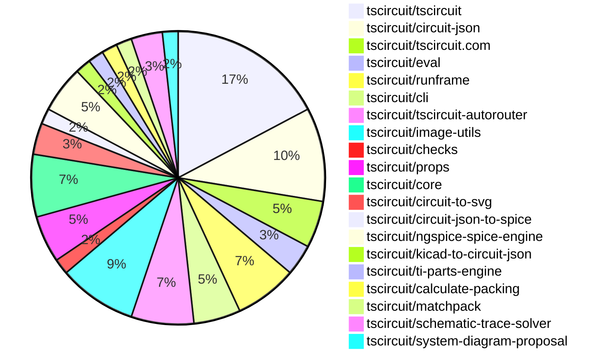

# Contribution Overview 2026-06-16

The current week is shown below. There are 3 major sections:

- [Contributor Overview](#contributor-overview)
- [PRs by Repository](#prs-by-repository)
- [PRs by Contributor](#changes-by-contributor)
- [Scoring & Sponsorship Details](/docs/sponsorship-calculation-explanation.md)

## PRs by Repository

## Contributor Overview

| Contributor | 🐳 Major | 🐙 Minor | 🐌 Tiny | Score | ⭐ | Discussion Contributions |
|-------------|---------|---------|---------|-------|-----|--------------------------|
| [ShiboSoftwareDev](#ShiboSoftwareDev) | 0 | 10 | 5 | 27 | ⭐⭐ | 0🔹 0🔶 0💎 |
| [AnasSarkiz](#AnasSarkiz) | 1 | 2 | 2 | 14 | ⭐⭐ | 0🔹 0🔶 0💎 |
| [tscircuitbot](#tscircuitbot) | 0 | 0 | 27 | 12.5 | ⭐⭐ | 0🔹 0🔶 0💎 |
| [imrishabh18](#imrishabh18) | 1 | 0 | 1 | 6 | ⭐ | 0🔹 0🔶 0💎 |
| [Sang-it](#Sang-it) | 1 | 0 | 1 | 5 | ⭐ | 0🔹 0🔶 0💎 |
| [techmannih](#techmannih) | 0 | 1 | 2 | 4 | ⭐ | 0🔹 0🔶 0💎 |
| [0hmX](#0hmX) | 1 | 0 | 0 | 4 | ⭐ | 0🔹 0🔶 0💎 |
| [Abse2001](#Abse2001) | 1 | 0 | 0 | 4 | ⭐ | 0🔹 0🔶 0💎 |
| [MustafaMulla29](#MustafaMulla29) | 0 | 1 | 1 | 3 |  | 0🔹 0🔶 0💎 |

## Staff Pass Ratio (SPR)

| Contributor | Reviewed PRs | Rejections | Approvals | SPR |
|-------------|--------------|------------|-----------|-----|
| [AnasSarkiz](#AnasSarkiz) | 3 | 0 | 3 | 100.0% |
| [ShiboSoftwareDev](#ShiboSoftwareDev) | 2 | 0 | 2 | 100.0% |
| [MustafaMulla29](#MustafaMulla29) | 2 | 1 | 1 | 50.0% |
| [Sang-it](#Sang-it) | 1 | 1 | 0 | 0.0% |
| [0hmX](#0hmX) | 1 | 0 | 1 | 100.0% |
| [Abse2001](#Abse2001) | 1 | 0 | 1 | 100.0% |

AnasSarkiz SPR PRs (3)

- [#610](https://github.com/tscircuit/circuit-json/pull/610) Introduce End-to-End Current Probe Support and Simulation Models
- [#695](https://github.com/tscircuit/props/pull/695) Introduce Ammeter Component Props with Validated Current Measurement Connections
- [#161](https://github.com/tscircuit/checks/pull/161) Adds comprehensive support for Rotated-Pill Pad Geometry across DRC, Connectivity, and Trace Validation

ShiboSoftwareDev SPR PRs (2)

- [#2459](https://github.com/tscircuit/core/pull/2459)  Wire simulation timing, SPICE options, pulse controls, and probe display options
- [#20](https://github.com/tscircuit/ngspice-spice-engine/pull/20)  Handle PSPICE resistor TC and VALUE caret compatibility

MustafaMulla29 SPR PRs (2)

- [#98](https://github.com/tscircuit/calculate-packing/pull/98) Fix PackSolver2 initial rotation handling
- [#138](https://github.com/tscircuit/matchpack/pull/138)  Constrain two-pin power/ground schematic rotations

Sang-it SPR PRs (1)

- [#2456](https://github.com/tscircuit/core/pull/2456) include resistor text labels in schematic bounding box passed to layout/trace solvers

0hmX SPR PRs (1)

- [#1400](https://github.com/tscircuit/tscircuit-autorouter/pull/1400) Fix BGA detection and BGA topology generation for unevenly sized obstacle pads and super small grids.

Abse2001 SPR PRs (1)

- [#1](https://github.com/tscircuit/system-diagram-proposal/pull/1) Add additional reference image fixtures and a PIC32CM MC00 system diagram

> Note: AI evaluates PRs and assigns 1-3 star ratings automatically. 4 and 5 star ratings require manual staff review.

### Discussion Contribution Legend

- 🔹 Normal Comments: Basic participation with minimal effort
- 🔶 Great Informative Comments: Thoughtful participation that adds value
- 💎 Incredible Comments: Exceptional participation with high-quality content

## Review Table

[reviews-received-hover]: ## "Number of reviews received for PRs for this contributor"
[approvals-received-hover]: ## "Number of approvals received for PRs this contributor authored"
[rejections-received-hover]: ## "Number of rejections received for PRs this contributor authored"
[prs-opened-hover]: ## "Number of PRs opened by this contributor"
[issues-created-hover]: ## "Number of issues created by this contributor"

| Contributor | Reviews Received | Approvals Received | Rejections Received | Approvals | Rejections Given | PRs Opened | PRs Merged | Issues Created |
|---|---|---|---|---|---|---|---|---|
| [tscircuitbot](#tscircuitbot) | 0 | 0 | 0 | 0 | 0 | 46 | 27 | 0 |
| [AnasSarkiz](#AnasSarkiz) | 6 | 6 | 0 | 4 | 0 | 7 | 5 | 0 |
| [imrishabh18](#imrishabh18) | 0 | 0 | 0 | 8 | 1 | 3 | 2 | 0 |
| [ShiboSoftwareDev](#ShiboSoftwareDev) | 13 | 11 | 0 | 2 | 0 | 16 | 16 | 0 |
| [seveibar](#seveibar) | 0 | 0 | 0 | 8 | 2 | 0 | 0 | 0 |
| [MustafaMulla29](#MustafaMulla29) | 4 | 1 | 1 | 0 | 0 | 4 | 2 | 0 |
| [Sang-it](#Sang-it) | 12 | 0 | 1 | 0 | 0 | 3 | 2 | 0 |
| [rushabhcodes](#rushabhcodes) | 0 | 0 | 0 | 4 | 0 | 2 | 0 | 0 |
| [Desalzes](#Desalzes) | 0 | 0 | 0 | 0 | 0 | 1 | 0 | 0 |
| [techmannih](#techmannih) | 6 | 5 | 1 | 0 | 0 | 6 | 3 | 0 |
| [b3417](#b3417) | 0 | 0 | 0 | 0 | 0 | 5 | 0 | 0 |
| [0hmX](#0hmX) | 3 | 1 | 0 | 0 | 0 | 3 | 1 | 0 |
| [Ami765](#Ami765) | 0 | 0 | 0 | 0 | 0 | 1 | 0 | 0 |
| [Monster5860](#Monster5860) | 0 | 0 | 0 | 0 | 0 | 1 | 0 | 0 |
| [anil08607](#anil08607) | 0 | 0 | 0 | 0 | 0 | 1 | 0 | 0 |
| [Abse2001](#Abse2001) | 2 | 2 | 0 | 0 | 0 | 1 | 1 | 0 |

## Changes by Repository

### [tscircuit/tscircuit](https://github.com/tscircuit/tscircuit)

🐌 Tiny Contributions (10)

| PR # | Impact | Contributor | Description |
|------|--------|-------------|-------------|
| [#3548](https://github.com/tscircuit/tscircuit/pull/3548) | 🐌 Tiny | tscircuitbot | Automated package update to version 0.0.1890 |
| [#3547](https://github.com/tscircuit/tscircuit/pull/3547) | 🐌 Tiny | tscircuitbot | Updates the tscircuitcli package from version 0.1.1503 to 0.1.1504 and the tscircuitrunframe package from version 0.0.2083 to 0.0.2084. |
| [#3546](https://github.com/tscircuit/tscircuit/pull/3546) | 🐌 Tiny | tscircuitbot | Updates the package version from 0.0.1888 to 0.0.1889 |
| [#3545](https://github.com/tscircuit/tscircuit/pull/3545) | 🐌 Tiny | tscircuitbot | Updates the tscircuitrunframe package from version 0.0.2083 to 0.0.2084 |
| [#3544](https://github.com/tscircuit/tscircuit/pull/3544) | 🐌 Tiny | tscircuitbot | Automated package update |
| [#3543](https://github.com/tscircuit/tscircuit/pull/3543) | 🐌 Tiny | tscircuitbot | Automated package update |
| [#3542](https://github.com/tscircuit/tscircuit/pull/3542) | 🐌 Tiny | tscircuitbot | Automated package update to version 0.0.1887 |
| [#3539](https://github.com/tscircuit/tscircuit/pull/3539) | 🐌 Tiny | tscircuitbot | Updates the package version from 0.0.1885 to 0.0.1886 in package.json |
| [#3538](https://github.com/tscircuit/tscircuit/pull/3538) | 🐌 Tiny | tscircuitbot | Automated package update |
| [#3541](https://github.com/tscircuit/tscircuit/pull/3541) | 🐌 Tiny | AnasSarkiz | Adds tscircuiteecircuit-engine to the DO_NOT_SYNC_PACKAGE list, preventing it from being synchronized with core package versions. |

### [tscircuit/circuit-json](https://github.com/tscircuit/circuit-json)

| PR # | Impact | Rating | Contributor | Description |
|------|--------|--------|-------------|-------------|
| [#610](https://github.com/tscircuit/circuit-json/pull/610) | 🐙 Minor | ⭐⭐ | AnasSarkiz | Adds simulation-level current measurement schemas, following the existing transient voltage graph pattern where applicable. |
| [#608](https://github.com/tscircuit/circuit-json/pull/608) | 🐙 Minor | ⭐⭐ | ShiboSoftwareDev | Adds display options for voltage probes in circuit-json, allowing customization of label, center, offset, and units per division. |
| [#605](https://github.com/tscircuit/circuit-json/pull/605) | 🐙 Minor | ⭐⭐ | ShiboSoftwareDev | Adds SPICE options and pulse timing fields to circuit-json simulations, and fixes unit parsing for various electrical units. |

🐌 Tiny Contributions (3)

| PR # | Impact | Contributor | Description |
|------|--------|-------------|-------------|
| [#611](https://github.com/tscircuit/circuit-json/pull/611) | 🐌 Tiny | tscircuitbot | Automated package update |
| [#609](https://github.com/tscircuit/circuit-json/pull/609) | 🐌 Tiny | tscircuitbot | Automated package update |
| [#607](https://github.com/tscircuit/circuit-json/pull/607) | 🐌 Tiny | tscircuitbot | Automated package update |

### [tscircuit/tscircuit.com](https://github.com/tscircuit/tscircuit.com)

🐌 Tiny Contributions (3)

| PR # | Impact | Contributor | Description |
|------|--------|-------------|-------------|
| [#3688](https://github.com/tscircuit/tscircuit.com/pull/3688) | 🐌 Tiny | tscircuitbot | Automated package update |
| [#3687](https://github.com/tscircuit/tscircuit.com/pull/3687) | 🐌 Tiny | tscircuitbot | Updates the tscircuitrunframe package from version 0.0.2082 to 0.0.2083 |
| [#3686](https://github.com/tscircuit/tscircuit.com/pull/3686) | 🐌 Tiny | tscircuitbot | Updates the tscircuiteval package from version 0.0.928 to 0.0.929 |

### [tscircuit/eval](https://github.com/tscircuit/eval)

🐌 Tiny Contributions (2)

| PR # | Impact | Contributor | Description |
|------|--------|-------------|-------------|
| [#2923](https://github.com/tscircuit/eval/pull/2923) | 🐌 Tiny | tscircuitbot | Automated package update |
| [#2922](https://github.com/tscircuit/eval/pull/2922) | 🐌 Tiny | techmannih | Fixes the CAD model scaling issue by removing the hardcoded scale factor, allowing for the preservation of the native scale for KiCad footprint CAD models. |

### [tscircuit/runframe](https://github.com/tscircuit/runframe)

🐌 Tiny Contributions (4)

| PR # | Impact | Contributor | Description |
|------|--------|-------------|-------------|
| [#3701](https://github.com/tscircuit/runframe/pull/3701) | 🐌 Tiny | tscircuitbot | Automated package update |
| [#3699](https://github.com/tscircuit/runframe/pull/3699) | 🐌 Tiny | tscircuitbot | Automated package update |
| [#3698](https://github.com/tscircuit/runframe/pull/3698) | 🐌 Tiny | tscircuitbot | Updates the tscircuiteval package from version 0.0.928 to 0.0.929 in the package.json file. |
| [#3700](https://github.com/tscircuit/runframe/pull/3700) | 🐌 Tiny | ShiboSoftwareDev | Adds circuit-to-svg0.0.356 directly to runframe so the prebuilt standalone preview bundle used by tsci dev embeds the current SVG renderer instead of resolving an older transitive copy at publish time. |

### [tscircuit/cli](https://github.com/tscircuit/cli)

🐌 Tiny Contributions (3)

| PR # | Impact | Contributor | Description |
|------|--------|-------------|-------------|
| [#3340](https://github.com/tscircuit/cli/pull/3340) | 🐌 Tiny | tscircuitbot | Updates the tscircuitrunframe package from version 0.0.2083 to 0.0.2084 |
| [#3339](https://github.com/tscircuit/cli/pull/3339) | 🐌 Tiny | tscircuitbot | Automated package update |
| [#3338](https://github.com/tscircuit/cli/pull/3338) | 🐌 Tiny | tscircuitbot | Updates the tscircuitrunframe package from version 0.0.2082 to 0.0.2083 |

### [tscircuit/tscircuit-autorouter](https://github.com/tscircuit/tscircuit-autorouter)

| PR # | Impact | Rating | Contributor | Description |
|------|--------|--------|-------------|-------------|
| [#1400](https://github.com/tscircuit/tscircuit-autorouter/pull/1400) | 🐳 Major | ⭐⭐⭐ | 0hmX | What does this fix The BGA Solver now has a full pipeline that enables better handling of obstacle overlap than before, including large nodes, thanks to the merge step. This could have been a separate fix, but the issue was only discovered when rewriting from scratch: component Topology Generator was generating replacement obstacles that were single-layer only instead of multi-layer, which was bad because rectDiff was expanding into the below layers and the merging was also causing gaps. The BGA Solver now always uses the full set of available layers. Previously it was trying to restrict itself to topinner layers, which was unnecessary, so that has been removed. Much better readability overall. The MergeSolver still needs a rewrite as the logic isnt fully clear yet, but that is planned for later. Changed what is detected as BGA: the current logic requires at least a 33 matrix to work properly, so the detection logic was updated to reflect this constraint. Changed the SOIC detection logic to be independent of the BGA detection logic (required for tests to pass). |

🐌 Tiny Contributions (3)

| PR # | Impact | Contributor | Description |
|------|--------|-------------|-------------|
| [#1404](https://github.com/tscircuit/tscircuit-autorouter/pull/1404) | 🐌 Tiny | tscircuitbot | Automated package update |
| [#1402](https://github.com/tscircuit/tscircuit-autorouter/pull/1402) | 🐌 Tiny | tscircuitbot | Automated package update |
| [#1401](https://github.com/tscircuit/tscircuit-autorouter/pull/1401) | 🐌 Tiny | AnasSarkiz | Updates the dataset-srj18 dependency to a newer commit in the GitHub repository. |

### [tscircuit/image-utils](https://github.com/tscircuit/image-utils)

| PR # | Impact | Rating | Contributor | Description |
|------|--------|--------|-------------|-------------|
| [#7](https://github.com/tscircuit/image-utils/pull/7) | 🐳 Major | ⭐⭐⭐ | imrishabh18 | Adds utility functions for converting SVG paths to points and generating boundary representation shapes from SVG data. |

🐌 Tiny Contributions (4)

| PR # | Impact | Contributor | Description |
|------|--------|-------------|-------------|
| [#10](https://github.com/tscircuit/image-utils/pull/10) | 🐌 Tiny | tscircuitbot | Updates the package version from 0.0.5 to 0.0.6 in package.json |
| [#8](https://github.com/tscircuit/image-utils/pull/8) | 🐌 Tiny | tscircuitbot | Automated package update |
| [#6](https://github.com/tscircuit/image-utils/pull/6) | 🐌 Tiny | tscircuitbot | Automated package update |
| [#9](https://github.com/tscircuit/image-utils/pull/9) | 🐌 Tiny | imrishabh18 | Fixes the build output directory in the package.json to correctly point to index.ts instead of lib. |

### [tscircuit/checks](https://github.com/tscircuit/checks)

| PR # | Impact | Rating | Contributor | Description |
|------|--------|--------|-------------|-------------|
| [#161](https://github.com/tscircuit/checks/pull/161) | 🐳 Major | ⭐⭐⭐ | AnasSarkiz | Adds comprehensive geometric support for rotated_pill SMT pads throughout the PCB validation pipeline, replacing bounding-box approximations with accurate shape-aware calculations. |

### [tscircuit/props](https://github.com/tscircuit/props)

| PR # | Impact | Rating | Contributor | Description |
|------|--------|--------|-------------|-------------|
| [#695](https://github.com/tscircuit/props/pull/695) | 🐙 Minor | ⭐⭐ | AnasSarkiz | Adds first-class ammeter  prop support for current measurement components, including validated connection pairs and display configuration. |
| [#693](https://github.com/tscircuit/props/pull/693) | 🐙 Minor | ⭐⭐ | ShiboSoftwareDev | Adds display properties for voltage probes to enhance simulation graph representation. |

🐌 Tiny Contributions (1)

| PR # | Impact | Contributor | Description |
|------|--------|-------------|-------------|
| [#694](https://github.com/tscircuit/props/pull/694) | 🐌 Tiny | ShiboSoftwareDev | Removes the color property from the voltage probe display options, affecting how voltage probes are visually represented in the application. |

### [tscircuit/core](https://github.com/tscircuit/core)

| PR # | Impact | Rating | Contributor | Description |
|------|--------|--------|-------------|-------------|
| [#2461](https://github.com/tscircuit/core/pull/2461) | 🐙 Minor | ⭐⭐ | ShiboSoftwareDev | Fixes inflation issues for imported KiCad LEDs and fiducials, and resolves trace inflation problems when multiple physical geometries exist for a single logical source trace. |
| [#2459](https://github.com/tscircuit/core/pull/2459) | 🐙 Minor | ⭐⭐ | ShiboSoftwareDev | Adds new simulation properties for analog simulation including start time, SPICE options, pulse timing controls for voltage sources, and display options for voltage probes, along with related package version updates and new tests. |

🐌 Tiny Contributions (2)

| PR # | Impact | Contributor | Description |
|------|--------|-------------|-------------|
| [#2465](https://github.com/tscircuit/core/pull/2465) | 🐌 Tiny | ShiboSoftwareDev | Updates the ngspice-spice-engine dependency to version 0.0.16 in package.json |
| [#2464](https://github.com/tscircuit/core/pull/2464) | 🐌 Tiny | ShiboSoftwareDev | Adds tscircuiteecircuit-engine as a development dependency in package.json |

### [tscircuit/circuit-to-svg](https://github.com/tscircuit/circuit-to-svg)

| PR # | Impact | Rating | Contributor | Description |
|------|--------|--------|-------------|-------------|
| [#576](https://github.com/tscircuit/circuit-to-svg/pull/576) | 🐙 Minor | ⭐⭐ | ShiboSoftwareDev | Fixes the x-axis of the simulation graph to accurately reflect the exact transient time domain based on the start and end times of the simulation experiment. |
| [#575](https://github.com/tscircuit/circuit-to-svg/pull/575) | 🐙 Minor | ⭐⭐ | ShiboSoftwareDev | Adds support for rendering simulation probe display options in SVG graphs, allowing for customizable voltage display based on probe settings. |

### [tscircuit/circuit-json-to-spice](https://github.com/tscircuit/circuit-json-to-spice)

| PR # | Impact | Rating | Contributor | Description |
|------|--------|--------|-------------|-------------|
| [#38](https://github.com/tscircuit/circuit-json-to-spice/pull/38) | 🐙 Minor | ⭐⭐ | ShiboSoftwareDev | Adds support for simulation_experiment.spice_options, emits voltage-source PULSE delayrisefall widthperiod controls, and formats transient timing values with SPICE suffixes. Also emits tscircuit_probe metadata comments that map voltage probes to SPICE vectors so downstream simulation graph rendering can recover probe identity. |

### [tscircuit/ngspice-spice-engine](https://github.com/tscircuit/ngspice-spice-engine)

| PR # | Impact | Rating | Contributor | Description |
|------|--------|--------|-------------|-------------|
| [#20](https://github.com/tscircuit/ngspice-spice-engine/pull/20) | 🐙 Minor | ⭐⭐ | ShiboSoftwareDev | Adds a narrow PSPICE compatibility normalization pass before ngspice simulation, converting resistor-line TCa,b syntax to TC1a TC2b and rewriting spaced boolean  in VALUE blocks while preserving numeric exponentiation. |
| [#18](https://github.com/tscircuit/ngspice-spice-engine/pull/18) | 🐙 Minor | ⭐⭐ | ShiboSoftwareDev | Preserves probe metadata in ngspice simulation graphs to enhance the identification and representation of voltage probes in simulation results. |

🐌 Tiny Contributions (1)

| PR # | Impact | Contributor | Description |
|------|--------|-------------|-------------|
| [#19](https://github.com/tscircuit/ngspice-spice-engine/pull/19) | 🐌 Tiny | ShiboSoftwareDev | Adds the eecircuit engine as a development dependency in the project. |

### [tscircuit/kicad-to-circuit-json](https://github.com/tscircuit/kicad-to-circuit-json)

| PR # | Impact | Rating | Contributor | Description |
|------|--------|--------|-------------|-------------|
| [#143](https://github.com/tscircuit/kicad-to-circuit-json/pull/143) | 🐙 Minor | ⭐⭐ | techmannih | Classifies SW PCB references as simple_switch and adds a regression test for Arduino Nanos reset switch. |

### [tscircuit/ti-parts-engine](https://github.com/tscircuit/ti-parts-engine)

🐌 Tiny Contributions (1)

| PR # | Impact | Contributor | Description |
|------|--------|-------------|-------------|
| [#29](https://github.com/tscircuit/ti-parts-engine/pull/29) | 🐌 Tiny | techmannih | Updates the tscircuitfake-ul-kicad-proxy dependency to a newer version in the package.json file. |

### [tscircuit/calculate-packing](https://github.com/tscircuit/calculate-packing)

| PR # | Impact | Rating | Contributor | Description |
|------|--------|--------|-------------|-------------|
| [#98](https://github.com/tscircuit/calculate-packing/pull/98) | 🐙 Minor | ⭐⭐ | MustafaMulla29 | Fixes PackSolver2 to honor availableRotationDegrees for packed components and preserves ccwRotationOffset for static components, along with adding regression tests for rotation handling. |

### [tscircuit/matchpack](https://github.com/tscircuit/matchpack)

🐌 Tiny Contributions (1)

| PR # | Impact | Contributor | Description |
|------|--------|-------------|-------------|
| [#139](https://github.com/tscircuit/matchpack/pull/139) | 🐌 Tiny | MustafaMulla29 | Updates the versions of the tscircuit and calculate-packing dependencies in the package.json file. |

### [tscircuit/schematic-trace-solver](https://github.com/tscircuit/schematic-trace-solver)

| PR # | Impact | Rating | Contributor | Description |
|------|--------|--------|-------------|-------------|
| [#550](https://github.com/tscircuit/schematic-trace-solver/pull/550) | 🐳 Major | ⭐⭐⭐ | Sang-it | Prevents obstacle-aware trace shifts from crossing through obstacles during routing calculations. |

🐌 Tiny Contributions (1)

| PR # | Impact | Contributor | Description |
|------|--------|-------------|-------------|
| [#549](https://github.com/tscircuit/schematic-trace-solver/pull/549) | 🐌 Tiny | Sang-it | Adds an example page and test for tracing through a chip using the PipelineDebugger component. |

### [tscircuit/system-diagram-proposal](https://github.com/tscircuit/system-diagram-proposal)

| PR # | Impact | Rating | Contributor | Description |
|------|--------|--------|-------------|-------------|
| [#1](https://github.com/tscircuit/system-diagram-proposal/pull/1) | 🐳 Major | ⭐⭐⭐ | Abse2001 | This pull request introduces additional reference image fixtures and a system diagram for the PIC32CM MC00 family. It includes new JSON files for the reference images and updates to the system diagram types to accommodate the new components and styles. |

## Changes by Contributor

### [tscircuitbot](https://github.com/tscircuitbot)

🐌 Tiny Contributions (27)

| PR # | Impact | Description |
|------|--------|-------------|
| [#3548](https://github.com/tscircuit/tscircuit/pull/3548) | 🐌 Tiny | Automated package update to version 0.0.1890 |
| [#3547](https://github.com/tscircuit/tscircuit/pull/3547) | 🐌 Tiny | Updates the tscircuitcli package from version 0.1.1503 to 0.1.1504 and the tscircuitrunframe package from version 0.0.2083 to 0.0.2084. |
| [#3546](https://github.com/tscircuit/tscircuit/pull/3546) | 🐌 Tiny | Updates the package version from 0.0.1888 to 0.0.1889 |
| [#3545](https://github.com/tscircuit/tscircuit/pull/3545) | 🐌 Tiny | Updates the tscircuitrunframe package from version 0.0.2083 to 0.0.2084 |
| [#3544](https://github.com/tscircuit/tscircuit/pull/3544) | 🐌 Tiny | Automated package update |
| [#3543](https://github.com/tscircuit/tscircuit/pull/3543) | 🐌 Tiny | Automated package update |
| [#3542](https://github.com/tscircuit/tscircuit/pull/3542) | 🐌 Tiny | Automated package update to version 0.0.1887 |
| [#3539](https://github.com/tscircuit/tscircuit/pull/3539) | 🐌 Tiny | Updates the package version from 0.0.1885 to 0.0.1886 in package.json |
| [#3538](https://github.com/tscircuit/tscircuit/pull/3538) | 🐌 Tiny | Automated package update |
| [#611](https://github.com/tscircuit/circuit-json/pull/611) | 🐌 Tiny | Automated package update |
| [#609](https://github.com/tscircuit/circuit-json/pull/609) | 🐌 Tiny | Automated package update |
| [#607](https://github.com/tscircuit/circuit-json/pull/607) | 🐌 Tiny | Automated package update |
| [#3688](https://github.com/tscircuit/tscircuit.com/pull/3688) | 🐌 Tiny | Automated package update |
| [#3687](https://github.com/tscircuit/tscircuit.com/pull/3687) | 🐌 Tiny | Updates the tscircuitrunframe package from version 0.0.2082 to 0.0.2083 |
| [#3686](https://github.com/tscircuit/tscircuit.com/pull/3686) | 🐌 Tiny | Updates the tscircuiteval package from version 0.0.928 to 0.0.929 |
| [#2923](https://github.com/tscircuit/eval/pull/2923) | 🐌 Tiny | Automated package update |
| [#3701](https://github.com/tscircuit/runframe/pull/3701) | 🐌 Tiny | Automated package update |
| [#3699](https://github.com/tscircuit/runframe/pull/3699) | 🐌 Tiny | Automated package update |
| [#3698](https://github.com/tscircuit/runframe/pull/3698) | 🐌 Tiny | Updates the tscircuiteval package from version 0.0.928 to 0.0.929 in the package.json file. |
| [#3340](https://github.com/tscircuit/cli/pull/3340) | 🐌 Tiny | Updates the tscircuitrunframe package from version 0.0.2083 to 0.0.2084 |
| [#3339](https://github.com/tscircuit/cli/pull/3339) | 🐌 Tiny | Automated package update |
| [#3338](https://github.com/tscircuit/cli/pull/3338) | 🐌 Tiny | Updates the tscircuitrunframe package from version 0.0.2082 to 0.0.2083 |
| [#1404](https://github.com/tscircuit/tscircuit-autorouter/pull/1404) | 🐌 Tiny | Automated package update |
| [#1402](https://github.com/tscircuit/tscircuit-autorouter/pull/1402) | 🐌 Tiny | Automated package update |
| [#10](https://github.com/tscircuit/image-utils/pull/10) | 🐌 Tiny | Updates the package version from 0.0.5 to 0.0.6 in package.json |
| [#8](https://github.com/tscircuit/image-utils/pull/8) | 🐌 Tiny | Automated package update |
| [#6](https://github.com/tscircuit/image-utils/pull/6) | 🐌 Tiny | Automated package update |

### [AnasSarkiz](https://github.com/AnasSarkiz)

| PRs # | Impact | Rating | Description |
|------|--------|--------|-------------|
| [#161](https://github.com/tscircuit/checks/pull/161) | 🐳 Major | ⭐⭐⭐ | Adds comprehensive geometric support for rotated_pill SMT pads throughout the PCB validation pipeline, replacing bounding-box approximations with accurate shape-aware calculations. |
| [#610](https://github.com/tscircuit/circuit-json/pull/610) | 🐙 Minor | ⭐⭐ | Adds simulation-level current measurement schemas, following the existing transient voltage graph pattern where applicable. |
| [#695](https://github.com/tscircuit/props/pull/695) | 🐙 Minor | ⭐⭐ | Adds first-class ammeter  prop support for current measurement components, including validated connection pairs and display configuration. |

🐌 Tiny Contributions (2)

| PR # | Impact | Description |
|------|--------|-------------|
| [#3541](https://github.com/tscircuit/tscircuit/pull/3541) | 🐌 Tiny | Adds tscircuiteecircuit-engine to the DO_NOT_SYNC_PACKAGE list, preventing it from being synchronized with core package versions. |
| [#1401](https://github.com/tscircuit/tscircuit-autorouter/pull/1401) | 🐌 Tiny | Updates the dataset-srj18 dependency to a newer commit in the GitHub repository. |

### [ShiboSoftwareDev](https://github.com/ShiboSoftwareDev)

| PRs # | Impact | Rating | Description |
|------|--------|--------|-------------|
| [#608](https://github.com/tscircuit/circuit-json/pull/608) | 🐙 Minor | ⭐⭐ | Adds display options for voltage probes in circuit-json, allowing customization of label, center, offset, and units per division. |
| [#605](https://github.com/tscircuit/circuit-json/pull/605) | 🐙 Minor | ⭐⭐ | Adds SPICE options and pulse timing fields to circuit-json simulations, and fixes unit parsing for various electrical units. |
| [#693](https://github.com/tscircuit/props/pull/693) | 🐙 Minor | ⭐⭐ | Adds display properties for voltage probes to enhance simulation graph representation. |
| [#2461](https://github.com/tscircuit/core/pull/2461) | 🐙 Minor | ⭐⭐ | Fixes inflation issues for imported KiCad LEDs and fiducials, and resolves trace inflation problems when multiple physical geometries exist for a single logical source trace. |
| [#2459](https://github.com/tscircuit/core/pull/2459) | 🐙 Minor | ⭐⭐ | Adds new simulation properties for analog simulation including start time, SPICE options, pulse timing controls for voltage sources, and display options for voltage probes, along with related package version updates and new tests. |
| [#576](https://github.com/tscircuit/circuit-to-svg/pull/576) | 🐙 Minor | ⭐⭐ | Fixes the x-axis of the simulation graph to accurately reflect the exact transient time domain based on the start and end times of the simulation experiment. |
| [#575](https://github.com/tscircuit/circuit-to-svg/pull/575) | 🐙 Minor | ⭐⭐ | Adds support for rendering simulation probe display options in SVG graphs, allowing for customizable voltage display based on probe settings. |
| [#38](https://github.com/tscircuit/circuit-json-to-spice/pull/38) | 🐙 Minor | ⭐⭐ | Adds support for simulation_experiment.spice_options, emits voltage-source PULSE delayrisefall widthperiod controls, and formats transient timing values with SPICE suffixes. Also emits tscircuit_probe metadata comments that map voltage probes to SPICE vectors so downstream simulation graph rendering can recover probe identity. |
| [#20](https://github.com/tscircuit/ngspice-spice-engine/pull/20) | 🐙 Minor | ⭐⭐ | Adds a narrow PSPICE compatibility normalization pass before ngspice simulation, converting resistor-line TCa,b syntax to TC1a TC2b and rewriting spaced boolean  in VALUE blocks while preserving numeric exponentiation. |
| [#18](https://github.com/tscircuit/ngspice-spice-engine/pull/18) | 🐙 Minor | ⭐⭐ | Preserves probe metadata in ngspice simulation graphs to enhance the identification and representation of voltage probes in simulation results. |

🐌 Tiny Contributions (5)

| PR # | Impact | Description |
|------|--------|-------------|
| [#694](https://github.com/tscircuit/props/pull/694) | 🐌 Tiny | Removes the color property from the voltage probe display options, affecting how voltage probes are visually represented in the application. |
| [#2465](https://github.com/tscircuit/core/pull/2465) | 🐌 Tiny | Updates the ngspice-spice-engine dependency to version 0.0.16 in package.json |
| [#2464](https://github.com/tscircuit/core/pull/2464) | 🐌 Tiny | Adds tscircuiteecircuit-engine as a development dependency in package.json |
| [#3700](https://github.com/tscircuit/runframe/pull/3700) | 🐌 Tiny | Adds circuit-to-svg0.0.356 directly to runframe so the prebuilt standalone preview bundle used by tsci dev embeds the current SVG renderer instead of resolving an older transitive copy at publish time. |
| [#19](https://github.com/tscircuit/ngspice-spice-engine/pull/19) | 🐌 Tiny | Adds the eecircuit engine as a development dependency in the project. |

### [techmannih](https://github.com/techmannih)

| PRs # | Impact | Rating | Description |
|------|--------|--------|-------------|
| [#143](https://github.com/tscircuit/kicad-to-circuit-json/pull/143) | 🐙 Minor | ⭐⭐ | Classifies SW PCB references as simple_switch and adds a regression test for Arduino Nanos reset switch. |

🐌 Tiny Contributions (2)

| PR # | Impact | Description |
|------|--------|-------------|
| [#2922](https://github.com/tscircuit/eval/pull/2922) | 🐌 Tiny | Fixes the CAD model scaling issue by removing the hardcoded scale factor, allowing for the preservation of the native scale for KiCad footprint CAD models. |
| [#29](https://github.com/tscircuit/ti-parts-engine/pull/29) | 🐌 Tiny | Updates the tscircuitfake-ul-kicad-proxy dependency to a newer version in the package.json file. |

### [0hmX](https://github.com/0hmX)

| PRs # | Impact | Rating | Description |
|------|--------|--------|-------------|
| [#1400](https://github.com/tscircuit/tscircuit-autorouter/pull/1400) | 🐳 Major | ⭐⭐⭐ | What does this fix The BGA Solver now has a full pipeline that enables better handling of obstacle overlap than before, including large nodes, thanks to the merge step. This could have been a separate fix, but the issue was only discovered when rewriting from scratch: component Topology Generator was generating replacement obstacles that were single-layer only instead of multi-layer, which was bad because rectDiff was expanding into the below layers and the merging was also causing gaps. The BGA Solver now always uses the full set of available layers. Previously it was trying to restrict itself to topinner layers, which was unnecessary, so that has been removed. Much better readability overall. The MergeSolver still needs a rewrite as the logic isnt fully clear yet, but that is planned for later. Changed what is detected as BGA: the current logic requires at least a 33 matrix to work properly, so the detection logic was updated to reflect this constraint. Changed the SOIC detection logic to be independent of the BGA detection logic (required for tests to pass). |

### [MustafaMulla29](https://github.com/MustafaMulla29)

| PRs # | Impact | Rating | Description |
|------|--------|--------|-------------|
| [#98](https://github.com/tscircuit/calculate-packing/pull/98) | 🐙 Minor | ⭐⭐ | Fixes PackSolver2 to honor availableRotationDegrees for packed components and preserves ccwRotationOffset for static components, along with adding regression tests for rotation handling. |

🐌 Tiny Contributions (1)

| PR # | Impact | Description |
|------|--------|-------------|
| [#139](https://github.com/tscircuit/matchpack/pull/139) | 🐌 Tiny | Updates the versions of the tscircuit and calculate-packing dependencies in the package.json file. |

### [Sang-it](https://github.com/Sang-it)

| PRs # | Impact | Rating | Description |
|------|--------|--------|-------------|
| [#550](https://github.com/tscircuit/schematic-trace-solver/pull/550) | 🐳 Major | ⭐⭐⭐ | Prevents obstacle-aware trace shifts from crossing through obstacles during routing calculations. |

🐌 Tiny Contributions (1)

| PR # | Impact | Description |
|------|--------|-------------|
| [#549](https://github.com/tscircuit/schematic-trace-solver/pull/549) | 🐌 Tiny | Adds an example page and test for tracing through a chip using the PipelineDebugger component. |

### [imrishabh18](https://github.com/imrishabh18)

| PRs # | Impact | Rating | Description |
|------|--------|--------|-------------|
| [#7](https://github.com/tscircuit/image-utils/pull/7) | 🐳 Major | ⭐⭐⭐ | Adds utility functions for converting SVG paths to points and generating boundary representation shapes from SVG data. |

🐌 Tiny Contributions (1)

| PR # | Impact | Description |
|------|--------|-------------|
| [#9](https://github.com/tscircuit/image-utils/pull/9) | 🐌 Tiny | Fixes the build output directory in the package.json to correctly point to index.ts instead of lib. |

### [Abse2001](https://github.com/Abse2001)

| PRs # | Impact | Rating | Description |
|------|--------|--------|-------------|
| [#1](https://github.com/tscircuit/system-diagram-proposal/pull/1) | 🐳 Major | ⭐⭐⭐ | This pull request introduces additional reference image fixtures and a system diagram for the PIC32CM MC00 family. It includes new JSON files for the reference images and updates to the system diagram types to accommodate the new components and styles. |

## Repository Owners

| Repository | Codeowners |
|------------|------------|
| [builder](https://github.com/tscircuit/builder/blob/main/.github/CODEOWNERS) | [seveibar](https://github.com/seveibar)
| [pcb-viewer](https://github.com/tscircuit/pcb-viewer/blob/main/.github/CODEOWNERS) | [seveibar](https://github.com/seveibar), [ShiboSoftwareDev](https://github.com/ShiboSoftwareDev), [Abse2001](https://github.com/Abse2001)
| [footprints-old](https://github.com/tscircuit/footprints-old/blob/main/.github/CODEOWNERS) | [seveibar](https://github.com/seveibar)
| [footprinter](https://github.com/tscircuit/footprinter/blob/main/.github/CODEOWNERS) | [seveibar](https://github.com/seveibar), [techmannih](https://github.com/techmannih)
| [3d-viewer](https://github.com/tscircuit/3d-viewer/blob/main/.github/CODEOWNERS) | [ShiboSoftwareDev](https://github.com/ShiboSoftwareDev), [Abse2001](https://github.com/Abse2001)
| [winterspec](https://github.com/tscircuit/winterspec/blob/main/.github/CODEOWNERS) | [seveibar](https://github.com/seveibar), [ShiboSoftwareDev](https://github.com/ShiboSoftwareDev)
| [jscad-electronics](https://github.com/tscircuit/jscad-electronics/blob/main/.github/CODEOWNERS) | [seveibar](https://github.com/seveibar), [techmannih](https://github.com/techmannih), [ShiboSoftwareDev](https://github.com/ShiboSoftwareDev), [anas-sarkez](https://github.com/anas-sarkez)
| [circuit-to-svg](https://github.com/tscircuit/circuit-to-svg/blob/main/.github/CODEOWNERS) | [imrishabh18](https://github.com/imrishabh18)
| [schematic-symbols](https://github.com/tscircuit/schematic-symbols/blob/main/.github/CODEOWNERS) | [seveibar](https://github.com/seveibar), [imrishabh18](https://github.com/imrishabh18), [techmannih](https://github.com/techmannih)
| [circuit-json-to-gerber](https://github.com/tscircuit/circuit-json-to-gerber/blob/main/.github/CODEOWNERS) | [seveibar](https://github.com/seveibar), [ShiboSoftwareDev](https://github.com/ShiboSoftwareDev)
| [tscircuit.com](https://github.com/tscircuit/tscircuit.com/blob/main/.github/CODEOWNERS) | [seveibar](https://github.com/seveibar), [imrishabh18](https://github.com/imrishabh18)
| [issue-roulette](https://github.com/tscircuit/issue-roulette/blob/main/.github/CODEOWNERS) | [Anshgrover23](https://github.com/Anshgrover23)
| [sparkfun-boards](https://github.com/tscircuit/sparkfun-boards/blob/main/.github/CODEOWNERS) | [ShiboSoftwareDev](https://github.com/ShiboSoftwareDev), [Abse2001](https://github.com/Abse2001), [MustafaMulla29](https://github.com/MustafaMulla29), [Anshgrover23](https://github.com/Anshgrover23), [techmannih](https://github.com/techmannih)
| [schematic-corpus](https://github.com/tscircuit/schematic-corpus/blob/main/.github/CODEOWNERS) | [Abse2001](https://github.com/Abse2001)
| [copper-pour-solver](https://github.com/tscircuit/copper-pour-solver/blob/main/.github/CODEOWNERS) | [seveibar](https://github.com/seveibar), [ShiboSoftwareDev](https://github.com/ShiboSoftwareDev)
| [common](https://github.com/tscircuit/common/blob/main/.github/CODEOWNERS) | [seveibar](https://github.com/seveibar), [Abse2001](https://github.com/Abse2001)
| [circuit-to-canvas](https://github.com/tscircuit/circuit-to-canvas/blob/main/.github/CODEOWNERS) | [ShiboSoftwareDev](https://github.com/ShiboSoftwareDev), [Abse2001](https://github.com/Abse2001), [techmannih](https://github.com/techmannih)
| [circuit-json-to-lbrn](https://github.com/tscircuit/circuit-json-to-lbrn/blob/main/.github/CODEOWNERS) | [AnasSarkiz](https://github.com/AnasSarkiz)
| [pcbburn.com](https://github.com/tscircuit/pcbburn.com/blob/main/.github/CODEOWNERS) | [AnasSarkiz](https://github.com/AnasSarkiz)
| [high-density-repair03](https://github.com/tscircuit/high-density-repair03/blob/main/.github/CODEOWNERS) | [Abse2001](https://github.com/Abse2001)
| [fabrication-operator-ui](https://github.com/tscircuit/fabrication-operator-ui/blob/main/.github/CODEOWNERS) | [AnasSarkiz](https://github.com/AnasSarkiz)

## Repositories by Owner

| User | Repo |
|------|------|
| [seveibar](https://github.com/seveibar) | [builder](https://github.com/tscircuit/builder/blob/main/.github/CODEOWNERS) |
|  | [pcb-viewer](https://github.com/tscircuit/pcb-viewer/blob/main/.github/CODEOWNERS) |
|  | [footprints-old](https://github.com/tscircuit/footprints-old/blob/main/.github/CODEOWNERS) |
|  | [footprinter](https://github.com/tscircuit/footprinter/blob/main/.github/CODEOWNERS) |
|  | [winterspec](https://github.com/tscircuit/winterspec/blob/main/.github/CODEOWNERS) |
|  | [jscad-electronics](https://github.com/tscircuit/jscad-electronics/blob/main/.github/CODEOWNERS) |
|  | [schematic-symbols](https://github.com/tscircuit/schematic-symbols/blob/main/.github/CODEOWNERS) |
|  | [circuit-json-to-gerber](https://github.com/tscircuit/circuit-json-to-gerber/blob/main/.github/CODEOWNERS) |
|  | [tscircuit.com](https://github.com/tscircuit/tscircuit.com/blob/main/.github/CODEOWNERS) |
|  | [copper-pour-solver](https://github.com/tscircuit/copper-pour-solver/blob/main/.github/CODEOWNERS) |
|  | [common](https://github.com/tscircuit/common/blob/main/.github/CODEOWNERS) |
| [ShiboSoftwareDev](https://github.com/ShiboSoftwareDev) | [pcb-viewer](https://github.com/tscircuit/pcb-viewer/blob/main/.github/CODEOWNERS) |
|  | [3d-viewer](https://github.com/tscircuit/3d-viewer/blob/main/.github/CODEOWNERS) |
|  | [winterspec](https://github.com/tscircuit/winterspec/blob/main/.github/CODEOWNERS) |
|  | [jscad-electronics](https://github.com/tscircuit/jscad-electronics/blob/main/.github/CODEOWNERS) |
|  | [circuit-json-to-gerber](https://github.com/tscircuit/circuit-json-to-gerber/blob/main/.github/CODEOWNERS) |
|  | [sparkfun-boards](https://github.com/tscircuit/sparkfun-boards/blob/main/.github/CODEOWNERS) |
|  | [copper-pour-solver](https://github.com/tscircuit/copper-pour-solver/blob/main/.github/CODEOWNERS) |
|  | [circuit-to-canvas](https://github.com/tscircuit/circuit-to-canvas/blob/main/.github/CODEOWNERS) |
| [Abse2001](https://github.com/Abse2001) | [pcb-viewer](https://github.com/tscircuit/pcb-viewer/blob/main/.github/CODEOWNERS) |
|  | [3d-viewer](https://github.com/tscircuit/3d-viewer/blob/main/.github/CODEOWNERS) |
|  | [sparkfun-boards](https://github.com/tscircuit/sparkfun-boards/blob/main/.github/CODEOWNERS) |
|  | [schematic-corpus](https://github.com/tscircuit/schematic-corpus/blob/main/.github/CODEOWNERS) |
|  | [common](https://github.com/tscircuit/common/blob/main/.github/CODEOWNERS) |
|  | [circuit-to-canvas](https://github.com/tscircuit/circuit-to-canvas/blob/main/.github/CODEOWNERS) |
|  | [high-density-repair03](https://github.com/tscircuit/high-density-repair03/blob/main/.github/CODEOWNERS) |
| [techmannih](https://github.com/techmannih) | [footprinter](https://github.com/tscircuit/footprinter/blob/main/.github/CODEOWNERS) |
|  | [jscad-electronics](https://github.com/tscircuit/jscad-electronics/blob/main/.github/CODEOWNERS) |
|  | [schematic-symbols](https://github.com/tscircuit/schematic-symbols/blob/main/.github/CODEOWNERS) |
|  | [sparkfun-boards](https://github.com/tscircuit/sparkfun-boards/blob/main/.github/CODEOWNERS) |
|  | [circuit-to-canvas](https://github.com/tscircuit/circuit-to-canvas/blob/main/.github/CODEOWNERS) |
| [anas-sarkez](https://github.com/anas-sarkez) | [jscad-electronics](https://github.com/tscircuit/jscad-electronics/blob/main/.github/CODEOWNERS) |
| [imrishabh18](https://github.com/imrishabh18) | [circuit-to-svg](https://github.com/tscircuit/circuit-to-svg/blob/main/.github/CODEOWNERS) |
|  | [schematic-symbols](https://github.com/tscircuit/schematic-symbols/blob/main/.github/CODEOWNERS) |
|  | [tscircuit.com](https://github.com/tscircuit/tscircuit.com/blob/main/.github/CODEOWNERS) |
| [Anshgrover23](https://github.com/Anshgrover23) | [issue-roulette](https://github.com/tscircuit/issue-roulette/blob/main/.github/CODEOWNERS) |
|  | [sparkfun-boards](https://github.com/tscircuit/sparkfun-boards/blob/main/.github/CODEOWNERS) |
| [MustafaMulla29](https://github.com/MustafaMulla29) | [sparkfun-boards](https://github.com/tscircuit/sparkfun-boards/blob/main/.github/CODEOWNERS) |
| [AnasSarkiz](https://github.com/AnasSarkiz) | [circuit-json-to-lbrn](https://github.com/tscircuit/circuit-json-to-lbrn/blob/main/.github/CODEOWNERS) |
|  | [pcbburn.com](https://github.com/tscircuit/pcbburn.com/blob/main/.github/CODEOWNERS) |
|  | [fabrication-operator-ui](https://github.com/tscircuit/fabrication-operator-ui/blob/main/.github/CODEOWNERS) |

