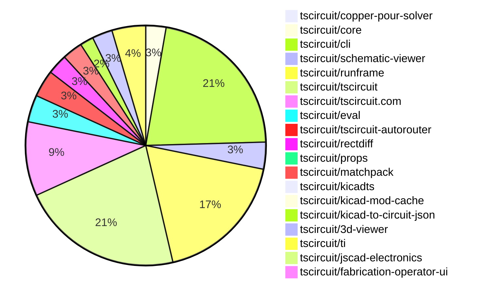

# Contribution Overview 2026-06-23

The current week is shown below. There are 3 major sections:

- [Contributor Overview](#contributor-overview)
- [PRs by Repository](#prs-by-repository)
- [PRs by Contributor](#changes-by-contributor)
- [Scoring & Sponsorship Details](/docs/sponsorship-calculation-explanation.md)

## PRs by Repository

## Contributor Overview

| Contributor | 🐳 Major | 🐙 Minor | 🐌 Tiny | Score | ⭐ | Discussion Contributions |
|-------------|---------|---------|---------|-------|-----|--------------------------|
| [tscircuitbot](#tscircuitbot) | 0 | 0 | 83 | 13 | ⭐⭐ | 0🔹 0🔶 0💎 |
| [0hmX](#0hmX) | 3 | 0 | 1 | 13 | ⭐⭐ | 0🔹 0🔶 0💎 |
| [ShiboSoftwareDev](#ShiboSoftwareDev) | 1 | 2 | 1 | 11 | ⭐⭐ | 0🔹 0🔶 0💎 |
| [techmannih](#techmannih) | 1 | 2 | 2 | 10 | ⭐ | 0🔹 0🔶 0💎 |
| [rushabhcodes](#rushabhcodes) | 0 | 1 | 4 | 7 | ⭐ | 0🔹 0🔶 0💎 |
| [MustafaMulla29](#MustafaMulla29) | 0 | 2 | 2 | 7 | ⭐ | 0🔹 0🔶 0💎 |
| [Abse2001](#Abse2001) | 0 | 1 | 2 | 6 | ⭐ | 0🔹 0🔶 0💎 |
| [AnasSarkiz](#AnasSarkiz) | 1 | 0 | 0 | 6 | ⭐ | 0🔹 0🔶 0💎 |
| [mohan-bee](#mohan-bee) | 0 | 1 | 3 | 5 | ⭐ | 0🔹 0🔶 0💎 |
| [imrishabh18](#imrishabh18) | 0 | 0 | 3 | 4 | ⭐ | 0🔹 0🔶 0💎 |

## Staff Pass Ratio (SPR)

| Contributor | Reviewed PRs | Rejections | Approvals | SPR |
|-------------|--------------|------------|-----------|-----|
| [0hmX](#0hmX) | 4 | 0 | 4 | 100.0% |
| [ShiboSoftwareDev](#ShiboSoftwareDev) | 3 | 1 | 2 | 66.7% |
| [MustafaMulla29](#MustafaMulla29) | 2 | 0 | 2 | 100.0% |
| [techmannih](#techmannih) | 2 | 0 | 2 | 100.0% |
| [rushabhcodes](#rushabhcodes) | 1 | 0 | 1 | 100.0% |

0hmX SPR PRs (4)

- [#1435](https://github.com/tscircuit/tscircuit-autorouter/pull/1435) Use rectdiff recursive gap fill commit
- [#1438](https://github.com/tscircuit/tscircuit-autorouter/pull/1438) Fix publish workflow auto-merge fallback
- [#133](https://github.com/tscircuit/rectdiff/pull/133) Fill rectdiff gaps across multiple passes using maxGapFillPasses
- [#121](https://github.com/tscircuit/tiny-hypergraph/pull/121) Queue duplicate congested port route solves

ShiboSoftwareDev SPR PRs (3)

- [#702](https://github.com/tscircuit/props/pull/702)  Flatten meter display props for probes and ammeters
- [#2503](https://github.com/tscircuit/core/pull/2503) update copper-pour-solver & usage
- [#53](https://github.com/tscircuit/copper-pour-solver/pull/53) Resolve copper pour connectivity by source net & usage documentation & cosmos deploy

MustafaMulla29 SPR PRs (2)

- [#618](https://github.com/tscircuit/circuit-json/pull/618) Add 'name' to source_trace
- [#701](https://github.com/tscircuit/props/pull/701) Add name and displayName props to trace

techmannih SPR PRs (2)

- [#943](https://github.com/tscircuit/3d-viewer/pull/943) Add KiCad TL3342 STEP face color white repro story
- [#152](https://github.com/tscircuit/kicad-to-circuit-json/pull/152) Support simple_test_point inference for TP symbols and footprints

rushabhcodes SPR PRs (1)

- [#156](https://github.com/tscircuit/kicad-to-circuit-json/pull/156) Update schematic symbols

> Note: AI evaluates PRs and assigns 1-3 star ratings automatically. 4 and 5 star ratings require manual staff review.

### Discussion Contribution Legend

- 🔹 Normal Comments: Basic participation with minimal effort
- 🔶 Great Informative Comments: Thoughtful participation that adds value
- 💎 Incredible Comments: Exceptional participation with high-quality content

## Review Table

[reviews-received-hover]: ## "Number of reviews received for PRs for this contributor"
[approvals-received-hover]: ## "Number of approvals received for PRs this contributor authored"
[rejections-received-hover]: ## "Number of rejections received for PRs this contributor authored"
[prs-opened-hover]: ## "Number of PRs opened by this contributor"
[issues-created-hover]: ## "Number of issues created by this contributor"

| Contributor | Reviews Received | Approvals Received | Rejections Received | Approvals | Rejections Given | PRs Opened | PRs Merged | Issues Created |
|---|---|---|---|---|---|---|---|---|
| [ShiboSoftwareDev](#ShiboSoftwareDev) | 8 | 6 | 1 | 2 | 0 | 6 | 5 | 0 |
| [rushabhcodes](#rushabhcodes) | 8 | 4 | 0 | 1 | 0 | 7 | 5 | 0 |
| [imrishabh18](#imrishabh18) | 0 | 0 | 0 | 7 | 0 | 4 | 3 | 0 |
| [tscircuitbot](#tscircuitbot) | 0 | 0 | 0 | 0 | 0 | 105 | 83 | 0 |
| [MustafaMulla29](#MustafaMulla29) | 2 | 2 | 0 | 4 | 0 | 5 | 4 | 0 |
| [seveibar](#seveibar) | 0 | 0 | 0 | 11 | 1 | 1 | 0 | 0 |
| [Abse2001](#Abse2001) | 4 | 3 | 0 | 2 | 0 | 4 | 3 | 0 |
| [techmannih](#techmannih) | 6 | 6 | 0 | 0 | 0 | 5 | 5 | 0 |
| [mohan-bee](#mohan-bee) | 5 | 4 | 0 | 0 | 0 | 4 | 4 | 0 |
| [AnasSarkiz](#AnasSarkiz) | 0 | 0 | 0 | 2 | 0 | 1 | 1 | 0 |
| [addibble](#addibble) | 0 | 0 | 0 | 0 | 0 | 1 | 0 | 0 |
| [ghorhh473-coder](#ghorhh473-coder) | 0 | 0 | 0 | 0 | 0 | 1 | 0 | 0 |
| [0hmX](#0hmX) | 5 | 4 | 0 | 0 | 0 | 6 | 4 | 0 |

## Changes by Repository

### [tscircuit/copper-pour-solver](https://github.com/tscircuit/copper-pour-solver)

| PR # | Impact | Rating | Contributor | Description |
|------|--------|--------|-------------|-------------|
| [#53](https://github.com/tscircuit/copper-pour-solver/pull/53) | 🐳 Major | ⭐⭐⭐ | ShiboSoftwareDev | Update the Circuit JSON adapter to use stable subcircuit_connectivity_map_key values for pour and pad connectivity, with source net idname lookup and validation against generated connectivity-map ids. Also expands README usage docs, adds a Cosmos docs siteexport setup for Vercel, and covers the new connectivity API behavior with tests. |

### [tscircuit/core](https://github.com/tscircuit/core)

| PR # | Impact | Rating | Contributor | Description |
|------|--------|--------|-------------|-------------|
| [#2503](https://github.com/tscircuit/core/pull/2503) | 🐙 Minor | ⭐⭐ | ShiboSoftwareDev | Updates the copper-pour-solver dependency to version 0.0.34 and modifies the CopperPour component to use source_net_id instead of pour_connectivity_key for input problem conversion. |

🐌 Tiny Contributions (2)

| PR # | Impact | Contributor | Description |
|------|--------|-------------|-------------|
| [#2501](https://github.com/tscircuit/core/pull/2501) | 🐌 Tiny | mohan-bee | Fixes the issue of duplicate overlapping schematic net labels for named nets by reusing existing labels instead of inserting duplicates. |
| [#2497](https://github.com/tscircuit/core/pull/2497) | 🐌 Tiny | mohan-bee | Reproduces a bug related to duplicate net labels in a multidrop circuit configuration by adding a comprehensive test case. |

### [tscircuit/cli](https://github.com/tscircuit/cli)

| PR # | Impact | Rating | Contributor | Description |
|------|--------|--------|-------------|-------------|
| [#3425](https://github.com/tscircuit/cli/pull/3425) | 🐙 Minor | ⭐⭐ | ShiboSoftwareDev | Adds support for simulation_transient_current_graph elements alongside existing voltage graph support when generating simulation SVG assets, allowing current and voltage graphs to render in tsci build --simulation-svgs and tsci snapshot --simulation-only. |

🐌 Tiny Contributions (23)

| PR # | Impact | Contributor | Description |
|------|--------|-------------|-------------|
| [#3439](https://github.com/tscircuit/cli/pull/3439) | 🐌 Tiny | rushabhcodes | Add an example for a standalone analog multi-channel scope reproduction with voltage source, load resistor, current meters, and voltage probes, including necessary configuration files for direct execution. |
| [#3445](https://github.com/tscircuit/cli/pull/3445) | 🐌 Tiny | tscircuitbot | Automated package update |
| [#3443](https://github.com/tscircuit/cli/pull/3443) | 🐌 Tiny | tscircuitbot | Automated README update with latest CLI usage output. |
| [#3444](https://github.com/tscircuit/cli/pull/3444) | 🐌 Tiny | tscircuitbot | Automated package update |
| [#3442](https://github.com/tscircuit/cli/pull/3442) | 🐌 Tiny | tscircuitbot | Automated package update |
| [#3441](https://github.com/tscircuit/cli/pull/3441) | 🐌 Tiny | tscircuitbot | Updates the tscircuitrunframe package from version 0.0.2118 to 0.0.2120 |
| [#3438](https://github.com/tscircuit/cli/pull/3438) | 🐌 Tiny | tscircuitbot | Automated package update |
| [#3437](https://github.com/tscircuit/cli/pull/3437) | 🐌 Tiny | tscircuitbot | Updates the tscircuitrunframe package version from 0.0.2117 to 0.0.2118 in package.json |
| [#3436](https://github.com/tscircuit/cli/pull/3436) | 🐌 Tiny | tscircuitbot | Automated package update |
| [#3435](https://github.com/tscircuit/cli/pull/3435) | 🐌 Tiny | tscircuitbot | Updates the tscircuitrunframe package version from 0.0.2116 to 0.0.2117 in package.json |
| [#3434](https://github.com/tscircuit/cli/pull/3434) | 🐌 Tiny | tscircuitbot | Automated package update |
| [#3433](https://github.com/tscircuit/cli/pull/3433) | 🐌 Tiny | tscircuitbot | Updates the tscircuitrunframe package from version 0.0.2115 to 0.0.2116 |
| [#3432](https://github.com/tscircuit/cli/pull/3432) | 🐌 Tiny | tscircuitbot | Updates the package version from 0.1.1547 to 0.1.1548 in package.json |
| [#3431](https://github.com/tscircuit/cli/pull/3431) | 🐌 Tiny | tscircuitbot | Automated package update |
| [#3430](https://github.com/tscircuit/cli/pull/3430) | 🐌 Tiny | tscircuitbot | Automated package update |
| [#3429](https://github.com/tscircuit/cli/pull/3429) | 🐌 Tiny | tscircuitbot | Updates the tscircuitrunframe package version from 0.0.2113 to 0.0.2114 in package.json |
| [#3428](https://github.com/tscircuit/cli/pull/3428) | 🐌 Tiny | tscircuitbot | Automated package update |
| [#3427](https://github.com/tscircuit/cli/pull/3427) | 🐌 Tiny | tscircuitbot | Automated package update |
| [#3426](https://github.com/tscircuit/cli/pull/3426) | 🐌 Tiny | tscircuitbot | Updates the tscircuitrunframe package from version 0.0.2112 to 0.0.2113 |
| [#3424](https://github.com/tscircuit/cli/pull/3424) | 🐌 Tiny | tscircuitbot | Automated package update |
| [#3423](https://github.com/tscircuit/cli/pull/3423) | 🐌 Tiny | tscircuitbot | Updates the tscircuitrunframe package from version 0.0.2111 to 0.0.2112 |
| [#3422](https://github.com/tscircuit/cli/pull/3422) | 🐌 Tiny | tscircuitbot | Automated package update |
| [#3421](https://github.com/tscircuit/cli/pull/3421) | 🐌 Tiny | tscircuitbot | Updates the tscircuitrunframe package from version 0.0.2110 to 0.0.2111 in the package.json file. |

### [tscircuit/schematic-viewer](https://github.com/tscircuit/schematic-viewer)

| PR # | Impact | Rating | Contributor | Description |
|------|--------|--------|-------------|-------------|
| [#232](https://github.com/tscircuit/schematic-viewer/pull/232) | 🐙 Minor | ⭐⭐ | rushabhcodes | Fixes the issue where ammeter current waveforms were not rendered in the AnalogSimulationViewer despite being generated during simulation. |

🐌 Tiny Contributions (3)

| PR # | Impact | Contributor | Description |
|------|--------|-------------|-------------|
| [#234](https://github.com/tscircuit/schematic-viewer/pull/234) | 🐌 Tiny | ShiboSoftwareDev | Moves circuit-json-to-spice from dependencies to peerDependencies in package.json |
| [#233](https://github.com/tscircuit/schematic-viewer/pull/233) | 🐌 Tiny | rushabhcodes | Updates the tscircuit dependency version from 0.0.1922 to 0.0.1938 in package.json |
| [#231](https://github.com/tscircuit/schematic-viewer/pull/231) | 🐌 Tiny | rushabhcodes | Updates the circuit-json-to-spice dependency from version 0.0.30 to 0.0.39 in package.json |

### [tscircuit/runframe](https://github.com/tscircuit/runframe)

🐌 Tiny Contributions (20)

| PR # | Impact | Contributor | Description |
|------|--------|-------------|-------------|
| [#3759](https://github.com/tscircuit/runframe/pull/3759) | 🐌 Tiny | rushabhcodes | Updates the schematic-symbols dependency from version 0.0.224 to 0.0.227 in package.json |
| [#3782](https://github.com/tscircuit/runframe/pull/3782) | 🐌 Tiny | tscircuitbot | Automated package update |
| [#3781](https://github.com/tscircuit/runframe/pull/3781) | 🐌 Tiny | tscircuitbot | Updates the tscircuiteval package from version 0.0.949 to 0.0.950 in the package.json file. |
| [#3780](https://github.com/tscircuit/runframe/pull/3780) | 🐌 Tiny | tscircuitbot | Automated package update |
| [#3779](https://github.com/tscircuit/runframe/pull/3779) | 🐌 Tiny | tscircuitbot | Updates the tscircuiteval package from version 0.0.948 to 0.0.949 in the package.json file. |
| [#3778](https://github.com/tscircuit/runframe/pull/3778) | 🐌 Tiny | tscircuitbot | Automated package update |
| [#3777](https://github.com/tscircuit/runframe/pull/3777) | 🐌 Tiny | tscircuitbot | Updates the tscircuitschematic-viewer package to version 2.0.67 |
| [#3775](https://github.com/tscircuit/runframe/pull/3775) | 🐌 Tiny | tscircuitbot | Automated package update |
| [#3774](https://github.com/tscircuit/runframe/pull/3774) | 🐌 Tiny | tscircuitbot | Updates the tscircuit3d-viewer package to version 0.0.571 in package.json |
| [#3773](https://github.com/tscircuit/runframe/pull/3773) | 🐌 Tiny | tscircuitbot | Automated package update |
| [#3772](https://github.com/tscircuit/runframe/pull/3772) | 🐌 Tiny | tscircuitbot | Automated package update |
| [#3771](https://github.com/tscircuit/runframe/pull/3771) | 🐌 Tiny | tscircuitbot | Automated package update |
| [#3770](https://github.com/tscircuit/runframe/pull/3770) | 🐌 Tiny | tscircuitbot | Updates the tscircuitschematic-viewer package from version 2.0.65 to 2.0.66 |
| [#3768](https://github.com/tscircuit/runframe/pull/3768) | 🐌 Tiny | tscircuitbot | Automated package update |
| [#3767](https://github.com/tscircuit/runframe/pull/3767) | 🐌 Tiny | tscircuitbot | Automated package update |
| [#3765](https://github.com/tscircuit/runframe/pull/3765) | 🐌 Tiny | tscircuitbot | Automated package update |
| [#3764](https://github.com/tscircuit/runframe/pull/3764) | 🐌 Tiny | tscircuitbot | Updates the tscircuit3d-viewer package to version 0.0.569 in package.json |
| [#3763](https://github.com/tscircuit/runframe/pull/3763) | 🐌 Tiny | tscircuitbot | Updates the package version from v0.0.2111 to v0.0.2112 in package.json |
| [#3762](https://github.com/tscircuit/runframe/pull/3762) | 🐌 Tiny | tscircuitbot | Automated package update |
| [#3761](https://github.com/tscircuit/runframe/pull/3761) | 🐌 Tiny | tscircuitbot | Updates the tscircuitschematic-viewer package to version 2.0.64 |

### [tscircuit/tscircuit](https://github.com/tscircuit/tscircuit)

🐌 Tiny Contributions (24)

| PR # | Impact | Contributor | Description |
|------|--------|-------------|-------------|
| [#3665](https://github.com/tscircuit/tscircuit/pull/3665) | 🐌 Tiny | tscircuitbot | Automated package update to version 0.0.1945 |
| [#3664](https://github.com/tscircuit/tscircuit/pull/3664) | 🐌 Tiny | tscircuitbot | Updates the tscircuitcli package to version 0.1.1554 in the package.json file |
| [#3663](https://github.com/tscircuit/tscircuit/pull/3663) | 🐌 Tiny | tscircuitbot | Automated package update |
| [#3662](https://github.com/tscircuit/tscircuit/pull/3662) | 🐌 Tiny | tscircuitbot | Updates the tscircuitcli package to version 0.1.1553 |
| [#3661](https://github.com/tscircuit/tscircuit/pull/3661) | 🐌 Tiny | tscircuitbot | Automated package update |
| [#3660](https://github.com/tscircuit/tscircuit/pull/3660) | 🐌 Tiny | tscircuitbot | Automated package update |
| [#3659](https://github.com/tscircuit/tscircuit/pull/3659) | 🐌 Tiny | tscircuitbot | Automated package update |
| [#3658](https://github.com/tscircuit/tscircuit/pull/3658) | 🐌 Tiny | tscircuitbot | Updates the tscircuitcli package from version 0.1.1550 to 0.1.1551 and the tscircuitrunframe package from version 0.0.2117 to 0.0.2118 in the package.json file. |
| [#3657](https://github.com/tscircuit/tscircuit/pull/3657) | 🐌 Tiny | tscircuitbot | Automated package update |
| [#3656](https://github.com/tscircuit/tscircuit/pull/3656) | 🐌 Tiny | tscircuitbot | Updates the tscircuitcli package from version 0.1.1549 to 0.1.1550 and the tscircuitrunframe package from version 0.0.2116 to 0.0.2117 |
| [#3655](https://github.com/tscircuit/tscircuit/pull/3655) | 🐌 Tiny | tscircuitbot | Automated package update |
| [#3654](https://github.com/tscircuit/tscircuit/pull/3654) | 🐌 Tiny | tscircuitbot | Updates the tscircuitcli package from version 0.1.1548 to 0.1.1549 and the tscircuitrunframe package from version 0.0.2115 to 0.0.2116 |
| [#3653](https://github.com/tscircuit/tscircuit/pull/3653) | 🐌 Tiny | tscircuitbot | Automated package update |
| [#3652](https://github.com/tscircuit/tscircuit/pull/3652) | 🐌 Tiny | tscircuitbot | Updates the tscircuitcli package from version 0.1.1547 to 0.1.1548 and the tscircuitcore package from version 0.0.1352 to 0.0.1353, along with the tscircuitrunframe package from version 0.0.2114 to 0.0.2115 as part of an automated package update. |
| [#3651](https://github.com/tscircuit/tscircuit/pull/3651) | 🐌 Tiny | tscircuitbot | Automated package update |
| [#3650](https://github.com/tscircuit/tscircuit/pull/3650) | 🐌 Tiny | tscircuitbot | Automated package update |
| [#3649](https://github.com/tscircuit/tscircuit/pull/3649) | 🐌 Tiny | tscircuitbot | Automated package update to version 0.0.1937 |
| [#3648](https://github.com/tscircuit/tscircuit/pull/3648) | 🐌 Tiny | tscircuitbot | Updates the tscircuitcli package to version 0.1.1546 |
| [#3647](https://github.com/tscircuit/tscircuit/pull/3647) | 🐌 Tiny | tscircuitbot | Automated package update |
| [#3646](https://github.com/tscircuit/tscircuit/pull/3646) | 🐌 Tiny | tscircuitbot | Automated package update |
| [#3645](https://github.com/tscircuit/tscircuit/pull/3645) | 🐌 Tiny | tscircuitbot | Automated package update |
| [#3644](https://github.com/tscircuit/tscircuit/pull/3644) | 🐌 Tiny | tscircuitbot | Updates the tscircuitcli package from version 0.1.1543 to 0.1.1544 and the tscircuitrunframe package from version 0.0.2111 to 0.0.2112 in package.json |
| [#3643](https://github.com/tscircuit/tscircuit/pull/3643) | 🐌 Tiny | tscircuitbot | Automated package update |
| [#3642](https://github.com/tscircuit/tscircuit/pull/3642) | 🐌 Tiny | tscircuitbot | Updates the tscircuitcli package from version 0.1.1542 to 0.1.1543 and the tscircuitrunframe package from version 0.0.2110 to 0.0.2111. |

### [tscircuit/tscircuit.com](https://github.com/tscircuit/tscircuit.com)

🐌 Tiny Contributions (11)

| PR # | Impact | Contributor | Description |
|------|--------|-------------|-------------|
| [#3749](https://github.com/tscircuit/tscircuit.com/pull/3749) | 🐌 Tiny | tscircuitbot | Updates the tscircuitrunframe package to version 0.0.2120 |
| [#3747](https://github.com/tscircuit/tscircuit.com/pull/3747) | 🐌 Tiny | tscircuitbot | Updates the tscircuitrunframe package from version 0.0.2118 to 0.0.2119 |
| [#3746](https://github.com/tscircuit/tscircuit.com/pull/3746) | 🐌 Tiny | tscircuitbot | Updates the tscircuiteval package to version 0.0.949 in the package.json file. |
| [#3745](https://github.com/tscircuit/tscircuit.com/pull/3745) | 🐌 Tiny | tscircuitbot | Automated package update |
| [#3744](https://github.com/tscircuit/tscircuit.com/pull/3744) | 🐌 Tiny | tscircuitbot | Automated package update |
| [#3743](https://github.com/tscircuit/tscircuit.com/pull/3743) | 🐌 Tiny | tscircuitbot | Updates the tscircuitrunframe package from version 0.0.2115 to 0.0.2116 |
| [#3742](https://github.com/tscircuit/tscircuit.com/pull/3742) | 🐌 Tiny | tscircuitbot | Automated package update |
| [#3741](https://github.com/tscircuit/tscircuit.com/pull/3741) | 🐌 Tiny | tscircuitbot | Automated package update |
| [#3740](https://github.com/tscircuit/tscircuit.com/pull/3740) | 🐌 Tiny | tscircuitbot | Automated package update |
| [#3739](https://github.com/tscircuit/tscircuit.com/pull/3739) | 🐌 Tiny | tscircuitbot | Updates the tscircuitrunframe package from version 0.0.2111 to 0.0.2112 |
| [#3738](https://github.com/tscircuit/tscircuit.com/pull/3738) | 🐌 Tiny | tscircuitbot | Automated package update |

### [tscircuit/eval](https://github.com/tscircuit/eval)

🐌 Tiny Contributions (4)

| PR # | Impact | Contributor | Description |
|------|--------|-------------|-------------|
| [#3006](https://github.com/tscircuit/eval/pull/3006) | 🐌 Tiny | tscircuitbot | Automated package update |
| [#3005](https://github.com/tscircuit/eval/pull/3005) | 🐌 Tiny | tscircuitbot | Automated package update |
| [#3003](https://github.com/tscircuit/eval/pull/3003) | 🐌 Tiny | tscircuitbot | Automated package update |
| [#3001](https://github.com/tscircuit/eval/pull/3001) | 🐌 Tiny | tscircuitbot | Automated package update |

### [tscircuit/tscircuit-autorouter](https://github.com/tscircuit/tscircuit-autorouter)

| PR # | Impact | Rating | Contributor | Description |
|------|--------|--------|-------------|-------------|
| [#1435](https://github.com/tscircuit/tscircuit-autorouter/pull/1435) | 🐳 Major | ⭐⭐⭐ | 0hmX | Adds maxGapFillPasses parameter to RectDiffPipeline invocations across multiple autorouting pipelines to enhance gap filling capabilities. |
| [#1438](https://github.com/tscircuit/tscircuit-autorouter/pull/1438) | 🐳 Major | ⭐⭐⭐ | 0hmX | Fixes the auto-merge fallback in the publish workflow to handle cases where the pull request is already in a clean state, preventing stale version-bump PRs after a package is published. |

🐌 Tiny Contributions (2)

| PR # | Impact | Contributor | Description |
|------|--------|-------------|-------------|
| [#1441](https://github.com/tscircuit/tscircuit-autorouter/pull/1441) | 🐌 Tiny | tscircuitbot | Automated package update |
| [#1439](https://github.com/tscircuit/tscircuit-autorouter/pull/1439) | 🐌 Tiny | tscircuitbot | Automated package update |

### [tscircuit/rectdiff](https://github.com/tscircuit/rectdiff)

| PR # | Impact | Rating | Contributor | Description |
|------|--------|--------|-------------|-------------|
| [#133](https://github.com/tscircuit/rectdiff/pull/133) | 🐳 Major | ⭐⭐⭐ | 0hmX | Run gap filling across repeated findexpand passes until a pass adds no nodes, capping the loop at 4 total passes and updating SVG snapshots accordingly. |

🐌 Tiny Contributions (2)

| PR # | Impact | Contributor | Description |
|------|--------|-------------|-------------|
| [#137](https://github.com/tscircuit/rectdiff/pull/137) | 🐌 Tiny | tscircuitbot | Automated package update |
| [#135](https://github.com/tscircuit/rectdiff/pull/135) | 🐌 Tiny | 0hmX | Adds a standalone visual snapshot fixture for srj18 sample002. This PR intentionally contains only the fixture SRJ, the visual snapshot test, and the baseline SVG snapshot. |

### [tscircuit/props](https://github.com/tscircuit/props)

| PR # | Impact | Rating | Contributor | Description |
|------|--------|--------|-------------|-------------|
| [#701](https://github.com/tscircuit/props/pull/701) | 🐙 Minor | ⭐⭐ | MustafaMulla29 | Adds optional name and displayName properties to the trace component for improved identification and display purposes. |

### [tscircuit/matchpack](https://github.com/tscircuit/matchpack)

| PR # | Impact | Rating | Contributor | Description |
|------|--------|--------|-------------|-------------|
| [#143](https://github.com/tscircuit/matchpack/pull/143) | 🐙 Minor | ⭐⭐ | MustafaMulla29 | Fixes incorrect placement of resistors in the layout for the BQ24074 chip, ensuring they are positioned correctly under the chip in the schematic. |

🐌 Tiny Contributions (2)

| PR # | Impact | Contributor | Description |
|------|--------|-------------|-------------|
| [#144](https://github.com/tscircuit/matchpack/pull/144) | 🐌 Tiny | MustafaMulla29 | Reproduces a layout issue with right-side vertical stack resistors in the BQ24074 circuit configuration. |
| [#142](https://github.com/tscircuit/matchpack/pull/142) | 🐌 Tiny | MustafaMulla29 | This pull request adds additional snapshot tests to improve the testing coverage of the project. The new tests include various input JSON files that represent different circuit configurations and their expected outputs. This enhancement aims to ensure that the circuit simulation behaves as expected across a wider range of scenarios. |

### [tscircuit/kicadts](https://github.com/tscircuit/kicadts)

| PR # | Impact | Rating | Contributor | Description |
|------|--------|--------|-------------|-------------|
| [#55](https://github.com/tscircuit/kicadts/pull/55) | 🐙 Minor | ⭐⭐ | Abse2001 | Allows parsing of fp_poly elements in KiCad S-expressions without requiring uuid or tstamp attributes, enhancing flexibility in footprint definitions. |

### [tscircuit/kicad-mod-cache](https://github.com/tscircuit/kicad-mod-cache)

🐌 Tiny Contributions (1)

| PR # | Impact | Contributor | Description |
|------|--------|-------------|-------------|
| [#27](https://github.com/tscircuit/kicad-mod-cache/pull/27) | 🐌 Tiny | Abse2001 | Updates the dependencies for KiCad conversion to resolve issues with fp_poly 500s. |

### [tscircuit/kicad-to-circuit-json](https://github.com/tscircuit/kicad-to-circuit-json)

| PR # | Impact | Rating | Contributor | Description |
|------|--------|--------|-------------|-------------|
| [#152](https://github.com/tscircuit/kicad-to-circuit-json/pull/152) | 🐳 Major | ⭐⭐⭐ | techmannih | Classifies TP references and TestPoint library symbols as simple_test_point instead of simple_chip, extends symbol-library source component generation to emit simple_test_point, and adds PCB-side test point detection from reference prefixes and footprint metadata. |

🐌 Tiny Contributions (1)

| PR # | Impact | Contributor | Description |
|------|--------|-------------|-------------|
| [#155](https://github.com/tscircuit/kicad-to-circuit-json/pull/155) | 🐌 Tiny | Abse2001 | Updates the kicadts library to allow the conversion of fp_poly elements that do not include uuid or tstamp attributes, enhancing compatibility with certain KiCad footprint files. |

### [tscircuit/3d-viewer](https://github.com/tscircuit/3d-viewer)

| PR # | Impact | Rating | Contributor | Description |
|------|--------|--------|-------------|-------------|
| [#945](https://github.com/tscircuit/3d-viewer/pull/945) | 🐙 Minor | ⭐⭐ | techmannih | Updates the STEP-to-GLB pipeline to preserve per-face colors from OCCT meshes in the exported model. |
| [#943](https://github.com/tscircuit/3d-viewer/pull/943) | 🐙 Minor | ⭐⭐ | techmannih | https:3d-viewer-git-fork-techmannih-wh-tscircuit.vercel.app?pathstorybugs-kicad-tl3342-step-face-colors--step-only-local-fixture |

🐌 Tiny Contributions (1)

| PR # | Impact | Contributor | Description |
|------|--------|-------------|-------------|
| [#944](https://github.com/tscircuit/3d-viewer/pull/944) | 🐌 Tiny | mohan-bee | Updates the jscad-electronics dependency from version 0.0.133 to 0.0.138 in package.json |

### [tscircuit/ti](https://github.com/tscircuit/ti)

🐌 Tiny Contributions (5)

| PR # | Impact | Contributor | Description |
|------|--------|-------------|-------------|
| [#35](https://github.com/tscircuit/ti/pull/35) | 🐌 Tiny | techmannih | Replaces the generic CC2340R5 chip definition with a dedicated CC2340R52E0RKPR component that includes specific pin mapping, footprint, and CAD model metadata. |
| [#34](https://github.com/tscircuit/ti/pull/34) | 🐌 Tiny | techmannih | Add a dedicated MSPM0G3507SPMR chip component with the MCU pin map, footprint, supplier part number, and CAD model metadata, and update MSPM0G3507Subcircuit to use the reusable chip component instead of defining the chip inline. |
| [#33](https://github.com/tscircuit/ti/pull/33) | 🐌 Tiny | imrishabh18 | Fixes import statements in index.ts to correctly reference subcircuit components instead of using export syntax. |
| [#32](https://github.com/tscircuit/ti/pull/32) | 🐌 Tiny | imrishabh18 | Removes the snapshots directory and renames component export names for better clarity and organization in the codebase. |
| [#31](https://github.com/tscircuit/ti/pull/31) | 🐌 Tiny | imrishabh18 | Reorganizes the file structure by separating chips and subcircuits into distinct directories, improving project organization. |

### [tscircuit/jscad-electronics](https://github.com/tscircuit/jscad-electronics)

| PR # | Impact | Rating | Contributor | Description |
|------|--------|--------|-------------|-------------|
| [#297](https://github.com/tscircuit/jscad-electronics/pull/297) | 🐙 Minor | ⭐⭐ | mohan-bee | Fixes the QFN footprint rendering issue by changing object-shaped centers to array-shaped centers for QFN body, pads, and thermal pad geometry. |

### [tscircuit/fabrication-operator-ui](https://github.com/tscircuit/fabrication-operator-ui)

| PR # | Impact | Rating | Contributor | Description |
|------|--------|--------|-------------|-------------|
| [#16](https://github.com/tscircuit/fabrication-operator-ui/pull/16) | 🐳 Major | ⭐⭐⭐ | AnasSarkiz | Upgrades job previews from locally rendered PCB SVGs to hosted 3D PCB PNG previews generated from each jobs Circuit JSON. |

## Changes by Contributor

### [ShiboSoftwareDev](https://github.com/ShiboSoftwareDev)

| PRs # | Impact | Rating | Description |
|------|--------|--------|-------------|
| [#53](https://github.com/tscircuit/copper-pour-solver/pull/53) | 🐳 Major | ⭐⭐⭐ | Update the Circuit JSON adapter to use stable subcircuit_connectivity_map_key values for pour and pad connectivity, with source net idname lookup and validation against generated connectivity-map ids. Also expands README usage docs, adds a Cosmos docs siteexport setup for Vercel, and covers the new connectivity API behavior with tests. |
| [#2503](https://github.com/tscircuit/core/pull/2503) | 🐙 Minor | ⭐⭐ | Updates the copper-pour-solver dependency to version 0.0.34 and modifies the CopperPour component to use source_net_id instead of pour_connectivity_key for input problem conversion. |
| [#3425](https://github.com/tscircuit/cli/pull/3425) | 🐙 Minor | ⭐⭐ | Adds support for simulation_transient_current_graph elements alongside existing voltage graph support when generating simulation SVG assets, allowing current and voltage graphs to render in tsci build --simulation-svgs and tsci snapshot --simulation-only. |

🐌 Tiny Contributions (1)

| PR # | Impact | Description |
|------|--------|-------------|
| [#234](https://github.com/tscircuit/schematic-viewer/pull/234) | 🐌 Tiny | Moves circuit-json-to-spice from dependencies to peerDependencies in package.json |

### [rushabhcodes](https://github.com/rushabhcodes)

| PRs # | Impact | Rating | Description |
|------|--------|--------|-------------|
| [#232](https://github.com/tscircuit/schematic-viewer/pull/232) | 🐙 Minor | ⭐⭐ | Fixes the issue where ammeter current waveforms were not rendered in the AnalogSimulationViewer despite being generated during simulation. |

🐌 Tiny Contributions (4)

| PR # | Impact | Description |
|------|--------|-------------|
| [#233](https://github.com/tscircuit/schematic-viewer/pull/233) | 🐌 Tiny | Updates the tscircuit dependency version from 0.0.1922 to 0.0.1938 in package.json |
| [#231](https://github.com/tscircuit/schematic-viewer/pull/231) | 🐌 Tiny | Updates the circuit-json-to-spice dependency from version 0.0.30 to 0.0.39 in package.json |
| [#3759](https://github.com/tscircuit/runframe/pull/3759) | 🐌 Tiny | Updates the schematic-symbols dependency from version 0.0.224 to 0.0.227 in package.json |
| [#3439](https://github.com/tscircuit/cli/pull/3439) | 🐌 Tiny | Add an example for a standalone analog multi-channel scope reproduction with voltage source, load resistor, current meters, and voltage probes, including necessary configuration files for direct execution. |

### [tscircuitbot](https://github.com/tscircuitbot)

🐌 Tiny Contributions (83)

| PR # | Impact | Description |
|------|--------|-------------|
| [#3665](https://github.com/tscircuit/tscircuit/pull/3665) | 🐌 Tiny | Automated package update to version 0.0.1945 |
| [#3664](https://github.com/tscircuit/tscircuit/pull/3664) | 🐌 Tiny | Updates the tscircuitcli package to version 0.1.1554 in the package.json file |
| [#3663](https://github.com/tscircuit/tscircuit/pull/3663) | 🐌 Tiny | Automated package update |
| [#3662](https://github.com/tscircuit/tscircuit/pull/3662) | 🐌 Tiny | Updates the tscircuitcli package to version 0.1.1553 |
| [#3661](https://github.com/tscircuit/tscircuit/pull/3661) | 🐌 Tiny | Automated package update |
| [#3660](https://github.com/tscircuit/tscircuit/pull/3660) | 🐌 Tiny | Automated package update |
| [#3659](https://github.com/tscircuit/tscircuit/pull/3659) | 🐌 Tiny | Automated package update |
| [#3658](https://github.com/tscircuit/tscircuit/pull/3658) | 🐌 Tiny | Updates the tscircuitcli package from version 0.1.1550 to 0.1.1551 and the tscircuitrunframe package from version 0.0.2117 to 0.0.2118 in the package.json file. |
| [#3657](https://github.com/tscircuit/tscircuit/pull/3657) | 🐌 Tiny | Automated package update |
| [#3656](https://github.com/tscircuit/tscircuit/pull/3656) | 🐌 Tiny | Updates the tscircuitcli package from version 0.1.1549 to 0.1.1550 and the tscircuitrunframe package from version 0.0.2116 to 0.0.2117 |
| [#3655](https://github.com/tscircuit/tscircuit/pull/3655) | 🐌 Tiny | Automated package update |
| [#3654](https://github.com/tscircuit/tscircuit/pull/3654) | 🐌 Tiny | Updates the tscircuitcli package from version 0.1.1548 to 0.1.1549 and the tscircuitrunframe package from version 0.0.2115 to 0.0.2116 |
| [#3653](https://github.com/tscircuit/tscircuit/pull/3653) | 🐌 Tiny | Automated package update |
| [#3652](https://github.com/tscircuit/tscircuit/pull/3652) | 🐌 Tiny | Updates the tscircuitcli package from version 0.1.1547 to 0.1.1548 and the tscircuitcore package from version 0.0.1352 to 0.0.1353, along with the tscircuitrunframe package from version 0.0.2114 to 0.0.2115 as part of an automated package update. |
| [#3651](https://github.com/tscircuit/tscircuit/pull/3651) | 🐌 Tiny | Automated package update |
| [#3650](https://github.com/tscircuit/tscircuit/pull/3650) | 🐌 Tiny | Automated package update |
| [#3649](https://github.com/tscircuit/tscircuit/pull/3649) | 🐌 Tiny | Automated package update to version 0.0.1937 |
| [#3648](https://github.com/tscircuit/tscircuit/pull/3648) | 🐌 Tiny | Updates the tscircuitcli package to version 0.1.1546 |
| [#3647](https://github.com/tscircuit/tscircuit/pull/3647) | 🐌 Tiny | Automated package update |
| [#3646](https://github.com/tscircuit/tscircuit/pull/3646) | 🐌 Tiny | Automated package update |
| [#3645](https://github.com/tscircuit/tscircuit/pull/3645) | 🐌 Tiny | Automated package update |
| [#3644](https://github.com/tscircuit/tscircuit/pull/3644) | 🐌 Tiny | Updates the tscircuitcli package from version 0.1.1543 to 0.1.1544 and the tscircuitrunframe package from version 0.0.2111 to 0.0.2112 in package.json |
| [#3643](https://github.com/tscircuit/tscircuit/pull/3643) | 🐌 Tiny | Automated package update |
| [#3642](https://github.com/tscircuit/tscircuit/pull/3642) | 🐌 Tiny | Updates the tscircuitcli package from version 0.1.1542 to 0.1.1543 and the tscircuitrunframe package from version 0.0.2110 to 0.0.2111. |
| [#3749](https://github.com/tscircuit/tscircuit.com/pull/3749) | 🐌 Tiny | Updates the tscircuitrunframe package to version 0.0.2120 |
| [#3747](https://github.com/tscircuit/tscircuit.com/pull/3747) | 🐌 Tiny | Updates the tscircuitrunframe package from version 0.0.2118 to 0.0.2119 |
| [#3746](https://github.com/tscircuit/tscircuit.com/pull/3746) | 🐌 Tiny | Updates the tscircuiteval package to version 0.0.949 in the package.json file. |
| [#3745](https://github.com/tscircuit/tscircuit.com/pull/3745) | 🐌 Tiny | Automated package update |
| [#3744](https://github.com/tscircuit/tscircuit.com/pull/3744) | 🐌 Tiny | Automated package update |
| [#3743](https://github.com/tscircuit/tscircuit.com/pull/3743) | 🐌 Tiny | Updates the tscircuitrunframe package from version 0.0.2115 to 0.0.2116 |
| [#3742](https://github.com/tscircuit/tscircuit.com/pull/3742) | 🐌 Tiny | Automated package update |
| [#3741](https://github.com/tscircuit/tscircuit.com/pull/3741) | 🐌 Tiny | Automated package update |
| [#3740](https://github.com/tscircuit/tscircuit.com/pull/3740) | 🐌 Tiny | Automated package update |
| [#3739](https://github.com/tscircuit/tscircuit.com/pull/3739) | 🐌 Tiny | Updates the tscircuitrunframe package from version 0.0.2111 to 0.0.2112 |
| [#3738](https://github.com/tscircuit/tscircuit.com/pull/3738) | 🐌 Tiny | Automated package update |
| [#3006](https://github.com/tscircuit/eval/pull/3006) | 🐌 Tiny | Automated package update |
| [#3005](https://github.com/tscircuit/eval/pull/3005) | 🐌 Tiny | Automated package update |
| [#3003](https://github.com/tscircuit/eval/pull/3003) | 🐌 Tiny | Automated package update |
| [#3001](https://github.com/tscircuit/eval/pull/3001) | 🐌 Tiny | Automated package update |
| [#3782](https://github.com/tscircuit/runframe/pull/3782) | 🐌 Tiny | Automated package update |
| [#3781](https://github.com/tscircuit/runframe/pull/3781) | 🐌 Tiny | Updates the tscircuiteval package from version 0.0.949 to 0.0.950 in the package.json file. |
| [#3780](https://github.com/tscircuit/runframe/pull/3780) | 🐌 Tiny | Automated package update |
| [#3779](https://github.com/tscircuit/runframe/pull/3779) | 🐌 Tiny | Updates the tscircuiteval package from version 0.0.948 to 0.0.949 in the package.json file. |
| [#3778](https://github.com/tscircuit/runframe/pull/3778) | 🐌 Tiny | Automated package update |
| [#3777](https://github.com/tscircuit/runframe/pull/3777) | 🐌 Tiny | Updates the tscircuitschematic-viewer package to version 2.0.67 |
| [#3775](https://github.com/tscircuit/runframe/pull/3775) | 🐌 Tiny | Automated package update |
| [#3774](https://github.com/tscircuit/runframe/pull/3774) | 🐌 Tiny | Updates the tscircuit3d-viewer package to version 0.0.571 in package.json |
| [#3773](https://github.com/tscircuit/runframe/pull/3773) | 🐌 Tiny | Automated package update |
| [#3772](https://github.com/tscircuit/runframe/pull/3772) | 🐌 Tiny | Automated package update |
| [#3771](https://github.com/tscircuit/runframe/pull/3771) | 🐌 Tiny | Automated package update |
| [#3770](https://github.com/tscircuit/runframe/pull/3770) | 🐌 Tiny | Updates the tscircuitschematic-viewer package from version 2.0.65 to 2.0.66 |
| [#3768](https://github.com/tscircuit/runframe/pull/3768) | 🐌 Tiny | Automated package update |
| [#3767](https://github.com/tscircuit/runframe/pull/3767) | 🐌 Tiny | Automated package update |
| [#3765](https://github.com/tscircuit/runframe/pull/3765) | 🐌 Tiny | Automated package update |
| [#3764](https://github.com/tscircuit/runframe/pull/3764) | 🐌 Tiny | Updates the tscircuit3d-viewer package to version 0.0.569 in package.json |
| [#3763](https://github.com/tscircuit/runframe/pull/3763) | 🐌 Tiny | Updates the package version from v0.0.2111 to v0.0.2112 in package.json |
| [#3762](https://github.com/tscircuit/runframe/pull/3762) | 🐌 Tiny | Automated package update |
| [#3761](https://github.com/tscircuit/runframe/pull/3761) | 🐌 Tiny | Updates the tscircuitschematic-viewer package to version 2.0.64 |
| [#3445](https://github.com/tscircuit/cli/pull/3445) | 🐌 Tiny | Automated package update |
| [#3443](https://github.com/tscircuit/cli/pull/3443) | 🐌 Tiny | Automated README update with latest CLI usage output. |
| [#3444](https://github.com/tscircuit/cli/pull/3444) | 🐌 Tiny | Automated package update |
| [#3442](https://github.com/tscircuit/cli/pull/3442) | 🐌 Tiny | Automated package update |
| [#3441](https://github.com/tscircuit/cli/pull/3441) | 🐌 Tiny | Updates the tscircuitrunframe package from version 0.0.2118 to 0.0.2120 |
| [#3438](https://github.com/tscircuit/cli/pull/3438) | 🐌 Tiny | Automated package update |
| [#3437](https://github.com/tscircuit/cli/pull/3437) | 🐌 Tiny | Updates the tscircuitrunframe package version from 0.0.2117 to 0.0.2118 in package.json |
| [#3436](https://github.com/tscircuit/cli/pull/3436) | 🐌 Tiny | Automated package update |
| [#3435](https://github.com/tscircuit/cli/pull/3435) | 🐌 Tiny | Updates the tscircuitrunframe package version from 0.0.2116 to 0.0.2117 in package.json |
| [#3434](https://github.com/tscircuit/cli/pull/3434) | 🐌 Tiny | Automated package update |
| [#3433](https://github.com/tscircuit/cli/pull/3433) | 🐌 Tiny | Updates the tscircuitrunframe package from version 0.0.2115 to 0.0.2116 |
| [#3432](https://github.com/tscircuit/cli/pull/3432) | 🐌 Tiny | Updates the package version from 0.1.1547 to 0.1.1548 in package.json |
| [#3431](https://github.com/tscircuit/cli/pull/3431) | 🐌 Tiny | Automated package update |
| [#3430](https://github.com/tscircuit/cli/pull/3430) | 🐌 Tiny | Automated package update |
| [#3429](https://github.com/tscircuit/cli/pull/3429) | 🐌 Tiny | Updates the tscircuitrunframe package version from 0.0.2113 to 0.0.2114 in package.json |
| [#3428](https://github.com/tscircuit/cli/pull/3428) | 🐌 Tiny | Automated package update |
| [#3427](https://github.com/tscircuit/cli/pull/3427) | 🐌 Tiny | Automated package update |
| [#3426](https://github.com/tscircuit/cli/pull/3426) | 🐌 Tiny | Updates the tscircuitrunframe package from version 0.0.2112 to 0.0.2113 |
| [#3424](https://github.com/tscircuit/cli/pull/3424) | 🐌 Tiny | Automated package update |
| [#3423](https://github.com/tscircuit/cli/pull/3423) | 🐌 Tiny | Updates the tscircuitrunframe package from version 0.0.2111 to 0.0.2112 |
| [#3422](https://github.com/tscircuit/cli/pull/3422) | 🐌 Tiny | Automated package update |
| [#3421](https://github.com/tscircuit/cli/pull/3421) | 🐌 Tiny | Updates the tscircuitrunframe package from version 0.0.2110 to 0.0.2111 in the package.json file. |
| [#1441](https://github.com/tscircuit/tscircuit-autorouter/pull/1441) | 🐌 Tiny | Automated package update |
| [#1439](https://github.com/tscircuit/tscircuit-autorouter/pull/1439) | 🐌 Tiny | Automated package update |
| [#137](https://github.com/tscircuit/rectdiff/pull/137) | 🐌 Tiny | Automated package update |

### [MustafaMulla29](https://github.com/MustafaMulla29)

| PRs # | Impact | Rating | Description |
|------|--------|--------|-------------|
| [#701](https://github.com/tscircuit/props/pull/701) | 🐙 Minor | ⭐⭐ | Adds optional name and displayName properties to the trace component for improved identification and display purposes. |
| [#143](https://github.com/tscircuit/matchpack/pull/143) | 🐙 Minor | ⭐⭐ | Fixes incorrect placement of resistors in the layout for the BQ24074 chip, ensuring they are positioned correctly under the chip in the schematic. |

🐌 Tiny Contributions (2)

| PR # | Impact | Description |
|------|--------|-------------|
| [#144](https://github.com/tscircuit/matchpack/pull/144) | 🐌 Tiny | Reproduces a layout issue with right-side vertical stack resistors in the BQ24074 circuit configuration. |
| [#142](https://github.com/tscircuit/matchpack/pull/142) | 🐌 Tiny | This pull request adds additional snapshot tests to improve the testing coverage of the project. The new tests include various input JSON files that represent different circuit configurations and their expected outputs. This enhancement aims to ensure that the circuit simulation behaves as expected across a wider range of scenarios. |

### [Abse2001](https://github.com/Abse2001)

| PRs # | Impact | Rating | Description |
|------|--------|--------|-------------|
| [#55](https://github.com/tscircuit/kicadts/pull/55) | 🐙 Minor | ⭐⭐ | Allows parsing of fp_poly elements in KiCad S-expressions without requiring uuid or tstamp attributes, enhancing flexibility in footprint definitions. |

🐌 Tiny Contributions (2)

| PR # | Impact | Description |
|------|--------|-------------|
| [#27](https://github.com/tscircuit/kicad-mod-cache/pull/27) | 🐌 Tiny | Updates the dependencies for KiCad conversion to resolve issues with fp_poly 500s. |
| [#155](https://github.com/tscircuit/kicad-to-circuit-json/pull/155) | 🐌 Tiny | Updates the kicadts library to allow the conversion of fp_poly elements that do not include uuid or tstamp attributes, enhancing compatibility with certain KiCad footprint files. |

### [techmannih](https://github.com/techmannih)

| PRs # | Impact | Rating | Description |
|------|--------|--------|-------------|
| [#152](https://github.com/tscircuit/kicad-to-circuit-json/pull/152) | 🐳 Major | ⭐⭐⭐ | Classifies TP references and TestPoint library symbols as simple_test_point instead of simple_chip, extends symbol-library source component generation to emit simple_test_point, and adds PCB-side test point detection from reference prefixes and footprint metadata. |
| [#945](https://github.com/tscircuit/3d-viewer/pull/945) | 🐙 Minor | ⭐⭐ | Updates the STEP-to-GLB pipeline to preserve per-face colors from OCCT meshes in the exported model. |
| [#943](https://github.com/tscircuit/3d-viewer/pull/943) | 🐙 Minor | ⭐⭐ | https:3d-viewer-git-fork-techmannih-wh-tscircuit.vercel.app?pathstorybugs-kicad-tl3342-step-face-colors--step-only-local-fixture |

🐌 Tiny Contributions (2)

| PR # | Impact | Description |
|------|--------|-------------|
| [#35](https://github.com/tscircuit/ti/pull/35) | 🐌 Tiny | Replaces the generic CC2340R5 chip definition with a dedicated CC2340R52E0RKPR component that includes specific pin mapping, footprint, and CAD model metadata. |
| [#34](https://github.com/tscircuit/ti/pull/34) | 🐌 Tiny | Add a dedicated MSPM0G3507SPMR chip component with the MCU pin map, footprint, supplier part number, and CAD model metadata, and update MSPM0G3507Subcircuit to use the reusable chip component instead of defining the chip inline. |

### [mohan-bee](https://github.com/mohan-bee)

| PRs # | Impact | Rating | Description |
|------|--------|--------|-------------|
| [#297](https://github.com/tscircuit/jscad-electronics/pull/297) | 🐙 Minor | ⭐⭐ | Fixes the QFN footprint rendering issue by changing object-shaped centers to array-shaped centers for QFN body, pads, and thermal pad geometry. |

🐌 Tiny Contributions (3)

| PR # | Impact | Description |
|------|--------|-------------|
| [#944](https://github.com/tscircuit/3d-viewer/pull/944) | 🐌 Tiny | Updates the jscad-electronics dependency from version 0.0.133 to 0.0.138 in package.json |
| [#2501](https://github.com/tscircuit/core/pull/2501) | 🐌 Tiny | Fixes the issue of duplicate overlapping schematic net labels for named nets by reusing existing labels instead of inserting duplicates. |
| [#2497](https://github.com/tscircuit/core/pull/2497) | 🐌 Tiny | Reproduces a bug related to duplicate net labels in a multidrop circuit configuration by adding a comprehensive test case. |

### [0hmX](https://github.com/0hmX)

| PRs # | Impact | Rating | Description |
|------|--------|--------|-------------|
| [#1435](https://github.com/tscircuit/tscircuit-autorouter/pull/1435) | 🐳 Major | ⭐⭐⭐ | Adds maxGapFillPasses parameter to RectDiffPipeline invocations across multiple autorouting pipelines to enhance gap filling capabilities. |
| [#1438](https://github.com/tscircuit/tscircuit-autorouter/pull/1438) | 🐳 Major | ⭐⭐⭐ | Fixes the auto-merge fallback in the publish workflow to handle cases where the pull request is already in a clean state, preventing stale version-bump PRs after a package is published. |
| [#133](https://github.com/tscircuit/rectdiff/pull/133) | 🐳 Major | ⭐⭐⭐ | Run gap filling across repeated findexpand passes until a pass adds no nodes, capping the loop at 4 total passes and updating SVG snapshots accordingly. |

🐌 Tiny Contributions (1)

| PR # | Impact | Description |
|------|--------|-------------|
| [#135](https://github.com/tscircuit/rectdiff/pull/135) | 🐌 Tiny | Adds a standalone visual snapshot fixture for srj18 sample002. This PR intentionally contains only the fixture SRJ, the visual snapshot test, and the baseline SVG snapshot. |

### [AnasSarkiz](https://github.com/AnasSarkiz)

| PRs # | Impact | Rating | Description |
|------|--------|--------|-------------|
| [#16](https://github.com/tscircuit/fabrication-operator-ui/pull/16) | 🐳 Major | ⭐⭐⭐ | Upgrades job previews from locally rendered PCB SVGs to hosted 3D PCB PNG previews generated from each jobs Circuit JSON. |

### [imrishabh18](https://github.com/imrishabh18)

🐌 Tiny Contributions (3)

| PR # | Impact | Description |
|------|--------|-------------|
| [#33](https://github.com/tscircuit/ti/pull/33) | 🐌 Tiny | Fixes import statements in index.ts to correctly reference subcircuit components instead of using export syntax. |
| [#32](https://github.com/tscircuit/ti/pull/32) | 🐌 Tiny | Removes the snapshots directory and renames component export names for better clarity and organization in the codebase. |
| [#31](https://github.com/tscircuit/ti/pull/31) | 🐌 Tiny | Reorganizes the file structure by separating chips and subcircuits into distinct directories, improving project organization. |

## Repository Owners

| Repository | Codeowners |
|------------|------------|
| [builder](https://github.com/tscircuit/builder/blob/main/.github/CODEOWNERS) | [seveibar](https://github.com/seveibar)
| [pcb-viewer](https://github.com/tscircuit/pcb-viewer/blob/main/.github/CODEOWNERS) | [seveibar](https://github.com/seveibar), [ShiboSoftwareDev](https://github.com/ShiboSoftwareDev), [Abse2001](https://github.com/Abse2001)
| [footprints-old](https://github.com/tscircuit/footprints-old/blob/main/.github/CODEOWNERS) | [seveibar](https://github.com/seveibar)
| [footprinter](https://github.com/tscircuit/footprinter/blob/main/.github/CODEOWNERS) | [seveibar](https://github.com/seveibar), [techmannih](https://github.com/techmannih)
| [3d-viewer](https://github.com/tscircuit/3d-viewer/blob/main/.github/CODEOWNERS) | [ShiboSoftwareDev](https://github.com/ShiboSoftwareDev), [Abse2001](https://github.com/Abse2001)
| [winterspec](https://github.com/tscircuit/winterspec/blob/main/.github/CODEOWNERS) | [seveibar](https://github.com/seveibar), [ShiboSoftwareDev](https://github.com/ShiboSoftwareDev)
| [jscad-electronics](https://github.com/tscircuit/jscad-electronics/blob/main/.github/CODEOWNERS) | [seveibar](https://github.com/seveibar), [techmannih](https://github.com/techmannih), [ShiboSoftwareDev](https://github.com/ShiboSoftwareDev), [anas-sarkez](https://github.com/anas-sarkez)
| [circuit-to-svg](https://github.com/tscircuit/circuit-to-svg/blob/main/.github/CODEOWNERS) | [imrishabh18](https://github.com/imrishabh18)
| [schematic-symbols](https://github.com/tscircuit/schematic-symbols/blob/main/.github/CODEOWNERS) | [seveibar](https://github.com/seveibar), [imrishabh18](https://github.com/imrishabh18), [techmannih](https://github.com/techmannih)
| [circuit-json-to-gerber](https://github.com/tscircuit/circuit-json-to-gerber/blob/main/.github/CODEOWNERS) | [seveibar](https://github.com/seveibar), [ShiboSoftwareDev](https://github.com/ShiboSoftwareDev)
| [tscircuit.com](https://github.com/tscircuit/tscircuit.com/blob/main/.github/CODEOWNERS) | [seveibar](https://github.com/seveibar), [imrishabh18](https://github.com/imrishabh18)
| [issue-roulette](https://github.com/tscircuit/issue-roulette/blob/main/.github/CODEOWNERS) | [Anshgrover23](https://github.com/Anshgrover23)
| [sparkfun-boards](https://github.com/tscircuit/sparkfun-boards/blob/main/.github/CODEOWNERS) | [ShiboSoftwareDev](https://github.com/ShiboSoftwareDev), [Abse2001](https://github.com/Abse2001), [MustafaMulla29](https://github.com/MustafaMulla29), [Anshgrover23](https://github.com/Anshgrover23), [techmannih](https://github.com/techmannih)
| [schematic-corpus](https://github.com/tscircuit/schematic-corpus/blob/main/.github/CODEOWNERS) | [Abse2001](https://github.com/Abse2001)
| [copper-pour-solver](https://github.com/tscircuit/copper-pour-solver/blob/main/.github/CODEOWNERS) | [seveibar](https://github.com/seveibar), [ShiboSoftwareDev](https://github.com/ShiboSoftwareDev)
| [common](https://github.com/tscircuit/common/blob/main/.github/CODEOWNERS) | [seveibar](https://github.com/seveibar), [Abse2001](https://github.com/Abse2001)
| [circuit-to-canvas](https://github.com/tscircuit/circuit-to-canvas/blob/main/.github/CODEOWNERS) | [ShiboSoftwareDev](https://github.com/ShiboSoftwareDev), [Abse2001](https://github.com/Abse2001), [techmannih](https://github.com/techmannih)
| [circuit-json-to-lbrn](https://github.com/tscircuit/circuit-json-to-lbrn/blob/main/.github/CODEOWNERS) | [AnasSarkiz](https://github.com/AnasSarkiz)
| [pcbburn.com](https://github.com/tscircuit/pcbburn.com/blob/main/.github/CODEOWNERS) | [AnasSarkiz](https://github.com/AnasSarkiz)
| [high-density-repair03](https://github.com/tscircuit/high-density-repair03/blob/main/.github/CODEOWNERS) | [Abse2001](https://github.com/Abse2001)
| [fabrication-operator-ui](https://github.com/tscircuit/fabrication-operator-ui/blob/main/.github/CODEOWNERS) | [AnasSarkiz](https://github.com/AnasSarkiz)

## Repositories by Owner

| User | Repo |
|------|------|
| [seveibar](https://github.com/seveibar) | [builder](https://github.com/tscircuit/builder/blob/main/.github/CODEOWNERS) |
|  | [pcb-viewer](https://github.com/tscircuit/pcb-viewer/blob/main/.github/CODEOWNERS) |
|  | [footprints-old](https://github.com/tscircuit/footprints-old/blob/main/.github/CODEOWNERS) |
|  | [footprinter](https://github.com/tscircuit/footprinter/blob/main/.github/CODEOWNERS) |
|  | [winterspec](https://github.com/tscircuit/winterspec/blob/main/.github/CODEOWNERS) |
|  | [jscad-electronics](https://github.com/tscircuit/jscad-electronics/blob/main/.github/CODEOWNERS) |
|  | [schematic-symbols](https://github.com/tscircuit/schematic-symbols/blob/main/.github/CODEOWNERS) |
|  | [circuit-json-to-gerber](https://github.com/tscircuit/circuit-json-to-gerber/blob/main/.github/CODEOWNERS) |
|  | [tscircuit.com](https://github.com/tscircuit/tscircuit.com/blob/main/.github/CODEOWNERS) |
|  | [copper-pour-solver](https://github.com/tscircuit/copper-pour-solver/blob/main/.github/CODEOWNERS) |
|  | [common](https://github.com/tscircuit/common/blob/main/.github/CODEOWNERS) |
| [ShiboSoftwareDev](https://github.com/ShiboSoftwareDev) | [pcb-viewer](https://github.com/tscircuit/pcb-viewer/blob/main/.github/CODEOWNERS) |
|  | [3d-viewer](https://github.com/tscircuit/3d-viewer/blob/main/.github/CODEOWNERS) |
|  | [winterspec](https://github.com/tscircuit/winterspec/blob/main/.github/CODEOWNERS) |
|  | [jscad-electronics](https://github.com/tscircuit/jscad-electronics/blob/main/.github/CODEOWNERS) |
|  | [circuit-json-to-gerber](https://github.com/tscircuit/circuit-json-to-gerber/blob/main/.github/CODEOWNERS) |
|  | [sparkfun-boards](https://github.com/tscircuit/sparkfun-boards/blob/main/.github/CODEOWNERS) |
|  | [copper-pour-solver](https://github.com/tscircuit/copper-pour-solver/blob/main/.github/CODEOWNERS) |
|  | [circuit-to-canvas](https://github.com/tscircuit/circuit-to-canvas/blob/main/.github/CODEOWNERS) |
| [Abse2001](https://github.com/Abse2001) | [pcb-viewer](https://github.com/tscircuit/pcb-viewer/blob/main/.github/CODEOWNERS) |
|  | [3d-viewer](https://github.com/tscircuit/3d-viewer/blob/main/.github/CODEOWNERS) |
|  | [sparkfun-boards](https://github.com/tscircuit/sparkfun-boards/blob/main/.github/CODEOWNERS) |
|  | [schematic-corpus](https://github.com/tscircuit/schematic-corpus/blob/main/.github/CODEOWNERS) |
|  | [common](https://github.com/tscircuit/common/blob/main/.github/CODEOWNERS) |
|  | [circuit-to-canvas](https://github.com/tscircuit/circuit-to-canvas/blob/main/.github/CODEOWNERS) |
|  | [high-density-repair03](https://github.com/tscircuit/high-density-repair03/blob/main/.github/CODEOWNERS) |
| [techmannih](https://github.com/techmannih) | [footprinter](https://github.com/tscircuit/footprinter/blob/main/.github/CODEOWNERS) |
|  | [jscad-electronics](https://github.com/tscircuit/jscad-electronics/blob/main/.github/CODEOWNERS) |
|  | [schematic-symbols](https://github.com/tscircuit/schematic-symbols/blob/main/.github/CODEOWNERS) |
|  | [sparkfun-boards](https://github.com/tscircuit/sparkfun-boards/blob/main/.github/CODEOWNERS) |
|  | [circuit-to-canvas](https://github.com/tscircuit/circuit-to-canvas/blob/main/.github/CODEOWNERS) |
| [anas-sarkez](https://github.com/anas-sarkez) | [jscad-electronics](https://github.com/tscircuit/jscad-electronics/blob/main/.github/CODEOWNERS) |
| [imrishabh18](https://github.com/imrishabh18) | [circuit-to-svg](https://github.com/tscircuit/circuit-to-svg/blob/main/.github/CODEOWNERS) |
|  | [schematic-symbols](https://github.com/tscircuit/schematic-symbols/blob/main/.github/CODEOWNERS) |
|  | [tscircuit.com](https://github.com/tscircuit/tscircuit.com/blob/main/.github/CODEOWNERS) |
| [Anshgrover23](https://github.com/Anshgrover23) | [issue-roulette](https://github.com/tscircuit/issue-roulette/blob/main/.github/CODEOWNERS) |
|  | [sparkfun-boards](https://github.com/tscircuit/sparkfun-boards/blob/main/.github/CODEOWNERS) |
| [MustafaMulla29](https://github.com/MustafaMulla29) | [sparkfun-boards](https://github.com/tscircuit/sparkfun-boards/blob/main/.github/CODEOWNERS) |
| [AnasSarkiz](https://github.com/AnasSarkiz) | [circuit-json-to-lbrn](https://github.com/tscircuit/circuit-json-to-lbrn/blob/main/.github/CODEOWNERS) |
|  | [pcbburn.com](https://github.com/tscircuit/pcbburn.com/blob/main/.github/CODEOWNERS) |
|  | [fabrication-operator-ui](https://github.com/tscircuit/fabrication-operator-ui/blob/main/.github/CODEOWNERS) |

