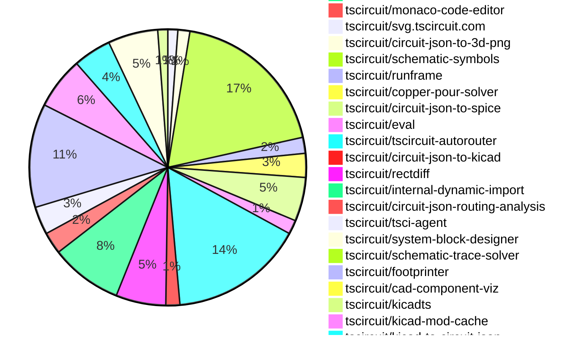

# Contribution Overview 2026-06-23

The current week is shown below. There are 3 major sections:

- [Contributor Overview](#contributor-overview)
- [PRs by Repository](#prs-by-repository)
- [PRs by Contributor](#changes-by-contributor)
- [Scoring & Sponsorship Details](/docs/sponsorship-calculation-explanation.md)

## PRs by Repository

## Contributor Overview

| Contributor | 🐳 Major | 🐙 Minor | 🐌 Tiny | Score | ⭐ | Discussion Contributions |
|-------------|---------|---------|---------|-------|-----|--------------------------|
| [imrishabh18](#imrishabh18) | 11 | 12 | 15 | 81 | ⭐⭐⭐ | 0🔹 0🔶 0💎 |
| [rushabhcodes](#rushabhcodes) | 6 | 5 | 13 | 51 | ⭐⭐⭐ | 0🔹 0🔶 0💎 |
| [seveibar](#seveibar) | 7 | 8 | 5 | 50 | ⭐⭐⭐ | 0🔹 0🔶 0💎 |
| [ShiboSoftwareDev](#ShiboSoftwareDev) | 3 | 11 | 8 | 49 | ⭐⭐ | 0🔹 0🔶 0💎 |
| [MustafaMulla29](#MustafaMulla29) | 2 | 12 | 11 | 43.5 | ⭐⭐ | 0🔹 0🔶 0💎 |
| [techmannih](#techmannih) | 6 | 4 | 6 | 39 | ⭐⭐ | 0🔹 0🔶 0💎 |
| [0hmX](#0hmX) | 6 | 0 | 2 | 27 | ⭐⭐ | 0🔹 0🔶 0💎 |
| [Abse2001](#Abse2001) | 2 | 2 | 7 | 24 | ⭐⭐ | 0🔹 0🔶 0💎 |
| [AnasSarkiz](#AnasSarkiz) | 4 | 1 | 3 | 23 | ⭐⭐ | 0🔹 0🔶 0💎 |
| [mohan-bee](#mohan-bee) | 1 | 3 | 6 | 16 | ⭐⭐ | 0🔹 0🔶 0💎 |
| [tscircuitbot](#tscircuitbot) | 0 | 0 | 275 | 14 | ⭐⭐ | 0🔹 0🔶 0💎 |
| [Sang-it](#Sang-it) | 0 | 2 | 7 | 11.5 | ⭐⭐ | 0🔹 0🔶 0💎 |
| [technologyet31-create](#technologyet31-create) | 0 | 2 | 3 | 7 | ⭐ | 0🔹 0🔶 0💎 |
| [anil08607](#anil08607) | 0 | 1 | 0 | 2 |  | 0🔹 0🔶 0💎 |

## Staff Pass Ratio (SPR)

| Contributor | Reviewed PRs | Rejections | Approvals | SPR |
|-------------|--------------|------------|-----------|-----|
| [MustafaMulla29](#MustafaMulla29) | 13 | 8 | 10 | 38.5% |
| [rushabhcodes](#rushabhcodes) | 6 | 1 | 5 | 83.3% |
| [ShiboSoftwareDev](#ShiboSoftwareDev) | 6 | 2 | 8 | 66.7% |
| [techmannih](#techmannih) | 4 | 3 | 4 | 25.0% |
| [0hmX](#0hmX) | 4 | 0 | 4 | 100.0% |
| [imrishabh18](#imrishabh18) | 3 | 1 | 2 | 66.7% |
| [Abse2001](#Abse2001) | 3 | 1 | 2 | 66.7% |
| [technologyet31-create](#technologyet31-create) | 3 | 1 | 2 | 66.7% |
| [mohan-bee](#mohan-bee) | 3 | 0 | 3 | 100.0% |
| [Sang-it](#Sang-it) | 3 | 1 | 2 | 66.7% |
| [anil08607](#anil08607) | 1 | 0 | 1 | 100.0% |

MustafaMulla29 SPR PRs (13)

- [#235](https://github.com/tscircuit/schematic-viewer/pull/235) feat: add schematic sheet selector to switch between sheets
- [#630](https://github.com/tscircuit/circuit-json/pull/630) New warning type for schematic_sheet
- [#618](https://github.com/tscircuit/circuit-json/pull/618) Add 'name' to source_trace
- [#701](https://github.com/tscircuit/props/pull/701) Add name and displayName props to trace
- [#2527](https://github.com/tscircuit/core/pull/2527) Lay out schematic sheets independently
- [#2522](https://github.com/tscircuit/core/pull/2522) feat: lay out and render schematic sheets independently
- [#2526](https://github.com/tscircuit/core/pull/2526) Emit unnamed trace warning
- [#2520](https://github.com/tscircuit/core/pull/2520) Emit a warning when schematic sheet is not found
- [#2504](https://github.com/tscircuit/core/pull/2504) Add trace name/displayName support for schematic net labels
- [#3469](https://github.com/tscircuit/cli/pull/3469) Fix: tsci dev uses the project-local tscircuit version when available
- [#145](https://github.com/tscircuit/matchpack/pull/145) Align same-side passive groups into a row (ParallelAlignedPassiveSolver)
- [#30](https://github.com/tscircuit/skill/pull/30) Force name on trace
- [#26](https://github.com/tscircuit/system-block-designer/pull/26) Support browser PDF generation and add browser tests

rushabhcodes SPR PRs (6)

- [#3764](https://github.com/tscircuit/tscircuit.com/pull/3764) Fix editor auth dead-end and unify login redirect handling
- [#60](https://github.com/tscircuit/circuit-json-to-tscircuit/pull/60) Add pcb_board template support for board-level Circuit JSON conversion
- [#1704](https://github.com/tscircuit/svg.tscircuit.com/pull/1704) refactor(3d): switch PNG rendering to circuit-json-to-3d-png
- [#1686](https://github.com/tscircuit/svg.tscircuit.com/pull/1686) Prevent CDN fallback in production by preloading bundled ngspice
- [#156](https://github.com/tscircuit/kicad-to-circuit-json/pull/156) Update schematic symbols
- [#23](https://github.com/tscircuit/ngspice-spice-engine/pull/23) fix: avoid Node ESM blob URL failure while preserving browser loader behavior

ShiboSoftwareDev SPR PRs (6)

- [#713](https://github.com/tscircuit/props/pull/713)  Restore graph scaling props for probes and ammeters
- [#712](https://github.com/tscircuit/props/pull/712)  Remove probe axis props and add multipleGraphYAxes simulation option
- [#702](https://github.com/tscircuit/props/pull/702)  Flatten meter display props for probes and ammeters
- [#2523](https://github.com/tscircuit/core/pull/2523) Auto-scale simulation graphs with independent axes
- [#2503](https://github.com/tscircuit/core/pull/2503) update copper-pour-solver & usage
- [#53](https://github.com/tscircuit/copper-pour-solver/pull/53) Resolve copper pour connectivity by source net & usage documentation & cosmos deploy

techmannih SPR PRs (4)

- [#943](https://github.com/tscircuit/3d-viewer/pull/943) Add KiCad TL3342 STEP face color white repro story
- [#764](https://github.com/tscircuit/docs/pull/764) docs: update tscircuit TI library guide for chip exports
- [#152](https://github.com/tscircuit/kicad-to-circuit-json/pull/152) Support simple_test_point inference for TP symbols and footprints
- [#46](https://github.com/tscircuit/ti/pull/46) Add short name TI chip exports and document chip-to-MPN mappings

0hmX SPR PRs (4)

- [#1435](https://github.com/tscircuit/tscircuit-autorouter/pull/1435) Use rectdiff recursive gap fill commit
- [#1438](https://github.com/tscircuit/tscircuit-autorouter/pull/1438) Fix publish workflow auto-merge fallback
- [#133](https://github.com/tscircuit/rectdiff/pull/133) Fill rectdiff gaps across multiple passes using maxGapFillPasses
- [#121](https://github.com/tscircuit/tiny-hypergraph/pull/121) Queue duplicate congested port route solves

imrishabh18 SPR PRs (3)

- [#623](https://github.com/tscircuit/circuit-json/pull/623) Add optional sheet_outline_color property to SchematicSheet
- [#2514](https://github.com/tscircuit/core/pull/2514) Add <schematicsheet /> component
- [#582](https://github.com/tscircuit/circuit-to-svg/pull/582) Add support for schematic_sheet, the subcircuit_id linked to the schematic_sheet is rendered in the center of the sheet

Abse2001 SPR PRs (3)

- [#706](https://github.com/tscircuit/props/pull/706) Add exposedNets to subcircuits
- [#664](https://github.com/tscircuit/footprinter/pull/664) Support polygon pads and improve KiCad parity comparison
- [#3485](https://github.com/tscircuit/cli/pull/3485) Add Gerber-based PCB short circuit detection

technologyet31-create SPR PRs (3)

- [#671](https://github.com/tscircuit/footprinter/pull/671) fix: match the KiCad SOT-89-3 land pattern (large collector tab)
- [#163](https://github.com/tscircuit/checks/pull/163) fix: handle non-rotated pill pads in trace clearance/overlap checks
- [#158](https://github.com/tscircuit/kicad-to-circuit-json/pull/158) fix: include the anchor shape of KiCad custom pads

mohan-bee SPR PRs (3)

- [#3722](https://github.com/tscircuit/runframe/pull/3722) Add footprint preview in import dialog
- [#3793](https://github.com/tscircuit/runframe/pull/3793) fix static runframe file hash selection
- [#15](https://github.com/tscircuit/internal-dynamic-import/pull/15) Add kicad-to-circuit-json to internal dynamic imports

Sang-it SPR PRs (3)

- [#2511](https://github.com/tscircuit/core/pull/2511) fix matchpack pin offsets for text-aware schematic components - repro133
- [#435](https://github.com/tscircuit/schematic-symbols/pull/435) scale down resistor, capacitor to kicad proportions
- [#433](https://github.com/tscircuit/schematic-symbols/pull/433) normalize capacitor and resistor size to match Kicad proportions

anil08607 SPR PRs (1)

- [#339](https://github.com/tscircuit/circuit-json-to-kicad/pull/339) Add .kicad_mod footprint export support and snapshot coverage

> Note: AI evaluates PRs and assigns 1-3 star ratings automatically. 4 and 5 star ratings require manual staff review.

### Discussion Contribution Legend

- 🔹 Normal Comments: Basic participation with minimal effort
- 🔶 Great Informative Comments: Thoughtful participation that adds value
- 💎 Incredible Comments: Exceptional participation with high-quality content

## Review Table

[reviews-received-hover]: ## "Number of reviews received for PRs for this contributor"
[approvals-received-hover]: ## "Number of approvals received for PRs this contributor authored"
[rejections-received-hover]: ## "Number of rejections received for PRs this contributor authored"
[prs-opened-hover]: ## "Number of PRs opened by this contributor"
[issues-created-hover]: ## "Number of issues created by this contributor"

| Contributor | Reviews Received | Approvals Received | Rejections Received | Approvals | Rejections Given | PRs Opened | PRs Merged | Issues Created |
|---|---|---|---|---|---|---|---|---|
| [MustafaMulla29](#MustafaMulla29) | 27 | 20 | 4 | 10 | 1 | 30 | 27 | 0 |
| [seveibar](#seveibar) | 12 | 4 | 0 | 52 | 9 | 26 | 20 | 0 |
| [imrishabh18](#imrishabh18) | 7 | 1 | 1 | 26 | 1 | 42 | 39 | 0 |
| [rushabhcodes](#rushabhcodes) | 31 | 16 | 1 | 5 | 0 | 38 | 24 | 0 |
| [ShiboSoftwareDev](#ShiboSoftwareDev) | 24 | 23 | 0 | 8 | 0 | 23 | 23 | 0 |
| [addibble](#addibble) | 2 | 0 | 0 | 0 | 0 | 2 | 0 | 0 |
| [tscircuitbot](#tscircuitbot) | 0 | 0 | 0 | 0 | 0 | 353 | 275 | 0 |
| [yanyishuai](#yanyishuai) | 0 | 0 | 0 | 0 | 0 | 1 | 0 | 0 |
| [techmannih](#techmannih) | 12 | 11 | 0 | 1 | 0 | 18 | 16 | 0 |
| [vahapogut](#vahapogut) | 0 | 0 | 0 | 0 | 0 | 10 | 0 | 0 |
| [pompydev](#pompydev) | 0 | 0 | 0 | 0 | 0 | 1 | 0 | 0 |
| [Abse2001](#Abse2001) | 14 | 7 | 1 | 5 | 0 | 16 | 11 | 0 |
| [technologyet31-create](#technologyet31-create) | 11 | 6 | 1 | 0 | 0 | 9 | 5 | 0 |
| [singhaditya21](#singhaditya21) | 0 | 0 | 0 | 0 | 0 | 7 | 0 | 0 |
| [AdityaSinghBiztech](#AdityaSinghBiztech) | 0 | 0 | 0 | 0 | 0 | 1 | 0 | 0 |
| [mohan-bee](#mohan-bee) | 12 | 10 | 0 | 0 | 0 | 10 | 10 | 0 |
| [victordb9997](#victordb9997) | 0 | 0 | 0 | 0 | 0 | 2 | 0 | 0 |
| [Sang-it](#Sang-it) | 18 | 5 | 1 | 1 | 0 | 13 | 10 | 0 |
| [Lathikaa-S](#Lathikaa-S) | 3 | 0 | 0 | 0 | 0 | 1 | 0 | 0 |
| [AnasSarkiz](#AnasSarkiz) | 0 | 0 | 0 | 2 | 0 | 8 | 8 | 0 |
| [vagdotdev](#vagdotdev) | 0 | 0 | 0 | 0 | 0 | 14 | 0 | 0 |
| [needsbuilder](#needsbuilder) | 0 | 0 | 0 | 0 | 0 | 1 | 0 | 0 |
| [chenlinxi890-spec](#chenlinxi890-spec) | 0 | 0 | 0 | 0 | 0 | 1 | 0 | 0 |
| [Ghostofcaldera](#Ghostofcaldera) | 0 | 0 | 0 | 0 | 0 | 6 | 0 | 0 |
| [shehanrao12-cpu](#shehanrao12-cpu) | 0 | 0 | 0 | 0 | 0 | 1 | 0 | 0 |
| [bingmokaka](#bingmokaka) | 0 | 0 | 0 | 0 | 0 | 1 | 0 | 0 |
| [mitre88](#mitre88) | 1 | 0 | 0 | 0 | 0 | 1 | 0 | 0 |
| [alan-provable](#alan-provable) | 0 | 0 | 0 | 0 | 0 | 3 | 0 | 0 |
| [guiwenlingmu962-bot](#guiwenlingmu962-bot) | 0 | 0 | 0 | 0 | 0 | 1 | 0 | 0 |
| [r-bt](#r-bt) | 1 | 1 | 0 | 0 | 0 | 2 | 0 | 0 |
| [ghorhh473-coder](#ghorhh473-coder) | 0 | 0 | 0 | 0 | 0 | 1 | 0 | 0 |
| [0hmX](#0hmX) | 9 | 4 | 0 | 1 | 0 | 17 | 8 | 0 |
| [HarshalPatel1972](#HarshalPatel1972) | 1 | 0 | 0 | 0 | 0 | 1 | 0 | 0 |
| [Ami765](#Ami765) | 0 | 0 | 0 | 0 | 0 | 2 | 0 | 0 |
| [anil08607](#anil08607) | 2 | 1 | 1 | 0 | 0 | 1 | 1 | 0 |

## Changes by Repository

### [tscircuit/schematic-viewer](https://github.com/tscircuit/schematic-viewer)

| PR # | Impact | Rating | Contributor | Description |
|------|--------|--------|-------------|-------------|
| [#235](https://github.com/tscircuit/schematic-viewer/pull/235) | 🐳 Major | ⭐⭐⭐ | MustafaMulla29 | Adds the ability to view independent schematic sheets in the schematic viewer, allowing users to switch between multiple sheets instead of rendering them all merged together. |
| [#232](https://github.com/tscircuit/schematic-viewer/pull/232) | 🐙 Minor | ⭐⭐ | rushabhcodes | Fixes the issue where ammeter current waveforms were not rendered in the AnalogSimulationViewer despite being generated during simulation. |

🐌 Tiny Contributions (3)

| PR # | Impact | Contributor | Description |
|------|--------|-------------|-------------|
| [#231](https://github.com/tscircuit/schematic-viewer/pull/231) | 🐌 Tiny | rushabhcodes | Updates the circuit-json-to-spice dependency from version 0.0.30 to 0.0.39 in package.json |
| [#233](https://github.com/tscircuit/schematic-viewer/pull/233) | 🐌 Tiny | rushabhcodes | Updates the tscircuit dependency version from 0.0.1922 to 0.0.1938 in package.json |
| [#234](https://github.com/tscircuit/schematic-viewer/pull/234) | 🐌 Tiny | ShiboSoftwareDev | Moves circuit-json-to-spice from dependencies to peerDependencies in package.json |

### [tscircuit/matchpack](https://github.com/tscircuit/matchpack)

| PR # | Impact | Rating | Contributor | Description |
|------|--------|--------|-------------|-------------|
| [#145](https://github.com/tscircuit/matchpack/pull/145) | 🐳 Major | ⭐⭐⭐ | MustafaMulla29 | Fixes layout scattering of same-side passive components by aligning them into a clean, evenly-spaced row adjacent to the main chip. |
| [#143](https://github.com/tscircuit/matchpack/pull/143) | 🐙 Minor | ⭐⭐ | MustafaMulla29 | Fixes incorrect placement of resistors in the layout for the BQ24074 chip, ensuring they are positioned correctly under the chip in the schematic. |

🐌 Tiny Contributions (4)

| PR # | Impact | Contributor | Description |
|------|--------|-------------|-------------|
| [#142](https://github.com/tscircuit/matchpack/pull/142) | 🐌 Tiny | MustafaMulla29 | This pull request adds additional snapshot tests to improve the testing coverage of the project. The new tests include various input JSON files that represent different circuit configurations and their expected outputs. This enhancement aims to ensure that the circuit simulation behaves as expected across a wider range of scenarios. |
| [#144](https://github.com/tscircuit/matchpack/pull/144) | 🐌 Tiny | MustafaMulla29 | Reproduces a layout issue with right-side vertical stack resistors in the BQ24074 circuit configuration. |
| [#148](https://github.com/tscircuit/matchpack/pull/148) | 🐌 Tiny | Sang-it | Adds a new test case and JSON configuration for scattered components in the layout solver. |
| [#146](https://github.com/tscircuit/matchpack/pull/146) | 🐌 Tiny | Sang-it | Adds a new test case and associated JSON data for layout solver functionality, ensuring that test points are correctly aligned in the layout pipeline solver. |

### [tscircuit/tscircuit](https://github.com/tscircuit/tscircuit)

| PR # | Impact | Rating | Contributor | Description |
|------|--------|--------|-------------|-------------|
| [#3697](https://github.com/tscircuit/tscircuit/pull/3697) | 🐙 Minor | ⭐⭐ | MustafaMulla29 | Sets TSCIRCUIT_GLOBAL_STANDALONE_FILE_PATH to the packages distbrowser.min.js for use in tsci dev when no local tscircuit is installed. |

🐌 Tiny Contributions (80)

| PR # | Impact | Contributor | Description |
|------|--------|-------------|-------------|
| [#3725](https://github.com/tscircuit/tscircuit/pull/3725) | 🐌 Tiny | tscircuitbot | Updates the package version from 0.0.1973 to 0.0.1974 in package.json |
| [#3724](https://github.com/tscircuit/tscircuit/pull/3724) | 🐌 Tiny | tscircuitbot | Updates the versions of several dependencies in the package.json file, including tscircuitcli, tscircuitcore, and tscircuiteval. |
| [#3723](https://github.com/tscircuit/tscircuit/pull/3723) | 🐌 Tiny | tscircuitbot | Automated package update |
| [#3722](https://github.com/tscircuit/tscircuit/pull/3722) | 🐌 Tiny | tscircuitbot | Automated package update |
| [#3721](https://github.com/tscircuit/tscircuit/pull/3721) | 🐌 Tiny | tscircuitbot | Updates the package version from 0.0.1971 to 0.0.1972 in package.json |
| [#3720](https://github.com/tscircuit/tscircuit/pull/3720) | 🐌 Tiny | tscircuitbot | Automated package update |
| [#3719](https://github.com/tscircuit/tscircuit/pull/3719) | 🐌 Tiny | tscircuitbot | Updates the package version from 0.0.1970 to 0.0.1971 in package.json |
| [#3718](https://github.com/tscircuit/tscircuit/pull/3718) | 🐌 Tiny | tscircuitbot | Updates the version of the tscircuitcore and tscircuitprops packages in package.json |
| [#3717](https://github.com/tscircuit/tscircuit/pull/3717) | 🐌 Tiny | tscircuitbot | Automated package update |
| [#3716](https://github.com/tscircuit/tscircuit/pull/3716) | 🐌 Tiny | tscircuitbot | Automated package update |
| [#3715](https://github.com/tscircuit/tscircuit/pull/3715) | 🐌 Tiny | tscircuitbot | Automated package update to version 0.0.1969 |
| [#3714](https://github.com/tscircuit/tscircuit/pull/3714) | 🐌 Tiny | tscircuitbot | Automated package update |
| [#3709](https://github.com/tscircuit/tscircuit/pull/3709) | 🐌 Tiny | tscircuitbot | Automated package update |
| [#3713](https://github.com/tscircuit/tscircuit/pull/3713) | 🐌 Tiny | tscircuitbot | Automated package update |
| [#3710](https://github.com/tscircuit/tscircuit/pull/3710) | 🐌 Tiny | tscircuitbot | Automated package update |
| [#3712](https://github.com/tscircuit/tscircuit/pull/3712) | 🐌 Tiny | tscircuitbot | Automated package update |
| [#3708](https://github.com/tscircuit/tscircuit/pull/3708) | 🐌 Tiny | tscircuitbot | Updates the package version from 0.0.1965 to 0.0.1966 in package.json |
| [#3707](https://github.com/tscircuit/tscircuit/pull/3707) | 🐌 Tiny | tscircuitbot | Automated package update |
| [#3705](https://github.com/tscircuit/tscircuit/pull/3705) | 🐌 Tiny | tscircuitbot | Updates the tscircuitcli package version from 0.1.1568 to 0.1.1569 and the tscircuitrunframe package version from 0.0.2127 to 0.0.2128 in package.json |
| [#3706](https://github.com/tscircuit/tscircuit/pull/3706) | 🐌 Tiny | tscircuitbot | Automated package update |
| [#3704](https://github.com/tscircuit/tscircuit/pull/3704) | 🐌 Tiny | tscircuitbot | Updates the package version from 0.0.1963 to 0.0.1964 in package.json |
| [#3703](https://github.com/tscircuit/tscircuit/pull/3703) | 🐌 Tiny | tscircuitbot | Automated package update |
| [#3698](https://github.com/tscircuit/tscircuit/pull/3698) | 🐌 Tiny | tscircuitbot | Updates the tscircuitcli package from version 0.1.1565 to 0.1.1566 |
| [#3701](https://github.com/tscircuit/tscircuit/pull/3701) | 🐌 Tiny | tscircuitbot | Updates the tscircuitcli package version from 0.1.1566 to 0.1.1567 in package.json |
| [#3696](https://github.com/tscircuit/tscircuit/pull/3696) | 🐌 Tiny | tscircuitbot | Automated package update |
| [#3699](https://github.com/tscircuit/tscircuit/pull/3699) | 🐌 Tiny | tscircuitbot | Updates the package version from 0.0.1960 to 0.0.1961 in package.json |
| [#3695](https://github.com/tscircuit/tscircuit/pull/3695) | 🐌 Tiny | tscircuitbot | Updates the tscircuitcli package to version 0.1.1565 |
| [#3700](https://github.com/tscircuit/tscircuit/pull/3700) | 🐌 Tiny | tscircuitbot | Automated package update to version 0.0.1962 |
| [#3702](https://github.com/tscircuit/tscircuit/pull/3702) | 🐌 Tiny | tscircuitbot | Automated package update |
| [#3685](https://github.com/tscircuit/tscircuit/pull/3685) | 🐌 Tiny | tscircuitbot | Updates the version of tscircuitcore from 0.0.1357 to 0.0.1358 and updates circuit-json-to-spice from 0.0.39 to 0.0.40 in package.json |
| [#3671](https://github.com/tscircuit/tscircuit/pull/3671) | 🐌 Tiny | tscircuitbot | Automated package update |
| [#3675](https://github.com/tscircuit/tscircuit/pull/3675) | 🐌 Tiny | tscircuitbot | Updates the package version from 0.0.1949 to 0.0.1950 in package.json |
| [#3678](https://github.com/tscircuit/tscircuit/pull/3678) | 🐌 Tiny | tscircuitbot | Updates the package version from 0.0.1950 to 0.0.1951 in package.json |
| [#3674](https://github.com/tscircuit/tscircuit/pull/3674) | 🐌 Tiny | tscircuitbot | Updates the tscircuitcli package version from 0.1.1556 to 0.1.1557 in package.json |
| [#3692](https://github.com/tscircuit/tscircuit/pull/3692) | 🐌 Tiny | tscircuitbot | Updates the tscircuitcli package to version 0.1.1563 in the package.json file. |
| [#3681](https://github.com/tscircuit/tscircuit/pull/3681) | 🐌 Tiny | tscircuitbot | Updates the tscircuitcli package to version 0.1.1560 |
| [#3672](https://github.com/tscircuit/tscircuit/pull/3672) | 🐌 Tiny | tscircuitbot | Updates the tscircuitcli package from version 0.1.1555 to 0.1.1556 and the tscircuitrunframe package from version 0.0.2121 to 0.0.2122 |
| [#3667](https://github.com/tscircuit/tscircuit/pull/3667) | 🐌 Tiny | tscircuitbot | Updates the package version from 0.0.1945 to 0.0.1946 in package.json |
| [#3683](https://github.com/tscircuit/tscircuit/pull/3683) | 🐌 Tiny | tscircuitbot | Updates the tscircuitcli package to version 0.1.1561 in package.json |
| [#3666](https://github.com/tscircuit/tscircuit/pull/3666) | 🐌 Tiny | tscircuitbot | Automated package update |
| [#3669](https://github.com/tscircuit/tscircuit/pull/3669) | 🐌 Tiny | tscircuitbot | Automated package update |
| [#3673](https://github.com/tscircuit/tscircuit/pull/3673) | 🐌 Tiny | tscircuitbot | Automated package update |
| [#3684](https://github.com/tscircuit/tscircuit/pull/3684) | 🐌 Tiny | tscircuitbot | Automated package update |
| [#3668](https://github.com/tscircuit/tscircuit/pull/3668) | 🐌 Tiny | tscircuitbot | Updates the tscircuitcore package from version 0.0.1355 to 0.0.1356 and the tscircuitprops package from version 0.0.553 to 0.0.555 as part of an automated package update. |
| [#3689](https://github.com/tscircuit/tscircuit/pull/3689) | 🐌 Tiny | tscircuitbot | Updates the tscircuitcli package to version 0.1.1562 in the package.json file |
| [#3680](https://github.com/tscircuit/tscircuit/pull/3680) | 🐌 Tiny | tscircuitbot | Automated package update |
| [#3670](https://github.com/tscircuit/tscircuit/pull/3670) | 🐌 Tiny | tscircuitbot | Updates the tscircuiteval package to version 0.0.952 |
| [#3693](https://github.com/tscircuit/tscircuit/pull/3693) | 🐌 Tiny | tscircuitbot | Automated package update |
| [#3690](https://github.com/tscircuit/tscircuit/pull/3690) | 🐌 Tiny | tscircuitbot | Automated package update |
| [#3694](https://github.com/tscircuit/tscircuit/pull/3694) | 🐌 Tiny | tscircuitbot | Updates the tscircuitcli package from version 0.1.1563 to 0.1.1564 and the tscircuitrunframe package from version 0.0.2125 to 0.0.2126 |
| [#3682](https://github.com/tscircuit/tscircuit/pull/3682) | 🐌 Tiny | tscircuitbot | Automated package update |
| [#3688](https://github.com/tscircuit/tscircuit/pull/3688) | 🐌 Tiny | tscircuitbot | Automated package update |
| [#3679](https://github.com/tscircuit/tscircuit/pull/3679) | 🐌 Tiny | tscircuitbot | Automated package update |
| [#3686](https://github.com/tscircuit/tscircuit/pull/3686) | 🐌 Tiny | tscircuitbot | Updates the package version from 0.0.1954 to 0.0.1955 in package.json |
| [#3677](https://github.com/tscircuit/tscircuit/pull/3677) | 🐌 Tiny | tscircuitbot | Updates the tscircuitcli package version from 0.1.1557 to 0.1.1558 in package.json |
| [#3687](https://github.com/tscircuit/tscircuit/pull/3687) | 🐌 Tiny | tscircuitbot | Automated package update |
| [#3654](https://github.com/tscircuit/tscircuit/pull/3654) | 🐌 Tiny | tscircuitbot | Updates the tscircuitcli package from version 0.1.1548 to 0.1.1549 and the tscircuitrunframe package from version 0.0.2115 to 0.0.2116 |
| [#3650](https://github.com/tscircuit/tscircuit/pull/3650) | 🐌 Tiny | tscircuitbot | Automated package update |
| [#3656](https://github.com/tscircuit/tscircuit/pull/3656) | 🐌 Tiny | tscircuitbot | Updates the tscircuitcli package from version 0.1.1549 to 0.1.1550 and the tscircuitrunframe package from version 0.0.2116 to 0.0.2117 |
| [#3642](https://github.com/tscircuit/tscircuit/pull/3642) | 🐌 Tiny | tscircuitbot | Updates the tscircuitcli package from version 0.1.1542 to 0.1.1543 and the tscircuitrunframe package from version 0.0.2110 to 0.0.2111. |
| [#3658](https://github.com/tscircuit/tscircuit/pull/3658) | 🐌 Tiny | tscircuitbot | Updates the tscircuitcli package from version 0.1.1550 to 0.1.1551 and the tscircuitrunframe package from version 0.0.2117 to 0.0.2118 in the package.json file. |
| [#3644](https://github.com/tscircuit/tscircuit/pull/3644) | 🐌 Tiny | tscircuitbot | Updates the tscircuitcli package from version 0.1.1543 to 0.1.1544 and the tscircuitrunframe package from version 0.0.2111 to 0.0.2112 in package.json |
| [#3652](https://github.com/tscircuit/tscircuit/pull/3652) | 🐌 Tiny | tscircuitbot | Updates the tscircuitcli package from version 0.1.1547 to 0.1.1548 and the tscircuitcore package from version 0.0.1352 to 0.0.1353, along with the tscircuitrunframe package from version 0.0.2114 to 0.0.2115 as part of an automated package update. |
| [#3660](https://github.com/tscircuit/tscircuit/pull/3660) | 🐌 Tiny | tscircuitbot | Automated package update |
| [#3653](https://github.com/tscircuit/tscircuit/pull/3653) | 🐌 Tiny | tscircuitbot | Automated package update |
| [#3647](https://github.com/tscircuit/tscircuit/pull/3647) | 🐌 Tiny | tscircuitbot | Automated package update |
| [#3649](https://github.com/tscircuit/tscircuit/pull/3649) | 🐌 Tiny | tscircuitbot | Automated package update to version 0.0.1937 |
| [#3659](https://github.com/tscircuit/tscircuit/pull/3659) | 🐌 Tiny | tscircuitbot | Automated package update |
| [#3646](https://github.com/tscircuit/tscircuit/pull/3646) | 🐌 Tiny | tscircuitbot | Automated package update |
| [#3662](https://github.com/tscircuit/tscircuit/pull/3662) | 🐌 Tiny | tscircuitbot | Updates the tscircuitcli package to version 0.1.1553 |
| [#3665](https://github.com/tscircuit/tscircuit/pull/3665) | 🐌 Tiny | tscircuitbot | Automated package update to version 0.0.1945 |
| [#3655](https://github.com/tscircuit/tscircuit/pull/3655) | 🐌 Tiny | tscircuitbot | Automated package update |
| [#3648](https://github.com/tscircuit/tscircuit/pull/3648) | 🐌 Tiny | tscircuitbot | Updates the tscircuitcli package to version 0.1.1546 |
| [#3645](https://github.com/tscircuit/tscircuit/pull/3645) | 🐌 Tiny | tscircuitbot | Automated package update |
| [#3651](https://github.com/tscircuit/tscircuit/pull/3651) | 🐌 Tiny | tscircuitbot | Automated package update |
| [#3663](https://github.com/tscircuit/tscircuit/pull/3663) | 🐌 Tiny | tscircuitbot | Automated package update |
| [#3643](https://github.com/tscircuit/tscircuit/pull/3643) | 🐌 Tiny | tscircuitbot | Automated package update |
| [#3664](https://github.com/tscircuit/tscircuit/pull/3664) | 🐌 Tiny | tscircuitbot | Updates the tscircuitcli package to version 0.1.1554 in the package.json file |
| [#3657](https://github.com/tscircuit/tscircuit/pull/3657) | 🐌 Tiny | tscircuitbot | Automated package update |
| [#3661](https://github.com/tscircuit/tscircuit/pull/3661) | 🐌 Tiny | tscircuitbot | Automated package update |

### [tscircuit/circuit-json](https://github.com/tscircuit/circuit-json)

| PR # | Impact | Rating | Contributor | Description |
|------|--------|--------|-------------|-------------|
| [#628](https://github.com/tscircuit/circuit-json/pull/628) | 🐳 Major | ⭐⭐⭐ | seveibar | Adds a required sheet_index property to the schematic_sheet interface and removes the subcircuit_id property. |
| [#618](https://github.com/tscircuit/circuit-json/pull/618) | 🐙 Minor | ⭐⭐ | MustafaMulla29 | Adds an optional name field to the SourceTrace interface and its corresponding Zod schema for improved trace identification. |
| [#626](https://github.com/tscircuit/circuit-json/pull/626) | 🐙 Minor | ⭐⭐ | seveibar | Adds optional schematic_sheet_id property to various schematic elements to enhance their conditional rendering capabilities. |
| [#623](https://github.com/tscircuit/circuit-json/pull/623) | 🐙 Minor | ⭐⭐ | imrishabh18 | Adds an optional outline_color property to the SchematicSheet interface for better customization of schematic sheets. |

🐌 Tiny Contributions (4)

| PR # | Impact | Contributor | Description |
|------|--------|-------------|-------------|
| [#631](https://github.com/tscircuit/circuit-json/pull/631) | 🐌 Tiny | MustafaMulla29 | Adds a new warning type for source traces that are missing a name |
| [#629](https://github.com/tscircuit/circuit-json/pull/629) | 🐌 Tiny | tscircuitbot | Automated package update |
| [#627](https://github.com/tscircuit/circuit-json/pull/627) | 🐌 Tiny | tscircuitbot | Automated package update |
| [#619](https://github.com/tscircuit/circuit-json/pull/619) | 🐌 Tiny | tscircuitbot | Automated package update |

### [tscircuit/props](https://github.com/tscircuit/props)

| PR # | Impact | Rating | Contributor | Description |
|------|--------|--------|-------------|-------------|
| [#701](https://github.com/tscircuit/props/pull/701) | 🐙 Minor | ⭐⭐ | MustafaMulla29 | Adds optional name and displayName properties to the trace component for improved identification and display purposes. |
| [#713](https://github.com/tscircuit/props/pull/713) | 🐙 Minor | ⭐⭐ | ShiboSoftwareDev | Adds graph scaling properties for ammeters and voltage probes, including graphCenter, graphVerticalOffset, and graphCurrentPerDivgraphVoltagePerDiv. |
| [#712](https://github.com/tscircuit/props/pull/712) | 🐙 Minor | ⭐⭐ | ShiboSoftwareDev | Removes graph axis properties from Ammeter and VoltageProbe components and adds a new option for independent graph axes in AnalogSimulation. |
| [#702](https://github.com/tscircuit/props/pull/702) | 🐙 Minor | ⭐⭐ | ShiboSoftwareDev | Changes the display properties for Ammeter and VoltageProbe components by flattening the structure and renaming properties for better clarity and consistency. |
| [#709](https://github.com/tscircuit/props/pull/709) | 🐙 Minor | ⭐⭐ | seveibar | Adds a new property schSheetName to BaseGroupProps to specify the sheet name for groups and subcircuits in schematic representations. |
| [#710](https://github.com/tscircuit/props/pull/710) | 🐙 Minor | ⭐⭐ | seveibar | Adds optional sheetIndex property to SchematicSheetProps for better indexing of schematic sheets. |
| [#707](https://github.com/tscircuit/props/pull/707) | 🐙 Minor | ⭐⭐ | seveibar | Adds a new boolean property exposeNets to the SubcircuitGroupProps interface, allowing all nets defined within a subcircuit to be exposed to parent circuits. |
| [#708](https://github.com/tscircuit/props/pull/708) | 🐙 Minor | ⭐⭐ | seveibar | Adds a new preset option default to the autorouter configuration, allowing users to select a default autorouting behavior. |
| [#705](https://github.com/tscircuit/props/pull/705) | 🐙 Minor | ⭐⭐ | seveibar | Add SchematicSheetProps and schSheetName prop to enable top-level schematic grouping with named sheets and display titles. |
| [#706](https://github.com/tscircuit/props/pull/706) | 🐙 Minor | ⭐⭐ | Abse2001 | Adds an exposedNets property to subcircuits, allowing specific nets to be exposed to parent circuits. |

🐌 Tiny Contributions (2)

| PR # | Impact | Contributor | Description |
|------|--------|-------------|-------------|
| [#711](https://github.com/tscircuit/props/pull/711) | 🐌 Tiny | seveibar | Adds an optional name property to the FootprintProps interface, allowing users to specify a footprint name. |
| [#703](https://github.com/tscircuit/props/pull/703) | 🐌 Tiny | seveibar | Added guidelines for Props API design and usage. |

### [tscircuit/core](https://github.com/tscircuit/core)

| PR # | Impact | Rating | Contributor | Description |
|------|--------|--------|-------------|-------------|
| [#2523](https://github.com/tscircuit/core/pull/2523) | 🐳 Major | ⭐⭐⭐ | ShiboSoftwareDev | Automatically scales voltage and current simulation graphs into independent display sections when graphIndependentAxes is enabled. Removes deprecated per-probe graph scaling props while preserving probe display names and colors. Refactors graph scaling and scope trace insertion into typed helpers, and adds deterministic SVG snapshot coverage for multi-channel, mixed-shape, flat-voltage, and tiny-current graph cases. |
| [#2516](https://github.com/tscircuit/core/pull/2516) | 🐳 Major | ⭐⭐⭐ | seveibar | Adds a new SchematicSheet component that links schematic elements and calculates their bounds for rendering. |
| [#2515](https://github.com/tscircuit/core/pull/2515) | 🐳 Major | ⭐⭐⭐ | seveibar | Adds support for connecting child nets to parent nets in subcircuits, enhancing the autorouting capabilities of the system. |
| [#2513](https://github.com/tscircuit/core/pull/2513) | 🐳 Major | ⭐⭐⭐ | seveibar | Adds functionality for managing traces created for exposed nets in subcircuits, enhancing the routing capabilities across subcircuit boundaries. |
| [#2526](https://github.com/tscircuit/core/pull/2526) | 🐙 Minor | ⭐⭐ | MustafaMulla29 | Adds a warning for unnamed traces to improve trace identification in the circuit. |
| [#2524](https://github.com/tscircuit/core/pull/2524) | 🐙 Minor | ⭐⭐ | MustafaMulla29 | Fixes layout issues by ensuring that schematic sheets are rendered independently, allowing for proper layout of components on separate sheets without interference. |
| [#2520](https://github.com/tscircuit/core/pull/2520) | 🐙 Minor | ⭐⭐ | MustafaMulla29 | Emit a warning when a schematic sheet name does not resolve to any existing schematic sheet, providing feedback to the user that their specified sheet name was ignored. |
| [#2519](https://github.com/tscircuit/core/pull/2519) | 🐙 Minor | ⭐⭐ | MustafaMulla29 | Fixes layout issue where schematic sheets are incorrectly packed together instead of laid out independently, and adds a test for unknown schematic sheet names to emit warnings. |
| [#2504](https://github.com/tscircuit/core/pull/2504) | 🐙 Minor | ⭐⭐ | MustafaMulla29 | Adds support for trace name and displayName to be used as schematic net labels, allowing for better identification of traces in schematics. |
| [#2505](https://github.com/tscircuit/core/pull/2505) | 🐙 Minor | ⭐⭐ | ShiboSoftwareDev | Updates the core components to utilize the new graph display API from tscircuitprops, replacing previous display properties with graph-specific properties for better integration. |
| [#2503](https://github.com/tscircuit/core/pull/2503) | 🐙 Minor | ⭐⭐ | ShiboSoftwareDev | Updates the copper-pour-solver dependency to version 0.0.34 and modifies the CopperPour component to use source_net_id instead of pour_connectivity_key for input problem conversion. |
| [#2529](https://github.com/tscircuit/core/pull/2529) | 🐙 Minor | ⭐⭐ | imrishabh18 | Fixes issue where exposed nets in subcircuits do not create PCB traces as expected. |
| [#2511](https://github.com/tscircuit/core/pull/2511) | 🐙 Minor | ⭐⭐ | Sang-it | Fixes pin offset calculations in matchpack input generation to prevent label shifts in schematic components. |
| [#2482](https://github.com/tscircuit/core/pull/2482) | 🐙 Minor | ⭐⭐ | Sang-it | Add text-aware bounding boxes for inductor, crystal, resonator, potentiometer, and fuse components in schematic rendering. |

🐌 Tiny Contributions (8)

| PR # | Impact | Contributor | Description |
|------|--------|-------------|-------------|
| [#2531](https://github.com/tscircuit/core/pull/2531) | 🐌 Tiny | rushabhcodes | Removes the unused circuit-json-to-simple-3d dependency from package.json as it is no longer needed after migrating to circuit-json-to-gltf and poppygl for 3D snapshot rendering. |
| [#2506](https://github.com/tscircuit/core/pull/2506) | 🐌 Tiny | ShiboSoftwareDev | Updates the version of the circuit-json-to-spice dependency from 0.0.39 to 0.0.40 in package.json |
| [#2517](https://github.com/tscircuit/core/pull/2517) | 🐌 Tiny | tscircuitbot | Updates the tscircuitchecks package from version 0.0.138 to 0.0.140 in the package.json file. |
| [#2497](https://github.com/tscircuit/core/pull/2497) | 🐌 Tiny | mohan-bee | Reproduces a bug related to duplicate net labels in a multidrop circuit configuration by adding a comprehensive test case. |
| [#2501](https://github.com/tscircuit/core/pull/2501) | 🐌 Tiny | mohan-bee | Fixes the issue of duplicate overlapping schematic net labels for named nets by reusing existing labels instead of inserting duplicates. |
| [#2510](https://github.com/tscircuit/core/pull/2510) | 🐌 Tiny | Sang-it | Adds a test case for unaligned pins in circuit schematics to ensure proper rendering and functionality. |
| [#2509](https://github.com/tscircuit/core/pull/2509) | 🐌 Tiny | Sang-it | Updates the tscircuitmatchpack dependency to version 0.0.29 in package.json |
| [#2508](https://github.com/tscircuit/core/pull/2508) | 🐌 Tiny | Sang-it | Add text-aware functionality to diode, led, transistor, mosfet, and op-amp components, including updates to their schematic representations and bounding boxes. |

### [tscircuit/circuit-to-svg](https://github.com/tscircuit/circuit-to-svg)

| PR # | Impact | Rating | Contributor | Description |
|------|--------|--------|-------------|-------------|
| [#586](https://github.com/tscircuit/circuit-to-svg/pull/586) | 🐙 Minor | ⭐⭐ | MustafaMulla29 | Adds convertCircuitJsonToStackedSchematicSheetsSvg to render all schematic sheets stacked vertically into a single SVG for easier debugging of multi-sheet designs. |
| [#585](https://github.com/tscircuit/circuit-to-svg/pull/585) | 🐙 Minor | ⭐⭐ | seveibar | Adds functionality to filter and render schematic sheets based on specified criteria, enhancing the schematic SVG generation process. |
| [#584](https://github.com/tscircuit/circuit-to-svg/pull/584) | 🐙 Minor | ⭐⭐ | seveibar | Reverts changes related to schematic sheet handling in the circuit-to-svg conversion process, removing associated functions and imports. |
| [#582](https://github.com/tscircuit/circuit-to-svg/pull/582) | 🐙 Minor | ⭐⭐ | imrishabh18 | Adds support for rendering schematic sheets with linked subcircuits centered on the sheet in the SVG output. |
| [#583](https://github.com/tscircuit/circuit-to-svg/pull/583) | 🐙 Minor | ⭐⭐ | imrishabh18 | Adds functionality to include schematic traces based on matching source trace IDs or connectivity map keys. |

🐌 Tiny Contributions (2)

| PR # | Impact | Contributor | Description |
|------|--------|-------------|-------------|
| [#588](https://github.com/tscircuit/circuit-to-svg/pull/588) | 🐌 Tiny | MustafaMulla29 | Fixes the positioning of schematic sheet frames to be centered at the origin, resolving issues where components on sheets with index  0 rendered outside their frame. |
| [#587](https://github.com/tscircuit/circuit-to-svg/pull/587) | 🐌 Tiny | MustafaMulla29 | Fixes the offset of the schematic sheet frame from its content when the sheet index is greater than 0. |

### [tscircuit/cli](https://github.com/tscircuit/cli)

| PR # | Impact | Rating | Contributor | Description |
|------|--------|--------|-------------|-------------|
| [#3469](https://github.com/tscircuit/cli/pull/3469) | 🐙 Minor | ⭐⭐ | MustafaMulla29 | tsci dev now renders the preview with the tscircuit version installed in the project, instead of always using the runframe baked into the CLI. |
| [#3471](https://github.com/tscircuit/cli/pull/3471) | 🐙 Minor | ⭐⭐ | MustafaMulla29 | When a project has no local tscircuit, the dev server now serves the bundle exposed via TSCIRCUIT_GLOBAL_STANDALONE_FILE_PATH before falling back to the runframe bundled into the CLI. |
| [#3457](https://github.com/tscircuit/cli/pull/3457) | 🐙 Minor | ⭐⭐ | ShiboSoftwareDev | Changes the platform configuration retrieval method to align with CLI defaults for SPICE simulation and snapshot behavior. |
| [#3425](https://github.com/tscircuit/cli/pull/3425) | 🐙 Minor | ⭐⭐ | ShiboSoftwareDev | Adds support for simulation_transient_current_graph elements alongside existing voltage graph support when generating simulation SVG assets, allowing current and voltage graphs to render in tsci build --simulation-svgs and tsci snapshot --simulation-only. |

🐌 Tiny Contributions (63)

| PR # | Impact | Contributor | Description |
|------|--------|-------------|-------------|
| [#3473](https://github.com/tscircuit/cli/pull/3473) | 🐌 Tiny | MustafaMulla29 | Removes the Texas Instruments search option from the command line interface, along with related code and tests. |
| [#3439](https://github.com/tscircuit/cli/pull/3439) | 🐌 Tiny | rushabhcodes | Add an example for a standalone analog multi-channel scope reproduction with voltage source, load resistor, current meters, and voltage probes, including necessary configuration files for direct execution. |
| [#3450](https://github.com/tscircuit/cli/pull/3450) | 🐌 Tiny | ShiboSoftwareDev | Updates various dependencies in the package.json file to their latest versions. |
| [#3462](https://github.com/tscircuit/cli/pull/3462) | 🐌 Tiny | ShiboSoftwareDev | Updates the version of the tscircuiteval and tscircuit dependencies in the package.json file. |
| [#3497](https://github.com/tscircuit/cli/pull/3497) | 🐌 Tiny | tscircuitbot | Automated package update |
| [#3496](https://github.com/tscircuit/cli/pull/3496) | 🐌 Tiny | tscircuitbot | Automated package update |
| [#3494](https://github.com/tscircuit/cli/pull/3494) | 🐌 Tiny | tscircuitbot | Updates the tscircuitrunframe package to version 0.0.2135 in package.json |
| [#3493](https://github.com/tscircuit/cli/pull/3493) | 🐌 Tiny | tscircuitbot | Automated package update |
| [#3492](https://github.com/tscircuit/cli/pull/3492) | 🐌 Tiny | tscircuitbot | Updates the tscircuitrunframe package version from 0.0.2133 to 0.0.2134 |
| [#3491](https://github.com/tscircuit/cli/pull/3491) | 🐌 Tiny | tscircuitbot | Automated package update |
| [#3490](https://github.com/tscircuit/cli/pull/3490) | 🐌 Tiny | tscircuitbot | Updates the tscircuitrunframe package from version 0.0.2132 to 0.0.2133 |
| [#3489](https://github.com/tscircuit/cli/pull/3489) | 🐌 Tiny | tscircuitbot | Automated package update |
| [#3488](https://github.com/tscircuit/cli/pull/3488) | 🐌 Tiny | tscircuitbot | Updates the tscircuitrunframe package version from 0.0.2131 to 0.0.2132 |
| [#3486](https://github.com/tscircuit/cli/pull/3486) | 🐌 Tiny | tscircuitbot | Updates the tscircuitrunframe package from version 0.0.2130 to 0.0.2131 |
| [#3484](https://github.com/tscircuit/cli/pull/3484) | 🐌 Tiny | tscircuitbot | Automated package update |
| [#3487](https://github.com/tscircuit/cli/pull/3487) | 🐌 Tiny | tscircuitbot | Automated package update |
| [#3483](https://github.com/tscircuit/cli/pull/3483) | 🐌 Tiny | tscircuitbot | Updates the tscircuitrunframe package to version 0.0.2130 in package.json |
| [#3481](https://github.com/tscircuit/cli/pull/3481) | 🐌 Tiny | tscircuitbot | Automated package update |
| [#3480](https://github.com/tscircuit/cli/pull/3480) | 🐌 Tiny | tscircuitbot | Updates the tscircuitrunframe package from version 0.0.2128 to 0.0.2129 |
| [#3478](https://github.com/tscircuit/cli/pull/3478) | 🐌 Tiny | tscircuitbot | Updates the tscircuitrunframe package from version 0.0.2127 to 0.0.2128 |
| [#3479](https://github.com/tscircuit/cli/pull/3479) | 🐌 Tiny | tscircuitbot | Automated package update |
| [#3475](https://github.com/tscircuit/cli/pull/3475) | 🐌 Tiny | tscircuitbot | Updates the tscircuitrunframe package from version 0.0.2126 to 0.0.2127 |
| [#3476](https://github.com/tscircuit/cli/pull/3476) | 🐌 Tiny | tscircuitbot | Automated package update |
| [#3470](https://github.com/tscircuit/cli/pull/3470) | 🐌 Tiny | tscircuitbot | Automated package update |
| [#3474](https://github.com/tscircuit/cli/pull/3474) | 🐌 Tiny | tscircuitbot | Automated package update |
| [#3472](https://github.com/tscircuit/cli/pull/3472) | 🐌 Tiny | tscircuitbot | Automated package update |
| [#3452](https://github.com/tscircuit/cli/pull/3452) | 🐌 Tiny | tscircuitbot | Automated package update |
| [#3456](https://github.com/tscircuit/cli/pull/3456) | 🐌 Tiny | tscircuitbot | Automated package update |
| [#3467](https://github.com/tscircuit/cli/pull/3467) | 🐌 Tiny | tscircuitbot | Updates the tscircuitrunframe package from version 0.0.2125 to 0.0.2126 in the package.json file. |
| [#3455](https://github.com/tscircuit/cli/pull/3455) | 🐌 Tiny | tscircuitbot | Updates the tscircuitrunframe package from version 0.0.2122 to 0.0.2123 |
| [#3459](https://github.com/tscircuit/cli/pull/3459) | 🐌 Tiny | tscircuitbot | Automated package update |
| [#3449](https://github.com/tscircuit/cli/pull/3449) | 🐌 Tiny | tscircuitbot | Automated package update |
| [#3447](https://github.com/tscircuit/cli/pull/3447) | 🐌 Tiny | tscircuitbot | Automated package update |
| [#3468](https://github.com/tscircuit/cli/pull/3468) | 🐌 Tiny | tscircuitbot | Automated package update |
| [#3446](https://github.com/tscircuit/cli/pull/3446) | 🐌 Tiny | tscircuitbot | Updates the tscircuitrunframe package from version 0.0.2120 to 0.0.2121 |
| [#3448](https://github.com/tscircuit/cli/pull/3448) | 🐌 Tiny | tscircuitbot | Automated package update |
| [#3458](https://github.com/tscircuit/cli/pull/3458) | 🐌 Tiny | tscircuitbot | Automated package update |
| [#3461](https://github.com/tscircuit/cli/pull/3461) | 🐌 Tiny | tscircuitbot | Updates the tscircuitrunframe package version from 0.0.2123 to 0.0.2125 in package.json |
| [#3451](https://github.com/tscircuit/cli/pull/3451) | 🐌 Tiny | tscircuitbot | Automated README update with latest CLI usage output. |
| [#3463](https://github.com/tscircuit/cli/pull/3463) | 🐌 Tiny | tscircuitbot | Automated package update |
| [#3421](https://github.com/tscircuit/cli/pull/3421) | 🐌 Tiny | tscircuitbot | Updates the tscircuitrunframe package from version 0.0.2110 to 0.0.2111 in the package.json file. |
| [#3423](https://github.com/tscircuit/cli/pull/3423) | 🐌 Tiny | tscircuitbot | Updates the tscircuitrunframe package from version 0.0.2111 to 0.0.2112 |
| [#3437](https://github.com/tscircuit/cli/pull/3437) | 🐌 Tiny | tscircuitbot | Updates the tscircuitrunframe package version from 0.0.2117 to 0.0.2118 in package.json |
| [#3434](https://github.com/tscircuit/cli/pull/3434) | 🐌 Tiny | tscircuitbot | Automated package update |
| [#3443](https://github.com/tscircuit/cli/pull/3443) | 🐌 Tiny | tscircuitbot | Automated README update with latest CLI usage output. |
| [#3426](https://github.com/tscircuit/cli/pull/3426) | 🐌 Tiny | tscircuitbot | Updates the tscircuitrunframe package from version 0.0.2112 to 0.0.2113 |
| [#3433](https://github.com/tscircuit/cli/pull/3433) | 🐌 Tiny | tscircuitbot | Updates the tscircuitrunframe package from version 0.0.2115 to 0.0.2116 |
| [#3429](https://github.com/tscircuit/cli/pull/3429) | 🐌 Tiny | tscircuitbot | Updates the tscircuitrunframe package version from 0.0.2113 to 0.0.2114 in package.json |
| [#3441](https://github.com/tscircuit/cli/pull/3441) | 🐌 Tiny | tscircuitbot | Updates the tscircuitrunframe package from version 0.0.2118 to 0.0.2120 |
| [#3432](https://github.com/tscircuit/cli/pull/3432) | 🐌 Tiny | tscircuitbot | Updates the package version from 0.1.1547 to 0.1.1548 in package.json |
| [#3422](https://github.com/tscircuit/cli/pull/3422) | 🐌 Tiny | tscircuitbot | Automated package update |
| [#3436](https://github.com/tscircuit/cli/pull/3436) | 🐌 Tiny | tscircuitbot | Automated package update |
| [#3442](https://github.com/tscircuit/cli/pull/3442) | 🐌 Tiny | tscircuitbot | Automated package update |
| [#3444](https://github.com/tscircuit/cli/pull/3444) | 🐌 Tiny | tscircuitbot | Automated package update |
| [#3435](https://github.com/tscircuit/cli/pull/3435) | 🐌 Tiny | tscircuitbot | Updates the tscircuitrunframe package version from 0.0.2116 to 0.0.2117 in package.json |
| [#3428](https://github.com/tscircuit/cli/pull/3428) | 🐌 Tiny | tscircuitbot | Automated package update |
| [#3424](https://github.com/tscircuit/cli/pull/3424) | 🐌 Tiny | tscircuitbot | Automated package update |
| [#3431](https://github.com/tscircuit/cli/pull/3431) | 🐌 Tiny | tscircuitbot | Automated package update |
| [#3438](https://github.com/tscircuit/cli/pull/3438) | 🐌 Tiny | tscircuitbot | Automated package update |
| [#3430](https://github.com/tscircuit/cli/pull/3430) | 🐌 Tiny | tscircuitbot | Automated package update |
| [#3445](https://github.com/tscircuit/cli/pull/3445) | 🐌 Tiny | tscircuitbot | Automated package update |
| [#3427](https://github.com/tscircuit/cli/pull/3427) | 🐌 Tiny | tscircuitbot | Automated package update |
| [#3454](https://github.com/tscircuit/cli/pull/3454) | 🐌 Tiny | mohan-bee | Fixes an issue in circuit-json-routing-analysis that caused a never-ending loop during routing analysis. |

### [tscircuit/docs](https://github.com/tscircuit/docs)

| PR # | Impact | Rating | Contributor | Description |
|------|--------|--------|-------------|-------------|
| [#768](https://github.com/tscircuit/docs/pull/768) | 🐙 Minor | ⭐⭐ | imrishabh18 | Adds Crisp live chat functionality to the documentation site, allowing users to contact support directly from documentation pages. |
| [#764](https://github.com/tscircuit/docs/pull/764) | 🐙 Minor | ⭐⭐ | techmannih | Updates the TI library guide to clarify the usage of Texas Instruments chips and functional modules in the tscircuit library. |

🐌 Tiny Contributions (5)

| PR # | Impact | Contributor | Description |
|------|--------|-------------|-------------|
| [#766](https://github.com/tscircuit/docs/pull/766) | 🐌 Tiny | MustafaMulla29 | Updates the documentation for trace properties by renaming schDisplayLabel to name and clarifying its usage in the schematic. |
| [#765](https://github.com/tscircuit/docs/pull/765) | 🐌 Tiny | rushabhcodes | Updates the tsci snapshot command reference to document new flags and correct the output file extension for 3D snapshots. |
| [#770](https://github.com/tscircuit/docs/pull/770) | 🐌 Tiny | ShiboSoftwareDev | Documents the usage and properties of the ammeter component and updates the analog simulation documentation to include multi-axis graph display options. |
| [#769](https://github.com/tscircuit/docs/pull/769) | 🐌 Tiny | seveibar | Adds documentation for the schematicsheet  component, detailing its usage and properties for organizing schematic elements into named sheets. |
| [#763](https://github.com/tscircuit/docs/pull/763) | 🐌 Tiny | imrishabh18 | Changes the chip example from INA237 to BQ24074 in the documentation. |

### [tscircuit/ti](https://github.com/tscircuit/ti)

| PR # | Impact | Rating | Contributor | Description |
|------|--------|--------|-------------|-------------|
| [#36](https://github.com/tscircuit/ti/pull/36) | 🐳 Major | ⭐⭐⭐ | ShiboSoftwareDev | ref: img width736 height592 altimage srchttps:github.comuser-attachmentsassets7fa5abaa-0a59-46ed-bb87-7d8cc0a16a2f  ours: img width1272 height854 altimage srchttps:github.comuser-attachmentsassets755287d2-78af-4a8c-9a37-fe35d409d848 |
| [#46](https://github.com/tscircuit/ti/pull/46) | 🐳 Major | ⭐⭐⭐ | techmannih | Adds package-level chip exports with short names and updates documentation for chip-to-MPN mappings. |
| [#54](https://github.com/tscircuit/ti/pull/54) | 🐙 Minor | ⭐⭐ | ShiboSoftwareDev | Adds a new simulation for the BQ24074 chip, including DPPM and battery supplement features, along with a new SPICE model and circuit components. |
| [#38](https://github.com/tscircuit/ti/pull/38) | 🐙 Minor | ⭐⭐ | ShiboSoftwareDev | Adds a new simulation for the DRV8876 driver that demonstrates PWM operation with current feedback, including a detailed circuit design and associated components. |
| [#47](https://github.com/tscircuit/ti/pull/47) | 🐙 Minor | ⭐⭐ | imrishabh18 | Changes the main entry point of the application from libsubcircuitsBQ24074-subcircuit.circuit.tsx to index.ts. |
| [#42](https://github.com/tscircuit/ti/pull/42) | 🐙 Minor | ⭐⭐ | imrishabh18 | Exports multiple subcircuits and renames the CC3235SF subcircuit component for consistency with its file name. |
| [#43](https://github.com/tscircuit/ti/pull/43) | 🐙 Minor | ⭐⭐ | techmannih | Enables routing functionality for the CC3235SF subcircuit by removing the routingDisabled property. |

🐌 Tiny Contributions (18)

| PR # | Impact | Contributor | Description |
|------|--------|-------------|-------------|
| [#55](https://github.com/tscircuit/ti/pull/55) | 🐌 Tiny | MustafaMulla29 | Fixes the schematic coordinates for the BQ24074 simulation components to ensure proper alignment and functionality in the circuit design. |
| [#37](https://github.com/tscircuit/ti/pull/37) | 🐌 Tiny | MustafaMulla29 | Adjusts schematic coordinates for better visual alignment in the TPS63802 switching waveforms simulation. |
| [#40](https://github.com/tscircuit/ti/pull/40) | 🐌 Tiny | MustafaMulla29 | Fixes the schematic representation and layout of the DRV8876 driver simulation circuits by adjusting component positions and orientations. |
| [#41](https://github.com/tscircuit/ti/pull/41) | 🐌 Tiny | MustafaMulla29 | Fixes the CC3235SF schematic subcircuit by introducing a new chip component and updating pin arrangements and connections. |
| [#39](https://github.com/tscircuit/ti/pull/39) | 🐌 Tiny | ShiboSoftwareDev | Adds a new simulation for the DRV8876 driver with PWM operation for PH and EN control. |
| [#53](https://github.com/tscircuit/ti/pull/53) | 🐌 Tiny | imrishabh18 | Renames existing chip files to .circuit.tsx and updates imports accordingly to ensure they are built and previewed correctly. |
| [#52](https://github.com/tscircuit/ti/pull/52) | 🐌 Tiny | imrishabh18 | Passes the props.name to the chip  component instead of the subcircuit, allowing for more flexible naming of chips in various subcircuits. |
| [#49](https://github.com/tscircuit/ti/pull/49) | 🐌 Tiny | imrishabh18 | Renames files to match the components they export for better clarity and consistency in the codebase. |
| [#50](https://github.com/tscircuit/ti/pull/50) | 🐌 Tiny | imrishabh18 | Changes the export from LDO_TPS7A02 to PowerManagement_TPS7A02 in the README and the corresponding circuit file. |
| [#44](https://github.com/tscircuit/ti/pull/44) | 🐌 Tiny | imrishabh18 | Comments out the supplierNumber and manufacturerPartNumber to address timeout issues in cloud build processes. |
| [#45](https://github.com/tscircuit/ti/pull/45) | 🐌 Tiny | imrishabh18 | Updates the README.md to provide clearer installation instructions, usage examples, and details about the TI tscircuit library and its components. |
| [#31](https://github.com/tscircuit/ti/pull/31) | 🐌 Tiny | imrishabh18 | Reorganizes the file structure by separating chips and subcircuits into distinct directories, improving project organization. |
| [#32](https://github.com/tscircuit/ti/pull/32) | 🐌 Tiny | imrishabh18 | Removes the snapshots directory and renames component export names for better clarity and organization in the codebase. |
| [#33](https://github.com/tscircuit/ti/pull/33) | 🐌 Tiny | imrishabh18 | Fixes import statements in index.ts to correctly reference subcircuit components instead of using export syntax. |
| [#51](https://github.com/tscircuit/ti/pull/51) | 🐌 Tiny | techmannih | Changes the naming convention of footprintVariant exports from hyphenated to underscore format for better readability. |
| [#48](https://github.com/tscircuit/ti/pull/48) | 🐌 Tiny | techmannih | Renames TI subcircuit exports to use more descriptive component names for better clarity and usability. |
| [#35](https://github.com/tscircuit/ti/pull/35) | 🐌 Tiny | techmannih | Replaces the generic CC2340R5 chip definition with a dedicated CC2340R52E0RKPR component that includes specific pin mapping, footprint, and CAD model metadata. |
| [#34](https://github.com/tscircuit/ti/pull/34) | 🐌 Tiny | techmannih | Add a dedicated MSPM0G3507SPMR chip component with the MCU pin map, footprint, supplier part number, and CAD model metadata, and update MSPM0G3507Subcircuit to use the reusable chip component instead of defining the chip inline. |

### [tscircuit/tscircuit.com](https://github.com/tscircuit/tscircuit.com)

| PR # | Impact | Rating | Contributor | Description |
|------|--------|--------|-------------|-------------|
| [#3764](https://github.com/tscircuit/tscircuit.com/pull/3764) | 🐳 Major | ⭐⭐⭐ | rushabhcodes | Fixes an auth dead-end in the web editor by making the Not logged in, cant save warning clickable, directing users to the login page and preserving their current location after login. |

🐌 Tiny Contributions (35)

| PR # | Impact | Contributor | Description |
|------|--------|-------------|-------------|
| [#3777](https://github.com/tscircuit/tscircuit.com/pull/3777) | 🐌 Tiny | tscircuitbot | Automated package update |
| [#3776](https://github.com/tscircuit/tscircuit.com/pull/3776) | 🐌 Tiny | tscircuitbot | Updates the tscircuiteval package to version 0.0.961 in the package.json file. |
| [#3775](https://github.com/tscircuit/tscircuit.com/pull/3775) | 🐌 Tiny | tscircuitbot | Automated package update |
| [#3774](https://github.com/tscircuit/tscircuit.com/pull/3774) | 🐌 Tiny | tscircuitbot | Updates the tscircuiteval package from version 0.0.959 to 0.0.960 |
| [#3773](https://github.com/tscircuit/tscircuit.com/pull/3773) | 🐌 Tiny | tscircuitbot | Automated package update |
| [#3772](https://github.com/tscircuit/tscircuit.com/pull/3772) | 🐌 Tiny | tscircuitbot | Updates the tscircuiteval package to version 0.0.959 in the package.json file. |
| [#3771](https://github.com/tscircuit/tscircuit.com/pull/3771) | 🐌 Tiny | tscircuitbot | Updates the tscircuitrunframe package to version 0.0.2132 in the package.json file. |
| [#3770](https://github.com/tscircuit/tscircuit.com/pull/3770) | 🐌 Tiny | tscircuitbot | Updates the tscircuiteval package to version 0.0.958 |
| [#3769](https://github.com/tscircuit/tscircuit.com/pull/3769) | 🐌 Tiny | tscircuitbot | Updates the tscircuitrunframe package from version 0.0.2130 to 0.0.2131 |
| [#3767](https://github.com/tscircuit/tscircuit.com/pull/3767) | 🐌 Tiny | tscircuitbot | Automated package update |
| [#3766](https://github.com/tscircuit/tscircuit.com/pull/3766) | 🐌 Tiny | tscircuitbot | Updates the tscircuiteval package from version 0.0.955 to 0.0.956 |
| [#3768](https://github.com/tscircuit/tscircuit.com/pull/3768) | 🐌 Tiny | tscircuitbot | Automated package update |
| [#3763](https://github.com/tscircuit/tscircuit.com/pull/3763) | 🐌 Tiny | tscircuitbot | Automated package update |
| [#3762](https://github.com/tscircuit/tscircuit.com/pull/3762) | 🐌 Tiny | tscircuitbot | Automated package update |
| [#3760](https://github.com/tscircuit/tscircuit.com/pull/3760) | 🐌 Tiny | tscircuitbot | Updates the tscircuiteval package from version 0.0.954 to 0.0.955 |
| [#3761](https://github.com/tscircuit/tscircuit.com/pull/3761) | 🐌 Tiny | tscircuitbot | Automated package update |
| [#3754](https://github.com/tscircuit/tscircuit.com/pull/3754) | 🐌 Tiny | tscircuitbot | Automated package update |
| [#3750](https://github.com/tscircuit/tscircuit.com/pull/3750) | 🐌 Tiny | tscircuitbot | Automated package update |
| [#3758](https://github.com/tscircuit/tscircuit.com/pull/3758) | 🐌 Tiny | tscircuitbot | Automated package update |
| [#3753](https://github.com/tscircuit/tscircuit.com/pull/3753) | 🐌 Tiny | tscircuitbot | Updates the tscircuitrunframe package version from 0.0.2120 to 0.0.2122 in package.json |
| [#3757](https://github.com/tscircuit/tscircuit.com/pull/3757) | 🐌 Tiny | tscircuitbot | Updates the tscircuitrunframe package from version 0.0.2122 to 0.0.2125 |
| [#3752](https://github.com/tscircuit/tscircuit.com/pull/3752) | 🐌 Tiny | tscircuitbot | Updates the tscircuiteval package to version 0.0.952 in the package.json file. |
| [#3755](https://github.com/tscircuit/tscircuit.com/pull/3755) | 🐌 Tiny | tscircuitbot | Updates the tscircuiteval package from version 0.0.953 to 0.0.954 |
| [#3747](https://github.com/tscircuit/tscircuit.com/pull/3747) | 🐌 Tiny | tscircuitbot | Updates the tscircuitrunframe package from version 0.0.2118 to 0.0.2119 |
| [#3739](https://github.com/tscircuit/tscircuit.com/pull/3739) | 🐌 Tiny | tscircuitbot | Updates the tscircuitrunframe package from version 0.0.2111 to 0.0.2112 |
| [#3744](https://github.com/tscircuit/tscircuit.com/pull/3744) | 🐌 Tiny | tscircuitbot | Automated package update |
| [#3741](https://github.com/tscircuit/tscircuit.com/pull/3741) | 🐌 Tiny | tscircuitbot | Automated package update |
| [#3738](https://github.com/tscircuit/tscircuit.com/pull/3738) | 🐌 Tiny | tscircuitbot | Automated package update |
| [#3749](https://github.com/tscircuit/tscircuit.com/pull/3749) | 🐌 Tiny | tscircuitbot | Updates the tscircuitrunframe package to version 0.0.2120 |
| [#3742](https://github.com/tscircuit/tscircuit.com/pull/3742) | 🐌 Tiny | tscircuitbot | Automated package update |
| [#3745](https://github.com/tscircuit/tscircuit.com/pull/3745) | 🐌 Tiny | tscircuitbot | Automated package update |
| [#3746](https://github.com/tscircuit/tscircuit.com/pull/3746) | 🐌 Tiny | tscircuitbot | Updates the tscircuiteval package to version 0.0.949 in the package.json file. |
| [#3740](https://github.com/tscircuit/tscircuit.com/pull/3740) | 🐌 Tiny | tscircuitbot | Automated package update |
| [#3743](https://github.com/tscircuit/tscircuit.com/pull/3743) | 🐌 Tiny | tscircuitbot | Updates the tscircuitrunframe package from version 0.0.2115 to 0.0.2116 |
| [#3765](https://github.com/tscircuit/tscircuit.com/pull/3765) | 🐌 Tiny | mohan-bee | Update tscircuitinternal-dynamic-import to 0.0.8 so Runframes KiCad footprint preview can load kicad-to-circuit-json through the shared dynamic importer. |

### [tscircuit/monaco-code-editor](https://github.com/tscircuit/monaco-code-editor)

| PR # | Impact | Rating | Contributor | Description |
|------|--------|--------|-------------|-------------|
| [#11](https://github.com/tscircuit/monaco-code-editor/pull/11) | 🐳 Major | ⭐⭐⭐ | rushabhcodes | What changed This PR upgrades the Monaco workspace editor from a flat multi-file list into a package-aware editing experience for real tscircuit projects. It adds: a collapsible file tree sidebar for nested workspace packages inline file create, rename, and delete actions hidden-file filtering for generatedconfig noise exported sidebar and tree primitives for library consumers a real multi-folder SparkFun board fixture plus RunFrame entrypoint resolution for end-to-end validation  Why The existing workspace flow was workable for small demos, but it broke down on real tscircuit packages with nested folders, imported parts, and multiple source files. Editing larger boards required too much path-level context switching and made the standalone editor feel far behind the package UX users expect. This change makes the editor significantly more usable for real project structures and closer to the workflow needed for multi-file circuit development.  Impact Improves workspace navigation and file management for multi-file packages Makes cross-file Monaco usage feel more like a real project editor Validates the UI against a non-toy board fixture instead of a trivial example Expands the reusable public API for hosts embedding the editor  Validation bun run typecheck bun run build |
| [#9](https://github.com/tscircuit/monaco-code-editor/pull/9) | 🐳 Major | ⭐⭐⭐ | rushabhcodes | Fixes regressions in the WorkspaceCodeEditor that caused the editor to remain stuck on loading and allowed non-runnable helper files to be selected as the preview. |
| [#5](https://github.com/tscircuit/monaco-code-editor/pull/5) | 🐳 Major | ⭐⭐⭐ | rushabhcodes | Adds a WorkspaceCodeEditor that upgrades the editor from single-file to a full multi-file workspace, enabling cross-file type-checking, go-to-definition functionality, and maintaining per-file editor state. |
| [#8](https://github.com/tscircuit/monaco-code-editor/pull/8) | 🐳 Major | ⭐⭐⭐ | rushabhcodes | Adds a functional side-by-side WorkspaceCodeEditor and RunFrame Cosmos example that follows the integration pattern used in tscircuit.com. |
| [#4](https://github.com/tscircuit/monaco-code-editor/pull/4) | 🐳 Major | ⭐⭐⭐ | rushabhcodes | Adds Shiki-based syntax highlighting for TSX and centralizes the Monaco editor setup, improving the default editing experience and removing unsupported theme API. |
| [#10](https://github.com/tscircuit/monaco-code-editor/pull/10) | 🐙 Minor | ⭐⭐ | rushabhcodes | Removes the unnecessary SuspenseRunFrame abstraction layer and drops tscircuitrunframe as a library dependency, keeping the library focused on code editing. |

🐌 Tiny Contributions (5)

| PR # | Impact | Contributor | Description |
|------|--------|-------------|-------------|
| [#2](https://github.com/tscircuit/monaco-code-editor/pull/2) | 🐌 Tiny | rushabhcodes | This PR turns the repository into a usable Monaco editor package for tscircuit development with isolated local preview support. |
| [#3](https://github.com/tscircuit/monaco-code-editor/pull/3) | 🐌 Tiny | rushabhcodes | Adds a Vercel configuration file and updates .gitignore to exclude the cosmos-export directory from version control |
| [#6](https://github.com/tscircuit/monaco-code-editor/pull/6) | 🐌 Tiny | rushabhcodes | Fixes a regression where the WorkspaceCodeEditor fixture rendered with unstyled HTML in Cosmos after moving the editor UI to Tailwind classes. |
| [#7](https://github.com/tscircuit/monaco-code-editor/pull/7) | 🐌 Tiny | rushabhcodes | Removes the dedicated cosmos folder by moving the React Cosmos entrypoint into src and tightens the workspace sidebar sizing to use stable Tailwind utility classes. |
| [#1](https://github.com/tscircuit/monaco-code-editor/pull/1) | 🐌 Tiny | rushabhcodes | Adds initial setup files for Bun, including format and type check workflows, a .gitignore, and basic project structure. |

### [tscircuit/svg.tscircuit.com](https://github.com/tscircuit/svg.tscircuit.com)

| PR # | Impact | Rating | Contributor | Description |
|------|--------|--------|-------------|-------------|
| [#1704](https://github.com/tscircuit/svg.tscircuit.com/pull/1704) | 🐙 Minor | ⭐⭐ | rushabhcodes | Refactors the 3D PNG rendering process by switching from GLTF conversion to direct rendering using circuit-json-to-3d-png. |
| [#1686](https://github.com/tscircuit/svg.tscircuit.com/pull/1686) | 🐙 Minor | ⭐⭐ | rushabhcodes | Fixes a production reliability bug in svg.tscircuit.com where server-side circuit evaluation could fall back to CDN-loaded dependencies instead of using bundled runtime packages. |
| [#1697](https://github.com/tscircuit/svg.tscircuit.com/pull/1697) | 🐙 Minor | ⭐⭐ | ShiboSoftwareDev | Fixes ngspice engine loading issues in NodeNext production runtimes by directly instantiating the eecircuit-engine instead of using a fetched blob module URL. |

🐌 Tiny Contributions (11)

| PR # | Impact | Contributor | Description |
|------|--------|-------------|-------------|
| [#1659](https://github.com/tscircuit/svg.tscircuit.com/pull/1659) | 🐌 Tiny | rushabhcodes | Updates the tscircuit dependency version from 0.0.1906 to 0.0.1958 in package.json |
| [#1698](https://github.com/tscircuit/svg.tscircuit.com/pull/1698) | 🐌 Tiny | ShiboSoftwareDev | Removes the circuit-to-svg and circuit-json-to-gltf dependencies to utilize the latest versions from tscircuit. |
| [#1706](https://github.com/tscircuit/svg.tscircuit.com/pull/1706) | 🐌 Tiny | tscircuitbot | Updates the tscircuit package version from 0.0.1973 to 0.0.1974 in package.json |
| [#1705](https://github.com/tscircuit/svg.tscircuit.com/pull/1705) | 🐌 Tiny | tscircuitbot | Updates the tscircuit package version from 0.0.1972 to 0.0.1973 in package.json |
| [#1703](https://github.com/tscircuit/svg.tscircuit.com/pull/1703) | 🐌 Tiny | tscircuitbot | Updates the tscircuit package version from 0.0.1971 to 0.0.1972 in package.json |
| [#1702](https://github.com/tscircuit/svg.tscircuit.com/pull/1702) | 🐌 Tiny | tscircuitbot | Updates the tscircuit package version from 0.0.1970 to 0.0.1971 in package.json |
| [#1701](https://github.com/tscircuit/svg.tscircuit.com/pull/1701) | 🐌 Tiny | tscircuitbot | Updates the tscircuit package version from 0.0.1969 to 0.0.1970 in package.json |
| [#1700](https://github.com/tscircuit/svg.tscircuit.com/pull/1700) | 🐌 Tiny | tscircuitbot | Updates the tscircuit package version from 0.0.1968 to 0.0.1969 in package.json |
| [#1696](https://github.com/tscircuit/svg.tscircuit.com/pull/1696) | 🐌 Tiny | tscircuitbot | Updates the tscircuit package version from 0.0.1964 to 0.0.1967 in package.json |
| [#1699](https://github.com/tscircuit/svg.tscircuit.com/pull/1699) | 🐌 Tiny | tscircuitbot | Updates the tscircuit package version from 0.0.1967 to 0.0.1968 in package.json |
| [#1689](https://github.com/tscircuit/svg.tscircuit.com/pull/1689) | 🐌 Tiny | tscircuitbot | Updates the tscircuit package version from 0.0.1958 to 0.0.1964 in package.json |

### [tscircuit/circuit-json-to-3d-png](https://github.com/tscircuit/circuit-json-to-3d-png)

| PR # | Impact | Rating | Contributor | Description |
|------|--------|--------|-------------|-------------|
| [#11](https://github.com/tscircuit/circuit-json-to-3d-png/pull/11) | 🐙 Minor | ⭐⭐ | rushabhcodes | Fixes the issue where render options for width, height, background color, grid visibility, and supersampling were not forwarded to the underlying renderer, resulting in all outputs defaulting to 800x600 resolution with default settings. |

🐌 Tiny Contributions (1)

| PR # | Impact | Contributor | Description |
|------|--------|-------------|-------------|
| [#12](https://github.com/tscircuit/circuit-json-to-3d-png/pull/12) | 🐌 Tiny | tscircuitbot | Automated package update |

### [tscircuit/schematic-symbols](https://github.com/tscircuit/schematic-symbols)

🐌 Tiny Contributions (2)

| PR # | Impact | Contributor | Description |
|------|--------|-------------|-------------|
| [#432](https://github.com/tscircuit/schematic-symbols/pull/432) | 🐌 Tiny | rushabhcodes | Fixes the inductor symbol generation to ensure each orientation is built explicitly with consistent pin labeling and repositioned anchors, enhancing deterministic behavior across all orientations. |
| [#434](https://github.com/tscircuit/schematic-symbols/pull/434) | 🐌 Tiny | Sang-it | Normalized the box resistor and capacitor symbols to be one-to-one with KiCads Device:R and Device:C primitives, scaled to pin-to-pin  1.0 (KiCad 7.62 mm). |

### [tscircuit/runframe](https://github.com/tscircuit/runframe)

| PR # | Impact | Rating | Contributor | Description |
|------|--------|--------|-------------|-------------|
| [#3722](https://github.com/tscircuit/runframe/pull/3722) | 🐳 Major | ⭐⭐⭐ | mohan-bee | Footprint Preview In Import Dialog Adds a click-to-preview footprint panel to the component import dialog. Selecting a JLCPCB part loads its real EasyEDA footprint through a restricted EasyEDA proxy, converts it to Circuit JSON, and renders it with PCBViewer. Selecting a KiCad footprint fetches its .kicad_mod source, converts it to Circuit JSON, and renders the result in the same preview panel. Existing import actions are unchanged. The preview fetch is separate from the final import flow. The Runframe Vercel deployment now includes a narrowly scoped apiproxy endpoint because EasyEDA cannot be fetched directly from the browser. |
| [#3793](https://github.com/tscircuit/runframe/pull/3793) | 🐙 Minor | ⭐⭐ | mohan-bee | Fixes static runframe file selection by making RunFrameStaticBuildViewer read file  main_component from the URL, matching the behavior that already works in the local CLI. |

🐌 Tiny Contributions (50)

| PR # | Impact | Contributor | Description |
|------|--------|-------------|-------------|
| [#3759](https://github.com/tscircuit/runframe/pull/3759) | 🐌 Tiny | rushabhcodes | Updates the schematic-symbols dependency from version 0.0.224 to 0.0.227 in package.json |
| [#3790](https://github.com/tscircuit/runframe/pull/3790) | 🐌 Tiny | ShiboSoftwareDev | Updates the tscircuit dependency version from 0.0.1930 to 0.0.1955 in package.json |
| [#3818](https://github.com/tscircuit/runframe/pull/3818) | 🐌 Tiny | tscircuitbot | Automated package update |
| [#3817](https://github.com/tscircuit/runframe/pull/3817) | 🐌 Tiny | tscircuitbot | Updates the tscircuiteval package to version 0.0.961 in the package.json file. |
| [#3816](https://github.com/tscircuit/runframe/pull/3816) | 🐌 Tiny | tscircuitbot | Automated package update |
| [#3815](https://github.com/tscircuit/runframe/pull/3815) | 🐌 Tiny | tscircuitbot | Updates the tscircuitschematic-viewer package to version 2.0.68 |
| [#3813](https://github.com/tscircuit/runframe/pull/3813) | 🐌 Tiny | tscircuitbot | Automated package update |
| [#3812](https://github.com/tscircuit/runframe/pull/3812) | 🐌 Tiny | tscircuitbot | Updates the tscircuiteval package to version 0.0.960 in the package.json file. |
| [#3811](https://github.com/tscircuit/runframe/pull/3811) | 🐌 Tiny | tscircuitbot | Automated package update |
| [#3810](https://github.com/tscircuit/runframe/pull/3810) | 🐌 Tiny | tscircuitbot | Updates the tscircuiteval package to version 0.0.959 in the package.json file. |
| [#3808](https://github.com/tscircuit/runframe/pull/3808) | 🐌 Tiny | tscircuitbot | Automated package update |
| [#3807](https://github.com/tscircuit/runframe/pull/3807) | 🐌 Tiny | tscircuitbot | Updates the tscircuiteval package from version 0.0.957 to 0.0.958 in the package.json file. |
| [#3803](https://github.com/tscircuit/runframe/pull/3803) | 🐌 Tiny | tscircuitbot | Automated package update |
| [#3802](https://github.com/tscircuit/runframe/pull/3802) | 🐌 Tiny | tscircuitbot | Automated package update |
| [#3806](https://github.com/tscircuit/runframe/pull/3806) | 🐌 Tiny | tscircuitbot | Automated package update |
| [#3805](https://github.com/tscircuit/runframe/pull/3805) | 🐌 Tiny | tscircuitbot | Updates the tscircuiteval package version from 0.0.956 to 0.0.957 in package.json |
| [#3799](https://github.com/tscircuit/runframe/pull/3799) | 🐌 Tiny | tscircuitbot | Updates the circuit-json-to-kicad package version from 0.0.153 to 0.0.155 in package.json |
| [#3801](https://github.com/tscircuit/runframe/pull/3801) | 🐌 Tiny | tscircuitbot | Automated package update |
| [#3800](https://github.com/tscircuit/runframe/pull/3800) | 🐌 Tiny | tscircuitbot | Automated package update |
| [#3796](https://github.com/tscircuit/runframe/pull/3796) | 🐌 Tiny | tscircuitbot | Updates the tscircuiteval package from version 0.0.954 to 0.0.955 |
| [#3797](https://github.com/tscircuit/runframe/pull/3797) | 🐌 Tiny | tscircuitbot | Automated package update |
| [#3787](https://github.com/tscircuit/runframe/pull/3787) | 🐌 Tiny | tscircuitbot | Updates the tscircuiteval package to version 0.0.953 in the package.json file. |
| [#3792](https://github.com/tscircuit/runframe/pull/3792) | 🐌 Tiny | tscircuitbot | Automated package update |
| [#3785](https://github.com/tscircuit/runframe/pull/3785) | 🐌 Tiny | tscircuitbot | Updates the tscircuiteval package to version 0.0.952 in the package.json file. |
| [#3788](https://github.com/tscircuit/runframe/pull/3788) | 🐌 Tiny | tscircuitbot | Automated package update |
| [#3791](https://github.com/tscircuit/runframe/pull/3791) | 🐌 Tiny | tscircuitbot | Automated package update |
| [#3786](https://github.com/tscircuit/runframe/pull/3786) | 🐌 Tiny | tscircuitbot | Automated package update |
| [#3784](https://github.com/tscircuit/runframe/pull/3784) | 🐌 Tiny | tscircuitbot | Automated package update |
| [#3795](https://github.com/tscircuit/runframe/pull/3795) | 🐌 Tiny | tscircuitbot | Automated package update |
| [#3783](https://github.com/tscircuit/runframe/pull/3783) | 🐌 Tiny | tscircuitbot | Updates the tscircuiteval package from version 0.0.950 to 0.0.951 |
| [#3789](https://github.com/tscircuit/runframe/pull/3789) | 🐌 Tiny | tscircuitbot | Updates the tscircuiteval package to version 0.0.954 in the project dependencies. |
| [#3761](https://github.com/tscircuit/runframe/pull/3761) | 🐌 Tiny | tscircuitbot | Updates the tscircuitschematic-viewer package to version 2.0.64 |
| [#3782](https://github.com/tscircuit/runframe/pull/3782) | 🐌 Tiny | tscircuitbot | Automated package update |
| [#3774](https://github.com/tscircuit/runframe/pull/3774) | 🐌 Tiny | tscircuitbot | Updates the tscircuit3d-viewer package to version 0.0.571 in package.json |
| [#3768](https://github.com/tscircuit/runframe/pull/3768) | 🐌 Tiny | tscircuitbot | Automated package update |
| [#3764](https://github.com/tscircuit/runframe/pull/3764) | 🐌 Tiny | tscircuitbot | Updates the tscircuit3d-viewer package to version 0.0.569 in package.json |
| [#3763](https://github.com/tscircuit/runframe/pull/3763) | 🐌 Tiny | tscircuitbot | Updates the package version from v0.0.2111 to v0.0.2112 in package.json |
| [#3767](https://github.com/tscircuit/runframe/pull/3767) | 🐌 Tiny | tscircuitbot | Automated package update |
| [#3770](https://github.com/tscircuit/runframe/pull/3770) | 🐌 Tiny | tscircuitbot | Updates the tscircuitschematic-viewer package from version 2.0.65 to 2.0.66 |
| [#3771](https://github.com/tscircuit/runframe/pull/3771) | 🐌 Tiny | tscircuitbot | Automated package update |
| [#3780](https://github.com/tscircuit/runframe/pull/3780) | 🐌 Tiny | tscircuitbot | Automated package update |
| [#3781](https://github.com/tscircuit/runframe/pull/3781) | 🐌 Tiny | tscircuitbot | Updates the tscircuiteval package from version 0.0.949 to 0.0.950 in the package.json file. |
| [#3779](https://github.com/tscircuit/runframe/pull/3779) | 🐌 Tiny | tscircuitbot | Updates the tscircuiteval package from version 0.0.948 to 0.0.949 in the package.json file. |
| [#3773](https://github.com/tscircuit/runframe/pull/3773) | 🐌 Tiny | tscircuitbot | Automated package update |
| [#3772](https://github.com/tscircuit/runframe/pull/3772) | 🐌 Tiny | tscircuitbot | Automated package update |
| [#3775](https://github.com/tscircuit/runframe/pull/3775) | 🐌 Tiny | tscircuitbot | Automated package update |
| [#3777](https://github.com/tscircuit/runframe/pull/3777) | 🐌 Tiny | tscircuitbot | Updates the tscircuitschematic-viewer package to version 2.0.67 |
| [#3762](https://github.com/tscircuit/runframe/pull/3762) | 🐌 Tiny | tscircuitbot | Automated package update |
| [#3765](https://github.com/tscircuit/runframe/pull/3765) | 🐌 Tiny | tscircuitbot | Automated package update |
| [#3778](https://github.com/tscircuit/runframe/pull/3778) | 🐌 Tiny | tscircuitbot | Automated package update |

### [tscircuit/copper-pour-solver](https://github.com/tscircuit/copper-pour-solver)

| PR # | Impact | Rating | Contributor | Description |
|------|--------|--------|-------------|-------------|
| [#53](https://github.com/tscircuit/copper-pour-solver/pull/53) | 🐳 Major | ⭐⭐⭐ | ShiboSoftwareDev | Update the Circuit JSON adapter to use stable subcircuit_connectivity_map_key values for pour and pad connectivity, with source net idname lookup and validation against generated connectivity-map ids. Also expands README usage docs, adds a Cosmos docs siteexport setup for Vercel, and covers the new connectivity API behavior with tests. |
| [#56](https://github.com/tscircuit/copper-pour-solver/pull/56) | 🐳 Major | ⭐⭐⭐ | seveibar | Ensures that subcircuit nets do not automatically connect even when they share connectivity keys, improving the handling of subcircuit connectivity in circuit designs. |

### [tscircuit/circuit-json-to-spice](https://github.com/tscircuit/circuit-json-to-spice)

| PR # | Impact | Rating | Contributor | Description |
|------|--------|--------|-------------|-------------|
| [#40](https://github.com/tscircuit/circuit-json-to-spice/pull/40) | 🐙 Minor | ⭐⭐ | ShiboSoftwareDev | Fixes parsing of continuation lines in SPICE .SUBCKT definitions to correctly handle pin names across multiple lines |

### [tscircuit/eval](https://github.com/tscircuit/eval)

🐌 Tiny Contributions (26)

| PR # | Impact | Contributor | Description |
|------|--------|-------------|-------------|
| [#3050](https://github.com/tscircuit/eval/pull/3050) | 🐌 Tiny | tscircuitbot | Automated package update |
| [#3049](https://github.com/tscircuit/eval/pull/3049) | 🐌 Tiny | tscircuitbot | Updates the version of the tscircuitcore package from 0.0.1369 to 0.0.1370 in package.json |
| [#3047](https://github.com/tscircuit/eval/pull/3047) | 🐌 Tiny | tscircuitbot | Automated package update |
| [#3046](https://github.com/tscircuit/eval/pull/3046) | 🐌 Tiny | tscircuitbot | Updates the version of tscircuitcore from 0.0.1368 to 0.0.1369 and tscircuitprops from 0.0.561 to 0.0.565 in package.json |
| [#3044](https://github.com/tscircuit/eval/pull/3044) | 🐌 Tiny | tscircuitbot | Automated package update |
| [#3043](https://github.com/tscircuit/eval/pull/3043) | 🐌 Tiny | tscircuitbot | Automated package update |
| [#3041](https://github.com/tscircuit/eval/pull/3041) | 🐌 Tiny | tscircuitbot | Automated package update |
| [#3040](https://github.com/tscircuit/eval/pull/3040) | 🐌 Tiny | tscircuitbot | Automated package update |
| [#3037](https://github.com/tscircuit/eval/pull/3037) | 🐌 Tiny | tscircuitbot | Automated package update |
| [#3035](https://github.com/tscircuit/eval/pull/3035) | 🐌 Tiny | tscircuitbot | Automated package update |
| [#3038](https://github.com/tscircuit/eval/pull/3038) | 🐌 Tiny | tscircuitbot | Automated package update |
| [#3027](https://github.com/tscircuit/eval/pull/3027) | 🐌 Tiny | tscircuitbot | Automated package update |
| [#3011](https://github.com/tscircuit/eval/pull/3011) | 🐌 Tiny | tscircuitbot | Automated package update |
| [#3008](https://github.com/tscircuit/eval/pull/3008) | 🐌 Tiny | tscircuitbot | Updates the version of the tscircuitcore package from 0.0.1354 to 0.0.1355 in package.json |
| [#3010](https://github.com/tscircuit/eval/pull/3010) | 🐌 Tiny | tscircuitbot | Automated package update |
| [#3013](https://github.com/tscircuit/eval/pull/3013) | 🐌 Tiny | tscircuitbot | Automated package update |
| [#3009](https://github.com/tscircuit/eval/pull/3009) | 🐌 Tiny | tscircuitbot | Automated package update |
| [#3014](https://github.com/tscircuit/eval/pull/3014) | 🐌 Tiny | tscircuitbot | Automated package update |
| [#3017](https://github.com/tscircuit/eval/pull/3017) | 🐌 Tiny | tscircuitbot | Automated package update |
| [#3016](https://github.com/tscircuit/eval/pull/3016) | 🐌 Tiny | tscircuitbot | Updates the version of tscircuitcore from 0.0.1357 to 0.0.1358 and circuit-json-to-spice from 0.0.39 to 0.0.40 in package.json |
| [#3001](https://github.com/tscircuit/eval/pull/3001) | 🐌 Tiny | tscircuitbot | Automated package update |
| [#3005](https://github.com/tscircuit/eval/pull/3005) | 🐌 Tiny | tscircuitbot | Automated package update |
| [#3003](https://github.com/tscircuit/eval/pull/3003) | 🐌 Tiny | tscircuitbot | Automated package update |
| [#3006](https://github.com/tscircuit/eval/pull/3006) | 🐌 Tiny | tscircuitbot | Automated package update |
| [#3034](https://github.com/tscircuit/eval/pull/3034) | 🐌 Tiny | seveibar | Updates package dependencies and enhances CDN package name resolution logic to support new import patterns. |
| [#3026](https://github.com/tscircuit/eval/pull/3026) | 🐌 Tiny | Abse2001 | Adds a function to extract npm package specifiers from CDN imports and updates package dependencies. |

### [tscircuit/tscircuit-autorouter](https://github.com/tscircuit/tscircuit-autorouter)

| PR # | Impact | Rating | Contributor | Description |
|------|--------|--------|-------------|-------------|
| [#1463](https://github.com/tscircuit/tscircuit-autorouter/pull/1463) | 🐳 Major | ⭐⭐⭐ | 0hmX | Summary add the downloaded b5b3b9d8-1af2-4052-a788-e848ca93bdb1 autorouting bug report fixture add a Pipeline7 regression test that routes the actual SRJ and records the current total DRC error count assert the current main baseline: 9 total errors, with 8 trace errors and 1 via clearance error  Validation bun test --timeout 60000 testsbugsbugreport-b5b3b9d8-drc-count.test.ts  Follow-up after this baseline lands, the trace-clearance fix PR can update the expected total error count when getDrcErrors includes via-trace and pad-trace checks |
| [#1462](https://github.com/tscircuit/tscircuit-autorouter/pull/1462) | 🐳 Major | ⭐⭐⭐ | 0hmX | Adds via-trace and pad-trace clearance checks to the DRC helper, updating error counts and improving connectivity mapping for DRC checks. |
| [#1466](https://github.com/tscircuit/tscircuit-autorouter/pull/1466) | 🐳 Major | ⭐⭐⭐ | 0hmX | Fixes CI cache snapshot failures by strengthening intra-node cache keys to prevent cached routes from leaking across different port identities and root connection names. |
| [#1435](https://github.com/tscircuit/tscircuit-autorouter/pull/1435) | 🐳 Major | ⭐⭐⭐ | 0hmX | Adds maxGapFillPasses parameter to RectDiffPipeline invocations across multiple autorouting pipelines to enhance gap filling capabilities. |
| [#1438](https://github.com/tscircuit/tscircuit-autorouter/pull/1438) | 🐳 Major | ⭐⭐⭐ | 0hmX | Fixes the auto-merge fallback in the publish workflow to handle cases where the pull request is already in a clean state, preventing stale version-bump PRs after a package is published. |

🐌 Tiny Contributions (14)

| PR # | Impact | Contributor | Description |
|------|--------|-------------|-------------|
| [#1467](https://github.com/tscircuit/tscircuit-autorouter/pull/1467) | 🐌 Tiny | tscircuitbot | Automated package update |
| [#1464](https://github.com/tscircuit/tscircuit-autorouter/pull/1464) | 🐌 Tiny | tscircuitbot | Automated package update |
| [#1469](https://github.com/tscircuit/tscircuit-autorouter/pull/1469) | 🐌 Tiny | tscircuitbot | Automated package update |
| [#1465](https://github.com/tscircuit/tscircuit-autorouter/pull/1465) | 🐌 Tiny | tscircuitbot | Automated package update |
| [#1459](https://github.com/tscircuit/tscircuit-autorouter/pull/1459) | 🐌 Tiny | tscircuitbot | Automated package update |
| [#1443](https://github.com/tscircuit/tscircuit-autorouter/pull/1443) | 🐌 Tiny | tscircuitbot | Automated package update |
| [#1450](https://github.com/tscircuit/tscircuit-autorouter/pull/1450) | 🐌 Tiny | tscircuitbot | Automated package update |
| [#1452](https://github.com/tscircuit/tscircuit-autorouter/pull/1452) | 🐌 Tiny | tscircuitbot | Automated package update |
| [#1454](https://github.com/tscircuit/tscircuit-autorouter/pull/1454) | 🐌 Tiny | tscircuitbot | Automated package update |
| [#1456](https://github.com/tscircuit/tscircuit-autorouter/pull/1456) | 🐌 Tiny | tscircuitbot | Automated package update |
| [#1439](https://github.com/tscircuit/tscircuit-autorouter/pull/1439) | 🐌 Tiny | tscircuitbot | Automated package update |
| [#1441](https://github.com/tscircuit/tscircuit-autorouter/pull/1441) | 🐌 Tiny | tscircuitbot | Automated package update |
| [#1442](https://github.com/tscircuit/tscircuit-autorouter/pull/1442) | 🐌 Tiny | imrishabh18 | This pull request introduces a new fixture for bug report 66, which includes a JSON representation of the autorouting bug and a corresponding React component for debugging. |
| [#1468](https://github.com/tscircuit/tscircuit-autorouter/pull/1468) | 🐌 Tiny | 0hmX | This pull request adds a new bug report fixture for the autorouter, including a JSON representation of the bug and a corresponding React component to visualize the autorouting pipeline with the provided bug data. |

### [tscircuit/circuit-json-to-kicad](https://github.com/tscircuit/circuit-json-to-kicad)

| PR # | Impact | Rating | Contributor | Description |
|------|--------|--------|-------------|-------------|
| [#339](https://github.com/tscircuit/circuit-json-to-kicad/pull/339) | 🐙 Minor | ⭐⭐ | anil08607 | Add support for exporting KiCad footprints as .kicad_mod files, including snapshot coverage and test validation for generated outputs. |

🐌 Tiny Contributions (1)

| PR # | Impact | Contributor | Description |
|------|--------|-------------|-------------|
| [#351](https://github.com/tscircuit/circuit-json-to-kicad/pull/351) | 🐌 Tiny | tscircuitbot | Automated package update |

### [tscircuit/rectdiff](https://github.com/tscircuit/rectdiff)

| PR # | Impact | Rating | Contributor | Description |
|------|--------|--------|-------------|-------------|
| [#133](https://github.com/tscircuit/rectdiff/pull/133) | 🐳 Major | ⭐⭐⭐ | 0hmX | Run gap filling across repeated findexpand passes until a pass adds no nodes, capping the loop at 4 total passes and updating SVG snapshots accordingly. |

🐌 Tiny Contributions (2)

| PR # | Impact | Contributor | Description |
|------|--------|-------------|-------------|
| [#137](https://github.com/tscircuit/rectdiff/pull/137) | 🐌 Tiny | tscircuitbot | Automated package update |
| [#135](https://github.com/tscircuit/rectdiff/pull/135) | 🐌 Tiny | 0hmX | Adds a standalone visual snapshot fixture for srj18 sample002. This PR intentionally contains only the fixture SRJ, the visual snapshot test, and the baseline SVG snapshot. |

### [tscircuit/internal-dynamic-import](https://github.com/tscircuit/internal-dynamic-import)

| PR # | Impact | Rating | Contributor | Description |
|------|--------|--------|-------------|-------------|
| [#15](https://github.com/tscircuit/internal-dynamic-import/pull/15) | 🐙 Minor | ⭐⭐ | mohan-bee | Adds support for the kicad-to-circuit-json module in the internal dynamic imports, enabling conversion from KiCad files to Circuit JSON format. |

🐌 Tiny Contributions (1)

| PR # | Impact | Contributor | Description |
|------|--------|-------------|-------------|
| [#16](https://github.com/tscircuit/internal-dynamic-import/pull/16) | 🐌 Tiny | tscircuitbot | Automated package update |

### [tscircuit/circuit-json-routing-analysis](https://github.com/tscircuit/circuit-json-routing-analysis)

🐌 Tiny Contributions (2)

| PR # | Impact | Contributor | Description |
|------|--------|-------------|-------------|
| [#4](https://github.com/tscircuit/circuit-json-routing-analysis/pull/4) | 🐌 Tiny | tscircuitbot | Updates the package version from 0.0.4 to 0.0.5 in package.json |
| [#3](https://github.com/tscircuit/circuit-json-routing-analysis/pull/3) | 🐌 Tiny | mohan-bee | Updates the versions of circuit-json and tscircuitcapacity-autorouter in the project dependencies. |

### [tscircuit/tsci-agent](https://github.com/tscircuit/tsci-agent)

🐌 Tiny Contributions (1)

| PR # | Impact | Contributor | Description |
|------|--------|-------------|-------------|
| [#1](https://github.com/tscircuit/tsci-agent/pull/1) | 🐌 Tiny | tscircuitbot | Updates the package version from 0.1.0 to 0.1.1 in package.json |

### [tscircuit/system-block-designer](https://github.com/tscircuit/system-block-designer)

| PR # | Impact | Rating | Contributor | Description |
|------|--------|--------|-------------|-------------|
| [#9](https://github.com/tscircuit/system-block-designer/pull/9) | 🐳 Major | ⭐⭐⭐ | seveibar | This pull request introduces a new PDF generation feature for the system block designer. It includes the creation of various PDF pages such as title pages, project details, technical specifications, and schematic sheets. The implementation utilizes the pdf-lib library for PDF manipulation and rendering, allowing for customizable layouts and designs. The new functionality aims to enhance the documentation capabilities of the system block designer by enabling users to generate comprehensive project reports in PDF format. |
| [#8](https://github.com/tscircuit/system-block-designer/pull/8) | 🐳 Major | ⭐⭐⭐ | seveibar | Adds new system block classes for Environmental Sensor HDC2080 and Example SPI Component, including their configurations and rendering logic. |
| [#22](https://github.com/tscircuit/system-block-designer/pull/22) | 🐳 Major | ⭐⭐⭐ | imrishabh18 | Adds a schematic snapshot preview feature for debugging, generated from resolved Circuit JSON. |
| [#19](https://github.com/tscircuit/system-block-designer/pull/19) | 🐳 Major | ⭐⭐⭐ | imrishabh18 | Adds trace interfaces and options for adding ports on the sides of blocks in the design canvas. |
| [#16](https://github.com/tscircuit/system-block-designer/pull/16) | 🐳 Major | ⭐⭐⭐ | imrishabh18 | Adds functionality to download a TSX Zip file from the Output Files view when the project package is selected. |
| [#14](https://github.com/tscircuit/system-block-designer/pull/14) | 🐳 Major | ⭐⭐⭐ | imrishabh18 | Allows users to select a subcircuit from a list when multiple options are available for a block category, and refactors the useDesignCanvasController for improved functionality. |
| [#13](https://github.com/tscircuit/system-block-designer/pull/13) | 🐳 Major | ⭐⭐⭐ | imrishabh18 | Preserves metadata when adding a new block, ensuring the circuit JSON output includes all subcircuit information. |
| [#12](https://github.com/tscircuit/system-block-designer/pull/12) | 🐳 Major | ⭐⭐⭐ | imrishabh18 | Moves examples under the page directory and adds functionality to download circuit JSON alongside system JSON. |
| [#10](https://github.com/tscircuit/system-block-designer/pull/10) | 🐳 Major | ⭐⭐⭐ | imrishabh18 | Adds a sidebar component that displays properties of the selected block on the canvas, allowing users to view and interact with block settings. |
| [#1](https://github.com/tscircuit/system-block-designer/pull/1) | 🐳 Major | ⭐⭐⭐ | imrishabh18 | This pull request initializes the design canvas and BOM (Bill of Materials) view for the system block designer application. It introduces new components for the BOM view, including a summary, table, and toolbar, as well as a design canvas for visual representation. |
| [#4](https://github.com/tscircuit/system-block-designer/pull/4) | 🐳 Major | ⭐⭐⭐ | imrishabh18 | This pull request removes the DesignDocument adapter and replaces it with a SystemJson schema. It also adds a test for the smart lock snapshot, ensuring that the new implementation is covered by tests. The changes involve significant refactoring of the codebase to accommodate the new schema and improve the overall structure of the application. |
| [#6](https://github.com/tscircuit/system-block-designer/pull/6) | 🐳 Major | ⭐⭐⭐ | imrishabh18 | Adds a debug flag to enable downloading of the system JSON and implements a context menu for right-click actions on blocks. |
| [#5](https://github.com/tscircuit/system-block-designer/pull/5) | 🐳 Major | ⭐⭐⭐ | imrishabh18 | Refactors the controller by splitting it into smaller files, replaces instances of wire with connection, and relocates the seed data to a specific fixture file. |
| [#25](https://github.com/tscircuit/system-block-designer/pull/25) | 🐳 Major | ⭐⭐⭐ | techmannih | Added real BOM CSV export support in the Output Files view, wired the BOM download button to use generated BOM rows from SystemBlockDesigner, added support for these BOM export modes: Consolidated, Grouped by subsystem, Flat list, added a dedicated BOM CSV generation helper under libbom, and added tests for CSV export formatting and grouped export behavior. |
| [#21](https://github.com/tscircuit/system-block-designer/pull/21) | 🐳 Major | ⭐⭐⭐ | techmannih | Replaces the static BOM view with a generated BOM pipeline based on resolved circuit JSON, integrating BOM row enrichment and updating the UI to reflect generated data. |
| [#23](https://github.com/tscircuit/system-block-designer/pull/23) | 🐙 Minor | ⭐⭐ | imrishabh18 | Adds functionality to export circuit designs as KiCad project files, including schematic, PCB, and library files. |
| [#20](https://github.com/tscircuit/system-block-designer/pull/20) | 🐙 Minor | ⭐⭐ | imrishabh18 | Changes the export functionality to generate a single index.circuit.tsx file instead of multiple files for the project. |
| [#18](https://github.com/tscircuit/system-block-designer/pull/18) | 🐙 Minor | ⭐⭐ | imrishabh18 | Adds functionality to export a TSX zip file that includes all subcircuits and their connections for the System Block Designer. |
| [#11](https://github.com/tscircuit/system-block-designer/pull/11) | 🐙 Minor | ⭐⭐ | imrishabh18 | Adds all TI library subcircuits and disables unavailable blocks in the design library. |
| [#15](https://github.com/tscircuit/system-block-designer/pull/15) | 🐙 Minor | ⭐⭐ | imrishabh18 | Disables BOM View and Output Files tabs until the circuit JSON is generated, preventing user access to these features prematurely. |

🐌 Tiny Contributions (5)

| PR # | Impact | Contributor | Description |
|------|--------|-------------|-------------|
| [#17](https://github.com/tscircuit/system-block-designer/pull/17) | 🐌 Tiny | imrishabh18 | Replaces the DesignCanvas  component with SystemBlockDesigner  in the SmartLocksPage, integrating all three views into the new component. |
| [#7](https://github.com/tscircuit/system-block-designer/pull/7) | 🐌 Tiny | imrishabh18 | Renames files to align with their export methods, improving code organization and clarity. |
| [#3](https://github.com/tscircuit/system-block-designer/pull/3) | 🐌 Tiny | imrishabh18 | Adds the system-json specification and integrates it with SVG snapshot testing for improved rendering of system diagrams. |
| [#2](https://github.com/tscircuit/system-block-designer/pull/2) | 🐌 Tiny | imrishabh18 | Adds a new Output Files view to the Design Canvas, allowing users to download project files such as PDFs and BOMs. |
| [#24](https://github.com/tscircuit/system-block-designer/pull/24) | 🐌 Tiny | techmannih | Removes lead time fields from the BOM and standardizes the manufacturer name to Texas Instruments for all components. |

### [tscircuit/schematic-trace-solver](https://github.com/tscircuit/schematic-trace-solver)

🐌 Tiny Contributions (1)

| PR # | Impact | Contributor | Description |
|------|--------|-------------|-------------|
| [#565](https://github.com/tscircuit/schematic-trace-solver/pull/565) | 🐌 Tiny | seveibar | Removes unnecessary console log statements from the TraceLabelOverlapAvoidanceSolver class to clean up the codebase. |

### [tscircuit/footprinter](https://github.com/tscircuit/footprinter)

| PR # | Impact | Rating | Contributor | Description |
|------|--------|--------|-------------|-------------|
| [#664](https://github.com/tscircuit/footprinter/pull/664) | 🐳 Major | ⭐⭐⭐ | Abse2001 | Adds support for polygon pads and enhances the comparison of KiCad and Footprinter footprints by improving courtyard element handling and metrics calculations. |

🐌 Tiny Contributions (2)

| PR # | Impact | Contributor | Description |
|------|--------|-------------|-------------|
| [#669](https://github.com/tscircuit/footprinter/pull/669) | 🐌 Tiny | Abse2001 | Add tests to ensure parity between diode footprints in Footprinter and KiCad, validating their dimensions and representations. |
| [#670](https://github.com/tscircuit/footprinter/pull/670) | 🐌 Tiny | technologyet31-create | Reproduces a bug where the sot89 footprint does not match the KiCad reference, documenting the issue with a failing test for future resolution. |

### [tscircuit/cad-component-viz](https://github.com/tscircuit/cad-component-viz)

| PR # | Impact | Rating | Contributor | Description |
|------|--------|--------|-------------|-------------|
| [#25](https://github.com/tscircuit/cad-component-viz/pull/25) | 🐳 Major | ⭐⭐⭐ | Abse2001 | Adds a warning system for CAD model imports to notify users of potential issues such as missing normals, zero-size bounds, and large or small model dimensions. |

### [tscircuit/kicadts](https://github.com/tscircuit/kicadts)

| PR # | Impact | Rating | Contributor | Description |
|------|--------|--------|-------------|-------------|
| [#55](https://github.com/tscircuit/kicadts/pull/55) | 🐙 Minor | ⭐⭐ | Abse2001 | Allows parsing of fp_poly elements in KiCad S-expressions without requiring uuid or tstamp attributes, enhancing flexibility in footprint definitions. |

### [tscircuit/kicad-mod-cache](https://github.com/tscircuit/kicad-mod-cache)

🐌 Tiny Contributions (1)

| PR # | Impact | Contributor | Description |
|------|--------|-------------|-------------|
| [#27](https://github.com/tscircuit/kicad-mod-cache/pull/27) | 🐌 Tiny | Abse2001 | Updates the dependencies for KiCad conversion to resolve issues with fp_poly 500s. |

### [tscircuit/kicad-to-circuit-json](https://github.com/tscircuit/kicad-to-circuit-json)

| PR # | Impact | Rating | Contributor | Description |
|------|--------|--------|-------------|-------------|
| [#152](https://github.com/tscircuit/kicad-to-circuit-json/pull/152) | 🐳 Major | ⭐⭐⭐ | techmannih | Classifies TP references and TestPoint library symbols as simple_test_point instead of simple_chip, extends symbol-library source component generation to emit simple_test_point, and adds PCB-side test point detection from reference prefixes and footprint metadata. |

🐌 Tiny Contributions (2)

| PR # | Impact | Contributor | Description |
|------|--------|-------------|-------------|
| [#155](https://github.com/tscircuit/kicad-to-circuit-json/pull/155) | 🐌 Tiny | Abse2001 | Updates the kicadts library to allow the conversion of fp_poly elements that do not include uuid or tstamp attributes, enhancing compatibility with certain KiCad footprint files. |
| [#157](https://github.com/tscircuit/kicad-to-circuit-json/pull/157) | 🐌 Tiny | technologyet31-create | Reproduces a bug where custom pads in KiCad drop their anchor shape during conversion, documented with a failing test for future fixing. |

### [tscircuit/check-shorts](https://github.com/tscircuit/check-shorts)

🐌 Tiny Contributions (3)

| PR # | Impact | Contributor | Description |
|------|--------|-------------|-------------|
| [#4](https://github.com/tscircuit/check-shorts/pull/4) | 🐌 Tiny | Abse2001 | Adds an MIT License file to the repository, allowing users to use, copy, modify, and distribute the software under specified conditions. |
| [#3](https://github.com/tscircuit/check-shorts/pull/3) | 🐌 Tiny | Abse2001 | Adds GitHub Actions workflows for testing, formatting, and type checking using Bun. |
| [#2](https://github.com/tscircuit/check-shorts/pull/2) | 🐌 Tiny | Abse2001 | Initializes the check-shorts repository with essential configuration files and a README for detecting unintended shorts between named nets. |

### [tscircuit/checks](https://github.com/tscircuit/checks)

| PR # | Impact | Rating | Contributor | Description |
|------|--------|--------|-------------|-------------|
| [#163](https://github.com/tscircuit/checks/pull/163) | 🐙 Minor | ⭐⭐ | technologyet31-create | Fixes clearance violation detection for non-rotated pill pads in trace clearance and overlap checks by routing them through the existing pill-geometry path, ensuring accurate clearance reporting. |

### [tscircuit/format-si-unit](https://github.com/tscircuit/format-si-unit)

| PR # | Impact | Rating | Contributor | Description |
|------|--------|--------|-------------|-------------|
| [#10](https://github.com/tscircuit/format-si-unit/pull/10) | 🐙 Minor | ⭐⭐ | technologyet31-create | Fixes the SI unit formatting to roll over to the next prefix when rounding results in a value of 1000, preventing exponential notation for values like 999.5 and 999999. |

🐌 Tiny Contributions (1)

| PR # | Impact | Contributor | Description |
|------|--------|-------------|-------------|
| [#11](https://github.com/tscircuit/format-si-unit/pull/11) | 🐌 Tiny | technologyet31-create | Reproduces the exponential-notation bug in formatSiUnit when values are near SI band boundaries, ensuring that the prefix rollover is correctly handled in future fixes. |

### [tscircuit/fast-footprint-compare](https://github.com/tscircuit/fast-footprint-compare)

| PR # | Impact | Rating | Contributor | Description |
|------|--------|--------|-------------|-------------|
| [#2](https://github.com/tscircuit/fast-footprint-compare/pull/2) | 🐳 Major | ⭐⭐⭐ | techmannih | Adds a new copper intersection over union metric to the compare API, enhancing the comparison of copper footprints. |
| [#1](https://github.com/tscircuit/fast-footprint-compare/pull/1) | 🐳 Major | ⭐⭐⭐ | techmannih | This PR turns fast-footprint-compare from the initial placeholder repo into a working comparison tool for validating a footprinter string against the JLCPCBEasyEDA footprint for an exact JLC part number. |

### [tscircuit/3d-viewer](https://github.com/tscircuit/3d-viewer)

| PR # | Impact | Rating | Contributor | Description |
|------|--------|--------|-------------|-------------|
| [#943](https://github.com/tscircuit/3d-viewer/pull/943) | 🐙 Minor | ⭐⭐ | techmannih | https:3d-viewer-git-fork-techmannih-wh-tscircuit.vercel.app?pathstorybugs-kicad-tl3342-step-face-colors--step-only-local-fixture |
| [#945](https://github.com/tscircuit/3d-viewer/pull/945) | 🐙 Minor | ⭐⭐ | techmannih | Updates the STEP-to-GLB pipeline to preserve per-face colors from OCCT meshes in the exported model. |

🐌 Tiny Contributions (1)

| PR # | Impact | Contributor | Description |
|------|--------|-------------|-------------|
| [#944](https://github.com/tscircuit/3d-viewer/pull/944) | 🐌 Tiny | mohan-bee | Updates the jscad-electronics dependency from version 0.0.133 to 0.0.138 in package.json |

### [tscircuit/contribution-tracker](https://github.com/tscircuit/contribution-tracker)

🐌 Tiny Contributions (1)

| PR # | Impact | Contributor | Description |
|------|--------|-------------|-------------|
| [#337](https://github.com/tscircuit/contribution-tracker/pull/337) | 🐌 Tiny | techmannih | Moves the user techmannih from the maintainers list to the staff list in the contribution tracker. |

### [tscircuit/jscad-electronics](https://github.com/tscircuit/jscad-electronics)

| PR # | Impact | Rating | Contributor | Description |
|------|--------|--------|-------------|-------------|
| [#297](https://github.com/tscircuit/jscad-electronics/pull/297) | 🐙 Minor | ⭐⭐ | mohan-bee | Fixes the QFN footprint rendering issue by changing object-shaped centers to array-shaped centers for QFN body, pads, and thermal pad geometry. |

### [tscircuit/handbook](https://github.com/tscircuit/handbook)

🐌 Tiny Contributions (1)

| PR # | Impact | Contributor | Description |
|------|--------|-------------|-------------|
| [#9](https://github.com/tscircuit/handbook/pull/9) | 🐌 Tiny | Sang-it | Add code examples to AI Code Guidelines and API Design documentation to improve clarity and understanding of coding practices. |

### [tscircuit/fabrication-operator-ui](https://github.com/tscircuit/fabrication-operator-ui)

| PR # | Impact | Rating | Contributor | Description |
|------|--------|--------|-------------|-------------|
| [#18](https://github.com/tscircuit/fabrication-operator-ui/pull/18) | 🐳 Major | ⭐⭐⭐ | AnasSarkiz | Transforms the dashboard from a static mock interface into a server-backed experience by synchronizing fabrication jobs and job details with the fake fabrication server. |
| [#17](https://github.com/tscircuit/fabrication-operator-ui/pull/17) | 🐳 Major | ⭐⭐⭐ | AnasSarkiz | Establishes a centralized client SDK that standardizes communication with the fake fabrication server while providing a scalable foundation for future fabrication workflow integration. |
| [#16](https://github.com/tscircuit/fabrication-operator-ui/pull/16) | 🐳 Major | ⭐⭐⭐ | AnasSarkiz | Upgrades job previews from locally rendered PCB SVGs to hosted 3D PCB PNG previews generated from each jobs Circuit JSON. |

### [tscircuit/laser-fabrication-bench](https://github.com/tscircuit/laser-fabrication-bench)

| PR # | Impact | Rating | Contributor | Description |
|------|--------|--------|-------------|-------------|
| [#3](https://github.com/tscircuit/laser-fabrication-bench/pull/3) | 🐳 Major | ⭐⭐⭐ | AnasSarkiz | Introduces an interactive 3D visualization of the laser fabrication bench, providing a reusable React component and live control interface for prototyping fabrication workflows. |
| [#5](https://github.com/tscircuit/laser-fabrication-bench/pull/5) | 🐙 Minor | ⭐⭐ | AnasSarkiz | Refactors the 3D laser fabrication bench to use a centralized transform system, separating mechanical motion calculations from rendering and enabling deterministic animation, testing, and future machine simulation. |

🐌 Tiny Contributions (3)

| PR # | Impact | Contributor | Description |
|------|--------|-------------|-------------|
| [#1](https://github.com/tscircuit/laser-fabrication-bench/pull/1) | 🐌 Tiny | AnasSarkiz | Bootstraps the tscircuitlaser-fabrication-bench package with a complete development, testing, and visualization environment for future laser fabrication benchmarking work. |
| [#2](https://github.com/tscircuit/laser-fabrication-bench/pull/2) | 🐌 Tiny | AnasSarkiz | Adds GitHub workflows for format checking and includes a license file for the project |
| [#4](https://github.com/tscircuit/laser-fabrication-bench/pull/4) | 🐌 Tiny | AnasSarkiz | Adds GitHub workflows for building and type-checking the project using Bun. |

## Changes by Contributor

### [MustafaMulla29](https://github.com/MustafaMulla29)

| PRs # | Impact | Rating | Description |
|------|--------|--------|-------------|
| [#235](https://github.com/tscircuit/schematic-viewer/pull/235) | 🐳 Major | ⭐⭐⭐ | Adds the ability to view independent schematic sheets in the schematic viewer, allowing users to switch between multiple sheets instead of rendering them all merged together. |
| [#145](https://github.com/tscircuit/matchpack/pull/145) | 🐳 Major | ⭐⭐⭐ | Fixes layout scattering of same-side passive components by aligning them into a clean, evenly-spaced row adjacent to the main chip. |
| [#3697](https://github.com/tscircuit/tscircuit/pull/3697) | 🐙 Minor | ⭐⭐ | Sets TSCIRCUIT_GLOBAL_STANDALONE_FILE_PATH to the packages distbrowser.min.js for use in tsci dev when no local tscircuit is installed. |
| [#618](https://github.com/tscircuit/circuit-json/pull/618) | 🐙 Minor | ⭐⭐ | Adds an optional name field to the SourceTrace interface and its corresponding Zod schema for improved trace identification. |
| [#701](https://github.com/tscircuit/props/pull/701) | 🐙 Minor | ⭐⭐ | Adds optional name and displayName properties to the trace component for improved identification and display purposes. |
| [#2526](https://github.com/tscircuit/core/pull/2526) | 🐙 Minor | ⭐⭐ | Adds a warning for unnamed traces to improve trace identification in the circuit. |
| [#2524](https://github.com/tscircuit/core/pull/2524) | 🐙 Minor | ⭐⭐ | Fixes layout issues by ensuring that schematic sheets are rendered independently, allowing for proper layout of components on separate sheets without interference. |
| [#2520](https://github.com/tscircuit/core/pull/2520) | 🐙 Minor | ⭐⭐ | Emit a warning when a schematic sheet name does not resolve to any existing schematic sheet, providing feedback to the user that their specified sheet name was ignored. |
| [#2519](https://github.com/tscircuit/core/pull/2519) | 🐙 Minor | ⭐⭐ | Fixes layout issue where schematic sheets are incorrectly packed together instead of laid out independently, and adds a test for unknown schematic sheet names to emit warnings. |
| [#2504](https://github.com/tscircuit/core/pull/2504) | 🐙 Minor | ⭐⭐ | Adds support for trace name and displayName to be used as schematic net labels, allowing for better identification of traces in schematics. |
| [#586](https://github.com/tscircuit/circuit-to-svg/pull/586) | 🐙 Minor | ⭐⭐ | Adds convertCircuitJsonToStackedSchematicSheetsSvg to render all schematic sheets stacked vertically into a single SVG for easier debugging of multi-sheet designs. |
| [#3469](https://github.com/tscircuit/cli/pull/3469) | 🐙 Minor | ⭐⭐ | tsci dev now renders the preview with the tscircuit version installed in the project, instead of always using the runframe baked into the CLI. |
| [#3471](https://github.com/tscircuit/cli/pull/3471) | 🐙 Minor | ⭐⭐ | When a project has no local tscircuit, the dev server now serves the bundle exposed via TSCIRCUIT_GLOBAL_STANDALONE_FILE_PATH before falling back to the runframe bundled into the CLI. |
| [#143](https://github.com/tscircuit/matchpack/pull/143) | 🐙 Minor | ⭐⭐ | Fixes incorrect placement of resistors in the layout for the BQ24074 chip, ensuring they are positioned correctly under the chip in the schematic. |

🐌 Tiny Contributions (11)

| PR # | Impact | Description |
|------|--------|-------------|
| [#631](https://github.com/tscircuit/circuit-json/pull/631) | 🐌 Tiny | Adds a new warning type for source traces that are missing a name |
| [#588](https://github.com/tscircuit/circuit-to-svg/pull/588) | 🐌 Tiny | Fixes the positioning of schematic sheet frames to be centered at the origin, resolving issues where components on sheets with index  0 rendered outside their frame. |
| [#587](https://github.com/tscircuit/circuit-to-svg/pull/587) | 🐌 Tiny | Fixes the offset of the schematic sheet frame from its content when the sheet index is greater than 0. |
| [#3473](https://github.com/tscircuit/cli/pull/3473) | 🐌 Tiny | Removes the Texas Instruments search option from the command line interface, along with related code and tests. |
| [#766](https://github.com/tscircuit/docs/pull/766) | 🐌 Tiny | Updates the documentation for trace properties by renaming schDisplayLabel to name and clarifying its usage in the schematic. |
| [#142](https://github.com/tscircuit/matchpack/pull/142) | 🐌 Tiny | This pull request adds additional snapshot tests to improve the testing coverage of the project. The new tests include various input JSON files that represent different circuit configurations and their expected outputs. This enhancement aims to ensure that the circuit simulation behaves as expected across a wider range of scenarios. |
| [#144](https://github.com/tscircuit/matchpack/pull/144) | 🐌 Tiny | Reproduces a layout issue with right-side vertical stack resistors in the BQ24074 circuit configuration. |
| [#55](https://github.com/tscircuit/ti/pull/55) | 🐌 Tiny | Fixes the schematic coordinates for the BQ24074 simulation components to ensure proper alignment and functionality in the circuit design. |
| [#37](https://github.com/tscircuit/ti/pull/37) | 🐌 Tiny | Adjusts schematic coordinates for better visual alignment in the TPS63802 switching waveforms simulation. |
| [#40](https://github.com/tscircuit/ti/pull/40) | 🐌 Tiny | Fixes the schematic representation and layout of the DRV8876 driver simulation circuits by adjusting component positions and orientations. |
| [#41](https://github.com/tscircuit/ti/pull/41) | 🐌 Tiny | Fixes the CC3235SF schematic subcircuit by introducing a new chip component and updating pin arrangements and connections. |

### [rushabhcodes](https://github.com/rushabhcodes)

| PRs # | Impact | Rating | Description |
|------|--------|--------|-------------|
| [#3764](https://github.com/tscircuit/tscircuit.com/pull/3764) | 🐳 Major | ⭐⭐⭐ | Fixes an auth dead-end in the web editor by making the Not logged in, cant save warning clickable, directing users to the login page and preserving their current location after login. |
| [#11](https://github.com/tscircuit/monaco-code-editor/pull/11) | 🐳 Major | ⭐⭐⭐ | What changed This PR upgrades the Monaco workspace editor from a flat multi-file list into a package-aware editing experience for real tscircuit projects. It adds: a collapsible file tree sidebar for nested workspace packages inline file create, rename, and delete actions hidden-file filtering for generatedconfig noise exported sidebar and tree primitives for library consumers a real multi-folder SparkFun board fixture plus RunFrame entrypoint resolution for end-to-end validation  Why The existing workspace flow was workable for small demos, but it broke down on real tscircuit packages with nested folders, imported parts, and multiple source files. Editing larger boards required too much path-level context switching and made the standalone editor feel far behind the package UX users expect. This change makes the editor significantly more usable for real project structures and closer to the workflow needed for multi-file circuit development.  Impact Improves workspace navigation and file management for multi-file packages Makes cross-file Monaco usage feel more like a real project editor Validates the UI against a non-toy board fixture instead of a trivial example Expands the reusable public API for hosts embedding the editor  Validation bun run typecheck bun run build |
| [#9](https://github.com/tscircuit/monaco-code-editor/pull/9) | 🐳 Major | ⭐⭐⭐ | Fixes regressions in the WorkspaceCodeEditor that caused the editor to remain stuck on loading and allowed non-runnable helper files to be selected as the preview. |
| [#5](https://github.com/tscircuit/monaco-code-editor/pull/5) | 🐳 Major | ⭐⭐⭐ | Adds a WorkspaceCodeEditor that upgrades the editor from single-file to a full multi-file workspace, enabling cross-file type-checking, go-to-definition functionality, and maintaining per-file editor state. |
| [#8](https://github.com/tscircuit/monaco-code-editor/pull/8) | 🐳 Major | ⭐⭐⭐ | Adds a functional side-by-side WorkspaceCodeEditor and RunFrame Cosmos example that follows the integration pattern used in tscircuit.com. |
| [#4](https://github.com/tscircuit/monaco-code-editor/pull/4) | 🐳 Major | ⭐⭐⭐ | Adds Shiki-based syntax highlighting for TSX and centralizes the Monaco editor setup, improving the default editing experience and removing unsupported theme API. |
| [#232](https://github.com/tscircuit/schematic-viewer/pull/232) | 🐙 Minor | ⭐⭐ | Fixes the issue where ammeter current waveforms were not rendered in the AnalogSimulationViewer despite being generated during simulation. |
| [#1704](https://github.com/tscircuit/svg.tscircuit.com/pull/1704) | 🐙 Minor | ⭐⭐ | Refactors the 3D PNG rendering process by switching from GLTF conversion to direct rendering using circuit-json-to-3d-png. |
| [#1686](https://github.com/tscircuit/svg.tscircuit.com/pull/1686) | 🐙 Minor | ⭐⭐ | Fixes a production reliability bug in svg.tscircuit.com where server-side circuit evaluation could fall back to CDN-loaded dependencies instead of using bundled runtime packages. |
| [#11](https://github.com/tscircuit/circuit-json-to-3d-png/pull/11) | 🐙 Minor | ⭐⭐ | Fixes the issue where render options for width, height, background color, grid visibility, and supersampling were not forwarded to the underlying renderer, resulting in all outputs defaulting to 800x600 resolution with default settings. |
| [#10](https://github.com/tscircuit/monaco-code-editor/pull/10) | 🐙 Minor | ⭐⭐ | Removes the unnecessary SuspenseRunFrame abstraction layer and drops tscircuitrunframe as a library dependency, keeping the library focused on code editing. |

🐌 Tiny Contributions (13)

| PR # | Impact | Description |
|------|--------|-------------|
| [#231](https://github.com/tscircuit/schematic-viewer/pull/231) | 🐌 Tiny | Updates the circuit-json-to-spice dependency from version 0.0.30 to 0.0.39 in package.json |
| [#233](https://github.com/tscircuit/schematic-viewer/pull/233) | 🐌 Tiny | Updates the tscircuit dependency version from 0.0.1922 to 0.0.1938 in package.json |
| [#2531](https://github.com/tscircuit/core/pull/2531) | 🐌 Tiny | Removes the unused circuit-json-to-simple-3d dependency from package.json as it is no longer needed after migrating to circuit-json-to-gltf and poppygl for 3D snapshot rendering. |
| [#432](https://github.com/tscircuit/schematic-symbols/pull/432) | 🐌 Tiny | Fixes the inductor symbol generation to ensure each orientation is built explicitly with consistent pin labeling and repositioned anchors, enhancing deterministic behavior across all orientations. |
| [#3759](https://github.com/tscircuit/runframe/pull/3759) | 🐌 Tiny | Updates the schematic-symbols dependency from version 0.0.224 to 0.0.227 in package.json |
| [#3439](https://github.com/tscircuit/cli/pull/3439) | 🐌 Tiny | Add an example for a standalone analog multi-channel scope reproduction with voltage source, load resistor, current meters, and voltage probes, including necessary configuration files for direct execution. |
| [#1659](https://github.com/tscircuit/svg.tscircuit.com/pull/1659) | 🐌 Tiny | Updates the tscircuit dependency version from 0.0.1906 to 0.0.1958 in package.json |
| [#765](https://github.com/tscircuit/docs/pull/765) | 🐌 Tiny | Updates the tsci snapshot command reference to document new flags and correct the output file extension for 3D snapshots. |
| [#2](https://github.com/tscircuit/monaco-code-editor/pull/2) | 🐌 Tiny | This PR turns the repository into a usable Monaco editor package for tscircuit development with isolated local preview support. |
| [#3](https://github.com/tscircuit/monaco-code-editor/pull/3) | 🐌 Tiny | Adds a Vercel configuration file and updates .gitignore to exclude the cosmos-export directory from version control |
| [#6](https://github.com/tscircuit/monaco-code-editor/pull/6) | 🐌 Tiny | Fixes a regression where the WorkspaceCodeEditor fixture rendered with unstyled HTML in Cosmos after moving the editor UI to Tailwind classes. |
| [#7](https://github.com/tscircuit/monaco-code-editor/pull/7) | 🐌 Tiny | Removes the dedicated cosmos folder by moving the React Cosmos entrypoint into src and tightens the workspace sidebar sizing to use stable Tailwind utility classes. |
| [#1](https://github.com/tscircuit/monaco-code-editor/pull/1) | 🐌 Tiny | Adds initial setup files for Bun, including format and type check workflows, a .gitignore, and basic project structure. |

### [ShiboSoftwareDev](https://github.com/ShiboSoftwareDev)

| PRs # | Impact | Rating | Description |
|------|--------|--------|-------------|
| [#2523](https://github.com/tscircuit/core/pull/2523) | 🐳 Major | ⭐⭐⭐ | Automatically scales voltage and current simulation graphs into independent display sections when graphIndependentAxes is enabled. Removes deprecated per-probe graph scaling props while preserving probe display names and colors. Refactors graph scaling and scope trace insertion into typed helpers, and adds deterministic SVG snapshot coverage for multi-channel, mixed-shape, flat-voltage, and tiny-current graph cases. |
| [#53](https://github.com/tscircuit/copper-pour-solver/pull/53) | 🐳 Major | ⭐⭐⭐ | Update the Circuit JSON adapter to use stable subcircuit_connectivity_map_key values for pour and pad connectivity, with source net idname lookup and validation against generated connectivity-map ids. Also expands README usage docs, adds a Cosmos docs siteexport setup for Vercel, and covers the new connectivity API behavior with tests. |
| [#36](https://github.com/tscircuit/ti/pull/36) | 🐳 Major | ⭐⭐⭐ | ref: img width736 height592 altimage srchttps:github.comuser-attachmentsassets7fa5abaa-0a59-46ed-bb87-7d8cc0a16a2f  ours: img width1272 height854 altimage srchttps:github.comuser-attachmentsassets755287d2-78af-4a8c-9a37-fe35d409d848 |
| [#713](https://github.com/tscircuit/props/pull/713) | 🐙 Minor | ⭐⭐ | Adds graph scaling properties for ammeters and voltage probes, including graphCenter, graphVerticalOffset, and graphCurrentPerDivgraphVoltagePerDiv. |
| [#712](https://github.com/tscircuit/props/pull/712) | 🐙 Minor | ⭐⭐ | Removes graph axis properties from Ammeter and VoltageProbe components and adds a new option for independent graph axes in AnalogSimulation. |
| [#702](https://github.com/tscircuit/props/pull/702) | 🐙 Minor | ⭐⭐ | Changes the display properties for Ammeter and VoltageProbe components by flattening the structure and renaming properties for better clarity and consistency. |
| [#2505](https://github.com/tscircuit/core/pull/2505) | 🐙 Minor | ⭐⭐ | Updates the core components to utilize the new graph display API from tscircuitprops, replacing previous display properties with graph-specific properties for better integration. |
| [#2503](https://github.com/tscircuit/core/pull/2503) | 🐙 Minor | ⭐⭐ | Updates the copper-pour-solver dependency to version 0.0.34 and modifies the CopperPour component to use source_net_id instead of pour_connectivity_key for input problem conversion. |
| [#40](https://github.com/tscircuit/circuit-json-to-spice/pull/40) | 🐙 Minor | ⭐⭐ | Fixes parsing of continuation lines in SPICE .SUBCKT definitions to correctly handle pin names across multiple lines |
| [#3457](https://github.com/tscircuit/cli/pull/3457) | 🐙 Minor | ⭐⭐ | Changes the platform configuration retrieval method to align with CLI defaults for SPICE simulation and snapshot behavior. |
| [#3425](https://github.com/tscircuit/cli/pull/3425) | 🐙 Minor | ⭐⭐ | Adds support for simulation_transient_current_graph elements alongside existing voltage graph support when generating simulation SVG assets, allowing current and voltage graphs to render in tsci build --simulation-svgs and tsci snapshot --simulation-only. |
| [#1697](https://github.com/tscircuit/svg.tscircuit.com/pull/1697) | 🐙 Minor | ⭐⭐ | Fixes ngspice engine loading issues in NodeNext production runtimes by directly instantiating the eecircuit-engine instead of using a fetched blob module URL. |
| [#54](https://github.com/tscircuit/ti/pull/54) | 🐙 Minor | ⭐⭐ | Adds a new simulation for the BQ24074 chip, including DPPM and battery supplement features, along with a new SPICE model and circuit components. |
| [#38](https://github.com/tscircuit/ti/pull/38) | 🐙 Minor | ⭐⭐ | Adds a new simulation for the DRV8876 driver that demonstrates PWM operation with current feedback, including a detailed circuit design and associated components. |

🐌 Tiny Contributions (8)

| PR # | Impact | Description |
|------|--------|-------------|
| [#234](https://github.com/tscircuit/schematic-viewer/pull/234) | 🐌 Tiny | Moves circuit-json-to-spice from dependencies to peerDependencies in package.json |
| [#2506](https://github.com/tscircuit/core/pull/2506) | 🐌 Tiny | Updates the version of the circuit-json-to-spice dependency from 0.0.39 to 0.0.40 in package.json |
| [#3790](https://github.com/tscircuit/runframe/pull/3790) | 🐌 Tiny | Updates the tscircuit dependency version from 0.0.1930 to 0.0.1955 in package.json |
| [#3450](https://github.com/tscircuit/cli/pull/3450) | 🐌 Tiny | Updates various dependencies in the package.json file to their latest versions. |
| [#3462](https://github.com/tscircuit/cli/pull/3462) | 🐌 Tiny | Updates the version of the tscircuiteval and tscircuit dependencies in the package.json file. |
| [#1698](https://github.com/tscircuit/svg.tscircuit.com/pull/1698) | 🐌 Tiny | Removes the circuit-to-svg and circuit-json-to-gltf dependencies to utilize the latest versions from tscircuit. |
| [#770](https://github.com/tscircuit/docs/pull/770) | 🐌 Tiny | Documents the usage and properties of the ammeter component and updates the analog simulation documentation to include multi-axis graph display options. |
| [#39](https://github.com/tscircuit/ti/pull/39) | 🐌 Tiny | Adds a new simulation for the DRV8876 driver with PWM operation for PH and EN control. |

### [tscircuitbot](https://github.com/tscircuitbot)

🐌 Tiny Contributions (275)

| PR # | Impact | Description |
|------|--------|-------------|
| [#3725](https://github.com/tscircuit/tscircuit/pull/3725) | 🐌 Tiny | Updates the package version from 0.0.1973 to 0.0.1974 in package.json |
| [#3724](https://github.com/tscircuit/tscircuit/pull/3724) | 🐌 Tiny | Updates the versions of several dependencies in the package.json file, including tscircuitcli, tscircuitcore, and tscircuiteval. |
| [#3723](https://github.com/tscircuit/tscircuit/pull/3723) | 🐌 Tiny | Automated package update |
| [#3722](https://github.com/tscircuit/tscircuit/pull/3722) | 🐌 Tiny | Automated package update |
| [#3721](https://github.com/tscircuit/tscircuit/pull/3721) | 🐌 Tiny | Updates the package version from 0.0.1971 to 0.0.1972 in package.json |
| [#3720](https://github.com/tscircuit/tscircuit/pull/3720) | 🐌 Tiny | Automated package update |
| [#3719](https://github.com/tscircuit/tscircuit/pull/3719) | 🐌 Tiny | Updates the package version from 0.0.1970 to 0.0.1971 in package.json |
| [#3718](https://github.com/tscircuit/tscircuit/pull/3718) | 🐌 Tiny | Updates the version of the tscircuitcore and tscircuitprops packages in package.json |
| [#3717](https://github.com/tscircuit/tscircuit/pull/3717) | 🐌 Tiny | Automated package update |
| [#3716](https://github.com/tscircuit/tscircuit/pull/3716) | 🐌 Tiny | Automated package update |
| [#3715](https://github.com/tscircuit/tscircuit/pull/3715) | 🐌 Tiny | Automated package update to version 0.0.1969 |
| [#3714](https://github.com/tscircuit/tscircuit/pull/3714) | 🐌 Tiny | Automated package update |
| [#3709](https://github.com/tscircuit/tscircuit/pull/3709) | 🐌 Tiny | Automated package update |
| [#3713](https://github.com/tscircuit/tscircuit/pull/3713) | 🐌 Tiny | Automated package update |
| [#3710](https://github.com/tscircuit/tscircuit/pull/3710) | 🐌 Tiny | Automated package update |
| [#3712](https://github.com/tscircuit/tscircuit/pull/3712) | 🐌 Tiny | Automated package update |
| [#3708](https://github.com/tscircuit/tscircuit/pull/3708) | 🐌 Tiny | Updates the package version from 0.0.1965 to 0.0.1966 in package.json |
| [#3707](https://github.com/tscircuit/tscircuit/pull/3707) | 🐌 Tiny | Automated package update |
| [#3705](https://github.com/tscircuit/tscircuit/pull/3705) | 🐌 Tiny | Updates the tscircuitcli package version from 0.1.1568 to 0.1.1569 and the tscircuitrunframe package version from 0.0.2127 to 0.0.2128 in package.json |
| [#3706](https://github.com/tscircuit/tscircuit/pull/3706) | 🐌 Tiny | Automated package update |
| [#3704](https://github.com/tscircuit/tscircuit/pull/3704) | 🐌 Tiny | Updates the package version from 0.0.1963 to 0.0.1964 in package.json |
| [#3703](https://github.com/tscircuit/tscircuit/pull/3703) | 🐌 Tiny | Automated package update |
| [#3698](https://github.com/tscircuit/tscircuit/pull/3698) | 🐌 Tiny | Updates the tscircuitcli package from version 0.1.1565 to 0.1.1566 |
| [#3701](https://github.com/tscircuit/tscircuit/pull/3701) | 🐌 Tiny | Updates the tscircuitcli package version from 0.1.1566 to 0.1.1567 in package.json |
| [#3696](https://github.com/tscircuit/tscircuit/pull/3696) | 🐌 Tiny | Automated package update |
| [#3699](https://github.com/tscircuit/tscircuit/pull/3699) | 🐌 Tiny | Updates the package version from 0.0.1960 to 0.0.1961 in package.json |
| [#3695](https://github.com/tscircuit/tscircuit/pull/3695) | 🐌 Tiny | Updates the tscircuitcli package to version 0.1.1565 |
| [#3700](https://github.com/tscircuit/tscircuit/pull/3700) | 🐌 Tiny | Automated package update to version 0.0.1962 |
| [#3702](https://github.com/tscircuit/tscircuit/pull/3702) | 🐌 Tiny | Automated package update |
| [#3685](https://github.com/tscircuit/tscircuit/pull/3685) | 🐌 Tiny | Updates the version of tscircuitcore from 0.0.1357 to 0.0.1358 and updates circuit-json-to-spice from 0.0.39 to 0.0.40 in package.json |
| [#3671](https://github.com/tscircuit/tscircuit/pull/3671) | 🐌 Tiny | Automated package update |
| [#3675](https://github.com/tscircuit/tscircuit/pull/3675) | 🐌 Tiny | Updates the package version from 0.0.1949 to 0.0.1950 in package.json |
| [#3678](https://github.com/tscircuit/tscircuit/pull/3678) | 🐌 Tiny | Updates the package version from 0.0.1950 to 0.0.1951 in package.json |
| [#3674](https://github.com/tscircuit/tscircuit/pull/3674) | 🐌 Tiny | Updates the tscircuitcli package version from 0.1.1556 to 0.1.1557 in package.json |
| [#3692](https://github.com/tscircuit/tscircuit/pull/3692) | 🐌 Tiny | Updates the tscircuitcli package to version 0.1.1563 in the package.json file. |
| [#3681](https://github.com/tscircuit/tscircuit/pull/3681) | 🐌 Tiny | Updates the tscircuitcli package to version 0.1.1560 |
| [#3672](https://github.com/tscircuit/tscircuit/pull/3672) | 🐌 Tiny | Updates the tscircuitcli package from version 0.1.1555 to 0.1.1556 and the tscircuitrunframe package from version 0.0.2121 to 0.0.2122 |
| [#3667](https://github.com/tscircuit/tscircuit/pull/3667) | 🐌 Tiny | Updates the package version from 0.0.1945 to 0.0.1946 in package.json |
| [#3683](https://github.com/tscircuit/tscircuit/pull/3683) | 🐌 Tiny | Updates the tscircuitcli package to version 0.1.1561 in package.json |
| [#3666](https://github.com/tscircuit/tscircuit/pull/3666) | 🐌 Tiny | Automated package update |
| [#3669](https://github.com/tscircuit/tscircuit/pull/3669) | 🐌 Tiny | Automated package update |
| [#3673](https://github.com/tscircuit/tscircuit/pull/3673) | 🐌 Tiny | Automated package update |
| [#3684](https://github.com/tscircuit/tscircuit/pull/3684) | 🐌 Tiny | Automated package update |
| [#3668](https://github.com/tscircuit/tscircuit/pull/3668) | 🐌 Tiny | Updates the tscircuitcore package from version 0.0.1355 to 0.0.1356 and the tscircuitprops package from version 0.0.553 to 0.0.555 as part of an automated package update. |
| [#3689](https://github.com/tscircuit/tscircuit/pull/3689) | 🐌 Tiny | Updates the tscircuitcli package to version 0.1.1562 in the package.json file |
| [#3680](https://github.com/tscircuit/tscircuit/pull/3680) | 🐌 Tiny | Automated package update |
| [#3670](https://github.com/tscircuit/tscircuit/pull/3670) | 🐌 Tiny | Updates the tscircuiteval package to version 0.0.952 |
| [#3693](https://github.com/tscircuit/tscircuit/pull/3693) | 🐌 Tiny | Automated package update |
| [#3690](https://github.com/tscircuit/tscircuit/pull/3690) | 🐌 Tiny | Automated package update |
| [#3694](https://github.com/tscircuit/tscircuit/pull/3694) | 🐌 Tiny | Updates the tscircuitcli package from version 0.1.1563 to 0.1.1564 and the tscircuitrunframe package from version 0.0.2125 to 0.0.2126 |
| [#3682](https://github.com/tscircuit/tscircuit/pull/3682) | 🐌 Tiny | Automated package update |
| [#3688](https://github.com/tscircuit/tscircuit/pull/3688) | 🐌 Tiny | Automated package update |
| [#3679](https://github.com/tscircuit/tscircuit/pull/3679) | 🐌 Tiny | Automated package update |
| [#3686](https://github.com/tscircuit/tscircuit/pull/3686) | 🐌 Tiny | Updates the package version from 0.0.1954 to 0.0.1955 in package.json |
| [#3677](https://github.com/tscircuit/tscircuit/pull/3677) | 🐌 Tiny | Updates the tscircuitcli package version from 0.1.1557 to 0.1.1558 in package.json |
| [#3687](https://github.com/tscircuit/tscircuit/pull/3687) | 🐌 Tiny | Automated package update |
| [#3654](https://github.com/tscircuit/tscircuit/pull/3654) | 🐌 Tiny | Updates the tscircuitcli package from version 0.1.1548 to 0.1.1549 and the tscircuitrunframe package from version 0.0.2115 to 0.0.2116 |
| [#3650](https://github.com/tscircuit/tscircuit/pull/3650) | 🐌 Tiny | Automated package update |
| [#3656](https://github.com/tscircuit/tscircuit/pull/3656) | 🐌 Tiny | Updates the tscircuitcli package from version 0.1.1549 to 0.1.1550 and the tscircuitrunframe package from version 0.0.2116 to 0.0.2117 |
| [#3642](https://github.com/tscircuit/tscircuit/pull/3642) | 🐌 Tiny | Updates the tscircuitcli package from version 0.1.1542 to 0.1.1543 and the tscircuitrunframe package from version 0.0.2110 to 0.0.2111. |
| [#3658](https://github.com/tscircuit/tscircuit/pull/3658) | 🐌 Tiny | Updates the tscircuitcli package from version 0.1.1550 to 0.1.1551 and the tscircuitrunframe package from version 0.0.2117 to 0.0.2118 in the package.json file. |
| [#3644](https://github.com/tscircuit/tscircuit/pull/3644) | 🐌 Tiny | Updates the tscircuitcli package from version 0.1.1543 to 0.1.1544 and the tscircuitrunframe package from version 0.0.2111 to 0.0.2112 in package.json |
| [#3652](https://github.com/tscircuit/tscircuit/pull/3652) | 🐌 Tiny | Updates the tscircuitcli package from version 0.1.1547 to 0.1.1548 and the tscircuitcore package from version 0.0.1352 to 0.0.1353, along with the tscircuitrunframe package from version 0.0.2114 to 0.0.2115 as part of an automated package update. |
| [#3660](https://github.com/tscircuit/tscircuit/pull/3660) | 🐌 Tiny | Automated package update |
| [#3653](https://github.com/tscircuit/tscircuit/pull/3653) | 🐌 Tiny | Automated package update |
| [#3647](https://github.com/tscircuit/tscircuit/pull/3647) | 🐌 Tiny | Automated package update |
| [#3649](https://github.com/tscircuit/tscircuit/pull/3649) | 🐌 Tiny | Automated package update to version 0.0.1937 |
| [#3659](https://github.com/tscircuit/tscircuit/pull/3659) | 🐌 Tiny | Automated package update |
| [#3646](https://github.com/tscircuit/tscircuit/pull/3646) | 🐌 Tiny | Automated package update |
| [#3662](https://github.com/tscircuit/tscircuit/pull/3662) | 🐌 Tiny | Updates the tscircuitcli package to version 0.1.1553 |
| [#3665](https://github.com/tscircuit/tscircuit/pull/3665) | 🐌 Tiny | Automated package update to version 0.0.1945 |
| [#3655](https://github.com/tscircuit/tscircuit/pull/3655) | 🐌 Tiny | Automated package update |
| [#3648](https://github.com/tscircuit/tscircuit/pull/3648) | 🐌 Tiny | Updates the tscircuitcli package to version 0.1.1546 |
| [#3645](https://github.com/tscircuit/tscircuit/pull/3645) | 🐌 Tiny | Automated package update |
| [#3651](https://github.com/tscircuit/tscircuit/pull/3651) | 🐌 Tiny | Automated package update |
| [#3663](https://github.com/tscircuit/tscircuit/pull/3663) | 🐌 Tiny | Automated package update |
| [#3643](https://github.com/tscircuit/tscircuit/pull/3643) | 🐌 Tiny | Automated package update |
| [#3664](https://github.com/tscircuit/tscircuit/pull/3664) | 🐌 Tiny | Updates the tscircuitcli package to version 0.1.1554 in the package.json file |
| [#3657](https://github.com/tscircuit/tscircuit/pull/3657) | 🐌 Tiny | Automated package update |
| [#3661](https://github.com/tscircuit/tscircuit/pull/3661) | 🐌 Tiny | Automated package update |
| [#629](https://github.com/tscircuit/circuit-json/pull/629) | 🐌 Tiny | Automated package update |
| [#627](https://github.com/tscircuit/circuit-json/pull/627) | 🐌 Tiny | Automated package update |
| [#619](https://github.com/tscircuit/circuit-json/pull/619) | 🐌 Tiny | Automated package update |
| [#2517](https://github.com/tscircuit/core/pull/2517) | 🐌 Tiny | Updates the tscircuitchecks package from version 0.0.138 to 0.0.140 in the package.json file. |
| [#3777](https://github.com/tscircuit/tscircuit.com/pull/3777) | 🐌 Tiny | Automated package update |
| [#3776](https://github.com/tscircuit/tscircuit.com/pull/3776) | 🐌 Tiny | Updates the tscircuiteval package to version 0.0.961 in the package.json file. |
| [#3775](https://github.com/tscircuit/tscircuit.com/pull/3775) | 🐌 Tiny | Automated package update |
| [#3774](https://github.com/tscircuit/tscircuit.com/pull/3774) | 🐌 Tiny | Updates the tscircuiteval package from version 0.0.959 to 0.0.960 |
| [#3773](https://github.com/tscircuit/tscircuit.com/pull/3773) | 🐌 Tiny | Automated package update |
| [#3772](https://github.com/tscircuit/tscircuit.com/pull/3772) | 🐌 Tiny | Updates the tscircuiteval package to version 0.0.959 in the package.json file. |
| [#3771](https://github.com/tscircuit/tscircuit.com/pull/3771) | 🐌 Tiny | Updates the tscircuitrunframe package to version 0.0.2132 in the package.json file. |
| [#3770](https://github.com/tscircuit/tscircuit.com/pull/3770) | 🐌 Tiny | Updates the tscircuiteval package to version 0.0.958 |
| [#3769](https://github.com/tscircuit/tscircuit.com/pull/3769) | 🐌 Tiny | Updates the tscircuitrunframe package from version 0.0.2130 to 0.0.2131 |
| [#3767](https://github.com/tscircuit/tscircuit.com/pull/3767) | 🐌 Tiny | Automated package update |
| [#3766](https://github.com/tscircuit/tscircuit.com/pull/3766) | 🐌 Tiny | Updates the tscircuiteval package from version 0.0.955 to 0.0.956 |
| [#3768](https://github.com/tscircuit/tscircuit.com/pull/3768) | 🐌 Tiny | Automated package update |
| [#3763](https://github.com/tscircuit/tscircuit.com/pull/3763) | 🐌 Tiny | Automated package update |
| [#3762](https://github.com/tscircuit/tscircuit.com/pull/3762) | 🐌 Tiny | Automated package update |
| [#3760](https://github.com/tscircuit/tscircuit.com/pull/3760) | 🐌 Tiny | Updates the tscircuiteval package from version 0.0.954 to 0.0.955 |
| [#3761](https://github.com/tscircuit/tscircuit.com/pull/3761) | 🐌 Tiny | Automated package update |
| [#3754](https://github.com/tscircuit/tscircuit.com/pull/3754) | 🐌 Tiny | Automated package update |
| [#3750](https://github.com/tscircuit/tscircuit.com/pull/3750) | 🐌 Tiny | Automated package update |
| [#3758](https://github.com/tscircuit/tscircuit.com/pull/3758) | 🐌 Tiny | Automated package update |
| [#3753](https://github.com/tscircuit/tscircuit.com/pull/3753) | 🐌 Tiny | Updates the tscircuitrunframe package version from 0.0.2120 to 0.0.2122 in package.json |
| [#3757](https://github.com/tscircuit/tscircuit.com/pull/3757) | 🐌 Tiny | Updates the tscircuitrunframe package from version 0.0.2122 to 0.0.2125 |
| [#3752](https://github.com/tscircuit/tscircuit.com/pull/3752) | 🐌 Tiny | Updates the tscircuiteval package to version 0.0.952 in the package.json file. |
| [#3755](https://github.com/tscircuit/tscircuit.com/pull/3755) | 🐌 Tiny | Updates the tscircuiteval package from version 0.0.953 to 0.0.954 |
| [#3747](https://github.com/tscircuit/tscircuit.com/pull/3747) | 🐌 Tiny | Updates the tscircuitrunframe package from version 0.0.2118 to 0.0.2119 |
| [#3739](https://github.com/tscircuit/tscircuit.com/pull/3739) | 🐌 Tiny | Updates the tscircuitrunframe package from version 0.0.2111 to 0.0.2112 |
| [#3744](https://github.com/tscircuit/tscircuit.com/pull/3744) | 🐌 Tiny | Automated package update |
| [#3741](https://github.com/tscircuit/tscircuit.com/pull/3741) | 🐌 Tiny | Automated package update |
| [#3738](https://github.com/tscircuit/tscircuit.com/pull/3738) | 🐌 Tiny | Automated package update |
| [#3749](https://github.com/tscircuit/tscircuit.com/pull/3749) | 🐌 Tiny | Updates the tscircuitrunframe package to version 0.0.2120 |
| [#3742](https://github.com/tscircuit/tscircuit.com/pull/3742) | 🐌 Tiny | Automated package update |
| [#3745](https://github.com/tscircuit/tscircuit.com/pull/3745) | 🐌 Tiny | Automated package update |
| [#3746](https://github.com/tscircuit/tscircuit.com/pull/3746) | 🐌 Tiny | Updates the tscircuiteval package to version 0.0.949 in the package.json file. |
| [#3740](https://github.com/tscircuit/tscircuit.com/pull/3740) | 🐌 Tiny | Automated package update |
| [#3743](https://github.com/tscircuit/tscircuit.com/pull/3743) | 🐌 Tiny | Updates the tscircuitrunframe package from version 0.0.2115 to 0.0.2116 |
| [#3050](https://github.com/tscircuit/eval/pull/3050) | 🐌 Tiny | Automated package update |
| [#3049](https://github.com/tscircuit/eval/pull/3049) | 🐌 Tiny | Updates the version of the tscircuitcore package from 0.0.1369 to 0.0.1370 in package.json |
| [#3047](https://github.com/tscircuit/eval/pull/3047) | 🐌 Tiny | Automated package update |
| [#3046](https://github.com/tscircuit/eval/pull/3046) | 🐌 Tiny | Updates the version of tscircuitcore from 0.0.1368 to 0.0.1369 and tscircuitprops from 0.0.561 to 0.0.565 in package.json |
| [#3044](https://github.com/tscircuit/eval/pull/3044) | 🐌 Tiny | Automated package update |
| [#3043](https://github.com/tscircuit/eval/pull/3043) | 🐌 Tiny | Automated package update |
| [#3041](https://github.com/tscircuit/eval/pull/3041) | 🐌 Tiny | Automated package update |
| [#3040](https://github.com/tscircuit/eval/pull/3040) | 🐌 Tiny | Automated package update |
| [#3037](https://github.com/tscircuit/eval/pull/3037) | 🐌 Tiny | Automated package update |
| [#3035](https://github.com/tscircuit/eval/pull/3035) | 🐌 Tiny | Automated package update |
| [#3038](https://github.com/tscircuit/eval/pull/3038) | 🐌 Tiny | Automated package update |
| [#3027](https://github.com/tscircuit/eval/pull/3027) | 🐌 Tiny | Automated package update |
| [#3011](https://github.com/tscircuit/eval/pull/3011) | 🐌 Tiny | Automated package update |
| [#3008](https://github.com/tscircuit/eval/pull/3008) | 🐌 Tiny | Updates the version of the tscircuitcore package from 0.0.1354 to 0.0.1355 in package.json |
| [#3010](https://github.com/tscircuit/eval/pull/3010) | 🐌 Tiny | Automated package update |
| [#3013](https://github.com/tscircuit/eval/pull/3013) | 🐌 Tiny | Automated package update |
| [#3009](https://github.com/tscircuit/eval/pull/3009) | 🐌 Tiny | Automated package update |
| [#3014](https://github.com/tscircuit/eval/pull/3014) | 🐌 Tiny | Automated package update |
| [#3017](https://github.com/tscircuit/eval/pull/3017) | 🐌 Tiny | Automated package update |
| [#3016](https://github.com/tscircuit/eval/pull/3016) | 🐌 Tiny | Updates the version of tscircuitcore from 0.0.1357 to 0.0.1358 and circuit-json-to-spice from 0.0.39 to 0.0.40 in package.json |
| [#3001](https://github.com/tscircuit/eval/pull/3001) | 🐌 Tiny | Automated package update |
| [#3005](https://github.com/tscircuit/eval/pull/3005) | 🐌 Tiny | Automated package update |
| [#3003](https://github.com/tscircuit/eval/pull/3003) | 🐌 Tiny | Automated package update |
| [#3006](https://github.com/tscircuit/eval/pull/3006) | 🐌 Tiny | Automated package update |
| [#3818](https://github.com/tscircuit/runframe/pull/3818) | 🐌 Tiny | Automated package update |
| [#3817](https://github.com/tscircuit/runframe/pull/3817) | 🐌 Tiny | Updates the tscircuiteval package to version 0.0.961 in the package.json file. |
| [#3816](https://github.com/tscircuit/runframe/pull/3816) | 🐌 Tiny | Automated package update |
| [#3815](https://github.com/tscircuit/runframe/pull/3815) | 🐌 Tiny | Updates the tscircuitschematic-viewer package to version 2.0.68 |
| [#3813](https://github.com/tscircuit/runframe/pull/3813) | 🐌 Tiny | Automated package update |
| [#3812](https://github.com/tscircuit/runframe/pull/3812) | 🐌 Tiny | Updates the tscircuiteval package to version 0.0.960 in the package.json file. |
| [#3811](https://github.com/tscircuit/runframe/pull/3811) | 🐌 Tiny | Automated package update |
| [#3810](https://github.com/tscircuit/runframe/pull/3810) | 🐌 Tiny | Updates the tscircuiteval package to version 0.0.959 in the package.json file. |
| [#3808](https://github.com/tscircuit/runframe/pull/3808) | 🐌 Tiny | Automated package update |
| [#3807](https://github.com/tscircuit/runframe/pull/3807) | 🐌 Tiny | Updates the tscircuiteval package from version 0.0.957 to 0.0.958 in the package.json file. |
| [#3803](https://github.com/tscircuit/runframe/pull/3803) | 🐌 Tiny | Automated package update |
| [#3802](https://github.com/tscircuit/runframe/pull/3802) | 🐌 Tiny | Automated package update |
| [#3806](https://github.com/tscircuit/runframe/pull/3806) | 🐌 Tiny | Automated package update |
| [#3805](https://github.com/tscircuit/runframe/pull/3805) | 🐌 Tiny | Updates the tscircuiteval package version from 0.0.956 to 0.0.957 in package.json |
| [#3799](https://github.com/tscircuit/runframe/pull/3799) | 🐌 Tiny | Updates the circuit-json-to-kicad package version from 0.0.153 to 0.0.155 in package.json |
| [#3801](https://github.com/tscircuit/runframe/pull/3801) | 🐌 Tiny | Automated package update |
| [#3800](https://github.com/tscircuit/runframe/pull/3800) | 🐌 Tiny | Automated package update |
| [#3796](https://github.com/tscircuit/runframe/pull/3796) | 🐌 Tiny | Updates the tscircuiteval package from version 0.0.954 to 0.0.955 |
| [#3797](https://github.com/tscircuit/runframe/pull/3797) | 🐌 Tiny | Automated package update |
| [#3787](https://github.com/tscircuit/runframe/pull/3787) | 🐌 Tiny | Updates the tscircuiteval package to version 0.0.953 in the package.json file. |
| [#3792](https://github.com/tscircuit/runframe/pull/3792) | 🐌 Tiny | Automated package update |
| [#3785](https://github.com/tscircuit/runframe/pull/3785) | 🐌 Tiny | Updates the tscircuiteval package to version 0.0.952 in the package.json file. |
| [#3788](https://github.com/tscircuit/runframe/pull/3788) | 🐌 Tiny | Automated package update |
| [#3791](https://github.com/tscircuit/runframe/pull/3791) | 🐌 Tiny | Automated package update |
| [#3786](https://github.com/tscircuit/runframe/pull/3786) | 🐌 Tiny | Automated package update |
| [#3784](https://github.com/tscircuit/runframe/pull/3784) | 🐌 Tiny | Automated package update |
| [#3795](https://github.com/tscircuit/runframe/pull/3795) | 🐌 Tiny | Automated package update |
| [#3783](https://github.com/tscircuit/runframe/pull/3783) | 🐌 Tiny | Updates the tscircuiteval package from version 0.0.950 to 0.0.951 |
| [#3789](https://github.com/tscircuit/runframe/pull/3789) | 🐌 Tiny | Updates the tscircuiteval package to version 0.0.954 in the project dependencies. |
| [#3761](https://github.com/tscircuit/runframe/pull/3761) | 🐌 Tiny | Updates the tscircuitschematic-viewer package to version 2.0.64 |
| [#3782](https://github.com/tscircuit/runframe/pull/3782) | 🐌 Tiny | Automated package update |
| [#3774](https://github.com/tscircuit/runframe/pull/3774) | 🐌 Tiny | Updates the tscircuit3d-viewer package to version 0.0.571 in package.json |
| [#3768](https://github.com/tscircuit/runframe/pull/3768) | 🐌 Tiny | Automated package update |
| [#3764](https://github.com/tscircuit/runframe/pull/3764) | 🐌 Tiny | Updates the tscircuit3d-viewer package to version 0.0.569 in package.json |
| [#3763](https://github.com/tscircuit/runframe/pull/3763) | 🐌 Tiny | Updates the package version from v0.0.2111 to v0.0.2112 in package.json |
| [#3767](https://github.com/tscircuit/runframe/pull/3767) | 🐌 Tiny | Automated package update |
| [#3770](https://github.com/tscircuit/runframe/pull/3770) | 🐌 Tiny | Updates the tscircuitschematic-viewer package from version 2.0.65 to 2.0.66 |
| [#3771](https://github.com/tscircuit/runframe/pull/3771) | 🐌 Tiny | Automated package update |
| [#3780](https://github.com/tscircuit/runframe/pull/3780) | 🐌 Tiny | Automated package update |
| [#3781](https://github.com/tscircuit/runframe/pull/3781) | 🐌 Tiny | Updates the tscircuiteval package from version 0.0.949 to 0.0.950 in the package.json file. |
| [#3779](https://github.com/tscircuit/runframe/pull/3779) | 🐌 Tiny | Updates the tscircuiteval package from version 0.0.948 to 0.0.949 in the package.json file. |
| [#3773](https://github.com/tscircuit/runframe/pull/3773) | 🐌 Tiny | Automated package update |
| [#3772](https://github.com/tscircuit/runframe/pull/3772) | 🐌 Tiny | Automated package update |
| [#3775](https://github.com/tscircuit/runframe/pull/3775) | 🐌 Tiny | Automated package update |
| [#3777](https://github.com/tscircuit/runframe/pull/3777) | 🐌 Tiny | Updates the tscircuitschematic-viewer package to version 2.0.67 |
| [#3762](https://github.com/tscircuit/runframe/pull/3762) | 🐌 Tiny | Automated package update |
| [#3765](https://github.com/tscircuit/runframe/pull/3765) | 🐌 Tiny | Automated package update |
| [#3778](https://github.com/tscircuit/runframe/pull/3778) | 🐌 Tiny | Automated package update |
| [#3497](https://github.com/tscircuit/cli/pull/3497) | 🐌 Tiny | Automated package update |
| [#3496](https://github.com/tscircuit/cli/pull/3496) | 🐌 Tiny | Automated package update |
| [#3494](https://github.com/tscircuit/cli/pull/3494) | 🐌 Tiny | Updates the tscircuitrunframe package to version 0.0.2135 in package.json |
| [#3493](https://github.com/tscircuit/cli/pull/3493) | 🐌 Tiny | Automated package update |
| [#3492](https://github.com/tscircuit/cli/pull/3492) | 🐌 Tiny | Updates the tscircuitrunframe package version from 0.0.2133 to 0.0.2134 |
| [#3491](https://github.com/tscircuit/cli/pull/3491) | 🐌 Tiny | Automated package update |
| [#3490](https://github.com/tscircuit/cli/pull/3490) | 🐌 Tiny | Updates the tscircuitrunframe package from version 0.0.2132 to 0.0.2133 |
| [#3489](https://github.com/tscircuit/cli/pull/3489) | 🐌 Tiny | Automated package update |
| [#3488](https://github.com/tscircuit/cli/pull/3488) | 🐌 Tiny | Updates the tscircuitrunframe package version from 0.0.2131 to 0.0.2132 |
| [#3486](https://github.com/tscircuit/cli/pull/3486) | 🐌 Tiny | Updates the tscircuitrunframe package from version 0.0.2130 to 0.0.2131 |
| [#3484](https://github.com/tscircuit/cli/pull/3484) | 🐌 Tiny | Automated package update |
| [#3487](https://github.com/tscircuit/cli/pull/3487) | 🐌 Tiny | Automated package update |
| [#3483](https://github.com/tscircuit/cli/pull/3483) | 🐌 Tiny | Updates the tscircuitrunframe package to version 0.0.2130 in package.json |
| [#3481](https://github.com/tscircuit/cli/pull/3481) | 🐌 Tiny | Automated package update |
| [#3480](https://github.com/tscircuit/cli/pull/3480) | 🐌 Tiny | Updates the tscircuitrunframe package from version 0.0.2128 to 0.0.2129 |
| [#3478](https://github.com/tscircuit/cli/pull/3478) | 🐌 Tiny | Updates the tscircuitrunframe package from version 0.0.2127 to 0.0.2128 |
| [#3479](https://github.com/tscircuit/cli/pull/3479) | 🐌 Tiny | Automated package update |
| [#3475](https://github.com/tscircuit/cli/pull/3475) | 🐌 Tiny | Updates the tscircuitrunframe package from version 0.0.2126 to 0.0.2127 |
| [#3476](https://github.com/tscircuit/cli/pull/3476) | 🐌 Tiny | Automated package update |
| [#3470](https://github.com/tscircuit/cli/pull/3470) | 🐌 Tiny | Automated package update |
| [#3474](https://github.com/tscircuit/cli/pull/3474) | 🐌 Tiny | Automated package update |
| [#3472](https://github.com/tscircuit/cli/pull/3472) | 🐌 Tiny | Automated package update |
| [#3452](https://github.com/tscircuit/cli/pull/3452) | 🐌 Tiny | Automated package update |
| [#3456](https://github.com/tscircuit/cli/pull/3456) | 🐌 Tiny | Automated package update |
| [#3467](https://github.com/tscircuit/cli/pull/3467) | 🐌 Tiny | Updates the tscircuitrunframe package from version 0.0.2125 to 0.0.2126 in the package.json file. |
| [#3455](https://github.com/tscircuit/cli/pull/3455) | 🐌 Tiny | Updates the tscircuitrunframe package from version 0.0.2122 to 0.0.2123 |
| [#3459](https://github.com/tscircuit/cli/pull/3459) | 🐌 Tiny | Automated package update |
| [#3449](https://github.com/tscircuit/cli/pull/3449) | 🐌 Tiny | Automated package update |
| [#3447](https://github.com/tscircuit/cli/pull/3447) | 🐌 Tiny | Automated package update |
| [#3468](https://github.com/tscircuit/cli/pull/3468) | 🐌 Tiny | Automated package update |
| [#3446](https://github.com/tscircuit/cli/pull/3446) | 🐌 Tiny | Updates the tscircuitrunframe package from version 0.0.2120 to 0.0.2121 |
| [#3448](https://github.com/tscircuit/cli/pull/3448) | 🐌 Tiny | Automated package update |
| [#3458](https://github.com/tscircuit/cli/pull/3458) | 🐌 Tiny | Automated package update |
| [#3461](https://github.com/tscircuit/cli/pull/3461) | 🐌 Tiny | Updates the tscircuitrunframe package version from 0.0.2123 to 0.0.2125 in package.json |
| [#3451](https://github.com/tscircuit/cli/pull/3451) | 🐌 Tiny | Automated README update with latest CLI usage output. |
| [#3463](https://github.com/tscircuit/cli/pull/3463) | 🐌 Tiny | Automated package update |
| [#3421](https://github.com/tscircuit/cli/pull/3421) | 🐌 Tiny | Updates the tscircuitrunframe package from version 0.0.2110 to 0.0.2111 in the package.json file. |
| [#3423](https://github.com/tscircuit/cli/pull/3423) | 🐌 Tiny | Updates the tscircuitrunframe package from version 0.0.2111 to 0.0.2112 |
| [#3437](https://github.com/tscircuit/cli/pull/3437) | 🐌 Tiny | Updates the tscircuitrunframe package version from 0.0.2117 to 0.0.2118 in package.json |
| [#3434](https://github.com/tscircuit/cli/pull/3434) | 🐌 Tiny | Automated package update |
| [#3443](https://github.com/tscircuit/cli/pull/3443) | 🐌 Tiny | Automated README update with latest CLI usage output. |
| [#3426](https://github.com/tscircuit/cli/pull/3426) | 🐌 Tiny | Updates the tscircuitrunframe package from version 0.0.2112 to 0.0.2113 |
| [#3433](https://github.com/tscircuit/cli/pull/3433) | 🐌 Tiny | Updates the tscircuitrunframe package from version 0.0.2115 to 0.0.2116 |
| [#3429](https://github.com/tscircuit/cli/pull/3429) | 🐌 Tiny | Updates the tscircuitrunframe package version from 0.0.2113 to 0.0.2114 in package.json |
| [#3441](https://github.com/tscircuit/cli/pull/3441) | 🐌 Tiny | Updates the tscircuitrunframe package from version 0.0.2118 to 0.0.2120 |
| [#3432](https://github.com/tscircuit/cli/pull/3432) | 🐌 Tiny | Updates the package version from 0.1.1547 to 0.1.1548 in package.json |
| [#3422](https://github.com/tscircuit/cli/pull/3422) | 🐌 Tiny | Automated package update |
| [#3436](https://github.com/tscircuit/cli/pull/3436) | 🐌 Tiny | Automated package update |
| [#3442](https://github.com/tscircuit/cli/pull/3442) | 🐌 Tiny | Automated package update |
| [#3444](https://github.com/tscircuit/cli/pull/3444) | 🐌 Tiny | Automated package update |
| [#3435](https://github.com/tscircuit/cli/pull/3435) | 🐌 Tiny | Updates the tscircuitrunframe package version from 0.0.2116 to 0.0.2117 in package.json |
| [#3428](https://github.com/tscircuit/cli/pull/3428) | 🐌 Tiny | Automated package update |
| [#3424](https://github.com/tscircuit/cli/pull/3424) | 🐌 Tiny | Automated package update |
| [#3431](https://github.com/tscircuit/cli/pull/3431) | 🐌 Tiny | Automated package update |
| [#3438](https://github.com/tscircuit/cli/pull/3438) | 🐌 Tiny | Automated package update |
| [#3430](https://github.com/tscircuit/cli/pull/3430) | 🐌 Tiny | Automated package update |
| [#3445](https://github.com/tscircuit/cli/pull/3445) | 🐌 Tiny | Automated package update |
| [#3427](https://github.com/tscircuit/cli/pull/3427) | 🐌 Tiny | Automated package update |
| [#1706](https://github.com/tscircuit/svg.tscircuit.com/pull/1706) | 🐌 Tiny | Updates the tscircuit package version from 0.0.1973 to 0.0.1974 in package.json |
| [#1705](https://github.com/tscircuit/svg.tscircuit.com/pull/1705) | 🐌 Tiny | Updates the tscircuit package version from 0.0.1972 to 0.0.1973 in package.json |
| [#1703](https://github.com/tscircuit/svg.tscircuit.com/pull/1703) | 🐌 Tiny | Updates the tscircuit package version from 0.0.1971 to 0.0.1972 in package.json |
| [#1702](https://github.com/tscircuit/svg.tscircuit.com/pull/1702) | 🐌 Tiny | Updates the tscircuit package version from 0.0.1970 to 0.0.1971 in package.json |
| [#1701](https://github.com/tscircuit/svg.tscircuit.com/pull/1701) | 🐌 Tiny | Updates the tscircuit package version from 0.0.1969 to 0.0.1970 in package.json |
| [#1700](https://github.com/tscircuit/svg.tscircuit.com/pull/1700) | 🐌 Tiny | Updates the tscircuit package version from 0.0.1968 to 0.0.1969 in package.json |
| [#1696](https://github.com/tscircuit/svg.tscircuit.com/pull/1696) | 🐌 Tiny | Updates the tscircuit package version from 0.0.1964 to 0.0.1967 in package.json |
| [#1699](https://github.com/tscircuit/svg.tscircuit.com/pull/1699) | 🐌 Tiny | Updates the tscircuit package version from 0.0.1967 to 0.0.1968 in package.json |
| [#1689](https://github.com/tscircuit/svg.tscircuit.com/pull/1689) | 🐌 Tiny | Updates the tscircuit package version from 0.0.1958 to 0.0.1964 in package.json |
| [#1467](https://github.com/tscircuit/tscircuit-autorouter/pull/1467) | 🐌 Tiny | Automated package update |
| [#1464](https://github.com/tscircuit/tscircuit-autorouter/pull/1464) | 🐌 Tiny | Automated package update |
| [#1469](https://github.com/tscircuit/tscircuit-autorouter/pull/1469) | 🐌 Tiny | Automated package update |
| [#1465](https://github.com/tscircuit/tscircuit-autorouter/pull/1465) | 🐌 Tiny | Automated package update |
| [#1459](https://github.com/tscircuit/tscircuit-autorouter/pull/1459) | 🐌 Tiny | Automated package update |
| [#1443](https://github.com/tscircuit/tscircuit-autorouter/pull/1443) | 🐌 Tiny | Automated package update |
| [#1450](https://github.com/tscircuit/tscircuit-autorouter/pull/1450) | 🐌 Tiny | Automated package update |
| [#1452](https://github.com/tscircuit/tscircuit-autorouter/pull/1452) | 🐌 Tiny | Automated package update |
| [#1454](https://github.com/tscircuit/tscircuit-autorouter/pull/1454) | 🐌 Tiny | Automated package update |
| [#1456](https://github.com/tscircuit/tscircuit-autorouter/pull/1456) | 🐌 Tiny | Automated package update |
| [#1439](https://github.com/tscircuit/tscircuit-autorouter/pull/1439) | 🐌 Tiny | Automated package update |
| [#1441](https://github.com/tscircuit/tscircuit-autorouter/pull/1441) | 🐌 Tiny | Automated package update |
| [#351](https://github.com/tscircuit/circuit-json-to-kicad/pull/351) | 🐌 Tiny | Automated package update |
| [#137](https://github.com/tscircuit/rectdiff/pull/137) | 🐌 Tiny | Automated package update |
| [#16](https://github.com/tscircuit/internal-dynamic-import/pull/16) | 🐌 Tiny | Automated package update |
| [#4](https://github.com/tscircuit/circuit-json-routing-analysis/pull/4) | 🐌 Tiny | Updates the package version from 0.0.4 to 0.0.5 in package.json |
| [#12](https://github.com/tscircuit/circuit-json-to-3d-png/pull/12) | 🐌 Tiny | Automated package update |
| [#1](https://github.com/tscircuit/tsci-agent/pull/1) | 🐌 Tiny | Updates the package version from 0.1.0 to 0.1.1 in package.json |

### [seveibar](https://github.com/seveibar)

| PRs # | Impact | Rating | Description |
|------|--------|--------|-------------|
| [#628](https://github.com/tscircuit/circuit-json/pull/628) | 🐳 Major | ⭐⭐⭐ | Adds a required sheet_index property to the schematic_sheet interface and removes the subcircuit_id property. |
| [#2516](https://github.com/tscircuit/core/pull/2516) | 🐳 Major | ⭐⭐⭐ | Adds a new SchematicSheet component that links schematic elements and calculates their bounds for rendering. |
| [#2515](https://github.com/tscircuit/core/pull/2515) | 🐳 Major | ⭐⭐⭐ | Adds support for connecting child nets to parent nets in subcircuits, enhancing the autorouting capabilities of the system. |
| [#2513](https://github.com/tscircuit/core/pull/2513) | 🐳 Major | ⭐⭐⭐ | Adds functionality for managing traces created for exposed nets in subcircuits, enhancing the routing capabilities across subcircuit boundaries. |
| [#56](https://github.com/tscircuit/copper-pour-solver/pull/56) | 🐳 Major | ⭐⭐⭐ | Ensures that subcircuit nets do not automatically connect even when they share connectivity keys, improving the handling of subcircuit connectivity in circuit designs. |
| [#9](https://github.com/tscircuit/system-block-designer/pull/9) | 🐳 Major | ⭐⭐⭐ | This pull request introduces a new PDF generation feature for the system block designer. It includes the creation of various PDF pages such as title pages, project details, technical specifications, and schematic sheets. The implementation utilizes the pdf-lib library for PDF manipulation and rendering, allowing for customizable layouts and designs. The new functionality aims to enhance the documentation capabilities of the system block designer by enabling users to generate comprehensive project reports in PDF format. |
| [#8](https://github.com/tscircuit/system-block-designer/pull/8) | 🐳 Major | ⭐⭐⭐ | Adds new system block classes for Environmental Sensor HDC2080 and Example SPI Component, including their configurations and rendering logic. |
| [#626](https://github.com/tscircuit/circuit-json/pull/626) | 🐙 Minor | ⭐⭐ | Adds optional schematic_sheet_id property to various schematic elements to enhance their conditional rendering capabilities. |
| [#709](https://github.com/tscircuit/props/pull/709) | 🐙 Minor | ⭐⭐ | Adds a new property schSheetName to BaseGroupProps to specify the sheet name for groups and subcircuits in schematic representations. |
| [#710](https://github.com/tscircuit/props/pull/710) | 🐙 Minor | ⭐⭐ | Adds optional sheetIndex property to SchematicSheetProps for better indexing of schematic sheets. |
| [#707](https://github.com/tscircuit/props/pull/707) | 🐙 Minor | ⭐⭐ | Adds a new boolean property exposeNets to the SubcircuitGroupProps interface, allowing all nets defined within a subcircuit to be exposed to parent circuits. |
| [#708](https://github.com/tscircuit/props/pull/708) | 🐙 Minor | ⭐⭐ | Adds a new preset option default to the autorouter configuration, allowing users to select a default autorouting behavior. |
| [#705](https://github.com/tscircuit/props/pull/705) | 🐙 Minor | ⭐⭐ | Add SchematicSheetProps and schSheetName prop to enable top-level schematic grouping with named sheets and display titles. |
| [#585](https://github.com/tscircuit/circuit-to-svg/pull/585) | 🐙 Minor | ⭐⭐ | Adds functionality to filter and render schematic sheets based on specified criteria, enhancing the schematic SVG generation process. |
| [#584](https://github.com/tscircuit/circuit-to-svg/pull/584) | 🐙 Minor | ⭐⭐ | Reverts changes related to schematic sheet handling in the circuit-to-svg conversion process, removing associated functions and imports. |

🐌 Tiny Contributions (5)

| PR # | Impact | Description |
|------|--------|-------------|
| [#711](https://github.com/tscircuit/props/pull/711) | 🐌 Tiny | Adds an optional name property to the FootprintProps interface, allowing users to specify a footprint name. |
| [#703](https://github.com/tscircuit/props/pull/703) | 🐌 Tiny | Added guidelines for Props API design and usage. |
| [#3034](https://github.com/tscircuit/eval/pull/3034) | 🐌 Tiny | Updates package dependencies and enhances CDN package name resolution logic to support new import patterns. |
| [#769](https://github.com/tscircuit/docs/pull/769) | 🐌 Tiny | Adds documentation for the schematicsheet  component, detailing its usage and properties for organizing schematic elements into named sheets. |
| [#565](https://github.com/tscircuit/schematic-trace-solver/pull/565) | 🐌 Tiny | Removes unnecessary console log statements from the TraceLabelOverlapAvoidanceSolver class to clean up the codebase. |

### [imrishabh18](https://github.com/imrishabh18)

| PRs # | Impact | Rating | Description |
|------|--------|--------|-------------|
| [#22](https://github.com/tscircuit/system-block-designer/pull/22) | 🐳 Major | ⭐⭐⭐ | Adds a schematic snapshot preview feature for debugging, generated from resolved Circuit JSON. |
| [#19](https://github.com/tscircuit/system-block-designer/pull/19) | 🐳 Major | ⭐⭐⭐ | Adds trace interfaces and options for adding ports on the sides of blocks in the design canvas. |
| [#16](https://github.com/tscircuit/system-block-designer/pull/16) | 🐳 Major | ⭐⭐⭐ | Adds functionality to download a TSX Zip file from the Output Files view when the project package is selected. |
| [#14](https://github.com/tscircuit/system-block-designer/pull/14) | 🐳 Major | ⭐⭐⭐ | Allows users to select a subcircuit from a list when multiple options are available for a block category, and refactors the useDesignCanvasController for improved functionality. |
| [#13](https://github.com/tscircuit/system-block-designer/pull/13) | 🐳 Major | ⭐⭐⭐ | Preserves metadata when adding a new block, ensuring the circuit JSON output includes all subcircuit information. |
| [#12](https://github.com/tscircuit/system-block-designer/pull/12) | 🐳 Major | ⭐⭐⭐ | Moves examples under the page directory and adds functionality to download circuit JSON alongside system JSON. |
| [#10](https://github.com/tscircuit/system-block-designer/pull/10) | 🐳 Major | ⭐⭐⭐ | Adds a sidebar component that displays properties of the selected block on the canvas, allowing users to view and interact with block settings. |
| [#1](https://github.com/tscircuit/system-block-designer/pull/1) | 🐳 Major | ⭐⭐⭐ | This pull request initializes the design canvas and BOM (Bill of Materials) view for the system block designer application. It introduces new components for the BOM view, including a summary, table, and toolbar, as well as a design canvas for visual representation. |
| [#4](https://github.com/tscircuit/system-block-designer/pull/4) | 🐳 Major | ⭐⭐⭐ | This pull request removes the DesignDocument adapter and replaces it with a SystemJson schema. It also adds a test for the smart lock snapshot, ensuring that the new implementation is covered by tests. The changes involve significant refactoring of the codebase to accommodate the new schema and improve the overall structure of the application. |
| [#6](https://github.com/tscircuit/system-block-designer/pull/6) | 🐳 Major | ⭐⭐⭐ | Adds a debug flag to enable downloading of the system JSON and implements a context menu for right-click actions on blocks. |
| [#5](https://github.com/tscircuit/system-block-designer/pull/5) | 🐳 Major | ⭐⭐⭐ | Refactors the controller by splitting it into smaller files, replaces instances of wire with connection, and relocates the seed data to a specific fixture file. |
| [#623](https://github.com/tscircuit/circuit-json/pull/623) | 🐙 Minor | ⭐⭐ | Adds an optional outline_color property to the SchematicSheet interface for better customization of schematic sheets. |
| [#2529](https://github.com/tscircuit/core/pull/2529) | 🐙 Minor | ⭐⭐ | Fixes issue where exposed nets in subcircuits do not create PCB traces as expected. |
| [#582](https://github.com/tscircuit/circuit-to-svg/pull/582) | 🐙 Minor | ⭐⭐ | Adds support for rendering schematic sheets with linked subcircuits centered on the sheet in the SVG output. |
| [#583](https://github.com/tscircuit/circuit-to-svg/pull/583) | 🐙 Minor | ⭐⭐ | Adds functionality to include schematic traces based on matching source trace IDs or connectivity map keys. |
| [#768](https://github.com/tscircuit/docs/pull/768) | 🐙 Minor | ⭐⭐ | Adds Crisp live chat functionality to the documentation site, allowing users to contact support directly from documentation pages. |
| [#47](https://github.com/tscircuit/ti/pull/47) | 🐙 Minor | ⭐⭐ | Changes the main entry point of the application from libsubcircuitsBQ24074-subcircuit.circuit.tsx to index.ts. |
| [#42](https://github.com/tscircuit/ti/pull/42) | 🐙 Minor | ⭐⭐ | Exports multiple subcircuits and renames the CC3235SF subcircuit component for consistency with its file name. |
| [#23](https://github.com/tscircuit/system-block-designer/pull/23) | 🐙 Minor | ⭐⭐ | Adds functionality to export circuit designs as KiCad project files, including schematic, PCB, and library files. |
| [#20](https://github.com/tscircuit/system-block-designer/pull/20) | 🐙 Minor | ⭐⭐ | Changes the export functionality to generate a single index.circuit.tsx file instead of multiple files for the project. |
| [#18](https://github.com/tscircuit/system-block-designer/pull/18) | 🐙 Minor | ⭐⭐ | Adds functionality to export a TSX zip file that includes all subcircuits and their connections for the System Block Designer. |
| [#11](https://github.com/tscircuit/system-block-designer/pull/11) | 🐙 Minor | ⭐⭐ | Adds all TI library subcircuits and disables unavailable blocks in the design library. |
| [#15](https://github.com/tscircuit/system-block-designer/pull/15) | 🐙 Minor | ⭐⭐ | Disables BOM View and Output Files tabs until the circuit JSON is generated, preventing user access to these features prematurely. |

🐌 Tiny Contributions (15)

| PR # | Impact | Description |
|------|--------|-------------|
| [#763](https://github.com/tscircuit/docs/pull/763) | 🐌 Tiny | Changes the chip example from INA237 to BQ24074 in the documentation. |
| [#1442](https://github.com/tscircuit/tscircuit-autorouter/pull/1442) | 🐌 Tiny | This pull request introduces a new fixture for bug report 66, which includes a JSON representation of the autorouting bug and a corresponding React component for debugging. |
| [#53](https://github.com/tscircuit/ti/pull/53) | 🐌 Tiny | Renames existing chip files to .circuit.tsx and updates imports accordingly to ensure they are built and previewed correctly. |
| [#52](https://github.com/tscircuit/ti/pull/52) | 🐌 Tiny | Passes the props.name to the chip  component instead of the subcircuit, allowing for more flexible naming of chips in various subcircuits. |
| [#49](https://github.com/tscircuit/ti/pull/49) | 🐌 Tiny | Renames files to match the components they export for better clarity and consistency in the codebase. |
| [#50](https://github.com/tscircuit/ti/pull/50) | 🐌 Tiny | Changes the export from LDO_TPS7A02 to PowerManagement_TPS7A02 in the README and the corresponding circuit file. |
| [#44](https://github.com/tscircuit/ti/pull/44) | 🐌 Tiny | Comments out the supplierNumber and manufacturerPartNumber to address timeout issues in cloud build processes. |
| [#45](https://github.com/tscircuit/ti/pull/45) | 🐌 Tiny | Updates the README.md to provide clearer installation instructions, usage examples, and details about the TI tscircuit library and its components. |
| [#31](https://github.com/tscircuit/ti/pull/31) | 🐌 Tiny | Reorganizes the file structure by separating chips and subcircuits into distinct directories, improving project organization. |
| [#32](https://github.com/tscircuit/ti/pull/32) | 🐌 Tiny | Removes the snapshots directory and renames component export names for better clarity and organization in the codebase. |
| [#33](https://github.com/tscircuit/ti/pull/33) | 🐌 Tiny | Fixes import statements in index.ts to correctly reference subcircuit components instead of using export syntax. |
| [#17](https://github.com/tscircuit/system-block-designer/pull/17) | 🐌 Tiny | Replaces the DesignCanvas  component with SystemBlockDesigner  in the SmartLocksPage, integrating all three views into the new component. |
| [#7](https://github.com/tscircuit/system-block-designer/pull/7) | 🐌 Tiny | Renames files to align with their export methods, improving code organization and clarity. |
| [#3](https://github.com/tscircuit/system-block-designer/pull/3) | 🐌 Tiny | Adds the system-json specification and integrates it with SVG snapshot testing for improved rendering of system diagrams. |
| [#2](https://github.com/tscircuit/system-block-designer/pull/2) | 🐌 Tiny | Adds a new Output Files view to the Design Canvas, allowing users to download project files such as PDFs and BOMs. |

### [Abse2001](https://github.com/Abse2001)

| PRs # | Impact | Rating | Description |
|------|--------|--------|-------------|
| [#664](https://github.com/tscircuit/footprinter/pull/664) | 🐳 Major | ⭐⭐⭐ | Adds support for polygon pads and enhances the comparison of KiCad and Footprinter footprints by improving courtyard element handling and metrics calculations. |
| [#25](https://github.com/tscircuit/cad-component-viz/pull/25) | 🐳 Major | ⭐⭐⭐ | Adds a warning system for CAD model imports to notify users of potential issues such as missing normals, zero-size bounds, and large or small model dimensions. |
| [#706](https://github.com/tscircuit/props/pull/706) | 🐙 Minor | ⭐⭐ | Adds an exposedNets property to subcircuits, allowing specific nets to be exposed to parent circuits. |
| [#55](https://github.com/tscircuit/kicadts/pull/55) | 🐙 Minor | ⭐⭐ | Allows parsing of fp_poly elements in KiCad S-expressions without requiring uuid or tstamp attributes, enhancing flexibility in footprint definitions. |

🐌 Tiny Contributions (7)

| PR # | Impact | Description |
|------|--------|-------------|
| [#669](https://github.com/tscircuit/footprinter/pull/669) | 🐌 Tiny | Add tests to ensure parity between diode footprints in Footprinter and KiCad, validating their dimensions and representations. |
| [#27](https://github.com/tscircuit/kicad-mod-cache/pull/27) | 🐌 Tiny | Updates the dependencies for KiCad conversion to resolve issues with fp_poly 500s. |
| [#3026](https://github.com/tscircuit/eval/pull/3026) | 🐌 Tiny | Adds a function to extract npm package specifiers from CDN imports and updates package dependencies. |
| [#155](https://github.com/tscircuit/kicad-to-circuit-json/pull/155) | 🐌 Tiny | Updates the kicadts library to allow the conversion of fp_poly elements that do not include uuid or tstamp attributes, enhancing compatibility with certain KiCad footprint files. |
| [#4](https://github.com/tscircuit/check-shorts/pull/4) | 🐌 Tiny | Adds an MIT License file to the repository, allowing users to use, copy, modify, and distribute the software under specified conditions. |
| [#3](https://github.com/tscircuit/check-shorts/pull/3) | 🐌 Tiny | Adds GitHub Actions workflows for testing, formatting, and type checking using Bun. |
| [#2](https://github.com/tscircuit/check-shorts/pull/2) | 🐌 Tiny | Initializes the check-shorts repository with essential configuration files and a README for detecting unintended shorts between named nets. |

### [technologyet31-create](https://github.com/technologyet31-create)

| PRs # | Impact | Rating | Description |
|------|--------|--------|-------------|
| [#163](https://github.com/tscircuit/checks/pull/163) | 🐙 Minor | ⭐⭐ | Fixes clearance violation detection for non-rotated pill pads in trace clearance and overlap checks by routing them through the existing pill-geometry path, ensuring accurate clearance reporting. |
| [#10](https://github.com/tscircuit/format-si-unit/pull/10) | 🐙 Minor | ⭐⭐ | Fixes the SI unit formatting to roll over to the next prefix when rounding results in a value of 1000, preventing exponential notation for values like 999.5 and 999999. |

🐌 Tiny Contributions (3)

| PR # | Impact | Description |
|------|--------|-------------|
| [#670](https://github.com/tscircuit/footprinter/pull/670) | 🐌 Tiny | Reproduces a bug where the sot89 footprint does not match the KiCad reference, documenting the issue with a failing test for future resolution. |
| [#11](https://github.com/tscircuit/format-si-unit/pull/11) | 🐌 Tiny | Reproduces the exponential-notation bug in formatSiUnit when values are near SI band boundaries, ensuring that the prefix rollover is correctly handled in future fixes. |
| [#157](https://github.com/tscircuit/kicad-to-circuit-json/pull/157) | 🐌 Tiny | Reproduces a bug where custom pads in KiCad drop their anchor shape during conversion, documented with a failing test for future fixing. |

### [techmannih](https://github.com/techmannih)

| PRs # | Impact | Rating | Description |
|------|--------|--------|-------------|
| [#152](https://github.com/tscircuit/kicad-to-circuit-json/pull/152) | 🐳 Major | ⭐⭐⭐ | Classifies TP references and TestPoint library symbols as simple_test_point instead of simple_chip, extends symbol-library source component generation to emit simple_test_point, and adds PCB-side test point detection from reference prefixes and footprint metadata. |
| [#46](https://github.com/tscircuit/ti/pull/46) | 🐳 Major | ⭐⭐⭐ | Adds package-level chip exports with short names and updates documentation for chip-to-MPN mappings. |
| [#2](https://github.com/tscircuit/fast-footprint-compare/pull/2) | 🐳 Major | ⭐⭐⭐ | Adds a new copper intersection over union metric to the compare API, enhancing the comparison of copper footprints. |
| [#1](https://github.com/tscircuit/fast-footprint-compare/pull/1) | 🐳 Major | ⭐⭐⭐ | This PR turns fast-footprint-compare from the initial placeholder repo into a working comparison tool for validating a footprinter string against the JLCPCBEasyEDA footprint for an exact JLC part number. |
| [#25](https://github.com/tscircuit/system-block-designer/pull/25) | 🐳 Major | ⭐⭐⭐ | Added real BOM CSV export support in the Output Files view, wired the BOM download button to use generated BOM rows from SystemBlockDesigner, added support for these BOM export modes: Consolidated, Grouped by subsystem, Flat list, added a dedicated BOM CSV generation helper under libbom, and added tests for CSV export formatting and grouped export behavior. |
| [#21](https://github.com/tscircuit/system-block-designer/pull/21) | 🐳 Major | ⭐⭐⭐ | Replaces the static BOM view with a generated BOM pipeline based on resolved circuit JSON, integrating BOM row enrichment and updating the UI to reflect generated data. |
| [#943](https://github.com/tscircuit/3d-viewer/pull/943) | 🐙 Minor | ⭐⭐ | https:3d-viewer-git-fork-techmannih-wh-tscircuit.vercel.app?pathstorybugs-kicad-tl3342-step-face-colors--step-only-local-fixture |
| [#945](https://github.com/tscircuit/3d-viewer/pull/945) | 🐙 Minor | ⭐⭐ | Updates the STEP-to-GLB pipeline to preserve per-face colors from OCCT meshes in the exported model. |
| [#764](https://github.com/tscircuit/docs/pull/764) | 🐙 Minor | ⭐⭐ | Updates the TI library guide to clarify the usage of Texas Instruments chips and functional modules in the tscircuit library. |
| [#43](https://github.com/tscircuit/ti/pull/43) | 🐙 Minor | ⭐⭐ | Enables routing functionality for the CC3235SF subcircuit by removing the routingDisabled property. |

🐌 Tiny Contributions (6)

| PR # | Impact | Description |
|------|--------|-------------|
| [#337](https://github.com/tscircuit/contribution-tracker/pull/337) | 🐌 Tiny | Moves the user techmannih from the maintainers list to the staff list in the contribution tracker. |
| [#51](https://github.com/tscircuit/ti/pull/51) | 🐌 Tiny | Changes the naming convention of footprintVariant exports from hyphenated to underscore format for better readability. |
| [#48](https://github.com/tscircuit/ti/pull/48) | 🐌 Tiny | Renames TI subcircuit exports to use more descriptive component names for better clarity and usability. |
| [#35](https://github.com/tscircuit/ti/pull/35) | 🐌 Tiny | Replaces the generic CC2340R5 chip definition with a dedicated CC2340R52E0RKPR component that includes specific pin mapping, footprint, and CAD model metadata. |
| [#34](https://github.com/tscircuit/ti/pull/34) | 🐌 Tiny | Add a dedicated MSPM0G3507SPMR chip component with the MCU pin map, footprint, supplier part number, and CAD model metadata, and update MSPM0G3507Subcircuit to use the reusable chip component instead of defining the chip inline. |
| [#24](https://github.com/tscircuit/system-block-designer/pull/24) | 🐌 Tiny | Removes lead time fields from the BOM and standardizes the manufacturer name to Texas Instruments for all components. |

### [mohan-bee](https://github.com/mohan-bee)

| PRs # | Impact | Rating | Description |
|------|--------|--------|-------------|
| [#3722](https://github.com/tscircuit/runframe/pull/3722) | 🐳 Major | ⭐⭐⭐ | Footprint Preview In Import Dialog Adds a click-to-preview footprint panel to the component import dialog. Selecting a JLCPCB part loads its real EasyEDA footprint through a restricted EasyEDA proxy, converts it to Circuit JSON, and renders it with PCBViewer. Selecting a KiCad footprint fetches its .kicad_mod source, converts it to Circuit JSON, and renders the result in the same preview panel. Existing import actions are unchanged. The preview fetch is separate from the final import flow. The Runframe Vercel deployment now includes a narrowly scoped apiproxy endpoint because EasyEDA cannot be fetched directly from the browser. |
| [#297](https://github.com/tscircuit/jscad-electronics/pull/297) | 🐙 Minor | ⭐⭐ | Fixes the QFN footprint rendering issue by changing object-shaped centers to array-shaped centers for QFN body, pads, and thermal pad geometry. |
| [#3793](https://github.com/tscircuit/runframe/pull/3793) | 🐙 Minor | ⭐⭐ | Fixes static runframe file selection by making RunFrameStaticBuildViewer read file  main_component from the URL, matching the behavior that already works in the local CLI. |
| [#15](https://github.com/tscircuit/internal-dynamic-import/pull/15) | 🐙 Minor | ⭐⭐ | Adds support for the kicad-to-circuit-json module in the internal dynamic imports, enabling conversion from KiCad files to Circuit JSON format. |

🐌 Tiny Contributions (6)

| PR # | Impact | Description |
|------|--------|-------------|
| [#944](https://github.com/tscircuit/3d-viewer/pull/944) | 🐌 Tiny | Updates the jscad-electronics dependency from version 0.0.133 to 0.0.138 in package.json |
| [#2497](https://github.com/tscircuit/core/pull/2497) | 🐌 Tiny | Reproduces a bug related to duplicate net labels in a multidrop circuit configuration by adding a comprehensive test case. |
| [#2501](https://github.com/tscircuit/core/pull/2501) | 🐌 Tiny | Fixes the issue of duplicate overlapping schematic net labels for named nets by reusing existing labels instead of inserting duplicates. |
| [#3765](https://github.com/tscircuit/tscircuit.com/pull/3765) | 🐌 Tiny | Update tscircuitinternal-dynamic-import to 0.0.8 so Runframes KiCad footprint preview can load kicad-to-circuit-json through the shared dynamic importer. |
| [#3454](https://github.com/tscircuit/cli/pull/3454) | 🐌 Tiny | Fixes an issue in circuit-json-routing-analysis that caused a never-ending loop during routing analysis. |
| [#3](https://github.com/tscircuit/circuit-json-routing-analysis/pull/3) | 🐌 Tiny | Updates the versions of circuit-json and tscircuitcapacity-autorouter in the project dependencies. |

### [Sang-it](https://github.com/Sang-it)

| PRs # | Impact | Rating | Description |
|------|--------|--------|-------------|
| [#2511](https://github.com/tscircuit/core/pull/2511) | 🐙 Minor | ⭐⭐ | Fixes pin offset calculations in matchpack input generation to prevent label shifts in schematic components. |
| [#2482](https://github.com/tscircuit/core/pull/2482) | 🐙 Minor | ⭐⭐ | Add text-aware bounding boxes for inductor, crystal, resonator, potentiometer, and fuse components in schematic rendering. |

🐌 Tiny Contributions (7)

| PR # | Impact | Description |
|------|--------|-------------|
| [#2510](https://github.com/tscircuit/core/pull/2510) | 🐌 Tiny | Adds a test case for unaligned pins in circuit schematics to ensure proper rendering and functionality. |
| [#2509](https://github.com/tscircuit/core/pull/2509) | 🐌 Tiny | Updates the tscircuitmatchpack dependency to version 0.0.29 in package.json |
| [#2508](https://github.com/tscircuit/core/pull/2508) | 🐌 Tiny | Add text-aware functionality to diode, led, transistor, mosfet, and op-amp components, including updates to their schematic representations and bounding boxes. |
| [#434](https://github.com/tscircuit/schematic-symbols/pull/434) | 🐌 Tiny | Normalized the box resistor and capacitor symbols to be one-to-one with KiCads Device:R and Device:C primitives, scaled to pin-to-pin  1.0 (KiCad 7.62 mm). |
| [#9](https://github.com/tscircuit/handbook/pull/9) | 🐌 Tiny | Add code examples to AI Code Guidelines and API Design documentation to improve clarity and understanding of coding practices. |
| [#148](https://github.com/tscircuit/matchpack/pull/148) | 🐌 Tiny | Adds a new test case and JSON configuration for scattered components in the layout solver. |
| [#146](https://github.com/tscircuit/matchpack/pull/146) | 🐌 Tiny | Adds a new test case and associated JSON data for layout solver functionality, ensuring that test points are correctly aligned in the layout pipeline solver. |

### [0hmX](https://github.com/0hmX)

| PRs # | Impact | Rating | Description |
|------|--------|--------|-------------|
| [#1463](https://github.com/tscircuit/tscircuit-autorouter/pull/1463) | 🐳 Major | ⭐⭐⭐ | Summary add the downloaded b5b3b9d8-1af2-4052-a788-e848ca93bdb1 autorouting bug report fixture add a Pipeline7 regression test that routes the actual SRJ and records the current total DRC error count assert the current main baseline: 9 total errors, with 8 trace errors and 1 via clearance error  Validation bun test --timeout 60000 testsbugsbugreport-b5b3b9d8-drc-count.test.ts  Follow-up after this baseline lands, the trace-clearance fix PR can update the expected total error count when getDrcErrors includes via-trace and pad-trace checks |
| [#1462](https://github.com/tscircuit/tscircuit-autorouter/pull/1462) | 🐳 Major | ⭐⭐⭐ | Adds via-trace and pad-trace clearance checks to the DRC helper, updating error counts and improving connectivity mapping for DRC checks. |
| [#1466](https://github.com/tscircuit/tscircuit-autorouter/pull/1466) | 🐳 Major | ⭐⭐⭐ | Fixes CI cache snapshot failures by strengthening intra-node cache keys to prevent cached routes from leaking across different port identities and root connection names. |
| [#1435](https://github.com/tscircuit/tscircuit-autorouter/pull/1435) | 🐳 Major | ⭐⭐⭐ | Adds maxGapFillPasses parameter to RectDiffPipeline invocations across multiple autorouting pipelines to enhance gap filling capabilities. |
| [#1438](https://github.com/tscircuit/tscircuit-autorouter/pull/1438) | 🐳 Major | ⭐⭐⭐ | Fixes the auto-merge fallback in the publish workflow to handle cases where the pull request is already in a clean state, preventing stale version-bump PRs after a package is published. |
| [#133](https://github.com/tscircuit/rectdiff/pull/133) | 🐳 Major | ⭐⭐⭐ | Run gap filling across repeated findexpand passes until a pass adds no nodes, capping the loop at 4 total passes and updating SVG snapshots accordingly. |

🐌 Tiny Contributions (2)

| PR # | Impact | Description |
|------|--------|-------------|
| [#1468](https://github.com/tscircuit/tscircuit-autorouter/pull/1468) | 🐌 Tiny | This pull request adds a new bug report fixture for the autorouter, including a JSON representation of the bug and a corresponding React component to visualize the autorouting pipeline with the provided bug data. |
| [#135](https://github.com/tscircuit/rectdiff/pull/135) | 🐌 Tiny | Adds a standalone visual snapshot fixture for srj18 sample002. This PR intentionally contains only the fixture SRJ, the visual snapshot test, and the baseline SVG snapshot. |

### [anil08607](https://github.com/anil08607)

| PRs # | Impact | Rating | Description |
|------|--------|--------|-------------|
| [#339](https://github.com/tscircuit/circuit-json-to-kicad/pull/339) | 🐙 Minor | ⭐⭐ | Add support for exporting KiCad footprints as .kicad_mod files, including snapshot coverage and test validation for generated outputs. |

### [AnasSarkiz](https://github.com/AnasSarkiz)

| PRs # | Impact | Rating | Description |
|------|--------|--------|-------------|
| [#18](https://github.com/tscircuit/fabrication-operator-ui/pull/18) | 🐳 Major | ⭐⭐⭐ | Transforms the dashboard from a static mock interface into a server-backed experience by synchronizing fabrication jobs and job details with the fake fabrication server. |
| [#17](https://github.com/tscircuit/fabrication-operator-ui/pull/17) | 🐳 Major | ⭐⭐⭐ | Establishes a centralized client SDK that standardizes communication with the fake fabrication server while providing a scalable foundation for future fabrication workflow integration. |
| [#16](https://github.com/tscircuit/fabrication-operator-ui/pull/16) | 🐳 Major | ⭐⭐⭐ | Upgrades job previews from locally rendered PCB SVGs to hosted 3D PCB PNG previews generated from each jobs Circuit JSON. |
| [#3](https://github.com/tscircuit/laser-fabrication-bench/pull/3) | 🐳 Major | ⭐⭐⭐ | Introduces an interactive 3D visualization of the laser fabrication bench, providing a reusable React component and live control interface for prototyping fabrication workflows. |
| [#5](https://github.com/tscircuit/laser-fabrication-bench/pull/5) | 🐙 Minor | ⭐⭐ | Refactors the 3D laser fabrication bench to use a centralized transform system, separating mechanical motion calculations from rendering and enabling deterministic animation, testing, and future machine simulation. |

🐌 Tiny Contributions (3)

| PR # | Impact | Description |
|------|--------|-------------|
| [#1](https://github.com/tscircuit/laser-fabrication-bench/pull/1) | 🐌 Tiny | Bootstraps the tscircuitlaser-fabrication-bench package with a complete development, testing, and visualization environment for future laser fabrication benchmarking work. |
| [#2](https://github.com/tscircuit/laser-fabrication-bench/pull/2) | 🐌 Tiny | Adds GitHub workflows for format checking and includes a license file for the project |
| [#4](https://github.com/tscircuit/laser-fabrication-bench/pull/4) | 🐌 Tiny | Adds GitHub workflows for building and type-checking the project using Bun. |

## Repository Owners

| Repository | Codeowners |
|------------|------------|
| [builder](https://github.com/tscircuit/builder/blob/main/.github/CODEOWNERS) | [seveibar](https://github.com/seveibar)
| [pcb-viewer](https://github.com/tscircuit/pcb-viewer/blob/main/.github/CODEOWNERS) | [seveibar](https://github.com/seveibar), [ShiboSoftwareDev](https://github.com/ShiboSoftwareDev), [Abse2001](https://github.com/Abse2001)
| [footprints-old](https://github.com/tscircuit/footprints-old/blob/main/.github/CODEOWNERS) | [seveibar](https://github.com/seveibar)
| [footprinter](https://github.com/tscircuit/footprinter/blob/main/.github/CODEOWNERS) | [seveibar](https://github.com/seveibar), [techmannih](https://github.com/techmannih)
| [3d-viewer](https://github.com/tscircuit/3d-viewer/blob/main/.github/CODEOWNERS) | [ShiboSoftwareDev](https://github.com/ShiboSoftwareDev), [Abse2001](https://github.com/Abse2001)
| [winterspec](https://github.com/tscircuit/winterspec/blob/main/.github/CODEOWNERS) | [seveibar](https://github.com/seveibar), [ShiboSoftwareDev](https://github.com/ShiboSoftwareDev)
| [jscad-electronics](https://github.com/tscircuit/jscad-electronics/blob/main/.github/CODEOWNERS) | [seveibar](https://github.com/seveibar), [techmannih](https://github.com/techmannih), [ShiboSoftwareDev](https://github.com/ShiboSoftwareDev), [anas-sarkez](https://github.com/anas-sarkez)
| [circuit-to-svg](https://github.com/tscircuit/circuit-to-svg/blob/main/.github/CODEOWNERS) | [imrishabh18](https://github.com/imrishabh18)
| [schematic-symbols](https://github.com/tscircuit/schematic-symbols/blob/main/.github/CODEOWNERS) | [seveibar](https://github.com/seveibar), [imrishabh18](https://github.com/imrishabh18), [techmannih](https://github.com/techmannih)
| [circuit-json-to-gerber](https://github.com/tscircuit/circuit-json-to-gerber/blob/main/.github/CODEOWNERS) | [seveibar](https://github.com/seveibar), [ShiboSoftwareDev](https://github.com/ShiboSoftwareDev)
| [tscircuit.com](https://github.com/tscircuit/tscircuit.com/blob/main/.github/CODEOWNERS) | [seveibar](https://github.com/seveibar), [imrishabh18](https://github.com/imrishabh18)
| [issue-roulette](https://github.com/tscircuit/issue-roulette/blob/main/.github/CODEOWNERS) | [Anshgrover23](https://github.com/Anshgrover23)
| [sparkfun-boards](https://github.com/tscircuit/sparkfun-boards/blob/main/.github/CODEOWNERS) | [ShiboSoftwareDev](https://github.com/ShiboSoftwareDev), [Abse2001](https://github.com/Abse2001), [MustafaMulla29](https://github.com/MustafaMulla29), [Anshgrover23](https://github.com/Anshgrover23), [techmannih](https://github.com/techmannih)
| [schematic-corpus](https://github.com/tscircuit/schematic-corpus/blob/main/.github/CODEOWNERS) | [Abse2001](https://github.com/Abse2001)
| [copper-pour-solver](https://github.com/tscircuit/copper-pour-solver/blob/main/.github/CODEOWNERS) | [seveibar](https://github.com/seveibar), [ShiboSoftwareDev](https://github.com/ShiboSoftwareDev)
| [common](https://github.com/tscircuit/common/blob/main/.github/CODEOWNERS) | [seveibar](https://github.com/seveibar), [Abse2001](https://github.com/Abse2001)
| [circuit-to-canvas](https://github.com/tscircuit/circuit-to-canvas/blob/main/.github/CODEOWNERS) | [ShiboSoftwareDev](https://github.com/ShiboSoftwareDev), [Abse2001](https://github.com/Abse2001), [techmannih](https://github.com/techmannih)
| [circuit-json-to-lbrn](https://github.com/tscircuit/circuit-json-to-lbrn/blob/main/.github/CODEOWNERS) | [AnasSarkiz](https://github.com/AnasSarkiz)
| [pcbburn.com](https://github.com/tscircuit/pcbburn.com/blob/main/.github/CODEOWNERS) | [AnasSarkiz](https://github.com/AnasSarkiz)
| [high-density-repair03](https://github.com/tscircuit/high-density-repair03/blob/main/.github/CODEOWNERS) | [Abse2001](https://github.com/Abse2001)
| [fabrication-operator-ui](https://github.com/tscircuit/fabrication-operator-ui/blob/main/.github/CODEOWNERS) | [AnasSarkiz](https://github.com/AnasSarkiz)

## Repositories by Owner

| User | Repo |
|------|------|
| [seveibar](https://github.com/seveibar) | [builder](https://github.com/tscircuit/builder/blob/main/.github/CODEOWNERS) |
|  | [pcb-viewer](https://github.com/tscircuit/pcb-viewer/blob/main/.github/CODEOWNERS) |
|  | [footprints-old](https://github.com/tscircuit/footprints-old/blob/main/.github/CODEOWNERS) |
|  | [footprinter](https://github.com/tscircuit/footprinter/blob/main/.github/CODEOWNERS) |
|  | [winterspec](https://github.com/tscircuit/winterspec/blob/main/.github/CODEOWNERS) |
|  | [jscad-electronics](https://github.com/tscircuit/jscad-electronics/blob/main/.github/CODEOWNERS) |
|  | [schematic-symbols](https://github.com/tscircuit/schematic-symbols/blob/main/.github/CODEOWNERS) |
|  | [circuit-json-to-gerber](https://github.com/tscircuit/circuit-json-to-gerber/blob/main/.github/CODEOWNERS) |
|  | [tscircuit.com](https://github.com/tscircuit/tscircuit.com/blob/main/.github/CODEOWNERS) |
|  | [copper-pour-solver](https://github.com/tscircuit/copper-pour-solver/blob/main/.github/CODEOWNERS) |
|  | [common](https://github.com/tscircuit/common/blob/main/.github/CODEOWNERS) |
| [ShiboSoftwareDev](https://github.com/ShiboSoftwareDev) | [pcb-viewer](https://github.com/tscircuit/pcb-viewer/blob/main/.github/CODEOWNERS) |
|  | [3d-viewer](https://github.com/tscircuit/3d-viewer/blob/main/.github/CODEOWNERS) |
|  | [winterspec](https://github.com/tscircuit/winterspec/blob/main/.github/CODEOWNERS) |
|  | [jscad-electronics](https://github.com/tscircuit/jscad-electronics/blob/main/.github/CODEOWNERS) |
|  | [circuit-json-to-gerber](https://github.com/tscircuit/circuit-json-to-gerber/blob/main/.github/CODEOWNERS) |
|  | [sparkfun-boards](https://github.com/tscircuit/sparkfun-boards/blob/main/.github/CODEOWNERS) |
|  | [copper-pour-solver](https://github.com/tscircuit/copper-pour-solver/blob/main/.github/CODEOWNERS) |
|  | [circuit-to-canvas](https://github.com/tscircuit/circuit-to-canvas/blob/main/.github/CODEOWNERS) |
| [Abse2001](https://github.com/Abse2001) | [pcb-viewer](https://github.com/tscircuit/pcb-viewer/blob/main/.github/CODEOWNERS) |
|  | [3d-viewer](https://github.com/tscircuit/3d-viewer/blob/main/.github/CODEOWNERS) |
|  | [sparkfun-boards](https://github.com/tscircuit/sparkfun-boards/blob/main/.github/CODEOWNERS) |
|  | [schematic-corpus](https://github.com/tscircuit/schematic-corpus/blob/main/.github/CODEOWNERS) |
|  | [common](https://github.com/tscircuit/common/blob/main/.github/CODEOWNERS) |
|  | [circuit-to-canvas](https://github.com/tscircuit/circuit-to-canvas/blob/main/.github/CODEOWNERS) |
|  | [high-density-repair03](https://github.com/tscircuit/high-density-repair03/blob/main/.github/CODEOWNERS) |
| [techmannih](https://github.com/techmannih) | [footprinter](https://github.com/tscircuit/footprinter/blob/main/.github/CODEOWNERS) |
|  | [jscad-electronics](https://github.com/tscircuit/jscad-electronics/blob/main/.github/CODEOWNERS) |
|  | [schematic-symbols](https://github.com/tscircuit/schematic-symbols/blob/main/.github/CODEOWNERS) |
|  | [sparkfun-boards](https://github.com/tscircuit/sparkfun-boards/blob/main/.github/CODEOWNERS) |
|  | [circuit-to-canvas](https://github.com/tscircuit/circuit-to-canvas/blob/main/.github/CODEOWNERS) |
| [anas-sarkez](https://github.com/anas-sarkez) | [jscad-electronics](https://github.com/tscircuit/jscad-electronics/blob/main/.github/CODEOWNERS) |
| [imrishabh18](https://github.com/imrishabh18) | [circuit-to-svg](https://github.com/tscircuit/circuit-to-svg/blob/main/.github/CODEOWNERS) |
|  | [schematic-symbols](https://github.com/tscircuit/schematic-symbols/blob/main/.github/CODEOWNERS) |
|  | [tscircuit.com](https://github.com/tscircuit/tscircuit.com/blob/main/.github/CODEOWNERS) |
| [Anshgrover23](https://github.com/Anshgrover23) | [issue-roulette](https://github.com/tscircuit/issue-roulette/blob/main/.github/CODEOWNERS) |
|  | [sparkfun-boards](https://github.com/tscircuit/sparkfun-boards/blob/main/.github/CODEOWNERS) |
| [MustafaMulla29](https://github.com/MustafaMulla29) | [sparkfun-boards](https://github.com/tscircuit/sparkfun-boards/blob/main/.github/CODEOWNERS) |
| [AnasSarkiz](https://github.com/AnasSarkiz) | [circuit-json-to-lbrn](https://github.com/tscircuit/circuit-json-to-lbrn/blob/main/.github/CODEOWNERS) |
|  | [pcbburn.com](https://github.com/tscircuit/pcbburn.com/blob/main/.github/CODEOWNERS) |
|  | [fabrication-operator-ui](https://github.com/tscircuit/fabrication-operator-ui/blob/main/.github/CODEOWNERS) |

