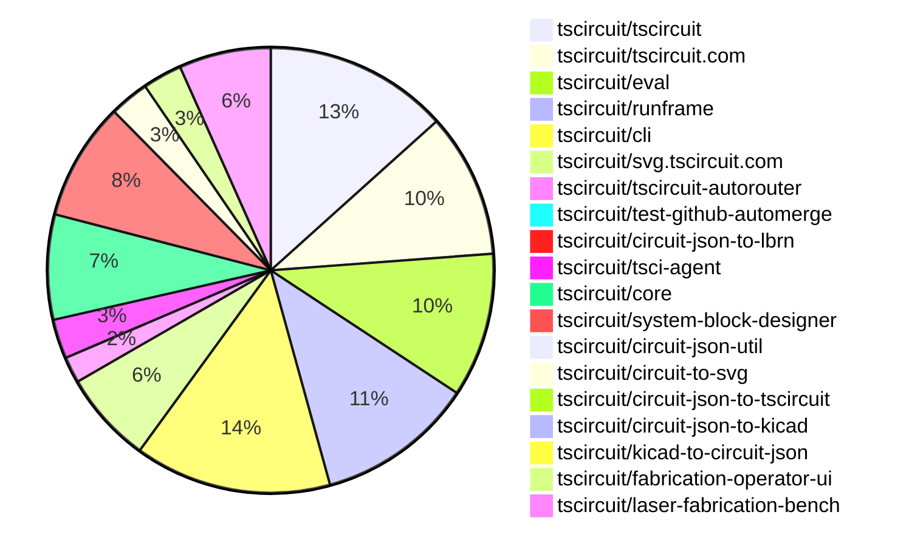

# Contribution Overview 2026-06-30

The current week is shown below. There are 3 major sections:

- [Contributor Overview](#contributor-overview)
- [PRs by Repository](#prs-by-repository)
- [PRs by Contributor](#changes-by-contributor)
- [Scoring & Sponsorship Details](/docs/sponsorship-calculation-explanation.md)

## PRs by Repository

## Contributor Overview

| Contributor | 🐳 Major | 🐙 Minor | 🐌 Tiny | Score | ⭐ | Discussion Contributions |
|-------------|---------|---------|---------|-------|-----|--------------------------|
| [AnasSarkiz](#AnasSarkiz) | 3 | 5 | 2 | 25 | ⭐⭐ | 0🔹 0🔶 0💎 |
| [MustafaMulla29](#MustafaMulla29) | 2 | 4 | 2 | 18 | ⭐⭐ | 0🔹 0🔶 0💎 |
| [imrishabh18](#imrishabh18) | 2 | 2 | 2 | 15 | ⭐⭐ | 0🔹 0🔶 0💎 |
| [tscircuitbot](#tscircuitbot) | 0 | 0 | 73 | 13.5 | ⭐⭐ | 0🔹 0🔶 0💎 |
| [seveibar](#seveibar) | 2 | 0 | 0 | 9 | ⭐ | 0🔹 0🔶 0💎 |
| [rushabhcodes](#rushabhcodes) | 0 | 2 | 2 | 6 | ⭐ | 0🔹 0🔶 0💎 |
| [techmannih](#techmannih) | 1 | 0 | 1 | 5 | ⭐ | 0🔹 0🔶 0💎 |
| [Sang-it](#Sang-it) | 0 | 2 | 0 | 4 | ⭐ | 0🔹 0🔶 0💎 |
| [0hmX](#0hmX) | 1 | 0 | 0 | 4 | ⭐ | 0🔹 0🔶 0💎 |
| [mohan-bee](#mohan-bee) | 0 | 1 | 0 | 2 |  | 0🔹 0🔶 0💎 |
| [technologyet31-create](#technologyet31-create) | 0 | 1 | 0 | 2 |  | 0🔹 0🔶 0💎 |
| [Abse2001](#Abse2001) | 0 | 0 | 1 | 2 |  | 0🔹 0🔶 0💎 |

## Staff Pass Ratio (SPR)

| Contributor | Reviewed PRs | Rejections | Approvals | SPR |
|-------------|--------------|------------|-----------|-----|
| [mohan-bee](#mohan-bee) | 3 | 2 | 1 | 33.3% |
| [MustafaMulla29](#MustafaMulla29) | 2 | 3 | 2 | -50.0% |
| [imrishabh18](#imrishabh18) | 1 | 0 | 1 | 100.0% |
| [rushabhcodes](#rushabhcodes) | 1 | 0 | 1 | 100.0% |
| [0hmX](#0hmX) | 1 | 0 | 1 | 100.0% |
| [technologyet31-create](#technologyet31-create) | 1 | 0 | 1 | 100.0% |
| [techmannih](#techmannih) | 1 | 0 | 1 | 100.0% |

mohan-bee SPR PRs (3)

- [#356](https://github.com/tscircuit/circuit-json-to-kicad/pull/356) Fix KiCad via spans for multi-layer PCB routes
- [#355](https://github.com/tscircuit/circuit-json-to-kicad/pull/355) Add KiCad schematic sheet export support
- [#353](https://github.com/tscircuit/circuit-json-to-kicad/pull/353) Add schematic file output API

MustafaMulla29 SPR PRs (2)

- [#2527](https://github.com/tscircuit/core/pull/2527) Lay out schematic sheets independently
- [#26](https://github.com/tscircuit/system-block-designer/pull/26) Support browser PDF generation and add browser tests

imrishabh18 SPR PRs (1)

- [#2530](https://github.com/tscircuit/core/pull/2530) Fix: repro14 where exposingNets didn't create `pcb_trace` but the schematic showed connection

rushabhcodes SPR PRs (1)

- [#60](https://github.com/tscircuit/circuit-json-to-tscircuit/pull/60) Add pcb_board template support for board-level Circuit JSON conversion

0hmX SPR PRs (1)

- [#2540](https://github.com/tscircuit/core/pull/2540) update autorouter to use the new Pipeline 7

technologyet31-create SPR PRs (1)

- [#158](https://github.com/tscircuit/kicad-to-circuit-json/pull/158) fix: include the anchor shape of KiCad custom pads

techmannih SPR PRs (1)

- [#28](https://github.com/tscircuit/system-block-designer/pull/28) Add BOM tables to PDF exports and simplify BOM download options

> Note: AI evaluates PRs and assigns 1-3 star ratings automatically. 4 and 5 star ratings require manual staff review.

### Discussion Contribution Legend

- 🔹 Normal Comments: Basic participation with minimal effort
- 🔶 Great Informative Comments: Thoughtful participation that adds value
- 💎 Incredible Comments: Exceptional participation with high-quality content

## Review Table

[reviews-received-hover]: ## "Number of reviews received for PRs for this contributor"
[approvals-received-hover]: ## "Number of approvals received for PRs this contributor authored"
[rejections-received-hover]: ## "Number of rejections received for PRs this contributor authored"
[prs-opened-hover]: ## "Number of PRs opened by this contributor"
[issues-created-hover]: ## "Number of issues created by this contributor"

| Contributor | Reviews Received | Approvals Received | Rejections Received | Approvals | Rejections Given | PRs Opened | PRs Merged | Issues Created |
|---|---|---|---|---|---|---|---|---|
| [tscircuitbot](#tscircuitbot) | 0 | 0 | 0 | 0 | 0 | 80 | 73 | 0 |
| [imrishabh18](#imrishabh18) | 1 | 1 | 0 | 7 | 2 | 6 | 6 | 0 |
| [di3go04](#di3go04) | 0 | 0 | 0 | 0 | 0 | 5 | 0 | 0 |
| [StealthEyeLLC](#StealthEyeLLC) | 0 | 0 | 0 | 0 | 0 | 1 | 0 | 0 |
| [Sang-it](#Sang-it) | 7 | 1 | 0 | 0 | 0 | 8 | 2 | 0 |
| [seveibar](#seveibar) | 0 | 0 | 0 | 8 | 2 | 4 | 2 | 0 |
| [rushabhcodes](#rushabhcodes) | 8 | 4 | 0 | 0 | 0 | 6 | 4 | 0 |
| [0hmX](#0hmX) | 3 | 1 | 0 | 0 | 0 | 6 | 1 | 0 |
| [AnasSarkiz](#AnasSarkiz) | 0 | 0 | 0 | 1 | 0 | 10 | 10 | 0 |
| [MustafaMulla29](#MustafaMulla29) | 6 | 5 | 1 | 0 | 0 | 8 | 8 | 0 |
| [Abse2001](#Abse2001) | 1 | 1 | 0 | 1 | 0 | 1 | 1 | 0 |
| [ShiboSoftwareDev](#ShiboSoftwareDev) | 0 | 0 | 0 | 1 | 0 | 1 | 1 | 0 |
| [sureshchouksey8](#sureshchouksey8) | 0 | 0 | 0 | 0 | 0 | 1 | 0 | 0 |
| [saitejabandaru-in](#saitejabandaru-in) | 0 | 0 | 0 | 0 | 0 | 1 | 0 | 0 |
| [anil08607](#anil08607) | 1 | 0 | 0 | 0 | 0 | 1 | 0 | 0 |
| [mohan-bee](#mohan-bee) | 9 | 1 | 2 | 0 | 0 | 3 | 1 | 0 |
| [technologyet31-create](#technologyet31-create) | 3 | 2 | 0 | 0 | 0 | 1 | 1 | 0 |
| [techmannih](#techmannih) | 3 | 2 | 1 | 0 | 0 | 3 | 2 | 0 |

## Changes by Repository

### [tscircuit/tscircuit](https://github.com/tscircuit/tscircuit)

🐌 Tiny Contributions (14)

| PR # | Impact | Contributor | Description |
|------|--------|-------------|-------------|
| [#3739](https://github.com/tscircuit/tscircuit/pull/3739) | 🐌 Tiny | tscircuitbot | Automated package update |
| [#3738](https://github.com/tscircuit/tscircuit/pull/3738) | 🐌 Tiny | tscircuitbot | Automated package update |
| [#3737](https://github.com/tscircuit/tscircuit/pull/3737) | 🐌 Tiny | tscircuitbot | Updates the package version from 0.0.1979 to 0.0.1980 in package.json |
| [#3736](https://github.com/tscircuit/tscircuit/pull/3736) | 🐌 Tiny | tscircuitbot | Automated package update |
| [#3735](https://github.com/tscircuit/tscircuit/pull/3735) | 🐌 Tiny | tscircuitbot | Automated package update |
| [#3734](https://github.com/tscircuit/tscircuit/pull/3734) | 🐌 Tiny | tscircuitbot | Automated package update |
| [#3733](https://github.com/tscircuit/tscircuit/pull/3733) | 🐌 Tiny | tscircuitbot | Automated package update |
| [#3732](https://github.com/tscircuit/tscircuit/pull/3732) | 🐌 Tiny | tscircuitbot | Automated package update |
| [#3731](https://github.com/tscircuit/tscircuit/pull/3731) | 🐌 Tiny | tscircuitbot | Automated package update |
| [#3730](https://github.com/tscircuit/tscircuit/pull/3730) | 🐌 Tiny | tscircuitbot | Automated package update |
| [#3729](https://github.com/tscircuit/tscircuit/pull/3729) | 🐌 Tiny | tscircuitbot | Automated package update |
| [#3728](https://github.com/tscircuit/tscircuit/pull/3728) | 🐌 Tiny | tscircuitbot | Updates the tscircuitcli package from version 0.1.1578 to 0.1.1579 |
| [#3727](https://github.com/tscircuit/tscircuit/pull/3727) | 🐌 Tiny | tscircuitbot | Automated package update |
| [#3726](https://github.com/tscircuit/tscircuit/pull/3726) | 🐌 Tiny | tscircuitbot | Updates the version of several packages in the project, including tscircuitcli, tscircuitcore, and tscircuiteval. |

### [tscircuit/tscircuit.com](https://github.com/tscircuit/tscircuit.com)

🐌 Tiny Contributions (11)

| PR # | Impact | Contributor | Description |
|------|--------|-------------|-------------|
| [#3788](https://github.com/tscircuit/tscircuit.com/pull/3788) | 🐌 Tiny | tscircuitbot | Automated package update |
| [#3787](https://github.com/tscircuit/tscircuit.com/pull/3787) | 🐌 Tiny | tscircuitbot | Automated package update |
| [#3786](https://github.com/tscircuit/tscircuit.com/pull/3786) | 🐌 Tiny | tscircuitbot | Updates the tscircuitrunframe package from version 0.0.2140 to 0.0.2141 |
| [#3785](https://github.com/tscircuit/tscircuit.com/pull/3785) | 🐌 Tiny | tscircuitbot | Updates the tscircuiteval package from version 0.0.964 to 0.0.965 |
| [#3784](https://github.com/tscircuit/tscircuit.com/pull/3784) | 🐌 Tiny | tscircuitbot | Automated package update |
| [#3783](https://github.com/tscircuit/tscircuit.com/pull/3783) | 🐌 Tiny | tscircuitbot | Updates the tscircuiteval package from version 0.0.963 to 0.0.964 |
| [#3782](https://github.com/tscircuit/tscircuit.com/pull/3782) | 🐌 Tiny | tscircuitbot | Updates the tscircuitrunframe package to version 0.0.2139 in the package.json file. |
| [#3781](https://github.com/tscircuit/tscircuit.com/pull/3781) | 🐌 Tiny | tscircuitbot | Updates the tscircuiteval package to version 0.0.963 in the package.json file. |
| [#3780](https://github.com/tscircuit/tscircuit.com/pull/3780) | 🐌 Tiny | tscircuitbot | Automated package update |
| [#3779](https://github.com/tscircuit/tscircuit.com/pull/3779) | 🐌 Tiny | tscircuitbot | Automated package update |
| [#3778](https://github.com/tscircuit/tscircuit.com/pull/3778) | 🐌 Tiny | tscircuitbot | Updates the tscircuiteval package from version 0.0.961 to 0.0.962 |

### [tscircuit/eval](https://github.com/tscircuit/eval)

🐌 Tiny Contributions (11)

| PR # | Impact | Contributor | Description |
|------|--------|-------------|-------------|
| [#3067](https://github.com/tscircuit/eval/pull/3067) | 🐌 Tiny | tscircuitbot | Automated package update |
| [#3066](https://github.com/tscircuit/eval/pull/3066) | 🐌 Tiny | tscircuitbot | Automated package update |
| [#3064](https://github.com/tscircuit/eval/pull/3064) | 🐌 Tiny | tscircuitbot | Automated package update |
| [#3062](https://github.com/tscircuit/eval/pull/3062) | 🐌 Tiny | tscircuitbot | Automated package update |
| [#3061](https://github.com/tscircuit/eval/pull/3061) | 🐌 Tiny | tscircuitbot | Updates package versions in package.json to the latest compatible versions. |
| [#3059](https://github.com/tscircuit/eval/pull/3059) | 🐌 Tiny | tscircuitbot | Automated package update |
| [#3058](https://github.com/tscircuit/eval/pull/3058) | 🐌 Tiny | tscircuitbot | Automated package update |
| [#3056](https://github.com/tscircuit/eval/pull/3056) | 🐌 Tiny | tscircuitbot | Automated package update |
| [#3055](https://github.com/tscircuit/eval/pull/3055) | 🐌 Tiny | tscircuitbot | Updates the version of the tscircuitcore package from 0.0.1371 to 0.0.1372 in package.json |
| [#3053](https://github.com/tscircuit/eval/pull/3053) | 🐌 Tiny | tscircuitbot | Automated package update |
| [#3052](https://github.com/tscircuit/eval/pull/3052) | 🐌 Tiny | tscircuitbot | Automated package update |

### [tscircuit/runframe](https://github.com/tscircuit/runframe)

🐌 Tiny Contributions (12)

| PR # | Impact | Contributor | Description |
|------|--------|-------------|-------------|
| [#3830](https://github.com/tscircuit/runframe/pull/3830) | 🐌 Tiny | tscircuitbot | Automated package update |
| [#3829](https://github.com/tscircuit/runframe/pull/3829) | 🐌 Tiny | tscircuitbot | Updates the tscircuiteval package to version 0.0.966 in the package.json file. |
| [#3828](https://github.com/tscircuit/runframe/pull/3828) | 🐌 Tiny | tscircuitbot | Automated package update |
| [#3827](https://github.com/tscircuit/runframe/pull/3827) | 🐌 Tiny | tscircuitbot | Updates the tscircuiteval package from version 0.0.964 to 0.0.965 in the project dependencies. |
| [#3826](https://github.com/tscircuit/runframe/pull/3826) | 🐌 Tiny | tscircuitbot | Automated package update |
| [#3825](https://github.com/tscircuit/runframe/pull/3825) | 🐌 Tiny | tscircuitbot | Updates the tscircuiteval package to version 0.0.964 in the package.json file. |
| [#3824](https://github.com/tscircuit/runframe/pull/3824) | 🐌 Tiny | tscircuitbot | Automated package update |
| [#3823](https://github.com/tscircuit/runframe/pull/3823) | 🐌 Tiny | tscircuitbot | Updates the tscircuiteval package to version 0.0.963 in the package.json file. |
| [#3822](https://github.com/tscircuit/runframe/pull/3822) | 🐌 Tiny | tscircuitbot | Automated package update |
| [#3820](https://github.com/tscircuit/runframe/pull/3820) | 🐌 Tiny | tscircuitbot | Automated package update |
| [#3819](https://github.com/tscircuit/runframe/pull/3819) | 🐌 Tiny | tscircuitbot | Updates the tscircuiteval package to version 0.0.962 in the package.json file. |
| [#3821](https://github.com/tscircuit/runframe/pull/3821) | 🐌 Tiny | MustafaMulla29 | Updates the dependencies for tscircuit and circuit-to-svg to ensure schematic sheets function correctly. |

### [tscircuit/cli](https://github.com/tscircuit/cli)

| PR # | Impact | Rating | Contributor | Description |
|------|--------|--------|-------------|-------------|
| [#3482](https://github.com/tscircuit/cli/pull/3482) | 🐳 Major | ⭐⭐⭐ | seveibar | Adds functionality to install, update, and run the tsci-agent, including version checks and user confirmation for actions. |

🐌 Tiny Contributions (14)

| PR # | Impact | Contributor | Description |
|------|--------|-------------|-------------|
| [#3511](https://github.com/tscircuit/cli/pull/3511) | 🐌 Tiny | tscircuitbot | Automated package update |
| [#3510](https://github.com/tscircuit/cli/pull/3510) | 🐌 Tiny | tscircuitbot | Updates the tscircuitrunframe package version from 0.0.2141 to 0.0.2142 |
| [#3509](https://github.com/tscircuit/cli/pull/3509) | 🐌 Tiny | tscircuitbot | Automated package update |
| [#3508](https://github.com/tscircuit/cli/pull/3508) | 🐌 Tiny | tscircuitbot | Updates the tscircuitrunframe package version from 0.0.2140 to 0.0.2141 in package.json |
| [#3507](https://github.com/tscircuit/cli/pull/3507) | 🐌 Tiny | tscircuitbot | Automated package update |
| [#3506](https://github.com/tscircuit/cli/pull/3506) | 🐌 Tiny | tscircuitbot | Updates the tscircuitrunframe package to version 0.0.2140 |
| [#3505](https://github.com/tscircuit/cli/pull/3505) | 🐌 Tiny | tscircuitbot | Automated package update |
| [#3504](https://github.com/tscircuit/cli/pull/3504) | 🐌 Tiny | tscircuitbot | Updates the tscircuitrunframe package to version 0.0.2139 in the package.json file |
| [#3503](https://github.com/tscircuit/cli/pull/3503) | 🐌 Tiny | tscircuitbot | Automated package update |
| [#3502](https://github.com/tscircuit/cli/pull/3502) | 🐌 Tiny | tscircuitbot | Automated package update |
| [#3501](https://github.com/tscircuit/cli/pull/3501) | 🐌 Tiny | tscircuitbot | Automated package update |
| [#3500](https://github.com/tscircuit/cli/pull/3500) | 🐌 Tiny | tscircuitbot | Automated README update with latest CLI usage output. |
| [#3499](https://github.com/tscircuit/cli/pull/3499) | 🐌 Tiny | tscircuitbot | Automated package update |
| [#3498](https://github.com/tscircuit/cli/pull/3498) | 🐌 Tiny | tscircuitbot | Updates the tscircuitrunframe package version from 0.0.2136 to 0.0.2137 in package.json |

### [tscircuit/svg.tscircuit.com](https://github.com/tscircuit/svg.tscircuit.com)

🐌 Tiny Contributions (7)

| PR # | Impact | Contributor | Description |
|------|--------|-------------|-------------|
| [#1713](https://github.com/tscircuit/svg.tscircuit.com/pull/1713) | 🐌 Tiny | tscircuitbot | Updates the tscircuit package version from 0.0.1980 to 0.0.1981 in package.json |
| [#1712](https://github.com/tscircuit/svg.tscircuit.com/pull/1712) | 🐌 Tiny | tscircuitbot | Updates the tscircuit package version from 0.0.1979 to 0.0.1980 in package.json |
| [#1711](https://github.com/tscircuit/svg.tscircuit.com/pull/1711) | 🐌 Tiny | tscircuitbot | Updates the tscircuit package version from 0.0.1978 to 0.0.1979 in package.json |
| [#1710](https://github.com/tscircuit/svg.tscircuit.com/pull/1710) | 🐌 Tiny | tscircuitbot | Updates the tscircuit package version from 0.0.1977 to 0.0.1978 in package.json |
| [#1709](https://github.com/tscircuit/svg.tscircuit.com/pull/1709) | 🐌 Tiny | tscircuitbot | Updates the tscircuit package version from 0.0.1976 to 0.0.1977 in package.json |
| [#1708](https://github.com/tscircuit/svg.tscircuit.com/pull/1708) | 🐌 Tiny | tscircuitbot | Updates the tscircuit package version from 0.0.1975 to 0.0.1976 in package.json |
| [#1707](https://github.com/tscircuit/svg.tscircuit.com/pull/1707) | 🐌 Tiny | tscircuitbot | Updates the tscircuit package version from 0.0.1974 to 0.0.1975 in package.json |

### [tscircuit/tscircuit-autorouter](https://github.com/tscircuit/tscircuit-autorouter)

| PR # | Impact | Rating | Contributor | Description |
|------|--------|--------|-------------|-------------|
| [#1470](https://github.com/tscircuit/tscircuit-autorouter/pull/1470) | 🐳 Major | ⭐⭐⭐ | 0hmX | Changes the default autorouting solver to AutoroutingPipelineSolver7_MultiGraph and updates related benchmarks and exports accordingly. |

🐌 Tiny Contributions (1)

| PR # | Impact | Contributor | Description |
|------|--------|-------------|-------------|
| [#1472](https://github.com/tscircuit/tscircuit-autorouter/pull/1472) | 🐌 Tiny | tscircuitbot | Automated package update |

### [tscircuit/test-github-automerge](https://github.com/tscircuit/test-github-automerge)

🐌 Tiny Contributions (1)

| PR # | Impact | Contributor | Description |
|------|--------|-------------|-------------|
| [#48](https://github.com/tscircuit/test-github-automerge/pull/48) | 🐌 Tiny | tscircuitbot | Updates the tscircuitcircuit-json-util package from version 0.0.96 to 0.0.97 in the development dependencies. |

### [tscircuit/circuit-json-to-lbrn](https://github.com/tscircuit/circuit-json-to-lbrn)

🐌 Tiny Contributions (1)

| PR # | Impact | Contributor | Description |
|------|--------|-------------|-------------|
| [#179](https://github.com/tscircuit/circuit-json-to-lbrn/pull/179) | 🐌 Tiny | tscircuitbot | Automated package update |

### [tscircuit/tsci-agent](https://github.com/tscircuit/tsci-agent)

| PR # | Impact | Rating | Contributor | Description |
|------|--------|--------|-------------|-------------|
| [#3](https://github.com/tscircuit/tsci-agent/pull/3) | 🐳 Major | ⭐⭐⭐ | seveibar | Adjusts the welcome message and removes the update check header while implementing a session token mechanism for authentication. |

🐌 Tiny Contributions (2)

| PR # | Impact | Contributor | Description |
|------|--------|-------------|-------------|
| [#4](https://github.com/tscircuit/tsci-agent/pull/4) | 🐌 Tiny | tscircuitbot | Automated package update |
| [#2](https://github.com/tscircuit/tsci-agent/pull/2) | 🐌 Tiny | tscircuitbot | Automated package update |

### [tscircuit/core](https://github.com/tscircuit/core)

| PR # | Impact | Rating | Contributor | Description |
|------|--------|--------|-------------|-------------|
| [#2530](https://github.com/tscircuit/core/pull/2530) | 🐳 Major | ⭐⭐⭐ | imrishabh18 | Fixes the issue where net-to-net traces created logical source_trace entries but failed to generate physical pcb_trace due to insufficient routing detection. |
| [#2539](https://github.com/tscircuit/core/pull/2539) | 🐙 Minor | ⭐⭐ | imrishabh18 | Fixes smtpad rotation issue in pill shape rendering within the circuit-json-util library |
| [#2543](https://github.com/tscircuit/core/pull/2543) | 🐙 Minor | ⭐⭐ | Sang-it | Fixes the issue where net labels do not show up when the net label text is too long. |
| [#2542](https://github.com/tscircuit/core/pull/2542) | 🐙 Minor | ⭐⭐ | Sang-it | Prevents the schematic trace solver from placing duplicate net labels when user-defined labels are present for the same net, avoiding visual clutter. |
| [#2538](https://github.com/tscircuit/core/pull/2538) | 🐙 Minor | ⭐⭐ | MustafaMulla29 | Fixes incorrect net label generation for subcircuit ports with missing traces, ensuring user-assigned labels are respected. |
| [#2537](https://github.com/tscircuit/core/pull/2537) | 🐙 Minor | ⭐⭐ | MustafaMulla29 | Fixes the issue where cross-boundary subcircuit traces incorrectly use selector fallback labels instead of trace names. |
| [#2527](https://github.com/tscircuit/core/pull/2527) | 🐙 Minor | ⭐⭐ | MustafaMulla29 | Changes the layout behavior of schematic sheets to ensure they are arranged independently, allowing for separate layout origins for each sheet. |

🐌 Tiny Contributions (1)

| PR # | Impact | Contributor | Description |
|------|--------|-------------|-------------|
| [#2544](https://github.com/tscircuit/core/pull/2544) | 🐌 Tiny | rushabhcodes | Updates the circuit-to-svg dependency to version 0.0.369 and refreshes the associated snapshots in the project. |

### [tscircuit/system-block-designer](https://github.com/tscircuit/system-block-designer)

| PR # | Impact | Rating | Contributor | Description |
|------|--------|--------|-------------|-------------|
| [#27](https://github.com/tscircuit/system-block-designer/pull/27) | 🐳 Major | ⭐⭐⭐ | imrishabh18 | Adds support for traces  in the system interface, removes a connection option, and outputs the TSX format with a default export. |
| [#32](https://github.com/tscircuit/system-block-designer/pull/32) | 🐳 Major | ⭐⭐⭐ | MustafaMulla29 | Adds page numbers and a shared footer to all pages in the PDF output, enhancing document consistency and branding. |
| [#26](https://github.com/tscircuit/system-block-designer/pull/26) | 🐳 Major | ⭐⭐⭐ | MustafaMulla29 | This pull request introduces the capability to generate PDFs directly in the browser, along with the addition of browser tests to ensure functionality. It includes new HTML and TypeScript files for PDF generation, as well as Playwright tests to validate the PDF generation process. The changes also include updates to the GitHub Actions workflow for testing and the addition of agent notes for testing best practices. |
| [#28](https://github.com/tscircuit/system-block-designer/pull/28) | 🐳 Major | ⭐⭐⭐ | techmannih | This PR expands the export flow so the generated PDF now includes a proper BOM section, and cleans up the BOM download experience. |
| [#33](https://github.com/tscircuit/system-block-designer/pull/33) | 🐙 Minor | ⭐⭐ | imrishabh18 | Modifies the design01 example to display only the ports that have active connections, enhancing clarity in the system block designer. |
| [#30](https://github.com/tscircuit/system-block-designer/pull/30) | 🐙 Minor | ⭐⭐ | MustafaMulla29 | Fixes the issue of overflowing Notes text in the Technical Specifications PDF table by allowing rows to resize based on their content, ensuring proper rendering without overflow. |

🐌 Tiny Contributions (3)

| PR # | Impact | Contributor | Description |
|------|--------|-------------|-------------|
| [#31](https://github.com/tscircuit/system-block-designer/pull/31) | 🐌 Tiny | imrishabh18 | Removes the lifecycle column from the BOM table in the user interface, simplifying the display of parts information. |
| [#36](https://github.com/tscircuit/system-block-designer/pull/36) | 🐌 Tiny | techmannih | Removes the underline from the MPN links in the BOM view for a cleaner appearance. |
| [#35](https://github.com/tscircuit/system-block-designer/pull/35) | 🐌 Tiny | Abse2001 | Changes the subtitle of the generated project PDF title page from System design package to Project document. |

### [tscircuit/circuit-json-util](https://github.com/tscircuit/circuit-json-util)

🐌 Tiny Contributions (1)

| PR # | Impact | Contributor | Description |
|------|--------|-------------|-------------|
| [#102](https://github.com/tscircuit/circuit-json-util/pull/102) | 🐌 Tiny | imrishabh18 | Fixes the rotation of SMT pad shapes from rectangular to pill, ensuring correct dimension swapping during transformations. |

### [tscircuit/circuit-to-svg](https://github.com/tscircuit/circuit-to-svg)

| PR # | Impact | Rating | Contributor | Description |
|------|--------|--------|-------------|-------------|
| [#592](https://github.com/tscircuit/circuit-to-svg/pull/592) | 🐙 Minor | ⭐⭐ | rushabhcodes | Fixes the legend layout in the simulation oscilloscope to dynamically adjust the number of columns based on the available width, preventing unnecessary wrapping of channel cards. |

🐌 Tiny Contributions (2)

| PR # | Impact | Contributor | Description |
|------|--------|-------------|-------------|
| [#591](https://github.com/tscircuit/circuit-to-svg/pull/591) | 🐌 Tiny | rushabhcodes | Updates the tscircuit and circuit-json dependencies to their latest versions in package.json |
| [#593](https://github.com/tscircuit/circuit-to-svg/pull/593) | 🐌 Tiny | MustafaMulla29 | Updates the tscircuit dependency version from 0.0.1976 to 0.0.1981 in package.json |

### [tscircuit/circuit-json-to-tscircuit](https://github.com/tscircuit/circuit-json-to-tscircuit)

| PR # | Impact | Rating | Contributor | Description |
|------|--------|--------|-------------|-------------|
| [#60](https://github.com/tscircuit/circuit-json-to-tscircuit/pull/60) | 🐙 Minor | ⭐⭐ | rushabhcodes | Adds support for converting board-level Circuit JSON with a pcb_board template to tscircuit format, enabling richer circuit designs beyond the existing chip conversion path. |

### [tscircuit/circuit-json-to-kicad](https://github.com/tscircuit/circuit-json-to-kicad)

| PR # | Impact | Rating | Contributor | Description |
|------|--------|--------|-------------|-------------|
| [#353](https://github.com/tscircuit/circuit-json-to-kicad/pull/353) | 🐙 Minor | ⭐⭐ | mohan-bee | This PR changes the output of the schematic file generation to return a list of schematic files instead of a single file, allowing for future support of multi-sheet schematics without requiring structural changes. |

### [tscircuit/kicad-to-circuit-json](https://github.com/tscircuit/kicad-to-circuit-json)

| PR # | Impact | Rating | Contributor | Description |
|------|--------|--------|-------------|-------------|
| [#158](https://github.com/tscircuit/kicad-to-circuit-json/pull/158) | 🐙 Minor | ⭐⭐ | technologyet31-create | Fixes the omission of anchor shapes in KiCad custom pads, ensuring accurate copper representation in converted footprints. |

### [tscircuit/fabrication-operator-ui](https://github.com/tscircuit/fabrication-operator-ui)

| PR # | Impact | Rating | Contributor | Description |
|------|--------|--------|-------------|-------------|
| [#21](https://github.com/tscircuit/fabrication-operator-ui/pull/21) | 🐳 Major | ⭐⭐⭐ | AnasSarkiz | Adds interactive scenarios for the Cosmos UI and comprehensive documentation for the Fabrication Operator workflow, enhancing user guidance and experience. |
| [#20](https://github.com/tscircuit/fabrication-operator-ui/pull/20) | 🐳 Major | ⭐⭐⭐ | AnasSarkiz | Transforms the fabrication UI into a complete operator workspace by supporting Circuit JSON imports, dedicated stage execution pages, and end-to-end fabrication job management. |
| [#19](https://github.com/tscircuit/fabrication-operator-ui/pull/19) | 🐳 Major | ⭐⭐⭐ | AnasSarkiz | Transforms the dashboard from a monitoring interface into an interactive fabrication workstation by integrating job creation, LightBurn file generation, carrier controls, laser operations, and burn-run inspection. |

### [tscircuit/laser-fabrication-bench](https://github.com/tscircuit/laser-fabrication-bench)

| PR # | Impact | Rating | Contributor | Description |
|------|--------|--------|-------------|-------------|
| [#10](https://github.com/tscircuit/laser-fabrication-bench/pull/10) | 🐙 Minor | ⭐⭐ | AnasSarkiz | Refines PCB feed animation by replacing rotation-based travel with a normalized percentage-driven motion model and aligning board movement with the CAD coordinate system. |
| [#9](https://github.com/tscircuit/laser-fabrication-bench/pull/9) | 🐙 Minor | ⭐⭐ | AnasSarkiz | Adds feeder-wheel-driven PCB translation to the GLB bench model, connecting feeder control input to visible board movement inside the rotating jig assembly. |
| [#8](https://github.com/tscircuit/laser-fabrication-bench/pull/8) | 🐙 Minor | ⭐⭐ | AnasSarkiz | Establishes a reusable mechanical animation framework for the laser fabrication bench, enabling physically accurate assembly motion and providing a foundation for future kinematics, machine simulation, and coordinated component animations. |
| [#7](https://github.com/tscircuit/laser-fabrication-bench/pull/7) | 🐙 Minor | ⭐⭐ | AnasSarkiz | Fixes issue where separated Shapr3D GLB exports lose assembly positioning and overlap at the origin during rendering. |
| [#6](https://github.com/tscircuit/laser-fabrication-bench/pull/6) | 🐙 Minor | ⭐⭐ | AnasSarkiz | Replaces the placeholder 3D scene with a production-ready GLB asset pipeline, introducing a modular model architecture for the laser fabrication bench and laying the foundation for realistic machine visualization and future animation. |

🐌 Tiny Contributions (2)

| PR # | Impact | Contributor | Description |
|------|--------|-------------|-------------|
| [#12](https://github.com/tscircuit/laser-fabrication-bench/pull/12) | 🐌 Tiny | AnasSarkiz | Adds a Vite build and deployment pipeline for the Laser Fabrication Bench application and updates the jig GLB model. |
| [#11](https://github.com/tscircuit/laser-fabrication-bench/pull/11) | 🐌 Tiny | AnasSarkiz | Adds a README file that provides usage instructions and details about the laser fabrication bench visualizer component. |

## Changes by Contributor

### [tscircuitbot](https://github.com/tscircuitbot)

🐌 Tiny Contributions (73)

| PR # | Impact | Description |
|------|--------|-------------|
| [#3739](https://github.com/tscircuit/tscircuit/pull/3739) | 🐌 Tiny | Automated package update |
| [#3738](https://github.com/tscircuit/tscircuit/pull/3738) | 🐌 Tiny | Automated package update |
| [#3737](https://github.com/tscircuit/tscircuit/pull/3737) | 🐌 Tiny | Updates the package version from 0.0.1979 to 0.0.1980 in package.json |
| [#3736](https://github.com/tscircuit/tscircuit/pull/3736) | 🐌 Tiny | Automated package update |
| [#3735](https://github.com/tscircuit/tscircuit/pull/3735) | 🐌 Tiny | Automated package update |
| [#3734](https://github.com/tscircuit/tscircuit/pull/3734) | 🐌 Tiny | Automated package update |
| [#3733](https://github.com/tscircuit/tscircuit/pull/3733) | 🐌 Tiny | Automated package update |
| [#3732](https://github.com/tscircuit/tscircuit/pull/3732) | 🐌 Tiny | Automated package update |
| [#3731](https://github.com/tscircuit/tscircuit/pull/3731) | 🐌 Tiny | Automated package update |
| [#3730](https://github.com/tscircuit/tscircuit/pull/3730) | 🐌 Tiny | Automated package update |
| [#3729](https://github.com/tscircuit/tscircuit/pull/3729) | 🐌 Tiny | Automated package update |
| [#3728](https://github.com/tscircuit/tscircuit/pull/3728) | 🐌 Tiny | Updates the tscircuitcli package from version 0.1.1578 to 0.1.1579 |
| [#3727](https://github.com/tscircuit/tscircuit/pull/3727) | 🐌 Tiny | Automated package update |
| [#3726](https://github.com/tscircuit/tscircuit/pull/3726) | 🐌 Tiny | Updates the version of several packages in the project, including tscircuitcli, tscircuitcore, and tscircuiteval. |
| [#3788](https://github.com/tscircuit/tscircuit.com/pull/3788) | 🐌 Tiny | Automated package update |
| [#3787](https://github.com/tscircuit/tscircuit.com/pull/3787) | 🐌 Tiny | Automated package update |
| [#3786](https://github.com/tscircuit/tscircuit.com/pull/3786) | 🐌 Tiny | Updates the tscircuitrunframe package from version 0.0.2140 to 0.0.2141 |
| [#3785](https://github.com/tscircuit/tscircuit.com/pull/3785) | 🐌 Tiny | Updates the tscircuiteval package from version 0.0.964 to 0.0.965 |
| [#3784](https://github.com/tscircuit/tscircuit.com/pull/3784) | 🐌 Tiny | Automated package update |
| [#3783](https://github.com/tscircuit/tscircuit.com/pull/3783) | 🐌 Tiny | Updates the tscircuiteval package from version 0.0.963 to 0.0.964 |
| [#3782](https://github.com/tscircuit/tscircuit.com/pull/3782) | 🐌 Tiny | Updates the tscircuitrunframe package to version 0.0.2139 in the package.json file. |
| [#3781](https://github.com/tscircuit/tscircuit.com/pull/3781) | 🐌 Tiny | Updates the tscircuiteval package to version 0.0.963 in the package.json file. |
| [#3780](https://github.com/tscircuit/tscircuit.com/pull/3780) | 🐌 Tiny | Automated package update |
| [#3779](https://github.com/tscircuit/tscircuit.com/pull/3779) | 🐌 Tiny | Automated package update |
| [#3778](https://github.com/tscircuit/tscircuit.com/pull/3778) | 🐌 Tiny | Updates the tscircuiteval package from version 0.0.961 to 0.0.962 |
| [#3067](https://github.com/tscircuit/eval/pull/3067) | 🐌 Tiny | Automated package update |
| [#3066](https://github.com/tscircuit/eval/pull/3066) | 🐌 Tiny | Automated package update |
| [#3064](https://github.com/tscircuit/eval/pull/3064) | 🐌 Tiny | Automated package update |
| [#3062](https://github.com/tscircuit/eval/pull/3062) | 🐌 Tiny | Automated package update |
| [#3061](https://github.com/tscircuit/eval/pull/3061) | 🐌 Tiny | Updates package versions in package.json to the latest compatible versions. |
| [#3059](https://github.com/tscircuit/eval/pull/3059) | 🐌 Tiny | Automated package update |
| [#3058](https://github.com/tscircuit/eval/pull/3058) | 🐌 Tiny | Automated package update |
| [#3056](https://github.com/tscircuit/eval/pull/3056) | 🐌 Tiny | Automated package update |
| [#3055](https://github.com/tscircuit/eval/pull/3055) | 🐌 Tiny | Updates the version of the tscircuitcore package from 0.0.1371 to 0.0.1372 in package.json |
| [#3053](https://github.com/tscircuit/eval/pull/3053) | 🐌 Tiny | Automated package update |
| [#3052](https://github.com/tscircuit/eval/pull/3052) | 🐌 Tiny | Automated package update |
| [#3830](https://github.com/tscircuit/runframe/pull/3830) | 🐌 Tiny | Automated package update |
| [#3829](https://github.com/tscircuit/runframe/pull/3829) | 🐌 Tiny | Updates the tscircuiteval package to version 0.0.966 in the package.json file. |
| [#3828](https://github.com/tscircuit/runframe/pull/3828) | 🐌 Tiny | Automated package update |
| [#3827](https://github.com/tscircuit/runframe/pull/3827) | 🐌 Tiny | Updates the tscircuiteval package from version 0.0.964 to 0.0.965 in the project dependencies. |
| [#3826](https://github.com/tscircuit/runframe/pull/3826) | 🐌 Tiny | Automated package update |
| [#3825](https://github.com/tscircuit/runframe/pull/3825) | 🐌 Tiny | Updates the tscircuiteval package to version 0.0.964 in the package.json file. |
| [#3824](https://github.com/tscircuit/runframe/pull/3824) | 🐌 Tiny | Automated package update |
| [#3823](https://github.com/tscircuit/runframe/pull/3823) | 🐌 Tiny | Updates the tscircuiteval package to version 0.0.963 in the package.json file. |
| [#3822](https://github.com/tscircuit/runframe/pull/3822) | 🐌 Tiny | Automated package update |
| [#3820](https://github.com/tscircuit/runframe/pull/3820) | 🐌 Tiny | Automated package update |
| [#3819](https://github.com/tscircuit/runframe/pull/3819) | 🐌 Tiny | Updates the tscircuiteval package to version 0.0.962 in the package.json file. |
| [#3511](https://github.com/tscircuit/cli/pull/3511) | 🐌 Tiny | Automated package update |
| [#3510](https://github.com/tscircuit/cli/pull/3510) | 🐌 Tiny | Updates the tscircuitrunframe package version from 0.0.2141 to 0.0.2142 |
| [#3509](https://github.com/tscircuit/cli/pull/3509) | 🐌 Tiny | Automated package update |
| [#3508](https://github.com/tscircuit/cli/pull/3508) | 🐌 Tiny | Updates the tscircuitrunframe package version from 0.0.2140 to 0.0.2141 in package.json |
| [#3507](https://github.com/tscircuit/cli/pull/3507) | 🐌 Tiny | Automated package update |
| [#3506](https://github.com/tscircuit/cli/pull/3506) | 🐌 Tiny | Updates the tscircuitrunframe package to version 0.0.2140 |
| [#3505](https://github.com/tscircuit/cli/pull/3505) | 🐌 Tiny | Automated package update |
| [#3504](https://github.com/tscircuit/cli/pull/3504) | 🐌 Tiny | Updates the tscircuitrunframe package to version 0.0.2139 in the package.json file |
| [#3503](https://github.com/tscircuit/cli/pull/3503) | 🐌 Tiny | Automated package update |
| [#3502](https://github.com/tscircuit/cli/pull/3502) | 🐌 Tiny | Automated package update |
| [#3501](https://github.com/tscircuit/cli/pull/3501) | 🐌 Tiny | Automated package update |
| [#3500](https://github.com/tscircuit/cli/pull/3500) | 🐌 Tiny | Automated README update with latest CLI usage output. |
| [#3499](https://github.com/tscircuit/cli/pull/3499) | 🐌 Tiny | Automated package update |
| [#3498](https://github.com/tscircuit/cli/pull/3498) | 🐌 Tiny | Updates the tscircuitrunframe package version from 0.0.2136 to 0.0.2137 in package.json |
| [#1713](https://github.com/tscircuit/svg.tscircuit.com/pull/1713) | 🐌 Tiny | Updates the tscircuit package version from 0.0.1980 to 0.0.1981 in package.json |
| [#1712](https://github.com/tscircuit/svg.tscircuit.com/pull/1712) | 🐌 Tiny | Updates the tscircuit package version from 0.0.1979 to 0.0.1980 in package.json |
| [#1711](https://github.com/tscircuit/svg.tscircuit.com/pull/1711) | 🐌 Tiny | Updates the tscircuit package version from 0.0.1978 to 0.0.1979 in package.json |
| [#1710](https://github.com/tscircuit/svg.tscircuit.com/pull/1710) | 🐌 Tiny | Updates the tscircuit package version from 0.0.1977 to 0.0.1978 in package.json |
| [#1709](https://github.com/tscircuit/svg.tscircuit.com/pull/1709) | 🐌 Tiny | Updates the tscircuit package version from 0.0.1976 to 0.0.1977 in package.json |
| [#1708](https://github.com/tscircuit/svg.tscircuit.com/pull/1708) | 🐌 Tiny | Updates the tscircuit package version from 0.0.1975 to 0.0.1976 in package.json |
| [#1707](https://github.com/tscircuit/svg.tscircuit.com/pull/1707) | 🐌 Tiny | Updates the tscircuit package version from 0.0.1974 to 0.0.1975 in package.json |
| [#1472](https://github.com/tscircuit/tscircuit-autorouter/pull/1472) | 🐌 Tiny | Automated package update |
| [#48](https://github.com/tscircuit/test-github-automerge/pull/48) | 🐌 Tiny | Updates the tscircuitcircuit-json-util package from version 0.0.96 to 0.0.97 in the development dependencies. |
| [#179](https://github.com/tscircuit/circuit-json-to-lbrn/pull/179) | 🐌 Tiny | Automated package update |
| [#4](https://github.com/tscircuit/tsci-agent/pull/4) | 🐌 Tiny | Automated package update |
| [#2](https://github.com/tscircuit/tsci-agent/pull/2) | 🐌 Tiny | Automated package update |

### [imrishabh18](https://github.com/imrishabh18)

| PRs # | Impact | Rating | Description |
|------|--------|--------|-------------|
| [#2530](https://github.com/tscircuit/core/pull/2530) | 🐳 Major | ⭐⭐⭐ | Fixes the issue where net-to-net traces created logical source_trace entries but failed to generate physical pcb_trace due to insufficient routing detection. |
| [#27](https://github.com/tscircuit/system-block-designer/pull/27) | 🐳 Major | ⭐⭐⭐ | Adds support for traces  in the system interface, removes a connection option, and outputs the TSX format with a default export. |
| [#2539](https://github.com/tscircuit/core/pull/2539) | 🐙 Minor | ⭐⭐ | Fixes smtpad rotation issue in pill shape rendering within the circuit-json-util library |
| [#33](https://github.com/tscircuit/system-block-designer/pull/33) | 🐙 Minor | ⭐⭐ | Modifies the design01 example to display only the ports that have active connections, enhancing clarity in the system block designer. |

🐌 Tiny Contributions (2)

| PR # | Impact | Description |
|------|--------|-------------|
| [#102](https://github.com/tscircuit/circuit-json-util/pull/102) | 🐌 Tiny | Fixes the rotation of SMT pad shapes from rectangular to pill, ensuring correct dimension swapping during transformations. |
| [#31](https://github.com/tscircuit/system-block-designer/pull/31) | 🐌 Tiny | Removes the lifecycle column from the BOM table in the user interface, simplifying the display of parts information. |

### [rushabhcodes](https://github.com/rushabhcodes)

| PRs # | Impact | Rating | Description |
|------|--------|--------|-------------|
| [#592](https://github.com/tscircuit/circuit-to-svg/pull/592) | 🐙 Minor | ⭐⭐ | Fixes the legend layout in the simulation oscilloscope to dynamically adjust the number of columns based on the available width, preventing unnecessary wrapping of channel cards. |
| [#60](https://github.com/tscircuit/circuit-json-to-tscircuit/pull/60) | 🐙 Minor | ⭐⭐ | Adds support for converting board-level Circuit JSON with a pcb_board template to tscircuit format, enabling richer circuit designs beyond the existing chip conversion path. |

🐌 Tiny Contributions (2)

| PR # | Impact | Description |
|------|--------|-------------|
| [#2544](https://github.com/tscircuit/core/pull/2544) | 🐌 Tiny | Updates the circuit-to-svg dependency to version 0.0.369 and refreshes the associated snapshots in the project. |
| [#591](https://github.com/tscircuit/circuit-to-svg/pull/591) | 🐌 Tiny | Updates the tscircuit and circuit-json dependencies to their latest versions in package.json |

### [Sang-it](https://github.com/Sang-it)

| PRs # | Impact | Rating | Description |
|------|--------|--------|-------------|
| [#2543](https://github.com/tscircuit/core/pull/2543) | 🐙 Minor | ⭐⭐ | Fixes the issue where net labels do not show up when the net label text is too long. |
| [#2542](https://github.com/tscircuit/core/pull/2542) | 🐙 Minor | ⭐⭐ | Prevents the schematic trace solver from placing duplicate net labels when user-defined labels are present for the same net, avoiding visual clutter. |

### [MustafaMulla29](https://github.com/MustafaMulla29)

| PRs # | Impact | Rating | Description |
|------|--------|--------|-------------|
| [#32](https://github.com/tscircuit/system-block-designer/pull/32) | 🐳 Major | ⭐⭐⭐ | Adds page numbers and a shared footer to all pages in the PDF output, enhancing document consistency and branding. |
| [#26](https://github.com/tscircuit/system-block-designer/pull/26) | 🐳 Major | ⭐⭐⭐ | This pull request introduces the capability to generate PDFs directly in the browser, along with the addition of browser tests to ensure functionality. It includes new HTML and TypeScript files for PDF generation, as well as Playwright tests to validate the PDF generation process. The changes also include updates to the GitHub Actions workflow for testing and the addition of agent notes for testing best practices. |
| [#2538](https://github.com/tscircuit/core/pull/2538) | 🐙 Minor | ⭐⭐ | Fixes incorrect net label generation for subcircuit ports with missing traces, ensuring user-assigned labels are respected. |
| [#2537](https://github.com/tscircuit/core/pull/2537) | 🐙 Minor | ⭐⭐ | Fixes the issue where cross-boundary subcircuit traces incorrectly use selector fallback labels instead of trace names. |
| [#2527](https://github.com/tscircuit/core/pull/2527) | 🐙 Minor | ⭐⭐ | Changes the layout behavior of schematic sheets to ensure they are arranged independently, allowing for separate layout origins for each sheet. |
| [#30](https://github.com/tscircuit/system-block-designer/pull/30) | 🐙 Minor | ⭐⭐ | Fixes the issue of overflowing Notes text in the Technical Specifications PDF table by allowing rows to resize based on their content, ensuring proper rendering without overflow. |

🐌 Tiny Contributions (2)

| PR # | Impact | Description |
|------|--------|-------------|
| [#593](https://github.com/tscircuit/circuit-to-svg/pull/593) | 🐌 Tiny | Updates the tscircuit dependency version from 0.0.1976 to 0.0.1981 in package.json |
| [#3821](https://github.com/tscircuit/runframe/pull/3821) | 🐌 Tiny | Updates the dependencies for tscircuit and circuit-to-svg to ensure schematic sheets function correctly. |

### [seveibar](https://github.com/seveibar)

| PRs # | Impact | Rating | Description |
|------|--------|--------|-------------|
| [#3482](https://github.com/tscircuit/cli/pull/3482) | 🐳 Major | ⭐⭐⭐ | Adds functionality to install, update, and run the tsci-agent, including version checks and user confirmation for actions. |
| [#3](https://github.com/tscircuit/tsci-agent/pull/3) | 🐳 Major | ⭐⭐⭐ | Adjusts the welcome message and removes the update check header while implementing a session token mechanism for authentication. |

### [0hmX](https://github.com/0hmX)

| PRs # | Impact | Rating | Description |
|------|--------|--------|-------------|
| [#1470](https://github.com/tscircuit/tscircuit-autorouter/pull/1470) | 🐳 Major | ⭐⭐⭐ | Changes the default autorouting solver to AutoroutingPipelineSolver7_MultiGraph and updates related benchmarks and exports accordingly. |

### [mohan-bee](https://github.com/mohan-bee)

| PRs # | Impact | Rating | Description |
|------|--------|--------|-------------|
| [#353](https://github.com/tscircuit/circuit-json-to-kicad/pull/353) | 🐙 Minor | ⭐⭐ | This PR changes the output of the schematic file generation to return a list of schematic files instead of a single file, allowing for future support of multi-sheet schematics without requiring structural changes. |

### [technologyet31-create](https://github.com/technologyet31-create)

| PRs # | Impact | Rating | Description |
|------|--------|--------|-------------|
| [#158](https://github.com/tscircuit/kicad-to-circuit-json/pull/158) | 🐙 Minor | ⭐⭐ | Fixes the omission of anchor shapes in KiCad custom pads, ensuring accurate copper representation in converted footprints. |

### [AnasSarkiz](https://github.com/AnasSarkiz)

| PRs # | Impact | Rating | Description |
|------|--------|--------|-------------|
| [#21](https://github.com/tscircuit/fabrication-operator-ui/pull/21) | 🐳 Major | ⭐⭐⭐ | Adds interactive scenarios for the Cosmos UI and comprehensive documentation for the Fabrication Operator workflow, enhancing user guidance and experience. |
| [#20](https://github.com/tscircuit/fabrication-operator-ui/pull/20) | 🐳 Major | ⭐⭐⭐ | Transforms the fabrication UI into a complete operator workspace by supporting Circuit JSON imports, dedicated stage execution pages, and end-to-end fabrication job management. |
| [#19](https://github.com/tscircuit/fabrication-operator-ui/pull/19) | 🐳 Major | ⭐⭐⭐ | Transforms the dashboard from a monitoring interface into an interactive fabrication workstation by integrating job creation, LightBurn file generation, carrier controls, laser operations, and burn-run inspection. |
| [#10](https://github.com/tscircuit/laser-fabrication-bench/pull/10) | 🐙 Minor | ⭐⭐ | Refines PCB feed animation by replacing rotation-based travel with a normalized percentage-driven motion model and aligning board movement with the CAD coordinate system. |
| [#9](https://github.com/tscircuit/laser-fabrication-bench/pull/9) | 🐙 Minor | ⭐⭐ | Adds feeder-wheel-driven PCB translation to the GLB bench model, connecting feeder control input to visible board movement inside the rotating jig assembly. |
| [#8](https://github.com/tscircuit/laser-fabrication-bench/pull/8) | 🐙 Minor | ⭐⭐ | Establishes a reusable mechanical animation framework for the laser fabrication bench, enabling physically accurate assembly motion and providing a foundation for future kinematics, machine simulation, and coordinated component animations. |
| [#7](https://github.com/tscircuit/laser-fabrication-bench/pull/7) | 🐙 Minor | ⭐⭐ | Fixes issue where separated Shapr3D GLB exports lose assembly positioning and overlap at the origin during rendering. |
| [#6](https://github.com/tscircuit/laser-fabrication-bench/pull/6) | 🐙 Minor | ⭐⭐ | Replaces the placeholder 3D scene with a production-ready GLB asset pipeline, introducing a modular model architecture for the laser fabrication bench and laying the foundation for realistic machine visualization and future animation. |

🐌 Tiny Contributions (2)

| PR # | Impact | Description |
|------|--------|-------------|
| [#12](https://github.com/tscircuit/laser-fabrication-bench/pull/12) | 🐌 Tiny | Adds a Vite build and deployment pipeline for the Laser Fabrication Bench application and updates the jig GLB model. |
| [#11](https://github.com/tscircuit/laser-fabrication-bench/pull/11) | 🐌 Tiny | Adds a README file that provides usage instructions and details about the laser fabrication bench visualizer component. |

### [techmannih](https://github.com/techmannih)

| PRs # | Impact | Rating | Description |
|------|--------|--------|-------------|
| [#28](https://github.com/tscircuit/system-block-designer/pull/28) | 🐳 Major | ⭐⭐⭐ | This PR expands the export flow so the generated PDF now includes a proper BOM section, and cleans up the BOM download experience. |

🐌 Tiny Contributions (1)

| PR # | Impact | Description |
|------|--------|-------------|
| [#36](https://github.com/tscircuit/system-block-designer/pull/36) | 🐌 Tiny | Removes the underline from the MPN links in the BOM view for a cleaner appearance. |

### [Abse2001](https://github.com/Abse2001)

🐌 Tiny Contributions (1)

| PR # | Impact | Description |
|------|--------|-------------|
| [#35](https://github.com/tscircuit/system-block-designer/pull/35) | 🐌 Tiny | Changes the subtitle of the generated project PDF title page from System design package to Project document. |

## Repository Owners

| Repository | Codeowners |
|------------|------------|
| [builder](https://github.com/tscircuit/builder/blob/main/.github/CODEOWNERS) | [seveibar](https://github.com/seveibar)
| [pcb-viewer](https://github.com/tscircuit/pcb-viewer/blob/main/.github/CODEOWNERS) | [seveibar](https://github.com/seveibar), [ShiboSoftwareDev](https://github.com/ShiboSoftwareDev), [Abse2001](https://github.com/Abse2001)
| [footprints-old](https://github.com/tscircuit/footprints-old/blob/main/.github/CODEOWNERS) | [seveibar](https://github.com/seveibar)
| [footprinter](https://github.com/tscircuit/footprinter/blob/main/.github/CODEOWNERS) | [seveibar](https://github.com/seveibar), [techmannih](https://github.com/techmannih)
| [3d-viewer](https://github.com/tscircuit/3d-viewer/blob/main/.github/CODEOWNERS) | [ShiboSoftwareDev](https://github.com/ShiboSoftwareDev), [Abse2001](https://github.com/Abse2001)
| [winterspec](https://github.com/tscircuit/winterspec/blob/main/.github/CODEOWNERS) | [seveibar](https://github.com/seveibar), [ShiboSoftwareDev](https://github.com/ShiboSoftwareDev)
| [jscad-electronics](https://github.com/tscircuit/jscad-electronics/blob/main/.github/CODEOWNERS) | [seveibar](https://github.com/seveibar), [techmannih](https://github.com/techmannih), [ShiboSoftwareDev](https://github.com/ShiboSoftwareDev), [anas-sarkez](https://github.com/anas-sarkez)
| [circuit-to-svg](https://github.com/tscircuit/circuit-to-svg/blob/main/.github/CODEOWNERS) | [imrishabh18](https://github.com/imrishabh18)
| [schematic-symbols](https://github.com/tscircuit/schematic-symbols/blob/main/.github/CODEOWNERS) | [seveibar](https://github.com/seveibar), [imrishabh18](https://github.com/imrishabh18), [techmannih](https://github.com/techmannih)
| [circuit-json-to-gerber](https://github.com/tscircuit/circuit-json-to-gerber/blob/main/.github/CODEOWNERS) | [seveibar](https://github.com/seveibar), [ShiboSoftwareDev](https://github.com/ShiboSoftwareDev)
| [tscircuit.com](https://github.com/tscircuit/tscircuit.com/blob/main/.github/CODEOWNERS) | [seveibar](https://github.com/seveibar), [imrishabh18](https://github.com/imrishabh18)
| [issue-roulette](https://github.com/tscircuit/issue-roulette/blob/main/.github/CODEOWNERS) | [Anshgrover23](https://github.com/Anshgrover23)
| [sparkfun-boards](https://github.com/tscircuit/sparkfun-boards/blob/main/.github/CODEOWNERS) | [ShiboSoftwareDev](https://github.com/ShiboSoftwareDev), [Abse2001](https://github.com/Abse2001), [MustafaMulla29](https://github.com/MustafaMulla29), [Anshgrover23](https://github.com/Anshgrover23), [techmannih](https://github.com/techmannih)
| [schematic-corpus](https://github.com/tscircuit/schematic-corpus/blob/main/.github/CODEOWNERS) | [Abse2001](https://github.com/Abse2001)
| [copper-pour-solver](https://github.com/tscircuit/copper-pour-solver/blob/main/.github/CODEOWNERS) | [seveibar](https://github.com/seveibar), [ShiboSoftwareDev](https://github.com/ShiboSoftwareDev)
| [common](https://github.com/tscircuit/common/blob/main/.github/CODEOWNERS) | [seveibar](https://github.com/seveibar), [Abse2001](https://github.com/Abse2001)
| [circuit-to-canvas](https://github.com/tscircuit/circuit-to-canvas/blob/main/.github/CODEOWNERS) | [ShiboSoftwareDev](https://github.com/ShiboSoftwareDev), [Abse2001](https://github.com/Abse2001), [techmannih](https://github.com/techmannih)
| [circuit-json-to-lbrn](https://github.com/tscircuit/circuit-json-to-lbrn/blob/main/.github/CODEOWNERS) | [AnasSarkiz](https://github.com/AnasSarkiz)
| [pcbburn.com](https://github.com/tscircuit/pcbburn.com/blob/main/.github/CODEOWNERS) | [AnasSarkiz](https://github.com/AnasSarkiz)
| [high-density-repair03](https://github.com/tscircuit/high-density-repair03/blob/main/.github/CODEOWNERS) | [Abse2001](https://github.com/Abse2001)
| [fabrication-operator-ui](https://github.com/tscircuit/fabrication-operator-ui/blob/main/.github/CODEOWNERS) | [AnasSarkiz](https://github.com/AnasSarkiz)

## Repositories by Owner

| User | Repo |
|------|------|
| [seveibar](https://github.com/seveibar) | [builder](https://github.com/tscircuit/builder/blob/main/.github/CODEOWNERS) |
|  | [pcb-viewer](https://github.com/tscircuit/pcb-viewer/blob/main/.github/CODEOWNERS) |
|  | [footprints-old](https://github.com/tscircuit/footprints-old/blob/main/.github/CODEOWNERS) |
|  | [footprinter](https://github.com/tscircuit/footprinter/blob/main/.github/CODEOWNERS) |
|  | [winterspec](https://github.com/tscircuit/winterspec/blob/main/.github/CODEOWNERS) |
|  | [jscad-electronics](https://github.com/tscircuit/jscad-electronics/blob/main/.github/CODEOWNERS) |
|  | [schematic-symbols](https://github.com/tscircuit/schematic-symbols/blob/main/.github/CODEOWNERS) |
|  | [circuit-json-to-gerber](https://github.com/tscircuit/circuit-json-to-gerber/blob/main/.github/CODEOWNERS) |
|  | [tscircuit.com](https://github.com/tscircuit/tscircuit.com/blob/main/.github/CODEOWNERS) |
|  | [copper-pour-solver](https://github.com/tscircuit/copper-pour-solver/blob/main/.github/CODEOWNERS) |
|  | [common](https://github.com/tscircuit/common/blob/main/.github/CODEOWNERS) |
| [ShiboSoftwareDev](https://github.com/ShiboSoftwareDev) | [pcb-viewer](https://github.com/tscircuit/pcb-viewer/blob/main/.github/CODEOWNERS) |
|  | [3d-viewer](https://github.com/tscircuit/3d-viewer/blob/main/.github/CODEOWNERS) |
|  | [winterspec](https://github.com/tscircuit/winterspec/blob/main/.github/CODEOWNERS) |
|  | [jscad-electronics](https://github.com/tscircuit/jscad-electronics/blob/main/.github/CODEOWNERS) |
|  | [circuit-json-to-gerber](https://github.com/tscircuit/circuit-json-to-gerber/blob/main/.github/CODEOWNERS) |
|  | [sparkfun-boards](https://github.com/tscircuit/sparkfun-boards/blob/main/.github/CODEOWNERS) |
|  | [copper-pour-solver](https://github.com/tscircuit/copper-pour-solver/blob/main/.github/CODEOWNERS) |
|  | [circuit-to-canvas](https://github.com/tscircuit/circuit-to-canvas/blob/main/.github/CODEOWNERS) |
| [Abse2001](https://github.com/Abse2001) | [pcb-viewer](https://github.com/tscircuit/pcb-viewer/blob/main/.github/CODEOWNERS) |
|  | [3d-viewer](https://github.com/tscircuit/3d-viewer/blob/main/.github/CODEOWNERS) |
|  | [sparkfun-boards](https://github.com/tscircuit/sparkfun-boards/blob/main/.github/CODEOWNERS) |
|  | [schematic-corpus](https://github.com/tscircuit/schematic-corpus/blob/main/.github/CODEOWNERS) |
|  | [common](https://github.com/tscircuit/common/blob/main/.github/CODEOWNERS) |
|  | [circuit-to-canvas](https://github.com/tscircuit/circuit-to-canvas/blob/main/.github/CODEOWNERS) |
|  | [high-density-repair03](https://github.com/tscircuit/high-density-repair03/blob/main/.github/CODEOWNERS) |
| [techmannih](https://github.com/techmannih) | [footprinter](https://github.com/tscircuit/footprinter/blob/main/.github/CODEOWNERS) |
|  | [jscad-electronics](https://github.com/tscircuit/jscad-electronics/blob/main/.github/CODEOWNERS) |
|  | [schematic-symbols](https://github.com/tscircuit/schematic-symbols/blob/main/.github/CODEOWNERS) |
|  | [sparkfun-boards](https://github.com/tscircuit/sparkfun-boards/blob/main/.github/CODEOWNERS) |
|  | [circuit-to-canvas](https://github.com/tscircuit/circuit-to-canvas/blob/main/.github/CODEOWNERS) |
| [anas-sarkez](https://github.com/anas-sarkez) | [jscad-electronics](https://github.com/tscircuit/jscad-electronics/blob/main/.github/CODEOWNERS) |
| [imrishabh18](https://github.com/imrishabh18) | [circuit-to-svg](https://github.com/tscircuit/circuit-to-svg/blob/main/.github/CODEOWNERS) |
|  | [schematic-symbols](https://github.com/tscircuit/schematic-symbols/blob/main/.github/CODEOWNERS) |
|  | [tscircuit.com](https://github.com/tscircuit/tscircuit.com/blob/main/.github/CODEOWNERS) |
| [Anshgrover23](https://github.com/Anshgrover23) | [issue-roulette](https://github.com/tscircuit/issue-roulette/blob/main/.github/CODEOWNERS) |
|  | [sparkfun-boards](https://github.com/tscircuit/sparkfun-boards/blob/main/.github/CODEOWNERS) |
| [MustafaMulla29](https://github.com/MustafaMulla29) | [sparkfun-boards](https://github.com/tscircuit/sparkfun-boards/blob/main/.github/CODEOWNERS) |
| [AnasSarkiz](https://github.com/AnasSarkiz) | [circuit-json-to-lbrn](https://github.com/tscircuit/circuit-json-to-lbrn/blob/main/.github/CODEOWNERS) |
|  | [pcbburn.com](https://github.com/tscircuit/pcbburn.com/blob/main/.github/CODEOWNERS) |
|  | [fabrication-operator-ui](https://github.com/tscircuit/fabrication-operator-ui/blob/main/.github/CODEOWNERS) |

