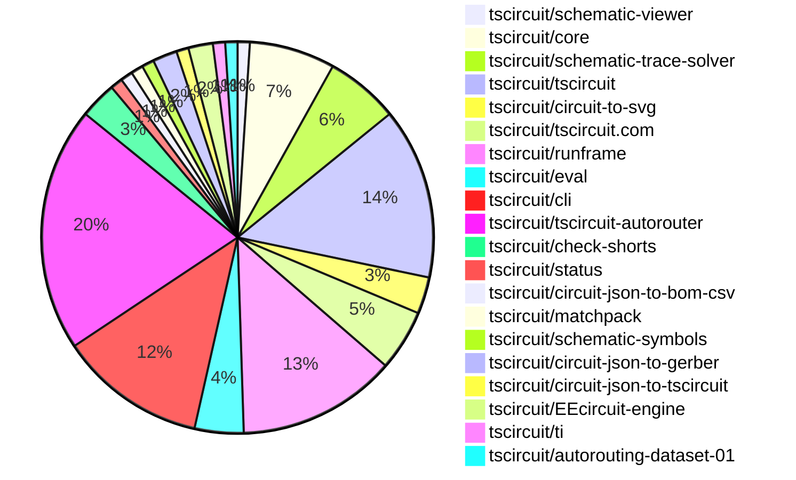

# Contribution Overview 2026-07-07

The current week is shown below. There are 3 major sections:

- [Contributor Overview](#contributor-overview)
- [PRs by Repository](#prs-by-repository)
- [PRs by Contributor](#changes-by-contributor)
- [Scoring & Sponsorship Details](/docs/sponsorship-calculation-explanation.md)

## PRs by Repository

## Contributor Overview

| Contributor | 🐳 Major | 🐙 Minor | 🐌 Tiny | Score | ⭐ | Discussion Contributions |
|-------------|---------|---------|---------|-------|-----|--------------------------|
| [ShiboSoftwareDev](#ShiboSoftwareDev) | 3 | 2 | 2 | 22 | ⭐⭐ | 0🔹 0🔶 0💎 |
| [Abse2001](#Abse2001) | 2 | 2 | 1 | 14 | ⭐⭐ | 0🔹 0🔶 0💎 |
| [mohan-bee](#mohan-bee) | 1 | 2 | 5 | 14 | ⭐⭐ | 0🔹 0🔶 0💎 |
| [MustafaMulla29](#MustafaMulla29) | 1 | 2 | 4 | 13 | ⭐⭐ | 0🔹 0🔶 0💎 |
| [tscircuitbot](#tscircuitbot) | 0 | 0 | 55 | 12 | ⭐⭐ | 0🔹 0🔶 0💎 |
| [0hmX](#0hmX) | 2 | 0 | 2 | 11 | ⭐⭐ | 0🔹 0🔶 0💎 |
| [AnasSarkiz](#AnasSarkiz) | 1 | 0 | 2 | 11 | ⭐⭐ | 0🔹 0🔶 0💎 |
| [seveibar](#seveibar) | 1 | 1 | 0 | 7 | ⭐ | 0🔹 0🔶 0💎 |
| [technologyet31-create](#technologyet31-create) | 0 | 3 | 0 | 6 | ⭐ | 0🔹 0🔶 0💎 |
| [imrishabh18](#imrishabh18) | 0 | 1 | 1 | 4 | ⭐ | 0🔹 0🔶 0💎 |
| [anil08607](#anil08607) | 0 | 1 | 0 | 2 |  | 0🔹 0🔶 0💎 |
| [rushabhcodes](#rushabhcodes) | 0 | 0 | 1 | 1 |  | 0🔹 0🔶 0💎 |
| [techmannih](#techmannih) | 0 | 0 | 1 | 1 |  | 0🔹 0🔶 0💎 |

## Staff Pass Ratio (SPR)

| Contributor | Reviewed PRs | Rejections | Approvals | SPR |
|-------------|--------------|------------|-----------|-----|
| [ShiboSoftwareDev](#ShiboSoftwareDev) | 6 | 0 | 7 | 100.0% |
| [technologyet31-create](#technologyet31-create) | 4 | 0 | 4 | 100.0% |
| [MustafaMulla29](#MustafaMulla29) | 3 | 0 | 3 | 100.0% |
| [Abse2001](#Abse2001) | 3 | 0 | 3 | 100.0% |
| [0hmX](#0hmX) | 3 | 0 | 3 | 100.0% |
| [mohan-bee](#mohan-bee) | 2 | 0 | 2 | 100.0% |
| [imrishabh18](#imrishabh18) | 1 | 0 | 1 | 100.0% |
| [anil08607](#anil08607) | 1 | 0 | 1 | 100.0% |
| [AnasSarkiz](#AnasSarkiz) | 1 | 0 | 1 | 100.0% |

ShiboSoftwareDev SPR PRs (6)

- [#1554](https://github.com/tscircuit/tscircuit-autorouter/pull/1554) Add reusable solver SVG frames fixture
- [#1545](https://github.com/tscircuit/tscircuit-autorouter/pull/1545) Fix BGA grid alignment for obstacle target routing
- [#1543](https://github.com/tscircuit/tscircuit-autorouter/pull/1543) Fix overlapping endpoint region selection for merged topology
- [#1532](https://github.com/tscircuit/tscircuit-autorouter/pull/1532) topology merge
- [#7](https://github.com/tscircuit/EEcircuit-engine/pull/7) Fix runSim rejection on ngspice failures
- [#24](https://github.com/tscircuit/ngspice-spice-engine/pull/24) Bump eecircuit engine to 1.7.6

technologyet31-create SPR PRs (4)

- [#605](https://github.com/tscircuit/circuit-to-svg/pull/605) Count all rendered elements in getComprehensivePcbBounds
- [#604](https://github.com/tscircuit/circuit-to-svg/pull/604) Add failing repros for elements missing from getComprehensivePcbBounds
- [#607](https://github.com/tscircuit/circuit-to-svg/pull/607) Count pcb_hole, pcb_note_line, and rotated rect cutout in getComprehensivePcbBounds
- [#120](https://github.com/tscircuit/circuit-json-to-gerber/pull/120) Preserve silkscreen text case in Gerber output

MustafaMulla29 SPR PRs (3)

- [#237](https://github.com/tscircuit/schematic-viewer/pull/237) feat: highlight hovered net by fading unrelated nets and chips
- [#2614](https://github.com/tscircuit/core/pull/2614) Pass schematic port facing directions to the trace solver
- [#645](https://github.com/tscircuit/schematic-trace-solver/pull/645)  Respect provided pin facingDirection when correcting pins inside expanded chip boxes

Abse2001 SPR PRs (3)

- [#2617](https://github.com/tscircuit/core/pull/2617) Allow custom footprint port hints to override default LED aliases
- [#2608](https://github.com/tscircuit/core/pull/2608) Use automatic net labels on repro46
- [#7](https://github.com/tscircuit/check-shorts/pull/7) Improve bitmap-based PCB/Gerber short detection with enhanced large-board performance, accuracy, and debug rendering

0hmX SPR PRs (3)

- [#1553](https://github.com/tscircuit/tscircuit-autorouter/pull/1553) Make pipeline 7 GlobalDrc connMap aware
- [#1552](https://github.com/tscircuit/tscircuit-autorouter/pull/1552) Fix same-net via merger route transitions
- [#1537](https://github.com/tscircuit/tscircuit-autorouter/pull/1537) Improve same-net via merging

mohan-bee SPR PRs (2)

- [#16](https://github.com/tscircuit/circuit-json-to-bom-csv/pull/16) Skip test points
- [#153](https://github.com/tscircuit/matchpack/pull/153) fix decoupling capacitor and series resistor collision

imrishabh18 SPR PRs (1)

- [#2616](https://github.com/tscircuit/core/pull/2616) fix: Missing pin_number in the custom ports failed the ports to be unique

anil08607 SPR PRs (1)

- [#610](https://github.com/tscircuit/circuit-to-svg/pull/610) Remove unused circuit-json types

AnasSarkiz SPR PRs (1)

- [#1536](https://github.com/tscircuit/tscircuit-autorouter/pull/1536) Fix stitch endpoint snapping to prevent closed-loop two-port traces

> Note: AI evaluates PRs and assigns 1-3 star ratings automatically. 4 and 5 star ratings require manual staff review.

### Discussion Contribution Legend

- 🔹 Normal Comments: Basic participation with minimal effort
- 🔶 Great Informative Comments: Thoughtful participation that adds value
- 💎 Incredible Comments: Exceptional participation with high-quality content

## Review Table

[reviews-received-hover]: ## "Number of reviews received for PRs for this contributor"
[approvals-received-hover]: ## "Number of approvals received for PRs this contributor authored"
[rejections-received-hover]: ## "Number of rejections received for PRs this contributor authored"
[prs-opened-hover]: ## "Number of PRs opened by this contributor"
[issues-created-hover]: ## "Number of issues created by this contributor"

| Contributor | Reviews Received | Approvals Received | Rejections Received | Approvals | Rejections Given | PRs Opened | PRs Merged | Issues Created |
|---|---|---|---|---|---|---|---|---|
| [MustafaMulla29](#MustafaMulla29) | 9 | 4 | 0 | 7 | 1 | 7 | 7 | 0 |
| [seveibar](#seveibar) | 0 | 0 | 0 | 28 | 0 | 3 | 3 | 0 |
| [imrishabh18](#imrishabh18) | 4 | 2 | 0 | 5 | 0 | 4 | 3 | 0 |
| [thienanwspace](#thienanwspace) | 0 | 0 | 0 | 0 | 0 | 3 | 0 | 0 |
| [tscircuitbot](#tscircuitbot) | 0 | 0 | 0 | 0 | 0 | 80 | 55 | 0 |
| [Abse2001](#Abse2001) | 9 | 8 | 0 | 2 | 0 | 5 | 5 | 0 |
| [mohan-bee](#mohan-bee) | 16 | 9 | 1 | 1 | 0 | 11 | 9 | 0 |
| [maci0](#maci0) | 0 | 0 | 0 | 0 | 0 | 1 | 0 | 0 |
| [technologyet31-create](#technologyet31-create) | 9 | 8 | 0 | 0 | 0 | 7 | 3 | 0 |
| [anil08607](#anil08607) | 2 | 2 | 0 | 0 | 0 | 2 | 2 | 0 |
| [AnasSarkiz](#AnasSarkiz) | 8 | 7 | 0 | 6 | 0 | 4 | 3 | 0 |
| [rushabhcodes](#rushabhcodes) | 3 | 1 | 0 | 0 | 0 | 1 | 1 | 0 |
| [techmannih](#techmannih) | 0 | 0 | 0 | 0 | 0 | 1 | 1 | 0 |
| [wanglianglll](#wanglianglll) | 0 | 0 | 0 | 0 | 0 | 1 | 0 | 0 |
| [0hmX](#0hmX) | 7 | 6 | 0 | 5 | 0 | 7 | 7 | 0 |
| [ShiboSoftwareDev](#ShiboSoftwareDev) | 13 | 11 | 0 | 4 | 0 | 9 | 8 | 0 |

## Changes by Repository

### [tscircuit/schematic-viewer](https://github.com/tscircuit/schematic-viewer)

| PR # | Impact | Rating | Contributor | Description |
|------|--------|--------|-------------|-------------|
| [#237](https://github.com/tscircuit/schematic-viewer/pull/237) | 🐳 Major | ⭐⭐⭐ | MustafaMulla29 | Adds functionality to highlight the hovered net by fading unrelated nets and chips in the schematic viewer, improving user interaction and clarity. |

### [tscircuit/core](https://github.com/tscircuit/core)

| PR # | Impact | Rating | Contributor | Description |
|------|--------|--------|-------------|-------------|
| [#2614](https://github.com/tscircuit/core/pull/2614) | 🐙 Minor | ⭐⭐ | MustafaMulla29 | Passes each schematic ports true facing direction to the trace solver to improve pin snapping accuracy and prevent misalignment of net labels. |
| [#2617](https://github.com/tscircuit/core/pull/2617) | 🐙 Minor | ⭐⭐ | Abse2001 | Allows custom footprint port hints to override default LED aliases for better flexibility in pin labeling. |
| [#2608](https://github.com/tscircuit/core/pull/2608) | 🐙 Minor | ⭐⭐ | Abse2001 | Adds automatic net labels for connections in the repro46 schematic test. |
| [#2611](https://github.com/tscircuit/core/pull/2611) | 🐙 Minor | ⭐⭐ | seveibar | Updates the autorouter dependency version and refreshes snapshot tests for 3D representations of components. |

🐌 Tiny Contributions (3)

| PR # | Impact | Contributor | Description |
|------|--------|-------------|-------------|
| [#2615](https://github.com/tscircuit/core/pull/2615) | 🐌 Tiny | imrishabh18 | Fixes incorrect rendering of schematic pin labels that are not in the correct sequence, ensuring accurate representation in the schematic view. |
| [#2610](https://github.com/tscircuit/core/pull/2610) | 🐌 Tiny | mohan-bee | Updates the version of the tscircuitmatchpack dependency from 0.0.29 to 0.0.31 in package.json |
| [#2609](https://github.com/tscircuit/core/pull/2609) | 🐌 Tiny | mohan-bee | Updates the version of the schematic-symbols dependency from 0.0.230 to 0.0.231 in package.json |

### [tscircuit/schematic-trace-solver](https://github.com/tscircuit/schematic-trace-solver)

| PR # | Impact | Rating | Contributor | Description |
|------|--------|--------|-------------|-------------|
| [#615](https://github.com/tscircuit/schematic-trace-solver/pull/615) | 🐳 Major | ⭐⭐⭐ | seveibar | Adds support for tracing outside pin bands to enhance the accuracy of schematic trace calculations and improve bug reporting. |
| [#645](https://github.com/tscircuit/schematic-trace-solver/pull/645) | 🐙 Minor | ⭐⭐ | MustafaMulla29 | Fixes incorrect pin placement for components with long reference designators by ensuring pins are snapped to the correct edge based on their declared facing direction. |

🐌 Tiny Contributions (4)

| PR # | Impact | Contributor | Description |
|------|--------|-------------|-------------|
| [#644](https://github.com/tscircuit/schematic-trace-solver/pull/644) | 🐌 Tiny | tscircuitbot | Adds a snapshot-only regression test and debugger page for the attached JSON solver input. |
| [#640](https://github.com/tscircuit/schematic-trace-solver/pull/640) | 🐌 Tiny | tscircuitbot | Adds a snapshot-only regression test and debugger page for the attached JSON solver input. |
| [#637](https://github.com/tscircuit/schematic-trace-solver/pull/637) | 🐌 Tiny | tscircuitbot | Adds a snapshot-only regression test and debugger page for the attached JSON solver input. |
| [#642](https://github.com/tscircuit/schematic-trace-solver/pull/642) | 🐌 Tiny | tscircuitbot | Adds a snapshot-only regression test and debugger page for the attached JSON solver input. |

### [tscircuit/tscircuit](https://github.com/tscircuit/tscircuit)

🐌 Tiny Contributions (14)

| PR # | Impact | Contributor | Description |
|------|--------|-------------|-------------|
| [#3803](https://github.com/tscircuit/tscircuit/pull/3803) | 🐌 Tiny | MustafaMulla29 | Updates the circuit-to-svg dependency version from 0.0.371 to 0.0.374 in package.json |
| [#3809](https://github.com/tscircuit/tscircuit/pull/3809) | 🐌 Tiny | tscircuitbot | Updates the tscircuitcli package from version 0.1.1614 to 0.1.1615 and the tscircuitrunframe package from version 0.0.2168 to 0.0.2169 in the package.json file. |
| [#3816](https://github.com/tscircuit/tscircuit/pull/3816) | 🐌 Tiny | tscircuitbot | Automated package update |
| [#3815](https://github.com/tscircuit/tscircuit/pull/3815) | 🐌 Tiny | tscircuitbot | Automated package update |
| [#3814](https://github.com/tscircuit/tscircuit/pull/3814) | 🐌 Tiny | tscircuitbot | Automated package update |
| [#3813](https://github.com/tscircuit/tscircuit/pull/3813) | 🐌 Tiny | tscircuitbot | Automated package update |
| [#3812](https://github.com/tscircuit/tscircuit/pull/3812) | 🐌 Tiny | tscircuitbot | Automated package update to version 0.0.2016 |
| [#3811](https://github.com/tscircuit/tscircuit/pull/3811) | 🐌 Tiny | tscircuitbot | Automated package update |
| [#3810](https://github.com/tscircuit/tscircuit/pull/3810) | 🐌 Tiny | tscircuitbot | Automated package update |
| [#3808](https://github.com/tscircuit/tscircuit/pull/3808) | 🐌 Tiny | tscircuitbot | Automated package update |
| [#3807](https://github.com/tscircuit/tscircuit/pull/3807) | 🐌 Tiny | tscircuitbot | Automated package update |
| [#3806](https://github.com/tscircuit/tscircuit/pull/3806) | 🐌 Tiny | tscircuitbot | Updates the package version from 0.0.2012 to 0.0.2013 in package.json |
| [#3804](https://github.com/tscircuit/tscircuit/pull/3804) | 🐌 Tiny | tscircuitbot | Automated package update to version 0.0.2012 |
| [#3805](https://github.com/tscircuit/tscircuit/pull/3805) | 🐌 Tiny | tscircuitbot | Updates the tscircuitcli package from version 0.1.1612 to 0.1.1613 and the tscircuitrunframe package from version 0.0.2166 to 0.0.2167, while downgrading the circuit-to-svg package from version 0.0.374 to 0.0.371. |

### [tscircuit/circuit-to-svg](https://github.com/tscircuit/circuit-to-svg)

| PR # | Impact | Rating | Contributor | Description |
|------|--------|--------|-------------|-------------|
| [#605](https://github.com/tscircuit/circuit-to-svg/pull/605) | 🐙 Minor | ⭐⭐ | technologyet31-create | Fixes rendering issues by ensuring that getComprehensivePcbBounds includes the extent of every element the renderer draws, preventing clipping and ensuring accurate representation of PCB elements. |
| [#604](https://github.com/tscircuit/circuit-to-svg/pull/604) | 🐙 Minor | ⭐⭐ | technologyet31-create | Adds failing tests for elements missing from getComprehensivePcbBounds, including brep copper pours, plated holes, rotated SMT pads, vias, and silkscreen pills, to ensure they are accounted for in the rendering process. |

🐌 Tiny Contributions (1)

| PR # | Impact | Contributor | Description |
|------|--------|-------------|-------------|
| [#602](https://github.com/tscircuit/circuit-to-svg/pull/602) | 🐌 Tiny | MustafaMulla29 | Tags schematic net label elements with data-schematic-net-label-id and removes hover CSS from the base SVG, streamlining the SVG generation process. |

### [tscircuit/tscircuit.com](https://github.com/tscircuit/tscircuit.com)

| PR # | Impact | Rating | Contributor | Description |
|------|--------|--------|-------------|-------------|
| [#3846](https://github.com/tscircuit/tscircuit.com/pull/3846) | 🐳 Major | ⭐⭐⭐ | mohan-bee | Adds file-specific icons for .tsx, .md, and .json files in file views and corrects markdown syntax highlighting in the code editor. |

🐌 Tiny Contributions (4)

| PR # | Impact | Contributor | Description |
|------|--------|-------------|-------------|
| [#3847](https://github.com/tscircuit/tscircuit.com/pull/3847) | 🐌 Tiny | MustafaMulla29 | Updates dependencies for runframe, schematic-viewer, and circuit-to-svg to ensure proper net highlighting functionality. |
| [#3840](https://github.com/tscircuit/tscircuit.com/pull/3840) | 🐌 Tiny | tscircuitbot | Updates the tscircuiteval package from version 0.0.978 to 0.0.979 |
| [#3850](https://github.com/tscircuit/tscircuit.com/pull/3850) | 🐌 Tiny | rushabhcodes | Fixes deployment regression caused by incompatible package versions in the production dependency set, ensuring the app builds successfully with aligned versions of tscircuitrunframe, tscircuitprops, and tscircuit3d-viewer. |
| [#3844](https://github.com/tscircuit/tscircuit.com/pull/3844) | 🐌 Tiny | techmannih | Updates the schematic-symbols dependency to version 0.0.231 in package.json |

### [tscircuit/runframe](https://github.com/tscircuit/runframe)

🐌 Tiny Contributions (13)

| PR # | Impact | Contributor | Description |
|------|--------|-------------|-------------|
| [#3893](https://github.com/tscircuit/runframe/pull/3893) | 🐌 Tiny | MustafaMulla29 | Updates the circuit-to-svg dependency version from 0.0.367 to 0.0.374 in package.json |
| [#3905](https://github.com/tscircuit/runframe/pull/3905) | 🐌 Tiny | tscircuitbot | Updates the tscircuiteval package to version 0.0.980 in the package.json file. |
| [#3904](https://github.com/tscircuit/runframe/pull/3904) | 🐌 Tiny | tscircuitbot | Automated package update |
| [#3903](https://github.com/tscircuit/runframe/pull/3903) | 🐌 Tiny | tscircuitbot | Updates the tscircuitschematic-viewer package to version 2.0.69 |
| [#3901](https://github.com/tscircuit/runframe/pull/3901) | 🐌 Tiny | tscircuitbot | Automated package update |
| [#3898](https://github.com/tscircuit/runframe/pull/3898) | 🐌 Tiny | tscircuitbot | Updates the circuit-json-to-gerber package from version 0.0.80 to 0.0.81 |
| [#3897](https://github.com/tscircuit/runframe/pull/3897) | 🐌 Tiny | tscircuitbot | Automated package update |
| [#3896](https://github.com/tscircuit/runframe/pull/3896) | 🐌 Tiny | tscircuitbot | Updates the circuit-json-to-gerber package from version 0.0.79 to 0.0.80 |
| [#3895](https://github.com/tscircuit/runframe/pull/3895) | 🐌 Tiny | tscircuitbot | Updates the tscircuiteval package to version 0.0.979 in the package.json file. |
| [#3894](https://github.com/tscircuit/runframe/pull/3894) | 🐌 Tiny | tscircuitbot | Automated package update |
| [#3906](https://github.com/tscircuit/runframe/pull/3906) | 🐌 Tiny | tscircuitbot | Automated package update |
| [#3899](https://github.com/tscircuit/runframe/pull/3899) | 🐌 Tiny | tscircuitbot | Automated package update |
| [#3900](https://github.com/tscircuit/runframe/pull/3900) | 🐌 Tiny | mohan-bee | Updates the version of schematic symbols from 0.0.227 to 0.0.231 in the package.json file. |

### [tscircuit/eval](https://github.com/tscircuit/eval)

🐌 Tiny Contributions (4)

| PR # | Impact | Contributor | Description |
|------|--------|-------------|-------------|
| [#3139](https://github.com/tscircuit/eval/pull/3139) | 🐌 Tiny | tscircuitbot | Automated package update to version 0.0.980 |
| [#3138](https://github.com/tscircuit/eval/pull/3138) | 🐌 Tiny | tscircuitbot | Automated package update |
| [#3132](https://github.com/tscircuit/eval/pull/3132) | 🐌 Tiny | tscircuitbot | Automated package update |
| [#3131](https://github.com/tscircuit/eval/pull/3131) | 🐌 Tiny | tscircuitbot | Updates package dependencies to their latest versions in package.json |

### [tscircuit/cli](https://github.com/tscircuit/cli)

🐌 Tiny Contributions (12)

| PR # | Impact | Contributor | Description |
|------|--------|-------------|-------------|
| [#3584](https://github.com/tscircuit/cli/pull/3584) | 🐌 Tiny | tscircuitbot | Automated package update |
| [#3583](https://github.com/tscircuit/cli/pull/3583) | 🐌 Tiny | tscircuitbot | Updates the tscircuitrunframe package from version 0.0.2171 to 0.0.2172 |
| [#3582](https://github.com/tscircuit/cli/pull/3582) | 🐌 Tiny | tscircuitbot | Automated package update |
| [#3581](https://github.com/tscircuit/cli/pull/3581) | 🐌 Tiny | tscircuitbot | Updates the tscircuitrunframe package from version 0.0.2170 to 0.0.2171 |
| [#3580](https://github.com/tscircuit/cli/pull/3580) | 🐌 Tiny | tscircuitbot | Automated package update |
| [#3579](https://github.com/tscircuit/cli/pull/3579) | 🐌 Tiny | tscircuitbot | Updates the tscircuitrunframe package to version 0.0.2170 |
| [#3578](https://github.com/tscircuit/cli/pull/3578) | 🐌 Tiny | tscircuitbot | Automated package update |
| [#3577](https://github.com/tscircuit/cli/pull/3577) | 🐌 Tiny | tscircuitbot | Updates the tscircuitrunframe package from version 0.0.2168 to 0.0.2169 |
| [#3576](https://github.com/tscircuit/cli/pull/3576) | 🐌 Tiny | tscircuitbot | Automated package update |
| [#3575](https://github.com/tscircuit/cli/pull/3575) | 🐌 Tiny | tscircuitbot | Updates the tscircuitrunframe package from version 0.0.2167 to 0.0.2168 |
| [#3574](https://github.com/tscircuit/cli/pull/3574) | 🐌 Tiny | tscircuitbot | Automated package update |
| [#3573](https://github.com/tscircuit/cli/pull/3573) | 🐌 Tiny | tscircuitbot | Updates the tscircuitrunframe package to version 0.0.2167 in package.json |

### [tscircuit/tscircuit-autorouter](https://github.com/tscircuit/tscircuit-autorouter)

| PR # | Impact | Rating | Contributor | Description |
|------|--------|--------|-------------|-------------|
| [#1545](https://github.com/tscircuit/tscircuit-autorouter/pull/1545) | 🐳 Major | ⭐⭐⭐ | ShiboSoftwareDev | Fixes BGA grid alignment for obstacle target routing by preserving observed BGA pad centers and ensuring clean borders for mesh regions. |
| [#1543](https://github.com/tscircuit/tscircuit-autorouter/pull/1543) | 🐳 Major | ⭐⭐⭐ | ShiboSoftwareDev | Fixes overlapping endpoint region selection in autorouting by preferring candidates with incident ports on the endpoint layer, improving routing accuracy. |
| [#1532](https://github.com/tscircuit/tscircuit-autorouter/pull/1532) | 🐳 Major | ⭐⭐⭐ | ShiboSoftwareDev | Merges component topologies into a unified global topology for improved autorouting efficiency and accuracy. |
| [#1550](https://github.com/tscircuit/tscircuit-autorouter/pull/1550) | 🐳 Major | ⭐⭐⭐ | 0hmX | Add a focused trace simplification snapshot for bugreport71, cropping the SVG view to a 10 x 10 region around (4.46, 25.50) and asserting the section contains at least two nearby vias. |
| [#1537](https://github.com/tscircuit/tscircuit-autorouter/pull/1537) | 🐳 Major | ⭐⭐⭐ | 0hmX | Extends same-net via merging to collapse nearby safe vias via hops, requires explicit connectivity data, and throws on malformed viaroute invariants instead of falling back. |
| [#1536](https://github.com/tscircuit/tscircuit-autorouter/pull/1536) | 🐳 Major | ⭐⭐⭐ | AnasSarkiz | Fixes a route-stitching bug where a normal two-port connection could accidentally be stitched from one port back to the same port. |
| [#1554](https://github.com/tscircuit/tscircuit-autorouter/pull/1554) | 🐙 Minor | ⭐⭐ | ShiboSoftwareDev | Adds getSolverSvgFrames for rendering selected solver, pipeline, and step frames into labeled SVG snapshot sheets. Refactors merged-topology snapshot tests to use the shared frames fixture with per-test setup, and adds a pipeline7 full-pipeline frames snapshot on dataset01.circuit003 with a zero relaxed-DRC assertion. |

🐌 Tiny Contributions (13)

| PR # | Impact | Contributor | Description |
|------|--------|-------------|-------------|
| [#1548](https://github.com/tscircuit/tscircuit-autorouter/pull/1548) | 🐌 Tiny | tscircuitbot | Automated package update |
| [#1540](https://github.com/tscircuit/tscircuit-autorouter/pull/1540) | 🐌 Tiny | tscircuitbot | Automated package update |
| [#1555](https://github.com/tscircuit/tscircuit-autorouter/pull/1555) | 🐌 Tiny | tscircuitbot | Automated package update |
| [#1551](https://github.com/tscircuit/tscircuit-autorouter/pull/1551) | 🐌 Tiny | tscircuitbot | Automated package update |
| [#1544](https://github.com/tscircuit/tscircuit-autorouter/pull/1544) | 🐌 Tiny | tscircuitbot | Automated package update |
| [#1541](https://github.com/tscircuit/tscircuit-autorouter/pull/1541) | 🐌 Tiny | tscircuitbot | Automated package update |
| [#1535](https://github.com/tscircuit/tscircuit-autorouter/pull/1535) | 🐌 Tiny | tscircuitbot | Automated package update |
| [#1549](https://github.com/tscircuit/tscircuit-autorouter/pull/1549) | 🐌 Tiny | tscircuitbot | Automated package update |
| [#1542](https://github.com/tscircuit/tscircuit-autorouter/pull/1542) | 🐌 Tiny | tscircuitbot | Automated package update |
| [#1539](https://github.com/tscircuit/tscircuit-autorouter/pull/1539) | 🐌 Tiny | tscircuitbot | Automated package update |
| [#1534](https://github.com/tscircuit/tscircuit-autorouter/pull/1534) | 🐌 Tiny | 0hmX | This pull request adds a new bug report fixture for the autorouter, which includes a JSON representation of the bug report and a corresponding React component for debugging purposes. |
| [#1538](https://github.com/tscircuit/tscircuit-autorouter/pull/1538) | 🐌 Tiny | 0hmX | Adds a missing SVG file related to bug report 71, ensuring proper rendering in the application. |
| [#1547](https://github.com/tscircuit/tscircuit-autorouter/pull/1547) | 🐌 Tiny | AnasSarkiz | Fixes the ACS37800 pad orientation in the dataset to prevent overlapping pads that cause DRC failures before routing starts. |

### [tscircuit/check-shorts](https://github.com/tscircuit/check-shorts)

| PR # | Impact | Rating | Contributor | Description |
|------|--------|--------|-------------|-------------|
| [#8](https://github.com/tscircuit/check-shorts/pull/8) | 🐳 Major | ⭐⭐⭐ | Abse2001 | Refactors bitmap short detection to utilize bounds utilities from tscircuitcircuit-json-util for improved accuracy in detecting bitmap shorts. |
| [#7](https://github.com/tscircuit/check-shorts/pull/7) | 🐳 Major | ⭐⭐⭐ | Abse2001 | This pull request enhances the bitmap-based PCBGerber short detection system by improving performance and accuracy, especially for large boards. It introduces new rendering features for debugging, allowing for better visualization of shorts on the PCB. The changes include optimizations in the detection algorithms and enhancements in the rendering process, making it easier to identify and debug issues in PCB designs. |

🐌 Tiny Contributions (1)

| PR # | Impact | Contributor | Description |
|------|--------|-------------|-------------|
| [#6](https://github.com/tscircuit/check-shorts/pull/6) | 🐌 Tiny | Abse2001 | Configures package entry points and metadata in package.json for better module resolution and adds SVG rendering capabilities to tests. |

### [tscircuit/status](https://github.com/tscircuit/status)

| PR # | Impact | Rating | Contributor | Description |
|------|--------|--------|-------------|-------------|
| [#68](https://github.com/tscircuit/status/pull/68) | 🐙 Minor | ⭐⭐ | imrishabh18 | Fixes a failing usercode check and updates the import order in the index.tsx file. |

### [tscircuit/circuit-json-to-bom-csv](https://github.com/tscircuit/circuit-json-to-bom-csv)

| PR # | Impact | Rating | Contributor | Description |
|------|--------|--------|-------------|-------------|
| [#16](https://github.com/tscircuit/circuit-json-to-bom-csv/pull/16) | 🐙 Minor | ⭐⭐ | mohan-bee | Adds functionality to skip test points in the BOM generation process, ensuring that test points are not included in the output. |

### [tscircuit/matchpack](https://github.com/tscircuit/matchpack)

| PR # | Impact | Rating | Contributor | Description |
|------|--------|--------|-------------|-------------|
| [#153](https://github.com/tscircuit/matchpack/pull/153) | 🐙 Minor | ⭐⭐ | mohan-bee | Fixes a schematic layout collision where AlignPowerGroundRowsSolver could move already-packed powerground row components into overlapping positions. |

### [tscircuit/schematic-symbols](https://github.com/tscircuit/schematic-symbols)

🐌 Tiny Contributions (1)

| PR # | Impact | Contributor | Description |
|------|--------|-------------|-------------|
| [#436](https://github.com/tscircuit/schematic-symbols/pull/436) | 🐌 Tiny | mohan-bee | Fixes disconnected-looking schematic traces by correcting switch and MOSFET symbol bounds so routing edges line up with the actual terminal positions. |

### [tscircuit/circuit-json-to-gerber](https://github.com/tscircuit/circuit-json-to-gerber)

| PR # | Impact | Rating | Contributor | Description |
|------|--------|--------|-------------|-------------|
| [#120](https://github.com/tscircuit/circuit-json-to-gerber/pull/120) | 🐙 Minor | ⭐⭐ | technologyet31-create | Fixes lowercase silkscreen text being rendered as uppercase glyph geometry in Gerber output |

🐌 Tiny Contributions (1)

| PR # | Impact | Contributor | Description |
|------|--------|-------------|-------------|
| [#118](https://github.com/tscircuit/circuit-json-to-gerber/pull/118) | 🐌 Tiny | mohan-bee | ISSUE : IN JLCPCB: img width416 height186 altimage srchttps:github.comuser-attachmentsassets6d8ac8b4-4d0f-4998-9d8f-5fb014a6a149  img width366 height358 altimage srchttps:github.comuser-attachmentsassets0387149a-dfad-457b-9619-7e1203238c55  TSCIRCUIT: img width544 height443 altimage srchttps:github.comuser-attachmentsassetse02c9eb7-4994-4030-be08-331b5f110360 |

### [tscircuit/circuit-json-to-tscircuit](https://github.com/tscircuit/circuit-json-to-tscircuit)

| PR # | Impact | Rating | Contributor | Description |
|------|--------|--------|-------------|-------------|
| [#59](https://github.com/tscircuit/circuit-json-to-tscircuit/pull/59) | 🐙 Minor | ⭐⭐ | anil08607 | Adds pcb_smtpad support for the rotated_pill shape in circuit-json-to-tscircuit. |

### [tscircuit/EEcircuit-engine](https://github.com/tscircuit/EEcircuit-engine)

| PR # | Impact | Rating | Contributor | Description |
|------|--------|--------|-------------|-------------|
| [#7](https://github.com/tscircuit/EEcircuit-engine/pull/7) | 🐙 Minor | ⭐⭐ | ShiboSoftwareDev | Rejects runSim() when ngspice reports fatal errors or output readparse fails, instead of hanging or resolving stale out.raw. Clears previous raw output before each run, preserves ngspice error details, and adds regression coverage for missing subcircuits and conflicting ideal voltage sources. |

🐌 Tiny Contributions (1)

| PR # | Impact | Contributor | Description |
|------|--------|-------------|-------------|
| [#6](https://github.com/tscircuit/EEcircuit-engine/pull/6) | 🐌 Tiny | ShiboSoftwareDev | This pull request includes a patch that removes duplicate code in the Simulation class and deletes two files related to rendering scope SVGs and a SPICE netlist for the TPS63802 model. |

### [tscircuit/ti](https://github.com/tscircuit/ti)

🐌 Tiny Contributions (1)

| PR # | Impact | Contributor | Description |
|------|--------|-------------|-------------|
| [#66](https://github.com/tscircuit/ti/pull/66) | 🐌 Tiny | ShiboSoftwareDev | Fixes graph display options to correctly utilize new properties for voltage and current probes in circuit simulations. |

### [tscircuit/autorouting-dataset-01](https://github.com/tscircuit/autorouting-dataset-01)

🐌 Tiny Contributions (1)

| PR # | Impact | Contributor | Description |
|------|--------|-------------|-------------|
| [#123](https://github.com/tscircuit/autorouting-dataset-01/pull/123) | 🐌 Tiny | AnasSarkiz | Fixes the pad orientation for the ACS37800 component in the dataset01 circuit010, correcting the width and height parameters for proper alignment. |

## Changes by Contributor

### [MustafaMulla29](https://github.com/MustafaMulla29)

| PRs # | Impact | Rating | Description |
|------|--------|--------|-------------|
| [#237](https://github.com/tscircuit/schematic-viewer/pull/237) | 🐳 Major | ⭐⭐⭐ | Adds functionality to highlight the hovered net by fading unrelated nets and chips in the schematic viewer, improving user interaction and clarity. |
| [#2614](https://github.com/tscircuit/core/pull/2614) | 🐙 Minor | ⭐⭐ | Passes each schematic ports true facing direction to the trace solver to improve pin snapping accuracy and prevent misalignment of net labels. |
| [#645](https://github.com/tscircuit/schematic-trace-solver/pull/645) | 🐙 Minor | ⭐⭐ | Fixes incorrect pin placement for components with long reference designators by ensuring pins are snapped to the correct edge based on their declared facing direction. |

🐌 Tiny Contributions (4)

| PR # | Impact | Description |
|------|--------|-------------|
| [#3803](https://github.com/tscircuit/tscircuit/pull/3803) | 🐌 Tiny | Updates the circuit-to-svg dependency version from 0.0.371 to 0.0.374 in package.json |
| [#602](https://github.com/tscircuit/circuit-to-svg/pull/602) | 🐌 Tiny | Tags schematic net label elements with data-schematic-net-label-id and removes hover CSS from the base SVG, streamlining the SVG generation process. |
| [#3847](https://github.com/tscircuit/tscircuit.com/pull/3847) | 🐌 Tiny | Updates dependencies for runframe, schematic-viewer, and circuit-to-svg to ensure proper net highlighting functionality. |
| [#3893](https://github.com/tscircuit/runframe/pull/3893) | 🐌 Tiny | Updates the circuit-to-svg dependency version from 0.0.367 to 0.0.374 in package.json |

### [tscircuitbot](https://github.com/tscircuitbot)

🐌 Tiny Contributions (55)

| PR # | Impact | Description |
|------|--------|-------------|
| [#3809](https://github.com/tscircuit/tscircuit/pull/3809) | 🐌 Tiny | Updates the tscircuitcli package from version 0.1.1614 to 0.1.1615 and the tscircuitrunframe package from version 0.0.2168 to 0.0.2169 in the package.json file. |
| [#3816](https://github.com/tscircuit/tscircuit/pull/3816) | 🐌 Tiny | Automated package update |
| [#3815](https://github.com/tscircuit/tscircuit/pull/3815) | 🐌 Tiny | Automated package update |
| [#3814](https://github.com/tscircuit/tscircuit/pull/3814) | 🐌 Tiny | Automated package update |
| [#3813](https://github.com/tscircuit/tscircuit/pull/3813) | 🐌 Tiny | Automated package update |
| [#3812](https://github.com/tscircuit/tscircuit/pull/3812) | 🐌 Tiny | Automated package update to version 0.0.2016 |
| [#3811](https://github.com/tscircuit/tscircuit/pull/3811) | 🐌 Tiny | Automated package update |
| [#3810](https://github.com/tscircuit/tscircuit/pull/3810) | 🐌 Tiny | Automated package update |
| [#3808](https://github.com/tscircuit/tscircuit/pull/3808) | 🐌 Tiny | Automated package update |
| [#3807](https://github.com/tscircuit/tscircuit/pull/3807) | 🐌 Tiny | Automated package update |
| [#3806](https://github.com/tscircuit/tscircuit/pull/3806) | 🐌 Tiny | Updates the package version from 0.0.2012 to 0.0.2013 in package.json |
| [#3804](https://github.com/tscircuit/tscircuit/pull/3804) | 🐌 Tiny | Automated package update to version 0.0.2012 |
| [#3805](https://github.com/tscircuit/tscircuit/pull/3805) | 🐌 Tiny | Updates the tscircuitcli package from version 0.1.1612 to 0.1.1613 and the tscircuitrunframe package from version 0.0.2166 to 0.0.2167, while downgrading the circuit-to-svg package from version 0.0.374 to 0.0.371. |
| [#3840](https://github.com/tscircuit/tscircuit.com/pull/3840) | 🐌 Tiny | Updates the tscircuiteval package from version 0.0.978 to 0.0.979 |
| [#3139](https://github.com/tscircuit/eval/pull/3139) | 🐌 Tiny | Automated package update to version 0.0.980 |
| [#3138](https://github.com/tscircuit/eval/pull/3138) | 🐌 Tiny | Automated package update |
| [#3132](https://github.com/tscircuit/eval/pull/3132) | 🐌 Tiny | Automated package update |
| [#3131](https://github.com/tscircuit/eval/pull/3131) | 🐌 Tiny | Updates package dependencies to their latest versions in package.json |
| [#3905](https://github.com/tscircuit/runframe/pull/3905) | 🐌 Tiny | Updates the tscircuiteval package to version 0.0.980 in the package.json file. |
| [#3904](https://github.com/tscircuit/runframe/pull/3904) | 🐌 Tiny | Automated package update |
| [#3903](https://github.com/tscircuit/runframe/pull/3903) | 🐌 Tiny | Updates the tscircuitschematic-viewer package to version 2.0.69 |
| [#3901](https://github.com/tscircuit/runframe/pull/3901) | 🐌 Tiny | Automated package update |
| [#3898](https://github.com/tscircuit/runframe/pull/3898) | 🐌 Tiny | Updates the circuit-json-to-gerber package from version 0.0.80 to 0.0.81 |
| [#3897](https://github.com/tscircuit/runframe/pull/3897) | 🐌 Tiny | Automated package update |
| [#3896](https://github.com/tscircuit/runframe/pull/3896) | 🐌 Tiny | Updates the circuit-json-to-gerber package from version 0.0.79 to 0.0.80 |
| [#3895](https://github.com/tscircuit/runframe/pull/3895) | 🐌 Tiny | Updates the tscircuiteval package to version 0.0.979 in the package.json file. |
| [#3894](https://github.com/tscircuit/runframe/pull/3894) | 🐌 Tiny | Automated package update |
| [#3906](https://github.com/tscircuit/runframe/pull/3906) | 🐌 Tiny | Automated package update |
| [#3899](https://github.com/tscircuit/runframe/pull/3899) | 🐌 Tiny | Automated package update |
| [#3584](https://github.com/tscircuit/cli/pull/3584) | 🐌 Tiny | Automated package update |
| [#3583](https://github.com/tscircuit/cli/pull/3583) | 🐌 Tiny | Updates the tscircuitrunframe package from version 0.0.2171 to 0.0.2172 |
| [#3582](https://github.com/tscircuit/cli/pull/3582) | 🐌 Tiny | Automated package update |
| [#3581](https://github.com/tscircuit/cli/pull/3581) | 🐌 Tiny | Updates the tscircuitrunframe package from version 0.0.2170 to 0.0.2171 |
| [#3580](https://github.com/tscircuit/cli/pull/3580) | 🐌 Tiny | Automated package update |
| [#3579](https://github.com/tscircuit/cli/pull/3579) | 🐌 Tiny | Updates the tscircuitrunframe package to version 0.0.2170 |
| [#3578](https://github.com/tscircuit/cli/pull/3578) | 🐌 Tiny | Automated package update |
| [#3577](https://github.com/tscircuit/cli/pull/3577) | 🐌 Tiny | Updates the tscircuitrunframe package from version 0.0.2168 to 0.0.2169 |
| [#3576](https://github.com/tscircuit/cli/pull/3576) | 🐌 Tiny | Automated package update |
| [#3575](https://github.com/tscircuit/cli/pull/3575) | 🐌 Tiny | Updates the tscircuitrunframe package from version 0.0.2167 to 0.0.2168 |
| [#3574](https://github.com/tscircuit/cli/pull/3574) | 🐌 Tiny | Automated package update |
| [#3573](https://github.com/tscircuit/cli/pull/3573) | 🐌 Tiny | Updates the tscircuitrunframe package to version 0.0.2167 in package.json |
| [#1548](https://github.com/tscircuit/tscircuit-autorouter/pull/1548) | 🐌 Tiny | Automated package update |
| [#1540](https://github.com/tscircuit/tscircuit-autorouter/pull/1540) | 🐌 Tiny | Automated package update |
| [#1555](https://github.com/tscircuit/tscircuit-autorouter/pull/1555) | 🐌 Tiny | Automated package update |
| [#1551](https://github.com/tscircuit/tscircuit-autorouter/pull/1551) | 🐌 Tiny | Automated package update |
| [#1544](https://github.com/tscircuit/tscircuit-autorouter/pull/1544) | 🐌 Tiny | Automated package update |
| [#1541](https://github.com/tscircuit/tscircuit-autorouter/pull/1541) | 🐌 Tiny | Automated package update |
| [#1535](https://github.com/tscircuit/tscircuit-autorouter/pull/1535) | 🐌 Tiny | Automated package update |
| [#1549](https://github.com/tscircuit/tscircuit-autorouter/pull/1549) | 🐌 Tiny | Automated package update |
| [#1542](https://github.com/tscircuit/tscircuit-autorouter/pull/1542) | 🐌 Tiny | Automated package update |
| [#1539](https://github.com/tscircuit/tscircuit-autorouter/pull/1539) | 🐌 Tiny | Automated package update |
| [#644](https://github.com/tscircuit/schematic-trace-solver/pull/644) | 🐌 Tiny | Adds a snapshot-only regression test and debugger page for the attached JSON solver input. |
| [#640](https://github.com/tscircuit/schematic-trace-solver/pull/640) | 🐌 Tiny | Adds a snapshot-only regression test and debugger page for the attached JSON solver input. |
| [#637](https://github.com/tscircuit/schematic-trace-solver/pull/637) | 🐌 Tiny | Adds a snapshot-only regression test and debugger page for the attached JSON solver input. |
| [#642](https://github.com/tscircuit/schematic-trace-solver/pull/642) | 🐌 Tiny | Adds a snapshot-only regression test and debugger page for the attached JSON solver input. |

### [Abse2001](https://github.com/Abse2001)

| PRs # | Impact | Rating | Description |
|------|--------|--------|-------------|
| [#8](https://github.com/tscircuit/check-shorts/pull/8) | 🐳 Major | ⭐⭐⭐ | Refactors bitmap short detection to utilize bounds utilities from tscircuitcircuit-json-util for improved accuracy in detecting bitmap shorts. |
| [#7](https://github.com/tscircuit/check-shorts/pull/7) | 🐳 Major | ⭐⭐⭐ | This pull request enhances the bitmap-based PCBGerber short detection system by improving performance and accuracy, especially for large boards. It introduces new rendering features for debugging, allowing for better visualization of shorts on the PCB. The changes include optimizations in the detection algorithms and enhancements in the rendering process, making it easier to identify and debug issues in PCB designs. |
| [#2617](https://github.com/tscircuit/core/pull/2617) | 🐙 Minor | ⭐⭐ | Allows custom footprint port hints to override default LED aliases for better flexibility in pin labeling. |
| [#2608](https://github.com/tscircuit/core/pull/2608) | 🐙 Minor | ⭐⭐ | Adds automatic net labels for connections in the repro46 schematic test. |

🐌 Tiny Contributions (1)

| PR # | Impact | Description |
|------|--------|-------------|
| [#6](https://github.com/tscircuit/check-shorts/pull/6) | 🐌 Tiny | Configures package entry points and metadata in package.json for better module resolution and adds SVG rendering capabilities to tests. |

### [imrishabh18](https://github.com/imrishabh18)

| PRs # | Impact | Rating | Description |
|------|--------|--------|-------------|
| [#68](https://github.com/tscircuit/status/pull/68) | 🐙 Minor | ⭐⭐ | Fixes a failing usercode check and updates the import order in the index.tsx file. |

🐌 Tiny Contributions (1)

| PR # | Impact | Description |
|------|--------|-------------|
| [#2615](https://github.com/tscircuit/core/pull/2615) | 🐌 Tiny | Fixes incorrect rendering of schematic pin labels that are not in the correct sequence, ensuring accurate representation in the schematic view. |

### [seveibar](https://github.com/seveibar)

| PRs # | Impact | Rating | Description |
|------|--------|--------|-------------|
| [#615](https://github.com/tscircuit/schematic-trace-solver/pull/615) | 🐳 Major | ⭐⭐⭐ | Adds support for tracing outside pin bands to enhance the accuracy of schematic trace calculations and improve bug reporting. |
| [#2611](https://github.com/tscircuit/core/pull/2611) | 🐙 Minor | ⭐⭐ | Updates the autorouter dependency version and refreshes snapshot tests for 3D representations of components. |

### [mohan-bee](https://github.com/mohan-bee)

| PRs # | Impact | Rating | Description |
|------|--------|--------|-------------|
| [#3846](https://github.com/tscircuit/tscircuit.com/pull/3846) | 🐳 Major | ⭐⭐⭐ | Adds file-specific icons for .tsx, .md, and .json files in file views and corrects markdown syntax highlighting in the code editor. |
| [#16](https://github.com/tscircuit/circuit-json-to-bom-csv/pull/16) | 🐙 Minor | ⭐⭐ | Adds functionality to skip test points in the BOM generation process, ensuring that test points are not included in the output. |
| [#153](https://github.com/tscircuit/matchpack/pull/153) | 🐙 Minor | ⭐⭐ | Fixes a schematic layout collision where AlignPowerGroundRowsSolver could move already-packed powerground row components into overlapping positions. |

🐌 Tiny Contributions (5)

| PR # | Impact | Description |
|------|--------|-------------|
| [#2610](https://github.com/tscircuit/core/pull/2610) | 🐌 Tiny | Updates the version of the tscircuitmatchpack dependency from 0.0.29 to 0.0.31 in package.json |
| [#2609](https://github.com/tscircuit/core/pull/2609) | 🐌 Tiny | Updates the version of the schematic-symbols dependency from 0.0.230 to 0.0.231 in package.json |
| [#436](https://github.com/tscircuit/schematic-symbols/pull/436) | 🐌 Tiny | Fixes disconnected-looking schematic traces by correcting switch and MOSFET symbol bounds so routing edges line up with the actual terminal positions. |
| [#118](https://github.com/tscircuit/circuit-json-to-gerber/pull/118) | 🐌 Tiny | ISSUE : IN JLCPCB: img width416 height186 altimage srchttps:github.comuser-attachmentsassets6d8ac8b4-4d0f-4998-9d8f-5fb014a6a149  img width366 height358 altimage srchttps:github.comuser-attachmentsassets0387149a-dfad-457b-9619-7e1203238c55  TSCIRCUIT: img width544 height443 altimage srchttps:github.comuser-attachmentsassetse02c9eb7-4994-4030-be08-331b5f110360 |
| [#3900](https://github.com/tscircuit/runframe/pull/3900) | 🐌 Tiny | Updates the version of schematic symbols from 0.0.227 to 0.0.231 in the package.json file. |

### [technologyet31-create](https://github.com/technologyet31-create)

| PRs # | Impact | Rating | Description |
|------|--------|--------|-------------|
| [#605](https://github.com/tscircuit/circuit-to-svg/pull/605) | 🐙 Minor | ⭐⭐ | Fixes rendering issues by ensuring that getComprehensivePcbBounds includes the extent of every element the renderer draws, preventing clipping and ensuring accurate representation of PCB elements. |
| [#604](https://github.com/tscircuit/circuit-to-svg/pull/604) | 🐙 Minor | ⭐⭐ | Adds failing tests for elements missing from getComprehensivePcbBounds, including brep copper pours, plated holes, rotated SMT pads, vias, and silkscreen pills, to ensure they are accounted for in the rendering process. |
| [#120](https://github.com/tscircuit/circuit-json-to-gerber/pull/120) | 🐙 Minor | ⭐⭐ | Fixes lowercase silkscreen text being rendered as uppercase glyph geometry in Gerber output |

### [rushabhcodes](https://github.com/rushabhcodes)

🐌 Tiny Contributions (1)

| PR # | Impact | Description |
|------|--------|-------------|
| [#3850](https://github.com/tscircuit/tscircuit.com/pull/3850) | 🐌 Tiny | Fixes deployment regression caused by incompatible package versions in the production dependency set, ensuring the app builds successfully with aligned versions of tscircuitrunframe, tscircuitprops, and tscircuit3d-viewer. |

### [techmannih](https://github.com/techmannih)

🐌 Tiny Contributions (1)

| PR # | Impact | Description |
|------|--------|-------------|
| [#3844](https://github.com/tscircuit/tscircuit.com/pull/3844) | 🐌 Tiny | Updates the schematic-symbols dependency to version 0.0.231 in package.json |

### [anil08607](https://github.com/anil08607)

| PRs # | Impact | Rating | Description |
|------|--------|--------|-------------|
| [#59](https://github.com/tscircuit/circuit-json-to-tscircuit/pull/59) | 🐙 Minor | ⭐⭐ | Adds pcb_smtpad support for the rotated_pill shape in circuit-json-to-tscircuit. |

### [ShiboSoftwareDev](https://github.com/ShiboSoftwareDev)

| PRs # | Impact | Rating | Description |
|------|--------|--------|-------------|
| [#1545](https://github.com/tscircuit/tscircuit-autorouter/pull/1545) | 🐳 Major | ⭐⭐⭐ | Fixes BGA grid alignment for obstacle target routing by preserving observed BGA pad centers and ensuring clean borders for mesh regions. |
| [#1543](https://github.com/tscircuit/tscircuit-autorouter/pull/1543) | 🐳 Major | ⭐⭐⭐ | Fixes overlapping endpoint region selection in autorouting by preferring candidates with incident ports on the endpoint layer, improving routing accuracy. |
| [#1532](https://github.com/tscircuit/tscircuit-autorouter/pull/1532) | 🐳 Major | ⭐⭐⭐ | Merges component topologies into a unified global topology for improved autorouting efficiency and accuracy. |
| [#1554](https://github.com/tscircuit/tscircuit-autorouter/pull/1554) | 🐙 Minor | ⭐⭐ | Adds getSolverSvgFrames for rendering selected solver, pipeline, and step frames into labeled SVG snapshot sheets. Refactors merged-topology snapshot tests to use the shared frames fixture with per-test setup, and adds a pipeline7 full-pipeline frames snapshot on dataset01.circuit003 with a zero relaxed-DRC assertion. |
| [#7](https://github.com/tscircuit/EEcircuit-engine/pull/7) | 🐙 Minor | ⭐⭐ | Rejects runSim() when ngspice reports fatal errors or output readparse fails, instead of hanging or resolving stale out.raw. Clears previous raw output before each run, preserves ngspice error details, and adds regression coverage for missing subcircuits and conflicting ideal voltage sources. |

🐌 Tiny Contributions (2)

| PR # | Impact | Description |
|------|--------|-------------|
| [#6](https://github.com/tscircuit/EEcircuit-engine/pull/6) | 🐌 Tiny | This pull request includes a patch that removes duplicate code in the Simulation class and deletes two files related to rendering scope SVGs and a SPICE netlist for the TPS63802 model. |
| [#66](https://github.com/tscircuit/ti/pull/66) | 🐌 Tiny | Fixes graph display options to correctly utilize new properties for voltage and current probes in circuit simulations. |

### [0hmX](https://github.com/0hmX)

| PRs # | Impact | Rating | Description |
|------|--------|--------|-------------|
| [#1550](https://github.com/tscircuit/tscircuit-autorouter/pull/1550) | 🐳 Major | ⭐⭐⭐ | Add a focused trace simplification snapshot for bugreport71, cropping the SVG view to a 10 x 10 region around (4.46, 25.50) and asserting the section contains at least two nearby vias. |
| [#1537](https://github.com/tscircuit/tscircuit-autorouter/pull/1537) | 🐳 Major | ⭐⭐⭐ | Extends same-net via merging to collapse nearby safe vias via hops, requires explicit connectivity data, and throws on malformed viaroute invariants instead of falling back. |

🐌 Tiny Contributions (2)

| PR # | Impact | Description |
|------|--------|-------------|
| [#1534](https://github.com/tscircuit/tscircuit-autorouter/pull/1534) | 🐌 Tiny | This pull request adds a new bug report fixture for the autorouter, which includes a JSON representation of the bug report and a corresponding React component for debugging purposes. |
| [#1538](https://github.com/tscircuit/tscircuit-autorouter/pull/1538) | 🐌 Tiny | Adds a missing SVG file related to bug report 71, ensuring proper rendering in the application. |

### [AnasSarkiz](https://github.com/AnasSarkiz)

| PRs # | Impact | Rating | Description |
|------|--------|--------|-------------|
| [#1536](https://github.com/tscircuit/tscircuit-autorouter/pull/1536) | 🐳 Major | ⭐⭐⭐ | Fixes a route-stitching bug where a normal two-port connection could accidentally be stitched from one port back to the same port. |

🐌 Tiny Contributions (2)

| PR # | Impact | Description |
|------|--------|-------------|
| [#1547](https://github.com/tscircuit/tscircuit-autorouter/pull/1547) | 🐌 Tiny | Fixes the ACS37800 pad orientation in the dataset to prevent overlapping pads that cause DRC failures before routing starts. |
| [#123](https://github.com/tscircuit/autorouting-dataset-01/pull/123) | 🐌 Tiny | Fixes the pad orientation for the ACS37800 component in the dataset01 circuit010, correcting the width and height parameters for proper alignment. |

## Repository Owners

| Repository | Codeowners |
|------------|------------|
| [pcb-viewer](https://github.com/tscircuit/pcb-viewer/blob/main/.github/CODEOWNERS) | [seveibar](https://github.com/seveibar), [ShiboSoftwareDev](https://github.com/ShiboSoftwareDev), [Abse2001](https://github.com/Abse2001)
| [footprints-old](https://github.com/tscircuit/footprints-old/blob/main/.github/CODEOWNERS) | [seveibar](https://github.com/seveibar)
| [footprinter](https://github.com/tscircuit/footprinter/blob/main/.github/CODEOWNERS) | [seveibar](https://github.com/seveibar), [techmannih](https://github.com/techmannih)
| [3d-viewer](https://github.com/tscircuit/3d-viewer/blob/main/.github/CODEOWNERS) | [ShiboSoftwareDev](https://github.com/ShiboSoftwareDev), [Abse2001](https://github.com/Abse2001)
| [winterspec](https://github.com/tscircuit/winterspec/blob/main/.github/CODEOWNERS) | [seveibar](https://github.com/seveibar), [ShiboSoftwareDev](https://github.com/ShiboSoftwareDev)
| [jscad-electronics](https://github.com/tscircuit/jscad-electronics/blob/main/.github/CODEOWNERS) | [seveibar](https://github.com/seveibar), [techmannih](https://github.com/techmannih), [ShiboSoftwareDev](https://github.com/ShiboSoftwareDev), [anas-sarkez](https://github.com/anas-sarkez)
| [circuit-to-svg](https://github.com/tscircuit/circuit-to-svg/blob/main/.github/CODEOWNERS) | [imrishabh18](https://github.com/imrishabh18)
| [schematic-symbols](https://github.com/tscircuit/schematic-symbols/blob/main/.github/CODEOWNERS) | [seveibar](https://github.com/seveibar), [imrishabh18](https://github.com/imrishabh18), [techmannih](https://github.com/techmannih)
| [circuit-json-to-gerber](https://github.com/tscircuit/circuit-json-to-gerber/blob/main/.github/CODEOWNERS) | [seveibar](https://github.com/seveibar), [ShiboSoftwareDev](https://github.com/ShiboSoftwareDev)
| [tscircuit.com](https://github.com/tscircuit/tscircuit.com/blob/main/.github/CODEOWNERS) | [seveibar](https://github.com/seveibar), [imrishabh18](https://github.com/imrishabh18)
| [issue-roulette](https://github.com/tscircuit/issue-roulette/blob/main/.github/CODEOWNERS) | [Anshgrover23](https://github.com/Anshgrover23)
| [sparkfun-boards](https://github.com/tscircuit/sparkfun-boards/blob/main/.github/CODEOWNERS) | [ShiboSoftwareDev](https://github.com/ShiboSoftwareDev), [Abse2001](https://github.com/Abse2001), [MustafaMulla29](https://github.com/MustafaMulla29), [Anshgrover23](https://github.com/Anshgrover23), [techmannih](https://github.com/techmannih)
| [schematic-corpus](https://github.com/tscircuit/schematic-corpus/blob/main/.github/CODEOWNERS) | [Abse2001](https://github.com/Abse2001)
| [copper-pour-solver](https://github.com/tscircuit/copper-pour-solver/blob/main/.github/CODEOWNERS) | [seveibar](https://github.com/seveibar), [ShiboSoftwareDev](https://github.com/ShiboSoftwareDev)
| [common](https://github.com/tscircuit/common/blob/main/.github/CODEOWNERS) | [seveibar](https://github.com/seveibar), [Abse2001](https://github.com/Abse2001)
| [circuit-to-canvas](https://github.com/tscircuit/circuit-to-canvas/blob/main/.github/CODEOWNERS) | [ShiboSoftwareDev](https://github.com/ShiboSoftwareDev), [Abse2001](https://github.com/Abse2001), [techmannih](https://github.com/techmannih)
| [circuit-json-to-lbrn](https://github.com/tscircuit/circuit-json-to-lbrn/blob/main/.github/CODEOWNERS) | [AnasSarkiz](https://github.com/AnasSarkiz)
| [pcbburn.com](https://github.com/tscircuit/pcbburn.com/blob/main/.github/CODEOWNERS) | [AnasSarkiz](https://github.com/AnasSarkiz)
| [high-density-repair03](https://github.com/tscircuit/high-density-repair03/blob/main/.github/CODEOWNERS) | [Abse2001](https://github.com/Abse2001)
| [fabrication-operator-ui](https://github.com/tscircuit/fabrication-operator-ui/blob/main/.github/CODEOWNERS) | [AnasSarkiz](https://github.com/AnasSarkiz)
| [layerweaver](https://github.com/tscircuit/layerweaver/blob/main/.github/CODEOWNERS) | [0hmx](https://github.com/0hmx)

## Repositories by Owner

| User | Repo |
|------|------|
| [seveibar](https://github.com/seveibar) | [pcb-viewer](https://github.com/tscircuit/pcb-viewer/blob/main/.github/CODEOWNERS) |
|  | [footprints-old](https://github.com/tscircuit/footprints-old/blob/main/.github/CODEOWNERS) |
|  | [footprinter](https://github.com/tscircuit/footprinter/blob/main/.github/CODEOWNERS) |
|  | [winterspec](https://github.com/tscircuit/winterspec/blob/main/.github/CODEOWNERS) |
|  | [jscad-electronics](https://github.com/tscircuit/jscad-electronics/blob/main/.github/CODEOWNERS) |
|  | [schematic-symbols](https://github.com/tscircuit/schematic-symbols/blob/main/.github/CODEOWNERS) |
|  | [circuit-json-to-gerber](https://github.com/tscircuit/circuit-json-to-gerber/blob/main/.github/CODEOWNERS) |
|  | [tscircuit.com](https://github.com/tscircuit/tscircuit.com/blob/main/.github/CODEOWNERS) |
|  | [copper-pour-solver](https://github.com/tscircuit/copper-pour-solver/blob/main/.github/CODEOWNERS) |
|  | [common](https://github.com/tscircuit/common/blob/main/.github/CODEOWNERS) |
| [ShiboSoftwareDev](https://github.com/ShiboSoftwareDev) | [pcb-viewer](https://github.com/tscircuit/pcb-viewer/blob/main/.github/CODEOWNERS) |
|  | [3d-viewer](https://github.com/tscircuit/3d-viewer/blob/main/.github/CODEOWNERS) |
|  | [winterspec](https://github.com/tscircuit/winterspec/blob/main/.github/CODEOWNERS) |
|  | [jscad-electronics](https://github.com/tscircuit/jscad-electronics/blob/main/.github/CODEOWNERS) |
|  | [circuit-json-to-gerber](https://github.com/tscircuit/circuit-json-to-gerber/blob/main/.github/CODEOWNERS) |
|  | [sparkfun-boards](https://github.com/tscircuit/sparkfun-boards/blob/main/.github/CODEOWNERS) |
|  | [copper-pour-solver](https://github.com/tscircuit/copper-pour-solver/blob/main/.github/CODEOWNERS) |
|  | [circuit-to-canvas](https://github.com/tscircuit/circuit-to-canvas/blob/main/.github/CODEOWNERS) |
| [Abse2001](https://github.com/Abse2001) | [pcb-viewer](https://github.com/tscircuit/pcb-viewer/blob/main/.github/CODEOWNERS) |
|  | [3d-viewer](https://github.com/tscircuit/3d-viewer/blob/main/.github/CODEOWNERS) |
|  | [sparkfun-boards](https://github.com/tscircuit/sparkfun-boards/blob/main/.github/CODEOWNERS) |
|  | [schematic-corpus](https://github.com/tscircuit/schematic-corpus/blob/main/.github/CODEOWNERS) |
|  | [common](https://github.com/tscircuit/common/blob/main/.github/CODEOWNERS) |
|  | [circuit-to-canvas](https://github.com/tscircuit/circuit-to-canvas/blob/main/.github/CODEOWNERS) |
|  | [high-density-repair03](https://github.com/tscircuit/high-density-repair03/blob/main/.github/CODEOWNERS) |
| [techmannih](https://github.com/techmannih) | [footprinter](https://github.com/tscircuit/footprinter/blob/main/.github/CODEOWNERS) |
|  | [jscad-electronics](https://github.com/tscircuit/jscad-electronics/blob/main/.github/CODEOWNERS) |
|  | [schematic-symbols](https://github.com/tscircuit/schematic-symbols/blob/main/.github/CODEOWNERS) |
|  | [sparkfun-boards](https://github.com/tscircuit/sparkfun-boards/blob/main/.github/CODEOWNERS) |
|  | [circuit-to-canvas](https://github.com/tscircuit/circuit-to-canvas/blob/main/.github/CODEOWNERS) |
| [anas-sarkez](https://github.com/anas-sarkez) | [jscad-electronics](https://github.com/tscircuit/jscad-electronics/blob/main/.github/CODEOWNERS) |
| [imrishabh18](https://github.com/imrishabh18) | [circuit-to-svg](https://github.com/tscircuit/circuit-to-svg/blob/main/.github/CODEOWNERS) |
|  | [schematic-symbols](https://github.com/tscircuit/schematic-symbols/blob/main/.github/CODEOWNERS) |
|  | [tscircuit.com](https://github.com/tscircuit/tscircuit.com/blob/main/.github/CODEOWNERS) |
| [Anshgrover23](https://github.com/Anshgrover23) | [issue-roulette](https://github.com/tscircuit/issue-roulette/blob/main/.github/CODEOWNERS) |
|  | [sparkfun-boards](https://github.com/tscircuit/sparkfun-boards/blob/main/.github/CODEOWNERS) |
| [MustafaMulla29](https://github.com/MustafaMulla29) | [sparkfun-boards](https://github.com/tscircuit/sparkfun-boards/blob/main/.github/CODEOWNERS) |
| [AnasSarkiz](https://github.com/AnasSarkiz) | [circuit-json-to-lbrn](https://github.com/tscircuit/circuit-json-to-lbrn/blob/main/.github/CODEOWNERS) |
|  | [pcbburn.com](https://github.com/tscircuit/pcbburn.com/blob/main/.github/CODEOWNERS) |
|  | [fabrication-operator-ui](https://github.com/tscircuit/fabrication-operator-ui/blob/main/.github/CODEOWNERS) |
| [0hmx](https://github.com/0hmx) | [layerweaver](https://github.com/tscircuit/layerweaver/blob/main/.github/CODEOWNERS) |

