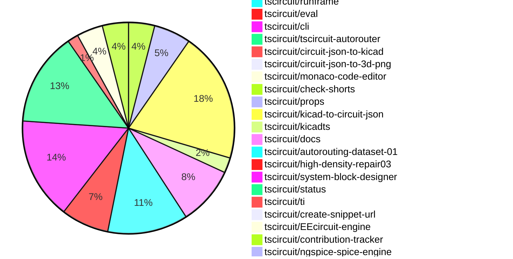

# Contribution Overview 2026-07-07

The current week is shown below. There are 3 major sections:

- [Contributor Overview](#contributor-overview)
- [PRs by Repository](#prs-by-repository)
- [PRs by Contributor](#changes-by-contributor)
- [Scoring & Sponsorship Details](/docs/sponsorship-calculation-explanation.md)

## PRs by Repository

## Contributor Overview

| Contributor | 🐳 Major | 🐙 Minor | 🐌 Tiny | Score | ⭐ | Discussion Contributions |
|-------------|---------|---------|---------|-------|-----|--------------------------|
| [ShiboSoftwareDev](#ShiboSoftwareDev) | 3 | 4 | 7 | 41.5 | ⭐⭐ | 0🔹 0🔶 0💎 |
| [0hmX](#0hmX) | 6 | 2 | 7 | 36 | ⭐⭐ | 0🔹 0🔶 0💎 |
| [AnasSarkiz](#AnasSarkiz) | 2 | 3 | 5 | 33 | ⭐⭐ | 0🔹 0🔶 0💎 |
| [MustafaMulla29](#MustafaMulla29) | 4 | 2 | 8 | 29 | ⭐⭐ | 0🔹 0🔶 0💎 |
| [mohan-bee](#mohan-bee) | 3 | 3 | 9 | 29 | ⭐⭐ | 0🔹 0🔶 0💎 |
| [Abse2001](#Abse2001) | 3 | 2 | 7 | 27 | ⭐⭐ | 0🔹 0🔶 0💎 |
| [seveibar](#seveibar) | 3 | 4 | 1 | 22 | ⭐⭐ | 0🔹 0🔶 0💎 |
| [rushabhcodes](#rushabhcodes) | 2 | 1 | 8 | 19 | ⭐⭐ | 0🔹 0🔶 0💎 |
| [imrishabh18](#imrishabh18) | 1 | 5 | 3 | 17.5 | ⭐⭐ | 0🔹 0🔶 0💎 |
| [tscircuitbot](#tscircuitbot) | 0 | 0 | 215 | 16.5 | ⭐⭐ | 0🔹 0🔶 0💎 |
| [techmannih](#techmannih) | 1 | 3 | 2 | 13 | ⭐⭐ | 0🔹 0🔶 0💎 |
| [abdalraof-albarbar](#abdalraof-albarbar) | 1 | 2 | 0 | 8 | ⭐ | 0🔹 0🔶 0💎 |
| [technologyet31-create](#technologyet31-create) | 0 | 3 | 0 | 6 | ⭐ | 0🔹 0🔶 0💎 |
| [Copilot](#Copilot) | 1 | 0 | 0 | 4 | ⭐ | 0🔹 0🔶 0💎 |
| [anil08607](#anil08607) | 0 | 1 | 1 | 3 |  | 0🔹 0🔶 0💎 |

## Staff Pass Ratio (SPR)

| Contributor | Reviewed PRs | Rejections | Approvals | SPR |
|-------------|--------------|------------|-----------|-----|
| [abdalraof-albarbar](#abdalraof-albarbar) | 8 | 1 | 7 | 87.5% |
| [MustafaMulla29](#MustafaMulla29) | 6 | 0 | 6 | 100.0% |
| [ShiboSoftwareDev](#ShiboSoftwareDev) | 6 | 0 | 7 | 100.0% |
| [techmannih](#techmannih) | 5 | 3 | 4 | 40.0% |
| [mohan-bee](#mohan-bee) | 5 | 2 | 4 | 60.0% |
| [0hmX](#0hmX) | 4 | 0 | 4 | 100.0% |
| [Abse2001](#Abse2001) | 4 | 0 | 4 | 100.0% |
| [AnasSarkiz](#AnasSarkiz) | 3 | 1 | 3 | 66.7% |
| [imrishabh18](#imrishabh18) | 1 | 0 | 1 | 100.0% |

abdalraof-albarbar SPR PRs (8)

- [#607](https://github.com/tscircuit/circuit-to-svg/pull/607) Count pcb_hole, pcb_note_line, and rotated rect cutout in getComprehensivePcbBounds
- [#605](https://github.com/tscircuit/circuit-to-svg/pull/605) Count all rendered elements in getComprehensivePcbBounds
- [#604](https://github.com/tscircuit/circuit-to-svg/pull/604) Add failing repros for elements missing from getComprehensivePcbBounds
- [#122](https://github.com/tscircuit/circuit-json-to-gerber/pull/122) Render pcb_silkscreen_graphic to Gerber as a filled region
- [#120](https://github.com/tscircuit/circuit-json-to-gerber/pull/120) Preserve silkscreen text case in Gerber output
- [#46](https://github.com/tscircuit/circuit-json-to-spice/pull/46) Guard R/C/L value formatters against non-finite values
- [#650](https://github.com/tscircuit/schematic-trace-solver/pull/650) Never route net-label direct connections as wires (LongDistancePairSolver + MspConnectionPairSolver)
- [#649](https://github.com/tscircuit/schematic-trace-solver/pull/649) Give each pushed trace its own corridor when escaping a shared net-label block

MustafaMulla29 SPR PRs (6)

- [#237](https://github.com/tscircuit/schematic-viewer/pull/237) feat: highlight hovered net by fading unrelated nets and chips
- [#2633](https://github.com/tscircuit/core/pull/2633) Pass isCapacitor to matchpack
- [#2614](https://github.com/tscircuit/core/pull/2614) Pass schematic port facing directions to the trace solver
- [#155](https://github.com/tscircuit/matchpack/pull/155) Lay out decoupling cap groups as rail rows (Adds new DecouplingCapRowSolver)
- [#648](https://github.com/tscircuit/schematic-trace-solver/pull/648) Fix schematic routing regressions from pin-band penalty and chip-boundary reject
- [#645](https://github.com/tscircuit/schematic-trace-solver/pull/645)  Respect provided pin facingDirection when correcting pins inside expanded chip boxes

ShiboSoftwareDev SPR PRs (6)

- [#1558](https://github.com/tscircuit/tscircuit-autorouter/pull/1558) Improve layer-aware topology SVG frame snapshots
- [#1554](https://github.com/tscircuit/tscircuit-autorouter/pull/1554) Add reusable solver SVG frames fixture
- [#1545](https://github.com/tscircuit/tscircuit-autorouter/pull/1545) Fix BGA grid alignment for obstacle target routing
- [#1543](https://github.com/tscircuit/tscircuit-autorouter/pull/1543) Fix overlapping endpoint region selection for merged topology
- [#1532](https://github.com/tscircuit/tscircuit-autorouter/pull/1532) topology merge
- [#7](https://github.com/tscircuit/EEcircuit-engine/pull/7) Fix runSim rejection on ngspice failures

techmannih SPR PRs (5)

- [#718](https://github.com/tscircuit/props/pull/718) feat: allow SymbolProp to accept circuit-json element arrays
- [#2631](https://github.com/tscircuit/core/pull/2631) Fix inherited default trace width handling in PCB routing
- [#2625](https://github.com/tscircuit/core/pull/2625) add repro for board defaultTraceWidth being ignored by autorouted traces
- [#375](https://github.com/tscircuit/circuit-json-to-kicad/pull/375) fix(pcb): preserve PCB text size and emit explicit text thickness
- [#160](https://github.com/tscircuit/kicad-to-circuit-json/pull/160) Support legacy KiCad 5 standalone footprints

mohan-bee SPR PRs (5)

- [#612](https://github.com/tscircuit/circuit-to-svg/pull/612) Fix text anchor for left/right schematic port indicators
- [#16](https://github.com/tscircuit/circuit-json-to-bom-csv/pull/16) Skip test points
- [#3865](https://github.com/tscircuit/tscircuit.com/pull/3865) Add drag-to-resize divider between code editor and RunFrame preview panels
- [#153](https://github.com/tscircuit/matchpack/pull/153) fix decoupling capacitor and series resistor collision
- [#638](https://github.com/tscircuit/schematic-trace-solver/pull/638)  Fix short schematic trace routing

0hmX SPR PRs (4)

- [#2624](https://github.com/tscircuit/core/pull/2624) update breakout test to use latest pipline 7
- [#1553](https://github.com/tscircuit/tscircuit-autorouter/pull/1553) Make pipeline 7 GlobalDrc connMap aware
- [#1552](https://github.com/tscircuit/tscircuit-autorouter/pull/1552) Fix same-net via merger route transitions
- [#1537](https://github.com/tscircuit/tscircuit-autorouter/pull/1537) Improve same-net via merging

Abse2001 SPR PRs (4)

- [#2617](https://github.com/tscircuit/core/pull/2617) Allow custom footprint port hints to override default LED aliases
- [#2608](https://github.com/tscircuit/core/pull/2608) Use automatic net labels on repro46
- [#3587](https://github.com/tscircuit/cli/pull/3587) Add tsci check shorts command with bitmap short detection and debug artifacts
- [#7](https://github.com/tscircuit/check-shorts/pull/7) Improve bitmap-based PCB/Gerber short detection with enhanced large-board performance, accuracy, and debug rendering

AnasSarkiz SPR PRs (3)

- [#773](https://github.com/tscircuit/docs/pull/773) Introduce QR Code Silkscreen Documentation with 3D and PCB Example using`silkscreengraphic`
- [#1536](https://github.com/tscircuit/tscircuit-autorouter/pull/1536) Fix stitch endpoint snapping to prevent closed-loop two-port traces
- [#646](https://github.com/tscircuit/schematic-trace-solver/pull/646) Introduce Ratsnest-Free Schematic Solver Visualizations for Cleaner Bug Report Snapshots

imrishabh18 SPR PRs (1)

- [#2616](https://github.com/tscircuit/core/pull/2616) fix: Missing pin_number in the custom ports failed the ports to be unique

> Note: AI evaluates PRs and assigns 1-3 star ratings automatically. 4 and 5 star ratings require manual staff review.

### Discussion Contribution Legend

- 🔹 Normal Comments: Basic participation with minimal effort
- 🔶 Great Informative Comments: Thoughtful participation that adds value
- 💎 Incredible Comments: Exceptional participation with high-quality content

## Review Table

[reviews-received-hover]: ## "Number of reviews received for PRs for this contributor"
[approvals-received-hover]: ## "Number of approvals received for PRs this contributor authored"
[rejections-received-hover]: ## "Number of rejections received for PRs this contributor authored"
[prs-opened-hover]: ## "Number of PRs opened by this contributor"
[issues-created-hover]: ## "Number of issues created by this contributor"

| Contributor | Reviews Received | Approvals Received | Rejections Received | Approvals | Rejections Given | PRs Opened | PRs Merged | Issues Created |
|---|---|---|---|---|---|---|---|---|
| [MustafaMulla29](#MustafaMulla29) | 14 | 8 | 0 | 12 | 0 | 15 | 15 | 0 |
| [seveibar](#seveibar) | 0 | 0 | 0 | 51 | 4 | 10 | 9 | 0 |
| [imrishabh18](#imrishabh18) | 4 | 2 | 0 | 10 | 2 | 9 | 9 | 0 |
| [thienanwspace](#thienanwspace) | 0 | 0 | 0 | 0 | 0 | 6 | 0 | 0 |
| [tscircuitbot](#tscircuitbot) | 0 | 0 | 0 | 0 | 0 | 284 | 215 | 0 |
| [techmannih](#techmannih) | 9 | 6 | 2 | 3 | 0 | 10 | 6 | 0 |
| [AnasSarkiz](#AnasSarkiz) | 23 | 21 | 0 | 15 | 0 | 12 | 11 | 0 |
| [0hmX](#0hmX) | 16 | 11 | 0 | 11 | 0 | 16 | 16 | 0 |
| [Abse2001](#Abse2001) | 19 | 18 | 0 | 5 | 0 | 16 | 12 | 0 |
| [ShiboSoftwareDev](#ShiboSoftwareDev) | 25 | 23 | 0 | 16 | 0 | 20 | 14 | 0 |
| [mohan-bee](#mohan-bee) | 29 | 18 | 1 | 2 | 1 | 19 | 15 | 0 |
| [maci0](#maci0) | 0 | 0 | 0 | 0 | 0 | 1 | 0 | 0 |
| [anil08607](#anil08607) | 7 | 2 | 1 | 0 | 0 | 3 | 2 | 0 |
| [rushabhcodes](#rushabhcodes) | 18 | 4 | 1 | 1 | 0 | 12 | 11 | 0 |
| [abdalraof-albarbar](#abdalraof-albarbar) | 17 | 13 | 1 | 0 | 0 | 19 | 6 | 0 |
| [kapookky123](#kapookky123) | 0 | 0 | 0 | 0 | 0 | 2 | 0 | 0 |
| [wanglianglll](#wanglianglll) | 0 | 0 | 0 | 0 | 0 | 1 | 0 | 0 |
| [GokulPandi-M](#GokulPandi-M) | 4 | 0 | 1 | 0 | 0 | 1 | 0 | 0 |
| [yanyishuai](#yanyishuai) | 0 | 0 | 0 | 0 | 0 | 1 | 0 | 0 |
| [Copilot](#Copilot) | 0 | 0 | 0 | 0 | 0 | 1 | 1 | 0 |

## Changes by Repository

### [tscircuit/schematic-viewer](https://github.com/tscircuit/schematic-viewer)

| PR # | Impact | Rating | Contributor | Description |
|------|--------|--------|-------------|-------------|
| [#237](https://github.com/tscircuit/schematic-viewer/pull/237) | 🐳 Major | ⭐⭐⭐ | MustafaMulla29 | Adds functionality to highlight the hovered net by fading unrelated nets and chips in the schematic viewer, improving user interaction and clarity. |

### [tscircuit/matchpack](https://github.com/tscircuit/matchpack)

| PR # | Impact | Rating | Contributor | Description |
|------|--------|--------|-------------|-------------|
| [#155](https://github.com/tscircuit/matchpack/pull/155) | 🐳 Major | ⭐⭐⭐ | MustafaMulla29 | Fixes the RP2040 decoupling capacitors stacking into one tall column instead of clean rail rows |
| [#153](https://github.com/tscircuit/matchpack/pull/153) | 🐙 Minor | ⭐⭐ | mohan-bee | Fixes a schematic layout collision where AlignPowerGroundRowsSolver could move already-packed powerground row components into overlapping positions. |

🐌 Tiny Contributions (1)

| PR # | Impact | Contributor | Description |
|------|--------|-------------|-------------|
| [#154](https://github.com/tscircuit/matchpack/pull/154) | 🐌 Tiny | MustafaMulla29 | Reproduces a bug where decoupling capacitors are incorrectly stacked in a column instead of being laid out in rows, with a comprehensive test to validate the issue. |

### [tscircuit/schematic-trace-solver](https://github.com/tscircuit/schematic-trace-solver)

| PR # | Impact | Rating | Contributor | Description |
|------|--------|--------|-------------|-------------|
| [#654](https://github.com/tscircuit/schematic-trace-solver/pull/654) | 🐳 Major | ⭐⭐⭐ | MustafaMulla29 | Fixes the placement of powerground rail net labels to ensure they align with pins rather than floating at arbitrary points along traces. |
| [#648](https://github.com/tscircuit/schematic-trace-solver/pull/648) | 🐳 Major | ⭐⭐⭐ | MustafaMulla29 | Fixes routing regressions caused by overly aggressive heuristics in schematic trace routing, ensuring valid routes are prioritized over longer detours and improving handling of chip boundary overlaps. |
| [#615](https://github.com/tscircuit/schematic-trace-solver/pull/615) | 🐳 Major | ⭐⭐⭐ | seveibar | Adds support for tracing outside pin bands to enhance the accuracy of schematic trace calculations and improve bug reporting. |
| [#646](https://github.com/tscircuit/schematic-trace-solver/pull/646) | 🐳 Major | ⭐⭐⭐ | AnasSarkiz | Adds a hideRatsNet option to SchematicTracePipelineSolver so schematic debug visualizations can suppress unrouted ratsnest connection lines while preserving the existing default behavior. |
| [#638](https://github.com/tscircuit/schematic-trace-solver/pull/638) | 🐳 Major | ⭐⭐⭐ | mohan-bee | Fixes routing issues for very short schematic connections between nearby pins, preventing unnecessary elbow overshoot and ensuring proper trace connections. |
| [#649](https://github.com/tscircuit/schematic-trace-solver/pull/649) | 🐳 Major | ⭐⭐⭐ | abdalraof-albarbar | Fixes overlapping trace corridors for different-net traces escaping a shared net-label block, ensuring they are routed in parallel without collision. |
| [#645](https://github.com/tscircuit/schematic-trace-solver/pull/645) | 🐙 Minor | ⭐⭐ | MustafaMulla29 | Fixes incorrect pin placement for components with long reference designators by ensuring pins are snapped to the correct edge based on their declared facing direction. |

🐌 Tiny Contributions (5)

| PR # | Impact | Contributor | Description |
|------|--------|-------------|-------------|
| [#647](https://github.com/tscircuit/schematic-trace-solver/pull/647) | 🐌 Tiny | MustafaMulla29 | Adds regression tests for missing traces and netlabel overlaps in schematic routing, ensuring correct behavior in these scenarios. |
| [#644](https://github.com/tscircuit/schematic-trace-solver/pull/644) | 🐌 Tiny | tscircuitbot | Adds a snapshot-only regression test and debugger page for the attached JSON solver input. |
| [#640](https://github.com/tscircuit/schematic-trace-solver/pull/640) | 🐌 Tiny | tscircuitbot | Adds a snapshot-only regression test and debugger page for the attached JSON solver input. |
| [#637](https://github.com/tscircuit/schematic-trace-solver/pull/637) | 🐌 Tiny | tscircuitbot | Adds a snapshot-only regression test and debugger page for the attached JSON solver input. |
| [#642](https://github.com/tscircuit/schematic-trace-solver/pull/642) | 🐌 Tiny | tscircuitbot | Adds a snapshot-only regression test and debugger page for the attached JSON solver input. |

### [tscircuit/core](https://github.com/tscircuit/core)

| PR # | Impact | Rating | Contributor | Description |
|------|--------|--------|-------------|-------------|
| [#2618](https://github.com/tscircuit/core/pull/2618) | 🐳 Major | ⭐⭐⭐ | seveibar | Changes the default autorouter pipeline to pipeline7 and updates related tests and interfaces accordingly. |
| [#2625](https://github.com/tscircuit/core/pull/2625) | 🐳 Major | ⭐⭐⭐ | techmannih | Reproduces a bug where the boards defaultTraceWidth is ignored by autorouted traces, resulting in incorrect trace widths. |
| [#2614](https://github.com/tscircuit/core/pull/2614) | 🐙 Minor | ⭐⭐ | MustafaMulla29 | Passes each schematic ports true facing direction to the trace solver to improve pin snapping accuracy and prevent misalignment of net labels. |
| [#2611](https://github.com/tscircuit/core/pull/2611) | 🐙 Minor | ⭐⭐ | seveibar | Updates the autorouter dependency version and refreshes snapshot tests for 3D representations of components. |
| [#2632](https://github.com/tscircuit/core/pull/2632) | 🐙 Minor | ⭐⭐ | AnasSarkiz | Adds an option to exclude existing top-level PCB route state from autorouting, allowing for fresh routing problems while keeping routed child-subcircuit traces and vias fixed. |
| [#2624](https://github.com/tscircuit/core/pull/2624) | 🐙 Minor | ⭐⭐ | 0hmX | Updates the breakout test to utilize the latest autorouter version, changing the expected number of design rule check errors. |
| [#2623](https://github.com/tscircuit/core/pull/2623) | 🐙 Minor | ⭐⭐ | imrishabh18 | Fixes the schFacingDirection functionality to support down and up directions in the PinHeader component. |
| [#2616](https://github.com/tscircuit/core/pull/2616) | 🐙 Minor | ⭐⭐ | imrishabh18 | Fixes issue where missing pin_number in custom ports caused non-unique port identifiers, leading to potential conflicts in schematic rendering. |
| [#2617](https://github.com/tscircuit/core/pull/2617) | 🐙 Minor | ⭐⭐ | Abse2001 | Allows custom footprint port hints to override default LED aliases for better flexibility in pin labeling. |
| [#2608](https://github.com/tscircuit/core/pull/2608) | 🐙 Minor | ⭐⭐ | Abse2001 | Adds automatic net labels for connections in the repro46 schematic test. |

🐌 Tiny Contributions (7)

| PR # | Impact | Contributor | Description |
|------|--------|-------------|-------------|
| [#2630](https://github.com/tscircuit/core/pull/2630) | 🐌 Tiny | MustafaMulla29 | Fixes powerground labels hanging in the middle of the traces. |
| [#2628](https://github.com/tscircuit/core/pull/2628) | 🐌 Tiny | MustafaMulla29 | Updates the schematic-trace-solver dependency to version 0.0.94 and modifies test snapshots accordingly. |
| [#2626](https://github.com/tscircuit/core/pull/2626) | 🐌 Tiny | 0hmX | Updates the autorouter dependency to version 0.0.655 and fixes design rule check errors in tests. |
| [#2615](https://github.com/tscircuit/core/pull/2615) | 🐌 Tiny | imrishabh18 | Fixes incorrect rendering of schematic pin labels that are not in the correct sequence, ensuring accurate representation in the schematic view. |
| [#2619](https://github.com/tscircuit/core/pull/2619) | 🐌 Tiny | ShiboSoftwareDev | Updates the tscircuitngspice-spice-engine dependency from version 0.0.18 to 0.0.19 in package.json |
| [#2610](https://github.com/tscircuit/core/pull/2610) | 🐌 Tiny | mohan-bee | Updates the version of the tscircuitmatchpack dependency from 0.0.29 to 0.0.31 in package.json |
| [#2609](https://github.com/tscircuit/core/pull/2609) | 🐌 Tiny | mohan-bee | Updates the version of the schematic-symbols dependency from 0.0.230 to 0.0.231 in package.json |

### [tscircuit/tscircuit](https://github.com/tscircuit/tscircuit)

🐌 Tiny Contributions (60)

| PR # | Impact | Contributor | Description |
|------|--------|-------------|-------------|
| [#3803](https://github.com/tscircuit/tscircuit/pull/3803) | 🐌 Tiny | MustafaMulla29 | Updates the circuit-to-svg dependency version from 0.0.371 to 0.0.374 in package.json |
| [#3862](https://github.com/tscircuit/tscircuit/pull/3862) | 🐌 Tiny | tscircuitbot | Automated package update |
| [#3861](https://github.com/tscircuit/tscircuit/pull/3861) | 🐌 Tiny | tscircuitbot | Automated package update |
| [#3860](https://github.com/tscircuit/tscircuit/pull/3860) | 🐌 Tiny | tscircuitbot | Automated package update |
| [#3859](https://github.com/tscircuit/tscircuit/pull/3859) | 🐌 Tiny | tscircuitbot | Updates the tscircuitcli package from version 0.1.1635 to 0.1.1636 and the tscircuitrunframe package from version 0.0.2183 to 0.0.2184 in the package.json file. |
| [#3858](https://github.com/tscircuit/tscircuit/pull/3858) | 🐌 Tiny | tscircuitbot | Automated package update |
| [#3857](https://github.com/tscircuit/tscircuit/pull/3857) | 🐌 Tiny | tscircuitbot | Automated package update |
| [#3856](https://github.com/tscircuit/tscircuit/pull/3856) | 🐌 Tiny | tscircuitbot | Updates the package version from 0.0.2037 to 0.0.2038 in package.json |
| [#3855](https://github.com/tscircuit/tscircuit/pull/3855) | 🐌 Tiny | tscircuitbot | Automated package update |
| [#3854](https://github.com/tscircuit/tscircuit/pull/3854) | 🐌 Tiny | tscircuitbot | Automated package update |
| [#3853](https://github.com/tscircuit/tscircuit/pull/3853) | 🐌 Tiny | tscircuitbot | Updates the version of several packages in the project, including tscircuitcli, tscircuitcore, and tscircuiteval. |
| [#3852](https://github.com/tscircuit/tscircuit/pull/3852) | 🐌 Tiny | tscircuitbot | Automated package update |
| [#3851](https://github.com/tscircuit/tscircuit/pull/3851) | 🐌 Tiny | tscircuitbot | Updates the versions of several dependencies in the package.json file, including tscircuitcli, tscircuitcore, and tscircuiteval. |
| [#3850](https://github.com/tscircuit/tscircuit/pull/3850) | 🐌 Tiny | tscircuitbot | Automated package update |
| [#3849](https://github.com/tscircuit/tscircuit/pull/3849) | 🐌 Tiny | tscircuitbot | Updates the tscircuitcli package from version 0.1.1631 to 0.1.1632 |
| [#3848](https://github.com/tscircuit/tscircuit/pull/3848) | 🐌 Tiny | tscircuitbot | Updates the package version from 0.0.2033 to 0.0.2034 in package.json |
| [#3847](https://github.com/tscircuit/tscircuit/pull/3847) | 🐌 Tiny | tscircuitbot | Updates the tscircuitcli package to version 0.1.1631 in the package.json file |
| [#3846](https://github.com/tscircuit/tscircuit/pull/3846) | 🐌 Tiny | tscircuitbot | Updates the package version from 0.0.2032 to 0.0.2033 in package.json |
| [#3845](https://github.com/tscircuit/tscircuit/pull/3845) | 🐌 Tiny | tscircuitbot | Automated package update |
| [#3844](https://github.com/tscircuit/tscircuit/pull/3844) | 🐌 Tiny | tscircuitbot | Automated package update |
| [#3843](https://github.com/tscircuit/tscircuit/pull/3843) | 🐌 Tiny | tscircuitbot | Updates the tscircuitcli package version from 0.1.1628 to 0.1.1629 |
| [#3842](https://github.com/tscircuit/tscircuit/pull/3842) | 🐌 Tiny | tscircuitbot | Automated package update |
| [#3841](https://github.com/tscircuit/tscircuit/pull/3841) | 🐌 Tiny | tscircuitbot | Automated package update |
| [#3839](https://github.com/tscircuit/tscircuit/pull/3839) | 🐌 Tiny | tscircuitbot | Automated package update |
| [#3837](https://github.com/tscircuit/tscircuit/pull/3837) | 🐌 Tiny | tscircuitbot | Automated package update |
| [#3835](https://github.com/tscircuit/tscircuit/pull/3835) | 🐌 Tiny | tscircuitbot | Updates the tscircuitcli package from version 0.1.1625 to 0.1.1626 and the tscircuitrunframe package from version 0.0.2177 to 0.0.2178 in package.json |
| [#3833](https://github.com/tscircuit/tscircuit/pull/3833) | 🐌 Tiny | tscircuitbot | Updates the tscircuitcli package from version 0.1.1624 to 0.1.1625 |
| [#3831](https://github.com/tscircuit/tscircuit/pull/3831) | 🐌 Tiny | tscircuitbot | Updates the tscircuitcli package to version 0.1.1624 in the package.json file. |
| [#3830](https://github.com/tscircuit/tscircuit/pull/3830) | 🐌 Tiny | tscircuitbot | Updates the package version from 0.0.2024 to 0.0.2025 in package.json |
| [#3829](https://github.com/tscircuit/tscircuit/pull/3829) | 🐌 Tiny | tscircuitbot | Automated package update |
| [#3828](https://github.com/tscircuit/tscircuit/pull/3828) | 🐌 Tiny | tscircuitbot | Updates the package version from 0.0.2023 to 0.0.2024 in package.json |
| [#3824](https://github.com/tscircuit/tscircuit/pull/3824) | 🐌 Tiny | tscircuitbot | Updates the package version from 0.0.2021 to 0.0.2022 in package.json |
| [#3822](https://github.com/tscircuit/tscircuit/pull/3822) | 🐌 Tiny | tscircuitbot | Automated package update |
| [#3821](https://github.com/tscircuit/tscircuit/pull/3821) | 🐌 Tiny | tscircuitbot | Automated package update |
| [#3819](https://github.com/tscircuit/tscircuit/pull/3819) | 🐌 Tiny | tscircuitbot | Updates the version of the tscircuitcore package from 0.0.1407 to 0.0.1408 in package.json |
| [#3818](https://github.com/tscircuit/tscircuit/pull/3818) | 🐌 Tiny | tscircuitbot | Updates the package version from 0.0.2018 to 0.0.2019 in package.json |
| [#3817](https://github.com/tscircuit/tscircuit/pull/3817) | 🐌 Tiny | tscircuitbot | Updates the version of several packages in the project, including tscircuitcli, tscircuitcore, and tscircuiteval. |
| [#3838](https://github.com/tscircuit/tscircuit/pull/3838) | 🐌 Tiny | tscircuitbot | Automated package update |
| [#3836](https://github.com/tscircuit/tscircuit/pull/3836) | 🐌 Tiny | tscircuitbot | Automated package update |
| [#3827](https://github.com/tscircuit/tscircuit/pull/3827) | 🐌 Tiny | tscircuitbot | Automated package update |
| [#3826](https://github.com/tscircuit/tscircuit/pull/3826) | 🐌 Tiny | tscircuitbot | Automated package update |
| [#3823](https://github.com/tscircuit/tscircuit/pull/3823) | 🐌 Tiny | tscircuitbot | Automated package update |
| [#3820](https://github.com/tscircuit/tscircuit/pull/3820) | 🐌 Tiny | tscircuitbot | Automated package update |
| [#3825](https://github.com/tscircuit/tscircuit/pull/3825) | 🐌 Tiny | tscircuitbot | Automated package update |
| [#3840](https://github.com/tscircuit/tscircuit/pull/3840) | 🐌 Tiny | tscircuitbot | Updates the package version from 0.0.2029 to 0.0.2030 in package.json |
| [#3834](https://github.com/tscircuit/tscircuit/pull/3834) | 🐌 Tiny | tscircuitbot | Automated package update |
| [#3832](https://github.com/tscircuit/tscircuit/pull/3832) | 🐌 Tiny | tscircuitbot | Automated package update |
| [#3809](https://github.com/tscircuit/tscircuit/pull/3809) | 🐌 Tiny | tscircuitbot | Updates the tscircuitcli package from version 0.1.1614 to 0.1.1615 and the tscircuitrunframe package from version 0.0.2168 to 0.0.2169 in the package.json file. |
| [#3816](https://github.com/tscircuit/tscircuit/pull/3816) | 🐌 Tiny | tscircuitbot | Automated package update |
| [#3815](https://github.com/tscircuit/tscircuit/pull/3815) | 🐌 Tiny | tscircuitbot | Automated package update |
| [#3814](https://github.com/tscircuit/tscircuit/pull/3814) | 🐌 Tiny | tscircuitbot | Automated package update |
| [#3813](https://github.com/tscircuit/tscircuit/pull/3813) | 🐌 Tiny | tscircuitbot | Automated package update |
| [#3812](https://github.com/tscircuit/tscircuit/pull/3812) | 🐌 Tiny | tscircuitbot | Automated package update to version 0.0.2016 |
| [#3811](https://github.com/tscircuit/tscircuit/pull/3811) | 🐌 Tiny | tscircuitbot | Automated package update |
| [#3810](https://github.com/tscircuit/tscircuit/pull/3810) | 🐌 Tiny | tscircuitbot | Automated package update |
| [#3808](https://github.com/tscircuit/tscircuit/pull/3808) | 🐌 Tiny | tscircuitbot | Automated package update |
| [#3807](https://github.com/tscircuit/tscircuit/pull/3807) | 🐌 Tiny | tscircuitbot | Automated package update |
| [#3806](https://github.com/tscircuit/tscircuit/pull/3806) | 🐌 Tiny | tscircuitbot | Updates the package version from 0.0.2012 to 0.0.2013 in package.json |
| [#3804](https://github.com/tscircuit/tscircuit/pull/3804) | 🐌 Tiny | tscircuitbot | Automated package update to version 0.0.2012 |
| [#3805](https://github.com/tscircuit/tscircuit/pull/3805) | 🐌 Tiny | tscircuitbot | Updates the tscircuitcli package from version 0.1.1612 to 0.1.1613 and the tscircuitrunframe package from version 0.0.2166 to 0.0.2167, while downgrading the circuit-to-svg package from version 0.0.374 to 0.0.371. |

### [tscircuit/circuit-to-svg](https://github.com/tscircuit/circuit-to-svg)

| PR # | Impact | Rating | Contributor | Description |
|------|--------|--------|-------------|-------------|
| [#607](https://github.com/tscircuit/circuit-to-svg/pull/607) | 🐙 Minor | ⭐⭐ | abdalraof-albarbar | Fixes the issue where pcb_hole, pcb_note_line, and rotated rect cutout were not included in the exported SVG viewport, ensuring accurate rendering of these elements in the SVG output. |
| [#605](https://github.com/tscircuit/circuit-to-svg/pull/605) | 🐙 Minor | ⭐⭐ | technologyet31-create | Fixes rendering issues by ensuring that getComprehensivePcbBounds includes the extent of every element the renderer draws, preventing clipping and ensuring accurate representation of PCB elements. |
| [#604](https://github.com/tscircuit/circuit-to-svg/pull/604) | 🐙 Minor | ⭐⭐ | technologyet31-create | Adds failing tests for elements missing from getComprehensivePcbBounds, including brep copper pours, plated holes, rotated SMT pads, vias, and silkscreen pills, to ensure they are accounted for in the rendering process. |

🐌 Tiny Contributions (4)

| PR # | Impact | Contributor | Description |
|------|--------|-------------|-------------|
| [#602](https://github.com/tscircuit/circuit-to-svg/pull/602) | 🐌 Tiny | MustafaMulla29 | Tags schematic net label elements with data-schematic-net-label-id and removes hover CSS from the base SVG, streamlining the SVG generation process. |
| [#608](https://github.com/tscircuit/circuit-to-svg/pull/608) | 🐌 Tiny | mohan-bee | Reproduces a bug where port labels overlap on resistor and capacitor components in the schematic rendering. |
| [#609](https://github.com/tscircuit/circuit-to-svg/pull/609) | 🐌 Tiny | mohan-bee | Updates the version of the tscircuit and circuit-json dependencies in package.json |
| [#610](https://github.com/tscircuit/circuit-to-svg/pull/610) | 🐌 Tiny | anil08607 | Removes unused types from the circuit-json module, streamlining the codebase. |

### [tscircuit/tscircuit.com](https://github.com/tscircuit/tscircuit.com)

| PR # | Impact | Rating | Contributor | Description |
|------|--------|--------|-------------|-------------|
| [#3846](https://github.com/tscircuit/tscircuit.com/pull/3846) | 🐳 Major | ⭐⭐⭐ | mohan-bee | Adds file-specific icons for .tsx, .md, and .json files in file views and corrects markdown syntax highlighting in the code editor. |

🐌 Tiny Contributions (26)

| PR # | Impact | Contributor | Description |
|------|--------|-------------|-------------|
| [#3847](https://github.com/tscircuit/tscircuit.com/pull/3847) | 🐌 Tiny | MustafaMulla29 | Updates dependencies for runframe, schematic-viewer, and circuit-to-svg to ensure proper net highlighting functionality. |
| [#3873](https://github.com/tscircuit/tscircuit.com/pull/3873) | 🐌 Tiny | tscircuitbot | Automated package update |
| [#3872](https://github.com/tscircuit/tscircuit.com/pull/3872) | 🐌 Tiny | tscircuitbot | Updates the tscircuiteval package from version 0.0.988 to 0.0.989 |
| [#3871](https://github.com/tscircuit/tscircuit.com/pull/3871) | 🐌 Tiny | tscircuitbot | Updates the tscircuitrunframe package to version 0.0.2184 in package.json |
| [#3870](https://github.com/tscircuit/tscircuit.com/pull/3870) | 🐌 Tiny | tscircuitbot | Updates the tscircuiteval package to version 0.0.988 |
| [#3869](https://github.com/tscircuit/tscircuit.com/pull/3869) | 🐌 Tiny | tscircuitbot | Updates the tscircuitrunframe package from version 0.0.2182 to 0.0.2183 |
| [#3868](https://github.com/tscircuit/tscircuit.com/pull/3868) | 🐌 Tiny | tscircuitbot | Updates the tscircuiteval package from version 0.0.986 to 0.0.987 |
| [#3867](https://github.com/tscircuit/tscircuit.com/pull/3867) | 🐌 Tiny | tscircuitbot | Automated package update |
| [#3866](https://github.com/tscircuit/tscircuit.com/pull/3866) | 🐌 Tiny | tscircuitbot | Updates the tscircuiteval package to version 0.0.986 |
| [#3864](https://github.com/tscircuit/tscircuit.com/pull/3864) | 🐌 Tiny | tscircuitbot | Updates the tscircuitrunframe package from version 0.0.2180 to 0.0.2181 |
| [#3863](https://github.com/tscircuit/tscircuit.com/pull/3863) | 🐌 Tiny | tscircuitbot | Automated package update |
| [#3862](https://github.com/tscircuit/tscircuit.com/pull/3862) | 🐌 Tiny | tscircuitbot | Automated package update |
| [#3857](https://github.com/tscircuit/tscircuit.com/pull/3857) | 🐌 Tiny | tscircuitbot | Updates the tscircuitrunframe package from version 0.0.2175 to 0.0.2176 |
| [#3861](https://github.com/tscircuit/tscircuit.com/pull/3861) | 🐌 Tiny | tscircuitbot | Updates the tscircuitrunframe package from version 0.0.2178 to 0.0.2179 |
| [#3860](https://github.com/tscircuit/tscircuit.com/pull/3860) | 🐌 Tiny | tscircuitbot | Updates the tscircuiteval package from version 0.0.983 to 0.0.984 |
| [#3859](https://github.com/tscircuit/tscircuit.com/pull/3859) | 🐌 Tiny | tscircuitbot | Updates the tscircuitrunframe package from version 0.0.2177 to 0.0.2178 |
| [#3858](https://github.com/tscircuit/tscircuit.com/pull/3858) | 🐌 Tiny | tscircuitbot | Updates the tscircuitrunframe package from version 0.0.2176 to 0.0.2177 |
| [#3856](https://github.com/tscircuit/tscircuit.com/pull/3856) | 🐌 Tiny | tscircuitbot | Updates the tscircuiteval package from version 0.0.982 to 0.0.983 |
| [#3855](https://github.com/tscircuit/tscircuit.com/pull/3855) | 🐌 Tiny | tscircuitbot | Updates the tscircuitrunframe package from version 0.0.2174 to 0.0.2175 |
| [#3854](https://github.com/tscircuit/tscircuit.com/pull/3854) | 🐌 Tiny | tscircuitbot | Updates the tscircuitrunframe package from version 0.0.2173 to 0.0.2174 |
| [#3853](https://github.com/tscircuit/tscircuit.com/pull/3853) | 🐌 Tiny | tscircuitbot | Updates the tscircuiteval package version from 0.0.981 to 0.0.982 |
| [#3852](https://github.com/tscircuit/tscircuit.com/pull/3852) | 🐌 Tiny | tscircuitbot | Updates the tscircuitrunframe package from version 0.0.2172 to 0.0.2173 |
| [#3851](https://github.com/tscircuit/tscircuit.com/pull/3851) | 🐌 Tiny | tscircuitbot | Automated package update |
| [#3840](https://github.com/tscircuit/tscircuit.com/pull/3840) | 🐌 Tiny | tscircuitbot | Updates the tscircuiteval package from version 0.0.978 to 0.0.979 |
| [#3844](https://github.com/tscircuit/tscircuit.com/pull/3844) | 🐌 Tiny | techmannih | Updates the schematic-symbols dependency to version 0.0.231 in package.json |
| [#3850](https://github.com/tscircuit/tscircuit.com/pull/3850) | 🐌 Tiny | rushabhcodes | Fixes deployment regression caused by incompatible package versions in the production dependency set, ensuring the app builds successfully with aligned versions of tscircuitrunframe, tscircuitprops, and tscircuit3d-viewer. |

### [tscircuit/runframe](https://github.com/tscircuit/runframe)

🐌 Tiny Contributions (37)

| PR # | Impact | Contributor | Description |
|------|--------|-------------|-------------|
| [#3893](https://github.com/tscircuit/runframe/pull/3893) | 🐌 Tiny | MustafaMulla29 | Updates the circuit-to-svg dependency version from 0.0.367 to 0.0.374 in package.json |
| [#3934](https://github.com/tscircuit/runframe/pull/3934) | 🐌 Tiny | tscircuitbot | Automated package update |
| [#3933](https://github.com/tscircuit/runframe/pull/3933) | 🐌 Tiny | tscircuitbot | Updates the tscircuiteval package to version 0.0.989 in the package.json file. |
| [#3932](https://github.com/tscircuit/runframe/pull/3932) | 🐌 Tiny | tscircuitbot | Automated package update |
| [#3931](https://github.com/tscircuit/runframe/pull/3931) | 🐌 Tiny | tscircuitbot | Updates the tscircuiteval package to version 0.0.988 in the package.json file. |
| [#3929](https://github.com/tscircuit/runframe/pull/3929) | 🐌 Tiny | tscircuitbot | Updates the tscircuiteval package from version 0.0.986 to 0.0.987 |
| [#3928](https://github.com/tscircuit/runframe/pull/3928) | 🐌 Tiny | tscircuitbot | Automated package update |
| [#3927](https://github.com/tscircuit/runframe/pull/3927) | 🐌 Tiny | tscircuitbot | Updates the tscircuiteval package to version 0.0.986 in the package.json file. |
| [#3926](https://github.com/tscircuit/runframe/pull/3926) | 🐌 Tiny | tscircuitbot | Automated package update |
| [#3925](https://github.com/tscircuit/runframe/pull/3925) | 🐌 Tiny | tscircuitbot | Updates the circuit-json-to-kicad package from version 0.0.160 to 0.0.161 in package.json |
| [#3923](https://github.com/tscircuit/runframe/pull/3923) | 🐌 Tiny | tscircuitbot | Automated package update |
| [#3922](https://github.com/tscircuit/runframe/pull/3922) | 🐌 Tiny | tscircuitbot | Updates the tscircuiteval package from version 0.0.984 to 0.0.985 in the package.json file. |
| [#3920](https://github.com/tscircuit/runframe/pull/3920) | 🐌 Tiny | tscircuitbot | Updates the tscircuiteval package to version 0.0.984 in the package.json file. |
| [#3916](https://github.com/tscircuit/runframe/pull/3916) | 🐌 Tiny | tscircuitbot | Automated package update |
| [#3911](https://github.com/tscircuit/runframe/pull/3911) | 🐌 Tiny | tscircuitbot | Updates the circuit-json-to-gerber package from version 0.0.81 to 0.0.82 |
| [#3910](https://github.com/tscircuit/runframe/pull/3910) | 🐌 Tiny | tscircuitbot | Automated package update |
| [#3921](https://github.com/tscircuit/runframe/pull/3921) | 🐌 Tiny | tscircuitbot | Automated package update |
| [#3919](https://github.com/tscircuit/runframe/pull/3919) | 🐌 Tiny | tscircuitbot | Automated package update |
| [#3918](https://github.com/tscircuit/runframe/pull/3918) | 🐌 Tiny | tscircuitbot | Updates the circuit-json-to-kicad package version from 0.0.157 to 0.0.160 in package.json |
| [#3914](https://github.com/tscircuit/runframe/pull/3914) | 🐌 Tiny | tscircuitbot | Automated package update |
| [#3913](https://github.com/tscircuit/runframe/pull/3913) | 🐌 Tiny | tscircuitbot | Automated package update |
| [#3912](https://github.com/tscircuit/runframe/pull/3912) | 🐌 Tiny | tscircuitbot | Automated package update |
| [#3909](https://github.com/tscircuit/runframe/pull/3909) | 🐌 Tiny | tscircuitbot | Updates the tscircuiteval package to version 0.0.982 in the package.json file. |
| [#3907](https://github.com/tscircuit/runframe/pull/3907) | 🐌 Tiny | tscircuitbot | Updates the tscircuiteval package from version 0.0.980 to 0.0.981 in the package.json file. |
| [#3905](https://github.com/tscircuit/runframe/pull/3905) | 🐌 Tiny | tscircuitbot | Updates the tscircuiteval package to version 0.0.980 in the package.json file. |
| [#3904](https://github.com/tscircuit/runframe/pull/3904) | 🐌 Tiny | tscircuitbot | Automated package update |
| [#3903](https://github.com/tscircuit/runframe/pull/3903) | 🐌 Tiny | tscircuitbot | Updates the tscircuitschematic-viewer package to version 2.0.69 |
| [#3901](https://github.com/tscircuit/runframe/pull/3901) | 🐌 Tiny | tscircuitbot | Automated package update |
| [#3898](https://github.com/tscircuit/runframe/pull/3898) | 🐌 Tiny | tscircuitbot | Updates the circuit-json-to-gerber package from version 0.0.80 to 0.0.81 |
| [#3897](https://github.com/tscircuit/runframe/pull/3897) | 🐌 Tiny | tscircuitbot | Automated package update |
| [#3896](https://github.com/tscircuit/runframe/pull/3896) | 🐌 Tiny | tscircuitbot | Updates the circuit-json-to-gerber package from version 0.0.79 to 0.0.80 |
| [#3895](https://github.com/tscircuit/runframe/pull/3895) | 🐌 Tiny | tscircuitbot | Updates the tscircuiteval package to version 0.0.979 in the package.json file. |
| [#3894](https://github.com/tscircuit/runframe/pull/3894) | 🐌 Tiny | tscircuitbot | Automated package update |
| [#3906](https://github.com/tscircuit/runframe/pull/3906) | 🐌 Tiny | tscircuitbot | Automated package update |
| [#3899](https://github.com/tscircuit/runframe/pull/3899) | 🐌 Tiny | tscircuitbot | Automated package update |
| [#3915](https://github.com/tscircuit/runframe/pull/3915) | 🐌 Tiny | ShiboSoftwareDev | Updates the tscircuit dependency version from 0.0.1998 to 0.0.2024 in package.json |
| [#3900](https://github.com/tscircuit/runframe/pull/3900) | 🐌 Tiny | mohan-bee | Updates the version of schematic symbols from 0.0.227 to 0.0.231 in the package.json file. |

### [tscircuit/eval](https://github.com/tscircuit/eval)

🐌 Tiny Contributions (22)

| PR # | Impact | Contributor | Description |
|------|--------|-------------|-------------|
| [#3168](https://github.com/tscircuit/eval/pull/3168) | 🐌 Tiny | tscircuitbot | Automated package update |
| [#3166](https://github.com/tscircuit/eval/pull/3166) | 🐌 Tiny | tscircuitbot | Automated package update |
| [#3165](https://github.com/tscircuit/eval/pull/3165) | 🐌 Tiny | tscircuitbot | Updates the version of the tscircuitcore package from 0.0.1413 to 0.0.1414 in package.json |
| [#3164](https://github.com/tscircuit/eval/pull/3164) | 🐌 Tiny | tscircuitbot | Automated package update |
| [#3163](https://github.com/tscircuit/eval/pull/3163) | 🐌 Tiny | tscircuitbot | Automated package update |
| [#3161](https://github.com/tscircuit/eval/pull/3161) | 🐌 Tiny | tscircuitbot | Automated package update |
| [#3160](https://github.com/tscircuit/eval/pull/3160) | 🐌 Tiny | tscircuitbot | Automated package update |
| [#3158](https://github.com/tscircuit/eval/pull/3158) | 🐌 Tiny | tscircuitbot | Automated package update |
| [#3157](https://github.com/tscircuit/eval/pull/3157) | 🐌 Tiny | tscircuitbot | Automated package update |
| [#3155](https://github.com/tscircuit/eval/pull/3155) | 🐌 Tiny | tscircuitbot | Automated package update |
| [#3152](https://github.com/tscircuit/eval/pull/3152) | 🐌 Tiny | tscircuitbot | Automated package update to version 0.0.983 |
| [#3154](https://github.com/tscircuit/eval/pull/3154) | 🐌 Tiny | tscircuitbot | Automated package update |
| [#3151](https://github.com/tscircuit/eval/pull/3151) | 🐌 Tiny | tscircuitbot | Updates the version of several dependencies in the package.json file. |
| [#3148](https://github.com/tscircuit/eval/pull/3148) | 🐌 Tiny | tscircuitbot | Automated package update |
| [#3149](https://github.com/tscircuit/eval/pull/3149) | 🐌 Tiny | tscircuitbot | Automated package update |
| [#3147](https://github.com/tscircuit/eval/pull/3147) | 🐌 Tiny | tscircuitbot | Automated package update |
| [#3139](https://github.com/tscircuit/eval/pull/3139) | 🐌 Tiny | tscircuitbot | Automated package update to version 0.0.980 |
| [#3138](https://github.com/tscircuit/eval/pull/3138) | 🐌 Tiny | tscircuitbot | Automated package update |
| [#3132](https://github.com/tscircuit/eval/pull/3132) | 🐌 Tiny | tscircuitbot | Automated package update |
| [#3131](https://github.com/tscircuit/eval/pull/3131) | 🐌 Tiny | tscircuitbot | Updates package dependencies to their latest versions in package.json |
| [#3146](https://github.com/tscircuit/eval/pull/3146) | 🐌 Tiny | imrishabh18 | Updates the tscircuitcore dependency version to 0.0.1407 and skips the npm import test. |
| [#3167](https://github.com/tscircuit/eval/pull/3167) | 🐌 Tiny | rushabhcodes | Removes the unused circuit-json-to-simple-3d development dependency from tscircuiteval, confirming it has no imports or source references in the repository. |

### [tscircuit/cli](https://github.com/tscircuit/cli)

| PR # | Impact | Rating | Contributor | Description |
|------|--------|--------|-------------|-------------|
| [#3610](https://github.com/tscircuit/cli/pull/3610) | 🐳 Major | ⭐⭐⭐ | seveibar | Removes circuit JSON IDs from autorouter debug output, replacing them with user-friendly names for better readability. |
| [#3587](https://github.com/tscircuit/cli/pull/3587) | 🐳 Major | ⭐⭐⭐ | Abse2001 | Adds a command to detect unintended shorts between separate PCB copper groups, including bitmap short detection and generating debug artifacts. |
| [#3612](https://github.com/tscircuit/cli/pull/3612) | 🐙 Minor | ⭐⭐ | seveibar | Adds PNG snapshot generation for placement and routed phases in autorouting, enabling visual debugging of the autorouting process. |
| [#3606](https://github.com/tscircuit/cli/pull/3606) | 🐙 Minor | ⭐⭐ | seveibar | Add options for enabling autorouter debug messages, including timeout settings and output directory for debug artifacts. |

🐌 Tiny Contributions (43)

| PR # | Impact | Contributor | Description |
|------|--------|-------------|-------------|
| [#3625](https://github.com/tscircuit/cli/pull/3625) | 🐌 Tiny | tscircuitbot | Automated package update |
| [#3624](https://github.com/tscircuit/cli/pull/3624) | 🐌 Tiny | tscircuitbot | Updates the tscircuitrunframe package from version 0.0.2184 to 0.0.2185 |
| [#3621](https://github.com/tscircuit/cli/pull/3621) | 🐌 Tiny | tscircuitbot | Automated package update |
| [#3620](https://github.com/tscircuit/cli/pull/3620) | 🐌 Tiny | tscircuitbot | Updates the tscircuitrunframe package to version 0.0.2184 in the package.json file. |
| [#3619](https://github.com/tscircuit/cli/pull/3619) | 🐌 Tiny | tscircuitbot | Automated package update |
| [#3618](https://github.com/tscircuit/cli/pull/3618) | 🐌 Tiny | tscircuitbot | Automated package update |
| [#3617](https://github.com/tscircuit/cli/pull/3617) | 🐌 Tiny | tscircuitbot | Updates the tscircuitrunframe package from version 0.0.2182 to 0.0.2183 |
| [#3615](https://github.com/tscircuit/cli/pull/3615) | 🐌 Tiny | tscircuitbot | Automated package update |
| [#3614](https://github.com/tscircuit/cli/pull/3614) | 🐌 Tiny | tscircuitbot | Updates the tscircuitrunframe package from version 0.0.2181 to 0.0.2182 |
| [#3613](https://github.com/tscircuit/cli/pull/3613) | 🐌 Tiny | tscircuitbot | Automated package update |
| [#3611](https://github.com/tscircuit/cli/pull/3611) | 🐌 Tiny | tscircuitbot | Automated package update |
| [#3608](https://github.com/tscircuit/cli/pull/3608) | 🐌 Tiny | tscircuitbot | Updates the tscircuitrunframe package from version 0.0.2180 to 0.0.2181 |
| [#3605](https://github.com/tscircuit/cli/pull/3605) | 🐌 Tiny | tscircuitbot | Automated package update |
| [#3604](https://github.com/tscircuit/cli/pull/3604) | 🐌 Tiny | tscircuitbot | Automated package update |
| [#3600](https://github.com/tscircuit/cli/pull/3600) | 🐌 Tiny | tscircuitbot | Automated package update |
| [#3599](https://github.com/tscircuit/cli/pull/3599) | 🐌 Tiny | tscircuitbot | Updates the tscircuitrunframe package from version 0.0.2177 to 0.0.2178 |
| [#3602](https://github.com/tscircuit/cli/pull/3602) | 🐌 Tiny | tscircuitbot | Automated package update |
| [#3588](https://github.com/tscircuit/cli/pull/3588) | 🐌 Tiny | tscircuitbot | Updates the tscircuitrunframe package to version 0.0.2174 |
| [#3586](https://github.com/tscircuit/cli/pull/3586) | 🐌 Tiny | tscircuitbot | Automated package update |
| [#3601](https://github.com/tscircuit/cli/pull/3601) | 🐌 Tiny | tscircuitbot | Updates the tscircuitrunframe package to version 0.0.2179 in the package.json file |
| [#3597](https://github.com/tscircuit/cli/pull/3597) | 🐌 Tiny | tscircuitbot | Automated package update |
| [#3596](https://github.com/tscircuit/cli/pull/3596) | 🐌 Tiny | tscircuitbot | Automated README update with latest CLI usage output. |
| [#3595](https://github.com/tscircuit/cli/pull/3595) | 🐌 Tiny | tscircuitbot | Automated package update |
| [#3594](https://github.com/tscircuit/cli/pull/3594) | 🐌 Tiny | tscircuitbot | Updates the tscircuitrunframe package from version 0.0.2176 to 0.0.2177 |
| [#3593](https://github.com/tscircuit/cli/pull/3593) | 🐌 Tiny | tscircuitbot | Automated package update |
| [#3592](https://github.com/tscircuit/cli/pull/3592) | 🐌 Tiny | tscircuitbot | Updates the tscircuitrunframe package from version 0.0.2175 to 0.0.2176 |
| [#3591](https://github.com/tscircuit/cli/pull/3591) | 🐌 Tiny | tscircuitbot | Updates the package version from v0.1.1620 to v0.1.1621 in package.json |
| [#3590](https://github.com/tscircuit/cli/pull/3590) | 🐌 Tiny | tscircuitbot | Updates the tscircuitrunframe package from version 0.0.2174 to 0.0.2175 |
| [#3589](https://github.com/tscircuit/cli/pull/3589) | 🐌 Tiny | tscircuitbot | Automated package update |
| [#3585](https://github.com/tscircuit/cli/pull/3585) | 🐌 Tiny | tscircuitbot | Updates the tscircuitrunframe package from version 0.0.2172 to 0.0.2173 |
| [#3584](https://github.com/tscircuit/cli/pull/3584) | 🐌 Tiny | tscircuitbot | Automated package update |
| [#3583](https://github.com/tscircuit/cli/pull/3583) | 🐌 Tiny | tscircuitbot | Updates the tscircuitrunframe package from version 0.0.2171 to 0.0.2172 |
| [#3582](https://github.com/tscircuit/cli/pull/3582) | 🐌 Tiny | tscircuitbot | Automated package update |
| [#3581](https://github.com/tscircuit/cli/pull/3581) | 🐌 Tiny | tscircuitbot | Updates the tscircuitrunframe package from version 0.0.2170 to 0.0.2171 |
| [#3580](https://github.com/tscircuit/cli/pull/3580) | 🐌 Tiny | tscircuitbot | Automated package update |
| [#3579](https://github.com/tscircuit/cli/pull/3579) | 🐌 Tiny | tscircuitbot | Updates the tscircuitrunframe package to version 0.0.2170 |
| [#3578](https://github.com/tscircuit/cli/pull/3578) | 🐌 Tiny | tscircuitbot | Automated package update |
| [#3577](https://github.com/tscircuit/cli/pull/3577) | 🐌 Tiny | tscircuitbot | Updates the tscircuitrunframe package from version 0.0.2168 to 0.0.2169 |
| [#3576](https://github.com/tscircuit/cli/pull/3576) | 🐌 Tiny | tscircuitbot | Automated package update |
| [#3575](https://github.com/tscircuit/cli/pull/3575) | 🐌 Tiny | tscircuitbot | Updates the tscircuitrunframe package from version 0.0.2167 to 0.0.2168 |
| [#3574](https://github.com/tscircuit/cli/pull/3574) | 🐌 Tiny | tscircuitbot | Automated package update |
| [#3573](https://github.com/tscircuit/cli/pull/3573) | 🐌 Tiny | tscircuitbot | Updates the tscircuitrunframe package to version 0.0.2167 in package.json |
| [#3616](https://github.com/tscircuit/cli/pull/3616) | 🐌 Tiny | Abse2001 | Externalizes the tscircuitcheck-shorts package from the CLI bundle to improve modularity and reduce bundle size. |

### [tscircuit/tscircuit-autorouter](https://github.com/tscircuit/tscircuit-autorouter)

| PR # | Impact | Rating | Contributor | Description |
|------|--------|--------|-------------|-------------|
| [#1536](https://github.com/tscircuit/tscircuit-autorouter/pull/1536) | 🐳 Major | ⭐⭐⭐ | AnasSarkiz | Fixes a route-stitching bug where a normal two-port connection could accidentally be stitched from one port back to the same port. |
| [#1553](https://github.com/tscircuit/tscircuit-autorouter/pull/1553) | 🐳 Major | ⭐⭐⭐ | 0hmX | Modifies pipeline 7 to utilize the GlobalDrc connection map for consistent net identity in routing and restores original route names from GlobalDrc output. |
| [#1552](https://github.com/tscircuit/tscircuit-autorouter/pull/1552) | 🐳 Major | ⭐⭐⭐ | 0hmX | Fixes routing issues by allowing same-net route geometry to be ignored during near via merge collision checks and updating the transition route-point cluster to the kept via. |
| [#1550](https://github.com/tscircuit/tscircuit-autorouter/pull/1550) | 🐳 Major | ⭐⭐⭐ | 0hmX | Add a focused trace simplification snapshot for bugreport71, cropping the SVG view to a 10 x 10 region around (4.46, 25.50) and asserting the section contains at least two nearby vias. |
| [#1537](https://github.com/tscircuit/tscircuit-autorouter/pull/1537) | 🐳 Major | ⭐⭐⭐ | 0hmX | Extends same-net via merging to collapse nearby safe vias via hops, requires explicit connectivity data, and throws on malformed viaroute invariants instead of falling back. |
| [#1545](https://github.com/tscircuit/tscircuit-autorouter/pull/1545) | 🐳 Major | ⭐⭐⭐ | ShiboSoftwareDev | Fixes BGA grid alignment for obstacle target routing by preserving observed BGA pad centers and ensuring clean borders for mesh regions. |
| [#1543](https://github.com/tscircuit/tscircuit-autorouter/pull/1543) | 🐳 Major | ⭐⭐⭐ | ShiboSoftwareDev | Fixes overlapping endpoint region selection in autorouting by preferring candidates with incident ports on the endpoint layer, improving routing accuracy. |
| [#1532](https://github.com/tscircuit/tscircuit-autorouter/pull/1532) | 🐳 Major | ⭐⭐⭐ | ShiboSoftwareDev | Merges component topologies into a unified global topology for improved autorouting efficiency and accuracy. |
| [#1556](https://github.com/tscircuit/tscircuit-autorouter/pull/1556) | 🐙 Minor | ⭐⭐ | AnasSarkiz | Adds an output via count metric to the autorouting pipeline debugger so solved routes can be inspected more easily without manually scanning the generated trace output. |
| [#1580](https://github.com/tscircuit/tscircuit-autorouter/pull/1580) | 🐙 Minor | ⭐⭐ | 0hmX | Add the SRJ23 benchmark dataset, an interactive fixture for circuit exports, and enable its selection in local and workflow benchmarks. |
| [#1558](https://github.com/tscircuit/tscircuit-autorouter/pull/1558) | 🐙 Minor | ⭐⭐ | ShiboSoftwareDev | Adds per-frame layer support to getSolverSvgFrames, including numeric layer filtering and split-layer rendering with left-side layer labels. Updates merged-topology snapshot tests to cover whole-view, specific-layer, and split-layer frames, and expands the QFP test into a clearer all-split topology merge walkthrough showing global, component, combined pipeline, and final merged stages. |
| [#1554](https://github.com/tscircuit/tscircuit-autorouter/pull/1554) | 🐙 Minor | ⭐⭐ | ShiboSoftwareDev | Adds getSolverSvgFrames for rendering selected solver, pipeline, and step frames into labeled SVG snapshot sheets. Refactors merged-topology snapshot tests to use the shared frames fixture with per-test setup, and adds a pipeline7 full-pipeline frames snapshot on dataset01.circuit003 with a zero relaxed-DRC assertion. |

🐌 Tiny Contributions (31)

| PR # | Impact | Contributor | Description |
|------|--------|-------------|-------------|
| [#1582](https://github.com/tscircuit/tscircuit-autorouter/pull/1582) | 🐌 Tiny | tscircuitbot | Automated package update |
| [#1579](https://github.com/tscircuit/tscircuit-autorouter/pull/1579) | 🐌 Tiny | tscircuitbot | Automated package update |
| [#1576](https://github.com/tscircuit/tscircuit-autorouter/pull/1576) | 🐌 Tiny | tscircuitbot | Automated package update |
| [#1573](https://github.com/tscircuit/tscircuit-autorouter/pull/1573) | 🐌 Tiny | tscircuitbot | Automated package update |
| [#1566](https://github.com/tscircuit/tscircuit-autorouter/pull/1566) | 🐌 Tiny | tscircuitbot | Automated package update |
| [#1557](https://github.com/tscircuit/tscircuit-autorouter/pull/1557) | 🐌 Tiny | tscircuitbot | Automated package update |
| [#1571](https://github.com/tscircuit/tscircuit-autorouter/pull/1571) | 🐌 Tiny | tscircuitbot | Automated package update |
| [#1568](https://github.com/tscircuit/tscircuit-autorouter/pull/1568) | 🐌 Tiny | tscircuitbot | Automated package update |
| [#1560](https://github.com/tscircuit/tscircuit-autorouter/pull/1560) | 🐌 Tiny | tscircuitbot | Automated package update |
| [#1559](https://github.com/tscircuit/tscircuit-autorouter/pull/1559) | 🐌 Tiny | tscircuitbot | Automated package update |
| [#1564](https://github.com/tscircuit/tscircuit-autorouter/pull/1564) | 🐌 Tiny | tscircuitbot | Automated package update |
| [#1548](https://github.com/tscircuit/tscircuit-autorouter/pull/1548) | 🐌 Tiny | tscircuitbot | Automated package update |
| [#1540](https://github.com/tscircuit/tscircuit-autorouter/pull/1540) | 🐌 Tiny | tscircuitbot | Automated package update |
| [#1555](https://github.com/tscircuit/tscircuit-autorouter/pull/1555) | 🐌 Tiny | tscircuitbot | Automated package update |
| [#1551](https://github.com/tscircuit/tscircuit-autorouter/pull/1551) | 🐌 Tiny | tscircuitbot | Automated package update |
| [#1544](https://github.com/tscircuit/tscircuit-autorouter/pull/1544) | 🐌 Tiny | tscircuitbot | Automated package update |
| [#1541](https://github.com/tscircuit/tscircuit-autorouter/pull/1541) | 🐌 Tiny | tscircuitbot | Automated package update |
| [#1535](https://github.com/tscircuit/tscircuit-autorouter/pull/1535) | 🐌 Tiny | tscircuitbot | Automated package update |
| [#1549](https://github.com/tscircuit/tscircuit-autorouter/pull/1549) | 🐌 Tiny | tscircuitbot | Automated package update |
| [#1542](https://github.com/tscircuit/tscircuit-autorouter/pull/1542) | 🐌 Tiny | tscircuitbot | Automated package update |
| [#1539](https://github.com/tscircuit/tscircuit-autorouter/pull/1539) | 🐌 Tiny | tscircuitbot | Automated package update |
| [#1577](https://github.com/tscircuit/tscircuit-autorouter/pull/1577) | 🐌 Tiny | AnasSarkiz | Updates the SRJ18 dataset by removing vias from the SRJ input, which may affect how the dataset is utilized in circuit designs. |
| [#1575](https://github.com/tscircuit/tscircuit-autorouter/pull/1575) | 🐌 Tiny | AnasSarkiz | Fixes invalid overlap in circuit 123 by updating the autorouting dataset reference in package.json |
| [#1547](https://github.com/tscircuit/tscircuit-autorouter/pull/1547) | 🐌 Tiny | AnasSarkiz | Fixes the ACS37800 pad orientation in the dataset to prevent overlapping pads that cause DRC failures before routing starts. |
| [#1567](https://github.com/tscircuit/tscircuit-autorouter/pull/1567) | 🐌 Tiny | 0hmX | Add test fixtures and visual tests for bug report 73 related to autorouting functionality. |
| [#1572](https://github.com/tscircuit/tscircuit-autorouter/pull/1572) | 🐌 Tiny | 0hmX | Skip regular PR CI jobs and benchmark instructions for branches starting with version-bumps, and add a Vercel ignore command for these branches. |
| [#1570](https://github.com/tscircuit/tscircuit-autorouter/pull/1570) | 🐌 Tiny | 0hmX | Add fullscreen, scroll zoom, dragkeyboard pan controls to benchmark snapshot HTML, sanitize embedded graphics-debug SVG cursorcrosshair artifacts before writing snapshots, and update snapshot viewer styling to a softer grayscale theme with mobile-friendly touch behavior. |
| [#1562](https://github.com/tscircuit/tscircuit-autorouter/pull/1562) | 🐌 Tiny | 0hmX | Updates the high-density-repair03 dependency to a specific commit and refreshes the SVG snapshots affected by the repair03 routing output. |
| [#1534](https://github.com/tscircuit/tscircuit-autorouter/pull/1534) | 🐌 Tiny | 0hmX | This pull request adds a new bug report fixture for the autorouter, which includes a JSON representation of the bug report and a corresponding React component for debugging purposes. |
| [#1538](https://github.com/tscircuit/tscircuit-autorouter/pull/1538) | 🐌 Tiny | 0hmX | Adds a missing SVG file related to bug report 71, ensuring proper rendering in the application. |
| [#1565](https://github.com/tscircuit/tscircuit-autorouter/pull/1565) | 🐌 Tiny | ShiboSoftwareDev | Modifies the rendering of SVG frame titles and borders to enhance visual clarity and presentation in the solver graphics. |

### [tscircuit/circuit-json-to-kicad](https://github.com/tscircuit/circuit-json-to-kicad)

| PR # | Impact | Rating | Contributor | Description |
|------|--------|--------|-------------|-------------|
| [#365](https://github.com/tscircuit/circuit-json-to-kicad/pull/365) | 🐳 Major | ⭐⭐⭐ | mohan-bee | Fixes overlapping issues by properly subtracting edge cutouts from the board outline using polygon-clipping library, ensuring a continuous path for Edge.Cuts. |

🐌 Tiny Contributions (4)

| PR # | Impact | Contributor | Description |
|------|--------|-------------|-------------|
| [#374](https://github.com/tscircuit/circuit-json-to-kicad/pull/374) | 🐌 Tiny | tscircuitbot | Automated package update |
| [#368](https://github.com/tscircuit/circuit-json-to-kicad/pull/368) | 🐌 Tiny | tscircuitbot | Automated package update |
| [#373](https://github.com/tscircuit/circuit-json-to-kicad/pull/373) | 🐌 Tiny | techmannih | Fixes the mirroring of bottom-layer PCB silkscreen text to ensure correct rendering in KiCad. |
| [#363](https://github.com/tscircuit/circuit-json-to-kicad/pull/363) | 🐌 Tiny | mohan-bee | Reproduces a bug related to circle cutouts in KiCad and adds a comprehensive test to ensure correct rendering of these cutouts. |

### [tscircuit/circuit-json-to-3d-png](https://github.com/tscircuit/circuit-json-to-3d-png)

| PR # | Impact | Rating | Contributor | Description |
|------|--------|--------|-------------|-------------|
| [#13](https://github.com/tscircuit/circuit-json-to-3d-png/pull/13) | 🐙 Minor | ⭐⭐ | rushabhcodes | Fixes browser 3D PNG downloads when circuit-json-to-3d-png is loaded through the CDN. |

🐌 Tiny Contributions (1)

| PR # | Impact | Contributor | Description |
|------|--------|-------------|-------------|
| [#14](https://github.com/tscircuit/circuit-json-to-3d-png/pull/14) | 🐌 Tiny | tscircuitbot | Automated package update |

### [tscircuit/monaco-code-editor](https://github.com/tscircuit/monaco-code-editor)

| PR # | Impact | Rating | Contributor | Description |
|------|--------|--------|-------------|-------------|
| [#28](https://github.com/tscircuit/monaco-code-editor/pull/28) | 🐳 Major | ⭐⭐⭐ | rushabhcodes | Fixes inconsistent relative vs absolute path handling across the file sidebar, Monaco model management, and new-file creation, ensuring nested files maintain stable paths for selection, rename, delete, and editor navigation, keeping the sidebar and editor in sync. |
| [#17](https://github.com/tscircuit/monaco-code-editor/pull/17) | 🐳 Major | ⭐⭐⭐ | rushabhcodes | Adds file-type-specific icons for TSX, JSON, and Markdown files in the workspace file tree, enhancing navigation clarity and reducing visual ambiguity. |

🐌 Tiny Contributions (10)

| PR # | Impact | Contributor | Description |
|------|--------|-------------|-------------|
| [#29](https://github.com/tscircuit/monaco-code-editor/pull/29) | 🐌 Tiny | tscircuitbot | Automated package update |
| [#27](https://github.com/tscircuit/monaco-code-editor/pull/27) | 🐌 Tiny | tscircuitbot | Automated package update |
| [#22](https://github.com/tscircuit/monaco-code-editor/pull/22) | 🐌 Tiny | tscircuitbot | Updates the package version from 0.0.3 to 0.0.4 in package.json |
| [#20](https://github.com/tscircuit/monaco-code-editor/pull/20) | 🐌 Tiny | tscircuitbot | Automated package update |
| [#18](https://github.com/tscircuit/monaco-code-editor/pull/18) | 🐌 Tiny | tscircuitbot | Automated package update |
| [#24](https://github.com/tscircuit/monaco-code-editor/pull/24) | 🐌 Tiny | mohan-bee | Fixes the issue where hover and selected states in the file sidebar TreeView were invisible due to incorrect z-index usage in CSS, by replacing it with direct background utilities for proper visibility. |
| [#26](https://github.com/tscircuit/monaco-code-editor/pull/26) | 🐌 Tiny | rushabhcodes | Updates bun.lock to match the current package.json after the merge to restore deterministic installs in CI and prevent frozen-lockfile failures. |
| [#23](https://github.com/tscircuit/monaco-code-editor/pull/23) | 🐌 Tiny | rushabhcodes | Fixes how tscircuitmonaco-code-editor is published to behave like a component library by switching package entrypoints from dist to srcindex.ts and ensuring styles are available for consumers. |
| [#19](https://github.com/tscircuit/monaco-code-editor/pull/19) | 🐌 Tiny | rushabhcodes | Replaces app-local imports with relative imports in the library source to eliminate the need for repo-specific alias configuration for consumers. |
| [#21](https://github.com/tscircuit/monaco-code-editor/pull/21) | 🐌 Tiny | rushabhcodes | Fixes a packaging bug in tscircuitmonaco-code-editor where Git installs did not produce a usable library package, aligning package entrypoints and automating builds for consumers. |

### [tscircuit/check-shorts](https://github.com/tscircuit/check-shorts)

| PR # | Impact | Rating | Contributor | Description |
|------|--------|--------|-------------|-------------|
| [#7](https://github.com/tscircuit/check-shorts/pull/7) | 🐳 Major | ⭐⭐⭐ | Abse2001 | This pull request enhances the bitmap-based PCBGerber short detection system by improving performance and accuracy, especially for large boards. It introduces new rendering features for debugging, allowing for better visualization of shorts on the PCB. The changes include optimizations in the detection algorithms and enhancements in the rendering process, making it easier to identify and debug issues in PCB designs. |
| [#8](https://github.com/tscircuit/check-shorts/pull/8) | 🐳 Major | ⭐⭐⭐ | Abse2001 | Refactors bitmap short detection to utilize bounds utilities from tscircuitcircuit-json-util for improved accuracy in detecting bitmap shorts. |

🐌 Tiny Contributions (10)

| PR # | Impact | Contributor | Description |
|------|--------|-------------|-------------|
| [#17](https://github.com/tscircuit/check-shorts/pull/17) | 🐌 Tiny | tscircuitbot | Automated package update |
| [#14](https://github.com/tscircuit/check-shorts/pull/14) | 🐌 Tiny | tscircuitbot | Automated package update |
| [#12](https://github.com/tscircuit/check-shorts/pull/12) | 🐌 Tiny | tscircuitbot | Automated package update |
| [#10](https://github.com/tscircuit/check-shorts/pull/10) | 🐌 Tiny | tscircuitbot | Automated package update |
| [#18](https://github.com/tscircuit/check-shorts/pull/18) | 🐌 Tiny | Abse2001 | Moves runtime dependencies to peer dependencies in package.json to better manage dependency versions and avoid potential conflicts. |
| [#16](https://github.com/tscircuit/check-shorts/pull/16) | 🐌 Tiny | Abse2001 | Moves circuit-json to peer dependencies and updates its version in package.json |
| [#13](https://github.com/tscircuit/check-shorts/pull/13) | 🐌 Tiny | Abse2001 | Moves circuit-to-svg to devDependencies and peerDependencies in package.json |
| [#11](https://github.com/tscircuit/check-shorts/pull/11) | 🐌 Tiny | Abse2001 | Changes the package exports to point to compiled files in the dist directory and adds a test for downstream import validation. |
| [#9](https://github.com/tscircuit/check-shorts/pull/9) | 🐌 Tiny | Abse2001 | Adds a GitHub Actions workflow to publish the tscircuitcheck-shorts package to GitHub Packages upon pushing to the main branch. |
| [#6](https://github.com/tscircuit/check-shorts/pull/6) | 🐌 Tiny | Abse2001 | Configures package entry points and metadata in package.json for better module resolution and adds SVG rendering capabilities to tests. |

### [tscircuit/props](https://github.com/tscircuit/props)

| PR # | Impact | Rating | Contributor | Description |
|------|--------|--------|-------------|-------------|
| [#719](https://github.com/tscircuit/props/pull/719) | 🐙 Minor | ⭐⭐ | seveibar | Adds an optional name property to the AutoroutingPhaseProps interface, allowing users to specify a name for the autorouting phase. |
| [#718](https://github.com/tscircuit/props/pull/718) | 🐙 Minor | ⭐⭐ | techmannih | Allows SymbolProp to accept an array of circuit-json elements in addition to strings and React elements. |

### [tscircuit/kicad-to-circuit-json](https://github.com/tscircuit/kicad-to-circuit-json)

| PR # | Impact | Rating | Contributor | Description |
|------|--------|--------|-------------|-------------|
| [#160](https://github.com/tscircuit/kicad-to-circuit-json/pull/160) | 🐙 Minor | ⭐⭐ | techmannih | Adds a best-effort upgrade step for parsing legacy KiCad 5 standalone .kicad_mod files by normalizing the root from (module ...) to (footprint ...). |

🐌 Tiny Contributions (1)

| PR # | Impact | Contributor | Description |
|------|--------|-------------|-------------|
| [#162](https://github.com/tscircuit/kicad-to-circuit-json/pull/162) | 🐌 Tiny | seveibar | Fixes the conversion issue of the RP2350 footprint from KiCad to Circuit JSON format. |

### [tscircuit/kicadts](https://github.com/tscircuit/kicadts)

| PR # | Impact | Rating | Contributor | Description |
|------|--------|--------|-------------|-------------|
| [#57](https://github.com/tscircuit/kicadts/pull/57) | 🐙 Minor | ⭐⭐ | techmannih | Add public getters for parsed Dimension and DimensionStyle fields to facilitate conversion of KiCad board dimension objects into pcb_note_dimension. |

### [tscircuit/docs](https://github.com/tscircuit/docs)

| PR # | Impact | Rating | Contributor | Description |
|------|--------|--------|-------------|-------------|
| [#773](https://github.com/tscircuit/docs/pull/773) | 🐙 Minor | ⭐⭐ | AnasSarkiz | Expands the silkscreengraphic documentation with a complete QR code workflow, demonstrating how to embed scannable QR codes into PCB silkscreens using inline SVG graphics. |

### [tscircuit/autorouting-dataset-01](https://github.com/tscircuit/autorouting-dataset-01)

🐌 Tiny Contributions (2)

| PR # | Impact | Contributor | Description |
|------|--------|-------------|-------------|
| [#124](https://github.com/tscircuit/autorouting-dataset-01/pull/124) | 🐌 Tiny | AnasSarkiz | Fixes pin header overlap issue in circuit123 by adjusting the Y-coordinate of pin headers and related components. |
| [#123](https://github.com/tscircuit/autorouting-dataset-01/pull/123) | 🐌 Tiny | AnasSarkiz | Fixes the pad orientation for the ACS37800 component in the dataset01 circuit010, correcting the width and height parameters for proper alignment. |

### [tscircuit/high-density-repair03](https://github.com/tscircuit/high-density-repair03)

| PR # | Impact | Rating | Contributor | Description |
|------|--------|--------|-------------|-------------|
| [#24](https://github.com/tscircuit/high-density-repair03/pull/24) | 🐳 Major | ⭐⭐⭐ | 0hmX | Fixes global DRC checks by removing name-derived same-net aliasing and skipping via-via repulsion for same-net vias based on explicit connectivity mapping. |
| [#23](https://github.com/tscircuit/high-density-repair03/pull/23) | 🐳 Major | ⭐⭐⭐ | 0hmX | Add optional connMap support to GlobalDrcForceImproveSolver parameters, enabling connMap-aware net IDs for DRC SRJ generation and same-net checks, and threading connMap through targeted force, broad repulsion, and final relaxation paths. |

### [tscircuit/system-block-designer](https://github.com/tscircuit/system-block-designer)

| PR # | Impact | Rating | Contributor | Description |
|------|--------|--------|-------------|-------------|
| [#55](https://github.com/tscircuit/system-block-designer/pull/55) | 🐳 Major | ⭐⭐⭐ | imrishabh18 | seveibar For the prompt so want to work build a humidity sensor, there are missing connections between blocks. Looking into this issue |
| [#56](https://github.com/tscircuit/system-block-designer/pull/56) | 🐙 Minor | ⭐⭐ | imrishabh18 | Updates AI instructions to clarify how to handle user prompts for system-level block diagrams and required supporting blocks. |

🐌 Tiny Contributions (1)

| PR # | Impact | Contributor | Description |
|------|--------|-------------|-------------|
| [#57](https://github.com/tscircuit/system-block-designer/pull/57) | 🐌 Tiny | imrishabh18 | Updates the tscitscircuit.ti library to version 1.0.66 and centers the chat description in the AI chat component. |

### [tscircuit/status](https://github.com/tscircuit/status)

| PR # | Impact | Rating | Contributor | Description |
|------|--------|--------|-------------|-------------|
| [#68](https://github.com/tscircuit/status/pull/68) | 🐙 Minor | ⭐⭐ | imrishabh18 | Fixes a failing usercode check and updates the import order in the index.tsx file. |

### [tscircuit/ti](https://github.com/tscircuit/ti)

| PR # | Impact | Rating | Contributor | Description |
|------|--------|--------|-------------|-------------|
| [#67](https://github.com/tscircuit/ti/pull/67) | 🐙 Minor | ⭐⭐ | imrishabh18 | Fixes bug where props are not being passed to the subcircuit, affecting component behavior. |

🐌 Tiny Contributions (1)

| PR # | Impact | Contributor | Description |
|------|--------|-------------|-------------|
| [#66](https://github.com/tscircuit/ti/pull/66) | 🐌 Tiny | ShiboSoftwareDev | Fixes graph display options to correctly utilize new properties for voltage and current probes in circuit simulations. |

### [tscircuit/create-snippet-url](https://github.com/tscircuit/create-snippet-url)

| PR # | Impact | Rating | Contributor | Description |
|------|--------|--------|-------------|-------------|
| [#11](https://github.com/tscircuit/create-snippet-url/pull/11) | 🐙 Minor | ⭐⭐ | ShiboSoftwareDev | Adds support for generating simulation URLs in the SVG creation process. |

### [tscircuit/EEcircuit-engine](https://github.com/tscircuit/EEcircuit-engine)

| PR # | Impact | Rating | Contributor | Description |
|------|--------|--------|-------------|-------------|
| [#7](https://github.com/tscircuit/EEcircuit-engine/pull/7) | 🐙 Minor | ⭐⭐ | ShiboSoftwareDev | Rejects runSim() when ngspice reports fatal errors or output readparse fails, instead of hanging or resolving stale out.raw. Clears previous raw output before each run, preserves ngspice error details, and adds regression coverage for missing subcircuits and conflicting ideal voltage sources. |

🐌 Tiny Contributions (1)

| PR # | Impact | Contributor | Description |
|------|--------|-------------|-------------|
| [#6](https://github.com/tscircuit/EEcircuit-engine/pull/6) | 🐌 Tiny | ShiboSoftwareDev | This pull request includes a patch that removes duplicate code in the Simulation class and deletes two files related to rendering scope SVGs and a SPICE netlist for the TPS63802 model. |

### [tscircuit/contribution-tracker](https://github.com/tscircuit/contribution-tracker)

| PR # | Impact | Rating | Contributor | Description |
|------|--------|--------|-------------|-------------|
| [#343](https://github.com/tscircuit/contribution-tracker/pull/343) | 🐙 Minor | ⭐⭐ | mohan-bee | Fixes undefined values in the generateMarkdown function by adding optional chaining to prevent runtime errors when accessing contributor statistics. |

🐌 Tiny Contributions (1)

| PR # | Impact | Contributor | Description |
|------|--------|-------------|-------------|
| [#342](https://github.com/tscircuit/contribution-tracker/pull/342) | 🐌 Tiny | ShiboSoftwareDev | Adds error handling to script execution by logging errors and exiting the process on failure. |

### [tscircuit/ngspice-spice-engine](https://github.com/tscircuit/ngspice-spice-engine)

🐌 Tiny Contributions (1)

| PR # | Impact | Contributor | Description |
|------|--------|-------------|-------------|
| [#24](https://github.com/tscircuit/ngspice-spice-engine/pull/24) | 🐌 Tiny | ShiboSoftwareDev | Updates the eecircuit engine CDN import to 1.7.6, which rejects runSim() on fatal ngspice failures instead of resolving stale or empty output. |

### [tscircuit/circuit-json-to-bom-csv](https://github.com/tscircuit/circuit-json-to-bom-csv)

| PR # | Impact | Rating | Contributor | Description |
|------|--------|--------|-------------|-------------|
| [#16](https://github.com/tscircuit/circuit-json-to-bom-csv/pull/16) | 🐙 Minor | ⭐⭐ | mohan-bee | Adds functionality to skip test points in the BOM generation process, ensuring that test points are not included in the output. |

### [tscircuit/schematic-symbols](https://github.com/tscircuit/schematic-symbols)

🐌 Tiny Contributions (1)

| PR # | Impact | Contributor | Description |
|------|--------|-------------|-------------|
| [#436](https://github.com/tscircuit/schematic-symbols/pull/436) | 🐌 Tiny | mohan-bee | Fixes disconnected-looking schematic traces by correcting switch and MOSFET symbol bounds so routing edges line up with the actual terminal positions. |

### [tscircuit/circuit-json-to-gerber](https://github.com/tscircuit/circuit-json-to-gerber)

| PR # | Impact | Rating | Contributor | Description |
|------|--------|--------|-------------|-------------|
| [#122](https://github.com/tscircuit/circuit-json-to-gerber/pull/122) | 🐙 Minor | ⭐⭐ | abdalraof-albarbar | Renders the pcb_silkscreen_graphic as a filled region in the Gerber output, addressing a previous omission from the silkscreen layer. |
| [#120](https://github.com/tscircuit/circuit-json-to-gerber/pull/120) | 🐙 Minor | ⭐⭐ | technologyet31-create | Fixes lowercase silkscreen text being rendered as uppercase glyph geometry in Gerber output |

🐌 Tiny Contributions (1)

| PR # | Impact | Contributor | Description |
|------|--------|-------------|-------------|
| [#118](https://github.com/tscircuit/circuit-json-to-gerber/pull/118) | 🐌 Tiny | mohan-bee | ISSUE : IN JLCPCB: img width416 height186 altimage srchttps:github.comuser-attachmentsassets6d8ac8b4-4d0f-4998-9d8f-5fb014a6a149  img width366 height358 altimage srchttps:github.comuser-attachmentsassets0387149a-dfad-457b-9619-7e1203238c55  TSCIRCUIT: img width544 height443 altimage srchttps:github.comuser-attachmentsassetse02c9eb7-4994-4030-be08-331b5f110360 |

### [tscircuit/circuit-json-to-tscircuit](https://github.com/tscircuit/circuit-json-to-tscircuit)

| PR # | Impact | Rating | Contributor | Description |
|------|--------|--------|-------------|-------------|
| [#59](https://github.com/tscircuit/circuit-json-to-tscircuit/pull/59) | 🐙 Minor | ⭐⭐ | anil08607 | Adds pcb_smtpad support for the rotated_pill shape in circuit-json-to-tscircuit. |

### [tscircuit/svg.tscircuit.com](https://github.com/tscircuit/svg.tscircuit.com)

🐌 Tiny Contributions (1)

| PR # | Impact | Contributor | Description |
|------|--------|-------------|-------------|
| [#1776](https://github.com/tscircuit/svg.tscircuit.com/pull/1776) | 🐌 Tiny | rushabhcodes | Removes the repositorys unused renovate.json configuration as it has no effect due to the absence of a Renovate workflow or active integration. |

### [tscircuit/circuit-json-schematic-placement-analysis](https://github.com/tscircuit/circuit-json-schematic-placement-analysis)

🐌 Tiny Contributions (1)

| PR # | Impact | Contributor | Description |
|------|--------|-------------|-------------|
| [#32](https://github.com/tscircuit/circuit-json-schematic-placement-analysis/pull/32) | 🐌 Tiny | rushabhcodes | Removes the unused circuit-json-to-simple-3d development dependency, which was never imported or referenced by the implementation, tests, or documentation. |

### [tscircuit/multi-component-dataset-srj01](https://github.com/tscircuit/multi-component-dataset-srj01)

| PR # | Impact | Rating | Contributor | Description |
|------|--------|--------|-------------|-------------|
| [#3](https://github.com/tscircuit/multi-component-dataset-srj01/pull/3) | 🐳 Major | ⭐⭐⭐ | Copilot | Dataset files were generated by running the autorouter then serializing the result  baking the solved routing (traces, vias, collapsed connections) directly into the benchmark inputs. This makes the dataset useless as an autorouter benchmark. |

## Changes by Contributor

### [MustafaMulla29](https://github.com/MustafaMulla29)

| PRs # | Impact | Rating | Description |
|------|--------|--------|-------------|
| [#237](https://github.com/tscircuit/schematic-viewer/pull/237) | 🐳 Major | ⭐⭐⭐ | Adds functionality to highlight the hovered net by fading unrelated nets and chips in the schematic viewer, improving user interaction and clarity. |
| [#155](https://github.com/tscircuit/matchpack/pull/155) | 🐳 Major | ⭐⭐⭐ | Fixes the RP2040 decoupling capacitors stacking into one tall column instead of clean rail rows |
| [#654](https://github.com/tscircuit/schematic-trace-solver/pull/654) | 🐳 Major | ⭐⭐⭐ | Fixes the placement of powerground rail net labels to ensure they align with pins rather than floating at arbitrary points along traces. |
| [#648](https://github.com/tscircuit/schematic-trace-solver/pull/648) | 🐳 Major | ⭐⭐⭐ | Fixes routing regressions caused by overly aggressive heuristics in schematic trace routing, ensuring valid routes are prioritized over longer detours and improving handling of chip boundary overlaps. |
| [#2614](https://github.com/tscircuit/core/pull/2614) | 🐙 Minor | ⭐⭐ | Passes each schematic ports true facing direction to the trace solver to improve pin snapping accuracy and prevent misalignment of net labels. |
| [#645](https://github.com/tscircuit/schematic-trace-solver/pull/645) | 🐙 Minor | ⭐⭐ | Fixes incorrect pin placement for components with long reference designators by ensuring pins are snapped to the correct edge based on their declared facing direction. |

🐌 Tiny Contributions (8)

| PR # | Impact | Description |
|------|--------|-------------|
| [#3803](https://github.com/tscircuit/tscircuit/pull/3803) | 🐌 Tiny | Updates the circuit-to-svg dependency version from 0.0.371 to 0.0.374 in package.json |
| [#2630](https://github.com/tscircuit/core/pull/2630) | 🐌 Tiny | Fixes powerground labels hanging in the middle of the traces. |
| [#2628](https://github.com/tscircuit/core/pull/2628) | 🐌 Tiny | Updates the schematic-trace-solver dependency to version 0.0.94 and modifies test snapshots accordingly. |
| [#602](https://github.com/tscircuit/circuit-to-svg/pull/602) | 🐌 Tiny | Tags schematic net label elements with data-schematic-net-label-id and removes hover CSS from the base SVG, streamlining the SVG generation process. |
| [#3847](https://github.com/tscircuit/tscircuit.com/pull/3847) | 🐌 Tiny | Updates dependencies for runframe, schematic-viewer, and circuit-to-svg to ensure proper net highlighting functionality. |
| [#3893](https://github.com/tscircuit/runframe/pull/3893) | 🐌 Tiny | Updates the circuit-to-svg dependency version from 0.0.367 to 0.0.374 in package.json |
| [#154](https://github.com/tscircuit/matchpack/pull/154) | 🐌 Tiny | Reproduces a bug where decoupling capacitors are incorrectly stacked in a column instead of being laid out in rows, with a comprehensive test to validate the issue. |
| [#647](https://github.com/tscircuit/schematic-trace-solver/pull/647) | 🐌 Tiny | Adds regression tests for missing traces and netlabel overlaps in schematic routing, ensuring correct behavior in these scenarios. |

### [tscircuitbot](https://github.com/tscircuitbot)

🐌 Tiny Contributions (215)

| PR # | Impact | Description |
|------|--------|-------------|
| [#3862](https://github.com/tscircuit/tscircuit/pull/3862) | 🐌 Tiny | Automated package update |
| [#3861](https://github.com/tscircuit/tscircuit/pull/3861) | 🐌 Tiny | Automated package update |
| [#3860](https://github.com/tscircuit/tscircuit/pull/3860) | 🐌 Tiny | Automated package update |
| [#3859](https://github.com/tscircuit/tscircuit/pull/3859) | 🐌 Tiny | Updates the tscircuitcli package from version 0.1.1635 to 0.1.1636 and the tscircuitrunframe package from version 0.0.2183 to 0.0.2184 in the package.json file. |
| [#3858](https://github.com/tscircuit/tscircuit/pull/3858) | 🐌 Tiny | Automated package update |
| [#3857](https://github.com/tscircuit/tscircuit/pull/3857) | 🐌 Tiny | Automated package update |
| [#3856](https://github.com/tscircuit/tscircuit/pull/3856) | 🐌 Tiny | Updates the package version from 0.0.2037 to 0.0.2038 in package.json |
| [#3855](https://github.com/tscircuit/tscircuit/pull/3855) | 🐌 Tiny | Automated package update |
| [#3854](https://github.com/tscircuit/tscircuit/pull/3854) | 🐌 Tiny | Automated package update |
| [#3853](https://github.com/tscircuit/tscircuit/pull/3853) | 🐌 Tiny | Updates the version of several packages in the project, including tscircuitcli, tscircuitcore, and tscircuiteval. |
| [#3852](https://github.com/tscircuit/tscircuit/pull/3852) | 🐌 Tiny | Automated package update |
| [#3851](https://github.com/tscircuit/tscircuit/pull/3851) | 🐌 Tiny | Updates the versions of several dependencies in the package.json file, including tscircuitcli, tscircuitcore, and tscircuiteval. |
| [#3850](https://github.com/tscircuit/tscircuit/pull/3850) | 🐌 Tiny | Automated package update |
| [#3849](https://github.com/tscircuit/tscircuit/pull/3849) | 🐌 Tiny | Updates the tscircuitcli package from version 0.1.1631 to 0.1.1632 |
| [#3848](https://github.com/tscircuit/tscircuit/pull/3848) | 🐌 Tiny | Updates the package version from 0.0.2033 to 0.0.2034 in package.json |
| [#3847](https://github.com/tscircuit/tscircuit/pull/3847) | 🐌 Tiny | Updates the tscircuitcli package to version 0.1.1631 in the package.json file |
| [#3846](https://github.com/tscircuit/tscircuit/pull/3846) | 🐌 Tiny | Updates the package version from 0.0.2032 to 0.0.2033 in package.json |
| [#3845](https://github.com/tscircuit/tscircuit/pull/3845) | 🐌 Tiny | Automated package update |
| [#3844](https://github.com/tscircuit/tscircuit/pull/3844) | 🐌 Tiny | Automated package update |
| [#3843](https://github.com/tscircuit/tscircuit/pull/3843) | 🐌 Tiny | Updates the tscircuitcli package version from 0.1.1628 to 0.1.1629 |
| [#3842](https://github.com/tscircuit/tscircuit/pull/3842) | 🐌 Tiny | Automated package update |
| [#3841](https://github.com/tscircuit/tscircuit/pull/3841) | 🐌 Tiny | Automated package update |
| [#3839](https://github.com/tscircuit/tscircuit/pull/3839) | 🐌 Tiny | Automated package update |
| [#3837](https://github.com/tscircuit/tscircuit/pull/3837) | 🐌 Tiny | Automated package update |
| [#3835](https://github.com/tscircuit/tscircuit/pull/3835) | 🐌 Tiny | Updates the tscircuitcli package from version 0.1.1625 to 0.1.1626 and the tscircuitrunframe package from version 0.0.2177 to 0.0.2178 in package.json |
| [#3833](https://github.com/tscircuit/tscircuit/pull/3833) | 🐌 Tiny | Updates the tscircuitcli package from version 0.1.1624 to 0.1.1625 |
| [#3831](https://github.com/tscircuit/tscircuit/pull/3831) | 🐌 Tiny | Updates the tscircuitcli package to version 0.1.1624 in the package.json file. |
| [#3830](https://github.com/tscircuit/tscircuit/pull/3830) | 🐌 Tiny | Updates the package version from 0.0.2024 to 0.0.2025 in package.json |
| [#3829](https://github.com/tscircuit/tscircuit/pull/3829) | 🐌 Tiny | Automated package update |
| [#3828](https://github.com/tscircuit/tscircuit/pull/3828) | 🐌 Tiny | Updates the package version from 0.0.2023 to 0.0.2024 in package.json |
| [#3824](https://github.com/tscircuit/tscircuit/pull/3824) | 🐌 Tiny | Updates the package version from 0.0.2021 to 0.0.2022 in package.json |
| [#3822](https://github.com/tscircuit/tscircuit/pull/3822) | 🐌 Tiny | Automated package update |
| [#3821](https://github.com/tscircuit/tscircuit/pull/3821) | 🐌 Tiny | Automated package update |
| [#3819](https://github.com/tscircuit/tscircuit/pull/3819) | 🐌 Tiny | Updates the version of the tscircuitcore package from 0.0.1407 to 0.0.1408 in package.json |
| [#3818](https://github.com/tscircuit/tscircuit/pull/3818) | 🐌 Tiny | Updates the package version from 0.0.2018 to 0.0.2019 in package.json |
| [#3817](https://github.com/tscircuit/tscircuit/pull/3817) | 🐌 Tiny | Updates the version of several packages in the project, including tscircuitcli, tscircuitcore, and tscircuiteval. |
| [#3838](https://github.com/tscircuit/tscircuit/pull/3838) | 🐌 Tiny | Automated package update |
| [#3836](https://github.com/tscircuit/tscircuit/pull/3836) | 🐌 Tiny | Automated package update |
| [#3827](https://github.com/tscircuit/tscircuit/pull/3827) | 🐌 Tiny | Automated package update |
| [#3826](https://github.com/tscircuit/tscircuit/pull/3826) | 🐌 Tiny | Automated package update |
| [#3823](https://github.com/tscircuit/tscircuit/pull/3823) | 🐌 Tiny | Automated package update |
| [#3820](https://github.com/tscircuit/tscircuit/pull/3820) | 🐌 Tiny | Automated package update |
| [#3825](https://github.com/tscircuit/tscircuit/pull/3825) | 🐌 Tiny | Automated package update |
| [#3840](https://github.com/tscircuit/tscircuit/pull/3840) | 🐌 Tiny | Updates the package version from 0.0.2029 to 0.0.2030 in package.json |
| [#3834](https://github.com/tscircuit/tscircuit/pull/3834) | 🐌 Tiny | Automated package update |
| [#3832](https://github.com/tscircuit/tscircuit/pull/3832) | 🐌 Tiny | Automated package update |
| [#3809](https://github.com/tscircuit/tscircuit/pull/3809) | 🐌 Tiny | Updates the tscircuitcli package from version 0.1.1614 to 0.1.1615 and the tscircuitrunframe package from version 0.0.2168 to 0.0.2169 in the package.json file. |
| [#3816](https://github.com/tscircuit/tscircuit/pull/3816) | 🐌 Tiny | Automated package update |
| [#3815](https://github.com/tscircuit/tscircuit/pull/3815) | 🐌 Tiny | Automated package update |
| [#3814](https://github.com/tscircuit/tscircuit/pull/3814) | 🐌 Tiny | Automated package update |
| [#3813](https://github.com/tscircuit/tscircuit/pull/3813) | 🐌 Tiny | Automated package update |
| [#3812](https://github.com/tscircuit/tscircuit/pull/3812) | 🐌 Tiny | Automated package update to version 0.0.2016 |
| [#3811](https://github.com/tscircuit/tscircuit/pull/3811) | 🐌 Tiny | Automated package update |
| [#3810](https://github.com/tscircuit/tscircuit/pull/3810) | 🐌 Tiny | Automated package update |
| [#3808](https://github.com/tscircuit/tscircuit/pull/3808) | 🐌 Tiny | Automated package update |
| [#3807](https://github.com/tscircuit/tscircuit/pull/3807) | 🐌 Tiny | Automated package update |
| [#3806](https://github.com/tscircuit/tscircuit/pull/3806) | 🐌 Tiny | Updates the package version from 0.0.2012 to 0.0.2013 in package.json |
| [#3804](https://github.com/tscircuit/tscircuit/pull/3804) | 🐌 Tiny | Automated package update to version 0.0.2012 |
| [#3805](https://github.com/tscircuit/tscircuit/pull/3805) | 🐌 Tiny | Updates the tscircuitcli package from version 0.1.1612 to 0.1.1613 and the tscircuitrunframe package from version 0.0.2166 to 0.0.2167, while downgrading the circuit-to-svg package from version 0.0.374 to 0.0.371. |
| [#3873](https://github.com/tscircuit/tscircuit.com/pull/3873) | 🐌 Tiny | Automated package update |
| [#3872](https://github.com/tscircuit/tscircuit.com/pull/3872) | 🐌 Tiny | Updates the tscircuiteval package from version 0.0.988 to 0.0.989 |
| [#3871](https://github.com/tscircuit/tscircuit.com/pull/3871) | 🐌 Tiny | Updates the tscircuitrunframe package to version 0.0.2184 in package.json |
| [#3870](https://github.com/tscircuit/tscircuit.com/pull/3870) | 🐌 Tiny | Updates the tscircuiteval package to version 0.0.988 |
| [#3869](https://github.com/tscircuit/tscircuit.com/pull/3869) | 🐌 Tiny | Updates the tscircuitrunframe package from version 0.0.2182 to 0.0.2183 |
| [#3868](https://github.com/tscircuit/tscircuit.com/pull/3868) | 🐌 Tiny | Updates the tscircuiteval package from version 0.0.986 to 0.0.987 |
| [#3867](https://github.com/tscircuit/tscircuit.com/pull/3867) | 🐌 Tiny | Automated package update |
| [#3866](https://github.com/tscircuit/tscircuit.com/pull/3866) | 🐌 Tiny | Updates the tscircuiteval package to version 0.0.986 |
| [#3864](https://github.com/tscircuit/tscircuit.com/pull/3864) | 🐌 Tiny | Updates the tscircuitrunframe package from version 0.0.2180 to 0.0.2181 |
| [#3863](https://github.com/tscircuit/tscircuit.com/pull/3863) | 🐌 Tiny | Automated package update |
| [#3862](https://github.com/tscircuit/tscircuit.com/pull/3862) | 🐌 Tiny | Automated package update |
| [#3857](https://github.com/tscircuit/tscircuit.com/pull/3857) | 🐌 Tiny | Updates the tscircuitrunframe package from version 0.0.2175 to 0.0.2176 |
| [#3861](https://github.com/tscircuit/tscircuit.com/pull/3861) | 🐌 Tiny | Updates the tscircuitrunframe package from version 0.0.2178 to 0.0.2179 |
| [#3860](https://github.com/tscircuit/tscircuit.com/pull/3860) | 🐌 Tiny | Updates the tscircuiteval package from version 0.0.983 to 0.0.984 |
| [#3859](https://github.com/tscircuit/tscircuit.com/pull/3859) | 🐌 Tiny | Updates the tscircuitrunframe package from version 0.0.2177 to 0.0.2178 |
| [#3858](https://github.com/tscircuit/tscircuit.com/pull/3858) | 🐌 Tiny | Updates the tscircuitrunframe package from version 0.0.2176 to 0.0.2177 |
| [#3856](https://github.com/tscircuit/tscircuit.com/pull/3856) | 🐌 Tiny | Updates the tscircuiteval package from version 0.0.982 to 0.0.983 |
| [#3855](https://github.com/tscircuit/tscircuit.com/pull/3855) | 🐌 Tiny | Updates the tscircuitrunframe package from version 0.0.2174 to 0.0.2175 |
| [#3854](https://github.com/tscircuit/tscircuit.com/pull/3854) | 🐌 Tiny | Updates the tscircuitrunframe package from version 0.0.2173 to 0.0.2174 |
| [#3853](https://github.com/tscircuit/tscircuit.com/pull/3853) | 🐌 Tiny | Updates the tscircuiteval package version from 0.0.981 to 0.0.982 |
| [#3852](https://github.com/tscircuit/tscircuit.com/pull/3852) | 🐌 Tiny | Updates the tscircuitrunframe package from version 0.0.2172 to 0.0.2173 |
| [#3851](https://github.com/tscircuit/tscircuit.com/pull/3851) | 🐌 Tiny | Automated package update |
| [#3840](https://github.com/tscircuit/tscircuit.com/pull/3840) | 🐌 Tiny | Updates the tscircuiteval package from version 0.0.978 to 0.0.979 |
| [#3168](https://github.com/tscircuit/eval/pull/3168) | 🐌 Tiny | Automated package update |
| [#3166](https://github.com/tscircuit/eval/pull/3166) | 🐌 Tiny | Automated package update |
| [#3165](https://github.com/tscircuit/eval/pull/3165) | 🐌 Tiny | Updates the version of the tscircuitcore package from 0.0.1413 to 0.0.1414 in package.json |
| [#3164](https://github.com/tscircuit/eval/pull/3164) | 🐌 Tiny | Automated package update |
| [#3163](https://github.com/tscircuit/eval/pull/3163) | 🐌 Tiny | Automated package update |
| [#3161](https://github.com/tscircuit/eval/pull/3161) | 🐌 Tiny | Automated package update |
| [#3160](https://github.com/tscircuit/eval/pull/3160) | 🐌 Tiny | Automated package update |
| [#3158](https://github.com/tscircuit/eval/pull/3158) | 🐌 Tiny | Automated package update |
| [#3157](https://github.com/tscircuit/eval/pull/3157) | 🐌 Tiny | Automated package update |
| [#3155](https://github.com/tscircuit/eval/pull/3155) | 🐌 Tiny | Automated package update |
| [#3152](https://github.com/tscircuit/eval/pull/3152) | 🐌 Tiny | Automated package update to version 0.0.983 |
| [#3154](https://github.com/tscircuit/eval/pull/3154) | 🐌 Tiny | Automated package update |
| [#3151](https://github.com/tscircuit/eval/pull/3151) | 🐌 Tiny | Updates the version of several dependencies in the package.json file. |
| [#3148](https://github.com/tscircuit/eval/pull/3148) | 🐌 Tiny | Automated package update |
| [#3149](https://github.com/tscircuit/eval/pull/3149) | 🐌 Tiny | Automated package update |
| [#3147](https://github.com/tscircuit/eval/pull/3147) | 🐌 Tiny | Automated package update |
| [#3139](https://github.com/tscircuit/eval/pull/3139) | 🐌 Tiny | Automated package update to version 0.0.980 |
| [#3138](https://github.com/tscircuit/eval/pull/3138) | 🐌 Tiny | Automated package update |
| [#3132](https://github.com/tscircuit/eval/pull/3132) | 🐌 Tiny | Automated package update |
| [#3131](https://github.com/tscircuit/eval/pull/3131) | 🐌 Tiny | Updates package dependencies to their latest versions in package.json |
| [#3934](https://github.com/tscircuit/runframe/pull/3934) | 🐌 Tiny | Automated package update |
| [#3933](https://github.com/tscircuit/runframe/pull/3933) | 🐌 Tiny | Updates the tscircuiteval package to version 0.0.989 in the package.json file. |
| [#3932](https://github.com/tscircuit/runframe/pull/3932) | 🐌 Tiny | Automated package update |
| [#3931](https://github.com/tscircuit/runframe/pull/3931) | 🐌 Tiny | Updates the tscircuiteval package to version 0.0.988 in the package.json file. |
| [#3929](https://github.com/tscircuit/runframe/pull/3929) | 🐌 Tiny | Updates the tscircuiteval package from version 0.0.986 to 0.0.987 |
| [#3928](https://github.com/tscircuit/runframe/pull/3928) | 🐌 Tiny | Automated package update |
| [#3927](https://github.com/tscircuit/runframe/pull/3927) | 🐌 Tiny | Updates the tscircuiteval package to version 0.0.986 in the package.json file. |
| [#3926](https://github.com/tscircuit/runframe/pull/3926) | 🐌 Tiny | Automated package update |
| [#3925](https://github.com/tscircuit/runframe/pull/3925) | 🐌 Tiny | Updates the circuit-json-to-kicad package from version 0.0.160 to 0.0.161 in package.json |
| [#3923](https://github.com/tscircuit/runframe/pull/3923) | 🐌 Tiny | Automated package update |
| [#3922](https://github.com/tscircuit/runframe/pull/3922) | 🐌 Tiny | Updates the tscircuiteval package from version 0.0.984 to 0.0.985 in the package.json file. |
| [#3920](https://github.com/tscircuit/runframe/pull/3920) | 🐌 Tiny | Updates the tscircuiteval package to version 0.0.984 in the package.json file. |
| [#3916](https://github.com/tscircuit/runframe/pull/3916) | 🐌 Tiny | Automated package update |
| [#3911](https://github.com/tscircuit/runframe/pull/3911) | 🐌 Tiny | Updates the circuit-json-to-gerber package from version 0.0.81 to 0.0.82 |
| [#3910](https://github.com/tscircuit/runframe/pull/3910) | 🐌 Tiny | Automated package update |
| [#3921](https://github.com/tscircuit/runframe/pull/3921) | 🐌 Tiny | Automated package update |
| [#3919](https://github.com/tscircuit/runframe/pull/3919) | 🐌 Tiny | Automated package update |
| [#3918](https://github.com/tscircuit/runframe/pull/3918) | 🐌 Tiny | Updates the circuit-json-to-kicad package version from 0.0.157 to 0.0.160 in package.json |
| [#3914](https://github.com/tscircuit/runframe/pull/3914) | 🐌 Tiny | Automated package update |
| [#3913](https://github.com/tscircuit/runframe/pull/3913) | 🐌 Tiny | Automated package update |
| [#3912](https://github.com/tscircuit/runframe/pull/3912) | 🐌 Tiny | Automated package update |
| [#3909](https://github.com/tscircuit/runframe/pull/3909) | 🐌 Tiny | Updates the tscircuiteval package to version 0.0.982 in the package.json file. |
| [#3907](https://github.com/tscircuit/runframe/pull/3907) | 🐌 Tiny | Updates the tscircuiteval package from version 0.0.980 to 0.0.981 in the package.json file. |
| [#3905](https://github.com/tscircuit/runframe/pull/3905) | 🐌 Tiny | Updates the tscircuiteval package to version 0.0.980 in the package.json file. |
| [#3904](https://github.com/tscircuit/runframe/pull/3904) | 🐌 Tiny | Automated package update |
| [#3903](https://github.com/tscircuit/runframe/pull/3903) | 🐌 Tiny | Updates the tscircuitschematic-viewer package to version 2.0.69 |
| [#3901](https://github.com/tscircuit/runframe/pull/3901) | 🐌 Tiny | Automated package update |
| [#3898](https://github.com/tscircuit/runframe/pull/3898) | 🐌 Tiny | Updates the circuit-json-to-gerber package from version 0.0.80 to 0.0.81 |
| [#3897](https://github.com/tscircuit/runframe/pull/3897) | 🐌 Tiny | Automated package update |
| [#3896](https://github.com/tscircuit/runframe/pull/3896) | 🐌 Tiny | Updates the circuit-json-to-gerber package from version 0.0.79 to 0.0.80 |
| [#3895](https://github.com/tscircuit/runframe/pull/3895) | 🐌 Tiny | Updates the tscircuiteval package to version 0.0.979 in the package.json file. |
| [#3894](https://github.com/tscircuit/runframe/pull/3894) | 🐌 Tiny | Automated package update |
| [#3906](https://github.com/tscircuit/runframe/pull/3906) | 🐌 Tiny | Automated package update |
| [#3899](https://github.com/tscircuit/runframe/pull/3899) | 🐌 Tiny | Automated package update |
| [#3625](https://github.com/tscircuit/cli/pull/3625) | 🐌 Tiny | Automated package update |
| [#3624](https://github.com/tscircuit/cli/pull/3624) | 🐌 Tiny | Updates the tscircuitrunframe package from version 0.0.2184 to 0.0.2185 |
| [#3621](https://github.com/tscircuit/cli/pull/3621) | 🐌 Tiny | Automated package update |
| [#3620](https://github.com/tscircuit/cli/pull/3620) | 🐌 Tiny | Updates the tscircuitrunframe package to version 0.0.2184 in the package.json file. |
| [#3619](https://github.com/tscircuit/cli/pull/3619) | 🐌 Tiny | Automated package update |
| [#3618](https://github.com/tscircuit/cli/pull/3618) | 🐌 Tiny | Automated package update |
| [#3617](https://github.com/tscircuit/cli/pull/3617) | 🐌 Tiny | Updates the tscircuitrunframe package from version 0.0.2182 to 0.0.2183 |
| [#3615](https://github.com/tscircuit/cli/pull/3615) | 🐌 Tiny | Automated package update |
| [#3614](https://github.com/tscircuit/cli/pull/3614) | 🐌 Tiny | Updates the tscircuitrunframe package from version 0.0.2181 to 0.0.2182 |
| [#3613](https://github.com/tscircuit/cli/pull/3613) | 🐌 Tiny | Automated package update |
| [#3611](https://github.com/tscircuit/cli/pull/3611) | 🐌 Tiny | Automated package update |
| [#3608](https://github.com/tscircuit/cli/pull/3608) | 🐌 Tiny | Updates the tscircuitrunframe package from version 0.0.2180 to 0.0.2181 |
| [#3605](https://github.com/tscircuit/cli/pull/3605) | 🐌 Tiny | Automated package update |
| [#3604](https://github.com/tscircuit/cli/pull/3604) | 🐌 Tiny | Automated package update |
| [#3600](https://github.com/tscircuit/cli/pull/3600) | 🐌 Tiny | Automated package update |
| [#3599](https://github.com/tscircuit/cli/pull/3599) | 🐌 Tiny | Updates the tscircuitrunframe package from version 0.0.2177 to 0.0.2178 |
| [#3602](https://github.com/tscircuit/cli/pull/3602) | 🐌 Tiny | Automated package update |
| [#3588](https://github.com/tscircuit/cli/pull/3588) | 🐌 Tiny | Updates the tscircuitrunframe package to version 0.0.2174 |
| [#3586](https://github.com/tscircuit/cli/pull/3586) | 🐌 Tiny | Automated package update |
| [#3601](https://github.com/tscircuit/cli/pull/3601) | 🐌 Tiny | Updates the tscircuitrunframe package to version 0.0.2179 in the package.json file |
| [#3597](https://github.com/tscircuit/cli/pull/3597) | 🐌 Tiny | Automated package update |
| [#3596](https://github.com/tscircuit/cli/pull/3596) | 🐌 Tiny | Automated README update with latest CLI usage output. |
| [#3595](https://github.com/tscircuit/cli/pull/3595) | 🐌 Tiny | Automated package update |
| [#3594](https://github.com/tscircuit/cli/pull/3594) | 🐌 Tiny | Updates the tscircuitrunframe package from version 0.0.2176 to 0.0.2177 |
| [#3593](https://github.com/tscircuit/cli/pull/3593) | 🐌 Tiny | Automated package update |
| [#3592](https://github.com/tscircuit/cli/pull/3592) | 🐌 Tiny | Updates the tscircuitrunframe package from version 0.0.2175 to 0.0.2176 |
| [#3591](https://github.com/tscircuit/cli/pull/3591) | 🐌 Tiny | Updates the package version from v0.1.1620 to v0.1.1621 in package.json |
| [#3590](https://github.com/tscircuit/cli/pull/3590) | 🐌 Tiny | Updates the tscircuitrunframe package from version 0.0.2174 to 0.0.2175 |
| [#3589](https://github.com/tscircuit/cli/pull/3589) | 🐌 Tiny | Automated package update |
| [#3585](https://github.com/tscircuit/cli/pull/3585) | 🐌 Tiny | Updates the tscircuitrunframe package from version 0.0.2172 to 0.0.2173 |
| [#3584](https://github.com/tscircuit/cli/pull/3584) | 🐌 Tiny | Automated package update |
| [#3583](https://github.com/tscircuit/cli/pull/3583) | 🐌 Tiny | Updates the tscircuitrunframe package from version 0.0.2171 to 0.0.2172 |
| [#3582](https://github.com/tscircuit/cli/pull/3582) | 🐌 Tiny | Automated package update |
| [#3581](https://github.com/tscircuit/cli/pull/3581) | 🐌 Tiny | Updates the tscircuitrunframe package from version 0.0.2170 to 0.0.2171 |
| [#3580](https://github.com/tscircuit/cli/pull/3580) | 🐌 Tiny | Automated package update |
| [#3579](https://github.com/tscircuit/cli/pull/3579) | 🐌 Tiny | Updates the tscircuitrunframe package to version 0.0.2170 |
| [#3578](https://github.com/tscircuit/cli/pull/3578) | 🐌 Tiny | Automated package update |
| [#3577](https://github.com/tscircuit/cli/pull/3577) | 🐌 Tiny | Updates the tscircuitrunframe package from version 0.0.2168 to 0.0.2169 |
| [#3576](https://github.com/tscircuit/cli/pull/3576) | 🐌 Tiny | Automated package update |
| [#3575](https://github.com/tscircuit/cli/pull/3575) | 🐌 Tiny | Updates the tscircuitrunframe package from version 0.0.2167 to 0.0.2168 |
| [#3574](https://github.com/tscircuit/cli/pull/3574) | 🐌 Tiny | Automated package update |
| [#3573](https://github.com/tscircuit/cli/pull/3573) | 🐌 Tiny | Updates the tscircuitrunframe package to version 0.0.2167 in package.json |
| [#1582](https://github.com/tscircuit/tscircuit-autorouter/pull/1582) | 🐌 Tiny | Automated package update |
| [#1579](https://github.com/tscircuit/tscircuit-autorouter/pull/1579) | 🐌 Tiny | Automated package update |
| [#1576](https://github.com/tscircuit/tscircuit-autorouter/pull/1576) | 🐌 Tiny | Automated package update |
| [#1573](https://github.com/tscircuit/tscircuit-autorouter/pull/1573) | 🐌 Tiny | Automated package update |
| [#1566](https://github.com/tscircuit/tscircuit-autorouter/pull/1566) | 🐌 Tiny | Automated package update |
| [#1557](https://github.com/tscircuit/tscircuit-autorouter/pull/1557) | 🐌 Tiny | Automated package update |
| [#1571](https://github.com/tscircuit/tscircuit-autorouter/pull/1571) | 🐌 Tiny | Automated package update |
| [#1568](https://github.com/tscircuit/tscircuit-autorouter/pull/1568) | 🐌 Tiny | Automated package update |
| [#1560](https://github.com/tscircuit/tscircuit-autorouter/pull/1560) | 🐌 Tiny | Automated package update |
| [#1559](https://github.com/tscircuit/tscircuit-autorouter/pull/1559) | 🐌 Tiny | Automated package update |
| [#1564](https://github.com/tscircuit/tscircuit-autorouter/pull/1564) | 🐌 Tiny | Automated package update |
| [#1548](https://github.com/tscircuit/tscircuit-autorouter/pull/1548) | 🐌 Tiny | Automated package update |
| [#1540](https://github.com/tscircuit/tscircuit-autorouter/pull/1540) | 🐌 Tiny | Automated package update |
| [#1555](https://github.com/tscircuit/tscircuit-autorouter/pull/1555) | 🐌 Tiny | Automated package update |
| [#1551](https://github.com/tscircuit/tscircuit-autorouter/pull/1551) | 🐌 Tiny | Automated package update |
| [#1544](https://github.com/tscircuit/tscircuit-autorouter/pull/1544) | 🐌 Tiny | Automated package update |
| [#1541](https://github.com/tscircuit/tscircuit-autorouter/pull/1541) | 🐌 Tiny | Automated package update |
| [#1535](https://github.com/tscircuit/tscircuit-autorouter/pull/1535) | 🐌 Tiny | Automated package update |
| [#1549](https://github.com/tscircuit/tscircuit-autorouter/pull/1549) | 🐌 Tiny | Automated package update |
| [#1542](https://github.com/tscircuit/tscircuit-autorouter/pull/1542) | 🐌 Tiny | Automated package update |
| [#1539](https://github.com/tscircuit/tscircuit-autorouter/pull/1539) | 🐌 Tiny | Automated package update |
| [#644](https://github.com/tscircuit/schematic-trace-solver/pull/644) | 🐌 Tiny | Adds a snapshot-only regression test and debugger page for the attached JSON solver input. |
| [#640](https://github.com/tscircuit/schematic-trace-solver/pull/640) | 🐌 Tiny | Adds a snapshot-only regression test and debugger page for the attached JSON solver input. |
| [#637](https://github.com/tscircuit/schematic-trace-solver/pull/637) | 🐌 Tiny | Adds a snapshot-only regression test and debugger page for the attached JSON solver input. |
| [#642](https://github.com/tscircuit/schematic-trace-solver/pull/642) | 🐌 Tiny | Adds a snapshot-only regression test and debugger page for the attached JSON solver input. |
| [#374](https://github.com/tscircuit/circuit-json-to-kicad/pull/374) | 🐌 Tiny | Automated package update |
| [#368](https://github.com/tscircuit/circuit-json-to-kicad/pull/368) | 🐌 Tiny | Automated package update |
| [#14](https://github.com/tscircuit/circuit-json-to-3d-png/pull/14) | 🐌 Tiny | Automated package update |
| [#29](https://github.com/tscircuit/monaco-code-editor/pull/29) | 🐌 Tiny | Automated package update |
| [#27](https://github.com/tscircuit/monaco-code-editor/pull/27) | 🐌 Tiny | Automated package update |
| [#22](https://github.com/tscircuit/monaco-code-editor/pull/22) | 🐌 Tiny | Updates the package version from 0.0.3 to 0.0.4 in package.json |
| [#20](https://github.com/tscircuit/monaco-code-editor/pull/20) | 🐌 Tiny | Automated package update |
| [#18](https://github.com/tscircuit/monaco-code-editor/pull/18) | 🐌 Tiny | Automated package update |
| [#17](https://github.com/tscircuit/check-shorts/pull/17) | 🐌 Tiny | Automated package update |
| [#14](https://github.com/tscircuit/check-shorts/pull/14) | 🐌 Tiny | Automated package update |
| [#12](https://github.com/tscircuit/check-shorts/pull/12) | 🐌 Tiny | Automated package update |
| [#10](https://github.com/tscircuit/check-shorts/pull/10) | 🐌 Tiny | Automated package update |

### [seveibar](https://github.com/seveibar)

| PRs # | Impact | Rating | Description |
|------|--------|--------|-------------|
| [#2618](https://github.com/tscircuit/core/pull/2618) | 🐳 Major | ⭐⭐⭐ | Changes the default autorouter pipeline to pipeline7 and updates related tests and interfaces accordingly. |
| [#3610](https://github.com/tscircuit/cli/pull/3610) | 🐳 Major | ⭐⭐⭐ | Removes circuit JSON IDs from autorouter debug output, replacing them with user-friendly names for better readability. |
| [#615](https://github.com/tscircuit/schematic-trace-solver/pull/615) | 🐳 Major | ⭐⭐⭐ | Adds support for tracing outside pin bands to enhance the accuracy of schematic trace calculations and improve bug reporting. |
| [#719](https://github.com/tscircuit/props/pull/719) | 🐙 Minor | ⭐⭐ | Adds an optional name property to the AutoroutingPhaseProps interface, allowing users to specify a name for the autorouting phase. |
| [#2611](https://github.com/tscircuit/core/pull/2611) | 🐙 Minor | ⭐⭐ | Updates the autorouter dependency version and refreshes snapshot tests for 3D representations of components. |
| [#3612](https://github.com/tscircuit/cli/pull/3612) | 🐙 Minor | ⭐⭐ | Adds PNG snapshot generation for placement and routed phases in autorouting, enabling visual debugging of the autorouting process. |
| [#3606](https://github.com/tscircuit/cli/pull/3606) | 🐙 Minor | ⭐⭐ | Add options for enabling autorouter debug messages, including timeout settings and output directory for debug artifacts. |

🐌 Tiny Contributions (1)

| PR # | Impact | Description |
|------|--------|-------------|
| [#162](https://github.com/tscircuit/kicad-to-circuit-json/pull/162) | 🐌 Tiny | Fixes the conversion issue of the RP2350 footprint from KiCad to Circuit JSON format. |

### [techmannih](https://github.com/techmannih)

| PRs # | Impact | Rating | Description |
|------|--------|--------|-------------|
| [#2625](https://github.com/tscircuit/core/pull/2625) | 🐳 Major | ⭐⭐⭐ | Reproduces a bug where the boards defaultTraceWidth is ignored by autorouted traces, resulting in incorrect trace widths. |
| [#718](https://github.com/tscircuit/props/pull/718) | 🐙 Minor | ⭐⭐ | Allows SymbolProp to accept an array of circuit-json elements in addition to strings and React elements. |
| [#57](https://github.com/tscircuit/kicadts/pull/57) | 🐙 Minor | ⭐⭐ | Add public getters for parsed Dimension and DimensionStyle fields to facilitate conversion of KiCad board dimension objects into pcb_note_dimension. |
| [#160](https://github.com/tscircuit/kicad-to-circuit-json/pull/160) | 🐙 Minor | ⭐⭐ | Adds a best-effort upgrade step for parsing legacy KiCad 5 standalone .kicad_mod files by normalizing the root from (module ...) to (footprint ...). |

🐌 Tiny Contributions (2)

| PR # | Impact | Description |
|------|--------|-------------|
| [#3844](https://github.com/tscircuit/tscircuit.com/pull/3844) | 🐌 Tiny | Updates the schematic-symbols dependency to version 0.0.231 in package.json |
| [#373](https://github.com/tscircuit/circuit-json-to-kicad/pull/373) | 🐌 Tiny | Fixes the mirroring of bottom-layer PCB silkscreen text to ensure correct rendering in KiCad. |

### [AnasSarkiz](https://github.com/AnasSarkiz)

| PRs # | Impact | Rating | Description |
|------|--------|--------|-------------|
| [#1536](https://github.com/tscircuit/tscircuit-autorouter/pull/1536) | 🐳 Major | ⭐⭐⭐ | Fixes a route-stitching bug where a normal two-port connection could accidentally be stitched from one port back to the same port. |
| [#646](https://github.com/tscircuit/schematic-trace-solver/pull/646) | 🐳 Major | ⭐⭐⭐ | Adds a hideRatsNet option to SchematicTracePipelineSolver so schematic debug visualizations can suppress unrouted ratsnest connection lines while preserving the existing default behavior. |
| [#2632](https://github.com/tscircuit/core/pull/2632) | 🐙 Minor | ⭐⭐ | Adds an option to exclude existing top-level PCB route state from autorouting, allowing for fresh routing problems while keeping routed child-subcircuit traces and vias fixed. |
| [#773](https://github.com/tscircuit/docs/pull/773) | 🐙 Minor | ⭐⭐ | Expands the silkscreengraphic documentation with a complete QR code workflow, demonstrating how to embed scannable QR codes into PCB silkscreens using inline SVG graphics. |
| [#1556](https://github.com/tscircuit/tscircuit-autorouter/pull/1556) | 🐙 Minor | ⭐⭐ | Adds an output via count metric to the autorouting pipeline debugger so solved routes can be inspected more easily without manually scanning the generated trace output. |

🐌 Tiny Contributions (5)

| PR # | Impact | Description |
|------|--------|-------------|
| [#1577](https://github.com/tscircuit/tscircuit-autorouter/pull/1577) | 🐌 Tiny | Updates the SRJ18 dataset by removing vias from the SRJ input, which may affect how the dataset is utilized in circuit designs. |
| [#1575](https://github.com/tscircuit/tscircuit-autorouter/pull/1575) | 🐌 Tiny | Fixes invalid overlap in circuit 123 by updating the autorouting dataset reference in package.json |
| [#1547](https://github.com/tscircuit/tscircuit-autorouter/pull/1547) | 🐌 Tiny | Fixes the ACS37800 pad orientation in the dataset to prevent overlapping pads that cause DRC failures before routing starts. |
| [#124](https://github.com/tscircuit/autorouting-dataset-01/pull/124) | 🐌 Tiny | Fixes pin header overlap issue in circuit123 by adjusting the Y-coordinate of pin headers and related components. |
| [#123](https://github.com/tscircuit/autorouting-dataset-01/pull/123) | 🐌 Tiny | Fixes the pad orientation for the ACS37800 component in the dataset01 circuit010, correcting the width and height parameters for proper alignment. |

### [0hmX](https://github.com/0hmX)

| PRs # | Impact | Rating | Description |
|------|--------|--------|-------------|
| [#1553](https://github.com/tscircuit/tscircuit-autorouter/pull/1553) | 🐳 Major | ⭐⭐⭐ | Modifies pipeline 7 to utilize the GlobalDrc connection map for consistent net identity in routing and restores original route names from GlobalDrc output. |
| [#1552](https://github.com/tscircuit/tscircuit-autorouter/pull/1552) | 🐳 Major | ⭐⭐⭐ | Fixes routing issues by allowing same-net route geometry to be ignored during near via merge collision checks and updating the transition route-point cluster to the kept via. |
| [#1550](https://github.com/tscircuit/tscircuit-autorouter/pull/1550) | 🐳 Major | ⭐⭐⭐ | Add a focused trace simplification snapshot for bugreport71, cropping the SVG view to a 10 x 10 region around (4.46, 25.50) and asserting the section contains at least two nearby vias. |
| [#1537](https://github.com/tscircuit/tscircuit-autorouter/pull/1537) | 🐳 Major | ⭐⭐⭐ | Extends same-net via merging to collapse nearby safe vias via hops, requires explicit connectivity data, and throws on malformed viaroute invariants instead of falling back. |
| [#24](https://github.com/tscircuit/high-density-repair03/pull/24) | 🐳 Major | ⭐⭐⭐ | Fixes global DRC checks by removing name-derived same-net aliasing and skipping via-via repulsion for same-net vias based on explicit connectivity mapping. |
| [#23](https://github.com/tscircuit/high-density-repair03/pull/23) | 🐳 Major | ⭐⭐⭐ | Add optional connMap support to GlobalDrcForceImproveSolver parameters, enabling connMap-aware net IDs for DRC SRJ generation and same-net checks, and threading connMap through targeted force, broad repulsion, and final relaxation paths. |
| [#2624](https://github.com/tscircuit/core/pull/2624) | 🐙 Minor | ⭐⭐ | Updates the breakout test to utilize the latest autorouter version, changing the expected number of design rule check errors. |
| [#1580](https://github.com/tscircuit/tscircuit-autorouter/pull/1580) | 🐙 Minor | ⭐⭐ | Add the SRJ23 benchmark dataset, an interactive fixture for circuit exports, and enable its selection in local and workflow benchmarks. |

🐌 Tiny Contributions (7)

| PR # | Impact | Description |
|------|--------|-------------|
| [#2626](https://github.com/tscircuit/core/pull/2626) | 🐌 Tiny | Updates the autorouter dependency to version 0.0.655 and fixes design rule check errors in tests. |
| [#1567](https://github.com/tscircuit/tscircuit-autorouter/pull/1567) | 🐌 Tiny | Add test fixtures and visual tests for bug report 73 related to autorouting functionality. |
| [#1572](https://github.com/tscircuit/tscircuit-autorouter/pull/1572) | 🐌 Tiny | Skip regular PR CI jobs and benchmark instructions for branches starting with version-bumps, and add a Vercel ignore command for these branches. |
| [#1570](https://github.com/tscircuit/tscircuit-autorouter/pull/1570) | 🐌 Tiny | Add fullscreen, scroll zoom, dragkeyboard pan controls to benchmark snapshot HTML, sanitize embedded graphics-debug SVG cursorcrosshair artifacts before writing snapshots, and update snapshot viewer styling to a softer grayscale theme with mobile-friendly touch behavior. |
| [#1562](https://github.com/tscircuit/tscircuit-autorouter/pull/1562) | 🐌 Tiny | Updates the high-density-repair03 dependency to a specific commit and refreshes the SVG snapshots affected by the repair03 routing output. |
| [#1534](https://github.com/tscircuit/tscircuit-autorouter/pull/1534) | 🐌 Tiny | This pull request adds a new bug report fixture for the autorouter, which includes a JSON representation of the bug report and a corresponding React component for debugging purposes. |
| [#1538](https://github.com/tscircuit/tscircuit-autorouter/pull/1538) | 🐌 Tiny | Adds a missing SVG file related to bug report 71, ensuring proper rendering in the application. |

### [imrishabh18](https://github.com/imrishabh18)

| PRs # | Impact | Rating | Description |
|------|--------|--------|-------------|
| [#55](https://github.com/tscircuit/system-block-designer/pull/55) | 🐳 Major | ⭐⭐⭐ | seveibar For the prompt so want to work build a humidity sensor, there are missing connections between blocks. Looking into this issue |
| [#2623](https://github.com/tscircuit/core/pull/2623) | 🐙 Minor | ⭐⭐ | Fixes the schFacingDirection functionality to support down and up directions in the PinHeader component. |
| [#2616](https://github.com/tscircuit/core/pull/2616) | 🐙 Minor | ⭐⭐ | Fixes issue where missing pin_number in custom ports caused non-unique port identifiers, leading to potential conflicts in schematic rendering. |
| [#68](https://github.com/tscircuit/status/pull/68) | 🐙 Minor | ⭐⭐ | Fixes a failing usercode check and updates the import order in the index.tsx file. |
| [#67](https://github.com/tscircuit/ti/pull/67) | 🐙 Minor | ⭐⭐ | Fixes bug where props are not being passed to the subcircuit, affecting component behavior. |
| [#56](https://github.com/tscircuit/system-block-designer/pull/56) | 🐙 Minor | ⭐⭐ | Updates AI instructions to clarify how to handle user prompts for system-level block diagrams and required supporting blocks. |

🐌 Tiny Contributions (3)

| PR # | Impact | Description |
|------|--------|-------------|
| [#2615](https://github.com/tscircuit/core/pull/2615) | 🐌 Tiny | Fixes incorrect rendering of schematic pin labels that are not in the correct sequence, ensuring accurate representation in the schematic view. |
| [#3146](https://github.com/tscircuit/eval/pull/3146) | 🐌 Tiny | Updates the tscircuitcore dependency version to 0.0.1407 and skips the npm import test. |
| [#57](https://github.com/tscircuit/system-block-designer/pull/57) | 🐌 Tiny | Updates the tscitscircuit.ti library to version 1.0.66 and centers the chat description in the AI chat component. |

### [ShiboSoftwareDev](https://github.com/ShiboSoftwareDev)

| PRs # | Impact | Rating | Description |
|------|--------|--------|-------------|
| [#1545](https://github.com/tscircuit/tscircuit-autorouter/pull/1545) | 🐳 Major | ⭐⭐⭐ | Fixes BGA grid alignment for obstacle target routing by preserving observed BGA pad centers and ensuring clean borders for mesh regions. |
| [#1543](https://github.com/tscircuit/tscircuit-autorouter/pull/1543) | 🐳 Major | ⭐⭐⭐ | Fixes overlapping endpoint region selection in autorouting by preferring candidates with incident ports on the endpoint layer, improving routing accuracy. |
| [#1532](https://github.com/tscircuit/tscircuit-autorouter/pull/1532) | 🐳 Major | ⭐⭐⭐ | Merges component topologies into a unified global topology for improved autorouting efficiency and accuracy. |
| [#11](https://github.com/tscircuit/create-snippet-url/pull/11) | 🐙 Minor | ⭐⭐ | Adds support for generating simulation URLs in the SVG creation process. |
| [#1558](https://github.com/tscircuit/tscircuit-autorouter/pull/1558) | 🐙 Minor | ⭐⭐ | Adds per-frame layer support to getSolverSvgFrames, including numeric layer filtering and split-layer rendering with left-side layer labels. Updates merged-topology snapshot tests to cover whole-view, specific-layer, and split-layer frames, and expands the QFP test into a clearer all-split topology merge walkthrough showing global, component, combined pipeline, and final merged stages. |
| [#1554](https://github.com/tscircuit/tscircuit-autorouter/pull/1554) | 🐙 Minor | ⭐⭐ | Adds getSolverSvgFrames for rendering selected solver, pipeline, and step frames into labeled SVG snapshot sheets. Refactors merged-topology snapshot tests to use the shared frames fixture with per-test setup, and adds a pipeline7 full-pipeline frames snapshot on dataset01.circuit003 with a zero relaxed-DRC assertion. |
| [#7](https://github.com/tscircuit/EEcircuit-engine/pull/7) | 🐙 Minor | ⭐⭐ | Rejects runSim() when ngspice reports fatal errors or output readparse fails, instead of hanging or resolving stale out.raw. Clears previous raw output before each run, preserves ngspice error details, and adds regression coverage for missing subcircuits and conflicting ideal voltage sources. |

🐌 Tiny Contributions (7)

| PR # | Impact | Description |
|------|--------|-------------|
| [#2619](https://github.com/tscircuit/core/pull/2619) | 🐌 Tiny | Updates the tscircuitngspice-spice-engine dependency from version 0.0.18 to 0.0.19 in package.json |
| [#342](https://github.com/tscircuit/contribution-tracker/pull/342) | 🐌 Tiny | Adds error handling to script execution by logging errors and exiting the process on failure. |
| [#3915](https://github.com/tscircuit/runframe/pull/3915) | 🐌 Tiny | Updates the tscircuit dependency version from 0.0.1998 to 0.0.2024 in package.json |
| [#1565](https://github.com/tscircuit/tscircuit-autorouter/pull/1565) | 🐌 Tiny | Modifies the rendering of SVG frame titles and borders to enhance visual clarity and presentation in the solver graphics. |
| [#6](https://github.com/tscircuit/EEcircuit-engine/pull/6) | 🐌 Tiny | This pull request includes a patch that removes duplicate code in the Simulation class and deletes two files related to rendering scope SVGs and a SPICE netlist for the TPS63802 model. |
| [#24](https://github.com/tscircuit/ngspice-spice-engine/pull/24) | 🐌 Tiny | Updates the eecircuit engine CDN import to 1.7.6, which rejects runSim() on fatal ngspice failures instead of resolving stale or empty output. |
| [#66](https://github.com/tscircuit/ti/pull/66) | 🐌 Tiny | Fixes graph display options to correctly utilize new properties for voltage and current probes in circuit simulations. |

### [Abse2001](https://github.com/Abse2001)

| PRs # | Impact | Rating | Description |
|------|--------|--------|-------------|
| [#3587](https://github.com/tscircuit/cli/pull/3587) | 🐳 Major | ⭐⭐⭐ | Adds a command to detect unintended shorts between separate PCB copper groups, including bitmap short detection and generating debug artifacts. |
| [#7](https://github.com/tscircuit/check-shorts/pull/7) | 🐳 Major | ⭐⭐⭐ | This pull request enhances the bitmap-based PCBGerber short detection system by improving performance and accuracy, especially for large boards. It introduces new rendering features for debugging, allowing for better visualization of shorts on the PCB. The changes include optimizations in the detection algorithms and enhancements in the rendering process, making it easier to identify and debug issues in PCB designs. |
| [#8](https://github.com/tscircuit/check-shorts/pull/8) | 🐳 Major | ⭐⭐⭐ | Refactors bitmap short detection to utilize bounds utilities from tscircuitcircuit-json-util for improved accuracy in detecting bitmap shorts. |
| [#2617](https://github.com/tscircuit/core/pull/2617) | 🐙 Minor | ⭐⭐ | Allows custom footprint port hints to override default LED aliases for better flexibility in pin labeling. |
| [#2608](https://github.com/tscircuit/core/pull/2608) | 🐙 Minor | ⭐⭐ | Adds automatic net labels for connections in the repro46 schematic test. |

🐌 Tiny Contributions (7)

| PR # | Impact | Description |
|------|--------|-------------|
| [#3616](https://github.com/tscircuit/cli/pull/3616) | 🐌 Tiny | Externalizes the tscircuitcheck-shorts package from the CLI bundle to improve modularity and reduce bundle size. |
| [#18](https://github.com/tscircuit/check-shorts/pull/18) | 🐌 Tiny | Moves runtime dependencies to peer dependencies in package.json to better manage dependency versions and avoid potential conflicts. |
| [#16](https://github.com/tscircuit/check-shorts/pull/16) | 🐌 Tiny | Moves circuit-json to peer dependencies and updates its version in package.json |
| [#13](https://github.com/tscircuit/check-shorts/pull/13) | 🐌 Tiny | Moves circuit-to-svg to devDependencies and peerDependencies in package.json |
| [#11](https://github.com/tscircuit/check-shorts/pull/11) | 🐌 Tiny | Changes the package exports to point to compiled files in the dist directory and adds a test for downstream import validation. |
| [#9](https://github.com/tscircuit/check-shorts/pull/9) | 🐌 Tiny | Adds a GitHub Actions workflow to publish the tscircuitcheck-shorts package to GitHub Packages upon pushing to the main branch. |
| [#6](https://github.com/tscircuit/check-shorts/pull/6) | 🐌 Tiny | Configures package entry points and metadata in package.json for better module resolution and adds SVG rendering capabilities to tests. |

### [mohan-bee](https://github.com/mohan-bee)

| PRs # | Impact | Rating | Description |
|------|--------|--------|-------------|
| [#3846](https://github.com/tscircuit/tscircuit.com/pull/3846) | 🐳 Major | ⭐⭐⭐ | Adds file-specific icons for .tsx, .md, and .json files in file views and corrects markdown syntax highlighting in the code editor. |
| [#638](https://github.com/tscircuit/schematic-trace-solver/pull/638) | 🐳 Major | ⭐⭐⭐ | Fixes routing issues for very short schematic connections between nearby pins, preventing unnecessary elbow overshoot and ensuring proper trace connections. |
| [#365](https://github.com/tscircuit/circuit-json-to-kicad/pull/365) | 🐳 Major | ⭐⭐⭐ | Fixes overlapping issues by properly subtracting edge cutouts from the board outline using polygon-clipping library, ensuring a continuous path for Edge.Cuts. |
| [#343](https://github.com/tscircuit/contribution-tracker/pull/343) | 🐙 Minor | ⭐⭐ | Fixes undefined values in the generateMarkdown function by adding optional chaining to prevent runtime errors when accessing contributor statistics. |
| [#16](https://github.com/tscircuit/circuit-json-to-bom-csv/pull/16) | 🐙 Minor | ⭐⭐ | Adds functionality to skip test points in the BOM generation process, ensuring that test points are not included in the output. |
| [#153](https://github.com/tscircuit/matchpack/pull/153) | 🐙 Minor | ⭐⭐ | Fixes a schematic layout collision where AlignPowerGroundRowsSolver could move already-packed powerground row components into overlapping positions. |

🐌 Tiny Contributions (9)

| PR # | Impact | Description |
|------|--------|-------------|
| [#2610](https://github.com/tscircuit/core/pull/2610) | 🐌 Tiny | Updates the version of the tscircuitmatchpack dependency from 0.0.29 to 0.0.31 in package.json |
| [#2609](https://github.com/tscircuit/core/pull/2609) | 🐌 Tiny | Updates the version of the schematic-symbols dependency from 0.0.230 to 0.0.231 in package.json |
| [#608](https://github.com/tscircuit/circuit-to-svg/pull/608) | 🐌 Tiny | Reproduces a bug where port labels overlap on resistor and capacitor components in the schematic rendering. |
| [#609](https://github.com/tscircuit/circuit-to-svg/pull/609) | 🐌 Tiny | Updates the version of the tscircuit and circuit-json dependencies in package.json |
| [#436](https://github.com/tscircuit/schematic-symbols/pull/436) | 🐌 Tiny | Fixes disconnected-looking schematic traces by correcting switch and MOSFET symbol bounds so routing edges line up with the actual terminal positions. |
| [#118](https://github.com/tscircuit/circuit-json-to-gerber/pull/118) | 🐌 Tiny | ISSUE : IN JLCPCB: img width416 height186 altimage srchttps:github.comuser-attachmentsassets6d8ac8b4-4d0f-4998-9d8f-5fb014a6a149  img width366 height358 altimage srchttps:github.comuser-attachmentsassets0387149a-dfad-457b-9619-7e1203238c55  TSCIRCUIT: img width544 height443 altimage srchttps:github.comuser-attachmentsassetse02c9eb7-4994-4030-be08-331b5f110360 |
| [#3900](https://github.com/tscircuit/runframe/pull/3900) | 🐌 Tiny | Updates the version of schematic symbols from 0.0.227 to 0.0.231 in the package.json file. |
| [#363](https://github.com/tscircuit/circuit-json-to-kicad/pull/363) | 🐌 Tiny | Reproduces a bug related to circle cutouts in KiCad and adds a comprehensive test to ensure correct rendering of these cutouts. |
| [#24](https://github.com/tscircuit/monaco-code-editor/pull/24) | 🐌 Tiny | Fixes the issue where hover and selected states in the file sidebar TreeView were invisible due to incorrect z-index usage in CSS, by replacing it with direct background utilities for proper visibility. |

### [anil08607](https://github.com/anil08607)

| PRs # | Impact | Rating | Description |
|------|--------|--------|-------------|
| [#59](https://github.com/tscircuit/circuit-json-to-tscircuit/pull/59) | 🐙 Minor | ⭐⭐ | Adds pcb_smtpad support for the rotated_pill shape in circuit-json-to-tscircuit. |

🐌 Tiny Contributions (1)

| PR # | Impact | Description |
|------|--------|-------------|
| [#610](https://github.com/tscircuit/circuit-to-svg/pull/610) | 🐌 Tiny | Removes unused types from the circuit-json module, streamlining the codebase. |

### [abdalraof-albarbar](https://github.com/abdalraof-albarbar)

| PRs # | Impact | Rating | Description |
|------|--------|--------|-------------|
| [#649](https://github.com/tscircuit/schematic-trace-solver/pull/649) | 🐳 Major | ⭐⭐⭐ | Fixes overlapping trace corridors for different-net traces escaping a shared net-label block, ensuring they are routed in parallel without collision. |
| [#607](https://github.com/tscircuit/circuit-to-svg/pull/607) | 🐙 Minor | ⭐⭐ | Fixes the issue where pcb_hole, pcb_note_line, and rotated rect cutout were not included in the exported SVG viewport, ensuring accurate rendering of these elements in the SVG output. |
| [#122](https://github.com/tscircuit/circuit-json-to-gerber/pull/122) | 🐙 Minor | ⭐⭐ | Renders the pcb_silkscreen_graphic as a filled region in the Gerber output, addressing a previous omission from the silkscreen layer. |

### [technologyet31-create](https://github.com/technologyet31-create)

| PRs # | Impact | Rating | Description |
|------|--------|--------|-------------|
| [#605](https://github.com/tscircuit/circuit-to-svg/pull/605) | 🐙 Minor | ⭐⭐ | Fixes rendering issues by ensuring that getComprehensivePcbBounds includes the extent of every element the renderer draws, preventing clipping and ensuring accurate representation of PCB elements. |
| [#604](https://github.com/tscircuit/circuit-to-svg/pull/604) | 🐙 Minor | ⭐⭐ | Adds failing tests for elements missing from getComprehensivePcbBounds, including brep copper pours, plated holes, rotated SMT pads, vias, and silkscreen pills, to ensure they are accounted for in the rendering process. |
| [#120](https://github.com/tscircuit/circuit-json-to-gerber/pull/120) | 🐙 Minor | ⭐⭐ | Fixes lowercase silkscreen text being rendered as uppercase glyph geometry in Gerber output |

### [rushabhcodes](https://github.com/rushabhcodes)

| PRs # | Impact | Rating | Description |
|------|--------|--------|-------------|
| [#28](https://github.com/tscircuit/monaco-code-editor/pull/28) | 🐳 Major | ⭐⭐⭐ | Fixes inconsistent relative vs absolute path handling across the file sidebar, Monaco model management, and new-file creation, ensuring nested files maintain stable paths for selection, rename, delete, and editor navigation, keeping the sidebar and editor in sync. |
| [#17](https://github.com/tscircuit/monaco-code-editor/pull/17) | 🐳 Major | ⭐⭐⭐ | Adds file-type-specific icons for TSX, JSON, and Markdown files in the workspace file tree, enhancing navigation clarity and reducing visual ambiguity. |
| [#13](https://github.com/tscircuit/circuit-json-to-3d-png/pull/13) | 🐙 Minor | ⭐⭐ | Fixes browser 3D PNG downloads when circuit-json-to-3d-png is loaded through the CDN. |

🐌 Tiny Contributions (8)

| PR # | Impact | Description |
|------|--------|-------------|
| [#3850](https://github.com/tscircuit/tscircuit.com/pull/3850) | 🐌 Tiny | Fixes deployment regression caused by incompatible package versions in the production dependency set, ensuring the app builds successfully with aligned versions of tscircuitrunframe, tscircuitprops, and tscircuit3d-viewer. |
| [#3167](https://github.com/tscircuit/eval/pull/3167) | 🐌 Tiny | Removes the unused circuit-json-to-simple-3d development dependency from tscircuiteval, confirming it has no imports or source references in the repository. |
| [#1776](https://github.com/tscircuit/svg.tscircuit.com/pull/1776) | 🐌 Tiny | Removes the repositorys unused renovate.json configuration as it has no effect due to the absence of a Renovate workflow or active integration. |
| [#32](https://github.com/tscircuit/circuit-json-schematic-placement-analysis/pull/32) | 🐌 Tiny | Removes the unused circuit-json-to-simple-3d development dependency, which was never imported or referenced by the implementation, tests, or documentation. |
| [#26](https://github.com/tscircuit/monaco-code-editor/pull/26) | 🐌 Tiny | Updates bun.lock to match the current package.json after the merge to restore deterministic installs in CI and prevent frozen-lockfile failures. |
| [#23](https://github.com/tscircuit/monaco-code-editor/pull/23) | 🐌 Tiny | Fixes how tscircuitmonaco-code-editor is published to behave like a component library by switching package entrypoints from dist to srcindex.ts and ensuring styles are available for consumers. |
| [#19](https://github.com/tscircuit/monaco-code-editor/pull/19) | 🐌 Tiny | Replaces app-local imports with relative imports in the library source to eliminate the need for repo-specific alias configuration for consumers. |
| [#21](https://github.com/tscircuit/monaco-code-editor/pull/21) | 🐌 Tiny | Fixes a packaging bug in tscircuitmonaco-code-editor where Git installs did not produce a usable library package, aligning package entrypoints and automating builds for consumers. |

### [Copilot](https://github.com/Copilot)

| PRs # | Impact | Rating | Description |
|------|--------|--------|-------------|
| [#3](https://github.com/tscircuit/multi-component-dataset-srj01/pull/3) | 🐳 Major | ⭐⭐⭐ | Dataset files were generated by running the autorouter then serializing the result  baking the solved routing (traces, vias, collapsed connections) directly into the benchmark inputs. This makes the dataset useless as an autorouter benchmark. |

## Repository Owners

| Repository | Codeowners |
|------------|------------|
| [builder](https://github.com/tscircuit/builder/blob/main/.github/CODEOWNERS) | [seveibar](https://github.com/seveibar)
| [pcb-viewer](https://github.com/tscircuit/pcb-viewer/blob/main/.github/CODEOWNERS) | [seveibar](https://github.com/seveibar), [ShiboSoftwareDev](https://github.com/ShiboSoftwareDev), [Abse2001](https://github.com/Abse2001)
| [footprints-old](https://github.com/tscircuit/footprints-old/blob/main/.github/CODEOWNERS) | [seveibar](https://github.com/seveibar)
| [footprinter](https://github.com/tscircuit/footprinter/blob/main/.github/CODEOWNERS) | [seveibar](https://github.com/seveibar), [techmannih](https://github.com/techmannih)
| [3d-viewer](https://github.com/tscircuit/3d-viewer/blob/main/.github/CODEOWNERS) | [ShiboSoftwareDev](https://github.com/ShiboSoftwareDev), [Abse2001](https://github.com/Abse2001)
| [winterspec](https://github.com/tscircuit/winterspec/blob/main/.github/CODEOWNERS) | [seveibar](https://github.com/seveibar), [ShiboSoftwareDev](https://github.com/ShiboSoftwareDev)
| [jscad-electronics](https://github.com/tscircuit/jscad-electronics/blob/main/.github/CODEOWNERS) | [seveibar](https://github.com/seveibar), [techmannih](https://github.com/techmannih), [ShiboSoftwareDev](https://github.com/ShiboSoftwareDev), [anas-sarkez](https://github.com/anas-sarkez)
| [circuit-to-svg](https://github.com/tscircuit/circuit-to-svg/blob/main/.github/CODEOWNERS) | [imrishabh18](https://github.com/imrishabh18)
| [schematic-symbols](https://github.com/tscircuit/schematic-symbols/blob/main/.github/CODEOWNERS) | [seveibar](https://github.com/seveibar), [imrishabh18](https://github.com/imrishabh18), [techmannih](https://github.com/techmannih)
| [circuit-json-to-gerber](https://github.com/tscircuit/circuit-json-to-gerber/blob/main/.github/CODEOWNERS) | [seveibar](https://github.com/seveibar), [ShiboSoftwareDev](https://github.com/ShiboSoftwareDev)
| [tscircuit.com](https://github.com/tscircuit/tscircuit.com/blob/main/.github/CODEOWNERS) | [seveibar](https://github.com/seveibar), [imrishabh18](https://github.com/imrishabh18)
| [issue-roulette](https://github.com/tscircuit/issue-roulette/blob/main/.github/CODEOWNERS) | [Anshgrover23](https://github.com/Anshgrover23)
| [sparkfun-boards](https://github.com/tscircuit/sparkfun-boards/blob/main/.github/CODEOWNERS) | [ShiboSoftwareDev](https://github.com/ShiboSoftwareDev), [Abse2001](https://github.com/Abse2001), [MustafaMulla29](https://github.com/MustafaMulla29), [Anshgrover23](https://github.com/Anshgrover23), [techmannih](https://github.com/techmannih)
| [schematic-corpus](https://github.com/tscircuit/schematic-corpus/blob/main/.github/CODEOWNERS) | [Abse2001](https://github.com/Abse2001)
| [copper-pour-solver](https://github.com/tscircuit/copper-pour-solver/blob/main/.github/CODEOWNERS) | [seveibar](https://github.com/seveibar), [ShiboSoftwareDev](https://github.com/ShiboSoftwareDev)
| [common](https://github.com/tscircuit/common/blob/main/.github/CODEOWNERS) | [seveibar](https://github.com/seveibar), [Abse2001](https://github.com/Abse2001)
| [circuit-to-canvas](https://github.com/tscircuit/circuit-to-canvas/blob/main/.github/CODEOWNERS) | [ShiboSoftwareDev](https://github.com/ShiboSoftwareDev), [Abse2001](https://github.com/Abse2001), [techmannih](https://github.com/techmannih)
| [circuit-json-to-lbrn](https://github.com/tscircuit/circuit-json-to-lbrn/blob/main/.github/CODEOWNERS) | [AnasSarkiz](https://github.com/AnasSarkiz)
| [pcbburn.com](https://github.com/tscircuit/pcbburn.com/blob/main/.github/CODEOWNERS) | [AnasSarkiz](https://github.com/AnasSarkiz)
| [high-density-repair03](https://github.com/tscircuit/high-density-repair03/blob/main/.github/CODEOWNERS) | [Abse2001](https://github.com/Abse2001)
| [fabrication-operator-ui](https://github.com/tscircuit/fabrication-operator-ui/blob/main/.github/CODEOWNERS) | [AnasSarkiz](https://github.com/AnasSarkiz)
| [layerweaver](https://github.com/tscircuit/layerweaver/blob/main/.github/CODEOWNERS) | [0hmx](https://github.com/0hmx)

## Repositories by Owner

| User | Repo |
|------|------|
| [seveibar](https://github.com/seveibar) | [builder](https://github.com/tscircuit/builder/blob/main/.github/CODEOWNERS) |
|  | [pcb-viewer](https://github.com/tscircuit/pcb-viewer/blob/main/.github/CODEOWNERS) |
|  | [footprints-old](https://github.com/tscircuit/footprints-old/blob/main/.github/CODEOWNERS) |
|  | [footprinter](https://github.com/tscircuit/footprinter/blob/main/.github/CODEOWNERS) |
|  | [winterspec](https://github.com/tscircuit/winterspec/blob/main/.github/CODEOWNERS) |
|  | [jscad-electronics](https://github.com/tscircuit/jscad-electronics/blob/main/.github/CODEOWNERS) |
|  | [schematic-symbols](https://github.com/tscircuit/schematic-symbols/blob/main/.github/CODEOWNERS) |
|  | [circuit-json-to-gerber](https://github.com/tscircuit/circuit-json-to-gerber/blob/main/.github/CODEOWNERS) |
|  | [tscircuit.com](https://github.com/tscircuit/tscircuit.com/blob/main/.github/CODEOWNERS) |
|  | [copper-pour-solver](https://github.com/tscircuit/copper-pour-solver/blob/main/.github/CODEOWNERS) |
|  | [common](https://github.com/tscircuit/common/blob/main/.github/CODEOWNERS) |
| [ShiboSoftwareDev](https://github.com/ShiboSoftwareDev) | [pcb-viewer](https://github.com/tscircuit/pcb-viewer/blob/main/.github/CODEOWNERS) |
|  | [3d-viewer](https://github.com/tscircuit/3d-viewer/blob/main/.github/CODEOWNERS) |
|  | [winterspec](https://github.com/tscircuit/winterspec/blob/main/.github/CODEOWNERS) |
|  | [jscad-electronics](https://github.com/tscircuit/jscad-electronics/blob/main/.github/CODEOWNERS) |
|  | [circuit-json-to-gerber](https://github.com/tscircuit/circuit-json-to-gerber/blob/main/.github/CODEOWNERS) |
|  | [sparkfun-boards](https://github.com/tscircuit/sparkfun-boards/blob/main/.github/CODEOWNERS) |
|  | [copper-pour-solver](https://github.com/tscircuit/copper-pour-solver/blob/main/.github/CODEOWNERS) |
|  | [circuit-to-canvas](https://github.com/tscircuit/circuit-to-canvas/blob/main/.github/CODEOWNERS) |
| [Abse2001](https://github.com/Abse2001) | [pcb-viewer](https://github.com/tscircuit/pcb-viewer/blob/main/.github/CODEOWNERS) |
|  | [3d-viewer](https://github.com/tscircuit/3d-viewer/blob/main/.github/CODEOWNERS) |
|  | [sparkfun-boards](https://github.com/tscircuit/sparkfun-boards/blob/main/.github/CODEOWNERS) |
|  | [schematic-corpus](https://github.com/tscircuit/schematic-corpus/blob/main/.github/CODEOWNERS) |
|  | [common](https://github.com/tscircuit/common/blob/main/.github/CODEOWNERS) |
|  | [circuit-to-canvas](https://github.com/tscircuit/circuit-to-canvas/blob/main/.github/CODEOWNERS) |
|  | [high-density-repair03](https://github.com/tscircuit/high-density-repair03/blob/main/.github/CODEOWNERS) |
| [techmannih](https://github.com/techmannih) | [footprinter](https://github.com/tscircuit/footprinter/blob/main/.github/CODEOWNERS) |
|  | [jscad-electronics](https://github.com/tscircuit/jscad-electronics/blob/main/.github/CODEOWNERS) |
|  | [schematic-symbols](https://github.com/tscircuit/schematic-symbols/blob/main/.github/CODEOWNERS) |
|  | [sparkfun-boards](https://github.com/tscircuit/sparkfun-boards/blob/main/.github/CODEOWNERS) |
|  | [circuit-to-canvas](https://github.com/tscircuit/circuit-to-canvas/blob/main/.github/CODEOWNERS) |
| [anas-sarkez](https://github.com/anas-sarkez) | [jscad-electronics](https://github.com/tscircuit/jscad-electronics/blob/main/.github/CODEOWNERS) |
| [imrishabh18](https://github.com/imrishabh18) | [circuit-to-svg](https://github.com/tscircuit/circuit-to-svg/blob/main/.github/CODEOWNERS) |
|  | [schematic-symbols](https://github.com/tscircuit/schematic-symbols/blob/main/.github/CODEOWNERS) |
|  | [tscircuit.com](https://github.com/tscircuit/tscircuit.com/blob/main/.github/CODEOWNERS) |
| [Anshgrover23](https://github.com/Anshgrover23) | [issue-roulette](https://github.com/tscircuit/issue-roulette/blob/main/.github/CODEOWNERS) |
|  | [sparkfun-boards](https://github.com/tscircuit/sparkfun-boards/blob/main/.github/CODEOWNERS) |
| [MustafaMulla29](https://github.com/MustafaMulla29) | [sparkfun-boards](https://github.com/tscircuit/sparkfun-boards/blob/main/.github/CODEOWNERS) |
| [AnasSarkiz](https://github.com/AnasSarkiz) | [circuit-json-to-lbrn](https://github.com/tscircuit/circuit-json-to-lbrn/blob/main/.github/CODEOWNERS) |
|  | [pcbburn.com](https://github.com/tscircuit/pcbburn.com/blob/main/.github/CODEOWNERS) |
|  | [fabrication-operator-ui](https://github.com/tscircuit/fabrication-operator-ui/blob/main/.github/CODEOWNERS) |
| [0hmx](https://github.com/0hmx) | [layerweaver](https://github.com/tscircuit/layerweaver/blob/main/.github/CODEOWNERS) |

