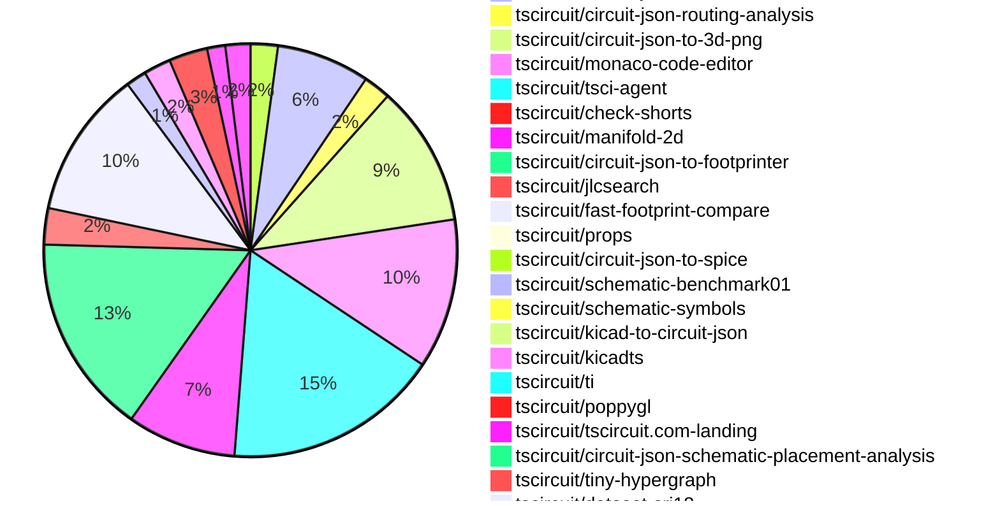

# Contribution Overview 2026-07-07

The current week is shown below. There are 3 major sections:

- [Contributor Overview](#contributor-overview)
- [PRs by Repository](#prs-by-repository)
- [PRs by Contributor](#changes-by-contributor)
- [Scoring & Sponsorship Details](/docs/sponsorship-calculation-explanation.md)

## PRs by Repository

## Contributor Overview

| Contributor | 🐳 Major | 🐙 Minor | 🐌 Tiny | Score | ⭐ | Discussion Contributions |
|-------------|---------|---------|---------|-------|-----|--------------------------|
| [seveibar](#seveibar) | 14 | 17 | 28 | 85 | 👑 | 0🔹 0🔶 0💎 |
| [ShiboSoftwareDev](#ShiboSoftwareDev) | 9 | 7 | 11 | 75 | ⭐⭐⭐ | 0🔹 0🔶 0💎 |
| [0hmX](#0hmX) | 11 | 6 | 15 | 69 | ⭐⭐⭐ | 0🔹 0🔶 0💎 |
| [MustafaMulla29](#MustafaMulla29) | 6 | 4 | 11 | 44 | ⭐⭐ | 0🔹 0🔶 0💎 |
| [Abse2001](#Abse2001) | 4 | 5 | 13 | 42.5 | ⭐⭐ | 0🔹 0🔶 0💎 |
| [rushabhcodes](#rushabhcodes) | 4 | 3 | 12 | 36 | ⭐⭐ | 0🔹 0🔶 0💎 |
| [AnasSarkiz](#AnasSarkiz) | 2 | 3 | 5 | 34 | ⭐⭐ | 0🔹 0🔶 0💎 |
| [mohan-bee](#mohan-bee) | 3 | 5 | 10 | 34 | ⭐⭐ | 0🔹 0🔶 0💎 |
| [techmannih](#techmannih) | 2 | 4 | 4 | 21 | ⭐⭐ | 0🔹 0🔶 0💎 |
| [tscircuitbot](#tscircuitbot) | 0 | 0 | 410 | 18 | ⭐⭐ | 0🔹 0🔶 0💎 |
| [imrishabh18](#imrishabh18) | 1 | 5 | 3 | 17.5 | ⭐⭐ | 0🔹 0🔶 0💎 |
| [anil08607](#anil08607) | 0 | 2 | 6 | 10 | ⭐ | 0🔹 0🔶 0💎 |
| [abdalraof-albarbar](#abdalraof-albarbar) | 1 | 3 | 0 | 10 | ⭐ | 0🔹 0🔶 0💎 |
| [technologyet31-create](#technologyet31-create) | 0 | 3 | 0 | 6 | ⭐ | 0🔹 0🔶 0💎 |
| [Copilot](#Copilot) | 1 | 0 | 0 | 4 | ⭐ | 0🔹 0🔶 0💎 |

## Staff Pass Ratio (SPR)

| Contributor | Reviewed PRs | Rejections | Approvals | SPR |
|-------------|--------------|------------|-----------|-----|
| [ShiboSoftwareDev](#ShiboSoftwareDev) | 14 | 1 | 15 | 92.9% |
| [abdalraof-albarbar](#abdalraof-albarbar) | 10 | 1 | 9 | 90.0% |
| [techmannih](#techmannih) | 7 | 6 | 5 | 14.3% |
| [Abse2001](#Abse2001) | 7 | 0 | 7 | 100.0% |
| [MustafaMulla29](#MustafaMulla29) | 6 | 0 | 6 | 100.0% |
| [mohan-bee](#mohan-bee) | 5 | 2 | 4 | 60.0% |
| [0hmX](#0hmX) | 5 | 0 | 5 | 100.0% |
| [AnasSarkiz](#AnasSarkiz) | 3 | 1 | 3 | 66.7% |
| [rushabhcodes](#rushabhcodes) | 3 | 0 | 3 | 100.0% |
| [imrishabh18](#imrishabh18) | 1 | 0 | 1 | 100.0% |
| [anil08607](#anil08607) | 1 | 0 | 1 | 100.0% |

ShiboSoftwareDev SPR PRs (14)

- [#2641](https://github.com/tscircuit/core/pull/2641) Fix SRJ obstacles for rotated and polygon SMT pads
- [#1763](https://github.com/tscircuit/svg.tscircuit.com/pull/1763) Support standalone simulation graph SVG URLs and prevent ngspice from crashing Next’s server router
- [#1599](https://github.com/tscircuit/tscircuit-autorouter/pull/1599) Pipeline7: add selective tiny-hypergraph reripping & solve sample 6 of dataset 18
- [#1596](https://github.com/tscircuit/tscircuit-autorouter/pull/1596) add Pipeline 7 net-based visualization colors
- [#1592](https://github.com/tscircuit/tscircuit-autorouter/pull/1592) Add a solver to merge global and component topologies in Pipeline 7 & consistently use colors for layers
- [#1558](https://github.com/tscircuit/tscircuit-autorouter/pull/1558) Improve layer-aware topology SVG frame snapshots
- [#1554](https://github.com/tscircuit/tscircuit-autorouter/pull/1554) Add reusable solver SVG frames fixture
- [#1545](https://github.com/tscircuit/tscircuit-autorouter/pull/1545) Fix BGA grid alignment for obstacle target routing
- [#1543](https://github.com/tscircuit/tscircuit-autorouter/pull/1543) Fix overlapping endpoint region selection for merged topology
- [#1532](https://github.com/tscircuit/tscircuit-autorouter/pull/1532) topology merge
- [#7](https://github.com/tscircuit/EEcircuit-engine/pull/7) Fix runSim rejection on ngspice failures
- [#167](https://github.com/tscircuit/kicad-to-circuit-json/pull/167) Fix mirrored custom pad polygons on rotated footprints
- [#163](https://github.com/tscircuit/kicad-to-circuit-json/pull/163) Fix KiCad connectivity conversion and validation
- [#125](https://github.com/tscircuit/tiny-hypergraph/pull/125)  Add selective rerip routing for blocked tiny-hypergraph paths

abdalraof-albarbar SPR PRs (10)

- [#345](https://github.com/tscircuit/contribution-tracker/pull/345) Add a repro test for the renamed-contributor identity split
- [#617](https://github.com/tscircuit/circuit-to-svg/pull/617) Rotate silkscreen pills by their ccw_rotation
- [#607](https://github.com/tscircuit/circuit-to-svg/pull/607) Count pcb_hole, pcb_note_line, and rotated rect cutout in getComprehensivePcbBounds
- [#605](https://github.com/tscircuit/circuit-to-svg/pull/605) Count all rendered elements in getComprehensivePcbBounds
- [#604](https://github.com/tscircuit/circuit-to-svg/pull/604) Add failing repros for elements missing from getComprehensivePcbBounds
- [#122](https://github.com/tscircuit/circuit-json-to-gerber/pull/122) Render pcb_silkscreen_graphic to Gerber as a filled region
- [#120](https://github.com/tscircuit/circuit-json-to-gerber/pull/120) Preserve silkscreen text case in Gerber output
- [#46](https://github.com/tscircuit/circuit-json-to-spice/pull/46) Guard R/C/L value formatters against non-finite values
- [#649](https://github.com/tscircuit/schematic-trace-solver/pull/649) Give each pushed trace its own corridor when escaping a shared net-label block
- [#650](https://github.com/tscircuit/schematic-trace-solver/pull/650) Never route net-label direct connections as wires (LongDistancePairSolver + MspConnectionPairSolver)

techmannih SPR PRs (7)

- [#718](https://github.com/tscircuit/props/pull/718) feat: allow SymbolProp to accept circuit-json element arrays
- [#407](https://github.com/tscircuit/easyeda-converter/pull/407) fix: restore direct raw EasyEDA JSON input for TSX conversion
- [#2631](https://github.com/tscircuit/core/pull/2631) Fix inherited default trace width handling in PCB routing
- [#2629](https://github.com/tscircuit/core/pull/2629) Support custom schematic symbols circuit-json 
- [#2625](https://github.com/tscircuit/core/pull/2625) add repro for board defaultTraceWidth being ignored by autorouted traces
- [#375](https://github.com/tscircuit/circuit-json-to-kicad/pull/375) fix(pcb): preserve PCB text size and emit explicit text thickness
- [#160](https://github.com/tscircuit/kicad-to-circuit-json/pull/160) Support legacy KiCad 5 standalone footprints

Abse2001 SPR PRs (7)

- [#2617](https://github.com/tscircuit/core/pull/2617) Allow custom footprint port hints to override default LED aliases
- [#2608](https://github.com/tscircuit/core/pull/2608) Use automatic net labels on repro46
- [#3647](https://github.com/tscircuit/cli/pull/3647) Enable routing on check shorts
- [#3587](https://github.com/tscircuit/cli/pull/3587) Add tsci check shorts command with bitmap short detection and debug artifacts
- [#27](https://github.com/tscircuit/check-shorts/pull/27) Replace the custom PCB snapshot matcher with circuit-to-svg snapshots
- [#25](https://github.com/tscircuit/check-shorts/pull/25) Render traces and other copper above copper pours in bitmap debug output
- [#7](https://github.com/tscircuit/check-shorts/pull/7) Improve bitmap-based PCB/Gerber short detection with enhanced large-board performance, accuracy, and debug rendering

MustafaMulla29 SPR PRs (6)

- [#237](https://github.com/tscircuit/schematic-viewer/pull/237) feat: highlight hovered net by fading unrelated nets and chips
- [#2633](https://github.com/tscircuit/core/pull/2633) Pass isCapacitor to matchpack
- [#2614](https://github.com/tscircuit/core/pull/2614) Pass schematic port facing directions to the trace solver
- [#155](https://github.com/tscircuit/matchpack/pull/155) Lay out decoupling cap groups as rail rows (Adds new DecouplingCapRowSolver)
- [#648](https://github.com/tscircuit/schematic-trace-solver/pull/648) Fix schematic routing regressions from pin-band penalty and chip-boundary reject
- [#645](https://github.com/tscircuit/schematic-trace-solver/pull/645)  Respect provided pin facingDirection when correcting pins inside expanded chip boxes

mohan-bee SPR PRs (5)

- [#612](https://github.com/tscircuit/circuit-to-svg/pull/612) Fix text anchor for left/right schematic port indicators
- [#16](https://github.com/tscircuit/circuit-json-to-bom-csv/pull/16) Skip test points
- [#3865](https://github.com/tscircuit/tscircuit.com/pull/3865) Add drag-to-resize divider between code editor and RunFrame preview panels
- [#153](https://github.com/tscircuit/matchpack/pull/153) fix decoupling capacitor and series resistor collision
- [#638](https://github.com/tscircuit/schematic-trace-solver/pull/638)  Fix short schematic trace routing

0hmX SPR PRs (5)

- [#2624](https://github.com/tscircuit/core/pull/2624) update breakout test to use latest pipline 7
- [#1586](https://github.com/tscircuit/tscircuit-autorouter/pull/1586) remove mergedConnection and replace with __rootConnectionName : string[]
- [#1553](https://github.com/tscircuit/tscircuit-autorouter/pull/1553) Make pipeline 7 GlobalDrc connMap aware
- [#1552](https://github.com/tscircuit/tscircuit-autorouter/pull/1552) Fix same-net via merger route transitions
- [#1537](https://github.com/tscircuit/tscircuit-autorouter/pull/1537) Improve same-net via merging

AnasSarkiz SPR PRs (3)

- [#773](https://github.com/tscircuit/docs/pull/773) Introduce QR Code Silkscreen Documentation with 3D and PCB Example using`silkscreengraphic`
- [#1536](https://github.com/tscircuit/tscircuit-autorouter/pull/1536) Fix stitch endpoint snapping to prevent closed-loop two-port traces
- [#646](https://github.com/tscircuit/schematic-trace-solver/pull/646) Introduce Ratsnest-Free Schematic Solver Visualizations for Cleaner Bug Report Snapshots

rushabhcodes SPR PRs (3)

- [#3890](https://github.com/tscircuit/tscircuit.com/pull/3890) Fix 3D PNG downloads by preloading the GLTF converter
- [#3882](https://github.com/tscircuit/tscircuit.com/pull/3882) Fix 3D package previews with native PNG rendering
- [#32](https://github.com/tscircuit/poppygl/pull/32) Fix browser 3D PNG rendering by removing Node-only PoppyGL exports

imrishabh18 SPR PRs (1)

- [#2616](https://github.com/tscircuit/core/pull/2616) fix: Missing pin_number in the custom ports failed the ports to be unique

anil08607 SPR PRs (1)

- [#613](https://github.com/tscircuit/circuit-to-svg/pull/613) add PCB note and Fabrication note text to getComprehensivePcbBounds

> Note: AI evaluates PRs and assigns 1-3 star ratings automatically. 4 and 5 star ratings require manual staff review.

### Discussion Contribution Legend

- 🔹 Normal Comments: Basic participation with minimal effort
- 🔶 Great Informative Comments: Thoughtful participation that adds value
- 💎 Incredible Comments: Exceptional participation with high-quality content

## Review Table

[reviews-received-hover]: ## "Number of reviews received for PRs for this contributor"
[approvals-received-hover]: ## "Number of approvals received for PRs this contributor authored"
[rejections-received-hover]: ## "Number of rejections received for PRs this contributor authored"
[prs-opened-hover]: ## "Number of PRs opened by this contributor"
[issues-created-hover]: ## "Number of issues created by this contributor"

| Contributor | Reviews Received | Approvals Received | Rejections Received | Approvals | Rejections Given | PRs Opened | PRs Merged | Issues Created |
|---|---|---|---|---|---|---|---|---|
| [AM-Mehrabii](#AM-Mehrabii) | 0 | 0 | 0 | 0 | 0 | 1 | 0 | 0 |
| [MustafaMulla29](#MustafaMulla29) | 15 | 9 | 0 | 13 | 0 | 22 | 22 | 0 |
| [seveibar](#seveibar) | 11 | 0 | 0 | 81 | 6 | 71 | 60 | 0 |
| [imrishabh18](#imrishabh18) | 4 | 2 | 0 | 15 | 2 | 9 | 9 | 0 |
| [thienanwspace](#thienanwspace) | 0 | 0 | 0 | 0 | 0 | 6 | 0 | 0 |
| [tscircuitbot](#tscircuitbot) | 0 | 0 | 0 | 0 | 0 | 545 | 424 | 0 |
| [khozakhulile27-netizen](#khozakhulile27-netizen) | 0 | 0 | 0 | 0 | 0 | 4 | 0 | 0 |
| [abdalraof-albarbar](#abdalraof-albarbar) | 19 | 15 | 1 | 0 | 0 | 29 | 7 | 0 |
| [techmannih](#techmannih) | 17 | 9 | 4 | 7 | 0 | 14 | 10 | 0 |
| [chengdazhi](#chengdazhi) | 0 | 0 | 0 | 0 | 0 | 6 | 0 | 0 |
| [anil08607](#anil08607) | 20 | 9 | 2 | 0 | 0 | 14 | 8 | 0 |
| [bnuckols13](#bnuckols13) | 0 | 0 | 0 | 0 | 0 | 1 | 0 | 0 |
| [AnasSarkiz](#AnasSarkiz) | 23 | 21 | 0 | 23 | 0 | 12 | 11 | 0 |
| [Abse2001](#Abse2001) | 28 | 27 | 0 | 5 | 0 | 25 | 22 | 0 |
| [rushabhcodes](#rushabhcodes) | 37 | 11 | 1 | 2 | 1 | 22 | 19 | 0 |
| [maci0](#maci0) | 0 | 0 | 0 | 0 | 0 | 1 | 0 | 0 |
| [mohan-bee](#mohan-bee) | 32 | 21 | 1 | 2 | 1 | 23 | 18 | 0 |
| [ShiboSoftwareDev](#ShiboSoftwareDev) | 46 | 42 | 0 | 17 | 0 | 39 | 27 | 0 |
| [0hmX](#0hmX) | 21 | 15 | 0 | 16 | 0 | 36 | 34 | 0 |
| [HimanshuShukla671](#HimanshuShukla671) | 0 | 0 | 0 | 0 | 0 | 1 | 0 | 0 |
| [kapookky123](#kapookky123) | 0 | 0 | 0 | 0 | 0 | 2 | 0 | 0 |
| [wanglianglll](#wanglianglll) | 0 | 0 | 0 | 0 | 0 | 1 | 0 | 0 |
| [mitre88](#mitre88) | 0 | 0 | 0 | 0 | 0 | 1 | 0 | 0 |
| [GokulPandi-M](#GokulPandi-M) | 6 | 0 | 1 | 0 | 0 | 1 | 0 | 0 |
| [holistis](#holistis) | 0 | 0 | 0 | 0 | 0 | 1 | 0 | 0 |
| [yanyishuai](#yanyishuai) | 0 | 0 | 0 | 0 | 0 | 1 | 0 | 0 |
| [Copilot](#Copilot) | 0 | 0 | 0 | 0 | 0 | 1 | 1 | 0 |

## Changes by Repository

### [tscircuit/schematic-viewer](https://github.com/tscircuit/schematic-viewer)

| PR # | Impact | Rating | Contributor | Description |
|------|--------|--------|-------------|-------------|
| [#237](https://github.com/tscircuit/schematic-viewer/pull/237) | 🐳 Major | ⭐⭐⭐ | MustafaMulla29 | Adds functionality to highlight the hovered net by fading unrelated nets and chips in the schematic viewer, improving user interaction and clarity. |

### [tscircuit/matchpack](https://github.com/tscircuit/matchpack)

| PR # | Impact | Rating | Contributor | Description |
|------|--------|--------|-------------|-------------|
| [#158](https://github.com/tscircuit/matchpack/pull/158) | 🐳 Major | ⭐⭐⭐ | MustafaMulla29 | This pull request introduces new test input files to address the issue of capacitors overlapping with chips in the rp2040 design. The changes include detailed JSON representations of various components and their configurations, which are essential for ensuring proper layout and functionality in the circuit design. |
| [#157](https://github.com/tscircuit/matchpack/pull/157) | 🐳 Major | ⭐⭐⭐ | MustafaMulla29 | Aligns two-pin components that connect only to power or ground into rail rows, allowing for better layout organization. |
| [#155](https://github.com/tscircuit/matchpack/pull/155) | 🐳 Major | ⭐⭐⭐ | MustafaMulla29 | Fixes the RP2040 decoupling capacitors stacking into one tall column instead of clean rail rows |
| [#156](https://github.com/tscircuit/matchpack/pull/156) | 🐙 Minor | ⭐⭐ | MustafaMulla29 | Fixes incorrect grouping of decoupling capacitors wired only to nets, ensuring they are associated with the correct chip they decouple. |
| [#153](https://github.com/tscircuit/matchpack/pull/153) | 🐙 Minor | ⭐⭐ | mohan-bee | Fixes a schematic layout collision where AlignPowerGroundRowsSolver could move already-packed powerground row components into overlapping positions. |

🐌 Tiny Contributions (1)

| PR # | Impact | Contributor | Description |
|------|--------|-------------|-------------|
| [#154](https://github.com/tscircuit/matchpack/pull/154) | 🐌 Tiny | MustafaMulla29 | Reproduces a bug where decoupling capacitors are incorrectly stacked in a column instead of being laid out in rows, with a comprehensive test to validate the issue. |

### [tscircuit/schematic-trace-solver](https://github.com/tscircuit/schematic-trace-solver)

| PR # | Impact | Rating | Contributor | Description |
|------|--------|--------|-------------|-------------|
| [#654](https://github.com/tscircuit/schematic-trace-solver/pull/654) | 🐳 Major | ⭐⭐⭐ | MustafaMulla29 | Fixes the placement of powerground rail net labels to ensure they align with pins rather than floating at arbitrary points along traces. |
| [#648](https://github.com/tscircuit/schematic-trace-solver/pull/648) | 🐳 Major | ⭐⭐⭐ | MustafaMulla29 | Fixes routing regressions caused by overly aggressive heuristics in schematic trace routing, ensuring valid routes are prioritized over longer detours and improving handling of chip boundary overlaps. |
| [#615](https://github.com/tscircuit/schematic-trace-solver/pull/615) | 🐳 Major | ⭐⭐⭐ | seveibar | Adds support for tracing outside pin bands to enhance the accuracy of schematic trace calculations and improve bug reporting. |
| [#646](https://github.com/tscircuit/schematic-trace-solver/pull/646) | 🐳 Major | ⭐⭐⭐ | AnasSarkiz | Adds a hideRatsNet option to SchematicTracePipelineSolver so schematic debug visualizations can suppress unrouted ratsnest connection lines while preserving the existing default behavior. |
| [#638](https://github.com/tscircuit/schematic-trace-solver/pull/638) | 🐳 Major | ⭐⭐⭐ | mohan-bee | Fixes routing issues for very short schematic connections between nearby pins, preventing unnecessary elbow overshoot and ensuring proper trace connections. |
| [#649](https://github.com/tscircuit/schematic-trace-solver/pull/649) | 🐳 Major | ⭐⭐⭐ | abdalraof-albarbar | Fixes overlapping trace corridors for different-net traces escaping a shared net-label block, ensuring they are routed in parallel without collision. |
| [#645](https://github.com/tscircuit/schematic-trace-solver/pull/645) | 🐙 Minor | ⭐⭐ | MustafaMulla29 | Fixes incorrect pin placement for components with long reference designators by ensuring pins are snapped to the correct edge based on their declared facing direction. |

🐌 Tiny Contributions (5)

| PR # | Impact | Contributor | Description |
|------|--------|-------------|-------------|
| [#647](https://github.com/tscircuit/schematic-trace-solver/pull/647) | 🐌 Tiny | MustafaMulla29 | Adds regression tests for missing traces and netlabel overlaps in schematic routing, ensuring correct behavior in these scenarios. |
| [#644](https://github.com/tscircuit/schematic-trace-solver/pull/644) | 🐌 Tiny | tscircuitbot | Adds a snapshot-only regression test and debugger page for the attached JSON solver input. |
| [#640](https://github.com/tscircuit/schematic-trace-solver/pull/640) | 🐌 Tiny | tscircuitbot | Adds a snapshot-only regression test and debugger page for the attached JSON solver input. |
| [#637](https://github.com/tscircuit/schematic-trace-solver/pull/637) | 🐌 Tiny | tscircuitbot | Adds a snapshot-only regression test and debugger page for the attached JSON solver input. |
| [#642](https://github.com/tscircuit/schematic-trace-solver/pull/642) | 🐌 Tiny | tscircuitbot | Adds a snapshot-only regression test and debugger page for the attached JSON solver input. |

### [tscircuit/core](https://github.com/tscircuit/core)

| PR # | Impact | Rating | Contributor | Description |
|------|--------|--------|-------------|-------------|
| [#2645](https://github.com/tscircuit/core/pull/2645) | 🐳 Major | ⭐⭐⭐ | seveibar | Caches local autorouting results for each phase to avoid redundant computations, improving efficiency in the autorouting process. |
| [#2634](https://github.com/tscircuit/core/pull/2634) | 🐳 Major | ⭐⭐⭐ | seveibar | Adds placement design rule checks to prevent autorouting when placement errors are detected. |
| [#2618](https://github.com/tscircuit/core/pull/2618) | 🐳 Major | ⭐⭐⭐ | seveibar | Changes the default autorouter pipeline to pipeline7 and updates related tests and interfaces accordingly. |
| [#2629](https://github.com/tscircuit/core/pull/2629) | 🐳 Major | ⭐⭐⭐ | techmannih | Import circuit-json symbol properties as child schematic components during NormalComponent setup, select the primary symbolcomponent subtree from imported circuit-json, prevent auto-generated ports from duplicating existing ports, update createComponentsFromCircuitJson for parent symbol resolution, and refresh affected schematic snapshots. |
| [#2625](https://github.com/tscircuit/core/pull/2625) | 🐳 Major | ⭐⭐⭐ | techmannih | Reproduces a bug where the boards defaultTraceWidth is ignored by autorouted traces, resulting in incorrect trace widths. |
| [#2666](https://github.com/tscircuit/core/pull/2666) | 🐳 Major | ⭐⭐⭐ | Abse2001 | This pull request introduces a new subcircuit for a Gameboy reproduction project, including various components and connections necessary for its functionality. The implementation includes detailed pin configurations, component placements, and traces for electrical connections. |
| [#2641](https://github.com/tscircuit/core/pull/2641) | 🐳 Major | ⭐⭐⭐ | ShiboSoftwareDev | Fixes the handling of rotated and polygon SMT pads by preserving their orientation and approximating non-rectangular pads with scanline obstacles. |
| [#2633](https://github.com/tscircuit/core/pull/2633) | 🐙 Minor | ⭐⭐ | MustafaMulla29 | Adds the isCapacitor property to matchpack input based on the component type, specifically for simple capacitors. |
| [#2614](https://github.com/tscircuit/core/pull/2614) | 🐙 Minor | ⭐⭐ | MustafaMulla29 | Passes each schematic ports true facing direction to the trace solver to improve pin snapping accuracy and prevent misalignment of net labels. |
| [#2664](https://github.com/tscircuit/core/pull/2664) | 🐙 Minor | ⭐⭐ | seveibar | Fixes the issue where explicit schematic box ports did not correctly map to their canonical physical PCB targets, ensuring accurate routing and representation in the PCB layout. |
| [#2643](https://github.com/tscircuit/core/pull/2643) | 🐙 Minor | ⭐⭐ | seveibar | Adds a warning mechanism for traces connected to crystals that exceed a specified maximum length, enhancing PCB design validation. |
| [#2640](https://github.com/tscircuit/core/pull/2640) | 🐙 Minor | ⭐⭐ | seveibar | Emit a warning when generic chips use reference designator prefixes reserved for other component types, ensuring better adherence to naming conventions. |
| [#2638](https://github.com/tscircuit/core/pull/2638) | 🐙 Minor | ⭐⭐ | seveibar | Adds an integration test for MOSFET connections and updates the props dependency version. |
| [#2652](https://github.com/tscircuit/core/pull/2652) | 🐙 Minor | ⭐⭐ | seveibar | Implement MOSFET symbol port sides for schematic symbols, allowing for customizable orientation of gate, drain, and source ports while maintaining existing functionality. |
| [#2635](https://github.com/tscircuit/core/pull/2635) | 🐙 Minor | ⭐⭐ | seveibar | Adds support for a default autorouter configuration in the autorouting system. |
| [#2611](https://github.com/tscircuit/core/pull/2611) | 🐙 Minor | ⭐⭐ | seveibar | Updates the autorouter dependency version and refreshes snapshot tests for 3D representations of components. |
| [#2617](https://github.com/tscircuit/core/pull/2617) | 🐙 Minor | ⭐⭐ | Abse2001 | Allows custom footprint port hints to override default LED aliases for better flexibility in pin labeling. |
| [#2608](https://github.com/tscircuit/core/pull/2608) | 🐙 Minor | ⭐⭐ | Abse2001 | Adds automatic net labels for connections in the repro46 schematic test. |
| [#2632](https://github.com/tscircuit/core/pull/2632) | 🐙 Minor | ⭐⭐ | AnasSarkiz | Adds an option to exclude existing top-level PCB route state from autorouting, allowing for fresh routing problems while keeping routed child-subcircuit traces and vias fixed. |
| [#2624](https://github.com/tscircuit/core/pull/2624) | 🐙 Minor | ⭐⭐ | 0hmX | Updates the breakout test to utilize the latest autorouter version, changing the expected number of design rule check errors. |
| [#2623](https://github.com/tscircuit/core/pull/2623) | 🐙 Minor | ⭐⭐ | imrishabh18 | Fixes the schFacingDirection functionality to support down and up directions in the PinHeader component. |
| [#2616](https://github.com/tscircuit/core/pull/2616) | 🐙 Minor | ⭐⭐ | imrishabh18 | Fixes issue where missing pin_number in custom ports caused non-unique port identifiers, leading to potential conflicts in schematic rendering. |

🐌 Tiny Contributions (19)

| PR # | Impact | Contributor | Description |
|------|--------|-------------|-------------|
| [#2659](https://github.com/tscircuit/core/pull/2659) | 🐌 Tiny | MustafaMulla29 | Fixes text overlap in schematic auto-layout for rotated components with long names, ensuring proper spacing and readability. |
| [#2660](https://github.com/tscircuit/core/pull/2660) | 🐌 Tiny | MustafaMulla29 | Updates the circuit-to-svg dependency version from 0.0.381 to 0.0.384 in package.json |
| [#2650](https://github.com/tscircuit/core/pull/2650) | 🐌 Tiny | MustafaMulla29 | Updates the version of the tscircuitmatchpack dependency from 0.0.33 to 0.0.34 in package.json |
| [#2648](https://github.com/tscircuit/core/pull/2648) | 🐌 Tiny | MustafaMulla29 | Updates the dependency version of schematic-trace-solver from 0.0.95 to 0.0.96 and modifies the way solver parameters are emitted in the schematic trace rendering process. |
| [#2628](https://github.com/tscircuit/core/pull/2628) | 🐌 Tiny | MustafaMulla29 | Updates the schematic-trace-solver dependency to version 0.0.94 and modifies test snapshots accordingly. |
| [#2630](https://github.com/tscircuit/core/pull/2630) | 🐌 Tiny | MustafaMulla29 | Fixes powerground labels hanging in the middle of the traces. |
| [#2654](https://github.com/tscircuit/core/pull/2654) | 🐌 Tiny | seveibar | Updates the tscircuitcapacity-autorouter dependency to version 0.0.665, regenerates PCB and 3D snapshots, and adjusts test fixtures for improved routing without DRC errors. |
| [#2655](https://github.com/tscircuit/core/pull/2655) | 🐌 Tiny | seveibar | Updates the dependency circuit-json-to-spice from version 0.0.40 to 0.0.43 to keep alignment with the latest published converter release. |
| [#2644](https://github.com/tscircuit/core/pull/2644) | 🐌 Tiny | seveibar | Updates the tscircuitcopper-pour-solver package from version 0.0.37 to 0.0.38 and adopts tscircuitmanifold-2d0.0.4, which fixes browserworker WASM loading without adding production dependencies. |
| [#2647](https://github.com/tscircuit/core/pull/2647) | 🐌 Tiny | seveibar | Updates the tscircuitcopper-pour-solver dependency from version 0.0.38 to 0.0.39, which now consumes tscircuitmanifold-2d from npm instead of a JSCDN tarball. |
| [#2639](https://github.com/tscircuit/core/pull/2639) | 🐌 Tiny | seveibar | Updates the tscircuitcopper-pour-solver dependency from version 0.0.35 to 0.0.37, incorporating the latest fixes and improvements. |
| [#2667](https://github.com/tscircuit/core/pull/2667) | 🐌 Tiny | rushabhcodes | Fixes schematic trace generation when an external component connects to a port on a subcircuit rendered with showAsSchematicBox |
| [#2642](https://github.com/tscircuit/core/pull/2642) | 🐌 Tiny | rushabhcodes | Updates the poppygl dependency in package.json from version 0.0.24 to 0.0.25 |
| [#2619](https://github.com/tscircuit/core/pull/2619) | 🐌 Tiny | ShiboSoftwareDev | Updates the tscircuitngspice-spice-engine dependency from version 0.0.18 to 0.0.19 in package.json |
| [#2646](https://github.com/tscircuit/core/pull/2646) | 🐌 Tiny | anil08607 | Updates the circuit-to-svg dependency to version 0.0.381 in package.json |
| [#2626](https://github.com/tscircuit/core/pull/2626) | 🐌 Tiny | 0hmX | Updates the autorouter dependency to version 0.0.655 and fixes design rule check errors in tests. |
| [#2615](https://github.com/tscircuit/core/pull/2615) | 🐌 Tiny | imrishabh18 | Fixes incorrect rendering of schematic pin labels that are not in the correct sequence, ensuring accurate representation in the schematic view. |
| [#2610](https://github.com/tscircuit/core/pull/2610) | 🐌 Tiny | mohan-bee | Updates the version of the tscircuitmatchpack dependency from 0.0.29 to 0.0.31 in package.json |
| [#2609](https://github.com/tscircuit/core/pull/2609) | 🐌 Tiny | mohan-bee | Updates the version of the schematic-symbols dependency from 0.0.230 to 0.0.231 in package.json |

### [tscircuit/circuit-to-svg](https://github.com/tscircuit/circuit-to-svg)

| PR # | Impact | Rating | Contributor | Description |
|------|--------|--------|-------------|-------------|
| [#613](https://github.com/tscircuit/circuit-to-svg/pull/613) | 🐙 Minor | ⭐⭐ | anil08607 | This PR updates getComprehensivePcbBounds to include both pcb_note_text and pcb_fabrication_note_text when computing PCB SVG bounds. |
| [#617](https://github.com/tscircuit/circuit-to-svg/pull/617) | 🐙 Minor | ⭐⭐ | abdalraof-albarbar | Fixes rendering of silkscreen pills to respect their ccw_rotation, preventing clipping in the SVG viewport. |
| [#607](https://github.com/tscircuit/circuit-to-svg/pull/607) | 🐙 Minor | ⭐⭐ | abdalraof-albarbar | Fixes the issue where pcb_hole, pcb_note_line, and rotated rect cutout were not included in the exported SVG viewport, ensuring accurate rendering of these elements in the SVG output. |
| [#605](https://github.com/tscircuit/circuit-to-svg/pull/605) | 🐙 Minor | ⭐⭐ | technologyet31-create | Fixes rendering issues by ensuring that getComprehensivePcbBounds includes the extent of every element the renderer draws, preventing clipping and ensuring accurate representation of PCB elements. |
| [#604](https://github.com/tscircuit/circuit-to-svg/pull/604) | 🐙 Minor | ⭐⭐ | technologyet31-create | Adds failing tests for elements missing from getComprehensivePcbBounds, including brep copper pours, plated holes, rotated SMT pads, vias, and silkscreen pills, to ensure they are accounted for in the rendering process. |

🐌 Tiny Contributions (7)

| PR # | Impact | Contributor | Description |
|------|--------|-------------|-------------|
| [#602](https://github.com/tscircuit/circuit-to-svg/pull/602) | 🐌 Tiny | MustafaMulla29 | Tags schematic net label elements with data-schematic-net-label-id and removes hover CSS from the base SVG, streamlining the SVG generation process. |
| [#618](https://github.com/tscircuit/circuit-to-svg/pull/618) | 🐌 Tiny | anil08607 | Adds a test to reproduce the issue of PCB fabrication note text rotation in the SVG rendering process. |
| [#616](https://github.com/tscircuit/circuit-to-svg/pull/616) | 🐌 Tiny | anil08607 | Fixes SVG bounds for symbol reference and value text in schematics to prevent clipping and ensure proper viewport sizing. |
| [#615](https://github.com/tscircuit/circuit-to-svg/pull/615) | 🐌 Tiny | anil08607 | Adds a test to ensure long component display names stay within the exported SVG bounds. |
| [#610](https://github.com/tscircuit/circuit-to-svg/pull/610) | 🐌 Tiny | anil08607 | Removes unused types from the circuit-json module, streamlining the codebase. |
| [#608](https://github.com/tscircuit/circuit-to-svg/pull/608) | 🐌 Tiny | mohan-bee | Reproduces a bug where port labels overlap on resistor and capacitor components in the schematic rendering. |
| [#609](https://github.com/tscircuit/circuit-to-svg/pull/609) | 🐌 Tiny | mohan-bee | Updates the version of the tscircuit and circuit-json dependencies in package.json |

### [tscircuit/tscircuit.com](https://github.com/tscircuit/tscircuit.com)

| PR # | Impact | Rating | Contributor | Description |
|------|--------|--------|-------------|-------------|
| [#3905](https://github.com/tscircuit/tscircuit.com/pull/3905) | 🐳 Major | ⭐⭐⭐ | seveibar | Add functionality to display PCB and schematic previews above package file contents, enhancing user interaction with circuit artifacts. |
| [#3904](https://github.com/tscircuit/tscircuit.com/pull/3904) | 🐳 Major | ⭐⭐⭐ | seveibar | Server-render semantic package content into the initial HTML response instead of returning only the SPA loader, ensuring meaningful semantic HTML is returned for every public package page, improving accessibility and SEO. |
| [#3901](https://github.com/tscircuit/tscircuit.com/pull/3901) | 🐳 Major | ⭐⭐⭐ | seveibar | Add URL-backed package directory routes under :author:packageNametree... and read-only package file routes under :author:packageNameblob... allowing users to navigate package directories and files with shareable URLs, and view files in a dedicated viewer instead of directly opening the editor. |
| [#3890](https://github.com/tscircuit/tscircuit.com/pull/3890) | 🐳 Major | ⭐⭐⭐ | rushabhcodes | Fixes the 3D PNG download flow by preloading circuit-json-to-gltf before loading circuit-json-to-3d-png |
| [#3846](https://github.com/tscircuit/tscircuit.com/pull/3846) | 🐳 Major | ⭐⭐⭐ | mohan-bee | Adds file-specific icons for .tsx, .md, and .json files in file views and corrects markdown syntax highlighting in the code editor. |
| [#3882](https://github.com/tscircuit/tscircuit.com/pull/3882) | 🐙 Minor | ⭐⭐ | rushabhcodes | Fixes 3D package preview generation by rendering circuit JSON directly to PNG instead of producing SVG and rasterizing it afterward. |

🐌 Tiny Contributions (56)

| PR # | Impact | Contributor | Description |
|------|--------|-------------|-------------|
| [#3847](https://github.com/tscircuit/tscircuit.com/pull/3847) | 🐌 Tiny | MustafaMulla29 | Updates dependencies for runframe, schematic-viewer, and circuit-to-svg to ensure proper net highlighting functionality. |
| [#3912](https://github.com/tscircuit/tscircuit.com/pull/3912) | 🐌 Tiny | tscircuitbot | Updates the tscircuitrunframe package to version 0.0.2200 in the package.json file. |
| [#3911](https://github.com/tscircuit/tscircuit.com/pull/3911) | 🐌 Tiny | tscircuitbot | Updates the tscircuiteval package from version 0.0.1001 to 0.0.1002 in the package.json file. |
| [#3910](https://github.com/tscircuit/tscircuit.com/pull/3910) | 🐌 Tiny | tscircuitbot | Automated package update |
| [#3909](https://github.com/tscircuit/tscircuit.com/pull/3909) | 🐌 Tiny | tscircuitbot | Updates the tscircuiteval package from version 0.0.1000 to 0.0.1001 |
| [#3907](https://github.com/tscircuit/tscircuit.com/pull/3907) | 🐌 Tiny | tscircuitbot | Updates the tscircuitrunframe package from version 0.0.2197 to 0.0.2198 |
| [#3906](https://github.com/tscircuit/tscircuit.com/pull/3906) | 🐌 Tiny | tscircuitbot | Automated package update |
| [#3903](https://github.com/tscircuit/tscircuit.com/pull/3903) | 🐌 Tiny | tscircuitbot | Updates the tscircuitrunframe package from version 0.0.2196 to 0.0.2197 |
| [#3902](https://github.com/tscircuit/tscircuit.com/pull/3902) | 🐌 Tiny | tscircuitbot | Updates the tscircuiteval package version from 0.0.998 to 0.0.999 in package.json |
| [#3899](https://github.com/tscircuit/tscircuit.com/pull/3899) | 🐌 Tiny | tscircuitbot | Updates the tscircuitrunframe package from version 0.0.2195 to 0.0.2196 |
| [#3898](https://github.com/tscircuit/tscircuit.com/pull/3898) | 🐌 Tiny | tscircuitbot | Automated package update for tscircuiteval from version 0.0.997 to 0.0.998 |
| [#3897](https://github.com/tscircuit/tscircuit.com/pull/3897) | 🐌 Tiny | tscircuitbot | Updates the tscircuitrunframe package from version 0.0.2194 to 0.0.2195 |
| [#3896](https://github.com/tscircuit/tscircuit.com/pull/3896) | 🐌 Tiny | tscircuitbot | Updates the tscircuiteval package to version 0.0.997 in the package.json file. |
| [#3895](https://github.com/tscircuit/tscircuit.com/pull/3895) | 🐌 Tiny | tscircuitbot | Updates the tscircuitrunframe package from version 0.0.2193 to 0.0.2194 |
| [#3894](https://github.com/tscircuit/tscircuit.com/pull/3894) | 🐌 Tiny | tscircuitbot | Automated package update |
| [#3892](https://github.com/tscircuit/tscircuit.com/pull/3892) | 🐌 Tiny | tscircuitbot | Updates the tscircuitrunframe package to version 0.0.2193 in package.json |
| [#3891](https://github.com/tscircuit/tscircuit.com/pull/3891) | 🐌 Tiny | tscircuitbot | Updates the tscircuiteval package from version 0.0.994 to 0.0.995 |
| [#3889](https://github.com/tscircuit/tscircuit.com/pull/3889) | 🐌 Tiny | tscircuitbot | Updates the tscircuitrunframe package to version 0.0.2192 |
| [#3888](https://github.com/tscircuit/tscircuit.com/pull/3888) | 🐌 Tiny | tscircuitbot | Automated package update |
| [#3887](https://github.com/tscircuit/tscircuit.com/pull/3887) | 🐌 Tiny | tscircuitbot | Updates the tscircuitrunframe package from version 0.0.2190 to 0.0.2191 |
| [#3886](https://github.com/tscircuit/tscircuit.com/pull/3886) | 🐌 Tiny | tscircuitbot | Updates the tscircuitrunframe package to version 0.0.2190 |
| [#3885](https://github.com/tscircuit/tscircuit.com/pull/3885) | 🐌 Tiny | tscircuitbot | Updates the tscircuiteval package from version 0.0.992 to 0.0.993 |
| [#3884](https://github.com/tscircuit/tscircuit.com/pull/3884) | 🐌 Tiny | tscircuitbot | Updates the tscircuitrunframe package from version 0.0.2188 to 0.0.2189 |
| [#3881](https://github.com/tscircuit/tscircuit.com/pull/3881) | 🐌 Tiny | tscircuitbot | Automated package update |
| [#3878](https://github.com/tscircuit/tscircuit.com/pull/3878) | 🐌 Tiny | tscircuitbot | Updates the tscircuitrunframe package from version 0.0.2185 to 0.0.2186 |
| [#3876](https://github.com/tscircuit/tscircuit.com/pull/3876) | 🐌 Tiny | tscircuitbot | Updates the tscircuiteval package from version 0.0.989 to 0.0.990 |
| [#3883](https://github.com/tscircuit/tscircuit.com/pull/3883) | 🐌 Tiny | tscircuitbot | Updates the package version from 0.0.217 to 0.0.218 in package.json |
| [#3880](https://github.com/tscircuit/tscircuit.com/pull/3880) | 🐌 Tiny | tscircuitbot | Automated package update |
| [#3879](https://github.com/tscircuit/tscircuit.com/pull/3879) | 🐌 Tiny | tscircuitbot | Updates the tscircuitrunframe package to version 0.0.2187 in package.json |
| [#3864](https://github.com/tscircuit/tscircuit.com/pull/3864) | 🐌 Tiny | tscircuitbot | Updates the tscircuitrunframe package from version 0.0.2180 to 0.0.2181 |
| [#3872](https://github.com/tscircuit/tscircuit.com/pull/3872) | 🐌 Tiny | tscircuitbot | Updates the tscircuiteval package from version 0.0.988 to 0.0.989 |
| [#3871](https://github.com/tscircuit/tscircuit.com/pull/3871) | 🐌 Tiny | tscircuitbot | Updates the tscircuitrunframe package to version 0.0.2184 in package.json |
| [#3869](https://github.com/tscircuit/tscircuit.com/pull/3869) | 🐌 Tiny | tscircuitbot | Updates the tscircuitrunframe package from version 0.0.2182 to 0.0.2183 |
| [#3868](https://github.com/tscircuit/tscircuit.com/pull/3868) | 🐌 Tiny | tscircuitbot | Updates the tscircuiteval package from version 0.0.986 to 0.0.987 |
| [#3873](https://github.com/tscircuit/tscircuit.com/pull/3873) | 🐌 Tiny | tscircuitbot | Automated package update |
| [#3870](https://github.com/tscircuit/tscircuit.com/pull/3870) | 🐌 Tiny | tscircuitbot | Updates the tscircuiteval package to version 0.0.988 |
| [#3867](https://github.com/tscircuit/tscircuit.com/pull/3867) | 🐌 Tiny | tscircuitbot | Automated package update |
| [#3863](https://github.com/tscircuit/tscircuit.com/pull/3863) | 🐌 Tiny | tscircuitbot | Automated package update |
| [#3862](https://github.com/tscircuit/tscircuit.com/pull/3862) | 🐌 Tiny | tscircuitbot | Automated package update |
| [#3866](https://github.com/tscircuit/tscircuit.com/pull/3866) | 🐌 Tiny | tscircuitbot | Updates the tscircuiteval package to version 0.0.986 |
| [#3857](https://github.com/tscircuit/tscircuit.com/pull/3857) | 🐌 Tiny | tscircuitbot | Updates the tscircuitrunframe package from version 0.0.2175 to 0.0.2176 |
| [#3861](https://github.com/tscircuit/tscircuit.com/pull/3861) | 🐌 Tiny | tscircuitbot | Updates the tscircuitrunframe package from version 0.0.2178 to 0.0.2179 |
| [#3860](https://github.com/tscircuit/tscircuit.com/pull/3860) | 🐌 Tiny | tscircuitbot | Updates the tscircuiteval package from version 0.0.983 to 0.0.984 |
| [#3859](https://github.com/tscircuit/tscircuit.com/pull/3859) | 🐌 Tiny | tscircuitbot | Updates the tscircuitrunframe package from version 0.0.2177 to 0.0.2178 |
| [#3858](https://github.com/tscircuit/tscircuit.com/pull/3858) | 🐌 Tiny | tscircuitbot | Updates the tscircuitrunframe package from version 0.0.2176 to 0.0.2177 |
| [#3856](https://github.com/tscircuit/tscircuit.com/pull/3856) | 🐌 Tiny | tscircuitbot | Updates the tscircuiteval package from version 0.0.982 to 0.0.983 |
| [#3855](https://github.com/tscircuit/tscircuit.com/pull/3855) | 🐌 Tiny | tscircuitbot | Updates the tscircuitrunframe package from version 0.0.2174 to 0.0.2175 |
| [#3854](https://github.com/tscircuit/tscircuit.com/pull/3854) | 🐌 Tiny | tscircuitbot | Updates the tscircuitrunframe package from version 0.0.2173 to 0.0.2174 |
| [#3853](https://github.com/tscircuit/tscircuit.com/pull/3853) | 🐌 Tiny | tscircuitbot | Updates the tscircuiteval package version from 0.0.981 to 0.0.982 |
| [#3852](https://github.com/tscircuit/tscircuit.com/pull/3852) | 🐌 Tiny | tscircuitbot | Updates the tscircuitrunframe package from version 0.0.2172 to 0.0.2173 |
| [#3851](https://github.com/tscircuit/tscircuit.com/pull/3851) | 🐌 Tiny | tscircuitbot | Automated package update |
| [#3840](https://github.com/tscircuit/tscircuit.com/pull/3840) | 🐌 Tiny | tscircuitbot | Updates the tscircuiteval package from version 0.0.978 to 0.0.979 |
| [#3908](https://github.com/tscircuit/tscircuit.com/pull/3908) | 🐌 Tiny | seveibar | Removes the unused direct schematic-symbols development dependency to ensure version alignment with the installed tscircuitcore stack. |
| [#3844](https://github.com/tscircuit/tscircuit.com/pull/3844) | 🐌 Tiny | techmannih | Updates the schematic-symbols dependency to version 0.0.231 in package.json |
| [#3893](https://github.com/tscircuit/tscircuit.com/pull/3893) | 🐌 Tiny | rushabhcodes | Removes redundant circuit-json-to- converter packages from devDependencies, reducing unnecessary dependency installation and avoiding maintenance of redundant local converter dependencies. |
| [#3850](https://github.com/tscircuit/tscircuit.com/pull/3850) | 🐌 Tiny | rushabhcodes | Fixes deployment regression caused by incompatible package versions in the production dependency set, ensuring the app builds successfully with aligned versions of tscircuitrunframe, tscircuitprops, and tscircuit3d-viewer. |

### [tscircuit/runframe](https://github.com/tscircuit/runframe)

🐌 Tiny Contributions (66)

| PR # | Impact | Contributor | Description |
|------|--------|-------------|-------------|
| [#3893](https://github.com/tscircuit/runframe/pull/3893) | 🐌 Tiny | MustafaMulla29 | Updates the circuit-to-svg dependency version from 0.0.367 to 0.0.374 in package.json |
| [#3970](https://github.com/tscircuit/runframe/pull/3970) | 🐌 Tiny | tscircuitbot | Automated package update |
| [#3969](https://github.com/tscircuit/runframe/pull/3969) | 🐌 Tiny | tscircuitbot | Updates the tscircuiteval package from version 0.0.1001 to 0.0.1002 in the package.json file. |
| [#3968](https://github.com/tscircuit/runframe/pull/3968) | 🐌 Tiny | tscircuitbot | Automated package update |
| [#3967](https://github.com/tscircuit/runframe/pull/3967) | 🐌 Tiny | tscircuitbot | Updates the tscircuiteval package from version 0.0.1000 to 0.0.1001 in the package.json file. |
| [#3965](https://github.com/tscircuit/runframe/pull/3965) | 🐌 Tiny | tscircuitbot | Automated package update |
| [#3964](https://github.com/tscircuit/runframe/pull/3964) | 🐌 Tiny | tscircuitbot | Updates the tscircuiteval package version from 0.0.999 to 0.0.1000 in package.json |
| [#3963](https://github.com/tscircuit/runframe/pull/3963) | 🐌 Tiny | tscircuitbot | Automated package update |
| [#3962](https://github.com/tscircuit/runframe/pull/3962) | 🐌 Tiny | tscircuitbot | Updates the tscircuiteval package to version 0.0.999 in the package.json file. |
| [#3961](https://github.com/tscircuit/runframe/pull/3961) | 🐌 Tiny | tscircuitbot | Automated package update |
| [#3960](https://github.com/tscircuit/runframe/pull/3960) | 🐌 Tiny | tscircuitbot | Updates the tscircuiteval package from version 0.0.997 to 0.0.998 in the package.json file. |
| [#3959](https://github.com/tscircuit/runframe/pull/3959) | 🐌 Tiny | tscircuitbot | Automated package update |
| [#3956](https://github.com/tscircuit/runframe/pull/3956) | 🐌 Tiny | tscircuitbot | Updates the tscircuiteval package to version 0.0.996 in the package.json file. |
| [#3953](https://github.com/tscircuit/runframe/pull/3953) | 🐌 Tiny | tscircuitbot | Updates the tscircuiteval package to version 0.0.995 in the package.json file. |
| [#3951](https://github.com/tscircuit/runframe/pull/3951) | 🐌 Tiny | tscircuitbot | Updates the tscircuiteval package to version 0.0.994 in the package.json file. |
| [#3957](https://github.com/tscircuit/runframe/pull/3957) | 🐌 Tiny | tscircuitbot | Automated package update |
| [#3954](https://github.com/tscircuit/runframe/pull/3954) | 🐌 Tiny | tscircuitbot | Automated package update |
| [#3952](https://github.com/tscircuit/runframe/pull/3952) | 🐌 Tiny | tscircuitbot | Automated package update |
| [#3958](https://github.com/tscircuit/runframe/pull/3958) | 🐌 Tiny | tscircuitbot | Updates the tscircuiteval package from version 0.0.996 to 0.0.997 in the package.json file. |
| [#3940](https://github.com/tscircuit/runframe/pull/3940) | 🐌 Tiny | tscircuitbot | Updates the tscircuiteval package to version 0.0.992 in the package.json file. |
| [#3950](https://github.com/tscircuit/runframe/pull/3950) | 🐌 Tiny | tscircuitbot | Automated package update |
| [#3949](https://github.com/tscircuit/runframe/pull/3949) | 🐌 Tiny | tscircuitbot | Updates the circuit-json-to-kicad package version from 0.0.162 to 0.0.163 in package.json |
| [#3946](https://github.com/tscircuit/runframe/pull/3946) | 🐌 Tiny | tscircuitbot | Automated package update |
| [#3944](https://github.com/tscircuit/runframe/pull/3944) | 🐌 Tiny | tscircuitbot | Automated package update |
| [#3943](https://github.com/tscircuit/runframe/pull/3943) | 🐌 Tiny | tscircuitbot | Updates the circuit-json-to-kicad package from version 0.0.161 to 0.0.162 |
| [#3941](https://github.com/tscircuit/runframe/pull/3941) | 🐌 Tiny | tscircuitbot | Automated package update |
| [#3938](https://github.com/tscircuit/runframe/pull/3938) | 🐌 Tiny | tscircuitbot | Automated package update |
| [#3937](https://github.com/tscircuit/runframe/pull/3937) | 🐌 Tiny | tscircuitbot | Updates the tscircuiteval package from version 0.0.990 to 0.0.991 in the package.json file. |
| [#3935](https://github.com/tscircuit/runframe/pull/3935) | 🐌 Tiny | tscircuitbot | Updates the tscircuiteval package to version 0.0.990 in the package.json file. |
| [#3945](https://github.com/tscircuit/runframe/pull/3945) | 🐌 Tiny | tscircuitbot | Updates the tscircuiteval package from version 0.0.992 to 0.0.993 in the package.json file. |
| [#3934](https://github.com/tscircuit/runframe/pull/3934) | 🐌 Tiny | tscircuitbot | Automated package update |
| [#3933](https://github.com/tscircuit/runframe/pull/3933) | 🐌 Tiny | tscircuitbot | Updates the tscircuiteval package to version 0.0.989 in the package.json file. |
| [#3932](https://github.com/tscircuit/runframe/pull/3932) | 🐌 Tiny | tscircuitbot | Automated package update |
| [#3931](https://github.com/tscircuit/runframe/pull/3931) | 🐌 Tiny | tscircuitbot | Updates the tscircuiteval package to version 0.0.988 in the package.json file. |
| [#3929](https://github.com/tscircuit/runframe/pull/3929) | 🐌 Tiny | tscircuitbot | Updates the tscircuiteval package from version 0.0.986 to 0.0.987 |
| [#3928](https://github.com/tscircuit/runframe/pull/3928) | 🐌 Tiny | tscircuitbot | Automated package update |
| [#3926](https://github.com/tscircuit/runframe/pull/3926) | 🐌 Tiny | tscircuitbot | Automated package update |
| [#3925](https://github.com/tscircuit/runframe/pull/3925) | 🐌 Tiny | tscircuitbot | Updates the circuit-json-to-kicad package from version 0.0.160 to 0.0.161 in package.json |
| [#3923](https://github.com/tscircuit/runframe/pull/3923) | 🐌 Tiny | tscircuitbot | Automated package update |
| [#3922](https://github.com/tscircuit/runframe/pull/3922) | 🐌 Tiny | tscircuitbot | Updates the tscircuiteval package from version 0.0.984 to 0.0.985 in the package.json file. |
| [#3927](https://github.com/tscircuit/runframe/pull/3927) | 🐌 Tiny | tscircuitbot | Updates the tscircuiteval package to version 0.0.986 in the package.json file. |
| [#3920](https://github.com/tscircuit/runframe/pull/3920) | 🐌 Tiny | tscircuitbot | Updates the tscircuiteval package to version 0.0.984 in the package.json file. |
| [#3916](https://github.com/tscircuit/runframe/pull/3916) | 🐌 Tiny | tscircuitbot | Automated package update |
| [#3911](https://github.com/tscircuit/runframe/pull/3911) | 🐌 Tiny | tscircuitbot | Updates the circuit-json-to-gerber package from version 0.0.81 to 0.0.82 |
| [#3910](https://github.com/tscircuit/runframe/pull/3910) | 🐌 Tiny | tscircuitbot | Automated package update |
| [#3921](https://github.com/tscircuit/runframe/pull/3921) | 🐌 Tiny | tscircuitbot | Automated package update |
| [#3919](https://github.com/tscircuit/runframe/pull/3919) | 🐌 Tiny | tscircuitbot | Automated package update |
| [#3918](https://github.com/tscircuit/runframe/pull/3918) | 🐌 Tiny | tscircuitbot | Updates the circuit-json-to-kicad package version from 0.0.157 to 0.0.160 in package.json |
| [#3914](https://github.com/tscircuit/runframe/pull/3914) | 🐌 Tiny | tscircuitbot | Automated package update |
| [#3913](https://github.com/tscircuit/runframe/pull/3913) | 🐌 Tiny | tscircuitbot | Automated package update |
| [#3912](https://github.com/tscircuit/runframe/pull/3912) | 🐌 Tiny | tscircuitbot | Automated package update |
| [#3909](https://github.com/tscircuit/runframe/pull/3909) | 🐌 Tiny | tscircuitbot | Updates the tscircuiteval package to version 0.0.982 in the package.json file. |
| [#3907](https://github.com/tscircuit/runframe/pull/3907) | 🐌 Tiny | tscircuitbot | Updates the tscircuiteval package from version 0.0.980 to 0.0.981 in the package.json file. |
| [#3905](https://github.com/tscircuit/runframe/pull/3905) | 🐌 Tiny | tscircuitbot | Updates the tscircuiteval package to version 0.0.980 in the package.json file. |
| [#3904](https://github.com/tscircuit/runframe/pull/3904) | 🐌 Tiny | tscircuitbot | Automated package update |
| [#3903](https://github.com/tscircuit/runframe/pull/3903) | 🐌 Tiny | tscircuitbot | Updates the tscircuitschematic-viewer package to version 2.0.69 |
| [#3901](https://github.com/tscircuit/runframe/pull/3901) | 🐌 Tiny | tscircuitbot | Automated package update |
| [#3898](https://github.com/tscircuit/runframe/pull/3898) | 🐌 Tiny | tscircuitbot | Updates the circuit-json-to-gerber package from version 0.0.80 to 0.0.81 |
| [#3897](https://github.com/tscircuit/runframe/pull/3897) | 🐌 Tiny | tscircuitbot | Automated package update |
| [#3896](https://github.com/tscircuit/runframe/pull/3896) | 🐌 Tiny | tscircuitbot | Updates the circuit-json-to-gerber package from version 0.0.79 to 0.0.80 |
| [#3895](https://github.com/tscircuit/runframe/pull/3895) | 🐌 Tiny | tscircuitbot | Updates the tscircuiteval package to version 0.0.979 in the package.json file. |
| [#3894](https://github.com/tscircuit/runframe/pull/3894) | 🐌 Tiny | tscircuitbot | Automated package update |
| [#3906](https://github.com/tscircuit/runframe/pull/3906) | 🐌 Tiny | tscircuitbot | Automated package update |
| [#3899](https://github.com/tscircuit/runframe/pull/3899) | 🐌 Tiny | tscircuitbot | Automated package update |
| [#3915](https://github.com/tscircuit/runframe/pull/3915) | 🐌 Tiny | ShiboSoftwareDev | Updates the tscircuit dependency version from 0.0.1998 to 0.0.2024 in package.json |
| [#3900](https://github.com/tscircuit/runframe/pull/3900) | 🐌 Tiny | mohan-bee | Updates the version of schematic symbols from 0.0.227 to 0.0.231 in the package.json file. |

### [tscircuit/tscircuit](https://github.com/tscircuit/tscircuit)

🐌 Tiny Contributions (95)

| PR # | Impact | Contributor | Description |
|------|--------|-------------|-------------|
| [#3916](https://github.com/tscircuit/tscircuit/pull/3916) | 🐌 Tiny | tscircuitbot | Updates the package version from 0.0.2065 to 0.0.2066 in package.json |
| [#3915](https://github.com/tscircuit/tscircuit/pull/3915) | 🐌 Tiny | tscircuitbot | Automated package update |
| [#3914](https://github.com/tscircuit/tscircuit/pull/3914) | 🐌 Tiny | tscircuitbot | Automated package update |
| [#3913](https://github.com/tscircuit/tscircuit/pull/3913) | 🐌 Tiny | tscircuitbot | Automated package update |
| [#3912](https://github.com/tscircuit/tscircuit/pull/3912) | 🐌 Tiny | tscircuitbot | Automated package update to version 0.0.2064 |
| [#3911](https://github.com/tscircuit/tscircuit/pull/3911) | 🐌 Tiny | tscircuitbot | Automated package update |
| [#3910](https://github.com/tscircuit/tscircuit/pull/3910) | 🐌 Tiny | tscircuitbot | Automated package update to version 0.0.2063 |
| [#3909](https://github.com/tscircuit/tscircuit/pull/3909) | 🐌 Tiny | tscircuitbot | Updates the tscircuitcli package version from 0.1.1655 to 0.1.1656 |
| [#3908](https://github.com/tscircuit/tscircuit/pull/3908) | 🐌 Tiny | tscircuitbot | Updates the package version from 0.0.2061 to 0.0.2062 in package.json |
| [#3907](https://github.com/tscircuit/tscircuit/pull/3907) | 🐌 Tiny | tscircuitbot | Updates the tscircuitcli package to version 0.1.1655 in the package.json file |
| [#3906](https://github.com/tscircuit/tscircuit/pull/3906) | 🐌 Tiny | tscircuitbot | Automated package update to version 0.0.2061 |
| [#3905](https://github.com/tscircuit/tscircuit/pull/3905) | 🐌 Tiny | tscircuitbot | Updates the tscircuitcli and tscircuiteval packages to their latest versions. |
| [#3904](https://github.com/tscircuit/tscircuit/pull/3904) | 🐌 Tiny | tscircuitbot | Automated package update to version 0.0.2060 |
| [#3903](https://github.com/tscircuit/tscircuit/pull/3903) | 🐌 Tiny | tscircuitbot | Automated package update |
| [#3889](https://github.com/tscircuit/tscircuit/pull/3889) | 🐌 Tiny | tscircuitbot | Automated package update |
| [#3887](https://github.com/tscircuit/tscircuit/pull/3887) | 🐌 Tiny | tscircuitbot | Updates the tscircuitcli package version from 0.1.1647 to 0.1.1648 in package.json |
| [#3901](https://github.com/tscircuit/tscircuit/pull/3901) | 🐌 Tiny | tscircuitbot | Updates the tscircuitcli package to version 0.1.1652 in the package.json file |
| [#3892](https://github.com/tscircuit/tscircuit/pull/3892) | 🐌 Tiny | tscircuitbot | Automated package update |
| [#3883](https://github.com/tscircuit/tscircuit/pull/3883) | 🐌 Tiny | tscircuitbot | Updates the tscircuitcli package version from 0.1.1644 to 0.1.1646 in package.json |
| [#3880](https://github.com/tscircuit/tscircuit/pull/3880) | 🐌 Tiny | tscircuitbot | Updates the tscircuitcli package from version 0.1.1643 to 0.1.1644 |
| [#3902](https://github.com/tscircuit/tscircuit/pull/3902) | 🐌 Tiny | tscircuitbot | Automated package update to version 0.0.2059 |
| [#3900](https://github.com/tscircuit/tscircuit/pull/3900) | 🐌 Tiny | tscircuitbot | Updates the package version from 0.0.2057 to 0.0.2058 in package.json |
| [#3899](https://github.com/tscircuit/tscircuit/pull/3899) | 🐌 Tiny | tscircuitbot | Automated package update |
| [#3898](https://github.com/tscircuit/tscircuit/pull/3898) | 🐌 Tiny | tscircuitbot | Automated package update |
| [#3896](https://github.com/tscircuit/tscircuit/pull/3896) | 🐌 Tiny | tscircuitbot | Updates the package version from 0.0.2055 to 0.0.2056 in package.json |
| [#3894](https://github.com/tscircuit/tscircuit/pull/3894) | 🐌 Tiny | tscircuitbot | Automated package update to version 0.0.2055 |
| [#3893](https://github.com/tscircuit/tscircuit/pull/3893) | 🐌 Tiny | tscircuitbot | Automated package update |
| [#3891](https://github.com/tscircuit/tscircuit/pull/3891) | 🐌 Tiny | tscircuitbot | Updates the tscircuitcli package to version 0.1.1650 |
| [#3890](https://github.com/tscircuit/tscircuit/pull/3890) | 🐌 Tiny | tscircuitbot | Automated package update |
| [#3888](https://github.com/tscircuit/tscircuit/pull/3888) | 🐌 Tiny | tscircuitbot | Automated package update to version 0.0.2052 |
| [#3886](https://github.com/tscircuit/tscircuit/pull/3886) | 🐌 Tiny | tscircuitbot | Automated package update |
| [#3884](https://github.com/tscircuit/tscircuit/pull/3884) | 🐌 Tiny | tscircuitbot | Automated package update |
| [#3881](https://github.com/tscircuit/tscircuit/pull/3881) | 🐌 Tiny | tscircuitbot | Updates the package version from 0.0.2048 to 0.0.2049 in package.json |
| [#3895](https://github.com/tscircuit/tscircuit/pull/3895) | 🐌 Tiny | tscircuitbot | Automated package update |
| [#3885](https://github.com/tscircuit/tscircuit/pull/3885) | 🐌 Tiny | tscircuitbot | Automated package update |
| [#3874](https://github.com/tscircuit/tscircuit/pull/3874) | 🐌 Tiny | tscircuitbot | Automated package update |
| [#3873](https://github.com/tscircuit/tscircuit/pull/3873) | 🐌 Tiny | tscircuitbot | Updates the tscircuitcli package from version 0.1.1641 to 0.1.1642 and the tscircuitrunframe package from version 0.0.2190 to 0.0.2191 in the package.json file. |
| [#3872](https://github.com/tscircuit/tscircuit/pull/3872) | 🐌 Tiny | tscircuitbot | Automated package update |
| [#3869](https://github.com/tscircuit/tscircuit/pull/3869) | 🐌 Tiny | tscircuitbot | Updates the tscircuitcli package from version 0.1.1639 to 0.1.1640 and the tscircuitrunframe package from version 0.0.2188 to 0.0.2189 in package.json |
| [#3867](https://github.com/tscircuit/tscircuit/pull/3867) | 🐌 Tiny | tscircuitbot | Updates the tscircuitcli package version from 0.1.1638 to 0.1.1639 and the tscircuitrunframe package version from 0.0.2187 to 0.0.2188 in package.json |
| [#3865](https://github.com/tscircuit/tscircuit/pull/3865) | 🐌 Tiny | tscircuitbot | Updates the version of the tscircuiteval package from 0.0.991 to 0.0.992 in package.json |
| [#3863](https://github.com/tscircuit/tscircuit/pull/3863) | 🐌 Tiny | tscircuitbot | Automated package update |
| [#3879](https://github.com/tscircuit/tscircuit/pull/3879) | 🐌 Tiny | tscircuitbot | Automated package update to version 0.0.2048 |
| [#3878](https://github.com/tscircuit/tscircuit/pull/3878) | 🐌 Tiny | tscircuitbot | Updates the tscircuitcli package to version 0.1.1643 |
| [#3871](https://github.com/tscircuit/tscircuit/pull/3871) | 🐌 Tiny | tscircuitbot | Automated package update |
| [#3870](https://github.com/tscircuit/tscircuit/pull/3870) | 🐌 Tiny | tscircuitbot | Updates the package version from 0.0.2044 to 0.0.2045 in package.json |
| [#3868](https://github.com/tscircuit/tscircuit/pull/3868) | 🐌 Tiny | tscircuitbot | Automated package update |
| [#3866](https://github.com/tscircuit/tscircuit/pull/3866) | 🐌 Tiny | tscircuitbot | Automated package update |
| [#3864](https://github.com/tscircuit/tscircuit/pull/3864) | 🐌 Tiny | tscircuitbot | Automated package update |
| [#3859](https://github.com/tscircuit/tscircuit/pull/3859) | 🐌 Tiny | tscircuitbot | Updates the tscircuitcli package from version 0.1.1635 to 0.1.1636 and the tscircuitrunframe package from version 0.0.2183 to 0.0.2184 in the package.json file. |
| [#3862](https://github.com/tscircuit/tscircuit/pull/3862) | 🐌 Tiny | tscircuitbot | Automated package update |
| [#3861](https://github.com/tscircuit/tscircuit/pull/3861) | 🐌 Tiny | tscircuitbot | Automated package update |
| [#3860](https://github.com/tscircuit/tscircuit/pull/3860) | 🐌 Tiny | tscircuitbot | Automated package update |
| [#3858](https://github.com/tscircuit/tscircuit/pull/3858) | 🐌 Tiny | tscircuitbot | Automated package update |
| [#3857](https://github.com/tscircuit/tscircuit/pull/3857) | 🐌 Tiny | tscircuitbot | Automated package update |
| [#3856](https://github.com/tscircuit/tscircuit/pull/3856) | 🐌 Tiny | tscircuitbot | Updates the package version from 0.0.2037 to 0.0.2038 in package.json |
| [#3855](https://github.com/tscircuit/tscircuit/pull/3855) | 🐌 Tiny | tscircuitbot | Automated package update |
| [#3854](https://github.com/tscircuit/tscircuit/pull/3854) | 🐌 Tiny | tscircuitbot | Automated package update |
| [#3853](https://github.com/tscircuit/tscircuit/pull/3853) | 🐌 Tiny | tscircuitbot | Updates the version of several packages in the project, including tscircuitcli, tscircuitcore, and tscircuiteval. |
| [#3852](https://github.com/tscircuit/tscircuit/pull/3852) | 🐌 Tiny | tscircuitbot | Automated package update |
| [#3851](https://github.com/tscircuit/tscircuit/pull/3851) | 🐌 Tiny | tscircuitbot | Updates the versions of several dependencies in the package.json file, including tscircuitcli, tscircuitcore, and tscircuiteval. |
| [#3850](https://github.com/tscircuit/tscircuit/pull/3850) | 🐌 Tiny | tscircuitbot | Automated package update |
| [#3849](https://github.com/tscircuit/tscircuit/pull/3849) | 🐌 Tiny | tscircuitbot | Updates the tscircuitcli package from version 0.1.1631 to 0.1.1632 |
| [#3848](https://github.com/tscircuit/tscircuit/pull/3848) | 🐌 Tiny | tscircuitbot | Updates the package version from 0.0.2033 to 0.0.2034 in package.json |
| [#3847](https://github.com/tscircuit/tscircuit/pull/3847) | 🐌 Tiny | tscircuitbot | Updates the tscircuitcli package to version 0.1.1631 in the package.json file |
| [#3846](https://github.com/tscircuit/tscircuit/pull/3846) | 🐌 Tiny | tscircuitbot | Updates the package version from 0.0.2032 to 0.0.2033 in package.json |
| [#3844](https://github.com/tscircuit/tscircuit/pull/3844) | 🐌 Tiny | tscircuitbot | Automated package update |
| [#3843](https://github.com/tscircuit/tscircuit/pull/3843) | 🐌 Tiny | tscircuitbot | Updates the tscircuitcli package version from 0.1.1628 to 0.1.1629 |
| [#3842](https://github.com/tscircuit/tscircuit/pull/3842) | 🐌 Tiny | tscircuitbot | Automated package update |
| [#3841](https://github.com/tscircuit/tscircuit/pull/3841) | 🐌 Tiny | tscircuitbot | Automated package update |
| [#3845](https://github.com/tscircuit/tscircuit/pull/3845) | 🐌 Tiny | tscircuitbot | Automated package update |
| [#3839](https://github.com/tscircuit/tscircuit/pull/3839) | 🐌 Tiny | tscircuitbot | Automated package update |
| [#3837](https://github.com/tscircuit/tscircuit/pull/3837) | 🐌 Tiny | tscircuitbot | Automated package update |
| [#3835](https://github.com/tscircuit/tscircuit/pull/3835) | 🐌 Tiny | tscircuitbot | Updates the tscircuitcli package from version 0.1.1625 to 0.1.1626 and the tscircuitrunframe package from version 0.0.2177 to 0.0.2178 in package.json |
| [#3833](https://github.com/tscircuit/tscircuit/pull/3833) | 🐌 Tiny | tscircuitbot | Updates the tscircuitcli package from version 0.1.1624 to 0.1.1625 |
| [#3831](https://github.com/tscircuit/tscircuit/pull/3831) | 🐌 Tiny | tscircuitbot | Updates the tscircuitcli package to version 0.1.1624 in the package.json file. |
| [#3830](https://github.com/tscircuit/tscircuit/pull/3830) | 🐌 Tiny | tscircuitbot | Updates the package version from 0.0.2024 to 0.0.2025 in package.json |
| [#3829](https://github.com/tscircuit/tscircuit/pull/3829) | 🐌 Tiny | tscircuitbot | Automated package update |
| [#3828](https://github.com/tscircuit/tscircuit/pull/3828) | 🐌 Tiny | tscircuitbot | Updates the package version from 0.0.2023 to 0.0.2024 in package.json |
| [#3824](https://github.com/tscircuit/tscircuit/pull/3824) | 🐌 Tiny | tscircuitbot | Updates the package version from 0.0.2021 to 0.0.2022 in package.json |
| [#3822](https://github.com/tscircuit/tscircuit/pull/3822) | 🐌 Tiny | tscircuitbot | Automated package update |
| [#3821](https://github.com/tscircuit/tscircuit/pull/3821) | 🐌 Tiny | tscircuitbot | Automated package update |
| [#3819](https://github.com/tscircuit/tscircuit/pull/3819) | 🐌 Tiny | tscircuitbot | Updates the version of the tscircuitcore package from 0.0.1407 to 0.0.1408 in package.json |
| [#3818](https://github.com/tscircuit/tscircuit/pull/3818) | 🐌 Tiny | tscircuitbot | Updates the package version from 0.0.2018 to 0.0.2019 in package.json |
| [#3817](https://github.com/tscircuit/tscircuit/pull/3817) | 🐌 Tiny | tscircuitbot | Updates the version of several packages in the project, including tscircuitcli, tscircuitcore, and tscircuiteval. |
| [#3838](https://github.com/tscircuit/tscircuit/pull/3838) | 🐌 Tiny | tscircuitbot | Automated package update |
| [#3836](https://github.com/tscircuit/tscircuit/pull/3836) | 🐌 Tiny | tscircuitbot | Automated package update |
| [#3827](https://github.com/tscircuit/tscircuit/pull/3827) | 🐌 Tiny | tscircuitbot | Automated package update |
| [#3826](https://github.com/tscircuit/tscircuit/pull/3826) | 🐌 Tiny | tscircuitbot | Automated package update |
| [#3823](https://github.com/tscircuit/tscircuit/pull/3823) | 🐌 Tiny | tscircuitbot | Automated package update |
| [#3820](https://github.com/tscircuit/tscircuit/pull/3820) | 🐌 Tiny | tscircuitbot | Automated package update |
| [#3825](https://github.com/tscircuit/tscircuit/pull/3825) | 🐌 Tiny | tscircuitbot | Automated package update |
| [#3840](https://github.com/tscircuit/tscircuit/pull/3840) | 🐌 Tiny | tscircuitbot | Updates the package version from 0.0.2029 to 0.0.2030 in package.json |
| [#3834](https://github.com/tscircuit/tscircuit/pull/3834) | 🐌 Tiny | tscircuitbot | Automated package update |
| [#3897](https://github.com/tscircuit/tscircuit/pull/3897) | 🐌 Tiny | seveibar | Removes the stale direct manifold-3d dependency from the published tscircuit package and adds a regression test to ensure it is not included in future releases. |

### [tscircuit/circuit-json](https://github.com/tscircuit/circuit-json)

| PR # | Impact | Rating | Contributor | Description |
|------|--------|--------|-------------|-------------|
| [#644](https://github.com/tscircuit/circuit-json/pull/644) | 🐙 Minor | ⭐⭐ | seveibar | Adds an optional string field for source filesystem MD5 hash in source project metadata, allowing consumers to validate Circuit JSON against the current source code. |
| [#642](https://github.com/tscircuit/circuit-json/pull/642) | 🐙 Minor | ⭐⭐ | seveibar | Add a new Circuit JSON element to warn when a PCB trace exceeds its maximum allowed length, including details about the actual and maximum trace lengths. |

🐌 Tiny Contributions (2)

| PR # | Impact | Contributor | Description |
|------|--------|-------------|-------------|
| [#643](https://github.com/tscircuit/circuit-json/pull/643) | 🐌 Tiny | tscircuitbot | Automated package update |
| [#645](https://github.com/tscircuit/circuit-json/pull/645) | 🐌 Tiny | tscircuitbot | Automated package update |

### [tscircuit/eval](https://github.com/tscircuit/eval)

🐌 Tiny Contributions (48)

| PR # | Impact | Contributor | Description |
|------|--------|-------------|-------------|
| [#3225](https://github.com/tscircuit/eval/pull/3225) | 🐌 Tiny | tscircuitbot | Automated package update |
| [#3224](https://github.com/tscircuit/eval/pull/3224) | 🐌 Tiny | tscircuitbot | Updates the version of the tscircuitcore package from 0.0.1435 to 0.0.1436 in package.json |
| [#3222](https://github.com/tscircuit/eval/pull/3222) | 🐌 Tiny | tscircuitbot | Automated package update |
| [#3221](https://github.com/tscircuit/eval/pull/3221) | 🐌 Tiny | tscircuitbot | Updates the version of the tscircuitcore package from 0.0.1434 to 0.0.1435 in package.json |
| [#3219](https://github.com/tscircuit/eval/pull/3219) | 🐌 Tiny | tscircuitbot | Automated package update |
| [#3218](https://github.com/tscircuit/eval/pull/3218) | 🐌 Tiny | tscircuitbot | Automated package update |
| [#3215](https://github.com/tscircuit/eval/pull/3215) | 🐌 Tiny | tscircuitbot | Automated package update |
| [#3214](https://github.com/tscircuit/eval/pull/3214) | 🐌 Tiny | tscircuitbot | Automated package update |
| [#3210](https://github.com/tscircuit/eval/pull/3210) | 🐌 Tiny | tscircuitbot | Automated package update |
| [#3193](https://github.com/tscircuit/eval/pull/3193) | 🐌 Tiny | tscircuitbot | Automated package update |
| [#3192](https://github.com/tscircuit/eval/pull/3192) | 🐌 Tiny | tscircuitbot | Updates the version of the tscircuitcore package from 0.0.1424 to 0.0.1425 in package.json |
| [#3191](https://github.com/tscircuit/eval/pull/3191) | 🐌 Tiny | tscircuitbot | Automated package update |
| [#3190](https://github.com/tscircuit/eval/pull/3190) | 🐌 Tiny | tscircuitbot | Updates various package dependencies to their latest versions in package.json |
| [#3181](https://github.com/tscircuit/eval/pull/3181) | 🐌 Tiny | tscircuitbot | Automated package update |
| [#3180](https://github.com/tscircuit/eval/pull/3180) | 🐌 Tiny | tscircuitbot | Updates the version of the tscircuitcore and tscircuitprops packages in package.json |
| [#3208](https://github.com/tscircuit/eval/pull/3208) | 🐌 Tiny | tscircuitbot | Automated package update |
| [#3179](https://github.com/tscircuit/eval/pull/3179) | 🐌 Tiny | tscircuitbot | Automated package update |
| [#3172](https://github.com/tscircuit/eval/pull/3172) | 🐌 Tiny | tscircuitbot | Automated package update |
| [#3170](https://github.com/tscircuit/eval/pull/3170) | 🐌 Tiny | tscircuitbot | Updates the version of tscircuitcore from 0.0.1414 to 0.0.1415 and tscircuitmatchpack from 0.0.31 to 0.0.33 in package.json |
| [#3178](https://github.com/tscircuit/eval/pull/3178) | 🐌 Tiny | tscircuitbot | Updates the version of the tscircuitcore and tscircuitprops packages in package.json |
| [#3176](https://github.com/tscircuit/eval/pull/3176) | 🐌 Tiny | tscircuitbot | Automated package update |
| [#3175](https://github.com/tscircuit/eval/pull/3175) | 🐌 Tiny | tscircuitbot | Automated package update |
| [#3174](https://github.com/tscircuit/eval/pull/3174) | 🐌 Tiny | tscircuitbot | Automated package update |
| [#3173](https://github.com/tscircuit/eval/pull/3173) | 🐌 Tiny | tscircuitbot | Updates the version of the tscircuitcore package from 0.0.1415 to 0.0.1416 in package.json |
| [#3158](https://github.com/tscircuit/eval/pull/3158) | 🐌 Tiny | tscircuitbot | Automated package update |
| [#3165](https://github.com/tscircuit/eval/pull/3165) | 🐌 Tiny | tscircuitbot | Updates the version of the tscircuitcore package from 0.0.1413 to 0.0.1414 in package.json |
| [#3168](https://github.com/tscircuit/eval/pull/3168) | 🐌 Tiny | tscircuitbot | Automated package update |
| [#3164](https://github.com/tscircuit/eval/pull/3164) | 🐌 Tiny | tscircuitbot | Automated package update |
| [#3160](https://github.com/tscircuit/eval/pull/3160) | 🐌 Tiny | tscircuitbot | Automated package update |
| [#3157](https://github.com/tscircuit/eval/pull/3157) | 🐌 Tiny | tscircuitbot | Automated package update |
| [#3166](https://github.com/tscircuit/eval/pull/3166) | 🐌 Tiny | tscircuitbot | Automated package update |
| [#3163](https://github.com/tscircuit/eval/pull/3163) | 🐌 Tiny | tscircuitbot | Automated package update |
| [#3161](https://github.com/tscircuit/eval/pull/3161) | 🐌 Tiny | tscircuitbot | Automated package update |
| [#3155](https://github.com/tscircuit/eval/pull/3155) | 🐌 Tiny | tscircuitbot | Automated package update |
| [#3152](https://github.com/tscircuit/eval/pull/3152) | 🐌 Tiny | tscircuitbot | Automated package update to version 0.0.983 |
| [#3154](https://github.com/tscircuit/eval/pull/3154) | 🐌 Tiny | tscircuitbot | Automated package update |
| [#3151](https://github.com/tscircuit/eval/pull/3151) | 🐌 Tiny | tscircuitbot | Updates the version of several dependencies in the package.json file. |
| [#3148](https://github.com/tscircuit/eval/pull/3148) | 🐌 Tiny | tscircuitbot | Automated package update |
| [#3149](https://github.com/tscircuit/eval/pull/3149) | 🐌 Tiny | tscircuitbot | Automated package update |
| [#3147](https://github.com/tscircuit/eval/pull/3147) | 🐌 Tiny | tscircuitbot | Automated package update |
| [#3139](https://github.com/tscircuit/eval/pull/3139) | 🐌 Tiny | tscircuitbot | Automated package update to version 0.0.980 |
| [#3138](https://github.com/tscircuit/eval/pull/3138) | 🐌 Tiny | tscircuitbot | Automated package update |
| [#3132](https://github.com/tscircuit/eval/pull/3132) | 🐌 Tiny | tscircuitbot | Automated package update |
| [#3131](https://github.com/tscircuit/eval/pull/3131) | 🐌 Tiny | tscircuitbot | Updates package dependencies to their latest versions in package.json |
| [#3209](https://github.com/tscircuit/eval/pull/3209) | 🐌 Tiny | seveibar | Updates package dependencies and regenerates the SVG snapshot for example18-kicad-footprint-server due to changes in PCB fabrication-note text rendering. |
| [#3207](https://github.com/tscircuit/eval/pull/3207) | 🐌 Tiny | seveibar | Switches the web workers WASM setup from the removed transitive manifold-3d package to tscircuitmanifold-2d, declaring tscircuitmanifold-2d directly and updating the copper-pour browser test label accordingly. |
| [#3167](https://github.com/tscircuit/eval/pull/3167) | 🐌 Tiny | rushabhcodes | Removes the unused circuit-json-to-simple-3d development dependency from tscircuiteval, confirming it has no imports or source references in the repository. |
| [#3146](https://github.com/tscircuit/eval/pull/3146) | 🐌 Tiny | imrishabh18 | Updates the tscircuitcore dependency version to 0.0.1407 and skips the npm import test. |

### [tscircuit/cli](https://github.com/tscircuit/cli)

| PR # | Impact | Rating | Contributor | Description |
|------|--------|--------|-------------|-------------|
| [#3648](https://github.com/tscircuit/cli/pull/3648) | 🐳 Major | ⭐⭐⭐ | seveibar | Adds a deterministic MD5 hash for the project source filesystem to generated source_project_metadata, allowing commands to reuse existing Circuit JSON build artifacts when the source filesystem hash matches, thus avoiding redundant evaluations and improving efficiency. |
| [#3610](https://github.com/tscircuit/cli/pull/3610) | 🐳 Major | ⭐⭐⭐ | seveibar | Removes circuit JSON IDs from autorouter debug output, replacing them with user-friendly names for better readability. |
| [#3587](https://github.com/tscircuit/cli/pull/3587) | 🐳 Major | ⭐⭐⭐ | Abse2001 | Adds a command to detect unintended shorts between separate PCB copper groups, including bitmap short detection and generating debug artifacts. |
| [#3606](https://github.com/tscircuit/cli/pull/3606) | 🐙 Minor | ⭐⭐ | seveibar | Add options for enabling autorouter debug messages, including timeout settings and output directory for debug artifacts. |
| [#3612](https://github.com/tscircuit/cli/pull/3612) | 🐙 Minor | ⭐⭐ | seveibar | Adds PNG snapshot generation for placement and routed phases in autorouting, enabling visual debugging of the autorouting process. |
| [#3647](https://github.com/tscircuit/cli/pull/3647) | 🐙 Minor | ⭐⭐ | Abse2001 | Enables routing functionality in the check shorts process by allowing routing to be active during checks. |

🐌 Tiny Contributions (82)

| PR # | Impact | Contributor | Description |
|------|--------|-------------|-------------|
| [#3670](https://github.com/tscircuit/cli/pull/3670) | 🐌 Tiny | tscircuitbot | Automated package update |
| [#3669](https://github.com/tscircuit/cli/pull/3669) | 🐌 Tiny | tscircuitbot | Updates the tscircuitrunframe package from version 0.0.2198 to 0.0.2200 |
| [#3667](https://github.com/tscircuit/cli/pull/3667) | 🐌 Tiny | tscircuitbot | Automated package update |
| [#3666](https://github.com/tscircuit/cli/pull/3666) | 🐌 Tiny | tscircuitbot | Updates the tscircuitrunframe package from version 0.0.2197 to 0.0.2198 |
| [#3665](https://github.com/tscircuit/cli/pull/3665) | 🐌 Tiny | tscircuitbot | Automated package update |
| [#3664](https://github.com/tscircuit/cli/pull/3664) | 🐌 Tiny | tscircuitbot | Updates the tscircuitrunframe package to version 0.0.2197 |
| [#3663](https://github.com/tscircuit/cli/pull/3663) | 🐌 Tiny | tscircuitbot | Automated package update |
| [#3662](https://github.com/tscircuit/cli/pull/3662) | 🐌 Tiny | tscircuitbot | Automated README update with latest CLI usage output. |
| [#3661](https://github.com/tscircuit/cli/pull/3661) | 🐌 Tiny | tscircuitbot | Automated package update |
| [#3658](https://github.com/tscircuit/cli/pull/3658) | 🐌 Tiny | tscircuitbot | Automated package update |
| [#3657](https://github.com/tscircuit/cli/pull/3657) | 🐌 Tiny | tscircuitbot | Automated package update |
| [#3656](https://github.com/tscircuit/cli/pull/3656) | 🐌 Tiny | tscircuitbot | Automated package update |
| [#3655](https://github.com/tscircuit/cli/pull/3655) | 🐌 Tiny | tscircuitbot | Updates the tscircuitrunframe package from version 0.0.2194 to 0.0.2195 |
| [#3653](https://github.com/tscircuit/cli/pull/3653) | 🐌 Tiny | tscircuitbot | Updates the tscircuitrunframe package from version 0.0.2193 to 0.0.2194 |
| [#3652](https://github.com/tscircuit/cli/pull/3652) | 🐌 Tiny | tscircuitbot | Automated package update |
| [#3649](https://github.com/tscircuit/cli/pull/3649) | 🐌 Tiny | tscircuitbot | Updates the package version from v0.1.1648 to v0.1.1649 in package.json |
| [#3646](https://github.com/tscircuit/cli/pull/3646) | 🐌 Tiny | tscircuitbot | Automated package update |
| [#3645](https://github.com/tscircuit/cli/pull/3645) | 🐌 Tiny | tscircuitbot | Automated package update |
| [#3644](https://github.com/tscircuit/cli/pull/3644) | 🐌 Tiny | tscircuitbot | Updates the tscircuitrunframe package from version 0.0.2191 to 0.0.2192 |
| [#3641](https://github.com/tscircuit/cli/pull/3641) | 🐌 Tiny | tscircuitbot | Automated README update with latest CLI usage output. |
| [#3640](https://github.com/tscircuit/cli/pull/3640) | 🐌 Tiny | tscircuitbot | Automated package update |
| [#3654](https://github.com/tscircuit/cli/pull/3654) | 🐌 Tiny | tscircuitbot | Automated package update |
| [#3650](https://github.com/tscircuit/cli/pull/3650) | 🐌 Tiny | tscircuitbot | Automated package update |
| [#3651](https://github.com/tscircuit/cli/pull/3651) | 🐌 Tiny | tscircuitbot | Automated package update |
| [#3642](https://github.com/tscircuit/cli/pull/3642) | 🐌 Tiny | tscircuitbot | Automated package update |
| [#3630](https://github.com/tscircuit/cli/pull/3630) | 🐌 Tiny | tscircuitbot | Automated package update |
| [#3637](https://github.com/tscircuit/cli/pull/3637) | 🐌 Tiny | tscircuitbot | Automated package update |
| [#3636](https://github.com/tscircuit/cli/pull/3636) | 🐌 Tiny | tscircuitbot | Automated package update |
| [#3634](https://github.com/tscircuit/cli/pull/3634) | 🐌 Tiny | tscircuitbot | Automated package update |
| [#3633](https://github.com/tscircuit/cli/pull/3633) | 🐌 Tiny | tscircuitbot | Updates the tscircuitrunframe package from version 0.0.2189 to 0.0.2190 |
| [#3632](https://github.com/tscircuit/cli/pull/3632) | 🐌 Tiny | tscircuitbot | Automated package update |
| [#3631](https://github.com/tscircuit/cli/pull/3631) | 🐌 Tiny | tscircuitbot | Automated package update |
| [#3629](https://github.com/tscircuit/cli/pull/3629) | 🐌 Tiny | tscircuitbot | Updates the tscircuitrunframe package from version 0.0.2187 to 0.0.2188 |
| [#3628](https://github.com/tscircuit/cli/pull/3628) | 🐌 Tiny | tscircuitbot | Automated package update |
| [#3627](https://github.com/tscircuit/cli/pull/3627) | 🐌 Tiny | tscircuitbot | Updates the tscircuitrunframe package from version 0.0.2185 to 0.0.2187 in the package.json file. |
| [#3635](https://github.com/tscircuit/cli/pull/3635) | 🐌 Tiny | tscircuitbot | Updates the tscircuitrunframe package from version 0.0.2190 to 0.0.2191 |
| [#3625](https://github.com/tscircuit/cli/pull/3625) | 🐌 Tiny | tscircuitbot | Automated package update |
| [#3624](https://github.com/tscircuit/cli/pull/3624) | 🐌 Tiny | tscircuitbot | Updates the tscircuitrunframe package from version 0.0.2184 to 0.0.2185 |
| [#3621](https://github.com/tscircuit/cli/pull/3621) | 🐌 Tiny | tscircuitbot | Automated package update |
| [#3619](https://github.com/tscircuit/cli/pull/3619) | 🐌 Tiny | tscircuitbot | Automated package update |
| [#3618](https://github.com/tscircuit/cli/pull/3618) | 🐌 Tiny | tscircuitbot | Automated package update |
| [#3617](https://github.com/tscircuit/cli/pull/3617) | 🐌 Tiny | tscircuitbot | Updates the tscircuitrunframe package from version 0.0.2182 to 0.0.2183 |
| [#3615](https://github.com/tscircuit/cli/pull/3615) | 🐌 Tiny | tscircuitbot | Automated package update |
| [#3614](https://github.com/tscircuit/cli/pull/3614) | 🐌 Tiny | tscircuitbot | Updates the tscircuitrunframe package from version 0.0.2181 to 0.0.2182 |
| [#3608](https://github.com/tscircuit/cli/pull/3608) | 🐌 Tiny | tscircuitbot | Updates the tscircuitrunframe package from version 0.0.2180 to 0.0.2181 |
| [#3604](https://github.com/tscircuit/cli/pull/3604) | 🐌 Tiny | tscircuitbot | Automated package update |
| [#3613](https://github.com/tscircuit/cli/pull/3613) | 🐌 Tiny | tscircuitbot | Automated package update |
| [#3605](https://github.com/tscircuit/cli/pull/3605) | 🐌 Tiny | tscircuitbot | Automated package update |
| [#3620](https://github.com/tscircuit/cli/pull/3620) | 🐌 Tiny | tscircuitbot | Updates the tscircuitrunframe package to version 0.0.2184 in the package.json file. |
| [#3611](https://github.com/tscircuit/cli/pull/3611) | 🐌 Tiny | tscircuitbot | Automated package update |
| [#3600](https://github.com/tscircuit/cli/pull/3600) | 🐌 Tiny | tscircuitbot | Automated package update |
| [#3599](https://github.com/tscircuit/cli/pull/3599) | 🐌 Tiny | tscircuitbot | Updates the tscircuitrunframe package from version 0.0.2177 to 0.0.2178 |
| [#3602](https://github.com/tscircuit/cli/pull/3602) | 🐌 Tiny | tscircuitbot | Automated package update |
| [#3588](https://github.com/tscircuit/cli/pull/3588) | 🐌 Tiny | tscircuitbot | Updates the tscircuitrunframe package to version 0.0.2174 |
| [#3586](https://github.com/tscircuit/cli/pull/3586) | 🐌 Tiny | tscircuitbot | Automated package update |
| [#3601](https://github.com/tscircuit/cli/pull/3601) | 🐌 Tiny | tscircuitbot | Updates the tscircuitrunframe package to version 0.0.2179 in the package.json file |
| [#3597](https://github.com/tscircuit/cli/pull/3597) | 🐌 Tiny | tscircuitbot | Automated package update |
| [#3596](https://github.com/tscircuit/cli/pull/3596) | 🐌 Tiny | tscircuitbot | Automated README update with latest CLI usage output. |
| [#3595](https://github.com/tscircuit/cli/pull/3595) | 🐌 Tiny | tscircuitbot | Automated package update |
| [#3594](https://github.com/tscircuit/cli/pull/3594) | 🐌 Tiny | tscircuitbot | Updates the tscircuitrunframe package from version 0.0.2176 to 0.0.2177 |
| [#3593](https://github.com/tscircuit/cli/pull/3593) | 🐌 Tiny | tscircuitbot | Automated package update |
| [#3592](https://github.com/tscircuit/cli/pull/3592) | 🐌 Tiny | tscircuitbot | Updates the tscircuitrunframe package from version 0.0.2175 to 0.0.2176 |
| [#3591](https://github.com/tscircuit/cli/pull/3591) | 🐌 Tiny | tscircuitbot | Updates the package version from v0.1.1620 to v0.1.1621 in package.json |
| [#3590](https://github.com/tscircuit/cli/pull/3590) | 🐌 Tiny | tscircuitbot | Updates the tscircuitrunframe package from version 0.0.2174 to 0.0.2175 |
| [#3589](https://github.com/tscircuit/cli/pull/3589) | 🐌 Tiny | tscircuitbot | Automated package update |
| [#3585](https://github.com/tscircuit/cli/pull/3585) | 🐌 Tiny | tscircuitbot | Updates the tscircuitrunframe package from version 0.0.2172 to 0.0.2173 |
| [#3584](https://github.com/tscircuit/cli/pull/3584) | 🐌 Tiny | tscircuitbot | Automated package update |
| [#3583](https://github.com/tscircuit/cli/pull/3583) | 🐌 Tiny | tscircuitbot | Updates the tscircuitrunframe package from version 0.0.2171 to 0.0.2172 |
| [#3582](https://github.com/tscircuit/cli/pull/3582) | 🐌 Tiny | tscircuitbot | Automated package update |
| [#3581](https://github.com/tscircuit/cli/pull/3581) | 🐌 Tiny | tscircuitbot | Updates the tscircuitrunframe package from version 0.0.2170 to 0.0.2171 |
| [#3580](https://github.com/tscircuit/cli/pull/3580) | 🐌 Tiny | tscircuitbot | Automated package update |
| [#3579](https://github.com/tscircuit/cli/pull/3579) | 🐌 Tiny | tscircuitbot | Updates the tscircuitrunframe package to version 0.0.2170 |
| [#3578](https://github.com/tscircuit/cli/pull/3578) | 🐌 Tiny | tscircuitbot | Automated package update |
| [#3577](https://github.com/tscircuit/cli/pull/3577) | 🐌 Tiny | tscircuitbot | Updates the tscircuitrunframe package from version 0.0.2168 to 0.0.2169 |
| [#3576](https://github.com/tscircuit/cli/pull/3576) | 🐌 Tiny | tscircuitbot | Automated package update |
| [#3575](https://github.com/tscircuit/cli/pull/3575) | 🐌 Tiny | tscircuitbot | Updates the tscircuitrunframe package from version 0.0.2167 to 0.0.2168 |
| [#3574](https://github.com/tscircuit/cli/pull/3574) | 🐌 Tiny | tscircuitbot | Automated package update |
| [#3573](https://github.com/tscircuit/cli/pull/3573) | 🐌 Tiny | tscircuitbot | Updates the tscircuitrunframe package to version 0.0.2167 in package.json |
| [#3638](https://github.com/tscircuit/cli/pull/3638) | 🐌 Tiny | Abse2001 | Fixes an issue in the circuit-json-to-gerber module where unsupported pill shapes were causing shorts to be incorrectly checked. |
| [#3623](https://github.com/tscircuit/cli/pull/3623) | 🐌 Tiny | Abse2001 | Updates several dependencies in package.json to their latest versions, including tscircuitcheck-shorts, circuit-json, kicad-to-circuit-json, and tscircuit, while also modifying a test to expect an empty stderr output instead of a specific string. |
| [#3616](https://github.com/tscircuit/cli/pull/3616) | 🐌 Tiny | Abse2001 | Externalizes the tscircuitcheck-shorts package from the CLI bundle to improve modularity and reduce bundle size. |
| [#3659](https://github.com/tscircuit/cli/pull/3659) | 🐌 Tiny | anil08607 | Fixes courtyard rotation issue in tscircuit due to outdated dependency on circuit-json-to-tscircuit |

### [tscircuit/svg.tscircuit.com](https://github.com/tscircuit/svg.tscircuit.com)

| PR # | Impact | Rating | Contributor | Description |
|------|--------|--------|-------------|-------------|
| [#1763](https://github.com/tscircuit/svg.tscircuit.com/pull/1763) | 🐙 Minor | ⭐⭐ | ShiboSoftwareDev | Adds first-class svg_typesim support for standalone simulation graph SVGs and fixes ngspiceNext server crash by adding a minimal window.location shim. |

🐌 Tiny Contributions (15)

| PR # | Impact | Contributor | Description |
|------|--------|-------------|-------------|
| [#1795](https://github.com/tscircuit/svg.tscircuit.com/pull/1795) | 🐌 Tiny | tscircuitbot | Updates the tscircuit package version from 0.0.2058 to 0.0.2059 in package.json |
| [#1794](https://github.com/tscircuit/svg.tscircuit.com/pull/1794) | 🐌 Tiny | tscircuitbot | Updates the tscircuit package version from 0.0.2057 to 0.0.2058 in package.json |
| [#1792](https://github.com/tscircuit/svg.tscircuit.com/pull/1792) | 🐌 Tiny | tscircuitbot | Updates the tscircuit package version from 0.0.2055 to 0.0.2056 in package.json |
| [#1791](https://github.com/tscircuit/svg.tscircuit.com/pull/1791) | 🐌 Tiny | tscircuitbot | Updates the tscircuit package version from 0.0.2054 to 0.0.2055 in package.json |
| [#1790](https://github.com/tscircuit/svg.tscircuit.com/pull/1790) | 🐌 Tiny | tscircuitbot | Updates the tscircuit package version from 0.0.2053 to 0.0.2054 in package.json |
| [#1788](https://github.com/tscircuit/svg.tscircuit.com/pull/1788) | 🐌 Tiny | tscircuitbot | Updates the tscircuit package version from 0.0.2051 to 0.0.2052 in package.json |
| [#1787](https://github.com/tscircuit/svg.tscircuit.com/pull/1787) | 🐌 Tiny | tscircuitbot | Updates the tscircuit package version from 0.0.2050 to 0.0.2051 in package.json |
| [#1786](https://github.com/tscircuit/svg.tscircuit.com/pull/1786) | 🐌 Tiny | tscircuitbot | Updates the tscircuit package version from 0.0.2049 to 0.0.2050 in package.json |
| [#1793](https://github.com/tscircuit/svg.tscircuit.com/pull/1793) | 🐌 Tiny | tscircuitbot | Updates the tscircuit package version from 0.0.2056 to 0.0.2057 in package.json |
| [#1789](https://github.com/tscircuit/svg.tscircuit.com/pull/1789) | 🐌 Tiny | tscircuitbot | Updates the tscircuit package version from 0.0.2052 to 0.0.2053 in package.json |
| [#1785](https://github.com/tscircuit/svg.tscircuit.com/pull/1785) | 🐌 Tiny | tscircuitbot | Updates the tscircuit package version from 0.0.2048 to 0.0.2049 in package.json |
| [#1784](https://github.com/tscircuit/svg.tscircuit.com/pull/1784) | 🐌 Tiny | tscircuitbot | Updates the tscircuit package version from 0.0.2047 to 0.0.2048 in package.json |
| [#1783](https://github.com/tscircuit/svg.tscircuit.com/pull/1783) | 🐌 Tiny | tscircuitbot | Updates the tscircuit package version from 0.0.2046 to 0.0.2047 in package.json |
| [#1782](https://github.com/tscircuit/svg.tscircuit.com/pull/1782) | 🐌 Tiny | tscircuitbot | Updates the tscircuit package version from 0.0.2024 to 0.0.2046 in package.json |
| [#1776](https://github.com/tscircuit/svg.tscircuit.com/pull/1776) | 🐌 Tiny | rushabhcodes | Removes the repositorys unused renovate.json configuration as it has no effect due to the absence of a Renovate workflow or active integration. |

### [tscircuit/tscircuit-autorouter](https://github.com/tscircuit/tscircuit-autorouter)

| PR # | Impact | Rating | Contributor | Description |
|------|--------|--------|-------------|-------------|
| [#1583](https://github.com/tscircuit/tscircuit-autorouter/pull/1583) | 🐳 Major | ⭐⭐⭐ | seveibar | Adds differentialPairs property to the main interface and defines DifferentialPair interface. |
| [#1599](https://github.com/tscircuit/tscircuit-autorouter/pull/1599) | 🐳 Major | ⭐⭐⭐ | ShiboSoftwareDev | Add a cost-consistent selective rerip solver that reroutes only known blockers and preserves global rerips when no local alternative exists, specifically for Pipeline7. |
| [#1592](https://github.com/tscircuit/tscircuit-autorouter/pull/1592) | 🐳 Major | ⭐⭐⭐ | ShiboSoftwareDev | Adds a layer-aware solver that overlays global and component topology groups into one routing mesh. Refines only intersections between different groups, preserving intentional same-group overlaps and exact global topology when no components exist. Restores authoritative target regions and tracks component provenance, preventing TinyHypergraph endpoint disconnections. Makes component obstacles layer-aware and adds dataset01, dataset18, srj21, and focused topology regression coverage. |
| [#1545](https://github.com/tscircuit/tscircuit-autorouter/pull/1545) | 🐳 Major | ⭐⭐⭐ | ShiboSoftwareDev | Fixes BGA grid alignment for obstacle target routing by preserving observed BGA pad centers and ensuring clean borders for mesh regions. |
| [#1543](https://github.com/tscircuit/tscircuit-autorouter/pull/1543) | 🐳 Major | ⭐⭐⭐ | ShiboSoftwareDev | Fixes overlapping endpoint region selection in autorouting by preferring candidates with incident ports on the endpoint layer, improving routing accuracy. |
| [#1532](https://github.com/tscircuit/tscircuit-autorouter/pull/1532) | 🐳 Major | ⭐⭐⭐ | ShiboSoftwareDev | Merges component topologies into a unified global topology for improved autorouting efficiency and accuracy. |
| [#1536](https://github.com/tscircuit/tscircuit-autorouter/pull/1536) | 🐳 Major | ⭐⭐⭐ | AnasSarkiz | Fixes a route-stitching bug where a normal two-port connection could accidentally be stitched from one port back to the same port. |
| [#1553](https://github.com/tscircuit/tscircuit-autorouter/pull/1553) | 🐳 Major | ⭐⭐⭐ | 0hmX | Modifies pipeline 7 to utilize the GlobalDrc connection map for consistent net identity in routing and restores original route names from GlobalDrc output. |
| [#1552](https://github.com/tscircuit/tscircuit-autorouter/pull/1552) | 🐳 Major | ⭐⭐⭐ | 0hmX | Fixes routing issues by allowing same-net route geometry to be ignored during near via merge collision checks and updating the transition route-point cluster to the kept via. |
| [#1550](https://github.com/tscircuit/tscircuit-autorouter/pull/1550) | 🐳 Major | ⭐⭐⭐ | 0hmX | Add a focused trace simplification snapshot for bugreport71, cropping the SVG view to a 10 x 10 region around (4.46, 25.50) and asserting the section contains at least two nearby vias. |
| [#1537](https://github.com/tscircuit/tscircuit-autorouter/pull/1537) | 🐳 Major | ⭐⭐⭐ | 0hmX | Extends same-net via merging to collapse nearby safe vias via hops, requires explicit connectivity data, and throws on malformed viaroute invariants instead of falling back. |
| [#1596](https://github.com/tscircuit/tscircuit-autorouter/pull/1596) | 🐙 Minor | ⭐⭐ | ShiboSoftwareDev | Add a --net-colors mode for Pipeline 7 that colors routed visuals by net instead of board layer across stage artifacts and final SRJ output. |
| [#1558](https://github.com/tscircuit/tscircuit-autorouter/pull/1558) | 🐙 Minor | ⭐⭐ | ShiboSoftwareDev | Adds per-frame layer support to getSolverSvgFrames, including numeric layer filtering and split-layer rendering with left-side layer labels. Updates merged-topology snapshot tests to cover whole-view, specific-layer, and split-layer frames, and expands the QFP test into a clearer all-split topology merge walkthrough showing global, component, combined pipeline, and final merged stages. |
| [#1554](https://github.com/tscircuit/tscircuit-autorouter/pull/1554) | 🐙 Minor | ⭐⭐ | ShiboSoftwareDev | Adds getSolverSvgFrames for rendering selected solver, pipeline, and step frames into labeled SVG snapshot sheets. Refactors merged-topology snapshot tests to use the shared frames fixture with per-test setup, and adds a pipeline7 full-pipeline frames snapshot on dataset01.circuit003 with a zero relaxed-DRC assertion. |
| [#1556](https://github.com/tscircuit/tscircuit-autorouter/pull/1556) | 🐙 Minor | ⭐⭐ | AnasSarkiz | Adds an output via count metric to the autorouting pipeline debugger so solved routes can be inspected more easily without manually scanning the generated trace output. |
| [#1602](https://github.com/tscircuit/tscircuit-autorouter/pull/1602) | 🐙 Minor | ⭐⭐ | 0hmX | Emit connectsTo point IDs on each generated Pipeline7 PCB trace, preserving exact pointId values and throwing an error if a connection has more than two points. |
| [#1586](https://github.com/tscircuit/tscircuit-autorouter/pull/1586) | 🐙 Minor | ⭐⭐ | 0hmX | wip nice |
| [#1580](https://github.com/tscircuit/tscircuit-autorouter/pull/1580) | 🐙 Minor | ⭐⭐ | 0hmX | Add the SRJ23 benchmark dataset, an interactive fixture for circuit exports, and enable its selection in local and workflow benchmarks. |

🐌 Tiny Contributions (47)

| PR # | Impact | Contributor | Description |
|------|--------|-------------|-------------|
| [#1616](https://github.com/tscircuit/tscircuit-autorouter/pull/1616) | 🐌 Tiny | tscircuitbot | Automated package update |
| [#1612](https://github.com/tscircuit/tscircuit-autorouter/pull/1612) | 🐌 Tiny | tscircuitbot | Automated package update |
| [#1606](https://github.com/tscircuit/tscircuit-autorouter/pull/1606) | 🐌 Tiny | tscircuitbot | Automated package update |
| [#1604](https://github.com/tscircuit/tscircuit-autorouter/pull/1604) | 🐌 Tiny | tscircuitbot | Automated package update |
| [#1603](https://github.com/tscircuit/tscircuit-autorouter/pull/1603) | 🐌 Tiny | tscircuitbot | Automated package update |
| [#1597](https://github.com/tscircuit/tscircuit-autorouter/pull/1597) | 🐌 Tiny | tscircuitbot | Automated package update |
| [#1595](https://github.com/tscircuit/tscircuit-autorouter/pull/1595) | 🐌 Tiny | tscircuitbot | Automated package update |
| [#1593](https://github.com/tscircuit/tscircuit-autorouter/pull/1593) | 🐌 Tiny | tscircuitbot | Automated package update |
| [#1591](https://github.com/tscircuit/tscircuit-autorouter/pull/1591) | 🐌 Tiny | tscircuitbot | Automated package update |
| [#1589](https://github.com/tscircuit/tscircuit-autorouter/pull/1589) | 🐌 Tiny | tscircuitbot | Automated package update |
| [#1584](https://github.com/tscircuit/tscircuit-autorouter/pull/1584) | 🐌 Tiny | tscircuitbot | Automated package update |
| [#1582](https://github.com/tscircuit/tscircuit-autorouter/pull/1582) | 🐌 Tiny | tscircuitbot | Automated package update |
| [#1579](https://github.com/tscircuit/tscircuit-autorouter/pull/1579) | 🐌 Tiny | tscircuitbot | Automated package update |
| [#1576](https://github.com/tscircuit/tscircuit-autorouter/pull/1576) | 🐌 Tiny | tscircuitbot | Automated package update |
| [#1573](https://github.com/tscircuit/tscircuit-autorouter/pull/1573) | 🐌 Tiny | tscircuitbot | Automated package update |
| [#1566](https://github.com/tscircuit/tscircuit-autorouter/pull/1566) | 🐌 Tiny | tscircuitbot | Automated package update |
| [#1557](https://github.com/tscircuit/tscircuit-autorouter/pull/1557) | 🐌 Tiny | tscircuitbot | Automated package update |
| [#1571](https://github.com/tscircuit/tscircuit-autorouter/pull/1571) | 🐌 Tiny | tscircuitbot | Automated package update |
| [#1568](https://github.com/tscircuit/tscircuit-autorouter/pull/1568) | 🐌 Tiny | tscircuitbot | Automated package update |
| [#1560](https://github.com/tscircuit/tscircuit-autorouter/pull/1560) | 🐌 Tiny | tscircuitbot | Automated package update |
| [#1559](https://github.com/tscircuit/tscircuit-autorouter/pull/1559) | 🐌 Tiny | tscircuitbot | Automated package update |
| [#1564](https://github.com/tscircuit/tscircuit-autorouter/pull/1564) | 🐌 Tiny | tscircuitbot | Automated package update |
| [#1548](https://github.com/tscircuit/tscircuit-autorouter/pull/1548) | 🐌 Tiny | tscircuitbot | Automated package update |
| [#1540](https://github.com/tscircuit/tscircuit-autorouter/pull/1540) | 🐌 Tiny | tscircuitbot | Automated package update |
| [#1555](https://github.com/tscircuit/tscircuit-autorouter/pull/1555) | 🐌 Tiny | tscircuitbot | Automated package update |
| [#1551](https://github.com/tscircuit/tscircuit-autorouter/pull/1551) | 🐌 Tiny | tscircuitbot | Automated package update |
| [#1544](https://github.com/tscircuit/tscircuit-autorouter/pull/1544) | 🐌 Tiny | tscircuitbot | Automated package update |
| [#1541](https://github.com/tscircuit/tscircuit-autorouter/pull/1541) | 🐌 Tiny | tscircuitbot | Automated package update |
| [#1535](https://github.com/tscircuit/tscircuit-autorouter/pull/1535) | 🐌 Tiny | tscircuitbot | Automated package update |
| [#1549](https://github.com/tscircuit/tscircuit-autorouter/pull/1549) | 🐌 Tiny | tscircuitbot | Automated package update |
| [#1542](https://github.com/tscircuit/tscircuit-autorouter/pull/1542) | 🐌 Tiny | tscircuitbot | Automated package update |
| [#1539](https://github.com/tscircuit/tscircuit-autorouter/pull/1539) | 🐌 Tiny | tscircuitbot | Automated package update |
| [#1605](https://github.com/tscircuit/tscircuit-autorouter/pull/1605) | 🐌 Tiny | seveibar | Summary add the full prefab-clad01 Simple Route JSON reproduction from tscircuitclad1 expose it in the Cosmos autorouting debugger lock the plated-hole contract with a focused metadata test commit an SVG snapshot of the solved autorouter output  Prefab-clad contract 80 ordinary plated-hole obstacles are netIsAssignable: true each assignable obstacle is accessible from top 40 connection_ prefab links appear in connectedTo every prefab link is shared by exactly two remote hole obstacles no clad hole is preselected as a connection endpoint test-short, contact-header, and placement holes remain nonassignable  Why this is a reproduction-only PR The existing assignable off-board routing feature discovers remote links through offBoardConnectsTo. The real prefab-clad SRJ carries its manufactured connectivity in connectedTo, so current pipelines do not yet create selectable remote path fragments from these pairs. This PR intentionally preserves the production input unchanged and does not include a solver fix. The snapshot captures that current behavior: Assignable Pipeline 2 solves 25 traces in the component field without selecting a distant prefab hole pair.  Validation bun test testsprefab-cladprefab-clad01.test.ts --timeout 9999999 (1 passed, 406 assertions) bun run build |
| [#1590](https://github.com/tscircuit/tscircuit-autorouter/pull/1590) | 🐌 Tiny | ShiboSoftwareDev | Adds dataset 21 to the benchmark options for the autorouter, allowing users to benchmark with this new dataset. |
| [#1588](https://github.com/tscircuit/tscircuit-autorouter/pull/1588) | 🐌 Tiny | ShiboSoftwareDev | Updates the dataset-srj18 dependency to a new commit and removes an outdated test file related to the previous version. |
| [#1565](https://github.com/tscircuit/tscircuit-autorouter/pull/1565) | 🐌 Tiny | ShiboSoftwareDev | Modifies the rendering of SVG frame titles and borders to enhance visual clarity and presentation in the solver graphics. |
| [#1577](https://github.com/tscircuit/tscircuit-autorouter/pull/1577) | 🐌 Tiny | AnasSarkiz | Updates the SRJ18 dataset by removing vias from the SRJ input, which may affect how the dataset is utilized in circuit designs. |
| [#1575](https://github.com/tscircuit/tscircuit-autorouter/pull/1575) | 🐌 Tiny | AnasSarkiz | Fixes invalid overlap in circuit 123 by updating the autorouting dataset reference in package.json |
| [#1547](https://github.com/tscircuit/tscircuit-autorouter/pull/1547) | 🐌 Tiny | AnasSarkiz | Fixes the ACS37800 pad orientation in the dataset to prevent overlapping pads that cause DRC failures before routing starts. |
| [#1613](https://github.com/tscircuit/tscircuit-autorouter/pull/1613) | 🐌 Tiny | 0hmX | Summary rename internal obstacle z-layer metadata to __zLayers rename internal net metadata to __netConnectionName update routing code, fixtures, and snapshots to use the prefixed fields  Validation bunx tsc --noEmit bun run format:check No full test suite run, per request. |
| [#1611](https://github.com/tscircuit/tscircuit-autorouter/pull/1611) | 🐌 Tiny | 0hmX | Updates the dependency version for the 45-degree-trace-srj23 package in package.json |
| [#1567](https://github.com/tscircuit/tscircuit-autorouter/pull/1567) | 🐌 Tiny | 0hmX | Add test fixtures and visual tests for bug report 73 related to autorouting functionality. |
| [#1572](https://github.com/tscircuit/tscircuit-autorouter/pull/1572) | 🐌 Tiny | 0hmX | Skip regular PR CI jobs and benchmark instructions for branches starting with version-bumps, and add a Vercel ignore command for these branches. |
| [#1570](https://github.com/tscircuit/tscircuit-autorouter/pull/1570) | 🐌 Tiny | 0hmX | Add fullscreen, scroll zoom, dragkeyboard pan controls to benchmark snapshot HTML, sanitize embedded graphics-debug SVG cursorcrosshair artifacts before writing snapshots, and update snapshot viewer styling to a softer grayscale theme with mobile-friendly touch behavior. |
| [#1562](https://github.com/tscircuit/tscircuit-autorouter/pull/1562) | 🐌 Tiny | 0hmX | Updates the high-density-repair03 dependency to a specific commit and refreshes the SVG snapshots affected by the repair03 routing output. |
| [#1534](https://github.com/tscircuit/tscircuit-autorouter/pull/1534) | 🐌 Tiny | 0hmX | This pull request adds a new bug report fixture for the autorouter, which includes a JSON representation of the bug report and a corresponding React component for debugging purposes. |
| [#1538](https://github.com/tscircuit/tscircuit-autorouter/pull/1538) | 🐌 Tiny | 0hmX | Adds a missing SVG file related to bug report 71, ensuring proper rendering in the application. |

### [tscircuit/circuit-json-to-step](https://github.com/tscircuit/circuit-json-to-step)

🐌 Tiny Contributions (4)

| PR # | Impact | Contributor | Description |
|------|--------|-------------|-------------|
| [#120](https://github.com/tscircuit/circuit-json-to-step/pull/120) | 🐌 Tiny | tscircuitbot | Automated package update |
| [#118](https://github.com/tscircuit/circuit-json-to-step/pull/118) | 🐌 Tiny | tscircuitbot | Automated package update |
| [#117](https://github.com/tscircuit/circuit-json-to-step/pull/117) | 🐌 Tiny | Abse2001 | Updates the schematic-symbols dependency version from 0.0.202 to 0.0.221 and moves it to the development dependencies in package.json |
| [#119](https://github.com/tscircuit/circuit-json-to-step/pull/119) | 🐌 Tiny | rushabhcodes | Updates STEP PNG snapshot rendering to use PoppyGLs browser-safe bitmap and PNG encoder APIs, eliminating the dependency on Node-specific rendering APIs. |

### [tscircuit/copper-pour-solver](https://github.com/tscircuit/copper-pour-solver)

🐌 Tiny Contributions (6)

| PR # | Impact | Contributor | Description |
|------|--------|-------------|-------------|
| [#64](https://github.com/tscircuit/copper-pour-solver/pull/64) | 🐌 Tiny | tscircuitbot | Automated package update |
| [#62](https://github.com/tscircuit/copper-pour-solver/pull/62) | 🐌 Tiny | tscircuitbot | Automated package update |
| [#60](https://github.com/tscircuit/copper-pour-solver/pull/60) | 🐌 Tiny | tscircuitbot | Automated package update |
| [#63](https://github.com/tscircuit/copper-pour-solver/pull/63) | 🐌 Tiny | seveibar | Replaces the JSCDN tarball dependency with tscircuitmanifold-2d: 0.0.6 from npm and updates the dependency invariant test to require the npm semver range. |
| [#61](https://github.com/tscircuit/copper-pour-solver/pull/61) | 🐌 Tiny | seveibar | Updates the tscircuitmanifold-2d dependency from version 0.0.3 to 0.0.4, ensuring the dependency-tree regression assertion is pinned to the browser-WASM-fixed release. |
| [#59](https://github.com/tscircuit/copper-pour-solver/pull/59) | 🐌 Tiny | seveibar | Replaces manifold-3d with the vendored tscircuitmanifold-2d package from jscdn, utilizing shared Manifold initialization helpers and adding a regression test for dependency verification. |

### [tscircuit/circuit-json-to-kicad](https://github.com/tscircuit/circuit-json-to-kicad)

| PR # | Impact | Rating | Contributor | Description |
|------|--------|--------|-------------|-------------|
| [#365](https://github.com/tscircuit/circuit-json-to-kicad/pull/365) | 🐳 Major | ⭐⭐⭐ | mohan-bee | Fixes overlapping issues by properly subtracting edge cutouts from the board outline using polygon-clipping library, ensuring a continuous path for Edge.Cuts. |
| [#375](https://github.com/tscircuit/circuit-json-to-kicad/pull/375) | 🐙 Minor | ⭐⭐ | techmannih | Fixes PCB text export by preserving requested font size and adding explicit text thickness, ensuring compliance with fabrication minimums. |

🐌 Tiny Contributions (7)

| PR # | Impact | Contributor | Description |
|------|--------|-------------|-------------|
| [#376](https://github.com/tscircuit/circuit-json-to-kicad/pull/376) | 🐌 Tiny | tscircuitbot | Automated package update |
| [#378](https://github.com/tscircuit/circuit-json-to-kicad/pull/378) | 🐌 Tiny | tscircuitbot | Automated package update |
| [#374](https://github.com/tscircuit/circuit-json-to-kicad/pull/374) | 🐌 Tiny | tscircuitbot | Automated package update |
| [#368](https://github.com/tscircuit/circuit-json-to-kicad/pull/368) | 🐌 Tiny | tscircuitbot | Automated package update |
| [#373](https://github.com/tscircuit/circuit-json-to-kicad/pull/373) | 🐌 Tiny | techmannih | Fixes the mirroring of bottom-layer PCB silkscreen text to ensure correct rendering in KiCad. |
| [#377](https://github.com/tscircuit/circuit-json-to-kicad/pull/377) | 🐌 Tiny | mohan-bee | Fixes GND connection issues in schematic and improves resistor symbol representation |
| [#363](https://github.com/tscircuit/circuit-json-to-kicad/pull/363) | 🐌 Tiny | mohan-bee | Reproduces a bug related to circle cutouts in KiCad and adds a comprehensive test to ensure correct rendering of these cutouts. |

### [tscircuit/circuit-json-routing-analysis](https://github.com/tscircuit/circuit-json-routing-analysis)

🐌 Tiny Contributions (2)

| PR # | Impact | Contributor | Description |
|------|--------|-------------|-------------|
| [#6](https://github.com/tscircuit/circuit-json-routing-analysis/pull/6) | 🐌 Tiny | tscircuitbot | Automated package update |
| [#5](https://github.com/tscircuit/circuit-json-routing-analysis/pull/5) | 🐌 Tiny | Abse2001 | Moves tsup and circuit-json from dependencies to devDependencies in package.json |

### [tscircuit/circuit-json-to-3d-png](https://github.com/tscircuit/circuit-json-to-3d-png)

| PR # | Impact | Rating | Contributor | Description |
|------|--------|--------|-------------|-------------|
| [#13](https://github.com/tscircuit/circuit-json-to-3d-png/pull/13) | 🐙 Minor | ⭐⭐ | rushabhcodes | Fixes browser 3D PNG downloads when circuit-json-to-3d-png is loaded through the CDN. |

🐌 Tiny Contributions (1)

| PR # | Impact | Contributor | Description |
|------|--------|-------------|-------------|
| [#14](https://github.com/tscircuit/circuit-json-to-3d-png/pull/14) | 🐌 Tiny | tscircuitbot | Automated package update |

### [tscircuit/monaco-code-editor](https://github.com/tscircuit/monaco-code-editor)

| PR # | Impact | Rating | Contributor | Description |
|------|--------|--------|-------------|-------------|
| [#28](https://github.com/tscircuit/monaco-code-editor/pull/28) | 🐳 Major | ⭐⭐⭐ | rushabhcodes | Fixes inconsistent relative vs absolute path handling across the file sidebar, Monaco model management, and new-file creation, ensuring nested files maintain stable paths for selection, rename, delete, and editor navigation, keeping the sidebar and editor in sync. |
| [#17](https://github.com/tscircuit/monaco-code-editor/pull/17) | 🐳 Major | ⭐⭐⭐ | rushabhcodes | Adds file-type-specific icons for TSX, JSON, and Markdown files in the workspace file tree, enhancing navigation clarity and reducing visual ambiguity. |

🐌 Tiny Contributions (10)

| PR # | Impact | Contributor | Description |
|------|--------|-------------|-------------|
| [#29](https://github.com/tscircuit/monaco-code-editor/pull/29) | 🐌 Tiny | tscircuitbot | Automated package update |
| [#27](https://github.com/tscircuit/monaco-code-editor/pull/27) | 🐌 Tiny | tscircuitbot | Automated package update |
| [#22](https://github.com/tscircuit/monaco-code-editor/pull/22) | 🐌 Tiny | tscircuitbot | Updates the package version from 0.0.3 to 0.0.4 in package.json |
| [#20](https://github.com/tscircuit/monaco-code-editor/pull/20) | 🐌 Tiny | tscircuitbot | Automated package update |
| [#18](https://github.com/tscircuit/monaco-code-editor/pull/18) | 🐌 Tiny | tscircuitbot | Automated package update |
| [#23](https://github.com/tscircuit/monaco-code-editor/pull/23) | 🐌 Tiny | rushabhcodes | Fixes how tscircuitmonaco-code-editor is published to behave like a component library by switching package entrypoints from dist to srcindex.ts and ensuring styles are available for consumers. |
| [#26](https://github.com/tscircuit/monaco-code-editor/pull/26) | 🐌 Tiny | rushabhcodes | Updates bun.lock to match the current package.json after the merge to restore deterministic installs in CI and prevent frozen-lockfile failures. |
| [#19](https://github.com/tscircuit/monaco-code-editor/pull/19) | 🐌 Tiny | rushabhcodes | Replaces app-local imports with relative imports in the library source to eliminate the need for repo-specific alias configuration for consumers. |
| [#21](https://github.com/tscircuit/monaco-code-editor/pull/21) | 🐌 Tiny | rushabhcodes | Fixes a packaging bug in tscircuitmonaco-code-editor where Git installs did not produce a usable library package, aligning package entrypoints and automating builds for consumers. |
| [#24](https://github.com/tscircuit/monaco-code-editor/pull/24) | 🐌 Tiny | mohan-bee | Fixes the issue where hover and selected states in the file sidebar TreeView were invisible due to incorrect z-index usage in CSS, by replacing it with direct background utilities for proper visibility. |

### [tscircuit/tsci-agent](https://github.com/tscircuit/tsci-agent)

🐌 Tiny Contributions (2)

| PR # | Impact | Contributor | Description |
|------|--------|-------------|-------------|
| [#6](https://github.com/tscircuit/tsci-agent/pull/6) | 🐌 Tiny | tscircuitbot | Automated package update |
| [#5](https://github.com/tscircuit/tsci-agent/pull/5) | 🐌 Tiny | seveibar | Updates the default gateway route from GPT-5.5 to GPT-5.6, registers GPT-5.6 Sol as a reasoning model, updates dependencies, and adds missing format-check script and Prettier configuration. |

### [tscircuit/check-shorts](https://github.com/tscircuit/check-shorts)

| PR # | Impact | Rating | Contributor | Description |
|------|--------|--------|-------------|-------------|
| [#7](https://github.com/tscircuit/check-shorts/pull/7) | 🐳 Major | ⭐⭐⭐ | Abse2001 | This pull request enhances the bitmap-based PCBGerber short detection system by improving performance and accuracy, especially for large boards. It introduces new rendering features for debugging, allowing for better visualization of shorts on the PCB. The changes include optimizations in the detection algorithms and enhancements in the rendering process, making it easier to identify and debug issues in PCB designs. |
| [#8](https://github.com/tscircuit/check-shorts/pull/8) | 🐳 Major | ⭐⭐⭐ | Abse2001 | Refactors bitmap short detection to utilize bounds utilities from tscircuitcircuit-json-util for improved accuracy in detecting bitmap shorts. |
| [#27](https://github.com/tscircuit/check-shorts/pull/27) | 🐙 Minor | ⭐⭐ | Abse2001 | Replaces the custom PCB snapshot matcher with circuit-to-svg snapshots, enhancing the snapshot comparison functionality in tests. |
| [#25](https://github.com/tscircuit/check-shorts/pull/25) | 🐙 Minor | ⭐⭐ | Abse2001 | Renders traces and other copper elements above copper pours in the bitmap debug output for improved visibility and debugging. |

🐌 Tiny Contributions (13)

| PR # | Impact | Contributor | Description |
|------|--------|-------------|-------------|
| [#26](https://github.com/tscircuit/check-shorts/pull/26) | 🐌 Tiny | tscircuitbot | Automated package update |
| [#24](https://github.com/tscircuit/check-shorts/pull/24) | 🐌 Tiny | tscircuitbot | Automated package update |
| [#17](https://github.com/tscircuit/check-shorts/pull/17) | 🐌 Tiny | tscircuitbot | Automated package update |
| [#14](https://github.com/tscircuit/check-shorts/pull/14) | 🐌 Tiny | tscircuitbot | Automated package update |
| [#12](https://github.com/tscircuit/check-shorts/pull/12) | 🐌 Tiny | tscircuitbot | Automated package update |
| [#10](https://github.com/tscircuit/check-shorts/pull/10) | 🐌 Tiny | tscircuitbot | Automated package update |
| [#23](https://github.com/tscircuit/check-shorts/pull/23) | 🐌 Tiny | Abse2001 | Replaces the dependency on tscircuitcore with tscircuit in the codebase, updating imports and package.json accordingly. |
| [#18](https://github.com/tscircuit/check-shorts/pull/18) | 🐌 Tiny | Abse2001 | Moves runtime dependencies to peer dependencies in package.json to better manage dependency versions and avoid potential conflicts. |
| [#16](https://github.com/tscircuit/check-shorts/pull/16) | 🐌 Tiny | Abse2001 | Moves circuit-json to peer dependencies and updates its version in package.json |
| [#13](https://github.com/tscircuit/check-shorts/pull/13) | 🐌 Tiny | Abse2001 | Moves circuit-to-svg to devDependencies and peerDependencies in package.json |
| [#11](https://github.com/tscircuit/check-shorts/pull/11) | 🐌 Tiny | Abse2001 | Changes the package exports to point to compiled files in the dist directory and adds a test for downstream import validation. |
| [#9](https://github.com/tscircuit/check-shorts/pull/9) | 🐌 Tiny | Abse2001 | Adds a GitHub Actions workflow to publish the tscircuitcheck-shorts package to GitHub Packages upon pushing to the main branch. |
| [#6](https://github.com/tscircuit/check-shorts/pull/6) | 🐌 Tiny | Abse2001 | Configures package entry points and metadata in package.json for better module resolution and adds SVG rendering capabilities to tests. |

### [tscircuit/manifold-2d](https://github.com/tscircuit/manifold-2d)

🐌 Tiny Contributions (8)

| PR # | Impact | Contributor | Description |
|------|--------|-------------|-------------|
| [#9](https://github.com/tscircuit/manifold-2d/pull/9) | 🐌 Tiny | tscircuitbot | Updates the package version from 0.0.5 to 0.0.6 in package.json and modifies the GitHub Actions workflow to prevent publishing on version push events. |
| [#7](https://github.com/tscircuit/manifold-2d/pull/7) | 🐌 Tiny | tscircuitbot | Automated package update |
| [#2](https://github.com/tscircuit/manifold-2d/pull/2) | 🐌 Tiny | tscircuitbot | Automated package update |
| [#1](https://github.com/tscircuit/manifold-2d/pull/1) | 🐌 Tiny | tscircuitbot | Updates the package version from 0.0.1 to 0.0.2 in package.json |
| [#3](https://github.com/tscircuit/manifold-2d/pull/3) | 🐌 Tiny | seveibar | What changed embed a generated copy of the vendored Manifold WASM for browser and worker runtimes pass both wasmBinary and locateFile to Emscripten so it never falls back to new URL(manifold.wasm, import.meta.url) in bundledblob workers keep the existing filesystem-based Node path and explicit setWasmUrl() override regenerate and verify the embedded module whenever the vendored Manifold version changes add both a browser-like unit regression and a real Playwright browser-bundle test add pull-request CI that installs Chromium and runs the unit, type, vendor, and Playwright suites  Root cause tscircuitcopper-pour-solver0.0.37 calls the zero-argument getManifoldModule() API. In evals bundled blob worker, Emscripten cannot derive a valid base from import.meta.url, so its default WASM lookup throws TypeError: Failed to construct URL: Invalid URL. Supplying only wasmBinary is insufficient because Emscripten resolves the filename first; the fallback therefore supplies a harmless locateFile result as well. This blocks tscircuiteval3188 and the downstream core  eval  runframe  cli  tscircuit release chain.  Verification npm test npm run test:browser: Chromium bundles the package with esbuild, initializes WASM over HTTP, and verifies a CrossSection area operation npm pack --dry-run --json git diff --check linked this package into the exact dependency update from tscircuiteval3188 bun run build in eval bun run test:playwright -- --grep copper pour successfully renders in eval: 1 passed The package still has no production, optional, or peer dependencies. |
| [#5](https://github.com/tscircuit/manifold-2d/pull/5) | 🐌 Tiny | seveibar | This PR changes the publishing method of the tscircuitmanifold-2d package from GitHub Packages to npm, updates the package version to 0.0.4, and modifies installation instructions accordingly. |
| [#8](https://github.com/tscircuit/manifold-2d/pull/8) | 🐌 Tiny | seveibar | Removes the one-time npm bootstrap step now that versions 0.0.4 and 0.0.5 have been published. Future releases continue through the plop-generated pver workflow. |
| [#6](https://github.com/tscircuit/manifold-2d/pull/6) | 🐌 Tiny | seveibar | Adds an idempotent bootstrap step to the npm release workflow that publishes the current package version only if it is absent from npm, ensuring a smooth release process without unnecessary republishing. |

### [tscircuit/circuit-json-to-footprinter](https://github.com/tscircuit/circuit-json-to-footprinter)

| PR # | Impact | Rating | Contributor | Description |
|------|--------|--------|-------------|-------------|
| [#1](https://github.com/tscircuit/circuit-json-to-footprinter/pull/1) | 🐳 Major | ⭐⭐⭐ | seveibar | Expose circuitJsonToFootprinter with ranked candidates and diagnostics, extract heuristic seed search, copper IoU ranking, and continuous parameter optimization, preserve explicit thermal-pad sizing for C2040-like QFN footprints, and add tscircuit BunBiome CI and npm pver publishing workflow. |
| [#3](https://github.com/tscircuit/circuit-json-to-footprinter/pull/3) | 🐙 Minor | ⭐⭐ | seveibar | Allows callers to pass immutable Circuit JSON arrays without copying them, facilitating the initial npm release after the pver bootstrap marker. |

🐌 Tiny Contributions (2)

| PR # | Impact | Contributor | Description |
|------|--------|-------------|-------------|
| [#4](https://github.com/tscircuit/circuit-json-to-footprinter/pull/4) | 🐌 Tiny | tscircuitbot | Automated package update |
| [#2](https://github.com/tscircuit/circuit-json-to-footprinter/pull/2) | 🐌 Tiny | seveibar | Fixes npm release process by setting the bootstrap version below the first computed release and restoring the canonical multiline version-output shell step, addressing issues with version publishing and shell quoting. |

### [tscircuit/jlcsearch](https://github.com/tscircuit/jlcsearch)

| PR # | Impact | Rating | Contributor | Description |
|------|--------|--------|-------------|-------------|
| [#407](https://github.com/tscircuit/jlcsearch/pull/407) | 🐳 Major | ⭐⭐⭐ | seveibar | Add a dedicated Spring Clamp Terminal Blocks search page and JSON endpoint, derive pitch, pin count, voltagecurrent ratings, wire gauge, mounting style, stock, and price from JLCPCB catalog data, add pitch and pin-count filters and link the new page from the homepage, cover the C35616-style attribute mapping with a focused test. |

🐌 Tiny Contributions (1)

| PR # | Impact | Contributor | Description |
|------|--------|-------------|-------------|
| [#408](https://github.com/tscircuit/jlcsearch/pull/408) | 🐌 Tiny | seveibar | Summary remove the legacy WinterspecFly web application, its route handlers, server middleware, generated OpenAPI file, deployment artifacts, and route-server tests retain the root SQLitederived-table pipeline used by the Cloudflare D1 synchronization workflow expose Spring Clamp Terminal Blocks through cf-proxy with pitch and pin filters, D1 types, routeresponse mappings, homepage rendering, and worker tests include spring_clamp_terminal_block in the D1 synchronization table list simplify CI and documentation around the Cloudflare-only architecture  Why Production is served exclusively by the Cloudflare worker, but component pages were still being added to the unused legacy server. This removes that duplicate surface and makes the Spring Clamp route part of the production worker implementation.  Validation bun run format:check bunx tsc --noEmit bunx tsc --noEmit --project cf-proxytsconfig.json bun test testslib (12 passed) selected cf-proxy Vitest suite covering rendering, route registration, caching, search query handling, and worker behavior (40 passed)  Deployment note After merge, deploy cf-proxy and run cf-proxyscriptssync-db.sh (or a scoped sync with DERIVED_TABLES_LISTspring_clamp_terminal_block) so the production D1 database contains the new table. The local Wrangler credential could not read the production D1 schema (7403 unauthorized), so remote table presence was not mutated or verified from this environment. |

### [tscircuit/fast-footprint-compare](https://github.com/tscircuit/fast-footprint-compare)

| PR # | Impact | Rating | Contributor | Description |
|------|--------|--------|-------------|-------------|
| [#5](https://github.com/tscircuit/fast-footprint-compare/pull/5) | 🐳 Major | ⭐⭐⭐ | seveibar | Replaces the app-local discovery engine with the circuit-json-to-footprinter library, reducing code size and maintaining high-resolution comparison for thermal pad sizing. |
| [#3](https://github.com/tscircuit/fast-footprint-compare/pull/3) | 🐳 Major | ⭐⭐⭐ | seveibar | Add a new API endpoint for automatic discovery of ranked footprinter strings based on JLCPCB part numbers, enhancing the footprint selection process for users. |

🐌 Tiny Contributions (1)

| PR # | Impact | Contributor | Description |
|------|--------|-------------|-------------|
| [#4](https://github.com/tscircuit/fast-footprint-compare/pull/4) | 🐌 Tiny | seveibar | Detects and sizes exposed thermal pads based on their area relative to perimeter pads, improving footprint accuracy for QFNMLP components. |

### [tscircuit/props](https://github.com/tscircuit/props)

| PR # | Impact | Rating | Contributor | Description |
|------|--------|--------|-------------|-------------|
| [#724](https://github.com/tscircuit/props/pull/724) | 🐙 Minor | ⭐⭐ | seveibar | Add cacheServerUrl and shouldUploadToCache options to AutorouterConfig, allowing users to specify a remote cache endpoint and control route uploads. |
| [#720](https://github.com/tscircuit/props/pull/720) | 🐙 Minor | ⭐⭐ | seveibar | Add typed connections support to MosfetProps, validating drain, source, gate, and numbered pin aliases, along with tests and documentation regeneration. |
| [#719](https://github.com/tscircuit/props/pull/719) | 🐙 Minor | ⭐⭐ | seveibar | Adds an optional name property to the AutoroutingPhaseProps interface, allowing users to specify a name for the autorouting phase. |
| [#718](https://github.com/tscircuit/props/pull/718) | 🐙 Minor | ⭐⭐ | techmannih | Allows SymbolProp to accept an array of circuit-json elements in addition to strings and React elements. |

🐌 Tiny Contributions (2)

| PR # | Impact | Contributor | Description |
|------|--------|-------------|-------------|
| [#726](https://github.com/tscircuit/props/pull/726) | 🐌 Tiny | seveibar | Adds optional MOSFET schematic properties for specifying the port sides of drain, source, and gate, allowing for more flexible symbol layouts without affecting existing schematics. |
| [#722](https://github.com/tscircuit/props/pull/722) | 🐌 Tiny | seveibar | Adds an optional maxTraceLength property to CrystalProps, allowing users to specify the maximum PCB trace length between a crystal and its connected component as a unit-aware distance. |

### [tscircuit/circuit-json-to-spice](https://github.com/tscircuit/circuit-json-to-spice)

| PR # | Impact | Rating | Contributor | Description |
|------|--------|--------|-------------|-------------|
| [#48](https://github.com/tscircuit/circuit-json-to-spice/pull/48) | 🐙 Minor | ⭐⭐ | seveibar | Fixes the representation of zero-ohm resistors in SPICE netlists by emitting a clamped resistance value of 1e-12  to avoid simulation warnings and ensure correct circuit behavior. |

### [tscircuit/schematic-benchmark01](https://github.com/tscircuit/schematic-benchmark01)

| PR # | Impact | Rating | Contributor | Description |
|------|--------|--------|-------------|-------------|
| [#2](https://github.com/tscircuit/schematic-benchmark01/pull/2) | 🐙 Minor | ⭐⭐ | seveibar | Adjusts the GPT-5.6 judge for real schematic pairs by changing reasoning effort to medium, increasing output allowance to 6,000 tokens, and including response status and incomplete details when a verdict has no output text. |

🐌 Tiny Contributions (3)

| PR # | Impact | Contributor | Description |
|------|--------|-------------|-------------|
| [#4](https://github.com/tscircuit/schematic-benchmark01/pull/4) | 🐌 Tiny | seveibar | Documents the Sol source-only benchmark workflow, including predictable trial labels and clarifications on data handling and model usage. |
| [#3](https://github.com/tscircuit/schematic-benchmark01/pull/3) | 🐌 Tiny | seveibar | Make benchmark results derive exclusively from declarative tscircuit TSX by rejecting candidate sources containing schematic lines or net labels, ensuring only authoritative generated artifacts are scored, and updating documentation accordingly. |
| [#1](https://github.com/tscircuit/schematic-benchmark01/pull/1) | 🐌 Tiny | seveibar | Add an end-to-end harness for running one Open Schematics recreation trial at a time and scoring the result. |

### [tscircuit/schematic-symbols](https://github.com/tscircuit/schematic-symbols)

🐌 Tiny Contributions (2)

| PR # | Impact | Contributor | Description |
|------|--------|-------------|-------------|
| [#437](https://github.com/tscircuit/schematic-symbols/pull/437) | 🐌 Tiny | seveibar | Add all eight valid gatedrain orientation variants for N-channel and P-channel enhancement and depletion MOSFET symbols, allowing for semantic naming and improved downstream circuit JSON referencing. |
| [#436](https://github.com/tscircuit/schematic-symbols/pull/436) | 🐌 Tiny | mohan-bee | Fixes disconnected-looking schematic traces by correcting switch and MOSFET symbol bounds so routing edges line up with the actual terminal positions. |

### [tscircuit/kicad-to-circuit-json](https://github.com/tscircuit/kicad-to-circuit-json)

| PR # | Impact | Rating | Contributor | Description |
|------|--------|--------|-------------|-------------|
| [#163](https://github.com/tscircuit/kicad-to-circuit-json/pull/163) | 🐳 Major | ⭐⭐⭐ | ShiboSoftwareDev | Added KiCad connectivity validation with 4 checks: Generated source connectivity matches KiCad GenCAD netlist. Generated source connectivity satisfies KiCad DRC connectivity relations. Generated trace endpoints match KiCad IPC-2581 physical connectivity. Generated source connectivity matches KiCad pcbnew physical pad connectivity using IGNORE_NETS. Added focused regression boards for OV9281 and Corne, with each board test reusing one generated circuit JSON across all connectivity assertions. Fixed pad-copper endpoint matching so traces ending inside SMD pad copper connect to the owning port, covering the C3U6 issue reproduction. Fixed via-adjacent trace endpoint matching to use the actual wire endpoint layer instead of the via terminal layer. Consolidated generated source traces to one source trace per KiCad net. Hardened DRC connectivity comparison so multi-pad violations check every relevant pad pair. Fixed custom polygon pad cutout handling so endpoints inside holes are not treated as connected copper. |
| [#160](https://github.com/tscircuit/kicad-to-circuit-json/pull/160) | 🐙 Minor | ⭐⭐ | techmannih | Adds a best-effort upgrade step for parsing legacy KiCad 5 standalone .kicad_mod files by normalizing the root from (module ...) to (footprint ...). |
| [#167](https://github.com/tscircuit/kicad-to-circuit-json/pull/167) | 🐙 Minor | ⭐⭐ | ShiboSoftwareDev | Fixes the issue where custom pad polygons are mirrored when applied to rotated footprints, ensuring correct rendering of pads in the KiCad-to-Circuit-JSON conversion process. |

🐌 Tiny Contributions (3)

| PR # | Impact | Contributor | Description |
|------|--------|-------------|-------------|
| [#162](https://github.com/tscircuit/kicad-to-circuit-json/pull/162) | 🐌 Tiny | seveibar | Fixes the conversion issue of the RP2350 footprint from KiCad to Circuit JSON format. |
| [#165](https://github.com/tscircuit/kicad-to-circuit-json/pull/165) | 🐌 Tiny | Abse2001 | Updates schematic symbols and moves the related files to the development branch. |
| [#164](https://github.com/tscircuit/kicad-to-circuit-json/pull/164) | 🐌 Tiny | ShiboSoftwareDev | Fixes type errors in the TypeScript codebase and adds type checks to the CI workflow. |

### [tscircuit/kicadts](https://github.com/tscircuit/kicadts)

| PR # | Impact | Rating | Contributor | Description |
|------|--------|--------|-------------|-------------|
| [#57](https://github.com/tscircuit/kicadts/pull/57) | 🐙 Minor | ⭐⭐ | techmannih | Add public getters for parsed Dimension and DimensionStyle fields to facilitate conversion of KiCad board dimension objects into pcb_note_dimension. |
| [#58](https://github.com/tscircuit/kicadts/pull/58) | 🐙 Minor | ⭐⭐ | mohan-bee | Adds support for net attribute in gr_arc PCB graphics, allowing for better net management in PCB designs. |

### [tscircuit/ti](https://github.com/tscircuit/ti)

| PR # | Impact | Rating | Contributor | Description |
|------|--------|--------|-------------|-------------|
| [#67](https://github.com/tscircuit/ti/pull/67) | 🐙 Minor | ⭐⭐ | imrishabh18 | Fixes bug where props are not being passed to the subcircuit, affecting component behavior. |

🐌 Tiny Contributions (3)

| PR # | Impact | Contributor | Description |
|------|--------|-------------|-------------|
| [#70](https://github.com/tscircuit/ti/pull/70) | 🐌 Tiny | techmannih | Adds the TXS0102 level shifter chip and its reference subcircuit to the library, including its footprint and schematic representation. |
| [#68](https://github.com/tscircuit/ti/pull/68) | 🐌 Tiny | techmannih | Adds the TXB0104 level shifter chip and its reference subcircuit to the library, including its footprint and schematic representation. |
| [#66](https://github.com/tscircuit/ti/pull/66) | 🐌 Tiny | ShiboSoftwareDev | Fixes graph display options to correctly utilize new properties for voltage and current probes in circuit simulations. |

### [tscircuit/poppygl](https://github.com/tscircuit/poppygl)

| PR # | Impact | Rating | Contributor | Description |
|------|--------|--------|-------------|-------------|
| [#32](https://github.com/tscircuit/poppygl/pull/32) | 🐳 Major | ⭐⭐⭐ | rushabhcodes | Fixes browser 3D PNG rendering by removing Node-only rendering APIs from PoppyGLs root entrypoint, allowing for dynamic imports in the browser without Node-specific dependencies. |

### [tscircuit/tscircuit.com-landing](https://github.com/tscircuit/tscircuit.com-landing)

| PR # | Impact | Rating | Contributor | Description |
|------|--------|--------|-------------|-------------|
| [#28](https://github.com/tscircuit/tscircuit.com-landing/pull/28) | 🐙 Minor | ⭐⭐ | rushabhcodes | Replaces the externally hosted GitHub star-history chart in the Open  forkable section with a local SVG showing weekly tscircuit NPM downloads over the past year. |

### [tscircuit/circuit-json-schematic-placement-analysis](https://github.com/tscircuit/circuit-json-schematic-placement-analysis)

🐌 Tiny Contributions (1)

| PR # | Impact | Contributor | Description |
|------|--------|-------------|-------------|
| [#32](https://github.com/tscircuit/circuit-json-schematic-placement-analysis/pull/32) | 🐌 Tiny | rushabhcodes | Removes the unused circuit-json-to-simple-3d development dependency, which was never imported or referenced by the implementation, tests, or documentation. |

### [tscircuit/tiny-hypergraph](https://github.com/tscircuit/tiny-hypergraph)

| PR # | Impact | Rating | Contributor | Description |
|------|--------|--------|-------------|-------------|
| [#125](https://github.com/tscircuit/tiny-hypergraph/pull/125) | 🐳 Major | ⭐⭐⭐ | ShiboSoftwareDev | Adds cost-consistent candidate expansion and selective reripping of committed blocker routes, with distinct-owner blocker-path search and bounded congestion repricing. |

### [tscircuit/dataset-srj18](https://github.com/tscircuit/dataset-srj18)

| PR # | Impact | Rating | Contributor | Description |
|------|--------|--------|-------------|-------------|
| [#13](https://github.com/tscircuit/dataset-srj18/pull/13) | 🐳 Major | ⭐⭐⭐ | ShiboSoftwareDev | This pull request updates the kicad-to-circuit-json tool and regenerates the dataset, which includes significant changes to the circuit JSON files. The changes involve adding new source traces and updating existing source nets, which enhances the representation of the circuit design in the dataset. |

### [tscircuit/create-snippet-url](https://github.com/tscircuit/create-snippet-url)

| PR # | Impact | Rating | Contributor | Description |
|------|--------|--------|-------------|-------------|
| [#11](https://github.com/tscircuit/create-snippet-url/pull/11) | 🐙 Minor | ⭐⭐ | ShiboSoftwareDev | Adds support for generating simulation URLs in the SVG creation process. |

### [tscircuit/EEcircuit-engine](https://github.com/tscircuit/EEcircuit-engine)

| PR # | Impact | Rating | Contributor | Description |
|------|--------|--------|-------------|-------------|
| [#7](https://github.com/tscircuit/EEcircuit-engine/pull/7) | 🐙 Minor | ⭐⭐ | ShiboSoftwareDev | Rejects runSim() when ngspice reports fatal errors or output readparse fails, instead of hanging or resolving stale out.raw. Clears previous raw output before each run, preserves ngspice error details, and adds regression coverage for missing subcircuits and conflicting ideal voltage sources. |

🐌 Tiny Contributions (1)

| PR # | Impact | Contributor | Description |
|------|--------|-------------|-------------|
| [#6](https://github.com/tscircuit/EEcircuit-engine/pull/6) | 🐌 Tiny | ShiboSoftwareDev | This pull request includes a patch that removes duplicate code in the Simulation class and deletes two files related to rendering scope SVGs and a SPICE netlist for the TPS63802 model. |

### [tscircuit/contribution-tracker](https://github.com/tscircuit/contribution-tracker)

| PR # | Impact | Rating | Contributor | Description |
|------|--------|--------|-------------|-------------|
| [#343](https://github.com/tscircuit/contribution-tracker/pull/343) | 🐙 Minor | ⭐⭐ | mohan-bee | Fixes undefined values in the generateMarkdown function by adding optional chaining to prevent runtime errors when accessing contributor statistics. |

🐌 Tiny Contributions (1)

| PR # | Impact | Contributor | Description |
|------|--------|-------------|-------------|
| [#342](https://github.com/tscircuit/contribution-tracker/pull/342) | 🐌 Tiny | ShiboSoftwareDev | Adds error handling to script execution by logging errors and exiting the process on failure. |

### [tscircuit/docs](https://github.com/tscircuit/docs)

| PR # | Impact | Rating | Contributor | Description |
|------|--------|--------|-------------|-------------|
| [#773](https://github.com/tscircuit/docs/pull/773) | 🐙 Minor | ⭐⭐ | AnasSarkiz | Expands the silkscreengraphic documentation with a complete QR code workflow, demonstrating how to embed scannable QR codes into PCB silkscreens using inline SVG graphics. |

🐌 Tiny Contributions (1)

| PR # | Impact | Contributor | Description |
|------|--------|-------------|-------------|
| [#790](https://github.com/tscircuit/docs/pull/790) | 🐌 Tiny | ShiboSoftwareDev | Adds a recommendation for using the default autorouter over custom autorouters for advanced use cases in the documentation. |

### [tscircuit/ngspice-spice-engine](https://github.com/tscircuit/ngspice-spice-engine)

🐌 Tiny Contributions (1)

| PR # | Impact | Contributor | Description |
|------|--------|-------------|-------------|
| [#24](https://github.com/tscircuit/ngspice-spice-engine/pull/24) | 🐌 Tiny | ShiboSoftwareDev | Updates the eecircuit engine CDN import to 1.7.6, which rejects runSim() on fatal ngspice failures instead of resolving stale or empty output. |

### [tscircuit/circuit-json-to-tscircuit](https://github.com/tscircuit/circuit-json-to-tscircuit)

| PR # | Impact | Rating | Contributor | Description |
|------|--------|--------|-------------|-------------|
| [#59](https://github.com/tscircuit/circuit-json-to-tscircuit/pull/59) | 🐙 Minor | ⭐⭐ | anil08607 | Adds pcb_smtpad support for the rotated_pill shape in circuit-json-to-tscircuit. |

### [tscircuit/autorouting-dataset-01](https://github.com/tscircuit/autorouting-dataset-01)

🐌 Tiny Contributions (2)

| PR # | Impact | Contributor | Description |
|------|--------|-------------|-------------|
| [#124](https://github.com/tscircuit/autorouting-dataset-01/pull/124) | 🐌 Tiny | AnasSarkiz | Fixes pin header overlap issue in circuit123 by adjusting the Y-coordinate of pin headers and related components. |
| [#123](https://github.com/tscircuit/autorouting-dataset-01/pull/123) | 🐌 Tiny | AnasSarkiz | Fixes the pad orientation for the ACS37800 component in the dataset01 circuit010, correcting the width and height parameters for proper alignment. |

### [tscircuit/high-density-repair03](https://github.com/tscircuit/high-density-repair03)

| PR # | Impact | Rating | Contributor | Description |
|------|--------|--------|-------------|-------------|
| [#24](https://github.com/tscircuit/high-density-repair03/pull/24) | 🐳 Major | ⭐⭐⭐ | 0hmX | Fixes global DRC checks by removing name-derived same-net aliasing and skipping via-via repulsion for same-net vias based on explicit connectivity mapping. |
| [#23](https://github.com/tscircuit/high-density-repair03/pull/23) | 🐳 Major | ⭐⭐⭐ | 0hmX | Add optional connMap support to GlobalDrcForceImproveSolver parameters, enabling connMap-aware net IDs for DRC SRJ generation and same-net checks, and threading connMap through targeted force, broad repulsion, and final relaxation paths. |

### [tscircuit/differential-pairs-solver](https://github.com/tscircuit/differential-pairs-solver)

| PR # | Impact | Rating | Contributor | Description |
|------|--------|--------|-------------|-------------|
| [#11](https://github.com/tscircuit/differential-pairs-solver/pull/11) | 🐳 Major | ⭐⭐⭐ | 0hmX | Add configurable minMeanderGap and minMeanderHeight defaults, enforce pitch and fitted-height clearance constraints, cover defaults, overrides, and invalid configuration |
| [#9](https://github.com/tscircuit/differential-pairs-solver/pull/9) | 🐳 Major | ⭐⭐⭐ | 0hmX | Replaces square meander corners with rounded Bzier route segments and fits curved meanders to the target length within tolerance, adding regression coverage for smooth geometry. |
| [#1](https://github.com/tscircuit/differential-pairs-solver/pull/1) | 🐳 Major | ⭐⭐⭐ | 0hmX | Summary add the standalone differential-pair length matching solver add a shared SRJ sample with a step-by-step Cosmos debugger fixture add SVG snapshot coverage and package documentation add format-check and typecheck workflows matching capacity-autorouter  Validation bunx tsc --noEmit bun test --timeout 9999999 bun run build bun run cosmos:export |
| [#7](https://github.com/tscircuit/differential-pairs-solver/pull/7) | 🐳 Major | ⭐⭐⭐ | 0hmX | Determines a clearance-limited maximum depth for each meander tooth and tunes a shared scale factor across those per-tooth maxima, covering variable-height geometry and invalid regression predictions. |
| [#3](https://github.com/tscircuit/differential-pairs-solver/pull/3) | 🐳 Major | ⭐⭐⭐ | 0hmX | Summary split the length-matching solver into cohesive configuration, geometry, candidate, and visualization modules introduce a shared visualization color-theme API and document the module layout preserve fail-fast visualization color handling with focused coverage  Validation bun test --timeout 9999999 bun run build |
| [#4](https://github.com/tscircuit/differential-pairs-solver/pull/4) | 🐙 Minor | ⭐⭐ | 0hmX | Visualizes selected, evaluated, and completed length-matching states with colored geometry, while keeping solver graphics text-free and covering the three visual states with a regression test. |
| [#6](https://github.com/tscircuit/differential-pairs-solver/pull/6) | 🐙 Minor | ⭐⭐ | 0hmX | Adds a browser alert for fixture solver failures while preserving the failed state and includes coverage for the failure-alert behavior. |

🐌 Tiny Contributions (4)

| PR # | Impact | Contributor | Description |
|------|--------|-------------|-------------|
| [#10](https://github.com/tscircuit/differential-pairs-solver/pull/10) | 🐌 Tiny | 0hmX | Add a tightly confined 31 mm  29 mm differential-pair fixture with full-width top and bottom keepouts that leave no valid meander geometry, and cover the expected explicit solver failure with a focused regression test. |
| [#8](https://github.com/tscircuit/differential-pairs-solver/pull/8) | 🐌 Tiny | 0hmX | Adds a new fixture for tightly spaced two-pair connections in the differential pairs solver. |
| [#5](https://github.com/tscircuit/differential-pairs-solver/pull/5) | 🐌 Tiny | 0hmX | Add sample fixtures for PCB routing visualization with standardized trace widths and updated visual snapshots. |
| [#2](https://github.com/tscircuit/differential-pairs-solver/pull/2) | 🐌 Tiny | 0hmX | Configure Vercel to build the Cosmos playground and serve the generated cosmos-export directory while ignoring local build artifacts. |

### [tscircuit/45-degree-trace-srj23](https://github.com/tscircuit/45-degree-trace-srj23)

🐌 Tiny Contributions (2)

| PR # | Impact | Contributor | Description |
|------|--------|-------------|-------------|
| [#5](https://github.com/tscircuit/45-degree-trace-srj23/pull/5) | 🐌 Tiny | 0hmX | Restores eleven dataset-backed libimports footprint modules and cleans up dependencies in circuit008. |
| [#4](https://github.com/tscircuit/45-degree-trace-srj23/pull/4) | 🐌 Tiny | 0hmX | Add missing imports for the TC78H670FTG and VGF39NCHXT components, including their footprints and CAD models. |

### [tscircuit/system-block-designer](https://github.com/tscircuit/system-block-designer)

| PR # | Impact | Rating | Contributor | Description |
|------|--------|--------|-------------|-------------|
| [#55](https://github.com/tscircuit/system-block-designer/pull/55) | 🐳 Major | ⭐⭐⭐ | imrishabh18 | seveibar For the prompt so want to work build a humidity sensor, there are missing connections between blocks. Looking into this issue |
| [#56](https://github.com/tscircuit/system-block-designer/pull/56) | 🐙 Minor | ⭐⭐ | imrishabh18 | Updates AI instructions to clarify how to handle user prompts for system-level block diagrams and required supporting blocks. |

🐌 Tiny Contributions (1)

| PR # | Impact | Contributor | Description |
|------|--------|-------------|-------------|
| [#57](https://github.com/tscircuit/system-block-designer/pull/57) | 🐌 Tiny | imrishabh18 | Updates the tscitscircuit.ti library to version 1.0.66 and centers the chat description in the AI chat component. |

### [tscircuit/status](https://github.com/tscircuit/status)

| PR # | Impact | Rating | Contributor | Description |
|------|--------|--------|-------------|-------------|
| [#68](https://github.com/tscircuit/status/pull/68) | 🐙 Minor | ⭐⭐ | imrishabh18 | Fixes a failing usercode check and updates the import order in the index.tsx file. |

### [tscircuit/circuit-json-to-gerber](https://github.com/tscircuit/circuit-json-to-gerber)

| PR # | Impact | Rating | Contributor | Description |
|------|--------|--------|-------------|-------------|
| [#123](https://github.com/tscircuit/circuit-json-to-gerber/pull/123) | 🐙 Minor | ⭐⭐ | mohan-bee | Fixes the issue of overlapping PCB cutouts by merging them into the board outline, ensuring proper milling geometry and eliminating bad Edge.Cuts paths. |
| [#122](https://github.com/tscircuit/circuit-json-to-gerber/pull/122) | 🐙 Minor | ⭐⭐ | abdalraof-albarbar | Renders the pcb_silkscreen_graphic as a filled region in the Gerber output, addressing a previous omission from the silkscreen layer. |
| [#120](https://github.com/tscircuit/circuit-json-to-gerber/pull/120) | 🐙 Minor | ⭐⭐ | technologyet31-create | Fixes lowercase silkscreen text being rendered as uppercase glyph geometry in Gerber output |

🐌 Tiny Contributions (1)

| PR # | Impact | Contributor | Description |
|------|--------|-------------|-------------|
| [#118](https://github.com/tscircuit/circuit-json-to-gerber/pull/118) | 🐌 Tiny | mohan-bee | ISSUE : IN JLCPCB: img width416 height186 altimage srchttps:github.comuser-attachmentsassets6d8ac8b4-4d0f-4998-9d8f-5fb014a6a149  img width366 height358 altimage srchttps:github.comuser-attachmentsassets0387149a-dfad-457b-9619-7e1203238c55  TSCIRCUIT: img width544 height443 altimage srchttps:github.comuser-attachmentsassetse02c9eb7-4994-4030-be08-331b5f110360 |

### [tscircuit/circuit-json-to-bom-csv](https://github.com/tscircuit/circuit-json-to-bom-csv)

| PR # | Impact | Rating | Contributor | Description |
|------|--------|--------|-------------|-------------|
| [#16](https://github.com/tscircuit/circuit-json-to-bom-csv/pull/16) | 🐙 Minor | ⭐⭐ | mohan-bee | Adds functionality to skip test points in the BOM generation process, ensuring that test points are not included in the output. |

### [tscircuit/multi-component-dataset-srj01](https://github.com/tscircuit/multi-component-dataset-srj01)

| PR # | Impact | Rating | Contributor | Description |
|------|--------|--------|-------------|-------------|
| [#3](https://github.com/tscircuit/multi-component-dataset-srj01/pull/3) | 🐳 Major | ⭐⭐⭐ | Copilot | Dataset files were generated by running the autorouter then serializing the result  baking the solved routing (traces, vias, collapsed connections) directly into the benchmark inputs. This makes the dataset useless as an autorouter benchmark. |

## Changes by Contributor

### [MustafaMulla29](https://github.com/MustafaMulla29)

| PRs # | Impact | Rating | Description |
|------|--------|--------|-------------|
| [#237](https://github.com/tscircuit/schematic-viewer/pull/237) | 🐳 Major | ⭐⭐⭐ | Adds functionality to highlight the hovered net by fading unrelated nets and chips in the schematic viewer, improving user interaction and clarity. |
| [#158](https://github.com/tscircuit/matchpack/pull/158) | 🐳 Major | ⭐⭐⭐ | This pull request introduces new test input files to address the issue of capacitors overlapping with chips in the rp2040 design. The changes include detailed JSON representations of various components and their configurations, which are essential for ensuring proper layout and functionality in the circuit design. |
| [#157](https://github.com/tscircuit/matchpack/pull/157) | 🐳 Major | ⭐⭐⭐ | Aligns two-pin components that connect only to power or ground into rail rows, allowing for better layout organization. |
| [#155](https://github.com/tscircuit/matchpack/pull/155) | 🐳 Major | ⭐⭐⭐ | Fixes the RP2040 decoupling capacitors stacking into one tall column instead of clean rail rows |
| [#654](https://github.com/tscircuit/schematic-trace-solver/pull/654) | 🐳 Major | ⭐⭐⭐ | Fixes the placement of powerground rail net labels to ensure they align with pins rather than floating at arbitrary points along traces. |
| [#648](https://github.com/tscircuit/schematic-trace-solver/pull/648) | 🐳 Major | ⭐⭐⭐ | Fixes routing regressions caused by overly aggressive heuristics in schematic trace routing, ensuring valid routes are prioritized over longer detours and improving handling of chip boundary overlaps. |
| [#2633](https://github.com/tscircuit/core/pull/2633) | 🐙 Minor | ⭐⭐ | Adds the isCapacitor property to matchpack input based on the component type, specifically for simple capacitors. |
| [#2614](https://github.com/tscircuit/core/pull/2614) | 🐙 Minor | ⭐⭐ | Passes each schematic ports true facing direction to the trace solver to improve pin snapping accuracy and prevent misalignment of net labels. |
| [#156](https://github.com/tscircuit/matchpack/pull/156) | 🐙 Minor | ⭐⭐ | Fixes incorrect grouping of decoupling capacitors wired only to nets, ensuring they are associated with the correct chip they decouple. |
| [#645](https://github.com/tscircuit/schematic-trace-solver/pull/645) | 🐙 Minor | ⭐⭐ | Fixes incorrect pin placement for components with long reference designators by ensuring pins are snapped to the correct edge based on their declared facing direction. |

🐌 Tiny Contributions (11)

| PR # | Impact | Description |
|------|--------|-------------|
| [#2659](https://github.com/tscircuit/core/pull/2659) | 🐌 Tiny | Fixes text overlap in schematic auto-layout for rotated components with long names, ensuring proper spacing and readability. |
| [#2660](https://github.com/tscircuit/core/pull/2660) | 🐌 Tiny | Updates the circuit-to-svg dependency version from 0.0.381 to 0.0.384 in package.json |
| [#2650](https://github.com/tscircuit/core/pull/2650) | 🐌 Tiny | Updates the version of the tscircuitmatchpack dependency from 0.0.33 to 0.0.34 in package.json |
| [#2648](https://github.com/tscircuit/core/pull/2648) | 🐌 Tiny | Updates the dependency version of schematic-trace-solver from 0.0.95 to 0.0.96 and modifies the way solver parameters are emitted in the schematic trace rendering process. |
| [#2628](https://github.com/tscircuit/core/pull/2628) | 🐌 Tiny | Updates the schematic-trace-solver dependency to version 0.0.94 and modifies test snapshots accordingly. |
| [#2630](https://github.com/tscircuit/core/pull/2630) | 🐌 Tiny | Fixes powerground labels hanging in the middle of the traces. |
| [#602](https://github.com/tscircuit/circuit-to-svg/pull/602) | 🐌 Tiny | Tags schematic net label elements with data-schematic-net-label-id and removes hover CSS from the base SVG, streamlining the SVG generation process. |
| [#3847](https://github.com/tscircuit/tscircuit.com/pull/3847) | 🐌 Tiny | Updates dependencies for runframe, schematic-viewer, and circuit-to-svg to ensure proper net highlighting functionality. |
| [#3893](https://github.com/tscircuit/runframe/pull/3893) | 🐌 Tiny | Updates the circuit-to-svg dependency version from 0.0.367 to 0.0.374 in package.json |
| [#154](https://github.com/tscircuit/matchpack/pull/154) | 🐌 Tiny | Reproduces a bug where decoupling capacitors are incorrectly stacked in a column instead of being laid out in rows, with a comprehensive test to validate the issue. |
| [#647](https://github.com/tscircuit/schematic-trace-solver/pull/647) | 🐌 Tiny | Adds regression tests for missing traces and netlabel overlaps in schematic routing, ensuring correct behavior in these scenarios. |

### [tscircuitbot](https://github.com/tscircuitbot)

🐌 Tiny Contributions (410)

| PR # | Impact | Description |
|------|--------|-------------|
| [#3916](https://github.com/tscircuit/tscircuit/pull/3916) | 🐌 Tiny | Updates the package version from 0.0.2065 to 0.0.2066 in package.json |
| [#3915](https://github.com/tscircuit/tscircuit/pull/3915) | 🐌 Tiny | Automated package update |
| [#3914](https://github.com/tscircuit/tscircuit/pull/3914) | 🐌 Tiny | Automated package update |
| [#3913](https://github.com/tscircuit/tscircuit/pull/3913) | 🐌 Tiny | Automated package update |
| [#3912](https://github.com/tscircuit/tscircuit/pull/3912) | 🐌 Tiny | Automated package update to version 0.0.2064 |
| [#3911](https://github.com/tscircuit/tscircuit/pull/3911) | 🐌 Tiny | Automated package update |
| [#3910](https://github.com/tscircuit/tscircuit/pull/3910) | 🐌 Tiny | Automated package update to version 0.0.2063 |
| [#3909](https://github.com/tscircuit/tscircuit/pull/3909) | 🐌 Tiny | Updates the tscircuitcli package version from 0.1.1655 to 0.1.1656 |
| [#3908](https://github.com/tscircuit/tscircuit/pull/3908) | 🐌 Tiny | Updates the package version from 0.0.2061 to 0.0.2062 in package.json |
| [#3907](https://github.com/tscircuit/tscircuit/pull/3907) | 🐌 Tiny | Updates the tscircuitcli package to version 0.1.1655 in the package.json file |
| [#3906](https://github.com/tscircuit/tscircuit/pull/3906) | 🐌 Tiny | Automated package update to version 0.0.2061 |
| [#3905](https://github.com/tscircuit/tscircuit/pull/3905) | 🐌 Tiny | Updates the tscircuitcli and tscircuiteval packages to their latest versions. |
| [#3904](https://github.com/tscircuit/tscircuit/pull/3904) | 🐌 Tiny | Automated package update to version 0.0.2060 |
| [#3903](https://github.com/tscircuit/tscircuit/pull/3903) | 🐌 Tiny | Automated package update |
| [#3889](https://github.com/tscircuit/tscircuit/pull/3889) | 🐌 Tiny | Automated package update |
| [#3887](https://github.com/tscircuit/tscircuit/pull/3887) | 🐌 Tiny | Updates the tscircuitcli package version from 0.1.1647 to 0.1.1648 in package.json |
| [#3901](https://github.com/tscircuit/tscircuit/pull/3901) | 🐌 Tiny | Updates the tscircuitcli package to version 0.1.1652 in the package.json file |
| [#3892](https://github.com/tscircuit/tscircuit/pull/3892) | 🐌 Tiny | Automated package update |
| [#3883](https://github.com/tscircuit/tscircuit/pull/3883) | 🐌 Tiny | Updates the tscircuitcli package version from 0.1.1644 to 0.1.1646 in package.json |
| [#3880](https://github.com/tscircuit/tscircuit/pull/3880) | 🐌 Tiny | Updates the tscircuitcli package from version 0.1.1643 to 0.1.1644 |
| [#3902](https://github.com/tscircuit/tscircuit/pull/3902) | 🐌 Tiny | Automated package update to version 0.0.2059 |
| [#3900](https://github.com/tscircuit/tscircuit/pull/3900) | 🐌 Tiny | Updates the package version from 0.0.2057 to 0.0.2058 in package.json |
| [#3899](https://github.com/tscircuit/tscircuit/pull/3899) | 🐌 Tiny | Automated package update |
| [#3898](https://github.com/tscircuit/tscircuit/pull/3898) | 🐌 Tiny | Automated package update |
| [#3896](https://github.com/tscircuit/tscircuit/pull/3896) | 🐌 Tiny | Updates the package version from 0.0.2055 to 0.0.2056 in package.json |
| [#3894](https://github.com/tscircuit/tscircuit/pull/3894) | 🐌 Tiny | Automated package update to version 0.0.2055 |
| [#3893](https://github.com/tscircuit/tscircuit/pull/3893) | 🐌 Tiny | Automated package update |
| [#3891](https://github.com/tscircuit/tscircuit/pull/3891) | 🐌 Tiny | Updates the tscircuitcli package to version 0.1.1650 |
| [#3890](https://github.com/tscircuit/tscircuit/pull/3890) | 🐌 Tiny | Automated package update |
| [#3888](https://github.com/tscircuit/tscircuit/pull/3888) | 🐌 Tiny | Automated package update to version 0.0.2052 |
| [#3886](https://github.com/tscircuit/tscircuit/pull/3886) | 🐌 Tiny | Automated package update |
| [#3884](https://github.com/tscircuit/tscircuit/pull/3884) | 🐌 Tiny | Automated package update |
| [#3881](https://github.com/tscircuit/tscircuit/pull/3881) | 🐌 Tiny | Updates the package version from 0.0.2048 to 0.0.2049 in package.json |
| [#3895](https://github.com/tscircuit/tscircuit/pull/3895) | 🐌 Tiny | Automated package update |
| [#3885](https://github.com/tscircuit/tscircuit/pull/3885) | 🐌 Tiny | Automated package update |
| [#3874](https://github.com/tscircuit/tscircuit/pull/3874) | 🐌 Tiny | Automated package update |
| [#3873](https://github.com/tscircuit/tscircuit/pull/3873) | 🐌 Tiny | Updates the tscircuitcli package from version 0.1.1641 to 0.1.1642 and the tscircuitrunframe package from version 0.0.2190 to 0.0.2191 in the package.json file. |
| [#3872](https://github.com/tscircuit/tscircuit/pull/3872) | 🐌 Tiny | Automated package update |
| [#3869](https://github.com/tscircuit/tscircuit/pull/3869) | 🐌 Tiny | Updates the tscircuitcli package from version 0.1.1639 to 0.1.1640 and the tscircuitrunframe package from version 0.0.2188 to 0.0.2189 in package.json |
| [#3867](https://github.com/tscircuit/tscircuit/pull/3867) | 🐌 Tiny | Updates the tscircuitcli package version from 0.1.1638 to 0.1.1639 and the tscircuitrunframe package version from 0.0.2187 to 0.0.2188 in package.json |
| [#3865](https://github.com/tscircuit/tscircuit/pull/3865) | 🐌 Tiny | Updates the version of the tscircuiteval package from 0.0.991 to 0.0.992 in package.json |
| [#3863](https://github.com/tscircuit/tscircuit/pull/3863) | 🐌 Tiny | Automated package update |
| [#3879](https://github.com/tscircuit/tscircuit/pull/3879) | 🐌 Tiny | Automated package update to version 0.0.2048 |
| [#3878](https://github.com/tscircuit/tscircuit/pull/3878) | 🐌 Tiny | Updates the tscircuitcli package to version 0.1.1643 |
| [#3871](https://github.com/tscircuit/tscircuit/pull/3871) | 🐌 Tiny | Automated package update |
| [#3870](https://github.com/tscircuit/tscircuit/pull/3870) | 🐌 Tiny | Updates the package version from 0.0.2044 to 0.0.2045 in package.json |
| [#3868](https://github.com/tscircuit/tscircuit/pull/3868) | 🐌 Tiny | Automated package update |
| [#3866](https://github.com/tscircuit/tscircuit/pull/3866) | 🐌 Tiny | Automated package update |
| [#3864](https://github.com/tscircuit/tscircuit/pull/3864) | 🐌 Tiny | Automated package update |
| [#3859](https://github.com/tscircuit/tscircuit/pull/3859) | 🐌 Tiny | Updates the tscircuitcli package from version 0.1.1635 to 0.1.1636 and the tscircuitrunframe package from version 0.0.2183 to 0.0.2184 in the package.json file. |
| [#3862](https://github.com/tscircuit/tscircuit/pull/3862) | 🐌 Tiny | Automated package update |
| [#3861](https://github.com/tscircuit/tscircuit/pull/3861) | 🐌 Tiny | Automated package update |
| [#3860](https://github.com/tscircuit/tscircuit/pull/3860) | 🐌 Tiny | Automated package update |
| [#3858](https://github.com/tscircuit/tscircuit/pull/3858) | 🐌 Tiny | Automated package update |
| [#3857](https://github.com/tscircuit/tscircuit/pull/3857) | 🐌 Tiny | Automated package update |
| [#3856](https://github.com/tscircuit/tscircuit/pull/3856) | 🐌 Tiny | Updates the package version from 0.0.2037 to 0.0.2038 in package.json |
| [#3855](https://github.com/tscircuit/tscircuit/pull/3855) | 🐌 Tiny | Automated package update |
| [#3854](https://github.com/tscircuit/tscircuit/pull/3854) | 🐌 Tiny | Automated package update |
| [#3853](https://github.com/tscircuit/tscircuit/pull/3853) | 🐌 Tiny | Updates the version of several packages in the project, including tscircuitcli, tscircuitcore, and tscircuiteval. |
| [#3852](https://github.com/tscircuit/tscircuit/pull/3852) | 🐌 Tiny | Automated package update |
| [#3851](https://github.com/tscircuit/tscircuit/pull/3851) | 🐌 Tiny | Updates the versions of several dependencies in the package.json file, including tscircuitcli, tscircuitcore, and tscircuiteval. |
| [#3850](https://github.com/tscircuit/tscircuit/pull/3850) | 🐌 Tiny | Automated package update |
| [#3849](https://github.com/tscircuit/tscircuit/pull/3849) | 🐌 Tiny | Updates the tscircuitcli package from version 0.1.1631 to 0.1.1632 |
| [#3848](https://github.com/tscircuit/tscircuit/pull/3848) | 🐌 Tiny | Updates the package version from 0.0.2033 to 0.0.2034 in package.json |
| [#3847](https://github.com/tscircuit/tscircuit/pull/3847) | 🐌 Tiny | Updates the tscircuitcli package to version 0.1.1631 in the package.json file |
| [#3846](https://github.com/tscircuit/tscircuit/pull/3846) | 🐌 Tiny | Updates the package version from 0.0.2032 to 0.0.2033 in package.json |
| [#3844](https://github.com/tscircuit/tscircuit/pull/3844) | 🐌 Tiny | Automated package update |
| [#3843](https://github.com/tscircuit/tscircuit/pull/3843) | 🐌 Tiny | Updates the tscircuitcli package version from 0.1.1628 to 0.1.1629 |
| [#3842](https://github.com/tscircuit/tscircuit/pull/3842) | 🐌 Tiny | Automated package update |
| [#3841](https://github.com/tscircuit/tscircuit/pull/3841) | 🐌 Tiny | Automated package update |
| [#3845](https://github.com/tscircuit/tscircuit/pull/3845) | 🐌 Tiny | Automated package update |
| [#3839](https://github.com/tscircuit/tscircuit/pull/3839) | 🐌 Tiny | Automated package update |
| [#3837](https://github.com/tscircuit/tscircuit/pull/3837) | 🐌 Tiny | Automated package update |
| [#3835](https://github.com/tscircuit/tscircuit/pull/3835) | 🐌 Tiny | Updates the tscircuitcli package from version 0.1.1625 to 0.1.1626 and the tscircuitrunframe package from version 0.0.2177 to 0.0.2178 in package.json |
| [#3833](https://github.com/tscircuit/tscircuit/pull/3833) | 🐌 Tiny | Updates the tscircuitcli package from version 0.1.1624 to 0.1.1625 |
| [#3831](https://github.com/tscircuit/tscircuit/pull/3831) | 🐌 Tiny | Updates the tscircuitcli package to version 0.1.1624 in the package.json file. |
| [#3830](https://github.com/tscircuit/tscircuit/pull/3830) | 🐌 Tiny | Updates the package version from 0.0.2024 to 0.0.2025 in package.json |
| [#3829](https://github.com/tscircuit/tscircuit/pull/3829) | 🐌 Tiny | Automated package update |
| [#3828](https://github.com/tscircuit/tscircuit/pull/3828) | 🐌 Tiny | Updates the package version from 0.0.2023 to 0.0.2024 in package.json |
| [#3824](https://github.com/tscircuit/tscircuit/pull/3824) | 🐌 Tiny | Updates the package version from 0.0.2021 to 0.0.2022 in package.json |
| [#3822](https://github.com/tscircuit/tscircuit/pull/3822) | 🐌 Tiny | Automated package update |
| [#3821](https://github.com/tscircuit/tscircuit/pull/3821) | 🐌 Tiny | Automated package update |
| [#3819](https://github.com/tscircuit/tscircuit/pull/3819) | 🐌 Tiny | Updates the version of the tscircuitcore package from 0.0.1407 to 0.0.1408 in package.json |
| [#3818](https://github.com/tscircuit/tscircuit/pull/3818) | 🐌 Tiny | Updates the package version from 0.0.2018 to 0.0.2019 in package.json |
| [#3817](https://github.com/tscircuit/tscircuit/pull/3817) | 🐌 Tiny | Updates the version of several packages in the project, including tscircuitcli, tscircuitcore, and tscircuiteval. |
| [#3838](https://github.com/tscircuit/tscircuit/pull/3838) | 🐌 Tiny | Automated package update |
| [#3836](https://github.com/tscircuit/tscircuit/pull/3836) | 🐌 Tiny | Automated package update |
| [#3827](https://github.com/tscircuit/tscircuit/pull/3827) | 🐌 Tiny | Automated package update |
| [#3826](https://github.com/tscircuit/tscircuit/pull/3826) | 🐌 Tiny | Automated package update |
| [#3823](https://github.com/tscircuit/tscircuit/pull/3823) | 🐌 Tiny | Automated package update |
| [#3820](https://github.com/tscircuit/tscircuit/pull/3820) | 🐌 Tiny | Automated package update |
| [#3825](https://github.com/tscircuit/tscircuit/pull/3825) | 🐌 Tiny | Automated package update |
| [#3840](https://github.com/tscircuit/tscircuit/pull/3840) | 🐌 Tiny | Updates the package version from 0.0.2029 to 0.0.2030 in package.json |
| [#3834](https://github.com/tscircuit/tscircuit/pull/3834) | 🐌 Tiny | Automated package update |
| [#643](https://github.com/tscircuit/circuit-json/pull/643) | 🐌 Tiny | Automated package update |
| [#645](https://github.com/tscircuit/circuit-json/pull/645) | 🐌 Tiny | Automated package update |
| [#3912](https://github.com/tscircuit/tscircuit.com/pull/3912) | 🐌 Tiny | Updates the tscircuitrunframe package to version 0.0.2200 in the package.json file. |
| [#3911](https://github.com/tscircuit/tscircuit.com/pull/3911) | 🐌 Tiny | Updates the tscircuiteval package from version 0.0.1001 to 0.0.1002 in the package.json file. |
| [#3910](https://github.com/tscircuit/tscircuit.com/pull/3910) | 🐌 Tiny | Automated package update |
| [#3909](https://github.com/tscircuit/tscircuit.com/pull/3909) | 🐌 Tiny | Updates the tscircuiteval package from version 0.0.1000 to 0.0.1001 |
| [#3907](https://github.com/tscircuit/tscircuit.com/pull/3907) | 🐌 Tiny | Updates the tscircuitrunframe package from version 0.0.2197 to 0.0.2198 |
| [#3906](https://github.com/tscircuit/tscircuit.com/pull/3906) | 🐌 Tiny | Automated package update |
| [#3903](https://github.com/tscircuit/tscircuit.com/pull/3903) | 🐌 Tiny | Updates the tscircuitrunframe package from version 0.0.2196 to 0.0.2197 |
| [#3902](https://github.com/tscircuit/tscircuit.com/pull/3902) | 🐌 Tiny | Updates the tscircuiteval package version from 0.0.998 to 0.0.999 in package.json |
| [#3899](https://github.com/tscircuit/tscircuit.com/pull/3899) | 🐌 Tiny | Updates the tscircuitrunframe package from version 0.0.2195 to 0.0.2196 |
| [#3898](https://github.com/tscircuit/tscircuit.com/pull/3898) | 🐌 Tiny | Automated package update for tscircuiteval from version 0.0.997 to 0.0.998 |
| [#3897](https://github.com/tscircuit/tscircuit.com/pull/3897) | 🐌 Tiny | Updates the tscircuitrunframe package from version 0.0.2194 to 0.0.2195 |
| [#3896](https://github.com/tscircuit/tscircuit.com/pull/3896) | 🐌 Tiny | Updates the tscircuiteval package to version 0.0.997 in the package.json file. |
| [#3895](https://github.com/tscircuit/tscircuit.com/pull/3895) | 🐌 Tiny | Updates the tscircuitrunframe package from version 0.0.2193 to 0.0.2194 |
| [#3894](https://github.com/tscircuit/tscircuit.com/pull/3894) | 🐌 Tiny | Automated package update |
| [#3892](https://github.com/tscircuit/tscircuit.com/pull/3892) | 🐌 Tiny | Updates the tscircuitrunframe package to version 0.0.2193 in package.json |
| [#3891](https://github.com/tscircuit/tscircuit.com/pull/3891) | 🐌 Tiny | Updates the tscircuiteval package from version 0.0.994 to 0.0.995 |
| [#3889](https://github.com/tscircuit/tscircuit.com/pull/3889) | 🐌 Tiny | Updates the tscircuitrunframe package to version 0.0.2192 |
| [#3888](https://github.com/tscircuit/tscircuit.com/pull/3888) | 🐌 Tiny | Automated package update |
| [#3887](https://github.com/tscircuit/tscircuit.com/pull/3887) | 🐌 Tiny | Updates the tscircuitrunframe package from version 0.0.2190 to 0.0.2191 |
| [#3886](https://github.com/tscircuit/tscircuit.com/pull/3886) | 🐌 Tiny | Updates the tscircuitrunframe package to version 0.0.2190 |
| [#3885](https://github.com/tscircuit/tscircuit.com/pull/3885) | 🐌 Tiny | Updates the tscircuiteval package from version 0.0.992 to 0.0.993 |
| [#3884](https://github.com/tscircuit/tscircuit.com/pull/3884) | 🐌 Tiny | Updates the tscircuitrunframe package from version 0.0.2188 to 0.0.2189 |
| [#3881](https://github.com/tscircuit/tscircuit.com/pull/3881) | 🐌 Tiny | Automated package update |
| [#3878](https://github.com/tscircuit/tscircuit.com/pull/3878) | 🐌 Tiny | Updates the tscircuitrunframe package from version 0.0.2185 to 0.0.2186 |
| [#3876](https://github.com/tscircuit/tscircuit.com/pull/3876) | 🐌 Tiny | Updates the tscircuiteval package from version 0.0.989 to 0.0.990 |
| [#3883](https://github.com/tscircuit/tscircuit.com/pull/3883) | 🐌 Tiny | Updates the package version from 0.0.217 to 0.0.218 in package.json |
| [#3880](https://github.com/tscircuit/tscircuit.com/pull/3880) | 🐌 Tiny | Automated package update |
| [#3879](https://github.com/tscircuit/tscircuit.com/pull/3879) | 🐌 Tiny | Updates the tscircuitrunframe package to version 0.0.2187 in package.json |
| [#3864](https://github.com/tscircuit/tscircuit.com/pull/3864) | 🐌 Tiny | Updates the tscircuitrunframe package from version 0.0.2180 to 0.0.2181 |
| [#3872](https://github.com/tscircuit/tscircuit.com/pull/3872) | 🐌 Tiny | Updates the tscircuiteval package from version 0.0.988 to 0.0.989 |
| [#3871](https://github.com/tscircuit/tscircuit.com/pull/3871) | 🐌 Tiny | Updates the tscircuitrunframe package to version 0.0.2184 in package.json |
| [#3869](https://github.com/tscircuit/tscircuit.com/pull/3869) | 🐌 Tiny | Updates the tscircuitrunframe package from version 0.0.2182 to 0.0.2183 |
| [#3868](https://github.com/tscircuit/tscircuit.com/pull/3868) | 🐌 Tiny | Updates the tscircuiteval package from version 0.0.986 to 0.0.987 |
| [#3873](https://github.com/tscircuit/tscircuit.com/pull/3873) | 🐌 Tiny | Automated package update |
| [#3870](https://github.com/tscircuit/tscircuit.com/pull/3870) | 🐌 Tiny | Updates the tscircuiteval package to version 0.0.988 |
| [#3867](https://github.com/tscircuit/tscircuit.com/pull/3867) | 🐌 Tiny | Automated package update |
| [#3863](https://github.com/tscircuit/tscircuit.com/pull/3863) | 🐌 Tiny | Automated package update |
| [#3862](https://github.com/tscircuit/tscircuit.com/pull/3862) | 🐌 Tiny | Automated package update |
| [#3866](https://github.com/tscircuit/tscircuit.com/pull/3866) | 🐌 Tiny | Updates the tscircuiteval package to version 0.0.986 |
| [#3857](https://github.com/tscircuit/tscircuit.com/pull/3857) | 🐌 Tiny | Updates the tscircuitrunframe package from version 0.0.2175 to 0.0.2176 |
| [#3861](https://github.com/tscircuit/tscircuit.com/pull/3861) | 🐌 Tiny | Updates the tscircuitrunframe package from version 0.0.2178 to 0.0.2179 |
| [#3860](https://github.com/tscircuit/tscircuit.com/pull/3860) | 🐌 Tiny | Updates the tscircuiteval package from version 0.0.983 to 0.0.984 |
| [#3859](https://github.com/tscircuit/tscircuit.com/pull/3859) | 🐌 Tiny | Updates the tscircuitrunframe package from version 0.0.2177 to 0.0.2178 |
| [#3858](https://github.com/tscircuit/tscircuit.com/pull/3858) | 🐌 Tiny | Updates the tscircuitrunframe package from version 0.0.2176 to 0.0.2177 |
| [#3856](https://github.com/tscircuit/tscircuit.com/pull/3856) | 🐌 Tiny | Updates the tscircuiteval package from version 0.0.982 to 0.0.983 |
| [#3855](https://github.com/tscircuit/tscircuit.com/pull/3855) | 🐌 Tiny | Updates the tscircuitrunframe package from version 0.0.2174 to 0.0.2175 |
| [#3854](https://github.com/tscircuit/tscircuit.com/pull/3854) | 🐌 Tiny | Updates the tscircuitrunframe package from version 0.0.2173 to 0.0.2174 |
| [#3853](https://github.com/tscircuit/tscircuit.com/pull/3853) | 🐌 Tiny | Updates the tscircuiteval package version from 0.0.981 to 0.0.982 |
| [#3852](https://github.com/tscircuit/tscircuit.com/pull/3852) | 🐌 Tiny | Updates the tscircuitrunframe package from version 0.0.2172 to 0.0.2173 |
| [#3851](https://github.com/tscircuit/tscircuit.com/pull/3851) | 🐌 Tiny | Automated package update |
| [#3840](https://github.com/tscircuit/tscircuit.com/pull/3840) | 🐌 Tiny | Updates the tscircuiteval package from version 0.0.978 to 0.0.979 |
| [#3225](https://github.com/tscircuit/eval/pull/3225) | 🐌 Tiny | Automated package update |
| [#3224](https://github.com/tscircuit/eval/pull/3224) | 🐌 Tiny | Updates the version of the tscircuitcore package from 0.0.1435 to 0.0.1436 in package.json |
| [#3222](https://github.com/tscircuit/eval/pull/3222) | 🐌 Tiny | Automated package update |
| [#3221](https://github.com/tscircuit/eval/pull/3221) | 🐌 Tiny | Updates the version of the tscircuitcore package from 0.0.1434 to 0.0.1435 in package.json |
| [#3219](https://github.com/tscircuit/eval/pull/3219) | 🐌 Tiny | Automated package update |
| [#3218](https://github.com/tscircuit/eval/pull/3218) | 🐌 Tiny | Automated package update |
| [#3215](https://github.com/tscircuit/eval/pull/3215) | 🐌 Tiny | Automated package update |
| [#3214](https://github.com/tscircuit/eval/pull/3214) | 🐌 Tiny | Automated package update |
| [#3210](https://github.com/tscircuit/eval/pull/3210) | 🐌 Tiny | Automated package update |
| [#3193](https://github.com/tscircuit/eval/pull/3193) | 🐌 Tiny | Automated package update |
| [#3192](https://github.com/tscircuit/eval/pull/3192) | 🐌 Tiny | Updates the version of the tscircuitcore package from 0.0.1424 to 0.0.1425 in package.json |
| [#3191](https://github.com/tscircuit/eval/pull/3191) | 🐌 Tiny | Automated package update |
| [#3190](https://github.com/tscircuit/eval/pull/3190) | 🐌 Tiny | Updates various package dependencies to their latest versions in package.json |
| [#3181](https://github.com/tscircuit/eval/pull/3181) | 🐌 Tiny | Automated package update |
| [#3180](https://github.com/tscircuit/eval/pull/3180) | 🐌 Tiny | Updates the version of the tscircuitcore and tscircuitprops packages in package.json |
| [#3208](https://github.com/tscircuit/eval/pull/3208) | 🐌 Tiny | Automated package update |
| [#3179](https://github.com/tscircuit/eval/pull/3179) | 🐌 Tiny | Automated package update |
| [#3172](https://github.com/tscircuit/eval/pull/3172) | 🐌 Tiny | Automated package update |
| [#3170](https://github.com/tscircuit/eval/pull/3170) | 🐌 Tiny | Updates the version of tscircuitcore from 0.0.1414 to 0.0.1415 and tscircuitmatchpack from 0.0.31 to 0.0.33 in package.json |
| [#3178](https://github.com/tscircuit/eval/pull/3178) | 🐌 Tiny | Updates the version of the tscircuitcore and tscircuitprops packages in package.json |
| [#3176](https://github.com/tscircuit/eval/pull/3176) | 🐌 Tiny | Automated package update |
| [#3175](https://github.com/tscircuit/eval/pull/3175) | 🐌 Tiny | Automated package update |
| [#3174](https://github.com/tscircuit/eval/pull/3174) | 🐌 Tiny | Automated package update |
| [#3173](https://github.com/tscircuit/eval/pull/3173) | 🐌 Tiny | Updates the version of the tscircuitcore package from 0.0.1415 to 0.0.1416 in package.json |
| [#3158](https://github.com/tscircuit/eval/pull/3158) | 🐌 Tiny | Automated package update |
| [#3165](https://github.com/tscircuit/eval/pull/3165) | 🐌 Tiny | Updates the version of the tscircuitcore package from 0.0.1413 to 0.0.1414 in package.json |
| [#3168](https://github.com/tscircuit/eval/pull/3168) | 🐌 Tiny | Automated package update |
| [#3164](https://github.com/tscircuit/eval/pull/3164) | 🐌 Tiny | Automated package update |
| [#3160](https://github.com/tscircuit/eval/pull/3160) | 🐌 Tiny | Automated package update |
| [#3157](https://github.com/tscircuit/eval/pull/3157) | 🐌 Tiny | Automated package update |
| [#3166](https://github.com/tscircuit/eval/pull/3166) | 🐌 Tiny | Automated package update |
| [#3163](https://github.com/tscircuit/eval/pull/3163) | 🐌 Tiny | Automated package update |
| [#3161](https://github.com/tscircuit/eval/pull/3161) | 🐌 Tiny | Automated package update |
| [#3155](https://github.com/tscircuit/eval/pull/3155) | 🐌 Tiny | Automated package update |
| [#3152](https://github.com/tscircuit/eval/pull/3152) | 🐌 Tiny | Automated package update to version 0.0.983 |
| [#3154](https://github.com/tscircuit/eval/pull/3154) | 🐌 Tiny | Automated package update |
| [#3151](https://github.com/tscircuit/eval/pull/3151) | 🐌 Tiny | Updates the version of several dependencies in the package.json file. |
| [#3148](https://github.com/tscircuit/eval/pull/3148) | 🐌 Tiny | Automated package update |
| [#3149](https://github.com/tscircuit/eval/pull/3149) | 🐌 Tiny | Automated package update |
| [#3147](https://github.com/tscircuit/eval/pull/3147) | 🐌 Tiny | Automated package update |
| [#3139](https://github.com/tscircuit/eval/pull/3139) | 🐌 Tiny | Automated package update to version 0.0.980 |
| [#3138](https://github.com/tscircuit/eval/pull/3138) | 🐌 Tiny | Automated package update |
| [#3132](https://github.com/tscircuit/eval/pull/3132) | 🐌 Tiny | Automated package update |
| [#3131](https://github.com/tscircuit/eval/pull/3131) | 🐌 Tiny | Updates package dependencies to their latest versions in package.json |
| [#3970](https://github.com/tscircuit/runframe/pull/3970) | 🐌 Tiny | Automated package update |
| [#3969](https://github.com/tscircuit/runframe/pull/3969) | 🐌 Tiny | Updates the tscircuiteval package from version 0.0.1001 to 0.0.1002 in the package.json file. |
| [#3968](https://github.com/tscircuit/runframe/pull/3968) | 🐌 Tiny | Automated package update |
| [#3967](https://github.com/tscircuit/runframe/pull/3967) | 🐌 Tiny | Updates the tscircuiteval package from version 0.0.1000 to 0.0.1001 in the package.json file. |
| [#3965](https://github.com/tscircuit/runframe/pull/3965) | 🐌 Tiny | Automated package update |
| [#3964](https://github.com/tscircuit/runframe/pull/3964) | 🐌 Tiny | Updates the tscircuiteval package version from 0.0.999 to 0.0.1000 in package.json |
| [#3963](https://github.com/tscircuit/runframe/pull/3963) | 🐌 Tiny | Automated package update |
| [#3962](https://github.com/tscircuit/runframe/pull/3962) | 🐌 Tiny | Updates the tscircuiteval package to version 0.0.999 in the package.json file. |
| [#3961](https://github.com/tscircuit/runframe/pull/3961) | 🐌 Tiny | Automated package update |
| [#3960](https://github.com/tscircuit/runframe/pull/3960) | 🐌 Tiny | Updates the tscircuiteval package from version 0.0.997 to 0.0.998 in the package.json file. |
| [#3959](https://github.com/tscircuit/runframe/pull/3959) | 🐌 Tiny | Automated package update |
| [#3956](https://github.com/tscircuit/runframe/pull/3956) | 🐌 Tiny | Updates the tscircuiteval package to version 0.0.996 in the package.json file. |
| [#3953](https://github.com/tscircuit/runframe/pull/3953) | 🐌 Tiny | Updates the tscircuiteval package to version 0.0.995 in the package.json file. |
| [#3951](https://github.com/tscircuit/runframe/pull/3951) | 🐌 Tiny | Updates the tscircuiteval package to version 0.0.994 in the package.json file. |
| [#3957](https://github.com/tscircuit/runframe/pull/3957) | 🐌 Tiny | Automated package update |
| [#3954](https://github.com/tscircuit/runframe/pull/3954) | 🐌 Tiny | Automated package update |
| [#3952](https://github.com/tscircuit/runframe/pull/3952) | 🐌 Tiny | Automated package update |
| [#3958](https://github.com/tscircuit/runframe/pull/3958) | 🐌 Tiny | Updates the tscircuiteval package from version 0.0.996 to 0.0.997 in the package.json file. |
| [#3940](https://github.com/tscircuit/runframe/pull/3940) | 🐌 Tiny | Updates the tscircuiteval package to version 0.0.992 in the package.json file. |
| [#3950](https://github.com/tscircuit/runframe/pull/3950) | 🐌 Tiny | Automated package update |
| [#3949](https://github.com/tscircuit/runframe/pull/3949) | 🐌 Tiny | Updates the circuit-json-to-kicad package version from 0.0.162 to 0.0.163 in package.json |
| [#3946](https://github.com/tscircuit/runframe/pull/3946) | 🐌 Tiny | Automated package update |
| [#3944](https://github.com/tscircuit/runframe/pull/3944) | 🐌 Tiny | Automated package update |
| [#3943](https://github.com/tscircuit/runframe/pull/3943) | 🐌 Tiny | Updates the circuit-json-to-kicad package from version 0.0.161 to 0.0.162 |
| [#3941](https://github.com/tscircuit/runframe/pull/3941) | 🐌 Tiny | Automated package update |
| [#3938](https://github.com/tscircuit/runframe/pull/3938) | 🐌 Tiny | Automated package update |
| [#3937](https://github.com/tscircuit/runframe/pull/3937) | 🐌 Tiny | Updates the tscircuiteval package from version 0.0.990 to 0.0.991 in the package.json file. |
| [#3935](https://github.com/tscircuit/runframe/pull/3935) | 🐌 Tiny | Updates the tscircuiteval package to version 0.0.990 in the package.json file. |
| [#3945](https://github.com/tscircuit/runframe/pull/3945) | 🐌 Tiny | Updates the tscircuiteval package from version 0.0.992 to 0.0.993 in the package.json file. |
| [#3934](https://github.com/tscircuit/runframe/pull/3934) | 🐌 Tiny | Automated package update |
| [#3933](https://github.com/tscircuit/runframe/pull/3933) | 🐌 Tiny | Updates the tscircuiteval package to version 0.0.989 in the package.json file. |
| [#3932](https://github.com/tscircuit/runframe/pull/3932) | 🐌 Tiny | Automated package update |
| [#3931](https://github.com/tscircuit/runframe/pull/3931) | 🐌 Tiny | Updates the tscircuiteval package to version 0.0.988 in the package.json file. |
| [#3929](https://github.com/tscircuit/runframe/pull/3929) | 🐌 Tiny | Updates the tscircuiteval package from version 0.0.986 to 0.0.987 |
| [#3928](https://github.com/tscircuit/runframe/pull/3928) | 🐌 Tiny | Automated package update |
| [#3926](https://github.com/tscircuit/runframe/pull/3926) | 🐌 Tiny | Automated package update |
| [#3925](https://github.com/tscircuit/runframe/pull/3925) | 🐌 Tiny | Updates the circuit-json-to-kicad package from version 0.0.160 to 0.0.161 in package.json |
| [#3923](https://github.com/tscircuit/runframe/pull/3923) | 🐌 Tiny | Automated package update |
| [#3922](https://github.com/tscircuit/runframe/pull/3922) | 🐌 Tiny | Updates the tscircuiteval package from version 0.0.984 to 0.0.985 in the package.json file. |
| [#3927](https://github.com/tscircuit/runframe/pull/3927) | 🐌 Tiny | Updates the tscircuiteval package to version 0.0.986 in the package.json file. |
| [#3920](https://github.com/tscircuit/runframe/pull/3920) | 🐌 Tiny | Updates the tscircuiteval package to version 0.0.984 in the package.json file. |
| [#3916](https://github.com/tscircuit/runframe/pull/3916) | 🐌 Tiny | Automated package update |
| [#3911](https://github.com/tscircuit/runframe/pull/3911) | 🐌 Tiny | Updates the circuit-json-to-gerber package from version 0.0.81 to 0.0.82 |
| [#3910](https://github.com/tscircuit/runframe/pull/3910) | 🐌 Tiny | Automated package update |
| [#3921](https://github.com/tscircuit/runframe/pull/3921) | 🐌 Tiny | Automated package update |
| [#3919](https://github.com/tscircuit/runframe/pull/3919) | 🐌 Tiny | Automated package update |
| [#3918](https://github.com/tscircuit/runframe/pull/3918) | 🐌 Tiny | Updates the circuit-json-to-kicad package version from 0.0.157 to 0.0.160 in package.json |
| [#3914](https://github.com/tscircuit/runframe/pull/3914) | 🐌 Tiny | Automated package update |
| [#3913](https://github.com/tscircuit/runframe/pull/3913) | 🐌 Tiny | Automated package update |
| [#3912](https://github.com/tscircuit/runframe/pull/3912) | 🐌 Tiny | Automated package update |
| [#3909](https://github.com/tscircuit/runframe/pull/3909) | 🐌 Tiny | Updates the tscircuiteval package to version 0.0.982 in the package.json file. |
| [#3907](https://github.com/tscircuit/runframe/pull/3907) | 🐌 Tiny | Updates the tscircuiteval package from version 0.0.980 to 0.0.981 in the package.json file. |
| [#3905](https://github.com/tscircuit/runframe/pull/3905) | 🐌 Tiny | Updates the tscircuiteval package to version 0.0.980 in the package.json file. |
| [#3904](https://github.com/tscircuit/runframe/pull/3904) | 🐌 Tiny | Automated package update |
| [#3903](https://github.com/tscircuit/runframe/pull/3903) | 🐌 Tiny | Updates the tscircuitschematic-viewer package to version 2.0.69 |
| [#3901](https://github.com/tscircuit/runframe/pull/3901) | 🐌 Tiny | Automated package update |
| [#3898](https://github.com/tscircuit/runframe/pull/3898) | 🐌 Tiny | Updates the circuit-json-to-gerber package from version 0.0.80 to 0.0.81 |
| [#3897](https://github.com/tscircuit/runframe/pull/3897) | 🐌 Tiny | Automated package update |
| [#3896](https://github.com/tscircuit/runframe/pull/3896) | 🐌 Tiny | Updates the circuit-json-to-gerber package from version 0.0.79 to 0.0.80 |
| [#3895](https://github.com/tscircuit/runframe/pull/3895) | 🐌 Tiny | Updates the tscircuiteval package to version 0.0.979 in the package.json file. |
| [#3894](https://github.com/tscircuit/runframe/pull/3894) | 🐌 Tiny | Automated package update |
| [#3906](https://github.com/tscircuit/runframe/pull/3906) | 🐌 Tiny | Automated package update |
| [#3899](https://github.com/tscircuit/runframe/pull/3899) | 🐌 Tiny | Automated package update |
| [#3670](https://github.com/tscircuit/cli/pull/3670) | 🐌 Tiny | Automated package update |
| [#3669](https://github.com/tscircuit/cli/pull/3669) | 🐌 Tiny | Updates the tscircuitrunframe package from version 0.0.2198 to 0.0.2200 |
| [#3667](https://github.com/tscircuit/cli/pull/3667) | 🐌 Tiny | Automated package update |
| [#3666](https://github.com/tscircuit/cli/pull/3666) | 🐌 Tiny | Updates the tscircuitrunframe package from version 0.0.2197 to 0.0.2198 |
| [#3665](https://github.com/tscircuit/cli/pull/3665) | 🐌 Tiny | Automated package update |
| [#3664](https://github.com/tscircuit/cli/pull/3664) | 🐌 Tiny | Updates the tscircuitrunframe package to version 0.0.2197 |
| [#3663](https://github.com/tscircuit/cli/pull/3663) | 🐌 Tiny | Automated package update |
| [#3662](https://github.com/tscircuit/cli/pull/3662) | 🐌 Tiny | Automated README update with latest CLI usage output. |
| [#3661](https://github.com/tscircuit/cli/pull/3661) | 🐌 Tiny | Automated package update |
| [#3658](https://github.com/tscircuit/cli/pull/3658) | 🐌 Tiny | Automated package update |
| [#3657](https://github.com/tscircuit/cli/pull/3657) | 🐌 Tiny | Automated package update |
| [#3656](https://github.com/tscircuit/cli/pull/3656) | 🐌 Tiny | Automated package update |
| [#3655](https://github.com/tscircuit/cli/pull/3655) | 🐌 Tiny | Updates the tscircuitrunframe package from version 0.0.2194 to 0.0.2195 |
| [#3653](https://github.com/tscircuit/cli/pull/3653) | 🐌 Tiny | Updates the tscircuitrunframe package from version 0.0.2193 to 0.0.2194 |
| [#3652](https://github.com/tscircuit/cli/pull/3652) | 🐌 Tiny | Automated package update |
| [#3649](https://github.com/tscircuit/cli/pull/3649) | 🐌 Tiny | Updates the package version from v0.1.1648 to v0.1.1649 in package.json |
| [#3646](https://github.com/tscircuit/cli/pull/3646) | 🐌 Tiny | Automated package update |
| [#3645](https://github.com/tscircuit/cli/pull/3645) | 🐌 Tiny | Automated package update |
| [#3644](https://github.com/tscircuit/cli/pull/3644) | 🐌 Tiny | Updates the tscircuitrunframe package from version 0.0.2191 to 0.0.2192 |
| [#3641](https://github.com/tscircuit/cli/pull/3641) | 🐌 Tiny | Automated README update with latest CLI usage output. |
| [#3640](https://github.com/tscircuit/cli/pull/3640) | 🐌 Tiny | Automated package update |
| [#3654](https://github.com/tscircuit/cli/pull/3654) | 🐌 Tiny | Automated package update |
| [#3650](https://github.com/tscircuit/cli/pull/3650) | 🐌 Tiny | Automated package update |
| [#3651](https://github.com/tscircuit/cli/pull/3651) | 🐌 Tiny | Automated package update |
| [#3642](https://github.com/tscircuit/cli/pull/3642) | 🐌 Tiny | Automated package update |
| [#3630](https://github.com/tscircuit/cli/pull/3630) | 🐌 Tiny | Automated package update |
| [#3637](https://github.com/tscircuit/cli/pull/3637) | 🐌 Tiny | Automated package update |
| [#3636](https://github.com/tscircuit/cli/pull/3636) | 🐌 Tiny | Automated package update |
| [#3634](https://github.com/tscircuit/cli/pull/3634) | 🐌 Tiny | Automated package update |
| [#3633](https://github.com/tscircuit/cli/pull/3633) | 🐌 Tiny | Updates the tscircuitrunframe package from version 0.0.2189 to 0.0.2190 |
| [#3632](https://github.com/tscircuit/cli/pull/3632) | 🐌 Tiny | Automated package update |
| [#3631](https://github.com/tscircuit/cli/pull/3631) | 🐌 Tiny | Automated package update |
| [#3629](https://github.com/tscircuit/cli/pull/3629) | 🐌 Tiny | Updates the tscircuitrunframe package from version 0.0.2187 to 0.0.2188 |
| [#3628](https://github.com/tscircuit/cli/pull/3628) | 🐌 Tiny | Automated package update |
| [#3627](https://github.com/tscircuit/cli/pull/3627) | 🐌 Tiny | Updates the tscircuitrunframe package from version 0.0.2185 to 0.0.2187 in the package.json file. |
| [#3635](https://github.com/tscircuit/cli/pull/3635) | 🐌 Tiny | Updates the tscircuitrunframe package from version 0.0.2190 to 0.0.2191 |
| [#3625](https://github.com/tscircuit/cli/pull/3625) | 🐌 Tiny | Automated package update |
| [#3624](https://github.com/tscircuit/cli/pull/3624) | 🐌 Tiny | Updates the tscircuitrunframe package from version 0.0.2184 to 0.0.2185 |
| [#3621](https://github.com/tscircuit/cli/pull/3621) | 🐌 Tiny | Automated package update |
| [#3619](https://github.com/tscircuit/cli/pull/3619) | 🐌 Tiny | Automated package update |
| [#3618](https://github.com/tscircuit/cli/pull/3618) | 🐌 Tiny | Automated package update |
| [#3617](https://github.com/tscircuit/cli/pull/3617) | 🐌 Tiny | Updates the tscircuitrunframe package from version 0.0.2182 to 0.0.2183 |
| [#3615](https://github.com/tscircuit/cli/pull/3615) | 🐌 Tiny | Automated package update |
| [#3614](https://github.com/tscircuit/cli/pull/3614) | 🐌 Tiny | Updates the tscircuitrunframe package from version 0.0.2181 to 0.0.2182 |
| [#3608](https://github.com/tscircuit/cli/pull/3608) | 🐌 Tiny | Updates the tscircuitrunframe package from version 0.0.2180 to 0.0.2181 |
| [#3604](https://github.com/tscircuit/cli/pull/3604) | 🐌 Tiny | Automated package update |
| [#3613](https://github.com/tscircuit/cli/pull/3613) | 🐌 Tiny | Automated package update |
| [#3605](https://github.com/tscircuit/cli/pull/3605) | 🐌 Tiny | Automated package update |
| [#3620](https://github.com/tscircuit/cli/pull/3620) | 🐌 Tiny | Updates the tscircuitrunframe package to version 0.0.2184 in the package.json file. |
| [#3611](https://github.com/tscircuit/cli/pull/3611) | 🐌 Tiny | Automated package update |
| [#3600](https://github.com/tscircuit/cli/pull/3600) | 🐌 Tiny | Automated package update |
| [#3599](https://github.com/tscircuit/cli/pull/3599) | 🐌 Tiny | Updates the tscircuitrunframe package from version 0.0.2177 to 0.0.2178 |
| [#3602](https://github.com/tscircuit/cli/pull/3602) | 🐌 Tiny | Automated package update |
| [#3588](https://github.com/tscircuit/cli/pull/3588) | 🐌 Tiny | Updates the tscircuitrunframe package to version 0.0.2174 |
| [#3586](https://github.com/tscircuit/cli/pull/3586) | 🐌 Tiny | Automated package update |
| [#3601](https://github.com/tscircuit/cli/pull/3601) | 🐌 Tiny | Updates the tscircuitrunframe package to version 0.0.2179 in the package.json file |
| [#3597](https://github.com/tscircuit/cli/pull/3597) | 🐌 Tiny | Automated package update |
| [#3596](https://github.com/tscircuit/cli/pull/3596) | 🐌 Tiny | Automated README update with latest CLI usage output. |
| [#3595](https://github.com/tscircuit/cli/pull/3595) | 🐌 Tiny | Automated package update |
| [#3594](https://github.com/tscircuit/cli/pull/3594) | 🐌 Tiny | Updates the tscircuitrunframe package from version 0.0.2176 to 0.0.2177 |
| [#3593](https://github.com/tscircuit/cli/pull/3593) | 🐌 Tiny | Automated package update |
| [#3592](https://github.com/tscircuit/cli/pull/3592) | 🐌 Tiny | Updates the tscircuitrunframe package from version 0.0.2175 to 0.0.2176 |
| [#3591](https://github.com/tscircuit/cli/pull/3591) | 🐌 Tiny | Updates the package version from v0.1.1620 to v0.1.1621 in package.json |
| [#3590](https://github.com/tscircuit/cli/pull/3590) | 🐌 Tiny | Updates the tscircuitrunframe package from version 0.0.2174 to 0.0.2175 |
| [#3589](https://github.com/tscircuit/cli/pull/3589) | 🐌 Tiny | Automated package update |
| [#3585](https://github.com/tscircuit/cli/pull/3585) | 🐌 Tiny | Updates the tscircuitrunframe package from version 0.0.2172 to 0.0.2173 |
| [#3584](https://github.com/tscircuit/cli/pull/3584) | 🐌 Tiny | Automated package update |
| [#3583](https://github.com/tscircuit/cli/pull/3583) | 🐌 Tiny | Updates the tscircuitrunframe package from version 0.0.2171 to 0.0.2172 |
| [#3582](https://github.com/tscircuit/cli/pull/3582) | 🐌 Tiny | Automated package update |
| [#3581](https://github.com/tscircuit/cli/pull/3581) | 🐌 Tiny | Updates the tscircuitrunframe package from version 0.0.2170 to 0.0.2171 |
| [#3580](https://github.com/tscircuit/cli/pull/3580) | 🐌 Tiny | Automated package update |
| [#3579](https://github.com/tscircuit/cli/pull/3579) | 🐌 Tiny | Updates the tscircuitrunframe package to version 0.0.2170 |
| [#3578](https://github.com/tscircuit/cli/pull/3578) | 🐌 Tiny | Automated package update |
| [#3577](https://github.com/tscircuit/cli/pull/3577) | 🐌 Tiny | Updates the tscircuitrunframe package from version 0.0.2168 to 0.0.2169 |
| [#3576](https://github.com/tscircuit/cli/pull/3576) | 🐌 Tiny | Automated package update |
| [#3575](https://github.com/tscircuit/cli/pull/3575) | 🐌 Tiny | Updates the tscircuitrunframe package from version 0.0.2167 to 0.0.2168 |
| [#3574](https://github.com/tscircuit/cli/pull/3574) | 🐌 Tiny | Automated package update |
| [#3573](https://github.com/tscircuit/cli/pull/3573) | 🐌 Tiny | Updates the tscircuitrunframe package to version 0.0.2167 in package.json |
| [#1795](https://github.com/tscircuit/svg.tscircuit.com/pull/1795) | 🐌 Tiny | Updates the tscircuit package version from 0.0.2058 to 0.0.2059 in package.json |
| [#1794](https://github.com/tscircuit/svg.tscircuit.com/pull/1794) | 🐌 Tiny | Updates the tscircuit package version from 0.0.2057 to 0.0.2058 in package.json |
| [#1792](https://github.com/tscircuit/svg.tscircuit.com/pull/1792) | 🐌 Tiny | Updates the tscircuit package version from 0.0.2055 to 0.0.2056 in package.json |
| [#1791](https://github.com/tscircuit/svg.tscircuit.com/pull/1791) | 🐌 Tiny | Updates the tscircuit package version from 0.0.2054 to 0.0.2055 in package.json |
| [#1790](https://github.com/tscircuit/svg.tscircuit.com/pull/1790) | 🐌 Tiny | Updates the tscircuit package version from 0.0.2053 to 0.0.2054 in package.json |
| [#1788](https://github.com/tscircuit/svg.tscircuit.com/pull/1788) | 🐌 Tiny | Updates the tscircuit package version from 0.0.2051 to 0.0.2052 in package.json |
| [#1787](https://github.com/tscircuit/svg.tscircuit.com/pull/1787) | 🐌 Tiny | Updates the tscircuit package version from 0.0.2050 to 0.0.2051 in package.json |
| [#1786](https://github.com/tscircuit/svg.tscircuit.com/pull/1786) | 🐌 Tiny | Updates the tscircuit package version from 0.0.2049 to 0.0.2050 in package.json |
| [#1793](https://github.com/tscircuit/svg.tscircuit.com/pull/1793) | 🐌 Tiny | Updates the tscircuit package version from 0.0.2056 to 0.0.2057 in package.json |
| [#1789](https://github.com/tscircuit/svg.tscircuit.com/pull/1789) | 🐌 Tiny | Updates the tscircuit package version from 0.0.2052 to 0.0.2053 in package.json |
| [#1785](https://github.com/tscircuit/svg.tscircuit.com/pull/1785) | 🐌 Tiny | Updates the tscircuit package version from 0.0.2048 to 0.0.2049 in package.json |
| [#1784](https://github.com/tscircuit/svg.tscircuit.com/pull/1784) | 🐌 Tiny | Updates the tscircuit package version from 0.0.2047 to 0.0.2048 in package.json |
| [#1783](https://github.com/tscircuit/svg.tscircuit.com/pull/1783) | 🐌 Tiny | Updates the tscircuit package version from 0.0.2046 to 0.0.2047 in package.json |
| [#1782](https://github.com/tscircuit/svg.tscircuit.com/pull/1782) | 🐌 Tiny | Updates the tscircuit package version from 0.0.2024 to 0.0.2046 in package.json |
| [#1616](https://github.com/tscircuit/tscircuit-autorouter/pull/1616) | 🐌 Tiny | Automated package update |
| [#1612](https://github.com/tscircuit/tscircuit-autorouter/pull/1612) | 🐌 Tiny | Automated package update |
| [#1606](https://github.com/tscircuit/tscircuit-autorouter/pull/1606) | 🐌 Tiny | Automated package update |
| [#1604](https://github.com/tscircuit/tscircuit-autorouter/pull/1604) | 🐌 Tiny | Automated package update |
| [#1603](https://github.com/tscircuit/tscircuit-autorouter/pull/1603) | 🐌 Tiny | Automated package update |
| [#1597](https://github.com/tscircuit/tscircuit-autorouter/pull/1597) | 🐌 Tiny | Automated package update |
| [#1595](https://github.com/tscircuit/tscircuit-autorouter/pull/1595) | 🐌 Tiny | Automated package update |
| [#1593](https://github.com/tscircuit/tscircuit-autorouter/pull/1593) | 🐌 Tiny | Automated package update |
| [#1591](https://github.com/tscircuit/tscircuit-autorouter/pull/1591) | 🐌 Tiny | Automated package update |
| [#1589](https://github.com/tscircuit/tscircuit-autorouter/pull/1589) | 🐌 Tiny | Automated package update |
| [#1584](https://github.com/tscircuit/tscircuit-autorouter/pull/1584) | 🐌 Tiny | Automated package update |
| [#1582](https://github.com/tscircuit/tscircuit-autorouter/pull/1582) | 🐌 Tiny | Automated package update |
| [#1579](https://github.com/tscircuit/tscircuit-autorouter/pull/1579) | 🐌 Tiny | Automated package update |
| [#1576](https://github.com/tscircuit/tscircuit-autorouter/pull/1576) | 🐌 Tiny | Automated package update |
| [#1573](https://github.com/tscircuit/tscircuit-autorouter/pull/1573) | 🐌 Tiny | Automated package update |
| [#1566](https://github.com/tscircuit/tscircuit-autorouter/pull/1566) | 🐌 Tiny | Automated package update |
| [#1557](https://github.com/tscircuit/tscircuit-autorouter/pull/1557) | 🐌 Tiny | Automated package update |
| [#1571](https://github.com/tscircuit/tscircuit-autorouter/pull/1571) | 🐌 Tiny | Automated package update |
| [#1568](https://github.com/tscircuit/tscircuit-autorouter/pull/1568) | 🐌 Tiny | Automated package update |
| [#1560](https://github.com/tscircuit/tscircuit-autorouter/pull/1560) | 🐌 Tiny | Automated package update |
| [#1559](https://github.com/tscircuit/tscircuit-autorouter/pull/1559) | 🐌 Tiny | Automated package update |
| [#1564](https://github.com/tscircuit/tscircuit-autorouter/pull/1564) | 🐌 Tiny | Automated package update |
| [#1548](https://github.com/tscircuit/tscircuit-autorouter/pull/1548) | 🐌 Tiny | Automated package update |
| [#1540](https://github.com/tscircuit/tscircuit-autorouter/pull/1540) | 🐌 Tiny | Automated package update |
| [#1555](https://github.com/tscircuit/tscircuit-autorouter/pull/1555) | 🐌 Tiny | Automated package update |
| [#1551](https://github.com/tscircuit/tscircuit-autorouter/pull/1551) | 🐌 Tiny | Automated package update |
| [#1544](https://github.com/tscircuit/tscircuit-autorouter/pull/1544) | 🐌 Tiny | Automated package update |
| [#1541](https://github.com/tscircuit/tscircuit-autorouter/pull/1541) | 🐌 Tiny | Automated package update |
| [#1535](https://github.com/tscircuit/tscircuit-autorouter/pull/1535) | 🐌 Tiny | Automated package update |
| [#1549](https://github.com/tscircuit/tscircuit-autorouter/pull/1549) | 🐌 Tiny | Automated package update |
| [#1542](https://github.com/tscircuit/tscircuit-autorouter/pull/1542) | 🐌 Tiny | Automated package update |
| [#1539](https://github.com/tscircuit/tscircuit-autorouter/pull/1539) | 🐌 Tiny | Automated package update |
| [#120](https://github.com/tscircuit/circuit-json-to-step/pull/120) | 🐌 Tiny | Automated package update |
| [#118](https://github.com/tscircuit/circuit-json-to-step/pull/118) | 🐌 Tiny | Automated package update |
| [#644](https://github.com/tscircuit/schematic-trace-solver/pull/644) | 🐌 Tiny | Adds a snapshot-only regression test and debugger page for the attached JSON solver input. |
| [#640](https://github.com/tscircuit/schematic-trace-solver/pull/640) | 🐌 Tiny | Adds a snapshot-only regression test and debugger page for the attached JSON solver input. |
| [#637](https://github.com/tscircuit/schematic-trace-solver/pull/637) | 🐌 Tiny | Adds a snapshot-only regression test and debugger page for the attached JSON solver input. |
| [#642](https://github.com/tscircuit/schematic-trace-solver/pull/642) | 🐌 Tiny | Adds a snapshot-only regression test and debugger page for the attached JSON solver input. |
| [#64](https://github.com/tscircuit/copper-pour-solver/pull/64) | 🐌 Tiny | Automated package update |
| [#62](https://github.com/tscircuit/copper-pour-solver/pull/62) | 🐌 Tiny | Automated package update |
| [#60](https://github.com/tscircuit/copper-pour-solver/pull/60) | 🐌 Tiny | Automated package update |
| [#376](https://github.com/tscircuit/circuit-json-to-kicad/pull/376) | 🐌 Tiny | Automated package update |
| [#378](https://github.com/tscircuit/circuit-json-to-kicad/pull/378) | 🐌 Tiny | Automated package update |
| [#374](https://github.com/tscircuit/circuit-json-to-kicad/pull/374) | 🐌 Tiny | Automated package update |
| [#368](https://github.com/tscircuit/circuit-json-to-kicad/pull/368) | 🐌 Tiny | Automated package update |
| [#6](https://github.com/tscircuit/circuit-json-routing-analysis/pull/6) | 🐌 Tiny | Automated package update |
| [#14](https://github.com/tscircuit/circuit-json-to-3d-png/pull/14) | 🐌 Tiny | Automated package update |
| [#29](https://github.com/tscircuit/monaco-code-editor/pull/29) | 🐌 Tiny | Automated package update |
| [#27](https://github.com/tscircuit/monaco-code-editor/pull/27) | 🐌 Tiny | Automated package update |
| [#22](https://github.com/tscircuit/monaco-code-editor/pull/22) | 🐌 Tiny | Updates the package version from 0.0.3 to 0.0.4 in package.json |
| [#20](https://github.com/tscircuit/monaco-code-editor/pull/20) | 🐌 Tiny | Automated package update |
| [#18](https://github.com/tscircuit/monaco-code-editor/pull/18) | 🐌 Tiny | Automated package update |
| [#6](https://github.com/tscircuit/tsci-agent/pull/6) | 🐌 Tiny | Automated package update |
| [#26](https://github.com/tscircuit/check-shorts/pull/26) | 🐌 Tiny | Automated package update |
| [#24](https://github.com/tscircuit/check-shorts/pull/24) | 🐌 Tiny | Automated package update |
| [#17](https://github.com/tscircuit/check-shorts/pull/17) | 🐌 Tiny | Automated package update |
| [#14](https://github.com/tscircuit/check-shorts/pull/14) | 🐌 Tiny | Automated package update |
| [#12](https://github.com/tscircuit/check-shorts/pull/12) | 🐌 Tiny | Automated package update |
| [#10](https://github.com/tscircuit/check-shorts/pull/10) | 🐌 Tiny | Automated package update |
| [#9](https://github.com/tscircuit/manifold-2d/pull/9) | 🐌 Tiny | Updates the package version from 0.0.5 to 0.0.6 in package.json and modifies the GitHub Actions workflow to prevent publishing on version push events. |
| [#7](https://github.com/tscircuit/manifold-2d/pull/7) | 🐌 Tiny | Automated package update |
| [#2](https://github.com/tscircuit/manifold-2d/pull/2) | 🐌 Tiny | Automated package update |
| [#1](https://github.com/tscircuit/manifold-2d/pull/1) | 🐌 Tiny | Updates the package version from 0.0.1 to 0.0.2 in package.json |
| [#4](https://github.com/tscircuit/circuit-json-to-footprinter/pull/4) | 🐌 Tiny | Automated package update |

### [seveibar](https://github.com/seveibar)

| PRs # | Impact | Rating | Description |
|------|--------|--------|-------------|
| [#2645](https://github.com/tscircuit/core/pull/2645) | 🐳 Major | ⭐⭐⭐ | Caches local autorouting results for each phase to avoid redundant computations, improving efficiency in the autorouting process. |
| [#2634](https://github.com/tscircuit/core/pull/2634) | 🐳 Major | ⭐⭐⭐ | Adds placement design rule checks to prevent autorouting when placement errors are detected. |
| [#2618](https://github.com/tscircuit/core/pull/2618) | 🐳 Major | ⭐⭐⭐ | Changes the default autorouter pipeline to pipeline7 and updates related tests and interfaces accordingly. |
| [#3905](https://github.com/tscircuit/tscircuit.com/pull/3905) | 🐳 Major | ⭐⭐⭐ | Add functionality to display PCB and schematic previews above package file contents, enhancing user interaction with circuit artifacts. |
| [#3904](https://github.com/tscircuit/tscircuit.com/pull/3904) | 🐳 Major | ⭐⭐⭐ | Server-render semantic package content into the initial HTML response instead of returning only the SPA loader, ensuring meaningful semantic HTML is returned for every public package page, improving accessibility and SEO. |
| [#3901](https://github.com/tscircuit/tscircuit.com/pull/3901) | 🐳 Major | ⭐⭐⭐ | Add URL-backed package directory routes under :author:packageNametree... and read-only package file routes under :author:packageNameblob... allowing users to navigate package directories and files with shareable URLs, and view files in a dedicated viewer instead of directly opening the editor. |
| [#407](https://github.com/tscircuit/jlcsearch/pull/407) | 🐳 Major | ⭐⭐⭐ | Add a dedicated Spring Clamp Terminal Blocks search page and JSON endpoint, derive pitch, pin count, voltagecurrent ratings, wire gauge, mounting style, stock, and price from JLCPCB catalog data, add pitch and pin-count filters and link the new page from the homepage, cover the C35616-style attribute mapping with a focused test. |
| [#3648](https://github.com/tscircuit/cli/pull/3648) | 🐳 Major | ⭐⭐⭐ | Adds a deterministic MD5 hash for the project source filesystem to generated source_project_metadata, allowing commands to reuse existing Circuit JSON build artifacts when the source filesystem hash matches, thus avoiding redundant evaluations and improving efficiency. |
| [#3610](https://github.com/tscircuit/cli/pull/3610) | 🐳 Major | ⭐⭐⭐ | Removes circuit JSON IDs from autorouter debug output, replacing them with user-friendly names for better readability. |
| [#1583](https://github.com/tscircuit/tscircuit-autorouter/pull/1583) | 🐳 Major | ⭐⭐⭐ | Adds differentialPairs property to the main interface and defines DifferentialPair interface. |
| [#615](https://github.com/tscircuit/schematic-trace-solver/pull/615) | 🐳 Major | ⭐⭐⭐ | Adds support for tracing outside pin bands to enhance the accuracy of schematic trace calculations and improve bug reporting. |
| [#5](https://github.com/tscircuit/fast-footprint-compare/pull/5) | 🐳 Major | ⭐⭐⭐ | Replaces the app-local discovery engine with the circuit-json-to-footprinter library, reducing code size and maintaining high-resolution comparison for thermal pad sizing. |
| [#3](https://github.com/tscircuit/fast-footprint-compare/pull/3) | 🐳 Major | ⭐⭐⭐ | Add a new API endpoint for automatic discovery of ranked footprinter strings based on JLCPCB part numbers, enhancing the footprint selection process for users. |
| [#1](https://github.com/tscircuit/circuit-json-to-footprinter/pull/1) | 🐳 Major | ⭐⭐⭐ | Expose circuitJsonToFootprinter with ranked candidates and diagnostics, extract heuristic seed search, copper IoU ranking, and continuous parameter optimization, preserve explicit thermal-pad sizing for C2040-like QFN footprints, and add tscircuit BunBiome CI and npm pver publishing workflow. |
| [#644](https://github.com/tscircuit/circuit-json/pull/644) | 🐙 Minor | ⭐⭐ | Adds an optional string field for source filesystem MD5 hash in source project metadata, allowing consumers to validate Circuit JSON against the current source code. |
| [#642](https://github.com/tscircuit/circuit-json/pull/642) | 🐙 Minor | ⭐⭐ | Add a new Circuit JSON element to warn when a PCB trace exceeds its maximum allowed length, including details about the actual and maximum trace lengths. |
| [#724](https://github.com/tscircuit/props/pull/724) | 🐙 Minor | ⭐⭐ | Add cacheServerUrl and shouldUploadToCache options to AutorouterConfig, allowing users to specify a remote cache endpoint and control route uploads. |
| [#720](https://github.com/tscircuit/props/pull/720) | 🐙 Minor | ⭐⭐ | Add typed connections support to MosfetProps, validating drain, source, gate, and numbered pin aliases, along with tests and documentation regeneration. |
| [#719](https://github.com/tscircuit/props/pull/719) | 🐙 Minor | ⭐⭐ | Adds an optional name property to the AutoroutingPhaseProps interface, allowing users to specify a name for the autorouting phase. |
| [#2664](https://github.com/tscircuit/core/pull/2664) | 🐙 Minor | ⭐⭐ | Fixes the issue where explicit schematic box ports did not correctly map to their canonical physical PCB targets, ensuring accurate routing and representation in the PCB layout. |
| [#2643](https://github.com/tscircuit/core/pull/2643) | 🐙 Minor | ⭐⭐ | Adds a warning mechanism for traces connected to crystals that exceed a specified maximum length, enhancing PCB design validation. |
| [#2640](https://github.com/tscircuit/core/pull/2640) | 🐙 Minor | ⭐⭐ | Emit a warning when generic chips use reference designator prefixes reserved for other component types, ensuring better adherence to naming conventions. |
| [#2638](https://github.com/tscircuit/core/pull/2638) | 🐙 Minor | ⭐⭐ | Adds an integration test for MOSFET connections and updates the props dependency version. |
| [#2652](https://github.com/tscircuit/core/pull/2652) | 🐙 Minor | ⭐⭐ | Implement MOSFET symbol port sides for schematic symbols, allowing for customizable orientation of gate, drain, and source ports while maintaining existing functionality. |
| [#2635](https://github.com/tscircuit/core/pull/2635) | 🐙 Minor | ⭐⭐ | Adds support for a default autorouter configuration in the autorouting system. |
| [#2611](https://github.com/tscircuit/core/pull/2611) | 🐙 Minor | ⭐⭐ | Updates the autorouter dependency version and refreshes snapshot tests for 3D representations of components. |
| [#48](https://github.com/tscircuit/circuit-json-to-spice/pull/48) | 🐙 Minor | ⭐⭐ | Fixes the representation of zero-ohm resistors in SPICE netlists by emitting a clamped resistance value of 1e-12  to avoid simulation warnings and ensure correct circuit behavior. |
| [#3606](https://github.com/tscircuit/cli/pull/3606) | 🐙 Minor | ⭐⭐ | Add options for enabling autorouter debug messages, including timeout settings and output directory for debug artifacts. |
| [#3612](https://github.com/tscircuit/cli/pull/3612) | 🐙 Minor | ⭐⭐ | Adds PNG snapshot generation for placement and routed phases in autorouting, enabling visual debugging of the autorouting process. |
| [#2](https://github.com/tscircuit/schematic-benchmark01/pull/2) | 🐙 Minor | ⭐⭐ | Adjusts the GPT-5.6 judge for real schematic pairs by changing reasoning effort to medium, increasing output allowance to 6,000 tokens, and including response status and incomplete details when a verdict has no output text. |
| [#3](https://github.com/tscircuit/circuit-json-to-footprinter/pull/3) | 🐙 Minor | ⭐⭐ | Allows callers to pass immutable Circuit JSON arrays without copying them, facilitating the initial npm release after the pver bootstrap marker. |

🐌 Tiny Contributions (28)

| PR # | Impact | Description |
|------|--------|-------------|
| [#3897](https://github.com/tscircuit/tscircuit/pull/3897) | 🐌 Tiny | Removes the stale direct manifold-3d dependency from the published tscircuit package and adds a regression test to ensure it is not included in future releases. |
| [#726](https://github.com/tscircuit/props/pull/726) | 🐌 Tiny | Adds optional MOSFET schematic properties for specifying the port sides of drain, source, and gate, allowing for more flexible symbol layouts without affecting existing schematics. |
| [#722](https://github.com/tscircuit/props/pull/722) | 🐌 Tiny | Adds an optional maxTraceLength property to CrystalProps, allowing users to specify the maximum PCB trace length between a crystal and its connected component as a unit-aware distance. |
| [#2654](https://github.com/tscircuit/core/pull/2654) | 🐌 Tiny | Updates the tscircuitcapacity-autorouter dependency to version 0.0.665, regenerates PCB and 3D snapshots, and adjusts test fixtures for improved routing without DRC errors. |
| [#2655](https://github.com/tscircuit/core/pull/2655) | 🐌 Tiny | Updates the dependency circuit-json-to-spice from version 0.0.40 to 0.0.43 to keep alignment with the latest published converter release. |
| [#2644](https://github.com/tscircuit/core/pull/2644) | 🐌 Tiny | Updates the tscircuitcopper-pour-solver package from version 0.0.37 to 0.0.38 and adopts tscircuitmanifold-2d0.0.4, which fixes browserworker WASM loading without adding production dependencies. |
| [#2647](https://github.com/tscircuit/core/pull/2647) | 🐌 Tiny | Updates the tscircuitcopper-pour-solver dependency from version 0.0.38 to 0.0.39, which now consumes tscircuitmanifold-2d from npm instead of a JSCDN tarball. |
| [#2639](https://github.com/tscircuit/core/pull/2639) | 🐌 Tiny | Updates the tscircuitcopper-pour-solver dependency from version 0.0.35 to 0.0.37, incorporating the latest fixes and improvements. |
| [#437](https://github.com/tscircuit/schematic-symbols/pull/437) | 🐌 Tiny | Add all eight valid gatedrain orientation variants for N-channel and P-channel enhancement and depletion MOSFET symbols, allowing for semantic naming and improved downstream circuit JSON referencing. |
| [#3908](https://github.com/tscircuit/tscircuit.com/pull/3908) | 🐌 Tiny | Removes the unused direct schematic-symbols development dependency to ensure version alignment with the installed tscircuitcore stack. |
| [#408](https://github.com/tscircuit/jlcsearch/pull/408) | 🐌 Tiny | Summary remove the legacy WinterspecFly web application, its route handlers, server middleware, generated OpenAPI file, deployment artifacts, and route-server tests retain the root SQLitederived-table pipeline used by the Cloudflare D1 synchronization workflow expose Spring Clamp Terminal Blocks through cf-proxy with pitch and pin filters, D1 types, routeresponse mappings, homepage rendering, and worker tests include spring_clamp_terminal_block in the D1 synchronization table list simplify CI and documentation around the Cloudflare-only architecture  Why Production is served exclusively by the Cloudflare worker, but component pages were still being added to the unused legacy server. This removes that duplicate surface and makes the Spring Clamp route part of the production worker implementation.  Validation bun run format:check bunx tsc --noEmit bunx tsc --noEmit --project cf-proxytsconfig.json bun test testslib (12 passed) selected cf-proxy Vitest suite covering rendering, route registration, caching, search query handling, and worker behavior (40 passed)  Deployment note After merge, deploy cf-proxy and run cf-proxyscriptssync-db.sh (or a scoped sync with DERIVED_TABLES_LISTspring_clamp_terminal_block) so the production D1 database contains the new table. The local Wrangler credential could not read the production D1 schema (7403 unauthorized), so remote table presence was not mutated or verified from this environment. |
| [#3209](https://github.com/tscircuit/eval/pull/3209) | 🐌 Tiny | Updates package dependencies and regenerates the SVG snapshot for example18-kicad-footprint-server due to changes in PCB fabrication-note text rendering. |
| [#3207](https://github.com/tscircuit/eval/pull/3207) | 🐌 Tiny | Switches the web workers WASM setup from the removed transitive manifold-3d package to tscircuitmanifold-2d, declaring tscircuitmanifold-2d directly and updating the copper-pour browser test label accordingly. |
| [#1605](https://github.com/tscircuit/tscircuit-autorouter/pull/1605) | 🐌 Tiny | Summary add the full prefab-clad01 Simple Route JSON reproduction from tscircuitclad1 expose it in the Cosmos autorouting debugger lock the plated-hole contract with a focused metadata test commit an SVG snapshot of the solved autorouter output  Prefab-clad contract 80 ordinary plated-hole obstacles are netIsAssignable: true each assignable obstacle is accessible from top 40 connection_ prefab links appear in connectedTo every prefab link is shared by exactly two remote hole obstacles no clad hole is preselected as a connection endpoint test-short, contact-header, and placement holes remain nonassignable  Why this is a reproduction-only PR The existing assignable off-board routing feature discovers remote links through offBoardConnectsTo. The real prefab-clad SRJ carries its manufactured connectivity in connectedTo, so current pipelines do not yet create selectable remote path fragments from these pairs. This PR intentionally preserves the production input unchanged and does not include a solver fix. The snapshot captures that current behavior: Assignable Pipeline 2 solves 25 traces in the component field without selecting a distant prefab hole pair.  Validation bun test testsprefab-cladprefab-clad01.test.ts --timeout 9999999 (1 passed, 406 assertions) bun run build |
| [#63](https://github.com/tscircuit/copper-pour-solver/pull/63) | 🐌 Tiny | Replaces the JSCDN tarball dependency with tscircuitmanifold-2d: 0.0.6 from npm and updates the dependency invariant test to require the npm semver range. |
| [#61](https://github.com/tscircuit/copper-pour-solver/pull/61) | 🐌 Tiny | Updates the tscircuitmanifold-2d dependency from version 0.0.3 to 0.0.4, ensuring the dependency-tree regression assertion is pinned to the browser-WASM-fixed release. |
| [#59](https://github.com/tscircuit/copper-pour-solver/pull/59) | 🐌 Tiny | Replaces manifold-3d with the vendored tscircuitmanifold-2d package from jscdn, utilizing shared Manifold initialization helpers and adding a regression test for dependency verification. |
| [#162](https://github.com/tscircuit/kicad-to-circuit-json/pull/162) | 🐌 Tiny | Fixes the conversion issue of the RP2350 footprint from KiCad to Circuit JSON format. |
| [#4](https://github.com/tscircuit/fast-footprint-compare/pull/4) | 🐌 Tiny | Detects and sizes exposed thermal pads based on their area relative to perimeter pads, improving footprint accuracy for QFNMLP components. |
| [#5](https://github.com/tscircuit/tsci-agent/pull/5) | 🐌 Tiny | Updates the default gateway route from GPT-5.5 to GPT-5.6, registers GPT-5.6 Sol as a reasoning model, updates dependencies, and adds missing format-check script and Prettier configuration. |
| [#3](https://github.com/tscircuit/manifold-2d/pull/3) | 🐌 Tiny | What changed embed a generated copy of the vendored Manifold WASM for browser and worker runtimes pass both wasmBinary and locateFile to Emscripten so it never falls back to new URL(manifold.wasm, import.meta.url) in bundledblob workers keep the existing filesystem-based Node path and explicit setWasmUrl() override regenerate and verify the embedded module whenever the vendored Manifold version changes add both a browser-like unit regression and a real Playwright browser-bundle test add pull-request CI that installs Chromium and runs the unit, type, vendor, and Playwright suites  Root cause tscircuitcopper-pour-solver0.0.37 calls the zero-argument getManifoldModule() API. In evals bundled blob worker, Emscripten cannot derive a valid base from import.meta.url, so its default WASM lookup throws TypeError: Failed to construct URL: Invalid URL. Supplying only wasmBinary is insufficient because Emscripten resolves the filename first; the fallback therefore supplies a harmless locateFile result as well. This blocks tscircuiteval3188 and the downstream core  eval  runframe  cli  tscircuit release chain.  Verification npm test npm run test:browser: Chromium bundles the package with esbuild, initializes WASM over HTTP, and verifies a CrossSection area operation npm pack --dry-run --json git diff --check linked this package into the exact dependency update from tscircuiteval3188 bun run build in eval bun run test:playwright -- --grep copper pour successfully renders in eval: 1 passed The package still has no production, optional, or peer dependencies. |
| [#5](https://github.com/tscircuit/manifold-2d/pull/5) | 🐌 Tiny | This PR changes the publishing method of the tscircuitmanifold-2d package from GitHub Packages to npm, updates the package version to 0.0.4, and modifies installation instructions accordingly. |
| [#8](https://github.com/tscircuit/manifold-2d/pull/8) | 🐌 Tiny | Removes the one-time npm bootstrap step now that versions 0.0.4 and 0.0.5 have been published. Future releases continue through the plop-generated pver workflow. |
| [#6](https://github.com/tscircuit/manifold-2d/pull/6) | 🐌 Tiny | Adds an idempotent bootstrap step to the npm release workflow that publishes the current package version only if it is absent from npm, ensuring a smooth release process without unnecessary republishing. |
| [#4](https://github.com/tscircuit/schematic-benchmark01/pull/4) | 🐌 Tiny | Documents the Sol source-only benchmark workflow, including predictable trial labels and clarifications on data handling and model usage. |
| [#3](https://github.com/tscircuit/schematic-benchmark01/pull/3) | 🐌 Tiny | Make benchmark results derive exclusively from declarative tscircuit TSX by rejecting candidate sources containing schematic lines or net labels, ensuring only authoritative generated artifacts are scored, and updating documentation accordingly. |
| [#1](https://github.com/tscircuit/schematic-benchmark01/pull/1) | 🐌 Tiny | Add an end-to-end harness for running one Open Schematics recreation trial at a time and scoring the result. |
| [#2](https://github.com/tscircuit/circuit-json-to-footprinter/pull/2) | 🐌 Tiny | Fixes npm release process by setting the bootstrap version below the first computed release and restoring the canonical multiline version-output shell step, addressing issues with version publishing and shell quoting. |

### [techmannih](https://github.com/techmannih)

| PRs # | Impact | Rating | Description |
|------|--------|--------|-------------|
| [#2629](https://github.com/tscircuit/core/pull/2629) | 🐳 Major | ⭐⭐⭐ | Import circuit-json symbol properties as child schematic components during NormalComponent setup, select the primary symbolcomponent subtree from imported circuit-json, prevent auto-generated ports from duplicating existing ports, update createComponentsFromCircuitJson for parent symbol resolution, and refresh affected schematic snapshots. |
| [#2625](https://github.com/tscircuit/core/pull/2625) | 🐳 Major | ⭐⭐⭐ | Reproduces a bug where the boards defaultTraceWidth is ignored by autorouted traces, resulting in incorrect trace widths. |
| [#718](https://github.com/tscircuit/props/pull/718) | 🐙 Minor | ⭐⭐ | Allows SymbolProp to accept an array of circuit-json elements in addition to strings and React elements. |
| [#57](https://github.com/tscircuit/kicadts/pull/57) | 🐙 Minor | ⭐⭐ | Add public getters for parsed Dimension and DimensionStyle fields to facilitate conversion of KiCad board dimension objects into pcb_note_dimension. |
| [#375](https://github.com/tscircuit/circuit-json-to-kicad/pull/375) | 🐙 Minor | ⭐⭐ | Fixes PCB text export by preserving requested font size and adding explicit text thickness, ensuring compliance with fabrication minimums. |
| [#160](https://github.com/tscircuit/kicad-to-circuit-json/pull/160) | 🐙 Minor | ⭐⭐ | Adds a best-effort upgrade step for parsing legacy KiCad 5 standalone .kicad_mod files by normalizing the root from (module ...) to (footprint ...). |

🐌 Tiny Contributions (4)

| PR # | Impact | Description |
|------|--------|-------------|
| [#3844](https://github.com/tscircuit/tscircuit.com/pull/3844) | 🐌 Tiny | Updates the schematic-symbols dependency to version 0.0.231 in package.json |
| [#373](https://github.com/tscircuit/circuit-json-to-kicad/pull/373) | 🐌 Tiny | Fixes the mirroring of bottom-layer PCB silkscreen text to ensure correct rendering in KiCad. |
| [#70](https://github.com/tscircuit/ti/pull/70) | 🐌 Tiny | Adds the TXS0102 level shifter chip and its reference subcircuit to the library, including its footprint and schematic representation. |
| [#68](https://github.com/tscircuit/ti/pull/68) | 🐌 Tiny | Adds the TXB0104 level shifter chip and its reference subcircuit to the library, including its footprint and schematic representation. |

### [Abse2001](https://github.com/Abse2001)

| PRs # | Impact | Rating | Description |
|------|--------|--------|-------------|
| [#2666](https://github.com/tscircuit/core/pull/2666) | 🐳 Major | ⭐⭐⭐ | This pull request introduces a new subcircuit for a Gameboy reproduction project, including various components and connections necessary for its functionality. The implementation includes detailed pin configurations, component placements, and traces for electrical connections. |
| [#3587](https://github.com/tscircuit/cli/pull/3587) | 🐳 Major | ⭐⭐⭐ | Adds a command to detect unintended shorts between separate PCB copper groups, including bitmap short detection and generating debug artifacts. |
| [#7](https://github.com/tscircuit/check-shorts/pull/7) | 🐳 Major | ⭐⭐⭐ | This pull request enhances the bitmap-based PCBGerber short detection system by improving performance and accuracy, especially for large boards. It introduces new rendering features for debugging, allowing for better visualization of shorts on the PCB. The changes include optimizations in the detection algorithms and enhancements in the rendering process, making it easier to identify and debug issues in PCB designs. |
| [#8](https://github.com/tscircuit/check-shorts/pull/8) | 🐳 Major | ⭐⭐⭐ | Refactors bitmap short detection to utilize bounds utilities from tscircuitcircuit-json-util for improved accuracy in detecting bitmap shorts. |
| [#2617](https://github.com/tscircuit/core/pull/2617) | 🐙 Minor | ⭐⭐ | Allows custom footprint port hints to override default LED aliases for better flexibility in pin labeling. |
| [#2608](https://github.com/tscircuit/core/pull/2608) | 🐙 Minor | ⭐⭐ | Adds automatic net labels for connections in the repro46 schematic test. |
| [#3647](https://github.com/tscircuit/cli/pull/3647) | 🐙 Minor | ⭐⭐ | Enables routing functionality in the check shorts process by allowing routing to be active during checks. |
| [#27](https://github.com/tscircuit/check-shorts/pull/27) | 🐙 Minor | ⭐⭐ | Replaces the custom PCB snapshot matcher with circuit-to-svg snapshots, enhancing the snapshot comparison functionality in tests. |
| [#25](https://github.com/tscircuit/check-shorts/pull/25) | 🐙 Minor | ⭐⭐ | Renders traces and other copper elements above copper pours in the bitmap debug output for improved visibility and debugging. |

🐌 Tiny Contributions (13)

| PR # | Impact | Description |
|------|--------|-------------|
| [#3638](https://github.com/tscircuit/cli/pull/3638) | 🐌 Tiny | Fixes an issue in the circuit-json-to-gerber module where unsupported pill shapes were causing shorts to be incorrectly checked. |
| [#3623](https://github.com/tscircuit/cli/pull/3623) | 🐌 Tiny | Updates several dependencies in package.json to their latest versions, including tscircuitcheck-shorts, circuit-json, kicad-to-circuit-json, and tscircuit, while also modifying a test to expect an empty stderr output instead of a specific string. |
| [#3616](https://github.com/tscircuit/cli/pull/3616) | 🐌 Tiny | Externalizes the tscircuitcheck-shorts package from the CLI bundle to improve modularity and reduce bundle size. |
| [#117](https://github.com/tscircuit/circuit-json-to-step/pull/117) | 🐌 Tiny | Updates the schematic-symbols dependency version from 0.0.202 to 0.0.221 and moves it to the development dependencies in package.json |
| [#165](https://github.com/tscircuit/kicad-to-circuit-json/pull/165) | 🐌 Tiny | Updates schematic symbols and moves the related files to the development branch. |
| [#5](https://github.com/tscircuit/circuit-json-routing-analysis/pull/5) | 🐌 Tiny | Moves tsup and circuit-json from dependencies to devDependencies in package.json |
| [#23](https://github.com/tscircuit/check-shorts/pull/23) | 🐌 Tiny | Replaces the dependency on tscircuitcore with tscircuit in the codebase, updating imports and package.json accordingly. |
| [#18](https://github.com/tscircuit/check-shorts/pull/18) | 🐌 Tiny | Moves runtime dependencies to peer dependencies in package.json to better manage dependency versions and avoid potential conflicts. |
| [#16](https://github.com/tscircuit/check-shorts/pull/16) | 🐌 Tiny | Moves circuit-json to peer dependencies and updates its version in package.json |
| [#13](https://github.com/tscircuit/check-shorts/pull/13) | 🐌 Tiny | Moves circuit-to-svg to devDependencies and peerDependencies in package.json |
| [#11](https://github.com/tscircuit/check-shorts/pull/11) | 🐌 Tiny | Changes the package exports to point to compiled files in the dist directory and adds a test for downstream import validation. |
| [#9](https://github.com/tscircuit/check-shorts/pull/9) | 🐌 Tiny | Adds a GitHub Actions workflow to publish the tscircuitcheck-shorts package to GitHub Packages upon pushing to the main branch. |
| [#6](https://github.com/tscircuit/check-shorts/pull/6) | 🐌 Tiny | Configures package entry points and metadata in package.json for better module resolution and adds SVG rendering capabilities to tests. |

### [rushabhcodes](https://github.com/rushabhcodes)

| PRs # | Impact | Rating | Description |
|------|--------|--------|-------------|
| [#3890](https://github.com/tscircuit/tscircuit.com/pull/3890) | 🐳 Major | ⭐⭐⭐ | Fixes the 3D PNG download flow by preloading circuit-json-to-gltf before loading circuit-json-to-3d-png |
| [#32](https://github.com/tscircuit/poppygl/pull/32) | 🐳 Major | ⭐⭐⭐ | Fixes browser 3D PNG rendering by removing Node-only rendering APIs from PoppyGLs root entrypoint, allowing for dynamic imports in the browser without Node-specific dependencies. |
| [#28](https://github.com/tscircuit/monaco-code-editor/pull/28) | 🐳 Major | ⭐⭐⭐ | Fixes inconsistent relative vs absolute path handling across the file sidebar, Monaco model management, and new-file creation, ensuring nested files maintain stable paths for selection, rename, delete, and editor navigation, keeping the sidebar and editor in sync. |
| [#17](https://github.com/tscircuit/monaco-code-editor/pull/17) | 🐳 Major | ⭐⭐⭐ | Adds file-type-specific icons for TSX, JSON, and Markdown files in the workspace file tree, enhancing navigation clarity and reducing visual ambiguity. |
| [#3882](https://github.com/tscircuit/tscircuit.com/pull/3882) | 🐙 Minor | ⭐⭐ | Fixes 3D package preview generation by rendering circuit JSON directly to PNG instead of producing SVG and rasterizing it afterward. |
| [#28](https://github.com/tscircuit/tscircuit.com-landing/pull/28) | 🐙 Minor | ⭐⭐ | Replaces the externally hosted GitHub star-history chart in the Open  forkable section with a local SVG showing weekly tscircuit NPM downloads over the past year. |
| [#13](https://github.com/tscircuit/circuit-json-to-3d-png/pull/13) | 🐙 Minor | ⭐⭐ | Fixes browser 3D PNG downloads when circuit-json-to-3d-png is loaded through the CDN. |

🐌 Tiny Contributions (12)

| PR # | Impact | Description |
|------|--------|-------------|
| [#2667](https://github.com/tscircuit/core/pull/2667) | 🐌 Tiny | Fixes schematic trace generation when an external component connects to a port on a subcircuit rendered with showAsSchematicBox |
| [#2642](https://github.com/tscircuit/core/pull/2642) | 🐌 Tiny | Updates the poppygl dependency in package.json from version 0.0.24 to 0.0.25 |
| [#3893](https://github.com/tscircuit/tscircuit.com/pull/3893) | 🐌 Tiny | Removes redundant circuit-json-to- converter packages from devDependencies, reducing unnecessary dependency installation and avoiding maintenance of redundant local converter dependencies. |
| [#3850](https://github.com/tscircuit/tscircuit.com/pull/3850) | 🐌 Tiny | Fixes deployment regression caused by incompatible package versions in the production dependency set, ensuring the app builds successfully with aligned versions of tscircuitrunframe, tscircuitprops, and tscircuit3d-viewer. |
| [#3167](https://github.com/tscircuit/eval/pull/3167) | 🐌 Tiny | Removes the unused circuit-json-to-simple-3d development dependency from tscircuiteval, confirming it has no imports or source references in the repository. |
| [#1776](https://github.com/tscircuit/svg.tscircuit.com/pull/1776) | 🐌 Tiny | Removes the repositorys unused renovate.json configuration as it has no effect due to the absence of a Renovate workflow or active integration. |
| [#119](https://github.com/tscircuit/circuit-json-to-step/pull/119) | 🐌 Tiny | Updates STEP PNG snapshot rendering to use PoppyGLs browser-safe bitmap and PNG encoder APIs, eliminating the dependency on Node-specific rendering APIs. |
| [#32](https://github.com/tscircuit/circuit-json-schematic-placement-analysis/pull/32) | 🐌 Tiny | Removes the unused circuit-json-to-simple-3d development dependency, which was never imported or referenced by the implementation, tests, or documentation. |
| [#23](https://github.com/tscircuit/monaco-code-editor/pull/23) | 🐌 Tiny | Fixes how tscircuitmonaco-code-editor is published to behave like a component library by switching package entrypoints from dist to srcindex.ts and ensuring styles are available for consumers. |
| [#26](https://github.com/tscircuit/monaco-code-editor/pull/26) | 🐌 Tiny | Updates bun.lock to match the current package.json after the merge to restore deterministic installs in CI and prevent frozen-lockfile failures. |
| [#19](https://github.com/tscircuit/monaco-code-editor/pull/19) | 🐌 Tiny | Replaces app-local imports with relative imports in the library source to eliminate the need for repo-specific alias configuration for consumers. |
| [#21](https://github.com/tscircuit/monaco-code-editor/pull/21) | 🐌 Tiny | Fixes a packaging bug in tscircuitmonaco-code-editor where Git installs did not produce a usable library package, aligning package entrypoints and automating builds for consumers. |

### [ShiboSoftwareDev](https://github.com/ShiboSoftwareDev)

| PRs # | Impact | Rating | Description |
|------|--------|--------|-------------|
| [#2641](https://github.com/tscircuit/core/pull/2641) | 🐳 Major | ⭐⭐⭐ | Fixes the handling of rotated and polygon SMT pads by preserving their orientation and approximating non-rectangular pads with scanline obstacles. |
| [#1599](https://github.com/tscircuit/tscircuit-autorouter/pull/1599) | 🐳 Major | ⭐⭐⭐ | Add a cost-consistent selective rerip solver that reroutes only known blockers and preserves global rerips when no local alternative exists, specifically for Pipeline7. |
| [#1592](https://github.com/tscircuit/tscircuit-autorouter/pull/1592) | 🐳 Major | ⭐⭐⭐ | Adds a layer-aware solver that overlays global and component topology groups into one routing mesh. Refines only intersections between different groups, preserving intentional same-group overlaps and exact global topology when no components exist. Restores authoritative target regions and tracks component provenance, preventing TinyHypergraph endpoint disconnections. Makes component obstacles layer-aware and adds dataset01, dataset18, srj21, and focused topology regression coverage. |
| [#1545](https://github.com/tscircuit/tscircuit-autorouter/pull/1545) | 🐳 Major | ⭐⭐⭐ | Fixes BGA grid alignment for obstacle target routing by preserving observed BGA pad centers and ensuring clean borders for mesh regions. |
| [#1543](https://github.com/tscircuit/tscircuit-autorouter/pull/1543) | 🐳 Major | ⭐⭐⭐ | Fixes overlapping endpoint region selection in autorouting by preferring candidates with incident ports on the endpoint layer, improving routing accuracy. |
| [#1532](https://github.com/tscircuit/tscircuit-autorouter/pull/1532) | 🐳 Major | ⭐⭐⭐ | Merges component topologies into a unified global topology for improved autorouting efficiency and accuracy. |
| [#163](https://github.com/tscircuit/kicad-to-circuit-json/pull/163) | 🐳 Major | ⭐⭐⭐ | Added KiCad connectivity validation with 4 checks: Generated source connectivity matches KiCad GenCAD netlist. Generated source connectivity satisfies KiCad DRC connectivity relations. Generated trace endpoints match KiCad IPC-2581 physical connectivity. Generated source connectivity matches KiCad pcbnew physical pad connectivity using IGNORE_NETS. Added focused regression boards for OV9281 and Corne, with each board test reusing one generated circuit JSON across all connectivity assertions. Fixed pad-copper endpoint matching so traces ending inside SMD pad copper connect to the owning port, covering the C3U6 issue reproduction. Fixed via-adjacent trace endpoint matching to use the actual wire endpoint layer instead of the via terminal layer. Consolidated generated source traces to one source trace per KiCad net. Hardened DRC connectivity comparison so multi-pad violations check every relevant pad pair. Fixed custom polygon pad cutout handling so endpoints inside holes are not treated as connected copper. |
| [#125](https://github.com/tscircuit/tiny-hypergraph/pull/125) | 🐳 Major | ⭐⭐⭐ | Adds cost-consistent candidate expansion and selective reripping of committed blocker routes, with distinct-owner blocker-path search and bounded congestion repricing. |
| [#13](https://github.com/tscircuit/dataset-srj18/pull/13) | 🐳 Major | ⭐⭐⭐ | This pull request updates the kicad-to-circuit-json tool and regenerates the dataset, which includes significant changes to the circuit JSON files. The changes involve adding new source traces and updating existing source nets, which enhances the representation of the circuit design in the dataset. |
| [#11](https://github.com/tscircuit/create-snippet-url/pull/11) | 🐙 Minor | ⭐⭐ | Adds support for generating simulation URLs in the SVG creation process. |
| [#1763](https://github.com/tscircuit/svg.tscircuit.com/pull/1763) | 🐙 Minor | ⭐⭐ | Adds first-class svg_typesim support for standalone simulation graph SVGs and fixes ngspiceNext server crash by adding a minimal window.location shim. |
| [#1596](https://github.com/tscircuit/tscircuit-autorouter/pull/1596) | 🐙 Minor | ⭐⭐ | Add a --net-colors mode for Pipeline 7 that colors routed visuals by net instead of board layer across stage artifacts and final SRJ output. |
| [#1558](https://github.com/tscircuit/tscircuit-autorouter/pull/1558) | 🐙 Minor | ⭐⭐ | Adds per-frame layer support to getSolverSvgFrames, including numeric layer filtering and split-layer rendering with left-side layer labels. Updates merged-topology snapshot tests to cover whole-view, specific-layer, and split-layer frames, and expands the QFP test into a clearer all-split topology merge walkthrough showing global, component, combined pipeline, and final merged stages. |
| [#1554](https://github.com/tscircuit/tscircuit-autorouter/pull/1554) | 🐙 Minor | ⭐⭐ | Adds getSolverSvgFrames for rendering selected solver, pipeline, and step frames into labeled SVG snapshot sheets. Refactors merged-topology snapshot tests to use the shared frames fixture with per-test setup, and adds a pipeline7 full-pipeline frames snapshot on dataset01.circuit003 with a zero relaxed-DRC assertion. |
| [#7](https://github.com/tscircuit/EEcircuit-engine/pull/7) | 🐙 Minor | ⭐⭐ | Rejects runSim() when ngspice reports fatal errors or output readparse fails, instead of hanging or resolving stale out.raw. Clears previous raw output before each run, preserves ngspice error details, and adds regression coverage for missing subcircuits and conflicting ideal voltage sources. |
| [#167](https://github.com/tscircuit/kicad-to-circuit-json/pull/167) | 🐙 Minor | ⭐⭐ | Fixes the issue where custom pad polygons are mirrored when applied to rotated footprints, ensuring correct rendering of pads in the KiCad-to-Circuit-JSON conversion process. |

🐌 Tiny Contributions (11)

| PR # | Impact | Description |
|------|--------|-------------|
| [#2619](https://github.com/tscircuit/core/pull/2619) | 🐌 Tiny | Updates the tscircuitngspice-spice-engine dependency from version 0.0.18 to 0.0.19 in package.json |
| [#342](https://github.com/tscircuit/contribution-tracker/pull/342) | 🐌 Tiny | Adds error handling to script execution by logging errors and exiting the process on failure. |
| [#3915](https://github.com/tscircuit/runframe/pull/3915) | 🐌 Tiny | Updates the tscircuit dependency version from 0.0.1998 to 0.0.2024 in package.json |
| [#790](https://github.com/tscircuit/docs/pull/790) | 🐌 Tiny | Adds a recommendation for using the default autorouter over custom autorouters for advanced use cases in the documentation. |
| [#1590](https://github.com/tscircuit/tscircuit-autorouter/pull/1590) | 🐌 Tiny | Adds dataset 21 to the benchmark options for the autorouter, allowing users to benchmark with this new dataset. |
| [#1588](https://github.com/tscircuit/tscircuit-autorouter/pull/1588) | 🐌 Tiny | Updates the dataset-srj18 dependency to a new commit and removes an outdated test file related to the previous version. |
| [#1565](https://github.com/tscircuit/tscircuit-autorouter/pull/1565) | 🐌 Tiny | Modifies the rendering of SVG frame titles and borders to enhance visual clarity and presentation in the solver graphics. |
| [#6](https://github.com/tscircuit/EEcircuit-engine/pull/6) | 🐌 Tiny | This pull request includes a patch that removes duplicate code in the Simulation class and deletes two files related to rendering scope SVGs and a SPICE netlist for the TPS63802 model. |
| [#164](https://github.com/tscircuit/kicad-to-circuit-json/pull/164) | 🐌 Tiny | Fixes type errors in the TypeScript codebase and adds type checks to the CI workflow. |
| [#24](https://github.com/tscircuit/ngspice-spice-engine/pull/24) | 🐌 Tiny | Updates the eecircuit engine CDN import to 1.7.6, which rejects runSim() on fatal ngspice failures instead of resolving stale or empty output. |
| [#66](https://github.com/tscircuit/ti/pull/66) | 🐌 Tiny | Fixes graph display options to correctly utilize new properties for voltage and current probes in circuit simulations. |

### [anil08607](https://github.com/anil08607)

| PRs # | Impact | Rating | Description |
|------|--------|--------|-------------|
| [#613](https://github.com/tscircuit/circuit-to-svg/pull/613) | 🐙 Minor | ⭐⭐ | This PR updates getComprehensivePcbBounds to include both pcb_note_text and pcb_fabrication_note_text when computing PCB SVG bounds. |
| [#59](https://github.com/tscircuit/circuit-json-to-tscircuit/pull/59) | 🐙 Minor | ⭐⭐ | Adds pcb_smtpad support for the rotated_pill shape in circuit-json-to-tscircuit. |

🐌 Tiny Contributions (6)

| PR # | Impact | Description |
|------|--------|-------------|
| [#2646](https://github.com/tscircuit/core/pull/2646) | 🐌 Tiny | Updates the circuit-to-svg dependency to version 0.0.381 in package.json |
| [#618](https://github.com/tscircuit/circuit-to-svg/pull/618) | 🐌 Tiny | Adds a test to reproduce the issue of PCB fabrication note text rotation in the SVG rendering process. |
| [#616](https://github.com/tscircuit/circuit-to-svg/pull/616) | 🐌 Tiny | Fixes SVG bounds for symbol reference and value text in schematics to prevent clipping and ensure proper viewport sizing. |
| [#615](https://github.com/tscircuit/circuit-to-svg/pull/615) | 🐌 Tiny | Adds a test to ensure long component display names stay within the exported SVG bounds. |
| [#610](https://github.com/tscircuit/circuit-to-svg/pull/610) | 🐌 Tiny | Removes unused types from the circuit-json module, streamlining the codebase. |
| [#3659](https://github.com/tscircuit/cli/pull/3659) | 🐌 Tiny | Fixes courtyard rotation issue in tscircuit due to outdated dependency on circuit-json-to-tscircuit |

### [AnasSarkiz](https://github.com/AnasSarkiz)

| PRs # | Impact | Rating | Description |
|------|--------|--------|-------------|
| [#1536](https://github.com/tscircuit/tscircuit-autorouter/pull/1536) | 🐳 Major | ⭐⭐⭐ | Fixes a route-stitching bug where a normal two-port connection could accidentally be stitched from one port back to the same port. |
| [#646](https://github.com/tscircuit/schematic-trace-solver/pull/646) | 🐳 Major | ⭐⭐⭐ | Adds a hideRatsNet option to SchematicTracePipelineSolver so schematic debug visualizations can suppress unrouted ratsnest connection lines while preserving the existing default behavior. |
| [#2632](https://github.com/tscircuit/core/pull/2632) | 🐙 Minor | ⭐⭐ | Adds an option to exclude existing top-level PCB route state from autorouting, allowing for fresh routing problems while keeping routed child-subcircuit traces and vias fixed. |
| [#773](https://github.com/tscircuit/docs/pull/773) | 🐙 Minor | ⭐⭐ | Expands the silkscreengraphic documentation with a complete QR code workflow, demonstrating how to embed scannable QR codes into PCB silkscreens using inline SVG graphics. |
| [#1556](https://github.com/tscircuit/tscircuit-autorouter/pull/1556) | 🐙 Minor | ⭐⭐ | Adds an output via count metric to the autorouting pipeline debugger so solved routes can be inspected more easily without manually scanning the generated trace output. |

🐌 Tiny Contributions (5)

| PR # | Impact | Description |
|------|--------|-------------|
| [#1577](https://github.com/tscircuit/tscircuit-autorouter/pull/1577) | 🐌 Tiny | Updates the SRJ18 dataset by removing vias from the SRJ input, which may affect how the dataset is utilized in circuit designs. |
| [#1575](https://github.com/tscircuit/tscircuit-autorouter/pull/1575) | 🐌 Tiny | Fixes invalid overlap in circuit 123 by updating the autorouting dataset reference in package.json |
| [#1547](https://github.com/tscircuit/tscircuit-autorouter/pull/1547) | 🐌 Tiny | Fixes the ACS37800 pad orientation in the dataset to prevent overlapping pads that cause DRC failures before routing starts. |
| [#124](https://github.com/tscircuit/autorouting-dataset-01/pull/124) | 🐌 Tiny | Fixes pin header overlap issue in circuit123 by adjusting the Y-coordinate of pin headers and related components. |
| [#123](https://github.com/tscircuit/autorouting-dataset-01/pull/123) | 🐌 Tiny | Fixes the pad orientation for the ACS37800 component in the dataset01 circuit010, correcting the width and height parameters for proper alignment. |

### [0hmX](https://github.com/0hmX)

| PRs # | Impact | Rating | Description |
|------|--------|--------|-------------|
| [#1553](https://github.com/tscircuit/tscircuit-autorouter/pull/1553) | 🐳 Major | ⭐⭐⭐ | Modifies pipeline 7 to utilize the GlobalDrc connection map for consistent net identity in routing and restores original route names from GlobalDrc output. |
| [#1552](https://github.com/tscircuit/tscircuit-autorouter/pull/1552) | 🐳 Major | ⭐⭐⭐ | Fixes routing issues by allowing same-net route geometry to be ignored during near via merge collision checks and updating the transition route-point cluster to the kept via. |
| [#1550](https://github.com/tscircuit/tscircuit-autorouter/pull/1550) | 🐳 Major | ⭐⭐⭐ | Add a focused trace simplification snapshot for bugreport71, cropping the SVG view to a 10 x 10 region around (4.46, 25.50) and asserting the section contains at least two nearby vias. |
| [#1537](https://github.com/tscircuit/tscircuit-autorouter/pull/1537) | 🐳 Major | ⭐⭐⭐ | Extends same-net via merging to collapse nearby safe vias via hops, requires explicit connectivity data, and throws on malformed viaroute invariants instead of falling back. |
| [#24](https://github.com/tscircuit/high-density-repair03/pull/24) | 🐳 Major | ⭐⭐⭐ | Fixes global DRC checks by removing name-derived same-net aliasing and skipping via-via repulsion for same-net vias based on explicit connectivity mapping. |
| [#23](https://github.com/tscircuit/high-density-repair03/pull/23) | 🐳 Major | ⭐⭐⭐ | Add optional connMap support to GlobalDrcForceImproveSolver parameters, enabling connMap-aware net IDs for DRC SRJ generation and same-net checks, and threading connMap through targeted force, broad repulsion, and final relaxation paths. |
| [#11](https://github.com/tscircuit/differential-pairs-solver/pull/11) | 🐳 Major | ⭐⭐⭐ | Add configurable minMeanderGap and minMeanderHeight defaults, enforce pitch and fitted-height clearance constraints, cover defaults, overrides, and invalid configuration |
| [#9](https://github.com/tscircuit/differential-pairs-solver/pull/9) | 🐳 Major | ⭐⭐⭐ | Replaces square meander corners with rounded Bzier route segments and fits curved meanders to the target length within tolerance, adding regression coverage for smooth geometry. |
| [#1](https://github.com/tscircuit/differential-pairs-solver/pull/1) | 🐳 Major | ⭐⭐⭐ | Summary add the standalone differential-pair length matching solver add a shared SRJ sample with a step-by-step Cosmos debugger fixture add SVG snapshot coverage and package documentation add format-check and typecheck workflows matching capacity-autorouter  Validation bunx tsc --noEmit bun test --timeout 9999999 bun run build bun run cosmos:export |
| [#7](https://github.com/tscircuit/differential-pairs-solver/pull/7) | 🐳 Major | ⭐⭐⭐ | Determines a clearance-limited maximum depth for each meander tooth and tunes a shared scale factor across those per-tooth maxima, covering variable-height geometry and invalid regression predictions. |
| [#3](https://github.com/tscircuit/differential-pairs-solver/pull/3) | 🐳 Major | ⭐⭐⭐ | Summary split the length-matching solver into cohesive configuration, geometry, candidate, and visualization modules introduce a shared visualization color-theme API and document the module layout preserve fail-fast visualization color handling with focused coverage  Validation bun test --timeout 9999999 bun run build |
| [#2624](https://github.com/tscircuit/core/pull/2624) | 🐙 Minor | ⭐⭐ | Updates the breakout test to utilize the latest autorouter version, changing the expected number of design rule check errors. |
| [#1602](https://github.com/tscircuit/tscircuit-autorouter/pull/1602) | 🐙 Minor | ⭐⭐ | Emit connectsTo point IDs on each generated Pipeline7 PCB trace, preserving exact pointId values and throwing an error if a connection has more than two points. |
| [#1586](https://github.com/tscircuit/tscircuit-autorouter/pull/1586) | 🐙 Minor | ⭐⭐ | wip nice |
| [#1580](https://github.com/tscircuit/tscircuit-autorouter/pull/1580) | 🐙 Minor | ⭐⭐ | Add the SRJ23 benchmark dataset, an interactive fixture for circuit exports, and enable its selection in local and workflow benchmarks. |
| [#4](https://github.com/tscircuit/differential-pairs-solver/pull/4) | 🐙 Minor | ⭐⭐ | Visualizes selected, evaluated, and completed length-matching states with colored geometry, while keeping solver graphics text-free and covering the three visual states with a regression test. |
| [#6](https://github.com/tscircuit/differential-pairs-solver/pull/6) | 🐙 Minor | ⭐⭐ | Adds a browser alert for fixture solver failures while preserving the failed state and includes coverage for the failure-alert behavior. |

🐌 Tiny Contributions (15)

| PR # | Impact | Description |
|------|--------|-------------|
| [#2626](https://github.com/tscircuit/core/pull/2626) | 🐌 Tiny | Updates the autorouter dependency to version 0.0.655 and fixes design rule check errors in tests. |
| [#1613](https://github.com/tscircuit/tscircuit-autorouter/pull/1613) | 🐌 Tiny | Summary rename internal obstacle z-layer metadata to __zLayers rename internal net metadata to __netConnectionName update routing code, fixtures, and snapshots to use the prefixed fields  Validation bunx tsc --noEmit bun run format:check No full test suite run, per request. |
| [#1611](https://github.com/tscircuit/tscircuit-autorouter/pull/1611) | 🐌 Tiny | Updates the dependency version for the 45-degree-trace-srj23 package in package.json |
| [#1567](https://github.com/tscircuit/tscircuit-autorouter/pull/1567) | 🐌 Tiny | Add test fixtures and visual tests for bug report 73 related to autorouting functionality. |
| [#1572](https://github.com/tscircuit/tscircuit-autorouter/pull/1572) | 🐌 Tiny | Skip regular PR CI jobs and benchmark instructions for branches starting with version-bumps, and add a Vercel ignore command for these branches. |
| [#1570](https://github.com/tscircuit/tscircuit-autorouter/pull/1570) | 🐌 Tiny | Add fullscreen, scroll zoom, dragkeyboard pan controls to benchmark snapshot HTML, sanitize embedded graphics-debug SVG cursorcrosshair artifacts before writing snapshots, and update snapshot viewer styling to a softer grayscale theme with mobile-friendly touch behavior. |
| [#1562](https://github.com/tscircuit/tscircuit-autorouter/pull/1562) | 🐌 Tiny | Updates the high-density-repair03 dependency to a specific commit and refreshes the SVG snapshots affected by the repair03 routing output. |
| [#1534](https://github.com/tscircuit/tscircuit-autorouter/pull/1534) | 🐌 Tiny | This pull request adds a new bug report fixture for the autorouter, which includes a JSON representation of the bug report and a corresponding React component for debugging purposes. |
| [#1538](https://github.com/tscircuit/tscircuit-autorouter/pull/1538) | 🐌 Tiny | Adds a missing SVG file related to bug report 71, ensuring proper rendering in the application. |
| [#5](https://github.com/tscircuit/45-degree-trace-srj23/pull/5) | 🐌 Tiny | Restores eleven dataset-backed libimports footprint modules and cleans up dependencies in circuit008. |
| [#4](https://github.com/tscircuit/45-degree-trace-srj23/pull/4) | 🐌 Tiny | Add missing imports for the TC78H670FTG and VGF39NCHXT components, including their footprints and CAD models. |
| [#10](https://github.com/tscircuit/differential-pairs-solver/pull/10) | 🐌 Tiny | Add a tightly confined 31 mm  29 mm differential-pair fixture with full-width top and bottom keepouts that leave no valid meander geometry, and cover the expected explicit solver failure with a focused regression test. |
| [#8](https://github.com/tscircuit/differential-pairs-solver/pull/8) | 🐌 Tiny | Adds a new fixture for tightly spaced two-pair connections in the differential pairs solver. |
| [#5](https://github.com/tscircuit/differential-pairs-solver/pull/5) | 🐌 Tiny | Add sample fixtures for PCB routing visualization with standardized trace widths and updated visual snapshots. |
| [#2](https://github.com/tscircuit/differential-pairs-solver/pull/2) | 🐌 Tiny | Configure Vercel to build the Cosmos playground and serve the generated cosmos-export directory while ignoring local build artifacts. |

### [imrishabh18](https://github.com/imrishabh18)

| PRs # | Impact | Rating | Description |
|------|--------|--------|-------------|
| [#55](https://github.com/tscircuit/system-block-designer/pull/55) | 🐳 Major | ⭐⭐⭐ | seveibar For the prompt so want to work build a humidity sensor, there are missing connections between blocks. Looking into this issue |
| [#2623](https://github.com/tscircuit/core/pull/2623) | 🐙 Minor | ⭐⭐ | Fixes the schFacingDirection functionality to support down and up directions in the PinHeader component. |
| [#2616](https://github.com/tscircuit/core/pull/2616) | 🐙 Minor | ⭐⭐ | Fixes issue where missing pin_number in custom ports caused non-unique port identifiers, leading to potential conflicts in schematic rendering. |
| [#68](https://github.com/tscircuit/status/pull/68) | 🐙 Minor | ⭐⭐ | Fixes a failing usercode check and updates the import order in the index.tsx file. |
| [#67](https://github.com/tscircuit/ti/pull/67) | 🐙 Minor | ⭐⭐ | Fixes bug where props are not being passed to the subcircuit, affecting component behavior. |
| [#56](https://github.com/tscircuit/system-block-designer/pull/56) | 🐙 Minor | ⭐⭐ | Updates AI instructions to clarify how to handle user prompts for system-level block diagrams and required supporting blocks. |

🐌 Tiny Contributions (3)

| PR # | Impact | Description |
|------|--------|-------------|
| [#2615](https://github.com/tscircuit/core/pull/2615) | 🐌 Tiny | Fixes incorrect rendering of schematic pin labels that are not in the correct sequence, ensuring accurate representation in the schematic view. |
| [#3146](https://github.com/tscircuit/eval/pull/3146) | 🐌 Tiny | Updates the tscircuitcore dependency version to 0.0.1407 and skips the npm import test. |
| [#57](https://github.com/tscircuit/system-block-designer/pull/57) | 🐌 Tiny | Updates the tscitscircuit.ti library to version 1.0.66 and centers the chat description in the AI chat component. |

### [mohan-bee](https://github.com/mohan-bee)

| PRs # | Impact | Rating | Description |
|------|--------|--------|-------------|
| [#3846](https://github.com/tscircuit/tscircuit.com/pull/3846) | 🐳 Major | ⭐⭐⭐ | Adds file-specific icons for .tsx, .md, and .json files in file views and corrects markdown syntax highlighting in the code editor. |
| [#638](https://github.com/tscircuit/schematic-trace-solver/pull/638) | 🐳 Major | ⭐⭐⭐ | Fixes routing issues for very short schematic connections between nearby pins, preventing unnecessary elbow overshoot and ensuring proper trace connections. |
| [#365](https://github.com/tscircuit/circuit-json-to-kicad/pull/365) | 🐳 Major | ⭐⭐⭐ | Fixes overlapping issues by properly subtracting edge cutouts from the board outline using polygon-clipping library, ensuring a continuous path for Edge.Cuts. |
| [#343](https://github.com/tscircuit/contribution-tracker/pull/343) | 🐙 Minor | ⭐⭐ | Fixes undefined values in the generateMarkdown function by adding optional chaining to prevent runtime errors when accessing contributor statistics. |
| [#123](https://github.com/tscircuit/circuit-json-to-gerber/pull/123) | 🐙 Minor | ⭐⭐ | Fixes the issue of overlapping PCB cutouts by merging them into the board outline, ensuring proper milling geometry and eliminating bad Edge.Cuts paths. |
| [#16](https://github.com/tscircuit/circuit-json-to-bom-csv/pull/16) | 🐙 Minor | ⭐⭐ | Adds functionality to skip test points in the BOM generation process, ensuring that test points are not included in the output. |
| [#153](https://github.com/tscircuit/matchpack/pull/153) | 🐙 Minor | ⭐⭐ | Fixes a schematic layout collision where AlignPowerGroundRowsSolver could move already-packed powerground row components into overlapping positions. |
| [#58](https://github.com/tscircuit/kicadts/pull/58) | 🐙 Minor | ⭐⭐ | Adds support for net attribute in gr_arc PCB graphics, allowing for better net management in PCB designs. |

🐌 Tiny Contributions (10)

| PR # | Impact | Description |
|------|--------|-------------|
| [#2610](https://github.com/tscircuit/core/pull/2610) | 🐌 Tiny | Updates the version of the tscircuitmatchpack dependency from 0.0.29 to 0.0.31 in package.json |
| [#2609](https://github.com/tscircuit/core/pull/2609) | 🐌 Tiny | Updates the version of the schematic-symbols dependency from 0.0.230 to 0.0.231 in package.json |
| [#608](https://github.com/tscircuit/circuit-to-svg/pull/608) | 🐌 Tiny | Reproduces a bug where port labels overlap on resistor and capacitor components in the schematic rendering. |
| [#609](https://github.com/tscircuit/circuit-to-svg/pull/609) | 🐌 Tiny | Updates the version of the tscircuit and circuit-json dependencies in package.json |
| [#436](https://github.com/tscircuit/schematic-symbols/pull/436) | 🐌 Tiny | Fixes disconnected-looking schematic traces by correcting switch and MOSFET symbol bounds so routing edges line up with the actual terminal positions. |
| [#118](https://github.com/tscircuit/circuit-json-to-gerber/pull/118) | 🐌 Tiny | ISSUE : IN JLCPCB: img width416 height186 altimage srchttps:github.comuser-attachmentsassets6d8ac8b4-4d0f-4998-9d8f-5fb014a6a149  img width366 height358 altimage srchttps:github.comuser-attachmentsassets0387149a-dfad-457b-9619-7e1203238c55  TSCIRCUIT: img width544 height443 altimage srchttps:github.comuser-attachmentsassetse02c9eb7-4994-4030-be08-331b5f110360 |
| [#3900](https://github.com/tscircuit/runframe/pull/3900) | 🐌 Tiny | Updates the version of schematic symbols from 0.0.227 to 0.0.231 in the package.json file. |
| [#377](https://github.com/tscircuit/circuit-json-to-kicad/pull/377) | 🐌 Tiny | Fixes GND connection issues in schematic and improves resistor symbol representation |
| [#363](https://github.com/tscircuit/circuit-json-to-kicad/pull/363) | 🐌 Tiny | Reproduces a bug related to circle cutouts in KiCad and adds a comprehensive test to ensure correct rendering of these cutouts. |
| [#24](https://github.com/tscircuit/monaco-code-editor/pull/24) | 🐌 Tiny | Fixes the issue where hover and selected states in the file sidebar TreeView were invisible due to incorrect z-index usage in CSS, by replacing it with direct background utilities for proper visibility. |

### [abdalraof-albarbar](https://github.com/abdalraof-albarbar)

| PRs # | Impact | Rating | Description |
|------|--------|--------|-------------|
| [#649](https://github.com/tscircuit/schematic-trace-solver/pull/649) | 🐳 Major | ⭐⭐⭐ | Fixes overlapping trace corridors for different-net traces escaping a shared net-label block, ensuring they are routed in parallel without collision. |
| [#617](https://github.com/tscircuit/circuit-to-svg/pull/617) | 🐙 Minor | ⭐⭐ | Fixes rendering of silkscreen pills to respect their ccw_rotation, preventing clipping in the SVG viewport. |
| [#607](https://github.com/tscircuit/circuit-to-svg/pull/607) | 🐙 Minor | ⭐⭐ | Fixes the issue where pcb_hole, pcb_note_line, and rotated rect cutout were not included in the exported SVG viewport, ensuring accurate rendering of these elements in the SVG output. |
| [#122](https://github.com/tscircuit/circuit-json-to-gerber/pull/122) | 🐙 Minor | ⭐⭐ | Renders the pcb_silkscreen_graphic as a filled region in the Gerber output, addressing a previous omission from the silkscreen layer. |

### [technologyet31-create](https://github.com/technologyet31-create)

| PRs # | Impact | Rating | Description |
|------|--------|--------|-------------|
| [#605](https://github.com/tscircuit/circuit-to-svg/pull/605) | 🐙 Minor | ⭐⭐ | Fixes rendering issues by ensuring that getComprehensivePcbBounds includes the extent of every element the renderer draws, preventing clipping and ensuring accurate representation of PCB elements. |
| [#604](https://github.com/tscircuit/circuit-to-svg/pull/604) | 🐙 Minor | ⭐⭐ | Adds failing tests for elements missing from getComprehensivePcbBounds, including brep copper pours, plated holes, rotated SMT pads, vias, and silkscreen pills, to ensure they are accounted for in the rendering process. |
| [#120](https://github.com/tscircuit/circuit-json-to-gerber/pull/120) | 🐙 Minor | ⭐⭐ | Fixes lowercase silkscreen text being rendered as uppercase glyph geometry in Gerber output |

### [Copilot](https://github.com/Copilot)

| PRs # | Impact | Rating | Description |
|------|--------|--------|-------------|
| [#3](https://github.com/tscircuit/multi-component-dataset-srj01/pull/3) | 🐳 Major | ⭐⭐⭐ | Dataset files were generated by running the autorouter then serializing the result  baking the solved routing (traces, vias, collapsed connections) directly into the benchmark inputs. This makes the dataset useless as an autorouter benchmark. |

## Repository Owners

| Repository | Codeowners |
|------------|------------|
| [builder](https://github.com/tscircuit/builder/blob/main/.github/CODEOWNERS) | [seveibar](https://github.com/seveibar)
| [pcb-viewer](https://github.com/tscircuit/pcb-viewer/blob/main/.github/CODEOWNERS) | [seveibar](https://github.com/seveibar), [ShiboSoftwareDev](https://github.com/ShiboSoftwareDev), [Abse2001](https://github.com/Abse2001)
| [footprints-old](https://github.com/tscircuit/footprints-old/blob/main/.github/CODEOWNERS) | [seveibar](https://github.com/seveibar)
| [footprinter](https://github.com/tscircuit/footprinter/blob/main/.github/CODEOWNERS) | [seveibar](https://github.com/seveibar), [techmannih](https://github.com/techmannih)
| [3d-viewer](https://github.com/tscircuit/3d-viewer/blob/main/.github/CODEOWNERS) | [ShiboSoftwareDev](https://github.com/ShiboSoftwareDev), [Abse2001](https://github.com/Abse2001)
| [winterspec](https://github.com/tscircuit/winterspec/blob/main/.github/CODEOWNERS) | [seveibar](https://github.com/seveibar), [ShiboSoftwareDev](https://github.com/ShiboSoftwareDev)
| [jscad-electronics](https://github.com/tscircuit/jscad-electronics/blob/main/.github/CODEOWNERS) | [seveibar](https://github.com/seveibar), [techmannih](https://github.com/techmannih), [ShiboSoftwareDev](https://github.com/ShiboSoftwareDev), [anas-sarkez](https://github.com/anas-sarkez)
| [circuit-to-svg](https://github.com/tscircuit/circuit-to-svg/blob/main/.github/CODEOWNERS) | [imrishabh18](https://github.com/imrishabh18)
| [schematic-symbols](https://github.com/tscircuit/schematic-symbols/blob/main/.github/CODEOWNERS) | [seveibar](https://github.com/seveibar), [imrishabh18](https://github.com/imrishabh18), [techmannih](https://github.com/techmannih)
| [circuit-json-to-gerber](https://github.com/tscircuit/circuit-json-to-gerber/blob/main/.github/CODEOWNERS) | [seveibar](https://github.com/seveibar), [ShiboSoftwareDev](https://github.com/ShiboSoftwareDev)
| [tscircuit.com](https://github.com/tscircuit/tscircuit.com/blob/main/.github/CODEOWNERS) | [seveibar](https://github.com/seveibar), [imrishabh18](https://github.com/imrishabh18)
| [issue-roulette](https://github.com/tscircuit/issue-roulette/blob/main/.github/CODEOWNERS) | [Anshgrover23](https://github.com/Anshgrover23)
| [sparkfun-boards](https://github.com/tscircuit/sparkfun-boards/blob/main/.github/CODEOWNERS) | [ShiboSoftwareDev](https://github.com/ShiboSoftwareDev), [Abse2001](https://github.com/Abse2001), [MustafaMulla29](https://github.com/MustafaMulla29), [Anshgrover23](https://github.com/Anshgrover23), [techmannih](https://github.com/techmannih)
| [schematic-corpus](https://github.com/tscircuit/schematic-corpus/blob/main/.github/CODEOWNERS) | [Abse2001](https://github.com/Abse2001)
| [copper-pour-solver](https://github.com/tscircuit/copper-pour-solver/blob/main/.github/CODEOWNERS) | [seveibar](https://github.com/seveibar), [ShiboSoftwareDev](https://github.com/ShiboSoftwareDev)
| [common](https://github.com/tscircuit/common/blob/main/.github/CODEOWNERS) | [seveibar](https://github.com/seveibar), [Abse2001](https://github.com/Abse2001)
| [circuit-to-canvas](https://github.com/tscircuit/circuit-to-canvas/blob/main/.github/CODEOWNERS) | [ShiboSoftwareDev](https://github.com/ShiboSoftwareDev), [Abse2001](https://github.com/Abse2001), [techmannih](https://github.com/techmannih)
| [circuit-json-to-lbrn](https://github.com/tscircuit/circuit-json-to-lbrn/blob/main/.github/CODEOWNERS) | [AnasSarkiz](https://github.com/AnasSarkiz)
| [pcbburn.com](https://github.com/tscircuit/pcbburn.com/blob/main/.github/CODEOWNERS) | [AnasSarkiz](https://github.com/AnasSarkiz)
| [high-density-repair03](https://github.com/tscircuit/high-density-repair03/blob/main/.github/CODEOWNERS) | [Abse2001](https://github.com/Abse2001)
| [fabrication-operator-ui](https://github.com/tscircuit/fabrication-operator-ui/blob/main/.github/CODEOWNERS) | [AnasSarkiz](https://github.com/AnasSarkiz)
| [layerweaver](https://github.com/tscircuit/layerweaver/blob/main/.github/CODEOWNERS) | [0hmx](https://github.com/0hmx)

## Repositories by Owner

| User | Repo |
|------|------|
| [seveibar](https://github.com/seveibar) | [builder](https://github.com/tscircuit/builder/blob/main/.github/CODEOWNERS) |
|  | [pcb-viewer](https://github.com/tscircuit/pcb-viewer/blob/main/.github/CODEOWNERS) |
|  | [footprints-old](https://github.com/tscircuit/footprints-old/blob/main/.github/CODEOWNERS) |
|  | [footprinter](https://github.com/tscircuit/footprinter/blob/main/.github/CODEOWNERS) |
|  | [winterspec](https://github.com/tscircuit/winterspec/blob/main/.github/CODEOWNERS) |
|  | [jscad-electronics](https://github.com/tscircuit/jscad-electronics/blob/main/.github/CODEOWNERS) |
|  | [schematic-symbols](https://github.com/tscircuit/schematic-symbols/blob/main/.github/CODEOWNERS) |
|  | [circuit-json-to-gerber](https://github.com/tscircuit/circuit-json-to-gerber/blob/main/.github/CODEOWNERS) |
|  | [tscircuit.com](https://github.com/tscircuit/tscircuit.com/blob/main/.github/CODEOWNERS) |
|  | [copper-pour-solver](https://github.com/tscircuit/copper-pour-solver/blob/main/.github/CODEOWNERS) |
|  | [common](https://github.com/tscircuit/common/blob/main/.github/CODEOWNERS) |
| [ShiboSoftwareDev](https://github.com/ShiboSoftwareDev) | [pcb-viewer](https://github.com/tscircuit/pcb-viewer/blob/main/.github/CODEOWNERS) |
|  | [3d-viewer](https://github.com/tscircuit/3d-viewer/blob/main/.github/CODEOWNERS) |
|  | [winterspec](https://github.com/tscircuit/winterspec/blob/main/.github/CODEOWNERS) |
|  | [jscad-electronics](https://github.com/tscircuit/jscad-electronics/blob/main/.github/CODEOWNERS) |
|  | [circuit-json-to-gerber](https://github.com/tscircuit/circuit-json-to-gerber/blob/main/.github/CODEOWNERS) |
|  | [sparkfun-boards](https://github.com/tscircuit/sparkfun-boards/blob/main/.github/CODEOWNERS) |
|  | [copper-pour-solver](https://github.com/tscircuit/copper-pour-solver/blob/main/.github/CODEOWNERS) |
|  | [circuit-to-canvas](https://github.com/tscircuit/circuit-to-canvas/blob/main/.github/CODEOWNERS) |
| [Abse2001](https://github.com/Abse2001) | [pcb-viewer](https://github.com/tscircuit/pcb-viewer/blob/main/.github/CODEOWNERS) |
|  | [3d-viewer](https://github.com/tscircuit/3d-viewer/blob/main/.github/CODEOWNERS) |
|  | [sparkfun-boards](https://github.com/tscircuit/sparkfun-boards/blob/main/.github/CODEOWNERS) |
|  | [schematic-corpus](https://github.com/tscircuit/schematic-corpus/blob/main/.github/CODEOWNERS) |
|  | [common](https://github.com/tscircuit/common/blob/main/.github/CODEOWNERS) |
|  | [circuit-to-canvas](https://github.com/tscircuit/circuit-to-canvas/blob/main/.github/CODEOWNERS) |
|  | [high-density-repair03](https://github.com/tscircuit/high-density-repair03/blob/main/.github/CODEOWNERS) |
| [techmannih](https://github.com/techmannih) | [footprinter](https://github.com/tscircuit/footprinter/blob/main/.github/CODEOWNERS) |
|  | [jscad-electronics](https://github.com/tscircuit/jscad-electronics/blob/main/.github/CODEOWNERS) |
|  | [schematic-symbols](https://github.com/tscircuit/schematic-symbols/blob/main/.github/CODEOWNERS) |
|  | [sparkfun-boards](https://github.com/tscircuit/sparkfun-boards/blob/main/.github/CODEOWNERS) |
|  | [circuit-to-canvas](https://github.com/tscircuit/circuit-to-canvas/blob/main/.github/CODEOWNERS) |
| [anas-sarkez](https://github.com/anas-sarkez) | [jscad-electronics](https://github.com/tscircuit/jscad-electronics/blob/main/.github/CODEOWNERS) |
| [imrishabh18](https://github.com/imrishabh18) | [circuit-to-svg](https://github.com/tscircuit/circuit-to-svg/blob/main/.github/CODEOWNERS) |
|  | [schematic-symbols](https://github.com/tscircuit/schematic-symbols/blob/main/.github/CODEOWNERS) |
|  | [tscircuit.com](https://github.com/tscircuit/tscircuit.com/blob/main/.github/CODEOWNERS) |
| [Anshgrover23](https://github.com/Anshgrover23) | [issue-roulette](https://github.com/tscircuit/issue-roulette/blob/main/.github/CODEOWNERS) |
|  | [sparkfun-boards](https://github.com/tscircuit/sparkfun-boards/blob/main/.github/CODEOWNERS) |
| [MustafaMulla29](https://github.com/MustafaMulla29) | [sparkfun-boards](https://github.com/tscircuit/sparkfun-boards/blob/main/.github/CODEOWNERS) |
| [AnasSarkiz](https://github.com/AnasSarkiz) | [circuit-json-to-lbrn](https://github.com/tscircuit/circuit-json-to-lbrn/blob/main/.github/CODEOWNERS) |
|  | [pcbburn.com](https://github.com/tscircuit/pcbburn.com/blob/main/.github/CODEOWNERS) |
|  | [fabrication-operator-ui](https://github.com/tscircuit/fabrication-operator-ui/blob/main/.github/CODEOWNERS) |
| [0hmx](https://github.com/0hmx) | [layerweaver](https://github.com/tscircuit/layerweaver/blob/main/.github/CODEOWNERS) |

