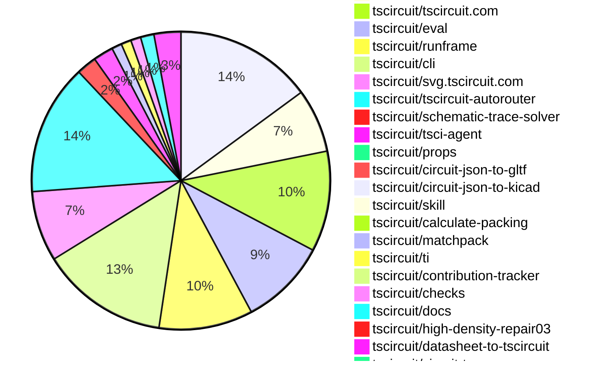

# Contribution Overview 2026-07-14

The current week is shown below. There are 3 major sections:

- [Contributor Overview](#contributor-overview)
- [PRs by Repository](#prs-by-repository)
- [PRs by Contributor](#changes-by-contributor)
- [Scoring & Sponsorship Details](/docs/sponsorship-calculation-explanation.md)

## PRs by Repository

## Contributor Overview

| Contributor | 🐳 Major | 🐙 Minor | 🐌 Tiny | Score | ⭐ | Discussion Contributions |
|-------------|---------|---------|---------|-------|-----|--------------------------|
| [ShiboSoftwareDev](#ShiboSoftwareDev) | 15 | 5 | 7 | 70.5 | ⭐⭐⭐ | 0🔹 0🔶 0💎 |
| [0hmX](#0hmX) | 6 | 1 | 5 | 32 | ⭐⭐ | 0🔹 0🔶 0💎 |
| [MustafaMulla29](#MustafaMulla29) | 4 | 0 | 8 | 25 | ⭐⭐ | 0🔹 0🔶 0💎 |
| [AnasSarkiz](#AnasSarkiz) | 2 | 1 | 1 | 25 | ⭐⭐ | 0🔹 0🔶 0💎 |
| [rushabhcodes](#rushabhcodes) | 3 | 0 | 4 | 18 | ⭐⭐ | 0🔹 0🔶 0💎 |
| [seveibar](#seveibar) | 1 | 5 | 0 | 15 | ⭐⭐ | 0🔹 0🔶 0💎 |
| [tscircuitbot](#tscircuitbot) | 0 | 0 | 197 | 14 | ⭐⭐ | 0🔹 0🔶 0💎 |
| [imrishabh18](#imrishabh18) | 1 | 2 | 3 | 12 | ⭐⭐ | 0🔹 0🔶 0💎 |
| [techmannih](#techmannih) | 0 | 2 | 7 | 12 | ⭐⭐ | 0🔹 0🔶 0💎 |
| [Abse2001](#Abse2001) | 2 | 0 | 1 | 9 | ⭐ | 0🔹 0🔶 0💎 |
| [anil08607](#anil08607) | 1 | 1 | 0 | 6 | ⭐ | 0🔹 0🔶 0💎 |
| [mohan-bee](#mohan-bee) | 0 | 0 | 3 | 4 | ⭐ | 0🔹 0🔶 0💎 |

## Staff Pass Ratio (SPR)

| Contributor | Reviewed PRs | Rejections | Approvals | SPR |
|-------------|--------------|------------|-----------|-----|
| [ShiboSoftwareDev](#ShiboSoftwareDev) | 12 | 0 | 13 | 100.0% |
| [MustafaMulla29](#MustafaMulla29) | 6 | 0 | 6 | 100.0% |
| [0hmX](#0hmX) | 4 | 1 | 4 | 75.0% |
| [Abse2001](#Abse2001) | 2 | 0 | 2 | 100.0% |
| [AnasSarkiz](#AnasSarkiz) | 2 | 0 | 2 | 100.0% |
| [imrishabh18](#imrishabh18) | 2 | 0 | 2 | 100.0% |
| [rushabhcodes](#rushabhcodes) | 2 | 1 | 1 | 50.0% |
| [techmannih](#techmannih) | 2 | 0 | 2 | 100.0% |
| [anil08607](#anil08607) | 1 | 0 | 1 | 100.0% |
| [GokulPandi-M](#GokulPandi-M) | 1 | 0 | 1 | 100.0% |

ShiboSoftwareDev SPR PRs (12)

- [#171](https://github.com/tscircuit/checks/pull/171) Fix rotated-pad and duplicate DRC reports
- [#1827](https://github.com/tscircuit/svg.tscircuit.com/pull/1827) Support selecting named simulation SVGs
- [#797](https://github.com/tscircuit/docs/pull/797) Document multiple analog simulations
- [#1659](https://github.com/tscircuit/tscircuit-autorouter/pull/1659) [156 DRC fixed in dataset 18] repair dense-terminal DRCs with via-in-pad transitions
- [#1658](https://github.com/tscircuit/tscircuit-autorouter/pull/1658) [-182 vias in dataset 18] Reduce multilayer vias by collapsing adjacent route sections
- [#1653](https://github.com/tscircuit/tscircuit-autorouter/pull/1653) Reduce post-route vias with safe geometry shortcuts
- [#1648](https://github.com/tscircuit/tscircuit-autorouter/pull/1648) Add CM5 10-layer fixture and Pipeline 7 support
- [#1632](https://github.com/tscircuit/tscircuit-autorouter/pull/1632) Expand high-density routing portfolio dynamically
- [#1645](https://github.com/tscircuit/tscircuit-autorouter/pull/1645) Reduce Dataset 18 DRC issue count by 70.6% with exact Pipeline7 repair
- [#1641](https://github.com/tscircuit/tscircuit-autorouter/pull/1641) Fix benchmark snapshot background zoom
- [#1643](https://github.com/tscircuit/tscircuit-autorouter/pull/1643) Restore PR benchmark arguments
- [#1642](https://github.com/tscircuit/tscircuit-autorouter/pull/1642) [41.6% reduction in DRC] Deduplicate autorouter DRC reports

MustafaMulla29 SPR PRs (6)

- [#738](https://github.com/tscircuit/props/pull/738) Add chip internal circuit prop and wrapper
- [#161](https://github.com/tscircuit/matchpack/pull/161) Align parallel passives sharing a common pin
- [#668](https://github.com/tscircuit/schematic-trace-solver/pull/668) Fix U-shaped endpoint obstacle detours
- [#669](https://github.com/tscircuit/schematic-trace-solver/pull/669) Fix routing past open obstacle sides
- [#666](https://github.com/tscircuit/schematic-trace-solver/pull/666) fix: route short direct traces around endpoint obstacles
- [#663](https://github.com/tscircuit/schematic-trace-solver/pull/663) Align same-net schematic rails during trace cleanup

0hmX SPR PRs (4)

- [#2671](https://github.com/tscircuit/core/pull/2671) feat: add differential pair autorouting constraints
- [#1669](https://github.com/tscircuit/tscircuit-autorouter/pull/1669) fix: prevent Pipeline 7 global DRC route distortion
- [#1663](https://github.com/tscircuit/tscircuit-autorouter/pull/1663) Improve benchmark result comparison layout
- [#1657](https://github.com/tscircuit/tscircuit-autorouter/pull/1657) Increase safe same-net via merge distance

Abse2001 SPR PRs (2)

- [#2681](https://github.com/tscircuit/core/pull/2681) Fix subcircuit autorouting to ignore descendant routing intent
- [#33](https://github.com/tscircuit/skill/pull/33) Add tsci check shorts to the CLI, checklist, and AI skill documentation

AnasSarkiz SPR PRs (2)

- [#170](https://github.com/tscircuit/checks/pull/170) Fix multiplicative missing-connection DRCs on branched source-trace networks
- [#7](https://github.com/tscircuit/tsci-agent/pull/7) Surface model request failures from the CLI

imrishabh18 SPR PRs (2)

- [#3946](https://github.com/tscircuit/tscircuit.com/pull/3946) fix: hide package SSR content during loading
- [#3727](https://github.com/tscircuit/cli/pull/3727) fix: autorouter diagnostic which get's triggered after 10sec of `tsci build` is making the build stuck

rushabhcodes SPR PRs (2)

- [#2696](https://github.com/tscircuit/core/pull/2696) Skip schematic phases for PCB-only Circuit JSON imports
- [#107](https://github.com/tscircuit/calculate-packing/pull/107) Fix fixed-component packing obstacles to respect PCB courtyards

techmannih SPR PRs (2)

- [#2678](https://github.com/tscircuit/core/pull/2678) Add Circuit JSON inflation support for simple switches
- [#3266](https://github.com/tscircuit/eval/pull/3266) Fix .kicad_sym imports from static asset URLs

anil08607 SPR PRs (1)

- [#108](https://github.com/tscircuit/calculate-packing/pull/108) Fix packing obstacles for rotated SMT pads

GokulPandi-M SPR PRs (1)

- [#3955](https://github.com/tscircuit/tscircuit.com/pull/3955) fix: resolve overlay bleed-through on search dropdown results

> Note: AI evaluates PRs and assigns 1-3 star ratings automatically. 4 and 5 star ratings require manual staff review.

### Discussion Contribution Legend

- 🔹 Normal Comments: Basic participation with minimal effort
- 🔶 Great Informative Comments: Thoughtful participation that adds value
- 💎 Incredible Comments: Exceptional participation with high-quality content

## Review Table

[reviews-received-hover]: ## "Number of reviews received for PRs for this contributor"
[approvals-received-hover]: ## "Number of approvals received for PRs this contributor authored"
[rejections-received-hover]: ## "Number of rejections received for PRs this contributor authored"
[prs-opened-hover]: ## "Number of PRs opened by this contributor"
[issues-created-hover]: ## "Number of issues created by this contributor"

| Contributor | Reviews Received | Approvals Received | Rejections Received | Approvals | Rejections Given | PRs Opened | PRs Merged | Issues Created |
|---|---|---|---|---|---|---|---|---|
| [0hmX](#0hmX) | 9 | 6 | 0 | 12 | 0 | 21 | 12 | 0 |
| [Abse2001](#Abse2001) | 5 | 4 | 0 | 0 | 0 | 4 | 3 | 0 |
| [AnasSarkiz](#AnasSarkiz) | 3 | 3 | 0 | 14 | 0 | 6 | 4 | 0 |
| [anil08607](#anil08607) | 4 | 4 | 0 | 0 | 0 | 3 | 2 | 0 |
| [GokulPandi-M](#GokulPandi-M) | 5 | 4 | 1 | 0 | 0 | 1 | 0 | 0 |
| [imrishabh18](#imrishabh18) | 2 | 2 | 0 | 2 | 2 | 9 | 7 | 0 |
| [kapookky123](#kapookky123) | 0 | 0 | 0 | 0 | 0 | 1 | 0 | 0 |
| [khozakhulile27-netizen](#khozakhulile27-netizen) | 0 | 0 | 0 | 0 | 0 | 1 | 0 | 0 |
| [mitre88](#mitre88) | 2 | 0 | 0 | 0 | 0 | 1 | 0 | 0 |
| [mohan-bee](#mohan-bee) | 4 | 3 | 1 | 2 | 0 | 4 | 3 | 0 |
| [MustafaMulla29](#MustafaMulla29) | 6 | 6 | 0 | 7 | 1 | 18 | 14 | 0 |
| [partyplatter08-lab](#partyplatter08-lab) | 0 | 0 | 0 | 0 | 0 | 1 | 0 | 0 |
| [rushabhcodes](#rushabhcodes) | 22 | 9 | 1 | 3 | 0 | 10 | 7 | 0 |
| [seveibar](#seveibar) | 4 | 1 | 0 | 42 | 1 | 9 | 8 | 0 |
| [ShiboSoftwareDev](#ShiboSoftwareDev) | 48 | 45 | 1 | 6 | 0 | 42 | 27 | 0 |
| [sureshchouksey8](#sureshchouksey8) | 0 | 0 | 0 | 0 | 0 | 1 | 0 | 0 |
| [techmannih](#techmannih) | 3 | 3 | 0 | 2 | 0 | 10 | 9 | 0 |
| [tscircuitbot](#tscircuitbot) | 0 | 0 | 0 | 0 | 0 | 226 | 197 | 0 |
| [Wandererchr](#Wandererchr) | 0 | 0 | 0 | 0 | 0 | 1 | 0 | 0 |

## Changes by Repository

### [tscircuit/tscircuit](https://github.com/tscircuit/tscircuit)

🐌 Tiny Contributions (41)

| PR # | Impact | Contributor | Description |
|------|--------|-------------|-------------|
| [#3999](https://github.com/tscircuit/tscircuit/pull/3999) | 🐌 Tiny | tscircuitbot | Automated package update |
| [#3998](https://github.com/tscircuit/tscircuit/pull/3998) | 🐌 Tiny | tscircuitbot | Automated package update |
| [#3997](https://github.com/tscircuit/tscircuit/pull/3997) | 🐌 Tiny | tscircuitbot | Automated package update |
| [#3996](https://github.com/tscircuit/tscircuit/pull/3996) | 🐌 Tiny | tscircuitbot | Automated package update |
| [#3995](https://github.com/tscircuit/tscircuit/pull/3995) | 🐌 Tiny | tscircuitbot | Automated package update |
| [#3994](https://github.com/tscircuit/tscircuit/pull/3994) | 🐌 Tiny | tscircuitbot | Automated package update |
| [#3993](https://github.com/tscircuit/tscircuit/pull/3993) | 🐌 Tiny | tscircuitbot | Automated package update |
| [#3992](https://github.com/tscircuit/tscircuit/pull/3992) | 🐌 Tiny | tscircuitbot | Automated package update |
| [#3991](https://github.com/tscircuit/tscircuit/pull/3991) | 🐌 Tiny | tscircuitbot | Automated package update |
| [#3990](https://github.com/tscircuit/tscircuit/pull/3990) | 🐌 Tiny | tscircuitbot | Automated package update |
| [#3989](https://github.com/tscircuit/tscircuit/pull/3989) | 🐌 Tiny | tscircuitbot | Updates the package version from 0.0.2099 to 0.0.2100 in package.json |
| [#3988](https://github.com/tscircuit/tscircuit/pull/3988) | 🐌 Tiny | tscircuitbot | Updates the tscircuitcli package to version 0.1.1687 |
| [#3987](https://github.com/tscircuit/tscircuit/pull/3987) | 🐌 Tiny | tscircuitbot | Automated package update |
| [#3986](https://github.com/tscircuit/tscircuit/pull/3986) | 🐌 Tiny | tscircuitbot | Automated package update |
| [#3985](https://github.com/tscircuit/tscircuit/pull/3985) | 🐌 Tiny | tscircuitbot | Automated package update |
| [#3984](https://github.com/tscircuit/tscircuit/pull/3984) | 🐌 Tiny | tscircuitbot | Updates the tscircuitcli package to version 0.1.1685 |
| [#3982](https://github.com/tscircuit/tscircuit/pull/3982) | 🐌 Tiny | tscircuitbot | Automated package update |
| [#3978](https://github.com/tscircuit/tscircuit/pull/3978) | 🐌 Tiny | tscircuitbot | Updates the tscircuitcli package version from 0.1.1681 to 0.1.1682 |
| [#3979](https://github.com/tscircuit/tscircuit/pull/3979) | 🐌 Tiny | tscircuitbot | Automated package update |
| [#3981](https://github.com/tscircuit/tscircuit/pull/3981) | 🐌 Tiny | tscircuitbot | Automated package update |
| [#3980](https://github.com/tscircuit/tscircuit/pull/3980) | 🐌 Tiny | tscircuitbot | Automated package update |
| [#3976](https://github.com/tscircuit/tscircuit/pull/3976) | 🐌 Tiny | tscircuitbot | Updates the tscircuitcli package from version 0.1.1680 to 0.1.1681 and the tscircuitrunframe package from version 0.0.2214 to 0.0.2215 in the package.json file. |
| [#3965](https://github.com/tscircuit/tscircuit/pull/3965) | 🐌 Tiny | tscircuitbot | Updates the tscircuitcli package from version 0.1.1676 to 0.1.1677 and the tscircuitrunframe package from version 0.0.2210 to 0.0.2211 in the package.json file |
| [#3968](https://github.com/tscircuit/tscircuit/pull/3968) | 🐌 Tiny | tscircuitbot | Automated package update |
| [#3966](https://github.com/tscircuit/tscircuit/pull/3966) | 🐌 Tiny | tscircuitbot | Automated package update |
| [#3959](https://github.com/tscircuit/tscircuit/pull/3959) | 🐌 Tiny | tscircuitbot | Updates the package version from 0.0.2085 to 0.0.2086 in package.json |
| [#3956](https://github.com/tscircuit/tscircuit/pull/3956) | 🐌 Tiny | tscircuitbot | Automated package update |
| [#3977](https://github.com/tscircuit/tscircuit/pull/3977) | 🐌 Tiny | tscircuitbot | Automated package update |
| [#3975](https://github.com/tscircuit/tscircuit/pull/3975) | 🐌 Tiny | tscircuitbot | Automated package update |
| [#3973](https://github.com/tscircuit/tscircuit/pull/3973) | 🐌 Tiny | tscircuitbot | Automated package update |
| [#3972](https://github.com/tscircuit/tscircuit/pull/3972) | 🐌 Tiny | tscircuitbot | Automated package update |
| [#3970](https://github.com/tscircuit/tscircuit/pull/3970) | 🐌 Tiny | tscircuitbot | Automated package update |
| [#3964](https://github.com/tscircuit/tscircuit/pull/3964) | 🐌 Tiny | tscircuitbot | Automated package update |
| [#3961](https://github.com/tscircuit/tscircuit/pull/3961) | 🐌 Tiny | tscircuitbot | Automated package update |
| [#3957](https://github.com/tscircuit/tscircuit/pull/3957) | 🐌 Tiny | tscircuitbot | Automated package update |
| [#3971](https://github.com/tscircuit/tscircuit/pull/3971) | 🐌 Tiny | tscircuitbot | Updates the package version from 0.0.2090 to 0.0.2091 in package.json |
| [#3967](https://github.com/tscircuit/tscircuit/pull/3967) | 🐌 Tiny | tscircuitbot | Automated package update |
| [#3963](https://github.com/tscircuit/tscircuit/pull/3963) | 🐌 Tiny | tscircuitbot | Automated package update |
| [#3960](https://github.com/tscircuit/tscircuit/pull/3960) | 🐌 Tiny | tscircuitbot | Automated package update |
| [#3974](https://github.com/tscircuit/tscircuit/pull/3974) | 🐌 Tiny | tscircuitbot | Automated package update |
| [#3958](https://github.com/tscircuit/tscircuit/pull/3958) | 🐌 Tiny | tscircuitbot | Automated package update |

### [tscircuit/core](https://github.com/tscircuit/core)

| PR # | Impact | Rating | Contributor | Description |
|------|--------|--------|-------------|-------------|
| [#2681](https://github.com/tscircuit/core/pull/2681) | 🐳 Major | ⭐⭐⭐ | Abse2001 | Fixes autorouting to prevent descendant routing intent from affecting the current subcircuits routing. |
| [#2706](https://github.com/tscircuit/core/pull/2706) | 🐳 Major | ⭐⭐⭐ | rushabhcodes | Fixes clearance violations for bridged solderjumper pads by ensuring port ids are resolved before the design rule check, preventing autorouting issues. |
| [#2705](https://github.com/tscircuit/core/pull/2705) | 🐳 Major | ⭐⭐⭐ | rushabhcodes | Adds a reproduction test capturing a case where a solderjumper with bridgedPins sits between two resistors connected by traces, confirming a bug in autorouting. |
| [#2671](https://github.com/tscircuit/core/pull/2671) | 🐳 Major | ⭐⭐⭐ | 0hmX | Add differential pair autorouting constraints to enhance routing capabilities for differential pairs in circuit designs. |
| [#2683](https://github.com/tscircuit/core/pull/2683) | 🐙 Minor | ⭐⭐ | seveibar | Restores the ability to provide both net and connection properties to netlabels in the schematic, fixing issues caused by a previous version of the props library. |
| [#2700](https://github.com/tscircuit/core/pull/2700) | 🐙 Minor | ⭐⭐ | imrishabh18 | Adds a schematicDisabled property to port rendering logic and updates kicadts and kicad-to-circuit-json dependencies to their latest versions. |
| [#2695](https://github.com/tscircuit/core/pull/2695) | 🐙 Minor | ⭐⭐ | ShiboSoftwareDev | Deduplicates PCB DRC errors in Cores circuit JSON by applying a deduplication function at the DRC aggregation boundary, ensuring only specific clearance diagnostics are reported while removing legacy overlap records. |
| [#2678](https://github.com/tscircuit/core/pull/2678) | 🐙 Minor | ⭐⭐ | techmannih | Add support for inflating simple switch components from Circuit JSON, enabling their use in subcircuits. |

🐌 Tiny Contributions (11)

| PR # | Impact | Contributor | Description |
|------|--------|-------------|-------------|
| [#2709](https://github.com/tscircuit/core/pull/2709) | 🐌 Tiny | tscircuitbot | Updates the tscircuitchecks package from version 0.0.144 to 0.0.145 |
| [#2684](https://github.com/tscircuit/core/pull/2684) | 🐌 Tiny | tscircuitbot | Updates the tscircuitchecks package from version 0.0.142 to 0.0.143 |
| [#2704](https://github.com/tscircuit/core/pull/2704) | 🐌 Tiny | mohan-bee | Fixes auto-layout overlap in schematic sheets by ensuring components, traces, and net labels inherit the correct sheet ID from connected components or ports. |
| [#2703](https://github.com/tscircuit/core/pull/2703) | 🐌 Tiny | mohan-bee | Fixes auto-layout overlap issue in schematic sheets when multiple components are rendered. |
| [#2708](https://github.com/tscircuit/core/pull/2708) | 🐌 Tiny | rushabhcodes | Adds a regression test to demonstrate that the autorouter can incorrectly route a trace through a closed solder jumper bridge, highlighting a flaw in obstacle detection. |
| [#2702](https://github.com/tscircuit/core/pull/2702) | 🐌 Tiny | rushabhcodes | Bumps calculate-packing from 0.0.77 to 0.0.78, adds a visual regression test for component courtyards, and updates packing snapshots to respect PCB courtyard bounds. |
| [#2691](https://github.com/tscircuit/core/pull/2691) | 🐌 Tiny | rushabhcodes | Updates the calculate-packing dependency to version 0.0.77 and modifies test cases to reflect changes in packing calculations. |
| [#2707](https://github.com/tscircuit/core/pull/2707) | 🐌 Tiny | MustafaMulla29 | Updates the version of the tscircuitmatchpack dependency from 0.0.34 to 0.0.38 in package.json |
| [#2701](https://github.com/tscircuit/core/pull/2701) | 🐌 Tiny | MustafaMulla29 | Updates the version of the schematic-trace-solver dependency from 0.0.98 to 0.0.99 in package.json |
| [#2685](https://github.com/tscircuit/core/pull/2685) | 🐌 Tiny | MustafaMulla29 | Updates the schematic-trace-solver dependency to version 0.0.98 and refreshes the associated snapshots in the project. |
| [#2680](https://github.com/tscircuit/core/pull/2680) | 🐌 Tiny | MustafaMulla29 | Updates the version of the schematic-trace-solver dependency from 0.0.96 to 0.0.97 in package.json |

### [tscircuit/tscircuit.com](https://github.com/tscircuit/tscircuit.com)

| PR # | Impact | Rating | Contributor | Description |
|------|--------|--------|-------------|-------------|
| [#3946](https://github.com/tscircuit/tscircuit.com/pull/3946) | 🐙 Minor | ⭐⭐ | imrishabh18 | Hides server-rendered package content during loading to prevent flashing of unhydrated SSR page and shows a loading overlay instead. |

🐌 Tiny Contributions (29)

| PR # | Impact | Contributor | Description |
|------|--------|-------------|-------------|
| [#3959](https://github.com/tscircuit/tscircuit.com/pull/3959) | 🐌 Tiny | tscircuitbot | Automated package update for tscircuitrunframe from version 0.0.2221 to 0.0.2222 |
| [#3958](https://github.com/tscircuit/tscircuit.com/pull/3958) | 🐌 Tiny | tscircuitbot | Updates the tscircuiteval package to version 0.0.1021 in the package.json file. |
| [#3957](https://github.com/tscircuit/tscircuit.com/pull/3957) | 🐌 Tiny | tscircuitbot | Updates the tscircuitrunframe package from version 0.0.2220 to 0.0.2221 |
| [#3956](https://github.com/tscircuit/tscircuit.com/pull/3956) | 🐌 Tiny | tscircuitbot | Updates the tscircuiteval package to version 0.0.1020 in the package.json file. |
| [#3954](https://github.com/tscircuit/tscircuit.com/pull/3954) | 🐌 Tiny | tscircuitbot | Updates the tscircuitrunframe package from version 0.0.2219 to 0.0.2220 |
| [#3953](https://github.com/tscircuit/tscircuit.com/pull/3953) | 🐌 Tiny | tscircuitbot | Updates the tscircuiteval package from version 0.0.1018 to 0.0.1019 |
| [#3952](https://github.com/tscircuit/tscircuit.com/pull/3952) | 🐌 Tiny | tscircuitbot | Automated package update |
| [#3951](https://github.com/tscircuit/tscircuit.com/pull/3951) | 🐌 Tiny | tscircuitbot | Automated package update |
| [#3950](https://github.com/tscircuit/tscircuit.com/pull/3950) | 🐌 Tiny | tscircuitbot | Updates the tscircuitrunframe package from version 0.0.2217 to 0.0.2218 |
| [#3949](https://github.com/tscircuit/tscircuit.com/pull/3949) | 🐌 Tiny | tscircuitbot | Updates the tscircuiteval package from version 0.0.1016 to 0.0.1017 |
| [#3945](https://github.com/tscircuit/tscircuit.com/pull/3945) | 🐌 Tiny | tscircuitbot | Automated package update |
| [#3944](https://github.com/tscircuit/tscircuit.com/pull/3944) | 🐌 Tiny | tscircuitbot | Updates the tscircuiteval package from version 0.0.1015 to 0.0.1016 |
| [#3942](https://github.com/tscircuit/tscircuit.com/pull/3942) | 🐌 Tiny | tscircuitbot | Updates the tscircuiteval package from version 0.0.1014 to 0.0.1015 in the package.json file. |
| [#3943](https://github.com/tscircuit/tscircuit.com/pull/3943) | 🐌 Tiny | tscircuitbot | Updates the tscircuitrunframe package from version 0.0.2215 to 0.0.2216 |
| [#3937](https://github.com/tscircuit/tscircuit.com/pull/3937) | 🐌 Tiny | tscircuitbot | Updates the tscircuitrunframe package from version 0.0.2212 to 0.0.2213 |
| [#3941](https://github.com/tscircuit/tscircuit.com/pull/3941) | 🐌 Tiny | tscircuitbot | Updates the tscircuitrunframe package from version 0.0.2214 to 0.0.2215 |
| [#3939](https://github.com/tscircuit/tscircuit.com/pull/3939) | 🐌 Tiny | tscircuitbot | Updates the tscircuitrunframe package from version 0.0.2213 to 0.0.2214 |
| [#3938](https://github.com/tscircuit/tscircuit.com/pull/3938) | 🐌 Tiny | tscircuitbot | Updates the tscircuiteval package from version 0.0.1013 to 0.0.1014 |
| [#3936](https://github.com/tscircuit/tscircuit.com/pull/3936) | 🐌 Tiny | tscircuitbot | Updates the tscircuiteval package from version 0.0.1012 to 0.0.1013 |
| [#3935](https://github.com/tscircuit/tscircuit.com/pull/3935) | 🐌 Tiny | tscircuitbot | Automated package update |
| [#3934](https://github.com/tscircuit/tscircuit.com/pull/3934) | 🐌 Tiny | tscircuitbot | Automated package update |
| [#3933](https://github.com/tscircuit/tscircuit.com/pull/3933) | 🐌 Tiny | tscircuitbot | Automated package update |
| [#3932](https://github.com/tscircuit/tscircuit.com/pull/3932) | 🐌 Tiny | tscircuitbot | Updates the tscircuiteval package from version 0.0.1010 to 0.0.1011 |
| [#3931](https://github.com/tscircuit/tscircuit.com/pull/3931) | 🐌 Tiny | tscircuitbot | Automated package update |
| [#3930](https://github.com/tscircuit/tscircuit.com/pull/3930) | 🐌 Tiny | tscircuitbot | Updates the tscircuiteval package from version 0.0.1009 to 0.0.1010 |
| [#3929](https://github.com/tscircuit/tscircuit.com/pull/3929) | 🐌 Tiny | tscircuitbot | Updates the tscircuitrunframe package from version 0.0.2208 to 0.0.2209 |
| [#3928](https://github.com/tscircuit/tscircuit.com/pull/3928) | 🐌 Tiny | tscircuitbot | Updates the tscircuiteval package from version 0.0.1008 to 0.0.1009 |
| [#3948](https://github.com/tscircuit/tscircuit.com/pull/3948) | 🐌 Tiny | techmannih | Updates the tscircuit dependency to version 0.0.2099 for direct support of kicad_mod and kicad_sym files. |
| [#3940](https://github.com/tscircuit/tscircuit.com/pull/3940) | 🐌 Tiny | techmannih | Updates the tscircuit dependency version from 0.0.2082 to 0.0.2096 in package.json |

### [tscircuit/eval](https://github.com/tscircuit/eval)

| PR # | Impact | Rating | Contributor | Description |
|------|--------|--------|-------------|-------------|
| [#3266](https://github.com/tscircuit/eval/pull/3266) | 🐙 Minor | ⭐⭐ | techmannih | Fixes .kicad_sym imports when RunFrame or CLI represents the file as __STATIC_ASSET__ or a browser blob: URL. |

🐌 Tiny Contributions (25)

| PR # | Impact | Contributor | Description |
|------|--------|-------------|-------------|
| [#3293](https://github.com/tscircuit/eval/pull/3293) | 🐌 Tiny | tscircuitbot | Automated package update |
| [#3292](https://github.com/tscircuit/eval/pull/3292) | 🐌 Tiny | tscircuitbot | Updates the version of the tscircuitcore package from 0.0.1458 to 0.0.1459 in package.json |
| [#3289](https://github.com/tscircuit/eval/pull/3289) | 🐌 Tiny | tscircuitbot | Automated package update |
| [#3288](https://github.com/tscircuit/eval/pull/3288) | 🐌 Tiny | tscircuitbot | Updates package versions in package.json to their latest compatible versions. |
| [#3286](https://github.com/tscircuit/eval/pull/3286) | 🐌 Tiny | tscircuitbot | Automated package update |
| [#3285](https://github.com/tscircuit/eval/pull/3285) | 🐌 Tiny | tscircuitbot | Automated package update |
| [#3281](https://github.com/tscircuit/eval/pull/3281) | 🐌 Tiny | tscircuitbot | Automated package update |
| [#3277](https://github.com/tscircuit/eval/pull/3277) | 🐌 Tiny | tscircuitbot | Automated package update |
| [#3276](https://github.com/tscircuit/eval/pull/3276) | 🐌 Tiny | tscircuitbot | Updates package versions in package.json to the latest compatible versions. |
| [#3274](https://github.com/tscircuit/eval/pull/3274) | 🐌 Tiny | tscircuitbot | Automated package update |
| [#3273](https://github.com/tscircuit/eval/pull/3273) | 🐌 Tiny | tscircuitbot | Automated package update |
| [#3267](https://github.com/tscircuit/eval/pull/3267) | 🐌 Tiny | tscircuitbot | Automated package update |
| [#3258](https://github.com/tscircuit/eval/pull/3258) | 🐌 Tiny | tscircuitbot | Updates the version of the tscircuitcore package from 0.0.1447 to 0.0.1448 in package.json |
| [#3262](https://github.com/tscircuit/eval/pull/3262) | 🐌 Tiny | tscircuitbot | Automated package update to version 0.0.1013 |
| [#3261](https://github.com/tscircuit/eval/pull/3261) | 🐌 Tiny | tscircuitbot | Updates the version of the tscircuitcore package from 0.0.1448 to 0.0.1449 in package.json |
| [#3263](https://github.com/tscircuit/eval/pull/3263) | 🐌 Tiny | tscircuitbot | Automated package update |
| [#3259](https://github.com/tscircuit/eval/pull/3259) | 🐌 Tiny | tscircuitbot | Automated package update |
| [#3256](https://github.com/tscircuit/eval/pull/3256) | 🐌 Tiny | tscircuitbot | Automated package update |
| [#3255](https://github.com/tscircuit/eval/pull/3255) | 🐌 Tiny | tscircuitbot | Automated package update |
| [#3253](https://github.com/tscircuit/eval/pull/3253) | 🐌 Tiny | tscircuitbot | Automated package update |
| [#3250](https://github.com/tscircuit/eval/pull/3250) | 🐌 Tiny | tscircuitbot | Automated package update |
| [#3249](https://github.com/tscircuit/eval/pull/3249) | 🐌 Tiny | tscircuitbot | Automated package update |
| [#3252](https://github.com/tscircuit/eval/pull/3252) | 🐌 Tiny | tscircuitbot | Automated package update |
| [#3280](https://github.com/tscircuit/eval/pull/3280) | 🐌 Tiny | rushabhcodes | Updates the version of the tscircuitcore dependency from 0.0.1454 to 0.0.1455 in package.json |
| [#3247](https://github.com/tscircuit/eval/pull/3247) | 🐌 Tiny | techmannih | Updates the kicad-to-circuit-json and kicadts dependencies to newer versions in package.json |

### [tscircuit/runframe](https://github.com/tscircuit/runframe)

🐌 Tiny Contributions (28)

| PR # | Impact | Contributor | Description |
|------|--------|-------------|-------------|
| [#4024](https://github.com/tscircuit/runframe/pull/4024) | 🐌 Tiny | tscircuitbot | Automated package update |
| [#4023](https://github.com/tscircuit/runframe/pull/4023) | 🐌 Tiny | tscircuitbot | Updates the tscircuiteval package from version 0.0.1020 to 0.0.1021 in the package.json file. |
| [#4022](https://github.com/tscircuit/runframe/pull/4022) | 🐌 Tiny | tscircuitbot | Automated package update |
| [#4021](https://github.com/tscircuit/runframe/pull/4021) | 🐌 Tiny | tscircuitbot | Automated package update |
| [#4020](https://github.com/tscircuit/runframe/pull/4020) | 🐌 Tiny | tscircuitbot | Automated package update |
| [#4019](https://github.com/tscircuit/runframe/pull/4019) | 🐌 Tiny | tscircuitbot | Updates the tscircuiteval package to version 0.0.1019 in the package.json file. |
| [#4018](https://github.com/tscircuit/runframe/pull/4018) | 🐌 Tiny | tscircuitbot | Automated package update |
| [#4017](https://github.com/tscircuit/runframe/pull/4017) | 🐌 Tiny | tscircuitbot | Updates the tscircuiteval package from version 0.0.1017 to 0.0.1018 |
| [#4016](https://github.com/tscircuit/runframe/pull/4016) | 🐌 Tiny | tscircuitbot | Automated package update |
| [#4015](https://github.com/tscircuit/runframe/pull/4015) | 🐌 Tiny | tscircuitbot | Updates the tscircuiteval package to version 0.0.1017 in the package.json file. |
| [#4013](https://github.com/tscircuit/runframe/pull/4013) | 🐌 Tiny | tscircuitbot | Automated package update |
| [#4012](https://github.com/tscircuit/runframe/pull/4012) | 🐌 Tiny | tscircuitbot | Updates the tscircuiteval package from version 0.0.1015 to 0.0.1016 in the package.json file. |
| [#4011](https://github.com/tscircuit/runframe/pull/4011) | 🐌 Tiny | tscircuitbot | Automated package update |
| [#4010](https://github.com/tscircuit/runframe/pull/4010) | 🐌 Tiny | tscircuitbot | Updates the tscircuiteval package from version 0.0.1014 to 0.0.1015 in the package.json file. |
| [#4003](https://github.com/tscircuit/runframe/pull/4003) | 🐌 Tiny | tscircuitbot | Automated package update |
| [#4009](https://github.com/tscircuit/runframe/pull/4009) | 🐌 Tiny | tscircuitbot | Automated package update |
| [#4007](https://github.com/tscircuit/runframe/pull/4007) | 🐌 Tiny | tscircuitbot | Automated package update |
| [#4005](https://github.com/tscircuit/runframe/pull/4005) | 🐌 Tiny | tscircuitbot | Automated package update |
| [#4004](https://github.com/tscircuit/runframe/pull/4004) | 🐌 Tiny | tscircuitbot | Updates the tscircuiteval package from version 0.0.1012 to 0.0.1013 in the project dependencies. |
| [#4002](https://github.com/tscircuit/runframe/pull/4002) | 🐌 Tiny | tscircuitbot | Updates the tscircuiteval package from version 0.0.1011 to 0.0.1012 in the package.json file. |
| [#4000](https://github.com/tscircuit/runframe/pull/4000) | 🐌 Tiny | tscircuitbot | Automated package update |
| [#3999](https://github.com/tscircuit/runframe/pull/3999) | 🐌 Tiny | tscircuitbot | Updates the tscircuiteval package from version 0.0.1010 to 0.0.1011 in the package.json file. |
| [#3998](https://github.com/tscircuit/runframe/pull/3998) | 🐌 Tiny | tscircuitbot | Automated package update |
| [#3996](https://github.com/tscircuit/runframe/pull/3996) | 🐌 Tiny | tscircuitbot | Automated package update |
| [#3995](https://github.com/tscircuit/runframe/pull/3995) | 🐌 Tiny | tscircuitbot | Updates the tscircuiteval package from version 0.0.1008 to 0.0.1009 in the package.json file. |
| [#4006](https://github.com/tscircuit/runframe/pull/4006) | 🐌 Tiny | tscircuitbot | Updates the tscircuiteval package from version 0.0.1013 to 0.0.1014 in the package.json file. |
| [#3997](https://github.com/tscircuit/runframe/pull/3997) | 🐌 Tiny | tscircuitbot | Updates the tscircuiteval package from version 0.0.1009 to 0.0.1010 in the project dependencies. |
| [#4008](https://github.com/tscircuit/runframe/pull/4008) | 🐌 Tiny | techmannih | Adds support for KiCad symbol files by treating them as dynamic content in the file path handling. |

### [tscircuit/cli](https://github.com/tscircuit/cli)

| PR # | Impact | Rating | Contributor | Description |
|------|--------|--------|-------------|-------------|
| [#3727](https://github.com/tscircuit/cli/pull/3727) | 🐳 Major | ⭐⭐⭐ | imrishabh18 | Fixes the issue where the build gets stuck due to repeated reads O(n2) with high memory consumption during autorouter diagnostics. |

🐌 Tiny Contributions (37)

| PR # | Impact | Contributor | Description |
|------|--------|-------------|-------------|
| [#3738](https://github.com/tscircuit/cli/pull/3738) | 🐌 Tiny | tscircuitbot | Automated package update |
| [#3737](https://github.com/tscircuit/cli/pull/3737) | 🐌 Tiny | tscircuitbot | Updates the tscircuitrunframe package from version 0.0.2221 to 0.0.2222 |
| [#3736](https://github.com/tscircuit/cli/pull/3736) | 🐌 Tiny | tscircuitbot | Automated package update |
| [#3735](https://github.com/tscircuit/cli/pull/3735) | 🐌 Tiny | tscircuitbot | Updates the tscircuitrunframe package version from 0.0.2220 to 0.0.2221 |
| [#3734](https://github.com/tscircuit/cli/pull/3734) | 🐌 Tiny | tscircuitbot | Automated package update |
| [#3733](https://github.com/tscircuit/cli/pull/3733) | 🐌 Tiny | tscircuitbot | Updates the tscircuitrunframe package to version 0.0.2220 |
| [#3732](https://github.com/tscircuit/cli/pull/3732) | 🐌 Tiny | tscircuitbot | Automated package update |
| [#3731](https://github.com/tscircuit/cli/pull/3731) | 🐌 Tiny | tscircuitbot | Updates the tscircuitrunframe package from version 0.0.2218 to 0.0.2219 |
| [#3730](https://github.com/tscircuit/cli/pull/3730) | 🐌 Tiny | tscircuitbot | Automated package update |
| [#3729](https://github.com/tscircuit/cli/pull/3729) | 🐌 Tiny | tscircuitbot | Updates the tscircuitrunframe package to version 0.0.2218 |
| [#3726](https://github.com/tscircuit/cli/pull/3726) | 🐌 Tiny | tscircuitbot | Automated package update |
| [#3725](https://github.com/tscircuit/cli/pull/3725) | 🐌 Tiny | tscircuitbot | Updates the tscircuitrunframe package from version 0.0.2216 to 0.0.2217 |
| [#3724](https://github.com/tscircuit/cli/pull/3724) | 🐌 Tiny | tscircuitbot | Automated package update |
| [#3722](https://github.com/tscircuit/cli/pull/3722) | 🐌 Tiny | tscircuitbot | Automated package update |
| [#3721](https://github.com/tscircuit/cli/pull/3721) | 🐌 Tiny | tscircuitbot | Automated package update |
| [#3720](https://github.com/tscircuit/cli/pull/3720) | 🐌 Tiny | tscircuitbot | Updates the tscircuitrunframe package from version 0.0.2215 to 0.0.2216 |
| [#3719](https://github.com/tscircuit/cli/pull/3719) | 🐌 Tiny | tscircuitbot | Automated package update |
| [#3718](https://github.com/tscircuit/cli/pull/3718) | 🐌 Tiny | tscircuitbot | Automated README update with latest CLI usage output. |
| [#3699](https://github.com/tscircuit/cli/pull/3699) | 🐌 Tiny | tscircuitbot | Updates the tscircuitrunframe package from version 0.0.2208 to 0.0.2209 |
| [#3716](https://github.com/tscircuit/cli/pull/3716) | 🐌 Tiny | tscircuitbot | Automated package update |
| [#3715](https://github.com/tscircuit/cli/pull/3715) | 🐌 Tiny | tscircuitbot | Updates the tscircuitrunframe package from version 0.0.2214 to 0.0.2215 |
| [#3712](https://github.com/tscircuit/cli/pull/3712) | 🐌 Tiny | tscircuitbot | Updates the tscircuitrunframe package from version 0.0.2213 to 0.0.2214 |
| [#3711](https://github.com/tscircuit/cli/pull/3711) | 🐌 Tiny | tscircuitbot | Automated package update |
| [#3710](https://github.com/tscircuit/cli/pull/3710) | 🐌 Tiny | tscircuitbot | Updates the tscircuitrunframe package from version 0.0.2212 to 0.0.2213 |
| [#3709](https://github.com/tscircuit/cli/pull/3709) | 🐌 Tiny | tscircuitbot | Automated package update |
| [#3708](https://github.com/tscircuit/cli/pull/3708) | 🐌 Tiny | tscircuitbot | Updates the tscircuitrunframe package to version 0.0.2212 in package.json |
| [#3707](https://github.com/tscircuit/cli/pull/3707) | 🐌 Tiny | tscircuitbot | Automated package update |
| [#3706](https://github.com/tscircuit/cli/pull/3706) | 🐌 Tiny | tscircuitbot | Updates the tscircuitrunframe package from version 0.0.2210 to 0.0.2211 |
| [#3703](https://github.com/tscircuit/cli/pull/3703) | 🐌 Tiny | tscircuitbot | Automated package update |
| [#3700](https://github.com/tscircuit/cli/pull/3700) | 🐌 Tiny | tscircuitbot | Automated package update |
| [#3713](https://github.com/tscircuit/cli/pull/3713) | 🐌 Tiny | tscircuitbot | Automated package update |
| [#3704](https://github.com/tscircuit/cli/pull/3704) | 🐌 Tiny | tscircuitbot | Updates the tscircuitrunframe package from version 0.0.2209 to 0.0.2210 |
| [#3701](https://github.com/tscircuit/cli/pull/3701) | 🐌 Tiny | tscircuitbot | Automated README update with latest CLI usage output. |
| [#3717](https://github.com/tscircuit/cli/pull/3717) | 🐌 Tiny | Abse2001 | Updates the dependency version of tscircuitcheck-shorts from 0.0.10 to 0.0.12 in package.json |
| [#3723](https://github.com/tscircuit/cli/pull/3723) | 🐌 Tiny | imrishabh18 | Updates the tscircuiteval package from version 0.0.1008 to 0.0.1015 in package.json |
| [#3698](https://github.com/tscircuit/cli/pull/3698) | 🐌 Tiny | ShiboSoftwareDev | Updates the version of the tscircuiteval and tscircuit dependencies in package.json |
| [#3714](https://github.com/tscircuit/cli/pull/3714) | 🐌 Tiny | techmannih | Adds a KiCad symbol example to the project, including a new symbol definition and its integration into the existing component structure. |

### [tscircuit/svg.tscircuit.com](https://github.com/tscircuit/svg.tscircuit.com)

| PR # | Impact | Rating | Contributor | Description |
|------|--------|--------|-------------|-------------|
| [#1827](https://github.com/tscircuit/svg.tscircuit.com/pull/1827) | 🐙 Minor | ⭐⭐ | ShiboSoftwareDev | Allows users to select an analog simulation by experiment name or Circuit JSON id, generating distinct URLs for each simulation on the homepage and preserving rendering of the first experiment when no selector is supplied. |

🐌 Tiny Contributions (20)

| PR # | Impact | Contributor | Description |
|------|--------|-------------|-------------|
| [#1842](https://github.com/tscircuit/svg.tscircuit.com/pull/1842) | 🐌 Tiny | tscircuitbot | Updates the tscircuit package version from 0.0.2104 to 0.0.2105 in package.json |
| [#1841](https://github.com/tscircuit/svg.tscircuit.com/pull/1841) | 🐌 Tiny | tscircuitbot | Updates the tscircuit package version from 0.0.2103 to 0.0.2104 in package.json |
| [#1840](https://github.com/tscircuit/svg.tscircuit.com/pull/1840) | 🐌 Tiny | tscircuitbot | Updates the tscircuit package version from 0.0.2102 to 0.0.2103 in package.json |
| [#1839](https://github.com/tscircuit/svg.tscircuit.com/pull/1839) | 🐌 Tiny | tscircuitbot | Updates the tscircuit package version from 0.0.2101 to 0.0.2102 in package.json |
| [#1838](https://github.com/tscircuit/svg.tscircuit.com/pull/1838) | 🐌 Tiny | tscircuitbot | Updates the tscircuit package version from 0.0.2100 to 0.0.2101 in package.json |
| [#1837](https://github.com/tscircuit/svg.tscircuit.com/pull/1837) | 🐌 Tiny | tscircuitbot | Updates the tscircuit package version from 0.0.2099 to 0.0.2100 in package.json |
| [#1836](https://github.com/tscircuit/svg.tscircuit.com/pull/1836) | 🐌 Tiny | tscircuitbot | Updates the tscircuit package version from 0.0.2098 to 0.0.2099 in package.json |
| [#1835](https://github.com/tscircuit/svg.tscircuit.com/pull/1835) | 🐌 Tiny | tscircuitbot | Updates the tscircuit package version from 0.0.2097 to 0.0.2098 in package.json |
| [#1834](https://github.com/tscircuit/svg.tscircuit.com/pull/1834) | 🐌 Tiny | tscircuitbot | Updates the tscircuit package version from 0.0.2096 to 0.0.2097 in package.json |
| [#1833](https://github.com/tscircuit/svg.tscircuit.com/pull/1833) | 🐌 Tiny | tscircuitbot | Updates the tscircuit package version from 0.0.2094 to 0.0.2096 in package.json |
| [#1832](https://github.com/tscircuit/svg.tscircuit.com/pull/1832) | 🐌 Tiny | tscircuitbot | Updates the tscircuit package version from 0.0.2093 to 0.0.2094 in package.json |
| [#1831](https://github.com/tscircuit/svg.tscircuit.com/pull/1831) | 🐌 Tiny | tscircuitbot | Updates the tscircuit package version from 0.0.2092 to 0.0.2093 in package.json |
| [#1830](https://github.com/tscircuit/svg.tscircuit.com/pull/1830) | 🐌 Tiny | tscircuitbot | Updates the tscircuit package version from 0.0.2091 to 0.0.2092 in package.json |
| [#1829](https://github.com/tscircuit/svg.tscircuit.com/pull/1829) | 🐌 Tiny | tscircuitbot | Updates the tscircuit package version from 0.0.2090 to 0.0.2091 in package.json |
| [#1828](https://github.com/tscircuit/svg.tscircuit.com/pull/1828) | 🐌 Tiny | tscircuitbot | Updates the tscircuit package version from 0.0.2089 to 0.0.2090 in package.json |
| [#1826](https://github.com/tscircuit/svg.tscircuit.com/pull/1826) | 🐌 Tiny | tscircuitbot | Updates the tscircuit package version from 0.0.2088 to 0.0.2089 in package.json |
| [#1825](https://github.com/tscircuit/svg.tscircuit.com/pull/1825) | 🐌 Tiny | tscircuitbot | Updates the tscircuit package version from 0.0.2087 to 0.0.2088 in package.json |
| [#1824](https://github.com/tscircuit/svg.tscircuit.com/pull/1824) | 🐌 Tiny | tscircuitbot | Updates the tscircuit package version from 0.0.2086 to 0.0.2087 in package.json |
| [#1823](https://github.com/tscircuit/svg.tscircuit.com/pull/1823) | 🐌 Tiny | tscircuitbot | Updates the tscircuit package version from 0.0.2085 to 0.0.2086 in package.json |
| [#1822](https://github.com/tscircuit/svg.tscircuit.com/pull/1822) | 🐌 Tiny | tscircuitbot | Updates the tscircuit package version from 0.0.2084 to 0.0.2085 in package.json |

### [tscircuit/tscircuit-autorouter](https://github.com/tscircuit/tscircuit-autorouter)

| PR # | Impact | Rating | Contributor | Description |
|------|--------|--------|-------------|-------------|
| [#1631](https://github.com/tscircuit/tscircuit-autorouter/pull/1631) | 🐳 Major | ⭐⭐⭐ | seveibar | Show trace counts and DRC issue counts on every benchmark snapshot card, make the existing fullscreen control fill the browser viewport without entering browser fullscreen mode, keep zoomed snapshots sharp by zooming the inline SVG through its viewBox, and remove connection-pointport markers from snapshot SVGs. |
| [#1658](https://github.com/tscircuit/tscircuit-autorouter/pull/1658) | 🐳 Major | ⭐⭐⭐ | ShiboSoftwareDev | Reduces the number of multilayer vias by collapsing adjacent route sections when the geometry allows, optimizing the routing process. |
| [#1653](https://github.com/tscircuit/tscircuit-autorouter/pull/1653) | 🐳 Major | ⭐⭐⭐ | ShiboSoftwareDev | Reduces the number of vias in autorouting by optimizing layer transitions and applying geometric shortcuts, improving routing efficiency without introducing new global routing processes. |
| [#1632](https://github.com/tscircuit/tscircuit-autorouter/pull/1632) | 🐳 Major | ⭐⭐⭐ | ShiboSoftwareDev | Removes the fixed 8,000-round inner high-density cap and dynamically expands the routing portfolio based on candidate budgets, improving routing efficiency and accuracy. |
| [#1645](https://github.com/tscircuit/tscircuit-autorouter/pull/1645) | 🐳 Major | ⭐⭐⭐ | ShiboSoftwareDev | Reduces DRC issue count in Dataset 18 by 70.6 through an exact repair process in Pipeline7, improving pass rates for multiple datasets. |
| [#1649](https://github.com/tscircuit/tscircuit-autorouter/pull/1649) | 🐳 Major | ⭐⭐⭐ | ShiboSoftwareDev | Replaces the previous via-border-pressure experiment with an exact-DRC-gated repair portfolio, utilizing a normal 32-iteration exact cleanup as the baseline and implementing a broad repulsion strategy only when violations remain, ensuring that the final output is strictly better than the baseline. |
| [#1642](https://github.com/tscircuit/tscircuit-autorouter/pull/1642) | 🐳 Major | ⭐⭐⭐ | ShiboSoftwareDev | Deduplicates autorouter DRC reports by applying a shared helper to eliminate duplicate records in the DRC results, improving the accuracy of error reporting. |
| [#1669](https://github.com/tscircuit/tscircuit-autorouter/pull/1669) | 🐳 Major | ⭐⭐⭐ | 0hmX | Fixes global DRC route distortion in Pipeline 7 of the autorouting system. |
| [#1657](https://github.com/tscircuit/tscircuit-autorouter/pull/1657) | 🐳 Major | ⭐⭐⭐ | 0hmX | Increases the nearby same-net via merge distance multiplier from 1.5 to 2.5, allowing for consolidation of 0.745 mm-spaced vias while retaining existing trace and obstacle clearance checks. |
| [#1651](https://github.com/tscircuit/tscircuit-autorouter/pull/1651) | 🐳 Major | ⭐⭐⭐ | 0hmX | Updates the length matching solver to a new commit, enabling trace-width-aware automatic meander clearance and maintaining Pipeline 7 without explicit meander settings. |
| [#1636](https://github.com/tscircuit/tscircuit-autorouter/pull/1636) | 🐳 Major | ⭐⭐⭐ | AnasSarkiz | Fixes the issue of missing-connection design rule checks (DRCs) that were multiplicative in nature, leading to incorrect error reporting in the autorouting process. |
| [#1641](https://github.com/tscircuit/tscircuit-autorouter/pull/1641) | 🐙 Minor | ⭐⭐ | ShiboSoftwareDev | Fixes the background alignment issue in benchmark snapshots by normalizing the SVG root background to the original viewBox coordinates, ensuring it zooms and pans correctly with the circuit geometry. |
| [#1643](https://github.com/tscircuit/tscircuit-autorouter/pull/1643) | 🐙 Minor | ⭐⭐ | ShiboSoftwareDev | Restores the ability to pass arguments to the benchmark command in the GitHub Actions workflow, allowing users to specify options for benchmark execution. |
| [#1663](https://github.com/tscircuit/tscircuit-autorouter/pull/1663) | 🐙 Minor | ⭐⭐ | 0hmX | Show the matching previous main-run summary directly above the PR summary, keep per-sample benchmark results collapsed below the comparison tables, show a concise unavailable message when a dataset has no stored main baseline, and distinguish previous-main and PR profile sections. |

🐌 Tiny Contributions (25)

| PR # | Impact | Contributor | Description |
|------|--------|-------------|-------------|
| [#1676](https://github.com/tscircuit/tscircuit-autorouter/pull/1676) | 🐌 Tiny | tscircuitbot | Automated package update |
| [#1673](https://github.com/tscircuit/tscircuit-autorouter/pull/1673) | 🐌 Tiny | tscircuitbot | Automated package update |
| [#1671](https://github.com/tscircuit/tscircuit-autorouter/pull/1671) | 🐌 Tiny | tscircuitbot | Automated package update |
| [#1666](https://github.com/tscircuit/tscircuit-autorouter/pull/1666) | 🐌 Tiny | tscircuitbot | Automated package update |
| [#1664](https://github.com/tscircuit/tscircuit-autorouter/pull/1664) | 🐌 Tiny | tscircuitbot | Automated package update |
| [#1662](https://github.com/tscircuit/tscircuit-autorouter/pull/1662) | 🐌 Tiny | tscircuitbot | Automated package update |
| [#1661](https://github.com/tscircuit/tscircuit-autorouter/pull/1661) | 🐌 Tiny | tscircuitbot | Automated package update |
| [#1652](https://github.com/tscircuit/tscircuit-autorouter/pull/1652) | 🐌 Tiny | tscircuitbot | Automated package update |
| [#1654](https://github.com/tscircuit/tscircuit-autorouter/pull/1654) | 🐌 Tiny | tscircuitbot | Automated package update |
| [#1656](https://github.com/tscircuit/tscircuit-autorouter/pull/1656) | 🐌 Tiny | tscircuitbot | Automated package update |
| [#1647](https://github.com/tscircuit/tscircuit-autorouter/pull/1647) | 🐌 Tiny | tscircuitbot | Automated package update |
| [#1640](https://github.com/tscircuit/tscircuit-autorouter/pull/1640) | 🐌 Tiny | tscircuitbot | Automated package update |
| [#1639](https://github.com/tscircuit/tscircuit-autorouter/pull/1639) | 🐌 Tiny | tscircuitbot | Automated package update |
| [#1637](https://github.com/tscircuit/tscircuit-autorouter/pull/1637) | 🐌 Tiny | tscircuitbot | Automated package update |
| [#1634](https://github.com/tscircuit/tscircuit-autorouter/pull/1634) | 🐌 Tiny | tscircuitbot | Automated package update |
| [#1650](https://github.com/tscircuit/tscircuit-autorouter/pull/1650) | 🐌 Tiny | tscircuitbot | Automated package update |
| [#1644](https://github.com/tscircuit/tscircuit-autorouter/pull/1644) | 🐌 Tiny | tscircuitbot | Automated package update |
| [#1638](https://github.com/tscircuit/tscircuit-autorouter/pull/1638) | 🐌 Tiny | tscircuitbot | Automated package update |
| [#1646](https://github.com/tscircuit/tscircuit-autorouter/pull/1646) | 🐌 Tiny | tscircuitbot | Automated package update |
| [#1675](https://github.com/tscircuit/tscircuit-autorouter/pull/1675) | 🐌 Tiny | ShiboSoftwareDev | Add a new command benchmark-long to allow long-running PR benchmarks with an increased timeout and worker configuration. |
| [#1635](https://github.com/tscircuit/tscircuit-autorouter/pull/1635) | 🐌 Tiny | ShiboSoftwareDev | What changed rename HyperSingleIntraNodeSolver to PortfolioSingleIntraNodeSolver rename the cached wrapper consistently update production imports, debugger types, diagnostics, and tests to use the portfolio terminology keep the previous class names and direct import paths as deprecated aliases  Why Follow-up to 1632. This solver coordinates a fitness-scheduled portfolio whose search breadth can expand dynamically. Calling it a Hyper solver implied the more predictableformal iteration allocation used by the hyperparameter supervisors elsewhere in the codebase. PortfolioSingleIntraNodeSolver describes its responsibility without implying those iteration-allocation guarantees.  Impact routing behavior and iteration allocation are unchanged solverdebug metadata now reports PortfolioSingleIntraNodeSolver existing consumers of HyperSingleIntraNodeSolver remain source-compatible through deprecated aliases  Validation 15 focused tests pass production TypeScript and declaration build passes bunx tsc --noEmit passes Biome and diff checks pass |
| [#1672](https://github.com/tscircuit/tscircuit-autorouter/pull/1672) | 🐌 Tiny | 0hmX | Updates the length matching solver dependency to a specific commit for improved functionality. |
| [#1665](https://github.com/tscircuit/tscircuit-autorouter/pull/1665) | 🐌 Tiny | 0hmX | Removes the duplicate PR-run benchmark summary blocks and the layout-specific test assertions added alongside them. |
| [#1655](https://github.com/tscircuit/tscircuit-autorouter/pull/1655) | 🐌 Tiny | 0hmX | Add a reproduction for bugreport74 with both captured autorouting phase inputs, an AutoroutingPipelineDebugger fixture for the parent-board phase, and a focused Pipeline 7 SVG snapshot regression test. |
| [#1633](https://github.com/tscircuit/tscircuit-autorouter/pull/1633) | 🐌 Tiny | 0hmX | Dispatches benchmark into separate workflows for multiple datasets and handles command validation, aligning documentation with the new behavior. |

### [tscircuit/schematic-trace-solver](https://github.com/tscircuit/schematic-trace-solver)

| PR # | Impact | Rating | Contributor | Description |
|------|--------|--------|-------------|-------------|
| [#668](https://github.com/tscircuit/schematic-trace-solver/pull/668) | 🐳 Major | ⭐⭐⭐ | MustafaMulla29 | Fixes the endpoint collision detour generation for U-shaped base elbows to ensure proper routing around obstacles while preserving the U bend and endpoint-facing approach. |
| [#669](https://github.com/tscircuit/schematic-trace-solver/pull/669) | 🐳 Major | ⭐⭐⭐ | MustafaMulla29 | Fixes routing failure when generating candidates for paths that encounter open obstacle sides, allowing for proper routing around obstacles in schematic traces. |
| [#666](https://github.com/tscircuit/schematic-trace-solver/pull/666) | 🐳 Major | ⭐⭐⭐ | MustafaMulla29 | Fixes routing issues for short direct traces around endpoint obstacles, ensuring accurate connections and improved trace generation. |

🐌 Tiny Contributions (3)

| PR # | Impact | Contributor | Description |
|------|--------|-------------|-------------|
| [#671](https://github.com/tscircuit/schematic-trace-solver/pull/671) | 🐌 Tiny | tscircuitbot | Adds a snapshot-only regression test and debugger page for the attached JSON solver input. |
| [#667](https://github.com/tscircuit/schematic-trace-solver/pull/667) | 🐌 Tiny | MustafaMulla29 | Reproduces two core schematic routing failures related to endpoint-obstacle detours and padded component text obstacles without changing solver behavior. |
| [#665](https://github.com/tscircuit/schematic-trace-solver/pull/665) | 🐌 Tiny | MustafaMulla29 | Reproduces a bug where the HOST pin2 is missing a trace to the resistor R1.1 in the schematic trace solver. |

### [tscircuit/tsci-agent](https://github.com/tscircuit/tsci-agent)

| PR # | Impact | Rating | Contributor | Description |
|------|--------|--------|-------------|-------------|
| [#11](https://github.com/tscircuit/tsci-agent/pull/11) | 🐙 Minor | ⭐⭐ | seveibar | Changes the model registration for GPT-5.6 Sol to use the OpenAI Responses API instead of Chat Completions, ensuring proper input handling and compatibility with the new API. |
| [#7](https://github.com/tscircuit/tsci-agent/pull/7) | 🐙 Minor | ⭐⭐ | AnasSarkiz | Fail the tsci-agent do command when the final assistant message indicates an error, replacing the misleading success message with a failure message and adding tests for HTTP 401 responses. |

🐌 Tiny Contributions (4)

| PR # | Impact | Contributor | Description |
|------|--------|-------------|-------------|
| [#14](https://github.com/tscircuit/tsci-agent/pull/14) | 🐌 Tiny | tscircuitbot | Automated package update |
| [#12](https://github.com/tscircuit/tsci-agent/pull/12) | 🐌 Tiny | tscircuitbot | Automated package update |
| [#10](https://github.com/tscircuit/tsci-agent/pull/10) | 🐌 Tiny | tscircuitbot | Automated package update |
| [#9](https://github.com/tscircuit/tsci-agent/pull/9) | 🐌 Tiny | tscircuitbot | Updates the package version from 0.1.4 to 0.1.6 in package.json |

### [tscircuit/props](https://github.com/tscircuit/props)

| PR # | Impact | Rating | Contributor | Description |
|------|--------|--------|-------------|-------------|
| [#733](https://github.com/tscircuit/props/pull/733) | 🐙 Minor | ⭐⭐ | seveibar | Adds the initial enclosure.fdm.Box props schema and TypeScript interface, requiring a non-empty boardRef and supporting optional unit-aware dimensions. |
| [#732](https://github.com/tscircuit/props/pull/732) | 🐙 Minor | ⭐⭐ | seveibar | Add typed props for the new enclosure.cutoutaperture  element, supporting pill, rect, and circle aperture profiles with margin specifications and normalized dimensions in millimeters. |

### [tscircuit/circuit-json-to-gltf](https://github.com/tscircuit/circuit-json-to-gltf)

| PR # | Impact | Rating | Contributor | Description |
|------|--------|--------|-------------|-------------|
| [#170](https://github.com/tscircuit/circuit-json-to-gltf/pull/170) | 🐙 Minor | ⭐⭐ | seveibar | Render cad_component.model_jscad as a normal scene mesh, execute serialized plans with jscad-planner, convert the resulting Z-up JSCAD geometry into the renderers Y-up coordinate system, and visually render an open-top JSCAD enclosure with representative SOIC-8, QFP-32, and DIP-8 models from jscad-electronics. |

### [tscircuit/circuit-json-to-kicad](https://github.com/tscircuit/circuit-json-to-kicad)

🐌 Tiny Contributions (1)

| PR # | Impact | Contributor | Description |
|------|--------|-------------|-------------|
| [#379](https://github.com/tscircuit/circuit-json-to-kicad/pull/379) | 🐌 Tiny | mohan-bee | Fixes KiCad schematic passive symbols and net label connections by addressing duplicate lead lines and correcting misaligned power-symbol instances. |

### [tscircuit/skill](https://github.com/tscircuit/skill)

| PR # | Impact | Rating | Contributor | Description |
|------|--------|--------|-------------|-------------|
| [#33](https://github.com/tscircuit/skill/pull/33) | 🐳 Major | ⭐⭐⭐ | Abse2001 | Adds a new command to the CLI for checking unintended copper shorts in PCB designs, along with updates to the checklist and documentation. |

### [tscircuit/calculate-packing](https://github.com/tscircuit/calculate-packing)

| PR # | Impact | Rating | Contributor | Description |
|------|--------|--------|-------------|-------------|
| [#107](https://github.com/tscircuit/calculate-packing/pull/107) | 🐳 Major | ⭐⭐⭐ | rushabhcodes | Fixes packing obstacle generation for fixed PCB components by using their courtyard bounds instead of only their pad bounds, preventing auto-placed components from being packed inside reserved component-clearance areas. |
| [#108](https://github.com/tscircuit/calculate-packing/pull/108) | 🐳 Major | ⭐⭐⭐ | anil08607 | Fixes the issue where rotated SMT pads were skipped during packing, leading to potential component collisions and invalid packing obstacles. |

### [tscircuit/matchpack](https://github.com/tscircuit/matchpack)

| PR # | Impact | Rating | Contributor | Description |
|------|--------|--------|-------------|-------------|
| [#161](https://github.com/tscircuit/matchpack/pull/161) | 🐳 Major | ⭐⭐⭐ | MustafaMulla29 | Fixes placement of parallel passives sharing a common pin to ensure correct alignment in the layout. |

🐌 Tiny Contributions (2)

| PR # | Impact | Contributor | Description |
|------|--------|-------------|-------------|
| [#159](https://github.com/tscircuit/matchpack/pull/159) | 🐌 Tiny | MustafaMulla29 | Reproduces the incorrect placement of a common node in the layout solver, capturing the behavior for debugging without changing matchpack behavior. |
| [#160](https://github.com/tscircuit/matchpack/pull/160) | 🐌 Tiny | MustafaMulla29 | Updates the calculate-packing dependency from version 0.0.75 to 0.0.78 in package.json |

### [tscircuit/ti](https://github.com/tscircuit/ti)

🐌 Tiny Contributions (3)

| PR # | Impact | Contributor | Description |
|------|--------|-------------|-------------|
| [#74](https://github.com/tscircuit/ti/pull/74) | 🐌 Tiny | imrishabh18 | Updates the tscircuit dependency from version 0.0.2095 to 0.0.2103 in package.json |
| [#73](https://github.com/tscircuit/ti/pull/73) | 🐌 Tiny | imrishabh18 | Fixes the issue where the eval function does not support barrel exports, resolving failures in the tscircuit development environment. |
| [#72](https://github.com/tscircuit/ti/pull/72) | 🐌 Tiny | techmannih | Adds a new BoostConverter_TPS61299 subcircuit and reference chip to the library, including its schematic representation and footprint. |

### [tscircuit/contribution-tracker](https://github.com/tscircuit/contribution-tracker)

| PR # | Impact | Rating | Contributor | Description |
|------|--------|--------|-------------|-------------|
| [#346](https://github.com/tscircuit/contribution-tracker/pull/346) | 🐳 Major | ⭐⭐⭐ | ShiboSoftwareDev | Summary aggregate PR authors, reviewers, and discussion participants by durable GitHub account ID persist githubIdgithubLogin in weekly overview data and contributorId in PR analyses refresh cached PR identities from live GitHub payloads so regenerated data heals old logins correlate frontend history and sponsorship calculations by ID while keeping usernames as display fields retain a narrow legacy bridge for overview files written before IDs were stored; supplied IDs always win, so a reclaimed old username remains a different account use handbook-specific names such as mergeContributorStatsByGitHubId, contributorIdentityKey, and getOrCreateContributorStats, with identity reconciliation kept out of the entrypoint regenerate the July 2026 sponsorship CSV so technologyet31-create and abdalraof-albarbar are one contributor with weekly scores 2, 1  Root cause Contributor and reviewer maps were keyed by mutable user.login values. The merged-PR processing also discarded GitHubs durable user.id, leaving cached analyses and weekly overview files unable to reconcile a later rename. Monthly sponsorship generation then treated the old and new logins as different people.  Compatibility and migration Weekly overview JSON remains username-keyed for compatibility, but each contributor record now carries its durable ID and most recently observed login. Runtime aggregation, cross-week history, PR grouping, and sponsorship grouping use the ID. The legacy mapping is consulted only when reading pre-ID files; once an ID is present it takes precedence over the login. This is the durable-ID implementation of the rename problem also addressed by the manual alias approach in 344.  Validation bun run format:check bun test  40 passing bunx tsc --noEmit bun run build live GitHub GraphQL schema query confirming discussion authors expose databaseId through the User fragment regenerated sponsorships2026-07.csv  one current-login row, total amount 120 |

### [tscircuit/checks](https://github.com/tscircuit/checks)

| PR # | Impact | Rating | Contributor | Description |
|------|--------|--------|-------------|-------------|
| [#172](https://github.com/tscircuit/checks/pull/172) | 🐳 Major | ⭐⭐⭐ | ShiboSoftwareDev | Classifies trace-to-padvia gaps through one shared geometry path, ensuring that overlapping segments suppress clearance reports from other segments of the same trace, and places typed trace-clearance diagnostics at the center of their full trace route. |
| [#171](https://github.com/tscircuit/checks/pull/171) | 🐳 Major | ⭐⭐⭐ | ShiboSoftwareDev | Fixes false continuity errors and duplicate DRC reports by correctly identifying trace endpoints within rotated SMT pads and implementing a deduplication helper for DRC errors. |
| [#170](https://github.com/tscircuit/checks/pull/170) | 🐳 Major | ⭐⭐⭐ | AnasSarkiz | Fixes validation of PCB branch connections to prevent duplicate false errors on multi-port nets by ensuring port coverage is validated once per complete source trace. |

### [tscircuit/docs](https://github.com/tscircuit/docs)

| PR # | Impact | Rating | Contributor | Description |
|------|--------|--------|-------------|-------------|
| [#797](https://github.com/tscircuit/docs/pull/797) | 🐳 Major | ⭐⭐⭐ | ShiboSoftwareDev | Add a simulation selector to CircuitPreview for examples with multiple analog experiments, allowing users to switch between different simulation results directly from the documentation. |

🐌 Tiny Contributions (3)

| PR # | Impact | Contributor | Description |
|------|--------|-------------|-------------|
| [#796](https://github.com/tscircuit/docs/pull/796) | 🐌 Tiny | ShiboSoftwareDev | Expands the LED matrix example by adding pin headers and resistors for better connectivity and functionality in the schematic and PCB layout. |
| [#795](https://github.com/tscircuit/docs/pull/795) | 🐌 Tiny | techmannih | Documents the ability to import KiCad symbol files (.kicad_sym) directly into tscircuit projects alongside footprint files (.kicad_mod). |
| [#798](https://github.com/tscircuit/docs/pull/798) | 🐌 Tiny | 0hmX | Add documentation for the differentialpair  element, including usage examples and constraints for routing differential pairs in PCB design. |

### [tscircuit/high-density-repair03](https://github.com/tscircuit/high-density-repair03)

| PR # | Impact | Rating | Contributor | Description |
|------|--------|--------|-------------|-------------|
| [#25](https://github.com/tscircuit/high-density-repair03/pull/25) | 🐳 Major | ⭐⭐⭐ | ShiboSoftwareDev | Adds a new GlobalDrcBranchPortfolioSolver to enhance DRC evaluation by allowing targeted error forces and broad repulsion strategies, improving the handling of local violations on dense boards. |

### [tscircuit/datasheet-to-tscircuit](https://github.com/tscircuit/datasheet-to-tscircuit)

| PR # | Impact | Rating | Contributor | Description |
|------|--------|--------|-------------|-------------|
| [#10](https://github.com/tscircuit/datasheet-to-tscircuit/pull/10) | 🐳 Major | ⭐⭐⭐ | ShiboSoftwareDev | This pull request enhances the SPICE workflow by refining the model creation process, improving the handling of benchmark circuits, and integrating a new ngspice engine. It also updates the documentation to reflect these changes and adds new configuration options for better runtime management. |
| [#9](https://github.com/tscircuit/datasheet-to-tscircuit/pull/9) | 🐳 Major | ⭐⭐⭐ | ShiboSoftwareDev | Adds handling for stale model processes, improving timeout management and user feedback in the generation UI. |
| [#8](https://github.com/tscircuit/datasheet-to-tscircuit/pull/8) | 🐳 Major | ⭐⭐⭐ | ShiboSoftwareDev | This pull request introduces a comprehensive benchmarking workflow for ngspice models, ensuring that all models are validated against a set of benchmarks before being used. It includes changes to the README for clarity, updates to the job API to reflect the new model generation process, and introduces a new file for managing benchmark locks. The changes aim to improve the reliability and trustworthiness of the model benchmarking process. |
| [#5](https://github.com/tscircuit/datasheet-to-tscircuit/pull/5) | 🐳 Major | ⭐⭐⭐ | ShiboSoftwareDev | The task sidebar can start and monitor multiple conversions concurrently. Each job has an independent process group and cancel control, so stopping one task does not interrupt other agents or the application container. |

🐌 Tiny Contributions (4)

| PR # | Impact | Contributor | Description |
|------|--------|-------------|-------------|
| [#6](https://github.com/tscircuit/datasheet-to-tscircuit/pull/6) | 🐌 Tiny | ShiboSoftwareDev | This pull request introduces a working PSpice workflow that allows users to run PSpice models with various effort budgets. It includes enhancements to the servers job handling and model run capabilities, enabling the restoration of persisted jobs and model runs after server restarts. The changes also improve the user experience by allowing concurrent task monitoring and providing detailed progress updates during model runs. |
| [#7](https://github.com/tscircuit/datasheet-to-tscircuit/pull/7) | 🐌 Tiny | ShiboSoftwareDev | This pull request enhances the validation process for circuit simulations by improving the handling of simulation artifacts, ensuring that only verified results are used for scoring, and providing better diagnostic information for failed validations. It introduces new methods for managing simulation artifacts and updates the servers handling of benchmark simulations to ensure that all results are properly validated before being used. |
| [#4](https://github.com/tscircuit/datasheet-to-tscircuit/pull/4) | 🐌 Tiny | ShiboSoftwareDev | Updates the tsci-agent dependency from latest to version 0.1.8 to fix model request failures and ensure compatibility with the Chat Completions protocol. |
| [#3](https://github.com/tscircuit/datasheet-to-tscircuit/pull/3) | 🐌 Tiny | AnasSarkiz | Adds a production-style Docker workflow for running the complete Datasheet-to-tscircuit application locally, including the web UI, API, tsci-agent, tsci, persistent job storage, authentication configuration, and PDF inspection tooling. |

### [tscircuit/circuit-to-svg](https://github.com/tscircuit/circuit-to-svg)

| PR # | Impact | Rating | Contributor | Description |
|------|--------|--------|-------------|-------------|
| [#623](https://github.com/tscircuit/circuit-to-svg/pull/623) | 🐙 Minor | ⭐⭐ | ShiboSoftwareDev | Render pcb_pad_trace_clearance_error markers and labels in PCB SVGs and share the clearance-error renderer with pcb_via_trace_clearance_error, adding SVG snapshot coverage and documentation for both supported types of clearance errors. |
| [#619](https://github.com/tscircuit/circuit-to-svg/pull/619) | 🐙 Minor | ⭐⭐ | anil08607 | Fixes the rotation of PCB fabrication note text to correctly reflect the specified counter-clockwise rotation angle. |

### [tscircuit/length-matching-solver](https://github.com/tscircuit/length-matching-solver)

| PR # | Impact | Rating | Contributor | Description |
|------|--------|--------|-------------|-------------|
| [#19](https://github.com/tscircuit/length-matching-solver/pull/19) | 🐳 Major | ⭐⭐⭐ | 0hmX | Generates relaxed, intermediate, and minimum-clearance pitch candidates for free-space routing, ranking geometry with electrical-risk proxies and preserving compact routing around obstacles. |
| [#18](https://github.com/tscircuit/length-matching-solver/pull/18) | 🐳 Major | ⭐⭐⭐ | 0hmX | Derives the automatic meander edge gap as the greater of 0.30 mm and twice the trace width, while preserving explicit minMeanderGap overrides for constrained layouts, and adds a USB differential-pair sample with regression coverage for 0.45 mm centerline spacing on 0.15 mm traces. |

## Changes by Contributor

### [tscircuitbot](https://github.com/tscircuitbot)

🐌 Tiny Contributions (197)

| PR # | Impact | Description |
|------|--------|-------------|
| [#3999](https://github.com/tscircuit/tscircuit/pull/3999) | 🐌 Tiny | Automated package update |
| [#3998](https://github.com/tscircuit/tscircuit/pull/3998) | 🐌 Tiny | Automated package update |
| [#3997](https://github.com/tscircuit/tscircuit/pull/3997) | 🐌 Tiny | Automated package update |
| [#3996](https://github.com/tscircuit/tscircuit/pull/3996) | 🐌 Tiny | Automated package update |
| [#3995](https://github.com/tscircuit/tscircuit/pull/3995) | 🐌 Tiny | Automated package update |
| [#3994](https://github.com/tscircuit/tscircuit/pull/3994) | 🐌 Tiny | Automated package update |
| [#3993](https://github.com/tscircuit/tscircuit/pull/3993) | 🐌 Tiny | Automated package update |
| [#3992](https://github.com/tscircuit/tscircuit/pull/3992) | 🐌 Tiny | Automated package update |
| [#3991](https://github.com/tscircuit/tscircuit/pull/3991) | 🐌 Tiny | Automated package update |
| [#3990](https://github.com/tscircuit/tscircuit/pull/3990) | 🐌 Tiny | Automated package update |
| [#3989](https://github.com/tscircuit/tscircuit/pull/3989) | 🐌 Tiny | Updates the package version from 0.0.2099 to 0.0.2100 in package.json |
| [#3988](https://github.com/tscircuit/tscircuit/pull/3988) | 🐌 Tiny | Updates the tscircuitcli package to version 0.1.1687 |
| [#3987](https://github.com/tscircuit/tscircuit/pull/3987) | 🐌 Tiny | Automated package update |
| [#3986](https://github.com/tscircuit/tscircuit/pull/3986) | 🐌 Tiny | Automated package update |
| [#3985](https://github.com/tscircuit/tscircuit/pull/3985) | 🐌 Tiny | Automated package update |
| [#3984](https://github.com/tscircuit/tscircuit/pull/3984) | 🐌 Tiny | Updates the tscircuitcli package to version 0.1.1685 |
| [#3982](https://github.com/tscircuit/tscircuit/pull/3982) | 🐌 Tiny | Automated package update |
| [#3978](https://github.com/tscircuit/tscircuit/pull/3978) | 🐌 Tiny | Updates the tscircuitcli package version from 0.1.1681 to 0.1.1682 |
| [#3979](https://github.com/tscircuit/tscircuit/pull/3979) | 🐌 Tiny | Automated package update |
| [#3981](https://github.com/tscircuit/tscircuit/pull/3981) | 🐌 Tiny | Automated package update |
| [#3980](https://github.com/tscircuit/tscircuit/pull/3980) | 🐌 Tiny | Automated package update |
| [#3976](https://github.com/tscircuit/tscircuit/pull/3976) | 🐌 Tiny | Updates the tscircuitcli package from version 0.1.1680 to 0.1.1681 and the tscircuitrunframe package from version 0.0.2214 to 0.0.2215 in the package.json file. |
| [#3965](https://github.com/tscircuit/tscircuit/pull/3965) | 🐌 Tiny | Updates the tscircuitcli package from version 0.1.1676 to 0.1.1677 and the tscircuitrunframe package from version 0.0.2210 to 0.0.2211 in the package.json file |
| [#3968](https://github.com/tscircuit/tscircuit/pull/3968) | 🐌 Tiny | Automated package update |
| [#3966](https://github.com/tscircuit/tscircuit/pull/3966) | 🐌 Tiny | Automated package update |
| [#3959](https://github.com/tscircuit/tscircuit/pull/3959) | 🐌 Tiny | Updates the package version from 0.0.2085 to 0.0.2086 in package.json |
| [#3956](https://github.com/tscircuit/tscircuit/pull/3956) | 🐌 Tiny | Automated package update |
| [#3977](https://github.com/tscircuit/tscircuit/pull/3977) | 🐌 Tiny | Automated package update |
| [#3975](https://github.com/tscircuit/tscircuit/pull/3975) | 🐌 Tiny | Automated package update |
| [#3973](https://github.com/tscircuit/tscircuit/pull/3973) | 🐌 Tiny | Automated package update |
| [#3972](https://github.com/tscircuit/tscircuit/pull/3972) | 🐌 Tiny | Automated package update |
| [#3970](https://github.com/tscircuit/tscircuit/pull/3970) | 🐌 Tiny | Automated package update |
| [#3964](https://github.com/tscircuit/tscircuit/pull/3964) | 🐌 Tiny | Automated package update |
| [#3961](https://github.com/tscircuit/tscircuit/pull/3961) | 🐌 Tiny | Automated package update |
| [#3957](https://github.com/tscircuit/tscircuit/pull/3957) | 🐌 Tiny | Automated package update |
| [#3971](https://github.com/tscircuit/tscircuit/pull/3971) | 🐌 Tiny | Updates the package version from 0.0.2090 to 0.0.2091 in package.json |
| [#3967](https://github.com/tscircuit/tscircuit/pull/3967) | 🐌 Tiny | Automated package update |
| [#3963](https://github.com/tscircuit/tscircuit/pull/3963) | 🐌 Tiny | Automated package update |
| [#3960](https://github.com/tscircuit/tscircuit/pull/3960) | 🐌 Tiny | Automated package update |
| [#3974](https://github.com/tscircuit/tscircuit/pull/3974) | 🐌 Tiny | Automated package update |
| [#3958](https://github.com/tscircuit/tscircuit/pull/3958) | 🐌 Tiny | Automated package update |
| [#2709](https://github.com/tscircuit/core/pull/2709) | 🐌 Tiny | Updates the tscircuitchecks package from version 0.0.144 to 0.0.145 |
| [#2684](https://github.com/tscircuit/core/pull/2684) | 🐌 Tiny | Updates the tscircuitchecks package from version 0.0.142 to 0.0.143 |
| [#3959](https://github.com/tscircuit/tscircuit.com/pull/3959) | 🐌 Tiny | Automated package update for tscircuitrunframe from version 0.0.2221 to 0.0.2222 |
| [#3958](https://github.com/tscircuit/tscircuit.com/pull/3958) | 🐌 Tiny | Updates the tscircuiteval package to version 0.0.1021 in the package.json file. |
| [#3957](https://github.com/tscircuit/tscircuit.com/pull/3957) | 🐌 Tiny | Updates the tscircuitrunframe package from version 0.0.2220 to 0.0.2221 |
| [#3956](https://github.com/tscircuit/tscircuit.com/pull/3956) | 🐌 Tiny | Updates the tscircuiteval package to version 0.0.1020 in the package.json file. |
| [#3954](https://github.com/tscircuit/tscircuit.com/pull/3954) | 🐌 Tiny | Updates the tscircuitrunframe package from version 0.0.2219 to 0.0.2220 |
| [#3953](https://github.com/tscircuit/tscircuit.com/pull/3953) | 🐌 Tiny | Updates the tscircuiteval package from version 0.0.1018 to 0.0.1019 |
| [#3952](https://github.com/tscircuit/tscircuit.com/pull/3952) | 🐌 Tiny | Automated package update |
| [#3951](https://github.com/tscircuit/tscircuit.com/pull/3951) | 🐌 Tiny | Automated package update |
| [#3950](https://github.com/tscircuit/tscircuit.com/pull/3950) | 🐌 Tiny | Updates the tscircuitrunframe package from version 0.0.2217 to 0.0.2218 |
| [#3949](https://github.com/tscircuit/tscircuit.com/pull/3949) | 🐌 Tiny | Updates the tscircuiteval package from version 0.0.1016 to 0.0.1017 |
| [#3945](https://github.com/tscircuit/tscircuit.com/pull/3945) | 🐌 Tiny | Automated package update |
| [#3944](https://github.com/tscircuit/tscircuit.com/pull/3944) | 🐌 Tiny | Updates the tscircuiteval package from version 0.0.1015 to 0.0.1016 |
| [#3942](https://github.com/tscircuit/tscircuit.com/pull/3942) | 🐌 Tiny | Updates the tscircuiteval package from version 0.0.1014 to 0.0.1015 in the package.json file. |
| [#3943](https://github.com/tscircuit/tscircuit.com/pull/3943) | 🐌 Tiny | Updates the tscircuitrunframe package from version 0.0.2215 to 0.0.2216 |
| [#3937](https://github.com/tscircuit/tscircuit.com/pull/3937) | 🐌 Tiny | Updates the tscircuitrunframe package from version 0.0.2212 to 0.0.2213 |
| [#3941](https://github.com/tscircuit/tscircuit.com/pull/3941) | 🐌 Tiny | Updates the tscircuitrunframe package from version 0.0.2214 to 0.0.2215 |
| [#3939](https://github.com/tscircuit/tscircuit.com/pull/3939) | 🐌 Tiny | Updates the tscircuitrunframe package from version 0.0.2213 to 0.0.2214 |
| [#3938](https://github.com/tscircuit/tscircuit.com/pull/3938) | 🐌 Tiny | Updates the tscircuiteval package from version 0.0.1013 to 0.0.1014 |
| [#3936](https://github.com/tscircuit/tscircuit.com/pull/3936) | 🐌 Tiny | Updates the tscircuiteval package from version 0.0.1012 to 0.0.1013 |
| [#3935](https://github.com/tscircuit/tscircuit.com/pull/3935) | 🐌 Tiny | Automated package update |
| [#3934](https://github.com/tscircuit/tscircuit.com/pull/3934) | 🐌 Tiny | Automated package update |
| [#3933](https://github.com/tscircuit/tscircuit.com/pull/3933) | 🐌 Tiny | Automated package update |
| [#3932](https://github.com/tscircuit/tscircuit.com/pull/3932) | 🐌 Tiny | Updates the tscircuiteval package from version 0.0.1010 to 0.0.1011 |
| [#3931](https://github.com/tscircuit/tscircuit.com/pull/3931) | 🐌 Tiny | Automated package update |
| [#3930](https://github.com/tscircuit/tscircuit.com/pull/3930) | 🐌 Tiny | Updates the tscircuiteval package from version 0.0.1009 to 0.0.1010 |
| [#3929](https://github.com/tscircuit/tscircuit.com/pull/3929) | 🐌 Tiny | Updates the tscircuitrunframe package from version 0.0.2208 to 0.0.2209 |
| [#3928](https://github.com/tscircuit/tscircuit.com/pull/3928) | 🐌 Tiny | Updates the tscircuiteval package from version 0.0.1008 to 0.0.1009 |
| [#3293](https://github.com/tscircuit/eval/pull/3293) | 🐌 Tiny | Automated package update |
| [#3292](https://github.com/tscircuit/eval/pull/3292) | 🐌 Tiny | Updates the version of the tscircuitcore package from 0.0.1458 to 0.0.1459 in package.json |
| [#3289](https://github.com/tscircuit/eval/pull/3289) | 🐌 Tiny | Automated package update |
| [#3288](https://github.com/tscircuit/eval/pull/3288) | 🐌 Tiny | Updates package versions in package.json to their latest compatible versions. |
| [#3286](https://github.com/tscircuit/eval/pull/3286) | 🐌 Tiny | Automated package update |
| [#3285](https://github.com/tscircuit/eval/pull/3285) | 🐌 Tiny | Automated package update |
| [#3281](https://github.com/tscircuit/eval/pull/3281) | 🐌 Tiny | Automated package update |
| [#3277](https://github.com/tscircuit/eval/pull/3277) | 🐌 Tiny | Automated package update |
| [#3276](https://github.com/tscircuit/eval/pull/3276) | 🐌 Tiny | Updates package versions in package.json to the latest compatible versions. |
| [#3274](https://github.com/tscircuit/eval/pull/3274) | 🐌 Tiny | Automated package update |
| [#3273](https://github.com/tscircuit/eval/pull/3273) | 🐌 Tiny | Automated package update |
| [#3267](https://github.com/tscircuit/eval/pull/3267) | 🐌 Tiny | Automated package update |
| [#3258](https://github.com/tscircuit/eval/pull/3258) | 🐌 Tiny | Updates the version of the tscircuitcore package from 0.0.1447 to 0.0.1448 in package.json |
| [#3262](https://github.com/tscircuit/eval/pull/3262) | 🐌 Tiny | Automated package update to version 0.0.1013 |
| [#3261](https://github.com/tscircuit/eval/pull/3261) | 🐌 Tiny | Updates the version of the tscircuitcore package from 0.0.1448 to 0.0.1449 in package.json |
| [#3263](https://github.com/tscircuit/eval/pull/3263) | 🐌 Tiny | Automated package update |
| [#3259](https://github.com/tscircuit/eval/pull/3259) | 🐌 Tiny | Automated package update |
| [#3256](https://github.com/tscircuit/eval/pull/3256) | 🐌 Tiny | Automated package update |
| [#3255](https://github.com/tscircuit/eval/pull/3255) | 🐌 Tiny | Automated package update |
| [#3253](https://github.com/tscircuit/eval/pull/3253) | 🐌 Tiny | Automated package update |
| [#3250](https://github.com/tscircuit/eval/pull/3250) | 🐌 Tiny | Automated package update |
| [#3249](https://github.com/tscircuit/eval/pull/3249) | 🐌 Tiny | Automated package update |
| [#3252](https://github.com/tscircuit/eval/pull/3252) | 🐌 Tiny | Automated package update |
| [#4024](https://github.com/tscircuit/runframe/pull/4024) | 🐌 Tiny | Automated package update |
| [#4023](https://github.com/tscircuit/runframe/pull/4023) | 🐌 Tiny | Updates the tscircuiteval package from version 0.0.1020 to 0.0.1021 in the package.json file. |
| [#4022](https://github.com/tscircuit/runframe/pull/4022) | 🐌 Tiny | Automated package update |
| [#4021](https://github.com/tscircuit/runframe/pull/4021) | 🐌 Tiny | Automated package update |
| [#4020](https://github.com/tscircuit/runframe/pull/4020) | 🐌 Tiny | Automated package update |
| [#4019](https://github.com/tscircuit/runframe/pull/4019) | 🐌 Tiny | Updates the tscircuiteval package to version 0.0.1019 in the package.json file. |
| [#4018](https://github.com/tscircuit/runframe/pull/4018) | 🐌 Tiny | Automated package update |
| [#4017](https://github.com/tscircuit/runframe/pull/4017) | 🐌 Tiny | Updates the tscircuiteval package from version 0.0.1017 to 0.0.1018 |
| [#4016](https://github.com/tscircuit/runframe/pull/4016) | 🐌 Tiny | Automated package update |
| [#4015](https://github.com/tscircuit/runframe/pull/4015) | 🐌 Tiny | Updates the tscircuiteval package to version 0.0.1017 in the package.json file. |
| [#4013](https://github.com/tscircuit/runframe/pull/4013) | 🐌 Tiny | Automated package update |
| [#4012](https://github.com/tscircuit/runframe/pull/4012) | 🐌 Tiny | Updates the tscircuiteval package from version 0.0.1015 to 0.0.1016 in the package.json file. |
| [#4011](https://github.com/tscircuit/runframe/pull/4011) | 🐌 Tiny | Automated package update |
| [#4010](https://github.com/tscircuit/runframe/pull/4010) | 🐌 Tiny | Updates the tscircuiteval package from version 0.0.1014 to 0.0.1015 in the package.json file. |
| [#4003](https://github.com/tscircuit/runframe/pull/4003) | 🐌 Tiny | Automated package update |
| [#4009](https://github.com/tscircuit/runframe/pull/4009) | 🐌 Tiny | Automated package update |
| [#4007](https://github.com/tscircuit/runframe/pull/4007) | 🐌 Tiny | Automated package update |
| [#4005](https://github.com/tscircuit/runframe/pull/4005) | 🐌 Tiny | Automated package update |
| [#4004](https://github.com/tscircuit/runframe/pull/4004) | 🐌 Tiny | Updates the tscircuiteval package from version 0.0.1012 to 0.0.1013 in the project dependencies. |
| [#4002](https://github.com/tscircuit/runframe/pull/4002) | 🐌 Tiny | Updates the tscircuiteval package from version 0.0.1011 to 0.0.1012 in the package.json file. |
| [#4000](https://github.com/tscircuit/runframe/pull/4000) | 🐌 Tiny | Automated package update |
| [#3999](https://github.com/tscircuit/runframe/pull/3999) | 🐌 Tiny | Updates the tscircuiteval package from version 0.0.1010 to 0.0.1011 in the package.json file. |
| [#3998](https://github.com/tscircuit/runframe/pull/3998) | 🐌 Tiny | Automated package update |
| [#3996](https://github.com/tscircuit/runframe/pull/3996) | 🐌 Tiny | Automated package update |
| [#3995](https://github.com/tscircuit/runframe/pull/3995) | 🐌 Tiny | Updates the tscircuiteval package from version 0.0.1008 to 0.0.1009 in the package.json file. |
| [#4006](https://github.com/tscircuit/runframe/pull/4006) | 🐌 Tiny | Updates the tscircuiteval package from version 0.0.1013 to 0.0.1014 in the package.json file. |
| [#3997](https://github.com/tscircuit/runframe/pull/3997) | 🐌 Tiny | Updates the tscircuiteval package from version 0.0.1009 to 0.0.1010 in the project dependencies. |
| [#3738](https://github.com/tscircuit/cli/pull/3738) | 🐌 Tiny | Automated package update |
| [#3737](https://github.com/tscircuit/cli/pull/3737) | 🐌 Tiny | Updates the tscircuitrunframe package from version 0.0.2221 to 0.0.2222 |
| [#3736](https://github.com/tscircuit/cli/pull/3736) | 🐌 Tiny | Automated package update |
| [#3735](https://github.com/tscircuit/cli/pull/3735) | 🐌 Tiny | Updates the tscircuitrunframe package version from 0.0.2220 to 0.0.2221 |
| [#3734](https://github.com/tscircuit/cli/pull/3734) | 🐌 Tiny | Automated package update |
| [#3733](https://github.com/tscircuit/cli/pull/3733) | 🐌 Tiny | Updates the tscircuitrunframe package to version 0.0.2220 |
| [#3732](https://github.com/tscircuit/cli/pull/3732) | 🐌 Tiny | Automated package update |
| [#3731](https://github.com/tscircuit/cli/pull/3731) | 🐌 Tiny | Updates the tscircuitrunframe package from version 0.0.2218 to 0.0.2219 |
| [#3730](https://github.com/tscircuit/cli/pull/3730) | 🐌 Tiny | Automated package update |
| [#3729](https://github.com/tscircuit/cli/pull/3729) | 🐌 Tiny | Updates the tscircuitrunframe package to version 0.0.2218 |
| [#3726](https://github.com/tscircuit/cli/pull/3726) | 🐌 Tiny | Automated package update |
| [#3725](https://github.com/tscircuit/cli/pull/3725) | 🐌 Tiny | Updates the tscircuitrunframe package from version 0.0.2216 to 0.0.2217 |
| [#3724](https://github.com/tscircuit/cli/pull/3724) | 🐌 Tiny | Automated package update |
| [#3722](https://github.com/tscircuit/cli/pull/3722) | 🐌 Tiny | Automated package update |
| [#3721](https://github.com/tscircuit/cli/pull/3721) | 🐌 Tiny | Automated package update |
| [#3720](https://github.com/tscircuit/cli/pull/3720) | 🐌 Tiny | Updates the tscircuitrunframe package from version 0.0.2215 to 0.0.2216 |
| [#3719](https://github.com/tscircuit/cli/pull/3719) | 🐌 Tiny | Automated package update |
| [#3718](https://github.com/tscircuit/cli/pull/3718) | 🐌 Tiny | Automated README update with latest CLI usage output. |
| [#3699](https://github.com/tscircuit/cli/pull/3699) | 🐌 Tiny | Updates the tscircuitrunframe package from version 0.0.2208 to 0.0.2209 |
| [#3716](https://github.com/tscircuit/cli/pull/3716) | 🐌 Tiny | Automated package update |
| [#3715](https://github.com/tscircuit/cli/pull/3715) | 🐌 Tiny | Updates the tscircuitrunframe package from version 0.0.2214 to 0.0.2215 |
| [#3712](https://github.com/tscircuit/cli/pull/3712) | 🐌 Tiny | Updates the tscircuitrunframe package from version 0.0.2213 to 0.0.2214 |
| [#3711](https://github.com/tscircuit/cli/pull/3711) | 🐌 Tiny | Automated package update |
| [#3710](https://github.com/tscircuit/cli/pull/3710) | 🐌 Tiny | Updates the tscircuitrunframe package from version 0.0.2212 to 0.0.2213 |
| [#3709](https://github.com/tscircuit/cli/pull/3709) | 🐌 Tiny | Automated package update |
| [#3708](https://github.com/tscircuit/cli/pull/3708) | 🐌 Tiny | Updates the tscircuitrunframe package to version 0.0.2212 in package.json |
| [#3707](https://github.com/tscircuit/cli/pull/3707) | 🐌 Tiny | Automated package update |
| [#3706](https://github.com/tscircuit/cli/pull/3706) | 🐌 Tiny | Updates the tscircuitrunframe package from version 0.0.2210 to 0.0.2211 |
| [#3703](https://github.com/tscircuit/cli/pull/3703) | 🐌 Tiny | Automated package update |
| [#3700](https://github.com/tscircuit/cli/pull/3700) | 🐌 Tiny | Automated package update |
| [#3713](https://github.com/tscircuit/cli/pull/3713) | 🐌 Tiny | Automated package update |
| [#3704](https://github.com/tscircuit/cli/pull/3704) | 🐌 Tiny | Updates the tscircuitrunframe package from version 0.0.2209 to 0.0.2210 |
| [#3701](https://github.com/tscircuit/cli/pull/3701) | 🐌 Tiny | Automated README update with latest CLI usage output. |
| [#1842](https://github.com/tscircuit/svg.tscircuit.com/pull/1842) | 🐌 Tiny | Updates the tscircuit package version from 0.0.2104 to 0.0.2105 in package.json |
| [#1841](https://github.com/tscircuit/svg.tscircuit.com/pull/1841) | 🐌 Tiny | Updates the tscircuit package version from 0.0.2103 to 0.0.2104 in package.json |
| [#1840](https://github.com/tscircuit/svg.tscircuit.com/pull/1840) | 🐌 Tiny | Updates the tscircuit package version from 0.0.2102 to 0.0.2103 in package.json |
| [#1839](https://github.com/tscircuit/svg.tscircuit.com/pull/1839) | 🐌 Tiny | Updates the tscircuit package version from 0.0.2101 to 0.0.2102 in package.json |
| [#1838](https://github.com/tscircuit/svg.tscircuit.com/pull/1838) | 🐌 Tiny | Updates the tscircuit package version from 0.0.2100 to 0.0.2101 in package.json |
| [#1837](https://github.com/tscircuit/svg.tscircuit.com/pull/1837) | 🐌 Tiny | Updates the tscircuit package version from 0.0.2099 to 0.0.2100 in package.json |
| [#1836](https://github.com/tscircuit/svg.tscircuit.com/pull/1836) | 🐌 Tiny | Updates the tscircuit package version from 0.0.2098 to 0.0.2099 in package.json |
| [#1835](https://github.com/tscircuit/svg.tscircuit.com/pull/1835) | 🐌 Tiny | Updates the tscircuit package version from 0.0.2097 to 0.0.2098 in package.json |
| [#1834](https://github.com/tscircuit/svg.tscircuit.com/pull/1834) | 🐌 Tiny | Updates the tscircuit package version from 0.0.2096 to 0.0.2097 in package.json |
| [#1833](https://github.com/tscircuit/svg.tscircuit.com/pull/1833) | 🐌 Tiny | Updates the tscircuit package version from 0.0.2094 to 0.0.2096 in package.json |
| [#1832](https://github.com/tscircuit/svg.tscircuit.com/pull/1832) | 🐌 Tiny | Updates the tscircuit package version from 0.0.2093 to 0.0.2094 in package.json |
| [#1831](https://github.com/tscircuit/svg.tscircuit.com/pull/1831) | 🐌 Tiny | Updates the tscircuit package version from 0.0.2092 to 0.0.2093 in package.json |
| [#1830](https://github.com/tscircuit/svg.tscircuit.com/pull/1830) | 🐌 Tiny | Updates the tscircuit package version from 0.0.2091 to 0.0.2092 in package.json |
| [#1829](https://github.com/tscircuit/svg.tscircuit.com/pull/1829) | 🐌 Tiny | Updates the tscircuit package version from 0.0.2090 to 0.0.2091 in package.json |
| [#1828](https://github.com/tscircuit/svg.tscircuit.com/pull/1828) | 🐌 Tiny | Updates the tscircuit package version from 0.0.2089 to 0.0.2090 in package.json |
| [#1826](https://github.com/tscircuit/svg.tscircuit.com/pull/1826) | 🐌 Tiny | Updates the tscircuit package version from 0.0.2088 to 0.0.2089 in package.json |
| [#1825](https://github.com/tscircuit/svg.tscircuit.com/pull/1825) | 🐌 Tiny | Updates the tscircuit package version from 0.0.2087 to 0.0.2088 in package.json |
| [#1824](https://github.com/tscircuit/svg.tscircuit.com/pull/1824) | 🐌 Tiny | Updates the tscircuit package version from 0.0.2086 to 0.0.2087 in package.json |
| [#1823](https://github.com/tscircuit/svg.tscircuit.com/pull/1823) | 🐌 Tiny | Updates the tscircuit package version from 0.0.2085 to 0.0.2086 in package.json |
| [#1822](https://github.com/tscircuit/svg.tscircuit.com/pull/1822) | 🐌 Tiny | Updates the tscircuit package version from 0.0.2084 to 0.0.2085 in package.json |
| [#1676](https://github.com/tscircuit/tscircuit-autorouter/pull/1676) | 🐌 Tiny | Automated package update |
| [#1673](https://github.com/tscircuit/tscircuit-autorouter/pull/1673) | 🐌 Tiny | Automated package update |
| [#1671](https://github.com/tscircuit/tscircuit-autorouter/pull/1671) | 🐌 Tiny | Automated package update |
| [#1666](https://github.com/tscircuit/tscircuit-autorouter/pull/1666) | 🐌 Tiny | Automated package update |
| [#1664](https://github.com/tscircuit/tscircuit-autorouter/pull/1664) | 🐌 Tiny | Automated package update |
| [#1662](https://github.com/tscircuit/tscircuit-autorouter/pull/1662) | 🐌 Tiny | Automated package update |
| [#1661](https://github.com/tscircuit/tscircuit-autorouter/pull/1661) | 🐌 Tiny | Automated package update |
| [#1652](https://github.com/tscircuit/tscircuit-autorouter/pull/1652) | 🐌 Tiny | Automated package update |
| [#1654](https://github.com/tscircuit/tscircuit-autorouter/pull/1654) | 🐌 Tiny | Automated package update |
| [#1656](https://github.com/tscircuit/tscircuit-autorouter/pull/1656) | 🐌 Tiny | Automated package update |
| [#1647](https://github.com/tscircuit/tscircuit-autorouter/pull/1647) | 🐌 Tiny | Automated package update |
| [#1640](https://github.com/tscircuit/tscircuit-autorouter/pull/1640) | 🐌 Tiny | Automated package update |
| [#1639](https://github.com/tscircuit/tscircuit-autorouter/pull/1639) | 🐌 Tiny | Automated package update |
| [#1637](https://github.com/tscircuit/tscircuit-autorouter/pull/1637) | 🐌 Tiny | Automated package update |
| [#1634](https://github.com/tscircuit/tscircuit-autorouter/pull/1634) | 🐌 Tiny | Automated package update |
| [#1650](https://github.com/tscircuit/tscircuit-autorouter/pull/1650) | 🐌 Tiny | Automated package update |
| [#1644](https://github.com/tscircuit/tscircuit-autorouter/pull/1644) | 🐌 Tiny | Automated package update |
| [#1638](https://github.com/tscircuit/tscircuit-autorouter/pull/1638) | 🐌 Tiny | Automated package update |
| [#1646](https://github.com/tscircuit/tscircuit-autorouter/pull/1646) | 🐌 Tiny | Automated package update |
| [#671](https://github.com/tscircuit/schematic-trace-solver/pull/671) | 🐌 Tiny | Adds a snapshot-only regression test and debugger page for the attached JSON solver input. |
| [#14](https://github.com/tscircuit/tsci-agent/pull/14) | 🐌 Tiny | Automated package update |
| [#12](https://github.com/tscircuit/tsci-agent/pull/12) | 🐌 Tiny | Automated package update |
| [#10](https://github.com/tscircuit/tsci-agent/pull/10) | 🐌 Tiny | Automated package update |
| [#9](https://github.com/tscircuit/tsci-agent/pull/9) | 🐌 Tiny | Updates the package version from 0.1.4 to 0.1.6 in package.json |

### [seveibar](https://github.com/seveibar)

| PRs # | Impact | Rating | Description |
|------|--------|--------|-------------|
| [#1631](https://github.com/tscircuit/tscircuit-autorouter/pull/1631) | 🐳 Major | ⭐⭐⭐ | Show trace counts and DRC issue counts on every benchmark snapshot card, make the existing fullscreen control fill the browser viewport without entering browser fullscreen mode, keep zoomed snapshots sharp by zooming the inline SVG through its viewBox, and remove connection-pointport markers from snapshot SVGs. |
| [#733](https://github.com/tscircuit/props/pull/733) | 🐙 Minor | ⭐⭐ | Adds the initial enclosure.fdm.Box props schema and TypeScript interface, requiring a non-empty boardRef and supporting optional unit-aware dimensions. |
| [#732](https://github.com/tscircuit/props/pull/732) | 🐙 Minor | ⭐⭐ | Add typed props for the new enclosure.cutoutaperture  element, supporting pill, rect, and circle aperture profiles with margin specifications and normalized dimensions in millimeters. |
| [#2683](https://github.com/tscircuit/core/pull/2683) | 🐙 Minor | ⭐⭐ | Restores the ability to provide both net and connection properties to netlabels in the schematic, fixing issues caused by a previous version of the props library. |
| [#170](https://github.com/tscircuit/circuit-json-to-gltf/pull/170) | 🐙 Minor | ⭐⭐ | Render cad_component.model_jscad as a normal scene mesh, execute serialized plans with jscad-planner, convert the resulting Z-up JSCAD geometry into the renderers Y-up coordinate system, and visually render an open-top JSCAD enclosure with representative SOIC-8, QFP-32, and DIP-8 models from jscad-electronics. |
| [#11](https://github.com/tscircuit/tsci-agent/pull/11) | 🐙 Minor | ⭐⭐ | Changes the model registration for GPT-5.6 Sol to use the OpenAI Responses API instead of Chat Completions, ensuring proper input handling and compatibility with the new API. |

### [mohan-bee](https://github.com/mohan-bee)

🐌 Tiny Contributions (3)

| PR # | Impact | Description |
|------|--------|-------------|
| [#2704](https://github.com/tscircuit/core/pull/2704) | 🐌 Tiny | Fixes auto-layout overlap in schematic sheets by ensuring components, traces, and net labels inherit the correct sheet ID from connected components or ports. |
| [#2703](https://github.com/tscircuit/core/pull/2703) | 🐌 Tiny | Fixes auto-layout overlap issue in schematic sheets when multiple components are rendered. |
| [#379](https://github.com/tscircuit/circuit-json-to-kicad/pull/379) | 🐌 Tiny | Fixes KiCad schematic passive symbols and net label connections by addressing duplicate lead lines and correcting misaligned power-symbol instances. |

### [Abse2001](https://github.com/Abse2001)

| PRs # | Impact | Rating | Description |
|------|--------|--------|-------------|
| [#2681](https://github.com/tscircuit/core/pull/2681) | 🐳 Major | ⭐⭐⭐ | Fixes autorouting to prevent descendant routing intent from affecting the current subcircuits routing. |
| [#33](https://github.com/tscircuit/skill/pull/33) | 🐳 Major | ⭐⭐⭐ | Adds a new command to the CLI for checking unintended copper shorts in PCB designs, along with updates to the checklist and documentation. |

🐌 Tiny Contributions (1)

| PR # | Impact | Description |
|------|--------|-------------|
| [#3717](https://github.com/tscircuit/cli/pull/3717) | 🐌 Tiny | Updates the dependency version of tscircuitcheck-shorts from 0.0.10 to 0.0.12 in package.json |

### [rushabhcodes](https://github.com/rushabhcodes)

| PRs # | Impact | Rating | Description |
|------|--------|--------|-------------|
| [#2706](https://github.com/tscircuit/core/pull/2706) | 🐳 Major | ⭐⭐⭐ | Fixes clearance violations for bridged solderjumper pads by ensuring port ids are resolved before the design rule check, preventing autorouting issues. |
| [#2705](https://github.com/tscircuit/core/pull/2705) | 🐳 Major | ⭐⭐⭐ | Adds a reproduction test capturing a case where a solderjumper with bridgedPins sits between two resistors connected by traces, confirming a bug in autorouting. |
| [#107](https://github.com/tscircuit/calculate-packing/pull/107) | 🐳 Major | ⭐⭐⭐ | Fixes packing obstacle generation for fixed PCB components by using their courtyard bounds instead of only their pad bounds, preventing auto-placed components from being packed inside reserved component-clearance areas. |

🐌 Tiny Contributions (4)

| PR # | Impact | Description |
|------|--------|-------------|
| [#2708](https://github.com/tscircuit/core/pull/2708) | 🐌 Tiny | Adds a regression test to demonstrate that the autorouter can incorrectly route a trace through a closed solder jumper bridge, highlighting a flaw in obstacle detection. |
| [#2702](https://github.com/tscircuit/core/pull/2702) | 🐌 Tiny | Bumps calculate-packing from 0.0.77 to 0.0.78, adds a visual regression test for component courtyards, and updates packing snapshots to respect PCB courtyard bounds. |
| [#2691](https://github.com/tscircuit/core/pull/2691) | 🐌 Tiny | Updates the calculate-packing dependency to version 0.0.77 and modifies test cases to reflect changes in packing calculations. |
| [#3280](https://github.com/tscircuit/eval/pull/3280) | 🐌 Tiny | Updates the version of the tscircuitcore dependency from 0.0.1454 to 0.0.1455 in package.json |

### [MustafaMulla29](https://github.com/MustafaMulla29)

| PRs # | Impact | Rating | Description |
|------|--------|--------|-------------|
| [#161](https://github.com/tscircuit/matchpack/pull/161) | 🐳 Major | ⭐⭐⭐ | Fixes placement of parallel passives sharing a common pin to ensure correct alignment in the layout. |
| [#668](https://github.com/tscircuit/schematic-trace-solver/pull/668) | 🐳 Major | ⭐⭐⭐ | Fixes the endpoint collision detour generation for U-shaped base elbows to ensure proper routing around obstacles while preserving the U bend and endpoint-facing approach. |
| [#669](https://github.com/tscircuit/schematic-trace-solver/pull/669) | 🐳 Major | ⭐⭐⭐ | Fixes routing failure when generating candidates for paths that encounter open obstacle sides, allowing for proper routing around obstacles in schematic traces. |
| [#666](https://github.com/tscircuit/schematic-trace-solver/pull/666) | 🐳 Major | ⭐⭐⭐ | Fixes routing issues for short direct traces around endpoint obstacles, ensuring accurate connections and improved trace generation. |

🐌 Tiny Contributions (8)

| PR # | Impact | Description |
|------|--------|-------------|
| [#2707](https://github.com/tscircuit/core/pull/2707) | 🐌 Tiny | Updates the version of the tscircuitmatchpack dependency from 0.0.34 to 0.0.38 in package.json |
| [#2701](https://github.com/tscircuit/core/pull/2701) | 🐌 Tiny | Updates the version of the schematic-trace-solver dependency from 0.0.98 to 0.0.99 in package.json |
| [#2685](https://github.com/tscircuit/core/pull/2685) | 🐌 Tiny | Updates the schematic-trace-solver dependency to version 0.0.98 and refreshes the associated snapshots in the project. |
| [#2680](https://github.com/tscircuit/core/pull/2680) | 🐌 Tiny | Updates the version of the schematic-trace-solver dependency from 0.0.96 to 0.0.97 in package.json |
| [#159](https://github.com/tscircuit/matchpack/pull/159) | 🐌 Tiny | Reproduces the incorrect placement of a common node in the layout solver, capturing the behavior for debugging without changing matchpack behavior. |
| [#160](https://github.com/tscircuit/matchpack/pull/160) | 🐌 Tiny | Updates the calculate-packing dependency from version 0.0.75 to 0.0.78 in package.json |
| [#667](https://github.com/tscircuit/schematic-trace-solver/pull/667) | 🐌 Tiny | Reproduces two core schematic routing failures related to endpoint-obstacle detours and padded component text obstacles without changing solver behavior. |
| [#665](https://github.com/tscircuit/schematic-trace-solver/pull/665) | 🐌 Tiny | Reproduces a bug where the HOST pin2 is missing a trace to the resistor R1.1 in the schematic trace solver. |

### [imrishabh18](https://github.com/imrishabh18)

| PRs # | Impact | Rating | Description |
|------|--------|--------|-------------|
| [#3727](https://github.com/tscircuit/cli/pull/3727) | 🐳 Major | ⭐⭐⭐ | Fixes the issue where the build gets stuck due to repeated reads O(n2) with high memory consumption during autorouter diagnostics. |
| [#2700](https://github.com/tscircuit/core/pull/2700) | 🐙 Minor | ⭐⭐ | Adds a schematicDisabled property to port rendering logic and updates kicadts and kicad-to-circuit-json dependencies to their latest versions. |
| [#3946](https://github.com/tscircuit/tscircuit.com/pull/3946) | 🐙 Minor | ⭐⭐ | Hides server-rendered package content during loading to prevent flashing of unhydrated SSR page and shows a loading overlay instead. |

🐌 Tiny Contributions (3)

| PR # | Impact | Description |
|------|--------|-------------|
| [#3723](https://github.com/tscircuit/cli/pull/3723) | 🐌 Tiny | Updates the tscircuiteval package from version 0.0.1008 to 0.0.1015 in package.json |
| [#74](https://github.com/tscircuit/ti/pull/74) | 🐌 Tiny | Updates the tscircuit dependency from version 0.0.2095 to 0.0.2103 in package.json |
| [#73](https://github.com/tscircuit/ti/pull/73) | 🐌 Tiny | Fixes the issue where the eval function does not support barrel exports, resolving failures in the tscircuit development environment. |

### [ShiboSoftwareDev](https://github.com/ShiboSoftwareDev)

| PRs # | Impact | Rating | Description |
|------|--------|--------|-------------|
| [#346](https://github.com/tscircuit/contribution-tracker/pull/346) | 🐳 Major | ⭐⭐⭐ | Summary aggregate PR authors, reviewers, and discussion participants by durable GitHub account ID persist githubIdgithubLogin in weekly overview data and contributorId in PR analyses refresh cached PR identities from live GitHub payloads so regenerated data heals old logins correlate frontend history and sponsorship calculations by ID while keeping usernames as display fields retain a narrow legacy bridge for overview files written before IDs were stored; supplied IDs always win, so a reclaimed old username remains a different account use handbook-specific names such as mergeContributorStatsByGitHubId, contributorIdentityKey, and getOrCreateContributorStats, with identity reconciliation kept out of the entrypoint regenerate the July 2026 sponsorship CSV so technologyet31-create and abdalraof-albarbar are one contributor with weekly scores 2, 1  Root cause Contributor and reviewer maps were keyed by mutable user.login values. The merged-PR processing also discarded GitHubs durable user.id, leaving cached analyses and weekly overview files unable to reconcile a later rename. Monthly sponsorship generation then treated the old and new logins as different people.  Compatibility and migration Weekly overview JSON remains username-keyed for compatibility, but each contributor record now carries its durable ID and most recently observed login. Runtime aggregation, cross-week history, PR grouping, and sponsorship grouping use the ID. The legacy mapping is consulted only when reading pre-ID files; once an ID is present it takes precedence over the login. This is the durable-ID implementation of the rename problem also addressed by the manual alias approach in 344.  Validation bun run format:check bun test  40 passing bunx tsc --noEmit bun run build live GitHub GraphQL schema query confirming discussion authors expose databaseId through the User fragment regenerated sponsorships2026-07.csv  one current-login row, total amount 120 |
| [#172](https://github.com/tscircuit/checks/pull/172) | 🐳 Major | ⭐⭐⭐ | Classifies trace-to-padvia gaps through one shared geometry path, ensuring that overlapping segments suppress clearance reports from other segments of the same trace, and places typed trace-clearance diagnostics at the center of their full trace route. |
| [#171](https://github.com/tscircuit/checks/pull/171) | 🐳 Major | ⭐⭐⭐ | Fixes false continuity errors and duplicate DRC reports by correctly identifying trace endpoints within rotated SMT pads and implementing a deduplication helper for DRC errors. |
| [#797](https://github.com/tscircuit/docs/pull/797) | 🐳 Major | ⭐⭐⭐ | Add a simulation selector to CircuitPreview for examples with multiple analog experiments, allowing users to switch between different simulation results directly from the documentation. |
| [#1658](https://github.com/tscircuit/tscircuit-autorouter/pull/1658) | 🐳 Major | ⭐⭐⭐ | Reduces the number of multilayer vias by collapsing adjacent route sections when the geometry allows, optimizing the routing process. |
| [#1653](https://github.com/tscircuit/tscircuit-autorouter/pull/1653) | 🐳 Major | ⭐⭐⭐ | Reduces the number of vias in autorouting by optimizing layer transitions and applying geometric shortcuts, improving routing efficiency without introducing new global routing processes. |
| [#1632](https://github.com/tscircuit/tscircuit-autorouter/pull/1632) | 🐳 Major | ⭐⭐⭐ | Removes the fixed 8,000-round inner high-density cap and dynamically expands the routing portfolio based on candidate budgets, improving routing efficiency and accuracy. |
| [#1645](https://github.com/tscircuit/tscircuit-autorouter/pull/1645) | 🐳 Major | ⭐⭐⭐ | Reduces DRC issue count in Dataset 18 by 70.6 through an exact repair process in Pipeline7, improving pass rates for multiple datasets. |
| [#1649](https://github.com/tscircuit/tscircuit-autorouter/pull/1649) | 🐳 Major | ⭐⭐⭐ | Replaces the previous via-border-pressure experiment with an exact-DRC-gated repair portfolio, utilizing a normal 32-iteration exact cleanup as the baseline and implementing a broad repulsion strategy only when violations remain, ensuring that the final output is strictly better than the baseline. |
| [#1642](https://github.com/tscircuit/tscircuit-autorouter/pull/1642) | 🐳 Major | ⭐⭐⭐ | Deduplicates autorouter DRC reports by applying a shared helper to eliminate duplicate records in the DRC results, improving the accuracy of error reporting. |
| [#25](https://github.com/tscircuit/high-density-repair03/pull/25) | 🐳 Major | ⭐⭐⭐ | Adds a new GlobalDrcBranchPortfolioSolver to enhance DRC evaluation by allowing targeted error forces and broad repulsion strategies, improving the handling of local violations on dense boards. |
| [#10](https://github.com/tscircuit/datasheet-to-tscircuit/pull/10) | 🐳 Major | ⭐⭐⭐ | This pull request enhances the SPICE workflow by refining the model creation process, improving the handling of benchmark circuits, and integrating a new ngspice engine. It also updates the documentation to reflect these changes and adds new configuration options for better runtime management. |
| [#9](https://github.com/tscircuit/datasheet-to-tscircuit/pull/9) | 🐳 Major | ⭐⭐⭐ | Adds handling for stale model processes, improving timeout management and user feedback in the generation UI. |
| [#8](https://github.com/tscircuit/datasheet-to-tscircuit/pull/8) | 🐳 Major | ⭐⭐⭐ | This pull request introduces a comprehensive benchmarking workflow for ngspice models, ensuring that all models are validated against a set of benchmarks before being used. It includes changes to the README for clarity, updates to the job API to reflect the new model generation process, and introduces a new file for managing benchmark locks. The changes aim to improve the reliability and trustworthiness of the model benchmarking process. |
| [#5](https://github.com/tscircuit/datasheet-to-tscircuit/pull/5) | 🐳 Major | ⭐⭐⭐ | The task sidebar can start and monitor multiple conversions concurrently. Each job has an independent process group and cancel control, so stopping one task does not interrupt other agents or the application container. |
| [#2695](https://github.com/tscircuit/core/pull/2695) | 🐙 Minor | ⭐⭐ | Deduplicates PCB DRC errors in Cores circuit JSON by applying a deduplication function at the DRC aggregation boundary, ensuring only specific clearance diagnostics are reported while removing legacy overlap records. |
| [#623](https://github.com/tscircuit/circuit-to-svg/pull/623) | 🐙 Minor | ⭐⭐ | Render pcb_pad_trace_clearance_error markers and labels in PCB SVGs and share the clearance-error renderer with pcb_via_trace_clearance_error, adding SVG snapshot coverage and documentation for both supported types of clearance errors. |
| [#1827](https://github.com/tscircuit/svg.tscircuit.com/pull/1827) | 🐙 Minor | ⭐⭐ | Allows users to select an analog simulation by experiment name or Circuit JSON id, generating distinct URLs for each simulation on the homepage and preserving rendering of the first experiment when no selector is supplied. |
| [#1641](https://github.com/tscircuit/tscircuit-autorouter/pull/1641) | 🐙 Minor | ⭐⭐ | Fixes the background alignment issue in benchmark snapshots by normalizing the SVG root background to the original viewBox coordinates, ensuring it zooms and pans correctly with the circuit geometry. |
| [#1643](https://github.com/tscircuit/tscircuit-autorouter/pull/1643) | 🐙 Minor | ⭐⭐ | Restores the ability to pass arguments to the benchmark command in the GitHub Actions workflow, allowing users to specify options for benchmark execution. |

🐌 Tiny Contributions (7)

| PR # | Impact | Description |
|------|--------|-------------|
| [#3698](https://github.com/tscircuit/cli/pull/3698) | 🐌 Tiny | Updates the version of the tscircuiteval and tscircuit dependencies in package.json |
| [#796](https://github.com/tscircuit/docs/pull/796) | 🐌 Tiny | Expands the LED matrix example by adding pin headers and resistors for better connectivity and functionality in the schematic and PCB layout. |
| [#1675](https://github.com/tscircuit/tscircuit-autorouter/pull/1675) | 🐌 Tiny | Add a new command benchmark-long to allow long-running PR benchmarks with an increased timeout and worker configuration. |
| [#1635](https://github.com/tscircuit/tscircuit-autorouter/pull/1635) | 🐌 Tiny | What changed rename HyperSingleIntraNodeSolver to PortfolioSingleIntraNodeSolver rename the cached wrapper consistently update production imports, debugger types, diagnostics, and tests to use the portfolio terminology keep the previous class names and direct import paths as deprecated aliases  Why Follow-up to 1632. This solver coordinates a fitness-scheduled portfolio whose search breadth can expand dynamically. Calling it a Hyper solver implied the more predictableformal iteration allocation used by the hyperparameter supervisors elsewhere in the codebase. PortfolioSingleIntraNodeSolver describes its responsibility without implying those iteration-allocation guarantees.  Impact routing behavior and iteration allocation are unchanged solverdebug metadata now reports PortfolioSingleIntraNodeSolver existing consumers of HyperSingleIntraNodeSolver remain source-compatible through deprecated aliases  Validation 15 focused tests pass production TypeScript and declaration build passes bunx tsc --noEmit passes Biome and diff checks pass |
| [#6](https://github.com/tscircuit/datasheet-to-tscircuit/pull/6) | 🐌 Tiny | This pull request introduces a working PSpice workflow that allows users to run PSpice models with various effort budgets. It includes enhancements to the servers job handling and model run capabilities, enabling the restoration of persisted jobs and model runs after server restarts. The changes also improve the user experience by allowing concurrent task monitoring and providing detailed progress updates during model runs. |
| [#7](https://github.com/tscircuit/datasheet-to-tscircuit/pull/7) | 🐌 Tiny | This pull request enhances the validation process for circuit simulations by improving the handling of simulation artifacts, ensuring that only verified results are used for scoring, and providing better diagnostic information for failed validations. It introduces new methods for managing simulation artifacts and updates the servers handling of benchmark simulations to ensure that all results are properly validated before being used. |
| [#4](https://github.com/tscircuit/datasheet-to-tscircuit/pull/4) | 🐌 Tiny | Updates the tsci-agent dependency from latest to version 0.1.8 to fix model request failures and ensure compatibility with the Chat Completions protocol. |

### [techmannih](https://github.com/techmannih)

| PRs # | Impact | Rating | Description |
|------|--------|--------|-------------|
| [#2678](https://github.com/tscircuit/core/pull/2678) | 🐙 Minor | ⭐⭐ | Add support for inflating simple switch components from Circuit JSON, enabling their use in subcircuits. |
| [#3266](https://github.com/tscircuit/eval/pull/3266) | 🐙 Minor | ⭐⭐ | Fixes .kicad_sym imports when RunFrame or CLI represents the file as __STATIC_ASSET__ or a browser blob: URL. |

🐌 Tiny Contributions (7)

| PR # | Impact | Description |
|------|--------|-------------|
| [#3948](https://github.com/tscircuit/tscircuit.com/pull/3948) | 🐌 Tiny | Updates the tscircuit dependency to version 0.0.2099 for direct support of kicad_mod and kicad_sym files. |
| [#3940](https://github.com/tscircuit/tscircuit.com/pull/3940) | 🐌 Tiny | Updates the tscircuit dependency version from 0.0.2082 to 0.0.2096 in package.json |
| [#3247](https://github.com/tscircuit/eval/pull/3247) | 🐌 Tiny | Updates the kicad-to-circuit-json and kicadts dependencies to newer versions in package.json |
| [#4008](https://github.com/tscircuit/runframe/pull/4008) | 🐌 Tiny | Adds support for KiCad symbol files by treating them as dynamic content in the file path handling. |
| [#3714](https://github.com/tscircuit/cli/pull/3714) | 🐌 Tiny | Adds a KiCad symbol example to the project, including a new symbol definition and its integration into the existing component structure. |
| [#795](https://github.com/tscircuit/docs/pull/795) | 🐌 Tiny | Documents the ability to import KiCad symbol files (.kicad_sym) directly into tscircuit projects alongside footprint files (.kicad_mod). |
| [#72](https://github.com/tscircuit/ti/pull/72) | 🐌 Tiny | Adds a new BoostConverter_TPS61299 subcircuit and reference chip to the library, including its schematic representation and footprint. |

### [0hmX](https://github.com/0hmX)

| PRs # | Impact | Rating | Description |
|------|--------|--------|-------------|
| [#2671](https://github.com/tscircuit/core/pull/2671) | 🐳 Major | ⭐⭐⭐ | Add differential pair autorouting constraints to enhance routing capabilities for differential pairs in circuit designs. |
| [#1669](https://github.com/tscircuit/tscircuit-autorouter/pull/1669) | 🐳 Major | ⭐⭐⭐ | Fixes global DRC route distortion in Pipeline 7 of the autorouting system. |
| [#1657](https://github.com/tscircuit/tscircuit-autorouter/pull/1657) | 🐳 Major | ⭐⭐⭐ | Increases the nearby same-net via merge distance multiplier from 1.5 to 2.5, allowing for consolidation of 0.745 mm-spaced vias while retaining existing trace and obstacle clearance checks. |
| [#1651](https://github.com/tscircuit/tscircuit-autorouter/pull/1651) | 🐳 Major | ⭐⭐⭐ | Updates the length matching solver to a new commit, enabling trace-width-aware automatic meander clearance and maintaining Pipeline 7 without explicit meander settings. |
| [#19](https://github.com/tscircuit/length-matching-solver/pull/19) | 🐳 Major | ⭐⭐⭐ | Generates relaxed, intermediate, and minimum-clearance pitch candidates for free-space routing, ranking geometry with electrical-risk proxies and preserving compact routing around obstacles. |
| [#18](https://github.com/tscircuit/length-matching-solver/pull/18) | 🐳 Major | ⭐⭐⭐ | Derives the automatic meander edge gap as the greater of 0.30 mm and twice the trace width, while preserving explicit minMeanderGap overrides for constrained layouts, and adds a USB differential-pair sample with regression coverage for 0.45 mm centerline spacing on 0.15 mm traces. |
| [#1663](https://github.com/tscircuit/tscircuit-autorouter/pull/1663) | 🐙 Minor | ⭐⭐ | Show the matching previous main-run summary directly above the PR summary, keep per-sample benchmark results collapsed below the comparison tables, show a concise unavailable message when a dataset has no stored main baseline, and distinguish previous-main and PR profile sections. |

🐌 Tiny Contributions (5)

| PR # | Impact | Description |
|------|--------|-------------|
| [#798](https://github.com/tscircuit/docs/pull/798) | 🐌 Tiny | Add documentation for the differentialpair  element, including usage examples and constraints for routing differential pairs in PCB design. |
| [#1672](https://github.com/tscircuit/tscircuit-autorouter/pull/1672) | 🐌 Tiny | Updates the length matching solver dependency to a specific commit for improved functionality. |
| [#1665](https://github.com/tscircuit/tscircuit-autorouter/pull/1665) | 🐌 Tiny | Removes the duplicate PR-run benchmark summary blocks and the layout-specific test assertions added alongside them. |
| [#1655](https://github.com/tscircuit/tscircuit-autorouter/pull/1655) | 🐌 Tiny | Add a reproduction for bugreport74 with both captured autorouting phase inputs, an AutoroutingPipelineDebugger fixture for the parent-board phase, and a focused Pipeline 7 SVG snapshot regression test. |
| [#1633](https://github.com/tscircuit/tscircuit-autorouter/pull/1633) | 🐌 Tiny | Dispatches benchmark into separate workflows for multiple datasets and handles command validation, aligning documentation with the new behavior. |

### [anil08607](https://github.com/anil08607)

| PRs # | Impact | Rating | Description |
|------|--------|--------|-------------|
| [#108](https://github.com/tscircuit/calculate-packing/pull/108) | 🐳 Major | ⭐⭐⭐ | Fixes the issue where rotated SMT pads were skipped during packing, leading to potential component collisions and invalid packing obstacles. |
| [#619](https://github.com/tscircuit/circuit-to-svg/pull/619) | 🐙 Minor | ⭐⭐ | Fixes the rotation of PCB fabrication note text to correctly reflect the specified counter-clockwise rotation angle. |

### [AnasSarkiz](https://github.com/AnasSarkiz)

| PRs # | Impact | Rating | Description |
|------|--------|--------|-------------|
| [#170](https://github.com/tscircuit/checks/pull/170) | 🐳 Major | ⭐⭐⭐ | Fixes validation of PCB branch connections to prevent duplicate false errors on multi-port nets by ensuring port coverage is validated once per complete source trace. |
| [#1636](https://github.com/tscircuit/tscircuit-autorouter/pull/1636) | 🐳 Major | ⭐⭐⭐ | Fixes the issue of missing-connection design rule checks (DRCs) that were multiplicative in nature, leading to incorrect error reporting in the autorouting process. |
| [#7](https://github.com/tscircuit/tsci-agent/pull/7) | 🐙 Minor | ⭐⭐ | Fail the tsci-agent do command when the final assistant message indicates an error, replacing the misleading success message with a failure message and adding tests for HTTP 401 responses. |

🐌 Tiny Contributions (1)

| PR # | Impact | Description |
|------|--------|-------------|
| [#3](https://github.com/tscircuit/datasheet-to-tscircuit/pull/3) | 🐌 Tiny | Adds a production-style Docker workflow for running the complete Datasheet-to-tscircuit application locally, including the web UI, API, tsci-agent, tsci, persistent job storage, authentication configuration, and PDF inspection tooling. |

## Repository Owners

| Repository | Codeowners |
|------------|------------|
| [builder](https://github.com/tscircuit/builder/blob/main/.github/CODEOWNERS) | [seveibar](https://github.com/seveibar)
| [pcb-viewer](https://github.com/tscircuit/pcb-viewer/blob/main/.github/CODEOWNERS) | [seveibar](https://github.com/seveibar), [ShiboSoftwareDev](https://github.com/ShiboSoftwareDev), [Abse2001](https://github.com/Abse2001)
| [footprints-old](https://github.com/tscircuit/footprints-old/blob/main/.github/CODEOWNERS) | [seveibar](https://github.com/seveibar)
| [footprinter](https://github.com/tscircuit/footprinter/blob/main/.github/CODEOWNERS) | [seveibar](https://github.com/seveibar), [techmannih](https://github.com/techmannih)
| [3d-viewer](https://github.com/tscircuit/3d-viewer/blob/main/.github/CODEOWNERS) | [ShiboSoftwareDev](https://github.com/ShiboSoftwareDev), [Abse2001](https://github.com/Abse2001)
| [winterspec](https://github.com/tscircuit/winterspec/blob/main/.github/CODEOWNERS) | [seveibar](https://github.com/seveibar), [ShiboSoftwareDev](https://github.com/ShiboSoftwareDev)
| [jscad-electronics](https://github.com/tscircuit/jscad-electronics/blob/main/.github/CODEOWNERS) | [seveibar](https://github.com/seveibar), [techmannih](https://github.com/techmannih), [ShiboSoftwareDev](https://github.com/ShiboSoftwareDev), [anas-sarkez](https://github.com/anas-sarkez)
| [circuit-to-svg](https://github.com/tscircuit/circuit-to-svg/blob/main/.github/CODEOWNERS) | [imrishabh18](https://github.com/imrishabh18)
| [schematic-symbols](https://github.com/tscircuit/schematic-symbols/blob/main/.github/CODEOWNERS) | [seveibar](https://github.com/seveibar), [imrishabh18](https://github.com/imrishabh18), [techmannih](https://github.com/techmannih)
| [circuit-json-to-gerber](https://github.com/tscircuit/circuit-json-to-gerber/blob/main/.github/CODEOWNERS) | [seveibar](https://github.com/seveibar), [ShiboSoftwareDev](https://github.com/ShiboSoftwareDev)
| [tscircuit.com](https://github.com/tscircuit/tscircuit.com/blob/main/.github/CODEOWNERS) | [seveibar](https://github.com/seveibar), [imrishabh18](https://github.com/imrishabh18)
| [issue-roulette](https://github.com/tscircuit/issue-roulette/blob/main/.github/CODEOWNERS) | [Anshgrover23](https://github.com/Anshgrover23)
| [sparkfun-boards](https://github.com/tscircuit/sparkfun-boards/blob/main/.github/CODEOWNERS) | [ShiboSoftwareDev](https://github.com/ShiboSoftwareDev), [Abse2001](https://github.com/Abse2001), [MustafaMulla29](https://github.com/MustafaMulla29), [Anshgrover23](https://github.com/Anshgrover23), [techmannih](https://github.com/techmannih)
| [schematic-corpus](https://github.com/tscircuit/schematic-corpus/blob/main/.github/CODEOWNERS) | [Abse2001](https://github.com/Abse2001)
| [copper-pour-solver](https://github.com/tscircuit/copper-pour-solver/blob/main/.github/CODEOWNERS) | [seveibar](https://github.com/seveibar), [ShiboSoftwareDev](https://github.com/ShiboSoftwareDev)
| [common](https://github.com/tscircuit/common/blob/main/.github/CODEOWNERS) | [seveibar](https://github.com/seveibar), [Abse2001](https://github.com/Abse2001)
| [circuit-to-canvas](https://github.com/tscircuit/circuit-to-canvas/blob/main/.github/CODEOWNERS) | [ShiboSoftwareDev](https://github.com/ShiboSoftwareDev), [Abse2001](https://github.com/Abse2001), [techmannih](https://github.com/techmannih)
| [circuit-json-to-lbrn](https://github.com/tscircuit/circuit-json-to-lbrn/blob/main/.github/CODEOWNERS) | [AnasSarkiz](https://github.com/AnasSarkiz)
| [pcbburn.com](https://github.com/tscircuit/pcbburn.com/blob/main/.github/CODEOWNERS) | [AnasSarkiz](https://github.com/AnasSarkiz)
| [high-density-repair03](https://github.com/tscircuit/high-density-repair03/blob/main/.github/CODEOWNERS) | [Abse2001](https://github.com/Abse2001)
| [fabrication-operator-ui](https://github.com/tscircuit/fabrication-operator-ui/blob/main/.github/CODEOWNERS) | [AnasSarkiz](https://github.com/AnasSarkiz)
| [layerweaver](https://github.com/tscircuit/layerweaver/blob/main/.github/CODEOWNERS) | [0hmx](https://github.com/0hmx)

## Repositories by Owner

| User | Repo |
|------|------|
| [seveibar](https://github.com/seveibar) | [builder](https://github.com/tscircuit/builder/blob/main/.github/CODEOWNERS) |
|  | [pcb-viewer](https://github.com/tscircuit/pcb-viewer/blob/main/.github/CODEOWNERS) |
|  | [footprints-old](https://github.com/tscircuit/footprints-old/blob/main/.github/CODEOWNERS) |
|  | [footprinter](https://github.com/tscircuit/footprinter/blob/main/.github/CODEOWNERS) |
|  | [winterspec](https://github.com/tscircuit/winterspec/blob/main/.github/CODEOWNERS) |
|  | [jscad-electronics](https://github.com/tscircuit/jscad-electronics/blob/main/.github/CODEOWNERS) |
|  | [schematic-symbols](https://github.com/tscircuit/schematic-symbols/blob/main/.github/CODEOWNERS) |
|  | [circuit-json-to-gerber](https://github.com/tscircuit/circuit-json-to-gerber/blob/main/.github/CODEOWNERS) |
|  | [tscircuit.com](https://github.com/tscircuit/tscircuit.com/blob/main/.github/CODEOWNERS) |
|  | [copper-pour-solver](https://github.com/tscircuit/copper-pour-solver/blob/main/.github/CODEOWNERS) |
|  | [common](https://github.com/tscircuit/common/blob/main/.github/CODEOWNERS) |
| [ShiboSoftwareDev](https://github.com/ShiboSoftwareDev) | [pcb-viewer](https://github.com/tscircuit/pcb-viewer/blob/main/.github/CODEOWNERS) |
|  | [3d-viewer](https://github.com/tscircuit/3d-viewer/blob/main/.github/CODEOWNERS) |
|  | [winterspec](https://github.com/tscircuit/winterspec/blob/main/.github/CODEOWNERS) |
|  | [jscad-electronics](https://github.com/tscircuit/jscad-electronics/blob/main/.github/CODEOWNERS) |
|  | [circuit-json-to-gerber](https://github.com/tscircuit/circuit-json-to-gerber/blob/main/.github/CODEOWNERS) |
|  | [sparkfun-boards](https://github.com/tscircuit/sparkfun-boards/blob/main/.github/CODEOWNERS) |
|  | [copper-pour-solver](https://github.com/tscircuit/copper-pour-solver/blob/main/.github/CODEOWNERS) |
|  | [circuit-to-canvas](https://github.com/tscircuit/circuit-to-canvas/blob/main/.github/CODEOWNERS) |
| [Abse2001](https://github.com/Abse2001) | [pcb-viewer](https://github.com/tscircuit/pcb-viewer/blob/main/.github/CODEOWNERS) |
|  | [3d-viewer](https://github.com/tscircuit/3d-viewer/blob/main/.github/CODEOWNERS) |
|  | [sparkfun-boards](https://github.com/tscircuit/sparkfun-boards/blob/main/.github/CODEOWNERS) |
|  | [schematic-corpus](https://github.com/tscircuit/schematic-corpus/blob/main/.github/CODEOWNERS) |
|  | [common](https://github.com/tscircuit/common/blob/main/.github/CODEOWNERS) |
|  | [circuit-to-canvas](https://github.com/tscircuit/circuit-to-canvas/blob/main/.github/CODEOWNERS) |
|  | [high-density-repair03](https://github.com/tscircuit/high-density-repair03/blob/main/.github/CODEOWNERS) |
| [techmannih](https://github.com/techmannih) | [footprinter](https://github.com/tscircuit/footprinter/blob/main/.github/CODEOWNERS) |
|  | [jscad-electronics](https://github.com/tscircuit/jscad-electronics/blob/main/.github/CODEOWNERS) |
|  | [schematic-symbols](https://github.com/tscircuit/schematic-symbols/blob/main/.github/CODEOWNERS) |
|  | [sparkfun-boards](https://github.com/tscircuit/sparkfun-boards/blob/main/.github/CODEOWNERS) |
|  | [circuit-to-canvas](https://github.com/tscircuit/circuit-to-canvas/blob/main/.github/CODEOWNERS) |
| [anas-sarkez](https://github.com/anas-sarkez) | [jscad-electronics](https://github.com/tscircuit/jscad-electronics/blob/main/.github/CODEOWNERS) |
| [imrishabh18](https://github.com/imrishabh18) | [circuit-to-svg](https://github.com/tscircuit/circuit-to-svg/blob/main/.github/CODEOWNERS) |
|  | [schematic-symbols](https://github.com/tscircuit/schematic-symbols/blob/main/.github/CODEOWNERS) |
|  | [tscircuit.com](https://github.com/tscircuit/tscircuit.com/blob/main/.github/CODEOWNERS) |
| [Anshgrover23](https://github.com/Anshgrover23) | [issue-roulette](https://github.com/tscircuit/issue-roulette/blob/main/.github/CODEOWNERS) |
|  | [sparkfun-boards](https://github.com/tscircuit/sparkfun-boards/blob/main/.github/CODEOWNERS) |
| [MustafaMulla29](https://github.com/MustafaMulla29) | [sparkfun-boards](https://github.com/tscircuit/sparkfun-boards/blob/main/.github/CODEOWNERS) |
| [AnasSarkiz](https://github.com/AnasSarkiz) | [circuit-json-to-lbrn](https://github.com/tscircuit/circuit-json-to-lbrn/blob/main/.github/CODEOWNERS) |
|  | [pcbburn.com](https://github.com/tscircuit/pcbburn.com/blob/main/.github/CODEOWNERS) |
|  | [fabrication-operator-ui](https://github.com/tscircuit/fabrication-operator-ui/blob/main/.github/CODEOWNERS) |
| [0hmx](https://github.com/0hmx) | [layerweaver](https://github.com/tscircuit/layerweaver/blob/main/.github/CODEOWNERS) |

