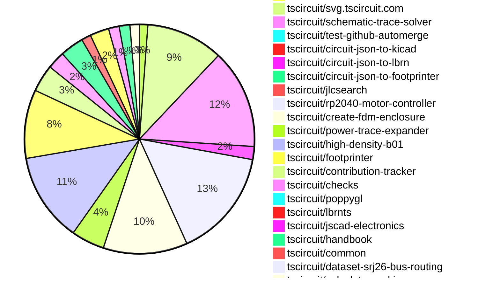

# Contribution Overview 2026-07-21

The current week is shown below. There are 3 major sections:

- [Contributor Overview](#contributor-overview)
- [PRs by Repository](#prs-by-repository)
- [PRs by Contributor](#changes-by-contributor)
- [Scoring & Sponsorship Details](/docs/sponsorship-calculation-explanation.md)

## PRs by Repository

## Contributor Overview

| Contributor | 🐳 Major | 🐙 Minor | 🐌 Tiny | Score | ⭐ |
|-------------|---------|---------|---------|-------|-----|
| [seveibar](#seveibar) | 21 | 22 | 28 | 141 | 👑👑 |
| [imrishabh18](#imrishabh18) | 10 | 22 | 24 | 97.5 | 👑 |
| [ShiboSoftwareDev](#ShiboSoftwareDev) | 16 | 3 | 4 | 78 | ⭐⭐⭐ |
| [mohan-bee](#mohan-bee) | 4 | 5 | 7 | 47.5 | ⭐⭐ |
| [0hmX](#0hmX) | 8 | 0 | 15 | 45 | ⭐⭐ |
| [AnasSarkiz](#AnasSarkiz) | 5 | 0 | 2 | 32.5 | ⭐⭐ |
| [techmannih](#techmannih) | 4 | 2 | 10 | 31 | ⭐⭐ |
| [MustafaMulla29](#MustafaMulla29) | 2 | 3 | 4 | 19 | ⭐⭐ |
| [tscircuitbot](#tscircuitbot) | 0 | 0 | 425 | 16 | ⭐⭐ |
| [Hero988](#Hero988) | 3 | 0 | 3 | 15 | ⭐⭐ |
| [Abse2001](#Abse2001) | 1 | 2 | 3 | 14 | ⭐⭐ |
| [rushabhcodes](#rushabhcodes) | 1 | 1 | 2 | 11 | ⭐⭐ |
| [itisrohit](#itisrohit) | 0 | 5 | 1 | 11 | ⭐⭐ |
| [Sang-it](#Sang-it) | 1 | 2 | 0 | 8 | ⭐ |
| [anil08607](#anil08607) | 0 | 1 | 4 | 6 | ⭐ |
| [KrishnaX12](#KrishnaX12) | 0 | 1 | 2 | 4 | ⭐ |
| [GokulPandi-M](#GokulPandi-M) | 0 | 0 | 4 | 4 | ⭐ |
| [DPS0340](#DPS0340) | 0 | 1 | 1 | 3 |  |
| [vasu-rs](#vasu-rs) | 0 | 1 | 1 | 3 |  |
| [Lathikaa-S](#Lathikaa-S) | 0 | 0 | 1 | 1 |  |

## Staff Pass Ratio (SPR)

| Contributor | Reviewed PRs | Rejections | Approvals | SPR |
|-------------|--------------|------------|-----------|-----|
| [imrishabh18](#imrishabh18) | 17 | 0 | 17 | 100.0% |
| [ShiboSoftwareDev](#ShiboSoftwareDev) | 10 | 0 | 11 | 100.0% |
| [mohan-bee](#mohan-bee) | 8 | 2 | 7 | 75.0% |
| [MustafaMulla29](#MustafaMulla29) | 6 | 0 | 6 | 100.0% |
| [itisrohit](#itisrohit) | 5 | 2 | 3 | 60.0% |
| [Hero988](#Hero988) | 4 | 1 | 3 | 75.0% |
| [Abse2001](#Abse2001) | 3 | 0 | 3 | 100.0% |
| [0hmX](#0hmX) | 2 | 0 | 2 | 100.0% |
| [AnasSarkiz](#AnasSarkiz) | 2 | 1 | 2 | 50.0% |
| [techmannih](#techmannih) | 2 | 0 | 2 | 100.0% |
| [anil08607](#anil08607) | 1 | 0 | 1 | 100.0% |
| [DPS0340](#DPS0340) | 1 | 0 | 1 | 100.0% |

imrishabh18 SPR PRs (17)

- [#662](https://github.com/tscircuit/circuit-json/pull/662) Add `pcb_packing_error`
- [#747](https://github.com/tscircuit/props/pull/747) Add schSheetName to schematic box props
- [#746](https://github.com/tscircuit/props/pull/746) Add disabled flags to project config
- [#745](https://github.com/tscircuit/props/pull/745) Add schematic box chip reference props
- [#2880](https://github.com/tscircuit/core/pull/2880) Make Matchpack layout failures nonfatal
- [#2874](https://github.com/tscircuit/core/pull/2874) Fix PCB group bounds after pack layout
- [#2869](https://github.com/tscircuit/core/pull/2869) Pass fallback net label widths to schematic trace solver
- [#2806](https://github.com/tscircuit/core/pull/2806) Use schematic port IDs in the schematic trace solver
- [#2804](https://github.com/tscircuit/core/pull/2804) Fix nested group packing transform origin
- [#2763](https://github.com/tscircuit/core/pull/2763) Infer schematic sheets from schematic box connections
- [#2751](https://github.com/tscircuit/core/pull/2751) feat: Support multi schematic sheet representation of a single chip component
- [#2750](https://github.com/tscircuit/core/pull/2750) Example test for multiple schematic sheet representation of a chip
- [#114](https://github.com/tscircuit/calculate-packing/pull/114) Scope weighted connection filtering to participating pads
- [#727](https://github.com/tscircuit/schematic-trace-solver/pull/727) Avoid overlaps from generated net-label traces
- [#726](https://github.com/tscircuit/schematic-trace-solver/pull/726) Prefer adaptive elbows for short backtracking routes
- [#713](https://github.com/tscircuit/schematic-trace-solver/pull/713) Fix stacked GND rail label orientation
- [#61](https://github.com/tscircuit/system-block-designer/pull/61) Support TI GPIO and SPI interface traces

ShiboSoftwareDev SPR PRs (10)

- [#9](https://github.com/tscircuit/rfc/pull/9) Add analog simulation analyses and parameter sweep RFC
- [#657](https://github.com/tscircuit/circuit-json/pull/657) feat: add analog simulation analyses and parameter sweeps
- [#108](https://github.com/tscircuit/circuit-json-util/pull/108) fix: preserve discriminated types in circuit json inserts
- [#748](https://github.com/tscircuit/props/pull/748) feat: add analog simulation analysis props
- [#2764](https://github.com/tscircuit/core/pull/2764) feat: run analog analyses and parameter sweeps
- [#631](https://github.com/tscircuit/circuit-to-svg/pull/631) feat: render non-transient simulation graphs
- [#51](https://github.com/tscircuit/circuit-json-to-spice/pull/51) feat: emit SPICE analysis commands and parameter sweeps
- [#26](https://github.com/tscircuit/ngspice-spice-engine/pull/26) feat: parse non-transient analog analyses
- [#21](https://github.com/tscircuit/datasheet-to-tscircuit/pull/21) doesn't match ref warning
- [#22](https://github.com/tscircuit/datasheet-to-tscircuit/pull/22) multi typical applications & mse

mohan-bee SPR PRs (8)

- [#2797](https://github.com/tscircuit/core/pull/2797) update matchpack 
- [#167](https://github.com/tscircuit/matchpack/pull/167) Detect and deterministically lay out crystal load-capacitor circuits
- [#170](https://github.com/tscircuit/matchpack/pull/170) Space crystal load capacitors horizontally
- [#164](https://github.com/tscircuit/matchpack/pull/164) Fix rail-only decoupling capacitor grouping
- [#168](https://github.com/tscircuit/matchpack/pull/168) add isCrystal in InputProblem
- [#165](https://github.com/tscircuit/matchpack/pull/165) Align capacitor partition on VCC/GND pins side
- [#712](https://github.com/tscircuit/schematic-trace-solver/pull/712) introduce UnroutedTraceRecoverySolver
- [#711](https://github.com/tscircuit/schematic-trace-solver/pull/711) Add shared endpoint junction solver for schematic traces

MustafaMulla29 SPR PRs (6)

- [#751](https://github.com/tscircuit/props/pull/751) Add schematic symbol props
- [#2809](https://github.com/tscircuit/core/pull/2809) Add standalone schematicsymbol element
- [#2761](https://github.com/tscircuit/core/pull/2761) Render canonical USB-C ports when Parts Engine resolution fails
- [#2794](https://github.com/tscircuit/core/pull/2794) Revert internal circuit implementation
- [#2745](https://github.com/tscircuit/core/pull/2745) Render chip ports on internal circuit symbols
- [#694](https://github.com/tscircuit/schematic-trace-solver/pull/694) Untangle merged-label trace crossings

itisrohit SPR PRs (5)

- [#718](https://github.com/tscircuit/footprinter/pull/718) repro(dip): add fabrication note pin label rendering repro
- [#2793](https://github.com/tscircuit/core/pull/2793) fix: propagate allowOffBoard to pcb_component in NormalComponent, Jumper, and SolderJumper
- [#2776](https://github.com/tscircuit/core/pull/2776) repro: mosfet doesn't propagate manufacturerPartNumber and supplierPartNumbers
- [#2749](https://github.com/tscircuit/core/pull/2749) repro(pcb): add DIP-8 fabrication note pin label rendering repro
- [#396](https://github.com/tscircuit/circuit-json-to-kicad/pull/396) fix(pcb): export pcb_keepout elements as KiCad rule-area zones

Hero988 SPR PRs (4)

- [#2788](https://github.com/tscircuit/core/pull/2788) fix: propagate manufacturerPartNumber and supplierPartNumbers in transistor, crystal, fuse, potentiometer, and interconnect
- [#2765](https://github.com/tscircuit/core/pull/2765) fix: <switch /> drops supplierPartNumbers/manufacturerPartNumber, part missing from BOM
- [#2739](https://github.com/tscircuit/core/pull/2739) fix: defaultTraceWidth/nominalTraceWidth board props now control autorouted trace width
- [#690](https://github.com/tscircuit/schematic-trace-solver/pull/690) fix: resolve stuck net-label collisions with a least-overlap fallback

Abse2001 SPR PRs (3)

- [#725](https://github.com/tscircuit/footprinter/pull/725) Fix SMT pad rotation when applying pin1 location
- [#2815](https://github.com/tscircuit/core/pull/2815) update footpritner to fix pin1location rotation bug
- [#82](https://github.com/tscircuit/common/pull/82) Add reusable MT3608 power boost subcircuit

0hmX SPR PRs (2)

- [#1743](https://github.com/tscircuit/tscircuit-autorouter/pull/1743) Add benchmark history dashboard
- [#1728](https://github.com/tscircuit/tscircuit-autorouter/pull/1728) Fix physical net in hypergraph pathing

AnasSarkiz SPR PRs (2)

- [#15](https://github.com/tscircuit/tsci-agent/pull/15) Add OpenAI login support
- [#23](https://github.com/tscircuit/datasheet-to-tscircuit/pull/23) Add authenticated OpenAI execution across agent workflows

techmannih SPR PRs (2)

- [#13](https://github.com/tscircuit/fast-footprint-compare/pull/13) Render polygon pads correctly in footprint previews
- [#18](https://github.com/tscircuit/circuit-json-to-footprinter/pull/18) Move footprint geometry and comparison into circuit-json-to-footprinter

anil08607 SPR PRs (1)

- [#724](https://github.com/tscircuit/footprinter/pull/724) fix(pinrow): prevent pin labels from overlapping plated holes

DPS0340 SPR PRs (1)

- [#2814](https://github.com/tscircuit/core/pull/2814) perf: share the base PrimitiveComponent config instead of rebuilding per access (#2810)

> Note: AI evaluates PRs and assigns 1-3 star ratings automatically. 4 and 5 star ratings require manual staff review.

## Review Table

[reviews-received-hover]: ## "Number of reviews received for PRs for this contributor"
[approvals-received-hover]: ## "Number of approvals received for PRs this contributor authored"
[rejections-received-hover]: ## "Number of rejections received for PRs this contributor authored"
[prs-opened-hover]: ## "Number of PRs opened by this contributor"
[issues-created-hover]: ## "Number of issues created by this contributor"

| Contributor | Reviews Received | Approvals Received | Rejections Received | Approvals | Rejections Given | PRs Opened | PRs Merged | Issues Created |
|---|---|---|---|---|---|---|---|---|
| [0hmX](#0hmX) | 16 | 3 | 0 | 5 | 0 | 29 | 24 | 0 |
| [Abse2001](#Abse2001) | 6 | 6 | 0 | 3 | 0 | 7 | 6 | 0 |
| [AnasSarkiz](#AnasSarkiz) | 11 | 11 | 0 | 11 | 0 | 9 | 7 | 0 |
| [anil08607](#anil08607) | 12 | 9 | 1 | 0 | 0 | 9 | 6 | 0 |
| [chris200450828](#chris200450828) | 0 | 0 | 0 | 0 | 0 | 1 | 0 | 0 |
| [djmango](#djmango) | 0 | 0 | 0 | 0 | 0 | 3 | 0 | 0 |
| [DPS0340](#DPS0340) | 12 | 5 | 2 | 0 | 0 | 70 | 2 | 0 |
| [GokulPandi-M](#GokulPandi-M) | 11 | 8 | 2 | 0 | 0 | 7 | 4 | 0 |
| [Hero988](#Hero988) | 14 | 6 | 3 | 0 | 0 | 10 | 6 | 0 |
| [Hivesmith-dev](#Hivesmith-dev) | 0 | 0 | 0 | 0 | 0 | 1 | 0 | 0 |
| [imrishabh18](#imrishabh18) | 28 | 20 | 0 | 28 | 8 | 76 | 57 | 0 |
| [itisrohit](#itisrohit) | 25 | 13 | 5 | 0 | 0 | 15 | 6 | 0 |
| [iyeanur6-cyber](#iyeanur6-cyber) | 0 | 0 | 0 | 0 | 0 | 1 | 0 | 0 |
| [key1989han](#key1989han) | 0 | 0 | 0 | 0 | 0 | 1 | 0 | 0 |
| [khozakhulile27-netizen](#khozakhulile27-netizen) | 0 | 0 | 0 | 0 | 0 | 2 | 0 | 0 |
| [KochC](#KochC) | 0 | 0 | 0 | 0 | 0 | 1 | 0 | 0 |
| [KrishnaX12](#KrishnaX12) | 9 | 5 | 1 | 0 | 0 | 5 | 3 | 0 |
| [Lathikaa-S](#Lathikaa-S) | 3 | 3 | 0 | 0 | 0 | 1 | 1 | 0 |
| [mohan-bee](#mohan-bee) | 33 | 20 | 1 | 20 | 6 | 23 | 16 | 0 |
| [MustafaMulla29](#MustafaMulla29) | 8 | 8 | 0 | 8 | 0 | 16 | 10 | 0 |
| [namdamdoi68-oss](#namdamdoi68-oss) | 0 | 0 | 0 | 0 | 0 | 1 | 0 | 0 |
| [rootdgy](#rootdgy) | 0 | 0 | 0 | 0 | 0 | 3 | 0 | 0 |
| [rushabhcodes](#rushabhcodes) | 12 | 6 | 0 | 3 | 0 | 6 | 4 | 0 |
| [Sang-it](#Sang-it) | 2 | 0 | 0 | 0 | 0 | 4 | 3 | 0 |
| [seveibar](#seveibar) | 25 | 3 | 0 | 71 | 4 | 101 | 73 | 0 |
| [ShiboSoftwareDev](#ShiboSoftwareDev) | 40 | 24 | 0 | 4 | 0 | 38 | 23 | 0 |
| [techmannih](#techmannih) | 18 | 6 | 3 | 8 | 2 | 19 | 16 | 0 |
| [thairc-dev](#thairc-dev) | 0 | 0 | 0 | 0 | 0 | 5 | 0 | 0 |
| [tscircuitbot](#tscircuitbot) | 1 | 0 | 0 | 0 | 0 | 567 | 452 | 0 |
| [vasu-rs](#vasu-rs) | 11 | 5 | 2 | 0 | 0 | 4 | 2 | 0 |

## Changes by Repository

### [tscircuit/schematic-viewer](https://github.com/tscircuit/schematic-viewer)

| PR # | Impact | Rating | Contributor | Description |
|------|--------|--------|-------------|-------------|
| [#245](https://github.com/tscircuit/schematic-viewer/pull/245) | 🐳 Major | ⭐⭐⭐ | ShiboSoftwareDev | Add support for displaying AC magnitude or phase in the analog simulation viewer, rendering non-transient analysis results, and adding Cosmos fixtures for various analyses. |

### [tscircuit/rfc](https://github.com/tscircuit/rfc)

| PR # | Impact | Rating | Contributor | Description |
|------|--------|--------|-------------|-------------|
| [#9](https://github.com/tscircuit/rfc/pull/9) | 🐳 Major | ⭐⭐⭐ | ShiboSoftwareDev | Add dedicated analog.simulation elements for transient, DC operating point, direct DC sweep, and AC sweep usage, along with one-dimensional component sweeps through a nested analog.sweepparameter with parameter-specific target props, defining the Circuit JSON experiments, sweep relationships, and analysis-specific voltagecurrent result types produced by that TSX. |

### [tscircuit/circuit-json](https://github.com/tscircuit/circuit-json)

| PR # | Impact | Rating | Contributor | Description |
|------|--------|--------|-------------|-------------|
| [#657](https://github.com/tscircuit/circuit-json/pull/657) | 🐳 Major | ⭐⭐⭐ | ShiboSoftwareDev | Add Circuit JSON elements for DC operating point, DC sweep, AC analysis, and ordered parameter sweeps, enabling downstream repositories to represent non-transient analyses and parameterized runs without encoding them as transient graphs. |
| [#658](https://github.com/tscircuit/circuit-json/pull/658) | 🐙 Minor | ⭐⭐ | seveibar | Add a warning for schematic components, net labels, and traces that extend outside their schematic sheet, including identifiers for the owning sheet and offending elements. |
| [#655](https://github.com/tscircuit/circuit-json/pull/655) | 🐙 Minor | ⭐⭐ | seveibar | Add a schematic component overlap warning to identify overlapping schematic components and include it in AnyCircuitElement and generated reference docs. |
| [#662](https://github.com/tscircuit/circuit-json/pull/662) | 🐙 Minor | ⭐⭐ | imrishabh18 | Add a pcb_packing_error Circuit JSON error element for PCB packing failures caused by constrained boardlayout bounds |

🐌 Tiny Contributions (3)

| PR # | Impact | Contributor | Description |
|------|--------|-------------|-------------|
| [#660](https://github.com/tscircuit/circuit-json/pull/660) | 🐌 Tiny | tscircuitbot | Automated package update |
| [#659](https://github.com/tscircuit/circuit-json/pull/659) | 🐌 Tiny | tscircuitbot | Automated package update |
| [#656](https://github.com/tscircuit/circuit-json/pull/656) | 🐌 Tiny | tscircuitbot | Automated package update |

### [tscircuit/circuit-json-util](https://github.com/tscircuit/circuit-json-util)

| PR # | Impact | Rating | Contributor | Description |
|------|--------|--------|-------------|-------------|
| [#108](https://github.com/tscircuit/circuit-json-util/pull/108) | 🐳 Major | ⭐⭐⭐ | ShiboSoftwareDev | Preserves discriminated Circuit JSON variants in insert operations, allowing parameter-sweep union members to be inserted without assertions and adding regression tests for validation. |
| [#107](https://github.com/tscircuit/circuit-json-util/pull/107) | 🐙 Minor | ⭐⭐ | seveibar | Exports a typed getSchematicElementBounds helper for schematic components, net labels, and traces, returning minmax extents along with width, height, and center, while accounting for net-label anchor orientation and rendered trace width. |

### [tscircuit/props](https://github.com/tscircuit/props)

| PR # | Impact | Rating | Contributor | Description |
|------|--------|--------|-------------|-------------|
| [#748](https://github.com/tscircuit/props/pull/748) | 🐳 Major | ⭐⭐⭐ | ShiboSoftwareDev | Summary add component props for selecting DC operating point, DC sweep, and AC analyses add parameter sweep configuration and AC sweep controls pin the feature-branch Circuit JSON schema for pre-merge integration testing  Why These props provide the declarative tscircuit API required by the analog simulation analyses RFC(https:github.comtscircuitrfcblobmainrfcs2026-07-20-analog-simulation-analyses-and-parameter-sweeps.md).  Impact Circuit authors can describe the new analyses and ordered parameter sweeps in TSX.  Validation typeschema validation validated through exact-SHA downstream core, CLI, umbrella, and website builds |
| [#750](https://github.com/tscircuit/props/pull/750) | 🐙 Minor | ⭐⭐ | seveibar | Adds optional schSectionName support to schematicBoxProps, allowing TSX authors to target a named section within a schematic sheet. |
| [#747](https://github.com/tscircuit/props/pull/747) | 🐙 Minor | ⭐⭐ | imrishabh18 | Adds schSheetName to the schematicBoxProps validator, exposes schSheetName on SchematicBoxProps, and covers parsing the prop in the schematic box test, enabling flat multi-sheet layouts without requiring a wrapper group. |
| [#746](https://github.com/tscircuit/props/pull/746) | 🐙 Minor | ⭐⭐ | imrishabh18 | Add pcbDisabled and schematicDisabled flags to the exported ProjectConfig type, allowing consumers to avoid redeclaring these fields and providing a shared source of truth for JSON project configuration. |
| [#745](https://github.com/tscircuit/props/pull/745) | 🐙 Minor | ⭐⭐ | imrishabh18 | Add name, chipRef, pinLabels, and schPinArrangement to schematicBoxProps and SchematicBoxProps, enabling better representation of chips across schematic sheets. |
| [#751](https://github.com/tscircuit/props/pull/751) | 🐙 Minor | ⭐⭐ | MustafaMulla29 | Add SchematicSymbolProps and the schematicSymbolProps parser to define properties for schematic symbols, including required and optional fields, while ensuring a minimal prop surface and rejecting empty connections. |

### [tscircuit/core](https://github.com/tscircuit/core)

| PR # | Impact | Rating | Contributor | Description |
|------|--------|--------|-------------|-------------|
| [#2764](https://github.com/tscircuit/core/pull/2764) | 🐳 Major | ⭐⭐⭐ | ShiboSoftwareDev | Summary add core components and execution paths for DC operating point, DC sweep, and AC analysis orchestrate ordered parameter sweeps and associate results with sweep points map probe requests and engine results into Circuit JSON add combined simulation snapshots for all five graph views use the published schema, props, converter, ngspice engine, renderer, and spicets releases retain spicey0.0.14 and its compatible transient adapter until the newer Spicey work is merged declare the new runtime converter and SPICE parser as wildcard peer dependencies  Why Core coordinates the complete workflow described by the analog simulation analyses RFC(https:github.comtscircuitrfcblobmainrfcs2026-07-20-analog-simulation-analyses-and-parameter-sweeps.md).  Impact TSX circuits can execute the new analyses and consume structured results without relying on unmerged Git dependencies.  Validation focused analog and Spice engine suite: 36 passed all existing SVG snapshots in that suite passed unchanged typecheck passed package build passed dist smoke test passed format check passed |
| [#2783](https://github.com/tscircuit/core/pull/2783) | 🐳 Major | ⭐⭐⭐ | seveibar | Refactors schematic routing to reuse existing schematic symbol ports for trace routing, improving efficiency and clarity in the routing process. |
| [#2796](https://github.com/tscircuit/core/pull/2796) | 🐳 Major | ⭐⭐⭐ | seveibar | Adds support for schSectionName on schematic boxes, allowing chip-backed schematic boxes to be associated with specific sections in the schematic trace solver. |
| [#2781](https://github.com/tscircuit/core/pull/2781) | 🐳 Major | ⭐⭐⭐ | seveibar | Implements maximum trace length constraints for crystal components during design rule checks, ensuring stricter adherence to trace length limits for connected components. |
| [#2824](https://github.com/tscircuit/core/pull/2824) | 🐳 Major | ⭐⭐⭐ | imrishabh18 | Renames cores local connection fields from pinIds to schematicPortIds and updates the connection mapping to reflect schematic port identifiers instead of generic pin identifiers, ensuring clarity in domain meaning without altering routing behavior. |
| [#2752](https://github.com/tscircuit/core/pull/2752) | 🐳 Major | ⭐⭐⭐ | imrishabh18 | Moves the SchematicBox primitive into its own directory and updates its public export, derives local ID aliases from canonical Circuit JSON interfaces, renames mappings for clarity, and prepares layout trees for multiple schematic representations without changing existing runtime behavior. |
| [#2751](https://github.com/tscircuit/core/pull/2751) | 🐳 Major | ⭐⭐⭐ | imrishabh18 | Adds support for multiple schematic sheets to represent a single chip component, allowing for independent rendering of traces on different sheets. |
| [#2745](https://github.com/tscircuit/core/pull/2745) | 🐳 Major | ⭐⭐⭐ | MustafaMulla29 | Allows chip schematic ports to be rendered on explicitly mapped internal circuit terminals, ensuring proper schematic representation without altering chip naming or geometry. |
| [#2788](https://github.com/tscircuit/core/pull/2788) | 🐳 Major | ⭐⭐⭐ | Hero988 | Fixes the issue where manufacturerPartNumber and supplierPartNumbers were not being propagated to the source_component for several components, causing them to be omitted from the BOM. |
| [#2765](https://github.com/tscircuit/core/pull/2765) | 🐳 Major | ⭐⭐⭐ | Hero988 | Fixes issue where switch  component fails to propagate supplierPartNumbers and manufacturerPartNumber to the BOM, causing parts to be omitted without warning. |
| [#2739](https://github.com/tscircuit/core/pull/2739) | 🐳 Major | ⭐⭐⭐ | Hero988 | Fixes autorouting to respect defaultTraceWidth and nominalTraceWidth properties for trace width control. |
| [#2780](https://github.com/tscircuit/core/pull/2780) | 🐙 Minor | ⭐⭐ | seveibar | Render schematic-section dividers independently for each schematic sheet and scope section bounds to components on the same sheet, preserving existing implicit-sheet behavior for circuits without explicit sheets. |
| [#2828](https://github.com/tscircuit/core/pull/2828) | 🐙 Minor | ⭐⭐ | seveibar | Restores internal pin stubs when the trace solver projects a schematic port to a text-expanded component boundary, ensuring proper connection of pins that were previously omitted due to expanded text boundaries. |
| [#2770](https://github.com/tscircuit/core/pull/2770) | 🐙 Minor | ⭐⭐ | seveibar | Emit warnings for components, net labels, and traces that extend outside the inner drawing frame of a schematic sheet, ensuring proper layout and visibility. |
| [#2747](https://github.com/tscircuit/core/pull/2747) | 🐙 Minor | ⭐⭐ | seveibar | Adds namespaced TSX elements for FDM enclosures, including the construction of a solver for generating enclosures based on PCB components and their apertures, along with 3D rendering capabilities. |
| [#2880](https://github.com/tscircuit/core/pull/2880) | 🐙 Minor | ⭐⭐ | imrishabh18 | Stops throwing an execution error when the Matchpack solver reports failure and records a non-fatal schematic layout error instead. |
| [#2878](https://github.com/tscircuit/core/pull/2878) | 🐙 Minor | ⭐⭐ | imrishabh18 | Fixes junction creation logic to prevent junctions between traces of different nets in schematic rendering. |
| [#2874](https://github.com/tscircuit/core/pull/2874) | 🐙 Minor | ⭐⭐ | imrishabh18 | Fixes incorrect PCB group bounds calculation after the pack layout phase, ensuring auto-sized packed groups accurately reflect their final PCB placement. |
| [#2873](https://github.com/tscircuit/core/pull/2873) | 🐙 Minor | ⭐⭐ | imrishabh18 | Adds a test for PCB group size to ensure no footprint overlap errors occur when adding a WirelessMCU_CC2745R10 component to the circuit. |
| [#2869](https://github.com/tscircuit/core/pull/2869) | 🐙 Minor | ⭐⭐ | imrishabh18 | Fixes the fallback net label width used by the schematic trace solver to match the rendered width of the label in the schematic, ensuring accurate routing. |
| [#2825](https://github.com/tscircuit/core/pull/2825) | 🐙 Minor | ⭐⭐ | imrishabh18 | Emit a pcb_packing_error Circuit JSON element when PackSolver2 cannot find a valid bounded layout, using the same diagnostic path for solver-state failures and thrown packing exceptions while continuing to emit packing:error. |
| [#2806](https://github.com/tscircuit/core/pull/2806) | 🐙 Minor | ⭐⭐ | imrishabh18 | Fixes net-label routing when a chip and schematicbox chipRef... render the same source pin by using canonical schematic_port_id values as schematic trace-solver pin IDs end to end. |
| [#2804](https://github.com/tscircuit/core/pull/2804) | 🐙 Minor | ⭐⭐ | imrishabh18 | Fixes incorrect transform origin for nested groups in PCB layout, preventing footprint overlap errors in TI wireless subcircuits. |
| [#2798](https://github.com/tscircuit/core/pull/2798) | 🐙 Minor | ⭐⭐ | imrishabh18 | Adds a visual reproduction test for footprint overlap errors in TI subcircuits, ensuring correct packing strategies are applied and errors are asserted through PCB snapshots. |
| [#2763](https://github.com/tscircuit/core/pull/2763) | 🐙 Minor | ⭐⭐ | imrishabh18 | Adds support for assigning a board-level schematicbox  to a schematicsheet  with schSheetName, and automatically places components connected to the boxs represented chip pins on the same sheet. |
| [#2750](https://github.com/tscircuit/core/pull/2750) | 🐙 Minor | ⭐⭐ | imrishabh18 | Adds a test for rendering multiple schematic sheets representing the same chip component in the circuit. |
| [#2809](https://github.com/tscircuit/core/pull/2809) | 🐙 Minor | ⭐⭐ | MustafaMulla29 | Add a standalone schematicsymbol  backed by schematic-symbols, implementing it as a schematic-only PrimitiveComponent with support for explicit physical-port mapping and schematic sheetssections. |
| [#2761](https://github.com/tscircuit/core/pull/2761) | 🐙 Minor | ⭐⭐ | MustafaMulla29 | Renders the canonical 16 USB-C source and schematic ports when standard connector part resolution fails, maintaining existing failure warnings and not synthesizing physical footprint geometry. |
| [#2814](https://github.com/tscircuit/core/pull/2814) | 🐙 Minor | ⭐⭐ | DPS0340 | Reduces memory allocation by sharing the base PrimitiveComponent configuration instead of creating a new instance on each access. |
| [#2815](https://github.com/tscircuit/core/pull/2815) | 🐙 Minor | ⭐⭐ | Abse2001 | Fixes pin1 location rotation bug in the footprinter component, ensuring correct rotation of pads in the generated footprint. |
| [#2881](https://github.com/tscircuit/core/pull/2881) | 🐙 Minor | ⭐⭐ | KrishnaX12 | Fixes the display of invalid capacitance values in the Capacitor component to uniformly show NaNpF instead of the raw unparseable string, aligning it with the behavior of Resistor and Inductor components. |
| [#2797](https://github.com/tscircuit/core/pull/2797) | 🐙 Minor | ⭐⭐ | mohan-bee | Updates the matchpack dependency version to 0.0.46 and adds support for new component types in the schematic layout. |
| [#2795](https://github.com/tscircuit/core/pull/2795) | 🐙 Minor | ⭐⭐ | mohan-bee | Fixes duplicate schematic traces caused by explicit netlabels in the schematic rendering process. |
| [#2793](https://github.com/tscircuit/core/pull/2793) | 🐙 Minor | ⭐⭐ | itisrohit | Fixes the issue where the allowOffBoard property was not being propagated to pcb_component for NormalComponent, Jumper, and SolderJumper, causing it to be ignored for these components. |
| [#2789](https://github.com/tscircuit/core/pull/2789) | 🐙 Minor | ⭐⭐ | itisrohit | Fixes omission of manufacturerPartNumber propagation in resonator and 10 other components, ensuring accurate data representation in source_component. |
| [#2778](https://github.com/tscircuit/core/pull/2778) | 🐙 Minor | ⭐⭐ | itisrohit | Fixes the issue where mosfet  did not propagate manufacturerPartNumber and supplierPartNumbers to the generated source_component. |
| [#2776](https://github.com/tscircuit/core/pull/2776) | 🐙 Minor | ⭐⭐ | itisrohit | Fixes the issue where manufacturerPartNumber and supplierPartNumbers are not propagated to the generated source_component for the mosfet  component. |
| [#2756](https://github.com/tscircuit/core/pull/2756) | 🐙 Minor | ⭐⭐ | techmannih | Adds a test for battery schematic rotation at cardinal angles (0, 90, 180, 270 degrees) in the circuit rendering. |

🐌 Tiny Contributions (27)

| PR # | Impact | Contributor | Description |
|------|--------|-------------|-------------|
| [#2822](https://github.com/tscircuit/core/pull/2822) | 🐌 Tiny | tscircuitbot | Updates the tscircuitchecks package from version 0.0.145 to 0.0.146 |
| [#2820](https://github.com/tscircuit/core/pull/2820) | 🐌 Tiny | seveibar | Adds a minimal schematic reproduction based on the MT3608 shutdown circuit to capture a rendering bug where Q_USB_BOOST_OFFs base appears disconnected from the shared net. |
| [#2779](https://github.com/tscircuit/core/pull/2779) | 🐌 Tiny | seveibar | Bumps the tscircuitschematic-trace-solver dependency from version 0.0.105 to 0.0.106, refreshing affected schematic snapshots and preserving specific routing examples while improving tie-breaking logic. |
| [#2774](https://github.com/tscircuit/core/pull/2774) | 🐌 Tiny | seveibar | Bumps the tscircuitschematic-trace-solver dependency from version 0.0.104 to 0.0.105, fixing a cleanup bug that affected trace routing on the same global net, resulting in cleaner schematic routes without altering connectivity. |
| [#2753](https://github.com/tscircuit/core/pull/2753) | 🐌 Tiny | seveibar | Updates the enclosure snapshots to use PoppyGL 0.0.26, ensuring that the rendered images display fully opaque pixels instead of translucent ones. |
| [#2879](https://github.com/tscircuit/core/pull/2879) | 🐌 Tiny | imrishabh18 | Adds a reduced reproduction of a 1212 WLED matrix circuit to document a known Matchpack layout solver failure without affecting CI. |
| [#2877](https://github.com/tscircuit/core/pull/2877) | 🐌 Tiny | imrishabh18 | Fixes the GND label handling in the schematic trace solver by updating the dependency version and cleaning up test code. |
| [#2847](https://github.com/tscircuit/core/pull/2847) | 🐌 Tiny | imrishabh18 | Restores snapshots to previous state by reverting to port_id as unique selectors instead of CSS selectors |
| [#2821](https://github.com/tscircuit/core/pull/2821) | 🐌 Tiny | imrishabh18 | Updates the calculate-packing dependency to version 0.0.82 and modifies test cases to reflect changes in packing calculations. |
| [#2807](https://github.com/tscircuit/core/pull/2807) | 🐌 Tiny | imrishabh18 | Adds a resistor component to the test for repro156, making the bug more apparent during testing. |
| [#2799](https://github.com/tscircuit/core/pull/2799) | 🐌 Tiny | imrishabh18 | Adds a focused repro156 test for a chip, a schematicbox that references the chip through chipRef, and a GND netlabel connected to the chips labeled GND pin. |
| [#2755](https://github.com/tscircuit/core/pull/2755) | 🐌 Tiny | imrishabh18 | Updates the tscircuitcreate-fdm-enclosure package from version 0.0.2 to 0.0.3 to resolve import issues in Node environments by providing compiled JavaScript and declarations instead of raw TypeScript files. |
| [#2746](https://github.com/tscircuit/core/pull/2746) | 🐌 Tiny | imrishabh18 | Updates the footprinter dependency version from 0.0.371 to 0.0.380 and modifies tests to reflect changes in error reporting for invalid footprint properties. |
| [#2816](https://github.com/tscircuit/core/pull/2816) | 🐌 Tiny | MustafaMulla29 | Updates the version of the schematic-trace-solver dependency from 0.0.106 to 0.0.108 in package.json |
| [#2760](https://github.com/tscircuit/core/pull/2760) | 🐌 Tiny | MustafaMulla29 | Replaces generated slash-joined schematic net labels with readable component-pin labels, improving schematic readability and maintaining explicit trace labels. |
| [#2759](https://github.com/tscircuit/core/pull/2759) | 🐌 Tiny | MustafaMulla29 | Adds a reproduction test for a USB-C connector that fails to fetch circuit JSON from the Parts Engine, resulting in an empty schematic box. |
| [#2819](https://github.com/tscircuit/core/pull/2819) | 🐌 Tiny | anil08607 | Updates the tscircuitfootprinter dependency to version 0.0.387 in the project. |
| [#2812](https://github.com/tscircuit/core/pull/2812) | 🐌 Tiny | Abse2001 | Reproduces a bug where the pin1 location of a rectangular pad loses its rotation in the PCB rendering process. |
| [#2740](https://github.com/tscircuit/core/pull/2740) | 🐌 Tiny | Hero988 | Fixes incorrect transistor pin aliases and accessors to align with schematic symbols, resolving issues in SPICE netlist generation. |
| [#2827](https://github.com/tscircuit/core/pull/2827) | 🐌 Tiny | mohan-bee | Updates the version of the schematic-trace-solver dependency from 0.0.108 to 0.0.109 in package.json |
| [#2817](https://github.com/tscircuit/core/pull/2817) | 🐌 Tiny | mohan-bee | Updates the tscircuitmatchpack dependency from version 0.0.46 to 0.0.48 in package.json |
| [#2773](https://github.com/tscircuit/core/pull/2773) | 🐌 Tiny | mohan-bee | Updates the tscircuitmatchpack dependency from version 0.0.38 to 0.0.43 in package.json |
| [#2792](https://github.com/tscircuit/core/pull/2792) | 🐌 Tiny | mohan-bee | Adds a test to verify that explicit netlabels correctly draw schematic traces without generating extra traces. |
| [#2823](https://github.com/tscircuit/core/pull/2823) | 🐌 Tiny | GokulPandi-M | Updates the schematic-symbols dependency from version 0.0.233 to 0.0.237 in package.json |
| [#2785](https://github.com/tscircuit/core/pull/2785) | 🐌 Tiny | techmannih | Adds a test to reproduce the trace intersection issue for the TPS61222 schematic. |
| [#2757](https://github.com/tscircuit/core/pull/2757) | 🐌 Tiny | techmannih | Updates the schematic-symbol dependency version from 0.0.232 to 0.0.233 in package.json |
| [#2758](https://github.com/tscircuit/core/pull/2758) | 🐌 Tiny | 0hmX | Updates tscircuitcapacity-autorouter from 0.0.696 to 0.0.710 so core uses the latest autorouting fixes and behavior. |

### [tscircuit/cli](https://github.com/tscircuit/cli)

| PR # | Impact | Rating | Contributor | Description |
|------|--------|--------|-------------|-------------|
| [#3795](https://github.com/tscircuit/cli/pull/3795) | 🐳 Major | ⭐⭐⭐ | ShiboSoftwareDev | Exports SVG assets for DC operating point, DC sweep, AC analysis, and parameter-sweep results, making non-transient simulations available through CLI buildexport flows. |

🐌 Tiny Contributions (83)

| PR # | Impact | Contributor | Description |
|------|--------|-------------|-------------|
| [#3860](https://github.com/tscircuit/cli/pull/3860) | 🐌 Tiny | tscircuitbot | Updates the tscircuitrunframe package from version 0.0.2283 to 0.0.2284 |
| [#3859](https://github.com/tscircuit/cli/pull/3859) | 🐌 Tiny | tscircuitbot | Automated package update |
| [#3858](https://github.com/tscircuit/cli/pull/3858) | 🐌 Tiny | tscircuitbot | Updates the tscircuitrunframe package from version 0.0.2282 to 0.0.2283 |
| [#3857](https://github.com/tscircuit/cli/pull/3857) | 🐌 Tiny | tscircuitbot | Automated package update |
| [#3856](https://github.com/tscircuit/cli/pull/3856) | 🐌 Tiny | tscircuitbot | Updates the tscircuitrunframe package from version 0.0.2281 to 0.0.2282 |
| [#3855](https://github.com/tscircuit/cli/pull/3855) | 🐌 Tiny | tscircuitbot | Automated package update |
| [#3854](https://github.com/tscircuit/cli/pull/3854) | 🐌 Tiny | tscircuitbot | Updates the tscircuitrunframe package from version 0.0.2280 to 0.0.2281 |
| [#3852](https://github.com/tscircuit/cli/pull/3852) | 🐌 Tiny | tscircuitbot | Updates the tscircuitrunframe package to version 0.0.2280 |
| [#3851](https://github.com/tscircuit/cli/pull/3851) | 🐌 Tiny | tscircuitbot | Automated package update |
| [#3850](https://github.com/tscircuit/cli/pull/3850) | 🐌 Tiny | tscircuitbot | Updates the tscircuitrunframe package from version 0.0.2278 to 0.0.2279 |
| [#3849](https://github.com/tscircuit/cli/pull/3849) | 🐌 Tiny | tscircuitbot | Automated package update |
| [#3848](https://github.com/tscircuit/cli/pull/3848) | 🐌 Tiny | tscircuitbot | Updates the tscircuitrunframe package from version 0.0.2277 to 0.0.2278 |
| [#3847](https://github.com/tscircuit/cli/pull/3847) | 🐌 Tiny | tscircuitbot | Automated package update |
| [#3846](https://github.com/tscircuit/cli/pull/3846) | 🐌 Tiny | tscircuitbot | Updates the tscircuitrunframe package from version 0.0.2276 to 0.0.2277 |
| [#3845](https://github.com/tscircuit/cli/pull/3845) | 🐌 Tiny | tscircuitbot | Automated package update |
| [#3844](https://github.com/tscircuit/cli/pull/3844) | 🐌 Tiny | tscircuitbot | Updates the tscircuitrunframe package from version 0.0.2275 to 0.0.2276 |
| [#3843](https://github.com/tscircuit/cli/pull/3843) | 🐌 Tiny | tscircuitbot | Automated package update |
| [#3842](https://github.com/tscircuit/cli/pull/3842) | 🐌 Tiny | tscircuitbot | Updates the tscircuitrunframe package from version 0.0.2274 to 0.0.2275 |
| [#3841](https://github.com/tscircuit/cli/pull/3841) | 🐌 Tiny | tscircuitbot | Automated package update |
| [#3840](https://github.com/tscircuit/cli/pull/3840) | 🐌 Tiny | tscircuitbot | Automated package update |
| [#3839](https://github.com/tscircuit/cli/pull/3839) | 🐌 Tiny | tscircuitbot | Updates the tscircuitrunframe package from version 0.0.2273 to 0.0.2274 |
| [#3838](https://github.com/tscircuit/cli/pull/3838) | 🐌 Tiny | tscircuitbot | Automated package update |
| [#3837](https://github.com/tscircuit/cli/pull/3837) | 🐌 Tiny | tscircuitbot | Updates the tscircuitrunframe package from version 0.0.2272 to 0.0.2273 |
| [#3835](https://github.com/tscircuit/cli/pull/3835) | 🐌 Tiny | tscircuitbot | Updates the tscircuitrunframe package from version 0.0.2271 to 0.0.2272 |
| [#3833](https://github.com/tscircuit/cli/pull/3833) | 🐌 Tiny | tscircuitbot | Automated package update |
| [#3832](https://github.com/tscircuit/cli/pull/3832) | 🐌 Tiny | tscircuitbot | Updates the tscircuitrunframe package to version 0.0.2271 in the package.json file. |
| [#3831](https://github.com/tscircuit/cli/pull/3831) | 🐌 Tiny | tscircuitbot | Automated package update |
| [#3830](https://github.com/tscircuit/cli/pull/3830) | 🐌 Tiny | tscircuitbot | Automated package update |
| [#3836](https://github.com/tscircuit/cli/pull/3836) | 🐌 Tiny | tscircuitbot | Automated package update |
| [#3828](https://github.com/tscircuit/cli/pull/3828) | 🐌 Tiny | tscircuitbot | Updates the tscircuitrunframe package from version 0.0.2268 to 0.0.2269 |
| [#3823](https://github.com/tscircuit/cli/pull/3823) | 🐌 Tiny | tscircuitbot | Automated package update |
| [#3816](https://github.com/tscircuit/cli/pull/3816) | 🐌 Tiny | tscircuitbot | Updates the tscircuitrunframe package from version 0.0.2261 to 0.0.2262 |
| [#3826](https://github.com/tscircuit/cli/pull/3826) | 🐌 Tiny | tscircuitbot | Updates the tscircuitrunframe package from version 0.0.2267 to 0.0.2268 |
| [#3824](https://github.com/tscircuit/cli/pull/3824) | 🐌 Tiny | tscircuitbot | Updates the tscircuitrunframe package from version 0.0.2266 to 0.0.2267 |
| [#3822](https://github.com/tscircuit/cli/pull/3822) | 🐌 Tiny | tscircuitbot | Updates the tscircuitrunframe package from version 0.0.2265 to 0.0.2266 |
| [#3821](https://github.com/tscircuit/cli/pull/3821) | 🐌 Tiny | tscircuitbot | Automated package update |
| [#3820](https://github.com/tscircuit/cli/pull/3820) | 🐌 Tiny | tscircuitbot | Updates the tscircuitrunframe package from version 0.0.2263 to 0.0.2265 |
| [#3818](https://github.com/tscircuit/cli/pull/3818) | 🐌 Tiny | tscircuitbot | Updates the tscircuitrunframe package from version 0.0.2262 to 0.0.2263 |
| [#3815](https://github.com/tscircuit/cli/pull/3815) | 🐌 Tiny | tscircuitbot | Updates the package version from 0.1.1726 to 0.1.1727 in package.json |
| [#3814](https://github.com/tscircuit/cli/pull/3814) | 🐌 Tiny | tscircuitbot | Updates the tscircuitrunframe package from version 0.0.2260 to 0.0.2261 |
| [#3829](https://github.com/tscircuit/cli/pull/3829) | 🐌 Tiny | tscircuitbot | Automated package update |
| [#3819](https://github.com/tscircuit/cli/pull/3819) | 🐌 Tiny | tscircuitbot | Automated package update |
| [#3817](https://github.com/tscircuit/cli/pull/3817) | 🐌 Tiny | tscircuitbot | Automated package update |
| [#3825](https://github.com/tscircuit/cli/pull/3825) | 🐌 Tiny | tscircuitbot | Automated package update |
| [#3812](https://github.com/tscircuit/cli/pull/3812) | 🐌 Tiny | tscircuitbot | Updates the tscircuitrunframe package from version 0.0.2259 to 0.0.2260 |
| [#3813](https://github.com/tscircuit/cli/pull/3813) | 🐌 Tiny | tscircuitbot | Automated package update |
| [#3811](https://github.com/tscircuit/cli/pull/3811) | 🐌 Tiny | tscircuitbot | Automated package update |
| [#3810](https://github.com/tscircuit/cli/pull/3810) | 🐌 Tiny | tscircuitbot | Updates the tscircuitrunframe package version from 0.0.2257 to 0.0.2259 in package.json |
| [#3807](https://github.com/tscircuit/cli/pull/3807) | 🐌 Tiny | tscircuitbot | Automated package update |
| [#3806](https://github.com/tscircuit/cli/pull/3806) | 🐌 Tiny | tscircuitbot | Updates the tscircuitrunframe package to version 0.0.2257 in the package.json file |
| [#3805](https://github.com/tscircuit/cli/pull/3805) | 🐌 Tiny | tscircuitbot | Automated package update |
| [#3804](https://github.com/tscircuit/cli/pull/3804) | 🐌 Tiny | tscircuitbot | Updates the tscircuitrunframe package from version 0.0.2255 to 0.0.2256 |
| [#3802](https://github.com/tscircuit/cli/pull/3802) | 🐌 Tiny | tscircuitbot | Updates the tscircuitrunframe package from version 0.0.2254 to 0.0.2255 |
| [#3801](https://github.com/tscircuit/cli/pull/3801) | 🐌 Tiny | tscircuitbot | Automated package update |
| [#3800](https://github.com/tscircuit/cli/pull/3800) | 🐌 Tiny | tscircuitbot | Updates the tscircuitrunframe package from version 0.0.2252 to 0.0.2254 |
| [#3799](https://github.com/tscircuit/cli/pull/3799) | 🐌 Tiny | tscircuitbot | Automated package update |
| [#3797](https://github.com/tscircuit/cli/pull/3797) | 🐌 Tiny | tscircuitbot | Updates the tscircuitrunframe package from version 0.0.2251 to 0.0.2252 |
| [#3794](https://github.com/tscircuit/cli/pull/3794) | 🐌 Tiny | tscircuitbot | Automated package update |
| [#3793](https://github.com/tscircuit/cli/pull/3793) | 🐌 Tiny | tscircuitbot | Updates the tscircuitrunframe package from version 0.0.2250 to 0.0.2251 |
| [#3792](https://github.com/tscircuit/cli/pull/3792) | 🐌 Tiny | tscircuitbot | Automated package update |
| [#3791](https://github.com/tscircuit/cli/pull/3791) | 🐌 Tiny | tscircuitbot | Updates the tscircuitrunframe package from version 0.0.2249 to 0.0.2250 |
| [#3790](https://github.com/tscircuit/cli/pull/3790) | 🐌 Tiny | tscircuitbot | Automated package update |
| [#3787](https://github.com/tscircuit/cli/pull/3787) | 🐌 Tiny | tscircuitbot | Updates the tscircuitrunframe package from version 0.0.2247 to 0.0.2248 |
| [#3786](https://github.com/tscircuit/cli/pull/3786) | 🐌 Tiny | tscircuitbot | Updates the package version from 0.1.1714 to 0.1.1715 in package.json |
| [#3785](https://github.com/tscircuit/cli/pull/3785) | 🐌 Tiny | tscircuitbot | Updates the tscircuitrunframe package from version 0.0.2246 to 0.0.2247 |
| [#3784](https://github.com/tscircuit/cli/pull/3784) | 🐌 Tiny | tscircuitbot | Automated package update |
| [#3783](https://github.com/tscircuit/cli/pull/3783) | 🐌 Tiny | tscircuitbot | Updates the tscircuitrunframe package from version 0.0.2245 to 0.0.2246 |
| [#3782](https://github.com/tscircuit/cli/pull/3782) | 🐌 Tiny | tscircuitbot | Automated package update |
| [#3781](https://github.com/tscircuit/cli/pull/3781) | 🐌 Tiny | tscircuitbot | Updates the tscircuitrunframe package to version 0.0.2245 in package.json |
| [#3780](https://github.com/tscircuit/cli/pull/3780) | 🐌 Tiny | tscircuitbot | Automated package update |
| [#3779](https://github.com/tscircuit/cli/pull/3779) | 🐌 Tiny | tscircuitbot | Updates the tscircuitrunframe package from version 0.0.2242 to 0.0.2244 |
| [#3777](https://github.com/tscircuit/cli/pull/3777) | 🐌 Tiny | tscircuitbot | Automated package update |
| [#3776](https://github.com/tscircuit/cli/pull/3776) | 🐌 Tiny | tscircuitbot | Automated package update |
| [#3774](https://github.com/tscircuit/cli/pull/3774) | 🐌 Tiny | tscircuitbot | Automated package update |
| [#3773](https://github.com/tscircuit/cli/pull/3773) | 🐌 Tiny | tscircuitbot | Updates the tscircuitrunframe package from version 0.0.2239 to 0.0.2240 |
| [#3772](https://github.com/tscircuit/cli/pull/3772) | 🐌 Tiny | tscircuitbot | Automated package update |
| [#3771](https://github.com/tscircuit/cli/pull/3771) | 🐌 Tiny | tscircuitbot | Updates the tscircuitrunframe package version from 0.0.2238 to 0.0.2239 in package.json |
| [#3770](https://github.com/tscircuit/cli/pull/3770) | 🐌 Tiny | tscircuitbot | Automated package update |
| [#3769](https://github.com/tscircuit/cli/pull/3769) | 🐌 Tiny | tscircuitbot | Updates the tscircuitrunframe package from version 0.0.2237 to 0.0.2238 |
| [#3768](https://github.com/tscircuit/cli/pull/3768) | 🐌 Tiny | tscircuitbot | Automated package update |
| [#3767](https://github.com/tscircuit/cli/pull/3767) | 🐌 Tiny | tscircuitbot | Updates the tscircuitrunframe package from version 0.0.2236 to 0.0.2237 |
| [#3789](https://github.com/tscircuit/cli/pull/3789) | 🐌 Tiny | tscircuitbot | Updates the tscircuitrunframe package from version 0.0.2248 to 0.0.2249 |
| [#3788](https://github.com/tscircuit/cli/pull/3788) | 🐌 Tiny | tscircuitbot | Automated package update |

### [tscircuit/ngspice-spice-engine](https://github.com/tscircuit/ngspice-spice-engine)

| PR # | Impact | Rating | Contributor | Description |
|------|--------|--------|-------------|-------------|
| [#26](https://github.com/tscircuit/ngspice-spice-engine/pull/26) | 🐳 Major | ⭐⭐⭐ | ShiboSoftwareDev | Summary parse DC operating point, voltagecurrent DC sweep, and AC analysis output convert ngspice complex values into Circuit JSON result elements preserve probe metadata and sweep axes add SVG snapshots for DC operating point, DC sweep, AC magnitude, and AC phase voltagecurrent graphs use spicets0.0.4 for typed SPICE analysis, transient parameter, and requested-output parsing use the published tscircuitprops0.0.592, circuit-json0.0.454, and circuit-to-svg0.0.393 releases  Why Ngspice must return the result shapes defined by the analog simulation analyses RFC(https:github.comtscircuitrfcblobmainrfcs2026-07-20-analog-simulation-analyses-and-parameter-sweeps.md).  Impact Callers receive typed non-transient results that render consistently with transient simulations.  Validation all 42 repository tests passed across suite-isolated runs existing SVG and inline snapshots passed unchanged all existing PSPICE fixtures passed with the repository subprocess timeout allowance lint and format checks passed typecheck passed package build passed |

### [tscircuit/high-density-repair03](https://github.com/tscircuit/high-density-repair03)

| PR # | Impact | Rating | Contributor | Description |
|------|--------|--------|-------------|-------------|
| [#26](https://github.com/tscircuit/high-density-repair03/pull/26) | 🐳 Major | ⭐⭐⭐ | ShiboSoftwareDev | Add opt-in via-in-pad topology candidates to GlobalDrcForceImproveSolver, allowing GlobalDrcBranchPortfolioSolver to run these candidates as its final internal phase, relocating terminal-side vias and moving fully single-layer terminal routes using pad-centered transitions, while validating that the drilled hole fits inside each connected single-layer terminal pad before proposing a candidate and scoring every valid topology candidate with the caller-provided full DRC evaluator. |
| [#30](https://github.com/tscircuit/high-density-repair03/pull/30) | 🐳 Major | ⭐⭐⭐ | AnasSarkiz | Restores the via-in-pad repair portfolio, repairs explicitly identified same-net via pairs, resolves exact trace pairs from canonical DRC identifiers, and implements targeted segment layer moves and bounded copper dogleg detours for low-error boards. |

### [tscircuit/datasheet-to-tscircuit](https://github.com/tscircuit/datasheet-to-tscircuit)

| PR # | Impact | Rating | Contributor | Description |
|------|--------|--------|-------------|-------------|
| [#29](https://github.com/tscircuit/datasheet-to-tscircuit/pull/29) | 🐳 Major | ⭐⭐⭐ | ShiboSoftwareDev | Adds immutable image-backed evidence, complete subplottrace validation, robust physical-stimulus scoring, and stricter server-owned benchmark preflight and locking. Also improves evidence consensus, agent recovery, validation reuse, source-aware Docker builds, and regression coverage. |
| [#27](https://github.com/tscircuit/datasheet-to-tscircuit/pull/27) | 🐳 Major | ⭐⭐⭐ | ShiboSoftwareDev | Convert recoverable evidence, component, benchmark, and SPICE errors into warnings while publishing the best available output. Persist provider choices across retries and extensions, improve warningpreview UX, deduplicate graphs, strengthen validation and ngspice availability, and preserve PCB artifacts across SPICE completion and server restarts. Includes expanded regression coverage with 196 passing tests. |
| [#24](https://github.com/tscircuit/datasheet-to-tscircuit/pull/24) | 🐳 Major | ⭐⭐⭐ | ShiboSoftwareDev | Allows the system to recover from inconsistent evidence extraction instead of aborting the conversion process, enhancing the robustness of evidence validation. |
| [#21](https://github.com/tscircuit/datasheet-to-tscircuit/pull/21) | 🐳 Major | ⭐⭐⭐ | ShiboSoftwareDev | Adds a warning in the model reference pane when the current graph is outside the benchmark tolerance. |
| [#22](https://github.com/tscircuit/datasheet-to-tscircuit/pull/22) | 🐳 Major | ⭐⭐⭐ | ShiboSoftwareDev | Adds support for typical application titles in job restoration and evidence phases, enhancing the job management process. |
| [#19](https://github.com/tscircuit/datasheet-to-tscircuit/pull/19) | 🐳 Major | ⭐⭐⭐ | ShiboSoftwareDev | Preserve and validate every response and stimulus graph in multi-channel datasheet figures through simulation, scoring, and previews. Harden benchmark generation and retries, improve reference graph layoutdefault view, simplify artifact downloads, and expand regression coverage. |
| [#18](https://github.com/tscircuit/datasheet-to-tscircuit/pull/18) | 🐳 Major | ⭐⭐⭐ | ShiboSoftwareDev | Adds source-backed application modes, stronger component and visual validation, server-owned netlist checks, SPICE powerrange preflights, and monotonic checkpoint promotion. Prevents false evidence stops and regressed models from advancing. Adds regression coverage with 137 passing tests. |
| [#23](https://github.com/tscircuit/datasheet-to-tscircuit/pull/23) | 🐳 Major | ⭐⭐⭐ | AnasSarkiz | Adds optional persistent OpenAI authentication while keeping the tscircuit AI Gateway as default. |

🐌 Tiny Contributions (3)

| PR # | Impact | Contributor | Description |
|------|--------|-------------|-------------|
| [#28](https://github.com/tscircuit/datasheet-to-tscircuit/pull/28) | 🐌 Tiny | ShiboSoftwareDev | This pull request removes the SPICE_ANALYSIS_AND_SWEEP_SUPPORT.md file, which contained detailed documentation on supporting various simulation capabilities in the tscircuit project. The removal of this file may impact the understanding and implementation of simulation features. |
| [#26](https://github.com/tscircuit/datasheet-to-tscircuit/pull/26) | 🐌 Tiny | ShiboSoftwareDev | This pull request introduces several enhancements to improve the resilience of the component, application, and SPICE pipelines against recoverable failures. Key changes include the addition of new utility functions for capturing agent process output, identifying transient transport failures, and summarizing agent process failures. Additionally, it updates existing validation and instruction files to ensure they align with the new error handling mechanisms. These changes aim to enhance the overall robustness of the system and improve error reporting and handling during the generation process. |
| [#20](https://github.com/tscircuit/datasheet-to-tscircuit/pull/20) | 🐌 Tiny | AnasSarkiz | Removes the logo image and its associated styles from the application. |

### [tscircuit/circuit-to-svg](https://github.com/tscircuit/circuit-to-svg)

| PR # | Impact | Rating | Contributor | Description |
|------|--------|--------|-------------|-------------|
| [#631](https://github.com/tscircuit/circuit-to-svg/pull/631) | 🐙 Minor | ⭐⭐ | ShiboSoftwareDev | Render DC operating point, voltagecurrent DC sweep, and AC analysis graphs with support for various overlays and a new SVG snapshot matrix. |

### [tscircuit/circuit-json-to-spice](https://github.com/tscircuit/circuit-json-to-spice)

| PR # | Impact | Rating | Contributor | Description |
|------|--------|--------|-------------|-------------|
| [#51](https://github.com/tscircuit/circuit-json-to-spice/pull/51) | 🐙 Minor | ⭐⭐ | ShiboSoftwareDev | Convert Circuit JSON DC operating point, DC sweep, and AC experiments into SPICE analysis directives, emit requested voltage and current plots for the selected analysis, and add ordered parameter-sweep netlist generation. |

### [tscircuit/runframe](https://github.com/tscircuit/runframe)

| PR # | Impact | Rating | Contributor | Description |
|------|--------|--------|-------------|-------------|
| [#4088](https://github.com/tscircuit/runframe/pull/4088) | 🐳 Major | ⭐⭐⭐ | seveibar | Allows users to import parts directly from EasyEDA using exact LCSC part numbers, even if those parts are out of stock or not listed in JLCSearch. |
| [#4090](https://github.com/tscircuit/runframe/pull/4090) | 🐙 Minor | ⭐⭐ | ShiboSoftwareDev | Recognizes DC operating point, DC sweep, and AC voltagecurrent result elements, enabling simulation-result UI paths for non-transient analyses. |

🐌 Tiny Contributions (90)

| PR # | Impact | Contributor | Description |
|------|--------|-------------|-------------|
| [#4159](https://github.com/tscircuit/runframe/pull/4159) | 🐌 Tiny | tscircuitbot | Automated package update |
| [#4158](https://github.com/tscircuit/runframe/pull/4158) | 🐌 Tiny | tscircuitbot | Updates the tscircuiteval package from version 0.0.1068 to 0.0.1069 in the package.json file. |
| [#4157](https://github.com/tscircuit/runframe/pull/4157) | 🐌 Tiny | tscircuitbot | Automated package update |
| [#4156](https://github.com/tscircuit/runframe/pull/4156) | 🐌 Tiny | tscircuitbot | Updates the tscircuiteval package from version 0.0.1067 to 0.0.1068 in the package.json file. |
| [#4155](https://github.com/tscircuit/runframe/pull/4155) | 🐌 Tiny | tscircuitbot | Automated package update |
| [#4154](https://github.com/tscircuit/runframe/pull/4154) | 🐌 Tiny | tscircuitbot | Updates the tscircuiteval package from version 0.0.1066 to 0.0.1067 in the package.json file. |
| [#4153](https://github.com/tscircuit/runframe/pull/4153) | 🐌 Tiny | tscircuitbot | Automated package update |
| [#4152](https://github.com/tscircuit/runframe/pull/4152) | 🐌 Tiny | tscircuitbot | Updates the tscircuiteval package to version 0.0.1066 in the package.json file. |
| [#4151](https://github.com/tscircuit/runframe/pull/4151) | 🐌 Tiny | tscircuitbot | Automated package update |
| [#4150](https://github.com/tscircuit/runframe/pull/4150) | 🐌 Tiny | tscircuitbot | Updates the tscircuiteval package from version 0.0.1064 to 0.0.1065 in the project dependencies. |
| [#4149](https://github.com/tscircuit/runframe/pull/4149) | 🐌 Tiny | tscircuitbot | Automated package update |
| [#4148](https://github.com/tscircuit/runframe/pull/4148) | 🐌 Tiny | tscircuitbot | Updates the tscircuiteval package from version 0.0.1063 to 0.0.1064 |
| [#4147](https://github.com/tscircuit/runframe/pull/4147) | 🐌 Tiny | tscircuitbot | Automated package update |
| [#4146](https://github.com/tscircuit/runframe/pull/4146) | 🐌 Tiny | tscircuitbot | Updates the tscircuiteval package from version 0.0.1062 to 0.0.1063 in the package.json file. |
| [#4145](https://github.com/tscircuit/runframe/pull/4145) | 🐌 Tiny | tscircuitbot | Automated package update |
| [#4144](https://github.com/tscircuit/runframe/pull/4144) | 🐌 Tiny | tscircuitbot | Automated package update |
| [#4143](https://github.com/tscircuit/runframe/pull/4143) | 🐌 Tiny | tscircuitbot | Automated package update |
| [#4137](https://github.com/tscircuit/runframe/pull/4137) | 🐌 Tiny | tscircuitbot | Updates the tscircuiteval package from version 0.0.1058 to 0.0.1059 in the package.json file. |
| [#4133](https://github.com/tscircuit/runframe/pull/4133) | 🐌 Tiny | tscircuitbot | Automated package update |
| [#4142](https://github.com/tscircuit/runframe/pull/4142) | 🐌 Tiny | tscircuitbot | Updates the tscircuiteval package from version 0.0.1059 to 0.0.1061 in the package.json file. |
| [#4141](https://github.com/tscircuit/runframe/pull/4141) | 🐌 Tiny | tscircuitbot | Automated package update |
| [#4140](https://github.com/tscircuit/runframe/pull/4140) | 🐌 Tiny | tscircuitbot | Updates the circuit-json-to-kicad package version from 0.0.170 to 0.0.171 in package.json |
| [#4138](https://github.com/tscircuit/runframe/pull/4138) | 🐌 Tiny | tscircuitbot | Automated package update |
| [#4136](https://github.com/tscircuit/runframe/pull/4136) | 🐌 Tiny | tscircuitbot | Automated package update |
| [#4135](https://github.com/tscircuit/runframe/pull/4135) | 🐌 Tiny | tscircuitbot | Automated package update |
| [#4132](https://github.com/tscircuit/runframe/pull/4132) | 🐌 Tiny | tscircuitbot | Automated package update |
| [#4131](https://github.com/tscircuit/runframe/pull/4131) | 🐌 Tiny | tscircuitbot | Updates the tscircuitschematic-viewer package to version 2.0.75 |
| [#4114](https://github.com/tscircuit/runframe/pull/4114) | 🐌 Tiny | tscircuitbot | Automated package update |
| [#4129](https://github.com/tscircuit/runframe/pull/4129) | 🐌 Tiny | tscircuitbot | Automated package update |
| [#4128](https://github.com/tscircuit/runframe/pull/4128) | 🐌 Tiny | tscircuitbot | Updates the tscircuiteval package to version 0.0.1058 in the package.json file. |
| [#4127](https://github.com/tscircuit/runframe/pull/4127) | 🐌 Tiny | tscircuitbot | Automated package update |
| [#4126](https://github.com/tscircuit/runframe/pull/4126) | 🐌 Tiny | tscircuitbot | Updates the tscircuiteval package from version 0.0.1055 to 0.0.1057 in the package.json file. |
| [#4124](https://github.com/tscircuit/runframe/pull/4124) | 🐌 Tiny | tscircuitbot | Automated package update |
| [#4123](https://github.com/tscircuit/runframe/pull/4123) | 🐌 Tiny | tscircuitbot | Updates the tscircuiteval package from version 0.0.1054 to 0.0.1055 in the package.json file. |
| [#4122](https://github.com/tscircuit/runframe/pull/4122) | 🐌 Tiny | tscircuitbot | Automated package update |
| [#4121](https://github.com/tscircuit/runframe/pull/4121) | 🐌 Tiny | tscircuitbot | Updates the tscircuiteval package from version 0.0.1053 to 0.0.1054 in the project dependencies. |
| [#4120](https://github.com/tscircuit/runframe/pull/4120) | 🐌 Tiny | tscircuitbot | Automated package update |
| [#4119](https://github.com/tscircuit/runframe/pull/4119) | 🐌 Tiny | tscircuitbot | Updates the tscircuiteval package from version 0.0.1052 to 0.0.1053 in the package.json file. |
| [#4118](https://github.com/tscircuit/runframe/pull/4118) | 🐌 Tiny | tscircuitbot | Automated package update |
| [#4117](https://github.com/tscircuit/runframe/pull/4117) | 🐌 Tiny | tscircuitbot | Updates the tscircuiteval package to version 0.0.1052 in the package.json file. |
| [#4116](https://github.com/tscircuit/runframe/pull/4116) | 🐌 Tiny | tscircuitbot | Automated package update |
| [#4115](https://github.com/tscircuit/runframe/pull/4115) | 🐌 Tiny | tscircuitbot | Updates the tscircuiteval package to version 0.0.1051 in the package.json file. |
| [#4113](https://github.com/tscircuit/runframe/pull/4113) | 🐌 Tiny | tscircuitbot | Updates the tscircuiteval package from version 0.0.1049 to 0.0.1050 in the package.json file. |
| [#4112](https://github.com/tscircuit/runframe/pull/4112) | 🐌 Tiny | tscircuitbot | Automated package update |
| [#4111](https://github.com/tscircuit/runframe/pull/4111) | 🐌 Tiny | tscircuitbot | Updates the tscircuiteval package from version 0.0.1048 to 0.0.1049 in the package.json file. |
| [#4109](https://github.com/tscircuit/runframe/pull/4109) | 🐌 Tiny | tscircuitbot | Updates the tscircuiteval package from version 0.0.1047 to 0.0.1048 in the package.json file. |
| [#4104](https://github.com/tscircuit/runframe/pull/4104) | 🐌 Tiny | tscircuitbot | Automated package update |
| [#4110](https://github.com/tscircuit/runframe/pull/4110) | 🐌 Tiny | tscircuitbot | Updates the package version from v0.0.2260 to v0.0.2261 in package.json |
| [#4108](https://github.com/tscircuit/runframe/pull/4108) | 🐌 Tiny | tscircuitbot | Automated package update |
| [#4106](https://github.com/tscircuit/runframe/pull/4106) | 🐌 Tiny | tscircuitbot | Automated package update |
| [#4103](https://github.com/tscircuit/runframe/pull/4103) | 🐌 Tiny | tscircuitbot | Updates the tscircuiteval package from version 0.0.1045 to 0.0.1046 in the package.json file. |
| [#4102](https://github.com/tscircuit/runframe/pull/4102) | 🐌 Tiny | tscircuitbot | Automated package update |
| [#4101](https://github.com/tscircuit/runframe/pull/4101) | 🐌 Tiny | tscircuitbot | Updates the tscircuiteval package from version 0.0.1044 to 0.0.1045 in the package.json file. |
| [#4100](https://github.com/tscircuit/runframe/pull/4100) | 🐌 Tiny | tscircuitbot | Automated package update |
| [#4099](https://github.com/tscircuit/runframe/pull/4099) | 🐌 Tiny | tscircuitbot | Updates the tscircuiteval package from version 0.0.1043 to 0.0.1044 in the package.json file. |
| [#4098](https://github.com/tscircuit/runframe/pull/4098) | 🐌 Tiny | tscircuitbot | Automated package update |
| [#4097](https://github.com/tscircuit/runframe/pull/4097) | 🐌 Tiny | tscircuitbot | Updates the tscircuiteval package from version 0.0.1042 to 0.0.1043 in the package.json file. |
| [#4096](https://github.com/tscircuit/runframe/pull/4096) | 🐌 Tiny | tscircuitbot | Automated package update |
| [#4095](https://github.com/tscircuit/runframe/pull/4095) | 🐌 Tiny | tscircuitbot | Updates the tscircuiteval package from version 0.0.1041 to 0.0.1042 |
| [#4094](https://github.com/tscircuit/runframe/pull/4094) | 🐌 Tiny | tscircuitbot | Automated package update |
| [#4093](https://github.com/tscircuit/runframe/pull/4093) | 🐌 Tiny | tscircuitbot | Updates the tscircuiteval package from version 0.0.1040 to 0.0.1041 in the package.json file. |
| [#4089](https://github.com/tscircuit/runframe/pull/4089) | 🐌 Tiny | tscircuitbot | Automated package update |
| [#4105](https://github.com/tscircuit/runframe/pull/4105) | 🐌 Tiny | tscircuitbot | Updates the tscircuiteval package from version 0.0.1046 to 0.0.1047 in the package.json file. |
| [#4091](https://github.com/tscircuit/runframe/pull/4091) | 🐌 Tiny | tscircuitbot | Updates the tscircuiteval package from version 0.0.1039 to 0.0.1040 in the package.json file. |
| [#4064](https://github.com/tscircuit/runframe/pull/4064) | 🐌 Tiny | tscircuitbot | Automated package update |
| [#4067](https://github.com/tscircuit/runframe/pull/4067) | 🐌 Tiny | tscircuitbot | Updates the tscircuiteval package to version 0.0.1031 in the package.json file. |
| [#4081](https://github.com/tscircuit/runframe/pull/4081) | 🐌 Tiny | tscircuitbot | Updates the tscircuiteval package from version 0.0.1037 to 0.0.1038 in the package.json file. |
| [#4079](https://github.com/tscircuit/runframe/pull/4079) | 🐌 Tiny | tscircuitbot | Updates the tscircuiteval package from version 0.0.1036 to 0.0.1037 in the package.json file. |
| [#4069](https://github.com/tscircuit/runframe/pull/4069) | 🐌 Tiny | tscircuitbot | Updates the tscircuiteval package from version 0.0.1031 to 0.0.1032 in the package.json file. |
| [#4063](https://github.com/tscircuit/runframe/pull/4063) | 🐌 Tiny | tscircuitbot | Updates the tscircuiteval package from version 0.0.1028 to 0.0.1029 in the package.json file. |
| [#4061](https://github.com/tscircuit/runframe/pull/4061) | 🐌 Tiny | tscircuitbot | Updates the circuit-json-to-kicad package from version 0.0.168 to 0.0.169 |
| [#4058](https://github.com/tscircuit/runframe/pull/4058) | 🐌 Tiny | tscircuitbot | Updates the tscircuiteval package from version 0.0.1027 to 0.0.1028 in the package.json file. |
| [#4087](https://github.com/tscircuit/runframe/pull/4087) | 🐌 Tiny | tscircuitbot | Automated package update |
| [#4086](https://github.com/tscircuit/runframe/pull/4086) | 🐌 Tiny | tscircuitbot | Updates the tscircuiteval package from version 0.0.1038 to 0.0.1039 in the package.json file. |
| [#4085](https://github.com/tscircuit/runframe/pull/4085) | 🐌 Tiny | tscircuitbot | Automated package update |
| [#4084](https://github.com/tscircuit/runframe/pull/4084) | 🐌 Tiny | tscircuitbot | Updates the circuit-json-to-kicad package version from 0.0.169 to 0.0.170 in package.json |
| [#4082](https://github.com/tscircuit/runframe/pull/4082) | 🐌 Tiny | tscircuitbot | Automated package update |
| [#4080](https://github.com/tscircuit/runframe/pull/4080) | 🐌 Tiny | tscircuitbot | Automated package update |
| [#4078](https://github.com/tscircuit/runframe/pull/4078) | 🐌 Tiny | tscircuitbot | Automated package update |
| [#4077](https://github.com/tscircuit/runframe/pull/4077) | 🐌 Tiny | tscircuitbot | Updates the tscircuiteval package to version 0.0.1036 in the package.json file. |
| [#4076](https://github.com/tscircuit/runframe/pull/4076) | 🐌 Tiny | tscircuitbot | Automated package update |
| [#4075](https://github.com/tscircuit/runframe/pull/4075) | 🐌 Tiny | tscircuitbot | Updates the tscircuiteval package from version 0.0.1034 to 0.0.1035 in the package.json file. |
| [#4074](https://github.com/tscircuit/runframe/pull/4074) | 🐌 Tiny | tscircuitbot | Automated package update |
| [#4073](https://github.com/tscircuit/runframe/pull/4073) | 🐌 Tiny | tscircuitbot | Updates the tscircuiteval package from version 0.0.1033 to 0.0.1034 in the package.json file. |
| [#4071](https://github.com/tscircuit/runframe/pull/4071) | 🐌 Tiny | tscircuitbot | Updates the tscircuiteval package to version 0.0.1033 in the package.json file. |
| [#4070](https://github.com/tscircuit/runframe/pull/4070) | 🐌 Tiny | tscircuitbot | Automated package update |
| [#4066](https://github.com/tscircuit/runframe/pull/4066) | 🐌 Tiny | tscircuitbot | Automated package update |
| [#4062](https://github.com/tscircuit/runframe/pull/4062) | 🐌 Tiny | tscircuitbot | Automated package update |
| [#4059](https://github.com/tscircuit/runframe/pull/4059) | 🐌 Tiny | tscircuitbot | Automated package update |
| [#4107](https://github.com/tscircuit/runframe/pull/4107) | 🐌 Tiny | imrishabh18 | Fixes live schematic previews by including directional battery symbols in the standalone bundle, resolving the Symbol not found: battery_down error. |

### [tscircuit/tscircuit](https://github.com/tscircuit/tscircuit)

🐌 Tiny Contributions (71)

| PR # | Impact | Contributor | Description |
|------|--------|-------------|-------------|
| [#4079](https://github.com/tscircuit/tscircuit/pull/4079) | 🐌 Tiny | ShiboSoftwareDev | Restores automated dependency updates by excluding the core-only tscitscircuit.ti development fixture from dependency synchronization. |
| [#4106](https://github.com/tscircuit/tscircuit/pull/4106) | 🐌 Tiny | tscircuitbot | Automated package update |
| [#4105](https://github.com/tscircuit/tscircuit/pull/4105) | 🐌 Tiny | tscircuitbot | Updates the versions of several dependencies in the package.json file, including tscircuitcli, tscircuitcore, and tscircuiteval. |
| [#4104](https://github.com/tscircuit/tscircuit/pull/4104) | 🐌 Tiny | tscircuitbot | Automated package update |
| [#4103](https://github.com/tscircuit/tscircuit/pull/4103) | 🐌 Tiny | tscircuitbot | Automated package update |
| [#4102](https://github.com/tscircuit/tscircuit/pull/4102) | 🐌 Tiny | tscircuitbot | Automated package update |
| [#4101](https://github.com/tscircuit/tscircuit/pull/4101) | 🐌 Tiny | tscircuitbot | Updates the tscircuitcli package from version 0.1.1747 to 0.1.1748 and the tscircuitrunframe package from version 0.0.2281 to 0.0.2282. |
| [#4100](https://github.com/tscircuit/tscircuit/pull/4100) | 🐌 Tiny | tscircuitbot | Automated package update |
| [#4099](https://github.com/tscircuit/tscircuit/pull/4099) | 🐌 Tiny | tscircuitbot | Automated package update |
| [#4098](https://github.com/tscircuit/tscircuit/pull/4098) | 🐌 Tiny | tscircuitbot | Updates the package version from 0.0.2150 to 0.0.2151 in package.json |
| [#4097](https://github.com/tscircuit/tscircuit/pull/4097) | 🐌 Tiny | tscircuitbot | Updates the version of the tscircuitcli package from 0.1.1746 to 0.1.1747 and the tscircuiteval package from 0.0.1065 to 0.0.1066, and the tscircuitrunframe package from 0.0.2280 to 0.0.2281 in package.json |
| [#4096](https://github.com/tscircuit/tscircuit/pull/4096) | 🐌 Tiny | tscircuitbot | Automated package update |
| [#4095](https://github.com/tscircuit/tscircuit/pull/4095) | 🐌 Tiny | tscircuitbot | Automated package update |
| [#4094](https://github.com/tscircuit/tscircuit/pull/4094) | 🐌 Tiny | tscircuitbot | Automated package update |
| [#4093](https://github.com/tscircuit/tscircuit/pull/4093) | 🐌 Tiny | tscircuitbot | Updates the tscircuitcli package version from 0.1.1744 to 0.1.1745 |
| [#4092](https://github.com/tscircuit/tscircuit/pull/4092) | 🐌 Tiny | tscircuitbot | Automated package update |
| [#4091](https://github.com/tscircuit/tscircuit/pull/4091) | 🐌 Tiny | tscircuitbot | Automated package update |
| [#4089](https://github.com/tscircuit/tscircuit/pull/4089) | 🐌 Tiny | tscircuitbot | Automated package update to version 0.0.2147 |
| [#4088](https://github.com/tscircuit/tscircuit/pull/4088) | 🐌 Tiny | tscircuitbot | Automated package update |
| [#4086](https://github.com/tscircuit/tscircuit/pull/4086) | 🐌 Tiny | tscircuitbot | Automated package update to version 0.0.2146 |
| [#4084](https://github.com/tscircuit/tscircuit/pull/4084) | 🐌 Tiny | tscircuitbot | Automated package update |
| [#4081](https://github.com/tscircuit/tscircuit/pull/4081) | 🐌 Tiny | tscircuitbot | Automated package update |
| [#4080](https://github.com/tscircuit/tscircuit/pull/4080) | 🐌 Tiny | tscircuitbot | Updates various package dependencies in the project to their latest versions. |
| [#4085](https://github.com/tscircuit/tscircuit/pull/4085) | 🐌 Tiny | tscircuitbot | Automated package update |
| [#4083](https://github.com/tscircuit/tscircuit/pull/4083) | 🐌 Tiny | tscircuitbot | Automated package update |
| [#4082](https://github.com/tscircuit/tscircuit/pull/4082) | 🐌 Tiny | tscircuitbot | Automated package update |
| [#4076](https://github.com/tscircuit/tscircuit/pull/4076) | 🐌 Tiny | tscircuitbot | Automated package update to version 0.0.2142 |
| [#4075](https://github.com/tscircuit/tscircuit/pull/4075) | 🐌 Tiny | tscircuitbot | Automated package update |
| [#4074](https://github.com/tscircuit/tscircuit/pull/4074) | 🐌 Tiny | tscircuitbot | Automated package update |
| [#4073](https://github.com/tscircuit/tscircuit/pull/4073) | 🐌 Tiny | tscircuitbot | Automated package update |
| [#4072](https://github.com/tscircuit/tscircuit/pull/4072) | 🐌 Tiny | tscircuitbot | Automated package update |
| [#4071](https://github.com/tscircuit/tscircuit/pull/4071) | 🐌 Tiny | tscircuitbot | Automated package update |
| [#4057](https://github.com/tscircuit/tscircuit/pull/4057) | 🐌 Tiny | tscircuitbot | Automated package update |
| [#4069](https://github.com/tscircuit/tscircuit/pull/4069) | 🐌 Tiny | tscircuitbot | Updates the tscircuitcli package from version 0.1.1725 to 0.1.1726 and the tscircuitrunframe package from version 0.0.2259 to 0.0.2260 in package.json |
| [#4068](https://github.com/tscircuit/tscircuit/pull/4068) | 🐌 Tiny | tscircuitbot | Updates the package version from 0.0.2137 to 0.0.2138 in package.json |
| [#4067](https://github.com/tscircuit/tscircuit/pull/4067) | 🐌 Tiny | tscircuitbot | Automated package update |
| [#4065](https://github.com/tscircuit/tscircuit/pull/4065) | 🐌 Tiny | tscircuitbot | Automated package update |
| [#4064](https://github.com/tscircuit/tscircuit/pull/4064) | 🐌 Tiny | tscircuitbot | Automated package update to version 0.0.2136 |
| [#4063](https://github.com/tscircuit/tscircuit/pull/4063) | 🐌 Tiny | tscircuitbot | Updates the tscircuitcli package from version 0.1.1722 to 0.1.1723 and the tscircuitrunframe package from version 0.0.2255 to 0.0.2256 in package.json |
| [#4060](https://github.com/tscircuit/tscircuit/pull/4060) | 🐌 Tiny | tscircuitbot | Automated package update |
| [#4059](https://github.com/tscircuit/tscircuit/pull/4059) | 🐌 Tiny | tscircuitbot | Automated package update |
| [#4053](https://github.com/tscircuit/tscircuit/pull/4053) | 🐌 Tiny | tscircuitbot | Updates the tscircuitcli package from version 0.1.1718 to 0.1.1719 and the tscircuitrunframe package from version 0.0.2250 to 0.0.2251 in package.json |
| [#4066](https://github.com/tscircuit/tscircuit/pull/4066) | 🐌 Tiny | tscircuitbot | Automated package update |
| [#4061](https://github.com/tscircuit/tscircuit/pull/4061) | 🐌 Tiny | tscircuitbot | Automated package update |
| [#4054](https://github.com/tscircuit/tscircuit/pull/4054) | 🐌 Tiny | tscircuitbot | Automated package update |
| [#4070](https://github.com/tscircuit/tscircuit/pull/4070) | 🐌 Tiny | tscircuitbot | Updates the package version from 0.0.2138 to 0.0.2139 in package.json |
| [#4062](https://github.com/tscircuit/tscircuit/pull/4062) | 🐌 Tiny | tscircuitbot | Automated package update to version 0.0.2135 |
| [#4058](https://github.com/tscircuit/tscircuit/pull/4058) | 🐌 Tiny | tscircuitbot | Automated package update |
| [#4047](https://github.com/tscircuit/tscircuit/pull/4047) | 🐌 Tiny | tscircuitbot | Automated package update to version 0.0.2129 |
| [#4042](https://github.com/tscircuit/tscircuit/pull/4042) | 🐌 Tiny | tscircuitbot | Automated package update |
| [#4031](https://github.com/tscircuit/tscircuit/pull/4031) | 🐌 Tiny | tscircuitbot | Automated package update |
| [#4051](https://github.com/tscircuit/tscircuit/pull/4051) | 🐌 Tiny | tscircuitbot | Automated package update |
| [#4050](https://github.com/tscircuit/tscircuit/pull/4050) | 🐌 Tiny | tscircuitbot | Automated package update |
| [#4049](https://github.com/tscircuit/tscircuit/pull/4049) | 🐌 Tiny | tscircuitbot | Updates the tscircuitcli package from version 0.1.1716 to 0.1.1717 and the tscircuitrunframe package from version 0.0.2248 to 0.0.2249 in package.json |
| [#4046](https://github.com/tscircuit/tscircuit/pull/4046) | 🐌 Tiny | tscircuitbot | Automated package update |
| [#4045](https://github.com/tscircuit/tscircuit/pull/4045) | 🐌 Tiny | tscircuitbot | Updates the package version from 0.0.2127 to 0.0.2128 in package.json |
| [#4044](https://github.com/tscircuit/tscircuit/pull/4044) | 🐌 Tiny | tscircuitbot | Updates the version of several packages in the project, including tscircuitcli, tscircuitcore, tscircuiteval, tscircuitrunframe, and circuit-json. |
| [#4041](https://github.com/tscircuit/tscircuit/pull/4041) | 🐌 Tiny | tscircuitbot | Automated package update |
| [#4040](https://github.com/tscircuit/tscircuit/pull/4040) | 🐌 Tiny | tscircuitbot | Automated package update |
| [#4039](https://github.com/tscircuit/tscircuit/pull/4039) | 🐌 Tiny | tscircuitbot | Automated package update |
| [#4038](https://github.com/tscircuit/tscircuit/pull/4038) | 🐌 Tiny | tscircuitbot | Automated package update |
| [#4037](https://github.com/tscircuit/tscircuit/pull/4037) | 🐌 Tiny | tscircuitbot | Automated package update |
| [#4035](https://github.com/tscircuit/tscircuit/pull/4035) | 🐌 Tiny | tscircuitbot | Automated package update |
| [#4034](https://github.com/tscircuit/tscircuit/pull/4034) | 🐌 Tiny | tscircuitbot | Automated package update |
| [#4033](https://github.com/tscircuit/tscircuit/pull/4033) | 🐌 Tiny | tscircuitbot | Updates the package version from 0.0.2121 to 0.0.2122 in package.json |
| [#4032](https://github.com/tscircuit/tscircuit/pull/4032) | 🐌 Tiny | tscircuitbot | Automated package update |
| [#4030](https://github.com/tscircuit/tscircuit/pull/4030) | 🐌 Tiny | tscircuitbot | Automated package update |
| [#4029](https://github.com/tscircuit/tscircuit/pull/4029) | 🐌 Tiny | tscircuitbot | Automated package update |
| [#4028](https://github.com/tscircuit/tscircuit/pull/4028) | 🐌 Tiny | tscircuitbot | Automated package update |
| [#4043](https://github.com/tscircuit/tscircuit/pull/4043) | 🐌 Tiny | tscircuitbot | Updates the package version from 0.0.2126 to 0.0.2127 in package.json |
| [#4036](https://github.com/tscircuit/tscircuit/pull/4036) | 🐌 Tiny | seveibar | Adds the tscircuitcreate-fdm-enclosure dependency to the aggregate package, allowing the package updater to complete its dependency synchronization without failure. |

### [tscircuit/tscircuit-autorouter](https://github.com/tscircuit/tscircuit-autorouter)

| PR # | Impact | Rating | Contributor | Description |
|------|--------|--------|-------------|-------------|
| [#1768](https://github.com/tscircuit/tscircuit-autorouter/pull/1768) | 🐳 Major | ⭐⭐⭐ | seveibar | Adds a new SimpleRouteBus type to the SimpleRouteJson representation, allowing for bus metadata to be preserved during preprocessing without altering routing behavior. |
| [#1758](https://github.com/tscircuit/tscircuit-autorouter/pull/1758) | 🐳 Major | ⭐⭐⭐ | 0hmX | Render multi-layer obstacles in red with varying opacity based on the number of layers, while keeping bottom-only obstacles blue at 50 opacity. |
| [#1743](https://github.com/tscircuit/tscircuit-autorouter/pull/1743) | 🐳 Major | ⭐⭐⭐ | 0hmX | Summary persist full successful main-branch benchmark reports and execution metadata on the dedicated benchmark-history branch generate and upload a self-contained dashboard for completion, DRC, solve-time, and via trends point regression notifications directly to benchmark artifacts  Why Benchmark results were available only as per-run artifacts, which made longitudinal performance investigation and raw sample comparison difficult. This adds durable history without making the benchmark workflow fail when history publishing has a problem.  Impact Successful main benchmark runs append their complete report and metadata to the existing history and produce an artifact containing the latest dashboard. The one-time historical import is separated into 1744.  Merge order Merge 1744 first so the backfilled benchmark-history branch is populated before this workflow starts appending new main runs.  Validation bun test testsbenchmark-history.test.ts --timeout 9999999 bun run build rendered the complete 480-run backfill locally git diff --check |
| [#1742](https://github.com/tscircuit/tscircuit-autorouter/pull/1742) | 🐳 Major | ⭐⭐⭐ | 0hmX | Labels each point-to-connect with its PCB port ID and each generated or pending connection line with its net name, ensuring unambiguous visualization of connections. |
| [#1728](https://github.com/tscircuit/tscircuit-autorouter/pull/1728) | 🐳 Major | ⭐⭐⭐ | 0hmX | Fixes routing failures caused by incorrect physical net IDs in hypergraph construction, ensuring consistent net identity during autorouting. |
| [#1733](https://github.com/tscircuit/tscircuit-autorouter/pull/1733) | 🐳 Major | ⭐⭐⭐ | 0hmX | Preserves SRJ root connection identities for accurate trace-width and connectivity lookups in hypergraph pathing. |
| [#1737](https://github.com/tscircuit/tscircuit-autorouter/pull/1737) | 🐳 Major | ⭐⭐⭐ | AnasSarkiz | Pins high-density-repair03 to an exact commit, refreshes route snapshots, and updates DRC fixture to eliminate trace errors, improving DRC error resolution for SRJ18 samples. |
| [#1756](https://github.com/tscircuit/tscircuit-autorouter/pull/1756) | 🐳 Major | ⭐⭐⭐ | AnasSarkiz | Fixes focused snapshot updates by allowing the use of a selectable CI runner for better snapshot parity and reliability in testing. |
| [#1726](https://github.com/tscircuit/tscircuit-autorouter/pull/1726) | 🐙 Minor | ⭐⭐ | imrishabh18 | Summary remove all 51 pre-routed pcb_trace entries from bugreport76-373c24s input traces array regenerate the focused SVG snapshot from the corrected trace-free problem  Why The downloaded bug report fixture included already-routed traces in simple_route_json.traces. That made the reproduction start from a partially routed board instead of the raw autorouting problem, so it did not accurately represent bugreport76.  Impact The bugreport76 regression test now gives the autorouter zero input traces while preserving its six requested connections and existing obstacles.  Validation bun test testsbugsbugreport76-373c24.test.ts --timeout 9999999 git diff --check |

🐌 Tiny Contributions (19)

| PR # | Impact | Contributor | Description |
|------|--------|-------------|-------------|
| [#1725](https://github.com/tscircuit/tscircuit-autorouter/pull/1725) | 🐌 Tiny | ShiboSoftwareDev | Updates the high-density-repair03 dependency to the latest main commit, ensuring the autorouter uses the merged version of the via-in-pad DRC repair. |
| [#1774](https://github.com/tscircuit/tscircuit-autorouter/pull/1774) | 🐌 Tiny | tscircuitbot | Automated package update |
| [#1772](https://github.com/tscircuit/tscircuit-autorouter/pull/1772) | 🐌 Tiny | tscircuitbot | Automated package update |
| [#1766](https://github.com/tscircuit/tscircuit-autorouter/pull/1766) | 🐌 Tiny | tscircuitbot | Automated package update |
| [#1764](https://github.com/tscircuit/tscircuit-autorouter/pull/1764) | 🐌 Tiny | tscircuitbot | Automated package update |
| [#1761](https://github.com/tscircuit/tscircuit-autorouter/pull/1761) | 🐌 Tiny | tscircuitbot | Automated package update |
| [#1760](https://github.com/tscircuit/tscircuit-autorouter/pull/1760) | 🐌 Tiny | tscircuitbot | Automated package update |
| [#1751](https://github.com/tscircuit/tscircuit-autorouter/pull/1751) | 🐌 Tiny | tscircuitbot | Automated package update |
| [#1750](https://github.com/tscircuit/tscircuit-autorouter/pull/1750) | 🐌 Tiny | tscircuitbot | Automated package update |
| [#1735](https://github.com/tscircuit/tscircuit-autorouter/pull/1735) | 🐌 Tiny | tscircuitbot | Automated package update |
| [#1730](https://github.com/tscircuit/tscircuit-autorouter/pull/1730) | 🐌 Tiny | tscircuitbot | Automated package update |
| [#1727](https://github.com/tscircuit/tscircuit-autorouter/pull/1727) | 🐌 Tiny | tscircuitbot | Automated package update |
| [#1732](https://github.com/tscircuit/tscircuit-autorouter/pull/1732) | 🐌 Tiny | tscircuitbot | Automated package update |
| [#1724](https://github.com/tscircuit/tscircuit-autorouter/pull/1724) | 🐌 Tiny | tscircuitbot | Automated package update |
| [#1740](https://github.com/tscircuit/tscircuit-autorouter/pull/1740) | 🐌 Tiny | tscircuitbot | Automated package update |
| [#1771](https://github.com/tscircuit/tscircuit-autorouter/pull/1771) | 🐌 Tiny | imrishabh18 | Summary add autorouting bug report 07f6a719-0729-4196-935f-db4b9740dbf2 as bugreport77-07f6a7 add the debugger fixture, focused regression test, and SVG snapshot generated with the repositorys bun run bug-report-with-test script  Why This preserves the reported .ble_module autorouting input as a reproducible regression case for future solver changes. Bug report: https:api.tscircuit.comautoroutingbug_reportsview?autorouting_bug_report_id07f6a719-0729-4196-935f-db4b9740dbf2  Validation bun test --timeout 9999999 testsbugsbugreport77-07f6a7.test.ts 1 pass, 0 failures completed in 49.57s rendered and visually inspected the generated SVG snapshot |
| [#1723](https://github.com/tscircuit/tscircuit-autorouter/pull/1723) | 🐌 Tiny | imrishabh18 | Summary add the downloaded board1169  autorouting report as bugreport76-373c24 add an AutoroutingPipelineDebugger fixture for local investigation add a focused solver snapshot test and its SVG baseline  Why This preserves a reproducible test case for autorouting bug report 373c2447-1a1f-4703-bf79-36855faeaf44(https:api.tscircuit.comautoroutingbug_reportsview?autorouting_bug_report_id373c2447-1a1f-4703-bf79-36855faeaf44). It is a repro-only change and does not modify solver behavior.  Validation bun test testsbugsbugreport76-373c24.test.ts --timeout 9999999 bun run build rendered and visually inspected the generated SVG snapshot |
| [#1739](https://github.com/tscircuit/tscircuit-autorouter/pull/1739) | 🐌 Tiny | 0hmX | Updates the version of the length-matching-solver dependency in the package.json file. |
| [#1765](https://github.com/tscircuit/tscircuit-autorouter/pull/1765) | 🐌 Tiny | AnasSarkiz | Fixes the issue where PR-dispatched benchmarks fail due to an empty main-dataset list, ensuring successful metadata generation and artifact download. |

### [tscircuit/tscircuit.com](https://github.com/tscircuit/tscircuit.com)

| PR # | Impact | Rating | Contributor | Description |
|------|--------|--------|-------------|-------------|
| [#4030](https://github.com/tscircuit/tscircuit.com/pull/4030) | 🐳 Major | ⭐⭐⭐ | imrishabh18 | Add a Download logs action to release and individual build log panels, allowing users to export completed or streamed logs as a plain-text file with preserved timestamps and message text. |
| [#4047](https://github.com/tscircuit/tscircuit.com/pull/4047) | 🐙 Minor | ⭐⭐ | vasu-rs | Fixes zero-height mobile containers that prevent the 3D preview and code editor from rendering on mobile devices. |

🐌 Tiny Contributions (73)

| PR # | Impact | Contributor | Description |
|------|--------|-------------|-------------|
| [#4079](https://github.com/tscircuit/tscircuit.com/pull/4079) | 🐌 Tiny | tscircuitbot | Updates the tscircuiteval package from version 0.0.1068 to 0.0.1069 |
| [#4077](https://github.com/tscircuit/tscircuit.com/pull/4077) | 🐌 Tiny | tscircuitbot | Updates the tscircuiteval package from version 0.0.1067 to 0.0.1068 |
| [#4075](https://github.com/tscircuit/tscircuit.com/pull/4075) | 🐌 Tiny | tscircuitbot | Updates the tscircuiteval package from version 0.0.1066 to 0.0.1067 |
| [#4073](https://github.com/tscircuit/tscircuit.com/pull/4073) | 🐌 Tiny | tscircuitbot | Updates the tscircuiteval package from version 0.0.1065 to 0.0.1066 |
| [#4071](https://github.com/tscircuit/tscircuit.com/pull/4071) | 🐌 Tiny | tscircuitbot | Automated package update |
| [#4069](https://github.com/tscircuit/tscircuit.com/pull/4069) | 🐌 Tiny | tscircuitbot | Updates the tscircuiteval package from version 0.0.1063 to 0.0.1064 |
| [#4067](https://github.com/tscircuit/tscircuit.com/pull/4067) | 🐌 Tiny | tscircuitbot | Automated package update |
| [#4065](https://github.com/tscircuit/tscircuit.com/pull/4065) | 🐌 Tiny | tscircuitbot | Updates the tscircuiteval package from version 0.0.1061 to 0.0.1062 in the package.json file. |
| [#4063](https://github.com/tscircuit/tscircuit.com/pull/4063) | 🐌 Tiny | tscircuitbot | Updates the tscircuiteval package version from 0.0.1059 to 0.0.1061 in package.json |
| [#4060](https://github.com/tscircuit/tscircuit.com/pull/4060) | 🐌 Tiny | tscircuitbot | Updates the version of the tscircuiteval package from 0.0.1058 to 0.0.1059 in package.json |
| [#4057](https://github.com/tscircuit/tscircuit.com/pull/4057) | 🐌 Tiny | tscircuitbot | Updates the tscircuitrunframe package from version 0.0.2270 to 0.0.2271 and the tscircuitschematic-viewer package from version 2.0.74 to 2.0.75. |
| [#4055](https://github.com/tscircuit/tscircuit.com/pull/4055) | 🐌 Tiny | tscircuitbot | Updates the tscircuiteval package from version 0.0.1057 to 0.0.1058 |
| [#4051](https://github.com/tscircuit/tscircuit.com/pull/4051) | 🐌 Tiny | tscircuitbot | Updates the tscircuitrunframe package from version 0.0.2267 to 0.0.2268 |
| [#4045](https://github.com/tscircuit/tscircuit.com/pull/4045) | 🐌 Tiny | tscircuitbot | Automated package update |
| [#4044](https://github.com/tscircuit/tscircuit.com/pull/4044) | 🐌 Tiny | tscircuitbot | Updates the tscircuiteval package from version 0.0.1052 to 0.0.1053 |
| [#4043](https://github.com/tscircuit/tscircuit.com/pull/4043) | 🐌 Tiny | tscircuitbot | Updates the tscircuitrunframe package from version 0.0.2264 to 0.0.2265 |
| [#4042](https://github.com/tscircuit/tscircuit.com/pull/4042) | 🐌 Tiny | tscircuitbot | Automated package update |
| [#4040](https://github.com/tscircuit/tscircuit.com/pull/4040) | 🐌 Tiny | tscircuitbot | Updates the tscircuiteval package from version 0.0.1050 to 0.0.1051 |
| [#4038](https://github.com/tscircuit/tscircuit.com/pull/4038) | 🐌 Tiny | tscircuitbot | Updates the tscircuiteval package from version 0.0.1049 to 0.0.1050 in the package.json file. |
| [#4037](https://github.com/tscircuit/tscircuit.com/pull/4037) | 🐌 Tiny | tscircuitbot | Automated package update |
| [#4036](https://github.com/tscircuit/tscircuit.com/pull/4036) | 🐌 Tiny | tscircuitbot | Updates the tscircuiteval package from version 0.0.1048 to 0.0.1049 |
| [#4056](https://github.com/tscircuit/tscircuit.com/pull/4056) | 🐌 Tiny | tscircuitbot | Automated package update |
| [#4053](https://github.com/tscircuit/tscircuit.com/pull/4053) | 🐌 Tiny | tscircuitbot | Updates the tscircuiteval package to version 0.0.1057 in the package.json file. |
| [#4052](https://github.com/tscircuit/tscircuit.com/pull/4052) | 🐌 Tiny | tscircuitbot | Automated package update |
| [#4050](https://github.com/tscircuit/tscircuit.com/pull/4050) | 🐌 Tiny | tscircuitbot | Automated package update |
| [#4049](https://github.com/tscircuit/tscircuit.com/pull/4049) | 🐌 Tiny | tscircuitbot | Automated package update |
| [#4048](https://github.com/tscircuit/tscircuit.com/pull/4048) | 🐌 Tiny | tscircuitbot | Updates the tscircuiteval package from version 0.0.1053 to 0.0.1054 |
| [#4041](https://github.com/tscircuit/tscircuit.com/pull/4041) | 🐌 Tiny | tscircuitbot | Automated package update |
| [#4039](https://github.com/tscircuit/tscircuit.com/pull/4039) | 🐌 Tiny | tscircuitbot | Updates the tscircuitrunframe package from version 0.0.2262 to 0.0.2263 |
| [#4035](https://github.com/tscircuit/tscircuit.com/pull/4035) | 🐌 Tiny | tscircuitbot | Automated package update |
| [#4054](https://github.com/tscircuit/tscircuit.com/pull/4054) | 🐌 Tiny | tscircuitbot | Updates the tscircuitrunframe package from version 0.0.2268 to 0.0.2269 |
| [#4028](https://github.com/tscircuit/tscircuit.com/pull/4028) | 🐌 Tiny | tscircuitbot | Updates the tscircuitrunframe package from version 0.0.2256 to 0.0.2257 |
| [#4019](https://github.com/tscircuit/tscircuit.com/pull/4019) | 🐌 Tiny | tscircuitbot | Updates the tscircuiteval package from version 0.0.1040 to 0.0.1041 in the package.json file. |
| [#4034](https://github.com/tscircuit/tscircuit.com/pull/4034) | 🐌 Tiny | tscircuitbot | Updates the tscircuiteval package from version 0.0.1047 to 0.0.1048 |
| [#4033](https://github.com/tscircuit/tscircuit.com/pull/4033) | 🐌 Tiny | tscircuitbot | Updates the tscircuitrunframe package to version 0.0.2260 |
| [#4031](https://github.com/tscircuit/tscircuit.com/pull/4031) | 🐌 Tiny | tscircuitbot | Updates the tscircuiteval package from version 0.0.1046 to 0.0.1047 |
| [#4029](https://github.com/tscircuit/tscircuit.com/pull/4029) | 🐌 Tiny | tscircuitbot | Updates the tscircuiteval package from version 0.0.1045 to 0.0.1046 |
| [#4027](https://github.com/tscircuit/tscircuit.com/pull/4027) | 🐌 Tiny | tscircuitbot | Updates the tscircuiteval package from version 0.0.1044 to 0.0.1045 |
| [#4026](https://github.com/tscircuit/tscircuit.com/pull/4026) | 🐌 Tiny | tscircuitbot | Updates the tscircuitrunframe package from version 0.0.2255 to 0.0.2256 |
| [#4025](https://github.com/tscircuit/tscircuit.com/pull/4025) | 🐌 Tiny | tscircuitbot | Updates the tscircuiteval package from version 0.0.1043 to 0.0.1044 |
| [#4024](https://github.com/tscircuit/tscircuit.com/pull/4024) | 🐌 Tiny | tscircuitbot | Updates the tscircuitrunframe package from version 0.0.2254 to 0.0.2255 |
| [#4022](https://github.com/tscircuit/tscircuit.com/pull/4022) | 🐌 Tiny | tscircuitbot | Updates the tscircuitrunframe package from version 0.0.2253 to 0.0.2254 |
| [#4020](https://github.com/tscircuit/tscircuit.com/pull/4020) | 🐌 Tiny | tscircuitbot | Updates the tscircuitrunframe package from version 0.0.2251 to 0.0.2253 |
| [#4017](https://github.com/tscircuit/tscircuit.com/pull/4017) | 🐌 Tiny | tscircuitbot | Updates the tscircuiteval package from version 0.0.1039 to 0.0.1040 |
| [#4015](https://github.com/tscircuit/tscircuit.com/pull/4015) | 🐌 Tiny | tscircuitbot | Automated package update |
| [#4032](https://github.com/tscircuit/tscircuit.com/pull/4032) | 🐌 Tiny | tscircuitbot | Automated package update |
| [#4023](https://github.com/tscircuit/tscircuit.com/pull/4023) | 🐌 Tiny | tscircuitbot | Updates the tscircuiteval package to version 0.0.1043 |
| [#4021](https://github.com/tscircuit/tscircuit.com/pull/4021) | 🐌 Tiny | tscircuitbot | Automated package update |
| [#3999](https://github.com/tscircuit/tscircuit.com/pull/3999) | 🐌 Tiny | tscircuitbot | Automated package update |
| [#3998](https://github.com/tscircuit/tscircuit.com/pull/3998) | 🐌 Tiny | tscircuitbot | Updates the tscircuiteval package from version 0.0.1031 to 0.0.1032 |
| [#3988](https://github.com/tscircuit/tscircuit.com/pull/3988) | 🐌 Tiny | tscircuitbot | Updates the tscircuiteval package from version 0.0.1027 to 0.0.1028 in the package.json file. |
| [#4013](https://github.com/tscircuit/tscircuit.com/pull/4013) | 🐌 Tiny | tscircuitbot | Updates the tscircuiteval package to version 0.0.1039 in the project dependencies. |
| [#4010](https://github.com/tscircuit/tscircuit.com/pull/4010) | 🐌 Tiny | tscircuitbot | Updates the tscircuiteval package from version 0.0.1037 to 0.0.1038 |
| [#4007](https://github.com/tscircuit/tscircuit.com/pull/4007) | 🐌 Tiny | tscircuitbot | Updates the tscircuitrunframe package from version 0.0.2244 to 0.0.2246 |
| [#4000](https://github.com/tscircuit/tscircuit.com/pull/4000) | 🐌 Tiny | tscircuitbot | Updates the tscircuiteval package to version 0.0.1033 in the package.json file. |
| [#3994](https://github.com/tscircuit/tscircuit.com/pull/3994) | 🐌 Tiny | tscircuitbot | Automated package update |
| [#4014](https://github.com/tscircuit/tscircuit.com/pull/4014) | 🐌 Tiny | tscircuitbot | Automated package update |
| [#4012](https://github.com/tscircuit/tscircuit.com/pull/4012) | 🐌 Tiny | tscircuitbot | Updates the tscircuitrunframe package to version 0.0.2249 |
| [#4011](https://github.com/tscircuit/tscircuit.com/pull/4011) | 🐌 Tiny | tscircuitbot | Automated package update |
| [#4009](https://github.com/tscircuit/tscircuit.com/pull/4009) | 🐌 Tiny | tscircuitbot | Automated package update |
| [#4008](https://github.com/tscircuit/tscircuit.com/pull/4008) | 🐌 Tiny | tscircuitbot | Updates the tscircuiteval package to version 0.0.1037 in the package.json file |
| [#4006](https://github.com/tscircuit/tscircuit.com/pull/4006) | 🐌 Tiny | tscircuitbot | Updates the tscircuiteval package from version 0.0.1035 to 0.0.1036 |
| [#4004](https://github.com/tscircuit/tscircuit.com/pull/4004) | 🐌 Tiny | tscircuitbot | Automated package update |
| [#4003](https://github.com/tscircuit/tscircuit.com/pull/4003) | 🐌 Tiny | tscircuitbot | Automated package update |
| [#4002](https://github.com/tscircuit/tscircuit.com/pull/4002) | 🐌 Tiny | tscircuitbot | Updates the tscircuiteval package to version 0.0.1034 |
| [#3996](https://github.com/tscircuit/tscircuit.com/pull/3996) | 🐌 Tiny | tscircuitbot | Updates the tscircuiteval package from version 0.0.1030 to 0.0.1031 |
| [#3993](https://github.com/tscircuit/tscircuit.com/pull/3993) | 🐌 Tiny | tscircuitbot | Updates the tscircuiteval package from version 0.0.1029 to 0.0.1030 in the package.json file. |
| [#3992](https://github.com/tscircuit/tscircuit.com/pull/3992) | 🐌 Tiny | tscircuitbot | Updates the tscircuitrunframe package from version 0.0.2238 to 0.0.2239 |
| [#3991](https://github.com/tscircuit/tscircuit.com/pull/3991) | 🐌 Tiny | tscircuitbot | Automated package update |
| [#3990](https://github.com/tscircuit/tscircuit.com/pull/3990) | 🐌 Tiny | tscircuitbot | Automated package update |
| [#3989](https://github.com/tscircuit/tscircuit.com/pull/3989) | 🐌 Tiny | tscircuitbot | Updates the tscircuitrunframe package from version 0.0.2236 to 0.0.2237 |
| [#3995](https://github.com/tscircuit/tscircuit.com/pull/3995) | 🐌 Tiny | imrishabh18 | Removes the AI Review tab and its associated controls from the package view, along with related polling and requests, while keeping the AI-generated package description behavior unchanged. |
| [#3986](https://github.com/tscircuit/tscircuit.com/pull/3986) | 🐌 Tiny | Lathikaa-S | Hides the Sign In link in the footer for users who are already authenticated. |

### [tscircuit/eval](https://github.com/tscircuit/eval)

🐌 Tiny Contributions (58)

| PR # | Impact | Contributor | Description |
|------|--------|-------------|-------------|
| [#3466](https://github.com/tscircuit/eval/pull/3466) | 🐌 Tiny | tscircuitbot | Automated package update |
| [#3465](https://github.com/tscircuit/eval/pull/3465) | 🐌 Tiny | tscircuitbot | Automated package update |
| [#3463](https://github.com/tscircuit/eval/pull/3463) | 🐌 Tiny | tscircuitbot | Automated package update |
| [#3462](https://github.com/tscircuit/eval/pull/3462) | 🐌 Tiny | tscircuitbot | Updates the version of the tscircuitcore package from 0.0.1521 to 0.0.1522 in package.json |
| [#3460](https://github.com/tscircuit/eval/pull/3460) | 🐌 Tiny | tscircuitbot | Automated package update |
| [#3459](https://github.com/tscircuit/eval/pull/3459) | 🐌 Tiny | tscircuitbot | Automated package update |
| [#3457](https://github.com/tscircuit/eval/pull/3457) | 🐌 Tiny | tscircuitbot | Automated package update |
| [#3456](https://github.com/tscircuit/eval/pull/3456) | 🐌 Tiny | tscircuitbot | Updates the version of the tscircuitcore package from 0.0.1519 to 0.0.1520 in package.json |
| [#3454](https://github.com/tscircuit/eval/pull/3454) | 🐌 Tiny | tscircuitbot | Automated package update |
| [#3453](https://github.com/tscircuit/eval/pull/3453) | 🐌 Tiny | tscircuitbot | Automated package update |
| [#3449](https://github.com/tscircuit/eval/pull/3449) | 🐌 Tiny | tscircuitbot | Automated package update |
| [#3448](https://github.com/tscircuit/eval/pull/3448) | 🐌 Tiny | tscircuitbot | Updates the version of the tscircuitcore package from 0.0.1516 to 0.0.1517 in package.json |
| [#3446](https://github.com/tscircuit/eval/pull/3446) | 🐌 Tiny | tscircuitbot | Automated package update |
| [#3445](https://github.com/tscircuit/eval/pull/3445) | 🐌 Tiny | tscircuitbot | Automated package update |
| [#3443](https://github.com/tscircuit/eval/pull/3443) | 🐌 Tiny | tscircuitbot | Automated package update |
| [#3442](https://github.com/tscircuit/eval/pull/3442) | 🐌 Tiny | tscircuitbot | Automated package update |
| [#3440](https://github.com/tscircuit/eval/pull/3440) | 🐌 Tiny | tscircuitbot | Automated package update |
| [#3439](https://github.com/tscircuit/eval/pull/3439) | 🐌 Tiny | tscircuitbot | Automated package update |
| [#3437](https://github.com/tscircuit/eval/pull/3437) | 🐌 Tiny | tscircuitbot | Automated package update |
| [#3434](https://github.com/tscircuit/eval/pull/3434) | 🐌 Tiny | tscircuitbot | Automated package update |
| [#3433](https://github.com/tscircuit/eval/pull/3433) | 🐌 Tiny | tscircuitbot | Updates various package dependencies to their latest versions in package.json |
| [#3436](https://github.com/tscircuit/eval/pull/3436) | 🐌 Tiny | tscircuitbot | Automated package update |
| [#3411](https://github.com/tscircuit/eval/pull/3411) | 🐌 Tiny | tscircuitbot | Automated package update |
| [#3414](https://github.com/tscircuit/eval/pull/3414) | 🐌 Tiny | tscircuitbot | Automated package update |
| [#3408](https://github.com/tscircuit/eval/pull/3408) | 🐌 Tiny | tscircuitbot | Automated package update |
| [#3399](https://github.com/tscircuit/eval/pull/3399) | 🐌 Tiny | tscircuitbot | Updates the version of the tscircuitcore package from 0.0.1496 to 0.0.1497 in package.json |
| [#3394](https://github.com/tscircuit/eval/pull/3394) | 🐌 Tiny | tscircuitbot | Updates the package version from 0.0.1049 to 0.0.1050 in package.json |
| [#3393](https://github.com/tscircuit/eval/pull/3393) | 🐌 Tiny | tscircuitbot | Updates the version of the tscircuitcore package from 0.0.1494 to 0.0.1495 in package.json |
| [#3418](https://github.com/tscircuit/eval/pull/3418) | 🐌 Tiny | tscircuitbot | Automated package update |
| [#3416](https://github.com/tscircuit/eval/pull/3416) | 🐌 Tiny | tscircuitbot | Automated package update |
| [#3413](https://github.com/tscircuit/eval/pull/3413) | 🐌 Tiny | tscircuitbot | Automated package update |
| [#3410](https://github.com/tscircuit/eval/pull/3410) | 🐌 Tiny | tscircuitbot | Automated package update |
| [#3407](https://github.com/tscircuit/eval/pull/3407) | 🐌 Tiny | tscircuitbot | Automated package update |
| [#3405](https://github.com/tscircuit/eval/pull/3405) | 🐌 Tiny | tscircuitbot | Automated package update |
| [#3404](https://github.com/tscircuit/eval/pull/3404) | 🐌 Tiny | tscircuitbot | Automated package update |
| [#3402](https://github.com/tscircuit/eval/pull/3402) | 🐌 Tiny | tscircuitbot | Automated package update |
| [#3400](https://github.com/tscircuit/eval/pull/3400) | 🐌 Tiny | tscircuitbot | Automated package update to version 0.0.1052 |
| [#3397](https://github.com/tscircuit/eval/pull/3397) | 🐌 Tiny | tscircuitbot | Automated package update |
| [#3396](https://github.com/tscircuit/eval/pull/3396) | 🐌 Tiny | tscircuitbot | Automated package update |
| [#3391](https://github.com/tscircuit/eval/pull/3391) | 🐌 Tiny | tscircuitbot | Automated package update |
| [#3390](https://github.com/tscircuit/eval/pull/3390) | 🐌 Tiny | tscircuitbot | Updates the version of the tscircuitcore package from 0.0.1493 to 0.0.1494 in package.json |
| [#3401](https://github.com/tscircuit/eval/pull/3401) | 🐌 Tiny | tscircuitbot | Updates the version of tscircuitcore from 0.0.1497 to 0.0.1498 and tscircuitmatchpack from 0.0.43 to 0.0.46 in package.json |
| [#3378](https://github.com/tscircuit/eval/pull/3378) | 🐌 Tiny | tscircuitbot | Updates the version of the tscircuitcore package from 0.0.1489 to 0.0.1490 in package.json |
| [#3375](https://github.com/tscircuit/eval/pull/3375) | 🐌 Tiny | tscircuitbot | Automated package update |
| [#3372](https://github.com/tscircuit/eval/pull/3372) | 🐌 Tiny | tscircuitbot | Updates the version of tscircuitcore from 0.0.1487 to 0.0.1488 and tscircuitschematic-trace-solver from 0.0.104 to 0.0.105 in package.json |
| [#3385](https://github.com/tscircuit/eval/pull/3385) | 🐌 Tiny | tscircuitbot | Automated package update |
| [#3384](https://github.com/tscircuit/eval/pull/3384) | 🐌 Tiny | tscircuitbot | Updates the version of the tscircuitcore package from 0.0.1491 to 0.0.1492 in package.json |
| [#3382](https://github.com/tscircuit/eval/pull/3382) | 🐌 Tiny | tscircuitbot | Automated package update |
| [#3370](https://github.com/tscircuit/eval/pull/3370) | 🐌 Tiny | tscircuitbot | Automated package update |
| [#3369](https://github.com/tscircuit/eval/pull/3369) | 🐌 Tiny | tscircuitbot | Automated package update |
| [#3366](https://github.com/tscircuit/eval/pull/3366) | 🐌 Tiny | tscircuitbot | Automated package update |
| [#3363](https://github.com/tscircuit/eval/pull/3363) | 🐌 Tiny | tscircuitbot | Automated package update |
| [#3361](https://github.com/tscircuit/eval/pull/3361) | 🐌 Tiny | tscircuitbot | Updates the version of the tscircuitcore package from 0.0.1483 to 0.0.1484 in package.json |
| [#3388](https://github.com/tscircuit/eval/pull/3388) | 🐌 Tiny | tscircuitbot | Automated package update |
| [#3381](https://github.com/tscircuit/eval/pull/3381) | 🐌 Tiny | tscircuitbot | Updates the version of several dependencies in the package.json file. |
| [#3376](https://github.com/tscircuit/eval/pull/3376) | 🐌 Tiny | tscircuitbot | Automated package update |
| [#3387](https://github.com/tscircuit/eval/pull/3387) | 🐌 Tiny | tscircuitbot | Automated package update |
| [#3379](https://github.com/tscircuit/eval/pull/3379) | 🐌 Tiny | tscircuitbot | Automated package update |

### [tscircuit/svg.tscircuit.com](https://github.com/tscircuit/svg.tscircuit.com)

| PR # | Impact | Rating | Contributor | Description |
|------|--------|--------|-------------|-------------|
| [#1867](https://github.com/tscircuit/svg.tscircuit.com/pull/1867) | 🐳 Major | ⭐⭐⭐ | imrishabh18 | Changes the rendering of multi-sheet schematics to output as stacked SVGs, while retaining single-sheet behavior for circuits with zero or one sheet. |

🐌 Tiny Contributions (22)

| PR # | Impact | Contributor | Description |
|------|--------|-------------|-------------|
| [#1878](https://github.com/tscircuit/svg.tscircuit.com/pull/1878) | 🐌 Tiny | tscircuitbot | Updates the tscircuit package version from 0.0.2142 to 0.0.2143 in package.json |
| [#1877](https://github.com/tscircuit/svg.tscircuit.com/pull/1877) | 🐌 Tiny | tscircuitbot | Updates the tscircuit package version from 0.0.2141 to 0.0.2142 in package.json |
| [#1876](https://github.com/tscircuit/svg.tscircuit.com/pull/1876) | 🐌 Tiny | tscircuitbot | Updates the tscircuit package version from 0.0.2139 to 0.0.2141 in package.json |
| [#1875](https://github.com/tscircuit/svg.tscircuit.com/pull/1875) | 🐌 Tiny | tscircuitbot | Updates the tscircuit package version from 0.0.2138 to 0.0.2139 in package.json |
| [#1874](https://github.com/tscircuit/svg.tscircuit.com/pull/1874) | 🐌 Tiny | tscircuitbot | Updates the tscircuit package version from 0.0.2137 to 0.0.2138 in package.json |
| [#1873](https://github.com/tscircuit/svg.tscircuit.com/pull/1873) | 🐌 Tiny | tscircuitbot | Updates the tscircuit package version from 0.0.2136 to 0.0.2137 in package.json |
| [#1872](https://github.com/tscircuit/svg.tscircuit.com/pull/1872) | 🐌 Tiny | tscircuitbot | Updates the tscircuit package version from 0.0.2135 to 0.0.2136 in package.json |
| [#1871](https://github.com/tscircuit/svg.tscircuit.com/pull/1871) | 🐌 Tiny | tscircuitbot | Updates the tscircuit package version from 0.0.2134 to 0.0.2135 in package.json |
| [#1870](https://github.com/tscircuit/svg.tscircuit.com/pull/1870) | 🐌 Tiny | tscircuitbot | Updates the tscircuit package version from 0.0.2133 to 0.0.2134 in package.json |
| [#1869](https://github.com/tscircuit/svg.tscircuit.com/pull/1869) | 🐌 Tiny | tscircuitbot | Updates the tscircuit package version from 0.0.2132 to 0.0.2133 in package.json |
| [#1868](https://github.com/tscircuit/svg.tscircuit.com/pull/1868) | 🐌 Tiny | tscircuitbot | Updates the tscircuit package version from 0.0.2130 to 0.0.2132 in package.json |
| [#1866](https://github.com/tscircuit/svg.tscircuit.com/pull/1866) | 🐌 Tiny | tscircuitbot | Updates the tscircuit package version from 0.0.2129 to 0.0.2130 in package.json |
| [#1865](https://github.com/tscircuit/svg.tscircuit.com/pull/1865) | 🐌 Tiny | tscircuitbot | Automated package update |
| [#1864](https://github.com/tscircuit/svg.tscircuit.com/pull/1864) | 🐌 Tiny | tscircuitbot | Updates the tscircuit package version from 0.0.2127 to 0.0.2128 in package.json |
| [#1863](https://github.com/tscircuit/svg.tscircuit.com/pull/1863) | 🐌 Tiny | tscircuitbot | Updates the tscircuit package version from 0.0.2126 to 0.0.2127 in package.json |
| [#1862](https://github.com/tscircuit/svg.tscircuit.com/pull/1862) | 🐌 Tiny | tscircuitbot | Updates the tscircuit package version from 0.0.2125 to 0.0.2126 in package.json |
| [#1861](https://github.com/tscircuit/svg.tscircuit.com/pull/1861) | 🐌 Tiny | tscircuitbot | Updates the tscircuit package version from 0.0.2124 to 0.0.2125 in package.json |
| [#1860](https://github.com/tscircuit/svg.tscircuit.com/pull/1860) | 🐌 Tiny | tscircuitbot | Updates the tscircuit package version from 0.0.2123 to 0.0.2124 in package.json |
| [#1859](https://github.com/tscircuit/svg.tscircuit.com/pull/1859) | 🐌 Tiny | tscircuitbot | Updates the tscircuit package version from 0.0.2122 to 0.0.2123 in package.json |
| [#1858](https://github.com/tscircuit/svg.tscircuit.com/pull/1858) | 🐌 Tiny | tscircuitbot | Updates the tscircuit package version from 0.0.2121 to 0.0.2122 in package.json |
| [#1857](https://github.com/tscircuit/svg.tscircuit.com/pull/1857) | 🐌 Tiny | tscircuitbot | Updates the tscircuit package version from 0.0.2120 to 0.0.2121 in package.json |
| [#1856](https://github.com/tscircuit/svg.tscircuit.com/pull/1856) | 🐌 Tiny | tscircuitbot | Updates the tscircuit package version from 0.0.2119 to 0.0.2120 in package.json |

### [tscircuit/schematic-trace-solver](https://github.com/tscircuit/schematic-trace-solver)

| PR # | Impact | Rating | Contributor | Description |
|------|--------|--------|-------------|-------------|
| [#693](https://github.com/tscircuit/schematic-trace-solver/pull/693) | 🐳 Major | ⭐⭐⭐ | seveibar | Preserves same-net trace branches as visual alignment constraints during turn minimization, ensuring better alignment and fewer turns in routing. |
| [#692](https://github.com/tscircuit/schematic-trace-solver/pull/692) | 🐳 Major | ⭐⭐⭐ | seveibar | Fixes routing issues where VCC traces on the same net were incorrectly treated as obstacles, leading to unnecessary detours in the trace path. |
| [#726](https://github.com/tscircuit/schematic-trace-solver/pull/726) | 🐳 Major | ⭐⭐⭐ | imrishabh18 | Prefer the adaptive elbow when a fixed-overshoot route between inward-facing pins backtracks, while retaining the default elbow for non-backtracking routes and preserving existing adaptive-on-collision behavior. |
| [#713](https://github.com/tscircuit/schematic-trace-solver/pull/713) | 🐳 Major | ⭐⭐⭐ | imrishabh18 | Fixes the orientation of stacked GND rail labels to ensure they are rendered correctly between connected components. |
| [#714](https://github.com/tscircuit/schematic-trace-solver/pull/714) | 🐳 Major | ⭐⭐⭐ | imrishabh18 | Fixes net label grouping by resolving opaque pin IDs to their owning chips, ensuring uniform GND rail behavior in schematic outputs. |
| [#694](https://github.com/tscircuit/schematic-trace-solver/pull/694) | 🐳 Major | ⭐⭐⭐ | MustafaMulla29 | Detects strict internal perpendicular crossings in merged-label trace bundles that connect the same component pair and generates clearance-aware detour candidates inside the existing untangling solver. |
| [#712](https://github.com/tscircuit/schematic-trace-solver/pull/712) | 🐳 Major | ⭐⭐⭐ | mohan-bee | Adds UnroutedTraceRecoverySolver to recover unconnected traces in schematic routing. |
| [#696](https://github.com/tscircuit/schematic-trace-solver/pull/696) | 🐳 Major | ⭐⭐⭐ | techmannih | Prevents schematic traces from crossing the raw bounds of component text, ensuring traces detour around text while preserving existing traces and adding regression tests. |
| [#727](https://github.com/tscircuit/schematic-trace-solver/pull/727) | 🐙 Minor | ⭐⭐ | imrishabh18 | Fixes overlap issues between generated net-label traces and existing ground traces in the schematic trace solver. |

🐌 Tiny Contributions (6)

| PR # | Impact | Contributor | Description |
|------|--------|-------------|-------------|
| [#710](https://github.com/tscircuit/schematic-trace-solver/pull/710) | 🐌 Tiny | tscircuitbot | Adds a snapshot-only regression test and debugger page for the attached JSON solver input. |
| [#688](https://github.com/tscircuit/schematic-trace-solver/pull/688) | 🐌 Tiny | tscircuitbot | Adds a snapshot-only regression test and debugger page for the attached JSON solver input. |
| [#728](https://github.com/tscircuit/schematic-trace-solver/pull/728) | 🐌 Tiny | imrishabh18 | Reproduces a bug where the CC2 label connector overlaps with GND traces in the RP2040 USB-C schematic, providing a focused solver input and a snapshot of the current broken routing. |
| [#697](https://github.com/tscircuit/schematic-trace-solver/pull/697) | 🐌 Tiny | MustafaMulla29 | Updates the repository snapshot files, including SVG and lock files, to reflect the latest changes in the project. |
| [#691](https://github.com/tscircuit/schematic-trace-solver/pull/691) | 🐌 Tiny | Hero988 | Reproduces a bug where the V1V1 net label is stacked on the QD3 and QCLK port labels due to collision resolution failure in the schematic trace solver. |
| [#695](https://github.com/tscircuit/schematic-trace-solver/pull/695) | 🐌 Tiny | techmannih | Adds a test case for reproducing the schematic trace intersection issue related to the TPS61222 component. |

### [tscircuit/test-github-automerge](https://github.com/tscircuit/test-github-automerge)

🐌 Tiny Contributions (2)

| PR # | Impact | Contributor | Description |
|------|--------|-------------|-------------|
| [#54](https://github.com/tscircuit/test-github-automerge/pull/54) | 🐌 Tiny | tscircuitbot | Updates the tscircuitcircuit-json-util package to version 0.0.101 in the development dependencies. |
| [#52](https://github.com/tscircuit/test-github-automerge/pull/52) | 🐌 Tiny | tscircuitbot | Updates the tscircuitcircuit-json-util package from version 0.0.99 to 0.0.100 in the development dependencies. |

### [tscircuit/circuit-json-to-kicad](https://github.com/tscircuit/circuit-json-to-kicad)

| PR # | Impact | Rating | Contributor | Description |
|------|--------|--------|-------------|-------------|
| [#396](https://github.com/tscircuit/circuit-json-to-kicad/pull/396) | 🐙 Minor | ⭐⭐ | itisrohit | Fixes the issue where pcb_keepout elements are not exported in KiCad output, ensuring they are represented as rule-area zones with appropriate constraints. |

🐌 Tiny Contributions (5)

| PR # | Impact | Contributor | Description |
|------|--------|-------------|-------------|
| [#399](https://github.com/tscircuit/circuit-json-to-kicad/pull/399) | 🐌 Tiny | tscircuitbot | Automated package update |
| [#397](https://github.com/tscircuit/circuit-json-to-kicad/pull/397) | 🐌 Tiny | tscircuitbot | Automated package update |
| [#395](https://github.com/tscircuit/circuit-json-to-kicad/pull/395) | 🐌 Tiny | tscircuitbot | Automated package update |
| [#391](https://github.com/tscircuit/circuit-json-to-kicad/pull/391) | 🐌 Tiny | itisrohit | Adds a failing regression test for Issue 371, reproducing the current behavior where pcb_keepout elements are dropped during KiCad PCB export. |
| [#398](https://github.com/tscircuit/circuit-json-to-kicad/pull/398) | 🐌 Tiny | vasu-rs | Adds a focused reproduction using a pad-style circular testpoint and a stacked circuit JSONKiCad schematic snapshot to make the reference-text difference visible and provide a regression fixture for a future converter fix. |

### [tscircuit/circuit-json-to-lbrn](https://github.com/tscircuit/circuit-json-to-lbrn)

| PR # | Impact | Rating | Contributor | Description |
|------|--------|--------|-------------|-------------|
| [#187](https://github.com/tscircuit/circuit-json-to-lbrn/pull/187) | 🐙 Minor | ⭐⭐ | seveibar | Add a toolingLayerIncludeRefs converter option that allows users to specify component selectors to copy existing SMT and plated-hole copper lands to LightBurns T1 layer, without altering the input Circuit JSON. |
| [#186](https://github.com/tscircuit/circuit-json-to-lbrn/pull/186) | 🐙 Minor | ⭐⭐ | seveibar | Add an opt-in top soldermask ablation scan layer expanded around copper geometry with configurable clearance and production settings. |
| [#185](https://github.com/tscircuit/circuit-json-to-lbrn/pull/185) | 🐙 Minor | ⭐⭐ | Sang-it | Add tooling paths for fabrication by preserving component-selector tooling and emitting selected tooling paths on LightBurns native T1 layer without wildcard matching. |

🐌 Tiny Contributions (1)

| PR # | Impact | Contributor | Description |
|------|--------|-------------|-------------|
| [#189](https://github.com/tscircuit/circuit-json-to-lbrn/pull/189) | 🐌 Tiny | tscircuitbot | Automated package update |

### [tscircuit/circuit-json-to-footprinter](https://github.com/tscircuit/circuit-json-to-footprinter)

| PR # | Impact | Rating | Contributor | Description |
|------|--------|--------|-------------|-------------|
| [#45](https://github.com/tscircuit/circuit-json-to-footprinter/pull/45) | 🐳 Major | ⭐⭐⭐ | seveibar | Adds functionality to infer sparse Cartesian lattices for plated-hole footprints, emitting parameterized pinrow strings and enhancing relay coverage with SVG visual snapshots. |
| [#28](https://github.com/tscircuit/circuit-json-to-footprinter/pull/28) | 🐳 Major | ⭐⭐⭐ | seveibar | Adds support for unequal-side LGA footprints by discovering perimeter LGA footprints with unequal pad counts, inferring pad dimensions, and generating explicit LGA grid candidates, while updating the JLC audit threshold from 98 to 95 IoU. |
| [#23](https://github.com/tscircuit/circuit-json-to-footprinter/pull/23) | 🐳 Major | ⭐⭐⭐ | seveibar | Prioritizes one exact pad-shape seed per footprint family when the target contains pill pads, while keeping ordinary rectangular targets on the existing seed-selection path, and updates the footprinter for DFN pill-pad generation. |
| [#18](https://github.com/tscircuit/circuit-json-to-footprinter/pull/18) | 🐳 Major | ⭐⭐⭐ | techmannih | Centralizes footprint preview generation and comparison logic into circuit-json-to-footprinter, making it the single source of truth for footprint geometry, copper comparison, and hole comparison. |
| [#38](https://github.com/tscircuit/circuit-json-to-footprinter/pull/38) | 🐙 Minor | ⭐⭐ | seveibar | Recognizes connector footprints with uniformly pitched contacts and two outboard mounting pads, infers complete Footprinter FPC strings for both single-row and alternating staggered-row layouts, and preserves asymmetric upperlower staggered pad lengths and mounting-pad offsets. |

🐌 Tiny Contributions (15)

| PR # | Impact | Contributor | Description |
|------|--------|-------------|-------------|
| [#46](https://github.com/tscircuit/circuit-json-to-footprinter/pull/46) | 🐌 Tiny | tscircuitbot | Automated package update |
| [#44](https://github.com/tscircuit/circuit-json-to-footprinter/pull/44) | 🐌 Tiny | tscircuitbot | Automated package update |
| [#41](https://github.com/tscircuit/circuit-json-to-footprinter/pull/41) | 🐌 Tiny | tscircuitbot | Automated package update |
| [#39](https://github.com/tscircuit/circuit-json-to-footprinter/pull/39) | 🐌 Tiny | tscircuitbot | Automated package update |
| [#37](https://github.com/tscircuit/circuit-json-to-footprinter/pull/37) | 🐌 Tiny | tscircuitbot | Automated package update |
| [#27](https://github.com/tscircuit/circuit-json-to-footprinter/pull/27) | 🐌 Tiny | tscircuitbot | Automated package update |
| [#21](https://github.com/tscircuit/circuit-json-to-footprinter/pull/21) | 🐌 Tiny | tscircuitbot | Automated package update |
| [#47](https://github.com/tscircuit/circuit-json-to-footprinter/pull/47) | 🐌 Tiny | seveibar | Retains the source-oriented width and height of rectangular thermal pads when evaluating 90270 footprint rotations, optimizing one correctly oriented thermal-pad seed per compatible family, and using package-name hints only as a geometry tie-breaker. |
| [#43](https://github.com/tscircuit/circuit-json-to-footprinter/pull/43) | 🐌 Tiny | seveibar | Fixes the handling of circular drill rotations in footprint generation, allowing for accurate representation of round through-hole components like DIP ICs and bridge rectifiers. |
| [#40](https://github.com/tscircuit/circuit-json-to-footprinter/pull/40) | 🐌 Tiny | seveibar | Recognizes four-pad SMT footprints containing two central contacts and two symmetric outboard mounting pads, reuses the existing parameterized FPC generator when package text does not explicitly identify an FPC or FFC, and adds real JLCPCB connector and compact LED regression fixtures with an SVG visual snapshot for the two-contact connector geometry. |
| [#35](https://github.com/tscircuit/circuit-json-to-footprinter/pull/35) | 🐌 Tiny | seveibar | Rounds generated footprint dimensions to the nearest 10 m and emits positive dimensions below 0.1 mm as integer um values, while keeping larger dimensions in mm form. |
| [#26](https://github.com/tscircuit/circuit-json-to-footprinter/pull/26) | 🐌 Tiny | seveibar | Classifies package topology from perimeter leads after removing an exposed center pad and generates thermal-pad seeds for various package families, improving benchmark performance significantly. |
| [#20](https://github.com/tscircuit/circuit-json-to-footprinter/pull/20) | 🐌 Tiny | seveibar | Require tscircuitfootprinter 0.0.381 to support quad-derived footprints and add regression tests for QFN pads. |
| [#22](https://github.com/tscircuit/circuit-json-to-footprinter/pull/22) | 🐌 Tiny | seveibar | Swaps width and height heuristics for seeds rotated by 90 or 270, using oriented dimensions for parameter detection and optimization, and adds regression tests for accurate recovery of rotated footprints. |
| [#25](https://github.com/tscircuit/circuit-json-to-footprinter/pull/25) | 🐌 Tiny | techmannih | Add support for polygon-shaped SMT pads, allowing footprints with irregular copper pads to be parsed and matched accurately without approximating them as rectangles. |

### [tscircuit/jlcsearch](https://github.com/tscircuit/jlcsearch)

| PR # | Impact | Rating | Contributor | Description |
|------|--------|--------|-------------|-------------|
| [#422](https://github.com/tscircuit/jlcsearch/pull/422) | 🐳 Major | ⭐⭐⭐ | seveibar | Add a first-class hdmi_portslist catalog page and matching .json API, allowing users to browse and filter in-stock HDMI ports while excluding neighboring D-SubVGA parts. |
| [#419](https://github.com/tscircuit/jlcsearch/pull/419) | 🐳 Major | ⭐⭐⭐ | seveibar | Add a Max Resolution column and exact-value filter to the LCD driver and TFT display driver pages, allowing users to filter the catalog by maximum supported display configuration. |
| [#415](https://github.com/tscircuit/jlcsearch/pull/415) | 🐳 Major | ⭐⭐⭐ | seveibar | Add dedicated ble_moduleslist and ble_chipslist pages and JSON endpoints, allowing users to compare BLE modules and BLE chips separately, filter by common electrical and interface properties, and consume the same results through the JSON API. |
| [#413](https://github.com/tscircuit/jlcsearch/pull/413) | 🐳 Major | ⭐⭐⭐ | seveibar | Fixes the LCD display derived table population and adds a new page for listing LCD drivers with filtering options. |
| [#421](https://github.com/tscircuit/jlcsearch/pull/421) | 🐙 Minor | ⭐⭐ | seveibar | Limits the homepage cache duration to one hour, ensuring users receive the latest content after deployment without relying on long-lived KV cache. |
| [#414](https://github.com/tscircuit/jlcsearch/pull/414) | 🐙 Minor | ⭐⭐ | seveibar | Add a new tft_display_driverslist page and JSON endpoint to classify in-stock TFT support ICs as display controllers, biaspower ICs, gamma buffers, or backlight drivers, with filtering options. |

🐌 Tiny Contributions (2)

| PR # | Impact | Contributor | Description |
|------|--------|-------------|-------------|
| [#420](https://github.com/tscircuit/jlcsearch/pull/420) | 🐌 Tiny | seveibar | Adds idempotent D1 migration for dimm_connector and sodimm_connector, applies pending D1 migrations before worker deployment, and creates missing indexes during normal table setup. |
| [#418](https://github.com/tscircuit/jlcsearch/pull/418) | 🐌 Tiny | seveibar | Adds pages for DIMM and SO-DIMM connectors, including their attributes and filtering options. |

### [tscircuit/rp2040-motor-controller](https://github.com/tscircuit/rp2040-motor-controller)

| PR # | Impact | Rating | Contributor | Description |
|------|--------|--------|-------------|-------------|
| [#2](https://github.com/tscircuit/rp2040-motor-controller/pull/2) | 🐳 Major | ⭐⭐⭐ | seveibar | Add a whole-board autorouting phase that utilizes a custom algorithm to improve power trace routing and clearance on the PCB. |

🐌 Tiny Contributions (1)

| PR # | Impact | Contributor | Description |
|------|--------|-------------|-------------|
| [#1](https://github.com/tscircuit/rp2040-motor-controller/pull/1) | 🐌 Tiny | seveibar | Add a dedicated USB-C motor-power input using a CH224K PD sink requesting a 9 V contract, replacing the existing motor-power screw terminal while retaining screw terminals for both motor outputs. |

### [tscircuit/create-fdm-enclosure](https://github.com/tscircuit/create-fdm-enclosure)

| PR # | Impact | Rating | Contributor | Description |
|------|--------|--------|-------------|-------------|
| [#1](https://github.com/tscircuit/create-fdm-enclosure/pull/1) | 🐳 Major | ⭐⭐⭐ | seveibar | Summary bootstrap tscircuitcreate-fdm-enclosure as a typed solver-pattern library expose a small millimetre-based input for board dimensions, optional enclosure overrides, and rectpillcircle wall apertures implement a four-stage BasePipelineSolver: resolve dimensions, create the open-top shell, create aperture cutouts, and compose the final JSCAD plan keep shape, margin, wall orientation, and placement logic in libaperturescreate-aperture-cutout-plan.ts add validation for board fit, floor intersections, wall bounds, and explicit dimensions add Cosmos fixtures for a USB-C pill aperture, multiple apertures on all four walls, and explicit dimensions combine the standard solver debuggers stepanimate controls with an interactive, downloadable GLB preview add SVG solver snapshots and white-background, grid-free GLB render snapshots  Input model All values are millimetres. The enclosure is centred on XY with its outside floor at Z  0. Apertures select a wall and provide a signed offset along that wall plus centerZ above the floor. Width, height, and depth are inferred from the board and configured clearances when omitted.  Scope This PR owns enclosure planning and cutout generation only. The follow-up core integration will translate enclosure.fdm.Box  and nested enclosure.cutoutaperture  metadata into this solver input and emit the returned JSCAD plan.  Visual snapshots USB-C pill enclosure(https:github.comtscircuitcreate-fdm-enclosureblobagentinitial-enclosure-solvertests__snapshots__inferred-usb-c-pill.snap.png) Multiple wall apertures(https:github.comtscircuitcreate-fdm-enclosureblobagentinitial-enclosure-solvertests__snapshots__multiple-apertures.snap.png)  Validation bunx biome check . bun run format:check bun test bunx tsc --noEmit bun run build bun run build:site git diff --check |

🐌 Tiny Contributions (2)

| PR # | Impact | Contributor | Description |
|------|--------|-------------|-------------|
| [#2](https://github.com/tscircuit/create-fdm-enclosure/pull/2) | 🐌 Tiny | seveibar | Configures the npm package as public for publication and sets up Vercel deployment with build configurations. |
| [#3](https://github.com/tscircuit/create-fdm-enclosure/pull/3) | 🐌 Tiny | imrishabh18 | Changes the package exports to publish compiled JavaScript and declarations from dist instead of raw TypeScript from lib, enabling plain Node consumers to import the package without a TypeScript runtime loader. |

### [tscircuit/power-trace-expander](https://github.com/tscircuit/power-trace-expander)

| PR # | Impact | Rating | Contributor | Description |
|------|--------|--------|-------------|-------------|
| [#3](https://github.com/tscircuit/power-trace-expander/pull/3) | 🐳 Major | ⭐⭐⭐ | seveibar | Merged follow-up: half-width pad-clearance postprocessing continues in 4.  Summary add bounded multilayer A rerouting for severe under-width intervals, including onetwo-via routes, endpoint necking, and transactional lower-priority trace shoves add a debuggable post-route cleanup phase that removes redundant same-layer via pairs and simplifies power paths toward 04590-degree geometry keep prospective and existing routed vias out of connected pads, enforce drill spacing even on the same net, and relocate invalid vias without touching intentional footprint thermal vias add a configurable preferred power-trace-to-pad clearance (0.15 mm by default), with local octilineargrid rerouting and clearance-preserving simplification retain the 10 mm local reroute bound and Flatbush-backed exact collision checks add onlyConnectionNames targeting through the solver and autorouter factory  Debugger and integration deployed step-through debugger: https:power-trace-expander.vercel.app motor-controller integration: https:github.comtscircuitrp2040-motor-controllerpull2 The debugger catalog has 12 simple and three complex fixtures. Focused cases cover routed-via-in-pad repair, clustered same-net via separation, preferred power-to-pad clearance, direct via-pair elimination, obstacle-aware via-pair detouring, and clearance-shove simplification.  Measured result For the captured boards 1 mm routes, Circuit JSON first-route-point width semantics improve from:  Metric  Before  After   ---  ---:  ---:   full-width coverage  1.27  87.40   coverage at or above 0.5 mm  18.13  93.37   average width  0.232 mm  0.938 mm   5th percentile  0.150 mm  0.375 mm   10th percentile  0.150 mm  0.750 mm   normalized width deficit  76.76  6.16  The stricter endpoint-minimum measurement reaches 86.20 full-width coverage, a 0.934 mm average, and a 6.61 normalized deficit. Cleanup removes seven redundant via pairs (14 vias), normalizes 71 arbitrary-angle segments, and commits five extra-clearance shoves. The via repair pass relocates five routed vias and leaves zero unresolved via violations. The preferred 0.15 mm power-to-pad scan reduces below-target segments from 25 to 19; the remainder are dense package escapes that still satisfy the boards hard 0.1 mm DRC rule. Logic-route full-width coverage reaches 99.48. A representative run completes in about 12 seconds with 1.12M solver steps, 8,351 planar-grid attempts, and 51 layer-grid attempts.  Validation bun test  32 tests, 390 assertions bun run typecheck bun run build bun run benchmark:rp2040 git diff --check broad solver SVG snapshot refresh, including the full RP2040 Dual Motor fixture full rp2040-motor-controller render with tscircuitchecks: no routing errors, no allowlist, and no routed-viapad overlaps |
| [#2](https://github.com/tscircuit/power-trace-expander/pull/2) | 🐳 Major | ⭐⭐⭐ | seveibar | Summary add length-weighted trace-width measurement, a repeatable RP2040 benchmark, and residual bottleneck analysis widen clear geometry to the best safe intermediate width instead of only a few coarse candidates add a granular elastic solver that gently pushes lower-width blocking traces before falling back to obstacle-aware A canonicalize connection aliases across source-trace names, merged names, PCB ports, traces, pads, and vias so same-net copper is not treated as an obstacle add exact capsule, polygon, and circle narrow-phase checks behind the Flatbush broad phase repeat productive board passes until copper-area gain falls below 0.1, with a four-pass safety cap remove hot-path full-grid scans, reuse immutable spatial indices, and early-exit collision queries add an intermediate-width debugger fixture plus same-net, clearance, geometry, plateau, bottleneck, and performance regressions  RP2040 Dual Motor result Metrics use Circuit JSONs first-route-point segment-width semantics and are length weighted.  1 mm route metric  Input  Expanded   ---  ---:  ---:   full-width coverage  1.27  80.02   coverage at or above 0.5 mm  18.13  92.07   average width  0.232 mm  0.906 mm   5th percentile  0.150 mm  0.350 mm   10th percentile  0.150 mm  0.500 mm   normalized width deficit  76.76  9.41  The stricter endpoint-minimum lower bound reaches 78.06 full-width coverage and a 0.897 mm average. The 0.25 mm routes reach 99.47 full-width coverage. The 1 mm route length increases 5.73. The production fixture stops after three passes; the last adds only 0.013 of nominal copper area. A representative local run takes about 9.510.2 seconds versus about 23.8 seconds before these changes. The regression caps wall time, solver iterations, and attempted grids.  DRC behavior The motor-controller integration reruns tscircuitchecks on the fully rendered board and reports no new routing DRCs beyond the same three pre-existing, explicitly allowlisted same-net ground-via spacing reports at the imported RP2040 boundary. I also evaluated a more aggressive variant that let under-width power traces push peer power traces. It reached 82.77 full-width coverage, but the full-board DRC exposed different-net contacts, so that strategy is intentionally not included. Route-point transition checks remain conservative enough to match the integrated board DRC.  Validation bun test  22 tests, 120 assertions bun run typecheck bun run build bun run format:check bun run solver:debug:build bun run benchmark:rp2040 bun run analyze:rp2040 git diff --check RP2040 solver and simplified SVG snapshots refreshed and visually inspected complete rp2040-motor-controller render with tscircuitchecks routing validation passes using the local package |
| [#4](https://github.com/tscircuit/power-trace-expander/pull/4) | 🐳 Major | ⭐⭐⭐ | seveibar | Add bounded multilayer A rerouting for severe under-width intervals, including onetwo-via routes, endpoint necking, and transactional lower-priority trace shoves, along with debuggable post-route stages for redundant via-pair removal, power-to-pad clearance, and final path simplification. |

🐌 Tiny Contributions (1)

| PR # | Impact | Contributor | Description |
|------|--------|-------------|-------------|
| [#1](https://github.com/tscircuit/power-trace-expander/pull/1) | 🐌 Tiny | seveibar | Fixes React Cosmos fixture discovery by changing the fixture file suffix and adds multiple selectable fixtures for debugging, enhancing the production debuggers usability. |

### [tscircuit/high-density-b01](https://github.com/tscircuit/high-density-b01)

| PR # | Impact | Rating | Contributor | Description |
|------|--------|--------|-------------|-------------|
| [#3](https://github.com/tscircuit/high-density-b01/pull/3) | 🐳 Major | ⭐⭐⭐ | seveibar | Summary regenerate obstacle-dataset01 from complete, DRC-clean A03 reference routes keep the first half of each completed route as immutable obstacles and ask B01 to route only the removed connections require every original connection in benchmark output and validate intersections across the unchanged preroutes and newly routed traces record the full-routability invariant in dataset format version 2 add a Vercel-hosted Cosmos fixture for interactively browsing and solving all 100 obstacle samples  Root cause The previous generator independently routed only the obstacle half. That proved the selected half was routable by itself, but it did not prove those exact obstacle traces could coexist with the withheld connections. In particular, the old sample set included a source problem that A03 could not route as a complete node. The corrected generator first solves and geometry-validates the entire source node. It then selects half of that completed route as obstacles. Therefore the exact immutable obstacle traces are known to have a valid completion.  Fixed-obstacle behavior B01 does not thaw, replace, or reroute obstacles. The benchmark passes only the removed connection ports to B01, combines its output with the original obstacle objects, checks that every original connection is present, and runs combined relaxed-DRC geometry validation.  Cosmos preview Open obstacle-dataset01 sample browser(https:high-density-b01-git-agent-b01-selective-thaw-tscircuit.vercel.app?fixture7B22path223A22fixtures2Fobstacle-dataset012Fobstacle-dataset01-selector.fixture.tsx227D) The fixture supports sample-number input plus previousnext navigation across all 100 samples. Immutable obstacle traces are dashed, B01 output traces are solid, and colors indicate copper layers.  Benchmark bun run benchmark:obstacle-dataset01 -- --concurrency4 solved: 100100 relaxed-DRC valid: 100100 geometry violations: 0 P50: 0.007s P95: 0.076s average: 0.017s average iterations: 1,315 wall time: 0.603s  Validation bun run build bun run format:check bun test  64 passed, 2 skipped, 0 failed bun run build:site  production Cosmos export succeeded and includes the obstacle selector fixture focused visualization test verifies fixed obstacles render dashed while new routes render solid deterministic dataset regeneration compared byte-for-byte with the committed fixture benchmark verifies all expected connection names and combined relaxed-DRC geometry GitHub test, type-check, format, Vercel, and Vercel Preview Comments checks pass |
| [#2](https://github.com/tscircuit/high-density-b01/pull/2) | 🐳 Major | ⭐⭐⭐ | seveibar | Summary add HighDensitySolverB01, derived from A03, with layer-aware pre-routed trace and via obstacles loaded into the routing hypergraph preserve same-root connectivity while blocking foreign-root copper use per-cell obstacle ownership as a broad phase and exact collision checks in output coordinates to avoid oversized coarse-grid obstacle approximations enforce the B01 routing-window limit at 1515mm persist obstacle root connection names in obstacle-dataset01 make the root benchmark run the 100-sample obstacle dataset while retaining the inherited Z04 benchmark as bun run benchmark:z04  Behavior This first B01 milestone treats supplied obstacles as frozen. On the full obstacle dataset it solves and validates 68100 samples. Every completed sample has zero combined pre-routednew-route geometry violations. The remaining failures define the selective-thaw follow-up: because the dataset routes only one half of the connections, a frozen route can occupy a withheld connections port shadow. Those cases cannot be solved correctly until the conflicting frozen route is released and rerouted.  Benchmark .benchmark.sh --concurrency 4 --max-iterations 1000000 --stats valid: 68100 P50: 0.008s P95: 0.237s average: 0.069s wall time: 2.278s  Validation bun run build bun run format:check bun test --timeout 9999999  63 passed, 2 skipped, 0 failed deterministic dataset regeneration  SHA-256 unchanged (0536d98609e9301f40ec87354e6184674dd886724c7e0364e54202c3cc22aa4e) focused B01 obstacle, via, same-root, and 1515mm limit tests |

### [tscircuit/footprinter](https://github.com/tscircuit/footprinter)

| PR # | Impact | Rating | Contributor | Description |
|------|--------|--------|-------------|-------------|
| [#741](https://github.com/tscircuit/footprinter/pull/741) | 🐙 Minor | ⭐⭐ | seveibar | Extends the pinrow functionality to support sparse multi-row pin grids with customizable column counts, vertical row pitches, and missing positions for relay and connector layouts, while preserving existing behavior when new parameters are not specified. |
| [#727](https://github.com/tscircuit/footprinter/pull/727) | 🐙 Minor | ⭐⭐ | seveibar | Adds a global rounded corner radius modifier for rectangular SMT and plated-hole pads, allowing consistent corner radius control across footprint types without duplicating parameter plumbing in each generator. |
| [#729](https://github.com/tscircuit/footprinter/pull/729) | 🐙 Minor | ⭐⭐ | seveibar | Normalizes micrometer length values to millimeters across all footprint families and numeric parameters, ensuring consistent support for micrometer units in the footprinter. |
| [#721](https://github.com/tscircuit/footprinter/pull/721) | 🐙 Minor | ⭐⭐ | seveibar | Add explicit thermal pad support to SOIC, DFN, TSSOP, SSOP, MSOP, and VSSOP footprints, enabling the representation of exposed-pad dual-row packages with a centered rectangular SMT pad and enhancing the typed builder API with this parameter. |
| [#722](https://github.com/tscircuit/footprinter/pull/722) | 🐙 Minor | ⭐⭐ | seveibar | Adds a parameterized LGA footprint family with configurable grid dimensions, pitch, copper envelope, pad dimensions, and optional pill pads, supporting unequal pad counts and two-sided LGA packages. |
| [#724](https://github.com/tscircuit/footprinter/pull/724) | 🐙 Minor | ⭐⭐ | anil08607 | Fixes pin-row silkscreen labels overlapping plated holes, including orthogonal and vertically inverted labels. |
| [#725](https://github.com/tscircuit/footprinter/pull/725) | 🐙 Minor | ⭐⭐ | Abse2001 | Fixes the rotation of SMT pads when applying the pin1 location in circuit designs. |

🐌 Tiny Contributions (9)

| PR # | Impact | Contributor | Description |
|------|--------|-------------|-------------|
| [#740](https://github.com/tscircuit/footprinter/pull/740) | 🐌 Tiny | seveibar | Corrects the default alternating pad-row center spacing from 5.82 mm to 3.31 mm, updates geometry assertions and SVG snapshot, and splits the body silkscreen around the SMD pads to preserve clearance. |
| [#738](https://github.com/tscircuit/footprinter/pull/738) | 🐌 Tiny | seveibar | Add a dedicated smdpinheader footprint function and builder type, supporting strings such as smdpinheader6, generating alternating SMD pad rows with configurable parameters, and including pin-1 chamfered silkscreen and courtyard. |
| [#728](https://github.com/tscircuit/footprinter/pull/728) | 🐌 Tiny | seveibar | Add a parameterized fpcN footprint family for FFCFPC connectors, supporting configurable contact rows and mounting pads to improve footprint classification accuracy. |
| [#716](https://github.com/tscircuit/footprinter/pull/716) | 🐌 Tiny | seveibar | Adds a _pillpads option to the quad generator, allowing for pill-shaped perimeter pads while maintaining rectangular thermal pads, improving the representation of imported EasyEDAJLC quad footprints. |
| [#717](https://github.com/tscircuit/footprinter/pull/717) | 🐌 Tiny | seveibar | Adds support for stadium-shaped copper pads in DFN footprints by modifying the DFN generator to honor the inherited pillpads parameter and exposing it in the typed DFN builder. |
| [#723](https://github.com/tscircuit/footprinter/pull/723) | 🐌 Tiny | DPS0340 | Implements led5050 and led2835 footprints, closing 122. |
| [#730](https://github.com/tscircuit/footprinter/pull/730) | 🐌 Tiny | anil08607 | Updates the circuit-to-svg dependency to version 0.0.393 in package.json |
| [#701](https://github.com/tscircuit/footprinter/pull/701) | 🐌 Tiny | anil08607 | Adds rounded corners to all pad footprints in the circuit design, enhancing the aesthetic and potentially improving soldering performance. |
| [#720](https://github.com/tscircuit/footprinter/pull/720) | 🐌 Tiny | anil08607 | Positions fabrication note pin labels outside their corresponding pin rows in DIP designs, ensuring better visibility and alignment. |

### [tscircuit/contribution-tracker](https://github.com/tscircuit/contribution-tracker)

| PR # | Impact | Rating | Contributor | Description |
|------|--------|--------|-------------|-------------|
| [#348](https://github.com/tscircuit/contribution-tracker/pull/348) | 🐙 Minor | ⭐⭐ | seveibar | Removes GitHub Discussions fetching and AI classification, eliminates discussion metrics from contributor stats, and updates related documentation and tests. |

### [tscircuit/checks](https://github.com/tscircuit/checks)

| PR # | Impact | Rating | Contributor | Description |
|------|--------|--------|-------------|-------------|
| [#174](https://github.com/tscircuit/checks/pull/174) | 🐙 Minor | ⭐⭐ | seveibar | Add a generic routing check that compares each pcb_trace length with its source traces max_length and emits pcb_trace_too_long_warning through runAllRoutingChecks. |

### [tscircuit/poppygl](https://github.com/tscircuit/poppygl)

| PR # | Impact | Rating | Contributor | Description |
|------|--------|--------|-------------|-------------|
| [#33](https://github.com/tscircuit/poppygl/pull/33) | 🐙 Minor | ⭐⭐ | seveibar | Fixes rendering of opaque glTF materials by ensuring OPAQUE fragments write a fully opaque alpha value, while MASK fragments become opaque after passing the cutoff, and BLEND materials retain their fractional alpha behavior. |

### [tscircuit/lbrnts](https://github.com/tscircuit/lbrnts)

| PR # | Impact | Rating | Contributor | Description |
|------|--------|--------|-------------|-------------|
| [#38](https://github.com/tscircuit/lbrnts/pull/38) | 🐙 Minor | ⭐⭐ | seveibar | Adds wobbleEnable and anglePerPass settings to CutSetting, enabling advanced fill cut configurations and XML serialization for LightBurn integration. |

### [tscircuit/jscad-electronics](https://github.com/tscircuit/jscad-electronics)

🐌 Tiny Contributions (2)

| PR # | Impact | Contributor | Description |
|------|--------|-------------|-------------|
| [#310](https://github.com/tscircuit/jscad-electronics/pull/310) | 🐌 Tiny | seveibar | Add a configurable SmdPinHeader JSCAD model with vertical square posts and alternating SMD tails, integrating it with Footprinter3d and providing an interactive example and snapshot test. |
| [#305](https://github.com/tscircuit/jscad-electronics/pull/305) | 🐌 Tiny | seveibar | Add a parameter-driven FPC connector model for Footprinters new fpc primitive, including detailed modeling of housing, actuator, contacts, and support for various configurations. |

### [tscircuit/handbook](https://github.com/tscircuit/handbook)

🐌 Tiny Contributions (1)

| PR # | Impact | Contributor | Description |
|------|--------|-------------|-------------|
| [#10](https://github.com/tscircuit/handbook/pull/10) | 🐌 Tiny | seveibar | Add a shared code guideline that bans Mapstring, ... and requires named or branded key types such as MapSchematicPortId, ... to enhance code clarity and prevent misuse. |

### [tscircuit/common](https://github.com/tscircuit/common)

| PR # | Impact | Rating | Contributor | Description |
|------|--------|--------|-------------|-------------|
| [#82](https://github.com/tscircuit/common/pull/82) | 🐳 Major | ⭐⭐⭐ | Abse2001 | This pull request introduces a reusable subcircuit for the MT3608 power boost converter, which includes various components such as a battery connector, cutoff MOSFET, USB-present shutdown, boost converter, feedback divider, and inputoutput filtering. The implementation allows for flexible connections and integration into existing designs. |

🐌 Tiny Contributions (4)

| PR # | Impact | Contributor | Description |
|------|--------|-------------|-------------|
| [#84](https://github.com/tscircuit/common/pull/84) | 🐌 Tiny | seveibar | Fixes the SKRPACE010 switchs internal pin mapping to ensure proper connectivity for the RP2040 switches, addressing detached traces for SW_BOOT and SW_RUN. |
| [#80](https://github.com/tscircuit/common/pull/80) | 🐌 Tiny | seveibar | Fixes schematic section naming for the RP2040 microcontroller to allow multiple instances to share a sheet safely and improves component placement for USB-C and QSPI flash symbols. |
| [#81](https://github.com/tscircuit/common/pull/81) | 🐌 Tiny | imrishabh18 | Adds a new flash memory chip (W25Q128JVSIQ) and its corresponding subcircuit to the library. |
| [#83](https://github.com/tscircuit/common/pull/83) | 🐌 Tiny | Abse2001 | Adds a reusable PAM8403 audio amplifier subcircuit including PWM input filter, amplifier decoupling, and speaker EMI filter. |

### [tscircuit/dataset-srj26-bus-routing](https://github.com/tscircuit/dataset-srj26-bus-routing)

🐌 Tiny Contributions (1)

| PR # | Impact | Contributor | Description |
|------|--------|-------------|-------------|
| [#1](https://github.com/tscircuit/dataset-srj26-bus-routing/pull/1) | 🐌 Tiny | seveibar | Add the first boards.circuit.tsx sample for this dataset, modeling a 144-pin 0.5 mm-pitch central BGA with four 16-signal buses, routing to two fine-pitch connectors and two DRAM-style BGA targets, while leaving breakout and long-route decisions to the default tscircuit autorouter. |

### [tscircuit/calculate-packing](https://github.com/tscircuit/calculate-packing)

| PR # | Impact | Rating | Contributor | Description |
|------|--------|--------|-------------|-------------|
| [#114](https://github.com/tscircuit/calculate-packing/pull/114) | 🐳 Major | ⭐⭐⭐ | imrishabh18 | Scope weighted connection filtering to pads that actually participate in weighted metadata, ensuring that only explicitly listed pad pairs are eligible for placement scoring while preserving normal same-network fallback for unrelated unweighted pads. |
| [#113](https://github.com/tscircuit/calculate-packing/pull/113) | 🐳 Major | ⭐⭐⭐ | imrishabh18 | Summary adds the board-level PackInput captured from tscircuitcore repro156 after the CC3235SF, TXB0104, and CC2745R10 subcircuits finish their internal layout runs the captured input directly through PackSolver2, without importing tscircuitcore or tscitscircuit.ti adds an SVG snapshot for packing regression coverage  Why The original repro exercises the full Reactcore rendering pipeline. This isolates the relevant board packing boundary in calculate-packing, making the three multisheet groups, four fixed obstacles, 324 pads, and 35 weighted connections reproducible in this repository alone.  Validation bun test testsreprosrepro156-ti-multisheet-autolayout.test.ts bun run typecheck bun test  115 passed, 10 skipped, 0 failed git diff --check |
| [#115](https://github.com/tscircuit/calculate-packing/pull/115) | 🐙 Minor | ⭐⭐ | imrishabh18 | Fixes the issue of duplicate obstacles being emitted for nested groups in PCB packing by ensuring that components already represented by a top-level packed-group aggregate are not emitted again as fixed obstacles. |

### [tscircuit/3d-viewer](https://github.com/tscircuit/3d-viewer)

| PR # | Impact | Rating | Contributor | Description |
|------|--------|--------|-------------|-------------|
| [#958](https://github.com/tscircuit/3d-viewer/pull/958) | 🐙 Minor | ⭐⭐ | imrishabh18 | Fixes a bug where a duplicate orientation canvas is created in StrictMode due to improper cleanup of effect-owned resources. |

### [tscircuit/skill](https://github.com/tscircuit/skill)

| PR # | Impact | Rating | Contributor | Description |
|------|--------|--------|-------------|-------------|
| [#35](https://github.com/tscircuit/skill/pull/35) | 🐙 Minor | ⭐⭐ | imrishabh18 | Adds documentation and examples for splitting a large chip across multiple schematic sheets using the schematicbox  component, including usage of chipRef and local pin labels. |

### [tscircuit/system-block-designer](https://github.com/tscircuit/system-block-designer)

| PR # | Impact | Rating | Contributor | Description |
|------|--------|--------|-------------|-------------|
| [#61](https://github.com/tscircuit/system-block-designer/pull/61) | 🐙 Minor | ⭐⭐ | imrishabh18 | Adds support for TI GPIO and SPI interface traces by updating the TI library, mapping protocol-prefixed pin labels into TI block metadata, and resolving GPIO endpoint keys for accurate trace generation. |
| [#60](https://github.com/tscircuit/system-block-designer/pull/60) | 🐙 Minor | ⭐⭐ | imrishabh18 | Update the Smart Lock example to use TI library blocks with port directions and connections matching the reference design, refresh the Smart Lock schematic and PDF snapshots, and show chip totals beside Design Library category headings. |

🐌 Tiny Contributions (2)

| PR # | Impact | Contributor | Description |
|------|--------|-------------|-------------|
| [#59](https://github.com/tscircuit/system-block-designer/pull/59) | 🐌 Tiny | imrishabh18 | Vertically centers each design-library cards icon and label while keeping the count badge independently positioned in the card corner. |
| [#58](https://github.com/tscircuit/system-block-designer/pull/58) | 🐌 Tiny | imrishabh18 | Updates the TI design library by synchronizing subcircuits with the latest package version, adding new components, and ensuring proper metadata alignment for future updates. |

### [tscircuit/docs](https://github.com/tscircuit/docs)

🐌 Tiny Contributions (5)

| PR # | Impact | Contributor | Description |
|------|--------|-------------|-------------|
| [#812](https://github.com/tscircuit/docs/pull/812) | 🐌 Tiny | imrishabh18 | Removes the routingDisabled property from the board component. |
| [#810](https://github.com/tscircuit/docs/pull/810) | 🐌 Tiny | imrishabh18 | Adds documentation for the schematicbox  element, detailing its usage, sizing modes, and properties. |
| [#811](https://github.com/tscircuit/docs/pull/811) | 🐌 Tiny | imrishabh18 | Add a task-oriented guide for splitting one chip across multiple schematic sheets, documenting the source chip to sheet-local schematic box flow and local pin positions. |
| [#816](https://github.com/tscircuit/docs/pull/816) | 🐌 Tiny | KrishnaX12 | Adds a comprehensive Capacitor Properties reference table to the capacitor  element documentation and fixes code block formatting under the Schematic Orientation section. |
| [#815](https://github.com/tscircuit/docs/pull/815) | 🐌 Tiny | GokulPandi-M | Fixes the alignment of the Copy page dropdown menu to prevent overflow past the left margin when the screen width is below 800px. |

### [tscircuit/ti](https://github.com/tscircuit/ti)

| PR # | Impact | Rating | Contributor | Description |
|------|--------|--------|-------------|-------------|
| [#78](https://github.com/tscircuit/ti/pull/78) | 🐳 Major | ⭐⭐⭐ | techmannih | Converts existing simulation boards into reusable subcircuit components for better modularity and reusability in circuit design. |

🐌 Tiny Contributions (8)

| PR # | Impact | Contributor | Description |
|------|--------|-------------|-------------|
| [#84](https://github.com/tscircuit/ti/pull/84) | 🐌 Tiny | imrishabh18 | Updates the tscircuit dependency version from 0.0.2137 to 0.0.2139 in package.json |
| [#80](https://github.com/tscircuit/ti/pull/80) | 🐌 Tiny | imrishabh18 | Adds a reusable W25Q128JVSIQ flash subcircuit with its exact footprint and CAD model references, including supply decoupling and net connections. |
| [#79](https://github.com/tscircuit/ti/pull/79) | 🐌 Tiny | imrishabh18 | Renames nonconforming TI subcircuits to the Usage_chipPartNumber convention, aligning exports and documentation accordingly. |
| [#82](https://github.com/tscircuit/ti/pull/82) | 🐌 Tiny | imrishabh18 | Adds function-prefixed primary labels for various chip pin interfaces, improving clarity in generated schematics while retaining existing labels as aliases. |
| [#86](https://github.com/tscircuit/ti/pull/86) | 🐌 Tiny | techmannih | Fixes pin mappings and footprints for TI chips, ensuring accurate representation in schematics and PCB layouts. |
| [#77](https://github.com/tscircuit/ti/pull/77) | 🐌 Tiny | techmannih | Fixes battery schematic connections and updates trace orientations in multiple subcircuits. |
| [#76](https://github.com/tscircuit/ti/pull/76) | 🐌 Tiny | techmannih | Adds new schematics for the TRF7960TB RFID module and TMP1827 multi-drop bus configuration. |
| [#83](https://github.com/tscircuit/ti/pull/83) | 🐌 Tiny | 0hmX | Updates the tscircuit development dependency to resolve routing issues in subcircuits by installing the latest version of capacity-autorouter. |

### [tscircuit/fast-footprint-compare](https://github.com/tscircuit/fast-footprint-compare)

| PR # | Impact | Rating | Contributor | Description |
|------|--------|--------|-------------|-------------|
| [#9](https://github.com/tscircuit/fast-footprint-compare/pull/9) | 🐳 Major | ⭐⭐⭐ | techmannih | Removes duplicated footprint geometry and comparison logic from fast-footprint-compare and reuses the shared implementation from circuit-json-to-footprinter, ensuring consistent footprint comparison and reducing frontend bundle size. |
| [#13](https://github.com/tscircuit/fast-footprint-compare/pull/13) | 🐙 Minor | ⭐⭐ | techmannih | Add SVG polygon rendering support to FootprintSvg and render polygon pads using their actual vertices instead of bounding rectangles, fixing rendering in multiple previews and adding a regression test. |

🐌 Tiny Contributions (3)

| PR # | Impact | Contributor | Description |
|------|--------|-------------|-------------|
| [#10](https://github.com/tscircuit/fast-footprint-compare/pull/10) | 🐌 Tiny | Abse2001 | Updates the versions of dependencies related to footprint recovery in the project. |
| [#12](https://github.com/tscircuit/fast-footprint-compare/pull/12) | 🐌 Tiny | techmannih | Updates the dependency version of circuit-json-to-footprinter from 0.0.10 to 0.0.14 in package.json |
| [#11](https://github.com/tscircuit/fast-footprint-compare/pull/11) | 🐌 Tiny | techmannih | Fixes overflow and alignment issues in the preview cards of the application, ensuring proper display of titles and subtitles without overflow. |

### [tscircuit/sparkfun-boards](https://github.com/tscircuit/sparkfun-boards)

| PR # | Impact | Rating | Contributor | Description |
|------|--------|--------|-------------|-------------|
| [#313](https://github.com/tscircuit/sparkfun-boards/pull/313) | 🐳 Major | ⭐⭐⭐ | rushabhcodes | This pull request refactors the SparkFun Air Velocity Sensor Breakout FS3000-1005 and FS3000-1015 board definitions to improve component modularity, update footprints and models, and enhance maintainability. The most important changes are summarized below.  Component Refactoring and Imports The FS3000_1005 and SM04B_SRSS_TB_LF__SN components are moved into a new imports directory, and their import paths are updated in SparkFun-Air-Velocity-Sensor-Breakout-FS3000-1005.circuit.tsx. The component SM04B_SRSS_TB_LF__SN is now referenced as SM04B_SRSS_TB_LF__SN_. The obsolete or duplicate connector component files (SM04B_SRSS_TB_LF__SN.tsx and SM04B_SRSS_TB_LF__SN2.tsx) are removed from both the FS3000-1005 and FS3000-1015 board directories.  Footprint and Model Improvements The FS3000_1005 component receives several updates: Pin labels are corrected for accuracy (e.g., VDD  VIN, VSS  GND). Footprint pad coordinates and dimensions are rounded and standardized. A silkscreen text for NAME and a courtyard outline are added for improved PCB documentation. The 3D model and STEP file URLs are updated, and model origin and rotation offsets are set for better alignment. The new SM04B_SRSS_TB_LF__SN_ component includes a more detailed footprint, adds a silkscreen NAME text, courtyard outline, and updated 3D modelSTEP file references with precise origin positioning.  Schematic Arrangement and Properties Schematic pin arrangements are preserved and clarified in the new connector component, ensuring consistent schematic symbol appearance and pin ordering. Redundant properties and parameters (e.g., schWidth, unused cadModel overrides) are removed from schematic instantiations for clarity and to avoid conflicts. |

🐌 Tiny Contributions (1)

| PR # | Impact | Contributor | Description |
|------|--------|-------------|-------------|
| [#309](https://github.com/tscircuit/sparkfun-boards/pull/309) | 🐌 Tiny | rushabhcodes | Flatten the MPL3115A2 board definition by removing layout groups and manual edits, restoring PCB component positions from the original SparkFun Eagle design, and simplifying connectivity to three shared-rail net labels. |

### [tscircuit/easyeda-converter](https://github.com/tscircuit/easyeda-converter)

| PR # | Impact | Rating | Contributor | Description |
|------|--------|--------|-------------|-------------|
| [#416](https://github.com/tscircuit/easyeda-converter/pull/416) | 🐙 Minor | ⭐⭐ | rushabhcodes | Migrates the 3D snapshot test pipeline from a locally duplicated GLBPoppyGL implementation to the shared circuit-json-to-3d-png renderer. |

🐌 Tiny Contributions (1)

| PR # | Impact | Contributor | Description |
|------|--------|-------------|-------------|
| [#412](https://github.com/tscircuit/easyeda-converter/pull/412) | 🐌 Tiny | Hero988 | Fixes the error message for EasyEDA API rate limiting to clearly indicate a 403 status instead of a generic lookup failure, providing users with specific guidance on the rate limit and cooldown period. |

### [tscircuit/matchpack](https://github.com/tscircuit/matchpack)

| PR # | Impact | Rating | Contributor | Description |
|------|--------|--------|-------------|-------------|
| [#167](https://github.com/tscircuit/matchpack/pull/167) | 🐳 Major | ⭐⭐⭐ | mohan-bee | This PR adds explicit detection and deterministic layout for crystal oscillator circuits containing a two- or four-pin crystal, two grounded load capacitors, and an optional series resistor. Once detected, these components are grouped into a dedicated crystal_circuit partition so generic packing cannot separate them or produce an unstable arrangement. The dedicated layout solver places load capacitors relative to their corresponding crystal terminals, aligns the ground row for horizontal crystals, and places capacitors on opposite sides when the crystal is locked vertically. Developer comments explain the detection rules, ambiguity rejection, partition priority, and vertical-orientation fallback, while focused tests verify component grouping, pin alignment, optional resistor handling, and zero overlaps in the 32 kHz and RP2040 cases. |
| [#164](https://github.com/tscircuit/matchpack/pull/164) | 🐳 Major | ⭐⭐⭐ | mohan-bee | Fixes incorrect grouping of decoupling capacitors connected only through shared power and ground rails, ensuring they are aligned with the main chip when rotated 270. |
| [#165](https://github.com/tscircuit/matchpack/pull/165) | 🐳 Major | ⭐⭐⭐ | mohan-bee | Aligns capacitor groups to the closest pin of the main chip for shared power rails, ensuring proper placement and reliable logic in the layout. |
| [#171](https://github.com/tscircuit/matchpack/pull/171) | 🐙 Minor | ⭐⭐ | mohan-bee | Adjusts the horizontal placement of load capacitors in the crystal circuit layout to ensure proper spacing and alignment. |
| [#170](https://github.com/tscircuit/matchpack/pull/170) | 🐙 Minor | ⭐⭐ | mohan-bee | Adjusts the placement of load capacitors to ensure a horizontal gap between them in the circuit layout. |
| [#168](https://github.com/tscircuit/matchpack/pull/168) | 🐙 Minor | ⭐⭐ | mohan-bee | Adds an isCrystal flag to the InputProblem type to indicate if a chip is a crystal based on its ftype. |

🐌 Tiny Contributions (3)

| PR # | Impact | Contributor | Description |
|------|--------|-------------|-------------|
| [#162](https://github.com/tscircuit/matchpack/pull/162) | 🐌 Tiny | rushabhcodes | Updates the dependencies for packing and schematic rendering to ensure compatibility and fix failing tests. |
| [#163](https://github.com/tscircuit/matchpack/pull/163) | 🐌 Tiny | mohan-bee | Adds a new page and component for the ADXL345 schematic auto-layout reproduction, including input data and a test for the layout solver. |
| [#166](https://github.com/tscircuit/matchpack/pull/166) | 🐌 Tiny | mohan-bee | Adds a test and input JSON for a 32.768 kHz crystal with two grounded load capacitors to validate layout solver functionality. |

### [tscircuit/schematic-symbols](https://github.com/tscircuit/schematic-symbols)

🐌 Tiny Contributions (5)

| PR # | Impact | Contributor | Description |
|------|--------|-------------|-------------|
| [#442](https://github.com/tscircuit/schematic-symbols/pull/442) | 🐌 Tiny | KrishnaX12 | Fixes the Zener diode SVG symbol cathode bar ticks to conform to standard schematic symbol specifications by updating the SVG symbol and regenerating asset definitions. |
| [#439](https://github.com/tscircuit/schematic-symbols/pull/439) | 🐌 Tiny | mohan-bee | Scales down the dimensions of the polarized capacitor symbol in the schematic representation. |
| [#441](https://github.com/tscircuit/schematic-symbols/pull/441) | 🐌 Tiny | GokulPandi-M | Fixes the alignment of labels on the right side of the vertical volt meter symbol in the schematic representation. |
| [#440](https://github.com/tscircuit/schematic-symbols/pull/440) | 🐌 Tiny | GokulPandi-M | Increases the number of points in the testpoint curve from 8 to 32 for smoother rendering. |
| [#438](https://github.com/tscircuit/schematic-symbols/pull/438) | 🐌 Tiny | techmannih | Adds new orientation variants for battery symbols including down, left, right, and up. |

### [tscircuit/length-matching-post-process](https://github.com/tscircuit/length-matching-post-process)

| PR # | Impact | Rating | Contributor | Description |
|------|--------|--------|-------------|-------------|
| [#9](https://github.com/tscircuit/length-matching-post-process/pull/9) | 🐳 Major | ⭐⭐⭐ | 0hmX | Add the initial tscircuitlength-matching-solver package contract and ESM build, validate complete routed Simple Route JSON and explicit differential-pair constraints, preserve constructor inputs and return structurally independent no-op outputs, document compatibility behavior for deprecated embedded constraints, and add unit coverage and a labeled Cosmos fixture. |

🐌 Tiny Contributions (1)

| PR # | Impact | Contributor | Description |
|------|--------|-------------|-------------|
| [#10](https://github.com/tscircuit/length-matching-post-process/pull/10) | 🐌 Tiny | 0hmX | Changes package entry points to support Bun Git package imports by pointing to the tracked libindex.ts source, allowing consumers to install directly from GitHub without a prebuilt dist directory. |

### [tscircuit/session-replay](https://github.com/tscircuit/session-replay)

| PR # | Impact | Rating | Contributor | Description |
|------|--------|--------|-------------|-------------|
| [#3](https://github.com/tscircuit/session-replay/pull/3) | 🐳 Major | ⭐⭐⭐ | 0hmX | Add an interactive donut chart for tool usage to the analytics working-pattern panel, moving the most-used-tools breakdown alongside the event mix for a more compact overview and refreshing ranking counts and responsive analytics styles. |
| [#1](https://github.com/tscircuit/session-replay/pull/1) | 🐳 Major | ⭐⭐⭐ | 0hmX | This pull request introduces a new analytics dashboard for session replay, allowing users to view detailed analytics on tool usage, file changes, and session metrics. It includes new routes for analytics and tool-specific analytics, as well as tests for the analytics functionality. |

🐌 Tiny Contributions (6)

| PR # | Impact | Contributor | Description |
|------|--------|-------------|-------------|
| [#7](https://github.com/tscircuit/session-replay/pull/7) | 🐌 Tiny | 0hmX | Summary rebrand the replay experience from Codex to LLM across app copy, metadata, tests, configuration, and bundled session fixtures simplify and center the import screen by removing the navigation, hero copy, privacy note, and decorative grid preserve local session loading by discovering the newest non-empty hidden session store when LLM_HOME and .llm are unavailable add regression coverage for fallback session-store discovery  Why The product needed generic LLM branding and a cleaner import experience. Renaming the default local data directory initially caused existing sessions to disappear, so discovery now falls back generically without restoring old product-specific identifiers in server code.  Impact Users get a focused, centered import screen and existing local sessions continue to appear. The upload format hint intentionally retains Codex JSON or JSONL so users recognize compatible exports.  Validation npm run lint npm test  19 tests passed npm run build manual server discovery check  75 local sessions found, with the current workspace first npm run check reaches the structural check and stops on a pre-existing repository-root limit violation: 11 direct authored files where the configured maximum is 10. This change does not add a root-level file. |
| [#5](https://github.com/tscircuit/session-replay/pull/5) | 🐌 Tiny | 0hmX | Replace the common-input and touched-file progress bars with compact count badges, keep long changed-file folder paths on one line and truncate them with an ellipsis, and preserve the full folder path in the existing hover tooltip. |
| [#4](https://github.com/tscircuit/session-replay/pull/4) | 🐌 Tiny | 0hmX | What changed Add the supplied session-replay JSONL export as a featured session. Normalize local workspace paths before publishing the example. Register the session and its change statistics in the bundled catalog. Update the README featured-session count from six to seven.  Why Static deployments need a real session-replay example that demonstrates the analytics dashboard and replay flow without relying on a local Codex session directory.  Impact The session appears in the featured-session list on static deployments and can be opened directly at analytics?sessionsession-replay.jsonlbundled1.  Validation Parsed all 320 JSONL records successfully. Rendered the bundled analytics route against the new session. Ran npm run check (ESLint, structure checks, 19 Vitest tests, and production Vite build). |
| [#8](https://github.com/tscircuit/session-replay/pull/8) | 🐌 Tiny | 0hmX | Removes npm caching from actionssetup-node and replaces npm ci with npm install --no-package-lock to allow CI installs without generating or requiring a lockfile. |
| [#2](https://github.com/tscircuit/session-replay/pull/2) | 🐌 Tiny | 0hmX | Removes the Most repeated exact calls panel from session analytics, along with its associated React component, icon imports, and responsive styles, while also excluding worktree .git metadata files from authored-folder structure counts. |
| [#6](https://github.com/tscircuit/session-replay/pull/6) | 🐌 Tiny | 0hmX | Removes npm caching from actionssetup-node and replaces npm ci with npm install --no-package-lock to preserve the repositorys intentional lockfile-free dependency policy. |

### [tscircuit/length-matching-solver](https://github.com/tscircuit/length-matching-solver)

🐌 Tiny Contributions (5)

| PR # | Impact | Contributor | Description |
|------|--------|-------------|-------------|
| [#26](https://github.com/tscircuit/length-matching-solver/pull/26) | 🐌 Tiny | 0hmX | Summary split multi-function solver modules into focused candidate, connection, planning, validation, visualization, and route-geometry modules keep existing public import paths stable through barrel exports organize tests into unit and integration folders keep fixture files to one top-level function reduce the dual-meander planner below the 500-line limit retain the 10-files-per-folder guideline as an advisory warning instead of a failing check warn when TypeScript files contain fewer than six non-empty lines  Root cause The newly enforced structural checks exposed existing files with multiple top-level functions, an oversized test directory, and a dual-meander planning module over the configured line limit.  Impact The solver behavior and public API remain unchanged. File-composition and file-size violations remain structural errors. Folder-count and minimum-file-length violations are warnings and do not fail the structural command.  Validation bun run typecheck:structure (passes with expected advisory warnings) bun run typecheck bun test --timeout 9999999 (20 passed) bun run build git diff --check |
| [#27](https://github.com/tscircuit/length-matching-solver/pull/27) | 🐌 Tiny | 0hmX | Fixes the structure check workflow to be compatible with Bun 1.3.1 by changing the command to run typecheck:files and typecheck:folders sequentially instead of in parallel, preventing ESLint errors during CI. |
| [#23](https://github.com/tscircuit/length-matching-solver/pull/23) | 🐌 Tiny | 0hmX | Establishes repository-level rules for TypeScript file organization, including limits on file size, test cases, and directory structure to enhance maintainability and navigation. |
| [#25](https://github.com/tscircuit/length-matching-solver/pull/25) | 🐌 Tiny | 0hmX | Adds a new Structure Check job in CI to enforce ESLint and folder-structure rules during pull requests and pushes to main. |
| [#24](https://github.com/tscircuit/length-matching-solver/pull/24) | 🐌 Tiny | 0hmX | Add declarative ESLint checks for TypeScript file structure, including limits on file size and organization, along with package scripts for structural validation. |

### [tscircuit/tsci-agent](https://github.com/tscircuit/tsci-agent)

| PR # | Impact | Rating | Contributor | Description |
|------|--------|--------|-------------|-------------|
| [#15](https://github.com/tscircuit/tsci-agent/pull/15) | 🐳 Major | ⭐⭐⭐ | AnasSarkiz | Add OpenAI login support allowing users to authenticate directly with a ChatGPT account, manage credentials, and run OpenAI-backed tasks from the command line. |

### [tscircuit/laser-deformation-fix](https://github.com/tscircuit/laser-deformation-fix)

| PR # | Impact | Rating | Contributor | Description |
|------|--------|--------|-------------|-------------|
| [#1](https://github.com/tscircuit/laser-deformation-fix/pull/1) | 🐳 Major | ⭐⭐⭐ | Sang-it | Summary learn a layer-aware bicubic deformation model from original and corrected LightBurn project pairs apply nonlinear correction to selected cut layers while preserving translation-only objects verify generated geometry with contour-distance checks and inspect LightBurn project structure include V3 calibration samples, parsergeometry fixtures, and end-to-end regression coverage  Validation bun test (24 passing) bun run typecheck bun run lint bun run build |

### [tscircuit/pcbburn.com](https://github.com/tscircuit/pcbburn.com)

| PR # | Impact | Rating | Contributor | Description |
|------|--------|--------|-------------|-------------|
| [#100](https://github.com/tscircuit/pcbburn.com/pull/100) | 🐙 Minor | ⭐⭐ | Sang-it | Consume circuit-json-to-lbrn directly and remove the local converter adapter, pass specific tooling refs to the package converter, keep native T1 shapes visible in the web preview, and remove unused dependencies and duplicated tests. |

## Changes by Contributor

### [ShiboSoftwareDev](https://github.com/ShiboSoftwareDev)

| PRs # | Impact | Rating | Description |
|------|--------|--------|-------------|
| [#245](https://github.com/tscircuit/schematic-viewer/pull/245) | 🐳 Major | ⭐⭐⭐ | Add support for displaying AC magnitude or phase in the analog simulation viewer, rendering non-transient analysis results, and adding Cosmos fixtures for various analyses. |
| [#9](https://github.com/tscircuit/rfc/pull/9) | 🐳 Major | ⭐⭐⭐ | Add dedicated analog.simulation elements for transient, DC operating point, direct DC sweep, and AC sweep usage, along with one-dimensional component sweeps through a nested analog.sweepparameter with parameter-specific target props, defining the Circuit JSON experiments, sweep relationships, and analysis-specific voltagecurrent result types produced by that TSX. |
| [#657](https://github.com/tscircuit/circuit-json/pull/657) | 🐳 Major | ⭐⭐⭐ | Add Circuit JSON elements for DC operating point, DC sweep, AC analysis, and ordered parameter sweeps, enabling downstream repositories to represent non-transient analyses and parameterized runs without encoding them as transient graphs. |
| [#108](https://github.com/tscircuit/circuit-json-util/pull/108) | 🐳 Major | ⭐⭐⭐ | Preserves discriminated Circuit JSON variants in insert operations, allowing parameter-sweep union members to be inserted without assertions and adding regression tests for validation. |
| [#748](https://github.com/tscircuit/props/pull/748) | 🐳 Major | ⭐⭐⭐ | Summary add component props for selecting DC operating point, DC sweep, and AC analyses add parameter sweep configuration and AC sweep controls pin the feature-branch Circuit JSON schema for pre-merge integration testing  Why These props provide the declarative tscircuit API required by the analog simulation analyses RFC(https:github.comtscircuitrfcblobmainrfcs2026-07-20-analog-simulation-analyses-and-parameter-sweeps.md).  Impact Circuit authors can describe the new analyses and ordered parameter sweeps in TSX.  Validation typeschema validation validated through exact-SHA downstream core, CLI, umbrella, and website builds |
| [#2764](https://github.com/tscircuit/core/pull/2764) | 🐳 Major | ⭐⭐⭐ | Summary add core components and execution paths for DC operating point, DC sweep, and AC analysis orchestrate ordered parameter sweeps and associate results with sweep points map probe requests and engine results into Circuit JSON add combined simulation snapshots for all five graph views use the published schema, props, converter, ngspice engine, renderer, and spicets releases retain spicey0.0.14 and its compatible transient adapter until the newer Spicey work is merged declare the new runtime converter and SPICE parser as wildcard peer dependencies  Why Core coordinates the complete workflow described by the analog simulation analyses RFC(https:github.comtscircuitrfcblobmainrfcs2026-07-20-analog-simulation-analyses-and-parameter-sweeps.md).  Impact TSX circuits can execute the new analyses and consume structured results without relying on unmerged Git dependencies.  Validation focused analog and Spice engine suite: 36 passed all existing SVG snapshots in that suite passed unchanged typecheck passed package build passed dist smoke test passed format check passed |
| [#3795](https://github.com/tscircuit/cli/pull/3795) | 🐳 Major | ⭐⭐⭐ | Exports SVG assets for DC operating point, DC sweep, AC analysis, and parameter-sweep results, making non-transient simulations available through CLI buildexport flows. |
| [#26](https://github.com/tscircuit/ngspice-spice-engine/pull/26) | 🐳 Major | ⭐⭐⭐ | Summary parse DC operating point, voltagecurrent DC sweep, and AC analysis output convert ngspice complex values into Circuit JSON result elements preserve probe metadata and sweep axes add SVG snapshots for DC operating point, DC sweep, AC magnitude, and AC phase voltagecurrent graphs use spicets0.0.4 for typed SPICE analysis, transient parameter, and requested-output parsing use the published tscircuitprops0.0.592, circuit-json0.0.454, and circuit-to-svg0.0.393 releases  Why Ngspice must return the result shapes defined by the analog simulation analyses RFC(https:github.comtscircuitrfcblobmainrfcs2026-07-20-analog-simulation-analyses-and-parameter-sweeps.md).  Impact Callers receive typed non-transient results that render consistently with transient simulations.  Validation all 42 repository tests passed across suite-isolated runs existing SVG and inline snapshots passed unchanged all existing PSPICE fixtures passed with the repository subprocess timeout allowance lint and format checks passed typecheck passed package build passed |
| [#26](https://github.com/tscircuit/high-density-repair03/pull/26) | 🐳 Major | ⭐⭐⭐ | Add opt-in via-in-pad topology candidates to GlobalDrcForceImproveSolver, allowing GlobalDrcBranchPortfolioSolver to run these candidates as its final internal phase, relocating terminal-side vias and moving fully single-layer terminal routes using pad-centered transitions, while validating that the drilled hole fits inside each connected single-layer terminal pad before proposing a candidate and scoring every valid topology candidate with the caller-provided full DRC evaluator. |
| [#29](https://github.com/tscircuit/datasheet-to-tscircuit/pull/29) | 🐳 Major | ⭐⭐⭐ | Adds immutable image-backed evidence, complete subplottrace validation, robust physical-stimulus scoring, and stricter server-owned benchmark preflight and locking. Also improves evidence consensus, agent recovery, validation reuse, source-aware Docker builds, and regression coverage. |
| [#27](https://github.com/tscircuit/datasheet-to-tscircuit/pull/27) | 🐳 Major | ⭐⭐⭐ | Convert recoverable evidence, component, benchmark, and SPICE errors into warnings while publishing the best available output. Persist provider choices across retries and extensions, improve warningpreview UX, deduplicate graphs, strengthen validation and ngspice availability, and preserve PCB artifacts across SPICE completion and server restarts. Includes expanded regression coverage with 196 passing tests. |
| [#24](https://github.com/tscircuit/datasheet-to-tscircuit/pull/24) | 🐳 Major | ⭐⭐⭐ | Allows the system to recover from inconsistent evidence extraction instead of aborting the conversion process, enhancing the robustness of evidence validation. |
| [#21](https://github.com/tscircuit/datasheet-to-tscircuit/pull/21) | 🐳 Major | ⭐⭐⭐ | Adds a warning in the model reference pane when the current graph is outside the benchmark tolerance. |
| [#22](https://github.com/tscircuit/datasheet-to-tscircuit/pull/22) | 🐳 Major | ⭐⭐⭐ | Adds support for typical application titles in job restoration and evidence phases, enhancing the job management process. |
| [#19](https://github.com/tscircuit/datasheet-to-tscircuit/pull/19) | 🐳 Major | ⭐⭐⭐ | Preserve and validate every response and stimulus graph in multi-channel datasheet figures through simulation, scoring, and previews. Harden benchmark generation and retries, improve reference graph layoutdefault view, simplify artifact downloads, and expand regression coverage. |
| [#18](https://github.com/tscircuit/datasheet-to-tscircuit/pull/18) | 🐳 Major | ⭐⭐⭐ | Adds source-backed application modes, stronger component and visual validation, server-owned netlist checks, SPICE powerrange preflights, and monotonic checkpoint promotion. Prevents false evidence stops and regressed models from advancing. Adds regression coverage with 137 passing tests. |
| [#631](https://github.com/tscircuit/circuit-to-svg/pull/631) | 🐙 Minor | ⭐⭐ | Render DC operating point, voltagecurrent DC sweep, and AC analysis graphs with support for various overlays and a new SVG snapshot matrix. |
| [#51](https://github.com/tscircuit/circuit-json-to-spice/pull/51) | 🐙 Minor | ⭐⭐ | Convert Circuit JSON DC operating point, DC sweep, and AC experiments into SPICE analysis directives, emit requested voltage and current plots for the selected analysis, and add ordered parameter-sweep netlist generation. |
| [#4090](https://github.com/tscircuit/runframe/pull/4090) | 🐙 Minor | ⭐⭐ | Recognizes DC operating point, DC sweep, and AC voltagecurrent result elements, enabling simulation-result UI paths for non-transient analyses. |

🐌 Tiny Contributions (4)

| PR # | Impact | Description |
|------|--------|-------------|
| [#4079](https://github.com/tscircuit/tscircuit/pull/4079) | 🐌 Tiny | Restores automated dependency updates by excluding the core-only tscitscircuit.ti development fixture from dependency synchronization. |
| [#1725](https://github.com/tscircuit/tscircuit-autorouter/pull/1725) | 🐌 Tiny | Updates the high-density-repair03 dependency to the latest main commit, ensuring the autorouter uses the merged version of the via-in-pad DRC repair. |
| [#28](https://github.com/tscircuit/datasheet-to-tscircuit/pull/28) | 🐌 Tiny | This pull request removes the SPICE_ANALYSIS_AND_SWEEP_SUPPORT.md file, which contained detailed documentation on supporting various simulation capabilities in the tscircuit project. The removal of this file may impact the understanding and implementation of simulation features. |
| [#26](https://github.com/tscircuit/datasheet-to-tscircuit/pull/26) | 🐌 Tiny | This pull request introduces several enhancements to improve the resilience of the component, application, and SPICE pipelines against recoverable failures. Key changes include the addition of new utility functions for capturing agent process output, identifying transient transport failures, and summarizing agent process failures. Additionally, it updates existing validation and instruction files to ensure they align with the new error handling mechanisms. These changes aim to enhance the overall robustness of the system and improve error reporting and handling during the generation process. |

### [tscircuitbot](https://github.com/tscircuitbot)

🐌 Tiny Contributions (425)

| PR # | Impact | Description |
|------|--------|-------------|
| [#4106](https://github.com/tscircuit/tscircuit/pull/4106) | 🐌 Tiny | Automated package update |
| [#4105](https://github.com/tscircuit/tscircuit/pull/4105) | 🐌 Tiny | Updates the versions of several dependencies in the package.json file, including tscircuitcli, tscircuitcore, and tscircuiteval. |
| [#4104](https://github.com/tscircuit/tscircuit/pull/4104) | 🐌 Tiny | Automated package update |
| [#4103](https://github.com/tscircuit/tscircuit/pull/4103) | 🐌 Tiny | Automated package update |
| [#4102](https://github.com/tscircuit/tscircuit/pull/4102) | 🐌 Tiny | Automated package update |
| [#4101](https://github.com/tscircuit/tscircuit/pull/4101) | 🐌 Tiny | Updates the tscircuitcli package from version 0.1.1747 to 0.1.1748 and the tscircuitrunframe package from version 0.0.2281 to 0.0.2282. |
| [#4100](https://github.com/tscircuit/tscircuit/pull/4100) | 🐌 Tiny | Automated package update |
| [#4099](https://github.com/tscircuit/tscircuit/pull/4099) | 🐌 Tiny | Automated package update |
| [#4098](https://github.com/tscircuit/tscircuit/pull/4098) | 🐌 Tiny | Updates the package version from 0.0.2150 to 0.0.2151 in package.json |
| [#4097](https://github.com/tscircuit/tscircuit/pull/4097) | 🐌 Tiny | Updates the version of the tscircuitcli package from 0.1.1746 to 0.1.1747 and the tscircuiteval package from 0.0.1065 to 0.0.1066, and the tscircuitrunframe package from 0.0.2280 to 0.0.2281 in package.json |
| [#4096](https://github.com/tscircuit/tscircuit/pull/4096) | 🐌 Tiny | Automated package update |
| [#4095](https://github.com/tscircuit/tscircuit/pull/4095) | 🐌 Tiny | Automated package update |
| [#4094](https://github.com/tscircuit/tscircuit/pull/4094) | 🐌 Tiny | Automated package update |
| [#4093](https://github.com/tscircuit/tscircuit/pull/4093) | 🐌 Tiny | Updates the tscircuitcli package version from 0.1.1744 to 0.1.1745 |
| [#4092](https://github.com/tscircuit/tscircuit/pull/4092) | 🐌 Tiny | Automated package update |
| [#4091](https://github.com/tscircuit/tscircuit/pull/4091) | 🐌 Tiny | Automated package update |
| [#4089](https://github.com/tscircuit/tscircuit/pull/4089) | 🐌 Tiny | Automated package update to version 0.0.2147 |
| [#4088](https://github.com/tscircuit/tscircuit/pull/4088) | 🐌 Tiny | Automated package update |
| [#4086](https://github.com/tscircuit/tscircuit/pull/4086) | 🐌 Tiny | Automated package update to version 0.0.2146 |
| [#4084](https://github.com/tscircuit/tscircuit/pull/4084) | 🐌 Tiny | Automated package update |
| [#4081](https://github.com/tscircuit/tscircuit/pull/4081) | 🐌 Tiny | Automated package update |
| [#4080](https://github.com/tscircuit/tscircuit/pull/4080) | 🐌 Tiny | Updates various package dependencies in the project to their latest versions. |
| [#4085](https://github.com/tscircuit/tscircuit/pull/4085) | 🐌 Tiny | Automated package update |
| [#4083](https://github.com/tscircuit/tscircuit/pull/4083) | 🐌 Tiny | Automated package update |
| [#4082](https://github.com/tscircuit/tscircuit/pull/4082) | 🐌 Tiny | Automated package update |
| [#4076](https://github.com/tscircuit/tscircuit/pull/4076) | 🐌 Tiny | Automated package update to version 0.0.2142 |
| [#4075](https://github.com/tscircuit/tscircuit/pull/4075) | 🐌 Tiny | Automated package update |
| [#4074](https://github.com/tscircuit/tscircuit/pull/4074) | 🐌 Tiny | Automated package update |
| [#4073](https://github.com/tscircuit/tscircuit/pull/4073) | 🐌 Tiny | Automated package update |
| [#4072](https://github.com/tscircuit/tscircuit/pull/4072) | 🐌 Tiny | Automated package update |
| [#4071](https://github.com/tscircuit/tscircuit/pull/4071) | 🐌 Tiny | Automated package update |
| [#4057](https://github.com/tscircuit/tscircuit/pull/4057) | 🐌 Tiny | Automated package update |
| [#4069](https://github.com/tscircuit/tscircuit/pull/4069) | 🐌 Tiny | Updates the tscircuitcli package from version 0.1.1725 to 0.1.1726 and the tscircuitrunframe package from version 0.0.2259 to 0.0.2260 in package.json |
| [#4068](https://github.com/tscircuit/tscircuit/pull/4068) | 🐌 Tiny | Updates the package version from 0.0.2137 to 0.0.2138 in package.json |
| [#4067](https://github.com/tscircuit/tscircuit/pull/4067) | 🐌 Tiny | Automated package update |
| [#4065](https://github.com/tscircuit/tscircuit/pull/4065) | 🐌 Tiny | Automated package update |
| [#4064](https://github.com/tscircuit/tscircuit/pull/4064) | 🐌 Tiny | Automated package update to version 0.0.2136 |
| [#4063](https://github.com/tscircuit/tscircuit/pull/4063) | 🐌 Tiny | Updates the tscircuitcli package from version 0.1.1722 to 0.1.1723 and the tscircuitrunframe package from version 0.0.2255 to 0.0.2256 in package.json |
| [#4060](https://github.com/tscircuit/tscircuit/pull/4060) | 🐌 Tiny | Automated package update |
| [#4059](https://github.com/tscircuit/tscircuit/pull/4059) | 🐌 Tiny | Automated package update |
| [#4053](https://github.com/tscircuit/tscircuit/pull/4053) | 🐌 Tiny | Updates the tscircuitcli package from version 0.1.1718 to 0.1.1719 and the tscircuitrunframe package from version 0.0.2250 to 0.0.2251 in package.json |
| [#4066](https://github.com/tscircuit/tscircuit/pull/4066) | 🐌 Tiny | Automated package update |
| [#4061](https://github.com/tscircuit/tscircuit/pull/4061) | 🐌 Tiny | Automated package update |
| [#4054](https://github.com/tscircuit/tscircuit/pull/4054) | 🐌 Tiny | Automated package update |
| [#4070](https://github.com/tscircuit/tscircuit/pull/4070) | 🐌 Tiny | Updates the package version from 0.0.2138 to 0.0.2139 in package.json |
| [#4062](https://github.com/tscircuit/tscircuit/pull/4062) | 🐌 Tiny | Automated package update to version 0.0.2135 |
| [#4058](https://github.com/tscircuit/tscircuit/pull/4058) | 🐌 Tiny | Automated package update |
| [#4047](https://github.com/tscircuit/tscircuit/pull/4047) | 🐌 Tiny | Automated package update to version 0.0.2129 |
| [#4042](https://github.com/tscircuit/tscircuit/pull/4042) | 🐌 Tiny | Automated package update |
| [#4031](https://github.com/tscircuit/tscircuit/pull/4031) | 🐌 Tiny | Automated package update |
| [#4051](https://github.com/tscircuit/tscircuit/pull/4051) | 🐌 Tiny | Automated package update |
| [#4050](https://github.com/tscircuit/tscircuit/pull/4050) | 🐌 Tiny | Automated package update |
| [#4049](https://github.com/tscircuit/tscircuit/pull/4049) | 🐌 Tiny | Updates the tscircuitcli package from version 0.1.1716 to 0.1.1717 and the tscircuitrunframe package from version 0.0.2248 to 0.0.2249 in package.json |
| [#4046](https://github.com/tscircuit/tscircuit/pull/4046) | 🐌 Tiny | Automated package update |
| [#4045](https://github.com/tscircuit/tscircuit/pull/4045) | 🐌 Tiny | Updates the package version from 0.0.2127 to 0.0.2128 in package.json |
| [#4044](https://github.com/tscircuit/tscircuit/pull/4044) | 🐌 Tiny | Updates the version of several packages in the project, including tscircuitcli, tscircuitcore, tscircuiteval, tscircuitrunframe, and circuit-json. |
| [#4041](https://github.com/tscircuit/tscircuit/pull/4041) | 🐌 Tiny | Automated package update |
| [#4040](https://github.com/tscircuit/tscircuit/pull/4040) | 🐌 Tiny | Automated package update |
| [#4039](https://github.com/tscircuit/tscircuit/pull/4039) | 🐌 Tiny | Automated package update |
| [#4038](https://github.com/tscircuit/tscircuit/pull/4038) | 🐌 Tiny | Automated package update |
| [#4037](https://github.com/tscircuit/tscircuit/pull/4037) | 🐌 Tiny | Automated package update |
| [#4035](https://github.com/tscircuit/tscircuit/pull/4035) | 🐌 Tiny | Automated package update |
| [#4034](https://github.com/tscircuit/tscircuit/pull/4034) | 🐌 Tiny | Automated package update |
| [#4033](https://github.com/tscircuit/tscircuit/pull/4033) | 🐌 Tiny | Updates the package version from 0.0.2121 to 0.0.2122 in package.json |
| [#4032](https://github.com/tscircuit/tscircuit/pull/4032) | 🐌 Tiny | Automated package update |
| [#4030](https://github.com/tscircuit/tscircuit/pull/4030) | 🐌 Tiny | Automated package update |
| [#4029](https://github.com/tscircuit/tscircuit/pull/4029) | 🐌 Tiny | Automated package update |
| [#4028](https://github.com/tscircuit/tscircuit/pull/4028) | 🐌 Tiny | Automated package update |
| [#4043](https://github.com/tscircuit/tscircuit/pull/4043) | 🐌 Tiny | Updates the package version from 0.0.2126 to 0.0.2127 in package.json |
| [#660](https://github.com/tscircuit/circuit-json/pull/660) | 🐌 Tiny | Automated package update |
| [#659](https://github.com/tscircuit/circuit-json/pull/659) | 🐌 Tiny | Automated package update |
| [#656](https://github.com/tscircuit/circuit-json/pull/656) | 🐌 Tiny | Automated package update |
| [#2822](https://github.com/tscircuit/core/pull/2822) | 🐌 Tiny | Updates the tscircuitchecks package from version 0.0.145 to 0.0.146 |
| [#4079](https://github.com/tscircuit/tscircuit.com/pull/4079) | 🐌 Tiny | Updates the tscircuiteval package from version 0.0.1068 to 0.0.1069 |
| [#4077](https://github.com/tscircuit/tscircuit.com/pull/4077) | 🐌 Tiny | Updates the tscircuiteval package from version 0.0.1067 to 0.0.1068 |
| [#4075](https://github.com/tscircuit/tscircuit.com/pull/4075) | 🐌 Tiny | Updates the tscircuiteval package from version 0.0.1066 to 0.0.1067 |
| [#4073](https://github.com/tscircuit/tscircuit.com/pull/4073) | 🐌 Tiny | Updates the tscircuiteval package from version 0.0.1065 to 0.0.1066 |
| [#4071](https://github.com/tscircuit/tscircuit.com/pull/4071) | 🐌 Tiny | Automated package update |
| [#4069](https://github.com/tscircuit/tscircuit.com/pull/4069) | 🐌 Tiny | Updates the tscircuiteval package from version 0.0.1063 to 0.0.1064 |
| [#4067](https://github.com/tscircuit/tscircuit.com/pull/4067) | 🐌 Tiny | Automated package update |
| [#4065](https://github.com/tscircuit/tscircuit.com/pull/4065) | 🐌 Tiny | Updates the tscircuiteval package from version 0.0.1061 to 0.0.1062 in the package.json file. |
| [#4063](https://github.com/tscircuit/tscircuit.com/pull/4063) | 🐌 Tiny | Updates the tscircuiteval package version from 0.0.1059 to 0.0.1061 in package.json |
| [#4060](https://github.com/tscircuit/tscircuit.com/pull/4060) | 🐌 Tiny | Updates the version of the tscircuiteval package from 0.0.1058 to 0.0.1059 in package.json |
| [#4057](https://github.com/tscircuit/tscircuit.com/pull/4057) | 🐌 Tiny | Updates the tscircuitrunframe package from version 0.0.2270 to 0.0.2271 and the tscircuitschematic-viewer package from version 2.0.74 to 2.0.75. |
| [#4055](https://github.com/tscircuit/tscircuit.com/pull/4055) | 🐌 Tiny | Updates the tscircuiteval package from version 0.0.1057 to 0.0.1058 |
| [#4051](https://github.com/tscircuit/tscircuit.com/pull/4051) | 🐌 Tiny | Updates the tscircuitrunframe package from version 0.0.2267 to 0.0.2268 |
| [#4045](https://github.com/tscircuit/tscircuit.com/pull/4045) | 🐌 Tiny | Automated package update |
| [#4044](https://github.com/tscircuit/tscircuit.com/pull/4044) | 🐌 Tiny | Updates the tscircuiteval package from version 0.0.1052 to 0.0.1053 |
| [#4043](https://github.com/tscircuit/tscircuit.com/pull/4043) | 🐌 Tiny | Updates the tscircuitrunframe package from version 0.0.2264 to 0.0.2265 |
| [#4042](https://github.com/tscircuit/tscircuit.com/pull/4042) | 🐌 Tiny | Automated package update |
| [#4040](https://github.com/tscircuit/tscircuit.com/pull/4040) | 🐌 Tiny | Updates the tscircuiteval package from version 0.0.1050 to 0.0.1051 |
| [#4038](https://github.com/tscircuit/tscircuit.com/pull/4038) | 🐌 Tiny | Updates the tscircuiteval package from version 0.0.1049 to 0.0.1050 in the package.json file. |
| [#4037](https://github.com/tscircuit/tscircuit.com/pull/4037) | 🐌 Tiny | Automated package update |
| [#4036](https://github.com/tscircuit/tscircuit.com/pull/4036) | 🐌 Tiny | Updates the tscircuiteval package from version 0.0.1048 to 0.0.1049 |
| [#4056](https://github.com/tscircuit/tscircuit.com/pull/4056) | 🐌 Tiny | Automated package update |
| [#4053](https://github.com/tscircuit/tscircuit.com/pull/4053) | 🐌 Tiny | Updates the tscircuiteval package to version 0.0.1057 in the package.json file. |
| [#4052](https://github.com/tscircuit/tscircuit.com/pull/4052) | 🐌 Tiny | Automated package update |
| [#4050](https://github.com/tscircuit/tscircuit.com/pull/4050) | 🐌 Tiny | Automated package update |
| [#4049](https://github.com/tscircuit/tscircuit.com/pull/4049) | 🐌 Tiny | Automated package update |
| [#4048](https://github.com/tscircuit/tscircuit.com/pull/4048) | 🐌 Tiny | Updates the tscircuiteval package from version 0.0.1053 to 0.0.1054 |
| [#4041](https://github.com/tscircuit/tscircuit.com/pull/4041) | 🐌 Tiny | Automated package update |
| [#4039](https://github.com/tscircuit/tscircuit.com/pull/4039) | 🐌 Tiny | Updates the tscircuitrunframe package from version 0.0.2262 to 0.0.2263 |
| [#4035](https://github.com/tscircuit/tscircuit.com/pull/4035) | 🐌 Tiny | Automated package update |
| [#4054](https://github.com/tscircuit/tscircuit.com/pull/4054) | 🐌 Tiny | Updates the tscircuitrunframe package from version 0.0.2268 to 0.0.2269 |
| [#4028](https://github.com/tscircuit/tscircuit.com/pull/4028) | 🐌 Tiny | Updates the tscircuitrunframe package from version 0.0.2256 to 0.0.2257 |
| [#4019](https://github.com/tscircuit/tscircuit.com/pull/4019) | 🐌 Tiny | Updates the tscircuiteval package from version 0.0.1040 to 0.0.1041 in the package.json file. |
| [#4034](https://github.com/tscircuit/tscircuit.com/pull/4034) | 🐌 Tiny | Updates the tscircuiteval package from version 0.0.1047 to 0.0.1048 |
| [#4033](https://github.com/tscircuit/tscircuit.com/pull/4033) | 🐌 Tiny | Updates the tscircuitrunframe package to version 0.0.2260 |
| [#4031](https://github.com/tscircuit/tscircuit.com/pull/4031) | 🐌 Tiny | Updates the tscircuiteval package from version 0.0.1046 to 0.0.1047 |
| [#4029](https://github.com/tscircuit/tscircuit.com/pull/4029) | 🐌 Tiny | Updates the tscircuiteval package from version 0.0.1045 to 0.0.1046 |
| [#4027](https://github.com/tscircuit/tscircuit.com/pull/4027) | 🐌 Tiny | Updates the tscircuiteval package from version 0.0.1044 to 0.0.1045 |
| [#4026](https://github.com/tscircuit/tscircuit.com/pull/4026) | 🐌 Tiny | Updates the tscircuitrunframe package from version 0.0.2255 to 0.0.2256 |
| [#4025](https://github.com/tscircuit/tscircuit.com/pull/4025) | 🐌 Tiny | Updates the tscircuiteval package from version 0.0.1043 to 0.0.1044 |
| [#4024](https://github.com/tscircuit/tscircuit.com/pull/4024) | 🐌 Tiny | Updates the tscircuitrunframe package from version 0.0.2254 to 0.0.2255 |
| [#4022](https://github.com/tscircuit/tscircuit.com/pull/4022) | 🐌 Tiny | Updates the tscircuitrunframe package from version 0.0.2253 to 0.0.2254 |
| [#4020](https://github.com/tscircuit/tscircuit.com/pull/4020) | 🐌 Tiny | Updates the tscircuitrunframe package from version 0.0.2251 to 0.0.2253 |
| [#4017](https://github.com/tscircuit/tscircuit.com/pull/4017) | 🐌 Tiny | Updates the tscircuiteval package from version 0.0.1039 to 0.0.1040 |
| [#4015](https://github.com/tscircuit/tscircuit.com/pull/4015) | 🐌 Tiny | Automated package update |
| [#4032](https://github.com/tscircuit/tscircuit.com/pull/4032) | 🐌 Tiny | Automated package update |
| [#4023](https://github.com/tscircuit/tscircuit.com/pull/4023) | 🐌 Tiny | Updates the tscircuiteval package to version 0.0.1043 |
| [#4021](https://github.com/tscircuit/tscircuit.com/pull/4021) | 🐌 Tiny | Automated package update |
| [#3999](https://github.com/tscircuit/tscircuit.com/pull/3999) | 🐌 Tiny | Automated package update |
| [#3998](https://github.com/tscircuit/tscircuit.com/pull/3998) | 🐌 Tiny | Updates the tscircuiteval package from version 0.0.1031 to 0.0.1032 |
| [#3988](https://github.com/tscircuit/tscircuit.com/pull/3988) | 🐌 Tiny | Updates the tscircuiteval package from version 0.0.1027 to 0.0.1028 in the package.json file. |
| [#4013](https://github.com/tscircuit/tscircuit.com/pull/4013) | 🐌 Tiny | Updates the tscircuiteval package to version 0.0.1039 in the project dependencies. |
| [#4010](https://github.com/tscircuit/tscircuit.com/pull/4010) | 🐌 Tiny | Updates the tscircuiteval package from version 0.0.1037 to 0.0.1038 |
| [#4007](https://github.com/tscircuit/tscircuit.com/pull/4007) | 🐌 Tiny | Updates the tscircuitrunframe package from version 0.0.2244 to 0.0.2246 |
| [#4000](https://github.com/tscircuit/tscircuit.com/pull/4000) | 🐌 Tiny | Updates the tscircuiteval package to version 0.0.1033 in the package.json file. |
| [#3994](https://github.com/tscircuit/tscircuit.com/pull/3994) | 🐌 Tiny | Automated package update |
| [#4014](https://github.com/tscircuit/tscircuit.com/pull/4014) | 🐌 Tiny | Automated package update |
| [#4012](https://github.com/tscircuit/tscircuit.com/pull/4012) | 🐌 Tiny | Updates the tscircuitrunframe package to version 0.0.2249 |
| [#4011](https://github.com/tscircuit/tscircuit.com/pull/4011) | 🐌 Tiny | Automated package update |
| [#4009](https://github.com/tscircuit/tscircuit.com/pull/4009) | 🐌 Tiny | Automated package update |
| [#4008](https://github.com/tscircuit/tscircuit.com/pull/4008) | 🐌 Tiny | Updates the tscircuiteval package to version 0.0.1037 in the package.json file |
| [#4006](https://github.com/tscircuit/tscircuit.com/pull/4006) | 🐌 Tiny | Updates the tscircuiteval package from version 0.0.1035 to 0.0.1036 |
| [#4004](https://github.com/tscircuit/tscircuit.com/pull/4004) | 🐌 Tiny | Automated package update |
| [#4003](https://github.com/tscircuit/tscircuit.com/pull/4003) | 🐌 Tiny | Automated package update |
| [#4002](https://github.com/tscircuit/tscircuit.com/pull/4002) | 🐌 Tiny | Updates the tscircuiteval package to version 0.0.1034 |
| [#3996](https://github.com/tscircuit/tscircuit.com/pull/3996) | 🐌 Tiny | Updates the tscircuiteval package from version 0.0.1030 to 0.0.1031 |
| [#3993](https://github.com/tscircuit/tscircuit.com/pull/3993) | 🐌 Tiny | Updates the tscircuiteval package from version 0.0.1029 to 0.0.1030 in the package.json file. |
| [#3992](https://github.com/tscircuit/tscircuit.com/pull/3992) | 🐌 Tiny | Updates the tscircuitrunframe package from version 0.0.2238 to 0.0.2239 |
| [#3991](https://github.com/tscircuit/tscircuit.com/pull/3991) | 🐌 Tiny | Automated package update |
| [#3990](https://github.com/tscircuit/tscircuit.com/pull/3990) | 🐌 Tiny | Automated package update |
| [#3989](https://github.com/tscircuit/tscircuit.com/pull/3989) | 🐌 Tiny | Updates the tscircuitrunframe package from version 0.0.2236 to 0.0.2237 |
| [#3466](https://github.com/tscircuit/eval/pull/3466) | 🐌 Tiny | Automated package update |
| [#3465](https://github.com/tscircuit/eval/pull/3465) | 🐌 Tiny | Automated package update |
| [#3463](https://github.com/tscircuit/eval/pull/3463) | 🐌 Tiny | Automated package update |
| [#3462](https://github.com/tscircuit/eval/pull/3462) | 🐌 Tiny | Updates the version of the tscircuitcore package from 0.0.1521 to 0.0.1522 in package.json |
| [#3460](https://github.com/tscircuit/eval/pull/3460) | 🐌 Tiny | Automated package update |
| [#3459](https://github.com/tscircuit/eval/pull/3459) | 🐌 Tiny | Automated package update |
| [#3457](https://github.com/tscircuit/eval/pull/3457) | 🐌 Tiny | Automated package update |
| [#3456](https://github.com/tscircuit/eval/pull/3456) | 🐌 Tiny | Updates the version of the tscircuitcore package from 0.0.1519 to 0.0.1520 in package.json |
| [#3454](https://github.com/tscircuit/eval/pull/3454) | 🐌 Tiny | Automated package update |
| [#3453](https://github.com/tscircuit/eval/pull/3453) | 🐌 Tiny | Automated package update |
| [#3449](https://github.com/tscircuit/eval/pull/3449) | 🐌 Tiny | Automated package update |
| [#3448](https://github.com/tscircuit/eval/pull/3448) | 🐌 Tiny | Updates the version of the tscircuitcore package from 0.0.1516 to 0.0.1517 in package.json |
| [#3446](https://github.com/tscircuit/eval/pull/3446) | 🐌 Tiny | Automated package update |
| [#3445](https://github.com/tscircuit/eval/pull/3445) | 🐌 Tiny | Automated package update |
| [#3443](https://github.com/tscircuit/eval/pull/3443) | 🐌 Tiny | Automated package update |
| [#3442](https://github.com/tscircuit/eval/pull/3442) | 🐌 Tiny | Automated package update |
| [#3440](https://github.com/tscircuit/eval/pull/3440) | 🐌 Tiny | Automated package update |
| [#3439](https://github.com/tscircuit/eval/pull/3439) | 🐌 Tiny | Automated package update |
| [#3437](https://github.com/tscircuit/eval/pull/3437) | 🐌 Tiny | Automated package update |
| [#3434](https://github.com/tscircuit/eval/pull/3434) | 🐌 Tiny | Automated package update |
| [#3433](https://github.com/tscircuit/eval/pull/3433) | 🐌 Tiny | Updates various package dependencies to their latest versions in package.json |
| [#3436](https://github.com/tscircuit/eval/pull/3436) | 🐌 Tiny | Automated package update |
| [#3411](https://github.com/tscircuit/eval/pull/3411) | 🐌 Tiny | Automated package update |
| [#3414](https://github.com/tscircuit/eval/pull/3414) | 🐌 Tiny | Automated package update |
| [#3408](https://github.com/tscircuit/eval/pull/3408) | 🐌 Tiny | Automated package update |
| [#3399](https://github.com/tscircuit/eval/pull/3399) | 🐌 Tiny | Updates the version of the tscircuitcore package from 0.0.1496 to 0.0.1497 in package.json |
| [#3394](https://github.com/tscircuit/eval/pull/3394) | 🐌 Tiny | Updates the package version from 0.0.1049 to 0.0.1050 in package.json |
| [#3393](https://github.com/tscircuit/eval/pull/3393) | 🐌 Tiny | Updates the version of the tscircuitcore package from 0.0.1494 to 0.0.1495 in package.json |
| [#3418](https://github.com/tscircuit/eval/pull/3418) | 🐌 Tiny | Automated package update |
| [#3416](https://github.com/tscircuit/eval/pull/3416) | 🐌 Tiny | Automated package update |
| [#3413](https://github.com/tscircuit/eval/pull/3413) | 🐌 Tiny | Automated package update |
| [#3410](https://github.com/tscircuit/eval/pull/3410) | 🐌 Tiny | Automated package update |
| [#3407](https://github.com/tscircuit/eval/pull/3407) | 🐌 Tiny | Automated package update |
| [#3405](https://github.com/tscircuit/eval/pull/3405) | 🐌 Tiny | Automated package update |
| [#3404](https://github.com/tscircuit/eval/pull/3404) | 🐌 Tiny | Automated package update |
| [#3402](https://github.com/tscircuit/eval/pull/3402) | 🐌 Tiny | Automated package update |
| [#3400](https://github.com/tscircuit/eval/pull/3400) | 🐌 Tiny | Automated package update to version 0.0.1052 |
| [#3397](https://github.com/tscircuit/eval/pull/3397) | 🐌 Tiny | Automated package update |
| [#3396](https://github.com/tscircuit/eval/pull/3396) | 🐌 Tiny | Automated package update |
| [#3391](https://github.com/tscircuit/eval/pull/3391) | 🐌 Tiny | Automated package update |
| [#3390](https://github.com/tscircuit/eval/pull/3390) | 🐌 Tiny | Updates the version of the tscircuitcore package from 0.0.1493 to 0.0.1494 in package.json |
| [#3401](https://github.com/tscircuit/eval/pull/3401) | 🐌 Tiny | Updates the version of tscircuitcore from 0.0.1497 to 0.0.1498 and tscircuitmatchpack from 0.0.43 to 0.0.46 in package.json |
| [#3378](https://github.com/tscircuit/eval/pull/3378) | 🐌 Tiny | Updates the version of the tscircuitcore package from 0.0.1489 to 0.0.1490 in package.json |
| [#3375](https://github.com/tscircuit/eval/pull/3375) | 🐌 Tiny | Automated package update |
| [#3372](https://github.com/tscircuit/eval/pull/3372) | 🐌 Tiny | Updates the version of tscircuitcore from 0.0.1487 to 0.0.1488 and tscircuitschematic-trace-solver from 0.0.104 to 0.0.105 in package.json |
| [#3385](https://github.com/tscircuit/eval/pull/3385) | 🐌 Tiny | Automated package update |
| [#3384](https://github.com/tscircuit/eval/pull/3384) | 🐌 Tiny | Updates the version of the tscircuitcore package from 0.0.1491 to 0.0.1492 in package.json |
| [#3382](https://github.com/tscircuit/eval/pull/3382) | 🐌 Tiny | Automated package update |
| [#3370](https://github.com/tscircuit/eval/pull/3370) | 🐌 Tiny | Automated package update |
| [#3369](https://github.com/tscircuit/eval/pull/3369) | 🐌 Tiny | Automated package update |
| [#3366](https://github.com/tscircuit/eval/pull/3366) | 🐌 Tiny | Automated package update |
| [#3363](https://github.com/tscircuit/eval/pull/3363) | 🐌 Tiny | Automated package update |
| [#3361](https://github.com/tscircuit/eval/pull/3361) | 🐌 Tiny | Updates the version of the tscircuitcore package from 0.0.1483 to 0.0.1484 in package.json |
| [#3388](https://github.com/tscircuit/eval/pull/3388) | 🐌 Tiny | Automated package update |
| [#3381](https://github.com/tscircuit/eval/pull/3381) | 🐌 Tiny | Updates the version of several dependencies in the package.json file. |
| [#3376](https://github.com/tscircuit/eval/pull/3376) | 🐌 Tiny | Automated package update |
| [#3387](https://github.com/tscircuit/eval/pull/3387) | 🐌 Tiny | Automated package update |
| [#3379](https://github.com/tscircuit/eval/pull/3379) | 🐌 Tiny | Automated package update |
| [#4159](https://github.com/tscircuit/runframe/pull/4159) | 🐌 Tiny | Automated package update |
| [#4158](https://github.com/tscircuit/runframe/pull/4158) | 🐌 Tiny | Updates the tscircuiteval package from version 0.0.1068 to 0.0.1069 in the package.json file. |
| [#4157](https://github.com/tscircuit/runframe/pull/4157) | 🐌 Tiny | Automated package update |
| [#4156](https://github.com/tscircuit/runframe/pull/4156) | 🐌 Tiny | Updates the tscircuiteval package from version 0.0.1067 to 0.0.1068 in the package.json file. |
| [#4155](https://github.com/tscircuit/runframe/pull/4155) | 🐌 Tiny | Automated package update |
| [#4154](https://github.com/tscircuit/runframe/pull/4154) | 🐌 Tiny | Updates the tscircuiteval package from version 0.0.1066 to 0.0.1067 in the package.json file. |
| [#4153](https://github.com/tscircuit/runframe/pull/4153) | 🐌 Tiny | Automated package update |
| [#4152](https://github.com/tscircuit/runframe/pull/4152) | 🐌 Tiny | Updates the tscircuiteval package to version 0.0.1066 in the package.json file. |
| [#4151](https://github.com/tscircuit/runframe/pull/4151) | 🐌 Tiny | Automated package update |
| [#4150](https://github.com/tscircuit/runframe/pull/4150) | 🐌 Tiny | Updates the tscircuiteval package from version 0.0.1064 to 0.0.1065 in the project dependencies. |
| [#4149](https://github.com/tscircuit/runframe/pull/4149) | 🐌 Tiny | Automated package update |
| [#4148](https://github.com/tscircuit/runframe/pull/4148) | 🐌 Tiny | Updates the tscircuiteval package from version 0.0.1063 to 0.0.1064 |
| [#4147](https://github.com/tscircuit/runframe/pull/4147) | 🐌 Tiny | Automated package update |
| [#4146](https://github.com/tscircuit/runframe/pull/4146) | 🐌 Tiny | Updates the tscircuiteval package from version 0.0.1062 to 0.0.1063 in the package.json file. |
| [#4145](https://github.com/tscircuit/runframe/pull/4145) | 🐌 Tiny | Automated package update |
| [#4144](https://github.com/tscircuit/runframe/pull/4144) | 🐌 Tiny | Automated package update |
| [#4143](https://github.com/tscircuit/runframe/pull/4143) | 🐌 Tiny | Automated package update |
| [#4137](https://github.com/tscircuit/runframe/pull/4137) | 🐌 Tiny | Updates the tscircuiteval package from version 0.0.1058 to 0.0.1059 in the package.json file. |
| [#4133](https://github.com/tscircuit/runframe/pull/4133) | 🐌 Tiny | Automated package update |
| [#4142](https://github.com/tscircuit/runframe/pull/4142) | 🐌 Tiny | Updates the tscircuiteval package from version 0.0.1059 to 0.0.1061 in the package.json file. |
| [#4141](https://github.com/tscircuit/runframe/pull/4141) | 🐌 Tiny | Automated package update |
| [#4140](https://github.com/tscircuit/runframe/pull/4140) | 🐌 Tiny | Updates the circuit-json-to-kicad package version from 0.0.170 to 0.0.171 in package.json |
| [#4138](https://github.com/tscircuit/runframe/pull/4138) | 🐌 Tiny | Automated package update |
| [#4136](https://github.com/tscircuit/runframe/pull/4136) | 🐌 Tiny | Automated package update |
| [#4135](https://github.com/tscircuit/runframe/pull/4135) | 🐌 Tiny | Automated package update |
| [#4132](https://github.com/tscircuit/runframe/pull/4132) | 🐌 Tiny | Automated package update |
| [#4131](https://github.com/tscircuit/runframe/pull/4131) | 🐌 Tiny | Updates the tscircuitschematic-viewer package to version 2.0.75 |
| [#4114](https://github.com/tscircuit/runframe/pull/4114) | 🐌 Tiny | Automated package update |
| [#4129](https://github.com/tscircuit/runframe/pull/4129) | 🐌 Tiny | Automated package update |
| [#4128](https://github.com/tscircuit/runframe/pull/4128) | 🐌 Tiny | Updates the tscircuiteval package to version 0.0.1058 in the package.json file. |
| [#4127](https://github.com/tscircuit/runframe/pull/4127) | 🐌 Tiny | Automated package update |
| [#4126](https://github.com/tscircuit/runframe/pull/4126) | 🐌 Tiny | Updates the tscircuiteval package from version 0.0.1055 to 0.0.1057 in the package.json file. |
| [#4124](https://github.com/tscircuit/runframe/pull/4124) | 🐌 Tiny | Automated package update |
| [#4123](https://github.com/tscircuit/runframe/pull/4123) | 🐌 Tiny | Updates the tscircuiteval package from version 0.0.1054 to 0.0.1055 in the package.json file. |
| [#4122](https://github.com/tscircuit/runframe/pull/4122) | 🐌 Tiny | Automated package update |
| [#4121](https://github.com/tscircuit/runframe/pull/4121) | 🐌 Tiny | Updates the tscircuiteval package from version 0.0.1053 to 0.0.1054 in the project dependencies. |
| [#4120](https://github.com/tscircuit/runframe/pull/4120) | 🐌 Tiny | Automated package update |
| [#4119](https://github.com/tscircuit/runframe/pull/4119) | 🐌 Tiny | Updates the tscircuiteval package from version 0.0.1052 to 0.0.1053 in the package.json file. |
| [#4118](https://github.com/tscircuit/runframe/pull/4118) | 🐌 Tiny | Automated package update |
| [#4117](https://github.com/tscircuit/runframe/pull/4117) | 🐌 Tiny | Updates the tscircuiteval package to version 0.0.1052 in the package.json file. |
| [#4116](https://github.com/tscircuit/runframe/pull/4116) | 🐌 Tiny | Automated package update |
| [#4115](https://github.com/tscircuit/runframe/pull/4115) | 🐌 Tiny | Updates the tscircuiteval package to version 0.0.1051 in the package.json file. |
| [#4113](https://github.com/tscircuit/runframe/pull/4113) | 🐌 Tiny | Updates the tscircuiteval package from version 0.0.1049 to 0.0.1050 in the package.json file. |
| [#4112](https://github.com/tscircuit/runframe/pull/4112) | 🐌 Tiny | Automated package update |
| [#4111](https://github.com/tscircuit/runframe/pull/4111) | 🐌 Tiny | Updates the tscircuiteval package from version 0.0.1048 to 0.0.1049 in the package.json file. |
| [#4109](https://github.com/tscircuit/runframe/pull/4109) | 🐌 Tiny | Updates the tscircuiteval package from version 0.0.1047 to 0.0.1048 in the package.json file. |
| [#4104](https://github.com/tscircuit/runframe/pull/4104) | 🐌 Tiny | Automated package update |
| [#4110](https://github.com/tscircuit/runframe/pull/4110) | 🐌 Tiny | Updates the package version from v0.0.2260 to v0.0.2261 in package.json |
| [#4108](https://github.com/tscircuit/runframe/pull/4108) | 🐌 Tiny | Automated package update |
| [#4106](https://github.com/tscircuit/runframe/pull/4106) | 🐌 Tiny | Automated package update |
| [#4103](https://github.com/tscircuit/runframe/pull/4103) | 🐌 Tiny | Updates the tscircuiteval package from version 0.0.1045 to 0.0.1046 in the package.json file. |
| [#4102](https://github.com/tscircuit/runframe/pull/4102) | 🐌 Tiny | Automated package update |
| [#4101](https://github.com/tscircuit/runframe/pull/4101) | 🐌 Tiny | Updates the tscircuiteval package from version 0.0.1044 to 0.0.1045 in the package.json file. |
| [#4100](https://github.com/tscircuit/runframe/pull/4100) | 🐌 Tiny | Automated package update |
| [#4099](https://github.com/tscircuit/runframe/pull/4099) | 🐌 Tiny | Updates the tscircuiteval package from version 0.0.1043 to 0.0.1044 in the package.json file. |
| [#4098](https://github.com/tscircuit/runframe/pull/4098) | 🐌 Tiny | Automated package update |
| [#4097](https://github.com/tscircuit/runframe/pull/4097) | 🐌 Tiny | Updates the tscircuiteval package from version 0.0.1042 to 0.0.1043 in the package.json file. |
| [#4096](https://github.com/tscircuit/runframe/pull/4096) | 🐌 Tiny | Automated package update |
| [#4095](https://github.com/tscircuit/runframe/pull/4095) | 🐌 Tiny | Updates the tscircuiteval package from version 0.0.1041 to 0.0.1042 |
| [#4094](https://github.com/tscircuit/runframe/pull/4094) | 🐌 Tiny | Automated package update |
| [#4093](https://github.com/tscircuit/runframe/pull/4093) | 🐌 Tiny | Updates the tscircuiteval package from version 0.0.1040 to 0.0.1041 in the package.json file. |
| [#4089](https://github.com/tscircuit/runframe/pull/4089) | 🐌 Tiny | Automated package update |
| [#4105](https://github.com/tscircuit/runframe/pull/4105) | 🐌 Tiny | Updates the tscircuiteval package from version 0.0.1046 to 0.0.1047 in the package.json file. |
| [#4091](https://github.com/tscircuit/runframe/pull/4091) | 🐌 Tiny | Updates the tscircuiteval package from version 0.0.1039 to 0.0.1040 in the package.json file. |
| [#4064](https://github.com/tscircuit/runframe/pull/4064) | 🐌 Tiny | Automated package update |
| [#4067](https://github.com/tscircuit/runframe/pull/4067) | 🐌 Tiny | Updates the tscircuiteval package to version 0.0.1031 in the package.json file. |
| [#4081](https://github.com/tscircuit/runframe/pull/4081) | 🐌 Tiny | Updates the tscircuiteval package from version 0.0.1037 to 0.0.1038 in the package.json file. |
| [#4079](https://github.com/tscircuit/runframe/pull/4079) | 🐌 Tiny | Updates the tscircuiteval package from version 0.0.1036 to 0.0.1037 in the package.json file. |
| [#4069](https://github.com/tscircuit/runframe/pull/4069) | 🐌 Tiny | Updates the tscircuiteval package from version 0.0.1031 to 0.0.1032 in the package.json file. |
| [#4063](https://github.com/tscircuit/runframe/pull/4063) | 🐌 Tiny | Updates the tscircuiteval package from version 0.0.1028 to 0.0.1029 in the package.json file. |
| [#4061](https://github.com/tscircuit/runframe/pull/4061) | 🐌 Tiny | Updates the circuit-json-to-kicad package from version 0.0.168 to 0.0.169 |
| [#4058](https://github.com/tscircuit/runframe/pull/4058) | 🐌 Tiny | Updates the tscircuiteval package from version 0.0.1027 to 0.0.1028 in the package.json file. |
| [#4087](https://github.com/tscircuit/runframe/pull/4087) | 🐌 Tiny | Automated package update |
| [#4086](https://github.com/tscircuit/runframe/pull/4086) | 🐌 Tiny | Updates the tscircuiteval package from version 0.0.1038 to 0.0.1039 in the package.json file. |
| [#4085](https://github.com/tscircuit/runframe/pull/4085) | 🐌 Tiny | Automated package update |
| [#4084](https://github.com/tscircuit/runframe/pull/4084) | 🐌 Tiny | Updates the circuit-json-to-kicad package version from 0.0.169 to 0.0.170 in package.json |
| [#4082](https://github.com/tscircuit/runframe/pull/4082) | 🐌 Tiny | Automated package update |
| [#4080](https://github.com/tscircuit/runframe/pull/4080) | 🐌 Tiny | Automated package update |
| [#4078](https://github.com/tscircuit/runframe/pull/4078) | 🐌 Tiny | Automated package update |
| [#4077](https://github.com/tscircuit/runframe/pull/4077) | 🐌 Tiny | Updates the tscircuiteval package to version 0.0.1036 in the package.json file. |
| [#4076](https://github.com/tscircuit/runframe/pull/4076) | 🐌 Tiny | Automated package update |
| [#4075](https://github.com/tscircuit/runframe/pull/4075) | 🐌 Tiny | Updates the tscircuiteval package from version 0.0.1034 to 0.0.1035 in the package.json file. |
| [#4074](https://github.com/tscircuit/runframe/pull/4074) | 🐌 Tiny | Automated package update |
| [#4073](https://github.com/tscircuit/runframe/pull/4073) | 🐌 Tiny | Updates the tscircuiteval package from version 0.0.1033 to 0.0.1034 in the package.json file. |
| [#4071](https://github.com/tscircuit/runframe/pull/4071) | 🐌 Tiny | Updates the tscircuiteval package to version 0.0.1033 in the package.json file. |
| [#4070](https://github.com/tscircuit/runframe/pull/4070) | 🐌 Tiny | Automated package update |
| [#4066](https://github.com/tscircuit/runframe/pull/4066) | 🐌 Tiny | Automated package update |
| [#4062](https://github.com/tscircuit/runframe/pull/4062) | 🐌 Tiny | Automated package update |
| [#4059](https://github.com/tscircuit/runframe/pull/4059) | 🐌 Tiny | Automated package update |
| [#3860](https://github.com/tscircuit/cli/pull/3860) | 🐌 Tiny | Updates the tscircuitrunframe package from version 0.0.2283 to 0.0.2284 |
| [#3859](https://github.com/tscircuit/cli/pull/3859) | 🐌 Tiny | Automated package update |
| [#3858](https://github.com/tscircuit/cli/pull/3858) | 🐌 Tiny | Updates the tscircuitrunframe package from version 0.0.2282 to 0.0.2283 |
| [#3857](https://github.com/tscircuit/cli/pull/3857) | 🐌 Tiny | Automated package update |
| [#3856](https://github.com/tscircuit/cli/pull/3856) | 🐌 Tiny | Updates the tscircuitrunframe package from version 0.0.2281 to 0.0.2282 |
| [#3855](https://github.com/tscircuit/cli/pull/3855) | 🐌 Tiny | Automated package update |
| [#3854](https://github.com/tscircuit/cli/pull/3854) | 🐌 Tiny | Updates the tscircuitrunframe package from version 0.0.2280 to 0.0.2281 |
| [#3852](https://github.com/tscircuit/cli/pull/3852) | 🐌 Tiny | Updates the tscircuitrunframe package to version 0.0.2280 |
| [#3851](https://github.com/tscircuit/cli/pull/3851) | 🐌 Tiny | Automated package update |
| [#3850](https://github.com/tscircuit/cli/pull/3850) | 🐌 Tiny | Updates the tscircuitrunframe package from version 0.0.2278 to 0.0.2279 |
| [#3849](https://github.com/tscircuit/cli/pull/3849) | 🐌 Tiny | Automated package update |
| [#3848](https://github.com/tscircuit/cli/pull/3848) | 🐌 Tiny | Updates the tscircuitrunframe package from version 0.0.2277 to 0.0.2278 |
| [#3847](https://github.com/tscircuit/cli/pull/3847) | 🐌 Tiny | Automated package update |
| [#3846](https://github.com/tscircuit/cli/pull/3846) | 🐌 Tiny | Updates the tscircuitrunframe package from version 0.0.2276 to 0.0.2277 |
| [#3845](https://github.com/tscircuit/cli/pull/3845) | 🐌 Tiny | Automated package update |
| [#3844](https://github.com/tscircuit/cli/pull/3844) | 🐌 Tiny | Updates the tscircuitrunframe package from version 0.0.2275 to 0.0.2276 |
| [#3843](https://github.com/tscircuit/cli/pull/3843) | 🐌 Tiny | Automated package update |
| [#3842](https://github.com/tscircuit/cli/pull/3842) | 🐌 Tiny | Updates the tscircuitrunframe package from version 0.0.2274 to 0.0.2275 |
| [#3841](https://github.com/tscircuit/cli/pull/3841) | 🐌 Tiny | Automated package update |
| [#3840](https://github.com/tscircuit/cli/pull/3840) | 🐌 Tiny | Automated package update |
| [#3839](https://github.com/tscircuit/cli/pull/3839) | 🐌 Tiny | Updates the tscircuitrunframe package from version 0.0.2273 to 0.0.2274 |
| [#3838](https://github.com/tscircuit/cli/pull/3838) | 🐌 Tiny | Automated package update |
| [#3837](https://github.com/tscircuit/cli/pull/3837) | 🐌 Tiny | Updates the tscircuitrunframe package from version 0.0.2272 to 0.0.2273 |
| [#3835](https://github.com/tscircuit/cli/pull/3835) | 🐌 Tiny | Updates the tscircuitrunframe package from version 0.0.2271 to 0.0.2272 |
| [#3833](https://github.com/tscircuit/cli/pull/3833) | 🐌 Tiny | Automated package update |
| [#3832](https://github.com/tscircuit/cli/pull/3832) | 🐌 Tiny | Updates the tscircuitrunframe package to version 0.0.2271 in the package.json file. |
| [#3831](https://github.com/tscircuit/cli/pull/3831) | 🐌 Tiny | Automated package update |
| [#3830](https://github.com/tscircuit/cli/pull/3830) | 🐌 Tiny | Automated package update |
| [#3836](https://github.com/tscircuit/cli/pull/3836) | 🐌 Tiny | Automated package update |
| [#3828](https://github.com/tscircuit/cli/pull/3828) | 🐌 Tiny | Updates the tscircuitrunframe package from version 0.0.2268 to 0.0.2269 |
| [#3823](https://github.com/tscircuit/cli/pull/3823) | 🐌 Tiny | Automated package update |
| [#3816](https://github.com/tscircuit/cli/pull/3816) | 🐌 Tiny | Updates the tscircuitrunframe package from version 0.0.2261 to 0.0.2262 |
| [#3826](https://github.com/tscircuit/cli/pull/3826) | 🐌 Tiny | Updates the tscircuitrunframe package from version 0.0.2267 to 0.0.2268 |
| [#3824](https://github.com/tscircuit/cli/pull/3824) | 🐌 Tiny | Updates the tscircuitrunframe package from version 0.0.2266 to 0.0.2267 |
| [#3822](https://github.com/tscircuit/cli/pull/3822) | 🐌 Tiny | Updates the tscircuitrunframe package from version 0.0.2265 to 0.0.2266 |
| [#3821](https://github.com/tscircuit/cli/pull/3821) | 🐌 Tiny | Automated package update |
| [#3820](https://github.com/tscircuit/cli/pull/3820) | 🐌 Tiny | Updates the tscircuitrunframe package from version 0.0.2263 to 0.0.2265 |
| [#3818](https://github.com/tscircuit/cli/pull/3818) | 🐌 Tiny | Updates the tscircuitrunframe package from version 0.0.2262 to 0.0.2263 |
| [#3815](https://github.com/tscircuit/cli/pull/3815) | 🐌 Tiny | Updates the package version from 0.1.1726 to 0.1.1727 in package.json |
| [#3814](https://github.com/tscircuit/cli/pull/3814) | 🐌 Tiny | Updates the tscircuitrunframe package from version 0.0.2260 to 0.0.2261 |
| [#3829](https://github.com/tscircuit/cli/pull/3829) | 🐌 Tiny | Automated package update |
| [#3819](https://github.com/tscircuit/cli/pull/3819) | 🐌 Tiny | Automated package update |
| [#3817](https://github.com/tscircuit/cli/pull/3817) | 🐌 Tiny | Automated package update |
| [#3825](https://github.com/tscircuit/cli/pull/3825) | 🐌 Tiny | Automated package update |
| [#3812](https://github.com/tscircuit/cli/pull/3812) | 🐌 Tiny | Updates the tscircuitrunframe package from version 0.0.2259 to 0.0.2260 |
| [#3813](https://github.com/tscircuit/cli/pull/3813) | 🐌 Tiny | Automated package update |
| [#3811](https://github.com/tscircuit/cli/pull/3811) | 🐌 Tiny | Automated package update |
| [#3810](https://github.com/tscircuit/cli/pull/3810) | 🐌 Tiny | Updates the tscircuitrunframe package version from 0.0.2257 to 0.0.2259 in package.json |
| [#3807](https://github.com/tscircuit/cli/pull/3807) | 🐌 Tiny | Automated package update |
| [#3806](https://github.com/tscircuit/cli/pull/3806) | 🐌 Tiny | Updates the tscircuitrunframe package to version 0.0.2257 in the package.json file |
| [#3805](https://github.com/tscircuit/cli/pull/3805) | 🐌 Tiny | Automated package update |
| [#3804](https://github.com/tscircuit/cli/pull/3804) | 🐌 Tiny | Updates the tscircuitrunframe package from version 0.0.2255 to 0.0.2256 |
| [#3802](https://github.com/tscircuit/cli/pull/3802) | 🐌 Tiny | Updates the tscircuitrunframe package from version 0.0.2254 to 0.0.2255 |
| [#3801](https://github.com/tscircuit/cli/pull/3801) | 🐌 Tiny | Automated package update |
| [#3800](https://github.com/tscircuit/cli/pull/3800) | 🐌 Tiny | Updates the tscircuitrunframe package from version 0.0.2252 to 0.0.2254 |
| [#3799](https://github.com/tscircuit/cli/pull/3799) | 🐌 Tiny | Automated package update |
| [#3797](https://github.com/tscircuit/cli/pull/3797) | 🐌 Tiny | Updates the tscircuitrunframe package from version 0.0.2251 to 0.0.2252 |
| [#3794](https://github.com/tscircuit/cli/pull/3794) | 🐌 Tiny | Automated package update |
| [#3793](https://github.com/tscircuit/cli/pull/3793) | 🐌 Tiny | Updates the tscircuitrunframe package from version 0.0.2250 to 0.0.2251 |
| [#3792](https://github.com/tscircuit/cli/pull/3792) | 🐌 Tiny | Automated package update |
| [#3791](https://github.com/tscircuit/cli/pull/3791) | 🐌 Tiny | Updates the tscircuitrunframe package from version 0.0.2249 to 0.0.2250 |
| [#3790](https://github.com/tscircuit/cli/pull/3790) | 🐌 Tiny | Automated package update |
| [#3787](https://github.com/tscircuit/cli/pull/3787) | 🐌 Tiny | Updates the tscircuitrunframe package from version 0.0.2247 to 0.0.2248 |
| [#3786](https://github.com/tscircuit/cli/pull/3786) | 🐌 Tiny | Updates the package version from 0.1.1714 to 0.1.1715 in package.json |
| [#3785](https://github.com/tscircuit/cli/pull/3785) | 🐌 Tiny | Updates the tscircuitrunframe package from version 0.0.2246 to 0.0.2247 |
| [#3784](https://github.com/tscircuit/cli/pull/3784) | 🐌 Tiny | Automated package update |
| [#3783](https://github.com/tscircuit/cli/pull/3783) | 🐌 Tiny | Updates the tscircuitrunframe package from version 0.0.2245 to 0.0.2246 |
| [#3782](https://github.com/tscircuit/cli/pull/3782) | 🐌 Tiny | Automated package update |
| [#3781](https://github.com/tscircuit/cli/pull/3781) | 🐌 Tiny | Updates the tscircuitrunframe package to version 0.0.2245 in package.json |
| [#3780](https://github.com/tscircuit/cli/pull/3780) | 🐌 Tiny | Automated package update |
| [#3779](https://github.com/tscircuit/cli/pull/3779) | 🐌 Tiny | Updates the tscircuitrunframe package from version 0.0.2242 to 0.0.2244 |
| [#3777](https://github.com/tscircuit/cli/pull/3777) | 🐌 Tiny | Automated package update |
| [#3776](https://github.com/tscircuit/cli/pull/3776) | 🐌 Tiny | Automated package update |
| [#3774](https://github.com/tscircuit/cli/pull/3774) | 🐌 Tiny | Automated package update |
| [#3773](https://github.com/tscircuit/cli/pull/3773) | 🐌 Tiny | Updates the tscircuitrunframe package from version 0.0.2239 to 0.0.2240 |
| [#3772](https://github.com/tscircuit/cli/pull/3772) | 🐌 Tiny | Automated package update |
| [#3771](https://github.com/tscircuit/cli/pull/3771) | 🐌 Tiny | Updates the tscircuitrunframe package version from 0.0.2238 to 0.0.2239 in package.json |
| [#3770](https://github.com/tscircuit/cli/pull/3770) | 🐌 Tiny | Automated package update |
| [#3769](https://github.com/tscircuit/cli/pull/3769) | 🐌 Tiny | Updates the tscircuitrunframe package from version 0.0.2237 to 0.0.2238 |
| [#3768](https://github.com/tscircuit/cli/pull/3768) | 🐌 Tiny | Automated package update |
| [#3767](https://github.com/tscircuit/cli/pull/3767) | 🐌 Tiny | Updates the tscircuitrunframe package from version 0.0.2236 to 0.0.2237 |
| [#3789](https://github.com/tscircuit/cli/pull/3789) | 🐌 Tiny | Updates the tscircuitrunframe package from version 0.0.2248 to 0.0.2249 |
| [#3788](https://github.com/tscircuit/cli/pull/3788) | 🐌 Tiny | Automated package update |
| [#1878](https://github.com/tscircuit/svg.tscircuit.com/pull/1878) | 🐌 Tiny | Updates the tscircuit package version from 0.0.2142 to 0.0.2143 in package.json |
| [#1877](https://github.com/tscircuit/svg.tscircuit.com/pull/1877) | 🐌 Tiny | Updates the tscircuit package version from 0.0.2141 to 0.0.2142 in package.json |
| [#1876](https://github.com/tscircuit/svg.tscircuit.com/pull/1876) | 🐌 Tiny | Updates the tscircuit package version from 0.0.2139 to 0.0.2141 in package.json |
| [#1875](https://github.com/tscircuit/svg.tscircuit.com/pull/1875) | 🐌 Tiny | Updates the tscircuit package version from 0.0.2138 to 0.0.2139 in package.json |
| [#1874](https://github.com/tscircuit/svg.tscircuit.com/pull/1874) | 🐌 Tiny | Updates the tscircuit package version from 0.0.2137 to 0.0.2138 in package.json |
| [#1873](https://github.com/tscircuit/svg.tscircuit.com/pull/1873) | 🐌 Tiny | Updates the tscircuit package version from 0.0.2136 to 0.0.2137 in package.json |
| [#1872](https://github.com/tscircuit/svg.tscircuit.com/pull/1872) | 🐌 Tiny | Updates the tscircuit package version from 0.0.2135 to 0.0.2136 in package.json |
| [#1871](https://github.com/tscircuit/svg.tscircuit.com/pull/1871) | 🐌 Tiny | Updates the tscircuit package version from 0.0.2134 to 0.0.2135 in package.json |
| [#1870](https://github.com/tscircuit/svg.tscircuit.com/pull/1870) | 🐌 Tiny | Updates the tscircuit package version from 0.0.2133 to 0.0.2134 in package.json |
| [#1869](https://github.com/tscircuit/svg.tscircuit.com/pull/1869) | 🐌 Tiny | Updates the tscircuit package version from 0.0.2132 to 0.0.2133 in package.json |
| [#1868](https://github.com/tscircuit/svg.tscircuit.com/pull/1868) | 🐌 Tiny | Updates the tscircuit package version from 0.0.2130 to 0.0.2132 in package.json |
| [#1866](https://github.com/tscircuit/svg.tscircuit.com/pull/1866) | 🐌 Tiny | Updates the tscircuit package version from 0.0.2129 to 0.0.2130 in package.json |
| [#1865](https://github.com/tscircuit/svg.tscircuit.com/pull/1865) | 🐌 Tiny | Automated package update |
| [#1864](https://github.com/tscircuit/svg.tscircuit.com/pull/1864) | 🐌 Tiny | Updates the tscircuit package version from 0.0.2127 to 0.0.2128 in package.json |
| [#1863](https://github.com/tscircuit/svg.tscircuit.com/pull/1863) | 🐌 Tiny | Updates the tscircuit package version from 0.0.2126 to 0.0.2127 in package.json |
| [#1862](https://github.com/tscircuit/svg.tscircuit.com/pull/1862) | 🐌 Tiny | Updates the tscircuit package version from 0.0.2125 to 0.0.2126 in package.json |
| [#1861](https://github.com/tscircuit/svg.tscircuit.com/pull/1861) | 🐌 Tiny | Updates the tscircuit package version from 0.0.2124 to 0.0.2125 in package.json |
| [#1860](https://github.com/tscircuit/svg.tscircuit.com/pull/1860) | 🐌 Tiny | Updates the tscircuit package version from 0.0.2123 to 0.0.2124 in package.json |
| [#1859](https://github.com/tscircuit/svg.tscircuit.com/pull/1859) | 🐌 Tiny | Updates the tscircuit package version from 0.0.2122 to 0.0.2123 in package.json |
| [#1858](https://github.com/tscircuit/svg.tscircuit.com/pull/1858) | 🐌 Tiny | Updates the tscircuit package version from 0.0.2121 to 0.0.2122 in package.json |
| [#1857](https://github.com/tscircuit/svg.tscircuit.com/pull/1857) | 🐌 Tiny | Updates the tscircuit package version from 0.0.2120 to 0.0.2121 in package.json |
| [#1856](https://github.com/tscircuit/svg.tscircuit.com/pull/1856) | 🐌 Tiny | Updates the tscircuit package version from 0.0.2119 to 0.0.2120 in package.json |
| [#1774](https://github.com/tscircuit/tscircuit-autorouter/pull/1774) | 🐌 Tiny | Automated package update |
| [#1772](https://github.com/tscircuit/tscircuit-autorouter/pull/1772) | 🐌 Tiny | Automated package update |
| [#1766](https://github.com/tscircuit/tscircuit-autorouter/pull/1766) | 🐌 Tiny | Automated package update |
| [#1764](https://github.com/tscircuit/tscircuit-autorouter/pull/1764) | 🐌 Tiny | Automated package update |
| [#1761](https://github.com/tscircuit/tscircuit-autorouter/pull/1761) | 🐌 Tiny | Automated package update |
| [#1760](https://github.com/tscircuit/tscircuit-autorouter/pull/1760) | 🐌 Tiny | Automated package update |
| [#1751](https://github.com/tscircuit/tscircuit-autorouter/pull/1751) | 🐌 Tiny | Automated package update |
| [#1750](https://github.com/tscircuit/tscircuit-autorouter/pull/1750) | 🐌 Tiny | Automated package update |
| [#1735](https://github.com/tscircuit/tscircuit-autorouter/pull/1735) | 🐌 Tiny | Automated package update |
| [#1730](https://github.com/tscircuit/tscircuit-autorouter/pull/1730) | 🐌 Tiny | Automated package update |
| [#1727](https://github.com/tscircuit/tscircuit-autorouter/pull/1727) | 🐌 Tiny | Automated package update |
| [#1732](https://github.com/tscircuit/tscircuit-autorouter/pull/1732) | 🐌 Tiny | Automated package update |
| [#1724](https://github.com/tscircuit/tscircuit-autorouter/pull/1724) | 🐌 Tiny | Automated package update |
| [#1740](https://github.com/tscircuit/tscircuit-autorouter/pull/1740) | 🐌 Tiny | Automated package update |
| [#710](https://github.com/tscircuit/schematic-trace-solver/pull/710) | 🐌 Tiny | Adds a snapshot-only regression test and debugger page for the attached JSON solver input. |
| [#688](https://github.com/tscircuit/schematic-trace-solver/pull/688) | 🐌 Tiny | Adds a snapshot-only regression test and debugger page for the attached JSON solver input. |
| [#54](https://github.com/tscircuit/test-github-automerge/pull/54) | 🐌 Tiny | Updates the tscircuitcircuit-json-util package to version 0.0.101 in the development dependencies. |
| [#52](https://github.com/tscircuit/test-github-automerge/pull/52) | 🐌 Tiny | Updates the tscircuitcircuit-json-util package from version 0.0.99 to 0.0.100 in the development dependencies. |
| [#399](https://github.com/tscircuit/circuit-json-to-kicad/pull/399) | 🐌 Tiny | Automated package update |
| [#397](https://github.com/tscircuit/circuit-json-to-kicad/pull/397) | 🐌 Tiny | Automated package update |
| [#395](https://github.com/tscircuit/circuit-json-to-kicad/pull/395) | 🐌 Tiny | Automated package update |
| [#189](https://github.com/tscircuit/circuit-json-to-lbrn/pull/189) | 🐌 Tiny | Automated package update |
| [#46](https://github.com/tscircuit/circuit-json-to-footprinter/pull/46) | 🐌 Tiny | Automated package update |
| [#44](https://github.com/tscircuit/circuit-json-to-footprinter/pull/44) | 🐌 Tiny | Automated package update |
| [#41](https://github.com/tscircuit/circuit-json-to-footprinter/pull/41) | 🐌 Tiny | Automated package update |
| [#39](https://github.com/tscircuit/circuit-json-to-footprinter/pull/39) | 🐌 Tiny | Automated package update |
| [#37](https://github.com/tscircuit/circuit-json-to-footprinter/pull/37) | 🐌 Tiny | Automated package update |
| [#27](https://github.com/tscircuit/circuit-json-to-footprinter/pull/27) | 🐌 Tiny | Automated package update |
| [#21](https://github.com/tscircuit/circuit-json-to-footprinter/pull/21) | 🐌 Tiny | Automated package update |

### [seveibar](https://github.com/seveibar)

| PRs # | Impact | Rating | Description |
|------|--------|--------|-------------|
| [#2783](https://github.com/tscircuit/core/pull/2783) | 🐳 Major | ⭐⭐⭐ | Refactors schematic routing to reuse existing schematic symbol ports for trace routing, improving efficiency and clarity in the routing process. |
| [#2796](https://github.com/tscircuit/core/pull/2796) | 🐳 Major | ⭐⭐⭐ | Adds support for schSectionName on schematic boxes, allowing chip-backed schematic boxes to be associated with specific sections in the schematic trace solver. |
| [#2781](https://github.com/tscircuit/core/pull/2781) | 🐳 Major | ⭐⭐⭐ | Implements maximum trace length constraints for crystal components during design rule checks, ensuring stricter adherence to trace length limits for connected components. |
| [#422](https://github.com/tscircuit/jlcsearch/pull/422) | 🐳 Major | ⭐⭐⭐ | Add a first-class hdmi_portslist catalog page and matching .json API, allowing users to browse and filter in-stock HDMI ports while excluding neighboring D-SubVGA parts. |
| [#419](https://github.com/tscircuit/jlcsearch/pull/419) | 🐳 Major | ⭐⭐⭐ | Add a Max Resolution column and exact-value filter to the LCD driver and TFT display driver pages, allowing users to filter the catalog by maximum supported display configuration. |
| [#415](https://github.com/tscircuit/jlcsearch/pull/415) | 🐳 Major | ⭐⭐⭐ | Add dedicated ble_moduleslist and ble_chipslist pages and JSON endpoints, allowing users to compare BLE modules and BLE chips separately, filter by common electrical and interface properties, and consume the same results through the JSON API. |
| [#413](https://github.com/tscircuit/jlcsearch/pull/413) | 🐳 Major | ⭐⭐⭐ | Fixes the LCD display derived table population and adds a new page for listing LCD drivers with filtering options. |
| [#4088](https://github.com/tscircuit/runframe/pull/4088) | 🐳 Major | ⭐⭐⭐ | Allows users to import parts directly from EasyEDA using exact LCSC part numbers, even if those parts are out of stock or not listed in JLCSearch. |
| [#1768](https://github.com/tscircuit/tscircuit-autorouter/pull/1768) | 🐳 Major | ⭐⭐⭐ | Adds a new SimpleRouteBus type to the SimpleRouteJson representation, allowing for bus metadata to be preserved during preprocessing without altering routing behavior. |
| [#693](https://github.com/tscircuit/schematic-trace-solver/pull/693) | 🐳 Major | ⭐⭐⭐ | Preserves same-net trace branches as visual alignment constraints during turn minimization, ensuring better alignment and fewer turns in routing. |
| [#692](https://github.com/tscircuit/schematic-trace-solver/pull/692) | 🐳 Major | ⭐⭐⭐ | Fixes routing issues where VCC traces on the same net were incorrectly treated as obstacles, leading to unnecessary detours in the trace path. |
| [#45](https://github.com/tscircuit/circuit-json-to-footprinter/pull/45) | 🐳 Major | ⭐⭐⭐ | Adds functionality to infer sparse Cartesian lattices for plated-hole footprints, emitting parameterized pinrow strings and enhancing relay coverage with SVG visual snapshots. |
| [#28](https://github.com/tscircuit/circuit-json-to-footprinter/pull/28) | 🐳 Major | ⭐⭐⭐ | Adds support for unequal-side LGA footprints by discovering perimeter LGA footprints with unequal pad counts, inferring pad dimensions, and generating explicit LGA grid candidates, while updating the JLC audit threshold from 98 to 95 IoU. |
| [#23](https://github.com/tscircuit/circuit-json-to-footprinter/pull/23) | 🐳 Major | ⭐⭐⭐ | Prioritizes one exact pad-shape seed per footprint family when the target contains pill pads, while keeping ordinary rectangular targets on the existing seed-selection path, and updates the footprinter for DFN pill-pad generation. |
| [#2](https://github.com/tscircuit/rp2040-motor-controller/pull/2) | 🐳 Major | ⭐⭐⭐ | Add a whole-board autorouting phase that utilizes a custom algorithm to improve power trace routing and clearance on the PCB. |
| [#1](https://github.com/tscircuit/create-fdm-enclosure/pull/1) | 🐳 Major | ⭐⭐⭐ | Summary bootstrap tscircuitcreate-fdm-enclosure as a typed solver-pattern library expose a small millimetre-based input for board dimensions, optional enclosure overrides, and rectpillcircle wall apertures implement a four-stage BasePipelineSolver: resolve dimensions, create the open-top shell, create aperture cutouts, and compose the final JSCAD plan keep shape, margin, wall orientation, and placement logic in libaperturescreate-aperture-cutout-plan.ts add validation for board fit, floor intersections, wall bounds, and explicit dimensions add Cosmos fixtures for a USB-C pill aperture, multiple apertures on all four walls, and explicit dimensions combine the standard solver debuggers stepanimate controls with an interactive, downloadable GLB preview add SVG solver snapshots and white-background, grid-free GLB render snapshots  Input model All values are millimetres. The enclosure is centred on XY with its outside floor at Z  0. Apertures select a wall and provide a signed offset along that wall plus centerZ above the floor. Width, height, and depth are inferred from the board and configured clearances when omitted.  Scope This PR owns enclosure planning and cutout generation only. The follow-up core integration will translate enclosure.fdm.Box  and nested enclosure.cutoutaperture  metadata into this solver input and emit the returned JSCAD plan.  Visual snapshots USB-C pill enclosure(https:github.comtscircuitcreate-fdm-enclosureblobagentinitial-enclosure-solvertests__snapshots__inferred-usb-c-pill.snap.png) Multiple wall apertures(https:github.comtscircuitcreate-fdm-enclosureblobagentinitial-enclosure-solvertests__snapshots__multiple-apertures.snap.png)  Validation bunx biome check . bun run format:check bun test bunx tsc --noEmit bun run build bun run build:site git diff --check |
| [#3](https://github.com/tscircuit/power-trace-expander/pull/3) | 🐳 Major | ⭐⭐⭐ | Merged follow-up: half-width pad-clearance postprocessing continues in 4.  Summary add bounded multilayer A rerouting for severe under-width intervals, including onetwo-via routes, endpoint necking, and transactional lower-priority trace shoves add a debuggable post-route cleanup phase that removes redundant same-layer via pairs and simplifies power paths toward 04590-degree geometry keep prospective and existing routed vias out of connected pads, enforce drill spacing even on the same net, and relocate invalid vias without touching intentional footprint thermal vias add a configurable preferred power-trace-to-pad clearance (0.15 mm by default), with local octilineargrid rerouting and clearance-preserving simplification retain the 10 mm local reroute bound and Flatbush-backed exact collision checks add onlyConnectionNames targeting through the solver and autorouter factory  Debugger and integration deployed step-through debugger: https:power-trace-expander.vercel.app motor-controller integration: https:github.comtscircuitrp2040-motor-controllerpull2 The debugger catalog has 12 simple and three complex fixtures. Focused cases cover routed-via-in-pad repair, clustered same-net via separation, preferred power-to-pad clearance, direct via-pair elimination, obstacle-aware via-pair detouring, and clearance-shove simplification.  Measured result For the captured boards 1 mm routes, Circuit JSON first-route-point width semantics improve from:  Metric  Before  After   ---  ---:  ---:   full-width coverage  1.27  87.40   coverage at or above 0.5 mm  18.13  93.37   average width  0.232 mm  0.938 mm   5th percentile  0.150 mm  0.375 mm   10th percentile  0.150 mm  0.750 mm   normalized width deficit  76.76  6.16  The stricter endpoint-minimum measurement reaches 86.20 full-width coverage, a 0.934 mm average, and a 6.61 normalized deficit. Cleanup removes seven redundant via pairs (14 vias), normalizes 71 arbitrary-angle segments, and commits five extra-clearance shoves. The via repair pass relocates five routed vias and leaves zero unresolved via violations. The preferred 0.15 mm power-to-pad scan reduces below-target segments from 25 to 19; the remainder are dense package escapes that still satisfy the boards hard 0.1 mm DRC rule. Logic-route full-width coverage reaches 99.48. A representative run completes in about 12 seconds with 1.12M solver steps, 8,351 planar-grid attempts, and 51 layer-grid attempts.  Validation bun test  32 tests, 390 assertions bun run typecheck bun run build bun run benchmark:rp2040 git diff --check broad solver SVG snapshot refresh, including the full RP2040 Dual Motor fixture full rp2040-motor-controller render with tscircuitchecks: no routing errors, no allowlist, and no routed-viapad overlaps |
| [#2](https://github.com/tscircuit/power-trace-expander/pull/2) | 🐳 Major | ⭐⭐⭐ | Summary add length-weighted trace-width measurement, a repeatable RP2040 benchmark, and residual bottleneck analysis widen clear geometry to the best safe intermediate width instead of only a few coarse candidates add a granular elastic solver that gently pushes lower-width blocking traces before falling back to obstacle-aware A canonicalize connection aliases across source-trace names, merged names, PCB ports, traces, pads, and vias so same-net copper is not treated as an obstacle add exact capsule, polygon, and circle narrow-phase checks behind the Flatbush broad phase repeat productive board passes until copper-area gain falls below 0.1, with a four-pass safety cap remove hot-path full-grid scans, reuse immutable spatial indices, and early-exit collision queries add an intermediate-width debugger fixture plus same-net, clearance, geometry, plateau, bottleneck, and performance regressions  RP2040 Dual Motor result Metrics use Circuit JSONs first-route-point segment-width semantics and are length weighted.  1 mm route metric  Input  Expanded   ---  ---:  ---:   full-width coverage  1.27  80.02   coverage at or above 0.5 mm  18.13  92.07   average width  0.232 mm  0.906 mm   5th percentile  0.150 mm  0.350 mm   10th percentile  0.150 mm  0.500 mm   normalized width deficit  76.76  9.41  The stricter endpoint-minimum lower bound reaches 78.06 full-width coverage and a 0.897 mm average. The 0.25 mm routes reach 99.47 full-width coverage. The 1 mm route length increases 5.73. The production fixture stops after three passes; the last adds only 0.013 of nominal copper area. A representative local run takes about 9.510.2 seconds versus about 23.8 seconds before these changes. The regression caps wall time, solver iterations, and attempted grids.  DRC behavior The motor-controller integration reruns tscircuitchecks on the fully rendered board and reports no new routing DRCs beyond the same three pre-existing, explicitly allowlisted same-net ground-via spacing reports at the imported RP2040 boundary. I also evaluated a more aggressive variant that let under-width power traces push peer power traces. It reached 82.77 full-width coverage, but the full-board DRC exposed different-net contacts, so that strategy is intentionally not included. Route-point transition checks remain conservative enough to match the integrated board DRC.  Validation bun test  22 tests, 120 assertions bun run typecheck bun run build bun run format:check bun run solver:debug:build bun run benchmark:rp2040 bun run analyze:rp2040 git diff --check RP2040 solver and simplified SVG snapshots refreshed and visually inspected complete rp2040-motor-controller render with tscircuitchecks routing validation passes using the local package |
| [#4](https://github.com/tscircuit/power-trace-expander/pull/4) | 🐳 Major | ⭐⭐⭐ | Add bounded multilayer A rerouting for severe under-width intervals, including onetwo-via routes, endpoint necking, and transactional lower-priority trace shoves, along with debuggable post-route stages for redundant via-pair removal, power-to-pad clearance, and final path simplification. |
| [#3](https://github.com/tscircuit/high-density-b01/pull/3) | 🐳 Major | ⭐⭐⭐ | Summary regenerate obstacle-dataset01 from complete, DRC-clean A03 reference routes keep the first half of each completed route as immutable obstacles and ask B01 to route only the removed connections require every original connection in benchmark output and validate intersections across the unchanged preroutes and newly routed traces record the full-routability invariant in dataset format version 2 add a Vercel-hosted Cosmos fixture for interactively browsing and solving all 100 obstacle samples  Root cause The previous generator independently routed only the obstacle half. That proved the selected half was routable by itself, but it did not prove those exact obstacle traces could coexist with the withheld connections. In particular, the old sample set included a source problem that A03 could not route as a complete node. The corrected generator first solves and geometry-validates the entire source node. It then selects half of that completed route as obstacles. Therefore the exact immutable obstacle traces are known to have a valid completion.  Fixed-obstacle behavior B01 does not thaw, replace, or reroute obstacles. The benchmark passes only the removed connection ports to B01, combines its output with the original obstacle objects, checks that every original connection is present, and runs combined relaxed-DRC geometry validation.  Cosmos preview Open obstacle-dataset01 sample browser(https:high-density-b01-git-agent-b01-selective-thaw-tscircuit.vercel.app?fixture7B22path223A22fixtures2Fobstacle-dataset012Fobstacle-dataset01-selector.fixture.tsx227D) The fixture supports sample-number input plus previousnext navigation across all 100 samples. Immutable obstacle traces are dashed, B01 output traces are solid, and colors indicate copper layers.  Benchmark bun run benchmark:obstacle-dataset01 -- --concurrency4 solved: 100100 relaxed-DRC valid: 100100 geometry violations: 0 P50: 0.007s P95: 0.076s average: 0.017s average iterations: 1,315 wall time: 0.603s  Validation bun run build bun run format:check bun test  64 passed, 2 skipped, 0 failed bun run build:site  production Cosmos export succeeded and includes the obstacle selector fixture focused visualization test verifies fixed obstacles render dashed while new routes render solid deterministic dataset regeneration compared byte-for-byte with the committed fixture benchmark verifies all expected connection names and combined relaxed-DRC geometry GitHub test, type-check, format, Vercel, and Vercel Preview Comments checks pass |
| [#2](https://github.com/tscircuit/high-density-b01/pull/2) | 🐳 Major | ⭐⭐⭐ | Summary add HighDensitySolverB01, derived from A03, with layer-aware pre-routed trace and via obstacles loaded into the routing hypergraph preserve same-root connectivity while blocking foreign-root copper use per-cell obstacle ownership as a broad phase and exact collision checks in output coordinates to avoid oversized coarse-grid obstacle approximations enforce the B01 routing-window limit at 1515mm persist obstacle root connection names in obstacle-dataset01 make the root benchmark run the 100-sample obstacle dataset while retaining the inherited Z04 benchmark as bun run benchmark:z04  Behavior This first B01 milestone treats supplied obstacles as frozen. On the full obstacle dataset it solves and validates 68100 samples. Every completed sample has zero combined pre-routednew-route geometry violations. The remaining failures define the selective-thaw follow-up: because the dataset routes only one half of the connections, a frozen route can occupy a withheld connections port shadow. Those cases cannot be solved correctly until the conflicting frozen route is released and rerouted.  Benchmark .benchmark.sh --concurrency 4 --max-iterations 1000000 --stats valid: 68100 P50: 0.008s P95: 0.237s average: 0.069s wall time: 2.278s  Validation bun run build bun run format:check bun test --timeout 9999999  63 passed, 2 skipped, 0 failed deterministic dataset regeneration  SHA-256 unchanged (0536d98609e9301f40ec87354e6184674dd886724c7e0364e54202c3cc22aa4e) focused B01 obstacle, via, same-root, and 1515mm limit tests |
| [#658](https://github.com/tscircuit/circuit-json/pull/658) | 🐙 Minor | ⭐⭐ | Add a warning for schematic components, net labels, and traces that extend outside their schematic sheet, including identifiers for the owning sheet and offending elements. |
| [#655](https://github.com/tscircuit/circuit-json/pull/655) | 🐙 Minor | ⭐⭐ | Add a schematic component overlap warning to identify overlapping schematic components and include it in AnyCircuitElement and generated reference docs. |
| [#107](https://github.com/tscircuit/circuit-json-util/pull/107) | 🐙 Minor | ⭐⭐ | Exports a typed getSchematicElementBounds helper for schematic components, net labels, and traces, returning minmax extents along with width, height, and center, while accounting for net-label anchor orientation and rendered trace width. |
| [#750](https://github.com/tscircuit/props/pull/750) | 🐙 Minor | ⭐⭐ | Adds optional schSectionName support to schematicBoxProps, allowing TSX authors to target a named section within a schematic sheet. |
| [#741](https://github.com/tscircuit/footprinter/pull/741) | 🐙 Minor | ⭐⭐ | Extends the pinrow functionality to support sparse multi-row pin grids with customizable column counts, vertical row pitches, and missing positions for relay and connector layouts, while preserving existing behavior when new parameters are not specified. |
| [#727](https://github.com/tscircuit/footprinter/pull/727) | 🐙 Minor | ⭐⭐ | Adds a global rounded corner radius modifier for rectangular SMT and plated-hole pads, allowing consistent corner radius control across footprint types without duplicating parameter plumbing in each generator. |
| [#729](https://github.com/tscircuit/footprinter/pull/729) | 🐙 Minor | ⭐⭐ | Normalizes micrometer length values to millimeters across all footprint families and numeric parameters, ensuring consistent support for micrometer units in the footprinter. |
| [#721](https://github.com/tscircuit/footprinter/pull/721) | 🐙 Minor | ⭐⭐ | Add explicit thermal pad support to SOIC, DFN, TSSOP, SSOP, MSOP, and VSSOP footprints, enabling the representation of exposed-pad dual-row packages with a centered rectangular SMT pad and enhancing the typed builder API with this parameter. |
| [#722](https://github.com/tscircuit/footprinter/pull/722) | 🐙 Minor | ⭐⭐ | Adds a parameterized LGA footprint family with configurable grid dimensions, pitch, copper envelope, pad dimensions, and optional pill pads, supporting unequal pad counts and two-sided LGA packages. |
| [#2780](https://github.com/tscircuit/core/pull/2780) | 🐙 Minor | ⭐⭐ | Render schematic-section dividers independently for each schematic sheet and scope section bounds to components on the same sheet, preserving existing implicit-sheet behavior for circuits without explicit sheets. |
| [#2828](https://github.com/tscircuit/core/pull/2828) | 🐙 Minor | ⭐⭐ | Restores internal pin stubs when the trace solver projects a schematic port to a text-expanded component boundary, ensuring proper connection of pins that were previously omitted due to expanded text boundaries. |
| [#2770](https://github.com/tscircuit/core/pull/2770) | 🐙 Minor | ⭐⭐ | Emit warnings for components, net labels, and traces that extend outside the inner drawing frame of a schematic sheet, ensuring proper layout and visibility. |
| [#2747](https://github.com/tscircuit/core/pull/2747) | 🐙 Minor | ⭐⭐ | Adds namespaced TSX elements for FDM enclosures, including the construction of a solver for generating enclosures based on PCB components and their apertures, along with 3D rendering capabilities. |
| [#348](https://github.com/tscircuit/contribution-tracker/pull/348) | 🐙 Minor | ⭐⭐ | Removes GitHub Discussions fetching and AI classification, eliminates discussion metrics from contributor stats, and updates related documentation and tests. |
| [#174](https://github.com/tscircuit/checks/pull/174) | 🐙 Minor | ⭐⭐ | Add a generic routing check that compares each pcb_trace length with its source traces max_length and emits pcb_trace_too_long_warning through runAllRoutingChecks. |
| [#421](https://github.com/tscircuit/jlcsearch/pull/421) | 🐙 Minor | ⭐⭐ | Limits the homepage cache duration to one hour, ensuring users receive the latest content after deployment without relying on long-lived KV cache. |
| [#414](https://github.com/tscircuit/jlcsearch/pull/414) | 🐙 Minor | ⭐⭐ | Add a new tft_display_driverslist page and JSON endpoint to classify in-stock TFT support ICs as display controllers, biaspower ICs, gamma buffers, or backlight drivers, with filtering options. |
| [#33](https://github.com/tscircuit/poppygl/pull/33) | 🐙 Minor | ⭐⭐ | Fixes rendering of opaque glTF materials by ensuring OPAQUE fragments write a fully opaque alpha value, while MASK fragments become opaque after passing the cutoff, and BLEND materials retain their fractional alpha behavior. |
| [#38](https://github.com/tscircuit/lbrnts/pull/38) | 🐙 Minor | ⭐⭐ | Adds wobbleEnable and anglePerPass settings to CutSetting, enabling advanced fill cut configurations and XML serialization for LightBurn integration. |
| [#187](https://github.com/tscircuit/circuit-json-to-lbrn/pull/187) | 🐙 Minor | ⭐⭐ | Add a toolingLayerIncludeRefs converter option that allows users to specify component selectors to copy existing SMT and plated-hole copper lands to LightBurns T1 layer, without altering the input Circuit JSON. |
| [#186](https://github.com/tscircuit/circuit-json-to-lbrn/pull/186) | 🐙 Minor | ⭐⭐ | Add an opt-in top soldermask ablation scan layer expanded around copper geometry with configurable clearance and production settings. |
| [#38](https://github.com/tscircuit/circuit-json-to-footprinter/pull/38) | 🐙 Minor | ⭐⭐ | Recognizes connector footprints with uniformly pitched contacts and two outboard mounting pads, infers complete Footprinter FPC strings for both single-row and alternating staggered-row layouts, and preserves asymmetric upperlower staggered pad lengths and mounting-pad offsets. |

🐌 Tiny Contributions (28)

| PR # | Impact | Description |
|------|--------|-------------|
| [#4036](https://github.com/tscircuit/tscircuit/pull/4036) | 🐌 Tiny | Adds the tscircuitcreate-fdm-enclosure dependency to the aggregate package, allowing the package updater to complete its dependency synchronization without failure. |
| [#740](https://github.com/tscircuit/footprinter/pull/740) | 🐌 Tiny | Corrects the default alternating pad-row center spacing from 5.82 mm to 3.31 mm, updates geometry assertions and SVG snapshot, and splits the body silkscreen around the SMD pads to preserve clearance. |
| [#738](https://github.com/tscircuit/footprinter/pull/738) | 🐌 Tiny | Add a dedicated smdpinheader footprint function and builder type, supporting strings such as smdpinheader6, generating alternating SMD pad rows with configurable parameters, and including pin-1 chamfered silkscreen and courtyard. |
| [#728](https://github.com/tscircuit/footprinter/pull/728) | 🐌 Tiny | Add a parameterized fpcN footprint family for FFCFPC connectors, supporting configurable contact rows and mounting pads to improve footprint classification accuracy. |
| [#716](https://github.com/tscircuit/footprinter/pull/716) | 🐌 Tiny | Adds a _pillpads option to the quad generator, allowing for pill-shaped perimeter pads while maintaining rectangular thermal pads, improving the representation of imported EasyEDAJLC quad footprints. |
| [#717](https://github.com/tscircuit/footprinter/pull/717) | 🐌 Tiny | Adds support for stadium-shaped copper pads in DFN footprints by modifying the DFN generator to honor the inherited pillpads parameter and exposing it in the typed DFN builder. |
| [#2820](https://github.com/tscircuit/core/pull/2820) | 🐌 Tiny | Adds a minimal schematic reproduction based on the MT3608 shutdown circuit to capture a rendering bug where Q_USB_BOOST_OFFs base appears disconnected from the shared net. |
| [#2779](https://github.com/tscircuit/core/pull/2779) | 🐌 Tiny | Bumps the tscircuitschematic-trace-solver dependency from version 0.0.105 to 0.0.106, refreshing affected schematic snapshots and preserving specific routing examples while improving tie-breaking logic. |
| [#2774](https://github.com/tscircuit/core/pull/2774) | 🐌 Tiny | Bumps the tscircuitschematic-trace-solver dependency from version 0.0.104 to 0.0.105, fixing a cleanup bug that affected trace routing on the same global net, resulting in cleaner schematic routes without altering connectivity. |
| [#2753](https://github.com/tscircuit/core/pull/2753) | 🐌 Tiny | Updates the enclosure snapshots to use PoppyGL 0.0.26, ensuring that the rendered images display fully opaque pixels instead of translucent ones. |
| [#310](https://github.com/tscircuit/jscad-electronics/pull/310) | 🐌 Tiny | Add a configurable SmdPinHeader JSCAD model with vertical square posts and alternating SMD tails, integrating it with Footprinter3d and providing an interactive example and snapshot test. |
| [#305](https://github.com/tscircuit/jscad-electronics/pull/305) | 🐌 Tiny | Add a parameter-driven FPC connector model for Footprinters new fpc primitive, including detailed modeling of housing, actuator, contacts, and support for various configurations. |
| [#10](https://github.com/tscircuit/handbook/pull/10) | 🐌 Tiny | Add a shared code guideline that bans Mapstring, ... and requires named or branded key types such as MapSchematicPortId, ... to enhance code clarity and prevent misuse. |
| [#420](https://github.com/tscircuit/jlcsearch/pull/420) | 🐌 Tiny | Adds idempotent D1 migration for dimm_connector and sodimm_connector, applies pending D1 migrations before worker deployment, and creates missing indexes during normal table setup. |
| [#418](https://github.com/tscircuit/jlcsearch/pull/418) | 🐌 Tiny | Adds pages for DIMM and SO-DIMM connectors, including their attributes and filtering options. |
| [#84](https://github.com/tscircuit/common/pull/84) | 🐌 Tiny | Fixes the SKRPACE010 switchs internal pin mapping to ensure proper connectivity for the RP2040 switches, addressing detached traces for SW_BOOT and SW_RUN. |
| [#80](https://github.com/tscircuit/common/pull/80) | 🐌 Tiny | Fixes schematic section naming for the RP2040 microcontroller to allow multiple instances to share a sheet safely and improves component placement for USB-C and QSPI flash symbols. |
| [#47](https://github.com/tscircuit/circuit-json-to-footprinter/pull/47) | 🐌 Tiny | Retains the source-oriented width and height of rectangular thermal pads when evaluating 90270 footprint rotations, optimizing one correctly oriented thermal-pad seed per compatible family, and using package-name hints only as a geometry tie-breaker. |
| [#43](https://github.com/tscircuit/circuit-json-to-footprinter/pull/43) | 🐌 Tiny | Fixes the handling of circular drill rotations in footprint generation, allowing for accurate representation of round through-hole components like DIP ICs and bridge rectifiers. |
| [#40](https://github.com/tscircuit/circuit-json-to-footprinter/pull/40) | 🐌 Tiny | Recognizes four-pad SMT footprints containing two central contacts and two symmetric outboard mounting pads, reuses the existing parameterized FPC generator when package text does not explicitly identify an FPC or FFC, and adds real JLCPCB connector and compact LED regression fixtures with an SVG visual snapshot for the two-contact connector geometry. |
| [#35](https://github.com/tscircuit/circuit-json-to-footprinter/pull/35) | 🐌 Tiny | Rounds generated footprint dimensions to the nearest 10 m and emits positive dimensions below 0.1 mm as integer um values, while keeping larger dimensions in mm form. |
| [#26](https://github.com/tscircuit/circuit-json-to-footprinter/pull/26) | 🐌 Tiny | Classifies package topology from perimeter leads after removing an exposed center pad and generates thermal-pad seeds for various package families, improving benchmark performance significantly. |
| [#20](https://github.com/tscircuit/circuit-json-to-footprinter/pull/20) | 🐌 Tiny | Require tscircuitfootprinter 0.0.381 to support quad-derived footprints and add regression tests for QFN pads. |
| [#22](https://github.com/tscircuit/circuit-json-to-footprinter/pull/22) | 🐌 Tiny | Swaps width and height heuristics for seeds rotated by 90 or 270, using oriented dimensions for parameter detection and optimization, and adds regression tests for accurate recovery of rotated footprints. |
| [#1](https://github.com/tscircuit/rp2040-motor-controller/pull/1) | 🐌 Tiny | Add a dedicated USB-C motor-power input using a CH224K PD sink requesting a 9 V contract, replacing the existing motor-power screw terminal while retaining screw terminals for both motor outputs. |
| [#2](https://github.com/tscircuit/create-fdm-enclosure/pull/2) | 🐌 Tiny | Configures the npm package as public for publication and sets up Vercel deployment with build configurations. |
| [#1](https://github.com/tscircuit/power-trace-expander/pull/1) | 🐌 Tiny | Fixes React Cosmos fixture discovery by changing the fixture file suffix and adds multiple selectable fixtures for debugging, enhancing the production debuggers usability. |
| [#1](https://github.com/tscircuit/dataset-srj26-bus-routing/pull/1) | 🐌 Tiny | Add the first boards.circuit.tsx sample for this dataset, modeling a 144-pin 0.5 mm-pitch central BGA with four 16-signal buses, routing to two fine-pitch connectors and two DRAM-style BGA targets, while leaving breakout and long-route decisions to the default tscircuit autorouter. |

### [imrishabh18](https://github.com/imrishabh18)

| PRs # | Impact | Rating | Description |
|------|--------|--------|-------------|
| [#2824](https://github.com/tscircuit/core/pull/2824) | 🐳 Major | ⭐⭐⭐ | Renames cores local connection fields from pinIds to schematicPortIds and updates the connection mapping to reflect schematic port identifiers instead of generic pin identifiers, ensuring clarity in domain meaning without altering routing behavior. |
| [#2752](https://github.com/tscircuit/core/pull/2752) | 🐳 Major | ⭐⭐⭐ | Moves the SchematicBox primitive into its own directory and updates its public export, derives local ID aliases from canonical Circuit JSON interfaces, renames mappings for clarity, and prepares layout trees for multiple schematic representations without changing existing runtime behavior. |
| [#2751](https://github.com/tscircuit/core/pull/2751) | 🐳 Major | ⭐⭐⭐ | Adds support for multiple schematic sheets to represent a single chip component, allowing for independent rendering of traces on different sheets. |
| [#4030](https://github.com/tscircuit/tscircuit.com/pull/4030) | 🐳 Major | ⭐⭐⭐ | Add a Download logs action to release and individual build log panels, allowing users to export completed or streamed logs as a plain-text file with preserved timestamps and message text. |
| [#1867](https://github.com/tscircuit/svg.tscircuit.com/pull/1867) | 🐳 Major | ⭐⭐⭐ | Changes the rendering of multi-sheet schematics to output as stacked SVGs, while retaining single-sheet behavior for circuits with zero or one sheet. |
| [#114](https://github.com/tscircuit/calculate-packing/pull/114) | 🐳 Major | ⭐⭐⭐ | Scope weighted connection filtering to pads that actually participate in weighted metadata, ensuring that only explicitly listed pad pairs are eligible for placement scoring while preserving normal same-network fallback for unrelated unweighted pads. |
| [#113](https://github.com/tscircuit/calculate-packing/pull/113) | 🐳 Major | ⭐⭐⭐ | Summary adds the board-level PackInput captured from tscircuitcore repro156 after the CC3235SF, TXB0104, and CC2745R10 subcircuits finish their internal layout runs the captured input directly through PackSolver2, without importing tscircuitcore or tscitscircuit.ti adds an SVG snapshot for packing regression coverage  Why The original repro exercises the full Reactcore rendering pipeline. This isolates the relevant board packing boundary in calculate-packing, making the three multisheet groups, four fixed obstacles, 324 pads, and 35 weighted connections reproducible in this repository alone.  Validation bun test testsreprosrepro156-ti-multisheet-autolayout.test.ts bun run typecheck bun test  115 passed, 10 skipped, 0 failed git diff --check |
| [#726](https://github.com/tscircuit/schematic-trace-solver/pull/726) | 🐳 Major | ⭐⭐⭐ | Prefer the adaptive elbow when a fixed-overshoot route between inward-facing pins backtracks, while retaining the default elbow for non-backtracking routes and preserving existing adaptive-on-collision behavior. |
| [#713](https://github.com/tscircuit/schematic-trace-solver/pull/713) | 🐳 Major | ⭐⭐⭐ | Fixes the orientation of stacked GND rail labels to ensure they are rendered correctly between connected components. |
| [#714](https://github.com/tscircuit/schematic-trace-solver/pull/714) | 🐳 Major | ⭐⭐⭐ | Fixes net label grouping by resolving opaque pin IDs to their owning chips, ensuring uniform GND rail behavior in schematic outputs. |
| [#662](https://github.com/tscircuit/circuit-json/pull/662) | 🐙 Minor | ⭐⭐ | Add a pcb_packing_error Circuit JSON error element for PCB packing failures caused by constrained boardlayout bounds |
| [#747](https://github.com/tscircuit/props/pull/747) | 🐙 Minor | ⭐⭐ | Adds schSheetName to the schematicBoxProps validator, exposes schSheetName on SchematicBoxProps, and covers parsing the prop in the schematic box test, enabling flat multi-sheet layouts without requiring a wrapper group. |
| [#746](https://github.com/tscircuit/props/pull/746) | 🐙 Minor | ⭐⭐ | Add pcbDisabled and schematicDisabled flags to the exported ProjectConfig type, allowing consumers to avoid redeclaring these fields and providing a shared source of truth for JSON project configuration. |
| [#745](https://github.com/tscircuit/props/pull/745) | 🐙 Minor | ⭐⭐ | Add name, chipRef, pinLabels, and schPinArrangement to schematicBoxProps and SchematicBoxProps, enabling better representation of chips across schematic sheets. |
| [#958](https://github.com/tscircuit/3d-viewer/pull/958) | 🐙 Minor | ⭐⭐ | Fixes a bug where a duplicate orientation canvas is created in StrictMode due to improper cleanup of effect-owned resources. |
| [#2880](https://github.com/tscircuit/core/pull/2880) | 🐙 Minor | ⭐⭐ | Stops throwing an execution error when the Matchpack solver reports failure and records a non-fatal schematic layout error instead. |
| [#2878](https://github.com/tscircuit/core/pull/2878) | 🐙 Minor | ⭐⭐ | Fixes junction creation logic to prevent junctions between traces of different nets in schematic rendering. |
| [#2874](https://github.com/tscircuit/core/pull/2874) | 🐙 Minor | ⭐⭐ | Fixes incorrect PCB group bounds calculation after the pack layout phase, ensuring auto-sized packed groups accurately reflect their final PCB placement. |
| [#2873](https://github.com/tscircuit/core/pull/2873) | 🐙 Minor | ⭐⭐ | Adds a test for PCB group size to ensure no footprint overlap errors occur when adding a WirelessMCU_CC2745R10 component to the circuit. |
| [#2869](https://github.com/tscircuit/core/pull/2869) | 🐙 Minor | ⭐⭐ | Fixes the fallback net label width used by the schematic trace solver to match the rendered width of the label in the schematic, ensuring accurate routing. |
| [#2825](https://github.com/tscircuit/core/pull/2825) | 🐙 Minor | ⭐⭐ | Emit a pcb_packing_error Circuit JSON element when PackSolver2 cannot find a valid bounded layout, using the same diagnostic path for solver-state failures and thrown packing exceptions while continuing to emit packing:error. |
| [#2806](https://github.com/tscircuit/core/pull/2806) | 🐙 Minor | ⭐⭐ | Fixes net-label routing when a chip and schematicbox chipRef... render the same source pin by using canonical schematic_port_id values as schematic trace-solver pin IDs end to end. |
| [#2804](https://github.com/tscircuit/core/pull/2804) | 🐙 Minor | ⭐⭐ | Fixes incorrect transform origin for nested groups in PCB layout, preventing footprint overlap errors in TI wireless subcircuits. |
| [#2798](https://github.com/tscircuit/core/pull/2798) | 🐙 Minor | ⭐⭐ | Adds a visual reproduction test for footprint overlap errors in TI subcircuits, ensuring correct packing strategies are applied and errors are asserted through PCB snapshots. |
| [#2763](https://github.com/tscircuit/core/pull/2763) | 🐙 Minor | ⭐⭐ | Adds support for assigning a board-level schematicbox  to a schematicsheet  with schSheetName, and automatically places components connected to the boxs represented chip pins on the same sheet. |
| [#2750](https://github.com/tscircuit/core/pull/2750) | 🐙 Minor | ⭐⭐ | Adds a test for rendering multiple schematic sheets representing the same chip component in the circuit. |
| [#1726](https://github.com/tscircuit/tscircuit-autorouter/pull/1726) | 🐙 Minor | ⭐⭐ | Summary remove all 51 pre-routed pcb_trace entries from bugreport76-373c24s input traces array regenerate the focused SVG snapshot from the corrected trace-free problem  Why The downloaded bug report fixture included already-routed traces in simple_route_json.traces. That made the reproduction start from a partially routed board instead of the raw autorouting problem, so it did not accurately represent bugreport76.  Impact The bugreport76 regression test now gives the autorouter zero input traces while preserving its six requested connections and existing obstacles.  Validation bun test testsbugsbugreport76-373c24.test.ts --timeout 9999999 git diff --check |
| [#115](https://github.com/tscircuit/calculate-packing/pull/115) | 🐙 Minor | ⭐⭐ | Fixes the issue of duplicate obstacles being emitted for nested groups in PCB packing by ensuring that components already represented by a top-level packed-group aggregate are not emitted again as fixed obstacles. |
| [#727](https://github.com/tscircuit/schematic-trace-solver/pull/727) | 🐙 Minor | ⭐⭐ | Fixes overlap issues between generated net-label traces and existing ground traces in the schematic trace solver. |
| [#35](https://github.com/tscircuit/skill/pull/35) | 🐙 Minor | ⭐⭐ | Adds documentation and examples for splitting a large chip across multiple schematic sheets using the schematicbox  component, including usage of chipRef and local pin labels. |
| [#61](https://github.com/tscircuit/system-block-designer/pull/61) | 🐙 Minor | ⭐⭐ | Adds support for TI GPIO and SPI interface traces by updating the TI library, mapping protocol-prefixed pin labels into TI block metadata, and resolving GPIO endpoint keys for accurate trace generation. |
| [#60](https://github.com/tscircuit/system-block-designer/pull/60) | 🐙 Minor | ⭐⭐ | Update the Smart Lock example to use TI library blocks with port directions and connections matching the reference design, refresh the Smart Lock schematic and PDF snapshots, and show chip totals beside Design Library category headings. |

🐌 Tiny Contributions (24)

| PR # | Impact | Description |
|------|--------|-------------|
| [#2879](https://github.com/tscircuit/core/pull/2879) | 🐌 Tiny | Adds a reduced reproduction of a 1212 WLED matrix circuit to document a known Matchpack layout solver failure without affecting CI. |
| [#2877](https://github.com/tscircuit/core/pull/2877) | 🐌 Tiny | Fixes the GND label handling in the schematic trace solver by updating the dependency version and cleaning up test code. |
| [#2847](https://github.com/tscircuit/core/pull/2847) | 🐌 Tiny | Restores snapshots to previous state by reverting to port_id as unique selectors instead of CSS selectors |
| [#2821](https://github.com/tscircuit/core/pull/2821) | 🐌 Tiny | Updates the calculate-packing dependency to version 0.0.82 and modifies test cases to reflect changes in packing calculations. |
| [#2807](https://github.com/tscircuit/core/pull/2807) | 🐌 Tiny | Adds a resistor component to the test for repro156, making the bug more apparent during testing. |
| [#2799](https://github.com/tscircuit/core/pull/2799) | 🐌 Tiny | Adds a focused repro156 test for a chip, a schematicbox that references the chip through chipRef, and a GND netlabel connected to the chips labeled GND pin. |
| [#2755](https://github.com/tscircuit/core/pull/2755) | 🐌 Tiny | Updates the tscircuitcreate-fdm-enclosure package from version 0.0.2 to 0.0.3 to resolve import issues in Node environments by providing compiled JavaScript and declarations instead of raw TypeScript files. |
| [#2746](https://github.com/tscircuit/core/pull/2746) | 🐌 Tiny | Updates the footprinter dependency version from 0.0.371 to 0.0.380 and modifies tests to reflect changes in error reporting for invalid footprint properties. |
| [#3995](https://github.com/tscircuit/tscircuit.com/pull/3995) | 🐌 Tiny | Removes the AI Review tab and its associated controls from the package view, along with related polling and requests, while keeping the AI-generated package description behavior unchanged. |
| [#4107](https://github.com/tscircuit/runframe/pull/4107) | 🐌 Tiny | Fixes live schematic previews by including directional battery symbols in the standalone bundle, resolving the Symbol not found: battery_down error. |
| [#812](https://github.com/tscircuit/docs/pull/812) | 🐌 Tiny | Removes the routingDisabled property from the board component. |
| [#810](https://github.com/tscircuit/docs/pull/810) | 🐌 Tiny | Adds documentation for the schematicbox  element, detailing its usage, sizing modes, and properties. |
| [#811](https://github.com/tscircuit/docs/pull/811) | 🐌 Tiny | Add a task-oriented guide for splitting one chip across multiple schematic sheets, documenting the source chip to sheet-local schematic box flow and local pin positions. |
| [#1771](https://github.com/tscircuit/tscircuit-autorouter/pull/1771) | 🐌 Tiny | Summary add autorouting bug report 07f6a719-0729-4196-935f-db4b9740dbf2 as bugreport77-07f6a7 add the debugger fixture, focused regression test, and SVG snapshot generated with the repositorys bun run bug-report-with-test script  Why This preserves the reported .ble_module autorouting input as a reproducible regression case for future solver changes. Bug report: https:api.tscircuit.comautoroutingbug_reportsview?autorouting_bug_report_id07f6a719-0729-4196-935f-db4b9740dbf2  Validation bun test --timeout 9999999 testsbugsbugreport77-07f6a7.test.ts 1 pass, 0 failures completed in 49.57s rendered and visually inspected the generated SVG snapshot |
| [#1723](https://github.com/tscircuit/tscircuit-autorouter/pull/1723) | 🐌 Tiny | Summary add the downloaded board1169  autorouting report as bugreport76-373c24 add an AutoroutingPipelineDebugger fixture for local investigation add a focused solver snapshot test and its SVG baseline  Why This preserves a reproducible test case for autorouting bug report 373c2447-1a1f-4703-bf79-36855faeaf44(https:api.tscircuit.comautoroutingbug_reportsview?autorouting_bug_report_id373c2447-1a1f-4703-bf79-36855faeaf44). It is a repro-only change and does not modify solver behavior.  Validation bun test testsbugsbugreport76-373c24.test.ts --timeout 9999999 bun run build rendered and visually inspected the generated SVG snapshot |
| [#728](https://github.com/tscircuit/schematic-trace-solver/pull/728) | 🐌 Tiny | Reproduces a bug where the CC2 label connector overlaps with GND traces in the RP2040 USB-C schematic, providing a focused solver input and a snapshot of the current broken routing. |
| [#81](https://github.com/tscircuit/common/pull/81) | 🐌 Tiny | Adds a new flash memory chip (W25Q128JVSIQ) and its corresponding subcircuit to the library. |
| [#84](https://github.com/tscircuit/ti/pull/84) | 🐌 Tiny | Updates the tscircuit dependency version from 0.0.2137 to 0.0.2139 in package.json |
| [#80](https://github.com/tscircuit/ti/pull/80) | 🐌 Tiny | Adds a reusable W25Q128JVSIQ flash subcircuit with its exact footprint and CAD model references, including supply decoupling and net connections. |
| [#79](https://github.com/tscircuit/ti/pull/79) | 🐌 Tiny | Renames nonconforming TI subcircuits to the Usage_chipPartNumber convention, aligning exports and documentation accordingly. |
| [#82](https://github.com/tscircuit/ti/pull/82) | 🐌 Tiny | Adds function-prefixed primary labels for various chip pin interfaces, improving clarity in generated schematics while retaining existing labels as aliases. |
| [#59](https://github.com/tscircuit/system-block-designer/pull/59) | 🐌 Tiny | Vertically centers each design-library cards icon and label while keeping the count badge independently positioned in the card corner. |
| [#58](https://github.com/tscircuit/system-block-designer/pull/58) | 🐌 Tiny | Updates the TI design library by synchronizing subcircuits with the latest package version, adding new components, and ensuring proper metadata alignment for future updates. |
| [#3](https://github.com/tscircuit/create-fdm-enclosure/pull/3) | 🐌 Tiny | Changes the package exports to publish compiled JavaScript and declarations from dist instead of raw TypeScript from lib, enabling plain Node consumers to import the package without a TypeScript runtime loader. |

### [MustafaMulla29](https://github.com/MustafaMulla29)

| PRs # | Impact | Rating | Description |
|------|--------|--------|-------------|
| [#2745](https://github.com/tscircuit/core/pull/2745) | 🐳 Major | ⭐⭐⭐ | Allows chip schematic ports to be rendered on explicitly mapped internal circuit terminals, ensuring proper schematic representation without altering chip naming or geometry. |
| [#694](https://github.com/tscircuit/schematic-trace-solver/pull/694) | 🐳 Major | ⭐⭐⭐ | Detects strict internal perpendicular crossings in merged-label trace bundles that connect the same component pair and generates clearance-aware detour candidates inside the existing untangling solver. |
| [#751](https://github.com/tscircuit/props/pull/751) | 🐙 Minor | ⭐⭐ | Add SchematicSymbolProps and the schematicSymbolProps parser to define properties for schematic symbols, including required and optional fields, while ensuring a minimal prop surface and rejecting empty connections. |
| [#2809](https://github.com/tscircuit/core/pull/2809) | 🐙 Minor | ⭐⭐ | Add a standalone schematicsymbol  backed by schematic-symbols, implementing it as a schematic-only PrimitiveComponent with support for explicit physical-port mapping and schematic sheetssections. |
| [#2761](https://github.com/tscircuit/core/pull/2761) | 🐙 Minor | ⭐⭐ | Renders the canonical 16 USB-C source and schematic ports when standard connector part resolution fails, maintaining existing failure warnings and not synthesizing physical footprint geometry. |

🐌 Tiny Contributions (4)

| PR # | Impact | Description |
|------|--------|-------------|
| [#2816](https://github.com/tscircuit/core/pull/2816) | 🐌 Tiny | Updates the version of the schematic-trace-solver dependency from 0.0.106 to 0.0.108 in package.json |
| [#2760](https://github.com/tscircuit/core/pull/2760) | 🐌 Tiny | Replaces generated slash-joined schematic net labels with readable component-pin labels, improving schematic readability and maintaining explicit trace labels. |
| [#2759](https://github.com/tscircuit/core/pull/2759) | 🐌 Tiny | Adds a reproduction test for a USB-C connector that fails to fetch circuit JSON from the Parts Engine, resulting in an empty schematic box. |
| [#697](https://github.com/tscircuit/schematic-trace-solver/pull/697) | 🐌 Tiny | Updates the repository snapshot files, including SVG and lock files, to reflect the latest changes in the project. |

### [DPS0340](https://github.com/DPS0340)

| PRs # | Impact | Rating | Description |
|------|--------|--------|-------------|
| [#2814](https://github.com/tscircuit/core/pull/2814) | 🐙 Minor | ⭐⭐ | Reduces memory allocation by sharing the base PrimitiveComponent configuration instead of creating a new instance on each access. |

🐌 Tiny Contributions (1)

| PR # | Impact | Description |
|------|--------|-------------|
| [#723](https://github.com/tscircuit/footprinter/pull/723) | 🐌 Tiny | Implements led5050 and led2835 footprints, closing 122. |

### [anil08607](https://github.com/anil08607)

| PRs # | Impact | Rating | Description |
|------|--------|--------|-------------|
| [#724](https://github.com/tscircuit/footprinter/pull/724) | 🐙 Minor | ⭐⭐ | Fixes pin-row silkscreen labels overlapping plated holes, including orthogonal and vertically inverted labels. |

🐌 Tiny Contributions (4)

| PR # | Impact | Description |
|------|--------|-------------|
| [#730](https://github.com/tscircuit/footprinter/pull/730) | 🐌 Tiny | Updates the circuit-to-svg dependency to version 0.0.393 in package.json |
| [#701](https://github.com/tscircuit/footprinter/pull/701) | 🐌 Tiny | Adds rounded corners to all pad footprints in the circuit design, enhancing the aesthetic and potentially improving soldering performance. |
| [#720](https://github.com/tscircuit/footprinter/pull/720) | 🐌 Tiny | Positions fabrication note pin labels outside their corresponding pin rows in DIP designs, ensuring better visibility and alignment. |
| [#2819](https://github.com/tscircuit/core/pull/2819) | 🐌 Tiny | Updates the tscircuitfootprinter dependency to version 0.0.387 in the project. |

### [Abse2001](https://github.com/Abse2001)

| PRs # | Impact | Rating | Description |
|------|--------|--------|-------------|
| [#82](https://github.com/tscircuit/common/pull/82) | 🐳 Major | ⭐⭐⭐ | This pull request introduces a reusable subcircuit for the MT3608 power boost converter, which includes various components such as a battery connector, cutoff MOSFET, USB-present shutdown, boost converter, feedback divider, and inputoutput filtering. The implementation allows for flexible connections and integration into existing designs. |
| [#725](https://github.com/tscircuit/footprinter/pull/725) | 🐙 Minor | ⭐⭐ | Fixes the rotation of SMT pads when applying the pin1 location in circuit designs. |
| [#2815](https://github.com/tscircuit/core/pull/2815) | 🐙 Minor | ⭐⭐ | Fixes pin1 location rotation bug in the footprinter component, ensuring correct rotation of pads in the generated footprint. |

🐌 Tiny Contributions (3)

| PR # | Impact | Description |
|------|--------|-------------|
| [#2812](https://github.com/tscircuit/core/pull/2812) | 🐌 Tiny | Reproduces a bug where the pin1 location of a rectangular pad loses its rotation in the PCB rendering process. |
| [#83](https://github.com/tscircuit/common/pull/83) | 🐌 Tiny | Adds a reusable PAM8403 audio amplifier subcircuit including PWM input filter, amplifier decoupling, and speaker EMI filter. |
| [#10](https://github.com/tscircuit/fast-footprint-compare/pull/10) | 🐌 Tiny | Updates the versions of dependencies related to footprint recovery in the project. |

### [rushabhcodes](https://github.com/rushabhcodes)

| PRs # | Impact | Rating | Description |
|------|--------|--------|-------------|
| [#313](https://github.com/tscircuit/sparkfun-boards/pull/313) | 🐳 Major | ⭐⭐⭐ | This pull request refactors the SparkFun Air Velocity Sensor Breakout FS3000-1005 and FS3000-1015 board definitions to improve component modularity, update footprints and models, and enhance maintainability. The most important changes are summarized below.  Component Refactoring and Imports The FS3000_1005 and SM04B_SRSS_TB_LF__SN components are moved into a new imports directory, and their import paths are updated in SparkFun-Air-Velocity-Sensor-Breakout-FS3000-1005.circuit.tsx. The component SM04B_SRSS_TB_LF__SN is now referenced as SM04B_SRSS_TB_LF__SN_. The obsolete or duplicate connector component files (SM04B_SRSS_TB_LF__SN.tsx and SM04B_SRSS_TB_LF__SN2.tsx) are removed from both the FS3000-1005 and FS3000-1015 board directories.  Footprint and Model Improvements The FS3000_1005 component receives several updates: Pin labels are corrected for accuracy (e.g., VDD  VIN, VSS  GND). Footprint pad coordinates and dimensions are rounded and standardized. A silkscreen text for NAME and a courtyard outline are added for improved PCB documentation. The 3D model and STEP file URLs are updated, and model origin and rotation offsets are set for better alignment. The new SM04B_SRSS_TB_LF__SN_ component includes a more detailed footprint, adds a silkscreen NAME text, courtyard outline, and updated 3D modelSTEP file references with precise origin positioning.  Schematic Arrangement and Properties Schematic pin arrangements are preserved and clarified in the new connector component, ensuring consistent schematic symbol appearance and pin ordering. Redundant properties and parameters (e.g., schWidth, unused cadModel overrides) are removed from schematic instantiations for clarity and to avoid conflicts. |
| [#416](https://github.com/tscircuit/easyeda-converter/pull/416) | 🐙 Minor | ⭐⭐ | Migrates the 3D snapshot test pipeline from a locally duplicated GLBPoppyGL implementation to the shared circuit-json-to-3d-png renderer. |

🐌 Tiny Contributions (2)

| PR # | Impact | Description |
|------|--------|-------------|
| [#309](https://github.com/tscircuit/sparkfun-boards/pull/309) | 🐌 Tiny | Flatten the MPL3115A2 board definition by removing layout groups and manual edits, restoring PCB component positions from the original SparkFun Eagle design, and simplifying connectivity to three shared-rail net labels. |
| [#162](https://github.com/tscircuit/matchpack/pull/162) | 🐌 Tiny | Updates the dependencies for packing and schematic rendering to ensure compatibility and fix failing tests. |

### [Hero988](https://github.com/Hero988)

| PRs # | Impact | Rating | Description |
|------|--------|--------|-------------|
| [#2788](https://github.com/tscircuit/core/pull/2788) | 🐳 Major | ⭐⭐⭐ | Fixes the issue where manufacturerPartNumber and supplierPartNumbers were not being propagated to the source_component for several components, causing them to be omitted from the BOM. |
| [#2765](https://github.com/tscircuit/core/pull/2765) | 🐳 Major | ⭐⭐⭐ | Fixes issue where switch  component fails to propagate supplierPartNumbers and manufacturerPartNumber to the BOM, causing parts to be omitted without warning. |
| [#2739](https://github.com/tscircuit/core/pull/2739) | 🐳 Major | ⭐⭐⭐ | Fixes autorouting to respect defaultTraceWidth and nominalTraceWidth properties for trace width control. |

🐌 Tiny Contributions (3)

| PR # | Impact | Description |
|------|--------|-------------|
| [#412](https://github.com/tscircuit/easyeda-converter/pull/412) | 🐌 Tiny | Fixes the error message for EasyEDA API rate limiting to clearly indicate a 403 status instead of a generic lookup failure, providing users with specific guidance on the rate limit and cooldown period. |
| [#2740](https://github.com/tscircuit/core/pull/2740) | 🐌 Tiny | Fixes incorrect transistor pin aliases and accessors to align with schematic symbols, resolving issues in SPICE netlist generation. |
| [#691](https://github.com/tscircuit/schematic-trace-solver/pull/691) | 🐌 Tiny | Reproduces a bug where the V1V1 net label is stacked on the QD3 and QCLK port labels due to collision resolution failure in the schematic trace solver. |

### [KrishnaX12](https://github.com/KrishnaX12)

| PRs # | Impact | Rating | Description |
|------|--------|--------|-------------|
| [#2881](https://github.com/tscircuit/core/pull/2881) | 🐙 Minor | ⭐⭐ | Fixes the display of invalid capacitance values in the Capacitor component to uniformly show NaNpF instead of the raw unparseable string, aligning it with the behavior of Resistor and Inductor components. |

🐌 Tiny Contributions (2)

| PR # | Impact | Description |
|------|--------|-------------|
| [#442](https://github.com/tscircuit/schematic-symbols/pull/442) | 🐌 Tiny | Fixes the Zener diode SVG symbol cathode bar ticks to conform to standard schematic symbol specifications by updating the SVG symbol and regenerating asset definitions. |
| [#816](https://github.com/tscircuit/docs/pull/816) | 🐌 Tiny | Adds a comprehensive Capacitor Properties reference table to the capacitor  element documentation and fixes code block formatting under the Schematic Orientation section. |

### [mohan-bee](https://github.com/mohan-bee)

| PRs # | Impact | Rating | Description |
|------|--------|--------|-------------|
| [#167](https://github.com/tscircuit/matchpack/pull/167) | 🐳 Major | ⭐⭐⭐ | This PR adds explicit detection and deterministic layout for crystal oscillator circuits containing a two- or four-pin crystal, two grounded load capacitors, and an optional series resistor. Once detected, these components are grouped into a dedicated crystal_circuit partition so generic packing cannot separate them or produce an unstable arrangement. The dedicated layout solver places load capacitors relative to their corresponding crystal terminals, aligns the ground row for horizontal crystals, and places capacitors on opposite sides when the crystal is locked vertically. Developer comments explain the detection rules, ambiguity rejection, partition priority, and vertical-orientation fallback, while focused tests verify component grouping, pin alignment, optional resistor handling, and zero overlaps in the 32 kHz and RP2040 cases. |
| [#164](https://github.com/tscircuit/matchpack/pull/164) | 🐳 Major | ⭐⭐⭐ | Fixes incorrect grouping of decoupling capacitors connected only through shared power and ground rails, ensuring they are aligned with the main chip when rotated 270. |
| [#165](https://github.com/tscircuit/matchpack/pull/165) | 🐳 Major | ⭐⭐⭐ | Aligns capacitor groups to the closest pin of the main chip for shared power rails, ensuring proper placement and reliable logic in the layout. |
| [#712](https://github.com/tscircuit/schematic-trace-solver/pull/712) | 🐳 Major | ⭐⭐⭐ | Adds UnroutedTraceRecoverySolver to recover unconnected traces in schematic routing. |
| [#2797](https://github.com/tscircuit/core/pull/2797) | 🐙 Minor | ⭐⭐ | Updates the matchpack dependency version to 0.0.46 and adds support for new component types in the schematic layout. |
| [#2795](https://github.com/tscircuit/core/pull/2795) | 🐙 Minor | ⭐⭐ | Fixes duplicate schematic traces caused by explicit netlabels in the schematic rendering process. |
| [#171](https://github.com/tscircuit/matchpack/pull/171) | 🐙 Minor | ⭐⭐ | Adjusts the horizontal placement of load capacitors in the crystal circuit layout to ensure proper spacing and alignment. |
| [#170](https://github.com/tscircuit/matchpack/pull/170) | 🐙 Minor | ⭐⭐ | Adjusts the placement of load capacitors to ensure a horizontal gap between them in the circuit layout. |
| [#168](https://github.com/tscircuit/matchpack/pull/168) | 🐙 Minor | ⭐⭐ | Adds an isCrystal flag to the InputProblem type to indicate if a chip is a crystal based on its ftype. |

🐌 Tiny Contributions (7)

| PR # | Impact | Description |
|------|--------|-------------|
| [#2827](https://github.com/tscircuit/core/pull/2827) | 🐌 Tiny | Updates the version of the schematic-trace-solver dependency from 0.0.108 to 0.0.109 in package.json |
| [#2817](https://github.com/tscircuit/core/pull/2817) | 🐌 Tiny | Updates the tscircuitmatchpack dependency from version 0.0.46 to 0.0.48 in package.json |
| [#2773](https://github.com/tscircuit/core/pull/2773) | 🐌 Tiny | Updates the tscircuitmatchpack dependency from version 0.0.38 to 0.0.43 in package.json |
| [#2792](https://github.com/tscircuit/core/pull/2792) | 🐌 Tiny | Adds a test to verify that explicit netlabels correctly draw schematic traces without generating extra traces. |
| [#439](https://github.com/tscircuit/schematic-symbols/pull/439) | 🐌 Tiny | Scales down the dimensions of the polarized capacitor symbol in the schematic representation. |
| [#163](https://github.com/tscircuit/matchpack/pull/163) | 🐌 Tiny | Adds a new page and component for the ADXL345 schematic auto-layout reproduction, including input data and a test for the layout solver. |
| [#166](https://github.com/tscircuit/matchpack/pull/166) | 🐌 Tiny | Adds a test and input JSON for a 32.768 kHz crystal with two grounded load capacitors to validate layout solver functionality. |

### [GokulPandi-M](https://github.com/GokulPandi-M)

🐌 Tiny Contributions (4)

| PR # | Impact | Description |
|------|--------|-------------|
| [#2823](https://github.com/tscircuit/core/pull/2823) | 🐌 Tiny | Updates the schematic-symbols dependency from version 0.0.233 to 0.0.237 in package.json |
| [#441](https://github.com/tscircuit/schematic-symbols/pull/441) | 🐌 Tiny | Fixes the alignment of labels on the right side of the vertical volt meter symbol in the schematic representation. |
| [#440](https://github.com/tscircuit/schematic-symbols/pull/440) | 🐌 Tiny | Increases the number of points in the testpoint curve from 8 to 32 for smoother rendering. |
| [#815](https://github.com/tscircuit/docs/pull/815) | 🐌 Tiny | Fixes the alignment of the Copy page dropdown menu to prevent overflow past the left margin when the screen width is below 800px. |

### [itisrohit](https://github.com/itisrohit)

| PRs # | Impact | Rating | Description |
|------|--------|--------|-------------|
| [#2793](https://github.com/tscircuit/core/pull/2793) | 🐙 Minor | ⭐⭐ | Fixes the issue where the allowOffBoard property was not being propagated to pcb_component for NormalComponent, Jumper, and SolderJumper, causing it to be ignored for these components. |
| [#2789](https://github.com/tscircuit/core/pull/2789) | 🐙 Minor | ⭐⭐ | Fixes omission of manufacturerPartNumber propagation in resonator and 10 other components, ensuring accurate data representation in source_component. |
| [#2778](https://github.com/tscircuit/core/pull/2778) | 🐙 Minor | ⭐⭐ | Fixes the issue where mosfet  did not propagate manufacturerPartNumber and supplierPartNumbers to the generated source_component. |
| [#2776](https://github.com/tscircuit/core/pull/2776) | 🐙 Minor | ⭐⭐ | Fixes the issue where manufacturerPartNumber and supplierPartNumbers are not propagated to the generated source_component for the mosfet  component. |
| [#396](https://github.com/tscircuit/circuit-json-to-kicad/pull/396) | 🐙 Minor | ⭐⭐ | Fixes the issue where pcb_keepout elements are not exported in KiCad output, ensuring they are represented as rule-area zones with appropriate constraints. |

🐌 Tiny Contributions (1)

| PR # | Impact | Description |
|------|--------|-------------|
| [#391](https://github.com/tscircuit/circuit-json-to-kicad/pull/391) | 🐌 Tiny | Adds a failing regression test for Issue 371, reproducing the current behavior where pcb_keepout elements are dropped during KiCad PCB export. |

### [techmannih](https://github.com/techmannih)

| PRs # | Impact | Rating | Description |
|------|--------|--------|-------------|
| [#696](https://github.com/tscircuit/schematic-trace-solver/pull/696) | 🐳 Major | ⭐⭐⭐ | Prevents schematic traces from crossing the raw bounds of component text, ensuring traces detour around text while preserving existing traces and adding regression tests. |
| [#78](https://github.com/tscircuit/ti/pull/78) | 🐳 Major | ⭐⭐⭐ | Converts existing simulation boards into reusable subcircuit components for better modularity and reusability in circuit design. |
| [#9](https://github.com/tscircuit/fast-footprint-compare/pull/9) | 🐳 Major | ⭐⭐⭐ | Removes duplicated footprint geometry and comparison logic from fast-footprint-compare and reuses the shared implementation from circuit-json-to-footprinter, ensuring consistent footprint comparison and reducing frontend bundle size. |
| [#18](https://github.com/tscircuit/circuit-json-to-footprinter/pull/18) | 🐳 Major | ⭐⭐⭐ | Centralizes footprint preview generation and comparison logic into circuit-json-to-footprinter, making it the single source of truth for footprint geometry, copper comparison, and hole comparison. |
| [#2756](https://github.com/tscircuit/core/pull/2756) | 🐙 Minor | ⭐⭐ | Adds a test for battery schematic rotation at cardinal angles (0, 90, 180, 270 degrees) in the circuit rendering. |
| [#13](https://github.com/tscircuit/fast-footprint-compare/pull/13) | 🐙 Minor | ⭐⭐ | Add SVG polygon rendering support to FootprintSvg and render polygon pads using their actual vertices instead of bounding rectangles, fixing rendering in multiple previews and adding a regression test. |

🐌 Tiny Contributions (10)

| PR # | Impact | Description |
|------|--------|-------------|
| [#2785](https://github.com/tscircuit/core/pull/2785) | 🐌 Tiny | Adds a test to reproduce the trace intersection issue for the TPS61222 schematic. |
| [#2757](https://github.com/tscircuit/core/pull/2757) | 🐌 Tiny | Updates the schematic-symbol dependency version from 0.0.232 to 0.0.233 in package.json |
| [#438](https://github.com/tscircuit/schematic-symbols/pull/438) | 🐌 Tiny | Adds new orientation variants for battery symbols including down, left, right, and up. |
| [#695](https://github.com/tscircuit/schematic-trace-solver/pull/695) | 🐌 Tiny | Adds a test case for reproducing the schematic trace intersection issue related to the TPS61222 component. |
| [#86](https://github.com/tscircuit/ti/pull/86) | 🐌 Tiny | Fixes pin mappings and footprints for TI chips, ensuring accurate representation in schematics and PCB layouts. |
| [#77](https://github.com/tscircuit/ti/pull/77) | 🐌 Tiny | Fixes battery schematic connections and updates trace orientations in multiple subcircuits. |
| [#76](https://github.com/tscircuit/ti/pull/76) | 🐌 Tiny | Adds new schematics for the TRF7960TB RFID module and TMP1827 multi-drop bus configuration. |
| [#12](https://github.com/tscircuit/fast-footprint-compare/pull/12) | 🐌 Tiny | Updates the dependency version of circuit-json-to-footprinter from 0.0.10 to 0.0.14 in package.json |
| [#11](https://github.com/tscircuit/fast-footprint-compare/pull/11) | 🐌 Tiny | Fixes overflow and alignment issues in the preview cards of the application, ensuring proper display of titles and subtitles without overflow. |
| [#25](https://github.com/tscircuit/circuit-json-to-footprinter/pull/25) | 🐌 Tiny | Add support for polygon-shaped SMT pads, allowing footprints with irregular copper pads to be parsed and matched accurately without approximating them as rectangles. |

### [0hmX](https://github.com/0hmX)

| PRs # | Impact | Rating | Description |
|------|--------|--------|-------------|
| [#1758](https://github.com/tscircuit/tscircuit-autorouter/pull/1758) | 🐳 Major | ⭐⭐⭐ | Render multi-layer obstacles in red with varying opacity based on the number of layers, while keeping bottom-only obstacles blue at 50 opacity. |
| [#1743](https://github.com/tscircuit/tscircuit-autorouter/pull/1743) | 🐳 Major | ⭐⭐⭐ | Summary persist full successful main-branch benchmark reports and execution metadata on the dedicated benchmark-history branch generate and upload a self-contained dashboard for completion, DRC, solve-time, and via trends point regression notifications directly to benchmark artifacts  Why Benchmark results were available only as per-run artifacts, which made longitudinal performance investigation and raw sample comparison difficult. This adds durable history without making the benchmark workflow fail when history publishing has a problem.  Impact Successful main benchmark runs append their complete report and metadata to the existing history and produce an artifact containing the latest dashboard. The one-time historical import is separated into 1744.  Merge order Merge 1744 first so the backfilled benchmark-history branch is populated before this workflow starts appending new main runs.  Validation bun test testsbenchmark-history.test.ts --timeout 9999999 bun run build rendered the complete 480-run backfill locally git diff --check |
| [#1742](https://github.com/tscircuit/tscircuit-autorouter/pull/1742) | 🐳 Major | ⭐⭐⭐ | Labels each point-to-connect with its PCB port ID and each generated or pending connection line with its net name, ensuring unambiguous visualization of connections. |
| [#1728](https://github.com/tscircuit/tscircuit-autorouter/pull/1728) | 🐳 Major | ⭐⭐⭐ | Fixes routing failures caused by incorrect physical net IDs in hypergraph construction, ensuring consistent net identity during autorouting. |
| [#1733](https://github.com/tscircuit/tscircuit-autorouter/pull/1733) | 🐳 Major | ⭐⭐⭐ | Preserves SRJ root connection identities for accurate trace-width and connectivity lookups in hypergraph pathing. |
| [#9](https://github.com/tscircuit/length-matching-post-process/pull/9) | 🐳 Major | ⭐⭐⭐ | Add the initial tscircuitlength-matching-solver package contract and ESM build, validate complete routed Simple Route JSON and explicit differential-pair constraints, preserve constructor inputs and return structurally independent no-op outputs, document compatibility behavior for deprecated embedded constraints, and add unit coverage and a labeled Cosmos fixture. |
| [#3](https://github.com/tscircuit/session-replay/pull/3) | 🐳 Major | ⭐⭐⭐ | Add an interactive donut chart for tool usage to the analytics working-pattern panel, moving the most-used-tools breakdown alongside the event mix for a more compact overview and refreshing ranking counts and responsive analytics styles. |
| [#1](https://github.com/tscircuit/session-replay/pull/1) | 🐳 Major | ⭐⭐⭐ | This pull request introduces a new analytics dashboard for session replay, allowing users to view detailed analytics on tool usage, file changes, and session metrics. It includes new routes for analytics and tool-specific analytics, as well as tests for the analytics functionality. |

🐌 Tiny Contributions (15)

| PR # | Impact | Description |
|------|--------|-------------|
| [#2758](https://github.com/tscircuit/core/pull/2758) | 🐌 Tiny | Updates tscircuitcapacity-autorouter from 0.0.696 to 0.0.710 so core uses the latest autorouting fixes and behavior. |
| [#1739](https://github.com/tscircuit/tscircuit-autorouter/pull/1739) | 🐌 Tiny | Updates the version of the length-matching-solver dependency in the package.json file. |
| [#83](https://github.com/tscircuit/ti/pull/83) | 🐌 Tiny | Updates the tscircuit development dependency to resolve routing issues in subcircuits by installing the latest version of capacity-autorouter. |
| [#26](https://github.com/tscircuit/length-matching-solver/pull/26) | 🐌 Tiny | Summary split multi-function solver modules into focused candidate, connection, planning, validation, visualization, and route-geometry modules keep existing public import paths stable through barrel exports organize tests into unit and integration folders keep fixture files to one top-level function reduce the dual-meander planner below the 500-line limit retain the 10-files-per-folder guideline as an advisory warning instead of a failing check warn when TypeScript files contain fewer than six non-empty lines  Root cause The newly enforced structural checks exposed existing files with multiple top-level functions, an oversized test directory, and a dual-meander planning module over the configured line limit.  Impact The solver behavior and public API remain unchanged. File-composition and file-size violations remain structural errors. Folder-count and minimum-file-length violations are warnings and do not fail the structural command.  Validation bun run typecheck:structure (passes with expected advisory warnings) bun run typecheck bun test --timeout 9999999 (20 passed) bun run build git diff --check |
| [#27](https://github.com/tscircuit/length-matching-solver/pull/27) | 🐌 Tiny | Fixes the structure check workflow to be compatible with Bun 1.3.1 by changing the command to run typecheck:files and typecheck:folders sequentially instead of in parallel, preventing ESLint errors during CI. |
| [#23](https://github.com/tscircuit/length-matching-solver/pull/23) | 🐌 Tiny | Establishes repository-level rules for TypeScript file organization, including limits on file size, test cases, and directory structure to enhance maintainability and navigation. |
| [#25](https://github.com/tscircuit/length-matching-solver/pull/25) | 🐌 Tiny | Adds a new Structure Check job in CI to enforce ESLint and folder-structure rules during pull requests and pushes to main. |
| [#24](https://github.com/tscircuit/length-matching-solver/pull/24) | 🐌 Tiny | Add declarative ESLint checks for TypeScript file structure, including limits on file size and organization, along with package scripts for structural validation. |
| [#10](https://github.com/tscircuit/length-matching-post-process/pull/10) | 🐌 Tiny | Changes package entry points to support Bun Git package imports by pointing to the tracked libindex.ts source, allowing consumers to install directly from GitHub without a prebuilt dist directory. |
| [#7](https://github.com/tscircuit/session-replay/pull/7) | 🐌 Tiny | Summary rebrand the replay experience from Codex to LLM across app copy, metadata, tests, configuration, and bundled session fixtures simplify and center the import screen by removing the navigation, hero copy, privacy note, and decorative grid preserve local session loading by discovering the newest non-empty hidden session store when LLM_HOME and .llm are unavailable add regression coverage for fallback session-store discovery  Why The product needed generic LLM branding and a cleaner import experience. Renaming the default local data directory initially caused existing sessions to disappear, so discovery now falls back generically without restoring old product-specific identifiers in server code.  Impact Users get a focused, centered import screen and existing local sessions continue to appear. The upload format hint intentionally retains Codex JSON or JSONL so users recognize compatible exports.  Validation npm run lint npm test  19 tests passed npm run build manual server discovery check  75 local sessions found, with the current workspace first npm run check reaches the structural check and stops on a pre-existing repository-root limit violation: 11 direct authored files where the configured maximum is 10. This change does not add a root-level file. |
| [#5](https://github.com/tscircuit/session-replay/pull/5) | 🐌 Tiny | Replace the common-input and touched-file progress bars with compact count badges, keep long changed-file folder paths on one line and truncate them with an ellipsis, and preserve the full folder path in the existing hover tooltip. |
| [#4](https://github.com/tscircuit/session-replay/pull/4) | 🐌 Tiny | What changed Add the supplied session-replay JSONL export as a featured session. Normalize local workspace paths before publishing the example. Register the session and its change statistics in the bundled catalog. Update the README featured-session count from six to seven.  Why Static deployments need a real session-replay example that demonstrates the analytics dashboard and replay flow without relying on a local Codex session directory.  Impact The session appears in the featured-session list on static deployments and can be opened directly at analytics?sessionsession-replay.jsonlbundled1.  Validation Parsed all 320 JSONL records successfully. Rendered the bundled analytics route against the new session. Ran npm run check (ESLint, structure checks, 19 Vitest tests, and production Vite build). |
| [#8](https://github.com/tscircuit/session-replay/pull/8) | 🐌 Tiny | Removes npm caching from actionssetup-node and replaces npm ci with npm install --no-package-lock to allow CI installs without generating or requiring a lockfile. |
| [#2](https://github.com/tscircuit/session-replay/pull/2) | 🐌 Tiny | Removes the Most repeated exact calls panel from session analytics, along with its associated React component, icon imports, and responsive styles, while also excluding worktree .git metadata files from authored-folder structure counts. |
| [#6](https://github.com/tscircuit/session-replay/pull/6) | 🐌 Tiny | Removes npm caching from actionssetup-node and replaces npm ci with npm install --no-package-lock to preserve the repositorys intentional lockfile-free dependency policy. |

### [vasu-rs](https://github.com/vasu-rs)

| PRs # | Impact | Rating | Description |
|------|--------|--------|-------------|
| [#4047](https://github.com/tscircuit/tscircuit.com/pull/4047) | 🐙 Minor | ⭐⭐ | Fixes zero-height mobile containers that prevent the 3D preview and code editor from rendering on mobile devices. |

🐌 Tiny Contributions (1)

| PR # | Impact | Description |
|------|--------|-------------|
| [#398](https://github.com/tscircuit/circuit-json-to-kicad/pull/398) | 🐌 Tiny | Adds a focused reproduction using a pad-style circular testpoint and a stacked circuit JSONKiCad schematic snapshot to make the reference-text difference visible and provide a regression fixture for a future converter fix. |

### [Lathikaa-S](https://github.com/Lathikaa-S)

🐌 Tiny Contributions (1)

| PR # | Impact | Description |
|------|--------|-------------|
| [#3986](https://github.com/tscircuit/tscircuit.com/pull/3986) | 🐌 Tiny | Hides the Sign In link in the footer for users who are already authenticated. |

### [AnasSarkiz](https://github.com/AnasSarkiz)

| PRs # | Impact | Rating | Description |
|------|--------|--------|-------------|
| [#1737](https://github.com/tscircuit/tscircuit-autorouter/pull/1737) | 🐳 Major | ⭐⭐⭐ | Pins high-density-repair03 to an exact commit, refreshes route snapshots, and updates DRC fixture to eliminate trace errors, improving DRC error resolution for SRJ18 samples. |
| [#1756](https://github.com/tscircuit/tscircuit-autorouter/pull/1756) | 🐳 Major | ⭐⭐⭐ | Fixes focused snapshot updates by allowing the use of a selectable CI runner for better snapshot parity and reliability in testing. |
| [#30](https://github.com/tscircuit/high-density-repair03/pull/30) | 🐳 Major | ⭐⭐⭐ | Restores the via-in-pad repair portfolio, repairs explicitly identified same-net via pairs, resolves exact trace pairs from canonical DRC identifiers, and implements targeted segment layer moves and bounded copper dogleg detours for low-error boards. |
| [#15](https://github.com/tscircuit/tsci-agent/pull/15) | 🐳 Major | ⭐⭐⭐ | Add OpenAI login support allowing users to authenticate directly with a ChatGPT account, manage credentials, and run OpenAI-backed tasks from the command line. |
| [#23](https://github.com/tscircuit/datasheet-to-tscircuit/pull/23) | 🐳 Major | ⭐⭐⭐ | Adds optional persistent OpenAI authentication while keeping the tscircuit AI Gateway as default. |

🐌 Tiny Contributions (2)

| PR # | Impact | Description |
|------|--------|-------------|
| [#1765](https://github.com/tscircuit/tscircuit-autorouter/pull/1765) | 🐌 Tiny | Fixes the issue where PR-dispatched benchmarks fail due to an empty main-dataset list, ensuring successful metadata generation and artifact download. |
| [#20](https://github.com/tscircuit/datasheet-to-tscircuit/pull/20) | 🐌 Tiny | Removes the logo image and its associated styles from the application. |

### [Sang-it](https://github.com/Sang-it)

| PRs # | Impact | Rating | Description |
|------|--------|--------|-------------|
| [#1](https://github.com/tscircuit/laser-deformation-fix/pull/1) | 🐳 Major | ⭐⭐⭐ | Summary learn a layer-aware bicubic deformation model from original and corrected LightBurn project pairs apply nonlinear correction to selected cut layers while preserving translation-only objects verify generated geometry with contour-distance checks and inspect LightBurn project structure include V3 calibration samples, parsergeometry fixtures, and end-to-end regression coverage  Validation bun test (24 passing) bun run typecheck bun run lint bun run build |
| [#185](https://github.com/tscircuit/circuit-json-to-lbrn/pull/185) | 🐙 Minor | ⭐⭐ | Add tooling paths for fabrication by preserving component-selector tooling and emitting selected tooling paths on LightBurns native T1 layer without wildcard matching. |
| [#100](https://github.com/tscircuit/pcbburn.com/pull/100) | 🐙 Minor | ⭐⭐ | Consume circuit-json-to-lbrn directly and remove the local converter adapter, pass specific tooling refs to the package converter, keep native T1 shapes visible in the web preview, and remove unused dependencies and duplicated tests. |

## Repository Owners

| Repository | Codeowners |
|------------|------------|
| [builder](https://github.com/tscircuit/builder/blob/main/.github/CODEOWNERS) | [seveibar](https://github.com/seveibar)
| [pcb-viewer](https://github.com/tscircuit/pcb-viewer/blob/main/.github/CODEOWNERS) | [seveibar](https://github.com/seveibar), [ShiboSoftwareDev](https://github.com/ShiboSoftwareDev), [Abse2001](https://github.com/Abse2001)
| [footprints-old](https://github.com/tscircuit/footprints-old/blob/main/.github/CODEOWNERS) | [seveibar](https://github.com/seveibar)
| [footprinter](https://github.com/tscircuit/footprinter/blob/main/.github/CODEOWNERS) | [seveibar](https://github.com/seveibar), [techmannih](https://github.com/techmannih)
| [3d-viewer](https://github.com/tscircuit/3d-viewer/blob/main/.github/CODEOWNERS) | [ShiboSoftwareDev](https://github.com/ShiboSoftwareDev), [Abse2001](https://github.com/Abse2001)
| [winterspec](https://github.com/tscircuit/winterspec/blob/main/.github/CODEOWNERS) | [seveibar](https://github.com/seveibar), [ShiboSoftwareDev](https://github.com/ShiboSoftwareDev)
| [jscad-electronics](https://github.com/tscircuit/jscad-electronics/blob/main/.github/CODEOWNERS) | [seveibar](https://github.com/seveibar), [techmannih](https://github.com/techmannih), [ShiboSoftwareDev](https://github.com/ShiboSoftwareDev), [anas-sarkez](https://github.com/anas-sarkez)
| [circuit-to-svg](https://github.com/tscircuit/circuit-to-svg/blob/main/.github/CODEOWNERS) | [imrishabh18](https://github.com/imrishabh18)
| [schematic-symbols](https://github.com/tscircuit/schematic-symbols/blob/main/.github/CODEOWNERS) | [seveibar](https://github.com/seveibar), [imrishabh18](https://github.com/imrishabh18), [techmannih](https://github.com/techmannih)
| [circuit-json-to-gerber](https://github.com/tscircuit/circuit-json-to-gerber/blob/main/.github/CODEOWNERS) | [seveibar](https://github.com/seveibar), [ShiboSoftwareDev](https://github.com/ShiboSoftwareDev)
| [tscircuit.com](https://github.com/tscircuit/tscircuit.com/blob/main/.github/CODEOWNERS) | [seveibar](https://github.com/seveibar), [imrishabh18](https://github.com/imrishabh18)
| [issue-roulette](https://github.com/tscircuit/issue-roulette/blob/main/.github/CODEOWNERS) | [Anshgrover23](https://github.com/Anshgrover23)
| [sparkfun-boards](https://github.com/tscircuit/sparkfun-boards/blob/main/.github/CODEOWNERS) | [ShiboSoftwareDev](https://github.com/ShiboSoftwareDev), [Abse2001](https://github.com/Abse2001), [MustafaMulla29](https://github.com/MustafaMulla29), [Anshgrover23](https://github.com/Anshgrover23), [techmannih](https://github.com/techmannih)
| [schematic-corpus](https://github.com/tscircuit/schematic-corpus/blob/main/.github/CODEOWNERS) | [Abse2001](https://github.com/Abse2001)
| [copper-pour-solver](https://github.com/tscircuit/copper-pour-solver/blob/main/.github/CODEOWNERS) | [seveibar](https://github.com/seveibar), [ShiboSoftwareDev](https://github.com/ShiboSoftwareDev)
| [common](https://github.com/tscircuit/common/blob/main/.github/CODEOWNERS) | [seveibar](https://github.com/seveibar), [Abse2001](https://github.com/Abse2001)
| [circuit-to-canvas](https://github.com/tscircuit/circuit-to-canvas/blob/main/.github/CODEOWNERS) | [ShiboSoftwareDev](https://github.com/ShiboSoftwareDev), [Abse2001](https://github.com/Abse2001), [techmannih](https://github.com/techmannih)
| [circuit-json-to-lbrn](https://github.com/tscircuit/circuit-json-to-lbrn/blob/main/.github/CODEOWNERS) | [AnasSarkiz](https://github.com/AnasSarkiz)
| [pcbburn.com](https://github.com/tscircuit/pcbburn.com/blob/main/.github/CODEOWNERS) | [AnasSarkiz](https://github.com/AnasSarkiz)
| [high-density-repair03](https://github.com/tscircuit/high-density-repair03/blob/main/.github/CODEOWNERS) | [Abse2001](https://github.com/Abse2001)
| [fabrication-operator-ui](https://github.com/tscircuit/fabrication-operator-ui/blob/main/.github/CODEOWNERS) | [AnasSarkiz](https://github.com/AnasSarkiz)
| [layerweaver](https://github.com/tscircuit/layerweaver/blob/main/.github/CODEOWNERS) | [0hmx](https://github.com/0hmx)

## Repositories by Owner

| User | Repo |
|------|------|
| [seveibar](https://github.com/seveibar) | [builder](https://github.com/tscircuit/builder/blob/main/.github/CODEOWNERS) |
|  | [pcb-viewer](https://github.com/tscircuit/pcb-viewer/blob/main/.github/CODEOWNERS) |
|  | [footprints-old](https://github.com/tscircuit/footprints-old/blob/main/.github/CODEOWNERS) |
|  | [footprinter](https://github.com/tscircuit/footprinter/blob/main/.github/CODEOWNERS) |
|  | [winterspec](https://github.com/tscircuit/winterspec/blob/main/.github/CODEOWNERS) |
|  | [jscad-electronics](https://github.com/tscircuit/jscad-electronics/blob/main/.github/CODEOWNERS) |
|  | [schematic-symbols](https://github.com/tscircuit/schematic-symbols/blob/main/.github/CODEOWNERS) |
|  | [circuit-json-to-gerber](https://github.com/tscircuit/circuit-json-to-gerber/blob/main/.github/CODEOWNERS) |
|  | [tscircuit.com](https://github.com/tscircuit/tscircuit.com/blob/main/.github/CODEOWNERS) |
|  | [copper-pour-solver](https://github.com/tscircuit/copper-pour-solver/blob/main/.github/CODEOWNERS) |
|  | [common](https://github.com/tscircuit/common/blob/main/.github/CODEOWNERS) |
| [ShiboSoftwareDev](https://github.com/ShiboSoftwareDev) | [pcb-viewer](https://github.com/tscircuit/pcb-viewer/blob/main/.github/CODEOWNERS) |
|  | [3d-viewer](https://github.com/tscircuit/3d-viewer/blob/main/.github/CODEOWNERS) |
|  | [winterspec](https://github.com/tscircuit/winterspec/blob/main/.github/CODEOWNERS) |
|  | [jscad-electronics](https://github.com/tscircuit/jscad-electronics/blob/main/.github/CODEOWNERS) |
|  | [circuit-json-to-gerber](https://github.com/tscircuit/circuit-json-to-gerber/blob/main/.github/CODEOWNERS) |
|  | [sparkfun-boards](https://github.com/tscircuit/sparkfun-boards/blob/main/.github/CODEOWNERS) |
|  | [copper-pour-solver](https://github.com/tscircuit/copper-pour-solver/blob/main/.github/CODEOWNERS) |
|  | [circuit-to-canvas](https://github.com/tscircuit/circuit-to-canvas/blob/main/.github/CODEOWNERS) |
| [Abse2001](https://github.com/Abse2001) | [pcb-viewer](https://github.com/tscircuit/pcb-viewer/blob/main/.github/CODEOWNERS) |
|  | [3d-viewer](https://github.com/tscircuit/3d-viewer/blob/main/.github/CODEOWNERS) |
|  | [sparkfun-boards](https://github.com/tscircuit/sparkfun-boards/blob/main/.github/CODEOWNERS) |
|  | [schematic-corpus](https://github.com/tscircuit/schematic-corpus/blob/main/.github/CODEOWNERS) |
|  | [common](https://github.com/tscircuit/common/blob/main/.github/CODEOWNERS) |
|  | [circuit-to-canvas](https://github.com/tscircuit/circuit-to-canvas/blob/main/.github/CODEOWNERS) |
|  | [high-density-repair03](https://github.com/tscircuit/high-density-repair03/blob/main/.github/CODEOWNERS) |
| [techmannih](https://github.com/techmannih) | [footprinter](https://github.com/tscircuit/footprinter/blob/main/.github/CODEOWNERS) |
|  | [jscad-electronics](https://github.com/tscircuit/jscad-electronics/blob/main/.github/CODEOWNERS) |
|  | [schematic-symbols](https://github.com/tscircuit/schematic-symbols/blob/main/.github/CODEOWNERS) |
|  | [sparkfun-boards](https://github.com/tscircuit/sparkfun-boards/blob/main/.github/CODEOWNERS) |
|  | [circuit-to-canvas](https://github.com/tscircuit/circuit-to-canvas/blob/main/.github/CODEOWNERS) |
| [anas-sarkez](https://github.com/anas-sarkez) | [jscad-electronics](https://github.com/tscircuit/jscad-electronics/blob/main/.github/CODEOWNERS) |
| [imrishabh18](https://github.com/imrishabh18) | [circuit-to-svg](https://github.com/tscircuit/circuit-to-svg/blob/main/.github/CODEOWNERS) |
|  | [schematic-symbols](https://github.com/tscircuit/schematic-symbols/blob/main/.github/CODEOWNERS) |
|  | [tscircuit.com](https://github.com/tscircuit/tscircuit.com/blob/main/.github/CODEOWNERS) |
| [Anshgrover23](https://github.com/Anshgrover23) | [issue-roulette](https://github.com/tscircuit/issue-roulette/blob/main/.github/CODEOWNERS) |
|  | [sparkfun-boards](https://github.com/tscircuit/sparkfun-boards/blob/main/.github/CODEOWNERS) |
| [MustafaMulla29](https://github.com/MustafaMulla29) | [sparkfun-boards](https://github.com/tscircuit/sparkfun-boards/blob/main/.github/CODEOWNERS) |
| [AnasSarkiz](https://github.com/AnasSarkiz) | [circuit-json-to-lbrn](https://github.com/tscircuit/circuit-json-to-lbrn/blob/main/.github/CODEOWNERS) |
|  | [pcbburn.com](https://github.com/tscircuit/pcbburn.com/blob/main/.github/CODEOWNERS) |
|  | [fabrication-operator-ui](https://github.com/tscircuit/fabrication-operator-ui/blob/main/.github/CODEOWNERS) |
| [0hmx](https://github.com/0hmx) | [layerweaver](https://github.com/tscircuit/layerweaver/blob/main/.github/CODEOWNERS) |

