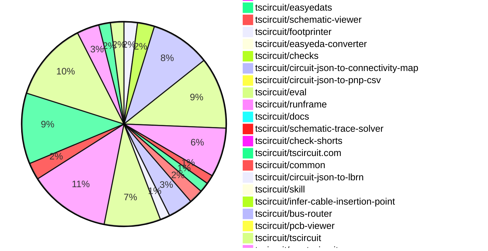

# Contribution Overview 2026-07-28

The current week is shown below. There are 3 major sections:

- [Contributor Overview](#contributor-overview)
- [PRs by Repository](#prs-by-repository)
- [PRs by Contributor](#changes-by-contributor)
- [Scoring & Sponsorship Details](/docs/sponsorship-calculation-explanation.md)

## PRs by Repository

## Contributor Overview

| Contributor | 🐳 Major | 🐙 Minor | 🐌 Tiny | Score | ⭐ |
|-------------|---------|---------|---------|-------|-----|
| [seveibar](#seveibar) | 85 | 60 | 49 | 474 | 👑👑👑 |
| [mohan-bee](#mohan-bee) | 8 | 9 | 6 | 62 | ⭐⭐⭐ |
| [rushabhcodes](#rushabhcodes) | 5 | 7 | 12 | 49 | ⭐⭐ |
| [MustafaMulla29](#MustafaMulla29) | 6 | 2 | 16 | 41 | ⭐⭐ |
| [0hmX](#0hmX) | 7 | 2 | 6 | 39 | ⭐⭐ |
| [ShiboSoftwareDev](#ShiboSoftwareDev) | 6 | 0 | 2 | 30 | ⭐⭐ |
| [Abse2001](#Abse2001) | 3 | 3 | 5 | 25 | ⭐⭐ |
| [imrishabh18](#imrishabh18) | 2 | 3 | 7 | 22 | ⭐⭐ |
| [techmannih](#techmannih) | 1 | 3 | 11 | 21.5 | ⭐⭐ |
| [AnasSarkiz](#AnasSarkiz) | 2 | 3 | 4 | 21 | ⭐⭐ |
| [tscircuitbot](#tscircuitbot) | 0 | 0 | 486 | 18 | ⭐⭐ |
| [Hero988](#Hero988) | 0 | 4 | 3 | 11 | ⭐⭐ |
| [addibble](#addibble) | 0 | 3 | 4 | 10 | ⭐ |
| [anil08607](#anil08607) | 0 | 2 | 5 | 9 | ⭐ |
| [Sang-it](#Sang-it) | 1 | 1 | 0 | 6 | ⭐ |
| [KrishnaX12](#KrishnaX12) | 0 | 2 | 0 | 4 | ⭐ |
| [GokulPandi-M](#GokulPandi-M) | 0 | 0 | 4 | 4 | ⭐ |
| [itisrohit](#itisrohit) | 0 | 1 | 0 | 2 |  |
| [astrimid](#astrimid) | 0 | 0 | 1 | 1 |  |

## Staff Pass Ratio (SPR)

| Contributor | Reviewed PRs | Rejections | Approvals | SPR |
|-------------|--------------|------------|-----------|-----|
| [mohan-bee](#mohan-bee) | 11 | 2 | 10 | 81.8% |
| [Hero988](#Hero988) | 8 | 5 | 6 | 37.5% |
| [rushabhcodes](#rushabhcodes) | 7 | 0 | 7 | 100.0% |
| [MustafaMulla29](#MustafaMulla29) | 6 | 0 | 6 | 100.0% |
| [Abse2001](#Abse2001) | 4 | 0 | 4 | 100.0% |
| [AnasSarkiz](#AnasSarkiz) | 4 | 0 | 5 | 100.0% |
| [KrishnaX12](#KrishnaX12) | 4 | 3 | 2 | 25.0% |
| [ShiboSoftwareDev](#ShiboSoftwareDev) | 4 | 0 | 4 | 100.0% |
| [0hmX](#0hmX) | 3 | 1 | 2 | 66.7% |
| [addibble](#addibble) | 3 | 0 | 3 | 100.0% |
| [anil08607](#anil08607) | 3 | 1 | 2 | 66.7% |
| [techmannih](#techmannih) | 3 | 1 | 2 | 66.7% |
| [astrimid](#astrimid) | 2 | 0 | 2 | 100.0% |
| [GokulPandi-M](#GokulPandi-M) | 2 | 2 | 0 | 0.0% |
| [itisrohit](#itisrohit) | 2 | 1 | 1 | 50.0% |
| [imrishabh18](#imrishabh18) | 1 | 0 | 1 | 100.0% |

mohan-bee SPR PRs (11)

- [#247](https://github.com/tscircuit/schematic-viewer/pull/247) Add component and net search with across sheets focus
- [#2926](https://github.com/tscircuit/core/pull/2926) update matchpack
- [#2902](https://github.com/tscircuit/core/pull/2902) Inflate simple MOSFET
- [#129](https://github.com/tscircuit/circuit-json-to-gerber/pull/129) Fix stretched silkscreen text
- [#191](https://github.com/tscircuit/matchpack/pull/191) Index pin ownership before building chip partitions
- [#184](https://github.com/tscircuit/matchpack/pull/184) Place grounded two-component load chains vertically
- [#178](https://github.com/tscircuit/matchpack/pull/178) Fix schematic testpoint overlaps with collision-aware body and trace search
- [#176](https://github.com/tscircuit/matchpack/pull/176) Offset directly connected passives below main-chip pins in schematic layouts
- [#173](https://github.com/tscircuit/matchpack/pull/173) introduce AlignTestPointsSolver
- [#177](https://github.com/tscircuit/matchpack/pull/177) Place net-only decoupling rows beside direct connections
- [#744](https://github.com/tscircuit/schematic-trace-solver/pull/744) Fix schematic trace routing to form shared same-net load junctions

Hero988 SPR PRs (8)

- [#110](https://github.com/tscircuit/circuit-json-util/pull/110) fix: transform pcb_solder_paste and other component-attached elements in transformPCBElement
- [#767](https://github.com/tscircuit/props/pull/767) feat: add solderPasteMargin prop to all smtpad variants
- [#2945](https://github.com/tscircuit/core/pull/2945) feat: make smtpad solder paste aperture configurable via solderPasteMargin
- [#2970](https://github.com/tscircuit/core/pull/2970) fix: treat pcbOffsetX/pcbOffsetY as aliases for pcbX/pcbY
- [#2930](https://github.com/tscircuit/core/pull/2930) fix: emit solder paste for polygon and pill smtpads
- [#2916](https://github.com/tscircuit/core/pull/2916) fix: bump @tscircuit/circuit-json-util to 0.0.102 so PCB transforms (grid layout, subcircuit anchoring) move solder paste with pads
- [#351](https://github.com/tscircuit/contribution-tracker/pull/351) fix: paginate GitHub list calls in data-retrieval
- [#648](https://github.com/tscircuit/circuit-to-svg/pull/648) feat: add showSolderPaste option to render solder paste in the pcb view

rushabhcodes SPR PRs (7)

- [#4220](https://github.com/tscircuit/tscircuit.com/pull/4220) Fix editor import regression introduced by Monaco migration
- [#4206](https://github.com/tscircuit/tscircuit.com/pull/4206) Fix clipped Monaco diagnostic hovers in the split-pane editor
- [#4177](https://github.com/tscircuit/tscircuit.com/pull/4177) Migrate web editor to Monaco WorkspaceCodeEditor with mobile memory toggle
- [#4316](https://github.com/tscircuit/runframe/pull/4316) Handle oversized autorouting bug reports with actionable RunFrame errors
- [#4281](https://github.com/tscircuit/runframe/pull/4281) Fix Ctrl/Cmd+Enter execution when Monaco consumes the shortcut
- [#172](https://github.com/tscircuit/circuit-json-to-gltf/pull/172) Add true elliptical PCB hole rendering for oval shapes with regression coverage
- [#171](https://github.com/tscircuit/circuit-json-to-gltf/pull/171) Fix rectangular PCB holes rendering as solid surfaces in 3D

MustafaMulla29 SPR PRs (6)

- [#778](https://github.com/tscircuit/props/pull/778) Add rotated pill SmtPad props
- [#2997](https://github.com/tscircuit/core/pull/2997) Preserve rotated pill pads from Circuit JSON
- [#2933](https://github.com/tscircuit/core/pull/2933) Fix multi-port traces in the default autorouter
- [#189](https://github.com/tscircuit/matchpack/pull/189) Lay out parallel series branches
- [#767](https://github.com/tscircuit/schematic-trace-solver/pull/767) Place rail labels on pin-attached corners
- [#762](https://github.com/tscircuit/schematic-trace-solver/pull/762) Preserve same-net rail alignment without touching other nets

Abse2001 SPR PRs (4)

- [#756](https://github.com/tscircuit/footprinter/pull/756) Fix SOT-25 pad-row width handling
- [#755](https://github.com/tscircuit/footprinter/pull/755) Fix TSSOP rounded pad parameter handling for C78589 SOP-6
- [#76](https://github.com/tscircuit/circuit-json-to-footprinter/pull/76) Migrate footprint IoU scoring to Manifold 2D boolean geometry
- [#73](https://github.com/tscircuit/circuit-json-to-footprinter/pull/73) Improve discovery for BGA grids, large SMD push buttons, and precise DFN-4 footprints

AnasSarkiz SPR PRs (4)

- [#759](https://github.com/tscircuit/props/pull/759) Add via-in-pad autorouter opt-in
- [#1793](https://github.com/tscircuit/tscircuit-autorouter/pull/1793) Use optimized DRC engine for autorouting repair
- [#1784](https://github.com/tscircuit/tscircuit-autorouter/pull/1784) Make via-in-pad repair opt-in
- [#34](https://github.com/tscircuit/high-density-repair03/pull/34) Add optimized autorouting DRC engine

KrishnaX12 SPR PRs (4)

- [#758](https://github.com/tscircuit/footprinter/pull/758) feat: add tsop48 footprint generator
- [#757](https://github.com/tscircuit/footprinter/pull/757) feat: add lcc68 footprint generator
- [#830](https://github.com/tscircuit/docs/pull/830) docs: fix inductor incorrect unit 
- [#827](https://github.com/tscircuit/docs/pull/827) fix: use interactive runframe for 3d preview in CircuitPreview

ShiboSoftwareDev SPR PRs (4)

- [#768](https://github.com/tscircuit/props/pull/768) Add SPICE waveform and measurement props
- [#1902](https://github.com/tscircuit/tscircuit-autorouter/pull/1902) fix: complete sample 11 safe trace repair
- [#1810](https://github.com/tscircuit/tscircuit-autorouter/pull/1810) Repair DRC conflicts with safe trace layer moves
- [#1799](https://github.com/tscircuit/tscircuit-autorouter/pull/1799) fix(topology): detect BGA cores in mixed packages

0hmX SPR PRs (3)

- [#12](https://github.com/tscircuit/rfc/pull/12) Add automatic decoupling capacitor detection and enforcement RFC
- [#2937](https://github.com/tscircuit/core/pull/2937) Fix inherited routingDisabled for sequential traces
- [#88](https://github.com/tscircuit/common/pull/88) Split RP2040 board into centered routable subcircuits

addibble SPR PRs (3)

- [#111](https://github.com/tscircuit/circuit-json-util/pull/111) Follow insertion_direction rename to top/bottom
- [#2975](https://github.com/tscircuit/core/pull/2975) Follow insertion_direction rename to top/bottom
- [#1](https://github.com/tscircuit/infer-cable-insertion-point/pull/1) Honor explicit insertion_direction and follow the top/bottom rename

anil08607 SPR PRs (3)

- [#2963](https://github.com/tscircuit/core/pull/2963) Add fabrication note text rotation support
- [#316](https://github.com/tscircuit/jscad-electronics/pull/316) Add 3D CAD model for radial electrolytic capacitors
- [#649](https://github.com/tscircuit/circuit-to-svg/pull/649) Add showSolderPaste option to PCB SVG rendering

techmannih SPR PRs (3)

- [#754](https://github.com/tscircuit/footprinter/pull/754) feat(stampboard): support offset side rows and inner SMT grids
- [#2928](https://github.com/tscircuit/core/pull/2928) Fix supplier footprint loading without a library resolver
- [#60](https://github.com/tscircuit/kicadts/pull/60) Add support for legacy KiCad footprint arcs

astrimid SPR PRs (2)

- [#4127](https://github.com/tscircuit/tscircuit.com/pull/4127) Update runframe and pcb-viewer
- [#3530](https://github.com/tscircuit/eval/pull/3530) Better language in bun-pver-release.yml

GokulPandi-M SPR PRs (2)

- [#317](https://github.com/tscircuit/jscad-electronics/pull/317) fix: align TO92 3D legs to 2D footprint pads
- [#1822](https://github.com/tscircuit/tscircuit-autorouter/pull/1822) fix(stitching): honor preserved terminal orientation

itisrohit SPR PRs (2)

- [#752](https://github.com/tscircuit/footprinter/pull/752) repro: solder jumper bridge trace endpoint lands outside pad boundary (FP precision)
- [#2923](https://github.com/tscircuit/core/pull/2923) repro: solder jumper bridge trace disconnected endpoint false positive

imrishabh18 SPR PRs (1)

- [#2924](https://github.com/tscircuit/core/pull/2924) Fix missing net labels across subcircuits

> Note: AI evaluates PRs and assigns 1-3 star ratings automatically. 4 and 5 star ratings require manual staff review.

## Review Table

[reviews-received-hover]: ## "Number of reviews received for PRs for this contributor"
[approvals-received-hover]: ## "Number of approvals received for PRs this contributor authored"
[rejections-received-hover]: ## "Number of rejections received for PRs this contributor authored"
[prs-opened-hover]: ## "Number of PRs opened by this contributor"
[issues-created-hover]: ## "Number of issues created by this contributor"

| Contributor | Reviews Received | Approvals Received | Rejections Received | Approvals | Rejections Given | PRs Opened | PRs Merged | Issues Created |
|---|---|---|---|---|---|---|---|---|
| [0hmX](#0hmX) | 37 | 4 | 1 | 3 | 1 | 22 | 16 | 0 |
| [Abse2001](#Abse2001) | 5 | 5 | 0 | 2 | 0 | 12 | 12 | 0 |
| [addibble](#addibble) | 7 | 7 | 0 | 0 | 0 | 8 | 7 | 0 |
| [adityaaa-IIT-BHU](#adityaaa-IIT-BHU) | 0 | 0 | 0 | 0 | 0 | 4 | 0 | 0 |
| [AnasSarkiz](#AnasSarkiz) | 9 | 8 | 0 | 3 | 0 | 24 | 9 | 0 |
| [anil08607](#anil08607) | 27 | 14 | 2 | 0 | 0 | 13 | 8 | 0 |
| [astrimid](#astrimid) | 4 | 3 | 0 | 0 | 0 | 11 | 5 | 0 |
| [Ayush7614](#Ayush7614) | 0 | 0 | 0 | 0 | 0 | 3 | 0 | 0 |
| [b3417](#b3417) | 0 | 0 | 0 | 0 | 0 | 1 | 0 | 0 |
| [bingogo1115](#bingogo1115) | 1 | 0 | 0 | 0 | 0 | 1 | 0 | 0 |
| [Devesh36](#Devesh36) | 0 | 0 | 0 | 0 | 0 | 1 | 0 | 0 |
| [EazyHood](#EazyHood) | 0 | 0 | 0 | 0 | 0 | 1 | 0 | 0 |
| [GokulPandi-M](#GokulPandi-M) | 17 | 8 | 4 | 0 | 0 | 12 | 5 | 0 |
| [Hero988](#Hero988) | 24 | 13 | 3 | 0 | 0 | 13 | 7 | 0 |
| [imrishabh18](#imrishabh18) | 4 | 2 | 0 | 11 | 3 | 17 | 14 | 0 |
| [itisrohit](#itisrohit) | 6 | 1 | 4 | 0 | 0 | 9 | 1 | 0 |
| [kaivalyaarisetty](#kaivalyaarisetty) | 0 | 0 | 0 | 0 | 0 | 2 | 0 | 0 |
| [khozakhulile27-netizen](#khozakhulile27-netizen) | 1 | 0 | 0 | 0 | 0 | 4 | 0 | 0 |
| [koolniko396-coder](#koolniko396-coder) | 0 | 0 | 0 | 0 | 0 | 1 | 0 | 0 |
| [KrishnaX12](#KrishnaX12) | 9 | 3 | 5 | 0 | 0 | 9 | 2 | 0 |
| [minerva32](#minerva32) | 0 | 0 | 0 | 0 | 0 | 1 | 0 | 0 |
| [mohan-bee](#mohan-bee) | 27 | 18 | 2 | 6 | 2 | 34 | 25 | 0 |
| [MustafaMulla29](#MustafaMulla29) | 10 | 10 | 0 | 8 | 1 | 26 | 24 | 0 |
| [rushabhcodes](#rushabhcodes) | 42 | 12 | 0 | 4 | 0 | 28 | 25 | 0 |
| [Sang-it](#Sang-it) | 0 | 0 | 0 | 0 | 0 | 4 | 2 | 0 |
| [seveibar](#seveibar) | 36 | 3 | 0 | 79 | 13 | 249 | 203 | 0 |
| [Shahinn0x](#Shahinn0x) | 1 | 0 | 0 | 0 | 0 | 1 | 0 | 0 |
| [ShiboSoftwareDev](#ShiboSoftwareDev) | 8 | 8 | 0 | 4 | 0 | 107 | 11 | 0 |
| [techmannih](#techmannih) | 13 | 8 | 1 | 8 | 2 | 19 | 16 | 0 |
| [tomlycett](#tomlycett) | 0 | 0 | 0 | 0 | 0 | 1 | 0 | 0 |
| [tscircuitbot](#tscircuitbot) | 1 | 1 | 0 | 0 | 0 | 842 | 641 | 0 |
| [vasu-rs](#vasu-rs) | 0 | 0 | 0 | 0 | 0 | 1 | 0 | 0 |

## Changes by Repository

### [tscircuit/circuit-json](https://github.com/tscircuit/circuit-json)

| PR # | Impact | Rating | Contributor | Description |
|------|--------|--------|-------------|-------------|
| [#684](https://github.com/tscircuit/circuit-json/pull/684) | 🐳 Major | ⭐⭐⭐ | seveibar | Add semantic pin 1 locations to PCB components, allowing for better representation of pin orientations and supplier-specific mappings in PCB designs. |
| [#670](https://github.com/tscircuit/circuit-json/pull/670) | 🐳 Major | ⭐⭐⭐ | seveibar | Add optional excluded_pcb_component_ids to rectangular and circular pcb_keepout elements, allowing for the specification of PCB components that are exempt from DRC enforcement. |
| [#680](https://github.com/tscircuit/circuit-json/pull/680) | 🐙 Minor | ⭐⭐ | seveibar | Add an optional is_via_in_pad_allowed boolean to the pcb_board Zod schema to allow explicit opt-out for via-in-pad designs in circuit-json. |
| [#676](https://github.com/tscircuit/circuit-json/pull/676) | 🐙 Minor | ⭐⭐ | seveibar | Adds an optional non-empty source_net_id to PCB vias, exposing it on the PcbVia interface, and ensuring that empty source net IDs are rejected. |
| [#674](https://github.com/tscircuit/circuit-json/pull/674) | 🐙 Minor | ⭐⭐ | seveibar | Makes the source_net_id field optional and ensures it cannot be an empty string, improving the handling of unassigned nets in circuit elements. |
| [#672](https://github.com/tscircuit/circuit-json/pull/672) | 🐙 Minor | ⭐⭐ | seveibar | Adds an optional source_trace_id to the pcb_via schema and TypeScript interface, allowing for semantic source-connectivity references for manually placed vias without overloading pcb_trace_id. |

🐌 Tiny Contributions (9)

| PR # | Impact | Contributor | Description |
|------|--------|-------------|-------------|
| [#682](https://github.com/tscircuit/circuit-json/pull/682) | 🐌 Tiny | seveibar | Add optional solderpaste_margin to every pcb_smtpad shape schema and exported TypeScript interface, allowing for aperture expansion or contraction on SMT pads. |
| [#685](https://github.com/tscircuit/circuit-json/pull/685) | 🐌 Tiny | tscircuitbot | Automated package update |
| [#681](https://github.com/tscircuit/circuit-json/pull/681) | 🐌 Tiny | tscircuitbot | Automated package update |
| [#683](https://github.com/tscircuit/circuit-json/pull/683) | 🐌 Tiny | tscircuitbot | Automated package update |
| [#677](https://github.com/tscircuit/circuit-json/pull/677) | 🐌 Tiny | tscircuitbot | Automated package update |
| [#675](https://github.com/tscircuit/circuit-json/pull/675) | 🐌 Tiny | tscircuitbot | Automated package update |
| [#669](https://github.com/tscircuit/circuit-json/pull/669) | 🐌 Tiny | tscircuitbot | Automated package update |
| [#678](https://github.com/tscircuit/circuit-json/pull/678) | 🐌 Tiny | addibble | Renames insertion_direction Y-axis values from from_frontfrom_back to from_topfrom_bottom and adds from_below for -Z, ensuring all names align with the 2D PCB view. |
| [#668](https://github.com/tscircuit/circuit-json/pull/668) | 🐌 Tiny | Hero988 | Adds a rotated_pill shape variant to pcb_solder_paste, allowing for a paste aperture that matches the pad outline exactly. |

### [tscircuit/circuit-json-util](https://github.com/tscircuit/circuit-json-util)

| PR # | Impact | Rating | Contributor | Description |
|------|--------|--------|-------------|-------------|
| [#112](https://github.com/tscircuit/circuit-json-util/pull/112) | 🐳 Major | ⭐⭐⭐ | seveibar | Adds a utility to infer the semantic pin 1 location from PCB pad geometry and numeric port hints, replacing a previous implementation and enhancing the Circuit JSON utilities. |
| [#111](https://github.com/tscircuit/circuit-json-util/pull/111) | 🐙 Minor | ⭐⭐ | addibble | Renames the insertion directions in Circuit JSON from from_frontfrom_back to from_topfrom_bottom and adds from_below (-Z), ensuring alignment with the schema and fixing direction mirroring. |
| [#110](https://github.com/tscircuit/circuit-json-util/pull/110) | 🐙 Minor | ⭐⭐ | Hero988 | Fixes the issue where solder paste and other component-attached elements were not transformed during PCB layout adjustments, leading to misalignment with their corresponding pads. |

### [tscircuit/props](https://github.com/tscircuit/props)

| PR # | Impact | Rating | Contributor | Description |
|------|--------|--------|-------------|-------------|
| [#779](https://github.com/tscircuit/props/pull/779) | 🐳 Major | ⭐⭐⭐ | seveibar | Add unit-aware bus and differential-pair constraints for DDR routing, including maximum length skew, target impedance, PCB trace width, and allowed layers, along with updates to documentation. |
| [#766](https://github.com/tscircuit/props/pull/766) | 🐳 Major | ⭐⭐⭐ | seveibar | Add fanoutRoutingLayers to keep boundary-routed signal escapes off reserved plane layers and fanoutPourNetMap to map a layer to one net or an array of isolated nets, while regenerating the public props documentation. |
| [#778](https://github.com/tscircuit/props/pull/778) | 🐳 Major | ⭐⭐⭐ | MustafaMulla29 | Add first-class RotatedPillSmtPadProps with shape: rotated_pill and model the pads intrinsic angle with required ccwRotation, matching RotatedRectSmtPadProps. |
| [#781](https://github.com/tscircuit/props/pull/781) | 🐙 Minor | ⭐⭐ | seveibar | Add an optional maxViaCount prop to trace to limit the maximum number of vias allowed in PCB trace routes, ensuring critical traces can maintain their layer without relying on autorouter heuristics. |
| [#777](https://github.com/tscircuit/props/pull/777) | 🐙 Minor | ⭐⭐ | seveibar | Add a manufacturer-independent platform flag for enabling part orientation analysis, define a localStorage-like cache contract, validate options through platformConfig, and regenerate documentation. |
| [#774](https://github.com/tscircuit/props/pull/774) | 🐙 Minor | ⭐⭐ | seveibar | Adds isViaInPadAllowed property to BoardProps to allow intentional via-in-pad designs in circuit JSON and DRC checks. |
| [#776](https://github.com/tscircuit/props/pull/776) | 🐙 Minor | ⭐⭐ | seveibar | Adds an option to allow legacy autorouters in PlatformConfig, enabling deprecated presets temporarily for migration purposes. |
| [#775](https://github.com/tscircuit/props/pull/775) | 🐙 Minor | ⭐⭐ | seveibar | Allows the led component to accept custom pinLabels, enabling supplier wrappers to preserve non-generic polarity mappings and adds a regression test for LED pin configurations. |
| [#769](https://github.com/tscircuit/props/pull/769) | 🐙 Minor | ⭐⭐ | seveibar | Add an optional routingPhaseIndex prop to bus to specify the autorouting phase for bus constraints. |
| [#770](https://github.com/tscircuit/props/pull/770) | 🐙 Minor | ⭐⭐ | seveibar | Adds fanout routing controls to the breakout component, allowing configuration of escape directions and pour-net plane drops directly on breakout without requiring a nested autoroutingphase. |
| [#763](https://github.com/tscircuit/props/pull/763) | 🐙 Minor | ⭐⭐ | seveibar | Add reusable FanoutBoundaryPadding supporting scalar distance or directional distances for fanout boundary padding in autorouting and breakout components. |
| [#762](https://github.com/tscircuit/props/pull/762) | 🐙 Minor | ⭐⭐ | seveibar | Defines a non-empty cadModel string as a Footprinter model string, documents its independence from the components PCB footprint, and adds parser coverage for cadModelsoic8. |
| [#767](https://github.com/tscircuit/props/pull/767) | 🐙 Minor | ⭐⭐ | Hero988 | Adds solderPasteMargin prop to every smtpad shape variant, allowing for customizable solder paste aperture margins. |
| [#759](https://github.com/tscircuit/props/pull/759) | 🐙 Minor | ⭐⭐ | AnasSarkiz | Adds an option to the autorouter configuration to allow via-in-pad routing, which is disabled by default, and updates the documentation accordingly. |

🐌 Tiny Contributions (5)

| PR # | Impact | Contributor | Description |
|------|--------|-------------|-------------|
| [#780](https://github.com/tscircuit/props/pull/780) | 🐌 Tiny | seveibar | Accepts legacy numeric pin labels for LEDs and normalizes them to the canonical representation, ensuring compatibility with existing components. |
| [#772](https://github.com/tscircuit/props/pull/772) | 🐌 Tiny | seveibar | Adds an optional excludeRefs property to PCB keepouts to specify component selectors that can occupy the keepout region, enhancing flexibility in PCB design. |
| [#771](https://github.com/tscircuit/props/pull/771) | 🐌 Tiny | seveibar | Clarifies the documentation for the BusProps.routingPhaseIndex to specify that an omitted phase only declares bus membership and does not affect routing-phase assignment. |
| [#764](https://github.com/tscircuit/props/pull/764) | 🐌 Tiny | seveibar | Updates the README to include documentation for the new fanoutBoundaryPadding field in AutoroutingPhaseProps and BreakoutProps. |
| [#773](https://github.com/tscircuit/props/pull/773) | 🐌 Tiny | addibble | Renames insertion direction values from from_frontfrom_back to from_topfrom_bottom and adds Cartesian equivalents for better alignment with PCB design. |

### [tscircuit/core](https://github.com/tscircuit/core)

| PR # | Impact | Rating | Contributor | Description |
|------|--------|--------|-------------|-------------|
| [#2985](https://github.com/tscircuit/core/pull/2985) | 🐳 Major | ⭐⭐⭐ | seveibar | Bumps the tscircuitcapacity-autorouter dependency to version 0.0.744, implements stricter autorouting checks, and restores differential-pair length matching while ensuring valid routing under specific conditions. |
| [#2998](https://github.com/tscircuit/core/pull/2998) | 🐳 Major | ⭐⭐⭐ | seveibar | Add an opt-in PartOrientationAnalysis render phase that analyzes supplier part orientation and infers pin1 locations for components, enhancing the rendering process with supplier metadata and caching mechanisms. |
| [#2971](https://github.com/tscircuit/core/pull/2971) | 🐳 Major | ⭐⭐⭐ | seveibar | Resolves fanout bounds for each fanout phase by establishing a single boundary based on explicit geometry or padding, ensuring consistent routing and eliminating conflicts between breakout points and fanout boundaries. |
| [#2969](https://github.com/tscircuit/core/pull/2969) | 🐳 Major | ⭐⭐⭐ | seveibar | Assigns net-only manual PCB vias with source_net_id, reserves pcb_trace_id for references to actual physical PCB traces, and retains source_trace_id for port-bearing logical trace connectivity. |
| [#2991](https://github.com/tscircuit/core/pull/2991) | 🐳 Major | ⭐⭐⭐ | seveibar | Partitions PCB packing jobs by layer to optimize component placement and reduce distance between connected components. |
| [#2965](https://github.com/tscircuit/core/pull/2965) | 🐳 Major | ⭐⭐⭐ | seveibar | Fixes connectivity issues by ensuring that vias correctly associate with both component ports and nets, allowing for proper autorouting and short detection. |
| [#2958](https://github.com/tscircuit/core/pull/2958) | 🐳 Major | ⭐⭐⭐ | seveibar | Serializes selected PCB component IDs from the keepouts excludeRefs prop, allowing for more precise autorouting behavior without altering existing obstacles. |
| [#2959](https://github.com/tscircuit/core/pull/2959) | 🐳 Major | ⭐⭐⭐ | seveibar | Explicitly maps every PinCapability to its canonical Circuit JSON supports_ source-port field and maps activeCapabilities and activeCapability to corresponding is_configured_for_ fields, ensuring accurate serialization of pin capabilities. |
| [#2957](https://github.com/tscircuit/core/pull/2957) | 🐳 Major | ⭐⭐⭐ | seveibar | Marks obstacles emitted from pcb_via elements with the existing shape: circle geometry field to ensure accurate evaluation of diagonal clearances by the fanout solver. |
| [#2929](https://github.com/tscircuit/core/pull/2929) | 🐳 Major | ⭐⭐⭐ | seveibar | Derives fanout plane drops from an explicit fanoutPourNetMap and infers layer-to-net mapping from copper pour components, allowing users to write source-only traces to GND or VCC and have them drop to the matching pour layer without declaring a singleton BusFanoutTermination. |
| [#2949](https://github.com/tscircuit/core/pull/2949) | 🐳 Major | ⭐⭐⭐ | seveibar | Removes forced subcircuit behavior from Breakout, allowing it to function as a transparent routing directive while maintaining board-level connectivity for GND and VCC. |
| [#2947](https://github.com/tscircuit/core/pull/2947) | 🐳 Major | ⭐⭐⭐ | seveibar | Configures signal-bus fanout directly on breakout and infers internal escape orientation for plane-terminated power drops from each source pad position. |
| [#2946](https://github.com/tscircuit/core/pull/2946) | 🐳 Major | ⭐⭐⭐ | seveibar | Changes the autorouting behavior to allow buses to be assigned to explicit routing phases, ensuring that traces within a bus can be routed together in the same phase while preserving their individual phase settings when not explicitly assigned. |
| [#2944](https://github.com/tscircuit/core/pull/2944) | 🐳 Major | ⭐⭐⭐ | seveibar | Materializes routed pcb_via.layers from each route points from_layer and to_layer instead of expanding every via across the full board stack, addressing DRC errors caused by treating blind plane drops as through-vias. |
| [#2889](https://github.com/tscircuit/core/pull/2889) | 🐳 Major | ⭐⭐⭐ | seveibar | Add single-layer and multilayer fanout autorouters to the autorouting system, allowing for improved routing strategies and flexibility in PCB design. |
| [#2912](https://github.com/tscircuit/core/pull/2912) | 🐳 Major | ⭐⭐⭐ | seveibar | Adds a named SimpleRoutePoint type and optional port_selector metadata to enhance routing configuration by allowing identification of endpoints with stable semantic selectors instead of generated Circuit JSON IDs. |
| [#2937](https://github.com/tscircuit/core/pull/2937) | 🐳 Major | ⭐⭐⭐ | 0hmX | Fixes routing behavior for sequential traces to honor inherited routingDisabled values from parent boards and subcircuits |
| [#2933](https://github.com/tscircuit/core/pull/2933) | 🐳 Major | ⭐⭐⭐ | MustafaMulla29 | Fixes the issue where multi-port traces were incorrectly processed by the default autorouter, ensuring all endpoints are preserved in the routing process. |
| [#3003](https://github.com/tscircuit/core/pull/3003) | 🐙 Minor | ⭐⭐ | seveibar | Infers diodeLED pin 1 polarity from local and supplier source-port hints during part orientation analysis, emits a source_component_misconfigured_error for anodecathode mismatches, caches supplier pin 1 polarity, and maintains polarity checks even when geometric pin 1 location is indeterminate. |
| [#3000](https://github.com/tscircuit/core/pull/3000) | 🐙 Minor | ⭐⭐ | seveibar | Adds a regression test for legacy LED pinLabels with numeric keys, ensuring they normalize to canonical pin1pin2 keys and removes obsolete TypeScript ignore directive. |
| [#2979](https://github.com/tscircuit/core/pull/2979) | 🐙 Minor | ⭐⭐ | seveibar | Maps the board isViaInPadAllowed  property to the circuit JSON representation, allowing the circuit to distinguish intentional via-in-pad designs from violations. |
| [#2976](https://github.com/tscircuit/core/pull/2976) | 🐙 Minor | ⭐⭐ | seveibar | Recommends idiomatic identifiers for common voltage pin labels such as 3.3V, 3V3, and 5V, and includes these recommendations in warnings and errors related to pin labels. |
| [#2968](https://github.com/tscircuit/core/pull/2968) | 🐙 Minor | ⭐⭐ | seveibar | Routes manual breakout points with the local default capacity autorouter when no autorouter prop is supplied, preserving automatic fanout for sibling traces and existing autorouter configurations. |
| [#2967](https://github.com/tscircuit/core/pull/2967) | 🐙 Minor | ⭐⭐ | seveibar | Preserves schematic rail placement by honoring power and ground attributes when replacing net labels with rail symbols, and exposes solver constructor arguments for better traceability. |
| [#2948](https://github.com/tscircuit/core/pull/2948) | 🐙 Minor | ⭐⭐ | seveibar | Fixes handling of blob footprint URLs to correctly classify them and prevent false missing-library resolver errors. |
| [#2898](https://github.com/tscircuit/core/pull/2898) | 🐙 Minor | ⭐⭐ | seveibar | Refactors the autorouting system by extracting local autorouter strategies from Group.ts, introducing a strategy interface for router creation and cache policy, while maintaining existing behavior and ensuring the default strategy remains cacheable. |
| [#2975](https://github.com/tscircuit/core/pull/2975) | 🐙 Minor | ⭐⭐ | addibble | Renames the -Y insertion directions from from_frontfrom_back to from_topfrom_bottom and adds from_below (-Z), while fixing Z axis handling under layer flips. |
| [#2945](https://github.com/tscircuit/core/pull/2945) | 🐙 Minor | ⭐⭐ | Hero988 | Adds a solderPasteMargin prop to smtpad for configuring the solder paste aperture size, addressing issues with default scaling that resulted in apertures below IPC standards. |
| [#2916](https://github.com/tscircuit/core/pull/2916) | 🐙 Minor | ⭐⭐ | Hero988 | Fixes solder paste misalignment in grid layouts by updating the circuit-json-util dependency to ensure proper transformation of solder paste with pads. |
| [#3006](https://github.com/tscircuit/core/pull/3006) | 🐙 Minor | ⭐⭐ | MustafaMulla29 | Adds a test to verify that schematic traces correctly run through testpoints in the circuit. |
| [#2997](https://github.com/tscircuit/core/pull/2997) | 🐙 Minor | ⭐⭐ | MustafaMulla29 | Adds support for preserving rotated pill pads in Circuit JSON, ensuring proper rendering and functionality for PCB and 3D views. |
| [#2914](https://github.com/tscircuit/core/pull/2914) | 🐙 Minor | ⭐⭐ | AnasSarkiz | Adds the ability to pass the allowViaInPad option to the autorouter, enabling via-in-pad routing when specified by the user. |
| [#2940](https://github.com/tscircuit/core/pull/2940) | 🐙 Minor | ⭐⭐ | techmannih | Fixes the issue of VDD net label intersecting traces in the circuit rendering by adding a test for power pin connections of the CC2745R10 component. |
| [#2928](https://github.com/tscircuit/core/pull/2928) | 🐙 Minor | ⭐⭐ | techmannih | Fixes loading of supplier footprints when no library resolver is configured, ensuring components are rendered correctly with pads and ports. |
| [#2954](https://github.com/tscircuit/core/pull/2954) | 🐙 Minor | ⭐⭐ | mohan-bee | Adds the isTestPoint metadata to matchpack for proper handling of test points in schematic layouts. |
| [#2941](https://github.com/tscircuit/core/pull/2941) | 🐙 Minor | ⭐⭐ | mohan-bee | Updates the trace solver to ensure same-net branches share clean junctions in schematic rendering. |
| [#2909](https://github.com/tscircuit/core/pull/2909) | 🐙 Minor | ⭐⭐ | mohan-bee | Add reproducible tests for PowerSection schematic auto-layout and ESP32 testpoint schematic auto-layout, including new component definitions and focused SVG snapshots. |
| [#2902](https://github.com/tscircuit/core/pull/2902) | 🐙 Minor | ⭐⭐ | mohan-bee | Adds functionality to inflate simple MOSFET components in circuit JSON, enabling their integration into subcircuits. |
| [#2922](https://github.com/tscircuit/core/pull/2922) | 🐙 Minor | ⭐⭐ | imrishabh18 | Renames the capacity-mesh-autorouting effect to autorouting in the Group component to simplify the naming convention. |
| [#2923](https://github.com/tscircuit/core/pull/2923) | 🐙 Minor | ⭐⭐ | itisrohit | Fixes false positive DRC error for solder jumper bridge traces due to missing connection metadata in the PCB rendering process. |

🐌 Tiny Contributions (27)

| PR # | Impact | Contributor | Description |
|------|--------|-------------|-------------|
| [#3001](https://github.com/tscircuit/core/pull/3001) | 🐌 Tiny | seveibar | Expands the Bun test matrix from 4 to 10 parallel shards to reduce CI test execution time, while preserving the existing 4-shard default for snapshot workflows and validating configured shard counts. |
| [#2983](https://github.com/tscircuit/core/pull/2983) | 🐌 Tiny | seveibar | Updates the tscircuitschematic-trace-solver dependency from version 0.0.117 to 0.0.120, regenerating affected schematic snapshots and incorporating rail-label placement fixes from related pull requests. |
| [#2989](https://github.com/tscircuit/core/pull/2989) | 🐌 Tiny | seveibar | Reproduces a test case where bottom-layer decoupling capacitors are incorrectly placed underneath a BGA due to PCB layer identity not being preserved in packing calculations. |
| [#2977](https://github.com/tscircuit/core/pull/2977) | 🐌 Tiny | seveibar | Clarifies that _parsedProps and props are immutable user input and forbids modifying _parsedProps in constructors or elsewhere, recommending resolve-style functions for derived, normalized, and default values. |
| [#2943](https://github.com/tscircuit/core/pull/2943) | 🐌 Tiny | seveibar | Updates the tscircuitfanout-solver dependency from version 0.0.10 to 0.0.11, enabling adaptive single-layer fanout support with selected boundary corners or sides. |
| [#2984](https://github.com/tscircuit/core/pull/2984) | 🐌 Tiny | tscircuitbot | Updates the tscircuitchecks package from version 0.0.150 to 0.0.151 in the package.json file. |
| [#2978](https://github.com/tscircuit/core/pull/2978) | 🐌 Tiny | tscircuitbot | Updates the version of the tscircuitchecks package from 0.0.149 to 0.0.150 in package.json |
| [#2974](https://github.com/tscircuit/core/pull/2974) | 🐌 Tiny | tscircuitbot | Updates the tscircuitchecks package from version 0.0.148 to 0.0.149 in the package.json file. |
| [#2995](https://github.com/tscircuit/core/pull/2995) | 🐌 Tiny | tscircuitbot | Updates the tscircuitprops package from version 0.0.605 to 0.0.608 in package.json |
| [#2961](https://github.com/tscircuit/core/pull/2961) | 🐌 Tiny | anil08607 | Updates the circuit-to-svg dependency from version 0.0.393 to 0.0.395 in package.json |
| [#3008](https://github.com/tscircuit/core/pull/3008) | 🐌 Tiny | MustafaMulla29 | Updates the version of the tscircuitschematic-trace-solver dependency from 0.0.121 to 0.0.122 in package.json |
| [#3007](https://github.com/tscircuit/core/pull/3007) | 🐌 Tiny | MustafaMulla29 | Fixes schematic trace routing to avoid crossing testpoint reference designators, ensuring proper visual representation in schematics. |
| [#2996](https://github.com/tscircuit/core/pull/2996) | 🐌 Tiny | MustafaMulla29 | Adds a focused test reproduction for missing lead pads in imported INA240A1PWR footprints, highlighting a rendering issue where pads are dropped before PCB and 3D output. |
| [#2988](https://github.com/tscircuit/core/pull/2988) | 🐌 Tiny | MustafaMulla29 | Updates the schematic snapshots to ensure proper clearance between cross-net traces, specifically addressing the BQ25895 and repro91 tests. |
| [#2987](https://github.com/tscircuit/core/pull/2987) | 🐌 Tiny | MustafaMulla29 | Adds a minimized BQ25895 schematic reproducing the CEGND trace collision, asserting that the CE and GND nets contain touching parallel vertical segments. |
| [#2951](https://github.com/tscircuit/core/pull/2951) | 🐌 Tiny | MustafaMulla29 | Updates the version of the tscircuitmatchpack dependency from 0.0.61 to 0.0.64 in package.json |
| [#2931](https://github.com/tscircuit/core/pull/2931) | 🐌 Tiny | MustafaMulla29 | Adds a minimal reproduction test for a trace path with three port selectors, including schematic and PCB visual snapshots to capture the intended connectivity. |
| [#2919](https://github.com/tscircuit/core/pull/2919) | 🐌 Tiny | MustafaMulla29 | Updates the version of the tscircuitschematic-trace-solver dependency from 0.0.114 to 0.0.115 in package.json |
| [#2917](https://github.com/tscircuit/core/pull/2917) | 🐌 Tiny | MustafaMulla29 | Updates the version of the tscircuitschematic-trace-solver dependency from 0.0.111 to 0.0.114 in package.json |
| [#2904](https://github.com/tscircuit/core/pull/2904) | 🐌 Tiny | GokulPandi-M | Fixes the internal rendering logic of the fuse  component to ensure that the schShowRatings prop correctly hides the ratings on the schematic symbol when set to false. |
| [#2952](https://github.com/tscircuit/core/pull/2952) | 🐌 Tiny | techmannih | Updates the version of the tscircuitschematic-trace-solver dependency from 0.0.116 to 0.0.117 in package.json |
| [#2925](https://github.com/tscircuit/core/pull/2925) | 🐌 Tiny | techmannih | Updates the kicadts dependency from version 0.0.51 to 0.0.53 in package.json |
| [#2915](https://github.com/tscircuit/core/pull/2915) | 🐌 Tiny | techmannih | Updates the kicad-to-circuit-json dependency to version 0.0.117 in package.json |
| [#2913](https://github.com/tscircuit/core/pull/2913) | 🐌 Tiny | techmannih | Updates the kicad-to-circuit-json dependency version from 0.0.113 to 0.0.116 in package.json |
| [#2966](https://github.com/tscircuit/core/pull/2966) | 🐌 Tiny | rushabhcodes | Updates the circuit-json-to-gltf dependency version from 0.0.108 to 0.0.111 in package.json |
| [#2942](https://github.com/tscircuit/core/pull/2942) | 🐌 Tiny | rushabhcodes | Updates the version of the circuit-json-to-gltf package from 0.0.107 to 0.0.108 in package.json |
| [#2899](https://github.com/tscircuit/core/pull/2899) | 🐌 Tiny | imrishabh18 | Automatically sizes schematic chip boxes using the longest displayed pin label on each opposing side, preserving explicit schWidth values and existing one-sided sizing behavior. |

### [tscircuit/jlcsearch](https://github.com/tscircuit/jlcsearch)

| PR # | Impact | Rating | Contributor | Description |
|------|--------|--------|-------------|-------------|
| [#434](https://github.com/tscircuit/jlcsearch/pull/434) | 🐳 Major | ⭐⭐⭐ | seveibar | Adds functionality to rank photodiodes by distance from their peak wavelength, allowing users to exclude certain peak bands and keep the target near a devices peak response. |
| [#433](https://github.com/tscircuit/jlcsearch/pull/433) | 🐳 Major | ⭐⭐⭐ | seveibar | Changes the photodiode query parameters to use wavelength as the canonical parameter while maintaining wavelength_min as a legacy alias, allowing for better matching of parts based on their peak response and excluding unwanted peak bands. |
| [#432](https://github.com/tscircuit/jlcsearch/pull/432) | 🐳 Major | ⭐⭐⭐ | seveibar | Changes the filtering mechanism for photo diodes to match detection ranges based on a desired wavelength instead of just peak wavelength, improving accuracy in results. |
| [#430](https://github.com/tscircuit/jlcsearch/pull/430) | 🐳 Major | ⭐⭐⭐ | seveibar | Add a Photo Diodes category at photo_diodeslist with JSON API support, allowing users to browse and filter in-stock photodiodes by various attributes. |
| [#429](https://github.com/tscircuit/jlcsearch/pull/429) | 🐳 Major | ⭐⭐⭐ | seveibar | Adds a full_catalog mode to the production D1 workflow, enabling the materialization of the component catalog directly from the current source-db-v2 schema and rebuilding the search and FTS indexes in full-catalog mode. |
| [#431](https://github.com/tscircuit/jlcsearch/pull/431) | 🐙 Minor | ⭐⭐ | seveibar | Adds a minimum wavelength filter for photodiodes, allowing users to query photodiodes with a peak wavelength greater than or equal to a specified minimum wavelength. |

### [tscircuit/cli](https://github.com/tscircuit/cli)

| PR # | Impact | Rating | Contributor | Description |
|------|--------|--------|-------------|-------------|
| [#4009](https://github.com/tscircuit/cli/pull/4009) | 🐳 Major | ⭐⭐⭐ | seveibar | Add support for exporting schematics as PDF files, allowing for easier printing and sharing while preserving sheet boundaries. |
| [#3997](https://github.com/tscircuit/cli/pull/3997) | 🐳 Major | ⭐⭐⭐ | seveibar | Anchors the default local cache at the resolved circuit project directory, allowing CLI commands and RunFrame to share the same persistent cache for improved consistency and efficiency. |
| [#3945](https://github.com/tscircuit/cli/pull/3945) | 🐳 Major | ⭐⭐⭐ | seveibar | Fixes autorouting failures by normalizing route points and preventing debug image rendering failures from aborting the autorouting process. |
| [#4014](https://github.com/tscircuit/cli/pull/4014) | 🐙 Minor | ⭐⭐ | seveibar | Load tscircuitcheck-shorts from the official jscdn latestesm endpoint when tsci check shorts runs, with a fallback to the packaged checker if the CDN is unavailable. |
| [#4006](https://github.com/tscircuit/cli/pull/4006) | 🐙 Minor | ⭐⭐ | seveibar | Enable part-orientation analysis when generating JLCPCB fabrication output and correct pick-and-place rotations based on supplier orientation metadata. |
| [#3963](https://github.com/tscircuit/cli/pull/3963) | 🐙 Minor | ⭐⭐ | seveibar | Add a command to record solver constructor inputs during circuit rendering, preserving event order and handling complex data types. |
| [#3955](https://github.com/tscircuit/cli/pull/3955) | 🐙 Minor | ⭐⭐ | seveibar | Validates licenses against KiCads exact PCM v1 license enum, emits the oldest compatible schema automatically, preserves declared licenses, and adds project settings for KiCad PCM compatibility. |
| [#3934](https://github.com/tscircuit/cli/pull/3934) | 🐙 Minor | ⭐⭐ | seveibar | Propagates package licenses from package.json into KiCad PCM v2, ensuring proper license handling and validation in metadata. |

🐌 Tiny Contributions (72)

| PR # | Impact | Contributor | Description |
|------|--------|-------------|-------------|
| [#4034](https://github.com/tscircuit/cli/pull/4034) | 🐌 Tiny | tscircuitbot | Automated package update |
| [#4033](https://github.com/tscircuit/cli/pull/4033) | 🐌 Tiny | tscircuitbot | Updates the tscircuitrunframe package from version 0.0.2360 to 0.0.2361 |
| [#4031](https://github.com/tscircuit/cli/pull/4031) | 🐌 Tiny | tscircuitbot | Updates the tscircuitrunframe package to version 0.0.2360 |
| [#4030](https://github.com/tscircuit/cli/pull/4030) | 🐌 Tiny | tscircuitbot | Automated package update |
| [#4029](https://github.com/tscircuit/cli/pull/4029) | 🐌 Tiny | tscircuitbot | Updates the tscircuitrunframe package from version 0.0.2357 to 0.0.2359 |
| [#4026](https://github.com/tscircuit/cli/pull/4026) | 🐌 Tiny | tscircuitbot | Automated package update |
| [#4025](https://github.com/tscircuit/cli/pull/4025) | 🐌 Tiny | tscircuitbot | Automated README update with latest CLI usage output. |
| [#4024](https://github.com/tscircuit/cli/pull/4024) | 🐌 Tiny | tscircuitbot | Automated package update |
| [#4023](https://github.com/tscircuit/cli/pull/4023) | 🐌 Tiny | tscircuitbot | Updates the tscircuitrunframe package to version 0.0.2357 in the package.json file |
| [#4021](https://github.com/tscircuit/cli/pull/4021) | 🐌 Tiny | tscircuitbot | Automated package update |
| [#4020](https://github.com/tscircuit/cli/pull/4020) | 🐌 Tiny | tscircuitbot | Updates the tscircuitrunframe package version from 0.0.2355 to 0.0.2356 |
| [#4019](https://github.com/tscircuit/cli/pull/4019) | 🐌 Tiny | tscircuitbot | Automated package update |
| [#4018](https://github.com/tscircuit/cli/pull/4018) | 🐌 Tiny | tscircuitbot | Automated package update |
| [#4016](https://github.com/tscircuit/cli/pull/4016) | 🐌 Tiny | tscircuitbot | Automated package update |
| [#4015](https://github.com/tscircuit/cli/pull/4015) | 🐌 Tiny | tscircuitbot | Automated package update |
| [#4012](https://github.com/tscircuit/cli/pull/4012) | 🐌 Tiny | tscircuitbot | Automated package update |
| [#4010](https://github.com/tscircuit/cli/pull/4010) | 🐌 Tiny | tscircuitbot | Automated package update |
| [#4008](https://github.com/tscircuit/cli/pull/4008) | 🐌 Tiny | tscircuitbot | Updates the tscircuitrunframe package version from 0.0.2349 to 0.0.2353 |
| [#4001](https://github.com/tscircuit/cli/pull/4001) | 🐌 Tiny | tscircuitbot | Updates the tscircuitrunframe package from version 0.0.2348 to 0.0.2349 |
| [#4000](https://github.com/tscircuit/cli/pull/4000) | 🐌 Tiny | tscircuitbot | Automated package update |
| [#3999](https://github.com/tscircuit/cli/pull/3999) | 🐌 Tiny | tscircuitbot | Updates the tscircuitrunframe package from version 0.0.2347 to 0.0.2348 |
| [#3995](https://github.com/tscircuit/cli/pull/3995) | 🐌 Tiny | tscircuitbot | Automated package update |
| [#3993](https://github.com/tscircuit/cli/pull/3993) | 🐌 Tiny | tscircuitbot | Updates the tscircuitrunframe package to version 0.0.2347 in package.json |
| [#3991](https://github.com/tscircuit/cli/pull/3991) | 🐌 Tiny | tscircuitbot | Updates the tscircuitrunframe package from version 0.0.2345 to 0.0.2346 |
| [#3990](https://github.com/tscircuit/cli/pull/3990) | 🐌 Tiny | tscircuitbot | Automated package update |
| [#3989](https://github.com/tscircuit/cli/pull/3989) | 🐌 Tiny | tscircuitbot | Updates the tscircuitrunframe package from version 0.0.2344 to 0.0.2345 |
| [#3988](https://github.com/tscircuit/cli/pull/3988) | 🐌 Tiny | tscircuitbot | Updates the package version from v0.1.1805 to v0.1.1806 in package.json |
| [#3987](https://github.com/tscircuit/cli/pull/3987) | 🐌 Tiny | tscircuitbot | Automated package update |
| [#3985](https://github.com/tscircuit/cli/pull/3985) | 🐌 Tiny | tscircuitbot | Automated package update |
| [#3984](https://github.com/tscircuit/cli/pull/3984) | 🐌 Tiny | tscircuitbot | Updates the tscircuitrunframe package from version 0.0.2340 to 0.0.2342 |
| [#3979](https://github.com/tscircuit/cli/pull/3979) | 🐌 Tiny | tscircuitbot | Updates the tscircuitrunframe package to version 0.0.2340 |
| [#3978](https://github.com/tscircuit/cli/pull/3978) | 🐌 Tiny | tscircuitbot | Automated package update |
| [#3977](https://github.com/tscircuit/cli/pull/3977) | 🐌 Tiny | tscircuitbot | Updates the tscircuitrunframe package from version 0.0.2336 to 0.0.2339 |
| [#3973](https://github.com/tscircuit/cli/pull/3973) | 🐌 Tiny | tscircuitbot | Updates the tscircuitrunframe package from version 0.0.2335 to 0.0.2336 |
| [#3971](https://github.com/tscircuit/cli/pull/3971) | 🐌 Tiny | tscircuitbot | Updates the tscircuitrunframe package from version 0.0.2334 to 0.0.2335 |
| [#3992](https://github.com/tscircuit/cli/pull/3992) | 🐌 Tiny | tscircuitbot | Automated package update |
| [#3974](https://github.com/tscircuit/cli/pull/3974) | 🐌 Tiny | tscircuitbot | Automated package update |
| [#3972](https://github.com/tscircuit/cli/pull/3972) | 🐌 Tiny | tscircuitbot | Automated package update |
| [#3967](https://github.com/tscircuit/cli/pull/3967) | 🐌 Tiny | tscircuitbot | Automated package update |
| [#3965](https://github.com/tscircuit/cli/pull/3965) | 🐌 Tiny | tscircuitbot | Automated package update |
| [#3970](https://github.com/tscircuit/cli/pull/3970) | 🐌 Tiny | tscircuitbot | Automated package update |
| [#3969](https://github.com/tscircuit/cli/pull/3969) | 🐌 Tiny | tscircuitbot | Updates the tscircuitrunframe package to version 0.0.2334 |
| [#3964](https://github.com/tscircuit/cli/pull/3964) | 🐌 Tiny | tscircuitbot | Updates the tscircuitrunframe package from version 0.0.2331 to 0.0.2332 |
| [#3966](https://github.com/tscircuit/cli/pull/3966) | 🐌 Tiny | tscircuitbot | Updates the tscircuitrunframe package from version 0.0.2332 to 0.0.2333 |
| [#3961](https://github.com/tscircuit/cli/pull/3961) | 🐌 Tiny | tscircuitbot | Updates the tscircuitrunframe package version from 0.0.2330 to 0.0.2331 in package.json |
| [#3960](https://github.com/tscircuit/cli/pull/3960) | 🐌 Tiny | tscircuitbot | Automated package update |
| [#3959](https://github.com/tscircuit/cli/pull/3959) | 🐌 Tiny | tscircuitbot | Updates the tscircuitrunframe package to version 0.0.2330 |
| [#3957](https://github.com/tscircuit/cli/pull/3957) | 🐌 Tiny | tscircuitbot | Updates the tscircuitrunframe package from version 0.0.2328 to 0.0.2329 |
| [#3962](https://github.com/tscircuit/cli/pull/3962) | 🐌 Tiny | tscircuitbot | Automated package update |
| [#3958](https://github.com/tscircuit/cli/pull/3958) | 🐌 Tiny | tscircuitbot | Automated package update |
| [#3939](https://github.com/tscircuit/cli/pull/3939) | 🐌 Tiny | tscircuitbot | Automated package update |
| [#3928](https://github.com/tscircuit/cli/pull/3928) | 🐌 Tiny | tscircuitbot | Updates the tscircuitrunframe package from version 0.0.2316 to 0.0.2317 |
| [#3954](https://github.com/tscircuit/cli/pull/3954) | 🐌 Tiny | tscircuitbot | Automated package update |
| [#3953](https://github.com/tscircuit/cli/pull/3953) | 🐌 Tiny | tscircuitbot | Updates the tscircuitrunframe package from version 0.0.2327 to 0.0.2328 |
| [#3952](https://github.com/tscircuit/cli/pull/3952) | 🐌 Tiny | tscircuitbot | Automated package update |
| [#3951](https://github.com/tscircuit/cli/pull/3951) | 🐌 Tiny | tscircuitbot | Updates the tscircuitrunframe package from version 0.0.2326 to 0.0.2327 |
| [#3950](https://github.com/tscircuit/cli/pull/3950) | 🐌 Tiny | tscircuitbot | Automated package update |
| [#3949](https://github.com/tscircuit/cli/pull/3949) | 🐌 Tiny | tscircuitbot | Updates the tscircuitrunframe package from version 0.0.2325 to 0.0.2326 |
| [#3947](https://github.com/tscircuit/cli/pull/3947) | 🐌 Tiny | tscircuitbot | Updates the tscircuitrunframe package from version 0.0.2324 to 0.0.2325 |
| [#3946](https://github.com/tscircuit/cli/pull/3946) | 🐌 Tiny | tscircuitbot | Automated package update |
| [#3943](https://github.com/tscircuit/cli/pull/3943) | 🐌 Tiny | tscircuitbot | Updates the tscircuitrunframe package from version 0.0.2322 to 0.0.2324 |
| [#3940](https://github.com/tscircuit/cli/pull/3940) | 🐌 Tiny | tscircuitbot | Updates the tscircuitrunframe package from version 0.0.2321 to 0.0.2322 |
| [#3938](https://github.com/tscircuit/cli/pull/3938) | 🐌 Tiny | tscircuitbot | Automated package update |
| [#3937](https://github.com/tscircuit/cli/pull/3937) | 🐌 Tiny | tscircuitbot | Updates the tscircuitrunframe package from version 0.0.2320 to 0.0.2321 |
| [#3936](https://github.com/tscircuit/cli/pull/3936) | 🐌 Tiny | tscircuitbot | Automated package update |
| [#3935](https://github.com/tscircuit/cli/pull/3935) | 🐌 Tiny | tscircuitbot | Updates the tscircuitrunframe package to version 0.0.2320 |
| [#3933](https://github.com/tscircuit/cli/pull/3933) | 🐌 Tiny | tscircuitbot | Automated package update |
| [#3932](https://github.com/tscircuit/cli/pull/3932) | 🐌 Tiny | tscircuitbot | Updates the tscircuitrunframe package from version 0.0.2318 to 0.0.2319 |
| [#3931](https://github.com/tscircuit/cli/pull/3931) | 🐌 Tiny | tscircuitbot | Automated package update |
| [#3930](https://github.com/tscircuit/cli/pull/3930) | 🐌 Tiny | tscircuitbot | Updates the tscircuitrunframe package from version 0.0.2317 to 0.0.2318 |
| [#3994](https://github.com/tscircuit/cli/pull/3994) | 🐌 Tiny | MustafaMulla29 | Updates the dependency for schematic placement analysis to the latest version, incorporating schematic sheet support and removing an unused dependency. |
| [#4022](https://github.com/tscircuit/cli/pull/4022) | 🐌 Tiny | rushabhcodes | Updates the easyeda dependency version from 0.0.275 to 0.0.279 in package.json |

### [tscircuit/tscircuit-autorouter](https://github.com/tscircuit/tscircuit-autorouter)

| PR # | Impact | Rating | Contributor | Description |
|------|--------|--------|-------------|-------------|
| [#1909](https://github.com/tscircuit/tscircuit-autorouter/pull/1909) | 🐳 Major | ⭐⭐⭐ | seveibar | Fixes autorouting failure by correctly applying the minimum trace-to-pad edge clearance in differential pair length matching, preventing candidate rejection due to incorrect obstacle margins. |
| [#1905](https://github.com/tscircuit/tscircuit-autorouter/pull/1905) | 🐳 Major | ⭐⭐⭐ | seveibar | Restores differential-pair length matching by routing length-only constraints through LengthMatchingSolver and reserving coupled post-processing for pairs with explicit traceGap, ensuring accurate routed coordinates and PCB terminal identities. |
| [#1888](https://github.com/tscircuit/tscircuit-autorouter/pull/1888) | 🐳 Major | ⭐⭐⭐ | seveibar | Preserves valid routed copper when the strict coupled router reports an infeasible pair, preventing the failure of the entire autoroute process. |
| [#1896](https://github.com/tscircuit/tscircuit-autorouter/pull/1896) | 🐳 Major | ⭐⭐⭐ | seveibar | Add resolved bus traceWidth and allowedLayers fields to SimpleRouteBus and resolved traceGap and maxUncoupledLength fields to DifferentialPair in SimpleRouteJson. |
| [#1889](https://github.com/tscircuit/tscircuit-autorouter/pull/1889) | 🐳 Major | ⭐⭐⭐ | seveibar | Limits power expansion connections to those with a nominal width at least 0.1 mm wider than the minimum trace width, preserving explicit overrides and bypassing signal-only boards to prevent unwanted modifications. |
| [#1843](https://github.com/tscircuit/tscircuit-autorouter/pull/1843) | 🐳 Major | ⭐⭐⭐ | seveibar | Run tscircuitpower-trace-expander as the default final stage of Pipeline 7, adapting it to the autorouter solver lifecycle and ensuring that original traces are treated as immutable obstacles during expansion. |
| [#1879](https://github.com/tscircuit/tscircuit-autorouter/pull/1879) | 🐳 Major | ⭐⭐⭐ | seveibar | Default power trace expansion to disallow new vias, ensuring that the output never has more vias than the routed input, while maintaining planar expansion. |
| [#1877](https://github.com/tscircuit/tscircuit-autorouter/pull/1877) | 🐳 Major | ⭐⭐⭐ | seveibar | Fixes autorouting failure when connecting differential pair terminal pads with multi-segment egress. |
| [#1785](https://github.com/tscircuit/tscircuit-autorouter/pull/1785) | 🐳 Major | ⭐⭐⭐ | seveibar | Summary add Pipeline9 as an independent BaseSolver pipeline with an explicit copy of the Pipeline7 stages keep pre-routed traces out of obstacle-rectangle preprocessing quantize trace crossings onto existing graph ports and serialize them as ordinary hypergraph assignments pass pre-routed traces to simplification as immutable routed context expose Pipeline9 in the debugger, sample runner, and benchmark aliases  Deliberately excluded no inheritance from Pipeline7 or runtime mutation of its pipelineDef no ijump or B01 rerouter no Pipeline9-specific DRC guard or repair solver no capacity-region or port creation for preloaded traces no downstream Pipeline7 stage replacement  Verification bun test --timeout 9999999 testsfeaturespreloaded-trace-graph-solver.test.ts testsfeaturespreloaded-fixed-segment-occupancy.test.ts testsfeaturespreloaded-trace-graph.test.ts testsfeaturestrace-simplification-immutable-routes.test.ts bunx tsc --noEmit bun run build .benchmark.sh --pipeline 9 --dataset srj23 --scenario-limit 1 --concurrency 1 --effort 1 --sample-timeout 60s (100 solved, 100 relaxed DRC for the smoke sample) |
| [#1807](https://github.com/tscircuit/tscircuit-autorouter/pull/1807) | 🐳 Major | ⭐⭐⭐ | seveibar | Always evaluates inputpreloaded traces together with newly routed traces in the shared relaxed DRC path, restoring original connection and port metadata for fully preloaded nets, and ensuring joint DRC exposes existing collisions correctly. |
| [#1804](https://github.com/tscircuit/tscircuit-autorouter/pull/1804) | 🐳 Major | ⭐⭐⭐ | seveibar | Allows collision-only immutable routes to omit connectivity-map entries during same-net via merging, treating unmapped immutable routes as blocking copper, and retaining hard failure for mutable routes without resolvable nets. |
| [#1780](https://github.com/tscircuit/tscircuit-autorouter/pull/1780) | 🐳 Major | ⭐⭐⭐ | seveibar | Add an optional otherHdRoutes input to TraceSimplificationSolver to allow immutable routes to participate in collision checks without being modified, enabling better handling of preloaded traces during simplification. |
| [#1911](https://github.com/tscircuit/tscircuit-autorouter/pull/1911) | 🐳 Major | ⭐⭐⭐ | 0hmX | Fixes autorouting failure when short differential-pair routes have no eligible candidates due to overlapping terminal pads. |
| [#1791](https://github.com/tscircuit/tscircuit-autorouter/pull/1791) | 🐳 Major | ⭐⭐⭐ | 0hmX | Summary generate the benchmark dashboard as HTML, CSS, JS, a compact data manifest, and per-run JSON files publish all dashboard assets to tscircuitautorouter-benchmark-dashboard keep full reports lazy-loaded so no individual Git blob exceeds GitHubs 100 MB limit  Validation bun test testsbenchmark-history.test.ts --timeout 9999999 bun run build |
| [#1788](https://github.com/tscircuit/tscircuit-autorouter/pull/1788) | 🐳 Major | ⭐⭐⭐ | 0hmX | Integrates the PostProcessingSolver as the final stage in Pipeline 7, resolving differential-pair names to final point-pair HD routes and visualizing the results while managing iteration budgets. |
| [#1793](https://github.com/tscircuit/tscircuit-autorouter/pull/1793) | 🐳 Major | ⭐⭐⭐ | AnasSarkiz | Updates Pipeline 7 to use an optimized DRC engine for autorouting repair, improving evaluation speed and efficiency by reusing DRC state and focusing on changing route geometry. |
| [#1885](https://github.com/tscircuit/tscircuit-autorouter/pull/1885) | 🐳 Major | ⭐⭐⭐ | ShiboSoftwareDev | Canonicalizes duplicate via metadata entries before merging to prevent routing failures caused by stale coordinates. |
| [#1810](https://github.com/tscircuit/tscircuit-autorouter/pull/1810) | 🐳 Major | ⭐⭐⭐ | ShiboSoftwareDev | Fixes DRC conflicts by implementing safe trace-layer repairs that prevent routing regressions and ensure full-board DRC improvements without increasing via-related DRC errors. |
| [#1799](https://github.com/tscircuit/tscircuit-autorouter/pull/1799) | 🐳 Major | ⭐⭐⭐ | ShiboSoftwareDev | Fixes detection of BGA cores in mixed packages by isolating the BGA grid from surrounding pads, allowing for proper autorouting connections. |
| [#1857](https://github.com/tscircuit/tscircuit-autorouter/pull/1857) | 🐙 Minor | ⭐⭐ | seveibar | Adds the tscircuitdataset-srj27-power-traces as a development dataset, registers srj27 with the benchmark and run-sample scenario loader, adds aliases, and verifies loading of power samples in deterministic order. |
| [#1814](https://github.com/tscircuit/tscircuit-autorouter/pull/1814) | 🐙 Minor | ⭐⭐ | 0hmX | Restores the generation of per-run benchmark snapshot HTML with inline routed-output SVGs and snapshot metadata in benchmark-result.json without embedding SVG payloads. |
| [#1784](https://github.com/tscircuit/tscircuit-autorouter/pull/1784) | 🐙 Minor | ⭐⭐ | AnasSarkiz | Adds an optional allowViaInPad parameter to the autorouters SimpleRouteJson type, allowing users to opt-in for via-in-pad repairs during autorouting, with default behavior set to false. |

🐌 Tiny Contributions (33)

| PR # | Impact | Contributor | Description |
|------|--------|-------------|-------------|
| [#1837](https://github.com/tscircuit/tscircuit-autorouter/pull/1837) | 🐌 Tiny | seveibar | Removes the SRJ24 sample 4 topology test helper from being indexed as a fixture page by React Cosmos, ensuring it no longer appears in the fixture explorer while maintaining existing topology coverage in tests. |
| [#1916](https://github.com/tscircuit/tscircuit-autorouter/pull/1916) | 🐌 Tiny | tscircuitbot | Automated package update |
| [#1914](https://github.com/tscircuit/tscircuit-autorouter/pull/1914) | 🐌 Tiny | tscircuitbot | Automated package update |
| [#1912](https://github.com/tscircuit/tscircuit-autorouter/pull/1912) | 🐌 Tiny | tscircuitbot | Automated package update |
| [#1910](https://github.com/tscircuit/tscircuit-autorouter/pull/1910) | 🐌 Tiny | tscircuitbot | Automated package update |
| [#1908](https://github.com/tscircuit/tscircuit-autorouter/pull/1908) | 🐌 Tiny | tscircuitbot | Automated package update |
| [#1899](https://github.com/tscircuit/tscircuit-autorouter/pull/1899) | 🐌 Tiny | tscircuitbot | Automated package update |
| [#1898](https://github.com/tscircuit/tscircuit-autorouter/pull/1898) | 🐌 Tiny | tscircuitbot | Automated package update |
| [#1895](https://github.com/tscircuit/tscircuit-autorouter/pull/1895) | 🐌 Tiny | tscircuitbot | Automated package update |
| [#1893](https://github.com/tscircuit/tscircuit-autorouter/pull/1893) | 🐌 Tiny | tscircuitbot | Automated package update |
| [#1887](https://github.com/tscircuit/tscircuit-autorouter/pull/1887) | 🐌 Tiny | tscircuitbot | Automated package update |
| [#1878](https://github.com/tscircuit/tscircuit-autorouter/pull/1878) | 🐌 Tiny | tscircuitbot | Automated package update |
| [#1876](https://github.com/tscircuit/tscircuit-autorouter/pull/1876) | 🐌 Tiny | tscircuitbot | Automated package update |
| [#1869](https://github.com/tscircuit/tscircuit-autorouter/pull/1869) | 🐌 Tiny | tscircuitbot | Automated package update |
| [#1817](https://github.com/tscircuit/tscircuit-autorouter/pull/1817) | 🐌 Tiny | tscircuitbot | Automated package update |
| [#1811](https://github.com/tscircuit/tscircuit-autorouter/pull/1811) | 🐌 Tiny | tscircuitbot | Automated package update |
| [#1815](https://github.com/tscircuit/tscircuit-autorouter/pull/1815) | 🐌 Tiny | tscircuitbot | Automated package update |
| [#1808](https://github.com/tscircuit/tscircuit-autorouter/pull/1808) | 🐌 Tiny | tscircuitbot | Automated package update |
| [#1805](https://github.com/tscircuit/tscircuit-autorouter/pull/1805) | 🐌 Tiny | tscircuitbot | Automated package update |
| [#1803](https://github.com/tscircuit/tscircuit-autorouter/pull/1803) | 🐌 Tiny | tscircuitbot | Automated package update |
| [#1796](https://github.com/tscircuit/tscircuit-autorouter/pull/1796) | 🐌 Tiny | tscircuitbot | Automated package update |
| [#1794](https://github.com/tscircuit/tscircuit-autorouter/pull/1794) | 🐌 Tiny | tscircuitbot | Automated package update |
| [#1792](https://github.com/tscircuit/tscircuit-autorouter/pull/1792) | 🐌 Tiny | tscircuitbot | Automated package update |
| [#1790](https://github.com/tscircuit/tscircuit-autorouter/pull/1790) | 🐌 Tiny | tscircuitbot | Automated package update |
| [#1787](https://github.com/tscircuit/tscircuit-autorouter/pull/1787) | 🐌 Tiny | tscircuitbot | Automated package update |
| [#1781](https://github.com/tscircuit/tscircuit-autorouter/pull/1781) | 🐌 Tiny | tscircuitbot | Automated package update |
| [#1915](https://github.com/tscircuit/tscircuit-autorouter/pull/1915) | 🐌 Tiny | 0hmX | Adds a maintainer resources section to the README with a link to the Autorouter Benchmark Dashboard for tracking routing performance and benchmark results. |
| [#1913](https://github.com/tscircuit/tscircuit-autorouter/pull/1913) | 🐌 Tiny | 0hmX | Summary add bug report 6b40e7ff-5aeb-46da-8e8a-0a2536ced44c as bugreport81-6b40e7 add an AutoroutingPipelineDebugger fixture for reproducing the report  Why This preserves the reported F1C100S laptop motherboard case where routing stalls at 0 in highDensityRouteSolver and times out after 600 seconds, making it available for local debugging and regression work.  Impact No solver behavior changes. This PR only adds the downloaded bug-report payload and its debugger fixture.  Validation verified the downloaded report UUID and SimpleRouteJson structure bun run build |
| [#1894](https://github.com/tscircuit/tscircuit-autorouter/pull/1894) | 🐌 Tiny | 0hmX | Renames the post-processing phase in the autorouting pipeline to lengthMatchingPostProcessingSolver for clarity and updates related references and tests accordingly. |
| [#1892](https://github.com/tscircuit/tscircuit-autorouter/pull/1892) | 🐌 Tiny | 0hmX | What changed imported autorouting bug report 75ab5802-db32-4c4b-b004-d7bc652937b8 as bugreport80-75ab58 added the generated Cosmos debugger fixture added a focused pipeline visualization test captured the solvers failed post-processing state as an SVG snapshot Source report: https:api.tscircuit.comautoroutingbug_reportsview?autorouting_bug_report_id75ab5802-db32-4c4b-b004-d7bc652937b8 The report is numbered 80 because open PR 1836 already claims bug report 79.  Why This preserves the reported board551  input and current failure state in the repository so the behavior can be reproduced, inspected, and fixed. This PR is a reproduction fixture only; it does not add fallback logic or claim a root-cause fix.  Current reproduced failure The focused test asserts the existing PostProcessingSolver invariant failure:  HD route source_trace_69 must have exactly one via for each layer transition  After asserting the error, the test snapshots the solver-native visualization of the failed state.  Validation bun run build  passes BUN_UPDATE_SNAPSHOTS1 bun test testsbugsbugreport80-75ab58.test.ts --timeout 9999999  passes and generates the SVG bun test testsbugsbugreport80-75ab58.test.ts --timeout 9999999  passes against the checked-in snapshot The previous test (3) CI failure was this test throwing before reaching the matcher; commit 83ea7b63 addresses that exact failure and triggers a fresh CI run. |
| [#1816](https://github.com/tscircuit/tscircuit-autorouter/pull/1816) | 🐌 Tiny | 0hmX | Updates the dataset reference from tsci0hmX.45-degree-trace-srj23 to tscidataset-srj23-partially-routed-subcircuits and adjusts related test cases accordingly. |
| [#1786](https://github.com/tscircuit/tscircuit-autorouter/pull/1786) | 🐌 Tiny | imrishabh18 | What changed downloaded autorouting bug report dfeaafbb-a176-4a5f-90a5-ac01f3842801 as bugreport78-dfeaaf added the generated Cosmos debugger fixture added a focused pipeline snapshot test with a 600-second timeout for slower CI runners captured the current routed visualization as an SVG snapshot Source report: https:api.tscircuit.comautoroutingbug_reportsview?autorouting_bug_report_iddfeaafbb-a176-4a5f-90a5-ac01f3842801  Why This preserves the reported routing input and current solver output in the repository so the behavior can be reproduced, inspected, and used to validate a future fix. The repro has taken between 163 and 233 seconds locally, so its explicit timeout leaves sufficient headroom for CI. This PR is a reproduction fixture only; it does not claim or implement a root-cause fix.  Validation BUN_UPDATE_SNAPSHOTS1 bun test testsbugsbugreport78-dfeaaf.test.ts --timeout 9999999 bun test testsbugsbugreport78-dfeaaf.test.ts The clean verification run passed using the tests own timeout: 1 test, 0 failures. |
| [#1798](https://github.com/tscircuit/tscircuit-autorouter/pull/1798) | 🐌 Tiny | ShiboSoftwareDev | Adds a solver-driven snapshot test for detecting BGA cores in mixed-pad packages, addressing detection issues and ensuring proper topology representation. |

### [tscircuit/length-matching-solver](https://github.com/tscircuit/length-matching-solver)

| PR # | Impact | Rating | Contributor | Description |
|------|--------|--------|-------------|-------------|
| [#36](https://github.com/tscircuit/length-matching-solver/pull/36) | 🐳 Major | ⭐⭐⭐ | seveibar | Allows for multi-segment routing of differential pairs between adjacent pad rows while ensuring proper geometry validation and clearance exemptions. |
| [#38](https://github.com/tscircuit/length-matching-solver/pull/38) | 🐳 Major | ⭐⭐⭐ | 0hmX | Summary admit physically valid one-tooth meanders on short straight segments keep candidate pitch at or above the configured minimum add a bugreport-80-derived sample and SVG regression snapshot  Root cause The candidate enumerator required nearly two full tooth pitches of baseline even though a single generated tooth occupies half a pitch. Both routes therefore had zero candidates, preventing the existing dual-meander planner from lengthening both members atomically.  Validation bun test testsshort-segment-dual-meanders.test.ts --timeout 9999999 bun run typecheck bun run typecheck:structure |
| [#33](https://github.com/tscircuit/length-matching-solver/pull/33) | 🐳 Major | ⭐⭐⭐ | 0hmX | Summary change PostProcessingSolver to accept and return native HD routes adapt HD geometry to the internal post-processing model and reconstruct results without losing route, via, or terminal metadata add fail-fast boundary validation, immutability coverage, and updated API documentation  Validation bun test --timeout 9999999 bun run typecheck bun run typecheck:structure bun run build |

### [tscircuit/circuit-json-to-footprinter](https://github.com/tscircuit/circuit-json-to-footprinter)

| PR # | Impact | Rating | Contributor | Description |
|------|--------|--------|-------------|-------------|
| [#66](https://github.com/tscircuit/circuit-json-to-footprinter/pull/66) | 🐳 Major | ⭐⭐⭐ | seveibar | Allows optimized pitch parameters to use 0.005 mm increments while retaining the existing 0.01 mm optimizer grid for body and pad dimensions, and adds a regression test for a specific pitch. |
| [#76](https://github.com/tscircuit/circuit-json-to-footprinter/pull/76) | 🐳 Major | ⭐⭐⭐ | Abse2001 | Migrates footprint IoU scoring from rasterized geometry to deterministic Manifold 2D boolean geometry, ensuring consistent scoring across different resolutions and improving performance. |
| [#73](https://github.com/tscircuit/circuit-json-to-footprinter/pull/73) | 🐳 Major | ⭐⭐⭐ | Abse2001 | Enhances detection and recovery of BGA grids, large SMD push buttons, and DFN-4 footprints in the footprinter, improving accuracy and precision for specific JLCPCB components. |
| [#67](https://github.com/tscircuit/circuit-json-to-footprinter/pull/67) | 🐙 Minor | ⭐⭐ | seveibar | Recognizes and derives dimensions for SMD pushbutton footprints, improving accuracy in footprint generation. |

🐌 Tiny Contributions (6)

| PR # | Impact | Contributor | Description |
|------|--------|-------------|-------------|
| [#78](https://github.com/tscircuit/circuit-json-to-footprinter/pull/78) | 🐌 Tiny | seveibar | Adds explicit diode polarity modifiers to the footprinter output for better clarity on pin 1 anodecathode orientation in Circuit JSON. |
| [#69](https://github.com/tscircuit/circuit-json-to-footprinter/pull/69) | 🐌 Tiny | seveibar | Adds support for offset thermal pads in electronic component footprints, improving accuracy in footprint recovery for PDFN power packages. |
| [#82](https://github.com/tscircuit/circuit-json-to-footprinter/pull/82) | 🐌 Tiny | tscircuitbot | Automated package update |
| [#68](https://github.com/tscircuit/circuit-json-to-footprinter/pull/68) | 🐌 Tiny | tscircuitbot | Automated package update |
| [#81](https://github.com/tscircuit/circuit-json-to-footprinter/pull/81) | 🐌 Tiny | Abse2001 | Adds analysis for JLCPCB through-hole JST connectors and potentiometers to improve footprint discovery accuracy. |
| [#71](https://github.com/tscircuit/circuit-json-to-footprinter/pull/71) | 🐌 Tiny | Abse2001 | Adds functionality to discover and generate footprints for generic SOT-223 and DFN-4 corner-pad packages in the JLCPCB footprint discovery process. |

### [tscircuit/power-trace-expander](https://github.com/tscircuit/power-trace-expander)

| PR # | Impact | Rating | Contributor | Description |
|------|--------|--------|-------------|-------------|
| [#13](https://github.com/tscircuit/power-trace-expander/pull/13) | 🐳 Major | ⭐⭐⭐ | seveibar | Restricts final clearance repair to selected power traces while retaining non-selected traces as collision context, ensuring that only specified traces are modified during the repair process. |
| [#12](https://github.com/tscircuit/power-trace-expander/pull/12) | 🐳 Major | ⭐⭐⭐ | seveibar | Adds an option to prevent the introduction of new vias during power trace expansion and carries over a previously reviewed fix for pad neck widths. |
| [#11](https://github.com/tscircuit/power-trace-expander/pull/11) | 🐳 Major | ⭐⭐⭐ | seveibar | Prevents expanded copper from overhanging a connected pads physical cross-section and constrains terminal caps using the largest circle that fits inside the connected pad. |
| [#10](https://github.com/tscircuit/power-trace-expander/pull/10) | 🐳 Major | ⭐⭐⭐ | seveibar | Adds support for immutable fixed traces in the power trace expander, allowing preloaded copper to participate in clearance checks without being mutated. |
| [#9](https://github.com/tscircuit/power-trace-expander/pull/9) | 🐳 Major | ⭐⭐⭐ | seveibar | Defines SRJ compatibility fields used by the solver in its own structural types, routes internal solver code through those types, and preserves iterationsPerSecond on progress events without requiring that optional field in older core event types. |
| [#8](https://github.com/tscircuit/power-trace-expander/pull/8) | 🐳 Major | ⭐⭐⭐ | seveibar | Removes unnecessary via pairs from the autorouting process when endpoints are blocked by pad-clearance envelopes, ensuring a cleaner routing path without additional vias. |

🐌 Tiny Contributions (1)

| PR # | Impact | Contributor | Description |
|------|--------|-------------|-------------|
| [#7](https://github.com/tscircuit/power-trace-expander/pull/7) | 🐌 Tiny | seveibar | What changed adds the unchanged sample001 SRJ as an end-to-end solver fixture runs the real expansion pipeline up to the cleanup boundary asserts that expansion creates the exact via pair at (-8.1, -12) and (-6, -10.5) on trace source_net_3_mst10_0 asserts the real Pico pad geometry for pcb_smtpad_37 adds a Cosmos fixture and focused SVG snapshot using the same convertSrjToGraphicsObject(...,  traceColorMode: layer ) rendering as tscircuit-autorouter  Why The earlier minimized cleanup case began after the vias already existed, and its cleanup visualization omitted pads. This reproduction starts from the dataset input, identifies the creation phase independently from cleanup, and renders top copper red, bottom copper blue, both vias, and nearby pads.  Scope This PR intentionally contains no solver fix. Its final assertion characterizes the current bug: cleanup leaves the pair in the completed output. The fix is submitted separately on top of this branch.  Validation bun run format:check bun run typecheck bun test --timeout 9999999  36 passed bun run build verified the checked-in fixture is JSON-equivalent to dataset sample001 |

### [tscircuit/fanout-solver](https://github.com/tscircuit/fanout-solver)

| PR # | Impact | Rating | Contributor | Description |
|------|--------|--------|-------------|-------------|
| [#13](https://github.com/tscircuit/fanout-solver/pull/13) | 🐳 Major | ⭐⭐⭐ | seveibar | Adds availableCornersAndSides as a solver-wide constraint for boundary fanouts, supporting directed regions and constraining bus directions and preferred exits to the requested boundary regions. |
| [#9](https://github.com/tscircuit/fanout-solver/pull/9) | 🐳 Major | ⭐⭐⭐ | imrishabh18 | Routes all 132 connections of the clad1 RP2040 on a single top copper layer using an adaptive exit pass after push-and-shove fails, addressing clearance conflicts and improving routing efficiency. |
| [#20](https://github.com/tscircuit/fanout-solver/pull/20) | 🐳 Major | ⭐⭐⭐ | imrishabh18 | Allows the adaptive single-layer fallback to run when availableCornersAndSides is configured, exposing adaptive flow sinks only on permitted directed boundary edges and retaining the nearest compatible boundary-region preference for adaptively selected exits. |

🐌 Tiny Contributions (8)

| PR # | Impact | Contributor | Description |
|------|--------|-------------|-------------|
| [#17](https://github.com/tscircuit/fanout-solver/pull/17) | 🐌 Tiny | seveibar | Fixes the failed npm release by declaring public access for the scoped package, allowing the successful publication of version 0.0.10 after a previous failure due to private access settings. |
| [#16](https://github.com/tscircuit/fanout-solver/pull/16) | 🐌 Tiny | seveibar | Moves tscircuitfanout-solver from GitHub Packages to the public npm registry using the standard bun-pver-release workflow, resolving dependency issues for consumers. |
| [#18](https://github.com/tscircuit/fanout-solver/pull/18) | 🐌 Tiny | tscircuitbot | Automated package update |
| [#12](https://github.com/tscircuit/fanout-solver/pull/12) | 🐌 Tiny | tscircuitbot | Automated package update |
| [#21](https://github.com/tscircuit/fanout-solver/pull/21) | 🐌 Tiny | tscircuitbot | Automated package update |
| [#14](https://github.com/tscircuit/fanout-solver/pull/14) | 🐌 Tiny | tscircuitbot | Automated package update |
| [#10](https://github.com/tscircuit/fanout-solver/pull/10) | 🐌 Tiny | tscircuitbot | Automated package update |
| [#11](https://github.com/tscircuit/fanout-solver/pull/11) | 🐌 Tiny | imrishabh18 | This pull request changes the footprint of various components in the PCB design from 0402 to 0603. This change involves updating the dimensions and positions of components in the JSON configuration file for the PCB layout. |

### [tscircuit/prefab-boundary-router](https://github.com/tscircuit/prefab-boundary-router)

| PR # | Impact | Rating | Contributor | Description |
|------|--------|--------|-------------|-------------|
| [#5](https://github.com/tscircuit/prefab-boundary-router/pull/5) | 🐳 Major | ⭐⭐⭐ | seveibar | Summary add 20 deterministic random samples matching the production-scale shape: 120 breakout ports, 80 nets, and 80 via ports model VCC and GND as high-fanout nets with 12 breakout ports each include all 78 signal nets, with 18 randomly selected signals receiving a second port and 60 remaining singleton signals randomize boundary dimensions, port locations, signal duplication, net placement, and reciprocal via pairings per sample keep the existing size-sweep dataset and add separate production generation, benchmark, JSON report, and Markdown report paths validate exact counts, unique sample seeds, reciprocal via mappings, allowed boundary sides, net fanout, and 40 generated route demands per case  Net distribution The 120 ports across 80 nets are allocated as: VCC: 12 ports GND: 12 ports 18 signal nets: 2 ports each 60 signal nets: 1 port each VCC and GND each decompose into an 11-edge tree; the two-port signals add 18 routes. Singleton signals add no route demand, producing 40 demands per sample.  Baseline results Measured with Bun 1.3.2 on macOS arm64 after one warm-up run:  Via ports  Breakout ports  Nets  Samples solved  Successful p50p95  Attempt p50p95   ---:  ---:  ---:  ---:  ---:  ---:   80  120  80  020 (0)  na  120.10145.41 ms  All 20 samples reached the configured total rip limit of 100. The failed attempts remain included in the attempt-time percentiles.  Verification bun run format:check bun run lint bun run build bun run test  9 tests, 16,040 assertions bun run benchmark:production-stress |
| [#7](https://github.com/tscircuit/prefab-boundary-router/pull/7) | 🐳 Major | ⭐⭐⭐ | seveibar | Summary make every production-shaped sample deterministically known-feasible instead of independently randomizing via pairings and net endpoints include a 40-route, non-intersecting certificate in each case for dataset validation; the benchmark solver still receives only the routing problem route constrained two-terminal nets before merge-friendly high-fanout VCCGND trees use production-scale negotiated-routing limits (ripCost: 60, maxRipsPerRoute: 24, maxTotalRips: 300) enforce a 50 minimum solve rate in the benchmark runner and return a nonzero exit code on regression update generated reports and documentation with the new result  Why The v1 corpus paired vias independently from net endpoints, so benchmark failures mixed solver quality with potentially impossible random topologies. Profiling also showed that routing the 22 VCCGND tree edges first caused avoidable preemption of constrained signal routes. The v2 generator preserves the 120-breakout-port, 80-net, 80-via production profile while constructing each random sample from a valid non-intersecting route plan. Tests verify that every certificate uses real visibility-graph edges, reciprocal via jumps, all 80 via ports exactly once, and valid cross-net geometry.  Benchmark Measured with Bun 1.3.2 on macOS arm64 after one warm-up run:  Via ports  Breakout ports  Nets  Samples solved  Successful p50p95  Attempt p50p95   ---:  ---:  ---:  ---:  ---:  ---:   80  120  80  1520 (75)  145.26480.20 ms  153.26777.04 ms  The benchmark now fails below the required 50 solve rate.  Verification bun run format:check bun run lint bun run build bun run test  9 tests, 87,482 assertions bun run benchmark:production-stress  1520 solved, gate passed |
| [#9](https://github.com/tscircuit/prefab-boundary-router/pull/9) | 🐳 Major | ⭐⭐⭐ | seveibar | Raise the deterministic production corpus solve rate from 75 to 100 and add a browsable 20-sample GenericSolverDebugger Cosmos page with benchmark metadata. |

🐌 Tiny Contributions (13)

| PR # | Impact | Contributor | Description |
|------|--------|-------------|-------------|
| [#3](https://github.com/tscircuit/prefab-boundary-router/pull/3) | 🐌 Tiny | seveibar | Summary add a checked-in, deterministic dataset of 20 randomly generated boundary-routing problems scale both dimensions across five buckets: 208, 4016, 6024, 8032, and 10040 viabreakout ports increase routing demand from 4 to 20 two-terminal nets while preserving random reciprocal via pairings keep via and breakout ports on the top, right, and bottom boundaries add dataset regeneration, benchmark scripts, machine-readableMarkdown results, and structuraldeterminism tests document the benchmark workflow and current results  Results Measured with Bun 1.3.2 on macOS arm64 after one warm-up run. Successful-solve percentiles only include solved cases; attempt percentiles include every case.  Via ports  Breakout ports  Solved  Solved p50 (ms)  Solved p95 (ms)  Attempt p50 (ms)  Attempt p95 (ms)   ---:  ---:  ---:  ---:  ---:  ---:  ---:   20  8  34 (75)  0.88  1.82  1.40  5.12   40  16  24 (50)  6.41  8.52  11.49  22.35   60  24  04 (0)  na  na  102.65  188.31   80  32  04 (0)  na  na  217.69  944.56   100  40  04 (0)  na  na  360.17  821.48   Overall  840  520 (25)  1.92  7.81  102.65  910.16  The corpus bounds each search at four blockers and 20,000 A states, with eight rips per route and 100 total rips. At 24 or more breakout ports, sampled cases exhaust blocker or rip limits; their wall-clock costs remain included in attempt percentiles.  Verification bun run format:check bun run lint bun run build bun run test  7 tests, 6,196 assertions bun run benchmark:stress |
| [#22](https://github.com/tscircuit/prefab-boundary-router/pull/22) | 🐌 Tiny | seveibar | Captures the current Clad1 RP2040 post-fanout handoff with every net enabled for prefab-boundary routing and adds a focused expected-failing regression covering all breakout endpoints, nets, and route demands. |
| [#15](https://github.com/tscircuit/prefab-boundary-router/pull/15) | 🐌 Tiny | seveibar | Reproduces a bug where the BoundaryRoutingPipelineSolver fails to route the final net in a Clad1 handoff with multiple endpoints, aiding in debugging without changing production behavior. |
| [#1](https://github.com/tscircuit/prefab-boundary-router/pull/1) | 🐌 Tiny | tscircuitbot | Automated package update |
| [#8](https://github.com/tscircuit/prefab-boundary-router/pull/8) | 🐌 Tiny | tscircuitbot | Automated package update |
| [#2](https://github.com/tscircuit/prefab-boundary-router/pull/2) | 🐌 Tiny | tscircuitbot | Automated package update |
| [#23](https://github.com/tscircuit/prefab-boundary-router/pull/23) | 🐌 Tiny | tscircuitbot | Automated package update |
| [#19](https://github.com/tscircuit/prefab-boundary-router/pull/19) | 🐌 Tiny | tscircuitbot | Automated package update |
| [#14](https://github.com/tscircuit/prefab-boundary-router/pull/14) | 🐌 Tiny | tscircuitbot | Automated package update |
| [#6](https://github.com/tscircuit/prefab-boundary-router/pull/6) | 🐌 Tiny | tscircuitbot | Automated package update |
| [#11](https://github.com/tscircuit/prefab-boundary-router/pull/11) | 🐌 Tiny | imrishabh18 | Adds a regression test for the Clad1 RP2040 routing problem after the fanout stage, preserving breakout endpoints and logical nets, while intentionally failing to highlight routing limitations. |
| [#17](https://github.com/tscircuit/prefab-boundary-router/pull/17) | 🐌 Tiny | imrishabh18 | Adds a separate no-testpoint post-fanout JSON problem, regression test, and Cosmos fixture for the Clad1 RP2040, while keeping the existing testpoint fixture unchanged. |
| [#13](https://github.com/tscircuit/prefab-boundary-router/pull/13) | 🐌 Tiny | imrishabh18 | Adds a Cosmos fixture for the Clad1 RP2040 post-fanout reproduction, enabling visual debugging of boundary problems with the GenericSolverDebugger. |

### [tscircuit/rk3326](https://github.com/tscircuit/rk3326)

| PR # | Impact | Rating | Contributor | Description |
|------|--------|--------|-------------|-------------|
| [#4](https://github.com/tscircuit/rk3326/pull/4) | 🐳 Major | ⭐⭐⭐ | seveibar | Updates the autorouting configuration to use fanoutPourNetMap for routing peripheral plane drops, replacing fixed pcbPath entries, and refreshes the PCB snapshot. |
| [#2](https://github.com/tscircuit/rk3326/pull/2) | 🐙 Minor | ⭐⭐ | seveibar | Replaces singleton supply buses with source-only traces, declares GND and isolated power rails through a fanoutPourNetMap, exports RK3326_POWER_RAIL_NETS, updates tscircuit to include pour-net inference support, and documents copper-pour inference. |
| [#3](https://github.com/tscircuit/rk3326/pull/3) | 🐙 Minor | ⭐⭐ | seveibar | Summary add a concrete RK3326JlcpcbBreakout while preserving the generic breakout API route eMMC, USB OTG, and four-lane MIPI DSI to exact JLCPCB-imported footprints drop RK3326, eMMC, USB, and FPC supply pins into the declared GNDVCC layers split signal routing into deterministic phases by declaring routingPhaseIndex only on each bus update to released tscircuit0.0.2186 bus-phase support preserve the matching tsci PCB snapshot The individual signal traces do not carry phase annotations. The explicit bus phase assigns all of its member traces to that phase.  JLCPCB parts  Interface  Part  LCSC   ---  ---  ---   eMMC  Samsung KLM8G1GETF-B041 8 GB BGA153  C499918   USB OTG  Amphenol 10118194-0001LF Micro-USB B  C132563   MIPI DSI  KH-FG0.5-H2.0-20PIN 20-pin FPC  C2797211   PCB snapshot !tsci PCB snapshot(https:raw.githubusercontent.comtscircuitrk3326codexjlcpcb-fanout__snapshots__index.circuit-pcb.snap.svg)  Validation Validated from a clean registry install with no local links: tscircuit0.0.2186 tscircuitcore0.0.1560 tscircuitprops0.0.602 bun test testsrk3326.test.ts: 10 passed bun run typecheck bun run validate:footprint: 418 pads; 154 GND drops to inner1; 51 power drops to inner2 tsci build: 282 PCB traces, 297 vias, zero circuit errors tsci snapshot --pcb-only: snapshot matches |

🐌 Tiny Contributions (1)

| PR # | Impact | Contributor | Description |
|------|--------|-------------|-------------|
| [#1](https://github.com/tscircuit/rk3326/pull/1) | 🐌 Tiny | seveibar | Adds a native breakout component for the RK3326, mapping various buses to stable handoff points and routing ground and power balls to designated inner layers. |

### [tscircuit/crossbar-mapping-solver](https://github.com/tscircuit/crossbar-mapping-solver)

| PR # | Impact | Rating | Contributor | Description |
|------|--------|--------|-------------|-------------|
| [#5](https://github.com/tscircuit/crossbar-mapping-solver/pull/5) | 🐳 Major | ⭐⭐⭐ | seveibar | Adds explicit normalized fanout X positions to the shared example builder, varies source spacing across examples, and documents the spacing progression in the README. |
| [#1](https://github.com/tscircuit/crossbar-mapping-solver/pull/1) | 🐳 Major | ⭐⭐⭐ | seveibar | Add a crossbar mapping solver that maps columns of fanout vias into alternating evenodd crossbar channels and routes every via to the generated pad for its net. |

🐌 Tiny Contributions (3)

| PR # | Impact | Contributor | Description |
|------|--------|-------------|-------------|
| [#3](https://github.com/tscircuit/crossbar-mapping-solver/pull/3) | 🐌 Tiny | seveibar | Summary orient the debugger around fanout arriving vertically from above and horizontal generated bus rows add deterministic horizontal and vertical route offsets in visualize() only, leaving solver output coordinates unchanged replace the original single snapshot with example01, example02, and example03 tests centralize solver assertions and labeled inputoutput SVG composition in a shared testsfixtures helper use graphics-debug, stack-svgs, and bun-match-svg for side-by-side visual regression coverage update the Cosmos demo problem and documentation  Validation bun run test bun run typecheck bun run format:check bun run build:site npm pack --dry-run --cache privatetmpcrossbar-mapping-solver-npm-cache git diff --check visually inspected all three generated example snapshots |
| [#6](https://github.com/tscircuit/crossbar-mapping-solver/pull/6) | 🐌 Tiny | tscircuitbot | Automated package update |
| [#4](https://github.com/tscircuit/crossbar-mapping-solver/pull/4) | 🐌 Tiny | tscircuitbot | Automated package update |

### [tscircuit/padsts](https://github.com/tscircuit/padsts)

| PR # | Impact | Rating | Contributor | Description |
|------|--------|--------|-------------|-------------|
| [#2](https://github.com/tscircuit/padsts/pull/2) | 🐳 Major | ⭐⭐⭐ | seveibar | Summary expand the normalized PADS geometry model and source provenance used by downstream converters decode and transform reusable part decals, roundsquarerectangularovalchamfered pads, plated and non-plated drills, slots, footprint graphics, component labels, and static footprint text resolve routed vias and per-layer via apertures, including blindburied spans, thermal reliefs, antipads, and the dimension-first thermal dialect observed in a real BASIC export preserve exact routedecal arcs, compound copper cutouts, physical text layers, keepouts, and circular board cutouts render Gerber-style positivenegative copper polarity, thermal spokes, antipad clearances, Excellon-style drills, and source-coordinate viewBox zooms broaden the pinned ASCIInative fixture corpus, entity assertions, and visual snapshots while retaining the diagnosed native-binary semantic boundary keep Circuit JSON conversion policy in the separate pads-to-circuit-json adapter  Why The parser needs a trustworthy, source-linked physical geometry boundary before other packages can convert PADS data. These changes replace inferred visuals with decoded geometry where the source format is understood and explicitly diagnose the remaining unsupported structures.  Downstream The companion adapter is tscircuitpads-to-circuit-json1, pinned to commit 83c8eb0 from this branch.  Validation bun test  84 passed, 2 skipped, 2,434 assertions bun run format:check bun run typecheck git diff --check |
| [#1](https://github.com/tscircuit/padsts/pull/1) | 🐳 Major | ⭐⭐⭐ | seveibar | This is the large parser-foundation pass tracked by CHECKLIST.md. It turns padsts from a lossless container plus exploratory renderer into a source-linked, inspectable conversion foundation while keeping undocumented native data explicitly partial or opaque. The changes include adding typed, mutation-aware ASCII records, normalizing coordinates, adding stable geometry IDs, diagnostics, public inspection APIs, and more. The verification process includes passing tests, successful builds, and visual reviews. |

### [tscircuit/altiumts](https://github.com/tscircuit/altiumts)

| PR # | Impact | Rating | Contributor | Description |
|------|--------|--------|-------------|-------------|
| [#35](https://github.com/tscircuit/altiumts/pull/35) | 🐳 Major | ⭐⭐⭐ | seveibar | Summary add a white-and-blue browser-local Altium project viewer by tscircuit support folders, loose Altium files, ZIP archives, and public GitHub project URLs render schematic sheets, PCB overviews, complete boards, and individual PCB layers as SVG deploy the viewer through Vercel at https:altiumviewer.tscircuit.com provide privacy messaging and prefilled GitHub bug reports when parsing fails  TI SPRCAL9 compatibility The TI SPRCAL9 download is a vendor package containing nested project ZIPs and duplicated design files. The viewer now recursively discovers nested ZIPs with file-count, nesting-depth, and expanded-size limits, avoids inflating irrelevant large artifacts, and deduplicates mirrored Altium documents. Large PCBs open on a surface-layer overview first while retaining the complete all-layer view. This keeps the 424,275-record TMDS62LEVM board responsive: its overview is about 9 MB and renders in roughly 4 seconds, while the complete all-layer SVG is about 126 MB.  Root cause fixed Chrome failed while parsing one 73,111-field copper region because the parser inserted every field through a single spread call, exceeding the browsers argument limit. Fields are now merged iteratively, which preserves parsing behavior without depending on engine-specific stack limits.  Validation uploaded the exact sprcal9.zip to the deployed production viewer confirmed 57 schematic sheets and one 1,585-component PCB confirmed the 424,275-record PCB overview renders locally in Chrome bun test teststi-tmds62levm-pcb.test.ts testssite-project-viewer.test.ts testssite-github-project.test.ts bun run typecheck bun run site:typecheck bun run site:build bun run verify:browser |
| [#29](https://github.com/tscircuit/altiumts/pull/29) | 🐳 Major | ⭐⭐⭐ | seveibar | What changed download and SHA-256 verify all 57 binary SchDoc sheets from TIs nested SPRCAL9 archive add strict parsing, byte-exact round-trip, and named bun-match-svg coverage for every sheet decode Altium Storage image frames with bounded zlib expansion and emit self-contained PNG data URLs render schematic line, text-frame, No-ERC, font-table, paper-border, and paper-clipping semantics document the new corpus coverage and current project-level rendering boundary  Why The initial TI fixture covered only the PCB. Sheets 05-11 previously showed image placeholders, ordinary graphic lines and text frames were omitted, and off-sheet helper geometry distorted sheets 25, 53, and 56. This made schematic visual regression testing incomplete.  Visual audit All five generated contact sheets were compared against TIs official 57-page schematic PDF. Sheet content, geometry, embedded diagrams, waveforms, tables, and page extents align. Project-generated title-block values and variant not fitted crosses remain intentionally documented limitations because those overlays are not encoded in an isolated .SchDoc.  Validation bun run download-references bun test (146 pass, 0 fail) bun run lint bun run typecheck bun run build bun run verify:browser bun run verify:package git diff --check |
| [#16](https://github.com/tscircuit/altiumts/pull/16) | 🐳 Major | ⭐⭐⭐ | seveibar | Summary This is a broad parser-foundation pass toward the repository checklist. It adds approximately 9,500 lines across syntax preservation, semantic models, validation, editing, project formats, packaging, and tests.  Parser and AST foundations add source locations, stable source-derived node IDs, parentdocument links, revisions, dirty tracking, traversalvisitors, cloning, checked transforms, search, structural hashes, and debug JSON add strictcompatiblerecovery text modes, structured diagnostics, source redaction, cancellationresource limits, incremental parsingserialization, and UTF-8UTF-16Windows-1252 byte preservation add content-based detection and dispatch for PCBschematic documents, projectworkspaceoutput-job INI files, libraries, ZIP, and XML containers add bounded binary readerswriters, preserved enum values, GUIDFILETIMEstring codecs, bitfields, and binary payloadsource metadata  PCB and schematic semantics expand typed PCB records for boards, components, nets, pads, vias, tracks, arcs, fills, regions, polygons, text, bodiesmodels, classes, rules, dimensions, rooms, embedded boards, connectivity, and configuration records decode binary rule streams and layer-stack metadata add revision-aware ownershipreference indexes, dangling-reference reporting, component bounds, PCB connectivity, schematic ownershiphierarchy, and schematic electrical net graphs retain all unknown fields, records, streams, and binary payloads for forward-compatible inspection and untouched round trips  Projects, editing, and serialization add source-preserving PrjPcb, workspace, OutJob, and generic INI roots with project document graphs, portable Windows-path resolution, variantssettings, output classification, and safe section mutation add normalized measurementgeometry inputs and helpers add validated copy-on-write PCB transactions, safe net rename, netlayer reassignment, record-level diffs, invertible change sets, and conflict-checked patch application define exactstructuralsemanticnone round-trip levels, validation-before-write, atomic Node writes, and explicit refusal of unsafe modified binary output  Tooling, package, and maintenance add the altiumts CLI (inspect, tree, streams, records, validate, roundtrip, diff, extract, and fixture-info) add the altiumtsnode export, Node 20 metadata, source maps, package self-import verification, a browser smoke bundle, and packagebrowser size budgets add corpus schema inventory and parseserialize benchmark scripts update vulnerable transitive tooling overrides; add CodeQL, Dependabot, securitycontributor docs, compatibilityarchitectureround-trip docs, and a changelog  Visual and corpus verification The refreshed nine-file reference corpus passes without SVG snapshot drift, including full binary PCBs, topbottom and overlay layers, componentnet isolation, slot and rounded-rectangle pads, middle pad stacks, dense routing, and board-unit crops. The schema audit reports zero unregistered record classes in the current corpus. The checklist now has 565 completed items and 243 deliberately open items. Remaining work is explicitly limited to areas that still need legal fixtures, verified undocumented framing, licensed Altium reopen tests, or substantial follow-on features such as library roots, binary writing, Circuit JSON adapters, fuzzing, and a browser inspector.  Validation bun test  75 pass, 0 fail, 502 assertions bun run lint bun run typecheck bun run format:check git diff --check bun run inventory-references bun run inventory-schema  zero unknown record classes bun run verify:browser  160,560-byte minified browser bundle bun run verify:package  Node ESM, package subpaths, declarations, CLI, and build verified bun run check:size  204,140-byte tarball; 1,020,532 bytes unpacked bun audit  no vulnerabilities |
| [#6](https://github.com/tscircuit/altiumts/pull/6) | 🐳 Major | ⭐⭐⭐ | seveibar | What changed decode binary WideStrings6 and Texts6 records, including font and orientation metadata decode ShapeBasedRegions6, Regions6, and BoardRegions expose authoritative source regions separately from generated region-fill caches serialize region contours, holes, text, and curved boardpolygon vertices to SVG add board-coordinate viewBox crops to full-board and per-layer PCB SVG serializers cull non-intersecting primitives from focused crops render rotated asymmetric round pads as obroundstadium geometry and use rotated bounds for crop selection honor parent component NAMEONCOMMENTON flags unless showHidden: true is requested add full-board, per-layer, and focused visual snapshots for Elk Pi and SimpleFOC Mini update the parser roadmap and current-scope documentation  Why The binary PCB renderer previously omitted pour-region geometry and most overlay text, which made complex Altium boards difficult to compare visually. Focused board-coordinate crops make dense features practical to inspect and snapshot. Those close-up views exposed parity problems in pad rotation and component metadata visibility, which are fixed here. Preserving source regions separately from generated fill caches also prevents cached pour geometry from becoming the semantic source of truth.  Visual investigation notes Elk Pi top-copper and bottom-routing crops now show coherent rotated pads, traces, vias, and pours. Close inspection caught asymmetric ROUND pads being drawn as mathematical ellipses; they now use true obroundstadium geometry with straight sides and semicircular ends. Component designatorcomment visibility now follows the source component settings, substantially reducing false overlay clutter. The SimpleFOC Mini ASCII Board contour is materially larger than its populatedkeepout contour; the renderer preserves that source contour for now and the roadmap tracks alternate POLYGONOUTLINE contour inference. Embeddedcustom Altium font decoding remains pending, so some Elk Pi logo glyphs still use system-font fallback shapes.  Validation bun test  32 passing tests, 177 assertions bun run lint bun run typecheck bun run build git diff --check visually inspected full-board, top-copper, bottom-routing, corrected obround-pad, and top-overlay renders |
| [#23](https://github.com/tscircuit/altiumts/pull/23) | 🐳 Major | ⭐⭐⭐ | seveibar | Expose typed Board6 grid settings, V8V9 master stacks, sub-stacks, and layer-pair relationships; decode Elk Pis V9 controlled-impedance profile and all per-layersub-stack calculations; model clearance, width, via, routing-layer, differential-pair, matched-length, impedance, thermal-relief, mask, manufacturing, and test-point rule fields; validate inverted rule ranges and dangling layer-stackimpedance references; update the roadmap and public API documentation with fixture-verified coverage. |
| [#4](https://github.com/tscircuit/altiumts/pull/4) | 🐳 Major | ⭐⭐⭐ | seveibar | Summary add CFBOLE parsing, format detection, binary SchDoc parsing, and binary PcbDoc primitive parsing render ASCII and binary sheets, PCBs, and PCB layers to SVG with harder real-world visual snapshots expand the pinned Altium reference corpus and implementation checklist add the current tscircuitplop bun-pver-release.yml workflow set npm publishing access to public  Validation bun test  25 passed bun run lint bun run typecheck bun run build npm pack --dry-run git diff --check After merge, the main-branch release workflow will build and publish the first public altiumts package. |
| [#25](https://github.com/tscircuit/altiumts/pull/25) | 🐳 Major | ⭐⭐⭐ | seveibar | Add a public PCB contour model that preserves source vertices and arc metadata while exposing approximated points, bounds, closure, and winding, and correctly classifies board geometry for rendering and validation. |
| [#14](https://github.com/tscircuit/altiumts/pull/14) | 🐳 Major | ⭐⭐⭐ | seveibar | Resolves PCB component ownership and net references for ASCII and binary documents, adds document-level lookup and helpers for diagnostics, and enhances SVG serialization with componentnet filters. |
| [#12](https://github.com/tscircuit/altiumts/pull/12) | 🐳 Major | ⭐⭐⭐ | seveibar | Adds parsing for binary PCB component bodies and models, including support for shape-based and legacy geometries, lazy loading of embedded models, and enhanced rendering capabilities. |
| [#8](https://github.com/tscircuit/altiumts/pull/8) | 🐳 Major | ⭐⭐⭐ | seveibar | Decodes and renders extended Altium pad stacks, including custom shapes, hole geometries, and metadata for PCB layers. |
| [#3](https://github.com/tscircuit/altiumts/pull/3) | 🐳 Major | ⭐⭐⭐ | seveibar | Add public serializers for full PCBs, individual PCB layers, and schematic sheets, enabling rendering of board outlines, tracks, arcs, pads, vias, copper regionspolygons, fills, text, and common schematic primitives, along with visual snapshot testing using bun-match-svg. |
| [#2](https://github.com/tscircuit/altiumts/pull/2) | 🐳 Major | ⭐⭐⭐ | seveibar | Add a living implementation roadmap for taking altiumts from the ASCII .PcbDoc prototype to a production-quality parsereditor toolkit, tracking 781 concrete items across 29 sections. |
| [#1](https://github.com/tscircuit/altiumts/pull/1) | 🐳 Major | ⭐⭐⭐ | seveibar | Add a TypeScript-first parser and serializer for Altium ASCII .PcbDoc files, modeling documents and records as class-based nodes, preserving data integrity for round trips, and including testing and CI workflows. |
| [#27](https://github.com/tscircuit/altiumts/pull/27) | 🐙 Minor | ⭐⭐ | seveibar | Adds the official TI TMDS62LEVM Rev. B design as a hash-pinned, nested ZIP stress fixture, with strict validation and a complete top-layer SVG snapshot. Zero-width non-copper artwork is now accepted while copper and unclassified zero-width tracks remain validation errors. |
| [#10](https://github.com/tscircuit/altiumts/pull/10) | 🐙 Minor | ⭐⭐ | seveibar | Adds support for parsing and rendering binary PCB fills, including their properties such as layer, ownership, rotation, and bounds, while also introducing a new fixture for testing. |

🐌 Tiny Contributions (13)

| PR # | Impact | Contributor | Description |
|------|--------|-------------|-------------|
| [#33](https://github.com/tscircuit/altiumts/pull/33) | 🐌 Tiny | seveibar | Enhances the rendering of Altium power ports and text frames to match official specifications, addressing previous rendering issues with power ports and text frames in schematics. |
| [#31](https://github.com/tscircuit/altiumts/pull/31) | 🐌 Tiny | seveibar | Fixes schematic text orientation and rendering of multipart components to adhere to Altiums specifications, ensuring proper display of text and symbols in schematic diagrams. |
| [#34](https://github.com/tscircuit/altiumts/pull/34) | 🐌 Tiny | tscircuitbot | Automated package update |
| [#32](https://github.com/tscircuit/altiumts/pull/32) | 🐌 Tiny | tscircuitbot | Automated package update |
| [#30](https://github.com/tscircuit/altiumts/pull/30) | 🐌 Tiny | tscircuitbot | Automated package update |
| [#24](https://github.com/tscircuit/altiumts/pull/24) | 🐌 Tiny | tscircuitbot | Updates the package version from 0.0.8 to 0.0.9 in package.json |
| [#13](https://github.com/tscircuit/altiumts/pull/13) | 🐌 Tiny | tscircuitbot | Updates the package version from 0.0.5 to 0.0.6 in package.json |
| [#28](https://github.com/tscircuit/altiumts/pull/28) | 🐌 Tiny | tscircuitbot | Automated package update |
| [#26](https://github.com/tscircuit/altiumts/pull/26) | 🐌 Tiny | tscircuitbot | Automated package update |
| [#17](https://github.com/tscircuit/altiumts/pull/17) | 🐌 Tiny | tscircuitbot | Automated package update |
| [#11](https://github.com/tscircuit/altiumts/pull/11) | 🐌 Tiny | tscircuitbot | Automated package update |
| [#7](https://github.com/tscircuit/altiumts/pull/7) | 🐌 Tiny | tscircuitbot | Automated package update |
| [#5](https://github.com/tscircuit/altiumts/pull/5) | 🐌 Tiny | tscircuitbot | Automated package update |

### [tscircuit/pads-to-circuit-json](https://github.com/tscircuit/pads-to-circuit-json)

| PR # | Impact | Rating | Contributor | Description |
|------|--------|--------|-------------|-------------|
| [#1](https://github.com/tscircuit/pads-to-circuit-json/pull/1) | 🐳 Major | ⭐⭐⭐ | seveibar | Summary implement the first comprehensive pads-to-circuit-json conversion pipeline with stable source-linked IDs, schema validation, mapping coverage, strictpermissive modes, progress reporting, and cancellation convert decoded boards, circular and polygonal cutouts, layer stacks, components, ports, nets, routes, vias, copper regions, keepouts, silkscreen, fabrication artwork, component labels, and static footprint text preserve compound plated-hole geometry for circular, rectangular, pill, slotted, offset, rounded, and chamfered source pads without emitting duplicate SMT pads account explicitly for every skipped or approximated normalized entity, including thermal reliefs and antipads whose source ground-plane ownership is not yet verified add paired padsts  circuit-to-svg snapshots for focused fixtures and full reference boards, with real-coordinate zooms for dense routing, arcs, mirrored text, fine-pitch pads, holes, slots, cutouts, pours, keepouts, and via stacks document compatibility, diagnostics, performance budgets, fixture provenance, and the remaining conversion checklist  Why PADS parsing and Circuit JSON conversion now live in separate packages. This PR establishes the adapter boundary without moving conversion policy back into padsts, and makes lossy behavior observable instead of silently dropping unsupported data.  Dependency This branch pins merged padstsmain commit a01e301 from tscircuitpadsts2 for the normalized geometry and source-provenance additions used by the adapter.  Validation bun test  30 passed, 487 assertions bun run format:check bun run typecheck linked padsts suite  84 passed, 2 skipped, 2,434 assertions |

### [tscircuit/altium-to-circuit-json](https://github.com/tscircuit/altium-to-circuit-json)

| PR # | Impact | Rating | Contributor | Description |
|------|--------|--------|-------------|-------------|
| [#1](https://github.com/tscircuit/altium-to-circuit-json/pull/1) | 🐳 Major | ⭐⭐⭐ | seveibar | Summary add a public TypeScript API for converting Altium PCB and schematic documents parsed by altiumts into Circuit JSON convert PCB outlinescutouts, component bounds, copper tracks, vias, detailed pad and hole geometry, and topbottom silkscreen convert schematic sheets, traces, graphics, pins, junctions, ports, labels, text, and active multipart records add checksum-pinned open-source fixtures, including the official TI SPRCAL9  TMDS62LEVM Rev. B design package snapshot all 57 TI schematic sheets plus a board-cropped top-copper PCB comparison render altiumts SVG on the left and circuit-to-svg output on the right with stack-svgs, verified by bun-match-svg and toMatchSvgSnapshot(import.meta.path) provide bun run convert:ti-reference to write the PCB, every schematic sheet, and a manifest as validated Circuit JSON artifacts cache the large checksum-verified fixture corpus in CI while keeping source and generated artifacts out of git add standard format, typecheck, test, and public npm bun-pver-release.yml workflows  Visual QA findings fixed decode numeric Altium WIDESTRING text before emitting PCB silkscreen text preserve unequal ROUND pads as pill geometry instead of collapsing them to circles preserve slot, rotated pill, octagonal, rounded-rect, and non-plated padhole cases constrain PCB comparison viewports to the actual board outline so off-board fabricationhelper primitives do not distort the board regression  Validation bun run test (61 tests, 253 assertions; all 57 TI sheets and the TI PCB included) bun run convert:ti-reference (62,935 PCB elements and 57 independently validated schematic outputs) bun run typecheck bun run lint bun run format:check bun run build npm pack --dry-run  Follow-up areas This is the initial conversion layer. The committed comparisons intentionally expose remaining parity gaps, especially embedded schematic images, complete sourceconnectivity and component semantics, copper poursregions, mechanicaldimension primitives, models, and project hierarchy. |
| [#4](https://github.com/tscircuit/altium-to-circuit-json/pull/4) | 🐳 Major | ⭐⭐⭐ | seveibar | Converts Altium components into typed Circuit JSON source components and source ports, emits standard schematic symbols, bridges terminals, and converts electrical connectivity into source nets and traces, enhancing compatibility with Circuit JSON tooling. |
| [#7](https://github.com/tscircuit/altium-to-circuit-json/pull/7) | 🐙 Minor | ⭐⭐ | seveibar | Retains the Circuit JSON schematic_sheet and fits Altium coordinates to the standard sheet drawing area while centering emitted schematic primitives. |
| [#6](https://github.com/tscircuit/altium-to-circuit-json/pull/6) | 🐙 Minor | ⭐⭐ | seveibar | Maps Altium MOSFETs to canonical schematic symbols, collapses multi-pad MOSFETs into single schematic ports, and ensures correct representation of various components in Circuit JSON. |
| [#5](https://github.com/tscircuit/altium-to-circuit-json/pull/5) | 🐙 Minor | ⭐⭐ | seveibar | Promotes schematic-symbols to a runtime dependency and uses its native symbol metadata during Altium conversion, ensuring standard Circuit JSON symbols retain their canonical geometry while remaining connected to the exact Altium net topology. |
| [#3](https://github.com/tscircuit/altium-to-circuit-json/pull/3) | 🐙 Minor | ⭐⭐ | seveibar | Preserves native sheet-port direction, height, fill color, and text color in Circuit JSON, emits orientation-aware supply, signal-ground, power-ground, and chassis-ground geometry, fixes pin text scaling, wraps, clips, aligns, and fills Altium text frames, renders imported schematic comparisons without unrelated fixed A4 decoration, and adds focused TI page 17 semantic regression tests. |

🐌 Tiny Contributions (1)

| PR # | Impact | Contributor | Description |
|------|--------|-------------|-------------|
| [#2](https://github.com/tscircuit/altium-to-circuit-json/pull/2) | 🐌 Tiny | seveibar | Add a public TypeScript API for converting Altium PCB and schematic documents parsed by altiumts into Circuit JSON, including conversion of PCB outlines, component bounds, copper tracks, vias, and schematic elements, along with validation and caching of fixtures. |

### [tscircuit/dataset-srj27-power-traces](https://github.com/tscircuit/dataset-srj27-power-traces)

| PR # | Impact | Rating | Contributor | Description |
|------|--------|--------|-------------|-------------|
| [#5](https://github.com/tscircuit/dataset-srj27-power-traces/pull/5) | 🐳 Major | ⭐⭐⭐ | seveibar | Adds post-expansion DRC checks and layer-aware graphics for PCB traces, enhancing visualization and validation of power trace routing. |
| [#4](https://github.com/tscircuit/dataset-srj27-power-traces/pull/4) | 🐳 Major | ⭐⭐⭐ | seveibar | What changed replace the six hand-authored JSON-only fixtures with six TSX-authored boards that generate routed SRJ model realistic USB-C controller, motor driver, LED matrix, Li-ion charger, LED buck driver, and inline power-monitor circuits use registry components and real packagepart metadata, including datasheet-correct AP2112K, TP4056, PT4115, and ACS37800 footprints and pin mappings encode voltage, maximum current, purpose, and nominal trace width for each power rail, resolving every rail to its generated SRJ connection add deterministic generation, source-provenance validation, and CI drift detection update Cosmos fixtures to describe the real application and rail requirements  Why The original corpus started from small synthetic SRJ objects. That did not exercise the intended workflow or resemble boards with real power-distribution constraints. The dataset needs to represent the late pipeline handoff from ordinary autorouting to power-trace widening while remaining reproducible from tscircuit source.  Impact Consumers now receive fully routed SRJ generated from inspectable .circuit.tsx sources. Base copper is normalized to 0.15 mm while authored nominalTraceWidth requirements are preserved, so power-trace-solver has realistic connected boards to expand.  Validation bun run generate (repeatable with an identical corpus hash) bun run check all six boards solve and widen with PowerTraceExpanderSolver bun run build:site git diff --check |

🐌 Tiny Contributions (4)

| PR # | Impact | Contributor | Description |
|------|--------|-------------|-------------|
| [#6](https://github.com/tscircuit/dataset-srj27-power-traces/pull/6) | 🐌 Tiny | seveibar | Updates the dependency for the power trace expander to a newer commit that includes a solver fix and cleanup, affecting the solver used by tests and fixtures without changing the generated dataset artifacts. |
| [#2](https://github.com/tscircuit/dataset-srj27-power-traces/pull/2) | 🐌 Tiny | seveibar | Adds a React Cosmos catalog with fixtures for six SRJ27 samples, enabling inspection of solver steps before integrating power-trace expansion into the final pipeline stage. |
| [#3](https://github.com/tscircuit/dataset-srj27-power-traces/pull/3) | 🐌 Tiny | seveibar | Adds .env files to .gitignore to prevent Vercel environment files from being tracked in source control. |
| [#1](https://github.com/tscircuit/dataset-srj27-power-traces/pull/1) | 🐌 Tiny | seveibar | Adds a handbook-compliant, non-published dataset package with CommonJS index.js and lightweight index.d.ts, along with a versioned manifest and six post-routing Simple Route JSON seed samples for power-trace expansion. |

### [tscircuit/nrf52810](https://github.com/tscircuit/nrf52810)

| PR # | Impact | Rating | Contributor | Description |
|------|--------|--------|-------------|-------------|
| [#3](https://github.com/tscircuit/nrf52810/pull/3) | 🐳 Major | ⭐⭐⭐ | seveibar | Summary add a power-only USB-C sink with CC resistors, MCP1700 regulator, Schottky isolation, and USB-controlled CR2032 disconnect add a common-anode RGB status LED on P0.06, P0.07, and P0.08 add a five-pin JST-SH SWD connector while retaining the programming pads update the BOM, programmingpower documentation, PCB image, 3D render, PCB snapshot, and all four schematic sheets  Validation bun run typecheck bunx tsci check shorts bunx tsci check netlist bunx tsci check placement bunx tsci check schematic-placement bunx tsci snapshot --ci bun run build -- --all-images The layout keeps the USB connector opposite the antenna, retains the antenna keepout, and has no via-in-pad. |
| [#1](https://github.com/tscircuit/nrf52810/pull/1) | 🐙 Minor | ⭐⭐ | seveibar | Adds a routing keepout for the antenna copper-free region, excluding ANT1, and manually routes the RF feed to the antenna pad center while documenting DRC implications. |

🐌 Tiny Contributions (2)

| PR # | Impact | Contributor | Description |
|------|--------|-------------|-------------|
| [#4](https://github.com/tscircuit/nrf52810/pull/4) | 🐌 Tiny | seveibar | Removes the power-only USB-C connector, regulator, isolation diode, battery MOSFET, support passives, and unused imported component definitions, while connecting the CR2032 holder directly to VBAT and simplifying the PCB layout and documentation. |
| [#2](https://github.com/tscircuit/nrf52810/pull/2) | 🐌 Tiny | seveibar | Split the design into three schematic sheets for core powerprogramming, clocks, and the RF front end, and organize each sheet with functional schematic sections and readable dividers. |

### [tscircuit/header-modules](https://github.com/tscircuit/header-modules)

| PR # | Impact | Rating | Contributor | Description |
|------|--------|--------|-------------|-------------|
| [#6](https://github.com/tscircuit/header-modules/pull/6) | 🐳 Major | ⭐⭐⭐ | seveibar | Adds 50 dedicated, model-specific female-header modules with explicit pin labels, pin attributes, vendor datasheet links, unique headermodule footprints, and per-module PCBschematic snapshots. Coverage: pressureenvironmental sensors, thermocoupleRTD amplifiers, particulatespectrallight sensors, accelerometersgyroscopesIMUs, magnetometersangle encoders, and 8x8 time-of-flight breakouts. The previous generated catalog definitions for these names are removed so the direct TSX models are authoritative. |
| [#5](https://github.com/tscircuit/header-modules/pull/5) | 🐳 Major | ⭐⭐⭐ | seveibar | Adds 50 direct, model-specific female-header modules from the catalog. Each module has its own idiomatic TSX source, explicit pin labels and pinAttributes, a unique headermodule footprint with silkscreen labels, and a dedicated test with PCB and schematic SVG snapshots. CAD-backed maps include Adafruit sensor controlregulator pins, the full GY-521 and GY-271 rows, and Pololu VL53 carriers with VDDVINXSHUTGPIO1. Removes these entries from the generated catalog and exports each module directly. Validation: bun run typecheck; bun test tests (108 pass); bun run build; bun run snapshot; npx tsci check schematic-placement. |
| [#4](https://github.com/tscircuit/header-modules/pull/4) | 🐳 Major | ⭐⭐⭐ | seveibar | What changed Adds 20 independently defined female-header modules: Raspberry Pi Pico HWH and Pico 2 variants, ten Seeed XIAO variants, five SparkFun Pro Micro variants, and PJRC Teensy 4.0. Each module lives in its own idiomatic TSX file with a literal model-specific headermodule footprint, explicit pin labels, board aliases, pin attributes, silkscreen labels, and a pin-one marker. Each module has a dedicated test with both PCB and schematic SVG snapshots. The generalized catalog entries for these names were removed so the public exports resolve to the researched model-specific implementations.  Validation bun run typecheck bun test tests (58 passing, 0 failing) bun run build bun run snapshot npx tsci check schematic-placement npx tsci check schematic-placement sample-boardsxiao-rp2040-a4988-stepper-controller.circuit.tsx |

🐌 Tiny Contributions (3)

| PR # | Impact | Contributor | Description |
|------|--------|-------------|-------------|
| [#3](https://github.com/tscircuit/header-modules/pull/3) | 🐌 Tiny | seveibar | Summary add 20 breadboard-friendly header modules with idiomatic TSX components and per-module PCBschematic snapshots use the dedicated headermodule footprint name for pluggable board modules while preserving pinrow for ordinary headers normalize common power pin identifiers so renders remain valid (3.3V - V3_3, 3V3 - V3_3, 5V - V5) assert that each snapshot test creates no source component errors, preventing blackempty footprint snapshots from being accepted style header-module footprints with a rectangular silkscreen border, concise per-pin PCB labels, and a short module title such as XIAO RP2040  Why tscircuit pin identifiers support letters, numbers, and underscores. The previous power labels containing  or . were filtered out by core, which could leave a component creation error behind and produce an emptyblack render. The module metadata still uses the real voltage values (3.3V and 5V); only the pin identifiers are normalized. The corresponding core warningerror guidance is in tscircuitcore2976(https:github.comtscircuitcorepull2976). The headermodule, independent-rowsparse-grid, and silkscreen styling syntax is implemented in tscircuitfootprinter761(https:github.comtscircuitfootprinterpull761), and core preserves literal custom silkscreen labels in tscircuitcore2980(https:github.comtscircuitcorepull2980).  Verification bun test testsfootprints.test.ts testssample-board.test.ts (17 pass) bun run typecheck bun run build npx tsci check schematic-placement index.circuit.tsx npx tsci check schematic-placement sample-boardsxiao-rp2040-a4988-stepper-controller.circuit.tsx |
| [#2](https://github.com/tscircuit/header-modules/pull/2) | 🐌 Tiny | seveibar | What changed add all 427 entries from TODOS.md as exported tscircuit chip  components keep the Feather M0M4, Feather RP2040, XIAO RP2040, and A4988 models available as concrete model-specific modules add explicit interface pin-label and pin-attribute maps for the generated catalog, including power, ground, GPIO, I2C, SPI, UART, analog, motor, display, and communication interfaces back every catalog component with a female pinrow footprint add an exhaustive footprint and pin-attribute test over the exported catalog document the completed catalog in README.md and check off all backlog entries in TODOS.md  Validation bun run typecheck bun test  12 tests, including 430 exported modules bun run build  tsci build succeeds for both circuits The catalog uses explicit interface-level maps for the generic marketplace breakouts and retains dedicated form-factor maps for development boards. |
| [#1](https://github.com/tscircuit/header-modules/pull/1) | 🐌 Tiny | seveibar | Add a model-specific Pololu A4988 Stepper Motor Driver Carrier component with explicit pin labels and attributes, and introduce a sample board for controlling a stepper motor using the XIAO RP2040. |

### [tscircuit/bus-tracer](https://github.com/tscircuit/bus-tracer)

| PR # | Impact | Rating | Contributor | Description |
|------|--------|--------|-------------|-------------|
| [#5](https://github.com/tscircuit/bus-tracer/pull/5) | 🐳 Major | ⭐⭐⭐ | seveibar | Implements length matching for routed DDR buses and differential pairs, ensuring compliance with specified constraints without rerouting, while preserving trace IDs and other metadata. |
| [#4](https://github.com/tscircuit/bus-tracer/pull/4) | 🐳 Major | ⭐⭐⭐ | seveibar | Accepts resolved bus traceWidth and allowedLayers constraints, validates inputs, and computes lane offsets and corridor widths without altering legacy routes. |
| [#3](https://github.com/tscircuit/bus-tracer/pull/3) | 🐳 Major | ⭐⭐⭐ | seveibar | Fixes routing issues for RK3326 buses by implementing permutation-aware routing, ensuring proper trace spacing and avoiding violations during layer changes. |

🐌 Tiny Contributions (1)

| PR # | Impact | Contributor | Description |
|------|--------|-------------|-------------|
| [#1](https://github.com/tscircuit/bus-tracer/pull/1) | 🐌 Tiny | seveibar | Add four compact SimpleRouteJson reproductions from the RK3326 global routing phase, including eMMC data, eMMC control, USB OTG, and MIPI DSI, along with matching Cosmos debugger pages and SVG snapshots for each reproduction test. |

### [tscircuit/easyedats](https://github.com/tscircuit/easyedats)

| PR # | Impact | Rating | Contributor | Description |
|------|--------|--------|-------------|-------------|
| [#3](https://github.com/tscircuit/easyedats/pull/3) | 🐳 Major | ⭐⭐⭐ | seveibar | Add an exported EasyEdaCustomAttributes model for backtick-delimited keyvalue sections, binding it to schematic symbols and PCB footprints, allowing for ordered reads and various operations while preserving formatting details. |
| [#1](https://github.com/tscircuit/easyedats/pull/1) | 🐳 Major | ⭐⭐⭐ | seveibar | What changed add a hash-verified downloader for two real-world EasyEDA Standard exports from SimpleFOCMini at an immutable MIT-licensed commit keep downloaded JSON inputs gitignored while committing four .snap.svg visual baselines add deterministic schematic and PCB SVG rendering via renderEasyEdaSvg  serializeEasyEdaToSvg parse modern object heads and docType: 5 schematic-list exports while retaining exact unmodified round trips run the reference download in CI and document the fixturesnapshot workflow  Why The parser needs real-world coverage without vendoring third-party design files, and SVG baselines make parser and geometry changes directly reviewable in pull requests.  Validation bun run download-references bun test (20 tests, 125 assertions) bun run typecheck bun run format:check bun run lint visual inspection of all four generated SVG baselines |
| [#2](https://github.com/tscircuit/easyedats/pull/2) | 🐙 Minor | ⭐⭐ | seveibar | Add support for rendering complex SVG nodes and improve EasyEDA parser and serializer functionality, including new APIs for document structure manipulation and enhanced SVG output fidelity. |

### [tscircuit/schematic-viewer](https://github.com/tscircuit/schematic-viewer)

| PR # | Impact | Rating | Contributor | Description |
|------|--------|--------|-------------|-------------|
| [#248](https://github.com/tscircuit/schematic-viewer/pull/248) | 🐙 Minor | ⭐⭐ | seveibar | Fixes hook-order failure in MouseTracker when nested schematic viewers are used by separating the provider implementation. |

### [tscircuit/footprinter](https://github.com/tscircuit/footprinter)

| PR # | Impact | Rating | Contributor | Description |
|------|--------|--------|-------------|-------------|
| [#765](https://github.com/tscircuit/footprinter/pull/765) | 🐙 Minor | ⭐⭐ | seveibar | Adds explicit support for anode pin metadata in diode footprints, allowing users to specify anode and cathode pins directly, and prevents contradictory assignments. |
| [#761](https://github.com/tscircuit/footprinter/pull/761) | 🐙 Minor | ⭐⭐ | seveibar | Add a dedicated headermodule footprint function for pluggable female-header board modules, including silkscreen borders and labels for better identification. |
| [#750](https://github.com/tscircuit/footprinter/pull/750) | 🐙 Minor | ⭐⭐ | seveibar | Add signed thermalpadcenteroffsetx and thermalpadcenteroffsety parameters to QFNDFNSOICTSSOPSSOPMSOPVSSOP footprints, allowing for offset thermal pads while preserving existing footprints with default values of zero. |
| [#768](https://github.com/tscircuit/footprinter/pull/768) | 🐙 Minor | ⭐⭐ | Abse2001 | Fixes parsing issues for pin-indexed parameters in the Footprinter, ensuring correct interpretation of parameter names and values. |
| [#756](https://github.com/tscircuit/footprinter/pull/756) | 🐙 Minor | ⭐⭐ | Abse2001 | Fixes the handling of the SOT-25 pad-row width to accurately reflect the specified width parameter, addressing a bug where the generator ignored this parameter and placed pad rows at fixed positions. |
| [#755](https://github.com/tscircuit/footprinter/pull/755) | 🐙 Minor | ⭐⭐ | Abse2001 | Fixes handling of the rounded pad parameter for the C78589 SOP-6 footprint, ensuring square pads are generated when specified. |
| [#757](https://github.com/tscircuit/footprinter/pull/757) | 🐙 Minor | ⭐⭐ | KrishnaX12 | Adds a new footprint generator for LCC (Leadless Chip Carrier) components, including a KiCad parity test to ensure alignment with standard KiCad footprints. |

🐌 Tiny Contributions (4)

| PR # | Impact | Contributor | Description |
|------|--------|-------------|-------------|
| [#764](https://github.com/tscircuit/footprinter/pull/764) | 🐌 Tiny | seveibar | Adds a cathode pin 1 footprint modifier and builder option for diodes, allowing explicit specification of the cathode pad without renumbering or rotating the footprint. |
| [#762](https://github.com/tscircuit/footprinter/pull/762) | 🐌 Tiny | seveibar | Restores support for standard sot-23 footprint strings and normalizes sot-23, sot-23-3, sot-23-5, and sot-23-6 to their canonical SOT-23 definitions, while adding circuit JSON equality checks and PCB SVG snapshots for each alias. |
| [#769](https://github.com/tscircuit/footprinter/pull/769) | 🐌 Tiny | Abse2001 | Adds support for asymmetric leftright pad sizes in QFN footprints, allowing different dimensions for leftright pads compared to topbottom pads, improving the accuracy of footprint representation. |
| [#759](https://github.com/tscircuit/footprinter/pull/759) | 🐌 Tiny | GokulPandi-M | Fixes the courtyard boundaries for TO92 and TO92S components to ensure proper centering with a symmetric courtyard and 0.25mm clearance. |

### [tscircuit/easyeda-converter](https://github.com/tscircuit/easyeda-converter)

| PR # | Impact | Rating | Contributor | Description |
|------|--------|--------|-------------|-------------|
| [#419](https://github.com/tscircuit/easyeda-converter/pull/419) | 🐙 Minor | ⭐⭐ | seveibar | Preserves normalized anodecathode semantics on PCB pad port_hints for two-pad diode and LED imports, ensuring accurate metadata handoff between generated TSX and Circuit JSON pads. |

🐌 Tiny Contributions (1)

| PR # | Impact | Contributor | Description |
|------|--------|-------------|-------------|
| [#417](https://github.com/tscircuit/easyeda-converter/pull/417) | 🐌 Tiny | techmannih | Summary Fixes tsci import RK3566, which successfully finds JLCPCB part C2943786 but fails during EasyEDA conversion.  Root Cause Search works correctly and resolves RK3566 to C2943786. The failure occurs during the subsequent importconversion step. EasyEDA returns this component as footprint-only data: dataStr.shape is explicitly empty, so no EasyEDA schematic symbol is available. editorVersion, hasIdFlag, BBox, and colors are omitted. packageDetail is complete and contains all 565 footprint pads. A CAD model is available. Our Zod schema incorrectly required the omitted schematic metadata, causing validation to fail before footprint conversion. There was also a separate parsing issue with BGA ball identifiers such as 1E20. They were interpreted as JavaScript scientific notation and converted to 100000000000000000000, resulting in invalid and duplicate generated port names.  Solution Provide neutral defaults for optional schematic metadata: editorVersion:  hasIdFlag: false colors:  A zero-size BBox positioned at the schematic origin Preserve exponent-like and alphanumeric BGA identifiers such as 1E20 as strings. Continue converting plain decimal pad identifiers to numbers to preserve existing behavior. The fix does not add or reconstruct missing EasyEDA schematic data. It only allows footprint-only components to pass validation. When the generated TSX is executed, tscircuit creates its existing generic chip schematic from the footprint pad identifiers. Therefore, the schematic snapshot represents the tscircuit-generated fallback, not an EasyEDA-provided RK3566 schematic.  Result C2943786 now imports with: 565 unique footprint pads 565 unique generated ports Preserved BGA identifiers such as 1A1 and 1E20 Available CAD model A generic tscircuit fallback schematic  Tests Added coverage using the actual C2943786 EasyEDA payload: Focused tests for missing schematic metadata Regression test for preserving 1E20 Generated TSX inline snapshot PCB SVG snapshot Generated fallback schematic SVG snapshot 3D snapshot TypeScript, Biome, build, and snapshot tests pass. |

### [tscircuit/checks](https://github.com/tscircuit/checks)

| PR # | Impact | Rating | Contributor | Description |
|------|--------|--------|-------------|-------------|
| [#180](https://github.com/tscircuit/checks/pull/180) | 🐙 Minor | ⭐⭐ | seveibar | Adds a check for vias located inside pads, reporting placement errors when a via center lies within an SMD or plated-through pad on an overlapping copper layer, while allowing designs that explicitly opt in to this check. |
| [#178](https://github.com/tscircuit/checks/pull/178) | 🐙 Minor | ⭐⭐ | seveibar | Adds tests to ensure that PCB traces can overlap vias assigned to the same source net without producing errors, and updates the development dependency for circuit-json-to-connectivity-map. |
| [#177](https://github.com/tscircuit/checks/pull/177) | 🐙 Minor | ⭐⭐ | seveibar | Add a check to warn users when testpoints are placed inside another components courtyard on the same PCB side, ensuring accessibility for probing after assembly. |
| [#176](https://github.com/tscircuit/checks/pull/176) | 🐙 Minor | ⭐⭐ | seveibar | Adds functionality to respect PCB keepout component exclusions by mapping excluded components to their PCB ports, SMT pads, and plated holes, and skipping DRC violations for excluded components. |

🐌 Tiny Contributions (1)

| PR # | Impact | Contributor | Description |
|------|--------|-------------|-------------|
| [#179](https://github.com/tscircuit/checks/pull/179) | 🐌 Tiny | addibble | Renames the -Y insertion directions in Circuit JSON from from_frontfrom_back to from_topfrom_bottom and adds from_below (-Z), updating the mapping accordingly. |

### [tscircuit/circuit-json-to-connectivity-map](https://github.com/tscircuit/circuit-json-to-connectivity-map)

| PR # | Impact | Rating | Contributor | Description |
|------|--------|--------|-------------|-------------|
| [#35](https://github.com/tscircuit/circuit-json-to-connectivity-map/pull/35) | 🐙 Minor | ⭐⭐ | seveibar | Connects PCB vias directly to their source nets by including source_net_id in the connectivity map, allowing for accurate routing checks and short detection without needing a source trace. |
| [#34](https://github.com/tscircuit/circuit-json-to-connectivity-map/pull/34) | 🐙 Minor | ⭐⭐ | seveibar | Connects pcb_via records to their source_trace_id in the full connectivity map while preserving existing pcb_trace_id relationships during migration. |

### [tscircuit/circuit-json-to-pnp-csv](https://github.com/tscircuit/circuit-json-to-pnp-csv)

| PR # | Impact | Rating | Contributor | Description |
|------|--------|--------|-------------|-------------|
| [#7](https://github.com/tscircuit/circuit-json-to-pnp-csv/pull/7) | 🐙 Minor | ⭐⭐ | seveibar | Adds an optional supplier conversion setting to PnP row and CSV generation, adjusts placement rotation based on supplier footprints pin 1 orientation, and preserves existing rotation when no supplier is selected or when pin 1 locations imply a reflection. |

🐌 Tiny Contributions (1)

| PR # | Impact | Contributor | Description |
|------|--------|-------------|-------------|
| [#8](https://github.com/tscircuit/circuit-json-to-pnp-csv/pull/8) | 🐌 Tiny | seveibar | Regenerates the bun.lockb file to synchronize the lockfile with the Bun version used in the release workflow, resolving issues with the publish job for supplier-aware PnP rotation support. |

### [tscircuit/eval](https://github.com/tscircuit/eval)

| PR # | Impact | Rating | Contributor | Description |
|------|--------|--------|-------------|-------------|
| [#3610](https://github.com/tscircuit/eval/pull/3610) | 🐙 Minor | ⭐⭐ | seveibar | Regenerates all KiCad SVG snapshots affected by tscircuitcore 0.0.1572, capturing component-relative fabrication-note and silkscreen text rotations, and unblocking the fail-fast features and examples checks in 3609. |

🐌 Tiny Contributions (62)

| PR # | Impact | Contributor | Description |
|------|--------|-------------|-------------|
| [#3677](https://github.com/tscircuit/eval/pull/3677) | 🐌 Tiny | tscircuitbot | Automated package update |
| [#3676](https://github.com/tscircuit/eval/pull/3676) | 🐌 Tiny | tscircuitbot | Automated package update |
| [#3674](https://github.com/tscircuit/eval/pull/3674) | 🐌 Tiny | tscircuitbot | Automated package update |
| [#3673](https://github.com/tscircuit/eval/pull/3673) | 🐌 Tiny | tscircuitbot | Updates the version of the tscircuitcore package from 0.0.1595 to 0.0.1596 in package.json |
| [#3671](https://github.com/tscircuit/eval/pull/3671) | 🐌 Tiny | tscircuitbot | Automated package update |
| [#3670](https://github.com/tscircuit/eval/pull/3670) | 🐌 Tiny | tscircuitbot | Automated package update |
| [#3668](https://github.com/tscircuit/eval/pull/3668) | 🐌 Tiny | tscircuitbot | Automated package update |
| [#3667](https://github.com/tscircuit/eval/pull/3667) | 🐌 Tiny | tscircuitbot | Updates the version of the tscircuitcore package from 0.0.1593 to 0.0.1594 in package.json |
| [#3665](https://github.com/tscircuit/eval/pull/3665) | 🐌 Tiny | tscircuitbot | Automated package update |
| [#3664](https://github.com/tscircuit/eval/pull/3664) | 🐌 Tiny | tscircuitbot | Updates the version of the tscircuitcore package from 0.0.1592 to 0.0.1593 in package.json |
| [#3662](https://github.com/tscircuit/eval/pull/3662) | 🐌 Tiny | tscircuitbot | Automated package update |
| [#3661](https://github.com/tscircuit/eval/pull/3661) | 🐌 Tiny | tscircuitbot | Automated package update |
| [#3651](https://github.com/tscircuit/eval/pull/3651) | 🐌 Tiny | tscircuitbot | Automated package update |
| [#3644](https://github.com/tscircuit/eval/pull/3644) | 🐌 Tiny | tscircuitbot | Updates package dependencies to their latest versions as part of routine maintenance. |
| [#3643](https://github.com/tscircuit/eval/pull/3643) | 🐌 Tiny | tscircuitbot | Automated package update |
| [#3640](https://github.com/tscircuit/eval/pull/3640) | 🐌 Tiny | tscircuitbot | Automated package update |
| [#3637](https://github.com/tscircuit/eval/pull/3637) | 🐌 Tiny | tscircuitbot | Automated package update |
| [#3636](https://github.com/tscircuit/eval/pull/3636) | 🐌 Tiny | tscircuitbot | Automated package update |
| [#3634](https://github.com/tscircuit/eval/pull/3634) | 🐌 Tiny | tscircuitbot | Automated package update |
| [#3632](https://github.com/tscircuit/eval/pull/3632) | 🐌 Tiny | tscircuitbot | Automated package update |
| [#3631](https://github.com/tscircuit/eval/pull/3631) | 🐌 Tiny | tscircuitbot | Updates package versions in package.json to their latest compatible releases. |
| [#3629](https://github.com/tscircuit/eval/pull/3629) | 🐌 Tiny | tscircuitbot | Automated package update |
| [#3627](https://github.com/tscircuit/eval/pull/3627) | 🐌 Tiny | tscircuitbot | Automated package update |
| [#3626](https://github.com/tscircuit/eval/pull/3626) | 🐌 Tiny | tscircuitbot | Automated package update |
| [#3622](https://github.com/tscircuit/eval/pull/3622) | 🐌 Tiny | tscircuitbot | Automated package update |
| [#3621](https://github.com/tscircuit/eval/pull/3621) | 🐌 Tiny | tscircuitbot | Updates the version of the tscircuitcore package from 0.0.1575 to 0.0.1576 in package.json |
| [#3650](https://github.com/tscircuit/eval/pull/3650) | 🐌 Tiny | tscircuitbot | Automated package update |
| [#3648](https://github.com/tscircuit/eval/pull/3648) | 🐌 Tiny | tscircuitbot | Automated package update |
| [#3647](https://github.com/tscircuit/eval/pull/3647) | 🐌 Tiny | tscircuitbot | Automated package update |
| [#3645](https://github.com/tscircuit/eval/pull/3645) | 🐌 Tiny | tscircuitbot | Automated package update |
| [#3641](https://github.com/tscircuit/eval/pull/3641) | 🐌 Tiny | tscircuitbot | Automated package update |
| [#3639](https://github.com/tscircuit/eval/pull/3639) | 🐌 Tiny | tscircuitbot | Automated package update |
| [#3635](https://github.com/tscircuit/eval/pull/3635) | 🐌 Tiny | tscircuitbot | Automated package update |
| [#3628](https://github.com/tscircuit/eval/pull/3628) | 🐌 Tiny | tscircuitbot | Automated package update |
| [#3625](https://github.com/tscircuit/eval/pull/3625) | 🐌 Tiny | tscircuitbot | Updates the package version from 0.0.1113 to 0.0.1114 in package.json |
| [#3624](https://github.com/tscircuit/eval/pull/3624) | 🐌 Tiny | tscircuitbot | Updates package dependencies to their latest versions as part of routine maintenance. |
| [#3619](https://github.com/tscircuit/eval/pull/3619) | 🐌 Tiny | tscircuitbot | Automated package update |
| [#3618](https://github.com/tscircuit/eval/pull/3618) | 🐌 Tiny | tscircuitbot | Automated package update |
| [#3616](https://github.com/tscircuit/eval/pull/3616) | 🐌 Tiny | tscircuitbot | Automated package update |
| [#3614](https://github.com/tscircuit/eval/pull/3614) | 🐌 Tiny | tscircuitbot | Automated package update |
| [#3613](https://github.com/tscircuit/eval/pull/3613) | 🐌 Tiny | tscircuitbot | Updates package dependencies in package.json to their latest versions. |
| [#3611](https://github.com/tscircuit/eval/pull/3611) | 🐌 Tiny | tscircuitbot | Automated package update to version 0.0.1110 |
| [#3609](https://github.com/tscircuit/eval/pull/3609) | 🐌 Tiny | tscircuitbot | Updates the version of the tscircuitcore package from 0.0.1568 to 0.0.1572 in package.json |
| [#3601](https://github.com/tscircuit/eval/pull/3601) | 🐌 Tiny | tscircuitbot | Automated package update |
| [#3600](https://github.com/tscircuit/eval/pull/3600) | 🐌 Tiny | tscircuitbot | Automated package update |
| [#3595](https://github.com/tscircuit/eval/pull/3595) | 🐌 Tiny | tscircuitbot | Automated package update |
| [#3593](https://github.com/tscircuit/eval/pull/3593) | 🐌 Tiny | tscircuitbot | Automated package update |
| [#3592](https://github.com/tscircuit/eval/pull/3592) | 🐌 Tiny | tscircuitbot | Automated package update |
| [#3596](https://github.com/tscircuit/eval/pull/3596) | 🐌 Tiny | tscircuitbot | Automated package update to version 0.0.1108 |
| [#3590](https://github.com/tscircuit/eval/pull/3590) | 🐌 Tiny | tscircuitbot | Automated package update |
| [#3584](https://github.com/tscircuit/eval/pull/3584) | 🐌 Tiny | tscircuitbot | Automated package update |
| [#3577](https://github.com/tscircuit/eval/pull/3577) | 🐌 Tiny | tscircuitbot | Automated package update |
| [#3574](https://github.com/tscircuit/eval/pull/3574) | 🐌 Tiny | tscircuitbot | Automated package update |
| [#3568](https://github.com/tscircuit/eval/pull/3568) | 🐌 Tiny | tscircuitbot | Automated package update |
| [#3567](https://github.com/tscircuit/eval/pull/3567) | 🐌 Tiny | tscircuitbot | Updates package dependencies in package.json to their latest versions. |
| [#3557](https://github.com/tscircuit/eval/pull/3557) | 🐌 Tiny | tscircuitbot | Updates the version of the tscircuitcore package from 0.0.1551 to 0.0.1552 in package.json |
| [#3555](https://github.com/tscircuit/eval/pull/3555) | 🐌 Tiny | tscircuitbot | Automated package update |
| [#3589](https://github.com/tscircuit/eval/pull/3589) | 🐌 Tiny | tscircuitbot | Updates the version of the tscircuitcore package from 0.0.1563 to 0.0.1564 in package.json |
| [#3587](https://github.com/tscircuit/eval/pull/3587) | 🐌 Tiny | tscircuitbot | Automated package update |
| [#3586](https://github.com/tscircuit/eval/pull/3586) | 🐌 Tiny | tscircuitbot | Updates the version of the tscircuitcore package from 0.0.1562 to 0.0.1563 in package.json |
| [#3583](https://github.com/tscircuit/eval/pull/3583) | 🐌 Tiny | tscircuitbot | Automated package update |
| [#3581](https://github.com/tscircuit/eval/pull/3581) | 🐌 Tiny | tscircuitbot | Automated package update |

### [tscircuit/runframe](https://github.com/tscircuit/runframe)

| PR # | Impact | Rating | Contributor | Description |
|------|--------|--------|-------------|-------------|
| [#4281](https://github.com/tscircuit/runframe/pull/4281) | 🐳 Major | ⭐⭐⭐ | rushabhcodes | Fixes a keyboard shortcut bug that prevented RunFrame from executing code with CtrlEnter or CmdEnter while Monaco had focus. |
| [#4306](https://github.com/tscircuit/runframe/pull/4306) | 🐙 Minor | ⭐⭐ | seveibar | Enables part-orientation analysis for RunFrame renders and corrects pick-and-place rotations for JLCPCB fabrication exports. |
| [#4304](https://github.com/tscircuit/runframe/pull/4304) | 🐙 Minor | ⭐⭐ | seveibar | Captures Reacts component stack when the RunFrame error boundary catches a render error and displays it in a collapsible section below the JavaScript stack trace, aiding in debugging hook-order failures. |
| [#4297](https://github.com/tscircuit/runframe/pull/4297) | 🐙 Minor | ⭐⭐ | seveibar | Fixes hook order in ErrorTabContent to prevent React errors when transitioning between error states. |
| [#4293](https://github.com/tscircuit/runframe/pull/4293) | 🐙 Minor | ⭐⭐ | seveibar | Adds an HTTP-backed local cache engine to RunFrame for CLI mode, enabling cache reads and writes through the file-server API while preserving explicit cache overrides. |
| [#4316](https://github.com/tscircuit/runframe/pull/4316) | 🐙 Minor | ⭐⭐ | rushabhcodes | Provides actionable feedback for users when autorouting bug reports fail due to oversized payloads, guiding them to download logs instead of receiving a generic error. |

🐌 Tiny Contributions (85)

| PR # | Impact | Contributor | Description |
|------|--------|-------------|-------------|
| [#4323](https://github.com/tscircuit/runframe/pull/4323) | 🐌 Tiny | tscircuitbot | Automated package update |
| [#4322](https://github.com/tscircuit/runframe/pull/4322) | 🐌 Tiny | tscircuitbot | Updates the tscircuiteval package to version 0.0.1130 in the package.json file. |
| [#4321](https://github.com/tscircuit/runframe/pull/4321) | 🐌 Tiny | tscircuitbot | Automated package update |
| [#4320](https://github.com/tscircuit/runframe/pull/4320) | 🐌 Tiny | tscircuitbot | Updates the tscircuitpcb-viewer package from version 1.11.376 to 1.11.377 |
| [#4319](https://github.com/tscircuit/runframe/pull/4319) | 🐌 Tiny | tscircuitbot | Automated package update |
| [#4318](https://github.com/tscircuit/runframe/pull/4318) | 🐌 Tiny | tscircuitbot | Updates the tscircuiteval package from version 0.0.1128 to 0.0.1129 |
| [#4317](https://github.com/tscircuit/runframe/pull/4317) | 🐌 Tiny | tscircuitbot | Automated package update |
| [#4315](https://github.com/tscircuit/runframe/pull/4315) | 🐌 Tiny | tscircuitbot | Automated package update |
| [#4313](https://github.com/tscircuit/runframe/pull/4313) | 🐌 Tiny | tscircuitbot | Automated package update |
| [#4312](https://github.com/tscircuit/runframe/pull/4312) | 🐌 Tiny | tscircuitbot | Updates the tscircuiteval package from version 0.0.1127 to 0.0.1128 in the package.json file. |
| [#4311](https://github.com/tscircuit/runframe/pull/4311) | 🐌 Tiny | tscircuitbot | Automated package update |
| [#4310](https://github.com/tscircuit/runframe/pull/4310) | 🐌 Tiny | tscircuitbot | Updates the tscircuiteval package from version 0.0.1126 to 0.0.1127 in the package.json file. |
| [#4309](https://github.com/tscircuit/runframe/pull/4309) | 🐌 Tiny | tscircuitbot | Automated package update |
| [#4308](https://github.com/tscircuit/runframe/pull/4308) | 🐌 Tiny | tscircuitbot | Updates the tscircuiteval package from version 0.0.1125 to 0.0.1126 in the package.json file. |
| [#4307](https://github.com/tscircuit/runframe/pull/4307) | 🐌 Tiny | tscircuitbot | Automated package update |
| [#4305](https://github.com/tscircuit/runframe/pull/4305) | 🐌 Tiny | tscircuitbot | Automated package update |
| [#4303](https://github.com/tscircuit/runframe/pull/4303) | 🐌 Tiny | tscircuitbot | Automated package update |
| [#4302](https://github.com/tscircuit/runframe/pull/4302) | 🐌 Tiny | tscircuitbot | Updates the tscircuitschematic-viewer package from version 2.0.75 to 2.0.76 |
| [#4299](https://github.com/tscircuit/runframe/pull/4299) | 🐌 Tiny | tscircuitbot | Updates the tscircuiteval package from version 0.0.1124 to 0.0.1125 in the project dependencies. |
| [#4298](https://github.com/tscircuit/runframe/pull/4298) | 🐌 Tiny | tscircuitbot | Automated package update |
| [#4294](https://github.com/tscircuit/runframe/pull/4294) | 🐌 Tiny | tscircuitbot | Automated package update |
| [#4290](https://github.com/tscircuit/runframe/pull/4290) | 🐌 Tiny | tscircuitbot | Automated package update |
| [#4289](https://github.com/tscircuit/runframe/pull/4289) | 🐌 Tiny | tscircuitbot | Updates the tscircuiteval package from version 0.0.1122 to 0.0.1123 in the package.json file. |
| [#4270](https://github.com/tscircuit/runframe/pull/4270) | 🐌 Tiny | tscircuitbot | Automated package update |
| [#4291](https://github.com/tscircuit/runframe/pull/4291) | 🐌 Tiny | tscircuitbot | Updates the tscircuiteval package from version 0.0.1123 to 0.0.1124 in the package.json file. |
| [#4286](https://github.com/tscircuit/runframe/pull/4286) | 🐌 Tiny | tscircuitbot | Updates the tscircuiteval package from version 0.0.1121 to 0.0.1122 in the package.json file. |
| [#4284](https://github.com/tscircuit/runframe/pull/4284) | 🐌 Tiny | tscircuitbot | Updates the tscircuiteval package from version 0.0.1119 to 0.0.1121 in the package.json file. |
| [#4282](https://github.com/tscircuit/runframe/pull/4282) | 🐌 Tiny | tscircuitbot | Updates the tscircuiteval package from version 0.0.1118 to 0.0.1119 in the package.json file. |
| [#4279](https://github.com/tscircuit/runframe/pull/4279) | 🐌 Tiny | tscircuitbot | Updates the tscircuiteval package from version 0.0.1117 to 0.0.1118 |
| [#4273](https://github.com/tscircuit/runframe/pull/4273) | 🐌 Tiny | tscircuitbot | Updates the circuit-json-to-gerber package from version 0.0.87 to 0.0.88 |
| [#4272](https://github.com/tscircuit/runframe/pull/4272) | 🐌 Tiny | tscircuitbot | Automated package update |
| [#4269](https://github.com/tscircuit/runframe/pull/4269) | 🐌 Tiny | tscircuitbot | Updates the tscircuiteval package from version 0.0.1113 to 0.0.1114 in the package.json file. |
| [#4268](https://github.com/tscircuit/runframe/pull/4268) | 🐌 Tiny | tscircuitbot | Updates the package version from 0.0.2334 to 0.0.2335 in package.json |
| [#4267](https://github.com/tscircuit/runframe/pull/4267) | 🐌 Tiny | tscircuitbot | Updates the tscircuiteval package from version 0.0.1112 to 0.0.1113 in the package.json file. |
| [#4292](https://github.com/tscircuit/runframe/pull/4292) | 🐌 Tiny | tscircuitbot | Automated package update |
| [#4280](https://github.com/tscircuit/runframe/pull/4280) | 🐌 Tiny | tscircuitbot | Automated package update |
| [#4278](https://github.com/tscircuit/runframe/pull/4278) | 🐌 Tiny | tscircuitbot | Automated package update |
| [#4277](https://github.com/tscircuit/runframe/pull/4277) | 🐌 Tiny | tscircuitbot | Updates the tscircuiteval package from version 0.0.1116 to 0.0.1117 |
| [#4276](https://github.com/tscircuit/runframe/pull/4276) | 🐌 Tiny | tscircuitbot | Automated package update |
| [#4275](https://github.com/tscircuit/runframe/pull/4275) | 🐌 Tiny | tscircuitbot | Updates the tscircuiteval package from version 0.0.1115 to 0.0.1116 in the package.json file. |
| [#4287](https://github.com/tscircuit/runframe/pull/4287) | 🐌 Tiny | tscircuitbot | Automated package update |
| [#4283](https://github.com/tscircuit/runframe/pull/4283) | 🐌 Tiny | tscircuitbot | Automated package update |
| [#4271](https://github.com/tscircuit/runframe/pull/4271) | 🐌 Tiny | tscircuitbot | Updates the tscircuiteval package from version 0.0.1114 to 0.0.1115 |
| [#4266](https://github.com/tscircuit/runframe/pull/4266) | 🐌 Tiny | tscircuitbot | Automated package update |
| [#4265](https://github.com/tscircuit/runframe/pull/4265) | 🐌 Tiny | tscircuitbot | Updates the tscircuiteval package from version 0.0.1111 to 0.0.1112 in the package.json file. |
| [#4264](https://github.com/tscircuit/runframe/pull/4264) | 🐌 Tiny | tscircuitbot | Automated package update |
| [#4263](https://github.com/tscircuit/runframe/pull/4263) | 🐌 Tiny | tscircuitbot | Updates the tscircuiteval package from version 0.0.1110 to 0.0.1111 in the package.json file. |
| [#4262](https://github.com/tscircuit/runframe/pull/4262) | 🐌 Tiny | tscircuitbot | Automated package update |
| [#4261](https://github.com/tscircuit/runframe/pull/4261) | 🐌 Tiny | tscircuitbot | Updates the tscircuiteval package from version 0.0.1109 to 0.0.1110 in the package.json file. |
| [#4256](https://github.com/tscircuit/runframe/pull/4256) | 🐌 Tiny | tscircuitbot | Automated package update |
| [#4255](https://github.com/tscircuit/runframe/pull/4255) | 🐌 Tiny | tscircuitbot | Updates the tscircuiteval package from version 0.0.1107 to 0.0.1108 in the package.json file. |
| [#4258](https://github.com/tscircuit/runframe/pull/4258) | 🐌 Tiny | tscircuitbot | Automated package update |
| [#4257](https://github.com/tscircuit/runframe/pull/4257) | 🐌 Tiny | tscircuitbot | Updates the tscircuiteval package from version 0.0.1108 to 0.0.1109 in the package.json file. |
| [#4254](https://github.com/tscircuit/runframe/pull/4254) | 🐌 Tiny | tscircuitbot | Automated package update |
| [#4253](https://github.com/tscircuit/runframe/pull/4253) | 🐌 Tiny | tscircuitbot | Updates the tscircuiteval package from version 0.0.1106 to 0.0.1107 |
| [#4238](https://github.com/tscircuit/runframe/pull/4238) | 🐌 Tiny | tscircuitbot | Updates the tscircuiteval package from version 0.0.1100 to 0.0.1101 |
| [#4251](https://github.com/tscircuit/runframe/pull/4251) | 🐌 Tiny | tscircuitbot | Automated package update |
| [#4250](https://github.com/tscircuit/runframe/pull/4250) | 🐌 Tiny | tscircuitbot | Updates the tscircuiteval package from version 0.0.1105 to 0.0.1106 in the package.json file. |
| [#4249](https://github.com/tscircuit/runframe/pull/4249) | 🐌 Tiny | tscircuitbot | Automated package update |
| [#4248](https://github.com/tscircuit/runframe/pull/4248) | 🐌 Tiny | tscircuitbot | Updates the tscircuiteval package from version 0.0.1104 to 0.0.1105 in the package.json file. |
| [#4247](https://github.com/tscircuit/runframe/pull/4247) | 🐌 Tiny | tscircuitbot | Automated package update |
| [#4246](https://github.com/tscircuit/runframe/pull/4246) | 🐌 Tiny | tscircuitbot | Updates the tscircuiteval package from version 0.0.1103 to 0.0.1104 in the package.json file. |
| [#4245](https://github.com/tscircuit/runframe/pull/4245) | 🐌 Tiny | tscircuitbot | Automated package update |
| [#4244](https://github.com/tscircuit/runframe/pull/4244) | 🐌 Tiny | tscircuitbot | Updates the tscircuiteval package from version 0.0.1102 to 0.0.1103 in the package.json file. |
| [#4243](https://github.com/tscircuit/runframe/pull/4243) | 🐌 Tiny | tscircuitbot | Automated package update |
| [#4241](https://github.com/tscircuit/runframe/pull/4241) | 🐌 Tiny | tscircuitbot | Automated package update |
| [#4240](https://github.com/tscircuit/runframe/pull/4240) | 🐌 Tiny | tscircuitbot | Updates the tscircuiteval package from version 0.0.1101 to 0.0.1102 in the package.json file. |
| [#4239](https://github.com/tscircuit/runframe/pull/4239) | 🐌 Tiny | tscircuitbot | Automated package update |
| [#4237](https://github.com/tscircuit/runframe/pull/4237) | 🐌 Tiny | tscircuitbot | Automated package update |
| [#4236](https://github.com/tscircuit/runframe/pull/4236) | 🐌 Tiny | tscircuitbot | Updates the tscircuiteval package from version 0.0.1099 to 0.0.1100 as part of an automated package update. |
| [#4235](https://github.com/tscircuit/runframe/pull/4235) | 🐌 Tiny | tscircuitbot | Automated package update |
| [#4234](https://github.com/tscircuit/runframe/pull/4234) | 🐌 Tiny | tscircuitbot | Automated package update |
| [#4233](https://github.com/tscircuit/runframe/pull/4233) | 🐌 Tiny | tscircuitbot | Updates the tscircuiteval package from version 0.0.1098 to 0.0.1099 in the package.json file. |
| [#4232](https://github.com/tscircuit/runframe/pull/4232) | 🐌 Tiny | tscircuitbot | Automated package update |
| [#4231](https://github.com/tscircuit/runframe/pull/4231) | 🐌 Tiny | tscircuitbot | Updates the tscircuiteval package from version 0.0.1097 to 0.0.1098 in the package.json file. |
| [#4230](https://github.com/tscircuit/runframe/pull/4230) | 🐌 Tiny | tscircuitbot | Updates the package version from 0.0.2316 to 0.0.2317 in package.json |
| [#4229](https://github.com/tscircuit/runframe/pull/4229) | 🐌 Tiny | tscircuitbot | Updates the tscircuiteval package from version 0.0.1096 to 0.0.1097 in the package.json file. |
| [#4222](https://github.com/tscircuit/runframe/pull/4222) | 🐌 Tiny | tscircuitbot | Automated package update |
| [#4221](https://github.com/tscircuit/runframe/pull/4221) | 🐌 Tiny | tscircuitbot | Updates the tscircuiteval package from version 0.0.1093 to 0.0.1094 in the package.json file. |
| [#4225](https://github.com/tscircuit/runframe/pull/4225) | 🐌 Tiny | tscircuitbot | Updates the tscircuiteval package from version 0.0.1095 to 0.0.1096 in the package.json file. |
| [#4223](https://github.com/tscircuit/runframe/pull/4223) | 🐌 Tiny | tscircuitbot | Updates the tscircuiteval package from version 0.0.1094 to 0.0.1095 in the project dependencies. |
| [#4219](https://github.com/tscircuit/runframe/pull/4219) | 🐌 Tiny | tscircuitbot | Updates the tscircuiteval package from version 0.0.1092 to 0.0.1093 in the package.json file. |
| [#4217](https://github.com/tscircuit/runframe/pull/4217) | 🐌 Tiny | tscircuitbot | Updates the tscircuiteval package from version 0.0.1091 to 0.0.1092 in the package.json file. |
| [#4314](https://github.com/tscircuit/runframe/pull/4314) | 🐌 Tiny | rushabhcodes | Updates the easyeda dependency version from 0.0.275 to 0.0.279 in package.json |
| [#4205](https://github.com/tscircuit/runframe/pull/4205) | 🐌 Tiny | astrimid | Moves most runtime dependencies out of devDependencies in package.json to ensure proper installation during library consumption tests. |

### [tscircuit/docs](https://github.com/tscircuit/docs)

| PR # | Impact | Rating | Contributor | Description |
|------|--------|--------|-------------|-------------|
| [#834](https://github.com/tscircuit/docs/pull/834) | 🐙 Minor | ⭐⭐ | seveibar | Clarifies that breakout  is a transparent routing directive, not a subcircuit, and explains its routing properties and behavior with GND and VCC pours. |
| [#833](https://github.com/tscircuit/docs/pull/833) | 🐙 Minor | ⭐⭐ | seveibar | Replace the lead breakout  example with an advanced 100-pin BGA fanout, configuring bus directions, escape layers, boundary padding, and pour-net plane drops directly on breakout while removing unnecessary elements. |
| [#830](https://github.com/tscircuit/docs/pull/830) | 🐙 Minor | ⭐⭐ | KrishnaX12 | Fixes incorrect unit representation for inductance in the inductor documentation by replacing the Greek mu symbol with u for microhenries. |

🐌 Tiny Contributions (5)

| PR # | Impact | Contributor | Description |
|------|--------|-------------|-------------|
| [#831](https://github.com/tscircuit/docs/pull/831) | 🐌 Tiny | seveibar | Replace the lead breakout  example with a 100-pin BGA breakout, grouping routed signals into DATA, ADDRESS, CONTROL, and POWER buses, and documenting the default fanout behavior and boundary padding. |
| [#825](https://github.com/tscircuit/docs/pull/825) | 🐌 Tiny | seveibar | Reorganizes the autorouting phase documentation to emphasize routing selected connections first, moving reroute guidance to an advanced section for better clarity. |
| [#828](https://github.com/tscircuit/docs/pull/828) | 🐌 Tiny | GokulPandi-M | Fixes rendering of 3D preview images in documentation examples by changing the CSS property from object-cover to object-contain, ensuring the complete generated board is visible. |
| [#826](https://github.com/tscircuit/docs/pull/826) | 🐌 Tiny | techmannih | Add documentation for downloading and importing KiCad symbols, footprints, and 3D models from Ultra Librarian into tscircuit. |
| [#829](https://github.com/tscircuit/docs/pull/829) | 🐌 Tiny | imrishabh18 | Removes references to the unsupported auto-cloud autorouter preset from the documentation and updates examples to use the auto preset instead. |

### [tscircuit/schematic-trace-solver](https://github.com/tscircuit/schematic-trace-solver)

| PR # | Impact | Rating | Contributor | Description |
|------|--------|--------|-------------|-------------|
| [#767](https://github.com/tscircuit/schematic-trace-solver/pull/767) | 🐳 Major | ⭐⭐⭐ | MustafaMulla29 | Fixes rail label placement on pin-attached corners to ensure labels are correctly aligned and do not overlap with components or traces. |
| [#762](https://github.com/tscircuit/schematic-trace-solver/pull/762) | 🐳 Major | ⭐⭐⭐ | MustafaMulla29 | Preserves same-net rail alignment without allowing rendered strokes to touch parallel traces from another net, ensuring valid perpendicular crossings and point contacts while introducing a fallback for alignment when necessary. |
| [#741](https://github.com/tscircuit/schematic-trace-solver/pull/741) | 🐳 Major | ⭐⭐⭐ | MustafaMulla29 | Fixes routing behavior by treating sub-minimum gaps between a component and its attached text as closed routing channels, ensuring accurate trace routing. |
| [#750](https://github.com/tscircuit/schematic-trace-solver/pull/750) | 🐳 Major | ⭐⭐⭐ | techmannih | Fixes the issue where standalone net labels intersect with traces, ensuring proper placement and orientation of labels in the schematic. |
| [#755](https://github.com/tscircuit/schematic-trace-solver/pull/755) | 🐳 Major | ⭐⭐⭐ | mohan-bee | Aligns vertical net labels to ensure VDDD is visually aligned with VDDR and VDDS, while maintaining a gap from VDDIO. |
| [#744](https://github.com/tscircuit/schematic-trace-solver/pull/744) | 🐳 Major | ⭐⭐⭐ | mohan-bee | Fixes schematic trace routing to create shared load junctions for traces connected to the same net, improving readability and organization of the schematic layout. |
| [#736](https://github.com/tscircuit/schematic-trace-solver/pull/736) | 🐳 Major | ⭐⭐⭐ | mohan-bee | Fixes the issue where explicit labeled connections to single-pin peripherals disappear when their distance exceeds the maximum allowed distance during routing attempts. |
| [#757](https://github.com/tscircuit/schematic-trace-solver/pull/757) | 🐙 Minor | ⭐⭐ | seveibar | Fixes label placement for split vertical rails to ensure labels are positioned outside the component body and correctly aligned with the furthest trace endpoint. |

🐌 Tiny Contributions (11)

| PR # | Impact | Contributor | Description |
|------|--------|-------------|-------------|
| [#763](https://github.com/tscircuit/schematic-trace-solver/pull/763) | 🐌 Tiny | seveibar | Add extracted schematic-trace solver input for the nRF52810 HF and LF crystal sections, along with a focused regression test and SVG snapshot covering the four-pin 32 MHz and two-pin 32.768 kHz circuits, capturing the current baseline of connection pairs, net labels, and failed routes for follow-up routing improvement. |
| [#756](https://github.com/tscircuit/schematic-trace-solver/pull/756) | 🐌 Tiny | seveibar | Adds a reduced RP2040-shaped input that reproduces the V3V3 label anchoring beside pin 10 instead of the top pin 1, capturing the incorrect final layout in an SVG solver snapshot and documenting the multi-pin MSP ordering and distance-split conditions needed to trigger the issue. |
| [#758](https://github.com/tscircuit/schematic-trace-solver/pull/758) | 🐌 Tiny | seveibar | Places downward rail labels at the lower endpoint of stacked capacitors sharing a vertical GND rail, correcting label placement and extending functionality for vertical rail labels. |
| [#769](https://github.com/tscircuit/schematic-trace-solver/pull/769) | 🐌 Tiny | tscircuitbot | Adds a snapshot-only regression test and debugger page for the attached JSON solver input. |
| [#766](https://github.com/tscircuit/schematic-trace-solver/pull/766) | 🐌 Tiny | tscircuitbot | Adds a snapshot-only regression test and debugger page for the attached JSON solver input. |
| [#749](https://github.com/tscircuit/schematic-trace-solver/pull/749) | 🐌 Tiny | tscircuitbot | Adds a snapshot-only regression test and debugger page for the attached JSON solver input. |
| [#743](https://github.com/tscircuit/schematic-trace-solver/pull/743) | 🐌 Tiny | tscircuitbot | Adds a snapshot-only regression test and debugger page for the attached JSON solver input. |
| [#761](https://github.com/tscircuit/schematic-trace-solver/pull/761) | 🐌 Tiny | MustafaMulla29 | Adds a test case for the BQ25895 chip to assert that the CE and GND traces contain touching parallel vertical segments, capturing a cross-net touching defect in the solver repository without changing solver behavior. |
| [#738](https://github.com/tscircuit/schematic-trace-solver/pull/738) | 🐌 Tiny | MustafaMulla29 | Adds reproduction coverage for the VCC rail label fallback issue in the Core repro48 solver without changing solver behavior. |
| [#740](https://github.com/tscircuit/schematic-trace-solver/pull/740) | 🐌 Tiny | MustafaMulla29 | Adds a schematic trace solver reproduction for a TYPE_C_16PIN_2MD chip with a direct connection between pin 4 and pin 5, preserving manufacturer-part-number and reference-designator text boxes. |
| [#735](https://github.com/tscircuit/schematic-trace-solver/pull/735) | 🐌 Tiny | mohan-bee | Adds a snapshot-only regression test and debugger page for the captured schematic trace solver input. |

### [tscircuit/check-shorts](https://github.com/tscircuit/check-shorts)

| PR # | Impact | Rating | Contributor | Description |
|------|--------|--------|-------------|-------------|
| [#38](https://github.com/tscircuit/check-shorts/pull/38) | 🐳 Major | ⭐⭐⭐ | Abse2001 | Enhances the rendering of debug markers and bitmap legends in the check-shorts tool, improving visual clarity and usability. |
| [#31](https://github.com/tscircuit/check-shorts/pull/31) | 🐙 Minor | ⭐⭐ | seveibar | Prevents false-positive shorts by correctly handling vias connected to traces via source_trace_id, ensuring accurate connectivity mapping in circuit designs. |

🐌 Tiny Contributions (5)

| PR # | Impact | Contributor | Description |
|------|--------|-------------|-------------|
| [#33](https://github.com/tscircuit/check-shorts/pull/33) | 🐌 Tiny | seveibar | Adds tests to ensure that PCB vias connected directly through source_net_id are not reported as shorts when they are in contact with PCB traces on the same source net. |
| [#37](https://github.com/tscircuit/check-shorts/pull/37) | 🐌 Tiny | tscircuitbot | Automated package update |
| [#34](https://github.com/tscircuit/check-shorts/pull/34) | 🐌 Tiny | tscircuitbot | Automated package update |
| [#32](https://github.com/tscircuit/check-shorts/pull/32) | 🐌 Tiny | tscircuitbot | Automated package update |
| [#36](https://github.com/tscircuit/check-shorts/pull/36) | 🐌 Tiny | Abse2001 | Changes the visual representation of short markers in debug artifacts to use high-contrast magenta concentric-circle markers, replaces filled centers with outlines, and updates legends accordingly. |

### [tscircuit/tscircuit.com](https://github.com/tscircuit/tscircuit.com)

| PR # | Impact | Rating | Contributor | Description |
|------|--------|--------|-------------|-------------|
| [#4220](https://github.com/tscircuit/tscircuit.com/pull/4220) | 🐳 Major | ⭐⭐⭐ | rushabhcodes | Restores the component import workflow that became inaccessible after the editor migrated to Monaco. |
| [#4206](https://github.com/tscircuit/tscircuit.com/pull/4206) | 🐳 Major | ⭐⭐⭐ | rushabhcodes | Fixes Monaco diagnostic hovers being truncated at the editor boundary when the code editor is displayed alongside the circuit preview. |

🐌 Tiny Contributions (77)

| PR # | Impact | Contributor | Description |
|------|--------|-------------|-------------|
| [#4176](https://github.com/tscircuit/tscircuit.com/pull/4176) | 🐌 Tiny | seveibar | Adds a temporary redirect from door to a specified Google Photos album for visitors to tscircuit.com. |
| [#4240](https://github.com/tscircuit/tscircuit.com/pull/4240) | 🐌 Tiny | tscircuitbot | Automated package update |
| [#4239](https://github.com/tscircuit/tscircuit.com/pull/4239) | 🐌 Tiny | tscircuitbot | Updates the tscircuiteval package from version 0.0.1129 to 0.0.1130 |
| [#4238](https://github.com/tscircuit/tscircuit.com/pull/4238) | 🐌 Tiny | tscircuitbot | Automated package update |
| [#4237](https://github.com/tscircuit/tscircuit.com/pull/4237) | 🐌 Tiny | tscircuitbot | Updates the tscircuitrunframe package from version 0.0.2357 to 0.0.2359 |
| [#4236](https://github.com/tscircuit/tscircuit.com/pull/4236) | 🐌 Tiny | tscircuitbot | Updates the tscircuiteval package from version 0.0.1128 to 0.0.1129 |
| [#4234](https://github.com/tscircuit/tscircuit.com/pull/4234) | 🐌 Tiny | tscircuitbot | Automated package update for tscircuitrunframe from version 0.0.2356 to 0.0.2357 |
| [#4233](https://github.com/tscircuit/tscircuit.com/pull/4233) | 🐌 Tiny | tscircuitbot | Automated package update |
| [#4232](https://github.com/tscircuit/tscircuit.com/pull/4232) | 🐌 Tiny | tscircuitbot | Updates the tscircuiteval package from version 0.0.1127 to 0.0.1128 |
| [#4231](https://github.com/tscircuit/tscircuit.com/pull/4231) | 🐌 Tiny | tscircuitbot | Updates the tscircuitrunframe package from version 0.0.2354 to 0.0.2355 |
| [#4230](https://github.com/tscircuit/tscircuit.com/pull/4230) | 🐌 Tiny | tscircuitbot | Updates the tscircuiteval package from version 0.0.1126 to 0.0.1127 |
| [#4229](https://github.com/tscircuit/tscircuit.com/pull/4229) | 🐌 Tiny | tscircuitbot | Updates the tscircuitrunframe package from version 0.0.2353 to 0.0.2354 |
| [#4228](https://github.com/tscircuit/tscircuit.com/pull/4228) | 🐌 Tiny | tscircuitbot | Updates the tscircuiteval package from version 0.0.1125 to 0.0.1126 |
| [#4227](https://github.com/tscircuit/tscircuit.com/pull/4227) | 🐌 Tiny | tscircuitbot | Updates the tscircuitrunframe package to version 0.0.2353 |
| [#4226](https://github.com/tscircuit/tscircuit.com/pull/4226) | 🐌 Tiny | tscircuitbot | Automated package update |
| [#4225](https://github.com/tscircuit/tscircuit.com/pull/4225) | 🐌 Tiny | tscircuitbot | Automated package update |
| [#4224](https://github.com/tscircuit/tscircuit.com/pull/4224) | 🐌 Tiny | tscircuitbot | Automated package update |
| [#4223](https://github.com/tscircuit/tscircuit.com/pull/4223) | 🐌 Tiny | tscircuitbot | Updates the tscircuiteval package from version 0.0.1121 to 0.0.1125 |
| [#4222](https://github.com/tscircuit/tscircuit.com/pull/4222) | 🐌 Tiny | tscircuitbot | Updates the tscircuitrunframe package to version 0.0.2349 |
| [#4221](https://github.com/tscircuit/tscircuit.com/pull/4221) | 🐌 Tiny | tscircuitbot | Updates the tscircuitrunframe package from version 0.0.2347 to 0.0.2348 |
| [#4194](https://github.com/tscircuit/tscircuit.com/pull/4194) | 🐌 Tiny | tscircuitbot | Updates the tscircuitrunframe package version from 0.0.2335 to 0.0.2336 in package.json |
| [#4212](https://github.com/tscircuit/tscircuit.com/pull/4212) | 🐌 Tiny | tscircuitbot | Updates the tscircuitrunframe package to version 0.0.2343 |
| [#4208](https://github.com/tscircuit/tscircuit.com/pull/4208) | 🐌 Tiny | tscircuitbot | Automated package update |
| [#4195](https://github.com/tscircuit/tscircuit.com/pull/4195) | 🐌 Tiny | tscircuitbot | Updates the tscircuiteval package from version 0.0.1114 to 0.0.1115 |
| [#4219](https://github.com/tscircuit/tscircuit.com/pull/4219) | 🐌 Tiny | tscircuitbot | Updates the tscircuitrunframe package from version 0.0.2346 to 0.0.2347 |
| [#4217](https://github.com/tscircuit/tscircuit.com/pull/4217) | 🐌 Tiny | tscircuitbot | Updates the tscircuitrunframe package from version 0.0.2345 to 0.0.2346 |
| [#4215](https://github.com/tscircuit/tscircuit.com/pull/4215) | 🐌 Tiny | tscircuitbot | Automated package update |
| [#4209](https://github.com/tscircuit/tscircuit.com/pull/4209) | 🐌 Tiny | tscircuitbot | Updates the tscircuiteval package from version 0.0.1119 to 0.0.1120 |
| [#4207](https://github.com/tscircuit/tscircuit.com/pull/4207) | 🐌 Tiny | tscircuitbot | Updates the tscircuiteval package from version 0.0.1118 to 0.0.1119 |
| [#4202](https://github.com/tscircuit/tscircuit.com/pull/4202) | 🐌 Tiny | tscircuitbot | Automated package update |
| [#4200](https://github.com/tscircuit/tscircuit.com/pull/4200) | 🐌 Tiny | tscircuitbot | Updates the tscircuiteval package from version 0.0.1116 to 0.0.1117 |
| [#4199](https://github.com/tscircuit/tscircuit.com/pull/4199) | 🐌 Tiny | tscircuitbot | Updates the tscircuitrunframe package from version 0.0.2337 to 0.0.2339 |
| [#4198](https://github.com/tscircuit/tscircuit.com/pull/4198) | 🐌 Tiny | tscircuitbot | Updates the tscircuiteval package from version 0.0.1115 to 0.0.1116 in the package.json file. |
| [#4196](https://github.com/tscircuit/tscircuit.com/pull/4196) | 🐌 Tiny | tscircuitbot | Updates the tscircuitrunframe package from version 0.0.2336 to 0.0.2337 |
| [#4191](https://github.com/tscircuit/tscircuit.com/pull/4191) | 🐌 Tiny | tscircuitbot | Updates the tscircuitrunframe package from version 0.0.2334 to 0.0.2335 |
| [#4213](https://github.com/tscircuit/tscircuit.com/pull/4213) | 🐌 Tiny | tscircuitbot | Automated package update |
| [#4193](https://github.com/tscircuit/tscircuit.com/pull/4193) | 🐌 Tiny | tscircuitbot | Automated package update |
| [#4190](https://github.com/tscircuit/tscircuit.com/pull/4190) | 🐌 Tiny | tscircuitbot | Updates the tscircuiteval package from version 0.0.1112 to 0.0.1113 |
| [#4189](https://github.com/tscircuit/tscircuit.com/pull/4189) | 🐌 Tiny | tscircuitbot | Automated package update |
| [#4188](https://github.com/tscircuit/tscircuit.com/pull/4188) | 🐌 Tiny | tscircuitbot | Updates the tscircuiteval package from version 0.0.1111 to 0.0.1112 in the package.json file. |
| [#4187](https://github.com/tscircuit/tscircuit.com/pull/4187) | 🐌 Tiny | tscircuitbot | Automated package update |
| [#4184](https://github.com/tscircuit/tscircuit.com/pull/4184) | 🐌 Tiny | tscircuitbot | Updates the tscircuiteval package from version 0.0.1109 to 0.0.1110 in the package.json file. |
| [#4183](https://github.com/tscircuit/tscircuit.com/pull/4183) | 🐌 Tiny | tscircuitbot | Automated package update for tscircuitrunframe from version 0.0.2330 to 0.0.2331 |
| [#4182](https://github.com/tscircuit/tscircuit.com/pull/4182) | 🐌 Tiny | tscircuitbot | Updates the tscircuiteval package from version 0.0.1108 to 0.0.1109 |
| [#4181](https://github.com/tscircuit/tscircuit.com/pull/4181) | 🐌 Tiny | tscircuitbot | Automated package update |
| [#4180](https://github.com/tscircuit/tscircuit.com/pull/4180) | 🐌 Tiny | tscircuitbot | Updates the tscircuiteval package from version 0.0.1107 to 0.0.1108 |
| [#4179](https://github.com/tscircuit/tscircuit.com/pull/4179) | 🐌 Tiny | tscircuitbot | Updates the tscircuitrunframe package from version 0.0.2328 to 0.0.2329 |
| [#4178](https://github.com/tscircuit/tscircuit.com/pull/4178) | 🐌 Tiny | tscircuitbot | Updates the tscircuiteval package from version 0.0.1106 to 0.0.1107 |
| [#4173](https://github.com/tscircuit/tscircuit.com/pull/4173) | 🐌 Tiny | tscircuitbot | Updates the tscircuitrunframe package from version 0.0.2326 to 0.0.2327 |
| [#4168](https://github.com/tscircuit/tscircuit.com/pull/4168) | 🐌 Tiny | tscircuitbot | Updates the tscircuiteval package from version 0.0.1102 to 0.0.1103 in the package.json file. |
| [#4156](https://github.com/tscircuit/tscircuit.com/pull/4156) | 🐌 Tiny | tscircuitbot | Updates the tscircuiteval package from version 0.0.1097 to 0.0.1098 in the package.json file. |
| [#4153](https://github.com/tscircuit/tscircuit.com/pull/4153) | 🐌 Tiny | tscircuitbot | Updates the tscircuiteval package from version 0.0.1096 to 0.0.1097 |
| [#4175](https://github.com/tscircuit/tscircuit.com/pull/4175) | 🐌 Tiny | tscircuitbot | Automated package update |
| [#4174](https://github.com/tscircuit/tscircuit.com/pull/4174) | 🐌 Tiny | tscircuitbot | Updates the tscircuiteval package from version 0.0.1105 to 0.0.1106 |
| [#4172](https://github.com/tscircuit/tscircuit.com/pull/4172) | 🐌 Tiny | tscircuitbot | Updates the tscircuiteval package from version 0.0.1104 to 0.0.1105 in the package.json file. |
| [#4171](https://github.com/tscircuit/tscircuit.com/pull/4171) | 🐌 Tiny | tscircuitbot | Automated package update |
| [#4170](https://github.com/tscircuit/tscircuit.com/pull/4170) | 🐌 Tiny | tscircuitbot | Updates the tscircuiteval package from version 0.0.1103 to 0.0.1104 |
| [#4166](https://github.com/tscircuit/tscircuit.com/pull/4166) | 🐌 Tiny | tscircuitbot | Updates the tscircuitrunframe package from version 0.0.2322 to 0.0.2323 |
| [#4165](https://github.com/tscircuit/tscircuit.com/pull/4165) | 🐌 Tiny | tscircuitbot | Updates the tscircuiteval package from version 0.0.1101 to 0.0.1102 in the package.json file. |
| [#4163](https://github.com/tscircuit/tscircuit.com/pull/4163) | 🐌 Tiny | tscircuitbot | Automated package update |
| [#4162](https://github.com/tscircuit/tscircuit.com/pull/4162) | 🐌 Tiny | tscircuitbot | Automated package update |
| [#4161](https://github.com/tscircuit/tscircuit.com/pull/4161) | 🐌 Tiny | tscircuitbot | Automated package update |
| [#4160](https://github.com/tscircuit/tscircuit.com/pull/4160) | 🐌 Tiny | tscircuitbot | Automated package update |
| [#4164](https://github.com/tscircuit/tscircuit.com/pull/4164) | 🐌 Tiny | tscircuitbot | Automated package update |
| [#4159](https://github.com/tscircuit/tscircuit.com/pull/4159) | 🐌 Tiny | tscircuitbot | Updates the tscircuitrunframe package from version 0.0.2318 to 0.0.2319 |
| [#4158](https://github.com/tscircuit/tscircuit.com/pull/4158) | 🐌 Tiny | tscircuitbot | Updates the tscircuiteval package from version 0.0.1098 to 0.0.1099 |
| [#4157](https://github.com/tscircuit/tscircuit.com/pull/4157) | 🐌 Tiny | tscircuitbot | Updates the tscircuitrunframe package from version 0.0.2317 to 0.0.2318 |
| [#4154](https://github.com/tscircuit/tscircuit.com/pull/4154) | 🐌 Tiny | tscircuitbot | Updates the tscircuitrunframe package to version 0.0.2317 in the package.json file. |
| [#4152](https://github.com/tscircuit/tscircuit.com/pull/4152) | 🐌 Tiny | tscircuitbot | Updates the tscircuitrunframe package from version 0.0.2315 to 0.0.2316 |
| [#4148](https://github.com/tscircuit/tscircuit.com/pull/4148) | 🐌 Tiny | tscircuitbot | Automated package update |
| [#4146](https://github.com/tscircuit/tscircuit.com/pull/4146) | 🐌 Tiny | tscircuitbot | Automated package update |
| [#4145](https://github.com/tscircuit/tscircuit.com/pull/4145) | 🐌 Tiny | tscircuitbot | Updates the tscircuiteval package from version 0.0.1094 to 0.0.1095 |
| [#4144](https://github.com/tscircuit/tscircuit.com/pull/4144) | 🐌 Tiny | tscircuitbot | Automated package update |
| [#4142](https://github.com/tscircuit/tscircuit.com/pull/4142) | 🐌 Tiny | tscircuitbot | Updates the tscircuitrunframe package from version 0.0.2311 to 0.0.2312 |
| [#4141](https://github.com/tscircuit/tscircuit.com/pull/4141) | 🐌 Tiny | tscircuitbot | Updates the tscircuiteval package from version 0.0.1092 to 0.0.1093 |
| [#4139](https://github.com/tscircuit/tscircuit.com/pull/4139) | 🐌 Tiny | tscircuitbot | Updates the tscircuitrunframe package from version 0.0.2310 to 0.0.2311 |
| [#4214](https://github.com/tscircuit/tscircuit.com/pull/4214) | 🐌 Tiny | rushabhcodes | Updates the tscircuitmonaco-code-editor package to the latest main revision, ensuring the application uses the most recent implementation while maintaining the existing dependency API and peer dependencies. |

### [tscircuit/common](https://github.com/tscircuit/common)

🐌 Tiny Contributions (4)

| PR # | Impact | Contributor | Description |
|------|--------|-------------|-------------|
| [#89](https://github.com/tscircuit/common/pull/89) | 🐌 Tiny | seveibar | Fixes the LED polarity for the XL-1608SURC-06 component to align with the manufacturers datasheet, ensuring correct schematic and PCB representation. |
| [#90](https://github.com/tscircuit/common/pull/90) | 🐌 Tiny | MustafaMulla29 | Reimports the AP2112K_3_3TRG1 component with updated PCB rotation and model origin position. |
| [#87](https://github.com/tscircuit/common/pull/87) | 🐌 Tiny | MustafaMulla29 | Reorganizes RP2040 support circuitry into four visible schematic sections, repositioning components for clearer schematic flow and refreshing example schematic snapshots. |
| [#85](https://github.com/tscircuit/common/pull/85) | 🐌 Tiny | GokulPandi-M | Standardizes top-level name prop forwarding across board components, ensuring consistent handling of explicit names for internal chips without string manipulation. |

### [tscircuit/circuit-json-to-lbrn](https://github.com/tscircuit/circuit-json-to-lbrn)

🐌 Tiny Contributions (1)

| PR # | Impact | Contributor | Description |
|------|--------|-------------|-------------|
| [#197](https://github.com/tscircuit/circuit-json-to-lbrn/pull/197) | 🐌 Tiny | seveibar | Replaces the custom manifold-3d dynamic import and jsDelivr fallback with getManifoldModule() from tscircuitmanifold-2d, ensuring consistent geometry operations without production dependencies. |

### [tscircuit/skill](https://github.com/tscircuit/skill)

🐌 Tiny Contributions (2)

| PR # | Impact | Contributor | Description |
|------|--------|-------------|-------------|
| [#36](https://github.com/tscircuit/skill/pull/36) | 🐌 Tiny | seveibar | Adds documentation for the autorouter stage-image workflow, including details on visual artifacts and data capture for debugging. |
| [#34](https://github.com/tscircuit/skill/pull/34) | 🐌 Tiny | AnasSarkiz | Direct footprint work to footprinter strings before custom TSX, adding 45 grouped footprinter string examples and maintaining exact JLCPCB imports or custom TSX when a string does not fit. |

### [tscircuit/infer-cable-insertion-point](https://github.com/tscircuit/infer-cable-insertion-point)

| PR # | Impact | Rating | Contributor | Description |
|------|--------|--------|-------------|-------------|
| [#1](https://github.com/tscircuit/infer-cable-insertion-point/pull/1) | 🐙 Minor | ⭐⭐ | addibble | Changes the cable insertion point logic to prioritize the explicit insertion direction defined in the component, while also updating deprecated direction names to align with recent changes in Circuit JSON. |

🐌 Tiny Contributions (3)

| PR # | Impact | Contributor | Description |
|------|--------|-------------|-------------|
| [#4](https://github.com/tscircuit/infer-cable-insertion-point/pull/4) | 🐌 Tiny | seveibar | Replaces the direct-push npm release workflow with a new pattern that automates version bumps through a pull request, ensuring proper version management and notification to the release tracker. |
| [#5](https://github.com/tscircuit/infer-cable-insertion-point/pull/5) | 🐌 Tiny | tscircuitbot | Automated package update |
| [#2](https://github.com/tscircuit/infer-cable-insertion-point/pull/2) | 🐌 Tiny | addibble | This repo currently has no CI at all  nothing runs its 101 tests, and publishing to npm is manual (package.json says 0.0.1 while npm is already at 0.0.2). Thats how the insertion_direction rename in 1 got merged with no gate, and its why core still cant pick the fix up.  Workflows All modelled on tscircuitchecks:  Workflow  Runs  ------  pver-release.yml  pver release on push to main, then dispatches cores update-package.yml   bun-test.yml  bun test   bun-typecheck.yml  bunx tsc --noEmit   formatcheck.yml  bun run format:check  core is the only consumer of this package, so its the sole entry in UPSTREAM_REPOS. The release workflow needs the NPM_TOKEN and TSCIRCUIT_BOT_GITHUB_TOKEN org secrets  same ones the other repos use. It cant be exercised until its on main.  A real bug the typecheck gate caught tsconfig.json set types: tscircuit, which excludes typesbun, so every import  test  from bun:test was an error and tsc was unusable. Changed to bun-types, tscircuit to match checkstsconfig.json. With bun:test resolving, tsc immediately surfaced 98 errors  one per usb-connector test  that turned out to be a genuine defect, not a dependency-version artifact:  Property layer is missing in type  type: pcb_note_rect; ...  but required in type  type: pcb_note_rect; ... layer: top  bottom; ...   The pcb_note_rect built by addCableInsertNoteRect omits layer. In circuit-json that field is a zod default, so its optional on input but always present on output  meaning the element this library hands back does not satisfy AnyCircuitElement, and every caller passing the result into something typed against circuit-json gets an error. Fixed by setting layer: top, the schemas own default, so runtime behaviour is unchanged (all snapshots are byte-identical).  Formatting biome had never been run over the repo, so format:check failed on 101 files (100 of them generated imports.tsx). Thats isolated in its own commit, chore: apply biome formatting repo-wide, and recorded in a new .git-blame-ignore-revs so it doesnt pollute blame. Review with ?w1 or just skip that commit.  Verification Clean rm -rf node_modules  bun install, then all four gates: bun test  101 pass  0 fail bunx tsc --noEmit  0 errors (was 98) bun run format:check  clean bun run build  success  Follow-up Once this merges and pver publishes, core can move off tscircuitinfer-cable-insertion-point0.0.2 and onto the release carrying the insertion_direction rename from 1. |

### [tscircuit/bus-router](https://github.com/tscircuit/bus-router)

🐌 Tiny Contributions (1)

| PR # | Impact | Contributor | Description |
|------|--------|-------------|-------------|
| [#1](https://github.com/tscircuit/bus-router/pull/1) | 🐌 Tiny | seveibar | Add four RK3326 fanout-to-fanout bus-router reproductions using endpoint coordinates captured after the local RK3326, eMMC, USB, and DSI fanout phases, including matching numbered Cosmos debugger pages and repository guidance for SVG snapshots. |

### [tscircuit/pcb-viewer](https://github.com/tscircuit/pcb-viewer)

🐌 Tiny Contributions (2)

| PR # | Impact | Contributor | Description |
|------|--------|-------------|-------------|
| [#931](https://github.com/tscircuit/pcb-viewer/pull/931) | 🐌 Tiny | tscircuitbot | Automated package update |
| [#930](https://github.com/tscircuit/pcb-viewer/pull/930) | 🐌 Tiny | anil08607 | Updates the circuit-to-canvas dependency from version 0.0.112 to 0.0.114 in package.json |

### [tscircuit/tscircuit](https://github.com/tscircuit/tscircuit)

🐌 Tiny Contributions (89)

| PR # | Impact | Contributor | Description |
|------|--------|-------------|-------------|
| [#4274](https://github.com/tscircuit/tscircuit/pull/4274) | 🐌 Tiny | tscircuitbot | Automated package update |
| [#4273](https://github.com/tscircuit/tscircuit/pull/4273) | 🐌 Tiny | tscircuitbot | Updates the tscircuitcli package from version 0.1.1825 to 0.1.1826 and the tscircuitrunframe package from version 0.0.2360 to 0.0.2361 in the package.json file. |
| [#4272](https://github.com/tscircuit/tscircuit/pull/4272) | 🐌 Tiny | tscircuitbot | Automated package update |
| [#4271](https://github.com/tscircuit/tscircuit/pull/4271) | 🐌 Tiny | tscircuitbot | Automated package update |
| [#4270](https://github.com/tscircuit/tscircuit/pull/4270) | 🐌 Tiny | tscircuitbot | Automated package update |
| [#4269](https://github.com/tscircuit/tscircuit/pull/4269) | 🐌 Tiny | tscircuitbot | Automated package update |
| [#4267](https://github.com/tscircuit/tscircuit/pull/4267) | 🐌 Tiny | tscircuitbot | Updates the tscircuitcli package from version 0.1.1822 to 0.1.1823 |
| [#4266](https://github.com/tscircuit/tscircuit/pull/4266) | 🐌 Tiny | tscircuitbot | Automated package update |
| [#4265](https://github.com/tscircuit/tscircuit/pull/4265) | 🐌 Tiny | tscircuitbot | Updates the tscircuitcli package to version 0.1.1822 in the package.json file. |
| [#4264](https://github.com/tscircuit/tscircuit/pull/4264) | 🐌 Tiny | tscircuitbot | Automated package update |
| [#4263](https://github.com/tscircuit/tscircuit/pull/4263) | 🐌 Tiny | tscircuitbot | Updates the tscircuitcli package from version 0.1.1820 to 0.1.1821 and the tscircuitrunframe package from version 0.0.2356 to 0.0.2357 in package.json |
| [#4261](https://github.com/tscircuit/tscircuit/pull/4261) | 🐌 Tiny | tscircuitbot | Automated package update |
| [#4260](https://github.com/tscircuit/tscircuit/pull/4260) | 🐌 Tiny | tscircuitbot | Automated package update |
| [#4259](https://github.com/tscircuit/tscircuit/pull/4259) | 🐌 Tiny | tscircuitbot | Automated package update |
| [#4258](https://github.com/tscircuit/tscircuit/pull/4258) | 🐌 Tiny | tscircuitbot | Updates the version of the tscircuitcli package from 0.1.1818 to 0.1.1819 and the tscircuiteval package from 0.0.1126 to 0.0.1127, as well as the tscircuitrunframe package from 0.0.2354 to 0.0.2355 in the package.json file. |
| [#4257](https://github.com/tscircuit/tscircuit/pull/4257) | 🐌 Tiny | tscircuitbot | Updates the package version from 0.0.2219 to 0.0.2220 in package.json |
| [#4256](https://github.com/tscircuit/tscircuit/pull/4256) | 🐌 Tiny | tscircuitbot | Automated package update |
| [#4254](https://github.com/tscircuit/tscircuit/pull/4254) | 🐌 Tiny | tscircuitbot | Automated package update to version 0.0.2219 |
| [#4253](https://github.com/tscircuit/tscircuit/pull/4253) | 🐌 Tiny | tscircuitbot | Updates the version of several packages in the project, including tscircuitcli, tscircuitcore, and tscircuiteval. |
| [#4252](https://github.com/tscircuit/tscircuit/pull/4252) | 🐌 Tiny | tscircuitbot | Updates the package version from 0.0.2217 to 0.0.2218 in package.json |
| [#4251](https://github.com/tscircuit/tscircuit/pull/4251) | 🐌 Tiny | tscircuitbot | Updates the tscircuitcli package from version 0.1.1815 to 0.1.1816 |
| [#4250](https://github.com/tscircuit/tscircuit/pull/4250) | 🐌 Tiny | tscircuitbot | Automated package update |
| [#4249](https://github.com/tscircuit/tscircuit/pull/4249) | 🐌 Tiny | tscircuitbot | Updates the tscircuitcli package from version 0.1.1814 to 0.1.1815 and the tscircuitrunframe package from version 0.0.2352 to 0.0.2353 in the package.json file. |
| [#4248](https://github.com/tscircuit/tscircuit/pull/4248) | 🐌 Tiny | tscircuitbot | Automated package update |
| [#4247](https://github.com/tscircuit/tscircuit/pull/4247) | 🐌 Tiny | tscircuitbot | Updates the tscircuitcli package to version 0.1.1814 and the tscircuitrunframe package to version 0.0.2352 in package.json |
| [#4246](https://github.com/tscircuit/tscircuit/pull/4246) | 🐌 Tiny | tscircuitbot | Automated package update |
| [#4245](https://github.com/tscircuit/tscircuit/pull/4245) | 🐌 Tiny | tscircuitbot | Automated package update |
| [#4244](https://github.com/tscircuit/tscircuit/pull/4244) | 🐌 Tiny | tscircuitbot | Automated package update |
| [#4243](https://github.com/tscircuit/tscircuit/pull/4243) | 🐌 Tiny | tscircuitbot | Updates the tscircuitcli package from version 0.1.1811 to 0.1.1812 and the tscircuitrunframe package from version 0.0.2347 to 0.0.2348 in the package.json file. |
| [#4242](https://github.com/tscircuit/tscircuit/pull/4242) | 🐌 Tiny | tscircuitbot | Automated package update |
| [#4241](https://github.com/tscircuit/tscircuit/pull/4241) | 🐌 Tiny | tscircuitbot | Automated package update |
| [#4238](https://github.com/tscircuit/tscircuit/pull/4238) | 🐌 Tiny | tscircuitbot | Updates the package version from 0.0.2210 to 0.0.2211 in package.json |
| [#4237](https://github.com/tscircuit/tscircuit/pull/4237) | 🐌 Tiny | tscircuitbot | Updates the tscircuitcli package to version 0.1.1810 in the package.json file |
| [#4235](https://github.com/tscircuit/tscircuit/pull/4235) | 🐌 Tiny | tscircuitbot | Automated package update |
| [#4234](https://github.com/tscircuit/tscircuit/pull/4234) | 🐌 Tiny | tscircuitbot | Updates the tscircuitcli package and other dependencies to their latest versions. |
| [#4233](https://github.com/tscircuit/tscircuit/pull/4233) | 🐌 Tiny | tscircuitbot | Automated package update |
| [#4232](https://github.com/tscircuit/tscircuit/pull/4232) | 🐌 Tiny | tscircuitbot | Automated package update |
| [#4231](https://github.com/tscircuit/tscircuit/pull/4231) | 🐌 Tiny | tscircuitbot | Updates the package version from 0.0.2207 to 0.0.2208 in package.json |
| [#4229](https://github.com/tscircuit/tscircuit/pull/4229) | 🐌 Tiny | tscircuitbot | Automated package update |
| [#4228](https://github.com/tscircuit/tscircuit/pull/4228) | 🐌 Tiny | tscircuitbot | Automated package update |
| [#4227](https://github.com/tscircuit/tscircuit/pull/4227) | 🐌 Tiny | tscircuitbot | Updates the package version from 0.0.2205 to 0.0.2206 in package.json |
| [#4226](https://github.com/tscircuit/tscircuit/pull/4226) | 🐌 Tiny | tscircuitbot | Automated package update |
| [#4225](https://github.com/tscircuit/tscircuit/pull/4225) | 🐌 Tiny | tscircuitbot | Automated package update |
| [#4224](https://github.com/tscircuit/tscircuit/pull/4224) | 🐌 Tiny | tscircuitbot | Automated package update |
| [#4223](https://github.com/tscircuit/tscircuit/pull/4223) | 🐌 Tiny | tscircuitbot | Updates the package version from 0.0.2203 to 0.0.2204 in package.json |
| [#4222](https://github.com/tscircuit/tscircuit/pull/4222) | 🐌 Tiny | tscircuitbot | Automated package update |
| [#4220](https://github.com/tscircuit/tscircuit/pull/4220) | 🐌 Tiny | tscircuitbot | Automated package update |
| [#4219](https://github.com/tscircuit/tscircuit/pull/4219) | 🐌 Tiny | tscircuitbot | Automated package update to version 0.0.2202 |
| [#4217](https://github.com/tscircuit/tscircuit/pull/4217) | 🐌 Tiny | tscircuitbot | Automated package update to version 0.0.2201 |
| [#4216](https://github.com/tscircuit/tscircuit/pull/4216) | 🐌 Tiny | tscircuitbot | Automated package update |
| [#4215](https://github.com/tscircuit/tscircuit/pull/4215) | 🐌 Tiny | tscircuitbot | Automated package update |
| [#4214](https://github.com/tscircuit/tscircuit/pull/4214) | 🐌 Tiny | tscircuitbot | Automated package update |
| [#4240](https://github.com/tscircuit/tscircuit/pull/4240) | 🐌 Tiny | tscircuitbot | Automated package update |
| [#4239](https://github.com/tscircuit/tscircuit/pull/4239) | 🐌 Tiny | tscircuitbot | Automated package update |
| [#4230](https://github.com/tscircuit/tscircuit/pull/4230) | 🐌 Tiny | tscircuitbot | Updates the tscircuitcli package from version 0.1.1806 to 0.1.1807 and the tscircuitrunframe package from version 0.0.2344 to 0.0.2345 in package.json |
| [#4221](https://github.com/tscircuit/tscircuit/pull/4221) | 🐌 Tiny | tscircuitbot | Automated package update |
| [#4218](https://github.com/tscircuit/tscircuit/pull/4218) | 🐌 Tiny | tscircuitbot | Updates the tscircuitcli package from version 0.1.1801 to 0.1.1802 and the tscircuitrunframe package from version 0.0.2335 to 0.0.2336 in package.json |
| [#4213](https://github.com/tscircuit/tscircuit/pull/4213) | 🐌 Tiny | tscircuitbot | Automated package update to version 0.0.2199 |
| [#4210](https://github.com/tscircuit/tscircuit/pull/4210) | 🐌 Tiny | tscircuitbot | Updates the tscircuitcli package to version 0.1.1799 in the package.json file. |
| [#4209](https://github.com/tscircuit/tscircuit/pull/4209) | 🐌 Tiny | tscircuitbot | Automated package update |
| [#4208](https://github.com/tscircuit/tscircuit/pull/4208) | 🐌 Tiny | tscircuitbot | Automated package update |
| [#4207](https://github.com/tscircuit/tscircuit/pull/4207) | 🐌 Tiny | tscircuitbot | Automated package update |
| [#4206](https://github.com/tscircuit/tscircuit/pull/4206) | 🐌 Tiny | tscircuitbot | Automated package update |
| [#4212](https://github.com/tscircuit/tscircuit/pull/4212) | 🐌 Tiny | tscircuitbot | Automated package update |
| [#4211](https://github.com/tscircuit/tscircuit/pull/4211) | 🐌 Tiny | tscircuitbot | Automated package update |
| [#4204](https://github.com/tscircuit/tscircuit/pull/4204) | 🐌 Tiny | tscircuitbot | Automated package update |
| [#4203](https://github.com/tscircuit/tscircuit/pull/4203) | 🐌 Tiny | tscircuitbot | Automated package update |
| [#4201](https://github.com/tscircuit/tscircuit/pull/4201) | 🐌 Tiny | tscircuitbot | Automated package update |
| [#4200](https://github.com/tscircuit/tscircuit/pull/4200) | 🐌 Tiny | tscircuitbot | Automated package update |
| [#4199](https://github.com/tscircuit/tscircuit/pull/4199) | 🐌 Tiny | tscircuitbot | Automated package update |
| [#4198](https://github.com/tscircuit/tscircuit/pull/4198) | 🐌 Tiny | tscircuitbot | Automated package update |
| [#4196](https://github.com/tscircuit/tscircuit/pull/4196) | 🐌 Tiny | tscircuitbot | Updates the tscircuitcli package version from 0.1.1792 to 0.1.1793 |
| [#4195](https://github.com/tscircuit/tscircuit/pull/4195) | 🐌 Tiny | tscircuitbot | Updates the package version from 0.0.2190 to 0.0.2191 in package.json |
| [#4194](https://github.com/tscircuit/tscircuit/pull/4194) | 🐌 Tiny | tscircuitbot | Automated package update |
| [#4193](https://github.com/tscircuit/tscircuit/pull/4193) | 🐌 Tiny | tscircuitbot | Updates the package version from 0.0.2189 to 0.0.2190 in package.json |
| [#4192](https://github.com/tscircuit/tscircuit/pull/4192) | 🐌 Tiny | tscircuitbot | Automated package update |
| [#4190](https://github.com/tscircuit/tscircuit/pull/4190) | 🐌 Tiny | tscircuitbot | Automated package update |
| [#4186](https://github.com/tscircuit/tscircuit/pull/4186) | 🐌 Tiny | tscircuitbot | Updates the tscircuitcli package to version 0.1.1788 in the package.json file |
| [#4184](https://github.com/tscircuit/tscircuit/pull/4184) | 🐌 Tiny | tscircuitbot | Automated package update |
| [#4172](https://github.com/tscircuit/tscircuit/pull/4172) | 🐌 Tiny | tscircuitbot | Updates the version of several packages in the project, including tscircuitcli, tscircuitcore, and tscircuiteval. |
| [#4170](https://github.com/tscircuit/tscircuit/pull/4170) | 🐌 Tiny | tscircuitbot | Updates the package version from 0.0.2182 to 0.0.2183 in package.json |
| [#4169](https://github.com/tscircuit/tscircuit/pull/4169) | 🐌 Tiny | tscircuitbot | Automated package update |
| [#4197](https://github.com/tscircuit/tscircuit/pull/4197) | 🐌 Tiny | tscircuitbot | Automated package update |
| [#4191](https://github.com/tscircuit/tscircuit/pull/4191) | 🐌 Tiny | tscircuitbot | Automated package update |
| [#4189](https://github.com/tscircuit/tscircuit/pull/4189) | 🐌 Tiny | tscircuitbot | Automated package update |
| [#4185](https://github.com/tscircuit/tscircuit/pull/4185) | 🐌 Tiny | tscircuitbot | Automated package update |
| [#4173](https://github.com/tscircuit/tscircuit/pull/4173) | 🐌 Tiny | tscircuitbot | Automated package update |
| [#4188](https://github.com/tscircuit/tscircuit/pull/4188) | 🐌 Tiny | tscircuitbot | Automated package update |
| [#4187](https://github.com/tscircuit/tscircuit/pull/4187) | 🐌 Tiny | tscircuitbot | Automated package update |

### [tscircuit/svg.tscircuit.com](https://github.com/tscircuit/svg.tscircuit.com)

🐌 Tiny Contributions (25)

| PR # | Impact | Contributor | Description |
|------|--------|-------------|-------------|
| [#1929](https://github.com/tscircuit/svg.tscircuit.com/pull/1929) | 🐌 Tiny | tscircuitbot | Updates the tscircuit package version from 0.0.2194 to 0.0.2195 in package.json |
| [#1928](https://github.com/tscircuit/svg.tscircuit.com/pull/1928) | 🐌 Tiny | tscircuitbot | Updates the tscircuit package version from 0.0.2193 to 0.0.2194 in package.json |
| [#1927](https://github.com/tscircuit/svg.tscircuit.com/pull/1927) | 🐌 Tiny | tscircuitbot | Updates the tscircuit package version from 0.0.2192 to 0.0.2193 in package.json |
| [#1926](https://github.com/tscircuit/svg.tscircuit.com/pull/1926) | 🐌 Tiny | tscircuitbot | Updates the tscircuit package version from 0.0.2191 to 0.0.2192 in package.json |
| [#1925](https://github.com/tscircuit/svg.tscircuit.com/pull/1925) | 🐌 Tiny | tscircuitbot | Updates the tscircuit package version from 0.0.2190 to 0.0.2191 in package.json |
| [#1924](https://github.com/tscircuit/svg.tscircuit.com/pull/1924) | 🐌 Tiny | tscircuitbot | Updates the tscircuit package version from 0.0.2189 to 0.0.2190 in package.json |
| [#1923](https://github.com/tscircuit/svg.tscircuit.com/pull/1923) | 🐌 Tiny | tscircuitbot | Updates the tscircuit package version from 0.0.2188 to 0.0.2189 in package.json |
| [#1922](https://github.com/tscircuit/svg.tscircuit.com/pull/1922) | 🐌 Tiny | tscircuitbot | Updates the tscircuit package version from 0.0.2187 to 0.0.2188 in package.json |
| [#1921](https://github.com/tscircuit/svg.tscircuit.com/pull/1921) | 🐌 Tiny | tscircuitbot | Updates the tscircuit package version from 0.0.2186 to 0.0.2187 in package.json |
| [#1920](https://github.com/tscircuit/svg.tscircuit.com/pull/1920) | 🐌 Tiny | tscircuitbot | Updates the tscircuit package version from 0.0.2185 to 0.0.2186 in package.json |
| [#1919](https://github.com/tscircuit/svg.tscircuit.com/pull/1919) | 🐌 Tiny | tscircuitbot | Updates the tscircuit package version from 0.0.2184 to 0.0.2185 in package.json |
| [#1918](https://github.com/tscircuit/svg.tscircuit.com/pull/1918) | 🐌 Tiny | tscircuitbot | Updates the tscircuit package version from 0.0.2183 to 0.0.2184 in package.json |
| [#1917](https://github.com/tscircuit/svg.tscircuit.com/pull/1917) | 🐌 Tiny | tscircuitbot | Updates the tscircuit package version from 0.0.2182 to 0.0.2183 in package.json |
| [#1915](https://github.com/tscircuit/svg.tscircuit.com/pull/1915) | 🐌 Tiny | tscircuitbot | Updates the tscircuit package version from 0.0.2179 to 0.0.2180 in package.json |
| [#1914](https://github.com/tscircuit/svg.tscircuit.com/pull/1914) | 🐌 Tiny | tscircuitbot | Updates the tscircuit package version from 0.0.2178 to 0.0.2179 in package.json |
| [#1913](https://github.com/tscircuit/svg.tscircuit.com/pull/1913) | 🐌 Tiny | tscircuitbot | Updates the tscircuit package version from 0.0.2177 to 0.0.2178 in package.json |
| [#1912](https://github.com/tscircuit/svg.tscircuit.com/pull/1912) | 🐌 Tiny | tscircuitbot | Updates the tscircuit package version from 0.0.2176 to 0.0.2177 in package.json |
| [#1916](https://github.com/tscircuit/svg.tscircuit.com/pull/1916) | 🐌 Tiny | tscircuitbot | Updates the tscircuit package version from 0.0.2180 to 0.0.2182 in package.json |
| [#1905](https://github.com/tscircuit/svg.tscircuit.com/pull/1905) | 🐌 Tiny | tscircuitbot | Updates the tscircuit package version from 0.0.2168 to 0.0.2169 in package.json |
| [#1911](https://github.com/tscircuit/svg.tscircuit.com/pull/1911) | 🐌 Tiny | tscircuitbot | Updates the tscircuit package version from 0.0.2174 to 0.0.2176 in package.json |
| [#1910](https://github.com/tscircuit/svg.tscircuit.com/pull/1910) | 🐌 Tiny | tscircuitbot | Updates the tscircuit package version from 0.0.2173 to 0.0.2174 in package.json |
| [#1909](https://github.com/tscircuit/svg.tscircuit.com/pull/1909) | 🐌 Tiny | tscircuitbot | Updates the tscircuit package version from 0.0.2172 to 0.0.2173 in package.json |
| [#1908](https://github.com/tscircuit/svg.tscircuit.com/pull/1908) | 🐌 Tiny | tscircuitbot | Updates the tscircuit package version from 0.0.2171 to 0.0.2172 in package.json |
| [#1907](https://github.com/tscircuit/svg.tscircuit.com/pull/1907) | 🐌 Tiny | tscircuitbot | Updates the tscircuit package version from 0.0.2170 to 0.0.2171 in package.json |
| [#1906](https://github.com/tscircuit/svg.tscircuit.com/pull/1906) | 🐌 Tiny | tscircuitbot | Automated package update |

### [tscircuit/copper-pour-solver](https://github.com/tscircuit/copper-pour-solver)

| PR # | Impact | Rating | Contributor | Description |
|------|--------|--------|-------------|-------------|
| [#69](https://github.com/tscircuit/copper-pour-solver/pull/69) | 🐙 Minor | ⭐⭐ | imrishabh18 | Fixes copper pour issues by converting pill-shaped plated holes into pill obstacles, ensuring proper clearance and eliminating shorts in the Gerber output. |

🐌 Tiny Contributions (1)

| PR # | Impact | Contributor | Description |
|------|--------|-------------|-------------|
| [#70](https://github.com/tscircuit/copper-pour-solver/pull/70) | 🐌 Tiny | tscircuitbot | Automated package update |

### [tscircuit/test-github-automerge](https://github.com/tscircuit/test-github-automerge)

🐌 Tiny Contributions (3)

| PR # | Impact | Contributor | Description |
|------|--------|-------------|-------------|
| [#60](https://github.com/tscircuit/test-github-automerge/pull/60) | 🐌 Tiny | tscircuitbot | Updates the tscircuitcircuit-json-util package to version 0.0.104 in the project dependencies. |
| [#58](https://github.com/tscircuit/test-github-automerge/pull/58) | 🐌 Tiny | tscircuitbot | Updates the tscircuitcircuit-json-util package from version 0.0.102 to 0.0.103 in the development dependencies. |
| [#56](https://github.com/tscircuit/test-github-automerge/pull/56) | 🐌 Tiny | tscircuitbot | Automated package update |

### [tscircuit/circuit-json-to-3d-png](https://github.com/tscircuit/circuit-json-to-3d-png)

🐌 Tiny Contributions (3)

| PR # | Impact | Contributor | Description |
|------|--------|-------------|-------------|
| [#18](https://github.com/tscircuit/circuit-json-to-3d-png/pull/18) | 🐌 Tiny | tscircuitbot | Automated package update |
| [#17](https://github.com/tscircuit/circuit-json-to-3d-png/pull/17) | 🐌 Tiny | rushabhcodes | Updates the circuit-json-to-gltf dependency version from 0.0.108 to 0.0.111 in package.json |
| [#15](https://github.com/tscircuit/circuit-json-to-3d-png/pull/15) | 🐌 Tiny | rushabhcodes | Updates the version of the circuit-json-to-gltf dependency from 0.0.106 to 0.0.108 in package.json |

### [tscircuit/monaco-code-editor](https://github.com/tscircuit/monaco-code-editor)

| PR # | Impact | Rating | Contributor | Description |
|------|--------|--------|-------------|-------------|
| [#68](https://github.com/tscircuit/monaco-code-editor/pull/68) | 🐳 Major | ⭐⭐⭐ | rushabhcodes | Consolidates the file tree implementation by merging duplicated logic for renaming and drag-and-drop interactions for file and folder nodes, reducing code complexity and maintenance overhead. |
| [#66](https://github.com/tscircuit/monaco-code-editor/pull/66) | 🐳 Major | ⭐⭐⭐ | rushabhcodes | Fixes the issue where users cannot delete the final file in a workspace and resolves the stale loading state when the workspace is empty. |
| [#64](https://github.com/tscircuit/monaco-code-editor/pull/64) | 🐙 Minor | ⭐⭐ | rushabhcodes | Allows users to disable TypeScript services while retaining functional Monaco editor models and workspace navigation. |
| [#61](https://github.com/tscircuit/monaco-code-editor/pull/61) | 🐙 Minor | ⭐⭐ | rushabhcodes | Adds a required enableTypeScriptLanguageService prop to CodeEditor and WorkspaceCodeEditor, allowing consumers to keep Monaco editing and syntax highlighting while preventing the TypeScript worker from starting on memory-constrained devices. |
| [#59](https://github.com/tscircuit/monaco-code-editor/pull/59) | 🐙 Minor | ⭐⭐ | rushabhcodes | Fixes type-check errors related to React 18 refs by implementing version-independent structural ref contracts for keyboard navigation and editor attachment. |

🐌 Tiny Contributions (8)

| PR # | Impact | Contributor | Description |
|------|--------|-------------|-------------|
| [#71](https://github.com/tscircuit/monaco-code-editor/pull/71) | 🐌 Tiny | tscircuitbot | Automated package update |
| [#69](https://github.com/tscircuit/monaco-code-editor/pull/69) | 🐌 Tiny | tscircuitbot | Automated package update |
| [#67](https://github.com/tscircuit/monaco-code-editor/pull/67) | 🐌 Tiny | tscircuitbot | Automated package update |
| [#65](https://github.com/tscircuit/monaco-code-editor/pull/65) | 🐌 Tiny | tscircuitbot | Automated package update |
| [#62](https://github.com/tscircuit/monaco-code-editor/pull/62) | 🐌 Tiny | tscircuitbot | Updates the package version from 0.0.20 to 0.0.22 in package.json |
| [#58](https://github.com/tscircuit/monaco-code-editor/pull/58) | 🐌 Tiny | tscircuitbot | Updates the package version from 0.0.19 to 0.0.20 in package.json |
| [#70](https://github.com/tscircuit/monaco-code-editor/pull/70) | 🐌 Tiny | rushabhcodes | Summary make the workspace file sidebar resizable by dragging its edge snap the sidebar closed when it is dragged below the minimum usable width preserve the previous width when reopening and support keyboard resizing retain the compact file header and new-file action while aligning collapse controls with VS Code  Why The fixed-width sidebar limits usable editor space and cannot adapt to long file names or smaller screens. This change gives users direct control over the workspace layout while keeping collapse behavior predictable and familiar.  User impact Users can resize the file explorer between 160px and 480px, collapse it by dragging past the threshold, restore their previous width, resize it with the keyboard, and double-click the divider to reset it.  Accessibility The resize handle exposes separator semantics and currentminimummaximum values. Arrow keys resize the panel, Shift increases the step size, and reduced-motion preferences are respected.  Validation all 57 tests pass with bun test production build passes Biome checks pass git diff --check passes |
| [#57](https://github.com/tscircuit/monaco-code-editor/pull/57) | 🐌 Tiny | rushabhcodes | Moves TypeScript from runtime dependencies to development dependencies and declares it as a peer dependency to avoid bundle size increase and mismatched compiler behavior. |

### [tscircuit/circuit-to-svg](https://github.com/tscircuit/circuit-to-svg)

| PR # | Impact | Rating | Contributor | Description |
|------|--------|--------|-------------|-------------|
| [#649](https://github.com/tscircuit/circuit-to-svg/pull/649) | 🐙 Minor | ⭐⭐ | anil08607 | Add showSolderPaste option to PCB SVG rendering, allowing users to render pcb_solder_paste elements in PCB views for better inspection of paste geometry. |

🐌 Tiny Contributions (2)

| PR # | Impact | Contributor | Description |
|------|--------|-------------|-------------|
| [#650](https://github.com/tscircuit/circuit-to-svg/pull/650) | 🐌 Tiny | anil08607 | Adds a reproduction test for the courtyard bounds issue related to the pinrow3_smd_ra_male component in the circuit-to-svg library. |
| [#645](https://github.com/tscircuit/circuit-to-svg/pull/645) | 🐌 Tiny | Hero988 | Adds rotated_pill solder paste rendering to the solder paste mask converter, preventing silent drops of this element in the rendering process. |

### [tscircuit/circuit-to-canvas](https://github.com/tscircuit/circuit-to-canvas)

| PR # | Impact | Rating | Contributor | Description |
|------|--------|--------|-------------|-------------|
| [#257](https://github.com/tscircuit/circuit-to-canvas/pull/257) | 🐙 Minor | ⭐⭐ | anil08607 | Add support for rendering solder paste apertures in canvas, allowing display over SMT pads with an opt-in option. |

### [tscircuit/sparkfun-boards](https://github.com/tscircuit/sparkfun-boards)

🐌 Tiny Contributions (2)

| PR # | Impact | Contributor | Description |
|------|--------|-------------|-------------|
| [#314](https://github.com/tscircuit/sparkfun-boards/pull/314) | 🐌 Tiny | anil08607 | Fixes misalignment of VCNL4040 sensor and Qwiic connector 3D models with their footprint pads, ensuring accurate 3D previews for PCB layout and assembly validation. |
| [#315](https://github.com/tscircuit/sparkfun-boards/pull/315) | 🐌 Tiny | anil08607 | Fixes the USB connector footprint by changing circular mounting holes to pill-shaped slots and updates the 3D model configuration and placement. |

### [tscircuit/dataset-srj23-partially-routed-subcircuits](https://github.com/tscircuit/dataset-srj23-partially-routed-subcircuits)

| PR # | Impact | Rating | Contributor | Description |
|------|--------|--------|-------------|-------------|
| [#6](https://github.com/tscircuit/dataset-srj23-partially-routed-subcircuits/pull/6) | 🐳 Major | ⭐⭐⭐ | 0hmX | What changed replaced the 45-degree route classifier and per-connection solver with a single full-board solve rank solved traces by total routed wire length remove up to ten of the longest traces while always retaining at least five solved traces regenerated the dataset with 76 qualifying samples and regenerated the export index simplified the package name, scripts, documentation, and preview  Why This dataset is intended to exercise solving missing traces while other traces are already fixed. The previous collector performed thousands of isolated solves and filtered for 45-degree geometry, leaving inconsistent unrelated connections unresolved.  Selection criteria For a solved board, the generator removes min(10, solvedTraceCount - 5) traces. Traces are ranked by Euclidean length across consecutive routed wire points, longest first, with their original array index as a deterministic tie-breaker. Sources that cannot retain five solved traces are excluded.  Impact Every retained SRJ comes from a known complete solution and contains at least five pre-routed traces. The package is renamed to tsci0hmX.partially-routed-srj23, so downstream consumers of the old package name will need to update.  Validation bun run typecheck git diff --check validated all 76 generated samples retain at least five non-empty routes with connectsTo metadata confirmed index.js exports exactly the 76 retained samples spot-checked the partial-routing solver on small and large regenerated samples |

🐌 Tiny Contributions (1)

| PR # | Impact | Contributor | Description |
|------|--------|-------------|-------------|
| [#7](https://github.com/tscircuit/dataset-srj23-partially-routed-subcircuits/pull/7) | 🐌 Tiny | 0hmX | What changed move components and mounting holes inward in the eight samples whose generated geometry crossed the board boundary regenerate only the corresponding SRJs add optional filename filtering to the dataset generator for targeted regeneration rename the package to tscidataset-srj23-partially-routed-subcircuits  Why Several source placements used component-center coordinates near board edges without accounting for full footprint extents. Pads outside the board gave the autorouter valid connection endpoints outside the declared bounds, and the generator accepted those electrically solved routes without a board-containment check.  Impact All generated samples now keep pads, holes, trace widths, and vias inside their declared board bounds. Targeted regeneration avoids rewriting unrelated SRJs. |

### [tscircuit/rfc](https://github.com/tscircuit/rfc)

| PR # | Impact | Rating | Contributor | Description |
|------|--------|--------|-------------|-------------|
| [#12](https://github.com/tscircuit/rfc/pull/12) | 🐙 Minor | ⭐⭐ | 0hmX | Proposes automatic classification of capacitors connected between chip power pins and ground, with an opt-out option for incorrect detections and defined PCB placement behavior for detected decoupling capacitors. |

### [tscircuit/circuit-json-to-gerber](https://github.com/tscircuit/circuit-json-to-gerber)

| PR # | Impact | Rating | Contributor | Description |
|------|--------|--------|-------------|-------------|
| [#129](https://github.com/tscircuit/circuit-json-to-gerber/pull/129) | 🐙 Minor | ⭐⭐ | mohan-bee | Fixes the issue of horizontally stretched silkscreen text after Gerber conversion, ensuring text maintains its intended proportions. |

🐌 Tiny Contributions (2)

| PR # | Impact | Contributor | Description |
|------|--------|-------------|-------------|
| [#130](https://github.com/tscircuit/circuit-json-to-gerber/pull/130) | 🐌 Tiny | Hero988 | Supports the rotated_pill solder paste variant in gerber output, preventing crashes during gerber generation when this shape is used. |
| [#128](https://github.com/tscircuit/circuit-json-to-gerber/pull/128) | 🐌 Tiny | mohan-bee | This pull request introduces a new test case for reproducing an issue with stretched silkscreen text in the schematic representation. It adds a JSON file that contains a detailed description of the components, ports, and traces involved in the test case, aiming to ensure that the silkscreen text is rendered correctly in future versions of the software. |

### [tscircuit/matchpack](https://github.com/tscircuit/matchpack)

| PR # | Impact | Rating | Contributor | Description |
|------|--------|--------|-------------|-------------|
| [#189](https://github.com/tscircuit/matchpack/pull/189) | 🐳 Major | ⭐⭐⭐ | MustafaMulla29 | Detects and aligns strongly connected series paths to two pins on the same side of a main chip, introducing a new solver for parallel series branches while preserving component rotations and maintaining clearance. |
| [#191](https://github.com/tscircuit/matchpack/pull/191) | 🐳 Major | ⭐⭐⭐ | mohan-bee | Reduces the time complexity of building chip partitions by indexing pin ownership, significantly improving performance during the adjacency graph construction. |
| [#187](https://github.com/tscircuit/matchpack/pull/187) | 🐳 Major | ⭐⭐⭐ | mohan-bee | Adds collision-safe routing offsets for collinear schematic connections to ensure proper application of offsets in schematic layouts. |
| [#184](https://github.com/tscircuit/matchpack/pull/184) | 🐳 Major | ⭐⭐⭐ | mohan-bee | Aligns two-component load chains vertically to follow their electrical order, improving layout accuracy in circuit design. |
| [#178](https://github.com/tscircuit/matchpack/pull/178) | 🐳 Major | ⭐⭐⭐ | mohan-bee | Fixes schematic testpoint overlaps by implementing a collision-aware placement algorithm that ensures testpoints are positioned clear of nearby component bodies and connection traces. |
| [#173](https://github.com/tscircuit/matchpack/pull/173) | 🐳 Major | ⭐⭐⭐ | mohan-bee | Adds a new solver for aligning test points in circuit layouts, improving the placement of test points based on their proximity to anchor pins. |
| [#185](https://github.com/tscircuit/matchpack/pull/185) | 🐙 Minor | ⭐⭐ | mohan-bee | Add three minimized Matchpack InputProblem repros with focused LayoutPipelineSolver tests and SVG snapshots covering chip-connected diode and RC load chains, a rail-connected resistorcapacitor chain, and a standalone positive-rail-to-ground load chain. |
| [#179](https://github.com/tscircuit/matchpack/pull/179) | 🐙 Minor | ⭐⭐ | mohan-bee | Fixes incorrect offset application for horizontally placed direct passive components, ensuring proper pin alignment during layout calculations. |
| [#176](https://github.com/tscircuit/matchpack/pull/176) | 🐙 Minor | ⭐⭐ | mohan-bee | Offsets directly connected passive components below main-chip pins in schematic layouts to prevent bad routing by the schematic trace solver. |
| [#177](https://github.com/tscircuit/matchpack/pull/177) | 🐙 Minor | ⭐⭐ | mohan-bee | Repositions net-only decoupling capacitor rows to be adjacent to their direct connections, enhancing layout clarity and organization. |

🐌 Tiny Contributions (5)

| PR # | Impact | Contributor | Description |
|------|--------|-------------|-------------|
| [#188](https://github.com/tscircuit/matchpack/pull/188) | 🐌 Tiny | MustafaMulla29 | Add test cases for the BQ24074 layout, providing regression coverage for the strong-connection status LED chain and upper status LED section. |
| [#181](https://github.com/tscircuit/matchpack/pull/181) | 🐌 Tiny | mohan-bee | Add a focused Matchpack reproduction for the RP2040 Power Supply schematic section extracted from Cores schematic-section-rp2040-autolayout test. |
| [#180](https://github.com/tscircuit/matchpack/pull/180) | 🐌 Tiny | mohan-bee | Provides a minimal Matchpack reproduction for a Core schematic containing an SOIC-16 chip and a directly connected 0402 resistor, capturing the problematic offset and rotation behavior of the resistor in the schematic. |
| [#175](https://github.com/tscircuit/matchpack/pull/175) | 🐌 Tiny | mohan-bee | Adds a new test and input JSON for the power section schematic auto-layout functionality. |
| [#172](https://github.com/tscircuit/matchpack/pull/172) | 🐌 Tiny | mohan-bee | Adds a comprehensive test and input data for reproducing scattered testpoint scenarios in the layout solver. |

### [tscircuit/high-density-repair03](https://github.com/tscircuit/high-density-repair03)

| PR # | Impact | Rating | Contributor | Description |
|------|--------|--------|-------------|-------------|
| [#34](https://github.com/tscircuit/high-density-repair03/pull/34) | 🐳 Major | ⭐⭐⭐ | AnasSarkiz | Summary add a reusable AutoroutingDrcEngine that evaluates native simplified traces and SRJ obstacles without rebuilding Circuit JSON for every candidate compile static obstacleconnectivity data once and use layer-aware spatial hashes for tracetrace, tracevia, tracepad, plated-hole, and viavia checks reuse the engine across GlobalDrcForceImproveSolver and GlobalDrcBranchPortfolioSolver candidate evaluations preserve custom drcEvaluator precedence and keep the tscircuitchecks fallback for direct benchmarkdebugreference snapshots export the engine and its public types, document the intended autorouting-only boundary, and add parity, connectivity, edge-case, broad-phase, and randomized differential tests  Why Candidate scoring currently converts routes to Circuit JSON and reconstructs connectivityspatial state for every repair attempt. That correctness-oriented path is useful for final validation and debugging, but it is expensive inside the autorouting search loop. This change introduces a focused evaluator for the relaxed autorouting objective while retaining tscircuitchecks as the independent reference path.  Validation bun run typecheck bun test  49 tests passed, 382 assertions bun run formatcheck 100 deterministic randomized geometry cases: the optimized engine missed zero error IDs reported by the reference checks full 44-sample DRC14 benchmark: identical final reference result to canonical main (76 initial errors, 3 final errors, 4144 clean) same DRC14 harnessruntime environment: total solve time decreased from about 9.30s on canonical main to 6.23s on this branch (33 reduction) 500-trace synthetic hot-path comparison: approximately 8.4x faster than repeated Circuit JSON conversion plus tscircuitchecks  Correctness boundary This is intentionally an autorouting candidate-scoring engine, not a replacement for full-board DRC. Direct snapshots without an engine continue to use tscircuitchecks. Across the 44 raw DRC14 evaluator inputs, error IDs matched exactly on 42 samples; on the remaining two, the optimized engine conservatively reported one additional geometric trace-to-pad finding and did not miss a reference error. End-to-end final reference outcomes remained identical to main. |
| [#50](https://github.com/tscircuit/high-density-repair03/pull/50) | 🐳 Major | ⭐⭐⭐ | ShiboSoftwareDev | Makes safe topology repair transactional, committing a safe move only when it reduces the DRC count, otherwise retaining the original state and continuing the bounded copper-detour search. |
| [#49](https://github.com/tscircuit/high-density-repair03/pull/49) | 🐳 Major | ⭐⭐⭐ | ShiboSoftwareDev | Canonicalizes same-net vias during exact targeted DRC repair to prevent clearance errors between movable layer-transition vias from the same net. |
| [#41](https://github.com/tscircuit/high-density-repair03/pull/41) | 🐳 Major | ⭐⭐⭐ | ShiboSoftwareDev | Adds a safe trace-layer repair operation to resolve trace conflicts by moving routes to another layer while ensuring DRC compliance and rollback capabilities. |

🐌 Tiny Contributions (2)

| PR # | Impact | Contributor | Description |
|------|--------|-------------|-------------|
| [#44](https://github.com/tscircuit/high-density-repair03/pull/44) | 🐌 Tiny | AnasSarkiz | Add a lazy-loaded Cosmos page for all SRJ18 DRC repair captures and extract the existing DRC problems UI into shared fixture support while keeping the DRC14 fixture on the same shared page implementation. |
| [#36](https://github.com/tscircuit/high-density-repair03/pull/36) | 🐌 Tiny | AnasSarkiz | Adds 16 deterministic SRJ18 repair fixtures, sets SRJ18 as the default benchmark, generalizes the benchmark runner, and prevents comparisons between different datasets in benchmark comments. |

### [tscircuit/datasheet-to-tscircuit](https://github.com/tscircuit/datasheet-to-tscircuit)

🐌 Tiny Contributions (2)

| PR # | Impact | Contributor | Description |
|------|--------|-------------|-------------|
| [#30](https://github.com/tscircuit/datasheet-to-tscircuit/pull/30) | 🐌 Tiny | AnasSarkiz | Optimizes the production container by introducing a dedicated production dependency stage and moving buildUI-only packages into devDependencies. |
| [#31](https://github.com/tscircuit/datasheet-to-tscircuit/pull/31) | 🐌 Tiny | ShiboSoftwareDev | Optimizes Dockerfile by installing production dependencies once, extending them with dev dependencies only for the build stage, and implementing a locked Bun cache with retries to prevent integrity and transient native-download failures, reducing the image size from 351.5 MB to 289.6 MB. |

### [tscircuit/fast-footprint-compare](https://github.com/tscircuit/fast-footprint-compare)

🐌 Tiny Contributions (2)

| PR # | Impact | Contributor | Description |
|------|--------|-------------|-------------|
| [#16](https://github.com/tscircuit/fast-footprint-compare/pull/16) | 🐌 Tiny | Abse2001 | Updates the dependencies for circuit-json-to-footprinter and tscircuitfootprinter to their latest versions. |
| [#15](https://github.com/tscircuit/fast-footprint-compare/pull/15) | 🐌 Tiny | techmannih | Updates the dependencies for circuit-json-to-footprinter and footprinter to newer versions. |

### [tscircuit/kicadts](https://github.com/tscircuit/kicadts)

| PR # | Impact | Rating | Contributor | Description |
|------|--------|--------|-------------|-------------|
| [#60](https://github.com/tscircuit/kicadts/pull/60) | 🐙 Minor | ⭐⭐ | techmannih | Adds support for legacy KiCad footprint arcs by introducing a new FpArcAngle class and modifying the FpArc class to handle angle parameters, along with a new LegacyFootprintModule for compatibility with older KiCad files. |

### [tscircuit/kicad-to-circuit-json](https://github.com/tscircuit/kicad-to-circuit-json)

| PR # | Impact | Rating | Contributor | Description |
|------|--------|--------|-------------|-------------|
| [#172](https://github.com/tscircuit/kicad-to-circuit-json/pull/172) | 🐙 Minor | ⭐⭐ | imrishabh18 | BEFORE img width1954 height1396 altimage srchttps:github.comuser-attachmentsassets0e169bb9-f303-442b-9e0a-0384cdc32ecf   AFTER img width614 height458 altimage srchttps:github.comuser-attachmentsassets2b8ad7a8-eccc-47c5-8f2e-49f9785a1bb6   Summary preserve the outgoing KiCad segment width when trace primitives meet at a shared coordinate add a focused synthetic regression for an abrupt 0.1 mm to 0.25 mm corner transition add the complete supplied clad1-rp2040.kicad_pcb fixture and a full-board Circuit JSON SVG snapshot assert the actual GND route below C_XIN uses widths 0.1, 0.25, 0.25, 0.25 refresh affected PCB snapshots  Root cause When connected KiCad segments shared an endpoint, the converter discarded the outgoing segments duplicate start point but retained the incoming segments width on the shared route point. Circuit JSON applies a wire points width to the segment leaving that point, so the outgoing corner segment incorrectly inherited the thinner width until the following route point.  Conflict resolution Rebased onto current main (v0.0.117) and regenerated the affected snapshots from that base.  Validation full clad1 snapshot and targeted width-transition tests pass all affected trace snapshot tests pass with the CI timeout bun run build passes after a fresh dependency install Biome formatting and git diff --check pass full suite with the CI timeout has the same nine platform-dependent PNG visual mismatches as clean main; no branch-only failures |

🐌 Tiny Contributions (1)

| PR # | Impact | Contributor | Description |
|------|--------|-------------|-------------|
| [#171](https://github.com/tscircuit/kicad-to-circuit-json/pull/171) | 🐌 Tiny | techmannih | Updates the kicadts dependency from version 0.0.52 to 0.0.53 in package.json |

### [tscircuit/ti](https://github.com/tscircuit/ti)

🐌 Tiny Contributions (3)

| PR # | Impact | Contributor | Description |
|------|--------|-------------|-------------|
| [#91](https://github.com/tscircuit/ti/pull/91) | 🐌 Tiny | techmannih | Fixes pin mappings and layout issues for TI chip footprints in the schematic representation. |
| [#90](https://github.com/tscircuit/ti/pull/90) | 🐌 Tiny | techmannih | Fixes pin labels for the CC2745R10 chip and updates the Wireless MCU schematic by removing unnecessary schematic texts and adjusting pin placements. |
| [#89](https://github.com/tscircuit/ti/pull/89) | 🐌 Tiny | techmannih | Fixes TI chip footprints, pin mappings, and PCB layouts in the LED driver and wireless MCU subcircuits. |

### [tscircuit/circuit-json-to-gltf](https://github.com/tscircuit/circuit-json-to-gltf)

| PR # | Impact | Rating | Contributor | Description |
|------|--------|--------|-------------|-------------|
| [#173](https://github.com/tscircuit/circuit-json-to-gltf/pull/173) | 🐙 Minor | ⭐⭐ | rushabhcodes | Fixes a core board-geometry bug where oval holes were not reliably subtracted from the PCB when the emitted data used outer dimensions instead of dedicated hole dimensions. |
| [#172](https://github.com/tscircuit/circuit-json-to-gltf/pull/172) | 🐙 Minor | ⭐⭐ | rushabhcodes | Fixes incorrect rendering for pcb_hole records with hole_shape: oval by adding dedicated ellipse handling for true ellipse rendering instead of rounded slots. |
| [#171](https://github.com/tscircuit/circuit-json-to-gltf/pull/171) | 🐙 Minor | ⭐⭐ | rushabhcodes | Fixes rectangular PCB holes being shown as dark solid surfaces instead of cut-through openings in generated GLTFGLB board models. |

🐌 Tiny Contributions (1)

| PR # | Impact | Contributor | Description |
|------|--------|-------------|-------------|
| [#174](https://github.com/tscircuit/circuit-json-to-gltf/pull/174) | 🐌 Tiny | rushabhcodes | Updates the tscircuit library and its peer dependencies to the latest versions, including regeneration of affected snapshots. |

### [tscircuit/jscad-electronics](https://github.com/tscircuit/jscad-electronics)

🐌 Tiny Contributions (2)

| PR # | Impact | Contributor | Description |
|------|--------|-------------|-------------|
| [#312](https://github.com/tscircuit/jscad-electronics/pull/312) | 🐌 Tiny | rushabhcodes | Add a reusable Led5050 JSCAD model with a white tapered package, yellow phosphor surface, six aligned contacts, and a shallow pin-1 corner recess, integrating the led5050 footprinter function and exporting the component with a Cosmos example and PNG snapshot regression test. |
| [#311](https://github.com/tscircuit/jscad-electronics/pull/311) | 🐌 Tiny | rushabhcodes | Adds the first dedicated 3D model implementation for crystal4 footprints, representing a 3.2  2.5  0.7 mm metal-can crystal package and validating it with a PNG snapshot test. |

### [tscircuit/laser-deformation-fix](https://github.com/tscircuit/laser-deformation-fix)

| PR # | Impact | Rating | Contributor | Description |
|------|--------|--------|-------------|-------------|
| [#2](https://github.com/tscircuit/laser-deformation-fix/pull/2) | 🐳 Major | ⭐⭐⭐ | Sang-it | Pin Tool geometry and normalize projects from their four Tool paths. BREAKING CHANGE: relearn v1 transforms as v2 before applying them. |

### [tscircuit/pcbburn.com](https://github.com/tscircuit/pcbburn.com)

| PR # | Impact | Rating | Contributor | Description |
|------|--------|--------|-------------|-------------|
| [#102](https://github.com/tscircuit/pcbburn.com/pull/102) | 🐙 Minor | ⭐⭐ | Sang-it | Adds a new layer for top soldermask removal in the circuit design process, enhancing the configuration options for laser cutting projects. |

## Changes by Contributor

### [seveibar](https://github.com/seveibar)

| PRs # | Impact | Rating | Description |
|------|--------|--------|-------------|
| [#684](https://github.com/tscircuit/circuit-json/pull/684) | 🐳 Major | ⭐⭐⭐ | Add semantic pin 1 locations to PCB components, allowing for better representation of pin orientations and supplier-specific mappings in PCB designs. |
| [#670](https://github.com/tscircuit/circuit-json/pull/670) | 🐳 Major | ⭐⭐⭐ | Add optional excluded_pcb_component_ids to rectangular and circular pcb_keepout elements, allowing for the specification of PCB components that are exempt from DRC enforcement. |
| [#112](https://github.com/tscircuit/circuit-json-util/pull/112) | 🐳 Major | ⭐⭐⭐ | Adds a utility to infer the semantic pin 1 location from PCB pad geometry and numeric port hints, replacing a previous implementation and enhancing the Circuit JSON utilities. |
| [#779](https://github.com/tscircuit/props/pull/779) | 🐳 Major | ⭐⭐⭐ | Add unit-aware bus and differential-pair constraints for DDR routing, including maximum length skew, target impedance, PCB trace width, and allowed layers, along with updates to documentation. |
| [#766](https://github.com/tscircuit/props/pull/766) | 🐳 Major | ⭐⭐⭐ | Add fanoutRoutingLayers to keep boundary-routed signal escapes off reserved plane layers and fanoutPourNetMap to map a layer to one net or an array of isolated nets, while regenerating the public props documentation. |
| [#2985](https://github.com/tscircuit/core/pull/2985) | 🐳 Major | ⭐⭐⭐ | Bumps the tscircuitcapacity-autorouter dependency to version 0.0.744, implements stricter autorouting checks, and restores differential-pair length matching while ensuring valid routing under specific conditions. |
| [#2998](https://github.com/tscircuit/core/pull/2998) | 🐳 Major | ⭐⭐⭐ | Add an opt-in PartOrientationAnalysis render phase that analyzes supplier part orientation and infers pin1 locations for components, enhancing the rendering process with supplier metadata and caching mechanisms. |
| [#2971](https://github.com/tscircuit/core/pull/2971) | 🐳 Major | ⭐⭐⭐ | Resolves fanout bounds for each fanout phase by establishing a single boundary based on explicit geometry or padding, ensuring consistent routing and eliminating conflicts between breakout points and fanout boundaries. |
| [#2969](https://github.com/tscircuit/core/pull/2969) | 🐳 Major | ⭐⭐⭐ | Assigns net-only manual PCB vias with source_net_id, reserves pcb_trace_id for references to actual physical PCB traces, and retains source_trace_id for port-bearing logical trace connectivity. |
| [#2991](https://github.com/tscircuit/core/pull/2991) | 🐳 Major | ⭐⭐⭐ | Partitions PCB packing jobs by layer to optimize component placement and reduce distance between connected components. |
| [#2965](https://github.com/tscircuit/core/pull/2965) | 🐳 Major | ⭐⭐⭐ | Fixes connectivity issues by ensuring that vias correctly associate with both component ports and nets, allowing for proper autorouting and short detection. |
| [#2958](https://github.com/tscircuit/core/pull/2958) | 🐳 Major | ⭐⭐⭐ | Serializes selected PCB component IDs from the keepouts excludeRefs prop, allowing for more precise autorouting behavior without altering existing obstacles. |
| [#2959](https://github.com/tscircuit/core/pull/2959) | 🐳 Major | ⭐⭐⭐ | Explicitly maps every PinCapability to its canonical Circuit JSON supports_ source-port field and maps activeCapabilities and activeCapability to corresponding is_configured_for_ fields, ensuring accurate serialization of pin capabilities. |
| [#2957](https://github.com/tscircuit/core/pull/2957) | 🐳 Major | ⭐⭐⭐ | Marks obstacles emitted from pcb_via elements with the existing shape: circle geometry field to ensure accurate evaluation of diagonal clearances by the fanout solver. |
| [#2929](https://github.com/tscircuit/core/pull/2929) | 🐳 Major | ⭐⭐⭐ | Derives fanout plane drops from an explicit fanoutPourNetMap and infers layer-to-net mapping from copper pour components, allowing users to write source-only traces to GND or VCC and have them drop to the matching pour layer without declaring a singleton BusFanoutTermination. |
| [#2949](https://github.com/tscircuit/core/pull/2949) | 🐳 Major | ⭐⭐⭐ | Removes forced subcircuit behavior from Breakout, allowing it to function as a transparent routing directive while maintaining board-level connectivity for GND and VCC. |
| [#2947](https://github.com/tscircuit/core/pull/2947) | 🐳 Major | ⭐⭐⭐ | Configures signal-bus fanout directly on breakout and infers internal escape orientation for plane-terminated power drops from each source pad position. |
| [#2946](https://github.com/tscircuit/core/pull/2946) | 🐳 Major | ⭐⭐⭐ | Changes the autorouting behavior to allow buses to be assigned to explicit routing phases, ensuring that traces within a bus can be routed together in the same phase while preserving their individual phase settings when not explicitly assigned. |
| [#2944](https://github.com/tscircuit/core/pull/2944) | 🐳 Major | ⭐⭐⭐ | Materializes routed pcb_via.layers from each route points from_layer and to_layer instead of expanding every via across the full board stack, addressing DRC errors caused by treating blind plane drops as through-vias. |
| [#2889](https://github.com/tscircuit/core/pull/2889) | 🐳 Major | ⭐⭐⭐ | Add single-layer and multilayer fanout autorouters to the autorouting system, allowing for improved routing strategies and flexibility in PCB design. |
| [#2912](https://github.com/tscircuit/core/pull/2912) | 🐳 Major | ⭐⭐⭐ | Adds a named SimpleRoutePoint type and optional port_selector metadata to enhance routing configuration by allowing identification of endpoints with stable semantic selectors instead of generated Circuit JSON IDs. |
| [#434](https://github.com/tscircuit/jlcsearch/pull/434) | 🐳 Major | ⭐⭐⭐ | Adds functionality to rank photodiodes by distance from their peak wavelength, allowing users to exclude certain peak bands and keep the target near a devices peak response. |
| [#433](https://github.com/tscircuit/jlcsearch/pull/433) | 🐳 Major | ⭐⭐⭐ | Changes the photodiode query parameters to use wavelength as the canonical parameter while maintaining wavelength_min as a legacy alias, allowing for better matching of parts based on their peak response and excluding unwanted peak bands. |
| [#432](https://github.com/tscircuit/jlcsearch/pull/432) | 🐳 Major | ⭐⭐⭐ | Changes the filtering mechanism for photo diodes to match detection ranges based on a desired wavelength instead of just peak wavelength, improving accuracy in results. |
| [#430](https://github.com/tscircuit/jlcsearch/pull/430) | 🐳 Major | ⭐⭐⭐ | Add a Photo Diodes category at photo_diodeslist with JSON API support, allowing users to browse and filter in-stock photodiodes by various attributes. |
| [#429](https://github.com/tscircuit/jlcsearch/pull/429) | 🐳 Major | ⭐⭐⭐ | Adds a full_catalog mode to the production D1 workflow, enabling the materialization of the component catalog directly from the current source-db-v2 schema and rebuilding the search and FTS indexes in full-catalog mode. |
| [#4009](https://github.com/tscircuit/cli/pull/4009) | 🐳 Major | ⭐⭐⭐ | Add support for exporting schematics as PDF files, allowing for easier printing and sharing while preserving sheet boundaries. |
| [#3997](https://github.com/tscircuit/cli/pull/3997) | 🐳 Major | ⭐⭐⭐ | Anchors the default local cache at the resolved circuit project directory, allowing CLI commands and RunFrame to share the same persistent cache for improved consistency and efficiency. |
| [#3945](https://github.com/tscircuit/cli/pull/3945) | 🐳 Major | ⭐⭐⭐ | Fixes autorouting failures by normalizing route points and preventing debug image rendering failures from aborting the autorouting process. |
| [#1909](https://github.com/tscircuit/tscircuit-autorouter/pull/1909) | 🐳 Major | ⭐⭐⭐ | Fixes autorouting failure by correctly applying the minimum trace-to-pad edge clearance in differential pair length matching, preventing candidate rejection due to incorrect obstacle margins. |
| [#1905](https://github.com/tscircuit/tscircuit-autorouter/pull/1905) | 🐳 Major | ⭐⭐⭐ | Restores differential-pair length matching by routing length-only constraints through LengthMatchingSolver and reserving coupled post-processing for pairs with explicit traceGap, ensuring accurate routed coordinates and PCB terminal identities. |
| [#1888](https://github.com/tscircuit/tscircuit-autorouter/pull/1888) | 🐳 Major | ⭐⭐⭐ | Preserves valid routed copper when the strict coupled router reports an infeasible pair, preventing the failure of the entire autoroute process. |
| [#1896](https://github.com/tscircuit/tscircuit-autorouter/pull/1896) | 🐳 Major | ⭐⭐⭐ | Add resolved bus traceWidth and allowedLayers fields to SimpleRouteBus and resolved traceGap and maxUncoupledLength fields to DifferentialPair in SimpleRouteJson. |
| [#1889](https://github.com/tscircuit/tscircuit-autorouter/pull/1889) | 🐳 Major | ⭐⭐⭐ | Limits power expansion connections to those with a nominal width at least 0.1 mm wider than the minimum trace width, preserving explicit overrides and bypassing signal-only boards to prevent unwanted modifications. |
| [#1843](https://github.com/tscircuit/tscircuit-autorouter/pull/1843) | 🐳 Major | ⭐⭐⭐ | Run tscircuitpower-trace-expander as the default final stage of Pipeline 7, adapting it to the autorouter solver lifecycle and ensuring that original traces are treated as immutable obstacles during expansion. |
| [#1879](https://github.com/tscircuit/tscircuit-autorouter/pull/1879) | 🐳 Major | ⭐⭐⭐ | Default power trace expansion to disallow new vias, ensuring that the output never has more vias than the routed input, while maintaining planar expansion. |
| [#1877](https://github.com/tscircuit/tscircuit-autorouter/pull/1877) | 🐳 Major | ⭐⭐⭐ | Fixes autorouting failure when connecting differential pair terminal pads with multi-segment egress. |
| [#1785](https://github.com/tscircuit/tscircuit-autorouter/pull/1785) | 🐳 Major | ⭐⭐⭐ | Summary add Pipeline9 as an independent BaseSolver pipeline with an explicit copy of the Pipeline7 stages keep pre-routed traces out of obstacle-rectangle preprocessing quantize trace crossings onto existing graph ports and serialize them as ordinary hypergraph assignments pass pre-routed traces to simplification as immutable routed context expose Pipeline9 in the debugger, sample runner, and benchmark aliases  Deliberately excluded no inheritance from Pipeline7 or runtime mutation of its pipelineDef no ijump or B01 rerouter no Pipeline9-specific DRC guard or repair solver no capacity-region or port creation for preloaded traces no downstream Pipeline7 stage replacement  Verification bun test --timeout 9999999 testsfeaturespreloaded-trace-graph-solver.test.ts testsfeaturespreloaded-fixed-segment-occupancy.test.ts testsfeaturespreloaded-trace-graph.test.ts testsfeaturestrace-simplification-immutable-routes.test.ts bunx tsc --noEmit bun run build .benchmark.sh --pipeline 9 --dataset srj23 --scenario-limit 1 --concurrency 1 --effort 1 --sample-timeout 60s (100 solved, 100 relaxed DRC for the smoke sample) |
| [#1807](https://github.com/tscircuit/tscircuit-autorouter/pull/1807) | 🐳 Major | ⭐⭐⭐ | Always evaluates inputpreloaded traces together with newly routed traces in the shared relaxed DRC path, restoring original connection and port metadata for fully preloaded nets, and ensuring joint DRC exposes existing collisions correctly. |
| [#1804](https://github.com/tscircuit/tscircuit-autorouter/pull/1804) | 🐳 Major | ⭐⭐⭐ | Allows collision-only immutable routes to omit connectivity-map entries during same-net via merging, treating unmapped immutable routes as blocking copper, and retaining hard failure for mutable routes without resolvable nets. |
| [#1780](https://github.com/tscircuit/tscircuit-autorouter/pull/1780) | 🐳 Major | ⭐⭐⭐ | Add an optional otherHdRoutes input to TraceSimplificationSolver to allow immutable routes to participate in collision checks without being modified, enabling better handling of preloaded traces during simplification. |
| [#36](https://github.com/tscircuit/length-matching-solver/pull/36) | 🐳 Major | ⭐⭐⭐ | Allows for multi-segment routing of differential pairs between adjacent pad rows while ensuring proper geometry validation and clearance exemptions. |
| [#66](https://github.com/tscircuit/circuit-json-to-footprinter/pull/66) | 🐳 Major | ⭐⭐⭐ | Allows optimized pitch parameters to use 0.005 mm increments while retaining the existing 0.01 mm optimizer grid for body and pad dimensions, and adds a regression test for a specific pitch. |
| [#13](https://github.com/tscircuit/power-trace-expander/pull/13) | 🐳 Major | ⭐⭐⭐ | Restricts final clearance repair to selected power traces while retaining non-selected traces as collision context, ensuring that only specified traces are modified during the repair process. |
| [#12](https://github.com/tscircuit/power-trace-expander/pull/12) | 🐳 Major | ⭐⭐⭐ | Adds an option to prevent the introduction of new vias during power trace expansion and carries over a previously reviewed fix for pad neck widths. |
| [#11](https://github.com/tscircuit/power-trace-expander/pull/11) | 🐳 Major | ⭐⭐⭐ | Prevents expanded copper from overhanging a connected pads physical cross-section and constrains terminal caps using the largest circle that fits inside the connected pad. |
| [#10](https://github.com/tscircuit/power-trace-expander/pull/10) | 🐳 Major | ⭐⭐⭐ | Adds support for immutable fixed traces in the power trace expander, allowing preloaded copper to participate in clearance checks without being mutated. |
| [#9](https://github.com/tscircuit/power-trace-expander/pull/9) | 🐳 Major | ⭐⭐⭐ | Defines SRJ compatibility fields used by the solver in its own structural types, routes internal solver code through those types, and preserves iterationsPerSecond on progress events without requiring that optional field in older core event types. |
| [#8](https://github.com/tscircuit/power-trace-expander/pull/8) | 🐳 Major | ⭐⭐⭐ | Removes unnecessary via pairs from the autorouting process when endpoints are blocked by pad-clearance envelopes, ensuring a cleaner routing path without additional vias. |
| [#13](https://github.com/tscircuit/fanout-solver/pull/13) | 🐳 Major | ⭐⭐⭐ | Adds availableCornersAndSides as a solver-wide constraint for boundary fanouts, supporting directed regions and constraining bus directions and preferred exits to the requested boundary regions. |
| [#5](https://github.com/tscircuit/prefab-boundary-router/pull/5) | 🐳 Major | ⭐⭐⭐ | Summary add 20 deterministic random samples matching the production-scale shape: 120 breakout ports, 80 nets, and 80 via ports model VCC and GND as high-fanout nets with 12 breakout ports each include all 78 signal nets, with 18 randomly selected signals receiving a second port and 60 remaining singleton signals randomize boundary dimensions, port locations, signal duplication, net placement, and reciprocal via pairings per sample keep the existing size-sweep dataset and add separate production generation, benchmark, JSON report, and Markdown report paths validate exact counts, unique sample seeds, reciprocal via mappings, allowed boundary sides, net fanout, and 40 generated route demands per case  Net distribution The 120 ports across 80 nets are allocated as: VCC: 12 ports GND: 12 ports 18 signal nets: 2 ports each 60 signal nets: 1 port each VCC and GND each decompose into an 11-edge tree; the two-port signals add 18 routes. Singleton signals add no route demand, producing 40 demands per sample.  Baseline results Measured with Bun 1.3.2 on macOS arm64 after one warm-up run:  Via ports  Breakout ports  Nets  Samples solved  Successful p50p95  Attempt p50p95   ---:  ---:  ---:  ---:  ---:  ---:   80  120  80  020 (0)  na  120.10145.41 ms  All 20 samples reached the configured total rip limit of 100. The failed attempts remain included in the attempt-time percentiles.  Verification bun run format:check bun run lint bun run build bun run test  9 tests, 16,040 assertions bun run benchmark:production-stress |
| [#7](https://github.com/tscircuit/prefab-boundary-router/pull/7) | 🐳 Major | ⭐⭐⭐ | Summary make every production-shaped sample deterministically known-feasible instead of independently randomizing via pairings and net endpoints include a 40-route, non-intersecting certificate in each case for dataset validation; the benchmark solver still receives only the routing problem route constrained two-terminal nets before merge-friendly high-fanout VCCGND trees use production-scale negotiated-routing limits (ripCost: 60, maxRipsPerRoute: 24, maxTotalRips: 300) enforce a 50 minimum solve rate in the benchmark runner and return a nonzero exit code on regression update generated reports and documentation with the new result  Why The v1 corpus paired vias independently from net endpoints, so benchmark failures mixed solver quality with potentially impossible random topologies. Profiling also showed that routing the 22 VCCGND tree edges first caused avoidable preemption of constrained signal routes. The v2 generator preserves the 120-breakout-port, 80-net, 80-via production profile while constructing each random sample from a valid non-intersecting route plan. Tests verify that every certificate uses real visibility-graph edges, reciprocal via jumps, all 80 via ports exactly once, and valid cross-net geometry.  Benchmark Measured with Bun 1.3.2 on macOS arm64 after one warm-up run:  Via ports  Breakout ports  Nets  Samples solved  Successful p50p95  Attempt p50p95   ---:  ---:  ---:  ---:  ---:  ---:   80  120  80  1520 (75)  145.26480.20 ms  153.26777.04 ms  The benchmark now fails below the required 50 solve rate.  Verification bun run format:check bun run lint bun run build bun run test  9 tests, 87,482 assertions bun run benchmark:production-stress  1520 solved, gate passed |
| [#9](https://github.com/tscircuit/prefab-boundary-router/pull/9) | 🐳 Major | ⭐⭐⭐ | Raise the deterministic production corpus solve rate from 75 to 100 and add a browsable 20-sample GenericSolverDebugger Cosmos page with benchmark metadata. |
| [#4](https://github.com/tscircuit/rk3326/pull/4) | 🐳 Major | ⭐⭐⭐ | Updates the autorouting configuration to use fanoutPourNetMap for routing peripheral plane drops, replacing fixed pcbPath entries, and refreshes the PCB snapshot. |
| [#5](https://github.com/tscircuit/crossbar-mapping-solver/pull/5) | 🐳 Major | ⭐⭐⭐ | Adds explicit normalized fanout X positions to the shared example builder, varies source spacing across examples, and documents the spacing progression in the README. |
| [#1](https://github.com/tscircuit/crossbar-mapping-solver/pull/1) | 🐳 Major | ⭐⭐⭐ | Add a crossbar mapping solver that maps columns of fanout vias into alternating evenodd crossbar channels and routes every via to the generated pad for its net. |
| [#2](https://github.com/tscircuit/padsts/pull/2) | 🐳 Major | ⭐⭐⭐ | Summary expand the normalized PADS geometry model and source provenance used by downstream converters decode and transform reusable part decals, roundsquarerectangularovalchamfered pads, plated and non-plated drills, slots, footprint graphics, component labels, and static footprint text resolve routed vias and per-layer via apertures, including blindburied spans, thermal reliefs, antipads, and the dimension-first thermal dialect observed in a real BASIC export preserve exact routedecal arcs, compound copper cutouts, physical text layers, keepouts, and circular board cutouts render Gerber-style positivenegative copper polarity, thermal spokes, antipad clearances, Excellon-style drills, and source-coordinate viewBox zooms broaden the pinned ASCIInative fixture corpus, entity assertions, and visual snapshots while retaining the diagnosed native-binary semantic boundary keep Circuit JSON conversion policy in the separate pads-to-circuit-json adapter  Why The parser needs a trustworthy, source-linked physical geometry boundary before other packages can convert PADS data. These changes replace inferred visuals with decoded geometry where the source format is understood and explicitly diagnose the remaining unsupported structures.  Downstream The companion adapter is tscircuitpads-to-circuit-json1, pinned to commit 83c8eb0 from this branch.  Validation bun test  84 passed, 2 skipped, 2,434 assertions bun run format:check bun run typecheck git diff --check |
| [#1](https://github.com/tscircuit/padsts/pull/1) | 🐳 Major | ⭐⭐⭐ | This is the large parser-foundation pass tracked by CHECKLIST.md. It turns padsts from a lossless container plus exploratory renderer into a source-linked, inspectable conversion foundation while keeping undocumented native data explicitly partial or opaque. The changes include adding typed, mutation-aware ASCII records, normalizing coordinates, adding stable geometry IDs, diagnostics, public inspection APIs, and more. The verification process includes passing tests, successful builds, and visual reviews. |
| [#35](https://github.com/tscircuit/altiumts/pull/35) | 🐳 Major | ⭐⭐⭐ | Summary add a white-and-blue browser-local Altium project viewer by tscircuit support folders, loose Altium files, ZIP archives, and public GitHub project URLs render schematic sheets, PCB overviews, complete boards, and individual PCB layers as SVG deploy the viewer through Vercel at https:altiumviewer.tscircuit.com provide privacy messaging and prefilled GitHub bug reports when parsing fails  TI SPRCAL9 compatibility The TI SPRCAL9 download is a vendor package containing nested project ZIPs and duplicated design files. The viewer now recursively discovers nested ZIPs with file-count, nesting-depth, and expanded-size limits, avoids inflating irrelevant large artifacts, and deduplicates mirrored Altium documents. Large PCBs open on a surface-layer overview first while retaining the complete all-layer view. This keeps the 424,275-record TMDS62LEVM board responsive: its overview is about 9 MB and renders in roughly 4 seconds, while the complete all-layer SVG is about 126 MB.  Root cause fixed Chrome failed while parsing one 73,111-field copper region because the parser inserted every field through a single spread call, exceeding the browsers argument limit. Fields are now merged iteratively, which preserves parsing behavior without depending on engine-specific stack limits.  Validation uploaded the exact sprcal9.zip to the deployed production viewer confirmed 57 schematic sheets and one 1,585-component PCB confirmed the 424,275-record PCB overview renders locally in Chrome bun test teststi-tmds62levm-pcb.test.ts testssite-project-viewer.test.ts testssite-github-project.test.ts bun run typecheck bun run site:typecheck bun run site:build bun run verify:browser |
| [#29](https://github.com/tscircuit/altiumts/pull/29) | 🐳 Major | ⭐⭐⭐ | What changed download and SHA-256 verify all 57 binary SchDoc sheets from TIs nested SPRCAL9 archive add strict parsing, byte-exact round-trip, and named bun-match-svg coverage for every sheet decode Altium Storage image frames with bounded zlib expansion and emit self-contained PNG data URLs render schematic line, text-frame, No-ERC, font-table, paper-border, and paper-clipping semantics document the new corpus coverage and current project-level rendering boundary  Why The initial TI fixture covered only the PCB. Sheets 05-11 previously showed image placeholders, ordinary graphic lines and text frames were omitted, and off-sheet helper geometry distorted sheets 25, 53, and 56. This made schematic visual regression testing incomplete.  Visual audit All five generated contact sheets were compared against TIs official 57-page schematic PDF. Sheet content, geometry, embedded diagrams, waveforms, tables, and page extents align. Project-generated title-block values and variant not fitted crosses remain intentionally documented limitations because those overlays are not encoded in an isolated .SchDoc.  Validation bun run download-references bun test (146 pass, 0 fail) bun run lint bun run typecheck bun run build bun run verify:browser bun run verify:package git diff --check |
| [#16](https://github.com/tscircuit/altiumts/pull/16) | 🐳 Major | ⭐⭐⭐ | Summary This is a broad parser-foundation pass toward the repository checklist. It adds approximately 9,500 lines across syntax preservation, semantic models, validation, editing, project formats, packaging, and tests.  Parser and AST foundations add source locations, stable source-derived node IDs, parentdocument links, revisions, dirty tracking, traversalvisitors, cloning, checked transforms, search, structural hashes, and debug JSON add strictcompatiblerecovery text modes, structured diagnostics, source redaction, cancellationresource limits, incremental parsingserialization, and UTF-8UTF-16Windows-1252 byte preservation add content-based detection and dispatch for PCBschematic documents, projectworkspaceoutput-job INI files, libraries, ZIP, and XML containers add bounded binary readerswriters, preserved enum values, GUIDFILETIMEstring codecs, bitfields, and binary payloadsource metadata  PCB and schematic semantics expand typed PCB records for boards, components, nets, pads, vias, tracks, arcs, fills, regions, polygons, text, bodiesmodels, classes, rules, dimensions, rooms, embedded boards, connectivity, and configuration records decode binary rule streams and layer-stack metadata add revision-aware ownershipreference indexes, dangling-reference reporting, component bounds, PCB connectivity, schematic ownershiphierarchy, and schematic electrical net graphs retain all unknown fields, records, streams, and binary payloads for forward-compatible inspection and untouched round trips  Projects, editing, and serialization add source-preserving PrjPcb, workspace, OutJob, and generic INI roots with project document graphs, portable Windows-path resolution, variantssettings, output classification, and safe section mutation add normalized measurementgeometry inputs and helpers add validated copy-on-write PCB transactions, safe net rename, netlayer reassignment, record-level diffs, invertible change sets, and conflict-checked patch application define exactstructuralsemanticnone round-trip levels, validation-before-write, atomic Node writes, and explicit refusal of unsafe modified binary output  Tooling, package, and maintenance add the altiumts CLI (inspect, tree, streams, records, validate, roundtrip, diff, extract, and fixture-info) add the altiumtsnode export, Node 20 metadata, source maps, package self-import verification, a browser smoke bundle, and packagebrowser size budgets add corpus schema inventory and parseserialize benchmark scripts update vulnerable transitive tooling overrides; add CodeQL, Dependabot, securitycontributor docs, compatibilityarchitectureround-trip docs, and a changelog  Visual and corpus verification The refreshed nine-file reference corpus passes without SVG snapshot drift, including full binary PCBs, topbottom and overlay layers, componentnet isolation, slot and rounded-rectangle pads, middle pad stacks, dense routing, and board-unit crops. The schema audit reports zero unregistered record classes in the current corpus. The checklist now has 565 completed items and 243 deliberately open items. Remaining work is explicitly limited to areas that still need legal fixtures, verified undocumented framing, licensed Altium reopen tests, or substantial follow-on features such as library roots, binary writing, Circuit JSON adapters, fuzzing, and a browser inspector.  Validation bun test  75 pass, 0 fail, 502 assertions bun run lint bun run typecheck bun run format:check git diff --check bun run inventory-references bun run inventory-schema  zero unknown record classes bun run verify:browser  160,560-byte minified browser bundle bun run verify:package  Node ESM, package subpaths, declarations, CLI, and build verified bun run check:size  204,140-byte tarball; 1,020,532 bytes unpacked bun audit  no vulnerabilities |
| [#6](https://github.com/tscircuit/altiumts/pull/6) | 🐳 Major | ⭐⭐⭐ | What changed decode binary WideStrings6 and Texts6 records, including font and orientation metadata decode ShapeBasedRegions6, Regions6, and BoardRegions expose authoritative source regions separately from generated region-fill caches serialize region contours, holes, text, and curved boardpolygon vertices to SVG add board-coordinate viewBox crops to full-board and per-layer PCB SVG serializers cull non-intersecting primitives from focused crops render rotated asymmetric round pads as obroundstadium geometry and use rotated bounds for crop selection honor parent component NAMEONCOMMENTON flags unless showHidden: true is requested add full-board, per-layer, and focused visual snapshots for Elk Pi and SimpleFOC Mini update the parser roadmap and current-scope documentation  Why The binary PCB renderer previously omitted pour-region geometry and most overlay text, which made complex Altium boards difficult to compare visually. Focused board-coordinate crops make dense features practical to inspect and snapshot. Those close-up views exposed parity problems in pad rotation and component metadata visibility, which are fixed here. Preserving source regions separately from generated fill caches also prevents cached pour geometry from becoming the semantic source of truth.  Visual investigation notes Elk Pi top-copper and bottom-routing crops now show coherent rotated pads, traces, vias, and pours. Close inspection caught asymmetric ROUND pads being drawn as mathematical ellipses; they now use true obroundstadium geometry with straight sides and semicircular ends. Component designatorcomment visibility now follows the source component settings, substantially reducing false overlay clutter. The SimpleFOC Mini ASCII Board contour is materially larger than its populatedkeepout contour; the renderer preserves that source contour for now and the roadmap tracks alternate POLYGONOUTLINE contour inference. Embeddedcustom Altium font decoding remains pending, so some Elk Pi logo glyphs still use system-font fallback shapes.  Validation bun test  32 passing tests, 177 assertions bun run lint bun run typecheck bun run build git diff --check visually inspected full-board, top-copper, bottom-routing, corrected obround-pad, and top-overlay renders |
| [#23](https://github.com/tscircuit/altiumts/pull/23) | 🐳 Major | ⭐⭐⭐ | Expose typed Board6 grid settings, V8V9 master stacks, sub-stacks, and layer-pair relationships; decode Elk Pis V9 controlled-impedance profile and all per-layersub-stack calculations; model clearance, width, via, routing-layer, differential-pair, matched-length, impedance, thermal-relief, mask, manufacturing, and test-point rule fields; validate inverted rule ranges and dangling layer-stackimpedance references; update the roadmap and public API documentation with fixture-verified coverage. |
| [#4](https://github.com/tscircuit/altiumts/pull/4) | 🐳 Major | ⭐⭐⭐ | Summary add CFBOLE parsing, format detection, binary SchDoc parsing, and binary PcbDoc primitive parsing render ASCII and binary sheets, PCBs, and PCB layers to SVG with harder real-world visual snapshots expand the pinned Altium reference corpus and implementation checklist add the current tscircuitplop bun-pver-release.yml workflow set npm publishing access to public  Validation bun test  25 passed bun run lint bun run typecheck bun run build npm pack --dry-run git diff --check After merge, the main-branch release workflow will build and publish the first public altiumts package. |
| [#25](https://github.com/tscircuit/altiumts/pull/25) | 🐳 Major | ⭐⭐⭐ | Add a public PCB contour model that preserves source vertices and arc metadata while exposing approximated points, bounds, closure, and winding, and correctly classifies board geometry for rendering and validation. |
| [#14](https://github.com/tscircuit/altiumts/pull/14) | 🐳 Major | ⭐⭐⭐ | Resolves PCB component ownership and net references for ASCII and binary documents, adds document-level lookup and helpers for diagnostics, and enhances SVG serialization with componentnet filters. |
| [#12](https://github.com/tscircuit/altiumts/pull/12) | 🐳 Major | ⭐⭐⭐ | Adds parsing for binary PCB component bodies and models, including support for shape-based and legacy geometries, lazy loading of embedded models, and enhanced rendering capabilities. |
| [#8](https://github.com/tscircuit/altiumts/pull/8) | 🐳 Major | ⭐⭐⭐ | Decodes and renders extended Altium pad stacks, including custom shapes, hole geometries, and metadata for PCB layers. |
| [#3](https://github.com/tscircuit/altiumts/pull/3) | 🐳 Major | ⭐⭐⭐ | Add public serializers for full PCBs, individual PCB layers, and schematic sheets, enabling rendering of board outlines, tracks, arcs, pads, vias, copper regionspolygons, fills, text, and common schematic primitives, along with visual snapshot testing using bun-match-svg. |
| [#2](https://github.com/tscircuit/altiumts/pull/2) | 🐳 Major | ⭐⭐⭐ | Add a living implementation roadmap for taking altiumts from the ASCII .PcbDoc prototype to a production-quality parsereditor toolkit, tracking 781 concrete items across 29 sections. |
| [#1](https://github.com/tscircuit/altiumts/pull/1) | 🐳 Major | ⭐⭐⭐ | Add a TypeScript-first parser and serializer for Altium ASCII .PcbDoc files, modeling documents and records as class-based nodes, preserving data integrity for round trips, and including testing and CI workflows. |
| [#1](https://github.com/tscircuit/pads-to-circuit-json/pull/1) | 🐳 Major | ⭐⭐⭐ | Summary implement the first comprehensive pads-to-circuit-json conversion pipeline with stable source-linked IDs, schema validation, mapping coverage, strictpermissive modes, progress reporting, and cancellation convert decoded boards, circular and polygonal cutouts, layer stacks, components, ports, nets, routes, vias, copper regions, keepouts, silkscreen, fabrication artwork, component labels, and static footprint text preserve compound plated-hole geometry for circular, rectangular, pill, slotted, offset, rounded, and chamfered source pads without emitting duplicate SMT pads account explicitly for every skipped or approximated normalized entity, including thermal reliefs and antipads whose source ground-plane ownership is not yet verified add paired padsts  circuit-to-svg snapshots for focused fixtures and full reference boards, with real-coordinate zooms for dense routing, arcs, mirrored text, fine-pitch pads, holes, slots, cutouts, pours, keepouts, and via stacks document compatibility, diagnostics, performance budgets, fixture provenance, and the remaining conversion checklist  Why PADS parsing and Circuit JSON conversion now live in separate packages. This PR establishes the adapter boundary without moving conversion policy back into padsts, and makes lossy behavior observable instead of silently dropping unsupported data.  Dependency This branch pins merged padstsmain commit a01e301 from tscircuitpadsts2 for the normalized geometry and source-provenance additions used by the adapter.  Validation bun test  30 passed, 487 assertions bun run format:check bun run typecheck linked padsts suite  84 passed, 2 skipped, 2,434 assertions |
| [#1](https://github.com/tscircuit/altium-to-circuit-json/pull/1) | 🐳 Major | ⭐⭐⭐ | Summary add a public TypeScript API for converting Altium PCB and schematic documents parsed by altiumts into Circuit JSON convert PCB outlinescutouts, component bounds, copper tracks, vias, detailed pad and hole geometry, and topbottom silkscreen convert schematic sheets, traces, graphics, pins, junctions, ports, labels, text, and active multipart records add checksum-pinned open-source fixtures, including the official TI SPRCAL9  TMDS62LEVM Rev. B design package snapshot all 57 TI schematic sheets plus a board-cropped top-copper PCB comparison render altiumts SVG on the left and circuit-to-svg output on the right with stack-svgs, verified by bun-match-svg and toMatchSvgSnapshot(import.meta.path) provide bun run convert:ti-reference to write the PCB, every schematic sheet, and a manifest as validated Circuit JSON artifacts cache the large checksum-verified fixture corpus in CI while keeping source and generated artifacts out of git add standard format, typecheck, test, and public npm bun-pver-release.yml workflows  Visual QA findings fixed decode numeric Altium WIDESTRING text before emitting PCB silkscreen text preserve unequal ROUND pads as pill geometry instead of collapsing them to circles preserve slot, rotated pill, octagonal, rounded-rect, and non-plated padhole cases constrain PCB comparison viewports to the actual board outline so off-board fabricationhelper primitives do not distort the board regression  Validation bun run test (61 tests, 253 assertions; all 57 TI sheets and the TI PCB included) bun run convert:ti-reference (62,935 PCB elements and 57 independently validated schematic outputs) bun run typecheck bun run lint bun run format:check bun run build npm pack --dry-run  Follow-up areas This is the initial conversion layer. The committed comparisons intentionally expose remaining parity gaps, especially embedded schematic images, complete sourceconnectivity and component semantics, copper poursregions, mechanicaldimension primitives, models, and project hierarchy. |
| [#4](https://github.com/tscircuit/altium-to-circuit-json/pull/4) | 🐳 Major | ⭐⭐⭐ | Converts Altium components into typed Circuit JSON source components and source ports, emits standard schematic symbols, bridges terminals, and converts electrical connectivity into source nets and traces, enhancing compatibility with Circuit JSON tooling. |
| [#5](https://github.com/tscircuit/dataset-srj27-power-traces/pull/5) | 🐳 Major | ⭐⭐⭐ | Adds post-expansion DRC checks and layer-aware graphics for PCB traces, enhancing visualization and validation of power trace routing. |
| [#4](https://github.com/tscircuit/dataset-srj27-power-traces/pull/4) | 🐳 Major | ⭐⭐⭐ | What changed replace the six hand-authored JSON-only fixtures with six TSX-authored boards that generate routed SRJ model realistic USB-C controller, motor driver, LED matrix, Li-ion charger, LED buck driver, and inline power-monitor circuits use registry components and real packagepart metadata, including datasheet-correct AP2112K, TP4056, PT4115, and ACS37800 footprints and pin mappings encode voltage, maximum current, purpose, and nominal trace width for each power rail, resolving every rail to its generated SRJ connection add deterministic generation, source-provenance validation, and CI drift detection update Cosmos fixtures to describe the real application and rail requirements  Why The original corpus started from small synthetic SRJ objects. That did not exercise the intended workflow or resemble boards with real power-distribution constraints. The dataset needs to represent the late pipeline handoff from ordinary autorouting to power-trace widening while remaining reproducible from tscircuit source.  Impact Consumers now receive fully routed SRJ generated from inspectable .circuit.tsx sources. Base copper is normalized to 0.15 mm while authored nominalTraceWidth requirements are preserved, so power-trace-solver has realistic connected boards to expand.  Validation bun run generate (repeatable with an identical corpus hash) bun run check all six boards solve and widen with PowerTraceExpanderSolver bun run build:site git diff --check |
| [#3](https://github.com/tscircuit/nrf52810/pull/3) | 🐳 Major | ⭐⭐⭐ | Summary add a power-only USB-C sink with CC resistors, MCP1700 regulator, Schottky isolation, and USB-controlled CR2032 disconnect add a common-anode RGB status LED on P0.06, P0.07, and P0.08 add a five-pin JST-SH SWD connector while retaining the programming pads update the BOM, programmingpower documentation, PCB image, 3D render, PCB snapshot, and all four schematic sheets  Validation bun run typecheck bunx tsci check shorts bunx tsci check netlist bunx tsci check placement bunx tsci check schematic-placement bunx tsci snapshot --ci bun run build -- --all-images The layout keeps the USB connector opposite the antenna, retains the antenna keepout, and has no via-in-pad. |
| [#6](https://github.com/tscircuit/header-modules/pull/6) | 🐳 Major | ⭐⭐⭐ | Adds 50 dedicated, model-specific female-header modules with explicit pin labels, pin attributes, vendor datasheet links, unique headermodule footprints, and per-module PCBschematic snapshots. Coverage: pressureenvironmental sensors, thermocoupleRTD amplifiers, particulatespectrallight sensors, accelerometersgyroscopesIMUs, magnetometersangle encoders, and 8x8 time-of-flight breakouts. The previous generated catalog definitions for these names are removed so the direct TSX models are authoritative. |
| [#5](https://github.com/tscircuit/header-modules/pull/5) | 🐳 Major | ⭐⭐⭐ | Adds 50 direct, model-specific female-header modules from the catalog. Each module has its own idiomatic TSX source, explicit pin labels and pinAttributes, a unique headermodule footprint with silkscreen labels, and a dedicated test with PCB and schematic SVG snapshots. CAD-backed maps include Adafruit sensor controlregulator pins, the full GY-521 and GY-271 rows, and Pololu VL53 carriers with VDDVINXSHUTGPIO1. Removes these entries from the generated catalog and exports each module directly. Validation: bun run typecheck; bun test tests (108 pass); bun run build; bun run snapshot; npx tsci check schematic-placement. |
| [#4](https://github.com/tscircuit/header-modules/pull/4) | 🐳 Major | ⭐⭐⭐ | What changed Adds 20 independently defined female-header modules: Raspberry Pi Pico HWH and Pico 2 variants, ten Seeed XIAO variants, five SparkFun Pro Micro variants, and PJRC Teensy 4.0. Each module lives in its own idiomatic TSX file with a literal model-specific headermodule footprint, explicit pin labels, board aliases, pin attributes, silkscreen labels, and a pin-one marker. Each module has a dedicated test with both PCB and schematic SVG snapshots. The generalized catalog entries for these names were removed so the public exports resolve to the researched model-specific implementations.  Validation bun run typecheck bun test tests (58 passing, 0 failing) bun run build bun run snapshot npx tsci check schematic-placement npx tsci check schematic-placement sample-boardsxiao-rp2040-a4988-stepper-controller.circuit.tsx |
| [#5](https://github.com/tscircuit/bus-tracer/pull/5) | 🐳 Major | ⭐⭐⭐ | Implements length matching for routed DDR buses and differential pairs, ensuring compliance with specified constraints without rerouting, while preserving trace IDs and other metadata. |
| [#4](https://github.com/tscircuit/bus-tracer/pull/4) | 🐳 Major | ⭐⭐⭐ | Accepts resolved bus traceWidth and allowedLayers constraints, validates inputs, and computes lane offsets and corridor widths without altering legacy routes. |
| [#3](https://github.com/tscircuit/bus-tracer/pull/3) | 🐳 Major | ⭐⭐⭐ | Fixes routing issues for RK3326 buses by implementing permutation-aware routing, ensuring proper trace spacing and avoiding violations during layer changes. |
| [#3](https://github.com/tscircuit/easyedats/pull/3) | 🐳 Major | ⭐⭐⭐ | Add an exported EasyEdaCustomAttributes model for backtick-delimited keyvalue sections, binding it to schematic symbols and PCB footprints, allowing for ordered reads and various operations while preserving formatting details. |
| [#1](https://github.com/tscircuit/easyedats/pull/1) | 🐳 Major | ⭐⭐⭐ | What changed add a hash-verified downloader for two real-world EasyEDA Standard exports from SimpleFOCMini at an immutable MIT-licensed commit keep downloaded JSON inputs gitignored while committing four .snap.svg visual baselines add deterministic schematic and PCB SVG rendering via renderEasyEdaSvg  serializeEasyEdaToSvg parse modern object heads and docType: 5 schematic-list exports while retaining exact unmodified round trips run the reference download in CI and document the fixturesnapshot workflow  Why The parser needs real-world coverage without vendoring third-party design files, and SVG baselines make parser and geometry changes directly reviewable in pull requests.  Validation bun run download-references bun test (20 tests, 125 assertions) bun run typecheck bun run format:check bun run lint visual inspection of all four generated SVG baselines |
| [#248](https://github.com/tscircuit/schematic-viewer/pull/248) | 🐙 Minor | ⭐⭐ | Fixes hook-order failure in MouseTracker when nested schematic viewers are used by separating the provider implementation. |
| [#680](https://github.com/tscircuit/circuit-json/pull/680) | 🐙 Minor | ⭐⭐ | Add an optional is_via_in_pad_allowed boolean to the pcb_board Zod schema to allow explicit opt-out for via-in-pad designs in circuit-json. |
| [#676](https://github.com/tscircuit/circuit-json/pull/676) | 🐙 Minor | ⭐⭐ | Adds an optional non-empty source_net_id to PCB vias, exposing it on the PcbVia interface, and ensuring that empty source net IDs are rejected. |
| [#674](https://github.com/tscircuit/circuit-json/pull/674) | 🐙 Minor | ⭐⭐ | Makes the source_net_id field optional and ensures it cannot be an empty string, improving the handling of unassigned nets in circuit elements. |
| [#672](https://github.com/tscircuit/circuit-json/pull/672) | 🐙 Minor | ⭐⭐ | Adds an optional source_trace_id to the pcb_via schema and TypeScript interface, allowing for semantic source-connectivity references for manually placed vias without overloading pcb_trace_id. |
| [#781](https://github.com/tscircuit/props/pull/781) | 🐙 Minor | ⭐⭐ | Add an optional maxViaCount prop to trace to limit the maximum number of vias allowed in PCB trace routes, ensuring critical traces can maintain their layer without relying on autorouter heuristics. |
| [#777](https://github.com/tscircuit/props/pull/777) | 🐙 Minor | ⭐⭐ | Add a manufacturer-independent platform flag for enabling part orientation analysis, define a localStorage-like cache contract, validate options through platformConfig, and regenerate documentation. |
| [#774](https://github.com/tscircuit/props/pull/774) | 🐙 Minor | ⭐⭐ | Adds isViaInPadAllowed property to BoardProps to allow intentional via-in-pad designs in circuit JSON and DRC checks. |
| [#776](https://github.com/tscircuit/props/pull/776) | 🐙 Minor | ⭐⭐ | Adds an option to allow legacy autorouters in PlatformConfig, enabling deprecated presets temporarily for migration purposes. |
| [#775](https://github.com/tscircuit/props/pull/775) | 🐙 Minor | ⭐⭐ | Allows the led component to accept custom pinLabels, enabling supplier wrappers to preserve non-generic polarity mappings and adds a regression test for LED pin configurations. |
| [#769](https://github.com/tscircuit/props/pull/769) | 🐙 Minor | ⭐⭐ | Add an optional routingPhaseIndex prop to bus to specify the autorouting phase for bus constraints. |
| [#770](https://github.com/tscircuit/props/pull/770) | 🐙 Minor | ⭐⭐ | Adds fanout routing controls to the breakout component, allowing configuration of escape directions and pour-net plane drops directly on breakout without requiring a nested autoroutingphase. |
| [#763](https://github.com/tscircuit/props/pull/763) | 🐙 Minor | ⭐⭐ | Add reusable FanoutBoundaryPadding supporting scalar distance or directional distances for fanout boundary padding in autorouting and breakout components. |
| [#762](https://github.com/tscircuit/props/pull/762) | 🐙 Minor | ⭐⭐ | Defines a non-empty cadModel string as a Footprinter model string, documents its independence from the components PCB footprint, and adds parser coverage for cadModelsoic8. |
| [#765](https://github.com/tscircuit/footprinter/pull/765) | 🐙 Minor | ⭐⭐ | Adds explicit support for anode pin metadata in diode footprints, allowing users to specify anode and cathode pins directly, and prevents contradictory assignments. |
| [#761](https://github.com/tscircuit/footprinter/pull/761) | 🐙 Minor | ⭐⭐ | Add a dedicated headermodule footprint function for pluggable female-header board modules, including silkscreen borders and labels for better identification. |
| [#750](https://github.com/tscircuit/footprinter/pull/750) | 🐙 Minor | ⭐⭐ | Add signed thermalpadcenteroffsetx and thermalpadcenteroffsety parameters to QFNDFNSOICTSSOPSSOPMSOPVSSOP footprints, allowing for offset thermal pads while preserving existing footprints with default values of zero. |
| [#419](https://github.com/tscircuit/easyeda-converter/pull/419) | 🐙 Minor | ⭐⭐ | Preserves normalized anodecathode semantics on PCB pad port_hints for two-pad diode and LED imports, ensuring accurate metadata handoff between generated TSX and Circuit JSON pads. |
| [#3003](https://github.com/tscircuit/core/pull/3003) | 🐙 Minor | ⭐⭐ | Infers diodeLED pin 1 polarity from local and supplier source-port hints during part orientation analysis, emits a source_component_misconfigured_error for anodecathode mismatches, caches supplier pin 1 polarity, and maintains polarity checks even when geometric pin 1 location is indeterminate. |
| [#3000](https://github.com/tscircuit/core/pull/3000) | 🐙 Minor | ⭐⭐ | Adds a regression test for legacy LED pinLabels with numeric keys, ensuring they normalize to canonical pin1pin2 keys and removes obsolete TypeScript ignore directive. |
| [#2979](https://github.com/tscircuit/core/pull/2979) | 🐙 Minor | ⭐⭐ | Maps the board isViaInPadAllowed  property to the circuit JSON representation, allowing the circuit to distinguish intentional via-in-pad designs from violations. |
| [#2976](https://github.com/tscircuit/core/pull/2976) | 🐙 Minor | ⭐⭐ | Recommends idiomatic identifiers for common voltage pin labels such as 3.3V, 3V3, and 5V, and includes these recommendations in warnings and errors related to pin labels. |
| [#2968](https://github.com/tscircuit/core/pull/2968) | 🐙 Minor | ⭐⭐ | Routes manual breakout points with the local default capacity autorouter when no autorouter prop is supplied, preserving automatic fanout for sibling traces and existing autorouter configurations. |
| [#2967](https://github.com/tscircuit/core/pull/2967) | 🐙 Minor | ⭐⭐ | Preserves schematic rail placement by honoring power and ground attributes when replacing net labels with rail symbols, and exposes solver constructor arguments for better traceability. |
| [#2948](https://github.com/tscircuit/core/pull/2948) | 🐙 Minor | ⭐⭐ | Fixes handling of blob footprint URLs to correctly classify them and prevent false missing-library resolver errors. |
| [#2898](https://github.com/tscircuit/core/pull/2898) | 🐙 Minor | ⭐⭐ | Refactors the autorouting system by extracting local autorouter strategies from Group.ts, introducing a strategy interface for router creation and cache policy, while maintaining existing behavior and ensuring the default strategy remains cacheable. |
| [#180](https://github.com/tscircuit/checks/pull/180) | 🐙 Minor | ⭐⭐ | Adds a check for vias located inside pads, reporting placement errors when a via center lies within an SMD or plated-through pad on an overlapping copper layer, while allowing designs that explicitly opt in to this check. |
| [#178](https://github.com/tscircuit/checks/pull/178) | 🐙 Minor | ⭐⭐ | Adds tests to ensure that PCB traces can overlap vias assigned to the same source net without producing errors, and updates the development dependency for circuit-json-to-connectivity-map. |
| [#177](https://github.com/tscircuit/checks/pull/177) | 🐙 Minor | ⭐⭐ | Add a check to warn users when testpoints are placed inside another components courtyard on the same PCB side, ensuring accessibility for probing after assembly. |
| [#176](https://github.com/tscircuit/checks/pull/176) | 🐙 Minor | ⭐⭐ | Adds functionality to respect PCB keepout component exclusions by mapping excluded components to their PCB ports, SMT pads, and plated holes, and skipping DRC violations for excluded components. |
| [#35](https://github.com/tscircuit/circuit-json-to-connectivity-map/pull/35) | 🐙 Minor | ⭐⭐ | Connects PCB vias directly to their source nets by including source_net_id in the connectivity map, allowing for accurate routing checks and short detection without needing a source trace. |
| [#34](https://github.com/tscircuit/circuit-json-to-connectivity-map/pull/34) | 🐙 Minor | ⭐⭐ | Connects pcb_via records to their source_trace_id in the full connectivity map while preserving existing pcb_trace_id relationships during migration. |
| [#7](https://github.com/tscircuit/circuit-json-to-pnp-csv/pull/7) | 🐙 Minor | ⭐⭐ | Adds an optional supplier conversion setting to PnP row and CSV generation, adjusts placement rotation based on supplier footprints pin 1 orientation, and preserves existing rotation when no supplier is selected or when pin 1 locations imply a reflection. |
| [#431](https://github.com/tscircuit/jlcsearch/pull/431) | 🐙 Minor | ⭐⭐ | Adds a minimum wavelength filter for photodiodes, allowing users to query photodiodes with a peak wavelength greater than or equal to a specified minimum wavelength. |
| [#3610](https://github.com/tscircuit/eval/pull/3610) | 🐙 Minor | ⭐⭐ | Regenerates all KiCad SVG snapshots affected by tscircuitcore 0.0.1572, capturing component-relative fabrication-note and silkscreen text rotations, and unblocking the fail-fast features and examples checks in 3609. |
| [#4306](https://github.com/tscircuit/runframe/pull/4306) | 🐙 Minor | ⭐⭐ | Enables part-orientation analysis for RunFrame renders and corrects pick-and-place rotations for JLCPCB fabrication exports. |
| [#4304](https://github.com/tscircuit/runframe/pull/4304) | 🐙 Minor | ⭐⭐ | Captures Reacts component stack when the RunFrame error boundary catches a render error and displays it in a collapsible section below the JavaScript stack trace, aiding in debugging hook-order failures. |
| [#4297](https://github.com/tscircuit/runframe/pull/4297) | 🐙 Minor | ⭐⭐ | Fixes hook order in ErrorTabContent to prevent React errors when transitioning between error states. |
| [#4293](https://github.com/tscircuit/runframe/pull/4293) | 🐙 Minor | ⭐⭐ | Adds an HTTP-backed local cache engine to RunFrame for CLI mode, enabling cache reads and writes through the file-server API while preserving explicit cache overrides. |
| [#4014](https://github.com/tscircuit/cli/pull/4014) | 🐙 Minor | ⭐⭐ | Load tscircuitcheck-shorts from the official jscdn latestesm endpoint when tsci check shorts runs, with a fallback to the packaged checker if the CDN is unavailable. |
| [#4006](https://github.com/tscircuit/cli/pull/4006) | 🐙 Minor | ⭐⭐ | Enable part-orientation analysis when generating JLCPCB fabrication output and correct pick-and-place rotations based on supplier orientation metadata. |
| [#3963](https://github.com/tscircuit/cli/pull/3963) | 🐙 Minor | ⭐⭐ | Add a command to record solver constructor inputs during circuit rendering, preserving event order and handling complex data types. |
| [#3955](https://github.com/tscircuit/cli/pull/3955) | 🐙 Minor | ⭐⭐ | Validates licenses against KiCads exact PCM v1 license enum, emits the oldest compatible schema automatically, preserves declared licenses, and adds project settings for KiCad PCM compatibility. |
| [#3934](https://github.com/tscircuit/cli/pull/3934) | 🐙 Minor | ⭐⭐ | Propagates package licenses from package.json into KiCad PCM v2, ensuring proper license handling and validation in metadata. |
| [#834](https://github.com/tscircuit/docs/pull/834) | 🐙 Minor | ⭐⭐ | Clarifies that breakout  is a transparent routing directive, not a subcircuit, and explains its routing properties and behavior with GND and VCC pours. |
| [#833](https://github.com/tscircuit/docs/pull/833) | 🐙 Minor | ⭐⭐ | Replace the lead breakout  example with an advanced 100-pin BGA fanout, configuring bus directions, escape layers, boundary padding, and pour-net plane drops directly on breakout while removing unnecessary elements. |
| [#1857](https://github.com/tscircuit/tscircuit-autorouter/pull/1857) | 🐙 Minor | ⭐⭐ | Adds the tscircuitdataset-srj27-power-traces as a development dataset, registers srj27 with the benchmark and run-sample scenario loader, adds aliases, and verifies loading of power samples in deterministic order. |
| [#757](https://github.com/tscircuit/schematic-trace-solver/pull/757) | 🐙 Minor | ⭐⭐ | Fixes label placement for split vertical rails to ensure labels are positioned outside the component body and correctly aligned with the furthest trace endpoint. |
| [#31](https://github.com/tscircuit/check-shorts/pull/31) | 🐙 Minor | ⭐⭐ | Prevents false-positive shorts by correctly handling vias connected to traces via source_trace_id, ensuring accurate connectivity mapping in circuit designs. |
| [#67](https://github.com/tscircuit/circuit-json-to-footprinter/pull/67) | 🐙 Minor | ⭐⭐ | Recognizes and derives dimensions for SMD pushbutton footprints, improving accuracy in footprint generation. |
| [#2](https://github.com/tscircuit/rk3326/pull/2) | 🐙 Minor | ⭐⭐ | Replaces singleton supply buses with source-only traces, declares GND and isolated power rails through a fanoutPourNetMap, exports RK3326_POWER_RAIL_NETS, updates tscircuit to include pour-net inference support, and documents copper-pour inference. |
| [#3](https://github.com/tscircuit/rk3326/pull/3) | 🐙 Minor | ⭐⭐ | Summary add a concrete RK3326JlcpcbBreakout while preserving the generic breakout API route eMMC, USB OTG, and four-lane MIPI DSI to exact JLCPCB-imported footprints drop RK3326, eMMC, USB, and FPC supply pins into the declared GNDVCC layers split signal routing into deterministic phases by declaring routingPhaseIndex only on each bus update to released tscircuit0.0.2186 bus-phase support preserve the matching tsci PCB snapshot The individual signal traces do not carry phase annotations. The explicit bus phase assigns all of its member traces to that phase.  JLCPCB parts  Interface  Part  LCSC   ---  ---  ---   eMMC  Samsung KLM8G1GETF-B041 8 GB BGA153  C499918   USB OTG  Amphenol 10118194-0001LF Micro-USB B  C132563   MIPI DSI  KH-FG0.5-H2.0-20PIN 20-pin FPC  C2797211   PCB snapshot !tsci PCB snapshot(https:raw.githubusercontent.comtscircuitrk3326codexjlcpcb-fanout__snapshots__index.circuit-pcb.snap.svg)  Validation Validated from a clean registry install with no local links: tscircuit0.0.2186 tscircuitcore0.0.1560 tscircuitprops0.0.602 bun test testsrk3326.test.ts: 10 passed bun run typecheck bun run validate:footprint: 418 pads; 154 GND drops to inner1; 51 power drops to inner2 tsci build: 282 PCB traces, 297 vias, zero circuit errors tsci snapshot --pcb-only: snapshot matches |
| [#27](https://github.com/tscircuit/altiumts/pull/27) | 🐙 Minor | ⭐⭐ | Adds the official TI TMDS62LEVM Rev. B design as a hash-pinned, nested ZIP stress fixture, with strict validation and a complete top-layer SVG snapshot. Zero-width non-copper artwork is now accepted while copper and unclassified zero-width tracks remain validation errors. |
| [#10](https://github.com/tscircuit/altiumts/pull/10) | 🐙 Minor | ⭐⭐ | Adds support for parsing and rendering binary PCB fills, including their properties such as layer, ownership, rotation, and bounds, while also introducing a new fixture for testing. |
| [#7](https://github.com/tscircuit/altium-to-circuit-json/pull/7) | 🐙 Minor | ⭐⭐ | Retains the Circuit JSON schematic_sheet and fits Altium coordinates to the standard sheet drawing area while centering emitted schematic primitives. |
| [#6](https://github.com/tscircuit/altium-to-circuit-json/pull/6) | 🐙 Minor | ⭐⭐ | Maps Altium MOSFETs to canonical schematic symbols, collapses multi-pad MOSFETs into single schematic ports, and ensures correct representation of various components in Circuit JSON. |
| [#5](https://github.com/tscircuit/altium-to-circuit-json/pull/5) | 🐙 Minor | ⭐⭐ | Promotes schematic-symbols to a runtime dependency and uses its native symbol metadata during Altium conversion, ensuring standard Circuit JSON symbols retain their canonical geometry while remaining connected to the exact Altium net topology. |
| [#3](https://github.com/tscircuit/altium-to-circuit-json/pull/3) | 🐙 Minor | ⭐⭐ | Preserves native sheet-port direction, height, fill color, and text color in Circuit JSON, emits orientation-aware supply, signal-ground, power-ground, and chassis-ground geometry, fixes pin text scaling, wraps, clips, aligns, and fills Altium text frames, renders imported schematic comparisons without unrelated fixed A4 decoration, and adds focused TI page 17 semantic regression tests. |
| [#1](https://github.com/tscircuit/nrf52810/pull/1) | 🐙 Minor | ⭐⭐ | Adds a routing keepout for the antenna copper-free region, excluding ANT1, and manually routes the RF feed to the antenna pad center while documenting DRC implications. |
| [#2](https://github.com/tscircuit/easyedats/pull/2) | 🐙 Minor | ⭐⭐ | Add support for rendering complex SVG nodes and improve EasyEDA parser and serializer functionality, including new APIs for document structure manipulation and enhanced SVG output fidelity. |

🐌 Tiny Contributions (49)

| PR # | Impact | Description |
|------|--------|-------------|
| [#682](https://github.com/tscircuit/circuit-json/pull/682) | 🐌 Tiny | Add optional solderpaste_margin to every pcb_smtpad shape schema and exported TypeScript interface, allowing for aperture expansion or contraction on SMT pads. |
| [#780](https://github.com/tscircuit/props/pull/780) | 🐌 Tiny | Accepts legacy numeric pin labels for LEDs and normalizes them to the canonical representation, ensuring compatibility with existing components. |
| [#772](https://github.com/tscircuit/props/pull/772) | 🐌 Tiny | Adds an optional excludeRefs property to PCB keepouts to specify component selectors that can occupy the keepout region, enhancing flexibility in PCB design. |
| [#771](https://github.com/tscircuit/props/pull/771) | 🐌 Tiny | Clarifies the documentation for the BusProps.routingPhaseIndex to specify that an omitted phase only declares bus membership and does not affect routing-phase assignment. |
| [#764](https://github.com/tscircuit/props/pull/764) | 🐌 Tiny | Updates the README to include documentation for the new fanoutBoundaryPadding field in AutoroutingPhaseProps and BreakoutProps. |
| [#764](https://github.com/tscircuit/footprinter/pull/764) | 🐌 Tiny | Adds a cathode pin 1 footprint modifier and builder option for diodes, allowing explicit specification of the cathode pad without renumbering or rotating the footprint. |
| [#762](https://github.com/tscircuit/footprinter/pull/762) | 🐌 Tiny | Restores support for standard sot-23 footprint strings and normalizes sot-23, sot-23-3, sot-23-5, and sot-23-6 to their canonical SOT-23 definitions, while adding circuit JSON equality checks and PCB SVG snapshots for each alias. |
| [#3001](https://github.com/tscircuit/core/pull/3001) | 🐌 Tiny | Expands the Bun test matrix from 4 to 10 parallel shards to reduce CI test execution time, while preserving the existing 4-shard default for snapshot workflows and validating configured shard counts. |
| [#2983](https://github.com/tscircuit/core/pull/2983) | 🐌 Tiny | Updates the tscircuitschematic-trace-solver dependency from version 0.0.117 to 0.0.120, regenerating affected schematic snapshots and incorporating rail-label placement fixes from related pull requests. |
| [#2989](https://github.com/tscircuit/core/pull/2989) | 🐌 Tiny | Reproduces a test case where bottom-layer decoupling capacitors are incorrectly placed underneath a BGA due to PCB layer identity not being preserved in packing calculations. |
| [#2977](https://github.com/tscircuit/core/pull/2977) | 🐌 Tiny | Clarifies that _parsedProps and props are immutable user input and forbids modifying _parsedProps in constructors or elsewhere, recommending resolve-style functions for derived, normalized, and default values. |
| [#2943](https://github.com/tscircuit/core/pull/2943) | 🐌 Tiny | Updates the tscircuitfanout-solver dependency from version 0.0.10 to 0.0.11, enabling adaptive single-layer fanout support with selected boundary corners or sides. |
| [#8](https://github.com/tscircuit/circuit-json-to-pnp-csv/pull/8) | 🐌 Tiny | Regenerates the bun.lockb file to synchronize the lockfile with the Bun version used in the release workflow, resolving issues with the publish job for supplier-aware PnP rotation support. |
| [#4176](https://github.com/tscircuit/tscircuit.com/pull/4176) | 🐌 Tiny | Adds a temporary redirect from door to a specified Google Photos album for visitors to tscircuit.com. |
| [#831](https://github.com/tscircuit/docs/pull/831) | 🐌 Tiny | Replace the lead breakout  example with a 100-pin BGA breakout, grouping routed signals into DATA, ADDRESS, CONTROL, and POWER buses, and documenting the default fanout behavior and boundary padding. |
| [#825](https://github.com/tscircuit/docs/pull/825) | 🐌 Tiny | Reorganizes the autorouting phase documentation to emphasize routing selected connections first, moving reroute guidance to an advanced section for better clarity. |
| [#1837](https://github.com/tscircuit/tscircuit-autorouter/pull/1837) | 🐌 Tiny | Removes the SRJ24 sample 4 topology test helper from being indexed as a fixture page by React Cosmos, ensuring it no longer appears in the fixture explorer while maintaining existing topology coverage in tests. |
| [#763](https://github.com/tscircuit/schematic-trace-solver/pull/763) | 🐌 Tiny | Add extracted schematic-trace solver input for the nRF52810 HF and LF crystal sections, along with a focused regression test and SVG snapshot covering the four-pin 32 MHz and two-pin 32.768 kHz circuits, capturing the current baseline of connection pairs, net labels, and failed routes for follow-up routing improvement. |
| [#756](https://github.com/tscircuit/schematic-trace-solver/pull/756) | 🐌 Tiny | Adds a reduced RP2040-shaped input that reproduces the V3V3 label anchoring beside pin 10 instead of the top pin 1, capturing the incorrect final layout in an SVG solver snapshot and documenting the multi-pin MSP ordering and distance-split conditions needed to trigger the issue. |
| [#758](https://github.com/tscircuit/schematic-trace-solver/pull/758) | 🐌 Tiny | Places downward rail labels at the lower endpoint of stacked capacitors sharing a vertical GND rail, correcting label placement and extending functionality for vertical rail labels. |
| [#89](https://github.com/tscircuit/common/pull/89) | 🐌 Tiny | Fixes the LED polarity for the XL-1608SURC-06 component to align with the manufacturers datasheet, ensuring correct schematic and PCB representation. |
| [#197](https://github.com/tscircuit/circuit-json-to-lbrn/pull/197) | 🐌 Tiny | Replaces the custom manifold-3d dynamic import and jsDelivr fallback with getManifoldModule() from tscircuitmanifold-2d, ensuring consistent geometry operations without production dependencies. |
| [#36](https://github.com/tscircuit/skill/pull/36) | 🐌 Tiny | Adds documentation for the autorouter stage-image workflow, including details on visual artifacts and data capture for debugging. |
| [#4](https://github.com/tscircuit/infer-cable-insertion-point/pull/4) | 🐌 Tiny | Replaces the direct-push npm release workflow with a new pattern that automates version bumps through a pull request, ensuring proper version management and notification to the release tracker. |
| [#1](https://github.com/tscircuit/bus-router/pull/1) | 🐌 Tiny | Add four RK3326 fanout-to-fanout bus-router reproductions using endpoint coordinates captured after the local RK3326, eMMC, USB, and DSI fanout phases, including matching numbered Cosmos debugger pages and repository guidance for SVG snapshots. |
| [#33](https://github.com/tscircuit/check-shorts/pull/33) | 🐌 Tiny | Adds tests to ensure that PCB vias connected directly through source_net_id are not reported as shorts when they are in contact with PCB traces on the same source net. |
| [#78](https://github.com/tscircuit/circuit-json-to-footprinter/pull/78) | 🐌 Tiny | Adds explicit diode polarity modifiers to the footprinter output for better clarity on pin 1 anodecathode orientation in Circuit JSON. |
| [#69](https://github.com/tscircuit/circuit-json-to-footprinter/pull/69) | 🐌 Tiny | Adds support for offset thermal pads in electronic component footprints, improving accuracy in footprint recovery for PDFN power packages. |
| [#7](https://github.com/tscircuit/power-trace-expander/pull/7) | 🐌 Tiny | What changed adds the unchanged sample001 SRJ as an end-to-end solver fixture runs the real expansion pipeline up to the cleanup boundary asserts that expansion creates the exact via pair at (-8.1, -12) and (-6, -10.5) on trace source_net_3_mst10_0 asserts the real Pico pad geometry for pcb_smtpad_37 adds a Cosmos fixture and focused SVG snapshot using the same convertSrjToGraphicsObject(...,  traceColorMode: layer ) rendering as tscircuit-autorouter  Why The earlier minimized cleanup case began after the vias already existed, and its cleanup visualization omitted pads. This reproduction starts from the dataset input, identifies the creation phase independently from cleanup, and renders top copper red, bottom copper blue, both vias, and nearby pads.  Scope This PR intentionally contains no solver fix. Its final assertion characterizes the current bug: cleanup leaves the pair in the completed output. The fix is submitted separately on top of this branch.  Validation bun run format:check bun run typecheck bun test --timeout 9999999  36 passed bun run build verified the checked-in fixture is JSON-equivalent to dataset sample001 |
| [#17](https://github.com/tscircuit/fanout-solver/pull/17) | 🐌 Tiny | Fixes the failed npm release by declaring public access for the scoped package, allowing the successful publication of version 0.0.10 after a previous failure due to private access settings. |
| [#16](https://github.com/tscircuit/fanout-solver/pull/16) | 🐌 Tiny | Moves tscircuitfanout-solver from GitHub Packages to the public npm registry using the standard bun-pver-release workflow, resolving dependency issues for consumers. |
| [#3](https://github.com/tscircuit/prefab-boundary-router/pull/3) | 🐌 Tiny | Summary add a checked-in, deterministic dataset of 20 randomly generated boundary-routing problems scale both dimensions across five buckets: 208, 4016, 6024, 8032, and 10040 viabreakout ports increase routing demand from 4 to 20 two-terminal nets while preserving random reciprocal via pairings keep via and breakout ports on the top, right, and bottom boundaries add dataset regeneration, benchmark scripts, machine-readableMarkdown results, and structuraldeterminism tests document the benchmark workflow and current results  Results Measured with Bun 1.3.2 on macOS arm64 after one warm-up run. Successful-solve percentiles only include solved cases; attempt percentiles include every case.  Via ports  Breakout ports  Solved  Solved p50 (ms)  Solved p95 (ms)  Attempt p50 (ms)  Attempt p95 (ms)   ---:  ---:  ---:  ---:  ---:  ---:  ---:   20  8  34 (75)  0.88  1.82  1.40  5.12   40  16  24 (50)  6.41  8.52  11.49  22.35   60  24  04 (0)  na  na  102.65  188.31   80  32  04 (0)  na  na  217.69  944.56   100  40  04 (0)  na  na  360.17  821.48   Overall  840  520 (25)  1.92  7.81  102.65  910.16  The corpus bounds each search at four blockers and 20,000 A states, with eight rips per route and 100 total rips. At 24 or more breakout ports, sampled cases exhaust blocker or rip limits; their wall-clock costs remain included in attempt percentiles.  Verification bun run format:check bun run lint bun run build bun run test  7 tests, 6,196 assertions bun run benchmark:stress |
| [#22](https://github.com/tscircuit/prefab-boundary-router/pull/22) | 🐌 Tiny | Captures the current Clad1 RP2040 post-fanout handoff with every net enabled for prefab-boundary routing and adds a focused expected-failing regression covering all breakout endpoints, nets, and route demands. |
| [#15](https://github.com/tscircuit/prefab-boundary-router/pull/15) | 🐌 Tiny | Reproduces a bug where the BoundaryRoutingPipelineSolver fails to route the final net in a Clad1 handoff with multiple endpoints, aiding in debugging without changing production behavior. |
| [#1](https://github.com/tscircuit/rk3326/pull/1) | 🐌 Tiny | Adds a native breakout component for the RK3326, mapping various buses to stable handoff points and routing ground and power balls to designated inner layers. |
| [#3](https://github.com/tscircuit/crossbar-mapping-solver/pull/3) | 🐌 Tiny | Summary orient the debugger around fanout arriving vertically from above and horizontal generated bus rows add deterministic horizontal and vertical route offsets in visualize() only, leaving solver output coordinates unchanged replace the original single snapshot with example01, example02, and example03 tests centralize solver assertions and labeled inputoutput SVG composition in a shared testsfixtures helper use graphics-debug, stack-svgs, and bun-match-svg for side-by-side visual regression coverage update the Cosmos demo problem and documentation  Validation bun run test bun run typecheck bun run format:check bun run build:site npm pack --dry-run --cache privatetmpcrossbar-mapping-solver-npm-cache git diff --check visually inspected all three generated example snapshots |
| [#33](https://github.com/tscircuit/altiumts/pull/33) | 🐌 Tiny | Enhances the rendering of Altium power ports and text frames to match official specifications, addressing previous rendering issues with power ports and text frames in schematics. |
| [#31](https://github.com/tscircuit/altiumts/pull/31) | 🐌 Tiny | Fixes schematic text orientation and rendering of multipart components to adhere to Altiums specifications, ensuring proper display of text and symbols in schematic diagrams. |
| [#2](https://github.com/tscircuit/altium-to-circuit-json/pull/2) | 🐌 Tiny | Add a public TypeScript API for converting Altium PCB and schematic documents parsed by altiumts into Circuit JSON, including conversion of PCB outlines, component bounds, copper tracks, vias, and schematic elements, along with validation and caching of fixtures. |
| [#6](https://github.com/tscircuit/dataset-srj27-power-traces/pull/6) | 🐌 Tiny | Updates the dependency for the power trace expander to a newer commit that includes a solver fix and cleanup, affecting the solver used by tests and fixtures without changing the generated dataset artifacts. |
| [#2](https://github.com/tscircuit/dataset-srj27-power-traces/pull/2) | 🐌 Tiny | Adds a React Cosmos catalog with fixtures for six SRJ27 samples, enabling inspection of solver steps before integrating power-trace expansion into the final pipeline stage. |
| [#3](https://github.com/tscircuit/dataset-srj27-power-traces/pull/3) | 🐌 Tiny | Adds .env files to .gitignore to prevent Vercel environment files from being tracked in source control. |
| [#1](https://github.com/tscircuit/dataset-srj27-power-traces/pull/1) | 🐌 Tiny | Adds a handbook-compliant, non-published dataset package with CommonJS index.js and lightweight index.d.ts, along with a versioned manifest and six post-routing Simple Route JSON seed samples for power-trace expansion. |
| [#4](https://github.com/tscircuit/nrf52810/pull/4) | 🐌 Tiny | Removes the power-only USB-C connector, regulator, isolation diode, battery MOSFET, support passives, and unused imported component definitions, while connecting the CR2032 holder directly to VBAT and simplifying the PCB layout and documentation. |
| [#2](https://github.com/tscircuit/nrf52810/pull/2) | 🐌 Tiny | Split the design into three schematic sheets for core powerprogramming, clocks, and the RF front end, and organize each sheet with functional schematic sections and readable dividers. |
| [#3](https://github.com/tscircuit/header-modules/pull/3) | 🐌 Tiny | Summary add 20 breadboard-friendly header modules with idiomatic TSX components and per-module PCBschematic snapshots use the dedicated headermodule footprint name for pluggable board modules while preserving pinrow for ordinary headers normalize common power pin identifiers so renders remain valid (3.3V - V3_3, 3V3 - V3_3, 5V - V5) assert that each snapshot test creates no source component errors, preventing blackempty footprint snapshots from being accepted style header-module footprints with a rectangular silkscreen border, concise per-pin PCB labels, and a short module title such as XIAO RP2040  Why tscircuit pin identifiers support letters, numbers, and underscores. The previous power labels containing  or . were filtered out by core, which could leave a component creation error behind and produce an emptyblack render. The module metadata still uses the real voltage values (3.3V and 5V); only the pin identifiers are normalized. The corresponding core warningerror guidance is in tscircuitcore2976(https:github.comtscircuitcorepull2976). The headermodule, independent-rowsparse-grid, and silkscreen styling syntax is implemented in tscircuitfootprinter761(https:github.comtscircuitfootprinterpull761), and core preserves literal custom silkscreen labels in tscircuitcore2980(https:github.comtscircuitcorepull2980).  Verification bun test testsfootprints.test.ts testssample-board.test.ts (17 pass) bun run typecheck bun run build npx tsci check schematic-placement index.circuit.tsx npx tsci check schematic-placement sample-boardsxiao-rp2040-a4988-stepper-controller.circuit.tsx |
| [#2](https://github.com/tscircuit/header-modules/pull/2) | 🐌 Tiny | What changed add all 427 entries from TODOS.md as exported tscircuit chip  components keep the Feather M0M4, Feather RP2040, XIAO RP2040, and A4988 models available as concrete model-specific modules add explicit interface pin-label and pin-attribute maps for the generated catalog, including power, ground, GPIO, I2C, SPI, UART, analog, motor, display, and communication interfaces back every catalog component with a female pinrow footprint add an exhaustive footprint and pin-attribute test over the exported catalog document the completed catalog in README.md and check off all backlog entries in TODOS.md  Validation bun run typecheck bun test  12 tests, including 430 exported modules bun run build  tsci build succeeds for both circuits The catalog uses explicit interface-level maps for the generic marketplace breakouts and retains dedicated form-factor maps for development boards. |
| [#1](https://github.com/tscircuit/header-modules/pull/1) | 🐌 Tiny | Add a model-specific Pololu A4988 Stepper Motor Driver Carrier component with explicit pin labels and attributes, and introduce a sample board for controlling a stepper motor using the XIAO RP2040. |
| [#1](https://github.com/tscircuit/bus-tracer/pull/1) | 🐌 Tiny | Add four compact SimpleRouteJson reproductions from the RK3326 global routing phase, including eMMC data, eMMC control, USB OTG, and MIPI DSI, along with matching Cosmos debugger pages and SVG snapshots for each reproduction test. |

### [tscircuitbot](https://github.com/tscircuitbot)

🐌 Tiny Contributions (486)

| PR # | Impact | Description |
|------|--------|-------------|
| [#931](https://github.com/tscircuit/pcb-viewer/pull/931) | 🐌 Tiny | Automated package update |
| [#4274](https://github.com/tscircuit/tscircuit/pull/4274) | 🐌 Tiny | Automated package update |
| [#4273](https://github.com/tscircuit/tscircuit/pull/4273) | 🐌 Tiny | Updates the tscircuitcli package from version 0.1.1825 to 0.1.1826 and the tscircuitrunframe package from version 0.0.2360 to 0.0.2361 in the package.json file. |
| [#4272](https://github.com/tscircuit/tscircuit/pull/4272) | 🐌 Tiny | Automated package update |
| [#4271](https://github.com/tscircuit/tscircuit/pull/4271) | 🐌 Tiny | Automated package update |
| [#4270](https://github.com/tscircuit/tscircuit/pull/4270) | 🐌 Tiny | Automated package update |
| [#4269](https://github.com/tscircuit/tscircuit/pull/4269) | 🐌 Tiny | Automated package update |
| [#4267](https://github.com/tscircuit/tscircuit/pull/4267) | 🐌 Tiny | Updates the tscircuitcli package from version 0.1.1822 to 0.1.1823 |
| [#4266](https://github.com/tscircuit/tscircuit/pull/4266) | 🐌 Tiny | Automated package update |
| [#4265](https://github.com/tscircuit/tscircuit/pull/4265) | 🐌 Tiny | Updates the tscircuitcli package to version 0.1.1822 in the package.json file. |
| [#4264](https://github.com/tscircuit/tscircuit/pull/4264) | 🐌 Tiny | Automated package update |
| [#4263](https://github.com/tscircuit/tscircuit/pull/4263) | 🐌 Tiny | Updates the tscircuitcli package from version 0.1.1820 to 0.1.1821 and the tscircuitrunframe package from version 0.0.2356 to 0.0.2357 in package.json |
| [#4261](https://github.com/tscircuit/tscircuit/pull/4261) | 🐌 Tiny | Automated package update |
| [#4260](https://github.com/tscircuit/tscircuit/pull/4260) | 🐌 Tiny | Automated package update |
| [#4259](https://github.com/tscircuit/tscircuit/pull/4259) | 🐌 Tiny | Automated package update |
| [#4258](https://github.com/tscircuit/tscircuit/pull/4258) | 🐌 Tiny | Updates the version of the tscircuitcli package from 0.1.1818 to 0.1.1819 and the tscircuiteval package from 0.0.1126 to 0.0.1127, as well as the tscircuitrunframe package from 0.0.2354 to 0.0.2355 in the package.json file. |
| [#4257](https://github.com/tscircuit/tscircuit/pull/4257) | 🐌 Tiny | Updates the package version from 0.0.2219 to 0.0.2220 in package.json |
| [#4256](https://github.com/tscircuit/tscircuit/pull/4256) | 🐌 Tiny | Automated package update |
| [#4254](https://github.com/tscircuit/tscircuit/pull/4254) | 🐌 Tiny | Automated package update to version 0.0.2219 |
| [#4253](https://github.com/tscircuit/tscircuit/pull/4253) | 🐌 Tiny | Updates the version of several packages in the project, including tscircuitcli, tscircuitcore, and tscircuiteval. |
| [#4252](https://github.com/tscircuit/tscircuit/pull/4252) | 🐌 Tiny | Updates the package version from 0.0.2217 to 0.0.2218 in package.json |
| [#4251](https://github.com/tscircuit/tscircuit/pull/4251) | 🐌 Tiny | Updates the tscircuitcli package from version 0.1.1815 to 0.1.1816 |
| [#4250](https://github.com/tscircuit/tscircuit/pull/4250) | 🐌 Tiny | Automated package update |
| [#4249](https://github.com/tscircuit/tscircuit/pull/4249) | 🐌 Tiny | Updates the tscircuitcli package from version 0.1.1814 to 0.1.1815 and the tscircuitrunframe package from version 0.0.2352 to 0.0.2353 in the package.json file. |
| [#4248](https://github.com/tscircuit/tscircuit/pull/4248) | 🐌 Tiny | Automated package update |
| [#4247](https://github.com/tscircuit/tscircuit/pull/4247) | 🐌 Tiny | Updates the tscircuitcli package to version 0.1.1814 and the tscircuitrunframe package to version 0.0.2352 in package.json |
| [#4246](https://github.com/tscircuit/tscircuit/pull/4246) | 🐌 Tiny | Automated package update |
| [#4245](https://github.com/tscircuit/tscircuit/pull/4245) | 🐌 Tiny | Automated package update |
| [#4244](https://github.com/tscircuit/tscircuit/pull/4244) | 🐌 Tiny | Automated package update |
| [#4243](https://github.com/tscircuit/tscircuit/pull/4243) | 🐌 Tiny | Updates the tscircuitcli package from version 0.1.1811 to 0.1.1812 and the tscircuitrunframe package from version 0.0.2347 to 0.0.2348 in the package.json file. |
| [#4242](https://github.com/tscircuit/tscircuit/pull/4242) | 🐌 Tiny | Automated package update |
| [#4241](https://github.com/tscircuit/tscircuit/pull/4241) | 🐌 Tiny | Automated package update |
| [#4238](https://github.com/tscircuit/tscircuit/pull/4238) | 🐌 Tiny | Updates the package version from 0.0.2210 to 0.0.2211 in package.json |
| [#4237](https://github.com/tscircuit/tscircuit/pull/4237) | 🐌 Tiny | Updates the tscircuitcli package to version 0.1.1810 in the package.json file |
| [#4235](https://github.com/tscircuit/tscircuit/pull/4235) | 🐌 Tiny | Automated package update |
| [#4234](https://github.com/tscircuit/tscircuit/pull/4234) | 🐌 Tiny | Updates the tscircuitcli package and other dependencies to their latest versions. |
| [#4233](https://github.com/tscircuit/tscircuit/pull/4233) | 🐌 Tiny | Automated package update |
| [#4232](https://github.com/tscircuit/tscircuit/pull/4232) | 🐌 Tiny | Automated package update |
| [#4231](https://github.com/tscircuit/tscircuit/pull/4231) | 🐌 Tiny | Updates the package version from 0.0.2207 to 0.0.2208 in package.json |
| [#4229](https://github.com/tscircuit/tscircuit/pull/4229) | 🐌 Tiny | Automated package update |
| [#4228](https://github.com/tscircuit/tscircuit/pull/4228) | 🐌 Tiny | Automated package update |
| [#4227](https://github.com/tscircuit/tscircuit/pull/4227) | 🐌 Tiny | Updates the package version from 0.0.2205 to 0.0.2206 in package.json |
| [#4226](https://github.com/tscircuit/tscircuit/pull/4226) | 🐌 Tiny | Automated package update |
| [#4225](https://github.com/tscircuit/tscircuit/pull/4225) | 🐌 Tiny | Automated package update |
| [#4224](https://github.com/tscircuit/tscircuit/pull/4224) | 🐌 Tiny | Automated package update |
| [#4223](https://github.com/tscircuit/tscircuit/pull/4223) | 🐌 Tiny | Updates the package version from 0.0.2203 to 0.0.2204 in package.json |
| [#4222](https://github.com/tscircuit/tscircuit/pull/4222) | 🐌 Tiny | Automated package update |
| [#4220](https://github.com/tscircuit/tscircuit/pull/4220) | 🐌 Tiny | Automated package update |
| [#4219](https://github.com/tscircuit/tscircuit/pull/4219) | 🐌 Tiny | Automated package update to version 0.0.2202 |
| [#4217](https://github.com/tscircuit/tscircuit/pull/4217) | 🐌 Tiny | Automated package update to version 0.0.2201 |
| [#4216](https://github.com/tscircuit/tscircuit/pull/4216) | 🐌 Tiny | Automated package update |
| [#4215](https://github.com/tscircuit/tscircuit/pull/4215) | 🐌 Tiny | Automated package update |
| [#4214](https://github.com/tscircuit/tscircuit/pull/4214) | 🐌 Tiny | Automated package update |
| [#4240](https://github.com/tscircuit/tscircuit/pull/4240) | 🐌 Tiny | Automated package update |
| [#4239](https://github.com/tscircuit/tscircuit/pull/4239) | 🐌 Tiny | Automated package update |
| [#4230](https://github.com/tscircuit/tscircuit/pull/4230) | 🐌 Tiny | Updates the tscircuitcli package from version 0.1.1806 to 0.1.1807 and the tscircuitrunframe package from version 0.0.2344 to 0.0.2345 in package.json |
| [#4221](https://github.com/tscircuit/tscircuit/pull/4221) | 🐌 Tiny | Automated package update |
| [#4218](https://github.com/tscircuit/tscircuit/pull/4218) | 🐌 Tiny | Updates the tscircuitcli package from version 0.1.1801 to 0.1.1802 and the tscircuitrunframe package from version 0.0.2335 to 0.0.2336 in package.json |
| [#4213](https://github.com/tscircuit/tscircuit/pull/4213) | 🐌 Tiny | Automated package update to version 0.0.2199 |
| [#4210](https://github.com/tscircuit/tscircuit/pull/4210) | 🐌 Tiny | Updates the tscircuitcli package to version 0.1.1799 in the package.json file. |
| [#4209](https://github.com/tscircuit/tscircuit/pull/4209) | 🐌 Tiny | Automated package update |
| [#4208](https://github.com/tscircuit/tscircuit/pull/4208) | 🐌 Tiny | Automated package update |
| [#4207](https://github.com/tscircuit/tscircuit/pull/4207) | 🐌 Tiny | Automated package update |
| [#4206](https://github.com/tscircuit/tscircuit/pull/4206) | 🐌 Tiny | Automated package update |
| [#4212](https://github.com/tscircuit/tscircuit/pull/4212) | 🐌 Tiny | Automated package update |
| [#4211](https://github.com/tscircuit/tscircuit/pull/4211) | 🐌 Tiny | Automated package update |
| [#4204](https://github.com/tscircuit/tscircuit/pull/4204) | 🐌 Tiny | Automated package update |
| [#4203](https://github.com/tscircuit/tscircuit/pull/4203) | 🐌 Tiny | Automated package update |
| [#4201](https://github.com/tscircuit/tscircuit/pull/4201) | 🐌 Tiny | Automated package update |
| [#4200](https://github.com/tscircuit/tscircuit/pull/4200) | 🐌 Tiny | Automated package update |
| [#4199](https://github.com/tscircuit/tscircuit/pull/4199) | 🐌 Tiny | Automated package update |
| [#4198](https://github.com/tscircuit/tscircuit/pull/4198) | 🐌 Tiny | Automated package update |
| [#4196](https://github.com/tscircuit/tscircuit/pull/4196) | 🐌 Tiny | Updates the tscircuitcli package version from 0.1.1792 to 0.1.1793 |
| [#4195](https://github.com/tscircuit/tscircuit/pull/4195) | 🐌 Tiny | Updates the package version from 0.0.2190 to 0.0.2191 in package.json |
| [#4194](https://github.com/tscircuit/tscircuit/pull/4194) | 🐌 Tiny | Automated package update |
| [#4193](https://github.com/tscircuit/tscircuit/pull/4193) | 🐌 Tiny | Updates the package version from 0.0.2189 to 0.0.2190 in package.json |
| [#4192](https://github.com/tscircuit/tscircuit/pull/4192) | 🐌 Tiny | Automated package update |
| [#4190](https://github.com/tscircuit/tscircuit/pull/4190) | 🐌 Tiny | Automated package update |
| [#4186](https://github.com/tscircuit/tscircuit/pull/4186) | 🐌 Tiny | Updates the tscircuitcli package to version 0.1.1788 in the package.json file |
| [#4184](https://github.com/tscircuit/tscircuit/pull/4184) | 🐌 Tiny | Automated package update |
| [#4172](https://github.com/tscircuit/tscircuit/pull/4172) | 🐌 Tiny | Updates the version of several packages in the project, including tscircuitcli, tscircuitcore, and tscircuiteval. |
| [#4170](https://github.com/tscircuit/tscircuit/pull/4170) | 🐌 Tiny | Updates the package version from 0.0.2182 to 0.0.2183 in package.json |
| [#4169](https://github.com/tscircuit/tscircuit/pull/4169) | 🐌 Tiny | Automated package update |
| [#4197](https://github.com/tscircuit/tscircuit/pull/4197) | 🐌 Tiny | Automated package update |
| [#4191](https://github.com/tscircuit/tscircuit/pull/4191) | 🐌 Tiny | Automated package update |
| [#4189](https://github.com/tscircuit/tscircuit/pull/4189) | 🐌 Tiny | Automated package update |
| [#4185](https://github.com/tscircuit/tscircuit/pull/4185) | 🐌 Tiny | Automated package update |
| [#4173](https://github.com/tscircuit/tscircuit/pull/4173) | 🐌 Tiny | Automated package update |
| [#4188](https://github.com/tscircuit/tscircuit/pull/4188) | 🐌 Tiny | Automated package update |
| [#4187](https://github.com/tscircuit/tscircuit/pull/4187) | 🐌 Tiny | Automated package update |
| [#685](https://github.com/tscircuit/circuit-json/pull/685) | 🐌 Tiny | Automated package update |
| [#681](https://github.com/tscircuit/circuit-json/pull/681) | 🐌 Tiny | Automated package update |
| [#683](https://github.com/tscircuit/circuit-json/pull/683) | 🐌 Tiny | Automated package update |
| [#677](https://github.com/tscircuit/circuit-json/pull/677) | 🐌 Tiny | Automated package update |
| [#675](https://github.com/tscircuit/circuit-json/pull/675) | 🐌 Tiny | Automated package update |
| [#669](https://github.com/tscircuit/circuit-json/pull/669) | 🐌 Tiny | Automated package update |
| [#2984](https://github.com/tscircuit/core/pull/2984) | 🐌 Tiny | Updates the tscircuitchecks package from version 0.0.150 to 0.0.151 in the package.json file. |
| [#2978](https://github.com/tscircuit/core/pull/2978) | 🐌 Tiny | Updates the version of the tscircuitchecks package from 0.0.149 to 0.0.150 in package.json |
| [#2974](https://github.com/tscircuit/core/pull/2974) | 🐌 Tiny | Updates the tscircuitchecks package from version 0.0.148 to 0.0.149 in the package.json file. |
| [#2995](https://github.com/tscircuit/core/pull/2995) | 🐌 Tiny | Updates the tscircuitprops package from version 0.0.605 to 0.0.608 in package.json |
| [#4240](https://github.com/tscircuit/tscircuit.com/pull/4240) | 🐌 Tiny | Automated package update |
| [#4239](https://github.com/tscircuit/tscircuit.com/pull/4239) | 🐌 Tiny | Updates the tscircuiteval package from version 0.0.1129 to 0.0.1130 |
| [#4238](https://github.com/tscircuit/tscircuit.com/pull/4238) | 🐌 Tiny | Automated package update |
| [#4237](https://github.com/tscircuit/tscircuit.com/pull/4237) | 🐌 Tiny | Updates the tscircuitrunframe package from version 0.0.2357 to 0.0.2359 |
| [#4236](https://github.com/tscircuit/tscircuit.com/pull/4236) | 🐌 Tiny | Updates the tscircuiteval package from version 0.0.1128 to 0.0.1129 |
| [#4234](https://github.com/tscircuit/tscircuit.com/pull/4234) | 🐌 Tiny | Automated package update for tscircuitrunframe from version 0.0.2356 to 0.0.2357 |
| [#4233](https://github.com/tscircuit/tscircuit.com/pull/4233) | 🐌 Tiny | Automated package update |
| [#4232](https://github.com/tscircuit/tscircuit.com/pull/4232) | 🐌 Tiny | Updates the tscircuiteval package from version 0.0.1127 to 0.0.1128 |
| [#4231](https://github.com/tscircuit/tscircuit.com/pull/4231) | 🐌 Tiny | Updates the tscircuitrunframe package from version 0.0.2354 to 0.0.2355 |
| [#4230](https://github.com/tscircuit/tscircuit.com/pull/4230) | 🐌 Tiny | Updates the tscircuiteval package from version 0.0.1126 to 0.0.1127 |
| [#4229](https://github.com/tscircuit/tscircuit.com/pull/4229) | 🐌 Tiny | Updates the tscircuitrunframe package from version 0.0.2353 to 0.0.2354 |
| [#4228](https://github.com/tscircuit/tscircuit.com/pull/4228) | 🐌 Tiny | Updates the tscircuiteval package from version 0.0.1125 to 0.0.1126 |
| [#4227](https://github.com/tscircuit/tscircuit.com/pull/4227) | 🐌 Tiny | Updates the tscircuitrunframe package to version 0.0.2353 |
| [#4226](https://github.com/tscircuit/tscircuit.com/pull/4226) | 🐌 Tiny | Automated package update |
| [#4225](https://github.com/tscircuit/tscircuit.com/pull/4225) | 🐌 Tiny | Automated package update |
| [#4224](https://github.com/tscircuit/tscircuit.com/pull/4224) | 🐌 Tiny | Automated package update |
| [#4223](https://github.com/tscircuit/tscircuit.com/pull/4223) | 🐌 Tiny | Updates the tscircuiteval package from version 0.0.1121 to 0.0.1125 |
| [#4222](https://github.com/tscircuit/tscircuit.com/pull/4222) | 🐌 Tiny | Updates the tscircuitrunframe package to version 0.0.2349 |
| [#4221](https://github.com/tscircuit/tscircuit.com/pull/4221) | 🐌 Tiny | Updates the tscircuitrunframe package from version 0.0.2347 to 0.0.2348 |
| [#4194](https://github.com/tscircuit/tscircuit.com/pull/4194) | 🐌 Tiny | Updates the tscircuitrunframe package version from 0.0.2335 to 0.0.2336 in package.json |
| [#4212](https://github.com/tscircuit/tscircuit.com/pull/4212) | 🐌 Tiny | Updates the tscircuitrunframe package to version 0.0.2343 |
| [#4208](https://github.com/tscircuit/tscircuit.com/pull/4208) | 🐌 Tiny | Automated package update |
| [#4195](https://github.com/tscircuit/tscircuit.com/pull/4195) | 🐌 Tiny | Updates the tscircuiteval package from version 0.0.1114 to 0.0.1115 |
| [#4219](https://github.com/tscircuit/tscircuit.com/pull/4219) | 🐌 Tiny | Updates the tscircuitrunframe package from version 0.0.2346 to 0.0.2347 |
| [#4217](https://github.com/tscircuit/tscircuit.com/pull/4217) | 🐌 Tiny | Updates the tscircuitrunframe package from version 0.0.2345 to 0.0.2346 |
| [#4215](https://github.com/tscircuit/tscircuit.com/pull/4215) | 🐌 Tiny | Automated package update |
| [#4209](https://github.com/tscircuit/tscircuit.com/pull/4209) | 🐌 Tiny | Updates the tscircuiteval package from version 0.0.1119 to 0.0.1120 |
| [#4207](https://github.com/tscircuit/tscircuit.com/pull/4207) | 🐌 Tiny | Updates the tscircuiteval package from version 0.0.1118 to 0.0.1119 |
| [#4202](https://github.com/tscircuit/tscircuit.com/pull/4202) | 🐌 Tiny | Automated package update |
| [#4200](https://github.com/tscircuit/tscircuit.com/pull/4200) | 🐌 Tiny | Updates the tscircuiteval package from version 0.0.1116 to 0.0.1117 |
| [#4199](https://github.com/tscircuit/tscircuit.com/pull/4199) | 🐌 Tiny | Updates the tscircuitrunframe package from version 0.0.2337 to 0.0.2339 |
| [#4198](https://github.com/tscircuit/tscircuit.com/pull/4198) | 🐌 Tiny | Updates the tscircuiteval package from version 0.0.1115 to 0.0.1116 in the package.json file. |
| [#4196](https://github.com/tscircuit/tscircuit.com/pull/4196) | 🐌 Tiny | Updates the tscircuitrunframe package from version 0.0.2336 to 0.0.2337 |
| [#4191](https://github.com/tscircuit/tscircuit.com/pull/4191) | 🐌 Tiny | Updates the tscircuitrunframe package from version 0.0.2334 to 0.0.2335 |
| [#4213](https://github.com/tscircuit/tscircuit.com/pull/4213) | 🐌 Tiny | Automated package update |
| [#4193](https://github.com/tscircuit/tscircuit.com/pull/4193) | 🐌 Tiny | Automated package update |
| [#4190](https://github.com/tscircuit/tscircuit.com/pull/4190) | 🐌 Tiny | Updates the tscircuiteval package from version 0.0.1112 to 0.0.1113 |
| [#4189](https://github.com/tscircuit/tscircuit.com/pull/4189) | 🐌 Tiny | Automated package update |
| [#4188](https://github.com/tscircuit/tscircuit.com/pull/4188) | 🐌 Tiny | Updates the tscircuiteval package from version 0.0.1111 to 0.0.1112 in the package.json file. |
| [#4187](https://github.com/tscircuit/tscircuit.com/pull/4187) | 🐌 Tiny | Automated package update |
| [#4184](https://github.com/tscircuit/tscircuit.com/pull/4184) | 🐌 Tiny | Updates the tscircuiteval package from version 0.0.1109 to 0.0.1110 in the package.json file. |
| [#4183](https://github.com/tscircuit/tscircuit.com/pull/4183) | 🐌 Tiny | Automated package update for tscircuitrunframe from version 0.0.2330 to 0.0.2331 |
| [#4182](https://github.com/tscircuit/tscircuit.com/pull/4182) | 🐌 Tiny | Updates the tscircuiteval package from version 0.0.1108 to 0.0.1109 |
| [#4181](https://github.com/tscircuit/tscircuit.com/pull/4181) | 🐌 Tiny | Automated package update |
| [#4180](https://github.com/tscircuit/tscircuit.com/pull/4180) | 🐌 Tiny | Updates the tscircuiteval package from version 0.0.1107 to 0.0.1108 |
| [#4179](https://github.com/tscircuit/tscircuit.com/pull/4179) | 🐌 Tiny | Updates the tscircuitrunframe package from version 0.0.2328 to 0.0.2329 |
| [#4178](https://github.com/tscircuit/tscircuit.com/pull/4178) | 🐌 Tiny | Updates the tscircuiteval package from version 0.0.1106 to 0.0.1107 |
| [#4173](https://github.com/tscircuit/tscircuit.com/pull/4173) | 🐌 Tiny | Updates the tscircuitrunframe package from version 0.0.2326 to 0.0.2327 |
| [#4168](https://github.com/tscircuit/tscircuit.com/pull/4168) | 🐌 Tiny | Updates the tscircuiteval package from version 0.0.1102 to 0.0.1103 in the package.json file. |
| [#4156](https://github.com/tscircuit/tscircuit.com/pull/4156) | 🐌 Tiny | Updates the tscircuiteval package from version 0.0.1097 to 0.0.1098 in the package.json file. |
| [#4153](https://github.com/tscircuit/tscircuit.com/pull/4153) | 🐌 Tiny | Updates the tscircuiteval package from version 0.0.1096 to 0.0.1097 |
| [#4175](https://github.com/tscircuit/tscircuit.com/pull/4175) | 🐌 Tiny | Automated package update |
| [#4174](https://github.com/tscircuit/tscircuit.com/pull/4174) | 🐌 Tiny | Updates the tscircuiteval package from version 0.0.1105 to 0.0.1106 |
| [#4172](https://github.com/tscircuit/tscircuit.com/pull/4172) | 🐌 Tiny | Updates the tscircuiteval package from version 0.0.1104 to 0.0.1105 in the package.json file. |
| [#4171](https://github.com/tscircuit/tscircuit.com/pull/4171) | 🐌 Tiny | Automated package update |
| [#4170](https://github.com/tscircuit/tscircuit.com/pull/4170) | 🐌 Tiny | Updates the tscircuiteval package from version 0.0.1103 to 0.0.1104 |
| [#4166](https://github.com/tscircuit/tscircuit.com/pull/4166) | 🐌 Tiny | Updates the tscircuitrunframe package from version 0.0.2322 to 0.0.2323 |
| [#4165](https://github.com/tscircuit/tscircuit.com/pull/4165) | 🐌 Tiny | Updates the tscircuiteval package from version 0.0.1101 to 0.0.1102 in the package.json file. |
| [#4163](https://github.com/tscircuit/tscircuit.com/pull/4163) | 🐌 Tiny | Automated package update |
| [#4162](https://github.com/tscircuit/tscircuit.com/pull/4162) | 🐌 Tiny | Automated package update |
| [#4161](https://github.com/tscircuit/tscircuit.com/pull/4161) | 🐌 Tiny | Automated package update |
| [#4160](https://github.com/tscircuit/tscircuit.com/pull/4160) | 🐌 Tiny | Automated package update |
| [#4164](https://github.com/tscircuit/tscircuit.com/pull/4164) | 🐌 Tiny | Automated package update |
| [#4159](https://github.com/tscircuit/tscircuit.com/pull/4159) | 🐌 Tiny | Updates the tscircuitrunframe package from version 0.0.2318 to 0.0.2319 |
| [#4158](https://github.com/tscircuit/tscircuit.com/pull/4158) | 🐌 Tiny | Updates the tscircuiteval package from version 0.0.1098 to 0.0.1099 |
| [#4157](https://github.com/tscircuit/tscircuit.com/pull/4157) | 🐌 Tiny | Updates the tscircuitrunframe package from version 0.0.2317 to 0.0.2318 |
| [#4154](https://github.com/tscircuit/tscircuit.com/pull/4154) | 🐌 Tiny | Updates the tscircuitrunframe package to version 0.0.2317 in the package.json file. |
| [#4152](https://github.com/tscircuit/tscircuit.com/pull/4152) | 🐌 Tiny | Updates the tscircuitrunframe package from version 0.0.2315 to 0.0.2316 |
| [#4148](https://github.com/tscircuit/tscircuit.com/pull/4148) | 🐌 Tiny | Automated package update |
| [#4146](https://github.com/tscircuit/tscircuit.com/pull/4146) | 🐌 Tiny | Automated package update |
| [#4145](https://github.com/tscircuit/tscircuit.com/pull/4145) | 🐌 Tiny | Updates the tscircuiteval package from version 0.0.1094 to 0.0.1095 |
| [#4144](https://github.com/tscircuit/tscircuit.com/pull/4144) | 🐌 Tiny | Automated package update |
| [#4142](https://github.com/tscircuit/tscircuit.com/pull/4142) | 🐌 Tiny | Updates the tscircuitrunframe package from version 0.0.2311 to 0.0.2312 |
| [#4141](https://github.com/tscircuit/tscircuit.com/pull/4141) | 🐌 Tiny | Updates the tscircuiteval package from version 0.0.1092 to 0.0.1093 |
| [#4139](https://github.com/tscircuit/tscircuit.com/pull/4139) | 🐌 Tiny | Updates the tscircuitrunframe package from version 0.0.2310 to 0.0.2311 |
| [#3677](https://github.com/tscircuit/eval/pull/3677) | 🐌 Tiny | Automated package update |
| [#3676](https://github.com/tscircuit/eval/pull/3676) | 🐌 Tiny | Automated package update |
| [#3674](https://github.com/tscircuit/eval/pull/3674) | 🐌 Tiny | Automated package update |
| [#3673](https://github.com/tscircuit/eval/pull/3673) | 🐌 Tiny | Updates the version of the tscircuitcore package from 0.0.1595 to 0.0.1596 in package.json |
| [#3671](https://github.com/tscircuit/eval/pull/3671) | 🐌 Tiny | Automated package update |
| [#3670](https://github.com/tscircuit/eval/pull/3670) | 🐌 Tiny | Automated package update |
| [#3668](https://github.com/tscircuit/eval/pull/3668) | 🐌 Tiny | Automated package update |
| [#3667](https://github.com/tscircuit/eval/pull/3667) | 🐌 Tiny | Updates the version of the tscircuitcore package from 0.0.1593 to 0.0.1594 in package.json |
| [#3665](https://github.com/tscircuit/eval/pull/3665) | 🐌 Tiny | Automated package update |
| [#3664](https://github.com/tscircuit/eval/pull/3664) | 🐌 Tiny | Updates the version of the tscircuitcore package from 0.0.1592 to 0.0.1593 in package.json |
| [#3662](https://github.com/tscircuit/eval/pull/3662) | 🐌 Tiny | Automated package update |
| [#3661](https://github.com/tscircuit/eval/pull/3661) | 🐌 Tiny | Automated package update |
| [#3651](https://github.com/tscircuit/eval/pull/3651) | 🐌 Tiny | Automated package update |
| [#3644](https://github.com/tscircuit/eval/pull/3644) | 🐌 Tiny | Updates package dependencies to their latest versions as part of routine maintenance. |
| [#3643](https://github.com/tscircuit/eval/pull/3643) | 🐌 Tiny | Automated package update |
| [#3640](https://github.com/tscircuit/eval/pull/3640) | 🐌 Tiny | Automated package update |
| [#3637](https://github.com/tscircuit/eval/pull/3637) | 🐌 Tiny | Automated package update |
| [#3636](https://github.com/tscircuit/eval/pull/3636) | 🐌 Tiny | Automated package update |
| [#3634](https://github.com/tscircuit/eval/pull/3634) | 🐌 Tiny | Automated package update |
| [#3632](https://github.com/tscircuit/eval/pull/3632) | 🐌 Tiny | Automated package update |
| [#3631](https://github.com/tscircuit/eval/pull/3631) | 🐌 Tiny | Updates package versions in package.json to their latest compatible releases. |
| [#3629](https://github.com/tscircuit/eval/pull/3629) | 🐌 Tiny | Automated package update |
| [#3627](https://github.com/tscircuit/eval/pull/3627) | 🐌 Tiny | Automated package update |
| [#3626](https://github.com/tscircuit/eval/pull/3626) | 🐌 Tiny | Automated package update |
| [#3622](https://github.com/tscircuit/eval/pull/3622) | 🐌 Tiny | Automated package update |
| [#3621](https://github.com/tscircuit/eval/pull/3621) | 🐌 Tiny | Updates the version of the tscircuitcore package from 0.0.1575 to 0.0.1576 in package.json |
| [#3650](https://github.com/tscircuit/eval/pull/3650) | 🐌 Tiny | Automated package update |
| [#3648](https://github.com/tscircuit/eval/pull/3648) | 🐌 Tiny | Automated package update |
| [#3647](https://github.com/tscircuit/eval/pull/3647) | 🐌 Tiny | Automated package update |
| [#3645](https://github.com/tscircuit/eval/pull/3645) | 🐌 Tiny | Automated package update |
| [#3641](https://github.com/tscircuit/eval/pull/3641) | 🐌 Tiny | Automated package update |
| [#3639](https://github.com/tscircuit/eval/pull/3639) | 🐌 Tiny | Automated package update |
| [#3635](https://github.com/tscircuit/eval/pull/3635) | 🐌 Tiny | Automated package update |
| [#3628](https://github.com/tscircuit/eval/pull/3628) | 🐌 Tiny | Automated package update |
| [#3625](https://github.com/tscircuit/eval/pull/3625) | 🐌 Tiny | Updates the package version from 0.0.1113 to 0.0.1114 in package.json |
| [#3624](https://github.com/tscircuit/eval/pull/3624) | 🐌 Tiny | Updates package dependencies to their latest versions as part of routine maintenance. |
| [#3619](https://github.com/tscircuit/eval/pull/3619) | 🐌 Tiny | Automated package update |
| [#3618](https://github.com/tscircuit/eval/pull/3618) | 🐌 Tiny | Automated package update |
| [#3616](https://github.com/tscircuit/eval/pull/3616) | 🐌 Tiny | Automated package update |
| [#3614](https://github.com/tscircuit/eval/pull/3614) | 🐌 Tiny | Automated package update |
| [#3613](https://github.com/tscircuit/eval/pull/3613) | 🐌 Tiny | Updates package dependencies in package.json to their latest versions. |
| [#3611](https://github.com/tscircuit/eval/pull/3611) | 🐌 Tiny | Automated package update to version 0.0.1110 |
| [#3609](https://github.com/tscircuit/eval/pull/3609) | 🐌 Tiny | Updates the version of the tscircuitcore package from 0.0.1568 to 0.0.1572 in package.json |
| [#3601](https://github.com/tscircuit/eval/pull/3601) | 🐌 Tiny | Automated package update |
| [#3600](https://github.com/tscircuit/eval/pull/3600) | 🐌 Tiny | Automated package update |
| [#3595](https://github.com/tscircuit/eval/pull/3595) | 🐌 Tiny | Automated package update |
| [#3593](https://github.com/tscircuit/eval/pull/3593) | 🐌 Tiny | Automated package update |
| [#3592](https://github.com/tscircuit/eval/pull/3592) | 🐌 Tiny | Automated package update |
| [#3596](https://github.com/tscircuit/eval/pull/3596) | 🐌 Tiny | Automated package update to version 0.0.1108 |
| [#3590](https://github.com/tscircuit/eval/pull/3590) | 🐌 Tiny | Automated package update |
| [#3584](https://github.com/tscircuit/eval/pull/3584) | 🐌 Tiny | Automated package update |
| [#3577](https://github.com/tscircuit/eval/pull/3577) | 🐌 Tiny | Automated package update |
| [#3574](https://github.com/tscircuit/eval/pull/3574) | 🐌 Tiny | Automated package update |
| [#3568](https://github.com/tscircuit/eval/pull/3568) | 🐌 Tiny | Automated package update |
| [#3567](https://github.com/tscircuit/eval/pull/3567) | 🐌 Tiny | Updates package dependencies in package.json to their latest versions. |
| [#3557](https://github.com/tscircuit/eval/pull/3557) | 🐌 Tiny | Updates the version of the tscircuitcore package from 0.0.1551 to 0.0.1552 in package.json |
| [#3555](https://github.com/tscircuit/eval/pull/3555) | 🐌 Tiny | Automated package update |
| [#3589](https://github.com/tscircuit/eval/pull/3589) | 🐌 Tiny | Updates the version of the tscircuitcore package from 0.0.1563 to 0.0.1564 in package.json |
| [#3587](https://github.com/tscircuit/eval/pull/3587) | 🐌 Tiny | Automated package update |
| [#3586](https://github.com/tscircuit/eval/pull/3586) | 🐌 Tiny | Updates the version of the tscircuitcore package from 0.0.1562 to 0.0.1563 in package.json |
| [#3583](https://github.com/tscircuit/eval/pull/3583) | 🐌 Tiny | Automated package update |
| [#3581](https://github.com/tscircuit/eval/pull/3581) | 🐌 Tiny | Automated package update |
| [#4323](https://github.com/tscircuit/runframe/pull/4323) | 🐌 Tiny | Automated package update |
| [#4322](https://github.com/tscircuit/runframe/pull/4322) | 🐌 Tiny | Updates the tscircuiteval package to version 0.0.1130 in the package.json file. |
| [#4321](https://github.com/tscircuit/runframe/pull/4321) | 🐌 Tiny | Automated package update |
| [#4320](https://github.com/tscircuit/runframe/pull/4320) | 🐌 Tiny | Updates the tscircuitpcb-viewer package from version 1.11.376 to 1.11.377 |
| [#4319](https://github.com/tscircuit/runframe/pull/4319) | 🐌 Tiny | Automated package update |
| [#4318](https://github.com/tscircuit/runframe/pull/4318) | 🐌 Tiny | Updates the tscircuiteval package from version 0.0.1128 to 0.0.1129 |
| [#4317](https://github.com/tscircuit/runframe/pull/4317) | 🐌 Tiny | Automated package update |
| [#4315](https://github.com/tscircuit/runframe/pull/4315) | 🐌 Tiny | Automated package update |
| [#4313](https://github.com/tscircuit/runframe/pull/4313) | 🐌 Tiny | Automated package update |
| [#4312](https://github.com/tscircuit/runframe/pull/4312) | 🐌 Tiny | Updates the tscircuiteval package from version 0.0.1127 to 0.0.1128 in the package.json file. |
| [#4311](https://github.com/tscircuit/runframe/pull/4311) | 🐌 Tiny | Automated package update |
| [#4310](https://github.com/tscircuit/runframe/pull/4310) | 🐌 Tiny | Updates the tscircuiteval package from version 0.0.1126 to 0.0.1127 in the package.json file. |
| [#4309](https://github.com/tscircuit/runframe/pull/4309) | 🐌 Tiny | Automated package update |
| [#4308](https://github.com/tscircuit/runframe/pull/4308) | 🐌 Tiny | Updates the tscircuiteval package from version 0.0.1125 to 0.0.1126 in the package.json file. |
| [#4307](https://github.com/tscircuit/runframe/pull/4307) | 🐌 Tiny | Automated package update |
| [#4305](https://github.com/tscircuit/runframe/pull/4305) | 🐌 Tiny | Automated package update |
| [#4303](https://github.com/tscircuit/runframe/pull/4303) | 🐌 Tiny | Automated package update |
| [#4302](https://github.com/tscircuit/runframe/pull/4302) | 🐌 Tiny | Updates the tscircuitschematic-viewer package from version 2.0.75 to 2.0.76 |
| [#4299](https://github.com/tscircuit/runframe/pull/4299) | 🐌 Tiny | Updates the tscircuiteval package from version 0.0.1124 to 0.0.1125 in the project dependencies. |
| [#4298](https://github.com/tscircuit/runframe/pull/4298) | 🐌 Tiny | Automated package update |
| [#4294](https://github.com/tscircuit/runframe/pull/4294) | 🐌 Tiny | Automated package update |
| [#4290](https://github.com/tscircuit/runframe/pull/4290) | 🐌 Tiny | Automated package update |
| [#4289](https://github.com/tscircuit/runframe/pull/4289) | 🐌 Tiny | Updates the tscircuiteval package from version 0.0.1122 to 0.0.1123 in the package.json file. |
| [#4270](https://github.com/tscircuit/runframe/pull/4270) | 🐌 Tiny | Automated package update |
| [#4291](https://github.com/tscircuit/runframe/pull/4291) | 🐌 Tiny | Updates the tscircuiteval package from version 0.0.1123 to 0.0.1124 in the package.json file. |
| [#4286](https://github.com/tscircuit/runframe/pull/4286) | 🐌 Tiny | Updates the tscircuiteval package from version 0.0.1121 to 0.0.1122 in the package.json file. |
| [#4284](https://github.com/tscircuit/runframe/pull/4284) | 🐌 Tiny | Updates the tscircuiteval package from version 0.0.1119 to 0.0.1121 in the package.json file. |
| [#4282](https://github.com/tscircuit/runframe/pull/4282) | 🐌 Tiny | Updates the tscircuiteval package from version 0.0.1118 to 0.0.1119 in the package.json file. |
| [#4279](https://github.com/tscircuit/runframe/pull/4279) | 🐌 Tiny | Updates the tscircuiteval package from version 0.0.1117 to 0.0.1118 |
| [#4273](https://github.com/tscircuit/runframe/pull/4273) | 🐌 Tiny | Updates the circuit-json-to-gerber package from version 0.0.87 to 0.0.88 |
| [#4272](https://github.com/tscircuit/runframe/pull/4272) | 🐌 Tiny | Automated package update |
| [#4269](https://github.com/tscircuit/runframe/pull/4269) | 🐌 Tiny | Updates the tscircuiteval package from version 0.0.1113 to 0.0.1114 in the package.json file. |
| [#4268](https://github.com/tscircuit/runframe/pull/4268) | 🐌 Tiny | Updates the package version from 0.0.2334 to 0.0.2335 in package.json |
| [#4267](https://github.com/tscircuit/runframe/pull/4267) | 🐌 Tiny | Updates the tscircuiteval package from version 0.0.1112 to 0.0.1113 in the package.json file. |
| [#4292](https://github.com/tscircuit/runframe/pull/4292) | 🐌 Tiny | Automated package update |
| [#4280](https://github.com/tscircuit/runframe/pull/4280) | 🐌 Tiny | Automated package update |
| [#4278](https://github.com/tscircuit/runframe/pull/4278) | 🐌 Tiny | Automated package update |
| [#4277](https://github.com/tscircuit/runframe/pull/4277) | 🐌 Tiny | Updates the tscircuiteval package from version 0.0.1116 to 0.0.1117 |
| [#4276](https://github.com/tscircuit/runframe/pull/4276) | 🐌 Tiny | Automated package update |
| [#4275](https://github.com/tscircuit/runframe/pull/4275) | 🐌 Tiny | Updates the tscircuiteval package from version 0.0.1115 to 0.0.1116 in the package.json file. |
| [#4287](https://github.com/tscircuit/runframe/pull/4287) | 🐌 Tiny | Automated package update |
| [#4283](https://github.com/tscircuit/runframe/pull/4283) | 🐌 Tiny | Automated package update |
| [#4271](https://github.com/tscircuit/runframe/pull/4271) | 🐌 Tiny | Updates the tscircuiteval package from version 0.0.1114 to 0.0.1115 |
| [#4266](https://github.com/tscircuit/runframe/pull/4266) | 🐌 Tiny | Automated package update |
| [#4265](https://github.com/tscircuit/runframe/pull/4265) | 🐌 Tiny | Updates the tscircuiteval package from version 0.0.1111 to 0.0.1112 in the package.json file. |
| [#4264](https://github.com/tscircuit/runframe/pull/4264) | 🐌 Tiny | Automated package update |
| [#4263](https://github.com/tscircuit/runframe/pull/4263) | 🐌 Tiny | Updates the tscircuiteval package from version 0.0.1110 to 0.0.1111 in the package.json file. |
| [#4262](https://github.com/tscircuit/runframe/pull/4262) | 🐌 Tiny | Automated package update |
| [#4261](https://github.com/tscircuit/runframe/pull/4261) | 🐌 Tiny | Updates the tscircuiteval package from version 0.0.1109 to 0.0.1110 in the package.json file. |
| [#4256](https://github.com/tscircuit/runframe/pull/4256) | 🐌 Tiny | Automated package update |
| [#4255](https://github.com/tscircuit/runframe/pull/4255) | 🐌 Tiny | Updates the tscircuiteval package from version 0.0.1107 to 0.0.1108 in the package.json file. |
| [#4258](https://github.com/tscircuit/runframe/pull/4258) | 🐌 Tiny | Automated package update |
| [#4257](https://github.com/tscircuit/runframe/pull/4257) | 🐌 Tiny | Updates the tscircuiteval package from version 0.0.1108 to 0.0.1109 in the package.json file. |
| [#4254](https://github.com/tscircuit/runframe/pull/4254) | 🐌 Tiny | Automated package update |
| [#4253](https://github.com/tscircuit/runframe/pull/4253) | 🐌 Tiny | Updates the tscircuiteval package from version 0.0.1106 to 0.0.1107 |
| [#4238](https://github.com/tscircuit/runframe/pull/4238) | 🐌 Tiny | Updates the tscircuiteval package from version 0.0.1100 to 0.0.1101 |
| [#4251](https://github.com/tscircuit/runframe/pull/4251) | 🐌 Tiny | Automated package update |
| [#4250](https://github.com/tscircuit/runframe/pull/4250) | 🐌 Tiny | Updates the tscircuiteval package from version 0.0.1105 to 0.0.1106 in the package.json file. |
| [#4249](https://github.com/tscircuit/runframe/pull/4249) | 🐌 Tiny | Automated package update |
| [#4248](https://github.com/tscircuit/runframe/pull/4248) | 🐌 Tiny | Updates the tscircuiteval package from version 0.0.1104 to 0.0.1105 in the package.json file. |
| [#4247](https://github.com/tscircuit/runframe/pull/4247) | 🐌 Tiny | Automated package update |
| [#4246](https://github.com/tscircuit/runframe/pull/4246) | 🐌 Tiny | Updates the tscircuiteval package from version 0.0.1103 to 0.0.1104 in the package.json file. |
| [#4245](https://github.com/tscircuit/runframe/pull/4245) | 🐌 Tiny | Automated package update |
| [#4244](https://github.com/tscircuit/runframe/pull/4244) | 🐌 Tiny | Updates the tscircuiteval package from version 0.0.1102 to 0.0.1103 in the package.json file. |
| [#4243](https://github.com/tscircuit/runframe/pull/4243) | 🐌 Tiny | Automated package update |
| [#4241](https://github.com/tscircuit/runframe/pull/4241) | 🐌 Tiny | Automated package update |
| [#4240](https://github.com/tscircuit/runframe/pull/4240) | 🐌 Tiny | Updates the tscircuiteval package from version 0.0.1101 to 0.0.1102 in the package.json file. |
| [#4239](https://github.com/tscircuit/runframe/pull/4239) | 🐌 Tiny | Automated package update |
| [#4237](https://github.com/tscircuit/runframe/pull/4237) | 🐌 Tiny | Automated package update |
| [#4236](https://github.com/tscircuit/runframe/pull/4236) | 🐌 Tiny | Updates the tscircuiteval package from version 0.0.1099 to 0.0.1100 as part of an automated package update. |
| [#4235](https://github.com/tscircuit/runframe/pull/4235) | 🐌 Tiny | Automated package update |
| [#4234](https://github.com/tscircuit/runframe/pull/4234) | 🐌 Tiny | Automated package update |
| [#4233](https://github.com/tscircuit/runframe/pull/4233) | 🐌 Tiny | Updates the tscircuiteval package from version 0.0.1098 to 0.0.1099 in the package.json file. |
| [#4232](https://github.com/tscircuit/runframe/pull/4232) | 🐌 Tiny | Automated package update |
| [#4231](https://github.com/tscircuit/runframe/pull/4231) | 🐌 Tiny | Updates the tscircuiteval package from version 0.0.1097 to 0.0.1098 in the package.json file. |
| [#4230](https://github.com/tscircuit/runframe/pull/4230) | 🐌 Tiny | Updates the package version from 0.0.2316 to 0.0.2317 in package.json |
| [#4229](https://github.com/tscircuit/runframe/pull/4229) | 🐌 Tiny | Updates the tscircuiteval package from version 0.0.1096 to 0.0.1097 in the package.json file. |
| [#4222](https://github.com/tscircuit/runframe/pull/4222) | 🐌 Tiny | Automated package update |
| [#4221](https://github.com/tscircuit/runframe/pull/4221) | 🐌 Tiny | Updates the tscircuiteval package from version 0.0.1093 to 0.0.1094 in the package.json file. |
| [#4225](https://github.com/tscircuit/runframe/pull/4225) | 🐌 Tiny | Updates the tscircuiteval package from version 0.0.1095 to 0.0.1096 in the package.json file. |
| [#4223](https://github.com/tscircuit/runframe/pull/4223) | 🐌 Tiny | Updates the tscircuiteval package from version 0.0.1094 to 0.0.1095 in the project dependencies. |
| [#4219](https://github.com/tscircuit/runframe/pull/4219) | 🐌 Tiny | Updates the tscircuiteval package from version 0.0.1092 to 0.0.1093 in the package.json file. |
| [#4217](https://github.com/tscircuit/runframe/pull/4217) | 🐌 Tiny | Updates the tscircuiteval package from version 0.0.1091 to 0.0.1092 in the package.json file. |
| [#4034](https://github.com/tscircuit/cli/pull/4034) | 🐌 Tiny | Automated package update |
| [#4033](https://github.com/tscircuit/cli/pull/4033) | 🐌 Tiny | Updates the tscircuitrunframe package from version 0.0.2360 to 0.0.2361 |
| [#4031](https://github.com/tscircuit/cli/pull/4031) | 🐌 Tiny | Updates the tscircuitrunframe package to version 0.0.2360 |
| [#4030](https://github.com/tscircuit/cli/pull/4030) | 🐌 Tiny | Automated package update |
| [#4029](https://github.com/tscircuit/cli/pull/4029) | 🐌 Tiny | Updates the tscircuitrunframe package from version 0.0.2357 to 0.0.2359 |
| [#4026](https://github.com/tscircuit/cli/pull/4026) | 🐌 Tiny | Automated package update |
| [#4025](https://github.com/tscircuit/cli/pull/4025) | 🐌 Tiny | Automated README update with latest CLI usage output. |
| [#4024](https://github.com/tscircuit/cli/pull/4024) | 🐌 Tiny | Automated package update |
| [#4023](https://github.com/tscircuit/cli/pull/4023) | 🐌 Tiny | Updates the tscircuitrunframe package to version 0.0.2357 in the package.json file |
| [#4021](https://github.com/tscircuit/cli/pull/4021) | 🐌 Tiny | Automated package update |
| [#4020](https://github.com/tscircuit/cli/pull/4020) | 🐌 Tiny | Updates the tscircuitrunframe package version from 0.0.2355 to 0.0.2356 |
| [#4019](https://github.com/tscircuit/cli/pull/4019) | 🐌 Tiny | Automated package update |
| [#4018](https://github.com/tscircuit/cli/pull/4018) | 🐌 Tiny | Automated package update |
| [#4016](https://github.com/tscircuit/cli/pull/4016) | 🐌 Tiny | Automated package update |
| [#4015](https://github.com/tscircuit/cli/pull/4015) | 🐌 Tiny | Automated package update |
| [#4012](https://github.com/tscircuit/cli/pull/4012) | 🐌 Tiny | Automated package update |
| [#4010](https://github.com/tscircuit/cli/pull/4010) | 🐌 Tiny | Automated package update |
| [#4008](https://github.com/tscircuit/cli/pull/4008) | 🐌 Tiny | Updates the tscircuitrunframe package version from 0.0.2349 to 0.0.2353 |
| [#4001](https://github.com/tscircuit/cli/pull/4001) | 🐌 Tiny | Updates the tscircuitrunframe package from version 0.0.2348 to 0.0.2349 |
| [#4000](https://github.com/tscircuit/cli/pull/4000) | 🐌 Tiny | Automated package update |
| [#3999](https://github.com/tscircuit/cli/pull/3999) | 🐌 Tiny | Updates the tscircuitrunframe package from version 0.0.2347 to 0.0.2348 |
| [#3995](https://github.com/tscircuit/cli/pull/3995) | 🐌 Tiny | Automated package update |
| [#3993](https://github.com/tscircuit/cli/pull/3993) | 🐌 Tiny | Updates the tscircuitrunframe package to version 0.0.2347 in package.json |
| [#3991](https://github.com/tscircuit/cli/pull/3991) | 🐌 Tiny | Updates the tscircuitrunframe package from version 0.0.2345 to 0.0.2346 |
| [#3990](https://github.com/tscircuit/cli/pull/3990) | 🐌 Tiny | Automated package update |
| [#3989](https://github.com/tscircuit/cli/pull/3989) | 🐌 Tiny | Updates the tscircuitrunframe package from version 0.0.2344 to 0.0.2345 |
| [#3988](https://github.com/tscircuit/cli/pull/3988) | 🐌 Tiny | Updates the package version from v0.1.1805 to v0.1.1806 in package.json |
| [#3987](https://github.com/tscircuit/cli/pull/3987) | 🐌 Tiny | Automated package update |
| [#3985](https://github.com/tscircuit/cli/pull/3985) | 🐌 Tiny | Automated package update |
| [#3984](https://github.com/tscircuit/cli/pull/3984) | 🐌 Tiny | Updates the tscircuitrunframe package from version 0.0.2340 to 0.0.2342 |
| [#3979](https://github.com/tscircuit/cli/pull/3979) | 🐌 Tiny | Updates the tscircuitrunframe package to version 0.0.2340 |
| [#3978](https://github.com/tscircuit/cli/pull/3978) | 🐌 Tiny | Automated package update |
| [#3977](https://github.com/tscircuit/cli/pull/3977) | 🐌 Tiny | Updates the tscircuitrunframe package from version 0.0.2336 to 0.0.2339 |
| [#3973](https://github.com/tscircuit/cli/pull/3973) | 🐌 Tiny | Updates the tscircuitrunframe package from version 0.0.2335 to 0.0.2336 |
| [#3971](https://github.com/tscircuit/cli/pull/3971) | 🐌 Tiny | Updates the tscircuitrunframe package from version 0.0.2334 to 0.0.2335 |
| [#3992](https://github.com/tscircuit/cli/pull/3992) | 🐌 Tiny | Automated package update |
| [#3974](https://github.com/tscircuit/cli/pull/3974) | 🐌 Tiny | Automated package update |
| [#3972](https://github.com/tscircuit/cli/pull/3972) | 🐌 Tiny | Automated package update |
| [#3967](https://github.com/tscircuit/cli/pull/3967) | 🐌 Tiny | Automated package update |
| [#3965](https://github.com/tscircuit/cli/pull/3965) | 🐌 Tiny | Automated package update |
| [#3970](https://github.com/tscircuit/cli/pull/3970) | 🐌 Tiny | Automated package update |
| [#3969](https://github.com/tscircuit/cli/pull/3969) | 🐌 Tiny | Updates the tscircuitrunframe package to version 0.0.2334 |
| [#3964](https://github.com/tscircuit/cli/pull/3964) | 🐌 Tiny | Updates the tscircuitrunframe package from version 0.0.2331 to 0.0.2332 |
| [#3966](https://github.com/tscircuit/cli/pull/3966) | 🐌 Tiny | Updates the tscircuitrunframe package from version 0.0.2332 to 0.0.2333 |
| [#3961](https://github.com/tscircuit/cli/pull/3961) | 🐌 Tiny | Updates the tscircuitrunframe package version from 0.0.2330 to 0.0.2331 in package.json |
| [#3960](https://github.com/tscircuit/cli/pull/3960) | 🐌 Tiny | Automated package update |
| [#3959](https://github.com/tscircuit/cli/pull/3959) | 🐌 Tiny | Updates the tscircuitrunframe package to version 0.0.2330 |
| [#3957](https://github.com/tscircuit/cli/pull/3957) | 🐌 Tiny | Updates the tscircuitrunframe package from version 0.0.2328 to 0.0.2329 |
| [#3962](https://github.com/tscircuit/cli/pull/3962) | 🐌 Tiny | Automated package update |
| [#3958](https://github.com/tscircuit/cli/pull/3958) | 🐌 Tiny | Automated package update |
| [#3939](https://github.com/tscircuit/cli/pull/3939) | 🐌 Tiny | Automated package update |
| [#3928](https://github.com/tscircuit/cli/pull/3928) | 🐌 Tiny | Updates the tscircuitrunframe package from version 0.0.2316 to 0.0.2317 |
| [#3954](https://github.com/tscircuit/cli/pull/3954) | 🐌 Tiny | Automated package update |
| [#3953](https://github.com/tscircuit/cli/pull/3953) | 🐌 Tiny | Updates the tscircuitrunframe package from version 0.0.2327 to 0.0.2328 |
| [#3952](https://github.com/tscircuit/cli/pull/3952) | 🐌 Tiny | Automated package update |
| [#3951](https://github.com/tscircuit/cli/pull/3951) | 🐌 Tiny | Updates the tscircuitrunframe package from version 0.0.2326 to 0.0.2327 |
| [#3950](https://github.com/tscircuit/cli/pull/3950) | 🐌 Tiny | Automated package update |
| [#3949](https://github.com/tscircuit/cli/pull/3949) | 🐌 Tiny | Updates the tscircuitrunframe package from version 0.0.2325 to 0.0.2326 |
| [#3947](https://github.com/tscircuit/cli/pull/3947) | 🐌 Tiny | Updates the tscircuitrunframe package from version 0.0.2324 to 0.0.2325 |
| [#3946](https://github.com/tscircuit/cli/pull/3946) | 🐌 Tiny | Automated package update |
| [#3943](https://github.com/tscircuit/cli/pull/3943) | 🐌 Tiny | Updates the tscircuitrunframe package from version 0.0.2322 to 0.0.2324 |
| [#3940](https://github.com/tscircuit/cli/pull/3940) | 🐌 Tiny | Updates the tscircuitrunframe package from version 0.0.2321 to 0.0.2322 |
| [#3938](https://github.com/tscircuit/cli/pull/3938) | 🐌 Tiny | Automated package update |
| [#3937](https://github.com/tscircuit/cli/pull/3937) | 🐌 Tiny | Updates the tscircuitrunframe package from version 0.0.2320 to 0.0.2321 |
| [#3936](https://github.com/tscircuit/cli/pull/3936) | 🐌 Tiny | Automated package update |
| [#3935](https://github.com/tscircuit/cli/pull/3935) | 🐌 Tiny | Updates the tscircuitrunframe package to version 0.0.2320 |
| [#3933](https://github.com/tscircuit/cli/pull/3933) | 🐌 Tiny | Automated package update |
| [#3932](https://github.com/tscircuit/cli/pull/3932) | 🐌 Tiny | Updates the tscircuitrunframe package from version 0.0.2318 to 0.0.2319 |
| [#3931](https://github.com/tscircuit/cli/pull/3931) | 🐌 Tiny | Automated package update |
| [#3930](https://github.com/tscircuit/cli/pull/3930) | 🐌 Tiny | Updates the tscircuitrunframe package from version 0.0.2317 to 0.0.2318 |
| [#1929](https://github.com/tscircuit/svg.tscircuit.com/pull/1929) | 🐌 Tiny | Updates the tscircuit package version from 0.0.2194 to 0.0.2195 in package.json |
| [#1928](https://github.com/tscircuit/svg.tscircuit.com/pull/1928) | 🐌 Tiny | Updates the tscircuit package version from 0.0.2193 to 0.0.2194 in package.json |
| [#1927](https://github.com/tscircuit/svg.tscircuit.com/pull/1927) | 🐌 Tiny | Updates the tscircuit package version from 0.0.2192 to 0.0.2193 in package.json |
| [#1926](https://github.com/tscircuit/svg.tscircuit.com/pull/1926) | 🐌 Tiny | Updates the tscircuit package version from 0.0.2191 to 0.0.2192 in package.json |
| [#1925](https://github.com/tscircuit/svg.tscircuit.com/pull/1925) | 🐌 Tiny | Updates the tscircuit package version from 0.0.2190 to 0.0.2191 in package.json |
| [#1924](https://github.com/tscircuit/svg.tscircuit.com/pull/1924) | 🐌 Tiny | Updates the tscircuit package version from 0.0.2189 to 0.0.2190 in package.json |
| [#1923](https://github.com/tscircuit/svg.tscircuit.com/pull/1923) | 🐌 Tiny | Updates the tscircuit package version from 0.0.2188 to 0.0.2189 in package.json |
| [#1922](https://github.com/tscircuit/svg.tscircuit.com/pull/1922) | 🐌 Tiny | Updates the tscircuit package version from 0.0.2187 to 0.0.2188 in package.json |
| [#1921](https://github.com/tscircuit/svg.tscircuit.com/pull/1921) | 🐌 Tiny | Updates the tscircuit package version from 0.0.2186 to 0.0.2187 in package.json |
| [#1920](https://github.com/tscircuit/svg.tscircuit.com/pull/1920) | 🐌 Tiny | Updates the tscircuit package version from 0.0.2185 to 0.0.2186 in package.json |
| [#1919](https://github.com/tscircuit/svg.tscircuit.com/pull/1919) | 🐌 Tiny | Updates the tscircuit package version from 0.0.2184 to 0.0.2185 in package.json |
| [#1918](https://github.com/tscircuit/svg.tscircuit.com/pull/1918) | 🐌 Tiny | Updates the tscircuit package version from 0.0.2183 to 0.0.2184 in package.json |
| [#1917](https://github.com/tscircuit/svg.tscircuit.com/pull/1917) | 🐌 Tiny | Updates the tscircuit package version from 0.0.2182 to 0.0.2183 in package.json |
| [#1915](https://github.com/tscircuit/svg.tscircuit.com/pull/1915) | 🐌 Tiny | Updates the tscircuit package version from 0.0.2179 to 0.0.2180 in package.json |
| [#1914](https://github.com/tscircuit/svg.tscircuit.com/pull/1914) | 🐌 Tiny | Updates the tscircuit package version from 0.0.2178 to 0.0.2179 in package.json |
| [#1913](https://github.com/tscircuit/svg.tscircuit.com/pull/1913) | 🐌 Tiny | Updates the tscircuit package version from 0.0.2177 to 0.0.2178 in package.json |
| [#1912](https://github.com/tscircuit/svg.tscircuit.com/pull/1912) | 🐌 Tiny | Updates the tscircuit package version from 0.0.2176 to 0.0.2177 in package.json |
| [#1916](https://github.com/tscircuit/svg.tscircuit.com/pull/1916) | 🐌 Tiny | Updates the tscircuit package version from 0.0.2180 to 0.0.2182 in package.json |
| [#1905](https://github.com/tscircuit/svg.tscircuit.com/pull/1905) | 🐌 Tiny | Updates the tscircuit package version from 0.0.2168 to 0.0.2169 in package.json |
| [#1911](https://github.com/tscircuit/svg.tscircuit.com/pull/1911) | 🐌 Tiny | Updates the tscircuit package version from 0.0.2174 to 0.0.2176 in package.json |
| [#1910](https://github.com/tscircuit/svg.tscircuit.com/pull/1910) | 🐌 Tiny | Updates the tscircuit package version from 0.0.2173 to 0.0.2174 in package.json |
| [#1909](https://github.com/tscircuit/svg.tscircuit.com/pull/1909) | 🐌 Tiny | Updates the tscircuit package version from 0.0.2172 to 0.0.2173 in package.json |
| [#1908](https://github.com/tscircuit/svg.tscircuit.com/pull/1908) | 🐌 Tiny | Updates the tscircuit package version from 0.0.2171 to 0.0.2172 in package.json |
| [#1907](https://github.com/tscircuit/svg.tscircuit.com/pull/1907) | 🐌 Tiny | Updates the tscircuit package version from 0.0.2170 to 0.0.2171 in package.json |
| [#1906](https://github.com/tscircuit/svg.tscircuit.com/pull/1906) | 🐌 Tiny | Automated package update |
| [#1916](https://github.com/tscircuit/tscircuit-autorouter/pull/1916) | 🐌 Tiny | Automated package update |
| [#1914](https://github.com/tscircuit/tscircuit-autorouter/pull/1914) | 🐌 Tiny | Automated package update |
| [#1912](https://github.com/tscircuit/tscircuit-autorouter/pull/1912) | 🐌 Tiny | Automated package update |
| [#1910](https://github.com/tscircuit/tscircuit-autorouter/pull/1910) | 🐌 Tiny | Automated package update |
| [#1908](https://github.com/tscircuit/tscircuit-autorouter/pull/1908) | 🐌 Tiny | Automated package update |
| [#1899](https://github.com/tscircuit/tscircuit-autorouter/pull/1899) | 🐌 Tiny | Automated package update |
| [#1898](https://github.com/tscircuit/tscircuit-autorouter/pull/1898) | 🐌 Tiny | Automated package update |
| [#1895](https://github.com/tscircuit/tscircuit-autorouter/pull/1895) | 🐌 Tiny | Automated package update |
| [#1893](https://github.com/tscircuit/tscircuit-autorouter/pull/1893) | 🐌 Tiny | Automated package update |
| [#1887](https://github.com/tscircuit/tscircuit-autorouter/pull/1887) | 🐌 Tiny | Automated package update |
| [#1878](https://github.com/tscircuit/tscircuit-autorouter/pull/1878) | 🐌 Tiny | Automated package update |
| [#1876](https://github.com/tscircuit/tscircuit-autorouter/pull/1876) | 🐌 Tiny | Automated package update |
| [#1869](https://github.com/tscircuit/tscircuit-autorouter/pull/1869) | 🐌 Tiny | Automated package update |
| [#1817](https://github.com/tscircuit/tscircuit-autorouter/pull/1817) | 🐌 Tiny | Automated package update |
| [#1811](https://github.com/tscircuit/tscircuit-autorouter/pull/1811) | 🐌 Tiny | Automated package update |
| [#1815](https://github.com/tscircuit/tscircuit-autorouter/pull/1815) | 🐌 Tiny | Automated package update |
| [#1808](https://github.com/tscircuit/tscircuit-autorouter/pull/1808) | 🐌 Tiny | Automated package update |
| [#1805](https://github.com/tscircuit/tscircuit-autorouter/pull/1805) | 🐌 Tiny | Automated package update |
| [#1803](https://github.com/tscircuit/tscircuit-autorouter/pull/1803) | 🐌 Tiny | Automated package update |
| [#1796](https://github.com/tscircuit/tscircuit-autorouter/pull/1796) | 🐌 Tiny | Automated package update |
| [#1794](https://github.com/tscircuit/tscircuit-autorouter/pull/1794) | 🐌 Tiny | Automated package update |
| [#1792](https://github.com/tscircuit/tscircuit-autorouter/pull/1792) | 🐌 Tiny | Automated package update |
| [#1790](https://github.com/tscircuit/tscircuit-autorouter/pull/1790) | 🐌 Tiny | Automated package update |
| [#1787](https://github.com/tscircuit/tscircuit-autorouter/pull/1787) | 🐌 Tiny | Automated package update |
| [#1781](https://github.com/tscircuit/tscircuit-autorouter/pull/1781) | 🐌 Tiny | Automated package update |
| [#769](https://github.com/tscircuit/schematic-trace-solver/pull/769) | 🐌 Tiny | Adds a snapshot-only regression test and debugger page for the attached JSON solver input. |
| [#766](https://github.com/tscircuit/schematic-trace-solver/pull/766) | 🐌 Tiny | Adds a snapshot-only regression test and debugger page for the attached JSON solver input. |
| [#749](https://github.com/tscircuit/schematic-trace-solver/pull/749) | 🐌 Tiny | Adds a snapshot-only regression test and debugger page for the attached JSON solver input. |
| [#743](https://github.com/tscircuit/schematic-trace-solver/pull/743) | 🐌 Tiny | Adds a snapshot-only regression test and debugger page for the attached JSON solver input. |
| [#70](https://github.com/tscircuit/copper-pour-solver/pull/70) | 🐌 Tiny | Automated package update |
| [#60](https://github.com/tscircuit/test-github-automerge/pull/60) | 🐌 Tiny | Updates the tscircuitcircuit-json-util package to version 0.0.104 in the project dependencies. |
| [#58](https://github.com/tscircuit/test-github-automerge/pull/58) | 🐌 Tiny | Updates the tscircuitcircuit-json-util package from version 0.0.102 to 0.0.103 in the development dependencies. |
| [#56](https://github.com/tscircuit/test-github-automerge/pull/56) | 🐌 Tiny | Automated package update |
| [#5](https://github.com/tscircuit/infer-cable-insertion-point/pull/5) | 🐌 Tiny | Automated package update |
| [#18](https://github.com/tscircuit/circuit-json-to-3d-png/pull/18) | 🐌 Tiny | Automated package update |
| [#71](https://github.com/tscircuit/monaco-code-editor/pull/71) | 🐌 Tiny | Automated package update |
| [#69](https://github.com/tscircuit/monaco-code-editor/pull/69) | 🐌 Tiny | Automated package update |
| [#67](https://github.com/tscircuit/monaco-code-editor/pull/67) | 🐌 Tiny | Automated package update |
| [#65](https://github.com/tscircuit/monaco-code-editor/pull/65) | 🐌 Tiny | Automated package update |
| [#62](https://github.com/tscircuit/monaco-code-editor/pull/62) | 🐌 Tiny | Updates the package version from 0.0.20 to 0.0.22 in package.json |
| [#58](https://github.com/tscircuit/monaco-code-editor/pull/58) | 🐌 Tiny | Updates the package version from 0.0.19 to 0.0.20 in package.json |
| [#37](https://github.com/tscircuit/check-shorts/pull/37) | 🐌 Tiny | Automated package update |
| [#34](https://github.com/tscircuit/check-shorts/pull/34) | 🐌 Tiny | Automated package update |
| [#32](https://github.com/tscircuit/check-shorts/pull/32) | 🐌 Tiny | Automated package update |
| [#82](https://github.com/tscircuit/circuit-json-to-footprinter/pull/82) | 🐌 Tiny | Automated package update |
| [#68](https://github.com/tscircuit/circuit-json-to-footprinter/pull/68) | 🐌 Tiny | Automated package update |
| [#18](https://github.com/tscircuit/fanout-solver/pull/18) | 🐌 Tiny | Automated package update |
| [#12](https://github.com/tscircuit/fanout-solver/pull/12) | 🐌 Tiny | Automated package update |
| [#21](https://github.com/tscircuit/fanout-solver/pull/21) | 🐌 Tiny | Automated package update |
| [#14](https://github.com/tscircuit/fanout-solver/pull/14) | 🐌 Tiny | Automated package update |
| [#10](https://github.com/tscircuit/fanout-solver/pull/10) | 🐌 Tiny | Automated package update |
| [#1](https://github.com/tscircuit/prefab-boundary-router/pull/1) | 🐌 Tiny | Automated package update |
| [#8](https://github.com/tscircuit/prefab-boundary-router/pull/8) | 🐌 Tiny | Automated package update |
| [#2](https://github.com/tscircuit/prefab-boundary-router/pull/2) | 🐌 Tiny | Automated package update |
| [#23](https://github.com/tscircuit/prefab-boundary-router/pull/23) | 🐌 Tiny | Automated package update |
| [#19](https://github.com/tscircuit/prefab-boundary-router/pull/19) | 🐌 Tiny | Automated package update |
| [#14](https://github.com/tscircuit/prefab-boundary-router/pull/14) | 🐌 Tiny | Automated package update |
| [#6](https://github.com/tscircuit/prefab-boundary-router/pull/6) | 🐌 Tiny | Automated package update |
| [#6](https://github.com/tscircuit/crossbar-mapping-solver/pull/6) | 🐌 Tiny | Automated package update |
| [#4](https://github.com/tscircuit/crossbar-mapping-solver/pull/4) | 🐌 Tiny | Automated package update |
| [#34](https://github.com/tscircuit/altiumts/pull/34) | 🐌 Tiny | Automated package update |
| [#32](https://github.com/tscircuit/altiumts/pull/32) | 🐌 Tiny | Automated package update |
| [#30](https://github.com/tscircuit/altiumts/pull/30) | 🐌 Tiny | Automated package update |
| [#24](https://github.com/tscircuit/altiumts/pull/24) | 🐌 Tiny | Updates the package version from 0.0.8 to 0.0.9 in package.json |
| [#13](https://github.com/tscircuit/altiumts/pull/13) | 🐌 Tiny | Updates the package version from 0.0.5 to 0.0.6 in package.json |
| [#28](https://github.com/tscircuit/altiumts/pull/28) | 🐌 Tiny | Automated package update |
| [#26](https://github.com/tscircuit/altiumts/pull/26) | 🐌 Tiny | Automated package update |
| [#17](https://github.com/tscircuit/altiumts/pull/17) | 🐌 Tiny | Automated package update |
| [#11](https://github.com/tscircuit/altiumts/pull/11) | 🐌 Tiny | Automated package update |
| [#7](https://github.com/tscircuit/altiumts/pull/7) | 🐌 Tiny | Automated package update |
| [#5](https://github.com/tscircuit/altiumts/pull/5) | 🐌 Tiny | Automated package update |

### [anil08607](https://github.com/anil08607)

| PRs # | Impact | Rating | Description |
|------|--------|--------|-------------|
| [#649](https://github.com/tscircuit/circuit-to-svg/pull/649) | 🐙 Minor | ⭐⭐ | Add showSolderPaste option to PCB SVG rendering, allowing users to render pcb_solder_paste elements in PCB views for better inspection of paste geometry. |
| [#257](https://github.com/tscircuit/circuit-to-canvas/pull/257) | 🐙 Minor | ⭐⭐ | Add support for rendering solder paste apertures in canvas, allowing display over SMT pads with an opt-in option. |

🐌 Tiny Contributions (5)

| PR # | Impact | Description |
|------|--------|-------------|
| [#930](https://github.com/tscircuit/pcb-viewer/pull/930) | 🐌 Tiny | Updates the circuit-to-canvas dependency from version 0.0.112 to 0.0.114 in package.json |
| [#2961](https://github.com/tscircuit/core/pull/2961) | 🐌 Tiny | Updates the circuit-to-svg dependency from version 0.0.393 to 0.0.395 in package.json |
| [#650](https://github.com/tscircuit/circuit-to-svg/pull/650) | 🐌 Tiny | Adds a reproduction test for the courtyard bounds issue related to the pinrow3_smd_ra_male component in the circuit-to-svg library. |
| [#314](https://github.com/tscircuit/sparkfun-boards/pull/314) | 🐌 Tiny | Fixes misalignment of VCNL4040 sensor and Qwiic connector 3D models with their footprint pads, ensuring accurate 3D previews for PCB layout and assembly validation. |
| [#315](https://github.com/tscircuit/sparkfun-boards/pull/315) | 🐌 Tiny | Fixes the USB connector footprint by changing circular mounting holes to pill-shaped slots and updates the 3D model configuration and placement. |

### [0hmX](https://github.com/0hmX)

| PRs # | Impact | Rating | Description |
|------|--------|--------|-------------|
| [#2937](https://github.com/tscircuit/core/pull/2937) | 🐳 Major | ⭐⭐⭐ | Fixes routing behavior for sequential traces to honor inherited routingDisabled values from parent boards and subcircuits |
| [#1911](https://github.com/tscircuit/tscircuit-autorouter/pull/1911) | 🐳 Major | ⭐⭐⭐ | Fixes autorouting failure when short differential-pair routes have no eligible candidates due to overlapping terminal pads. |
| [#1791](https://github.com/tscircuit/tscircuit-autorouter/pull/1791) | 🐳 Major | ⭐⭐⭐ | Summary generate the benchmark dashboard as HTML, CSS, JS, a compact data manifest, and per-run JSON files publish all dashboard assets to tscircuitautorouter-benchmark-dashboard keep full reports lazy-loaded so no individual Git blob exceeds GitHubs 100 MB limit  Validation bun test testsbenchmark-history.test.ts --timeout 9999999 bun run build |
| [#1788](https://github.com/tscircuit/tscircuit-autorouter/pull/1788) | 🐳 Major | ⭐⭐⭐ | Integrates the PostProcessingSolver as the final stage in Pipeline 7, resolving differential-pair names to final point-pair HD routes and visualizing the results while managing iteration budgets. |
| [#6](https://github.com/tscircuit/dataset-srj23-partially-routed-subcircuits/pull/6) | 🐳 Major | ⭐⭐⭐ | What changed replaced the 45-degree route classifier and per-connection solver with a single full-board solve rank solved traces by total routed wire length remove up to ten of the longest traces while always retaining at least five solved traces regenerated the dataset with 76 qualifying samples and regenerated the export index simplified the package name, scripts, documentation, and preview  Why This dataset is intended to exercise solving missing traces while other traces are already fixed. The previous collector performed thousands of isolated solves and filtered for 45-degree geometry, leaving inconsistent unrelated connections unresolved.  Selection criteria For a solved board, the generator removes min(10, solvedTraceCount - 5) traces. Traces are ranked by Euclidean length across consecutive routed wire points, longest first, with their original array index as a deterministic tie-breaker. Sources that cannot retain five solved traces are excluded.  Impact Every retained SRJ comes from a known complete solution and contains at least five pre-routed traces. The package is renamed to tsci0hmX.partially-routed-srj23, so downstream consumers of the old package name will need to update.  Validation bun run typecheck git diff --check validated all 76 generated samples retain at least five non-empty routes with connectsTo metadata confirmed index.js exports exactly the 76 retained samples spot-checked the partial-routing solver on small and large regenerated samples |
| [#38](https://github.com/tscircuit/length-matching-solver/pull/38) | 🐳 Major | ⭐⭐⭐ | Summary admit physically valid one-tooth meanders on short straight segments keep candidate pitch at or above the configured minimum add a bugreport-80-derived sample and SVG regression snapshot  Root cause The candidate enumerator required nearly two full tooth pitches of baseline even though a single generated tooth occupies half a pitch. Both routes therefore had zero candidates, preventing the existing dual-meander planner from lengthening both members atomically.  Validation bun test testsshort-segment-dual-meanders.test.ts --timeout 9999999 bun run typecheck bun run typecheck:structure |
| [#33](https://github.com/tscircuit/length-matching-solver/pull/33) | 🐳 Major | ⭐⭐⭐ | Summary change PostProcessingSolver to accept and return native HD routes adapt HD geometry to the internal post-processing model and reconstruct results without losing route, via, or terminal metadata add fail-fast boundary validation, immutability coverage, and updated API documentation  Validation bun test --timeout 9999999 bun run typecheck bun run typecheck:structure bun run build |
| [#12](https://github.com/tscircuit/rfc/pull/12) | 🐙 Minor | ⭐⭐ | Proposes automatic classification of capacitors connected between chip power pins and ground, with an opt-out option for incorrect detections and defined PCB placement behavior for detected decoupling capacitors. |
| [#1814](https://github.com/tscircuit/tscircuit-autorouter/pull/1814) | 🐙 Minor | ⭐⭐ | Restores the generation of per-run benchmark snapshot HTML with inline routed-output SVGs and snapshot metadata in benchmark-result.json without embedding SVG payloads. |

🐌 Tiny Contributions (6)

| PR # | Impact | Description |
|------|--------|-------------|
| [#1915](https://github.com/tscircuit/tscircuit-autorouter/pull/1915) | 🐌 Tiny | Adds a maintainer resources section to the README with a link to the Autorouter Benchmark Dashboard for tracking routing performance and benchmark results. |
| [#1913](https://github.com/tscircuit/tscircuit-autorouter/pull/1913) | 🐌 Tiny | Summary add bug report 6b40e7ff-5aeb-46da-8e8a-0a2536ced44c as bugreport81-6b40e7 add an AutoroutingPipelineDebugger fixture for reproducing the report  Why This preserves the reported F1C100S laptop motherboard case where routing stalls at 0 in highDensityRouteSolver and times out after 600 seconds, making it available for local debugging and regression work.  Impact No solver behavior changes. This PR only adds the downloaded bug-report payload and its debugger fixture.  Validation verified the downloaded report UUID and SimpleRouteJson structure bun run build |
| [#1894](https://github.com/tscircuit/tscircuit-autorouter/pull/1894) | 🐌 Tiny | Renames the post-processing phase in the autorouting pipeline to lengthMatchingPostProcessingSolver for clarity and updates related references and tests accordingly. |
| [#1892](https://github.com/tscircuit/tscircuit-autorouter/pull/1892) | 🐌 Tiny | What changed imported autorouting bug report 75ab5802-db32-4c4b-b004-d7bc652937b8 as bugreport80-75ab58 added the generated Cosmos debugger fixture added a focused pipeline visualization test captured the solvers failed post-processing state as an SVG snapshot Source report: https:api.tscircuit.comautoroutingbug_reportsview?autorouting_bug_report_id75ab5802-db32-4c4b-b004-d7bc652937b8 The report is numbered 80 because open PR 1836 already claims bug report 79.  Why This preserves the reported board551  input and current failure state in the repository so the behavior can be reproduced, inspected, and fixed. This PR is a reproduction fixture only; it does not add fallback logic or claim a root-cause fix.  Current reproduced failure The focused test asserts the existing PostProcessingSolver invariant failure:  HD route source_trace_69 must have exactly one via for each layer transition  After asserting the error, the test snapshots the solver-native visualization of the failed state.  Validation bun run build  passes BUN_UPDATE_SNAPSHOTS1 bun test testsbugsbugreport80-75ab58.test.ts --timeout 9999999  passes and generates the SVG bun test testsbugsbugreport80-75ab58.test.ts --timeout 9999999  passes against the checked-in snapshot The previous test (3) CI failure was this test throwing before reaching the matcher; commit 83ea7b63 addresses that exact failure and triggers a fresh CI run. |
| [#1816](https://github.com/tscircuit/tscircuit-autorouter/pull/1816) | 🐌 Tiny | Updates the dataset reference from tsci0hmX.45-degree-trace-srj23 to tscidataset-srj23-partially-routed-subcircuits and adjusts related test cases accordingly. |
| [#7](https://github.com/tscircuit/dataset-srj23-partially-routed-subcircuits/pull/7) | 🐌 Tiny | What changed move components and mounting holes inward in the eight samples whose generated geometry crossed the board boundary regenerate only the corresponding SRJs add optional filename filtering to the dataset generator for targeted regeneration rename the package to tscidataset-srj23-partially-routed-subcircuits  Why Several source placements used component-center coordinates near board edges without accounting for full footprint extents. Pads outside the board gave the autorouter valid connection endpoints outside the declared bounds, and the generator accepted those electrically solved routes without a board-containment check.  Impact All generated samples now keep pads, holes, trace widths, and vias inside their declared board bounds. Targeted regeneration avoids rewriting unrelated SRJs. |

### [addibble](https://github.com/addibble)

| PRs # | Impact | Rating | Description |
|------|--------|--------|-------------|
| [#111](https://github.com/tscircuit/circuit-json-util/pull/111) | 🐙 Minor | ⭐⭐ | Renames the insertion directions in Circuit JSON from from_frontfrom_back to from_topfrom_bottom and adds from_below (-Z), ensuring alignment with the schema and fixing direction mirroring. |
| [#2975](https://github.com/tscircuit/core/pull/2975) | 🐙 Minor | ⭐⭐ | Renames the -Y insertion directions from from_frontfrom_back to from_topfrom_bottom and adds from_below (-Z), while fixing Z axis handling under layer flips. |
| [#1](https://github.com/tscircuit/infer-cable-insertion-point/pull/1) | 🐙 Minor | ⭐⭐ | Changes the cable insertion point logic to prioritize the explicit insertion direction defined in the component, while also updating deprecated direction names to align with recent changes in Circuit JSON. |

🐌 Tiny Contributions (4)

| PR # | Impact | Description |
|------|--------|-------------|
| [#678](https://github.com/tscircuit/circuit-json/pull/678) | 🐌 Tiny | Renames insertion_direction Y-axis values from from_frontfrom_back to from_topfrom_bottom and adds from_below for -Z, ensuring all names align with the 2D PCB view. |
| [#773](https://github.com/tscircuit/props/pull/773) | 🐌 Tiny | Renames insertion direction values from from_frontfrom_back to from_topfrom_bottom and adds Cartesian equivalents for better alignment with PCB design. |
| [#179](https://github.com/tscircuit/checks/pull/179) | 🐌 Tiny | Renames the -Y insertion directions in Circuit JSON from from_frontfrom_back to from_topfrom_bottom and adds from_below (-Z), updating the mapping accordingly. |
| [#2](https://github.com/tscircuit/infer-cable-insertion-point/pull/2) | 🐌 Tiny | This repo currently has no CI at all  nothing runs its 101 tests, and publishing to npm is manual (package.json says 0.0.1 while npm is already at 0.0.2). Thats how the insertion_direction rename in 1 got merged with no gate, and its why core still cant pick the fix up.  Workflows All modelled on tscircuitchecks:  Workflow  Runs  ------  pver-release.yml  pver release on push to main, then dispatches cores update-package.yml   bun-test.yml  bun test   bun-typecheck.yml  bunx tsc --noEmit   formatcheck.yml  bun run format:check  core is the only consumer of this package, so its the sole entry in UPSTREAM_REPOS. The release workflow needs the NPM_TOKEN and TSCIRCUIT_BOT_GITHUB_TOKEN org secrets  same ones the other repos use. It cant be exercised until its on main.  A real bug the typecheck gate caught tsconfig.json set types: tscircuit, which excludes typesbun, so every import  test  from bun:test was an error and tsc was unusable. Changed to bun-types, tscircuit to match checkstsconfig.json. With bun:test resolving, tsc immediately surfaced 98 errors  one per usb-connector test  that turned out to be a genuine defect, not a dependency-version artifact:  Property layer is missing in type  type: pcb_note_rect; ...  but required in type  type: pcb_note_rect; ... layer: top  bottom; ...   The pcb_note_rect built by addCableInsertNoteRect omits layer. In circuit-json that field is a zod default, so its optional on input but always present on output  meaning the element this library hands back does not satisfy AnyCircuitElement, and every caller passing the result into something typed against circuit-json gets an error. Fixed by setting layer: top, the schemas own default, so runtime behaviour is unchanged (all snapshots are byte-identical).  Formatting biome had never been run over the repo, so format:check failed on 101 files (100 of them generated imports.tsx). Thats isolated in its own commit, chore: apply biome formatting repo-wide, and recorded in a new .git-blame-ignore-revs so it doesnt pollute blame. Review with ?w1 or just skip that commit.  Verification Clean rm -rf node_modules  bun install, then all four gates: bun test  101 pass  0 fail bunx tsc --noEmit  0 errors (was 98) bun run format:check  clean bun run build  success  Follow-up Once this merges and pver publishes, core can move off tscircuitinfer-cable-insertion-point0.0.2 and onto the release carrying the insertion_direction rename from 1. |

### [Hero988](https://github.com/Hero988)

| PRs # | Impact | Rating | Description |
|------|--------|--------|-------------|
| [#110](https://github.com/tscircuit/circuit-json-util/pull/110) | 🐙 Minor | ⭐⭐ | Fixes the issue where solder paste and other component-attached elements were not transformed during PCB layout adjustments, leading to misalignment with their corresponding pads. |
| [#767](https://github.com/tscircuit/props/pull/767) | 🐙 Minor | ⭐⭐ | Adds solderPasteMargin prop to every smtpad shape variant, allowing for customizable solder paste aperture margins. |
| [#2945](https://github.com/tscircuit/core/pull/2945) | 🐙 Minor | ⭐⭐ | Adds a solderPasteMargin prop to smtpad for configuring the solder paste aperture size, addressing issues with default scaling that resulted in apertures below IPC standards. |
| [#2916](https://github.com/tscircuit/core/pull/2916) | 🐙 Minor | ⭐⭐ | Fixes solder paste misalignment in grid layouts by updating the circuit-json-util dependency to ensure proper transformation of solder paste with pads. |

🐌 Tiny Contributions (3)

| PR # | Impact | Description |
|------|--------|-------------|
| [#668](https://github.com/tscircuit/circuit-json/pull/668) | 🐌 Tiny | Adds a rotated_pill shape variant to pcb_solder_paste, allowing for a paste aperture that matches the pad outline exactly. |
| [#645](https://github.com/tscircuit/circuit-to-svg/pull/645) | 🐌 Tiny | Adds rotated_pill solder paste rendering to the solder paste mask converter, preventing silent drops of this element in the rendering process. |
| [#130](https://github.com/tscircuit/circuit-json-to-gerber/pull/130) | 🐌 Tiny | Supports the rotated_pill solder paste variant in gerber output, preventing crashes during gerber generation when this shape is used. |

### [MustafaMulla29](https://github.com/MustafaMulla29)

| PRs # | Impact | Rating | Description |
|------|--------|--------|-------------|
| [#778](https://github.com/tscircuit/props/pull/778) | 🐳 Major | ⭐⭐⭐ | Add first-class RotatedPillSmtPadProps with shape: rotated_pill and model the pads intrinsic angle with required ccwRotation, matching RotatedRectSmtPadProps. |
| [#2933](https://github.com/tscircuit/core/pull/2933) | 🐳 Major | ⭐⭐⭐ | Fixes the issue where multi-port traces were incorrectly processed by the default autorouter, ensuring all endpoints are preserved in the routing process. |
| [#189](https://github.com/tscircuit/matchpack/pull/189) | 🐳 Major | ⭐⭐⭐ | Detects and aligns strongly connected series paths to two pins on the same side of a main chip, introducing a new solver for parallel series branches while preserving component rotations and maintaining clearance. |
| [#767](https://github.com/tscircuit/schematic-trace-solver/pull/767) | 🐳 Major | ⭐⭐⭐ | Fixes rail label placement on pin-attached corners to ensure labels are correctly aligned and do not overlap with components or traces. |
| [#762](https://github.com/tscircuit/schematic-trace-solver/pull/762) | 🐳 Major | ⭐⭐⭐ | Preserves same-net rail alignment without allowing rendered strokes to touch parallel traces from another net, ensuring valid perpendicular crossings and point contacts while introducing a fallback for alignment when necessary. |
| [#741](https://github.com/tscircuit/schematic-trace-solver/pull/741) | 🐳 Major | ⭐⭐⭐ | Fixes routing behavior by treating sub-minimum gaps between a component and its attached text as closed routing channels, ensuring accurate trace routing. |
| [#3006](https://github.com/tscircuit/core/pull/3006) | 🐙 Minor | ⭐⭐ | Adds a test to verify that schematic traces correctly run through testpoints in the circuit. |
| [#2997](https://github.com/tscircuit/core/pull/2997) | 🐙 Minor | ⭐⭐ | Adds support for preserving rotated pill pads in Circuit JSON, ensuring proper rendering and functionality for PCB and 3D views. |

🐌 Tiny Contributions (16)

| PR # | Impact | Description |
|------|--------|-------------|
| [#3008](https://github.com/tscircuit/core/pull/3008) | 🐌 Tiny | Updates the version of the tscircuitschematic-trace-solver dependency from 0.0.121 to 0.0.122 in package.json |
| [#3007](https://github.com/tscircuit/core/pull/3007) | 🐌 Tiny | Fixes schematic trace routing to avoid crossing testpoint reference designators, ensuring proper visual representation in schematics. |
| [#2996](https://github.com/tscircuit/core/pull/2996) | 🐌 Tiny | Adds a focused test reproduction for missing lead pads in imported INA240A1PWR footprints, highlighting a rendering issue where pads are dropped before PCB and 3D output. |
| [#2988](https://github.com/tscircuit/core/pull/2988) | 🐌 Tiny | Updates the schematic snapshots to ensure proper clearance between cross-net traces, specifically addressing the BQ25895 and repro91 tests. |
| [#2987](https://github.com/tscircuit/core/pull/2987) | 🐌 Tiny | Adds a minimized BQ25895 schematic reproducing the CEGND trace collision, asserting that the CE and GND nets contain touching parallel vertical segments. |
| [#2951](https://github.com/tscircuit/core/pull/2951) | 🐌 Tiny | Updates the version of the tscircuitmatchpack dependency from 0.0.61 to 0.0.64 in package.json |
| [#2931](https://github.com/tscircuit/core/pull/2931) | 🐌 Tiny | Adds a minimal reproduction test for a trace path with three port selectors, including schematic and PCB visual snapshots to capture the intended connectivity. |
| [#2919](https://github.com/tscircuit/core/pull/2919) | 🐌 Tiny | Updates the version of the tscircuitschematic-trace-solver dependency from 0.0.114 to 0.0.115 in package.json |
| [#2917](https://github.com/tscircuit/core/pull/2917) | 🐌 Tiny | Updates the version of the tscircuitschematic-trace-solver dependency from 0.0.111 to 0.0.114 in package.json |
| [#3994](https://github.com/tscircuit/cli/pull/3994) | 🐌 Tiny | Updates the dependency for schematic placement analysis to the latest version, incorporating schematic sheet support and removing an unused dependency. |
| [#188](https://github.com/tscircuit/matchpack/pull/188) | 🐌 Tiny | Add test cases for the BQ24074 layout, providing regression coverage for the strong-connection status LED chain and upper status LED section. |
| [#761](https://github.com/tscircuit/schematic-trace-solver/pull/761) | 🐌 Tiny | Adds a test case for the BQ25895 chip to assert that the CE and GND traces contain touching parallel vertical segments, capturing a cross-net touching defect in the solver repository without changing solver behavior. |
| [#738](https://github.com/tscircuit/schematic-trace-solver/pull/738) | 🐌 Tiny | Adds reproduction coverage for the VCC rail label fallback issue in the Core repro48 solver without changing solver behavior. |
| [#740](https://github.com/tscircuit/schematic-trace-solver/pull/740) | 🐌 Tiny | Adds a schematic trace solver reproduction for a TYPE_C_16PIN_2MD chip with a direct connection between pin 4 and pin 5, preserving manufacturer-part-number and reference-designator text boxes. |
| [#90](https://github.com/tscircuit/common/pull/90) | 🐌 Tiny | Reimports the AP2112K_3_3TRG1 component with updated PCB rotation and model origin position. |
| [#87](https://github.com/tscircuit/common/pull/87) | 🐌 Tiny | Reorganizes RP2040 support circuitry into four visible schematic sections, repositioning components for clearer schematic flow and refreshing example schematic snapshots. |

### [AnasSarkiz](https://github.com/AnasSarkiz)

| PRs # | Impact | Rating | Description |
|------|--------|--------|-------------|
| [#1793](https://github.com/tscircuit/tscircuit-autorouter/pull/1793) | 🐳 Major | ⭐⭐⭐ | Updates Pipeline 7 to use an optimized DRC engine for autorouting repair, improving evaluation speed and efficiency by reusing DRC state and focusing on changing route geometry. |
| [#34](https://github.com/tscircuit/high-density-repair03/pull/34) | 🐳 Major | ⭐⭐⭐ | Summary add a reusable AutoroutingDrcEngine that evaluates native simplified traces and SRJ obstacles without rebuilding Circuit JSON for every candidate compile static obstacleconnectivity data once and use layer-aware spatial hashes for tracetrace, tracevia, tracepad, plated-hole, and viavia checks reuse the engine across GlobalDrcForceImproveSolver and GlobalDrcBranchPortfolioSolver candidate evaluations preserve custom drcEvaluator precedence and keep the tscircuitchecks fallback for direct benchmarkdebugreference snapshots export the engine and its public types, document the intended autorouting-only boundary, and add parity, connectivity, edge-case, broad-phase, and randomized differential tests  Why Candidate scoring currently converts routes to Circuit JSON and reconstructs connectivityspatial state for every repair attempt. That correctness-oriented path is useful for final validation and debugging, but it is expensive inside the autorouting search loop. This change introduces a focused evaluator for the relaxed autorouting objective while retaining tscircuitchecks as the independent reference path.  Validation bun run typecheck bun test  49 tests passed, 382 assertions bun run formatcheck 100 deterministic randomized geometry cases: the optimized engine missed zero error IDs reported by the reference checks full 44-sample DRC14 benchmark: identical final reference result to canonical main (76 initial errors, 3 final errors, 4144 clean) same DRC14 harnessruntime environment: total solve time decreased from about 9.30s on canonical main to 6.23s on this branch (33 reduction) 500-trace synthetic hot-path comparison: approximately 8.4x faster than repeated Circuit JSON conversion plus tscircuitchecks  Correctness boundary This is intentionally an autorouting candidate-scoring engine, not a replacement for full-board DRC. Direct snapshots without an engine continue to use tscircuitchecks. Across the 44 raw DRC14 evaluator inputs, error IDs matched exactly on 42 samples; on the remaining two, the optimized engine conservatively reported one additional geometric trace-to-pad finding and did not miss a reference error. End-to-end final reference outcomes remained identical to main. |
| [#759](https://github.com/tscircuit/props/pull/759) | 🐙 Minor | ⭐⭐ | Adds an option to the autorouter configuration to allow via-in-pad routing, which is disabled by default, and updates the documentation accordingly. |
| [#2914](https://github.com/tscircuit/core/pull/2914) | 🐙 Minor | ⭐⭐ | Adds the ability to pass the allowViaInPad option to the autorouter, enabling via-in-pad routing when specified by the user. |
| [#1784](https://github.com/tscircuit/tscircuit-autorouter/pull/1784) | 🐙 Minor | ⭐⭐ | Adds an optional allowViaInPad parameter to the autorouters SimpleRouteJson type, allowing users to opt-in for via-in-pad repairs during autorouting, with default behavior set to false. |

🐌 Tiny Contributions (4)

| PR # | Impact | Description |
|------|--------|-------------|
| [#34](https://github.com/tscircuit/skill/pull/34) | 🐌 Tiny | Direct footprint work to footprinter strings before custom TSX, adding 45 grouped footprinter string examples and maintaining exact JLCPCB imports or custom TSX when a string does not fit. |
| [#44](https://github.com/tscircuit/high-density-repair03/pull/44) | 🐌 Tiny | Add a lazy-loaded Cosmos page for all SRJ18 DRC repair captures and extract the existing DRC problems UI into shared fixture support while keeping the DRC14 fixture on the same shared page implementation. |
| [#36](https://github.com/tscircuit/high-density-repair03/pull/36) | 🐌 Tiny | Adds 16 deterministic SRJ18 repair fixtures, sets SRJ18 as the default benchmark, generalizes the benchmark runner, and prevents comparisons between different datasets in benchmark comments. |
| [#30](https://github.com/tscircuit/datasheet-to-tscircuit/pull/30) | 🐌 Tiny | Optimizes the production container by introducing a dedicated production dependency stage and moving buildUI-only packages into devDependencies. |

### [Abse2001](https://github.com/Abse2001)

| PRs # | Impact | Rating | Description |
|------|--------|--------|-------------|
| [#38](https://github.com/tscircuit/check-shorts/pull/38) | 🐳 Major | ⭐⭐⭐ | Enhances the rendering of debug markers and bitmap legends in the check-shorts tool, improving visual clarity and usability. |
| [#76](https://github.com/tscircuit/circuit-json-to-footprinter/pull/76) | 🐳 Major | ⭐⭐⭐ | Migrates footprint IoU scoring from rasterized geometry to deterministic Manifold 2D boolean geometry, ensuring consistent scoring across different resolutions and improving performance. |
| [#73](https://github.com/tscircuit/circuit-json-to-footprinter/pull/73) | 🐳 Major | ⭐⭐⭐ | Enhances detection and recovery of BGA grids, large SMD push buttons, and DFN-4 footprints in the footprinter, improving accuracy and precision for specific JLCPCB components. |
| [#768](https://github.com/tscircuit/footprinter/pull/768) | 🐙 Minor | ⭐⭐ | Fixes parsing issues for pin-indexed parameters in the Footprinter, ensuring correct interpretation of parameter names and values. |
| [#756](https://github.com/tscircuit/footprinter/pull/756) | 🐙 Minor | ⭐⭐ | Fixes the handling of the SOT-25 pad-row width to accurately reflect the specified width parameter, addressing a bug where the generator ignored this parameter and placed pad rows at fixed positions. |
| [#755](https://github.com/tscircuit/footprinter/pull/755) | 🐙 Minor | ⭐⭐ | Fixes handling of the rounded pad parameter for the C78589 SOP-6 footprint, ensuring square pads are generated when specified. |

🐌 Tiny Contributions (5)

| PR # | Impact | Description |
|------|--------|-------------|
| [#769](https://github.com/tscircuit/footprinter/pull/769) | 🐌 Tiny | Adds support for asymmetric leftright pad sizes in QFN footprints, allowing different dimensions for leftright pads compared to topbottom pads, improving the accuracy of footprint representation. |
| [#16](https://github.com/tscircuit/fast-footprint-compare/pull/16) | 🐌 Tiny | Updates the dependencies for circuit-json-to-footprinter and tscircuitfootprinter to their latest versions. |
| [#36](https://github.com/tscircuit/check-shorts/pull/36) | 🐌 Tiny | Changes the visual representation of short markers in debug artifacts to use high-contrast magenta concentric-circle markers, replaces filled centers with outlines, and updates legends accordingly. |
| [#81](https://github.com/tscircuit/circuit-json-to-footprinter/pull/81) | 🐌 Tiny | Adds analysis for JLCPCB through-hole JST connectors and potentiometers to improve footprint discovery accuracy. |
| [#71](https://github.com/tscircuit/circuit-json-to-footprinter/pull/71) | 🐌 Tiny | Adds functionality to discover and generate footprints for generic SOT-223 and DFN-4 corner-pad packages in the JLCPCB footprint discovery process. |

### [KrishnaX12](https://github.com/KrishnaX12)

| PRs # | Impact | Rating | Description |
|------|--------|--------|-------------|
| [#757](https://github.com/tscircuit/footprinter/pull/757) | 🐙 Minor | ⭐⭐ | Adds a new footprint generator for LCC (Leadless Chip Carrier) components, including a KiCad parity test to ensure alignment with standard KiCad footprints. |
| [#830](https://github.com/tscircuit/docs/pull/830) | 🐙 Minor | ⭐⭐ | Fixes incorrect unit representation for inductance in the inductor documentation by replacing the Greek mu symbol with u for microhenries. |

### [GokulPandi-M](https://github.com/GokulPandi-M)

🐌 Tiny Contributions (4)

| PR # | Impact | Description |
|------|--------|-------------|
| [#759](https://github.com/tscircuit/footprinter/pull/759) | 🐌 Tiny | Fixes the courtyard boundaries for TO92 and TO92S components to ensure proper centering with a symmetric courtyard and 0.25mm clearance. |
| [#2904](https://github.com/tscircuit/core/pull/2904) | 🐌 Tiny | Fixes the internal rendering logic of the fuse  component to ensure that the schShowRatings prop correctly hides the ratings on the schematic symbol when set to false. |
| [#828](https://github.com/tscircuit/docs/pull/828) | 🐌 Tiny | Fixes rendering of 3D preview images in documentation examples by changing the CSS property from object-cover to object-contain, ensuring the complete generated board is visible. |
| [#85](https://github.com/tscircuit/common/pull/85) | 🐌 Tiny | Standardizes top-level name prop forwarding across board components, ensuring consistent handling of explicit names for internal chips without string manipulation. |

### [techmannih](https://github.com/techmannih)

| PRs # | Impact | Rating | Description |
|------|--------|--------|-------------|
| [#750](https://github.com/tscircuit/schematic-trace-solver/pull/750) | 🐳 Major | ⭐⭐⭐ | Fixes the issue where standalone net labels intersect with traces, ensuring proper placement and orientation of labels in the schematic. |
| [#2940](https://github.com/tscircuit/core/pull/2940) | 🐙 Minor | ⭐⭐ | Fixes the issue of VDD net label intersecting traces in the circuit rendering by adding a test for power pin connections of the CC2745R10 component. |
| [#2928](https://github.com/tscircuit/core/pull/2928) | 🐙 Minor | ⭐⭐ | Fixes loading of supplier footprints when no library resolver is configured, ensuring components are rendered correctly with pads and ports. |
| [#60](https://github.com/tscircuit/kicadts/pull/60) | 🐙 Minor | ⭐⭐ | Adds support for legacy KiCad footprint arcs by introducing a new FpArcAngle class and modifying the FpArc class to handle angle parameters, along with a new LegacyFootprintModule for compatibility with older KiCad files. |

🐌 Tiny Contributions (11)

| PR # | Impact | Description |
|------|--------|-------------|
| [#417](https://github.com/tscircuit/easyeda-converter/pull/417) | 🐌 Tiny | Summary Fixes tsci import RK3566, which successfully finds JLCPCB part C2943786 but fails during EasyEDA conversion.  Root Cause Search works correctly and resolves RK3566 to C2943786. The failure occurs during the subsequent importconversion step. EasyEDA returns this component as footprint-only data: dataStr.shape is explicitly empty, so no EasyEDA schematic symbol is available. editorVersion, hasIdFlag, BBox, and colors are omitted. packageDetail is complete and contains all 565 footprint pads. A CAD model is available. Our Zod schema incorrectly required the omitted schematic metadata, causing validation to fail before footprint conversion. There was also a separate parsing issue with BGA ball identifiers such as 1E20. They were interpreted as JavaScript scientific notation and converted to 100000000000000000000, resulting in invalid and duplicate generated port names.  Solution Provide neutral defaults for optional schematic metadata: editorVersion:  hasIdFlag: false colors:  A zero-size BBox positioned at the schematic origin Preserve exponent-like and alphanumeric BGA identifiers such as 1E20 as strings. Continue converting plain decimal pad identifiers to numbers to preserve existing behavior. The fix does not add or reconstruct missing EasyEDA schematic data. It only allows footprint-only components to pass validation. When the generated TSX is executed, tscircuit creates its existing generic chip schematic from the footprint pad identifiers. Therefore, the schematic snapshot represents the tscircuit-generated fallback, not an EasyEDA-provided RK3566 schematic.  Result C2943786 now imports with: 565 unique footprint pads 565 unique generated ports Preserved BGA identifiers such as 1A1 and 1E20 Available CAD model A generic tscircuit fallback schematic  Tests Added coverage using the actual C2943786 EasyEDA payload: Focused tests for missing schematic metadata Regression test for preserving 1E20 Generated TSX inline snapshot PCB SVG snapshot Generated fallback schematic SVG snapshot 3D snapshot TypeScript, Biome, build, and snapshot tests pass. |
| [#2952](https://github.com/tscircuit/core/pull/2952) | 🐌 Tiny | Updates the version of the tscircuitschematic-trace-solver dependency from 0.0.116 to 0.0.117 in package.json |
| [#2925](https://github.com/tscircuit/core/pull/2925) | 🐌 Tiny | Updates the kicadts dependency from version 0.0.51 to 0.0.53 in package.json |
| [#2915](https://github.com/tscircuit/core/pull/2915) | 🐌 Tiny | Updates the kicad-to-circuit-json dependency to version 0.0.117 in package.json |
| [#2913](https://github.com/tscircuit/core/pull/2913) | 🐌 Tiny | Updates the kicad-to-circuit-json dependency version from 0.0.113 to 0.0.116 in package.json |
| [#826](https://github.com/tscircuit/docs/pull/826) | 🐌 Tiny | Add documentation for downloading and importing KiCad symbols, footprints, and 3D models from Ultra Librarian into tscircuit. |
| [#171](https://github.com/tscircuit/kicad-to-circuit-json/pull/171) | 🐌 Tiny | Updates the kicadts dependency from version 0.0.52 to 0.0.53 in package.json |
| [#91](https://github.com/tscircuit/ti/pull/91) | 🐌 Tiny | Fixes pin mappings and layout issues for TI chip footprints in the schematic representation. |
| [#90](https://github.com/tscircuit/ti/pull/90) | 🐌 Tiny | Fixes pin labels for the CC2745R10 chip and updates the Wireless MCU schematic by removing unnecessary schematic texts and adjusting pin placements. |
| [#89](https://github.com/tscircuit/ti/pull/89) | 🐌 Tiny | Fixes TI chip footprints, pin mappings, and PCB layouts in the LED driver and wireless MCU subcircuits. |
| [#15](https://github.com/tscircuit/fast-footprint-compare/pull/15) | 🐌 Tiny | Updates the dependencies for circuit-json-to-footprinter and footprinter to newer versions. |

### [rushabhcodes](https://github.com/rushabhcodes)

| PRs # | Impact | Rating | Description |
|------|--------|--------|-------------|
| [#4220](https://github.com/tscircuit/tscircuit.com/pull/4220) | 🐳 Major | ⭐⭐⭐ | Restores the component import workflow that became inaccessible after the editor migrated to Monaco. |
| [#4206](https://github.com/tscircuit/tscircuit.com/pull/4206) | 🐳 Major | ⭐⭐⭐ | Fixes Monaco diagnostic hovers being truncated at the editor boundary when the code editor is displayed alongside the circuit preview. |
| [#4281](https://github.com/tscircuit/runframe/pull/4281) | 🐳 Major | ⭐⭐⭐ | Fixes a keyboard shortcut bug that prevented RunFrame from executing code with CtrlEnter or CmdEnter while Monaco had focus. |
| [#68](https://github.com/tscircuit/monaco-code-editor/pull/68) | 🐳 Major | ⭐⭐⭐ | Consolidates the file tree implementation by merging duplicated logic for renaming and drag-and-drop interactions for file and folder nodes, reducing code complexity and maintenance overhead. |
| [#66](https://github.com/tscircuit/monaco-code-editor/pull/66) | 🐳 Major | ⭐⭐⭐ | Fixes the issue where users cannot delete the final file in a workspace and resolves the stale loading state when the workspace is empty. |
| [#4316](https://github.com/tscircuit/runframe/pull/4316) | 🐙 Minor | ⭐⭐ | Provides actionable feedback for users when autorouting bug reports fail due to oversized payloads, guiding them to download logs instead of receiving a generic error. |
| [#173](https://github.com/tscircuit/circuit-json-to-gltf/pull/173) | 🐙 Minor | ⭐⭐ | Fixes a core board-geometry bug where oval holes were not reliably subtracted from the PCB when the emitted data used outer dimensions instead of dedicated hole dimensions. |
| [#172](https://github.com/tscircuit/circuit-json-to-gltf/pull/172) | 🐙 Minor | ⭐⭐ | Fixes incorrect rendering for pcb_hole records with hole_shape: oval by adding dedicated ellipse handling for true ellipse rendering instead of rounded slots. |
| [#171](https://github.com/tscircuit/circuit-json-to-gltf/pull/171) | 🐙 Minor | ⭐⭐ | Fixes rectangular PCB holes being shown as dark solid surfaces instead of cut-through openings in generated GLTFGLB board models. |
| [#64](https://github.com/tscircuit/monaco-code-editor/pull/64) | 🐙 Minor | ⭐⭐ | Allows users to disable TypeScript services while retaining functional Monaco editor models and workspace navigation. |
| [#61](https://github.com/tscircuit/monaco-code-editor/pull/61) | 🐙 Minor | ⭐⭐ | Adds a required enableTypeScriptLanguageService prop to CodeEditor and WorkspaceCodeEditor, allowing consumers to keep Monaco editing and syntax highlighting while preventing the TypeScript worker from starting on memory-constrained devices. |
| [#59](https://github.com/tscircuit/monaco-code-editor/pull/59) | 🐙 Minor | ⭐⭐ | Fixes type-check errors related to React 18 refs by implementing version-independent structural ref contracts for keyboard navigation and editor attachment. |

🐌 Tiny Contributions (12)

| PR # | Impact | Description |
|------|--------|-------------|
| [#2966](https://github.com/tscircuit/core/pull/2966) | 🐌 Tiny | Updates the circuit-json-to-gltf dependency version from 0.0.108 to 0.0.111 in package.json |
| [#2942](https://github.com/tscircuit/core/pull/2942) | 🐌 Tiny | Updates the version of the circuit-json-to-gltf package from 0.0.107 to 0.0.108 in package.json |
| [#312](https://github.com/tscircuit/jscad-electronics/pull/312) | 🐌 Tiny | Add a reusable Led5050 JSCAD model with a white tapered package, yellow phosphor surface, six aligned contacts, and a shallow pin-1 corner recess, integrating the led5050 footprinter function and exporting the component with a Cosmos example and PNG snapshot regression test. |
| [#311](https://github.com/tscircuit/jscad-electronics/pull/311) | 🐌 Tiny | Adds the first dedicated 3D model implementation for crystal4 footprints, representing a 3.2  2.5  0.7 mm metal-can crystal package and validating it with a PNG snapshot test. |
| [#4214](https://github.com/tscircuit/tscircuit.com/pull/4214) | 🐌 Tiny | Updates the tscircuitmonaco-code-editor package to the latest main revision, ensuring the application uses the most recent implementation while maintaining the existing dependency API and peer dependencies. |
| [#4314](https://github.com/tscircuit/runframe/pull/4314) | 🐌 Tiny | Updates the easyeda dependency version from 0.0.275 to 0.0.279 in package.json |
| [#4022](https://github.com/tscircuit/cli/pull/4022) | 🐌 Tiny | Updates the easyeda dependency version from 0.0.275 to 0.0.279 in package.json |
| [#174](https://github.com/tscircuit/circuit-json-to-gltf/pull/174) | 🐌 Tiny | Updates the tscircuit library and its peer dependencies to the latest versions, including regeneration of affected snapshots. |
| [#17](https://github.com/tscircuit/circuit-json-to-3d-png/pull/17) | 🐌 Tiny | Updates the circuit-json-to-gltf dependency version from 0.0.108 to 0.0.111 in package.json |
| [#15](https://github.com/tscircuit/circuit-json-to-3d-png/pull/15) | 🐌 Tiny | Updates the version of the circuit-json-to-gltf dependency from 0.0.106 to 0.0.108 in package.json |
| [#70](https://github.com/tscircuit/monaco-code-editor/pull/70) | 🐌 Tiny | Summary make the workspace file sidebar resizable by dragging its edge snap the sidebar closed when it is dragged below the minimum usable width preserve the previous width when reopening and support keyboard resizing retain the compact file header and new-file action while aligning collapse controls with VS Code  Why The fixed-width sidebar limits usable editor space and cannot adapt to long file names or smaller screens. This change gives users direct control over the workspace layout while keeping collapse behavior predictable and familiar.  User impact Users can resize the file explorer between 160px and 480px, collapse it by dragging past the threshold, restore their previous width, resize it with the keyboard, and double-click the divider to reset it.  Accessibility The resize handle exposes separator semantics and currentminimummaximum values. Arrow keys resize the panel, Shift increases the step size, and reduced-motion preferences are respected.  Validation all 57 tests pass with bun test production build passes Biome checks pass git diff --check passes |
| [#57](https://github.com/tscircuit/monaco-code-editor/pull/57) | 🐌 Tiny | Moves TypeScript from runtime dependencies to development dependencies and declares it as a peer dependency to avoid bundle size increase and mismatched compiler behavior. |

### [mohan-bee](https://github.com/mohan-bee)

| PRs # | Impact | Rating | Description |
|------|--------|--------|-------------|
| [#191](https://github.com/tscircuit/matchpack/pull/191) | 🐳 Major | ⭐⭐⭐ | Reduces the time complexity of building chip partitions by indexing pin ownership, significantly improving performance during the adjacency graph construction. |
| [#187](https://github.com/tscircuit/matchpack/pull/187) | 🐳 Major | ⭐⭐⭐ | Adds collision-safe routing offsets for collinear schematic connections to ensure proper application of offsets in schematic layouts. |
| [#184](https://github.com/tscircuit/matchpack/pull/184) | 🐳 Major | ⭐⭐⭐ | Aligns two-component load chains vertically to follow their electrical order, improving layout accuracy in circuit design. |
| [#178](https://github.com/tscircuit/matchpack/pull/178) | 🐳 Major | ⭐⭐⭐ | Fixes schematic testpoint overlaps by implementing a collision-aware placement algorithm that ensures testpoints are positioned clear of nearby component bodies and connection traces. |
| [#173](https://github.com/tscircuit/matchpack/pull/173) | 🐳 Major | ⭐⭐⭐ | Adds a new solver for aligning test points in circuit layouts, improving the placement of test points based on their proximity to anchor pins. |
| [#755](https://github.com/tscircuit/schematic-trace-solver/pull/755) | 🐳 Major | ⭐⭐⭐ | Aligns vertical net labels to ensure VDDD is visually aligned with VDDR and VDDS, while maintaining a gap from VDDIO. |
| [#744](https://github.com/tscircuit/schematic-trace-solver/pull/744) | 🐳 Major | ⭐⭐⭐ | Fixes schematic trace routing to create shared load junctions for traces connected to the same net, improving readability and organization of the schematic layout. |
| [#736](https://github.com/tscircuit/schematic-trace-solver/pull/736) | 🐳 Major | ⭐⭐⭐ | Fixes the issue where explicit labeled connections to single-pin peripherals disappear when their distance exceeds the maximum allowed distance during routing attempts. |
| [#2954](https://github.com/tscircuit/core/pull/2954) | 🐙 Minor | ⭐⭐ | Adds the isTestPoint metadata to matchpack for proper handling of test points in schematic layouts. |
| [#2941](https://github.com/tscircuit/core/pull/2941) | 🐙 Minor | ⭐⭐ | Updates the trace solver to ensure same-net branches share clean junctions in schematic rendering. |
| [#2909](https://github.com/tscircuit/core/pull/2909) | 🐙 Minor | ⭐⭐ | Add reproducible tests for PowerSection schematic auto-layout and ESP32 testpoint schematic auto-layout, including new component definitions and focused SVG snapshots. |
| [#2902](https://github.com/tscircuit/core/pull/2902) | 🐙 Minor | ⭐⭐ | Adds functionality to inflate simple MOSFET components in circuit JSON, enabling their integration into subcircuits. |
| [#129](https://github.com/tscircuit/circuit-json-to-gerber/pull/129) | 🐙 Minor | ⭐⭐ | Fixes the issue of horizontally stretched silkscreen text after Gerber conversion, ensuring text maintains its intended proportions. |
| [#185](https://github.com/tscircuit/matchpack/pull/185) | 🐙 Minor | ⭐⭐ | Add three minimized Matchpack InputProblem repros with focused LayoutPipelineSolver tests and SVG snapshots covering chip-connected diode and RC load chains, a rail-connected resistorcapacitor chain, and a standalone positive-rail-to-ground load chain. |
| [#179](https://github.com/tscircuit/matchpack/pull/179) | 🐙 Minor | ⭐⭐ | Fixes incorrect offset application for horizontally placed direct passive components, ensuring proper pin alignment during layout calculations. |
| [#176](https://github.com/tscircuit/matchpack/pull/176) | 🐙 Minor | ⭐⭐ | Offsets directly connected passive components below main-chip pins in schematic layouts to prevent bad routing by the schematic trace solver. |
| [#177](https://github.com/tscircuit/matchpack/pull/177) | 🐙 Minor | ⭐⭐ | Repositions net-only decoupling capacitor rows to be adjacent to their direct connections, enhancing layout clarity and organization. |

🐌 Tiny Contributions (6)

| PR # | Impact | Description |
|------|--------|-------------|
| [#128](https://github.com/tscircuit/circuit-json-to-gerber/pull/128) | 🐌 Tiny | This pull request introduces a new test case for reproducing an issue with stretched silkscreen text in the schematic representation. It adds a JSON file that contains a detailed description of the components, ports, and traces involved in the test case, aiming to ensure that the silkscreen text is rendered correctly in future versions of the software. |
| [#181](https://github.com/tscircuit/matchpack/pull/181) | 🐌 Tiny | Add a focused Matchpack reproduction for the RP2040 Power Supply schematic section extracted from Cores schematic-section-rp2040-autolayout test. |
| [#180](https://github.com/tscircuit/matchpack/pull/180) | 🐌 Tiny | Provides a minimal Matchpack reproduction for a Core schematic containing an SOIC-16 chip and a directly connected 0402 resistor, capturing the problematic offset and rotation behavior of the resistor in the schematic. |
| [#175](https://github.com/tscircuit/matchpack/pull/175) | 🐌 Tiny | Adds a new test and input JSON for the power section schematic auto-layout functionality. |
| [#172](https://github.com/tscircuit/matchpack/pull/172) | 🐌 Tiny | Adds a comprehensive test and input data for reproducing scattered testpoint scenarios in the layout solver. |
| [#735](https://github.com/tscircuit/schematic-trace-solver/pull/735) | 🐌 Tiny | Adds a snapshot-only regression test and debugger page for the captured schematic trace solver input. |

### [imrishabh18](https://github.com/imrishabh18)

| PRs # | Impact | Rating | Description |
|------|--------|--------|-------------|
| [#9](https://github.com/tscircuit/fanout-solver/pull/9) | 🐳 Major | ⭐⭐⭐ | Routes all 132 connections of the clad1 RP2040 on a single top copper layer using an adaptive exit pass after push-and-shove fails, addressing clearance conflicts and improving routing efficiency. |
| [#20](https://github.com/tscircuit/fanout-solver/pull/20) | 🐳 Major | ⭐⭐⭐ | Allows the adaptive single-layer fallback to run when availableCornersAndSides is configured, exposing adaptive flow sinks only on permitted directed boundary edges and retaining the nearest compatible boundary-region preference for adaptively selected exits. |
| [#2922](https://github.com/tscircuit/core/pull/2922) | 🐙 Minor | ⭐⭐ | Renames the capacity-mesh-autorouting effect to autorouting in the Group component to simplify the naming convention. |
| [#69](https://github.com/tscircuit/copper-pour-solver/pull/69) | 🐙 Minor | ⭐⭐ | Fixes copper pour issues by converting pill-shaped plated holes into pill obstacles, ensuring proper clearance and eliminating shorts in the Gerber output. |
| [#172](https://github.com/tscircuit/kicad-to-circuit-json/pull/172) | 🐙 Minor | ⭐⭐ | BEFORE img width1954 height1396 altimage srchttps:github.comuser-attachmentsassets0e169bb9-f303-442b-9e0a-0384cdc32ecf   AFTER img width614 height458 altimage srchttps:github.comuser-attachmentsassets2b8ad7a8-eccc-47c5-8f2e-49f9785a1bb6   Summary preserve the outgoing KiCad segment width when trace primitives meet at a shared coordinate add a focused synthetic regression for an abrupt 0.1 mm to 0.25 mm corner transition add the complete supplied clad1-rp2040.kicad_pcb fixture and a full-board Circuit JSON SVG snapshot assert the actual GND route below C_XIN uses widths 0.1, 0.25, 0.25, 0.25 refresh affected PCB snapshots  Root cause When connected KiCad segments shared an endpoint, the converter discarded the outgoing segments duplicate start point but retained the incoming segments width on the shared route point. Circuit JSON applies a wire points width to the segment leaving that point, so the outgoing corner segment incorrectly inherited the thinner width until the following route point.  Conflict resolution Rebased onto current main (v0.0.117) and regenerated the affected snapshots from that base.  Validation full clad1 snapshot and targeted width-transition tests pass all affected trace snapshot tests pass with the CI timeout bun run build passes after a fresh dependency install Biome formatting and git diff --check pass full suite with the CI timeout has the same nine platform-dependent PNG visual mismatches as clean main; no branch-only failures |

🐌 Tiny Contributions (7)

| PR # | Impact | Description |
|------|--------|-------------|
| [#2899](https://github.com/tscircuit/core/pull/2899) | 🐌 Tiny | Automatically sizes schematic chip boxes using the longest displayed pin label on each opposing side, preserving explicit schWidth values and existing one-sided sizing behavior. |
| [#829](https://github.com/tscircuit/docs/pull/829) | 🐌 Tiny | Removes references to the unsupported auto-cloud autorouter preset from the documentation and updates examples to use the auto preset instead. |
| [#1786](https://github.com/tscircuit/tscircuit-autorouter/pull/1786) | 🐌 Tiny | What changed downloaded autorouting bug report dfeaafbb-a176-4a5f-90a5-ac01f3842801 as bugreport78-dfeaaf added the generated Cosmos debugger fixture added a focused pipeline snapshot test with a 600-second timeout for slower CI runners captured the current routed visualization as an SVG snapshot Source report: https:api.tscircuit.comautoroutingbug_reportsview?autorouting_bug_report_iddfeaafbb-a176-4a5f-90a5-ac01f3842801  Why This preserves the reported routing input and current solver output in the repository so the behavior can be reproduced, inspected, and used to validate a future fix. The repro has taken between 163 and 233 seconds locally, so its explicit timeout leaves sufficient headroom for CI. This PR is a reproduction fixture only; it does not claim or implement a root-cause fix.  Validation BUN_UPDATE_SNAPSHOTS1 bun test testsbugsbugreport78-dfeaaf.test.ts --timeout 9999999 bun test testsbugsbugreport78-dfeaaf.test.ts The clean verification run passed using the tests own timeout: 1 test, 0 failures. |
| [#11](https://github.com/tscircuit/fanout-solver/pull/11) | 🐌 Tiny | This pull request changes the footprint of various components in the PCB design from 0402 to 0603. This change involves updating the dimensions and positions of components in the JSON configuration file for the PCB layout. |
| [#11](https://github.com/tscircuit/prefab-boundary-router/pull/11) | 🐌 Tiny | Adds a regression test for the Clad1 RP2040 routing problem after the fanout stage, preserving breakout endpoints and logical nets, while intentionally failing to highlight routing limitations. |
| [#17](https://github.com/tscircuit/prefab-boundary-router/pull/17) | 🐌 Tiny | Adds a separate no-testpoint post-fanout JSON problem, regression test, and Cosmos fixture for the Clad1 RP2040, while keeping the existing testpoint fixture unchanged. |
| [#13](https://github.com/tscircuit/prefab-boundary-router/pull/13) | 🐌 Tiny | Adds a Cosmos fixture for the Clad1 RP2040 post-fanout reproduction, enabling visual debugging of boundary problems with the GenericSolverDebugger. |

### [itisrohit](https://github.com/itisrohit)

| PRs # | Impact | Rating | Description |
|------|--------|--------|-------------|
| [#2923](https://github.com/tscircuit/core/pull/2923) | 🐙 Minor | ⭐⭐ | Fixes false positive DRC error for solder jumper bridge traces due to missing connection metadata in the PCB rendering process. |

### [astrimid](https://github.com/astrimid)

🐌 Tiny Contributions (1)

| PR # | Impact | Description |
|------|--------|-------------|
| [#4205](https://github.com/tscircuit/runframe/pull/4205) | 🐌 Tiny | Moves most runtime dependencies out of devDependencies in package.json to ensure proper installation during library consumption tests. |

### [ShiboSoftwareDev](https://github.com/ShiboSoftwareDev)

| PRs # | Impact | Rating | Description |
|------|--------|--------|-------------|
| [#1885](https://github.com/tscircuit/tscircuit-autorouter/pull/1885) | 🐳 Major | ⭐⭐⭐ | Canonicalizes duplicate via metadata entries before merging to prevent routing failures caused by stale coordinates. |
| [#1810](https://github.com/tscircuit/tscircuit-autorouter/pull/1810) | 🐳 Major | ⭐⭐⭐ | Fixes DRC conflicts by implementing safe trace-layer repairs that prevent routing regressions and ensure full-board DRC improvements without increasing via-related DRC errors. |
| [#1799](https://github.com/tscircuit/tscircuit-autorouter/pull/1799) | 🐳 Major | ⭐⭐⭐ | Fixes detection of BGA cores in mixed packages by isolating the BGA grid from surrounding pads, allowing for proper autorouting connections. |
| [#50](https://github.com/tscircuit/high-density-repair03/pull/50) | 🐳 Major | ⭐⭐⭐ | Makes safe topology repair transactional, committing a safe move only when it reduces the DRC count, otherwise retaining the original state and continuing the bounded copper-detour search. |
| [#49](https://github.com/tscircuit/high-density-repair03/pull/49) | 🐳 Major | ⭐⭐⭐ | Canonicalizes same-net vias during exact targeted DRC repair to prevent clearance errors between movable layer-transition vias from the same net. |
| [#41](https://github.com/tscircuit/high-density-repair03/pull/41) | 🐳 Major | ⭐⭐⭐ | Adds a safe trace-layer repair operation to resolve trace conflicts by moving routes to another layer while ensuring DRC compliance and rollback capabilities. |

🐌 Tiny Contributions (2)

| PR # | Impact | Description |
|------|--------|-------------|
| [#1798](https://github.com/tscircuit/tscircuit-autorouter/pull/1798) | 🐌 Tiny | Adds a solver-driven snapshot test for detecting BGA cores in mixed-pad packages, addressing detection issues and ensuring proper topology representation. |
| [#31](https://github.com/tscircuit/datasheet-to-tscircuit/pull/31) | 🐌 Tiny | Optimizes Dockerfile by installing production dependencies once, extending them with dev dependencies only for the build stage, and implementing a locked Bun cache with retries to prevent integrity and transient native-download failures, reducing the image size from 351.5 MB to 289.6 MB. |

### [Sang-it](https://github.com/Sang-it)

| PRs # | Impact | Rating | Description |
|------|--------|--------|-------------|
| [#2](https://github.com/tscircuit/laser-deformation-fix/pull/2) | 🐳 Major | ⭐⭐⭐ | Pin Tool geometry and normalize projects from their four Tool paths. BREAKING CHANGE: relearn v1 transforms as v2 before applying them. |
| [#102](https://github.com/tscircuit/pcbburn.com/pull/102) | 🐙 Minor | ⭐⭐ | Adds a new layer for top soldermask removal in the circuit design process, enhancing the configuration options for laser cutting projects. |

## Repository Owners

| Repository | Codeowners |
|------------|------------|
| [builder](https://github.com/tscircuit/builder/blob/main/.github/CODEOWNERS) | [seveibar](https://github.com/seveibar)
| [pcb-viewer](https://github.com/tscircuit/pcb-viewer/blob/main/.github/CODEOWNERS) | [seveibar](https://github.com/seveibar), [ShiboSoftwareDev](https://github.com/ShiboSoftwareDev), [Abse2001](https://github.com/Abse2001)
| [footprints-old](https://github.com/tscircuit/footprints-old/blob/main/.github/CODEOWNERS) | [seveibar](https://github.com/seveibar)
| [footprinter](https://github.com/tscircuit/footprinter/blob/main/.github/CODEOWNERS) | [seveibar](https://github.com/seveibar), [techmannih](https://github.com/techmannih)
| [3d-viewer](https://github.com/tscircuit/3d-viewer/blob/main/.github/CODEOWNERS) | [ShiboSoftwareDev](https://github.com/ShiboSoftwareDev), [Abse2001](https://github.com/Abse2001)
| [winterspec](https://github.com/tscircuit/winterspec/blob/main/.github/CODEOWNERS) | [seveibar](https://github.com/seveibar), [ShiboSoftwareDev](https://github.com/ShiboSoftwareDev)
| [jscad-electronics](https://github.com/tscircuit/jscad-electronics/blob/main/.github/CODEOWNERS) | [seveibar](https://github.com/seveibar), [techmannih](https://github.com/techmannih), [ShiboSoftwareDev](https://github.com/ShiboSoftwareDev), [anas-sarkez](https://github.com/anas-sarkez)
| [circuit-to-svg](https://github.com/tscircuit/circuit-to-svg/blob/main/.github/CODEOWNERS) | [imrishabh18](https://github.com/imrishabh18)
| [schematic-symbols](https://github.com/tscircuit/schematic-symbols/blob/main/.github/CODEOWNERS) | [seveibar](https://github.com/seveibar), [imrishabh18](https://github.com/imrishabh18), [techmannih](https://github.com/techmannih)
| [circuit-json-to-gerber](https://github.com/tscircuit/circuit-json-to-gerber/blob/main/.github/CODEOWNERS) | [seveibar](https://github.com/seveibar), [ShiboSoftwareDev](https://github.com/ShiboSoftwareDev)
| [tscircuit.com](https://github.com/tscircuit/tscircuit.com/blob/main/.github/CODEOWNERS) | [seveibar](https://github.com/seveibar), [imrishabh18](https://github.com/imrishabh18)
| [issue-roulette](https://github.com/tscircuit/issue-roulette/blob/main/.github/CODEOWNERS) | [Anshgrover23](https://github.com/Anshgrover23)
| [sparkfun-boards](https://github.com/tscircuit/sparkfun-boards/blob/main/.github/CODEOWNERS) | [ShiboSoftwareDev](https://github.com/ShiboSoftwareDev), [Abse2001](https://github.com/Abse2001), [MustafaMulla29](https://github.com/MustafaMulla29), [Anshgrover23](https://github.com/Anshgrover23), [techmannih](https://github.com/techmannih)
| [schematic-corpus](https://github.com/tscircuit/schematic-corpus/blob/main/.github/CODEOWNERS) | [Abse2001](https://github.com/Abse2001)
| [copper-pour-solver](https://github.com/tscircuit/copper-pour-solver/blob/main/.github/CODEOWNERS) | [seveibar](https://github.com/seveibar), [ShiboSoftwareDev](https://github.com/ShiboSoftwareDev)
| [common](https://github.com/tscircuit/common/blob/main/.github/CODEOWNERS) | [seveibar](https://github.com/seveibar), [Abse2001](https://github.com/Abse2001)
| [circuit-to-canvas](https://github.com/tscircuit/circuit-to-canvas/blob/main/.github/CODEOWNERS) | [ShiboSoftwareDev](https://github.com/ShiboSoftwareDev), [Abse2001](https://github.com/Abse2001), [techmannih](https://github.com/techmannih)
| [circuit-json-to-lbrn](https://github.com/tscircuit/circuit-json-to-lbrn/blob/main/.github/CODEOWNERS) | [AnasSarkiz](https://github.com/AnasSarkiz)
| [pcbburn.com](https://github.com/tscircuit/pcbburn.com/blob/main/.github/CODEOWNERS) | [AnasSarkiz](https://github.com/AnasSarkiz)
| [high-density-repair03](https://github.com/tscircuit/high-density-repair03/blob/main/.github/CODEOWNERS) | [Abse2001](https://github.com/Abse2001)
| [fabrication-operator-ui](https://github.com/tscircuit/fabrication-operator-ui/blob/main/.github/CODEOWNERS) | [AnasSarkiz](https://github.com/AnasSarkiz)
| [layerweaver](https://github.com/tscircuit/layerweaver/blob/main/.github/CODEOWNERS) | [0hmx](https://github.com/0hmx)

## Repositories by Owner

| User | Repo |
|------|------|
| [seveibar](https://github.com/seveibar) | [builder](https://github.com/tscircuit/builder/blob/main/.github/CODEOWNERS) |
|  | [pcb-viewer](https://github.com/tscircuit/pcb-viewer/blob/main/.github/CODEOWNERS) |
|  | [footprints-old](https://github.com/tscircuit/footprints-old/blob/main/.github/CODEOWNERS) |
|  | [footprinter](https://github.com/tscircuit/footprinter/blob/main/.github/CODEOWNERS) |
|  | [winterspec](https://github.com/tscircuit/winterspec/blob/main/.github/CODEOWNERS) |
|  | [jscad-electronics](https://github.com/tscircuit/jscad-electronics/blob/main/.github/CODEOWNERS) |
|  | [schematic-symbols](https://github.com/tscircuit/schematic-symbols/blob/main/.github/CODEOWNERS) |
|  | [circuit-json-to-gerber](https://github.com/tscircuit/circuit-json-to-gerber/blob/main/.github/CODEOWNERS) |
|  | [tscircuit.com](https://github.com/tscircuit/tscircuit.com/blob/main/.github/CODEOWNERS) |
|  | [copper-pour-solver](https://github.com/tscircuit/copper-pour-solver/blob/main/.github/CODEOWNERS) |
|  | [common](https://github.com/tscircuit/common/blob/main/.github/CODEOWNERS) |
| [ShiboSoftwareDev](https://github.com/ShiboSoftwareDev) | [pcb-viewer](https://github.com/tscircuit/pcb-viewer/blob/main/.github/CODEOWNERS) |
|  | [3d-viewer](https://github.com/tscircuit/3d-viewer/blob/main/.github/CODEOWNERS) |
|  | [winterspec](https://github.com/tscircuit/winterspec/blob/main/.github/CODEOWNERS) |
|  | [jscad-electronics](https://github.com/tscircuit/jscad-electronics/blob/main/.github/CODEOWNERS) |
|  | [circuit-json-to-gerber](https://github.com/tscircuit/circuit-json-to-gerber/blob/main/.github/CODEOWNERS) |
|  | [sparkfun-boards](https://github.com/tscircuit/sparkfun-boards/blob/main/.github/CODEOWNERS) |
|  | [copper-pour-solver](https://github.com/tscircuit/copper-pour-solver/blob/main/.github/CODEOWNERS) |
|  | [circuit-to-canvas](https://github.com/tscircuit/circuit-to-canvas/blob/main/.github/CODEOWNERS) |
| [Abse2001](https://github.com/Abse2001) | [pcb-viewer](https://github.com/tscircuit/pcb-viewer/blob/main/.github/CODEOWNERS) |
|  | [3d-viewer](https://github.com/tscircuit/3d-viewer/blob/main/.github/CODEOWNERS) |
|  | [sparkfun-boards](https://github.com/tscircuit/sparkfun-boards/blob/main/.github/CODEOWNERS) |
|  | [schematic-corpus](https://github.com/tscircuit/schematic-corpus/blob/main/.github/CODEOWNERS) |
|  | [common](https://github.com/tscircuit/common/blob/main/.github/CODEOWNERS) |
|  | [circuit-to-canvas](https://github.com/tscircuit/circuit-to-canvas/blob/main/.github/CODEOWNERS) |
|  | [high-density-repair03](https://github.com/tscircuit/high-density-repair03/blob/main/.github/CODEOWNERS) |
| [techmannih](https://github.com/techmannih) | [footprinter](https://github.com/tscircuit/footprinter/blob/main/.github/CODEOWNERS) |
|  | [jscad-electronics](https://github.com/tscircuit/jscad-electronics/blob/main/.github/CODEOWNERS) |
|  | [schematic-symbols](https://github.com/tscircuit/schematic-symbols/blob/main/.github/CODEOWNERS) |
|  | [sparkfun-boards](https://github.com/tscircuit/sparkfun-boards/blob/main/.github/CODEOWNERS) |
|  | [circuit-to-canvas](https://github.com/tscircuit/circuit-to-canvas/blob/main/.github/CODEOWNERS) |
| [anas-sarkez](https://github.com/anas-sarkez) | [jscad-electronics](https://github.com/tscircuit/jscad-electronics/blob/main/.github/CODEOWNERS) |
| [imrishabh18](https://github.com/imrishabh18) | [circuit-to-svg](https://github.com/tscircuit/circuit-to-svg/blob/main/.github/CODEOWNERS) |
|  | [schematic-symbols](https://github.com/tscircuit/schematic-symbols/blob/main/.github/CODEOWNERS) |
|  | [tscircuit.com](https://github.com/tscircuit/tscircuit.com/blob/main/.github/CODEOWNERS) |
| [Anshgrover23](https://github.com/Anshgrover23) | [issue-roulette](https://github.com/tscircuit/issue-roulette/blob/main/.github/CODEOWNERS) |
|  | [sparkfun-boards](https://github.com/tscircuit/sparkfun-boards/blob/main/.github/CODEOWNERS) |
| [MustafaMulla29](https://github.com/MustafaMulla29) | [sparkfun-boards](https://github.com/tscircuit/sparkfun-boards/blob/main/.github/CODEOWNERS) |
| [AnasSarkiz](https://github.com/AnasSarkiz) | [circuit-json-to-lbrn](https://github.com/tscircuit/circuit-json-to-lbrn/blob/main/.github/CODEOWNERS) |
|  | [pcbburn.com](https://github.com/tscircuit/pcbburn.com/blob/main/.github/CODEOWNERS) |
|  | [fabrication-operator-ui](https://github.com/tscircuit/fabrication-operator-ui/blob/main/.github/CODEOWNERS) |
| [0hmx](https://github.com/0hmx) | [layerweaver](https://github.com/tscircuit/layerweaver/blob/main/.github/CODEOWNERS) |

