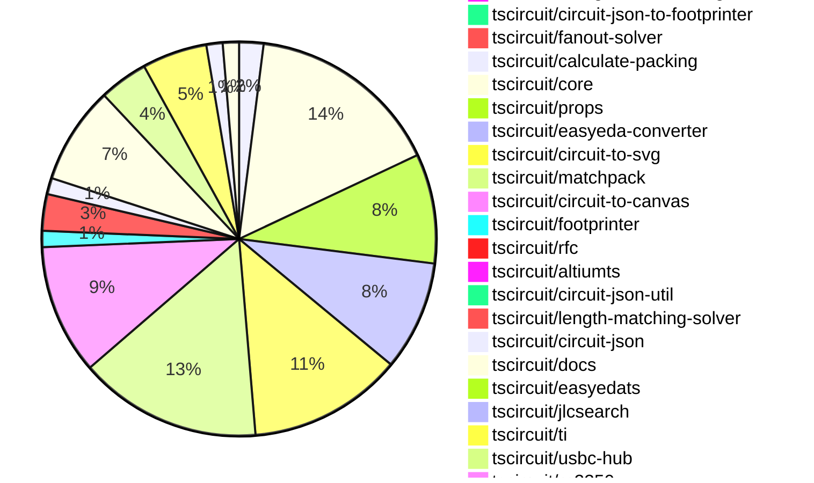

# Contribution Overview 2026-08-04

The current week is shown below. There are 3 major sections:

- [Contributor Overview](#contributor-overview)
- [PRs by Repository](#prs-by-repository)
- [PRs by Contributor](#changes-by-contributor)
- [Scoring & Sponsorship Details](/docs/sponsorship-calculation-explanation.md)

## PRs by Repository

## Contributor Overview

| Contributor | 🐳 Major | 🐙 Minor | 🐌 Tiny | Score | ⭐ |
|-------------|---------|---------|---------|-------|-----|
| [seveibar](#seveibar) | 9 | 8 | 8 | 60.5 | ⭐⭐⭐ |
| [ShiboSoftwareDev](#ShiboSoftwareDev) | 12 | 1 | 6 | 58 | ⭐⭐⭐ |
| [0hmX](#0hmX) | 8 | 6 | 3 | 48 | ⭐⭐ |
| [mohan-bee](#mohan-bee) | 4 | 6 | 7 | 37 | ⭐⭐ |
| [MustafaMulla29](#MustafaMulla29) | 5 | 1 | 5 | 28 | ⭐⭐ |
| [imrishabh18](#imrishabh18) | 3 | 3 | 8 | 27 | ⭐⭐ |
| [techmannih](#techmannih) | 1 | 1 | 15 | 19 | ⭐⭐ |
| [tscircuitbot](#tscircuitbot) | 0 | 0 | 204 | 15.5 | ⭐⭐ |
| [Abse2001](#Abse2001) | 1 | 2 | 3 | 13 | ⭐⭐ |
| [AnasSarkiz](#AnasSarkiz) | 1 | 0 | 0 | 10 | ⭐ |
| [addibble](#addibble) | 1 | 3 | 0 | 10 | ⭐ |
| [anil08607](#anil08607) | 0 | 3 | 2 | 8 | ⭐ |

## Staff Pass Ratio (SPR)

| Contributor | Reviewed PRs | Rejections | Approvals | SPR |
|-------------|--------------|------------|-----------|-----|
| [0hmX](#0hmX) | 9 | 2 | 7 | 77.8% |
| [Abse2001](#Abse2001) | 8 | 6 | 3 | 25.0% |
| [mohan-bee](#mohan-bee) | 6 | 1 | 5 | 83.3% |
| [ShiboSoftwareDev](#ShiboSoftwareDev) | 6 | 0 | 6 | 100.0% |
| [imrishabh18](#imrishabh18) | 5 | 1 | 4 | 80.0% |
| [addibble](#addibble) | 4 | 0 | 4 | 100.0% |
| [MustafaMulla29](#MustafaMulla29) | 3 | 1 | 3 | 66.7% |
| [anil08607](#anil08607) | 2 | 1 | 1 | 50.0% |
| [techmannih](#techmannih) | 1 | 0 | 1 | 100.0% |

0hmX SPR PRs (9)

- [#13](https://github.com/tscircuit/rfc/pull/13) checks: require point-to-point differential pair traces
- [#686](https://github.com/tscircuit/circuit-json/pull/686) Add differential pair point-to-point error
- [#113](https://github.com/tscircuit/circuit-json-util/pull/113) Add source diagnostic category
- [#3011](https://github.com/tscircuit/core/pull/3011) Warn when differential pairs are not point to point
- [#3009](https://github.com/tscircuit/core/pull/3009) Update autorouter to v0.0.748
- [#4062](https://github.com/tscircuit/cli/pull/4062) Add source diagnostic checks
- [#4042](https://github.com/tscircuit/cli/pull/4042) Add source diagnostic checks
- [#40](https://github.com/tscircuit/altiumts/pull/40) Add scroll-wheel zoom to project viewer
- [#37](https://github.com/tscircuit/altiumts/pull/37) Render native Altium schematic images as SVG

Abse2001 SPR PRs (8)

- [#781](https://github.com/tscircuit/footprinter/pull/781) Add a generic linear SMD pad footprint
- [#773](https://github.com/tscircuit/footprinter/pull/773) Add SMD potentiometer footprint
- [#771](https://github.com/tscircuit/footprinter/pull/771) Support asymmetric SOT-343 pad geometry
- [#772](https://github.com/tscircuit/footprinter/pull/772) Add LED3510 footprint
- [#776](https://github.com/tscircuit/footprinter/pull/776) Add G5NB relay footprint
- [#779](https://github.com/tscircuit/footprinter/pull/779) Add UFQFPN-20 footprint
- [#3018](https://github.com/tscircuit/core/pull/3018) Add dense hierarchical autorouting failure repro
- [#3044](https://github.com/tscircuit/core/pull/3044) Fix parent routing through breakout traces

mohan-bee SPR PRs (6)

- [#134](https://github.com/tscircuit/circuit-json-to-gerber/pull/134) Preserve arbitrary rectangular SMT pad rotation in Gerber
- [#204](https://github.com/tscircuit/matchpack/pull/204) Align chip-connected rail loads with constant vertical gaps
- [#197](https://github.com/tscircuit/matchpack/pull/197) Align ordinary signal grounded load rows
- [#772](https://github.com/tscircuit/schematic-trace-solver/pull/772) Avoid shared-pin trace spikes
- [#786](https://github.com/tscircuit/schematic-trace-solver/pull/786) Keep traces clear of net label side walls
- [#774](https://github.com/tscircuit/schematic-trace-solver/pull/774) Align chained same-net rails across anchored labels

ShiboSoftwareDev SPR PRs (6)

- [#1950](https://github.com/tscircuit/tscircuit-autorouter/pull/1950) Include preloaded traces in Pipeline7 DRC feedback
- [#1968](https://github.com/tscircuit/tscircuit-autorouter/pull/1968) Use original pad geometry for relaxed DRC
- [#1941](https://github.com/tscircuit/tscircuit-autorouter/pull/1941) Repair terminal traces crossing SMT pads
- [#1937](https://github.com/tscircuit/tscircuit-autorouter/pull/1937) Preserve shared same-root via sites during exact repair
- [#1927](https://github.com/tscircuit/tscircuit-autorouter/pull/1927) Track generated stitches in clearance-aware routing
- [#1902](https://github.com/tscircuit/tscircuit-autorouter/pull/1902) fix: complete sample 11 safe trace repair

imrishabh18 SPR PRs (5)

- [#692](https://github.com/tscircuit/circuit-json/pull/692) Add component-inside-silkscreen warning
- [#2924](https://github.com/tscircuit/core/pull/2924) Fix missing net labels across subcircuits
- [#1951](https://github.com/tscircuit/tscircuit-autorouter/pull/1951) Fix conservative approximation of rotated pads
- [#120](https://github.com/tscircuit/calculate-packing/pull/120) Cache target mappings and raise packing iteration budget
- [#121](https://github.com/tscircuit/calculate-packing/pull/121) Index weighted connection lookups

addibble SPR PRs (4)

- [#961](https://github.com/tscircuit/3d-viewer/pull/961) fix: stop shrinking CAD models rotated off-axis
- [#319](https://github.com/tscircuit/jscad-electronics/pull/319) fix: render chip footprints named by their pads instead of by size
- [#176](https://github.com/tscircuit/circuit-json-to-gltf/pull/176) refactor: one shared triangle/position bounds scan
- [#175](https://github.com/tscircuit/circuit-json-to-gltf/pull/175) fix(jscad): put JSCAD-plan geometry in the same frame as every other loader

MustafaMulla29 SPR PRs (3)

- [#3016](https://github.com/tscircuit/core/pull/3016) Use canonical net label text for schematic solver bounds
- [#3014](https://github.com/tscircuit/core/pull/3014) Fix four-pin crystal trace length propagation
- [#781](https://github.com/tscircuit/schematic-trace-solver/pull/781) Relocate rail labels around crossing traces

anil08607 SPR PRs (2)

- [#211](https://github.com/tscircuit/matchpack/pull/211) fix: maintain a 4:3 aspect ratio when packing distant schematic groups
- [#203](https://github.com/tscircuit/matchpack/pull/203) repro: add regression case for distant groups producing a tall schematic layout

techmannih SPR PRs (1)

- [#65](https://github.com/tscircuit/system-block-designer/pull/65) Add Bluetooth speaker system example

> Note: AI evaluates PRs and assigns 1-3 star ratings automatically. 4 and 5 star ratings require manual staff review.

## Review Table

[reviews-received-hover]: ## "Number of reviews received for PRs for this contributor"
[approvals-received-hover]: ## "Number of approvals received for PRs this contributor authored"
[rejections-received-hover]: ## "Number of rejections received for PRs this contributor authored"
[prs-opened-hover]: ## "Number of PRs opened by this contributor"
[issues-created-hover]: ## "Number of issues created by this contributor"

| Contributor | Reviews Received | Approvals Received | Rejections Received | Approvals | Rejections Given | PRs Opened | PRs Merged | Issues Created |
|---|---|---|---|---|---|---|---|---|
| [0hmX](#0hmX) | 21 | 8 | 2 | 2 | 0 | 29 | 17 | 0 |
| [Abse2001](#Abse2001) | 10 | 5 | 5 | 2 | 0 | 18 | 7 | 0 |
| [addibble](#addibble) | 4 | 4 | 0 | 0 | 0 | 8 | 4 | 0 |
| [AnasSarkiz](#AnasSarkiz) | 1 | 1 | 0 | 6 | 0 | 3 | 1 | 0 |
| [anil08607](#anil08607) | 16 | 9 | 2 | 0 | 0 | 13 | 5 | 0 |
| [hanuman-bishnoi](#hanuman-bishnoi) | 1 | 0 | 1 | 0 | 0 | 2 | 0 | 0 |
| [imrishabh18](#imrishabh18) | 6 | 5 | 1 | 6 | 2 | 17 | 14 | 0 |
| [mattkanwisher](#mattkanwisher) | 0 | 0 | 0 | 0 | 0 | 1 | 0 | 0 |
| [mohan-bee](#mohan-bee) | 13 | 8 | 2 | 2 | 0 | 27 | 17 | 0 |
| [MustafaMulla29](#MustafaMulla29) | 9 | 7 | 0 | 2 | 1 | 13 | 11 | 0 |
| [rushabhcodes](#rushabhcodes) | 2 | 0 | 0 | 1 | 0 | 2 | 0 | 0 |
| [Samarth1306w](#Samarth1306w) | 0 | 0 | 0 | 0 | 0 | 1 | 0 | 0 |
| [seveibar](#seveibar) | 13 | 1 | 0 | 42 | 10 | 42 | 26 | 0 |
| [ShiboSoftwareDev](#ShiboSoftwareDev) | 15 | 15 | 0 | 2 | 0 | 41 | 20 | 0 |
| [techmannih](#techmannih) | 12 | 3 | 0 | 1 | 0 | 18 | 17 | 0 |
| [tscircuitbot](#tscircuitbot) | 0 | 0 | 0 | 0 | 0 | 264 | 204 | 0 |
| [zkasuran](#zkasuran) | 0 | 0 | 0 | 0 | 0 | 9 | 0 | 0 |

## Changes by Repository

### [tscircuit/pcb-viewer](https://github.com/tscircuit/pcb-viewer)

| PR # | Impact | Rating | Contributor | Description |
|------|--------|--------|-------------|-------------|
| [#936](https://github.com/tscircuit/pcb-viewer/pull/936) | 🐙 Minor | ⭐⭐ | imrishabh18 | Fixes the issue where traces are not displayed when copper pours are hidden, ensuring that the complete routed trace is visible while preserving the original Circuit JSON. |

🐌 Tiny Contributions (5)

| PR # | Impact | Contributor | Description |
|------|--------|-------------|-------------|
| [#939](https://github.com/tscircuit/pcb-viewer/pull/939) | 🐌 Tiny | tscircuitbot | Automated package update |
| [#938](https://github.com/tscircuit/pcb-viewer/pull/938) | 🐌 Tiny | tscircuitbot | Automated package update |
| [#935](https://github.com/tscircuit/pcb-viewer/pull/935) | 🐌 Tiny | tscircuitbot | Automated package update |
| [#937](https://github.com/tscircuit/pcb-viewer/pull/937) | 🐌 Tiny | imrishabh18 | Adds a React Cosmos fixture that demonstrates a bug where trace segments inside a hidden copper pour are not displayed correctly when copper pours are disabled. |
| [#933](https://github.com/tscircuit/pcb-viewer/pull/933) | 🐌 Tiny | anil08607 | Updates the circuit-to-canvas dependency from version 0.0.114 to 0.0.115 in package.json |

### [tscircuit/tscircuit](https://github.com/tscircuit/tscircuit)

🐌 Tiny Contributions (48)

| PR # | Impact | Contributor | Description |
|------|--------|-------------|-------------|
| [#4323](https://github.com/tscircuit/tscircuit/pull/4323) | 🐌 Tiny | tscircuitbot | Updates the package version from 0.0.2251 to 0.0.2252 in package.json |
| [#4322](https://github.com/tscircuit/tscircuit/pull/4322) | 🐌 Tiny | tscircuitbot | Updates the version of several tscircuit packages in package.json to their latest versions. |
| [#4321](https://github.com/tscircuit/tscircuit/pull/4321) | 🐌 Tiny | tscircuitbot | Automated package update |
| [#4320](https://github.com/tscircuit/tscircuit/pull/4320) | 🐌 Tiny | tscircuitbot | Automated package update |
| [#4319](https://github.com/tscircuit/tscircuit/pull/4319) | 🐌 Tiny | tscircuitbot | Updates the package version from 0.0.2249 to 0.0.2250 in package.json |
| [#4318](https://github.com/tscircuit/tscircuit/pull/4318) | 🐌 Tiny | tscircuitbot | Automated package update |
| [#4317](https://github.com/tscircuit/tscircuit/pull/4317) | 🐌 Tiny | tscircuitbot | Automated package update |
| [#4316](https://github.com/tscircuit/tscircuit/pull/4316) | 🐌 Tiny | tscircuitbot | Automated package update |
| [#4315](https://github.com/tscircuit/tscircuit/pull/4315) | 🐌 Tiny | tscircuitbot | Updates the package version from 0.0.2247 to 0.0.2248 in package.json |
| [#4314](https://github.com/tscircuit/tscircuit/pull/4314) | 🐌 Tiny | tscircuitbot | Updates the tscircuitcli package from version 0.1.1844 to 0.1.1845 and the tscircuitrunframe package from version 0.0.2374 to 0.0.2375 in package.json |
| [#4313](https://github.com/tscircuit/tscircuit/pull/4313) | 🐌 Tiny | tscircuitbot | Automated package update |
| [#4312](https://github.com/tscircuit/tscircuit/pull/4312) | 🐌 Tiny | tscircuitbot | Updates the tscircuitcli and tscircuitcore packages to their latest versions. |
| [#4311](https://github.com/tscircuit/tscircuit/pull/4311) | 🐌 Tiny | tscircuitbot | Updates the package version from 0.0.2245 to 0.0.2246 in package.json |
| [#4307](https://github.com/tscircuit/tscircuit/pull/4307) | 🐌 Tiny | tscircuitbot | Automated package update to version 0.0.2244 |
| [#4306](https://github.com/tscircuit/tscircuit/pull/4306) | 🐌 Tiny | tscircuitbot | Updates the tscircuitcli package to version 0.1.1841 in the package.json file |
| [#4304](https://github.com/tscircuit/tscircuit/pull/4304) | 🐌 Tiny | tscircuitbot | Updates the tscircuitcli package to version 0.1.1840 |
| [#4302](https://github.com/tscircuit/tscircuit/pull/4302) | 🐌 Tiny | tscircuitbot | Updates the tscircuitcli package version from 0.1.1838 to 0.1.1839 |
| [#4299](https://github.com/tscircuit/tscircuit/pull/4299) | 🐌 Tiny | tscircuitbot | Automated package update |
| [#4298](https://github.com/tscircuit/tscircuit/pull/4298) | 🐌 Tiny | tscircuitbot | Updates the tscircuitcli package from version 0.1.1836 to 0.1.1837 and the tscircuitrunframe package from version 0.0.2370 to 0.0.2371 in the package.json file. |
| [#4297](https://github.com/tscircuit/tscircuit/pull/4297) | 🐌 Tiny | tscircuitbot | Updates the package version from 0.0.2238 to 0.0.2239 in package.json |
| [#4294](https://github.com/tscircuit/tscircuit/pull/4294) | 🐌 Tiny | tscircuitbot | Updates the tscircuitcli package from version 0.1.1834 to 0.1.1835 and the tscircuitrunframe package from version 0.0.2369 to 0.0.2370 in the package.json file. |
| [#4309](https://github.com/tscircuit/tscircuit/pull/4309) | 🐌 Tiny | tscircuitbot | Automated package update |
| [#4303](https://github.com/tscircuit/tscircuit/pull/4303) | 🐌 Tiny | tscircuitbot | Automated package update |
| [#4300](https://github.com/tscircuit/tscircuit/pull/4300) | 🐌 Tiny | tscircuitbot | Automated package update |
| [#4296](https://github.com/tscircuit/tscircuit/pull/4296) | 🐌 Tiny | tscircuitbot | Updates the tscircuitcli and related packages to their latest versions. |
| [#4310](https://github.com/tscircuit/tscircuit/pull/4310) | 🐌 Tiny | tscircuitbot | Updates the tscircuitcli package from version 0.1.1842 to 0.1.1843 and the tscircuitrunframe package from version 0.0.2373 to 0.0.2374 in package.json |
| [#4308](https://github.com/tscircuit/tscircuit/pull/4308) | 🐌 Tiny | tscircuitbot | Automated package update |
| [#4305](https://github.com/tscircuit/tscircuit/pull/4305) | 🐌 Tiny | tscircuitbot | Automated package update |
| [#4301](https://github.com/tscircuit/tscircuit/pull/4301) | 🐌 Tiny | tscircuitbot | Automated package update |
| [#4295](https://github.com/tscircuit/tscircuit/pull/4295) | 🐌 Tiny | tscircuitbot | Automated package update |
| [#4280](https://github.com/tscircuit/tscircuit/pull/4280) | 🐌 Tiny | tscircuitbot | Updates the tscircuitcli package from version 0.1.1828 to 0.1.1829 and the tscircuitrunframe package from version 0.0.2363 to 0.0.2364. |
| [#4293](https://github.com/tscircuit/tscircuit/pull/4293) | 🐌 Tiny | tscircuitbot | Automated package update |
| [#4292](https://github.com/tscircuit/tscircuit/pull/4292) | 🐌 Tiny | tscircuitbot | Automated package update |
| [#4291](https://github.com/tscircuit/tscircuit/pull/4291) | 🐌 Tiny | tscircuitbot | Automated package update |
| [#4290](https://github.com/tscircuit/tscircuit/pull/4290) | 🐌 Tiny | tscircuitbot | Automated package update |
| [#4289](https://github.com/tscircuit/tscircuit/pull/4289) | 🐌 Tiny | tscircuitbot | Automated package update |
| [#4288](https://github.com/tscircuit/tscircuit/pull/4288) | 🐌 Tiny | tscircuitbot | Automated package update |
| [#4286](https://github.com/tscircuit/tscircuit/pull/4286) | 🐌 Tiny | tscircuitbot | Automated package update |
| [#4285](https://github.com/tscircuit/tscircuit/pull/4285) | 🐌 Tiny | tscircuitbot | Automated package update |
| [#4284](https://github.com/tscircuit/tscircuit/pull/4284) | 🐌 Tiny | tscircuitbot | Updates the versions of several dependencies in the package.json file. |
| [#4283](https://github.com/tscircuit/tscircuit/pull/4283) | 🐌 Tiny | tscircuitbot | Automated package update |
| [#4282](https://github.com/tscircuit/tscircuit/pull/4282) | 🐌 Tiny | tscircuitbot | Automated package update |
| [#4281](https://github.com/tscircuit/tscircuit/pull/4281) | 🐌 Tiny | tscircuitbot | Automated package update |
| [#4278](https://github.com/tscircuit/tscircuit/pull/4278) | 🐌 Tiny | tscircuitbot | Automated package update |
| [#4277](https://github.com/tscircuit/tscircuit/pull/4277) | 🐌 Tiny | tscircuitbot | Automated package update |
| [#4276](https://github.com/tscircuit/tscircuit/pull/4276) | 🐌 Tiny | tscircuitbot | Automated package update |
| [#4275](https://github.com/tscircuit/tscircuit/pull/4275) | 🐌 Tiny | tscircuitbot | Automated package update |
| [#4287](https://github.com/tscircuit/tscircuit/pull/4287) | 🐌 Tiny | tscircuitbot | Automated package update |

### [tscircuit/tscircuit.com](https://github.com/tscircuit/tscircuit.com)

🐌 Tiny Contributions (27)

| PR # | Impact | Contributor | Description |
|------|--------|-------------|-------------|
| [#4272](https://github.com/tscircuit/tscircuit.com/pull/4272) | 🐌 Tiny | tscircuitbot | Automated package update |
| [#4271](https://github.com/tscircuit/tscircuit.com/pull/4271) | 🐌 Tiny | tscircuitbot | Updates the tscircuiteval package from version 0.0.1142 to 0.0.1143 in the package.json file. |
| [#4270](https://github.com/tscircuit/tscircuit.com/pull/4270) | 🐌 Tiny | tscircuitbot | Updates the tscircuitrunframe package to version 0.0.2379 |
| [#4269](https://github.com/tscircuit/tscircuit.com/pull/4269) | 🐌 Tiny | tscircuitbot | Updates the tscircuiteval package from version 0.0.1140 to 0.0.1142 |
| [#4268](https://github.com/tscircuit/tscircuit.com/pull/4268) | 🐌 Tiny | tscircuitbot | Automated package update |
| [#4267](https://github.com/tscircuit/tscircuit.com/pull/4267) | 🐌 Tiny | tscircuitbot | Updates the tscircuitrunframe package from version 0.0.2376 to 0.0.2377 |
| [#4265](https://github.com/tscircuit/tscircuit.com/pull/4265) | 🐌 Tiny | tscircuitbot | Automated package update |
| [#4264](https://github.com/tscircuit/tscircuit.com/pull/4264) | 🐌 Tiny | tscircuitbot | Automated package update |
| [#4263](https://github.com/tscircuit/tscircuit.com/pull/4263) | 🐌 Tiny | tscircuitbot | Automated package update |
| [#4260](https://github.com/tscircuit/tscircuit.com/pull/4260) | 🐌 Tiny | tscircuitbot | Updates the tscircuiteval package from version 0.0.1138 to 0.0.1139 |
| [#4261](https://github.com/tscircuit/tscircuit.com/pull/4261) | 🐌 Tiny | tscircuitbot | Automated package update for tscircuitrunframe from version 0.0.2372 to 0.0.2373 |
| [#4259](https://github.com/tscircuit/tscircuit.com/pull/4259) | 🐌 Tiny | tscircuitbot | Updates the tscircuiteval package from version 0.0.1137 to 0.0.1138 |
| [#4258](https://github.com/tscircuit/tscircuit.com/pull/4258) | 🐌 Tiny | tscircuitbot | Updates the tscircuitrunframe package from version 0.0.2371 to 0.0.2372 |
| [#4257](https://github.com/tscircuit/tscircuit.com/pull/4257) | 🐌 Tiny | tscircuitbot | Updates the tscircuitrunframe package from version 0.0.2370 to 0.0.2371 |
| [#4256](https://github.com/tscircuit/tscircuit.com/pull/4256) | 🐌 Tiny | tscircuitbot | Updates the tscircuiteval package from version 0.0.1136 to 0.0.1137 |
| [#4255](https://github.com/tscircuit/tscircuit.com/pull/4255) | 🐌 Tiny | tscircuitbot | Automated package update |
| [#4262](https://github.com/tscircuit/tscircuit.com/pull/4262) | 🐌 Tiny | tscircuitbot | Automated package update |
| [#4253](https://github.com/tscircuit/tscircuit.com/pull/4253) | 🐌 Tiny | tscircuitbot | Automated package update |
| [#4252](https://github.com/tscircuit/tscircuit.com/pull/4252) | 🐌 Tiny | tscircuitbot | Updates the tscircuitrunframe package from version 0.0.2366 to 0.0.2368 |
| [#4249](https://github.com/tscircuit/tscircuit.com/pull/4249) | 🐌 Tiny | tscircuitbot | Updates the tscircuiteval package from version 0.0.1133 to 0.0.1134 |
| [#4248](https://github.com/tscircuit/tscircuit.com/pull/4248) | 🐌 Tiny | tscircuitbot | Automated package update |
| [#4247](https://github.com/tscircuit/tscircuit.com/pull/4247) | 🐌 Tiny | tscircuitbot | Updates the tscircuiteval package from version 0.0.1131 to 0.0.1133 |
| [#4244](https://github.com/tscircuit/tscircuit.com/pull/4244) | 🐌 Tiny | tscircuitbot | Automated package update |
| [#4243](https://github.com/tscircuit/tscircuit.com/pull/4243) | 🐌 Tiny | tscircuitbot | Automated package update |
| [#4242](https://github.com/tscircuit/tscircuit.com/pull/4242) | 🐌 Tiny | tscircuitbot | Automated package update |
| [#4241](https://github.com/tscircuit/tscircuit.com/pull/4241) | 🐌 Tiny | tscircuitbot | Updates the tscircuiteval package from version 0.0.1130 to 0.0.1131 |
| [#4246](https://github.com/tscircuit/tscircuit.com/pull/4246) | 🐌 Tiny | tscircuitbot | Updates the tscircuitrunframe package from version 0.0.2364 to 0.0.2365 |

### [tscircuit/eval](https://github.com/tscircuit/eval)

🐌 Tiny Contributions (27)

| PR # | Impact | Contributor | Description |
|------|--------|-------------|-------------|
| [#3723](https://github.com/tscircuit/eval/pull/3723) | 🐌 Tiny | tscircuitbot | Automated package update |
| [#3722](https://github.com/tscircuit/eval/pull/3722) | 🐌 Tiny | tscircuitbot | Updates the version of the tscircuitcore package from 0.0.1614 to 0.0.1615 in package.json |
| [#3720](https://github.com/tscircuit/eval/pull/3720) | 🐌 Tiny | tscircuitbot | Automated package update |
| [#3719](https://github.com/tscircuit/eval/pull/3719) | 🐌 Tiny | tscircuitbot | Updates package dependencies in package.json to their latest versions. |
| [#3715](https://github.com/tscircuit/eval/pull/3715) | 🐌 Tiny | tscircuitbot | Automated package update |
| [#3714](https://github.com/tscircuit/eval/pull/3714) | 🐌 Tiny | tscircuitbot | Automated package update |
| [#3712](https://github.com/tscircuit/eval/pull/3712) | 🐌 Tiny | tscircuitbot | Updates the package version from 0.0.1139 to 0.0.1140 in package.json |
| [#3711](https://github.com/tscircuit/eval/pull/3711) | 🐌 Tiny | tscircuitbot | Automated package update |
| [#3700](https://github.com/tscircuit/eval/pull/3700) | 🐌 Tiny | tscircuitbot | Automated package update |
| [#3707](https://github.com/tscircuit/eval/pull/3707) | 🐌 Tiny | tscircuitbot | Automated package update |
| [#3705](https://github.com/tscircuit/eval/pull/3705) | 🐌 Tiny | tscircuitbot | Automated package update |
| [#3704](https://github.com/tscircuit/eval/pull/3704) | 🐌 Tiny | tscircuitbot | Automated package update |
| [#3702](https://github.com/tscircuit/eval/pull/3702) | 🐌 Tiny | tscircuitbot | Automated package update |
| [#3699](https://github.com/tscircuit/eval/pull/3699) | 🐌 Tiny | tscircuitbot | Updates the version of the tscircuitcore package from 0.0.1605 to 0.0.1606 in package.json |
| [#3708](https://github.com/tscircuit/eval/pull/3708) | 🐌 Tiny | tscircuitbot | Automated package update to version 0.0.1139 |
| [#3696](https://github.com/tscircuit/eval/pull/3696) | 🐌 Tiny | tscircuitbot | Updates the version of the tscircuitcore package from 0.0.1604 to 0.0.1605 in package.json |
| [#3697](https://github.com/tscircuit/eval/pull/3697) | 🐌 Tiny | tscircuitbot | Automated package update |
| [#3694](https://github.com/tscircuit/eval/pull/3694) | 🐌 Tiny | tscircuitbot | Updates the version of the tscircuitcore package from 0.0.1603 to 0.0.1604 in package.json |
| [#3693](https://github.com/tscircuit/eval/pull/3693) | 🐌 Tiny | tscircuitbot | Automated package update |
| [#3692](https://github.com/tscircuit/eval/pull/3692) | 🐌 Tiny | tscircuitbot | Updates the version of the tscircuitcore package from 0.0.1602 to 0.0.1603 in package.json |
| [#3690](https://github.com/tscircuit/eval/pull/3690) | 🐌 Tiny | tscircuitbot | Updates the package version from 0.0.1132 to 0.0.1133 in package.json |
| [#3689](https://github.com/tscircuit/eval/pull/3689) | 🐌 Tiny | tscircuitbot | Automated package update |
| [#3687](https://github.com/tscircuit/eval/pull/3687) | 🐌 Tiny | tscircuitbot | Automated package update |
| [#3686](https://github.com/tscircuit/eval/pull/3686) | 🐌 Tiny | tscircuitbot | Automated package update |
| [#3680](https://github.com/tscircuit/eval/pull/3680) | 🐌 Tiny | tscircuitbot | Automated package update |
| [#3679](https://github.com/tscircuit/eval/pull/3679) | 🐌 Tiny | tscircuitbot | Updates the versions of several dependencies in the package.json file. |
| [#3695](https://github.com/tscircuit/eval/pull/3695) | 🐌 Tiny | tscircuitbot | Automated package update |

### [tscircuit/runframe](https://github.com/tscircuit/runframe)

🐌 Tiny Contributions (38)

| PR # | Impact | Contributor | Description |
|------|--------|-------------|-------------|
| [#4362](https://github.com/tscircuit/runframe/pull/4362) | 🐌 Tiny | tscircuitbot | Automated package update |
| [#4361](https://github.com/tscircuit/runframe/pull/4361) | 🐌 Tiny | tscircuitbot | Updates the tscircuiteval package from version 0.0.1142 to 0.0.1143 in the package.json file. |
| [#4360](https://github.com/tscircuit/runframe/pull/4360) | 🐌 Tiny | tscircuitbot | Automated package update |
| [#4359](https://github.com/tscircuit/runframe/pull/4359) | 🐌 Tiny | tscircuitbot | Updates the tscircuiteval package from version 0.0.1141 to 0.0.1142 in the package.json file. |
| [#4357](https://github.com/tscircuit/runframe/pull/4357) | 🐌 Tiny | tscircuitbot | Automated package update |
| [#4356](https://github.com/tscircuit/runframe/pull/4356) | 🐌 Tiny | tscircuitbot | Updates the tscircuitpcb-viewer package to version 1.11.379 |
| [#4355](https://github.com/tscircuit/runframe/pull/4355) | 🐌 Tiny | tscircuitbot | Automated package update |
| [#4354](https://github.com/tscircuit/runframe/pull/4354) | 🐌 Tiny | tscircuitbot | Updates the tscircuiteval package from version 0.0.1140 to 0.0.1141 in the package.json file. |
| [#4353](https://github.com/tscircuit/runframe/pull/4353) | 🐌 Tiny | tscircuitbot | Automated package update |
| [#4352](https://github.com/tscircuit/runframe/pull/4352) | 🐌 Tiny | tscircuitbot | Updates the tscircuiteval package to version 0.0.1140 in the package.json file. |
| [#4351](https://github.com/tscircuit/runframe/pull/4351) | 🐌 Tiny | tscircuitbot | Automated package update |
| [#4350](https://github.com/tscircuit/runframe/pull/4350) | 🐌 Tiny | tscircuitbot | Updates the tscircuitpcb-viewer package from version 1.11.377 to 1.11.378 |
| [#4349](https://github.com/tscircuit/runframe/pull/4349) | 🐌 Tiny | tscircuitbot | Automated package update |
| [#4346](https://github.com/tscircuit/runframe/pull/4346) | 🐌 Tiny | tscircuitbot | Updates the tscircuiteval package from version 0.0.1137 to 0.0.1139 |
| [#4344](https://github.com/tscircuit/runframe/pull/4344) | 🐌 Tiny | tscircuitbot | Updates the circuit-json-to-gerber package from version 0.0.89 to 0.0.90 |
| [#4342](https://github.com/tscircuit/runframe/pull/4342) | 🐌 Tiny | tscircuitbot | Updates the tscircuiteval package from version 0.0.1136 to 0.0.1137 in the package.json file. |
| [#4341](https://github.com/tscircuit/runframe/pull/4341) | 🐌 Tiny | tscircuitbot | Automated package update |
| [#4340](https://github.com/tscircuit/runframe/pull/4340) | 🐌 Tiny | tscircuitbot | Updates the circuit-json-to-gerber package from version 0.0.88 to 0.0.89 |
| [#4347](https://github.com/tscircuit/runframe/pull/4347) | 🐌 Tiny | tscircuitbot | Automated package update |
| [#4345](https://github.com/tscircuit/runframe/pull/4345) | 🐌 Tiny | tscircuitbot | Automated package update |
| [#4343](https://github.com/tscircuit/runframe/pull/4343) | 🐌 Tiny | tscircuitbot | Automated package update |
| [#4330](https://github.com/tscircuit/runframe/pull/4330) | 🐌 Tiny | tscircuitbot | Updates the tscircuiteval package from version 0.0.1131 to 0.0.1132 in the package.json file. |
| [#4325](https://github.com/tscircuit/runframe/pull/4325) | 🐌 Tiny | tscircuitbot | Updates the package version from 0.0.2361 to 0.0.2362 in package.json |
| [#4324](https://github.com/tscircuit/runframe/pull/4324) | 🐌 Tiny | tscircuitbot | Updates the tscircuiteval package from version 0.0.1130 to 0.0.1131 in the package.json file. |
| [#4339](https://github.com/tscircuit/runframe/pull/4339) | 🐌 Tiny | tscircuitbot | Automated package update |
| [#4338](https://github.com/tscircuit/runframe/pull/4338) | 🐌 Tiny | tscircuitbot | Updates the tscircuiteval package from version 0.0.1135 to 0.0.1136 in the package.json file. |
| [#4337](https://github.com/tscircuit/runframe/pull/4337) | 🐌 Tiny | tscircuitbot | Automated package update |
| [#4336](https://github.com/tscircuit/runframe/pull/4336) | 🐌 Tiny | tscircuitbot | Updates the tscircuiteval package from version 0.0.1134 to 0.0.1135 in the package.json file. |
| [#4335](https://github.com/tscircuit/runframe/pull/4335) | 🐌 Tiny | tscircuitbot | Automated package update |
| [#4334](https://github.com/tscircuit/runframe/pull/4334) | 🐌 Tiny | tscircuitbot | Updates the tscircuiteval package to version 0.0.1134 in the package.json file. |
| [#4333](https://github.com/tscircuit/runframe/pull/4333) | 🐌 Tiny | tscircuitbot | Automated package update |
| [#4331](https://github.com/tscircuit/runframe/pull/4331) | 🐌 Tiny | tscircuitbot | Automated package update |
| [#4329](https://github.com/tscircuit/runframe/pull/4329) | 🐌 Tiny | tscircuitbot | Automated package update |
| [#4328](https://github.com/tscircuit/runframe/pull/4328) | 🐌 Tiny | tscircuitbot | Automated package update |
| [#4327](https://github.com/tscircuit/runframe/pull/4327) | 🐌 Tiny | tscircuitbot | Automated package update |
| [#4326](https://github.com/tscircuit/runframe/pull/4326) | 🐌 Tiny | tscircuitbot | Automated package update |
| [#4332](https://github.com/tscircuit/runframe/pull/4332) | 🐌 Tiny | tscircuitbot | Updates the tscircuiteval package from version 0.0.1132 to 0.0.1133 in the project dependencies. |
| [#4348](https://github.com/tscircuit/runframe/pull/4348) | 🐌 Tiny | imrishabh18 | Updates the easyeda dependency from version 0.0.279 to 0.0.280, which includes a fix for symbol generation by removing explicit strokeWidth properties from imported EasyEDA symbol elements. |

### [tscircuit/cli](https://github.com/tscircuit/cli)

| PR # | Impact | Rating | Contributor | Description |
|------|--------|--------|-------------|-------------|
| [#4071](https://github.com/tscircuit/cli/pull/4071) | 🐳 Major | ⭐⭐⭐ | seveibar | Fixes autorouting failure when placement errors are present by allowing the --ignore-placement-drc flag to enable routing despite placement errors. |
| [#4052](https://github.com/tscircuit/cli/pull/4052) | 🐳 Major | ⭐⭐⭐ | seveibar | Add --autorouter-phase name to build, check trace-length, and dev, enabling automatic autorouter diagnostics for specified phases and capturing relevant events while omitting later phases. |
| [#4062](https://github.com/tscircuit/cli/pull/4062) | 🐙 Minor | ⭐⭐ | 0hmX | Add a new check source subcommand to validate source diagnostics and enhance the existing check command to print all detected errors and warnings without category filtering. |
| [#4058](https://github.com/tscircuit/cli/pull/4058) | 🐙 Minor | ⭐⭐ | seveibar | Render the rats nest in the initial placement-unrouted.png autorouter debug image and add a visual SVG snapshot with two crossing unrouted connections for reviewers to see the output. |

🐌 Tiny Contributions (41)

| PR # | Impact | Contributor | Description |
|------|--------|-------------|-------------|
| [#4083](https://github.com/tscircuit/cli/pull/4083) | 🐌 Tiny | tscircuitbot | Automated package update |
| [#4082](https://github.com/tscircuit/cli/pull/4082) | 🐌 Tiny | tscircuitbot | Automated package update |
| [#4081](https://github.com/tscircuit/cli/pull/4081) | 🐌 Tiny | tscircuitbot | Automated package update |
| [#4080](https://github.com/tscircuit/cli/pull/4080) | 🐌 Tiny | tscircuitbot | Updates the tscircuitrunframe package from version 0.0.2378 to 0.0.2379 |
| [#4079](https://github.com/tscircuit/cli/pull/4079) | 🐌 Tiny | tscircuitbot | Automated package update |
| [#4078](https://github.com/tscircuit/cli/pull/4078) | 🐌 Tiny | tscircuitbot | Updates the tscircuitrunframe package to version 0.0.2378 in package.json |
| [#4076](https://github.com/tscircuit/cli/pull/4076) | 🐌 Tiny | tscircuitbot | Automated package update |
| [#4075](https://github.com/tscircuit/cli/pull/4075) | 🐌 Tiny | tscircuitbot | Automated package update |
| [#4074](https://github.com/tscircuit/cli/pull/4074) | 🐌 Tiny | tscircuitbot | Automated package update |
| [#4073](https://github.com/tscircuit/cli/pull/4073) | 🐌 Tiny | tscircuitbot | Updates the tscircuitrunframe package from version 0.0.2374 to 0.0.2375 |
| [#4072](https://github.com/tscircuit/cli/pull/4072) | 🐌 Tiny | tscircuitbot | Automated package update |
| [#4070](https://github.com/tscircuit/cli/pull/4070) | 🐌 Tiny | tscircuitbot | Automated package update |
| [#4069](https://github.com/tscircuit/cli/pull/4069) | 🐌 Tiny | tscircuitbot | Automated package update |
| [#4068](https://github.com/tscircuit/cli/pull/4068) | 🐌 Tiny | tscircuitbot | Automated package update |
| [#4067](https://github.com/tscircuit/cli/pull/4067) | 🐌 Tiny | tscircuitbot | Updates the tscircuitrunframe package from version 0.0.2372 to 0.0.2373 |
| [#4066](https://github.com/tscircuit/cli/pull/4066) | 🐌 Tiny | tscircuitbot | Automated package update |
| [#4065](https://github.com/tscircuit/cli/pull/4065) | 🐌 Tiny | tscircuitbot | Updates the README to reflect the latest CLI usage output by adding the required parameter for the check command. |
| [#4064](https://github.com/tscircuit/cli/pull/4064) | 🐌 Tiny | tscircuitbot | Automated package update |
| [#4061](https://github.com/tscircuit/cli/pull/4061) | 🐌 Tiny | tscircuitbot | Automated package update |
| [#4060](https://github.com/tscircuit/cli/pull/4060) | 🐌 Tiny | tscircuitbot | Automated package update |
| [#4059](https://github.com/tscircuit/cli/pull/4059) | 🐌 Tiny | tscircuitbot | Updates the tscircuitrunframe package from version 0.0.2371 to 0.0.2372 |
| [#4057](https://github.com/tscircuit/cli/pull/4057) | 🐌 Tiny | tscircuitbot | Automated package update |
| [#4054](https://github.com/tscircuit/cli/pull/4054) | 🐌 Tiny | tscircuitbot | Automated package update |
| [#4056](https://github.com/tscircuit/cli/pull/4056) | 🐌 Tiny | tscircuitbot | Updates the tscircuitrunframe package version from 0.0.2370 to 0.0.2371 in package.json |
| [#4053](https://github.com/tscircuit/cli/pull/4053) | 🐌 Tiny | tscircuitbot | Updates the tscircuitrunframe package to version 0.0.2370 in the package.json file |
| [#4035](https://github.com/tscircuit/cli/pull/4035) | 🐌 Tiny | tscircuitbot | Updates the tscircuitrunframe package from version 0.0.2361 to 0.0.2362 |
| [#4043](https://github.com/tscircuit/cli/pull/4043) | 🐌 Tiny | tscircuitbot | Automated package update |
| [#4050](https://github.com/tscircuit/cli/pull/4050) | 🐌 Tiny | tscircuitbot | Updates the tscircuitrunframe package from version 0.0.2368 to 0.0.2369 |
| [#4048](https://github.com/tscircuit/cli/pull/4048) | 🐌 Tiny | tscircuitbot | Updates the tscircuitrunframe package from version 0.0.2367 to 0.0.2368 |
| [#4047](https://github.com/tscircuit/cli/pull/4047) | 🐌 Tiny | tscircuitbot | Automated package update |
| [#4046](https://github.com/tscircuit/cli/pull/4046) | 🐌 Tiny | tscircuitbot | Updates the tscircuitrunframe package from version 0.0.2366 to 0.0.2367 |
| [#4044](https://github.com/tscircuit/cli/pull/4044) | 🐌 Tiny | tscircuitbot | Updates the tscircuitrunframe package from version 0.0.2365 to 0.0.2366 |
| [#4041](https://github.com/tscircuit/cli/pull/4041) | 🐌 Tiny | tscircuitbot | Updates the tscircuitrunframe package from version 0.0.2364 to 0.0.2365 |
| [#4040](https://github.com/tscircuit/cli/pull/4040) | 🐌 Tiny | tscircuitbot | Automated package update |
| [#4039](https://github.com/tscircuit/cli/pull/4039) | 🐌 Tiny | tscircuitbot | Updates the tscircuitrunframe package from version 0.0.2363 to 0.0.2364 |
| [#4037](https://github.com/tscircuit/cli/pull/4037) | 🐌 Tiny | tscircuitbot | Updates the tscircuitrunframe package from version 0.0.2362 to 0.0.2363 |
| [#4051](https://github.com/tscircuit/cli/pull/4051) | 🐌 Tiny | tscircuitbot | Automated package update |
| [#4049](https://github.com/tscircuit/cli/pull/4049) | 🐌 Tiny | tscircuitbot | Automated package update |
| [#4045](https://github.com/tscircuit/cli/pull/4045) | 🐌 Tiny | tscircuitbot | Automated package update |
| [#4038](https://github.com/tscircuit/cli/pull/4038) | 🐌 Tiny | tscircuitbot | Automated package update |
| [#4036](https://github.com/tscircuit/cli/pull/4036) | 🐌 Tiny | tscircuitbot | Automated package update |

### [tscircuit/tscircuit-autorouter](https://github.com/tscircuit/tscircuit-autorouter)

| PR # | Impact | Rating | Contributor | Description |
|------|--------|--------|-------------|-------------|
| [#1980](https://github.com/tscircuit/tscircuit-autorouter/pull/1980) | 🐳 Major | ⭐⭐⭐ | 0hmX | What changed add the extracted Pico USB Simple Route JSON as bugreport85-pico-usb-differential-pair add an interactive autorouting debugger fixture add a normal regression test that captures the exact length-matching failure add a full-pipeline visual regression test and SVG snapshot at the failure state  Why The Pico USB differential pair cannot satisfy a 0.3 mm maximum skew even though the shorter route only needs approximately 0.4642 mm of added length. The length-matching solver exhausts every segmenttooth combination instead of producing a small meander.  User impact This self-contained fixture makes the production failure reproducible directly in the autorouter repository, without requiring the original tscircuit component project.  Root cause observed The differential-pair post-processing stage reports: text LengthMatchingSolver: linear regression exhausted all segmenttooth combinations for source_trace_53; required 0.4642mm   Validation bun test testsbugsbugreport85-pico-usb-differential-pair.test.ts testsbugsbugreport85-pico-usb-differential-pair-visual.test.ts --timeout 9999999 bun run build git diff --check |
| [#1925](https://github.com/tscircuit/tscircuit-autorouter/pull/1925) | 🐳 Major | ⭐⭐⭐ | 0hmX | Pins the post-processing solver revision to return input HD routes when post-processing fails, updates regression tests to expect successful completion instead of an exception, and modifies the visualization snapshot accordingly. |
| [#1923](https://github.com/tscircuit/tscircuit-autorouter/pull/1923) | 🐳 Major | ⭐⭐⭐ | 0hmX | What changed add bugreport82-0e99ec using the full, unminimized F1C200s board Simple Route JSON add an AutoroutingPipelineDebugger fixture add a focused characterization test for the PostProcessingSolver layer-transition exception add the last-step SVG snapshot captured at the failure state  Why The default autorouter creates an HD route named source_net_8_mst3 whose layer transition does not resolve to exactly one via. PostProcessingSolver rejects that route and aborts the board route. The fixture retains all 218 obstacles and 26 connections. Its canonical SRJ SHA-256 matches the original tsci build --autorouter-dump-srj failed output: 5023393d62bf7b3845dd3da50fe5cc112a5ddd3ef06bc2b87a3e8ab5fd1c1475.  Validation bun run build bun test --timeout 9999999 testsbugsbugreport82-0e99ec.test.ts The focused test reproduces the exact exception, asserts the failed solver state, and verifies the SVG snapshot while remaining green for CI.  Follow-up 1925 implements non-ideal fallback output for this reproduction. tscircuitlength-matching-solver39 implements the core solver behavior. |
| [#1954](https://github.com/tscircuit/tscircuit-autorouter/pull/1954) | 🐳 Major | ⭐⭐⭐ | seveibar | Builds the canonical initiallyConnectedMap once at each pipeline boundary from the exact SRJ passed to point pairing, requiring that map in both net-to-point-pair solvers, adapting the maps equivalence classes into zero-cost MST edges, and removing local connectivity reconstruction from externallyConnectedPointIds and srj.traces.connectsTo. |
| [#1933](https://github.com/tscircuit/tscircuit-autorouter/pull/1933) | 🐳 Major | ⭐⭐⭐ | seveibar | Summary Adds a focused Simple Route JSON (SRJ) reproduction from the Allwinner F1C100S Linux laptop motherboard routing experiment. The board uses an LCD connector breakout autorouterdefault to route the connector breakout separately. The breakout phase completes, but a later six-route LCD phase fails during the static reachability precheck.  Reproduction Source project: tscircuitmotherboard-allwinner-f1c100s bash bun run build -- --autorouter-debug  --autorouter-debug-dir distautorouter-debug-breakout-final  --autorouter-dump-srj all  --autorouter-timeout 60s --profile  The checked-in SRJ is the input to routing phase index 4 (phase ordinal 5): 6 connections 889 obstacles 4 routing layers 87 previously routed traces represented in the obstacle reservations The preceding LCD connector breakout phase routed 23 connections successfully. The failing input contains source_trace_178 through source_trace_183.  Observed failure text Static reachability precheck failed: 5 route(s) have no legal path under the current reservation and start-region rules source_trace_182 (50683-50684), source_trace_181 (50685-50686), source_trace_180 (50687-50688), source_trace_179 (50689-50690), source_trace_178 (50691-50692) (capacity-autorouter0.0.722)  The debugger fixture and exact phase-input SRJ are in fixturesbug-reportsbugreport83-f1c100s-breakout.  Validation Parsed the SRJ with jq and Bun JSON import. Confirmed the copied SRJ is byte-for-byte identical to the debug dump. Full autorouter test execution was not run because dependency installation stalled at Resolving dependencies in this environment. |
| [#1950](https://github.com/tscircuit/tscircuit-autorouter/pull/1950) | 🐳 Major | ⭐⭐⭐ | ShiboSoftwareDev | Fixes omission of original preloaded traces in Pipeline7 DRC feedback, ensuring collision feedback is accurate for repair candidates. |
| [#1949](https://github.com/tscircuit/tscircuit-autorouter/pull/1949) | 🐳 Major | ⭐⭐⭐ | ShiboSoftwareDev | Fixes the issue where Pipeline7 fails to report collisions for candidate traces crossing fixed copper due to missing preloaded trace feedback. |
| [#1969](https://github.com/tscircuit/tscircuit-autorouter/pull/1969) | 🐳 Major | ⭐⭐⭐ | ShiboSoftwareDev | Reproduces relaxed DRC evaluating routed terminals against post-decomposition routing fragments instead of the original physical pad geometry. |
| [#1968](https://github.com/tscircuit/tscircuit-autorouter/pull/1968) | 🐳 Major | ⭐⭐⭐ | ShiboSoftwareDev | Fixes relaxed DRC evaluation by preserving original pad geometry and connectivity for sibling pads, eliminating false terminal errors. |
| [#1941](https://github.com/tscircuit/tscircuit-autorouter/pull/1941) | 🐳 Major | ⭐⭐⭐ | ShiboSoftwareDev | Fixes autorouting failure when terminal-side traces remain on foreign SMT pads due to improper layer handling during repairs. |
| [#1937](https://github.com/tscircuit/tscircuit-autorouter/pull/1937) | 🐳 Major | ⭐⭐⭐ | ShiboSoftwareDev | Fixes junction splitting issue in MST branches by ensuring shared-site repairs do not split sites, allowing for valid final-error repair without creating clearance errors. |
| [#1927](https://github.com/tscircuit/tscircuit-autorouter/pull/1927) | 🐳 Major | ⭐⭐⭐ | ShiboSoftwareDev | Fixes clearance-aware stitch selection to ensure generated bridge segments are considered, preventing selection of stitches that cross newly created copper. |
| [#1902](https://github.com/tscircuit/tscircuit-autorouter/pull/1902) | 🐳 Major | ⭐⭐⭐ | ShiboSoftwareDev | Fixes the issue where Dataset 18 sample 11 fails to complete exact DRC repair due to a bounded trace detour not finishing the repair process after canonicalizing a via. |

🐌 Tiny Contributions (19)

| PR # | Impact | Contributor | Description |
|------|--------|-------------|-------------|
| [#1985](https://github.com/tscircuit/tscircuit-autorouter/pull/1985) | 🐌 Tiny | tscircuitbot | Automated package update |
| [#1983](https://github.com/tscircuit/tscircuit-autorouter/pull/1983) | 🐌 Tiny | tscircuitbot | Automated package update |
| [#1979](https://github.com/tscircuit/tscircuit-autorouter/pull/1979) | 🐌 Tiny | tscircuitbot | Automated package update |
| [#1977](https://github.com/tscircuit/tscircuit-autorouter/pull/1977) | 🐌 Tiny | tscircuitbot | Automated package update |
| [#1975](https://github.com/tscircuit/tscircuit-autorouter/pull/1975) | 🐌 Tiny | tscircuitbot | Automated package update |
| [#1973](https://github.com/tscircuit/tscircuit-autorouter/pull/1973) | 🐌 Tiny | tscircuitbot | Automated package update |
| [#1965](https://github.com/tscircuit/tscircuit-autorouter/pull/1965) | 🐌 Tiny | tscircuitbot | Automated package update |
| [#1943](https://github.com/tscircuit/tscircuit-autorouter/pull/1943) | 🐌 Tiny | tscircuitbot | Automated package update |
| [#1948](https://github.com/tscircuit/tscircuit-autorouter/pull/1948) | 🐌 Tiny | tscircuitbot | Automated package update |
| [#1936](https://github.com/tscircuit/tscircuit-autorouter/pull/1936) | 🐌 Tiny | tscircuitbot | Automated package update |
| [#1930](https://github.com/tscircuit/tscircuit-autorouter/pull/1930) | 🐌 Tiny | tscircuitbot | Automated package update |
| [#1926](https://github.com/tscircuit/tscircuit-autorouter/pull/1926) | 🐌 Tiny | tscircuitbot | Automated package update |
| [#1924](https://github.com/tscircuit/tscircuit-autorouter/pull/1924) | 🐌 Tiny | tscircuitbot | Automated package update |
| [#1919](https://github.com/tscircuit/tscircuit-autorouter/pull/1919) | 🐌 Tiny | tscircuitbot | Automated package update |
| [#1953](https://github.com/tscircuit/tscircuit-autorouter/pull/1953) | 🐌 Tiny | imrishabh18 | Summary add bug report fixture bugreport84-726193 for autorouting report 72619356-cfec-4db8-8b37-66ccdc7a59bc add the standard debugger fixture and routed-output SVG snapshot run the strict runAllChecks DRC path against circuit JSON containing the polygonal board record the three current board-edge errors on the merged PCB trace whose ID contains source_trace_26  Why The autorouter reports the board as solved even though the route associated with source_trace_26 crosses the concave board outline. This PR captures the current behavior so a follow-up fix can be developed without losing the reproduction. One of the recorded errors has a 0.000mm distance to the board edge, confirming the crossing. Reproduction for 1952.  Impact Reproduction only; no solver behavior is changed.  Validation bun test testsbugsbugreport84-726193.test.ts --timeout 9999999 .node_modules.bintsc --noEmit |
| [#1947](https://github.com/tscircuit/tscircuit-autorouter/pull/1947) | 🐌 Tiny | imrishabh18 | Replaces the existing bugreport66 fixture with a corrected autorouting bug report that accurately represents the USB-C component rotation and regenerates the matching SVG snapshot. |
| [#1974](https://github.com/tscircuit/tscircuit-autorouter/pull/1974) | 🐌 Tiny | 0hmX | Updates the length matching solver to include the latest asymmetric-terminal fix while retaining backward-compatible non-ideal post-processing output. |
| [#1920](https://github.com/tscircuit/tscircuit-autorouter/pull/1920) | 🐌 Tiny | ShiboSoftwareDev | Adds a test to visualize and reproduce the remaining exact DRC errors after geometry repair for dataset 18 sample 10, without changing solver behavior. |
| [#1900](https://github.com/tscircuit/tscircuit-autorouter/pull/1900) | 🐌 Tiny | ShiboSoftwareDev | Reproduces the DRC failure for dataset 18 sample 11, demonstrating the exact errors encountered during the production pipelines exact-DRC stage. |

### [tscircuit/circuit-json-to-step](https://github.com/tscircuit/circuit-json-to-step)

| PR # | Impact | Rating | Contributor | Description |
|------|--------|--------|-------------|-------------|
| [#125](https://github.com/tscircuit/circuit-json-to-step/pull/125) | 🐙 Minor | ⭐⭐ | seveibar | Fixes the PCB top face outer wire so its oriented edges form a continuous loop and adds regression coverage to check for connectivity breaks in large planar board loops. |
| [#123](https://github.com/tscircuit/circuit-json-to-step/pull/123) | 🐙 Minor | ⭐⭐ | seveibar | Fixes the issue of disconnected circular edges in cylindrical wall boundaries, preventing the introduction of mid-plane vertices during tessellation. |

🐌 Tiny Contributions (2)

| PR # | Impact | Contributor | Description |
|------|--------|-------------|-------------|
| [#124](https://github.com/tscircuit/circuit-json-to-step/pull/124) | 🐌 Tiny | tscircuitbot | Updates the package version from 0.0.39 to 0.0.41 in package.json |
| [#121](https://github.com/tscircuit/circuit-json-to-step/pull/121) | 🐌 Tiny | seveibar | Add a minimal rounded business-card board fixture derived from the supplied Circuit JSON, preserving the requested dimensions and adding an independent OpenSCAD reference model alongside the Circuit JSON input. |

### [tscircuit/schematic-trace-solver](https://github.com/tscircuit/schematic-trace-solver)

| PR # | Impact | Rating | Contributor | Description |
|------|--------|--------|-------------|-------------|
| [#785](https://github.com/tscircuit/schematic-trace-solver/pull/785) | 🐳 Major | ⭐⭐⭐ | MustafaMulla29 | Generates compound candidates for simple five-segment elbows instead of stacking local four-point notches, ranks valid reroutes by Manhattan length, rendered-label overlap count, and point count, and adds an exact regression test for the U1.pin1 route from core repro148. |
| [#781](https://github.com/tscircuit/schematic-trace-solver/pull/781) | 🐳 Major | ⭐⭐⭐ | MustafaMulla29 | Fixes rail label placement issues when crossing different-net trace segments, ensuring proper clearance and avoiding collisions in schematic layouts. |
| [#772](https://github.com/tscircuit/schematic-trace-solver/pull/772) | 🐳 Major | ⭐⭐⭐ | mohan-bee | Fixes trace routing issues caused by shared component pins that inflate text padding, leading to incorrect trace paths. |
| [#774](https://github.com/tscircuit/schematic-trace-solver/pull/774) | 🐙 Minor | ⭐⭐ | mohan-bee | Aligns the positioning of same-net rails to ensure they are properly aligned across anchored labels, preventing intersection with label bodies. |

🐌 Tiny Contributions (5)

| PR # | Impact | Contributor | Description |
|------|--------|-------------|-------------|
| [#784](https://github.com/tscircuit/schematic-trace-solver/pull/784) | 🐌 Tiny | tscircuitbot | Adds a snapshot-only regression test and debugger page for the attached JSON solver input. |
| [#776](https://github.com/tscircuit/schematic-trace-solver/pull/776) | 🐌 Tiny | tscircuitbot | Adds a snapshot-only regression test and debugger page for the attached JSON solver input. |
| [#771](https://github.com/tscircuit/schematic-trace-solver/pull/771) | 🐌 Tiny | tscircuitbot | Adds a snapshot-only regression test and debugger page for the attached JSON solver input. |
| [#780](https://github.com/tscircuit/schematic-trace-solver/pull/780) | 🐌 Tiny | MustafaMulla29 | Adds a complete reproduction of the RP2040 schematic input that exposes a tracelabel collision, enabling future solver changes to be developed and visually reviewed against this exact input. |
| [#773](https://github.com/tscircuit/schematic-trace-solver/pull/773) | 🐌 Tiny | mohan-bee | Adds a reproduction test for the V3V3 trace step in the power section autolayout. |

### [tscircuit/test-github-automerge](https://github.com/tscircuit/test-github-automerge)

🐌 Tiny Contributions (1)

| PR # | Impact | Contributor | Description |
|------|--------|-------------|-------------|
| [#62](https://github.com/tscircuit/test-github-automerge/pull/62) | 🐌 Tiny | tscircuitbot | Updates the tscircuitcircuit-json-util package from version 0.0.104 to 0.0.105 in the development dependencies. |

### [tscircuit/circuit-json-to-footprinter](https://github.com/tscircuit/circuit-json-to-footprinter)

| PR # | Impact | Rating | Contributor | Description |
|------|--------|--------|-------------|-------------|
| [#85](https://github.com/tscircuit/circuit-json-to-footprinter/pull/85) | 🐙 Minor | ⭐⭐ | Abse2001 | Recognizes staggered SMT pad rows and seeds the existing smdpinheader family with measured parameters, improving footprint recovery for specific SMD connectors. |

🐌 Tiny Contributions (2)

| PR # | Impact | Contributor | Description |
|------|--------|-------------|-------------|
| [#86](https://github.com/tscircuit/circuit-json-to-footprinter/pull/86) | 🐌 Tiny | tscircuitbot | Automated package update |
| [#83](https://github.com/tscircuit/circuit-json-to-footprinter/pull/83) | 🐌 Tiny | Abse2001 | Enhances the accuracy of footprint discovery for LED2835 and asymmetric QFN components by implementing specific geometry measurements and regression tests. |

### [tscircuit/fanout-solver](https://github.com/tscircuit/fanout-solver)

🐌 Tiny Contributions (2)

| PR # | Impact | Contributor | Description |
|------|--------|-------------|-------------|
| [#24](https://github.com/tscircuit/fanout-solver/pull/24) | 🐌 Tiny | tscircuitbot | Automated package update |
| [#23](https://github.com/tscircuit/fanout-solver/pull/23) | 🐌 Tiny | seveibar | Reproduction only  no fix. I could not root-cause this, so the PR pins the behaviour and records what I ruled out. |

### [tscircuit/calculate-packing](https://github.com/tscircuit/calculate-packing)

| PR # | Impact | Rating | Contributor | Description |
|------|--------|--------|-------------|-------------|
| [#120](https://github.com/tscircuit/calculate-packing/pull/120) | 🐳 Major | ⭐⭐⭐ | imrishabh18 | Caches rotated pad offsets and network target mappings by rotation while packing a component, and raises PackSolver2s iteration budget from 100,000 to 500,000 to accommodate larger boards. |
| [#121](https://github.com/tscircuit/calculate-packing/pull/121) | 🐳 Major | ⭐⭐⭐ | imrishabh18 | Builds an adjacency index for explicitly weighted pad connections, enabling constant-time lookups for strong connections and improving performance significantly during candidate evaluations. |
| [#119](https://github.com/tscircuit/calculate-packing/pull/119) | 🐳 Major | ⭐⭐⭐ | imrishabh18 | Rejects outline candidates that cannot fit before constructing their network target mappings, improving efficiency by reducing unnecessary network target builds. |

🐌 Tiny Contributions (1)

| PR # | Impact | Contributor | Description |
|------|--------|-------------|-------------|
| [#118](https://github.com/tscircuit/calculate-packing/pull/118) | 🐌 Tiny | imrishabh18 | What changed adds the exact 825-trace tscircuit source that caused PCB packing to appear stuck adds the exact PackInput captured at the PackSolver2 boundary adds a fast fixture-integrity test and an opt-in full-solver reproduction The captured input contains 218 components, 1,767 pads, and 670 weighted connections.  Why This real-world board exposes severe packing slowdown as the placed-component outline grows and candidate evaluation repeatedly processes a large pad and weighted-connection set. Keeping both the source circuit and boundary input makes it possible to profile improvements directly in calculate-packing without rerunning the full tscircuit pipeline. Run the slow reproduction with: sh RUN_SLOW_PACKING_REPRO1 bun test  testsreprosrepro-large-weighted-connections.test.ts  The full solve is opt-in so ordinary CI does not inherit the current multi-minute behavior.  Validation bun test testsreprosrepro-large-weighted-connections.test.ts bun run typecheck Biome formatting check for all three added files |

### [tscircuit/core](https://github.com/tscircuit/core)

| PR # | Impact | Rating | Contributor | Description |
|------|--------|--------|-------------|-------------|
| [#3043](https://github.com/tscircuit/core/pull/3043) | 🐳 Major | ⭐⭐⭐ | 0hmX | Update tscircuitcapacity-autorouter from 0.0.750 to 0.0.757, keeping core on the latest published capacity autorouter release. |
| [#3009](https://github.com/tscircuit/core/pull/3009) | 🐳 Major | ⭐⭐⭐ | 0hmX | Bumps tscircuitcapacity-autorouter from 0.0.744 to 0.0.748, refreshing affected deterministic autorouting snapshots to incorporate fixes for dual-meander routing and safe trace repair. |
| [#3021](https://github.com/tscircuit/core/pull/3021) | 🐳 Major | ⭐⭐⭐ | seveibar | Preserves previously routed traces in SimpleRouteJson.traces instead of synthesizing axis-aligned phase obstacles, allowing the autorouter to handle trace-to-obstacle conversion and diagonal approximation. |
| [#3024](https://github.com/tscircuit/core/pull/3024) | 🐳 Major | ⭐⭐⭐ | seveibar | Fixes incorrect attribution of routed traces to source traces due to layer-blind endpoint geometry matching, preventing detection of genuine shorts in PCB design. |
| [#3044](https://github.com/tscircuit/core/pull/3044) | 🐳 Major | ⭐⭐⭐ | Abse2001 | Fixes routing issues where parent traces incorrectly treated breakout copper as unrelated obstacles, ensuring stable routing behavior for child and parent nets in PCB designs. |
| [#3038](https://github.com/tscircuit/core/pull/3038) | 🐳 Major | ⭐⭐⭐ | MustafaMulla29 | Fixes breakout decoupling fixture metadata to ensure proper routing and testing of breakout-focused fixtures by adjusting pin semantics and avoiding skipped tests. |
| [#3016](https://github.com/tscircuit/core/pull/3016) | 🐳 Major | ⭐⭐⭐ | MustafaMulla29 | Fixes discrepancies between schematic trace solver input and rendered net label dimensions, ensuring accurate routing decisions based on correct label sizes. |
| [#3014](https://github.com/tscircuit/core/pull/3014) | 🐳 Major | ⭐⭐⭐ | MustafaMulla29 | Fixes trace length propagation for four-pin crystals to ensure that only signal pins are constrained by maximum trace length, preventing autorouting errors related to ground connections. |
| [#3015](https://github.com/tscircuit/core/pull/3015) | 🐙 Minor | ⭐⭐ | imrishabh18 | Add a configurable timeout for the PCB pack solver to prevent indefinite packing on pathological inputs, allowing for cooperative timeout checks between solver steps. |
| [#2924](https://github.com/tscircuit/core/pull/2924) | 🐙 Minor | ⭐⭐ | imrishabh18 | Fixes missing net labels for unnamed direct connections across subcircuits, ensuring both endpoints retain their labels when needed. |
| [#3045](https://github.com/tscircuit/core/pull/3045) | 🐙 Minor | ⭐⭐ | 0hmX | Fixes incorrect warning expectation in automatic decoupling reproduction test by converting it from a failing test to a passing regression test, ensuring proper validation of maximum trace length constraints. |
| [#3017](https://github.com/tscircuit/core/pull/3017) | 🐙 Minor | ⭐⭐ | 0hmX | Clarifies warnings for differential pairs with ambiguous trace names by providing specific diagnostics without prescriptive advice. |
| [#3011](https://github.com/tscircuit/core/pull/3011) | 🐙 Minor | ⭐⭐ | 0hmX | Adds a warning mechanism for differential pairs that do not connect point-to-point, enhancing design rule checks in the circuit. |
| [#3020](https://github.com/tscircuit/core/pull/3020) | 🐙 Minor | ⭐⭐ | seveibar | Emit named autorouter phases in events, preserving phase names in routing phase plans and providing event metadata for debugging. |
| [#2962](https://github.com/tscircuit/core/pull/2962) | 🐙 Minor | ⭐⭐ | seveibar | Automatically detects two-pin capacitors connected to power and ground, applying a default trace-length constraint for decoupling capacitors during source rendering. |
| [#3036](https://github.com/tscircuit/core/pull/3036) | 🐙 Minor | ⭐⭐ | MustafaMulla29 | Fixes the omission of cross-boundary net labels in schematic solver input by representing direct cross-subcircuit traces with one visible endpoint as single-pin net connections. |

🐌 Tiny Contributions (8)

| PR # | Impact | Contributor | Description |
|------|--------|-------------|-------------|
| [#3042](https://github.com/tscircuit/core/pull/3042) | 🐌 Tiny | imrishabh18 | Updates the calculate-packing dependency from version 0.0.82 to 0.0.86, adopting the latest weighted-connection lookup indexing to reduce layout time for PCB packing. |
| [#3032](https://github.com/tscircuit/core/pull/3032) | 🐌 Tiny | 0hmX | Adds a focused test reproduction for automatic decoupling capacitor detection, ensuring that the PCB route adheres to a 1 mm trace limit and emits a warning for over-length routes. |
| [#3010](https://github.com/tscircuit/core/pull/3010) | 🐌 Tiny | 0hmX | Bump tscircuitcapacity-autorouter from 0.0.748 to 0.0.750, enabling the autorouter to preserve non-ideal fallback output when post-processing cannot produce the ideal route. |
| [#3012](https://github.com/tscircuit/core/pull/3012) | 🐌 Tiny | seveibar | Changes section divider lines in schematics to be rendered as dashed lines, distinguishing them from electrical connections. |
| [#3027](https://github.com/tscircuit/core/pull/3027) | 🐌 Tiny | MustafaMulla29 | Adds a focused schematic reproduction of the DRV8323HRTAR gate-driver upper-pin network from the RP2040 BLDC controller, preserving the upper-pin routing geometry and labels for easier inspection and export to schematic-trace-solver. |
| [#3028](https://github.com/tscircuit/core/pull/3028) | 🐌 Tiny | MustafaMulla29 | Updates the version of the tscircuitschematic-trace-solver dependency from 0.0.122 to 0.0.125 in package.json |
| [#3013](https://github.com/tscircuit/core/pull/3013) | 🐌 Tiny | MustafaMulla29 | Add a focused schematic regression test for the RP2040 U1, including a complete set of U1-connected traces and a generated schematic SVG snapshot. |
| [#3029](https://github.com/tscircuit/core/pull/3029) | 🐌 Tiny | mohan-bee | Updates the matchpack dependency from version 0.0.64 to 0.0.70 in the package.json file. |

### [tscircuit/props](https://github.com/tscircuit/props)

| PR # | Impact | Rating | Contributor | Description |
|------|--------|--------|-------------|-------------|
| [#784](https://github.com/tscircuit/props/pull/784) | 🐙 Minor | ⭐⭐ | seveibar | Adds beta_pipeline9 to the autorouterVersion enum (TS type and zod schema in libcomponentsgroup.ts) so users can opt into the new Pipeline9 (AutoroutingPipelineSolver9_PreloadedTraceGraph) autorouter from tscircuit-autorouter. |
| [#786](https://github.com/tscircuit/props/pull/786) | 🐙 Minor | ⭐⭐ | seveibar | Adds support for placementDrcChecksDisabled on subcircuits and boards, allowing users to bypass placement design rule checks for specific subcircuits during autorouting. |

🐌 Tiny Contributions (1)

| PR # | Impact | Contributor | Description |
|------|--------|-------------|-------------|
| [#785](https://github.com/tscircuit/props/pull/785) | 🐌 Tiny | imrishabh18 | Adds a new configuration option for the PCB pack solver timeout in the PlatformConfig interface, ensuring it is a positive finite number and updating relevant documentation. |

### [tscircuit/easyeda-converter](https://github.com/tscircuit/easyeda-converter)

🐌 Tiny Contributions (1)

| PR # | Impact | Contributor | Description |
|------|--------|-------------|-------------|
| [#420](https://github.com/tscircuit/easyeda-converter/pull/420) | 🐌 Tiny | imrishabh18 | Omit strokeWidth from generated EasyEDA schematic rectangles, circles, polylines, polygons, paths, and arcs, relying on default stroke widths instead. |

### [tscircuit/circuit-to-svg](https://github.com/tscircuit/circuit-to-svg)

| PR # | Impact | Rating | Contributor | Description |
|------|--------|--------|-------------|-------------|
| [#652](https://github.com/tscircuit/circuit-to-svg/pull/652) | 🐙 Minor | ⭐⭐ | anil08607 | Fixes the calculation of PCB bounds to correctly include rectangular courtyard elements, addressing issue 650. |

### [tscircuit/matchpack](https://github.com/tscircuit/matchpack)

| PR # | Impact | Rating | Contributor | Description |
|------|--------|--------|-------------|-------------|
| [#192](https://github.com/tscircuit/matchpack/pull/192) | 🐳 Major | ⭐⭐⭐ | mohan-bee | Aligns rail-load pins with decoupling capacitor rows to ensure proper connection and layout in circuit design. |
| [#197](https://github.com/tscircuit/matchpack/pull/197) | 🐳 Major | ⭐⭐⭐ | mohan-bee | Aligns ordinary signal-net load chains in schematics by modifying the grounded-load algorithm to recognize and arrange isolated signal-to-two-pin-to-ground chains vertically in rows. |
| [#195](https://github.com/tscircuit/matchpack/pull/195) | 🐳 Major | ⭐⭐⭐ | mohan-bee | Preserves passive component alignment during horizontal trace clearance adjustments to prevent misalignment of passive components. |
| [#203](https://github.com/tscircuit/matchpack/pull/203) | 🐙 Minor | ⭐⭐ | anil08607 | Adds a regression test for a tall schematic layout caused by distant groups of components, ensuring the layout maintains a wider than tall aspect ratio. |
| [#212](https://github.com/tscircuit/matchpack/pull/212) | 🐙 Minor | ⭐⭐ | mohan-bee | Reuses previously discovered grounded-load pairs during connection offsetting to avoid redundant discovery in the same solver phase. |
| [#204](https://github.com/tscircuit/matchpack/pull/204) | 🐙 Minor | ⭐⭐ | mohan-bee | Aligns chip-connected rail loads to maintain constant vertical gaps between components, improving layout consistency and design integrity. |
| [#209](https://github.com/tscircuit/matchpack/pull/209) | 🐙 Minor | ⭐⭐ | mohan-bee | Fixes type checking failure in RP2040 power-supply regression test by ensuring chip pin map is correctly typed as InputProblem before being passed to the helper. |
| [#194](https://github.com/tscircuit/matchpack/pull/194) | 🐙 Minor | ⭐⭐ | mohan-bee | Adds a regression test for the auto-layout of polarized capacitors to ensure correct placement when sharing chip and ground connections. |

🐌 Tiny Contributions (4)

| PR # | Impact | Contributor | Description |
|------|--------|-------------|-------------|
| [#202](https://github.com/tscircuit/matchpack/pull/202) | 🐌 Tiny | mohan-bee | Place rail-only decoupling capacitors beside the chip they belong to, ensuring proper spacing and vertical clearance for improved layout. |
| [#200](https://github.com/tscircuit/matchpack/pull/200) | 🐌 Tiny | mohan-bee | Adds a new RGB LED section layout reproduction to address issues with chips sliding. |
| [#198](https://github.com/tscircuit/matchpack/pull/198) | 🐌 Tiny | mohan-bee | Fixes the improper placement of parallel series branches in the LED circuit design. |
| [#196](https://github.com/tscircuit/matchpack/pull/196) | 🐌 Tiny | mohan-bee | Adds a focused reproduction test for the Debug LEDs schematic layout, ensuring the layout is captured and can be solved accurately. |

### [tscircuit/circuit-to-canvas](https://github.com/tscircuit/circuit-to-canvas)

| PR # | Impact | Rating | Contributor | Description |
|------|--------|--------|-------------|-------------|
| [#258](https://github.com/tscircuit/circuit-to-canvas/pull/258) | 🐙 Minor | ⭐⭐ | anil08607 | Add rendering support for pcb_silkscreen_graphic BREP shapes, including inner rings with even-odd filling, correct color application, layer filtering, and a visual snapshot test. |

### [tscircuit/footprinter](https://github.com/tscircuit/footprinter)

🐌 Tiny Contributions (3)

| PR # | Impact | Contributor | Description |
|------|--------|-------------|-------------|
| [#760](https://github.com/tscircuit/footprinter/pull/760) | 🐌 Tiny | anil08607 | Sets circular pads as the default option for BGA footprints to ensure compatibility with KiCad. |
| [#774](https://github.com/tscircuit/footprinter/pull/774) | 🐌 Tiny | Abse2001 | Add an explicit SOT-143 footprint family with a specific pin 1 land geometry and a regression test for validation. |
| [#770](https://github.com/tscircuit/footprinter/pull/770) | 🐌 Tiny | Abse2001 | Adds full names for asymmetric QFN pad parameters while maintaining backward compatibility with existing abbreviated forms. |

### [tscircuit/rfc](https://github.com/tscircuit/rfc)

| PR # | Impact | Rating | Contributor | Description |
|------|--------|--------|-------------|-------------|
| [#13](https://github.com/tscircuit/rfc/pull/13) | 🐳 Major | ⭐⭐⭐ | 0hmX | Defines differential-pair conductors as strictly point-to-point, providing clear diagnostics for ambiguous connections. |

### [tscircuit/altiumts](https://github.com/tscircuit/altiumts)

| PR # | Impact | Rating | Contributor | Description |
|------|--------|--------|-------------|-------------|
| [#40](https://github.com/tscircuit/altiumts/pull/40) | 🐳 Major | ⭐⭐⭐ | 0hmX | Add scroll-wheel zoom functionality to the project viewer, replacing toolbar buttons and expanding zoom range from 25-400 to 5-2000. |
| [#37](https://github.com/tscircuit/altiumts/pull/37) | 🐳 Major | ⭐⭐⭐ | 0hmX | Summary extract the native TMetafile and TdxPNGImage payloads stored after Altiums embedded bitmap preview add a bounded EMF-to-SVG renderer for the GDI record subset used by the TI TMDS62LEVM design preserve vector paths, Unicode text, fonts, rotation, alignment, and anisotropic coordinate mapping compose TIs adjacent SRCPAINT 1-bit masks and SRCAND 24-bit bitmap records into transparent native-resolution images prefer native SVGPNG content in schematic serialization while retaining the existing bitmap fallback for malformed or unsupported payloads add focused extraction, rendering, malformed-input, and format-selection coverage  Root cause Altium image streams contain a bitmap preview followed by the original native image payload. The existing parser stopped after the bitmap, so the browser viewer embedded a low-resolution PNG preview. Zooming therefore enlarged fixed pixels even when the source document contained an EMF vector drawing or a higher-resolution PNG.  Impact The affected TI sheets now use their original artwork: sheet 05 renders 5,870 vector paths and 491 text elements as SVG sheets 0508 and 11 retain their vector content sheet 09 uses its two native high-resolution PNGs sheet 10 renders its native transparent bitmap tiles instead of the small preview Unknown EMF operations and invalid native payloads continue to fall back safely to the existing preview behavior.  Validation biome check on all changed source and test files library and site TypeScript checks focused embedded-image tests: 2 passed, 25 assertions Vite production site build ESM, declaration, CLI, and package verification build browser verification using the exact TI ZIP from Downloads: sheet 05 remained crisp and readable after 3 zoom, with no browser console errors |

### [tscircuit/circuit-json-util](https://github.com/tscircuit/circuit-json-util)

| PR # | Impact | Rating | Contributor | Description |
|------|--------|--------|-------------|-------------|
| [#113](https://github.com/tscircuit/circuit-json-util/pull/113) | 🐙 Minor | ⭐⭐ | 0hmX | Adds a new diagnostic category source to categorize specific warnings in the DRC process, preserving existing mappings and documentation. |

### [tscircuit/length-matching-solver](https://github.com/tscircuit/length-matching-solver)

| PR # | Impact | Rating | Contributor | Description |
|------|--------|--------|-------------|-------------|
| [#39](https://github.com/tscircuit/length-matching-solver/pull/39) | 🐙 Minor | ⭐⭐ | 0hmX | Returns structured post-processing errors by default, providing original input HD routes when validation fails and including a structured postProcessingErrors array in the output. |

### [tscircuit/circuit-json](https://github.com/tscircuit/circuit-json)

| PR # | Impact | Rating | Contributor | Description |
|------|--------|--------|-------------|-------------|
| [#688](https://github.com/tscircuit/circuit-json/pull/688) | 🐳 Major | ⭐⭐⭐ | seveibar | Adds an optional source_trace_id to schematic_text, allowing inline net labels to be distinguished from free-standing text and enabling consumers to resolve the net they belong to. |

### [tscircuit/docs](https://github.com/tscircuit/docs)

| PR # | Impact | Rating | Contributor | Description |
|------|--------|--------|-------------|-------------|
| [#835](https://github.com/tscircuit/docs/pull/835) | 🐳 Major | ⭐⭐⭐ | seveibar | Refocuses the circuit-generation guide around writing effective AI prompts, adds a reusable prompt template, and includes real tscircuit prompt examples for various use cases. |

### [tscircuit/easyedats](https://github.com/tscircuit/easyedats)

| PR # | Impact | Rating | Contributor | Description |
|------|--------|--------|-------------|-------------|
| [#4](https://github.com/tscircuit/easyedats/pull/4) | 🐳 Major | ⭐⭐⭐ | seveibar | Summary add structured EasyEDA parse errors with document paths, record tokens, field positions, and configurable safety limits render raster data images safely, add an explicit remote-image policy, and expose SVG diagnostics for blocked, unsupported, or partially rendered content add opt-in PCB net highlighting and shape-selection metadata add focused mutation coverage for every documented Standard token plus deterministic property and fuzz suites provide inspect, validate, normalize, round-trip, and SVG CLI commands verify the public API in Bun, bundled Node.js ESM, and a browser-targeted bundle mark the corresponding ten existing support-checklist items complete  Why These capabilities make malformed and unsupported EasyEDA input observable without weakening lossless round trips, make SVG image handling safe by default, and give contributors executable tooling for reviewing parser and serializer behavior across runtimes.  Developer impact parser callers can catch EasyEdaParseError and inspect stable structured fields SVG callers can use renderEasyEdaSvgWithDiagnostics and opt into remote images, net highlights, or selected-shape metadata contributors can exercise the format from the new CLI and rely on deterministic robustness suites  Validation bun test  53 passing tests, 2,923 assertions bun run typecheck bun run lint bun run format:check git diff --check visually reviewed the new embedded-image SVG snapshot |

### [tscircuit/jlcsearch](https://github.com/tscircuit/jlcsearch)

| PR # | Impact | Rating | Contributor | Description |
|------|--------|--------|-------------|-------------|
| [#437](https://github.com/tscircuit/jlcsearch/pull/437) | 🐙 Minor | ⭐⭐ | seveibar | Fixes parsing of ARM processor memory attributes by converting them into byte counts and correcting the rendering of memory values without misleading decimals. |

### [tscircuit/ti](https://github.com/tscircuit/ti)

🐌 Tiny Contributions (16)

| PR # | Impact | Contributor | Description |
|------|--------|-------------|-------------|
| [#107](https://github.com/tscircuit/ti/pull/107) | 🐌 Tiny | seveibar | Summary Adds the TI AM62L32 low-power dual-core Cortex-A53 Sitara SoC  the processor on the TMDS62LEVM(https:www.ti.comtoolTMDS62LEVM) evaluation module  as a chip component. AM62L32BOGHAANBR  the exact orderable variant on the TMDS62LEVM (the EVM users guide SPRUJG8 lists AM62L32BOGHAANB; this is its reel-packaged orderable, ACTIVE on TI.com) AM62L32  short-name export with a footprintVariant selector (fccsp_373_anb), following the existing CC3235SF pattern Exported from libchipsindex.tsx, root index.ts (TiChipComponents), and listed in the README chip table  Pin map All 373 balls extracted from the AM62L datasheet (SPRSPA1B(https:www.ti.comlitdssymlinkam62l.pdf), Table 5-1 Pin Attributes, ANB package). Each pin carries two aliases: its ball ID (A1, AC23, ) and its primary ball name (UART0_TXD, DSI0_TXCLKP, ). Repeated powerground names are deduplicated (VSS1VSS97, VDD_CORE1VDD_CORE14, VDDSHV0_1VDDSHV0_2, ) so every label is unique. Spot-verified 16 balls against verbatim datasheet pairs; ball total matches the package exactly (373), with zero extraction conflicts.  Footprint Per the datasheet ANB0373A package drawing  land-pattern example: 2323 via-channel array (rows AAC, JEDEC letter skips), 0.5 mm pitch 373  0.3 mm circular pads (datasheet land-pattern example) 11.9 mm body silkscreen outline, A1 corner dot, 12.4 mm courtyard The chip builds cleanly via tsci build (distlibchipsAM62L32BOGHAANBRcircuit.json: 373 smtpads, 373 ports, 0 errors).  tscircuit devDependency bump 0.0.2139  0.0.2246: the pinned version fails at import on any fresh install (getRotationBetweenPcbPin1Locations missing from the resolved circuit-json), so tsci build was broken on clean clones  reproduced on an unmodified checkout. With the bump, the full build passes (110 circuits, same pre-existing warnings as before).  Notes No supplierPartNumberscadModel: this part isnt stocked on JLCPCB and has no easyeda model. bun run format:check passes; tsc --noEmit adds no new errors beyond the repo-wide pre-existing TS5097 (.tsx import extension) class. |
| [#99](https://github.com/tscircuit/ti/pull/99) | 🐌 Tiny | techmannih | Adds explicit .ts and .tsx extensions to local imports and enables allowImportingTsExtensions in TypeScript configuration to ensure consistent module resolution during tscircuit transpilation and builds. |
| [#109](https://github.com/tscircuit/ti/pull/109) | 🐌 Tiny | techmannih | Fixes footprints for Bluetooth speaker components in the circuit design and updates related snapshots. |
| [#103](https://github.com/tscircuit/ti/pull/103) | 🐌 Tiny | techmannih | Add a multi-sheet Bluetooth speaker example combining the CC2564C, MSP430F5229, TAS2505, BQ24074, and TPS7A2018 subcircuits |
| [#106](https://github.com/tscircuit/ti/pull/106) | 🐌 Tiny | techmannih | Adds manufacturable PCB support for the Bluetooth speaker reference subcircuits. |
| [#102](https://github.com/tscircuit/ti/pull/102) | 🐌 Tiny | techmannih | Normalizes MSP430 pin labels to an alphanumericunderscore format and removes an unused schematic box from the BQ24074 subcircuit. |
| [#101](https://github.com/tscircuit/ti/pull/101) | 🐌 Tiny | techmannih | Adds the TPS7A2018PDBVR 1.8 V SOT-23-5 chip definition and a typical TPS7A2018 LDO subcircuit with 1 uF inputoutput capacitors, making it available as a ready-to-use component. |
| [#104](https://github.com/tscircuit/ti/pull/104) | 🐌 Tiny | techmannih | Adjusts the schematic layout of the CC2564C Bluetooth controller to ensure all components fit within the designated sheet bounds. |
| [#105](https://github.com/tscircuit/ti/pull/105) | 🐌 Tiny | techmannih | Adjusts the schematic positioning of components in the BluetoothAudioHost MSP430F5229 to ensure they fit within the designated sheet bounds. |
| [#100](https://github.com/tscircuit/ti/pull/100) | 🐌 Tiny | techmannih | Add the MSP430F5229 chip components and BluetoothAudioHost_MSP430F5229 reference subcircuit with documentation and PCBschematic snapshots. |
| [#97](https://github.com/tscircuit/ti/pull/97) | 🐌 Tiny | techmannih | Adds the CC2564C Bluetooth controller chip definition and a reusable BluetoothController_CC2564C reference subcircuit, along with documentation and schematic snapshot, while omitting the PCB snapshot. |
| [#95](https://github.com/tscircuit/ti/pull/95) | 🐌 Tiny | techmannih | Add TLV75533PDBVR chip definition and TLV755P short-name wrapper, along with a reusable PowerManagement_TLV755P 3.3 V LDO reference subcircuit, enabling consumers to import these components directly from the package. |
| [#94](https://github.com/tscircuit/ti/pull/94) | 🐌 Tiny | techmannih | Add BQ24072RGTR and BQ24073RGTR chip definitions with short-name wrappers and reusable BatteryManagement_BQ24072 and BatteryManagement_BQ24073 reference subcircuits. |
| [#98](https://github.com/tscircuit/ti/pull/98) | 🐌 Tiny | techmannih | Add the MSP430G2230ID chip definition and reusable TargetSocket_MSPTS430D8 target-socket subcircuit, along with documentation and schematic snapshot. |
| [#96](https://github.com/tscircuit/ti/pull/96) | 🐌 Tiny | techmannih | Add TPS7A20 power management subcircuit with chip definition and reusable component for 3.3 V LDO. |
| [#93](https://github.com/tscircuit/ti/pull/93) | 🐌 Tiny | techmannih | Add a TAS2505 chip definition with its QFN footprint, pin labels, supplier part number, and schematic layout, along with a reusable TAS2505 audio-amplifier application subcircuit. |

### [tscircuit/usbc-hub](https://github.com/tscircuit/usbc-hub)

🐌 Tiny Contributions (3)

| PR # | Impact | Contributor | Description |
|------|--------|-------------|-------------|
| [#2](https://github.com/tscircuit/usbc-hub/pull/2) | 🐌 Tiny | seveibar | Add a project-specific fabrication readiness checklist that records the checks that already pass and the remaining Type-C, power, ESDEMI, signal-integrity, BOM, and fabrication-release gates. |
| [#1](https://github.com/tscircuit/usbc-hub/pull/1) | 🐌 Tiny | seveibar | Fixes hardware layout issues in the USB hub by adding crystal load capacitors, local bypass capacitors, and a thermal array, while also updating the BOM and routing documentation. |
| [#3](https://github.com/tscircuit/usbc-hub/pull/3) | 🐌 Tiny | seveibar | A design review of main against Microchips USB2512B QFN schematic checklist (SC571233 Rev A)(https:ww1.microchip.comdownloadsenDeviceDocSchematic20Checklist20USB2512B20QFN20Rev20A.pdf) and the AP2166AP2176 datasheet (DS31814)(https:www.diodes.comassetsDatasheetsAP2166_76.pdf) turned up four issues that would stop the board working, plus a set of layout problems. This fixes them. CHECKLIST.md was already honest about Type-C source control, power budget, ESD and signal integrity  those stay open. This PR is about what that checklist did not cover.  Vendor-checklist deviations  Finding  Before  After  ---------  TEST (pin 11)  noConnect  checklist: must be tied directly to digital ground in order to ensure proper operation  tied to GND, with requiresGroundmustBeConnected so DRC enforces it   VBUS_DET  100 k100 k divider from VBUS  thats the self-powered wiring, but the part is strapped bus-powered (CFG_SEL1:010)  10 k series resistor to VDD33, which is what the checklist specifies for bus-powered mode   RESET_N  10 k  1 F RC  checklist: Microchip does not recommend the use of an RC circuit for this required pin reset  MIC809SUY-TR push-pull supervisor, SOT-23-3, 2.93 V, 140 ms   VDDA33  tied straight to V3_3  checklist wants a ferrite bead with bulk on both sides  fed through FB1, 1 F bulk each side   CRFILT  PLLFILT  one 100 nF each; checklist wants a 0.01 F bypass and a 0.1 F low-ESR bulk, as close as possible  without using vias  10 nF  100 nF on each, placed 1.11.7 mm from the pin   Unswitched V5_SYS bulk  14.7 F, over the USB-IF 10 F inrush limit the checklist quotes  9.4 F   Other electrical fixes AP2176 fault outputs had no pull-ups. FLGA_NFLGB_N are open-drain (the datasheets own application circuit shows 10 k pull-ups) and went straight to OCS_Nx, so the hub would have seen a permanently asserted over-current fault. Added 10 k pull-ups to 3.3 V. The fuse was 500 amps in the circuit data. currentRating500mA produces current_rating_amps: 500, and the schematic rendered 500A  6V. Changed to 0.5A. This is a tscircuit unit-parsing bug  any SI prefix on this prop is silently dropped (750uA  750 A, 2000mA  2 kA); plain amps parse fine. Worth a separate upstream issue. Downstream Rp referenced unswitched V5_SYS, so each port advertised a 500 mA source even with its power switch off. Rp now references the switched VBUS_Px.  Placement and routing The root cause was orientation, not spacing: with U1 unrotated, its four downstream data pins faced the upstream connector, and four of the six supply pins sat on package edges their decoupling capacitors werent on. U1 is now rotated 180, and every passive re-placed on its own pins edge.   before  after  ---------  Worst supply-pin decoupling distance  8.40 mm  1.80 mm   Connector AB shorting links  3149 mm branches  2.75.0 mm local hops   Traces using the bottom layer  63 of 130  42 of 141   Total vias  152  86  The Type-C AB duplicates are now shorted at the connector pads with a short bottom-layer crossover (pcbRouteHints) rather than joining at an arbitrary point on a shared net.  Repo hygiene CI workflow running typecheck  build  snapshot; bun.lock committed and tscircuit pinned to 0.0.2242, so the committed snapshots are a meaningful regression signal.  Verification Typecheck passes. tsci build routes 141 traces, 0 jumpers, 0 router errors, no DRC warnings, including the placement DRC (courtyard overlaps, board-edge and mounting-hole clearance). tsci snapshot matches the regenerated snapshots.  Deliberately not fixed High-speed nets still reach the bottom layer, and intra-pair skew varies 0.075.26 mm between runs. tscircuit has no per-trace layer constraint, and differentialpair cant be attached here  it requires a two-terminal connection, and the Type-C AB duplicates make each pair net three-terminal. Placement now makes a top-only matched route feasible; doing it is a manual step, promoted to an explicit gate in CHECKLIST.md. The 3.4  3.4 mm exposed pad on the hand-rolled QFN footprint is still an estimate, and its the parts only ground connection. I couldnt extract the package drawing from any datasheet copy I could reach, so it stays a verify-before-fab item rather than something changed on a guess. The OCS_N pull-ups may be redundant. They match the AP2176 application circuit, but I couldnt read the USB251xB pin-description table to confirm whether OCS_N has an internal pull-up. Fitting them is the safe direction; CHECKLIST.md notes they can be depopulated if the datasheet says otherwise. Power budget and Type-C source control were already open items. Added the specific arithmetic: 56 k advertises default USB power (500 mA) on each downstream port, against a 500 mA bus-powered input. |

### [tscircuit/rp2350](https://github.com/tscircuit/rp2350)

🐌 Tiny Contributions (1)

| PR # | Impact | Contributor | Description |
|------|--------|-------------|-------------|
| [#1](https://github.com/tscircuit/rp2350/pull/1) | 🐌 Tiny | seveibar | Updates the RP2350 design to use specific components as per the hardware design guide and resolves issues with PCB snapshot reproducibility across different architectures. |

### [tscircuit/common](https://github.com/tscircuit/common)

| PR # | Impact | Rating | Contributor | Description |
|------|--------|--------|-------------|-------------|
| [#92](https://github.com/tscircuit/common/pull/92) | 🐙 Minor | ⭐⭐ | Abse2001 | Fixes duplicate child names in subcircuits PowerBoost_MT3608 and AudioAmplifier3W_PAM8403 to prevent integration errors in larger boards. |

🐌 Tiny Contributions (1)

| PR # | Impact | Contributor | Description |
|------|--------|-------------|-------------|
| [#93](https://github.com/tscircuit/common/pull/93) | 🐌 Tiny | MustafaMulla29 | Fixes the PCB X and Y coordinates for the Microcontroller RP2040 component to correct positioning issues. |

### [tscircuit/3d-viewer](https://github.com/tscircuit/3d-viewer)

| PR # | Impact | Rating | Contributor | Description |
|------|--------|--------|-------------|-------------|
| [#960](https://github.com/tscircuit/3d-viewer/pull/960) | 🐳 Major | ⭐⭐⭐ | AnasSarkiz | Flux-grade PCB rendering, now the default PCB renders now use the Flux-style product presentation in every viewer path: controlled studio lighting, a satin solder-mask response, physical coppertrace relief, and no engineering grid or rendering-mode fallback. Uses geometry-derived masked-copper maps, so an empty board cannot generate false texture artifacts. Keeps the existing solder-mask color map intact while applying material detail only where copper geometry exists. Keeps Appearance state focused: Lighting and an opt-in Dark Background. Transparency is the default for every new viewer session. Removes the unused engineering grid and shadow-receiver path. Sets Storybook stories to fullscreen so the visual review is edge-to-edge.  Interactive review Open the Keypad preview(https:3d-viewer-ohwimtp1u-tscircuit.vercel.app?pathstorykeypad--default)  Keypad visual comparison  Transparent canvas (default) !Keypad render on a transparent canvas(https:raw.githubusercontent.comAnasSarkiz3d-viewer8fb7cc318d0ef88435230e19762e77513ae2e831.githubpr-assetskeypad-transparent-background.png)  Dark studio background (optional) !Keypad render with the Flux-style dark studio background(https:raw.githubusercontent.comAnasSarkiz3d-viewer8fb7cc318d0ef88435230e19762e77513ae2e831.githubpr-assetskeypad-dark-studio.png)  Validation bun test testsboard-relief-textures.test.ts testsmanifold-board-textures-strict-mode.test.tsx bunx tsc --noEmit --pretty false (blocked only by existing canvas color typing errors outside this change) Biome checks on the changed files |
| [#961](https://github.com/tscircuit/3d-viewer/pull/961) | 🐙 Minor | ⭐⭐ | addibble | Fixes CAD model scaling issue where models with declared sizes shrink when rotated at angles that are not multiples of 90 due to incorrect bounding box calculations. |

### [tscircuit/circuit-json-to-gltf](https://github.com/tscircuit/circuit-json-to-gltf)

| PR # | Impact | Rating | Contributor | Description |
|------|--------|--------|-------------|-------------|
| [#176](https://github.com/tscircuit/circuit-json-to-gltf/pull/176) | 🐳 Major | ⭐⭐⭐ | addibble | Consolidates multiple bounding box calculations into shared functions to ensure consistent handling of edge cases and reduce code duplication. |
| [#175](https://github.com/tscircuit/circuit-json-to-gltf/pull/175) | 🐙 Minor | ⭐⭐ | addibble | Fixes the JSCAD-plan loader to align its geometry frame with other loaders, resolving a 180-degree rotation issue in rendering. |

### [tscircuit/jscad-electronics](https://github.com/tscircuit/jscad-electronics)

| PR # | Impact | Rating | Contributor | Description |
|------|--------|--------|-------------|-------------|
| [#319](https://github.com/tscircuit/jscad-electronics/pull/319) | 🐙 Minor | ⭐⭐ | addibble | Fixes rendering issue where chip footprints named parametrically by their pads were not displayed, resulting in missing components in the 3D view. |

### [tscircuit/circuit-json-to-gerber](https://github.com/tscircuit/circuit-json-to-gerber)

| PR # | Impact | Rating | Contributor | Description |
|------|--------|--------|-------------|-------------|
| [#134](https://github.com/tscircuit/circuit-json-to-gerber/pull/134) | 🐙 Minor | ⭐⭐ | mohan-bee | Fixes the issue where 45 degree rectangular SMT pads lose their shape in generated Gerber output by emitting them as explicit transformed Gerber regions. |

🐌 Tiny Contributions (1)

| PR # | Impact | Contributor | Description |
|------|--------|-------------|-------------|
| [#133](https://github.com/tscircuit/circuit-json-to-gerber/pull/133) | 🐌 Tiny | mohan-bee | Reproduces a bug where 45-degree rotated rectangular SMT pads drop rotation in Gerber output. |

### [tscircuit/high-density-repair03](https://github.com/tscircuit/high-density-repair03)

| PR # | Impact | Rating | Contributor | Description |
|------|--------|--------|-------------|-------------|
| [#56](https://github.com/tscircuit/high-density-repair03/pull/56) | 🐳 Major | ⭐⭐⭐ | ShiboSoftwareDev | Fixes clearance errors caused by independent movement of colocated same-root via nodes during repair processes. |
| [#58](https://github.com/tscircuit/high-density-repair03/pull/58) | 🐳 Major | ⭐⭐⭐ | ShiboSoftwareDev | Prioritizes full-span layer moves for trace-vs-SMT-pad DRC errors to improve error resolution in routing. |

🐌 Tiny Contributions (2)

| PR # | Impact | Contributor | Description |
|------|--------|-------------|-------------|
| [#55](https://github.com/tscircuit/high-density-repair03/pull/55) | 🐌 Tiny | ShiboSoftwareDev | Adds a focused snapshot test to reproduce the scenario where two MST route branches share the same physical via site, demonstrating the independent movement of duplicated via nodes during force repair. |
| [#57](https://github.com/tscircuit/high-density-repair03/pull/57) | 🐌 Tiny | ShiboSoftwareDev | Reproduces a bug where a terminal-side top-layer trace remains on two foreign SMT pads when the valid escape requires moving the complete span to another layer, without changing solver behavior. |

### [tscircuit/datasheet-to-tscircuit](https://github.com/tscircuit/datasheet-to-tscircuit)

| PR # | Impact | Rating | Contributor | Description |
|------|--------|--------|-------------|-------------|
| [#37](https://github.com/tscircuit/datasheet-to-tscircuit/pull/37) | 🐳 Major | ⭐⭐⭐ | ShiboSoftwareDev | Separates source discovery from digitization and comparison so Find Reference Graphs publishes only verified source crops. Expands full-datasheet time-graph detection, deterministic eligibility and source verification, and supported fixture handling. Persists Local references in the standard model workspace with empty downstream views visible, backed by restoration, API, and regression coverage. |
| [#34](https://github.com/tscircuit/datasheet-to-tscircuit/pull/34) | 🐳 Major | ⭐⭐⭐ | ShiboSoftwareDev | Allows restarting of SPICE model runs that have completed, failed, or timed out, enhancing the model run management process. |

🐌 Tiny Contributions (2)

| PR # | Impact | Contributor | Description |
|------|--------|-------------|-------------|
| [#36](https://github.com/tscircuit/datasheet-to-tscircuit/pull/36) | 🐌 Tiny | ShiboSoftwareDev | Run retained tasks or complete pipelines in isolated .runtimelocal workspaces using validated, content-addressed inputs. List, inspect, and rerun Local results from the CLI or UI, including artifacts and pipeline stage statuses. Add Docker-safe path handling, scoped agent credentials, documentation, and comprehensive regression coverage. |
| [#35](https://github.com/tscircuit/datasheet-to-tscircuit/pull/35) | 🐌 Tiny | ShiboSoftwareDev | Summary split datasheet processing into three authoritative, typed pipelines for component generation, typical applications, and SPICE generation make every pipeline stage consume only its declared dependency output and persist exact debug inputoutput bundles reshape SPICE generation into explicit reference discovery, comparison graph, model inference, TSX generation, simulation, comparison, repair, and publication stages add server endpoints and UI controls to run a whole pipeline, one isolated step, or a selected step and everything after it add a machine-readable local CLI for task inspection, standalone task execution, full pipeline execution, and replaying old jobs at one task, from a task, or end to end persist a versioned pipeline_task_input envelope containing task identity, complete JSON execution context, and dependency outputs run local replays in fresh cloned workspaces with rewritten job-local paths, immutable summaries, event streams, and artifacts while leaving historical jobs untouched preserve retained inputs for untouched stages across repeated debug runs and restore the new pipeline snapshots across server restarts update architecture documentation and regression coverage for pipeline registries, isolated execution, and non-destructive replay  Why The previous workflow mixed component and typical-application work and did not expose a reproducible way to rerun an individual stage. The UI debugger also was not sufficient for a local coding agent: the agent needed a deterministic CLI contract to discover, inspect, and execute the same work from retained inputs. The new pipelinetask contract gives each stage an explicit input boundary and creates fresh, inspectable invocation artifacts for debugging. Pipelines are now composition only: they pass one task output to the next, while the same task can be invoked directly from its retained input.  User and developer impact Completed tasks expose separate Component, Typical application, and SPICE debugger controls. Developers and coding agents can use bun run debug -- to: discover all pipelines and tasks list retained jobs and traces inspect a task input and its referenced paths run one task from its input run a complete pipeline from an input envelope replay an old jobs task, suffix, or full pipeline Replay clones the source job into .runtimereplays by default and never mutates the retained historical job.  Validation bun test --timeout 30000  625 passed, 10 skipped, 0 failed bun run typecheck bun run format:check bun run build:web CLI smoke checks for catalog and help output end-to-end replay regression proving standalone and old-job task commands leave the source job checkpoint unchanged local browser verification of all three debugger entry points and the SPICE stage modal, with no console errors |

### [tscircuit/contribution-tracker](https://github.com/tscircuit/contribution-tracker)

| PR # | Impact | Rating | Contributor | Description |
|------|--------|--------|-------------|-------------|
| [#354](https://github.com/tscircuit/contribution-tracker/pull/354) | 🐙 Minor | ⭐⭐ | ShiboSoftwareDev | Fixes pagination for closed pull requests to ensure all relevant contributions are included in scoring and updates the README generation process to prevent overwriting current week data with historical data. |

### [tscircuit/system-block-designer](https://github.com/tscircuit/system-block-designer)

| PR # | Impact | Rating | Contributor | Description |
|------|--------|--------|-------------|-------------|
| [#65](https://github.com/tscircuit/system-block-designer/pull/65) | 🐳 Major | ⭐⭐⭐ | techmannih | Add a Bluetooth Speaker page and Cosmos fixture using the TI blocks introduced in 64, modeling the CC2564C Bluetooth controller, MSP430F5229 host, TAS2505 amplifier, BQ24074 charger, and TPS7A2018 regulator, including 5 blocks, 43 ports, and 27 system connections, while preserving complete power and ground connectivity in the system diagram and verifying supported HCI, IC, and PCM traces emitted in generated TSX. |
| [#64](https://github.com/tscircuit/system-block-designer/pull/64) | 🐙 Minor | ⭐⭐ | techmannih | Updates the TI dependency to version 1.0.93 and adds missing definitions and classes for new TI system blocks, enabling their use in future designs. |

## Changes by Contributor

### [tscircuitbot](https://github.com/tscircuitbot)

🐌 Tiny Contributions (204)

| PR # | Impact | Description |
|------|--------|-------------|
| [#939](https://github.com/tscircuit/pcb-viewer/pull/939) | 🐌 Tiny | Automated package update |
| [#938](https://github.com/tscircuit/pcb-viewer/pull/938) | 🐌 Tiny | Automated package update |
| [#935](https://github.com/tscircuit/pcb-viewer/pull/935) | 🐌 Tiny | Automated package update |
| [#4323](https://github.com/tscircuit/tscircuit/pull/4323) | 🐌 Tiny | Updates the package version from 0.0.2251 to 0.0.2252 in package.json |
| [#4322](https://github.com/tscircuit/tscircuit/pull/4322) | 🐌 Tiny | Updates the version of several tscircuit packages in package.json to their latest versions. |
| [#4321](https://github.com/tscircuit/tscircuit/pull/4321) | 🐌 Tiny | Automated package update |
| [#4320](https://github.com/tscircuit/tscircuit/pull/4320) | 🐌 Tiny | Automated package update |
| [#4319](https://github.com/tscircuit/tscircuit/pull/4319) | 🐌 Tiny | Updates the package version from 0.0.2249 to 0.0.2250 in package.json |
| [#4318](https://github.com/tscircuit/tscircuit/pull/4318) | 🐌 Tiny | Automated package update |
| [#4317](https://github.com/tscircuit/tscircuit/pull/4317) | 🐌 Tiny | Automated package update |
| [#4316](https://github.com/tscircuit/tscircuit/pull/4316) | 🐌 Tiny | Automated package update |
| [#4315](https://github.com/tscircuit/tscircuit/pull/4315) | 🐌 Tiny | Updates the package version from 0.0.2247 to 0.0.2248 in package.json |
| [#4314](https://github.com/tscircuit/tscircuit/pull/4314) | 🐌 Tiny | Updates the tscircuitcli package from version 0.1.1844 to 0.1.1845 and the tscircuitrunframe package from version 0.0.2374 to 0.0.2375 in package.json |
| [#4313](https://github.com/tscircuit/tscircuit/pull/4313) | 🐌 Tiny | Automated package update |
| [#4312](https://github.com/tscircuit/tscircuit/pull/4312) | 🐌 Tiny | Updates the tscircuitcli and tscircuitcore packages to their latest versions. |
| [#4311](https://github.com/tscircuit/tscircuit/pull/4311) | 🐌 Tiny | Updates the package version from 0.0.2245 to 0.0.2246 in package.json |
| [#4307](https://github.com/tscircuit/tscircuit/pull/4307) | 🐌 Tiny | Automated package update to version 0.0.2244 |
| [#4306](https://github.com/tscircuit/tscircuit/pull/4306) | 🐌 Tiny | Updates the tscircuitcli package to version 0.1.1841 in the package.json file |
| [#4304](https://github.com/tscircuit/tscircuit/pull/4304) | 🐌 Tiny | Updates the tscircuitcli package to version 0.1.1840 |
| [#4302](https://github.com/tscircuit/tscircuit/pull/4302) | 🐌 Tiny | Updates the tscircuitcli package version from 0.1.1838 to 0.1.1839 |
| [#4299](https://github.com/tscircuit/tscircuit/pull/4299) | 🐌 Tiny | Automated package update |
| [#4298](https://github.com/tscircuit/tscircuit/pull/4298) | 🐌 Tiny | Updates the tscircuitcli package from version 0.1.1836 to 0.1.1837 and the tscircuitrunframe package from version 0.0.2370 to 0.0.2371 in the package.json file. |
| [#4297](https://github.com/tscircuit/tscircuit/pull/4297) | 🐌 Tiny | Updates the package version from 0.0.2238 to 0.0.2239 in package.json |
| [#4294](https://github.com/tscircuit/tscircuit/pull/4294) | 🐌 Tiny | Updates the tscircuitcli package from version 0.1.1834 to 0.1.1835 and the tscircuitrunframe package from version 0.0.2369 to 0.0.2370 in the package.json file. |
| [#4309](https://github.com/tscircuit/tscircuit/pull/4309) | 🐌 Tiny | Automated package update |
| [#4303](https://github.com/tscircuit/tscircuit/pull/4303) | 🐌 Tiny | Automated package update |
| [#4300](https://github.com/tscircuit/tscircuit/pull/4300) | 🐌 Tiny | Automated package update |
| [#4296](https://github.com/tscircuit/tscircuit/pull/4296) | 🐌 Tiny | Updates the tscircuitcli and related packages to their latest versions. |
| [#4310](https://github.com/tscircuit/tscircuit/pull/4310) | 🐌 Tiny | Updates the tscircuitcli package from version 0.1.1842 to 0.1.1843 and the tscircuitrunframe package from version 0.0.2373 to 0.0.2374 in package.json |
| [#4308](https://github.com/tscircuit/tscircuit/pull/4308) | 🐌 Tiny | Automated package update |
| [#4305](https://github.com/tscircuit/tscircuit/pull/4305) | 🐌 Tiny | Automated package update |
| [#4301](https://github.com/tscircuit/tscircuit/pull/4301) | 🐌 Tiny | Automated package update |
| [#4295](https://github.com/tscircuit/tscircuit/pull/4295) | 🐌 Tiny | Automated package update |
| [#4280](https://github.com/tscircuit/tscircuit/pull/4280) | 🐌 Tiny | Updates the tscircuitcli package from version 0.1.1828 to 0.1.1829 and the tscircuitrunframe package from version 0.0.2363 to 0.0.2364. |
| [#4293](https://github.com/tscircuit/tscircuit/pull/4293) | 🐌 Tiny | Automated package update |
| [#4292](https://github.com/tscircuit/tscircuit/pull/4292) | 🐌 Tiny | Automated package update |
| [#4291](https://github.com/tscircuit/tscircuit/pull/4291) | 🐌 Tiny | Automated package update |
| [#4290](https://github.com/tscircuit/tscircuit/pull/4290) | 🐌 Tiny | Automated package update |
| [#4289](https://github.com/tscircuit/tscircuit/pull/4289) | 🐌 Tiny | Automated package update |
| [#4288](https://github.com/tscircuit/tscircuit/pull/4288) | 🐌 Tiny | Automated package update |
| [#4286](https://github.com/tscircuit/tscircuit/pull/4286) | 🐌 Tiny | Automated package update |
| [#4285](https://github.com/tscircuit/tscircuit/pull/4285) | 🐌 Tiny | Automated package update |
| [#4284](https://github.com/tscircuit/tscircuit/pull/4284) | 🐌 Tiny | Updates the versions of several dependencies in the package.json file. |
| [#4283](https://github.com/tscircuit/tscircuit/pull/4283) | 🐌 Tiny | Automated package update |
| [#4282](https://github.com/tscircuit/tscircuit/pull/4282) | 🐌 Tiny | Automated package update |
| [#4281](https://github.com/tscircuit/tscircuit/pull/4281) | 🐌 Tiny | Automated package update |
| [#4278](https://github.com/tscircuit/tscircuit/pull/4278) | 🐌 Tiny | Automated package update |
| [#4277](https://github.com/tscircuit/tscircuit/pull/4277) | 🐌 Tiny | Automated package update |
| [#4276](https://github.com/tscircuit/tscircuit/pull/4276) | 🐌 Tiny | Automated package update |
| [#4275](https://github.com/tscircuit/tscircuit/pull/4275) | 🐌 Tiny | Automated package update |
| [#4287](https://github.com/tscircuit/tscircuit/pull/4287) | 🐌 Tiny | Automated package update |
| [#4272](https://github.com/tscircuit/tscircuit.com/pull/4272) | 🐌 Tiny | Automated package update |
| [#4271](https://github.com/tscircuit/tscircuit.com/pull/4271) | 🐌 Tiny | Updates the tscircuiteval package from version 0.0.1142 to 0.0.1143 in the package.json file. |
| [#4270](https://github.com/tscircuit/tscircuit.com/pull/4270) | 🐌 Tiny | Updates the tscircuitrunframe package to version 0.0.2379 |
| [#4269](https://github.com/tscircuit/tscircuit.com/pull/4269) | 🐌 Tiny | Updates the tscircuiteval package from version 0.0.1140 to 0.0.1142 |
| [#4268](https://github.com/tscircuit/tscircuit.com/pull/4268) | 🐌 Tiny | Automated package update |
| [#4267](https://github.com/tscircuit/tscircuit.com/pull/4267) | 🐌 Tiny | Updates the tscircuitrunframe package from version 0.0.2376 to 0.0.2377 |
| [#4265](https://github.com/tscircuit/tscircuit.com/pull/4265) | 🐌 Tiny | Automated package update |
| [#4264](https://github.com/tscircuit/tscircuit.com/pull/4264) | 🐌 Tiny | Automated package update |
| [#4263](https://github.com/tscircuit/tscircuit.com/pull/4263) | 🐌 Tiny | Automated package update |
| [#4260](https://github.com/tscircuit/tscircuit.com/pull/4260) | 🐌 Tiny | Updates the tscircuiteval package from version 0.0.1138 to 0.0.1139 |
| [#4261](https://github.com/tscircuit/tscircuit.com/pull/4261) | 🐌 Tiny | Automated package update for tscircuitrunframe from version 0.0.2372 to 0.0.2373 |
| [#4259](https://github.com/tscircuit/tscircuit.com/pull/4259) | 🐌 Tiny | Updates the tscircuiteval package from version 0.0.1137 to 0.0.1138 |
| [#4258](https://github.com/tscircuit/tscircuit.com/pull/4258) | 🐌 Tiny | Updates the tscircuitrunframe package from version 0.0.2371 to 0.0.2372 |
| [#4257](https://github.com/tscircuit/tscircuit.com/pull/4257) | 🐌 Tiny | Updates the tscircuitrunframe package from version 0.0.2370 to 0.0.2371 |
| [#4256](https://github.com/tscircuit/tscircuit.com/pull/4256) | 🐌 Tiny | Updates the tscircuiteval package from version 0.0.1136 to 0.0.1137 |
| [#4255](https://github.com/tscircuit/tscircuit.com/pull/4255) | 🐌 Tiny | Automated package update |
| [#4262](https://github.com/tscircuit/tscircuit.com/pull/4262) | 🐌 Tiny | Automated package update |
| [#4253](https://github.com/tscircuit/tscircuit.com/pull/4253) | 🐌 Tiny | Automated package update |
| [#4252](https://github.com/tscircuit/tscircuit.com/pull/4252) | 🐌 Tiny | Updates the tscircuitrunframe package from version 0.0.2366 to 0.0.2368 |
| [#4249](https://github.com/tscircuit/tscircuit.com/pull/4249) | 🐌 Tiny | Updates the tscircuiteval package from version 0.0.1133 to 0.0.1134 |
| [#4248](https://github.com/tscircuit/tscircuit.com/pull/4248) | 🐌 Tiny | Automated package update |
| [#4247](https://github.com/tscircuit/tscircuit.com/pull/4247) | 🐌 Tiny | Updates the tscircuiteval package from version 0.0.1131 to 0.0.1133 |
| [#4244](https://github.com/tscircuit/tscircuit.com/pull/4244) | 🐌 Tiny | Automated package update |
| [#4243](https://github.com/tscircuit/tscircuit.com/pull/4243) | 🐌 Tiny | Automated package update |
| [#4242](https://github.com/tscircuit/tscircuit.com/pull/4242) | 🐌 Tiny | Automated package update |
| [#4241](https://github.com/tscircuit/tscircuit.com/pull/4241) | 🐌 Tiny | Updates the tscircuiteval package from version 0.0.1130 to 0.0.1131 |
| [#4246](https://github.com/tscircuit/tscircuit.com/pull/4246) | 🐌 Tiny | Updates the tscircuitrunframe package from version 0.0.2364 to 0.0.2365 |
| [#3723](https://github.com/tscircuit/eval/pull/3723) | 🐌 Tiny | Automated package update |
| [#3722](https://github.com/tscircuit/eval/pull/3722) | 🐌 Tiny | Updates the version of the tscircuitcore package from 0.0.1614 to 0.0.1615 in package.json |
| [#3720](https://github.com/tscircuit/eval/pull/3720) | 🐌 Tiny | Automated package update |
| [#3719](https://github.com/tscircuit/eval/pull/3719) | 🐌 Tiny | Updates package dependencies in package.json to their latest versions. |
| [#3715](https://github.com/tscircuit/eval/pull/3715) | 🐌 Tiny | Automated package update |
| [#3714](https://github.com/tscircuit/eval/pull/3714) | 🐌 Tiny | Automated package update |
| [#3712](https://github.com/tscircuit/eval/pull/3712) | 🐌 Tiny | Updates the package version from 0.0.1139 to 0.0.1140 in package.json |
| [#3711](https://github.com/tscircuit/eval/pull/3711) | 🐌 Tiny | Automated package update |
| [#3700](https://github.com/tscircuit/eval/pull/3700) | 🐌 Tiny | Automated package update |
| [#3707](https://github.com/tscircuit/eval/pull/3707) | 🐌 Tiny | Automated package update |
| [#3705](https://github.com/tscircuit/eval/pull/3705) | 🐌 Tiny | Automated package update |
| [#3704](https://github.com/tscircuit/eval/pull/3704) | 🐌 Tiny | Automated package update |
| [#3702](https://github.com/tscircuit/eval/pull/3702) | 🐌 Tiny | Automated package update |
| [#3699](https://github.com/tscircuit/eval/pull/3699) | 🐌 Tiny | Updates the version of the tscircuitcore package from 0.0.1605 to 0.0.1606 in package.json |
| [#3708](https://github.com/tscircuit/eval/pull/3708) | 🐌 Tiny | Automated package update to version 0.0.1139 |
| [#3696](https://github.com/tscircuit/eval/pull/3696) | 🐌 Tiny | Updates the version of the tscircuitcore package from 0.0.1604 to 0.0.1605 in package.json |
| [#3697](https://github.com/tscircuit/eval/pull/3697) | 🐌 Tiny | Automated package update |
| [#3694](https://github.com/tscircuit/eval/pull/3694) | 🐌 Tiny | Updates the version of the tscircuitcore package from 0.0.1603 to 0.0.1604 in package.json |
| [#3693](https://github.com/tscircuit/eval/pull/3693) | 🐌 Tiny | Automated package update |
| [#3692](https://github.com/tscircuit/eval/pull/3692) | 🐌 Tiny | Updates the version of the tscircuitcore package from 0.0.1602 to 0.0.1603 in package.json |
| [#3690](https://github.com/tscircuit/eval/pull/3690) | 🐌 Tiny | Updates the package version from 0.0.1132 to 0.0.1133 in package.json |
| [#3689](https://github.com/tscircuit/eval/pull/3689) | 🐌 Tiny | Automated package update |
| [#3687](https://github.com/tscircuit/eval/pull/3687) | 🐌 Tiny | Automated package update |
| [#3686](https://github.com/tscircuit/eval/pull/3686) | 🐌 Tiny | Automated package update |
| [#3680](https://github.com/tscircuit/eval/pull/3680) | 🐌 Tiny | Automated package update |
| [#3679](https://github.com/tscircuit/eval/pull/3679) | 🐌 Tiny | Updates the versions of several dependencies in the package.json file. |
| [#3695](https://github.com/tscircuit/eval/pull/3695) | 🐌 Tiny | Automated package update |
| [#4362](https://github.com/tscircuit/runframe/pull/4362) | 🐌 Tiny | Automated package update |
| [#4361](https://github.com/tscircuit/runframe/pull/4361) | 🐌 Tiny | Updates the tscircuiteval package from version 0.0.1142 to 0.0.1143 in the package.json file. |
| [#4360](https://github.com/tscircuit/runframe/pull/4360) | 🐌 Tiny | Automated package update |
| [#4359](https://github.com/tscircuit/runframe/pull/4359) | 🐌 Tiny | Updates the tscircuiteval package from version 0.0.1141 to 0.0.1142 in the package.json file. |
| [#4357](https://github.com/tscircuit/runframe/pull/4357) | 🐌 Tiny | Automated package update |
| [#4356](https://github.com/tscircuit/runframe/pull/4356) | 🐌 Tiny | Updates the tscircuitpcb-viewer package to version 1.11.379 |
| [#4355](https://github.com/tscircuit/runframe/pull/4355) | 🐌 Tiny | Automated package update |
| [#4354](https://github.com/tscircuit/runframe/pull/4354) | 🐌 Tiny | Updates the tscircuiteval package from version 0.0.1140 to 0.0.1141 in the package.json file. |
| [#4353](https://github.com/tscircuit/runframe/pull/4353) | 🐌 Tiny | Automated package update |
| [#4352](https://github.com/tscircuit/runframe/pull/4352) | 🐌 Tiny | Updates the tscircuiteval package to version 0.0.1140 in the package.json file. |
| [#4351](https://github.com/tscircuit/runframe/pull/4351) | 🐌 Tiny | Automated package update |
| [#4350](https://github.com/tscircuit/runframe/pull/4350) | 🐌 Tiny | Updates the tscircuitpcb-viewer package from version 1.11.377 to 1.11.378 |
| [#4349](https://github.com/tscircuit/runframe/pull/4349) | 🐌 Tiny | Automated package update |
| [#4346](https://github.com/tscircuit/runframe/pull/4346) | 🐌 Tiny | Updates the tscircuiteval package from version 0.0.1137 to 0.0.1139 |
| [#4344](https://github.com/tscircuit/runframe/pull/4344) | 🐌 Tiny | Updates the circuit-json-to-gerber package from version 0.0.89 to 0.0.90 |
| [#4342](https://github.com/tscircuit/runframe/pull/4342) | 🐌 Tiny | Updates the tscircuiteval package from version 0.0.1136 to 0.0.1137 in the package.json file. |
| [#4341](https://github.com/tscircuit/runframe/pull/4341) | 🐌 Tiny | Automated package update |
| [#4340](https://github.com/tscircuit/runframe/pull/4340) | 🐌 Tiny | Updates the circuit-json-to-gerber package from version 0.0.88 to 0.0.89 |
| [#4347](https://github.com/tscircuit/runframe/pull/4347) | 🐌 Tiny | Automated package update |
| [#4345](https://github.com/tscircuit/runframe/pull/4345) | 🐌 Tiny | Automated package update |
| [#4343](https://github.com/tscircuit/runframe/pull/4343) | 🐌 Tiny | Automated package update |
| [#4330](https://github.com/tscircuit/runframe/pull/4330) | 🐌 Tiny | Updates the tscircuiteval package from version 0.0.1131 to 0.0.1132 in the package.json file. |
| [#4325](https://github.com/tscircuit/runframe/pull/4325) | 🐌 Tiny | Updates the package version from 0.0.2361 to 0.0.2362 in package.json |
| [#4324](https://github.com/tscircuit/runframe/pull/4324) | 🐌 Tiny | Updates the tscircuiteval package from version 0.0.1130 to 0.0.1131 in the package.json file. |
| [#4339](https://github.com/tscircuit/runframe/pull/4339) | 🐌 Tiny | Automated package update |
| [#4338](https://github.com/tscircuit/runframe/pull/4338) | 🐌 Tiny | Updates the tscircuiteval package from version 0.0.1135 to 0.0.1136 in the package.json file. |
| [#4337](https://github.com/tscircuit/runframe/pull/4337) | 🐌 Tiny | Automated package update |
| [#4336](https://github.com/tscircuit/runframe/pull/4336) | 🐌 Tiny | Updates the tscircuiteval package from version 0.0.1134 to 0.0.1135 in the package.json file. |
| [#4335](https://github.com/tscircuit/runframe/pull/4335) | 🐌 Tiny | Automated package update |
| [#4334](https://github.com/tscircuit/runframe/pull/4334) | 🐌 Tiny | Updates the tscircuiteval package to version 0.0.1134 in the package.json file. |
| [#4333](https://github.com/tscircuit/runframe/pull/4333) | 🐌 Tiny | Automated package update |
| [#4331](https://github.com/tscircuit/runframe/pull/4331) | 🐌 Tiny | Automated package update |
| [#4329](https://github.com/tscircuit/runframe/pull/4329) | 🐌 Tiny | Automated package update |
| [#4328](https://github.com/tscircuit/runframe/pull/4328) | 🐌 Tiny | Automated package update |
| [#4327](https://github.com/tscircuit/runframe/pull/4327) | 🐌 Tiny | Automated package update |
| [#4326](https://github.com/tscircuit/runframe/pull/4326) | 🐌 Tiny | Automated package update |
| [#4332](https://github.com/tscircuit/runframe/pull/4332) | 🐌 Tiny | Updates the tscircuiteval package from version 0.0.1132 to 0.0.1133 in the project dependencies. |
| [#4083](https://github.com/tscircuit/cli/pull/4083) | 🐌 Tiny | Automated package update |
| [#4082](https://github.com/tscircuit/cli/pull/4082) | 🐌 Tiny | Automated package update |
| [#4081](https://github.com/tscircuit/cli/pull/4081) | 🐌 Tiny | Automated package update |
| [#4080](https://github.com/tscircuit/cli/pull/4080) | 🐌 Tiny | Updates the tscircuitrunframe package from version 0.0.2378 to 0.0.2379 |
| [#4079](https://github.com/tscircuit/cli/pull/4079) | 🐌 Tiny | Automated package update |
| [#4078](https://github.com/tscircuit/cli/pull/4078) | 🐌 Tiny | Updates the tscircuitrunframe package to version 0.0.2378 in package.json |
| [#4076](https://github.com/tscircuit/cli/pull/4076) | 🐌 Tiny | Automated package update |
| [#4075](https://github.com/tscircuit/cli/pull/4075) | 🐌 Tiny | Automated package update |
| [#4074](https://github.com/tscircuit/cli/pull/4074) | 🐌 Tiny | Automated package update |
| [#4073](https://github.com/tscircuit/cli/pull/4073) | 🐌 Tiny | Updates the tscircuitrunframe package from version 0.0.2374 to 0.0.2375 |
| [#4072](https://github.com/tscircuit/cli/pull/4072) | 🐌 Tiny | Automated package update |
| [#4070](https://github.com/tscircuit/cli/pull/4070) | 🐌 Tiny | Automated package update |
| [#4069](https://github.com/tscircuit/cli/pull/4069) | 🐌 Tiny | Automated package update |
| [#4068](https://github.com/tscircuit/cli/pull/4068) | 🐌 Tiny | Automated package update |
| [#4067](https://github.com/tscircuit/cli/pull/4067) | 🐌 Tiny | Updates the tscircuitrunframe package from version 0.0.2372 to 0.0.2373 |
| [#4066](https://github.com/tscircuit/cli/pull/4066) | 🐌 Tiny | Automated package update |
| [#4065](https://github.com/tscircuit/cli/pull/4065) | 🐌 Tiny | Updates the README to reflect the latest CLI usage output by adding the required parameter for the check command. |
| [#4064](https://github.com/tscircuit/cli/pull/4064) | 🐌 Tiny | Automated package update |
| [#4061](https://github.com/tscircuit/cli/pull/4061) | 🐌 Tiny | Automated package update |
| [#4060](https://github.com/tscircuit/cli/pull/4060) | 🐌 Tiny | Automated package update |
| [#4059](https://github.com/tscircuit/cli/pull/4059) | 🐌 Tiny | Updates the tscircuitrunframe package from version 0.0.2371 to 0.0.2372 |
| [#4057](https://github.com/tscircuit/cli/pull/4057) | 🐌 Tiny | Automated package update |
| [#4054](https://github.com/tscircuit/cli/pull/4054) | 🐌 Tiny | Automated package update |
| [#4056](https://github.com/tscircuit/cli/pull/4056) | 🐌 Tiny | Updates the tscircuitrunframe package version from 0.0.2370 to 0.0.2371 in package.json |
| [#4053](https://github.com/tscircuit/cli/pull/4053) | 🐌 Tiny | Updates the tscircuitrunframe package to version 0.0.2370 in the package.json file |
| [#4035](https://github.com/tscircuit/cli/pull/4035) | 🐌 Tiny | Updates the tscircuitrunframe package from version 0.0.2361 to 0.0.2362 |
| [#4043](https://github.com/tscircuit/cli/pull/4043) | 🐌 Tiny | Automated package update |
| [#4050](https://github.com/tscircuit/cli/pull/4050) | 🐌 Tiny | Updates the tscircuitrunframe package from version 0.0.2368 to 0.0.2369 |
| [#4048](https://github.com/tscircuit/cli/pull/4048) | 🐌 Tiny | Updates the tscircuitrunframe package from version 0.0.2367 to 0.0.2368 |
| [#4047](https://github.com/tscircuit/cli/pull/4047) | 🐌 Tiny | Automated package update |
| [#4046](https://github.com/tscircuit/cli/pull/4046) | 🐌 Tiny | Updates the tscircuitrunframe package from version 0.0.2366 to 0.0.2367 |
| [#4044](https://github.com/tscircuit/cli/pull/4044) | 🐌 Tiny | Updates the tscircuitrunframe package from version 0.0.2365 to 0.0.2366 |
| [#4041](https://github.com/tscircuit/cli/pull/4041) | 🐌 Tiny | Updates the tscircuitrunframe package from version 0.0.2364 to 0.0.2365 |
| [#4040](https://github.com/tscircuit/cli/pull/4040) | 🐌 Tiny | Automated package update |
| [#4039](https://github.com/tscircuit/cli/pull/4039) | 🐌 Tiny | Updates the tscircuitrunframe package from version 0.0.2363 to 0.0.2364 |
| [#4037](https://github.com/tscircuit/cli/pull/4037) | 🐌 Tiny | Updates the tscircuitrunframe package from version 0.0.2362 to 0.0.2363 |
| [#4051](https://github.com/tscircuit/cli/pull/4051) | 🐌 Tiny | Automated package update |
| [#4049](https://github.com/tscircuit/cli/pull/4049) | 🐌 Tiny | Automated package update |
| [#4045](https://github.com/tscircuit/cli/pull/4045) | 🐌 Tiny | Automated package update |
| [#4038](https://github.com/tscircuit/cli/pull/4038) | 🐌 Tiny | Automated package update |
| [#4036](https://github.com/tscircuit/cli/pull/4036) | 🐌 Tiny | Automated package update |
| [#1985](https://github.com/tscircuit/tscircuit-autorouter/pull/1985) | 🐌 Tiny | Automated package update |
| [#1983](https://github.com/tscircuit/tscircuit-autorouter/pull/1983) | 🐌 Tiny | Automated package update |
| [#1979](https://github.com/tscircuit/tscircuit-autorouter/pull/1979) | 🐌 Tiny | Automated package update |
| [#1977](https://github.com/tscircuit/tscircuit-autorouter/pull/1977) | 🐌 Tiny | Automated package update |
| [#1975](https://github.com/tscircuit/tscircuit-autorouter/pull/1975) | 🐌 Tiny | Automated package update |
| [#1973](https://github.com/tscircuit/tscircuit-autorouter/pull/1973) | 🐌 Tiny | Automated package update |
| [#1965](https://github.com/tscircuit/tscircuit-autorouter/pull/1965) | 🐌 Tiny | Automated package update |
| [#1943](https://github.com/tscircuit/tscircuit-autorouter/pull/1943) | 🐌 Tiny | Automated package update |
| [#1948](https://github.com/tscircuit/tscircuit-autorouter/pull/1948) | 🐌 Tiny | Automated package update |
| [#1936](https://github.com/tscircuit/tscircuit-autorouter/pull/1936) | 🐌 Tiny | Automated package update |
| [#1930](https://github.com/tscircuit/tscircuit-autorouter/pull/1930) | 🐌 Tiny | Automated package update |
| [#1926](https://github.com/tscircuit/tscircuit-autorouter/pull/1926) | 🐌 Tiny | Automated package update |
| [#1924](https://github.com/tscircuit/tscircuit-autorouter/pull/1924) | 🐌 Tiny | Automated package update |
| [#1919](https://github.com/tscircuit/tscircuit-autorouter/pull/1919) | 🐌 Tiny | Automated package update |
| [#124](https://github.com/tscircuit/circuit-json-to-step/pull/124) | 🐌 Tiny | Updates the package version from 0.0.39 to 0.0.41 in package.json |
| [#784](https://github.com/tscircuit/schematic-trace-solver/pull/784) | 🐌 Tiny | Adds a snapshot-only regression test and debugger page for the attached JSON solver input. |
| [#776](https://github.com/tscircuit/schematic-trace-solver/pull/776) | 🐌 Tiny | Adds a snapshot-only regression test and debugger page for the attached JSON solver input. |
| [#771](https://github.com/tscircuit/schematic-trace-solver/pull/771) | 🐌 Tiny | Adds a snapshot-only regression test and debugger page for the attached JSON solver input. |
| [#62](https://github.com/tscircuit/test-github-automerge/pull/62) | 🐌 Tiny | Updates the tscircuitcircuit-json-util package from version 0.0.104 to 0.0.105 in the development dependencies. |
| [#86](https://github.com/tscircuit/circuit-json-to-footprinter/pull/86) | 🐌 Tiny | Automated package update |
| [#24](https://github.com/tscircuit/fanout-solver/pull/24) | 🐌 Tiny | Automated package update |

### [imrishabh18](https://github.com/imrishabh18)

| PRs # | Impact | Rating | Description |
|------|--------|--------|-------------|
| [#120](https://github.com/tscircuit/calculate-packing/pull/120) | 🐳 Major | ⭐⭐⭐ | Caches rotated pad offsets and network target mappings by rotation while packing a component, and raises PackSolver2s iteration budget from 100,000 to 500,000 to accommodate larger boards. |
| [#121](https://github.com/tscircuit/calculate-packing/pull/121) | 🐳 Major | ⭐⭐⭐ | Builds an adjacency index for explicitly weighted pad connections, enabling constant-time lookups for strong connections and improving performance significantly during candidate evaluations. |
| [#119](https://github.com/tscircuit/calculate-packing/pull/119) | 🐳 Major | ⭐⭐⭐ | Rejects outline candidates that cannot fit before constructing their network target mappings, improving efficiency by reducing unnecessary network target builds. |
| [#936](https://github.com/tscircuit/pcb-viewer/pull/936) | 🐙 Minor | ⭐⭐ | Fixes the issue where traces are not displayed when copper pours are hidden, ensuring that the complete routed trace is visible while preserving the original Circuit JSON. |
| [#3015](https://github.com/tscircuit/core/pull/3015) | 🐙 Minor | ⭐⭐ | Add a configurable timeout for the PCB pack solver to prevent indefinite packing on pathological inputs, allowing for cooperative timeout checks between solver steps. |
| [#2924](https://github.com/tscircuit/core/pull/2924) | 🐙 Minor | ⭐⭐ | Fixes missing net labels for unnamed direct connections across subcircuits, ensuring both endpoints retain their labels when needed. |

🐌 Tiny Contributions (8)

| PR # | Impact | Description |
|------|--------|-------------|
| [#937](https://github.com/tscircuit/pcb-viewer/pull/937) | 🐌 Tiny | Adds a React Cosmos fixture that demonstrates a bug where trace segments inside a hidden copper pour are not displayed correctly when copper pours are disabled. |
| [#785](https://github.com/tscircuit/props/pull/785) | 🐌 Tiny | Adds a new configuration option for the PCB pack solver timeout in the PlatformConfig interface, ensuring it is a positive finite number and updating relevant documentation. |
| [#420](https://github.com/tscircuit/easyeda-converter/pull/420) | 🐌 Tiny | Omit strokeWidth from generated EasyEDA schematic rectangles, circles, polylines, polygons, paths, and arcs, relying on default stroke widths instead. |
| [#3042](https://github.com/tscircuit/core/pull/3042) | 🐌 Tiny | Updates the calculate-packing dependency from version 0.0.82 to 0.0.86, adopting the latest weighted-connection lookup indexing to reduce layout time for PCB packing. |
| [#4348](https://github.com/tscircuit/runframe/pull/4348) | 🐌 Tiny | Updates the easyeda dependency from version 0.0.279 to 0.0.280, which includes a fix for symbol generation by removing explicit strokeWidth properties from imported EasyEDA symbol elements. |
| [#1953](https://github.com/tscircuit/tscircuit-autorouter/pull/1953) | 🐌 Tiny | Summary add bug report fixture bugreport84-726193 for autorouting report 72619356-cfec-4db8-8b37-66ccdc7a59bc add the standard debugger fixture and routed-output SVG snapshot run the strict runAllChecks DRC path against circuit JSON containing the polygonal board record the three current board-edge errors on the merged PCB trace whose ID contains source_trace_26  Why The autorouter reports the board as solved even though the route associated with source_trace_26 crosses the concave board outline. This PR captures the current behavior so a follow-up fix can be developed without losing the reproduction. One of the recorded errors has a 0.000mm distance to the board edge, confirming the crossing. Reproduction for 1952.  Impact Reproduction only; no solver behavior is changed.  Validation bun test testsbugsbugreport84-726193.test.ts --timeout 9999999 .node_modules.bintsc --noEmit |
| [#1947](https://github.com/tscircuit/tscircuit-autorouter/pull/1947) | 🐌 Tiny | Replaces the existing bugreport66 fixture with a corrected autorouting bug report that accurately represents the USB-C component rotation and regenerates the matching SVG snapshot. |
| [#118](https://github.com/tscircuit/calculate-packing/pull/118) | 🐌 Tiny | What changed adds the exact 825-trace tscircuit source that caused PCB packing to appear stuck adds the exact PackInput captured at the PackSolver2 boundary adds a fast fixture-integrity test and an opt-in full-solver reproduction The captured input contains 218 components, 1,767 pads, and 670 weighted connections.  Why This real-world board exposes severe packing slowdown as the placed-component outline grows and candidate evaluation repeatedly processes a large pad and weighted-connection set. Keeping both the source circuit and boundary input makes it possible to profile improvements directly in calculate-packing without rerunning the full tscircuit pipeline. Run the slow reproduction with: sh RUN_SLOW_PACKING_REPRO1 bun test  testsreprosrepro-large-weighted-connections.test.ts  The full solve is opt-in so ordinary CI does not inherit the current multi-minute behavior.  Validation bun test testsreprosrepro-large-weighted-connections.test.ts bun run typecheck Biome formatting check for all three added files |

### [anil08607](https://github.com/anil08607)

| PRs # | Impact | Rating | Description |
|------|--------|--------|-------------|
| [#652](https://github.com/tscircuit/circuit-to-svg/pull/652) | 🐙 Minor | ⭐⭐ | Fixes the calculation of PCB bounds to correctly include rectangular courtyard elements, addressing issue 650. |
| [#203](https://github.com/tscircuit/matchpack/pull/203) | 🐙 Minor | ⭐⭐ | Adds a regression test for a tall schematic layout caused by distant groups of components, ensuring the layout maintains a wider than tall aspect ratio. |
| [#258](https://github.com/tscircuit/circuit-to-canvas/pull/258) | 🐙 Minor | ⭐⭐ | Add rendering support for pcb_silkscreen_graphic BREP shapes, including inner rings with even-odd filling, correct color application, layer filtering, and a visual snapshot test. |

🐌 Tiny Contributions (2)

| PR # | Impact | Description |
|------|--------|-------------|
| [#933](https://github.com/tscircuit/pcb-viewer/pull/933) | 🐌 Tiny | Updates the circuit-to-canvas dependency from version 0.0.114 to 0.0.115 in package.json |
| [#760](https://github.com/tscircuit/footprinter/pull/760) | 🐌 Tiny | Sets circular pads as the default option for BGA footprints to ensure compatibility with KiCad. |

### [0hmX](https://github.com/0hmX)

| PRs # | Impact | Rating | Description |
|------|--------|--------|-------------|
| [#13](https://github.com/tscircuit/rfc/pull/13) | 🐳 Major | ⭐⭐⭐ | Defines differential-pair conductors as strictly point-to-point, providing clear diagnostics for ambiguous connections. |
| [#3043](https://github.com/tscircuit/core/pull/3043) | 🐳 Major | ⭐⭐⭐ | Update tscircuitcapacity-autorouter from 0.0.750 to 0.0.757, keeping core on the latest published capacity autorouter release. |
| [#3009](https://github.com/tscircuit/core/pull/3009) | 🐳 Major | ⭐⭐⭐ | Bumps tscircuitcapacity-autorouter from 0.0.744 to 0.0.748, refreshing affected deterministic autorouting snapshots to incorporate fixes for dual-meander routing and safe trace repair. |
| [#1980](https://github.com/tscircuit/tscircuit-autorouter/pull/1980) | 🐳 Major | ⭐⭐⭐ | What changed add the extracted Pico USB Simple Route JSON as bugreport85-pico-usb-differential-pair add an interactive autorouting debugger fixture add a normal regression test that captures the exact length-matching failure add a full-pipeline visual regression test and SVG snapshot at the failure state  Why The Pico USB differential pair cannot satisfy a 0.3 mm maximum skew even though the shorter route only needs approximately 0.4642 mm of added length. The length-matching solver exhausts every segmenttooth combination instead of producing a small meander.  User impact This self-contained fixture makes the production failure reproducible directly in the autorouter repository, without requiring the original tscircuit component project.  Root cause observed The differential-pair post-processing stage reports: text LengthMatchingSolver: linear regression exhausted all segmenttooth combinations for source_trace_53; required 0.4642mm   Validation bun test testsbugsbugreport85-pico-usb-differential-pair.test.ts testsbugsbugreport85-pico-usb-differential-pair-visual.test.ts --timeout 9999999 bun run build git diff --check |
| [#1925](https://github.com/tscircuit/tscircuit-autorouter/pull/1925) | 🐳 Major | ⭐⭐⭐ | Pins the post-processing solver revision to return input HD routes when post-processing fails, updates regression tests to expect successful completion instead of an exception, and modifies the visualization snapshot accordingly. |
| [#1923](https://github.com/tscircuit/tscircuit-autorouter/pull/1923) | 🐳 Major | ⭐⭐⭐ | What changed add bugreport82-0e99ec using the full, unminimized F1C200s board Simple Route JSON add an AutoroutingPipelineDebugger fixture add a focused characterization test for the PostProcessingSolver layer-transition exception add the last-step SVG snapshot captured at the failure state  Why The default autorouter creates an HD route named source_net_8_mst3 whose layer transition does not resolve to exactly one via. PostProcessingSolver rejects that route and aborts the board route. The fixture retains all 218 obstacles and 26 connections. Its canonical SRJ SHA-256 matches the original tsci build --autorouter-dump-srj failed output: 5023393d62bf7b3845dd3da50fe5cc112a5ddd3ef06bc2b87a3e8ab5fd1c1475.  Validation bun run build bun test --timeout 9999999 testsbugsbugreport82-0e99ec.test.ts The focused test reproduces the exact exception, asserts the failed solver state, and verifies the SVG snapshot while remaining green for CI.  Follow-up 1925 implements non-ideal fallback output for this reproduction. tscircuitlength-matching-solver39 implements the core solver behavior. |
| [#40](https://github.com/tscircuit/altiumts/pull/40) | 🐳 Major | ⭐⭐⭐ | Add scroll-wheel zoom functionality to the project viewer, replacing toolbar buttons and expanding zoom range from 25-400 to 5-2000. |
| [#37](https://github.com/tscircuit/altiumts/pull/37) | 🐳 Major | ⭐⭐⭐ | Summary extract the native TMetafile and TdxPNGImage payloads stored after Altiums embedded bitmap preview add a bounded EMF-to-SVG renderer for the GDI record subset used by the TI TMDS62LEVM design preserve vector paths, Unicode text, fonts, rotation, alignment, and anisotropic coordinate mapping compose TIs adjacent SRCPAINT 1-bit masks and SRCAND 24-bit bitmap records into transparent native-resolution images prefer native SVGPNG content in schematic serialization while retaining the existing bitmap fallback for malformed or unsupported payloads add focused extraction, rendering, malformed-input, and format-selection coverage  Root cause Altium image streams contain a bitmap preview followed by the original native image payload. The existing parser stopped after the bitmap, so the browser viewer embedded a low-resolution PNG preview. Zooming therefore enlarged fixed pixels even when the source document contained an EMF vector drawing or a higher-resolution PNG.  Impact The affected TI sheets now use their original artwork: sheet 05 renders 5,870 vector paths and 491 text elements as SVG sheets 0508 and 11 retain their vector content sheet 09 uses its two native high-resolution PNGs sheet 10 renders its native transparent bitmap tiles instead of the small preview Unknown EMF operations and invalid native payloads continue to fall back safely to the existing preview behavior.  Validation biome check on all changed source and test files library and site TypeScript checks focused embedded-image tests: 2 passed, 25 assertions Vite production site build ESM, declaration, CLI, and package verification build browser verification using the exact TI ZIP from Downloads: sheet 05 remained crisp and readable after 3 zoom, with no browser console errors |
| [#113](https://github.com/tscircuit/circuit-json-util/pull/113) | 🐙 Minor | ⭐⭐ | Adds a new diagnostic category source to categorize specific warnings in the DRC process, preserving existing mappings and documentation. |
| [#3045](https://github.com/tscircuit/core/pull/3045) | 🐙 Minor | ⭐⭐ | Fixes incorrect warning expectation in automatic decoupling reproduction test by converting it from a failing test to a passing regression test, ensuring proper validation of maximum trace length constraints. |
| [#3017](https://github.com/tscircuit/core/pull/3017) | 🐙 Minor | ⭐⭐ | Clarifies warnings for differential pairs with ambiguous trace names by providing specific diagnostics without prescriptive advice. |
| [#3011](https://github.com/tscircuit/core/pull/3011) | 🐙 Minor | ⭐⭐ | Adds a warning mechanism for differential pairs that do not connect point-to-point, enhancing design rule checks in the circuit. |
| [#4062](https://github.com/tscircuit/cli/pull/4062) | 🐙 Minor | ⭐⭐ | Add a new check source subcommand to validate source diagnostics and enhance the existing check command to print all detected errors and warnings without category filtering. |
| [#39](https://github.com/tscircuit/length-matching-solver/pull/39) | 🐙 Minor | ⭐⭐ | Returns structured post-processing errors by default, providing original input HD routes when validation fails and including a structured postProcessingErrors array in the output. |

🐌 Tiny Contributions (3)

| PR # | Impact | Description |
|------|--------|-------------|
| [#3032](https://github.com/tscircuit/core/pull/3032) | 🐌 Tiny | Adds a focused test reproduction for automatic decoupling capacitor detection, ensuring that the PCB route adheres to a 1 mm trace limit and emits a warning for over-length routes. |
| [#3010](https://github.com/tscircuit/core/pull/3010) | 🐌 Tiny | Bump tscircuitcapacity-autorouter from 0.0.748 to 0.0.750, enabling the autorouter to preserve non-ideal fallback output when post-processing cannot produce the ideal route. |
| [#1974](https://github.com/tscircuit/tscircuit-autorouter/pull/1974) | 🐌 Tiny | Updates the length matching solver to include the latest asymmetric-terminal fix while retaining backward-compatible non-ideal post-processing output. |

### [seveibar](https://github.com/seveibar)

| PRs # | Impact | Rating | Description |
|------|--------|--------|-------------|
| [#688](https://github.com/tscircuit/circuit-json/pull/688) | 🐳 Major | ⭐⭐⭐ | Adds an optional source_trace_id to schematic_text, allowing inline net labels to be distinguished from free-standing text and enabling consumers to resolve the net they belong to. |
| [#3021](https://github.com/tscircuit/core/pull/3021) | 🐳 Major | ⭐⭐⭐ | Preserves previously routed traces in SimpleRouteJson.traces instead of synthesizing axis-aligned phase obstacles, allowing the autorouter to handle trace-to-obstacle conversion and diagonal approximation. |
| [#3024](https://github.com/tscircuit/core/pull/3024) | 🐳 Major | ⭐⭐⭐ | Fixes incorrect attribution of routed traces to source traces due to layer-blind endpoint geometry matching, preventing detection of genuine shorts in PCB design. |
| [#4071](https://github.com/tscircuit/cli/pull/4071) | 🐳 Major | ⭐⭐⭐ | Fixes autorouting failure when placement errors are present by allowing the --ignore-placement-drc flag to enable routing despite placement errors. |
| [#4052](https://github.com/tscircuit/cli/pull/4052) | 🐳 Major | ⭐⭐⭐ | Add --autorouter-phase name to build, check trace-length, and dev, enabling automatic autorouter diagnostics for specified phases and capturing relevant events while omitting later phases. |
| [#835](https://github.com/tscircuit/docs/pull/835) | 🐳 Major | ⭐⭐⭐ | Refocuses the circuit-generation guide around writing effective AI prompts, adds a reusable prompt template, and includes real tscircuit prompt examples for various use cases. |
| [#1954](https://github.com/tscircuit/tscircuit-autorouter/pull/1954) | 🐳 Major | ⭐⭐⭐ | Builds the canonical initiallyConnectedMap once at each pipeline boundary from the exact SRJ passed to point pairing, requiring that map in both net-to-point-pair solvers, adapting the maps equivalence classes into zero-cost MST edges, and removing local connectivity reconstruction from externallyConnectedPointIds and srj.traces.connectsTo. |
| [#1933](https://github.com/tscircuit/tscircuit-autorouter/pull/1933) | 🐳 Major | ⭐⭐⭐ | Summary Adds a focused Simple Route JSON (SRJ) reproduction from the Allwinner F1C100S Linux laptop motherboard routing experiment. The board uses an LCD connector breakout autorouterdefault to route the connector breakout separately. The breakout phase completes, but a later six-route LCD phase fails during the static reachability precheck.  Reproduction Source project: tscircuitmotherboard-allwinner-f1c100s bash bun run build -- --autorouter-debug  --autorouter-debug-dir distautorouter-debug-breakout-final  --autorouter-dump-srj all  --autorouter-timeout 60s --profile  The checked-in SRJ is the input to routing phase index 4 (phase ordinal 5): 6 connections 889 obstacles 4 routing layers 87 previously routed traces represented in the obstacle reservations The preceding LCD connector breakout phase routed 23 connections successfully. The failing input contains source_trace_178 through source_trace_183.  Observed failure text Static reachability precheck failed: 5 route(s) have no legal path under the current reservation and start-region rules source_trace_182 (50683-50684), source_trace_181 (50685-50686), source_trace_180 (50687-50688), source_trace_179 (50689-50690), source_trace_178 (50691-50692) (capacity-autorouter0.0.722)  The debugger fixture and exact phase-input SRJ are in fixturesbug-reportsbugreport83-f1c100s-breakout.  Validation Parsed the SRJ with jq and Bun JSON import. Confirmed the copied SRJ is byte-for-byte identical to the debug dump. Full autorouter test execution was not run because dependency installation stalled at Resolving dependencies in this environment. |
| [#4](https://github.com/tscircuit/easyedats/pull/4) | 🐳 Major | ⭐⭐⭐ | Summary add structured EasyEDA parse errors with document paths, record tokens, field positions, and configurable safety limits render raster data images safely, add an explicit remote-image policy, and expose SVG diagnostics for blocked, unsupported, or partially rendered content add opt-in PCB net highlighting and shape-selection metadata add focused mutation coverage for every documented Standard token plus deterministic property and fuzz suites provide inspect, validate, normalize, round-trip, and SVG CLI commands verify the public API in Bun, bundled Node.js ESM, and a browser-targeted bundle mark the corresponding ten existing support-checklist items complete  Why These capabilities make malformed and unsupported EasyEDA input observable without weakening lossless round trips, make SVG image handling safe by default, and give contributors executable tooling for reviewing parser and serializer behavior across runtimes.  Developer impact parser callers can catch EasyEdaParseError and inspect stable structured fields SVG callers can use renderEasyEdaSvgWithDiagnostics and opt into remote images, net highlights, or selected-shape metadata contributors can exercise the format from the new CLI and rely on deterministic robustness suites  Validation bun test  53 passing tests, 2,923 assertions bun run typecheck bun run lint bun run format:check git diff --check visually reviewed the new embedded-image SVG snapshot |
| [#784](https://github.com/tscircuit/props/pull/784) | 🐙 Minor | ⭐⭐ | Adds beta_pipeline9 to the autorouterVersion enum (TS type and zod schema in libcomponentsgroup.ts) so users can opt into the new Pipeline9 (AutoroutingPipelineSolver9_PreloadedTraceGraph) autorouter from tscircuit-autorouter. |
| [#786](https://github.com/tscircuit/props/pull/786) | 🐙 Minor | ⭐⭐ | Adds support for placementDrcChecksDisabled on subcircuits and boards, allowing users to bypass placement design rule checks for specific subcircuits during autorouting. |
| [#3020](https://github.com/tscircuit/core/pull/3020) | 🐙 Minor | ⭐⭐ | Emit named autorouter phases in events, preserving phase names in routing phase plans and providing event metadata for debugging. |
| [#2962](https://github.com/tscircuit/core/pull/2962) | 🐙 Minor | ⭐⭐ | Automatically detects two-pin capacitors connected to power and ground, applying a default trace-length constraint for decoupling capacitors during source rendering. |
| [#437](https://github.com/tscircuit/jlcsearch/pull/437) | 🐙 Minor | ⭐⭐ | Fixes parsing of ARM processor memory attributes by converting them into byte counts and correcting the rendering of memory values without misleading decimals. |
| [#4058](https://github.com/tscircuit/cli/pull/4058) | 🐙 Minor | ⭐⭐ | Render the rats nest in the initial placement-unrouted.png autorouter debug image and add a visual SVG snapshot with two crossing unrouted connections for reviewers to see the output. |
| [#125](https://github.com/tscircuit/circuit-json-to-step/pull/125) | 🐙 Minor | ⭐⭐ | Fixes the PCB top face outer wire so its oriented edges form a continuous loop and adds regression coverage to check for connectivity breaks in large planar board loops. |
| [#123](https://github.com/tscircuit/circuit-json-to-step/pull/123) | 🐙 Minor | ⭐⭐ | Fixes the issue of disconnected circular edges in cylindrical wall boundaries, preventing the introduction of mid-plane vertices during tessellation. |

🐌 Tiny Contributions (8)

| PR # | Impact | Description |
|------|--------|-------------|
| [#3012](https://github.com/tscircuit/core/pull/3012) | 🐌 Tiny | Changes section divider lines in schematics to be rendered as dashed lines, distinguishing them from electrical connections. |
| [#121](https://github.com/tscircuit/circuit-json-to-step/pull/121) | 🐌 Tiny | Add a minimal rounded business-card board fixture derived from the supplied Circuit JSON, preserving the requested dimensions and adding an independent OpenSCAD reference model alongside the Circuit JSON input. |
| [#107](https://github.com/tscircuit/ti/pull/107) | 🐌 Tiny | Summary Adds the TI AM62L32 low-power dual-core Cortex-A53 Sitara SoC  the processor on the TMDS62LEVM(https:www.ti.comtoolTMDS62LEVM) evaluation module  as a chip component. AM62L32BOGHAANBR  the exact orderable variant on the TMDS62LEVM (the EVM users guide SPRUJG8 lists AM62L32BOGHAANB; this is its reel-packaged orderable, ACTIVE on TI.com) AM62L32  short-name export with a footprintVariant selector (fccsp_373_anb), following the existing CC3235SF pattern Exported from libchipsindex.tsx, root index.ts (TiChipComponents), and listed in the README chip table  Pin map All 373 balls extracted from the AM62L datasheet (SPRSPA1B(https:www.ti.comlitdssymlinkam62l.pdf), Table 5-1 Pin Attributes, ANB package). Each pin carries two aliases: its ball ID (A1, AC23, ) and its primary ball name (UART0_TXD, DSI0_TXCLKP, ). Repeated powerground names are deduplicated (VSS1VSS97, VDD_CORE1VDD_CORE14, VDDSHV0_1VDDSHV0_2, ) so every label is unique. Spot-verified 16 balls against verbatim datasheet pairs; ball total matches the package exactly (373), with zero extraction conflicts.  Footprint Per the datasheet ANB0373A package drawing  land-pattern example: 2323 via-channel array (rows AAC, JEDEC letter skips), 0.5 mm pitch 373  0.3 mm circular pads (datasheet land-pattern example) 11.9 mm body silkscreen outline, A1 corner dot, 12.4 mm courtyard The chip builds cleanly via tsci build (distlibchipsAM62L32BOGHAANBRcircuit.json: 373 smtpads, 373 ports, 0 errors).  tscircuit devDependency bump 0.0.2139  0.0.2246: the pinned version fails at import on any fresh install (getRotationBetweenPcbPin1Locations missing from the resolved circuit-json), so tsci build was broken on clean clones  reproduced on an unmodified checkout. With the bump, the full build passes (110 circuits, same pre-existing warnings as before).  Notes No supplierPartNumberscadModel: this part isnt stocked on JLCPCB and has no easyeda model. bun run format:check passes; tsc --noEmit adds no new errors beyond the repo-wide pre-existing TS5097 (.tsx import extension) class. |
| [#23](https://github.com/tscircuit/fanout-solver/pull/23) | 🐌 Tiny | Reproduction only  no fix. I could not root-cause this, so the PR pins the behaviour and records what I ruled out. |
| [#2](https://github.com/tscircuit/usbc-hub/pull/2) | 🐌 Tiny | Add a project-specific fabrication readiness checklist that records the checks that already pass and the remaining Type-C, power, ESDEMI, signal-integrity, BOM, and fabrication-release gates. |
| [#1](https://github.com/tscircuit/usbc-hub/pull/1) | 🐌 Tiny | Fixes hardware layout issues in the USB hub by adding crystal load capacitors, local bypass capacitors, and a thermal array, while also updating the BOM and routing documentation. |
| [#3](https://github.com/tscircuit/usbc-hub/pull/3) | 🐌 Tiny | A design review of main against Microchips USB2512B QFN schematic checklist (SC571233 Rev A)(https:ww1.microchip.comdownloadsenDeviceDocSchematic20Checklist20USB2512B20QFN20Rev20A.pdf) and the AP2166AP2176 datasheet (DS31814)(https:www.diodes.comassetsDatasheetsAP2166_76.pdf) turned up four issues that would stop the board working, plus a set of layout problems. This fixes them. CHECKLIST.md was already honest about Type-C source control, power budget, ESD and signal integrity  those stay open. This PR is about what that checklist did not cover.  Vendor-checklist deviations  Finding  Before  After  ---------  TEST (pin 11)  noConnect  checklist: must be tied directly to digital ground in order to ensure proper operation  tied to GND, with requiresGroundmustBeConnected so DRC enforces it   VBUS_DET  100 k100 k divider from VBUS  thats the self-powered wiring, but the part is strapped bus-powered (CFG_SEL1:010)  10 k series resistor to VDD33, which is what the checklist specifies for bus-powered mode   RESET_N  10 k  1 F RC  checklist: Microchip does not recommend the use of an RC circuit for this required pin reset  MIC809SUY-TR push-pull supervisor, SOT-23-3, 2.93 V, 140 ms   VDDA33  tied straight to V3_3  checklist wants a ferrite bead with bulk on both sides  fed through FB1, 1 F bulk each side   CRFILT  PLLFILT  one 100 nF each; checklist wants a 0.01 F bypass and a 0.1 F low-ESR bulk, as close as possible  without using vias  10 nF  100 nF on each, placed 1.11.7 mm from the pin   Unswitched V5_SYS bulk  14.7 F, over the USB-IF 10 F inrush limit the checklist quotes  9.4 F   Other electrical fixes AP2176 fault outputs had no pull-ups. FLGA_NFLGB_N are open-drain (the datasheets own application circuit shows 10 k pull-ups) and went straight to OCS_Nx, so the hub would have seen a permanently asserted over-current fault. Added 10 k pull-ups to 3.3 V. The fuse was 500 amps in the circuit data. currentRating500mA produces current_rating_amps: 500, and the schematic rendered 500A  6V. Changed to 0.5A. This is a tscircuit unit-parsing bug  any SI prefix on this prop is silently dropped (750uA  750 A, 2000mA  2 kA); plain amps parse fine. Worth a separate upstream issue. Downstream Rp referenced unswitched V5_SYS, so each port advertised a 500 mA source even with its power switch off. Rp now references the switched VBUS_Px.  Placement and routing The root cause was orientation, not spacing: with U1 unrotated, its four downstream data pins faced the upstream connector, and four of the six supply pins sat on package edges their decoupling capacitors werent on. U1 is now rotated 180, and every passive re-placed on its own pins edge.   before  after  ---------  Worst supply-pin decoupling distance  8.40 mm  1.80 mm   Connector AB shorting links  3149 mm branches  2.75.0 mm local hops   Traces using the bottom layer  63 of 130  42 of 141   Total vias  152  86  The Type-C AB duplicates are now shorted at the connector pads with a short bottom-layer crossover (pcbRouteHints) rather than joining at an arbitrary point on a shared net.  Repo hygiene CI workflow running typecheck  build  snapshot; bun.lock committed and tscircuit pinned to 0.0.2242, so the committed snapshots are a meaningful regression signal.  Verification Typecheck passes. tsci build routes 141 traces, 0 jumpers, 0 router errors, no DRC warnings, including the placement DRC (courtyard overlaps, board-edge and mounting-hole clearance). tsci snapshot matches the regenerated snapshots.  Deliberately not fixed High-speed nets still reach the bottom layer, and intra-pair skew varies 0.075.26 mm between runs. tscircuit has no per-trace layer constraint, and differentialpair cant be attached here  it requires a two-terminal connection, and the Type-C AB duplicates make each pair net three-terminal. Placement now makes a top-only matched route feasible; doing it is a manual step, promoted to an explicit gate in CHECKLIST.md. The 3.4  3.4 mm exposed pad on the hand-rolled QFN footprint is still an estimate, and its the parts only ground connection. I couldnt extract the package drawing from any datasheet copy I could reach, so it stays a verify-before-fab item rather than something changed on a guess. The OCS_N pull-ups may be redundant. They match the AP2176 application circuit, but I couldnt read the USB251xB pin-description table to confirm whether OCS_N has an internal pull-up. Fitting them is the safe direction; CHECKLIST.md notes they can be depopulated if the datasheet says otherwise. Power budget and Type-C source control were already open items. Added the specific arithmetic: 56 k advertises default USB power (500 mA) on each downstream port, against a 500 mA bus-powered input. |
| [#1](https://github.com/tscircuit/rp2350/pull/1) | 🐌 Tiny | Updates the RP2350 design to use specific components as per the hardware design guide and resolves issues with PCB snapshot reproducibility across different architectures. |

### [Abse2001](https://github.com/Abse2001)

| PRs # | Impact | Rating | Description |
|------|--------|--------|-------------|
| [#3044](https://github.com/tscircuit/core/pull/3044) | 🐳 Major | ⭐⭐⭐ | Fixes routing issues where parent traces incorrectly treated breakout copper as unrelated obstacles, ensuring stable routing behavior for child and parent nets in PCB designs. |
| [#92](https://github.com/tscircuit/common/pull/92) | 🐙 Minor | ⭐⭐ | Fixes duplicate child names in subcircuits PowerBoost_MT3608 and AudioAmplifier3W_PAM8403 to prevent integration errors in larger boards. |
| [#85](https://github.com/tscircuit/circuit-json-to-footprinter/pull/85) | 🐙 Minor | ⭐⭐ | Recognizes staggered SMT pad rows and seeds the existing smdpinheader family with measured parameters, improving footprint recovery for specific SMD connectors. |

🐌 Tiny Contributions (3)

| PR # | Impact | Description |
|------|--------|-------------|
| [#774](https://github.com/tscircuit/footprinter/pull/774) | 🐌 Tiny | Add an explicit SOT-143 footprint family with a specific pin 1 land geometry and a regression test for validation. |
| [#770](https://github.com/tscircuit/footprinter/pull/770) | 🐌 Tiny | Adds full names for asymmetric QFN pad parameters while maintaining backward compatibility with existing abbreviated forms. |
| [#83](https://github.com/tscircuit/circuit-json-to-footprinter/pull/83) | 🐌 Tiny | Enhances the accuracy of footprint discovery for LED2835 and asymmetric QFN components by implementing specific geometry measurements and regression tests. |

### [AnasSarkiz](https://github.com/AnasSarkiz)

| PRs # | Impact | Rating | Description |
|------|--------|--------|-------------|
| [#960](https://github.com/tscircuit/3d-viewer/pull/960) | 🐳 Major | ⭐⭐⭐ | Flux-grade PCB rendering, now the default PCB renders now use the Flux-style product presentation in every viewer path: controlled studio lighting, a satin solder-mask response, physical coppertrace relief, and no engineering grid or rendering-mode fallback. Uses geometry-derived masked-copper maps, so an empty board cannot generate false texture artifacts. Keeps the existing solder-mask color map intact while applying material detail only where copper geometry exists. Keeps Appearance state focused: Lighting and an opt-in Dark Background. Transparency is the default for every new viewer session. Removes the unused engineering grid and shadow-receiver path. Sets Storybook stories to fullscreen so the visual review is edge-to-edge.  Interactive review Open the Keypad preview(https:3d-viewer-ohwimtp1u-tscircuit.vercel.app?pathstorykeypad--default)  Keypad visual comparison  Transparent canvas (default) !Keypad render on a transparent canvas(https:raw.githubusercontent.comAnasSarkiz3d-viewer8fb7cc318d0ef88435230e19762e77513ae2e831.githubpr-assetskeypad-transparent-background.png)  Dark studio background (optional) !Keypad render with the Flux-style dark studio background(https:raw.githubusercontent.comAnasSarkiz3d-viewer8fb7cc318d0ef88435230e19762e77513ae2e831.githubpr-assetskeypad-dark-studio.png)  Validation bun test testsboard-relief-textures.test.ts testsmanifold-board-textures-strict-mode.test.tsx bunx tsc --noEmit --pretty false (blocked only by existing canvas color typing errors outside this change) Biome checks on the changed files |

### [addibble](https://github.com/addibble)

| PRs # | Impact | Rating | Description |
|------|--------|--------|-------------|
| [#176](https://github.com/tscircuit/circuit-json-to-gltf/pull/176) | 🐳 Major | ⭐⭐⭐ | Consolidates multiple bounding box calculations into shared functions to ensure consistent handling of edge cases and reduce code duplication. |
| [#961](https://github.com/tscircuit/3d-viewer/pull/961) | 🐙 Minor | ⭐⭐ | Fixes CAD model scaling issue where models with declared sizes shrink when rotated at angles that are not multiples of 90 due to incorrect bounding box calculations. |
| [#319](https://github.com/tscircuit/jscad-electronics/pull/319) | 🐙 Minor | ⭐⭐ | Fixes rendering issue where chip footprints named parametrically by their pads were not displayed, resulting in missing components in the 3D view. |
| [#175](https://github.com/tscircuit/circuit-json-to-gltf/pull/175) | 🐙 Minor | ⭐⭐ | Fixes the JSCAD-plan loader to align its geometry frame with other loaders, resolving a 180-degree rotation issue in rendering. |

### [MustafaMulla29](https://github.com/MustafaMulla29)

| PRs # | Impact | Rating | Description |
|------|--------|--------|-------------|
| [#3038](https://github.com/tscircuit/core/pull/3038) | 🐳 Major | ⭐⭐⭐ | Fixes breakout decoupling fixture metadata to ensure proper routing and testing of breakout-focused fixtures by adjusting pin semantics and avoiding skipped tests. |
| [#3016](https://github.com/tscircuit/core/pull/3016) | 🐳 Major | ⭐⭐⭐ | Fixes discrepancies between schematic trace solver input and rendered net label dimensions, ensuring accurate routing decisions based on correct label sizes. |
| [#3014](https://github.com/tscircuit/core/pull/3014) | 🐳 Major | ⭐⭐⭐ | Fixes trace length propagation for four-pin crystals to ensure that only signal pins are constrained by maximum trace length, preventing autorouting errors related to ground connections. |
| [#785](https://github.com/tscircuit/schematic-trace-solver/pull/785) | 🐳 Major | ⭐⭐⭐ | Generates compound candidates for simple five-segment elbows instead of stacking local four-point notches, ranks valid reroutes by Manhattan length, rendered-label overlap count, and point count, and adds an exact regression test for the U1.pin1 route from core repro148. |
| [#781](https://github.com/tscircuit/schematic-trace-solver/pull/781) | 🐳 Major | ⭐⭐⭐ | Fixes rail label placement issues when crossing different-net trace segments, ensuring proper clearance and avoiding collisions in schematic layouts. |
| [#3036](https://github.com/tscircuit/core/pull/3036) | 🐙 Minor | ⭐⭐ | Fixes the omission of cross-boundary net labels in schematic solver input by representing direct cross-subcircuit traces with one visible endpoint as single-pin net connections. |

🐌 Tiny Contributions (5)

| PR # | Impact | Description |
|------|--------|-------------|
| [#3027](https://github.com/tscircuit/core/pull/3027) | 🐌 Tiny | Adds a focused schematic reproduction of the DRV8323HRTAR gate-driver upper-pin network from the RP2040 BLDC controller, preserving the upper-pin routing geometry and labels for easier inspection and export to schematic-trace-solver. |
| [#3028](https://github.com/tscircuit/core/pull/3028) | 🐌 Tiny | Updates the version of the tscircuitschematic-trace-solver dependency from 0.0.122 to 0.0.125 in package.json |
| [#3013](https://github.com/tscircuit/core/pull/3013) | 🐌 Tiny | Add a focused schematic regression test for the RP2040 U1, including a complete set of U1-connected traces and a generated schematic SVG snapshot. |
| [#780](https://github.com/tscircuit/schematic-trace-solver/pull/780) | 🐌 Tiny | Adds a complete reproduction of the RP2040 schematic input that exposes a tracelabel collision, enabling future solver changes to be developed and visually reviewed against this exact input. |
| [#93](https://github.com/tscircuit/common/pull/93) | 🐌 Tiny | Fixes the PCB X and Y coordinates for the Microcontroller RP2040 component to correct positioning issues. |

### [mohan-bee](https://github.com/mohan-bee)

| PRs # | Impact | Rating | Description |
|------|--------|--------|-------------|
| [#192](https://github.com/tscircuit/matchpack/pull/192) | 🐳 Major | ⭐⭐⭐ | Aligns rail-load pins with decoupling capacitor rows to ensure proper connection and layout in circuit design. |
| [#197](https://github.com/tscircuit/matchpack/pull/197) | 🐳 Major | ⭐⭐⭐ | Aligns ordinary signal-net load chains in schematics by modifying the grounded-load algorithm to recognize and arrange isolated signal-to-two-pin-to-ground chains vertically in rows. |
| [#195](https://github.com/tscircuit/matchpack/pull/195) | 🐳 Major | ⭐⭐⭐ | Preserves passive component alignment during horizontal trace clearance adjustments to prevent misalignment of passive components. |
| [#772](https://github.com/tscircuit/schematic-trace-solver/pull/772) | 🐳 Major | ⭐⭐⭐ | Fixes trace routing issues caused by shared component pins that inflate text padding, leading to incorrect trace paths. |
| [#134](https://github.com/tscircuit/circuit-json-to-gerber/pull/134) | 🐙 Minor | ⭐⭐ | Fixes the issue where 45 degree rectangular SMT pads lose their shape in generated Gerber output by emitting them as explicit transformed Gerber regions. |
| [#212](https://github.com/tscircuit/matchpack/pull/212) | 🐙 Minor | ⭐⭐ | Reuses previously discovered grounded-load pairs during connection offsetting to avoid redundant discovery in the same solver phase. |
| [#204](https://github.com/tscircuit/matchpack/pull/204) | 🐙 Minor | ⭐⭐ | Aligns chip-connected rail loads to maintain constant vertical gaps between components, improving layout consistency and design integrity. |
| [#209](https://github.com/tscircuit/matchpack/pull/209) | 🐙 Minor | ⭐⭐ | Fixes type checking failure in RP2040 power-supply regression test by ensuring chip pin map is correctly typed as InputProblem before being passed to the helper. |
| [#194](https://github.com/tscircuit/matchpack/pull/194) | 🐙 Minor | ⭐⭐ | Adds a regression test for the auto-layout of polarized capacitors to ensure correct placement when sharing chip and ground connections. |
| [#774](https://github.com/tscircuit/schematic-trace-solver/pull/774) | 🐙 Minor | ⭐⭐ | Aligns the positioning of same-net rails to ensure they are properly aligned across anchored labels, preventing intersection with label bodies. |

🐌 Tiny Contributions (7)

| PR # | Impact | Description |
|------|--------|-------------|
| [#3029](https://github.com/tscircuit/core/pull/3029) | 🐌 Tiny | Updates the matchpack dependency from version 0.0.64 to 0.0.70 in the package.json file. |
| [#133](https://github.com/tscircuit/circuit-json-to-gerber/pull/133) | 🐌 Tiny | Reproduces a bug where 45-degree rotated rectangular SMT pads drop rotation in Gerber output. |
| [#202](https://github.com/tscircuit/matchpack/pull/202) | 🐌 Tiny | Place rail-only decoupling capacitors beside the chip they belong to, ensuring proper spacing and vertical clearance for improved layout. |
| [#200](https://github.com/tscircuit/matchpack/pull/200) | 🐌 Tiny | Adds a new RGB LED section layout reproduction to address issues with chips sliding. |
| [#198](https://github.com/tscircuit/matchpack/pull/198) | 🐌 Tiny | Fixes the improper placement of parallel series branches in the LED circuit design. |
| [#196](https://github.com/tscircuit/matchpack/pull/196) | 🐌 Tiny | Adds a focused reproduction test for the Debug LEDs schematic layout, ensuring the layout is captured and can be solved accurately. |
| [#773](https://github.com/tscircuit/schematic-trace-solver/pull/773) | 🐌 Tiny | Adds a reproduction test for the V3V3 trace step in the power section autolayout. |

### [ShiboSoftwareDev](https://github.com/ShiboSoftwareDev)

| PRs # | Impact | Rating | Description |
|------|--------|--------|-------------|
| [#1950](https://github.com/tscircuit/tscircuit-autorouter/pull/1950) | 🐳 Major | ⭐⭐⭐ | Fixes omission of original preloaded traces in Pipeline7 DRC feedback, ensuring collision feedback is accurate for repair candidates. |
| [#1949](https://github.com/tscircuit/tscircuit-autorouter/pull/1949) | 🐳 Major | ⭐⭐⭐ | Fixes the issue where Pipeline7 fails to report collisions for candidate traces crossing fixed copper due to missing preloaded trace feedback. |
| [#1969](https://github.com/tscircuit/tscircuit-autorouter/pull/1969) | 🐳 Major | ⭐⭐⭐ | Reproduces relaxed DRC evaluating routed terminals against post-decomposition routing fragments instead of the original physical pad geometry. |
| [#1968](https://github.com/tscircuit/tscircuit-autorouter/pull/1968) | 🐳 Major | ⭐⭐⭐ | Fixes relaxed DRC evaluation by preserving original pad geometry and connectivity for sibling pads, eliminating false terminal errors. |
| [#1941](https://github.com/tscircuit/tscircuit-autorouter/pull/1941) | 🐳 Major | ⭐⭐⭐ | Fixes autorouting failure when terminal-side traces remain on foreign SMT pads due to improper layer handling during repairs. |
| [#1937](https://github.com/tscircuit/tscircuit-autorouter/pull/1937) | 🐳 Major | ⭐⭐⭐ | Fixes junction splitting issue in MST branches by ensuring shared-site repairs do not split sites, allowing for valid final-error repair without creating clearance errors. |
| [#1927](https://github.com/tscircuit/tscircuit-autorouter/pull/1927) | 🐳 Major | ⭐⭐⭐ | Fixes clearance-aware stitch selection to ensure generated bridge segments are considered, preventing selection of stitches that cross newly created copper. |
| [#1902](https://github.com/tscircuit/tscircuit-autorouter/pull/1902) | 🐳 Major | ⭐⭐⭐ | Fixes the issue where Dataset 18 sample 11 fails to complete exact DRC repair due to a bounded trace detour not finishing the repair process after canonicalizing a via. |
| [#56](https://github.com/tscircuit/high-density-repair03/pull/56) | 🐳 Major | ⭐⭐⭐ | Fixes clearance errors caused by independent movement of colocated same-root via nodes during repair processes. |
| [#58](https://github.com/tscircuit/high-density-repair03/pull/58) | 🐳 Major | ⭐⭐⭐ | Prioritizes full-span layer moves for trace-vs-SMT-pad DRC errors to improve error resolution in routing. |
| [#37](https://github.com/tscircuit/datasheet-to-tscircuit/pull/37) | 🐳 Major | ⭐⭐⭐ | Separates source discovery from digitization and comparison so Find Reference Graphs publishes only verified source crops. Expands full-datasheet time-graph detection, deterministic eligibility and source verification, and supported fixture handling. Persists Local references in the standard model workspace with empty downstream views visible, backed by restoration, API, and regression coverage. |
| [#34](https://github.com/tscircuit/datasheet-to-tscircuit/pull/34) | 🐳 Major | ⭐⭐⭐ | Allows restarting of SPICE model runs that have completed, failed, or timed out, enhancing the model run management process. |
| [#354](https://github.com/tscircuit/contribution-tracker/pull/354) | 🐙 Minor | ⭐⭐ | Fixes pagination for closed pull requests to ensure all relevant contributions are included in scoring and updates the README generation process to prevent overwriting current week data with historical data. |

🐌 Tiny Contributions (6)

| PR # | Impact | Description |
|------|--------|-------------|
| [#1920](https://github.com/tscircuit/tscircuit-autorouter/pull/1920) | 🐌 Tiny | Adds a test to visualize and reproduce the remaining exact DRC errors after geometry repair for dataset 18 sample 10, without changing solver behavior. |
| [#1900](https://github.com/tscircuit/tscircuit-autorouter/pull/1900) | 🐌 Tiny | Reproduces the DRC failure for dataset 18 sample 11, demonstrating the exact errors encountered during the production pipelines exact-DRC stage. |
| [#55](https://github.com/tscircuit/high-density-repair03/pull/55) | 🐌 Tiny | Adds a focused snapshot test to reproduce the scenario where two MST route branches share the same physical via site, demonstrating the independent movement of duplicated via nodes during force repair. |
| [#57](https://github.com/tscircuit/high-density-repair03/pull/57) | 🐌 Tiny | Reproduces a bug where a terminal-side top-layer trace remains on two foreign SMT pads when the valid escape requires moving the complete span to another layer, without changing solver behavior. |
| [#36](https://github.com/tscircuit/datasheet-to-tscircuit/pull/36) | 🐌 Tiny | Run retained tasks or complete pipelines in isolated .runtimelocal workspaces using validated, content-addressed inputs. List, inspect, and rerun Local results from the CLI or UI, including artifacts and pipeline stage statuses. Add Docker-safe path handling, scoped agent credentials, documentation, and comprehensive regression coverage. |
| [#35](https://github.com/tscircuit/datasheet-to-tscircuit/pull/35) | 🐌 Tiny | Summary split datasheet processing into three authoritative, typed pipelines for component generation, typical applications, and SPICE generation make every pipeline stage consume only its declared dependency output and persist exact debug inputoutput bundles reshape SPICE generation into explicit reference discovery, comparison graph, model inference, TSX generation, simulation, comparison, repair, and publication stages add server endpoints and UI controls to run a whole pipeline, one isolated step, or a selected step and everything after it add a machine-readable local CLI for task inspection, standalone task execution, full pipeline execution, and replaying old jobs at one task, from a task, or end to end persist a versioned pipeline_task_input envelope containing task identity, complete JSON execution context, and dependency outputs run local replays in fresh cloned workspaces with rewritten job-local paths, immutable summaries, event streams, and artifacts while leaving historical jobs untouched preserve retained inputs for untouched stages across repeated debug runs and restore the new pipeline snapshots across server restarts update architecture documentation and regression coverage for pipeline registries, isolated execution, and non-destructive replay  Why The previous workflow mixed component and typical-application work and did not expose a reproducible way to rerun an individual stage. The UI debugger also was not sufficient for a local coding agent: the agent needed a deterministic CLI contract to discover, inspect, and execute the same work from retained inputs. The new pipelinetask contract gives each stage an explicit input boundary and creates fresh, inspectable invocation artifacts for debugging. Pipelines are now composition only: they pass one task output to the next, while the same task can be invoked directly from its retained input.  User and developer impact Completed tasks expose separate Component, Typical application, and SPICE debugger controls. Developers and coding agents can use bun run debug -- to: discover all pipelines and tasks list retained jobs and traces inspect a task input and its referenced paths run one task from its input run a complete pipeline from an input envelope replay an old jobs task, suffix, or full pipeline Replay clones the source job into .runtimereplays by default and never mutates the retained historical job.  Validation bun test --timeout 30000  625 passed, 10 skipped, 0 failed bun run typecheck bun run format:check bun run build:web CLI smoke checks for catalog and help output end-to-end replay regression proving standalone and old-job task commands leave the source job checkpoint unchanged local browser verification of all three debugger entry points and the SPICE stage modal, with no console errors |

### [techmannih](https://github.com/techmannih)

| PRs # | Impact | Rating | Description |
|------|--------|--------|-------------|
| [#65](https://github.com/tscircuit/system-block-designer/pull/65) | 🐳 Major | ⭐⭐⭐ | Add a Bluetooth Speaker page and Cosmos fixture using the TI blocks introduced in 64, modeling the CC2564C Bluetooth controller, MSP430F5229 host, TAS2505 amplifier, BQ24074 charger, and TPS7A2018 regulator, including 5 blocks, 43 ports, and 27 system connections, while preserving complete power and ground connectivity in the system diagram and verifying supported HCI, IC, and PCM traces emitted in generated TSX. |
| [#64](https://github.com/tscircuit/system-block-designer/pull/64) | 🐙 Minor | ⭐⭐ | Updates the TI dependency to version 1.0.93 and adds missing definitions and classes for new TI system blocks, enabling their use in future designs. |

🐌 Tiny Contributions (15)

| PR # | Impact | Description |
|------|--------|-------------|
| [#99](https://github.com/tscircuit/ti/pull/99) | 🐌 Tiny | Adds explicit .ts and .tsx extensions to local imports and enables allowImportingTsExtensions in TypeScript configuration to ensure consistent module resolution during tscircuit transpilation and builds. |
| [#109](https://github.com/tscircuit/ti/pull/109) | 🐌 Tiny | Fixes footprints for Bluetooth speaker components in the circuit design and updates related snapshots. |
| [#103](https://github.com/tscircuit/ti/pull/103) | 🐌 Tiny | Add a multi-sheet Bluetooth speaker example combining the CC2564C, MSP430F5229, TAS2505, BQ24074, and TPS7A2018 subcircuits |
| [#106](https://github.com/tscircuit/ti/pull/106) | 🐌 Tiny | Adds manufacturable PCB support for the Bluetooth speaker reference subcircuits. |
| [#102](https://github.com/tscircuit/ti/pull/102) | 🐌 Tiny | Normalizes MSP430 pin labels to an alphanumericunderscore format and removes an unused schematic box from the BQ24074 subcircuit. |
| [#101](https://github.com/tscircuit/ti/pull/101) | 🐌 Tiny | Adds the TPS7A2018PDBVR 1.8 V SOT-23-5 chip definition and a typical TPS7A2018 LDO subcircuit with 1 uF inputoutput capacitors, making it available as a ready-to-use component. |
| [#104](https://github.com/tscircuit/ti/pull/104) | 🐌 Tiny | Adjusts the schematic layout of the CC2564C Bluetooth controller to ensure all components fit within the designated sheet bounds. |
| [#105](https://github.com/tscircuit/ti/pull/105) | 🐌 Tiny | Adjusts the schematic positioning of components in the BluetoothAudioHost MSP430F5229 to ensure they fit within the designated sheet bounds. |
| [#100](https://github.com/tscircuit/ti/pull/100) | 🐌 Tiny | Add the MSP430F5229 chip components and BluetoothAudioHost_MSP430F5229 reference subcircuit with documentation and PCBschematic snapshots. |
| [#97](https://github.com/tscircuit/ti/pull/97) | 🐌 Tiny | Adds the CC2564C Bluetooth controller chip definition and a reusable BluetoothController_CC2564C reference subcircuit, along with documentation and schematic snapshot, while omitting the PCB snapshot. |
| [#95](https://github.com/tscircuit/ti/pull/95) | 🐌 Tiny | Add TLV75533PDBVR chip definition and TLV755P short-name wrapper, along with a reusable PowerManagement_TLV755P 3.3 V LDO reference subcircuit, enabling consumers to import these components directly from the package. |
| [#94](https://github.com/tscircuit/ti/pull/94) | 🐌 Tiny | Add BQ24072RGTR and BQ24073RGTR chip definitions with short-name wrappers and reusable BatteryManagement_BQ24072 and BatteryManagement_BQ24073 reference subcircuits. |
| [#98](https://github.com/tscircuit/ti/pull/98) | 🐌 Tiny | Add the MSP430G2230ID chip definition and reusable TargetSocket_MSPTS430D8 target-socket subcircuit, along with documentation and schematic snapshot. |
| [#96](https://github.com/tscircuit/ti/pull/96) | 🐌 Tiny | Add TPS7A20 power management subcircuit with chip definition and reusable component for 3.3 V LDO. |
| [#93](https://github.com/tscircuit/ti/pull/93) | 🐌 Tiny | Add a TAS2505 chip definition with its QFN footprint, pin labels, supplier part number, and schematic layout, along with a reusable TAS2505 audio-amplifier application subcircuit. |

## Repository Owners

| Repository | Codeowners |
|------------|------------|
| [builder](https://github.com/tscircuit/builder/blob/main/.github/CODEOWNERS) | [seveibar](https://github.com/seveibar)
| [pcb-viewer](https://github.com/tscircuit/pcb-viewer/blob/main/.github/CODEOWNERS) | [seveibar](https://github.com/seveibar), [ShiboSoftwareDev](https://github.com/ShiboSoftwareDev), [Abse2001](https://github.com/Abse2001)
| [footprints-old](https://github.com/tscircuit/footprints-old/blob/main/.github/CODEOWNERS) | [seveibar](https://github.com/seveibar)
| [footprinter](https://github.com/tscircuit/footprinter/blob/main/.github/CODEOWNERS) | [seveibar](https://github.com/seveibar), [techmannih](https://github.com/techmannih)
| [3d-viewer](https://github.com/tscircuit/3d-viewer/blob/main/.github/CODEOWNERS) | [ShiboSoftwareDev](https://github.com/ShiboSoftwareDev), [Abse2001](https://github.com/Abse2001)
| [winterspec](https://github.com/tscircuit/winterspec/blob/main/.github/CODEOWNERS) | [seveibar](https://github.com/seveibar), [ShiboSoftwareDev](https://github.com/ShiboSoftwareDev)
| [jscad-electronics](https://github.com/tscircuit/jscad-electronics/blob/main/.github/CODEOWNERS) | [seveibar](https://github.com/seveibar), [techmannih](https://github.com/techmannih), [ShiboSoftwareDev](https://github.com/ShiboSoftwareDev), [anas-sarkez](https://github.com/anas-sarkez)
| [circuit-to-svg](https://github.com/tscircuit/circuit-to-svg/blob/main/.github/CODEOWNERS) | [imrishabh18](https://github.com/imrishabh18)
| [schematic-symbols](https://github.com/tscircuit/schematic-symbols/blob/main/.github/CODEOWNERS) | [seveibar](https://github.com/seveibar), [imrishabh18](https://github.com/imrishabh18), [techmannih](https://github.com/techmannih)
| [circuit-json-to-gerber](https://github.com/tscircuit/circuit-json-to-gerber/blob/main/.github/CODEOWNERS) | [seveibar](https://github.com/seveibar), [ShiboSoftwareDev](https://github.com/ShiboSoftwareDev)
| [tscircuit.com](https://github.com/tscircuit/tscircuit.com/blob/main/.github/CODEOWNERS) | [seveibar](https://github.com/seveibar), [imrishabh18](https://github.com/imrishabh18)
| [issue-roulette](https://github.com/tscircuit/issue-roulette/blob/main/.github/CODEOWNERS) | [Anshgrover23](https://github.com/Anshgrover23)
| [sparkfun-boards](https://github.com/tscircuit/sparkfun-boards/blob/main/.github/CODEOWNERS) | [ShiboSoftwareDev](https://github.com/ShiboSoftwareDev), [Abse2001](https://github.com/Abse2001), [MustafaMulla29](https://github.com/MustafaMulla29), [Anshgrover23](https://github.com/Anshgrover23), [techmannih](https://github.com/techmannih)
| [schematic-corpus](https://github.com/tscircuit/schematic-corpus/blob/main/.github/CODEOWNERS) | [Abse2001](https://github.com/Abse2001)
| [copper-pour-solver](https://github.com/tscircuit/copper-pour-solver/blob/main/.github/CODEOWNERS) | [seveibar](https://github.com/seveibar), [ShiboSoftwareDev](https://github.com/ShiboSoftwareDev)
| [common](https://github.com/tscircuit/common/blob/main/.github/CODEOWNERS) | [seveibar](https://github.com/seveibar), [Abse2001](https://github.com/Abse2001)
| [circuit-to-canvas](https://github.com/tscircuit/circuit-to-canvas/blob/main/.github/CODEOWNERS) | [ShiboSoftwareDev](https://github.com/ShiboSoftwareDev), [Abse2001](https://github.com/Abse2001), [techmannih](https://github.com/techmannih)
| [circuit-json-to-lbrn](https://github.com/tscircuit/circuit-json-to-lbrn/blob/main/.github/CODEOWNERS) | [AnasSarkiz](https://github.com/AnasSarkiz)
| [pcbburn.com](https://github.com/tscircuit/pcbburn.com/blob/main/.github/CODEOWNERS) | [AnasSarkiz](https://github.com/AnasSarkiz)
| [high-density-repair03](https://github.com/tscircuit/high-density-repair03/blob/main/.github/CODEOWNERS) | [Abse2001](https://github.com/Abse2001)
| [fabrication-operator-ui](https://github.com/tscircuit/fabrication-operator-ui/blob/main/.github/CODEOWNERS) | [AnasSarkiz](https://github.com/AnasSarkiz)
| [layerweaver](https://github.com/tscircuit/layerweaver/blob/main/.github/CODEOWNERS) | [0hmx](https://github.com/0hmx)

## Repositories by Owner

| User | Repo |
|------|------|
| [seveibar](https://github.com/seveibar) | [builder](https://github.com/tscircuit/builder/blob/main/.github/CODEOWNERS) |
|  | [pcb-viewer](https://github.com/tscircuit/pcb-viewer/blob/main/.github/CODEOWNERS) |
|  | [footprints-old](https://github.com/tscircuit/footprints-old/blob/main/.github/CODEOWNERS) |
|  | [footprinter](https://github.com/tscircuit/footprinter/blob/main/.github/CODEOWNERS) |
|  | [winterspec](https://github.com/tscircuit/winterspec/blob/main/.github/CODEOWNERS) |
|  | [jscad-electronics](https://github.com/tscircuit/jscad-electronics/blob/main/.github/CODEOWNERS) |
|  | [schematic-symbols](https://github.com/tscircuit/schematic-symbols/blob/main/.github/CODEOWNERS) |
|  | [circuit-json-to-gerber](https://github.com/tscircuit/circuit-json-to-gerber/blob/main/.github/CODEOWNERS) |
|  | [tscircuit.com](https://github.com/tscircuit/tscircuit.com/blob/main/.github/CODEOWNERS) |
|  | [copper-pour-solver](https://github.com/tscircuit/copper-pour-solver/blob/main/.github/CODEOWNERS) |
|  | [common](https://github.com/tscircuit/common/blob/main/.github/CODEOWNERS) |
| [ShiboSoftwareDev](https://github.com/ShiboSoftwareDev) | [pcb-viewer](https://github.com/tscircuit/pcb-viewer/blob/main/.github/CODEOWNERS) |
|  | [3d-viewer](https://github.com/tscircuit/3d-viewer/blob/main/.github/CODEOWNERS) |
|  | [winterspec](https://github.com/tscircuit/winterspec/blob/main/.github/CODEOWNERS) |
|  | [jscad-electronics](https://github.com/tscircuit/jscad-electronics/blob/main/.github/CODEOWNERS) |
|  | [circuit-json-to-gerber](https://github.com/tscircuit/circuit-json-to-gerber/blob/main/.github/CODEOWNERS) |
|  | [sparkfun-boards](https://github.com/tscircuit/sparkfun-boards/blob/main/.github/CODEOWNERS) |
|  | [copper-pour-solver](https://github.com/tscircuit/copper-pour-solver/blob/main/.github/CODEOWNERS) |
|  | [circuit-to-canvas](https://github.com/tscircuit/circuit-to-canvas/blob/main/.github/CODEOWNERS) |
| [Abse2001](https://github.com/Abse2001) | [pcb-viewer](https://github.com/tscircuit/pcb-viewer/blob/main/.github/CODEOWNERS) |
|  | [3d-viewer](https://github.com/tscircuit/3d-viewer/blob/main/.github/CODEOWNERS) |
|  | [sparkfun-boards](https://github.com/tscircuit/sparkfun-boards/blob/main/.github/CODEOWNERS) |
|  | [schematic-corpus](https://github.com/tscircuit/schematic-corpus/blob/main/.github/CODEOWNERS) |
|  | [common](https://github.com/tscircuit/common/blob/main/.github/CODEOWNERS) |
|  | [circuit-to-canvas](https://github.com/tscircuit/circuit-to-canvas/blob/main/.github/CODEOWNERS) |
|  | [high-density-repair03](https://github.com/tscircuit/high-density-repair03/blob/main/.github/CODEOWNERS) |
| [techmannih](https://github.com/techmannih) | [footprinter](https://github.com/tscircuit/footprinter/blob/main/.github/CODEOWNERS) |
|  | [jscad-electronics](https://github.com/tscircuit/jscad-electronics/blob/main/.github/CODEOWNERS) |
|  | [schematic-symbols](https://github.com/tscircuit/schematic-symbols/blob/main/.github/CODEOWNERS) |
|  | [sparkfun-boards](https://github.com/tscircuit/sparkfun-boards/blob/main/.github/CODEOWNERS) |
|  | [circuit-to-canvas](https://github.com/tscircuit/circuit-to-canvas/blob/main/.github/CODEOWNERS) |
| [anas-sarkez](https://github.com/anas-sarkez) | [jscad-electronics](https://github.com/tscircuit/jscad-electronics/blob/main/.github/CODEOWNERS) |
| [imrishabh18](https://github.com/imrishabh18) | [circuit-to-svg](https://github.com/tscircuit/circuit-to-svg/blob/main/.github/CODEOWNERS) |
|  | [schematic-symbols](https://github.com/tscircuit/schematic-symbols/blob/main/.github/CODEOWNERS) |
|  | [tscircuit.com](https://github.com/tscircuit/tscircuit.com/blob/main/.github/CODEOWNERS) |
| [Anshgrover23](https://github.com/Anshgrover23) | [issue-roulette](https://github.com/tscircuit/issue-roulette/blob/main/.github/CODEOWNERS) |
|  | [sparkfun-boards](https://github.com/tscircuit/sparkfun-boards/blob/main/.github/CODEOWNERS) |
| [MustafaMulla29](https://github.com/MustafaMulla29) | [sparkfun-boards](https://github.com/tscircuit/sparkfun-boards/blob/main/.github/CODEOWNERS) |
| [AnasSarkiz](https://github.com/AnasSarkiz) | [circuit-json-to-lbrn](https://github.com/tscircuit/circuit-json-to-lbrn/blob/main/.github/CODEOWNERS) |
|  | [pcbburn.com](https://github.com/tscircuit/pcbburn.com/blob/main/.github/CODEOWNERS) |
|  | [fabrication-operator-ui](https://github.com/tscircuit/fabrication-operator-ui/blob/main/.github/CODEOWNERS) |
| [0hmx](https://github.com/0hmx) | [layerweaver](https://github.com/tscircuit/layerweaver/blob/main/.github/CODEOWNERS) |

