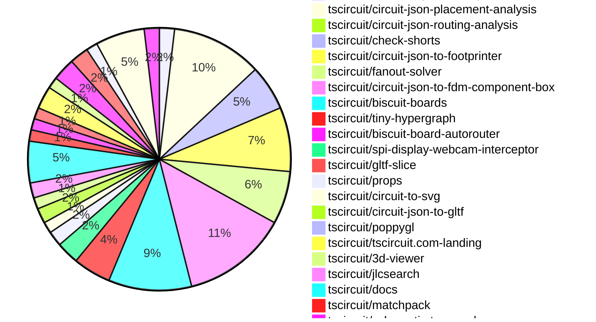

# Contribution Overview 2026-08-11

The current week is shown below. There are 3 major sections:

- [Contributor Overview](#contributor-overview)
- [PRs by Repository](#prs-by-repository)
- [PRs by Contributor](#changes-by-contributor)
- [Scoring & Sponsorship Details](/docs/sponsorship-calculation-explanation.md)

## PRs by Repository

## Contributor Overview

| Contributor | 🐳 Major | 🐙 Minor | 🐌 Tiny | Score | ⭐ |
|-------------|---------|---------|---------|-------|-----|
| [seveibar](#seveibar) | 16 | 15 | 19 | 107 | 👑 |
| [mohan-bee](#mohan-bee) | 3 | 5 | 7 | 33 | ⭐⭐ |
| [AnasSarkiz](#AnasSarkiz) | 5 | 3 | 6 | 32 | ⭐⭐ |
| [techmannih](#techmannih) | 2 | 2 | 3 | 15 | ⭐⭐ |
| [tscircuitbot](#tscircuitbot) | 0 | 0 | 126 | 14 | ⭐⭐ |
| [MustafaMulla29](#MustafaMulla29) | 2 | 1 | 2 | 13 | ⭐⭐ |
| [ArnavK-09](#ArnavK-09) | 1 | 2 | 3 | 11 | ⭐⭐ |
| [addibble](#addibble) | 1 | 2 | 1 | 9 | ⭐ |
| [rushabhcodes](#rushabhcodes) | 1 | 0 | 0 | 8 | ⭐ |
| [GokulPandi-M](#GokulPandi-M) | 1 | 0 | 3 | 7 | ⭐ |
| [imrishabh18](#imrishabh18) | 1 | 0 | 2 | 7 | ⭐ |
| [Sang-it](#Sang-it) | 0 | 2 | 2 | 6 | ⭐ |
| [KrishnaX12](#KrishnaX12) | 0 | 1 | 2 | 4 | ⭐ |
| [Abse2001](#Abse2001) | 0 | 0 | 2 | 2 |  |

## Staff Pass Ratio (SPR)

| Contributor | Reviewed PRs | Rejections | Approvals | SPR |
|-------------|--------------|------------|-----------|-----|
| [AnasSarkiz](#AnasSarkiz) | 8 | 0 | 8 | 100.0% |
| [mohan-bee](#mohan-bee) | 8 | 0 | 8 | 100.0% |
| [addibble](#addibble) | 4 | 0 | 4 | 100.0% |
| [ArnavK-09](#ArnavK-09) | 3 | 0 | 3 | 100.0% |
| [GokulPandi-M](#GokulPandi-M) | 3 | 0 | 3 | 100.0% |
| [MustafaMulla29](#MustafaMulla29) | 3 | 1 | 4 | 66.7% |
| [hrithik18k](#hrithik18k) | 1 | 1 | 0 | 0.0% |
| [KrishnaX12](#KrishnaX12) | 1 | 0 | 1 | 100.0% |
| [rushabhcodes](#rushabhcodes) | 1 | 0 | 1 | 100.0% |
| [Sang-it](#Sang-it) | 1 | 0 | 1 | 100.0% |

AnasSarkiz SPR PRs (8)

- [#439](https://github.com/tscircuit/easyeda-converter/pull/439) Generate Micro-USB connectors from EasyEDA metadata
- [#437](https://github.com/tscircuit/easyeda-converter/pull/437) Generate inductors from EasyEDA metadata
- [#435](https://github.com/tscircuit/easyeda-converter/pull/435) Generate four-pin crystals from EasyEDA metadata
- [#433](https://github.com/tscircuit/easyeda-converter/pull/433) Preserve exact manufacturer part numbers
- [#431](https://github.com/tscircuit/easyeda-converter/pull/431) Keep LED driver ICs as chips
- [#2071](https://github.com/tscircuit/tscircuit-autorouter/pull/2071) Pin repair03 low-count topology fix
- [#2068](https://github.com/tscircuit/tscircuit-autorouter/pull/2068) Protect autorouter benchmark integrity from invalid PCB placements
- [#66](https://github.com/tscircuit/high-density-repair03/pull/66) Repair low-count single-trace topology conflicts

mohan-bee SPR PRs (8)

- [#116](https://github.com/tscircuit/circuit-json-util/pull/116) include rotated smt pad extents in pcb bounds
- [#199](https://github.com/tscircuit/checks/pull/199) prevent rotated pad bounding-box overlap errors
- [#18](https://github.com/tscircuit/circuit-json-to-bom-csv/pull/18) skip do-not-place parts in bom
- [#9](https://github.com/tscircuit/circuit-json-to-pnp-csv/pull/9) skip do-not-place parts in pick and place
- [#216](https://github.com/tscircuit/matchpack/pull/216) Prevent loose testpoints from overlapping during row alignment
- [#804](https://github.com/tscircuit/schematic-trace-solver/pull/804) Prevent VBUS label detours near port labels
- [#806](https://github.com/tscircuit/schematic-trace-solver/pull/806) prevent same-net junction alignment from detaching net labels
- [#802](https://github.com/tscircuit/schematic-trace-solver/pull/802) obey maxMspPairDistance in LongDistancePairSolver

addibble SPR PRs (4)

- [#974](https://github.com/tscircuit/3d-viewer/pull/974) Add appearance controls for the assembled enclosure
- [#3174](https://github.com/tscircuit/core/pull/3174) Adopt the staged two-part FDM enclosure solver
- [#3166](https://github.com/tscircuit/core/pull/3166) Add assembly.device as a compatibility container
- [#197](https://github.com/tscircuit/checks/pull/197) Consume the shared millimetre formatter

ArnavK-09 SPR PRs (3)

- [#3160](https://github.com/tscircuit/core/pull/3160) feat: resolve noSchematicRepresentation support for Normal Component
- [#4473](https://github.com/tscircuit/runframe/pull/4473) fix(runframe-cli): schematic view options working
- [#19](https://github.com/tscircuit/tsci-agent/pull/19) patch: title and cmd guide 

GokulPandi-M SPR PRs (3)

- [#444](https://github.com/tscircuit/easyeda-converter/pull/444) Add C96225 diode array import repro
- [#443](https://github.com/tscircuit/easyeda-converter/pull/443) Add C82650 LED display driver import repro
- [#442](https://github.com/tscircuit/easyeda-converter/pull/442) Preserve circular EasyEDA SMT pads

MustafaMulla29 SPR PRs (3)

- [#3155](https://github.com/tscircuit/core/pull/3155) Clear overlapping different-net copper pours
- [#9](https://github.com/tscircuit/circuit-json-routing-analysis/pull/9) Use bounding-box distance for congestion neighbors
- [#7](https://github.com/tscircuit/circuit-json-routing-analysis/pull/7) Merge duplicate routing congestion regions

hrithik18k SPR PRs (1)

- [#4502](https://github.com/tscircuit/runframe/pull/4502) Add export preparation feedback

KrishnaX12 SPR PRs (1)

- [#11](https://github.com/tscircuit/jscad-to-gltf/pull/11) fix: make toColorTuple handle hex string colors

rushabhcodes SPR PRs (1)

- [#3177](https://github.com/tscircuit/core/pull/3177) Fix inductor max current rating

Sang-it SPR PRs (1)

- [#21](https://github.com/tscircuit/biscuit-boards/pull/21) fix BiscuitBoard using gerbers, add via-coordinate-map.csv

> Note: AI evaluates PRs and assigns 1-3 star ratings automatically. 4 and 5 star ratings require manual staff review.

## Review Table

[reviews-received-hover]: ## "Number of reviews received for PRs for this contributor"
[approvals-received-hover]: ## "Number of approvals received for PRs this contributor authored"
[rejections-received-hover]: ## "Number of rejections received for PRs this contributor authored"
[prs-opened-hover]: ## "Number of PRs opened by this contributor"
[issues-created-hover]: ## "Number of issues created by this contributor"

| Contributor | Reviews Received | Approvals Received | Rejections Received | Approvals | Rejections Given | PRs Opened | PRs Merged | Issues Created |
|---|---|---|---|---|---|---|---|---|
| [0hmX](#0hmX) | 0 | 0 | 0 | 1 | 0 | 0 | 0 | 0 |
| [Abse2001](#Abse2001) | 1 | 1 | 0 | 0 | 0 | 4 | 2 | 0 |
| [addibble](#addibble) | 7 | 5 | 0 | 0 | 0 | 5 | 4 | 0 |
| [AnasSarkiz](#AnasSarkiz) | 11 | 11 | 0 | 0 | 0 | 20 | 14 | 0 |
| [ArnavK-09](#ArnavK-09) | 9 | 8 | 0 | 0 | 0 | 6 | 6 | 0 |
| [fxp](#fxp) | 0 | 0 | 0 | 0 | 0 | 6 | 0 | 0 |
| [GokulPandi-M](#GokulPandi-M) | 9 | 9 | 0 | 0 | 0 | 6 | 6 | 0 |
| [hrithik18k](#hrithik18k) | 1 | 0 | 1 | 0 | 0 | 3 | 0 | 0 |
| [imrishabh18](#imrishabh18) | 0 | 0 | 0 | 8 | 0 | 5 | 3 | 0 |
| [KrishnaX12](#KrishnaX12) | 8 | 5 | 0 | 0 | 0 | 5 | 3 | 0 |
| [mohan-bee](#mohan-bee) | 13 | 12 | 0 | 4 | 0 | 18 | 15 | 0 |
| [mojeed-painless](#mojeed-painless) | 0 | 0 | 0 | 0 | 0 | 1 | 0 | 0 |
| [MustafaMulla29](#MustafaMulla29) | 4 | 4 | 0 | 2 | 0 | 6 | 5 | 0 |
| [pthm](#pthm) | 0 | 0 | 0 | 0 | 0 | 4 | 0 | 0 |
| [rushabhcodes](#rushabhcodes) | 7 | 3 | 0 | 4 | 0 | 3 | 1 | 0 |
| [Sang-it](#Sang-it) | 2 | 2 | 0 | 1 | 0 | 5 | 4 | 0 |
| [seveibar](#seveibar) | 6 | 1 | 0 | 44 | 1 | 71 | 54 | 0 |
| [ShiboSoftwareDev](#ShiboSoftwareDev) | 0 | 0 | 0 | 2 | 0 | 0 | 0 | 0 |
| [techmannih](#techmannih) | 10 | 6 | 0 | 0 | 0 | 10 | 7 | 0 |
| [tscircuitbot](#tscircuitbot) | 0 | 0 | 0 | 0 | 0 | 178 | 126 | 0 |
| [w1ne](#w1ne) | 0 | 0 | 0 | 0 | 0 | 1 | 0 | 0 |
| [wenn-id](#wenn-id) | 0 | 0 | 0 | 1 | 0 | 0 | 0 | 0 |

## Changes by Repository

### [tscircuit/pcb-viewer](https://github.com/tscircuit/pcb-viewer)

🐌 Tiny Contributions (4)

| PR # | Impact | Contributor | Description |
|------|--------|-------------|-------------|
| [#950](https://github.com/tscircuit/pcb-viewer/pull/950) | 🐌 Tiny | tscircuitbot | Automated package update |
| [#948](https://github.com/tscircuit/pcb-viewer/pull/948) | 🐌 Tiny | tscircuitbot | Automated package update to version 1.11.385 |
| [#949](https://github.com/tscircuit/pcb-viewer/pull/949) | 🐌 Tiny | seveibar | Updates the dependency circuit-to-canvas from version 0.0.120 to 0.0.123 to include recent canvas-rendering fixes published to npm. |
| [#947](https://github.com/tscircuit/pcb-viewer/pull/947) | 🐌 Tiny | seveibar | Fixes trace hover tooltip labels to prefer associated trace names over pad-selector display names, adjusts tooltip size and positioning, and adds regression tests for label preference and formatting. |

### [tscircuit/tscircuit](https://github.com/tscircuit/tscircuit)

🐌 Tiny Contributions (24)

| PR # | Impact | Contributor | Description |
|------|--------|-------------|-------------|
| [#4440](https://github.com/tscircuit/tscircuit/pull/4440) | 🐌 Tiny | tscircuitbot | Automated package update |
| [#4439](https://github.com/tscircuit/tscircuit/pull/4439) | 🐌 Tiny | tscircuitbot | Automated package update |
| [#4438](https://github.com/tscircuit/tscircuit/pull/4438) | 🐌 Tiny | tscircuitbot | Automated package update |
| [#4437](https://github.com/tscircuit/tscircuit/pull/4437) | 🐌 Tiny | tscircuitbot | Updates the tscircuitcli package from version 0.1.1902 to 0.1.1903 and the tscircuitrunframe package from version 0.0.2443 to 0.0.2444 in package.json |
| [#4436](https://github.com/tscircuit/tscircuit/pull/4436) | 🐌 Tiny | tscircuitbot | Automated package update to version 0.0.2306 |
| [#4435](https://github.com/tscircuit/tscircuit/pull/4435) | 🐌 Tiny | tscircuitbot | Automated package update |
| [#4434](https://github.com/tscircuit/tscircuit/pull/4434) | 🐌 Tiny | tscircuitbot | Automated package update |
| [#4433](https://github.com/tscircuit/tscircuit/pull/4433) | 🐌 Tiny | tscircuitbot | Updates the tscircuitcli package from version 0.1.1900 to 0.1.1901 and the tscircuitrunframe package from version 0.0.2441 to 0.0.2442 in package.json |
| [#4432](https://github.com/tscircuit/tscircuit/pull/4432) | 🐌 Tiny | tscircuitbot | Automated package update |
| [#4431](https://github.com/tscircuit/tscircuit/pull/4431) | 🐌 Tiny | tscircuitbot | Automated package update |
| [#4430](https://github.com/tscircuit/tscircuit/pull/4430) | 🐌 Tiny | tscircuitbot | Automated package update |
| [#4429](https://github.com/tscircuit/tscircuit/pull/4429) | 🐌 Tiny | tscircuitbot | Automated package update |
| [#4428](https://github.com/tscircuit/tscircuit/pull/4428) | 🐌 Tiny | tscircuitbot | Automated package update |
| [#4427](https://github.com/tscircuit/tscircuit/pull/4427) | 🐌 Tiny | tscircuitbot | Automated package update |
| [#4425](https://github.com/tscircuit/tscircuit/pull/4425) | 🐌 Tiny | tscircuitbot | Automated package update |
| [#4424](https://github.com/tscircuit/tscircuit/pull/4424) | 🐌 Tiny | tscircuitbot | Updates the tscircuitcli package from version 0.1.1896 to 0.1.1897 and the tscircuitrunframe package from version 0.0.2437 to 0.0.2438 in the package.json file. |
| [#4423](https://github.com/tscircuit/tscircuit/pull/4423) | 🐌 Tiny | tscircuitbot | Automated package update |
| [#4422](https://github.com/tscircuit/tscircuit/pull/4422) | 🐌 Tiny | tscircuitbot | Updates the tscircuitcli package from version 0.1.1895 to 0.1.1896 |
| [#4421](https://github.com/tscircuit/tscircuit/pull/4421) | 🐌 Tiny | tscircuitbot | Automated package update |
| [#4420](https://github.com/tscircuit/tscircuit/pull/4420) | 🐌 Tiny | tscircuitbot | Automated package update |
| [#4419](https://github.com/tscircuit/tscircuit/pull/4419) | 🐌 Tiny | tscircuitbot | Automated package update |
| [#4418](https://github.com/tscircuit/tscircuit/pull/4418) | 🐌 Tiny | tscircuitbot | Automated package update |
| [#4414](https://github.com/tscircuit/tscircuit/pull/4414) | 🐌 Tiny | tscircuitbot | Updates the package version from 0.0.2296 to 0.0.2297 in package.json |
| [#4413](https://github.com/tscircuit/tscircuit/pull/4413) | 🐌 Tiny | tscircuitbot | Automated package update |

### [tscircuit/circuit-json](https://github.com/tscircuit/circuit-json)

| PR # | Impact | Rating | Contributor | Description |
|------|--------|--------|-------------|-------------|
| [#695](https://github.com/tscircuit/circuit-json/pull/695) | 🐙 Minor | ⭐⭐ | seveibar | Adds an optional show_hidden_edges field to the cad_component schema, exposing it on the typed CadComponent interface and testing schema parsing for the new rendering hint. |

🐌 Tiny Contributions (1)

| PR # | Impact | Contributor | Description |
|------|--------|-------------|-------------|
| [#696](https://github.com/tscircuit/circuit-json/pull/696) | 🐌 Tiny | tscircuitbot | Automated package update |

### [tscircuit/core](https://github.com/tscircuit/core)

| PR # | Impact | Rating | Contributor | Description |
|------|--------|--------|-------------|-------------|
| [#3166](https://github.com/tscircuit/core/pull/3166) | 🐳 Major | ⭐⭐⭐ | addibble | Adds a new compatibility container assembly.device that allows for board discovery without altering existing Circuit JSON or electrical semantics. |
| [#3169](https://github.com/tscircuit/core/pull/3169) | 🐙 Minor | ⭐⭐ | seveibar | Expose showHiddenEdges on enclosure.fdm.box through the props package, allowing enclosure authors to opt into hidden-edge visualization from normal tscircuit JSX. |
| [#3160](https://github.com/tscircuit/core/pull/3160) | 🐙 Minor | ⭐⭐ | ArnavK-09 | Adds support for the noSchematicRepresentation property in NormalComponent, preventing schematic rendering for components that have this property set to true. |
| [#3155](https://github.com/tscircuit/core/pull/3155) | 🐙 Minor | ⭐⭐ | MustafaMulla29 | Batch copper pours by owning subcircuit to apply different-net pour priority and clearance, preserving each pours net, layer, margins, outline, and solder-mask setting, while converting repro172 from an expected failure to a passing PCB snapshot. |

🐌 Tiny Contributions (8)

| PR # | Impact | Contributor | Description |
|------|--------|-------------|-------------|
| [#3168](https://github.com/tscircuit/core/pull/3168) | 🐌 Tiny | tscircuitbot | Updates the tscircuitchecks package from version 0.0.156 to 0.0.157 |
| [#3165](https://github.com/tscircuit/core/pull/3165) | 🐌 Tiny | tscircuitbot | Updates the tscircuitfanout-solver package from version 0.0.20 to 0.0.21 |
| [#3162](https://github.com/tscircuit/core/pull/3162) | 🐌 Tiny | tscircuitbot | Updates the version of the tscircuitchecks package from 0.0.155 to 0.0.156 in package.json |
| [#3161](https://github.com/tscircuit/core/pull/3161) | 🐌 Tiny | tscircuitbot | Updates the version of the tscircuitchecks package from 0.0.155 to 0.0.156 in package.json |
| [#3158](https://github.com/tscircuit/core/pull/3158) | 🐌 Tiny | tscircuitbot | Updates the tscircuitchecks package from version 0.0.154 to 0.0.155 |
| [#3156](https://github.com/tscircuit/core/pull/3156) | 🐌 Tiny | tscircuitbot | Updates the tscircuitchecks package from version 0.0.153 to 0.0.154 |
| [#3173](https://github.com/tscircuit/core/pull/3173) | 🐌 Tiny | mohan-bee | Updates the matchpack dependency to version 0.0.80 in the package.json file and adjusts test timeouts for various tests. |
| [#3163](https://github.com/tscircuit/core/pull/3163) | 🐌 Tiny | ArnavK-09 | Fixes CI build errors by updating the format-si-unit dependency version from 0.0.7 to 0.0.12 in package.json |

### [tscircuit/tscircuit.com](https://github.com/tscircuit/tscircuit.com)

🐌 Tiny Contributions (17)

| PR # | Impact | Contributor | Description |
|------|--------|-------------|-------------|
| [#4388](https://github.com/tscircuit/tscircuit.com/pull/4388) | 🐌 Tiny | tscircuitbot | Updates the tscircuitrunframe package from version 0.0.2444 to 0.0.2445 |
| [#4387](https://github.com/tscircuit/tscircuit.com/pull/4387) | 🐌 Tiny | tscircuitbot | Updates the tscircuitrunframe package to version 0.0.2444 |
| [#4386](https://github.com/tscircuit/tscircuit.com/pull/4386) | 🐌 Tiny | tscircuitbot | Automated package update |
| [#4384](https://github.com/tscircuit/tscircuit.com/pull/4384) | 🐌 Tiny | tscircuitbot | Updates the tscircuitrunframe package from version 0.0.2441 to 0.0.2442 |
| [#4383](https://github.com/tscircuit/tscircuit.com/pull/4383) | 🐌 Tiny | tscircuitbot | Updates the tscircuitrunframe package from version 0.0.2439 to 0.0.2441 |
| [#4382](https://github.com/tscircuit/tscircuit.com/pull/4382) | 🐌 Tiny | tscircuitbot | Updates the tscircuiteval package from version 0.0.1182 to 0.0.1183 |
| [#4380](https://github.com/tscircuit/tscircuit.com/pull/4380) | 🐌 Tiny | tscircuitbot | Updates the tscircuiteval package from version 0.0.1181 to 0.0.1182 |
| [#4379](https://github.com/tscircuit/tscircuit.com/pull/4379) | 🐌 Tiny | tscircuitbot | Updates the tscircuitrunframe package from version 0.0.2438 to 0.0.2439 |
| [#4378](https://github.com/tscircuit/tscircuit.com/pull/4378) | 🐌 Tiny | tscircuitbot | Updates the tscircuiteval package from version 0.0.1180 to 0.0.1181 in the package.json file. |
| [#4377](https://github.com/tscircuit/tscircuit.com/pull/4377) | 🐌 Tiny | tscircuitbot | Automated package update |
| [#4375](https://github.com/tscircuit/tscircuit.com/pull/4375) | 🐌 Tiny | tscircuitbot | Automated package update |
| [#4373](https://github.com/tscircuit/tscircuit.com/pull/4373) | 🐌 Tiny | tscircuitbot | Automated package update |
| [#4372](https://github.com/tscircuit/tscircuit.com/pull/4372) | 🐌 Tiny | tscircuitbot | Automated package update |
| [#4370](https://github.com/tscircuit/tscircuit.com/pull/4370) | 🐌 Tiny | tscircuitbot | Automated package update |
| [#4369](https://github.com/tscircuit/tscircuit.com/pull/4369) | 🐌 Tiny | tscircuitbot | Automated package update |
| [#4368](https://github.com/tscircuit/tscircuit.com/pull/4368) | 🐌 Tiny | tscircuitbot | Updates the tscircuitrunframe package from version 0.0.2432 to 0.0.2433 |
| [#4367](https://github.com/tscircuit/tscircuit.com/pull/4367) | 🐌 Tiny | tscircuitbot | Updates the tscircuitrunframe package from version 0.0.2431 to 0.0.2432 |

### [tscircuit/eval](https://github.com/tscircuit/eval)

🐌 Tiny Contributions (14)

| PR # | Impact | Contributor | Description |
|------|--------|-------------|-------------|
| [#3858](https://github.com/tscircuit/eval/pull/3858) | 🐌 Tiny | tscircuitbot | Automated package update |
| [#3857](https://github.com/tscircuit/eval/pull/3857) | 🐌 Tiny | tscircuitbot | Automated package update |
| [#3855](https://github.com/tscircuit/eval/pull/3855) | 🐌 Tiny | tscircuitbot | Automated package update |
| [#3854](https://github.com/tscircuit/eval/pull/3854) | 🐌 Tiny | tscircuitbot | Automated package update |
| [#3853](https://github.com/tscircuit/eval/pull/3853) | 🐌 Tiny | tscircuitbot | Automated package update |
| [#3851](https://github.com/tscircuit/eval/pull/3851) | 🐌 Tiny | tscircuitbot | Updates the version of the tscircuitcore package from 0.0.1660 to 0.0.1661 in package.json |
| [#3849](https://github.com/tscircuit/eval/pull/3849) | 🐌 Tiny | tscircuitbot | Automated package update |
| [#3848](https://github.com/tscircuit/eval/pull/3848) | 🐌 Tiny | tscircuitbot | Updates package versions for dependencies in the project |
| [#3845](https://github.com/tscircuit/eval/pull/3845) | 🐌 Tiny | tscircuitbot | Updates the package version from 0.0.1179 to 0.0.1180 in package.json |
| [#3844](https://github.com/tscircuit/eval/pull/3844) | 🐌 Tiny | tscircuitbot | Updates package versions for dependencies in the project |
| [#3838](https://github.com/tscircuit/eval/pull/3838) | 🐌 Tiny | tscircuitbot | Automated package update |
| [#3837](https://github.com/tscircuit/eval/pull/3837) | 🐌 Tiny | tscircuitbot | Updates package dependencies to their latest versions as part of routine maintenance. |
| [#3834](https://github.com/tscircuit/eval/pull/3834) | 🐌 Tiny | tscircuitbot | Automated package update |
| [#3833](https://github.com/tscircuit/eval/pull/3833) | 🐌 Tiny | tscircuitbot | Automated package update |

### [tscircuit/runframe](https://github.com/tscircuit/runframe)

| PR # | Impact | Rating | Contributor | Description |
|------|--------|--------|-------------|-------------|
| [#4473](https://github.com/tscircuit/runframe/pull/4473) | 🐙 Minor | ⭐⭐ | ArnavK-09 | Fixes the issue where schematic view options were not functioning correctly in the RunFrame CLI. |

🐌 Tiny Contributions (27)

| PR # | Impact | Contributor | Description |
|------|--------|-------------|-------------|
| [#4508](https://github.com/tscircuit/runframe/pull/4508) | 🐌 Tiny | tscircuitbot | Automated package update |
| [#4507](https://github.com/tscircuit/runframe/pull/4507) | 🐌 Tiny | tscircuitbot | Updates the circuit-json-to-gerber package from version 0.0.92 to 0.0.93 in package.json |
| [#4506](https://github.com/tscircuit/runframe/pull/4506) | 🐌 Tiny | tscircuitbot | Automated package update |
| [#4505](https://github.com/tscircuit/runframe/pull/4505) | 🐌 Tiny | tscircuitbot | Automated package update |
| [#4504](https://github.com/tscircuit/runframe/pull/4504) | 🐌 Tiny | tscircuitbot | Updates the tscircuiteval package from version 0.0.1183 to 0.0.1184 in the package.json file. |
| [#4503](https://github.com/tscircuit/runframe/pull/4503) | 🐌 Tiny | tscircuitbot | Updates the package version from 0.0.2441 to 0.0.2442 in package.json |
| [#4501](https://github.com/tscircuit/runframe/pull/4501) | 🐌 Tiny | tscircuitbot | Updates the circuit-json-to-gerber package from version 0.0.91 to 0.0.92 |
| [#4500](https://github.com/tscircuit/runframe/pull/4500) | 🐌 Tiny | tscircuitbot | Automated package update |
| [#4499](https://github.com/tscircuit/runframe/pull/4499) | 🐌 Tiny | tscircuitbot | Updates the tscircuiteval package from version 0.0.1182 to 0.0.1183 |
| [#4497](https://github.com/tscircuit/runframe/pull/4497) | 🐌 Tiny | tscircuitbot | Updates the tscircuiteval package from version 0.0.1181 to 0.0.1182 |
| [#4496](https://github.com/tscircuit/runframe/pull/4496) | 🐌 Tiny | tscircuitbot | Automated package update |
| [#4495](https://github.com/tscircuit/runframe/pull/4495) | 🐌 Tiny | tscircuitbot | Updates the tscircuiteval package from version 0.0.1180 to 0.0.1181 in the package.json file. |
| [#4493](https://github.com/tscircuit/runframe/pull/4493) | 🐌 Tiny | tscircuitbot | Automated package update |
| [#4492](https://github.com/tscircuit/runframe/pull/4492) | 🐌 Tiny | tscircuitbot | Automated package update for tscircuit3d-viewer from version 0.0.590 to 0.0.591 |
| [#4490](https://github.com/tscircuit/runframe/pull/4490) | 🐌 Tiny | tscircuitbot | Automated package update |
| [#4488](https://github.com/tscircuit/runframe/pull/4488) | 🐌 Tiny | tscircuitbot | Updates the tscircuitpcb-viewer package from version 1.11.385 to 1.11.386 |
| [#4486](https://github.com/tscircuit/runframe/pull/4486) | 🐌 Tiny | tscircuitbot | Updates the package version from v0.0.2435 to v0.0.2436 in package.json |
| [#4485](https://github.com/tscircuit/runframe/pull/4485) | 🐌 Tiny | tscircuitbot | Updates the tscircuiteval package from version 0.0.1178 to 0.0.1180 in the project dependencies. |
| [#4484](https://github.com/tscircuit/runframe/pull/4484) | 🐌 Tiny | tscircuitbot | Automated package update |
| [#4483](https://github.com/tscircuit/runframe/pull/4483) | 🐌 Tiny | tscircuitbot | Updates the tscircuitpcb-viewer package to version 1.11.385 |
| [#4480](https://github.com/tscircuit/runframe/pull/4480) | 🐌 Tiny | tscircuitbot | Automated package update |
| [#4479](https://github.com/tscircuit/runframe/pull/4479) | 🐌 Tiny | tscircuitbot | Updates the tscircuit3d-viewer package to version 0.0.589 |
| [#4478](https://github.com/tscircuit/runframe/pull/4478) | 🐌 Tiny | tscircuitbot | Automated package update |
| [#4477](https://github.com/tscircuit/runframe/pull/4477) | 🐌 Tiny | tscircuitbot | Automated package update |
| [#4476](https://github.com/tscircuit/runframe/pull/4476) | 🐌 Tiny | tscircuitbot | Updates the tscircuiteval package from version 0.0.1177 to 0.0.1178 |
| [#4489](https://github.com/tscircuit/runframe/pull/4489) | 🐌 Tiny | seveibar | Updates the dependencies for tscircuit3d-viewer and tscircuitinternal-dynamic-import to their latest versions and deduplicates circuit-to-canvas in the lockfile, completing the rollout of circuit-to-canvas0.0.123 across RunFrames viewer paths. |
| [#4472](https://github.com/tscircuit/runframe/pull/4472) | 🐌 Tiny | ArnavK-09 | before img width330 height520 altimage srchttps:github.comuser-attachmentsassetsf1da0184-6fb5-48f1-939b-44690a195648   after img width330 height520 altimage srchttps:github.comuser-attachmentsassetsdf885eb5-3d2d-4497-8f04-785eb83369ee |

### [tscircuit/cli](https://github.com/tscircuit/cli)

🐌 Tiny Contributions (22)

| PR # | Impact | Contributor | Description |
|------|--------|-------------|-------------|
| [#4221](https://github.com/tscircuit/cli/pull/4221) | 🐌 Tiny | tscircuitbot | Automated package update |
| [#4219](https://github.com/tscircuit/cli/pull/4219) | 🐌 Tiny | tscircuitbot | Automated package update |
| [#4218](https://github.com/tscircuit/cli/pull/4218) | 🐌 Tiny | tscircuitbot | Updates the tscircuitrunframe package from version 0.0.2444 to 0.0.2445 |
| [#4216](https://github.com/tscircuit/cli/pull/4216) | 🐌 Tiny | tscircuitbot | Updates the tscircuitrunframe package from version 0.0.2443 to 0.0.2444 |
| [#4213](https://github.com/tscircuit/cli/pull/4213) | 🐌 Tiny | tscircuitbot | Updates the tscircuitrunframe package from version 0.0.2442 to 0.0.2443 |
| [#4212](https://github.com/tscircuit/cli/pull/4212) | 🐌 Tiny | tscircuitbot | Automated package update |
| [#4211](https://github.com/tscircuit/cli/pull/4211) | 🐌 Tiny | tscircuitbot | Updates the tscircuitrunframe package to version 0.0.2442 |
| [#4210](https://github.com/tscircuit/cli/pull/4210) | 🐌 Tiny | tscircuitbot | Automated package update |
| [#4209](https://github.com/tscircuit/cli/pull/4209) | 🐌 Tiny | tscircuitbot | Updates the tscircuitrunframe package to version 0.0.2441 in package.json |
| [#4205](https://github.com/tscircuit/cli/pull/4205) | 🐌 Tiny | tscircuitbot | Automated package update |
| [#4204](https://github.com/tscircuit/cli/pull/4204) | 🐌 Tiny | tscircuitbot | Automated package update |
| [#4202](https://github.com/tscircuit/cli/pull/4202) | 🐌 Tiny | tscircuitbot | Updates the tscircuitrunframe package from version 0.0.2437 to 0.0.2438 |
| [#4201](https://github.com/tscircuit/cli/pull/4201) | 🐌 Tiny | tscircuitbot | Automated package update |
| [#4199](https://github.com/tscircuit/cli/pull/4199) | 🐌 Tiny | tscircuitbot | Updates the tscircuitrunframe package from version 0.0.2435 to 0.0.2437 |
| [#4196](https://github.com/tscircuit/cli/pull/4196) | 🐌 Tiny | tscircuitbot | Automated package update |
| [#4195](https://github.com/tscircuit/cli/pull/4195) | 🐌 Tiny | tscircuitbot | Updates the tscircuitrunframe package version from 0.0.2434 to 0.0.2435 |
| [#4194](https://github.com/tscircuit/cli/pull/4194) | 🐌 Tiny | tscircuitbot | Automated package update |
| [#4193](https://github.com/tscircuit/cli/pull/4193) | 🐌 Tiny | tscircuitbot | Updates the tscircuitrunframe package from version 0.0.2431 to 0.0.2434 |
| [#4198](https://github.com/tscircuit/cli/pull/4198) | 🐌 Tiny | seveibar | Updates the dependency circuit-to-canvas to version 0.0.123 to include recent canvas-rendering fixes that were not previously available due to version constraints. |
| [#4220](https://github.com/tscircuit/cli/pull/4220) | 🐌 Tiny | MustafaMulla29 | Updates the tscircuitcircuit-json-routing-analysis package from version 0.0.7 to 0.0.8, enhancing routing diagnostics with improved distance calculations and component exclusion criteria. |
| [#4206](https://github.com/tscircuit/cli/pull/4206) | 🐌 Tiny | MustafaMulla29 | Updates the tscircuitcircuit-json-routing-analysis package from version 0.0.6 to 0.0.7 to include the latest upstream routing-analysis changes, ensuring the CLI remains installable with the correct package artifact. |
| [#4215](https://github.com/tscircuit/cli/pull/4215) | 🐌 Tiny | techmannih | Updates the version of the tscircuitcircuit-json-placement-analysis dependency from 0.0.6 to 0.0.9 in package.json |

### [tscircuit/tscircuit-autorouter](https://github.com/tscircuit/tscircuit-autorouter)

| PR # | Impact | Rating | Contributor | Description |
|------|--------|--------|-------------|-------------|
| [#2071](https://github.com/tscircuit/tscircuit-autorouter/pull/2071) | 🐳 Major | ⭐⭐⭐ | AnasSarkiz | Updates Pipeline 7 to consume the low-count single-trace topology repair from high-density-repair03, improving DRC-clean benchmarks for circuits 140 and 143. |
| [#2068](https://github.com/tscircuit/tscircuit-autorouter/pull/2068) | 🐳 Major | ⭐⭐⭐ | AnasSarkiz | Protects autorouter benchmark integrity by ensuring that physically invalid benchmark boards do not affect DRC results, leading to improved accuracy in autorouting evaluations. |

🐌 Tiny Contributions (8)

| PR # | Impact | Contributor | Description |
|------|--------|-------------|-------------|
| [#2082](https://github.com/tscircuit/tscircuit-autorouter/pull/2082) | 🐌 Tiny | tscircuitbot | Automated package update |
| [#2080](https://github.com/tscircuit/tscircuit-autorouter/pull/2080) | 🐌 Tiny | tscircuitbot | Automated package update |
| [#2078](https://github.com/tscircuit/tscircuit-autorouter/pull/2078) | 🐌 Tiny | tscircuitbot | Automated package update |
| [#2072](https://github.com/tscircuit/tscircuit-autorouter/pull/2072) | 🐌 Tiny | tscircuitbot | Automated package update |
| [#2069](https://github.com/tscircuit/tscircuit-autorouter/pull/2069) | 🐌 Tiny | tscircuitbot | Automated package update |
| [#2079](https://github.com/tscircuit/tscircuit-autorouter/pull/2079) | 🐌 Tiny | seveibar | Replace the separate main and PR benchmark summary tables with one compact Solver  Metric  Main  PR  Change comparison table, add timing rows for P60, P70, P80, and P90, and calculate timing percentiles from solved and timed-out samples while excluding non-timeout failures. |
| [#2076](https://github.com/tscircuit/tscircuit-autorouter/pull/2076) | 🐌 Tiny | seveibar | Add an opt-in same_machine_compare mode to the existing autorouter benchmark workflow, allowing for sequential benchmarking of the current main and PR head on the same machine to reduce timing noise and improve comparison accuracy. |
| [#2081](https://github.com/tscircuit/tscircuit-autorouter/pull/2081) | 🐌 Tiny | imrishabh18 | Summary add bug report fixture 1046bd7a-83a1-4867-925f-2c58e0198196 for board809  add a debugger fixture for inspecting the report interactively add a focused regression test and SVG snapshot of the terminal path-assignment state Bug report: https:api.tscircuit.comautoroutingbug_reportsview?autorouting_bug_report_id1046bd7a-83a1-4867-925f-2c58e0198196  Current behavior Pipeline 7 reaches portPointPathingSolver and fails with:  SelectiveReripTinyHyperGraphSolverWithStableInitialAssignments ran out of iterations  The solve reports globalReripReason: no_path, 1,277 global rerips, zero selective rerips, and no completed final routing output. The included snapshot records the failure state so a future solver fix can be validated against this real-board input. This looks related to 1747. This PR adds the reproduction only; it does not change solver behavior.  Validation sh bun test testsbugsbugreport91-1046bd.test.ts --timeout 9999999  Result: 1 pass, 0 failures. |

### [tscircuit/test-github-automerge](https://github.com/tscircuit/test-github-automerge)

🐌 Tiny Contributions (1)

| PR # | Impact | Contributor | Description |
|------|--------|-------------|-------------|
| [#66](https://github.com/tscircuit/test-github-automerge/pull/66) | 🐌 Tiny | tscircuitbot | Updates the tscircuitcircuit-json-util package from version 0.0.106 to 0.0.107 in the development dependencies. |

### [tscircuit/circuit-to-canvas](https://github.com/tscircuit/circuit-to-canvas)

| PR # | Impact | Rating | Contributor | Description |
|------|--------|--------|-------------|-------------|
| [#274](https://github.com/tscircuit/circuit-to-canvas/pull/274) | 🐙 Minor | ⭐⭐ | seveibar | Fixes rendering issues with variable-width traces by preserving interpolated necking and correcting the handling of route thickness modes in the canvas implementation. |
| [#275](https://github.com/tscircuit/circuit-to-canvas/pull/275) | 🐙 Minor | ⭐⭐ | seveibar | Add a focused visual fixture for a wide top-layer trace necking down before two SMT pads, opting into continuous width blending with route_thickness_mode: interpolated. |
| [#272](https://github.com/tscircuit/circuit-to-canvas/pull/272) | 🐙 Minor | ⭐⭐ | seveibar | Summary add a PCB-only fixture from MustafaMulla29ti-boost-drv8848 v1.0.1(https:tscircuit.comMustafaMulla29ti-boost-drv8848) add a tightly zoomed visual snapshot around .U1  .VM render circuit-to-canvas and circuit-to-svg side by side from the same circuit JSON allow the comparison helper to accept an explicit viewport  Reproduction The canvas half of the snapshot shows an acute spike and polygonal shoulder where the variable-width VM trace meets U1s rotated pill pad. The SVG half stays smoothly rounded, confirming that the defect is isolated to the canvas rendering path. This first PR intentionally adds only the real-circuit reproduction and visual oracle. The renderer fix will follow separately.  Validation bun test  152 passed bun run build bun run format:check  passes with the existing max-size warning for abse-gameboy-1.0.16-pcb.json |

🐌 Tiny Contributions (3)

| PR # | Impact | Contributor | Description |
|------|--------|-------------|-------------|
| [#277](https://github.com/tscircuit/circuit-to-canvas/pull/277) | 🐌 Tiny | tscircuitbot | Automated package update |
| [#276](https://github.com/tscircuit/circuit-to-canvas/pull/276) | 🐌 Tiny | tscircuitbot | Automated package update |
| [#273](https://github.com/tscircuit/circuit-to-canvas/pull/273) | 🐌 Tiny | tscircuitbot | Automated package update |

### [tscircuit/lbrnts](https://github.com/tscircuit/lbrnts)

| PR # | Impact | Rating | Contributor | Description |
|------|--------|--------|-------------|-------------|
| [#40](https://github.com/tscircuit/lbrnts/pull/40) | 🐙 Minor | ⭐⭐ | seveibar | Serializes all boolean CutSetting properties as numeric values (0 or 1) to ensure compatibility with LightBurn, preventing project opening errors. |

🐌 Tiny Contributions (1)

| PR # | Impact | Contributor | Description |
|------|--------|-------------|-------------|
| [#41](https://github.com/tscircuit/lbrnts/pull/41) | 🐌 Tiny | tscircuitbot | Automated package update to version 0.0.23 |

### [tscircuit/internal-dynamic-import](https://github.com/tscircuit/internal-dynamic-import)

| PR # | Impact | Rating | Contributor | Description |
|------|--------|--------|-------------|-------------|
| [#30](https://github.com/tscircuit/internal-dynamic-import/pull/30) | 🐙 Minor | ⭐⭐ | seveibar | Adds support for the FDM component box converter by including it in the remote-module allowlist, bundling TypeScript declarations, and enabling lazy-loading for component-box downloads. |

🐌 Tiny Contributions (3)

| PR # | Impact | Contributor | Description |
|------|--------|-------------|-------------|
| [#31](https://github.com/tscircuit/internal-dynamic-import/pull/31) | 🐌 Tiny | tscircuitbot | Automated package update |
| [#29](https://github.com/tscircuit/internal-dynamic-import/pull/29) | 🐌 Tiny | tscircuitbot | Automated package update |
| [#28](https://github.com/tscircuit/internal-dynamic-import/pull/28) | 🐌 Tiny | seveibar | Updates the circuit-to-canvas dependency to version 0.0.123 to include recent canvas-rendering fixes and refreshes the resolved dependency or generated type bundle. |

### [tscircuit/circuit-json-placement-analysis](https://github.com/tscircuit/circuit-json-placement-analysis)

| PR # | Impact | Rating | Contributor | Description |
|------|--------|--------|-------------|-------------|
| [#15](https://github.com/tscircuit/circuit-json-placement-analysis/pull/15) | 🐙 Minor | ⭐⭐ | techmannih | Fixes false collision detection for rotated PCB courtyards by accurately calculating bounds based on rotation. |

🐌 Tiny Contributions (2)

| PR # | Impact | Contributor | Description |
|------|--------|-------------|-------------|
| [#16](https://github.com/tscircuit/circuit-json-placement-analysis/pull/16) | 🐌 Tiny | tscircuitbot | Automated package update |
| [#13](https://github.com/tscircuit/circuit-json-placement-analysis/pull/13) | 🐌 Tiny | techmannih | Reproduces a bug where rotated courtyard rectangles incorrectly report collisions in placement analysis. |

### [tscircuit/circuit-json-routing-analysis](https://github.com/tscircuit/circuit-json-routing-analysis)

| PR # | Impact | Rating | Contributor | Description |
|------|--------|--------|-------------|-------------|
| [#9](https://github.com/tscircuit/circuit-json-routing-analysis/pull/9) | 🐳 Major | ⭐⭐⭐ | MustafaMulla29 | Problem The routing analysis currently chooses the closest three components using the smallest distance on any single axis. That produces misleading neighbors. For example, the Arduino snapshot reported C7 next to a congestion region spanning x6.713.9 mm even though C7 ends at x-17.2 mm. The component was roughly 24 mm away horizontally, but it was selected because it was close on the Y axis. The same report exposed the resulting geometry as: text distToLeftEdgeOfRegion-25.5mm  This makes the diagnostic noisy and prevents the CLI from reliably using the result for severity scoring or actionable placement suggestions.  Change calculate physical edge-to-edge distance between component and region bounding boxes: dx  max(horizontal gaps, 0) dy  max(vertical gaps, 0) edgeDistanceMm  hypot(dx, dy) include intersecting components plus components whose physical body is within 5 mm store bounds, edge distance, overlap depth, and directional free space as numbers include overlapDepthMm only when the component overlaps the region format measurements only in getString() remove the arbitrary closest-three selection A NearbyComponent does not carry a relationnearby field. Membership in nearbyComponents already communicates that. Overlap is represented only by the optional numeric overlapDepthMm.  Result large components are included when their body is close even if their center is far away components that are close on one axis but far away on the other are excluded displayed edge distances are never negative overlap remains available separately for future congestion scoring the Arduino example no longer reports physically distant components such as C7 for that region  Tests Regression coverage verifies: a component 0.7 mm from the region is included a large component with a distant center but nearby body is included a diagonally distant component is excluded a component 25 mm away is excluded overlap has zero edge distance and positive overlap depth serialized distances are not negative  Validation bun test bunx tsc --noEmit bun run build bun run format:check |
| [#7](https://github.com/tscircuit/circuit-json-routing-analysis/pull/7) | 🐳 Major | ⭐⭐⭐ | MustafaMulla29 | Merges strongly overlapping routing-capacity nodes into one congestion region, reducing duplicate congestion reports for better analysis without altering output format. |

🐌 Tiny Contributions (2)

| PR # | Impact | Contributor | Description |
|------|--------|-------------|-------------|
| [#10](https://github.com/tscircuit/circuit-json-routing-analysis/pull/10) | 🐌 Tiny | tscircuitbot | Automated package update |
| [#8](https://github.com/tscircuit/circuit-json-routing-analysis/pull/8) | 🐌 Tiny | tscircuitbot | Automated package update |

### [tscircuit/check-shorts](https://github.com/tscircuit/check-shorts)

🐌 Tiny Contributions (2)

| PR # | Impact | Contributor | Description |
|------|--------|-------------|-------------|
| [#44](https://github.com/tscircuit/check-shorts/pull/44) | 🐌 Tiny | tscircuitbot | Automated package update |
| [#43](https://github.com/tscircuit/check-shorts/pull/43) | 🐌 Tiny | seveibar | Updates the circuit-to-canvas dependency to version 0.0.123 to include recent canvas-rendering fixes that were not previously available due to version constraints. |

### [tscircuit/circuit-json-to-footprinter](https://github.com/tscircuit/circuit-json-to-footprinter)

| PR # | Impact | Rating | Contributor | Description |
|------|--------|--------|-------------|-------------|
| [#88](https://github.com/tscircuit/circuit-json-to-footprinter/pull/88) | 🐳 Major | ⭐⭐⭐ | techmannih | Preserves PCB vias in footprint comparison by including them in the footprint data structure and comparison metrics. |

🐌 Tiny Contributions (1)

| PR # | Impact | Contributor | Description |
|------|--------|-------------|-------------|
| [#89](https://github.com/tscircuit/circuit-json-to-footprinter/pull/89) | 🐌 Tiny | tscircuitbot | Automated package update |

### [tscircuit/fanout-solver](https://github.com/tscircuit/fanout-solver)

| PR # | Impact | Rating | Contributor | Description |
|------|--------|--------|-------------|-------------|
| [#44](https://github.com/tscircuit/fanout-solver/pull/44) | 🐳 Major | ⭐⭐⭐ | seveibar | Summary pin the benchmark adapter to the merged, validated generation-v2 SRJ29 BGA decoupling dataset and fail fast if an invalidolder manifest is loaded map depth-indexed signal buses to their intended board face add preferOriginalEndpointTracks, which projects each boundary route onto the real downstream pad coordinate and strongly prefers the padsource layer when legal preserve plane-aware VCCGND breakout, DRC-gated endpoint completion, and the invariant that layer-transition vias lie along trace interiors rather than at endpoints count a sample as solved only when every original endpoint is physically connected and the complete emitted copper passes independent DRC regenerate composite and per-layer SVG snapshots for passing samples 001, 005, and 009  Root cause The previous signal strategy optimized compact breakout tracks at the fanout boundary, not the coordinates and layers of the actual outside pads. A fanout could therefore look orderly near the BGA but stop beside its destination, leaving endpoint completion to recover with long global routes. The corrected dataset made this mismatch especially visible. The new strategy aligns boundary tracks with the real destination pads during fanout and favors same-layer assignments. Same-layer traces enter the pads directly; the few necessary layer changes occur at legal interior points along existing traces.  Impact The updated snapshots are deliberately gated by fanout validation, original-endpoint connectivity, and routed-copper DRC: sample001: 2323 connected sample005: 5050 connected sample009: 2525 connected Full 200-sample Blacksmith run, 6 layers, 256 assignment budget, concurrency 32, and a 180-second per-sample ceiling:  Metric  Result   ---  ---:   Strictly solved samples  159200   Fanout prefixes  7,8808,050 (97.9)   Original endpoints physically connected  7,7698,050 (96.5)   Independently DRC-clean complete attempts  198200   Partial  errors  timeouts  39  0  2   Wall time  212.03s  The 39 partially connected samples and two timeouts are not marked solved. This keeps the benchmark honest about endpoint connectivity instead of rewarding visually adjacent or boundary-only breakouts.  Validation bun test: 68 pass, 0 fail, 98,282 assertions bun run typecheck bun run format:check git diff --check full 200-sample benchmark on a Blacksmith 32-vCPU runner 21 SVG snapshots: composite plus six individual copper layers for three strictly solved samples |
| [#43](https://github.com/tscircuit/fanout-solver/pull/43) | 🐳 Major | ⭐⭐⭐ | seveibar | Adds an independent physical-copper connectivity validator for original SRJ endpoints, ensuring emitted copper connects to original endpoints and meets DRC requirements before marking a sample as solved. |

🐌 Tiny Contributions (1)

| PR # | Impact | Contributor | Description |
|------|--------|-------------|-------------|
| [#45](https://github.com/tscircuit/fanout-solver/pull/45) | 🐌 Tiny | tscircuitbot | Automated package update |

### [tscircuit/circuit-json-to-fdm-component-box](https://github.com/tscircuit/circuit-json-to-fdm-component-box)

| PR # | Impact | Rating | Contributor | Description |
|------|--------|--------|-------------|-------------|
| [#2](https://github.com/tscircuit/circuit-json-to-fdm-component-box/pull/2) | 🐳 Major | ⭐⭐⭐ | seveibar | Summary accept Circuit JSON directly and group confidently identical BOM components into shared compartments using manufacturer part numbers, supplier part numbers, or passive value plus package preserve every exact refdes while generating compact, uniqueness-checked raised labels add a public PoppyGL PNG preview API and a tscircuitimage-utilslooks-same snapshot matcher modeled after bun-match-svg pin an absegameboy v1.0.16 BOM fixture, reducing 78 placed components to 40 compartments, with three committed PNG baselines expose CLI controls for grouping and test-point selection  Impact Assembly organizers can now use shared compartments for repeated BOM lines while keeping the complete refdes mapping in the API and 3MF part names. Preview snapshots exercise the same manifold meshes that become the multi-material 3MF. |
| [#1](https://github.com/tscircuit/circuit-json-to-fdm-component-box/pull/1) | 🐳 Major | ⭐⭐⭐ | seveibar | Summary bootstrap the repository using the tscircuit handbook layout and generated CI workflows convert physical Circuit JSON components into naturally sorted, labeled compartments using manifold-3d package the box and raised refdes labels as a multi-part 3MF with Core base materials include Bambu Studio part metadata so the box defaults to extruder 1 and labels to extruder 2 provide a source-first TypeScript API, CLI, validation, and usage documentation  Validation bun test (9 passing) bun run typecheck bun run format:check git diff --check npm pack --dry-run generated archive passes unzip -t and both XML parts pass xmllint Bambu Studio 02.06.00.51 reports the sample manifold and preserves the extruder 12 assignments after import and re-export |

🐌 Tiny Contributions (2)

| PR # | Impact | Contributor | Description |
|------|--------|-------------|-------------|
| [#4](https://github.com/tscircuit/circuit-json-to-fdm-component-box/pull/4) | 🐌 Tiny | tscircuitbot | Automated package update |
| [#3](https://github.com/tscircuit/circuit-json-to-fdm-component-box/pull/3) | 🐌 Tiny | seveibar | Builds the public API and CLI into dist with declarations and source maps, points package entrypoints and CLI bin at compiled output, and adds the standard tscircuit pver npm release workflow. |

### [tscircuit/biscuit-boards](https://github.com/tscircuit/biscuit-boards)

| PR # | Impact | Rating | Contributor | Description |
|------|--------|--------|-------------|-------------|
| [#19](https://github.com/tscircuit/biscuit-boards/pull/19) | 🐳 Major | ⭐⭐⭐ | seveibar | Replaces Delaunaybarycentric calibration with Shepard inverse-distance weighting, preserving global translation, rotation, and scale with an affine baseline, and blending measured residual corrections using inverse-square weights. |
| [#18](https://github.com/tscircuit/biscuit-boards/pull/18) | 🐳 Major | ⭐⭐⭐ | seveibar | Flatten straight and cubic Bzier LightBurn primitives into line segments no longer than 0.5 mm, applying piecewise-linear calibration to every generated sub-vertex, preserving path topology, and adding tessellation tests. |
| [#17](https://github.com/tscircuit/biscuit-boards/pull/17) | 🐳 Major | ⭐⭐⭐ | seveibar | Replaces the smoothing TPS with a Delaunay-triangulated piecewise-affine calibration derived from the latest 15-point CSV, ensuring zero residual at all calibration points and improving interpolation accuracy. |
| [#16](https://github.com/tscircuit/biscuit-boards/pull/16) | 🐳 Major | ⭐⭐⭐ | seveibar | Replaces bilinear lens calibration with a regularized thin-plate spline (TPS) for improved accuracy in lens distortion correction, while maintaining compatibility with the previous bilinear model. |
| [#15](https://github.com/tscircuit/biscuit-boards/pull/15) | 🐳 Major | ⭐⭐⭐ | seveibar | Derives the constrained 2  4 bilinear calibration matrix from the committed via-coordinate-map.csv and applies the forward design-to-projected transform to lens distortion files, ensuring accurate LightBurn geometry representation. |
| [#11](https://github.com/tscircuit/biscuit-boards/pull/11) | 🐳 Major | ⭐⭐⭐ | seveibar | Add lens-corrected LightBurn export functionality that applies inverse calibration to LightBurn paths, ensuring accurate laser positioning based on measured distortion. |
| [#21](https://github.com/tscircuit/biscuit-boards/pull/21) | 🐙 Minor | ⭐⭐ | Sang-it | Fixes BiscuitBoard calculations by correcting the range function and adding a comprehensive via-coordinate map for improved routing accuracy. |
| [#14](https://github.com/tscircuit/biscuit-boards/pull/14) | 🐙 Minor | ⭐⭐ | Sang-it | Fixes the coordinate mapping for entry 10 in the coordinate map CSV file by correcting the projected Y value from 30.621 to 94.621. |

🐌 Tiny Contributions (3)

| PR # | Impact | Contributor | Description |
|------|--------|-------------|-------------|
| [#20](https://github.com/tscircuit/biscuit-boards/pull/20) | 🐌 Tiny | seveibar | Updates the autorouter to beautify routed traces before power-trace expansion, regenerates PCB snapshots, and documents trace geometry improvements. |
| [#22](https://github.com/tscircuit/biscuit-boards/pull/22) | 🐌 Tiny | Sang-it | Add the stm-display circuit and update the via hole diameter to 0.8mm and the outer diameter to 1.2mm |
| [#12](https://github.com/tscircuit/biscuit-boards/pull/12) | 🐌 Tiny | Sang-it | Adds a new CSV file for coordinate mapping from circuit.json to laser coordinates. |

### [tscircuit/tiny-hypergraph](https://github.com/tscircuit/tiny-hypergraph)

| PR # | Impact | Rating | Contributor | Description |
|------|--------|--------|-------------|-------------|
| [#164](https://github.com/tscircuit/tiny-hypergraph/pull/164) | 🐳 Major | ⭐⭐⭐ | seveibar | Reduces memory allocation for candidate hops by indexing them by legal portregion pairs, improving routing performance and memory efficiency. |
| [#161](https://github.com/tscircuit/tiny-hypergraph/pull/161) | 🐳 Major | ⭐⭐⭐ | seveibar | Reduces repeated distance, angle, incidence, and reservation work in the core and outside-in routing loops, leading to improved performance without affecting routing output stability. |
| [#163](https://github.com/tscircuit/tiny-hypergraph/pull/163) | 🐙 Minor | ⭐⭐ | seveibar | This PR changes the benchmarking process to run every authorized tiny-hypergraph benchmark command on the current main and the PR head sequentially on the same runner, ensuring consistent comparison results. |

### [tscircuit/biscuit-board-autorouter](https://github.com/tscircuit/biscuit-board-autorouter)

| PR # | Impact | Rating | Contributor | Description |
|------|--------|--------|-------------|-------------|
| [#10](https://github.com/tscircuit/biscuit-board-autorouter/pull/10) | 🐳 Major | ⭐⭐⭐ | seveibar | Consolidates parallel same-net trace segments by pulling one segment onto anothers centerline, ensuring the corridor is free of obstacles and foreign-net traces, while retaining clearance validation and geometry. |
| [#9](https://github.com/tscircuit/biscuit-board-autorouter/pull/9) | 🐳 Major | ⭐⭐⭐ | seveibar | Summary add an always-on BeautifyBiscuitBoardTracesSolver between clearance cleanup and power-trace expansion opportunistically increase board-wide clearance toward 0.4 mm while falling back to the already-valid route on constrained boards consolidate same-net spans between shared junctions when reuse does not lengthen the connection replace unprotected Manhattan corners with the largest clearance-safe 45 chamfer show only the active final route in completed pipeline visualizations so superseded corner geometry is not rendered as live copper preserve board outlines, pads, obstacles, terminals, and prefabricated vias in beautification visualizations expose beautification stats, document the pipeline, and maintain fixed-via, RP2040, and STM32 visual snapshots  Why The router previously guaranteed minimum clearance and could simplify broad stair-step runs, but it did not optimize the cleaned result for visual spacing or deliberately reuse same-net copper before the power-trace expander widened routes.  Impact Beautification now always runs before power-trace expansion. Every candidate preserves terminals and fixed-via boundaries, is checked against obstacles and foreign nets, and the complete output is revalidated before expansion. Chamfers reserve the 0.4 mm aesthetic-clearance target locally to leave room for nominal-width expansion. The fixed-via regression asserts that the removed 90 corner coordinates are absent from the final route. The RP2040 and STM32 real-board tests assert that beautification materially changes their post-processed routes, creates 45 chamfers, and renders labeled pad and prefabricated-via geometry in their SVG snapshots.  Validation bun run format:check bun run build bun test (23 passing tests, including STM32 and RP2040 real-board repros) |
| [#11](https://github.com/tscircuit/biscuit-board-autorouter/pull/11) | 🐙 Minor | ⭐⭐ | seveibar | Render bottom-layer beautified and post-processed traces with a visible dashed pattern, include the copper layer in trace visualization labels, and update the RP2040 SVG snapshot to assert that bottom traces are dashed while top traces remain solid. |

### [tscircuit/spi-display-webcam-interceptor](https://github.com/tscircuit/spi-display-webcam-interceptor)

| PR # | Impact | Rating | Contributor | Description |
|------|--------|--------|-------------|-------------|
| [#1](https://github.com/tscircuit/spi-display-webcam-interceptor/pull/1) | 🐳 Major | ⭐⭐⭐ | seveibar | Summary update tscircuit to 0.0.2289 remove the direct capacity-autorouter dependency and all custom routing phases remove breakoutfanout routing, manual PCB paths, explicit escape vias, and route post-processing route the entire design with the boards built-in autorouter set the boards minimum via drill diameter to 0.3 mm  Verification bun run typecheck npx tsci check source npx tsci check placement npx tsci check schematic-placement npx tsci build --site --autorouter-timeout 5m npx tsci check shorts --mode pcb distindexcircuit.json  no shorts detected The literal Gerber-mode npx tsci check shorts distindexcircuit.json currently exits before checking because the four-layer renderer reports Inner layer inner1 only supports copper gerbers. Passing --layer top or --layer bottom reaches the same CLI error.  Known DRC findings The routed result has two real same-layer, different-net clearance violations, but the independent shorts check finds no direct shorts: a top-layer GND trace is 0.068 mm from U_CORE_BUCK.EN (0.1 mm required) a FLASH-supply via is 0.083 mm from a PSRAM-supply trace (0.1 mm required) Also, setting only minViaHoleDiameter0.3mm currently produces 0.3 mm outer-diameter vias. Adding a conventional 0.6 mm pad diameter causes PowerTraceExpanderSolver to run out of iterations and emit no route, so that broader manufacturability change is intentionally not included here. |

### [tscircuit/gltf-slice](https://github.com/tscircuit/gltf-slice)

| PR # | Impact | Rating | Contributor | Description |
|------|--------|--------|-------------|-------------|
| [#1](https://github.com/tscircuit/gltf-slice/pull/1) | 🐳 Major | ⭐⭐⭐ | seveibar | What changed bootstraps the repository from the tscircuithandbook conventions with source-first TypeScript, Biome, no lockfile, and Bun formattypetest workflows adds in-memory and file-based GLBglTF slicing APIs plus a gltf-slice CLI supports xy, xz, and yz planes, axis-specific offsets such as zOffset, and explicit retained sides such as z clips static triangle primitives in world coordinates, including nested transforms, shared instances, non-uniform scale, and mirrored scale triangulates closed section caps across materials, disconnected solids, and nested loopsholes embeds a configurable diagonal hatch PNG as the interior cap texture interpolates vertex attributes at cut edges and preserves non-triangle primitives documents static-mesh requirements and unsupported skinsmorph targetscompressed mesh inputs  Visual validation Adds 18 committed PoppyGL PNG snapshots covering: all six planeside combinations three offsets and an uncapped comparison a rectangular tube with a hole rotatedscaled and nested transforms multiple disconnected solids a curved cylinder side section default, dense red, and dark cyan hatch styles  Checks bun install (with the handbook no-lockfile configuration) bun run lint bun run check  40 tests  84 assertions Khronos glTF Validator on generated GLB output real GLB and JSON glTF file round trips bun libcli.ts --help npm pack --dry-run |
| [#2](https://github.com/tscircuit/gltf-slice/pull/2) | 🐙 Minor | ⭐⭐ | seveibar | Adds a debug GLB for the enclosure USB cutout, a real-world integration test for slicing through the USB-C port, and a PoppyGL snapshot of the connector and enclosure wall, ensuring validation with no errors or warnings. |

🐌 Tiny Contributions (1)

| PR # | Impact | Contributor | Description |
|------|--------|-------------|-------------|
| [#3](https://github.com/tscircuit/gltf-slice/pull/3) | 🐌 Tiny | seveibar | Adds a GitHub Actions workflow for publishing the gltf-slice package to npm upon pushes to the main branch and allows manual release runs. |

### [tscircuit/props](https://github.com/tscircuit/props)

| PR # | Impact | Rating | Contributor | Description |
|------|--------|--------|-------------|-------------|
| [#791](https://github.com/tscircuit/props/pull/791) | 🐙 Minor | ⭐⭐ | seveibar | Adds a boolean property showHiddenEdges to EnclosureFdmBoxProps for visualizing hidden edges in compatible 3D viewers. |

### [tscircuit/circuit-to-svg](https://github.com/tscircuit/circuit-to-svg)

| PR # | Impact | Rating | Contributor | Description |
|------|--------|--------|-------------|-------------|
| [#666](https://github.com/tscircuit/circuit-to-svg/pull/666) | 🐙 Minor | ⭐⭐ | seveibar | Adds support for rendering interpolated PCB trace widths as filled polygons, improving the visual representation of traces in the circuit-to-svg library. |

### [tscircuit/circuit-json-to-gltf](https://github.com/tscircuit/circuit-json-to-gltf)

| PR # | Impact | Rating | Contributor | Description |
|------|--------|--------|-------------|-------------|
| [#182](https://github.com/tscircuit/circuit-json-to-gltf/pull/182) | 🐙 Minor | ⭐⭐ | seveibar | Carries cad_component.show_hidden_edges into the intermediate Box3D and emits namespaced extras.poppygl.showHiddenEdges on every glTF node path, affecting only opted-in enclosures. |

### [tscircuit/poppygl](https://github.com/tscircuit/poppygl)

| PR # | Impact | Rating | Contributor | Description |
|------|--------|--------|-------------|-------------|
| [#34](https://github.com/tscircuit/poppygl/pull/34) | 🐙 Minor | ⭐⭐ | seveibar | Add opt-in hidden-edge rendering for selected glTF nodes, meshes, or primitives, allowing for the display of occluded mechanical geometry in enclosure models without affecting PCB and component models. |

### [tscircuit/tscircuit.com-landing](https://github.com/tscircuit/tscircuit.com-landing)

| PR # | Impact | Rating | Contributor | Description |
|------|--------|--------|-------------|-------------|
| [#30](https://github.com/tscircuit/tscircuit.com-landing/pull/30) | 🐙 Minor | ⭐⭐ | seveibar | Replaces the landing hero trio with newly rendered RP2040, Game Boy, and nRF52810 boards using realistic surface outputs, ensuring consistent material response and preserving existing layout. |

🐌 Tiny Contributions (5)

| PR # | Impact | Contributor | Description |
|------|--------|-------------|-------------|
| [#40](https://github.com/tscircuit/tscircuit.com-landing/pull/40) | 🐌 Tiny | seveibar | Add a detailed hero-board GLB regeneration guide, document solder-mask and silkscreen metadata, change live feature-card copy from JSX to TSX, rewrite feature title, and align feature intro with hero copy using responsive design. |
| [#39](https://github.com/tscircuit/tscircuit.com-landing/pull/39) | 🐌 Tiny | seveibar | Changes the top-right Game Boy board from gray to red soldermask while retaining white silkscreen and the existing top-down four-board composition, and updates the reproducible Game Boy GLB and production hero image through the Blender workflow. |
| [#38](https://github.com/tscircuit/tscircuit.com-landing/pull/38) | 🐌 Tiny | seveibar | Adds a fourth circuit board to the landing page hero image, updates asset references, and includes Blender scene logic for reproducibility. |
| [#31](https://github.com/tscircuit/tscircuit.com-landing/pull/31) | 🐌 Tiny | seveibar | Replaces the hero board trio with a single shared Blender scene, ensuring consistent lighting and improved composition for the landing page. |
| [#29](https://github.com/tscircuit/tscircuit.com-landing/pull/29) | 🐌 Tiny | seveibar | Replaces the existing hero artwork with a new design featuring real shared-perspective RP2040, Game Boy, and nRF52810 board renders, updates the color palette across various sections, and adds responsive layout rules for different devices. |

### [tscircuit/3d-viewer](https://github.com/tscircuit/3d-viewer)

| PR # | Impact | Rating | Contributor | Description |
|------|--------|--------|-------------|-------------|
| [#971](https://github.com/tscircuit/3d-viewer/pull/971) | 🐳 Major | ⭐⭐⭐ | rushabhcodes | Preserves embedded OBJ Kd RGB values in the live 3D viewer and restricts alpha normalization to standalone MTL d directives. |
| [#974](https://github.com/tscircuit/3d-viewer/pull/974) | 🐙 Minor | ⭐⭐ | addibble | Adds an independent hiddentranslucentopaque display state for the single assembled enclosure entity Core emits today. |

🐌 Tiny Contributions (1)

| PR # | Impact | Contributor | Description |
|------|--------|-------------|-------------|
| [#975](https://github.com/tscircuit/3d-viewer/pull/975) | 🐌 Tiny | seveibar | Updates the dependency circuit-to-canvas to version 0.0.123 to include recent canvas-rendering fixes published to npm. |

### [tscircuit/jlcsearch](https://github.com/tscircuit/jlcsearch)

🐌 Tiny Contributions (1)

| PR # | Impact | Contributor | Description |
|------|--------|-------------|-------------|
| [#447](https://github.com/tscircuit/jlcsearch/pull/447) | 🐌 Tiny | seveibar | Add a production D1 footprinter_strings table keyed by numeric LCSC ID, allowing for the storage and retrieval of footprinter strings based on copper IoU thresholds, along with a new API for querying these strings. |

### [tscircuit/docs](https://github.com/tscircuit/docs)

🐌 Tiny Contributions (2)

| PR # | Impact | Contributor | Description |
|------|--------|-------------|-------------|
| [#839](https://github.com/tscircuit/docs/pull/839) | 🐌 Tiny | seveibar | Links the Web Quickstart to the AI prompting guide and simplifies the prompting guides skill setup to a single canonical Skills page link while removing the Bun-only installation snippet. |
| [#819](https://github.com/tscircuit/docs/pull/819) | 🐌 Tiny | KrishnaX12 | Corrects the specification from currentRating to maxCurrentRating for inductors to align with the tscircuitprops schema. |

### [tscircuit/matchpack](https://github.com/tscircuit/matchpack)

| PR # | Impact | Rating | Contributor | Description |
|------|--------|--------|-------------|-------------|
| [#216](https://github.com/tscircuit/matchpack/pull/216) | 🐳 Major | ⭐⭐⭐ | mohan-bee | Prevents loose testpoint alignment from overlapping by considering rotation-aware body sizes during schematic row alignment. |

🐌 Tiny Contributions (1)

| PR # | Impact | Contributor | Description |
|------|--------|-------------|-------------|
| [#219](https://github.com/tscircuit/matchpack/pull/219) | 🐌 Tiny | mohan-bee | Updates the circuit-json dependency version to resolve type checking issues in the project |

### [tscircuit/schematic-trace-solver](https://github.com/tscircuit/schematic-trace-solver)

| PR # | Impact | Rating | Contributor | Description |
|------|--------|--------|-------------|-------------|
| [#804](https://github.com/tscircuit/schematic-trace-solver/pull/804) | 🐳 Major | ⭐⭐⭐ | mohan-bee | Prevents available net orientation ordering from turning short VBUS connections into large label-avoidance detours. |
| [#802](https://github.com/tscircuit/schematic-trace-solver/pull/802) | 🐳 Major | ⭐⭐⭐ | mohan-bee | Enforces the maxMspPairDistance constraint in LongDistancePairSolver to prevent connections that exceed the specified distance. |
| [#799](https://github.com/tscircuit/schematic-trace-solver/pull/799) | 🐳 Major | ⭐⭐⭐ | techmannih | Fixes overlapping net labels and incorrect connector routing for dense top-edge component pins. |
| [#806](https://github.com/tscircuit/schematic-trace-solver/pull/806) | 🐙 Minor | ⭐⭐ | mohan-bee | Prevents net labels from detaching when traces are moved within the same net junction alignment. |

🐌 Tiny Contributions (2)

| PR # | Impact | Contributor | Description |
|------|--------|-------------|-------------|
| [#805](https://github.com/tscircuit/schematic-trace-solver/pull/805) | 🐌 Tiny | mohan-bee | Adds a test case and input JSON for reproducing a disconnected netlabel issue in the schematic trace solver. |
| [#803](https://github.com/tscircuit/schematic-trace-solver/pull/803) | 🐌 Tiny | mohan-bee | Motivation Preserve the full-board case where the component 33 VBUS trace detours around nearby net labels. |

### [tscircuit/circuit-json-util](https://github.com/tscircuit/circuit-json-util)

| PR # | Impact | Rating | Contributor | Description |
|------|--------|--------|-------------|-------------|
| [#116](https://github.com/tscircuit/circuit-json-util/pull/116) | 🐙 Minor | ⭐⭐ | mohan-bee | Fixes PCB bounds calculation to correctly account for rotated SMT pads using their ccw_rotation property. |

### [tscircuit/checks](https://github.com/tscircuit/checks)

| PR # | Impact | Rating | Contributor | Description |
|------|--------|--------|-------------|-------------|
| [#200](https://github.com/tscircuit/checks/pull/200) | 🐙 Minor | ⭐⭐ | mohan-bee | Adds exact pad geometry checks for SMT pad overlap to improve PCB design accuracy. |
| [#199](https://github.com/tscircuit/checks/pull/199) | 🐙 Minor | ⭐⭐ | mohan-bee | Fixes false pad overlap errors in footprint DRC by implementing shape-aware gap geometry for SMT pad pairs. |
| [#197](https://github.com/tscircuit/checks/pull/197) | 🐙 Minor | ⭐⭐ | addibble | Imports formatMm directly from format-si-unit0.0.12 at each DRC call site, removing the checks-local implementation completely and ensuring that checks no longer exports or re-exports formatMm. |

🐌 Tiny Contributions (2)

| PR # | Impact | Contributor | Description |
|------|--------|-------------|-------------|
| [#198](https://github.com/tscircuit/checks/pull/198) | 🐌 Tiny | mohan-bee | Updates the circuit-json and tscircuit dependencies to their latest versions to consume the released rotated-pad DRC fix through the normal tscircuit dependency path. |
| [#196](https://github.com/tscircuit/checks/pull/196) | 🐌 Tiny | mohan-bee | Adds a test to reproduce the issue of a rotated pill pad overlapping a rectangular pad in PCB design, highlighting DRC errors. |

### [tscircuit/circuit-json-to-gerber](https://github.com/tscircuit/circuit-json-to-gerber)

| PR # | Impact | Rating | Contributor | Description |
|------|--------|--------|-------------|-------------|
| [#141](https://github.com/tscircuit/circuit-json-to-gerber/pull/141) | 🐙 Minor | ⭐⭐ | mohan-bee | Ensures non-plated holes remain free of copper when they overlap a copper pour. |

🐌 Tiny Contributions (2)

| PR # | Impact | Contributor | Description |
|------|--------|-------------|-------------|
| [#140](https://github.com/tscircuit/circuit-json-to-gerber/pull/140) | 🐌 Tiny | mohan-bee | Fixes the issue where the copper pour cutout is not actually cutting by adding a test for a bottom copper pour with a centered hole. |
| [#142](https://github.com/tscircuit/circuit-json-to-gerber/pull/142) | 🐌 Tiny | AnasSarkiz | Reproduces a failure in Gerber export when handling oval plated holes in Circuit JSON. |

### [tscircuit/easyeda-converter](https://github.com/tscircuit/easyeda-converter)

| PR # | Impact | Rating | Contributor | Description |
|------|--------|--------|-------------|-------------|
| [#433](https://github.com/tscircuit/easyeda-converter/pull/433) | 🐳 Major | ⭐⭐⭐ | AnasSarkiz | Preserves the exact EasyEDA manufacturer part number in generated component metadata and reports a clear conversion error when EasyEDA does not provide a manufacturer part number instead of emitting fabricated unknown metadata. |
| [#442](https://github.com/tscircuit/easyeda-converter/pull/442) | 🐳 Major | ⭐⭐⭐ | GokulPandi-M | Summary Fixes EasyEDA ELLIPSE SMT pads being converted to rectangular tscircuit pads. Closes the regression reproduced in 429.  Root cause The SMT-pad conversion explicitly mapped EasyEDA ELLIPSE to rect, changing circular copper lands into square pads.  Fix Map EasyEDA ELLIPSE SMT pads to tscircuit circle pads. Convert the C2055640 expected-failure repro into a passing regression test. Update affected TSX and PCB snapshots to render circular pads. The stored fixture corpus contains 665 non-drilled ELLIPSE pads. All have equal width and height, so the circle representation preserves their source geometry. This includes: C2055640: 100 UFBGA pads. C2943786: 565 BGA pads.  Impact The converter now preserves the physical copper geometry of EasyEDA circular SMTBGA lands instead of adding square corners. Generated TSX uses shapecircle and a radius derived from the source pad diameter.  Validation bunx tsc --noEmit bun run format:check C2055640 conversion tests: 2 passing C2943786 conversion test: passing with 565 circular pads C2055640 courtyard and C1555 footprint snapshot tests: passing Full suite: 128 passing; remaining failures were unrelated pre-existing 5-second render timeouts during the serial local run |
| [#437](https://github.com/tscircuit/easyeda-converter/pull/437) | 🐙 Minor | ⭐⭐ | AnasSarkiz | Classifies EasyEDA parts with an IND- package and a valid inductance value as inductors, generating inductor components with the source records fixed inductance while preserving the exact imported footprint, supplier code, and CAD model. |
| [#435](https://github.com/tscircuit/easyeda-converter/pull/435) | 🐙 Minor | ⭐⭐ | AnasSarkiz | Classifies EasyEDA crystal metadata correctly and generates TypeScript components for two- or four-pin crystals with specified frequency. |
| [#431](https://github.com/tscircuit/easyeda-converter/pull/431) | 🐙 Minor | ⭐⭐ | AnasSarkiz | Fixes the classification of LED driver ICs to ensure they are treated as chips rather than discrete LEDs, preventing misclassification in the converter. |

🐌 Tiny Contributions (8)

| PR # | Impact | Contributor | Description |
|------|--------|-------------|-------------|
| [#438](https://github.com/tscircuit/easyeda-converter/pull/438) | 🐌 Tiny | AnasSarkiz | Add the real EasyEDA fixture for JLCPCB part C404969 and reproduce the current conversion of the MicroXNJ Micro-USB receptacle as a generic chip, while keeping this PR limited to fixture and test coverage. |
| [#436](https://github.com/tscircuit/easyeda-converter/pull/436) | 🐌 Tiny | AnasSarkiz | Add the real EasyEDA fixture for JLCPCB part C2041570 and reproduce the current conversion of the TDK 2.2 uH inductor as a generic chip, keeping this PR limited to fixture and test coverage. |
| [#434](https://github.com/tscircuit/easyeda-converter/pull/434) | 🐌 Tiny | AnasSarkiz | Add the real EasyEDA fixture for JLCPCB part C284163, which includes focused characterization coverage showing the current importer emits the four-pad 24 MHz crystal as a generic chip |
| [#432](https://github.com/tscircuit/easyeda-converter/pull/432) | 🐌 Tiny | AnasSarkiz | Add metadata for the C9972 part number, ensuring the manufacturer part number is preserved and validated during conversion. |
| [#430](https://github.com/tscircuit/easyeda-converter/pull/430) | 🐌 Tiny | AnasSarkiz | Adds the real EasyEDA fixture for JLCPCB part C82173 (SY7201ABC) and focused characterization coverage showing the current importer emits the six-pin LED driver IC as a discrete led instead of preserving the IC as a chip. |
| [#441](https://github.com/tscircuit/easyeda-converter/pull/441) | 🐌 Tiny | GokulPandi-M | Fixes the issue of duplicate EasyEDA symbol pin numbers by mapping them to unused footprint ports, ensuring each schematic port corresponds to a unique footprint pin. |
| [#429](https://github.com/tscircuit/easyeda-converter/pull/429) | 🐌 Tiny | GokulPandi-M | Reproduces a bug where circular EasyEDA BGA pads are incorrectly converted to rectangular pads in the tscircuit converter. |
| [#428](https://github.com/tscircuit/easyeda-converter/pull/428) | 🐌 Tiny | GokulPandi-M | Reproduces a bug where the schematic for C113367 incorrectly omits pin 4 and duplicates pin 8, adding a failing regression test and an SVG snapshot for the malformed symbol. |

### [tscircuit/autorouting-dataset-01](https://github.com/tscircuit/autorouting-dataset-01)

| PR # | Impact | Rating | Contributor | Description |
|------|--------|--------|-------------|-------------|
| [#126](https://github.com/tscircuit/autorouting-dataset-01/pull/126) | 🐳 Major | ⭐⭐⭐ | AnasSarkiz | Problem Several generated boards contain invalid physical placements. Examples include plated holes over SMT pads and components extending outside the board. These bad inputs can make autorouter DRC benchmarks look improved when the board itself is wrong.  Fix run tscircuits official runAllPlacementChecks on rendered Circuit JSON block cross-component pcb_footprint_overlap_error results, covering padpad, padhole, plated-holepad, and holehole overlaps with net connectivity handled by tscircuit block pcb_component_outside_board_error results fail random-dataset generation and CI when either blocking placement error is present update 22 circuit sources and the 20 corresponding Simple Route JSON files already committed in the dataset update the tscircuit placement toolchain to the current registry releases avoid footprint-name heuristics and custom overlap geometry entirely Affected circuits: 101, 104, 105, 109, 111, 112, 114, 123, 134, 137, 138, 140, 141, 142, 143, 148, 155, 157, 162, 175, 184, and 190.  Before  after All snapshots use the same current tscircuit renderer and are cropped around the moved or overlapping components. Red markers in Before are official blocking placement errors; every After render passes with zero blocking errors. Circuits 109, 140, 141, 142, and 157 have no red marker because the current official checker does not flag their original placement; their beforeafter moves are included for complete review coverage. Circuits 184 and 190 have source changes but no committed Simple Route JSON.  Autorouter benchmark Compared with the latest dataset main using canonical tscircuit-autorouter v0.0.790 (3acb05de), Pipeline 7, effort 1:  Metric  dataset01 main  This PR   ---  ---:  ---:   Completed  8585  8585   DRC clean  7785 (90.6)  8285 (96.5)   Clean  failing regressions    0   Average vias  37.71  37.52  Newly clean: circuit114, circuit134, circuit137, circuit142, and circuit148. Remaining DRC failures: circuit018, circuit140, and circuit143. circuit101 is DRC clean after moving the pin header to its regression-safe final position.  Verification bun run check (format plus official tscircuit placement checks on all 81 present generated Circuit JSON boards) bun run build:cli bunx tsci check placement libcircuitcircuit114.tsx (0 errors, 0 warnings) bunx tsci check netlist libcircuitcircuit114.tsx (0 errors, 0 warnings) bunx tsci build libcircuitcircuit114.tsx --disable-parts-engine --ignore-errors all generated boards report no blocking footprint overlap or off-board errors bunx tsc --noEmit still reports the existing solver-constructor incompatibility in scriptsrun-benchmarksolvers.ts and the existing Vite module-resolution error; this change adds no TypeScript errors. |

### [tscircuit/high-density-repair03](https://github.com/tscircuit/high-density-repair03)

| PR # | Impact | Rating | Contributor | Description |
|------|--------|--------|-------------|-------------|
| [#66](https://github.com/tscircuit/high-density-repair03/pull/66) | 🐳 Major | ⭐⭐⭐ | AnasSarkiz | Allows low-count exact DRC topology repair when every error identifies at least one movable trace, instead of requiring a pair of movable traces, and adds a regression test for single-trace topology cases. |

### [tscircuit/create-fdm-enclosure](https://github.com/tscircuit/create-fdm-enclosure)

🐌 Tiny Contributions (1)

| PR # | Impact | Contributor | Description |
|------|--------|-------------|-------------|
| [#5](https://github.com/tscircuit/create-fdm-enclosure/pull/5) | 🐌 Tiny | addibble | Refactors the code to use the shared millimetre formatter from the format-si-unit package and removes the duplicate implementation of the formatter. |

### [tscircuit/tsci-agent](https://github.com/tscircuit/tsci-agent)

| PR # | Impact | Rating | Contributor | Description |
|------|--------|--------|-------------|-------------|
| [#19](https://github.com/tscircuit/tsci-agent/pull/19) | 🐳 Major | ⭐⭐⭐ | ArnavK-09 | Adds rebranding functionality for terminal titles and resume commands in the interactive mode of the TSCircuit agent. |

🐌 Tiny Contributions (1)

| PR # | Impact | Contributor | Description |
|------|--------|-------------|-------------|
| [#22](https://github.com/tscircuit/tsci-agent/pull/22) | 🐌 Tiny | ArnavK-09 | Fixes the name formatting in the resume command and updates GitHub workflows to use consistent quotation marks. |

### [tscircuit/fast-footprint-compare](https://github.com/tscircuit/fast-footprint-compare)

| PR # | Impact | Rating | Contributor | Description |
|------|--------|--------|-------------|-------------|
| [#19](https://github.com/tscircuit/fast-footprint-compare/pull/19) | 🐙 Minor | ⭐⭐ | techmannih | Adds functionality to render and compare thermal vias in JLCPCB footprints, enhancing the visual representation of PCB designs. |

### [tscircuit/jscad-electronics](https://github.com/tscircuit/jscad-electronics)

🐌 Tiny Contributions (2)

| PR # | Impact | Contributor | Description |
|------|--------|-------------|-------------|
| [#322](https://github.com/tscircuit/jscad-electronics/pull/322) | 🐌 Tiny | techmannih | Integrates the existing SOD-123 CAD model into Footprinter3d and corrects its geometry based on the Vishay 1N4148W package drawing. |
| [#323](https://github.com/tscircuit/jscad-electronics/pull/323) | 🐌 Tiny | KrishnaX12 | Updates the jscad-to-gltf dependency to version 0.0.7 and refreshes the associated test snapshots to reflect changes in rendering. |

### [tscircuit/jscad-to-gltf](https://github.com/tscircuit/jscad-to-gltf)

| PR # | Impact | Rating | Contributor | Description |
|------|--------|--------|-------------|-------------|
| [#11](https://github.com/tscircuit/jscad-to-gltf/pull/11) | 🐙 Minor | ⭐⭐ | KrishnaX12 | Fixes an issue where jscad-to-gltf silently ignored hex string colors (like fff) and defaulted everything to white, causing components to disappear when rendered in poppygl due to GLTF buffer mismatches. |

### [tscircuit/boosters](https://github.com/tscircuit/boosters)

| PR # | Impact | Rating | Contributor | Description |
|------|--------|--------|-------------|-------------|
| [#5](https://github.com/tscircuit/boosters/pull/5) | 🐳 Major | ⭐⭐⭐ | imrishabh18 | Summary add a four-layer BOOSTXL-DRV8305EVM BoosterPack based on TIs DRV8305N three-phase motor-drive evaluation module include six MOSFET half-bridge devices, shuntcurrent sensing, voltage sensing, an auxiliary 3.3 V buck supply, terminal blocks, and LaunchPad XL headers organize the design into schematic sheets and sections and enable autorouting with 0.45 mm minimum via pads and 0.30 mm minimum via holes implement each customJLC part as a separate component under boostxl-drv8305evmimports, keeping the root entrypoint focused on board composition, nets, sheets, and routing reference UUID-pinned JLCSearch OBJSTEP assets from modelcdn.tscircuit.com, following the existing boosters pattern without committing binary model files set the repository build worker timeout to 10 minutes  Published package https:tscircuit.comimrishabh18boostxl-drv8305evm current release: tsciimrishabh18.boostxl-drv8305evm1.0.9  Validation bun run typecheck passes all referenced hosted OBJ assets return HTTP 200; STEP URLs are included where the CDN provides them before the module-only refactor, the autorouter completed 155 traces with 0 routing errors and 0 jumpers after the refactor, the generated routing graph remains unchanged at 54 connection groups and 227 obstacles; the latest stochastic routing retry reached the repository CLIs 600-second timeout |

🐌 Tiny Contributions (3)

| PR # | Impact | Contributor | Description |
|------|--------|-------------|-------------|
| [#7](https://github.com/tscircuit/boosters/pull/7) | 🐌 Tiny | imrishabh18 | Sets minimum via hole and pad diameters for the EDU BoosterPack to meet manufacturing constraints. |
| [#6](https://github.com/tscircuit/boosters/pull/6) | 🐌 Tiny | Abse2001 | Adds the complete BOOSTXL-TMP107 tscircuit project, including PCB, schematic, and 3D snapshots, while preserving circuit fidelity and component metadata. |
| [#4](https://github.com/tscircuit/boosters/pull/4) | 🐌 Tiny | Abse2001 | Summary add the BOOSTXL-TLV8544PIR tscircuit board reconstructed from the clean local source at commit 9e75133 preserve the complete circuit, pin mappings, supplier IDs, and exact imported footprint geometry keep the board folder source-only, matching the existing BoosterPack layout: TSX circuitcomponent sources plus README files reference 3D models through the tscircuit model CDN instead of committing local .step or .obj files add reproducible PCB, schematic, and 3D snapshot baselines register the board in the root README and TypeScript configuration allow up to 600 seconds for the dense PIR board route to complete in CI  Why This brings the BOOSTXL-TLV8544PIR PIR motion-detector BoosterPack into the shared TI BoosterPack repository while retaining the verified local tscircuit implementation and avoiding generated or manufacturing artifacts.  Included scope boostxl-tlv8544pirindex.circuit.tsx 12 source-only TSX component imports board and import documentation PCB, schematic, and 3D snapshots generated by tsci snapshot root repository integration No Gerbers, exports, PDFs, caches, dependencies, local CAD model files, or standalone-project configuration files are included.  Validation bun run typecheck bun run build  3 circuits passed BOOSTXL-TLV8544PIR autoroute  131 traces, 0 jumpers, 0 routing errors bunx tsci check shorts distboostxl-tlv8544pirindexcircuit.json  no shorts detected bunx tsci snapshot boostxl-tlv8544pirindex.circuit.tsx --3d --disable-parts-engine  PCB, schematic, and 3D snapshots match source integrity audit  circuit body byte-identical to the local source; component wrappers differ only in local-model imports being replaced by CDN URLs |

## Changes by Contributor

### [tscircuitbot](https://github.com/tscircuitbot)

🐌 Tiny Contributions (126)

| PR # | Impact | Description |
|------|--------|-------------|
| [#950](https://github.com/tscircuit/pcb-viewer/pull/950) | 🐌 Tiny | Automated package update |
| [#948](https://github.com/tscircuit/pcb-viewer/pull/948) | 🐌 Tiny | Automated package update to version 1.11.385 |
| [#4440](https://github.com/tscircuit/tscircuit/pull/4440) | 🐌 Tiny | Automated package update |
| [#4439](https://github.com/tscircuit/tscircuit/pull/4439) | 🐌 Tiny | Automated package update |
| [#4438](https://github.com/tscircuit/tscircuit/pull/4438) | 🐌 Tiny | Automated package update |
| [#4437](https://github.com/tscircuit/tscircuit/pull/4437) | 🐌 Tiny | Updates the tscircuitcli package from version 0.1.1902 to 0.1.1903 and the tscircuitrunframe package from version 0.0.2443 to 0.0.2444 in package.json |
| [#4436](https://github.com/tscircuit/tscircuit/pull/4436) | 🐌 Tiny | Automated package update to version 0.0.2306 |
| [#4435](https://github.com/tscircuit/tscircuit/pull/4435) | 🐌 Tiny | Automated package update |
| [#4434](https://github.com/tscircuit/tscircuit/pull/4434) | 🐌 Tiny | Automated package update |
| [#4433](https://github.com/tscircuit/tscircuit/pull/4433) | 🐌 Tiny | Updates the tscircuitcli package from version 0.1.1900 to 0.1.1901 and the tscircuitrunframe package from version 0.0.2441 to 0.0.2442 in package.json |
| [#4432](https://github.com/tscircuit/tscircuit/pull/4432) | 🐌 Tiny | Automated package update |
| [#4431](https://github.com/tscircuit/tscircuit/pull/4431) | 🐌 Tiny | Automated package update |
| [#4430](https://github.com/tscircuit/tscircuit/pull/4430) | 🐌 Tiny | Automated package update |
| [#4429](https://github.com/tscircuit/tscircuit/pull/4429) | 🐌 Tiny | Automated package update |
| [#4428](https://github.com/tscircuit/tscircuit/pull/4428) | 🐌 Tiny | Automated package update |
| [#4427](https://github.com/tscircuit/tscircuit/pull/4427) | 🐌 Tiny | Automated package update |
| [#4425](https://github.com/tscircuit/tscircuit/pull/4425) | 🐌 Tiny | Automated package update |
| [#4424](https://github.com/tscircuit/tscircuit/pull/4424) | 🐌 Tiny | Updates the tscircuitcli package from version 0.1.1896 to 0.1.1897 and the tscircuitrunframe package from version 0.0.2437 to 0.0.2438 in the package.json file. |
| [#4423](https://github.com/tscircuit/tscircuit/pull/4423) | 🐌 Tiny | Automated package update |
| [#4422](https://github.com/tscircuit/tscircuit/pull/4422) | 🐌 Tiny | Updates the tscircuitcli package from version 0.1.1895 to 0.1.1896 |
| [#4421](https://github.com/tscircuit/tscircuit/pull/4421) | 🐌 Tiny | Automated package update |
| [#4420](https://github.com/tscircuit/tscircuit/pull/4420) | 🐌 Tiny | Automated package update |
| [#4419](https://github.com/tscircuit/tscircuit/pull/4419) | 🐌 Tiny | Automated package update |
| [#4418](https://github.com/tscircuit/tscircuit/pull/4418) | 🐌 Tiny | Automated package update |
| [#4414](https://github.com/tscircuit/tscircuit/pull/4414) | 🐌 Tiny | Updates the package version from 0.0.2296 to 0.0.2297 in package.json |
| [#4413](https://github.com/tscircuit/tscircuit/pull/4413) | 🐌 Tiny | Automated package update |
| [#696](https://github.com/tscircuit/circuit-json/pull/696) | 🐌 Tiny | Automated package update |
| [#3168](https://github.com/tscircuit/core/pull/3168) | 🐌 Tiny | Updates the tscircuitchecks package from version 0.0.156 to 0.0.157 |
| [#3165](https://github.com/tscircuit/core/pull/3165) | 🐌 Tiny | Updates the tscircuitfanout-solver package from version 0.0.20 to 0.0.21 |
| [#3162](https://github.com/tscircuit/core/pull/3162) | 🐌 Tiny | Updates the version of the tscircuitchecks package from 0.0.155 to 0.0.156 in package.json |
| [#3161](https://github.com/tscircuit/core/pull/3161) | 🐌 Tiny | Updates the version of the tscircuitchecks package from 0.0.155 to 0.0.156 in package.json |
| [#3158](https://github.com/tscircuit/core/pull/3158) | 🐌 Tiny | Updates the tscircuitchecks package from version 0.0.154 to 0.0.155 |
| [#3156](https://github.com/tscircuit/core/pull/3156) | 🐌 Tiny | Updates the tscircuitchecks package from version 0.0.153 to 0.0.154 |
| [#4388](https://github.com/tscircuit/tscircuit.com/pull/4388) | 🐌 Tiny | Updates the tscircuitrunframe package from version 0.0.2444 to 0.0.2445 |
| [#4387](https://github.com/tscircuit/tscircuit.com/pull/4387) | 🐌 Tiny | Updates the tscircuitrunframe package to version 0.0.2444 |
| [#4386](https://github.com/tscircuit/tscircuit.com/pull/4386) | 🐌 Tiny | Automated package update |
| [#4384](https://github.com/tscircuit/tscircuit.com/pull/4384) | 🐌 Tiny | Updates the tscircuitrunframe package from version 0.0.2441 to 0.0.2442 |
| [#4383](https://github.com/tscircuit/tscircuit.com/pull/4383) | 🐌 Tiny | Updates the tscircuitrunframe package from version 0.0.2439 to 0.0.2441 |
| [#4382](https://github.com/tscircuit/tscircuit.com/pull/4382) | 🐌 Tiny | Updates the tscircuiteval package from version 0.0.1182 to 0.0.1183 |
| [#4380](https://github.com/tscircuit/tscircuit.com/pull/4380) | 🐌 Tiny | Updates the tscircuiteval package from version 0.0.1181 to 0.0.1182 |
| [#4379](https://github.com/tscircuit/tscircuit.com/pull/4379) | 🐌 Tiny | Updates the tscircuitrunframe package from version 0.0.2438 to 0.0.2439 |
| [#4378](https://github.com/tscircuit/tscircuit.com/pull/4378) | 🐌 Tiny | Updates the tscircuiteval package from version 0.0.1180 to 0.0.1181 in the package.json file. |
| [#4377](https://github.com/tscircuit/tscircuit.com/pull/4377) | 🐌 Tiny | Automated package update |
| [#4375](https://github.com/tscircuit/tscircuit.com/pull/4375) | 🐌 Tiny | Automated package update |
| [#4373](https://github.com/tscircuit/tscircuit.com/pull/4373) | 🐌 Tiny | Automated package update |
| [#4372](https://github.com/tscircuit/tscircuit.com/pull/4372) | 🐌 Tiny | Automated package update |
| [#4370](https://github.com/tscircuit/tscircuit.com/pull/4370) | 🐌 Tiny | Automated package update |
| [#4369](https://github.com/tscircuit/tscircuit.com/pull/4369) | 🐌 Tiny | Automated package update |
| [#4368](https://github.com/tscircuit/tscircuit.com/pull/4368) | 🐌 Tiny | Updates the tscircuitrunframe package from version 0.0.2432 to 0.0.2433 |
| [#4367](https://github.com/tscircuit/tscircuit.com/pull/4367) | 🐌 Tiny | Updates the tscircuitrunframe package from version 0.0.2431 to 0.0.2432 |
| [#3858](https://github.com/tscircuit/eval/pull/3858) | 🐌 Tiny | Automated package update |
| [#3857](https://github.com/tscircuit/eval/pull/3857) | 🐌 Tiny | Automated package update |
| [#3855](https://github.com/tscircuit/eval/pull/3855) | 🐌 Tiny | Automated package update |
| [#3854](https://github.com/tscircuit/eval/pull/3854) | 🐌 Tiny | Automated package update |
| [#3853](https://github.com/tscircuit/eval/pull/3853) | 🐌 Tiny | Automated package update |
| [#3851](https://github.com/tscircuit/eval/pull/3851) | 🐌 Tiny | Updates the version of the tscircuitcore package from 0.0.1660 to 0.0.1661 in package.json |
| [#3849](https://github.com/tscircuit/eval/pull/3849) | 🐌 Tiny | Automated package update |
| [#3848](https://github.com/tscircuit/eval/pull/3848) | 🐌 Tiny | Updates package versions for dependencies in the project |
| [#3845](https://github.com/tscircuit/eval/pull/3845) | 🐌 Tiny | Updates the package version from 0.0.1179 to 0.0.1180 in package.json |
| [#3844](https://github.com/tscircuit/eval/pull/3844) | 🐌 Tiny | Updates package versions for dependencies in the project |
| [#3838](https://github.com/tscircuit/eval/pull/3838) | 🐌 Tiny | Automated package update |
| [#3837](https://github.com/tscircuit/eval/pull/3837) | 🐌 Tiny | Updates package dependencies to their latest versions as part of routine maintenance. |
| [#3834](https://github.com/tscircuit/eval/pull/3834) | 🐌 Tiny | Automated package update |
| [#3833](https://github.com/tscircuit/eval/pull/3833) | 🐌 Tiny | Automated package update |
| [#4508](https://github.com/tscircuit/runframe/pull/4508) | 🐌 Tiny | Automated package update |
| [#4507](https://github.com/tscircuit/runframe/pull/4507) | 🐌 Tiny | Updates the circuit-json-to-gerber package from version 0.0.92 to 0.0.93 in package.json |
| [#4506](https://github.com/tscircuit/runframe/pull/4506) | 🐌 Tiny | Automated package update |
| [#4505](https://github.com/tscircuit/runframe/pull/4505) | 🐌 Tiny | Automated package update |
| [#4504](https://github.com/tscircuit/runframe/pull/4504) | 🐌 Tiny | Updates the tscircuiteval package from version 0.0.1183 to 0.0.1184 in the package.json file. |
| [#4503](https://github.com/tscircuit/runframe/pull/4503) | 🐌 Tiny | Updates the package version from 0.0.2441 to 0.0.2442 in package.json |
| [#4501](https://github.com/tscircuit/runframe/pull/4501) | 🐌 Tiny | Updates the circuit-json-to-gerber package from version 0.0.91 to 0.0.92 |
| [#4500](https://github.com/tscircuit/runframe/pull/4500) | 🐌 Tiny | Automated package update |
| [#4499](https://github.com/tscircuit/runframe/pull/4499) | 🐌 Tiny | Updates the tscircuiteval package from version 0.0.1182 to 0.0.1183 |
| [#4497](https://github.com/tscircuit/runframe/pull/4497) | 🐌 Tiny | Updates the tscircuiteval package from version 0.0.1181 to 0.0.1182 |
| [#4496](https://github.com/tscircuit/runframe/pull/4496) | 🐌 Tiny | Automated package update |
| [#4495](https://github.com/tscircuit/runframe/pull/4495) | 🐌 Tiny | Updates the tscircuiteval package from version 0.0.1180 to 0.0.1181 in the package.json file. |
| [#4493](https://github.com/tscircuit/runframe/pull/4493) | 🐌 Tiny | Automated package update |
| [#4492](https://github.com/tscircuit/runframe/pull/4492) | 🐌 Tiny | Automated package update for tscircuit3d-viewer from version 0.0.590 to 0.0.591 |
| [#4490](https://github.com/tscircuit/runframe/pull/4490) | 🐌 Tiny | Automated package update |
| [#4488](https://github.com/tscircuit/runframe/pull/4488) | 🐌 Tiny | Updates the tscircuitpcb-viewer package from version 1.11.385 to 1.11.386 |
| [#4486](https://github.com/tscircuit/runframe/pull/4486) | 🐌 Tiny | Updates the package version from v0.0.2435 to v0.0.2436 in package.json |
| [#4485](https://github.com/tscircuit/runframe/pull/4485) | 🐌 Tiny | Updates the tscircuiteval package from version 0.0.1178 to 0.0.1180 in the project dependencies. |
| [#4484](https://github.com/tscircuit/runframe/pull/4484) | 🐌 Tiny | Automated package update |
| [#4483](https://github.com/tscircuit/runframe/pull/4483) | 🐌 Tiny | Updates the tscircuitpcb-viewer package to version 1.11.385 |
| [#4480](https://github.com/tscircuit/runframe/pull/4480) | 🐌 Tiny | Automated package update |
| [#4479](https://github.com/tscircuit/runframe/pull/4479) | 🐌 Tiny | Updates the tscircuit3d-viewer package to version 0.0.589 |
| [#4478](https://github.com/tscircuit/runframe/pull/4478) | 🐌 Tiny | Automated package update |
| [#4477](https://github.com/tscircuit/runframe/pull/4477) | 🐌 Tiny | Automated package update |
| [#4476](https://github.com/tscircuit/runframe/pull/4476) | 🐌 Tiny | Updates the tscircuiteval package from version 0.0.1177 to 0.0.1178 |
| [#4221](https://github.com/tscircuit/cli/pull/4221) | 🐌 Tiny | Automated package update |
| [#4219](https://github.com/tscircuit/cli/pull/4219) | 🐌 Tiny | Automated package update |
| [#4218](https://github.com/tscircuit/cli/pull/4218) | 🐌 Tiny | Updates the tscircuitrunframe package from version 0.0.2444 to 0.0.2445 |
| [#4216](https://github.com/tscircuit/cli/pull/4216) | 🐌 Tiny | Updates the tscircuitrunframe package from version 0.0.2443 to 0.0.2444 |
| [#4213](https://github.com/tscircuit/cli/pull/4213) | 🐌 Tiny | Updates the tscircuitrunframe package from version 0.0.2442 to 0.0.2443 |
| [#4212](https://github.com/tscircuit/cli/pull/4212) | 🐌 Tiny | Automated package update |
| [#4211](https://github.com/tscircuit/cli/pull/4211) | 🐌 Tiny | Updates the tscircuitrunframe package to version 0.0.2442 |
| [#4210](https://github.com/tscircuit/cli/pull/4210) | 🐌 Tiny | Automated package update |
| [#4209](https://github.com/tscircuit/cli/pull/4209) | 🐌 Tiny | Updates the tscircuitrunframe package to version 0.0.2441 in package.json |
| [#4205](https://github.com/tscircuit/cli/pull/4205) | 🐌 Tiny | Automated package update |
| [#4204](https://github.com/tscircuit/cli/pull/4204) | 🐌 Tiny | Automated package update |
| [#4202](https://github.com/tscircuit/cli/pull/4202) | 🐌 Tiny | Updates the tscircuitrunframe package from version 0.0.2437 to 0.0.2438 |
| [#4201](https://github.com/tscircuit/cli/pull/4201) | 🐌 Tiny | Automated package update |
| [#4199](https://github.com/tscircuit/cli/pull/4199) | 🐌 Tiny | Updates the tscircuitrunframe package from version 0.0.2435 to 0.0.2437 |
| [#4196](https://github.com/tscircuit/cli/pull/4196) | 🐌 Tiny | Automated package update |
| [#4195](https://github.com/tscircuit/cli/pull/4195) | 🐌 Tiny | Updates the tscircuitrunframe package version from 0.0.2434 to 0.0.2435 |
| [#4194](https://github.com/tscircuit/cli/pull/4194) | 🐌 Tiny | Automated package update |
| [#4193](https://github.com/tscircuit/cli/pull/4193) | 🐌 Tiny | Updates the tscircuitrunframe package from version 0.0.2431 to 0.0.2434 |
| [#2082](https://github.com/tscircuit/tscircuit-autorouter/pull/2082) | 🐌 Tiny | Automated package update |
| [#2080](https://github.com/tscircuit/tscircuit-autorouter/pull/2080) | 🐌 Tiny | Automated package update |
| [#2078](https://github.com/tscircuit/tscircuit-autorouter/pull/2078) | 🐌 Tiny | Automated package update |
| [#2072](https://github.com/tscircuit/tscircuit-autorouter/pull/2072) | 🐌 Tiny | Automated package update |
| [#2069](https://github.com/tscircuit/tscircuit-autorouter/pull/2069) | 🐌 Tiny | Automated package update |
| [#66](https://github.com/tscircuit/test-github-automerge/pull/66) | 🐌 Tiny | Updates the tscircuitcircuit-json-util package from version 0.0.106 to 0.0.107 in the development dependencies. |
| [#277](https://github.com/tscircuit/circuit-to-canvas/pull/277) | 🐌 Tiny | Automated package update |
| [#276](https://github.com/tscircuit/circuit-to-canvas/pull/276) | 🐌 Tiny | Automated package update |
| [#273](https://github.com/tscircuit/circuit-to-canvas/pull/273) | 🐌 Tiny | Automated package update |
| [#41](https://github.com/tscircuit/lbrnts/pull/41) | 🐌 Tiny | Automated package update to version 0.0.23 |
| [#31](https://github.com/tscircuit/internal-dynamic-import/pull/31) | 🐌 Tiny | Automated package update |
| [#29](https://github.com/tscircuit/internal-dynamic-import/pull/29) | 🐌 Tiny | Automated package update |
| [#16](https://github.com/tscircuit/circuit-json-placement-analysis/pull/16) | 🐌 Tiny | Automated package update |
| [#10](https://github.com/tscircuit/circuit-json-routing-analysis/pull/10) | 🐌 Tiny | Automated package update |
| [#8](https://github.com/tscircuit/circuit-json-routing-analysis/pull/8) | 🐌 Tiny | Automated package update |
| [#44](https://github.com/tscircuit/check-shorts/pull/44) | 🐌 Tiny | Automated package update |
| [#89](https://github.com/tscircuit/circuit-json-to-footprinter/pull/89) | 🐌 Tiny | Automated package update |
| [#45](https://github.com/tscircuit/fanout-solver/pull/45) | 🐌 Tiny | Automated package update |
| [#4](https://github.com/tscircuit/circuit-json-to-fdm-component-box/pull/4) | 🐌 Tiny | Automated package update |

### [seveibar](https://github.com/seveibar)

| PRs # | Impact | Rating | Description |
|------|--------|--------|-------------|
| [#19](https://github.com/tscircuit/biscuit-boards/pull/19) | 🐳 Major | ⭐⭐⭐ | Replaces Delaunaybarycentric calibration with Shepard inverse-distance weighting, preserving global translation, rotation, and scale with an affine baseline, and blending measured residual corrections using inverse-square weights. |
| [#18](https://github.com/tscircuit/biscuit-boards/pull/18) | 🐳 Major | ⭐⭐⭐ | Flatten straight and cubic Bzier LightBurn primitives into line segments no longer than 0.5 mm, applying piecewise-linear calibration to every generated sub-vertex, preserving path topology, and adding tessellation tests. |
| [#17](https://github.com/tscircuit/biscuit-boards/pull/17) | 🐳 Major | ⭐⭐⭐ | Replaces the smoothing TPS with a Delaunay-triangulated piecewise-affine calibration derived from the latest 15-point CSV, ensuring zero residual at all calibration points and improving interpolation accuracy. |
| [#16](https://github.com/tscircuit/biscuit-boards/pull/16) | 🐳 Major | ⭐⭐⭐ | Replaces bilinear lens calibration with a regularized thin-plate spline (TPS) for improved accuracy in lens distortion correction, while maintaining compatibility with the previous bilinear model. |
| [#15](https://github.com/tscircuit/biscuit-boards/pull/15) | 🐳 Major | ⭐⭐⭐ | Derives the constrained 2  4 bilinear calibration matrix from the committed via-coordinate-map.csv and applies the forward design-to-projected transform to lens distortion files, ensuring accurate LightBurn geometry representation. |
| [#11](https://github.com/tscircuit/biscuit-boards/pull/11) | 🐳 Major | ⭐⭐⭐ | Add lens-corrected LightBurn export functionality that applies inverse calibration to LightBurn paths, ensuring accurate laser positioning based on measured distortion. |
| [#164](https://github.com/tscircuit/tiny-hypergraph/pull/164) | 🐳 Major | ⭐⭐⭐ | Reduces memory allocation for candidate hops by indexing them by legal portregion pairs, improving routing performance and memory efficiency. |
| [#161](https://github.com/tscircuit/tiny-hypergraph/pull/161) | 🐳 Major | ⭐⭐⭐ | Reduces repeated distance, angle, incidence, and reservation work in the core and outside-in routing loops, leading to improved performance without affecting routing output stability. |
| [#44](https://github.com/tscircuit/fanout-solver/pull/44) | 🐳 Major | ⭐⭐⭐ | Summary pin the benchmark adapter to the merged, validated generation-v2 SRJ29 BGA decoupling dataset and fail fast if an invalidolder manifest is loaded map depth-indexed signal buses to their intended board face add preferOriginalEndpointTracks, which projects each boundary route onto the real downstream pad coordinate and strongly prefers the padsource layer when legal preserve plane-aware VCCGND breakout, DRC-gated endpoint completion, and the invariant that layer-transition vias lie along trace interiors rather than at endpoints count a sample as solved only when every original endpoint is physically connected and the complete emitted copper passes independent DRC regenerate composite and per-layer SVG snapshots for passing samples 001, 005, and 009  Root cause The previous signal strategy optimized compact breakout tracks at the fanout boundary, not the coordinates and layers of the actual outside pads. A fanout could therefore look orderly near the BGA but stop beside its destination, leaving endpoint completion to recover with long global routes. The corrected dataset made this mismatch especially visible. The new strategy aligns boundary tracks with the real destination pads during fanout and favors same-layer assignments. Same-layer traces enter the pads directly; the few necessary layer changes occur at legal interior points along existing traces.  Impact The updated snapshots are deliberately gated by fanout validation, original-endpoint connectivity, and routed-copper DRC: sample001: 2323 connected sample005: 5050 connected sample009: 2525 connected Full 200-sample Blacksmith run, 6 layers, 256 assignment budget, concurrency 32, and a 180-second per-sample ceiling:  Metric  Result   ---  ---:   Strictly solved samples  159200   Fanout prefixes  7,8808,050 (97.9)   Original endpoints physically connected  7,7698,050 (96.5)   Independently DRC-clean complete attempts  198200   Partial  errors  timeouts  39  0  2   Wall time  212.03s  The 39 partially connected samples and two timeouts are not marked solved. This keeps the benchmark honest about endpoint connectivity instead of rewarding visually adjacent or boundary-only breakouts.  Validation bun test: 68 pass, 0 fail, 98,282 assertions bun run typecheck bun run format:check git diff --check full 200-sample benchmark on a Blacksmith 32-vCPU runner 21 SVG snapshots: composite plus six individual copper layers for three strictly solved samples |
| [#43](https://github.com/tscircuit/fanout-solver/pull/43) | 🐳 Major | ⭐⭐⭐ | Adds an independent physical-copper connectivity validator for original SRJ endpoints, ensuring emitted copper connects to original endpoints and meets DRC requirements before marking a sample as solved. |
| [#10](https://github.com/tscircuit/biscuit-board-autorouter/pull/10) | 🐳 Major | ⭐⭐⭐ | Consolidates parallel same-net trace segments by pulling one segment onto anothers centerline, ensuring the corridor is free of obstacles and foreign-net traces, while retaining clearance validation and geometry. |
| [#9](https://github.com/tscircuit/biscuit-board-autorouter/pull/9) | 🐳 Major | ⭐⭐⭐ | Summary add an always-on BeautifyBiscuitBoardTracesSolver between clearance cleanup and power-trace expansion opportunistically increase board-wide clearance toward 0.4 mm while falling back to the already-valid route on constrained boards consolidate same-net spans between shared junctions when reuse does not lengthen the connection replace unprotected Manhattan corners with the largest clearance-safe 45 chamfer show only the active final route in completed pipeline visualizations so superseded corner geometry is not rendered as live copper preserve board outlines, pads, obstacles, terminals, and prefabricated vias in beautification visualizations expose beautification stats, document the pipeline, and maintain fixed-via, RP2040, and STM32 visual snapshots  Why The router previously guaranteed minimum clearance and could simplify broad stair-step runs, but it did not optimize the cleaned result for visual spacing or deliberately reuse same-net copper before the power-trace expander widened routes.  Impact Beautification now always runs before power-trace expansion. Every candidate preserves terminals and fixed-via boundaries, is checked against obstacles and foreign nets, and the complete output is revalidated before expansion. Chamfers reserve the 0.4 mm aesthetic-clearance target locally to leave room for nominal-width expansion. The fixed-via regression asserts that the removed 90 corner coordinates are absent from the final route. The RP2040 and STM32 real-board tests assert that beautification materially changes their post-processed routes, creates 45 chamfers, and renders labeled pad and prefabricated-via geometry in their SVG snapshots.  Validation bun run format:check bun run build bun test (23 passing tests, including STM32 and RP2040 real-board repros) |
| [#1](https://github.com/tscircuit/spi-display-webcam-interceptor/pull/1) | 🐳 Major | ⭐⭐⭐ | Summary update tscircuit to 0.0.2289 remove the direct capacity-autorouter dependency and all custom routing phases remove breakoutfanout routing, manual PCB paths, explicit escape vias, and route post-processing route the entire design with the boards built-in autorouter set the boards minimum via drill diameter to 0.3 mm  Verification bun run typecheck npx tsci check source npx tsci check placement npx tsci check schematic-placement npx tsci build --site --autorouter-timeout 5m npx tsci check shorts --mode pcb distindexcircuit.json  no shorts detected The literal Gerber-mode npx tsci check shorts distindexcircuit.json currently exits before checking because the four-layer renderer reports Inner layer inner1 only supports copper gerbers. Passing --layer top or --layer bottom reaches the same CLI error.  Known DRC findings The routed result has two real same-layer, different-net clearance violations, but the independent shorts check finds no direct shorts: a top-layer GND trace is 0.068 mm from U_CORE_BUCK.EN (0.1 mm required) a FLASH-supply via is 0.083 mm from a PSRAM-supply trace (0.1 mm required) Also, setting only minViaHoleDiameter0.3mm currently produces 0.3 mm outer-diameter vias. Adding a conventional 0.6 mm pad diameter causes PowerTraceExpanderSolver to run out of iterations and emit no route, so that broader manufacturability change is intentionally not included here. |
| [#2](https://github.com/tscircuit/circuit-json-to-fdm-component-box/pull/2) | 🐳 Major | ⭐⭐⭐ | Summary accept Circuit JSON directly and group confidently identical BOM components into shared compartments using manufacturer part numbers, supplier part numbers, or passive value plus package preserve every exact refdes while generating compact, uniqueness-checked raised labels add a public PoppyGL PNG preview API and a tscircuitimage-utilslooks-same snapshot matcher modeled after bun-match-svg pin an absegameboy v1.0.16 BOM fixture, reducing 78 placed components to 40 compartments, with three committed PNG baselines expose CLI controls for grouping and test-point selection  Impact Assembly organizers can now use shared compartments for repeated BOM lines while keeping the complete refdes mapping in the API and 3MF part names. Preview snapshots exercise the same manifold meshes that become the multi-material 3MF. |
| [#1](https://github.com/tscircuit/circuit-json-to-fdm-component-box/pull/1) | 🐳 Major | ⭐⭐⭐ | Summary bootstrap the repository using the tscircuit handbook layout and generated CI workflows convert physical Circuit JSON components into naturally sorted, labeled compartments using manifold-3d package the box and raised refdes labels as a multi-part 3MF with Core base materials include Bambu Studio part metadata so the box defaults to extruder 1 and labels to extruder 2 provide a source-first TypeScript API, CLI, validation, and usage documentation  Validation bun test (9 passing) bun run typecheck bun run format:check git diff --check npm pack --dry-run generated archive passes unzip -t and both XML parts pass xmllint Bambu Studio 02.06.00.51 reports the sample manifold and preserves the extruder 12 assignments after import and re-export |
| [#1](https://github.com/tscircuit/gltf-slice/pull/1) | 🐳 Major | ⭐⭐⭐ | What changed bootstraps the repository from the tscircuithandbook conventions with source-first TypeScript, Biome, no lockfile, and Bun formattypetest workflows adds in-memory and file-based GLBglTF slicing APIs plus a gltf-slice CLI supports xy, xz, and yz planes, axis-specific offsets such as zOffset, and explicit retained sides such as z clips static triangle primitives in world coordinates, including nested transforms, shared instances, non-uniform scale, and mirrored scale triangulates closed section caps across materials, disconnected solids, and nested loopsholes embeds a configurable diagonal hatch PNG as the interior cap texture interpolates vertex attributes at cut edges and preserves non-triangle primitives documents static-mesh requirements and unsupported skinsmorph targetscompressed mesh inputs  Visual validation Adds 18 committed PoppyGL PNG snapshots covering: all six planeside combinations three offsets and an uncapped comparison a rectangular tube with a hole rotatedscaled and nested transforms multiple disconnected solids a curved cylinder side section default, dense red, and dark cyan hatch styles  Checks bun install (with the handbook no-lockfile configuration) bun run lint bun run check  40 tests  84 assertions Khronos glTF Validator on generated GLB output real GLB and JSON glTF file round trips bun libcli.ts --help npm pack --dry-run |
| [#695](https://github.com/tscircuit/circuit-json/pull/695) | 🐙 Minor | ⭐⭐ | Adds an optional show_hidden_edges field to the cad_component schema, exposing it on the typed CadComponent interface and testing schema parsing for the new rendering hint. |
| [#791](https://github.com/tscircuit/props/pull/791) | 🐙 Minor | ⭐⭐ | Adds a boolean property showHiddenEdges to EnclosureFdmBoxProps for visualizing hidden edges in compatible 3D viewers. |
| [#3169](https://github.com/tscircuit/core/pull/3169) | 🐙 Minor | ⭐⭐ | Expose showHiddenEdges on enclosure.fdm.box through the props package, allowing enclosure authors to opt into hidden-edge visualization from normal tscircuit JSX. |
| [#666](https://github.com/tscircuit/circuit-to-svg/pull/666) | 🐙 Minor | ⭐⭐ | Adds support for rendering interpolated PCB trace widths as filled polygons, improving the visual representation of traces in the circuit-to-svg library. |
| [#182](https://github.com/tscircuit/circuit-json-to-gltf/pull/182) | 🐙 Minor | ⭐⭐ | Carries cad_component.show_hidden_edges into the intermediate Box3D and emits namespaced extras.poppygl.showHiddenEdges on every glTF node path, affecting only opted-in enclosures. |
| [#34](https://github.com/tscircuit/poppygl/pull/34) | 🐙 Minor | ⭐⭐ | Add opt-in hidden-edge rendering for selected glTF nodes, meshes, or primitives, allowing for the display of occluded mechanical geometry in enclosure models without affecting PCB and component models. |
| [#274](https://github.com/tscircuit/circuit-to-canvas/pull/274) | 🐙 Minor | ⭐⭐ | Fixes rendering issues with variable-width traces by preserving interpolated necking and correcting the handling of route thickness modes in the canvas implementation. |
| [#275](https://github.com/tscircuit/circuit-to-canvas/pull/275) | 🐙 Minor | ⭐⭐ | Add a focused visual fixture for a wide top-layer trace necking down before two SMT pads, opting into continuous width blending with route_thickness_mode: interpolated. |
| [#272](https://github.com/tscircuit/circuit-to-canvas/pull/272) | 🐙 Minor | ⭐⭐ | Summary add a PCB-only fixture from MustafaMulla29ti-boost-drv8848 v1.0.1(https:tscircuit.comMustafaMulla29ti-boost-drv8848) add a tightly zoomed visual snapshot around .U1  .VM render circuit-to-canvas and circuit-to-svg side by side from the same circuit JSON allow the comparison helper to accept an explicit viewport  Reproduction The canvas half of the snapshot shows an acute spike and polygonal shoulder where the variable-width VM trace meets U1s rotated pill pad. The SVG half stays smoothly rounded, confirming that the defect is isolated to the canvas rendering path. This first PR intentionally adds only the real-circuit reproduction and visual oracle. The renderer fix will follow separately.  Validation bun test  152 passed bun run build bun run format:check  passes with the existing max-size warning for abse-gameboy-1.0.16-pcb.json |
| [#40](https://github.com/tscircuit/lbrnts/pull/40) | 🐙 Minor | ⭐⭐ | Serializes all boolean CutSetting properties as numeric values (0 or 1) to ensure compatibility with LightBurn, preventing project opening errors. |
| [#30](https://github.com/tscircuit/internal-dynamic-import/pull/30) | 🐙 Minor | ⭐⭐ | Adds support for the FDM component box converter by including it in the remote-module allowlist, bundling TypeScript declarations, and enabling lazy-loading for component-box downloads. |
| [#163](https://github.com/tscircuit/tiny-hypergraph/pull/163) | 🐙 Minor | ⭐⭐ | This PR changes the benchmarking process to run every authorized tiny-hypergraph benchmark command on the current main and the PR head sequentially on the same runner, ensuring consistent comparison results. |
| [#30](https://github.com/tscircuit/tscircuit.com-landing/pull/30) | 🐙 Minor | ⭐⭐ | Replaces the landing hero trio with newly rendered RP2040, Game Boy, and nRF52810 boards using realistic surface outputs, ensuring consistent material response and preserving existing layout. |
| [#11](https://github.com/tscircuit/biscuit-board-autorouter/pull/11) | 🐙 Minor | ⭐⭐ | Render bottom-layer beautified and post-processed traces with a visible dashed pattern, include the copper layer in trace visualization labels, and update the RP2040 SVG snapshot to assert that bottom traces are dashed while top traces remain solid. |
| [#2](https://github.com/tscircuit/gltf-slice/pull/2) | 🐙 Minor | ⭐⭐ | Adds a debug GLB for the enclosure USB cutout, a real-world integration test for slicing through the USB-C port, and a PoppyGL snapshot of the connector and enclosure wall, ensuring validation with no errors or warnings. |

🐌 Tiny Contributions (19)

| PR # | Impact | Description |
|------|--------|-------------|
| [#949](https://github.com/tscircuit/pcb-viewer/pull/949) | 🐌 Tiny | Updates the dependency circuit-to-canvas from version 0.0.120 to 0.0.123 to include recent canvas-rendering fixes published to npm. |
| [#947](https://github.com/tscircuit/pcb-viewer/pull/947) | 🐌 Tiny | Fixes trace hover tooltip labels to prefer associated trace names over pad-selector display names, adjusts tooltip size and positioning, and adds regression tests for label preference and formatting. |
| [#975](https://github.com/tscircuit/3d-viewer/pull/975) | 🐌 Tiny | Updates the dependency circuit-to-canvas to version 0.0.123 to include recent canvas-rendering fixes published to npm. |
| [#447](https://github.com/tscircuit/jlcsearch/pull/447) | 🐌 Tiny | Add a production D1 footprinter_strings table keyed by numeric LCSC ID, allowing for the storage and retrieval of footprinter strings based on copper IoU thresholds, along with a new API for querying these strings. |
| [#4489](https://github.com/tscircuit/runframe/pull/4489) | 🐌 Tiny | Updates the dependencies for tscircuit3d-viewer and tscircuitinternal-dynamic-import to their latest versions and deduplicates circuit-to-canvas in the lockfile, completing the rollout of circuit-to-canvas0.0.123 across RunFrames viewer paths. |
| [#4198](https://github.com/tscircuit/cli/pull/4198) | 🐌 Tiny | Updates the dependency circuit-to-canvas to version 0.0.123 to include recent canvas-rendering fixes that were not previously available due to version constraints. |
| [#839](https://github.com/tscircuit/docs/pull/839) | 🐌 Tiny | Links the Web Quickstart to the AI prompting guide and simplifies the prompting guides skill setup to a single canonical Skills page link while removing the Bun-only installation snippet. |
| [#2079](https://github.com/tscircuit/tscircuit-autorouter/pull/2079) | 🐌 Tiny | Replace the separate main and PR benchmark summary tables with one compact Solver  Metric  Main  PR  Change comparison table, add timing rows for P60, P70, P80, and P90, and calculate timing percentiles from solved and timed-out samples while excluding non-timeout failures. |
| [#2076](https://github.com/tscircuit/tscircuit-autorouter/pull/2076) | 🐌 Tiny | Add an opt-in same_machine_compare mode to the existing autorouter benchmark workflow, allowing for sequential benchmarking of the current main and PR head on the same machine to reduce timing noise and improve comparison accuracy. |
| [#20](https://github.com/tscircuit/biscuit-boards/pull/20) | 🐌 Tiny | Updates the autorouter to beautify routed traces before power-trace expansion, regenerates PCB snapshots, and documents trace geometry improvements. |
| [#28](https://github.com/tscircuit/internal-dynamic-import/pull/28) | 🐌 Tiny | Updates the circuit-to-canvas dependency to version 0.0.123 to include recent canvas-rendering fixes and refreshes the resolved dependency or generated type bundle. |
| [#40](https://github.com/tscircuit/tscircuit.com-landing/pull/40) | 🐌 Tiny | Add a detailed hero-board GLB regeneration guide, document solder-mask and silkscreen metadata, change live feature-card copy from JSX to TSX, rewrite feature title, and align feature intro with hero copy using responsive design. |
| [#39](https://github.com/tscircuit/tscircuit.com-landing/pull/39) | 🐌 Tiny | Changes the top-right Game Boy board from gray to red soldermask while retaining white silkscreen and the existing top-down four-board composition, and updates the reproducible Game Boy GLB and production hero image through the Blender workflow. |
| [#38](https://github.com/tscircuit/tscircuit.com-landing/pull/38) | 🐌 Tiny | Adds a fourth circuit board to the landing page hero image, updates asset references, and includes Blender scene logic for reproducibility. |
| [#31](https://github.com/tscircuit/tscircuit.com-landing/pull/31) | 🐌 Tiny | Replaces the hero board trio with a single shared Blender scene, ensuring consistent lighting and improved composition for the landing page. |
| [#29](https://github.com/tscircuit/tscircuit.com-landing/pull/29) | 🐌 Tiny | Replaces the existing hero artwork with a new design featuring real shared-perspective RP2040, Game Boy, and nRF52810 board renders, updates the color palette across various sections, and adds responsive layout rules for different devices. |
| [#43](https://github.com/tscircuit/check-shorts/pull/43) | 🐌 Tiny | Updates the circuit-to-canvas dependency to version 0.0.123 to include recent canvas-rendering fixes that were not previously available due to version constraints. |
| [#3](https://github.com/tscircuit/circuit-json-to-fdm-component-box/pull/3) | 🐌 Tiny | Builds the public API and CLI into dist with declarations and source maps, points package entrypoints and CLI bin at compiled output, and adds the standard tscircuit pver npm release workflow. |
| [#3](https://github.com/tscircuit/gltf-slice/pull/3) | 🐌 Tiny | Adds a GitHub Actions workflow for publishing the gltf-slice package to npm upon pushes to the main branch and allows manual release runs. |

### [mohan-bee](https://github.com/mohan-bee)

| PRs # | Impact | Rating | Description |
|------|--------|--------|-------------|
| [#216](https://github.com/tscircuit/matchpack/pull/216) | 🐳 Major | ⭐⭐⭐ | Prevents loose testpoint alignment from overlapping by considering rotation-aware body sizes during schematic row alignment. |
| [#804](https://github.com/tscircuit/schematic-trace-solver/pull/804) | 🐳 Major | ⭐⭐⭐ | Prevents available net orientation ordering from turning short VBUS connections into large label-avoidance detours. |
| [#802](https://github.com/tscircuit/schematic-trace-solver/pull/802) | 🐳 Major | ⭐⭐⭐ | Enforces the maxMspPairDistance constraint in LongDistancePairSolver to prevent connections that exceed the specified distance. |
| [#116](https://github.com/tscircuit/circuit-json-util/pull/116) | 🐙 Minor | ⭐⭐ | Fixes PCB bounds calculation to correctly account for rotated SMT pads using their ccw_rotation property. |
| [#200](https://github.com/tscircuit/checks/pull/200) | 🐙 Minor | ⭐⭐ | Adds exact pad geometry checks for SMT pad overlap to improve PCB design accuracy. |
| [#199](https://github.com/tscircuit/checks/pull/199) | 🐙 Minor | ⭐⭐ | Fixes false pad overlap errors in footprint DRC by implementing shape-aware gap geometry for SMT pad pairs. |
| [#141](https://github.com/tscircuit/circuit-json-to-gerber/pull/141) | 🐙 Minor | ⭐⭐ | Ensures non-plated holes remain free of copper when they overlap a copper pour. |
| [#806](https://github.com/tscircuit/schematic-trace-solver/pull/806) | 🐙 Minor | ⭐⭐ | Prevents net labels from detaching when traces are moved within the same net junction alignment. |

🐌 Tiny Contributions (7)

| PR # | Impact | Description |
|------|--------|-------------|
| [#3173](https://github.com/tscircuit/core/pull/3173) | 🐌 Tiny | Updates the matchpack dependency to version 0.0.80 in the package.json file and adjusts test timeouts for various tests. |
| [#198](https://github.com/tscircuit/checks/pull/198) | 🐌 Tiny | Updates the circuit-json and tscircuit dependencies to their latest versions to consume the released rotated-pad DRC fix through the normal tscircuit dependency path. |
| [#196](https://github.com/tscircuit/checks/pull/196) | 🐌 Tiny | Adds a test to reproduce the issue of a rotated pill pad overlapping a rectangular pad in PCB design, highlighting DRC errors. |
| [#140](https://github.com/tscircuit/circuit-json-to-gerber/pull/140) | 🐌 Tiny | Fixes the issue where the copper pour cutout is not actually cutting by adding a test for a bottom copper pour with a centered hole. |
| [#219](https://github.com/tscircuit/matchpack/pull/219) | 🐌 Tiny | Updates the circuit-json dependency version to resolve type checking issues in the project |
| [#805](https://github.com/tscircuit/schematic-trace-solver/pull/805) | 🐌 Tiny | Adds a test case and input JSON for reproducing a disconnected netlabel issue in the schematic trace solver. |
| [#803](https://github.com/tscircuit/schematic-trace-solver/pull/803) | 🐌 Tiny | Motivation Preserve the full-board case where the component 33 VBUS trace detours around nearby net labels. |

### [AnasSarkiz](https://github.com/AnasSarkiz)

| PRs # | Impact | Rating | Description |
|------|--------|--------|-------------|
| [#433](https://github.com/tscircuit/easyeda-converter/pull/433) | 🐳 Major | ⭐⭐⭐ | Preserves the exact EasyEDA manufacturer part number in generated component metadata and reports a clear conversion error when EasyEDA does not provide a manufacturer part number instead of emitting fabricated unknown metadata. |
| [#2071](https://github.com/tscircuit/tscircuit-autorouter/pull/2071) | 🐳 Major | ⭐⭐⭐ | Updates Pipeline 7 to consume the low-count single-trace topology repair from high-density-repair03, improving DRC-clean benchmarks for circuits 140 and 143. |
| [#2068](https://github.com/tscircuit/tscircuit-autorouter/pull/2068) | 🐳 Major | ⭐⭐⭐ | Protects autorouter benchmark integrity by ensuring that physically invalid benchmark boards do not affect DRC results, leading to improved accuracy in autorouting evaluations. |
| [#126](https://github.com/tscircuit/autorouting-dataset-01/pull/126) | 🐳 Major | ⭐⭐⭐ | Problem Several generated boards contain invalid physical placements. Examples include plated holes over SMT pads and components extending outside the board. These bad inputs can make autorouter DRC benchmarks look improved when the board itself is wrong.  Fix run tscircuits official runAllPlacementChecks on rendered Circuit JSON block cross-component pcb_footprint_overlap_error results, covering padpad, padhole, plated-holepad, and holehole overlaps with net connectivity handled by tscircuit block pcb_component_outside_board_error results fail random-dataset generation and CI when either blocking placement error is present update 22 circuit sources and the 20 corresponding Simple Route JSON files already committed in the dataset update the tscircuit placement toolchain to the current registry releases avoid footprint-name heuristics and custom overlap geometry entirely Affected circuits: 101, 104, 105, 109, 111, 112, 114, 123, 134, 137, 138, 140, 141, 142, 143, 148, 155, 157, 162, 175, 184, and 190.  Before  after All snapshots use the same current tscircuit renderer and are cropped around the moved or overlapping components. Red markers in Before are official blocking placement errors; every After render passes with zero blocking errors. Circuits 109, 140, 141, 142, and 157 have no red marker because the current official checker does not flag their original placement; their beforeafter moves are included for complete review coverage. Circuits 184 and 190 have source changes but no committed Simple Route JSON.  Autorouter benchmark Compared with the latest dataset main using canonical tscircuit-autorouter v0.0.790 (3acb05de), Pipeline 7, effort 1:  Metric  dataset01 main  This PR   ---  ---:  ---:   Completed  8585  8585   DRC clean  7785 (90.6)  8285 (96.5)   Clean  failing regressions    0   Average vias  37.71  37.52  Newly clean: circuit114, circuit134, circuit137, circuit142, and circuit148. Remaining DRC failures: circuit018, circuit140, and circuit143. circuit101 is DRC clean after moving the pin header to its regression-safe final position.  Verification bun run check (format plus official tscircuit placement checks on all 81 present generated Circuit JSON boards) bun run build:cli bunx tsci check placement libcircuitcircuit114.tsx (0 errors, 0 warnings) bunx tsci check netlist libcircuitcircuit114.tsx (0 errors, 0 warnings) bunx tsci build libcircuitcircuit114.tsx --disable-parts-engine --ignore-errors all generated boards report no blocking footprint overlap or off-board errors bunx tsc --noEmit still reports the existing solver-constructor incompatibility in scriptsrun-benchmarksolvers.ts and the existing Vite module-resolution error; this change adds no TypeScript errors. |
| [#66](https://github.com/tscircuit/high-density-repair03/pull/66) | 🐳 Major | ⭐⭐⭐ | Allows low-count exact DRC topology repair when every error identifies at least one movable trace, instead of requiring a pair of movable traces, and adds a regression test for single-trace topology cases. |
| [#437](https://github.com/tscircuit/easyeda-converter/pull/437) | 🐙 Minor | ⭐⭐ | Classifies EasyEDA parts with an IND- package and a valid inductance value as inductors, generating inductor components with the source records fixed inductance while preserving the exact imported footprint, supplier code, and CAD model. |
| [#435](https://github.com/tscircuit/easyeda-converter/pull/435) | 🐙 Minor | ⭐⭐ | Classifies EasyEDA crystal metadata correctly and generates TypeScript components for two- or four-pin crystals with specified frequency. |
| [#431](https://github.com/tscircuit/easyeda-converter/pull/431) | 🐙 Minor | ⭐⭐ | Fixes the classification of LED driver ICs to ensure they are treated as chips rather than discrete LEDs, preventing misclassification in the converter. |

🐌 Tiny Contributions (6)

| PR # | Impact | Description |
|------|--------|-------------|
| [#438](https://github.com/tscircuit/easyeda-converter/pull/438) | 🐌 Tiny | Add the real EasyEDA fixture for JLCPCB part C404969 and reproduce the current conversion of the MicroXNJ Micro-USB receptacle as a generic chip, while keeping this PR limited to fixture and test coverage. |
| [#436](https://github.com/tscircuit/easyeda-converter/pull/436) | 🐌 Tiny | Add the real EasyEDA fixture for JLCPCB part C2041570 and reproduce the current conversion of the TDK 2.2 uH inductor as a generic chip, keeping this PR limited to fixture and test coverage. |
| [#434](https://github.com/tscircuit/easyeda-converter/pull/434) | 🐌 Tiny | Add the real EasyEDA fixture for JLCPCB part C284163, which includes focused characterization coverage showing the current importer emits the four-pad 24 MHz crystal as a generic chip |
| [#432](https://github.com/tscircuit/easyeda-converter/pull/432) | 🐌 Tiny | Add metadata for the C9972 part number, ensuring the manufacturer part number is preserved and validated during conversion. |
| [#430](https://github.com/tscircuit/easyeda-converter/pull/430) | 🐌 Tiny | Adds the real EasyEDA fixture for JLCPCB part C82173 (SY7201ABC) and focused characterization coverage showing the current importer emits the six-pin LED driver IC as a discrete led instead of preserving the IC as a chip. |
| [#142](https://github.com/tscircuit/circuit-json-to-gerber/pull/142) | 🐌 Tiny | Reproduces a failure in Gerber export when handling oval plated holes in Circuit JSON. |

### [GokulPandi-M](https://github.com/GokulPandi-M)

| PRs # | Impact | Rating | Description |
|------|--------|--------|-------------|
| [#442](https://github.com/tscircuit/easyeda-converter/pull/442) | 🐳 Major | ⭐⭐⭐ | Summary Fixes EasyEDA ELLIPSE SMT pads being converted to rectangular tscircuit pads. Closes the regression reproduced in 429.  Root cause The SMT-pad conversion explicitly mapped EasyEDA ELLIPSE to rect, changing circular copper lands into square pads.  Fix Map EasyEDA ELLIPSE SMT pads to tscircuit circle pads. Convert the C2055640 expected-failure repro into a passing regression test. Update affected TSX and PCB snapshots to render circular pads. The stored fixture corpus contains 665 non-drilled ELLIPSE pads. All have equal width and height, so the circle representation preserves their source geometry. This includes: C2055640: 100 UFBGA pads. C2943786: 565 BGA pads.  Impact The converter now preserves the physical copper geometry of EasyEDA circular SMTBGA lands instead of adding square corners. Generated TSX uses shapecircle and a radius derived from the source pad diameter.  Validation bunx tsc --noEmit bun run format:check C2055640 conversion tests: 2 passing C2943786 conversion test: passing with 565 circular pads C2055640 courtyard and C1555 footprint snapshot tests: passing Full suite: 128 passing; remaining failures were unrelated pre-existing 5-second render timeouts during the serial local run |

🐌 Tiny Contributions (3)

| PR # | Impact | Description |
|------|--------|-------------|
| [#441](https://github.com/tscircuit/easyeda-converter/pull/441) | 🐌 Tiny | Fixes the issue of duplicate EasyEDA symbol pin numbers by mapping them to unused footprint ports, ensuring each schematic port corresponds to a unique footprint pin. |
| [#429](https://github.com/tscircuit/easyeda-converter/pull/429) | 🐌 Tiny | Reproduces a bug where circular EasyEDA BGA pads are incorrectly converted to rectangular pads in the tscircuit converter. |
| [#428](https://github.com/tscircuit/easyeda-converter/pull/428) | 🐌 Tiny | Reproduces a bug where the schematic for C113367 incorrectly omits pin 4 and duplicates pin 8, adding a failing regression test and an SVG snapshot for the malformed symbol. |

### [addibble](https://github.com/addibble)

| PRs # | Impact | Rating | Description |
|------|--------|--------|-------------|
| [#3166](https://github.com/tscircuit/core/pull/3166) | 🐳 Major | ⭐⭐⭐ | Adds a new compatibility container assembly.device that allows for board discovery without altering existing Circuit JSON or electrical semantics. |
| [#974](https://github.com/tscircuit/3d-viewer/pull/974) | 🐙 Minor | ⭐⭐ | Adds an independent hiddentranslucentopaque display state for the single assembled enclosure entity Core emits today. |
| [#197](https://github.com/tscircuit/checks/pull/197) | 🐙 Minor | ⭐⭐ | Imports formatMm directly from format-si-unit0.0.12 at each DRC call site, removing the checks-local implementation completely and ensuring that checks no longer exports or re-exports formatMm. |

🐌 Tiny Contributions (1)

| PR # | Impact | Description |
|------|--------|-------------|
| [#5](https://github.com/tscircuit/create-fdm-enclosure/pull/5) | 🐌 Tiny | Refactors the code to use the shared millimetre formatter from the format-si-unit package and removes the duplicate implementation of the formatter. |

### [rushabhcodes](https://github.com/rushabhcodes)

| PRs # | Impact | Rating | Description |
|------|--------|--------|-------------|
| [#971](https://github.com/tscircuit/3d-viewer/pull/971) | 🐳 Major | ⭐⭐⭐ | Preserves embedded OBJ Kd RGB values in the live 3D viewer and restricts alpha normalization to standalone MTL d directives. |

### [ArnavK-09](https://github.com/ArnavK-09)

| PRs # | Impact | Rating | Description |
|------|--------|--------|-------------|
| [#19](https://github.com/tscircuit/tsci-agent/pull/19) | 🐳 Major | ⭐⭐⭐ | Adds rebranding functionality for terminal titles and resume commands in the interactive mode of the TSCircuit agent. |
| [#3160](https://github.com/tscircuit/core/pull/3160) | 🐙 Minor | ⭐⭐ | Adds support for the noSchematicRepresentation property in NormalComponent, preventing schematic rendering for components that have this property set to true. |
| [#4473](https://github.com/tscircuit/runframe/pull/4473) | 🐙 Minor | ⭐⭐ | Fixes the issue where schematic view options were not functioning correctly in the RunFrame CLI. |

🐌 Tiny Contributions (3)

| PR # | Impact | Description |
|------|--------|-------------|
| [#3163](https://github.com/tscircuit/core/pull/3163) | 🐌 Tiny | Fixes CI build errors by updating the format-si-unit dependency version from 0.0.7 to 0.0.12 in package.json |
| [#4472](https://github.com/tscircuit/runframe/pull/4472) | 🐌 Tiny | before img width330 height520 altimage srchttps:github.comuser-attachmentsassetsf1da0184-6fb5-48f1-939b-44690a195648   after img width330 height520 altimage srchttps:github.comuser-attachmentsassetsdf885eb5-3d2d-4497-8f04-785eb83369ee |
| [#22](https://github.com/tscircuit/tsci-agent/pull/22) | 🐌 Tiny | Fixes the name formatting in the resume command and updates GitHub workflows to use consistent quotation marks. |

### [MustafaMulla29](https://github.com/MustafaMulla29)

| PRs # | Impact | Rating | Description |
|------|--------|--------|-------------|
| [#9](https://github.com/tscircuit/circuit-json-routing-analysis/pull/9) | 🐳 Major | ⭐⭐⭐ | Problem The routing analysis currently chooses the closest three components using the smallest distance on any single axis. That produces misleading neighbors. For example, the Arduino snapshot reported C7 next to a congestion region spanning x6.713.9 mm even though C7 ends at x-17.2 mm. The component was roughly 24 mm away horizontally, but it was selected because it was close on the Y axis. The same report exposed the resulting geometry as: text distToLeftEdgeOfRegion-25.5mm  This makes the diagnostic noisy and prevents the CLI from reliably using the result for severity scoring or actionable placement suggestions.  Change calculate physical edge-to-edge distance between component and region bounding boxes: dx  max(horizontal gaps, 0) dy  max(vertical gaps, 0) edgeDistanceMm  hypot(dx, dy) include intersecting components plus components whose physical body is within 5 mm store bounds, edge distance, overlap depth, and directional free space as numbers include overlapDepthMm only when the component overlaps the region format measurements only in getString() remove the arbitrary closest-three selection A NearbyComponent does not carry a relationnearby field. Membership in nearbyComponents already communicates that. Overlap is represented only by the optional numeric overlapDepthMm.  Result large components are included when their body is close even if their center is far away components that are close on one axis but far away on the other are excluded displayed edge distances are never negative overlap remains available separately for future congestion scoring the Arduino example no longer reports physically distant components such as C7 for that region  Tests Regression coverage verifies: a component 0.7 mm from the region is included a large component with a distant center but nearby body is included a diagonally distant component is excluded a component 25 mm away is excluded overlap has zero edge distance and positive overlap depth serialized distances are not negative  Validation bun test bunx tsc --noEmit bun run build bun run format:check |
| [#7](https://github.com/tscircuit/circuit-json-routing-analysis/pull/7) | 🐳 Major | ⭐⭐⭐ | Merges strongly overlapping routing-capacity nodes into one congestion region, reducing duplicate congestion reports for better analysis without altering output format. |
| [#3155](https://github.com/tscircuit/core/pull/3155) | 🐙 Minor | ⭐⭐ | Batch copper pours by owning subcircuit to apply different-net pour priority and clearance, preserving each pours net, layer, margins, outline, and solder-mask setting, while converting repro172 from an expected failure to a passing PCB snapshot. |

🐌 Tiny Contributions (2)

| PR # | Impact | Description |
|------|--------|-------------|
| [#4220](https://github.com/tscircuit/cli/pull/4220) | 🐌 Tiny | Updates the tscircuitcircuit-json-routing-analysis package from version 0.0.7 to 0.0.8, enhancing routing diagnostics with improved distance calculations and component exclusion criteria. |
| [#4206](https://github.com/tscircuit/cli/pull/4206) | 🐌 Tiny | Updates the tscircuitcircuit-json-routing-analysis package from version 0.0.6 to 0.0.7 to include the latest upstream routing-analysis changes, ensuring the CLI remains installable with the correct package artifact. |

### [techmannih](https://github.com/techmannih)

| PRs # | Impact | Rating | Description |
|------|--------|--------|-------------|
| [#799](https://github.com/tscircuit/schematic-trace-solver/pull/799) | 🐳 Major | ⭐⭐⭐ | Fixes overlapping net labels and incorrect connector routing for dense top-edge component pins. |
| [#88](https://github.com/tscircuit/circuit-json-to-footprinter/pull/88) | 🐳 Major | ⭐⭐⭐ | Preserves PCB vias in footprint comparison by including them in the footprint data structure and comparison metrics. |
| [#15](https://github.com/tscircuit/circuit-json-placement-analysis/pull/15) | 🐙 Minor | ⭐⭐ | Fixes false collision detection for rotated PCB courtyards by accurately calculating bounds based on rotation. |
| [#19](https://github.com/tscircuit/fast-footprint-compare/pull/19) | 🐙 Minor | ⭐⭐ | Adds functionality to render and compare thermal vias in JLCPCB footprints, enhancing the visual representation of PCB designs. |

🐌 Tiny Contributions (3)

| PR # | Impact | Description |
|------|--------|-------------|
| [#322](https://github.com/tscircuit/jscad-electronics/pull/322) | 🐌 Tiny | Integrates the existing SOD-123 CAD model into Footprinter3d and corrects its geometry based on the Vishay 1N4148W package drawing. |
| [#4215](https://github.com/tscircuit/cli/pull/4215) | 🐌 Tiny | Updates the version of the tscircuitcircuit-json-placement-analysis dependency from 0.0.6 to 0.0.9 in package.json |
| [#13](https://github.com/tscircuit/circuit-json-placement-analysis/pull/13) | 🐌 Tiny | Reproduces a bug where rotated courtyard rectangles incorrectly report collisions in placement analysis. |

### [KrishnaX12](https://github.com/KrishnaX12)

| PRs # | Impact | Rating | Description |
|------|--------|--------|-------------|
| [#11](https://github.com/tscircuit/jscad-to-gltf/pull/11) | 🐙 Minor | ⭐⭐ | Fixes an issue where jscad-to-gltf silently ignored hex string colors (like fff) and defaulted everything to white, causing components to disappear when rendered in poppygl due to GLTF buffer mismatches. |

🐌 Tiny Contributions (2)

| PR # | Impact | Description |
|------|--------|-------------|
| [#323](https://github.com/tscircuit/jscad-electronics/pull/323) | 🐌 Tiny | Updates the jscad-to-gltf dependency to version 0.0.7 and refreshes the associated test snapshots to reflect changes in rendering. |
| [#819](https://github.com/tscircuit/docs/pull/819) | 🐌 Tiny | Corrects the specification from currentRating to maxCurrentRating for inductors to align with the tscircuitprops schema. |

### [imrishabh18](https://github.com/imrishabh18)

| PRs # | Impact | Rating | Description |
|------|--------|--------|-------------|
| [#5](https://github.com/tscircuit/boosters/pull/5) | 🐳 Major | ⭐⭐⭐ | Summary add a four-layer BOOSTXL-DRV8305EVM BoosterPack based on TIs DRV8305N three-phase motor-drive evaluation module include six MOSFET half-bridge devices, shuntcurrent sensing, voltage sensing, an auxiliary 3.3 V buck supply, terminal blocks, and LaunchPad XL headers organize the design into schematic sheets and sections and enable autorouting with 0.45 mm minimum via pads and 0.30 mm minimum via holes implement each customJLC part as a separate component under boostxl-drv8305evmimports, keeping the root entrypoint focused on board composition, nets, sheets, and routing reference UUID-pinned JLCSearch OBJSTEP assets from modelcdn.tscircuit.com, following the existing boosters pattern without committing binary model files set the repository build worker timeout to 10 minutes  Published package https:tscircuit.comimrishabh18boostxl-drv8305evm current release: tsciimrishabh18.boostxl-drv8305evm1.0.9  Validation bun run typecheck passes all referenced hosted OBJ assets return HTTP 200; STEP URLs are included where the CDN provides them before the module-only refactor, the autorouter completed 155 traces with 0 routing errors and 0 jumpers after the refactor, the generated routing graph remains unchanged at 54 connection groups and 227 obstacles; the latest stochastic routing retry reached the repository CLIs 600-second timeout |

🐌 Tiny Contributions (2)

| PR # | Impact | Description |
|------|--------|-------------|
| [#2081](https://github.com/tscircuit/tscircuit-autorouter/pull/2081) | 🐌 Tiny | Summary add bug report fixture 1046bd7a-83a1-4867-925f-2c58e0198196 for board809  add a debugger fixture for inspecting the report interactively add a focused regression test and SVG snapshot of the terminal path-assignment state Bug report: https:api.tscircuit.comautoroutingbug_reportsview?autorouting_bug_report_id1046bd7a-83a1-4867-925f-2c58e0198196  Current behavior Pipeline 7 reaches portPointPathingSolver and fails with:  SelectiveReripTinyHyperGraphSolverWithStableInitialAssignments ran out of iterations  The solve reports globalReripReason: no_path, 1,277 global rerips, zero selective rerips, and no completed final routing output. The included snapshot records the failure state so a future solver fix can be validated against this real-board input. This looks related to 1747. This PR adds the reproduction only; it does not change solver behavior.  Validation sh bun test testsbugsbugreport91-1046bd.test.ts --timeout 9999999  Result: 1 pass, 0 failures. |
| [#7](https://github.com/tscircuit/boosters/pull/7) | 🐌 Tiny | Sets minimum via hole and pad diameters for the EDU BoosterPack to meet manufacturing constraints. |

### [Sang-it](https://github.com/Sang-it)

| PRs # | Impact | Rating | Description |
|------|--------|--------|-------------|
| [#21](https://github.com/tscircuit/biscuit-boards/pull/21) | 🐙 Minor | ⭐⭐ | Fixes BiscuitBoard calculations by correcting the range function and adding a comprehensive via-coordinate map for improved routing accuracy. |
| [#14](https://github.com/tscircuit/biscuit-boards/pull/14) | 🐙 Minor | ⭐⭐ | Fixes the coordinate mapping for entry 10 in the coordinate map CSV file by correcting the projected Y value from 30.621 to 94.621. |

🐌 Tiny Contributions (2)

| PR # | Impact | Description |
|------|--------|-------------|
| [#22](https://github.com/tscircuit/biscuit-boards/pull/22) | 🐌 Tiny | Add the stm-display circuit and update the via hole diameter to 0.8mm and the outer diameter to 1.2mm |
| [#12](https://github.com/tscircuit/biscuit-boards/pull/12) | 🐌 Tiny | Adds a new CSV file for coordinate mapping from circuit.json to laser coordinates. |

### [Abse2001](https://github.com/Abse2001)

🐌 Tiny Contributions (2)

| PR # | Impact | Description |
|------|--------|-------------|
| [#6](https://github.com/tscircuit/boosters/pull/6) | 🐌 Tiny | Adds the complete BOOSTXL-TMP107 tscircuit project, including PCB, schematic, and 3D snapshots, while preserving circuit fidelity and component metadata. |
| [#4](https://github.com/tscircuit/boosters/pull/4) | 🐌 Tiny | Summary add the BOOSTXL-TLV8544PIR tscircuit board reconstructed from the clean local source at commit 9e75133 preserve the complete circuit, pin mappings, supplier IDs, and exact imported footprint geometry keep the board folder source-only, matching the existing BoosterPack layout: TSX circuitcomponent sources plus README files reference 3D models through the tscircuit model CDN instead of committing local .step or .obj files add reproducible PCB, schematic, and 3D snapshot baselines register the board in the root README and TypeScript configuration allow up to 600 seconds for the dense PIR board route to complete in CI  Why This brings the BOOSTXL-TLV8544PIR PIR motion-detector BoosterPack into the shared TI BoosterPack repository while retaining the verified local tscircuit implementation and avoiding generated or manufacturing artifacts.  Included scope boostxl-tlv8544pirindex.circuit.tsx 12 source-only TSX component imports board and import documentation PCB, schematic, and 3D snapshots generated by tsci snapshot root repository integration No Gerbers, exports, PDFs, caches, dependencies, local CAD model files, or standalone-project configuration files are included.  Validation bun run typecheck bun run build  3 circuits passed BOOSTXL-TLV8544PIR autoroute  131 traces, 0 jumpers, 0 routing errors bunx tsci check shorts distboostxl-tlv8544pirindexcircuit.json  no shorts detected bunx tsci snapshot boostxl-tlv8544pirindex.circuit.tsx --3d --disable-parts-engine  PCB, schematic, and 3D snapshots match source integrity audit  circuit body byte-identical to the local source; component wrappers differ only in local-model imports being replaced by CDN URLs |

## Repository Owners

| Repository | Codeowners |
|------------|------------|
| [builder](https://github.com/tscircuit/builder/blob/main/.github/CODEOWNERS) | [seveibar](https://github.com/seveibar)
| [pcb-viewer](https://github.com/tscircuit/pcb-viewer/blob/main/.github/CODEOWNERS) | [seveibar](https://github.com/seveibar), [ShiboSoftwareDev](https://github.com/ShiboSoftwareDev), [Abse2001](https://github.com/Abse2001)
| [footprints-old](https://github.com/tscircuit/footprints-old/blob/main/.github/CODEOWNERS) | [seveibar](https://github.com/seveibar)
| [footprinter](https://github.com/tscircuit/footprinter/blob/main/.github/CODEOWNERS) | [seveibar](https://github.com/seveibar), [techmannih](https://github.com/techmannih)
| [3d-viewer](https://github.com/tscircuit/3d-viewer/blob/main/.github/CODEOWNERS) | [ShiboSoftwareDev](https://github.com/ShiboSoftwareDev), [Abse2001](https://github.com/Abse2001)
| [winterspec](https://github.com/tscircuit/winterspec/blob/main/.github/CODEOWNERS) | [seveibar](https://github.com/seveibar), [ShiboSoftwareDev](https://github.com/ShiboSoftwareDev)
| [jscad-electronics](https://github.com/tscircuit/jscad-electronics/blob/main/.github/CODEOWNERS) | [seveibar](https://github.com/seveibar), [techmannih](https://github.com/techmannih), [ShiboSoftwareDev](https://github.com/ShiboSoftwareDev), [anas-sarkez](https://github.com/anas-sarkez)
| [circuit-to-svg](https://github.com/tscircuit/circuit-to-svg/blob/main/.github/CODEOWNERS) | [imrishabh18](https://github.com/imrishabh18)
| [schematic-symbols](https://github.com/tscircuit/schematic-symbols/blob/main/.github/CODEOWNERS) | [seveibar](https://github.com/seveibar), [imrishabh18](https://github.com/imrishabh18), [techmannih](https://github.com/techmannih)
| [circuit-json-to-gerber](https://github.com/tscircuit/circuit-json-to-gerber/blob/main/.github/CODEOWNERS) | [seveibar](https://github.com/seveibar), [ShiboSoftwareDev](https://github.com/ShiboSoftwareDev)
| [tscircuit.com](https://github.com/tscircuit/tscircuit.com/blob/main/.github/CODEOWNERS) | [seveibar](https://github.com/seveibar), [imrishabh18](https://github.com/imrishabh18)
| [issue-roulette](https://github.com/tscircuit/issue-roulette/blob/main/.github/CODEOWNERS) | [Anshgrover23](https://github.com/Anshgrover23)
| [sparkfun-boards](https://github.com/tscircuit/sparkfun-boards/blob/main/.github/CODEOWNERS) | [ShiboSoftwareDev](https://github.com/ShiboSoftwareDev), [Abse2001](https://github.com/Abse2001), [MustafaMulla29](https://github.com/MustafaMulla29), [Anshgrover23](https://github.com/Anshgrover23), [techmannih](https://github.com/techmannih)
| [schematic-corpus](https://github.com/tscircuit/schematic-corpus/blob/main/.github/CODEOWNERS) | [Abse2001](https://github.com/Abse2001)
| [copper-pour-solver](https://github.com/tscircuit/copper-pour-solver/blob/main/.github/CODEOWNERS) | [seveibar](https://github.com/seveibar), [ShiboSoftwareDev](https://github.com/ShiboSoftwareDev)
| [common](https://github.com/tscircuit/common/blob/main/.github/CODEOWNERS) | [seveibar](https://github.com/seveibar), [Abse2001](https://github.com/Abse2001)
| [circuit-to-canvas](https://github.com/tscircuit/circuit-to-canvas/blob/main/.github/CODEOWNERS) | [ShiboSoftwareDev](https://github.com/ShiboSoftwareDev), [Abse2001](https://github.com/Abse2001), [techmannih](https://github.com/techmannih)
| [circuit-json-to-lbrn](https://github.com/tscircuit/circuit-json-to-lbrn/blob/main/.github/CODEOWNERS) | [AnasSarkiz](https://github.com/AnasSarkiz)
| [pcbburn.com](https://github.com/tscircuit/pcbburn.com/blob/main/.github/CODEOWNERS) | [AnasSarkiz](https://github.com/AnasSarkiz)
| [high-density-repair03](https://github.com/tscircuit/high-density-repair03/blob/main/.github/CODEOWNERS) | [Abse2001](https://github.com/Abse2001)
| [fabrication-operator-ui](https://github.com/tscircuit/fabrication-operator-ui/blob/main/.github/CODEOWNERS) | [AnasSarkiz](https://github.com/AnasSarkiz)
| [layerweaver](https://github.com/tscircuit/layerweaver/blob/main/.github/CODEOWNERS) | [0hmx](https://github.com/0hmx)

## Repositories by Owner

| User | Repo |
|------|------|
| [seveibar](https://github.com/seveibar) | [builder](https://github.com/tscircuit/builder/blob/main/.github/CODEOWNERS) |
|  | [pcb-viewer](https://github.com/tscircuit/pcb-viewer/blob/main/.github/CODEOWNERS) |
|  | [footprints-old](https://github.com/tscircuit/footprints-old/blob/main/.github/CODEOWNERS) |
|  | [footprinter](https://github.com/tscircuit/footprinter/blob/main/.github/CODEOWNERS) |
|  | [winterspec](https://github.com/tscircuit/winterspec/blob/main/.github/CODEOWNERS) |
|  | [jscad-electronics](https://github.com/tscircuit/jscad-electronics/blob/main/.github/CODEOWNERS) |
|  | [schematic-symbols](https://github.com/tscircuit/schematic-symbols/blob/main/.github/CODEOWNERS) |
|  | [circuit-json-to-gerber](https://github.com/tscircuit/circuit-json-to-gerber/blob/main/.github/CODEOWNERS) |
|  | [tscircuit.com](https://github.com/tscircuit/tscircuit.com/blob/main/.github/CODEOWNERS) |
|  | [copper-pour-solver](https://github.com/tscircuit/copper-pour-solver/blob/main/.github/CODEOWNERS) |
|  | [common](https://github.com/tscircuit/common/blob/main/.github/CODEOWNERS) |
| [ShiboSoftwareDev](https://github.com/ShiboSoftwareDev) | [pcb-viewer](https://github.com/tscircuit/pcb-viewer/blob/main/.github/CODEOWNERS) |
|  | [3d-viewer](https://github.com/tscircuit/3d-viewer/blob/main/.github/CODEOWNERS) |
|  | [winterspec](https://github.com/tscircuit/winterspec/blob/main/.github/CODEOWNERS) |
|  | [jscad-electronics](https://github.com/tscircuit/jscad-electronics/blob/main/.github/CODEOWNERS) |
|  | [circuit-json-to-gerber](https://github.com/tscircuit/circuit-json-to-gerber/blob/main/.github/CODEOWNERS) |
|  | [sparkfun-boards](https://github.com/tscircuit/sparkfun-boards/blob/main/.github/CODEOWNERS) |
|  | [copper-pour-solver](https://github.com/tscircuit/copper-pour-solver/blob/main/.github/CODEOWNERS) |
|  | [circuit-to-canvas](https://github.com/tscircuit/circuit-to-canvas/blob/main/.github/CODEOWNERS) |
| [Abse2001](https://github.com/Abse2001) | [pcb-viewer](https://github.com/tscircuit/pcb-viewer/blob/main/.github/CODEOWNERS) |
|  | [3d-viewer](https://github.com/tscircuit/3d-viewer/blob/main/.github/CODEOWNERS) |
|  | [sparkfun-boards](https://github.com/tscircuit/sparkfun-boards/blob/main/.github/CODEOWNERS) |
|  | [schematic-corpus](https://github.com/tscircuit/schematic-corpus/blob/main/.github/CODEOWNERS) |
|  | [common](https://github.com/tscircuit/common/blob/main/.github/CODEOWNERS) |
|  | [circuit-to-canvas](https://github.com/tscircuit/circuit-to-canvas/blob/main/.github/CODEOWNERS) |
|  | [high-density-repair03](https://github.com/tscircuit/high-density-repair03/blob/main/.github/CODEOWNERS) |
| [techmannih](https://github.com/techmannih) | [footprinter](https://github.com/tscircuit/footprinter/blob/main/.github/CODEOWNERS) |
|  | [jscad-electronics](https://github.com/tscircuit/jscad-electronics/blob/main/.github/CODEOWNERS) |
|  | [schematic-symbols](https://github.com/tscircuit/schematic-symbols/blob/main/.github/CODEOWNERS) |
|  | [sparkfun-boards](https://github.com/tscircuit/sparkfun-boards/blob/main/.github/CODEOWNERS) |
|  | [circuit-to-canvas](https://github.com/tscircuit/circuit-to-canvas/blob/main/.github/CODEOWNERS) |
| [anas-sarkez](https://github.com/anas-sarkez) | [jscad-electronics](https://github.com/tscircuit/jscad-electronics/blob/main/.github/CODEOWNERS) |
| [imrishabh18](https://github.com/imrishabh18) | [circuit-to-svg](https://github.com/tscircuit/circuit-to-svg/blob/main/.github/CODEOWNERS) |
|  | [schematic-symbols](https://github.com/tscircuit/schematic-symbols/blob/main/.github/CODEOWNERS) |
|  | [tscircuit.com](https://github.com/tscircuit/tscircuit.com/blob/main/.github/CODEOWNERS) |
| [Anshgrover23](https://github.com/Anshgrover23) | [issue-roulette](https://github.com/tscircuit/issue-roulette/blob/main/.github/CODEOWNERS) |
|  | [sparkfun-boards](https://github.com/tscircuit/sparkfun-boards/blob/main/.github/CODEOWNERS) |
| [MustafaMulla29](https://github.com/MustafaMulla29) | [sparkfun-boards](https://github.com/tscircuit/sparkfun-boards/blob/main/.github/CODEOWNERS) |
| [AnasSarkiz](https://github.com/AnasSarkiz) | [circuit-json-to-lbrn](https://github.com/tscircuit/circuit-json-to-lbrn/blob/main/.github/CODEOWNERS) |
|  | [pcbburn.com](https://github.com/tscircuit/pcbburn.com/blob/main/.github/CODEOWNERS) |
|  | [fabrication-operator-ui](https://github.com/tscircuit/fabrication-operator-ui/blob/main/.github/CODEOWNERS) |
| [0hmx](https://github.com/0hmx) | [layerweaver](https://github.com/tscircuit/layerweaver/blob/main/.github/CODEOWNERS) |

