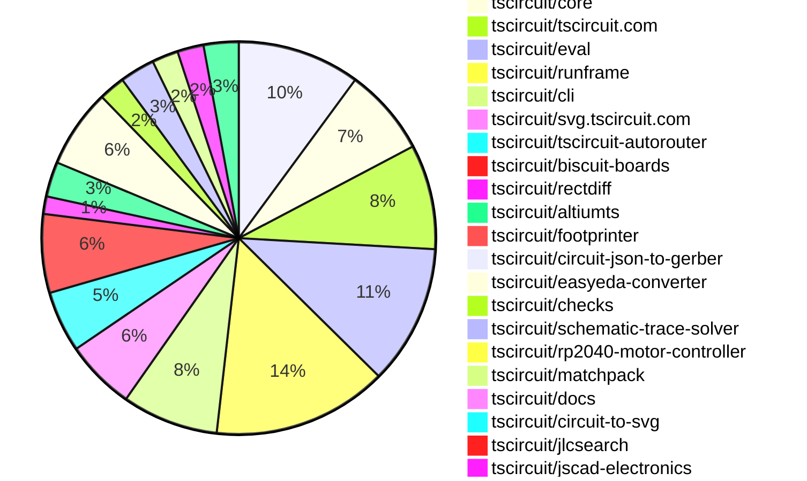

# Contribution Overview 2026-08-18

The current week is shown below. There are 3 major sections:

- [Contributor Overview](#contributor-overview)
- [PRs by Repository](#prs-by-repository)
- [PRs by Contributor](#changes-by-contributor)
- [Scoring & Sponsorship Details](/docs/sponsorship-calculation-explanation.md)

## PRs by Repository

## Contributor Overview

| Contributor | 🐳 Major | 🐙 Minor | 🐌 Tiny | Score | ⭐ |
|-------------|---------|---------|---------|-------|-----|
| [seveibar](#seveibar) | 3 | 4 | 7 | 28 | ⭐⭐ |
| [ShiboSoftwareDev](#ShiboSoftwareDev) | 3 | 3 | 1 | 27 | ⭐⭐ |
| [mohan-bee](#mohan-bee) | 1 | 2 | 5 | 16 | ⭐⭐ |
| [AnasSarkiz](#AnasSarkiz) | 2 | 2 | 1 | 14 | ⭐⭐ |
| [imrishabh18](#imrishabh18) | 3 | 0 | 1 | 14 | ⭐⭐ |
| [tscircuitbot](#tscircuitbot) | 0 | 0 | 86 | 13.5 | ⭐⭐ |
| [rushabhcodes](#rushabhcodes) | 1 | 0 | 1 | 10 | ⭐ |
| [Sang-it](#Sang-it) | 1 | 0 | 3 | 7 | ⭐ |
| [MustafaMulla29](#MustafaMulla29) | 0 | 2 | 2 | 6 | ⭐ |
| [GokulPandi-M](#GokulPandi-M) | 0 | 1 | 4 | 6 | ⭐ |
| [techmannih](#techmannih) | 0 | 2 | 0 | 5 | ⭐ |
| [addibble](#addibble) | 1 | 0 | 1 | 5 | ⭐ |
| [0hmX](#0hmX) | 0 | 0 | 1 | 2 |  |
| [KrishnaX12](#KrishnaX12) | 0 | 0 | 1 | 1 |  |

## Staff Pass Ratio (SPR)

| Contributor | Reviewed PRs | Rejections | Approvals | SPR |
|-------------|--------------|------------|-----------|-----|
| [ShiboSoftwareDev](#ShiboSoftwareDev) | 7 | 1 | 6 | 85.7% |
| [mohan-bee](#mohan-bee) | 2 | 0 | 2 | 100.0% |
| [addibble](#addibble) | 1 | 0 | 2 | 100.0% |
| [AnasSarkiz](#AnasSarkiz) | 1 | 0 | 1 | 100.0% |
| [GokulPandi-M](#GokulPandi-M) | 1 | 0 | 1 | 100.0% |
| [imrishabh18](#imrishabh18) | 1 | 1 | 0 | 0.0% |

ShiboSoftwareDev SPR PRs (7)

- [#3280](https://github.com/tscircuit/core/pull/3280) Place winding-aware breakout points before routing
- [#51](https://github.com/tscircuit/altiumts/pull/51) Serialize copper primitives in binary PCB documents
- [#48](https://github.com/tscircuit/altiumts/pull/48) Fix empty PCB wide strings
- [#47](https://github.com/tscircuit/altiumts/pull/47) Serialize native-length via records
- [#6](https://github.com/tscircuit/circuit-json-to-altium/pull/6) Fix boxed schematic pin labels
- [#3](https://github.com/tscircuit/circuit-json-to-altium/pull/3) Preserve copper pours in Altium output
- [#2](https://github.com/tscircuit/circuit-json-to-altium/pull/2) Test real Altium boards with native SVG round trips

mohan-bee SPR PRs (2)

- [#221](https://github.com/tscircuit/matchpack/pull/221) Place grounded capacitor groups without power metadata
- [#822](https://github.com/tscircuit/schematic-trace-solver/pull/822) prevent merged-label overlap retries after child reroute failure

addibble SPR PRs (1)

- [#331](https://github.com/tscircuit/jscad-electronics/pull/331) Add the missing 3D bodies: 32 of the 35 recorded gaps

AnasSarkiz SPR PRs (1)

- [#2162](https://github.com/tscircuit/tscircuit-autorouter/pull/2162) Eliminate Pipeline7 circuit018's false DRC failure

GokulPandi-M SPR PRs (1)

- [#459](https://github.com/tscircuit/easyeda-converter/pull/459) Fix document-layer tracks converted to silkscreen

imrishabh18 SPR PRs (1)

- [#2145](https://github.com/tscircuit/tscircuit-autorouter/pull/2145) Respect board edge clearance in RectDiff topology

> Note: AI evaluates PRs and assigns 1-3 star ratings automatically. 4 and 5 star ratings require manual staff review.

## Review Table

[reviews-received-hover]: ## "Number of reviews received for PRs for this contributor"
[approvals-received-hover]: ## "Number of approvals received for PRs this contributor authored"
[rejections-received-hover]: ## "Number of rejections received for PRs this contributor authored"
[prs-opened-hover]: ## "Number of PRs opened by this contributor"
[issues-created-hover]: ## "Number of issues created by this contributor"

| Contributor | Reviews Received | Approvals Received | Rejections Received | Approvals | Rejections Given | PRs Opened | PRs Merged | Issues Created |
|---|---|---|---|---|---|---|---|---|
| [0hmX](#0hmX) | 1 | 1 | 0 | 3 | 0 | 1 | 1 | 0 |
| [Abse2001](#Abse2001) | 0 | 0 | 0 | 0 | 0 | 1 | 0 | 0 |
| [addibble](#addibble) | 5 | 3 | 0 | 0 | 0 | 2 | 2 | 0 |
| [AnasSarkiz](#AnasSarkiz) | 7 | 5 | 1 | 1 | 0 | 11 | 5 | 0 |
| [creationsunitassistant](#creationsunitassistant) | 0 | 0 | 0 | 0 | 0 | 1 | 0 | 0 |
| [GokulPandi-M](#GokulPandi-M) | 12 | 12 | 0 | 0 | 0 | 7 | 5 | 0 |
| [imrishabh18](#imrishabh18) | 2 | 1 | 1 | 3 | 1 | 8 | 4 | 0 |
| [KrishnaX12](#KrishnaX12) | 1 | 1 | 0 | 0 | 0 | 1 | 1 | 0 |
| [mohan-bee](#mohan-bee) | 4 | 3 | 0 | 3 | 1 | 17 | 8 | 0 |
| [MustafaMulla29](#MustafaMulla29) | 3 | 2 | 0 | 0 | 0 | 4 | 4 | 0 |
| [obmakesomething](#obmakesomething) | 0 | 0 | 0 | 0 | 0 | 1 | 0 | 0 |
| [Ojas2095](#Ojas2095) | 0 | 0 | 0 | 0 | 0 | 2 | 0 | 0 |
| [rushabhcodes](#rushabhcodes) | 6 | 1 | 1 | 6 | 0 | 4 | 2 | 0 |
| [Sang-it](#Sang-it) | 0 | 0 | 0 | 0 | 0 | 5 | 4 | 0 |
| [seveibar](#seveibar) | 6 | 1 | 0 | 17 | 2 | 29 | 15 | 0 |
| [ShiboSoftwareDev](#ShiboSoftwareDev) | 14 | 11 | 1 | 8 | 0 | 14 | 8 | 0 |
| [techmannih](#techmannih) | 1 | 1 | 0 | 1 | 0 | 3 | 2 | 0 |
| [tscircuitbot](#tscircuitbot) | 0 | 0 | 0 | 0 | 0 | 110 | 86 | 0 |

## Changes by Repository

### [tscircuit/tscircuit](https://github.com/tscircuit/tscircuit)

🐌 Tiny Contributions (14)

| PR # | Impact | Contributor | Description |
|------|--------|-------------|-------------|
| [#4558](https://github.com/tscircuit/tscircuit/pull/4558) | 🐌 Tiny | tscircuitbot | Automated package update |
| [#4557](https://github.com/tscircuit/tscircuit/pull/4557) | 🐌 Tiny | tscircuitbot | Updates the tscircuitcli package to version 0.1.1958 in the package.json file. |
| [#4556](https://github.com/tscircuit/tscircuit/pull/4556) | 🐌 Tiny | tscircuitbot | Automated package update |
| [#4555](https://github.com/tscircuit/tscircuit/pull/4555) | 🐌 Tiny | tscircuitbot | Updates the tscircuitcli package to version 0.1.1957 in the package.json file. |
| [#4554](https://github.com/tscircuit/tscircuit/pull/4554) | 🐌 Tiny | tscircuitbot | Automated package update |
| [#4553](https://github.com/tscircuit/tscircuit/pull/4553) | 🐌 Tiny | tscircuitbot | Automated package update |
| [#4552](https://github.com/tscircuit/tscircuit/pull/4552) | 🐌 Tiny | tscircuitbot | Updates the package version from 0.0.2359 to 0.0.2360 in package.json |
| [#4551](https://github.com/tscircuit/tscircuit/pull/4551) | 🐌 Tiny | tscircuitbot | Automated package update |
| [#4550](https://github.com/tscircuit/tscircuit/pull/4550) | 🐌 Tiny | tscircuitbot | Automated package update |
| [#4549](https://github.com/tscircuit/tscircuit/pull/4549) | 🐌 Tiny | tscircuitbot | Updates the tscircuitcli and tscircuiteval packages to their latest versions as part of an automated package update. |
| [#4548](https://github.com/tscircuit/tscircuit/pull/4548) | 🐌 Tiny | tscircuitbot | Automated package update |
| [#4547](https://github.com/tscircuit/tscircuit/pull/4547) | 🐌 Tiny | tscircuitbot | Automated package update |
| [#4546](https://github.com/tscircuit/tscircuit/pull/4546) | 🐌 Tiny | tscircuitbot | Automated package update |
| [#4545](https://github.com/tscircuit/tscircuit/pull/4545) | 🐌 Tiny | tscircuitbot | Updates the versions of tscircuitcore and tscircuiteval packages in package.json |

### [tscircuit/core](https://github.com/tscircuit/core)

| PR # | Impact | Rating | Contributor | Description |
|------|--------|--------|-------------|-------------|
| [#3276](https://github.com/tscircuit/core/pull/3276) | 🐳 Major | ⭐⭐⭐ | seveibar | Uses pcbStyle.viaHoleDiameter and pcbStyle.viaPadDiameter as autorouter via constraints when minVia props are not set, ensuring consistent via sizes for both authored and generated vias. |
| [#3210](https://github.com/tscircuit/core/pull/3210) | 🐙 Minor | ⭐⭐ | mohan-bee | Adds a test for the TB67S579FTG breakout schematic to verify inline net label spacing. |
| [#3277](https://github.com/tscircuit/core/pull/3277) | 🐙 Minor | ⭐⭐ | seveibar | Emit events for the FanoutSolver to track its lifecycle and parameters during autorouting processes. |

🐌 Tiny Contributions (7)

| PR # | Impact | Contributor | Description |
|------|--------|-------------|-------------|
| [#3285](https://github.com/tscircuit/core/pull/3285) | 🐌 Tiny | tscircuitbot | Updates the tscircuitchecks package from version 0.0.162 to 0.0.163 |
| [#3286](https://github.com/tscircuit/core/pull/3286) | 🐌 Tiny | MustafaMulla29 | Updates the tscircuitschematic-trace-solver dependency to version 0.0.137, incorporating a fix for same-net trace alignment and updating the RP2040 schematic snapshot accordingly. |
| [#3287](https://github.com/tscircuit/core/pull/3287) | 🐌 Tiny | imrishabh18 | Updates the tscircuitcapacity-autorouter dependency from version 0.0.815 to 0.0.822, ensuring that consumers of tscircuitcore utilize the latest improvements and fixes from the capacity autorouter. |
| [#3284](https://github.com/tscircuit/core/pull/3284) | 🐌 Tiny | mohan-bee | Updates the tscircuitmatchpack dependency version from 0.0.81 to 0.0.84 in package.json |
| [#3282](https://github.com/tscircuit/core/pull/3282) | 🐌 Tiny | mohan-bee | Updates the tscircuitschematic-trace-solver dependency to version 0.0.136 in the package.json file. |
| [#3211](https://github.com/tscircuit/core/pull/3211) | 🐌 Tiny | mohan-bee | Keeps dense inline net labels attached to their traces, ensuring they are rendered correctly against their respective traces without floating above them. |
| [#3278](https://github.com/tscircuit/core/pull/3278) | 🐌 Tiny | seveibar | Fixes orphan schematic ports by skipping rendering when the parent component has no schematic representation, and ensures that render phase events are emitted in the correct order, improving performance significantly. |

### [tscircuit/tscircuit.com](https://github.com/tscircuit/tscircuit.com)

🐌 Tiny Contributions (12)

| PR # | Impact | Contributor | Description |
|------|--------|-------------|-------------|
| [#4494](https://github.com/tscircuit/tscircuit.com/pull/4494) | 🐌 Tiny | tscircuitbot | Updates the tscircuiteval package from version 0.0.1228 to 0.0.1229 in the package.json file. |
| [#4493](https://github.com/tscircuit/tscircuit.com/pull/4493) | 🐌 Tiny | tscircuitbot | Updates the tscircuitrunframe package from version 0.0.2500 to 0.0.2501 |
| [#4492](https://github.com/tscircuit/tscircuit.com/pull/4492) | 🐌 Tiny | tscircuitbot | Automated package update |
| [#4491](https://github.com/tscircuit/tscircuit.com/pull/4491) | 🐌 Tiny | tscircuitbot | Updates the tscircuitrunframe package from version 0.0.2499 to 0.0.2500 |
| [#4490](https://github.com/tscircuit/tscircuit.com/pull/4490) | 🐌 Tiny | tscircuitbot | Automated package update |
| [#4487](https://github.com/tscircuit/tscircuit.com/pull/4487) | 🐌 Tiny | tscircuitbot | Updates the tscircuiteval package from version 0.0.1225 to 0.0.1226 |
| [#4486](https://github.com/tscircuit/tscircuit.com/pull/4486) | 🐌 Tiny | tscircuitbot | Automated package update |
| [#4485](https://github.com/tscircuit/tscircuit.com/pull/4485) | 🐌 Tiny | tscircuitbot | Automated package update |
| [#4484](https://github.com/tscircuit/tscircuit.com/pull/4484) | 🐌 Tiny | tscircuitbot | Updates the tscircuiteval package from version 0.0.1223 to 0.0.1225 |
| [#4481](https://github.com/tscircuit/tscircuit.com/pull/4481) | 🐌 Tiny | tscircuitbot | Updates the tscircuitrunframe package from version 0.0.2492 to 0.0.2494 |
| [#4480](https://github.com/tscircuit/tscircuit.com/pull/4480) | 🐌 Tiny | tscircuitbot | Updates the tscircuiteval package from version 0.0.1222 to 0.0.1223 |
| [#4478](https://github.com/tscircuit/tscircuit.com/pull/4478) | 🐌 Tiny | tscircuitbot | Updates the tscircuiteval package version from 0.0.1220 to 0.0.1222 in package.json |

### [tscircuit/eval](https://github.com/tscircuit/eval)

🐌 Tiny Contributions (16)

| PR # | Impact | Contributor | Description |
|------|--------|-------------|-------------|
| [#3997](https://github.com/tscircuit/eval/pull/3997) | 🐌 Tiny | tscircuitbot | Automated package update |
| [#3996](https://github.com/tscircuit/eval/pull/3996) | 🐌 Tiny | tscircuitbot | Automated package update |
| [#3992](https://github.com/tscircuit/eval/pull/3992) | 🐌 Tiny | tscircuitbot | Automated package update |
| [#3991](https://github.com/tscircuit/eval/pull/3991) | 🐌 Tiny | tscircuitbot | Updates package dependencies to their latest versions as part of routine maintenance. |
| [#3989](https://github.com/tscircuit/eval/pull/3989) | 🐌 Tiny | tscircuitbot | Automated package update |
| [#3988](https://github.com/tscircuit/eval/pull/3988) | 🐌 Tiny | tscircuitbot | Updates the version of tscircuitcore from 0.0.1708 to 0.0.1709 and tscircuitmatchpack from 0.0.81 to 0.0.84 in package.json |
| [#3986](https://github.com/tscircuit/eval/pull/3986) | 🐌 Tiny | tscircuitbot | Automated package update |
| [#3985](https://github.com/tscircuit/eval/pull/3985) | 🐌 Tiny | tscircuitbot | Updates the version of tscircuitcore from 0.0.1707 to 0.0.1708 and tscircuitschematic-trace-solver from 0.0.134 to 0.0.136 in package.json |
| [#3983](https://github.com/tscircuit/eval/pull/3983) | 🐌 Tiny | tscircuitbot | Automated package update |
| [#3982](https://github.com/tscircuit/eval/pull/3982) | 🐌 Tiny | tscircuitbot | Automated package update |
| [#3981](https://github.com/tscircuit/eval/pull/3981) | 🐌 Tiny | tscircuitbot | Automated package update |
| [#3979](https://github.com/tscircuit/eval/pull/3979) | 🐌 Tiny | tscircuitbot | Automated package update |
| [#3978](https://github.com/tscircuit/eval/pull/3978) | 🐌 Tiny | tscircuitbot | Automated package update |
| [#3977](https://github.com/tscircuit/eval/pull/3977) | 🐌 Tiny | tscircuitbot | Updates the version of the tscircuitcore package from 0.0.1704 to 0.0.1705 in package.json |
| [#3975](https://github.com/tscircuit/eval/pull/3975) | 🐌 Tiny | tscircuitbot | Automated package update |
| [#3974](https://github.com/tscircuit/eval/pull/3974) | 🐌 Tiny | tscircuitbot | Automated package update |

### [tscircuit/runframe](https://github.com/tscircuit/runframe)

| PR # | Impact | Rating | Contributor | Description |
|------|--------|--------|-------------|-------------|
| [#4617](https://github.com/tscircuit/runframe/pull/4617) | 🐙 Minor | ⭐⭐ | seveibar | Adds support for FanoutSolver in the Solvers tab by updating solver event handling to use exact constructor arguments from newer core versions and retaining legacy support for older events. |

🐌 Tiny Contributions (19)

| PR # | Impact | Contributor | Description |
|------|--------|-------------|-------------|
| [#4634](https://github.com/tscircuit/runframe/pull/4634) | 🐌 Tiny | tscircuitbot | Automated package update |
| [#4633](https://github.com/tscircuit/runframe/pull/4633) | 🐌 Tiny | tscircuitbot | Updates the package version from 0.0.2500 to 0.0.2501 in package.json |
| [#4632](https://github.com/tscircuit/runframe/pull/4632) | 🐌 Tiny | tscircuitbot | Updates the tscircuiteval package from version 0.0.1227 to 0.0.1228 in the package.json file. |
| [#4631](https://github.com/tscircuit/runframe/pull/4631) | 🐌 Tiny | tscircuitbot | Automated package update |
| [#4630](https://github.com/tscircuit/runframe/pull/4630) | 🐌 Tiny | tscircuitbot | Updates the circuit-json-to-gerber package from version 0.0.94 to 0.0.95 |
| [#4629](https://github.com/tscircuit/runframe/pull/4629) | 🐌 Tiny | tscircuitbot | Automated package update |
| [#4628](https://github.com/tscircuit/runframe/pull/4628) | 🐌 Tiny | tscircuitbot | Updates the tscircuiteval package from version 0.0.1226 to 0.0.1227 in the package.json file. |
| [#4627](https://github.com/tscircuit/runframe/pull/4627) | 🐌 Tiny | tscircuitbot | Automated package update |
| [#4626](https://github.com/tscircuit/runframe/pull/4626) | 🐌 Tiny | tscircuitbot | Updates the tscircuiteval package to version 0.0.1226 in the package.json file. |
| [#4625](https://github.com/tscircuit/runframe/pull/4625) | 🐌 Tiny | tscircuitbot | Automated package update |
| [#4623](https://github.com/tscircuit/runframe/pull/4623) | 🐌 Tiny | tscircuitbot | Automated package update |
| [#4622](https://github.com/tscircuit/runframe/pull/4622) | 🐌 Tiny | tscircuitbot | Updates the tscircuiteval package to version 0.0.1225 in the package.json file. |
| [#4621](https://github.com/tscircuit/runframe/pull/4621) | 🐌 Tiny | tscircuitbot | Automated package update |
| [#4620](https://github.com/tscircuit/runframe/pull/4620) | 🐌 Tiny | tscircuitbot | Updates the tscircuiteval package to version 0.0.1224 in the package.json file. |
| [#4619](https://github.com/tscircuit/runframe/pull/4619) | 🐌 Tiny | tscircuitbot | Automated package update |
| [#4618](https://github.com/tscircuit/runframe/pull/4618) | 🐌 Tiny | tscircuitbot | Updates the tscircuiteval package from version 0.0.1222 to 0.0.1223 in the project dependencies. |
| [#4616](https://github.com/tscircuit/runframe/pull/4616) | 🐌 Tiny | tscircuitbot | Automated package update |
| [#4615](https://github.com/tscircuit/runframe/pull/4615) | 🐌 Tiny | tscircuitbot | Updates the tscircuiteval package from version 0.0.1221 to 0.0.1222 in the package.json file. |
| [#4624](https://github.com/tscircuit/runframe/pull/4624) | 🐌 Tiny | 0hmX | Updates tscircuitschematic-viewer from 2.0.77 to 2.0.81 and removes obsolete props to maintain compatibility with the latest version. |

### [tscircuit/cli](https://github.com/tscircuit/cli)

| PR # | Impact | Rating | Contributor | Description |
|------|--------|--------|-------------|-------------|
| [#4353](https://github.com/tscircuit/cli/pull/4353) | 🐳 Major | ⭐⭐⭐ | AnasSarkiz | Allows users to select inner copper layers individually in the shorts checker, improving layer validation and error messaging for unavailable layers. |

🐌 Tiny Contributions (10)

| PR # | Impact | Contributor | Description |
|------|--------|-------------|-------------|
| [#4359](https://github.com/tscircuit/cli/pull/4359) | 🐌 Tiny | tscircuitbot | Automated package update |
| [#4357](https://github.com/tscircuit/cli/pull/4357) | 🐌 Tiny | tscircuitbot | Automated package update |
| [#4356](https://github.com/tscircuit/cli/pull/4356) | 🐌 Tiny | tscircuitbot | Automated package update |
| [#4355](https://github.com/tscircuit/cli/pull/4355) | 🐌 Tiny | tscircuitbot | Updates the tscircuitrunframe package to version 0.0.2501 in the package.json file. |
| [#4350](https://github.com/tscircuit/cli/pull/4350) | 🐌 Tiny | tscircuitbot | Automated package update |
| [#4349](https://github.com/tscircuit/cli/pull/4349) | 🐌 Tiny | tscircuitbot | Updates the tscircuitrunframe package from version 0.0.2497 to 0.0.2498 |
| [#4348](https://github.com/tscircuit/cli/pull/4348) | 🐌 Tiny | tscircuitbot | Automated package update |
| [#4347](https://github.com/tscircuit/cli/pull/4347) | 🐌 Tiny | tscircuitbot | Updates the tscircuitrunframe package from version 0.0.2494 to 0.0.2497 |
| [#4342](https://github.com/tscircuit/cli/pull/4342) | 🐌 Tiny | tscircuitbot | Updates the tscircuitrunframe package from version 0.0.2492 to 0.0.2494 |
| [#4358](https://github.com/tscircuit/cli/pull/4358) | 🐌 Tiny | MustafaMulla29 | Updates the easyeda development dependency from version 0.0.307 to 0.0.315, ensuring the CLI builds include the latest converter implementation. |

### [tscircuit/svg.tscircuit.com](https://github.com/tscircuit/svg.tscircuit.com)

🐌 Tiny Contributions (8)

| PR # | Impact | Contributor | Description |
|------|--------|-------------|-------------|
| [#2087](https://github.com/tscircuit/svg.tscircuit.com/pull/2087) | 🐌 Tiny | tscircuitbot | Updates the tscircuit package version from 0.0.2362 to 0.0.2363 in package.json |
| [#2086](https://github.com/tscircuit/svg.tscircuit.com/pull/2086) | 🐌 Tiny | tscircuitbot | Updates the tscircuit package version from 0.0.2361 to 0.0.2362 in package.json |
| [#2085](https://github.com/tscircuit/svg.tscircuit.com/pull/2085) | 🐌 Tiny | tscircuitbot | Updates the tscircuit package version from 0.0.2360 to 0.0.2361 in package.json |
| [#2084](https://github.com/tscircuit/svg.tscircuit.com/pull/2084) | 🐌 Tiny | tscircuitbot | Updates the tscircuit package version from 0.0.2359 to 0.0.2360 in package.json |
| [#2083](https://github.com/tscircuit/svg.tscircuit.com/pull/2083) | 🐌 Tiny | tscircuitbot | Updates the tscircuit package version from 0.0.2358 to 0.0.2359 in package.json |
| [#2082](https://github.com/tscircuit/svg.tscircuit.com/pull/2082) | 🐌 Tiny | tscircuitbot | Updates the tscircuit package version from 0.0.2357 to 0.0.2358 in package.json |
| [#2081](https://github.com/tscircuit/svg.tscircuit.com/pull/2081) | 🐌 Tiny | tscircuitbot | Updates the tscircuit package version from 0.0.2356 to 0.0.2357 in package.json |
| [#2080](https://github.com/tscircuit/svg.tscircuit.com/pull/2080) | 🐌 Tiny | seveibar | Updates the SVG preview service to the latest published biscuitboard package, making the latest Biscuit Board wrapper and autorouter fixes available to svg.tscircuit.com previews. |

### [tscircuit/tscircuit-autorouter](https://github.com/tscircuit/tscircuit-autorouter)

| PR # | Impact | Rating | Contributor | Description |
|------|--------|--------|-------------|-------------|
| [#2162](https://github.com/tscircuit/tscircuit-autorouter/pull/2162) | 🐳 Major | ⭐⭐⭐ | AnasSarkiz | Eliminates Pipeline7s false dataset01 circuit018 DRC failure without changing routing geometry or solver behavior |
| [#2145](https://github.com/tscircuit/tscircuit-autorouter/pull/2145) | 🐳 Major | ⭐⭐⭐ | imrishabh18 | Updates RectDiff to preserve the physical board outline while applying minBoardEdgeClearance to its board-void topology blockers, ensuring zero total DRC errors as per Bug Report 88. |
| [#2150](https://github.com/tscircuit/tscircuit-autorouter/pull/2150) | 🐳 Major | ⭐⭐⭐ | seveibar | Summary add bugreport93 from the overlapping autorouter vias reproduction(https:gist.github.comseveibar5033268f8e1b21e34216dc96bfed2adc), including its phase input, captured bad routing, and interactive debugger fixture add a regression test that measures the reported 0.600 mm via-center spacing against the required 0.700 mm spacing add a focused SVG snapshot with a red DRC marker around the bad via pair mark the reproduction with test.skip after generating the snapshot because the full solve takes about 74 seconds  Snapshot !Zoomed overlapping-via DRC(https:raw.githubusercontent.comtscircuittscircuit-autorouterbugreport93-overlapping-viastestsbugs__snapshots__bugreport93-overlapping-vias.snap.svg)  Validation temporarily enabled the regression and generated the SVG snapshot: pass (74.05s) bun test testsbugsbugreport93-overlapping-vias.test.ts --timeout 9999999: skipped as intended bunx tsc --noEmit bun run build git diff --cached --check |

🐌 Tiny Contributions (4)

| PR # | Impact | Contributor | Description |
|------|--------|-------------|-------------|
| [#2165](https://github.com/tscircuit/tscircuit-autorouter/pull/2165) | 🐌 Tiny | tscircuitbot | Automated package update |
| [#2163](https://github.com/tscircuit/tscircuit-autorouter/pull/2163) | 🐌 Tiny | tscircuitbot | Automated package update |
| [#2155](https://github.com/tscircuit/tscircuit-autorouter/pull/2155) | 🐌 Tiny | tscircuitbot | Automated package update |
| [#2151](https://github.com/tscircuit/tscircuit-autorouter/pull/2151) | 🐌 Tiny | seveibar | Add a profiling workflow for the SRJ18 dataset that compares the performance of Pipeline 7 solvers between the current main branch and the PR head, providing detailed stage-time percentages and results in a structured format. |

### [tscircuit/biscuit-boards](https://github.com/tscircuit/biscuit-boards)

| PR # | Impact | Rating | Contributor | Description |
|------|--------|--------|-------------|-------------|
| [#72](https://github.com/tscircuit/biscuit-boards/pull/72) | 🐳 Major | ⭐⭐⭐ | Sang-it | Regenerates the inverse-distance-weighted lens calibration for all 56 points and updates calibration documentation and expected point count. |

🐌 Tiny Contributions (8)

| PR # | Impact | Contributor | Description |
|------|--------|-------------|-------------|
| [#80](https://github.com/tscircuit/biscuit-boards/pull/80) | 🐌 Tiny | tscircuitbot | Automated package update |
| [#76](https://github.com/tscircuit/biscuit-boards/pull/76) | 🐌 Tiny | tscircuitbot | Automated package update |
| [#75](https://github.com/tscircuit/biscuit-boards/pull/75) | 🐌 Tiny | tscircuitbot | Automated package update |
| [#73](https://github.com/tscircuit/biscuit-boards/pull/73) | 🐌 Tiny | tscircuitbot | Automated package update |
| [#71](https://github.com/tscircuit/biscuit-boards/pull/71) | 🐌 Tiny | seveibar | Exports Clad32x32 and its public constantstypes from the npm entrypoint, ensuring consumers can access it correctly. |
| [#79](https://github.com/tscircuit/biscuit-boards/pull/79) | 🐌 Tiny | Sang-it | Add a BiscuitBoard controller for one bipolar stepper using STM32C071FBP6 and TMC5130A-TA, including wiring for STEPDIR, SPI configuration, and power regulation. |
| [#78](https://github.com/tscircuit/biscuit-boards/pull/78) | 🐌 Tiny | Sang-it | Add an RP2040 photodiode BiscuitBoard with a TO-18 photodiode and SOT-23-5 transimpedance amplifier, a USB-C flashable variant with a 12 MHz crystal, external QSPI flash, power LED, and GPIO25 user LED, and a programming-control variant with SMD BOOTSEL and RESET buttons. |
| [#74](https://github.com/tscircuit/biscuit-boards/pull/74) | 🐌 Tiny | Sang-it | Adds CI workflows for testing and TypeScript type checking using Bun, ensuring code quality and correctness. |

### [tscircuit/rectdiff](https://github.com/tscircuit/rectdiff)

| PR # | Impact | Rating | Contributor | Description |
|------|--------|--------|-------------|-------------|
| [#142](https://github.com/tscircuit/rectdiff/pull/142) | 🐳 Major | ⭐⭐⭐ | imrishabh18 | Carries minBoardEdgeClearance through RectDiffs SRJ contract and expands existing board-void blockers by that clearance while preserving the physical outline. |

🐌 Tiny Contributions (1)

| PR # | Impact | Contributor | Description |
|------|--------|-------------|-------------|
| [#143](https://github.com/tscircuit/rectdiff/pull/143) | 🐌 Tiny | tscircuitbot | Automated package update to version 0.0.50 |

### [tscircuit/altiumts](https://github.com/tscircuit/altiumts)

| PR # | Impact | Rating | Contributor | Description |
|------|--------|--------|-------------|-------------|
| [#51](https://github.com/tscircuit/altiumts/pull/51) | 🐙 Minor | ⭐⭐ | ShiboSoftwareDev | Serializes Altium Fill, Polygon, and Region records into native binary .PcbDoc sections, preserving outlines, holes, and other properties while rejecting unsupported configurations. |
| [#48](https://github.com/tscircuit/altiumts/pull/48) | 🐙 Minor | ⭐⭐ | ShiboSoftwareDev | Fixes serialization of empty WideStrings6 entries to prevent shifting of subsequent text in Altium PCB files. |
| [#47](https://github.com/tscircuit/altiumts/pull/47) | 🐙 Minor | ⭐⭐ | ShiboSoftwareDev | Serializes PCB vias to ensure they retain the native Altium 209-byte payload length, fixing issues with independent Altium tooling rejecting shortened records. |

🐌 Tiny Contributions (1)

| PR # | Impact | Contributor | Description |
|------|--------|-------------|-------------|
| [#50](https://github.com/tscircuit/altiumts/pull/50) | 🐌 Tiny | tscircuitbot | Automated package update |

### [tscircuit/footprinter](https://github.com/tscircuit/footprinter)

| PR # | Impact | Rating | Contributor | Description |
|------|--------|--------|-------------|-------------|
| [#810](https://github.com/tscircuit/footprinter/pull/810) | 🐙 Minor | ⭐⭐ | techmannih | Adds configurable thermal vias to DFN footprints using the existing shared thermal-via implementation, supporting thermalvias, thermalviapitch, thermalviaid, and thermalviaod, while retaining existing validation for via dimensions and thermal-pad fit. |

### [tscircuit/circuit-json-to-gerber](https://github.com/tscircuit/circuit-json-to-gerber)

| PR # | Impact | Rating | Contributor | Description |
|------|--------|--------|-------------|-------------|
| [#147](https://github.com/tscircuit/circuit-json-to-gerber/pull/147) | 🐙 Minor | ⭐⭐ | techmannih | Adds support for rendering rotated pill-shaped PCB holes in Gerber files, including handling soldermask margins and copper pours. |

### [tscircuit/easyeda-converter](https://github.com/tscircuit/easyeda-converter)

| PR # | Impact | Rating | Contributor | Description |
|------|--------|--------|-------------|-------------|
| [#485](https://github.com/tscircuit/easyeda-converter/pull/485) | 🐳 Major | ⭐⭐⭐ | rushabhcodes | Fixes JLCPCB mechanical keyboard switch imports that are incorrectly generated as generic chip components with malformed schematic symbols. |
| [#483](https://github.com/tscircuit/easyeda-converter/pull/483) | 🐙 Minor | ⭐⭐ | AnasSarkiz | Fixes the issue of duplicate EasyEDA pad connectivity by ensuring that multiple geometries with the same pad number are treated as a single logical pin, eliminating synthetic ports and ambiguous connections. |
| [#484](https://github.com/tscircuit/easyeda-converter/pull/484) | 🐙 Minor | ⭐⭐ | MustafaMulla29 | Infers conservative pin attributes for imported chip power, ground, and no-connect pins, emitting the inferred attributes in generated tscircuit components while skipping ambiguous or unsupported aliases. |
| [#459](https://github.com/tscircuit/easyeda-converter/pull/459) | 🐙 Minor | ⭐⭐ | GokulPandi-M | Fixes the conversion of EasyEDA document-layer tracks to ensure they are preserved as fabrication notes instead of being incorrectly converted to silkscreen. |

🐌 Tiny Contributions (5)

| PR # | Impact | Contributor | Description |
|------|--------|-------------|-------------|
| [#480](https://github.com/tscircuit/easyeda-converter/pull/480) | 🐌 Tiny | rushabhcodes | Adds a captured EasyEDA fixture and focused regression test for JLCPCB part C49234237, addressing the issue where the part generates a generic chip instead of a pushbutton component. |
| [#481](https://github.com/tscircuit/easyeda-converter/pull/481) | 🐌 Tiny | GokulPandi-M | Reproduces overlapping pin labels in the C113367 custom schematic symbol with a focused test and captures the current broken rendering in an SVG snapshot. |
| [#478](https://github.com/tscircuit/easyeda-converter/pull/478) | 🐌 Tiny | GokulPandi-M | Fixes missing slash-separated pin labels for C472489 in the schematic due to parser limitations. |
| [#477](https://github.com/tscircuit/easyeda-converter/pull/477) | 🐌 Tiny | GokulPandi-M | Adds a regression test to reproduce the issue where active-low pin labels lose their polarity due to the removal of trailing hashes in the conversion process. |
| [#475](https://github.com/tscircuit/easyeda-converter/pull/475) | 🐌 Tiny | GokulPandi-M | Fixes the issue where multi-pin inductors were incorrectly converted to two-terminal inductors, resulting in lost physical terminals in the schematic. |

### [tscircuit/checks](https://github.com/tscircuit/checks)

| PR # | Impact | Rating | Contributor | Description |
|------|--------|--------|-------------|-------------|
| [#215](https://github.com/tscircuit/checks/pull/215) | 🐙 Minor | ⭐⭐ | AnasSarkiz | Fixes false missing-pad connection by allowing sub-nanometer floating-point residue at pad boundaries in circuit018 geometry calculations. |
| [#214](https://github.com/tscircuit/checks/pull/214) | 🐙 Minor | ⭐⭐ | seveibar | Extends the checkDifferentNetViaSpacing function to evaluate both drill-hole and copper-pad clearance for different-net vias, ensuring compliance with manufacturing constraints and improving error reporting. |

🐌 Tiny Contributions (1)

| PR # | Impact | Contributor | Description |
|------|--------|-------------|-------------|
| [#217](https://github.com/tscircuit/checks/pull/217) | 🐌 Tiny | AnasSarkiz | Reproduces floating-point errors at pad boundaries for rectangular, rotated-pill, and circular plated-hole pads without fixing the underlying issue. |

### [tscircuit/schematic-trace-solver](https://github.com/tscircuit/schematic-trace-solver)

| PR # | Impact | Rating | Contributor | Description |
|------|--------|--------|-------------|-------------|
| [#825](https://github.com/tscircuit/schematic-trace-solver/pull/825) | 🐙 Minor | ⭐⭐ | MustafaMulla29 | Fixes label alignment for same-net junctions to ensure labels remain attached to rerouted traces without introducing diagonal segments. |
| [#822](https://github.com/tscircuit/schematic-trace-solver/pull/822) | 🐙 Minor | ⭐⭐ | mohan-bee | Stops trace-label overlap avoidance from redispatching a merged-label collision after its child-label reroute has already failed. |

🐌 Tiny Contributions (2)

| PR # | Impact | Contributor | Description |
|------|--------|-------------|-------------|
| [#821](https://github.com/tscircuit/schematic-trace-solver/pull/821) | 🐌 Tiny | mohan-bee | Reproduces a USB trace-label iteration exhaustion failure with a focused test case, isolating the issue from the full solver input. |
| [#824](https://github.com/tscircuit/schematic-trace-solver/pull/824) | 🐌 Tiny | seveibar | Implements getSolverName() on SchematicTracePipelineSolver to return a stable name that survives class-name minification and adds a regression test for the public solver export. |

### [tscircuit/rp2040-motor-controller](https://github.com/tscircuit/rp2040-motor-controller)

| PR # | Impact | Rating | Contributor | Description |
|------|--------|--------|-------------|-------------|
| [#6](https://github.com/tscircuit/rp2040-motor-controller/pull/6) | 🐳 Major | ⭐⭐⭐ | imrishabh18 | Refactors the routing algorithm to integrate power-trace expansion directly into the autorouting process, removing the need for a separate post-routing solver. |

### [tscircuit/matchpack](https://github.com/tscircuit/matchpack)

| PR # | Impact | Rating | Contributor | Description |
|------|--------|--------|-------------|-------------|
| [#221](https://github.com/tscircuit/matchpack/pull/221) | 🐳 Major | ⭐⭐⭐ | mohan-bee | Groups grounded capacitors sharing a net pair when the non-ground net lacks positive-voltage metadata. |
| [#222](https://github.com/tscircuit/matchpack/pull/222) | 🐙 Minor | ⭐⭐ | seveibar | Returns a stable name for the LayoutPipelineSolver to ensure consistent identification during class-name minification and adds a regression test for verification. |

🐌 Tiny Contributions (1)

| PR # | Impact | Contributor | Description |
|------|--------|-------------|-------------|
| [#220](https://github.com/tscircuit/matchpack/pull/220) | 🐌 Tiny | mohan-bee | Fixes the arrangement of decoupling capacitors on the board 196038 schematic layout |

### [tscircuit/docs](https://github.com/tscircuit/docs)

| PR # | Impact | Rating | Contributor | Description |
|------|--------|--------|-------------|-------------|
| [#844](https://github.com/tscircuit/docs/pull/844) | 🐳 Major | ⭐⭐⭐ | seveibar | Add a guide for using Biscuit Board templates, detailing each clad wrapper with dimensions, use cases, and import examples, along with live PCB previews for comparison. |

### [tscircuit/circuit-to-svg](https://github.com/tscircuit/circuit-to-svg)

🐌 Tiny Contributions (1)

| PR # | Impact | Contributor | Description |
|------|--------|-------------|-------------|
| [#674](https://github.com/tscircuit/circuit-to-svg/pull/674) | 🐌 Tiny | seveibar | Summary add an opt-in shouldDrawWarnings PCB SVG option, defaulting to off render supported component warnings as yellow dashed highlights with their warning message support connector-orientation and manual-edit-conflict warnings add data attributes and overlay ordering so consumers can identify warning graphics derive a genuinely backwards USB-C placement from the real USB-C Flashlight Circuit JSON in tscircuitcore680 for the connector warning snapshot rotate the connector body, pads, holes, ports, CAD and silkscreen together while omitting its now-invalid routed traces assert that the receptacle cable insertion direction points into the board before snapshotting account for rotated component bounds when drawing warning highlights document the new option and cover its defaultopt-in behavior with a snapshot  Verification bun test (318 pass) bunx tsc --noEmit bun run build Biome formatting check on changed files git diff --check |

### [tscircuit/jlcsearch](https://github.com/tscircuit/jlcsearch)

🐌 Tiny Contributions (1)

| PR # | Impact | Contributor | Description |
|------|--------|-------------|-------------|
| [#468](https://github.com/tscircuit/jlcsearch/pull/468) | 🐌 Tiny | seveibar | Update easyeda from version 0.0.307 to 0.0.310 in both the root package and Cloudflare proxy package, along with refreshing the lock file to resolve the new release. |

### [tscircuit/jscad-electronics](https://github.com/tscircuit/jscad-electronics)

| PR # | Impact | Rating | Contributor | Description |
|------|--------|--------|-------------|-------------|
| [#331](https://github.com/tscircuit/jscad-electronics/pull/331) | 🐳 Major | ⭐⭐⭐ | addibble | Fills in the gaps recorded by the base PR, and re-renders the same snapshots from the same cameras. Where they showed bare copper pads they now show the part; that diff is the review. The ledger goes from 35 entries to 3. Most of this is dispatch, not geometry. libFootprinter3d.tsx switches on footprinters fn and simply had no arm for these names, while a suitable body sat in lib unreferenced  SOT-563.tsx and BGA.tsx had never been reachable at all, SC-70-4 shares SC-70-6s body, SOP and SSOP are SOIC with a different lead span, SONWSONVSON are DFNs, MLP and QUAD are QFNs. Parameterised rather than aliased wherever the outline genuinely differs, since an alias reports a body that is not there: SOT-223 takes its dimensions, so SOT-89 can use it at a third of the volume TO-220 takes mouldedTab, because TO-220F encapsulates the tab LGAMLPQUAD read wh, not grid: for those grid is a pad COUNT per side (lga14 is 4x3 pads), so reading it as millimetres gave a 4 x 3 body for a part that is 2.4 x 2.9. Only vson states its outline as a grid. Four new bodies, for parts nothing in the repo resembled: DPAK (TO-252 and TO-263  a moulded body on an exposed tab, placed over the TAB pad because the footprint is asymmetric), ElectrolyticCapacitor (radial can; diameter from d or from the name, height derived and deliberately generous), Potentiometer, and SmdPushButton (whose actuator height is a separate prop, because that is what a lid has to clear). TO-92 is fixed separately in its own commit: it was translated 10.5mm up with 15mm leads, so a 4.5mm part measured 19.5mm end to end and floated above the board in every render. testsbody-coveragebody-envelope.test.ts is the assertion the pictures cannot make  the height above the board, per package, against the datasheet outline. It also records the two placements known to be wrong (to220 at 32.5mm, breakoutheaders headers hanging below the board) with the values they measure, so fixing either fails the test and prompts the note to be deleted. Still open, with reasons in the ledger: jst (only the ZH series has a body), m2host (footprinter reports no dimensions at all for it), usbcmidmount (USB-C.tsx draws with Ellipsoid and with rotation props on primitives; libvanilla implements neither and ignores the second SILENTLY rather than rejecting it, so reusing it would render the wrong shape). |

🐌 Tiny Contributions (2)

| PR # | Impact | Contributor | Description |
|------|--------|-------------|-------------|
| [#327](https://github.com/tscircuit/jscad-electronics/pull/327) | 🐌 Tiny | KrishnaX12 | Implements the parametric 3D model for JST PH (2.0mm pitch) through-hole headers, mirroring the existing JSTZH1_5mm implementation. |
| [#330](https://github.com/tscircuit/jscad-electronics/pull/330) | 🐌 Tiny | addibble | getJscadModelForFootprint accepts every footprinter name, builds whatever libFootprinter3d.tsx has a case for, and returns cleanly with geometries:  for the rest. Nothing throws, so a missing body is invisible at the point of use. It stops being invisible as soon as something measures the result: cores measureFootprinterBody feeds create-fdm-enclosure, which cannot tell whether a screw boss runs through a part that has no height. It reports component_bounds_unknown rather than guessing  so the gap is safe, but the clearance check simply does not run. The names affected are not a random tail: the SOT and TO families, electrolytics, potentiometers, switches and connectors, which are the tall parts an enclosure exists to clear. This PR fixes none of them. It makes them reviewable: testsbody-coveragefootprint-probes.ts  the ledger. NO_BODY (copper features, where empty is the right answer), PROBE (names footprinter will not parse without a pin count), MISSING_BODIES (35 gaps, with a reason each). testsbody-coverageregistry-coverage.test.ts  walks footprinters own registry, so it cannot drift as footprints are added, and puts every name in exactly one bucket. It fails in both directions, including on a gap that has been closed but left in the ledger. one poppygl snapshot per gap, rendered through distvanilla.js (the entry consumers use, not the React path) from the same camera the existing snapshot tests use. Every one of them is bare copper pads on a grid. When the bodies land, the same cameras show the parts, and the diff of these PNGs is the evidence. Also here because nothing could be rendered without it: FootprintPad threw on polygon pads (SOT-89s tab), so that footprint could not be drawn with its pads at all, and the error named the shape rather than the footprint. Polygons now extrude through Polygon  ExtrudeLinear, both of which the vanilla renderer already implements. A probe footprinter rejects is reported separately from a body that is missing  8 names used to look like failures for that reason alone. |

### [tscircuit/circuit-json-to-altium](https://github.com/tscircuit/circuit-json-to-altium)

| PR # | Impact | Rating | Contributor | Description |
|------|--------|--------|-------------|-------------|
| [#4](https://github.com/tscircuit/circuit-json-to-altium/pull/4) | 🐳 Major | ⭐⭐⭐ | ShiboSoftwareDev | Preserve every declared Circuit JSON source net, including nets without routed copper, keep declared net names and ordering stable while reindexing all generated Altium references, leave anonymous, connectionless copper unassigned instead of inventing synthetic Net- entries, retain named source traces as valid PCB nets |
| [#3](https://github.com/tscircuit/circuit-json-to-altium/pull/3) | 🐳 Major | ⭐⭐⭐ | ShiboSoftwareDev | Convert Circuit JSON rectangular, polygonal, and BRep copper pours into native Altium polygon and filled-region records, preserving pour nets, layers, holes, and openings, while ensuring consistent rendering and serialization. |
| [#2](https://github.com/tscircuit/circuit-json-to-altium/pull/2) | 🐳 Major | ⭐⭐⭐ | ShiboSoftwareDev | Summary vendor five real open-source Altium .PcbDoc fixtures directly in the repository, pinned to immutable GitHub revisions with byte counts, SHA-256 digests, and local copies of their license notices use four MIT-licensed boards and one CERN-OHL-P board; remove the GPL-3.0-or-later and CC BY-SA fixtures entirely cover both native binary CFB and ASCII Altium PCB documents through the unified altiumts parser project the PCB subset supported by this converter into Circuit JSON with a narrow test fixture adapter, including components, nets, pads, holes, tracks, vias, copper arcs, and visible overlay primitives round-trip every board through native Altium  Circuit JSON  circuit-json-to-altium  native Altium render source and generated documents directly with altiumts, then embed both unchanged SVGs side by side in one .snap.svg file per test use the same single-snapshot comparison for the focused PCB and schematic visual tests assert exact component, port, pad, hole, trace, and via counts; zero component-rotation mismatches; and less than 0.03 mm relative-geometry drift fix the PCB coordinate transform and rotation conversion uncovered by the real-board tests pin current altiumtsmain at merged tscircuitaltiumts48(https:github.comtscircuitaltiumtspull48) commit e77a8b1f92309b1d7fbee86a6f11a6ffdedf5048  Vendored open-source boards  Board  Repository  Format  License   ---  ---  ---  ---   NodeMCU ESP-12  nodemcunodemcu-devkit(https:github.comnodemcunodemcu-devkittreeb0f19d6d1c49b6db4aef56ddba789a7f92f6ecce)  Binary CFB  MIT   EBAZ4205  xjtuechoEBAZ4205(https:github.comxjtuechoEBAZ4205tree05cdb45035a06fc5b4db16babf0ac6f4ee4497be)  Binary CFB  MIT   HERON Payload SSM  utat-ssHERON-pcbs(https:github.comutat-ssHERON-pcbstree7ce0d62ee6159ad9d74eb4ae941792dc0e2e4820)  Binary CFB  CERN-OHL-P   SimpleFOC Mini  simplefocSimpleFOCMini(https:github.comsimplefocSimpleFOCMinitree8e10d4ba398624bd0ef970e82c03d7a6bcc2220d)  ASCII  MIT   SimpleFOC Shield V3  simplefocArduino-SimpleFOCShield(https:github.comsimplefocArduino-SimpleFOCShieldtree2a83626b86debd5fc5f309ba06b3fb36e3b25533)  ASCII  MIT  The five native board files total 14,736,411 bytes and are committed under references. referencesREADME.md records each exact upstream path, immutable revision, byte size, checksum, and local license notice. CI verifies the committed bytes without network access before running tests.  Validation bun run check 20 tests in 20 files 255 assertions all seven visual comparisons use one side-by-side SVG snapshot per test compositor coverage verifies both embedded SVGs decode byte-for-byte to their inputs and retain their declared dimensions all five generated native .PcbDoc files reopen successfully with altiumts every round trip preserves exact measured primitive counts, rotations, and sub-0.03 mm relative geometry all new snapshots were rendered to PNG and visually reviewed |

🐌 Tiny Contributions (1)

| PR # | Impact | Contributor | Description |
|------|--------|-------------|-------------|
| [#5](https://github.com/tscircuit/circuit-json-to-altium/pull/5) | 🐌 Tiny | ShiboSoftwareDev | Preserves built-in schematic symbol geometry by resolving known Circuit JSON symbol_name references and converting them into native Altium schematic records, ensuring proper visibility and placement of designators and comments. |

## Changes by Contributor

### [tscircuitbot](https://github.com/tscircuitbot)

🐌 Tiny Contributions (86)

| PR # | Impact | Description |
|------|--------|-------------|
| [#4558](https://github.com/tscircuit/tscircuit/pull/4558) | 🐌 Tiny | Automated package update |
| [#4557](https://github.com/tscircuit/tscircuit/pull/4557) | 🐌 Tiny | Updates the tscircuitcli package to version 0.1.1958 in the package.json file. |
| [#4556](https://github.com/tscircuit/tscircuit/pull/4556) | 🐌 Tiny | Automated package update |
| [#4555](https://github.com/tscircuit/tscircuit/pull/4555) | 🐌 Tiny | Updates the tscircuitcli package to version 0.1.1957 in the package.json file. |
| [#4554](https://github.com/tscircuit/tscircuit/pull/4554) | 🐌 Tiny | Automated package update |
| [#4553](https://github.com/tscircuit/tscircuit/pull/4553) | 🐌 Tiny | Automated package update |
| [#4552](https://github.com/tscircuit/tscircuit/pull/4552) | 🐌 Tiny | Updates the package version from 0.0.2359 to 0.0.2360 in package.json |
| [#4551](https://github.com/tscircuit/tscircuit/pull/4551) | 🐌 Tiny | Automated package update |
| [#4550](https://github.com/tscircuit/tscircuit/pull/4550) | 🐌 Tiny | Automated package update |
| [#4549](https://github.com/tscircuit/tscircuit/pull/4549) | 🐌 Tiny | Updates the tscircuitcli and tscircuiteval packages to their latest versions as part of an automated package update. |
| [#4548](https://github.com/tscircuit/tscircuit/pull/4548) | 🐌 Tiny | Automated package update |
| [#4547](https://github.com/tscircuit/tscircuit/pull/4547) | 🐌 Tiny | Automated package update |
| [#4546](https://github.com/tscircuit/tscircuit/pull/4546) | 🐌 Tiny | Automated package update |
| [#4545](https://github.com/tscircuit/tscircuit/pull/4545) | 🐌 Tiny | Updates the versions of tscircuitcore and tscircuiteval packages in package.json |
| [#3285](https://github.com/tscircuit/core/pull/3285) | 🐌 Tiny | Updates the tscircuitchecks package from version 0.0.162 to 0.0.163 |
| [#4494](https://github.com/tscircuit/tscircuit.com/pull/4494) | 🐌 Tiny | Updates the tscircuiteval package from version 0.0.1228 to 0.0.1229 in the package.json file. |
| [#4493](https://github.com/tscircuit/tscircuit.com/pull/4493) | 🐌 Tiny | Updates the tscircuitrunframe package from version 0.0.2500 to 0.0.2501 |
| [#4492](https://github.com/tscircuit/tscircuit.com/pull/4492) | 🐌 Tiny | Automated package update |
| [#4491](https://github.com/tscircuit/tscircuit.com/pull/4491) | 🐌 Tiny | Updates the tscircuitrunframe package from version 0.0.2499 to 0.0.2500 |
| [#4490](https://github.com/tscircuit/tscircuit.com/pull/4490) | 🐌 Tiny | Automated package update |
| [#4487](https://github.com/tscircuit/tscircuit.com/pull/4487) | 🐌 Tiny | Updates the tscircuiteval package from version 0.0.1225 to 0.0.1226 |
| [#4486](https://github.com/tscircuit/tscircuit.com/pull/4486) | 🐌 Tiny | Automated package update |
| [#4485](https://github.com/tscircuit/tscircuit.com/pull/4485) | 🐌 Tiny | Automated package update |
| [#4484](https://github.com/tscircuit/tscircuit.com/pull/4484) | 🐌 Tiny | Updates the tscircuiteval package from version 0.0.1223 to 0.0.1225 |
| [#4481](https://github.com/tscircuit/tscircuit.com/pull/4481) | 🐌 Tiny | Updates the tscircuitrunframe package from version 0.0.2492 to 0.0.2494 |
| [#4480](https://github.com/tscircuit/tscircuit.com/pull/4480) | 🐌 Tiny | Updates the tscircuiteval package from version 0.0.1222 to 0.0.1223 |
| [#4478](https://github.com/tscircuit/tscircuit.com/pull/4478) | 🐌 Tiny | Updates the tscircuiteval package version from 0.0.1220 to 0.0.1222 in package.json |
| [#3997](https://github.com/tscircuit/eval/pull/3997) | 🐌 Tiny | Automated package update |
| [#3996](https://github.com/tscircuit/eval/pull/3996) | 🐌 Tiny | Automated package update |
| [#3992](https://github.com/tscircuit/eval/pull/3992) | 🐌 Tiny | Automated package update |
| [#3991](https://github.com/tscircuit/eval/pull/3991) | 🐌 Tiny | Updates package dependencies to their latest versions as part of routine maintenance. |
| [#3989](https://github.com/tscircuit/eval/pull/3989) | 🐌 Tiny | Automated package update |
| [#3988](https://github.com/tscircuit/eval/pull/3988) | 🐌 Tiny | Updates the version of tscircuitcore from 0.0.1708 to 0.0.1709 and tscircuitmatchpack from 0.0.81 to 0.0.84 in package.json |
| [#3986](https://github.com/tscircuit/eval/pull/3986) | 🐌 Tiny | Automated package update |
| [#3985](https://github.com/tscircuit/eval/pull/3985) | 🐌 Tiny | Updates the version of tscircuitcore from 0.0.1707 to 0.0.1708 and tscircuitschematic-trace-solver from 0.0.134 to 0.0.136 in package.json |
| [#3983](https://github.com/tscircuit/eval/pull/3983) | 🐌 Tiny | Automated package update |
| [#3982](https://github.com/tscircuit/eval/pull/3982) | 🐌 Tiny | Automated package update |
| [#3981](https://github.com/tscircuit/eval/pull/3981) | 🐌 Tiny | Automated package update |
| [#3979](https://github.com/tscircuit/eval/pull/3979) | 🐌 Tiny | Automated package update |
| [#3978](https://github.com/tscircuit/eval/pull/3978) | 🐌 Tiny | Automated package update |
| [#3977](https://github.com/tscircuit/eval/pull/3977) | 🐌 Tiny | Updates the version of the tscircuitcore package from 0.0.1704 to 0.0.1705 in package.json |
| [#3975](https://github.com/tscircuit/eval/pull/3975) | 🐌 Tiny | Automated package update |
| [#3974](https://github.com/tscircuit/eval/pull/3974) | 🐌 Tiny | Automated package update |
| [#4634](https://github.com/tscircuit/runframe/pull/4634) | 🐌 Tiny | Automated package update |
| [#4633](https://github.com/tscircuit/runframe/pull/4633) | 🐌 Tiny | Updates the package version from 0.0.2500 to 0.0.2501 in package.json |
| [#4632](https://github.com/tscircuit/runframe/pull/4632) | 🐌 Tiny | Updates the tscircuiteval package from version 0.0.1227 to 0.0.1228 in the package.json file. |
| [#4631](https://github.com/tscircuit/runframe/pull/4631) | 🐌 Tiny | Automated package update |
| [#4630](https://github.com/tscircuit/runframe/pull/4630) | 🐌 Tiny | Updates the circuit-json-to-gerber package from version 0.0.94 to 0.0.95 |
| [#4629](https://github.com/tscircuit/runframe/pull/4629) | 🐌 Tiny | Automated package update |
| [#4628](https://github.com/tscircuit/runframe/pull/4628) | 🐌 Tiny | Updates the tscircuiteval package from version 0.0.1226 to 0.0.1227 in the package.json file. |
| [#4627](https://github.com/tscircuit/runframe/pull/4627) | 🐌 Tiny | Automated package update |
| [#4626](https://github.com/tscircuit/runframe/pull/4626) | 🐌 Tiny | Updates the tscircuiteval package to version 0.0.1226 in the package.json file. |
| [#4625](https://github.com/tscircuit/runframe/pull/4625) | 🐌 Tiny | Automated package update |
| [#4623](https://github.com/tscircuit/runframe/pull/4623) | 🐌 Tiny | Automated package update |
| [#4622](https://github.com/tscircuit/runframe/pull/4622) | 🐌 Tiny | Updates the tscircuiteval package to version 0.0.1225 in the package.json file. |
| [#4621](https://github.com/tscircuit/runframe/pull/4621) | 🐌 Tiny | Automated package update |
| [#4620](https://github.com/tscircuit/runframe/pull/4620) | 🐌 Tiny | Updates the tscircuiteval package to version 0.0.1224 in the package.json file. |
| [#4619](https://github.com/tscircuit/runframe/pull/4619) | 🐌 Tiny | Automated package update |
| [#4618](https://github.com/tscircuit/runframe/pull/4618) | 🐌 Tiny | Updates the tscircuiteval package from version 0.0.1222 to 0.0.1223 in the project dependencies. |
| [#4616](https://github.com/tscircuit/runframe/pull/4616) | 🐌 Tiny | Automated package update |
| [#4615](https://github.com/tscircuit/runframe/pull/4615) | 🐌 Tiny | Updates the tscircuiteval package from version 0.0.1221 to 0.0.1222 in the package.json file. |
| [#4359](https://github.com/tscircuit/cli/pull/4359) | 🐌 Tiny | Automated package update |
| [#4357](https://github.com/tscircuit/cli/pull/4357) | 🐌 Tiny | Automated package update |
| [#4356](https://github.com/tscircuit/cli/pull/4356) | 🐌 Tiny | Automated package update |
| [#4355](https://github.com/tscircuit/cli/pull/4355) | 🐌 Tiny | Updates the tscircuitrunframe package to version 0.0.2501 in the package.json file. |
| [#4350](https://github.com/tscircuit/cli/pull/4350) | 🐌 Tiny | Automated package update |
| [#4349](https://github.com/tscircuit/cli/pull/4349) | 🐌 Tiny | Updates the tscircuitrunframe package from version 0.0.2497 to 0.0.2498 |
| [#4348](https://github.com/tscircuit/cli/pull/4348) | 🐌 Tiny | Automated package update |
| [#4347](https://github.com/tscircuit/cli/pull/4347) | 🐌 Tiny | Updates the tscircuitrunframe package from version 0.0.2494 to 0.0.2497 |
| [#4342](https://github.com/tscircuit/cli/pull/4342) | 🐌 Tiny | Updates the tscircuitrunframe package from version 0.0.2492 to 0.0.2494 |
| [#2087](https://github.com/tscircuit/svg.tscircuit.com/pull/2087) | 🐌 Tiny | Updates the tscircuit package version from 0.0.2362 to 0.0.2363 in package.json |
| [#2086](https://github.com/tscircuit/svg.tscircuit.com/pull/2086) | 🐌 Tiny | Updates the tscircuit package version from 0.0.2361 to 0.0.2362 in package.json |
| [#2085](https://github.com/tscircuit/svg.tscircuit.com/pull/2085) | 🐌 Tiny | Updates the tscircuit package version from 0.0.2360 to 0.0.2361 in package.json |
| [#2084](https://github.com/tscircuit/svg.tscircuit.com/pull/2084) | 🐌 Tiny | Updates the tscircuit package version from 0.0.2359 to 0.0.2360 in package.json |
| [#2083](https://github.com/tscircuit/svg.tscircuit.com/pull/2083) | 🐌 Tiny | Updates the tscircuit package version from 0.0.2358 to 0.0.2359 in package.json |
| [#2082](https://github.com/tscircuit/svg.tscircuit.com/pull/2082) | 🐌 Tiny | Updates the tscircuit package version from 0.0.2357 to 0.0.2358 in package.json |
| [#2081](https://github.com/tscircuit/svg.tscircuit.com/pull/2081) | 🐌 Tiny | Updates the tscircuit package version from 0.0.2356 to 0.0.2357 in package.json |
| [#2165](https://github.com/tscircuit/tscircuit-autorouter/pull/2165) | 🐌 Tiny | Automated package update |
| [#2163](https://github.com/tscircuit/tscircuit-autorouter/pull/2163) | 🐌 Tiny | Automated package update |
| [#2155](https://github.com/tscircuit/tscircuit-autorouter/pull/2155) | 🐌 Tiny | Automated package update |
| [#80](https://github.com/tscircuit/biscuit-boards/pull/80) | 🐌 Tiny | Automated package update |
| [#76](https://github.com/tscircuit/biscuit-boards/pull/76) | 🐌 Tiny | Automated package update |
| [#75](https://github.com/tscircuit/biscuit-boards/pull/75) | 🐌 Tiny | Automated package update |
| [#73](https://github.com/tscircuit/biscuit-boards/pull/73) | 🐌 Tiny | Automated package update |
| [#143](https://github.com/tscircuit/rectdiff/pull/143) | 🐌 Tiny | Automated package update to version 0.0.50 |
| [#50](https://github.com/tscircuit/altiumts/pull/50) | 🐌 Tiny | Automated package update |

### [techmannih](https://github.com/techmannih)

| PRs # | Impact | Rating | Description |
|------|--------|--------|-------------|
| [#810](https://github.com/tscircuit/footprinter/pull/810) | 🐙 Minor | ⭐⭐ | Adds configurable thermal vias to DFN footprints using the existing shared thermal-via implementation, supporting thermalvias, thermalviapitch, thermalviaid, and thermalviaod, while retaining existing validation for via dimensions and thermal-pad fit. |
| [#147](https://github.com/tscircuit/circuit-json-to-gerber/pull/147) | 🐙 Minor | ⭐⭐ | Adds support for rendering rotated pill-shaped PCB holes in Gerber files, including handling soldermask margins and copper pours. |

### [AnasSarkiz](https://github.com/AnasSarkiz)

| PRs # | Impact | Rating | Description |
|------|--------|--------|-------------|
| [#4353](https://github.com/tscircuit/cli/pull/4353) | 🐳 Major | ⭐⭐⭐ | Allows users to select inner copper layers individually in the shorts checker, improving layer validation and error messaging for unavailable layers. |
| [#2162](https://github.com/tscircuit/tscircuit-autorouter/pull/2162) | 🐳 Major | ⭐⭐⭐ | Eliminates Pipeline7s false dataset01 circuit018 DRC failure without changing routing geometry or solver behavior |
| [#483](https://github.com/tscircuit/easyeda-converter/pull/483) | 🐙 Minor | ⭐⭐ | Fixes the issue of duplicate EasyEDA pad connectivity by ensuring that multiple geometries with the same pad number are treated as a single logical pin, eliminating synthetic ports and ambiguous connections. |
| [#215](https://github.com/tscircuit/checks/pull/215) | 🐙 Minor | ⭐⭐ | Fixes false missing-pad connection by allowing sub-nanometer floating-point residue at pad boundaries in circuit018 geometry calculations. |

🐌 Tiny Contributions (1)

| PR # | Impact | Description |
|------|--------|-------------|
| [#217](https://github.com/tscircuit/checks/pull/217) | 🐌 Tiny | Reproduces floating-point errors at pad boundaries for rectangular, rotated-pill, and circular plated-hole pads without fixing the underlying issue. |

### [MustafaMulla29](https://github.com/MustafaMulla29)

| PRs # | Impact | Rating | Description |
|------|--------|--------|-------------|
| [#484](https://github.com/tscircuit/easyeda-converter/pull/484) | 🐙 Minor | ⭐⭐ | Infers conservative pin attributes for imported chip power, ground, and no-connect pins, emitting the inferred attributes in generated tscircuit components while skipping ambiguous or unsupported aliases. |
| [#825](https://github.com/tscircuit/schematic-trace-solver/pull/825) | 🐙 Minor | ⭐⭐ | Fixes label alignment for same-net junctions to ensure labels remain attached to rerouted traces without introducing diagonal segments. |

🐌 Tiny Contributions (2)

| PR # | Impact | Description |
|------|--------|-------------|
| [#3286](https://github.com/tscircuit/core/pull/3286) | 🐌 Tiny | Updates the tscircuitschematic-trace-solver dependency to version 0.0.137, incorporating a fix for same-net trace alignment and updating the RP2040 schematic snapshot accordingly. |
| [#4358](https://github.com/tscircuit/cli/pull/4358) | 🐌 Tiny | Updates the easyeda development dependency from version 0.0.307 to 0.0.315, ensuring the CLI builds include the latest converter implementation. |

### [rushabhcodes](https://github.com/rushabhcodes)

| PRs # | Impact | Rating | Description |
|------|--------|--------|-------------|
| [#485](https://github.com/tscircuit/easyeda-converter/pull/485) | 🐳 Major | ⭐⭐⭐ | Fixes JLCPCB mechanical keyboard switch imports that are incorrectly generated as generic chip components with malformed schematic symbols. |

🐌 Tiny Contributions (1)

| PR # | Impact | Description |
|------|--------|-------------|
| [#480](https://github.com/tscircuit/easyeda-converter/pull/480) | 🐌 Tiny | Adds a captured EasyEDA fixture and focused regression test for JLCPCB part C49234237, addressing the issue where the part generates a generic chip instead of a pushbutton component. |

### [GokulPandi-M](https://github.com/GokulPandi-M)

| PRs # | Impact | Rating | Description |
|------|--------|--------|-------------|
| [#459](https://github.com/tscircuit/easyeda-converter/pull/459) | 🐙 Minor | ⭐⭐ | Fixes the conversion of EasyEDA document-layer tracks to ensure they are preserved as fabrication notes instead of being incorrectly converted to silkscreen. |

🐌 Tiny Contributions (4)

| PR # | Impact | Description |
|------|--------|-------------|
| [#481](https://github.com/tscircuit/easyeda-converter/pull/481) | 🐌 Tiny | Reproduces overlapping pin labels in the C113367 custom schematic symbol with a focused test and captures the current broken rendering in an SVG snapshot. |
| [#478](https://github.com/tscircuit/easyeda-converter/pull/478) | 🐌 Tiny | Fixes missing slash-separated pin labels for C472489 in the schematic due to parser limitations. |
| [#477](https://github.com/tscircuit/easyeda-converter/pull/477) | 🐌 Tiny | Adds a regression test to reproduce the issue where active-low pin labels lose their polarity due to the removal of trailing hashes in the conversion process. |
| [#475](https://github.com/tscircuit/easyeda-converter/pull/475) | 🐌 Tiny | Fixes the issue where multi-pin inductors were incorrectly converted to two-terminal inductors, resulting in lost physical terminals in the schematic. |

### [imrishabh18](https://github.com/imrishabh18)

| PRs # | Impact | Rating | Description |
|------|--------|--------|-------------|
| [#2145](https://github.com/tscircuit/tscircuit-autorouter/pull/2145) | 🐳 Major | ⭐⭐⭐ | Updates RectDiff to preserve the physical board outline while applying minBoardEdgeClearance to its board-void topology blockers, ensuring zero total DRC errors as per Bug Report 88. |
| [#142](https://github.com/tscircuit/rectdiff/pull/142) | 🐳 Major | ⭐⭐⭐ | Carries minBoardEdgeClearance through RectDiffs SRJ contract and expands existing board-void blockers by that clearance while preserving the physical outline. |
| [#6](https://github.com/tscircuit/rp2040-motor-controller/pull/6) | 🐳 Major | ⭐⭐⭐ | Refactors the routing algorithm to integrate power-trace expansion directly into the autorouting process, removing the need for a separate post-routing solver. |

🐌 Tiny Contributions (1)

| PR # | Impact | Description |
|------|--------|-------------|
| [#3287](https://github.com/tscircuit/core/pull/3287) | 🐌 Tiny | Updates the tscircuitcapacity-autorouter dependency from version 0.0.815 to 0.0.822, ensuring that consumers of tscircuitcore utilize the latest improvements and fixes from the capacity autorouter. |

### [mohan-bee](https://github.com/mohan-bee)

| PRs # | Impact | Rating | Description |
|------|--------|--------|-------------|
| [#221](https://github.com/tscircuit/matchpack/pull/221) | 🐳 Major | ⭐⭐⭐ | Groups grounded capacitors sharing a net pair when the non-ground net lacks positive-voltage metadata. |
| [#3210](https://github.com/tscircuit/core/pull/3210) | 🐙 Minor | ⭐⭐ | Adds a test for the TB67S579FTG breakout schematic to verify inline net label spacing. |
| [#822](https://github.com/tscircuit/schematic-trace-solver/pull/822) | 🐙 Minor | ⭐⭐ | Stops trace-label overlap avoidance from redispatching a merged-label collision after its child-label reroute has already failed. |

🐌 Tiny Contributions (5)

| PR # | Impact | Description |
|------|--------|-------------|
| [#3284](https://github.com/tscircuit/core/pull/3284) | 🐌 Tiny | Updates the tscircuitmatchpack dependency version from 0.0.81 to 0.0.84 in package.json |
| [#3282](https://github.com/tscircuit/core/pull/3282) | 🐌 Tiny | Updates the tscircuitschematic-trace-solver dependency to version 0.0.136 in the package.json file. |
| [#3211](https://github.com/tscircuit/core/pull/3211) | 🐌 Tiny | Keeps dense inline net labels attached to their traces, ensuring they are rendered correctly against their respective traces without floating above them. |
| [#220](https://github.com/tscircuit/matchpack/pull/220) | 🐌 Tiny | Fixes the arrangement of decoupling capacitors on the board 196038 schematic layout |
| [#821](https://github.com/tscircuit/schematic-trace-solver/pull/821) | 🐌 Tiny | Reproduces a USB trace-label iteration exhaustion failure with a focused test case, isolating the issue from the full solver input. |

### [seveibar](https://github.com/seveibar)

| PRs # | Impact | Rating | Description |
|------|--------|--------|-------------|
| [#3276](https://github.com/tscircuit/core/pull/3276) | 🐳 Major | ⭐⭐⭐ | Uses pcbStyle.viaHoleDiameter and pcbStyle.viaPadDiameter as autorouter via constraints when minVia props are not set, ensuring consistent via sizes for both authored and generated vias. |
| [#844](https://github.com/tscircuit/docs/pull/844) | 🐳 Major | ⭐⭐⭐ | Add a guide for using Biscuit Board templates, detailing each clad wrapper with dimensions, use cases, and import examples, along with live PCB previews for comparison. |
| [#2150](https://github.com/tscircuit/tscircuit-autorouter/pull/2150) | 🐳 Major | ⭐⭐⭐ | Summary add bugreport93 from the overlapping autorouter vias reproduction(https:gist.github.comseveibar5033268f8e1b21e34216dc96bfed2adc), including its phase input, captured bad routing, and interactive debugger fixture add a regression test that measures the reported 0.600 mm via-center spacing against the required 0.700 mm spacing add a focused SVG snapshot with a red DRC marker around the bad via pair mark the reproduction with test.skip after generating the snapshot because the full solve takes about 74 seconds  Snapshot !Zoomed overlapping-via DRC(https:raw.githubusercontent.comtscircuittscircuit-autorouterbugreport93-overlapping-viastestsbugs__snapshots__bugreport93-overlapping-vias.snap.svg)  Validation temporarily enabled the regression and generated the SVG snapshot: pass (74.05s) bun test testsbugsbugreport93-overlapping-vias.test.ts --timeout 9999999: skipped as intended bunx tsc --noEmit bun run build git diff --cached --check |
| [#3277](https://github.com/tscircuit/core/pull/3277) | 🐙 Minor | ⭐⭐ | Emit events for the FanoutSolver to track its lifecycle and parameters during autorouting processes. |
| [#214](https://github.com/tscircuit/checks/pull/214) | 🐙 Minor | ⭐⭐ | Extends the checkDifferentNetViaSpacing function to evaluate both drill-hole and copper-pad clearance for different-net vias, ensuring compliance with manufacturing constraints and improving error reporting. |
| [#4617](https://github.com/tscircuit/runframe/pull/4617) | 🐙 Minor | ⭐⭐ | Adds support for FanoutSolver in the Solvers tab by updating solver event handling to use exact constructor arguments from newer core versions and retaining legacy support for older events. |
| [#222](https://github.com/tscircuit/matchpack/pull/222) | 🐙 Minor | ⭐⭐ | Returns a stable name for the LayoutPipelineSolver to ensure consistent identification during class-name minification and adds a regression test for verification. |

🐌 Tiny Contributions (7)

| PR # | Impact | Description |
|------|--------|-------------|
| [#3278](https://github.com/tscircuit/core/pull/3278) | 🐌 Tiny | Fixes orphan schematic ports by skipping rendering when the parent component has no schematic representation, and ensures that render phase events are emitted in the correct order, improving performance significantly. |
| [#674](https://github.com/tscircuit/circuit-to-svg/pull/674) | 🐌 Tiny | Summary add an opt-in shouldDrawWarnings PCB SVG option, defaulting to off render supported component warnings as yellow dashed highlights with their warning message support connector-orientation and manual-edit-conflict warnings add data attributes and overlay ordering so consumers can identify warning graphics derive a genuinely backwards USB-C placement from the real USB-C Flashlight Circuit JSON in tscircuitcore680 for the connector warning snapshot rotate the connector body, pads, holes, ports, CAD and silkscreen together while omitting its now-invalid routed traces assert that the receptacle cable insertion direction points into the board before snapshotting account for rotated component bounds when drawing warning highlights document the new option and cover its defaultopt-in behavior with a snapshot  Verification bun test (318 pass) bunx tsc --noEmit bun run build Biome formatting check on changed files git diff --check |
| [#468](https://github.com/tscircuit/jlcsearch/pull/468) | 🐌 Tiny | Update easyeda from version 0.0.307 to 0.0.310 in both the root package and Cloudflare proxy package, along with refreshing the lock file to resolve the new release. |
| [#2080](https://github.com/tscircuit/svg.tscircuit.com/pull/2080) | 🐌 Tiny | Updates the SVG preview service to the latest published biscuitboard package, making the latest Biscuit Board wrapper and autorouter fixes available to svg.tscircuit.com previews. |
| [#2151](https://github.com/tscircuit/tscircuit-autorouter/pull/2151) | 🐌 Tiny | Add a profiling workflow for the SRJ18 dataset that compares the performance of Pipeline 7 solvers between the current main branch and the PR head, providing detailed stage-time percentages and results in a structured format. |
| [#824](https://github.com/tscircuit/schematic-trace-solver/pull/824) | 🐌 Tiny | Implements getSolverName() on SchematicTracePipelineSolver to return a stable name that survives class-name minification and adds a regression test for the public solver export. |
| [#71](https://github.com/tscircuit/biscuit-boards/pull/71) | 🐌 Tiny | Exports Clad32x32 and its public constantstypes from the npm entrypoint, ensuring consumers can access it correctly. |

### [KrishnaX12](https://github.com/KrishnaX12)

🐌 Tiny Contributions (1)

| PR # | Impact | Description |
|------|--------|-------------|
| [#327](https://github.com/tscircuit/jscad-electronics/pull/327) | 🐌 Tiny | Implements the parametric 3D model for JST PH (2.0mm pitch) through-hole headers, mirroring the existing JSTZH1_5mm implementation. |

### [addibble](https://github.com/addibble)

| PRs # | Impact | Rating | Description |
|------|--------|--------|-------------|
| [#331](https://github.com/tscircuit/jscad-electronics/pull/331) | 🐳 Major | ⭐⭐⭐ | Fills in the gaps recorded by the base PR, and re-renders the same snapshots from the same cameras. Where they showed bare copper pads they now show the part; that diff is the review. The ledger goes from 35 entries to 3. Most of this is dispatch, not geometry. libFootprinter3d.tsx switches on footprinters fn and simply had no arm for these names, while a suitable body sat in lib unreferenced  SOT-563.tsx and BGA.tsx had never been reachable at all, SC-70-4 shares SC-70-6s body, SOP and SSOP are SOIC with a different lead span, SONWSONVSON are DFNs, MLP and QUAD are QFNs. Parameterised rather than aliased wherever the outline genuinely differs, since an alias reports a body that is not there: SOT-223 takes its dimensions, so SOT-89 can use it at a third of the volume TO-220 takes mouldedTab, because TO-220F encapsulates the tab LGAMLPQUAD read wh, not grid: for those grid is a pad COUNT per side (lga14 is 4x3 pads), so reading it as millimetres gave a 4 x 3 body for a part that is 2.4 x 2.9. Only vson states its outline as a grid. Four new bodies, for parts nothing in the repo resembled: DPAK (TO-252 and TO-263  a moulded body on an exposed tab, placed over the TAB pad because the footprint is asymmetric), ElectrolyticCapacitor (radial can; diameter from d or from the name, height derived and deliberately generous), Potentiometer, and SmdPushButton (whose actuator height is a separate prop, because that is what a lid has to clear). TO-92 is fixed separately in its own commit: it was translated 10.5mm up with 15mm leads, so a 4.5mm part measured 19.5mm end to end and floated above the board in every render. testsbody-coveragebody-envelope.test.ts is the assertion the pictures cannot make  the height above the board, per package, against the datasheet outline. It also records the two placements known to be wrong (to220 at 32.5mm, breakoutheaders headers hanging below the board) with the values they measure, so fixing either fails the test and prompts the note to be deleted. Still open, with reasons in the ledger: jst (only the ZH series has a body), m2host (footprinter reports no dimensions at all for it), usbcmidmount (USB-C.tsx draws with Ellipsoid and with rotation props on primitives; libvanilla implements neither and ignores the second SILENTLY rather than rejecting it, so reusing it would render the wrong shape). |

🐌 Tiny Contributions (1)

| PR # | Impact | Description |
|------|--------|-------------|
| [#330](https://github.com/tscircuit/jscad-electronics/pull/330) | 🐌 Tiny | getJscadModelForFootprint accepts every footprinter name, builds whatever libFootprinter3d.tsx has a case for, and returns cleanly with geometries:  for the rest. Nothing throws, so a missing body is invisible at the point of use. It stops being invisible as soon as something measures the result: cores measureFootprinterBody feeds create-fdm-enclosure, which cannot tell whether a screw boss runs through a part that has no height. It reports component_bounds_unknown rather than guessing  so the gap is safe, but the clearance check simply does not run. The names affected are not a random tail: the SOT and TO families, electrolytics, potentiometers, switches and connectors, which are the tall parts an enclosure exists to clear. This PR fixes none of them. It makes them reviewable: testsbody-coveragefootprint-probes.ts  the ledger. NO_BODY (copper features, where empty is the right answer), PROBE (names footprinter will not parse without a pin count), MISSING_BODIES (35 gaps, with a reason each). testsbody-coverageregistry-coverage.test.ts  walks footprinters own registry, so it cannot drift as footprints are added, and puts every name in exactly one bucket. It fails in both directions, including on a gap that has been closed but left in the ledger. one poppygl snapshot per gap, rendered through distvanilla.js (the entry consumers use, not the React path) from the same camera the existing snapshot tests use. Every one of them is bare copper pads on a grid. When the bodies land, the same cameras show the parts, and the diff of these PNGs is the evidence. Also here because nothing could be rendered without it: FootprintPad threw on polygon pads (SOT-89s tab), so that footprint could not be drawn with its pads at all, and the error named the shape rather than the footprint. Polygons now extrude through Polygon  ExtrudeLinear, both of which the vanilla renderer already implements. A probe footprinter rejects is reported separately from a body that is missing  8 names used to look like failures for that reason alone. |

### [0hmX](https://github.com/0hmX)

🐌 Tiny Contributions (1)

| PR # | Impact | Description |
|------|--------|-------------|
| [#4624](https://github.com/tscircuit/runframe/pull/4624) | 🐌 Tiny | Updates tscircuitschematic-viewer from 2.0.77 to 2.0.81 and removes obsolete props to maintain compatibility with the latest version. |

### [Sang-it](https://github.com/Sang-it)

| PRs # | Impact | Rating | Description |
|------|--------|--------|-------------|
| [#72](https://github.com/tscircuit/biscuit-boards/pull/72) | 🐳 Major | ⭐⭐⭐ | Regenerates the inverse-distance-weighted lens calibration for all 56 points and updates calibration documentation and expected point count. |

🐌 Tiny Contributions (3)

| PR # | Impact | Description |
|------|--------|-------------|
| [#79](https://github.com/tscircuit/biscuit-boards/pull/79) | 🐌 Tiny | Add a BiscuitBoard controller for one bipolar stepper using STM32C071FBP6 and TMC5130A-TA, including wiring for STEPDIR, SPI configuration, and power regulation. |
| [#78](https://github.com/tscircuit/biscuit-boards/pull/78) | 🐌 Tiny | Add an RP2040 photodiode BiscuitBoard with a TO-18 photodiode and SOT-23-5 transimpedance amplifier, a USB-C flashable variant with a 12 MHz crystal, external QSPI flash, power LED, and GPIO25 user LED, and a programming-control variant with SMD BOOTSEL and RESET buttons. |
| [#74](https://github.com/tscircuit/biscuit-boards/pull/74) | 🐌 Tiny | Adds CI workflows for testing and TypeScript type checking using Bun, ensuring code quality and correctness. |

### [ShiboSoftwareDev](https://github.com/ShiboSoftwareDev)

| PRs # | Impact | Rating | Description |
|------|--------|--------|-------------|
| [#4](https://github.com/tscircuit/circuit-json-to-altium/pull/4) | 🐳 Major | ⭐⭐⭐ | Preserve every declared Circuit JSON source net, including nets without routed copper, keep declared net names and ordering stable while reindexing all generated Altium references, leave anonymous, connectionless copper unassigned instead of inventing synthetic Net- entries, retain named source traces as valid PCB nets |
| [#3](https://github.com/tscircuit/circuit-json-to-altium/pull/3) | 🐳 Major | ⭐⭐⭐ | Convert Circuit JSON rectangular, polygonal, and BRep copper pours into native Altium polygon and filled-region records, preserving pour nets, layers, holes, and openings, while ensuring consistent rendering and serialization. |
| [#2](https://github.com/tscircuit/circuit-json-to-altium/pull/2) | 🐳 Major | ⭐⭐⭐ | Summary vendor five real open-source Altium .PcbDoc fixtures directly in the repository, pinned to immutable GitHub revisions with byte counts, SHA-256 digests, and local copies of their license notices use four MIT-licensed boards and one CERN-OHL-P board; remove the GPL-3.0-or-later and CC BY-SA fixtures entirely cover both native binary CFB and ASCII Altium PCB documents through the unified altiumts parser project the PCB subset supported by this converter into Circuit JSON with a narrow test fixture adapter, including components, nets, pads, holes, tracks, vias, copper arcs, and visible overlay primitives round-trip every board through native Altium  Circuit JSON  circuit-json-to-altium  native Altium render source and generated documents directly with altiumts, then embed both unchanged SVGs side by side in one .snap.svg file per test use the same single-snapshot comparison for the focused PCB and schematic visual tests assert exact component, port, pad, hole, trace, and via counts; zero component-rotation mismatches; and less than 0.03 mm relative-geometry drift fix the PCB coordinate transform and rotation conversion uncovered by the real-board tests pin current altiumtsmain at merged tscircuitaltiumts48(https:github.comtscircuitaltiumtspull48) commit e77a8b1f92309b1d7fbee86a6f11a6ffdedf5048  Vendored open-source boards  Board  Repository  Format  License   ---  ---  ---  ---   NodeMCU ESP-12  nodemcunodemcu-devkit(https:github.comnodemcunodemcu-devkittreeb0f19d6d1c49b6db4aef56ddba789a7f92f6ecce)  Binary CFB  MIT   EBAZ4205  xjtuechoEBAZ4205(https:github.comxjtuechoEBAZ4205tree05cdb45035a06fc5b4db16babf0ac6f4ee4497be)  Binary CFB  MIT   HERON Payload SSM  utat-ssHERON-pcbs(https:github.comutat-ssHERON-pcbstree7ce0d62ee6159ad9d74eb4ae941792dc0e2e4820)  Binary CFB  CERN-OHL-P   SimpleFOC Mini  simplefocSimpleFOCMini(https:github.comsimplefocSimpleFOCMinitree8e10d4ba398624bd0ef970e82c03d7a6bcc2220d)  ASCII  MIT   SimpleFOC Shield V3  simplefocArduino-SimpleFOCShield(https:github.comsimplefocArduino-SimpleFOCShieldtree2a83626b86debd5fc5f309ba06b3fb36e3b25533)  ASCII  MIT  The five native board files total 14,736,411 bytes and are committed under references. referencesREADME.md records each exact upstream path, immutable revision, byte size, checksum, and local license notice. CI verifies the committed bytes without network access before running tests.  Validation bun run check 20 tests in 20 files 255 assertions all seven visual comparisons use one side-by-side SVG snapshot per test compositor coverage verifies both embedded SVGs decode byte-for-byte to their inputs and retain their declared dimensions all five generated native .PcbDoc files reopen successfully with altiumts every round trip preserves exact measured primitive counts, rotations, and sub-0.03 mm relative geometry all new snapshots were rendered to PNG and visually reviewed |
| [#51](https://github.com/tscircuit/altiumts/pull/51) | 🐙 Minor | ⭐⭐ | Serializes Altium Fill, Polygon, and Region records into native binary .PcbDoc sections, preserving outlines, holes, and other properties while rejecting unsupported configurations. |
| [#48](https://github.com/tscircuit/altiumts/pull/48) | 🐙 Minor | ⭐⭐ | Fixes serialization of empty WideStrings6 entries to prevent shifting of subsequent text in Altium PCB files. |
| [#47](https://github.com/tscircuit/altiumts/pull/47) | 🐙 Minor | ⭐⭐ | Serializes PCB vias to ensure they retain the native Altium 209-byte payload length, fixing issues with independent Altium tooling rejecting shortened records. |

🐌 Tiny Contributions (1)

| PR # | Impact | Description |
|------|--------|-------------|
| [#5](https://github.com/tscircuit/circuit-json-to-altium/pull/5) | 🐌 Tiny | Preserves built-in schematic symbol geometry by resolving known Circuit JSON symbol_name references and converting them into native Altium schematic records, ensuring proper visibility and placement of designators and comments. |

## Repository Owners

| Repository | Codeowners |
|------------|------------|
| [builder](https://github.com/tscircuit/builder/blob/main/.github/CODEOWNERS) | [seveibar](https://github.com/seveibar)
| [pcb-viewer](https://github.com/tscircuit/pcb-viewer/blob/main/.github/CODEOWNERS) | [seveibar](https://github.com/seveibar), [ShiboSoftwareDev](https://github.com/ShiboSoftwareDev), [Abse2001](https://github.com/Abse2001)
| [footprints-old](https://github.com/tscircuit/footprints-old/blob/main/.github/CODEOWNERS) | [seveibar](https://github.com/seveibar)
| [footprinter](https://github.com/tscircuit/footprinter/blob/main/.github/CODEOWNERS) | [seveibar](https://github.com/seveibar), [techmannih](https://github.com/techmannih)
| [3d-viewer](https://github.com/tscircuit/3d-viewer/blob/main/.github/CODEOWNERS) | [ShiboSoftwareDev](https://github.com/ShiboSoftwareDev), [Abse2001](https://github.com/Abse2001)
| [winterspec](https://github.com/tscircuit/winterspec/blob/main/.github/CODEOWNERS) | [seveibar](https://github.com/seveibar), [ShiboSoftwareDev](https://github.com/ShiboSoftwareDev)
| [jscad-electronics](https://github.com/tscircuit/jscad-electronics/blob/main/.github/CODEOWNERS) | [seveibar](https://github.com/seveibar), [techmannih](https://github.com/techmannih), [ShiboSoftwareDev](https://github.com/ShiboSoftwareDev), [anas-sarkez](https://github.com/anas-sarkez)
| [circuit-to-svg](https://github.com/tscircuit/circuit-to-svg/blob/main/.github/CODEOWNERS) | [imrishabh18](https://github.com/imrishabh18)
| [schematic-symbols](https://github.com/tscircuit/schematic-symbols/blob/main/.github/CODEOWNERS) | [seveibar](https://github.com/seveibar), [imrishabh18](https://github.com/imrishabh18), [techmannih](https://github.com/techmannih)
| [circuit-json-to-gerber](https://github.com/tscircuit/circuit-json-to-gerber/blob/main/.github/CODEOWNERS) | [seveibar](https://github.com/seveibar), [ShiboSoftwareDev](https://github.com/ShiboSoftwareDev)
| [tscircuit.com](https://github.com/tscircuit/tscircuit.com/blob/main/.github/CODEOWNERS) | [seveibar](https://github.com/seveibar), [imrishabh18](https://github.com/imrishabh18)
| [issue-roulette](https://github.com/tscircuit/issue-roulette/blob/main/.github/CODEOWNERS) | [Anshgrover23](https://github.com/Anshgrover23)
| [sparkfun-boards](https://github.com/tscircuit/sparkfun-boards/blob/main/.github/CODEOWNERS) | [ShiboSoftwareDev](https://github.com/ShiboSoftwareDev), [Abse2001](https://github.com/Abse2001), [MustafaMulla29](https://github.com/MustafaMulla29), [Anshgrover23](https://github.com/Anshgrover23), [techmannih](https://github.com/techmannih)
| [schematic-corpus](https://github.com/tscircuit/schematic-corpus/blob/main/.github/CODEOWNERS) | [Abse2001](https://github.com/Abse2001)
| [copper-pour-solver](https://github.com/tscircuit/copper-pour-solver/blob/main/.github/CODEOWNERS) | [seveibar](https://github.com/seveibar), [ShiboSoftwareDev](https://github.com/ShiboSoftwareDev)
| [common](https://github.com/tscircuit/common/blob/main/.github/CODEOWNERS) | [seveibar](https://github.com/seveibar), [Abse2001](https://github.com/Abse2001)
| [circuit-to-canvas](https://github.com/tscircuit/circuit-to-canvas/blob/main/.github/CODEOWNERS) | [ShiboSoftwareDev](https://github.com/ShiboSoftwareDev), [Abse2001](https://github.com/Abse2001), [techmannih](https://github.com/techmannih)
| [circuit-json-to-lbrn](https://github.com/tscircuit/circuit-json-to-lbrn/blob/main/.github/CODEOWNERS) | [AnasSarkiz](https://github.com/AnasSarkiz)
| [pcbburn.com](https://github.com/tscircuit/pcbburn.com/blob/main/.github/CODEOWNERS) | [AnasSarkiz](https://github.com/AnasSarkiz)
| [high-density-repair03](https://github.com/tscircuit/high-density-repair03/blob/main/.github/CODEOWNERS) | [Abse2001](https://github.com/Abse2001)
| [fabrication-operator-ui](https://github.com/tscircuit/fabrication-operator-ui/blob/main/.github/CODEOWNERS) | [AnasSarkiz](https://github.com/AnasSarkiz)
| [layerweaver](https://github.com/tscircuit/layerweaver/blob/main/.github/CODEOWNERS) | [0hmx](https://github.com/0hmx)

## Repositories by Owner

| User | Repo |
|------|------|
| [seveibar](https://github.com/seveibar) | [builder](https://github.com/tscircuit/builder/blob/main/.github/CODEOWNERS) |
|  | [pcb-viewer](https://github.com/tscircuit/pcb-viewer/blob/main/.github/CODEOWNERS) |
|  | [footprints-old](https://github.com/tscircuit/footprints-old/blob/main/.github/CODEOWNERS) |
|  | [footprinter](https://github.com/tscircuit/footprinter/blob/main/.github/CODEOWNERS) |
|  | [winterspec](https://github.com/tscircuit/winterspec/blob/main/.github/CODEOWNERS) |
|  | [jscad-electronics](https://github.com/tscircuit/jscad-electronics/blob/main/.github/CODEOWNERS) |
|  | [schematic-symbols](https://github.com/tscircuit/schematic-symbols/blob/main/.github/CODEOWNERS) |
|  | [circuit-json-to-gerber](https://github.com/tscircuit/circuit-json-to-gerber/blob/main/.github/CODEOWNERS) |
|  | [tscircuit.com](https://github.com/tscircuit/tscircuit.com/blob/main/.github/CODEOWNERS) |
|  | [copper-pour-solver](https://github.com/tscircuit/copper-pour-solver/blob/main/.github/CODEOWNERS) |
|  | [common](https://github.com/tscircuit/common/blob/main/.github/CODEOWNERS) |
| [ShiboSoftwareDev](https://github.com/ShiboSoftwareDev) | [pcb-viewer](https://github.com/tscircuit/pcb-viewer/blob/main/.github/CODEOWNERS) |
|  | [3d-viewer](https://github.com/tscircuit/3d-viewer/blob/main/.github/CODEOWNERS) |
|  | [winterspec](https://github.com/tscircuit/winterspec/blob/main/.github/CODEOWNERS) |
|  | [jscad-electronics](https://github.com/tscircuit/jscad-electronics/blob/main/.github/CODEOWNERS) |
|  | [circuit-json-to-gerber](https://github.com/tscircuit/circuit-json-to-gerber/blob/main/.github/CODEOWNERS) |
|  | [sparkfun-boards](https://github.com/tscircuit/sparkfun-boards/blob/main/.github/CODEOWNERS) |
|  | [copper-pour-solver](https://github.com/tscircuit/copper-pour-solver/blob/main/.github/CODEOWNERS) |
|  | [circuit-to-canvas](https://github.com/tscircuit/circuit-to-canvas/blob/main/.github/CODEOWNERS) |
| [Abse2001](https://github.com/Abse2001) | [pcb-viewer](https://github.com/tscircuit/pcb-viewer/blob/main/.github/CODEOWNERS) |
|  | [3d-viewer](https://github.com/tscircuit/3d-viewer/blob/main/.github/CODEOWNERS) |
|  | [sparkfun-boards](https://github.com/tscircuit/sparkfun-boards/blob/main/.github/CODEOWNERS) |
|  | [schematic-corpus](https://github.com/tscircuit/schematic-corpus/blob/main/.github/CODEOWNERS) |
|  | [common](https://github.com/tscircuit/common/blob/main/.github/CODEOWNERS) |
|  | [circuit-to-canvas](https://github.com/tscircuit/circuit-to-canvas/blob/main/.github/CODEOWNERS) |
|  | [high-density-repair03](https://github.com/tscircuit/high-density-repair03/blob/main/.github/CODEOWNERS) |
| [techmannih](https://github.com/techmannih) | [footprinter](https://github.com/tscircuit/footprinter/blob/main/.github/CODEOWNERS) |
|  | [jscad-electronics](https://github.com/tscircuit/jscad-electronics/blob/main/.github/CODEOWNERS) |
|  | [schematic-symbols](https://github.com/tscircuit/schematic-symbols/blob/main/.github/CODEOWNERS) |
|  | [sparkfun-boards](https://github.com/tscircuit/sparkfun-boards/blob/main/.github/CODEOWNERS) |
|  | [circuit-to-canvas](https://github.com/tscircuit/circuit-to-canvas/blob/main/.github/CODEOWNERS) |
| [anas-sarkez](https://github.com/anas-sarkez) | [jscad-electronics](https://github.com/tscircuit/jscad-electronics/blob/main/.github/CODEOWNERS) |
| [imrishabh18](https://github.com/imrishabh18) | [circuit-to-svg](https://github.com/tscircuit/circuit-to-svg/blob/main/.github/CODEOWNERS) |
|  | [schematic-symbols](https://github.com/tscircuit/schematic-symbols/blob/main/.github/CODEOWNERS) |
|  | [tscircuit.com](https://github.com/tscircuit/tscircuit.com/blob/main/.github/CODEOWNERS) |
| [Anshgrover23](https://github.com/Anshgrover23) | [issue-roulette](https://github.com/tscircuit/issue-roulette/blob/main/.github/CODEOWNERS) |
|  | [sparkfun-boards](https://github.com/tscircuit/sparkfun-boards/blob/main/.github/CODEOWNERS) |
| [MustafaMulla29](https://github.com/MustafaMulla29) | [sparkfun-boards](https://github.com/tscircuit/sparkfun-boards/blob/main/.github/CODEOWNERS) |
| [AnasSarkiz](https://github.com/AnasSarkiz) | [circuit-json-to-lbrn](https://github.com/tscircuit/circuit-json-to-lbrn/blob/main/.github/CODEOWNERS) |
|  | [pcbburn.com](https://github.com/tscircuit/pcbburn.com/blob/main/.github/CODEOWNERS) |
|  | [fabrication-operator-ui](https://github.com/tscircuit/fabrication-operator-ui/blob/main/.github/CODEOWNERS) |
| [0hmx](https://github.com/0hmx) | [layerweaver](https://github.com/tscircuit/layerweaver/blob/main/.github/CODEOWNERS) |

