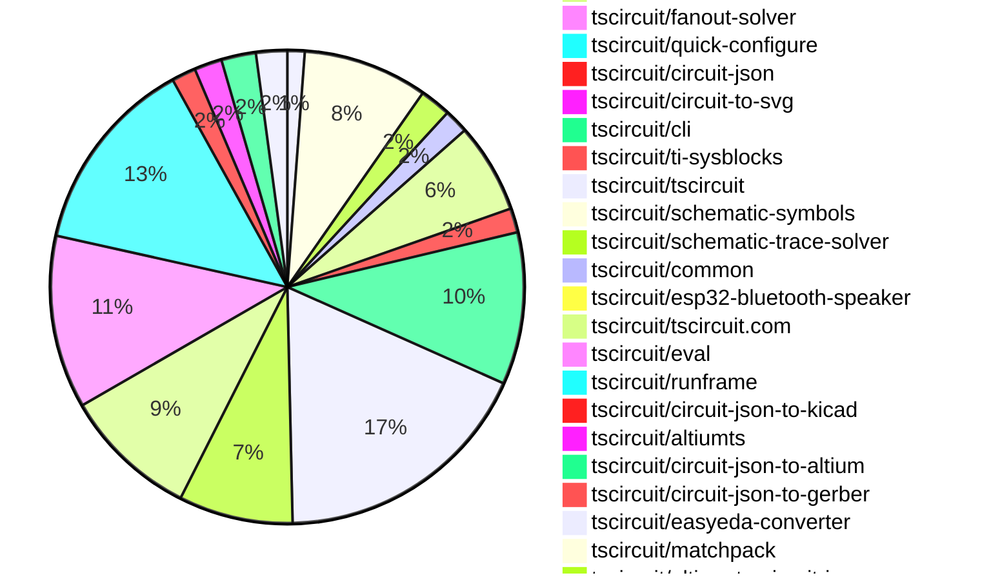

# Contribution Overview 2026-08-25

The current week is shown below. There are 3 major sections:

- [Contributor Overview](#contributor-overview)
- [PRs by Repository](#prs-by-repository)
- [PRs by Contributor](#changes-by-contributor)
- [Scoring & Sponsorship Details](/docs/sponsorship-calculation-explanation.md)

## PRs by Repository

## Contributor Overview

| Contributor | 🐳 Major | 🐙 Minor | 🐌 Tiny | Score | ⭐ |
|-------------|---------|---------|---------|-------|-----|
| [seveibar](#seveibar) | 14 | 17 | 16 | 103 | 👑 |
| [ShiboSoftwareDev](#ShiboSoftwareDev) | 5 | 6 | 15 | 57 | ⭐⭐⭐ |
| [mohan-bee](#mohan-bee) | 5 | 4 | 9 | 42 | ⭐⭐ |
| [Sang-it](#Sang-it) | 2 | 9 | 11 | 36.5 | ⭐⭐ |
| [imrishabh18](#imrishabh18) | 4 | 2 | 9 | 30 | ⭐⭐ |
| [tscircuitbot](#tscircuitbot) | 1 | 0 | 279 | 18 | ⭐⭐ |
| [MustafaMulla29](#MustafaMulla29) | 3 | 1 | 3 | 18 | ⭐⭐ |
| [rushabhcodes](#rushabhcodes) | 1 | 1 | 3 | 12 | ⭐⭐ |
| [0hmX](#0hmX) | 1 | 1 | 2 | 8 | ⭐ |
| [anil08607](#anil08607) | 0 | 3 | 1 | 8 | ⭐ |
| [GokulPandi-M](#GokulPandi-M) | 0 | 2 | 3 | 7 | ⭐ |
| [hrithik18k](#hrithik18k) | 0 | 0 | 6 | 6 | ⭐ |
| [AnasSarkiz](#AnasSarkiz) | 0 | 0 | 5 | 5 | ⭐ |
| [KrishnaX12](#KrishnaX12) | 0 | 0 | 4 | 4 | ⭐ |
| [techmannih](#techmannih) | 0 | 0 | 4 | 4 | ⭐ |
| [mattkanwisher](#mattkanwisher) | 1 | 0 | 0 | 4 | ⭐ |
| [Abse2001](#Abse2001) | 0 | 1 | 0 | 2 |  |

## Staff Pass Ratio (SPR)

| Contributor | Reviewed PRs | Rejections | Approvals | SPR |
|-------------|--------------|------------|-----------|-----|
| [ShiboSoftwareDev](#ShiboSoftwareDev) | 19 | 6 | 17 | 68.4% |
| [mohan-bee](#mohan-bee) | 7 | 1 | 6 | 85.7% |
| [Sang-it](#Sang-it) | 6 | 1 | 6 | 83.3% |
| [MustafaMulla29](#MustafaMulla29) | 4 | 0 | 4 | 100.0% |
| [GokulPandi-M](#GokulPandi-M) | 3 | 1 | 2 | 66.7% |
| [0hmX](#0hmX) | 2 | 0 | 2 | 100.0% |
| [Abse2001](#Abse2001) | 2 | 0 | 2 | 100.0% |
| [AnasSarkiz](#AnasSarkiz) | 2 | 0 | 2 | 100.0% |
| [hrithik18k](#hrithik18k) | 1 | 1 | 0 | 0.0% |
| [imrishabh18](#imrishabh18) | 1 | 0 | 1 | 100.0% |
| [KrishnaX12](#KrishnaX12) | 1 | 0 | 1 | 100.0% |
| [mattkanwisher](#mattkanwisher) | 1 | 0 | 1 | 100.0% |
| [rushabhcodes](#rushabhcodes) | 1 | 0 | 1 | 100.0% |
| [techmannih](#techmannih) | 1 | 1 | 0 | 0.0% |

ShiboSoftwareDev SPR PRs (19)

- [#736](https://github.com/tscircuit/circuit-json/pull/736) Add PCB keepout outlines
- [#3446](https://github.com/tscircuit/core/pull/3446) fix: synchronize fanout exits across named nets
- [#152](https://github.com/tscircuit/circuit-json-to-gerber/pull/152) fix: preserve rotated plated-hole pad geometry
- [#2249](https://github.com/tscircuit/tscircuit-autorouter/pull/2249) Fix Pipeline 9 multipoint bus length matching
- [#2251](https://github.com/tscircuit/tscircuit-autorouter/pull/2251) Continue the high-density portfolio after rejecting an invalid candidate
- [#2248](https://github.com/tscircuit/tscircuit-autorouter/pull/2248) Honor Pipeline9 bus allowed layers per connection
- [#2247](https://github.com/tscircuit/tscircuit-autorouter/pull/2247) Honor multipoint bus trace widths in Pipeline9
- [#888](https://github.com/tscircuit/schematic-trace-solver/pull/888) Deduplicate schematic routing pairs
- [#164](https://github.com/tscircuit/ti/pull/164) Add TIDC-WL1837MODCOM8I W3006 antenna subcircuit
- [#163](https://github.com/tscircuit/ti/pull/163) Add SN74LVC1G34 logic buffer subcircuit
- [#162](https://github.com/tscircuit/ti/pull/162) Add TIDA-00399 I/O protection subcircuit
- [#161](https://github.com/tscircuit/ti/pull/161) Add TIDA-00399 TPS62086 buck converter subcircuit
- [#160](https://github.com/tscircuit/ti/pull/160) Add TIDA-00890 TPS25910 input power protection subcircuit
- [#142](https://github.com/tscircuit/ti/pull/142) Add TIDA-01141 current and voltage sense reference
- [#82](https://github.com/tscircuit/altiumts/pull/82) Preserve PCB track keepout flags
- [#63](https://github.com/tscircuit/altiumts/pull/63) Serialize PCB component body contours
- [#71](https://github.com/tscircuit/altiumts/pull/71) Render schematic special-string values
- [#50](https://github.com/tscircuit/circuit-json-to-altium/pull/50) Preserve PCB keepout outlines
- [#13](https://github.com/tscircuit/circuit-json-to-altium/pull/13) Preserve PCB component body contours

mohan-bee SPR PRs (7)

- [#3358](https://github.com/tscircuit/core/pull/3358) reuse schematic box dimensions during port rendering
- [#479](https://github.com/tscircuit/jlcsearch/pull/479) expose datasheet urls in component search
- [#917](https://github.com/tscircuit/schematic-trace-solver/pull/917) Anchor vertical ground labels to clear component-side rails
- [#927](https://github.com/tscircuit/schematic-trace-solver/pull/927) Collapse redundant same-net cycles
- [#942](https://github.com/tscircuit/schematic-trace-solver/pull/942) render typed ground nets as symbols in solver snapshots
- [#919](https://github.com/tscircuit/schematic-trace-solver/pull/919) Prevent grouped ground rails from crossing component rows
- [#875](https://github.com/tscircuit/schematic-trace-solver/pull/875) prefer shorter endpoint detours for isolated direct traces

Sang-it SPR PRs (6)

- [#731](https://github.com/tscircuit/circuit-json/pull/731) Add schematic sheet sizes
- [#819](https://github.com/tscircuit/props/pull/819) Add schematic sheet sizes
- [#3460](https://github.com/tscircuit/core/pull/3460) Add configurable schematic sheet dimensions
- [#697](https://github.com/tscircuit/circuit-to-svg/pull/697) Render configurable schematic sheet dimensions
- [#939](https://github.com/tscircuit/schematic-trace-solver/pull/939) Recover aligned multi-pin net traces
- [#150](https://github.com/tscircuit/ti/pull/150) Add composed power bank example

MustafaMulla29 SPR PRs (4)

- [#3450](https://github.com/tscircuit/core/pull/3450) Support inline labels on multi-pin signal nets
- [#910](https://github.com/tscircuit/schematic-trace-solver/pull/910) Place opted-in inline labels on multi-pin net connections
- [#879](https://github.com/tscircuit/schematic-trace-solver/pull/879) Align same-net rails without moving labels
- [#168](https://github.com/tscircuit/ti/pull/168) Add Seat Position Module reference subcircuits and an example

GokulPandi-M SPR PRs (3)

- [#723](https://github.com/tscircuit/circuit-json/pull/723) Add optional schematic pin-label font size
- [#3430](https://github.com/tscircuit/core/pull/3430) Forward schematic pin-label font size to Circuit JSON
- [#230](https://github.com/tscircuit/matchpack/pull/230) fix: align nearby connected two-pin passive pairs

0hmX SPR PRs (2)

- [#3483](https://github.com/tscircuit/core/pull/3483) BGA fanout vs default fanout example
- [#243](https://github.com/tscircuit/checks/pull/243) fix: detect via copper overlapping pad corners

Abse2001 SPR PRs (2)

- [#129](https://github.com/tscircuit/ti/pull/129) Add TIDA-020027 TLIN1028 communication interface
- [#5](https://github.com/tscircuit/ti-sysblocks/pull/5) feat: add automotive window module sysblock

AnasSarkiz SPR PRs (2)

- [#149](https://github.com/tscircuit/ti/pull/149) Add TIDA-00699 power supply reference schematic
- [#165](https://github.com/tscircuit/ti/pull/165) Add TIDEP-01024 radar front-end modules

hrithik18k SPR PRs (1)

- [#943](https://github.com/tscircuit/schematic-trace-solver/pull/943) Fix net label branches starting from interior junctions

imrishabh18 SPR PRs (1)

- [#3362](https://github.com/tscircuit/core/pull/3362) feat: add automatic implicit copper pours

KrishnaX12 SPR PRs (1)

- [#30](https://github.com/tscircuit/circuit-json-to-altium/pull/30) fix: preserve schematic clock and inverted pin flags

mattkanwisher SPR PRs (1)

- [#64](https://github.com/tscircuit/kicadts/pull/64) Add KiCad 10.99 PCB syntax support

rushabhcodes SPR PRs (1)

- [#30](https://github.com/tscircuit/altium-to-circuit-json/pull/30) refactor: split schematic rendering into modules

techmannih SPR PRs (1)

- [#151](https://github.com/tscircuit/ti/pull/151) feat: add rearview mirror MSP430 MCU

> Note: AI evaluates PRs and assigns 1-3 star ratings automatically. 4 and 5 star ratings require manual staff review.

## Review Table

[reviews-received-hover]: ## "Number of reviews received for PRs for this contributor"
[approvals-received-hover]: ## "Number of approvals received for PRs this contributor authored"
[rejections-received-hover]: ## "Number of rejections received for PRs this contributor authored"
[prs-opened-hover]: ## "Number of PRs opened by this contributor"
[issues-created-hover]: ## "Number of issues created by this contributor"

| Contributor | Reviews Received | Approvals Received | Rejections Received | Approvals | Rejections Given | PRs Opened | PRs Merged | Issues Created |
|---|---|---|---|---|---|---|---|---|
| [0hmX](#0hmX) | 9 | 2 | 1 | 0 | 0 | 5 | 4 | 0 |
| [Abse2001](#Abse2001) | 9 | 3 | 0 | 0 | 0 | 8 | 1 | 0 |
| [AnasSarkiz](#AnasSarkiz) | 5 | 5 | 0 | 0 | 0 | 8 | 5 | 0 |
| [anil08607](#anil08607) | 5 | 5 | 0 | 1 | 0 | 6 | 4 | 0 |
| [GokulPandi-M](#GokulPandi-M) | 12 | 7 | 3 | 0 | 0 | 10 | 5 | 0 |
| [hrithik18k](#hrithik18k) | 18 | 8 | 1 | 0 | 0 | 10 | 6 | 0 |
| [imrishabh18](#imrishabh18) | 1 | 1 | 0 | 9 | 5 | 21 | 15 | 0 |
| [KrishnaX12](#KrishnaX12) | 11 | 6 | 2 | 0 | 0 | 12 | 4 | 0 |
| [marcos452652258-gif](#marcos452652258-gif) | 0 | 0 | 0 | 0 | 0 | 3 | 0 | 0 |
| [mattkanwisher](#mattkanwisher) | 2 | 1 | 0 | 0 | 0 | 1 | 1 | 0 |
| [mohan-bee](#mohan-bee) | 15 | 12 | 1 | 6 | 0 | 41 | 18 | 0 |
| [MustafaMulla29](#MustafaMulla29) | 6 | 5 | 0 | 3 | 0 | 8 | 8 | 0 |
| [Nitish7016](#Nitish7016) | 0 | 0 | 0 | 0 | 0 | 7 | 0 | 0 |
| [Rodrigoue9](#Rodrigoue9) | 0 | 0 | 0 | 0 | 0 | 28 | 0 | 0 |
| [rushabhcodes](#rushabhcodes) | 21 | 7 | 1 | 3 | 0 | 12 | 5 | 0 |
| [Sang-it](#Sang-it) | 11 | 8 | 0 | 0 | 0 | 28 | 22 | 0 |
| [seveibar](#seveibar) | 16 | 0 | 0 | 66 | 7 | 68 | 50 | 0 |
| [ShayanMuhammad-CS](#ShayanMuhammad-CS) | 0 | 0 | 0 | 0 | 0 | 1 | 0 | 0 |
| [ShiboSoftwareDev](#ShiboSoftwareDev) | 45 | 29 | 4 | 14 | 0 | 73 | 36 | 0 |
| [techmannih](#techmannih) | 5 | 3 | 1 | 0 | 2 | 8 | 4 | 0 |
| [tscircuitbot](#tscircuitbot) | 0 | 0 | 0 | 0 | 0 | 393 | 280 | 0 |

## Changes by Repository

### [tscircuit/props](https://github.com/tscircuit/props)

| PR # | Impact | Rating | Contributor | Description |
|------|--------|--------|-------------|-------------|
| [#816](https://github.com/tscircuit/props/pull/816) | 🐳 Major | ⭐⭐⭐ | seveibar | Proposes an additive way to describe castellated holes directly in a board  outline. |
| [#817](https://github.com/tscircuit/props/pull/817) | 🐙 Minor | ⭐⭐ | seveibar | Adds the automaticPoursEnabled boolean to BoardProps, allowing implicit copper pours to be generated automatically, defaulting to false. |
| [#820](https://github.com/tscircuit/props/pull/820) | 🐙 Minor | ⭐⭐ | Sang-it | Adds optional sheetWidth and sheetHeight properties to allow explicit dimensions for schematic sheets, normalizing these dimensions to millimeters and rejecting non-positive values. |
| [#819](https://github.com/tscircuit/props/pull/819) | 🐙 Minor | ⭐⭐ | Sang-it | Adds a new schematic-sheet property for sheet sizes, defaulting to A4 and supporting ANSI_B, along with documentation and tests for both sizes. |

🐌 Tiny Contributions (1)

| PR # | Impact | Contributor | Description |
|------|--------|-------------|-------------|
| [#818](https://github.com/tscircuit/props/pull/818) | 🐌 Tiny | seveibar | Add SchematicGraphicProps and schematicGraphicProps for schematicgraphic  to support inline SVG content and image URLs, with validation for dimensions and source requirements. |

### [tscircuit/core](https://github.com/tscircuit/core)

| PR # | Impact | Rating | Contributor | Description |
|------|--------|--------|-------------|-------------|
| [#3455](https://github.com/tscircuit/core/pull/3455) | 🐳 Major | ⭐⭐⭐ | seveibar | Adds a new BGA fanout solver and compares its performance against the existing fanout solver for routing two DDR byte buses between AM62L and LPDDR4. |
| [#3446](https://github.com/tscircuit/core/pull/3446) | 🐳 Major | ⭐⭐⭐ | ShiboSoftwareDev | Fixes synchronization of fanout exits across named nets to ensure proper routing connections and continuity assertions in PCB designs. |
| [#3362](https://github.com/tscircuit/core/pull/3362) | 🐳 Major | ⭐⭐⭐ | imrishabh18 | Add a PcbImplicitCopperPourRender phase after routing and before explicit copper-pour rendering, enabling automatic copper pours per board and converting coarse implicit power-net regions into CopperPour components. |
| [#3454](https://github.com/tscircuit/core/pull/3454) | 🐙 Minor | ⭐⭐ | seveibar | Summary model the documented physical package balls for all 16 AM62L-to-LPDDR4 DQ connections connect all 97 AM62L VSS balls and all 58 LPDDR4 VSS balls to the inner1 GND pour connect all 5 AM62L VDDS_DDR balls plus all 20 LPDDR4 VDDQ and 24 VDD2 balls to the shared 1.1 V VDD_LPDDR4 pour on inner2 connect all 8 LPDDR4 VDD1 balls to their separate 1.8 V SOC_DVDD1V8 pour on inner3 route all 212 plane drops and 32 DQ escapes through legal offset dogbones; via-in-pad remains disabled keep logical route transitions on their destination layers while inflating all 244 physical via barrels across the complete eight-layer stack enforce phase-local length matching on both DDR byte buses while preserving a straight, noncrossing global handoff propagate blindburied-via policy through Board, imported Circuit JSON, nested board routing, SRJ, fanout planning, and autorouted pcb_via inflation consume the SRJ physical-span hint during via inflation without leaking it into persisted pcb_trace.route preserve the signal-only BGA solver comparison through the shared AM62L fixture  Dependencies tscircuitfanout-solver97(https:github.comtscircuitfanout-solverpull97), released as tscircuitfanout-solver0.0.39 Use the live copper-pour-solver85(https:github.comtscircuitcopper-pour-solverpull85) preview (85) because the commit-addressed pkg.pr.new URL on current main does not resolve. A fresh install, TypeScript, and the focused repro pass with the live preview.  Validation AM62L repro: 4,867 assertions, zero routing or clearance errors; snapshot-update run in 28.5s and stable rerun in 27.7s on the local M3 Pro phase-local length skew: BYTE0 7.532058 mm  7.999999 mm; BYTE1 14.499999 mm  14.499999 mm BYTE1 adds real tuning on both packages: one SOC trace and three DRAM traces; BYTE0 retains four DRAM-side tuned traces all 244 via renderings and all pad geometry remain unchanged; the global straight-line handoff remains unchanged and crossing-free BGA comparison: 329 assertions passed in signal-only mode focused via-policy and board-propagation suite: 8 tests passed seven affected fanout, copper-pour, winding, and SRJ snapshot tests passed after focused updates SRJ metadata persistence cleanup: 2 focused tests, 9 assertions exact solver captures: SOC 118 of 118 and RAM 126 of 126, each in one attempt with zero validation issues fresh install with the live copper-pour preview and tscircuitfanout-solver0.0.39 bunx tsc --noEmit --pretty false Core CI at 4cf81484: all 10 Bun shards, Type Check, Format PR, Dependency Check, Smoke Test Dist, and Vercel passed  Snapshot Updated to show offset dogbone vias across both packages, three internal power planes, visible length matching on both DDR byte buses, and the straight global handoff. Every autorouted via is asserted outside its source-pad clearance and physically spans all eight layers. |
| [#3478](https://github.com/tscircuit/core/pull/3478) | 🐙 Minor | ⭐⭐ | seveibar | Add the AM62LLPDDR4 address-control fanout bus alongside both byte buses, routing CA0CA5, CS, and CKE using verified package balls on a dedicated inner6 signal layer, while preserving all GNDDDR-power plane dogbones and through-all via checks. |
| [#3458](https://github.com/tscircuit/core/pull/3458) | 🐙 Minor | ⭐⭐ | seveibar | Add the schematicgraphic  intrinsic component and emit canonical schematic_graphic Asset records, supporting svgContent, imageUrl, or both, while enforcing SVG standards and improving schematic rendering. |
| [#3465](https://github.com/tscircuit/core/pull/3465) | 🐙 Minor | ⭐⭐ | seveibar | Run categorized schematic checks during the board DRC process and add regression tests for schematic warnings related to undersized chip heights. |
| [#3456](https://github.com/tscircuit/core/pull/3456) | 🐙 Minor | ⭐⭐ | seveibar | Fixes incorrect no-connect propagation for custom symbol ports by ensuring pin attributes are resolved from the owning normal component, preventing false missing-trace warnings. |
| [#3439](https://github.com/tscircuit/core/pull/3439) | 🐙 Minor | ⭐⭐ | seveibar | Adds support for castellated holes in board outlines, rendering them as circular plated holes and exposing them as board pinout ports while preserving alignment and updating the board outline point schema. |
| [#3438](https://github.com/tscircuit/core/pull/3438) | 🐙 Minor | ⭐⭐ | seveibar | Maps schSize variants sm and xs to compact passive symbols for resistors and capacitors, preserving existing styles and behaviors. |
| [#3440](https://github.com/tscircuit/core/pull/3440) | 🐙 Minor | ⭐⭐ | seveibar | Add an 8 mm phase-local maxLengthSkew constraint to AM62L DDR BYTE0 and verify the constraint in fanout phases while maintaining clean routing DRC. |
| [#3460](https://github.com/tscircuit/core/pull/3460) | 🐙 Minor | ⭐⭐ | Sang-it | Adds support for configurable schematic sheet dimensions, including A4 as the default size and ANSI B, with explicit width and height values for schematic sheets. |
| [#3430](https://github.com/tscircuit/core/pull/3430) | 🐙 Minor | ⭐⭐ | GokulPandi-M | Carries the optional per-port schPinLabelFontSize prop into schematic_port.display_pin_label_font_size as a precise numeric Circuit JSON value. |
| [#3448](https://github.com/tscircuit/core/pull/3448) | 🐙 Minor | ⭐⭐ | mohan-bee | Adds ground metadata to the schematic trace solver input problem to identify ground nets in circuit schematics. |
| [#3358](https://github.com/tscircuit/core/pull/3358) | 🐙 Minor | ⭐⭐ | mohan-bee | Reduces rendering time by caching schematic box dimensions for large-pin-count components, improving performance in SchematicPortRender. |
| [#3450](https://github.com/tscircuit/core/pull/3450) | 🐙 Minor | ⭐⭐ | MustafaMulla29 | Allows explicitly named, non-power port-to-net signals spanning multiple components to request inline labels while preserving existing label semantics and updating relevant tests. |

🐌 Tiny Contributions (20)

| PR # | Impact | Contributor | Description |
|------|--------|-------------|-------------|
| [#3475](https://github.com/tscircuit/core/pull/3475) | 🐌 Tiny | seveibar | Replaces the copper-pour-solver PR preview with the published version tscircuitcopper-pour-solver0.0.51 and rejects committed pkg.pr.new dependency specs in the existing Dependency Check workflow. |
| [#3437](https://github.com/tscircuit/core/pull/3437) | 🐌 Tiny | seveibar | Updates the tscircuitcapacity-autorouter package from version 0.0.844 to 0.0.845, addressing GNDVBAT accidental contact and via-to-X1-pad clearance issues in the nRF52810 repro. |
| [#3434](https://github.com/tscircuit/core/pull/3434) | 🐌 Tiny | seveibar | Updates routing dependencies to incorporate fixes and improvements from related repositories, ensuring Core consumes the latest enhancements for autorouting and copper pour functionalities. |
| [#3482](https://github.com/tscircuit/core/pull/3482) | 🐌 Tiny | tscircuitbot | Updates the tscircuitchecks package from version 0.0.177 to 0.0.178 in the package.json file. |
| [#3481](https://github.com/tscircuit/core/pull/3481) | 🐌 Tiny | tscircuitbot | Updates the version of the tscircuitchecks package from 0.0.177 to 0.0.178 in package.json |
| [#3479](https://github.com/tscircuit/core/pull/3479) | 🐌 Tiny | tscircuitbot | Updates the version of the tscircuitchecks package from 0.0.175 to 0.0.177 in package.json |
| [#3469](https://github.com/tscircuit/core/pull/3469) | 🐌 Tiny | tscircuitbot | Updates the version of the tscircuitchecks package from 0.0.174 to 0.0.175 in package.json |
| [#3467](https://github.com/tscircuit/core/pull/3467) | 🐌 Tiny | tscircuitbot | Updates the tscircuitchecks package from version 0.0.171 to 0.0.174 in the package.json file. |
| [#3488](https://github.com/tscircuit/core/pull/3488) | 🐌 Tiny | tscircuitbot | Updates the tscircuitfanout-solver package from version 0.0.39 to 0.0.40 |
| [#3425](https://github.com/tscircuit/core/pull/3425) | 🐌 Tiny | tscircuitbot | Updates the tscircuitchecks package from version 0.0.170 to 0.0.171 in the package.json file. |
| [#3445](https://github.com/tscircuit/core/pull/3445) | 🐌 Tiny | ShiboSoftwareDev | Reproduces a bug where disconnected fanout net handoff occurs during autorouting, with a test case to demonstrate the issue. |
| [#3466](https://github.com/tscircuit/core/pull/3466) | 🐌 Tiny | Sang-it | Updates the copper-pour solver dependency to a specific commit for improved functionality and stability. |
| [#3452](https://github.com/tscircuit/core/pull/3452) | 🐌 Tiny | imrishabh18 | Updates the tscircuitschematic-trace-solver package from version 0.0.158 to 0.0.159, ensuring compatibility with existing configurations and preserving the no-lockfile policy. |
| [#3451](https://github.com/tscircuit/core/pull/3451) | 🐌 Tiny | imrishabh18 | Bump tscircuitschematic-trace-solver from 0.0.156 to 0.0.158, the latest published npm release verified on 2026-08-26. |
| [#3462](https://github.com/tscircuit/core/pull/3462) | 🐌 Tiny | mohan-bee | Updates the version of the schematic-trace-solver dependency from 0.0.164 to 0.0.166 in package.json |
| [#3457](https://github.com/tscircuit/core/pull/3457) | 🐌 Tiny | mohan-bee | Updates the tscircuitschematic-trace-solver dependency to version 0.0.164 in the package.json file. |
| [#3432](https://github.com/tscircuit/core/pull/3432) | 🐌 Tiny | mohan-bee | Updates the version of the schematic-trace-solver dependency from 0.0.153 to 0.0.156 in the package.json file. |
| [#3443](https://github.com/tscircuit/core/pull/3443) | 🐌 Tiny | mohan-bee | Updates the version of the schematic-symbols dependency from 0.0.242 to 0.0.243 in package.json |
| [#3487](https://github.com/tscircuit/core/pull/3487) | 🐌 Tiny | MustafaMulla29 | Updates the version of the schematic-trace-solver dependency from 0.0.166 to 0.0.168 in package.json |
| [#3444](https://github.com/tscircuit/core/pull/3444) | 🐌 Tiny | MustafaMulla29 | Add the complete TIDA-01330 DRV8305 motor-driver schematic as one self-contained test file and reproduce remote signal nets rendering as anchored tags instead of inline trace labels. |

### [tscircuit/checks](https://github.com/tscircuit/checks)

| PR # | Impact | Rating | Contributor | Description |
|------|--------|--------|-------------|-------------|
| [#251](https://github.com/tscircuit/checks/pull/251) | 🐳 Major | ⭐⭐⭐ | seveibar | Restricts trace length checks to only consider traces that explicitly reference both mapped PCB endpoints, ignoring unrelated branches, while preserving existing behavior for other cases. |
| [#248](https://github.com/tscircuit/checks/pull/248) | 🐳 Major | ⭐⭐⭐ | seveibar | Fixes false disconnected endpoint findings by allowing same-net copper connections at trace endpoints, improving trace continuity checks. |
| [#250](https://github.com/tscircuit/checks/pull/250) | 🐙 Minor | ⭐⭐ | seveibar | Exempts simple-chip packages with fewer than two connectable ports from power and ground pin presence checks, treating explicit do-not-connect package pads as non-connectable while keeping existing checks for multi-port chips. |
| [#249](https://github.com/tscircuit/checks/pull/249) | 🐙 Minor | ⭐⭐ | seveibar | Fixes the issue where same-net, same-layer copper traces at net-level endpoints were not being accepted, ensuring proper connectivity checks for PCB traces. |
| [#243](https://github.com/tscircuit/checks/pull/243) | 🐙 Minor | ⭐⭐ | 0hmX | Fixes detection of via copper overlapping pad corners to ensure accurate placement error reporting. |

🐌 Tiny Contributions (4)

| PR # | Impact | Contributor | Description |
|------|--------|-------------|-------------|
| [#247](https://github.com/tscircuit/checks/pull/247) | 🐌 Tiny | seveibar | Detects when schematic pins are positioned outside the vertical or horizontal body span of a component and emits a warning with actionable suggestions for minimum schematic height or width. |
| [#246](https://github.com/tscircuit/checks/pull/246) | 🐌 Tiny | seveibar | Reproduces false positives in net-level trace connectivity checks for regional reroute joins in PCB designs. |
| [#235](https://github.com/tscircuit/checks/pull/235) | 🐌 Tiny | KrishnaX12 | Fixes copper-to-board-edge clearance checks for off-board components by exempting specific elements from clearance checks. |
| [#242](https://github.com/tscircuit/checks/pull/242) | 🐌 Tiny | 0hmX | Reproduces a geometry overlap issue between a GND via and a SIG pad corner without applying a fix, serving as a basis for a subsequent fix PR. |

### [tscircuit/tscircuit-autorouter](https://github.com/tscircuit/tscircuit-autorouter)

| PR # | Impact | Rating | Contributor | Description |
|------|--------|--------|-------------|-------------|
| [#2239](https://github.com/tscircuit/tscircuit-autorouter/pull/2239) | 🐳 Major | ⭐⭐⭐ | seveibar | Fixes a regression in Pipeline9 that allowed preloaded routes to be rerouted too close to foreign board copper, leading to potential design rule violations. |
| [#2230](https://github.com/tscircuit/tscircuit-autorouter/pull/2230) | 🐳 Major | ⭐⭐⭐ | seveibar | Summary pin high-density-repair03 PR 82 so the connectivity map is authoritative when exact DRC resolves electrical nets add the complete nRF52810 Pipeline7 fixture plus the historical bad exact-geometry candidate assert that the fixed exact stage keeps the two real inherited issues, introduces neither the GNDVBAT contact nor the X1 via-pad violation, and emits no new post-power DRC identities add a three-panel reviewer-visible SVG: safe exact input, historical bad candidate, fixed exact output refresh only three existing route snapshots whose output actually changes under the fix  Root cause Pipeline7 exact DRC resolved a routed trace to a generated connectivity-net id but could resolve a connected raw PCB port to a point-pair alias. The same electrical net then compared unequal, inflating the exact DRC inventory and steering repair toward a lower-count candidate that introduced two real violations. The newer connectivity-monotone power expander stopped incidentally repairing that unsafe candidate, which exposed the defect in the nRF52810 snapshot. This does not add an output-blocking gate. The fix corrects the DRC input classification before candidate selection.  Snapshot review bugreport99: focused visual explicitly marks the historical GNDVBAT contact and X1 via-pad hotspot between safe input and fixed output bugreport44: one via is placed on the shorter valid candidate; the same single pre-existing via-pad error remains bugreport89 and bugreport92: identical SRJs remain reference-DRC-clean, with 37 traces and 18 vias; routed length changes by only 0.12 percent six other local Darwin snapshot mismatches were byte-identical between the old and fixed dependency and were intentionally left out of this PR  Validation focused nRF and neighboring Pipeline7 DRC suite: 7 pass, 46 assertions reviewed snapshot set: 4 pass, 15 assertions bunx tsc --noEmit bun run build bun run format:check git diff --check high-density-repair03: 83 pass, 0 fail capacity full run before selective snapshot refresh: 569 pass, 60 skip; nine visual mismatches, with three attributable and refreshed here and six proven unrelated by oldfixed byte comparison Depends on https:github.comtscircuithigh-density-repair03pull82 |
| [#2247](https://github.com/tscircuit/tscircuit-autorouter/pull/2247) | 🐳 Major | ⭐⭐⭐ | ShiboSoftwareDev | Fixes autorouting to correctly honor multipoint bus trace widths, changing the output from 0.10 mm to the requested 0.40 mm. |

🐌 Tiny Contributions (4)

| PR # | Impact | Contributor | Description |
|------|--------|-------------|-------------|
| [#2241](https://github.com/tscircuit/tscircuit-autorouter/pull/2241) | 🐌 Tiny | tscircuitbot | Automated package update |
| [#2259](https://github.com/tscircuit/tscircuit-autorouter/pull/2259) | 🐌 Tiny | tscircuitbot | Automated package update |
| [#2231](https://github.com/tscircuit/tscircuit-autorouter/pull/2231) | 🐌 Tiny | tscircuitbot | Automated package update |
| [#2242](https://github.com/tscircuit/tscircuit-autorouter/pull/2242) | 🐌 Tiny | ShiboSoftwareDev | Reproduces a bug where the Pipeline9 autorouter fails to respect the specified multipoint bus trace width of 0.40 mm, instead routing it at 0.10 mm, and provides a comprehensive test to facilitate fixing the issue. |

### [tscircuit/high-density-repair03](https://github.com/tscircuit/high-density-repair03)

| PR # | Impact | Rating | Contributor | Description |
|------|--------|--------|-------------|-------------|
| [#82](https://github.com/tscircuit/high-density-repair03/pull/82) | 🐳 Major | ⭐⭐⭐ | seveibar | Fixes DRC net canonicalization issues by treating injected connectivity map net IDs as authoritative, preventing misclassification of connected trace and pad copper as different nets. |

### [tscircuit/ti](https://github.com/tscircuit/ti)

| PR # | Impact | Rating | Contributor | Description |
|------|--------|--------|-------------|-------------|
| [#152](https://github.com/tscircuit/ti/pull/152) | 🐳 Major | ⭐⭐⭐ | seveibar | Summary add an isolated React 19  React Flow system block builder that discovers all 53 TI subcircuits present compact interface-aware blocks with readable horizontal PowerData labels and a viewport-aware dot grid resolve reviewed PowerData interfaces into exact trace bundles and deterministic example-style TSX evaluate generated designs in a worker with PCB, routing, and parts-engine work disabled preview schematic SVGs, export real schematic PDFs, and build a directly openable single-file HTML artifact  Resolution safety requires a providers complete voltage range to fit within the consumer rating rejects ambiguous links and occupied single-use ports while trying other compatible free interfaces reports generated Circuit JSON errors instead of presenting an invalid render as successful leaves generic catalog entries placement-only until their semantic adapters have been reviewed  Testing bun install --frozen-lockfile (system-block-ui) bun run typecheck (root and system-block-ui) bun test (system-block-ui: 10 passing) bun run build and bun run build:standalone (system-block-ui) bun run format:check and git diff --check browser smoke: 53-block palette, 5-node9-edge starter, horizontal semantic labels, movingscaling grid, generated TSX, schematic rendering, and PDF export standalone smoke: one 17 MB HTML file with no external entry scripts or stylesheets |
| [#155](https://github.com/tscircuit/ti/pull/155) | 🐳 Major | ⭐⭐⭐ | seveibar | Summary generate a deterministic system-level SVG from the block graph and resolved semantic connections emit it as native schematicgraphic svgContent...  on schematic sheet 0 keep existing component schematics as sheets 1..N and include the overview in previewPDF output evaluate the same canonical exported TSX directly with tscircuiteval0.0.1294 harden stale render coordination, deterministic ordering, sheet-name collisions, and generated comment escaping  Verification bun run format:check (root and system-block-ui) bun run typecheck (root and system-block-ui) bun test (31 tests, including the real eval blob-worker path) bun run build and standalone build clean frozen install  typecheck  tests  build browser: starter renders 6 ordered sheets with System Diagram first PDF: 6 A4 landscape pages; page 1 visually verified without clipping  Compatibility The nested UI pins tscircuitcore0.0.1785 and tscircuiteval0.0.1294. The published eval blob worker now supports native schematicgraphic, so preview, copy, and download all use the same canonical TSX without a host-side Circuit JSON compatibility bridge. |
| [#121](https://github.com/tscircuit/ti/pull/121) | 🐳 Major | ⭐⭐⭐ | Sang-it | Summary add battery charging, DC boost, MCU, and USB-C reference subcircuits expose the subcircuits from the flat libsubcircuits namespace extract BQ25731RSN, TPS61236RWLR, TPS78230DRVR, MSP430G2332IPW20, TPS61288RQQR, and TLV9152IDR into libchips express every subcircuit with explicit TSX components and traces add regenerated schematic snapshots for all four subcircuits and all six extracted chips exclude the battery-pack circuit  Verification bun run typecheck bunx biome format . all four subcircuit snapshot comparisons pass subcircuit snapshot SHA-256 hashes are unchanged after the explicit-TSX refactor chip snapshots generated with the parts engine disabled  Reference comparisons  Battery charging Reference: !Battery charging reference(https:github.comuser-attachmentsassets3f4abee8-323f-4ef3-9b7a-0ca3db8ab093) tscircuit: !Battery charging tscircuit(https:github.comuser-attachmentsassets689da937-2768-4890-b74c-594d02d07a71)  DC power Reference: !DC power reference(https:github.comuser-attachmentsassets8e94070e-db03-4209-9b18-331b2ab56d80) tscircuit: !DC power tscircuit(https:github.comuser-attachmentsassets64ac2e40-0a90-40bb-8df5-6ffccce698c5)  MCU Reference: !MCU reference(https:github.comuser-attachmentsassets1a619649-64ff-4d28-b357-456594fc662b) tscircuit: !MCU tscircuit(https:github.comuser-attachmentsassetsac643c96-af91-4f1e-b4a6-daa3fbe13fa7)  USB-C Reference: !USB-C reference(https:github.comuser-attachmentsassets7dc368ec-80e9-4c10-b430-840b19d2122e) tscircuit: !USB-C tscircuit(https:github.comuser-attachmentsassets501215ea-d54d-4022-b882-c15a53e22658) |
| [#114](https://github.com/tscircuit/ti/pull/114) | 🐙 Minor | ⭐⭐ | seveibar | Summary add ClockBuffer_LMK1C1104, filling the Clocks  timing  Clock buffers category represented in ti-sysblocks add and export the LMK1C1104 TSSOP-8 chip model reproduce the functional drawing area of TIs LMK1C1104EVM Altium schematic with all 64 components, 160 ports, the inputpoweroutput topology, Y0Y7 validation fixtures, and the sources DNP population state expose CLKIN, OE, VDD, GND, and the four driven outputs Y0Y3 through exposedNets; use connected native netlabel elements for the public signal endpoints retain Y4Y7 only as internal DNP validation-fixture nets because the four-output LMK1C1104 does not drive them preserve all 36 circuit-body engineering-note lines with schematictext while omitting their background frames; the Altium sheet border, TI title blocklogo, parameter fields, and legalfooter boilerplate are intentionally omitted update generated schematic and routed PCB snapshots OE is the public API alias for TIs 1G pinnet label because tscircuit net selectors cannot begin with a digit. The chip symbol still identifies the physical pin as 1G. Consumers can instantiate the subcircuit and connect through the exposed parent nets, for example net.CLKIN, net.OE, and net.Y0net.Y3.  Reference and conversion ti-sysblocks lists LMK1C1104 under Clocks  timing  Clock buffers(https:github.comtscircuitti-sysblocksblob4812e9499380354f5864516b50be8b7445f8622dlibgeneratedmachine-vision-camera.jsonL2092-L2126) TI reference design: LMK1C1104EVM(https:www.ti.comtoolLMK1C1104EVM) native Altium source: SNAR039.ZIP(https:www.ti.comlitzipSNAR039) supporting schematicBOM: SNAU249(https:www.ti.comlitpdfSNAU249) HSDC078A_Validation_Board_Schematic.SchDoc was converted with altium-to-circuit-json v0.0.13 (97e5b2e4bb9acba337af0de07d74287e5e089f2a) using: sh bun run scriptsconvert-single-reference.ts HSDC078A_Validation_Board_Schematic.SchDoc schematic.circuit.json  The normalized conversion contains 917 Circuit JSON elements and validates cleanly. Altium stored 49 passive MPNs in Comment while hiding their electrical values in Value; normalization restored those resistorcapacitor values before validation. Provenance hashes: SNAR039.ZIP: 2fd36888e5713ba79fe4f79e41332dc87eed296656d6cd5785cbf95bcabc4781 main .SchDoc: 787e4a3067ffd033d45af0b09c6bccdf704f1e3801d38eaa9f99ae3af644d761 normalized Circuit JSON: 4ed3e68e6e4558bf9fbf0a42ccd8b46ad63c5e0bc9d1ef2857f924933399a55c The Altium PCB document is an unsynchronized 16-pin LMK1C1108 validation layout. The schematic and BOM identify the actual LMK1C1104 as PW0008A TSSOP-8, so this implementation uses the correct 8-pin footprint and a newly routed PCB snapshot rather than claiming literal PCB reproduction.  Validation bun run typecheck bun run format:check bunx tsci build libsubcircuitsClockBuffer_LMK1C1104.circuit.tsx bunx tsci snapshot libsubcircuitsClockBuffer_LMK1C1104.circuit.tsx --test --concurrency 1 git diff --check nested-consumer audit of every exposed-net bridge root exportmap smoke check Circuit JSON audit: 64 sourceschematicPCB components, 160 sourceschematicPCB ports, 114 source traces, 91 schematic traces, 106 PCB traces, 36 vias, 12 explicit nets, correct groundpower flags, and zero _error records The nested-consumer audit verifies parent connectivity for exactly CLKIN, OE, VDD, GND, and Y0Y3, while Y4Y7 remain scoped to their DNP fixtures. The build succeeds. Its remaining placement warnings come from retaining TIs tightly packed validation-fixture geometry; supplier-footprint IoU and unnamed-trace messages are non-fatal.  Related work Open PR 112 contains a datasheet-derived LMK1C1104 example and a different package variant, but it does not add a reusable component under libsubcircuits. This PR uses the TSSOP-8 package from the Altium EVM schematicBOM. |
| [#150](https://github.com/tscircuit/ti/pull/150) | 🐙 Minor | ⭐⭐ | Sang-it | Add a five-sheet power-bank example composed from the battery management, battery charging, 3 V boost, MSP430, and USB-C PPS subcircuits, connecting the protected battery and system power rails, common ground, SMBus, and VCURVCOM control signals, and allowing the MSP430 subcircuit to accept standard subcircuit props for naming and schematic-sheet assignment. |

🐌 Tiny Contributions (21)

| PR # | Impact | Contributor | Description |
|------|--------|-------------|-------------|
| [#148](https://github.com/tscircuit/ti/pull/148) | 🐌 Tiny | seveibar | Add LP5892-Q1 LED matrix output interface with 48 RGB outputs and 16 scan lines, including a new component and associated documentation. |
| [#139](https://github.com/tscircuit/ti/pull/139) | 🐌 Tiny | seveibar | Fixes KiCad library typos for component footprints and updates to current identifiers for better compatibility. |
| [#158](https://github.com/tscircuit/ti/pull/158) | 🐌 Tiny | ShiboSoftwareDev | Adds the four-channel SN65LVDS31 driver subcircuit from TI TIDA-060017 as an inputoutput connection subcircuit, preserving specific resistors and capacitors while omitting evaluation headers. |
| [#159](https://github.com/tscircuit/ti/pull/159) | 🐌 Tiny | ShiboSoftwareDev | Add the TMP103AYFF temperature-sensor circuit from TIDA-00399, preserving the exact pin arrangement and optional I2C pull-ups, and exporting the subcircuit with a generated schematic SVG snapshot. |
| [#135](https://github.com/tscircuit/ti/pull/135) | 🐌 Tiny | Sang-it | Adds a new battery management subcircuit for the BQ40Z60 battery pack, including new components and connections in the schematic. |
| [#127](https://github.com/tscircuit/ti/pull/127) | 🐌 Tiny | Sang-it | Replaces manual netlabel elements in the boost converter schematic with component connections for improved schematic clarity and automatic label placement. |
| [#125](https://github.com/tscircuit/ti/pull/125) | 🐌 Tiny | Sang-it | Removes the schAutoLayoutEnabledfalse property from the USB-C subcircuit, allowing for automatic layout of the USB-C schematic while retaining existing rendering. |
| [#124](https://github.com/tscircuit/ti/pull/124) | 🐌 Tiny | Sang-it | Removes the as any cast from J6s schPinArrangement while preserving the existing J6 pin order and schematic rendering. |
| [#122](https://github.com/tscircuit/ti/pull/122) | 🐌 Tiny | Sang-it | Renames subcircuit components for better clarity and consistency in naming conventions. |
| [#137](https://github.com/tscircuit/ti/pull/137) | 🐌 Tiny | Sang-it | Adds a connection from the collector terminal of Q5 to the VINT power net in the MSP430G2332 MCU subcircuit. |
| [#128](https://github.com/tscircuit/ti/pull/128) | 🐌 Tiny | Sang-it | Refactors the BQ25731 charger schematic by renaming nets and adjusting component placements for better layout. |
| [#126](https://github.com/tscircuit/ti/pull/126) | 🐌 Tiny | Sang-it | Fixes illegal net name in boost converter from 3V to V3_0 and removes as any type assertion from RT1s schPinArrangement. |
| [#123](https://github.com/tscircuit/ti/pull/123) | 🐌 Tiny | Sang-it | Removes MCU manual-edit support by eliminating McuCircuitProps, manualEdits, and useManualPlacement from the MCU subcircuit, while maintaining the generated MCU schematic snapshot unchanged. |
| [#147](https://github.com/tscircuit/ti/pull/147) | 🐌 Tiny | imrishabh18 | Add INA350  INA350CDSIDSGR with the DSG0008A WSON-8 footprint and exposed pad, along with a reusable InstrumentationAmplifier_INA350 module containing only the CDS IC and its 100 nF bypass capacitor, correcting previous grounding issues for the TIDA-010266 use case. |
| [#117](https://github.com/tscircuit/ti/pull/117) | 🐌 Tiny | imrishabh18 | Adds the PGA300 pressure transmitter subcircuit, including its footprint and CAD model, based on the TI TIDA-00788 reference schematic. |
| [#119](https://github.com/tscircuit/ti/pull/119) | 🐌 Tiny | imrishabh18 | Add MSPM0L1306 chip with its footprint, pin aliases, and a reference subcircuit including necessary components and connections for proper functionality. |
| [#140](https://github.com/tscircuit/ti/pull/140) | 🐌 Tiny | imrishabh18 | Add DRV8210DSGR chip with PWM motor-driver subcircuit, including footprint, pin mapping, and usage documentation. |
| [#120](https://github.com/tscircuit/ti/pull/120) | 🐌 Tiny | 0hmX | Summary replace all 373 AM62L32BOGHAANBR pads generic 0.30 mm land geometry with TIs AM62L-specific 10 mil (0.254 mm) NSMD land add the corresponding 1 mil (0.0254 mm) solder-mask margin, producing TIs 12 mil mask opening centralize the geometry in a shared constant and add a focused Circuit JSON regression test for pad count, geometry, identities, and endpoint positions  Rationale TIs generic MPBGB03 package drawing shows a 0.30 mm PCB land example and 0.250.35 mm component balls. For AM62L escape routing, however, SPRADI2 Table 3-1(https:www.ti.comlitpdfspradi2) gives a device-specific 10 mil land and 12 mil solder-mask opening. This change uses that exact recommendation: a 0.127 mm pad radius and 0.0254 mm solder-mask margin. The downstream reproduction previously monkey-patched the package footprint to a 0.25616 mm diameter. That value was derived from the routing equation 0.5 mm pitch - 3  0.08128 mm, not specified by TI, so it is intentionally not upstreamed. TIs documented 0.254 mm land is used instead. See also the MPBGB03 package drawing(https:www.ti.comlitpdfmpbgb03).  Validation bun run format:check bun run typecheck bun test  1 focused test, 373 pads, all at radius 0.127 mm and solder-mask margin 0.0254 mm; pin identities and endpoint positions preserved bunx tsci build libchipsAM62L32BOGHAANBR.circuit.tsx  passed; generated Circuit JSON contains exactly 373 pads with the expected geometry bun run build  all 117 package circuits built successfully (exit 0) linked downstream ddr-byte1-only build  all six autorouter phases completed without autorouter errors; U1 has the new 373-pad geometry and U2 is unchanged downstream netlist check, layer verification, and shorts check all passed; 11 source nets produced 33 PCB traces and 28 vias The downstream DRC still reports the same two pre-existing via-to-trace clearance locations near DQ9 and DQ15 (0.006 mm and 0.021 mm versus a 0.05 mm minimum). Those diagnostics were already present with the old monkey patch; they are not shorts, and routing otherwise completes. After this package is released, consumers can remove the React footprint monkey patch and use the component normally. |
| [#157](https://github.com/tscircuit/ti/pull/157) | 🐌 Tiny | techmannih | Add a connected rearview mirror module example that integrates power, CAN, MCU, electrochromic mirror, light sensor, lamp driver, and temperature sensor subcircuits, organized across seven schematic sheets with routed PCB snapshots. |
| [#138](https://github.com/tscircuit/ti/pull/138) | 🐌 Tiny | techmannih | Adds multiple subcircuits for the rearview mirror module, including power supply, communication interface, electrochromic mirror driver, light sensors, and lamp driver, along with their respective components and wiring. |
| [#154](https://github.com/tscircuit/ti/pull/154) | 🐌 Tiny | techmannih | Enables PCB routing for the Rearview Mirror application and its six subcircuits, ensuring proper connections and preventing pad overlap. |

### [tscircuit/fanout-solver](https://github.com/tscircuit/fanout-solver)

| PR # | Impact | Rating | Contributor | Description |
|------|--------|--------|-------------|-------------|
| [#99](https://github.com/tscircuit/fanout-solver/pull/99) | 🐳 Major | ⭐⭐⭐ | seveibar | Summary coordinate fixed interstitial dogbone sites across multiple signal buses and dense singleton plane drops preserve per-layer winding constraints while trying bounded cross-layer interleavings length-match dense fanout prefixes only when the remaining plane dogbones still have a complete legal assignment bound route diversity and multi-span meander search to avoid combinatorial growth add a captured AM62L SoC phase repro with a focused functionalDRCSVG regression and an interactive debugger page This is the solver support needed by the AM62LLPDDR4 Core regression with two byte buses, an 8-signal addresscontrol bus, 212 plane drops, dogbones, and through-all vias.  Repro testsam62l-lpddr4-three-bus-through-all-repro.test.ts exercises the self-contained SoC fanout phase: 126 connections and 373 active AM62L BGA pads 102 singleton power-plane drops plus three 8-signal boundary buses 8 layers, via-in-pad disabled, blindburied vias disabled one full-stack dogbone via per connection BYTE0BYTE1ADDR_CTRL skew limits of 814.515 mm The predecessor did not complete this fixture within a 45-second cutoff. This branch completes it in about 18 seconds locally, validates all 126 traces, and passes independent routed-copper DRC. The same fixture is available interactively at reprosrepro03-am62l-three-bus-through-all.page.tsx; it does not auto-run.  Validation bun run typecheck focused AM62L repro: 1 test, 981 assertions, stable SVG snapshot (17.518.5 s across repeated runs) focused solver set: 10 tests, 422 assertions (9 initially passed; the only delta was the expected layered-winding SVG, refreshed and rerun green) Core AM62LLPDDR4 three-bus integration: 5,045 assertions, 51.2 s test body  52.0 s wall isolated phase solves: SoC: 126126 connections, 18.2 s RAM: 134134 connections, 26.4 s measured local skews: SoC BYTE0 7.175 mm, BYTE1 14.191 mm, ADDR_CTRL 13.613 mm RAM BYTE0 8.000 mm, BYTE1 14.500 mm, ADDR_CTRL 15.000 mm The broad suite is left to hosted CI to avoid overloading the development machine after an earlier crash. |
| [#97](https://github.com/tscircuit/fanout-solver/pull/97) | 🐳 Major | ⭐⭐⭐ | seveibar | Summary assign component-wide legal dogbone via sites before routing dense mixed signal and plane fanouts keep route transitions logical while modeling through-all physical barrels when blind and buried vias are disabled require explicit SimpleRouteJson allowViaInPad true before using via-in-pad preserve one-via winding and bus length matching outside the dense pad boundary bound winding-order search and spatially index via and obstacle clearance checks  Why The AM62L and LPDDR4 packages contain hundreds of power-plane drops alongside two ordered byte buses. Source-centered vias violated the board policy, while greedy dogbones could strand either the byte buses or nearby plane pads. The component-wide assignment reserves legal interstitial dogbones for the complete package and routes the buses around those fixed through-all barrels.  Validation full CI: 110 passed, 4 skipped, 0 failed; 111,705 assertions TypeScript compilation, format check, and Vercel checks 15 focused tests, 422 assertions bounded layered-winding and SRJ29 snapshot refresh exact SOC capture: 118 of 118 routed, one attempt, zero validation issues exact RAM capture: 126 of 126 routed, one attempt, zero validation issues linked Core AM62L regression: 4,861 assertions, zero DRC errors Biome and git diff check |
| [#95](https://github.com/tscircuit/fanout-solver/pull/95) | 🐳 Major | ⭐⭐⭐ | seveibar | Summary honor bus maxLengthSkew as a hard fanout constraint add straight45-degree meanders after the dense pad escape without changing endpoints or vias apply matching atomically to complete normal and grouped-beam route candidates reject impossible constraints instead of emitting a skew violation validate declared plan lengths, final bus skew, unsupported plane termination, and invalid inputs add synthetic and captured AM62L visual regressions  Why Core already forwards maxLengthSkew into fanout phases, but the solver previously dropped it. This adds a native fanout-aware matcher so the existing one-via escape topology and exact DRC checks remain authoritative. I evaluated tscircuitlength-matching-solver, but did not add it as a dependency: its current package is unpublished and its public API is differential-pairHD-route oriented rather than an atomic multi-member fanout-bus API.  Snapshots Captured AM62L SOC BYTE1 fanout, matched from 9.611899 mm to 8.499999 mm phase-local skew: !AM62L SOC length matching(https:github.comtscircuitfanout-solverblobfeatfanout-length-matchingtests__snapshots__am62l-soc-length-matching.snap.svg?raw1) Compact synthetic regression, matched from 1.112 mm to at most 0.25 mm: !Length-matched fanout(https:github.comtscircuitfanout-solverblobfeatfanout-length-matchingtests__snapshots__bus-length-matching.snap.svg?raw1)  Validation bun run typecheck Biome checks on all changed source, test, fixture, and documentation files focused AM62L, length-matching, winding, repair, and no-right-angle tests full suite: 104 pass; the sole failure is the pre-existing Dataset07 boundary-core SVG snapshot mismatch The captured AM62L regression uses the exact Core phase input, tunes two BYTE1 traces, preserves exactly one via on all 16 routed DQ traces, and passes both solver validation and an independent emitted-copper DRC audit. Loose constraints remain geometry no-ops, and an impossible corridor fails atomically.  Scope This matches planar copper length inside one fanout phase. End-to-end matching across multiple fanoutsglobal routing still needs accumulated prefix-length metadata and coordinated tuning-corridor reservation. |

🐌 Tiny Contributions (1)

| PR # | Impact | Contributor | Description |
|------|--------|-------------|-------------|
| [#100](https://github.com/tscircuit/fanout-solver/pull/100) | 🐌 Tiny | tscircuitbot | Automated package update |

### [tscircuit/quick-configure](https://github.com/tscircuit/quick-configure)

| PR # | Impact | Rating | Contributor | Description |
|------|--------|--------|-------------|-------------|
| [#3](https://github.com/tscircuit/quick-configure/pull/3) | 🐳 Major | ⭐⭐⭐ | seveibar | Summary add fixed USB-C  MSP430F5529 reference boards for BME280, MPU-6050, and MLX90640 use exact imported footprints and local 3D models for all three sensors add the sensors to the quick-configure catalog, selector, documentation, tests, and generated public assets  Sensor catalog  Sensor  Capability  Part  address  JLCPCB   ---  ---  ---  ---   BME280  humidity, temperature, barometric pressure  BME280  0x76  C92489   MPU-6050  3-axis accelerometer  3-axis gyroscope  MPU-6050  0x68  C24112   MLX90640  3224 far-infrared thermal camera, 11075 BAA field of view  MLX90640ESF-BAA-000-TU  0x33  C17380659   Implementation share a routed two-layer USB-CMSP430F5529 platform with 3.3 V regulation, USB protection, debug header, IC test points, and bottom ground pour include datasheet support networks: BME280 addressmode straps and dual decoupling, MPU-6050 VLOGICREGOUTCPOUT support plus interrupt routing, and MLX90640 bulklocal decoupling with 1 k IC pull-ups treat sensor and display choices as fixed generated configurations while preserving connectorcontroller selections when returning to the photodiode matrix increase the published catalog from 21 to 24 designs and include GLB, PNG, PCBschematic SVG, Gerbers, PDF, KiCad, and Altium outputs for each new sensor  Verification npm test  17 passing tests, 100 expectations npm run typecheck full 24-configuration build and final scan of every circuit.json  0 generated _error records validated all new GLBPNGSVGPDF file signatures and all nine generated ZIP archives exercised BME280, MPU-6050, MLX90640, display, and photodiode selector states in the local built site with no browser console warnings or errors These are reference designs. Sensor revisionorientation, USB compliance, EMC, thermal behavior, signal integrity, and manufacturability should be reviewed before fabrication. |
| [#2](https://github.com/tscircuit/quick-configure/pull/2) | 🐳 Major | ⭐⭐⭐ | seveibar | Summary add three pre-generated BuyDisplay screen configurations alongside the existing 18 photodiode boards hard-code each panels complete FPC pinout and exact mating connector, including the bottom-contact ER-CON14HB-1 used by ER-TFT020-3 add a shared USB-C  MSP430F5529 screen controller with panel-specific SSD1306, ST7789, and ILI9341 support circuitry generate reproducible combined flexscreen_  FPC connector GLBs so each 3D preview shows the display flex inserted into its board connector update the selector, configuration manifest, resource generation, documentation, and deployable public output for 21 total designs restrict explicit screen-board placements to 090180270-degree rotations and enforce that policy with a regression test preflight and stage site assembly so incomplete builds cannot replace the existing public output  Screen catalog  Panel  Controller  Exact mating connector   ---  ---  ---   ER-OLED0.96-1.3W  SSD1306, 12864 OLED  ER-CON30HT-1, 30-pin 0.5 mm top-contact   ER-TFT020-3  ST7789, 240320 IPS  ER-CON14HB-1, 14-pin 0.5 mm bottom-contact   ER-TFT028A2-4  ILI9341, 240320 IPS  ER-CON50HT-1, 50-pin 0.5 mm top-contact   Verification npm test  10 tests passed npm run typecheck npm run build  all 21 circuits built and the public site assembled scanned all 21 circuit JSON files: zero _error records verified no non-orthogonal PCB or CAD component rotations in the three screen builds validated all generated GLBPDF headers, non-empty public artifacts, and downloadable ZIP archives These boards are reference designs; connector orientation, panel revision, backlight current, USBEMC behavior, and manufacturability should still be validated before fabrication. |

🐌 Tiny Contributions (1)

| PR # | Impact | Contributor | Description |
|------|--------|-------------|-------------|
| [#4](https://github.com/tscircuit/quick-configure/pull/4) | 🐌 Tiny | seveibar | Add support for the BuyDisplay ER-EPD0213-2B e-paper panel, including its configuration, routing, and necessary components for operation. |

### [tscircuit/circuit-json](https://github.com/tscircuit/circuit-json)

| PR # | Impact | Rating | Contributor | Description |
|------|--------|--------|-------------|-------------|
| [#730](https://github.com/tscircuit/circuit-json/pull/730) | 🐙 Minor | ⭐⭐ | seveibar | Add a schematic graphic element to Circuit JSON, allowing for user-provided system block diagrams on schematic sheets with optional asset and SVG content. |
| [#731](https://github.com/tscircuit/circuit-json/pull/731) | 🐙 Minor | ⭐⭐ | Sang-it | Add optional sheet_size metadata to schematic sheets, supporting a4 and ansi_b while retaining compatibility with circuit JSON that omits the field. |
| [#733](https://github.com/tscircuit/circuit-json/pull/733) | 🐙 Minor | ⭐⭐ | Sang-it | Add optional sheet_width and sheet_height fields to schematic_sheet, store explicit dimensions as positive millimetre values, document and test the new fields |
| [#723](https://github.com/tscircuit/circuit-json/pull/723) | 🐙 Minor | ⭐⭐ | GokulPandi-M | Adds an optional display_pin_label_font_size field to schematic_port, allowing for per-port font size adjustments for pin labels without affecting the entire symbol. |

🐌 Tiny Contributions (3)

| PR # | Impact | Contributor | Description |
|------|--------|-------------|-------------|
| [#735](https://github.com/tscircuit/circuit-json/pull/735) | 🐌 Tiny | tscircuitbot | Automated package update |
| [#732](https://github.com/tscircuit/circuit-json/pull/732) | 🐌 Tiny | tscircuitbot | Automated package update |
| [#729](https://github.com/tscircuit/circuit-json/pull/729) | 🐌 Tiny | tscircuitbot | Automated package update |

### [tscircuit/circuit-to-svg](https://github.com/tscircuit/circuit-to-svg)

| PR # | Impact | Rating | Contributor | Description |
|------|--------|--------|-------------|-------------|
| [#695](https://github.com/tscircuit/circuit-to-svg/pull/695) | 🐙 Minor | ⭐⭐ | seveibar | Render each schematic graphic as an outer g containing an SVG image hrefdata:imagesvgxml,...; circuit-to-svg no longer parses, injects, sanitizes, or rewrites the source SVG DOM. |
| [#697](https://github.com/tscircuit/circuit-to-svg/pull/697) | 🐙 Minor | ⭐⭐ | Sang-it | Adds support for configurable schematic sheet dimensions, allowing users to specify sheet width and height, and introduces ANSI B schematic sheet frames. |

🐌 Tiny Contributions (1)

| PR # | Impact | Contributor | Description |
|------|--------|-------------|-------------|
| [#686](https://github.com/tscircuit/circuit-to-svg/pull/686) | 🐌 Tiny | GokulPandi-M | Uses the optional numeric schematic_port.display_pin_label_font_size value when rendering schematic pin labels, allowing for precise font size adjustments for crowded imported symbols without altering the symbol or adding collision heuristics. |

### [tscircuit/cli](https://github.com/tscircuit/cli)

| PR # | Impact | Rating | Contributor | Description |
|------|--------|--------|-------------|-------------|
| [#4484](https://github.com/tscircuit/cli/pull/4484) | 🐙 Minor | ⭐⭐ | seveibar | Fixes the issue where custom project configurations could erase built-in footprint resolvers and other default settings, ensuring that defaults are preserved unless explicitly overridden by the project. |
| [#4480](https://github.com/tscircuit/cli/pull/4480) | 🐙 Minor | ⭐⭐ | seveibar | Preserves explicit .ts.tsx imports during library transpilation by enabling TypeScript 5.7 relative-extension rewriting and retaining fallback for older TypeScript versions. |

🐌 Tiny Contributions (42)

| PR # | Impact | Contributor | Description |
|------|--------|-------------|-------------|
| [#4509](https://github.com/tscircuit/cli/pull/4509) | 🐌 Tiny | tscircuitbot | Updates the tscircuitrunframe package to version 0.0.2572 |
| [#4525](https://github.com/tscircuit/cli/pull/4525) | 🐌 Tiny | tscircuitbot | Updates the tscircuitrunframe package version from 0.0.2583 to 0.0.2584 in package.json |
| [#4524](https://github.com/tscircuit/cli/pull/4524) | 🐌 Tiny | tscircuitbot | Updates the tscircuitrunframe package from version 0.0.2582 to 0.0.2583 |
| [#4522](https://github.com/tscircuit/cli/pull/4522) | 🐌 Tiny | tscircuitbot | Updates the tscircuitrunframe package from version 0.0.2581 to 0.0.2582 |
| [#4521](https://github.com/tscircuit/cli/pull/4521) | 🐌 Tiny | tscircuitbot | Automated package update |
| [#4513](https://github.com/tscircuit/cli/pull/4513) | 🐌 Tiny | tscircuitbot | Updates the tscircuitrunframe package from version 0.0.2573 to 0.0.2574 |
| [#4511](https://github.com/tscircuit/cli/pull/4511) | 🐌 Tiny | tscircuitbot | Updates the tscircuitrunframe package from version 0.0.2572 to 0.0.2573 |
| [#4510](https://github.com/tscircuit/cli/pull/4510) | 🐌 Tiny | tscircuitbot | Automated package update |
| [#4508](https://github.com/tscircuit/cli/pull/4508) | 🐌 Tiny | tscircuitbot | Automated package update |
| [#4507](https://github.com/tscircuit/cli/pull/4507) | 🐌 Tiny | tscircuitbot | Updates the tscircuitrunframe package version from 0.0.2570 to 0.0.2571 in package.json |
| [#4506](https://github.com/tscircuit/cli/pull/4506) | 🐌 Tiny | tscircuitbot | Automated package update |
| [#4504](https://github.com/tscircuit/cli/pull/4504) | 🐌 Tiny | tscircuitbot | Automated package update |
| [#4503](https://github.com/tscircuit/cli/pull/4503) | 🐌 Tiny | tscircuitbot | Updates the tscircuitrunframe package version from 0.0.2568 to 0.0.2569 |
| [#4501](https://github.com/tscircuit/cli/pull/4501) | 🐌 Tiny | tscircuitbot | Updates the tscircuitrunframe package from version 0.0.2566 to 0.0.2568 |
| [#4505](https://github.com/tscircuit/cli/pull/4505) | 🐌 Tiny | tscircuitbot | Automated package update |
| [#4502](https://github.com/tscircuit/cli/pull/4502) | 🐌 Tiny | tscircuitbot | Automated package update |
| [#4495](https://github.com/tscircuit/cli/pull/4495) | 🐌 Tiny | tscircuitbot | Automated package update |
| [#4497](https://github.com/tscircuit/cli/pull/4497) | 🐌 Tiny | tscircuitbot | Automated package update |
| [#4496](https://github.com/tscircuit/cli/pull/4496) | 🐌 Tiny | tscircuitbot | Updates the tscircuitrunframe package from version 0.0.2564 to 0.0.2565 |
| [#4494](https://github.com/tscircuit/cli/pull/4494) | 🐌 Tiny | tscircuitbot | Updates the tscircuitrunframe package from version 0.0.2563 to 0.0.2564 |
| [#4492](https://github.com/tscircuit/cli/pull/4492) | 🐌 Tiny | tscircuitbot | Updates the tscircuitrunframe package from version 0.0.2562 to 0.0.2563 |
| [#4491](https://github.com/tscircuit/cli/pull/4491) | 🐌 Tiny | tscircuitbot | Automated package update |
| [#4490](https://github.com/tscircuit/cli/pull/4490) | 🐌 Tiny | tscircuitbot | Updates the tscircuitrunframe package from version 0.0.2561 to 0.0.2562 |
| [#4489](https://github.com/tscircuit/cli/pull/4489) | 🐌 Tiny | tscircuitbot | Automated package update |
| [#4488](https://github.com/tscircuit/cli/pull/4488) | 🐌 Tiny | tscircuitbot | Updates the tscircuitrunframe package from version 0.0.2560 to 0.0.2561 |
| [#4486](https://github.com/tscircuit/cli/pull/4486) | 🐌 Tiny | tscircuitbot | Updates the tscircuitrunframe package to version 0.0.2560 in the package.json file |
| [#4482](https://github.com/tscircuit/cli/pull/4482) | 🐌 Tiny | tscircuitbot | Updates the tscircuitrunframe package version from 0.0.2558 to 0.0.2559 in package.json |
| [#4476](https://github.com/tscircuit/cli/pull/4476) | 🐌 Tiny | tscircuitbot | Updates the tscircuitrunframe package version from 0.0.2557 to 0.0.2558 in package.json |
| [#4472](https://github.com/tscircuit/cli/pull/4472) | 🐌 Tiny | tscircuitbot | Automated package update |
| [#4470](https://github.com/tscircuit/cli/pull/4470) | 🐌 Tiny | tscircuitbot | Updates the tscircuitrunframe package to version 0.0.2556 |
| [#4499](https://github.com/tscircuit/cli/pull/4499) | 🐌 Tiny | tscircuitbot | Automated package update |
| [#4493](https://github.com/tscircuit/cli/pull/4493) | 🐌 Tiny | tscircuitbot | Automated package update |
| [#4487](https://github.com/tscircuit/cli/pull/4487) | 🐌 Tiny | tscircuitbot | Automated package update |
| [#4477](https://github.com/tscircuit/cli/pull/4477) | 🐌 Tiny | tscircuitbot | Automated package update |
| [#4475](https://github.com/tscircuit/cli/pull/4475) | 🐌 Tiny | tscircuitbot | Automated package update |
| [#4473](https://github.com/tscircuit/cli/pull/4473) | 🐌 Tiny | tscircuitbot | Automated package update |
| [#4498](https://github.com/tscircuit/cli/pull/4498) | 🐌 Tiny | tscircuitbot | Updates the tscircuitrunframe package from version 0.0.2565 to 0.0.2566 |
| [#4485](https://github.com/tscircuit/cli/pull/4485) | 🐌 Tiny | tscircuitbot | Automated package update |
| [#4481](https://github.com/tscircuit/cli/pull/4481) | 🐌 Tiny | tscircuitbot | Automated package update |
| [#4471](https://github.com/tscircuit/cli/pull/4471) | 🐌 Tiny | tscircuitbot | Automated package update |
| [#4478](https://github.com/tscircuit/cli/pull/4478) | 🐌 Tiny | AnasSarkiz | Updates the easyeda dependency from version 0.0.331 to 0.0.337, including native schematic symbols for two-pin resistors and capacitors while retaining custom symbols for multi-pin capacitor arrays. |
| [#4474](https://github.com/tscircuit/cli/pull/4474) | 🐌 Tiny | imrishabh18 | Increases the default build worker timeout from 5 minutes to 10 minutes while preserving project configuration and overrides for TSCIRCUIT_BUILD_WORKER_TIMEOUT_MS. |

### [tscircuit/ti-sysblocks](https://github.com/tscircuit/ti-sysblocks)

| PR # | Impact | Rating | Contributor | Description |
|------|--------|--------|-------------|-------------|
| [#10](https://github.com/tscircuit/ti-sysblocks/pull/10) | 🐙 Minor | ⭐⭐ | seveibar | Add TI Flat panel to the generated solution catalog, including 12 selectable subsystems, 72 product placements, and 12 reference designs, along with updates to the README and Cosmos page counts. |
| [#5](https://github.com/tscircuit/ti-sysblocks/pull/5) | 🐙 Minor | ⭐⭐ | Abse2001 | Add the TI Window module diagram for variant 34360 and default Motor driver subsystem 24690, register the generated SVG, productreference metadata, and Cosmos catalog page 16, and update the catalog documentation to twelve TI solutions and eighteen diagram pages. |

🐌 Tiny Contributions (1)

| PR # | Impact | Contributor | Description |
|------|--------|-------------|-------------|
| [#11](https://github.com/tscircuit/ti-sysblocks/pull/11) | 🐌 Tiny | ShiboSoftwareDev | Add TIs Consumer wireless module diagram to the generated catalog, include seven interactive subsystem panels with current products and reference designs, add the twentieth Cosmos page and refresh generated TI recommendation data. |

### [tscircuit/tscircuit](https://github.com/tscircuit/tscircuit)

🐌 Tiny Contributions (76)

| PR # | Impact | Contributor | Description |
|------|--------|-------------|-------------|
| [#4754](https://github.com/tscircuit/tscircuit/pull/4754) | 🐌 Tiny | seveibar | Rejects forbidden pkg.pr.new entries in bun.lock to prevent stale transitive or peer-resolution snapshots from surviving a manifest-only check. |
| [#4752](https://github.com/tscircuit/tscircuit/pull/4752) | 🐌 Tiny | seveibar | Removes stale preview dependency from the lockfile and updates Buns peer-resolution snapshot without changing package.json. |
| [#4750](https://github.com/tscircuit/tscircuit/pull/4750) | 🐌 Tiny | seveibar | Replaces the temporary copper-pour-solver PR preview dependency with the stable npm range 0.0.51 and rejects future pkg.pr.new dependency specs in the existing dependency-source workflow. |
| [#4748](https://github.com/tscircuit/tscircuit/pull/4748) | 🐌 Tiny | tscircuitbot | Updates the tscircuitcli package from version 0.1.2020 to 0.1.2021 and the tscircuitrunframe package from version 0.0.2573 to 0.0.2574 in package.json |
| [#4735](https://github.com/tscircuit/tscircuit/pull/4735) | 🐌 Tiny | tscircuitbot | Automated package update |
| [#4756](https://github.com/tscircuit/tscircuit/pull/4756) | 🐌 Tiny | tscircuitbot | Automated package update |
| [#4755](https://github.com/tscircuit/tscircuit/pull/4755) | 🐌 Tiny | tscircuitbot | Automated package update |
| [#4753](https://github.com/tscircuit/tscircuit/pull/4753) | 🐌 Tiny | tscircuitbot | Automated package update |
| [#4751](https://github.com/tscircuit/tscircuit/pull/4751) | 🐌 Tiny | tscircuitbot | Automated package update to version 0.0.2457 |
| [#4747](https://github.com/tscircuit/tscircuit/pull/4747) | 🐌 Tiny | tscircuitbot | Updates the package version from 0.0.2454 to 0.0.2455 in package.json |
| [#4746](https://github.com/tscircuit/tscircuit/pull/4746) | 🐌 Tiny | tscircuitbot | Automated package update |
| [#4744](https://github.com/tscircuit/tscircuit/pull/4744) | 🐌 Tiny | tscircuitbot | Automated package update |
| [#4743](https://github.com/tscircuit/tscircuit/pull/4743) | 🐌 Tiny | tscircuitbot | Automated package update |
| [#4742](https://github.com/tscircuit/tscircuit/pull/4742) | 🐌 Tiny | tscircuitbot | Automated package update |
| [#4741](https://github.com/tscircuit/tscircuit/pull/4741) | 🐌 Tiny | tscircuitbot | Updates the package version from 0.0.2451 to 0.0.2452 in package.json |
| [#4739](https://github.com/tscircuit/tscircuit/pull/4739) | 🐌 Tiny | tscircuitbot | Automated package update |
| [#4738](https://github.com/tscircuit/tscircuit/pull/4738) | 🐌 Tiny | tscircuitbot | Automated package update |
| [#4736](https://github.com/tscircuit/tscircuit/pull/4736) | 🐌 Tiny | tscircuitbot | Automated package update |
| [#4757](https://github.com/tscircuit/tscircuit/pull/4757) | 🐌 Tiny | tscircuitbot | Automated package update |
| [#4745](https://github.com/tscircuit/tscircuit/pull/4745) | 🐌 Tiny | tscircuitbot | Automated package update |
| [#4737](https://github.com/tscircuit/tscircuit/pull/4737) | 🐌 Tiny | tscircuitbot | Automated package update |
| [#4749](https://github.com/tscircuit/tscircuit/pull/4749) | 🐌 Tiny | tscircuitbot | Updates the package version from 0.0.2455 to 0.0.2456 in package.json |
| [#4740](https://github.com/tscircuit/tscircuit/pull/4740) | 🐌 Tiny | tscircuitbot | Automated package update |
| [#4733](https://github.com/tscircuit/tscircuit/pull/4733) | 🐌 Tiny | tscircuitbot | Automated package update |
| [#4728](https://github.com/tscircuit/tscircuit/pull/4728) | 🐌 Tiny | tscircuitbot | Automated package update |
| [#4727](https://github.com/tscircuit/tscircuit/pull/4727) | 🐌 Tiny | tscircuitbot | Automated package update |
| [#4724](https://github.com/tscircuit/tscircuit/pull/4724) | 🐌 Tiny | tscircuitbot | Automated package update |
| [#4721](https://github.com/tscircuit/tscircuit/pull/4721) | 🐌 Tiny | tscircuitbot | Automated package update |
| [#4720](https://github.com/tscircuit/tscircuit/pull/4720) | 🐌 Tiny | tscircuitbot | Automated package update |
| [#4719](https://github.com/tscircuit/tscircuit/pull/4719) | 🐌 Tiny | tscircuitbot | Automated package update |
| [#4717](https://github.com/tscircuit/tscircuit/pull/4717) | 🐌 Tiny | tscircuitbot | Updates the package version from 0.0.2439 to 0.0.2440 in package.json |
| [#4715](https://github.com/tscircuit/tscircuit/pull/4715) | 🐌 Tiny | tscircuitbot | Automated package update to version 0.0.2439 |
| [#4712](https://github.com/tscircuit/tscircuit/pull/4712) | 🐌 Tiny | tscircuitbot | Automated package update |
| [#4711](https://github.com/tscircuit/tscircuit/pull/4711) | 🐌 Tiny | tscircuitbot | Automated package update |
| [#4710](https://github.com/tscircuit/tscircuit/pull/4710) | 🐌 Tiny | tscircuitbot | Automated package update |
| [#4709](https://github.com/tscircuit/tscircuit/pull/4709) | 🐌 Tiny | tscircuitbot | Automated package update to version 0.0.2436 |
| [#4708](https://github.com/tscircuit/tscircuit/pull/4708) | 🐌 Tiny | tscircuitbot | Updates the version of tscircuitcore from 0.0.1765 to 0.0.1766 and circuit-json from 0.0.475 to 0.0.476 in package.json |
| [#4707](https://github.com/tscircuit/tscircuit/pull/4707) | 🐌 Tiny | tscircuitbot | Automated package update |
| [#4706](https://github.com/tscircuit/tscircuit/pull/4706) | 🐌 Tiny | tscircuitbot | Updates the tscircuitcli package from version 0.1.2007 to 0.1.2008 and the tscircuitrunframe package from version 0.0.2559 to 0.0.2560 in package.json |
| [#4704](https://github.com/tscircuit/tscircuit/pull/4704) | 🐌 Tiny | tscircuitbot | Updates the tscircuiteval package version from 0.0.1276 to 0.0.1277 in package.json |
| [#4702](https://github.com/tscircuit/tscircuit/pull/4702) | 🐌 Tiny | tscircuitbot | Automated package update |
| [#4700](https://github.com/tscircuit/tscircuit/pull/4700) | 🐌 Tiny | tscircuitbot | Automated package update |
| [#4699](https://github.com/tscircuit/tscircuit/pull/4699) | 🐌 Tiny | tscircuitbot | Updates the package version from 0.0.2430 to 0.0.2431 in package.json |
| [#4698](https://github.com/tscircuit/tscircuit/pull/4698) | 🐌 Tiny | tscircuitbot | Automated package update |
| [#4696](https://github.com/tscircuit/tscircuit/pull/4696) | 🐌 Tiny | tscircuitbot | Updates the tscircuitcli package from version 0.1.2003 to 0.1.2005 |
| [#4695](https://github.com/tscircuit/tscircuit/pull/4695) | 🐌 Tiny | tscircuitbot | Automated package update |
| [#4692](https://github.com/tscircuit/tscircuit/pull/4692) | 🐌 Tiny | tscircuitbot | Automated package update |
| [#4688](https://github.com/tscircuit/tscircuit/pull/4688) | 🐌 Tiny | tscircuitbot | Automated package update to version 0.0.2426 |
| [#4687](https://github.com/tscircuit/tscircuit/pull/4687) | 🐌 Tiny | tscircuitbot | Automated package update |
| [#4686](https://github.com/tscircuit/tscircuit/pull/4686) | 🐌 Tiny | tscircuitbot | Automated package update to version 0.0.2425 |
| [#4685](https://github.com/tscircuit/tscircuit/pull/4685) | 🐌 Tiny | tscircuitbot | Automated package update |
| [#4682](https://github.com/tscircuit/tscircuit/pull/4682) | 🐌 Tiny | tscircuitbot | Automated package update |
| [#4732](https://github.com/tscircuit/tscircuit/pull/4732) | 🐌 Tiny | tscircuitbot | Automated package update |
| [#4731](https://github.com/tscircuit/tscircuit/pull/4731) | 🐌 Tiny | tscircuitbot | Automated package update |
| [#4726](https://github.com/tscircuit/tscircuit/pull/4726) | 🐌 Tiny | tscircuitbot | Automated package update |
| [#4725](https://github.com/tscircuit/tscircuit/pull/4725) | 🐌 Tiny | tscircuitbot | Automated package update |
| [#4723](https://github.com/tscircuit/tscircuit/pull/4723) | 🐌 Tiny | tscircuitbot | Automated package update |
| [#4722](https://github.com/tscircuit/tscircuit/pull/4722) | 🐌 Tiny | tscircuitbot | Automated package update |
| [#4718](https://github.com/tscircuit/tscircuit/pull/4718) | 🐌 Tiny | tscircuitbot | Automated package update |
| [#4716](https://github.com/tscircuit/tscircuit/pull/4716) | 🐌 Tiny | tscircuitbot | Automated package update |
| [#4714](https://github.com/tscircuit/tscircuit/pull/4714) | 🐌 Tiny | tscircuitbot | Automated package update |
| [#4713](https://github.com/tscircuit/tscircuit/pull/4713) | 🐌 Tiny | tscircuitbot | Automated package update |
| [#4701](https://github.com/tscircuit/tscircuit/pull/4701) | 🐌 Tiny | tscircuitbot | Automated package update to version 0.0.2432 |
| [#4697](https://github.com/tscircuit/tscircuit/pull/4697) | 🐌 Tiny | tscircuitbot | Automated package update |
| [#4694](https://github.com/tscircuit/tscircuit/pull/4694) | 🐌 Tiny | tscircuitbot | Automated package update |
| [#4691](https://github.com/tscircuit/tscircuit/pull/4691) | 🐌 Tiny | tscircuitbot | Automated package update |
| [#4690](https://github.com/tscircuit/tscircuit/pull/4690) | 🐌 Tiny | tscircuitbot | Automated package update |
| [#4684](https://github.com/tscircuit/tscircuit/pull/4684) | 🐌 Tiny | tscircuitbot | Automated package update |
| [#4681](https://github.com/tscircuit/tscircuit/pull/4681) | 🐌 Tiny | tscircuitbot | Automated package update |
| [#4730](https://github.com/tscircuit/tscircuit/pull/4730) | 🐌 Tiny | tscircuitbot | Automated package update |
| [#4729](https://github.com/tscircuit/tscircuit/pull/4729) | 🐌 Tiny | tscircuitbot | Automated package update |
| [#4705](https://github.com/tscircuit/tscircuit/pull/4705) | 🐌 Tiny | tscircuitbot | Automated package update |
| [#4703](https://github.com/tscircuit/tscircuit/pull/4703) | 🐌 Tiny | tscircuitbot | Automated package update |
| [#4689](https://github.com/tscircuit/tscircuit/pull/4689) | 🐌 Tiny | tscircuitbot | Updates the tscircuitcli package to version 0.1.2002 in the package.json file |
| [#4683](https://github.com/tscircuit/tscircuit/pull/4683) | 🐌 Tiny | tscircuitbot | Automated package update |
| [#4734](https://github.com/tscircuit/tscircuit/pull/4734) | 🐌 Tiny | ShiboSoftwareDev | Ignores core-only solver dependencies to unblock the automated package-update workflow after core added these dev dependencies. |

### [tscircuit/schematic-symbols](https://github.com/tscircuit/schematic-symbols)

🐌 Tiny Contributions (2)

| PR # | Impact | Contributor | Description |
|------|--------|-------------|-------------|
| [#459](https://github.com/tscircuit/schematic-symbols/pull/459) | 🐌 Tiny | seveibar | Add compact passive symbol variants including small and extra-small box resistors, US resistors, and capacitors with various orientations and dimensions. |
| [#450](https://github.com/tscircuit/schematic-symbols/pull/450) | 🐌 Tiny | mohan-bee | Aligns the placement of the n-channel depletion MOSFET to its gate to ensure components sharing the same schematic Y position connect without an artificial trace bend. |

### [tscircuit/schematic-trace-solver](https://github.com/tscircuit/schematic-trace-solver)

| PR # | Impact | Rating | Contributor | Description |
|------|--------|--------|-------------|-------------|
| [#909](https://github.com/tscircuit/schematic-trace-solver/pull/909) | 🐳 Major | ⭐⭐⭐ | tscircuitbot | Generated from 908. Adds a snapshot-only regression test and debugger page for the attached JSON solver input. Workflow run: https:github.comtscircuitschematic-trace-solveractionsruns32943054092 |
| [#900](https://github.com/tscircuit/schematic-trace-solver/pull/900) | 🐳 Major | ⭐⭐⭐ | ShiboSoftwareDev | Fixes routing issue where terminal trace segments incorrectly intersected with opposite endpoint component text, ensuring proper clearance and routing below components instead. |
| [#888](https://github.com/tscircuit/schematic-trace-solver/pull/888) | 🐳 Major | ⭐⭐⭐ | ShiboSoftwareDev | Deduplicates MSP work by pair ID before adding it to the routing queue, reducing the number of queued entries for the consolidated PMP11282 reproduction from 583 to 203 unique pin pairs, while maintaining existing net metadata and routing order. |
| [#939](https://github.com/tscircuit/schematic-trace-solver/pull/939) | 🐳 Major | ⭐⭐⭐ | Sang-it | Recovers fallback labels on aligned multi-pin named nets and bridges already-routed same-net components when their anchors and endpoints form one rail, using authoritative metadata and preserving existing labels. |
| [#932](https://github.com/tscircuit/schematic-trace-solver/pull/932) | 🐳 Major | ⭐⭐⭐ | imrishabh18 | Fixes the issue of redundant ground branches in the PGA300 circuit by preserving explicit ground connections and preventing unnecessary routing. |
| [#935](https://github.com/tscircuit/schematic-trace-solver/pull/935) | 🐳 Major | ⭐⭐⭐ | imrishabh18 | Fixes the routing of local GND labels for independent capacitor branches to prevent unintended connections between them, ensuring proper electrical isolation and labeling in the schematic. |
| [#917](https://github.com/tscircuit/schematic-trace-solver/pull/917) | 🐳 Major | ⭐⭐⭐ | mohan-bee | Aligns vertical ground labels with their corresponding component-side rails to ensure proper placement and visibility in schematics. |
| [#927](https://github.com/tscircuit/schematic-trace-solver/pull/927) | 🐳 Major | ⭐⭐⭐ | mohan-bee | Collapses redundant same-net junctions to optimize trace routing without lengthening existing paths. |
| [#940](https://github.com/tscircuit/schematic-trace-solver/pull/940) | 🐳 Major | ⭐⭐⭐ | mohan-bee | Adds a new phase connected-rail-shift to the AvailableNetOrientationSolver to ensure vertical rail labels are placed correctly at the outer pin without overlapping connected pins. |
| [#919](https://github.com/tscircuit/schematic-trace-solver/pull/919) | 🐳 Major | ⭐⭐⭐ | mohan-bee | Prevents grouped ground rails from crossing component rows by enforcing separation based on ground metadata, ensuring no cross-row traces are created in the schematic. |
| [#875](https://github.com/tscircuit/schematic-trace-solver/pull/875) | 🐳 Major | ⭐⭐⭐ | mohan-bee | Prefer shorter endpoint detours for isolated direct traces without crossing nearby traces. |
| [#951](https://github.com/tscircuit/schematic-trace-solver/pull/951) | 🐳 Major | ⭐⭐⭐ | MustafaMulla29 | Measures anchored net labels using their rendered envelope during inline-label post-processing, preventing false overlap fallbacks caused by x-facing rail labels with vertically encoded dimensions, and sharing the same bounds calculation across fallback detection and both label-pushing passes. |
| [#910](https://github.com/tscircuit/schematic-trace-solver/pull/910) | 🐳 Major | ⭐⭐⭐ | MustafaMulla29 | Summary try both sides of routed traces and terminal stubs before falling back to anchored labels derive inline placements for opted-in multi-pin nets from solved trace-connected components atomically replace short routed components only when every pin in the component remains represented treat available-net-orientation- traces as generated anchored-label connectors, not routed circuitry, so converted endpoints receive real inline terminal stubs preserve inline terminal rows by moving the row outward when a retained anchored label cannot safely move, with collision checks for labels, traces, components, and text roll back an inline conversion for the whole net only when neither representation can be moved safely exercise the merged DRV8305 motor-driver repro with rats-net rendering hidden  Verification bun run format bun run build 20 focused InlineNetLabelSolver, motor-driver bug-report, and USB regression tests passed the RP2040 Board Headers input produces inline D10SCLKMISOMOSI labels at both endpoints with zero matching anchored labels linked core snapshots confirm the capacitor, section-autolayout, RP2040, repro125, and repro169 duplicate-label cases no longer render both styles  Blast radius The existing USB power repro snapshot is unchanged from main; its high-speed pair remains consistently anchored because a partial inline conversion would overlap the retained peer label. The only existing solver snapshot changed from main is the targeted DRV8305 motor-driver bug report. Production logic contains no circuit-specific net names, component names, pin IDs, or schematic-port IDs. Decisions use generated-trace provenance, connectivity, component-side grouping, and geometric collision checks. |
| [#879](https://github.com/tscircuit/schematic-trace-solver/pull/879) | 🐳 Major | ⭐⭐⭐ | MustafaMulla29 | Aligns same-net rail chains while preserving fixed outward net-label anchors, ensuring that the alignment does not affect the readability or positioning of labels. |
| [#896](https://github.com/tscircuit/schematic-trace-solver/pull/896) | 🐙 Minor | ⭐⭐ | Sang-it | Adds a regression test for isolated routing of a DC power regulator schematic trace and captures the solver output as an SVG snapshot. |
| [#892](https://github.com/tscircuit/schematic-trace-solver/pull/892) | 🐙 Minor | ⭐⭐ | Sang-it | Allows PipelineDebugger pages to opt into hiding the input rats nest, enabling this option for example51. |
| [#934](https://github.com/tscircuit/schematic-trace-solver/pull/934) | 🐙 Minor | ⭐⭐ | imrishabh18 | Fixes routing symmetry for parallel capacitor rails by aligning downward-facing and upward-facing rails, reusing the outer capacitor column for return branches, and ensuring no additional cross-net intersections are introduced. |
| [#953](https://github.com/tscircuit/schematic-trace-solver/pull/953) | 🐙 Minor | ⭐⭐ | mohan-bee | Adds a test for the trace-routing behavior of a BC107A common-emitter amplifier with a maximum trace distance of 10 mm, addressing a gap in the solver suites coverage. |
| [#942](https://github.com/tscircuit/schematic-trace-solver/pull/942) | 🐙 Minor | ⭐⭐ | mohan-bee | Renders typed ground nets as symbols in solver snapshots, specifically using rail_down for ground nets positioned at the top. |

🐌 Tiny Contributions (14)

| PR # | Impact | Contributor | Description |
|------|--------|-------------|-------------|
| [#898](https://github.com/tscircuit/schematic-trace-solver/pull/898) | 🐌 Tiny | seveibar | Stacks the graphics-debug view above the circuit-to-svg schematic and updates the combined SVG accessibility label for the topbottom layout. |
| [#874](https://github.com/tscircuit/schematic-trace-solver/pull/874) | 🐌 Tiny | tscircuitbot | Adds a new bug report for long-distance schematic trace issues, including a test for the SchematicTracePipelineSolver. |
| [#899](https://github.com/tscircuit/schematic-trace-solver/pull/899) | 🐌 Tiny | ShiboSoftwareDev | Reproduces a bug where the terminal route crosses the PC817X4NSZ0F component text in the PMP11282 schematic, providing a focused test case without production solver changes. |
| [#887](https://github.com/tscircuit/schematic-trace-solver/pull/887) | 🐌 Tiny | ShiboSoftwareDev | img width581 height261 altScreenshot 2026-08-25 at 11 28 18 PM srchttps:github.comuser-attachmentsassets6c168c7f-b3af-4368-b1d6-dc58147ecb90   Summary add one source-derived PMP11282 isolated DCDC solver input exercise duplicate pair generation, trace routing, and downstream endpoint labels in one test reproduce 583 routing pairs for only 203 unique pin pairs reproduce the default trace budget stopping with 400 pairs still queued use a test-instance-only diagnostic budget to reach and capture the downstream output: 107 labels, including 81 endpoint-pair labels across 63 generated net IDs check in one repository-standard semantic SVG snapshot of the complete case This is the single reproduction-only PR for the PMP11282 solver case. It does not modify production solver behavior or contain a hand-authored SVG. |
| [#894](https://github.com/tscircuit/schematic-trace-solver/pull/894) | 🐌 Tiny | Sang-it | Reproduces a bug where J4 taps could be connected but are not, by isolating the TIDA-00553 R26-R29 VFB divider and J4 cell-count selector, capturing erroneous fallback labels, and consolidating tests. |
| [#937](https://github.com/tscircuit/schematic-trace-solver/pull/937) | 🐌 Tiny | hrithik18k | Reproduces the bug where the V3V3 net-label branch incorrectly grows from an interior junction instead of directly from R8s edge. |
| [#933](https://github.com/tscircuit/schematic-trace-solver/pull/933) | 🐌 Tiny | imrishabh18 | Reproduces the MSPM0L1306 reference circuit with normalized IDs and display metadata for a standalone solver fixture, capturing the capacitor rail configuration and ensuring proper alignment for VDDVSS junctions. |
| [#930](https://github.com/tscircuit/schematic-trace-solver/pull/930) | 🐌 Tiny | imrishabh18 | Reproduces a bug where the global GND spanning tree creates redundant ground branches instead of the explicit connection in the PGA300 circuit. |
| [#926](https://github.com/tscircuit/schematic-trace-solver/pull/926) | 🐌 Tiny | mohan-bee | Reproduces the isolated RS-485 ISOW7841 schematic routing with updated snapshots and verifies 50 solved trace paths with zero failed pairs using the typed fixture pattern. |
| [#907](https://github.com/tscircuit/schematic-trace-solver/pull/907) | 🐌 Tiny | mohan-bee | Reproduces the ground-label routing for the HDC2080 component with a normalized snapshot renderer, ensuring proper alignment in the layout. |
| [#905](https://github.com/tscircuit/schematic-trace-solver/pull/905) | 🐌 Tiny | mohan-bee | Preserves a focused reproduction of the Bluetooth controller ground-decoupling layout by recording the grouped ground routing with the current normalized snapshot renderer. |
| [#886](https://github.com/tscircuit/schematic-trace-solver/pull/886) | 🐌 Tiny | mohan-bee | Refreshes the U1 switch detour snapshot in the schematic trace solver. |
| [#938](https://github.com/tscircuit/schematic-trace-solver/pull/938) | 🐌 Tiny | MustafaMulla29 | Reproduces the behavior of inline signal labels falling back to anchored labels when near shared rail labels, without changing solver behavior. |
| [#936](https://github.com/tscircuit/schematic-trace-solver/pull/936) | 🐌 Tiny | techmannih | Removes component names, port labels, and pin numbers from the semantic schematic view in solver snapshots to reduce visual clutter. |

### [tscircuit/common](https://github.com/tscircuit/common)

🐌 Tiny Contributions (1)

| PR # | Impact | Contributor | Description |
|------|--------|-------------|-------------|
| [#105](https://github.com/tscircuit/common/pull/105) | 🐌 Tiny | seveibar | Exports the existing CM5Receiver through the package entrypoint, preserving the receiver name on its parent group and adding a render test for both 100-pin connectors and all 200 SMT pads. |

### [tscircuit/esp32-bluetooth-speaker](https://github.com/tscircuit/esp32-bluetooth-speaker)

🐌 Tiny Contributions (1)

| PR # | Impact | Contributor | Description |
|------|--------|-------------|-------------|
| [#1](https://github.com/tscircuit/esp32-bluetooth-speaker/pull/1) | 🐌 Tiny | seveibar | Updates the tscircuit devDependency from 0.0.2452 to 0.0.2457 and regenerates bun.lock against the stable tscircuitcopper-pour-solver 0.0.51 release, removing all pkg.pr.new references from the dependency graph. |

### [tscircuit/tscircuit.com](https://github.com/tscircuit/tscircuit.com)

🐌 Tiny Contributions (39)

| PR # | Impact | Contributor | Description |
|------|--------|-------------|-------------|
| [#4637](https://github.com/tscircuit/tscircuit.com/pull/4637) | 🐌 Tiny | tscircuitbot | Updates the tscircuitrunframe package from version 0.0.2577 to 0.0.2578 |
| [#4624](https://github.com/tscircuit/tscircuit.com/pull/4624) | 🐌 Tiny | tscircuitbot | Updates the tscircuiteval package from version 0.0.1287 to 0.0.1289 in the package.json file. |
| [#4622](https://github.com/tscircuit/tscircuit.com/pull/4622) | 🐌 Tiny | tscircuitbot | Updates the tscircuiteval package from version 0.0.1286 to 0.0.1287 |
| [#4621](https://github.com/tscircuit/tscircuit.com/pull/4621) | 🐌 Tiny | tscircuitbot | Updates the tscircuitrunframe package from version 0.0.2568 to 0.0.2569 |
| [#4620](https://github.com/tscircuit/tscircuit.com/pull/4620) | 🐌 Tiny | tscircuitbot | Updates the tscircuiteval package from version 0.0.1284 to 0.0.1286 in the package.json file. |
| [#4619](https://github.com/tscircuit/tscircuit.com/pull/4619) | 🐌 Tiny | tscircuitbot | Updates the tscircuitrunframe package from version 0.0.2566 to 0.0.2568 |
| [#4616](https://github.com/tscircuit/tscircuit.com/pull/4616) | 🐌 Tiny | tscircuitbot | Updates the tscircuiteval package from version 0.0.1283 to 0.0.1284 |
| [#4645](https://github.com/tscircuit/tscircuit.com/pull/4645) | 🐌 Tiny | tscircuitbot | Automated package update |
| [#4644](https://github.com/tscircuit/tscircuit.com/pull/4644) | 🐌 Tiny | tscircuitbot | Automated package update |
| [#4642](https://github.com/tscircuit/tscircuit.com/pull/4642) | 🐌 Tiny | tscircuitbot | Automated package update |
| [#4641](https://github.com/tscircuit/tscircuit.com/pull/4641) | 🐌 Tiny | tscircuitbot | Automated package update |
| [#4640](https://github.com/tscircuit/tscircuit.com/pull/4640) | 🐌 Tiny | tscircuitbot | Updates the tscircuitrunframe package to version 0.0.2580 |
| [#4635](https://github.com/tscircuit/tscircuit.com/pull/4635) | 🐌 Tiny | tscircuitbot | Automated package update |
| [#4631](https://github.com/tscircuit/tscircuit.com/pull/4631) | 🐌 Tiny | tscircuitbot | Updates the tscircuitrunframe package version from 0.0.2572 to 0.0.2574 in package.json |
| [#4628](https://github.com/tscircuit/tscircuit.com/pull/4628) | 🐌 Tiny | tscircuitbot | Automated package update |
| [#4627](https://github.com/tscircuit/tscircuit.com/pull/4627) | 🐌 Tiny | tscircuitbot | Updates the tscircuitrunframe package from version 0.0.2571 to 0.0.2572 |
| [#4625](https://github.com/tscircuit/tscircuit.com/pull/4625) | 🐌 Tiny | tscircuitbot | Updates the tscircuitrunframe package version from 0.0.2569 to 0.0.2571 in package.json |
| [#4639](https://github.com/tscircuit/tscircuit.com/pull/4639) | 🐌 Tiny | tscircuitbot | Automated package update for tscircuitrunframe from version 0.0.2578 to 0.0.2579 |
| [#4633](https://github.com/tscircuit/tscircuit.com/pull/4633) | 🐌 Tiny | tscircuitbot | Updates the tscircuitrunframe package from version 0.0.2574 to 0.0.2576 |
| [#4615](https://github.com/tscircuit/tscircuit.com/pull/4615) | 🐌 Tiny | tscircuitbot | Updates the tscircuitrunframe package from version 0.0.2563 to 0.0.2566 |
| [#4614](https://github.com/tscircuit/tscircuit.com/pull/4614) | 🐌 Tiny | tscircuitbot | Updates the tscircuiteval package from version 0.0.1282 to 0.0.1283 in the package.json file. |
| [#4612](https://github.com/tscircuit/tscircuit.com/pull/4612) | 🐌 Tiny | tscircuitbot | Updates the tscircuiteval package from version 0.0.1281 to 0.0.1282 |
| [#4610](https://github.com/tscircuit/tscircuit.com/pull/4610) | 🐌 Tiny | tscircuitbot | Updates the tscircuiteval package from version 0.0.1280 to 0.0.1281 |
| [#4608](https://github.com/tscircuit/tscircuit.com/pull/4608) | 🐌 Tiny | tscircuitbot | Updates the tscircuitrunframe package from version 0.0.2562 to 0.0.2563 |
| [#4607](https://github.com/tscircuit/tscircuit.com/pull/4607) | 🐌 Tiny | tscircuitbot | Updates the tscircuiteval package from version 0.0.1279 to 0.0.1280 |
| [#4606](https://github.com/tscircuit/tscircuit.com/pull/4606) | 🐌 Tiny | tscircuitbot | Automated package update |
| [#4605](https://github.com/tscircuit/tscircuit.com/pull/4605) | 🐌 Tiny | tscircuitbot | Updates the tscircuiteval package from version 0.0.1278 to 0.0.1279 |
| [#4604](https://github.com/tscircuit/tscircuit.com/pull/4604) | 🐌 Tiny | tscircuitbot | Updates the tscircuitrunframe package from version 0.0.2560 to 0.0.2561 |
| [#4603](https://github.com/tscircuit/tscircuit.com/pull/4603) | 🐌 Tiny | tscircuitbot | Updates the tscircuiteval package from version 0.0.1277 to 0.0.1278 |
| [#4602](https://github.com/tscircuit/tscircuit.com/pull/4602) | 🐌 Tiny | tscircuitbot | Automated package update |
| [#4601](https://github.com/tscircuit/tscircuit.com/pull/4601) | 🐌 Tiny | tscircuitbot | Updates the tscircuiteval package from version 0.0.1276 to 0.0.1277 |
| [#4600](https://github.com/tscircuit/tscircuit.com/pull/4600) | 🐌 Tiny | tscircuitbot | Automated package update for tscircuitrunframe from version 0.0.2558 to 0.0.2559 |
| [#4599](https://github.com/tscircuit/tscircuit.com/pull/4599) | 🐌 Tiny | tscircuitbot | Updates the version of the tscircuiteval package from 0.0.1275 to 0.0.1276 |
| [#4598](https://github.com/tscircuit/tscircuit.com/pull/4598) | 🐌 Tiny | tscircuitbot | Automated package update |
| [#4597](https://github.com/tscircuit/tscircuit.com/pull/4597) | 🐌 Tiny | tscircuitbot | Updates the tscircuiteval package from version 0.0.1274 to 0.0.1275 |
| [#4596](https://github.com/tscircuit/tscircuit.com/pull/4596) | 🐌 Tiny | tscircuitbot | Updates the tscircuitrunframe package from version 0.0.2556 to 0.0.2557 |
| [#4595](https://github.com/tscircuit/tscircuit.com/pull/4595) | 🐌 Tiny | tscircuitbot | Updates the tscircuiteval package from version 0.0.1273 to 0.0.1274 |
| [#4594](https://github.com/tscircuit/tscircuit.com/pull/4594) | 🐌 Tiny | tscircuitbot | Automated package update |
| [#4593](https://github.com/tscircuit/tscircuit.com/pull/4593) | 🐌 Tiny | tscircuitbot | Updates the tscircuiteval package from version 0.0.1272 to 0.0.1273 in the package.json file. |

### [tscircuit/eval](https://github.com/tscircuit/eval)

🐌 Tiny Contributions (50)

| PR # | Impact | Contributor | Description |
|------|--------|-------------|-------------|
| [#4212](https://github.com/tscircuit/eval/pull/4212) | 🐌 Tiny | tscircuitbot | Automated package update |
| [#4197](https://github.com/tscircuit/eval/pull/4197) | 🐌 Tiny | tscircuitbot | Updates package dependencies to their latest versions as part of routine maintenance. |
| [#4179](https://github.com/tscircuit/eval/pull/4179) | 🐌 Tiny | tscircuitbot | Automated package update |
| [#4178](https://github.com/tscircuit/eval/pull/4178) | 🐌 Tiny | tscircuitbot | Automated package update |
| [#4176](https://github.com/tscircuit/eval/pull/4176) | 🐌 Tiny | tscircuitbot | Automated package update |
| [#4172](https://github.com/tscircuit/eval/pull/4172) | 🐌 Tiny | tscircuitbot | Updates the version of tscircuitcore from 0.0.1771 to 0.0.1772 and tscircuitprops from 0.0.635 to 0.0.636 in package.json |
| [#4218](https://github.com/tscircuit/eval/pull/4218) | 🐌 Tiny | tscircuitbot | Automated package update |
| [#4217](https://github.com/tscircuit/eval/pull/4217) | 🐌 Tiny | tscircuitbot | Updates the versions of several dependencies in the package.json file. |
| [#4215](https://github.com/tscircuit/eval/pull/4215) | 🐌 Tiny | tscircuitbot | Automated package update |
| [#4214](https://github.com/tscircuit/eval/pull/4214) | 🐌 Tiny | tscircuitbot | Automated package update |
| [#4211](https://github.com/tscircuit/eval/pull/4211) | 🐌 Tiny | tscircuitbot | Updates package dependencies to their latest versions as part of routine maintenance. |
| [#4207](https://github.com/tscircuit/eval/pull/4207) | 🐌 Tiny | tscircuitbot | Automated package update |
| [#4206](https://github.com/tscircuit/eval/pull/4206) | 🐌 Tiny | tscircuitbot | Automated package update |
| [#4204](https://github.com/tscircuit/eval/pull/4204) | 🐌 Tiny | tscircuitbot | Automated package update |
| [#4203](https://github.com/tscircuit/eval/pull/4203) | 🐌 Tiny | tscircuitbot | Automated package update |
| [#4201](https://github.com/tscircuit/eval/pull/4201) | 🐌 Tiny | tscircuitbot | Automated package update |
| [#4200](https://github.com/tscircuit/eval/pull/4200) | 🐌 Tiny | tscircuitbot | Automated package update |
| [#4198](https://github.com/tscircuit/eval/pull/4198) | 🐌 Tiny | tscircuitbot | Updates the package version from 0.0.1290 to 0.0.1291 in package.json |
| [#4193](https://github.com/tscircuit/eval/pull/4193) | 🐌 Tiny | tscircuitbot | Automated package update |
| [#4192](https://github.com/tscircuit/eval/pull/4192) | 🐌 Tiny | tscircuitbot | Automated package update |
| [#4187](https://github.com/tscircuit/eval/pull/4187) | 🐌 Tiny | tscircuitbot | Automated package update |
| [#4186](https://github.com/tscircuit/eval/pull/4186) | 🐌 Tiny | tscircuitbot | Automated package update |
| [#4184](https://github.com/tscircuit/eval/pull/4184) | 🐌 Tiny | tscircuitbot | Automated package update |
| [#4182](https://github.com/tscircuit/eval/pull/4182) | 🐌 Tiny | tscircuitbot | Automated package update |
| [#4181](https://github.com/tscircuit/eval/pull/4181) | 🐌 Tiny | tscircuitbot | Updates the version of the tscircuitcore package from 0.0.1774 to 0.0.1775 in package.json |
| [#4175](https://github.com/tscircuit/eval/pull/4175) | 🐌 Tiny | tscircuitbot | Updates the package versions in package.json for various dependencies. |
| [#4173](https://github.com/tscircuit/eval/pull/4173) | 🐌 Tiny | tscircuitbot | Automated package update |
| [#4183](https://github.com/tscircuit/eval/pull/4183) | 🐌 Tiny | tscircuitbot | Automated package update |
| [#4152](https://github.com/tscircuit/eval/pull/4152) | 🐌 Tiny | tscircuitbot | Automated package update |
| [#4157](https://github.com/tscircuit/eval/pull/4157) | 🐌 Tiny | tscircuitbot | Automated package update |
| [#4143](https://github.com/tscircuit/eval/pull/4143) | 🐌 Tiny | tscircuitbot | Automated package update |
| [#4140](https://github.com/tscircuit/eval/pull/4140) | 🐌 Tiny | tscircuitbot | Automated package update to version 0.0.1275 |
| [#4139](https://github.com/tscircuit/eval/pull/4139) | 🐌 Tiny | tscircuitbot | Automated package update |
| [#4132](https://github.com/tscircuit/eval/pull/4132) | 🐌 Tiny | tscircuitbot | Automated package update |
| [#4170](https://github.com/tscircuit/eval/pull/4170) | 🐌 Tiny | tscircuitbot | Automated package update |
| [#4169](https://github.com/tscircuit/eval/pull/4169) | 🐌 Tiny | tscircuitbot | Automated package update |
| [#4167](https://github.com/tscircuit/eval/pull/4167) | 🐌 Tiny | tscircuitbot | Automated package update |
| [#4164](https://github.com/tscircuit/eval/pull/4164) | 🐌 Tiny | tscircuitbot | Automated package update |
| [#4160](https://github.com/tscircuit/eval/pull/4160) | 🐌 Tiny | tscircuitbot | Automated package update |
| [#4155](https://github.com/tscircuit/eval/pull/4155) | 🐌 Tiny | tscircuitbot | Automated package update |
| [#4154](https://github.com/tscircuit/eval/pull/4154) | 🐌 Tiny | tscircuitbot | Automated package update |
| [#4151](https://github.com/tscircuit/eval/pull/4151) | 🐌 Tiny | tscircuitbot | Automated package update |
| [#4135](https://github.com/tscircuit/eval/pull/4135) | 🐌 Tiny | tscircuitbot | Updates the versions of several dependencies in the package.json file. |
| [#4133](https://github.com/tscircuit/eval/pull/4133) | 🐌 Tiny | tscircuitbot | Automated package update |
| [#4166](https://github.com/tscircuit/eval/pull/4166) | 🐌 Tiny | tscircuitbot | Automated package update |
| [#4136](https://github.com/tscircuit/eval/pull/4136) | 🐌 Tiny | tscircuitbot | Automated package update |
| [#4163](https://github.com/tscircuit/eval/pull/4163) | 🐌 Tiny | tscircuitbot | Automated package update |
| [#4161](https://github.com/tscircuit/eval/pull/4161) | 🐌 Tiny | tscircuitbot | Automated package update |
| [#4158](https://github.com/tscircuit/eval/pull/4158) | 🐌 Tiny | tscircuitbot | Automated package update |
| [#4144](https://github.com/tscircuit/eval/pull/4144) | 🐌 Tiny | tscircuitbot | Automated package update |

### [tscircuit/runframe](https://github.com/tscircuit/runframe)

🐌 Tiny Contributions (57)

| PR # | Impact | Contributor | Description |
|------|--------|-------------|-------------|
| [#4772](https://github.com/tscircuit/runframe/pull/4772) | 🐌 Tiny | tscircuitbot | Updates the tscircuiteval package from version 0.0.1283 to 0.0.1284 in the package.json file. |
| [#4797](https://github.com/tscircuit/runframe/pull/4797) | 🐌 Tiny | tscircuitbot | Automated package update |
| [#4788](https://github.com/tscircuit/runframe/pull/4788) | 🐌 Tiny | tscircuitbot | Updates the circuit-json-to-gerber package from version 0.0.98 to 0.0.99 |
| [#4806](https://github.com/tscircuit/runframe/pull/4806) | 🐌 Tiny | tscircuitbot | Updates the tscircuiteval package from version 0.0.1296 to 0.0.1297 |
| [#4802](https://github.com/tscircuit/runframe/pull/4802) | 🐌 Tiny | tscircuitbot | Updates the version of the circuit-json-to-kicad package from 0.0.175 to 0.0.176 in package.json |
| [#4791](https://github.com/tscircuit/runframe/pull/4791) | 🐌 Tiny | tscircuitbot | Automated package update |
| [#4810](https://github.com/tscircuit/runframe/pull/4810) | 🐌 Tiny | tscircuitbot | Automated package update |
| [#4809](https://github.com/tscircuit/runframe/pull/4809) | 🐌 Tiny | tscircuitbot | Updates the circuit-json-to-kicad package version from 0.0.176 to 0.0.178 in package.json |
| [#4807](https://github.com/tscircuit/runframe/pull/4807) | 🐌 Tiny | tscircuitbot | Automated package update |
| [#4805](https://github.com/tscircuit/runframe/pull/4805) | 🐌 Tiny | tscircuitbot | Automated package update |
| [#4804](https://github.com/tscircuit/runframe/pull/4804) | 🐌 Tiny | tscircuitbot | Updates the tscircuiteval package to version 0.0.1296 in the package.json file. |
| [#4803](https://github.com/tscircuit/runframe/pull/4803) | 🐌 Tiny | tscircuitbot | Automated package update |
| [#4799](https://github.com/tscircuit/runframe/pull/4799) | 🐌 Tiny | tscircuitbot | Updates the circuit-json-to-kicad package version from 0.0.174 to 0.0.175 in package.json |
| [#4796](https://github.com/tscircuit/runframe/pull/4796) | 🐌 Tiny | tscircuitbot | Updates the tscircuiteval package from version 0.0.1294 to 0.0.1295 |
| [#4795](https://github.com/tscircuit/runframe/pull/4795) | 🐌 Tiny | tscircuitbot | Automated package update |
| [#4794](https://github.com/tscircuit/runframe/pull/4794) | 🐌 Tiny | tscircuitbot | Updates the tscircuiteval package from version 0.0.1293 to 0.0.1294 in the package.json file. |
| [#4793](https://github.com/tscircuit/runframe/pull/4793) | 🐌 Tiny | tscircuitbot | Automated package update |
| [#4792](https://github.com/tscircuit/runframe/pull/4792) | 🐌 Tiny | tscircuitbot | Updates the tscircuiteval package from version 0.0.1292 to 0.0.1293 in the package.json file. |
| [#4787](https://github.com/tscircuit/runframe/pull/4787) | 🐌 Tiny | tscircuitbot | Automated package update |
| [#4786](https://github.com/tscircuit/runframe/pull/4786) | 🐌 Tiny | tscircuitbot | Updates the tscircuiteval package from version 0.0.1291 to 0.0.1292 in the package.json file. |
| [#4785](https://github.com/tscircuit/runframe/pull/4785) | 🐌 Tiny | tscircuitbot | Automated package update |
| [#4784](https://github.com/tscircuit/runframe/pull/4784) | 🐌 Tiny | tscircuitbot | Updates the tscircuiteval package to version 0.0.1291 in the package.json file. |
| [#4783](https://github.com/tscircuit/runframe/pull/4783) | 🐌 Tiny | tscircuitbot | Automated package update |
| [#4782](https://github.com/tscircuit/runframe/pull/4782) | 🐌 Tiny | tscircuitbot | Automated package update |
| [#4778](https://github.com/tscircuit/runframe/pull/4778) | 🐌 Tiny | tscircuitbot | Updates the tscircuiteval package to version 0.0.1287 in the package.json file. |
| [#4777](https://github.com/tscircuit/runframe/pull/4777) | 🐌 Tiny | tscircuitbot | Automated package update |
| [#4776](https://github.com/tscircuit/runframe/pull/4776) | 🐌 Tiny | tscircuitbot | Updates the tscircuiteval package from version 0.0.1285 to 0.0.1286 in the package.json file. |
| [#4775](https://github.com/tscircuit/runframe/pull/4775) | 🐌 Tiny | tscircuitbot | Automated package update |
| [#4774](https://github.com/tscircuit/runframe/pull/4774) | 🐌 Tiny | tscircuitbot | Updates the tscircuiteval package from version 0.0.1284 to 0.0.1285 in the package.json file. |
| [#4773](https://github.com/tscircuit/runframe/pull/4773) | 🐌 Tiny | tscircuitbot | Automated package update |
| [#4800](https://github.com/tscircuit/runframe/pull/4800) | 🐌 Tiny | tscircuitbot | Automated package update |
| [#4780](https://github.com/tscircuit/runframe/pull/4780) | 🐌 Tiny | tscircuitbot | Automated package update |
| [#4779](https://github.com/tscircuit/runframe/pull/4779) | 🐌 Tiny | tscircuitbot | Automated package update |
| [#4790](https://github.com/tscircuit/runframe/pull/4790) | 🐌 Tiny | tscircuitbot | Updates the circuit-json-to-gerber package from version 0.0.99 to 0.0.100 |
| [#4781](https://github.com/tscircuit/runframe/pull/4781) | 🐌 Tiny | tscircuitbot | Automated package update |
| [#4764](https://github.com/tscircuit/runframe/pull/4764) | 🐌 Tiny | tscircuitbot | Updates the tscircuiteval package to version 0.0.1280 in the package.json file. |
| [#4771](https://github.com/tscircuit/runframe/pull/4771) | 🐌 Tiny | tscircuitbot | Automated package update |
| [#4765](https://github.com/tscircuit/runframe/pull/4765) | 🐌 Tiny | tscircuitbot | Automated package update |
| [#4758](https://github.com/tscircuit/runframe/pull/4758) | 🐌 Tiny | tscircuitbot | Updates the tscircuiteval package from version 0.0.1276 to 0.0.1277 in the package.json file. |
| [#4753](https://github.com/tscircuit/runframe/pull/4753) | 🐌 Tiny | tscircuitbot | Automated package update |
| [#4766](https://github.com/tscircuit/runframe/pull/4766) | 🐌 Tiny | tscircuitbot | Updates the tscircuiteval package to version 0.0.1281 in the package.json file. |
| [#4762](https://github.com/tscircuit/runframe/pull/4762) | 🐌 Tiny | tscircuitbot | Updates the tscircuiteval package from version 0.0.1278 to 0.0.1279 in the package.json file. |
| [#4754](https://github.com/tscircuit/runframe/pull/4754) | 🐌 Tiny | tscircuitbot | Updates the tscircuiteval package from version 0.0.1274 to 0.0.1275 in the package.json file. |
| [#4752](https://github.com/tscircuit/runframe/pull/4752) | 🐌 Tiny | tscircuitbot | Updates the tscircuiteval package from version 0.0.1273 to 0.0.1274 in the package.json file. |
| [#4770](https://github.com/tscircuit/runframe/pull/4770) | 🐌 Tiny | tscircuitbot | Updates the tscircuiteval package to version 0.0.1283 in the package.json file. |
| [#4769](https://github.com/tscircuit/runframe/pull/4769) | 🐌 Tiny | tscircuitbot | Automated package update |
| [#4761](https://github.com/tscircuit/runframe/pull/4761) | 🐌 Tiny | tscircuitbot | Automated package update |
| [#4757](https://github.com/tscircuit/runframe/pull/4757) | 🐌 Tiny | tscircuitbot | Automated package update |
| [#4755](https://github.com/tscircuit/runframe/pull/4755) | 🐌 Tiny | tscircuitbot | Automated package update |
| [#4751](https://github.com/tscircuit/runframe/pull/4751) | 🐌 Tiny | tscircuitbot | Automated package update |
| [#4750](https://github.com/tscircuit/runframe/pull/4750) | 🐌 Tiny | tscircuitbot | Automated package update |
| [#4768](https://github.com/tscircuit/runframe/pull/4768) | 🐌 Tiny | tscircuitbot | Updates the tscircuiteval package from version 0.0.1281 to 0.0.1282 in the package.json file. |
| [#4767](https://github.com/tscircuit/runframe/pull/4767) | 🐌 Tiny | tscircuitbot | Automated package update |
| [#4763](https://github.com/tscircuit/runframe/pull/4763) | 🐌 Tiny | tscircuitbot | Automated package update |
| [#4760](https://github.com/tscircuit/runframe/pull/4760) | 🐌 Tiny | tscircuitbot | Updates the tscircuiteval package from version 0.0.1277 to 0.0.1278 in the package.json file. |
| [#4759](https://github.com/tscircuit/runframe/pull/4759) | 🐌 Tiny | tscircuitbot | Automated package update |
| [#4756](https://github.com/tscircuit/runframe/pull/4756) | 🐌 Tiny | tscircuitbot | Automated package update |

### [tscircuit/circuit-json-to-kicad](https://github.com/tscircuit/circuit-json-to-kicad)

🐌 Tiny Contributions (7)

| PR # | Impact | Contributor | Description |
|------|--------|-------------|-------------|
| [#423](https://github.com/tscircuit/circuit-json-to-kicad/pull/423) | 🐌 Tiny | tscircuitbot | Automated package update |
| [#428](https://github.com/tscircuit/circuit-json-to-kicad/pull/428) | 🐌 Tiny | tscircuitbot | Automated package update |
| [#425](https://github.com/tscircuit/circuit-json-to-kicad/pull/425) | 🐌 Tiny | tscircuitbot | Automated package update |
| [#426](https://github.com/tscircuit/circuit-json-to-kicad/pull/426) | 🐌 Tiny | hrithik18k | Fixes the issue where KiCad rearranges component fields and net labels, ensuring that their positions are preserved as specified in Circuit JSON. |
| [#424](https://github.com/tscircuit/circuit-json-to-kicad/pull/424) | 🐌 Tiny | hrithik18k | Adds a visual regression test demonstrating that schematic text placement is not preserved when Circuit JSON is converted to KiCad, highlighting misalignment of component fields and net labels in the generated schematic. |
| [#421](https://github.com/tscircuit/circuit-json-to-kicad/pull/421) | 🐌 Tiny | KrishnaX12 | Fixes the issue where the crystal frequency is not displayed in the KiCad schematic value property, instead defaulting to Y1. |
| [#422](https://github.com/tscircuit/circuit-json-to-kicad/pull/422) | 🐌 Tiny | KrishnaX12 | Fixes KiCad export to preserve crystal frequency and load capacitance values in the generated symbol instances. |

### [tscircuit/altiumts](https://github.com/tscircuit/altiumts)

| PR # | Impact | Rating | Contributor | Description |
|------|--------|--------|-------------|-------------|
| [#63](https://github.com/tscircuit/altiumts/pull/63) | 🐙 Minor | ⭐⭐ | ShiboSoftwareDev | Serializes PCB component body contours into Altiums native ShapeBasedComponentBodies6 section, restoring mechanical body outlines in converted boards. |
| [#75](https://github.com/tscircuit/altiumts/pull/75) | 🐙 Minor | ⭐⭐ | ShiboSoftwareDev | Render PCB records using Altium Designers default Layer Drawing Order categories, allowing for accurate representation of PCB layers in SVG format. |
| [#71](https://github.com/tscircuit/altiumts/pull/71) | 🐙 Minor | ⭐⭐ | ShiboSoftwareDev | Resolves Altium schematic special strings to their actual values during rendering, ensuring that valid strings like DocumentName and ProjectRevision display their corresponding values instead of the literal strings. |

🐌 Tiny Contributions (5)

| PR # | Impact | Contributor | Description |
|------|--------|-------------|-------------|
| [#80](https://github.com/tscircuit/altiumts/pull/80) | 🐌 Tiny | tscircuitbot | Automated package update |
| [#81](https://github.com/tscircuit/altiumts/pull/81) | 🐌 Tiny | tscircuitbot | Automated package update |
| [#74](https://github.com/tscircuit/altiumts/pull/74) | 🐌 Tiny | tscircuitbot | Automated package update |
| [#68](https://github.com/tscircuit/altiumts/pull/68) | 🐌 Tiny | ShiboSoftwareDev | Renders the native records that make up Altium schematic hierarchy blocks, ensuring they are visible in native source previews and converted previews. |
| [#73](https://github.com/tscircuit/altiumts/pull/73) | 🐌 Tiny | ShiboSoftwareDev | Renders schematic clock and inversion pin symbols in Altium, addressing previously ignored SVG fields for accurate representation. |

### [tscircuit/circuit-json-to-altium](https://github.com/tscircuit/circuit-json-to-altium)

| PR # | Impact | Rating | Contributor | Description |
|------|--------|--------|-------------|-------------|
| [#13](https://github.com/tscircuit/circuit-json-to-altium/pull/13) | 🐳 Major | ⭐⭐⭐ | ShiboSoftwareDev | Preserves mechanical body outlines for PCB components in the conversion process, ensuring accurate representation of component geometries in the output. |
| [#42](https://github.com/tscircuit/circuit-json-to-altium/pull/42) | 🐙 Minor | ⭐⭐ | ShiboSoftwareDev | Changes the PCB layer rendering to follow Altiums default layer order, ensuring consistent rendering behavior between source and round-tripped boards. |
| [#49](https://github.com/tscircuit/circuit-json-to-altium/pull/49) | 🐙 Minor | ⭐⭐ | anil08607 | Add support for exporting rectangular, circular, polygonal, and path cutouts as native Altium board regions, including support for rounded rectangles and various path styles, while preserving the ISBOARDCUTOUT flag in binary PcbDoc output and updating related tests. |
| [#41](https://github.com/tscircuit/circuit-json-to-altium/pull/41) | 🐙 Minor | ⭐⭐ | anil08607 | Fixes the rendering order of courtyard layers in Altium SVGs to ensure the bottom courtyard is rendered below the top courtyard, preserving the existing layer mapping and adding a regression test for verification. |
| [#37](https://github.com/tscircuit/circuit-json-to-altium/pull/37) | 🐙 Minor | ⭐⭐ | anil08607 | Enables courtyard rendering in the existing Circuit JSON annotations snapshot and captures the current topbottom courtyard overlap mismatch in the side-by-side SVG. |

🐌 Tiny Contributions (5)

| PR # | Impact | Contributor | Description |
|------|--------|-------------|-------------|
| [#48](https://github.com/tscircuit/circuit-json-to-altium/pull/48) | 🐌 Tiny | ShiboSoftwareDev | Preserves native Altium No ERC markers through conversion and makes hierarchy blocks visible in the existing sourceconverted SVG comparisons. |
| [#35](https://github.com/tscircuit/circuit-json-to-altium/pull/35) | 🐌 Tiny | ShiboSoftwareDev | Adds a side-by-side SVG snapshot to illustrate the mismatch of clock triangles and inversion bubbles on schematic ports in the Altium output, which currently drops these marks. |
| [#33](https://github.com/tscircuit/circuit-json-to-altium/pull/33) | 🐌 Tiny | ShiboSoftwareDev | Maps existing clock and inversion properties to Altiums native fields for schematic pins, ensuring accurate representation in generated schematics. |
| [#31](https://github.com/tscircuit/circuit-json-to-altium/pull/31) | 🐌 Tiny | ShiboSoftwareDev | Fixes the issue of raw Altium strings being displayed in HERON schematic snapshots by resolving them with the correct project context during conversion. |
| [#47](https://github.com/tscircuit/circuit-json-to-altium/pull/47) | 🐌 Tiny | anil08607 | Adds a visual repro for missing PCB board cutouts in the generated Altium output. |

### [tscircuit/circuit-json-to-gerber](https://github.com/tscircuit/circuit-json-to-gerber)

| PR # | Impact | Rating | Contributor | Description |
|------|--------|--------|-------------|-------------|
| [#153](https://github.com/tscircuit/circuit-json-to-gerber/pull/153) | 🐙 Minor | ⭐⭐ | ShiboSoftwareDev | Fixes the rendering of rotated rectangular plated-hole pads by explicitly defining them as Gerber regions instead of relying on LR commands, ensuring correct orientation and geometry preservation for USB-C shell slots. |
| [#152](https://github.com/tscircuit/circuit-json-to-gerber/pull/152) | 🐙 Minor | ⭐⭐ | ShiboSoftwareDev | Fixes the rendering of rotated plated-hole pads by ensuring they are treated as explicit Gerber regions, thus preserving their geometry across different Gerber renderers. |

🐌 Tiny Contributions (1)

| PR # | Impact | Contributor | Description |
|------|--------|-------------|-------------|
| [#151](https://github.com/tscircuit/circuit-json-to-gerber/pull/151) | 🐌 Tiny | ShiboSoftwareDev | Adds a test to reproduce the USB-C plated slot rotation issue by capturing a visual diff between Circuit JSON PCB view and generated Gerber and Excellon output. |

### [tscircuit/easyeda-converter](https://github.com/tscircuit/easyeda-converter)

🐌 Tiny Contributions (9)

| PR # | Impact | Contributor | Description |
|------|--------|-------------|-------------|
| [#523](https://github.com/tscircuit/easyeda-converter/pull/523) | 🐌 Tiny | GokulPandi-M | Updates the dependencies for schematic rendering, including tscircuitprops, tscircuit, and circuit-to-svg, to their latest compatible versions, ensuring the rendering stack supports optional schematic pin-label font-size values. |
| [#514](https://github.com/tscircuit/easyeda-converter/pull/514) | 🐌 Tiny | hrithik18k | Adds a test to reproduce the incorrect rendering of pin 1 A (Anode) pad shape for the C19943592 component after JLCPCB import. |
| [#520](https://github.com/tscircuit/easyeda-converter/pull/520) | 🐌 Tiny | hrithik18k | Fixes the import of JLCPCB Standard DIP Switches by preserving the symbol stroke widths and ensuring correct rendering of multi-pole EasyEDA symbols as composite chips. |
| [#512](https://github.com/tscircuit/easyeda-converter/pull/512) | 🐌 Tiny | hrithik18k | Adds a reproducible test for incorrect schematic handling of JLCPCB Standard DIP Switches, ensuring each independent switch position is rendered correctly instead of as a single switch. |
| [#525](https://github.com/tscircuit/easyeda-converter/pull/525) | 🐌 Tiny | rushabhcodes | Add the C488251 EasyEDA fixture and a focused PCB SVG repro test with a snapshot. |
| [#519](https://github.com/tscircuit/easyeda-converter/pull/519) | 🐌 Tiny | AnasSarkiz | Uses native schematic symbols for imported capacitors with two logical ports, preserving polarity and pin labels while maintaining multi-pin capacitor arrays. |
| [#518](https://github.com/tscircuit/easyeda-converter/pull/518) | 🐌 Tiny | AnasSarkiz | Adds characterization coverage for imported two-pin capacitors and captures the current EasyEDA-derived schematic symbol as a before snapshot. |
| [#517](https://github.com/tscircuit/easyeda-converter/pull/517) | 🐌 Tiny | AnasSarkiz | Fixes the use of native schematic symbols for imported resistors, ensuring correct rendering and port mapping while preserving existing capacitor behavior and metadata. |
| [#516](https://github.com/tscircuit/easyeda-converter/pull/516) | 🐌 Tiny | AnasSarkiz | Adds characterization coverage for imported two-pin resistors, ensuring the generated component retains a simple_resistor source while capturing the current schematic symbol as a snapshot. |

### [tscircuit/matchpack](https://github.com/tscircuit/matchpack)

🐌 Tiny Contributions (1)

| PR # | Impact | Contributor | Description |
|------|--------|-------------|-------------|
| [#229](https://github.com/tscircuit/matchpack/pull/229) | 🐌 Tiny | GokulPandi-M | Reproduces a layout issue where a rectifier diode and its series resistor are misaligned, causing an unnecessary elbow in the connection. |

### [tscircuit/altium-to-circuit-json](https://github.com/tscircuit/altium-to-circuit-json)

| PR # | Impact | Rating | Contributor | Description |
|------|--------|--------|-------------|-------------|
| [#30](https://github.com/tscircuit/altium-to-circuit-json/pull/30) | 🐳 Major | ⭐⭐⭐ | rushabhcodes | Summary reduce the public schematic converter to orchestration extract record dispatch, primitive rendering, text rendering, symbol rendering, coordinates, and sheet layout remove stale duplicate power-port implementation and unused imports  Validation bun run typecheck bun run format 7 schematic regression tests pass The repository-wide lint command still reports existing sitedist-site warnings outside this refactor. |
| [#19](https://github.com/tscircuit/altium-to-circuit-json/pull/19) | 🐙 Minor | ⭐⭐ | rushabhcodes | Fixes display of component values by preferring Altiums named Value parameter over manufacturer part numbers, while retaining fallbacks for older schematic files and adding regression tests for capacitor and resistor values. |

🐌 Tiny Contributions (2)

| PR # | Impact | Contributor | Description |
|------|--------|-------------|-------------|
| [#27](https://github.com/tscircuit/altium-to-circuit-json/pull/27) | 🐌 Tiny | rushabhcodes | Refactors multi-argument conversion helpers to use named parameter objects for improved readability and maintainability. |
| [#20](https://github.com/tscircuit/altium-to-circuit-json/pull/20) | 🐌 Tiny | rushabhcodes | Refactors the schematic conversion helpers by extracting geometry, ID, net-name, and component classification functionalities into separate files while maintaining the existing API and behavior. |

### [tscircuit/implicit-copper-pour-solver](https://github.com/tscircuit/implicit-copper-pour-solver)

| PR # | Impact | Rating | Contributor | Description |
|------|--------|--------|-------------|-------------|
| [#8](https://github.com/tscircuit/implicit-copper-pour-solver/pull/8) | 🐳 Major | ⭐⭐⭐ | imrishabh18 | Assigns every in-board grid cell to the nearest eligible power-net primitive instead of treating signal copper as an obstacle, emits coarse, non-overlapping implicit regions for the downstream copper-pour solver, and preserves shared topology during edge smoothing. |

### [tscircuit/copper-pour-solver](https://github.com/tscircuit/copper-pour-solver)

| PR # | Impact | Rating | Contributor | Description |
|------|--------|--------|-------------|-------------|
| [#85](https://github.com/tscircuit/copper-pour-solver/pull/85) | 🐙 Minor | ⭐⭐ | imrishabh18 | Fixes the issue of visible gaps between adjacent same-net copper pour regions by ensuring they touch at zero clearance and introducing an optional physical board edge outline for margin adjustments. |

### [tscircuit/jscad-electronics](https://github.com/tscircuit/jscad-electronics)

🐌 Tiny Contributions (1)

| PR # | Impact | Contributor | Description |
|------|--------|-------------|-------------|
| [#337](https://github.com/tscircuit/jscad-electronics/pull/337) | 🐌 Tiny | KrishnaX12 | Adds the JST XH 2.50mm top-entry connector 3D model and footprint to jscad-electronics. |

### [tscircuit/bga-fanout-solver](https://github.com/tscircuit/bga-fanout-solver)

| PR # | Impact | Rating | Contributor | Description |
|------|--------|--------|-------------|-------------|
| [#9](https://github.com/tscircuit/bga-fanout-solver/pull/9) | 🐳 Major | ⭐⭐⭐ | 0hmX | Summary Adds deterministic, bounded all-direction powerGND via-line generation with continuous top-path and all-layer through-via clearance checks. Adds minimum-conflict signal ViaLine relocation and local tail repair for expanded real breakout-point spacing while preserving unaffected escapes. Applies octilinear miter normalization, exact endpoint validation, through-via enforcement, and no-via-in-pad clearance checks to repaired routes. Retains the best physically valid 33-signal solution when bounded co-routing retries time out, fail, or regress power coverage, with structured unresolved-cluster diagnostics. Adds captured 1.25x SoCRAM fixtures and a bounded Cosmos page with clean PCB visualization.  Validation bun run typecheck Best-valid fallback regression General via-line rotation and non-nearest legal-event regression Common source-net normalization detecting all 58 RAM VSS pads Exact 1.25x RAM miter and endpoint regression Expanded SoCRAM minimal-tail repair regression Captured SoCRAM outward-edge power regression Fixed RAM 33-route regression Pipeline lifecycle and granular visualization regressions  Full-board consumer result The isolated 1.25x consumer routes all 33 DDR mappings end-to-end and passes endpoint coincidence, via-in-pad, top-to-bottom through-via, minimum-clearance, and all-layer Gerber shorts checks. It connects 151155 GND pads, versus 152155 for the preserved baseline, so the baseline remains selected and the expanded-spacing consumer remains a diagnostic candidate rather than replacing the best board. |

### [tscircuit/kicadts](https://github.com/tscircuit/kicadts)

| PR # | Impact | Rating | Contributor | Description |
|------|--------|--------|-------------|-------------|
| [#64](https://github.com/tscircuit/kicadts/pull/64) | 🐳 Major | ⭐⭐⭐ | mattkanwisher | Add parser and round-trip support for PCB syntax emitted by KiCad 10.99, including support for stackup specifications, plot settings, footprint transformations, and compatibility tests. |

## Changes by Contributor

### [seveibar](https://github.com/seveibar)

| PRs # | Impact | Rating | Description |
|------|--------|--------|-------------|
| [#816](https://github.com/tscircuit/props/pull/816) | 🐳 Major | ⭐⭐⭐ | Proposes an additive way to describe castellated holes directly in a board  outline. |
| [#3455](https://github.com/tscircuit/core/pull/3455) | 🐳 Major | ⭐⭐⭐ | Adds a new BGA fanout solver and compares its performance against the existing fanout solver for routing two DDR byte buses between AM62L and LPDDR4. |
| [#251](https://github.com/tscircuit/checks/pull/251) | 🐳 Major | ⭐⭐⭐ | Restricts trace length checks to only consider traces that explicitly reference both mapped PCB endpoints, ignoring unrelated branches, while preserving existing behavior for other cases. |
| [#248](https://github.com/tscircuit/checks/pull/248) | 🐳 Major | ⭐⭐⭐ | Fixes false disconnected endpoint findings by allowing same-net copper connections at trace endpoints, improving trace continuity checks. |
| [#2239](https://github.com/tscircuit/tscircuit-autorouter/pull/2239) | 🐳 Major | ⭐⭐⭐ | Fixes a regression in Pipeline9 that allowed preloaded routes to be rerouted too close to foreign board copper, leading to potential design rule violations. |
| [#2230](https://github.com/tscircuit/tscircuit-autorouter/pull/2230) | 🐳 Major | ⭐⭐⭐ | Summary pin high-density-repair03 PR 82 so the connectivity map is authoritative when exact DRC resolves electrical nets add the complete nRF52810 Pipeline7 fixture plus the historical bad exact-geometry candidate assert that the fixed exact stage keeps the two real inherited issues, introduces neither the GNDVBAT contact nor the X1 via-pad violation, and emits no new post-power DRC identities add a three-panel reviewer-visible SVG: safe exact input, historical bad candidate, fixed exact output refresh only three existing route snapshots whose output actually changes under the fix  Root cause Pipeline7 exact DRC resolved a routed trace to a generated connectivity-net id but could resolve a connected raw PCB port to a point-pair alias. The same electrical net then compared unequal, inflating the exact DRC inventory and steering repair toward a lower-count candidate that introduced two real violations. The newer connectivity-monotone power expander stopped incidentally repairing that unsafe candidate, which exposed the defect in the nRF52810 snapshot. This does not add an output-blocking gate. The fix corrects the DRC input classification before candidate selection.  Snapshot review bugreport99: focused visual explicitly marks the historical GNDVBAT contact and X1 via-pad hotspot between safe input and fixed output bugreport44: one via is placed on the shorter valid candidate; the same single pre-existing via-pad error remains bugreport89 and bugreport92: identical SRJs remain reference-DRC-clean, with 37 traces and 18 vias; routed length changes by only 0.12 percent six other local Darwin snapshot mismatches were byte-identical between the old and fixed dependency and were intentionally left out of this PR  Validation focused nRF and neighboring Pipeline7 DRC suite: 7 pass, 46 assertions reviewed snapshot set: 4 pass, 15 assertions bunx tsc --noEmit bun run build bun run format:check git diff --check high-density-repair03: 83 pass, 0 fail capacity full run before selective snapshot refresh: 569 pass, 60 skip; nine visual mismatches, with three attributable and refreshed here and six proven unrelated by oldfixed byte comparison Depends on https:github.comtscircuithigh-density-repair03pull82 |
| [#82](https://github.com/tscircuit/high-density-repair03/pull/82) | 🐳 Major | ⭐⭐⭐ | Fixes DRC net canonicalization issues by treating injected connectivity map net IDs as authoritative, preventing misclassification of connected trace and pad copper as different nets. |
| [#152](https://github.com/tscircuit/ti/pull/152) | 🐳 Major | ⭐⭐⭐ | Summary add an isolated React 19  React Flow system block builder that discovers all 53 TI subcircuits present compact interface-aware blocks with readable horizontal PowerData labels and a viewport-aware dot grid resolve reviewed PowerData interfaces into exact trace bundles and deterministic example-style TSX evaluate generated designs in a worker with PCB, routing, and parts-engine work disabled preview schematic SVGs, export real schematic PDFs, and build a directly openable single-file HTML artifact  Resolution safety requires a providers complete voltage range to fit within the consumer rating rejects ambiguous links and occupied single-use ports while trying other compatible free interfaces reports generated Circuit JSON errors instead of presenting an invalid render as successful leaves generic catalog entries placement-only until their semantic adapters have been reviewed  Testing bun install --frozen-lockfile (system-block-ui) bun run typecheck (root and system-block-ui) bun test (system-block-ui: 10 passing) bun run build and bun run build:standalone (system-block-ui) bun run format:check and git diff --check browser smoke: 53-block palette, 5-node9-edge starter, horizontal semantic labels, movingscaling grid, generated TSX, schematic rendering, and PDF export standalone smoke: one 17 MB HTML file with no external entry scripts or stylesheets |
| [#155](https://github.com/tscircuit/ti/pull/155) | 🐳 Major | ⭐⭐⭐ | Summary generate a deterministic system-level SVG from the block graph and resolved semantic connections emit it as native schematicgraphic svgContent...  on schematic sheet 0 keep existing component schematics as sheets 1..N and include the overview in previewPDF output evaluate the same canonical exported TSX directly with tscircuiteval0.0.1294 harden stale render coordination, deterministic ordering, sheet-name collisions, and generated comment escaping  Verification bun run format:check (root and system-block-ui) bun run typecheck (root and system-block-ui) bun test (31 tests, including the real eval blob-worker path) bun run build and standalone build clean frozen install  typecheck  tests  build browser: starter renders 6 ordered sheets with System Diagram first PDF: 6 A4 landscape pages; page 1 visually verified without clipping  Compatibility The nested UI pins tscircuitcore0.0.1785 and tscircuiteval0.0.1294. The published eval blob worker now supports native schematicgraphic, so preview, copy, and download all use the same canonical TSX without a host-side Circuit JSON compatibility bridge. |
| [#99](https://github.com/tscircuit/fanout-solver/pull/99) | 🐳 Major | ⭐⭐⭐ | Summary coordinate fixed interstitial dogbone sites across multiple signal buses and dense singleton plane drops preserve per-layer winding constraints while trying bounded cross-layer interleavings length-match dense fanout prefixes only when the remaining plane dogbones still have a complete legal assignment bound route diversity and multi-span meander search to avoid combinatorial growth add a captured AM62L SoC phase repro with a focused functionalDRCSVG regression and an interactive debugger page This is the solver support needed by the AM62LLPDDR4 Core regression with two byte buses, an 8-signal addresscontrol bus, 212 plane drops, dogbones, and through-all vias.  Repro testsam62l-lpddr4-three-bus-through-all-repro.test.ts exercises the self-contained SoC fanout phase: 126 connections and 373 active AM62L BGA pads 102 singleton power-plane drops plus three 8-signal boundary buses 8 layers, via-in-pad disabled, blindburied vias disabled one full-stack dogbone via per connection BYTE0BYTE1ADDR_CTRL skew limits of 814.515 mm The predecessor did not complete this fixture within a 45-second cutoff. This branch completes it in about 18 seconds locally, validates all 126 traces, and passes independent routed-copper DRC. The same fixture is available interactively at reprosrepro03-am62l-three-bus-through-all.page.tsx; it does not auto-run.  Validation bun run typecheck focused AM62L repro: 1 test, 981 assertions, stable SVG snapshot (17.518.5 s across repeated runs) focused solver set: 10 tests, 422 assertions (9 initially passed; the only delta was the expected layered-winding SVG, refreshed and rerun green) Core AM62LLPDDR4 three-bus integration: 5,045 assertions, 51.2 s test body  52.0 s wall isolated phase solves: SoC: 126126 connections, 18.2 s RAM: 134134 connections, 26.4 s measured local skews: SoC BYTE0 7.175 mm, BYTE1 14.191 mm, ADDR_CTRL 13.613 mm RAM BYTE0 8.000 mm, BYTE1 14.500 mm, ADDR_CTRL 15.000 mm The broad suite is left to hosted CI to avoid overloading the development machine after an earlier crash. |
| [#97](https://github.com/tscircuit/fanout-solver/pull/97) | 🐳 Major | ⭐⭐⭐ | Summary assign component-wide legal dogbone via sites before routing dense mixed signal and plane fanouts keep route transitions logical while modeling through-all physical barrels when blind and buried vias are disabled require explicit SimpleRouteJson allowViaInPad true before using via-in-pad preserve one-via winding and bus length matching outside the dense pad boundary bound winding-order search and spatially index via and obstacle clearance checks  Why The AM62L and LPDDR4 packages contain hundreds of power-plane drops alongside two ordered byte buses. Source-centered vias violated the board policy, while greedy dogbones could strand either the byte buses or nearby plane pads. The component-wide assignment reserves legal interstitial dogbones for the complete package and routes the buses around those fixed through-all barrels.  Validation full CI: 110 passed, 4 skipped, 0 failed; 111,705 assertions TypeScript compilation, format check, and Vercel checks 15 focused tests, 422 assertions bounded layered-winding and SRJ29 snapshot refresh exact SOC capture: 118 of 118 routed, one attempt, zero validation issues exact RAM capture: 126 of 126 routed, one attempt, zero validation issues linked Core AM62L regression: 4,861 assertions, zero DRC errors Biome and git diff check |
| [#95](https://github.com/tscircuit/fanout-solver/pull/95) | 🐳 Major | ⭐⭐⭐ | Summary honor bus maxLengthSkew as a hard fanout constraint add straight45-degree meanders after the dense pad escape without changing endpoints or vias apply matching atomically to complete normal and grouped-beam route candidates reject impossible constraints instead of emitting a skew violation validate declared plan lengths, final bus skew, unsupported plane termination, and invalid inputs add synthetic and captured AM62L visual regressions  Why Core already forwards maxLengthSkew into fanout phases, but the solver previously dropped it. This adds a native fanout-aware matcher so the existing one-via escape topology and exact DRC checks remain authoritative. I evaluated tscircuitlength-matching-solver, but did not add it as a dependency: its current package is unpublished and its public API is differential-pairHD-route oriented rather than an atomic multi-member fanout-bus API.  Snapshots Captured AM62L SOC BYTE1 fanout, matched from 9.611899 mm to 8.499999 mm phase-local skew: !AM62L SOC length matching(https:github.comtscircuitfanout-solverblobfeatfanout-length-matchingtests__snapshots__am62l-soc-length-matching.snap.svg?raw1) Compact synthetic regression, matched from 1.112 mm to at most 0.25 mm: !Length-matched fanout(https:github.comtscircuitfanout-solverblobfeatfanout-length-matchingtests__snapshots__bus-length-matching.snap.svg?raw1)  Validation bun run typecheck Biome checks on all changed source, test, fixture, and documentation files focused AM62L, length-matching, winding, repair, and no-right-angle tests full suite: 104 pass; the sole failure is the pre-existing Dataset07 boundary-core SVG snapshot mismatch The captured AM62L regression uses the exact Core phase input, tunes two BYTE1 traces, preserves exactly one via on all 16 routed DQ traces, and passes both solver validation and an independent emitted-copper DRC audit. Loose constraints remain geometry no-ops, and an impossible corridor fails atomically.  Scope This matches planar copper length inside one fanout phase. End-to-end matching across multiple fanoutsglobal routing still needs accumulated prefix-length metadata and coordinated tuning-corridor reservation. |
| [#3](https://github.com/tscircuit/quick-configure/pull/3) | 🐳 Major | ⭐⭐⭐ | Summary add fixed USB-C  MSP430F5529 reference boards for BME280, MPU-6050, and MLX90640 use exact imported footprints and local 3D models for all three sensors add the sensors to the quick-configure catalog, selector, documentation, tests, and generated public assets  Sensor catalog  Sensor  Capability  Part  address  JLCPCB   ---  ---  ---  ---   BME280  humidity, temperature, barometric pressure  BME280  0x76  C92489   MPU-6050  3-axis accelerometer  3-axis gyroscope  MPU-6050  0x68  C24112   MLX90640  3224 far-infrared thermal camera, 11075 BAA field of view  MLX90640ESF-BAA-000-TU  0x33  C17380659   Implementation share a routed two-layer USB-CMSP430F5529 platform with 3.3 V regulation, USB protection, debug header, IC test points, and bottom ground pour include datasheet support networks: BME280 addressmode straps and dual decoupling, MPU-6050 VLOGICREGOUTCPOUT support plus interrupt routing, and MLX90640 bulklocal decoupling with 1 k IC pull-ups treat sensor and display choices as fixed generated configurations while preserving connectorcontroller selections when returning to the photodiode matrix increase the published catalog from 21 to 24 designs and include GLB, PNG, PCBschematic SVG, Gerbers, PDF, KiCad, and Altium outputs for each new sensor  Verification npm test  17 passing tests, 100 expectations npm run typecheck full 24-configuration build and final scan of every circuit.json  0 generated _error records validated all new GLBPNGSVGPDF file signatures and all nine generated ZIP archives exercised BME280, MPU-6050, MLX90640, display, and photodiode selector states in the local built site with no browser console warnings or errors These are reference designs. Sensor revisionorientation, USB compliance, EMC, thermal behavior, signal integrity, and manufacturability should be reviewed before fabrication. |
| [#2](https://github.com/tscircuit/quick-configure/pull/2) | 🐳 Major | ⭐⭐⭐ | Summary add three pre-generated BuyDisplay screen configurations alongside the existing 18 photodiode boards hard-code each panels complete FPC pinout and exact mating connector, including the bottom-contact ER-CON14HB-1 used by ER-TFT020-3 add a shared USB-C  MSP430F5529 screen controller with panel-specific SSD1306, ST7789, and ILI9341 support circuitry generate reproducible combined flexscreen_  FPC connector GLBs so each 3D preview shows the display flex inserted into its board connector update the selector, configuration manifest, resource generation, documentation, and deployable public output for 21 total designs restrict explicit screen-board placements to 090180270-degree rotations and enforce that policy with a regression test preflight and stage site assembly so incomplete builds cannot replace the existing public output  Screen catalog  Panel  Controller  Exact mating connector   ---  ---  ---   ER-OLED0.96-1.3W  SSD1306, 12864 OLED  ER-CON30HT-1, 30-pin 0.5 mm top-contact   ER-TFT020-3  ST7789, 240320 IPS  ER-CON14HB-1, 14-pin 0.5 mm bottom-contact   ER-TFT028A2-4  ILI9341, 240320 IPS  ER-CON50HT-1, 50-pin 0.5 mm top-contact   Verification npm test  10 tests passed npm run typecheck npm run build  all 21 circuits built and the public site assembled scanned all 21 circuit JSON files: zero _error records verified no non-orthogonal PCB or CAD component rotations in the three screen builds validated all generated GLBPDF headers, non-empty public artifacts, and downloadable ZIP archives These boards are reference designs; connector orientation, panel revision, backlight current, USBEMC behavior, and manufacturability should still be validated before fabrication. |
| [#730](https://github.com/tscircuit/circuit-json/pull/730) | 🐙 Minor | ⭐⭐ | Add a schematic graphic element to Circuit JSON, allowing for user-provided system block diagrams on schematic sheets with optional asset and SVG content. |
| [#817](https://github.com/tscircuit/props/pull/817) | 🐙 Minor | ⭐⭐ | Adds the automaticPoursEnabled boolean to BoardProps, allowing implicit copper pours to be generated automatically, defaulting to false. |
| [#3454](https://github.com/tscircuit/core/pull/3454) | 🐙 Minor | ⭐⭐ | Summary model the documented physical package balls for all 16 AM62L-to-LPDDR4 DQ connections connect all 97 AM62L VSS balls and all 58 LPDDR4 VSS balls to the inner1 GND pour connect all 5 AM62L VDDS_DDR balls plus all 20 LPDDR4 VDDQ and 24 VDD2 balls to the shared 1.1 V VDD_LPDDR4 pour on inner2 connect all 8 LPDDR4 VDD1 balls to their separate 1.8 V SOC_DVDD1V8 pour on inner3 route all 212 plane drops and 32 DQ escapes through legal offset dogbones; via-in-pad remains disabled keep logical route transitions on their destination layers while inflating all 244 physical via barrels across the complete eight-layer stack enforce phase-local length matching on both DDR byte buses while preserving a straight, noncrossing global handoff propagate blindburied-via policy through Board, imported Circuit JSON, nested board routing, SRJ, fanout planning, and autorouted pcb_via inflation consume the SRJ physical-span hint during via inflation without leaking it into persisted pcb_trace.route preserve the signal-only BGA solver comparison through the shared AM62L fixture  Dependencies tscircuitfanout-solver97(https:github.comtscircuitfanout-solverpull97), released as tscircuitfanout-solver0.0.39 Use the live copper-pour-solver85(https:github.comtscircuitcopper-pour-solverpull85) preview (85) because the commit-addressed pkg.pr.new URL on current main does not resolve. A fresh install, TypeScript, and the focused repro pass with the live preview.  Validation AM62L repro: 4,867 assertions, zero routing or clearance errors; snapshot-update run in 28.5s and stable rerun in 27.7s on the local M3 Pro phase-local length skew: BYTE0 7.532058 mm  7.999999 mm; BYTE1 14.499999 mm  14.499999 mm BYTE1 adds real tuning on both packages: one SOC trace and three DRAM traces; BYTE0 retains four DRAM-side tuned traces all 244 via renderings and all pad geometry remain unchanged; the global straight-line handoff remains unchanged and crossing-free BGA comparison: 329 assertions passed in signal-only mode focused via-policy and board-propagation suite: 8 tests passed seven affected fanout, copper-pour, winding, and SRJ snapshot tests passed after focused updates SRJ metadata persistence cleanup: 2 focused tests, 9 assertions exact solver captures: SOC 118 of 118 and RAM 126 of 126, each in one attempt with zero validation issues fresh install with the live copper-pour preview and tscircuitfanout-solver0.0.39 bunx tsc --noEmit --pretty false Core CI at 4cf81484: all 10 Bun shards, Type Check, Format PR, Dependency Check, Smoke Test Dist, and Vercel passed  Snapshot Updated to show offset dogbone vias across both packages, three internal power planes, visible length matching on both DDR byte buses, and the straight global handoff. Every autorouted via is asserted outside its source-pad clearance and physically spans all eight layers. |
| [#3478](https://github.com/tscircuit/core/pull/3478) | 🐙 Minor | ⭐⭐ | Add the AM62LLPDDR4 address-control fanout bus alongside both byte buses, routing CA0CA5, CS, and CKE using verified package balls on a dedicated inner6 signal layer, while preserving all GNDDDR-power plane dogbones and through-all via checks. |
| [#3458](https://github.com/tscircuit/core/pull/3458) | 🐙 Minor | ⭐⭐ | Add the schematicgraphic  intrinsic component and emit canonical schematic_graphic Asset records, supporting svgContent, imageUrl, or both, while enforcing SVG standards and improving schematic rendering. |
| [#3465](https://github.com/tscircuit/core/pull/3465) | 🐙 Minor | ⭐⭐ | Run categorized schematic checks during the board DRC process and add regression tests for schematic warnings related to undersized chip heights. |
| [#3456](https://github.com/tscircuit/core/pull/3456) | 🐙 Minor | ⭐⭐ | Fixes incorrect no-connect propagation for custom symbol ports by ensuring pin attributes are resolved from the owning normal component, preventing false missing-trace warnings. |
| [#3439](https://github.com/tscircuit/core/pull/3439) | 🐙 Minor | ⭐⭐ | Adds support for castellated holes in board outlines, rendering them as circular plated holes and exposing them as board pinout ports while preserving alignment and updating the board outline point schema. |
| [#3438](https://github.com/tscircuit/core/pull/3438) | 🐙 Minor | ⭐⭐ | Maps schSize variants sm and xs to compact passive symbols for resistors and capacitors, preserving existing styles and behaviors. |
| [#3440](https://github.com/tscircuit/core/pull/3440) | 🐙 Minor | ⭐⭐ | Add an 8 mm phase-local maxLengthSkew constraint to AM62L DDR BYTE0 and verify the constraint in fanout phases while maintaining clean routing DRC. |
| [#695](https://github.com/tscircuit/circuit-to-svg/pull/695) | 🐙 Minor | ⭐⭐ | Render each schematic graphic as an outer g containing an SVG image hrefdata:imagesvgxml,...; circuit-to-svg no longer parses, injects, sanitizes, or rewrites the source SVG DOM. |
| [#250](https://github.com/tscircuit/checks/pull/250) | 🐙 Minor | ⭐⭐ | Exempts simple-chip packages with fewer than two connectable ports from power and ground pin presence checks, treating explicit do-not-connect package pads as non-connectable while keeping existing checks for multi-port chips. |
| [#249](https://github.com/tscircuit/checks/pull/249) | 🐙 Minor | ⭐⭐ | Fixes the issue where same-net, same-layer copper traces at net-level endpoints were not being accepted, ensuring proper connectivity checks for PCB traces. |
| [#4484](https://github.com/tscircuit/cli/pull/4484) | 🐙 Minor | ⭐⭐ | Fixes the issue where custom project configurations could erase built-in footprint resolvers and other default settings, ensuring that defaults are preserved unless explicitly overridden by the project. |
| [#4480](https://github.com/tscircuit/cli/pull/4480) | 🐙 Minor | ⭐⭐ | Preserves explicit .ts.tsx imports during library transpilation by enabling TypeScript 5.7 relative-extension rewriting and retaining fallback for older TypeScript versions. |
| [#114](https://github.com/tscircuit/ti/pull/114) | 🐙 Minor | ⭐⭐ | Summary add ClockBuffer_LMK1C1104, filling the Clocks  timing  Clock buffers category represented in ti-sysblocks add and export the LMK1C1104 TSSOP-8 chip model reproduce the functional drawing area of TIs LMK1C1104EVM Altium schematic with all 64 components, 160 ports, the inputpoweroutput topology, Y0Y7 validation fixtures, and the sources DNP population state expose CLKIN, OE, VDD, GND, and the four driven outputs Y0Y3 through exposedNets; use connected native netlabel elements for the public signal endpoints retain Y4Y7 only as internal DNP validation-fixture nets because the four-output LMK1C1104 does not drive them preserve all 36 circuit-body engineering-note lines with schematictext while omitting their background frames; the Altium sheet border, TI title blocklogo, parameter fields, and legalfooter boilerplate are intentionally omitted update generated schematic and routed PCB snapshots OE is the public API alias for TIs 1G pinnet label because tscircuit net selectors cannot begin with a digit. The chip symbol still identifies the physical pin as 1G. Consumers can instantiate the subcircuit and connect through the exposed parent nets, for example net.CLKIN, net.OE, and net.Y0net.Y3.  Reference and conversion ti-sysblocks lists LMK1C1104 under Clocks  timing  Clock buffers(https:github.comtscircuitti-sysblocksblob4812e9499380354f5864516b50be8b7445f8622dlibgeneratedmachine-vision-camera.jsonL2092-L2126) TI reference design: LMK1C1104EVM(https:www.ti.comtoolLMK1C1104EVM) native Altium source: SNAR039.ZIP(https:www.ti.comlitzipSNAR039) supporting schematicBOM: SNAU249(https:www.ti.comlitpdfSNAU249) HSDC078A_Validation_Board_Schematic.SchDoc was converted with altium-to-circuit-json v0.0.13 (97e5b2e4bb9acba337af0de07d74287e5e089f2a) using: sh bun run scriptsconvert-single-reference.ts HSDC078A_Validation_Board_Schematic.SchDoc schematic.circuit.json  The normalized conversion contains 917 Circuit JSON elements and validates cleanly. Altium stored 49 passive MPNs in Comment while hiding their electrical values in Value; normalization restored those resistorcapacitor values before validation. Provenance hashes: SNAR039.ZIP: 2fd36888e5713ba79fe4f79e41332dc87eed296656d6cd5785cbf95bcabc4781 main .SchDoc: 787e4a3067ffd033d45af0b09c6bccdf704f1e3801d38eaa9f99ae3af644d761 normalized Circuit JSON: 4ed3e68e6e4558bf9fbf0a42ccd8b46ad63c5e0bc9d1ef2857f924933399a55c The Altium PCB document is an unsynchronized 16-pin LMK1C1108 validation layout. The schematic and BOM identify the actual LMK1C1104 as PW0008A TSSOP-8, so this implementation uses the correct 8-pin footprint and a newly routed PCB snapshot rather than claiming literal PCB reproduction.  Validation bun run typecheck bun run format:check bunx tsci build libsubcircuitsClockBuffer_LMK1C1104.circuit.tsx bunx tsci snapshot libsubcircuitsClockBuffer_LMK1C1104.circuit.tsx --test --concurrency 1 git diff --check nested-consumer audit of every exposed-net bridge root exportmap smoke check Circuit JSON audit: 64 sourceschematicPCB components, 160 sourceschematicPCB ports, 114 source traces, 91 schematic traces, 106 PCB traces, 36 vias, 12 explicit nets, correct groundpower flags, and zero _error records The nested-consumer audit verifies parent connectivity for exactly CLKIN, OE, VDD, GND, and Y0Y3, while Y4Y7 remain scoped to their DNP fixtures. The build succeeds. Its remaining placement warnings come from retaining TIs tightly packed validation-fixture geometry; supplier-footprint IoU and unnamed-trace messages are non-fatal.  Related work Open PR 112 contains a datasheet-derived LMK1C1104 example and a different package variant, but it does not add a reusable component under libsubcircuits. This PR uses the TSSOP-8 package from the Altium EVM schematicBOM. |
| [#10](https://github.com/tscircuit/ti-sysblocks/pull/10) | 🐙 Minor | ⭐⭐ | Add TI Flat panel to the generated solution catalog, including 12 selectable subsystems, 72 product placements, and 12 reference designs, along with updates to the README and Cosmos page counts. |

🐌 Tiny Contributions (16)

| PR # | Impact | Description |
|------|--------|-------------|
| [#4754](https://github.com/tscircuit/tscircuit/pull/4754) | 🐌 Tiny | Rejects forbidden pkg.pr.new entries in bun.lock to prevent stale transitive or peer-resolution snapshots from surviving a manifest-only check. |
| [#4752](https://github.com/tscircuit/tscircuit/pull/4752) | 🐌 Tiny | Removes stale preview dependency from the lockfile and updates Buns peer-resolution snapshot without changing package.json. |
| [#4750](https://github.com/tscircuit/tscircuit/pull/4750) | 🐌 Tiny | Replaces the temporary copper-pour-solver PR preview dependency with the stable npm range 0.0.51 and rejects future pkg.pr.new dependency specs in the existing dependency-source workflow. |
| [#818](https://github.com/tscircuit/props/pull/818) | 🐌 Tiny | Add SchematicGraphicProps and schematicGraphicProps for schematicgraphic  to support inline SVG content and image URLs, with validation for dimensions and source requirements. |
| [#3475](https://github.com/tscircuit/core/pull/3475) | 🐌 Tiny | Replaces the copper-pour-solver PR preview with the published version tscircuitcopper-pour-solver0.0.51 and rejects committed pkg.pr.new dependency specs in the existing Dependency Check workflow. |
| [#3437](https://github.com/tscircuit/core/pull/3437) | 🐌 Tiny | Updates the tscircuitcapacity-autorouter package from version 0.0.844 to 0.0.845, addressing GNDVBAT accidental contact and via-to-X1-pad clearance issues in the nRF52810 repro. |
| [#3434](https://github.com/tscircuit/core/pull/3434) | 🐌 Tiny | Updates routing dependencies to incorporate fixes and improvements from related repositories, ensuring Core consumes the latest enhancements for autorouting and copper pour functionalities. |
| [#247](https://github.com/tscircuit/checks/pull/247) | 🐌 Tiny | Detects when schematic pins are positioned outside the vertical or horizontal body span of a component and emits a warning with actionable suggestions for minimum schematic height or width. |
| [#246](https://github.com/tscircuit/checks/pull/246) | 🐌 Tiny | Reproduces false positives in net-level trace connectivity checks for regional reroute joins in PCB designs. |
| [#459](https://github.com/tscircuit/schematic-symbols/pull/459) | 🐌 Tiny | Add compact passive symbol variants including small and extra-small box resistors, US resistors, and capacitors with various orientations and dimensions. |
| [#898](https://github.com/tscircuit/schematic-trace-solver/pull/898) | 🐌 Tiny | Stacks the graphics-debug view above the circuit-to-svg schematic and updates the combined SVG accessibility label for the topbottom layout. |
| [#105](https://github.com/tscircuit/common/pull/105) | 🐌 Tiny | Exports the existing CM5Receiver through the package entrypoint, preserving the receiver name on its parent group and adding a render test for both 100-pin connectors and all 200 SMT pads. |
| [#148](https://github.com/tscircuit/ti/pull/148) | 🐌 Tiny | Add LP5892-Q1 LED matrix output interface with 48 RGB outputs and 16 scan lines, including a new component and associated documentation. |
| [#139](https://github.com/tscircuit/ti/pull/139) | 🐌 Tiny | Fixes KiCad library typos for component footprints and updates to current identifiers for better compatibility. |
| [#1](https://github.com/tscircuit/esp32-bluetooth-speaker/pull/1) | 🐌 Tiny | Updates the tscircuit devDependency from 0.0.2452 to 0.0.2457 and regenerates bun.lock against the stable tscircuitcopper-pour-solver 0.0.51 release, removing all pkg.pr.new references from the dependency graph. |
| [#4](https://github.com/tscircuit/quick-configure/pull/4) | 🐌 Tiny | Add support for the BuyDisplay ER-EPD0213-2B e-paper panel, including its configuration, routing, and necessary components for operation. |

### [tscircuitbot](https://github.com/tscircuitbot)

| PRs # | Impact | Rating | Description |
|------|--------|--------|-------------|
| [#909](https://github.com/tscircuit/schematic-trace-solver/pull/909) | 🐳 Major | ⭐⭐⭐ | Generated from 908. Adds a snapshot-only regression test and debugger page for the attached JSON solver input. Workflow run: https:github.comtscircuitschematic-trace-solveractionsruns32943054092 |

🐌 Tiny Contributions (279)

| PR # | Impact | Description |
|------|--------|-------------|
| [#4748](https://github.com/tscircuit/tscircuit/pull/4748) | 🐌 Tiny | Updates the tscircuitcli package from version 0.1.2020 to 0.1.2021 and the tscircuitrunframe package from version 0.0.2573 to 0.0.2574 in package.json |
| [#4735](https://github.com/tscircuit/tscircuit/pull/4735) | 🐌 Tiny | Automated package update |
| [#4756](https://github.com/tscircuit/tscircuit/pull/4756) | 🐌 Tiny | Automated package update |
| [#4755](https://github.com/tscircuit/tscircuit/pull/4755) | 🐌 Tiny | Automated package update |
| [#4753](https://github.com/tscircuit/tscircuit/pull/4753) | 🐌 Tiny | Automated package update |
| [#4751](https://github.com/tscircuit/tscircuit/pull/4751) | 🐌 Tiny | Automated package update to version 0.0.2457 |
| [#4747](https://github.com/tscircuit/tscircuit/pull/4747) | 🐌 Tiny | Updates the package version from 0.0.2454 to 0.0.2455 in package.json |
| [#4746](https://github.com/tscircuit/tscircuit/pull/4746) | 🐌 Tiny | Automated package update |
| [#4744](https://github.com/tscircuit/tscircuit/pull/4744) | 🐌 Tiny | Automated package update |
| [#4743](https://github.com/tscircuit/tscircuit/pull/4743) | 🐌 Tiny | Automated package update |
| [#4742](https://github.com/tscircuit/tscircuit/pull/4742) | 🐌 Tiny | Automated package update |
| [#4741](https://github.com/tscircuit/tscircuit/pull/4741) | 🐌 Tiny | Updates the package version from 0.0.2451 to 0.0.2452 in package.json |
| [#4739](https://github.com/tscircuit/tscircuit/pull/4739) | 🐌 Tiny | Automated package update |
| [#4738](https://github.com/tscircuit/tscircuit/pull/4738) | 🐌 Tiny | Automated package update |
| [#4736](https://github.com/tscircuit/tscircuit/pull/4736) | 🐌 Tiny | Automated package update |
| [#4757](https://github.com/tscircuit/tscircuit/pull/4757) | 🐌 Tiny | Automated package update |
| [#4745](https://github.com/tscircuit/tscircuit/pull/4745) | 🐌 Tiny | Automated package update |
| [#4737](https://github.com/tscircuit/tscircuit/pull/4737) | 🐌 Tiny | Automated package update |
| [#4749](https://github.com/tscircuit/tscircuit/pull/4749) | 🐌 Tiny | Updates the package version from 0.0.2455 to 0.0.2456 in package.json |
| [#4740](https://github.com/tscircuit/tscircuit/pull/4740) | 🐌 Tiny | Automated package update |
| [#4733](https://github.com/tscircuit/tscircuit/pull/4733) | 🐌 Tiny | Automated package update |
| [#4728](https://github.com/tscircuit/tscircuit/pull/4728) | 🐌 Tiny | Automated package update |
| [#4727](https://github.com/tscircuit/tscircuit/pull/4727) | 🐌 Tiny | Automated package update |
| [#4724](https://github.com/tscircuit/tscircuit/pull/4724) | 🐌 Tiny | Automated package update |
| [#4721](https://github.com/tscircuit/tscircuit/pull/4721) | 🐌 Tiny | Automated package update |
| [#4720](https://github.com/tscircuit/tscircuit/pull/4720) | 🐌 Tiny | Automated package update |
| [#4719](https://github.com/tscircuit/tscircuit/pull/4719) | 🐌 Tiny | Automated package update |
| [#4717](https://github.com/tscircuit/tscircuit/pull/4717) | 🐌 Tiny | Updates the package version from 0.0.2439 to 0.0.2440 in package.json |
| [#4715](https://github.com/tscircuit/tscircuit/pull/4715) | 🐌 Tiny | Automated package update to version 0.0.2439 |
| [#4712](https://github.com/tscircuit/tscircuit/pull/4712) | 🐌 Tiny | Automated package update |
| [#4711](https://github.com/tscircuit/tscircuit/pull/4711) | 🐌 Tiny | Automated package update |
| [#4710](https://github.com/tscircuit/tscircuit/pull/4710) | 🐌 Tiny | Automated package update |
| [#4709](https://github.com/tscircuit/tscircuit/pull/4709) | 🐌 Tiny | Automated package update to version 0.0.2436 |
| [#4708](https://github.com/tscircuit/tscircuit/pull/4708) | 🐌 Tiny | Updates the version of tscircuitcore from 0.0.1765 to 0.0.1766 and circuit-json from 0.0.475 to 0.0.476 in package.json |
| [#4707](https://github.com/tscircuit/tscircuit/pull/4707) | 🐌 Tiny | Automated package update |
| [#4706](https://github.com/tscircuit/tscircuit/pull/4706) | 🐌 Tiny | Updates the tscircuitcli package from version 0.1.2007 to 0.1.2008 and the tscircuitrunframe package from version 0.0.2559 to 0.0.2560 in package.json |
| [#4704](https://github.com/tscircuit/tscircuit/pull/4704) | 🐌 Tiny | Updates the tscircuiteval package version from 0.0.1276 to 0.0.1277 in package.json |
| [#4702](https://github.com/tscircuit/tscircuit/pull/4702) | 🐌 Tiny | Automated package update |
| [#4700](https://github.com/tscircuit/tscircuit/pull/4700) | 🐌 Tiny | Automated package update |
| [#4699](https://github.com/tscircuit/tscircuit/pull/4699) | 🐌 Tiny | Updates the package version from 0.0.2430 to 0.0.2431 in package.json |
| [#4698](https://github.com/tscircuit/tscircuit/pull/4698) | 🐌 Tiny | Automated package update |
| [#4696](https://github.com/tscircuit/tscircuit/pull/4696) | 🐌 Tiny | Updates the tscircuitcli package from version 0.1.2003 to 0.1.2005 |
| [#4695](https://github.com/tscircuit/tscircuit/pull/4695) | 🐌 Tiny | Automated package update |
| [#4692](https://github.com/tscircuit/tscircuit/pull/4692) | 🐌 Tiny | Automated package update |
| [#4688](https://github.com/tscircuit/tscircuit/pull/4688) | 🐌 Tiny | Automated package update to version 0.0.2426 |
| [#4687](https://github.com/tscircuit/tscircuit/pull/4687) | 🐌 Tiny | Automated package update |
| [#4686](https://github.com/tscircuit/tscircuit/pull/4686) | 🐌 Tiny | Automated package update to version 0.0.2425 |
| [#4685](https://github.com/tscircuit/tscircuit/pull/4685) | 🐌 Tiny | Automated package update |
| [#4682](https://github.com/tscircuit/tscircuit/pull/4682) | 🐌 Tiny | Automated package update |
| [#4732](https://github.com/tscircuit/tscircuit/pull/4732) | 🐌 Tiny | Automated package update |
| [#4731](https://github.com/tscircuit/tscircuit/pull/4731) | 🐌 Tiny | Automated package update |
| [#4726](https://github.com/tscircuit/tscircuit/pull/4726) | 🐌 Tiny | Automated package update |
| [#4725](https://github.com/tscircuit/tscircuit/pull/4725) | 🐌 Tiny | Automated package update |
| [#4723](https://github.com/tscircuit/tscircuit/pull/4723) | 🐌 Tiny | Automated package update |
| [#4722](https://github.com/tscircuit/tscircuit/pull/4722) | 🐌 Tiny | Automated package update |
| [#4718](https://github.com/tscircuit/tscircuit/pull/4718) | 🐌 Tiny | Automated package update |
| [#4716](https://github.com/tscircuit/tscircuit/pull/4716) | 🐌 Tiny | Automated package update |
| [#4714](https://github.com/tscircuit/tscircuit/pull/4714) | 🐌 Tiny | Automated package update |
| [#4713](https://github.com/tscircuit/tscircuit/pull/4713) | 🐌 Tiny | Automated package update |
| [#4701](https://github.com/tscircuit/tscircuit/pull/4701) | 🐌 Tiny | Automated package update to version 0.0.2432 |
| [#4697](https://github.com/tscircuit/tscircuit/pull/4697) | 🐌 Tiny | Automated package update |
| [#4694](https://github.com/tscircuit/tscircuit/pull/4694) | 🐌 Tiny | Automated package update |
| [#4691](https://github.com/tscircuit/tscircuit/pull/4691) | 🐌 Tiny | Automated package update |
| [#4690](https://github.com/tscircuit/tscircuit/pull/4690) | 🐌 Tiny | Automated package update |
| [#4684](https://github.com/tscircuit/tscircuit/pull/4684) | 🐌 Tiny | Automated package update |
| [#4681](https://github.com/tscircuit/tscircuit/pull/4681) | 🐌 Tiny | Automated package update |
| [#4730](https://github.com/tscircuit/tscircuit/pull/4730) | 🐌 Tiny | Automated package update |
| [#4729](https://github.com/tscircuit/tscircuit/pull/4729) | 🐌 Tiny | Automated package update |
| [#4705](https://github.com/tscircuit/tscircuit/pull/4705) | 🐌 Tiny | Automated package update |
| [#4703](https://github.com/tscircuit/tscircuit/pull/4703) | 🐌 Tiny | Automated package update |
| [#4689](https://github.com/tscircuit/tscircuit/pull/4689) | 🐌 Tiny | Updates the tscircuitcli package to version 0.1.2002 in the package.json file |
| [#4683](https://github.com/tscircuit/tscircuit/pull/4683) | 🐌 Tiny | Automated package update |
| [#735](https://github.com/tscircuit/circuit-json/pull/735) | 🐌 Tiny | Automated package update |
| [#732](https://github.com/tscircuit/circuit-json/pull/732) | 🐌 Tiny | Automated package update |
| [#729](https://github.com/tscircuit/circuit-json/pull/729) | 🐌 Tiny | Automated package update |
| [#3482](https://github.com/tscircuit/core/pull/3482) | 🐌 Tiny | Updates the tscircuitchecks package from version 0.0.177 to 0.0.178 in the package.json file. |
| [#3481](https://github.com/tscircuit/core/pull/3481) | 🐌 Tiny | Updates the version of the tscircuitchecks package from 0.0.177 to 0.0.178 in package.json |
| [#3479](https://github.com/tscircuit/core/pull/3479) | 🐌 Tiny | Updates the version of the tscircuitchecks package from 0.0.175 to 0.0.177 in package.json |
| [#3469](https://github.com/tscircuit/core/pull/3469) | 🐌 Tiny | Updates the version of the tscircuitchecks package from 0.0.174 to 0.0.175 in package.json |
| [#3467](https://github.com/tscircuit/core/pull/3467) | 🐌 Tiny | Updates the tscircuitchecks package from version 0.0.171 to 0.0.174 in the package.json file. |
| [#3488](https://github.com/tscircuit/core/pull/3488) | 🐌 Tiny | Updates the tscircuitfanout-solver package from version 0.0.39 to 0.0.40 |
| [#3425](https://github.com/tscircuit/core/pull/3425) | 🐌 Tiny | Updates the tscircuitchecks package from version 0.0.170 to 0.0.171 in the package.json file. |
| [#4637](https://github.com/tscircuit/tscircuit.com/pull/4637) | 🐌 Tiny | Updates the tscircuitrunframe package from version 0.0.2577 to 0.0.2578 |
| [#4624](https://github.com/tscircuit/tscircuit.com/pull/4624) | 🐌 Tiny | Updates the tscircuiteval package from version 0.0.1287 to 0.0.1289 in the package.json file. |
| [#4622](https://github.com/tscircuit/tscircuit.com/pull/4622) | 🐌 Tiny | Updates the tscircuiteval package from version 0.0.1286 to 0.0.1287 |
| [#4621](https://github.com/tscircuit/tscircuit.com/pull/4621) | 🐌 Tiny | Updates the tscircuitrunframe package from version 0.0.2568 to 0.0.2569 |
| [#4620](https://github.com/tscircuit/tscircuit.com/pull/4620) | 🐌 Tiny | Updates the tscircuiteval package from version 0.0.1284 to 0.0.1286 in the package.json file. |
| [#4619](https://github.com/tscircuit/tscircuit.com/pull/4619) | 🐌 Tiny | Updates the tscircuitrunframe package from version 0.0.2566 to 0.0.2568 |
| [#4616](https://github.com/tscircuit/tscircuit.com/pull/4616) | 🐌 Tiny | Updates the tscircuiteval package from version 0.0.1283 to 0.0.1284 |
| [#4645](https://github.com/tscircuit/tscircuit.com/pull/4645) | 🐌 Tiny | Automated package update |
| [#4644](https://github.com/tscircuit/tscircuit.com/pull/4644) | 🐌 Tiny | Automated package update |
| [#4642](https://github.com/tscircuit/tscircuit.com/pull/4642) | 🐌 Tiny | Automated package update |
| [#4641](https://github.com/tscircuit/tscircuit.com/pull/4641) | 🐌 Tiny | Automated package update |
| [#4640](https://github.com/tscircuit/tscircuit.com/pull/4640) | 🐌 Tiny | Updates the tscircuitrunframe package to version 0.0.2580 |
| [#4635](https://github.com/tscircuit/tscircuit.com/pull/4635) | 🐌 Tiny | Automated package update |
| [#4631](https://github.com/tscircuit/tscircuit.com/pull/4631) | 🐌 Tiny | Updates the tscircuitrunframe package version from 0.0.2572 to 0.0.2574 in package.json |
| [#4628](https://github.com/tscircuit/tscircuit.com/pull/4628) | 🐌 Tiny | Automated package update |
| [#4627](https://github.com/tscircuit/tscircuit.com/pull/4627) | 🐌 Tiny | Updates the tscircuitrunframe package from version 0.0.2571 to 0.0.2572 |
| [#4625](https://github.com/tscircuit/tscircuit.com/pull/4625) | 🐌 Tiny | Updates the tscircuitrunframe package version from 0.0.2569 to 0.0.2571 in package.json |
| [#4639](https://github.com/tscircuit/tscircuit.com/pull/4639) | 🐌 Tiny | Automated package update for tscircuitrunframe from version 0.0.2578 to 0.0.2579 |
| [#4633](https://github.com/tscircuit/tscircuit.com/pull/4633) | 🐌 Tiny | Updates the tscircuitrunframe package from version 0.0.2574 to 0.0.2576 |
| [#4615](https://github.com/tscircuit/tscircuit.com/pull/4615) | 🐌 Tiny | Updates the tscircuitrunframe package from version 0.0.2563 to 0.0.2566 |
| [#4614](https://github.com/tscircuit/tscircuit.com/pull/4614) | 🐌 Tiny | Updates the tscircuiteval package from version 0.0.1282 to 0.0.1283 in the package.json file. |
| [#4612](https://github.com/tscircuit/tscircuit.com/pull/4612) | 🐌 Tiny | Updates the tscircuiteval package from version 0.0.1281 to 0.0.1282 |
| [#4610](https://github.com/tscircuit/tscircuit.com/pull/4610) | 🐌 Tiny | Updates the tscircuiteval package from version 0.0.1280 to 0.0.1281 |
| [#4608](https://github.com/tscircuit/tscircuit.com/pull/4608) | 🐌 Tiny | Updates the tscircuitrunframe package from version 0.0.2562 to 0.0.2563 |
| [#4607](https://github.com/tscircuit/tscircuit.com/pull/4607) | 🐌 Tiny | Updates the tscircuiteval package from version 0.0.1279 to 0.0.1280 |
| [#4606](https://github.com/tscircuit/tscircuit.com/pull/4606) | 🐌 Tiny | Automated package update |
| [#4605](https://github.com/tscircuit/tscircuit.com/pull/4605) | 🐌 Tiny | Updates the tscircuiteval package from version 0.0.1278 to 0.0.1279 |
| [#4604](https://github.com/tscircuit/tscircuit.com/pull/4604) | 🐌 Tiny | Updates the tscircuitrunframe package from version 0.0.2560 to 0.0.2561 |
| [#4603](https://github.com/tscircuit/tscircuit.com/pull/4603) | 🐌 Tiny | Updates the tscircuiteval package from version 0.0.1277 to 0.0.1278 |
| [#4602](https://github.com/tscircuit/tscircuit.com/pull/4602) | 🐌 Tiny | Automated package update |
| [#4601](https://github.com/tscircuit/tscircuit.com/pull/4601) | 🐌 Tiny | Updates the tscircuiteval package from version 0.0.1276 to 0.0.1277 |
| [#4600](https://github.com/tscircuit/tscircuit.com/pull/4600) | 🐌 Tiny | Automated package update for tscircuitrunframe from version 0.0.2558 to 0.0.2559 |
| [#4599](https://github.com/tscircuit/tscircuit.com/pull/4599) | 🐌 Tiny | Updates the version of the tscircuiteval package from 0.0.1275 to 0.0.1276 |
| [#4598](https://github.com/tscircuit/tscircuit.com/pull/4598) | 🐌 Tiny | Automated package update |
| [#4597](https://github.com/tscircuit/tscircuit.com/pull/4597) | 🐌 Tiny | Updates the tscircuiteval package from version 0.0.1274 to 0.0.1275 |
| [#4596](https://github.com/tscircuit/tscircuit.com/pull/4596) | 🐌 Tiny | Updates the tscircuitrunframe package from version 0.0.2556 to 0.0.2557 |
| [#4595](https://github.com/tscircuit/tscircuit.com/pull/4595) | 🐌 Tiny | Updates the tscircuiteval package from version 0.0.1273 to 0.0.1274 |
| [#4594](https://github.com/tscircuit/tscircuit.com/pull/4594) | 🐌 Tiny | Automated package update |
| [#4593](https://github.com/tscircuit/tscircuit.com/pull/4593) | 🐌 Tiny | Updates the tscircuiteval package from version 0.0.1272 to 0.0.1273 in the package.json file. |
| [#4212](https://github.com/tscircuit/eval/pull/4212) | 🐌 Tiny | Automated package update |
| [#4197](https://github.com/tscircuit/eval/pull/4197) | 🐌 Tiny | Updates package dependencies to their latest versions as part of routine maintenance. |
| [#4179](https://github.com/tscircuit/eval/pull/4179) | 🐌 Tiny | Automated package update |
| [#4178](https://github.com/tscircuit/eval/pull/4178) | 🐌 Tiny | Automated package update |
| [#4176](https://github.com/tscircuit/eval/pull/4176) | 🐌 Tiny | Automated package update |
| [#4172](https://github.com/tscircuit/eval/pull/4172) | 🐌 Tiny | Updates the version of tscircuitcore from 0.0.1771 to 0.0.1772 and tscircuitprops from 0.0.635 to 0.0.636 in package.json |
| [#4218](https://github.com/tscircuit/eval/pull/4218) | 🐌 Tiny | Automated package update |
| [#4217](https://github.com/tscircuit/eval/pull/4217) | 🐌 Tiny | Updates the versions of several dependencies in the package.json file. |
| [#4215](https://github.com/tscircuit/eval/pull/4215) | 🐌 Tiny | Automated package update |
| [#4214](https://github.com/tscircuit/eval/pull/4214) | 🐌 Tiny | Automated package update |
| [#4211](https://github.com/tscircuit/eval/pull/4211) | 🐌 Tiny | Updates package dependencies to their latest versions as part of routine maintenance. |
| [#4207](https://github.com/tscircuit/eval/pull/4207) | 🐌 Tiny | Automated package update |
| [#4206](https://github.com/tscircuit/eval/pull/4206) | 🐌 Tiny | Automated package update |
| [#4204](https://github.com/tscircuit/eval/pull/4204) | 🐌 Tiny | Automated package update |
| [#4203](https://github.com/tscircuit/eval/pull/4203) | 🐌 Tiny | Automated package update |
| [#4201](https://github.com/tscircuit/eval/pull/4201) | 🐌 Tiny | Automated package update |
| [#4200](https://github.com/tscircuit/eval/pull/4200) | 🐌 Tiny | Automated package update |
| [#4198](https://github.com/tscircuit/eval/pull/4198) | 🐌 Tiny | Updates the package version from 0.0.1290 to 0.0.1291 in package.json |
| [#4193](https://github.com/tscircuit/eval/pull/4193) | 🐌 Tiny | Automated package update |
| [#4192](https://github.com/tscircuit/eval/pull/4192) | 🐌 Tiny | Automated package update |
| [#4187](https://github.com/tscircuit/eval/pull/4187) | 🐌 Tiny | Automated package update |
| [#4186](https://github.com/tscircuit/eval/pull/4186) | 🐌 Tiny | Automated package update |
| [#4184](https://github.com/tscircuit/eval/pull/4184) | 🐌 Tiny | Automated package update |
| [#4182](https://github.com/tscircuit/eval/pull/4182) | 🐌 Tiny | Automated package update |
| [#4181](https://github.com/tscircuit/eval/pull/4181) | 🐌 Tiny | Updates the version of the tscircuitcore package from 0.0.1774 to 0.0.1775 in package.json |
| [#4175](https://github.com/tscircuit/eval/pull/4175) | 🐌 Tiny | Updates the package versions in package.json for various dependencies. |
| [#4173](https://github.com/tscircuit/eval/pull/4173) | 🐌 Tiny | Automated package update |
| [#4183](https://github.com/tscircuit/eval/pull/4183) | 🐌 Tiny | Automated package update |
| [#4152](https://github.com/tscircuit/eval/pull/4152) | 🐌 Tiny | Automated package update |
| [#4157](https://github.com/tscircuit/eval/pull/4157) | 🐌 Tiny | Automated package update |
| [#4143](https://github.com/tscircuit/eval/pull/4143) | 🐌 Tiny | Automated package update |
| [#4140](https://github.com/tscircuit/eval/pull/4140) | 🐌 Tiny | Automated package update to version 0.0.1275 |
| [#4139](https://github.com/tscircuit/eval/pull/4139) | 🐌 Tiny | Automated package update |
| [#4132](https://github.com/tscircuit/eval/pull/4132) | 🐌 Tiny | Automated package update |
| [#4170](https://github.com/tscircuit/eval/pull/4170) | 🐌 Tiny | Automated package update |
| [#4169](https://github.com/tscircuit/eval/pull/4169) | 🐌 Tiny | Automated package update |
| [#4167](https://github.com/tscircuit/eval/pull/4167) | 🐌 Tiny | Automated package update |
| [#4164](https://github.com/tscircuit/eval/pull/4164) | 🐌 Tiny | Automated package update |
| [#4160](https://github.com/tscircuit/eval/pull/4160) | 🐌 Tiny | Automated package update |
| [#4155](https://github.com/tscircuit/eval/pull/4155) | 🐌 Tiny | Automated package update |
| [#4154](https://github.com/tscircuit/eval/pull/4154) | 🐌 Tiny | Automated package update |
| [#4151](https://github.com/tscircuit/eval/pull/4151) | 🐌 Tiny | Automated package update |
| [#4135](https://github.com/tscircuit/eval/pull/4135) | 🐌 Tiny | Updates the versions of several dependencies in the package.json file. |
| [#4133](https://github.com/tscircuit/eval/pull/4133) | 🐌 Tiny | Automated package update |
| [#4166](https://github.com/tscircuit/eval/pull/4166) | 🐌 Tiny | Automated package update |
| [#4136](https://github.com/tscircuit/eval/pull/4136) | 🐌 Tiny | Automated package update |
| [#4163](https://github.com/tscircuit/eval/pull/4163) | 🐌 Tiny | Automated package update |
| [#4161](https://github.com/tscircuit/eval/pull/4161) | 🐌 Tiny | Automated package update |
| [#4158](https://github.com/tscircuit/eval/pull/4158) | 🐌 Tiny | Automated package update |
| [#4144](https://github.com/tscircuit/eval/pull/4144) | 🐌 Tiny | Automated package update |
| [#4772](https://github.com/tscircuit/runframe/pull/4772) | 🐌 Tiny | Updates the tscircuiteval package from version 0.0.1283 to 0.0.1284 in the package.json file. |
| [#4797](https://github.com/tscircuit/runframe/pull/4797) | 🐌 Tiny | Automated package update |
| [#4788](https://github.com/tscircuit/runframe/pull/4788) | 🐌 Tiny | Updates the circuit-json-to-gerber package from version 0.0.98 to 0.0.99 |
| [#4806](https://github.com/tscircuit/runframe/pull/4806) | 🐌 Tiny | Updates the tscircuiteval package from version 0.0.1296 to 0.0.1297 |
| [#4802](https://github.com/tscircuit/runframe/pull/4802) | 🐌 Tiny | Updates the version of the circuit-json-to-kicad package from 0.0.175 to 0.0.176 in package.json |
| [#4791](https://github.com/tscircuit/runframe/pull/4791) | 🐌 Tiny | Automated package update |
| [#4810](https://github.com/tscircuit/runframe/pull/4810) | 🐌 Tiny | Automated package update |
| [#4809](https://github.com/tscircuit/runframe/pull/4809) | 🐌 Tiny | Updates the circuit-json-to-kicad package version from 0.0.176 to 0.0.178 in package.json |
| [#4807](https://github.com/tscircuit/runframe/pull/4807) | 🐌 Tiny | Automated package update |
| [#4805](https://github.com/tscircuit/runframe/pull/4805) | 🐌 Tiny | Automated package update |
| [#4804](https://github.com/tscircuit/runframe/pull/4804) | 🐌 Tiny | Updates the tscircuiteval package to version 0.0.1296 in the package.json file. |
| [#4803](https://github.com/tscircuit/runframe/pull/4803) | 🐌 Tiny | Automated package update |
| [#4799](https://github.com/tscircuit/runframe/pull/4799) | 🐌 Tiny | Updates the circuit-json-to-kicad package version from 0.0.174 to 0.0.175 in package.json |
| [#4796](https://github.com/tscircuit/runframe/pull/4796) | 🐌 Tiny | Updates the tscircuiteval package from version 0.0.1294 to 0.0.1295 |
| [#4795](https://github.com/tscircuit/runframe/pull/4795) | 🐌 Tiny | Automated package update |
| [#4794](https://github.com/tscircuit/runframe/pull/4794) | 🐌 Tiny | Updates the tscircuiteval package from version 0.0.1293 to 0.0.1294 in the package.json file. |
| [#4793](https://github.com/tscircuit/runframe/pull/4793) | 🐌 Tiny | Automated package update |
| [#4792](https://github.com/tscircuit/runframe/pull/4792) | 🐌 Tiny | Updates the tscircuiteval package from version 0.0.1292 to 0.0.1293 in the package.json file. |
| [#4787](https://github.com/tscircuit/runframe/pull/4787) | 🐌 Tiny | Automated package update |
| [#4786](https://github.com/tscircuit/runframe/pull/4786) | 🐌 Tiny | Updates the tscircuiteval package from version 0.0.1291 to 0.0.1292 in the package.json file. |
| [#4785](https://github.com/tscircuit/runframe/pull/4785) | 🐌 Tiny | Automated package update |
| [#4784](https://github.com/tscircuit/runframe/pull/4784) | 🐌 Tiny | Updates the tscircuiteval package to version 0.0.1291 in the package.json file. |
| [#4783](https://github.com/tscircuit/runframe/pull/4783) | 🐌 Tiny | Automated package update |
| [#4782](https://github.com/tscircuit/runframe/pull/4782) | 🐌 Tiny | Automated package update |
| [#4778](https://github.com/tscircuit/runframe/pull/4778) | 🐌 Tiny | Updates the tscircuiteval package to version 0.0.1287 in the package.json file. |
| [#4777](https://github.com/tscircuit/runframe/pull/4777) | 🐌 Tiny | Automated package update |
| [#4776](https://github.com/tscircuit/runframe/pull/4776) | 🐌 Tiny | Updates the tscircuiteval package from version 0.0.1285 to 0.0.1286 in the package.json file. |
| [#4775](https://github.com/tscircuit/runframe/pull/4775) | 🐌 Tiny | Automated package update |
| [#4774](https://github.com/tscircuit/runframe/pull/4774) | 🐌 Tiny | Updates the tscircuiteval package from version 0.0.1284 to 0.0.1285 in the package.json file. |
| [#4773](https://github.com/tscircuit/runframe/pull/4773) | 🐌 Tiny | Automated package update |
| [#4800](https://github.com/tscircuit/runframe/pull/4800) | 🐌 Tiny | Automated package update |
| [#4780](https://github.com/tscircuit/runframe/pull/4780) | 🐌 Tiny | Automated package update |
| [#4779](https://github.com/tscircuit/runframe/pull/4779) | 🐌 Tiny | Automated package update |
| [#4790](https://github.com/tscircuit/runframe/pull/4790) | 🐌 Tiny | Updates the circuit-json-to-gerber package from version 0.0.99 to 0.0.100 |
| [#4781](https://github.com/tscircuit/runframe/pull/4781) | 🐌 Tiny | Automated package update |
| [#4764](https://github.com/tscircuit/runframe/pull/4764) | 🐌 Tiny | Updates the tscircuiteval package to version 0.0.1280 in the package.json file. |
| [#4771](https://github.com/tscircuit/runframe/pull/4771) | 🐌 Tiny | Automated package update |
| [#4765](https://github.com/tscircuit/runframe/pull/4765) | 🐌 Tiny | Automated package update |
| [#4758](https://github.com/tscircuit/runframe/pull/4758) | 🐌 Tiny | Updates the tscircuiteval package from version 0.0.1276 to 0.0.1277 in the package.json file. |
| [#4753](https://github.com/tscircuit/runframe/pull/4753) | 🐌 Tiny | Automated package update |
| [#4766](https://github.com/tscircuit/runframe/pull/4766) | 🐌 Tiny | Updates the tscircuiteval package to version 0.0.1281 in the package.json file. |
| [#4762](https://github.com/tscircuit/runframe/pull/4762) | 🐌 Tiny | Updates the tscircuiteval package from version 0.0.1278 to 0.0.1279 in the package.json file. |
| [#4754](https://github.com/tscircuit/runframe/pull/4754) | 🐌 Tiny | Updates the tscircuiteval package from version 0.0.1274 to 0.0.1275 in the package.json file. |
| [#4752](https://github.com/tscircuit/runframe/pull/4752) | 🐌 Tiny | Updates the tscircuiteval package from version 0.0.1273 to 0.0.1274 in the package.json file. |
| [#4770](https://github.com/tscircuit/runframe/pull/4770) | 🐌 Tiny | Updates the tscircuiteval package to version 0.0.1283 in the package.json file. |
| [#4769](https://github.com/tscircuit/runframe/pull/4769) | 🐌 Tiny | Automated package update |
| [#4761](https://github.com/tscircuit/runframe/pull/4761) | 🐌 Tiny | Automated package update |
| [#4757](https://github.com/tscircuit/runframe/pull/4757) | 🐌 Tiny | Automated package update |
| [#4755](https://github.com/tscircuit/runframe/pull/4755) | 🐌 Tiny | Automated package update |
| [#4751](https://github.com/tscircuit/runframe/pull/4751) | 🐌 Tiny | Automated package update |
| [#4750](https://github.com/tscircuit/runframe/pull/4750) | 🐌 Tiny | Automated package update |
| [#4768](https://github.com/tscircuit/runframe/pull/4768) | 🐌 Tiny | Updates the tscircuiteval package from version 0.0.1281 to 0.0.1282 in the package.json file. |
| [#4767](https://github.com/tscircuit/runframe/pull/4767) | 🐌 Tiny | Automated package update |
| [#4763](https://github.com/tscircuit/runframe/pull/4763) | 🐌 Tiny | Automated package update |
| [#4760](https://github.com/tscircuit/runframe/pull/4760) | 🐌 Tiny | Updates the tscircuiteval package from version 0.0.1277 to 0.0.1278 in the package.json file. |
| [#4759](https://github.com/tscircuit/runframe/pull/4759) | 🐌 Tiny | Automated package update |
| [#4756](https://github.com/tscircuit/runframe/pull/4756) | 🐌 Tiny | Automated package update |
| [#4509](https://github.com/tscircuit/cli/pull/4509) | 🐌 Tiny | Updates the tscircuitrunframe package to version 0.0.2572 |
| [#4525](https://github.com/tscircuit/cli/pull/4525) | 🐌 Tiny | Updates the tscircuitrunframe package version from 0.0.2583 to 0.0.2584 in package.json |
| [#4524](https://github.com/tscircuit/cli/pull/4524) | 🐌 Tiny | Updates the tscircuitrunframe package from version 0.0.2582 to 0.0.2583 |
| [#4522](https://github.com/tscircuit/cli/pull/4522) | 🐌 Tiny | Updates the tscircuitrunframe package from version 0.0.2581 to 0.0.2582 |
| [#4521](https://github.com/tscircuit/cli/pull/4521) | 🐌 Tiny | Automated package update |
| [#4513](https://github.com/tscircuit/cli/pull/4513) | 🐌 Tiny | Updates the tscircuitrunframe package from version 0.0.2573 to 0.0.2574 |
| [#4511](https://github.com/tscircuit/cli/pull/4511) | 🐌 Tiny | Updates the tscircuitrunframe package from version 0.0.2572 to 0.0.2573 |
| [#4510](https://github.com/tscircuit/cli/pull/4510) | 🐌 Tiny | Automated package update |
| [#4508](https://github.com/tscircuit/cli/pull/4508) | 🐌 Tiny | Automated package update |
| [#4507](https://github.com/tscircuit/cli/pull/4507) | 🐌 Tiny | Updates the tscircuitrunframe package version from 0.0.2570 to 0.0.2571 in package.json |
| [#4506](https://github.com/tscircuit/cli/pull/4506) | 🐌 Tiny | Automated package update |
| [#4504](https://github.com/tscircuit/cli/pull/4504) | 🐌 Tiny | Automated package update |
| [#4503](https://github.com/tscircuit/cli/pull/4503) | 🐌 Tiny | Updates the tscircuitrunframe package version from 0.0.2568 to 0.0.2569 |
| [#4501](https://github.com/tscircuit/cli/pull/4501) | 🐌 Tiny | Updates the tscircuitrunframe package from version 0.0.2566 to 0.0.2568 |
| [#4505](https://github.com/tscircuit/cli/pull/4505) | 🐌 Tiny | Automated package update |
| [#4502](https://github.com/tscircuit/cli/pull/4502) | 🐌 Tiny | Automated package update |
| [#4495](https://github.com/tscircuit/cli/pull/4495) | 🐌 Tiny | Automated package update |
| [#4497](https://github.com/tscircuit/cli/pull/4497) | 🐌 Tiny | Automated package update |
| [#4496](https://github.com/tscircuit/cli/pull/4496) | 🐌 Tiny | Updates the tscircuitrunframe package from version 0.0.2564 to 0.0.2565 |
| [#4494](https://github.com/tscircuit/cli/pull/4494) | 🐌 Tiny | Updates the tscircuitrunframe package from version 0.0.2563 to 0.0.2564 |
| [#4492](https://github.com/tscircuit/cli/pull/4492) | 🐌 Tiny | Updates the tscircuitrunframe package from version 0.0.2562 to 0.0.2563 |
| [#4491](https://github.com/tscircuit/cli/pull/4491) | 🐌 Tiny | Automated package update |
| [#4490](https://github.com/tscircuit/cli/pull/4490) | 🐌 Tiny | Updates the tscircuitrunframe package from version 0.0.2561 to 0.0.2562 |
| [#4489](https://github.com/tscircuit/cli/pull/4489) | 🐌 Tiny | Automated package update |
| [#4488](https://github.com/tscircuit/cli/pull/4488) | 🐌 Tiny | Updates the tscircuitrunframe package from version 0.0.2560 to 0.0.2561 |
| [#4486](https://github.com/tscircuit/cli/pull/4486) | 🐌 Tiny | Updates the tscircuitrunframe package to version 0.0.2560 in the package.json file |
| [#4482](https://github.com/tscircuit/cli/pull/4482) | 🐌 Tiny | Updates the tscircuitrunframe package version from 0.0.2558 to 0.0.2559 in package.json |
| [#4476](https://github.com/tscircuit/cli/pull/4476) | 🐌 Tiny | Updates the tscircuitrunframe package version from 0.0.2557 to 0.0.2558 in package.json |
| [#4472](https://github.com/tscircuit/cli/pull/4472) | 🐌 Tiny | Automated package update |
| [#4470](https://github.com/tscircuit/cli/pull/4470) | 🐌 Tiny | Updates the tscircuitrunframe package to version 0.0.2556 |
| [#4499](https://github.com/tscircuit/cli/pull/4499) | 🐌 Tiny | Automated package update |
| [#4493](https://github.com/tscircuit/cli/pull/4493) | 🐌 Tiny | Automated package update |
| [#4487](https://github.com/tscircuit/cli/pull/4487) | 🐌 Tiny | Automated package update |
| [#4477](https://github.com/tscircuit/cli/pull/4477) | 🐌 Tiny | Automated package update |
| [#4475](https://github.com/tscircuit/cli/pull/4475) | 🐌 Tiny | Automated package update |
| [#4473](https://github.com/tscircuit/cli/pull/4473) | 🐌 Tiny | Automated package update |
| [#4498](https://github.com/tscircuit/cli/pull/4498) | 🐌 Tiny | Updates the tscircuitrunframe package from version 0.0.2565 to 0.0.2566 |
| [#4485](https://github.com/tscircuit/cli/pull/4485) | 🐌 Tiny | Automated package update |
| [#4481](https://github.com/tscircuit/cli/pull/4481) | 🐌 Tiny | Automated package update |
| [#4471](https://github.com/tscircuit/cli/pull/4471) | 🐌 Tiny | Automated package update |
| [#2241](https://github.com/tscircuit/tscircuit-autorouter/pull/2241) | 🐌 Tiny | Automated package update |
| [#2259](https://github.com/tscircuit/tscircuit-autorouter/pull/2259) | 🐌 Tiny | Automated package update |
| [#2231](https://github.com/tscircuit/tscircuit-autorouter/pull/2231) | 🐌 Tiny | Automated package update |
| [#874](https://github.com/tscircuit/schematic-trace-solver/pull/874) | 🐌 Tiny | Adds a new bug report for long-distance schematic trace issues, including a test for the SchematicTracePipelineSolver. |
| [#423](https://github.com/tscircuit/circuit-json-to-kicad/pull/423) | 🐌 Tiny | Automated package update |
| [#428](https://github.com/tscircuit/circuit-json-to-kicad/pull/428) | 🐌 Tiny | Automated package update |
| [#425](https://github.com/tscircuit/circuit-json-to-kicad/pull/425) | 🐌 Tiny | Automated package update |
| [#100](https://github.com/tscircuit/fanout-solver/pull/100) | 🐌 Tiny | Automated package update |
| [#80](https://github.com/tscircuit/altiumts/pull/80) | 🐌 Tiny | Automated package update |
| [#81](https://github.com/tscircuit/altiumts/pull/81) | 🐌 Tiny | Automated package update |
| [#74](https://github.com/tscircuit/altiumts/pull/74) | 🐌 Tiny | Automated package update |

### [ShiboSoftwareDev](https://github.com/ShiboSoftwareDev)

| PRs # | Impact | Rating | Description |
|------|--------|--------|-------------|
| [#3446](https://github.com/tscircuit/core/pull/3446) | 🐳 Major | ⭐⭐⭐ | Fixes synchronization of fanout exits across named nets to ensure proper routing connections and continuity assertions in PCB designs. |
| [#2247](https://github.com/tscircuit/tscircuit-autorouter/pull/2247) | 🐳 Major | ⭐⭐⭐ | Fixes autorouting to correctly honor multipoint bus trace widths, changing the output from 0.10 mm to the requested 0.40 mm. |
| [#900](https://github.com/tscircuit/schematic-trace-solver/pull/900) | 🐳 Major | ⭐⭐⭐ | Fixes routing issue where terminal trace segments incorrectly intersected with opposite endpoint component text, ensuring proper clearance and routing below components instead. |
| [#888](https://github.com/tscircuit/schematic-trace-solver/pull/888) | 🐳 Major | ⭐⭐⭐ | Deduplicates MSP work by pair ID before adding it to the routing queue, reducing the number of queued entries for the consolidated PMP11282 reproduction from 583 to 203 unique pin pairs, while maintaining existing net metadata and routing order. |
| [#13](https://github.com/tscircuit/circuit-json-to-altium/pull/13) | 🐳 Major | ⭐⭐⭐ | Preserves mechanical body outlines for PCB components in the conversion process, ensuring accurate representation of component geometries in the output. |
| [#153](https://github.com/tscircuit/circuit-json-to-gerber/pull/153) | 🐙 Minor | ⭐⭐ | Fixes the rendering of rotated rectangular plated-hole pads by explicitly defining them as Gerber regions instead of relying on LR commands, ensuring correct orientation and geometry preservation for USB-C shell slots. |
| [#152](https://github.com/tscircuit/circuit-json-to-gerber/pull/152) | 🐙 Minor | ⭐⭐ | Fixes the rendering of rotated plated-hole pads by ensuring they are treated as explicit Gerber regions, thus preserving their geometry across different Gerber renderers. |
| [#63](https://github.com/tscircuit/altiumts/pull/63) | 🐙 Minor | ⭐⭐ | Serializes PCB component body contours into Altiums native ShapeBasedComponentBodies6 section, restoring mechanical body outlines in converted boards. |
| [#75](https://github.com/tscircuit/altiumts/pull/75) | 🐙 Minor | ⭐⭐ | Render PCB records using Altium Designers default Layer Drawing Order categories, allowing for accurate representation of PCB layers in SVG format. |
| [#71](https://github.com/tscircuit/altiumts/pull/71) | 🐙 Minor | ⭐⭐ | Resolves Altium schematic special strings to their actual values during rendering, ensuring that valid strings like DocumentName and ProjectRevision display their corresponding values instead of the literal strings. |
| [#42](https://github.com/tscircuit/circuit-json-to-altium/pull/42) | 🐙 Minor | ⭐⭐ | Changes the PCB layer rendering to follow Altiums default layer order, ensuring consistent rendering behavior between source and round-tripped boards. |

🐌 Tiny Contributions (15)

| PR # | Impact | Description |
|------|--------|-------------|
| [#4734](https://github.com/tscircuit/tscircuit/pull/4734) | 🐌 Tiny | Ignores core-only solver dependencies to unblock the automated package-update workflow after core added these dev dependencies. |
| [#3445](https://github.com/tscircuit/core/pull/3445) | 🐌 Tiny | Reproduces a bug where disconnected fanout net handoff occurs during autorouting, with a test case to demonstrate the issue. |
| [#151](https://github.com/tscircuit/circuit-json-to-gerber/pull/151) | 🐌 Tiny | Adds a test to reproduce the USB-C plated slot rotation issue by capturing a visual diff between Circuit JSON PCB view and generated Gerber and Excellon output. |
| [#2242](https://github.com/tscircuit/tscircuit-autorouter/pull/2242) | 🐌 Tiny | Reproduces a bug where the Pipeline9 autorouter fails to respect the specified multipoint bus trace width of 0.40 mm, instead routing it at 0.10 mm, and provides a comprehensive test to facilitate fixing the issue. |
| [#899](https://github.com/tscircuit/schematic-trace-solver/pull/899) | 🐌 Tiny | Reproduces a bug where the terminal route crosses the PC817X4NSZ0F component text in the PMP11282 schematic, providing a focused test case without production solver changes. |
| [#887](https://github.com/tscircuit/schematic-trace-solver/pull/887) | 🐌 Tiny | img width581 height261 altScreenshot 2026-08-25 at 11 28 18 PM srchttps:github.comuser-attachmentsassets6c168c7f-b3af-4368-b1d6-dc58147ecb90   Summary add one source-derived PMP11282 isolated DCDC solver input exercise duplicate pair generation, trace routing, and downstream endpoint labels in one test reproduce 583 routing pairs for only 203 unique pin pairs reproduce the default trace budget stopping with 400 pairs still queued use a test-instance-only diagnostic budget to reach and capture the downstream output: 107 labels, including 81 endpoint-pair labels across 63 generated net IDs check in one repository-standard semantic SVG snapshot of the complete case This is the single reproduction-only PR for the PMP11282 solver case. It does not modify production solver behavior or contain a hand-authored SVG. |
| [#158](https://github.com/tscircuit/ti/pull/158) | 🐌 Tiny | Adds the four-channel SN65LVDS31 driver subcircuit from TI TIDA-060017 as an inputoutput connection subcircuit, preserving specific resistors and capacitors while omitting evaluation headers. |
| [#159](https://github.com/tscircuit/ti/pull/159) | 🐌 Tiny | Add the TMP103AYFF temperature-sensor circuit from TIDA-00399, preserving the exact pin arrangement and optional I2C pull-ups, and exporting the subcircuit with a generated schematic SVG snapshot. |
| [#68](https://github.com/tscircuit/altiumts/pull/68) | 🐌 Tiny | Renders the native records that make up Altium schematic hierarchy blocks, ensuring they are visible in native source previews and converted previews. |
| [#73](https://github.com/tscircuit/altiumts/pull/73) | 🐌 Tiny | Renders schematic clock and inversion pin symbols in Altium, addressing previously ignored SVG fields for accurate representation. |
| [#48](https://github.com/tscircuit/circuit-json-to-altium/pull/48) | 🐌 Tiny | Preserves native Altium No ERC markers through conversion and makes hierarchy blocks visible in the existing sourceconverted SVG comparisons. |
| [#35](https://github.com/tscircuit/circuit-json-to-altium/pull/35) | 🐌 Tiny | Adds a side-by-side SVG snapshot to illustrate the mismatch of clock triangles and inversion bubbles on schematic ports in the Altium output, which currently drops these marks. |
| [#33](https://github.com/tscircuit/circuit-json-to-altium/pull/33) | 🐌 Tiny | Maps existing clock and inversion properties to Altiums native fields for schematic pins, ensuring accurate representation in generated schematics. |
| [#31](https://github.com/tscircuit/circuit-json-to-altium/pull/31) | 🐌 Tiny | Fixes the issue of raw Altium strings being displayed in HERON schematic snapshots by resolving them with the correct project context during conversion. |
| [#11](https://github.com/tscircuit/ti-sysblocks/pull/11) | 🐌 Tiny | Add TIs Consumer wireless module diagram to the generated catalog, include seven interactive subsystem panels with current products and reference designs, add the twentieth Cosmos page and refresh generated TI recommendation data. |

### [Sang-it](https://github.com/Sang-it)

| PRs # | Impact | Rating | Description |
|------|--------|--------|-------------|
| [#939](https://github.com/tscircuit/schematic-trace-solver/pull/939) | 🐳 Major | ⭐⭐⭐ | Recovers fallback labels on aligned multi-pin named nets and bridges already-routed same-net components when their anchors and endpoints form one rail, using authoritative metadata and preserving existing labels. |
| [#121](https://github.com/tscircuit/ti/pull/121) | 🐳 Major | ⭐⭐⭐ | Summary add battery charging, DC boost, MCU, and USB-C reference subcircuits expose the subcircuits from the flat libsubcircuits namespace extract BQ25731RSN, TPS61236RWLR, TPS78230DRVR, MSP430G2332IPW20, TPS61288RQQR, and TLV9152IDR into libchips express every subcircuit with explicit TSX components and traces add regenerated schematic snapshots for all four subcircuits and all six extracted chips exclude the battery-pack circuit  Verification bun run typecheck bunx biome format . all four subcircuit snapshot comparisons pass subcircuit snapshot SHA-256 hashes are unchanged after the explicit-TSX refactor chip snapshots generated with the parts engine disabled  Reference comparisons  Battery charging Reference: !Battery charging reference(https:github.comuser-attachmentsassets3f4abee8-323f-4ef3-9b7a-0ca3db8ab093) tscircuit: !Battery charging tscircuit(https:github.comuser-attachmentsassets689da937-2768-4890-b74c-594d02d07a71)  DC power Reference: !DC power reference(https:github.comuser-attachmentsassets8e94070e-db03-4209-9b18-331b2ab56d80) tscircuit: !DC power tscircuit(https:github.comuser-attachmentsassets64ac2e40-0a90-40bb-8df5-6ffccce698c5)  MCU Reference: !MCU reference(https:github.comuser-attachmentsassets1a619649-64ff-4d28-b357-456594fc662b) tscircuit: !MCU tscircuit(https:github.comuser-attachmentsassetsac643c96-af91-4f1e-b4a6-daa3fbe13fa7)  USB-C Reference: !USB-C reference(https:github.comuser-attachmentsassets7dc368ec-80e9-4c10-b430-840b19d2122e) tscircuit: !USB-C tscircuit(https:github.comuser-attachmentsassets501215ea-d54d-4022-b882-c15a53e22658) |
| [#731](https://github.com/tscircuit/circuit-json/pull/731) | 🐙 Minor | ⭐⭐ | Add optional sheet_size metadata to schematic sheets, supporting a4 and ansi_b while retaining compatibility with circuit JSON that omits the field. |
| [#733](https://github.com/tscircuit/circuit-json/pull/733) | 🐙 Minor | ⭐⭐ | Add optional sheet_width and sheet_height fields to schematic_sheet, store explicit dimensions as positive millimetre values, document and test the new fields |
| [#820](https://github.com/tscircuit/props/pull/820) | 🐙 Minor | ⭐⭐ | Adds optional sheetWidth and sheetHeight properties to allow explicit dimensions for schematic sheets, normalizing these dimensions to millimeters and rejecting non-positive values. |
| [#819](https://github.com/tscircuit/props/pull/819) | 🐙 Minor | ⭐⭐ | Adds a new schematic-sheet property for sheet sizes, defaulting to A4 and supporting ANSI_B, along with documentation and tests for both sizes. |
| [#3460](https://github.com/tscircuit/core/pull/3460) | 🐙 Minor | ⭐⭐ | Adds support for configurable schematic sheet dimensions, including A4 as the default size and ANSI B, with explicit width and height values for schematic sheets. |
| [#697](https://github.com/tscircuit/circuit-to-svg/pull/697) | 🐙 Minor | ⭐⭐ | Adds support for configurable schematic sheet dimensions, allowing users to specify sheet width and height, and introduces ANSI B schematic sheet frames. |
| [#896](https://github.com/tscircuit/schematic-trace-solver/pull/896) | 🐙 Minor | ⭐⭐ | Adds a regression test for isolated routing of a DC power regulator schematic trace and captures the solver output as an SVG snapshot. |
| [#892](https://github.com/tscircuit/schematic-trace-solver/pull/892) | 🐙 Minor | ⭐⭐ | Allows PipelineDebugger pages to opt into hiding the input rats nest, enabling this option for example51. |
| [#150](https://github.com/tscircuit/ti/pull/150) | 🐙 Minor | ⭐⭐ | Add a five-sheet power-bank example composed from the battery management, battery charging, 3 V boost, MSP430, and USB-C PPS subcircuits, connecting the protected battery and system power rails, common ground, SMBus, and VCURVCOM control signals, and allowing the MSP430 subcircuit to accept standard subcircuit props for naming and schematic-sheet assignment. |

🐌 Tiny Contributions (11)

| PR # | Impact | Description |
|------|--------|-------------|
| [#3466](https://github.com/tscircuit/core/pull/3466) | 🐌 Tiny | Updates the copper-pour solver dependency to a specific commit for improved functionality and stability. |
| [#894](https://github.com/tscircuit/schematic-trace-solver/pull/894) | 🐌 Tiny | Reproduces a bug where J4 taps could be connected but are not, by isolating the TIDA-00553 R26-R29 VFB divider and J4 cell-count selector, capturing erroneous fallback labels, and consolidating tests. |
| [#135](https://github.com/tscircuit/ti/pull/135) | 🐌 Tiny | Adds a new battery management subcircuit for the BQ40Z60 battery pack, including new components and connections in the schematic. |
| [#127](https://github.com/tscircuit/ti/pull/127) | 🐌 Tiny | Replaces manual netlabel elements in the boost converter schematic with component connections for improved schematic clarity and automatic label placement. |
| [#125](https://github.com/tscircuit/ti/pull/125) | 🐌 Tiny | Removes the schAutoLayoutEnabledfalse property from the USB-C subcircuit, allowing for automatic layout of the USB-C schematic while retaining existing rendering. |
| [#124](https://github.com/tscircuit/ti/pull/124) | 🐌 Tiny | Removes the as any cast from J6s schPinArrangement while preserving the existing J6 pin order and schematic rendering. |
| [#122](https://github.com/tscircuit/ti/pull/122) | 🐌 Tiny | Renames subcircuit components for better clarity and consistency in naming conventions. |
| [#137](https://github.com/tscircuit/ti/pull/137) | 🐌 Tiny | Adds a connection from the collector terminal of Q5 to the VINT power net in the MSP430G2332 MCU subcircuit. |
| [#128](https://github.com/tscircuit/ti/pull/128) | 🐌 Tiny | Refactors the BQ25731 charger schematic by renaming nets and adjusting component placements for better layout. |
| [#126](https://github.com/tscircuit/ti/pull/126) | 🐌 Tiny | Fixes illegal net name in boost converter from 3V to V3_0 and removes as any type assertion from RT1s schPinArrangement. |
| [#123](https://github.com/tscircuit/ti/pull/123) | 🐌 Tiny | Removes MCU manual-edit support by eliminating McuCircuitProps, manualEdits, and useManualPlacement from the MCU subcircuit, while maintaining the generated MCU schematic snapshot unchanged. |

### [GokulPandi-M](https://github.com/GokulPandi-M)

| PRs # | Impact | Rating | Description |
|------|--------|--------|-------------|
| [#723](https://github.com/tscircuit/circuit-json/pull/723) | 🐙 Minor | ⭐⭐ | Adds an optional display_pin_label_font_size field to schematic_port, allowing for per-port font size adjustments for pin labels without affecting the entire symbol. |
| [#3430](https://github.com/tscircuit/core/pull/3430) | 🐙 Minor | ⭐⭐ | Carries the optional per-port schPinLabelFontSize prop into schematic_port.display_pin_label_font_size as a precise numeric Circuit JSON value. |

🐌 Tiny Contributions (3)

| PR # | Impact | Description |
|------|--------|-------------|
| [#523](https://github.com/tscircuit/easyeda-converter/pull/523) | 🐌 Tiny | Updates the dependencies for schematic rendering, including tscircuitprops, tscircuit, and circuit-to-svg, to their latest compatible versions, ensuring the rendering stack supports optional schematic pin-label font-size values. |
| [#686](https://github.com/tscircuit/circuit-to-svg/pull/686) | 🐌 Tiny | Uses the optional numeric schematic_port.display_pin_label_font_size value when rendering schematic pin labels, allowing for precise font size adjustments for crowded imported symbols without altering the symbol or adding collision heuristics. |
| [#229](https://github.com/tscircuit/matchpack/pull/229) | 🐌 Tiny | Reproduces a layout issue where a rectifier diode and its series resistor are misaligned, causing an unnecessary elbow in the connection. |

### [hrithik18k](https://github.com/hrithik18k)

🐌 Tiny Contributions (6)

| PR # | Impact | Description |
|------|--------|-------------|
| [#514](https://github.com/tscircuit/easyeda-converter/pull/514) | 🐌 Tiny | Adds a test to reproduce the incorrect rendering of pin 1 A (Anode) pad shape for the C19943592 component after JLCPCB import. |
| [#520](https://github.com/tscircuit/easyeda-converter/pull/520) | 🐌 Tiny | Fixes the import of JLCPCB Standard DIP Switches by preserving the symbol stroke widths and ensuring correct rendering of multi-pole EasyEDA symbols as composite chips. |
| [#512](https://github.com/tscircuit/easyeda-converter/pull/512) | 🐌 Tiny | Adds a reproducible test for incorrect schematic handling of JLCPCB Standard DIP Switches, ensuring each independent switch position is rendered correctly instead of as a single switch. |
| [#937](https://github.com/tscircuit/schematic-trace-solver/pull/937) | 🐌 Tiny | Reproduces the bug where the V3V3 net-label branch incorrectly grows from an interior junction instead of directly from R8s edge. |
| [#426](https://github.com/tscircuit/circuit-json-to-kicad/pull/426) | 🐌 Tiny | Fixes the issue where KiCad rearranges component fields and net labels, ensuring that their positions are preserved as specified in Circuit JSON. |
| [#424](https://github.com/tscircuit/circuit-json-to-kicad/pull/424) | 🐌 Tiny | Adds a visual regression test demonstrating that schematic text placement is not preserved when Circuit JSON is converted to KiCad, highlighting misalignment of component fields and net labels in the generated schematic. |

### [rushabhcodes](https://github.com/rushabhcodes)

| PRs # | Impact | Rating | Description |
|------|--------|--------|-------------|
| [#30](https://github.com/tscircuit/altium-to-circuit-json/pull/30) | 🐳 Major | ⭐⭐⭐ | Summary reduce the public schematic converter to orchestration extract record dispatch, primitive rendering, text rendering, symbol rendering, coordinates, and sheet layout remove stale duplicate power-port implementation and unused imports  Validation bun run typecheck bun run format 7 schematic regression tests pass The repository-wide lint command still reports existing sitedist-site warnings outside this refactor. |
| [#19](https://github.com/tscircuit/altium-to-circuit-json/pull/19) | 🐙 Minor | ⭐⭐ | Fixes display of component values by preferring Altiums named Value parameter over manufacturer part numbers, while retaining fallbacks for older schematic files and adding regression tests for capacitor and resistor values. |

🐌 Tiny Contributions (3)

| PR # | Impact | Description |
|------|--------|-------------|
| [#525](https://github.com/tscircuit/easyeda-converter/pull/525) | 🐌 Tiny | Add the C488251 EasyEDA fixture and a focused PCB SVG repro test with a snapshot. |
| [#27](https://github.com/tscircuit/altium-to-circuit-json/pull/27) | 🐌 Tiny | Refactors multi-argument conversion helpers to use named parameter objects for improved readability and maintainability. |
| [#20](https://github.com/tscircuit/altium-to-circuit-json/pull/20) | 🐌 Tiny | Refactors the schematic conversion helpers by extracting geometry, ID, net-name, and component classification functionalities into separate files while maintaining the existing API and behavior. |

### [AnasSarkiz](https://github.com/AnasSarkiz)

🐌 Tiny Contributions (5)

| PR # | Impact | Description |
|------|--------|-------------|
| [#519](https://github.com/tscircuit/easyeda-converter/pull/519) | 🐌 Tiny | Uses native schematic symbols for imported capacitors with two logical ports, preserving polarity and pin labels while maintaining multi-pin capacitor arrays. |
| [#518](https://github.com/tscircuit/easyeda-converter/pull/518) | 🐌 Tiny | Adds characterization coverage for imported two-pin capacitors and captures the current EasyEDA-derived schematic symbol as a before snapshot. |
| [#517](https://github.com/tscircuit/easyeda-converter/pull/517) | 🐌 Tiny | Fixes the use of native schematic symbols for imported resistors, ensuring correct rendering and port mapping while preserving existing capacitor behavior and metadata. |
| [#516](https://github.com/tscircuit/easyeda-converter/pull/516) | 🐌 Tiny | Adds characterization coverage for imported two-pin resistors, ensuring the generated component retains a simple_resistor source while capturing the current schematic symbol as a snapshot. |
| [#4478](https://github.com/tscircuit/cli/pull/4478) | 🐌 Tiny | Updates the easyeda dependency from version 0.0.331 to 0.0.337, including native schematic symbols for two-pin resistors and capacitors while retaining custom symbols for multi-pin capacitor arrays. |

### [imrishabh18](https://github.com/imrishabh18)

| PRs # | Impact | Rating | Description |
|------|--------|--------|-------------|
| [#3362](https://github.com/tscircuit/core/pull/3362) | 🐳 Major | ⭐⭐⭐ | Add a PcbImplicitCopperPourRender phase after routing and before explicit copper-pour rendering, enabling automatic copper pours per board and converting coarse implicit power-net regions into CopperPour components. |
| [#932](https://github.com/tscircuit/schematic-trace-solver/pull/932) | 🐳 Major | ⭐⭐⭐ | Fixes the issue of redundant ground branches in the PGA300 circuit by preserving explicit ground connections and preventing unnecessary routing. |
| [#935](https://github.com/tscircuit/schematic-trace-solver/pull/935) | 🐳 Major | ⭐⭐⭐ | Fixes the routing of local GND labels for independent capacitor branches to prevent unintended connections between them, ensuring proper electrical isolation and labeling in the schematic. |
| [#8](https://github.com/tscircuit/implicit-copper-pour-solver/pull/8) | 🐳 Major | ⭐⭐⭐ | Assigns every in-board grid cell to the nearest eligible power-net primitive instead of treating signal copper as an obstacle, emits coarse, non-overlapping implicit regions for the downstream copper-pour solver, and preserves shared topology during edge smoothing. |
| [#934](https://github.com/tscircuit/schematic-trace-solver/pull/934) | 🐙 Minor | ⭐⭐ | Fixes routing symmetry for parallel capacitor rails by aligning downward-facing and upward-facing rails, reusing the outer capacitor column for return branches, and ensuring no additional cross-net intersections are introduced. |
| [#85](https://github.com/tscircuit/copper-pour-solver/pull/85) | 🐙 Minor | ⭐⭐ | Fixes the issue of visible gaps between adjacent same-net copper pour regions by ensuring they touch at zero clearance and introducing an optional physical board edge outline for margin adjustments. |

🐌 Tiny Contributions (9)

| PR # | Impact | Description |
|------|--------|-------------|
| [#3452](https://github.com/tscircuit/core/pull/3452) | 🐌 Tiny | Updates the tscircuitschematic-trace-solver package from version 0.0.158 to 0.0.159, ensuring compatibility with existing configurations and preserving the no-lockfile policy. |
| [#3451](https://github.com/tscircuit/core/pull/3451) | 🐌 Tiny | Bump tscircuitschematic-trace-solver from 0.0.156 to 0.0.158, the latest published npm release verified on 2026-08-26. |
| [#4474](https://github.com/tscircuit/cli/pull/4474) | 🐌 Tiny | Increases the default build worker timeout from 5 minutes to 10 minutes while preserving project configuration and overrides for TSCIRCUIT_BUILD_WORKER_TIMEOUT_MS. |
| [#933](https://github.com/tscircuit/schematic-trace-solver/pull/933) | 🐌 Tiny | Reproduces the MSPM0L1306 reference circuit with normalized IDs and display metadata for a standalone solver fixture, capturing the capacitor rail configuration and ensuring proper alignment for VDDVSS junctions. |
| [#930](https://github.com/tscircuit/schematic-trace-solver/pull/930) | 🐌 Tiny | Reproduces a bug where the global GND spanning tree creates redundant ground branches instead of the explicit connection in the PGA300 circuit. |
| [#147](https://github.com/tscircuit/ti/pull/147) | 🐌 Tiny | Add INA350  INA350CDSIDSGR with the DSG0008A WSON-8 footprint and exposed pad, along with a reusable InstrumentationAmplifier_INA350 module containing only the CDS IC and its 100 nF bypass capacitor, correcting previous grounding issues for the TIDA-010266 use case. |
| [#117](https://github.com/tscircuit/ti/pull/117) | 🐌 Tiny | Adds the PGA300 pressure transmitter subcircuit, including its footprint and CAD model, based on the TI TIDA-00788 reference schematic. |
| [#119](https://github.com/tscircuit/ti/pull/119) | 🐌 Tiny | Add MSPM0L1306 chip with its footprint, pin aliases, and a reference subcircuit including necessary components and connections for proper functionality. |
| [#140](https://github.com/tscircuit/ti/pull/140) | 🐌 Tiny | Add DRV8210DSGR chip with PWM motor-driver subcircuit, including footprint, pin mapping, and usage documentation. |

### [mohan-bee](https://github.com/mohan-bee)

| PRs # | Impact | Rating | Description |
|------|--------|--------|-------------|
| [#917](https://github.com/tscircuit/schematic-trace-solver/pull/917) | 🐳 Major | ⭐⭐⭐ | Aligns vertical ground labels with their corresponding component-side rails to ensure proper placement and visibility in schematics. |
| [#927](https://github.com/tscircuit/schematic-trace-solver/pull/927) | 🐳 Major | ⭐⭐⭐ | Collapses redundant same-net junctions to optimize trace routing without lengthening existing paths. |
| [#940](https://github.com/tscircuit/schematic-trace-solver/pull/940) | 🐳 Major | ⭐⭐⭐ | Adds a new phase connected-rail-shift to the AvailableNetOrientationSolver to ensure vertical rail labels are placed correctly at the outer pin without overlapping connected pins. |
| [#919](https://github.com/tscircuit/schematic-trace-solver/pull/919) | 🐳 Major | ⭐⭐⭐ | Prevents grouped ground rails from crossing component rows by enforcing separation based on ground metadata, ensuring no cross-row traces are created in the schematic. |
| [#875](https://github.com/tscircuit/schematic-trace-solver/pull/875) | 🐳 Major | ⭐⭐⭐ | Prefer shorter endpoint detours for isolated direct traces without crossing nearby traces. |
| [#3448](https://github.com/tscircuit/core/pull/3448) | 🐙 Minor | ⭐⭐ | Adds ground metadata to the schematic trace solver input problem to identify ground nets in circuit schematics. |
| [#3358](https://github.com/tscircuit/core/pull/3358) | 🐙 Minor | ⭐⭐ | Reduces rendering time by caching schematic box dimensions for large-pin-count components, improving performance in SchematicPortRender. |
| [#953](https://github.com/tscircuit/schematic-trace-solver/pull/953) | 🐙 Minor | ⭐⭐ | Adds a test for the trace-routing behavior of a BC107A common-emitter amplifier with a maximum trace distance of 10 mm, addressing a gap in the solver suites coverage. |
| [#942](https://github.com/tscircuit/schematic-trace-solver/pull/942) | 🐙 Minor | ⭐⭐ | Renders typed ground nets as symbols in solver snapshots, specifically using rail_down for ground nets positioned at the top. |

🐌 Tiny Contributions (9)

| PR # | Impact | Description |
|------|--------|-------------|
| [#3462](https://github.com/tscircuit/core/pull/3462) | 🐌 Tiny | Updates the version of the schematic-trace-solver dependency from 0.0.164 to 0.0.166 in package.json |
| [#3457](https://github.com/tscircuit/core/pull/3457) | 🐌 Tiny | Updates the tscircuitschematic-trace-solver dependency to version 0.0.164 in the package.json file. |
| [#3432](https://github.com/tscircuit/core/pull/3432) | 🐌 Tiny | Updates the version of the schematic-trace-solver dependency from 0.0.153 to 0.0.156 in the package.json file. |
| [#3443](https://github.com/tscircuit/core/pull/3443) | 🐌 Tiny | Updates the version of the schematic-symbols dependency from 0.0.242 to 0.0.243 in package.json |
| [#450](https://github.com/tscircuit/schematic-symbols/pull/450) | 🐌 Tiny | Aligns the placement of the n-channel depletion MOSFET to its gate to ensure components sharing the same schematic Y position connect without an artificial trace bend. |
| [#926](https://github.com/tscircuit/schematic-trace-solver/pull/926) | 🐌 Tiny | Reproduces the isolated RS-485 ISOW7841 schematic routing with updated snapshots and verifies 50 solved trace paths with zero failed pairs using the typed fixture pattern. |
| [#907](https://github.com/tscircuit/schematic-trace-solver/pull/907) | 🐌 Tiny | Reproduces the ground-label routing for the HDC2080 component with a normalized snapshot renderer, ensuring proper alignment in the layout. |
| [#905](https://github.com/tscircuit/schematic-trace-solver/pull/905) | 🐌 Tiny | Preserves a focused reproduction of the Bluetooth controller ground-decoupling layout by recording the grouped ground routing with the current normalized snapshot renderer. |
| [#886](https://github.com/tscircuit/schematic-trace-solver/pull/886) | 🐌 Tiny | Refreshes the U1 switch detour snapshot in the schematic trace solver. |

### [MustafaMulla29](https://github.com/MustafaMulla29)

| PRs # | Impact | Rating | Description |
|------|--------|--------|-------------|
| [#951](https://github.com/tscircuit/schematic-trace-solver/pull/951) | 🐳 Major | ⭐⭐⭐ | Measures anchored net labels using their rendered envelope during inline-label post-processing, preventing false overlap fallbacks caused by x-facing rail labels with vertically encoded dimensions, and sharing the same bounds calculation across fallback detection and both label-pushing passes. |
| [#910](https://github.com/tscircuit/schematic-trace-solver/pull/910) | 🐳 Major | ⭐⭐⭐ | Summary try both sides of routed traces and terminal stubs before falling back to anchored labels derive inline placements for opted-in multi-pin nets from solved trace-connected components atomically replace short routed components only when every pin in the component remains represented treat available-net-orientation- traces as generated anchored-label connectors, not routed circuitry, so converted endpoints receive real inline terminal stubs preserve inline terminal rows by moving the row outward when a retained anchored label cannot safely move, with collision checks for labels, traces, components, and text roll back an inline conversion for the whole net only when neither representation can be moved safely exercise the merged DRV8305 motor-driver repro with rats-net rendering hidden  Verification bun run format bun run build 20 focused InlineNetLabelSolver, motor-driver bug-report, and USB regression tests passed the RP2040 Board Headers input produces inline D10SCLKMISOMOSI labels at both endpoints with zero matching anchored labels linked core snapshots confirm the capacitor, section-autolayout, RP2040, repro125, and repro169 duplicate-label cases no longer render both styles  Blast radius The existing USB power repro snapshot is unchanged from main; its high-speed pair remains consistently anchored because a partial inline conversion would overlap the retained peer label. The only existing solver snapshot changed from main is the targeted DRV8305 motor-driver bug report. Production logic contains no circuit-specific net names, component names, pin IDs, or schematic-port IDs. Decisions use generated-trace provenance, connectivity, component-side grouping, and geometric collision checks. |
| [#879](https://github.com/tscircuit/schematic-trace-solver/pull/879) | 🐳 Major | ⭐⭐⭐ | Aligns same-net rail chains while preserving fixed outward net-label anchors, ensuring that the alignment does not affect the readability or positioning of labels. |
| [#3450](https://github.com/tscircuit/core/pull/3450) | 🐙 Minor | ⭐⭐ | Allows explicitly named, non-power port-to-net signals spanning multiple components to request inline labels while preserving existing label semantics and updating relevant tests. |

🐌 Tiny Contributions (3)

| PR # | Impact | Description |
|------|--------|-------------|
| [#3487](https://github.com/tscircuit/core/pull/3487) | 🐌 Tiny | Updates the version of the schematic-trace-solver dependency from 0.0.166 to 0.0.168 in package.json |
| [#3444](https://github.com/tscircuit/core/pull/3444) | 🐌 Tiny | Add the complete TIDA-01330 DRV8305 motor-driver schematic as one self-contained test file and reproduce remote signal nets rendering as anchored tags instead of inline trace labels. |
| [#938](https://github.com/tscircuit/schematic-trace-solver/pull/938) | 🐌 Tiny | Reproduces the behavior of inline signal labels falling back to anchored labels when near shared rail labels, without changing solver behavior. |

### [KrishnaX12](https://github.com/KrishnaX12)

🐌 Tiny Contributions (4)

| PR # | Impact | Description |
|------|--------|-------------|
| [#337](https://github.com/tscircuit/jscad-electronics/pull/337) | 🐌 Tiny | Adds the JST XH 2.50mm top-entry connector 3D model and footprint to jscad-electronics. |
| [#235](https://github.com/tscircuit/checks/pull/235) | 🐌 Tiny | Fixes copper-to-board-edge clearance checks for off-board components by exempting specific elements from clearance checks. |
| [#421](https://github.com/tscircuit/circuit-json-to-kicad/pull/421) | 🐌 Tiny | Fixes the issue where the crystal frequency is not displayed in the KiCad schematic value property, instead defaulting to Y1. |
| [#422](https://github.com/tscircuit/circuit-json-to-kicad/pull/422) | 🐌 Tiny | Fixes KiCad export to preserve crystal frequency and load capacitance values in the generated symbol instances. |

### [0hmX](https://github.com/0hmX)

| PRs # | Impact | Rating | Description |
|------|--------|--------|-------------|
| [#9](https://github.com/tscircuit/bga-fanout-solver/pull/9) | 🐳 Major | ⭐⭐⭐ | Summary Adds deterministic, bounded all-direction powerGND via-line generation with continuous top-path and all-layer through-via clearance checks. Adds minimum-conflict signal ViaLine relocation and local tail repair for expanded real breakout-point spacing while preserving unaffected escapes. Applies octilinear miter normalization, exact endpoint validation, through-via enforcement, and no-via-in-pad clearance checks to repaired routes. Retains the best physically valid 33-signal solution when bounded co-routing retries time out, fail, or regress power coverage, with structured unresolved-cluster diagnostics. Adds captured 1.25x SoCRAM fixtures and a bounded Cosmos page with clean PCB visualization.  Validation bun run typecheck Best-valid fallback regression General via-line rotation and non-nearest legal-event regression Common source-net normalization detecting all 58 RAM VSS pads Exact 1.25x RAM miter and endpoint regression Expanded SoCRAM minimal-tail repair regression Captured SoCRAM outward-edge power regression Fixed RAM 33-route regression Pipeline lifecycle and granular visualization regressions  Full-board consumer result The isolated 1.25x consumer routes all 33 DDR mappings end-to-end and passes endpoint coincidence, via-in-pad, top-to-bottom through-via, minimum-clearance, and all-layer Gerber shorts checks. It connects 151155 GND pads, versus 152155 for the preserved baseline, so the baseline remains selected and the expanded-spacing consumer remains a diagnostic candidate rather than replacing the best board. |
| [#243](https://github.com/tscircuit/checks/pull/243) | 🐙 Minor | ⭐⭐ | Fixes detection of via copper overlapping pad corners to ensure accurate placement error reporting. |

🐌 Tiny Contributions (2)

| PR # | Impact | Description |
|------|--------|-------------|
| [#242](https://github.com/tscircuit/checks/pull/242) | 🐌 Tiny | Reproduces a geometry overlap issue between a GND via and a SIG pad corner without applying a fix, serving as a basis for a subsequent fix PR. |
| [#120](https://github.com/tscircuit/ti/pull/120) | 🐌 Tiny | Summary replace all 373 AM62L32BOGHAANBR pads generic 0.30 mm land geometry with TIs AM62L-specific 10 mil (0.254 mm) NSMD land add the corresponding 1 mil (0.0254 mm) solder-mask margin, producing TIs 12 mil mask opening centralize the geometry in a shared constant and add a focused Circuit JSON regression test for pad count, geometry, identities, and endpoint positions  Rationale TIs generic MPBGB03 package drawing shows a 0.30 mm PCB land example and 0.250.35 mm component balls. For AM62L escape routing, however, SPRADI2 Table 3-1(https:www.ti.comlitpdfspradi2) gives a device-specific 10 mil land and 12 mil solder-mask opening. This change uses that exact recommendation: a 0.127 mm pad radius and 0.0254 mm solder-mask margin. The downstream reproduction previously monkey-patched the package footprint to a 0.25616 mm diameter. That value was derived from the routing equation 0.5 mm pitch - 3  0.08128 mm, not specified by TI, so it is intentionally not upstreamed. TIs documented 0.254 mm land is used instead. See also the MPBGB03 package drawing(https:www.ti.comlitpdfmpbgb03).  Validation bun run format:check bun run typecheck bun test  1 focused test, 373 pads, all at radius 0.127 mm and solder-mask margin 0.0254 mm; pin identities and endpoint positions preserved bunx tsci build libchipsAM62L32BOGHAANBR.circuit.tsx  passed; generated Circuit JSON contains exactly 373 pads with the expected geometry bun run build  all 117 package circuits built successfully (exit 0) linked downstream ddr-byte1-only build  all six autorouter phases completed without autorouter errors; U1 has the new 373-pad geometry and U2 is unchanged downstream netlist check, layer verification, and shorts check all passed; 11 source nets produced 33 PCB traces and 28 vias The downstream DRC still reports the same two pre-existing via-to-trace clearance locations near DQ9 and DQ15 (0.006 mm and 0.021 mm versus a 0.05 mm minimum). Those diagnostics were already present with the old monkey patch; they are not shorts, and routing otherwise completes. After this package is released, consumers can remove the React footprint monkey patch and use the component normally. |

### [techmannih](https://github.com/techmannih)

🐌 Tiny Contributions (4)

| PR # | Impact | Description |
|------|--------|-------------|
| [#936](https://github.com/tscircuit/schematic-trace-solver/pull/936) | 🐌 Tiny | Removes component names, port labels, and pin numbers from the semantic schematic view in solver snapshots to reduce visual clutter. |
| [#157](https://github.com/tscircuit/ti/pull/157) | 🐌 Tiny | Add a connected rearview mirror module example that integrates power, CAN, MCU, electrochromic mirror, light sensor, lamp driver, and temperature sensor subcircuits, organized across seven schematic sheets with routed PCB snapshots. |
| [#138](https://github.com/tscircuit/ti/pull/138) | 🐌 Tiny | Adds multiple subcircuits for the rearview mirror module, including power supply, communication interface, electrochromic mirror driver, light sensors, and lamp driver, along with their respective components and wiring. |
| [#154](https://github.com/tscircuit/ti/pull/154) | 🐌 Tiny | Enables PCB routing for the Rearview Mirror application and its six subcircuits, ensuring proper connections and preventing pad overlap. |

### [mattkanwisher](https://github.com/mattkanwisher)

| PRs # | Impact | Rating | Description |
|------|--------|--------|-------------|
| [#64](https://github.com/tscircuit/kicadts/pull/64) | 🐳 Major | ⭐⭐⭐ | Add parser and round-trip support for PCB syntax emitted by KiCad 10.99, including support for stackup specifications, plot settings, footprint transformations, and compatibility tests. |

### [anil08607](https://github.com/anil08607)

| PRs # | Impact | Rating | Description |
|------|--------|--------|-------------|
| [#49](https://github.com/tscircuit/circuit-json-to-altium/pull/49) | 🐙 Minor | ⭐⭐ | Add support for exporting rectangular, circular, polygonal, and path cutouts as native Altium board regions, including support for rounded rectangles and various path styles, while preserving the ISBOARDCUTOUT flag in binary PcbDoc output and updating related tests. |
| [#41](https://github.com/tscircuit/circuit-json-to-altium/pull/41) | 🐙 Minor | ⭐⭐ | Fixes the rendering order of courtyard layers in Altium SVGs to ensure the bottom courtyard is rendered below the top courtyard, preserving the existing layer mapping and adding a regression test for verification. |
| [#37](https://github.com/tscircuit/circuit-json-to-altium/pull/37) | 🐙 Minor | ⭐⭐ | Enables courtyard rendering in the existing Circuit JSON annotations snapshot and captures the current topbottom courtyard overlap mismatch in the side-by-side SVG. |

🐌 Tiny Contributions (1)

| PR # | Impact | Description |
|------|--------|-------------|
| [#47](https://github.com/tscircuit/circuit-json-to-altium/pull/47) | 🐌 Tiny | Adds a visual repro for missing PCB board cutouts in the generated Altium output. |

### [Abse2001](https://github.com/Abse2001)

| PRs # | Impact | Rating | Description |
|------|--------|--------|-------------|
| [#5](https://github.com/tscircuit/ti-sysblocks/pull/5) | 🐙 Minor | ⭐⭐ | Add the TI Window module diagram for variant 34360 and default Motor driver subsystem 24690, register the generated SVG, productreference metadata, and Cosmos catalog page 16, and update the catalog documentation to twelve TI solutions and eighteen diagram pages. |

## Repository Owners

| Repository | Codeowners |
|------------|------------|
| [builder](https://github.com/tscircuit/builder/blob/main/.github/CODEOWNERS) | [seveibar](https://github.com/seveibar)
| [pcb-viewer](https://github.com/tscircuit/pcb-viewer/blob/main/.github/CODEOWNERS) | [seveibar](https://github.com/seveibar), [ShiboSoftwareDev](https://github.com/ShiboSoftwareDev), [Abse2001](https://github.com/Abse2001)
| [footprints-old](https://github.com/tscircuit/footprints-old/blob/main/.github/CODEOWNERS) | [seveibar](https://github.com/seveibar)
| [footprinter](https://github.com/tscircuit/footprinter/blob/main/.github/CODEOWNERS) | [seveibar](https://github.com/seveibar), [techmannih](https://github.com/techmannih)
| [3d-viewer](https://github.com/tscircuit/3d-viewer/blob/main/.github/CODEOWNERS) | [ShiboSoftwareDev](https://github.com/ShiboSoftwareDev), [Abse2001](https://github.com/Abse2001)
| [winterspec](https://github.com/tscircuit/winterspec/blob/main/.github/CODEOWNERS) | [seveibar](https://github.com/seveibar), [ShiboSoftwareDev](https://github.com/ShiboSoftwareDev)
| [jscad-electronics](https://github.com/tscircuit/jscad-electronics/blob/main/.github/CODEOWNERS) | [seveibar](https://github.com/seveibar), [techmannih](https://github.com/techmannih), [ShiboSoftwareDev](https://github.com/ShiboSoftwareDev), [anas-sarkez](https://github.com/anas-sarkez)
| [circuit-to-svg](https://github.com/tscircuit/circuit-to-svg/blob/main/.github/CODEOWNERS) | [imrishabh18](https://github.com/imrishabh18)
| [schematic-symbols](https://github.com/tscircuit/schematic-symbols/blob/main/.github/CODEOWNERS) | [seveibar](https://github.com/seveibar), [imrishabh18](https://github.com/imrishabh18), [techmannih](https://github.com/techmannih)
| [circuit-json-to-gerber](https://github.com/tscircuit/circuit-json-to-gerber/blob/main/.github/CODEOWNERS) | [seveibar](https://github.com/seveibar), [ShiboSoftwareDev](https://github.com/ShiboSoftwareDev)
| [tscircuit.com](https://github.com/tscircuit/tscircuit.com/blob/main/.github/CODEOWNERS) | [seveibar](https://github.com/seveibar), [imrishabh18](https://github.com/imrishabh18)
| [issue-roulette](https://github.com/tscircuit/issue-roulette/blob/main/.github/CODEOWNERS) | [Anshgrover23](https://github.com/Anshgrover23)
| [schematic-corpus](https://github.com/tscircuit/schematic-corpus/blob/main/.github/CODEOWNERS) | [Abse2001](https://github.com/Abse2001)
| [copper-pour-solver](https://github.com/tscircuit/copper-pour-solver/blob/main/.github/CODEOWNERS) | [seveibar](https://github.com/seveibar), [ShiboSoftwareDev](https://github.com/ShiboSoftwareDev)
| [common](https://github.com/tscircuit/common/blob/main/.github/CODEOWNERS) | [seveibar](https://github.com/seveibar), [Abse2001](https://github.com/Abse2001)
| [circuit-to-canvas](https://github.com/tscircuit/circuit-to-canvas/blob/main/.github/CODEOWNERS) | [ShiboSoftwareDev](https://github.com/ShiboSoftwareDev), [Abse2001](https://github.com/Abse2001), [techmannih](https://github.com/techmannih)
| [circuit-json-to-lbrn](https://github.com/tscircuit/circuit-json-to-lbrn/blob/main/.github/CODEOWNERS) | [AnasSarkiz](https://github.com/AnasSarkiz)
| [pcbburn.com](https://github.com/tscircuit/pcbburn.com/blob/main/.github/CODEOWNERS) | [AnasSarkiz](https://github.com/AnasSarkiz)
| [high-density-repair03](https://github.com/tscircuit/high-density-repair03/blob/main/.github/CODEOWNERS) | [Abse2001](https://github.com/Abse2001)
| [fabrication-operator-ui](https://github.com/tscircuit/fabrication-operator-ui/blob/main/.github/CODEOWNERS) | [AnasSarkiz](https://github.com/AnasSarkiz)
| [layerweaver](https://github.com/tscircuit/layerweaver/blob/main/.github/CODEOWNERS) | [0hmx](https://github.com/0hmx)

## Repositories by Owner

| User | Repo |
|------|------|
| [seveibar](https://github.com/seveibar) | [builder](https://github.com/tscircuit/builder/blob/main/.github/CODEOWNERS) |
|  | [pcb-viewer](https://github.com/tscircuit/pcb-viewer/blob/main/.github/CODEOWNERS) |
|  | [footprints-old](https://github.com/tscircuit/footprints-old/blob/main/.github/CODEOWNERS) |
|  | [footprinter](https://github.com/tscircuit/footprinter/blob/main/.github/CODEOWNERS) |
|  | [winterspec](https://github.com/tscircuit/winterspec/blob/main/.github/CODEOWNERS) |
|  | [jscad-electronics](https://github.com/tscircuit/jscad-electronics/blob/main/.github/CODEOWNERS) |
|  | [schematic-symbols](https://github.com/tscircuit/schematic-symbols/blob/main/.github/CODEOWNERS) |
|  | [circuit-json-to-gerber](https://github.com/tscircuit/circuit-json-to-gerber/blob/main/.github/CODEOWNERS) |
|  | [tscircuit.com](https://github.com/tscircuit/tscircuit.com/blob/main/.github/CODEOWNERS) |
|  | [copper-pour-solver](https://github.com/tscircuit/copper-pour-solver/blob/main/.github/CODEOWNERS) |
|  | [common](https://github.com/tscircuit/common/blob/main/.github/CODEOWNERS) |
| [ShiboSoftwareDev](https://github.com/ShiboSoftwareDev) | [pcb-viewer](https://github.com/tscircuit/pcb-viewer/blob/main/.github/CODEOWNERS) |
|  | [3d-viewer](https://github.com/tscircuit/3d-viewer/blob/main/.github/CODEOWNERS) |
|  | [winterspec](https://github.com/tscircuit/winterspec/blob/main/.github/CODEOWNERS) |
|  | [jscad-electronics](https://github.com/tscircuit/jscad-electronics/blob/main/.github/CODEOWNERS) |
|  | [circuit-json-to-gerber](https://github.com/tscircuit/circuit-json-to-gerber/blob/main/.github/CODEOWNERS) |
|  | [copper-pour-solver](https://github.com/tscircuit/copper-pour-solver/blob/main/.github/CODEOWNERS) |
|  | [circuit-to-canvas](https://github.com/tscircuit/circuit-to-canvas/blob/main/.github/CODEOWNERS) |
| [Abse2001](https://github.com/Abse2001) | [pcb-viewer](https://github.com/tscircuit/pcb-viewer/blob/main/.github/CODEOWNERS) |
|  | [3d-viewer](https://github.com/tscircuit/3d-viewer/blob/main/.github/CODEOWNERS) |
|  | [schematic-corpus](https://github.com/tscircuit/schematic-corpus/blob/main/.github/CODEOWNERS) |
|  | [common](https://github.com/tscircuit/common/blob/main/.github/CODEOWNERS) |
|  | [circuit-to-canvas](https://github.com/tscircuit/circuit-to-canvas/blob/main/.github/CODEOWNERS) |
|  | [high-density-repair03](https://github.com/tscircuit/high-density-repair03/blob/main/.github/CODEOWNERS) |
| [techmannih](https://github.com/techmannih) | [footprinter](https://github.com/tscircuit/footprinter/blob/main/.github/CODEOWNERS) |
|  | [jscad-electronics](https://github.com/tscircuit/jscad-electronics/blob/main/.github/CODEOWNERS) |
|  | [schematic-symbols](https://github.com/tscircuit/schematic-symbols/blob/main/.github/CODEOWNERS) |
|  | [circuit-to-canvas](https://github.com/tscircuit/circuit-to-canvas/blob/main/.github/CODEOWNERS) |
| [anas-sarkez](https://github.com/anas-sarkez) | [jscad-electronics](https://github.com/tscircuit/jscad-electronics/blob/main/.github/CODEOWNERS) |
| [imrishabh18](https://github.com/imrishabh18) | [circuit-to-svg](https://github.com/tscircuit/circuit-to-svg/blob/main/.github/CODEOWNERS) |
|  | [schematic-symbols](https://github.com/tscircuit/schematic-symbols/blob/main/.github/CODEOWNERS) |
|  | [tscircuit.com](https://github.com/tscircuit/tscircuit.com/blob/main/.github/CODEOWNERS) |
| [Anshgrover23](https://github.com/Anshgrover23) | [issue-roulette](https://github.com/tscircuit/issue-roulette/blob/main/.github/CODEOWNERS) |
| [AnasSarkiz](https://github.com/AnasSarkiz) | [circuit-json-to-lbrn](https://github.com/tscircuit/circuit-json-to-lbrn/blob/main/.github/CODEOWNERS) |
|  | [pcbburn.com](https://github.com/tscircuit/pcbburn.com/blob/main/.github/CODEOWNERS) |
|  | [fabrication-operator-ui](https://github.com/tscircuit/fabrication-operator-ui/blob/main/.github/CODEOWNERS) |
| [0hmx](https://github.com/0hmx) | [layerweaver](https://github.com/tscircuit/layerweaver/blob/main/.github/CODEOWNERS) |

