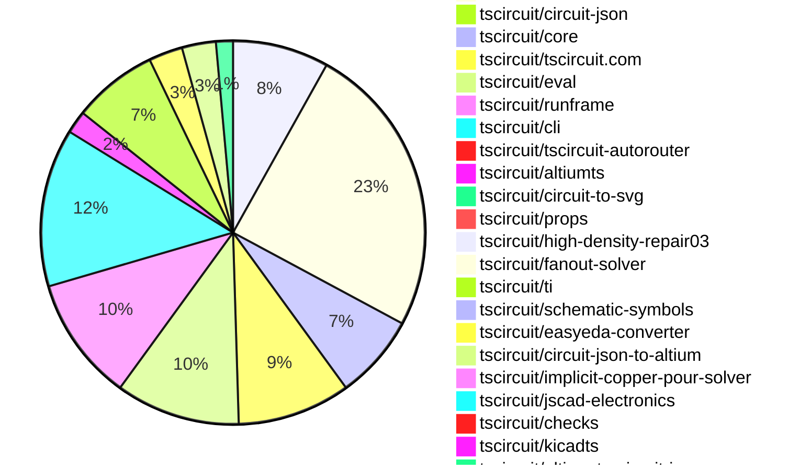

# Contribution Overview 2026-08-25

The current week is shown below. There are 3 major sections:

- [Contributor Overview](#contributor-overview)
- [PRs by Repository](#prs-by-repository)
- [PRs by Contributor](#changes-by-contributor)
- [Scoring & Sponsorship Details](/docs/sponsorship-calculation-explanation.md)

## PRs by Repository

## Contributor Overview

| Contributor | 🐳 Major | 🐙 Minor | 🐌 Tiny | Score | ⭐ |
|-------------|---------|---------|---------|-------|-----|
| [seveibar](#seveibar) | 4 | 5 | 5 | 32 | ⭐⭐ |
| [ShiboSoftwareDev](#ShiboSoftwareDev) | 2 | 3 | 6 | 26 | ⭐⭐ |
| [imrishabh18](#imrishabh18) | 2 | 1 | 7 | 18 | ⭐⭐ |
| [Sang-it](#Sang-it) | 1 | 2 | 10 | 17.5 | ⭐⭐ |
| [tscircuitbot](#tscircuitbot) | 1 | 0 | 145 | 17 | ⭐⭐ |
| [mohan-bee](#mohan-bee) | 1 | 2 | 4 | 14 | ⭐⭐ |
| [MustafaMulla29](#MustafaMulla29) | 2 | 0 | 1 | 10 | ⭐ |
| [rushabhcodes](#rushabhcodes) | 0 | 1 | 2 | 6 | ⭐ |
| [GokulPandi-M](#GokulPandi-M) | 0 | 2 | 1 | 5 | ⭐ |
| [AnasSarkiz](#AnasSarkiz) | 0 | 0 | 5 | 5 | ⭐ |
| [anil08607](#anil08607) | 0 | 2 | 0 | 5 | ⭐ |
| [0hmX](#0hmX) | 0 | 1 | 2 | 4 | ⭐ |
| [mattkanwisher](#mattkanwisher) | 1 | 0 | 0 | 4 | ⭐ |
| [hrithik18k](#hrithik18k) | 0 | 0 | 2 | 2 |  |
| [Abse2001](#Abse2001) | 0 | 1 | 0 | 2 |  |
| [KrishnaX12](#KrishnaX12) | 0 | 0 | 1 | 1 |  |
| [techmannih](#techmannih) | 0 | 0 | 1 | 1 |  |

## Staff Pass Ratio (SPR)

| Contributor | Reviewed PRs | Rejections | Approvals | SPR |
|-------------|--------------|------------|-----------|-----|
| [mohan-bee](#mohan-bee) | 4 | 0 | 4 | 100.0% |
| [MustafaMulla29](#MustafaMulla29) | 3 | 0 | 3 | 100.0% |
| [ShiboSoftwareDev](#ShiboSoftwareDev) | 3 | 0 | 3 | 100.0% |
| [GokulPandi-M](#GokulPandi-M) | 2 | 0 | 2 | 100.0% |
| [0hmX](#0hmX) | 1 | 0 | 1 | 100.0% |
| [Abse2001](#Abse2001) | 1 | 0 | 1 | 100.0% |
| [KrishnaX12](#KrishnaX12) | 1 | 0 | 1 | 100.0% |
| [mattkanwisher](#mattkanwisher) | 1 | 0 | 1 | 100.0% |
| [techmannih](#techmannih) | 1 | 0 | 1 | 100.0% |

mohan-bee SPR PRs (4)

- [#3358](https://github.com/tscircuit/core/pull/3358) reuse schematic box dimensions during port rendering
- [#919](https://github.com/tscircuit/schematic-trace-solver/pull/919) prevent grouped ground rails from crossing between component rows
- [#917](https://github.com/tscircuit/schematic-trace-solver/pull/917) anchor vertical ground labels directly to clear component-side rails
- [#875](https://github.com/tscircuit/schematic-trace-solver/pull/875) prefer shorter endpoint detours for isolated direct traces

MustafaMulla29 SPR PRs (3)

- [#3450](https://github.com/tscircuit/core/pull/3450) Support inline labels on multi-pin signal nets
- [#910](https://github.com/tscircuit/schematic-trace-solver/pull/910) Place opted-in inline labels on multi-pin net connections
- [#879](https://github.com/tscircuit/schematic-trace-solver/pull/879) Align same-net rails without moving labels

ShiboSoftwareDev SPR PRs (3)

- [#3446](https://github.com/tscircuit/core/pull/3446) fix: synchronize fanout exits across named nets
- [#888](https://github.com/tscircuit/schematic-trace-solver/pull/888) Deduplicate schematic routing pairs
- [#71](https://github.com/tscircuit/altiumts/pull/71) Render schematic special-string values

GokulPandi-M SPR PRs (2)

- [#723](https://github.com/tscircuit/circuit-json/pull/723) Add optional schematic pin-label font size
- [#3430](https://github.com/tscircuit/core/pull/3430) Forward schematic pin-label font size to Circuit JSON

0hmX SPR PRs (1)

- [#243](https://github.com/tscircuit/checks/pull/243) fix: detect via copper overlapping pad corners

Abse2001 SPR PRs (1)

- [#5](https://github.com/tscircuit/ti-sysblocks/pull/5) feat: add automotive window module sysblock

KrishnaX12 SPR PRs (1)

- [#30](https://github.com/tscircuit/circuit-json-to-altium/pull/30) fix: preserve schematic clock and inverted pin flags

mattkanwisher SPR PRs (1)

- [#64](https://github.com/tscircuit/kicadts/pull/64) Add KiCad 10.99 PCB syntax support

techmannih SPR PRs (1)

- [#138](https://github.com/tscircuit/ti/pull/138) feat: add rearview mirror reference subcircuits

> Note: AI evaluates PRs and assigns 1-3 star ratings automatically. 4 and 5 star ratings require manual staff review.

## Review Table

[reviews-received-hover]: ## "Number of reviews received for PRs for this contributor"
[approvals-received-hover]: ## "Number of approvals received for PRs this contributor authored"
[rejections-received-hover]: ## "Number of rejections received for PRs this contributor authored"
[prs-opened-hover]: ## "Number of PRs opened by this contributor"
[issues-created-hover]: ## "Number of issues created by this contributor"

| Contributor | Reviews Received | Approvals Received | Rejections Received | Approvals | Rejections Given | PRs Opened | PRs Merged | Issues Created |
|---|---|---|---|---|---|---|---|---|
| [0hmX](#0hmX) | 6 | 1 | 1 | 0 | 0 | 3 | 3 | 0 |
| [Abse2001](#Abse2001) | 8 | 2 | 0 | 0 | 0 | 8 | 1 | 0 |
| [AnasSarkiz](#AnasSarkiz) | 3 | 3 | 0 | 0 | 0 | 5 | 5 | 0 |
| [anil08607](#anil08607) | 3 | 3 | 0 | 1 | 0 | 4 | 2 | 0 |
| [GokulPandi-M](#GokulPandi-M) | 8 | 6 | 1 | 0 | 0 | 4 | 4 | 0 |
| [hrithik18k](#hrithik18k) | 4 | 3 | 0 | 0 | 0 | 5 | 2 | 0 |
| [imrishabh18](#imrishabh18) | 0 | 0 | 0 | 8 | 3 | 14 | 10 | 0 |
| [KrishnaX12](#KrishnaX12) | 5 | 2 | 1 | 0 | 0 | 7 | 1 | 0 |
| [marcos452652258-gif](#marcos452652258-gif) | 0 | 0 | 0 | 0 | 0 | 2 | 0 | 0 |
| [mattkanwisher](#mattkanwisher) | 2 | 1 | 0 | 0 | 0 | 1 | 1 | 0 |
| [mohan-bee](#mohan-bee) | 10 | 8 | 0 | 2 | 0 | 30 | 7 | 0 |
| [MustafaMulla29](#MustafaMulla29) | 3 | 3 | 0 | 2 | 0 | 4 | 3 | 0 |
| [Nitish7016](#Nitish7016) | 0 | 0 | 0 | 0 | 0 | 2 | 0 | 0 |
| [Rodrigoue9](#Rodrigoue9) | 0 | 0 | 0 | 0 | 0 | 28 | 0 | 0 |
| [rushabhcodes](#rushabhcodes) | 15 | 4 | 1 | 2 | 0 | 9 | 3 | 0 |
| [Sang-it](#Sang-it) | 3 | 2 | 0 | 0 | 0 | 17 | 13 | 0 |
| [seveibar](#seveibar) | 2 | 0 | 0 | 29 | 0 | 21 | 15 | 0 |
| [ShayanMuhammad-CS](#ShayanMuhammad-CS) | 0 | 0 | 0 | 0 | 0 | 1 | 0 | 0 |
| [ShiboSoftwareDev](#ShiboSoftwareDev) | 13 | 10 | 0 | 7 | 0 | 30 | 11 | 0 |
| [techmannih](#techmannih) | 4 | 3 | 0 | 0 | 1 | 4 | 2 | 0 |
| [tscircuitbot](#tscircuitbot) | 0 | 0 | 0 | 0 | 0 | 193 | 146 | 0 |

## Changes by Repository

### [tscircuit/schematic-trace-solver](https://github.com/tscircuit/schematic-trace-solver)

| PR # | Impact | Rating | Contributor | Description |
|------|--------|--------|-------------|-------------|
| [#909](https://github.com/tscircuit/schematic-trace-solver/pull/909) | 🐳 Major | ⭐⭐⭐ | tscircuitbot | Generated from 908. Adds a snapshot-only regression test and debugger page for the attached JSON solver input. Workflow run: https:github.comtscircuitschematic-trace-solveractionsruns32943054092 |
| [#888](https://github.com/tscircuit/schematic-trace-solver/pull/888) | 🐳 Major | ⭐⭐⭐ | ShiboSoftwareDev | Deduplicates MSP work by pair ID before adding it to the routing queue, reducing the number of queued entries for the consolidated PMP11282 reproduction from 583 to 203 unique pin pairs, while maintaining existing net metadata and routing order. |
| [#935](https://github.com/tscircuit/schematic-trace-solver/pull/935) | 🐳 Major | ⭐⭐⭐ | imrishabh18 | Fixes the routing of local GND labels for independent capacitor branches to prevent unintended connections between them, ensuring proper electrical isolation and labeling in the schematic. |
| [#875](https://github.com/tscircuit/schematic-trace-solver/pull/875) | 🐳 Major | ⭐⭐⭐ | mohan-bee | Prefer shorter endpoint detours for isolated direct traces without crossing nearby traces. |
| [#910](https://github.com/tscircuit/schematic-trace-solver/pull/910) | 🐳 Major | ⭐⭐⭐ | MustafaMulla29 | Summary try both sides of routed traces and terminal stubs before falling back to anchored labels derive inline placements for opted-in multi-pin nets from solved trace-connected components atomically replace short routed components only when every pin in the component remains represented treat available-net-orientation- traces as generated anchored-label connectors, not routed circuitry, so converted endpoints receive real inline terminal stubs preserve inline terminal rows by moving the row outward when a retained anchored label cannot safely move, with collision checks for labels, traces, components, and text roll back an inline conversion for the whole net only when neither representation can be moved safely exercise the merged DRV8305 motor-driver repro with rats-net rendering hidden  Verification bun run format bun run build 20 focused InlineNetLabelSolver, motor-driver bug-report, and USB regression tests passed the RP2040 Board Headers input produces inline D10SCLKMISOMOSI labels at both endpoints with zero matching anchored labels linked core snapshots confirm the capacitor, section-autolayout, RP2040, repro125, and repro169 duplicate-label cases no longer render both styles  Blast radius The existing USB power repro snapshot is unchanged from main; its high-speed pair remains consistently anchored because a partial inline conversion would overlap the retained peer label. The only existing solver snapshot changed from main is the targeted DRV8305 motor-driver bug report. Production logic contains no circuit-specific net names, component names, pin IDs, or schematic-port IDs. Decisions use generated-trace provenance, connectivity, component-side grouping, and geometric collision checks. |
| [#879](https://github.com/tscircuit/schematic-trace-solver/pull/879) | 🐳 Major | ⭐⭐⭐ | MustafaMulla29 | Aligns same-net rail chains while preserving fixed outward net-label anchors, ensuring that the alignment does not affect the readability or positioning of labels. |
| [#934](https://github.com/tscircuit/schematic-trace-solver/pull/934) | 🐙 Minor | ⭐⭐ | imrishabh18 | Fixes routing symmetry for parallel capacitor rails by aligning downward-facing and upward-facing rails, reusing the outer capacitor column for return branches, and ensuring no additional cross-net intersections are introduced. |
| [#896](https://github.com/tscircuit/schematic-trace-solver/pull/896) | 🐙 Minor | ⭐⭐ | Sang-it | Adds a regression test for isolated routing of a DC power regulator schematic trace and captures the solver output as an SVG snapshot. |
| [#892](https://github.com/tscircuit/schematic-trace-solver/pull/892) | 🐙 Minor | ⭐⭐ | Sang-it | Allows PipelineDebugger pages to opt into hiding the input rats nest, enabling this option for example51. |

🐌 Tiny Contributions (8)

| PR # | Impact | Contributor | Description |
|------|--------|-------------|-------------|
| [#874](https://github.com/tscircuit/schematic-trace-solver/pull/874) | 🐌 Tiny | tscircuitbot | Adds a new bug report for long-distance schematic trace issues, including a test for the SchematicTracePipelineSolver. |
| [#898](https://github.com/tscircuit/schematic-trace-solver/pull/898) | 🐌 Tiny | seveibar | Stacks the graphics-debug view above the circuit-to-svg schematic and updates the combined SVG accessibility label for the topbottom layout. |
| [#887](https://github.com/tscircuit/schematic-trace-solver/pull/887) | 🐌 Tiny | ShiboSoftwareDev | img width581 height261 altScreenshot 2026-08-25 at 11 28 18 PM srchttps:github.comuser-attachmentsassets6c168c7f-b3af-4368-b1d6-dc58147ecb90   Summary add one source-derived PMP11282 isolated DCDC solver input exercise duplicate pair generation, trace routing, and downstream endpoint labels in one test reproduce 583 routing pairs for only 203 unique pin pairs reproduce the default trace budget stopping with 400 pairs still queued use a test-instance-only diagnostic budget to reach and capture the downstream output: 107 labels, including 81 endpoint-pair labels across 63 generated net IDs check in one repository-standard semantic SVG snapshot of the complete case This is the single reproduction-only PR for the PMP11282 solver case. It does not modify production solver behavior or contain a hand-authored SVG. |
| [#933](https://github.com/tscircuit/schematic-trace-solver/pull/933) | 🐌 Tiny | imrishabh18 | Reproduces the MSPM0L1306 reference circuit with normalized IDs and display metadata for a standalone solver fixture, capturing the capacitor rail configuration and ensuring proper alignment for VDDVSS junctions. |
| [#930](https://github.com/tscircuit/schematic-trace-solver/pull/930) | 🐌 Tiny | imrishabh18 | Reproduces a bug where the global GND spanning tree creates redundant ground branches instead of the explicit connection in the PGA300 circuit. |
| [#886](https://github.com/tscircuit/schematic-trace-solver/pull/886) | 🐌 Tiny | mohan-bee | Refreshes the U1 switch detour snapshot in the schematic trace solver. |
| [#936](https://github.com/tscircuit/schematic-trace-solver/pull/936) | 🐌 Tiny | techmannih | Removes component names, port labels, and pin numbers from the semantic schematic view in solver snapshots to reduce visual clutter. |
| [#894](https://github.com/tscircuit/schematic-trace-solver/pull/894) | 🐌 Tiny | Sang-it | Reproduces a bug where J4 taps could be connected but are not, by isolating the TIDA-00553 R26-R29 VFB divider and J4 cell-count selector, capturing erroneous fallback labels, and consolidating tests. |

### [tscircuit/tscircuit](https://github.com/tscircuit/tscircuit)

🐌 Tiny Contributions (52)

| PR # | Impact | Contributor | Description |
|------|--------|-------------|-------------|
| [#4733](https://github.com/tscircuit/tscircuit/pull/4733) | 🐌 Tiny | tscircuitbot | Automated package update |
| [#4732](https://github.com/tscircuit/tscircuit/pull/4732) | 🐌 Tiny | tscircuitbot | Automated package update |
| [#4731](https://github.com/tscircuit/tscircuit/pull/4731) | 🐌 Tiny | tscircuitbot | Automated package update |
| [#4730](https://github.com/tscircuit/tscircuit/pull/4730) | 🐌 Tiny | tscircuitbot | Automated package update |
| [#4729](https://github.com/tscircuit/tscircuit/pull/4729) | 🐌 Tiny | tscircuitbot | Automated package update |
| [#4728](https://github.com/tscircuit/tscircuit/pull/4728) | 🐌 Tiny | tscircuitbot | Automated package update |
| [#4727](https://github.com/tscircuit/tscircuit/pull/4727) | 🐌 Tiny | tscircuitbot | Automated package update |
| [#4726](https://github.com/tscircuit/tscircuit/pull/4726) | 🐌 Tiny | tscircuitbot | Automated package update |
| [#4725](https://github.com/tscircuit/tscircuit/pull/4725) | 🐌 Tiny | tscircuitbot | Automated package update |
| [#4724](https://github.com/tscircuit/tscircuit/pull/4724) | 🐌 Tiny | tscircuitbot | Automated package update |
| [#4723](https://github.com/tscircuit/tscircuit/pull/4723) | 🐌 Tiny | tscircuitbot | Automated package update |
| [#4722](https://github.com/tscircuit/tscircuit/pull/4722) | 🐌 Tiny | tscircuitbot | Automated package update |
| [#4721](https://github.com/tscircuit/tscircuit/pull/4721) | 🐌 Tiny | tscircuitbot | Automated package update |
| [#4720](https://github.com/tscircuit/tscircuit/pull/4720) | 🐌 Tiny | tscircuitbot | Automated package update |
| [#4719](https://github.com/tscircuit/tscircuit/pull/4719) | 🐌 Tiny | tscircuitbot | Automated package update |
| [#4718](https://github.com/tscircuit/tscircuit/pull/4718) | 🐌 Tiny | tscircuitbot | Automated package update |
| [#4717](https://github.com/tscircuit/tscircuit/pull/4717) | 🐌 Tiny | tscircuitbot | Updates the package version from 0.0.2439 to 0.0.2440 in package.json |
| [#4716](https://github.com/tscircuit/tscircuit/pull/4716) | 🐌 Tiny | tscircuitbot | Automated package update |
| [#4715](https://github.com/tscircuit/tscircuit/pull/4715) | 🐌 Tiny | tscircuitbot | Automated package update to version 0.0.2439 |
| [#4714](https://github.com/tscircuit/tscircuit/pull/4714) | 🐌 Tiny | tscircuitbot | Automated package update |
| [#4713](https://github.com/tscircuit/tscircuit/pull/4713) | 🐌 Tiny | tscircuitbot | Automated package update |
| [#4712](https://github.com/tscircuit/tscircuit/pull/4712) | 🐌 Tiny | tscircuitbot | Automated package update |
| [#4711](https://github.com/tscircuit/tscircuit/pull/4711) | 🐌 Tiny | tscircuitbot | Automated package update |
| [#4710](https://github.com/tscircuit/tscircuit/pull/4710) | 🐌 Tiny | tscircuitbot | Automated package update |
| [#4709](https://github.com/tscircuit/tscircuit/pull/4709) | 🐌 Tiny | tscircuitbot | Automated package update to version 0.0.2436 |
| [#4708](https://github.com/tscircuit/tscircuit/pull/4708) | 🐌 Tiny | tscircuitbot | Updates the version of tscircuitcore from 0.0.1765 to 0.0.1766 and circuit-json from 0.0.475 to 0.0.476 in package.json |
| [#4707](https://github.com/tscircuit/tscircuit/pull/4707) | 🐌 Tiny | tscircuitbot | Automated package update |
| [#4706](https://github.com/tscircuit/tscircuit/pull/4706) | 🐌 Tiny | tscircuitbot | Updates the tscircuitcli package from version 0.1.2007 to 0.1.2008 and the tscircuitrunframe package from version 0.0.2559 to 0.0.2560 in package.json |
| [#4705](https://github.com/tscircuit/tscircuit/pull/4705) | 🐌 Tiny | tscircuitbot | Automated package update |
| [#4704](https://github.com/tscircuit/tscircuit/pull/4704) | 🐌 Tiny | tscircuitbot | Updates the tscircuiteval package version from 0.0.1276 to 0.0.1277 in package.json |
| [#4703](https://github.com/tscircuit/tscircuit/pull/4703) | 🐌 Tiny | tscircuitbot | Automated package update |
| [#4702](https://github.com/tscircuit/tscircuit/pull/4702) | 🐌 Tiny | tscircuitbot | Automated package update |
| [#4701](https://github.com/tscircuit/tscircuit/pull/4701) | 🐌 Tiny | tscircuitbot | Automated package update to version 0.0.2432 |
| [#4700](https://github.com/tscircuit/tscircuit/pull/4700) | 🐌 Tiny | tscircuitbot | Automated package update |
| [#4699](https://github.com/tscircuit/tscircuit/pull/4699) | 🐌 Tiny | tscircuitbot | Updates the package version from 0.0.2430 to 0.0.2431 in package.json |
| [#4698](https://github.com/tscircuit/tscircuit/pull/4698) | 🐌 Tiny | tscircuitbot | Automated package update |
| [#4697](https://github.com/tscircuit/tscircuit/pull/4697) | 🐌 Tiny | tscircuitbot | Automated package update |
| [#4696](https://github.com/tscircuit/tscircuit/pull/4696) | 🐌 Tiny | tscircuitbot | Updates the tscircuitcli package from version 0.1.2003 to 0.1.2005 |
| [#4695](https://github.com/tscircuit/tscircuit/pull/4695) | 🐌 Tiny | tscircuitbot | Automated package update |
| [#4694](https://github.com/tscircuit/tscircuit/pull/4694) | 🐌 Tiny | tscircuitbot | Automated package update |
| [#4692](https://github.com/tscircuit/tscircuit/pull/4692) | 🐌 Tiny | tscircuitbot | Automated package update |
| [#4691](https://github.com/tscircuit/tscircuit/pull/4691) | 🐌 Tiny | tscircuitbot | Automated package update |
| [#4690](https://github.com/tscircuit/tscircuit/pull/4690) | 🐌 Tiny | tscircuitbot | Automated package update |
| [#4689](https://github.com/tscircuit/tscircuit/pull/4689) | 🐌 Tiny | tscircuitbot | Updates the tscircuitcli package to version 0.1.2002 in the package.json file |
| [#4688](https://github.com/tscircuit/tscircuit/pull/4688) | 🐌 Tiny | tscircuitbot | Automated package update to version 0.0.2426 |
| [#4687](https://github.com/tscircuit/tscircuit/pull/4687) | 🐌 Tiny | tscircuitbot | Automated package update |
| [#4686](https://github.com/tscircuit/tscircuit/pull/4686) | 🐌 Tiny | tscircuitbot | Automated package update to version 0.0.2425 |
| [#4685](https://github.com/tscircuit/tscircuit/pull/4685) | 🐌 Tiny | tscircuitbot | Automated package update |
| [#4684](https://github.com/tscircuit/tscircuit/pull/4684) | 🐌 Tiny | tscircuitbot | Automated package update |
| [#4683](https://github.com/tscircuit/tscircuit/pull/4683) | 🐌 Tiny | tscircuitbot | Automated package update |
| [#4682](https://github.com/tscircuit/tscircuit/pull/4682) | 🐌 Tiny | tscircuitbot | Automated package update |
| [#4681](https://github.com/tscircuit/tscircuit/pull/4681) | 🐌 Tiny | tscircuitbot | Automated package update |

### [tscircuit/circuit-json](https://github.com/tscircuit/circuit-json)

| PR # | Impact | Rating | Contributor | Description |
|------|--------|--------|-------------|-------------|
| [#723](https://github.com/tscircuit/circuit-json/pull/723) | 🐙 Minor | ⭐⭐ | GokulPandi-M | Adds an optional display_pin_label_font_size field to schematic_port, allowing for per-port font size adjustments for pin labels without affecting the entire symbol. |

🐌 Tiny Contributions (1)

| PR # | Impact | Contributor | Description |
|------|--------|-------------|-------------|
| [#729](https://github.com/tscircuit/circuit-json/pull/729) | 🐌 Tiny | tscircuitbot | Automated package update |

### [tscircuit/core](https://github.com/tscircuit/core)

| PR # | Impact | Rating | Contributor | Description |
|------|--------|--------|-------------|-------------|
| [#3446](https://github.com/tscircuit/core/pull/3446) | 🐳 Major | ⭐⭐⭐ | ShiboSoftwareDev | Fixes synchronization of fanout exits across named nets to ensure proper routing connections and continuity assertions in PCB designs. |
| [#3430](https://github.com/tscircuit/core/pull/3430) | 🐙 Minor | ⭐⭐ | GokulPandi-M | Carries the optional per-port schPinLabelFontSize prop into schematic_port.display_pin_label_font_size as a precise numeric Circuit JSON value. |
| [#3440](https://github.com/tscircuit/core/pull/3440) | 🐙 Minor | ⭐⭐ | seveibar | Add an 8 mm phase-local maxLengthSkew constraint to AM62L DDR BYTE0 and verify the constraint in fanout phases while maintaining clean routing DRC. |
| [#3438](https://github.com/tscircuit/core/pull/3438) | 🐙 Minor | ⭐⭐ | seveibar | Maps schSize variants sm and xs to compact passive symbols for resistors and capacitors, preserving existing styles and behaviors. |
| [#3448](https://github.com/tscircuit/core/pull/3448) | 🐙 Minor | ⭐⭐ | mohan-bee | Adds ground metadata to the schematic trace solver input problem to identify ground nets in circuit schematics. |
| [#3358](https://github.com/tscircuit/core/pull/3358) | 🐙 Minor | ⭐⭐ | mohan-bee | Reduces rendering time by caching schematic box dimensions for large-pin-count components, improving performance in SchematicPortRender. |

🐌 Tiny Contributions (9)

| PR # | Impact | Contributor | Description |
|------|--------|-------------|-------------|
| [#3425](https://github.com/tscircuit/core/pull/3425) | 🐌 Tiny | tscircuitbot | Updates the tscircuitchecks package from version 0.0.170 to 0.0.171 in the package.json file. |
| [#3437](https://github.com/tscircuit/core/pull/3437) | 🐌 Tiny | seveibar | Updates the tscircuitcapacity-autorouter package from version 0.0.844 to 0.0.845, addressing GNDVBAT accidental contact and via-to-X1-pad clearance issues in the nRF52810 repro. |
| [#3434](https://github.com/tscircuit/core/pull/3434) | 🐌 Tiny | seveibar | Updates routing dependencies to incorporate fixes and improvements from related repositories, ensuring Core consumes the latest enhancements for autorouting and copper pour functionalities. |
| [#3445](https://github.com/tscircuit/core/pull/3445) | 🐌 Tiny | ShiboSoftwareDev | Reproduces a bug where disconnected fanout net handoff occurs during autorouting, with a test case to demonstrate the issue. |
| [#3452](https://github.com/tscircuit/core/pull/3452) | 🐌 Tiny | imrishabh18 | Updates the tscircuitschematic-trace-solver package from version 0.0.158 to 0.0.159, ensuring compatibility with existing configurations and preserving the no-lockfile policy. |
| [#3451](https://github.com/tscircuit/core/pull/3451) | 🐌 Tiny | imrishabh18 | Bump tscircuitschematic-trace-solver from 0.0.156 to 0.0.158, the latest published npm release verified on 2026-08-26. |
| [#3443](https://github.com/tscircuit/core/pull/3443) | 🐌 Tiny | mohan-bee | Updates the version of the schematic-symbols dependency from 0.0.242 to 0.0.243 in package.json |
| [#3432](https://github.com/tscircuit/core/pull/3432) | 🐌 Tiny | mohan-bee | Updates the version of the schematic-trace-solver dependency from 0.0.153 to 0.0.156 in the package.json file. |
| [#3444](https://github.com/tscircuit/core/pull/3444) | 🐌 Tiny | MustafaMulla29 | Add the complete TIDA-01330 DRV8305 motor-driver schematic as one self-contained test file and reproduce remote signal nets rendering as anchored tags instead of inline trace labels. |

### [tscircuit/tscircuit.com](https://github.com/tscircuit/tscircuit.com)

🐌 Tiny Contributions (20)

| PR # | Impact | Contributor | Description |
|------|--------|-------------|-------------|
| [#4615](https://github.com/tscircuit/tscircuit.com/pull/4615) | 🐌 Tiny | tscircuitbot | Updates the tscircuitrunframe package from version 0.0.2563 to 0.0.2566 |
| [#4614](https://github.com/tscircuit/tscircuit.com/pull/4614) | 🐌 Tiny | tscircuitbot | Updates the tscircuiteval package from version 0.0.1282 to 0.0.1283 in the package.json file. |
| [#4612](https://github.com/tscircuit/tscircuit.com/pull/4612) | 🐌 Tiny | tscircuitbot | Updates the tscircuiteval package from version 0.0.1281 to 0.0.1282 |
| [#4610](https://github.com/tscircuit/tscircuit.com/pull/4610) | 🐌 Tiny | tscircuitbot | Updates the tscircuiteval package from version 0.0.1280 to 0.0.1281 |
| [#4608](https://github.com/tscircuit/tscircuit.com/pull/4608) | 🐌 Tiny | tscircuitbot | Updates the tscircuitrunframe package from version 0.0.2562 to 0.0.2563 |
| [#4607](https://github.com/tscircuit/tscircuit.com/pull/4607) | 🐌 Tiny | tscircuitbot | Updates the tscircuiteval package from version 0.0.1279 to 0.0.1280 |
| [#4606](https://github.com/tscircuit/tscircuit.com/pull/4606) | 🐌 Tiny | tscircuitbot | Automated package update |
| [#4605](https://github.com/tscircuit/tscircuit.com/pull/4605) | 🐌 Tiny | tscircuitbot | Updates the tscircuiteval package from version 0.0.1278 to 0.0.1279 |
| [#4604](https://github.com/tscircuit/tscircuit.com/pull/4604) | 🐌 Tiny | tscircuitbot | Updates the tscircuitrunframe package from version 0.0.2560 to 0.0.2561 |
| [#4603](https://github.com/tscircuit/tscircuit.com/pull/4603) | 🐌 Tiny | tscircuitbot | Updates the tscircuiteval package from version 0.0.1277 to 0.0.1278 |
| [#4602](https://github.com/tscircuit/tscircuit.com/pull/4602) | 🐌 Tiny | tscircuitbot | Automated package update |
| [#4601](https://github.com/tscircuit/tscircuit.com/pull/4601) | 🐌 Tiny | tscircuitbot | Updates the tscircuiteval package from version 0.0.1276 to 0.0.1277 |
| [#4600](https://github.com/tscircuit/tscircuit.com/pull/4600) | 🐌 Tiny | tscircuitbot | Automated package update for tscircuitrunframe from version 0.0.2558 to 0.0.2559 |
| [#4599](https://github.com/tscircuit/tscircuit.com/pull/4599) | 🐌 Tiny | tscircuitbot | Updates the version of the tscircuiteval package from 0.0.1275 to 0.0.1276 |
| [#4598](https://github.com/tscircuit/tscircuit.com/pull/4598) | 🐌 Tiny | tscircuitbot | Automated package update |
| [#4597](https://github.com/tscircuit/tscircuit.com/pull/4597) | 🐌 Tiny | tscircuitbot | Updates the tscircuiteval package from version 0.0.1274 to 0.0.1275 |
| [#4596](https://github.com/tscircuit/tscircuit.com/pull/4596) | 🐌 Tiny | tscircuitbot | Updates the tscircuitrunframe package from version 0.0.2556 to 0.0.2557 |
| [#4595](https://github.com/tscircuit/tscircuit.com/pull/4595) | 🐌 Tiny | tscircuitbot | Updates the tscircuiteval package from version 0.0.1273 to 0.0.1274 |
| [#4594](https://github.com/tscircuit/tscircuit.com/pull/4594) | 🐌 Tiny | tscircuitbot | Automated package update |
| [#4593](https://github.com/tscircuit/tscircuit.com/pull/4593) | 🐌 Tiny | tscircuitbot | Updates the tscircuiteval package from version 0.0.1272 to 0.0.1273 in the package.json file. |

### [tscircuit/eval](https://github.com/tscircuit/eval)

🐌 Tiny Contributions (22)

| PR # | Impact | Contributor | Description |
|------|--------|-------------|-------------|
| [#4170](https://github.com/tscircuit/eval/pull/4170) | 🐌 Tiny | tscircuitbot | Automated package update |
| [#4169](https://github.com/tscircuit/eval/pull/4169) | 🐌 Tiny | tscircuitbot | Automated package update |
| [#4167](https://github.com/tscircuit/eval/pull/4167) | 🐌 Tiny | tscircuitbot | Automated package update |
| [#4166](https://github.com/tscircuit/eval/pull/4166) | 🐌 Tiny | tscircuitbot | Automated package update |
| [#4164](https://github.com/tscircuit/eval/pull/4164) | 🐌 Tiny | tscircuitbot | Automated package update |
| [#4163](https://github.com/tscircuit/eval/pull/4163) | 🐌 Tiny | tscircuitbot | Automated package update |
| [#4161](https://github.com/tscircuit/eval/pull/4161) | 🐌 Tiny | tscircuitbot | Automated package update |
| [#4160](https://github.com/tscircuit/eval/pull/4160) | 🐌 Tiny | tscircuitbot | Automated package update |
| [#4158](https://github.com/tscircuit/eval/pull/4158) | 🐌 Tiny | tscircuitbot | Automated package update |
| [#4157](https://github.com/tscircuit/eval/pull/4157) | 🐌 Tiny | tscircuitbot | Automated package update |
| [#4155](https://github.com/tscircuit/eval/pull/4155) | 🐌 Tiny | tscircuitbot | Automated package update |
| [#4154](https://github.com/tscircuit/eval/pull/4154) | 🐌 Tiny | tscircuitbot | Automated package update |
| [#4152](https://github.com/tscircuit/eval/pull/4152) | 🐌 Tiny | tscircuitbot | Automated package update |
| [#4151](https://github.com/tscircuit/eval/pull/4151) | 🐌 Tiny | tscircuitbot | Automated package update |
| [#4144](https://github.com/tscircuit/eval/pull/4144) | 🐌 Tiny | tscircuitbot | Automated package update |
| [#4143](https://github.com/tscircuit/eval/pull/4143) | 🐌 Tiny | tscircuitbot | Automated package update |
| [#4140](https://github.com/tscircuit/eval/pull/4140) | 🐌 Tiny | tscircuitbot | Automated package update to version 0.0.1275 |
| [#4139](https://github.com/tscircuit/eval/pull/4139) | 🐌 Tiny | tscircuitbot | Automated package update |
| [#4136](https://github.com/tscircuit/eval/pull/4136) | 🐌 Tiny | tscircuitbot | Automated package update |
| [#4135](https://github.com/tscircuit/eval/pull/4135) | 🐌 Tiny | tscircuitbot | Updates the versions of several dependencies in the package.json file. |
| [#4133](https://github.com/tscircuit/eval/pull/4133) | 🐌 Tiny | tscircuitbot | Automated package update |
| [#4132](https://github.com/tscircuit/eval/pull/4132) | 🐌 Tiny | tscircuitbot | Automated package update |

### [tscircuit/runframe](https://github.com/tscircuit/runframe)

🐌 Tiny Contributions (22)

| PR # | Impact | Contributor | Description |
|------|--------|-------------|-------------|
| [#4771](https://github.com/tscircuit/runframe/pull/4771) | 🐌 Tiny | tscircuitbot | Automated package update |
| [#4770](https://github.com/tscircuit/runframe/pull/4770) | 🐌 Tiny | tscircuitbot | Updates the tscircuiteval package to version 0.0.1283 in the package.json file. |
| [#4769](https://github.com/tscircuit/runframe/pull/4769) | 🐌 Tiny | tscircuitbot | Automated package update |
| [#4768](https://github.com/tscircuit/runframe/pull/4768) | 🐌 Tiny | tscircuitbot | Updates the tscircuiteval package from version 0.0.1281 to 0.0.1282 in the package.json file. |
| [#4767](https://github.com/tscircuit/runframe/pull/4767) | 🐌 Tiny | tscircuitbot | Automated package update |
| [#4766](https://github.com/tscircuit/runframe/pull/4766) | 🐌 Tiny | tscircuitbot | Updates the tscircuiteval package to version 0.0.1281 in the package.json file. |
| [#4765](https://github.com/tscircuit/runframe/pull/4765) | 🐌 Tiny | tscircuitbot | Automated package update |
| [#4764](https://github.com/tscircuit/runframe/pull/4764) | 🐌 Tiny | tscircuitbot | Updates the tscircuiteval package to version 0.0.1280 in the package.json file. |
| [#4763](https://github.com/tscircuit/runframe/pull/4763) | 🐌 Tiny | tscircuitbot | Automated package update |
| [#4762](https://github.com/tscircuit/runframe/pull/4762) | 🐌 Tiny | tscircuitbot | Updates the tscircuiteval package from version 0.0.1278 to 0.0.1279 in the package.json file. |
| [#4761](https://github.com/tscircuit/runframe/pull/4761) | 🐌 Tiny | tscircuitbot | Automated package update |
| [#4760](https://github.com/tscircuit/runframe/pull/4760) | 🐌 Tiny | tscircuitbot | Updates the tscircuiteval package from version 0.0.1277 to 0.0.1278 in the package.json file. |
| [#4759](https://github.com/tscircuit/runframe/pull/4759) | 🐌 Tiny | tscircuitbot | Automated package update |
| [#4758](https://github.com/tscircuit/runframe/pull/4758) | 🐌 Tiny | tscircuitbot | Updates the tscircuiteval package from version 0.0.1276 to 0.0.1277 in the package.json file. |
| [#4757](https://github.com/tscircuit/runframe/pull/4757) | 🐌 Tiny | tscircuitbot | Automated package update |
| [#4756](https://github.com/tscircuit/runframe/pull/4756) | 🐌 Tiny | tscircuitbot | Automated package update |
| [#4755](https://github.com/tscircuit/runframe/pull/4755) | 🐌 Tiny | tscircuitbot | Automated package update |
| [#4754](https://github.com/tscircuit/runframe/pull/4754) | 🐌 Tiny | tscircuitbot | Updates the tscircuiteval package from version 0.0.1274 to 0.0.1275 in the package.json file. |
| [#4753](https://github.com/tscircuit/runframe/pull/4753) | 🐌 Tiny | tscircuitbot | Automated package update |
| [#4752](https://github.com/tscircuit/runframe/pull/4752) | 🐌 Tiny | tscircuitbot | Updates the tscircuiteval package from version 0.0.1273 to 0.0.1274 in the package.json file. |
| [#4751](https://github.com/tscircuit/runframe/pull/4751) | 🐌 Tiny | tscircuitbot | Automated package update |
| [#4750](https://github.com/tscircuit/runframe/pull/4750) | 🐌 Tiny | tscircuitbot | Automated package update |

### [tscircuit/cli](https://github.com/tscircuit/cli)

| PR # | Impact | Rating | Contributor | Description |
|------|--------|--------|-------------|-------------|
| [#4484](https://github.com/tscircuit/cli/pull/4484) | 🐙 Minor | ⭐⭐ | seveibar | Fixes the issue where custom project configurations could erase built-in footprint resolvers and other default settings, ensuring that defaults are preserved unless explicitly overridden by the project. |
| [#4480](https://github.com/tscircuit/cli/pull/4480) | 🐙 Minor | ⭐⭐ | seveibar | Preserves explicit .ts.tsx imports during library transpilation by enabling TypeScript 5.7 relative-extension rewriting and retaining fallback for older TypeScript versions. |

🐌 Tiny Contributions (26)

| PR # | Impact | Contributor | Description |
|------|--------|-------------|-------------|
| [#4499](https://github.com/tscircuit/cli/pull/4499) | 🐌 Tiny | tscircuitbot | Automated package update |
| [#4498](https://github.com/tscircuit/cli/pull/4498) | 🐌 Tiny | tscircuitbot | Updates the tscircuitrunframe package from version 0.0.2565 to 0.0.2566 |
| [#4497](https://github.com/tscircuit/cli/pull/4497) | 🐌 Tiny | tscircuitbot | Automated package update |
| [#4496](https://github.com/tscircuit/cli/pull/4496) | 🐌 Tiny | tscircuitbot | Updates the tscircuitrunframe package from version 0.0.2564 to 0.0.2565 |
| [#4495](https://github.com/tscircuit/cli/pull/4495) | 🐌 Tiny | tscircuitbot | Automated package update |
| [#4494](https://github.com/tscircuit/cli/pull/4494) | 🐌 Tiny | tscircuitbot | Updates the tscircuitrunframe package from version 0.0.2563 to 0.0.2564 |
| [#4493](https://github.com/tscircuit/cli/pull/4493) | 🐌 Tiny | tscircuitbot | Automated package update |
| [#4492](https://github.com/tscircuit/cli/pull/4492) | 🐌 Tiny | tscircuitbot | Updates the tscircuitrunframe package from version 0.0.2562 to 0.0.2563 |
| [#4491](https://github.com/tscircuit/cli/pull/4491) | 🐌 Tiny | tscircuitbot | Automated package update |
| [#4490](https://github.com/tscircuit/cli/pull/4490) | 🐌 Tiny | tscircuitbot | Updates the tscircuitrunframe package from version 0.0.2561 to 0.0.2562 |
| [#4489](https://github.com/tscircuit/cli/pull/4489) | 🐌 Tiny | tscircuitbot | Automated package update |
| [#4488](https://github.com/tscircuit/cli/pull/4488) | 🐌 Tiny | tscircuitbot | Updates the tscircuitrunframe package from version 0.0.2560 to 0.0.2561 |
| [#4487](https://github.com/tscircuit/cli/pull/4487) | 🐌 Tiny | tscircuitbot | Automated package update |
| [#4486](https://github.com/tscircuit/cli/pull/4486) | 🐌 Tiny | tscircuitbot | Updates the tscircuitrunframe package to version 0.0.2560 in the package.json file |
| [#4485](https://github.com/tscircuit/cli/pull/4485) | 🐌 Tiny | tscircuitbot | Automated package update |
| [#4482](https://github.com/tscircuit/cli/pull/4482) | 🐌 Tiny | tscircuitbot | Updates the tscircuitrunframe package version from 0.0.2558 to 0.0.2559 in package.json |
| [#4481](https://github.com/tscircuit/cli/pull/4481) | 🐌 Tiny | tscircuitbot | Automated package update |
| [#4477](https://github.com/tscircuit/cli/pull/4477) | 🐌 Tiny | tscircuitbot | Automated package update |
| [#4476](https://github.com/tscircuit/cli/pull/4476) | 🐌 Tiny | tscircuitbot | Updates the tscircuitrunframe package version from 0.0.2557 to 0.0.2558 in package.json |
| [#4475](https://github.com/tscircuit/cli/pull/4475) | 🐌 Tiny | tscircuitbot | Automated package update |
| [#4473](https://github.com/tscircuit/cli/pull/4473) | 🐌 Tiny | tscircuitbot | Automated package update |
| [#4472](https://github.com/tscircuit/cli/pull/4472) | 🐌 Tiny | tscircuitbot | Automated package update |
| [#4471](https://github.com/tscircuit/cli/pull/4471) | 🐌 Tiny | tscircuitbot | Automated package update |
| [#4470](https://github.com/tscircuit/cli/pull/4470) | 🐌 Tiny | tscircuitbot | Updates the tscircuitrunframe package to version 0.0.2556 |
| [#4478](https://github.com/tscircuit/cli/pull/4478) | 🐌 Tiny | AnasSarkiz | Updates the easyeda dependency from version 0.0.331 to 0.0.337, including native schematic symbols for two-pin resistors and capacitors while retaining custom symbols for multi-pin capacitor arrays. |
| [#4474](https://github.com/tscircuit/cli/pull/4474) | 🐌 Tiny | imrishabh18 | Increases the default build worker timeout from 5 minutes to 10 minutes while preserving project configuration and overrides for TSCIRCUIT_BUILD_WORKER_TIMEOUT_MS. |

### [tscircuit/tscircuit-autorouter](https://github.com/tscircuit/tscircuit-autorouter)

| PR # | Impact | Rating | Contributor | Description |
|------|--------|--------|-------------|-------------|
| [#2230](https://github.com/tscircuit/tscircuit-autorouter/pull/2230) | 🐳 Major | ⭐⭐⭐ | seveibar | Summary pin high-density-repair03 PR 82 so the connectivity map is authoritative when exact DRC resolves electrical nets add the complete nRF52810 Pipeline7 fixture plus the historical bad exact-geometry candidate assert that the fixed exact stage keeps the two real inherited issues, introduces neither the GNDVBAT contact nor the X1 via-pad violation, and emits no new post-power DRC identities add a three-panel reviewer-visible SVG: safe exact input, historical bad candidate, fixed exact output refresh only three existing route snapshots whose output actually changes under the fix  Root cause Pipeline7 exact DRC resolved a routed trace to a generated connectivity-net id but could resolve a connected raw PCB port to a point-pair alias. The same electrical net then compared unequal, inflating the exact DRC inventory and steering repair toward a lower-count candidate that introduced two real violations. The newer connectivity-monotone power expander stopped incidentally repairing that unsafe candidate, which exposed the defect in the nRF52810 snapshot. This does not add an output-blocking gate. The fix corrects the DRC input classification before candidate selection.  Snapshot review bugreport99: focused visual explicitly marks the historical GNDVBAT contact and X1 via-pad hotspot between safe input and fixed output bugreport44: one via is placed on the shorter valid candidate; the same single pre-existing via-pad error remains bugreport89 and bugreport92: identical SRJs remain reference-DRC-clean, with 37 traces and 18 vias; routed length changes by only 0.12 percent six other local Darwin snapshot mismatches were byte-identical between the old and fixed dependency and were intentionally left out of this PR  Validation focused nRF and neighboring Pipeline7 DRC suite: 7 pass, 46 assertions reviewed snapshot set: 4 pass, 15 assertions bunx tsc --noEmit bun run build bun run format:check git diff --check high-density-repair03: 83 pass, 0 fail capacity full run before selective snapshot refresh: 569 pass, 60 skip; nine visual mismatches, with three attributable and refreshed here and six proven unrelated by oldfixed byte comparison Depends on https:github.comtscircuithigh-density-repair03pull82 |

🐌 Tiny Contributions (1)

| PR # | Impact | Contributor | Description |
|------|--------|-------------|-------------|
| [#2231](https://github.com/tscircuit/tscircuit-autorouter/pull/2231) | 🐌 Tiny | tscircuitbot | Automated package update |

### [tscircuit/altiumts](https://github.com/tscircuit/altiumts)

| PR # | Impact | Rating | Contributor | Description |
|------|--------|--------|-------------|-------------|
| [#75](https://github.com/tscircuit/altiumts/pull/75) | 🐙 Minor | ⭐⭐ | ShiboSoftwareDev | Render PCB records using Altium Designers default Layer Drawing Order categories, allowing for accurate representation of PCB layers in SVG format. |
| [#71](https://github.com/tscircuit/altiumts/pull/71) | 🐙 Minor | ⭐⭐ | ShiboSoftwareDev | Resolves Altium schematic special strings to their actual values during rendering, ensuring that valid strings like DocumentName and ProjectRevision display their corresponding values instead of the literal strings. |

🐌 Tiny Contributions (2)

| PR # | Impact | Contributor | Description |
|------|--------|-------------|-------------|
| [#74](https://github.com/tscircuit/altiumts/pull/74) | 🐌 Tiny | tscircuitbot | Automated package update |
| [#73](https://github.com/tscircuit/altiumts/pull/73) | 🐌 Tiny | ShiboSoftwareDev | Renders schematic clock and inversion pin symbols in Altium, addressing previously ignored SVG fields for accurate representation. |

### [tscircuit/circuit-to-svg](https://github.com/tscircuit/circuit-to-svg)

🐌 Tiny Contributions (1)

| PR # | Impact | Contributor | Description |
|------|--------|-------------|-------------|
| [#686](https://github.com/tscircuit/circuit-to-svg/pull/686) | 🐌 Tiny | GokulPandi-M | Uses the optional numeric schematic_port.display_pin_label_font_size value when rendering schematic pin labels, allowing for precise font size adjustments for crowded imported symbols without altering the symbol or adding collision heuristics. |

### [tscircuit/props](https://github.com/tscircuit/props)

| PR # | Impact | Rating | Contributor | Description |
|------|--------|--------|-------------|-------------|
| [#816](https://github.com/tscircuit/props/pull/816) | 🐳 Major | ⭐⭐⭐ | seveibar | Proposes an additive way to describe castellated holes directly in a board  outline. |

### [tscircuit/high-density-repair03](https://github.com/tscircuit/high-density-repair03)

| PR # | Impact | Rating | Contributor | Description |
|------|--------|--------|-------------|-------------|
| [#82](https://github.com/tscircuit/high-density-repair03/pull/82) | 🐳 Major | ⭐⭐⭐ | seveibar | Fixes DRC net canonicalization issues by treating injected connectivity map net IDs as authoritative, preventing misclassification of connected trace and pad copper as different nets. |

### [tscircuit/fanout-solver](https://github.com/tscircuit/fanout-solver)

| PR # | Impact | Rating | Contributor | Description |
|------|--------|--------|-------------|-------------|
| [#95](https://github.com/tscircuit/fanout-solver/pull/95) | 🐳 Major | ⭐⭐⭐ | seveibar | Summary honor bus maxLengthSkew as a hard fanout constraint add straight45-degree meanders after the dense pad escape without changing endpoints or vias apply matching atomically to complete normal and grouped-beam route candidates reject impossible constraints instead of emitting a skew violation validate declared plan lengths, final bus skew, unsupported plane termination, and invalid inputs add synthetic and captured AM62L visual regressions  Why Core already forwards maxLengthSkew into fanout phases, but the solver previously dropped it. This adds a native fanout-aware matcher so the existing one-via escape topology and exact DRC checks remain authoritative. I evaluated tscircuitlength-matching-solver, but did not add it as a dependency: its current package is unpublished and its public API is differential-pairHD-route oriented rather than an atomic multi-member fanout-bus API.  Snapshots Captured AM62L SOC BYTE1 fanout, matched from 9.611899 mm to 8.499999 mm phase-local skew: !AM62L SOC length matching(https:github.comtscircuitfanout-solverblobfeatfanout-length-matchingtests__snapshots__am62l-soc-length-matching.snap.svg?raw1) Compact synthetic regression, matched from 1.112 mm to at most 0.25 mm: !Length-matched fanout(https:github.comtscircuitfanout-solverblobfeatfanout-length-matchingtests__snapshots__bus-length-matching.snap.svg?raw1)  Validation bun run typecheck Biome checks on all changed source, test, fixture, and documentation files focused AM62L, length-matching, winding, repair, and no-right-angle tests full suite: 104 pass; the sole failure is the pre-existing Dataset07 boundary-core SVG snapshot mismatch The captured AM62L regression uses the exact Core phase input, tunes two BYTE1 traces, preserves exactly one via on all 16 routed DQ traces, and passes both solver validation and an independent emitted-copper DRC audit. Loose constraints remain geometry no-ops, and an impossible corridor fails atomically.  Scope This matches planar copper length inside one fanout phase. End-to-end matching across multiple fanoutsglobal routing still needs accumulated prefix-length metadata and coordinated tuning-corridor reservation. |

### [tscircuit/ti](https://github.com/tscircuit/ti)

| PR # | Impact | Rating | Contributor | Description |
|------|--------|--------|-------------|-------------|
| [#121](https://github.com/tscircuit/ti/pull/121) | 🐳 Major | ⭐⭐⭐ | Sang-it | Summary add battery charging, DC boost, MCU, and USB-C reference subcircuits expose the subcircuits from the flat libsubcircuits namespace extract BQ25731RSN, TPS61236RWLR, TPS78230DRVR, MSP430G2332IPW20, TPS61288RQQR, and TLV9152IDR into libchips express every subcircuit with explicit TSX components and traces add regenerated schematic snapshots for all four subcircuits and all six extracted chips exclude the battery-pack circuit  Verification bun run typecheck bunx biome format . all four subcircuit snapshot comparisons pass subcircuit snapshot SHA-256 hashes are unchanged after the explicit-TSX refactor chip snapshots generated with the parts engine disabled  Reference comparisons  Battery charging Reference: !Battery charging reference(https:github.comuser-attachmentsassets3f4abee8-323f-4ef3-9b7a-0ca3db8ab093) tscircuit: !Battery charging tscircuit(https:github.comuser-attachmentsassets689da937-2768-4890-b74c-594d02d07a71)  DC power Reference: !DC power reference(https:github.comuser-attachmentsassets8e94070e-db03-4209-9b18-331b2ab56d80) tscircuit: !DC power tscircuit(https:github.comuser-attachmentsassets64ac2e40-0a90-40bb-8df5-6ffccce698c5)  MCU Reference: !MCU reference(https:github.comuser-attachmentsassets1a619649-64ff-4d28-b357-456594fc662b) tscircuit: !MCU tscircuit(https:github.comuser-attachmentsassetsac643c96-af91-4f1e-b4a6-daa3fbe13fa7)  USB-C Reference: !USB-C reference(https:github.comuser-attachmentsassets7dc368ec-80e9-4c10-b430-840b19d2122e) tscircuit: !USB-C tscircuit(https:github.comuser-attachmentsassets501215ea-d54d-4022-b882-c15a53e22658) |
| [#114](https://github.com/tscircuit/ti/pull/114) | 🐙 Minor | ⭐⭐ | seveibar | Summary add ClockBuffer_LMK1C1104, filling the Clocks  timing  Clock buffers category represented in ti-sysblocks add and export the LMK1C1104 TSSOP-8 chip model reproduce the functional drawing area of TIs LMK1C1104EVM Altium schematic with all 64 components, 160 ports, the inputpoweroutput topology, Y0Y7 validation fixtures, and the sources DNP population state expose CLKIN, OE, VDD, GND, and the four driven outputs Y0Y3 through exposedNets; use connected native netlabel elements for the public signal endpoints retain Y4Y7 only as internal DNP validation-fixture nets because the four-output LMK1C1104 does not drive them preserve all 36 circuit-body engineering-note lines with schematictext while omitting their background frames; the Altium sheet border, TI title blocklogo, parameter fields, and legalfooter boilerplate are intentionally omitted update generated schematic and routed PCB snapshots OE is the public API alias for TIs 1G pinnet label because tscircuit net selectors cannot begin with a digit. The chip symbol still identifies the physical pin as 1G. Consumers can instantiate the subcircuit and connect through the exposed parent nets, for example net.CLKIN, net.OE, and net.Y0net.Y3.  Reference and conversion ti-sysblocks lists LMK1C1104 under Clocks  timing  Clock buffers(https:github.comtscircuitti-sysblocksblob4812e9499380354f5864516b50be8b7445f8622dlibgeneratedmachine-vision-camera.jsonL2092-L2126) TI reference design: LMK1C1104EVM(https:www.ti.comtoolLMK1C1104EVM) native Altium source: SNAR039.ZIP(https:www.ti.comlitzipSNAR039) supporting schematicBOM: SNAU249(https:www.ti.comlitpdfSNAU249) HSDC078A_Validation_Board_Schematic.SchDoc was converted with altium-to-circuit-json v0.0.13 (97e5b2e4bb9acba337af0de07d74287e5e089f2a) using: sh bun run scriptsconvert-single-reference.ts HSDC078A_Validation_Board_Schematic.SchDoc schematic.circuit.json  The normalized conversion contains 917 Circuit JSON elements and validates cleanly. Altium stored 49 passive MPNs in Comment while hiding their electrical values in Value; normalization restored those resistorcapacitor values before validation. Provenance hashes: SNAR039.ZIP: 2fd36888e5713ba79fe4f79e41332dc87eed296656d6cd5785cbf95bcabc4781 main .SchDoc: 787e4a3067ffd033d45af0b09c6bccdf704f1e3801d38eaa9f99ae3af644d761 normalized Circuit JSON: 4ed3e68e6e4558bf9fbf0a42ccd8b46ad63c5e0bc9d1ef2857f924933399a55c The Altium PCB document is an unsynchronized 16-pin LMK1C1108 validation layout. The schematic and BOM identify the actual LMK1C1104 as PW0008A TSSOP-8, so this implementation uses the correct 8-pin footprint and a newly routed PCB snapshot rather than claiming literal PCB reproduction.  Validation bun run typecheck bun run format:check bunx tsci build libsubcircuitsClockBuffer_LMK1C1104.circuit.tsx bunx tsci snapshot libsubcircuitsClockBuffer_LMK1C1104.circuit.tsx --test --concurrency 1 git diff --check nested-consumer audit of every exposed-net bridge root exportmap smoke check Circuit JSON audit: 64 sourceschematicPCB components, 160 sourceschematicPCB ports, 114 source traces, 91 schematic traces, 106 PCB traces, 36 vias, 12 explicit nets, correct groundpower flags, and zero _error records The nested-consumer audit verifies parent connectivity for exactly CLKIN, OE, VDD, GND, and Y0Y3, while Y4Y7 remain scoped to their DNP fixtures. The build succeeds. Its remaining placement warnings come from retaining TIs tightly packed validation-fixture geometry; supplier-footprint IoU and unnamed-trace messages are non-fatal.  Related work Open PR 112 contains a datasheet-derived LMK1C1104 example and a different package variant, but it does not add a reusable component under libsubcircuits. This PR uses the TSSOP-8 package from the Altium EVM schematicBOM. |

🐌 Tiny Contributions (13)

| PR # | Impact | Contributor | Description |
|------|--------|-------------|-------------|
| [#139](https://github.com/tscircuit/ti/pull/139) | 🐌 Tiny | seveibar | Fixes KiCad library typos for component footprints and updates to current identifiers for better compatibility. |
| [#119](https://github.com/tscircuit/ti/pull/119) | 🐌 Tiny | imrishabh18 | Add MSPM0L1306 chip with its footprint, pin aliases, and a reference subcircuit including necessary components and connections for proper functionality. |
| [#140](https://github.com/tscircuit/ti/pull/140) | 🐌 Tiny | imrishabh18 | Add DRV8210DSGR chip with PWM motor-driver subcircuit, including footprint, pin mapping, and usage documentation. |
| [#120](https://github.com/tscircuit/ti/pull/120) | 🐌 Tiny | 0hmX | Summary replace all 373 AM62L32BOGHAANBR pads generic 0.30 mm land geometry with TIs AM62L-specific 10 mil (0.254 mm) NSMD land add the corresponding 1 mil (0.0254 mm) solder-mask margin, producing TIs 12 mil mask opening centralize the geometry in a shared constant and add a focused Circuit JSON regression test for pad count, geometry, identities, and endpoint positions  Rationale TIs generic MPBGB03 package drawing shows a 0.30 mm PCB land example and 0.250.35 mm component balls. For AM62L escape routing, however, SPRADI2 Table 3-1(https:www.ti.comlitpdfspradi2) gives a device-specific 10 mil land and 12 mil solder-mask opening. This change uses that exact recommendation: a 0.127 mm pad radius and 0.0254 mm solder-mask margin. The downstream reproduction previously monkey-patched the package footprint to a 0.25616 mm diameter. That value was derived from the routing equation 0.5 mm pitch - 3  0.08128 mm, not specified by TI, so it is intentionally not upstreamed. TIs documented 0.254 mm land is used instead. See also the MPBGB03 package drawing(https:www.ti.comlitpdfmpbgb03).  Validation bun run format:check bun run typecheck bun test  1 focused test, 373 pads, all at radius 0.127 mm and solder-mask margin 0.0254 mm; pin identities and endpoint positions preserved bunx tsci build libchipsAM62L32BOGHAANBR.circuit.tsx  passed; generated Circuit JSON contains exactly 373 pads with the expected geometry bun run build  all 117 package circuits built successfully (exit 0) linked downstream ddr-byte1-only build  all six autorouter phases completed without autorouter errors; U1 has the new 373-pad geometry and U2 is unchanged downstream netlist check, layer verification, and shorts check all passed; 11 source nets produced 33 PCB traces and 28 vias The downstream DRC still reports the same two pre-existing via-to-trace clearance locations near DQ9 and DQ15 (0.006 mm and 0.021 mm versus a 0.05 mm minimum). Those diagnostics were already present with the old monkey patch; they are not shorts, and routing otherwise completes. After this package is released, consumers can remove the React footprint monkey patch and use the component normally. |
| [#135](https://github.com/tscircuit/ti/pull/135) | 🐌 Tiny | Sang-it | Adds a new battery management subcircuit for the BQ40Z60 battery pack, including new components and connections in the schematic. |
| [#137](https://github.com/tscircuit/ti/pull/137) | 🐌 Tiny | Sang-it | Adds a connection from the collector terminal of Q5 to the VINT power net in the MSP430G2332 MCU subcircuit. |
| [#128](https://github.com/tscircuit/ti/pull/128) | 🐌 Tiny | Sang-it | Refactors the BQ25731 charger schematic by renaming nets and adjusting component placements for better layout. |
| [#127](https://github.com/tscircuit/ti/pull/127) | 🐌 Tiny | Sang-it | Replaces manual netlabel elements in the boost converter schematic with component connections for improved schematic clarity and automatic label placement. |
| [#125](https://github.com/tscircuit/ti/pull/125) | 🐌 Tiny | Sang-it | Removes the schAutoLayoutEnabledfalse property from the USB-C subcircuit, allowing for automatic layout of the USB-C schematic while retaining existing rendering. |
| [#126](https://github.com/tscircuit/ti/pull/126) | 🐌 Tiny | Sang-it | Fixes illegal net name in boost converter from 3V to V3_0 and removes as any type assertion from RT1s schPinArrangement. |
| [#124](https://github.com/tscircuit/ti/pull/124) | 🐌 Tiny | Sang-it | Removes the as any cast from J6s schPinArrangement while preserving the existing J6 pin order and schematic rendering. |
| [#123](https://github.com/tscircuit/ti/pull/123) | 🐌 Tiny | Sang-it | Removes MCU manual-edit support by eliminating McuCircuitProps, manualEdits, and useManualPlacement from the MCU subcircuit, while maintaining the generated MCU schematic snapshot unchanged. |
| [#122](https://github.com/tscircuit/ti/pull/122) | 🐌 Tiny | Sang-it | Renames subcircuit components for better clarity and consistency in naming conventions. |

### [tscircuit/schematic-symbols](https://github.com/tscircuit/schematic-symbols)

🐌 Tiny Contributions (2)

| PR # | Impact | Contributor | Description |
|------|--------|-------------|-------------|
| [#459](https://github.com/tscircuit/schematic-symbols/pull/459) | 🐌 Tiny | seveibar | Add compact passive symbol variants including small and extra-small box resistors, US resistors, and capacitors with various orientations and dimensions. |
| [#450](https://github.com/tscircuit/schematic-symbols/pull/450) | 🐌 Tiny | mohan-bee | Aligns the placement of the n-channel depletion MOSFET to its gate to ensure components sharing the same schematic Y position connect without an artificial trace bend. |

### [tscircuit/easyeda-converter](https://github.com/tscircuit/easyeda-converter)

🐌 Tiny Contributions (6)

| PR # | Impact | Contributor | Description |
|------|--------|-------------|-------------|
| [#519](https://github.com/tscircuit/easyeda-converter/pull/519) | 🐌 Tiny | AnasSarkiz | Uses native schematic symbols for imported capacitors with two logical ports, preserving polarity and pin labels while maintaining multi-pin capacitor arrays. |
| [#518](https://github.com/tscircuit/easyeda-converter/pull/518) | 🐌 Tiny | AnasSarkiz | Adds characterization coverage for imported two-pin capacitors and captures the current EasyEDA-derived schematic symbol as a before snapshot. |
| [#516](https://github.com/tscircuit/easyeda-converter/pull/516) | 🐌 Tiny | AnasSarkiz | Adds characterization coverage for imported two-pin resistors, ensuring the generated component retains a simple_resistor source while capturing the current schematic symbol as a snapshot. |
| [#517](https://github.com/tscircuit/easyeda-converter/pull/517) | 🐌 Tiny | AnasSarkiz | Fixes the use of native schematic symbols for imported resistors, ensuring correct rendering and port mapping while preserving existing capacitor behavior and metadata. |
| [#520](https://github.com/tscircuit/easyeda-converter/pull/520) | 🐌 Tiny | hrithik18k | Fixes the import of JLCPCB Standard DIP Switches by preserving the symbol stroke widths and ensuring correct rendering of multi-pole EasyEDA symbols as composite chips. |
| [#512](https://github.com/tscircuit/easyeda-converter/pull/512) | 🐌 Tiny | hrithik18k | Adds a reproducible test for incorrect schematic handling of JLCPCB Standard DIP Switches, ensuring each independent switch position is rendered correctly instead of as a single switch. |

### [tscircuit/circuit-json-to-altium](https://github.com/tscircuit/circuit-json-to-altium)

| PR # | Impact | Rating | Contributor | Description |
|------|--------|--------|-------------|-------------|
| [#42](https://github.com/tscircuit/circuit-json-to-altium/pull/42) | 🐙 Minor | ⭐⭐ | ShiboSoftwareDev | Changes the PCB layer rendering to follow Altiums default layer order, ensuring consistent rendering behavior between source and round-tripped boards. |
| [#41](https://github.com/tscircuit/circuit-json-to-altium/pull/41) | 🐙 Minor | ⭐⭐ | anil08607 | Fixes the rendering order of courtyard layers in Altium SVGs to ensure the bottom courtyard is rendered below the top courtyard, preserving the existing layer mapping and adding a regression test for verification. |
| [#37](https://github.com/tscircuit/circuit-json-to-altium/pull/37) | 🐙 Minor | ⭐⭐ | anil08607 | Enables courtyard rendering in the existing Circuit JSON annotations snapshot and captures the current topbottom courtyard overlap mismatch in the side-by-side SVG. |

🐌 Tiny Contributions (3)

| PR # | Impact | Contributor | Description |
|------|--------|-------------|-------------|
| [#33](https://github.com/tscircuit/circuit-json-to-altium/pull/33) | 🐌 Tiny | ShiboSoftwareDev | Maps existing clock and inversion properties to Altiums native fields for schematic pins, ensuring accurate representation in generated schematics. |
| [#35](https://github.com/tscircuit/circuit-json-to-altium/pull/35) | 🐌 Tiny | ShiboSoftwareDev | Adds a side-by-side SVG snapshot to illustrate the mismatch of clock triangles and inversion bubbles on schematic ports in the Altium output, which currently drops these marks. |
| [#31](https://github.com/tscircuit/circuit-json-to-altium/pull/31) | 🐌 Tiny | ShiboSoftwareDev | Fixes the issue of raw Altium strings being displayed in HERON schematic snapshots by resolving them with the correct project context during conversion. |

### [tscircuit/implicit-copper-pour-solver](https://github.com/tscircuit/implicit-copper-pour-solver)

| PR # | Impact | Rating | Contributor | Description |
|------|--------|--------|-------------|-------------|
| [#8](https://github.com/tscircuit/implicit-copper-pour-solver/pull/8) | 🐳 Major | ⭐⭐⭐ | imrishabh18 | Assigns every in-board grid cell to the nearest eligible power-net primitive instead of treating signal copper as an obstacle, emits coarse, non-overlapping implicit regions for the downstream copper-pour solver, and preserves shared topology during edge smoothing. |

### [tscircuit/jscad-electronics](https://github.com/tscircuit/jscad-electronics)

🐌 Tiny Contributions (1)

| PR # | Impact | Contributor | Description |
|------|--------|-------------|-------------|
| [#337](https://github.com/tscircuit/jscad-electronics/pull/337) | 🐌 Tiny | KrishnaX12 | Adds the JST XH 2.50mm top-entry connector 3D model and footprint to jscad-electronics. |

### [tscircuit/checks](https://github.com/tscircuit/checks)

| PR # | Impact | Rating | Contributor | Description |
|------|--------|--------|-------------|-------------|
| [#243](https://github.com/tscircuit/checks/pull/243) | 🐙 Minor | ⭐⭐ | 0hmX | Fixes detection of via copper overlapping pad corners to ensure accurate placement error reporting. |

🐌 Tiny Contributions (1)

| PR # | Impact | Contributor | Description |
|------|--------|-------------|-------------|
| [#242](https://github.com/tscircuit/checks/pull/242) | 🐌 Tiny | 0hmX | Reproduces a geometry overlap issue between a GND via and a SIG pad corner without applying a fix, serving as a basis for a subsequent fix PR. |

### [tscircuit/kicadts](https://github.com/tscircuit/kicadts)

| PR # | Impact | Rating | Contributor | Description |
|------|--------|--------|-------------|-------------|
| [#64](https://github.com/tscircuit/kicadts/pull/64) | 🐳 Major | ⭐⭐⭐ | mattkanwisher | Add parser and round-trip support for PCB syntax emitted by KiCad 10.99, including support for stackup specifications, plot settings, footprint transformations, and compatibility tests. |

### [tscircuit/altium-to-circuit-json](https://github.com/tscircuit/altium-to-circuit-json)

| PR # | Impact | Rating | Contributor | Description |
|------|--------|--------|-------------|-------------|
| [#19](https://github.com/tscircuit/altium-to-circuit-json/pull/19) | 🐙 Minor | ⭐⭐ | rushabhcodes | Fixes display of component values by preferring Altiums named Value parameter over manufacturer part numbers, while retaining fallbacks for older schematic files and adding regression tests for capacitor and resistor values. |

🐌 Tiny Contributions (2)

| PR # | Impact | Contributor | Description |
|------|--------|-------------|-------------|
| [#27](https://github.com/tscircuit/altium-to-circuit-json/pull/27) | 🐌 Tiny | rushabhcodes | Refactors multi-argument conversion helpers to use named parameter objects for improved readability and maintainability. |
| [#20](https://github.com/tscircuit/altium-to-circuit-json/pull/20) | 🐌 Tiny | rushabhcodes | Refactors the schematic conversion helpers by extracting geometry, ID, net-name, and component classification functionalities into separate files while maintaining the existing API and behavior. |

### [tscircuit/ti-sysblocks](https://github.com/tscircuit/ti-sysblocks)

| PR # | Impact | Rating | Contributor | Description |
|------|--------|--------|-------------|-------------|
| [#5](https://github.com/tscircuit/ti-sysblocks/pull/5) | 🐙 Minor | ⭐⭐ | Abse2001 | Add the TI Window module diagram for variant 34360 and default Motor driver subsystem 24690, register the generated SVG, productreference metadata, and Cosmos catalog page 16, and update the catalog documentation to twelve TI solutions and eighteen diagram pages. |

## Changes by Contributor

### [tscircuitbot](https://github.com/tscircuitbot)

| PRs # | Impact | Rating | Description |
|------|--------|--------|-------------|
| [#909](https://github.com/tscircuit/schematic-trace-solver/pull/909) | 🐳 Major | ⭐⭐⭐ | Generated from 908. Adds a snapshot-only regression test and debugger page for the attached JSON solver input. Workflow run: https:github.comtscircuitschematic-trace-solveractionsruns32943054092 |

🐌 Tiny Contributions (145)

| PR # | Impact | Description |
|------|--------|-------------|
| [#4733](https://github.com/tscircuit/tscircuit/pull/4733) | 🐌 Tiny | Automated package update |
| [#4732](https://github.com/tscircuit/tscircuit/pull/4732) | 🐌 Tiny | Automated package update |
| [#4731](https://github.com/tscircuit/tscircuit/pull/4731) | 🐌 Tiny | Automated package update |
| [#4730](https://github.com/tscircuit/tscircuit/pull/4730) | 🐌 Tiny | Automated package update |
| [#4729](https://github.com/tscircuit/tscircuit/pull/4729) | 🐌 Tiny | Automated package update |
| [#4728](https://github.com/tscircuit/tscircuit/pull/4728) | 🐌 Tiny | Automated package update |
| [#4727](https://github.com/tscircuit/tscircuit/pull/4727) | 🐌 Tiny | Automated package update |
| [#4726](https://github.com/tscircuit/tscircuit/pull/4726) | 🐌 Tiny | Automated package update |
| [#4725](https://github.com/tscircuit/tscircuit/pull/4725) | 🐌 Tiny | Automated package update |
| [#4724](https://github.com/tscircuit/tscircuit/pull/4724) | 🐌 Tiny | Automated package update |
| [#4723](https://github.com/tscircuit/tscircuit/pull/4723) | 🐌 Tiny | Automated package update |
| [#4722](https://github.com/tscircuit/tscircuit/pull/4722) | 🐌 Tiny | Automated package update |
| [#4721](https://github.com/tscircuit/tscircuit/pull/4721) | 🐌 Tiny | Automated package update |
| [#4720](https://github.com/tscircuit/tscircuit/pull/4720) | 🐌 Tiny | Automated package update |
| [#4719](https://github.com/tscircuit/tscircuit/pull/4719) | 🐌 Tiny | Automated package update |
| [#4718](https://github.com/tscircuit/tscircuit/pull/4718) | 🐌 Tiny | Automated package update |
| [#4717](https://github.com/tscircuit/tscircuit/pull/4717) | 🐌 Tiny | Updates the package version from 0.0.2439 to 0.0.2440 in package.json |
| [#4716](https://github.com/tscircuit/tscircuit/pull/4716) | 🐌 Tiny | Automated package update |
| [#4715](https://github.com/tscircuit/tscircuit/pull/4715) | 🐌 Tiny | Automated package update to version 0.0.2439 |
| [#4714](https://github.com/tscircuit/tscircuit/pull/4714) | 🐌 Tiny | Automated package update |
| [#4713](https://github.com/tscircuit/tscircuit/pull/4713) | 🐌 Tiny | Automated package update |
| [#4712](https://github.com/tscircuit/tscircuit/pull/4712) | 🐌 Tiny | Automated package update |
| [#4711](https://github.com/tscircuit/tscircuit/pull/4711) | 🐌 Tiny | Automated package update |
| [#4710](https://github.com/tscircuit/tscircuit/pull/4710) | 🐌 Tiny | Automated package update |
| [#4709](https://github.com/tscircuit/tscircuit/pull/4709) | 🐌 Tiny | Automated package update to version 0.0.2436 |
| [#4708](https://github.com/tscircuit/tscircuit/pull/4708) | 🐌 Tiny | Updates the version of tscircuitcore from 0.0.1765 to 0.0.1766 and circuit-json from 0.0.475 to 0.0.476 in package.json |
| [#4707](https://github.com/tscircuit/tscircuit/pull/4707) | 🐌 Tiny | Automated package update |
| [#4706](https://github.com/tscircuit/tscircuit/pull/4706) | 🐌 Tiny | Updates the tscircuitcli package from version 0.1.2007 to 0.1.2008 and the tscircuitrunframe package from version 0.0.2559 to 0.0.2560 in package.json |
| [#4705](https://github.com/tscircuit/tscircuit/pull/4705) | 🐌 Tiny | Automated package update |
| [#4704](https://github.com/tscircuit/tscircuit/pull/4704) | 🐌 Tiny | Updates the tscircuiteval package version from 0.0.1276 to 0.0.1277 in package.json |
| [#4703](https://github.com/tscircuit/tscircuit/pull/4703) | 🐌 Tiny | Automated package update |
| [#4702](https://github.com/tscircuit/tscircuit/pull/4702) | 🐌 Tiny | Automated package update |
| [#4701](https://github.com/tscircuit/tscircuit/pull/4701) | 🐌 Tiny | Automated package update to version 0.0.2432 |
| [#4700](https://github.com/tscircuit/tscircuit/pull/4700) | 🐌 Tiny | Automated package update |
| [#4699](https://github.com/tscircuit/tscircuit/pull/4699) | 🐌 Tiny | Updates the package version from 0.0.2430 to 0.0.2431 in package.json |
| [#4698](https://github.com/tscircuit/tscircuit/pull/4698) | 🐌 Tiny | Automated package update |
| [#4697](https://github.com/tscircuit/tscircuit/pull/4697) | 🐌 Tiny | Automated package update |
| [#4696](https://github.com/tscircuit/tscircuit/pull/4696) | 🐌 Tiny | Updates the tscircuitcli package from version 0.1.2003 to 0.1.2005 |
| [#4695](https://github.com/tscircuit/tscircuit/pull/4695) | 🐌 Tiny | Automated package update |
| [#4694](https://github.com/tscircuit/tscircuit/pull/4694) | 🐌 Tiny | Automated package update |
| [#4692](https://github.com/tscircuit/tscircuit/pull/4692) | 🐌 Tiny | Automated package update |
| [#4691](https://github.com/tscircuit/tscircuit/pull/4691) | 🐌 Tiny | Automated package update |
| [#4690](https://github.com/tscircuit/tscircuit/pull/4690) | 🐌 Tiny | Automated package update |
| [#4689](https://github.com/tscircuit/tscircuit/pull/4689) | 🐌 Tiny | Updates the tscircuitcli package to version 0.1.2002 in the package.json file |
| [#4688](https://github.com/tscircuit/tscircuit/pull/4688) | 🐌 Tiny | Automated package update to version 0.0.2426 |
| [#4687](https://github.com/tscircuit/tscircuit/pull/4687) | 🐌 Tiny | Automated package update |
| [#4686](https://github.com/tscircuit/tscircuit/pull/4686) | 🐌 Tiny | Automated package update to version 0.0.2425 |
| [#4685](https://github.com/tscircuit/tscircuit/pull/4685) | 🐌 Tiny | Automated package update |
| [#4684](https://github.com/tscircuit/tscircuit/pull/4684) | 🐌 Tiny | Automated package update |
| [#4683](https://github.com/tscircuit/tscircuit/pull/4683) | 🐌 Tiny | Automated package update |
| [#4682](https://github.com/tscircuit/tscircuit/pull/4682) | 🐌 Tiny | Automated package update |
| [#4681](https://github.com/tscircuit/tscircuit/pull/4681) | 🐌 Tiny | Automated package update |
| [#729](https://github.com/tscircuit/circuit-json/pull/729) | 🐌 Tiny | Automated package update |
| [#3425](https://github.com/tscircuit/core/pull/3425) | 🐌 Tiny | Updates the tscircuitchecks package from version 0.0.170 to 0.0.171 in the package.json file. |
| [#4615](https://github.com/tscircuit/tscircuit.com/pull/4615) | 🐌 Tiny | Updates the tscircuitrunframe package from version 0.0.2563 to 0.0.2566 |
| [#4614](https://github.com/tscircuit/tscircuit.com/pull/4614) | 🐌 Tiny | Updates the tscircuiteval package from version 0.0.1282 to 0.0.1283 in the package.json file. |
| [#4612](https://github.com/tscircuit/tscircuit.com/pull/4612) | 🐌 Tiny | Updates the tscircuiteval package from version 0.0.1281 to 0.0.1282 |
| [#4610](https://github.com/tscircuit/tscircuit.com/pull/4610) | 🐌 Tiny | Updates the tscircuiteval package from version 0.0.1280 to 0.0.1281 |
| [#4608](https://github.com/tscircuit/tscircuit.com/pull/4608) | 🐌 Tiny | Updates the tscircuitrunframe package from version 0.0.2562 to 0.0.2563 |
| [#4607](https://github.com/tscircuit/tscircuit.com/pull/4607) | 🐌 Tiny | Updates the tscircuiteval package from version 0.0.1279 to 0.0.1280 |
| [#4606](https://github.com/tscircuit/tscircuit.com/pull/4606) | 🐌 Tiny | Automated package update |
| [#4605](https://github.com/tscircuit/tscircuit.com/pull/4605) | 🐌 Tiny | Updates the tscircuiteval package from version 0.0.1278 to 0.0.1279 |
| [#4604](https://github.com/tscircuit/tscircuit.com/pull/4604) | 🐌 Tiny | Updates the tscircuitrunframe package from version 0.0.2560 to 0.0.2561 |
| [#4603](https://github.com/tscircuit/tscircuit.com/pull/4603) | 🐌 Tiny | Updates the tscircuiteval package from version 0.0.1277 to 0.0.1278 |
| [#4602](https://github.com/tscircuit/tscircuit.com/pull/4602) | 🐌 Tiny | Automated package update |
| [#4601](https://github.com/tscircuit/tscircuit.com/pull/4601) | 🐌 Tiny | Updates the tscircuiteval package from version 0.0.1276 to 0.0.1277 |
| [#4600](https://github.com/tscircuit/tscircuit.com/pull/4600) | 🐌 Tiny | Automated package update for tscircuitrunframe from version 0.0.2558 to 0.0.2559 |
| [#4599](https://github.com/tscircuit/tscircuit.com/pull/4599) | 🐌 Tiny | Updates the version of the tscircuiteval package from 0.0.1275 to 0.0.1276 |
| [#4598](https://github.com/tscircuit/tscircuit.com/pull/4598) | 🐌 Tiny | Automated package update |
| [#4597](https://github.com/tscircuit/tscircuit.com/pull/4597) | 🐌 Tiny | Updates the tscircuiteval package from version 0.0.1274 to 0.0.1275 |
| [#4596](https://github.com/tscircuit/tscircuit.com/pull/4596) | 🐌 Tiny | Updates the tscircuitrunframe package from version 0.0.2556 to 0.0.2557 |
| [#4595](https://github.com/tscircuit/tscircuit.com/pull/4595) | 🐌 Tiny | Updates the tscircuiteval package from version 0.0.1273 to 0.0.1274 |
| [#4594](https://github.com/tscircuit/tscircuit.com/pull/4594) | 🐌 Tiny | Automated package update |
| [#4593](https://github.com/tscircuit/tscircuit.com/pull/4593) | 🐌 Tiny | Updates the tscircuiteval package from version 0.0.1272 to 0.0.1273 in the package.json file. |
| [#4170](https://github.com/tscircuit/eval/pull/4170) | 🐌 Tiny | Automated package update |
| [#4169](https://github.com/tscircuit/eval/pull/4169) | 🐌 Tiny | Automated package update |
| [#4167](https://github.com/tscircuit/eval/pull/4167) | 🐌 Tiny | Automated package update |
| [#4166](https://github.com/tscircuit/eval/pull/4166) | 🐌 Tiny | Automated package update |
| [#4164](https://github.com/tscircuit/eval/pull/4164) | 🐌 Tiny | Automated package update |
| [#4163](https://github.com/tscircuit/eval/pull/4163) | 🐌 Tiny | Automated package update |
| [#4161](https://github.com/tscircuit/eval/pull/4161) | 🐌 Tiny | Automated package update |
| [#4160](https://github.com/tscircuit/eval/pull/4160) | 🐌 Tiny | Automated package update |
| [#4158](https://github.com/tscircuit/eval/pull/4158) | 🐌 Tiny | Automated package update |
| [#4157](https://github.com/tscircuit/eval/pull/4157) | 🐌 Tiny | Automated package update |
| [#4155](https://github.com/tscircuit/eval/pull/4155) | 🐌 Tiny | Automated package update |
| [#4154](https://github.com/tscircuit/eval/pull/4154) | 🐌 Tiny | Automated package update |
| [#4152](https://github.com/tscircuit/eval/pull/4152) | 🐌 Tiny | Automated package update |
| [#4151](https://github.com/tscircuit/eval/pull/4151) | 🐌 Tiny | Automated package update |
| [#4144](https://github.com/tscircuit/eval/pull/4144) | 🐌 Tiny | Automated package update |
| [#4143](https://github.com/tscircuit/eval/pull/4143) | 🐌 Tiny | Automated package update |
| [#4140](https://github.com/tscircuit/eval/pull/4140) | 🐌 Tiny | Automated package update to version 0.0.1275 |
| [#4139](https://github.com/tscircuit/eval/pull/4139) | 🐌 Tiny | Automated package update |
| [#4136](https://github.com/tscircuit/eval/pull/4136) | 🐌 Tiny | Automated package update |
| [#4135](https://github.com/tscircuit/eval/pull/4135) | 🐌 Tiny | Updates the versions of several dependencies in the package.json file. |
| [#4133](https://github.com/tscircuit/eval/pull/4133) | 🐌 Tiny | Automated package update |
| [#4132](https://github.com/tscircuit/eval/pull/4132) | 🐌 Tiny | Automated package update |
| [#4771](https://github.com/tscircuit/runframe/pull/4771) | 🐌 Tiny | Automated package update |
| [#4770](https://github.com/tscircuit/runframe/pull/4770) | 🐌 Tiny | Updates the tscircuiteval package to version 0.0.1283 in the package.json file. |
| [#4769](https://github.com/tscircuit/runframe/pull/4769) | 🐌 Tiny | Automated package update |
| [#4768](https://github.com/tscircuit/runframe/pull/4768) | 🐌 Tiny | Updates the tscircuiteval package from version 0.0.1281 to 0.0.1282 in the package.json file. |
| [#4767](https://github.com/tscircuit/runframe/pull/4767) | 🐌 Tiny | Automated package update |
| [#4766](https://github.com/tscircuit/runframe/pull/4766) | 🐌 Tiny | Updates the tscircuiteval package to version 0.0.1281 in the package.json file. |
| [#4765](https://github.com/tscircuit/runframe/pull/4765) | 🐌 Tiny | Automated package update |
| [#4764](https://github.com/tscircuit/runframe/pull/4764) | 🐌 Tiny | Updates the tscircuiteval package to version 0.0.1280 in the package.json file. |
| [#4763](https://github.com/tscircuit/runframe/pull/4763) | 🐌 Tiny | Automated package update |
| [#4762](https://github.com/tscircuit/runframe/pull/4762) | 🐌 Tiny | Updates the tscircuiteval package from version 0.0.1278 to 0.0.1279 in the package.json file. |
| [#4761](https://github.com/tscircuit/runframe/pull/4761) | 🐌 Tiny | Automated package update |
| [#4760](https://github.com/tscircuit/runframe/pull/4760) | 🐌 Tiny | Updates the tscircuiteval package from version 0.0.1277 to 0.0.1278 in the package.json file. |
| [#4759](https://github.com/tscircuit/runframe/pull/4759) | 🐌 Tiny | Automated package update |
| [#4758](https://github.com/tscircuit/runframe/pull/4758) | 🐌 Tiny | Updates the tscircuiteval package from version 0.0.1276 to 0.0.1277 in the package.json file. |
| [#4757](https://github.com/tscircuit/runframe/pull/4757) | 🐌 Tiny | Automated package update |
| [#4756](https://github.com/tscircuit/runframe/pull/4756) | 🐌 Tiny | Automated package update |
| [#4755](https://github.com/tscircuit/runframe/pull/4755) | 🐌 Tiny | Automated package update |
| [#4754](https://github.com/tscircuit/runframe/pull/4754) | 🐌 Tiny | Updates the tscircuiteval package from version 0.0.1274 to 0.0.1275 in the package.json file. |
| [#4753](https://github.com/tscircuit/runframe/pull/4753) | 🐌 Tiny | Automated package update |
| [#4752](https://github.com/tscircuit/runframe/pull/4752) | 🐌 Tiny | Updates the tscircuiteval package from version 0.0.1273 to 0.0.1274 in the package.json file. |
| [#4751](https://github.com/tscircuit/runframe/pull/4751) | 🐌 Tiny | Automated package update |
| [#4750](https://github.com/tscircuit/runframe/pull/4750) | 🐌 Tiny | Automated package update |
| [#4499](https://github.com/tscircuit/cli/pull/4499) | 🐌 Tiny | Automated package update |
| [#4498](https://github.com/tscircuit/cli/pull/4498) | 🐌 Tiny | Updates the tscircuitrunframe package from version 0.0.2565 to 0.0.2566 |
| [#4497](https://github.com/tscircuit/cli/pull/4497) | 🐌 Tiny | Automated package update |
| [#4496](https://github.com/tscircuit/cli/pull/4496) | 🐌 Tiny | Updates the tscircuitrunframe package from version 0.0.2564 to 0.0.2565 |
| [#4495](https://github.com/tscircuit/cli/pull/4495) | 🐌 Tiny | Automated package update |
| [#4494](https://github.com/tscircuit/cli/pull/4494) | 🐌 Tiny | Updates the tscircuitrunframe package from version 0.0.2563 to 0.0.2564 |
| [#4493](https://github.com/tscircuit/cli/pull/4493) | 🐌 Tiny | Automated package update |
| [#4492](https://github.com/tscircuit/cli/pull/4492) | 🐌 Tiny | Updates the tscircuitrunframe package from version 0.0.2562 to 0.0.2563 |
| [#4491](https://github.com/tscircuit/cli/pull/4491) | 🐌 Tiny | Automated package update |
| [#4490](https://github.com/tscircuit/cli/pull/4490) | 🐌 Tiny | Updates the tscircuitrunframe package from version 0.0.2561 to 0.0.2562 |
| [#4489](https://github.com/tscircuit/cli/pull/4489) | 🐌 Tiny | Automated package update |
| [#4488](https://github.com/tscircuit/cli/pull/4488) | 🐌 Tiny | Updates the tscircuitrunframe package from version 0.0.2560 to 0.0.2561 |
| [#4487](https://github.com/tscircuit/cli/pull/4487) | 🐌 Tiny | Automated package update |
| [#4486](https://github.com/tscircuit/cli/pull/4486) | 🐌 Tiny | Updates the tscircuitrunframe package to version 0.0.2560 in the package.json file |
| [#4485](https://github.com/tscircuit/cli/pull/4485) | 🐌 Tiny | Automated package update |
| [#4482](https://github.com/tscircuit/cli/pull/4482) | 🐌 Tiny | Updates the tscircuitrunframe package version from 0.0.2558 to 0.0.2559 in package.json |
| [#4481](https://github.com/tscircuit/cli/pull/4481) | 🐌 Tiny | Automated package update |
| [#4477](https://github.com/tscircuit/cli/pull/4477) | 🐌 Tiny | Automated package update |
| [#4476](https://github.com/tscircuit/cli/pull/4476) | 🐌 Tiny | Updates the tscircuitrunframe package version from 0.0.2557 to 0.0.2558 in package.json |
| [#4475](https://github.com/tscircuit/cli/pull/4475) | 🐌 Tiny | Automated package update |
| [#4473](https://github.com/tscircuit/cli/pull/4473) | 🐌 Tiny | Automated package update |
| [#4472](https://github.com/tscircuit/cli/pull/4472) | 🐌 Tiny | Automated package update |
| [#4471](https://github.com/tscircuit/cli/pull/4471) | 🐌 Tiny | Automated package update |
| [#4470](https://github.com/tscircuit/cli/pull/4470) | 🐌 Tiny | Updates the tscircuitrunframe package to version 0.0.2556 |
| [#2231](https://github.com/tscircuit/tscircuit-autorouter/pull/2231) | 🐌 Tiny | Automated package update |
| [#874](https://github.com/tscircuit/schematic-trace-solver/pull/874) | 🐌 Tiny | Adds a new bug report for long-distance schematic trace issues, including a test for the SchematicTracePipelineSolver. |
| [#74](https://github.com/tscircuit/altiumts/pull/74) | 🐌 Tiny | Automated package update |

### [GokulPandi-M](https://github.com/GokulPandi-M)

| PRs # | Impact | Rating | Description |
|------|--------|--------|-------------|
| [#723](https://github.com/tscircuit/circuit-json/pull/723) | 🐙 Minor | ⭐⭐ | Adds an optional display_pin_label_font_size field to schematic_port, allowing for per-port font size adjustments for pin labels without affecting the entire symbol. |
| [#3430](https://github.com/tscircuit/core/pull/3430) | 🐙 Minor | ⭐⭐ | Carries the optional per-port schPinLabelFontSize prop into schematic_port.display_pin_label_font_size as a precise numeric Circuit JSON value. |

🐌 Tiny Contributions (1)

| PR # | Impact | Description |
|------|--------|-------------|
| [#686](https://github.com/tscircuit/circuit-to-svg/pull/686) | 🐌 Tiny | Uses the optional numeric schematic_port.display_pin_label_font_size value when rendering schematic pin labels, allowing for precise font size adjustments for crowded imported symbols without altering the symbol or adding collision heuristics. |

### [seveibar](https://github.com/seveibar)

| PRs # | Impact | Rating | Description |
|------|--------|--------|-------------|
| [#816](https://github.com/tscircuit/props/pull/816) | 🐳 Major | ⭐⭐⭐ | Proposes an additive way to describe castellated holes directly in a board  outline. |
| [#2230](https://github.com/tscircuit/tscircuit-autorouter/pull/2230) | 🐳 Major | ⭐⭐⭐ | Summary pin high-density-repair03 PR 82 so the connectivity map is authoritative when exact DRC resolves electrical nets add the complete nRF52810 Pipeline7 fixture plus the historical bad exact-geometry candidate assert that the fixed exact stage keeps the two real inherited issues, introduces neither the GNDVBAT contact nor the X1 via-pad violation, and emits no new post-power DRC identities add a three-panel reviewer-visible SVG: safe exact input, historical bad candidate, fixed exact output refresh only three existing route snapshots whose output actually changes under the fix  Root cause Pipeline7 exact DRC resolved a routed trace to a generated connectivity-net id but could resolve a connected raw PCB port to a point-pair alias. The same electrical net then compared unequal, inflating the exact DRC inventory and steering repair toward a lower-count candidate that introduced two real violations. The newer connectivity-monotone power expander stopped incidentally repairing that unsafe candidate, which exposed the defect in the nRF52810 snapshot. This does not add an output-blocking gate. The fix corrects the DRC input classification before candidate selection.  Snapshot review bugreport99: focused visual explicitly marks the historical GNDVBAT contact and X1 via-pad hotspot between safe input and fixed output bugreport44: one via is placed on the shorter valid candidate; the same single pre-existing via-pad error remains bugreport89 and bugreport92: identical SRJs remain reference-DRC-clean, with 37 traces and 18 vias; routed length changes by only 0.12 percent six other local Darwin snapshot mismatches were byte-identical between the old and fixed dependency and were intentionally left out of this PR  Validation focused nRF and neighboring Pipeline7 DRC suite: 7 pass, 46 assertions reviewed snapshot set: 4 pass, 15 assertions bunx tsc --noEmit bun run build bun run format:check git diff --check high-density-repair03: 83 pass, 0 fail capacity full run before selective snapshot refresh: 569 pass, 60 skip; nine visual mismatches, with three attributable and refreshed here and six proven unrelated by oldfixed byte comparison Depends on https:github.comtscircuithigh-density-repair03pull82 |
| [#82](https://github.com/tscircuit/high-density-repair03/pull/82) | 🐳 Major | ⭐⭐⭐ | Fixes DRC net canonicalization issues by treating injected connectivity map net IDs as authoritative, preventing misclassification of connected trace and pad copper as different nets. |
| [#95](https://github.com/tscircuit/fanout-solver/pull/95) | 🐳 Major | ⭐⭐⭐ | Summary honor bus maxLengthSkew as a hard fanout constraint add straight45-degree meanders after the dense pad escape without changing endpoints or vias apply matching atomically to complete normal and grouped-beam route candidates reject impossible constraints instead of emitting a skew violation validate declared plan lengths, final bus skew, unsupported plane termination, and invalid inputs add synthetic and captured AM62L visual regressions  Why Core already forwards maxLengthSkew into fanout phases, but the solver previously dropped it. This adds a native fanout-aware matcher so the existing one-via escape topology and exact DRC checks remain authoritative. I evaluated tscircuitlength-matching-solver, but did not add it as a dependency: its current package is unpublished and its public API is differential-pairHD-route oriented rather than an atomic multi-member fanout-bus API.  Snapshots Captured AM62L SOC BYTE1 fanout, matched from 9.611899 mm to 8.499999 mm phase-local skew: !AM62L SOC length matching(https:github.comtscircuitfanout-solverblobfeatfanout-length-matchingtests__snapshots__am62l-soc-length-matching.snap.svg?raw1) Compact synthetic regression, matched from 1.112 mm to at most 0.25 mm: !Length-matched fanout(https:github.comtscircuitfanout-solverblobfeatfanout-length-matchingtests__snapshots__bus-length-matching.snap.svg?raw1)  Validation bun run typecheck Biome checks on all changed source, test, fixture, and documentation files focused AM62L, length-matching, winding, repair, and no-right-angle tests full suite: 104 pass; the sole failure is the pre-existing Dataset07 boundary-core SVG snapshot mismatch The captured AM62L regression uses the exact Core phase input, tunes two BYTE1 traces, preserves exactly one via on all 16 routed DQ traces, and passes both solver validation and an independent emitted-copper DRC audit. Loose constraints remain geometry no-ops, and an impossible corridor fails atomically.  Scope This matches planar copper length inside one fanout phase. End-to-end matching across multiple fanoutsglobal routing still needs accumulated prefix-length metadata and coordinated tuning-corridor reservation. |
| [#3440](https://github.com/tscircuit/core/pull/3440) | 🐙 Minor | ⭐⭐ | Add an 8 mm phase-local maxLengthSkew constraint to AM62L DDR BYTE0 and verify the constraint in fanout phases while maintaining clean routing DRC. |
| [#3438](https://github.com/tscircuit/core/pull/3438) | 🐙 Minor | ⭐⭐ | Maps schSize variants sm and xs to compact passive symbols for resistors and capacitors, preserving existing styles and behaviors. |
| [#4484](https://github.com/tscircuit/cli/pull/4484) | 🐙 Minor | ⭐⭐ | Fixes the issue where custom project configurations could erase built-in footprint resolvers and other default settings, ensuring that defaults are preserved unless explicitly overridden by the project. |
| [#4480](https://github.com/tscircuit/cli/pull/4480) | 🐙 Minor | ⭐⭐ | Preserves explicit .ts.tsx imports during library transpilation by enabling TypeScript 5.7 relative-extension rewriting and retaining fallback for older TypeScript versions. |
| [#114](https://github.com/tscircuit/ti/pull/114) | 🐙 Minor | ⭐⭐ | Summary add ClockBuffer_LMK1C1104, filling the Clocks  timing  Clock buffers category represented in ti-sysblocks add and export the LMK1C1104 TSSOP-8 chip model reproduce the functional drawing area of TIs LMK1C1104EVM Altium schematic with all 64 components, 160 ports, the inputpoweroutput topology, Y0Y7 validation fixtures, and the sources DNP population state expose CLKIN, OE, VDD, GND, and the four driven outputs Y0Y3 through exposedNets; use connected native netlabel elements for the public signal endpoints retain Y4Y7 only as internal DNP validation-fixture nets because the four-output LMK1C1104 does not drive them preserve all 36 circuit-body engineering-note lines with schematictext while omitting their background frames; the Altium sheet border, TI title blocklogo, parameter fields, and legalfooter boilerplate are intentionally omitted update generated schematic and routed PCB snapshots OE is the public API alias for TIs 1G pinnet label because tscircuit net selectors cannot begin with a digit. The chip symbol still identifies the physical pin as 1G. Consumers can instantiate the subcircuit and connect through the exposed parent nets, for example net.CLKIN, net.OE, and net.Y0net.Y3.  Reference and conversion ti-sysblocks lists LMK1C1104 under Clocks  timing  Clock buffers(https:github.comtscircuitti-sysblocksblob4812e9499380354f5864516b50be8b7445f8622dlibgeneratedmachine-vision-camera.jsonL2092-L2126) TI reference design: LMK1C1104EVM(https:www.ti.comtoolLMK1C1104EVM) native Altium source: SNAR039.ZIP(https:www.ti.comlitzipSNAR039) supporting schematicBOM: SNAU249(https:www.ti.comlitpdfSNAU249) HSDC078A_Validation_Board_Schematic.SchDoc was converted with altium-to-circuit-json v0.0.13 (97e5b2e4bb9acba337af0de07d74287e5e089f2a) using: sh bun run scriptsconvert-single-reference.ts HSDC078A_Validation_Board_Schematic.SchDoc schematic.circuit.json  The normalized conversion contains 917 Circuit JSON elements and validates cleanly. Altium stored 49 passive MPNs in Comment while hiding their electrical values in Value; normalization restored those resistorcapacitor values before validation. Provenance hashes: SNAR039.ZIP: 2fd36888e5713ba79fe4f79e41332dc87eed296656d6cd5785cbf95bcabc4781 main .SchDoc: 787e4a3067ffd033d45af0b09c6bccdf704f1e3801d38eaa9f99ae3af644d761 normalized Circuit JSON: 4ed3e68e6e4558bf9fbf0a42ccd8b46ad63c5e0bc9d1ef2857f924933399a55c The Altium PCB document is an unsynchronized 16-pin LMK1C1108 validation layout. The schematic and BOM identify the actual LMK1C1104 as PW0008A TSSOP-8, so this implementation uses the correct 8-pin footprint and a newly routed PCB snapshot rather than claiming literal PCB reproduction.  Validation bun run typecheck bun run format:check bunx tsci build libsubcircuitsClockBuffer_LMK1C1104.circuit.tsx bunx tsci snapshot libsubcircuitsClockBuffer_LMK1C1104.circuit.tsx --test --concurrency 1 git diff --check nested-consumer audit of every exposed-net bridge root exportmap smoke check Circuit JSON audit: 64 sourceschematicPCB components, 160 sourceschematicPCB ports, 114 source traces, 91 schematic traces, 106 PCB traces, 36 vias, 12 explicit nets, correct groundpower flags, and zero _error records The nested-consumer audit verifies parent connectivity for exactly CLKIN, OE, VDD, GND, and Y0Y3, while Y4Y7 remain scoped to their DNP fixtures. The build succeeds. Its remaining placement warnings come from retaining TIs tightly packed validation-fixture geometry; supplier-footprint IoU and unnamed-trace messages are non-fatal.  Related work Open PR 112 contains a datasheet-derived LMK1C1104 example and a different package variant, but it does not add a reusable component under libsubcircuits. This PR uses the TSSOP-8 package from the Altium EVM schematicBOM. |

🐌 Tiny Contributions (5)

| PR # | Impact | Description |
|------|--------|-------------|
| [#3437](https://github.com/tscircuit/core/pull/3437) | 🐌 Tiny | Updates the tscircuitcapacity-autorouter package from version 0.0.844 to 0.0.845, addressing GNDVBAT accidental contact and via-to-X1-pad clearance issues in the nRF52810 repro. |
| [#3434](https://github.com/tscircuit/core/pull/3434) | 🐌 Tiny | Updates routing dependencies to incorporate fixes and improvements from related repositories, ensuring Core consumes the latest enhancements for autorouting and copper pour functionalities. |
| [#459](https://github.com/tscircuit/schematic-symbols/pull/459) | 🐌 Tiny | Add compact passive symbol variants including small and extra-small box resistors, US resistors, and capacitors with various orientations and dimensions. |
| [#898](https://github.com/tscircuit/schematic-trace-solver/pull/898) | 🐌 Tiny | Stacks the graphics-debug view above the circuit-to-svg schematic and updates the combined SVG accessibility label for the topbottom layout. |
| [#139](https://github.com/tscircuit/ti/pull/139) | 🐌 Tiny | Fixes KiCad library typos for component footprints and updates to current identifiers for better compatibility. |

### [AnasSarkiz](https://github.com/AnasSarkiz)

🐌 Tiny Contributions (5)

| PR # | Impact | Description |
|------|--------|-------------|
| [#519](https://github.com/tscircuit/easyeda-converter/pull/519) | 🐌 Tiny | Uses native schematic symbols for imported capacitors with two logical ports, preserving polarity and pin labels while maintaining multi-pin capacitor arrays. |
| [#518](https://github.com/tscircuit/easyeda-converter/pull/518) | 🐌 Tiny | Adds characterization coverage for imported two-pin capacitors and captures the current EasyEDA-derived schematic symbol as a before snapshot. |
| [#516](https://github.com/tscircuit/easyeda-converter/pull/516) | 🐌 Tiny | Adds characterization coverage for imported two-pin resistors, ensuring the generated component retains a simple_resistor source while capturing the current schematic symbol as a snapshot. |
| [#517](https://github.com/tscircuit/easyeda-converter/pull/517) | 🐌 Tiny | Fixes the use of native schematic symbols for imported resistors, ensuring correct rendering and port mapping while preserving existing capacitor behavior and metadata. |
| [#4478](https://github.com/tscircuit/cli/pull/4478) | 🐌 Tiny | Updates the easyeda dependency from version 0.0.331 to 0.0.337, including native schematic symbols for two-pin resistors and capacitors while retaining custom symbols for multi-pin capacitor arrays. |

### [hrithik18k](https://github.com/hrithik18k)

🐌 Tiny Contributions (2)

| PR # | Impact | Description |
|------|--------|-------------|
| [#520](https://github.com/tscircuit/easyeda-converter/pull/520) | 🐌 Tiny | Fixes the import of JLCPCB Standard DIP Switches by preserving the symbol stroke widths and ensuring correct rendering of multi-pole EasyEDA symbols as composite chips. |
| [#512](https://github.com/tscircuit/easyeda-converter/pull/512) | 🐌 Tiny | Adds a reproducible test for incorrect schematic handling of JLCPCB Standard DIP Switches, ensuring each independent switch position is rendered correctly instead of as a single switch. |

### [ShiboSoftwareDev](https://github.com/ShiboSoftwareDev)

| PRs # | Impact | Rating | Description |
|------|--------|--------|-------------|
| [#3446](https://github.com/tscircuit/core/pull/3446) | 🐳 Major | ⭐⭐⭐ | Fixes synchronization of fanout exits across named nets to ensure proper routing connections and continuity assertions in PCB designs. |
| [#888](https://github.com/tscircuit/schematic-trace-solver/pull/888) | 🐳 Major | ⭐⭐⭐ | Deduplicates MSP work by pair ID before adding it to the routing queue, reducing the number of queued entries for the consolidated PMP11282 reproduction from 583 to 203 unique pin pairs, while maintaining existing net metadata and routing order. |
| [#75](https://github.com/tscircuit/altiumts/pull/75) | 🐙 Minor | ⭐⭐ | Render PCB records using Altium Designers default Layer Drawing Order categories, allowing for accurate representation of PCB layers in SVG format. |
| [#71](https://github.com/tscircuit/altiumts/pull/71) | 🐙 Minor | ⭐⭐ | Resolves Altium schematic special strings to their actual values during rendering, ensuring that valid strings like DocumentName and ProjectRevision display their corresponding values instead of the literal strings. |
| [#42](https://github.com/tscircuit/circuit-json-to-altium/pull/42) | 🐙 Minor | ⭐⭐ | Changes the PCB layer rendering to follow Altiums default layer order, ensuring consistent rendering behavior between source and round-tripped boards. |

🐌 Tiny Contributions (6)

| PR # | Impact | Description |
|------|--------|-------------|
| [#3445](https://github.com/tscircuit/core/pull/3445) | 🐌 Tiny | Reproduces a bug where disconnected fanout net handoff occurs during autorouting, with a test case to demonstrate the issue. |
| [#887](https://github.com/tscircuit/schematic-trace-solver/pull/887) | 🐌 Tiny | img width581 height261 altScreenshot 2026-08-25 at 11 28 18 PM srchttps:github.comuser-attachmentsassets6c168c7f-b3af-4368-b1d6-dc58147ecb90   Summary add one source-derived PMP11282 isolated DCDC solver input exercise duplicate pair generation, trace routing, and downstream endpoint labels in one test reproduce 583 routing pairs for only 203 unique pin pairs reproduce the default trace budget stopping with 400 pairs still queued use a test-instance-only diagnostic budget to reach and capture the downstream output: 107 labels, including 81 endpoint-pair labels across 63 generated net IDs check in one repository-standard semantic SVG snapshot of the complete case This is the single reproduction-only PR for the PMP11282 solver case. It does not modify production solver behavior or contain a hand-authored SVG. |
| [#73](https://github.com/tscircuit/altiumts/pull/73) | 🐌 Tiny | Renders schematic clock and inversion pin symbols in Altium, addressing previously ignored SVG fields for accurate representation. |
| [#33](https://github.com/tscircuit/circuit-json-to-altium/pull/33) | 🐌 Tiny | Maps existing clock and inversion properties to Altiums native fields for schematic pins, ensuring accurate representation in generated schematics. |
| [#35](https://github.com/tscircuit/circuit-json-to-altium/pull/35) | 🐌 Tiny | Adds a side-by-side SVG snapshot to illustrate the mismatch of clock triangles and inversion bubbles on schematic ports in the Altium output, which currently drops these marks. |
| [#31](https://github.com/tscircuit/circuit-json-to-altium/pull/31) | 🐌 Tiny | Fixes the issue of raw Altium strings being displayed in HERON schematic snapshots by resolving them with the correct project context during conversion. |

### [imrishabh18](https://github.com/imrishabh18)

| PRs # | Impact | Rating | Description |
|------|--------|--------|-------------|
| [#935](https://github.com/tscircuit/schematic-trace-solver/pull/935) | 🐳 Major | ⭐⭐⭐ | Fixes the routing of local GND labels for independent capacitor branches to prevent unintended connections between them, ensuring proper electrical isolation and labeling in the schematic. |
| [#8](https://github.com/tscircuit/implicit-copper-pour-solver/pull/8) | 🐳 Major | ⭐⭐⭐ | Assigns every in-board grid cell to the nearest eligible power-net primitive instead of treating signal copper as an obstacle, emits coarse, non-overlapping implicit regions for the downstream copper-pour solver, and preserves shared topology during edge smoothing. |
| [#934](https://github.com/tscircuit/schematic-trace-solver/pull/934) | 🐙 Minor | ⭐⭐ | Fixes routing symmetry for parallel capacitor rails by aligning downward-facing and upward-facing rails, reusing the outer capacitor column for return branches, and ensuring no additional cross-net intersections are introduced. |

🐌 Tiny Contributions (7)

| PR # | Impact | Description |
|------|--------|-------------|
| [#3452](https://github.com/tscircuit/core/pull/3452) | 🐌 Tiny | Updates the tscircuitschematic-trace-solver package from version 0.0.158 to 0.0.159, ensuring compatibility with existing configurations and preserving the no-lockfile policy. |
| [#3451](https://github.com/tscircuit/core/pull/3451) | 🐌 Tiny | Bump tscircuitschematic-trace-solver from 0.0.156 to 0.0.158, the latest published npm release verified on 2026-08-26. |
| [#4474](https://github.com/tscircuit/cli/pull/4474) | 🐌 Tiny | Increases the default build worker timeout from 5 minutes to 10 minutes while preserving project configuration and overrides for TSCIRCUIT_BUILD_WORKER_TIMEOUT_MS. |
| [#933](https://github.com/tscircuit/schematic-trace-solver/pull/933) | 🐌 Tiny | Reproduces the MSPM0L1306 reference circuit with normalized IDs and display metadata for a standalone solver fixture, capturing the capacitor rail configuration and ensuring proper alignment for VDDVSS junctions. |
| [#930](https://github.com/tscircuit/schematic-trace-solver/pull/930) | 🐌 Tiny | Reproduces a bug where the global GND spanning tree creates redundant ground branches instead of the explicit connection in the PGA300 circuit. |
| [#119](https://github.com/tscircuit/ti/pull/119) | 🐌 Tiny | Add MSPM0L1306 chip with its footprint, pin aliases, and a reference subcircuit including necessary components and connections for proper functionality. |
| [#140](https://github.com/tscircuit/ti/pull/140) | 🐌 Tiny | Add DRV8210DSGR chip with PWM motor-driver subcircuit, including footprint, pin mapping, and usage documentation. |

### [mohan-bee](https://github.com/mohan-bee)

| PRs # | Impact | Rating | Description |
|------|--------|--------|-------------|
| [#875](https://github.com/tscircuit/schematic-trace-solver/pull/875) | 🐳 Major | ⭐⭐⭐ | Prefer shorter endpoint detours for isolated direct traces without crossing nearby traces. |
| [#3448](https://github.com/tscircuit/core/pull/3448) | 🐙 Minor | ⭐⭐ | Adds ground metadata to the schematic trace solver input problem to identify ground nets in circuit schematics. |
| [#3358](https://github.com/tscircuit/core/pull/3358) | 🐙 Minor | ⭐⭐ | Reduces rendering time by caching schematic box dimensions for large-pin-count components, improving performance in SchematicPortRender. |

🐌 Tiny Contributions (4)

| PR # | Impact | Description |
|------|--------|-------------|
| [#3443](https://github.com/tscircuit/core/pull/3443) | 🐌 Tiny | Updates the version of the schematic-symbols dependency from 0.0.242 to 0.0.243 in package.json |
| [#3432](https://github.com/tscircuit/core/pull/3432) | 🐌 Tiny | Updates the version of the schematic-trace-solver dependency from 0.0.153 to 0.0.156 in the package.json file. |
| [#450](https://github.com/tscircuit/schematic-symbols/pull/450) | 🐌 Tiny | Aligns the placement of the n-channel depletion MOSFET to its gate to ensure components sharing the same schematic Y position connect without an artificial trace bend. |
| [#886](https://github.com/tscircuit/schematic-trace-solver/pull/886) | 🐌 Tiny | Refreshes the U1 switch detour snapshot in the schematic trace solver. |

### [MustafaMulla29](https://github.com/MustafaMulla29)

| PRs # | Impact | Rating | Description |
|------|--------|--------|-------------|
| [#910](https://github.com/tscircuit/schematic-trace-solver/pull/910) | 🐳 Major | ⭐⭐⭐ | Summary try both sides of routed traces and terminal stubs before falling back to anchored labels derive inline placements for opted-in multi-pin nets from solved trace-connected components atomically replace short routed components only when every pin in the component remains represented treat available-net-orientation- traces as generated anchored-label connectors, not routed circuitry, so converted endpoints receive real inline terminal stubs preserve inline terminal rows by moving the row outward when a retained anchored label cannot safely move, with collision checks for labels, traces, components, and text roll back an inline conversion for the whole net only when neither representation can be moved safely exercise the merged DRV8305 motor-driver repro with rats-net rendering hidden  Verification bun run format bun run build 20 focused InlineNetLabelSolver, motor-driver bug-report, and USB regression tests passed the RP2040 Board Headers input produces inline D10SCLKMISOMOSI labels at both endpoints with zero matching anchored labels linked core snapshots confirm the capacitor, section-autolayout, RP2040, repro125, and repro169 duplicate-label cases no longer render both styles  Blast radius The existing USB power repro snapshot is unchanged from main; its high-speed pair remains consistently anchored because a partial inline conversion would overlap the retained peer label. The only existing solver snapshot changed from main is the targeted DRV8305 motor-driver bug report. Production logic contains no circuit-specific net names, component names, pin IDs, or schematic-port IDs. Decisions use generated-trace provenance, connectivity, component-side grouping, and geometric collision checks. |
| [#879](https://github.com/tscircuit/schematic-trace-solver/pull/879) | 🐳 Major | ⭐⭐⭐ | Aligns same-net rail chains while preserving fixed outward net-label anchors, ensuring that the alignment does not affect the readability or positioning of labels. |

🐌 Tiny Contributions (1)

| PR # | Impact | Description |
|------|--------|-------------|
| [#3444](https://github.com/tscircuit/core/pull/3444) | 🐌 Tiny | Add the complete TIDA-01330 DRV8305 motor-driver schematic as one self-contained test file and reproduce remote signal nets rendering as anchored tags instead of inline trace labels. |

### [KrishnaX12](https://github.com/KrishnaX12)

🐌 Tiny Contributions (1)

| PR # | Impact | Description |
|------|--------|-------------|
| [#337](https://github.com/tscircuit/jscad-electronics/pull/337) | 🐌 Tiny | Adds the JST XH 2.50mm top-entry connector 3D model and footprint to jscad-electronics. |

### [0hmX](https://github.com/0hmX)

| PRs # | Impact | Rating | Description |
|------|--------|--------|-------------|
| [#243](https://github.com/tscircuit/checks/pull/243) | 🐙 Minor | ⭐⭐ | Fixes detection of via copper overlapping pad corners to ensure accurate placement error reporting. |

🐌 Tiny Contributions (2)

| PR # | Impact | Description |
|------|--------|-------------|
| [#242](https://github.com/tscircuit/checks/pull/242) | 🐌 Tiny | Reproduces a geometry overlap issue between a GND via and a SIG pad corner without applying a fix, serving as a basis for a subsequent fix PR. |
| [#120](https://github.com/tscircuit/ti/pull/120) | 🐌 Tiny | Summary replace all 373 AM62L32BOGHAANBR pads generic 0.30 mm land geometry with TIs AM62L-specific 10 mil (0.254 mm) NSMD land add the corresponding 1 mil (0.0254 mm) solder-mask margin, producing TIs 12 mil mask opening centralize the geometry in a shared constant and add a focused Circuit JSON regression test for pad count, geometry, identities, and endpoint positions  Rationale TIs generic MPBGB03 package drawing shows a 0.30 mm PCB land example and 0.250.35 mm component balls. For AM62L escape routing, however, SPRADI2 Table 3-1(https:www.ti.comlitpdfspradi2) gives a device-specific 10 mil land and 12 mil solder-mask opening. This change uses that exact recommendation: a 0.127 mm pad radius and 0.0254 mm solder-mask margin. The downstream reproduction previously monkey-patched the package footprint to a 0.25616 mm diameter. That value was derived from the routing equation 0.5 mm pitch - 3  0.08128 mm, not specified by TI, so it is intentionally not upstreamed. TIs documented 0.254 mm land is used instead. See also the MPBGB03 package drawing(https:www.ti.comlitpdfmpbgb03).  Validation bun run format:check bun run typecheck bun test  1 focused test, 373 pads, all at radius 0.127 mm and solder-mask margin 0.0254 mm; pin identities and endpoint positions preserved bunx tsci build libchipsAM62L32BOGHAANBR.circuit.tsx  passed; generated Circuit JSON contains exactly 373 pads with the expected geometry bun run build  all 117 package circuits built successfully (exit 0) linked downstream ddr-byte1-only build  all six autorouter phases completed without autorouter errors; U1 has the new 373-pad geometry and U2 is unchanged downstream netlist check, layer verification, and shorts check all passed; 11 source nets produced 33 PCB traces and 28 vias The downstream DRC still reports the same two pre-existing via-to-trace clearance locations near DQ9 and DQ15 (0.006 mm and 0.021 mm versus a 0.05 mm minimum). Those diagnostics were already present with the old monkey patch; they are not shorts, and routing otherwise completes. After this package is released, consumers can remove the React footprint monkey patch and use the component normally. |

### [techmannih](https://github.com/techmannih)

🐌 Tiny Contributions (1)

| PR # | Impact | Description |
|------|--------|-------------|
| [#936](https://github.com/tscircuit/schematic-trace-solver/pull/936) | 🐌 Tiny | Removes component names, port labels, and pin numbers from the semantic schematic view in solver snapshots to reduce visual clutter. |

### [Sang-it](https://github.com/Sang-it)

| PRs # | Impact | Rating | Description |
|------|--------|--------|-------------|
| [#121](https://github.com/tscircuit/ti/pull/121) | 🐳 Major | ⭐⭐⭐ | Summary add battery charging, DC boost, MCU, and USB-C reference subcircuits expose the subcircuits from the flat libsubcircuits namespace extract BQ25731RSN, TPS61236RWLR, TPS78230DRVR, MSP430G2332IPW20, TPS61288RQQR, and TLV9152IDR into libchips express every subcircuit with explicit TSX components and traces add regenerated schematic snapshots for all four subcircuits and all six extracted chips exclude the battery-pack circuit  Verification bun run typecheck bunx biome format . all four subcircuit snapshot comparisons pass subcircuit snapshot SHA-256 hashes are unchanged after the explicit-TSX refactor chip snapshots generated with the parts engine disabled  Reference comparisons  Battery charging Reference: !Battery charging reference(https:github.comuser-attachmentsassets3f4abee8-323f-4ef3-9b7a-0ca3db8ab093) tscircuit: !Battery charging tscircuit(https:github.comuser-attachmentsassets689da937-2768-4890-b74c-594d02d07a71)  DC power Reference: !DC power reference(https:github.comuser-attachmentsassets8e94070e-db03-4209-9b18-331b2ab56d80) tscircuit: !DC power tscircuit(https:github.comuser-attachmentsassets64ac2e40-0a90-40bb-8df5-6ffccce698c5)  MCU Reference: !MCU reference(https:github.comuser-attachmentsassets1a619649-64ff-4d28-b357-456594fc662b) tscircuit: !MCU tscircuit(https:github.comuser-attachmentsassetsac643c96-af91-4f1e-b4a6-daa3fbe13fa7)  USB-C Reference: !USB-C reference(https:github.comuser-attachmentsassets7dc368ec-80e9-4c10-b430-840b19d2122e) tscircuit: !USB-C tscircuit(https:github.comuser-attachmentsassets501215ea-d54d-4022-b882-c15a53e22658) |
| [#896](https://github.com/tscircuit/schematic-trace-solver/pull/896) | 🐙 Minor | ⭐⭐ | Adds a regression test for isolated routing of a DC power regulator schematic trace and captures the solver output as an SVG snapshot. |
| [#892](https://github.com/tscircuit/schematic-trace-solver/pull/892) | 🐙 Minor | ⭐⭐ | Allows PipelineDebugger pages to opt into hiding the input rats nest, enabling this option for example51. |

🐌 Tiny Contributions (10)

| PR # | Impact | Description |
|------|--------|-------------|
| [#894](https://github.com/tscircuit/schematic-trace-solver/pull/894) | 🐌 Tiny | Reproduces a bug where J4 taps could be connected but are not, by isolating the TIDA-00553 R26-R29 VFB divider and J4 cell-count selector, capturing erroneous fallback labels, and consolidating tests. |
| [#135](https://github.com/tscircuit/ti/pull/135) | 🐌 Tiny | Adds a new battery management subcircuit for the BQ40Z60 battery pack, including new components and connections in the schematic. |
| [#137](https://github.com/tscircuit/ti/pull/137) | 🐌 Tiny | Adds a connection from the collector terminal of Q5 to the VINT power net in the MSP430G2332 MCU subcircuit. |
| [#128](https://github.com/tscircuit/ti/pull/128) | 🐌 Tiny | Refactors the BQ25731 charger schematic by renaming nets and adjusting component placements for better layout. |
| [#127](https://github.com/tscircuit/ti/pull/127) | 🐌 Tiny | Replaces manual netlabel elements in the boost converter schematic with component connections for improved schematic clarity and automatic label placement. |
| [#125](https://github.com/tscircuit/ti/pull/125) | 🐌 Tiny | Removes the schAutoLayoutEnabledfalse property from the USB-C subcircuit, allowing for automatic layout of the USB-C schematic while retaining existing rendering. |
| [#126](https://github.com/tscircuit/ti/pull/126) | 🐌 Tiny | Fixes illegal net name in boost converter from 3V to V3_0 and removes as any type assertion from RT1s schPinArrangement. |
| [#124](https://github.com/tscircuit/ti/pull/124) | 🐌 Tiny | Removes the as any cast from J6s schPinArrangement while preserving the existing J6 pin order and schematic rendering. |
| [#123](https://github.com/tscircuit/ti/pull/123) | 🐌 Tiny | Removes MCU manual-edit support by eliminating McuCircuitProps, manualEdits, and useManualPlacement from the MCU subcircuit, while maintaining the generated MCU schematic snapshot unchanged. |
| [#122](https://github.com/tscircuit/ti/pull/122) | 🐌 Tiny | Renames subcircuit components for better clarity and consistency in naming conventions. |

### [mattkanwisher](https://github.com/mattkanwisher)

| PRs # | Impact | Rating | Description |
|------|--------|--------|-------------|
| [#64](https://github.com/tscircuit/kicadts/pull/64) | 🐳 Major | ⭐⭐⭐ | Add parser and round-trip support for PCB syntax emitted by KiCad 10.99, including support for stackup specifications, plot settings, footprint transformations, and compatibility tests. |

### [rushabhcodes](https://github.com/rushabhcodes)

| PRs # | Impact | Rating | Description |
|------|--------|--------|-------------|
| [#19](https://github.com/tscircuit/altium-to-circuit-json/pull/19) | 🐙 Minor | ⭐⭐ | Fixes display of component values by preferring Altiums named Value parameter over manufacturer part numbers, while retaining fallbacks for older schematic files and adding regression tests for capacitor and resistor values. |

🐌 Tiny Contributions (2)

| PR # | Impact | Description |
|------|--------|-------------|
| [#27](https://github.com/tscircuit/altium-to-circuit-json/pull/27) | 🐌 Tiny | Refactors multi-argument conversion helpers to use named parameter objects for improved readability and maintainability. |
| [#20](https://github.com/tscircuit/altium-to-circuit-json/pull/20) | 🐌 Tiny | Refactors the schematic conversion helpers by extracting geometry, ID, net-name, and component classification functionalities into separate files while maintaining the existing API and behavior. |

### [anil08607](https://github.com/anil08607)

| PRs # | Impact | Rating | Description |
|------|--------|--------|-------------|
| [#41](https://github.com/tscircuit/circuit-json-to-altium/pull/41) | 🐙 Minor | ⭐⭐ | Fixes the rendering order of courtyard layers in Altium SVGs to ensure the bottom courtyard is rendered below the top courtyard, preserving the existing layer mapping and adding a regression test for verification. |
| [#37](https://github.com/tscircuit/circuit-json-to-altium/pull/37) | 🐙 Minor | ⭐⭐ | Enables courtyard rendering in the existing Circuit JSON annotations snapshot and captures the current topbottom courtyard overlap mismatch in the side-by-side SVG. |

### [Abse2001](https://github.com/Abse2001)

| PRs # | Impact | Rating | Description |
|------|--------|--------|-------------|
| [#5](https://github.com/tscircuit/ti-sysblocks/pull/5) | 🐙 Minor | ⭐⭐ | Add the TI Window module diagram for variant 34360 and default Motor driver subsystem 24690, register the generated SVG, productreference metadata, and Cosmos catalog page 16, and update the catalog documentation to twelve TI solutions and eighteen diagram pages. |

## Repository Owners

| Repository | Codeowners |
|------------|------------|
| [builder](https://github.com/tscircuit/builder/blob/main/.github/CODEOWNERS) | [seveibar](https://github.com/seveibar)
| [pcb-viewer](https://github.com/tscircuit/pcb-viewer/blob/main/.github/CODEOWNERS) | [seveibar](https://github.com/seveibar), [ShiboSoftwareDev](https://github.com/ShiboSoftwareDev), [Abse2001](https://github.com/Abse2001)
| [footprints-old](https://github.com/tscircuit/footprints-old/blob/main/.github/CODEOWNERS) | [seveibar](https://github.com/seveibar)
| [footprinter](https://github.com/tscircuit/footprinter/blob/main/.github/CODEOWNERS) | [seveibar](https://github.com/seveibar), [techmannih](https://github.com/techmannih)
| [3d-viewer](https://github.com/tscircuit/3d-viewer/blob/main/.github/CODEOWNERS) | [ShiboSoftwareDev](https://github.com/ShiboSoftwareDev), [Abse2001](https://github.com/Abse2001)
| [winterspec](https://github.com/tscircuit/winterspec/blob/main/.github/CODEOWNERS) | [seveibar](https://github.com/seveibar), [ShiboSoftwareDev](https://github.com/ShiboSoftwareDev)
| [jscad-electronics](https://github.com/tscircuit/jscad-electronics/blob/main/.github/CODEOWNERS) | [seveibar](https://github.com/seveibar), [techmannih](https://github.com/techmannih), [ShiboSoftwareDev](https://github.com/ShiboSoftwareDev), [anas-sarkez](https://github.com/anas-sarkez)
| [circuit-to-svg](https://github.com/tscircuit/circuit-to-svg/blob/main/.github/CODEOWNERS) | [imrishabh18](https://github.com/imrishabh18)
| [schematic-symbols](https://github.com/tscircuit/schematic-symbols/blob/main/.github/CODEOWNERS) | [seveibar](https://github.com/seveibar), [imrishabh18](https://github.com/imrishabh18), [techmannih](https://github.com/techmannih)
| [circuit-json-to-gerber](https://github.com/tscircuit/circuit-json-to-gerber/blob/main/.github/CODEOWNERS) | [seveibar](https://github.com/seveibar), [ShiboSoftwareDev](https://github.com/ShiboSoftwareDev)
| [tscircuit.com](https://github.com/tscircuit/tscircuit.com/blob/main/.github/CODEOWNERS) | [seveibar](https://github.com/seveibar), [imrishabh18](https://github.com/imrishabh18)
| [issue-roulette](https://github.com/tscircuit/issue-roulette/blob/main/.github/CODEOWNERS) | [Anshgrover23](https://github.com/Anshgrover23)
| [schematic-corpus](https://github.com/tscircuit/schematic-corpus/blob/main/.github/CODEOWNERS) | [Abse2001](https://github.com/Abse2001)
| [copper-pour-solver](https://github.com/tscircuit/copper-pour-solver/blob/main/.github/CODEOWNERS) | [seveibar](https://github.com/seveibar), [ShiboSoftwareDev](https://github.com/ShiboSoftwareDev)
| [common](https://github.com/tscircuit/common/blob/main/.github/CODEOWNERS) | [seveibar](https://github.com/seveibar), [Abse2001](https://github.com/Abse2001)
| [circuit-to-canvas](https://github.com/tscircuit/circuit-to-canvas/blob/main/.github/CODEOWNERS) | [ShiboSoftwareDev](https://github.com/ShiboSoftwareDev), [Abse2001](https://github.com/Abse2001), [techmannih](https://github.com/techmannih)
| [circuit-json-to-lbrn](https://github.com/tscircuit/circuit-json-to-lbrn/blob/main/.github/CODEOWNERS) | [AnasSarkiz](https://github.com/AnasSarkiz)
| [pcbburn.com](https://github.com/tscircuit/pcbburn.com/blob/main/.github/CODEOWNERS) | [AnasSarkiz](https://github.com/AnasSarkiz)
| [high-density-repair03](https://github.com/tscircuit/high-density-repair03/blob/main/.github/CODEOWNERS) | [Abse2001](https://github.com/Abse2001)
| [fabrication-operator-ui](https://github.com/tscircuit/fabrication-operator-ui/blob/main/.github/CODEOWNERS) | [AnasSarkiz](https://github.com/AnasSarkiz)
| [layerweaver](https://github.com/tscircuit/layerweaver/blob/main/.github/CODEOWNERS) | [0hmx](https://github.com/0hmx)

## Repositories by Owner

| User | Repo |
|------|------|
| [seveibar](https://github.com/seveibar) | [builder](https://github.com/tscircuit/builder/blob/main/.github/CODEOWNERS) |
|  | [pcb-viewer](https://github.com/tscircuit/pcb-viewer/blob/main/.github/CODEOWNERS) |
|  | [footprints-old](https://github.com/tscircuit/footprints-old/blob/main/.github/CODEOWNERS) |
|  | [footprinter](https://github.com/tscircuit/footprinter/blob/main/.github/CODEOWNERS) |
|  | [winterspec](https://github.com/tscircuit/winterspec/blob/main/.github/CODEOWNERS) |
|  | [jscad-electronics](https://github.com/tscircuit/jscad-electronics/blob/main/.github/CODEOWNERS) |
|  | [schematic-symbols](https://github.com/tscircuit/schematic-symbols/blob/main/.github/CODEOWNERS) |
|  | [circuit-json-to-gerber](https://github.com/tscircuit/circuit-json-to-gerber/blob/main/.github/CODEOWNERS) |
|  | [tscircuit.com](https://github.com/tscircuit/tscircuit.com/blob/main/.github/CODEOWNERS) |
|  | [copper-pour-solver](https://github.com/tscircuit/copper-pour-solver/blob/main/.github/CODEOWNERS) |
|  | [common](https://github.com/tscircuit/common/blob/main/.github/CODEOWNERS) |
| [ShiboSoftwareDev](https://github.com/ShiboSoftwareDev) | [pcb-viewer](https://github.com/tscircuit/pcb-viewer/blob/main/.github/CODEOWNERS) |
|  | [3d-viewer](https://github.com/tscircuit/3d-viewer/blob/main/.github/CODEOWNERS) |
|  | [winterspec](https://github.com/tscircuit/winterspec/blob/main/.github/CODEOWNERS) |
|  | [jscad-electronics](https://github.com/tscircuit/jscad-electronics/blob/main/.github/CODEOWNERS) |
|  | [circuit-json-to-gerber](https://github.com/tscircuit/circuit-json-to-gerber/blob/main/.github/CODEOWNERS) |
|  | [copper-pour-solver](https://github.com/tscircuit/copper-pour-solver/blob/main/.github/CODEOWNERS) |
|  | [circuit-to-canvas](https://github.com/tscircuit/circuit-to-canvas/blob/main/.github/CODEOWNERS) |
| [Abse2001](https://github.com/Abse2001) | [pcb-viewer](https://github.com/tscircuit/pcb-viewer/blob/main/.github/CODEOWNERS) |
|  | [3d-viewer](https://github.com/tscircuit/3d-viewer/blob/main/.github/CODEOWNERS) |
|  | [schematic-corpus](https://github.com/tscircuit/schematic-corpus/blob/main/.github/CODEOWNERS) |
|  | [common](https://github.com/tscircuit/common/blob/main/.github/CODEOWNERS) |
|  | [circuit-to-canvas](https://github.com/tscircuit/circuit-to-canvas/blob/main/.github/CODEOWNERS) |
|  | [high-density-repair03](https://github.com/tscircuit/high-density-repair03/blob/main/.github/CODEOWNERS) |
| [techmannih](https://github.com/techmannih) | [footprinter](https://github.com/tscircuit/footprinter/blob/main/.github/CODEOWNERS) |
|  | [jscad-electronics](https://github.com/tscircuit/jscad-electronics/blob/main/.github/CODEOWNERS) |
|  | [schematic-symbols](https://github.com/tscircuit/schematic-symbols/blob/main/.github/CODEOWNERS) |
|  | [circuit-to-canvas](https://github.com/tscircuit/circuit-to-canvas/blob/main/.github/CODEOWNERS) |
| [anas-sarkez](https://github.com/anas-sarkez) | [jscad-electronics](https://github.com/tscircuit/jscad-electronics/blob/main/.github/CODEOWNERS) |
| [imrishabh18](https://github.com/imrishabh18) | [circuit-to-svg](https://github.com/tscircuit/circuit-to-svg/blob/main/.github/CODEOWNERS) |
|  | [schematic-symbols](https://github.com/tscircuit/schematic-symbols/blob/main/.github/CODEOWNERS) |
|  | [tscircuit.com](https://github.com/tscircuit/tscircuit.com/blob/main/.github/CODEOWNERS) |
| [Anshgrover23](https://github.com/Anshgrover23) | [issue-roulette](https://github.com/tscircuit/issue-roulette/blob/main/.github/CODEOWNERS) |
| [AnasSarkiz](https://github.com/AnasSarkiz) | [circuit-json-to-lbrn](https://github.com/tscircuit/circuit-json-to-lbrn/blob/main/.github/CODEOWNERS) |
|  | [pcbburn.com](https://github.com/tscircuit/pcbburn.com/blob/main/.github/CODEOWNERS) |
|  | [fabrication-operator-ui](https://github.com/tscircuit/fabrication-operator-ui/blob/main/.github/CODEOWNERS) |
| [0hmx](https://github.com/0hmx) | [layerweaver](https://github.com/tscircuit/layerweaver/blob/main/.github/CODEOWNERS) |

