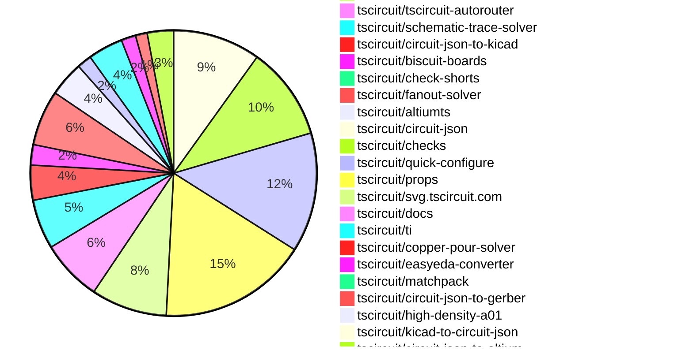

# Contribution Overview 2026-09-01

The current week is shown below. There are 3 major sections:

- [Contributor Overview](#contributor-overview)
- [PRs by Repository](#prs-by-repository)
- [PRs by Contributor](#changes-by-contributor)
- [Scoring & Sponsorship Details](/docs/sponsorship-calculation-explanation.md)

## PRs by Repository

## Contributor Overview

| Contributor | 🐳 Major | 🐙 Minor | 🐌 Tiny | Score | ⭐ |
|-------------|---------|---------|---------|-------|-----|
| [seveibar](#seveibar) | 16 | 7 | 9 | 88 | 👑 |
| [ShiboSoftwareDev](#ShiboSoftwareDev) | 3 | 10 | 4 | 48 | ⭐⭐ |
| [MustafaMulla29](#MustafaMulla29) | 5 | 3 | 9 | 36 | ⭐⭐ |
| [mohan-bee](#mohan-bee) | 3 | 4 | 8 | 33 | ⭐⭐ |
| [imrishabh18](#imrishabh18) | 5 | 3 | 1 | 28 | ⭐⭐ |
| [AnasSarkiz](#AnasSarkiz) | 3 | 0 | 1 | 20 | ⭐⭐ |
| [Abse2001](#Abse2001) | 1 | 0 | 2 | 17 | ⭐⭐ |
| [tscircuitbot](#tscircuitbot) | 0 | 0 | 194 | 13.5 | ⭐⭐ |
| [rushabhcodes](#rushabhcodes) | 1 | 2 | 4 | 13 | ⭐⭐ |
| [techmannih](#techmannih) | 1 | 0 | 9 | 12.5 | ⭐⭐ |
| [hrithik18k](#hrithik18k) | 1 | 0 | 5 | 9 | ⭐ |
| [0hmX](#0hmX) | 1 | 0 | 2 | 7 | ⭐ |
| [GokulPandi-M](#GokulPandi-M) | 0 | 1 | 4 | 6 | ⭐ |
| [Sang-it](#Sang-it) | 0 | 1 | 3 | 5 | ⭐ |
| [KrishnaX12](#KrishnaX12) | 0 | 0 | 4 | 4 | ⭐ |

## Staff Pass Ratio (SPR)

| Contributor | Reviewed PRs | Rejections | Approvals | SPR |
|-------------|--------------|------------|-----------|-----|
| [AnasSarkiz](#AnasSarkiz) | 3 | 0 | 3 | 100.0% |
| [imrishabh18](#imrishabh18) | 2 | 0 | 2 | 100.0% |
| [MustafaMulla29](#MustafaMulla29) | 2 | 0 | 2 | 100.0% |
| [Abse2001](#Abse2001) | 1 | 0 | 1 | 100.0% |
| [GokulPandi-M](#GokulPandi-M) | 1 | 1 | 0 | 0.0% |
| [mohan-bee](#mohan-bee) | 1 | 0 | 1 | 100.0% |
| [rushabhcodes](#rushabhcodes) | 1 | 0 | 1 | 100.0% |
| [ShiboSoftwareDev](#ShiboSoftwareDev) | 1 | 0 | 1 | 100.0% |

AnasSarkiz SPR PRs (3)

- [#3583](https://github.com/tscircuit/core/pull/3583) Fix duplicated traces in local autorouter stage output
- [#2381](https://github.com/tscircuit/tscircuit-autorouter/pull/2381) perf: cache repeated Pipeline 9 DRC candidates
- [#99](https://github.com/tscircuit/high-density-a01/pull/99) consolidate native A11 and A12 solver foundations

imrishabh18 SPR PRs (2)

- [#2328](https://github.com/tscircuit/tscircuit-autorouter/pull/2328) Fix Bug Report 94 trace overlap in force solver
- [#17](https://github.com/tscircuit/high-density-repair01/pull/17) Preserve trace ordering during force improvement

MustafaMulla29 SPR PRs (2)

- [#745](https://github.com/tscircuit/circuit-json/pull/745) Add component ownership to PCB cutouts
- [#1020](https://github.com/tscircuit/schematic-trace-solver/pull/1020) Align same-net pin exits, endpoint buses, and shared rails

Abse2001 SPR PRs (1)

- [#229](https://github.com/tscircuit/ti/pull/229) Add complete Automotive Window Module example

GokulPandi-M SPR PRs (1)

- [#241](https://github.com/tscircuit/matchpack/pull/241) fix: preserve clearance when aligning rail rows

mohan-bee SPR PRs (1)

- [#1017](https://github.com/tscircuit/schematic-trace-solver/pull/1017) keep downward ground labels directly below shared rails

rushabhcodes SPR PRs (1)

- [#540](https://github.com/tscircuit/easyeda-converter/pull/540) fix: derive CAD component size from model bounds

ShiboSoftwareDev SPR PRs (1)

- [#3603](https://github.com/tscircuit/core/pull/3603) fix: preserve fanout handoff point identity

> Note: AI evaluates PRs and assigns 1-3 star ratings automatically. 4 and 5 star ratings require manual staff review.

## Review Table

[reviews-received-hover]: ## "Number of reviews received for PRs for this contributor"
[approvals-received-hover]: ## "Number of approvals received for PRs this contributor authored"
[rejections-received-hover]: ## "Number of rejections received for PRs this contributor authored"
[prs-opened-hover]: ## "Number of PRs opened by this contributor"
[issues-created-hover]: ## "Number of issues created by this contributor"

| Contributor | Reviews Received | Approvals Received | Rejections Received | Approvals | Rejections Given | PRs Opened | PRs Merged | Issues Created |
|---|---|---|---|---|---|---|---|---|
| [0hmX](#0hmX) | 2 | 0 | 0 | 3 | 0 | 6 | 3 | 0 |
| [85heisenberg85](#85heisenberg85) | 0 | 0 | 0 | 0 | 0 | 1 | 0 | 0 |
| [Abse2001](#Abse2001) | 3 | 3 | 0 | 11 | 0 | 24 | 3 | 0 |
| [alondrn-hub](#alondrn-hub) | 0 | 0 | 0 | 0 | 0 | 1 | 0 | 0 |
| [AnasSarkiz](#AnasSarkiz) | 4 | 4 | 0 | 8 | 0 | 9 | 4 | 0 |
| [anil08607](#anil08607) | 0 | 0 | 0 | 0 | 0 | 1 | 0 | 0 |
| [beefrea](#beefrea) | 0 | 0 | 0 | 0 | 0 | 3 | 0 | 0 |
| [gcoinstash-cmd](#gcoinstash-cmd) | 0 | 0 | 0 | 0 | 0 | 16 | 0 | 0 |
| [GokulPandi-M](#GokulPandi-M) | 13 | 7 | 1 | 0 | 0 | 10 | 5 | 0 |
| [hrithik18k](#hrithik18k) | 18 | 8 | 3 | 0 | 0 | 16 | 6 | 0 |
| [imrishabh18](#imrishabh18) | 3 | 2 | 0 | 17 | 6 | 16 | 9 | 0 |
| [J2c-ashwani](#J2c-ashwani) | 0 | 0 | 0 | 0 | 0 | 1 | 0 | 0 |
| [KrishnaX12](#KrishnaX12) | 9 | 6 | 0 | 0 | 0 | 14 | 5 | 0 |
| [mohan-bee](#mohan-bee) | 14 | 8 | 3 | 5 | 0 | 50 | 15 | 0 |
| [MustafaMulla29](#MustafaMulla29) | 11 | 10 | 0 | 6 | 0 | 19 | 17 | 0 |
| [mvennarini](#mvennarini) | 0 | 0 | 0 | 0 | 0 | 8 | 0 | 0 |
| [Navi1405](#Navi1405) | 0 | 0 | 0 | 0 | 0 | 1 | 0 | 0 |
| [Rijul202](#Rijul202) | 1 | 0 | 0 | 0 | 0 | 1 | 0 | 0 |
| [RohithPariki](#RohithPariki) | 0 | 0 | 0 | 0 | 0 | 1 | 0 | 0 |
| [rushabhcodes](#rushabhcodes) | 15 | 8 | 0 | 1 | 0 | 7 | 7 | 0 |
| [sahil18z](#sahil18z) | 0 | 0 | 0 | 0 | 0 | 2 | 0 | 0 |
| [Sang-it](#Sang-it) | 0 | 0 | 0 | 0 | 0 | 5 | 4 | 0 |
| [seveibar](#seveibar) | 9 | 0 | 0 | 15 | 1 | 54 | 34 | 0 |
| [ShiboSoftwareDev](#ShiboSoftwareDev) | 20 | 20 | 0 | 13 | 0 | 53 | 18 | 0 |
| [Sophia-Thickums](#Sophia-Thickums) | 0 | 0 | 0 | 0 | 0 | 1 | 0 | 0 |
| [techmannih](#techmannih) | 5 | 3 | 0 | 0 | 0 | 20 | 10 | 0 |
| [tscircuitbot](#tscircuitbot) | 0 | 0 | 0 | 0 | 0 | 250 | 194 | 0 |
| [Wvdstoep](#Wvdstoep) | 0 | 0 | 0 | 0 | 0 | 1 | 0 | 0 |

## Changes by Repository

### [tscircuit/tscircuit](https://github.com/tscircuit/tscircuit)

🐌 Tiny Contributions (2)

| PR # | Impact | Contributor | Description |
|------|--------|-------------|-------------|
| [#4763](https://github.com/tscircuit/tscircuit/pull/4763) | 🐌 Tiny | tscircuitbot | Automated package update |
| [#4762](https://github.com/tscircuit/tscircuit/pull/4762) | 🐌 Tiny | MustafaMulla29 | Updates the versions of core and eval dependencies in the package.json file. |

### [tscircuit/core](https://github.com/tscircuit/core)

| PR # | Impact | Rating | Contributor | Description |
|------|--------|--------|-------------|-------------|
| [#3628](https://github.com/tscircuit/core/pull/3628) | 🐳 Major | ⭐⭐⭐ | MustafaMulla29 | Propagates the owning pcb_component_id to rectangular, circular, and polygon footprint cutouts and adds a focused regression test for a cutout declared inside a chip footprint. |
| [#3581](https://github.com/tscircuit/core/pull/3581) | 🐳 Major | ⭐⭐⭐ | seveibar | Add a new autorouting phase that simplifies existing PCB traces and integrates with the autorouting pipeline, enhancing routing efficiency. |
| [#3583](https://github.com/tscircuit/core/pull/3583) | 🐳 Major | ⭐⭐⭐ | AnasSarkiz | Fixes duplicated traces in the local autorouter stage output by ensuring that the current solver stage returns the correct trace data without reinserting it as new PCB copper. |
| [#3650](https://github.com/tscircuit/core/pull/3650) | 🐙 Minor | ⭐⭐ | seveibar | Add fabrication notes for internally connected pads, including a path and label, while preserving component properties and excluding solder jumpers. |
| [#3594](https://github.com/tscircuit/core/pull/3594) | 🐙 Minor | ⭐⭐ | rushabhcodes | Refines schematic sheet warning assertions to ensure tests only check for relevant warnings, preventing false negatives due to unrelated warnings. |
| [#3602](https://github.com/tscircuit/core/pull/3602) | 🐙 Minor | ⭐⭐ | ShiboSoftwareDev | Add an end-to-end DDR routing regression test for the AM62L32 and MT53E1G16D1ZW LPDDR4 packages, ensuring proper routing and DRC results. |
| [#3603](https://github.com/tscircuit/core/pull/3603) | 🐙 Minor | ⭐⭐ | ShiboSoftwareDev | Fixes the synchronization of PCB breakout point identity on completed fanout traces before the global routing phase, allowing Pipeline 9 to recognize pre-routed copper as connected to the handoff endpoint and removing unnecessary detours in routing. |

🐌 Tiny Contributions (23)

| PR # | Impact | Contributor | Description |
|------|--------|-------------|-------------|
| [#3639](https://github.com/tscircuit/core/pull/3639) | 🐌 Tiny | tscircuitbot | Updates the tscircuitfanout-solver package from version 0.0.56 to 0.0.57 |
| [#3638](https://github.com/tscircuit/core/pull/3638) | 🐌 Tiny | tscircuitbot | Updates the tscircuitfanout-solver package from version 0.0.56 to 0.0.57 |
| [#3637](https://github.com/tscircuit/core/pull/3637) | 🐌 Tiny | tscircuitbot | Updates the tscircuitfanout-solver package from version 0.0.55 to 0.0.56 |
| [#3635](https://github.com/tscircuit/core/pull/3635) | 🐌 Tiny | tscircuitbot | Updates the tscircuitfanout-solver package from version 0.0.54 to 0.0.55 |
| [#3620](https://github.com/tscircuit/core/pull/3620) | 🐌 Tiny | tscircuitbot | Updates the tscircuitfanout-solver package from version 0.0.53 to 0.0.54 |
| [#3611](https://github.com/tscircuit/core/pull/3611) | 🐌 Tiny | tscircuitbot | Updates the tscircuitfanout-solver package from version 0.0.52 to 0.0.53 in the package.json file. |
| [#3607](https://github.com/tscircuit/core/pull/3607) | 🐌 Tiny | tscircuitbot | Updates the tscircuitfanout-solver package from version 0.0.49 to 0.0.52 |
| [#3606](https://github.com/tscircuit/core/pull/3606) | 🐌 Tiny | tscircuitbot | Updates the tscircuitfanout-solver package from version 0.0.49 to 0.0.52 |
| [#3592](https://github.com/tscircuit/core/pull/3592) | 🐌 Tiny | tscircuitbot | Updates the tscircuitchecks package from version 0.0.179 to 0.0.180 in the package.json file. |
| [#3591](https://github.com/tscircuit/core/pull/3591) | 🐌 Tiny | tscircuitbot | Updates the version of the tscircuitchecks package from 0.0.179 to 0.0.180 in package.json |
| [#3579](https://github.com/tscircuit/core/pull/3579) | 🐌 Tiny | tscircuitbot | Updates the tscircuitfanout-solver package from version 0.0.48 to 0.0.49 |
| [#3588](https://github.com/tscircuit/core/pull/3588) | 🐌 Tiny | tscircuitbot | Updates the version of the tscircuitchecks package from 0.0.178 to 0.0.179 in package.json |
| [#3578](https://github.com/tscircuit/core/pull/3578) | 🐌 Tiny | tscircuitbot | Updates the tscircuitfanout-solver package from version 0.0.47 to 0.0.48 |
| [#3649](https://github.com/tscircuit/core/pull/3649) | 🐌 Tiny | MustafaMulla29 | Updates the version of the schematic-trace-solver dependency from 0.0.178 to 0.0.183 in package.json |
| [#3644](https://github.com/tscircuit/core/pull/3644) | 🐌 Tiny | MustafaMulla29 | Bumps tscircuitchecks from 0.0.181 to 0.0.182, consuming the owned-footprint-cutout placement fix and outline-keepout compatibility fix from a related pull request. |
| [#3625](https://github.com/tscircuit/core/pull/3625) | 🐌 Tiny | MustafaMulla29 | Updates the version of the tscircuitchecks dependency from 0.0.180 to 0.0.181 in the package.json file. |
| [#3582](https://github.com/tscircuit/core/pull/3582) | 🐌 Tiny | MustafaMulla29 | Updates the tscircuitschematic-trace-solver dependency from version 0.0.175 to 0.0.178, including connector-crossing reroute improvements from a related pull request. |
| [#3544](https://github.com/tscircuit/core/pull/3544) | 🐌 Tiny | seveibar | Summary increase the configured via drill from 0.10 mm to 0.15 mm while retaining the 0.24 mm via pad assert the configured board values and every emitted via dimension update the established progressive and two-bus visual snapshots in place without renaming them This is stacked on 3537, whose branch now includes merged PR 3541.  Verification bun test testsreprosrepro-am62l-lpddr4-progressive-fanout.test.tsx --timeout 300000 bun test testsreprosrepro-am62l-lpddr4-two-bus-bga-fanout.test.tsx --timeout 300000 bunx biome check testsfixturescreate-am62l-lpddr4-fanout.tsx testsreprosrepro-am62l-lpddr4-progressive-fanout.test.tsx testsreprosrepro-am62l-lpddr4-two-bus-bga-fanout.test.tsx git diff --check All route geometry and via centers remain unchanged; the SVG visual difference is the larger drill circles.  Manufacturing note A 0.15 mm hole inside a 0.24 mm pad leaves a 0.045 mm annular ring per side. The routing and current DRCs pass, but fabrication acceptance remains manufacturer-specific. |
| [#3537](https://github.com/tscircuit/core/pull/3537) | 🐌 Tiny | seveibar | Summary add DDR_DMI0 as the eighth progressive DDR bus, routing AM62L DDR0_DM0 on F2 to LPDDR4 DMI0 on C3 route the singleton bus through inner5 with top-side exits on both component fanouts extend the exact phase, layer, exit, and connectivity assertions update the existing full-board visual snapshot in place without renaming it  Dependency Depends on tscircuitfanout-solver112 and its next published release. package.json intentionally remains on tscircuitfanout-solver 0.0.45 until that release exists; this draft was validated against the local solver branch.  Validation bun test testsreprosrepro-am62l-lpddr4-progressive-fanout.test.tsx  1 passed, 5,324 assertions bunx tsc --noEmit bunx biome check on changed TypeScript files visually inspected the updated full-board SVG snapshot |
| [#3623](https://github.com/tscircuit/core/pull/3623) | 🐌 Tiny | rushabhcodes | Refreshes the AM62L-to-LPDDR4 two-bus BGA fanout PCB snapshot to align the expected route geometry with the deterministic output from the fanout solver version 0.0.54, addressing a CI failure due to stale SVG geometry. |
| [#3593](https://github.com/tscircuit/core/pull/3593) | 🐌 Tiny | rushabhcodes | Updates the tscircuitcopper-pour-solver dependency to version 0.0.52, enabling proper copper-pour handling for oval plated holes in PCB designs. |
| [#3584](https://github.com/tscircuit/core/pull/3584) | 🐌 Tiny | techmannih | Reproduces the overlap between the adjacent AUDIO_VRA1, GND, and AUDIO_VRA2 fallback labels in the T113 schematic. |
| [#3585](https://github.com/tscircuit/core/pull/3585) | 🐌 Tiny | techmannih | Add a minimal Trellis Core feedback network with L2, R5, C4, and R7 to reproduce the nearly overlapping BUCK_0V9_FB auto-label trace beside the R5-to-C4 trace and pin the behavior with a schematic snapshot. |

### [tscircuit/tscircuit.com](https://github.com/tscircuit/tscircuit.com)

| PR # | Impact | Rating | Contributor | Description |
|------|--------|--------|-------------|-------------|
| [#4748](https://github.com/tscircuit/tscircuit.com/pull/4748) | 🐳 Major | ⭐⭐⭐ | seveibar | Updates the editor URL when a workspace file is selected, preserving existing query parameters and clearing stale line selections, while adding a browser regression test for file selection URL sync. |
| [#4735](https://github.com/tscircuit/tscircuit.com/pull/4735) | 🐳 Major | ⭐⭐⭐ | seveibar | Provides detailed error messages for avatar upload failures, including server rejection reasons and network issues, improving user guidance during upload attempts. |
| [#4734](https://github.com/tscircuit/tscircuit.com/pull/4734) | 🐳 Major | ⭐⭐⭐ | seveibar | Fixes the issue where the editor opens lockfiles by default instead of the intended circuit entrypoint files, ensuring that only eligible files are selected for editing. |
| [#4729](https://github.com/tscircuit/tscircuit.com/pull/4729) | 🐳 Major | ⭐⭐⭐ | hrithik18k | Fixes schematic downloads to include all sheets in multi-sheet projects instead of just the firstdefault sheet. |

🐌 Tiny Contributions (28)

| PR # | Impact | Contributor | Description |
|------|--------|-------------|-------------|
| [#4769](https://github.com/tscircuit/tscircuit.com/pull/4769) | 🐌 Tiny | tscircuitbot | Updates the tscircuiteval package version from 0.0.1343 to 0.0.1345 in package.json |
| [#4768](https://github.com/tscircuit/tscircuit.com/pull/4768) | 🐌 Tiny | tscircuitbot | Updates the tscircuitrunframe package version from 0.0.2652 to 0.0.2653 |
| [#4767](https://github.com/tscircuit/tscircuit.com/pull/4767) | 🐌 Tiny | tscircuitbot | Automated package update for tscircuitrunframe from version 0.0.2651 to 0.0.2652 |
| [#4766](https://github.com/tscircuit/tscircuit.com/pull/4766) | 🐌 Tiny | tscircuitbot | Updates the tscircuitrunframe package from version 0.0.2650 to 0.0.2651 |
| [#4764](https://github.com/tscircuit/tscircuit.com/pull/4764) | 🐌 Tiny | tscircuitbot | Updates the tscircuitrunframe package from version 0.0.2649 to 0.0.2650 |
| [#4763](https://github.com/tscircuit/tscircuit.com/pull/4763) | 🐌 Tiny | tscircuitbot | Updates the tscircuitrunframe package from version 0.0.2646 to 0.0.2649 |
| [#4760](https://github.com/tscircuit/tscircuit.com/pull/4760) | 🐌 Tiny | tscircuitbot | Updates the tscircuiteval package from version 0.0.1342 to 0.0.1343 |
| [#4758](https://github.com/tscircuit/tscircuit.com/pull/4758) | 🐌 Tiny | tscircuitbot | Updates the tscircuiteval package to version 0.0.1342 |
| [#4757](https://github.com/tscircuit/tscircuit.com/pull/4757) | 🐌 Tiny | tscircuitbot | Updates the tscircuitrunframe package from version 0.0.2645 to 0.0.2646 |
| [#4755](https://github.com/tscircuit/tscircuit.com/pull/4755) | 🐌 Tiny | tscircuitbot | Updates the tscircuitrunframe package from version 0.0.2642 to 0.0.2645 |
| [#4743](https://github.com/tscircuit/tscircuit.com/pull/4743) | 🐌 Tiny | tscircuitbot | Updates the tscircuiteval package from version 0.0.1334 to 0.0.1335 |
| [#4742](https://github.com/tscircuit/tscircuit.com/pull/4742) | 🐌 Tiny | tscircuitbot | Updates the tscircuitrunframe package from version 0.0.2638 to 0.0.2639 |
| [#4752](https://github.com/tscircuit/tscircuit.com/pull/4752) | 🐌 Tiny | tscircuitbot | Updates the tscircuiteval package from version 0.0.1336 to 0.0.1338 |
| [#4746](https://github.com/tscircuit/tscircuit.com/pull/4746) | 🐌 Tiny | tscircuitbot | Automated package update |
| [#4745](https://github.com/tscircuit/tscircuit.com/pull/4745) | 🐌 Tiny | tscircuitbot | Automated package update |
| [#4744](https://github.com/tscircuit/tscircuit.com/pull/4744) | 🐌 Tiny | tscircuitbot | Updates the tscircuiteval package from version 0.0.1335 to 0.0.1336 |
| [#4741](https://github.com/tscircuit/tscircuit.com/pull/4741) | 🐌 Tiny | tscircuitbot | Updates the tscircuiteval package from version 0.0.1327 to 0.0.1334 |
| [#4740](https://github.com/tscircuit/tscircuit.com/pull/4740) | 🐌 Tiny | tscircuitbot | Updates the tscircuitrunframe package from version 0.0.2637 to 0.0.2638 |
| [#4738](https://github.com/tscircuit/tscircuit.com/pull/4738) | 🐌 Tiny | tscircuitbot | Updates the tscircuitrunframe package from version 0.0.2636 to 0.0.2637 |
| [#4736](https://github.com/tscircuit/tscircuit.com/pull/4736) | 🐌 Tiny | tscircuitbot | Updates the tscircuitrunframe package from version 0.0.2635 to 0.0.2636 |
| [#4733](https://github.com/tscircuit/tscircuit.com/pull/4733) | 🐌 Tiny | tscircuitbot | Automated package update |
| [#4731](https://github.com/tscircuit/tscircuit.com/pull/4731) | 🐌 Tiny | tscircuitbot | Updates the tscircuitrunframe package from version 0.0.2633 to 0.0.2634 |
| [#4728](https://github.com/tscircuit/tscircuit.com/pull/4728) | 🐌 Tiny | tscircuitbot | Updates the tscircuitrunframe package from version 0.0.2632 to 0.0.2633 |
| [#4726](https://github.com/tscircuit/tscircuit.com/pull/4726) | 🐌 Tiny | tscircuitbot | Automated package update |
| [#4724](https://github.com/tscircuit/tscircuit.com/pull/4724) | 🐌 Tiny | tscircuitbot | Automated package update |
| [#4723](https://github.com/tscircuit/tscircuit.com/pull/4723) | 🐌 Tiny | tscircuitbot | Updates the tscircuiteval package from version 0.0.1323 to 0.0.1327 |
| [#4722](https://github.com/tscircuit/tscircuit.com/pull/4722) | 🐌 Tiny | tscircuitbot | Automated package update for tscircuitrunframe from version 0.0.2629 to 0.0.2630 |
| [#4720](https://github.com/tscircuit/tscircuit.com/pull/4720) | 🐌 Tiny | tscircuitbot | Automated package update |

### [tscircuit/eval](https://github.com/tscircuit/eval)

🐌 Tiny Contributions (41)

| PR # | Impact | Contributor | Description |
|------|--------|-------------|-------------|
| [#4359](https://github.com/tscircuit/eval/pull/4359) | 🐌 Tiny | tscircuitbot | Automated package update |
| [#4358](https://github.com/tscircuit/eval/pull/4358) | 🐌 Tiny | tscircuitbot | Updates the version of the tscircuitcore package from 0.0.1838 to 0.0.1839 in package.json |
| [#4356](https://github.com/tscircuit/eval/pull/4356) | 🐌 Tiny | tscircuitbot | Automated package update |
| [#4355](https://github.com/tscircuit/eval/pull/4355) | 🐌 Tiny | tscircuitbot | Automated package update |
| [#4353](https://github.com/tscircuit/eval/pull/4353) | 🐌 Tiny | tscircuitbot | Automated package update |
| [#4352](https://github.com/tscircuit/eval/pull/4352) | 🐌 Tiny | tscircuitbot | Updates the versions of several dependencies in the package.json file. |
| [#4350](https://github.com/tscircuit/eval/pull/4350) | 🐌 Tiny | tscircuitbot | Automated package update |
| [#4349](https://github.com/tscircuit/eval/pull/4349) | 🐌 Tiny | tscircuitbot | Automated package update |
| [#4347](https://github.com/tscircuit/eval/pull/4347) | 🐌 Tiny | tscircuitbot | Updates the version of tscircuitcore from 0.0.1834 to 0.0.1835 and tscircuitfanout-solver from 0.0.56 to 0.0.57 in package.json |
| [#4345](https://github.com/tscircuit/eval/pull/4345) | 🐌 Tiny | tscircuitbot | Automated package update |
| [#4344](https://github.com/tscircuit/eval/pull/4344) | 🐌 Tiny | tscircuitbot | Updates the version of tscircuitcore from 0.0.1833 to 0.0.1834 and tscircuitfanout-solver from 0.0.55 to 0.0.56 in package.json |
| [#4342](https://github.com/tscircuit/eval/pull/4342) | 🐌 Tiny | tscircuitbot | Automated package update |
| [#4341](https://github.com/tscircuit/eval/pull/4341) | 🐌 Tiny | tscircuitbot | Updates the version of tscircuitcore from 0.0.1832 to 0.0.1833 and tscircuitfanout-solver from 0.0.54 to 0.0.55 in package.json |
| [#4333](https://github.com/tscircuit/eval/pull/4333) | 🐌 Tiny | tscircuitbot | Updates the version of tscircuitcore from 0.0.1829 to 0.0.1830 and tscircuitfanout-solver from 0.0.53 to 0.0.54 in package.json |
| [#4330](https://github.com/tscircuit/eval/pull/4330) | 🐌 Tiny | tscircuitbot | Updates the version of tscircuitcore from 0.0.1828 to 0.0.1829 and tscircuitfanout-solver from 0.0.52 to 0.0.53 in package.json |
| [#4321](https://github.com/tscircuit/eval/pull/4321) | 🐌 Tiny | tscircuitbot | Updates the version of the tscircuitcore package from 0.0.1825 to 0.0.1826 in package.json |
| [#4340](https://github.com/tscircuit/eval/pull/4340) | 🐌 Tiny | tscircuitbot | Automated package update |
| [#4339](https://github.com/tscircuit/eval/pull/4339) | 🐌 Tiny | tscircuitbot | Automated package update |
| [#4337](https://github.com/tscircuit/eval/pull/4337) | 🐌 Tiny | tscircuitbot | Automated package update |
| [#4331](https://github.com/tscircuit/eval/pull/4331) | 🐌 Tiny | tscircuitbot | Automated package update |
| [#4328](https://github.com/tscircuit/eval/pull/4328) | 🐌 Tiny | tscircuitbot | Automated package update |
| [#4327](https://github.com/tscircuit/eval/pull/4327) | 🐌 Tiny | tscircuitbot | Automated package update |
| [#4325](https://github.com/tscircuit/eval/pull/4325) | 🐌 Tiny | tscircuitbot | Automated package update |
| [#4322](https://github.com/tscircuit/eval/pull/4322) | 🐌 Tiny | tscircuitbot | Automated package update |
| [#4336](https://github.com/tscircuit/eval/pull/4336) | 🐌 Tiny | tscircuitbot | Automated package update |
| [#4334](https://github.com/tscircuit/eval/pull/4334) | 🐌 Tiny | tscircuitbot | Automated package update |
| [#4324](https://github.com/tscircuit/eval/pull/4324) | 🐌 Tiny | tscircuitbot | Updates the version of the tscircuitcore package from 0.0.1826 to 0.0.1827 in package.json |
| [#4320](https://github.com/tscircuit/eval/pull/4320) | 🐌 Tiny | tscircuitbot | Automated package update |
| [#4319](https://github.com/tscircuit/eval/pull/4319) | 🐌 Tiny | tscircuitbot | Automated package update |
| [#4317](https://github.com/tscircuit/eval/pull/4317) | 🐌 Tiny | tscircuitbot | Automated package update to version 0.0.1330 |
| [#4316](https://github.com/tscircuit/eval/pull/4316) | 🐌 Tiny | tscircuitbot | Automated package update |
| [#4314](https://github.com/tscircuit/eval/pull/4314) | 🐌 Tiny | tscircuitbot | Automated package update to version 0.0.1329 |
| [#4313](https://github.com/tscircuit/eval/pull/4313) | 🐌 Tiny | tscircuitbot | Automated package update |
| [#4311](https://github.com/tscircuit/eval/pull/4311) | 🐌 Tiny | tscircuitbot | Automated package update |
| [#4310](https://github.com/tscircuit/eval/pull/4310) | 🐌 Tiny | tscircuitbot | Automated package update |
| [#4308](https://github.com/tscircuit/eval/pull/4308) | 🐌 Tiny | tscircuitbot | Automated package update |
| [#4307](https://github.com/tscircuit/eval/pull/4307) | 🐌 Tiny | tscircuitbot | Updates package dependencies to their latest versions in package.json |
| [#4305](https://github.com/tscircuit/eval/pull/4305) | 🐌 Tiny | tscircuitbot | Automated package update |
| [#4304](https://github.com/tscircuit/eval/pull/4304) | 🐌 Tiny | tscircuitbot | Updates the version of several dependencies in the package.json file. |
| [#4302](https://github.com/tscircuit/eval/pull/4302) | 🐌 Tiny | tscircuitbot | Automated package update |
| [#4301](https://github.com/tscircuit/eval/pull/4301) | 🐌 Tiny | tscircuitbot | Updates package dependencies to their latest versions as part of routine maintenance. |

### [tscircuit/runframe](https://github.com/tscircuit/runframe)

🐌 Tiny Contributions (51)

| PR # | Impact | Contributor | Description |
|------|--------|-------------|-------------|
| [#4972](https://github.com/tscircuit/runframe/pull/4972) | 🐌 Tiny | tscircuitbot | Automated package update |
| [#4971](https://github.com/tscircuit/runframe/pull/4971) | 🐌 Tiny | tscircuitbot | Updates the tscircuiteval package to version 0.0.1345 in the package.json file. |
| [#4970](https://github.com/tscircuit/runframe/pull/4970) | 🐌 Tiny | tscircuitbot | Automated package update |
| [#4969](https://github.com/tscircuit/runframe/pull/4969) | 🐌 Tiny | tscircuitbot | Updates the version of the circuit-json-to-gerber package from 0.0.102 to 0.0.103 in package.json |
| [#4968](https://github.com/tscircuit/runframe/pull/4968) | 🐌 Tiny | tscircuitbot | Automated package update |
| [#4967](https://github.com/tscircuit/runframe/pull/4967) | 🐌 Tiny | tscircuitbot | Updates the circuit-json-to-kicad package to version 0.0.205 in package.json |
| [#4965](https://github.com/tscircuit/runframe/pull/4965) | 🐌 Tiny | tscircuitbot | Automated package update |
| [#4964](https://github.com/tscircuit/runframe/pull/4964) | 🐌 Tiny | tscircuitbot | Updates the tscircuiteval package to version 0.0.1344 in the package.json file. |
| [#4963](https://github.com/tscircuit/runframe/pull/4963) | 🐌 Tiny | tscircuitbot | Automated package update |
| [#4962](https://github.com/tscircuit/runframe/pull/4962) | 🐌 Tiny | tscircuitbot | Updates the version of the circuit-json-to-gerber package from 0.0.101 to 0.0.102 in package.json |
| [#4961](https://github.com/tscircuit/runframe/pull/4961) | 🐌 Tiny | tscircuitbot | Automated package update |
| [#4960](https://github.com/tscircuit/runframe/pull/4960) | 🐌 Tiny | tscircuitbot | Updates the circuit-json-to-kicad package to version 0.0.204 in package.json |
| [#4958](https://github.com/tscircuit/runframe/pull/4958) | 🐌 Tiny | tscircuitbot | Automated package update |
| [#4957](https://github.com/tscircuit/runframe/pull/4957) | 🐌 Tiny | tscircuitbot | Updates the tscircuiteval package to version 0.0.1343 in the package.json file. |
| [#4956](https://github.com/tscircuit/runframe/pull/4956) | 🐌 Tiny | tscircuitbot | Automated package update |
| [#4955](https://github.com/tscircuit/runframe/pull/4955) | 🐌 Tiny | tscircuitbot | Automated package update |
| [#4954](https://github.com/tscircuit/runframe/pull/4954) | 🐌 Tiny | tscircuitbot | Automated package update |
| [#4953](https://github.com/tscircuit/runframe/pull/4953) | 🐌 Tiny | tscircuitbot | Updates the tscircuiteval package to version 0.0.1340 in the package.json file. |
| [#4952](https://github.com/tscircuit/runframe/pull/4952) | 🐌 Tiny | tscircuitbot | Automated package update |
| [#4951](https://github.com/tscircuit/runframe/pull/4951) | 🐌 Tiny | tscircuitbot | Updates the tscircuiteval package from version 0.0.1337 to 0.0.1339 in the package.json file. |
| [#4939](https://github.com/tscircuit/runframe/pull/4939) | 🐌 Tiny | tscircuitbot | Automated package update |
| [#4930](https://github.com/tscircuit/runframe/pull/4930) | 🐌 Tiny | tscircuitbot | Updates the version of the circuit-json-to-kicad package from 0.0.200 to 0.0.201 in package.json |
| [#4950](https://github.com/tscircuit/runframe/pull/4950) | 🐌 Tiny | tscircuitbot | Automated package update |
| [#4949](https://github.com/tscircuit/runframe/pull/4949) | 🐌 Tiny | tscircuitbot | Updates the tscircuiteval package to version 0.0.1337 in the package.json file. |
| [#4947](https://github.com/tscircuit/runframe/pull/4947) | 🐌 Tiny | tscircuitbot | Updates the circuit-json-to-kicad package version from 0.0.201 to 0.0.203 in package.json |
| [#4942](https://github.com/tscircuit/runframe/pull/4942) | 🐌 Tiny | tscircuitbot | Updates the version of the circuit-json-to-gerber package from 0.0.100 to 0.0.101 in package.json |
| [#4941](https://github.com/tscircuit/runframe/pull/4941) | 🐌 Tiny | tscircuitbot | Automated package update |
| [#4940](https://github.com/tscircuit/runframe/pull/4940) | 🐌 Tiny | tscircuitbot | Updates the tscircuiteval package to version 0.0.1336 in the package.json file. |
| [#4938](https://github.com/tscircuit/runframe/pull/4938) | 🐌 Tiny | tscircuitbot | Updates the tscircuiteval package to version 0.0.1335 in the package.json file. |
| [#4937](https://github.com/tscircuit/runframe/pull/4937) | 🐌 Tiny | tscircuitbot | Automated package update |
| [#4935](https://github.com/tscircuit/runframe/pull/4935) | 🐌 Tiny | tscircuitbot | Automated package update |
| [#4932](https://github.com/tscircuit/runframe/pull/4932) | 🐌 Tiny | tscircuitbot | Updates the tscircuiteval package to version 0.0.1332 in the package.json file. |
| [#4931](https://github.com/tscircuit/runframe/pull/4931) | 🐌 Tiny | tscircuitbot | Automated package update |
| [#4943](https://github.com/tscircuit/runframe/pull/4943) | 🐌 Tiny | tscircuitbot | Automated package update |
| [#4936](https://github.com/tscircuit/runframe/pull/4936) | 🐌 Tiny | tscircuitbot | Updates the tscircuiteval package to version 0.0.1334 in the package.json file. |
| [#4934](https://github.com/tscircuit/runframe/pull/4934) | 🐌 Tiny | tscircuitbot | Updates the tscircuiteval package from version 0.0.1332 to 0.0.1333 in the package.json file. |
| [#4933](https://github.com/tscircuit/runframe/pull/4933) | 🐌 Tiny | tscircuitbot | Automated package update |
| [#4927](https://github.com/tscircuit/runframe/pull/4927) | 🐌 Tiny | tscircuitbot | Updates the tscircuiteval package to version 0.0.1331 in the package.json file. |
| [#4926](https://github.com/tscircuit/runframe/pull/4926) | 🐌 Tiny | tscircuitbot | Automated package update |
| [#4924](https://github.com/tscircuit/runframe/pull/4924) | 🐌 Tiny | tscircuitbot | Automated package update |
| [#4923](https://github.com/tscircuit/runframe/pull/4923) | 🐌 Tiny | tscircuitbot | Updates the tscircuiteval package to version 0.0.1329 in the package.json file. |
| [#4922](https://github.com/tscircuit/runframe/pull/4922) | 🐌 Tiny | tscircuitbot | Automated package update |
| [#4921](https://github.com/tscircuit/runframe/pull/4921) | 🐌 Tiny | tscircuitbot | Updates the tscircuiteval package to version 0.0.1328 in the package.json file. |
| [#4919](https://github.com/tscircuit/runframe/pull/4919) | 🐌 Tiny | tscircuitbot | Updates the tscircuiteval package to version 0.0.1327 in the package.json file. |
| [#4918](https://github.com/tscircuit/runframe/pull/4918) | 🐌 Tiny | tscircuitbot | Automated package update |
| [#4916](https://github.com/tscircuit/runframe/pull/4916) | 🐌 Tiny | tscircuitbot | Automated package update |
| [#4915](https://github.com/tscircuit/runframe/pull/4915) | 🐌 Tiny | tscircuitbot | Updates the tscircuiteval package from version 0.0.1324 to 0.0.1325 in the package.json file. |
| [#4928](https://github.com/tscircuit/runframe/pull/4928) | 🐌 Tiny | tscircuitbot | Automated package update |
| [#4920](https://github.com/tscircuit/runframe/pull/4920) | 🐌 Tiny | tscircuitbot | Automated package update |
| [#4925](https://github.com/tscircuit/runframe/pull/4925) | 🐌 Tiny | tscircuitbot | Updates the tscircuiteval package to version 0.0.1330 in the package.json file. |
| [#4917](https://github.com/tscircuit/runframe/pull/4917) | 🐌 Tiny | tscircuitbot | Updates the tscircuiteval package to version 0.0.1326 in the package.json file. |

### [tscircuit/cli](https://github.com/tscircuit/cli)

| PR # | Impact | Rating | Contributor | Description |
|------|--------|--------|-------------|-------------|
| [#4590](https://github.com/tscircuit/cli/pull/4590) | 🐙 Minor | ⭐⭐ | seveibar | Serializes concurrent tsci add invocations to prevent overlapping package-manager processes that can race on package.json, lockfiles, and native dependency installation. |

🐌 Tiny Contributions (25)

| PR # | Impact | Contributor | Description |
|------|--------|-------------|-------------|
| [#4602](https://github.com/tscircuit/cli/pull/4602) | 🐌 Tiny | tscircuitbot | Updates the tscircuitrunframe package to version 0.0.2654 |
| [#4601](https://github.com/tscircuit/cli/pull/4601) | 🐌 Tiny | tscircuitbot | Updates the tscircuitrunframe package version from 0.0.2652 to 0.0.2653 in package.json |
| [#4600](https://github.com/tscircuit/cli/pull/4600) | 🐌 Tiny | tscircuitbot | Updates the tscircuitrunframe package version from 0.0.2651 to 0.0.2652 in package.json |
| [#4599](https://github.com/tscircuit/cli/pull/4599) | 🐌 Tiny | tscircuitbot | Updates the tscircuitrunframe package from version 0.0.2650 to 0.0.2651 |
| [#4598](https://github.com/tscircuit/cli/pull/4598) | 🐌 Tiny | tscircuitbot | Updates the tscircuitrunframe package to version 0.0.2650 in package.json |
| [#4597](https://github.com/tscircuit/cli/pull/4597) | 🐌 Tiny | tscircuitbot | Updates the tscircuitrunframe package from version 0.0.2648 to 0.0.2649 |
| [#4596](https://github.com/tscircuit/cli/pull/4596) | 🐌 Tiny | tscircuitbot | Updates the tscircuitrunframe package from version 0.0.2647 to 0.0.2648 |
| [#4595](https://github.com/tscircuit/cli/pull/4595) | 🐌 Tiny | tscircuitbot | Updates the tscircuitrunframe package to version 0.0.2647 in package.json |
| [#4594](https://github.com/tscircuit/cli/pull/4594) | 🐌 Tiny | tscircuitbot | Updates the tscircuitrunframe package from version 0.0.2645 to 0.0.2646 |
| [#4593](https://github.com/tscircuit/cli/pull/4593) | 🐌 Tiny | tscircuitbot | Updates the tscircuitrunframe package from version 0.0.2644 to 0.0.2645 |
| [#4589](https://github.com/tscircuit/cli/pull/4589) | 🐌 Tiny | tscircuitbot | Updates the tscircuitrunframe package version from 0.0.2642 to 0.0.2644 in package.json |
| [#4587](https://github.com/tscircuit/cli/pull/4587) | 🐌 Tiny | tscircuitbot | Updates the tscircuitrunframe package from version 0.0.2641 to 0.0.2642 |
| [#4586](https://github.com/tscircuit/cli/pull/4586) | 🐌 Tiny | tscircuitbot | Updates the tscircuitrunframe package to version 0.0.2641 in package.json |
| [#4585](https://github.com/tscircuit/cli/pull/4585) | 🐌 Tiny | tscircuitbot | Updates the tscircuitrunframe package version from 0.0.2639 to 0.0.2640 |
| [#4584](https://github.com/tscircuit/cli/pull/4584) | 🐌 Tiny | tscircuitbot | Updates the tscircuitrunframe package from version 0.0.2638 to 0.0.2639 |
| [#4583](https://github.com/tscircuit/cli/pull/4583) | 🐌 Tiny | tscircuitbot | Updates the tscircuitrunframe package to version 0.0.2638 |
| [#4582](https://github.com/tscircuit/cli/pull/4582) | 🐌 Tiny | tscircuitbot | Updates the tscircuitrunframe package to version 0.0.2637 in package.json |
| [#4581](https://github.com/tscircuit/cli/pull/4581) | 🐌 Tiny | tscircuitbot | Updates the tscircuitrunframe package from version 0.0.2635 to 0.0.2636 |
| [#4579](https://github.com/tscircuit/cli/pull/4579) | 🐌 Tiny | tscircuitbot | Updates the tscircuitrunframe package from version 0.0.2633 to 0.0.2634 |
| [#4576](https://github.com/tscircuit/cli/pull/4576) | 🐌 Tiny | tscircuitbot | Updates the tscircuitrunframe package from version 0.0.2630 to 0.0.2631 |
| [#4580](https://github.com/tscircuit/cli/pull/4580) | 🐌 Tiny | tscircuitbot | Updates the tscircuitrunframe package to version 0.0.2635 in the package.json file. |
| [#4578](https://github.com/tscircuit/cli/pull/4578) | 🐌 Tiny | tscircuitbot | Updates the tscircuitrunframe package to version 0.0.2633 |
| [#4577](https://github.com/tscircuit/cli/pull/4577) | 🐌 Tiny | tscircuitbot | Updates the tscircuitrunframe package from version 0.0.2631 to 0.0.2632 |
| [#4575](https://github.com/tscircuit/cli/pull/4575) | 🐌 Tiny | tscircuitbot | Updates the tscircuitrunframe package to version 0.0.2630 in package.json |
| [#4574](https://github.com/tscircuit/cli/pull/4574) | 🐌 Tiny | tscircuitbot | Updates the tscircuitrunframe package to version 0.0.2629 in package.json |

### [tscircuit/tscircuit-autorouter](https://github.com/tscircuit/tscircuit-autorouter)

| PR # | Impact | Rating | Contributor | Description |
|------|--------|--------|-------------|-------------|
| [#2349](https://github.com/tscircuit/tscircuit-autorouter/pull/2349) | 🐳 Major | ⭐⭐⭐ | seveibar | Reuses static connectivity during DRC repair in Pipeline9 to improve performance and reduce timeouts. |
| [#2370](https://github.com/tscircuit/tscircuit-autorouter/pull/2370) | 🐳 Major | ⭐⭐⭐ | seveibar | Fixes the autorouting progress reporting for Pipeline 7 and Pipeline 9, ensuring accurate progress updates during routing operations. |
| [#2335](https://github.com/tscircuit/tscircuit-autorouter/pull/2335) | 🐳 Major | ⭐⭐⭐ | seveibar | Summary add numbered AutoroutingPipelineSolver11_Simplification, a cleanup-only pipeline for existing SimpleRouteJson.traces use the conventional BasePipelineSolver definition with explicit prepare, simplify, apply, and DRC-validation stages; the outer pipeline does not override _step() keep stage work incremental: one input trace, one wrapped solver step, one output trace, or one validation pass per _step() preserve variable-width traces exactly and include them as immutable collision geometry while simplifying constant-width traces opt Pipeline 11 into clearance checks that use the actual currentneighbor trace widths and a matching spatial-search margin, without changing established pipeline behavior preserve trace IDs, connection metadata, endpoints, terminal vias, and terminal PCB-port metadata without routing missing SRJ connections  Why The simplify autorouting phase needs a dedicated local pipeline for users who want to improve traces that are already routed. Reusing the normal autorouting pipeline would solve SRJ connections again instead of limiting the work to post-route cleanup. The cleanup solvers currently use one traceThickness per high-density route. Sending a variable-width SRJ trace through that representation collapsed every segment to one arbitrary width and created DRC violations. Pipeline 11 now makes that capability boundary explicit: constant-width routes are simplified, while variable-width routes retain their exact copper geometry and still block unsafe shortcuts. Companion props PR: https:github.comtscircuitpropspull723  Real-board visual snapshot The fixture was captured from the board and MCU autorouting events produced by imrishabh18rp2040-motor-controller(https:tscircuit.comimrishabh18rp2040-motor-controllerfiles) at tscircuitrp2040-motor-controllerb4560e5(https:github.comtscircuitrp2040-motor-controllercommitb4560e5). Pipeline 11 preserves all 148 traces and every input width set, including 30 exact variable-width routes. It reduces route points from 1,829 to 1,763 and vias from 150 to 73, while exact relaxed DRC remains 0  0. !RP2040 motor controller before and after Pipeline 11 simplification(https:raw.githubusercontent.comtscircuittscircuit-autorouterfeatsimplification-pipelinetests__snapshots__pipeline11-simplification-rp2040-motor-controller-visual-rp2040-motor-controller-before-after.snap.svg)  Validation bun run build bunx tsc --noEmit focused Pipeline 11 suite: 4 tests passed Pipeline 9 reference-clean exact-output regression test passed real-board test: all width sets preserved, 30 variable-width routes exact, exact relaxed DRC 0  0 visual snapshot regenerated, rendered to PNG, and inspected git diff --check GitHub CI: all 9 test shards, build, type-check, format-check, added-code check, and Vercel checks passed |
| [#2381](https://github.com/tscircuit/tscircuit-autorouter/pull/2381) | 🐳 Major | ⭐⭐⭐ | AnasSarkiz | Caches exact repeated indexed DRC results during Pipeline 9 joint repair, limits the candidate cache to 64 entries, and exposes cache diagnostics for performance tracking. |
| [#2361](https://github.com/tscircuit/tscircuit-autorouter/pull/2361) | 🐳 Major | ⭐⭐⭐ | ShiboSoftwareDev | Fixes autorouters relaxed DRC to accept trace endpoints only when they geometrically touch same-net copper on the same PCB layer, preventing false disconnected endpoint errors. |
| [#2328](https://github.com/tscircuit/tscircuit-autorouter/pull/2328) | 🐳 Major | ⭐⭐⭐ | imrishabh18 | Fixes trace overlap issue in the force solver related to Bug Report 94, ensuring no overlaps remain in the autorouting process. |

🐌 Tiny Contributions (15)

| PR # | Impact | Contributor | Description |
|------|--------|-------------|-------------|
| [#2386](https://github.com/tscircuit/tscircuit-autorouter/pull/2386) | 🐌 Tiny | tscircuitbot | Automated package update |
| [#2384](https://github.com/tscircuit/tscircuit-autorouter/pull/2384) | 🐌 Tiny | tscircuitbot | Automated package update |
| [#2355](https://github.com/tscircuit/tscircuit-autorouter/pull/2355) | 🐌 Tiny | tscircuitbot | Automated package update |
| [#2354](https://github.com/tscircuit/tscircuit-autorouter/pull/2354) | 🐌 Tiny | tscircuitbot | Automated package update |
| [#2377](https://github.com/tscircuit/tscircuit-autorouter/pull/2377) | 🐌 Tiny | tscircuitbot | Automated package update |
| [#2373](https://github.com/tscircuit/tscircuit-autorouter/pull/2373) | 🐌 Tiny | tscircuitbot | Automated package update |
| [#2371](https://github.com/tscircuit/tscircuit-autorouter/pull/2371) | 🐌 Tiny | tscircuitbot | Automated package update |
| [#2343](https://github.com/tscircuit/tscircuit-autorouter/pull/2343) | 🐌 Tiny | tscircuitbot | Automated package update |
| [#2338](https://github.com/tscircuit/tscircuit-autorouter/pull/2338) | 🐌 Tiny | tscircuitbot | Automated package update |
| [#2336](https://github.com/tscircuit/tscircuit-autorouter/pull/2336) | 🐌 Tiny | tscircuitbot | Automated package update |
| [#2334](https://github.com/tscircuit/tscircuit-autorouter/pull/2334) | 🐌 Tiny | tscircuitbot | Automated package update |
| [#2333](https://github.com/tscircuit/tscircuit-autorouter/pull/2333) | 🐌 Tiny | seveibar | Limits the benchmark-all command to only run on dataset01 and dataset18, updates benchmark instructions, and modifies the workflow assertion in the benchmark command test. |
| [#2385](https://github.com/tscircuit/tscircuit-autorouter/pull/2385) | 🐌 Tiny | AnasSarkiz | Summary add the pedometer Simple Route JSON as bugreport103-pedometer load the large reproduction from publicfixtures in the autorouting debugger  Validation verified the JSON parses and has the expected autorouter shape confirmed the committed reproduction matches the supplied board byte-for-byte tests not run, per request (fixture-only change) |
| [#2342](https://github.com/tscircuit/tscircuit-autorouter/pull/2342) | 🐌 Tiny | mohan-bee | Updates the length-matching solver dependency to the latest commit for improved functionality and bug fixes. |
| [#2326](https://github.com/tscircuit/tscircuit-autorouter/pull/2326) | 🐌 Tiny | 0hmX | Adds a reproduction of the QFP16 Pipeline 9 with extra vias, documenting a routing-quality regression without changing solver behavior. |

### [tscircuit/schematic-trace-solver](https://github.com/tscircuit/schematic-trace-solver)

| PR # | Impact | Rating | Contributor | Description |
|------|--------|--------|-------------|-------------|
| [#1054](https://github.com/tscircuit/schematic-trace-solver/pull/1054) | 🐳 Major | ⭐⭐⭐ | MustafaMulla29 | Fixes unnecessary doglegs in schematic traces by refining corner pin direction handling and improving routing algorithms to minimize turns and collisions with labels. |
| [#1020](https://github.com/tscircuit/schematic-trace-solver/pull/1020) | 🐳 Major | ⭐⭐⭐ | MustafaMulla29 | Aligns adjacent same-side pin exits onto neighboring pin rows, aligns degree-two buses between perpendicular endpointload traces, and preserves generated connector junctions while validating candidates against various criteria. |
| [#1013](https://github.com/tscircuit/schematic-trace-solver/pull/1013) | 🐳 Major | ⭐⭐⭐ | MustafaMulla29 | Reroutes component-to-component traces to avoid crossings with generated net-label connectors, ensuring cleaner routing and preserving valid label-to-label crossings. |
| [#1038](https://github.com/tscircuit/schematic-trace-solver/pull/1038) | 🐳 Major | ⭐⭐⭐ | techmannih | Fixes the issue where net label connectors run parallel to host traces by shifting them laterally onto their existing host trace and creating a direct tee instead of a near-parallel connector. |
| [#1017](https://github.com/tscircuit/schematic-trace-solver/pull/1017) | 🐳 Major | ⭐⭐⭐ | mohan-bee | Adjusts the placement of downward ground labels to ensure they remain close to their connected pins and directly attached to shared rails, improving schematic clarity and accuracy. |
| [#1052](https://github.com/tscircuit/schematic-trace-solver/pull/1052) | 🐙 Minor | ⭐⭐ | MustafaMulla29 | Prevents anchored label connectors from creating strict perpendicular crossings with unrelated traces, ensuring safer label placements in schematic designs. |
| [#1045](https://github.com/tscircuit/schematic-trace-solver/pull/1045) | 🐙 Minor | ⭐⭐ | mohan-bee | Merges adjacent same-net branches that share their first segment onto nearby parallel rails, improving schematic alignment. |
| [#1008](https://github.com/tscircuit/schematic-trace-solver/pull/1008) | 🐙 Minor | ⭐⭐ | mohan-bee | Prevents duplicate ground labels on unwired pins of a component to ensure correct schematic representation. |

🐌 Tiny Contributions (9)

| PR # | Impact | Contributor | Description |
|------|--------|-------------|-------------|
| [#1037](https://github.com/tscircuit/schematic-trace-solver/pull/1037) | 🐌 Tiny | tscircuitbot | Adds a snapshot-only regression test and debugger page for the attached JSON solver input. |
| [#1035](https://github.com/tscircuit/schematic-trace-solver/pull/1035) | 🐌 Tiny | tscircuitbot | Adds a snapshot-only regression test and debugger page for the attached JSON solver input. |
| [#1050](https://github.com/tscircuit/schematic-trace-solver/pull/1050) | 🐌 Tiny | MustafaMulla29 | Add a focused schematic trace reproduction for the two mouse switches, capturing solver input and snapshotting the unnecessary horizontal jog in the vertical GND trunk. |
| [#1047](https://github.com/tscircuit/schematic-trace-solver/pull/1047) | 🐌 Tiny | MustafaMulla29 | Reproduces an unnecessary dogleg in the RF1 trace between two nominally aligned inductors, providing a focused test case without implementing solver changes. |
| [#1044](https://github.com/tscircuit/schematic-trace-solver/pull/1044) | 🐌 Tiny | MustafaMulla29 | Add an isolated reproduction of the capacitor-side VBAT label crossing the long CHG_STAT trace, using the exact InputProblem emitted by tscircuitcore 0.0.1829 at commit b761dc8, while retaining specific components and adding a focused solver SVG snapshot. |
| [#1048](https://github.com/tscircuit/schematic-trace-solver/pull/1048) | 🐌 Tiny | mohan-bee | Adds a flag to mark ground nets in various bug report and repro input JSON files to indicate they are ground connections. |
| [#1043](https://github.com/tscircuit/schematic-trace-solver/pull/1043) | 🐌 Tiny | mohan-bee | Adds a seven-component input fixture and SVG snapshot test for the isolated power section of board 8090, preserving its routing topology as a regression case. |
| [#1016](https://github.com/tscircuit/schematic-trace-solver/pull/1016) | 🐌 Tiny | mohan-bee | This pull request introduces a new JSON file containing the schematic trace for a USB hub sheet. The file includes detailed information about various chips, their dimensions, and pin configurations, which are essential for the schematic representation of the USB hub. |
| [#1002](https://github.com/tscircuit/schematic-trace-solver/pull/1002) | 🐌 Tiny | mohan-bee | Adds a focused solver snapshot for the smartwatch power sheet routing case, which was previously unaddressed. |

### [tscircuit/circuit-json-to-kicad](https://github.com/tscircuit/circuit-json-to-kicad)

| PR # | Impact | Rating | Contributor | Description |
|------|--------|--------|-------------|-------------|
| [#502](https://github.com/tscircuit/circuit-json-to-kicad/pull/502) | 🐙 Minor | ⭐⭐ | GokulPandi-M | Fixes the omission of 3D models in KiCad exports for components that only have OBJ URLs by deriving and embedding corresponding STEP models from EasyEDA. |
| [#490](https://github.com/tscircuit/circuit-json-to-kicad/pull/490) | 🐙 Minor | ⭐⭐ | ShiboSoftwareDev | Bumps kicad-to-circuit-json to 0.0.122 and implements side-by-side comparisons of native KiCad renders with Circuit JSON round-trip outputs, validating SVG renderability without modifying checked-in source files. |
| [#494](https://github.com/tscircuit/circuit-json-to-kicad/pull/494) | 🐙 Minor | ⭐⭐ | ShiboSoftwareDev | Exports component fabrication-note paths as fp_line graphics on F.Fab or B.Fab, preserving component-relative placement, rotation, and stroke width. |

🐌 Tiny Contributions (9)

| PR # | Impact | Contributor | Description |
|------|--------|-------------|-------------|
| [#510](https://github.com/tscircuit/circuit-json-to-kicad/pull/510) | 🐌 Tiny | tscircuitbot | Automated package update |
| [#505](https://github.com/tscircuit/circuit-json-to-kicad/pull/505) | 🐌 Tiny | tscircuitbot | Automated package update |
| [#493](https://github.com/tscircuit/circuit-json-to-kicad/pull/493) | 🐌 Tiny | tscircuitbot | Automated package update |
| [#501](https://github.com/tscircuit/circuit-json-to-kicad/pull/501) | 🐌 Tiny | tscircuitbot | Automated package update |
| [#500](https://github.com/tscircuit/circuit-json-to-kicad/pull/500) | 🐌 Tiny | tscircuitbot | Automated package update |
| [#497](https://github.com/tscircuit/circuit-json-to-kicad/pull/497) | 🐌 Tiny | GokulPandi-M | Adds a characterization reproduction for a bottom-mounted display model in KiCad, isolating the model transform issue without fixing it. |
| [#496](https://github.com/tscircuit/circuit-json-to-kicad/pull/496) | 🐌 Tiny | GokulPandi-M | Reproduces the omission of the OBJ-only USB-C model in KiCad export, confirming that the connector body is missing while the footprint remains. |
| [#491](https://github.com/tscircuit/circuit-json-to-kicad/pull/491) | 🐌 Tiny | ShiboSoftwareDev | Preserves imported KiCad component-level symbol artwork instead of overlaying generic chip symbols, maintains native fills, text placement, colors, and standalone schematic graphics, and refreshes all native source-versus-converted schematic snapshots with explicit snapshot-test timeouts. |
| [#495](https://github.com/tscircuit/circuit-json-to-kicad/pull/495) | 🐌 Tiny | ShiboSoftwareDev | Fixes the EBAZ4205 schematic rendering issue caused by KiCad 10s upgrade process, ensuring original multi-unit selections are preserved and the correct layout is maintained. |

### [tscircuit/biscuit-boards](https://github.com/tscircuit/biscuit-boards)

| PR # | Impact | Rating | Contributor | Description |
|------|--------|--------|-------------|-------------|
| [#103](https://github.com/tscircuit/biscuit-boards/pull/103) | 🐙 Minor | ⭐⭐ | Sang-it | Adds a uniform solderpaste layer by reducing pad dimensions and applying lens distortion for non-circular top pads in LightBurn exports. |

🐌 Tiny Contributions (6)

| PR # | Impact | Contributor | Description |
|------|--------|-------------|-------------|
| [#111](https://github.com/tscircuit/biscuit-boards/pull/111) | 🐌 Tiny | tscircuitbot | Automated package update |
| [#109](https://github.com/tscircuit/biscuit-boards/pull/109) | 🐌 Tiny | tscircuitbot | Automated package update |
| [#104](https://github.com/tscircuit/biscuit-boards/pull/104) | 🐌 Tiny | tscircuitbot | Automated package update |
| [#110](https://github.com/tscircuit/biscuit-boards/pull/110) | 🐌 Tiny | Sang-it | Restores the includeBoardFiles configuration removed by a previous PR, retaining all 20 previously included example board entries. |
| [#108](https://github.com/tscircuit/biscuit-boards/pull/108) | 🐌 Tiny | Sang-it | Add STM32 and RP2040 photodiode examples for BiscuitBoard V2, including routing through prefabricated vias and adding PCB snapshots and tests. |
| [#106](https://github.com/tscircuit/biscuit-boards/pull/106) | 🐌 Tiny | Sang-it | Add the independent 75 x 55 mm BiscuitBoard V2 clad with 2.5 mm-pitch corner and center via fields, and copy the STM32TMC5130 controller onto V2 with placements defined directly in the controller TSX and prefabricated-via routing. |

### [tscircuit/check-shorts](https://github.com/tscircuit/check-shorts)

🐌 Tiny Contributions (2)

| PR # | Impact | Contributor | Description |
|------|--------|-------------|-------------|
| [#52](https://github.com/tscircuit/check-shorts/pull/52) | 🐌 Tiny | tscircuitbot | Automated package update |
| [#51](https://github.com/tscircuit/check-shorts/pull/51) | 🐌 Tiny | mohan-bee | Updates the circuit-json-to-gerber dependency to version 0.0.101 in the package.json file. |

### [tscircuit/fanout-solver](https://github.com/tscircuit/fanout-solver)

| PR # | Impact | Rating | Contributor | Description |
|------|--------|--------|-------------|-------------|
| [#149](https://github.com/tscircuit/fanout-solver/pull/149) | 🐳 Major | ⭐⭐⭐ | seveibar | Summary add bounded local dogbone repair and displaced-via routing for constrained differential pairs add adaptive top-edge plane candidate selection with causal reservation refinement add a dataset31 reductiondebug script plus reduced and full SVG regression snapshots improve the dataset31 benchmark from 112 to 212 without regressing the existing left-center pass  Benchmark Command: .benchmark.sh --concurrency 4 --sample-timeout-seconds 120 solved 212 02-top-center: 135135, validated, 86.61s 11-left-center: 135135, validated, 15.43s remaining 10 samples: 120s timeout  Verification bun test: 152 pass, 0 fail bun run typecheck bun run format:check git diff --check originmain focused reduced snapshot test after generated SVG whitespace cleanup |
| [#141](https://github.com/tscircuit/fanout-solver/pull/141) | 🐳 Major | ⭐⭐⭐ | seveibar | AM62L progressive routing can stall after the fanout-solver update: the initial dense route strands a signal, then repeatedly searches winding paths in a synchronous fallback that prevents Buns test timeout from firing. Core CI hits its 15-minute job limit. Retry coordinated routing before the broad fallback, cache A edge-clearance checks per terminal, and retain ordinary dogbone candidates when automatically matched sites fail. This restores the complete progressive route and one via per connection in the two-bus DRAM case. Route both top-facing layouts with their original timing constraints: Repro 04: route all 135 connections and plane drops before length tuning. Its test no longer removes differential pairs or skew limits. Dataset-fanout31 sample 02-top-center: add the exact capture and a debugger sample with explicit plane reservation hints. Route all 135 connections with 135 through-vias, keeping all original geometry, differential pairs, bus skew limits, and 102 plane terminations. The centered case also requires consistent clearance handling when a winding path leaves its own source pad, corner-aware boundary vias, and joint selection of plane routes when a greedy choice blocks another drop. Enumerate singleton plane candidates once instead of repeatedly regenerating their prefixes. For length matching, revisit excessive detours against completed copper and allow a differential pairs outer lane to move aside before tuning its mate. Searches retain bounded attempts, and complete copper is revalidated before accepting a result. Validation: Top-center regression: 135 connections, 135 through-vias, full routed-copper DRC and original timing constraints pass; 34.7 seconds locally on Bun 1.4.0 and 101.0 seconds in CI. Includes SVG snapshot and capture generator. Constrained Repro 04 passes with its existing snapshot in 7.5 seconds locally and 24.4 seconds in CI, previously 36.2 seconds locally. RAM-left full solve retains its snapshot. Progressive capture passes full DRC with its existing snapshot. Configured corner routing is isolated so the ordinary progressive fanout remains identical to the previously passing output. Typecheck and formatting pass. Single-pass enumeration reproduces all 136 previously captured plane candidates exactly and in order. Earlier Bun CPU profiles of the initial timeout fix reduced the isolated solve from 11.6 to 5.3 seconds with collision caching alone; the published 0.0.51 case was still searching at 30 seconds. Those measurements precede the additional top-facing fixes. Final solver commit 9da1d4c passes all eight test shards, typecheck, formatting, and Vercel. Core commit 40ba64e also passes all ten test shards, typecheck, formatting, smoke test, and Vercel with the final pin. Core dependency update: https:github.comtscircuitcorepull3605 |
| [#138](https://github.com/tscircuit/fanout-solver/pull/138) | 🐳 Major | ⭐⭐⭐ | seveibar | Summary Route all 135135 AM62L fanout connections in the RAM-left 11-left-center sample from dataset-fanout31-am62l(https:github.comtscircuitdataset-fanout31-am62lblob8c73befb36b125c84651c07454a9b940b3c6500asamples11-left-center.tsx), with no validation issues. The complete case takes about 46 seconds locally on the first layer assignment. The captured input is unchanged: all 573 pad obstacles, 102 plane drops, nine DDR signal buses, three differential pairs, and original clearance and length-skew constraints are retained. The upstream sample contains no decoupling capacitors. Scope: AM62L fanout only; this does not complete the RAM fanout or inter-chip DDR routing.  Routing changes Align the fine winding grid to the pad lattice to find narrow inter-via channels, and add bounded blocked-terminal route-order retries. Coordinate dogbone sites and avoid reserving corner-bus vias inside a neighboring wide buss source field. Let an embedded singleton such as RESET escape on its source layer, then use one via near the boundary to reach its assigned layer. Match plane sites against the actual routed copper, retaining provisional sites when possible during length matching. Preserve the existing explicitly configured dense-routing path and small-bus ordering.  Reproduction and visual coverage Add Dataset 08 with the exact upstream input, a pinned TSXcore capture script, and a timeout-bounded diagnostic CLI. Add input, BYTE1, planes-plus-address, and full-solve SVG regression tests using solver.visualize(). Refresh two existing SoC routing snapshots for the new valid route geometry; the prior top-edge repro keeps its existing snapshot. Full solved SVG(https:github.comtscircuitfanout-solverblobtestdataset-fanout31-ram-lefttests__snapshots__fanout31-am62l-left-solved.snap.svg) sh bun scriptssolve-fanout31-left.ts --timeout-ms 120000 --max-layer-combinations 1 --output tmpfanout31-left   Validation bun test: 136 passed, 0 failed, across 95 files (348 seconds). bun run typecheck: passed. bun run format:check: passed; oversized-fixture warnings only. bun run build:site: passed. The existing parallel CI test discovery includes the new tests automatically. |
| [#134](https://github.com/tscircuit/fanout-solver/pull/134) | 🐳 Major | ⭐⭐⭐ | seveibar | Summary make component dogbone matching account for full-board obstacles and already-routed vias reserve selected dense plane drops before boundary buses and solve the remaining constrained plane routes with a bounded compatibility search add a binary-reduction debug harness plus the committed TSX generator input add a solved 135-connection solver.visualize() SVG regression snapshot  Verification bunx tsc --noEmit bunx biome check ... 9 focused routing tests pass, including all 135 connections in the snapshot regression full captured DDR skew run: 111111 buses, 135135 connections, 0 failed buses |
| [#129](https://github.com/tscircuit/fanout-solver/pull/129) | 🐳 Major | ⭐⭐⭐ | seveibar | Summary add a Cosmos debugger repro for the AM62L nine-bus top-edge breakout failure commit the RAM-above circuit source in scriptsgenerate-reprogenerate-repro04.tsx render that TSX with tscircuitcore using RootCircuit.renderUntilSettled() override the SOC_FANOUT algorithmFn to capture the real fanout-solver input and return a completed no-op autorouter regenerate the committed  inputSrj, options  fixture without manually rotating or redistributing points retain 135 connections, 589 phase obstacles, eight layers, nine DDR signal buses, 102 plane-drop buses, and three differential pairs verify that all 33 downstream breakout points are on the top boundary snapshot getSvgFromGraphicsObject(solver.visualize()) so the complete RAM-above input geometry and top-edge targets are visually reviewed The generator dependency workspace keeps the current core rendering stack separate from fanout-solvers pinned runtime capacity-autorouter version. Run it with bun run generate:repro04.  Current behavior The captured circuit is the AM62L failure case: the solver is unable to complete the 135-connection breakout. The Cosmos page exposes the full solver search for inspection.  Verification bun run generate:repro04 (deterministic SHA-256 across repeated runs) bun run typecheck bun test testsam62l-top-edge-breakout-repro.test.ts bun test with the repository-local Bun 1.3.2 (128 pass, 0 fail before the visual assertion was added) bun run build:site git diff --check  CI note Format, type-check, Vercel, and the new AM62L repro test pass. The Bun 1.4 CI test job reports an existing SVG snapshot mismatch in am62l-lpddr4-progressive-through-all-dram-repro.test.ts; the same mismatch occurred on this PR before the generator and AM62L visualization commits, while that snapshot passes locally under Bun 1.3.2. |
| [#131](https://github.com/tscircuit/fanout-solver/pull/131) | 🐳 Major | ⭐⭐⭐ | seveibar | Summary move candidate-layer probing out of the constructor and expose assignment and grouped-beam work as active subsolvers break dense through-all routing into visible dense-routing and boundary-bus subsolvers advance via-minimal winding A in bounded 5,000-state batches, with route-order, connection, batch, and expanded-state progress in solver stats give every active work solver a phase-aware visualize() view; boundary routing renders the current grid, frontier, expanded states, active via, and best path render adaptive single-layer progress while obstacle nodes are classified, the flow network is built and augmented, and routes are extracted preserve the synchronous routing APIs by consuming the same incremental generators to completion without constructing debug graphics batch single-layer adaptive grid, terminal, graph, and max-flow work across steps Bus-atomic routing, scoring, and accepted final geometry remain unchanged.  Repro03 Before the split, one repro03 step() spent about 17.4 seconds routing all three dense boundary buses. It is now 432 observable iterations, including 307 boundary-search steps. A measured full solve completed in 19.7 seconds with a 182 ms maximum step and a 177 ms maximum boundary-search step while live visualization state was enabled. The active debugger chain during the hotspot is: FanoutAssignmentSolver  DenseMixedTerminationSolver  BoundaryBusRoutingSolver Successive calls to visualize() during that boundary subsolver now show the A frontier and newly expanded states changing between batches.  Testing bun run typecheck bun test on Bun 1.3.2: 129 passed, 0 failed focused repro03 incremental-step and live-visualization regression adaptive single-layer live-visualization regression existing repro03 126-connection routing and DRC regression bun run format:check git diff --check  CI note The hosted Bun 1.4 test job reaches 124 passing tests, including both repro03 tests, but the pre-existing nine-bus DRAM SVG snapshot mismatch also reproduces on current main; the workflow then exceeds its five-minute timeout. Baseline run: https:github.comtscircuitfanout-solveractionsruns33295395301 |
| [#150](https://github.com/tscircuit/fanout-solver/pull/150) | 🐙 Minor | ⭐⭐ | seveibar | Fixes routing failure in browser Web Workers due to the absence of Nodes process global, ensuring debug flags are accessible without crashing. |
| [#144](https://github.com/tscircuit/fanout-solver/pull/144) | 🐙 Minor | ⭐⭐ | seveibar | Summary Make .benchmark.sh, bun run benchmark, and the Blacksmith benchmark workflow run only the 12 directional AM62L cases from tscircuitdataset-fanout31-am62l. Reject other dataset selections. Capture the exact inputs from the pinned upstream TSXcore sample factories before timing, save them under benchmark-resultsinputs, and benchmark this checkouts solver. Retain all 135 connections, 573 pad obstacles, 111 buses, and the original routing constraints. Show only dataset 31 totals and per-sample results in reports and PR comments. Record the dataset revision, reject legacymixed-dataset reports, and include captured inputs in the CI artifact. Remove the legacy SRJ19SRJ29 benchmark scripts and obsolete benchmark workflows. Keep all regression datasetstests and solver code unchanged. Use a frozen lockfile in the benchmark workflow and update the documentation.  Verification 8 focused benchmark tests pass (245 assertions), covering all 12 upstream captures, input preservation, CLIreport output, dataset selection, validation, process isolation, and PR authorization. The freshly captured 11-left-center input and solver options exactly match the existing fixture. A normal-deadline RAM-left benchmark solves and validates 135135 connections (56.01 seconds locally). An all-12-case smoke run with an intentionally short 2-second deadline confirms complete execution and reporting; those timeout results are not a performance baseline. Typecheck, formatting, workflow lint, frozen-lockfile installation, and diff checks pass. Formatting retains three existing oversized-fixture warnings. The trusted benchmark comment renderer changes after this PR is merged into the default branch. |

🐌 Tiny Contributions (11)

| PR # | Impact | Contributor | Description |
|------|--------|-------------|-------------|
| [#155](https://github.com/tscircuit/fanout-solver/pull/155) | 🐌 Tiny | tscircuitbot | Automated package update |
| [#153](https://github.com/tscircuit/fanout-solver/pull/153) | 🐌 Tiny | tscircuitbot | Automated package update |
| [#152](https://github.com/tscircuit/fanout-solver/pull/152) | 🐌 Tiny | tscircuitbot | Automated package update |
| [#146](https://github.com/tscircuit/fanout-solver/pull/146) | 🐌 Tiny | tscircuitbot | Automated package update |
| [#145](https://github.com/tscircuit/fanout-solver/pull/145) | 🐌 Tiny | tscircuitbot | Automated package update |
| [#137](https://github.com/tscircuit/fanout-solver/pull/137) | 🐌 Tiny | tscircuitbot | Automated package update |
| [#142](https://github.com/tscircuit/fanout-solver/pull/142) | 🐌 Tiny | tscircuitbot | Automated package update |
| [#133](https://github.com/tscircuit/fanout-solver/pull/133) | 🐌 Tiny | tscircuitbot | Automated package update |
| [#132](https://github.com/tscircuit/fanout-solver/pull/132) | 🐌 Tiny | tscircuitbot | Automated package update |
| [#140](https://github.com/tscircuit/fanout-solver/pull/140) | 🐌 Tiny | seveibar | Add a new benchmarking workflow that runs all available samples, records results, and provides a status update via PR comments. |
| [#154](https://github.com/tscircuit/fanout-solver/pull/154) | 🐌 Tiny | 0hmX | Summary add the exact northeast SoC and DRAM breakout SRJs under testsfixturessoc-dramnortheast add a selectable Cosmos debugger page using GenericSolverDebugger and FanoutSolver add a focused characterization test and SVG snapshots for both fixtures  Current solver behavior This PR intentionally does not change solver logic. Both fixtures exhaust 256 layer assignments and fail with FanoutSolver: best layer assignment routed 033 connections. The current inferred directions are up for the SoC and down for the DRAM.  Verification bun test testssoc-dram-northeast-failure.test.ts bun run typecheck |

### [tscircuit/altiumts](https://github.com/tscircuit/altiumts)

| PR # | Impact | Rating | Contributor | Description |
|------|--------|--------|-------------|-------------|
| [#115](https://github.com/tscircuit/altiumts/pull/115) | 🐙 Minor | ⭐⭐ | ShiboSoftwareDev | Adds support for binary polygon cutout regions by serializing them with a native region kind and ensuring proper validation and parsing of their properties. |

🐌 Tiny Contributions (11)

| PR # | Impact | Contributor | Description |
|------|--------|-------------|-------------|
| [#129](https://github.com/tscircuit/altiumts/pull/129) | 🐌 Tiny | tscircuitbot | Automated package update |
| [#114](https://github.com/tscircuit/altiumts/pull/114) | 🐌 Tiny | tscircuitbot | Automated package update |
| [#127](https://github.com/tscircuit/altiumts/pull/127) | 🐌 Tiny | tscircuitbot | Automated package update |
| [#112](https://github.com/tscircuit/altiumts/pull/112) | 🐌 Tiny | tscircuitbot | Automated package update |
| [#121](https://github.com/tscircuit/altiumts/pull/121) | 🐌 Tiny | hrithik18k | Fixes rendering of Altium schematic arcs to correctly handle angles crossing zero degrees, ensuring accurate representation of wrapped arcs. |
| [#117](https://github.com/tscircuit/altiumts/pull/117) | 🐌 Tiny | hrithik18k | Reproduces the rendering difference of a magnetic-core inductor in the schematic compared to Altium Designer without changing renderer behavior. |
| [#113](https://github.com/tscircuit/altiumts/pull/113) | 🐌 Tiny | hrithik18k | Fixes the issue where the renderer uses incorrect dimensions for predefined Altium sheets, ensuring complete schematics are displayed according to selected sheet sizes. |
| [#111](https://github.com/tscircuit/altiumts/pull/111) | 🐌 Tiny | hrithik18k | Reproduces a valid PowerSupply schematic appearing blank due to content being clipped outside the page boundary. |
| [#119](https://github.com/tscircuit/altiumts/pull/119) | 🐌 Tiny | KrishnaX12 | Fixes schematic bus rendering using the actual Altium record model by parsing and rendering Bus and BusEntry records accurately. |
| [#99](https://github.com/tscircuit/altiumts/pull/99) | 🐌 Tiny | KrishnaX12 | Fixes rendering order of opaque component graphics to ensure pin labels are not obscured by filled component bodies. |
| [#98](https://github.com/tscircuit/altiumts/pull/98) | 🐌 Tiny | KrishnaX12 | Fixes rendering of active-low overbars in schematic SVG text by parsing Altium negation markers and rendering them correctly in SVG format. |

### [tscircuit/circuit-json](https://github.com/tscircuit/circuit-json)

| PR # | Impact | Rating | Contributor | Description |
|------|--------|--------|-------------|-------------|
| [#745](https://github.com/tscircuit/circuit-json/pull/745) | 🐳 Major | ⭐⭐⭐ | MustafaMulla29 | Add an optional pcb_component_id to the shared PCB cutout schema to identify owning PCB components for footprint-defined cutouts, enabling better overlap checks. |

### [tscircuit/checks](https://github.com/tscircuit/checks)

| PR # | Impact | Rating | Contributor | Description |
|------|--------|--------|-------------|-------------|
| [#259](https://github.com/tscircuit/checks/pull/259) | 🐙 Minor | ⭐⭐ | MustafaMulla29 | Fixes placement errors for components over their own footprint cutouts by ignoring such errors during validation and adds a regression test to ensure correct behavior. |
| [#257](https://github.com/tscircuit/checks/pull/257) | 🐙 Minor | ⭐⭐ | MustafaMulla29 | Fixes clearance geometry calculations for plated-hole pill and oval copper pads to ensure accurate DRC checks without false errors. |

🐌 Tiny Contributions (1)

| PR # | Impact | Contributor | Description |
|------|--------|-------------|-------------|
| [#256](https://github.com/tscircuit/checks/pull/256) | 🐌 Tiny | MustafaMulla29 | Reproduces the two 0 mm pad-clearance errors from the unmodified generated component EC10E1220505 in a regression test, including a PCB SVG snapshot with error visualization enabled. |

### [tscircuit/quick-configure](https://github.com/tscircuit/quick-configure)

| PR # | Impact | Rating | Contributor | Description |
|------|--------|--------|-------------|-------------|
| [#12](https://github.com/tscircuit/quick-configure/pull/12) | 🐳 Major | ⭐⭐⭐ | seveibar | Top now rebuilds from TSX with all 33 DDR signals connected through the CPU and RAM fanouts. There are zero vias between the fanouts, and every Top via pad is contained in a fanout region. The checked-in Top preview is freshly generated and shows all three routing-phase boundaries. The layout uses the working Right reference topology rotated 90: the CPU is at (0, -9.5), rotated 90, and RAM is at (-1.81916, 9.616917), rotated 180. This changes the earlier dataset layouts CPU orientation. Each position retains a separate TSX configuration. Top includes both packages powerground fanout and eight DDR capacitors; Right additionally includes the references 60 direct processor decouplers. Both Top fanouts explicitly run fanout solver 0.0.54 through cores fanout preset. The adapter preserves cores paired exit coordinates, layers, completed-footprint keepouts, and prior copper. Winding and fanout planning run in the horizontal reference frame and return their results in board coordinates. This handles windings orientation-dependent ordering; CPU coordinates are normalized to 12 decimals while RAM retains native rotation precision because the current solvers tied track ordering is numerically sensitive. The global phase joins matching exits directly and rejects layer mismatches or copper errors. Core 0.0.1830 is pinned with the small unreleased presethandoff patch from tscircuitcore3610. The patch, lockfile, TSX, and build scripts are available in the unzipped source browser. No saved SVG or circuit JSON is used as a routing input. Both positions also expose captured routing-phase data, including the routed traces. Validation: Rebuilt both configurations from TSX with npm run build:ddr, then assembled the actual public previews. Top: CPU 135135 connections, RAM 143143, all 33 global DDR signals connected, 327 PCB traces checked, zero copper errors, and zero vias outside fanouts. Ran the exact core regression testsreprosrepro-am62l-lpddr4-progressive-fanout.test.tsx with solver 0.0.54: 1 pass, 11,483 assertions, including its existing snapshot without updating it. The initial Right rebuild using its original dependency set also reproduced the previously checked-in SVG byte for byte. All 53 repository tests, TypeScript, and git diff --check pass. Regression checks cover coordinated exits, winding order under rotation, exported phase copper, physical DDR connectivity, and rejection of an outside-fanout via. Clean Ubuntu CI run(https:github.comtscircuitquick-configureactionsruns33769713673) passed installation, both TSX builds, site assembly, all tests, and TypeScript. The new workflow rebuilds both boards before testing, so stale preview files cannot hide a solver failure. Vercel preview deployment also passed. Visually inspected the generated PCB SVG. In-app browser navigation was blocked by an automatic approval-review service error (404). |
| [#11](https://github.com/tscircuit/quick-configure/pull/11) | 🐳 Major | ⭐⭐⭐ | seveibar | Adds a DDR Breakouts page at ddr-breakouts, reachable from the header alongside Sensors  Displays. The three dropdowns offer AM62L, MT53E1G16D1ZW (LPDDR4), and RAM Position. Right is implemented; Top, Left, and Bottom are visible but disabled. The Right board ports cores progressive-fanout reference(https:github.comtscircuitcoreblob25595a9988b542334f1b9a7d1a2c083b8796f633testsfixturescreate-am62l-lpddr4-fanout.tsx): 40  20 mm, eight layers, 373-ball CPU, 200-ball RAM, nine DDR buses, 33 signals, and 68 decoupling capacitors. Its placements, layers, skew limits, and per-chip bus exit directions live in a dedicated configuration TSX file. Future positions can add their own TSX files. The page includes PCB panzoom and downloads for SVG, Circuit JSON, and a reproducible TSX source bundle. build:ddr preserves cores staged rendering of DDR fanout followed by fixed decoupling copper. Site assembly includes the DDR pageartifacts and can reuse the existing 72 sensordisplay boards with --from-public. The updated circuit dependencies support the references fanout APIs. As in core, 45 non-DDR processor power-ball connections represent logical membership in unfinished segmented power rails. The build verifies those exact diagnostics and rejects all other circuit errors; the diagnostics remain in the downloadable JSON. Validation: npm run build:ddr npm run assemble-site -- --from-public npm test: 48 passing, including all 33 routed signals and clockDQS skew checks npm run typecheck npm run build:circuits:plan Existing photodiode circuit CLI schematic-placement smoke check Browser verification of header navigation, three dropdowns, rendered PCB, zoomreset, and responsive layout; no browser errors The 72 existing sensordisplay circuits were reused from their checked-in artifacts rather than rerouted. |
| [#13](https://github.com/tscircuit/quick-configure/pull/13) | 🐳 Major | ⭐⭐⭐ | seveibar | Adds Left to the DDR selector with a dedicated TSX configuration. CPU is at (9.5, 0), rotated 180, and RAM is at (-9.616917, -1.81916), rotated 270, on a 54  32 mm eight-layer board. The board is freshly routed from TSX and includes phase boundaries, phase data, and browsable unzipped sources. All nine CPU buses explicitly exit left; all nine RAM buses exit right. The half turn also swaps the topbottom track ordering within each edge. The shared fanout adapter now supports both 90 and 180 layouts while preserving cores paired exits and layers. Winding sorts the normalized regions CPU-first: cores board-space order puts RAM first for Left, which otherwise changes bus ordering and layer assignment. Left retains the proven fanout solver 0.0.54 configuration, both packages powerground fanout, and eight DDR capacitors. The global phase connects all 33 DDR signals on matching layers. The build rejects copper errors, disconnected signals, global vias, or any via outside the fanout regions. Validation: Rebuilt Right, Top, and Left from TSX and reassembled their public artifacts. Left solves 135135 CPU and 143143 RAM connections; all 33 global DDR signals connect, with 327 traces checked and zero copper errors. Regression coverage verifies all nine direction mappings, actual exits facing the other package, matching global layers, no outside-fanout vias, and winding order when regions are reversed. All 58 repository tests, TypeScript, and git diff --check pass. Browser check: selecting Left loads the PCB, updates the dimensions and resource URLs, and opens its TSX source browser. Clean Ubuntu CI(https:github.comtscircuitquick-configureactionsruns33779123285) passed all three TSX builds, site assembly, 58 tests, and TypeScript. Vercel preview deployment passed. The regenerated Right and Top PCB SVGs are byte-for-byte unchanged. |
| [#14](https://github.com/tscircuit/quick-configure/pull/14) | 🐙 Minor | ⭐⭐ | seveibar | Adds RAM Below to the DDR selector with a dedicated __bottom.circuit.tsx configuration. CPU is at (0, 9.5), rotated 270, and RAM is at (1.81916, -9.616917), rotation 0, on a 32  54 mm eight-layer board. The generated preview includes all three routing-phase boundaries, phase data, and browsable unzipped sources. All nine CPU buses explicitly exit the bottom edge and all nine RAM buses exit the top edge. The 270 mapping preserves the proven Right references within-edge track ordering, including the differential clock and DQS buses. Shared rotation helpers now support 90, 180, and 270 configurations while core continues to coordinate the solved exit positions and layers. RAM Below runs fanout solver 0.0.54 and includes both packages powerground fanouts plus eight DDR capacitors. Its global phase directly joins all 33 DDR signals on matching layers. The build rejects copper errors, disconnected signals, global vias, or vias outside either fanout. Validation: Rebuilt Right, Top, Left, and RAM Below from TSX and reassembled public artifacts. RAM Below solves 135135 CPU connections and 143143 RAM connections; all 33 global DDR signals connect, with 327 traces checked and zero copper errors. Regression coverage verifies all nine Below directions, 270 winding order, cores paired handoff, actual exits facing the other package, matching global layers, and no vias outside the fanouts. All 63 repository tests, TypeScript, and git diff --check pass. Browser check: selecting RAM Below loads the PCB, updates the 32  54 mm caption and resource URLs, and opens the Bottom TSX source browser. Regenerated Right, Top, and Left PCB SVGs are byte-for-byte unchanged. Clean Ubuntu CI(https:github.comtscircuitquick-configureactionsruns33781557678) passed all four TSX builds, site assembly, 63 tests, and TypeScript. Vercel preview deployment also passed. |

🐌 Tiny Contributions (1)

| PR # | Impact | Contributor | Description |
|------|--------|-------------|-------------|
| [#15](https://github.com/tscircuit/quick-configure/pull/15) | 🐌 Tiny | seveibar | Renames the RAM placement from Below to Bottom and hides PCB debug overlays in the generated drawings. |

### [tscircuit/props](https://github.com/tscircuit/props)

| PR # | Impact | Rating | Contributor | Description |
|------|--------|--------|-------------|-------------|
| [#723](https://github.com/tscircuit/props/pull/723) | 🐙 Minor | ⭐⭐ | seveibar | Adds simplify as a supported autorouter preset, allowing cleanup across all traces without a selector and warns if used without reroutetrue. |

### [tscircuit/svg.tscircuit.com](https://github.com/tscircuit/svg.tscircuit.com)

| PR # | Impact | Rating | Contributor | Description |
|------|--------|--------|-------------|-------------|
| [#2186](https://github.com/tscircuit/svg.tscircuit.com/pull/2186) | 🐙 Minor | ⭐⭐ | seveibar | Add a show_debug_objects request flag for PCB SVG and PNG output, allowing users to render PCB debug object overlays such as autorouting phase bounds. |

### [tscircuit/docs](https://github.com/tscircuit/docs)

🐌 Tiny Contributions (3)

| PR # | Impact | Contributor | Description |
|------|--------|-------------|-------------|
| [#864](https://github.com/tscircuit/docs/pull/864) | 🐌 Tiny | seveibar | Replace separate controller and memory previews with a routed two-chip DDR byte-lane example, adding a CircuitPreview showDebugObjects prop and explaining the controller and memory fanout and board-level channel phases. |
| [#862](https://github.com/tscircuit/docs/pull/862) | 🐌 Tiny | seveibar | Add a Routing DDR guide covering bus decomposition, opposing package fanouts, layer allocation, tuning room, and end-to-end verification, along with live CircuitPreview examples for controller and memory byte-lane fanout. |
| [#863](https://github.com/tscircuit/docs/pull/863) | 🐌 Tiny | seveibar | Clarifies the boundaries for DDR fanout by moving synthetic DDR channel endpoints outside each breakout and relying on Cores implicit breakout points. |

### [tscircuit/ti](https://github.com/tscircuit/ti)

| PR # | Impact | Rating | Contributor | Description |
|------|--------|--------|-------------|-------------|
| [#229](https://github.com/tscircuit/ti/pull/229) | 🐳 Major | ⭐⭐⭐ | Abse2001 | Summary compose the complete Automotive Window Module from the seven reviewed TI subcircuits add a readable multi-sheet TSX example and checked-in schematic snapshot add the Automotive Window Module preset to the system-block builder with semantic power and data connections preserve subcircuits that own internal schematic sheets and generate correctly scoped descendant traces use native default A4 pages for all smaller circuits, including Watchdog and Vref; retain larger sheets only for Main Supply (ANSI B), the MSP430 reference (500 mm  330 mm), and TIDA-01421 Pinch Detection (430 mm  280 mm) verify sheet dimensions and circuit containment in both the standalone example and builder output, without changing component positions or routing verify nine real schematic sheets and KiCad project export  TI reference https:www.ti.comsolutionautomotive-window-module?variantid34360subsystemid24690subsystem-reference-design  Generated schematic snapshot !Automotive Window Module schematic sheets(https:github.comtscircuittiblobfeatautomotive-window-module-completeexamples__snapshots__AutomotiveWindowModule.circuit-schematic.snap.svg?rawtrue)  Verification cd system-block-ui  bun test  69 passed, 0 failed cd system-block-ui  bun run build bun run format:check visually checked all eight circuit sheets after regenerating the snapshots |
| [#234](https://github.com/tscircuit/ti/pull/234) | 🐳 Major | ⭐⭐⭐ | imrishabh18 | Adds functionality to display recommended TI parts with an expandable MCP JSON response, including caching and error handling for recommendations. |
| [#228](https://github.com/tscircuit/ti/pull/228) | 🐳 Major | ⭐⭐⭐ | imrishabh18 | Adds a server-only TI Support Intelligence MCP client that fetches and displays TI recommendations in the subcircuit picker, allowing users to see recommended parts alongside local subcircuits. |
| [#225](https://github.com/tscircuit/ti/pull/225) | 🐳 Major | ⭐⭐⭐ | imrishabh18 | Add a subcircuit picker modal for selecting TI parts within system blocks, allowing users to replace blocks while preserving compatible connections and providing clear notifications for incompatible links. |
| [#227](https://github.com/tscircuit/ti/pull/227) | 🐙 Minor | ⭐⭐ | imrishabh18 | Limits the subcircuit picker to show only subcircuits within the selected blocks category, while excluding the current and non-instantiable subcircuits, and preserving alphabetical order within the matching category. |

🐌 Tiny Contributions (7)

| PR # | Impact | Contributor | Description |
|------|--------|-------------|-------------|
| [#224](https://github.com/tscircuit/ti/pull/224) | 🐌 Tiny | seveibar | Add MSPM33C321A and MSPM33C3219 exports for the 100-pin PZ LQFP package, add MSPM0C1104 package selection for 20-pin DGS VSSOP and 8-pin DSG WSON parts, and introduce reusable Microcontroller_MSPM0G5117 and Microcontroller_MSPM0G5187 basic-application subcircuits with TI-recommended support. |
| [#233](https://github.com/tscircuit/ti/pull/233) | 🐌 Tiny | techmannih | Updates the circuit-json-to-altium dependency to a specific commit and refreshes the Bun lockfile for the new Git resolution. |
| [#221](https://github.com/tscircuit/ti/pull/221) | 🐌 Tiny | techmannih | Summary replace explicit netlabel elements with named native traces remove legacy manual label positioning helpers and update connectivity assertions refresh only existing affected snapshots and add a guard against reintroducing manual netlabels  Validation bun run typecheck focused tests: 20 pass full bun test: 121 pass, 1 pre-existing failure in PowerSupply_WindowModule.test.tsx for missing sheet dimensions existing snapshots updated: 42 modified, 0 added Biome formatting passes for all PR sourcetest files; repository-wide check is blocked only by unrelated untracked files under tmp |
| [#226](https://github.com/tscircuit/ti/pull/226) | 🐌 Tiny | techmannih | Fixes the length of the port stems for the LM5050 TVS symbol to align with the symbol body. |
| [#223](https://github.com/tscircuit/ti/pull/223) | 🐌 Tiny | techmannih | Fixes Altium exporter to use five-digit schematic fractional coordinates and prevents rendering issues with giant symbol lines and filled polygons in Real View. |
| [#222](https://github.com/tscircuit/ti/pull/222) | 🐌 Tiny | techmannih | Updates the circuit-json-to-altium dependency to a specific commit and refreshes the Bun lockfile for the new Git resolution. |
| [#235](https://github.com/tscircuit/ti/pull/235) | 🐌 Tiny | imrishabh18 | Removes the block count, automatic power label, and data-link count from the system-block canvas toolbar, along with adjacent divider and unused calculations and styles, while preserving existing controls. |

### [tscircuit/copper-pour-solver](https://github.com/tscircuit/copper-pour-solver)

| PR # | Impact | Rating | Contributor | Description |
|------|--------|--------|-------------|-------------|
| [#86](https://github.com/tscircuit/copper-pour-solver/pull/86) | 🐳 Major | ⭐⭐⭐ | rushabhcodes | Fixes the omission of oval plated holes in copper pour calculations, ensuring proper clearance and thermal relief for designs using oval plated holes. |

### [tscircuit/easyeda-converter](https://github.com/tscircuit/easyeda-converter)

| PR # | Impact | Rating | Contributor | Description |
|------|--------|--------|-------------|-------------|
| [#540](https://github.com/tscircuit/easyeda-converter/pull/540) | 🐙 Minor | ⭐⭐ | rushabhcodes | Fixes incorrect CAD component size calculation by deriving dimensions from the models bounding box instead of PCB footprint dimensions, ensuring accurate rendering of components. |

🐌 Tiny Contributions (4)

| PR # | Impact | Contributor | Description |
|------|--------|-------------|-------------|
| [#539](https://github.com/tscircuit/easyeda-converter/pull/539) | 🐌 Tiny | rushabhcodes | Adds a regression test for the C165948 CAD footprint size mismatch issue, recording the incorrect emitted CAD size metadata and providing a 3D snapshot for visibility. |
| [#534](https://github.com/tscircuit/easyeda-converter/pull/534) | 🐌 Tiny | rushabhcodes | Reproduces a bug where HTML-encoded pin aliases from EasyEDA are incorrectly processed, leading to invalid pin labels in generated components. |
| [#538](https://github.com/tscircuit/easyeda-converter/pull/538) | 🐌 Tiny | GokulPandi-M | Fixes the issue where the import of the C2941005 component loses four schematic terminals, ensuring all six terminals are represented in the schematic and PCB. |
| [#535](https://github.com/tscircuit/easyeda-converter/pull/535) | 🐌 Tiny | Abse2001 | Documents real L0805 inductor reproductions with provenance and source-identity checks for two EasyEDALCSC component records, ensuring accurate representation in generated schematics and PCBs. |

### [tscircuit/matchpack](https://github.com/tscircuit/matchpack)

| PR # | Impact | Rating | Contributor | Description |
|------|--------|--------|-------------|-------------|
| [#237](https://github.com/tscircuit/matchpack/pull/237) | 🐙 Minor | ⭐⭐ | mohan-bee | Fixes misclassification of two-pin crystals as generic loads, preserving crystal circuit alignment in the layout. |

🐌 Tiny Contributions (2)

| PR # | Impact | Contributor | Description |
|------|--------|-------------|-------------|
| [#240](https://github.com/tscircuit/matchpack/pull/240) | 🐌 Tiny | GokulPandi-M | Reproduces a schematic auto-layout failure where components from adjacent partitions are packed closer than the configured partition gap, causing their rendered annotations to collide. |
| [#236](https://github.com/tscircuit/matchpack/pull/236) | 🐌 Tiny | mohan-bee | Adds a new test and input JSON for reproducing the schematic layout of the board 8822. |

### [tscircuit/circuit-json-to-gerber](https://github.com/tscircuit/circuit-json-to-gerber)

| PR # | Impact | Rating | Contributor | Description |
|------|--------|--------|-------------|-------------|
| [#159](https://github.com/tscircuit/circuit-json-to-gerber/pull/159) | 🐙 Minor | ⭐⭐ | imrishabh18 | Fixes duplicate drill operations in Gerber file exports by deduplicating via drill records based on exact coordinates and drill diameter, ensuring accurate representation of physical vias without unnecessary fallback drills. |
| [#158](https://github.com/tscircuit/circuit-json-to-gerber/pull/158) | 🐙 Minor | ⭐⭐ | imrishabh18 | Fixes incorrect drill file generation by prioritizing physical layer spans over deprecated routing endpoints during Gerber file export. |
| [#154](https://github.com/tscircuit/circuit-json-to-gerber/pull/154) | 🐙 Minor | ⭐⭐ | mohan-bee | Fixes the issue of zero-length wire-to-via transitions that create unintended Gerber copper, preventing real gesture-controller short reproductions. |

🐌 Tiny Contributions (1)

| PR # | Impact | Contributor | Description |
|------|--------|-------------|-------------|
| [#157](https://github.com/tscircuit/circuit-json-to-gerber/pull/157) | 🐌 Tiny | Abse2001 | Adds regression tests and fixtures for physical-via export without altering existing implementations or introducing new production code. |

### [tscircuit/high-density-a01](https://github.com/tscircuit/high-density-a01)

| PR # | Impact | Rating | Contributor | Description |
|------|--------|--------|-------------|-------------|
| [#99](https://github.com/tscircuit/high-density-a01/pull/99) | 🐳 Major | ⭐⭐⭐ | AnasSarkiz | Summary This consolidates the already reviewed native-size solver work from 95 and 96 into main: add A12, an A03-derived mixed-resolution solver with exact endpoint preservation and a final geometry gate add A11 rip-history costs to break recurring rip-and-reroute cycles expose the solver choices in the package benchmarkdebugger tooling keep A01 and A03 defaults unchanged; the new behavior is opt-in through A11A12 This PR intentionally contains only the shared solver foundation. Compatibility work and the subsequent A11 topology-aware scheduling improvement remain focused dependent PRs.  Canonical HD30 baseline Dataset: tscircuitdataset-hd300ad7fe36c3da67469a053cfa98f709f751f844b1 Settings: regular Pipeline 9 nodes, Pipeline 9 copper dimensions, original bounds, shuffle seed 0, effort 1, and a 100,000-iteration cap.  Solver  Valid native solves   ---  ---:   A01  027   A03  027   A11  727   A12  827   A11  A12 union  1227  All counted solves pass exact route-geometry validation at the original bounds.  Validation on ac13ef80da71c3998acb5302329b6b704d0470d1 full package: 82 passed, 2 skipped, 0 failed build passed format check passed canonical four-solver HD30 matrix reproduced. |

### [tscircuit/kicad-to-circuit-json](https://github.com/tscircuit/kicad-to-circuit-json)

| PR # | Impact | Rating | Contributor | Description |
|------|--------|--------|-------------|-------------|
| [#177](https://github.com/tscircuit/kicad-to-circuit-json/pull/177) | 🐳 Major | ⭐⭐⭐ | ShiboSoftwareDev | Summary read schematic wire geometry from the public kicadts Wire.points API and keep KiCad junctions on renderable traces place ports with the selected symbol unitbody-style transform and emit matching source_port records render embedded KiCad symbol primitives, pin namesnumbers, and visible referencevalue fields instead of generic component boxes preserve standalone text, hierarchical sheets and pins, no-connect markers, rectangles, polylines, and arcs distinguish plain KiCad local labels from shaped global labels, while retaining their unique source_net records preserve hierarchical-sheet pin direction markers, readable text orientation, inset placement, and KiCad sheet colors update the HSP USB LED and pic-programmer native-KiCad-vs-converted snapshots  Why The importer previously read a nonexistent wire property, placed pins relative to the page origin, combined pins from every unit, and discarded most embedded symbol and top-level schematic graphics. Real schematics therefore lost wires, used generic boxes, showed misplacedduplicated ports, and omitted labels, annotations, grouping graphics, hierarchical sheets, no-connect markers, and visible junctions. The symbol-local transform now follows KiCads Cartesian symbol coordinates without applying a second Y inversion. Hidden KiCad property text stays hidden, while visible pin and instance text is preserved. Local labels no longer render as boxed global arrows, and 180-degree sheet pins remain readable instead of appearing upside down. This PR is stacked on 176 so its diff contains only the conversion fix and its regression coverage.  Visual regression Both real-circuit snapshots keep the native KiCad schematic on the left and the converted Circuit JSON schematic on the right. The regressions verify: HSP USB LED: 13 wire traces, 1 junction, 23 sourceschematic ports, real USBpassivepower symbol geometry, and both source grouping rectangles pic-programmer: 131 wire traces, 26 junctions, 182 sourceschematic ports, 10 plain local-label instances backed by 7 unique source nets, the hierarchical sheet and its 4 readable pin markers, 6 no-connect markers, and 8 dashed source drawing paths  Verification bun test testsschematic-source-component-links.test.ts testspic-programmer-parity-sch.test.ts bunx tsc --noEmit bun run format:check bun run build |

🐌 Tiny Contributions (2)

| PR # | Impact | Contributor | Description |
|------|--------|-------------|-------------|
| [#176](https://github.com/tscircuit/kicad-to-circuit-json/pull/176) | 🐌 Tiny | ShiboSoftwareDev | Summary link each imported schematic component to the actual source component ID returned by the database insert keep the inferred component type fully typed without an any cast use the real HSP USB LED KiCad schematic instead of the synthetic one-component fixture show both the HSP USB LED and pic-programmer schematic parity snapshots with native KiCad on the left and imported Circuit JSON on the right  Why The importer inserted IDs such as source_component_0 but linked schematic components to fabricated IDs such as Device:R_source. Consumers could not resolve those references.  Visual regression The existing repository test now runs against nushackershsp-pcb-introsrcusb_led.kicad_sch. Its snapshot shows the native KiCad source on the left and imported Circuit JSON on the right using an optional horizontal layout in the existing labeled stacking helper. The existing pic-programmer schematic parity test now uses the same side-by-side layout and refreshes its Circuit JSON inspection artifacts. Source revision: ad3fbd582e3915b585c453ea202f591720a1f427 (CERN-OHL-P-2.0), SHA-256 425a817f1c236363eefd6ff8cb23365d2641a43d5f1e057191497046dcf20d75.  Verification bun run format:check bunx tsc --noEmit bun test testsschematic-source-component-links.test.ts testspic-programmer-parity-sch.test.ts bun run build |
| [#179](https://github.com/tscircuit/kicad-to-circuit-json/pull/179) | 🐌 Tiny | ShiboSoftwareDev | Updates the bundled parser to kicadts 0.0.57 to ensure KiCad 10 schematic properties with show_name and do_not_autoplace parse and round-trip correctly. |

### [tscircuit/circuit-json-to-altium](https://github.com/tscircuit/circuit-json-to-altium)

| PR # | Impact | Rating | Contributor | Description |
|------|--------|--------|-------------|-------------|
| [#105](https://github.com/tscircuit/circuit-json-to-altium/pull/105) | 🐳 Major | ⭐⭐⭐ | ShiboSoftwareDev | Preserves component ownership for native copper regions, matching solder-mask openings, and retains polygon-cutout provenance for Altium PCB antenna designs. |
| [#101](https://github.com/tscircuit/circuit-json-to-altium/pull/101) | 🐙 Minor | ⭐⭐ | ShiboSoftwareDev | Resolves Altium component parameter expressions to their actual values in the generated Circuit JSON, ensuring that converted schematics display the correct component text instead of formulas. |
| [#103](https://github.com/tscircuit/circuit-json-to-altium/pull/103) | 🐙 Minor | ⭐⭐ | ShiboSoftwareDev | Adds support for importing and preserving Altium silkscreen graphics, including filled overlay regions with interior holes, and enhances structural coverage for PiDP silkscreen graphics. |
| [#102](https://github.com/tscircuit/circuit-json-to-altium/pull/102) | 🐙 Minor | ⭐⭐ | ShiboSoftwareDev | Preserves native child-sheet filenames during the source comparison process and ensures they are reused when generating Altium schematic documents, while also deduplicating shared hierarchical documents by case-insensitive filename. |
| [#104](https://github.com/tscircuit/circuit-json-to-altium/pull/104) | 🐙 Minor | ⭐⭐ | ShiboSoftwareDev | Preserves Altium board cutouts and slot rotation during conversion from Circuit JSON to Altium, ensuring accurate representation of mechanical features. |

🐌 Tiny Contributions (4)

| PR # | Impact | Contributor | Description |
|------|--------|-------------|-------------|
| [#92](https://github.com/tscircuit/circuit-json-to-altium/pull/92) | 🐌 Tiny | techmannih | Fixes the handling of filled rectangle colors in Altium exports by using the rectangles color as a fallback when fill_color is omitted and preserving fill_color when provided, affecting both component symbols and sheet annotations. |
| [#93](https://github.com/tscircuit/circuit-json-to-altium/pull/93) | 🐌 Tiny | techmannih | Fixes the handling of fractional coordinates in Altium schematics by ensuring they use a five-digit fixed-point representation, preventing rendering issues in native Altium viewers. |
| [#106](https://github.com/tscircuit/circuit-json-to-altium/pull/106) | 🐌 Tiny | hrithik18k | Pins altiumts to a specific commit to validate the predefined Altium sheet-sizing fix in the converter before merging another PR, ensuring all converter tests pass with the corrected dimensions. |
| [#100](https://github.com/tscircuit/circuit-json-to-altium/pull/100) | 🐌 Tiny | KrishnaX12 | Pins the altiumts component to the merged v0.0.41 main commit and refreshes schematic SVG snapshots affected by the corrected component body and pin-label paint order. |

### [tscircuit/kicadts](https://github.com/tscircuit/kicadts)

| PR # | Impact | Rating | Contributor | Description |
|------|--------|--------|-------------|-------------|
| [#67](https://github.com/tscircuit/kicadts/pull/67) | 🐙 Minor | ⭐⭐ | ShiboSoftwareDev | Accepts and preserves the show_name and do_not_autoplace children emitted on ordinary schematic properties by KiCad 10, integrating them into Property parsing, construction, accessors, and serialization with round-trip coverage. |

### [tscircuit/high-density-repair01](https://github.com/tscircuit/high-density-repair01)

| PR # | Impact | Rating | Contributor | Description |
|------|--------|--------|-------------|-------------|
| [#17](https://github.com/tscircuit/high-density-repair01/pull/17) | 🐳 Major | ⭐⭐⭐ | imrishabh18 | Visual reproduction !Bug Report 94 before and after force improvement(https:raw.githubusercontent.comtscircuithigh-density-repair01f29ff705b019dc8a18bd2560aa6fe61124b1f543tests__snapshots__bugreport94-force-crossing.snap.svg) Red is source_trace_108, blue is source_trace_138, and green is neighboring source_trace_99. The left panel is the raw force-pass result, where source_trace_108 crosses source_trace_138. The right panel is the final HighDensityForceImproveSolver result: the original crossing is removed without transferring the overlap to source_trace_99. This image is the committed test artifact from tests__snapshots__bugreport94-force-crossing.snap.svg; the test also asserts the corresponding centerline clearances numerically.  Summary fix Bug Report 94 in the actual HighDensityForceImproveSolver detect proper segment-interior crossings left by the guarded force rerun recover a small route corridor from the original topology, aligned to the force result project only newly affected neighboring routes and accept a candidate only when protected pairs stay clear and the local violation count decreases add a focused regression for source_trace_108 against both source_trace_138 and source_trace_99  Root cause The force solver enforced point-to-segment clearance without preserving segment-pair topology. Adjacent points could remain individually valid while two segment interiors swapped sides and crossed. The existing guarded rerun removed the original source_trace_108  source_trace_138 crossing, but its whole-node movement transferred the overlap to source_trace_108  source_trace_99. The output therefore looked improved in the snapshot while the final DRC count remained 6. This change adds a post-rerun acceptance step. It reconstructs only the crossing corridor from the original non-crossing topology, aligns it to the fixed force-result segment, resolves any newly touched neighbor locally, and rejects candidates that restore a protected overlap or fail to reduce the number of violating route pairs.  Validation bun test  15 passed, 0 failed bun run typecheck  passed upstream format, test, and typecheck CI  passed full autorouter Bug Report 94  5 DRC errors, no trace-overlap error involving source_trace_108 |

### [tscircuit/length-matching-solver](https://github.com/tscircuit/length-matching-solver)

| PR # | Impact | Rating | Contributor | Description |
|------|--------|--------|-------------|-------------|
| [#60](https://github.com/tscircuit/length-matching-solver/pull/60) | 🐳 Major | ⭐⭐⭐ | mohan-bee | Motivation Capture the RV1106G2 camera routing failure with the real board post-processing input.  Before A 180-degree differential-pair spine crashed without a full-board regression or snapshot.  After Adds the captured board fixture, asserts the current crash, and snapshots the complete board state. |
| [#61](https://github.com/tscircuit/length-matching-solver/pull/61) | 🐳 Major | ⭐⭐⭐ | mohan-bee | Fixes post-processing crash caused by 180-degree spine reversal in differential pair routing. |

### [tscircuit/circuit-json-schematic-placement-analysis](https://github.com/tscircuit/circuit-json-schematic-placement-analysis)

🐌 Tiny Contributions (1)

| PR # | Impact | Contributor | Description |
|------|--------|-------------|-------------|
| [#36](https://github.com/tscircuit/circuit-json-schematic-placement-analysis/pull/36) | 🐌 Tiny | mohan-bee | Reproduces a bug where trace-anchored net labels can overlap adjacent net labels without a placement warning. |

### [tscircuit/dataset-srj32-trace-simplification](https://github.com/tscircuit/dataset-srj32-trace-simplification)

| PR # | Impact | Rating | Contributor | Description |
|------|--------|--------|-------------|-------------|
| [#1](https://github.com/tscircuit/dataset-srj32-trace-simplification/pull/1) | 🐳 Major | ⭐⭐⭐ | 0hmX | Summary expand the generator from Dataset 01 to 15 pinned SRJ source families add dataset selection, bounded workers, per-problem timeouts, and serialized crash-safe writes regenerate the corpus with 296 valid records from 14 represented families add per-source provenancecounts and a manifest writer document generation and add source inventory coverage SRJ13 is supported by the generator but has no committed records because its inputs fail before reaching trace simplification in the winding-breakout stage.  Corpus 296 records 7,178 inputoutput traces 390,651 input route points 74,838 output route points SHA-256: b7ee77cc018862647e44ee9e160bf2558caef99781c5ec80f5c0e2d57b8ebb99  Validation bun run check 296 Pipeline 11 replay validations 2 tests, 598 assertions |

## Changes by Contributor

### [tscircuitbot](https://github.com/tscircuitbot)

🐌 Tiny Contributions (194)

| PR # | Impact | Description |
|------|--------|-------------|
| [#4763](https://github.com/tscircuit/tscircuit/pull/4763) | 🐌 Tiny | Automated package update |
| [#3639](https://github.com/tscircuit/core/pull/3639) | 🐌 Tiny | Updates the tscircuitfanout-solver package from version 0.0.56 to 0.0.57 |
| [#3638](https://github.com/tscircuit/core/pull/3638) | 🐌 Tiny | Updates the tscircuitfanout-solver package from version 0.0.56 to 0.0.57 |
| [#3637](https://github.com/tscircuit/core/pull/3637) | 🐌 Tiny | Updates the tscircuitfanout-solver package from version 0.0.55 to 0.0.56 |
| [#3635](https://github.com/tscircuit/core/pull/3635) | 🐌 Tiny | Updates the tscircuitfanout-solver package from version 0.0.54 to 0.0.55 |
| [#3620](https://github.com/tscircuit/core/pull/3620) | 🐌 Tiny | Updates the tscircuitfanout-solver package from version 0.0.53 to 0.0.54 |
| [#3611](https://github.com/tscircuit/core/pull/3611) | 🐌 Tiny | Updates the tscircuitfanout-solver package from version 0.0.52 to 0.0.53 in the package.json file. |
| [#3607](https://github.com/tscircuit/core/pull/3607) | 🐌 Tiny | Updates the tscircuitfanout-solver package from version 0.0.49 to 0.0.52 |
| [#3606](https://github.com/tscircuit/core/pull/3606) | 🐌 Tiny | Updates the tscircuitfanout-solver package from version 0.0.49 to 0.0.52 |
| [#3592](https://github.com/tscircuit/core/pull/3592) | 🐌 Tiny | Updates the tscircuitchecks package from version 0.0.179 to 0.0.180 in the package.json file. |
| [#3591](https://github.com/tscircuit/core/pull/3591) | 🐌 Tiny | Updates the version of the tscircuitchecks package from 0.0.179 to 0.0.180 in package.json |
| [#3579](https://github.com/tscircuit/core/pull/3579) | 🐌 Tiny | Updates the tscircuitfanout-solver package from version 0.0.48 to 0.0.49 |
| [#3588](https://github.com/tscircuit/core/pull/3588) | 🐌 Tiny | Updates the version of the tscircuitchecks package from 0.0.178 to 0.0.179 in package.json |
| [#3578](https://github.com/tscircuit/core/pull/3578) | 🐌 Tiny | Updates the tscircuitfanout-solver package from version 0.0.47 to 0.0.48 |
| [#4769](https://github.com/tscircuit/tscircuit.com/pull/4769) | 🐌 Tiny | Updates the tscircuiteval package version from 0.0.1343 to 0.0.1345 in package.json |
| [#4768](https://github.com/tscircuit/tscircuit.com/pull/4768) | 🐌 Tiny | Updates the tscircuitrunframe package version from 0.0.2652 to 0.0.2653 |
| [#4767](https://github.com/tscircuit/tscircuit.com/pull/4767) | 🐌 Tiny | Automated package update for tscircuitrunframe from version 0.0.2651 to 0.0.2652 |
| [#4766](https://github.com/tscircuit/tscircuit.com/pull/4766) | 🐌 Tiny | Updates the tscircuitrunframe package from version 0.0.2650 to 0.0.2651 |
| [#4764](https://github.com/tscircuit/tscircuit.com/pull/4764) | 🐌 Tiny | Updates the tscircuitrunframe package from version 0.0.2649 to 0.0.2650 |
| [#4763](https://github.com/tscircuit/tscircuit.com/pull/4763) | 🐌 Tiny | Updates the tscircuitrunframe package from version 0.0.2646 to 0.0.2649 |
| [#4760](https://github.com/tscircuit/tscircuit.com/pull/4760) | 🐌 Tiny | Updates the tscircuiteval package from version 0.0.1342 to 0.0.1343 |
| [#4758](https://github.com/tscircuit/tscircuit.com/pull/4758) | 🐌 Tiny | Updates the tscircuiteval package to version 0.0.1342 |
| [#4757](https://github.com/tscircuit/tscircuit.com/pull/4757) | 🐌 Tiny | Updates the tscircuitrunframe package from version 0.0.2645 to 0.0.2646 |
| [#4755](https://github.com/tscircuit/tscircuit.com/pull/4755) | 🐌 Tiny | Updates the tscircuitrunframe package from version 0.0.2642 to 0.0.2645 |
| [#4743](https://github.com/tscircuit/tscircuit.com/pull/4743) | 🐌 Tiny | Updates the tscircuiteval package from version 0.0.1334 to 0.0.1335 |
| [#4742](https://github.com/tscircuit/tscircuit.com/pull/4742) | 🐌 Tiny | Updates the tscircuitrunframe package from version 0.0.2638 to 0.0.2639 |
| [#4752](https://github.com/tscircuit/tscircuit.com/pull/4752) | 🐌 Tiny | Updates the tscircuiteval package from version 0.0.1336 to 0.0.1338 |
| [#4746](https://github.com/tscircuit/tscircuit.com/pull/4746) | 🐌 Tiny | Automated package update |
| [#4745](https://github.com/tscircuit/tscircuit.com/pull/4745) | 🐌 Tiny | Automated package update |
| [#4744](https://github.com/tscircuit/tscircuit.com/pull/4744) | 🐌 Tiny | Updates the tscircuiteval package from version 0.0.1335 to 0.0.1336 |
| [#4741](https://github.com/tscircuit/tscircuit.com/pull/4741) | 🐌 Tiny | Updates the tscircuiteval package from version 0.0.1327 to 0.0.1334 |
| [#4740](https://github.com/tscircuit/tscircuit.com/pull/4740) | 🐌 Tiny | Updates the tscircuitrunframe package from version 0.0.2637 to 0.0.2638 |
| [#4738](https://github.com/tscircuit/tscircuit.com/pull/4738) | 🐌 Tiny | Updates the tscircuitrunframe package from version 0.0.2636 to 0.0.2637 |
| [#4736](https://github.com/tscircuit/tscircuit.com/pull/4736) | 🐌 Tiny | Updates the tscircuitrunframe package from version 0.0.2635 to 0.0.2636 |
| [#4733](https://github.com/tscircuit/tscircuit.com/pull/4733) | 🐌 Tiny | Automated package update |
| [#4731](https://github.com/tscircuit/tscircuit.com/pull/4731) | 🐌 Tiny | Updates the tscircuitrunframe package from version 0.0.2633 to 0.0.2634 |
| [#4728](https://github.com/tscircuit/tscircuit.com/pull/4728) | 🐌 Tiny | Updates the tscircuitrunframe package from version 0.0.2632 to 0.0.2633 |
| [#4726](https://github.com/tscircuit/tscircuit.com/pull/4726) | 🐌 Tiny | Automated package update |
| [#4724](https://github.com/tscircuit/tscircuit.com/pull/4724) | 🐌 Tiny | Automated package update |
| [#4723](https://github.com/tscircuit/tscircuit.com/pull/4723) | 🐌 Tiny | Updates the tscircuiteval package from version 0.0.1323 to 0.0.1327 |
| [#4722](https://github.com/tscircuit/tscircuit.com/pull/4722) | 🐌 Tiny | Automated package update for tscircuitrunframe from version 0.0.2629 to 0.0.2630 |
| [#4720](https://github.com/tscircuit/tscircuit.com/pull/4720) | 🐌 Tiny | Automated package update |
| [#4359](https://github.com/tscircuit/eval/pull/4359) | 🐌 Tiny | Automated package update |
| [#4358](https://github.com/tscircuit/eval/pull/4358) | 🐌 Tiny | Updates the version of the tscircuitcore package from 0.0.1838 to 0.0.1839 in package.json |
| [#4356](https://github.com/tscircuit/eval/pull/4356) | 🐌 Tiny | Automated package update |
| [#4355](https://github.com/tscircuit/eval/pull/4355) | 🐌 Tiny | Automated package update |
| [#4353](https://github.com/tscircuit/eval/pull/4353) | 🐌 Tiny | Automated package update |
| [#4352](https://github.com/tscircuit/eval/pull/4352) | 🐌 Tiny | Updates the versions of several dependencies in the package.json file. |
| [#4350](https://github.com/tscircuit/eval/pull/4350) | 🐌 Tiny | Automated package update |
| [#4349](https://github.com/tscircuit/eval/pull/4349) | 🐌 Tiny | Automated package update |
| [#4347](https://github.com/tscircuit/eval/pull/4347) | 🐌 Tiny | Updates the version of tscircuitcore from 0.0.1834 to 0.0.1835 and tscircuitfanout-solver from 0.0.56 to 0.0.57 in package.json |
| [#4345](https://github.com/tscircuit/eval/pull/4345) | 🐌 Tiny | Automated package update |
| [#4344](https://github.com/tscircuit/eval/pull/4344) | 🐌 Tiny | Updates the version of tscircuitcore from 0.0.1833 to 0.0.1834 and tscircuitfanout-solver from 0.0.55 to 0.0.56 in package.json |
| [#4342](https://github.com/tscircuit/eval/pull/4342) | 🐌 Tiny | Automated package update |
| [#4341](https://github.com/tscircuit/eval/pull/4341) | 🐌 Tiny | Updates the version of tscircuitcore from 0.0.1832 to 0.0.1833 and tscircuitfanout-solver from 0.0.54 to 0.0.55 in package.json |
| [#4333](https://github.com/tscircuit/eval/pull/4333) | 🐌 Tiny | Updates the version of tscircuitcore from 0.0.1829 to 0.0.1830 and tscircuitfanout-solver from 0.0.53 to 0.0.54 in package.json |
| [#4330](https://github.com/tscircuit/eval/pull/4330) | 🐌 Tiny | Updates the version of tscircuitcore from 0.0.1828 to 0.0.1829 and tscircuitfanout-solver from 0.0.52 to 0.0.53 in package.json |
| [#4321](https://github.com/tscircuit/eval/pull/4321) | 🐌 Tiny | Updates the version of the tscircuitcore package from 0.0.1825 to 0.0.1826 in package.json |
| [#4340](https://github.com/tscircuit/eval/pull/4340) | 🐌 Tiny | Automated package update |
| [#4339](https://github.com/tscircuit/eval/pull/4339) | 🐌 Tiny | Automated package update |
| [#4337](https://github.com/tscircuit/eval/pull/4337) | 🐌 Tiny | Automated package update |
| [#4331](https://github.com/tscircuit/eval/pull/4331) | 🐌 Tiny | Automated package update |
| [#4328](https://github.com/tscircuit/eval/pull/4328) | 🐌 Tiny | Automated package update |
| [#4327](https://github.com/tscircuit/eval/pull/4327) | 🐌 Tiny | Automated package update |
| [#4325](https://github.com/tscircuit/eval/pull/4325) | 🐌 Tiny | Automated package update |
| [#4322](https://github.com/tscircuit/eval/pull/4322) | 🐌 Tiny | Automated package update |
| [#4336](https://github.com/tscircuit/eval/pull/4336) | 🐌 Tiny | Automated package update |
| [#4334](https://github.com/tscircuit/eval/pull/4334) | 🐌 Tiny | Automated package update |
| [#4324](https://github.com/tscircuit/eval/pull/4324) | 🐌 Tiny | Updates the version of the tscircuitcore package from 0.0.1826 to 0.0.1827 in package.json |
| [#4320](https://github.com/tscircuit/eval/pull/4320) | 🐌 Tiny | Automated package update |
| [#4319](https://github.com/tscircuit/eval/pull/4319) | 🐌 Tiny | Automated package update |
| [#4317](https://github.com/tscircuit/eval/pull/4317) | 🐌 Tiny | Automated package update to version 0.0.1330 |
| [#4316](https://github.com/tscircuit/eval/pull/4316) | 🐌 Tiny | Automated package update |
| [#4314](https://github.com/tscircuit/eval/pull/4314) | 🐌 Tiny | Automated package update to version 0.0.1329 |
| [#4313](https://github.com/tscircuit/eval/pull/4313) | 🐌 Tiny | Automated package update |
| [#4311](https://github.com/tscircuit/eval/pull/4311) | 🐌 Tiny | Automated package update |
| [#4310](https://github.com/tscircuit/eval/pull/4310) | 🐌 Tiny | Automated package update |
| [#4308](https://github.com/tscircuit/eval/pull/4308) | 🐌 Tiny | Automated package update |
| [#4307](https://github.com/tscircuit/eval/pull/4307) | 🐌 Tiny | Updates package dependencies to their latest versions in package.json |
| [#4305](https://github.com/tscircuit/eval/pull/4305) | 🐌 Tiny | Automated package update |
| [#4304](https://github.com/tscircuit/eval/pull/4304) | 🐌 Tiny | Updates the version of several dependencies in the package.json file. |
| [#4302](https://github.com/tscircuit/eval/pull/4302) | 🐌 Tiny | Automated package update |
| [#4301](https://github.com/tscircuit/eval/pull/4301) | 🐌 Tiny | Updates package dependencies to their latest versions as part of routine maintenance. |
| [#4972](https://github.com/tscircuit/runframe/pull/4972) | 🐌 Tiny | Automated package update |
| [#4971](https://github.com/tscircuit/runframe/pull/4971) | 🐌 Tiny | Updates the tscircuiteval package to version 0.0.1345 in the package.json file. |
| [#4970](https://github.com/tscircuit/runframe/pull/4970) | 🐌 Tiny | Automated package update |
| [#4969](https://github.com/tscircuit/runframe/pull/4969) | 🐌 Tiny | Updates the version of the circuit-json-to-gerber package from 0.0.102 to 0.0.103 in package.json |
| [#4968](https://github.com/tscircuit/runframe/pull/4968) | 🐌 Tiny | Automated package update |
| [#4967](https://github.com/tscircuit/runframe/pull/4967) | 🐌 Tiny | Updates the circuit-json-to-kicad package to version 0.0.205 in package.json |
| [#4965](https://github.com/tscircuit/runframe/pull/4965) | 🐌 Tiny | Automated package update |
| [#4964](https://github.com/tscircuit/runframe/pull/4964) | 🐌 Tiny | Updates the tscircuiteval package to version 0.0.1344 in the package.json file. |
| [#4963](https://github.com/tscircuit/runframe/pull/4963) | 🐌 Tiny | Automated package update |
| [#4962](https://github.com/tscircuit/runframe/pull/4962) | 🐌 Tiny | Updates the version of the circuit-json-to-gerber package from 0.0.101 to 0.0.102 in package.json |
| [#4961](https://github.com/tscircuit/runframe/pull/4961) | 🐌 Tiny | Automated package update |
| [#4960](https://github.com/tscircuit/runframe/pull/4960) | 🐌 Tiny | Updates the circuit-json-to-kicad package to version 0.0.204 in package.json |
| [#4958](https://github.com/tscircuit/runframe/pull/4958) | 🐌 Tiny | Automated package update |
| [#4957](https://github.com/tscircuit/runframe/pull/4957) | 🐌 Tiny | Updates the tscircuiteval package to version 0.0.1343 in the package.json file. |
| [#4956](https://github.com/tscircuit/runframe/pull/4956) | 🐌 Tiny | Automated package update |
| [#4955](https://github.com/tscircuit/runframe/pull/4955) | 🐌 Tiny | Automated package update |
| [#4954](https://github.com/tscircuit/runframe/pull/4954) | 🐌 Tiny | Automated package update |
| [#4953](https://github.com/tscircuit/runframe/pull/4953) | 🐌 Tiny | Updates the tscircuiteval package to version 0.0.1340 in the package.json file. |
| [#4952](https://github.com/tscircuit/runframe/pull/4952) | 🐌 Tiny | Automated package update |
| [#4951](https://github.com/tscircuit/runframe/pull/4951) | 🐌 Tiny | Updates the tscircuiteval package from version 0.0.1337 to 0.0.1339 in the package.json file. |
| [#4939](https://github.com/tscircuit/runframe/pull/4939) | 🐌 Tiny | Automated package update |
| [#4930](https://github.com/tscircuit/runframe/pull/4930) | 🐌 Tiny | Updates the version of the circuit-json-to-kicad package from 0.0.200 to 0.0.201 in package.json |
| [#4950](https://github.com/tscircuit/runframe/pull/4950) | 🐌 Tiny | Automated package update |
| [#4949](https://github.com/tscircuit/runframe/pull/4949) | 🐌 Tiny | Updates the tscircuiteval package to version 0.0.1337 in the package.json file. |
| [#4947](https://github.com/tscircuit/runframe/pull/4947) | 🐌 Tiny | Updates the circuit-json-to-kicad package version from 0.0.201 to 0.0.203 in package.json |
| [#4942](https://github.com/tscircuit/runframe/pull/4942) | 🐌 Tiny | Updates the version of the circuit-json-to-gerber package from 0.0.100 to 0.0.101 in package.json |
| [#4941](https://github.com/tscircuit/runframe/pull/4941) | 🐌 Tiny | Automated package update |
| [#4940](https://github.com/tscircuit/runframe/pull/4940) | 🐌 Tiny | Updates the tscircuiteval package to version 0.0.1336 in the package.json file. |
| [#4938](https://github.com/tscircuit/runframe/pull/4938) | 🐌 Tiny | Updates the tscircuiteval package to version 0.0.1335 in the package.json file. |
| [#4937](https://github.com/tscircuit/runframe/pull/4937) | 🐌 Tiny | Automated package update |
| [#4935](https://github.com/tscircuit/runframe/pull/4935) | 🐌 Tiny | Automated package update |
| [#4932](https://github.com/tscircuit/runframe/pull/4932) | 🐌 Tiny | Updates the tscircuiteval package to version 0.0.1332 in the package.json file. |
| [#4931](https://github.com/tscircuit/runframe/pull/4931) | 🐌 Tiny | Automated package update |
| [#4943](https://github.com/tscircuit/runframe/pull/4943) | 🐌 Tiny | Automated package update |
| [#4936](https://github.com/tscircuit/runframe/pull/4936) | 🐌 Tiny | Updates the tscircuiteval package to version 0.0.1334 in the package.json file. |
| [#4934](https://github.com/tscircuit/runframe/pull/4934) | 🐌 Tiny | Updates the tscircuiteval package from version 0.0.1332 to 0.0.1333 in the package.json file. |
| [#4933](https://github.com/tscircuit/runframe/pull/4933) | 🐌 Tiny | Automated package update |
| [#4927](https://github.com/tscircuit/runframe/pull/4927) | 🐌 Tiny | Updates the tscircuiteval package to version 0.0.1331 in the package.json file. |
| [#4926](https://github.com/tscircuit/runframe/pull/4926) | 🐌 Tiny | Automated package update |
| [#4924](https://github.com/tscircuit/runframe/pull/4924) | 🐌 Tiny | Automated package update |
| [#4923](https://github.com/tscircuit/runframe/pull/4923) | 🐌 Tiny | Updates the tscircuiteval package to version 0.0.1329 in the package.json file. |
| [#4922](https://github.com/tscircuit/runframe/pull/4922) | 🐌 Tiny | Automated package update |
| [#4921](https://github.com/tscircuit/runframe/pull/4921) | 🐌 Tiny | Updates the tscircuiteval package to version 0.0.1328 in the package.json file. |
| [#4919](https://github.com/tscircuit/runframe/pull/4919) | 🐌 Tiny | Updates the tscircuiteval package to version 0.0.1327 in the package.json file. |
| [#4918](https://github.com/tscircuit/runframe/pull/4918) | 🐌 Tiny | Automated package update |
| [#4916](https://github.com/tscircuit/runframe/pull/4916) | 🐌 Tiny | Automated package update |
| [#4915](https://github.com/tscircuit/runframe/pull/4915) | 🐌 Tiny | Updates the tscircuiteval package from version 0.0.1324 to 0.0.1325 in the package.json file. |
| [#4928](https://github.com/tscircuit/runframe/pull/4928) | 🐌 Tiny | Automated package update |
| [#4920](https://github.com/tscircuit/runframe/pull/4920) | 🐌 Tiny | Automated package update |
| [#4925](https://github.com/tscircuit/runframe/pull/4925) | 🐌 Tiny | Updates the tscircuiteval package to version 0.0.1330 in the package.json file. |
| [#4917](https://github.com/tscircuit/runframe/pull/4917) | 🐌 Tiny | Updates the tscircuiteval package to version 0.0.1326 in the package.json file. |
| [#4602](https://github.com/tscircuit/cli/pull/4602) | 🐌 Tiny | Updates the tscircuitrunframe package to version 0.0.2654 |
| [#4601](https://github.com/tscircuit/cli/pull/4601) | 🐌 Tiny | Updates the tscircuitrunframe package version from 0.0.2652 to 0.0.2653 in package.json |
| [#4600](https://github.com/tscircuit/cli/pull/4600) | 🐌 Tiny | Updates the tscircuitrunframe package version from 0.0.2651 to 0.0.2652 in package.json |
| [#4599](https://github.com/tscircuit/cli/pull/4599) | 🐌 Tiny | Updates the tscircuitrunframe package from version 0.0.2650 to 0.0.2651 |
| [#4598](https://github.com/tscircuit/cli/pull/4598) | 🐌 Tiny | Updates the tscircuitrunframe package to version 0.0.2650 in package.json |
| [#4597](https://github.com/tscircuit/cli/pull/4597) | 🐌 Tiny | Updates the tscircuitrunframe package from version 0.0.2648 to 0.0.2649 |
| [#4596](https://github.com/tscircuit/cli/pull/4596) | 🐌 Tiny | Updates the tscircuitrunframe package from version 0.0.2647 to 0.0.2648 |
| [#4595](https://github.com/tscircuit/cli/pull/4595) | 🐌 Tiny | Updates the tscircuitrunframe package to version 0.0.2647 in package.json |
| [#4594](https://github.com/tscircuit/cli/pull/4594) | 🐌 Tiny | Updates the tscircuitrunframe package from version 0.0.2645 to 0.0.2646 |
| [#4593](https://github.com/tscircuit/cli/pull/4593) | 🐌 Tiny | Updates the tscircuitrunframe package from version 0.0.2644 to 0.0.2645 |
| [#4589](https://github.com/tscircuit/cli/pull/4589) | 🐌 Tiny | Updates the tscircuitrunframe package version from 0.0.2642 to 0.0.2644 in package.json |
| [#4587](https://github.com/tscircuit/cli/pull/4587) | 🐌 Tiny | Updates the tscircuitrunframe package from version 0.0.2641 to 0.0.2642 |
| [#4586](https://github.com/tscircuit/cli/pull/4586) | 🐌 Tiny | Updates the tscircuitrunframe package to version 0.0.2641 in package.json |
| [#4585](https://github.com/tscircuit/cli/pull/4585) | 🐌 Tiny | Updates the tscircuitrunframe package version from 0.0.2639 to 0.0.2640 |
| [#4584](https://github.com/tscircuit/cli/pull/4584) | 🐌 Tiny | Updates the tscircuitrunframe package from version 0.0.2638 to 0.0.2639 |
| [#4583](https://github.com/tscircuit/cli/pull/4583) | 🐌 Tiny | Updates the tscircuitrunframe package to version 0.0.2638 |
| [#4582](https://github.com/tscircuit/cli/pull/4582) | 🐌 Tiny | Updates the tscircuitrunframe package to version 0.0.2637 in package.json |
| [#4581](https://github.com/tscircuit/cli/pull/4581) | 🐌 Tiny | Updates the tscircuitrunframe package from version 0.0.2635 to 0.0.2636 |
| [#4579](https://github.com/tscircuit/cli/pull/4579) | 🐌 Tiny | Updates the tscircuitrunframe package from version 0.0.2633 to 0.0.2634 |
| [#4576](https://github.com/tscircuit/cli/pull/4576) | 🐌 Tiny | Updates the tscircuitrunframe package from version 0.0.2630 to 0.0.2631 |
| [#4580](https://github.com/tscircuit/cli/pull/4580) | 🐌 Tiny | Updates the tscircuitrunframe package to version 0.0.2635 in the package.json file. |
| [#4578](https://github.com/tscircuit/cli/pull/4578) | 🐌 Tiny | Updates the tscircuitrunframe package to version 0.0.2633 |
| [#4577](https://github.com/tscircuit/cli/pull/4577) | 🐌 Tiny | Updates the tscircuitrunframe package from version 0.0.2631 to 0.0.2632 |
| [#4575](https://github.com/tscircuit/cli/pull/4575) | 🐌 Tiny | Updates the tscircuitrunframe package to version 0.0.2630 in package.json |
| [#4574](https://github.com/tscircuit/cli/pull/4574) | 🐌 Tiny | Updates the tscircuitrunframe package to version 0.0.2629 in package.json |
| [#2386](https://github.com/tscircuit/tscircuit-autorouter/pull/2386) | 🐌 Tiny | Automated package update |
| [#2384](https://github.com/tscircuit/tscircuit-autorouter/pull/2384) | 🐌 Tiny | Automated package update |
| [#2355](https://github.com/tscircuit/tscircuit-autorouter/pull/2355) | 🐌 Tiny | Automated package update |
| [#2354](https://github.com/tscircuit/tscircuit-autorouter/pull/2354) | 🐌 Tiny | Automated package update |
| [#2377](https://github.com/tscircuit/tscircuit-autorouter/pull/2377) | 🐌 Tiny | Automated package update |
| [#2373](https://github.com/tscircuit/tscircuit-autorouter/pull/2373) | 🐌 Tiny | Automated package update |
| [#2371](https://github.com/tscircuit/tscircuit-autorouter/pull/2371) | 🐌 Tiny | Automated package update |
| [#2343](https://github.com/tscircuit/tscircuit-autorouter/pull/2343) | 🐌 Tiny | Automated package update |
| [#2338](https://github.com/tscircuit/tscircuit-autorouter/pull/2338) | 🐌 Tiny | Automated package update |
| [#2336](https://github.com/tscircuit/tscircuit-autorouter/pull/2336) | 🐌 Tiny | Automated package update |
| [#2334](https://github.com/tscircuit/tscircuit-autorouter/pull/2334) | 🐌 Tiny | Automated package update |
| [#1037](https://github.com/tscircuit/schematic-trace-solver/pull/1037) | 🐌 Tiny | Adds a snapshot-only regression test and debugger page for the attached JSON solver input. |
| [#1035](https://github.com/tscircuit/schematic-trace-solver/pull/1035) | 🐌 Tiny | Adds a snapshot-only regression test and debugger page for the attached JSON solver input. |
| [#510](https://github.com/tscircuit/circuit-json-to-kicad/pull/510) | 🐌 Tiny | Automated package update |
| [#505](https://github.com/tscircuit/circuit-json-to-kicad/pull/505) | 🐌 Tiny | Automated package update |
| [#493](https://github.com/tscircuit/circuit-json-to-kicad/pull/493) | 🐌 Tiny | Automated package update |
| [#501](https://github.com/tscircuit/circuit-json-to-kicad/pull/501) | 🐌 Tiny | Automated package update |
| [#500](https://github.com/tscircuit/circuit-json-to-kicad/pull/500) | 🐌 Tiny | Automated package update |
| [#111](https://github.com/tscircuit/biscuit-boards/pull/111) | 🐌 Tiny | Automated package update |
| [#109](https://github.com/tscircuit/biscuit-boards/pull/109) | 🐌 Tiny | Automated package update |
| [#104](https://github.com/tscircuit/biscuit-boards/pull/104) | 🐌 Tiny | Automated package update |
| [#52](https://github.com/tscircuit/check-shorts/pull/52) | 🐌 Tiny | Automated package update |
| [#155](https://github.com/tscircuit/fanout-solver/pull/155) | 🐌 Tiny | Automated package update |
| [#153](https://github.com/tscircuit/fanout-solver/pull/153) | 🐌 Tiny | Automated package update |
| [#152](https://github.com/tscircuit/fanout-solver/pull/152) | 🐌 Tiny | Automated package update |
| [#146](https://github.com/tscircuit/fanout-solver/pull/146) | 🐌 Tiny | Automated package update |
| [#145](https://github.com/tscircuit/fanout-solver/pull/145) | 🐌 Tiny | Automated package update |
| [#137](https://github.com/tscircuit/fanout-solver/pull/137) | 🐌 Tiny | Automated package update |
| [#142](https://github.com/tscircuit/fanout-solver/pull/142) | 🐌 Tiny | Automated package update |
| [#133](https://github.com/tscircuit/fanout-solver/pull/133) | 🐌 Tiny | Automated package update |
| [#132](https://github.com/tscircuit/fanout-solver/pull/132) | 🐌 Tiny | Automated package update |
| [#129](https://github.com/tscircuit/altiumts/pull/129) | 🐌 Tiny | Automated package update |
| [#114](https://github.com/tscircuit/altiumts/pull/114) | 🐌 Tiny | Automated package update |
| [#127](https://github.com/tscircuit/altiumts/pull/127) | 🐌 Tiny | Automated package update |
| [#112](https://github.com/tscircuit/altiumts/pull/112) | 🐌 Tiny | Automated package update |

### [MustafaMulla29](https://github.com/MustafaMulla29)

| PRs # | Impact | Rating | Description |
|------|--------|--------|-------------|
| [#745](https://github.com/tscircuit/circuit-json/pull/745) | 🐳 Major | ⭐⭐⭐ | Add an optional pcb_component_id to the shared PCB cutout schema to identify owning PCB components for footprint-defined cutouts, enabling better overlap checks. |
| [#3628](https://github.com/tscircuit/core/pull/3628) | 🐳 Major | ⭐⭐⭐ | Propagates the owning pcb_component_id to rectangular, circular, and polygon footprint cutouts and adds a focused regression test for a cutout declared inside a chip footprint. |
| [#1054](https://github.com/tscircuit/schematic-trace-solver/pull/1054) | 🐳 Major | ⭐⭐⭐ | Fixes unnecessary doglegs in schematic traces by refining corner pin direction handling and improving routing algorithms to minimize turns and collisions with labels. |
| [#1020](https://github.com/tscircuit/schematic-trace-solver/pull/1020) | 🐳 Major | ⭐⭐⭐ | Aligns adjacent same-side pin exits onto neighboring pin rows, aligns degree-two buses between perpendicular endpointload traces, and preserves generated connector junctions while validating candidates against various criteria. |
| [#1013](https://github.com/tscircuit/schematic-trace-solver/pull/1013) | 🐳 Major | ⭐⭐⭐ | Reroutes component-to-component traces to avoid crossings with generated net-label connectors, ensuring cleaner routing and preserving valid label-to-label crossings. |
| [#259](https://github.com/tscircuit/checks/pull/259) | 🐙 Minor | ⭐⭐ | Fixes placement errors for components over their own footprint cutouts by ignoring such errors during validation and adds a regression test to ensure correct behavior. |
| [#257](https://github.com/tscircuit/checks/pull/257) | 🐙 Minor | ⭐⭐ | Fixes clearance geometry calculations for plated-hole pill and oval copper pads to ensure accurate DRC checks without false errors. |
| [#1052](https://github.com/tscircuit/schematic-trace-solver/pull/1052) | 🐙 Minor | ⭐⭐ | Prevents anchored label connectors from creating strict perpendicular crossings with unrelated traces, ensuring safer label placements in schematic designs. |

🐌 Tiny Contributions (9)

| PR # | Impact | Description |
|------|--------|-------------|
| [#4762](https://github.com/tscircuit/tscircuit/pull/4762) | 🐌 Tiny | Updates the versions of core and eval dependencies in the package.json file. |
| [#3649](https://github.com/tscircuit/core/pull/3649) | 🐌 Tiny | Updates the version of the schematic-trace-solver dependency from 0.0.178 to 0.0.183 in package.json |
| [#3644](https://github.com/tscircuit/core/pull/3644) | 🐌 Tiny | Bumps tscircuitchecks from 0.0.181 to 0.0.182, consuming the owned-footprint-cutout placement fix and outline-keepout compatibility fix from a related pull request. |
| [#3625](https://github.com/tscircuit/core/pull/3625) | 🐌 Tiny | Updates the version of the tscircuitchecks dependency from 0.0.180 to 0.0.181 in the package.json file. |
| [#3582](https://github.com/tscircuit/core/pull/3582) | 🐌 Tiny | Updates the tscircuitschematic-trace-solver dependency from version 0.0.175 to 0.0.178, including connector-crossing reroute improvements from a related pull request. |
| [#256](https://github.com/tscircuit/checks/pull/256) | 🐌 Tiny | Reproduces the two 0 mm pad-clearance errors from the unmodified generated component EC10E1220505 in a regression test, including a PCB SVG snapshot with error visualization enabled. |
| [#1050](https://github.com/tscircuit/schematic-trace-solver/pull/1050) | 🐌 Tiny | Add a focused schematic trace reproduction for the two mouse switches, capturing solver input and snapshotting the unnecessary horizontal jog in the vertical GND trunk. |
| [#1047](https://github.com/tscircuit/schematic-trace-solver/pull/1047) | 🐌 Tiny | Reproduces an unnecessary dogleg in the RF1 trace between two nominally aligned inductors, providing a focused test case without implementing solver changes. |
| [#1044](https://github.com/tscircuit/schematic-trace-solver/pull/1044) | 🐌 Tiny | Add an isolated reproduction of the capacitor-side VBAT label crossing the long CHG_STAT trace, using the exact InputProblem emitted by tscircuitcore 0.0.1829 at commit b761dc8, while retaining specific components and adding a focused solver SVG snapshot. |

### [seveibar](https://github.com/seveibar)

| PRs # | Impact | Rating | Description |
|------|--------|--------|-------------|
| [#3581](https://github.com/tscircuit/core/pull/3581) | 🐳 Major | ⭐⭐⭐ | Add a new autorouting phase that simplifies existing PCB traces and integrates with the autorouting pipeline, enhancing routing efficiency. |
| [#4748](https://github.com/tscircuit/tscircuit.com/pull/4748) | 🐳 Major | ⭐⭐⭐ | Updates the editor URL when a workspace file is selected, preserving existing query parameters and clearing stale line selections, while adding a browser regression test for file selection URL sync. |
| [#4735](https://github.com/tscircuit/tscircuit.com/pull/4735) | 🐳 Major | ⭐⭐⭐ | Provides detailed error messages for avatar upload failures, including server rejection reasons and network issues, improving user guidance during upload attempts. |
| [#4734](https://github.com/tscircuit/tscircuit.com/pull/4734) | 🐳 Major | ⭐⭐⭐ | Fixes the issue where the editor opens lockfiles by default instead of the intended circuit entrypoint files, ensuring that only eligible files are selected for editing. |
| [#2349](https://github.com/tscircuit/tscircuit-autorouter/pull/2349) | 🐳 Major | ⭐⭐⭐ | Reuses static connectivity during DRC repair in Pipeline9 to improve performance and reduce timeouts. |
| [#2370](https://github.com/tscircuit/tscircuit-autorouter/pull/2370) | 🐳 Major | ⭐⭐⭐ | Fixes the autorouting progress reporting for Pipeline 7 and Pipeline 9, ensuring accurate progress updates during routing operations. |
| [#2335](https://github.com/tscircuit/tscircuit-autorouter/pull/2335) | 🐳 Major | ⭐⭐⭐ | Summary add numbered AutoroutingPipelineSolver11_Simplification, a cleanup-only pipeline for existing SimpleRouteJson.traces use the conventional BasePipelineSolver definition with explicit prepare, simplify, apply, and DRC-validation stages; the outer pipeline does not override _step() keep stage work incremental: one input trace, one wrapped solver step, one output trace, or one validation pass per _step() preserve variable-width traces exactly and include them as immutable collision geometry while simplifying constant-width traces opt Pipeline 11 into clearance checks that use the actual currentneighbor trace widths and a matching spatial-search margin, without changing established pipeline behavior preserve trace IDs, connection metadata, endpoints, terminal vias, and terminal PCB-port metadata without routing missing SRJ connections  Why The simplify autorouting phase needs a dedicated local pipeline for users who want to improve traces that are already routed. Reusing the normal autorouting pipeline would solve SRJ connections again instead of limiting the work to post-route cleanup. The cleanup solvers currently use one traceThickness per high-density route. Sending a variable-width SRJ trace through that representation collapsed every segment to one arbitrary width and created DRC violations. Pipeline 11 now makes that capability boundary explicit: constant-width routes are simplified, while variable-width routes retain their exact copper geometry and still block unsafe shortcuts. Companion props PR: https:github.comtscircuitpropspull723  Real-board visual snapshot The fixture was captured from the board and MCU autorouting events produced by imrishabh18rp2040-motor-controller(https:tscircuit.comimrishabh18rp2040-motor-controllerfiles) at tscircuitrp2040-motor-controllerb4560e5(https:github.comtscircuitrp2040-motor-controllercommitb4560e5). Pipeline 11 preserves all 148 traces and every input width set, including 30 exact variable-width routes. It reduces route points from 1,829 to 1,763 and vias from 150 to 73, while exact relaxed DRC remains 0  0. !RP2040 motor controller before and after Pipeline 11 simplification(https:raw.githubusercontent.comtscircuittscircuit-autorouterfeatsimplification-pipelinetests__snapshots__pipeline11-simplification-rp2040-motor-controller-visual-rp2040-motor-controller-before-after.snap.svg)  Validation bun run build bunx tsc --noEmit focused Pipeline 11 suite: 4 tests passed Pipeline 9 reference-clean exact-output regression test passed real-board test: all width sets preserved, 30 variable-width routes exact, exact relaxed DRC 0  0 visual snapshot regenerated, rendered to PNG, and inspected git diff --check GitHub CI: all 9 test shards, build, type-check, format-check, added-code check, and Vercel checks passed |
| [#149](https://github.com/tscircuit/fanout-solver/pull/149) | 🐳 Major | ⭐⭐⭐ | Summary add bounded local dogbone repair and displaced-via routing for constrained differential pairs add adaptive top-edge plane candidate selection with causal reservation refinement add a dataset31 reductiondebug script plus reduced and full SVG regression snapshots improve the dataset31 benchmark from 112 to 212 without regressing the existing left-center pass  Benchmark Command: .benchmark.sh --concurrency 4 --sample-timeout-seconds 120 solved 212 02-top-center: 135135, validated, 86.61s 11-left-center: 135135, validated, 15.43s remaining 10 samples: 120s timeout  Verification bun test: 152 pass, 0 fail bun run typecheck bun run format:check git diff --check originmain focused reduced snapshot test after generated SVG whitespace cleanup |
| [#141](https://github.com/tscircuit/fanout-solver/pull/141) | 🐳 Major | ⭐⭐⭐ | AM62L progressive routing can stall after the fanout-solver update: the initial dense route strands a signal, then repeatedly searches winding paths in a synchronous fallback that prevents Buns test timeout from firing. Core CI hits its 15-minute job limit. Retry coordinated routing before the broad fallback, cache A edge-clearance checks per terminal, and retain ordinary dogbone candidates when automatically matched sites fail. This restores the complete progressive route and one via per connection in the two-bus DRAM case. Route both top-facing layouts with their original timing constraints: Repro 04: route all 135 connections and plane drops before length tuning. Its test no longer removes differential pairs or skew limits. Dataset-fanout31 sample 02-top-center: add the exact capture and a debugger sample with explicit plane reservation hints. Route all 135 connections with 135 through-vias, keeping all original geometry, differential pairs, bus skew limits, and 102 plane terminations. The centered case also requires consistent clearance handling when a winding path leaves its own source pad, corner-aware boundary vias, and joint selection of plane routes when a greedy choice blocks another drop. Enumerate singleton plane candidates once instead of repeatedly regenerating their prefixes. For length matching, revisit excessive detours against completed copper and allow a differential pairs outer lane to move aside before tuning its mate. Searches retain bounded attempts, and complete copper is revalidated before accepting a result. Validation: Top-center regression: 135 connections, 135 through-vias, full routed-copper DRC and original timing constraints pass; 34.7 seconds locally on Bun 1.4.0 and 101.0 seconds in CI. Includes SVG snapshot and capture generator. Constrained Repro 04 passes with its existing snapshot in 7.5 seconds locally and 24.4 seconds in CI, previously 36.2 seconds locally. RAM-left full solve retains its snapshot. Progressive capture passes full DRC with its existing snapshot. Configured corner routing is isolated so the ordinary progressive fanout remains identical to the previously passing output. Typecheck and formatting pass. Single-pass enumeration reproduces all 136 previously captured plane candidates exactly and in order. Earlier Bun CPU profiles of the initial timeout fix reduced the isolated solve from 11.6 to 5.3 seconds with collision caching alone; the published 0.0.51 case was still searching at 30 seconds. Those measurements precede the additional top-facing fixes. Final solver commit 9da1d4c passes all eight test shards, typecheck, formatting, and Vercel. Core commit 40ba64e also passes all ten test shards, typecheck, formatting, smoke test, and Vercel with the final pin. Core dependency update: https:github.comtscircuitcorepull3605 |
| [#138](https://github.com/tscircuit/fanout-solver/pull/138) | 🐳 Major | ⭐⭐⭐ | Summary Route all 135135 AM62L fanout connections in the RAM-left 11-left-center sample from dataset-fanout31-am62l(https:github.comtscircuitdataset-fanout31-am62lblob8c73befb36b125c84651c07454a9b940b3c6500asamples11-left-center.tsx), with no validation issues. The complete case takes about 46 seconds locally on the first layer assignment. The captured input is unchanged: all 573 pad obstacles, 102 plane drops, nine DDR signal buses, three differential pairs, and original clearance and length-skew constraints are retained. The upstream sample contains no decoupling capacitors. Scope: AM62L fanout only; this does not complete the RAM fanout or inter-chip DDR routing.  Routing changes Align the fine winding grid to the pad lattice to find narrow inter-via channels, and add bounded blocked-terminal route-order retries. Coordinate dogbone sites and avoid reserving corner-bus vias inside a neighboring wide buss source field. Let an embedded singleton such as RESET escape on its source layer, then use one via near the boundary to reach its assigned layer. Match plane sites against the actual routed copper, retaining provisional sites when possible during length matching. Preserve the existing explicitly configured dense-routing path and small-bus ordering.  Reproduction and visual coverage Add Dataset 08 with the exact upstream input, a pinned TSXcore capture script, and a timeout-bounded diagnostic CLI. Add input, BYTE1, planes-plus-address, and full-solve SVG regression tests using solver.visualize(). Refresh two existing SoC routing snapshots for the new valid route geometry; the prior top-edge repro keeps its existing snapshot. Full solved SVG(https:github.comtscircuitfanout-solverblobtestdataset-fanout31-ram-lefttests__snapshots__fanout31-am62l-left-solved.snap.svg) sh bun scriptssolve-fanout31-left.ts --timeout-ms 120000 --max-layer-combinations 1 --output tmpfanout31-left   Validation bun test: 136 passed, 0 failed, across 95 files (348 seconds). bun run typecheck: passed. bun run format:check: passed; oversized-fixture warnings only. bun run build:site: passed. The existing parallel CI test discovery includes the new tests automatically. |
| [#134](https://github.com/tscircuit/fanout-solver/pull/134) | 🐳 Major | ⭐⭐⭐ | Summary make component dogbone matching account for full-board obstacles and already-routed vias reserve selected dense plane drops before boundary buses and solve the remaining constrained plane routes with a bounded compatibility search add a binary-reduction debug harness plus the committed TSX generator input add a solved 135-connection solver.visualize() SVG regression snapshot  Verification bunx tsc --noEmit bunx biome check ... 9 focused routing tests pass, including all 135 connections in the snapshot regression full captured DDR skew run: 111111 buses, 135135 connections, 0 failed buses |
| [#129](https://github.com/tscircuit/fanout-solver/pull/129) | 🐳 Major | ⭐⭐⭐ | Summary add a Cosmos debugger repro for the AM62L nine-bus top-edge breakout failure commit the RAM-above circuit source in scriptsgenerate-reprogenerate-repro04.tsx render that TSX with tscircuitcore using RootCircuit.renderUntilSettled() override the SOC_FANOUT algorithmFn to capture the real fanout-solver input and return a completed no-op autorouter regenerate the committed  inputSrj, options  fixture without manually rotating or redistributing points retain 135 connections, 589 phase obstacles, eight layers, nine DDR signal buses, 102 plane-drop buses, and three differential pairs verify that all 33 downstream breakout points are on the top boundary snapshot getSvgFromGraphicsObject(solver.visualize()) so the complete RAM-above input geometry and top-edge targets are visually reviewed The generator dependency workspace keeps the current core rendering stack separate from fanout-solvers pinned runtime capacity-autorouter version. Run it with bun run generate:repro04.  Current behavior The captured circuit is the AM62L failure case: the solver is unable to complete the 135-connection breakout. The Cosmos page exposes the full solver search for inspection.  Verification bun run generate:repro04 (deterministic SHA-256 across repeated runs) bun run typecheck bun test testsam62l-top-edge-breakout-repro.test.ts bun test with the repository-local Bun 1.3.2 (128 pass, 0 fail before the visual assertion was added) bun run build:site git diff --check  CI note Format, type-check, Vercel, and the new AM62L repro test pass. The Bun 1.4 CI test job reports an existing SVG snapshot mismatch in am62l-lpddr4-progressive-through-all-dram-repro.test.ts; the same mismatch occurred on this PR before the generator and AM62L visualization commits, while that snapshot passes locally under Bun 1.3.2. |
| [#131](https://github.com/tscircuit/fanout-solver/pull/131) | 🐳 Major | ⭐⭐⭐ | Summary move candidate-layer probing out of the constructor and expose assignment and grouped-beam work as active subsolvers break dense through-all routing into visible dense-routing and boundary-bus subsolvers advance via-minimal winding A in bounded 5,000-state batches, with route-order, connection, batch, and expanded-state progress in solver stats give every active work solver a phase-aware visualize() view; boundary routing renders the current grid, frontier, expanded states, active via, and best path render adaptive single-layer progress while obstacle nodes are classified, the flow network is built and augmented, and routes are extracted preserve the synchronous routing APIs by consuming the same incremental generators to completion without constructing debug graphics batch single-layer adaptive grid, terminal, graph, and max-flow work across steps Bus-atomic routing, scoring, and accepted final geometry remain unchanged.  Repro03 Before the split, one repro03 step() spent about 17.4 seconds routing all three dense boundary buses. It is now 432 observable iterations, including 307 boundary-search steps. A measured full solve completed in 19.7 seconds with a 182 ms maximum step and a 177 ms maximum boundary-search step while live visualization state was enabled. The active debugger chain during the hotspot is: FanoutAssignmentSolver  DenseMixedTerminationSolver  BoundaryBusRoutingSolver Successive calls to visualize() during that boundary subsolver now show the A frontier and newly expanded states changing between batches.  Testing bun run typecheck bun test on Bun 1.3.2: 129 passed, 0 failed focused repro03 incremental-step and live-visualization regression adaptive single-layer live-visualization regression existing repro03 126-connection routing and DRC regression bun run format:check git diff --check  CI note The hosted Bun 1.4 test job reaches 124 passing tests, including both repro03 tests, but the pre-existing nine-bus DRAM SVG snapshot mismatch also reproduces on current main; the workflow then exceeds its five-minute timeout. Baseline run: https:github.comtscircuitfanout-solveractionsruns33295395301 |
| [#12](https://github.com/tscircuit/quick-configure/pull/12) | 🐳 Major | ⭐⭐⭐ | Top now rebuilds from TSX with all 33 DDR signals connected through the CPU and RAM fanouts. There are zero vias between the fanouts, and every Top via pad is contained in a fanout region. The checked-in Top preview is freshly generated and shows all three routing-phase boundaries. The layout uses the working Right reference topology rotated 90: the CPU is at (0, -9.5), rotated 90, and RAM is at (-1.81916, 9.616917), rotated 180. This changes the earlier dataset layouts CPU orientation. Each position retains a separate TSX configuration. Top includes both packages powerground fanout and eight DDR capacitors; Right additionally includes the references 60 direct processor decouplers. Both Top fanouts explicitly run fanout solver 0.0.54 through cores fanout preset. The adapter preserves cores paired exit coordinates, layers, completed-footprint keepouts, and prior copper. Winding and fanout planning run in the horizontal reference frame and return their results in board coordinates. This handles windings orientation-dependent ordering; CPU coordinates are normalized to 12 decimals while RAM retains native rotation precision because the current solvers tied track ordering is numerically sensitive. The global phase joins matching exits directly and rejects layer mismatches or copper errors. Core 0.0.1830 is pinned with the small unreleased presethandoff patch from tscircuitcore3610. The patch, lockfile, TSX, and build scripts are available in the unzipped source browser. No saved SVG or circuit JSON is used as a routing input. Both positions also expose captured routing-phase data, including the routed traces. Validation: Rebuilt both configurations from TSX with npm run build:ddr, then assembled the actual public previews. Top: CPU 135135 connections, RAM 143143, all 33 global DDR signals connected, 327 PCB traces checked, zero copper errors, and zero vias outside fanouts. Ran the exact core regression testsreprosrepro-am62l-lpddr4-progressive-fanout.test.tsx with solver 0.0.54: 1 pass, 11,483 assertions, including its existing snapshot without updating it. The initial Right rebuild using its original dependency set also reproduced the previously checked-in SVG byte for byte. All 53 repository tests, TypeScript, and git diff --check pass. Regression checks cover coordinated exits, winding order under rotation, exported phase copper, physical DDR connectivity, and rejection of an outside-fanout via. Clean Ubuntu CI run(https:github.comtscircuitquick-configureactionsruns33769713673) passed installation, both TSX builds, site assembly, all tests, and TypeScript. The new workflow rebuilds both boards before testing, so stale preview files cannot hide a solver failure. Vercel preview deployment also passed. Visually inspected the generated PCB SVG. In-app browser navigation was blocked by an automatic approval-review service error (404). |
| [#11](https://github.com/tscircuit/quick-configure/pull/11) | 🐳 Major | ⭐⭐⭐ | Adds a DDR Breakouts page at ddr-breakouts, reachable from the header alongside Sensors  Displays. The three dropdowns offer AM62L, MT53E1G16D1ZW (LPDDR4), and RAM Position. Right is implemented; Top, Left, and Bottom are visible but disabled. The Right board ports cores progressive-fanout reference(https:github.comtscircuitcoreblob25595a9988b542334f1b9a7d1a2c083b8796f633testsfixturescreate-am62l-lpddr4-fanout.tsx): 40  20 mm, eight layers, 373-ball CPU, 200-ball RAM, nine DDR buses, 33 signals, and 68 decoupling capacitors. Its placements, layers, skew limits, and per-chip bus exit directions live in a dedicated configuration TSX file. Future positions can add their own TSX files. The page includes PCB panzoom and downloads for SVG, Circuit JSON, and a reproducible TSX source bundle. build:ddr preserves cores staged rendering of DDR fanout followed by fixed decoupling copper. Site assembly includes the DDR pageartifacts and can reuse the existing 72 sensordisplay boards with --from-public. The updated circuit dependencies support the references fanout APIs. As in core, 45 non-DDR processor power-ball connections represent logical membership in unfinished segmented power rails. The build verifies those exact diagnostics and rejects all other circuit errors; the diagnostics remain in the downloadable JSON. Validation: npm run build:ddr npm run assemble-site -- --from-public npm test: 48 passing, including all 33 routed signals and clockDQS skew checks npm run typecheck npm run build:circuits:plan Existing photodiode circuit CLI schematic-placement smoke check Browser verification of header navigation, three dropdowns, rendered PCB, zoomreset, and responsive layout; no browser errors The 72 existing sensordisplay circuits were reused from their checked-in artifacts rather than rerouted. |
| [#13](https://github.com/tscircuit/quick-configure/pull/13) | 🐳 Major | ⭐⭐⭐ | Adds Left to the DDR selector with a dedicated TSX configuration. CPU is at (9.5, 0), rotated 180, and RAM is at (-9.616917, -1.81916), rotated 270, on a 54  32 mm eight-layer board. The board is freshly routed from TSX and includes phase boundaries, phase data, and browsable unzipped sources. All nine CPU buses explicitly exit left; all nine RAM buses exit right. The half turn also swaps the topbottom track ordering within each edge. The shared fanout adapter now supports both 90 and 180 layouts while preserving cores paired exits and layers. Winding sorts the normalized regions CPU-first: cores board-space order puts RAM first for Left, which otherwise changes bus ordering and layer assignment. Left retains the proven fanout solver 0.0.54 configuration, both packages powerground fanout, and eight DDR capacitors. The global phase connects all 33 DDR signals on matching layers. The build rejects copper errors, disconnected signals, global vias, or any via outside the fanout regions. Validation: Rebuilt Right, Top, and Left from TSX and reassembled their public artifacts. Left solves 135135 CPU and 143143 RAM connections; all 33 global DDR signals connect, with 327 traces checked and zero copper errors. Regression coverage verifies all nine direction mappings, actual exits facing the other package, matching global layers, no outside-fanout vias, and winding order when regions are reversed. All 58 repository tests, TypeScript, and git diff --check pass. Browser check: selecting Left loads the PCB, updates the dimensions and resource URLs, and opens its TSX source browser. Clean Ubuntu CI(https:github.comtscircuitquick-configureactionsruns33779123285) passed all three TSX builds, site assembly, 58 tests, and TypeScript. Vercel preview deployment passed. The regenerated Right and Top PCB SVGs are byte-for-byte unchanged. |
| [#723](https://github.com/tscircuit/props/pull/723) | 🐙 Minor | ⭐⭐ | Adds simplify as a supported autorouter preset, allowing cleanup across all traces without a selector and warns if used without reroutetrue. |
| [#3650](https://github.com/tscircuit/core/pull/3650) | 🐙 Minor | ⭐⭐ | Add fabrication notes for internally connected pads, including a path and label, while preserving component properties and excluding solder jumpers. |
| [#4590](https://github.com/tscircuit/cli/pull/4590) | 🐙 Minor | ⭐⭐ | Serializes concurrent tsci add invocations to prevent overlapping package-manager processes that can race on package.json, lockfiles, and native dependency installation. |
| [#2186](https://github.com/tscircuit/svg.tscircuit.com/pull/2186) | 🐙 Minor | ⭐⭐ | Add a show_debug_objects request flag for PCB SVG and PNG output, allowing users to render PCB debug object overlays such as autorouting phase bounds. |
| [#150](https://github.com/tscircuit/fanout-solver/pull/150) | 🐙 Minor | ⭐⭐ | Fixes routing failure in browser Web Workers due to the absence of Nodes process global, ensuring debug flags are accessible without crashing. |
| [#144](https://github.com/tscircuit/fanout-solver/pull/144) | 🐙 Minor | ⭐⭐ | Summary Make .benchmark.sh, bun run benchmark, and the Blacksmith benchmark workflow run only the 12 directional AM62L cases from tscircuitdataset-fanout31-am62l. Reject other dataset selections. Capture the exact inputs from the pinned upstream TSXcore sample factories before timing, save them under benchmark-resultsinputs, and benchmark this checkouts solver. Retain all 135 connections, 573 pad obstacles, 111 buses, and the original routing constraints. Show only dataset 31 totals and per-sample results in reports and PR comments. Record the dataset revision, reject legacymixed-dataset reports, and include captured inputs in the CI artifact. Remove the legacy SRJ19SRJ29 benchmark scripts and obsolete benchmark workflows. Keep all regression datasetstests and solver code unchanged. Use a frozen lockfile in the benchmark workflow and update the documentation.  Verification 8 focused benchmark tests pass (245 assertions), covering all 12 upstream captures, input preservation, CLIreport output, dataset selection, validation, process isolation, and PR authorization. The freshly captured 11-left-center input and solver options exactly match the existing fixture. A normal-deadline RAM-left benchmark solves and validates 135135 connections (56.01 seconds locally). An all-12-case smoke run with an intentionally short 2-second deadline confirms complete execution and reporting; those timeout results are not a performance baseline. Typecheck, formatting, workflow lint, frozen-lockfile installation, and diff checks pass. Formatting retains three existing oversized-fixture warnings. The trusted benchmark comment renderer changes after this PR is merged into the default branch. |
| [#14](https://github.com/tscircuit/quick-configure/pull/14) | 🐙 Minor | ⭐⭐ | Adds RAM Below to the DDR selector with a dedicated __bottom.circuit.tsx configuration. CPU is at (0, 9.5), rotated 270, and RAM is at (1.81916, -9.616917), rotation 0, on a 32  54 mm eight-layer board. The generated preview includes all three routing-phase boundaries, phase data, and browsable unzipped sources. All nine CPU buses explicitly exit the bottom edge and all nine RAM buses exit the top edge. The 270 mapping preserves the proven Right references within-edge track ordering, including the differential clock and DQS buses. Shared rotation helpers now support 90, 180, and 270 configurations while core continues to coordinate the solved exit positions and layers. RAM Below runs fanout solver 0.0.54 and includes both packages powerground fanouts plus eight DDR capacitors. Its global phase directly joins all 33 DDR signals on matching layers. The build rejects copper errors, disconnected signals, global vias, or vias outside either fanout. Validation: Rebuilt Right, Top, Left, and RAM Below from TSX and reassembled public artifacts. RAM Below solves 135135 CPU connections and 143143 RAM connections; all 33 global DDR signals connect, with 327 traces checked and zero copper errors. Regression coverage verifies all nine Below directions, 270 winding order, cores paired handoff, actual exits facing the other package, matching global layers, and no vias outside the fanouts. All 63 repository tests, TypeScript, and git diff --check pass. Browser check: selecting RAM Below loads the PCB, updates the 32  54 mm caption and resource URLs, and opens the Bottom TSX source browser. Regenerated Right, Top, and Left PCB SVGs are byte-for-byte unchanged. Clean Ubuntu CI(https:github.comtscircuitquick-configureactionsruns33781557678) passed all four TSX builds, site assembly, 63 tests, and TypeScript. Vercel preview deployment also passed. |

🐌 Tiny Contributions (9)

| PR # | Impact | Description |
|------|--------|-------------|
| [#3544](https://github.com/tscircuit/core/pull/3544) | 🐌 Tiny | Summary increase the configured via drill from 0.10 mm to 0.15 mm while retaining the 0.24 mm via pad assert the configured board values and every emitted via dimension update the established progressive and two-bus visual snapshots in place without renaming them This is stacked on 3537, whose branch now includes merged PR 3541.  Verification bun test testsreprosrepro-am62l-lpddr4-progressive-fanout.test.tsx --timeout 300000 bun test testsreprosrepro-am62l-lpddr4-two-bus-bga-fanout.test.tsx --timeout 300000 bunx biome check testsfixturescreate-am62l-lpddr4-fanout.tsx testsreprosrepro-am62l-lpddr4-progressive-fanout.test.tsx testsreprosrepro-am62l-lpddr4-two-bus-bga-fanout.test.tsx git diff --check All route geometry and via centers remain unchanged; the SVG visual difference is the larger drill circles.  Manufacturing note A 0.15 mm hole inside a 0.24 mm pad leaves a 0.045 mm annular ring per side. The routing and current DRCs pass, but fabrication acceptance remains manufacturer-specific. |
| [#3537](https://github.com/tscircuit/core/pull/3537) | 🐌 Tiny | Summary add DDR_DMI0 as the eighth progressive DDR bus, routing AM62L DDR0_DM0 on F2 to LPDDR4 DMI0 on C3 route the singleton bus through inner5 with top-side exits on both component fanouts extend the exact phase, layer, exit, and connectivity assertions update the existing full-board visual snapshot in place without renaming it  Dependency Depends on tscircuitfanout-solver112 and its next published release. package.json intentionally remains on tscircuitfanout-solver 0.0.45 until that release exists; this draft was validated against the local solver branch.  Validation bun test testsreprosrepro-am62l-lpddr4-progressive-fanout.test.tsx  1 passed, 5,324 assertions bunx tsc --noEmit bunx biome check on changed TypeScript files visually inspected the updated full-board SVG snapshot |
| [#864](https://github.com/tscircuit/docs/pull/864) | 🐌 Tiny | Replace separate controller and memory previews with a routed two-chip DDR byte-lane example, adding a CircuitPreview showDebugObjects prop and explaining the controller and memory fanout and board-level channel phases. |
| [#862](https://github.com/tscircuit/docs/pull/862) | 🐌 Tiny | Add a Routing DDR guide covering bus decomposition, opposing package fanouts, layer allocation, tuning room, and end-to-end verification, along with live CircuitPreview examples for controller and memory byte-lane fanout. |
| [#863](https://github.com/tscircuit/docs/pull/863) | 🐌 Tiny | Clarifies the boundaries for DDR fanout by moving synthetic DDR channel endpoints outside each breakout and relying on Cores implicit breakout points. |
| [#2333](https://github.com/tscircuit/tscircuit-autorouter/pull/2333) | 🐌 Tiny | Limits the benchmark-all command to only run on dataset01 and dataset18, updates benchmark instructions, and modifies the workflow assertion in the benchmark command test. |
| [#224](https://github.com/tscircuit/ti/pull/224) | 🐌 Tiny | Add MSPM33C321A and MSPM33C3219 exports for the 100-pin PZ LQFP package, add MSPM0C1104 package selection for 20-pin DGS VSSOP and 8-pin DSG WSON parts, and introduce reusable Microcontroller_MSPM0G5117 and Microcontroller_MSPM0G5187 basic-application subcircuits with TI-recommended support. |
| [#140](https://github.com/tscircuit/fanout-solver/pull/140) | 🐌 Tiny | Add a new benchmarking workflow that runs all available samples, records results, and provides a status update via PR comments. |
| [#15](https://github.com/tscircuit/quick-configure/pull/15) | 🐌 Tiny | Renames the RAM placement from Below to Bottom and hides PCB debug overlays in the generated drawings. |

### [rushabhcodes](https://github.com/rushabhcodes)

| PRs # | Impact | Rating | Description |
|------|--------|--------|-------------|
| [#86](https://github.com/tscircuit/copper-pour-solver/pull/86) | 🐳 Major | ⭐⭐⭐ | Fixes the omission of oval plated holes in copper pour calculations, ensuring proper clearance and thermal relief for designs using oval plated holes. |
| [#540](https://github.com/tscircuit/easyeda-converter/pull/540) | 🐙 Minor | ⭐⭐ | Fixes incorrect CAD component size calculation by deriving dimensions from the models bounding box instead of PCB footprint dimensions, ensuring accurate rendering of components. |
| [#3594](https://github.com/tscircuit/core/pull/3594) | 🐙 Minor | ⭐⭐ | Refines schematic sheet warning assertions to ensure tests only check for relevant warnings, preventing false negatives due to unrelated warnings. |

🐌 Tiny Contributions (4)

| PR # | Impact | Description |
|------|--------|-------------|
| [#539](https://github.com/tscircuit/easyeda-converter/pull/539) | 🐌 Tiny | Adds a regression test for the C165948 CAD footprint size mismatch issue, recording the incorrect emitted CAD size metadata and providing a 3D snapshot for visibility. |
| [#534](https://github.com/tscircuit/easyeda-converter/pull/534) | 🐌 Tiny | Reproduces a bug where HTML-encoded pin aliases from EasyEDA are incorrectly processed, leading to invalid pin labels in generated components. |
| [#3623](https://github.com/tscircuit/core/pull/3623) | 🐌 Tiny | Refreshes the AM62L-to-LPDDR4 two-bus BGA fanout PCB snapshot to align the expected route geometry with the deterministic output from the fanout solver version 0.0.54, addressing a CI failure due to stale SVG geometry. |
| [#3593](https://github.com/tscircuit/core/pull/3593) | 🐌 Tiny | Updates the tscircuitcopper-pour-solver dependency to version 0.0.52, enabling proper copper-pour handling for oval plated holes in PCB designs. |

### [GokulPandi-M](https://github.com/GokulPandi-M)

| PRs # | Impact | Rating | Description |
|------|--------|--------|-------------|
| [#502](https://github.com/tscircuit/circuit-json-to-kicad/pull/502) | 🐙 Minor | ⭐⭐ | Fixes the omission of 3D models in KiCad exports for components that only have OBJ URLs by deriving and embedding corresponding STEP models from EasyEDA. |

🐌 Tiny Contributions (4)

| PR # | Impact | Description |
|------|--------|-------------|
| [#538](https://github.com/tscircuit/easyeda-converter/pull/538) | 🐌 Tiny | Fixes the issue where the import of the C2941005 component loses four schematic terminals, ensuring all six terminals are represented in the schematic and PCB. |
| [#240](https://github.com/tscircuit/matchpack/pull/240) | 🐌 Tiny | Reproduces a schematic auto-layout failure where components from adjacent partitions are packed closer than the configured partition gap, causing their rendered annotations to collide. |
| [#497](https://github.com/tscircuit/circuit-json-to-kicad/pull/497) | 🐌 Tiny | Adds a characterization reproduction for a bottom-mounted display model in KiCad, isolating the model transform issue without fixing it. |
| [#496](https://github.com/tscircuit/circuit-json-to-kicad/pull/496) | 🐌 Tiny | Reproduces the omission of the OBJ-only USB-C model in KiCad export, confirming that the connector body is missing while the footprint remains. |

### [Abse2001](https://github.com/Abse2001)

| PRs # | Impact | Rating | Description |
|------|--------|--------|-------------|
| [#229](https://github.com/tscircuit/ti/pull/229) | 🐳 Major | ⭐⭐⭐ | Summary compose the complete Automotive Window Module from the seven reviewed TI subcircuits add a readable multi-sheet TSX example and checked-in schematic snapshot add the Automotive Window Module preset to the system-block builder with semantic power and data connections preserve subcircuits that own internal schematic sheets and generate correctly scoped descendant traces use native default A4 pages for all smaller circuits, including Watchdog and Vref; retain larger sheets only for Main Supply (ANSI B), the MSP430 reference (500 mm  330 mm), and TIDA-01421 Pinch Detection (430 mm  280 mm) verify sheet dimensions and circuit containment in both the standalone example and builder output, without changing component positions or routing verify nine real schematic sheets and KiCad project export  TI reference https:www.ti.comsolutionautomotive-window-module?variantid34360subsystemid24690subsystem-reference-design  Generated schematic snapshot !Automotive Window Module schematic sheets(https:github.comtscircuittiblobfeatautomotive-window-module-completeexamples__snapshots__AutomotiveWindowModule.circuit-schematic.snap.svg?rawtrue)  Verification cd system-block-ui  bun test  69 passed, 0 failed cd system-block-ui  bun run build bun run format:check visually checked all eight circuit sheets after regenerating the snapshots |

🐌 Tiny Contributions (2)

| PR # | Impact | Description |
|------|--------|-------------|
| [#535](https://github.com/tscircuit/easyeda-converter/pull/535) | 🐌 Tiny | Documents real L0805 inductor reproductions with provenance and source-identity checks for two EasyEDALCSC component records, ensuring accurate representation in generated schematics and PCBs. |
| [#157](https://github.com/tscircuit/circuit-json-to-gerber/pull/157) | 🐌 Tiny | Adds regression tests and fixtures for physical-via export without altering existing implementations or introducing new production code. |

### [AnasSarkiz](https://github.com/AnasSarkiz)

| PRs # | Impact | Rating | Description |
|------|--------|--------|-------------|
| [#3583](https://github.com/tscircuit/core/pull/3583) | 🐳 Major | ⭐⭐⭐ | Fixes duplicated traces in the local autorouter stage output by ensuring that the current solver stage returns the correct trace data without reinserting it as new PCB copper. |
| [#2381](https://github.com/tscircuit/tscircuit-autorouter/pull/2381) | 🐳 Major | ⭐⭐⭐ | Caches exact repeated indexed DRC results during Pipeline 9 joint repair, limits the candidate cache to 64 entries, and exposes cache diagnostics for performance tracking. |
| [#99](https://github.com/tscircuit/high-density-a01/pull/99) | 🐳 Major | ⭐⭐⭐ | Summary This consolidates the already reviewed native-size solver work from 95 and 96 into main: add A12, an A03-derived mixed-resolution solver with exact endpoint preservation and a final geometry gate add A11 rip-history costs to break recurring rip-and-reroute cycles expose the solver choices in the package benchmarkdebugger tooling keep A01 and A03 defaults unchanged; the new behavior is opt-in through A11A12 This PR intentionally contains only the shared solver foundation. Compatibility work and the subsequent A11 topology-aware scheduling improvement remain focused dependent PRs.  Canonical HD30 baseline Dataset: tscircuitdataset-hd300ad7fe36c3da67469a053cfa98f709f751f844b1 Settings: regular Pipeline 9 nodes, Pipeline 9 copper dimensions, original bounds, shuffle seed 0, effort 1, and a 100,000-iteration cap.  Solver  Valid native solves   ---  ---:   A01  027   A03  027   A11  727   A12  827   A11  A12 union  1227  All counted solves pass exact route-geometry validation at the original bounds.  Validation on ac13ef80da71c3998acb5302329b6b704d0470d1 full package: 82 passed, 2 skipped, 0 failed build passed format check passed canonical four-solver HD30 matrix reproduced. |

🐌 Tiny Contributions (1)

| PR # | Impact | Description |
|------|--------|-------------|
| [#2385](https://github.com/tscircuit/tscircuit-autorouter/pull/2385) | 🐌 Tiny | Summary add the pedometer Simple Route JSON as bugreport103-pedometer load the large reproduction from publicfixtures in the autorouting debugger  Validation verified the JSON parses and has the expected autorouter shape confirmed the committed reproduction matches the supplied board byte-for-byte tests not run, per request (fixture-only change) |

### [ShiboSoftwareDev](https://github.com/ShiboSoftwareDev)

| PRs # | Impact | Rating | Description |
|------|--------|--------|-------------|
| [#2361](https://github.com/tscircuit/tscircuit-autorouter/pull/2361) | 🐳 Major | ⭐⭐⭐ | Fixes autorouters relaxed DRC to accept trace endpoints only when they geometrically touch same-net copper on the same PCB layer, preventing false disconnected endpoint errors. |
| [#177](https://github.com/tscircuit/kicad-to-circuit-json/pull/177) | 🐳 Major | ⭐⭐⭐ | Summary read schematic wire geometry from the public kicadts Wire.points API and keep KiCad junctions on renderable traces place ports with the selected symbol unitbody-style transform and emit matching source_port records render embedded KiCad symbol primitives, pin namesnumbers, and visible referencevalue fields instead of generic component boxes preserve standalone text, hierarchical sheets and pins, no-connect markers, rectangles, polylines, and arcs distinguish plain KiCad local labels from shaped global labels, while retaining their unique source_net records preserve hierarchical-sheet pin direction markers, readable text orientation, inset placement, and KiCad sheet colors update the HSP USB LED and pic-programmer native-KiCad-vs-converted snapshots  Why The importer previously read a nonexistent wire property, placed pins relative to the page origin, combined pins from every unit, and discarded most embedded symbol and top-level schematic graphics. Real schematics therefore lost wires, used generic boxes, showed misplacedduplicated ports, and omitted labels, annotations, grouping graphics, hierarchical sheets, no-connect markers, and visible junctions. The symbol-local transform now follows KiCads Cartesian symbol coordinates without applying a second Y inversion. Hidden KiCad property text stays hidden, while visible pin and instance text is preserved. Local labels no longer render as boxed global arrows, and 180-degree sheet pins remain readable instead of appearing upside down. This PR is stacked on 176 so its diff contains only the conversion fix and its regression coverage.  Visual regression Both real-circuit snapshots keep the native KiCad schematic on the left and the converted Circuit JSON schematic on the right. The regressions verify: HSP USB LED: 13 wire traces, 1 junction, 23 sourceschematic ports, real USBpassivepower symbol geometry, and both source grouping rectangles pic-programmer: 131 wire traces, 26 junctions, 182 sourceschematic ports, 10 plain local-label instances backed by 7 unique source nets, the hierarchical sheet and its 4 readable pin markers, 6 no-connect markers, and 8 dashed source drawing paths  Verification bun test testsschematic-source-component-links.test.ts testspic-programmer-parity-sch.test.ts bunx tsc --noEmit bun run format:check bun run build |
| [#105](https://github.com/tscircuit/circuit-json-to-altium/pull/105) | 🐳 Major | ⭐⭐⭐ | Preserves component ownership for native copper regions, matching solder-mask openings, and retains polygon-cutout provenance for Altium PCB antenna designs. |
| [#3602](https://github.com/tscircuit/core/pull/3602) | 🐙 Minor | ⭐⭐ | Add an end-to-end DDR routing regression test for the AM62L32 and MT53E1G16D1ZW LPDDR4 packages, ensuring proper routing and DRC results. |
| [#3603](https://github.com/tscircuit/core/pull/3603) | 🐙 Minor | ⭐⭐ | Fixes the synchronization of PCB breakout point identity on completed fanout traces before the global routing phase, allowing Pipeline 9 to recognize pre-routed copper as connected to the handoff endpoint and removing unnecessary detours in routing. |
| [#67](https://github.com/tscircuit/kicadts/pull/67) | 🐙 Minor | ⭐⭐ | Accepts and preserves the show_name and do_not_autoplace children emitted on ordinary schematic properties by KiCad 10, integrating them into Property parsing, construction, accessors, and serialization with round-trip coverage. |
| [#490](https://github.com/tscircuit/circuit-json-to-kicad/pull/490) | 🐙 Minor | ⭐⭐ | Bumps kicad-to-circuit-json to 0.0.122 and implements side-by-side comparisons of native KiCad renders with Circuit JSON round-trip outputs, validating SVG renderability without modifying checked-in source files. |
| [#494](https://github.com/tscircuit/circuit-json-to-kicad/pull/494) | 🐙 Minor | ⭐⭐ | Exports component fabrication-note paths as fp_line graphics on F.Fab or B.Fab, preserving component-relative placement, rotation, and stroke width. |
| [#115](https://github.com/tscircuit/altiumts/pull/115) | 🐙 Minor | ⭐⭐ | Adds support for binary polygon cutout regions by serializing them with a native region kind and ensuring proper validation and parsing of their properties. |
| [#101](https://github.com/tscircuit/circuit-json-to-altium/pull/101) | 🐙 Minor | ⭐⭐ | Resolves Altium component parameter expressions to their actual values in the generated Circuit JSON, ensuring that converted schematics display the correct component text instead of formulas. |
| [#103](https://github.com/tscircuit/circuit-json-to-altium/pull/103) | 🐙 Minor | ⭐⭐ | Adds support for importing and preserving Altium silkscreen graphics, including filled overlay regions with interior holes, and enhances structural coverage for PiDP silkscreen graphics. |
| [#102](https://github.com/tscircuit/circuit-json-to-altium/pull/102) | 🐙 Minor | ⭐⭐ | Preserves native child-sheet filenames during the source comparison process and ensures they are reused when generating Altium schematic documents, while also deduplicating shared hierarchical documents by case-insensitive filename. |
| [#104](https://github.com/tscircuit/circuit-json-to-altium/pull/104) | 🐙 Minor | ⭐⭐ | Preserves Altium board cutouts and slot rotation during conversion from Circuit JSON to Altium, ensuring accurate representation of mechanical features. |

🐌 Tiny Contributions (4)

| PR # | Impact | Description |
|------|--------|-------------|
| [#491](https://github.com/tscircuit/circuit-json-to-kicad/pull/491) | 🐌 Tiny | Preserves imported KiCad component-level symbol artwork instead of overlaying generic chip symbols, maintains native fills, text placement, colors, and standalone schematic graphics, and refreshes all native source-versus-converted schematic snapshots with explicit snapshot-test timeouts. |
| [#495](https://github.com/tscircuit/circuit-json-to-kicad/pull/495) | 🐌 Tiny | Fixes the EBAZ4205 schematic rendering issue caused by KiCad 10s upgrade process, ensuring original multi-unit selections are preserved and the correct layout is maintained. |
| [#176](https://github.com/tscircuit/kicad-to-circuit-json/pull/176) | 🐌 Tiny | Summary link each imported schematic component to the actual source component ID returned by the database insert keep the inferred component type fully typed without an any cast use the real HSP USB LED KiCad schematic instead of the synthetic one-component fixture show both the HSP USB LED and pic-programmer schematic parity snapshots with native KiCad on the left and imported Circuit JSON on the right  Why The importer inserted IDs such as source_component_0 but linked schematic components to fabricated IDs such as Device:R_source. Consumers could not resolve those references.  Visual regression The existing repository test now runs against nushackershsp-pcb-introsrcusb_led.kicad_sch. Its snapshot shows the native KiCad source on the left and imported Circuit JSON on the right using an optional horizontal layout in the existing labeled stacking helper. The existing pic-programmer schematic parity test now uses the same side-by-side layout and refreshes its Circuit JSON inspection artifacts. Source revision: ad3fbd582e3915b585c453ea202f591720a1f427 (CERN-OHL-P-2.0), SHA-256 425a817f1c236363eefd6ff8cb23365d2641a43d5f1e057191497046dcf20d75.  Verification bun run format:check bunx tsc --noEmit bun test testsschematic-source-component-links.test.ts testspic-programmer-parity-sch.test.ts bun run build |
| [#179](https://github.com/tscircuit/kicad-to-circuit-json/pull/179) | 🐌 Tiny | Updates the bundled parser to kicadts 0.0.57 to ensure KiCad 10 schematic properties with show_name and do_not_autoplace parse and round-trip correctly. |

### [techmannih](https://github.com/techmannih)

| PRs # | Impact | Rating | Description |
|------|--------|--------|-------------|
| [#1038](https://github.com/tscircuit/schematic-trace-solver/pull/1038) | 🐳 Major | ⭐⭐⭐ | Fixes the issue where net label connectors run parallel to host traces by shifting them laterally onto their existing host trace and creating a direct tee instead of a near-parallel connector. |

🐌 Tiny Contributions (9)

| PR # | Impact | Description |
|------|--------|-------------|
| [#3584](https://github.com/tscircuit/core/pull/3584) | 🐌 Tiny | Reproduces the overlap between the adjacent AUDIO_VRA1, GND, and AUDIO_VRA2 fallback labels in the T113 schematic. |
| [#3585](https://github.com/tscircuit/core/pull/3585) | 🐌 Tiny | Add a minimal Trellis Core feedback network with L2, R5, C4, and R7 to reproduce the nearly overlapping BUCK_0V9_FB auto-label trace beside the R5-to-C4 trace and pin the behavior with a schematic snapshot. |
| [#233](https://github.com/tscircuit/ti/pull/233) | 🐌 Tiny | Updates the circuit-json-to-altium dependency to a specific commit and refreshes the Bun lockfile for the new Git resolution. |
| [#221](https://github.com/tscircuit/ti/pull/221) | 🐌 Tiny | Summary replace explicit netlabel elements with named native traces remove legacy manual label positioning helpers and update connectivity assertions refresh only existing affected snapshots and add a guard against reintroducing manual netlabels  Validation bun run typecheck focused tests: 20 pass full bun test: 121 pass, 1 pre-existing failure in PowerSupply_WindowModule.test.tsx for missing sheet dimensions existing snapshots updated: 42 modified, 0 added Biome formatting passes for all PR sourcetest files; repository-wide check is blocked only by unrelated untracked files under tmp |
| [#226](https://github.com/tscircuit/ti/pull/226) | 🐌 Tiny | Fixes the length of the port stems for the LM5050 TVS symbol to align with the symbol body. |
| [#223](https://github.com/tscircuit/ti/pull/223) | 🐌 Tiny | Fixes Altium exporter to use five-digit schematic fractional coordinates and prevents rendering issues with giant symbol lines and filled polygons in Real View. |
| [#222](https://github.com/tscircuit/ti/pull/222) | 🐌 Tiny | Updates the circuit-json-to-altium dependency to a specific commit and refreshes the Bun lockfile for the new Git resolution. |
| [#92](https://github.com/tscircuit/circuit-json-to-altium/pull/92) | 🐌 Tiny | Fixes the handling of filled rectangle colors in Altium exports by using the rectangles color as a fallback when fill_color is omitted and preserving fill_color when provided, affecting both component symbols and sheet annotations. |
| [#93](https://github.com/tscircuit/circuit-json-to-altium/pull/93) | 🐌 Tiny | Fixes the handling of fractional coordinates in Altium schematics by ensuring they use a five-digit fixed-point representation, preventing rendering issues in native Altium viewers. |

### [imrishabh18](https://github.com/imrishabh18)

| PRs # | Impact | Rating | Description |
|------|--------|--------|-------------|
| [#2328](https://github.com/tscircuit/tscircuit-autorouter/pull/2328) | 🐳 Major | ⭐⭐⭐ | Fixes trace overlap issue in the force solver related to Bug Report 94, ensuring no overlaps remain in the autorouting process. |
| [#17](https://github.com/tscircuit/high-density-repair01/pull/17) | 🐳 Major | ⭐⭐⭐ | Visual reproduction !Bug Report 94 before and after force improvement(https:raw.githubusercontent.comtscircuithigh-density-repair01f29ff705b019dc8a18bd2560aa6fe61124b1f543tests__snapshots__bugreport94-force-crossing.snap.svg) Red is source_trace_108, blue is source_trace_138, and green is neighboring source_trace_99. The left panel is the raw force-pass result, where source_trace_108 crosses source_trace_138. The right panel is the final HighDensityForceImproveSolver result: the original crossing is removed without transferring the overlap to source_trace_99. This image is the committed test artifact from tests__snapshots__bugreport94-force-crossing.snap.svg; the test also asserts the corresponding centerline clearances numerically.  Summary fix Bug Report 94 in the actual HighDensityForceImproveSolver detect proper segment-interior crossings left by the guarded force rerun recover a small route corridor from the original topology, aligned to the force result project only newly affected neighboring routes and accept a candidate only when protected pairs stay clear and the local violation count decreases add a focused regression for source_trace_108 against both source_trace_138 and source_trace_99  Root cause The force solver enforced point-to-segment clearance without preserving segment-pair topology. Adjacent points could remain individually valid while two segment interiors swapped sides and crossed. The existing guarded rerun removed the original source_trace_108  source_trace_138 crossing, but its whole-node movement transferred the overlap to source_trace_108  source_trace_99. The output therefore looked improved in the snapshot while the final DRC count remained 6. This change adds a post-rerun acceptance step. It reconstructs only the crossing corridor from the original non-crossing topology, aligns it to the fixed force-result segment, resolves any newly touched neighbor locally, and rejects candidates that restore a protected overlap or fail to reduce the number of violating route pairs.  Validation bun test  15 passed, 0 failed bun run typecheck  passed upstream format, test, and typecheck CI  passed full autorouter Bug Report 94  5 DRC errors, no trace-overlap error involving source_trace_108 |
| [#234](https://github.com/tscircuit/ti/pull/234) | 🐳 Major | ⭐⭐⭐ | Adds functionality to display recommended TI parts with an expandable MCP JSON response, including caching and error handling for recommendations. |
| [#228](https://github.com/tscircuit/ti/pull/228) | 🐳 Major | ⭐⭐⭐ | Adds a server-only TI Support Intelligence MCP client that fetches and displays TI recommendations in the subcircuit picker, allowing users to see recommended parts alongside local subcircuits. |
| [#225](https://github.com/tscircuit/ti/pull/225) | 🐳 Major | ⭐⭐⭐ | Add a subcircuit picker modal for selecting TI parts within system blocks, allowing users to replace blocks while preserving compatible connections and providing clear notifications for incompatible links. |
| [#159](https://github.com/tscircuit/circuit-json-to-gerber/pull/159) | 🐙 Minor | ⭐⭐ | Fixes duplicate drill operations in Gerber file exports by deduplicating via drill records based on exact coordinates and drill diameter, ensuring accurate representation of physical vias without unnecessary fallback drills. |
| [#158](https://github.com/tscircuit/circuit-json-to-gerber/pull/158) | 🐙 Minor | ⭐⭐ | Fixes incorrect drill file generation by prioritizing physical layer spans over deprecated routing endpoints during Gerber file export. |
| [#227](https://github.com/tscircuit/ti/pull/227) | 🐙 Minor | ⭐⭐ | Limits the subcircuit picker to show only subcircuits within the selected blocks category, while excluding the current and non-instantiable subcircuits, and preserving alphabetical order within the matching category. |

🐌 Tiny Contributions (1)

| PR # | Impact | Description |
|------|--------|-------------|
| [#235](https://github.com/tscircuit/ti/pull/235) | 🐌 Tiny | Removes the block count, automatic power label, and data-link count from the system-block canvas toolbar, along with adjacent divider and unused calculations and styles, while preserving existing controls. |

### [mohan-bee](https://github.com/mohan-bee)

| PRs # | Impact | Rating | Description |
|------|--------|--------|-------------|
| [#1017](https://github.com/tscircuit/schematic-trace-solver/pull/1017) | 🐳 Major | ⭐⭐⭐ | Adjusts the placement of downward ground labels to ensure they remain close to their connected pins and directly attached to shared rails, improving schematic clarity and accuracy. |
| [#60](https://github.com/tscircuit/length-matching-solver/pull/60) | 🐳 Major | ⭐⭐⭐ | Motivation Capture the RV1106G2 camera routing failure with the real board post-processing input.  Before A 180-degree differential-pair spine crashed without a full-board regression or snapshot.  After Adds the captured board fixture, asserts the current crash, and snapshots the complete board state. |
| [#61](https://github.com/tscircuit/length-matching-solver/pull/61) | 🐳 Major | ⭐⭐⭐ | Fixes post-processing crash caused by 180-degree spine reversal in differential pair routing. |
| [#154](https://github.com/tscircuit/circuit-json-to-gerber/pull/154) | 🐙 Minor | ⭐⭐ | Fixes the issue of zero-length wire-to-via transitions that create unintended Gerber copper, preventing real gesture-controller short reproductions. |
| [#237](https://github.com/tscircuit/matchpack/pull/237) | 🐙 Minor | ⭐⭐ | Fixes misclassification of two-pin crystals as generic loads, preserving crystal circuit alignment in the layout. |
| [#1045](https://github.com/tscircuit/schematic-trace-solver/pull/1045) | 🐙 Minor | ⭐⭐ | Merges adjacent same-net branches that share their first segment onto nearby parallel rails, improving schematic alignment. |
| [#1008](https://github.com/tscircuit/schematic-trace-solver/pull/1008) | 🐙 Minor | ⭐⭐ | Prevents duplicate ground labels on unwired pins of a component to ensure correct schematic representation. |

🐌 Tiny Contributions (8)

| PR # | Impact | Description |
|------|--------|-------------|
| [#2342](https://github.com/tscircuit/tscircuit-autorouter/pull/2342) | 🐌 Tiny | Updates the length-matching solver dependency to the latest commit for improved functionality and bug fixes. |
| [#236](https://github.com/tscircuit/matchpack/pull/236) | 🐌 Tiny | Adds a new test and input JSON for reproducing the schematic layout of the board 8822. |
| [#1048](https://github.com/tscircuit/schematic-trace-solver/pull/1048) | 🐌 Tiny | Adds a flag to mark ground nets in various bug report and repro input JSON files to indicate they are ground connections. |
| [#1043](https://github.com/tscircuit/schematic-trace-solver/pull/1043) | 🐌 Tiny | Adds a seven-component input fixture and SVG snapshot test for the isolated power section of board 8090, preserving its routing topology as a regression case. |
| [#1016](https://github.com/tscircuit/schematic-trace-solver/pull/1016) | 🐌 Tiny | This pull request introduces a new JSON file containing the schematic trace for a USB hub sheet. The file includes detailed information about various chips, their dimensions, and pin configurations, which are essential for the schematic representation of the USB hub. |
| [#1002](https://github.com/tscircuit/schematic-trace-solver/pull/1002) | 🐌 Tiny | Adds a focused solver snapshot for the smartwatch power sheet routing case, which was previously unaddressed. |
| [#36](https://github.com/tscircuit/circuit-json-schematic-placement-analysis/pull/36) | 🐌 Tiny | Reproduces a bug where trace-anchored net labels can overlap adjacent net labels without a placement warning. |
| [#51](https://github.com/tscircuit/check-shorts/pull/51) | 🐌 Tiny | Updates the circuit-json-to-gerber dependency to version 0.0.101 in the package.json file. |

### [hrithik18k](https://github.com/hrithik18k)

| PRs # | Impact | Rating | Description |
|------|--------|--------|-------------|
| [#4729](https://github.com/tscircuit/tscircuit.com/pull/4729) | 🐳 Major | ⭐⭐⭐ | Fixes schematic downloads to include all sheets in multi-sheet projects instead of just the firstdefault sheet. |

🐌 Tiny Contributions (5)

| PR # | Impact | Description |
|------|--------|-------------|
| [#121](https://github.com/tscircuit/altiumts/pull/121) | 🐌 Tiny | Fixes rendering of Altium schematic arcs to correctly handle angles crossing zero degrees, ensuring accurate representation of wrapped arcs. |
| [#117](https://github.com/tscircuit/altiumts/pull/117) | 🐌 Tiny | Reproduces the rendering difference of a magnetic-core inductor in the schematic compared to Altium Designer without changing renderer behavior. |
| [#113](https://github.com/tscircuit/altiumts/pull/113) | 🐌 Tiny | Fixes the issue where the renderer uses incorrect dimensions for predefined Altium sheets, ensuring complete schematics are displayed according to selected sheet sizes. |
| [#111](https://github.com/tscircuit/altiumts/pull/111) | 🐌 Tiny | Reproduces a valid PowerSupply schematic appearing blank due to content being clipped outside the page boundary. |
| [#106](https://github.com/tscircuit/circuit-json-to-altium/pull/106) | 🐌 Tiny | Pins altiumts to a specific commit to validate the predefined Altium sheet-sizing fix in the converter before merging another PR, ensuring all converter tests pass with the corrected dimensions. |

### [0hmX](https://github.com/0hmX)

| PRs # | Impact | Rating | Description |
|------|--------|--------|-------------|
| [#1](https://github.com/tscircuit/dataset-srj32-trace-simplification/pull/1) | 🐳 Major | ⭐⭐⭐ | Summary expand the generator from Dataset 01 to 15 pinned SRJ source families add dataset selection, bounded workers, per-problem timeouts, and serialized crash-safe writes regenerate the corpus with 296 valid records from 14 represented families add per-source provenancecounts and a manifest writer document generation and add source inventory coverage SRJ13 is supported by the generator but has no committed records because its inputs fail before reaching trace simplification in the winding-breakout stage.  Corpus 296 records 7,178 inputoutput traces 390,651 input route points 74,838 output route points SHA-256: b7ee77cc018862647e44ee9e160bf2558caef99781c5ec80f5c0e2d57b8ebb99  Validation bun run check 296 Pipeline 11 replay validations 2 tests, 598 assertions |

🐌 Tiny Contributions (2)

| PR # | Impact | Description |
|------|--------|-------------|
| [#2326](https://github.com/tscircuit/tscircuit-autorouter/pull/2326) | 🐌 Tiny | Adds a reproduction of the QFP16 Pipeline 9 with extra vias, documenting a routing-quality regression without changing solver behavior. |
| [#154](https://github.com/tscircuit/fanout-solver/pull/154) | 🐌 Tiny | Summary add the exact northeast SoC and DRAM breakout SRJs under testsfixturessoc-dramnortheast add a selectable Cosmos debugger page using GenericSolverDebugger and FanoutSolver add a focused characterization test and SVG snapshots for both fixtures  Current solver behavior This PR intentionally does not change solver logic. Both fixtures exhaust 256 layer assignments and fail with FanoutSolver: best layer assignment routed 033 connections. The current inferred directions are up for the SoC and down for the DRAM.  Verification bun test testssoc-dram-northeast-failure.test.ts bun run typecheck |

### [Sang-it](https://github.com/Sang-it)

| PRs # | Impact | Rating | Description |
|------|--------|--------|-------------|
| [#103](https://github.com/tscircuit/biscuit-boards/pull/103) | 🐙 Minor | ⭐⭐ | Adds a uniform solderpaste layer by reducing pad dimensions and applying lens distortion for non-circular top pads in LightBurn exports. |

🐌 Tiny Contributions (3)

| PR # | Impact | Description |
|------|--------|-------------|
| [#110](https://github.com/tscircuit/biscuit-boards/pull/110) | 🐌 Tiny | Restores the includeBoardFiles configuration removed by a previous PR, retaining all 20 previously included example board entries. |
| [#108](https://github.com/tscircuit/biscuit-boards/pull/108) | 🐌 Tiny | Add STM32 and RP2040 photodiode examples for BiscuitBoard V2, including routing through prefabricated vias and adding PCB snapshots and tests. |
| [#106](https://github.com/tscircuit/biscuit-boards/pull/106) | 🐌 Tiny | Add the independent 75 x 55 mm BiscuitBoard V2 clad with 2.5 mm-pitch corner and center via fields, and copy the STM32TMC5130 controller onto V2 with placements defined directly in the controller TSX and prefabricated-via routing. |

### [KrishnaX12](https://github.com/KrishnaX12)

🐌 Tiny Contributions (4)

| PR # | Impact | Description |
|------|--------|-------------|
| [#119](https://github.com/tscircuit/altiumts/pull/119) | 🐌 Tiny | Fixes schematic bus rendering using the actual Altium record model by parsing and rendering Bus and BusEntry records accurately. |
| [#99](https://github.com/tscircuit/altiumts/pull/99) | 🐌 Tiny | Fixes rendering order of opaque component graphics to ensure pin labels are not obscured by filled component bodies. |
| [#98](https://github.com/tscircuit/altiumts/pull/98) | 🐌 Tiny | Fixes rendering of active-low overbars in schematic SVG text by parsing Altium negation markers and rendering them correctly in SVG format. |
| [#100](https://github.com/tscircuit/circuit-json-to-altium/pull/100) | 🐌 Tiny | Pins the altiumts component to the merged v0.0.41 main commit and refreshes schematic SVG snapshots affected by the corrected component body and pin-label paint order. |

## Repository Owners

| Repository | Codeowners |
|------------|------------|
| [builder](https://github.com/tscircuit/builder/blob/main/.github/CODEOWNERS) | [seveibar](https://github.com/seveibar)
| [pcb-viewer](https://github.com/tscircuit/pcb-viewer/blob/main/.github/CODEOWNERS) | [seveibar](https://github.com/seveibar), [ShiboSoftwareDev](https://github.com/ShiboSoftwareDev), [Abse2001](https://github.com/Abse2001)
| [footprints-old](https://github.com/tscircuit/footprints-old/blob/main/.github/CODEOWNERS) | [seveibar](https://github.com/seveibar)
| [footprinter](https://github.com/tscircuit/footprinter/blob/main/.github/CODEOWNERS) | [seveibar](https://github.com/seveibar), [techmannih](https://github.com/techmannih)
| [3d-viewer](https://github.com/tscircuit/3d-viewer/blob/main/.github/CODEOWNERS) | [ShiboSoftwareDev](https://github.com/ShiboSoftwareDev), [Abse2001](https://github.com/Abse2001)
| [winterspec](https://github.com/tscircuit/winterspec/blob/main/.github/CODEOWNERS) | [seveibar](https://github.com/seveibar), [ShiboSoftwareDev](https://github.com/ShiboSoftwareDev)
| [jscad-electronics](https://github.com/tscircuit/jscad-electronics/blob/main/.github/CODEOWNERS) | [seveibar](https://github.com/seveibar), [techmannih](https://github.com/techmannih), [ShiboSoftwareDev](https://github.com/ShiboSoftwareDev), [anas-sarkez](https://github.com/anas-sarkez)
| [circuit-to-svg](https://github.com/tscircuit/circuit-to-svg/blob/main/.github/CODEOWNERS) | [imrishabh18](https://github.com/imrishabh18)
| [schematic-symbols](https://github.com/tscircuit/schematic-symbols/blob/main/.github/CODEOWNERS) | [seveibar](https://github.com/seveibar), [imrishabh18](https://github.com/imrishabh18), [techmannih](https://github.com/techmannih)
| [circuit-json-to-gerber](https://github.com/tscircuit/circuit-json-to-gerber/blob/main/.github/CODEOWNERS) | [seveibar](https://github.com/seveibar), [ShiboSoftwareDev](https://github.com/ShiboSoftwareDev)
| [tscircuit.com](https://github.com/tscircuit/tscircuit.com/blob/main/.github/CODEOWNERS) | [seveibar](https://github.com/seveibar), [imrishabh18](https://github.com/imrishabh18)
| [issue-roulette](https://github.com/tscircuit/issue-roulette/blob/main/.github/CODEOWNERS) | [Anshgrover23](https://github.com/Anshgrover23)
| [schematic-corpus](https://github.com/tscircuit/schematic-corpus/blob/main/.github/CODEOWNERS) | [Abse2001](https://github.com/Abse2001)
| [copper-pour-solver](https://github.com/tscircuit/copper-pour-solver/blob/main/.github/CODEOWNERS) | [seveibar](https://github.com/seveibar), [ShiboSoftwareDev](https://github.com/ShiboSoftwareDev)
| [common](https://github.com/tscircuit/common/blob/main/.github/CODEOWNERS) | [seveibar](https://github.com/seveibar), [Abse2001](https://github.com/Abse2001)
| [circuit-to-canvas](https://github.com/tscircuit/circuit-to-canvas/blob/main/.github/CODEOWNERS) | [ShiboSoftwareDev](https://github.com/ShiboSoftwareDev), [Abse2001](https://github.com/Abse2001), [techmannih](https://github.com/techmannih)
| [circuit-json-to-lbrn](https://github.com/tscircuit/circuit-json-to-lbrn/blob/main/.github/CODEOWNERS) | [AnasSarkiz](https://github.com/AnasSarkiz)
| [pcbburn.com](https://github.com/tscircuit/pcbburn.com/blob/main/.github/CODEOWNERS) | [AnasSarkiz](https://github.com/AnasSarkiz)
| [high-density-repair03](https://github.com/tscircuit/high-density-repair03/blob/main/.github/CODEOWNERS) | [Abse2001](https://github.com/Abse2001)
| [fabrication-operator-ui](https://github.com/tscircuit/fabrication-operator-ui/blob/main/.github/CODEOWNERS) | [AnasSarkiz](https://github.com/AnasSarkiz)
| [layerweaver](https://github.com/tscircuit/layerweaver/blob/main/.github/CODEOWNERS) | [0hmx](https://github.com/0hmx)

## Repositories by Owner

| User | Repo |
|------|------|
| [seveibar](https://github.com/seveibar) | [builder](https://github.com/tscircuit/builder/blob/main/.github/CODEOWNERS) |
|  | [pcb-viewer](https://github.com/tscircuit/pcb-viewer/blob/main/.github/CODEOWNERS) |
|  | [footprints-old](https://github.com/tscircuit/footprints-old/blob/main/.github/CODEOWNERS) |
|  | [footprinter](https://github.com/tscircuit/footprinter/blob/main/.github/CODEOWNERS) |
|  | [winterspec](https://github.com/tscircuit/winterspec/blob/main/.github/CODEOWNERS) |
|  | [jscad-electronics](https://github.com/tscircuit/jscad-electronics/blob/main/.github/CODEOWNERS) |
|  | [schematic-symbols](https://github.com/tscircuit/schematic-symbols/blob/main/.github/CODEOWNERS) |
|  | [circuit-json-to-gerber](https://github.com/tscircuit/circuit-json-to-gerber/blob/main/.github/CODEOWNERS) |
|  | [tscircuit.com](https://github.com/tscircuit/tscircuit.com/blob/main/.github/CODEOWNERS) |
|  | [copper-pour-solver](https://github.com/tscircuit/copper-pour-solver/blob/main/.github/CODEOWNERS) |
|  | [common](https://github.com/tscircuit/common/blob/main/.github/CODEOWNERS) |
| [ShiboSoftwareDev](https://github.com/ShiboSoftwareDev) | [pcb-viewer](https://github.com/tscircuit/pcb-viewer/blob/main/.github/CODEOWNERS) |
|  | [3d-viewer](https://github.com/tscircuit/3d-viewer/blob/main/.github/CODEOWNERS) |
|  | [winterspec](https://github.com/tscircuit/winterspec/blob/main/.github/CODEOWNERS) |
|  | [jscad-electronics](https://github.com/tscircuit/jscad-electronics/blob/main/.github/CODEOWNERS) |
|  | [circuit-json-to-gerber](https://github.com/tscircuit/circuit-json-to-gerber/blob/main/.github/CODEOWNERS) |
|  | [copper-pour-solver](https://github.com/tscircuit/copper-pour-solver/blob/main/.github/CODEOWNERS) |
|  | [circuit-to-canvas](https://github.com/tscircuit/circuit-to-canvas/blob/main/.github/CODEOWNERS) |
| [Abse2001](https://github.com/Abse2001) | [pcb-viewer](https://github.com/tscircuit/pcb-viewer/blob/main/.github/CODEOWNERS) |
|  | [3d-viewer](https://github.com/tscircuit/3d-viewer/blob/main/.github/CODEOWNERS) |
|  | [schematic-corpus](https://github.com/tscircuit/schematic-corpus/blob/main/.github/CODEOWNERS) |
|  | [common](https://github.com/tscircuit/common/blob/main/.github/CODEOWNERS) |
|  | [circuit-to-canvas](https://github.com/tscircuit/circuit-to-canvas/blob/main/.github/CODEOWNERS) |
|  | [high-density-repair03](https://github.com/tscircuit/high-density-repair03/blob/main/.github/CODEOWNERS) |
| [techmannih](https://github.com/techmannih) | [footprinter](https://github.com/tscircuit/footprinter/blob/main/.github/CODEOWNERS) |
|  | [jscad-electronics](https://github.com/tscircuit/jscad-electronics/blob/main/.github/CODEOWNERS) |
|  | [schematic-symbols](https://github.com/tscircuit/schematic-symbols/blob/main/.github/CODEOWNERS) |
|  | [circuit-to-canvas](https://github.com/tscircuit/circuit-to-canvas/blob/main/.github/CODEOWNERS) |
| [anas-sarkez](https://github.com/anas-sarkez) | [jscad-electronics](https://github.com/tscircuit/jscad-electronics/blob/main/.github/CODEOWNERS) |
| [imrishabh18](https://github.com/imrishabh18) | [circuit-to-svg](https://github.com/tscircuit/circuit-to-svg/blob/main/.github/CODEOWNERS) |
|  | [schematic-symbols](https://github.com/tscircuit/schematic-symbols/blob/main/.github/CODEOWNERS) |
|  | [tscircuit.com](https://github.com/tscircuit/tscircuit.com/blob/main/.github/CODEOWNERS) |
| [Anshgrover23](https://github.com/Anshgrover23) | [issue-roulette](https://github.com/tscircuit/issue-roulette/blob/main/.github/CODEOWNERS) |
| [AnasSarkiz](https://github.com/AnasSarkiz) | [circuit-json-to-lbrn](https://github.com/tscircuit/circuit-json-to-lbrn/blob/main/.github/CODEOWNERS) |
|  | [pcbburn.com](https://github.com/tscircuit/pcbburn.com/blob/main/.github/CODEOWNERS) |
|  | [fabrication-operator-ui](https://github.com/tscircuit/fabrication-operator-ui/blob/main/.github/CODEOWNERS) |
| [0hmx](https://github.com/0hmx) | [layerweaver](https://github.com/tscircuit/layerweaver/blob/main/.github/CODEOWNERS) |

