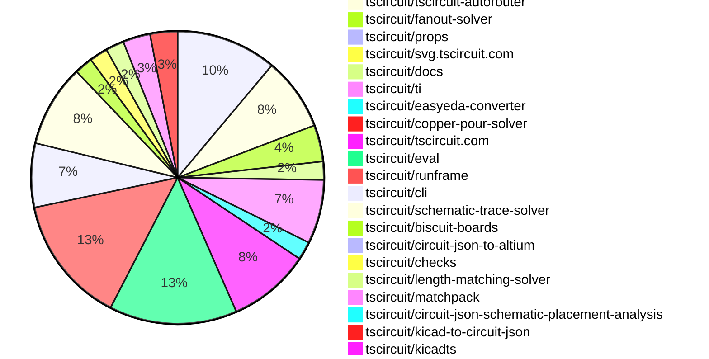

# Contribution Overview 2026-09-01

The current week is shown below. There are 3 major sections:

- [Contributor Overview](#contributor-overview)
- [PRs by Repository](#prs-by-repository)
- [PRs by Contributor](#changes-by-contributor)
- [Scoring & Sponsorship Details](/docs/sponsorship-calculation-explanation.md)

## PRs by Repository

## Contributor Overview

| Contributor | 🐳 Major | 🐙 Minor | 🐌 Tiny | Score | ⭐ |
|-------------|---------|---------|---------|-------|-----|
| [seveibar](#seveibar) | 4 | 2 | 6 | 27 | ⭐⭐ |
| [mohan-bee](#mohan-bee) | 3 | 2 | 5 | 23 | ⭐⭐ |
| [MustafaMulla29](#MustafaMulla29) | 2 | 1 | 2 | 13 | ⭐⭐ |
| [tscircuitbot](#tscircuitbot) | 0 | 0 | 57 | 12.5 | ⭐⭐ |
| [techmannih](#techmannih) | 1 | 0 | 7 | 10.5 | ⭐ |
| [ShiboSoftwareDev](#ShiboSoftwareDev) | 1 | 1 | 2 | 8 | ⭐ |
| [AnasSarkiz](#AnasSarkiz) | 1 | 0 | 0 | 7 | ⭐ |
| [imrishabh18](#imrishabh18) | 1 | 1 | 0 | 7 | ⭐ |
| [rushabhcodes](#rushabhcodes) | 1 | 0 | 1 | 5 | ⭐ |
| [Abse2001](#Abse2001) | 0 | 0 | 1 | 4 | ⭐ |
| [hrithik18k](#hrithik18k) | 1 | 0 | 0 | 4 | ⭐ |
| [0hmX](#0hmX) | 0 | 0 | 1 | 2 |  |
| [Sang-it](#Sang-it) | 0 | 1 | 0 | 2 |  |
| [GokulPandi-M](#GokulPandi-M) | 0 | 0 | 1 | 1 |  |

## Staff Pass Ratio (SPR)

| Contributor | Reviewed PRs | Rejections | Approvals | SPR |
|-------------|--------------|------------|-----------|-----|
| [AnasSarkiz](#AnasSarkiz) | 1 | 0 | 1 | 100.0% |
| [GokulPandi-M](#GokulPandi-M) | 1 | 1 | 0 | 0.0% |
| [mohan-bee](#mohan-bee) | 1 | 0 | 1 | 100.0% |
| [MustafaMulla29](#MustafaMulla29) | 1 | 0 | 1 | 100.0% |

AnasSarkiz SPR PRs (1)

- [#99](https://github.com/tscircuit/high-density-a01/pull/99) consolidate native A11 and A12 solver foundations

GokulPandi-M SPR PRs (1)

- [#241](https://github.com/tscircuit/matchpack/pull/241) fix: preserve clearance when aligning rail rows

mohan-bee SPR PRs (1)

- [#1017](https://github.com/tscircuit/schematic-trace-solver/pull/1017) keep downward ground labels directly below shared rails

MustafaMulla29 SPR PRs (1)

- [#1020](https://github.com/tscircuit/schematic-trace-solver/pull/1020) Align same-net pin exits, endpoint buses, and shared rails

> Note: AI evaluates PRs and assigns 1-3 star ratings automatically. 4 and 5 star ratings require manual staff review.

## Review Table

[reviews-received-hover]: ## "Number of reviews received for PRs for this contributor"
[approvals-received-hover]: ## "Number of approvals received for PRs this contributor authored"
[rejections-received-hover]: ## "Number of rejections received for PRs this contributor authored"
[prs-opened-hover]: ## "Number of PRs opened by this contributor"
[issues-created-hover]: ## "Number of issues created by this contributor"

| Contributor | Reviews Received | Approvals Received | Rejections Received | Approvals | Rejections Given | PRs Opened | PRs Merged | Issues Created |
|---|---|---|---|---|---|---|---|---|
| [0hmX](#0hmX) | 2 | 0 | 0 | 1 | 0 | 3 | 1 | 0 |
| [85heisenberg85](#85heisenberg85) | 0 | 0 | 0 | 0 | 0 | 1 | 0 | 0 |
| [Abse2001](#Abse2001) | 2 | 2 | 0 | 3 | 0 | 8 | 1 | 0 |
| [AnasSarkiz](#AnasSarkiz) | 1 | 1 | 0 | 4 | 0 | 6 | 1 | 0 |
| [beefrea](#beefrea) | 0 | 0 | 0 | 0 | 0 | 3 | 0 | 0 |
| [gcoinstash-cmd](#gcoinstash-cmd) | 0 | 0 | 0 | 0 | 0 | 4 | 0 | 0 |
| [GokulPandi-M](#GokulPandi-M) | 3 | 2 | 1 | 0 | 0 | 3 | 1 | 0 |
| [hrithik18k](#hrithik18k) | 2 | 2 | 0 | 0 | 0 | 3 | 1 | 0 |
| [imrishabh18](#imrishabh18) | 1 | 0 | 0 | 9 | 0 | 4 | 2 | 0 |
| [J2c-ashwani](#J2c-ashwani) | 0 | 0 | 0 | 0 | 0 | 1 | 0 | 0 |
| [KrishnaX12](#KrishnaX12) | 0 | 0 | 0 | 0 | 0 | 1 | 0 | 0 |
| [mohan-bee](#mohan-bee) | 6 | 5 | 0 | 2 | 0 | 16 | 10 | 0 |
| [MustafaMulla29](#MustafaMulla29) | 6 | 5 | 0 | 3 | 0 | 5 | 5 | 0 |
| [Navi1405](#Navi1405) | 0 | 0 | 0 | 0 | 0 | 1 | 0 | 0 |
| [Rijul202](#Rijul202) | 1 | 0 | 0 | 0 | 0 | 1 | 0 | 0 |
| [rushabhcodes](#rushabhcodes) | 7 | 3 | 0 | 0 | 0 | 4 | 2 | 0 |
| [Sang-it](#Sang-it) | 0 | 0 | 0 | 0 | 0 | 1 | 1 | 0 |
| [seveibar](#seveibar) | 2 | 0 | 0 | 4 | 1 | 21 | 14 | 0 |
| [ShiboSoftwareDev](#ShiboSoftwareDev) | 5 | 5 | 0 | 1 | 0 | 16 | 4 | 0 |
| [Sophia-Thickums](#Sophia-Thickums) | 0 | 0 | 0 | 0 | 0 | 1 | 0 | 0 |
| [techmannih](#techmannih) | 4 | 2 | 0 | 0 | 0 | 11 | 8 | 0 |
| [tscircuitbot](#tscircuitbot) | 0 | 0 | 0 | 0 | 0 | 71 | 57 | 0 |

## Changes by Repository

### [tscircuit/core](https://github.com/tscircuit/core)

| PR # | Impact | Rating | Contributor | Description |
|------|--------|--------|-------------|-------------|
| [#3581](https://github.com/tscircuit/core/pull/3581) | 🐳 Major | ⭐⭐⭐ | seveibar | Add a new autorouting phase that simplifies existing PCB traces and integrates with the autorouting pipeline, enhancing routing efficiency. |

🐌 Tiny Contributions (10)

| PR # | Impact | Contributor | Description |
|------|--------|-------------|-------------|
| [#3537](https://github.com/tscircuit/core/pull/3537) | 🐌 Tiny | seveibar | Summary add DDR_DMI0 as the eighth progressive DDR bus, routing AM62L DDR0_DM0 on F2 to LPDDR4 DMI0 on C3 route the singleton bus through inner5 with top-side exits on both component fanouts extend the exact phase, layer, exit, and connectivity assertions update the existing full-board visual snapshot in place without renaming it  Dependency Depends on tscircuitfanout-solver112 and its next published release. package.json intentionally remains on tscircuitfanout-solver 0.0.45 until that release exists; this draft was validated against the local solver branch.  Validation bun test testsreprosrepro-am62l-lpddr4-progressive-fanout.test.tsx  1 passed, 5,324 assertions bunx tsc --noEmit bunx biome check on changed TypeScript files visually inspected the updated full-board SVG snapshot |
| [#3544](https://github.com/tscircuit/core/pull/3544) | 🐌 Tiny | seveibar | Summary increase the configured via drill from 0.10 mm to 0.15 mm while retaining the 0.24 mm via pad assert the configured board values and every emitted via dimension update the established progressive and two-bus visual snapshots in place without renaming them This is stacked on 3537, whose branch now includes merged PR 3541.  Verification bun test testsreprosrepro-am62l-lpddr4-progressive-fanout.test.tsx --timeout 300000 bun test testsreprosrepro-am62l-lpddr4-two-bus-bga-fanout.test.tsx --timeout 300000 bunx biome check testsfixturescreate-am62l-lpddr4-fanout.tsx testsreprosrepro-am62l-lpddr4-progressive-fanout.test.tsx testsreprosrepro-am62l-lpddr4-two-bus-bga-fanout.test.tsx git diff --check All route geometry and via centers remain unchanged; the SVG visual difference is the larger drill circles.  Manufacturing note A 0.15 mm hole inside a 0.24 mm pad leaves a 0.045 mm annular ring per side. The routing and current DRCs pass, but fabrication acceptance remains manufacturer-specific. |
| [#3592](https://github.com/tscircuit/core/pull/3592) | 🐌 Tiny | tscircuitbot | Updates the tscircuitchecks package from version 0.0.179 to 0.0.180 in the package.json file. |
| [#3591](https://github.com/tscircuit/core/pull/3591) | 🐌 Tiny | tscircuitbot | Updates the version of the tscircuitchecks package from 0.0.179 to 0.0.180 in package.json |
| [#3588](https://github.com/tscircuit/core/pull/3588) | 🐌 Tiny | tscircuitbot | Updates the version of the tscircuitchecks package from 0.0.178 to 0.0.179 in package.json |
| [#3579](https://github.com/tscircuit/core/pull/3579) | 🐌 Tiny | tscircuitbot | Updates the tscircuitfanout-solver package from version 0.0.48 to 0.0.49 |
| [#3578](https://github.com/tscircuit/core/pull/3578) | 🐌 Tiny | tscircuitbot | Updates the tscircuitfanout-solver package from version 0.0.47 to 0.0.48 |
| [#3584](https://github.com/tscircuit/core/pull/3584) | 🐌 Tiny | techmannih | Reproduces the overlap between the adjacent AUDIO_VRA1, GND, and AUDIO_VRA2 fallback labels in the T113 schematic. |
| [#3585](https://github.com/tscircuit/core/pull/3585) | 🐌 Tiny | techmannih | Add a minimal Trellis Core feedback network with L2, R5, C4, and R7 to reproduce the nearly overlapping BUCK_0V9_FB auto-label trace beside the R5-to-C4 trace and pin the behavior with a schematic snapshot. |
| [#3582](https://github.com/tscircuit/core/pull/3582) | 🐌 Tiny | MustafaMulla29 | Updates the tscircuitschematic-trace-solver dependency from version 0.0.175 to 0.0.178, including connector-crossing reroute improvements from a related pull request. |

### [tscircuit/tscircuit-autorouter](https://github.com/tscircuit/tscircuit-autorouter)

| PR # | Impact | Rating | Contributor | Description |
|------|--------|--------|-------------|-------------|
| [#2335](https://github.com/tscircuit/tscircuit-autorouter/pull/2335) | 🐳 Major | ⭐⭐⭐ | seveibar | Summary add numbered AutoroutingPipelineSolver11_Simplification, a cleanup-only pipeline for existing SimpleRouteJson.traces use the conventional BasePipelineSolver definition with explicit prepare, simplify, apply, and DRC-validation stages; the outer pipeline does not override _step() keep stage work incremental: one input trace, one wrapped solver step, one output trace, or one validation pass per _step() preserve variable-width traces exactly and include them as immutable collision geometry while simplifying constant-width traces opt Pipeline 11 into clearance checks that use the actual currentneighbor trace widths and a matching spatial-search margin, without changing established pipeline behavior preserve trace IDs, connection metadata, endpoints, terminal vias, and terminal PCB-port metadata without routing missing SRJ connections  Why The simplify autorouting phase needs a dedicated local pipeline for users who want to improve traces that are already routed. Reusing the normal autorouting pipeline would solve SRJ connections again instead of limiting the work to post-route cleanup. The cleanup solvers currently use one traceThickness per high-density route. Sending a variable-width SRJ trace through that representation collapsed every segment to one arbitrary width and created DRC violations. Pipeline 11 now makes that capability boundary explicit: constant-width routes are simplified, while variable-width routes retain their exact copper geometry and still block unsafe shortcuts. Companion props PR: https:github.comtscircuitpropspull723  Real-board visual snapshot The fixture was captured from the board and MCU autorouting events produced by imrishabh18rp2040-motor-controller(https:tscircuit.comimrishabh18rp2040-motor-controllerfiles) at tscircuitrp2040-motor-controllerb4560e5(https:github.comtscircuitrp2040-motor-controllercommitb4560e5). Pipeline 11 preserves all 148 traces and every input width set, including 30 exact variable-width routes. It reduces route points from 1,829 to 1,763 and vias from 150 to 73, while exact relaxed DRC remains 0  0. !RP2040 motor controller before and after Pipeline 11 simplification(https:raw.githubusercontent.comtscircuittscircuit-autorouterfeatsimplification-pipelinetests__snapshots__pipeline11-simplification-rp2040-motor-controller-visual-rp2040-motor-controller-before-after.snap.svg)  Validation bun run build bunx tsc --noEmit focused Pipeline 11 suite: 4 tests passed Pipeline 9 reference-clean exact-output regression test passed real-board test: all width sets preserved, 30 variable-width routes exact, exact relaxed DRC 0  0 visual snapshot regenerated, rendered to PNG, and inspected git diff --check GitHub CI: all 9 test shards, build, type-check, format-check, added-code check, and Vercel checks passed |

🐌 Tiny Contributions (7)

| PR # | Impact | Contributor | Description |
|------|--------|-------------|-------------|
| [#2333](https://github.com/tscircuit/tscircuit-autorouter/pull/2333) | 🐌 Tiny | seveibar | Limits the benchmark-all command to only run on dataset01 and dataset18, updates benchmark instructions, and modifies the workflow assertion in the benchmark command test. |
| [#2343](https://github.com/tscircuit/tscircuit-autorouter/pull/2343) | 🐌 Tiny | tscircuitbot | Automated package update |
| [#2338](https://github.com/tscircuit/tscircuit-autorouter/pull/2338) | 🐌 Tiny | tscircuitbot | Automated package update |
| [#2336](https://github.com/tscircuit/tscircuit-autorouter/pull/2336) | 🐌 Tiny | tscircuitbot | Automated package update |
| [#2334](https://github.com/tscircuit/tscircuit-autorouter/pull/2334) | 🐌 Tiny | tscircuitbot | Automated package update |
| [#2342](https://github.com/tscircuit/tscircuit-autorouter/pull/2342) | 🐌 Tiny | mohan-bee | Updates the length-matching solver dependency to the latest commit for improved functionality and bug fixes. |
| [#2326](https://github.com/tscircuit/tscircuit-autorouter/pull/2326) | 🐌 Tiny | 0hmX | Adds a reproduction of the QFP16 Pipeline 9 with extra vias, documenting a routing-quality regression without changing solver behavior. |

### [tscircuit/fanout-solver](https://github.com/tscircuit/fanout-solver)

| PR # | Impact | Rating | Contributor | Description |
|------|--------|--------|-------------|-------------|
| [#131](https://github.com/tscircuit/fanout-solver/pull/131) | 🐳 Major | ⭐⭐⭐ | seveibar | Summary move candidate-layer probing out of the constructor and expose assignment and grouped-beam work as active subsolvers break dense through-all routing into visible dense-routing and boundary-bus subsolvers advance via-minimal winding A in bounded 5,000-state batches, with route-order, connection, batch, and expanded-state progress in solver stats give every active work solver a phase-aware visualize() view; boundary routing renders the current grid, frontier, expanded states, active via, and best path render adaptive single-layer progress while obstacle nodes are classified, the flow network is built and augmented, and routes are extracted preserve the synchronous routing APIs by consuming the same incremental generators to completion without constructing debug graphics batch single-layer adaptive grid, terminal, graph, and max-flow work across steps Bus-atomic routing, scoring, and accepted final geometry remain unchanged.  Repro03 Before the split, one repro03 step() spent about 17.4 seconds routing all three dense boundary buses. It is now 432 observable iterations, including 307 boundary-search steps. A measured full solve completed in 19.7 seconds with a 182 ms maximum step and a 177 ms maximum boundary-search step while live visualization state was enabled. The active debugger chain during the hotspot is: FanoutAssignmentSolver  DenseMixedTerminationSolver  BoundaryBusRoutingSolver Successive calls to visualize() during that boundary subsolver now show the A frontier and newly expanded states changing between batches.  Testing bun run typecheck bun test on Bun 1.3.2: 129 passed, 0 failed focused repro03 incremental-step and live-visualization regression adaptive single-layer live-visualization regression existing repro03 126-connection routing and DRC regression bun run format:check git diff --check  CI note The hosted Bun 1.4 test job reaches 124 passing tests, including both repro03 tests, but the pre-existing nine-bus DRAM SVG snapshot mismatch also reproduces on current main; the workflow then exceeds its five-minute timeout. Baseline run: https:github.comtscircuitfanout-solveractionsruns33295395301 |
| [#129](https://github.com/tscircuit/fanout-solver/pull/129) | 🐳 Major | ⭐⭐⭐ | seveibar | Summary add a Cosmos debugger repro for the AM62L nine-bus top-edge breakout failure commit the RAM-above circuit source in scriptsgenerate-reprogenerate-repro04.tsx render that TSX with tscircuitcore using RootCircuit.renderUntilSettled() override the SOC_FANOUT algorithmFn to capture the real fanout-solver input and return a completed no-op autorouter regenerate the committed  inputSrj, options  fixture without manually rotating or redistributing points retain 135 connections, 589 phase obstacles, eight layers, nine DDR signal buses, 102 plane-drop buses, and three differential pairs verify that all 33 downstream breakout points are on the top boundary snapshot getSvgFromGraphicsObject(solver.visualize()) so the complete RAM-above input geometry and top-edge targets are visually reviewed The generator dependency workspace keeps the current core rendering stack separate from fanout-solvers pinned runtime capacity-autorouter version. Run it with bun run generate:repro04.  Current behavior The captured circuit is the AM62L failure case: the solver is unable to complete the 135-connection breakout. The Cosmos page exposes the full solver search for inspection.  Verification bun run generate:repro04 (deterministic SHA-256 across repeated runs) bun run typecheck bun test testsam62l-top-edge-breakout-repro.test.ts bun test with the repository-local Bun 1.3.2 (128 pass, 0 fail before the visual assertion was added) bun run build:site git diff --check  CI note Format, type-check, Vercel, and the new AM62L repro test pass. The Bun 1.4 CI test job reports an existing SVG snapshot mismatch in am62l-lpddr4-progressive-through-all-dram-repro.test.ts; the same mismatch occurred on this PR before the generator and AM62L visualization commits, while that snapshot passes locally under Bun 1.3.2. |

🐌 Tiny Contributions (2)

| PR # | Impact | Contributor | Description |
|------|--------|-------------|-------------|
| [#133](https://github.com/tscircuit/fanout-solver/pull/133) | 🐌 Tiny | tscircuitbot | Automated package update |
| [#132](https://github.com/tscircuit/fanout-solver/pull/132) | 🐌 Tiny | tscircuitbot | Automated package update |

### [tscircuit/props](https://github.com/tscircuit/props)

| PR # | Impact | Rating | Contributor | Description |
|------|--------|--------|-------------|-------------|
| [#723](https://github.com/tscircuit/props/pull/723) | 🐙 Minor | ⭐⭐ | seveibar | Adds simplify as a supported autorouter preset, allowing cleanup across all traces without a selector and warns if used without reroutetrue. |

### [tscircuit/svg.tscircuit.com](https://github.com/tscircuit/svg.tscircuit.com)

| PR # | Impact | Rating | Contributor | Description |
|------|--------|--------|-------------|-------------|
| [#2186](https://github.com/tscircuit/svg.tscircuit.com/pull/2186) | 🐙 Minor | ⭐⭐ | seveibar | Add a show_debug_objects request flag for PCB SVG and PNG output, allowing users to render PCB debug object overlays such as autorouting phase bounds. |

### [tscircuit/docs](https://github.com/tscircuit/docs)

🐌 Tiny Contributions (2)

| PR # | Impact | Contributor | Description |
|------|--------|-------------|-------------|
| [#863](https://github.com/tscircuit/docs/pull/863) | 🐌 Tiny | seveibar | Clarifies the boundaries for DDR fanout by moving synthetic DDR channel endpoints outside each breakout and relying on Cores implicit breakout points. |
| [#862](https://github.com/tscircuit/docs/pull/862) | 🐌 Tiny | seveibar | Add a Routing DDR guide covering bus decomposition, opposing package fanouts, layer allocation, tuning room, and end-to-end verification, along with live CircuitPreview examples for controller and memory byte-lane fanout. |

### [tscircuit/ti](https://github.com/tscircuit/ti)

| PR # | Impact | Rating | Contributor | Description |
|------|--------|--------|-------------|-------------|
| [#225](https://github.com/tscircuit/ti/pull/225) | 🐳 Major | ⭐⭐⭐ | imrishabh18 | Add a subcircuit picker modal for selecting TI parts within system blocks, allowing users to replace blocks while preserving compatible connections and providing clear notifications for incompatible links. |
| [#227](https://github.com/tscircuit/ti/pull/227) | 🐙 Minor | ⭐⭐ | imrishabh18 | Limits the subcircuit picker to show only subcircuits within the selected blocks category, while excluding the current and non-instantiable subcircuits, and preserving alphabetical order within the matching category. |

🐌 Tiny Contributions (5)

| PR # | Impact | Contributor | Description |
|------|--------|-------------|-------------|
| [#224](https://github.com/tscircuit/ti/pull/224) | 🐌 Tiny | seveibar | Add MSPM33C321A and MSPM33C3219 exports for the 100-pin PZ LQFP package, add MSPM0C1104 package selection for 20-pin DGS VSSOP and 8-pin DSG WSON parts, and introduce reusable Microcontroller_MSPM0G5117 and Microcontroller_MSPM0G5187 basic-application subcircuits with TI-recommended support. |
| [#226](https://github.com/tscircuit/ti/pull/226) | 🐌 Tiny | techmannih | Fixes the length of the port stems for the LM5050 TVS symbol to align with the symbol body. |
| [#221](https://github.com/tscircuit/ti/pull/221) | 🐌 Tiny | techmannih | Summary replace explicit netlabel elements with named native traces remove legacy manual label positioning helpers and update connectivity assertions refresh only existing affected snapshots and add a guard against reintroducing manual netlabels  Validation bun run typecheck focused tests: 20 pass full bun test: 121 pass, 1 pre-existing failure in PowerSupply_WindowModule.test.tsx for missing sheet dimensions existing snapshots updated: 42 modified, 0 added Biome formatting passes for all PR sourcetest files; repository-wide check is blocked only by unrelated untracked files under tmp |
| [#223](https://github.com/tscircuit/ti/pull/223) | 🐌 Tiny | techmannih | Fixes Altium exporter to use five-digit schematic fractional coordinates and prevents rendering issues with giant symbol lines and filled polygons in Real View. |
| [#222](https://github.com/tscircuit/ti/pull/222) | 🐌 Tiny | techmannih | Updates the circuit-json-to-altium dependency to a specific commit and refreshes the Bun lockfile for the new Git resolution. |

### [tscircuit/easyeda-converter](https://github.com/tscircuit/easyeda-converter)

🐌 Tiny Contributions (2)

| PR # | Impact | Contributor | Description |
|------|--------|-------------|-------------|
| [#535](https://github.com/tscircuit/easyeda-converter/pull/535) | 🐌 Tiny | Abse2001 | Documents real L0805 inductor reproductions with provenance and source-identity checks for two EasyEDALCSC component records, ensuring accurate representation in generated schematics and PCBs. |
| [#534](https://github.com/tscircuit/easyeda-converter/pull/534) | 🐌 Tiny | rushabhcodes | Reproduces a bug where HTML-encoded pin aliases from EasyEDA are incorrectly processed, leading to invalid pin labels in generated components. |

### [tscircuit/copper-pour-solver](https://github.com/tscircuit/copper-pour-solver)

| PR # | Impact | Rating | Contributor | Description |
|------|--------|--------|-------------|-------------|
| [#86](https://github.com/tscircuit/copper-pour-solver/pull/86) | 🐳 Major | ⭐⭐⭐ | rushabhcodes | Fixes the omission of oval plated holes in copper pour calculations, ensuring proper clearance and thermal relief for designs using oval plated holes. |

### [tscircuit/tscircuit.com](https://github.com/tscircuit/tscircuit.com)

| PR # | Impact | Rating | Contributor | Description |
|------|--------|--------|-------------|-------------|
| [#4729](https://github.com/tscircuit/tscircuit.com/pull/4729) | 🐳 Major | ⭐⭐⭐ | hrithik18k | Fixes schematic downloads to include all sheets in multi-sheet projects instead of just the firstdefault sheet. |

🐌 Tiny Contributions (8)

| PR # | Impact | Contributor | Description |
|------|--------|-------------|-------------|
| [#4733](https://github.com/tscircuit/tscircuit.com/pull/4733) | 🐌 Tiny | tscircuitbot | Automated package update |
| [#4731](https://github.com/tscircuit/tscircuit.com/pull/4731) | 🐌 Tiny | tscircuitbot | Updates the tscircuitrunframe package from version 0.0.2633 to 0.0.2634 |
| [#4728](https://github.com/tscircuit/tscircuit.com/pull/4728) | 🐌 Tiny | tscircuitbot | Updates the tscircuitrunframe package from version 0.0.2632 to 0.0.2633 |
| [#4726](https://github.com/tscircuit/tscircuit.com/pull/4726) | 🐌 Tiny | tscircuitbot | Automated package update |
| [#4724](https://github.com/tscircuit/tscircuit.com/pull/4724) | 🐌 Tiny | tscircuitbot | Automated package update |
| [#4723](https://github.com/tscircuit/tscircuit.com/pull/4723) | 🐌 Tiny | tscircuitbot | Updates the tscircuiteval package from version 0.0.1323 to 0.0.1327 |
| [#4722](https://github.com/tscircuit/tscircuit.com/pull/4722) | 🐌 Tiny | tscircuitbot | Automated package update for tscircuitrunframe from version 0.0.2629 to 0.0.2630 |
| [#4720](https://github.com/tscircuit/tscircuit.com/pull/4720) | 🐌 Tiny | tscircuitbot | Automated package update |

### [tscircuit/eval](https://github.com/tscircuit/eval)

🐌 Tiny Contributions (14)

| PR # | Impact | Contributor | Description |
|------|--------|-------------|-------------|
| [#4320](https://github.com/tscircuit/eval/pull/4320) | 🐌 Tiny | tscircuitbot | Automated package update |
| [#4319](https://github.com/tscircuit/eval/pull/4319) | 🐌 Tiny | tscircuitbot | Automated package update |
| [#4317](https://github.com/tscircuit/eval/pull/4317) | 🐌 Tiny | tscircuitbot | Automated package update to version 0.0.1330 |
| [#4316](https://github.com/tscircuit/eval/pull/4316) | 🐌 Tiny | tscircuitbot | Automated package update |
| [#4314](https://github.com/tscircuit/eval/pull/4314) | 🐌 Tiny | tscircuitbot | Automated package update to version 0.0.1329 |
| [#4313](https://github.com/tscircuit/eval/pull/4313) | 🐌 Tiny | tscircuitbot | Automated package update |
| [#4311](https://github.com/tscircuit/eval/pull/4311) | 🐌 Tiny | tscircuitbot | Automated package update |
| [#4310](https://github.com/tscircuit/eval/pull/4310) | 🐌 Tiny | tscircuitbot | Automated package update |
| [#4308](https://github.com/tscircuit/eval/pull/4308) | 🐌 Tiny | tscircuitbot | Automated package update |
| [#4307](https://github.com/tscircuit/eval/pull/4307) | 🐌 Tiny | tscircuitbot | Updates package dependencies to their latest versions in package.json |
| [#4305](https://github.com/tscircuit/eval/pull/4305) | 🐌 Tiny | tscircuitbot | Automated package update |
| [#4304](https://github.com/tscircuit/eval/pull/4304) | 🐌 Tiny | tscircuitbot | Updates the version of several dependencies in the package.json file. |
| [#4302](https://github.com/tscircuit/eval/pull/4302) | 🐌 Tiny | tscircuitbot | Automated package update |
| [#4301](https://github.com/tscircuit/eval/pull/4301) | 🐌 Tiny | tscircuitbot | Updates package dependencies to their latest versions as part of routine maintenance. |

### [tscircuit/runframe](https://github.com/tscircuit/runframe)

🐌 Tiny Contributions (14)

| PR # | Impact | Contributor | Description |
|------|--------|-------------|-------------|
| [#4928](https://github.com/tscircuit/runframe/pull/4928) | 🐌 Tiny | tscircuitbot | Automated package update |
| [#4927](https://github.com/tscircuit/runframe/pull/4927) | 🐌 Tiny | tscircuitbot | Updates the tscircuiteval package to version 0.0.1331 in the package.json file. |
| [#4926](https://github.com/tscircuit/runframe/pull/4926) | 🐌 Tiny | tscircuitbot | Automated package update |
| [#4925](https://github.com/tscircuit/runframe/pull/4925) | 🐌 Tiny | tscircuitbot | Updates the tscircuiteval package to version 0.0.1330 in the package.json file. |
| [#4924](https://github.com/tscircuit/runframe/pull/4924) | 🐌 Tiny | tscircuitbot | Automated package update |
| [#4923](https://github.com/tscircuit/runframe/pull/4923) | 🐌 Tiny | tscircuitbot | Updates the tscircuiteval package to version 0.0.1329 in the package.json file. |
| [#4922](https://github.com/tscircuit/runframe/pull/4922) | 🐌 Tiny | tscircuitbot | Automated package update |
| [#4921](https://github.com/tscircuit/runframe/pull/4921) | 🐌 Tiny | tscircuitbot | Updates the tscircuiteval package to version 0.0.1328 in the package.json file. |
| [#4920](https://github.com/tscircuit/runframe/pull/4920) | 🐌 Tiny | tscircuitbot | Automated package update |
| [#4919](https://github.com/tscircuit/runframe/pull/4919) | 🐌 Tiny | tscircuitbot | Updates the tscircuiteval package to version 0.0.1327 in the package.json file. |
| [#4918](https://github.com/tscircuit/runframe/pull/4918) | 🐌 Tiny | tscircuitbot | Automated package update |
| [#4917](https://github.com/tscircuit/runframe/pull/4917) | 🐌 Tiny | tscircuitbot | Updates the tscircuiteval package to version 0.0.1326 in the package.json file. |
| [#4916](https://github.com/tscircuit/runframe/pull/4916) | 🐌 Tiny | tscircuitbot | Automated package update |
| [#4915](https://github.com/tscircuit/runframe/pull/4915) | 🐌 Tiny | tscircuitbot | Updates the tscircuiteval package from version 0.0.1324 to 0.0.1325 in the package.json file. |

### [tscircuit/cli](https://github.com/tscircuit/cli)

🐌 Tiny Contributions (7)

| PR # | Impact | Contributor | Description |
|------|--------|-------------|-------------|
| [#4580](https://github.com/tscircuit/cli/pull/4580) | 🐌 Tiny | tscircuitbot | Updates the tscircuitrunframe package to version 0.0.2635 in the package.json file. |
| [#4579](https://github.com/tscircuit/cli/pull/4579) | 🐌 Tiny | tscircuitbot | Updates the tscircuitrunframe package from version 0.0.2633 to 0.0.2634 |
| [#4578](https://github.com/tscircuit/cli/pull/4578) | 🐌 Tiny | tscircuitbot | Updates the tscircuitrunframe package to version 0.0.2633 |
| [#4577](https://github.com/tscircuit/cli/pull/4577) | 🐌 Tiny | tscircuitbot | Updates the tscircuitrunframe package from version 0.0.2631 to 0.0.2632 |
| [#4576](https://github.com/tscircuit/cli/pull/4576) | 🐌 Tiny | tscircuitbot | Updates the tscircuitrunframe package from version 0.0.2630 to 0.0.2631 |
| [#4575](https://github.com/tscircuit/cli/pull/4575) | 🐌 Tiny | tscircuitbot | Updates the tscircuitrunframe package to version 0.0.2630 in package.json |
| [#4574](https://github.com/tscircuit/cli/pull/4574) | 🐌 Tiny | tscircuitbot | Updates the tscircuitrunframe package to version 0.0.2629 in package.json |

### [tscircuit/schematic-trace-solver](https://github.com/tscircuit/schematic-trace-solver)

| PR # | Impact | Rating | Contributor | Description |
|------|--------|--------|-------------|-------------|
| [#1038](https://github.com/tscircuit/schematic-trace-solver/pull/1038) | 🐳 Major | ⭐⭐⭐ | techmannih | Fixes the issue where net label connectors run parallel to host traces by shifting them laterally onto their existing host trace and creating a direct tee instead of a near-parallel connector. |
| [#1013](https://github.com/tscircuit/schematic-trace-solver/pull/1013) | 🐳 Major | ⭐⭐⭐ | MustafaMulla29 | Reroutes component-to-component traces to avoid crossings with generated net-label connectors, ensuring cleaner routing and preserving valid label-to-label crossings. |
| [#1020](https://github.com/tscircuit/schematic-trace-solver/pull/1020) | 🐳 Major | ⭐⭐⭐ | MustafaMulla29 | Aligns adjacent same-side pin exits onto neighboring pin rows, aligns degree-two buses between perpendicular endpointload traces, and preserves generated connector junctions while validating candidates against various criteria. |
| [#1017](https://github.com/tscircuit/schematic-trace-solver/pull/1017) | 🐳 Major | ⭐⭐⭐ | mohan-bee | Adjusts the placement of downward ground labels to ensure they remain close to their connected pins and directly attached to shared rails, improving schematic clarity and accuracy. |
| [#1008](https://github.com/tscircuit/schematic-trace-solver/pull/1008) | 🐙 Minor | ⭐⭐ | mohan-bee | Prevents duplicate ground labels on unwired pins of a component to ensure correct schematic representation. |

🐌 Tiny Contributions (4)

| PR # | Impact | Contributor | Description |
|------|--------|-------------|-------------|
| [#1035](https://github.com/tscircuit/schematic-trace-solver/pull/1035) | 🐌 Tiny | tscircuitbot | Adds a snapshot-only regression test and debugger page for the attached JSON solver input. |
| [#1037](https://github.com/tscircuit/schematic-trace-solver/pull/1037) | 🐌 Tiny | tscircuitbot | Adds a snapshot-only regression test and debugger page for the attached JSON solver input. |
| [#1016](https://github.com/tscircuit/schematic-trace-solver/pull/1016) | 🐌 Tiny | mohan-bee | This pull request introduces a new JSON file containing the schematic trace for a USB hub sheet. The file includes detailed information about various chips, their dimensions, and pin configurations, which are essential for the schematic representation of the USB hub. |
| [#1002](https://github.com/tscircuit/schematic-trace-solver/pull/1002) | 🐌 Tiny | mohan-bee | Adds a focused solver snapshot for the smartwatch power sheet routing case, which was previously unaddressed. |

### [tscircuit/biscuit-boards](https://github.com/tscircuit/biscuit-boards)

| PR # | Impact | Rating | Contributor | Description |
|------|--------|--------|-------------|-------------|
| [#103](https://github.com/tscircuit/biscuit-boards/pull/103) | 🐙 Minor | ⭐⭐ | Sang-it | Adds a uniform solderpaste layer by reducing pad dimensions and applying lens distortion for non-circular top pads in LightBurn exports. |

🐌 Tiny Contributions (1)

| PR # | Impact | Contributor | Description |
|------|--------|-------------|-------------|
| [#104](https://github.com/tscircuit/biscuit-boards/pull/104) | 🐌 Tiny | tscircuitbot | Automated package update |

### [tscircuit/circuit-json-to-altium](https://github.com/tscircuit/circuit-json-to-altium)

🐌 Tiny Contributions (1)

| PR # | Impact | Contributor | Description |
|------|--------|-------------|-------------|
| [#93](https://github.com/tscircuit/circuit-json-to-altium/pull/93) | 🐌 Tiny | techmannih | Fixes the handling of fractional coordinates in Altium schematics by ensuring they use a five-digit fixed-point representation, preventing rendering issues in native Altium viewers. |

### [tscircuit/checks](https://github.com/tscircuit/checks)

| PR # | Impact | Rating | Contributor | Description |
|------|--------|--------|-------------|-------------|
| [#257](https://github.com/tscircuit/checks/pull/257) | 🐙 Minor | ⭐⭐ | MustafaMulla29 | Fixes clearance geometry calculations for plated-hole pill and oval copper pads to ensure accurate DRC checks without false errors. |

🐌 Tiny Contributions (1)

| PR # | Impact | Contributor | Description |
|------|--------|-------------|-------------|
| [#256](https://github.com/tscircuit/checks/pull/256) | 🐌 Tiny | MustafaMulla29 | Reproduces the two 0 mm pad-clearance errors from the unmodified generated component EC10E1220505 in a regression test, including a PCB SVG snapshot with error visualization enabled. |

### [tscircuit/length-matching-solver](https://github.com/tscircuit/length-matching-solver)

| PR # | Impact | Rating | Contributor | Description |
|------|--------|--------|-------------|-------------|
| [#61](https://github.com/tscircuit/length-matching-solver/pull/61) | 🐳 Major | ⭐⭐⭐ | mohan-bee | Fixes post-processing crash caused by 180-degree spine reversal in differential pair routing. |
| [#60](https://github.com/tscircuit/length-matching-solver/pull/60) | 🐳 Major | ⭐⭐⭐ | mohan-bee | Motivation Capture the RV1106G2 camera routing failure with the real board post-processing input.  Before A 180-degree differential-pair spine crashed without a full-board regression or snapshot.  After Adds the captured board fixture, asserts the current crash, and snapshots the complete board state. |

### [tscircuit/matchpack](https://github.com/tscircuit/matchpack)

| PR # | Impact | Rating | Contributor | Description |
|------|--------|--------|-------------|-------------|
| [#237](https://github.com/tscircuit/matchpack/pull/237) | 🐙 Minor | ⭐⭐ | mohan-bee | Fixes misclassification of two-pin crystals as generic loads, preserving crystal circuit alignment in the layout. |

🐌 Tiny Contributions (2)

| PR # | Impact | Contributor | Description |
|------|--------|-------------|-------------|
| [#236](https://github.com/tscircuit/matchpack/pull/236) | 🐌 Tiny | mohan-bee | Adds a new test and input JSON for reproducing the schematic layout of the board 8822. |
| [#240](https://github.com/tscircuit/matchpack/pull/240) | 🐌 Tiny | GokulPandi-M | Reproduces a schematic auto-layout failure where components from adjacent partitions are packed closer than the configured partition gap, causing their rendered annotations to collide. |

### [tscircuit/circuit-json-schematic-placement-analysis](https://github.com/tscircuit/circuit-json-schematic-placement-analysis)

🐌 Tiny Contributions (1)

| PR # | Impact | Contributor | Description |
|------|--------|-------------|-------------|
| [#36](https://github.com/tscircuit/circuit-json-schematic-placement-analysis/pull/36) | 🐌 Tiny | mohan-bee | Reproduces a bug where trace-anchored net labels can overlap adjacent net labels without a placement warning. |

### [tscircuit/kicad-to-circuit-json](https://github.com/tscircuit/kicad-to-circuit-json)

| PR # | Impact | Rating | Contributor | Description |
|------|--------|--------|-------------|-------------|
| [#177](https://github.com/tscircuit/kicad-to-circuit-json/pull/177) | 🐳 Major | ⭐⭐⭐ | ShiboSoftwareDev | Summary read schematic wire geometry from the public kicadts Wire.points API and keep KiCad junctions on renderable traces place ports with the selected symbol unitbody-style transform and emit matching source_port records render embedded KiCad symbol primitives, pin namesnumbers, and visible referencevalue fields instead of generic component boxes preserve standalone text, hierarchical sheets and pins, no-connect markers, rectangles, polylines, and arcs distinguish plain KiCad local labels from shaped global labels, while retaining their unique source_net records preserve hierarchical-sheet pin direction markers, readable text orientation, inset placement, and KiCad sheet colors update the HSP USB LED and pic-programmer native-KiCad-vs-converted snapshots  Why The importer previously read a nonexistent wire property, placed pins relative to the page origin, combined pins from every unit, and discarded most embedded symbol and top-level schematic graphics. Real schematics therefore lost wires, used generic boxes, showed misplacedduplicated ports, and omitted labels, annotations, grouping graphics, hierarchical sheets, no-connect markers, and visible junctions. The symbol-local transform now follows KiCads Cartesian symbol coordinates without applying a second Y inversion. Hidden KiCad property text stays hidden, while visible pin and instance text is preserved. Local labels no longer render as boxed global arrows, and 180-degree sheet pins remain readable instead of appearing upside down. This PR is stacked on 176 so its diff contains only the conversion fix and its regression coverage.  Visual regression Both real-circuit snapshots keep the native KiCad schematic on the left and the converted Circuit JSON schematic on the right. The regressions verify: HSP USB LED: 13 wire traces, 1 junction, 23 sourceschematic ports, real USBpassivepower symbol geometry, and both source grouping rectangles pic-programmer: 131 wire traces, 26 junctions, 182 sourceschematic ports, 10 plain local-label instances backed by 7 unique source nets, the hierarchical sheet and its 4 readable pin markers, 6 no-connect markers, and 8 dashed source drawing paths  Verification bun test testsschematic-source-component-links.test.ts testspic-programmer-parity-sch.test.ts bunx tsc --noEmit bun run format:check bun run build |

🐌 Tiny Contributions (2)

| PR # | Impact | Contributor | Description |
|------|--------|-------------|-------------|
| [#179](https://github.com/tscircuit/kicad-to-circuit-json/pull/179) | 🐌 Tiny | ShiboSoftwareDev | Updates the bundled parser to kicadts 0.0.57 to ensure KiCad 10 schematic properties with show_name and do_not_autoplace parse and round-trip correctly. |
| [#176](https://github.com/tscircuit/kicad-to-circuit-json/pull/176) | 🐌 Tiny | ShiboSoftwareDev | Summary link each imported schematic component to the actual source component ID returned by the database insert keep the inferred component type fully typed without an any cast use the real HSP USB LED KiCad schematic instead of the synthetic one-component fixture show both the HSP USB LED and pic-programmer schematic parity snapshots with native KiCad on the left and imported Circuit JSON on the right  Why The importer inserted IDs such as source_component_0 but linked schematic components to fabricated IDs such as Device:R_source. Consumers could not resolve those references.  Visual regression The existing repository test now runs against nushackershsp-pcb-introsrcusb_led.kicad_sch. Its snapshot shows the native KiCad source on the left and imported Circuit JSON on the right using an optional horizontal layout in the existing labeled stacking helper. The existing pic-programmer schematic parity test now uses the same side-by-side layout and refreshes its Circuit JSON inspection artifacts. Source revision: ad3fbd582e3915b585c453ea202f591720a1f427 (CERN-OHL-P-2.0), SHA-256 425a817f1c236363eefd6ff8cb23365d2641a43d5f1e057191497046dcf20d75.  Verification bun run format:check bunx tsc --noEmit bun test testsschematic-source-component-links.test.ts testspic-programmer-parity-sch.test.ts bun run build |

### [tscircuit/kicadts](https://github.com/tscircuit/kicadts)

| PR # | Impact | Rating | Contributor | Description |
|------|--------|--------|-------------|-------------|
| [#67](https://github.com/tscircuit/kicadts/pull/67) | 🐙 Minor | ⭐⭐ | ShiboSoftwareDev | Accepts and preserves the show_name and do_not_autoplace children emitted on ordinary schematic properties by KiCad 10, integrating them into Property parsing, construction, accessors, and serialization with round-trip coverage. |

### [tscircuit/high-density-a01](https://github.com/tscircuit/high-density-a01)

| PR # | Impact | Rating | Contributor | Description |
|------|--------|--------|-------------|-------------|
| [#99](https://github.com/tscircuit/high-density-a01/pull/99) | 🐳 Major | ⭐⭐⭐ | AnasSarkiz | Summary This consolidates the already reviewed native-size solver work from 95 and 96 into main: add A12, an A03-derived mixed-resolution solver with exact endpoint preservation and a final geometry gate add A11 rip-history costs to break recurring rip-and-reroute cycles expose the solver choices in the package benchmarkdebugger tooling keep A01 and A03 defaults unchanged; the new behavior is opt-in through A11A12 This PR intentionally contains only the shared solver foundation. Compatibility work and the subsequent A11 topology-aware scheduling improvement remain focused dependent PRs.  Canonical HD30 baseline Dataset: tscircuitdataset-hd300ad7fe36c3da67469a053cfa98f709f751f844b1 Settings: regular Pipeline 9 nodes, Pipeline 9 copper dimensions, original bounds, shuffle seed 0, effort 1, and a 100,000-iteration cap.  Solver  Valid native solves   ---  ---:   A01  027   A03  027   A11  727   A12  827   A11  A12 union  1227  All counted solves pass exact route-geometry validation at the original bounds.  Validation on ac13ef80da71c3998acb5302329b6b704d0470d1 full package: 82 passed, 2 skipped, 0 failed build passed format check passed canonical four-solver HD30 matrix reproduced. |

## Changes by Contributor

### [seveibar](https://github.com/seveibar)

| PRs # | Impact | Rating | Description |
|------|--------|--------|-------------|
| [#3581](https://github.com/tscircuit/core/pull/3581) | 🐳 Major | ⭐⭐⭐ | Add a new autorouting phase that simplifies existing PCB traces and integrates with the autorouting pipeline, enhancing routing efficiency. |
| [#2335](https://github.com/tscircuit/tscircuit-autorouter/pull/2335) | 🐳 Major | ⭐⭐⭐ | Summary add numbered AutoroutingPipelineSolver11_Simplification, a cleanup-only pipeline for existing SimpleRouteJson.traces use the conventional BasePipelineSolver definition with explicit prepare, simplify, apply, and DRC-validation stages; the outer pipeline does not override _step() keep stage work incremental: one input trace, one wrapped solver step, one output trace, or one validation pass per _step() preserve variable-width traces exactly and include them as immutable collision geometry while simplifying constant-width traces opt Pipeline 11 into clearance checks that use the actual currentneighbor trace widths and a matching spatial-search margin, without changing established pipeline behavior preserve trace IDs, connection metadata, endpoints, terminal vias, and terminal PCB-port metadata without routing missing SRJ connections  Why The simplify autorouting phase needs a dedicated local pipeline for users who want to improve traces that are already routed. Reusing the normal autorouting pipeline would solve SRJ connections again instead of limiting the work to post-route cleanup. The cleanup solvers currently use one traceThickness per high-density route. Sending a variable-width SRJ trace through that representation collapsed every segment to one arbitrary width and created DRC violations. Pipeline 11 now makes that capability boundary explicit: constant-width routes are simplified, while variable-width routes retain their exact copper geometry and still block unsafe shortcuts. Companion props PR: https:github.comtscircuitpropspull723  Real-board visual snapshot The fixture was captured from the board and MCU autorouting events produced by imrishabh18rp2040-motor-controller(https:tscircuit.comimrishabh18rp2040-motor-controllerfiles) at tscircuitrp2040-motor-controllerb4560e5(https:github.comtscircuitrp2040-motor-controllercommitb4560e5). Pipeline 11 preserves all 148 traces and every input width set, including 30 exact variable-width routes. It reduces route points from 1,829 to 1,763 and vias from 150 to 73, while exact relaxed DRC remains 0  0. !RP2040 motor controller before and after Pipeline 11 simplification(https:raw.githubusercontent.comtscircuittscircuit-autorouterfeatsimplification-pipelinetests__snapshots__pipeline11-simplification-rp2040-motor-controller-visual-rp2040-motor-controller-before-after.snap.svg)  Validation bun run build bunx tsc --noEmit focused Pipeline 11 suite: 4 tests passed Pipeline 9 reference-clean exact-output regression test passed real-board test: all width sets preserved, 30 variable-width routes exact, exact relaxed DRC 0  0 visual snapshot regenerated, rendered to PNG, and inspected git diff --check GitHub CI: all 9 test shards, build, type-check, format-check, added-code check, and Vercel checks passed |
| [#131](https://github.com/tscircuit/fanout-solver/pull/131) | 🐳 Major | ⭐⭐⭐ | Summary move candidate-layer probing out of the constructor and expose assignment and grouped-beam work as active subsolvers break dense through-all routing into visible dense-routing and boundary-bus subsolvers advance via-minimal winding A in bounded 5,000-state batches, with route-order, connection, batch, and expanded-state progress in solver stats give every active work solver a phase-aware visualize() view; boundary routing renders the current grid, frontier, expanded states, active via, and best path render adaptive single-layer progress while obstacle nodes are classified, the flow network is built and augmented, and routes are extracted preserve the synchronous routing APIs by consuming the same incremental generators to completion without constructing debug graphics batch single-layer adaptive grid, terminal, graph, and max-flow work across steps Bus-atomic routing, scoring, and accepted final geometry remain unchanged.  Repro03 Before the split, one repro03 step() spent about 17.4 seconds routing all three dense boundary buses. It is now 432 observable iterations, including 307 boundary-search steps. A measured full solve completed in 19.7 seconds with a 182 ms maximum step and a 177 ms maximum boundary-search step while live visualization state was enabled. The active debugger chain during the hotspot is: FanoutAssignmentSolver  DenseMixedTerminationSolver  BoundaryBusRoutingSolver Successive calls to visualize() during that boundary subsolver now show the A frontier and newly expanded states changing between batches.  Testing bun run typecheck bun test on Bun 1.3.2: 129 passed, 0 failed focused repro03 incremental-step and live-visualization regression adaptive single-layer live-visualization regression existing repro03 126-connection routing and DRC regression bun run format:check git diff --check  CI note The hosted Bun 1.4 test job reaches 124 passing tests, including both repro03 tests, but the pre-existing nine-bus DRAM SVG snapshot mismatch also reproduces on current main; the workflow then exceeds its five-minute timeout. Baseline run: https:github.comtscircuitfanout-solveractionsruns33295395301 |
| [#129](https://github.com/tscircuit/fanout-solver/pull/129) | 🐳 Major | ⭐⭐⭐ | Summary add a Cosmos debugger repro for the AM62L nine-bus top-edge breakout failure commit the RAM-above circuit source in scriptsgenerate-reprogenerate-repro04.tsx render that TSX with tscircuitcore using RootCircuit.renderUntilSettled() override the SOC_FANOUT algorithmFn to capture the real fanout-solver input and return a completed no-op autorouter regenerate the committed  inputSrj, options  fixture without manually rotating or redistributing points retain 135 connections, 589 phase obstacles, eight layers, nine DDR signal buses, 102 plane-drop buses, and three differential pairs verify that all 33 downstream breakout points are on the top boundary snapshot getSvgFromGraphicsObject(solver.visualize()) so the complete RAM-above input geometry and top-edge targets are visually reviewed The generator dependency workspace keeps the current core rendering stack separate from fanout-solvers pinned runtime capacity-autorouter version. Run it with bun run generate:repro04.  Current behavior The captured circuit is the AM62L failure case: the solver is unable to complete the 135-connection breakout. The Cosmos page exposes the full solver search for inspection.  Verification bun run generate:repro04 (deterministic SHA-256 across repeated runs) bun run typecheck bun test testsam62l-top-edge-breakout-repro.test.ts bun test with the repository-local Bun 1.3.2 (128 pass, 0 fail before the visual assertion was added) bun run build:site git diff --check  CI note Format, type-check, Vercel, and the new AM62L repro test pass. The Bun 1.4 CI test job reports an existing SVG snapshot mismatch in am62l-lpddr4-progressive-through-all-dram-repro.test.ts; the same mismatch occurred on this PR before the generator and AM62L visualization commits, while that snapshot passes locally under Bun 1.3.2. |
| [#723](https://github.com/tscircuit/props/pull/723) | 🐙 Minor | ⭐⭐ | Adds simplify as a supported autorouter preset, allowing cleanup across all traces without a selector and warns if used without reroutetrue. |
| [#2186](https://github.com/tscircuit/svg.tscircuit.com/pull/2186) | 🐙 Minor | ⭐⭐ | Add a show_debug_objects request flag for PCB SVG and PNG output, allowing users to render PCB debug object overlays such as autorouting phase bounds. |

🐌 Tiny Contributions (6)

| PR # | Impact | Description |
|------|--------|-------------|
| [#3537](https://github.com/tscircuit/core/pull/3537) | 🐌 Tiny | Summary add DDR_DMI0 as the eighth progressive DDR bus, routing AM62L DDR0_DM0 on F2 to LPDDR4 DMI0 on C3 route the singleton bus through inner5 with top-side exits on both component fanouts extend the exact phase, layer, exit, and connectivity assertions update the existing full-board visual snapshot in place without renaming it  Dependency Depends on tscircuitfanout-solver112 and its next published release. package.json intentionally remains on tscircuitfanout-solver 0.0.45 until that release exists; this draft was validated against the local solver branch.  Validation bun test testsreprosrepro-am62l-lpddr4-progressive-fanout.test.tsx  1 passed, 5,324 assertions bunx tsc --noEmit bunx biome check on changed TypeScript files visually inspected the updated full-board SVG snapshot |
| [#3544](https://github.com/tscircuit/core/pull/3544) | 🐌 Tiny | Summary increase the configured via drill from 0.10 mm to 0.15 mm while retaining the 0.24 mm via pad assert the configured board values and every emitted via dimension update the established progressive and two-bus visual snapshots in place without renaming them This is stacked on 3537, whose branch now includes merged PR 3541.  Verification bun test testsreprosrepro-am62l-lpddr4-progressive-fanout.test.tsx --timeout 300000 bun test testsreprosrepro-am62l-lpddr4-two-bus-bga-fanout.test.tsx --timeout 300000 bunx biome check testsfixturescreate-am62l-lpddr4-fanout.tsx testsreprosrepro-am62l-lpddr4-progressive-fanout.test.tsx testsreprosrepro-am62l-lpddr4-two-bus-bga-fanout.test.tsx git diff --check All route geometry and via centers remain unchanged; the SVG visual difference is the larger drill circles.  Manufacturing note A 0.15 mm hole inside a 0.24 mm pad leaves a 0.045 mm annular ring per side. The routing and current DRCs pass, but fabrication acceptance remains manufacturer-specific. |
| [#863](https://github.com/tscircuit/docs/pull/863) | 🐌 Tiny | Clarifies the boundaries for DDR fanout by moving synthetic DDR channel endpoints outside each breakout and relying on Cores implicit breakout points. |
| [#862](https://github.com/tscircuit/docs/pull/862) | 🐌 Tiny | Add a Routing DDR guide covering bus decomposition, opposing package fanouts, layer allocation, tuning room, and end-to-end verification, along with live CircuitPreview examples for controller and memory byte-lane fanout. |
| [#2333](https://github.com/tscircuit/tscircuit-autorouter/pull/2333) | 🐌 Tiny | Limits the benchmark-all command to only run on dataset01 and dataset18, updates benchmark instructions, and modifies the workflow assertion in the benchmark command test. |
| [#224](https://github.com/tscircuit/ti/pull/224) | 🐌 Tiny | Add MSPM33C321A and MSPM33C3219 exports for the 100-pin PZ LQFP package, add MSPM0C1104 package selection for 20-pin DGS VSSOP and 8-pin DSG WSON parts, and introduce reusable Microcontroller_MSPM0G5117 and Microcontroller_MSPM0G5187 basic-application subcircuits with TI-recommended support. |

### [Abse2001](https://github.com/Abse2001)

🐌 Tiny Contributions (1)

| PR # | Impact | Description |
|------|--------|-------------|
| [#535](https://github.com/tscircuit/easyeda-converter/pull/535) | 🐌 Tiny | Documents real L0805 inductor reproductions with provenance and source-identity checks for two EasyEDALCSC component records, ensuring accurate representation in generated schematics and PCBs. |

### [rushabhcodes](https://github.com/rushabhcodes)

| PRs # | Impact | Rating | Description |
|------|--------|--------|-------------|
| [#86](https://github.com/tscircuit/copper-pour-solver/pull/86) | 🐳 Major | ⭐⭐⭐ | Fixes the omission of oval plated holes in copper pour calculations, ensuring proper clearance and thermal relief for designs using oval plated holes. |

🐌 Tiny Contributions (1)

| PR # | Impact | Description |
|------|--------|-------------|
| [#534](https://github.com/tscircuit/easyeda-converter/pull/534) | 🐌 Tiny | Reproduces a bug where HTML-encoded pin aliases from EasyEDA are incorrectly processed, leading to invalid pin labels in generated components. |

### [tscircuitbot](https://github.com/tscircuitbot)

🐌 Tiny Contributions (57)

| PR # | Impact | Description |
|------|--------|-------------|
| [#3592](https://github.com/tscircuit/core/pull/3592) | 🐌 Tiny | Updates the tscircuitchecks package from version 0.0.179 to 0.0.180 in the package.json file. |
| [#3591](https://github.com/tscircuit/core/pull/3591) | 🐌 Tiny | Updates the version of the tscircuitchecks package from 0.0.179 to 0.0.180 in package.json |
| [#3588](https://github.com/tscircuit/core/pull/3588) | 🐌 Tiny | Updates the version of the tscircuitchecks package from 0.0.178 to 0.0.179 in package.json |
| [#3579](https://github.com/tscircuit/core/pull/3579) | 🐌 Tiny | Updates the tscircuitfanout-solver package from version 0.0.48 to 0.0.49 |
| [#3578](https://github.com/tscircuit/core/pull/3578) | 🐌 Tiny | Updates the tscircuitfanout-solver package from version 0.0.47 to 0.0.48 |
| [#4733](https://github.com/tscircuit/tscircuit.com/pull/4733) | 🐌 Tiny | Automated package update |
| [#4731](https://github.com/tscircuit/tscircuit.com/pull/4731) | 🐌 Tiny | Updates the tscircuitrunframe package from version 0.0.2633 to 0.0.2634 |
| [#4728](https://github.com/tscircuit/tscircuit.com/pull/4728) | 🐌 Tiny | Updates the tscircuitrunframe package from version 0.0.2632 to 0.0.2633 |
| [#4726](https://github.com/tscircuit/tscircuit.com/pull/4726) | 🐌 Tiny | Automated package update |
| [#4724](https://github.com/tscircuit/tscircuit.com/pull/4724) | 🐌 Tiny | Automated package update |
| [#4723](https://github.com/tscircuit/tscircuit.com/pull/4723) | 🐌 Tiny | Updates the tscircuiteval package from version 0.0.1323 to 0.0.1327 |
| [#4722](https://github.com/tscircuit/tscircuit.com/pull/4722) | 🐌 Tiny | Automated package update for tscircuitrunframe from version 0.0.2629 to 0.0.2630 |
| [#4720](https://github.com/tscircuit/tscircuit.com/pull/4720) | 🐌 Tiny | Automated package update |
| [#4320](https://github.com/tscircuit/eval/pull/4320) | 🐌 Tiny | Automated package update |
| [#4319](https://github.com/tscircuit/eval/pull/4319) | 🐌 Tiny | Automated package update |
| [#4317](https://github.com/tscircuit/eval/pull/4317) | 🐌 Tiny | Automated package update to version 0.0.1330 |
| [#4316](https://github.com/tscircuit/eval/pull/4316) | 🐌 Tiny | Automated package update |
| [#4314](https://github.com/tscircuit/eval/pull/4314) | 🐌 Tiny | Automated package update to version 0.0.1329 |
| [#4313](https://github.com/tscircuit/eval/pull/4313) | 🐌 Tiny | Automated package update |
| [#4311](https://github.com/tscircuit/eval/pull/4311) | 🐌 Tiny | Automated package update |
| [#4310](https://github.com/tscircuit/eval/pull/4310) | 🐌 Tiny | Automated package update |
| [#4308](https://github.com/tscircuit/eval/pull/4308) | 🐌 Tiny | Automated package update |
| [#4307](https://github.com/tscircuit/eval/pull/4307) | 🐌 Tiny | Updates package dependencies to their latest versions in package.json |
| [#4305](https://github.com/tscircuit/eval/pull/4305) | 🐌 Tiny | Automated package update |
| [#4304](https://github.com/tscircuit/eval/pull/4304) | 🐌 Tiny | Updates the version of several dependencies in the package.json file. |
| [#4302](https://github.com/tscircuit/eval/pull/4302) | 🐌 Tiny | Automated package update |
| [#4301](https://github.com/tscircuit/eval/pull/4301) | 🐌 Tiny | Updates package dependencies to their latest versions as part of routine maintenance. |
| [#4928](https://github.com/tscircuit/runframe/pull/4928) | 🐌 Tiny | Automated package update |
| [#4927](https://github.com/tscircuit/runframe/pull/4927) | 🐌 Tiny | Updates the tscircuiteval package to version 0.0.1331 in the package.json file. |
| [#4926](https://github.com/tscircuit/runframe/pull/4926) | 🐌 Tiny | Automated package update |
| [#4925](https://github.com/tscircuit/runframe/pull/4925) | 🐌 Tiny | Updates the tscircuiteval package to version 0.0.1330 in the package.json file. |
| [#4924](https://github.com/tscircuit/runframe/pull/4924) | 🐌 Tiny | Automated package update |
| [#4923](https://github.com/tscircuit/runframe/pull/4923) | 🐌 Tiny | Updates the tscircuiteval package to version 0.0.1329 in the package.json file. |
| [#4922](https://github.com/tscircuit/runframe/pull/4922) | 🐌 Tiny | Automated package update |
| [#4921](https://github.com/tscircuit/runframe/pull/4921) | 🐌 Tiny | Updates the tscircuiteval package to version 0.0.1328 in the package.json file. |
| [#4920](https://github.com/tscircuit/runframe/pull/4920) | 🐌 Tiny | Automated package update |
| [#4919](https://github.com/tscircuit/runframe/pull/4919) | 🐌 Tiny | Updates the tscircuiteval package to version 0.0.1327 in the package.json file. |
| [#4918](https://github.com/tscircuit/runframe/pull/4918) | 🐌 Tiny | Automated package update |
| [#4917](https://github.com/tscircuit/runframe/pull/4917) | 🐌 Tiny | Updates the tscircuiteval package to version 0.0.1326 in the package.json file. |
| [#4916](https://github.com/tscircuit/runframe/pull/4916) | 🐌 Tiny | Automated package update |
| [#4915](https://github.com/tscircuit/runframe/pull/4915) | 🐌 Tiny | Updates the tscircuiteval package from version 0.0.1324 to 0.0.1325 in the package.json file. |
| [#4580](https://github.com/tscircuit/cli/pull/4580) | 🐌 Tiny | Updates the tscircuitrunframe package to version 0.0.2635 in the package.json file. |
| [#4579](https://github.com/tscircuit/cli/pull/4579) | 🐌 Tiny | Updates the tscircuitrunframe package from version 0.0.2633 to 0.0.2634 |
| [#4578](https://github.com/tscircuit/cli/pull/4578) | 🐌 Tiny | Updates the tscircuitrunframe package to version 0.0.2633 |
| [#4577](https://github.com/tscircuit/cli/pull/4577) | 🐌 Tiny | Updates the tscircuitrunframe package from version 0.0.2631 to 0.0.2632 |
| [#4576](https://github.com/tscircuit/cli/pull/4576) | 🐌 Tiny | Updates the tscircuitrunframe package from version 0.0.2630 to 0.0.2631 |
| [#4575](https://github.com/tscircuit/cli/pull/4575) | 🐌 Tiny | Updates the tscircuitrunframe package to version 0.0.2630 in package.json |
| [#4574](https://github.com/tscircuit/cli/pull/4574) | 🐌 Tiny | Updates the tscircuitrunframe package to version 0.0.2629 in package.json |
| [#2343](https://github.com/tscircuit/tscircuit-autorouter/pull/2343) | 🐌 Tiny | Automated package update |
| [#2338](https://github.com/tscircuit/tscircuit-autorouter/pull/2338) | 🐌 Tiny | Automated package update |
| [#2336](https://github.com/tscircuit/tscircuit-autorouter/pull/2336) | 🐌 Tiny | Automated package update |
| [#2334](https://github.com/tscircuit/tscircuit-autorouter/pull/2334) | 🐌 Tiny | Automated package update |
| [#1035](https://github.com/tscircuit/schematic-trace-solver/pull/1035) | 🐌 Tiny | Adds a snapshot-only regression test and debugger page for the attached JSON solver input. |
| [#1037](https://github.com/tscircuit/schematic-trace-solver/pull/1037) | 🐌 Tiny | Adds a snapshot-only regression test and debugger page for the attached JSON solver input. |
| [#104](https://github.com/tscircuit/biscuit-boards/pull/104) | 🐌 Tiny | Automated package update |
| [#133](https://github.com/tscircuit/fanout-solver/pull/133) | 🐌 Tiny | Automated package update |
| [#132](https://github.com/tscircuit/fanout-solver/pull/132) | 🐌 Tiny | Automated package update |

### [techmannih](https://github.com/techmannih)

| PRs # | Impact | Rating | Description |
|------|--------|--------|-------------|
| [#1038](https://github.com/tscircuit/schematic-trace-solver/pull/1038) | 🐳 Major | ⭐⭐⭐ | Fixes the issue where net label connectors run parallel to host traces by shifting them laterally onto their existing host trace and creating a direct tee instead of a near-parallel connector. |

🐌 Tiny Contributions (7)

| PR # | Impact | Description |
|------|--------|-------------|
| [#3584](https://github.com/tscircuit/core/pull/3584) | 🐌 Tiny | Reproduces the overlap between the adjacent AUDIO_VRA1, GND, and AUDIO_VRA2 fallback labels in the T113 schematic. |
| [#3585](https://github.com/tscircuit/core/pull/3585) | 🐌 Tiny | Add a minimal Trellis Core feedback network with L2, R5, C4, and R7 to reproduce the nearly overlapping BUCK_0V9_FB auto-label trace beside the R5-to-C4 trace and pin the behavior with a schematic snapshot. |
| [#226](https://github.com/tscircuit/ti/pull/226) | 🐌 Tiny | Fixes the length of the port stems for the LM5050 TVS symbol to align with the symbol body. |
| [#221](https://github.com/tscircuit/ti/pull/221) | 🐌 Tiny | Summary replace explicit netlabel elements with named native traces remove legacy manual label positioning helpers and update connectivity assertions refresh only existing affected snapshots and add a guard against reintroducing manual netlabels  Validation bun run typecheck focused tests: 20 pass full bun test: 121 pass, 1 pre-existing failure in PowerSupply_WindowModule.test.tsx for missing sheet dimensions existing snapshots updated: 42 modified, 0 added Biome formatting passes for all PR sourcetest files; repository-wide check is blocked only by unrelated untracked files under tmp |
| [#223](https://github.com/tscircuit/ti/pull/223) | 🐌 Tiny | Fixes Altium exporter to use five-digit schematic fractional coordinates and prevents rendering issues with giant symbol lines and filled polygons in Real View. |
| [#222](https://github.com/tscircuit/ti/pull/222) | 🐌 Tiny | Updates the circuit-json-to-altium dependency to a specific commit and refreshes the Bun lockfile for the new Git resolution. |
| [#93](https://github.com/tscircuit/circuit-json-to-altium/pull/93) | 🐌 Tiny | Fixes the handling of fractional coordinates in Altium schematics by ensuring they use a five-digit fixed-point representation, preventing rendering issues in native Altium viewers. |

### [MustafaMulla29](https://github.com/MustafaMulla29)

| PRs # | Impact | Rating | Description |
|------|--------|--------|-------------|
| [#1013](https://github.com/tscircuit/schematic-trace-solver/pull/1013) | 🐳 Major | ⭐⭐⭐ | Reroutes component-to-component traces to avoid crossings with generated net-label connectors, ensuring cleaner routing and preserving valid label-to-label crossings. |
| [#1020](https://github.com/tscircuit/schematic-trace-solver/pull/1020) | 🐳 Major | ⭐⭐⭐ | Aligns adjacent same-side pin exits onto neighboring pin rows, aligns degree-two buses between perpendicular endpointload traces, and preserves generated connector junctions while validating candidates against various criteria. |
| [#257](https://github.com/tscircuit/checks/pull/257) | 🐙 Minor | ⭐⭐ | Fixes clearance geometry calculations for plated-hole pill and oval copper pads to ensure accurate DRC checks without false errors. |

🐌 Tiny Contributions (2)

| PR # | Impact | Description |
|------|--------|-------------|
| [#3582](https://github.com/tscircuit/core/pull/3582) | 🐌 Tiny | Updates the tscircuitschematic-trace-solver dependency from version 0.0.175 to 0.0.178, including connector-crossing reroute improvements from a related pull request. |
| [#256](https://github.com/tscircuit/checks/pull/256) | 🐌 Tiny | Reproduces the two 0 mm pad-clearance errors from the unmodified generated component EC10E1220505 in a regression test, including a PCB SVG snapshot with error visualization enabled. |

### [hrithik18k](https://github.com/hrithik18k)

| PRs # | Impact | Rating | Description |
|------|--------|--------|-------------|
| [#4729](https://github.com/tscircuit/tscircuit.com/pull/4729) | 🐳 Major | ⭐⭐⭐ | Fixes schematic downloads to include all sheets in multi-sheet projects instead of just the firstdefault sheet. |

### [mohan-bee](https://github.com/mohan-bee)

| PRs # | Impact | Rating | Description |
|------|--------|--------|-------------|
| [#1017](https://github.com/tscircuit/schematic-trace-solver/pull/1017) | 🐳 Major | ⭐⭐⭐ | Adjusts the placement of downward ground labels to ensure they remain close to their connected pins and directly attached to shared rails, improving schematic clarity and accuracy. |
| [#61](https://github.com/tscircuit/length-matching-solver/pull/61) | 🐳 Major | ⭐⭐⭐ | Fixes post-processing crash caused by 180-degree spine reversal in differential pair routing. |
| [#60](https://github.com/tscircuit/length-matching-solver/pull/60) | 🐳 Major | ⭐⭐⭐ | Motivation Capture the RV1106G2 camera routing failure with the real board post-processing input.  Before A 180-degree differential-pair spine crashed without a full-board regression or snapshot.  After Adds the captured board fixture, asserts the current crash, and snapshots the complete board state. |
| [#237](https://github.com/tscircuit/matchpack/pull/237) | 🐙 Minor | ⭐⭐ | Fixes misclassification of two-pin crystals as generic loads, preserving crystal circuit alignment in the layout. |
| [#1008](https://github.com/tscircuit/schematic-trace-solver/pull/1008) | 🐙 Minor | ⭐⭐ | Prevents duplicate ground labels on unwired pins of a component to ensure correct schematic representation. |

🐌 Tiny Contributions (5)

| PR # | Impact | Description |
|------|--------|-------------|
| [#2342](https://github.com/tscircuit/tscircuit-autorouter/pull/2342) | 🐌 Tiny | Updates the length-matching solver dependency to the latest commit for improved functionality and bug fixes. |
| [#236](https://github.com/tscircuit/matchpack/pull/236) | 🐌 Tiny | Adds a new test and input JSON for reproducing the schematic layout of the board 8822. |
| [#1016](https://github.com/tscircuit/schematic-trace-solver/pull/1016) | 🐌 Tiny | This pull request introduces a new JSON file containing the schematic trace for a USB hub sheet. The file includes detailed information about various chips, their dimensions, and pin configurations, which are essential for the schematic representation of the USB hub. |
| [#1002](https://github.com/tscircuit/schematic-trace-solver/pull/1002) | 🐌 Tiny | Adds a focused solver snapshot for the smartwatch power sheet routing case, which was previously unaddressed. |
| [#36](https://github.com/tscircuit/circuit-json-schematic-placement-analysis/pull/36) | 🐌 Tiny | Reproduces a bug where trace-anchored net labels can overlap adjacent net labels without a placement warning. |

### [0hmX](https://github.com/0hmX)

🐌 Tiny Contributions (1)

| PR # | Impact | Description |
|------|--------|-------------|
| [#2326](https://github.com/tscircuit/tscircuit-autorouter/pull/2326) | 🐌 Tiny | Adds a reproduction of the QFP16 Pipeline 9 with extra vias, documenting a routing-quality regression without changing solver behavior. |

### [GokulPandi-M](https://github.com/GokulPandi-M)

🐌 Tiny Contributions (1)

| PR # | Impact | Description |
|------|--------|-------------|
| [#240](https://github.com/tscircuit/matchpack/pull/240) | 🐌 Tiny | Reproduces a schematic auto-layout failure where components from adjacent partitions are packed closer than the configured partition gap, causing their rendered annotations to collide. |

### [ShiboSoftwareDev](https://github.com/ShiboSoftwareDev)

| PRs # | Impact | Rating | Description |
|------|--------|--------|-------------|
| [#177](https://github.com/tscircuit/kicad-to-circuit-json/pull/177) | 🐳 Major | ⭐⭐⭐ | Summary read schematic wire geometry from the public kicadts Wire.points API and keep KiCad junctions on renderable traces place ports with the selected symbol unitbody-style transform and emit matching source_port records render embedded KiCad symbol primitives, pin namesnumbers, and visible referencevalue fields instead of generic component boxes preserve standalone text, hierarchical sheets and pins, no-connect markers, rectangles, polylines, and arcs distinguish plain KiCad local labels from shaped global labels, while retaining their unique source_net records preserve hierarchical-sheet pin direction markers, readable text orientation, inset placement, and KiCad sheet colors update the HSP USB LED and pic-programmer native-KiCad-vs-converted snapshots  Why The importer previously read a nonexistent wire property, placed pins relative to the page origin, combined pins from every unit, and discarded most embedded symbol and top-level schematic graphics. Real schematics therefore lost wires, used generic boxes, showed misplacedduplicated ports, and omitted labels, annotations, grouping graphics, hierarchical sheets, no-connect markers, and visible junctions. The symbol-local transform now follows KiCads Cartesian symbol coordinates without applying a second Y inversion. Hidden KiCad property text stays hidden, while visible pin and instance text is preserved. Local labels no longer render as boxed global arrows, and 180-degree sheet pins remain readable instead of appearing upside down. This PR is stacked on 176 so its diff contains only the conversion fix and its regression coverage.  Visual regression Both real-circuit snapshots keep the native KiCad schematic on the left and the converted Circuit JSON schematic on the right. The regressions verify: HSP USB LED: 13 wire traces, 1 junction, 23 sourceschematic ports, real USBpassivepower symbol geometry, and both source grouping rectangles pic-programmer: 131 wire traces, 26 junctions, 182 sourceschematic ports, 10 plain local-label instances backed by 7 unique source nets, the hierarchical sheet and its 4 readable pin markers, 6 no-connect markers, and 8 dashed source drawing paths  Verification bun test testsschematic-source-component-links.test.ts testspic-programmer-parity-sch.test.ts bunx tsc --noEmit bun run format:check bun run build |
| [#67](https://github.com/tscircuit/kicadts/pull/67) | 🐙 Minor | ⭐⭐ | Accepts and preserves the show_name and do_not_autoplace children emitted on ordinary schematic properties by KiCad 10, integrating them into Property parsing, construction, accessors, and serialization with round-trip coverage. |

🐌 Tiny Contributions (2)

| PR # | Impact | Description |
|------|--------|-------------|
| [#179](https://github.com/tscircuit/kicad-to-circuit-json/pull/179) | 🐌 Tiny | Updates the bundled parser to kicadts 0.0.57 to ensure KiCad 10 schematic properties with show_name and do_not_autoplace parse and round-trip correctly. |
| [#176](https://github.com/tscircuit/kicad-to-circuit-json/pull/176) | 🐌 Tiny | Summary link each imported schematic component to the actual source component ID returned by the database insert keep the inferred component type fully typed without an any cast use the real HSP USB LED KiCad schematic instead of the synthetic one-component fixture show both the HSP USB LED and pic-programmer schematic parity snapshots with native KiCad on the left and imported Circuit JSON on the right  Why The importer inserted IDs such as source_component_0 but linked schematic components to fabricated IDs such as Device:R_source. Consumers could not resolve those references.  Visual regression The existing repository test now runs against nushackershsp-pcb-introsrcusb_led.kicad_sch. Its snapshot shows the native KiCad source on the left and imported Circuit JSON on the right using an optional horizontal layout in the existing labeled stacking helper. The existing pic-programmer schematic parity test now uses the same side-by-side layout and refreshes its Circuit JSON inspection artifacts. Source revision: ad3fbd582e3915b585c453ea202f591720a1f427 (CERN-OHL-P-2.0), SHA-256 425a817f1c236363eefd6ff8cb23365d2641a43d5f1e057191497046dcf20d75.  Verification bun run format:check bunx tsc --noEmit bun test testsschematic-source-component-links.test.ts testspic-programmer-parity-sch.test.ts bun run build |

### [Sang-it](https://github.com/Sang-it)

| PRs # | Impact | Rating | Description |
|------|--------|--------|-------------|
| [#103](https://github.com/tscircuit/biscuit-boards/pull/103) | 🐙 Minor | ⭐⭐ | Adds a uniform solderpaste layer by reducing pad dimensions and applying lens distortion for non-circular top pads in LightBurn exports. |

### [AnasSarkiz](https://github.com/AnasSarkiz)

| PRs # | Impact | Rating | Description |
|------|--------|--------|-------------|
| [#99](https://github.com/tscircuit/high-density-a01/pull/99) | 🐳 Major | ⭐⭐⭐ | Summary This consolidates the already reviewed native-size solver work from 95 and 96 into main: add A12, an A03-derived mixed-resolution solver with exact endpoint preservation and a final geometry gate add A11 rip-history costs to break recurring rip-and-reroute cycles expose the solver choices in the package benchmarkdebugger tooling keep A01 and A03 defaults unchanged; the new behavior is opt-in through A11A12 This PR intentionally contains only the shared solver foundation. Compatibility work and the subsequent A11 topology-aware scheduling improvement remain focused dependent PRs.  Canonical HD30 baseline Dataset: tscircuitdataset-hd300ad7fe36c3da67469a053cfa98f709f751f844b1 Settings: regular Pipeline 9 nodes, Pipeline 9 copper dimensions, original bounds, shuffle seed 0, effort 1, and a 100,000-iteration cap.  Solver  Valid native solves   ---  ---:   A01  027   A03  027   A11  727   A12  827   A11  A12 union  1227  All counted solves pass exact route-geometry validation at the original bounds.  Validation on ac13ef80da71c3998acb5302329b6b704d0470d1 full package: 82 passed, 2 skipped, 0 failed build passed format check passed canonical four-solver HD30 matrix reproduced. |

### [imrishabh18](https://github.com/imrishabh18)

| PRs # | Impact | Rating | Description |
|------|--------|--------|-------------|
| [#225](https://github.com/tscircuit/ti/pull/225) | 🐳 Major | ⭐⭐⭐ | Add a subcircuit picker modal for selecting TI parts within system blocks, allowing users to replace blocks while preserving compatible connections and providing clear notifications for incompatible links. |
| [#227](https://github.com/tscircuit/ti/pull/227) | 🐙 Minor | ⭐⭐ | Limits the subcircuit picker to show only subcircuits within the selected blocks category, while excluding the current and non-instantiable subcircuits, and preserving alphabetical order within the matching category. |

## Repository Owners

| Repository | Codeowners |
|------------|------------|
| [builder](https://github.com/tscircuit/builder/blob/main/.github/CODEOWNERS) | [seveibar](https://github.com/seveibar)
| [pcb-viewer](https://github.com/tscircuit/pcb-viewer/blob/main/.github/CODEOWNERS) | [seveibar](https://github.com/seveibar), [ShiboSoftwareDev](https://github.com/ShiboSoftwareDev), [Abse2001](https://github.com/Abse2001)
| [footprints-old](https://github.com/tscircuit/footprints-old/blob/main/.github/CODEOWNERS) | [seveibar](https://github.com/seveibar)
| [footprinter](https://github.com/tscircuit/footprinter/blob/main/.github/CODEOWNERS) | [seveibar](https://github.com/seveibar), [techmannih](https://github.com/techmannih)
| [3d-viewer](https://github.com/tscircuit/3d-viewer/blob/main/.github/CODEOWNERS) | [ShiboSoftwareDev](https://github.com/ShiboSoftwareDev), [Abse2001](https://github.com/Abse2001)
| [winterspec](https://github.com/tscircuit/winterspec/blob/main/.github/CODEOWNERS) | [seveibar](https://github.com/seveibar), [ShiboSoftwareDev](https://github.com/ShiboSoftwareDev)
| [jscad-electronics](https://github.com/tscircuit/jscad-electronics/blob/main/.github/CODEOWNERS) | [seveibar](https://github.com/seveibar), [techmannih](https://github.com/techmannih), [ShiboSoftwareDev](https://github.com/ShiboSoftwareDev), [anas-sarkez](https://github.com/anas-sarkez)
| [circuit-to-svg](https://github.com/tscircuit/circuit-to-svg/blob/main/.github/CODEOWNERS) | [imrishabh18](https://github.com/imrishabh18)
| [schematic-symbols](https://github.com/tscircuit/schematic-symbols/blob/main/.github/CODEOWNERS) | [seveibar](https://github.com/seveibar), [imrishabh18](https://github.com/imrishabh18), [techmannih](https://github.com/techmannih)
| [circuit-json-to-gerber](https://github.com/tscircuit/circuit-json-to-gerber/blob/main/.github/CODEOWNERS) | [seveibar](https://github.com/seveibar), [ShiboSoftwareDev](https://github.com/ShiboSoftwareDev)
| [tscircuit.com](https://github.com/tscircuit/tscircuit.com/blob/main/.github/CODEOWNERS) | [seveibar](https://github.com/seveibar), [imrishabh18](https://github.com/imrishabh18)
| [issue-roulette](https://github.com/tscircuit/issue-roulette/blob/main/.github/CODEOWNERS) | [Anshgrover23](https://github.com/Anshgrover23)
| [schematic-corpus](https://github.com/tscircuit/schematic-corpus/blob/main/.github/CODEOWNERS) | [Abse2001](https://github.com/Abse2001)
| [copper-pour-solver](https://github.com/tscircuit/copper-pour-solver/blob/main/.github/CODEOWNERS) | [seveibar](https://github.com/seveibar), [ShiboSoftwareDev](https://github.com/ShiboSoftwareDev)
| [common](https://github.com/tscircuit/common/blob/main/.github/CODEOWNERS) | [seveibar](https://github.com/seveibar), [Abse2001](https://github.com/Abse2001)
| [circuit-to-canvas](https://github.com/tscircuit/circuit-to-canvas/blob/main/.github/CODEOWNERS) | [ShiboSoftwareDev](https://github.com/ShiboSoftwareDev), [Abse2001](https://github.com/Abse2001), [techmannih](https://github.com/techmannih)
| [circuit-json-to-lbrn](https://github.com/tscircuit/circuit-json-to-lbrn/blob/main/.github/CODEOWNERS) | [AnasSarkiz](https://github.com/AnasSarkiz)
| [pcbburn.com](https://github.com/tscircuit/pcbburn.com/blob/main/.github/CODEOWNERS) | [AnasSarkiz](https://github.com/AnasSarkiz)
| [high-density-repair03](https://github.com/tscircuit/high-density-repair03/blob/main/.github/CODEOWNERS) | [Abse2001](https://github.com/Abse2001)
| [fabrication-operator-ui](https://github.com/tscircuit/fabrication-operator-ui/blob/main/.github/CODEOWNERS) | [AnasSarkiz](https://github.com/AnasSarkiz)
| [layerweaver](https://github.com/tscircuit/layerweaver/blob/main/.github/CODEOWNERS) | [0hmx](https://github.com/0hmx)

## Repositories by Owner

| User | Repo |
|------|------|
| [seveibar](https://github.com/seveibar) | [builder](https://github.com/tscircuit/builder/blob/main/.github/CODEOWNERS) |
|  | [pcb-viewer](https://github.com/tscircuit/pcb-viewer/blob/main/.github/CODEOWNERS) |
|  | [footprints-old](https://github.com/tscircuit/footprints-old/blob/main/.github/CODEOWNERS) |
|  | [footprinter](https://github.com/tscircuit/footprinter/blob/main/.github/CODEOWNERS) |
|  | [winterspec](https://github.com/tscircuit/winterspec/blob/main/.github/CODEOWNERS) |
|  | [jscad-electronics](https://github.com/tscircuit/jscad-electronics/blob/main/.github/CODEOWNERS) |
|  | [schematic-symbols](https://github.com/tscircuit/schematic-symbols/blob/main/.github/CODEOWNERS) |
|  | [circuit-json-to-gerber](https://github.com/tscircuit/circuit-json-to-gerber/blob/main/.github/CODEOWNERS) |
|  | [tscircuit.com](https://github.com/tscircuit/tscircuit.com/blob/main/.github/CODEOWNERS) |
|  | [copper-pour-solver](https://github.com/tscircuit/copper-pour-solver/blob/main/.github/CODEOWNERS) |
|  | [common](https://github.com/tscircuit/common/blob/main/.github/CODEOWNERS) |
| [ShiboSoftwareDev](https://github.com/ShiboSoftwareDev) | [pcb-viewer](https://github.com/tscircuit/pcb-viewer/blob/main/.github/CODEOWNERS) |
|  | [3d-viewer](https://github.com/tscircuit/3d-viewer/blob/main/.github/CODEOWNERS) |
|  | [winterspec](https://github.com/tscircuit/winterspec/blob/main/.github/CODEOWNERS) |
|  | [jscad-electronics](https://github.com/tscircuit/jscad-electronics/blob/main/.github/CODEOWNERS) |
|  | [circuit-json-to-gerber](https://github.com/tscircuit/circuit-json-to-gerber/blob/main/.github/CODEOWNERS) |
|  | [copper-pour-solver](https://github.com/tscircuit/copper-pour-solver/blob/main/.github/CODEOWNERS) |
|  | [circuit-to-canvas](https://github.com/tscircuit/circuit-to-canvas/blob/main/.github/CODEOWNERS) |
| [Abse2001](https://github.com/Abse2001) | [pcb-viewer](https://github.com/tscircuit/pcb-viewer/blob/main/.github/CODEOWNERS) |
|  | [3d-viewer](https://github.com/tscircuit/3d-viewer/blob/main/.github/CODEOWNERS) |
|  | [schematic-corpus](https://github.com/tscircuit/schematic-corpus/blob/main/.github/CODEOWNERS) |
|  | [common](https://github.com/tscircuit/common/blob/main/.github/CODEOWNERS) |
|  | [circuit-to-canvas](https://github.com/tscircuit/circuit-to-canvas/blob/main/.github/CODEOWNERS) |
|  | [high-density-repair03](https://github.com/tscircuit/high-density-repair03/blob/main/.github/CODEOWNERS) |
| [techmannih](https://github.com/techmannih) | [footprinter](https://github.com/tscircuit/footprinter/blob/main/.github/CODEOWNERS) |
|  | [jscad-electronics](https://github.com/tscircuit/jscad-electronics/blob/main/.github/CODEOWNERS) |
|  | [schematic-symbols](https://github.com/tscircuit/schematic-symbols/blob/main/.github/CODEOWNERS) |
|  | [circuit-to-canvas](https://github.com/tscircuit/circuit-to-canvas/blob/main/.github/CODEOWNERS) |
| [anas-sarkez](https://github.com/anas-sarkez) | [jscad-electronics](https://github.com/tscircuit/jscad-electronics/blob/main/.github/CODEOWNERS) |
| [imrishabh18](https://github.com/imrishabh18) | [circuit-to-svg](https://github.com/tscircuit/circuit-to-svg/blob/main/.github/CODEOWNERS) |
|  | [schematic-symbols](https://github.com/tscircuit/schematic-symbols/blob/main/.github/CODEOWNERS) |
|  | [tscircuit.com](https://github.com/tscircuit/tscircuit.com/blob/main/.github/CODEOWNERS) |
| [Anshgrover23](https://github.com/Anshgrover23) | [issue-roulette](https://github.com/tscircuit/issue-roulette/blob/main/.github/CODEOWNERS) |
| [AnasSarkiz](https://github.com/AnasSarkiz) | [circuit-json-to-lbrn](https://github.com/tscircuit/circuit-json-to-lbrn/blob/main/.github/CODEOWNERS) |
|  | [pcbburn.com](https://github.com/tscircuit/pcbburn.com/blob/main/.github/CODEOWNERS) |
|  | [fabrication-operator-ui](https://github.com/tscircuit/fabrication-operator-ui/blob/main/.github/CODEOWNERS) |
| [0hmx](https://github.com/0hmx) | [layerweaver](https://github.com/tscircuit/layerweaver/blob/main/.github/CODEOWNERS) |

