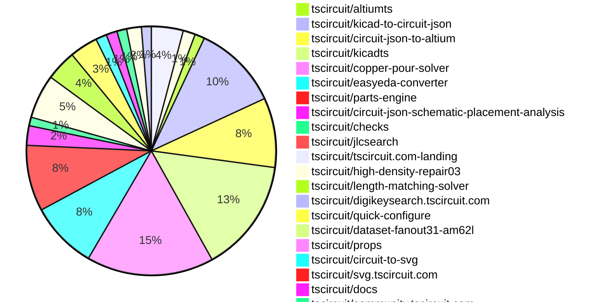

# Contribution Overview 2026-09-01

The current week is shown below. There are 3 major sections:

- [Contributor Overview](#contributor-overview)
- [PRs by Repository](#prs-by-repository)
- [PRs by Contributor](#changes-by-contributor)
- [Scoring & Sponsorship Details](/docs/sponsorship-calculation-explanation.md)

## PRs by Repository

## Contributor Overview

| Contributor | 🐳 Major | 🐙 Minor | 🐌 Tiny | Score | ⭐ |
|-------------|---------|---------|---------|-------|-----|
| [seveibar](#seveibar) | 46 | 19 | 26 | 235 | 👑👑👑 |
| [ShiboSoftwareDev](#ShiboSoftwareDev) | 5 | 22 | 9 | 88 | 👑 |
| [mohan-bee](#mohan-bee) | 8 | 8 | 14 | 69.5 | ⭐⭐⭐ |
| [imrishabh18](#imrishabh18) | 9 | 10 | 8 | 65 | ⭐⭐⭐ |
| [MustafaMulla29](#MustafaMulla29) | 10 | 3 | 13 | 59 | ⭐⭐⭐ |
| [AnasSarkiz](#AnasSarkiz) | 3 | 1 | 3 | 25 | ⭐⭐ |
| [Abse2001](#Abse2001) | 1 | 1 | 2 | 23 | ⭐⭐ |
| [0hmX](#0hmX) | 3 | 3 | 4 | 23 | ⭐⭐ |
| [techmannih](#techmannih) | 2 | 0 | 13 | 21.5 | ⭐⭐ |
| [rushabhcodes](#rushabhcodes) | 1 | 2 | 11 | 20 | ⭐⭐ |
| [tscircuitbot](#tscircuitbot) | 1 | 0 | 393 | 19.5 | ⭐⭐ |
| [anil08607](#anil08607) | 1 | 1 | 9 | 15 | ⭐⭐ |
| [GokulPandi-M](#GokulPandi-M) | 1 | 2 | 6 | 14 | ⭐⭐ |
| [hrithik18k](#hrithik18k) | 1 | 1 | 6 | 12 | ⭐⭐ |
| [KrishnaX12](#KrishnaX12) | 0 | 1 | 9 | 11 | ⭐⭐ |
| [Sang-it](#Sang-it) | 0 | 1 | 3 | 5 | ⭐ |
| [addibble](#addibble) | 0 | 1 | 0 | 2 |  |

## Staff Pass Ratio (SPR)

| Contributor | Reviewed PRs | Rejections | Approvals | SPR |
|-------------|--------------|------------|-----------|-----|
| [MustafaMulla29](#MustafaMulla29) | 7 | 1 | 7 | 85.7% |
| [mohan-bee](#mohan-bee) | 5 | 1 | 5 | 80.0% |
| [AnasSarkiz](#AnasSarkiz) | 4 | 0 | 4 | 100.0% |
| [imrishabh18](#imrishabh18) | 4 | 0 | 5 | 100.0% |
| [Abse2001](#Abse2001) | 3 | 1 | 2 | 66.7% |
| [ShiboSoftwareDev](#ShiboSoftwareDev) | 3 | 0 | 3 | 100.0% |
| [addibble](#addibble) | 2 | 0 | 2 | 100.0% |
| [GokulPandi-M](#GokulPandi-M) | 2 | 1 | 1 | 50.0% |
| [0hmX](#0hmX) | 1 | 0 | 1 | 100.0% |
| [hrithik18k](#hrithik18k) | 1 | 0 | 1 | 100.0% |
| [KrishnaX12](#KrishnaX12) | 1 | 1 | 0 | 0.0% |
| [rushabhcodes](#rushabhcodes) | 1 | 0 | 1 | 100.0% |

MustafaMulla29 SPR PRs (7)

- [#745](https://github.com/tscircuit/circuit-json/pull/745) Add component ownership to PCB cutouts
- [#1084](https://github.com/tscircuit/schematic-trace-solver/pull/1084) Keep eligible labels inline with local trace shifts
- [#1020](https://github.com/tscircuit/schematic-trace-solver/pull/1020) Align same-net pin exits, endpoint buses, and shared rails
- [#44](https://github.com/tscircuit/circuit-json-schematic-placement-analysis/pull/44) Analyze two-pin component orientation
- [#47](https://github.com/tscircuit/circuit-json-schematic-placement-analysis/pull/47) Add schematic text clearance and reset network grouping analyzers
- [#49](https://github.com/tscircuit/circuit-json-schematic-placement-analysis/pull/49) Add feedback-network and pull-resistor placement analyzers
- [#43](https://github.com/tscircuit/circuit-json-schematic-placement-analysis/pull/43) Analyze crystal load capacitor placement

mohan-bee SPR PRs (5)

- [#3665](https://github.com/tscircuit/core/pull/3665) fix differential pairs connected through named nets
- [#263](https://github.com/tscircuit/checks/pull/263) report two-terminal switches connected to themselves
- [#37](https://github.com/tscircuit/calculate-cell-boundaries/pull/37) preserve cell boundaries when preferred margins connect all cells
- [#1061](https://github.com/tscircuit/schematic-trace-solver/pull/1061) collapse duplicate stubs on shared net branches
- [#1017](https://github.com/tscircuit/schematic-trace-solver/pull/1017) keep downward ground labels directly below shared rails

AnasSarkiz SPR PRs (4)

- [#549](https://github.com/tscircuit/easyeda-converter/pull/549) fix: distinguish missing EasyEDA library entries from search failures
- [#3583](https://github.com/tscircuit/core/pull/3583) Fix duplicated traces in local autorouter stage output
- [#2381](https://github.com/tscircuit/tscircuit-autorouter/pull/2381) perf: cache repeated Pipeline 9 DRC candidates
- [#99](https://github.com/tscircuit/high-density-a01/pull/99) consolidate native A11 and A12 solver foundations

imrishabh18 SPR PRs (4)

- [#3699](https://github.com/tscircuit/core/pull/3699) Remove electrically isolated copper pours after via stitching
- [#2328](https://github.com/tscircuit/tscircuit-autorouter/pull/2328) Fix Bug Report 94 trace overlap in force solver
- [#17](https://github.com/tscircuit/high-density-repair01/pull/17) Preserve trace ordering during force improvement
- [#91](https://github.com/tscircuit/high-density-repair03/pull/91) Preserve pad geometry and repair constrained via clearances

Abse2001 SPR PRs (3)

- [#3713](https://github.com/tscircuit/core/pull/3713) Pass trace maximum via counts to autorouter input
- [#56](https://github.com/tscircuit/parts-engine/pull/56) Deduplicate concurrent JLC part lookups
- [#229](https://github.com/tscircuit/ti/pull/229) Add complete Automotive Window Module example

ShiboSoftwareDev SPR PRs (3)

- [#3708](https://github.com/tscircuit/core/pull/3708) fix: synchronize every branch of a shared fanout exit
- [#3603](https://github.com/tscircuit/core/pull/3603) fix: preserve fanout handoff point identity
- [#2455](https://github.com/tscircuit/tscircuit-autorouter/pull/2455) fix: use explicit via endpoints in Pipeline9 copper validation

addibble SPR PRs (2)

- [#3722](https://github.com/tscircuit/core/pull/3722) Fix child cadmodel rotation and size parity
- [#192](https://github.com/tscircuit/circuit-json-to-gltf/pull/192) test: expose child CAD rotation and size regressions in GLB snapshots

GokulPandi-M SPR PRs (2)

- [#241](https://github.com/tscircuit/matchpack/pull/241) fix: preserve clearance when aligning rail rows
- [#245](https://github.com/tscircuit/matchpack/pull/245) Prevent chip-anchored grounded load pair overlaps

0hmX SPR PRs (1)

- [#34](https://github.com/tscircuit/circuit-json-placement-analysis/pull/34) Preserve connector orientation and detect beneficial QFN rotations

hrithik18k SPR PRs (1)

- [#748](https://github.com/tscircuit/circuit-json/pull/748) feat: add styled schematic pin label runs

KrishnaX12 SPR PRs (1)

- [#189](https://github.com/tscircuit/circuit-json-to-gltf/pull/189) fix: keep USB OBJ models aligned with their footprints in 3D exports

rushabhcodes SPR PRs (1)

- [#540](https://github.com/tscircuit/easyeda-converter/pull/540) fix: derive CAD component size from model bounds

> Note: AI evaluates PRs and assigns 1-3 star ratings automatically. 4 and 5 star ratings require manual staff review.

## Review Table

[reviews-received-hover]: ## "Number of reviews received for PRs for this contributor"
[approvals-received-hover]: ## "Number of approvals received for PRs this contributor authored"
[rejections-received-hover]: ## "Number of rejections received for PRs this contributor authored"
[prs-opened-hover]: ## "Number of PRs opened by this contributor"
[issues-created-hover]: ## "Number of issues created by this contributor"

| Contributor | Reviews Received | Approvals Received | Rejections Received | Approvals | Rejections Given | PRs Opened | PRs Merged | Issues Created |
|---|---|---|---|---|---|---|---|---|
| [0hmX](#0hmX) | 4 | 1 | 0 | 3 | 0 | 21 | 13 | 0 |
| [85heisenberg85](#85heisenberg85) | 0 | 0 | 0 | 0 | 0 | 1 | 0 | 0 |
| [Abse2001](#Abse2001) | 6 | 4 | 1 | 25 | 0 | 47 | 4 | 0 |
| [adamscarmccoy-boop](#adamscarmccoy-boop) | 1 | 0 | 0 | 0 | 0 | 7 | 0 | 0 |
| [addibble](#addibble) | 2 | 2 | 0 | 0 | 0 | 2 | 1 | 0 |
| [Ak13068](#Ak13068) | 0 | 0 | 0 | 0 | 0 | 1 | 0 | 0 |
| [alondrn-hub](#alondrn-hub) | 0 | 0 | 0 | 0 | 0 | 1 | 0 | 0 |
| [AmoonPod](#AmoonPod) | 0 | 0 | 0 | 0 | 0 | 7 | 0 | 0 |
| [AnasSarkiz](#AnasSarkiz) | 8 | 5 | 0 | 9 | 0 | 23 | 7 | 0 |
| [anil08607](#anil08607) | 16 | 13 | 0 | 0 | 0 | 14 | 11 | 0 |
| [ardaerturk](#ardaerturk) | 0 | 0 | 0 | 0 | 0 | 1 | 0 | 0 |
| [ariel-agent-assistant](#ariel-agent-assistant) | 0 | 0 | 0 | 0 | 0 | 4 | 0 | 0 |
| [ataha528479-hash](#ataha528479-hash) | 0 | 0 | 0 | 0 | 0 | 1 | 0 | 0 |
| [B-Lounes](#B-Lounes) | 0 | 0 | 0 | 0 | 0 | 2 | 0 | 0 |
| [beefrea](#beefrea) | 0 | 0 | 0 | 0 | 0 | 3 | 0 | 0 |
| [billythompsons](#billythompsons) | 0 | 0 | 0 | 0 | 0 | 2 | 0 | 0 |
| [Blueemi](#Blueemi) | 0 | 0 | 0 | 0 | 0 | 1 | 0 | 0 |
| [ByungDooJang](#ByungDooJang) | 0 | 0 | 0 | 0 | 0 | 1 | 0 | 0 |
| [Cuuper22](#Cuuper22) | 0 | 0 | 0 | 0 | 0 | 2 | 0 | 0 |
| [DaBoogeyBear](#DaBoogeyBear) | 0 | 0 | 0 | 0 | 0 | 1 | 0 | 0 |
| [DanielButler1](#DanielButler1) | 1 | 0 | 0 | 0 | 0 | 2 | 0 | 0 |
| [DevanMetz](#DevanMetz) | 0 | 0 | 0 | 0 | 0 | 1 | 0 | 0 |
| [dominiktaux](#dominiktaux) | 1 | 0 | 0 | 0 | 0 | 4 | 0 | 0 |
| [dudqks0319-cpu](#dudqks0319-cpu) | 0 | 0 | 0 | 0 | 0 | 1 | 0 | 0 |
| [dyoung7293](#dyoung7293) | 0 | 0 | 0 | 0 | 0 | 1 | 0 | 0 |
| [eedvardss](#eedvardss) | 0 | 0 | 0 | 0 | 0 | 3 | 0 | 0 |
| [FekyBaz](#FekyBaz) | 0 | 0 | 0 | 0 | 0 | 1 | 0 | 0 |
| [Flame119052](#Flame119052) | 0 | 0 | 0 | 0 | 0 | 40 | 0 | 0 |
| [FlankaLanka](#FlankaLanka) | 0 | 0 | 0 | 0 | 0 | 3 | 0 | 0 |
| [fluxoutfluxin-tech](#fluxoutfluxin-tech) | 0 | 0 | 0 | 0 | 0 | 1 | 0 | 0 |
| [FU-max-boop](#FU-max-boop) | 0 | 0 | 0 | 0 | 0 | 2 | 0 | 0 |
| [gaboxdev](#gaboxdev) | 0 | 0 | 0 | 0 | 0 | 1 | 0 | 0 |
| [gcoinstash-cmd](#gcoinstash-cmd) | 0 | 0 | 0 | 0 | 0 | 47 | 0 | 0 |
| [gilmarGNJ](#gilmarGNJ) | 0 | 0 | 0 | 0 | 0 | 1 | 0 | 0 |
| [GokulPandi-M](#GokulPandi-M) | 30 | 11 | 3 | 0 | 0 | 17 | 9 | 0 |
| [guyguhiohiuhiu](#guyguhiohiuhiu) | 0 | 0 | 0 | 0 | 0 | 2 | 0 | 0 |
| [het392cor](#het392cor) | 0 | 0 | 0 | 0 | 0 | 2 | 0 | 0 |
| [hkay26](#hkay26) | 0 | 0 | 0 | 0 | 0 | 1 | 0 | 0 |
| [honanevan](#honanevan) | 0 | 0 | 0 | 0 | 0 | 1 | 0 | 0 |
| [hrithik18k](#hrithik18k) | 16 | 11 | 1 | 0 | 0 | 17 | 8 | 0 |
| [Humaniacul](#Humaniacul) | 0 | 0 | 0 | 0 | 0 | 5 | 0 | 0 |
| [ikoomm](#ikoomm) | 0 | 0 | 0 | 0 | 0 | 2 | 0 | 0 |
| [imrishabh18](#imrishabh18) | 6 | 4 | 0 | 28 | 6 | 40 | 28 | 0 |
| [itzKLAUS](#itzKLAUS) | 0 | 0 | 0 | 0 | 0 | 5 | 0 | 0 |
| [J2c-ashwani](#J2c-ashwani) | 0 | 0 | 0 | 0 | 0 | 1 | 0 | 0 |
| [jmspwr](#jmspwr) | 0 | 0 | 0 | 0 | 0 | 1 | 0 | 0 |
| [jodex145-star](#jodex145-star) | 0 | 0 | 0 | 0 | 0 | 1 | 0 | 0 |
| [kanqzkokelo](#kanqzkokelo) | 0 | 0 | 0 | 0 | 0 | 3 | 0 | 0 |
| [karanp0202](#karanp0202) | 0 | 0 | 0 | 0 | 0 | 1 | 0 | 0 |
| [kimbucha](#kimbucha) | 0 | 0 | 0 | 0 | 0 | 3 | 0 | 0 |
| [KrishnaX12](#KrishnaX12) | 18 | 12 | 1 | 0 | 0 | 20 | 10 | 0 |
| [l4time](#l4time) | 0 | 0 | 0 | 0 | 0 | 3 | 0 | 0 |
| [lrodrig4](#lrodrig4) | 1 | 0 | 0 | 0 | 0 | 4 | 0 | 0 |
| [mc5161876-rgb](#mc5161876-rgb) | 0 | 0 | 0 | 0 | 0 | 3 | 0 | 0 |
| [mogja9](#mogja9) | 0 | 0 | 0 | 0 | 0 | 1 | 0 | 0 |
| [mohan-bee](#mohan-bee) | 25 | 17 | 3 | 10 | 0 | 86 | 30 | 0 |
| [Moltiz](#Moltiz) | 0 | 0 | 0 | 0 | 0 | 4 | 0 | 0 |
| [MustafaMulla29](#MustafaMulla29) | 17 | 15 | 0 | 10 | 0 | 30 | 26 | 0 |
| [mvennarini](#mvennarini) | 0 | 0 | 0 | 0 | 0 | 8 | 0 | 0 |
| [NaveenAnantam](#NaveenAnantam) | 0 | 0 | 0 | 0 | 0 | 1 | 0 | 0 |
| [Navi1405](#Navi1405) | 0 | 0 | 0 | 0 | 0 | 1 | 0 | 0 |
| [neurozenguide](#neurozenguide) | 0 | 0 | 0 | 0 | 0 | 1 | 0 | 0 |
| [NotCqqkie](#NotCqqkie) | 0 | 0 | 0 | 0 | 0 | 1 | 0 | 0 |
| [palthisailohith](#palthisailohith) | 0 | 0 | 0 | 0 | 0 | 1 | 0 | 0 |
| [patchrelay-dev](#patchrelay-dev) | 0 | 0 | 0 | 0 | 0 | 1 | 0 | 0 |
| [pokemongo1027](#pokemongo1027) | 0 | 0 | 0 | 0 | 0 | 2 | 0 | 0 |
| [raffr85](#raffr85) | 0 | 0 | 0 | 0 | 0 | 1 | 0 | 0 |
| [ranadheer-designs](#ranadheer-designs) | 0 | 0 | 0 | 0 | 0 | 3 | 0 | 0 |
| [randomclicks](#randomclicks) | 0 | 0 | 0 | 0 | 0 | 1 | 0 | 0 |
| [riazul007-error](#riazul007-error) | 0 | 0 | 0 | 0 | 0 | 1 | 0 | 0 |
| [Rijul202](#Rijul202) | 1 | 0 | 0 | 0 | 0 | 1 | 0 | 0 |
| [RohithPariki](#RohithPariki) | 0 | 0 | 0 | 0 | 0 | 1 | 0 | 0 |
| [rushabhcodes](#rushabhcodes) | 34 | 17 | 0 | 1 | 0 | 16 | 14 | 0 |
| [sahil18z](#sahil18z) | 0 | 0 | 0 | 0 | 0 | 2 | 0 | 0 |
| [Sang-it](#Sang-it) | 0 | 0 | 0 | 0 | 0 | 5 | 4 | 0 |
| [saurav-codes](#saurav-codes) | 0 | 0 | 0 | 0 | 0 | 2 | 0 | 0 |
| [ScribleSean](#ScribleSean) | 0 | 0 | 0 | 0 | 0 | 1 | 0 | 0 |
| [seunghyukchoe](#seunghyukchoe) | 3 | 0 | 0 | 0 | 0 | 1 | 0 | 0 |
| [seveibar](#seveibar) | 28 | 0 | 0 | 39 | 3 | 206 | 94 | 0 |
| [shaikmomin](#shaikmomin) | 0 | 0 | 0 | 0 | 0 | 5 | 0 | 0 |
| [ShiboSoftwareDev](#ShiboSoftwareDev) | 41 | 38 | 0 | 24 | 0 | 92 | 37 | 0 |
| [singhharsh1708](#singhharsh1708) | 0 | 0 | 0 | 0 | 0 | 5 | 0 | 0 |
| [smsnot](#smsnot) | 0 | 0 | 0 | 0 | 0 | 1 | 0 | 0 |
| [social5h3ll](#social5h3ll) | 1 | 0 | 0 | 0 | 0 | 1 | 0 | 0 |
| [solracnyc](#solracnyc) | 0 | 0 | 0 | 0 | 0 | 0 | 0 | 0 |
| [Sophia-Thickums](#Sophia-Thickums) | 0 | 0 | 0 | 0 | 0 | 1 | 0 | 0 |
| [spheceo](#spheceo) | 0 | 0 | 0 | 0 | 0 | 1 | 0 | 0 |
| [stantheman0128](#stantheman0128) | 0 | 0 | 0 | 0 | 0 | 1 | 0 | 0 |
| [tcsenpai](#tcsenpai) | 0 | 0 | 0 | 0 | 0 | 10 | 0 | 0 |
| [techmannih](#techmannih) | 9 | 5 | 0 | 6 | 0 | 28 | 15 | 0 |
| [tristanmuzzu](#tristanmuzzu) | 0 | 0 | 0 | 0 | 0 | 1 | 0 | 0 |
| [tscircuitbot](#tscircuitbot) | 0 | 0 | 0 | 0 | 0 | 528 | 394 | 0 |
| [ugin-man](#ugin-man) | 0 | 0 | 0 | 0 | 0 | 101 | 0 | 0 |
| [VykosMolt](#VykosMolt) | 0 | 0 | 0 | 0 | 0 | 4 | 0 | 0 |
| [waddle36](#waddle36) | 0 | 0 | 0 | 0 | 0 | 2 | 0 | 0 |
| [Wordhalm](#Wordhalm) | 0 | 0 | 0 | 0 | 0 | 1 | 0 | 0 |
| [Wvdstoep](#Wvdstoep) | 0 | 0 | 0 | 0 | 0 | 1 | 0 | 0 |
| [x-bryce](#x-bryce) | 0 | 0 | 0 | 0 | 0 | 3 | 0 | 0 |
| [yathanshgaba](#yathanshgaba) | 0 | 0 | 0 | 0 | 0 | 3 | 0 | 0 |

## Changes by Repository

### [tscircuit/schematic-trace-solver](https://github.com/tscircuit/schematic-trace-solver)

| PR # | Impact | Rating | Contributor | Description |
|------|--------|--------|-------------|-------------|
| [#1082](https://github.com/tscircuit/schematic-trace-solver/pull/1082) | 🐳 Major | ⭐⭐⭐ | tscircuitbot | Generated from 1081. Adds a snapshot-only regression test and debugger page for the attached JSON solver input. Workflow run: https:github.comtscircuitschematic-trace-solveractionsruns34135689337 |
| [#1084](https://github.com/tscircuit/schematic-trace-solver/pull/1084) | 🐳 Major | ⭐⭐⭐ | MustafaMulla29 | Eligible endpoints could fall back to anchored labels when another endpoint on the same net was obstructed. Nearby routed wires could also cross inline text or terminal wires. Keep fallback local to each connected component and replace routed components atomically. Preserve the existing preferredopposite-side search, fitting full-size text into available wire gaps before flipping. Use small sideways shifts of existing rails and nearby power connectors; reject added bends, new crossings, disconnected junctions, and pin-clearance violations. Connector IDs flow from their producer. Collision records use exact identities instead of parsing ID prefixes or delimiter-based keys. Refinement advances through step() and activeSubSolver, preserves proposal ordering, and rejects failed candidates. The unchanged 1082 input produces 83 inline placements with no detected label or terminal-wire collisions. Fixture data and inline opt-in flags are unchanged. Three small snapshot updates remove text drawn twice at identical positions. Validation: 343 tests passed, 4 existing skips; typecheck, build, and formatting pass. The identityrefinement refactor changed no snapshot files; traces and label placements are identical across 27 audited fixtures. C3 and TIDA snapshots match main. |
| [#1054](https://github.com/tscircuit/schematic-trace-solver/pull/1054) | 🐳 Major | ⭐⭐⭐ | MustafaMulla29 | Fixes unnecessary doglegs in schematic traces by refining corner pin direction handling and improving routing algorithms to minimize turns and collisions with labels. |
| [#1020](https://github.com/tscircuit/schematic-trace-solver/pull/1020) | 🐳 Major | ⭐⭐⭐ | MustafaMulla29 | Aligns adjacent same-side pin exits onto neighboring pin rows, aligns degree-two buses between perpendicular endpointload traces, and preserves generated connector junctions while validating candidates against various criteria. |
| [#1013](https://github.com/tscircuit/schematic-trace-solver/pull/1013) | 🐳 Major | ⭐⭐⭐ | MustafaMulla29 | Reroutes component-to-component traces to avoid crossings with generated net-label connectors, ensuring cleaner routing and preserving valid label-to-label crossings. |
| [#1061](https://github.com/tscircuit/schematic-trace-solver/pull/1061) | 🐳 Major | ⭐⭐⭐ | mohan-bee | motivation same-net ground junction alignment can retain two traces over the same endpoint stub. before img width128 height122 altimage srchttps:github.comuser-attachmentsassets145d8d34-aad0-4538-93a1-66cb486acccc  the existing esp-12f repro contains duplicate shared-endpoint geometry. after img width112 height72 altimage srchttps:github.comuser-attachmentsassetsb4720501-e8fd-44d9-8a26-2c4c7599f94c  the solver uses typed ground metadata to preserve one physical pin connection and end the redundant trace at the existing junction. the focused geometry test and affected regression snapshots are updated; no extra before snapshot is added. |
| [#1064](https://github.com/tscircuit/schematic-trace-solver/pull/1064) | 🐳 Major | ⭐⭐⭐ | mohan-bee | Fixes trace recovery to prioritize local routes over perimeter detours, improving routing efficiency and accuracy. |
| [#1017](https://github.com/tscircuit/schematic-trace-solver/pull/1017) | 🐳 Major | ⭐⭐⭐ | mohan-bee | Adjusts the placement of downward ground labels to ensure they remain close to their connected pins and directly attached to shared rails, improving schematic clarity and accuracy. |
| [#1007](https://github.com/tscircuit/schematic-trace-solver/pull/1007) | 🐳 Major | ⭐⭐⭐ | techmannih | Fixes incorrect bounds for vertical-only rail labels that fall back to horizontal placement, ensuring proper collision detection and label positioning in the schematic solver. |
| [#1038](https://github.com/tscircuit/schematic-trace-solver/pull/1038) | 🐳 Major | ⭐⭐⭐ | techmannih | Fixes the issue where net label connectors run parallel to host traces by shifting them laterally onto their existing host trace and creating a direct tee instead of a near-parallel connector. |
| [#1052](https://github.com/tscircuit/schematic-trace-solver/pull/1052) | 🐙 Minor | ⭐⭐ | MustafaMulla29 | Prevents anchored label connectors from creating strict perpendicular crossings with unrelated traces, ensuring safer label placements in schematic designs. |
| [#1077](https://github.com/tscircuit/schematic-trace-solver/pull/1077) | 🐙 Minor | ⭐⭐ | mohan-bee | Preserves connections of same-net branch junctions to the V3V3 capacitor rail during rail alignment. |
| [#1045](https://github.com/tscircuit/schematic-trace-solver/pull/1045) | 🐙 Minor | ⭐⭐ | mohan-bee | Merges adjacent same-net branches that share their first segment onto nearby parallel rails, improving schematic alignment. |
| [#1008](https://github.com/tscircuit/schematic-trace-solver/pull/1008) | 🐙 Minor | ⭐⭐ | mohan-bee | Prevents duplicate ground labels on unwired pins of a component to ensure correct schematic representation. |

🐌 Tiny Contributions (12)

| PR # | Impact | Contributor | Description |
|------|--------|-------------|-------------|
| [#1080](https://github.com/tscircuit/schematic-trace-solver/pull/1080) | 🐌 Tiny | tscircuitbot | Adds a snapshot-only regression test and debugger page for the attached JSON solver input. |
| [#1076](https://github.com/tscircuit/schematic-trace-solver/pull/1076) | 🐌 Tiny | tscircuitbot | Adds a snapshot-only regression test and debugger page for the attached JSON solver input. |
| [#1063](https://github.com/tscircuit/schematic-trace-solver/pull/1063) | 🐌 Tiny | tscircuitbot | Adds a snapshot-only regression test and debugger page for the attached JSON solver input. |
| [#1037](https://github.com/tscircuit/schematic-trace-solver/pull/1037) | 🐌 Tiny | tscircuitbot | Adds a snapshot-only regression test and debugger page for the attached JSON solver input. |
| [#1035](https://github.com/tscircuit/schematic-trace-solver/pull/1035) | 🐌 Tiny | tscircuitbot | Adds a snapshot-only regression test and debugger page for the attached JSON solver input. |
| [#1050](https://github.com/tscircuit/schematic-trace-solver/pull/1050) | 🐌 Tiny | MustafaMulla29 | Add a focused schematic trace reproduction for the two mouse switches, capturing solver input and snapshotting the unnecessary horizontal jog in the vertical GND trunk. |
| [#1047](https://github.com/tscircuit/schematic-trace-solver/pull/1047) | 🐌 Tiny | MustafaMulla29 | Reproduces an unnecessary dogleg in the RF1 trace between two nominally aligned inductors, providing a focused test case without implementing solver changes. |
| [#1044](https://github.com/tscircuit/schematic-trace-solver/pull/1044) | 🐌 Tiny | MustafaMulla29 | Add an isolated reproduction of the capacitor-side VBAT label crossing the long CHG_STAT trace, using the exact InputProblem emitted by tscircuitcore 0.0.1829 at commit b761dc8, while retaining specific components and adding a focused solver SVG snapshot. |
| [#1048](https://github.com/tscircuit/schematic-trace-solver/pull/1048) | 🐌 Tiny | mohan-bee | Adds a flag to mark ground nets in various bug report and repro input JSON files to indicate they are ground connections. |
| [#1043](https://github.com/tscircuit/schematic-trace-solver/pull/1043) | 🐌 Tiny | mohan-bee | Adds a seven-component input fixture and SVG snapshot test for the isolated power section of board 8090, preserving its routing topology as a regression case. |
| [#1016](https://github.com/tscircuit/schematic-trace-solver/pull/1016) | 🐌 Tiny | mohan-bee | This pull request introduces a new JSON file containing the schematic trace for a USB hub sheet. The file includes detailed information about various chips, their dimensions, and pin configurations, which are essential for the schematic representation of the USB hub. |
| [#1002](https://github.com/tscircuit/schematic-trace-solver/pull/1002) | 🐌 Tiny | mohan-bee | Adds a focused solver snapshot for the smartwatch power sheet routing case, which was previously unaddressed. |

### [tscircuit/tscircuit](https://github.com/tscircuit/tscircuit)

🐌 Tiny Contributions (10)

| PR # | Impact | Contributor | Description |
|------|--------|-------------|-------------|
| [#4775](https://github.com/tscircuit/tscircuit/pull/4775) | 🐌 Tiny | tscircuitbot | Automated package update |
| [#4773](https://github.com/tscircuit/tscircuit/pull/4773) | 🐌 Tiny | tscircuitbot | Automated package update |
| [#4774](https://github.com/tscircuit/tscircuit/pull/4774) | 🐌 Tiny | tscircuitbot | Automated package update |
| [#4770](https://github.com/tscircuit/tscircuit/pull/4770) | 🐌 Tiny | tscircuitbot | Automated package update |
| [#4769](https://github.com/tscircuit/tscircuit/pull/4769) | 🐌 Tiny | tscircuitbot | Automated package update |
| [#4766](https://github.com/tscircuit/tscircuit/pull/4766) | 🐌 Tiny | tscircuitbot | Automated package update |
| [#4763](https://github.com/tscircuit/tscircuit/pull/4763) | 🐌 Tiny | tscircuitbot | Automated package update |
| [#4772](https://github.com/tscircuit/tscircuit/pull/4772) | 🐌 Tiny | ShiboSoftwareDev | Fixes the failure in automated updates of tscircuitcore by treating tscircuitvia-stitch-solver like other core-only solver development dependencies. |
| [#4765](https://github.com/tscircuit/tscircuit/pull/4765) | 🐌 Tiny | rushabhcodes | Fixes copper pour solver to respect clearance around oval plated holes, preventing different-net pours from extending into required pad clearances. |
| [#4762](https://github.com/tscircuit/tscircuit/pull/4762) | 🐌 Tiny | MustafaMulla29 | Updates the versions of core and eval dependencies in the package.json file. |

### [tscircuit/circuit-json](https://github.com/tscircuit/circuit-json)

| PR # | Impact | Rating | Contributor | Description |
|------|--------|--------|-------------|-------------|
| [#745](https://github.com/tscircuit/circuit-json/pull/745) | 🐳 Major | ⭐⭐⭐ | MustafaMulla29 | Add an optional pcb_component_id to the shared PCB cutout schema to identify owning PCB components for footprint-defined cutouts, enabling better overlap checks. |
| [#750](https://github.com/tscircuit/circuit-json/pull/750) | 🐙 Minor | ⭐⭐ | seveibar | Adds optional display_superscript: string to schematic net labels, allowing for display-only superscript suffixes without changing net identity. |
| [#749](https://github.com/tscircuit/circuit-json/pull/749) | 🐙 Minor | ⭐⭐ | seveibar | Adds source_confusing_net_name_warning for electrically disconnected source nets that share a name, such as separate GND nets in sibling subcircuits. |
| [#754](https://github.com/tscircuit/circuit-json/pull/754) | 🐙 Minor | ⭐⭐ | seveibar | Adds optional display_superscript: string to schematic text for inline net labels, allowing for display-only superscript suffixes while preserving original text and source_trace_id. |
| [#748](https://github.com/tscircuit/circuit-json/pull/748) | 🐙 Minor | ⭐⭐ | hrithik18k | Adds structured text runs for schematic pin labels, allowing individual segments to be marked as overlined. |

🐌 Tiny Contributions (3)

| PR # | Impact | Contributor | Description |
|------|--------|-------------|-------------|
| [#753](https://github.com/tscircuit/circuit-json/pull/753) | 🐌 Tiny | tscircuitbot | Automated package update |
| [#755](https://github.com/tscircuit/circuit-json/pull/755) | 🐌 Tiny | tscircuitbot | Automated package update |
| [#751](https://github.com/tscircuit/circuit-json/pull/751) | 🐌 Tiny | tscircuitbot | Automated package update |

### [tscircuit/core](https://github.com/tscircuit/core)

| PR # | Impact | Rating | Contributor | Description |
|------|--------|--------|-------------|-------------|
| [#3628](https://github.com/tscircuit/core/pull/3628) | 🐳 Major | ⭐⭐⭐ | MustafaMulla29 | Propagates the owning pcb_component_id to rectangular, circular, and polygon footprint cutouts and adds a focused regression test for a cutout declared inside a chip footprint. |
| [#3654](https://github.com/tscircuit/core/pull/3654) | 🐳 Major | ⭐⭐⭐ | seveibar | Use Pipeline9 for the implicit local default and autorouterVersionlatest, while preserving explicit beta_pipeline7 selection. |
| [#3655](https://github.com/tscircuit/core/pull/3655) | 🐳 Major | ⭐⭐⭐ | seveibar | Exposes autorouter cache decisions and metadata during local autorouting lifecycle events, ensuring that routing experiments are accurate and not misled by stale routes. |
| [#3581](https://github.com/tscircuit/core/pull/3581) | 🐳 Major | ⭐⭐⭐ | seveibar | Add a new autorouting phase that simplifies existing PCB traces and integrates with the autorouting pipeline, enhancing routing efficiency. |
| [#3583](https://github.com/tscircuit/core/pull/3583) | 🐳 Major | ⭐⭐⭐ | AnasSarkiz | Fixes duplicated traces in the local autorouter stage output by ensuring that the current solver stage returns the correct trace data without reinserting it as new PCB copper. |
| [#3704](https://github.com/tscircuit/core/pull/3704) | 🐳 Major | ⭐⭐⭐ | imrishabh18 | Fixes the issue where EXSW1s mounting pads disappear from the SRJ due to the getObstaclesFromCircuitJson function not handling specific shapes correctly. |
| [#3665](https://github.com/tscircuit/core/pull/3665) | 🐳 Major | ⭐⭐⭐ | mohan-bee | Fixes autorouting failure for differential pairs connected through named nets during the autorouting phase. |
| [#3708](https://github.com/tscircuit/core/pull/3708) | 🐙 Minor | ⭐⭐ | ShiboSoftwareDev | Fixes the synchronization issue of shared capacitor pads in PCB routing, ensuring all branches correctly reference the relocated fanout exit. |
| [#3602](https://github.com/tscircuit/core/pull/3602) | 🐙 Minor | ⭐⭐ | ShiboSoftwareDev | Add an end-to-end DDR routing regression test for the AM62L32 and MT53E1G16D1ZW LPDDR4 packages, ensuring proper routing and DRC results. |
| [#3603](https://github.com/tscircuit/core/pull/3603) | 🐙 Minor | ⭐⭐ | ShiboSoftwareDev | Fixes the synchronization of PCB breakout point identity on completed fanout traces before the global routing phase, allowing Pipeline 9 to recognize pre-routed copper as connected to the handoff endpoint and removing unnecessary detours in routing. |
| [#3594](https://github.com/tscircuit/core/pull/3594) | 🐙 Minor | ⭐⭐ | rushabhcodes | Refines schematic sheet warning assertions to ensure tests only check for relevant warnings, preventing false negatives due to unrelated warnings. |
| [#3660](https://github.com/tscircuit/core/pull/3660) | 🐙 Minor | ⭐⭐ | seveibar | Populates display_superscript when a name is displayed on more than one source electrical network, ensuring disconnected GND nets in sibling subcircuits render as GND and GND, while connected copies share one suffix and unambiguous names have none. |
| [#3650](https://github.com/tscircuit/core/pull/3650) | 🐙 Minor | ⭐⭐ | seveibar | Add fabrication notes for internally connected pads, including a path and label, while preserving component properties and excluding solder jumpers. |
| [#3667](https://github.com/tscircuit/core/pull/3667) | 🐙 Minor | ⭐⭐ | GokulPandi-M | Fixes overlapping annotations in adjacent LED output branches, improving readability of component references and labels. |
| [#3722](https://github.com/tscircuit/core/pull/3722) | 🐙 Minor | ⭐⭐ | addibble | Fixes child cadmodel elements to ensure correct rotation and size parity with the object-form cadModel API by removing an erroneous Z-axis rotation and preserving authored sizes in millimeters. |
| [#3754](https://github.com/tscircuit/core/pull/3754) | 🐙 Minor | ⭐⭐ | imrishabh18 | Fixes copper pour clearance issues for pill pads with rectangular holes by updating the copper-pour-solver to version 0.0.54. |
| [#3749](https://github.com/tscircuit/core/pull/3749) | 🐙 Minor | ⭐⭐ | imrishabh18 | Fixes polygon signal pads to receive the configured copper-pour pad margin, ensuring a 0.5 mm clearance on all sides, correcting the previous zero clearance issue. |
| [#3742](https://github.com/tscircuit/core/pull/3742) | 🐙 Minor | ⭐⭐ | imrishabh18 | Fixes copper pours in multi-board panels to correctly use their owning board outlines instead of the first boards outline. |
| [#3560](https://github.com/tscircuit/core/pull/3560) | 🐙 Minor | ⭐⭐ | imrishabh18 | Add an experimental via-stitching phase after copper pouring and before PCB design-rule checks, with automatic stitching disabled by default. |
| [#3691](https://github.com/tscircuit/core/pull/3691) | 🐙 Minor | ⭐⭐ | anil08607 | Reproduces a bug where the auto-layout of the LM386 audio amplifier schematic results in overlapping components, specifically C_GAIN overlapping R_ZOBEL and C_BYPASS overlapping C_OUT. |

🐌 Tiny Contributions (50)

| PR # | Impact | Contributor | Description |
|------|--------|-------------|-------------|
| [#3693](https://github.com/tscircuit/core/pull/3693) | 🐌 Tiny | tscircuitbot | Updates the tscircuitfanout-solver package from version 0.0.65 to 0.0.66 |
| [#3692](https://github.com/tscircuit/core/pull/3692) | 🐌 Tiny | tscircuitbot | Updates the tscircuitfanout-solver package from version 0.0.64 to 0.0.65 |
| [#3670](https://github.com/tscircuit/core/pull/3670) | 🐌 Tiny | tscircuitbot | Updates the tscircuitfanout-solver package from version 0.0.57 to 0.0.58 |
| [#3689](https://github.com/tscircuit/core/pull/3689) | 🐌 Tiny | tscircuitbot | Updates the version of the tscircuitchecks package from 0.0.183 to 0.0.184 in package.json |
| [#3677](https://github.com/tscircuit/core/pull/3677) | 🐌 Tiny | tscircuitbot | Updates the tscircuitfanout-solver package from version 0.0.60 to 0.0.62 in the package.json file |
| [#3673](https://github.com/tscircuit/core/pull/3673) | 🐌 Tiny | tscircuitbot | Updates the tscircuitfanout-solver package from version 0.0.58 to 0.0.60 |
| [#3686](https://github.com/tscircuit/core/pull/3686) | 🐌 Tiny | tscircuitbot | Updates the version of the tscircuitfanout-solver package from 0.0.62 to 0.0.64 in package.json |
| [#3639](https://github.com/tscircuit/core/pull/3639) | 🐌 Tiny | tscircuitbot | Updates the tscircuitfanout-solver package from version 0.0.56 to 0.0.57 |
| [#3638](https://github.com/tscircuit/core/pull/3638) | 🐌 Tiny | tscircuitbot | Updates the tscircuitfanout-solver package from version 0.0.56 to 0.0.57 |
| [#3637](https://github.com/tscircuit/core/pull/3637) | 🐌 Tiny | tscircuitbot | Updates the tscircuitfanout-solver package from version 0.0.55 to 0.0.56 |
| [#3635](https://github.com/tscircuit/core/pull/3635) | 🐌 Tiny | tscircuitbot | Updates the tscircuitfanout-solver package from version 0.0.54 to 0.0.55 |
| [#3620](https://github.com/tscircuit/core/pull/3620) | 🐌 Tiny | tscircuitbot | Updates the tscircuitfanout-solver package from version 0.0.53 to 0.0.54 |
| [#3611](https://github.com/tscircuit/core/pull/3611) | 🐌 Tiny | tscircuitbot | Updates the tscircuitfanout-solver package from version 0.0.52 to 0.0.53 in the package.json file. |
| [#3607](https://github.com/tscircuit/core/pull/3607) | 🐌 Tiny | tscircuitbot | Updates the tscircuitfanout-solver package from version 0.0.49 to 0.0.52 |
| [#3606](https://github.com/tscircuit/core/pull/3606) | 🐌 Tiny | tscircuitbot | Updates the tscircuitfanout-solver package from version 0.0.49 to 0.0.52 |
| [#3592](https://github.com/tscircuit/core/pull/3592) | 🐌 Tiny | tscircuitbot | Updates the tscircuitchecks package from version 0.0.179 to 0.0.180 in the package.json file. |
| [#3591](https://github.com/tscircuit/core/pull/3591) | 🐌 Tiny | tscircuitbot | Updates the version of the tscircuitchecks package from 0.0.179 to 0.0.180 in package.json |
| [#3579](https://github.com/tscircuit/core/pull/3579) | 🐌 Tiny | tscircuitbot | Updates the tscircuitfanout-solver package from version 0.0.48 to 0.0.49 |
| [#3588](https://github.com/tscircuit/core/pull/3588) | 🐌 Tiny | tscircuitbot | Updates the version of the tscircuitchecks package from 0.0.178 to 0.0.179 in package.json |
| [#3578](https://github.com/tscircuit/core/pull/3578) | 🐌 Tiny | tscircuitbot | Updates the tscircuitfanout-solver package from version 0.0.47 to 0.0.48 |
| [#3707](https://github.com/tscircuit/core/pull/3707) | 🐌 Tiny | ShiboSoftwareDev | Reproduces a bug where shared capacitor breakout points lead to dangling copper connections in PCB routing, with a comprehensive test to validate the issue. |
| [#3623](https://github.com/tscircuit/core/pull/3623) | 🐌 Tiny | rushabhcodes | Refreshes the AM62L-to-LPDDR4 two-bus BGA fanout PCB snapshot to align the expected route geometry with the deterministic output from the fanout solver version 0.0.54, addressing a CI failure due to stale SVG geometry. |
| [#3593](https://github.com/tscircuit/core/pull/3593) | 🐌 Tiny | rushabhcodes | Updates the tscircuitcopper-pour-solver dependency to version 0.0.52, enabling proper copper-pour handling for oval plated holes in PCB designs. |
| [#3737](https://github.com/tscircuit/core/pull/3737) | 🐌 Tiny | MustafaMulla29 | Updates the version of the schematic-trace-solver dependency from 0.0.187 to 0.0.188 in the package.json file. |
| [#3649](https://github.com/tscircuit/core/pull/3649) | 🐌 Tiny | MustafaMulla29 | Updates the version of the schematic-trace-solver dependency from 0.0.178 to 0.0.183 in package.json |
| [#3644](https://github.com/tscircuit/core/pull/3644) | 🐌 Tiny | MustafaMulla29 | Bumps tscircuitchecks from 0.0.181 to 0.0.182, consuming the owned-footprint-cutout placement fix and outline-keepout compatibility fix from a related pull request. |
| [#3625](https://github.com/tscircuit/core/pull/3625) | 🐌 Tiny | MustafaMulla29 | Updates the version of the tscircuitchecks dependency from 0.0.180 to 0.0.181 in the package.json file. |
| [#3582](https://github.com/tscircuit/core/pull/3582) | 🐌 Tiny | MustafaMulla29 | Updates the tscircuitschematic-trace-solver dependency from version 0.0.175 to 0.0.178, including connector-crossing reroute improvements from a related pull request. |
| [#3657](https://github.com/tscircuit/core/pull/3657) | 🐌 Tiny | seveibar | Bumps circuit-to-svg from 0.0.410 to 0.0.412 and refreshes affected schematic SVG snapshots to ensure sheet frames align with their contents. |
| [#3653](https://github.com/tscircuit/core/pull/3653) | 🐌 Tiny | seveibar | Updates the tscircuitcapacity-autorouter dependency from version 0.0.866 to 0.0.874 while maintaining the existing peer dependency contract. |
| [#3544](https://github.com/tscircuit/core/pull/3544) | 🐌 Tiny | seveibar | Summary increase the configured via drill from 0.10 mm to 0.15 mm while retaining the 0.24 mm via pad assert the configured board values and every emitted via dimension update the established progressive and two-bus visual snapshots in place without renaming them This is stacked on 3537, whose branch now includes merged PR 3541.  Verification bun test testsreprosrepro-am62l-lpddr4-progressive-fanout.test.tsx --timeout 300000 bun test testsreprosrepro-am62l-lpddr4-two-bus-bga-fanout.test.tsx --timeout 300000 bunx biome check testsfixturescreate-am62l-lpddr4-fanout.tsx testsreprosrepro-am62l-lpddr4-progressive-fanout.test.tsx testsreprosrepro-am62l-lpddr4-two-bus-bga-fanout.test.tsx git diff --check All route geometry and via centers remain unchanged; the SVG visual difference is the larger drill circles.  Manufacturing note A 0.15 mm hole inside a 0.24 mm pad leaves a 0.045 mm annular ring per side. The routing and current DRCs pass, but fabrication acceptance remains manufacturer-specific. |
| [#3537](https://github.com/tscircuit/core/pull/3537) | 🐌 Tiny | seveibar | Summary add DDR_DMI0 as the eighth progressive DDR bus, routing AM62L DDR0_DM0 on F2 to LPDDR4 DMI0 on C3 route the singleton bus through inner5 with top-side exits on both component fanouts extend the exact phase, layer, exit, and connectivity assertions update the existing full-board visual snapshot in place without renaming it  Dependency Depends on tscircuitfanout-solver112 and its next published release. package.json intentionally remains on tscircuitfanout-solver 0.0.45 until that release exists; this draft was validated against the local solver branch.  Validation bun test testsreprosrepro-am62l-lpddr4-progressive-fanout.test.tsx  1 passed, 5,324 assertions bunx tsc --noEmit bunx biome check on changed TypeScript files visually inspected the updated full-board SVG snapshot |
| [#3683](https://github.com/tscircuit/core/pull/3683) | 🐌 Tiny | GokulPandi-M | Updates the tscircuitmatchpack dependency from version 0.0.88 to 0.0.93, ensuring compatibility and functionality with the latest features and fixes in the matchpack library. |
| [#3748](https://github.com/tscircuit/core/pull/3748) | 🐌 Tiny | imrishabh18 | Reproduces a bug where GND copper pour overlaps signal plated holes with pill hole shapes due to missing pad obstacles in the copper-pour solver, adding a test to verify the issue. |
| [#3747](https://github.com/tscircuit/core/pull/3747) | 🐌 Tiny | imrishabh18 | Reproduces a bug where polygon SMT pads receive zero copper-pour clearance, while rectangular pads receive the expected margin. |
| [#3738](https://github.com/tscircuit/core/pull/3738) | 🐌 Tiny | imrishabh18 | Updates tscircuitcapacity-autorouter from 0.0.886 to 0.0.887, the latest npm release at the time of this update. |
| [#3703](https://github.com/tscircuit/core/pull/3703) | 🐌 Tiny | imrishabh18 | Reproduces a bug where the Corne EXSW1 mounting pads are not included in the SRJ obstacles, confirming the issue with a failing test. |
| [#3700](https://github.com/tscircuit/core/pull/3700) | 🐌 Tiny | imrishabh18 | Updates tscircuitcapacity-autorouter from 0.0.885 to 0.0.886 and refreshes three PCB snapshots affected by the new routing output. |
| [#3666](https://github.com/tscircuit/core/pull/3666) | 🐌 Tiny | imrishabh18 | Updates the implicit copper pour solver dependency to a newer version that accounts for trace clearance and regenerates PCB snapshots for the nRF52810. |
| [#3731](https://github.com/tscircuit/core/pull/3731) | 🐌 Tiny | anil08607 | Reproduces a bug where resistor R_CHG overlaps with the main chip U1 due to auto-layout issues in the battery charger status monitor circuit. |
| [#3720](https://github.com/tscircuit/core/pull/3720) | 🐌 Tiny | mohan-bee | Updates the tscircuitschematic-trace-solver package to version 0.0.187 in the package.json file. |
| [#3697](https://github.com/tscircuit/core/pull/3697) | 🐌 Tiny | mohan-bee | Updates the tscircuitmatchpack dependency to version 0.0.95 and adjusts regression tests to reflect changes in schematic layout, ensuring components are no longer overlapping in the LM386 audio amplifier schematic. |
| [#3664](https://github.com/tscircuit/core/pull/3664) | 🐌 Tiny | mohan-bee | Reproduces the USB differential pair routing failure on a small USB-C breakout board, capturing the unrouted PCB snapshot and connection-mapping error. |
| [#3642](https://github.com/tscircuit/core/pull/3642) | 🐌 Tiny | mohan-bee | Reproduces the issue of missing schematic section dividers for small gaps in the KiCad benchmark board, ensuring that the schematic sections are visibly partitioned as intended. |
| [#3646](https://github.com/tscircuit/core/pull/3646) | 🐌 Tiny | mohan-bee | Fixes the issue where compact schematic sections lose their dividers due to core expanding their bounds before boundary calculation, ensuring proper divider generation in schematic layouts. |
| [#3663](https://github.com/tscircuit/core/pull/3663) | 🐌 Tiny | mohan-bee | Updates the tscircuitchecks package from version 0.0.182 to 0.0.183 to enable the released same-net switch contact check in core, allowing board netlist checks to report shorted two-terminal switch contacts. |
| [#3698](https://github.com/tscircuit/core/pull/3698) | 🐌 Tiny | techmannih | Adds a reproduction test for the issue where parallel decoupling capacitors connect to each other with horizontal traces instead of receiving clean, individual net labels or powerground symbols. |
| [#3674](https://github.com/tscircuit/core/pull/3674) | 🐌 Tiny | techmannih | Updates the version of the tscircuitschematic-trace-solver dependency from 0.0.183 to 0.0.186 in package.json |
| [#3584](https://github.com/tscircuit/core/pull/3584) | 🐌 Tiny | techmannih | Reproduces the overlap between the adjacent AUDIO_VRA1, GND, and AUDIO_VRA2 fallback labels in the T113 schematic. |
| [#3585](https://github.com/tscircuit/core/pull/3585) | 🐌 Tiny | techmannih | Add a minimal Trellis Core feedback network with L2, R5, C4, and R7 to reproduce the nearly overlapping BUCK_0V9_FB auto-label trace beside the R5-to-C4 trace and pin the behavior with a schematic snapshot. |

### [tscircuit/tscircuit.com](https://github.com/tscircuit/tscircuit.com)

| PR # | Impact | Rating | Contributor | Description |
|------|--------|--------|-------------|-------------|
| [#4802](https://github.com/tscircuit/tscircuit.com/pull/4802) | 🐳 Major | ⭐⭐⭐ | seveibar | Add a responsive Related Packages section to the bottom of public package pages, utilizing the merged packageslist_related_packages endpoint to render thumbnail data and warm cached recommendations for search crawlers, while optimizing performance and API caching. |
| [#4748](https://github.com/tscircuit/tscircuit.com/pull/4748) | 🐳 Major | ⭐⭐⭐ | seveibar | Updates the editor URL when a workspace file is selected, preserving existing query parameters and clearing stale line selections, while adding a browser regression test for file selection URL sync. |
| [#4735](https://github.com/tscircuit/tscircuit.com/pull/4735) | 🐳 Major | ⭐⭐⭐ | seveibar | Provides detailed error messages for avatar upload failures, including server rejection reasons and network issues, improving user guidance during upload attempts. |
| [#4734](https://github.com/tscircuit/tscircuit.com/pull/4734) | 🐳 Major | ⭐⭐⭐ | seveibar | Fixes the issue where the editor opens lockfiles by default instead of the intended circuit entrypoint files, ensuring that only eligible files are selected for editing. |
| [#4729](https://github.com/tscircuit/tscircuit.com/pull/4729) | 🐳 Major | ⭐⭐⭐ | hrithik18k | Fixes schematic downloads to include all sheets in multi-sheet projects instead of just the firstdefault sheet. |

🐌 Tiny Contributions (52)

| PR # | Impact | Contributor | Description |
|------|--------|-------------|-------------|
| [#4824](https://github.com/tscircuit/tscircuit.com/pull/4824) | 🐌 Tiny | tscircuitbot | Updates the tscircuiteval package from version 0.0.1369 to 0.0.1370 |
| [#4821](https://github.com/tscircuit/tscircuit.com/pull/4821) | 🐌 Tiny | tscircuitbot | Updates the version of the tscircuiteval package from 0.0.1368 to 0.0.1369 in package.json |
| [#4817](https://github.com/tscircuit/tscircuit.com/pull/4817) | 🐌 Tiny | tscircuitbot | Updates the tscircuiteval package from version 0.0.1366 to 0.0.1368 in the package.json file. |
| [#4813](https://github.com/tscircuit/tscircuit.com/pull/4813) | 🐌 Tiny | tscircuitbot | Updates the tscircuiteval package from version 0.0.1365 to 0.0.1366 |
| [#4810](https://github.com/tscircuit/tscircuit.com/pull/4810) | 🐌 Tiny | tscircuitbot | Updates the tscircuiteval package from version 0.0.1362 to 0.0.1365 in the package.json file. |
| [#4805](https://github.com/tscircuit/tscircuit.com/pull/4805) | 🐌 Tiny | tscircuitbot | Updates the package version from 0.0.219 to 0.0.220 in package.json |
| [#4801](https://github.com/tscircuit/tscircuit.com/pull/4801) | 🐌 Tiny | tscircuitbot | Automated package update |
| [#4797](https://github.com/tscircuit/tscircuit.com/pull/4797) | 🐌 Tiny | tscircuitbot | Updates the version of the tscircuiteval package from 0.0.1359 to 0.0.1360 in package.json |
| [#4795](https://github.com/tscircuit/tscircuit.com/pull/4795) | 🐌 Tiny | tscircuitbot | Updates the tscircuiteval package from version 0.0.1358 to 0.0.1359 |
| [#4792](https://github.com/tscircuit/tscircuit.com/pull/4792) | 🐌 Tiny | tscircuitbot | Updates the tscircuiteval package from version 0.0.1354 to 0.0.1357 |
| [#4786](https://github.com/tscircuit/tscircuit.com/pull/4786) | 🐌 Tiny | tscircuitbot | Updates the tscircuiteval package from version 0.0.1353 to 0.0.1354 |
| [#4783](https://github.com/tscircuit/tscircuit.com/pull/4783) | 🐌 Tiny | tscircuitbot | Updates the tscircuitrunframe package to version 0.0.2661 |
| [#4794](https://github.com/tscircuit/tscircuit.com/pull/4794) | 🐌 Tiny | tscircuitbot | Automated package update |
| [#4785](https://github.com/tscircuit/tscircuit.com/pull/4785) | 🐌 Tiny | tscircuitbot | Updates the tscircuiteval package from version 0.0.1352 to 0.0.1353 |
| [#4784](https://github.com/tscircuit/tscircuit.com/pull/4784) | 🐌 Tiny | tscircuitbot | Updates the tscircuiteval package from version 0.0.1351 to 0.0.1352 |
| [#4782](https://github.com/tscircuit/tscircuit.com/pull/4782) | 🐌 Tiny | tscircuitbot | Automated package update |
| [#4781](https://github.com/tscircuit/tscircuit.com/pull/4781) | 🐌 Tiny | tscircuitbot | Updates the tscircuiteval package from version 0.0.1350 to 0.0.1351 |
| [#4780](https://github.com/tscircuit/tscircuit.com/pull/4780) | 🐌 Tiny | tscircuitbot | Updates the tscircuitrunframe package from version 0.0.2658 to 0.0.2659 |
| [#4778](https://github.com/tscircuit/tscircuit.com/pull/4778) | 🐌 Tiny | tscircuitbot | Automated package update |
| [#4777](https://github.com/tscircuit/tscircuit.com/pull/4777) | 🐌 Tiny | tscircuitbot | Updates the tscircuiteval package from version 0.0.1345 to 0.0.1349 in the package.json file. |
| [#4774](https://github.com/tscircuit/tscircuit.com/pull/4774) | 🐌 Tiny | tscircuitbot | Automated package update |
| [#4772](https://github.com/tscircuit/tscircuit.com/pull/4772) | 🐌 Tiny | tscircuitbot | Updates the tscircuitrunframe package from version 0.0.2653 to 0.0.2655 |
| [#4779](https://github.com/tscircuit/tscircuit.com/pull/4779) | 🐌 Tiny | tscircuitbot | Automated package update |
| [#4776](https://github.com/tscircuit/tscircuit.com/pull/4776) | 🐌 Tiny | tscircuitbot | Updates the tscircuitrunframe package version from 0.0.2656 to 0.0.2657 in package.json |
| [#4763](https://github.com/tscircuit/tscircuit.com/pull/4763) | 🐌 Tiny | tscircuitbot | Updates the tscircuitrunframe package from version 0.0.2646 to 0.0.2649 |
| [#4769](https://github.com/tscircuit/tscircuit.com/pull/4769) | 🐌 Tiny | tscircuitbot | Updates the tscircuiteval package version from 0.0.1343 to 0.0.1345 in package.json |
| [#4764](https://github.com/tscircuit/tscircuit.com/pull/4764) | 🐌 Tiny | tscircuitbot | Updates the tscircuitrunframe package from version 0.0.2649 to 0.0.2650 |
| [#4768](https://github.com/tscircuit/tscircuit.com/pull/4768) | 🐌 Tiny | tscircuitbot | Updates the tscircuitrunframe package version from 0.0.2652 to 0.0.2653 |
| [#4767](https://github.com/tscircuit/tscircuit.com/pull/4767) | 🐌 Tiny | tscircuitbot | Automated package update for tscircuitrunframe from version 0.0.2651 to 0.0.2652 |
| [#4766](https://github.com/tscircuit/tscircuit.com/pull/4766) | 🐌 Tiny | tscircuitbot | Updates the tscircuitrunframe package from version 0.0.2650 to 0.0.2651 |
| [#4760](https://github.com/tscircuit/tscircuit.com/pull/4760) | 🐌 Tiny | tscircuitbot | Updates the tscircuiteval package from version 0.0.1342 to 0.0.1343 |
| [#4758](https://github.com/tscircuit/tscircuit.com/pull/4758) | 🐌 Tiny | tscircuitbot | Updates the tscircuiteval package to version 0.0.1342 |
| [#4755](https://github.com/tscircuit/tscircuit.com/pull/4755) | 🐌 Tiny | tscircuitbot | Updates the tscircuitrunframe package from version 0.0.2642 to 0.0.2645 |
| [#4757](https://github.com/tscircuit/tscircuit.com/pull/4757) | 🐌 Tiny | tscircuitbot | Updates the tscircuitrunframe package from version 0.0.2645 to 0.0.2646 |
| [#4743](https://github.com/tscircuit/tscircuit.com/pull/4743) | 🐌 Tiny | tscircuitbot | Updates the tscircuiteval package from version 0.0.1334 to 0.0.1335 |
| [#4742](https://github.com/tscircuit/tscircuit.com/pull/4742) | 🐌 Tiny | tscircuitbot | Updates the tscircuitrunframe package from version 0.0.2638 to 0.0.2639 |
| [#4752](https://github.com/tscircuit/tscircuit.com/pull/4752) | 🐌 Tiny | tscircuitbot | Updates the tscircuiteval package from version 0.0.1336 to 0.0.1338 |
| [#4746](https://github.com/tscircuit/tscircuit.com/pull/4746) | 🐌 Tiny | tscircuitbot | Automated package update |
| [#4745](https://github.com/tscircuit/tscircuit.com/pull/4745) | 🐌 Tiny | tscircuitbot | Automated package update |
| [#4744](https://github.com/tscircuit/tscircuit.com/pull/4744) | 🐌 Tiny | tscircuitbot | Updates the tscircuiteval package from version 0.0.1335 to 0.0.1336 |
| [#4741](https://github.com/tscircuit/tscircuit.com/pull/4741) | 🐌 Tiny | tscircuitbot | Updates the tscircuiteval package from version 0.0.1327 to 0.0.1334 |
| [#4740](https://github.com/tscircuit/tscircuit.com/pull/4740) | 🐌 Tiny | tscircuitbot | Updates the tscircuitrunframe package from version 0.0.2637 to 0.0.2638 |
| [#4738](https://github.com/tscircuit/tscircuit.com/pull/4738) | 🐌 Tiny | tscircuitbot | Updates the tscircuitrunframe package from version 0.0.2636 to 0.0.2637 |
| [#4736](https://github.com/tscircuit/tscircuit.com/pull/4736) | 🐌 Tiny | tscircuitbot | Updates the tscircuitrunframe package from version 0.0.2635 to 0.0.2636 |
| [#4733](https://github.com/tscircuit/tscircuit.com/pull/4733) | 🐌 Tiny | tscircuitbot | Automated package update |
| [#4731](https://github.com/tscircuit/tscircuit.com/pull/4731) | 🐌 Tiny | tscircuitbot | Updates the tscircuitrunframe package from version 0.0.2633 to 0.0.2634 |
| [#4728](https://github.com/tscircuit/tscircuit.com/pull/4728) | 🐌 Tiny | tscircuitbot | Updates the tscircuitrunframe package from version 0.0.2632 to 0.0.2633 |
| [#4726](https://github.com/tscircuit/tscircuit.com/pull/4726) | 🐌 Tiny | tscircuitbot | Automated package update |
| [#4724](https://github.com/tscircuit/tscircuit.com/pull/4724) | 🐌 Tiny | tscircuitbot | Automated package update |
| [#4723](https://github.com/tscircuit/tscircuit.com/pull/4723) | 🐌 Tiny | tscircuitbot | Updates the tscircuiteval package from version 0.0.1323 to 0.0.1327 |
| [#4722](https://github.com/tscircuit/tscircuit.com/pull/4722) | 🐌 Tiny | tscircuitbot | Automated package update for tscircuitrunframe from version 0.0.2629 to 0.0.2630 |
| [#4720](https://github.com/tscircuit/tscircuit.com/pull/4720) | 🐌 Tiny | tscircuitbot | Automated package update |

### [tscircuit/eval](https://github.com/tscircuit/eval)

🐌 Tiny Contributions (93)

| PR # | Impact | Contributor | Description |
|------|--------|-------------|-------------|
| [#4437](https://github.com/tscircuit/eval/pull/4437) | 🐌 Tiny | tscircuitbot | Automated package update |
| [#4436](https://github.com/tscircuit/eval/pull/4436) | 🐌 Tiny | tscircuitbot | Automated package update |
| [#4434](https://github.com/tscircuit/eval/pull/4434) | 🐌 Tiny | tscircuitbot | Automated package update |
| [#4433](https://github.com/tscircuit/eval/pull/4433) | 🐌 Tiny | tscircuitbot | Updates the versions of the tscircuitcopper-pour-solver and tscircuitcore packages in package.json |
| [#4431](https://github.com/tscircuit/eval/pull/4431) | 🐌 Tiny | tscircuitbot | Automated package update |
| [#4430](https://github.com/tscircuit/eval/pull/4430) | 🐌 Tiny | tscircuitbot | Updates the version of the tscircuitcore package from 0.0.1865 to 0.0.1866 in package.json |
| [#4428](https://github.com/tscircuit/eval/pull/4428) | 🐌 Tiny | tscircuitbot | Automated package update |
| [#4427](https://github.com/tscircuit/eval/pull/4427) | 🐌 Tiny | tscircuitbot | Automated package update |
| [#4425](https://github.com/tscircuit/eval/pull/4425) | 🐌 Tiny | tscircuitbot | Automated package update |
| [#4424](https://github.com/tscircuit/eval/pull/4424) | 🐌 Tiny | tscircuitbot | Automated package update |
| [#4422](https://github.com/tscircuit/eval/pull/4422) | 🐌 Tiny | tscircuitbot | Automated package update |
| [#4421](https://github.com/tscircuit/eval/pull/4421) | 🐌 Tiny | tscircuitbot | Automated package update |
| [#4415](https://github.com/tscircuit/eval/pull/4415) | 🐌 Tiny | tscircuitbot | Automated package update |
| [#4414](https://github.com/tscircuit/eval/pull/4414) | 🐌 Tiny | tscircuitbot | Updates the version of the tscircuitcore package from 0.0.1859 to 0.0.1860 in package.json |
| [#4412](https://github.com/tscircuit/eval/pull/4412) | 🐌 Tiny | tscircuitbot | Automated package update |
| [#4411](https://github.com/tscircuit/eval/pull/4411) | 🐌 Tiny | tscircuitbot | Updates the version of the tscircuitcore package from 0.0.1858 to 0.0.1859 and adds a new dependency tscircuitvia-stitch-solver. |
| [#4409](https://github.com/tscircuit/eval/pull/4409) | 🐌 Tiny | tscircuitbot | Automated package update |
| [#4408](https://github.com/tscircuit/eval/pull/4408) | 🐌 Tiny | tscircuitbot | Automated package update |
| [#4406](https://github.com/tscircuit/eval/pull/4406) | 🐌 Tiny | tscircuitbot | Automated package update |
| [#4405](https://github.com/tscircuit/eval/pull/4405) | 🐌 Tiny | tscircuitbot | Updates the version of several dependencies in the package.json file, including tscircuitcore and tscircuitfanout-solver. |
| [#4403](https://github.com/tscircuit/eval/pull/4403) | 🐌 Tiny | tscircuitbot | Automated package update |
| [#4402](https://github.com/tscircuit/eval/pull/4402) | 🐌 Tiny | tscircuitbot | Updates the version of several dependencies in the package.json file. |
| [#4381](https://github.com/tscircuit/eval/pull/4381) | 🐌 Tiny | tscircuitbot | Updates the version of the tscircuitcore and tscircuitfanout-solver packages in package.json |
| [#4400](https://github.com/tscircuit/eval/pull/4400) | 🐌 Tiny | tscircuitbot | Automated package update |
| [#4399](https://github.com/tscircuit/eval/pull/4399) | 🐌 Tiny | tscircuitbot | Updates package dependencies to their latest versions as part of routine maintenance. |
| [#4398](https://github.com/tscircuit/eval/pull/4398) | 🐌 Tiny | tscircuitbot | Automated package update |
| [#4397](https://github.com/tscircuit/eval/pull/4397) | 🐌 Tiny | tscircuitbot | Updates the version of several dependencies in the package.json file. |
| [#4395](https://github.com/tscircuit/eval/pull/4395) | 🐌 Tiny | tscircuitbot | Automated package update |
| [#4394](https://github.com/tscircuit/eval/pull/4394) | 🐌 Tiny | tscircuitbot | Automated package update |
| [#4393](https://github.com/tscircuit/eval/pull/4393) | 🐌 Tiny | tscircuitbot | Automated package update |
| [#4392](https://github.com/tscircuit/eval/pull/4392) | 🐌 Tiny | tscircuitbot | Updates the package versions in package.json for various dependencies. |
| [#4390](https://github.com/tscircuit/eval/pull/4390) | 🐌 Tiny | tscircuitbot | Automated package update |
| [#4389](https://github.com/tscircuit/eval/pull/4389) | 🐌 Tiny | tscircuitbot | Updates the versions of several packages in the project to their latest releases. |
| [#4387](https://github.com/tscircuit/eval/pull/4387) | 🐌 Tiny | tscircuitbot | Automated package update |
| [#4386](https://github.com/tscircuit/eval/pull/4386) | 🐌 Tiny | tscircuitbot | Updates the package versions in package.json to the latest compatible versions. |
| [#4385](https://github.com/tscircuit/eval/pull/4385) | 🐌 Tiny | tscircuitbot | Automated package update |
| [#4384](https://github.com/tscircuit/eval/pull/4384) | 🐌 Tiny | tscircuitbot | Updates the versions of several dependencies in the package.json file. |
| [#4382](https://github.com/tscircuit/eval/pull/4382) | 🐌 Tiny | tscircuitbot | Automated package update |
| [#4375](https://github.com/tscircuit/eval/pull/4375) | 🐌 Tiny | tscircuitbot | Automated package update |
| [#4374](https://github.com/tscircuit/eval/pull/4374) | 🐌 Tiny | tscircuitbot | Updates the version of the tscircuitcore package from 0.0.1845 to 0.0.1846 in package.json |
| [#4377](https://github.com/tscircuit/eval/pull/4377) | 🐌 Tiny | tscircuitbot | Automated package update |
| [#4373](https://github.com/tscircuit/eval/pull/4373) | 🐌 Tiny | tscircuitbot | Automated package update |
| [#4372](https://github.com/tscircuit/eval/pull/4372) | 🐌 Tiny | tscircuitbot | Updates the version of several dependencies in the package.json file, including tscircuitcore and tscircuitimplicit-copper-pour-solver. |
| [#4369](https://github.com/tscircuit/eval/pull/4369) | 🐌 Tiny | tscircuitbot | Updates package dependencies to their latest versions as part of routine maintenance. |
| [#4366](https://github.com/tscircuit/eval/pull/4366) | 🐌 Tiny | tscircuitbot | Automated package update |
| [#4362](https://github.com/tscircuit/eval/pull/4362) | 🐌 Tiny | tscircuitbot | Automated package update |
| [#4361](https://github.com/tscircuit/eval/pull/4361) | 🐌 Tiny | tscircuitbot | Automated package update |
| [#4360](https://github.com/tscircuit/eval/pull/4360) | 🐌 Tiny | tscircuitbot | Automated package update |
| [#4370](https://github.com/tscircuit/eval/pull/4370) | 🐌 Tiny | tscircuitbot | Automated package update |
| [#4367](https://github.com/tscircuit/eval/pull/4367) | 🐌 Tiny | tscircuitbot | Automated package update |
| [#4363](https://github.com/tscircuit/eval/pull/4363) | 🐌 Tiny | tscircuitbot | Automated package update |
| [#4353](https://github.com/tscircuit/eval/pull/4353) | 🐌 Tiny | tscircuitbot | Automated package update |
| [#4352](https://github.com/tscircuit/eval/pull/4352) | 🐌 Tiny | tscircuitbot | Updates the versions of several dependencies in the package.json file. |
| [#4347](https://github.com/tscircuit/eval/pull/4347) | 🐌 Tiny | tscircuitbot | Updates the version of tscircuitcore from 0.0.1834 to 0.0.1835 and tscircuitfanout-solver from 0.0.56 to 0.0.57 in package.json |
| [#4344](https://github.com/tscircuit/eval/pull/4344) | 🐌 Tiny | tscircuitbot | Updates the version of tscircuitcore from 0.0.1833 to 0.0.1834 and tscircuitfanout-solver from 0.0.55 to 0.0.56 in package.json |
| [#4341](https://github.com/tscircuit/eval/pull/4341) | 🐌 Tiny | tscircuitbot | Updates the version of tscircuitcore from 0.0.1832 to 0.0.1833 and tscircuitfanout-solver from 0.0.54 to 0.0.55 in package.json |
| [#4359](https://github.com/tscircuit/eval/pull/4359) | 🐌 Tiny | tscircuitbot | Automated package update |
| [#4358](https://github.com/tscircuit/eval/pull/4358) | 🐌 Tiny | tscircuitbot | Updates the version of the tscircuitcore package from 0.0.1838 to 0.0.1839 in package.json |
| [#4356](https://github.com/tscircuit/eval/pull/4356) | 🐌 Tiny | tscircuitbot | Automated package update |
| [#4355](https://github.com/tscircuit/eval/pull/4355) | 🐌 Tiny | tscircuitbot | Automated package update |
| [#4350](https://github.com/tscircuit/eval/pull/4350) | 🐌 Tiny | tscircuitbot | Automated package update |
| [#4349](https://github.com/tscircuit/eval/pull/4349) | 🐌 Tiny | tscircuitbot | Automated package update |
| [#4345](https://github.com/tscircuit/eval/pull/4345) | 🐌 Tiny | tscircuitbot | Automated package update |
| [#4342](https://github.com/tscircuit/eval/pull/4342) | 🐌 Tiny | tscircuitbot | Automated package update |
| [#4333](https://github.com/tscircuit/eval/pull/4333) | 🐌 Tiny | tscircuitbot | Updates the version of tscircuitcore from 0.0.1829 to 0.0.1830 and tscircuitfanout-solver from 0.0.53 to 0.0.54 in package.json |
| [#4330](https://github.com/tscircuit/eval/pull/4330) | 🐌 Tiny | tscircuitbot | Updates the version of tscircuitcore from 0.0.1828 to 0.0.1829 and tscircuitfanout-solver from 0.0.52 to 0.0.53 in package.json |
| [#4321](https://github.com/tscircuit/eval/pull/4321) | 🐌 Tiny | tscircuitbot | Updates the version of the tscircuitcore package from 0.0.1825 to 0.0.1826 in package.json |
| [#4340](https://github.com/tscircuit/eval/pull/4340) | 🐌 Tiny | tscircuitbot | Automated package update |
| [#4339](https://github.com/tscircuit/eval/pull/4339) | 🐌 Tiny | tscircuitbot | Automated package update |
| [#4337](https://github.com/tscircuit/eval/pull/4337) | 🐌 Tiny | tscircuitbot | Automated package update |
| [#4331](https://github.com/tscircuit/eval/pull/4331) | 🐌 Tiny | tscircuitbot | Automated package update |
| [#4328](https://github.com/tscircuit/eval/pull/4328) | 🐌 Tiny | tscircuitbot | Automated package update |
| [#4327](https://github.com/tscircuit/eval/pull/4327) | 🐌 Tiny | tscircuitbot | Automated package update |
| [#4325](https://github.com/tscircuit/eval/pull/4325) | 🐌 Tiny | tscircuitbot | Automated package update |
| [#4322](https://github.com/tscircuit/eval/pull/4322) | 🐌 Tiny | tscircuitbot | Automated package update |
| [#4336](https://github.com/tscircuit/eval/pull/4336) | 🐌 Tiny | tscircuitbot | Automated package update |
| [#4334](https://github.com/tscircuit/eval/pull/4334) | 🐌 Tiny | tscircuitbot | Automated package update |
| [#4324](https://github.com/tscircuit/eval/pull/4324) | 🐌 Tiny | tscircuitbot | Updates the version of the tscircuitcore package from 0.0.1826 to 0.0.1827 in package.json |
| [#4320](https://github.com/tscircuit/eval/pull/4320) | 🐌 Tiny | tscircuitbot | Automated package update |
| [#4319](https://github.com/tscircuit/eval/pull/4319) | 🐌 Tiny | tscircuitbot | Automated package update |
| [#4317](https://github.com/tscircuit/eval/pull/4317) | 🐌 Tiny | tscircuitbot | Automated package update to version 0.0.1330 |
| [#4316](https://github.com/tscircuit/eval/pull/4316) | 🐌 Tiny | tscircuitbot | Automated package update |
| [#4314](https://github.com/tscircuit/eval/pull/4314) | 🐌 Tiny | tscircuitbot | Automated package update to version 0.0.1329 |
| [#4313](https://github.com/tscircuit/eval/pull/4313) | 🐌 Tiny | tscircuitbot | Automated package update |
| [#4311](https://github.com/tscircuit/eval/pull/4311) | 🐌 Tiny | tscircuitbot | Automated package update |
| [#4310](https://github.com/tscircuit/eval/pull/4310) | 🐌 Tiny | tscircuitbot | Automated package update |
| [#4308](https://github.com/tscircuit/eval/pull/4308) | 🐌 Tiny | tscircuitbot | Automated package update |
| [#4307](https://github.com/tscircuit/eval/pull/4307) | 🐌 Tiny | tscircuitbot | Updates package dependencies to their latest versions in package.json |
| [#4305](https://github.com/tscircuit/eval/pull/4305) | 🐌 Tiny | tscircuitbot | Automated package update |
| [#4304](https://github.com/tscircuit/eval/pull/4304) | 🐌 Tiny | tscircuitbot | Updates the version of several dependencies in the package.json file. |
| [#4302](https://github.com/tscircuit/eval/pull/4302) | 🐌 Tiny | tscircuitbot | Automated package update |
| [#4301](https://github.com/tscircuit/eval/pull/4301) | 🐌 Tiny | tscircuitbot | Updates package dependencies to their latest versions as part of routine maintenance. |
| [#4376](https://github.com/tscircuit/eval/pull/4376) | 🐌 Tiny | rushabhcodes | Updates the parts-engine dependency to version 0.0.31 to include a CAD model sizing fix for JLCPCB components, ensuring accurate dimensions for USB-C connectors. |

### [tscircuit/runframe](https://github.com/tscircuit/runframe)

| PR # | Impact | Rating | Contributor | Description |
|------|--------|--------|-------------|-------------|
| [#4987](https://github.com/tscircuit/runframe/pull/4987) | 🐳 Major | ⭐⭐⭐ | seveibar | Adds Autorouting to RunFrames  menu. A compact phase sidebar shows the actual autorouter identity and the number of traces routed in each phase. Selecting a phase displays its captured SRJ input or output in the real PCB viewer, preserving board context and camera position. Changed routes can be highlighted across all layers; raw SRJ can be inspected or downloaded. RunFrame clones start, end, and error captures per run, including the latest cores routing metadata. Snapshot reconstruction merges preloaded and output routes, honors replacement IDs, and excludes final copper from earlier snapshots. Trace counts exclude unchanged routes carried over from previous phases, including prior reroutes. Labels use emitted strategy and solver names, such as Custom, Fanout, Pipeline9, and default; older captures without identity show Unknown.  Inspect in Cosmos Open the recorded PCB phase explorer(https:runframe-git-feat-autorouting-phase-explorer-tscircuit.vercel.app?fixtureId7B22path223A22examples2Fexample58-autorouting.fixture.tsx222C22name223A22Recorded20sensor20breakout227D)  Open the live RunFrame fixture(https:runframe-git-feat-autorouting-phase-explorer-tscircuit.vercel.app?fixtureId7B22path223A22examples2Fexample58-autorouting.fixture.tsx222C22name223A22Live20sensor20breakout227D) example58-autorouting  Recorded sensor breakout opens immediately with a real 20  16 mm sensor board and two captured routing phases. The sidebar shows 6 and 7 traces routed, while the PCB progresses through 0  6  13 traces. Both phases in this circuit actually run Pipeline7. Live sensor breakout uses the same source; press Run to capture a fresh worker run. Fixture: examplesexample58-autorouting.fixture.tsx Start locally: bun install --frozen-lockfile  bun start Regenerate real captures: bun run scriptsgenerate-autorouting-fixture.ts The checked-in capture was regenerated with core 0.0.1847. Compatible routing peers are updated so the generator runs with locked dependencies.  Validation bun test: 66 passing tests, including metadata labels, capture isolation, interleaved phases, partialcumulative outputs, reroute counts, viewer cache invalidation, and repeated real worker runs with exact geometry comparison. bunx tsc --noEmit bun run format:check bun run vercel-build bun run build:lib Browser-verified the overflow menu, compact sidebar, real recordedlive renders, and phase inputoutput selection. The highlight overlay spans all copper layers and is labeled accordingly. Final board geometry supplies physical context; final traces, pours, thermal spokes, and routing diagnostics are excluded from historical snapshots. |

🐌 Tiny Contributions (103)

| PR # | Impact | Contributor | Description |
|------|--------|-------------|-------------|
| [#5028](https://github.com/tscircuit/runframe/pull/5028) | 🐌 Tiny | tscircuitbot | Automated package update |
| [#5027](https://github.com/tscircuit/runframe/pull/5027) | 🐌 Tiny | tscircuitbot | Updates the tscircuiteval package to version 0.0.1371 in the package.json file. |
| [#5026](https://github.com/tscircuit/runframe/pull/5026) | 🐌 Tiny | tscircuitbot | Automated package update |
| [#5025](https://github.com/tscircuit/runframe/pull/5025) | 🐌 Tiny | tscircuitbot | Updates the tscircuiteval package to version 0.0.1370 in the package.json file. |
| [#5024](https://github.com/tscircuit/runframe/pull/5024) | 🐌 Tiny | tscircuitbot | Automated package update |
| [#5023](https://github.com/tscircuit/runframe/pull/5023) | 🐌 Tiny | tscircuitbot | Updates the version of the circuit-json-to-gerber package from 0.0.103 to 0.0.105 in package.json |
| [#5022](https://github.com/tscircuit/runframe/pull/5022) | 🐌 Tiny | tscircuitbot | Automated package update |
| [#5021](https://github.com/tscircuit/runframe/pull/5021) | 🐌 Tiny | tscircuitbot | Updates the tscircuiteval package to version 0.0.1369 in the package.json file. |
| [#5020](https://github.com/tscircuit/runframe/pull/5020) | 🐌 Tiny | tscircuitbot | Automated package update |
| [#5019](https://github.com/tscircuit/runframe/pull/5019) | 🐌 Tiny | tscircuitbot | Updates the tscircuiteval package to version 0.0.1368 in the package.json file. |
| [#5018](https://github.com/tscircuit/runframe/pull/5018) | 🐌 Tiny | tscircuitbot | Automated package update |
| [#5017](https://github.com/tscircuit/runframe/pull/5017) | 🐌 Tiny | tscircuitbot | Updates the tscircuiteval package to version 0.0.1367 in the package.json file. |
| [#5016](https://github.com/tscircuit/runframe/pull/5016) | 🐌 Tiny | tscircuitbot | Automated package update |
| [#5015](https://github.com/tscircuit/runframe/pull/5015) | 🐌 Tiny | tscircuitbot | Updates the tscircuiteval package to version 0.0.1366 in the package.json file. |
| [#5014](https://github.com/tscircuit/runframe/pull/5014) | 🐌 Tiny | tscircuitbot | Automated package update |
| [#5013](https://github.com/tscircuit/runframe/pull/5013) | 🐌 Tiny | tscircuitbot | Updates the tscircuiteval package to version 0.0.1365 in the project dependencies. |
| [#5012](https://github.com/tscircuit/runframe/pull/5012) | 🐌 Tiny | tscircuitbot | Automated package update |
| [#5011](https://github.com/tscircuit/runframe/pull/5011) | 🐌 Tiny | tscircuitbot | Updates the tscircuiteval package to version 0.0.1364 in the package.json file. |
| [#5009](https://github.com/tscircuit/runframe/pull/5009) | 🐌 Tiny | tscircuitbot | Updates the tscircuiteval package to version 0.0.1363 in the package.json file. |
| [#5003](https://github.com/tscircuit/runframe/pull/5003) | 🐌 Tiny | tscircuitbot | Automated package update |
| [#5010](https://github.com/tscircuit/runframe/pull/5010) | 🐌 Tiny | tscircuitbot | Automated package update |
| [#5008](https://github.com/tscircuit/runframe/pull/5008) | 🐌 Tiny | tscircuitbot | Automated package update |
| [#5007](https://github.com/tscircuit/runframe/pull/5007) | 🐌 Tiny | tscircuitbot | Updates the circuit-json-to-kicad package version from 0.0.205 to 0.0.206 in package.json |
| [#5004](https://github.com/tscircuit/runframe/pull/5004) | 🐌 Tiny | tscircuitbot | Automated package update |
| [#5002](https://github.com/tscircuit/runframe/pull/5002) | 🐌 Tiny | tscircuitbot | Updates the tscircuiteval package to version 0.0.1361 in the package.json file. |
| [#5000](https://github.com/tscircuit/runframe/pull/5000) | 🐌 Tiny | tscircuitbot | Automated package update |
| [#4999](https://github.com/tscircuit/runframe/pull/4999) | 🐌 Tiny | tscircuitbot | Automated package update |
| [#4998](https://github.com/tscircuit/runframe/pull/4998) | 🐌 Tiny | tscircuitbot | Updates the tscircuiteval package to version 0.0.1358 in the package.json file. |
| [#4996](https://github.com/tscircuit/runframe/pull/4996) | 🐌 Tiny | tscircuitbot | Updates the tscircuiteval package to version 0.0.1357 in the package.json file. |
| [#4995](https://github.com/tscircuit/runframe/pull/4995) | 🐌 Tiny | tscircuitbot | Automated package update |
| [#4994](https://github.com/tscircuit/runframe/pull/4994) | 🐌 Tiny | tscircuitbot | Automated package update |
| [#4992](https://github.com/tscircuit/runframe/pull/4992) | 🐌 Tiny | tscircuitbot | Automated package update |
| [#4989](https://github.com/tscircuit/runframe/pull/4989) | 🐌 Tiny | tscircuitbot | Updates the tscircuiteval package to version 0.0.1354 in the package.json file. |
| [#4988](https://github.com/tscircuit/runframe/pull/4988) | 🐌 Tiny | tscircuitbot | Updates the tscircuiteval package from version 0.0.1351 to 0.0.1353 in the package.json file. |
| [#4986](https://github.com/tscircuit/runframe/pull/4986) | 🐌 Tiny | tscircuitbot | Automated package update |
| [#4984](https://github.com/tscircuit/runframe/pull/4984) | 🐌 Tiny | tscircuitbot | Automated package update |
| [#4983](https://github.com/tscircuit/runframe/pull/4983) | 🐌 Tiny | tscircuitbot | Updates the tscircuiteval package to version 0.0.1351 in the package.json file. |
| [#5001](https://github.com/tscircuit/runframe/pull/5001) | 🐌 Tiny | tscircuitbot | Automated package update |
| [#4990](https://github.com/tscircuit/runframe/pull/4990) | 🐌 Tiny | tscircuitbot | Automated package update |
| [#4997](https://github.com/tscircuit/runframe/pull/4997) | 🐌 Tiny | tscircuitbot | Automated package update |
| [#4981](https://github.com/tscircuit/runframe/pull/4981) | 🐌 Tiny | tscircuitbot | Updates the tscircuiteval package to version 0.0.1350 in the package.json file. |
| [#4980](https://github.com/tscircuit/runframe/pull/4980) | 🐌 Tiny | tscircuitbot | Automated package update |
| [#4978](https://github.com/tscircuit/runframe/pull/4978) | 🐌 Tiny | tscircuitbot | Automated package update |
| [#4977](https://github.com/tscircuit/runframe/pull/4977) | 🐌 Tiny | tscircuitbot | Updates the tscircuiteval package to version 0.0.1348 in the package.json file. |
| [#4976](https://github.com/tscircuit/runframe/pull/4976) | 🐌 Tiny | tscircuitbot | Automated package update |
| [#4975](https://github.com/tscircuit/runframe/pull/4975) | 🐌 Tiny | tscircuitbot | Updates the tscircuiteval package to version 0.0.1347 in the package.json file. |
| [#4974](https://github.com/tscircuit/runframe/pull/4974) | 🐌 Tiny | tscircuitbot | Automated package update |
| [#4982](https://github.com/tscircuit/runframe/pull/4982) | 🐌 Tiny | tscircuitbot | Automated package update |
| [#4979](https://github.com/tscircuit/runframe/pull/4979) | 🐌 Tiny | tscircuitbot | Automated package update |
| [#4973](https://github.com/tscircuit/runframe/pull/4973) | 🐌 Tiny | tscircuitbot | Updates the tscircuiteval package to version 0.0.1346 in the package.json file. |
| [#4955](https://github.com/tscircuit/runframe/pull/4955) | 🐌 Tiny | tscircuitbot | Automated package update |
| [#4970](https://github.com/tscircuit/runframe/pull/4970) | 🐌 Tiny | tscircuitbot | Automated package update |
| [#4969](https://github.com/tscircuit/runframe/pull/4969) | 🐌 Tiny | tscircuitbot | Updates the version of the circuit-json-to-gerber package from 0.0.102 to 0.0.103 in package.json |
| [#4968](https://github.com/tscircuit/runframe/pull/4968) | 🐌 Tiny | tscircuitbot | Automated package update |
| [#4965](https://github.com/tscircuit/runframe/pull/4965) | 🐌 Tiny | tscircuitbot | Automated package update |
| [#4963](https://github.com/tscircuit/runframe/pull/4963) | 🐌 Tiny | tscircuitbot | Automated package update |
| [#4954](https://github.com/tscircuit/runframe/pull/4954) | 🐌 Tiny | tscircuitbot | Automated package update |
| [#4951](https://github.com/tscircuit/runframe/pull/4951) | 🐌 Tiny | tscircuitbot | Updates the tscircuiteval package from version 0.0.1337 to 0.0.1339 in the package.json file. |
| [#4972](https://github.com/tscircuit/runframe/pull/4972) | 🐌 Tiny | tscircuitbot | Automated package update |
| [#4971](https://github.com/tscircuit/runframe/pull/4971) | 🐌 Tiny | tscircuitbot | Updates the tscircuiteval package to version 0.0.1345 in the package.json file. |
| [#4967](https://github.com/tscircuit/runframe/pull/4967) | 🐌 Tiny | tscircuitbot | Updates the circuit-json-to-kicad package to version 0.0.205 in package.json |
| [#4964](https://github.com/tscircuit/runframe/pull/4964) | 🐌 Tiny | tscircuitbot | Updates the tscircuiteval package to version 0.0.1344 in the package.json file. |
| [#4961](https://github.com/tscircuit/runframe/pull/4961) | 🐌 Tiny | tscircuitbot | Automated package update |
| [#4960](https://github.com/tscircuit/runframe/pull/4960) | 🐌 Tiny | tscircuitbot | Updates the circuit-json-to-kicad package to version 0.0.204 in package.json |
| [#4958](https://github.com/tscircuit/runframe/pull/4958) | 🐌 Tiny | tscircuitbot | Automated package update |
| [#4957](https://github.com/tscircuit/runframe/pull/4957) | 🐌 Tiny | tscircuitbot | Updates the tscircuiteval package to version 0.0.1343 in the package.json file. |
| [#4956](https://github.com/tscircuit/runframe/pull/4956) | 🐌 Tiny | tscircuitbot | Automated package update |
| [#4953](https://github.com/tscircuit/runframe/pull/4953) | 🐌 Tiny | tscircuitbot | Updates the tscircuiteval package to version 0.0.1340 in the package.json file. |
| [#4952](https://github.com/tscircuit/runframe/pull/4952) | 🐌 Tiny | tscircuitbot | Automated package update |
| [#4962](https://github.com/tscircuit/runframe/pull/4962) | 🐌 Tiny | tscircuitbot | Updates the version of the circuit-json-to-gerber package from 0.0.101 to 0.0.102 in package.json |
| [#4939](https://github.com/tscircuit/runframe/pull/4939) | 🐌 Tiny | tscircuitbot | Automated package update |
| [#4930](https://github.com/tscircuit/runframe/pull/4930) | 🐌 Tiny | tscircuitbot | Updates the version of the circuit-json-to-kicad package from 0.0.200 to 0.0.201 in package.json |
| [#4950](https://github.com/tscircuit/runframe/pull/4950) | 🐌 Tiny | tscircuitbot | Automated package update |
| [#4949](https://github.com/tscircuit/runframe/pull/4949) | 🐌 Tiny | tscircuitbot | Updates the tscircuiteval package to version 0.0.1337 in the package.json file. |
| [#4947](https://github.com/tscircuit/runframe/pull/4947) | 🐌 Tiny | tscircuitbot | Updates the circuit-json-to-kicad package version from 0.0.201 to 0.0.203 in package.json |
| [#4942](https://github.com/tscircuit/runframe/pull/4942) | 🐌 Tiny | tscircuitbot | Updates the version of the circuit-json-to-gerber package from 0.0.100 to 0.0.101 in package.json |
| [#4941](https://github.com/tscircuit/runframe/pull/4941) | 🐌 Tiny | tscircuitbot | Automated package update |
| [#4940](https://github.com/tscircuit/runframe/pull/4940) | 🐌 Tiny | tscircuitbot | Updates the tscircuiteval package to version 0.0.1336 in the package.json file. |
| [#4938](https://github.com/tscircuit/runframe/pull/4938) | 🐌 Tiny | tscircuitbot | Updates the tscircuiteval package to version 0.0.1335 in the package.json file. |
| [#4937](https://github.com/tscircuit/runframe/pull/4937) | 🐌 Tiny | tscircuitbot | Automated package update |
| [#4935](https://github.com/tscircuit/runframe/pull/4935) | 🐌 Tiny | tscircuitbot | Automated package update |
| [#4932](https://github.com/tscircuit/runframe/pull/4932) | 🐌 Tiny | tscircuitbot | Updates the tscircuiteval package to version 0.0.1332 in the package.json file. |
| [#4931](https://github.com/tscircuit/runframe/pull/4931) | 🐌 Tiny | tscircuitbot | Automated package update |
| [#4943](https://github.com/tscircuit/runframe/pull/4943) | 🐌 Tiny | tscircuitbot | Automated package update |
| [#4936](https://github.com/tscircuit/runframe/pull/4936) | 🐌 Tiny | tscircuitbot | Updates the tscircuiteval package to version 0.0.1334 in the package.json file. |
| [#4934](https://github.com/tscircuit/runframe/pull/4934) | 🐌 Tiny | tscircuitbot | Updates the tscircuiteval package from version 0.0.1332 to 0.0.1333 in the package.json file. |
| [#4933](https://github.com/tscircuit/runframe/pull/4933) | 🐌 Tiny | tscircuitbot | Automated package update |
| [#4927](https://github.com/tscircuit/runframe/pull/4927) | 🐌 Tiny | tscircuitbot | Updates the tscircuiteval package to version 0.0.1331 in the package.json file. |
| [#4926](https://github.com/tscircuit/runframe/pull/4926) | 🐌 Tiny | tscircuitbot | Automated package update |
| [#4924](https://github.com/tscircuit/runframe/pull/4924) | 🐌 Tiny | tscircuitbot | Automated package update |
| [#4923](https://github.com/tscircuit/runframe/pull/4923) | 🐌 Tiny | tscircuitbot | Updates the tscircuiteval package to version 0.0.1329 in the package.json file. |
| [#4922](https://github.com/tscircuit/runframe/pull/4922) | 🐌 Tiny | tscircuitbot | Automated package update |
| [#4921](https://github.com/tscircuit/runframe/pull/4921) | 🐌 Tiny | tscircuitbot | Updates the tscircuiteval package to version 0.0.1328 in the package.json file. |
| [#4919](https://github.com/tscircuit/runframe/pull/4919) | 🐌 Tiny | tscircuitbot | Updates the tscircuiteval package to version 0.0.1327 in the package.json file. |
| [#4918](https://github.com/tscircuit/runframe/pull/4918) | 🐌 Tiny | tscircuitbot | Automated package update |
| [#4916](https://github.com/tscircuit/runframe/pull/4916) | 🐌 Tiny | tscircuitbot | Automated package update |
| [#4915](https://github.com/tscircuit/runframe/pull/4915) | 🐌 Tiny | tscircuitbot | Updates the tscircuiteval package from version 0.0.1324 to 0.0.1325 in the package.json file. |
| [#4928](https://github.com/tscircuit/runframe/pull/4928) | 🐌 Tiny | tscircuitbot | Automated package update |
| [#4920](https://github.com/tscircuit/runframe/pull/4920) | 🐌 Tiny | tscircuitbot | Automated package update |
| [#4925](https://github.com/tscircuit/runframe/pull/4925) | 🐌 Tiny | tscircuitbot | Updates the tscircuiteval package to version 0.0.1330 in the package.json file. |
| [#4917](https://github.com/tscircuit/runframe/pull/4917) | 🐌 Tiny | tscircuitbot | Updates the tscircuiteval package to version 0.0.1326 in the package.json file. |
| [#4985](https://github.com/tscircuit/runframe/pull/4985) | 🐌 Tiny | rushabhcodes | Updates the EasyEDA dependency from version 0.0.342 to 0.0.350 to resolve conversion issues with imported JLCPCBEasyEDA components. |
| [#4991](https://github.com/tscircuit/runframe/pull/4991) | 🐌 Tiny | seveibar | Fixes npm release failure caused by circuit-json dependency version mismatch, ensuring proper override and validation in the release workflow. |

### [tscircuit/cli](https://github.com/tscircuit/cli)

| PR # | Impact | Rating | Contributor | Description |
|------|--------|--------|-------------|-------------|
| [#4605](https://github.com/tscircuit/cli/pull/4605) | 🐙 Minor | ⭐⭐ | seveibar | Shortens cache keys in autorouter logs for improved readability while retaining full cache keys in artifacts. |
| [#4604](https://github.com/tscircuit/cli/pull/4604) | 🐙 Minor | ⭐⭐ | seveibar | Adds detailed autorouter execution metadata including cache status and solver information to diagnostics and board metadata files. |
| [#4590](https://github.com/tscircuit/cli/pull/4590) | 🐙 Minor | ⭐⭐ | seveibar | Serializes concurrent tsci add invocations to prevent overlapping package-manager processes that can race on package.json, lockfiles, and native dependency installation. |
| [#4637](https://github.com/tscircuit/cli/pull/4637) | 🐙 Minor | ⭐⭐ | imrishabh18 | Updates BOM and PnP converters to exclude components marked as do not place (DNP) from exports, ensuring accurate CSV outputs for Gerber ZIP exports. |

🐌 Tiny Contributions (51)

| PR # | Impact | Contributor | Description |
|------|--------|-------------|-------------|
| [#4640](https://github.com/tscircuit/cli/pull/4640) | 🐌 Tiny | tscircuitbot | Updates the tscircuitrunframe package from version 0.0.2682 to 0.0.2683 |
| [#4639](https://github.com/tscircuit/cli/pull/4639) | 🐌 Tiny | tscircuitbot | Updates the tscircuitrunframe package from version 0.0.2681 to 0.0.2682 |
| [#4638](https://github.com/tscircuit/cli/pull/4638) | 🐌 Tiny | tscircuitbot | Updates the tscircuitrunframe package to version 0.0.2681 |
| [#4636](https://github.com/tscircuit/cli/pull/4636) | 🐌 Tiny | tscircuitbot | Updates the tscircuitrunframe package version from 0.0.2679 to 0.0.2680 |
| [#4635](https://github.com/tscircuit/cli/pull/4635) | 🐌 Tiny | tscircuitbot | Updates the tscircuitrunframe package version from 0.0.2678 to 0.0.2679 in package.json |
| [#4634](https://github.com/tscircuit/cli/pull/4634) | 🐌 Tiny | tscircuitbot | Updates the tscircuitrunframe package from version 0.0.2677 to 0.0.2678 |
| [#4633](https://github.com/tscircuit/cli/pull/4633) | 🐌 Tiny | tscircuitbot | Updates the tscircuitrunframe package from version 0.0.2676 to 0.0.2677 |
| [#4631](https://github.com/tscircuit/cli/pull/4631) | 🐌 Tiny | tscircuitbot | Updates the tscircuitrunframe package to version 0.0.2676 in package.json |
| [#4627](https://github.com/tscircuit/cli/pull/4627) | 🐌 Tiny | tscircuitbot | Updates the tscircuitrunframe package from version 0.0.2674 to 0.0.2675 |
| [#4625](https://github.com/tscircuit/cli/pull/4625) | 🐌 Tiny | tscircuitbot | Updates the tscircuitrunframe package from version 0.0.2673 to 0.0.2674 |
| [#4623](https://github.com/tscircuit/cli/pull/4623) | 🐌 Tiny | tscircuitbot | Updates the tscircuitrunframe package from version 0.0.2671 to 0.0.2673 |
| [#4621](https://github.com/tscircuit/cli/pull/4621) | 🐌 Tiny | tscircuitbot | Automated package update |
| [#4620](https://github.com/tscircuit/cli/pull/4620) | 🐌 Tiny | tscircuitbot | Updates the tscircuitrunframe package from version 0.0.2669 to 0.0.2670 |
| [#4617](https://github.com/tscircuit/cli/pull/4617) | 🐌 Tiny | tscircuitbot | Updates the tscircuitrunframe package from version 0.0.2667 to 0.0.2668 |
| [#4616](https://github.com/tscircuit/cli/pull/4616) | 🐌 Tiny | tscircuitbot | Updates the tscircuitrunframe package from version 0.0.2666 to 0.0.2667 |
| [#4615](https://github.com/tscircuit/cli/pull/4615) | 🐌 Tiny | tscircuitbot | Updates the tscircuitrunframe package from version 0.0.2661 to 0.0.2666 |
| [#4611](https://github.com/tscircuit/cli/pull/4611) | 🐌 Tiny | tscircuitbot | Updates the tscircuitrunframe package from version 0.0.2660 to 0.0.2661 |
| [#4610](https://github.com/tscircuit/cli/pull/4610) | 🐌 Tiny | tscircuitbot | Updates the tscircuitrunframe package to version 0.0.2660 in package.json |
| [#4619](https://github.com/tscircuit/cli/pull/4619) | 🐌 Tiny | tscircuitbot | Updates the tscircuitrunframe package from version 0.0.2668 to 0.0.2669 |
| [#4609](https://github.com/tscircuit/cli/pull/4609) | 🐌 Tiny | tscircuitbot | Updates the tscircuitrunframe package version from 0.0.2658 to 0.0.2659 |
| [#4608](https://github.com/tscircuit/cli/pull/4608) | 🐌 Tiny | tscircuitbot | Updates the tscircuitrunframe package from version 0.0.2657 to 0.0.2658 |
| [#4607](https://github.com/tscircuit/cli/pull/4607) | 🐌 Tiny | tscircuitbot | Updates the tscircuitrunframe package version from 0.0.2656 to 0.0.2657 in package.json |
| [#4606](https://github.com/tscircuit/cli/pull/4606) | 🐌 Tiny | tscircuitbot | Updates the tscircuitrunframe package from version 0.0.2655 to 0.0.2656 |
| [#4603](https://github.com/tscircuit/cli/pull/4603) | 🐌 Tiny | tscircuitbot | Automated package update |
| [#4602](https://github.com/tscircuit/cli/pull/4602) | 🐌 Tiny | tscircuitbot | Updates the tscircuitrunframe package to version 0.0.2654 |
| [#4601](https://github.com/tscircuit/cli/pull/4601) | 🐌 Tiny | tscircuitbot | Updates the tscircuitrunframe package version from 0.0.2652 to 0.0.2653 in package.json |
| [#4600](https://github.com/tscircuit/cli/pull/4600) | 🐌 Tiny | tscircuitbot | Updates the tscircuitrunframe package version from 0.0.2651 to 0.0.2652 in package.json |
| [#4599](https://github.com/tscircuit/cli/pull/4599) | 🐌 Tiny | tscircuitbot | Updates the tscircuitrunframe package from version 0.0.2650 to 0.0.2651 |
| [#4598](https://github.com/tscircuit/cli/pull/4598) | 🐌 Tiny | tscircuitbot | Updates the tscircuitrunframe package to version 0.0.2650 in package.json |
| [#4597](https://github.com/tscircuit/cli/pull/4597) | 🐌 Tiny | tscircuitbot | Updates the tscircuitrunframe package from version 0.0.2648 to 0.0.2649 |
| [#4596](https://github.com/tscircuit/cli/pull/4596) | 🐌 Tiny | tscircuitbot | Updates the tscircuitrunframe package from version 0.0.2647 to 0.0.2648 |
| [#4595](https://github.com/tscircuit/cli/pull/4595) | 🐌 Tiny | tscircuitbot | Updates the tscircuitrunframe package to version 0.0.2647 in package.json |
| [#4594](https://github.com/tscircuit/cli/pull/4594) | 🐌 Tiny | tscircuitbot | Updates the tscircuitrunframe package from version 0.0.2645 to 0.0.2646 |
| [#4593](https://github.com/tscircuit/cli/pull/4593) | 🐌 Tiny | tscircuitbot | Updates the tscircuitrunframe package from version 0.0.2644 to 0.0.2645 |
| [#4589](https://github.com/tscircuit/cli/pull/4589) | 🐌 Tiny | tscircuitbot | Updates the tscircuitrunframe package version from 0.0.2642 to 0.0.2644 in package.json |
| [#4587](https://github.com/tscircuit/cli/pull/4587) | 🐌 Tiny | tscircuitbot | Updates the tscircuitrunframe package from version 0.0.2641 to 0.0.2642 |
| [#4586](https://github.com/tscircuit/cli/pull/4586) | 🐌 Tiny | tscircuitbot | Updates the tscircuitrunframe package to version 0.0.2641 in package.json |
| [#4585](https://github.com/tscircuit/cli/pull/4585) | 🐌 Tiny | tscircuitbot | Updates the tscircuitrunframe package version from 0.0.2639 to 0.0.2640 |
| [#4584](https://github.com/tscircuit/cli/pull/4584) | 🐌 Tiny | tscircuitbot | Updates the tscircuitrunframe package from version 0.0.2638 to 0.0.2639 |
| [#4583](https://github.com/tscircuit/cli/pull/4583) | 🐌 Tiny | tscircuitbot | Updates the tscircuitrunframe package to version 0.0.2638 |
| [#4582](https://github.com/tscircuit/cli/pull/4582) | 🐌 Tiny | tscircuitbot | Updates the tscircuitrunframe package to version 0.0.2637 in package.json |
| [#4581](https://github.com/tscircuit/cli/pull/4581) | 🐌 Tiny | tscircuitbot | Updates the tscircuitrunframe package from version 0.0.2635 to 0.0.2636 |
| [#4579](https://github.com/tscircuit/cli/pull/4579) | 🐌 Tiny | tscircuitbot | Updates the tscircuitrunframe package from version 0.0.2633 to 0.0.2634 |
| [#4576](https://github.com/tscircuit/cli/pull/4576) | 🐌 Tiny | tscircuitbot | Updates the tscircuitrunframe package from version 0.0.2630 to 0.0.2631 |
| [#4580](https://github.com/tscircuit/cli/pull/4580) | 🐌 Tiny | tscircuitbot | Updates the tscircuitrunframe package to version 0.0.2635 in the package.json file. |
| [#4578](https://github.com/tscircuit/cli/pull/4578) | 🐌 Tiny | tscircuitbot | Updates the tscircuitrunframe package to version 0.0.2633 |
| [#4577](https://github.com/tscircuit/cli/pull/4577) | 🐌 Tiny | tscircuitbot | Updates the tscircuitrunframe package from version 0.0.2631 to 0.0.2632 |
| [#4575](https://github.com/tscircuit/cli/pull/4575) | 🐌 Tiny | tscircuitbot | Updates the tscircuitrunframe package to version 0.0.2630 in package.json |
| [#4574](https://github.com/tscircuit/cli/pull/4574) | 🐌 Tiny | tscircuitbot | Updates the tscircuitrunframe package to version 0.0.2629 in package.json |
| [#4612](https://github.com/tscircuit/cli/pull/4612) | 🐌 Tiny | rushabhcodes | Updates the EasyEDA dependency to version 0.0.350 to incorporate JLCPCB import fixes and refreshes the lock file, ensuring the CLI uses the latest conversion improvements. |
| [#4624](https://github.com/tscircuit/cli/pull/4624) | 🐌 Tiny | AnasSarkiz | Updates the easyeda dependency to version 0.0.352, enhancing library lookup diagnostics and error reporting for supplier catalog searches. |

### [tscircuit/tscircuit-autorouter](https://github.com/tscircuit/tscircuit-autorouter)

| PR # | Impact | Rating | Contributor | Description |
|------|--------|--------|-------------|-------------|
| [#2455](https://github.com/tscircuit/tscircuit-autorouter/pull/2455) | 🐳 Major | ⭐⭐⭐ | ShiboSoftwareDev | Fixes autorouting failure by interpreting diagonal layer transitions using explicit via endpoints in Pipeline9 copper validation, ensuring successful routing and validation of connections. |
| [#2453](https://github.com/tscircuit/tscircuit-autorouter/pull/2453) | 🐳 Major | ⭐⭐⭐ | ShiboSoftwareDev | Reproduces a routing regression failure in the Pipeline9 autorouting system using a real T113-S3 circuit, enabling easier debugging and resolution of the issue. |
| [#2361](https://github.com/tscircuit/tscircuit-autorouter/pull/2361) | 🐳 Major | ⭐⭐⭐ | ShiboSoftwareDev | Fixes autorouters relaxed DRC to accept trace endpoints only when they geometrically touch same-net copper on the same PCB layer, preventing false disconnected endpoint errors. |
| [#2442](https://github.com/tscircuit/tscircuit-autorouter/pull/2442) | 🐳 Major | ⭐⭐⭐ | seveibar | Pipeline9 leaves repairable clearance violations after its main repair portfolio. This PR raises SRJ18 DRC passes from 816 (50) to 1016 (62.5), with no lost passes. Runtime on the 12 boards completed by both revisions increases 2.62; P90 improves 4.81, and timeouts fall from two to one. Joint repair now follows one sequence: GlobalDrcBranchPortfolioSolver  clearance adjustment  terminal relocation  existing regional B01 repair  bounded Repair04 regions. Already-clean results stop early. The solver uses its concrete class type; the adaptive probe, structural solver intersection, and DRC-count-based stage gates are removed. Work limits apply to candidate evaluations and search nodes directly. Clearance adjustment tries at most 24 candidates across eight passes. Original failing contacts must exceed their configured clearance by 0.010 mm, and the complete board must pass reference DRC, including continuity, before these changes are published. Unsupported measurements have an explicit typed result. Terminal relocation uses original physical pad dimensions and rotation, keeping endpoints inside the original physical copper. A global budget allows at most 256 candidate evaluations across all contacts and passes. Repair04 tries 10 mm and 16 mm contexts with shared limits of four region calls, 1,024 candidate attempts, and 480,000 path-search nodes. Candidates must reduce full-board reference errors, preserve fixed copper, and introduce no new viapad violations. Intermediate regional improvements remain private unless full reference DRC passes. Its physical support constraints for preloaded copper and safety collars are retained. Repair04 is pinned to 79f794a426c32740ad89edf3624ac9e0c881bc13 and bundled. Checker versions, benchmark settings, trace widths, and via diameters are unchanged.  Same-machine results Both datasets compare 13f26bd2 against main 3d42af76, sequentially on the same 8-vCPU Linux ARM Blacksmith runner per dataset. Current head b60b5aa8 differs only in a regression-test assertion; its production, dependency, and benchmark code is identical to the measured revision. Negative timing deltas are faster.  Dataset  DRC passes  Timeouts  Shared completed runtime  P50  P90  P95   ---  ---  ---  ---:  ---:  ---:  ---:   SRJ18(https:github.comtscircuittscircuit-autorouterpull2442issuecomment-5575221470)  8  10 of 16  2  1  2.62  4.04  4.81  4.13   Dataset01(https:github.comtscircuittscircuit-autorouterpull2442issuecomment-5575221613)  85  85 of 85  0  0  2.70  7.81  9.39  7.43  SRJ18 samples 4 and 8 become DRC-clean. Sample 2 changes from a timeout to a completed route with seven remaining DRC issues. Sample 6 still times out; samples 14 and 15 retain their pathing failures. On the shared 12 completed boards, DRC issues fall 57  44 and vias fall 2,251  2,246. Nine output SVGs are byte-identical; only samples 4, 8, and 13 change. Sample 4 removes six vias. Sample 13 fixes five more issues (45  40), adds one via (230  231), and takes 273.61  304.16 seconds (11.16). This is the main per-board performance cost of applying the bounded stages uniformly. Shared completed runtime is 1,516.27  1,555.95 seconds (2.62). Summed runtime across all 16 samples is 2,453.00  2,491.37 seconds (1.56). The reports raw DRC total is 57  51 and its average-via metric rises because the PR additionally completes sample 2 with seven issues and 496 vias; these totals compare different completed cohorts. Dataset01 retains 8585 DRC passes and 3,189 vias. Summed runtime is 349.85  340.42 seconds (2.70). 8485 SVGs are byte-identical. Sample 63 remains clean with the same widths, layers, and via count; one via moves 0.002 mm and wire length increases 0.117 mm (0.057). Timing percentiles vary as shown above; these are paired-run measurements, not a claim that every board gets faster.  Validation 17 focused tests pass with 626 assertions. New regressions cover more than eight real contacts, translated and rotated geometry, full reference DRC, endpoints, copper dimensions, unsupported identity, and global work caps. Full SRJ18 samples 48913 and partially routed SRJ23 samples 5052 pass locally. Linux ARMBun 1.4.2 also passes sample 4 and precision regressions. Typecheck and package build pass locally. Final-head CI build, typecheck, formatting, no-ID-hacks, Vercel checks, and all nine test shards(https:github.comtscircuittscircuit-autorouteractionsruns34158728435) pass. |
| [#2403](https://github.com/tscircuit/tscircuit-autorouter/pull/2403) | 🐳 Major | ⭐⭐⭐ | seveibar | Updates the length-matching solver to respect a 0.1 mm pad clearance and 0.05 mm maximum skew during differential-pair post-processing, ensuring proper obstacle margins are used instead of trace width for clearance. |
| [#2419](https://github.com/tscircuit/tscircuit-autorouter/pull/2419) | 🐳 Major | ⭐⭐⭐ | seveibar | Fixes jagged phase-two pad approaches in cores breakout-bga36-decoupling-caps autorouting snapshot with a narrow metadata correction at Pipeline9s simplification handoff. |
| [#2407](https://github.com/tscircuit/tscircuit-autorouter/pull/2407) | 🐳 Major | ⭐⭐⭐ | seveibar | Add --dataset srj33 to the benchmark and run-sample loaders, and a Cosmos benchmark fixture for all 31 original bug-report inputs from dataset-srj33-drc-failures. |
| [#2402](https://github.com/tscircuit/tscircuit-autorouter/pull/2402) | 🐳 Major | ⭐⭐⭐ | seveibar | Fixes via span DRC evaluation to include all layers in the reference DRC, ensuring accurate collision detection and preserving staged repairs during autorouting. |
| [#2399](https://github.com/tscircuit/tscircuit-autorouter/pull/2399) | 🐳 Major | ⭐⭐⭐ | seveibar | Fixes autorouting issues by preserving connected-pad boundaries during Pipeline9 repair, preventing backwards kinks in traces entering their own pads. |
| [#2393](https://github.com/tscircuit/tscircuit-autorouter/pull/2393) | 🐳 Major | ⭐⭐⭐ | seveibar | Adds a collision-checked vertex cleanup pass to Pipeline11s path simplifier, reducing redundant vertices and improving route quality on the RP2040 motor controller. |
| [#2390](https://github.com/tscircuit/tscircuit-autorouter/pull/2390) | 🐳 Major | ⭐⭐⭐ | seveibar | Fixes autorouting failure by excluding obstacles connected to a route in the Pipeline9 repair process, ensuring that the repair solver does not displace traces away from their own pads. |
| [#2349](https://github.com/tscircuit/tscircuit-autorouter/pull/2349) | 🐳 Major | ⭐⭐⭐ | seveibar | Reuses static connectivity during DRC repair in Pipeline9 to improve performance and reduce timeouts. |
| [#2370](https://github.com/tscircuit/tscircuit-autorouter/pull/2370) | 🐳 Major | ⭐⭐⭐ | seveibar | Fixes the autorouting progress reporting for Pipeline 7 and Pipeline 9, ensuring accurate progress updates during routing operations. |
| [#2335](https://github.com/tscircuit/tscircuit-autorouter/pull/2335) | 🐳 Major | ⭐⭐⭐ | seveibar | Summary add numbered AutoroutingPipelineSolver11_Simplification, a cleanup-only pipeline for existing SimpleRouteJson.traces use the conventional BasePipelineSolver definition with explicit prepare, simplify, apply, and DRC-validation stages; the outer pipeline does not override _step() keep stage work incremental: one input trace, one wrapped solver step, one output trace, or one validation pass per _step() preserve variable-width traces exactly and include them as immutable collision geometry while simplifying constant-width traces opt Pipeline 11 into clearance checks that use the actual currentneighbor trace widths and a matching spatial-search margin, without changing established pipeline behavior preserve trace IDs, connection metadata, endpoints, terminal vias, and terminal PCB-port metadata without routing missing SRJ connections  Why The simplify autorouting phase needs a dedicated local pipeline for users who want to improve traces that are already routed. Reusing the normal autorouting pipeline would solve SRJ connections again instead of limiting the work to post-route cleanup. The cleanup solvers currently use one traceThickness per high-density route. Sending a variable-width SRJ trace through that representation collapsed every segment to one arbitrary width and created DRC violations. Pipeline 11 now makes that capability boundary explicit: constant-width routes are simplified, while variable-width routes retain their exact copper geometry and still block unsafe shortcuts. Companion props PR: https:github.comtscircuitpropspull723  Real-board visual snapshot The fixture was captured from the board and MCU autorouting events produced by imrishabh18rp2040-motor-controller(https:tscircuit.comimrishabh18rp2040-motor-controllerfiles) at tscircuitrp2040-motor-controllerb4560e5(https:github.comtscircuitrp2040-motor-controllercommitb4560e5). Pipeline 11 preserves all 148 traces and every input width set, including 30 exact variable-width routes. It reduces route points from 1,829 to 1,763 and vias from 150 to 73, while exact relaxed DRC remains 0  0. !RP2040 motor controller before and after Pipeline 11 simplification(https:raw.githubusercontent.comtscircuittscircuit-autorouterfeatsimplification-pipelinetests__snapshots__pipeline11-simplification-rp2040-motor-controller-visual-rp2040-motor-controller-before-after.snap.svg)  Validation bun run build bunx tsc --noEmit focused Pipeline 11 suite: 4 tests passed Pipeline 9 reference-clean exact-output regression test passed real-board test: all width sets preserved, 30 variable-width routes exact, exact relaxed DRC 0  0 visual snapshot regenerated, rendered to PNG, and inspected git diff --check GitHub CI: all 9 test shards, build, type-check, format-check, added-code check, and Vercel checks passed |
| [#2381](https://github.com/tscircuit/tscircuit-autorouter/pull/2381) | 🐳 Major | ⭐⭐⭐ | AnasSarkiz | Caches exact repeated indexed DRC results during Pipeline 9 joint repair, limits the candidate cache to 64 entries, and exposes cache diagnostics for performance tracking. |
| [#2382](https://github.com/tscircuit/tscircuit-autorouter/pull/2382) | 🐳 Major | ⭐⭐⭐ | imrishabh18 | Fixes bugreport94 by ensuring all 157 routes complete with zero physical DRC errors while maintaining the original topology construction. |
| [#2328](https://github.com/tscircuit/tscircuit-autorouter/pull/2328) | 🐳 Major | ⭐⭐⭐ | imrishabh18 | Fixes trace overlap issue in the force solver related to Bug Report 94, ensuring no overlaps remain in the autorouting process. |

🐌 Tiny Contributions (37)

| PR # | Impact | Contributor | Description |
|------|--------|-------------|-------------|
| [#2470](https://github.com/tscircuit/tscircuit-autorouter/pull/2470) | 🐌 Tiny | tscircuitbot | Automated package update |
| [#2468](https://github.com/tscircuit/tscircuit-autorouter/pull/2468) | 🐌 Tiny | tscircuitbot | Automated package update |
| [#2466](https://github.com/tscircuit/tscircuit-autorouter/pull/2466) | 🐌 Tiny | tscircuitbot | Automated package update |
| [#2448](https://github.com/tscircuit/tscircuit-autorouter/pull/2448) | 🐌 Tiny | tscircuitbot | Automated package update |
| [#2440](https://github.com/tscircuit/tscircuit-autorouter/pull/2440) | 🐌 Tiny | tscircuitbot | Automated package update |
| [#2423](https://github.com/tscircuit/tscircuit-autorouter/pull/2423) | 🐌 Tiny | tscircuitbot | Automated package update |
| [#2416](https://github.com/tscircuit/tscircuit-autorouter/pull/2416) | 🐌 Tiny | tscircuitbot | Automated package update |
| [#2414](https://github.com/tscircuit/tscircuit-autorouter/pull/2414) | 🐌 Tiny | tscircuitbot | Automated package update |
| [#2411](https://github.com/tscircuit/tscircuit-autorouter/pull/2411) | 🐌 Tiny | tscircuitbot | Automated package update |
| [#2409](https://github.com/tscircuit/tscircuit-autorouter/pull/2409) | 🐌 Tiny | tscircuitbot | Automated package update |
| [#2408](https://github.com/tscircuit/tscircuit-autorouter/pull/2408) | 🐌 Tiny | tscircuitbot | Automated package update |
| [#2400](https://github.com/tscircuit/tscircuit-autorouter/pull/2400) | 🐌 Tiny | tscircuitbot | Automated package update |
| [#2398](https://github.com/tscircuit/tscircuit-autorouter/pull/2398) | 🐌 Tiny | tscircuitbot | Automated package update |
| [#2397](https://github.com/tscircuit/tscircuit-autorouter/pull/2397) | 🐌 Tiny | tscircuitbot | Automated package update |
| [#2394](https://github.com/tscircuit/tscircuit-autorouter/pull/2394) | 🐌 Tiny | tscircuitbot | Automated package update |
| [#2388](https://github.com/tscircuit/tscircuit-autorouter/pull/2388) | 🐌 Tiny | tscircuitbot | Automated package update |
| [#2386](https://github.com/tscircuit/tscircuit-autorouter/pull/2386) | 🐌 Tiny | tscircuitbot | Automated package update |
| [#2384](https://github.com/tscircuit/tscircuit-autorouter/pull/2384) | 🐌 Tiny | tscircuitbot | Automated package update |
| [#2355](https://github.com/tscircuit/tscircuit-autorouter/pull/2355) | 🐌 Tiny | tscircuitbot | Automated package update |
| [#2354](https://github.com/tscircuit/tscircuit-autorouter/pull/2354) | 🐌 Tiny | tscircuitbot | Automated package update |
| [#2377](https://github.com/tscircuit/tscircuit-autorouter/pull/2377) | 🐌 Tiny | tscircuitbot | Automated package update |
| [#2373](https://github.com/tscircuit/tscircuit-autorouter/pull/2373) | 🐌 Tiny | tscircuitbot | Automated package update |
| [#2371](https://github.com/tscircuit/tscircuit-autorouter/pull/2371) | 🐌 Tiny | tscircuitbot | Automated package update |
| [#2343](https://github.com/tscircuit/tscircuit-autorouter/pull/2343) | 🐌 Tiny | tscircuitbot | Automated package update |
| [#2338](https://github.com/tscircuit/tscircuit-autorouter/pull/2338) | 🐌 Tiny | tscircuitbot | Automated package update |
| [#2336](https://github.com/tscircuit/tscircuit-autorouter/pull/2336) | 🐌 Tiny | tscircuitbot | Automated package update |
| [#2334](https://github.com/tscircuit/tscircuit-autorouter/pull/2334) | 🐌 Tiny | tscircuitbot | Automated package update |
| [#2469](https://github.com/tscircuit/tscircuit-autorouter/pull/2469) | 🐌 Tiny | ShiboSoftwareDev | Fixes formatting issues in Pipeline9 copper-geometry tests after merges, ensuring compliance with Biomes formatting requirements without altering solver behavior or assertions. |
| [#2410](https://github.com/tscircuit/tscircuit-autorouter/pull/2410) | 🐌 Tiny | seveibar | Updates the SRJ33 dataset to include 37 distinct inputs with Pipeline 9 DRC issues, excluding 19 original DRC passes, and updates related tests and documentation. |
| [#2404](https://github.com/tscircuit/tscircuit-autorouter/pull/2404) | 🐌 Tiny | seveibar | Relaxed DRC count overlay The snapshots now show a computed Relaxed DRC errors overlay using the reusable libtestinggetBugReportSnapshotSvg.ts helper. This baseline records Pipeline7: 32 and Pipeline9: 31, using standard benchmark relaxed rules (no board-specific overrides). The helper evaluates existing and new copper together, honors replacement metadata, and renders the same copper. The bug-report creation script now uses it, and the visualization skill documents its usage for future bug reports. Unit tests cover the actual count, input preservation, replaced copper, and explicit rule overrides. The bugreport104 snapshot tests remain test.skip.  Merge this baseline before 2389 Capture the complete routed pedometer board on current main (450af9cb90d50880a96f62e9babafc79678031a1) before adopting the fine-pitch pad-escape repair in 2389. This PR changes no solver code or dependencies. Add the pre-route bugreport104 capture and remove its remaining preloaded traces (traces: ). The older public capture is a post-route board with routed-via obstacles, so clearing only its traces is not a valid pre-route input. Point the interactive bugreport104 fixture at that trace-free pre-route capture. Commit separate Pipeline7 and Pipeline9 solved-board SVG snapshots, generated with mains own dependencies and caching disabled. Keep both snapshot tests as test.skip, as requested. They were temporarily enabled locally to generate the snapshots and verify both solvers complete. Render the actual emitted routes, pads, and vias on white; omit connection-debug dots so they do not obscure the BGA escapes. These snapshots record current-main output, not a zero-DRC claim. The exact same input, test files, and SVG paths are used by 2389, which commits the repaired outputs. Merge this PR first so 2389 shows ordinary beforeafter SVG modifications instead of new snapshot files.  Manual snapshot regeneration Temporarily change test.skip to test in the two bugreport104-pedometer-pipeline-solved.test.ts files, then run: sh BUN_UPDATE_SNAPSHOTS1 bun test testsbugsbugreport104-pedometer-pipeline7-solved.test.ts testsbugsbugreport104-pedometer-pipeline9-solved.test.ts --timeout 9999999  Restore test.skip before committing or pushing. Both snapshot tests were run locally; TypeScript and the production build were also checked.  Main baseline previews  Pipeline7 !Pipeline7 current-main solved pedometer board(https:raw.githubusercontent.comtscircuittscircuit-autorouter5f6e4a3dc179461052315a6351b0e414ddc55fe0testsbugs__snapshots__bugreport104-pedometer-pipeline7-solved.snap.svg)  Pipeline9 !Pipeline9 current-main solved pedometer board(https:raw.githubusercontent.comtscircuittscircuit-autorouter5f6e4a3dc179461052315a6351b0e414ddc55fe0testsbugs__snapshots__bugreport104-pedometer-pipeline9-solved.snap.svg) |
| [#2387](https://github.com/tscircuit/tscircuit-autorouter/pull/2387) | 🐌 Tiny | seveibar | Summary add a debugger fixture for seveibarpedometer v1.0.6(https:tscircuit.comseveibarpedometer?version1.0.6pcb) preserve the exact partially routed input: 4 layers, 42 mm  26 mm bounds, 304 obstacles, 142 preloaded traces, and 11 remaining connections capture the routing regression around the U2_CHARGER BGA, where preloaded traces run beneath the BGA footprint  Current behavior Pipeline7: reaches highDensityRouteSolver but does not complete; the local reproduction was stopped after more than two minutes in that stage Pipeline9: reports solved: true even though Pipeline9HighDensitySolver.stats.nodeCount is 0; its output contains the same 142 preloaded traces and none of the 11 requested connection names  Expected behavior Pipeline7 and Pipeline9 should both route the 11 remaining connections while preserving and correctly reasoning about the preloaded traces beneatharound the BGA.  Validation bunx tsc --noEmit bun run build reproduced Pipeline7 with bun scriptsrun-sample.ts --pipeline 7 --srj-path downloaded-pedometer-routes.json reproduced Pipeline9 with bun scriptsrun-sample.ts --pipeline 9 --srj-path downloaded-pedometer-routes.json verified the committed SRJ is structurally identical to the downloaded v1.0.6 simpleRouteJson payload This is a fixture-only bug report; it intentionally does not include an autorouter fix. |
| [#2392](https://github.com/tscircuit/tscircuit-autorouter/pull/2392) | 🐌 Tiny | seveibar | Adds a fixture for the RP2040 motor controller that creates Pipeline11s simplification solver in the autorouting debugger, validated with existing tests and preserves all traces while reducing vias. |
| [#2333](https://github.com/tscircuit/tscircuit-autorouter/pull/2333) | 🐌 Tiny | seveibar | Limits the benchmark-all command to only run on dataset01 and dataset18, updates benchmark instructions, and modifies the workflow assertion in the benchmark command test. |
| [#2385](https://github.com/tscircuit/tscircuit-autorouter/pull/2385) | 🐌 Tiny | AnasSarkiz | Summary add the pedometer Simple Route JSON as bugreport103-pedometer load the large reproduction from publicfixtures in the autorouting debugger  Validation verified the JSON parses and has the expected autorouter shape confirmed the committed reproduction matches the supplied board byte-for-byte tests not run, per request (fixture-only change) |
| [#2342](https://github.com/tscircuit/tscircuit-autorouter/pull/2342) | 🐌 Tiny | mohan-bee | Updates the length-matching solver dependency to the latest commit for improved functionality and bug fixes. |
| [#2465](https://github.com/tscircuit/tscircuit-autorouter/pull/2465) | 🐌 Tiny | 0hmX | Adds bugrepo103-1b6f6a to reproduce the reported angled trace entriesexits around R2 in the voltage-divider benchmark circuit without changing solver behavior. |
| [#2326](https://github.com/tscircuit/tscircuit-autorouter/pull/2326) | 🐌 Tiny | 0hmX | Adds a reproduction of the QFP16 Pipeline 9 with extra vias, documenting a routing-quality regression without changing solver behavior. |

### [tscircuit/circuit-json-to-kicad](https://github.com/tscircuit/circuit-json-to-kicad)

| PR # | Impact | Rating | Contributor | Description |
|------|--------|--------|-------------|-------------|
| [#516](https://github.com/tscircuit/circuit-json-to-kicad/pull/516) | 🐙 Minor | ⭐⭐ | ShiboSoftwareDev | Add per-sheet circuitOrigin settings for placing Circuit JSON coordinates on KiCad pages, using the source importers inverse origin in open-source schematic comparisons instead of re-centering converted content, and refresh every real-board schematic snapshot to fix clipping and overlap issues. |
| [#515](https://github.com/tscircuit/circuit-json-to-kicad/pull/515) | 🐙 Minor | ⭐⭐ | ShiboSoftwareDev | Fixes the counting of KiCad filled polygons by their own layer when a zone spans multiple copper layers and refreshes the Precursor LoRa comparison for matching opacity in source and converted copper fills. |
| [#513](https://github.com/tscircuit/circuit-json-to-kicad/pull/513) | 🐙 Minor | ⭐⭐ | ShiboSoftwareDev | Add explicit paper and title-block metadata options to the schematic converter, preserve standard and custom KiCad paper dimensions, including portrait orientation, serialize title, revision, date, company, and comments through kicadts, pass source paper and title-block metadata through the open-source schematic parity fixture, and keep converted schematic content clear of the title-block area. |
| [#490](https://github.com/tscircuit/circuit-json-to-kicad/pull/490) | 🐙 Minor | ⭐⭐ | ShiboSoftwareDev | Bumps kicad-to-circuit-json to 0.0.122 and implements side-by-side comparisons of native KiCad renders with Circuit JSON round-trip outputs, validating SVG renderability without modifying checked-in source files. |
| [#494](https://github.com/tscircuit/circuit-json-to-kicad/pull/494) | 🐙 Minor | ⭐⭐ | ShiboSoftwareDev | Exports component fabrication-note paths as fp_line graphics on F.Fab or B.Fab, preserving component-relative placement, rotation, and stroke width. |
| [#502](https://github.com/tscircuit/circuit-json-to-kicad/pull/502) | 🐙 Minor | ⭐⭐ | GokulPandi-M | Fixes the omission of 3D models in KiCad exports for components that only have OBJ URLs by deriving and embedding corresponding STEP models from EasyEDA. |

🐌 Tiny Contributions (10)

| PR # | Impact | Contributor | Description |
|------|--------|-------------|-------------|
| [#514](https://github.com/tscircuit/circuit-json-to-kicad/pull/514) | 🐌 Tiny | tscircuitbot | Automated package update |
| [#510](https://github.com/tscircuit/circuit-json-to-kicad/pull/510) | 🐌 Tiny | tscircuitbot | Automated package update |
| [#505](https://github.com/tscircuit/circuit-json-to-kicad/pull/505) | 🐌 Tiny | tscircuitbot | Automated package update |
| [#493](https://github.com/tscircuit/circuit-json-to-kicad/pull/493) | 🐌 Tiny | tscircuitbot | Automated package update |
| [#501](https://github.com/tscircuit/circuit-json-to-kicad/pull/501) | 🐌 Tiny | tscircuitbot | Automated package update |
| [#500](https://github.com/tscircuit/circuit-json-to-kicad/pull/500) | 🐌 Tiny | tscircuitbot | Automated package update |
| [#491](https://github.com/tscircuit/circuit-json-to-kicad/pull/491) | 🐌 Tiny | ShiboSoftwareDev | Preserves imported KiCad component-level symbol artwork instead of overlaying generic chip symbols, maintains native fills, text placement, colors, and standalone schematic graphics, and refreshes all native source-versus-converted schematic snapshots with explicit snapshot-test timeouts. |
| [#495](https://github.com/tscircuit/circuit-json-to-kicad/pull/495) | 🐌 Tiny | ShiboSoftwareDev | Fixes the EBAZ4205 schematic rendering issue caused by KiCad 10s upgrade process, ensuring original multi-unit selections are preserved and the correct layout is maintained. |
| [#497](https://github.com/tscircuit/circuit-json-to-kicad/pull/497) | 🐌 Tiny | GokulPandi-M | Adds a characterization reproduction for a bottom-mounted display model in KiCad, isolating the model transform issue without fixing it. |
| [#496](https://github.com/tscircuit/circuit-json-to-kicad/pull/496) | 🐌 Tiny | GokulPandi-M | Reproduces the omission of the OBJ-only USB-C model in KiCad export, confirming that the connector body is missing while the footprint remains. |

### [tscircuit/biscuit-boards](https://github.com/tscircuit/biscuit-boards)

| PR # | Impact | Rating | Contributor | Description |
|------|--------|--------|-------------|-------------|
| [#103](https://github.com/tscircuit/biscuit-boards/pull/103) | 🐙 Minor | ⭐⭐ | Sang-it | Adds a uniform solderpaste layer by reducing pad dimensions and applying lens distortion for non-circular top pads in LightBurn exports. |

🐌 Tiny Contributions (6)

| PR # | Impact | Contributor | Description |
|------|--------|-------------|-------------|
| [#111](https://github.com/tscircuit/biscuit-boards/pull/111) | 🐌 Tiny | tscircuitbot | Automated package update |
| [#109](https://github.com/tscircuit/biscuit-boards/pull/109) | 🐌 Tiny | tscircuitbot | Automated package update |
| [#104](https://github.com/tscircuit/biscuit-boards/pull/104) | 🐌 Tiny | tscircuitbot | Automated package update |
| [#108](https://github.com/tscircuit/biscuit-boards/pull/108) | 🐌 Tiny | Sang-it | Add STM32 and RP2040 photodiode examples for BiscuitBoard V2, including routing through prefabricated vias and adding PCB snapshots and tests. |
| [#106](https://github.com/tscircuit/biscuit-boards/pull/106) | 🐌 Tiny | Sang-it | Add the independent 75 x 55 mm BiscuitBoard V2 clad with 2.5 mm-pitch corner and center via fields, and copy the STM32TMC5130 controller onto V2 with placements defined directly in the controller TSX and prefabricated-via routing. |
| [#110](https://github.com/tscircuit/biscuit-boards/pull/110) | 🐌 Tiny | Sang-it | Restores the includeBoardFiles configuration removed by a previous PR, retaining all 20 previously included example board entries. |

### [tscircuit/circuit-json-placement-analysis](https://github.com/tscircuit/circuit-json-placement-analysis)

| PR # | Impact | Rating | Contributor | Description |
|------|--------|--------|-------------|-------------|
| [#34](https://github.com/tscircuit/circuit-json-placement-analysis/pull/34) | 🐙 Minor | ⭐⭐ | 0hmX | Preserve pin-header and connector orientation while detecting beneficial rotations for passives, crystals, diodes, and chips, retracting the J1 recommendation from 31 and extending the shared-net heuristic to multi-pin devices without legacy-specific chip exclusions. |
| [#31](https://github.com/tscircuit/circuit-json-placement-analysis/pull/31) | 🐙 Minor | ⭐⭐ | 0hmX | Detects and warns about suboptimal J1 orientation on shared nets, recommending a 180-degree rotation when necessary. |

🐌 Tiny Contributions (3)

| PR # | Impact | Contributor | Description |
|------|--------|-------------|-------------|
| [#35](https://github.com/tscircuit/circuit-json-placement-analysis/pull/35) | 🐌 Tiny | tscircuitbot | Automated package update |
| [#33](https://github.com/tscircuit/circuit-json-placement-analysis/pull/33) | 🐌 Tiny | tscircuitbot | Automated package update |
| [#30](https://github.com/tscircuit/circuit-json-placement-analysis/pull/30) | 🐌 Tiny | 0hmX | Reproduces the missing orientation warning for J1 in a voltage divider circuit with shared VINVOUTGND nets, ensuring that the placement analysis correctly identifies the issue when J1 is incorrectly oriented. |

### [tscircuit/check-shorts](https://github.com/tscircuit/check-shorts)

| PR # | Impact | Rating | Contributor | Description |
|------|--------|--------|-------------|-------------|
| [#53](https://github.com/tscircuit/check-shorts/pull/53) | 🐙 Minor | ⭐⭐ | seveibar | Fixes truncation of bitmap legend labels by implementing glyph-width-aware fitting based on available legend row width, ensuring full labels are displayed when they fit and adding an ellipsis only at the right edge. |

🐌 Tiny Contributions (3)

| PR # | Impact | Contributor | Description |
|------|--------|-------------|-------------|
| [#54](https://github.com/tscircuit/check-shorts/pull/54) | 🐌 Tiny | tscircuitbot | Automated package update |
| [#52](https://github.com/tscircuit/check-shorts/pull/52) | 🐌 Tiny | tscircuitbot | Automated package update |
| [#51](https://github.com/tscircuit/check-shorts/pull/51) | 🐌 Tiny | mohan-bee | Updates the circuit-json-to-gerber dependency to version 0.0.101 in the package.json file. |

### [tscircuit/fanout-solver](https://github.com/tscircuit/fanout-solver)

| PR # | Impact | Rating | Contributor | Description |
|------|--------|--------|-------------|-------------|
| [#183](https://github.com/tscircuit/fanout-solver/pull/183) | 🐳 Major | ⭐⭐⭐ | seveibar | Raise the default dataset31 benchmark from 2336 to 3036, retaining every passing case from 181. This PR is stacked on 181. The dataset revision (145d744), original DRCs, four-worker default, and 120-second sample deadline remain unchanged.  Chip  Previous  This PR   ---  ---:  ---:   AM62L  1212  1212   RK3308  612  912   K230  512  912  Dense fanouts can finish their topology but fail bus length matching because of source-via placement or boundary joins. Add bounded source-via and retained-tail retries, validate the resulting corner and boundary geometry, and commit source reservations only after the complete bus satisfies its original constraints. Cache immutable clearance checks and avoid rebuilding routes for progress counts; use the source geometry to try an alternate constrained routing order before its existing fallbacks. New passes are RK3308 samples 1921 and K230 samples 28, 3133. The complete benchmark report and all 30 passing SVGs are committed in benchmark-results. Validation: official .benchmark.sh on 7fe6bd0 reports 30 solved, 0 partial, 0 errors, and 6 timeouts. All 36 captured inputs match the previous inputs exactly. All eight CI shards pass (246 tests); the four existing dataset07 tests skipped by CI also pass locally. Typecheck and formatting pass. Independent SVG checks found no corner or boundary issues in the new or changed staged outputs. |
| [#174](https://github.com/tscircuit/fanout-solver/pull/174) | 🐳 Major | ⭐⭐⭐ | seveibar | Dense RK3308 layouts could exhaust the routing search when local escape vias enclosed the address, byte, or small signal buses. This adds coordinated peripheral source escapes and staged bus routing, reserves every pending source via, and retries narrow buses through free intervals on their requested boundary edge. Length matching and full original-input validation still gate success. The default .benchmark.sh now solves 1824 samples: 1212 AM62L and 612 RK3308. All six leftright RK3308 cases validate 162162 connections with the original layers, clearances, corner guidance, via rules, and skew limits. The six topbottom RK3308 cases still hit the 120-second deadline.  Group  Solved   ---  ---:   AM62L  1212   RK3308 right-facing  33   RK3308 left-facing  33   RK3308 topbottom-facing  06   Total  1824  Validation: Full default benchmark at solver commit 9b1f0fa: four workers, 120 seconds per sample, default assignment budgets; 347.30 seconds total. All 24 regenerated inputs and solver options match the original dataset inputs. Dataset is pinned to latest upstream 24c8b1445228c4eaa1182f7089004a6167d02f11. Complete test suite passes in all eight CI shards; focused visual regressions cover source preservation, crossbars, length repair, and singletonpair interval recovery. Typecheck and formatting pass. Includes latest main through 4b61c20, including progressive DRAM reproduction and bounded plane recovery. Committed benchmark reports and one SVG per passing circuit are in benchmark-results (18 SVGs). |
| [#176](https://github.com/tscircuit/fanout-solver/pull/176) | 🐳 Major | ⭐⭐⭐ | seveibar | Integrates the K230 dataset into the benchmark suite, expanding the test cases from 24 to 36, while maintaining existing sample IDs and routing constraints. |
| [#164](https://github.com/tscircuit/fanout-solver/pull/164) | 🐳 Major | ⭐⭐⭐ | seveibar | The default .benchmark.sh now solves 812 AM62L circuits, up from 512 on main. Right-top, right-bottom, and left-bottom now route all 135 connections, while the original five passing layouts are preserved. Centered buses with downstream targets on different layers now receive separated boundary tracks. Embedded source escapes and adjacent narrow buses are ordered and reserved using their geometry, with package-edge via candidates available for pairs. When provisional plane vias block a wide bus, the solver can guide a repair around those sites and accept it only after a complete joint via rematch and copper validation. The repair path also retains its validated reservations through subsequent routing. All eight passing layouts are committed in benchmark-results(https:github.comtscircuitfanout-solvertreeimprove-fanout-eight-casesbenchmark-results). This adds snapshots for 04-right-top-offset, 06-right-bottom-offset, and 10-left-bottom-offset; the five existing benchmark SVGs remain unchanged. Regression tests include the original inputs for the three new passing circuits and focused visual coverage for layered exits and plane-via repair. Two existing routing regressions now use the same explicit 30-second timeout as comparable dataset tests. Their assertions are unchanged; CI completed them in about 8 and 5.5 seconds, exceeding Buns implicit five-second timeout. Validation: .benchmark.sh: 812, using unchanged defaults (4 workers, 120 seconds per sample, original layer assignment budgets). Each passing circuit validates all 135 breakouts and 135 vias. The remaining four circuits time out. The repositorys CI benchmark(https:github.comtscircuitfanout-solveractionsruns34003528208) also confirms 812 at 413158c, with all eight SVGs included in the run artifact. New passes: right-top 9.91 s, right-bottom 12.73 s, left-bottom 37.28 s. Dataset pinned at 8c73befb36b125c84651c07454a9b940b3c6500a. All 167 tests across 123 files pass using the eight CI test shards, including strict copper clearance checks for the new full-circuit regressions. All eight GitHub test shards(https:github.comtscircuitfanout-solveractionsruns34003774890), typecheck, and formatting pass on final commit 55bd5ab. Its only changes after the verified CI benchmark are the two regression-test timeouts. bun run typecheck, bun run format:check, and git diff --check pass. The benchmark measures AM62L fanout to the shared boundary; RAM fanout and inter-chip routing remain outside its scope. Benchmark inputs, scoring, clearance limits, and timeouts are unchanged. |
| [#162](https://github.com/tscircuit/fanout-solver/pull/162) | 🐳 Major | ⭐⭐⭐ | seveibar | Dense fanout routing could trap singleton escapes behind wide buses and abandon viable signal placements during plane repair. This change raises the default .benchmark.sh score from 212 to 512, completing the raw top-right, right-center, and bottom-center cases alongside both existing successes. Adaptive routing retains pad-aligned winding channels, prioritizes outward corner singletons, and preserves useful via placements while repairing plane reservations. Trapped singletons can escape through a package-edge via. Final length matching can move one unconstrained singleton around a required meander while preserving its source dogbone, via, layer, and boundary exit. Every repair revalidates complete copper and the original skew limits. Successful results are committed in benchmark-results.svg for visual comparisons. Each run refreshes selected passing snapshots and removes stale images for selected cases that no longer solve; filtered runs preserve unselected images. CI uploads the SVGs alongside the reports. The benchmark uses the unchanged 12 upstream inputs, default assignment budgets, four workers, and the original 120-second deadline. All solved cases validate all 135 connections with 135 vias.  Sample snapshot  Main (ec07bc9)  This change   ---  ---:  ---:   02-top-center(https:github.comtscircuitfanout-solverblobimprove-fanout-benchmarkbenchmark-results02-top-center.svg)  79.18s  27.15s   03-top-right-offset(https:github.comtscircuitfanout-solverblobimprove-fanout-benchmarkbenchmark-results03-top-right-offset.svg)  timeout  32.29s   05-right-center(https:github.comtscircuitfanout-solverblobimprove-fanout-benchmarkbenchmark-results05-right-center.svg)  timeout  7.88s   08-bottom-center(https:github.comtscircuitfanout-solverblobimprove-fanout-benchmarkbenchmark-results08-bottom-center.svg)  timeout  34.54s   11-left-center(https:github.comtscircuitfanout-solverblobimprove-fanout-benchmarkbenchmark-results11-left-center.svg)  17.99s  14.11s  The other 7 cases still time out. Benchmark revision: b3dc177; the following commit records the generated SVGs. Validation: All 162 tests pass across eight GitHub CI shards, and the aggregate test check is green. New full-input visual regressions for top-right and bottom-center require 135 validated connections and independent copper DRC; focused regressions cover package-edge escapes and atomic singleton length repair. bun run typecheck and bun run format:check passed. The singleton repair regression uses an explicit 30-second timeout for ARM CI; its assertions and routing constraints are unchanged. |
| [#169](https://github.com/tscircuit/fanout-solver/pull/169) | 🐳 Major | ⭐⭐⭐ | seveibar | Cores progressive AM62L test spends several minutes in its DRAM fanout phase, but the existing DRAM fixture simplifies its input. Add the exact second solver invocation: 143 connections, 217 obstacles, 135 prior SoC traces, full connectivity metadata, and original options. The SoC invocation already matches an existing fixture exactly. A new debugger page and visual regression make the missing case reproducible. Reduce repeated clearance and winding-search work with conservative segment bounds, reused plan arrays, cached A node costsallowed turns, and memoized identical failed search prefixes. Keep routing order, search budgets, clearance tolerances, and net exemptions unchanged. The new regression preserves the existing 125143 routing result and rejects partial output being reported as success; this does not solve the remaining escapes. Validation: Full suite: 177 passed, 0 failed; all 174 baseline tests still pass, and existing snapshots are unchanged. Benchmark: 1212 solved, all 1,620 connections validated, identical input JSON and routed SVGs for every sample, unchanged attemptsvias. Typecheck, formatting, and Cosmos site export pass. Clearance oracle: 60,288 numerical comparisons. Failed-prefix regression checks separate lane biases and accepted copper, plus preserved completion progress. Observed benchmark time: 232.861s  213.205s (8.4 lower, with concurrent validation affecting wall time). A separate sequential first-assignment diagnostic shows 60.208s  54.441s CPU time (9.6 lower), with identical resultstatistics hashes. This diagnostic uses a common generous iteration ceiling; the committed full-input reproduction retains its original options. The A caches add at most 1.83 MiB per active search. See docscore-progressive-dram-performance.md for reproduction and measurement details. The final run using the original full constructor options took 232.556s and retained byte-identical attempt records and final statistics (eight attempts, best 125143). Baseline observations were 242.331s profiled and 240.15s in the independent regression. This modest full-input wall-time improvement is indicative; the sequential first-assignment CPU comparison above is the controlled measurement. The full problem remains slow and incomplete. The new test has a 600s runner timeout for slower CI machines; solver and benchmark budgets are unchanged. |
| [#166](https://github.com/tscircuit/fanout-solver/pull/166) | 🐳 Major | ⭐⭐⭐ | seveibar | Raises the default AM62L benchmark from 812 to 1212. The four remaining offset circuits now route all 135 connections, including 102 plane drops, under the existing 120-second deadline and original circuit constraints. The solver prefers less congested legal layers, retries layered winding orders while reserving future exits, and repairs a single blocked diagonal via before broader searches. Existing corner-slot patterns remain first, with layer-local slots as a fallback. Length matching also preserves short connected via stubs. Adds original-input regressions for all four newly solved circuits and focused visual regressions for winding exits, diagonal via repair, and length matching. Commits all twelve passing layouts in benchmark-results.svg and refreshes affected regression snapshots for future comparisons. Validation: Plain .benchmark.sh: 1212, all 135 connections validated per circuit; slowest case 71.59s. Default concurrency, deadlines, assignment budgets, dataset revision, and clearance rules are unchanged. Each new full-circuit regression independently checks 135 traces and 135 vias with strict copper DRC. All 174 local tests pass. All eight CI test shards, typechecking, and formatting are green (CI test run(https:github.comtscircuitfanout-solveractionsruns34008970615)). The CI benchmark(https:github.comtscircuitfanout-solveractionsruns34008969117) independently verifies 1212 on the current PR commit; its twelve SVGs match the committed layouts. |
| [#172](https://github.com/tscircuit/fanout-solver/pull/172) | 🐳 Major | ⭐⭐⭐ | seveibar | Routes all 143 connections in the core progressive DRAM fanout, significantly improving routing performance and validation. |
| [#149](https://github.com/tscircuit/fanout-solver/pull/149) | 🐳 Major | ⭐⭐⭐ | seveibar | Summary add bounded local dogbone repair and displaced-via routing for constrained differential pairs add adaptive top-edge plane candidate selection with causal reservation refinement add a dataset31 reductiondebug script plus reduced and full SVG regression snapshots improve the dataset31 benchmark from 112 to 212 without regressing the existing left-center pass  Benchmark Command: .benchmark.sh --concurrency 4 --sample-timeout-seconds 120 solved 212 02-top-center: 135135, validated, 86.61s 11-left-center: 135135, validated, 15.43s remaining 10 samples: 120s timeout  Verification bun test: 152 pass, 0 fail bun run typecheck bun run format:check git diff --check originmain focused reduced snapshot test after generated SVG whitespace cleanup |
| [#141](https://github.com/tscircuit/fanout-solver/pull/141) | 🐳 Major | ⭐⭐⭐ | seveibar | AM62L progressive routing can stall after the fanout-solver update: the initial dense route strands a signal, then repeatedly searches winding paths in a synchronous fallback that prevents Buns test timeout from firing. Core CI hits its 15-minute job limit. Retry coordinated routing before the broad fallback, cache A edge-clearance checks per terminal, and retain ordinary dogbone candidates when automatically matched sites fail. This restores the complete progressive route and one via per connection in the two-bus DRAM case. Route both top-facing layouts with their original timing constraints: Repro 04: route all 135 connections and plane drops before length tuning. Its test no longer removes differential pairs or skew limits. Dataset-fanout31 sample 02-top-center: add the exact capture and a debugger sample with explicit plane reservation hints. Route all 135 connections with 135 through-vias, keeping all original geometry, differential pairs, bus skew limits, and 102 plane terminations. The centered case also requires consistent clearance handling when a winding path leaves its own source pad, corner-aware boundary vias, and joint selection of plane routes when a greedy choice blocks another drop. Enumerate singleton plane candidates once instead of repeatedly regenerating their prefixes. For length matching, revisit excessive detours against completed copper and allow a differential pairs outer lane to move aside before tuning its mate. Searches retain bounded attempts, and complete copper is revalidated before accepting a result. Validation: Top-center regression: 135 connections, 135 through-vias, full routed-copper DRC and original timing constraints pass; 34.7 seconds locally on Bun 1.4.0 and 101.0 seconds in CI. Includes SVG snapshot and capture generator. Constrained Repro 04 passes with its existing snapshot in 7.5 seconds locally and 24.4 seconds in CI, previously 36.2 seconds locally. RAM-left full solve retains its snapshot. Progressive capture passes full DRC with its existing snapshot. Configured corner routing is isolated so the ordinary progressive fanout remains identical to the previously passing output. Typecheck and formatting pass. Single-pass enumeration reproduces all 136 previously captured plane candidates exactly and in order. Earlier Bun CPU profiles of the initial timeout fix reduced the isolated solve from 11.6 to 5.3 seconds with collision caching alone; the published 0.0.51 case was still searching at 30 seconds. Those measurements precede the additional top-facing fixes. Final solver commit 9da1d4c passes all eight test shards, typecheck, formatting, and Vercel. Core commit 40ba64e also passes all ten test shards, typecheck, formatting, smoke test, and Vercel with the final pin. Core dependency update: https:github.comtscircuitcorepull3605 |
| [#138](https://github.com/tscircuit/fanout-solver/pull/138) | 🐳 Major | ⭐⭐⭐ | seveibar | Summary Route all 135135 AM62L fanout connections in the RAM-left 11-left-center sample from dataset-fanout31-am62l(https:github.comtscircuitdataset-fanout31-am62lblob8c73befb36b125c84651c07454a9b940b3c6500asamples11-left-center.tsx), with no validation issues. The complete case takes about 46 seconds locally on the first layer assignment. The captured input is unchanged: all 573 pad obstacles, 102 plane drops, nine DDR signal buses, three differential pairs, and original clearance and length-skew constraints are retained. The upstream sample contains no decoupling capacitors. Scope: AM62L fanout only; this does not complete the RAM fanout or inter-chip DDR routing.  Routing changes Align the fine winding grid to the pad lattice to find narrow inter-via channels, and add bounded blocked-terminal route-order retries. Coordinate dogbone sites and avoid reserving corner-bus vias inside a neighboring wide buss source field. Let an embedded singleton such as RESET escape on its source layer, then use one via near the boundary to reach its assigned layer. Match plane sites against the actual routed copper, retaining provisional sites when possible during length matching. Preserve the existing explicitly configured dense-routing path and small-bus ordering.  Reproduction and visual coverage Add Dataset 08 with the exact upstream input, a pinned TSXcore capture script, and a timeout-bounded diagnostic CLI. Add input, BYTE1, planes-plus-address, and full-solve SVG regression tests using solver.visualize(). Refresh two existing SoC routing snapshots for the new valid route geometry; the prior top-edge repro keeps its existing snapshot. Full solved SVG(https:github.comtscircuitfanout-solverblobtestdataset-fanout31-ram-lefttests__snapshots__fanout31-am62l-left-solved.snap.svg) sh bun scriptssolve-fanout31-left.ts --timeout-ms 120000 --max-layer-combinations 1 --output tmpfanout31-left   Validation bun test: 136 passed, 0 failed, across 95 files (348 seconds). bun run typecheck: passed. bun run format:check: passed; oversized-fixture warnings only. bun run build:site: passed. The existing parallel CI test discovery includes the new tests automatically. |
| [#134](https://github.com/tscircuit/fanout-solver/pull/134) | 🐳 Major | ⭐⭐⭐ | seveibar | Summary make component dogbone matching account for full-board obstacles and already-routed vias reserve selected dense plane drops before boundary buses and solve the remaining constrained plane routes with a bounded compatibility search add a binary-reduction debug harness plus the committed TSX generator input add a solved 135-connection solver.visualize() SVG regression snapshot  Verification bunx tsc --noEmit bunx biome check ... 9 focused routing tests pass, including all 135 connections in the snapshot regression full captured DDR skew run: 111111 buses, 135135 connections, 0 failed buses |
| [#129](https://github.com/tscircuit/fanout-solver/pull/129) | 🐳 Major | ⭐⭐⭐ | seveibar | Summary add a Cosmos debugger repro for the AM62L nine-bus top-edge breakout failure commit the RAM-above circuit source in scriptsgenerate-reprogenerate-repro04.tsx render that TSX with tscircuitcore using RootCircuit.renderUntilSettled() override the SOC_FANOUT algorithmFn to capture the real fanout-solver input and return a completed no-op autorouter regenerate the committed  inputSrj, options  fixture without manually rotating or redistributing points retain 135 connections, 589 phase obstacles, eight layers, nine DDR signal buses, 102 plane-drop buses, and three differential pairs verify that all 33 downstream breakout points are on the top boundary snapshot getSvgFromGraphicsObject(solver.visualize()) so the complete RAM-above input geometry and top-edge targets are visually reviewed The generator dependency workspace keeps the current core rendering stack separate from fanout-solvers pinned runtime capacity-autorouter version. Run it with bun run generate:repro04.  Current behavior The captured circuit is the AM62L failure case: the solver is unable to complete the 135-connection breakout. The Cosmos page exposes the full solver search for inspection.  Verification bun run generate:repro04 (deterministic SHA-256 across repeated runs) bun run typecheck bun test testsam62l-top-edge-breakout-repro.test.ts bun test with the repository-local Bun 1.3.2 (128 pass, 0 fail before the visual assertion was added) bun run build:site git diff --check  CI note Format, type-check, Vercel, and the new AM62L repro test pass. The Bun 1.4 CI test job reports an existing SVG snapshot mismatch in am62l-lpddr4-progressive-through-all-dram-repro.test.ts; the same mismatch occurred on this PR before the generator and AM62L visualization commits, while that snapshot passes locally under Bun 1.3.2. |
| [#131](https://github.com/tscircuit/fanout-solver/pull/131) | 🐳 Major | ⭐⭐⭐ | seveibar | Summary move candidate-layer probing out of the constructor and expose assignment and grouped-beam work as active subsolvers break dense through-all routing into visible dense-routing and boundary-bus subsolvers advance via-minimal winding A in bounded 5,000-state batches, with route-order, connection, batch, and expanded-state progress in solver stats give every active work solver a phase-aware visualize() view; boundary routing renders the current grid, frontier, expanded states, active via, and best path render adaptive single-layer progress while obstacle nodes are classified, the flow network is built and augmented, and routes are extracted preserve the synchronous routing APIs by consuming the same incremental generators to completion without constructing debug graphics batch single-layer adaptive grid, terminal, graph, and max-flow work across steps Bus-atomic routing, scoring, and accepted final geometry remain unchanged.  Repro03 Before the split, one repro03 step() spent about 17.4 seconds routing all three dense boundary buses. It is now 432 observable iterations, including 307 boundary-search steps. A measured full solve completed in 19.7 seconds with a 182 ms maximum step and a 177 ms maximum boundary-search step while live visualization state was enabled. The active debugger chain during the hotspot is: FanoutAssignmentSolver  DenseMixedTerminationSolver  BoundaryBusRoutingSolver Successive calls to visualize() during that boundary subsolver now show the A frontier and newly expanded states changing between batches.  Testing bun run typecheck bun test on Bun 1.3.2: 129 passed, 0 failed focused repro03 incremental-step and live-visualization regression adaptive single-layer live-visualization regression existing repro03 126-connection routing and DRC regression bun run format:check git diff --check  CI note The hosted Bun 1.4 test job reaches 124 passing tests, including both repro03 tests, but the pre-existing nine-bus DRAM SVG snapshot mismatch also reproduces on current main; the workflow then exceeds its five-minute timeout. Baseline run: https:github.comtscircuitfanout-solveractionsruns33295395301 |
| [#150](https://github.com/tscircuit/fanout-solver/pull/150) | 🐙 Minor | ⭐⭐ | seveibar | Fixes routing failure in browser Web Workers due to the absence of Nodes process global, ensuring debug flags are accessible without crashing. |
| [#144](https://github.com/tscircuit/fanout-solver/pull/144) | 🐙 Minor | ⭐⭐ | seveibar | Summary Make .benchmark.sh, bun run benchmark, and the Blacksmith benchmark workflow run only the 12 directional AM62L cases from tscircuitdataset-fanout31-am62l. Reject other dataset selections. Capture the exact inputs from the pinned upstream TSXcore sample factories before timing, save them under benchmark-resultsinputs, and benchmark this checkouts solver. Retain all 135 connections, 573 pad obstacles, 111 buses, and the original routing constraints. Show only dataset 31 totals and per-sample results in reports and PR comments. Record the dataset revision, reject legacymixed-dataset reports, and include captured inputs in the CI artifact. Remove the legacy SRJ19SRJ29 benchmark scripts and obsolete benchmark workflows. Keep all regression datasetstests and solver code unchanged. Use a frozen lockfile in the benchmark workflow and update the documentation.  Verification 8 focused benchmark tests pass (245 assertions), covering all 12 upstream captures, input preservation, CLIreport output, dataset selection, validation, process isolation, and PR authorization. The freshly captured 11-left-center input and solver options exactly match the existing fixture. A normal-deadline RAM-left benchmark solves and validates 135135 connections (56.01 seconds locally). An all-12-case smoke run with an intentionally short 2-second deadline confirms complete execution and reporting; those timeout results are not a performance baseline. Typecheck, formatting, workflow lint, frozen-lockfile installation, and diff checks pass. Formatting retains three existing oversized-fixture warnings. The trusted benchmark comment renderer changes after this PR is merged into the default branch. |

🐌 Tiny Contributions (20)

| PR # | Impact | Contributor | Description |
|------|--------|-------------|-------------|
| [#177](https://github.com/tscircuit/fanout-solver/pull/177) | 🐌 Tiny | tscircuitbot | Automated package update |
| [#175](https://github.com/tscircuit/fanout-solver/pull/175) | 🐌 Tiny | tscircuitbot | Automated package update |
| [#173](https://github.com/tscircuit/fanout-solver/pull/173) | 🐌 Tiny | tscircuitbot | Automated package update |
| [#170](https://github.com/tscircuit/fanout-solver/pull/170) | 🐌 Tiny | tscircuitbot | Automated package update |
| [#165](https://github.com/tscircuit/fanout-solver/pull/165) | 🐌 Tiny | tscircuitbot | Automated package update |
| [#161](https://github.com/tscircuit/fanout-solver/pull/161) | 🐌 Tiny | tscircuitbot | Automated package update |
| [#155](https://github.com/tscircuit/fanout-solver/pull/155) | 🐌 Tiny | tscircuitbot | Automated package update |
| [#153](https://github.com/tscircuit/fanout-solver/pull/153) | 🐌 Tiny | tscircuitbot | Automated package update |
| [#152](https://github.com/tscircuit/fanout-solver/pull/152) | 🐌 Tiny | tscircuitbot | Automated package update |
| [#146](https://github.com/tscircuit/fanout-solver/pull/146) | 🐌 Tiny | tscircuitbot | Automated package update |
| [#145](https://github.com/tscircuit/fanout-solver/pull/145) | 🐌 Tiny | tscircuitbot | Automated package update |
| [#137](https://github.com/tscircuit/fanout-solver/pull/137) | 🐌 Tiny | tscircuitbot | Automated package update |
| [#142](https://github.com/tscircuit/fanout-solver/pull/142) | 🐌 Tiny | tscircuitbot | Automated package update |
| [#133](https://github.com/tscircuit/fanout-solver/pull/133) | 🐌 Tiny | tscircuitbot | Automated package update |
| [#132](https://github.com/tscircuit/fanout-solver/pull/132) | 🐌 Tiny | tscircuitbot | Automated package update |
| [#184](https://github.com/tscircuit/fanout-solver/pull/184) | 🐌 Tiny | seveibar | Adds the 12 new i.MX6ULL configurations from dataset31 revision 4a8972ba4c1e704390b23158f06bd41ae2709c27, expanding the benchmark from 36 to 48 cases. Updates the generator, catalog, CLI, PR reporting, and documentation for all four families. |
| [#168](https://github.com/tscircuit/fanout-solver/pull/168) | 🐌 Tiny | seveibar | Updates dataset-fanout31-am62l from 8c73bef to the merged 24c8b1445228c4eaa1182f7089004a6167d02f11 revision and includes its twelve new RK3308-to-DDR3L samples. .benchmark.sh now runs all 24 cases. |
| [#159](https://github.com/tscircuit/fanout-solver/pull/159) | 🐌 Tiny | seveibar | benchmark command now successfully triggers the dataset 31 workflow and updates PR comments with benchmark results by granting necessary permissions to the GitHub Actions bot. |
| [#140](https://github.com/tscircuit/fanout-solver/pull/140) | 🐌 Tiny | seveibar | Add a new benchmarking workflow that runs all available samples, records results, and provides a status update via PR comments. |
| [#154](https://github.com/tscircuit/fanout-solver/pull/154) | 🐌 Tiny | 0hmX | Summary add the exact northeast SoC and DRAM breakout SRJs under testsfixturessoc-dramnortheast add a selectable Cosmos debugger page using GenericSolverDebugger and FanoutSolver add a focused characterization test and SVG snapshots for both fixtures  Current solver behavior This PR intentionally does not change solver logic. Both fixtures exhaust 256 layer assignments and fail with FanoutSolver: best layer assignment routed 033 connections. The current inferred directions are up for the SoC and down for the DRAM.  Verification bun test testssoc-dram-northeast-failure.test.ts bun run typecheck |

### [tscircuit/altiumts](https://github.com/tscircuit/altiumts)

| PR # | Impact | Rating | Contributor | Description |
|------|--------|--------|-------------|-------------|
| [#146](https://github.com/tscircuit/altiumts/pull/146) | 🐙 Minor | ⭐⭐ | ShiboSoftwareDev | Enables serialization of embedded schematic images in binary SchDoc format while preserving their compressed payloads, allowing converters to apply native schematic templates without losing image records. |
| [#145](https://github.com/tscircuit/altiumts/pull/145) | 🐙 Minor | ⭐⭐ | ShiboSoftwareDev | Fixes rendering behavior for copper polygons that only have cutout regions, ensuring they remain visibly filled in the output SVG. |
| [#115](https://github.com/tscircuit/altiumts/pull/115) | 🐙 Minor | ⭐⭐ | ShiboSoftwareDev | Adds support for binary polygon cutout regions by serializing them with a native region kind and ensuring proper validation and parsing of their properties. |
| [#137](https://github.com/tscircuit/altiumts/pull/137) | 🐙 Minor | ⭐⭐ | KrishnaX12 | Fixes parser error by allowing opaque binary payloads in Connections6 records while maintaining correct source record indexes and validation. |

🐌 Tiny Contributions (21)

| PR # | Impact | Contributor | Description |
|------|--------|-------------|-------------|
| [#148](https://github.com/tscircuit/altiumts/pull/148) | 🐌 Tiny | tscircuitbot | Automated package update |
| [#144](https://github.com/tscircuit/altiumts/pull/144) | 🐌 Tiny | tscircuitbot | Automated package update |
| [#141](https://github.com/tscircuit/altiumts/pull/141) | 🐌 Tiny | tscircuitbot | Automated package update |
| [#139](https://github.com/tscircuit/altiumts/pull/139) | 🐌 Tiny | tscircuitbot | Updates the package version from v0.0.49 to v0.0.50 in package.json |
| [#138](https://github.com/tscircuit/altiumts/pull/138) | 🐌 Tiny | tscircuitbot | Automated package update |
| [#129](https://github.com/tscircuit/altiumts/pull/129) | 🐌 Tiny | tscircuitbot | Automated package update |
| [#114](https://github.com/tscircuit/altiumts/pull/114) | 🐌 Tiny | tscircuitbot | Automated package update |
| [#127](https://github.com/tscircuit/altiumts/pull/127) | 🐌 Tiny | tscircuitbot | Automated package update |
| [#112](https://github.com/tscircuit/altiumts/pull/112) | 🐌 Tiny | tscircuitbot | Automated package update |
| [#133](https://github.com/tscircuit/altiumts/pull/133) | 🐌 Tiny | hrithik18k | Fixes the direction of schematic port arrows to align with their circuit connections based on connected wires, buses, and pin tips. |
| [#121](https://github.com/tscircuit/altiumts/pull/121) | 🐌 Tiny | hrithik18k | Fixes rendering of Altium schematic arcs to correctly handle angles crossing zero degrees, ensuring accurate representation of wrapped arcs. |
| [#117](https://github.com/tscircuit/altiumts/pull/117) | 🐌 Tiny | hrithik18k | Reproduces the rendering difference of a magnetic-core inductor in the schematic compared to Altium Designer without changing renderer behavior. |
| [#113](https://github.com/tscircuit/altiumts/pull/113) | 🐌 Tiny | hrithik18k | Fixes the issue where the renderer uses incorrect dimensions for predefined Altium sheets, ensuring complete schematics are displayed according to selected sheet sizes. |
| [#111](https://github.com/tscircuit/altiumts/pull/111) | 🐌 Tiny | hrithik18k | Reproduces a valid PowerSupply schematic appearing blank due to content being clipped outside the page boundary. |
| [#142](https://github.com/tscircuit/altiumts/pull/142) | 🐌 Tiny | KrishnaX12 | Fixes rendering order of transparent component fills to ensure they are painted behind opaque symbol graphics in Altium schematics. |
| [#136](https://github.com/tscircuit/altiumts/pull/136) | 🐌 Tiny | KrishnaX12 | Fixes rendering of component-owned primitives for each components active DISPLAYMODE and updates the SVG snapshot with corrected capacitor geometry. |
| [#134](https://github.com/tscircuit/altiumts/pull/134) | 🐌 Tiny | KrishnaX12 | Reproduces a binary PCB parser error caused by opaque payloads in Connections6, documenting the current failing behavior without fixing it. |
| [#131](https://github.com/tscircuit/altiumts/pull/131) | 🐌 Tiny | KrishnaX12 | Fixes the SVG renderer to correctly display active component display modes for polarized capacitors in schematics. |
| [#119](https://github.com/tscircuit/altiumts/pull/119) | 🐌 Tiny | KrishnaX12 | Fixes schematic bus rendering using the actual Altium record model by parsing and rendering Bus and BusEntry records accurately. |
| [#99](https://github.com/tscircuit/altiumts/pull/99) | 🐌 Tiny | KrishnaX12 | Fixes rendering order of opaque component graphics to ensure pin labels are not obscured by filled component bodies. |
| [#98](https://github.com/tscircuit/altiumts/pull/98) | 🐌 Tiny | KrishnaX12 | Fixes rendering of active-low overbars in schematic SVG text by parsing Altium negation markers and rendering them correctly in SVG format. |

### [tscircuit/kicad-to-circuit-json](https://github.com/tscircuit/kicad-to-circuit-json)

| PR # | Impact | Rating | Contributor | Description |
|------|--------|--------|-------------|-------------|
| [#177](https://github.com/tscircuit/kicad-to-circuit-json/pull/177) | 🐳 Major | ⭐⭐⭐ | ShiboSoftwareDev | Summary read schematic wire geometry from the public kicadts Wire.points API and keep KiCad junctions on renderable traces place ports with the selected symbol unitbody-style transform and emit matching source_port records render embedded KiCad symbol primitives, pin namesnumbers, and visible referencevalue fields instead of generic component boxes preserve standalone text, hierarchical sheets and pins, no-connect markers, rectangles, polylines, and arcs distinguish plain KiCad local labels from shaped global labels, while retaining their unique source_net records preserve hierarchical-sheet pin direction markers, readable text orientation, inset placement, and KiCad sheet colors update the HSP USB LED and pic-programmer native-KiCad-vs-converted snapshots  Why The importer previously read a nonexistent wire property, placed pins relative to the page origin, combined pins from every unit, and discarded most embedded symbol and top-level schematic graphics. Real schematics therefore lost wires, used generic boxes, showed misplacedduplicated ports, and omitted labels, annotations, grouping graphics, hierarchical sheets, no-connect markers, and visible junctions. The symbol-local transform now follows KiCads Cartesian symbol coordinates without applying a second Y inversion. Hidden KiCad property text stays hidden, while visible pin and instance text is preserved. Local labels no longer render as boxed global arrows, and 180-degree sheet pins remain readable instead of appearing upside down. This PR is stacked on 176 so its diff contains only the conversion fix and its regression coverage.  Visual regression Both real-circuit snapshots keep the native KiCad schematic on the left and the converted Circuit JSON schematic on the right. The regressions verify: HSP USB LED: 13 wire traces, 1 junction, 23 sourceschematic ports, real USBpassivepower symbol geometry, and both source grouping rectangles pic-programmer: 131 wire traces, 26 junctions, 182 sourceschematic ports, 10 plain local-label instances backed by 7 unique source nets, the hierarchical sheet and its 4 readable pin markers, 6 no-connect markers, and 8 dashed source drawing paths  Verification bun test testsschematic-source-component-links.test.ts testspic-programmer-parity-sch.test.ts bunx tsc --noEmit bun run format:check bun run build |
| [#180](https://github.com/tscircuit/kicad-to-circuit-json/pull/180) | 🐙 Minor | ⭐⭐ | ShiboSoftwareDev | Fixes oversized standalone KiCad board text by using the native font height for rendering, ensuring accurate text size in the conversion to Circuit JSON. |

🐌 Tiny Contributions (2)

| PR # | Impact | Contributor | Description |
|------|--------|-------------|-------------|
| [#176](https://github.com/tscircuit/kicad-to-circuit-json/pull/176) | 🐌 Tiny | ShiboSoftwareDev | Summary link each imported schematic component to the actual source component ID returned by the database insert keep the inferred component type fully typed without an any cast use the real HSP USB LED KiCad schematic instead of the synthetic one-component fixture show both the HSP USB LED and pic-programmer schematic parity snapshots with native KiCad on the left and imported Circuit JSON on the right  Why The importer inserted IDs such as source_component_0 but linked schematic components to fabricated IDs such as Device:R_source. Consumers could not resolve those references.  Visual regression The existing repository test now runs against nushackershsp-pcb-introsrcusb_led.kicad_sch. Its snapshot shows the native KiCad source on the left and imported Circuit JSON on the right using an optional horizontal layout in the existing labeled stacking helper. The existing pic-programmer schematic parity test now uses the same side-by-side layout and refreshes its Circuit JSON inspection artifacts. Source revision: ad3fbd582e3915b585c453ea202f591720a1f427 (CERN-OHL-P-2.0), SHA-256 425a817f1c236363eefd6ff8cb23365d2641a43d5f1e057191497046dcf20d75.  Verification bun run format:check bunx tsc --noEmit bun test testsschematic-source-component-links.test.ts testspic-programmer-parity-sch.test.ts bun run build |
| [#179](https://github.com/tscircuit/kicad-to-circuit-json/pull/179) | 🐌 Tiny | ShiboSoftwareDev | Updates the bundled parser to kicadts 0.0.57 to ensure KiCad 10 schematic properties with show_name and do_not_autoplace parse and round-trip correctly. |

### [tscircuit/circuit-json-to-altium](https://github.com/tscircuit/circuit-json-to-altium)

| PR # | Impact | Rating | Contributor | Description |
|------|--------|--------|-------------|-------------|
| [#105](https://github.com/tscircuit/circuit-json-to-altium/pull/105) | 🐳 Major | ⭐⭐⭐ | ShiboSoftwareDev | Preserves component ownership for native copper regions, matching solder-mask openings, and retains polygon-cutout provenance for Altium PCB antenna designs. |
| [#122](https://github.com/tscircuit/circuit-json-to-altium/pull/122) | 🐙 Minor | ⭐⭐ | ShiboSoftwareDev | Add optional native Altium template content to each schematicSheets entry, preserving the template record hierarchy, referenced document parameters, font table entries, and embedded images in the generated SchDoc, while ensuring all records and title-block images survive in the round-trip comparison. |
| [#120](https://github.com/tscircuit/circuit-json-to-altium/pull/120) | 🐙 Minor | ⭐⭐ | ShiboSoftwareDev | Adjusts the handling of Altium sheet sizes by deriving dimensions from the source renderers effective paper rectangle and ceasing to treat stale CUSTOMXCUSTOMY fields as authoritative when a standard SHEETSTYLE is selected. |
| [#118](https://github.com/tscircuit/circuit-json-to-altium/pull/118) | 🐙 Minor | ⭐⭐ | ShiboSoftwareDev | Preserves distinct source Polygon boundaries instead of dropping them when poured Regions exist, keeping imported Polygon and Region records linked by their Altium polygon ID, and collapsing equivalent generated PolygonRegion contours into one standard Circuit JSON pour. |
| [#116](https://github.com/tscircuit/circuit-json-to-altium/pull/116) | 🐙 Minor | ⭐⭐ | ShiboSoftwareDev | Expose schematic geometry as per-sheet schematicSheets entries instead of one converter-wide setting, matching child-sheet settings by schematic_sheet_id, while keeping existing auto-sizing and centering for sheets without explicit source geometry, and preserving each source sheet size and absolute placement in open-source comparisons. |
| [#52](https://github.com/tscircuit/circuit-json-to-altium/pull/52) | 🐙 Minor | ⭐⭐ | ShiboSoftwareDev | Preserves mechanical and drill-layer PCB text during conversion to Altium format, ensuring that previously lost text elements are retained in the output. |
| [#101](https://github.com/tscircuit/circuit-json-to-altium/pull/101) | 🐙 Minor | ⭐⭐ | ShiboSoftwareDev | Resolves Altium component parameter expressions to their actual values in the generated Circuit JSON, ensuring that converted schematics display the correct component text instead of formulas. |
| [#103](https://github.com/tscircuit/circuit-json-to-altium/pull/103) | 🐙 Minor | ⭐⭐ | ShiboSoftwareDev | Adds support for importing and preserving Altium silkscreen graphics, including filled overlay regions with interior holes, and enhances structural coverage for PiDP silkscreen graphics. |
| [#102](https://github.com/tscircuit/circuit-json-to-altium/pull/102) | 🐙 Minor | ⭐⭐ | ShiboSoftwareDev | Preserves native child-sheet filenames during the source comparison process and ensures they are reused when generating Altium schematic documents, while also deduplicating shared hierarchical documents by case-insensitive filename. |
| [#104](https://github.com/tscircuit/circuit-json-to-altium/pull/104) | 🐙 Minor | ⭐⭐ | ShiboSoftwareDev | Preserves Altium board cutouts and slot rotation during conversion from Circuit JSON to Altium, ensuring accurate representation of mechanical features. |

🐌 Tiny Contributions (13)

| PR # | Impact | Contributor | Description |
|------|--------|-------------|-------------|
| [#121](https://github.com/tscircuit/circuit-json-to-altium/pull/121) | 🐌 Tiny | ShiboSoftwareDev | Fixes rendering issue where cutout-only regions were incorrectly treated as poured copper, ensuring the CH582 board displays accurate copper fills and cutouts in comparisons. |
| [#123](https://github.com/tscircuit/circuit-json-to-altium/pull/123) | 🐌 Tiny | ShiboSoftwareDev | Updates the altiumts dependency to the latest version and refreshes the affected schematic comparisons, while keeping specific fixes focused on their own diffs. |
| [#106](https://github.com/tscircuit/circuit-json-to-altium/pull/106) | 🐌 Tiny | hrithik18k | Pins altiumts to a specific commit to validate the predefined Altium sheet-sizing fix in the converter before merging another PR, ensuring all converter tests pass with the corrected dimensions. |
| [#128](https://github.com/tscircuit/circuit-json-to-altium/pull/128) | 🐌 Tiny | anil08607 | Updates the altiumts dependency to a newer commit version in package.json |
| [#114](https://github.com/tscircuit/circuit-json-to-altium/pull/114) | 🐌 Tiny | anil08607 | Preserves Altium RECORD11 elliptical arcs during schematic conversion by retaining SECONDARYRADIUS and including it in schematic bounds, restoring previously lost geometry including the rounded corners of the J4 D-SUB connector and adding regression coverage to prevent future round-trip regressions. |
| [#113](https://github.com/tscircuit/circuit-json-to-altium/pull/113) | 🐌 Tiny | anil08607 | Fixes an Altium schematic rendering issue where filled section rectangles were emitted after components, causing them to cover enclosed symbols such as J1, J2, and J3 in the PiDP-11 snapshot. |
| [#112](https://github.com/tscircuit/circuit-json-to-altium/pull/112) | 🐌 Tiny | anil08607 | Fixes vertical alignment of Altium pin names to ensure they are centered on their corresponding pin rows while retaining bottom alignment for pin designators, and adds regression tests for P4-style numeric pin names. |
| [#115](https://github.com/tscircuit/circuit-json-to-altium/pull/115) | 🐌 Tiny | anil08607 | Adds support for newer Altium RECORD209 note objects that were previously dropped during schematic round trips, converting these notes into schematic text and filled rectangle annotations, preserving the original note content and appearance instead of silently losing them. |
| [#119](https://github.com/tscircuit/circuit-json-to-altium/pull/119) | 🐌 Tiny | anil08607 | Updates the altiumts dependency to a newer commit version in package.json |
| [#108](https://github.com/tscircuit/circuit-json-to-altium/pull/108) | 🐌 Tiny | techmannih | Render regular schematic net labels with the pointed outline used by Circuit JSON, preserving a hidden native Altium net label at the electrical anchor for net identity, and updating visual snapshots accordingly. |
| [#92](https://github.com/tscircuit/circuit-json-to-altium/pull/92) | 🐌 Tiny | techmannih | Fixes the handling of filled rectangle colors in Altium exports by using the rectangles color as a fallback when fill_color is omitted and preserving fill_color when provided, affecting both component symbols and sheet annotations. |
| [#93](https://github.com/tscircuit/circuit-json-to-altium/pull/93) | 🐌 Tiny | techmannih | Fixes the handling of fractional coordinates in Altium schematics by ensuring they use a five-digit fixed-point representation, preventing rendering issues in native Altium viewers. |
| [#100](https://github.com/tscircuit/circuit-json-to-altium/pull/100) | 🐌 Tiny | KrishnaX12 | Pins the altiumts component to the merged v0.0.41 main commit and refreshes schematic SVG snapshots affected by the corrected component body and pin-label paint order. |

### [tscircuit/kicadts](https://github.com/tscircuit/kicadts)

| PR # | Impact | Rating | Contributor | Description |
|------|--------|--------|-------------|-------------|
| [#67](https://github.com/tscircuit/kicadts/pull/67) | 🐙 Minor | ⭐⭐ | ShiboSoftwareDev | Accepts and preserves the show_name and do_not_autoplace children emitted on ordinary schematic properties by KiCad 10, integrating them into Property parsing, construction, accessors, and serialization with round-trip coverage. |

### [tscircuit/copper-pour-solver](https://github.com/tscircuit/copper-pour-solver)

| PR # | Impact | Rating | Contributor | Description |
|------|--------|--------|-------------|-------------|
| [#86](https://github.com/tscircuit/copper-pour-solver/pull/86) | 🐳 Major | ⭐⭐⭐ | rushabhcodes | Fixes the omission of oval plated holes in copper pour calculations, ensuring proper clearance and thermal relief for designs using oval plated holes. |
| [#89](https://github.com/tscircuit/copper-pour-solver/pull/89) | 🐙 Minor | ⭐⭐ | imrishabh18 | Fixes copper pours overlapping plated holes by including pill rectangular pads in the conversion process, ensuring proper respect for pad dimensions, position, rotation, and clearance. |
| [#88](https://github.com/tscircuit/copper-pour-solver/pull/88) | 🐙 Minor | ⭐⭐ | imrishabh18 | Fixes copper-pour clearance issue for polygon SMT pads on different nets, ensuring nonzero pad margins are respected. |

### [tscircuit/easyeda-converter](https://github.com/tscircuit/easyeda-converter)

| PR # | Impact | Rating | Contributor | Description |
|------|--------|--------|-------------|-------------|
| [#540](https://github.com/tscircuit/easyeda-converter/pull/540) | 🐙 Minor | ⭐⭐ | rushabhcodes | Fixes incorrect CAD component size calculation by deriving dimensions from the models bounding box instead of PCB footprint dimensions, ensuring accurate rendering of components. |
| [#549](https://github.com/tscircuit/easyeda-converter/pull/549) | 🐙 Minor | ⭐⭐ | AnasSarkiz | Fixes the distinction between missing EasyEDA library entries and search failures by validating search responses and providing contextual error messages. |

🐌 Tiny Contributions (7)

| PR # | Impact | Contributor | Description |
|------|--------|-------------|-------------|
| [#543](https://github.com/tscircuit/easyeda-converter/pull/543) | 🐌 Tiny | rushabhcodes | Fixes rendering of the C7519 schematic by preserving the fill color and visibility of protection diodes, correcting a bug where the fill color was incorrectly displayed as the outline color. |
| [#542](https://github.com/tscircuit/easyeda-converter/pull/542) | 🐌 Tiny | rushabhcodes | Reproduces a bug where the C7519 schematic renders incorrectly as a solid red rectangle instead of the expected design, providing a baseline for future fixes. |
| [#539](https://github.com/tscircuit/easyeda-converter/pull/539) | 🐌 Tiny | rushabhcodes | Adds a regression test for the C165948 CAD footprint size mismatch issue, recording the incorrect emitted CAD size metadata and providing a 3D snapshot for visibility. |
| [#534](https://github.com/tscircuit/easyeda-converter/pull/534) | 🐌 Tiny | rushabhcodes | Reproduces a bug where HTML-encoded pin aliases from EasyEDA are incorrectly processed, leading to invalid pin labels in generated components. |
| [#548](https://github.com/tscircuit/easyeda-converter/pull/548) | 🐌 Tiny | AnasSarkiz | Records the current importer error for the exact S4 part C41411351 using the captured EasyEDA search response, ensuring that neither failure fetches a substitute component. |
| [#538](https://github.com/tscircuit/easyeda-converter/pull/538) | 🐌 Tiny | GokulPandi-M | Fixes the issue where the import of the C2941005 component loses four schematic terminals, ensuring all six terminals are represented in the schematic and PCB. |
| [#535](https://github.com/tscircuit/easyeda-converter/pull/535) | 🐌 Tiny | Abse2001 | Documents real L0805 inductor reproductions with provenance and source-identity checks for two EasyEDALCSC component records, ensuring accurate representation in generated schematics and PCBs. |

### [tscircuit/parts-engine](https://github.com/tscircuit/parts-engine)

| PR # | Impact | Rating | Contributor | Description |
|------|--------|--------|-------------|-------------|
| [#56](https://github.com/tscircuit/parts-engine/pull/56) | 🐙 Minor | ⭐⭐ | Abse2001 | Deduplicates concurrent JLC part lookups to prevent multiple identical requests from being sent, improving efficiency and reducing HTTP 429 errors. |

🐌 Tiny Contributions (1)

| PR # | Impact | Contributor | Description |
|------|--------|-------------|-------------|
| [#51](https://github.com/tscircuit/parts-engine/pull/51) | 🐌 Tiny | rushabhcodes | Updates the easyeda dependency to version 0.0.350 to ensure correct CAD model sizing for connectors, specifically addressing issues with the C165948 USB-C connector dimensions. |

### [tscircuit/circuit-json-schematic-placement-analysis](https://github.com/tscircuit/circuit-json-schematic-placement-analysis)

| PR # | Impact | Rating | Contributor | Description |
|------|--------|--------|-------------|-------------|
| [#44](https://github.com/tscircuit/circuit-json-schematic-placement-analysis/pull/44) | 🐳 Major | ⭐⭐⭐ | MustafaMulla29 | Adds an analyzer that recommends a 180 rotation for two-pin components facing away from a connected chip to reduce wire bends, excluding power or ground connections. |
| [#47](https://github.com/tscircuit/circuit-json-schematic-placement-analysis/pull/47) | 🐳 Major | ⭐⭐⭐ | MustafaMulla29 | Implements two analyzers for independent text clearance and reset network grouping in schematic analysis. |
| [#49](https://github.com/tscircuit/circuit-json-schematic-placement-analysis/pull/49) | 🐳 Major | ⭐⭐⭐ | MustafaMulla29 | Adds feedback-network and pull-resistor placement diagnostics to the default pipeline and fixes the existing capacitor-orientation check. |
| [#43](https://github.com/tscircuit/circuit-json-schematic-placement-analysis/pull/43) | 🐳 Major | ⭐⭐⭐ | MustafaMulla29 | Detects crystalload-capacitor oscillator topology through connectivity keys and reports crystals that are not centered over their paired load-capacitor pins, suggesting the derived schematic position. |

🐌 Tiny Contributions (5)

| PR # | Impact | Contributor | Description |
|------|--------|-------------|-------------|
| [#48](https://github.com/tscircuit/circuit-json-schematic-placement-analysis/pull/48) | 🐌 Tiny | MustafaMulla29 | Removes documentation files related to placement repros and audit notes, including references in the README. |
| [#46](https://github.com/tscircuit/circuit-json-schematic-placement-analysis/pull/46) | 🐌 Tiny | MustafaMulla29 | This PR adds TSX repros for seven proposed schematic-placement analyzer categories before implementing their solvers: eleven expected-failure tests and thirteen stacked schematicanalysis SVG snapshots. Two repros are reduced from real circuit projects after reviewing 21 schematic sheetsviews: a generated RP2040 section heading crossed by a supply wire, and a scattered pedometer reset network. The other examples remain synthetic proposals requiring further validation. Each fixture builds its layout and connectivity with tscircuit JSX, trace  and connections props; no Circuit JSON is inserted or modified after rendering. Each test file contains one test.failing for the proposed diagnostic. Rendering, net connectivity, geometry preconditions, and snapshot comparison run in beforeAll, so failures in those checks cannot be swallowed by the expected failure.  Repros  Pattern  TSX fixture  Proposed diagnostic  Stacked snapshot   ---  ---  ---   Voltage divider(https:github.comtscircuitcircuit-json-schematic-placement-analysisblobtestcommon-schematic-layout-reprostestsassetsvoltage-divider-scattered.tsx)  VoltageDividerNotCompact  View(https:github.comtscircuitcircuit-json-schematic-placement-analysisblobtestcommon-schematic-layout-reprostestscases__snapshots__voltage-divider-scattered.snap.svg)   Pull-up  pull-down(https:github.comtscircuitcircuit-json-schematic-placement-analysisblobtestcommon-schematic-layout-reprostestsassetspull-resistors-wrong-side.tsx)  PullResistorOnWrongSide  View(https:github.comtscircuitcircuit-json-schematic-placement-analysisblobtestcommon-schematic-layout-reprostestscases__snapshots__pull-resistors-wrong-side.snap.svg)   Series chain(https:github.comtscircuitcircuit-json-schematic-placement-analysisblobtestcommon-schematic-layout-reprostestsassetsseries-chain-misaligned.tsx)  SeriesChainNotAligned  View(https:github.comtscircuitcircuit-json-schematic-placement-analysisblobtestcommon-schematic-layout-reprostestscases__snapshots__series-chain-misaligned.snap.svg)   Op-amp feedback(https:github.comtscircuitcircuit-json-schematic-placement-analysisblobtestcommon-schematic-layout-reprostestsassetsfeedback-network-scattered.tsx)  FeedbackNetworkNotCompact  View(https:github.comtscircuitcircuit-json-schematic-placement-analysisblobtestcommon-schematic-layout-reprostestscases__snapshots__feedback-network-scattered.snap.svg)   Repeated channels(https:github.comtscircuitcircuit-json-schematic-placement-analysisblobtestcommon-schematic-layout-reprostestsassetsrepeated-circuit-inconsistent.tsx)  RepeatedCircuitLayoutInconsistent  View(https:github.comtscircuitcircuit-json-schematic-placement-analysisblobtestcommon-schematic-layout-reprostestscases__snapshots__repeated-circuit-inconsistent.snap.svg)   General text clearance(https:github.comtscircuitcircuit-json-schematic-placement-analysisblobtestcommon-schematic-layout-reprostestsassetswire-text-collision.tsx)  SchematicTextCollision  View(https:github.comtscircuitcircuit-json-schematic-placement-analysisblobtestcommon-schematic-layout-reprostestscases__snapshots__wire-text-collision.snap.svg)   Functional grouping(https:github.comtscircuitcircuit-json-schematic-placement-analysisblobtestcommon-schematic-layout-reprostestsassetsfunctional-block-scattered.tsx)  FunctionalBlockNotGrouped  View(https:github.comtscircuitcircuit-json-schematic-placement-analysisblobtestcommon-schematic-layout-reprostestscases__snapshots__functional-block-scattered.snap.svg)  The divider and series-chain cases already receive generic trace-simplification suggestions. Their proposed analyzers must provide useful grouping or alignment improvements beyond those existing moves; a new diagnostic name alone is not sufficient justification. The text-clearance repros check actual overlaps before asserting the missing diagnostic. Repro notes(https:github.comtscircuitcircuit-json-schematic-placement-analysisblobtestcommon-schematic-layout-reprostestsplacement-repros.md) document intended improvements and valid exceptions for later implementation PRs. These are initial examples, not complete solver acceptance suites. The PR changes tests and documentation only.  Repros derived from real circuit projects Reviewed all 7 RP2040 controller sheets, all 4 wireless-mouse sheets, the 6 TI subcircuit boards, both pedometer versions, the earbuds sheet (all five sections), and the one-component connector example. Sheet-by-sheet findings, source fingerprints and existing-analyzer coverage(https:github.comtscircuitcircuit-json-schematic-placement-analysisblobtestcommon-schematic-layout-reprostestsreal-circuit-audit.md). This audit strengthens general text clearance and functional support-network grouping. It does not independently validate every older proposal. Mouse SPI orientation is already covered by 44, crystal placement by the existing analyzer, and the Hallencoder channels are already consistently arranged.  RP2040 section heading  supply wire !TI TMP102 readable reference compared with the generated RP2040 section-heading collision(https:github.comuser-attachmentsassets5148ae97-1c24-4860-8409-2f562e008457) The real protection sheets three pull-ups retain their values, positions, rotations and section heading. Core generates the title and the V3V3 bus; the wire crosses the text. Moving the heading resolves the readability problem without changing connectivity. The reduced fixture receives no current placement diagnostic. TSX(https:github.comtscircuitcircuit-json-schematic-placement-analysisblobtestcommon-schematic-layout-reprostestsassetsrp2040-section-heading-wire-collision.tsx)  stacked snapshot(https:github.comtscircuitcircuit-json-schematic-placement-analysisblobtestcommon-schematic-layout-reprostestscases__snapshots__rp2040-section-heading-wire-collision.snap.svg)  TI TMP102, Figure 7-1, page 20(https:www.ti.comlitdssymlinktmp102.pdfpage20).  Pedometer reset support network !TI CC2340 reset reference compared with the pedometers scattered reset network(https:github.comuser-attachmentsassets2d292fa8-c04d-4598-8322-6b114f39bd57) The reduced fixture preserves U1R8C21TP5 names, values, nets, original schematic coordinates and auto-label settings. U1 is reduced to RSTN; unrelated circuitry and PCB data are omitted. A compact control moves only the three support components and preserves connectivity. Existing trace simplification is explicitly accounted for: it moves C21 right by 1.35 but leaves it at y-28, still far below U1. It does not bring R8 into the reset group. The test checks this distinction before expecting the missing grouping diagnostic. PR 44 produces the same existing suggestion. TSX(https:github.comtscircuitcircuit-json-schematic-placement-analysisblobtestcommon-schematic-layout-reprostestsassetspedometer-reset-network-scattered.tsx)  scattered snapshot(https:github.comtscircuitcircuit-json-schematic-placement-analysisblobtestcommon-schematic-layout-reprostestscases__snapshots__pedometer-reset-network-scattered.snap.svg)  compact control(https:github.comtscircuitcircuit-json-schematic-placement-analysisblobtestcommon-schematic-layout-reprostestscases__snapshots__pedometer-reset-network-scattered-compact.snap.svg)  TI SWRA834A, Figure 3-1, page 5(https:www.ti.comlitpdfswra834page5). The published figures illustrate readable arrangements; their parts and complete circuits differ from the reductions. Source coordinates are preserved in the repros. The reset comparison enlarges explanatory callouts without moving the schematic objects.  Original synthetic visual comparisons Each image pairs a published real-world reference on the left with the unchanged schematic portion of the corresponding TSX repro snapshot on the right. The reference circuits illustrate layout conventions; their components and values can differ from the repros. The fixtures deliberately specify problematic placement and do not represent default tscircuit automatic placement. Original comparison numbers are retained for continuity: 1, 2, 4, 5, 6, 7 and 9.  1. Voltage divider placement !Voltage divider placement: published reference on the left, existing tscircuit repro on the right(https:github.comuser-attachmentsassets8a71f149-2cbd-4993-bd8d-5db7e1c38c98) R1 and R2 are separated across the sheet. Long routing hides the divider pattern. Reference: Texas Instruments  SLYT283  Figure 4  PDF page 2(https:www.ti.comlitanslyt283slyt283.pdfpage2).  2. Pull-up and pull-down placement !Pull-up and pull-down placement: published reference on the left, existing tscircuit repro on the right(https:github.comuser-attachmentsassets53a73c50-c731-49be-9893-54df58d92868) RESET_N pull-up: below the signal, VCC below. BOOT pull-down: above the signal, GND above. Reference: TI SLVA689, Figure 1  Xilinx AC701 UG952, Figure 1-30(https:www.ti.comlitanslva689slva689.pdfpage2); additional reference(https:www.ti.comlitugtidu150tidu150.pdfpage49).  4. Series-chain alignment !Series-chain alignment: published reference on the left, existing tscircuit repro on the right(https:github.comuser-attachmentsassetsd405b2e1-37fd-4d3b-b721-0778344b5205) R1L1R2 zigzags across several heights. L1 is perpendicular to the other series parts. Reference: Analog Devices  CN-0227  Figure 1(https:www.analog.comenresourcesreference-designscircuits-from-the-labcn0227.html).  5. Feedback-network grouping !Feedback-network grouping: published reference on the left, existing tscircuit repro on the right(https:github.comuser-attachmentsassets6d5524ff-9def-4bcc-abd4-ea55c5d080a4) Feedback R1 is placed far above U1. The oversized return loop separates the network. Reference: Analog Devices  AN-581  Figure 2(https:www.analog.comenresourcesapp-notesan-581.html).  6. Repeated-circuit consistency !Repeated-circuit consistency: published reference on the left, existing tscircuit repro on the right(https:github.comuser-attachmentsassets4077158a-f061-4bb7-9574-b4df4eb23c1a) The first two RC channels use the same spacing. C3 is displaced much farther right in channel 3. Reference: Analog Devices  AN-2020  Figure 1(https:www.analog.comenresourcesapp-notesan-2020.html).  7. General schematic text clearance !Wire and text clearance: published reference on the left, existing tscircuit repro on the right(https:github.comuser-attachmentsassetsbd19d9a7-db44-4802-a862-22dbd2e94e28) The wire cuts through the annotation. ANALOG INPUT is sample content, not a special case: the same test also renders DIGITAL STATUS and requires the same SchematicTextCollision diagnostic. Two additional TSX cases cover free text against an unrelated component body and against another annotation. The proposed analyzer should use rendered text bounds, font size, anchor, rotation, sheet and ownership. It should cover annotations and referencevaluelabel text, preserve intentional labels inside their own symbols and net-label attachment points, and avoid duplicating existing net-label and internal pin-label diagnostics. No analyzer implementation is included in this PR. Additional stacked snapshots: alternate wording(https:github.comtscircuitcircuit-json-schematic-placement-analysisblobtestcommon-schematic-layout-reprostestscases__snapshots__wire-text-collision-alternate-text.snap.svg), textcomponent(https:github.comtscircuitcircuit-json-schematic-placement-analysisblobtestcommon-schematic-layout-reprostestscases__snapshots__text-component-collision.snap.svg), texttext(https:github.comtscircuitcircuit-json-schematic-placement-analysisblobtestcommon-schematic-layout-reprostestscases__snapshots__text-text-collision.snap.svg). Reference: Analog Devices  CN-0227  Figure 1(https:www.analog.comenresourcesreference-designscircuits-from-the-labcn0227.html).  9. Functional-block grouping !Functional-block grouping: published reference on the left, existing tscircuit repro on the right(https:github.comuser-attachmentsassetsf434f3a4-8152-47db-a082-0be63ddfdf9a) The R1C1 reset network is far from its host U1. An unrelated U2 sits between them visually. Reference: Espressif  ESP32-DevKitC V4 schematic  ESP32 Module block(https:dl.espressif.comdlschematicsesp32_devkitc_v4-sch.pdf).  Validation bun test: 47 pass, 0 fail, including eleven expected-failure repros for seven proposed analyzers. bun run typecheck, bun run format:check, and git diff --check: passed. Visually inspected all 21 sheetsviews and the three new stacked snapshots. Both new reductions render without error elements; connectivity and geometry checks run outside test.failing. Ran the two new cases temporarily as ordinary tests: both fail only at the missing diagnostic assertion. Checked both reductions against 44 at 0ea25ad: neither missing behavior is covered there. |
| [#42](https://github.com/tscircuit/circuit-json-schematic-placement-analysis/pull/42) | 🐌 Tiny | MustafaMulla29 | Summary add the complete wireless mouse controller schematic sheet as a real-world Circuit JSON fixture add a focused schematic-placement analysis test add a stacked SVG snapshot at a readable full-sheet resolution  Validation bun test testscaseswireless-mouse-controller-sheet.test.ts bun run typecheck bun run format:check |
| [#36](https://github.com/tscircuit/circuit-json-schematic-placement-analysis/pull/36) | 🐌 Tiny | mohan-bee | Reproduces a bug where trace-anchored net labels can overlap adjacent net labels without a placement warning. |
| [#39](https://github.com/tscircuit/circuit-json-schematic-placement-analysis/pull/39) | 🐌 Tiny | techmannih | Adds a test to detect issues with decoupling capacitors placed far apart on the same rail in schematic analysis. |

### [tscircuit/checks](https://github.com/tscircuit/checks)

| PR # | Impact | Rating | Contributor | Description |
|------|--------|--------|-------------|-------------|
| [#269](https://github.com/tscircuit/checks/pull/269) | 🐳 Major | ⭐⭐⭐ | seveibar | Fixes false disconnected endpoints in the PCB checker when separate same-net vias are present, ensuring accurate connectivity reporting for net-level trace endpoints. |
| [#259](https://github.com/tscircuit/checks/pull/259) | 🐙 Minor | ⭐⭐ | MustafaMulla29 | Fixes placement errors for components over their own footprint cutouts by ignoring such errors during validation and adds a regression test to ensure correct behavior. |
| [#257](https://github.com/tscircuit/checks/pull/257) | 🐙 Minor | ⭐⭐ | MustafaMulla29 | Fixes clearance geometry calculations for plated-hole pill and oval copper pads to ensure accurate DRC checks without false errors. |
| [#264](https://github.com/tscircuit/checks/pull/264) | 🐙 Minor | ⭐⭐ | seveibar | Warns when distinct source nets share an exact nonblank name but belong to separate electrical networks, for example GND in sibling subcircuits. Emits one source_confusing_net_name_warning per name with all affected net IDs and includes the check in runAllNetlistChecks  runAllChecks. Connectivity follows traces, shared source ports, and both internal pin-connection representations, including transitive connections. A shared name or scoped connectivity key alone is not an electrical connection. This checks source connectivity; physical PCB routing continuity remains a separate check. |
| [#262](https://github.com/tscircuit/checks/pull/262) | 🐙 Minor | ⭐⭐ | mohan-bee | Add a test and schematic snapshot for a pushbutton whose two schematic contacts connect to the same net, addressing a previously captured failure in Circuit JSON. |
| [#263](https://github.com/tscircuit/checks/pull/263) | 🐙 Minor | ⭐⭐ | mohan-bee | Detects two-terminal pushbuttons and switches whose schematic contacts connect to the same net, emitting a fatal configuration error for misconfigured components. |

🐌 Tiny Contributions (2)

| PR # | Impact | Contributor | Description |
|------|--------|-------------|-------------|
| [#256](https://github.com/tscircuit/checks/pull/256) | 🐌 Tiny | MustafaMulla29 | Reproduces the two 0 mm pad-clearance errors from the unmodified generated component EC10E1220505 in a regression test, including a PCB SVG snapshot with error visualization enabled. |
| [#270](https://github.com/tscircuit/checks/pull/270) | 🐌 Tiny | seveibar | Add a deterministic PCB repro for false disconnected-endpoint errors where inner-layer traces meet separate same-net via-in-pad stubs. |

### [tscircuit/jlcsearch](https://github.com/tscircuit/jlcsearch)

| PR # | Impact | Rating | Contributor | Description |
|------|--------|--------|-------------|-------------|
| [#495](https://github.com/tscircuit/jlcsearch/pull/495) | 🐳 Major | ⭐⭐⭐ | seveibar | Adds a Linux-capable Processors category at linux_capable_processorslist, with a matching JSON API and filters for manufacturer, chip family, architecture, CPU core, package, and basicpreferred parts. |

### [tscircuit/tscircuit.com-landing](https://github.com/tscircuit/tscircuit.com-landing)

| PR # | Impact | Rating | Contributor | Description |
|------|--------|--------|-------------|-------------|
| [#50](https://github.com/tscircuit/tscircuit.com-landing/pull/50) | 🐳 Major | ⭐⭐⭐ | seveibar | Add a compact Featured boards section immediately before the closing homepage CTA, featuring six community boards with responsive cards, linking to their current release versions, and storing thumbnails locally to maintain homepage imagery. |

### [tscircuit/high-density-repair03](https://github.com/tscircuit/high-density-repair03)

| PR # | Impact | Rating | Contributor | Description |
|------|--------|--------|-------------|-------------|
| [#99](https://github.com/tscircuit/high-density-repair03/pull/99) | 🐳 Major | ⭐⭐⭐ | seveibar | Changes the via span API to exclusively use from_layer and to_layer, removing the optional layers field and ensuring DRC and Circuit JSON conversion derive the inclusive board-layer span from required endpoints. |
| [#96](https://github.com/tscircuit/high-density-repair03/pull/96) | 🐳 Major | ⭐⭐⭐ | seveibar | Normalizes DRC checks for vias to include all layers in their span, ensuring accurate collision detection across multiple layers without altering input geometry. |
| [#92](https://github.com/tscircuit/high-density-repair03/pull/92) | 🐳 Major | ⭐⭐⭐ | seveibar | Fixes DRC to ensure that vias are validated across their physical layer spans, preventing routing errors that could short copper on intermediate layers. |
| [#91](https://github.com/tscircuit/high-density-repair03/pull/91) | 🐳 Major | ⭐⭐⭐ | imrishabh18 | Preserves original pad dimensions and rotation in the checker and Circuit JSON conversion, ensuring proper clearance checks for vias and traces during autorouting. |

### [tscircuit/length-matching-solver](https://github.com/tscircuit/length-matching-solver)

| PR # | Impact | Rating | Contributor | Description |
|------|--------|--------|-------------|-------------|
| [#64](https://github.com/tscircuit/length-matching-solver/pull/64) | 🐳 Major | ⭐⭐⭐ | seveibar | Accepts an optional minTraceToPadEdgeClearance and propagates it through routing, ensuring that the declared clearance is honored during differential pair processing, while maintaining legacy behavior when the setting is omitted. |
| [#60](https://github.com/tscircuit/length-matching-solver/pull/60) | 🐳 Major | ⭐⭐⭐ | mohan-bee | Motivation Capture the RV1106G2 camera routing failure with the real board post-processing input.  Before A 180-degree differential-pair spine crashed without a full-board regression or snapshot.  After Adds the captured board fixture, asserts the current crash, and snapshots the complete board state. |
| [#61](https://github.com/tscircuit/length-matching-solver/pull/61) | 🐳 Major | ⭐⭐⭐ | mohan-bee | Fixes post-processing crash caused by 180-degree spine reversal in differential pair routing. |

### [tscircuit/digikeysearch.tscircuit.com](https://github.com/tscircuit/digikeysearch.tscircuit.com)

| PR # | Impact | Rating | Contributor | Description |
|------|--------|--------|-------------|-------------|
| [#5](https://github.com/tscircuit/digikeysearch.tscircuit.com/pull/5) | 🐳 Major | ⭐⭐⭐ | seveibar | Adds a new category for Linux-capable processors with filtering options and a JSON API, enhancing product search capabilities. |

### [tscircuit/quick-configure](https://github.com/tscircuit/quick-configure)

| PR # | Impact | Rating | Contributor | Description |
|------|--------|--------|-------------|-------------|
| [#12](https://github.com/tscircuit/quick-configure/pull/12) | 🐳 Major | ⭐⭐⭐ | seveibar | Top now rebuilds from TSX with all 33 DDR signals connected through the CPU and RAM fanouts. There are zero vias between the fanouts, and every Top via pad is contained in a fanout region. The checked-in Top preview is freshly generated and shows all three routing-phase boundaries. The layout uses the working Right reference topology rotated 90: the CPU is at (0, -9.5), rotated 90, and RAM is at (-1.81916, 9.616917), rotated 180. This changes the earlier dataset layouts CPU orientation. Each position retains a separate TSX configuration. Top includes both packages powerground fanout and eight DDR capacitors; Right additionally includes the references 60 direct processor decouplers. Both Top fanouts explicitly run fanout solver 0.0.54 through cores fanout preset. The adapter preserves cores paired exit coordinates, layers, completed-footprint keepouts, and prior copper. Winding and fanout planning run in the horizontal reference frame and return their results in board coordinates. This handles windings orientation-dependent ordering; CPU coordinates are normalized to 12 decimals while RAM retains native rotation precision because the current solvers tied track ordering is numerically sensitive. The global phase joins matching exits directly and rejects layer mismatches or copper errors. Core 0.0.1830 is pinned with the small unreleased presethandoff patch from tscircuitcore3610. The patch, lockfile, TSX, and build scripts are available in the unzipped source browser. No saved SVG or circuit JSON is used as a routing input. Both positions also expose captured routing-phase data, including the routed traces. Validation: Rebuilt both configurations from TSX with npm run build:ddr, then assembled the actual public previews. Top: CPU 135135 connections, RAM 143143, all 33 global DDR signals connected, 327 PCB traces checked, zero copper errors, and zero vias outside fanouts. Ran the exact core regression testsreprosrepro-am62l-lpddr4-progressive-fanout.test.tsx with solver 0.0.54: 1 pass, 11,483 assertions, including its existing snapshot without updating it. The initial Right rebuild using its original dependency set also reproduced the previously checked-in SVG byte for byte. All 53 repository tests, TypeScript, and git diff --check pass. Regression checks cover coordinated exits, winding order under rotation, exported phase copper, physical DDR connectivity, and rejection of an outside-fanout via. Clean Ubuntu CI run(https:github.comtscircuitquick-configureactionsruns33769713673) passed installation, both TSX builds, site assembly, all tests, and TypeScript. The new workflow rebuilds both boards before testing, so stale preview files cannot hide a solver failure. Vercel preview deployment also passed. Visually inspected the generated PCB SVG. In-app browser navigation was blocked by an automatic approval-review service error (404). |
| [#11](https://github.com/tscircuit/quick-configure/pull/11) | 🐳 Major | ⭐⭐⭐ | seveibar | Adds a DDR Breakouts page at ddr-breakouts, reachable from the header alongside Sensors  Displays. The three dropdowns offer AM62L, MT53E1G16D1ZW (LPDDR4), and RAM Position. Right is implemented; Top, Left, and Bottom are visible but disabled. The Right board ports cores progressive-fanout reference(https:github.comtscircuitcoreblob25595a9988b542334f1b9a7d1a2c083b8796f633testsfixturescreate-am62l-lpddr4-fanout.tsx): 40  20 mm, eight layers, 373-ball CPU, 200-ball RAM, nine DDR buses, 33 signals, and 68 decoupling capacitors. Its placements, layers, skew limits, and per-chip bus exit directions live in a dedicated configuration TSX file. Future positions can add their own TSX files. The page includes PCB panzoom and downloads for SVG, Circuit JSON, and a reproducible TSX source bundle. build:ddr preserves cores staged rendering of DDR fanout followed by fixed decoupling copper. Site assembly includes the DDR pageartifacts and can reuse the existing 72 sensordisplay boards with --from-public. The updated circuit dependencies support the references fanout APIs. As in core, 45 non-DDR processor power-ball connections represent logical membership in unfinished segmented power rails. The build verifies those exact diagnostics and rejects all other circuit errors; the diagnostics remain in the downloadable JSON. Validation: npm run build:ddr npm run assemble-site -- --from-public npm test: 48 passing, including all 33 routed signals and clockDQS skew checks npm run typecheck npm run build:circuits:plan Existing photodiode circuit CLI schematic-placement smoke check Browser verification of header navigation, three dropdowns, rendered PCB, zoomreset, and responsive layout; no browser errors The 72 existing sensordisplay circuits were reused from their checked-in artifacts rather than rerouted. |
| [#13](https://github.com/tscircuit/quick-configure/pull/13) | 🐳 Major | ⭐⭐⭐ | seveibar | Adds Left to the DDR selector with a dedicated TSX configuration. CPU is at (9.5, 0), rotated 180, and RAM is at (-9.616917, -1.81916), rotated 270, on a 54  32 mm eight-layer board. The board is freshly routed from TSX and includes phase boundaries, phase data, and browsable unzipped sources. All nine CPU buses explicitly exit left; all nine RAM buses exit right. The half turn also swaps the topbottom track ordering within each edge. The shared fanout adapter now supports both 90 and 180 layouts while preserving cores paired exits and layers. Winding sorts the normalized regions CPU-first: cores board-space order puts RAM first for Left, which otherwise changes bus ordering and layer assignment. Left retains the proven fanout solver 0.0.54 configuration, both packages powerground fanout, and eight DDR capacitors. The global phase connects all 33 DDR signals on matching layers. The build rejects copper errors, disconnected signals, global vias, or any via outside the fanout regions. Validation: Rebuilt Right, Top, and Left from TSX and reassembled their public artifacts. Left solves 135135 CPU and 143143 RAM connections; all 33 global DDR signals connect, with 327 traces checked and zero copper errors. Regression coverage verifies all nine direction mappings, actual exits facing the other package, matching global layers, no outside-fanout vias, and winding order when regions are reversed. All 58 repository tests, TypeScript, and git diff --check pass. Browser check: selecting Left loads the PCB, updates the dimensions and resource URLs, and opens its TSX source browser. Clean Ubuntu CI(https:github.comtscircuitquick-configureactionsruns33779123285) passed all three TSX builds, site assembly, 58 tests, and TypeScript. Vercel preview deployment passed. The regenerated Right and Top PCB SVGs are byte-for-byte unchanged. |
| [#14](https://github.com/tscircuit/quick-configure/pull/14) | 🐙 Minor | ⭐⭐ | seveibar | Adds RAM Below to the DDR selector with a dedicated __bottom.circuit.tsx configuration. CPU is at (0, 9.5), rotated 270, and RAM is at (1.81916, -9.616917), rotation 0, on a 32  54 mm eight-layer board. The generated preview includes all three routing-phase boundaries, phase data, and browsable unzipped sources. All nine CPU buses explicitly exit the bottom edge and all nine RAM buses exit the top edge. The 270 mapping preserves the proven Right references within-edge track ordering, including the differential clock and DQS buses. Shared rotation helpers now support 90, 180, and 270 configurations while core continues to coordinate the solved exit positions and layers. RAM Below runs fanout solver 0.0.54 and includes both packages powerground fanouts plus eight DDR capacitors. Its global phase directly joins all 33 DDR signals on matching layers. The build rejects copper errors, disconnected signals, global vias, or vias outside either fanout. Validation: Rebuilt Right, Top, Left, and RAM Below from TSX and reassembled public artifacts. RAM Below solves 135135 CPU connections and 143143 RAM connections; all 33 global DDR signals connect, with 327 traces checked and zero copper errors. Regression coverage verifies all nine Below directions, 270 winding order, cores paired handoff, actual exits facing the other package, matching global layers, and no vias outside the fanouts. All 63 repository tests, TypeScript, and git diff --check pass. Browser check: selecting RAM Below loads the PCB, updates the 32  54 mm caption and resource URLs, and opens the Bottom TSX source browser. Regenerated Right, Top, and Left PCB SVGs are byte-for-byte unchanged. Clean Ubuntu CI(https:github.comtscircuitquick-configureactionsruns33781557678) passed all four TSX builds, site assembly, 63 tests, and TypeScript. Vercel preview deployment also passed. |

🐌 Tiny Contributions (1)

| PR # | Impact | Contributor | Description |
|------|--------|-------------|-------------|
| [#15](https://github.com/tscircuit/quick-configure/pull/15) | 🐌 Tiny | seveibar | Renames the RAM placement from Below to Bottom and hides PCB debug overlays in the generated drawings. |

### [tscircuit/dataset-fanout31-am62l](https://github.com/tscircuit/dataset-fanout31-am62l)

| PR # | Impact | Rating | Contributor | Description |
|------|--------|--------|-------------|-------------|
| [#5](https://github.com/tscircuit/dataset-fanout31-am62l/pull/5) | 🐳 Major | ⭐⭐⭐ | seveibar | Adds twelve Allwinner T113-S3 all-pin fanout samples (4960) with 2 mm padding and bus-specific exits on all four edges. Every non-NC lead and the exposed ground pad is connected: 106 external connections  22 plane drops, with 235 physical pad obstacles and 60 buses. GPIO, USB, and analog buses escape near their physical pins into four terminal banks. The 20.9  20.9 mm source boundary fits on a 48  48 mm fixture board. Twelve cases combine four package orientations and three band offsets; existing sample IDs stay stable. Uses the complete eLQFP128 pin table, counterclockwise top-view numbering, and the specified 5.72 mm exposed pad. NC pin 106 remains an obstacle. Assignments follow Allwinners detailed table, cross-checked against a separate schematic because the overview pin-map picture has conflicting labels. Supplies drop to separate GND, 3.3 V, 1.8 V, 1.5 V DRAM, and 0.95 V coresystem planes on inner1inner5. AGND and EPAD connect to GND. Signals use topinner6bottom. LDO outputs, ZQ, crystals, and analog references keep independent external terminals. Uses cores supported implicit-placement callback to partition buses by edge and run the same pinned winding solver per partition. Coordinates, ordering, and layers remain solver-generated. Fixed differential pairs stay together, and missingduplicate endpoints are rejected. Includes Cosmos pages, a placement preview, --chip t113s3, pinvoltage documentation, and tests covering every pin, rotated physical geometry, all four exit edges, and effective plane assignments. Only the SoC escape routes are scored; the terminal banks and subsequent board routing are disabled. Validation: 18 tests passed, plus typecheck, format check, and site build. Rendered and visually inspected the placement SVG. Routing benchmark limitation: 012 completed within 60 seconds per case; all twelve timed out, using four concurrent workers with the pinned solver. These are validated fixture inputs, not a claim of completed routes or a complete powered-board design. |
| [#1](https://github.com/tscircuit/dataset-fanout31-am62l/pull/1) | 🐳 Major | ⭐⭐⭐ | seveibar | Adds twelve Rockchip RK3308-to-DDR3L routing problems (IDs 1324), bringing the dataset to 24 cases. The original 355-ball RK3308 stays fixed while a Samsung K4B4G1646E-BYMA 4 Gb 16 DDR3L package moves to all four sides, with three physical offsets per side. Each case retains all 49 DDR signals, three differential pairs, 113 digital groundsupply drops, and all 451 populated SoCRAM pads. Package maps and signal assignments are sourced from the Rockchip and Samsung datasheets, with independent pin-map regressions. Core generates the breakout targets; these fixtures score SoC-to-boundary escapes rather than full board routing. Preserve the original twelve AM62L cases, IDs, exports, and solver dependency. Add twelve Cosmos pages and chipsample selection to solve-count. Include a reproducible placement overview SVG and document package geometry, sources, and fixture constraints. Validation: bun test passes all four tests (38,864 assertions across all 24 circuit cases); bun run typecheck, bun run format:check, and bun run build:site pass. Visually checked the exported RK3308 debugger and all twelve placement panels. Routing smoke test with the pinned fanout-solver0.0.49: cases 1316 each reached the 60-second per-sample limit. The full twelve-case RK3308 solve count remains unmeasured. All GitHub CI checks and the Vercel preview deployment pass. |

🐌 Tiny Contributions (3)

| PR # | Impact | Contributor | Description |
|------|--------|-------------|-------------|
| [#6](https://github.com/tscircuit/dataset-fanout31-am62l/pull/6) | 🐌 Tiny | seveibar | Adds twelve compact all-pin fanout fixtures for AM3352BZCZD80, IDs 6172, bringing the dataset to 72 samples while preserving existing IDs. Uses TI SPRS717Ls complete ZCZ 324-ball, 0.8 mm map. A3RESERVED and M5VPP remain unconnected; the other 322 balls have 205 independent external connections and 117 plane drops. Separates GND, 3.3 V IO, 1.8 V, DDR3 1.5 V, core 1.1 V, and MPU 1.26 V across six planes. Enables the internal RTC LDO; capacitor outputs and analog references remain independent. README documents the operating-point choices and external-circuit scope. Uses 5 mm padding (24  24 mm breakout boundary) and fixed bus-specific exits on all four edges, with four rotations  three terminal offsets. All GPMC addressdatacontrol groups share an edge. Terminal banks keep buses contiguous in logical bit order and preserve adjacent DDR clockDQS and USB differential pairs. Reuses the existing winding callback through a shared helper. Adds twelve Cosmos pages, a placement preview, packageplanecoverage checks, and all-twelve capture validation. Gives the expanded CI test job ten minutes, including dependency installation. Validation: 5 focused tests passed (AM3352 pin map, bus membership, terminal contiguitypair adjacency, and all twelve captures); bun run typecheck, bun run format:check, and bun run build:site. The preview was rendered and inspected. Independently cross-checked 224 individual ball assignments against the datasheets separate Pin Attributes table. Routing benchmark with 5 mm padding: 012 completed; all twelve reached the 60-second wall-clock limit (four concurrent workers). These are validated fanout inputs, not completed routes or a full board design. |
| [#4](https://github.com/tscircuit/dataset-fanout31-am62l/pull/4) | 🐌 Tiny | seveibar | Adds twelve i.MX 6ULL  x16 DDR3L fanout fixtures for NXP MCIMX6Y2CVM08AB  JLCPCB C414042, covering all directional exits as samples 3748 while preserving IDs 0136. Transcribes the complete 289-ball, 14  14 mm  0.8 mm-pitch package from NXP IMX6ULLIEC Rev. 1.2. Connects all 49 signals for the existing Samsung K4B4G1646E-BYMA fixture without bit or differential-polarity swaps. Captures nine RAM signal buses, three differential pairs, 47 ground and six DDR-supply plane drops: 102 connections, 62 buses, 385 physical pad obstacles per sample. Unused rank-one controls, A15, and analogreference pads remain obstacles. Adds Cosmos pages, librarysample exports, --chip imx6ull selection, a generated placement overview, source citations, and independent pin-map and all-direction capture tests. Validation: bun test (12 passed), bun run typecheck, bun run format:check, and bun run build:site passed. The generated SVG was rendered and visually inspected. Independently cross-checked 193 package contacts against NXPs functional contact table. These are SoC escape-routing dataset inputs; board-level routing remains disabled, following the existing families. Routing smoke result with the pinned fanout solver: 012 completed within the 60-second wall-time budget; all twelve timed out (four concurrent workers). The initial standalone top-left case also reached the default 60-second limit. This validates the complete fixture inputs and captures, but does not establish successful solver routes. |
| [#2](https://github.com/tscircuit/dataset-fanout31-am62l/pull/2) | 🐌 Tiny | seveibar | Add twelve Canaan K230-to-LPDDR4 fanout configurations as samples 2536, bringing the dataset to 36 samples. K230 is the 390-ball external-memory NPU SoC listed on the requested chip page. The SoC stays fixed while two x16 RAM packages move to four sides with three offsets each. Each sample captures core-generated breakout targets for 65 DDR signals and 106 plane drops, preserving all 790 physical pads, 123 buses, six differential pairs, and the shared reset connection to both RAMs. The Micron RAM pair totals 1 GiB, within the K230 controller limit. Ball maps and logical connections are checked against manufacturer documentation linked in the source and README. Includes twelve Cosmos pages, --chip k230 selection, and a reproducible SVG placement overview. Existing sample IDs and dependencies are unchanged. These are SoC fanout inputs; the preview shows package placements without solved routes. Validation: bun test: 8 passed, 0 failed; all 36 core-generated sample captures checked. After the final RAM part correction: all 12 K230 captures, pin-mapping checks, and selector tests passed again. bun run typecheck, bun run format:check, and bun run build:site passed. Rendered and visually inspected the twelve-configuration SVG. |

### [tscircuit/props](https://github.com/tscircuit/props)

| PR # | Impact | Rating | Contributor | Description |
|------|--------|--------|-------------|-------------|
| [#723](https://github.com/tscircuit/props/pull/723) | 🐙 Minor | ⭐⭐ | seveibar | Adds simplify as a supported autorouter preset, allowing cleanup across all traces without a selector and warns if used without reroutetrue. |

### [tscircuit/circuit-to-svg](https://github.com/tscircuit/circuit-to-svg)

| PR # | Impact | Rating | Contributor | Description |
|------|--------|--------|-------------|-------------|
| [#712](https://github.com/tscircuit/circuit-to-svg/pull/712) | 🐙 Minor | ⭐⭐ | seveibar | Renders display_superscript on both schematic_net_label and schematic_text as a smaller raised suffix, supporting outlined labels in all orientations, groundpower symbols, and inline labels alongside wires. |

🐌 Tiny Contributions (1)

| PR # | Impact | Contributor | Description |
|------|--------|-------------|-------------|
| [#711](https://github.com/tscircuit/circuit-to-svg/pull/711) | 🐌 Tiny | seveibar | Fixes the issue where schematic sheet frames are incorrectly centered at the origin instead of their specified center, ensuring proper rendering of components within the frame. |

### [tscircuit/svg.tscircuit.com](https://github.com/tscircuit/svg.tscircuit.com)

| PR # | Impact | Rating | Contributor | Description |
|------|--------|--------|-------------|-------------|
| [#2186](https://github.com/tscircuit/svg.tscircuit.com/pull/2186) | 🐙 Minor | ⭐⭐ | seveibar | Add a show_debug_objects request flag for PCB SVG and PNG output, allowing users to render PCB debug object overlays such as autorouting phase bounds. |

### [tscircuit/docs](https://github.com/tscircuit/docs)

| PR # | Impact | Rating | Contributor | Description |
|------|--------|--------|-------------|-------------|
| [#865](https://github.com/tscircuit/docs/pull/865) | 🐙 Minor | ⭐⭐ | seveibar | Clarifies the behavior of automatic copper pours and routing guidance, removing references to retired autorouter presets and detailing the functionality of automaticPoursEnabled. |

🐌 Tiny Contributions (3)

| PR # | Impact | Contributor | Description |
|------|--------|-------------|-------------|
| [#864](https://github.com/tscircuit/docs/pull/864) | 🐌 Tiny | seveibar | Replace separate controller and memory previews with a routed two-chip DDR byte-lane example, adding a CircuitPreview showDebugObjects prop and explaining the controller and memory fanout and board-level channel phases. |
| [#862](https://github.com/tscircuit/docs/pull/862) | 🐌 Tiny | seveibar | Add a Routing DDR guide covering bus decomposition, opposing package fanouts, layer allocation, tuning room, and end-to-end verification, along with live CircuitPreview examples for controller and memory byte-lane fanout. |
| [#863](https://github.com/tscircuit/docs/pull/863) | 🐌 Tiny | seveibar | Clarifies the boundaries for DDR fanout by moving synthetic DDR channel endpoints outside each breakout and relying on Cores implicit breakout points. |

### [tscircuit/community.tscircuit.com](https://github.com/tscircuit/community.tscircuit.com)

| PR # | Impact | Rating | Contributor | Description |
|------|--------|--------|-------------|-------------|
| [#1](https://github.com/tscircuit/community.tscircuit.com/pull/1) | 🐙 Minor | ⭐⭐ | seveibar | Adds the designreview channel to the default selection for Discord index, allowing its threads to appear in search and channel browsing alongside support and contributor. |

### [tscircuit/dataset-srj34-single-side-four-layer](https://github.com/tscircuit/dataset-srj34-single-side-four-layer)

| PR # | Impact | Rating | Contributor | Description |
|------|--------|--------|-------------|-------------|
| [#1](https://github.com/tscircuit/dataset-srj34-single-side-four-layer/pull/1) | 🐙 Minor | ⭐⭐ | seveibar | bugreport02-bc4361 has existing plated-hole copper outside its recorded right board edge. Apply the approved correction simple_route_jsonboundsmaxX: 6.35  7.15 mm, giving that copper 0.20 mm board-edge clearance. No other sample data changes; all 50 cases retain their names, order, and upstream provenance. Preserve the exact upstream file under originals and record its original hashes, the one-field patch, and reason in the manifest and corrections.json. Curation reproduces the corrected input, validation verifies the exact patch, and the public browser distinguishes the corrected benchmark download from its preserved original. Consumers must explicitly adopt the new dataset revision and remeasure both comparison sides. Validation: npm test, npm run build, and npm run validate:upstream pass. Fresh curation reproduces all 50 inputs, the manifest, selection audit, correction record, and original byte-for-byte. Independently confirmed the other 49 samples match main exactly. |

🐌 Tiny Contributions (1)

| PR # | Impact | Contributor | Description |
|------|--------|-------------|-------------|
| [#2](https://github.com/tscircuit/dataset-srj34-single-side-four-layer/pull/2) | 🐌 Tiny | seveibar | Add the original Bluetooth pedometer routing problem as sample 51, preserving the existing 50 samples and their order. The 42  26 mm four-layer input contains 66 connections, 230 terminal records, 190 obstacles, and no preloaded traces. Its antenna keepout blocks some through-vias, reproducing the preparation failure that motivated Happy Autorouters direct fallback and warning support. Keep every original coordinate, connection, width, clearance, and keepout unchanged; the dataset stores no routed output or expected success result. The first commit preserves the exact source export and MIT notice. The manifest pins that public source commit and SHA-256. contributions.json records explicit additions; curation appends them in order using immutable Git blobs and the existing eligibilityduplicate guards. The browser includes the new category, geometry preview, attribution, and original download. Validation: npm test: all nine tests plus filter and 51-input integrity checks pass. npm run build: passes; pedometer preview visually inspected. npm run validate:upstream: all 51 pinned public inputs match. A fresh curation reproduces all 57 dataset artifacts byte-for-byte; the original 50 manifest records, sample bytes, and order are unchanged. Consumers must explicitly adopt the new dataset revision for benchmark comparisons. |

### [tscircuit/high-density-repair02](https://github.com/tscircuit/high-density-repair02)

🐌 Tiny Contributions (1)

| PR # | Impact | Contributor | Description |
|------|--------|-------------|-------------|
| [#68](https://github.com/tscircuit/high-density-repair02/pull/68) | 🐌 Tiny | seveibar | Reproduces a visual snapshot of the BGA36 C_BOTTOM pad approach to capture the current bug in the solvers output, without making production changes. |

### [tscircuit/ti](https://github.com/tscircuit/ti)

| PR # | Impact | Rating | Contributor | Description |
|------|--------|--------|-------------|-------------|
| [#229](https://github.com/tscircuit/ti/pull/229) | 🐳 Major | ⭐⭐⭐ | Abse2001 | Summary compose the complete Automotive Window Module from the seven reviewed TI subcircuits add a readable multi-sheet TSX example and checked-in schematic snapshot add the Automotive Window Module preset to the system-block builder with semantic power and data connections preserve subcircuits that own internal schematic sheets and generate correctly scoped descendant traces use native default A4 pages for all smaller circuits, including Watchdog and Vref; retain larger sheets only for Main Supply (ANSI B), the MSP430 reference (500 mm  330 mm), and TIDA-01421 Pinch Detection (430 mm  280 mm) verify sheet dimensions and circuit containment in both the standalone example and builder output, without changing component positions or routing verify nine real schematic sheets and KiCad project export  TI reference https:www.ti.comsolutionautomotive-window-module?variantid34360subsystemid24690subsystem-reference-design  Generated schematic snapshot !Automotive Window Module schematic sheets(https:github.comtscircuittiblobfeatautomotive-window-module-completeexamples__snapshots__AutomotiveWindowModule.circuit-schematic.snap.svg?rawtrue)  Verification cd system-block-ui  bun test  69 passed, 0 failed cd system-block-ui  bun run build bun run format:check visually checked all eight circuit sheets after regenerating the snapshots |
| [#234](https://github.com/tscircuit/ti/pull/234) | 🐳 Major | ⭐⭐⭐ | imrishabh18 | Adds functionality to display recommended TI parts with an expandable MCP JSON response, including caching and error handling for recommendations. |
| [#228](https://github.com/tscircuit/ti/pull/228) | 🐳 Major | ⭐⭐⭐ | imrishabh18 | Adds a server-only TI Support Intelligence MCP client that fetches and displays TI recommendations in the subcircuit picker, allowing users to see recommended parts alongside local subcircuits. |
| [#225](https://github.com/tscircuit/ti/pull/225) | 🐳 Major | ⭐⭐⭐ | imrishabh18 | Add a subcircuit picker modal for selecting TI parts within system blocks, allowing users to replace blocks while preserving compatible connections and providing clear notifications for incompatible links. |
| [#227](https://github.com/tscircuit/ti/pull/227) | 🐙 Minor | ⭐⭐ | imrishabh18 | Limits the subcircuit picker to show only subcircuits within the selected blocks category, while excluding the current and non-instantiable subcircuits, and preserving alphabetical order within the matching category. |

🐌 Tiny Contributions (7)

| PR # | Impact | Contributor | Description |
|------|--------|-------------|-------------|
| [#224](https://github.com/tscircuit/ti/pull/224) | 🐌 Tiny | seveibar | Add MSPM33C321A and MSPM33C3219 exports for the 100-pin PZ LQFP package, add MSPM0C1104 package selection for 20-pin DGS VSSOP and 8-pin DSG WSON parts, and introduce reusable Microcontroller_MSPM0G5117 and Microcontroller_MSPM0G5187 basic-application subcircuits with TI-recommended support. |
| [#235](https://github.com/tscircuit/ti/pull/235) | 🐌 Tiny | imrishabh18 | Removes the block count, automatic power label, and data-link count from the system-block canvas toolbar, along with adjacent divider and unused calculations and styles, while preserving existing controls. |
| [#233](https://github.com/tscircuit/ti/pull/233) | 🐌 Tiny | techmannih | Updates the circuit-json-to-altium dependency to a specific commit and refreshes the Bun lockfile for the new Git resolution. |
| [#221](https://github.com/tscircuit/ti/pull/221) | 🐌 Tiny | techmannih | Summary replace explicit netlabel elements with named native traces remove legacy manual label positioning helpers and update connectivity assertions refresh only existing affected snapshots and add a guard against reintroducing manual netlabels  Validation bun run typecheck focused tests: 20 pass full bun test: 121 pass, 1 pre-existing failure in PowerSupply_WindowModule.test.tsx for missing sheet dimensions existing snapshots updated: 42 modified, 0 added Biome formatting passes for all PR sourcetest files; repository-wide check is blocked only by unrelated untracked files under tmp |
| [#226](https://github.com/tscircuit/ti/pull/226) | 🐌 Tiny | techmannih | Fixes the length of the port stems for the LM5050 TVS symbol to align with the symbol body. |
| [#223](https://github.com/tscircuit/ti/pull/223) | 🐌 Tiny | techmannih | Fixes Altium exporter to use five-digit schematic fractional coordinates and prevents rendering issues with giant symbol lines and filled polygons in Real View. |
| [#222](https://github.com/tscircuit/ti/pull/222) | 🐌 Tiny | techmannih | Updates the circuit-json-to-altium dependency to a specific commit and refreshes the Bun lockfile for the new Git resolution. |

### [tscircuit/high-density-a01](https://github.com/tscircuit/high-density-a01)

| PR # | Impact | Rating | Contributor | Description |
|------|--------|--------|-------------|-------------|
| [#99](https://github.com/tscircuit/high-density-a01/pull/99) | 🐳 Major | ⭐⭐⭐ | AnasSarkiz | Summary This consolidates the already reviewed native-size solver work from 95 and 96 into main: add A12, an A03-derived mixed-resolution solver with exact endpoint preservation and a final geometry gate add A11 rip-history costs to break recurring rip-and-reroute cycles expose the solver choices in the package benchmarkdebugger tooling keep A01 and A03 defaults unchanged; the new behavior is opt-in through A11A12 This PR intentionally contains only the shared solver foundation. Compatibility work and the subsequent A11 topology-aware scheduling improvement remain focused dependent PRs.  Canonical HD30 baseline Dataset: tscircuitdataset-hd300ad7fe36c3da67469a053cfa98f709f751f844b1 Settings: regular Pipeline 9 nodes, Pipeline 9 copper dimensions, original bounds, shuffle seed 0, effort 1, and a 100,000-iteration cap.  Solver  Valid native solves   ---  ---:   A01  027   A03  027   A11  727   A12  827   A11  A12 union  1227  All counted solves pass exact route-geometry validation at the original bounds.  Validation on ac13ef80da71c3998acb5302329b6b704d0470d1 full package: 82 passed, 2 skipped, 0 failed build passed format check passed canonical four-solver HD30 matrix reproduced. |

### [tscircuit/matchpack](https://github.com/tscircuit/matchpack)

| PR # | Impact | Rating | Contributor | Description |
|------|--------|--------|-------------|-------------|
| [#245](https://github.com/tscircuit/matchpack/pull/245) | 🐳 Major | ⭐⭐⭐ | GokulPandi-M | Separates colliding chip-anchored grounded load pairs to prevent overlaps while preserving their vertical placement and ensuring valid pair placement. |
| [#256](https://github.com/tscircuit/matchpack/pull/256) | 🐳 Major | ⭐⭐⭐ | anil08607 | Fixes overlap issue between resistor R_CHG and main IC U1 in battery charger status LED layout due to lack of collision detection in auto-layout algorithm. |
| [#246](https://github.com/tscircuit/matchpack/pull/246) | 🐳 Major | ⭐⭐⭐ | mohan-bee | Aligns adjacent grounded output branches with their connected chip pins to maintain order and prevent overlap. |
| [#237](https://github.com/tscircuit/matchpack/pull/237) | 🐙 Minor | ⭐⭐ | mohan-bee | Fixes misclassification of two-pin crystals as generic loads, preserving crystal circuit alignment in the layout. |

🐌 Tiny Contributions (4)

| PR # | Impact | Contributor | Description |
|------|--------|-------------|-------------|
| [#244](https://github.com/tscircuit/matchpack/pull/244) | 🐌 Tiny | GokulPandi-M | Fixes layout overlap issues between adjacent LED output branches in the Matchpack schematic rendering process. |
| [#240](https://github.com/tscircuit/matchpack/pull/240) | 🐌 Tiny | GokulPandi-M | Reproduces a schematic auto-layout failure where components from adjacent partitions are packed closer than the configured partition gap, causing their rendered annotations to collide. |
| [#247](https://github.com/tscircuit/matchpack/pull/247) | 🐌 Tiny | anil08607 | Reproduces a bug where LM386 audio amplifier components overlap in the layout after solving, confirming the issue with tests and visual snapshots. |
| [#236](https://github.com/tscircuit/matchpack/pull/236) | 🐌 Tiny | mohan-bee | Adds a new test and input JSON for reproducing the schematic layout of the board 8822. |

### [tscircuit/circuit-json-to-gerber](https://github.com/tscircuit/circuit-json-to-gerber)

| PR # | Impact | Rating | Contributor | Description |
|------|--------|--------|-------------|-------------|
| [#159](https://github.com/tscircuit/circuit-json-to-gerber/pull/159) | 🐙 Minor | ⭐⭐ | imrishabh18 | Fixes duplicate drill operations in Gerber file exports by deduplicating via drill records based on exact coordinates and drill diameter, ensuring accurate representation of physical vias without unnecessary fallback drills. |
| [#158](https://github.com/tscircuit/circuit-json-to-gerber/pull/158) | 🐙 Minor | ⭐⭐ | imrishabh18 | Fixes incorrect drill file generation by prioritizing physical layer spans over deprecated routing endpoints during Gerber file export. |
| [#154](https://github.com/tscircuit/circuit-json-to-gerber/pull/154) | 🐙 Minor | ⭐⭐ | mohan-bee | Fixes the issue of zero-length wire-to-via transitions that create unintended Gerber copper, preventing real gesture-controller short reproductions. |

🐌 Tiny Contributions (2)

| PR # | Impact | Contributor | Description |
|------|--------|-------------|-------------|
| [#157](https://github.com/tscircuit/circuit-json-to-gerber/pull/157) | 🐌 Tiny | Abse2001 | Adds regression tests and fixtures for physical-via export without altering existing implementations or introducing new production code. |
| [#166](https://github.com/tscircuit/circuit-json-to-gerber/pull/166) | 🐌 Tiny | imrishabh18 | Reproduces a bug where adding a panel replaces individual board profiles with a bounding rectangle and removes connector notches during Gerber export. |

### [tscircuit/high-density-repair01](https://github.com/tscircuit/high-density-repair01)

| PR # | Impact | Rating | Contributor | Description |
|------|--------|--------|-------------|-------------|
| [#17](https://github.com/tscircuit/high-density-repair01/pull/17) | 🐳 Major | ⭐⭐⭐ | imrishabh18 | Visual reproduction !Bug Report 94 before and after force improvement(https:raw.githubusercontent.comtscircuithigh-density-repair01f29ff705b019dc8a18bd2560aa6fe61124b1f543tests__snapshots__bugreport94-force-crossing.snap.svg) Red is source_trace_108, blue is source_trace_138, and green is neighboring source_trace_99. The left panel is the raw force-pass result, where source_trace_108 crosses source_trace_138. The right panel is the final HighDensityForceImproveSolver result: the original crossing is removed without transferring the overlap to source_trace_99. This image is the committed test artifact from tests__snapshots__bugreport94-force-crossing.snap.svg; the test also asserts the corresponding centerline clearances numerically.  Summary fix Bug Report 94 in the actual HighDensityForceImproveSolver detect proper segment-interior crossings left by the guarded force rerun recover a small route corridor from the original topology, aligned to the force result project only newly affected neighboring routes and accept a candidate only when protected pairs stay clear and the local violation count decreases add a focused regression for source_trace_108 against both source_trace_138 and source_trace_99  Root cause The force solver enforced point-to-segment clearance without preserving segment-pair topology. Adjacent points could remain individually valid while two segment interiors swapped sides and crossed. The existing guarded rerun removed the original source_trace_108  source_trace_138 crossing, but its whole-node movement transferred the overlap to source_trace_108  source_trace_99. The output therefore looked improved in the snapshot while the final DRC count remained 6. This change adds a post-rerun acceptance step. It reconstructs only the crossing corridor from the original non-crossing topology, aligns it to the fixed force-result segment, resolves any newly touched neighbor locally, and rejects candidates that restore a protected overlap or fail to reduce the number of violating route pairs.  Validation bun test  15 passed, 0 failed bun run typecheck  passed upstream format, test, and typecheck CI  passed full autorouter Bug Report 94  5 DRC errors, no trace-overlap error involving source_trace_108 |

### [tscircuit/implicit-copper-pour-solver](https://github.com/tscircuit/implicit-copper-pour-solver)

| PR # | Impact | Rating | Contributor | Description |
|------|--------|--------|-------------|-------------|
| [#11](https://github.com/tscircuit/implicit-copper-pour-solver/pull/11) | 🐳 Major | ⭐⭐⭐ | imrishabh18 | Adds a configurable trace clearance with a default of 0.2 mm, expands foreign-trace visibility barriers, checks clearance-aware connectivity across grid-cell boundaries, and updates snapshots and regression coverage. |

### [tscircuit/altium-to-circuit-json](https://github.com/tscircuit/altium-to-circuit-json)

🐌 Tiny Contributions (1)

| PR # | Impact | Contributor | Description |
|------|--------|-------------|-------------|
| [#45](https://github.com/tscircuit/altium-to-circuit-json/pull/45) | 🐌 Tiny | anil08607 | Fixes the inability to scroll vertically on the left control panel when content exceeds the viewport height on smaller screens. |

### [tscircuit/calculate-cell-boundaries](https://github.com/tscircuit/calculate-cell-boundaries)

| PR # | Impact | Rating | Contributor | Description |
|------|--------|--------|-------------|-------------|
| [#37](https://github.com/tscircuit/calculate-cell-boundaries/pull/37) | 🐳 Major | ⭐⭐⭐ | mohan-bee | Preserves cell boundaries when preferred margins connect all cells, ensuring that section dividers are maintained even when contents are separate. |
| [#36](https://github.com/tscircuit/calculate-cell-boundaries/pull/36) | 🐙 Minor | ⭐⭐ | mohan-bee | Reproduces the issue of missing dividers when section margins are expanded, providing a test case and SVG snapshot for boundary calculations. |

### [tscircuit/dataset-srj32-trace-simplification](https://github.com/tscircuit/dataset-srj32-trace-simplification)

| PR # | Impact | Rating | Contributor | Description |
|------|--------|--------|-------------|-------------|
| [#1](https://github.com/tscircuit/dataset-srj32-trace-simplification/pull/1) | 🐳 Major | ⭐⭐⭐ | 0hmX | Summary expand the generator from Dataset 01 to 15 pinned SRJ source families add dataset selection, bounded workers, per-problem timeouts, and serialized crash-safe writes regenerate the corpus with 296 valid records from 14 represented families add per-source provenancecounts and a manifest writer document generation and add source inventory coverage SRJ13 is supported by the generator but has no committed records because its inputs fail before reaching trace simplification in the winding-breakout stage.  Corpus 296 records 7,178 inputoutput traces 390,651 input route points 74,838 output route points SHA-256: b7ee77cc018862647e44ee9e160bf2558caef99781c5ec80f5c0e2d57b8ebb99  Validation bun run check 296 Pipeline 11 replay validations 2 tests, 598 assertions |

### [tscircuit/pcb-generation-benchmark01](https://github.com/tscircuit/pcb-generation-benchmark01)

| PR # | Impact | Rating | Contributor | Description |
|------|--------|--------|-------------|-------------|
| [#6](https://github.com/tscircuit/pcb-generation-benchmark01/pull/6) | 🐳 Major | ⭐⭐⭐ | 0hmX | Replaces numeric scores with DRC status and total runtime display for each tool, preserving historical benchmark evidence and original reports. |
| [#4](https://github.com/tscircuit/pcb-generation-benchmark01/pull/4) | 🐳 Major | ⭐⭐⭐ | 0hmX | The benchmark opens on preserved schematic previews for all 20 designs, with a Schematic  PCB switch and full-size view links. Compact responsive cards replace large headings and status clutter. A single disclosure opens a comparison table for both methods run details and downloads. Category and rule breakdowns are replaced by a separately versioned verified score out of 100: the weighted share of applicable checks with passing evidence, using the existing category weights. Unverified checks earn no points in this metric but remain unknown in the frozen evaluation. The UI explains this distinction and labels known critical failures. The formula is documented in docswebsite-verified-score.md; original strict scores, bounds, and rule outcomes remain unchanged in downloaded data alongside the new metric. Schematic SVGs come from final retained candidates, with sourcehash manifests and byte-for-byte verification. No historical artifacts or scoring records were modified, and no generation experiments were run. Validation: locked dependency installation, full PCBwebsite build, subsequent comparison rebuilds, TypeScript check, and all 56 tests passed. Diff whitespace checks passed. A local preview was served successfully; browser interaction testing was not performed. The site has not been published. |
| [#3](https://github.com/tscircuit/pcb-generation-benchmark01/pull/3) | 🐙 Minor | ⭐⭐ | 0hmX | The comparison now shows total run time and links to recovered generation transcripts for both code-generation methods. It displays 19 recorded durations and labels the tscircuit voltage-divider duration as derived from timestamps (265.941775 seconds), while generation-only time remains unavailable. Recover readable messages, tool callsresults, and repair evidence from 18 dedicated sessions and two parent-session excerpts. All 20 transcripts are explicitly incomplete. Supplementary exports retain source and line hashes, run-mapping provenance, and extractor snapshots; hidden reasoning, encrypted payloads, and credentials are excluded. Content-addressed evidence revisions are retained, which accounts for most of the diff size. Historical runs, original artifacts, prompts, and scores are unchanged. No new experiments were run. The website build reads checked-in evidence without accessing local sessions. Validation: bun install --frozen-lockfile bun run typecheck bun run website:build bun test: 54 tests passed Verified 827 source-event hashes and all 20 archiveextractor references Confirmed no changes to historical runs, evaluations, reports, configs, prompts, or evaluation rules Updated comparison website(https:0hmx.comartifactspcb-generation-benchmark-01) |

### [tscircuit/circuit-json-to-gltf](https://github.com/tscircuit/circuit-json-to-gltf)

🐌 Tiny Contributions (1)

| PR # | Impact | Contributor | Description |
|------|--------|-------------|-------------|
| [#190](https://github.com/tscircuit/circuit-json-to-gltf/pull/190) | 🐌 Tiny | KrishnaX12 | Description Downloading the 3D PNG for seveibarusb-c-flashlight places the USB-C connector away from its solder pads. The same connector is positioned correctly in the interactive viewer on docs.tscircuit.com. This PR adds a reproduction test using the Circuit JSON from the published v1.0.0 release and a full-board snapshot that captures the incorrect placement on the current main branch. The exposed pad row behind the connector makes the offset easy to see. No renderer code is changed. The snapshot records the current incorrect output, so the test passes while preserving the bug for the related fix.  Fixture Package: seveibarusb-c-flashlight Version: v1.0.0 Release ID: 35fa29c2-6067-4d62-9c97-4b418fb4870f Circuit JSON: distindexcircuit.json 3D model: URL referenced by the published release  Reproduction bun test testsreprousb-c-flashlight-origin.test.ts  Current 3D PNG output !USB-C connector incorrectly offset in downloaded 3D PNG(https:github.comuser-attachmentsassetsaaa3f718-79c4-4d41-be7a-4cd78d24215d)  In https:docs.tscircuit.com !USB-C connector correctly positioned in the interactive viewer(https:github.comuser-attachmentsassets30918d71-4234-490d-9625-99c36263f473)  Validation Reproduction test passes Formatting passes TypeScript passes Snapshot visually inspected  fix: 189 |

## Changes by Contributor

### [tscircuitbot](https://github.com/tscircuitbot)

| PRs # | Impact | Rating | Description |
|------|--------|--------|-------------|
| [#1082](https://github.com/tscircuit/schematic-trace-solver/pull/1082) | 🐳 Major | ⭐⭐⭐ | Generated from 1081. Adds a snapshot-only regression test and debugger page for the attached JSON solver input. Workflow run: https:github.comtscircuitschematic-trace-solveractionsruns34135689337 |

🐌 Tiny Contributions (393)

| PR # | Impact | Description |
|------|--------|-------------|
| [#4775](https://github.com/tscircuit/tscircuit/pull/4775) | 🐌 Tiny | Automated package update |
| [#4773](https://github.com/tscircuit/tscircuit/pull/4773) | 🐌 Tiny | Automated package update |
| [#4774](https://github.com/tscircuit/tscircuit/pull/4774) | 🐌 Tiny | Automated package update |
| [#4770](https://github.com/tscircuit/tscircuit/pull/4770) | 🐌 Tiny | Automated package update |
| [#4769](https://github.com/tscircuit/tscircuit/pull/4769) | 🐌 Tiny | Automated package update |
| [#4766](https://github.com/tscircuit/tscircuit/pull/4766) | 🐌 Tiny | Automated package update |
| [#4763](https://github.com/tscircuit/tscircuit/pull/4763) | 🐌 Tiny | Automated package update |
| [#753](https://github.com/tscircuit/circuit-json/pull/753) | 🐌 Tiny | Automated package update |
| [#755](https://github.com/tscircuit/circuit-json/pull/755) | 🐌 Tiny | Automated package update |
| [#751](https://github.com/tscircuit/circuit-json/pull/751) | 🐌 Tiny | Automated package update |
| [#3693](https://github.com/tscircuit/core/pull/3693) | 🐌 Tiny | Updates the tscircuitfanout-solver package from version 0.0.65 to 0.0.66 |
| [#3692](https://github.com/tscircuit/core/pull/3692) | 🐌 Tiny | Updates the tscircuitfanout-solver package from version 0.0.64 to 0.0.65 |
| [#3670](https://github.com/tscircuit/core/pull/3670) | 🐌 Tiny | Updates the tscircuitfanout-solver package from version 0.0.57 to 0.0.58 |
| [#3689](https://github.com/tscircuit/core/pull/3689) | 🐌 Tiny | Updates the version of the tscircuitchecks package from 0.0.183 to 0.0.184 in package.json |
| [#3677](https://github.com/tscircuit/core/pull/3677) | 🐌 Tiny | Updates the tscircuitfanout-solver package from version 0.0.60 to 0.0.62 in the package.json file |
| [#3673](https://github.com/tscircuit/core/pull/3673) | 🐌 Tiny | Updates the tscircuitfanout-solver package from version 0.0.58 to 0.0.60 |
| [#3686](https://github.com/tscircuit/core/pull/3686) | 🐌 Tiny | Updates the version of the tscircuitfanout-solver package from 0.0.62 to 0.0.64 in package.json |
| [#3639](https://github.com/tscircuit/core/pull/3639) | 🐌 Tiny | Updates the tscircuitfanout-solver package from version 0.0.56 to 0.0.57 |
| [#3638](https://github.com/tscircuit/core/pull/3638) | 🐌 Tiny | Updates the tscircuitfanout-solver package from version 0.0.56 to 0.0.57 |
| [#3637](https://github.com/tscircuit/core/pull/3637) | 🐌 Tiny | Updates the tscircuitfanout-solver package from version 0.0.55 to 0.0.56 |
| [#3635](https://github.com/tscircuit/core/pull/3635) | 🐌 Tiny | Updates the tscircuitfanout-solver package from version 0.0.54 to 0.0.55 |
| [#3620](https://github.com/tscircuit/core/pull/3620) | 🐌 Tiny | Updates the tscircuitfanout-solver package from version 0.0.53 to 0.0.54 |
| [#3611](https://github.com/tscircuit/core/pull/3611) | 🐌 Tiny | Updates the tscircuitfanout-solver package from version 0.0.52 to 0.0.53 in the package.json file. |
| [#3607](https://github.com/tscircuit/core/pull/3607) | 🐌 Tiny | Updates the tscircuitfanout-solver package from version 0.0.49 to 0.0.52 |
| [#3606](https://github.com/tscircuit/core/pull/3606) | 🐌 Tiny | Updates the tscircuitfanout-solver package from version 0.0.49 to 0.0.52 |
| [#3592](https://github.com/tscircuit/core/pull/3592) | 🐌 Tiny | Updates the tscircuitchecks package from version 0.0.179 to 0.0.180 in the package.json file. |
| [#3591](https://github.com/tscircuit/core/pull/3591) | 🐌 Tiny | Updates the version of the tscircuitchecks package from 0.0.179 to 0.0.180 in package.json |
| [#3579](https://github.com/tscircuit/core/pull/3579) | 🐌 Tiny | Updates the tscircuitfanout-solver package from version 0.0.48 to 0.0.49 |
| [#3588](https://github.com/tscircuit/core/pull/3588) | 🐌 Tiny | Updates the version of the tscircuitchecks package from 0.0.178 to 0.0.179 in package.json |
| [#3578](https://github.com/tscircuit/core/pull/3578) | 🐌 Tiny | Updates the tscircuitfanout-solver package from version 0.0.47 to 0.0.48 |
| [#4824](https://github.com/tscircuit/tscircuit.com/pull/4824) | 🐌 Tiny | Updates the tscircuiteval package from version 0.0.1369 to 0.0.1370 |
| [#4821](https://github.com/tscircuit/tscircuit.com/pull/4821) | 🐌 Tiny | Updates the version of the tscircuiteval package from 0.0.1368 to 0.0.1369 in package.json |
| [#4817](https://github.com/tscircuit/tscircuit.com/pull/4817) | 🐌 Tiny | Updates the tscircuiteval package from version 0.0.1366 to 0.0.1368 in the package.json file. |
| [#4813](https://github.com/tscircuit/tscircuit.com/pull/4813) | 🐌 Tiny | Updates the tscircuiteval package from version 0.0.1365 to 0.0.1366 |
| [#4810](https://github.com/tscircuit/tscircuit.com/pull/4810) | 🐌 Tiny | Updates the tscircuiteval package from version 0.0.1362 to 0.0.1365 in the package.json file. |
| [#4805](https://github.com/tscircuit/tscircuit.com/pull/4805) | 🐌 Tiny | Updates the package version from 0.0.219 to 0.0.220 in package.json |
| [#4801](https://github.com/tscircuit/tscircuit.com/pull/4801) | 🐌 Tiny | Automated package update |
| [#4797](https://github.com/tscircuit/tscircuit.com/pull/4797) | 🐌 Tiny | Updates the version of the tscircuiteval package from 0.0.1359 to 0.0.1360 in package.json |
| [#4795](https://github.com/tscircuit/tscircuit.com/pull/4795) | 🐌 Tiny | Updates the tscircuiteval package from version 0.0.1358 to 0.0.1359 |
| [#4792](https://github.com/tscircuit/tscircuit.com/pull/4792) | 🐌 Tiny | Updates the tscircuiteval package from version 0.0.1354 to 0.0.1357 |
| [#4786](https://github.com/tscircuit/tscircuit.com/pull/4786) | 🐌 Tiny | Updates the tscircuiteval package from version 0.0.1353 to 0.0.1354 |
| [#4783](https://github.com/tscircuit/tscircuit.com/pull/4783) | 🐌 Tiny | Updates the tscircuitrunframe package to version 0.0.2661 |
| [#4794](https://github.com/tscircuit/tscircuit.com/pull/4794) | 🐌 Tiny | Automated package update |
| [#4785](https://github.com/tscircuit/tscircuit.com/pull/4785) | 🐌 Tiny | Updates the tscircuiteval package from version 0.0.1352 to 0.0.1353 |
| [#4784](https://github.com/tscircuit/tscircuit.com/pull/4784) | 🐌 Tiny | Updates the tscircuiteval package from version 0.0.1351 to 0.0.1352 |
| [#4782](https://github.com/tscircuit/tscircuit.com/pull/4782) | 🐌 Tiny | Automated package update |
| [#4781](https://github.com/tscircuit/tscircuit.com/pull/4781) | 🐌 Tiny | Updates the tscircuiteval package from version 0.0.1350 to 0.0.1351 |
| [#4780](https://github.com/tscircuit/tscircuit.com/pull/4780) | 🐌 Tiny | Updates the tscircuitrunframe package from version 0.0.2658 to 0.0.2659 |
| [#4778](https://github.com/tscircuit/tscircuit.com/pull/4778) | 🐌 Tiny | Automated package update |
| [#4777](https://github.com/tscircuit/tscircuit.com/pull/4777) | 🐌 Tiny | Updates the tscircuiteval package from version 0.0.1345 to 0.0.1349 in the package.json file. |
| [#4774](https://github.com/tscircuit/tscircuit.com/pull/4774) | 🐌 Tiny | Automated package update |
| [#4772](https://github.com/tscircuit/tscircuit.com/pull/4772) | 🐌 Tiny | Updates the tscircuitrunframe package from version 0.0.2653 to 0.0.2655 |
| [#4779](https://github.com/tscircuit/tscircuit.com/pull/4779) | 🐌 Tiny | Automated package update |
| [#4776](https://github.com/tscircuit/tscircuit.com/pull/4776) | 🐌 Tiny | Updates the tscircuitrunframe package version from 0.0.2656 to 0.0.2657 in package.json |
| [#4763](https://github.com/tscircuit/tscircuit.com/pull/4763) | 🐌 Tiny | Updates the tscircuitrunframe package from version 0.0.2646 to 0.0.2649 |
| [#4769](https://github.com/tscircuit/tscircuit.com/pull/4769) | 🐌 Tiny | Updates the tscircuiteval package version from 0.0.1343 to 0.0.1345 in package.json |
| [#4764](https://github.com/tscircuit/tscircuit.com/pull/4764) | 🐌 Tiny | Updates the tscircuitrunframe package from version 0.0.2649 to 0.0.2650 |
| [#4768](https://github.com/tscircuit/tscircuit.com/pull/4768) | 🐌 Tiny | Updates the tscircuitrunframe package version from 0.0.2652 to 0.0.2653 |
| [#4767](https://github.com/tscircuit/tscircuit.com/pull/4767) | 🐌 Tiny | Automated package update for tscircuitrunframe from version 0.0.2651 to 0.0.2652 |
| [#4766](https://github.com/tscircuit/tscircuit.com/pull/4766) | 🐌 Tiny | Updates the tscircuitrunframe package from version 0.0.2650 to 0.0.2651 |
| [#4760](https://github.com/tscircuit/tscircuit.com/pull/4760) | 🐌 Tiny | Updates the tscircuiteval package from version 0.0.1342 to 0.0.1343 |
| [#4758](https://github.com/tscircuit/tscircuit.com/pull/4758) | 🐌 Tiny | Updates the tscircuiteval package to version 0.0.1342 |
| [#4755](https://github.com/tscircuit/tscircuit.com/pull/4755) | 🐌 Tiny | Updates the tscircuitrunframe package from version 0.0.2642 to 0.0.2645 |
| [#4757](https://github.com/tscircuit/tscircuit.com/pull/4757) | 🐌 Tiny | Updates the tscircuitrunframe package from version 0.0.2645 to 0.0.2646 |
| [#4743](https://github.com/tscircuit/tscircuit.com/pull/4743) | 🐌 Tiny | Updates the tscircuiteval package from version 0.0.1334 to 0.0.1335 |
| [#4742](https://github.com/tscircuit/tscircuit.com/pull/4742) | 🐌 Tiny | Updates the tscircuitrunframe package from version 0.0.2638 to 0.0.2639 |
| [#4752](https://github.com/tscircuit/tscircuit.com/pull/4752) | 🐌 Tiny | Updates the tscircuiteval package from version 0.0.1336 to 0.0.1338 |
| [#4746](https://github.com/tscircuit/tscircuit.com/pull/4746) | 🐌 Tiny | Automated package update |
| [#4745](https://github.com/tscircuit/tscircuit.com/pull/4745) | 🐌 Tiny | Automated package update |
| [#4744](https://github.com/tscircuit/tscircuit.com/pull/4744) | 🐌 Tiny | Updates the tscircuiteval package from version 0.0.1335 to 0.0.1336 |
| [#4741](https://github.com/tscircuit/tscircuit.com/pull/4741) | 🐌 Tiny | Updates the tscircuiteval package from version 0.0.1327 to 0.0.1334 |
| [#4740](https://github.com/tscircuit/tscircuit.com/pull/4740) | 🐌 Tiny | Updates the tscircuitrunframe package from version 0.0.2637 to 0.0.2638 |
| [#4738](https://github.com/tscircuit/tscircuit.com/pull/4738) | 🐌 Tiny | Updates the tscircuitrunframe package from version 0.0.2636 to 0.0.2637 |
| [#4736](https://github.com/tscircuit/tscircuit.com/pull/4736) | 🐌 Tiny | Updates the tscircuitrunframe package from version 0.0.2635 to 0.0.2636 |
| [#4733](https://github.com/tscircuit/tscircuit.com/pull/4733) | 🐌 Tiny | Automated package update |
| [#4731](https://github.com/tscircuit/tscircuit.com/pull/4731) | 🐌 Tiny | Updates the tscircuitrunframe package from version 0.0.2633 to 0.0.2634 |
| [#4728](https://github.com/tscircuit/tscircuit.com/pull/4728) | 🐌 Tiny | Updates the tscircuitrunframe package from version 0.0.2632 to 0.0.2633 |
| [#4726](https://github.com/tscircuit/tscircuit.com/pull/4726) | 🐌 Tiny | Automated package update |
| [#4724](https://github.com/tscircuit/tscircuit.com/pull/4724) | 🐌 Tiny | Automated package update |
| [#4723](https://github.com/tscircuit/tscircuit.com/pull/4723) | 🐌 Tiny | Updates the tscircuiteval package from version 0.0.1323 to 0.0.1327 |
| [#4722](https://github.com/tscircuit/tscircuit.com/pull/4722) | 🐌 Tiny | Automated package update for tscircuitrunframe from version 0.0.2629 to 0.0.2630 |
| [#4720](https://github.com/tscircuit/tscircuit.com/pull/4720) | 🐌 Tiny | Automated package update |
| [#4437](https://github.com/tscircuit/eval/pull/4437) | 🐌 Tiny | Automated package update |
| [#4436](https://github.com/tscircuit/eval/pull/4436) | 🐌 Tiny | Automated package update |
| [#4434](https://github.com/tscircuit/eval/pull/4434) | 🐌 Tiny | Automated package update |
| [#4433](https://github.com/tscircuit/eval/pull/4433) | 🐌 Tiny | Updates the versions of the tscircuitcopper-pour-solver and tscircuitcore packages in package.json |
| [#4431](https://github.com/tscircuit/eval/pull/4431) | 🐌 Tiny | Automated package update |
| [#4430](https://github.com/tscircuit/eval/pull/4430) | 🐌 Tiny | Updates the version of the tscircuitcore package from 0.0.1865 to 0.0.1866 in package.json |
| [#4428](https://github.com/tscircuit/eval/pull/4428) | 🐌 Tiny | Automated package update |
| [#4427](https://github.com/tscircuit/eval/pull/4427) | 🐌 Tiny | Automated package update |
| [#4425](https://github.com/tscircuit/eval/pull/4425) | 🐌 Tiny | Automated package update |
| [#4424](https://github.com/tscircuit/eval/pull/4424) | 🐌 Tiny | Automated package update |
| [#4422](https://github.com/tscircuit/eval/pull/4422) | 🐌 Tiny | Automated package update |
| [#4421](https://github.com/tscircuit/eval/pull/4421) | 🐌 Tiny | Automated package update |
| [#4415](https://github.com/tscircuit/eval/pull/4415) | 🐌 Tiny | Automated package update |
| [#4414](https://github.com/tscircuit/eval/pull/4414) | 🐌 Tiny | Updates the version of the tscircuitcore package from 0.0.1859 to 0.0.1860 in package.json |
| [#4412](https://github.com/tscircuit/eval/pull/4412) | 🐌 Tiny | Automated package update |
| [#4411](https://github.com/tscircuit/eval/pull/4411) | 🐌 Tiny | Updates the version of the tscircuitcore package from 0.0.1858 to 0.0.1859 and adds a new dependency tscircuitvia-stitch-solver. |
| [#4409](https://github.com/tscircuit/eval/pull/4409) | 🐌 Tiny | Automated package update |
| [#4408](https://github.com/tscircuit/eval/pull/4408) | 🐌 Tiny | Automated package update |
| [#4406](https://github.com/tscircuit/eval/pull/4406) | 🐌 Tiny | Automated package update |
| [#4405](https://github.com/tscircuit/eval/pull/4405) | 🐌 Tiny | Updates the version of several dependencies in the package.json file, including tscircuitcore and tscircuitfanout-solver. |
| [#4403](https://github.com/tscircuit/eval/pull/4403) | 🐌 Tiny | Automated package update |
| [#4402](https://github.com/tscircuit/eval/pull/4402) | 🐌 Tiny | Updates the version of several dependencies in the package.json file. |
| [#4381](https://github.com/tscircuit/eval/pull/4381) | 🐌 Tiny | Updates the version of the tscircuitcore and tscircuitfanout-solver packages in package.json |
| [#4400](https://github.com/tscircuit/eval/pull/4400) | 🐌 Tiny | Automated package update |
| [#4399](https://github.com/tscircuit/eval/pull/4399) | 🐌 Tiny | Updates package dependencies to their latest versions as part of routine maintenance. |
| [#4398](https://github.com/tscircuit/eval/pull/4398) | 🐌 Tiny | Automated package update |
| [#4397](https://github.com/tscircuit/eval/pull/4397) | 🐌 Tiny | Updates the version of several dependencies in the package.json file. |
| [#4395](https://github.com/tscircuit/eval/pull/4395) | 🐌 Tiny | Automated package update |
| [#4394](https://github.com/tscircuit/eval/pull/4394) | 🐌 Tiny | Automated package update |
| [#4393](https://github.com/tscircuit/eval/pull/4393) | 🐌 Tiny | Automated package update |
| [#4392](https://github.com/tscircuit/eval/pull/4392) | 🐌 Tiny | Updates the package versions in package.json for various dependencies. |
| [#4390](https://github.com/tscircuit/eval/pull/4390) | 🐌 Tiny | Automated package update |
| [#4389](https://github.com/tscircuit/eval/pull/4389) | 🐌 Tiny | Updates the versions of several packages in the project to their latest releases. |
| [#4387](https://github.com/tscircuit/eval/pull/4387) | 🐌 Tiny | Automated package update |
| [#4386](https://github.com/tscircuit/eval/pull/4386) | 🐌 Tiny | Updates the package versions in package.json to the latest compatible versions. |
| [#4385](https://github.com/tscircuit/eval/pull/4385) | 🐌 Tiny | Automated package update |
| [#4384](https://github.com/tscircuit/eval/pull/4384) | 🐌 Tiny | Updates the versions of several dependencies in the package.json file. |
| [#4382](https://github.com/tscircuit/eval/pull/4382) | 🐌 Tiny | Automated package update |
| [#4375](https://github.com/tscircuit/eval/pull/4375) | 🐌 Tiny | Automated package update |
| [#4374](https://github.com/tscircuit/eval/pull/4374) | 🐌 Tiny | Updates the version of the tscircuitcore package from 0.0.1845 to 0.0.1846 in package.json |
| [#4377](https://github.com/tscircuit/eval/pull/4377) | 🐌 Tiny | Automated package update |
| [#4373](https://github.com/tscircuit/eval/pull/4373) | 🐌 Tiny | Automated package update |
| [#4372](https://github.com/tscircuit/eval/pull/4372) | 🐌 Tiny | Updates the version of several dependencies in the package.json file, including tscircuitcore and tscircuitimplicit-copper-pour-solver. |
| [#4369](https://github.com/tscircuit/eval/pull/4369) | 🐌 Tiny | Updates package dependencies to their latest versions as part of routine maintenance. |
| [#4366](https://github.com/tscircuit/eval/pull/4366) | 🐌 Tiny | Automated package update |
| [#4362](https://github.com/tscircuit/eval/pull/4362) | 🐌 Tiny | Automated package update |
| [#4361](https://github.com/tscircuit/eval/pull/4361) | 🐌 Tiny | Automated package update |
| [#4360](https://github.com/tscircuit/eval/pull/4360) | 🐌 Tiny | Automated package update |
| [#4370](https://github.com/tscircuit/eval/pull/4370) | 🐌 Tiny | Automated package update |
| [#4367](https://github.com/tscircuit/eval/pull/4367) | 🐌 Tiny | Automated package update |
| [#4363](https://github.com/tscircuit/eval/pull/4363) | 🐌 Tiny | Automated package update |
| [#4353](https://github.com/tscircuit/eval/pull/4353) | 🐌 Tiny | Automated package update |
| [#4352](https://github.com/tscircuit/eval/pull/4352) | 🐌 Tiny | Updates the versions of several dependencies in the package.json file. |
| [#4347](https://github.com/tscircuit/eval/pull/4347) | 🐌 Tiny | Updates the version of tscircuitcore from 0.0.1834 to 0.0.1835 and tscircuitfanout-solver from 0.0.56 to 0.0.57 in package.json |
| [#4344](https://github.com/tscircuit/eval/pull/4344) | 🐌 Tiny | Updates the version of tscircuitcore from 0.0.1833 to 0.0.1834 and tscircuitfanout-solver from 0.0.55 to 0.0.56 in package.json |
| [#4341](https://github.com/tscircuit/eval/pull/4341) | 🐌 Tiny | Updates the version of tscircuitcore from 0.0.1832 to 0.0.1833 and tscircuitfanout-solver from 0.0.54 to 0.0.55 in package.json |
| [#4359](https://github.com/tscircuit/eval/pull/4359) | 🐌 Tiny | Automated package update |
| [#4358](https://github.com/tscircuit/eval/pull/4358) | 🐌 Tiny | Updates the version of the tscircuitcore package from 0.0.1838 to 0.0.1839 in package.json |
| [#4356](https://github.com/tscircuit/eval/pull/4356) | 🐌 Tiny | Automated package update |
| [#4355](https://github.com/tscircuit/eval/pull/4355) | 🐌 Tiny | Automated package update |
| [#4350](https://github.com/tscircuit/eval/pull/4350) | 🐌 Tiny | Automated package update |
| [#4349](https://github.com/tscircuit/eval/pull/4349) | 🐌 Tiny | Automated package update |
| [#4345](https://github.com/tscircuit/eval/pull/4345) | 🐌 Tiny | Automated package update |
| [#4342](https://github.com/tscircuit/eval/pull/4342) | 🐌 Tiny | Automated package update |
| [#4333](https://github.com/tscircuit/eval/pull/4333) | 🐌 Tiny | Updates the version of tscircuitcore from 0.0.1829 to 0.0.1830 and tscircuitfanout-solver from 0.0.53 to 0.0.54 in package.json |
| [#4330](https://github.com/tscircuit/eval/pull/4330) | 🐌 Tiny | Updates the version of tscircuitcore from 0.0.1828 to 0.0.1829 and tscircuitfanout-solver from 0.0.52 to 0.0.53 in package.json |
| [#4321](https://github.com/tscircuit/eval/pull/4321) | 🐌 Tiny | Updates the version of the tscircuitcore package from 0.0.1825 to 0.0.1826 in package.json |
| [#4340](https://github.com/tscircuit/eval/pull/4340) | 🐌 Tiny | Automated package update |
| [#4339](https://github.com/tscircuit/eval/pull/4339) | 🐌 Tiny | Automated package update |
| [#4337](https://github.com/tscircuit/eval/pull/4337) | 🐌 Tiny | Automated package update |
| [#4331](https://github.com/tscircuit/eval/pull/4331) | 🐌 Tiny | Automated package update |
| [#4328](https://github.com/tscircuit/eval/pull/4328) | 🐌 Tiny | Automated package update |
| [#4327](https://github.com/tscircuit/eval/pull/4327) | 🐌 Tiny | Automated package update |
| [#4325](https://github.com/tscircuit/eval/pull/4325) | 🐌 Tiny | Automated package update |
| [#4322](https://github.com/tscircuit/eval/pull/4322) | 🐌 Tiny | Automated package update |
| [#4336](https://github.com/tscircuit/eval/pull/4336) | 🐌 Tiny | Automated package update |
| [#4334](https://github.com/tscircuit/eval/pull/4334) | 🐌 Tiny | Automated package update |
| [#4324](https://github.com/tscircuit/eval/pull/4324) | 🐌 Tiny | Updates the version of the tscircuitcore package from 0.0.1826 to 0.0.1827 in package.json |
| [#4320](https://github.com/tscircuit/eval/pull/4320) | 🐌 Tiny | Automated package update |
| [#4319](https://github.com/tscircuit/eval/pull/4319) | 🐌 Tiny | Automated package update |
| [#4317](https://github.com/tscircuit/eval/pull/4317) | 🐌 Tiny | Automated package update to version 0.0.1330 |
| [#4316](https://github.com/tscircuit/eval/pull/4316) | 🐌 Tiny | Automated package update |
| [#4314](https://github.com/tscircuit/eval/pull/4314) | 🐌 Tiny | Automated package update to version 0.0.1329 |
| [#4313](https://github.com/tscircuit/eval/pull/4313) | 🐌 Tiny | Automated package update |
| [#4311](https://github.com/tscircuit/eval/pull/4311) | 🐌 Tiny | Automated package update |
| [#4310](https://github.com/tscircuit/eval/pull/4310) | 🐌 Tiny | Automated package update |
| [#4308](https://github.com/tscircuit/eval/pull/4308) | 🐌 Tiny | Automated package update |
| [#4307](https://github.com/tscircuit/eval/pull/4307) | 🐌 Tiny | Updates package dependencies to their latest versions in package.json |
| [#4305](https://github.com/tscircuit/eval/pull/4305) | 🐌 Tiny | Automated package update |
| [#4304](https://github.com/tscircuit/eval/pull/4304) | 🐌 Tiny | Updates the version of several dependencies in the package.json file. |
| [#4302](https://github.com/tscircuit/eval/pull/4302) | 🐌 Tiny | Automated package update |
| [#4301](https://github.com/tscircuit/eval/pull/4301) | 🐌 Tiny | Updates package dependencies to their latest versions as part of routine maintenance. |
| [#5028](https://github.com/tscircuit/runframe/pull/5028) | 🐌 Tiny | Automated package update |
| [#5027](https://github.com/tscircuit/runframe/pull/5027) | 🐌 Tiny | Updates the tscircuiteval package to version 0.0.1371 in the package.json file. |
| [#5026](https://github.com/tscircuit/runframe/pull/5026) | 🐌 Tiny | Automated package update |
| [#5025](https://github.com/tscircuit/runframe/pull/5025) | 🐌 Tiny | Updates the tscircuiteval package to version 0.0.1370 in the package.json file. |
| [#5024](https://github.com/tscircuit/runframe/pull/5024) | 🐌 Tiny | Automated package update |
| [#5023](https://github.com/tscircuit/runframe/pull/5023) | 🐌 Tiny | Updates the version of the circuit-json-to-gerber package from 0.0.103 to 0.0.105 in package.json |
| [#5022](https://github.com/tscircuit/runframe/pull/5022) | 🐌 Tiny | Automated package update |
| [#5021](https://github.com/tscircuit/runframe/pull/5021) | 🐌 Tiny | Updates the tscircuiteval package to version 0.0.1369 in the package.json file. |
| [#5020](https://github.com/tscircuit/runframe/pull/5020) | 🐌 Tiny | Automated package update |
| [#5019](https://github.com/tscircuit/runframe/pull/5019) | 🐌 Tiny | Updates the tscircuiteval package to version 0.0.1368 in the package.json file. |
| [#5018](https://github.com/tscircuit/runframe/pull/5018) | 🐌 Tiny | Automated package update |
| [#5017](https://github.com/tscircuit/runframe/pull/5017) | 🐌 Tiny | Updates the tscircuiteval package to version 0.0.1367 in the package.json file. |
| [#5016](https://github.com/tscircuit/runframe/pull/5016) | 🐌 Tiny | Automated package update |
| [#5015](https://github.com/tscircuit/runframe/pull/5015) | 🐌 Tiny | Updates the tscircuiteval package to version 0.0.1366 in the package.json file. |
| [#5014](https://github.com/tscircuit/runframe/pull/5014) | 🐌 Tiny | Automated package update |
| [#5013](https://github.com/tscircuit/runframe/pull/5013) | 🐌 Tiny | Updates the tscircuiteval package to version 0.0.1365 in the project dependencies. |
| [#5012](https://github.com/tscircuit/runframe/pull/5012) | 🐌 Tiny | Automated package update |
| [#5011](https://github.com/tscircuit/runframe/pull/5011) | 🐌 Tiny | Updates the tscircuiteval package to version 0.0.1364 in the package.json file. |
| [#5009](https://github.com/tscircuit/runframe/pull/5009) | 🐌 Tiny | Updates the tscircuiteval package to version 0.0.1363 in the package.json file. |
| [#5003](https://github.com/tscircuit/runframe/pull/5003) | 🐌 Tiny | Automated package update |
| [#5010](https://github.com/tscircuit/runframe/pull/5010) | 🐌 Tiny | Automated package update |
| [#5008](https://github.com/tscircuit/runframe/pull/5008) | 🐌 Tiny | Automated package update |
| [#5007](https://github.com/tscircuit/runframe/pull/5007) | 🐌 Tiny | Updates the circuit-json-to-kicad package version from 0.0.205 to 0.0.206 in package.json |
| [#5004](https://github.com/tscircuit/runframe/pull/5004) | 🐌 Tiny | Automated package update |
| [#5002](https://github.com/tscircuit/runframe/pull/5002) | 🐌 Tiny | Updates the tscircuiteval package to version 0.0.1361 in the package.json file. |
| [#5000](https://github.com/tscircuit/runframe/pull/5000) | 🐌 Tiny | Automated package update |
| [#4999](https://github.com/tscircuit/runframe/pull/4999) | 🐌 Tiny | Automated package update |
| [#4998](https://github.com/tscircuit/runframe/pull/4998) | 🐌 Tiny | Updates the tscircuiteval package to version 0.0.1358 in the package.json file. |
| [#4996](https://github.com/tscircuit/runframe/pull/4996) | 🐌 Tiny | Updates the tscircuiteval package to version 0.0.1357 in the package.json file. |
| [#4995](https://github.com/tscircuit/runframe/pull/4995) | 🐌 Tiny | Automated package update |
| [#4994](https://github.com/tscircuit/runframe/pull/4994) | 🐌 Tiny | Automated package update |
| [#4992](https://github.com/tscircuit/runframe/pull/4992) | 🐌 Tiny | Automated package update |
| [#4989](https://github.com/tscircuit/runframe/pull/4989) | 🐌 Tiny | Updates the tscircuiteval package to version 0.0.1354 in the package.json file. |
| [#4988](https://github.com/tscircuit/runframe/pull/4988) | 🐌 Tiny | Updates the tscircuiteval package from version 0.0.1351 to 0.0.1353 in the package.json file. |
| [#4986](https://github.com/tscircuit/runframe/pull/4986) | 🐌 Tiny | Automated package update |
| [#4984](https://github.com/tscircuit/runframe/pull/4984) | 🐌 Tiny | Automated package update |
| [#4983](https://github.com/tscircuit/runframe/pull/4983) | 🐌 Tiny | Updates the tscircuiteval package to version 0.0.1351 in the package.json file. |
| [#5001](https://github.com/tscircuit/runframe/pull/5001) | 🐌 Tiny | Automated package update |
| [#4990](https://github.com/tscircuit/runframe/pull/4990) | 🐌 Tiny | Automated package update |
| [#4997](https://github.com/tscircuit/runframe/pull/4997) | 🐌 Tiny | Automated package update |
| [#4981](https://github.com/tscircuit/runframe/pull/4981) | 🐌 Tiny | Updates the tscircuiteval package to version 0.0.1350 in the package.json file. |
| [#4980](https://github.com/tscircuit/runframe/pull/4980) | 🐌 Tiny | Automated package update |
| [#4978](https://github.com/tscircuit/runframe/pull/4978) | 🐌 Tiny | Automated package update |
| [#4977](https://github.com/tscircuit/runframe/pull/4977) | 🐌 Tiny | Updates the tscircuiteval package to version 0.0.1348 in the package.json file. |
| [#4976](https://github.com/tscircuit/runframe/pull/4976) | 🐌 Tiny | Automated package update |
| [#4975](https://github.com/tscircuit/runframe/pull/4975) | 🐌 Tiny | Updates the tscircuiteval package to version 0.0.1347 in the package.json file. |
| [#4974](https://github.com/tscircuit/runframe/pull/4974) | 🐌 Tiny | Automated package update |
| [#4982](https://github.com/tscircuit/runframe/pull/4982) | 🐌 Tiny | Automated package update |
| [#4979](https://github.com/tscircuit/runframe/pull/4979) | 🐌 Tiny | Automated package update |
| [#4973](https://github.com/tscircuit/runframe/pull/4973) | 🐌 Tiny | Updates the tscircuiteval package to version 0.0.1346 in the package.json file. |
| [#4955](https://github.com/tscircuit/runframe/pull/4955) | 🐌 Tiny | Automated package update |
| [#4970](https://github.com/tscircuit/runframe/pull/4970) | 🐌 Tiny | Automated package update |
| [#4969](https://github.com/tscircuit/runframe/pull/4969) | 🐌 Tiny | Updates the version of the circuit-json-to-gerber package from 0.0.102 to 0.0.103 in package.json |
| [#4968](https://github.com/tscircuit/runframe/pull/4968) | 🐌 Tiny | Automated package update |
| [#4965](https://github.com/tscircuit/runframe/pull/4965) | 🐌 Tiny | Automated package update |
| [#4963](https://github.com/tscircuit/runframe/pull/4963) | 🐌 Tiny | Automated package update |
| [#4954](https://github.com/tscircuit/runframe/pull/4954) | 🐌 Tiny | Automated package update |
| [#4951](https://github.com/tscircuit/runframe/pull/4951) | 🐌 Tiny | Updates the tscircuiteval package from version 0.0.1337 to 0.0.1339 in the package.json file. |
| [#4972](https://github.com/tscircuit/runframe/pull/4972) | 🐌 Tiny | Automated package update |
| [#4971](https://github.com/tscircuit/runframe/pull/4971) | 🐌 Tiny | Updates the tscircuiteval package to version 0.0.1345 in the package.json file. |
| [#4967](https://github.com/tscircuit/runframe/pull/4967) | 🐌 Tiny | Updates the circuit-json-to-kicad package to version 0.0.205 in package.json |
| [#4964](https://github.com/tscircuit/runframe/pull/4964) | 🐌 Tiny | Updates the tscircuiteval package to version 0.0.1344 in the package.json file. |
| [#4961](https://github.com/tscircuit/runframe/pull/4961) | 🐌 Tiny | Automated package update |
| [#4960](https://github.com/tscircuit/runframe/pull/4960) | 🐌 Tiny | Updates the circuit-json-to-kicad package to version 0.0.204 in package.json |
| [#4958](https://github.com/tscircuit/runframe/pull/4958) | 🐌 Tiny | Automated package update |
| [#4957](https://github.com/tscircuit/runframe/pull/4957) | 🐌 Tiny | Updates the tscircuiteval package to version 0.0.1343 in the package.json file. |
| [#4956](https://github.com/tscircuit/runframe/pull/4956) | 🐌 Tiny | Automated package update |
| [#4953](https://github.com/tscircuit/runframe/pull/4953) | 🐌 Tiny | Updates the tscircuiteval package to version 0.0.1340 in the package.json file. |
| [#4952](https://github.com/tscircuit/runframe/pull/4952) | 🐌 Tiny | Automated package update |
| [#4962](https://github.com/tscircuit/runframe/pull/4962) | 🐌 Tiny | Updates the version of the circuit-json-to-gerber package from 0.0.101 to 0.0.102 in package.json |
| [#4939](https://github.com/tscircuit/runframe/pull/4939) | 🐌 Tiny | Automated package update |
| [#4930](https://github.com/tscircuit/runframe/pull/4930) | 🐌 Tiny | Updates the version of the circuit-json-to-kicad package from 0.0.200 to 0.0.201 in package.json |
| [#4950](https://github.com/tscircuit/runframe/pull/4950) | 🐌 Tiny | Automated package update |
| [#4949](https://github.com/tscircuit/runframe/pull/4949) | 🐌 Tiny | Updates the tscircuiteval package to version 0.0.1337 in the package.json file. |
| [#4947](https://github.com/tscircuit/runframe/pull/4947) | 🐌 Tiny | Updates the circuit-json-to-kicad package version from 0.0.201 to 0.0.203 in package.json |
| [#4942](https://github.com/tscircuit/runframe/pull/4942) | 🐌 Tiny | Updates the version of the circuit-json-to-gerber package from 0.0.100 to 0.0.101 in package.json |
| [#4941](https://github.com/tscircuit/runframe/pull/4941) | 🐌 Tiny | Automated package update |
| [#4940](https://github.com/tscircuit/runframe/pull/4940) | 🐌 Tiny | Updates the tscircuiteval package to version 0.0.1336 in the package.json file. |
| [#4938](https://github.com/tscircuit/runframe/pull/4938) | 🐌 Tiny | Updates the tscircuiteval package to version 0.0.1335 in the package.json file. |
| [#4937](https://github.com/tscircuit/runframe/pull/4937) | 🐌 Tiny | Automated package update |
| [#4935](https://github.com/tscircuit/runframe/pull/4935) | 🐌 Tiny | Automated package update |
| [#4932](https://github.com/tscircuit/runframe/pull/4932) | 🐌 Tiny | Updates the tscircuiteval package to version 0.0.1332 in the package.json file. |
| [#4931](https://github.com/tscircuit/runframe/pull/4931) | 🐌 Tiny | Automated package update |
| [#4943](https://github.com/tscircuit/runframe/pull/4943) | 🐌 Tiny | Automated package update |
| [#4936](https://github.com/tscircuit/runframe/pull/4936) | 🐌 Tiny | Updates the tscircuiteval package to version 0.0.1334 in the package.json file. |
| [#4934](https://github.com/tscircuit/runframe/pull/4934) | 🐌 Tiny | Updates the tscircuiteval package from version 0.0.1332 to 0.0.1333 in the package.json file. |
| [#4933](https://github.com/tscircuit/runframe/pull/4933) | 🐌 Tiny | Automated package update |
| [#4927](https://github.com/tscircuit/runframe/pull/4927) | 🐌 Tiny | Updates the tscircuiteval package to version 0.0.1331 in the package.json file. |
| [#4926](https://github.com/tscircuit/runframe/pull/4926) | 🐌 Tiny | Automated package update |
| [#4924](https://github.com/tscircuit/runframe/pull/4924) | 🐌 Tiny | Automated package update |
| [#4923](https://github.com/tscircuit/runframe/pull/4923) | 🐌 Tiny | Updates the tscircuiteval package to version 0.0.1329 in the package.json file. |
| [#4922](https://github.com/tscircuit/runframe/pull/4922) | 🐌 Tiny | Automated package update |
| [#4921](https://github.com/tscircuit/runframe/pull/4921) | 🐌 Tiny | Updates the tscircuiteval package to version 0.0.1328 in the package.json file. |
| [#4919](https://github.com/tscircuit/runframe/pull/4919) | 🐌 Tiny | Updates the tscircuiteval package to version 0.0.1327 in the package.json file. |
| [#4918](https://github.com/tscircuit/runframe/pull/4918) | 🐌 Tiny | Automated package update |
| [#4916](https://github.com/tscircuit/runframe/pull/4916) | 🐌 Tiny | Automated package update |
| [#4915](https://github.com/tscircuit/runframe/pull/4915) | 🐌 Tiny | Updates the tscircuiteval package from version 0.0.1324 to 0.0.1325 in the package.json file. |
| [#4928](https://github.com/tscircuit/runframe/pull/4928) | 🐌 Tiny | Automated package update |
| [#4920](https://github.com/tscircuit/runframe/pull/4920) | 🐌 Tiny | Automated package update |
| [#4925](https://github.com/tscircuit/runframe/pull/4925) | 🐌 Tiny | Updates the tscircuiteval package to version 0.0.1330 in the package.json file. |
| [#4917](https://github.com/tscircuit/runframe/pull/4917) | 🐌 Tiny | Updates the tscircuiteval package to version 0.0.1326 in the package.json file. |
| [#4640](https://github.com/tscircuit/cli/pull/4640) | 🐌 Tiny | Updates the tscircuitrunframe package from version 0.0.2682 to 0.0.2683 |
| [#4639](https://github.com/tscircuit/cli/pull/4639) | 🐌 Tiny | Updates the tscircuitrunframe package from version 0.0.2681 to 0.0.2682 |
| [#4638](https://github.com/tscircuit/cli/pull/4638) | 🐌 Tiny | Updates the tscircuitrunframe package to version 0.0.2681 |
| [#4636](https://github.com/tscircuit/cli/pull/4636) | 🐌 Tiny | Updates the tscircuitrunframe package version from 0.0.2679 to 0.0.2680 |
| [#4635](https://github.com/tscircuit/cli/pull/4635) | 🐌 Tiny | Updates the tscircuitrunframe package version from 0.0.2678 to 0.0.2679 in package.json |
| [#4634](https://github.com/tscircuit/cli/pull/4634) | 🐌 Tiny | Updates the tscircuitrunframe package from version 0.0.2677 to 0.0.2678 |
| [#4633](https://github.com/tscircuit/cli/pull/4633) | 🐌 Tiny | Updates the tscircuitrunframe package from version 0.0.2676 to 0.0.2677 |
| [#4631](https://github.com/tscircuit/cli/pull/4631) | 🐌 Tiny | Updates the tscircuitrunframe package to version 0.0.2676 in package.json |
| [#4627](https://github.com/tscircuit/cli/pull/4627) | 🐌 Tiny | Updates the tscircuitrunframe package from version 0.0.2674 to 0.0.2675 |
| [#4625](https://github.com/tscircuit/cli/pull/4625) | 🐌 Tiny | Updates the tscircuitrunframe package from version 0.0.2673 to 0.0.2674 |
| [#4623](https://github.com/tscircuit/cli/pull/4623) | 🐌 Tiny | Updates the tscircuitrunframe package from version 0.0.2671 to 0.0.2673 |
| [#4621](https://github.com/tscircuit/cli/pull/4621) | 🐌 Tiny | Automated package update |
| [#4620](https://github.com/tscircuit/cli/pull/4620) | 🐌 Tiny | Updates the tscircuitrunframe package from version 0.0.2669 to 0.0.2670 |
| [#4617](https://github.com/tscircuit/cli/pull/4617) | 🐌 Tiny | Updates the tscircuitrunframe package from version 0.0.2667 to 0.0.2668 |
| [#4616](https://github.com/tscircuit/cli/pull/4616) | 🐌 Tiny | Updates the tscircuitrunframe package from version 0.0.2666 to 0.0.2667 |
| [#4615](https://github.com/tscircuit/cli/pull/4615) | 🐌 Tiny | Updates the tscircuitrunframe package from version 0.0.2661 to 0.0.2666 |
| [#4611](https://github.com/tscircuit/cli/pull/4611) | 🐌 Tiny | Updates the tscircuitrunframe package from version 0.0.2660 to 0.0.2661 |
| [#4610](https://github.com/tscircuit/cli/pull/4610) | 🐌 Tiny | Updates the tscircuitrunframe package to version 0.0.2660 in package.json |
| [#4619](https://github.com/tscircuit/cli/pull/4619) | 🐌 Tiny | Updates the tscircuitrunframe package from version 0.0.2668 to 0.0.2669 |
| [#4609](https://github.com/tscircuit/cli/pull/4609) | 🐌 Tiny | Updates the tscircuitrunframe package version from 0.0.2658 to 0.0.2659 |
| [#4608](https://github.com/tscircuit/cli/pull/4608) | 🐌 Tiny | Updates the tscircuitrunframe package from version 0.0.2657 to 0.0.2658 |
| [#4607](https://github.com/tscircuit/cli/pull/4607) | 🐌 Tiny | Updates the tscircuitrunframe package version from 0.0.2656 to 0.0.2657 in package.json |
| [#4606](https://github.com/tscircuit/cli/pull/4606) | 🐌 Tiny | Updates the tscircuitrunframe package from version 0.0.2655 to 0.0.2656 |
| [#4603](https://github.com/tscircuit/cli/pull/4603) | 🐌 Tiny | Automated package update |
| [#4602](https://github.com/tscircuit/cli/pull/4602) | 🐌 Tiny | Updates the tscircuitrunframe package to version 0.0.2654 |
| [#4601](https://github.com/tscircuit/cli/pull/4601) | 🐌 Tiny | Updates the tscircuitrunframe package version from 0.0.2652 to 0.0.2653 in package.json |
| [#4600](https://github.com/tscircuit/cli/pull/4600) | 🐌 Tiny | Updates the tscircuitrunframe package version from 0.0.2651 to 0.0.2652 in package.json |
| [#4599](https://github.com/tscircuit/cli/pull/4599) | 🐌 Tiny | Updates the tscircuitrunframe package from version 0.0.2650 to 0.0.2651 |
| [#4598](https://github.com/tscircuit/cli/pull/4598) | 🐌 Tiny | Updates the tscircuitrunframe package to version 0.0.2650 in package.json |
| [#4597](https://github.com/tscircuit/cli/pull/4597) | 🐌 Tiny | Updates the tscircuitrunframe package from version 0.0.2648 to 0.0.2649 |
| [#4596](https://github.com/tscircuit/cli/pull/4596) | 🐌 Tiny | Updates the tscircuitrunframe package from version 0.0.2647 to 0.0.2648 |
| [#4595](https://github.com/tscircuit/cli/pull/4595) | 🐌 Tiny | Updates the tscircuitrunframe package to version 0.0.2647 in package.json |
| [#4594](https://github.com/tscircuit/cli/pull/4594) | 🐌 Tiny | Updates the tscircuitrunframe package from version 0.0.2645 to 0.0.2646 |
| [#4593](https://github.com/tscircuit/cli/pull/4593) | 🐌 Tiny | Updates the tscircuitrunframe package from version 0.0.2644 to 0.0.2645 |
| [#4589](https://github.com/tscircuit/cli/pull/4589) | 🐌 Tiny | Updates the tscircuitrunframe package version from 0.0.2642 to 0.0.2644 in package.json |
| [#4587](https://github.com/tscircuit/cli/pull/4587) | 🐌 Tiny | Updates the tscircuitrunframe package from version 0.0.2641 to 0.0.2642 |
| [#4586](https://github.com/tscircuit/cli/pull/4586) | 🐌 Tiny | Updates the tscircuitrunframe package to version 0.0.2641 in package.json |
| [#4585](https://github.com/tscircuit/cli/pull/4585) | 🐌 Tiny | Updates the tscircuitrunframe package version from 0.0.2639 to 0.0.2640 |
| [#4584](https://github.com/tscircuit/cli/pull/4584) | 🐌 Tiny | Updates the tscircuitrunframe package from version 0.0.2638 to 0.0.2639 |
| [#4583](https://github.com/tscircuit/cli/pull/4583) | 🐌 Tiny | Updates the tscircuitrunframe package to version 0.0.2638 |
| [#4582](https://github.com/tscircuit/cli/pull/4582) | 🐌 Tiny | Updates the tscircuitrunframe package to version 0.0.2637 in package.json |
| [#4581](https://github.com/tscircuit/cli/pull/4581) | 🐌 Tiny | Updates the tscircuitrunframe package from version 0.0.2635 to 0.0.2636 |
| [#4579](https://github.com/tscircuit/cli/pull/4579) | 🐌 Tiny | Updates the tscircuitrunframe package from version 0.0.2633 to 0.0.2634 |
| [#4576](https://github.com/tscircuit/cli/pull/4576) | 🐌 Tiny | Updates the tscircuitrunframe package from version 0.0.2630 to 0.0.2631 |
| [#4580](https://github.com/tscircuit/cli/pull/4580) | 🐌 Tiny | Updates the tscircuitrunframe package to version 0.0.2635 in the package.json file. |
| [#4578](https://github.com/tscircuit/cli/pull/4578) | 🐌 Tiny | Updates the tscircuitrunframe package to version 0.0.2633 |
| [#4577](https://github.com/tscircuit/cli/pull/4577) | 🐌 Tiny | Updates the tscircuitrunframe package from version 0.0.2631 to 0.0.2632 |
| [#4575](https://github.com/tscircuit/cli/pull/4575) | 🐌 Tiny | Updates the tscircuitrunframe package to version 0.0.2630 in package.json |
| [#4574](https://github.com/tscircuit/cli/pull/4574) | 🐌 Tiny | Updates the tscircuitrunframe package to version 0.0.2629 in package.json |
| [#2470](https://github.com/tscircuit/tscircuit-autorouter/pull/2470) | 🐌 Tiny | Automated package update |
| [#2468](https://github.com/tscircuit/tscircuit-autorouter/pull/2468) | 🐌 Tiny | Automated package update |
| [#2466](https://github.com/tscircuit/tscircuit-autorouter/pull/2466) | 🐌 Tiny | Automated package update |
| [#2448](https://github.com/tscircuit/tscircuit-autorouter/pull/2448) | 🐌 Tiny | Automated package update |
| [#2440](https://github.com/tscircuit/tscircuit-autorouter/pull/2440) | 🐌 Tiny | Automated package update |
| [#2423](https://github.com/tscircuit/tscircuit-autorouter/pull/2423) | 🐌 Tiny | Automated package update |
| [#2416](https://github.com/tscircuit/tscircuit-autorouter/pull/2416) | 🐌 Tiny | Automated package update |
| [#2414](https://github.com/tscircuit/tscircuit-autorouter/pull/2414) | 🐌 Tiny | Automated package update |
| [#2411](https://github.com/tscircuit/tscircuit-autorouter/pull/2411) | 🐌 Tiny | Automated package update |
| [#2409](https://github.com/tscircuit/tscircuit-autorouter/pull/2409) | 🐌 Tiny | Automated package update |
| [#2408](https://github.com/tscircuit/tscircuit-autorouter/pull/2408) | 🐌 Tiny | Automated package update |
| [#2400](https://github.com/tscircuit/tscircuit-autorouter/pull/2400) | 🐌 Tiny | Automated package update |
| [#2398](https://github.com/tscircuit/tscircuit-autorouter/pull/2398) | 🐌 Tiny | Automated package update |
| [#2397](https://github.com/tscircuit/tscircuit-autorouter/pull/2397) | 🐌 Tiny | Automated package update |
| [#2394](https://github.com/tscircuit/tscircuit-autorouter/pull/2394) | 🐌 Tiny | Automated package update |
| [#2388](https://github.com/tscircuit/tscircuit-autorouter/pull/2388) | 🐌 Tiny | Automated package update |
| [#2386](https://github.com/tscircuit/tscircuit-autorouter/pull/2386) | 🐌 Tiny | Automated package update |
| [#2384](https://github.com/tscircuit/tscircuit-autorouter/pull/2384) | 🐌 Tiny | Automated package update |
| [#2355](https://github.com/tscircuit/tscircuit-autorouter/pull/2355) | 🐌 Tiny | Automated package update |
| [#2354](https://github.com/tscircuit/tscircuit-autorouter/pull/2354) | 🐌 Tiny | Automated package update |
| [#2377](https://github.com/tscircuit/tscircuit-autorouter/pull/2377) | 🐌 Tiny | Automated package update |
| [#2373](https://github.com/tscircuit/tscircuit-autorouter/pull/2373) | 🐌 Tiny | Automated package update |
| [#2371](https://github.com/tscircuit/tscircuit-autorouter/pull/2371) | 🐌 Tiny | Automated package update |
| [#2343](https://github.com/tscircuit/tscircuit-autorouter/pull/2343) | 🐌 Tiny | Automated package update |
| [#2338](https://github.com/tscircuit/tscircuit-autorouter/pull/2338) | 🐌 Tiny | Automated package update |
| [#2336](https://github.com/tscircuit/tscircuit-autorouter/pull/2336) | 🐌 Tiny | Automated package update |
| [#2334](https://github.com/tscircuit/tscircuit-autorouter/pull/2334) | 🐌 Tiny | Automated package update |
| [#1080](https://github.com/tscircuit/schematic-trace-solver/pull/1080) | 🐌 Tiny | Adds a snapshot-only regression test and debugger page for the attached JSON solver input. |
| [#1076](https://github.com/tscircuit/schematic-trace-solver/pull/1076) | 🐌 Tiny | Adds a snapshot-only regression test and debugger page for the attached JSON solver input. |
| [#1063](https://github.com/tscircuit/schematic-trace-solver/pull/1063) | 🐌 Tiny | Adds a snapshot-only regression test and debugger page for the attached JSON solver input. |
| [#1037](https://github.com/tscircuit/schematic-trace-solver/pull/1037) | 🐌 Tiny | Adds a snapshot-only regression test and debugger page for the attached JSON solver input. |
| [#1035](https://github.com/tscircuit/schematic-trace-solver/pull/1035) | 🐌 Tiny | Adds a snapshot-only regression test and debugger page for the attached JSON solver input. |
| [#514](https://github.com/tscircuit/circuit-json-to-kicad/pull/514) | 🐌 Tiny | Automated package update |
| [#510](https://github.com/tscircuit/circuit-json-to-kicad/pull/510) | 🐌 Tiny | Automated package update |
| [#505](https://github.com/tscircuit/circuit-json-to-kicad/pull/505) | 🐌 Tiny | Automated package update |
| [#493](https://github.com/tscircuit/circuit-json-to-kicad/pull/493) | 🐌 Tiny | Automated package update |
| [#501](https://github.com/tscircuit/circuit-json-to-kicad/pull/501) | 🐌 Tiny | Automated package update |
| [#500](https://github.com/tscircuit/circuit-json-to-kicad/pull/500) | 🐌 Tiny | Automated package update |
| [#111](https://github.com/tscircuit/biscuit-boards/pull/111) | 🐌 Tiny | Automated package update |
| [#109](https://github.com/tscircuit/biscuit-boards/pull/109) | 🐌 Tiny | Automated package update |
| [#104](https://github.com/tscircuit/biscuit-boards/pull/104) | 🐌 Tiny | Automated package update |
| [#35](https://github.com/tscircuit/circuit-json-placement-analysis/pull/35) | 🐌 Tiny | Automated package update |
| [#33](https://github.com/tscircuit/circuit-json-placement-analysis/pull/33) | 🐌 Tiny | Automated package update |
| [#54](https://github.com/tscircuit/check-shorts/pull/54) | 🐌 Tiny | Automated package update |
| [#52](https://github.com/tscircuit/check-shorts/pull/52) | 🐌 Tiny | Automated package update |
| [#177](https://github.com/tscircuit/fanout-solver/pull/177) | 🐌 Tiny | Automated package update |
| [#175](https://github.com/tscircuit/fanout-solver/pull/175) | 🐌 Tiny | Automated package update |
| [#173](https://github.com/tscircuit/fanout-solver/pull/173) | 🐌 Tiny | Automated package update |
| [#170](https://github.com/tscircuit/fanout-solver/pull/170) | 🐌 Tiny | Automated package update |
| [#165](https://github.com/tscircuit/fanout-solver/pull/165) | 🐌 Tiny | Automated package update |
| [#161](https://github.com/tscircuit/fanout-solver/pull/161) | 🐌 Tiny | Automated package update |
| [#155](https://github.com/tscircuit/fanout-solver/pull/155) | 🐌 Tiny | Automated package update |
| [#153](https://github.com/tscircuit/fanout-solver/pull/153) | 🐌 Tiny | Automated package update |
| [#152](https://github.com/tscircuit/fanout-solver/pull/152) | 🐌 Tiny | Automated package update |
| [#146](https://github.com/tscircuit/fanout-solver/pull/146) | 🐌 Tiny | Automated package update |
| [#145](https://github.com/tscircuit/fanout-solver/pull/145) | 🐌 Tiny | Automated package update |
| [#137](https://github.com/tscircuit/fanout-solver/pull/137) | 🐌 Tiny | Automated package update |
| [#142](https://github.com/tscircuit/fanout-solver/pull/142) | 🐌 Tiny | Automated package update |
| [#133](https://github.com/tscircuit/fanout-solver/pull/133) | 🐌 Tiny | Automated package update |
| [#132](https://github.com/tscircuit/fanout-solver/pull/132) | 🐌 Tiny | Automated package update |
| [#148](https://github.com/tscircuit/altiumts/pull/148) | 🐌 Tiny | Automated package update |
| [#144](https://github.com/tscircuit/altiumts/pull/144) | 🐌 Tiny | Automated package update |
| [#141](https://github.com/tscircuit/altiumts/pull/141) | 🐌 Tiny | Automated package update |
| [#139](https://github.com/tscircuit/altiumts/pull/139) | 🐌 Tiny | Updates the package version from v0.0.49 to v0.0.50 in package.json |
| [#138](https://github.com/tscircuit/altiumts/pull/138) | 🐌 Tiny | Automated package update |
| [#129](https://github.com/tscircuit/altiumts/pull/129) | 🐌 Tiny | Automated package update |
| [#114](https://github.com/tscircuit/altiumts/pull/114) | 🐌 Tiny | Automated package update |
| [#127](https://github.com/tscircuit/altiumts/pull/127) | 🐌 Tiny | Automated package update |
| [#112](https://github.com/tscircuit/altiumts/pull/112) | 🐌 Tiny | Automated package update |

### [ShiboSoftwareDev](https://github.com/ShiboSoftwareDev)

| PRs # | Impact | Rating | Description |
|------|--------|--------|-------------|
| [#2455](https://github.com/tscircuit/tscircuit-autorouter/pull/2455) | 🐳 Major | ⭐⭐⭐ | Fixes autorouting failure by interpreting diagonal layer transitions using explicit via endpoints in Pipeline9 copper validation, ensuring successful routing and validation of connections. |
| [#2453](https://github.com/tscircuit/tscircuit-autorouter/pull/2453) | 🐳 Major | ⭐⭐⭐ | Reproduces a routing regression failure in the Pipeline9 autorouting system using a real T113-S3 circuit, enabling easier debugging and resolution of the issue. |
| [#2361](https://github.com/tscircuit/tscircuit-autorouter/pull/2361) | 🐳 Major | ⭐⭐⭐ | Fixes autorouters relaxed DRC to accept trace endpoints only when they geometrically touch same-net copper on the same PCB layer, preventing false disconnected endpoint errors. |
| [#177](https://github.com/tscircuit/kicad-to-circuit-json/pull/177) | 🐳 Major | ⭐⭐⭐ | Summary read schematic wire geometry from the public kicadts Wire.points API and keep KiCad junctions on renderable traces place ports with the selected symbol unitbody-style transform and emit matching source_port records render embedded KiCad symbol primitives, pin namesnumbers, and visible referencevalue fields instead of generic component boxes preserve standalone text, hierarchical sheets and pins, no-connect markers, rectangles, polylines, and arcs distinguish plain KiCad local labels from shaped global labels, while retaining their unique source_net records preserve hierarchical-sheet pin direction markers, readable text orientation, inset placement, and KiCad sheet colors update the HSP USB LED and pic-programmer native-KiCad-vs-converted snapshots  Why The importer previously read a nonexistent wire property, placed pins relative to the page origin, combined pins from every unit, and discarded most embedded symbol and top-level schematic graphics. Real schematics therefore lost wires, used generic boxes, showed misplacedduplicated ports, and omitted labels, annotations, grouping graphics, hierarchical sheets, no-connect markers, and visible junctions. The symbol-local transform now follows KiCads Cartesian symbol coordinates without applying a second Y inversion. Hidden KiCad property text stays hidden, while visible pin and instance text is preserved. Local labels no longer render as boxed global arrows, and 180-degree sheet pins remain readable instead of appearing upside down. This PR is stacked on 176 so its diff contains only the conversion fix and its regression coverage.  Visual regression Both real-circuit snapshots keep the native KiCad schematic on the left and the converted Circuit JSON schematic on the right. The regressions verify: HSP USB LED: 13 wire traces, 1 junction, 23 sourceschematic ports, real USBpassivepower symbol geometry, and both source grouping rectangles pic-programmer: 131 wire traces, 26 junctions, 182 sourceschematic ports, 10 plain local-label instances backed by 7 unique source nets, the hierarchical sheet and its 4 readable pin markers, 6 no-connect markers, and 8 dashed source drawing paths  Verification bun test testsschematic-source-component-links.test.ts testspic-programmer-parity-sch.test.ts bunx tsc --noEmit bun run format:check bun run build |
| [#105](https://github.com/tscircuit/circuit-json-to-altium/pull/105) | 🐳 Major | ⭐⭐⭐ | Preserves component ownership for native copper regions, matching solder-mask openings, and retains polygon-cutout provenance for Altium PCB antenna designs. |
| [#3708](https://github.com/tscircuit/core/pull/3708) | 🐙 Minor | ⭐⭐ | Fixes the synchronization issue of shared capacitor pads in PCB routing, ensuring all branches correctly reference the relocated fanout exit. |
| [#3602](https://github.com/tscircuit/core/pull/3602) | 🐙 Minor | ⭐⭐ | Add an end-to-end DDR routing regression test for the AM62L32 and MT53E1G16D1ZW LPDDR4 packages, ensuring proper routing and DRC results. |
| [#3603](https://github.com/tscircuit/core/pull/3603) | 🐙 Minor | ⭐⭐ | Fixes the synchronization of PCB breakout point identity on completed fanout traces before the global routing phase, allowing Pipeline 9 to recognize pre-routed copper as connected to the handoff endpoint and removing unnecessary detours in routing. |
| [#67](https://github.com/tscircuit/kicadts/pull/67) | 🐙 Minor | ⭐⭐ | Accepts and preserves the show_name and do_not_autoplace children emitted on ordinary schematic properties by KiCad 10, integrating them into Property parsing, construction, accessors, and serialization with round-trip coverage. |
| [#516](https://github.com/tscircuit/circuit-json-to-kicad/pull/516) | 🐙 Minor | ⭐⭐ | Add per-sheet circuitOrigin settings for placing Circuit JSON coordinates on KiCad pages, using the source importers inverse origin in open-source schematic comparisons instead of re-centering converted content, and refresh every real-board schematic snapshot to fix clipping and overlap issues. |
| [#515](https://github.com/tscircuit/circuit-json-to-kicad/pull/515) | 🐙 Minor | ⭐⭐ | Fixes the counting of KiCad filled polygons by their own layer when a zone spans multiple copper layers and refreshes the Precursor LoRa comparison for matching opacity in source and converted copper fills. |
| [#513](https://github.com/tscircuit/circuit-json-to-kicad/pull/513) | 🐙 Minor | ⭐⭐ | Add explicit paper and title-block metadata options to the schematic converter, preserve standard and custom KiCad paper dimensions, including portrait orientation, serialize title, revision, date, company, and comments through kicadts, pass source paper and title-block metadata through the open-source schematic parity fixture, and keep converted schematic content clear of the title-block area. |
| [#490](https://github.com/tscircuit/circuit-json-to-kicad/pull/490) | 🐙 Minor | ⭐⭐ | Bumps kicad-to-circuit-json to 0.0.122 and implements side-by-side comparisons of native KiCad renders with Circuit JSON round-trip outputs, validating SVG renderability without modifying checked-in source files. |
| [#494](https://github.com/tscircuit/circuit-json-to-kicad/pull/494) | 🐙 Minor | ⭐⭐ | Exports component fabrication-note paths as fp_line graphics on F.Fab or B.Fab, preserving component-relative placement, rotation, and stroke width. |
| [#180](https://github.com/tscircuit/kicad-to-circuit-json/pull/180) | 🐙 Minor | ⭐⭐ | Fixes oversized standalone KiCad board text by using the native font height for rendering, ensuring accurate text size in the conversion to Circuit JSON. |
| [#146](https://github.com/tscircuit/altiumts/pull/146) | 🐙 Minor | ⭐⭐ | Enables serialization of embedded schematic images in binary SchDoc format while preserving their compressed payloads, allowing converters to apply native schematic templates without losing image records. |
| [#145](https://github.com/tscircuit/altiumts/pull/145) | 🐙 Minor | ⭐⭐ | Fixes rendering behavior for copper polygons that only have cutout regions, ensuring they remain visibly filled in the output SVG. |
| [#115](https://github.com/tscircuit/altiumts/pull/115) | 🐙 Minor | ⭐⭐ | Adds support for binary polygon cutout regions by serializing them with a native region kind and ensuring proper validation and parsing of their properties. |
| [#122](https://github.com/tscircuit/circuit-json-to-altium/pull/122) | 🐙 Minor | ⭐⭐ | Add optional native Altium template content to each schematicSheets entry, preserving the template record hierarchy, referenced document parameters, font table entries, and embedded images in the generated SchDoc, while ensuring all records and title-block images survive in the round-trip comparison. |
| [#120](https://github.com/tscircuit/circuit-json-to-altium/pull/120) | 🐙 Minor | ⭐⭐ | Adjusts the handling of Altium sheet sizes by deriving dimensions from the source renderers effective paper rectangle and ceasing to treat stale CUSTOMXCUSTOMY fields as authoritative when a standard SHEETSTYLE is selected. |
| [#118](https://github.com/tscircuit/circuit-json-to-altium/pull/118) | 🐙 Minor | ⭐⭐ | Preserves distinct source Polygon boundaries instead of dropping them when poured Regions exist, keeping imported Polygon and Region records linked by their Altium polygon ID, and collapsing equivalent generated PolygonRegion contours into one standard Circuit JSON pour. |
| [#116](https://github.com/tscircuit/circuit-json-to-altium/pull/116) | 🐙 Minor | ⭐⭐ | Expose schematic geometry as per-sheet schematicSheets entries instead of one converter-wide setting, matching child-sheet settings by schematic_sheet_id, while keeping existing auto-sizing and centering for sheets without explicit source geometry, and preserving each source sheet size and absolute placement in open-source comparisons. |
| [#52](https://github.com/tscircuit/circuit-json-to-altium/pull/52) | 🐙 Minor | ⭐⭐ | Preserves mechanical and drill-layer PCB text during conversion to Altium format, ensuring that previously lost text elements are retained in the output. |
| [#101](https://github.com/tscircuit/circuit-json-to-altium/pull/101) | 🐙 Minor | ⭐⭐ | Resolves Altium component parameter expressions to their actual values in the generated Circuit JSON, ensuring that converted schematics display the correct component text instead of formulas. |
| [#103](https://github.com/tscircuit/circuit-json-to-altium/pull/103) | 🐙 Minor | ⭐⭐ | Adds support for importing and preserving Altium silkscreen graphics, including filled overlay regions with interior holes, and enhances structural coverage for PiDP silkscreen graphics. |
| [#102](https://github.com/tscircuit/circuit-json-to-altium/pull/102) | 🐙 Minor | ⭐⭐ | Preserves native child-sheet filenames during the source comparison process and ensures they are reused when generating Altium schematic documents, while also deduplicating shared hierarchical documents by case-insensitive filename. |
| [#104](https://github.com/tscircuit/circuit-json-to-altium/pull/104) | 🐙 Minor | ⭐⭐ | Preserves Altium board cutouts and slot rotation during conversion from Circuit JSON to Altium, ensuring accurate representation of mechanical features. |

🐌 Tiny Contributions (9)

| PR # | Impact | Description |
|------|--------|-------------|
| [#4772](https://github.com/tscircuit/tscircuit/pull/4772) | 🐌 Tiny | Fixes the failure in automated updates of tscircuitcore by treating tscircuitvia-stitch-solver like other core-only solver development dependencies. |
| [#3707](https://github.com/tscircuit/core/pull/3707) | 🐌 Tiny | Reproduces a bug where shared capacitor breakout points lead to dangling copper connections in PCB routing, with a comprehensive test to validate the issue. |
| [#2469](https://github.com/tscircuit/tscircuit-autorouter/pull/2469) | 🐌 Tiny | Fixes formatting issues in Pipeline9 copper-geometry tests after merges, ensuring compliance with Biomes formatting requirements without altering solver behavior or assertions. |
| [#491](https://github.com/tscircuit/circuit-json-to-kicad/pull/491) | 🐌 Tiny | Preserves imported KiCad component-level symbol artwork instead of overlaying generic chip symbols, maintains native fills, text placement, colors, and standalone schematic graphics, and refreshes all native source-versus-converted schematic snapshots with explicit snapshot-test timeouts. |
| [#495](https://github.com/tscircuit/circuit-json-to-kicad/pull/495) | 🐌 Tiny | Fixes the EBAZ4205 schematic rendering issue caused by KiCad 10s upgrade process, ensuring original multi-unit selections are preserved and the correct layout is maintained. |
| [#176](https://github.com/tscircuit/kicad-to-circuit-json/pull/176) | 🐌 Tiny | Summary link each imported schematic component to the actual source component ID returned by the database insert keep the inferred component type fully typed without an any cast use the real HSP USB LED KiCad schematic instead of the synthetic one-component fixture show both the HSP USB LED and pic-programmer schematic parity snapshots with native KiCad on the left and imported Circuit JSON on the right  Why The importer inserted IDs such as source_component_0 but linked schematic components to fabricated IDs such as Device:R_source. Consumers could not resolve those references.  Visual regression The existing repository test now runs against nushackershsp-pcb-introsrcusb_led.kicad_sch. Its snapshot shows the native KiCad source on the left and imported Circuit JSON on the right using an optional horizontal layout in the existing labeled stacking helper. The existing pic-programmer schematic parity test now uses the same side-by-side layout and refreshes its Circuit JSON inspection artifacts. Source revision: ad3fbd582e3915b585c453ea202f591720a1f427 (CERN-OHL-P-2.0), SHA-256 425a817f1c236363eefd6ff8cb23365d2641a43d5f1e057191497046dcf20d75.  Verification bun run format:check bunx tsc --noEmit bun test testsschematic-source-component-links.test.ts testspic-programmer-parity-sch.test.ts bun run build |
| [#179](https://github.com/tscircuit/kicad-to-circuit-json/pull/179) | 🐌 Tiny | Updates the bundled parser to kicadts 0.0.57 to ensure KiCad 10 schematic properties with show_name and do_not_autoplace parse and round-trip correctly. |
| [#121](https://github.com/tscircuit/circuit-json-to-altium/pull/121) | 🐌 Tiny | Fixes rendering issue where cutout-only regions were incorrectly treated as poured copper, ensuring the CH582 board displays accurate copper fills and cutouts in comparisons. |
| [#123](https://github.com/tscircuit/circuit-json-to-altium/pull/123) | 🐌 Tiny | Updates the altiumts dependency to the latest version and refreshes the affected schematic comparisons, while keeping specific fixes focused on their own diffs. |

### [rushabhcodes](https://github.com/rushabhcodes)

| PRs # | Impact | Rating | Description |
|------|--------|--------|-------------|
| [#86](https://github.com/tscircuit/copper-pour-solver/pull/86) | 🐳 Major | ⭐⭐⭐ | Fixes the omission of oval plated holes in copper pour calculations, ensuring proper clearance and thermal relief for designs using oval plated holes. |
| [#540](https://github.com/tscircuit/easyeda-converter/pull/540) | 🐙 Minor | ⭐⭐ | Fixes incorrect CAD component size calculation by deriving dimensions from the models bounding box instead of PCB footprint dimensions, ensuring accurate rendering of components. |
| [#3594](https://github.com/tscircuit/core/pull/3594) | 🐙 Minor | ⭐⭐ | Refines schematic sheet warning assertions to ensure tests only check for relevant warnings, preventing false negatives due to unrelated warnings. |

🐌 Tiny Contributions (11)

| PR # | Impact | Description |
|------|--------|-------------|
| [#4765](https://github.com/tscircuit/tscircuit/pull/4765) | 🐌 Tiny | Fixes copper pour solver to respect clearance around oval plated holes, preventing different-net pours from extending into required pad clearances. |
| [#543](https://github.com/tscircuit/easyeda-converter/pull/543) | 🐌 Tiny | Fixes rendering of the C7519 schematic by preserving the fill color and visibility of protection diodes, correcting a bug where the fill color was incorrectly displayed as the outline color. |
| [#542](https://github.com/tscircuit/easyeda-converter/pull/542) | 🐌 Tiny | Reproduces a bug where the C7519 schematic renders incorrectly as a solid red rectangle instead of the expected design, providing a baseline for future fixes. |
| [#539](https://github.com/tscircuit/easyeda-converter/pull/539) | 🐌 Tiny | Adds a regression test for the C165948 CAD footprint size mismatch issue, recording the incorrect emitted CAD size metadata and providing a 3D snapshot for visibility. |
| [#534](https://github.com/tscircuit/easyeda-converter/pull/534) | 🐌 Tiny | Reproduces a bug where HTML-encoded pin aliases from EasyEDA are incorrectly processed, leading to invalid pin labels in generated components. |
| [#3623](https://github.com/tscircuit/core/pull/3623) | 🐌 Tiny | Refreshes the AM62L-to-LPDDR4 two-bus BGA fanout PCB snapshot to align the expected route geometry with the deterministic output from the fanout solver version 0.0.54, addressing a CI failure due to stale SVG geometry. |
| [#3593](https://github.com/tscircuit/core/pull/3593) | 🐌 Tiny | Updates the tscircuitcopper-pour-solver dependency to version 0.0.52, enabling proper copper-pour handling for oval plated holes in PCB designs. |
| [#4376](https://github.com/tscircuit/eval/pull/4376) | 🐌 Tiny | Updates the parts-engine dependency to version 0.0.31 to include a CAD model sizing fix for JLCPCB components, ensuring accurate dimensions for USB-C connectors. |
| [#4985](https://github.com/tscircuit/runframe/pull/4985) | 🐌 Tiny | Updates the EasyEDA dependency from version 0.0.342 to 0.0.350 to resolve conversion issues with imported JLCPCBEasyEDA components. |
| [#4612](https://github.com/tscircuit/cli/pull/4612) | 🐌 Tiny | Updates the EasyEDA dependency to version 0.0.350 to incorporate JLCPCB import fixes and refreshes the lock file, ensuring the CLI uses the latest conversion improvements. |
| [#51](https://github.com/tscircuit/parts-engine/pull/51) | 🐌 Tiny | Updates the easyeda dependency to version 0.0.350 to ensure correct CAD model sizing for connectors, specifically addressing issues with the C165948 USB-C connector dimensions. |

### [MustafaMulla29](https://github.com/MustafaMulla29)

| PRs # | Impact | Rating | Description |
|------|--------|--------|-------------|
| [#745](https://github.com/tscircuit/circuit-json/pull/745) | 🐳 Major | ⭐⭐⭐ | Add an optional pcb_component_id to the shared PCB cutout schema to identify owning PCB components for footprint-defined cutouts, enabling better overlap checks. |
| [#3628](https://github.com/tscircuit/core/pull/3628) | 🐳 Major | ⭐⭐⭐ | Propagates the owning pcb_component_id to rectangular, circular, and polygon footprint cutouts and adds a focused regression test for a cutout declared inside a chip footprint. |
| [#1084](https://github.com/tscircuit/schematic-trace-solver/pull/1084) | 🐳 Major | ⭐⭐⭐ | Eligible endpoints could fall back to anchored labels when another endpoint on the same net was obstructed. Nearby routed wires could also cross inline text or terminal wires. Keep fallback local to each connected component and replace routed components atomically. Preserve the existing preferredopposite-side search, fitting full-size text into available wire gaps before flipping. Use small sideways shifts of existing rails and nearby power connectors; reject added bends, new crossings, disconnected junctions, and pin-clearance violations. Connector IDs flow from their producer. Collision records use exact identities instead of parsing ID prefixes or delimiter-based keys. Refinement advances through step() and activeSubSolver, preserves proposal ordering, and rejects failed candidates. The unchanged 1082 input produces 83 inline placements with no detected label or terminal-wire collisions. Fixture data and inline opt-in flags are unchanged. Three small snapshot updates remove text drawn twice at identical positions. Validation: 343 tests passed, 4 existing skips; typecheck, build, and formatting pass. The identityrefinement refactor changed no snapshot files; traces and label placements are identical across 27 audited fixtures. C3 and TIDA snapshots match main. |
| [#1054](https://github.com/tscircuit/schematic-trace-solver/pull/1054) | 🐳 Major | ⭐⭐⭐ | Fixes unnecessary doglegs in schematic traces by refining corner pin direction handling and improving routing algorithms to minimize turns and collisions with labels. |
| [#1020](https://github.com/tscircuit/schematic-trace-solver/pull/1020) | 🐳 Major | ⭐⭐⭐ | Aligns adjacent same-side pin exits onto neighboring pin rows, aligns degree-two buses between perpendicular endpointload traces, and preserves generated connector junctions while validating candidates against various criteria. |
| [#1013](https://github.com/tscircuit/schematic-trace-solver/pull/1013) | 🐳 Major | ⭐⭐⭐ | Reroutes component-to-component traces to avoid crossings with generated net-label connectors, ensuring cleaner routing and preserving valid label-to-label crossings. |
| [#44](https://github.com/tscircuit/circuit-json-schematic-placement-analysis/pull/44) | 🐳 Major | ⭐⭐⭐ | Adds an analyzer that recommends a 180 rotation for two-pin components facing away from a connected chip to reduce wire bends, excluding power or ground connections. |
| [#47](https://github.com/tscircuit/circuit-json-schematic-placement-analysis/pull/47) | 🐳 Major | ⭐⭐⭐ | Implements two analyzers for independent text clearance and reset network grouping in schematic analysis. |
| [#49](https://github.com/tscircuit/circuit-json-schematic-placement-analysis/pull/49) | 🐳 Major | ⭐⭐⭐ | Adds feedback-network and pull-resistor placement diagnostics to the default pipeline and fixes the existing capacitor-orientation check. |
| [#43](https://github.com/tscircuit/circuit-json-schematic-placement-analysis/pull/43) | 🐳 Major | ⭐⭐⭐ | Detects crystalload-capacitor oscillator topology through connectivity keys and reports crystals that are not centered over their paired load-capacitor pins, suggesting the derived schematic position. |
| [#259](https://github.com/tscircuit/checks/pull/259) | 🐙 Minor | ⭐⭐ | Fixes placement errors for components over their own footprint cutouts by ignoring such errors during validation and adds a regression test to ensure correct behavior. |
| [#257](https://github.com/tscircuit/checks/pull/257) | 🐙 Minor | ⭐⭐ | Fixes clearance geometry calculations for plated-hole pill and oval copper pads to ensure accurate DRC checks without false errors. |
| [#1052](https://github.com/tscircuit/schematic-trace-solver/pull/1052) | 🐙 Minor | ⭐⭐ | Prevents anchored label connectors from creating strict perpendicular crossings with unrelated traces, ensuring safer label placements in schematic designs. |

🐌 Tiny Contributions (13)

| PR # | Impact | Description |
|------|--------|-------------|
| [#4762](https://github.com/tscircuit/tscircuit/pull/4762) | 🐌 Tiny | Updates the versions of core and eval dependencies in the package.json file. |
| [#3737](https://github.com/tscircuit/core/pull/3737) | 🐌 Tiny | Updates the version of the schematic-trace-solver dependency from 0.0.187 to 0.0.188 in the package.json file. |
| [#3649](https://github.com/tscircuit/core/pull/3649) | 🐌 Tiny | Updates the version of the schematic-trace-solver dependency from 0.0.178 to 0.0.183 in package.json |
| [#3644](https://github.com/tscircuit/core/pull/3644) | 🐌 Tiny | Bumps tscircuitchecks from 0.0.181 to 0.0.182, consuming the owned-footprint-cutout placement fix and outline-keepout compatibility fix from a related pull request. |
| [#3625](https://github.com/tscircuit/core/pull/3625) | 🐌 Tiny | Updates the version of the tscircuitchecks dependency from 0.0.180 to 0.0.181 in the package.json file. |
| [#3582](https://github.com/tscircuit/core/pull/3582) | 🐌 Tiny | Updates the tscircuitschematic-trace-solver dependency from version 0.0.175 to 0.0.178, including connector-crossing reroute improvements from a related pull request. |
| [#256](https://github.com/tscircuit/checks/pull/256) | 🐌 Tiny | Reproduces the two 0 mm pad-clearance errors from the unmodified generated component EC10E1220505 in a regression test, including a PCB SVG snapshot with error visualization enabled. |
| [#1050](https://github.com/tscircuit/schematic-trace-solver/pull/1050) | 🐌 Tiny | Add a focused schematic trace reproduction for the two mouse switches, capturing solver input and snapshotting the unnecessary horizontal jog in the vertical GND trunk. |
| [#1047](https://github.com/tscircuit/schematic-trace-solver/pull/1047) | 🐌 Tiny | Reproduces an unnecessary dogleg in the RF1 trace between two nominally aligned inductors, providing a focused test case without implementing solver changes. |
| [#1044](https://github.com/tscircuit/schematic-trace-solver/pull/1044) | 🐌 Tiny | Add an isolated reproduction of the capacitor-side VBAT label crossing the long CHG_STAT trace, using the exact InputProblem emitted by tscircuitcore 0.0.1829 at commit b761dc8, while retaining specific components and adding a focused solver SVG snapshot. |
| [#48](https://github.com/tscircuit/circuit-json-schematic-placement-analysis/pull/48) | 🐌 Tiny | Removes documentation files related to placement repros and audit notes, including references in the README. |
| [#46](https://github.com/tscircuit/circuit-json-schematic-placement-analysis/pull/46) | 🐌 Tiny | This PR adds TSX repros for seven proposed schematic-placement analyzer categories before implementing their solvers: eleven expected-failure tests and thirteen stacked schematicanalysis SVG snapshots. Two repros are reduced from real circuit projects after reviewing 21 schematic sheetsviews: a generated RP2040 section heading crossed by a supply wire, and a scattered pedometer reset network. The other examples remain synthetic proposals requiring further validation. Each fixture builds its layout and connectivity with tscircuit JSX, trace  and connections props; no Circuit JSON is inserted or modified after rendering. Each test file contains one test.failing for the proposed diagnostic. Rendering, net connectivity, geometry preconditions, and snapshot comparison run in beforeAll, so failures in those checks cannot be swallowed by the expected failure.  Repros  Pattern  TSX fixture  Proposed diagnostic  Stacked snapshot   ---  ---  ---   Voltage divider(https:github.comtscircuitcircuit-json-schematic-placement-analysisblobtestcommon-schematic-layout-reprostestsassetsvoltage-divider-scattered.tsx)  VoltageDividerNotCompact  View(https:github.comtscircuitcircuit-json-schematic-placement-analysisblobtestcommon-schematic-layout-reprostestscases__snapshots__voltage-divider-scattered.snap.svg)   Pull-up  pull-down(https:github.comtscircuitcircuit-json-schematic-placement-analysisblobtestcommon-schematic-layout-reprostestsassetspull-resistors-wrong-side.tsx)  PullResistorOnWrongSide  View(https:github.comtscircuitcircuit-json-schematic-placement-analysisblobtestcommon-schematic-layout-reprostestscases__snapshots__pull-resistors-wrong-side.snap.svg)   Series chain(https:github.comtscircuitcircuit-json-schematic-placement-analysisblobtestcommon-schematic-layout-reprostestsassetsseries-chain-misaligned.tsx)  SeriesChainNotAligned  View(https:github.comtscircuitcircuit-json-schematic-placement-analysisblobtestcommon-schematic-layout-reprostestscases__snapshots__series-chain-misaligned.snap.svg)   Op-amp feedback(https:github.comtscircuitcircuit-json-schematic-placement-analysisblobtestcommon-schematic-layout-reprostestsassetsfeedback-network-scattered.tsx)  FeedbackNetworkNotCompact  View(https:github.comtscircuitcircuit-json-schematic-placement-analysisblobtestcommon-schematic-layout-reprostestscases__snapshots__feedback-network-scattered.snap.svg)   Repeated channels(https:github.comtscircuitcircuit-json-schematic-placement-analysisblobtestcommon-schematic-layout-reprostestsassetsrepeated-circuit-inconsistent.tsx)  RepeatedCircuitLayoutInconsistent  View(https:github.comtscircuitcircuit-json-schematic-placement-analysisblobtestcommon-schematic-layout-reprostestscases__snapshots__repeated-circuit-inconsistent.snap.svg)   General text clearance(https:github.comtscircuitcircuit-json-schematic-placement-analysisblobtestcommon-schematic-layout-reprostestsassetswire-text-collision.tsx)  SchematicTextCollision  View(https:github.comtscircuitcircuit-json-schematic-placement-analysisblobtestcommon-schematic-layout-reprostestscases__snapshots__wire-text-collision.snap.svg)   Functional grouping(https:github.comtscircuitcircuit-json-schematic-placement-analysisblobtestcommon-schematic-layout-reprostestsassetsfunctional-block-scattered.tsx)  FunctionalBlockNotGrouped  View(https:github.comtscircuitcircuit-json-schematic-placement-analysisblobtestcommon-schematic-layout-reprostestscases__snapshots__functional-block-scattered.snap.svg)  The divider and series-chain cases already receive generic trace-simplification suggestions. Their proposed analyzers must provide useful grouping or alignment improvements beyond those existing moves; a new diagnostic name alone is not sufficient justification. The text-clearance repros check actual overlaps before asserting the missing diagnostic. Repro notes(https:github.comtscircuitcircuit-json-schematic-placement-analysisblobtestcommon-schematic-layout-reprostestsplacement-repros.md) document intended improvements and valid exceptions for later implementation PRs. These are initial examples, not complete solver acceptance suites. The PR changes tests and documentation only.  Repros derived from real circuit projects Reviewed all 7 RP2040 controller sheets, all 4 wireless-mouse sheets, the 6 TI subcircuit boards, both pedometer versions, the earbuds sheet (all five sections), and the one-component connector example. Sheet-by-sheet findings, source fingerprints and existing-analyzer coverage(https:github.comtscircuitcircuit-json-schematic-placement-analysisblobtestcommon-schematic-layout-reprostestsreal-circuit-audit.md). This audit strengthens general text clearance and functional support-network grouping. It does not independently validate every older proposal. Mouse SPI orientation is already covered by 44, crystal placement by the existing analyzer, and the Hallencoder channels are already consistently arranged.  RP2040 section heading  supply wire !TI TMP102 readable reference compared with the generated RP2040 section-heading collision(https:github.comuser-attachmentsassets5148ae97-1c24-4860-8409-2f562e008457) The real protection sheets three pull-ups retain their values, positions, rotations and section heading. Core generates the title and the V3V3 bus; the wire crosses the text. Moving the heading resolves the readability problem without changing connectivity. The reduced fixture receives no current placement diagnostic. TSX(https:github.comtscircuitcircuit-json-schematic-placement-analysisblobtestcommon-schematic-layout-reprostestsassetsrp2040-section-heading-wire-collision.tsx)  stacked snapshot(https:github.comtscircuitcircuit-json-schematic-placement-analysisblobtestcommon-schematic-layout-reprostestscases__snapshots__rp2040-section-heading-wire-collision.snap.svg)  TI TMP102, Figure 7-1, page 20(https:www.ti.comlitdssymlinktmp102.pdfpage20).  Pedometer reset support network !TI CC2340 reset reference compared with the pedometers scattered reset network(https:github.comuser-attachmentsassets2d292fa8-c04d-4598-8322-6b114f39bd57) The reduced fixture preserves U1R8C21TP5 names, values, nets, original schematic coordinates and auto-label settings. U1 is reduced to RSTN; unrelated circuitry and PCB data are omitted. A compact control moves only the three support components and preserves connectivity. Existing trace simplification is explicitly accounted for: it moves C21 right by 1.35 but leaves it at y-28, still far below U1. It does not bring R8 into the reset group. The test checks this distinction before expecting the missing grouping diagnostic. PR 44 produces the same existing suggestion. TSX(https:github.comtscircuitcircuit-json-schematic-placement-analysisblobtestcommon-schematic-layout-reprostestsassetspedometer-reset-network-scattered.tsx)  scattered snapshot(https:github.comtscircuitcircuit-json-schematic-placement-analysisblobtestcommon-schematic-layout-reprostestscases__snapshots__pedometer-reset-network-scattered.snap.svg)  compact control(https:github.comtscircuitcircuit-json-schematic-placement-analysisblobtestcommon-schematic-layout-reprostestscases__snapshots__pedometer-reset-network-scattered-compact.snap.svg)  TI SWRA834A, Figure 3-1, page 5(https:www.ti.comlitpdfswra834page5). The published figures illustrate readable arrangements; their parts and complete circuits differ from the reductions. Source coordinates are preserved in the repros. The reset comparison enlarges explanatory callouts without moving the schematic objects.  Original synthetic visual comparisons Each image pairs a published real-world reference on the left with the unchanged schematic portion of the corresponding TSX repro snapshot on the right. The reference circuits illustrate layout conventions; their components and values can differ from the repros. The fixtures deliberately specify problematic placement and do not represent default tscircuit automatic placement. Original comparison numbers are retained for continuity: 1, 2, 4, 5, 6, 7 and 9.  1. Voltage divider placement !Voltage divider placement: published reference on the left, existing tscircuit repro on the right(https:github.comuser-attachmentsassets8a71f149-2cbd-4993-bd8d-5db7e1c38c98) R1 and R2 are separated across the sheet. Long routing hides the divider pattern. Reference: Texas Instruments  SLYT283  Figure 4  PDF page 2(https:www.ti.comlitanslyt283slyt283.pdfpage2).  2. Pull-up and pull-down placement !Pull-up and pull-down placement: published reference on the left, existing tscircuit repro on the right(https:github.comuser-attachmentsassets53a73c50-c731-49be-9893-54df58d92868) RESET_N pull-up: below the signal, VCC below. BOOT pull-down: above the signal, GND above. Reference: TI SLVA689, Figure 1  Xilinx AC701 UG952, Figure 1-30(https:www.ti.comlitanslva689slva689.pdfpage2); additional reference(https:www.ti.comlitugtidu150tidu150.pdfpage49).  4. Series-chain alignment !Series-chain alignment: published reference on the left, existing tscircuit repro on the right(https:github.comuser-attachmentsassetsd405b2e1-37fd-4d3b-b721-0778344b5205) R1L1R2 zigzags across several heights. L1 is perpendicular to the other series parts. Reference: Analog Devices  CN-0227  Figure 1(https:www.analog.comenresourcesreference-designscircuits-from-the-labcn0227.html).  5. Feedback-network grouping !Feedback-network grouping: published reference on the left, existing tscircuit repro on the right(https:github.comuser-attachmentsassets6d5524ff-9def-4bcc-abd4-ea55c5d080a4) Feedback R1 is placed far above U1. The oversized return loop separates the network. Reference: Analog Devices  AN-581  Figure 2(https:www.analog.comenresourcesapp-notesan-581.html).  6. Repeated-circuit consistency !Repeated-circuit consistency: published reference on the left, existing tscircuit repro on the right(https:github.comuser-attachmentsassets4077158a-f061-4bb7-9574-b4df4eb23c1a) The first two RC channels use the same spacing. C3 is displaced much farther right in channel 3. Reference: Analog Devices  AN-2020  Figure 1(https:www.analog.comenresourcesapp-notesan-2020.html).  7. General schematic text clearance !Wire and text clearance: published reference on the left, existing tscircuit repro on the right(https:github.comuser-attachmentsassetsbd19d9a7-db44-4802-a862-22dbd2e94e28) The wire cuts through the annotation. ANALOG INPUT is sample content, not a special case: the same test also renders DIGITAL STATUS and requires the same SchematicTextCollision diagnostic. Two additional TSX cases cover free text against an unrelated component body and against another annotation. The proposed analyzer should use rendered text bounds, font size, anchor, rotation, sheet and ownership. It should cover annotations and referencevaluelabel text, preserve intentional labels inside their own symbols and net-label attachment points, and avoid duplicating existing net-label and internal pin-label diagnostics. No analyzer implementation is included in this PR. Additional stacked snapshots: alternate wording(https:github.comtscircuitcircuit-json-schematic-placement-analysisblobtestcommon-schematic-layout-reprostestscases__snapshots__wire-text-collision-alternate-text.snap.svg), textcomponent(https:github.comtscircuitcircuit-json-schematic-placement-analysisblobtestcommon-schematic-layout-reprostestscases__snapshots__text-component-collision.snap.svg), texttext(https:github.comtscircuitcircuit-json-schematic-placement-analysisblobtestcommon-schematic-layout-reprostestscases__snapshots__text-text-collision.snap.svg). Reference: Analog Devices  CN-0227  Figure 1(https:www.analog.comenresourcesreference-designscircuits-from-the-labcn0227.html).  9. Functional-block grouping !Functional-block grouping: published reference on the left, existing tscircuit repro on the right(https:github.comuser-attachmentsassetsf434f3a4-8152-47db-a082-0be63ddfdf9a) The R1C1 reset network is far from its host U1. An unrelated U2 sits between them visually. Reference: Espressif  ESP32-DevKitC V4 schematic  ESP32 Module block(https:dl.espressif.comdlschematicsesp32_devkitc_v4-sch.pdf).  Validation bun test: 47 pass, 0 fail, including eleven expected-failure repros for seven proposed analyzers. bun run typecheck, bun run format:check, and git diff --check: passed. Visually inspected all 21 sheetsviews and the three new stacked snapshots. Both new reductions render without error elements; connectivity and geometry checks run outside test.failing. Ran the two new cases temporarily as ordinary tests: both fail only at the missing diagnostic assertion. Checked both reductions against 44 at 0ea25ad: neither missing behavior is covered there. |
| [#42](https://github.com/tscircuit/circuit-json-schematic-placement-analysis/pull/42) | 🐌 Tiny | Summary add the complete wireless mouse controller schematic sheet as a real-world Circuit JSON fixture add a focused schematic-placement analysis test add a stacked SVG snapshot at a readable full-sheet resolution  Validation bun test testscaseswireless-mouse-controller-sheet.test.ts bun run typecheck bun run format:check |

### [seveibar](https://github.com/seveibar)

| PRs # | Impact | Rating | Description |
|------|--------|--------|-------------|
| [#3654](https://github.com/tscircuit/core/pull/3654) | 🐳 Major | ⭐⭐⭐ | Use Pipeline9 for the implicit local default and autorouterVersionlatest, while preserving explicit beta_pipeline7 selection. |
| [#3655](https://github.com/tscircuit/core/pull/3655) | 🐳 Major | ⭐⭐⭐ | Exposes autorouter cache decisions and metadata during local autorouting lifecycle events, ensuring that routing experiments are accurate and not misled by stale routes. |
| [#3581](https://github.com/tscircuit/core/pull/3581) | 🐳 Major | ⭐⭐⭐ | Add a new autorouting phase that simplifies existing PCB traces and integrates with the autorouting pipeline, enhancing routing efficiency. |
| [#269](https://github.com/tscircuit/checks/pull/269) | 🐳 Major | ⭐⭐⭐ | Fixes false disconnected endpoints in the PCB checker when separate same-net vias are present, ensuring accurate connectivity reporting for net-level trace endpoints. |
| [#4802](https://github.com/tscircuit/tscircuit.com/pull/4802) | 🐳 Major | ⭐⭐⭐ | Add a responsive Related Packages section to the bottom of public package pages, utilizing the merged packageslist_related_packages endpoint to render thumbnail data and warm cached recommendations for search crawlers, while optimizing performance and API caching. |
| [#4748](https://github.com/tscircuit/tscircuit.com/pull/4748) | 🐳 Major | ⭐⭐⭐ | Updates the editor URL when a workspace file is selected, preserving existing query parameters and clearing stale line selections, while adding a browser regression test for file selection URL sync. |
| [#4735](https://github.com/tscircuit/tscircuit.com/pull/4735) | 🐳 Major | ⭐⭐⭐ | Provides detailed error messages for avatar upload failures, including server rejection reasons and network issues, improving user guidance during upload attempts. |
| [#4734](https://github.com/tscircuit/tscircuit.com/pull/4734) | 🐳 Major | ⭐⭐⭐ | Fixes the issue where the editor opens lockfiles by default instead of the intended circuit entrypoint files, ensuring that only eligible files are selected for editing. |
| [#495](https://github.com/tscircuit/jlcsearch/pull/495) | 🐳 Major | ⭐⭐⭐ | Adds a Linux-capable Processors category at linux_capable_processorslist, with a matching JSON API and filters for manufacturer, chip family, architecture, CPU core, package, and basicpreferred parts. |
| [#4987](https://github.com/tscircuit/runframe/pull/4987) | 🐳 Major | ⭐⭐⭐ | Adds Autorouting to RunFrames  menu. A compact phase sidebar shows the actual autorouter identity and the number of traces routed in each phase. Selecting a phase displays its captured SRJ input or output in the real PCB viewer, preserving board context and camera position. Changed routes can be highlighted across all layers; raw SRJ can be inspected or downloaded. RunFrame clones start, end, and error captures per run, including the latest cores routing metadata. Snapshot reconstruction merges preloaded and output routes, honors replacement IDs, and excludes final copper from earlier snapshots. Trace counts exclude unchanged routes carried over from previous phases, including prior reroutes. Labels use emitted strategy and solver names, such as Custom, Fanout, Pipeline9, and default; older captures without identity show Unknown.  Inspect in Cosmos Open the recorded PCB phase explorer(https:runframe-git-feat-autorouting-phase-explorer-tscircuit.vercel.app?fixtureId7B22path223A22examples2Fexample58-autorouting.fixture.tsx222C22name223A22Recorded20sensor20breakout227D)  Open the live RunFrame fixture(https:runframe-git-feat-autorouting-phase-explorer-tscircuit.vercel.app?fixtureId7B22path223A22examples2Fexample58-autorouting.fixture.tsx222C22name223A22Live20sensor20breakout227D) example58-autorouting  Recorded sensor breakout opens immediately with a real 20  16 mm sensor board and two captured routing phases. The sidebar shows 6 and 7 traces routed, while the PCB progresses through 0  6  13 traces. Both phases in this circuit actually run Pipeline7. Live sensor breakout uses the same source; press Run to capture a fresh worker run. Fixture: examplesexample58-autorouting.fixture.tsx Start locally: bun install --frozen-lockfile  bun start Regenerate real captures: bun run scriptsgenerate-autorouting-fixture.ts The checked-in capture was regenerated with core 0.0.1847. Compatible routing peers are updated so the generator runs with locked dependencies.  Validation bun test: 66 passing tests, including metadata labels, capture isolation, interleaved phases, partialcumulative outputs, reroute counts, viewer cache invalidation, and repeated real worker runs with exact geometry comparison. bunx tsc --noEmit bun run format:check bun run vercel-build bun run build:lib Browser-verified the overflow menu, compact sidebar, real recordedlive renders, and phase inputoutput selection. The highlight overlay spans all copper layers and is labeled accordingly. Final board geometry supplies physical context; final traces, pours, thermal spokes, and routing diagnostics are excluded from historical snapshots. |
| [#2442](https://github.com/tscircuit/tscircuit-autorouter/pull/2442) | 🐳 Major | ⭐⭐⭐ | Pipeline9 leaves repairable clearance violations after its main repair portfolio. This PR raises SRJ18 DRC passes from 816 (50) to 1016 (62.5), with no lost passes. Runtime on the 12 boards completed by both revisions increases 2.62; P90 improves 4.81, and timeouts fall from two to one. Joint repair now follows one sequence: GlobalDrcBranchPortfolioSolver  clearance adjustment  terminal relocation  existing regional B01 repair  bounded Repair04 regions. Already-clean results stop early. The solver uses its concrete class type; the adaptive probe, structural solver intersection, and DRC-count-based stage gates are removed. Work limits apply to candidate evaluations and search nodes directly. Clearance adjustment tries at most 24 candidates across eight passes. Original failing contacts must exceed their configured clearance by 0.010 mm, and the complete board must pass reference DRC, including continuity, before these changes are published. Unsupported measurements have an explicit typed result. Terminal relocation uses original physical pad dimensions and rotation, keeping endpoints inside the original physical copper. A global budget allows at most 256 candidate evaluations across all contacts and passes. Repair04 tries 10 mm and 16 mm contexts with shared limits of four region calls, 1,024 candidate attempts, and 480,000 path-search nodes. Candidates must reduce full-board reference errors, preserve fixed copper, and introduce no new viapad violations. Intermediate regional improvements remain private unless full reference DRC passes. Its physical support constraints for preloaded copper and safety collars are retained. Repair04 is pinned to 79f794a426c32740ad89edf3624ac9e0c881bc13 and bundled. Checker versions, benchmark settings, trace widths, and via diameters are unchanged.  Same-machine results Both datasets compare 13f26bd2 against main 3d42af76, sequentially on the same 8-vCPU Linux ARM Blacksmith runner per dataset. Current head b60b5aa8 differs only in a regression-test assertion; its production, dependency, and benchmark code is identical to the measured revision. Negative timing deltas are faster.  Dataset  DRC passes  Timeouts  Shared completed runtime  P50  P90  P95   ---  ---  ---  ---:  ---:  ---:  ---:   SRJ18(https:github.comtscircuittscircuit-autorouterpull2442issuecomment-5575221470)  8  10 of 16  2  1  2.62  4.04  4.81  4.13   Dataset01(https:github.comtscircuittscircuit-autorouterpull2442issuecomment-5575221613)  85  85 of 85  0  0  2.70  7.81  9.39  7.43  SRJ18 samples 4 and 8 become DRC-clean. Sample 2 changes from a timeout to a completed route with seven remaining DRC issues. Sample 6 still times out; samples 14 and 15 retain their pathing failures. On the shared 12 completed boards, DRC issues fall 57  44 and vias fall 2,251  2,246. Nine output SVGs are byte-identical; only samples 4, 8, and 13 change. Sample 4 removes six vias. Sample 13 fixes five more issues (45  40), adds one via (230  231), and takes 273.61  304.16 seconds (11.16). This is the main per-board performance cost of applying the bounded stages uniformly. Shared completed runtime is 1,516.27  1,555.95 seconds (2.62). Summed runtime across all 16 samples is 2,453.00  2,491.37 seconds (1.56). The reports raw DRC total is 57  51 and its average-via metric rises because the PR additionally completes sample 2 with seven issues and 496 vias; these totals compare different completed cohorts. Dataset01 retains 8585 DRC passes and 3,189 vias. Summed runtime is 349.85  340.42 seconds (2.70). 8485 SVGs are byte-identical. Sample 63 remains clean with the same widths, layers, and via count; one via moves 0.002 mm and wire length increases 0.117 mm (0.057). Timing percentiles vary as shown above; these are paired-run measurements, not a claim that every board gets faster.  Validation 17 focused tests pass with 626 assertions. New regressions cover more than eight real contacts, translated and rotated geometry, full reference DRC, endpoints, copper dimensions, unsupported identity, and global work caps. Full SRJ18 samples 48913 and partially routed SRJ23 samples 5052 pass locally. Linux ARMBun 1.4.2 also passes sample 4 and precision regressions. Typecheck and package build pass locally. Final-head CI build, typecheck, formatting, no-ID-hacks, Vercel checks, and all nine test shards(https:github.comtscircuittscircuit-autorouteractionsruns34158728435) pass. |
| [#2403](https://github.com/tscircuit/tscircuit-autorouter/pull/2403) | 🐳 Major | ⭐⭐⭐ | Updates the length-matching solver to respect a 0.1 mm pad clearance and 0.05 mm maximum skew during differential-pair post-processing, ensuring proper obstacle margins are used instead of trace width for clearance. |
| [#2419](https://github.com/tscircuit/tscircuit-autorouter/pull/2419) | 🐳 Major | ⭐⭐⭐ | Fixes jagged phase-two pad approaches in cores breakout-bga36-decoupling-caps autorouting snapshot with a narrow metadata correction at Pipeline9s simplification handoff. |
| [#2407](https://github.com/tscircuit/tscircuit-autorouter/pull/2407) | 🐳 Major | ⭐⭐⭐ | Add --dataset srj33 to the benchmark and run-sample loaders, and a Cosmos benchmark fixture for all 31 original bug-report inputs from dataset-srj33-drc-failures. |
| [#2402](https://github.com/tscircuit/tscircuit-autorouter/pull/2402) | 🐳 Major | ⭐⭐⭐ | Fixes via span DRC evaluation to include all layers in the reference DRC, ensuring accurate collision detection and preserving staged repairs during autorouting. |
| [#2399](https://github.com/tscircuit/tscircuit-autorouter/pull/2399) | 🐳 Major | ⭐⭐⭐ | Fixes autorouting issues by preserving connected-pad boundaries during Pipeline9 repair, preventing backwards kinks in traces entering their own pads. |
| [#2393](https://github.com/tscircuit/tscircuit-autorouter/pull/2393) | 🐳 Major | ⭐⭐⭐ | Adds a collision-checked vertex cleanup pass to Pipeline11s path simplifier, reducing redundant vertices and improving route quality on the RP2040 motor controller. |
| [#2390](https://github.com/tscircuit/tscircuit-autorouter/pull/2390) | 🐳 Major | ⭐⭐⭐ | Fixes autorouting failure by excluding obstacles connected to a route in the Pipeline9 repair process, ensuring that the repair solver does not displace traces away from their own pads. |
| [#2349](https://github.com/tscircuit/tscircuit-autorouter/pull/2349) | 🐳 Major | ⭐⭐⭐ | Reuses static connectivity during DRC repair in Pipeline9 to improve performance and reduce timeouts. |
| [#2370](https://github.com/tscircuit/tscircuit-autorouter/pull/2370) | 🐳 Major | ⭐⭐⭐ | Fixes the autorouting progress reporting for Pipeline 7 and Pipeline 9, ensuring accurate progress updates during routing operations. |
| [#2335](https://github.com/tscircuit/tscircuit-autorouter/pull/2335) | 🐳 Major | ⭐⭐⭐ | Summary add numbered AutoroutingPipelineSolver11_Simplification, a cleanup-only pipeline for existing SimpleRouteJson.traces use the conventional BasePipelineSolver definition with explicit prepare, simplify, apply, and DRC-validation stages; the outer pipeline does not override _step() keep stage work incremental: one input trace, one wrapped solver step, one output trace, or one validation pass per _step() preserve variable-width traces exactly and include them as immutable collision geometry while simplifying constant-width traces opt Pipeline 11 into clearance checks that use the actual currentneighbor trace widths and a matching spatial-search margin, without changing established pipeline behavior preserve trace IDs, connection metadata, endpoints, terminal vias, and terminal PCB-port metadata without routing missing SRJ connections  Why The simplify autorouting phase needs a dedicated local pipeline for users who want to improve traces that are already routed. Reusing the normal autorouting pipeline would solve SRJ connections again instead of limiting the work to post-route cleanup. The cleanup solvers currently use one traceThickness per high-density route. Sending a variable-width SRJ trace through that representation collapsed every segment to one arbitrary width and created DRC violations. Pipeline 11 now makes that capability boundary explicit: constant-width routes are simplified, while variable-width routes retain their exact copper geometry and still block unsafe shortcuts. Companion props PR: https:github.comtscircuitpropspull723  Real-board visual snapshot The fixture was captured from the board and MCU autorouting events produced by imrishabh18rp2040-motor-controller(https:tscircuit.comimrishabh18rp2040-motor-controllerfiles) at tscircuitrp2040-motor-controllerb4560e5(https:github.comtscircuitrp2040-motor-controllercommitb4560e5). Pipeline 11 preserves all 148 traces and every input width set, including 30 exact variable-width routes. It reduces route points from 1,829 to 1,763 and vias from 150 to 73, while exact relaxed DRC remains 0  0. !RP2040 motor controller before and after Pipeline 11 simplification(https:raw.githubusercontent.comtscircuittscircuit-autorouterfeatsimplification-pipelinetests__snapshots__pipeline11-simplification-rp2040-motor-controller-visual-rp2040-motor-controller-before-after.snap.svg)  Validation bun run build bunx tsc --noEmit focused Pipeline 11 suite: 4 tests passed Pipeline 9 reference-clean exact-output regression test passed real-board test: all width sets preserved, 30 variable-width routes exact, exact relaxed DRC 0  0 visual snapshot regenerated, rendered to PNG, and inspected git diff --check GitHub CI: all 9 test shards, build, type-check, format-check, added-code check, and Vercel checks passed |
| [#50](https://github.com/tscircuit/tscircuit.com-landing/pull/50) | 🐳 Major | ⭐⭐⭐ | Add a compact Featured boards section immediately before the closing homepage CTA, featuring six community boards with responsive cards, linking to their current release versions, and storing thumbnails locally to maintain homepage imagery. |
| [#99](https://github.com/tscircuit/high-density-repair03/pull/99) | 🐳 Major | ⭐⭐⭐ | Changes the via span API to exclusively use from_layer and to_layer, removing the optional layers field and ensuring DRC and Circuit JSON conversion derive the inclusive board-layer span from required endpoints. |
| [#96](https://github.com/tscircuit/high-density-repair03/pull/96) | 🐳 Major | ⭐⭐⭐ | Normalizes DRC checks for vias to include all layers in their span, ensuring accurate collision detection across multiple layers without altering input geometry. |
| [#92](https://github.com/tscircuit/high-density-repair03/pull/92) | 🐳 Major | ⭐⭐⭐ | Fixes DRC to ensure that vias are validated across their physical layer spans, preventing routing errors that could short copper on intermediate layers. |
| [#64](https://github.com/tscircuit/length-matching-solver/pull/64) | 🐳 Major | ⭐⭐⭐ | Accepts an optional minTraceToPadEdgeClearance and propagates it through routing, ensuring that the declared clearance is honored during differential pair processing, while maintaining legacy behavior when the setting is omitted. |
| [#183](https://github.com/tscircuit/fanout-solver/pull/183) | 🐳 Major | ⭐⭐⭐ | Raise the default dataset31 benchmark from 2336 to 3036, retaining every passing case from 181. This PR is stacked on 181. The dataset revision (145d744), original DRCs, four-worker default, and 120-second sample deadline remain unchanged.  Chip  Previous  This PR   ---  ---:  ---:   AM62L  1212  1212   RK3308  612  912   K230  512  912  Dense fanouts can finish their topology but fail bus length matching because of source-via placement or boundary joins. Add bounded source-via and retained-tail retries, validate the resulting corner and boundary geometry, and commit source reservations only after the complete bus satisfies its original constraints. Cache immutable clearance checks and avoid rebuilding routes for progress counts; use the source geometry to try an alternate constrained routing order before its existing fallbacks. New passes are RK3308 samples 1921 and K230 samples 28, 3133. The complete benchmark report and all 30 passing SVGs are committed in benchmark-results. Validation: official .benchmark.sh on 7fe6bd0 reports 30 solved, 0 partial, 0 errors, and 6 timeouts. All 36 captured inputs match the previous inputs exactly. All eight CI shards pass (246 tests); the four existing dataset07 tests skipped by CI also pass locally. Typecheck and formatting pass. Independent SVG checks found no corner or boundary issues in the new or changed staged outputs. |
| [#174](https://github.com/tscircuit/fanout-solver/pull/174) | 🐳 Major | ⭐⭐⭐ | Dense RK3308 layouts could exhaust the routing search when local escape vias enclosed the address, byte, or small signal buses. This adds coordinated peripheral source escapes and staged bus routing, reserves every pending source via, and retries narrow buses through free intervals on their requested boundary edge. Length matching and full original-input validation still gate success. The default .benchmark.sh now solves 1824 samples: 1212 AM62L and 612 RK3308. All six leftright RK3308 cases validate 162162 connections with the original layers, clearances, corner guidance, via rules, and skew limits. The six topbottom RK3308 cases still hit the 120-second deadline.  Group  Solved   ---  ---:   AM62L  1212   RK3308 right-facing  33   RK3308 left-facing  33   RK3308 topbottom-facing  06   Total  1824  Validation: Full default benchmark at solver commit 9b1f0fa: four workers, 120 seconds per sample, default assignment budgets; 347.30 seconds total. All 24 regenerated inputs and solver options match the original dataset inputs. Dataset is pinned to latest upstream 24c8b1445228c4eaa1182f7089004a6167d02f11. Complete test suite passes in all eight CI shards; focused visual regressions cover source preservation, crossbars, length repair, and singletonpair interval recovery. Typecheck and formatting pass. Includes latest main through 4b61c20, including progressive DRAM reproduction and bounded plane recovery. Committed benchmark reports and one SVG per passing circuit are in benchmark-results (18 SVGs). |
| [#176](https://github.com/tscircuit/fanout-solver/pull/176) | 🐳 Major | ⭐⭐⭐ | Integrates the K230 dataset into the benchmark suite, expanding the test cases from 24 to 36, while maintaining existing sample IDs and routing constraints. |
| [#164](https://github.com/tscircuit/fanout-solver/pull/164) | 🐳 Major | ⭐⭐⭐ | The default .benchmark.sh now solves 812 AM62L circuits, up from 512 on main. Right-top, right-bottom, and left-bottom now route all 135 connections, while the original five passing layouts are preserved. Centered buses with downstream targets on different layers now receive separated boundary tracks. Embedded source escapes and adjacent narrow buses are ordered and reserved using their geometry, with package-edge via candidates available for pairs. When provisional plane vias block a wide bus, the solver can guide a repair around those sites and accept it only after a complete joint via rematch and copper validation. The repair path also retains its validated reservations through subsequent routing. All eight passing layouts are committed in benchmark-results(https:github.comtscircuitfanout-solvertreeimprove-fanout-eight-casesbenchmark-results). This adds snapshots for 04-right-top-offset, 06-right-bottom-offset, and 10-left-bottom-offset; the five existing benchmark SVGs remain unchanged. Regression tests include the original inputs for the three new passing circuits and focused visual coverage for layered exits and plane-via repair. Two existing routing regressions now use the same explicit 30-second timeout as comparable dataset tests. Their assertions are unchanged; CI completed them in about 8 and 5.5 seconds, exceeding Buns implicit five-second timeout. Validation: .benchmark.sh: 812, using unchanged defaults (4 workers, 120 seconds per sample, original layer assignment budgets). Each passing circuit validates all 135 breakouts and 135 vias. The remaining four circuits time out. The repositorys CI benchmark(https:github.comtscircuitfanout-solveractionsruns34003528208) also confirms 812 at 413158c, with all eight SVGs included in the run artifact. New passes: right-top 9.91 s, right-bottom 12.73 s, left-bottom 37.28 s. Dataset pinned at 8c73befb36b125c84651c07454a9b940b3c6500a. All 167 tests across 123 files pass using the eight CI test shards, including strict copper clearance checks for the new full-circuit regressions. All eight GitHub test shards(https:github.comtscircuitfanout-solveractionsruns34003774890), typecheck, and formatting pass on final commit 55bd5ab. Its only changes after the verified CI benchmark are the two regression-test timeouts. bun run typecheck, bun run format:check, and git diff --check pass. The benchmark measures AM62L fanout to the shared boundary; RAM fanout and inter-chip routing remain outside its scope. Benchmark inputs, scoring, clearance limits, and timeouts are unchanged. |
| [#162](https://github.com/tscircuit/fanout-solver/pull/162) | 🐳 Major | ⭐⭐⭐ | Dense fanout routing could trap singleton escapes behind wide buses and abandon viable signal placements during plane repair. This change raises the default .benchmark.sh score from 212 to 512, completing the raw top-right, right-center, and bottom-center cases alongside both existing successes. Adaptive routing retains pad-aligned winding channels, prioritizes outward corner singletons, and preserves useful via placements while repairing plane reservations. Trapped singletons can escape through a package-edge via. Final length matching can move one unconstrained singleton around a required meander while preserving its source dogbone, via, layer, and boundary exit. Every repair revalidates complete copper and the original skew limits. Successful results are committed in benchmark-results.svg for visual comparisons. Each run refreshes selected passing snapshots and removes stale images for selected cases that no longer solve; filtered runs preserve unselected images. CI uploads the SVGs alongside the reports. The benchmark uses the unchanged 12 upstream inputs, default assignment budgets, four workers, and the original 120-second deadline. All solved cases validate all 135 connections with 135 vias.  Sample snapshot  Main (ec07bc9)  This change   ---  ---:  ---:   02-top-center(https:github.comtscircuitfanout-solverblobimprove-fanout-benchmarkbenchmark-results02-top-center.svg)  79.18s  27.15s   03-top-right-offset(https:github.comtscircuitfanout-solverblobimprove-fanout-benchmarkbenchmark-results03-top-right-offset.svg)  timeout  32.29s   05-right-center(https:github.comtscircuitfanout-solverblobimprove-fanout-benchmarkbenchmark-results05-right-center.svg)  timeout  7.88s   08-bottom-center(https:github.comtscircuitfanout-solverblobimprove-fanout-benchmarkbenchmark-results08-bottom-center.svg)  timeout  34.54s   11-left-center(https:github.comtscircuitfanout-solverblobimprove-fanout-benchmarkbenchmark-results11-left-center.svg)  17.99s  14.11s  The other 7 cases still time out. Benchmark revision: b3dc177; the following commit records the generated SVGs. Validation: All 162 tests pass across eight GitHub CI shards, and the aggregate test check is green. New full-input visual regressions for top-right and bottom-center require 135 validated connections and independent copper DRC; focused regressions cover package-edge escapes and atomic singleton length repair. bun run typecheck and bun run format:check passed. The singleton repair regression uses an explicit 30-second timeout for ARM CI; its assertions and routing constraints are unchanged. |
| [#169](https://github.com/tscircuit/fanout-solver/pull/169) | 🐳 Major | ⭐⭐⭐ | Cores progressive AM62L test spends several minutes in its DRAM fanout phase, but the existing DRAM fixture simplifies its input. Add the exact second solver invocation: 143 connections, 217 obstacles, 135 prior SoC traces, full connectivity metadata, and original options. The SoC invocation already matches an existing fixture exactly. A new debugger page and visual regression make the missing case reproducible. Reduce repeated clearance and winding-search work with conservative segment bounds, reused plan arrays, cached A node costsallowed turns, and memoized identical failed search prefixes. Keep routing order, search budgets, clearance tolerances, and net exemptions unchanged. The new regression preserves the existing 125143 routing result and rejects partial output being reported as success; this does not solve the remaining escapes. Validation: Full suite: 177 passed, 0 failed; all 174 baseline tests still pass, and existing snapshots are unchanged. Benchmark: 1212 solved, all 1,620 connections validated, identical input JSON and routed SVGs for every sample, unchanged attemptsvias. Typecheck, formatting, and Cosmos site export pass. Clearance oracle: 60,288 numerical comparisons. Failed-prefix regression checks separate lane biases and accepted copper, plus preserved completion progress. Observed benchmark time: 232.861s  213.205s (8.4 lower, with concurrent validation affecting wall time). A separate sequential first-assignment diagnostic shows 60.208s  54.441s CPU time (9.6 lower), with identical resultstatistics hashes. This diagnostic uses a common generous iteration ceiling; the committed full-input reproduction retains its original options. The A caches add at most 1.83 MiB per active search. See docscore-progressive-dram-performance.md for reproduction and measurement details. The final run using the original full constructor options took 232.556s and retained byte-identical attempt records and final statistics (eight attempts, best 125143). Baseline observations were 242.331s profiled and 240.15s in the independent regression. This modest full-input wall-time improvement is indicative; the sequential first-assignment CPU comparison above is the controlled measurement. The full problem remains slow and incomplete. The new test has a 600s runner timeout for slower CI machines; solver and benchmark budgets are unchanged. |
| [#166](https://github.com/tscircuit/fanout-solver/pull/166) | 🐳 Major | ⭐⭐⭐ | Raises the default AM62L benchmark from 812 to 1212. The four remaining offset circuits now route all 135 connections, including 102 plane drops, under the existing 120-second deadline and original circuit constraints. The solver prefers less congested legal layers, retries layered winding orders while reserving future exits, and repairs a single blocked diagonal via before broader searches. Existing corner-slot patterns remain first, with layer-local slots as a fallback. Length matching also preserves short connected via stubs. Adds original-input regressions for all four newly solved circuits and focused visual regressions for winding exits, diagonal via repair, and length matching. Commits all twelve passing layouts in benchmark-results.svg and refreshes affected regression snapshots for future comparisons. Validation: Plain .benchmark.sh: 1212, all 135 connections validated per circuit; slowest case 71.59s. Default concurrency, deadlines, assignment budgets, dataset revision, and clearance rules are unchanged. Each new full-circuit regression independently checks 135 traces and 135 vias with strict copper DRC. All 174 local tests pass. All eight CI test shards, typechecking, and formatting are green (CI test run(https:github.comtscircuitfanout-solveractionsruns34008970615)). The CI benchmark(https:github.comtscircuitfanout-solveractionsruns34008969117) independently verifies 1212 on the current PR commit; its twelve SVGs match the committed layouts. |
| [#172](https://github.com/tscircuit/fanout-solver/pull/172) | 🐳 Major | ⭐⭐⭐ | Routes all 143 connections in the core progressive DRAM fanout, significantly improving routing performance and validation. |
| [#149](https://github.com/tscircuit/fanout-solver/pull/149) | 🐳 Major | ⭐⭐⭐ | Summary add bounded local dogbone repair and displaced-via routing for constrained differential pairs add adaptive top-edge plane candidate selection with causal reservation refinement add a dataset31 reductiondebug script plus reduced and full SVG regression snapshots improve the dataset31 benchmark from 112 to 212 without regressing the existing left-center pass  Benchmark Command: .benchmark.sh --concurrency 4 --sample-timeout-seconds 120 solved 212 02-top-center: 135135, validated, 86.61s 11-left-center: 135135, validated, 15.43s remaining 10 samples: 120s timeout  Verification bun test: 152 pass, 0 fail bun run typecheck bun run format:check git diff --check originmain focused reduced snapshot test after generated SVG whitespace cleanup |
| [#141](https://github.com/tscircuit/fanout-solver/pull/141) | 🐳 Major | ⭐⭐⭐ | AM62L progressive routing can stall after the fanout-solver update: the initial dense route strands a signal, then repeatedly searches winding paths in a synchronous fallback that prevents Buns test timeout from firing. Core CI hits its 15-minute job limit. Retry coordinated routing before the broad fallback, cache A edge-clearance checks per terminal, and retain ordinary dogbone candidates when automatically matched sites fail. This restores the complete progressive route and one via per connection in the two-bus DRAM case. Route both top-facing layouts with their original timing constraints: Repro 04: route all 135 connections and plane drops before length tuning. Its test no longer removes differential pairs or skew limits. Dataset-fanout31 sample 02-top-center: add the exact capture and a debugger sample with explicit plane reservation hints. Route all 135 connections with 135 through-vias, keeping all original geometry, differential pairs, bus skew limits, and 102 plane terminations. The centered case also requires consistent clearance handling when a winding path leaves its own source pad, corner-aware boundary vias, and joint selection of plane routes when a greedy choice blocks another drop. Enumerate singleton plane candidates once instead of repeatedly regenerating their prefixes. For length matching, revisit excessive detours against completed copper and allow a differential pairs outer lane to move aside before tuning its mate. Searches retain bounded attempts, and complete copper is revalidated before accepting a result. Validation: Top-center regression: 135 connections, 135 through-vias, full routed-copper DRC and original timing constraints pass; 34.7 seconds locally on Bun 1.4.0 and 101.0 seconds in CI. Includes SVG snapshot and capture generator. Constrained Repro 04 passes with its existing snapshot in 7.5 seconds locally and 24.4 seconds in CI, previously 36.2 seconds locally. RAM-left full solve retains its snapshot. Progressive capture passes full DRC with its existing snapshot. Configured corner routing is isolated so the ordinary progressive fanout remains identical to the previously passing output. Typecheck and formatting pass. Single-pass enumeration reproduces all 136 previously captured plane candidates exactly and in order. Earlier Bun CPU profiles of the initial timeout fix reduced the isolated solve from 11.6 to 5.3 seconds with collision caching alone; the published 0.0.51 case was still searching at 30 seconds. Those measurements precede the additional top-facing fixes. Final solver commit 9da1d4c passes all eight test shards, typecheck, formatting, and Vercel. Core commit 40ba64e also passes all ten test shards, typecheck, formatting, smoke test, and Vercel with the final pin. Core dependency update: https:github.comtscircuitcorepull3605 |
| [#138](https://github.com/tscircuit/fanout-solver/pull/138) | 🐳 Major | ⭐⭐⭐ | Summary Route all 135135 AM62L fanout connections in the RAM-left 11-left-center sample from dataset-fanout31-am62l(https:github.comtscircuitdataset-fanout31-am62lblob8c73befb36b125c84651c07454a9b940b3c6500asamples11-left-center.tsx), with no validation issues. The complete case takes about 46 seconds locally on the first layer assignment. The captured input is unchanged: all 573 pad obstacles, 102 plane drops, nine DDR signal buses, three differential pairs, and original clearance and length-skew constraints are retained. The upstream sample contains no decoupling capacitors. Scope: AM62L fanout only; this does not complete the RAM fanout or inter-chip DDR routing.  Routing changes Align the fine winding grid to the pad lattice to find narrow inter-via channels, and add bounded blocked-terminal route-order retries. Coordinate dogbone sites and avoid reserving corner-bus vias inside a neighboring wide buss source field. Let an embedded singleton such as RESET escape on its source layer, then use one via near the boundary to reach its assigned layer. Match plane sites against the actual routed copper, retaining provisional sites when possible during length matching. Preserve the existing explicitly configured dense-routing path and small-bus ordering.  Reproduction and visual coverage Add Dataset 08 with the exact upstream input, a pinned TSXcore capture script, and a timeout-bounded diagnostic CLI. Add input, BYTE1, planes-plus-address, and full-solve SVG regression tests using solver.visualize(). Refresh two existing SoC routing snapshots for the new valid route geometry; the prior top-edge repro keeps its existing snapshot. Full solved SVG(https:github.comtscircuitfanout-solverblobtestdataset-fanout31-ram-lefttests__snapshots__fanout31-am62l-left-solved.snap.svg) sh bun scriptssolve-fanout31-left.ts --timeout-ms 120000 --max-layer-combinations 1 --output tmpfanout31-left   Validation bun test: 136 passed, 0 failed, across 95 files (348 seconds). bun run typecheck: passed. bun run format:check: passed; oversized-fixture warnings only. bun run build:site: passed. The existing parallel CI test discovery includes the new tests automatically. |
| [#134](https://github.com/tscircuit/fanout-solver/pull/134) | 🐳 Major | ⭐⭐⭐ | Summary make component dogbone matching account for full-board obstacles and already-routed vias reserve selected dense plane drops before boundary buses and solve the remaining constrained plane routes with a bounded compatibility search add a binary-reduction debug harness plus the committed TSX generator input add a solved 135-connection solver.visualize() SVG regression snapshot  Verification bunx tsc --noEmit bunx biome check ... 9 focused routing tests pass, including all 135 connections in the snapshot regression full captured DDR skew run: 111111 buses, 135135 connections, 0 failed buses |
| [#129](https://github.com/tscircuit/fanout-solver/pull/129) | 🐳 Major | ⭐⭐⭐ | Summary add a Cosmos debugger repro for the AM62L nine-bus top-edge breakout failure commit the RAM-above circuit source in scriptsgenerate-reprogenerate-repro04.tsx render that TSX with tscircuitcore using RootCircuit.renderUntilSettled() override the SOC_FANOUT algorithmFn to capture the real fanout-solver input and return a completed no-op autorouter regenerate the committed  inputSrj, options  fixture without manually rotating or redistributing points retain 135 connections, 589 phase obstacles, eight layers, nine DDR signal buses, 102 plane-drop buses, and three differential pairs verify that all 33 downstream breakout points are on the top boundary snapshot getSvgFromGraphicsObject(solver.visualize()) so the complete RAM-above input geometry and top-edge targets are visually reviewed The generator dependency workspace keeps the current core rendering stack separate from fanout-solvers pinned runtime capacity-autorouter version. Run it with bun run generate:repro04.  Current behavior The captured circuit is the AM62L failure case: the solver is unable to complete the 135-connection breakout. The Cosmos page exposes the full solver search for inspection.  Verification bun run generate:repro04 (deterministic SHA-256 across repeated runs) bun run typecheck bun test testsam62l-top-edge-breakout-repro.test.ts bun test with the repository-local Bun 1.3.2 (128 pass, 0 fail before the visual assertion was added) bun run build:site git diff --check  CI note Format, type-check, Vercel, and the new AM62L repro test pass. The Bun 1.4 CI test job reports an existing SVG snapshot mismatch in am62l-lpddr4-progressive-through-all-dram-repro.test.ts; the same mismatch occurred on this PR before the generator and AM62L visualization commits, while that snapshot passes locally under Bun 1.3.2. |
| [#131](https://github.com/tscircuit/fanout-solver/pull/131) | 🐳 Major | ⭐⭐⭐ | Summary move candidate-layer probing out of the constructor and expose assignment and grouped-beam work as active subsolvers break dense through-all routing into visible dense-routing and boundary-bus subsolvers advance via-minimal winding A in bounded 5,000-state batches, with route-order, connection, batch, and expanded-state progress in solver stats give every active work solver a phase-aware visualize() view; boundary routing renders the current grid, frontier, expanded states, active via, and best path render adaptive single-layer progress while obstacle nodes are classified, the flow network is built and augmented, and routes are extracted preserve the synchronous routing APIs by consuming the same incremental generators to completion without constructing debug graphics batch single-layer adaptive grid, terminal, graph, and max-flow work across steps Bus-atomic routing, scoring, and accepted final geometry remain unchanged.  Repro03 Before the split, one repro03 step() spent about 17.4 seconds routing all three dense boundary buses. It is now 432 observable iterations, including 307 boundary-search steps. A measured full solve completed in 19.7 seconds with a 182 ms maximum step and a 177 ms maximum boundary-search step while live visualization state was enabled. The active debugger chain during the hotspot is: FanoutAssignmentSolver  DenseMixedTerminationSolver  BoundaryBusRoutingSolver Successive calls to visualize() during that boundary subsolver now show the A frontier and newly expanded states changing between batches.  Testing bun run typecheck bun test on Bun 1.3.2: 129 passed, 0 failed focused repro03 incremental-step and live-visualization regression adaptive single-layer live-visualization regression existing repro03 126-connection routing and DRC regression bun run format:check git diff --check  CI note The hosted Bun 1.4 test job reaches 124 passing tests, including both repro03 tests, but the pre-existing nine-bus DRAM SVG snapshot mismatch also reproduces on current main; the workflow then exceeds its five-minute timeout. Baseline run: https:github.comtscircuitfanout-solveractionsruns33295395301 |
| [#5](https://github.com/tscircuit/digikeysearch.tscircuit.com/pull/5) | 🐳 Major | ⭐⭐⭐ | Adds a new category for Linux-capable processors with filtering options and a JSON API, enhancing product search capabilities. |
| [#12](https://github.com/tscircuit/quick-configure/pull/12) | 🐳 Major | ⭐⭐⭐ | Top now rebuilds from TSX with all 33 DDR signals connected through the CPU and RAM fanouts. There are zero vias between the fanouts, and every Top via pad is contained in a fanout region. The checked-in Top preview is freshly generated and shows all three routing-phase boundaries. The layout uses the working Right reference topology rotated 90: the CPU is at (0, -9.5), rotated 90, and RAM is at (-1.81916, 9.616917), rotated 180. This changes the earlier dataset layouts CPU orientation. Each position retains a separate TSX configuration. Top includes both packages powerground fanout and eight DDR capacitors; Right additionally includes the references 60 direct processor decouplers. Both Top fanouts explicitly run fanout solver 0.0.54 through cores fanout preset. The adapter preserves cores paired exit coordinates, layers, completed-footprint keepouts, and prior copper. Winding and fanout planning run in the horizontal reference frame and return their results in board coordinates. This handles windings orientation-dependent ordering; CPU coordinates are normalized to 12 decimals while RAM retains native rotation precision because the current solvers tied track ordering is numerically sensitive. The global phase joins matching exits directly and rejects layer mismatches or copper errors. Core 0.0.1830 is pinned with the small unreleased presethandoff patch from tscircuitcore3610. The patch, lockfile, TSX, and build scripts are available in the unzipped source browser. No saved SVG or circuit JSON is used as a routing input. Both positions also expose captured routing-phase data, including the routed traces. Validation: Rebuilt both configurations from TSX with npm run build:ddr, then assembled the actual public previews. Top: CPU 135135 connections, RAM 143143, all 33 global DDR signals connected, 327 PCB traces checked, zero copper errors, and zero vias outside fanouts. Ran the exact core regression testsreprosrepro-am62l-lpddr4-progressive-fanout.test.tsx with solver 0.0.54: 1 pass, 11,483 assertions, including its existing snapshot without updating it. The initial Right rebuild using its original dependency set also reproduced the previously checked-in SVG byte for byte. All 53 repository tests, TypeScript, and git diff --check pass. Regression checks cover coordinated exits, winding order under rotation, exported phase copper, physical DDR connectivity, and rejection of an outside-fanout via. Clean Ubuntu CI run(https:github.comtscircuitquick-configureactionsruns33769713673) passed installation, both TSX builds, site assembly, all tests, and TypeScript. The new workflow rebuilds both boards before testing, so stale preview files cannot hide a solver failure. Vercel preview deployment also passed. Visually inspected the generated PCB SVG. In-app browser navigation was blocked by an automatic approval-review service error (404). |
| [#11](https://github.com/tscircuit/quick-configure/pull/11) | 🐳 Major | ⭐⭐⭐ | Adds a DDR Breakouts page at ddr-breakouts, reachable from the header alongside Sensors  Displays. The three dropdowns offer AM62L, MT53E1G16D1ZW (LPDDR4), and RAM Position. Right is implemented; Top, Left, and Bottom are visible but disabled. The Right board ports cores progressive-fanout reference(https:github.comtscircuitcoreblob25595a9988b542334f1b9a7d1a2c083b8796f633testsfixturescreate-am62l-lpddr4-fanout.tsx): 40  20 mm, eight layers, 373-ball CPU, 200-ball RAM, nine DDR buses, 33 signals, and 68 decoupling capacitors. Its placements, layers, skew limits, and per-chip bus exit directions live in a dedicated configuration TSX file. Future positions can add their own TSX files. The page includes PCB panzoom and downloads for SVG, Circuit JSON, and a reproducible TSX source bundle. build:ddr preserves cores staged rendering of DDR fanout followed by fixed decoupling copper. Site assembly includes the DDR pageartifacts and can reuse the existing 72 sensordisplay boards with --from-public. The updated circuit dependencies support the references fanout APIs. As in core, 45 non-DDR processor power-ball connections represent logical membership in unfinished segmented power rails. The build verifies those exact diagnostics and rejects all other circuit errors; the diagnostics remain in the downloadable JSON. Validation: npm run build:ddr npm run assemble-site -- --from-public npm test: 48 passing, including all 33 routed signals and clockDQS skew checks npm run typecheck npm run build:circuits:plan Existing photodiode circuit CLI schematic-placement smoke check Browser verification of header navigation, three dropdowns, rendered PCB, zoomreset, and responsive layout; no browser errors The 72 existing sensordisplay circuits were reused from their checked-in artifacts rather than rerouted. |
| [#13](https://github.com/tscircuit/quick-configure/pull/13) | 🐳 Major | ⭐⭐⭐ | Adds Left to the DDR selector with a dedicated TSX configuration. CPU is at (9.5, 0), rotated 180, and RAM is at (-9.616917, -1.81916), rotated 270, on a 54  32 mm eight-layer board. The board is freshly routed from TSX and includes phase boundaries, phase data, and browsable unzipped sources. All nine CPU buses explicitly exit left; all nine RAM buses exit right. The half turn also swaps the topbottom track ordering within each edge. The shared fanout adapter now supports both 90 and 180 layouts while preserving cores paired exits and layers. Winding sorts the normalized regions CPU-first: cores board-space order puts RAM first for Left, which otherwise changes bus ordering and layer assignment. Left retains the proven fanout solver 0.0.54 configuration, both packages powerground fanout, and eight DDR capacitors. The global phase connects all 33 DDR signals on matching layers. The build rejects copper errors, disconnected signals, global vias, or any via outside the fanout regions. Validation: Rebuilt Right, Top, and Left from TSX and reassembled their public artifacts. Left solves 135135 CPU and 143143 RAM connections; all 33 global DDR signals connect, with 327 traces checked and zero copper errors. Regression coverage verifies all nine direction mappings, actual exits facing the other package, matching global layers, no outside-fanout vias, and winding order when regions are reversed. All 58 repository tests, TypeScript, and git diff --check pass. Browser check: selecting Left loads the PCB, updates the dimensions and resource URLs, and opens its TSX source browser. Clean Ubuntu CI(https:github.comtscircuitquick-configureactionsruns33779123285) passed all three TSX builds, site assembly, 58 tests, and TypeScript. Vercel preview deployment passed. The regenerated Right and Top PCB SVGs are byte-for-byte unchanged. |
| [#5](https://github.com/tscircuit/dataset-fanout31-am62l/pull/5) | 🐳 Major | ⭐⭐⭐ | Adds twelve Allwinner T113-S3 all-pin fanout samples (4960) with 2 mm padding and bus-specific exits on all four edges. Every non-NC lead and the exposed ground pad is connected: 106 external connections  22 plane drops, with 235 physical pad obstacles and 60 buses. GPIO, USB, and analog buses escape near their physical pins into four terminal banks. The 20.9  20.9 mm source boundary fits on a 48  48 mm fixture board. Twelve cases combine four package orientations and three band offsets; existing sample IDs stay stable. Uses the complete eLQFP128 pin table, counterclockwise top-view numbering, and the specified 5.72 mm exposed pad. NC pin 106 remains an obstacle. Assignments follow Allwinners detailed table, cross-checked against a separate schematic because the overview pin-map picture has conflicting labels. Supplies drop to separate GND, 3.3 V, 1.8 V, 1.5 V DRAM, and 0.95 V coresystem planes on inner1inner5. AGND and EPAD connect to GND. Signals use topinner6bottom. LDO outputs, ZQ, crystals, and analog references keep independent external terminals. Uses cores supported implicit-placement callback to partition buses by edge and run the same pinned winding solver per partition. Coordinates, ordering, and layers remain solver-generated. Fixed differential pairs stay together, and missingduplicate endpoints are rejected. Includes Cosmos pages, a placement preview, --chip t113s3, pinvoltage documentation, and tests covering every pin, rotated physical geometry, all four exit edges, and effective plane assignments. Only the SoC escape routes are scored; the terminal banks and subsequent board routing are disabled. Validation: 18 tests passed, plus typecheck, format check, and site build. Rendered and visually inspected the placement SVG. Routing benchmark limitation: 012 completed within 60 seconds per case; all twelve timed out, using four concurrent workers with the pinned solver. These are validated fixture inputs, not a claim of completed routes or a complete powered-board design. |
| [#1](https://github.com/tscircuit/dataset-fanout31-am62l/pull/1) | 🐳 Major | ⭐⭐⭐ | Adds twelve Rockchip RK3308-to-DDR3L routing problems (IDs 1324), bringing the dataset to 24 cases. The original 355-ball RK3308 stays fixed while a Samsung K4B4G1646E-BYMA 4 Gb 16 DDR3L package moves to all four sides, with three physical offsets per side. Each case retains all 49 DDR signals, three differential pairs, 113 digital groundsupply drops, and all 451 populated SoCRAM pads. Package maps and signal assignments are sourced from the Rockchip and Samsung datasheets, with independent pin-map regressions. Core generates the breakout targets; these fixtures score SoC-to-boundary escapes rather than full board routing. Preserve the original twelve AM62L cases, IDs, exports, and solver dependency. Add twelve Cosmos pages and chipsample selection to solve-count. Include a reproducible placement overview SVG and document package geometry, sources, and fixture constraints. Validation: bun test passes all four tests (38,864 assertions across all 24 circuit cases); bun run typecheck, bun run format:check, and bun run build:site pass. Visually checked the exported RK3308 debugger and all twelve placement panels. Routing smoke test with the pinned fanout-solver0.0.49: cases 1316 each reached the 60-second per-sample limit. The full twelve-case RK3308 solve count remains unmeasured. All GitHub CI checks and the Vercel preview deployment pass. |
| [#750](https://github.com/tscircuit/circuit-json/pull/750) | 🐙 Minor | ⭐⭐ | Adds optional display_superscript: string to schematic net labels, allowing for display-only superscript suffixes without changing net identity. |
| [#749](https://github.com/tscircuit/circuit-json/pull/749) | 🐙 Minor | ⭐⭐ | Adds source_confusing_net_name_warning for electrically disconnected source nets that share a name, such as separate GND nets in sibling subcircuits. |
| [#754](https://github.com/tscircuit/circuit-json/pull/754) | 🐙 Minor | ⭐⭐ | Adds optional display_superscript: string to schematic text for inline net labels, allowing for display-only superscript suffixes while preserving original text and source_trace_id. |
| [#723](https://github.com/tscircuit/props/pull/723) | 🐙 Minor | ⭐⭐ | Adds simplify as a supported autorouter preset, allowing cleanup across all traces without a selector and warns if used without reroutetrue. |
| [#3660](https://github.com/tscircuit/core/pull/3660) | 🐙 Minor | ⭐⭐ | Populates display_superscript when a name is displayed on more than one source electrical network, ensuring disconnected GND nets in sibling subcircuits render as GND and GND, while connected copies share one suffix and unambiguous names have none. |
| [#3650](https://github.com/tscircuit/core/pull/3650) | 🐙 Minor | ⭐⭐ | Add fabrication notes for internally connected pads, including a path and label, while preserving component properties and excluding solder jumpers. |
| [#712](https://github.com/tscircuit/circuit-to-svg/pull/712) | 🐙 Minor | ⭐⭐ | Renders display_superscript on both schematic_net_label and schematic_text as a smaller raised suffix, supporting outlined labels in all orientations, groundpower symbols, and inline labels alongside wires. |
| [#264](https://github.com/tscircuit/checks/pull/264) | 🐙 Minor | ⭐⭐ | Warns when distinct source nets share an exact nonblank name but belong to separate electrical networks, for example GND in sibling subcircuits. Emits one source_confusing_net_name_warning per name with all affected net IDs and includes the check in runAllNetlistChecks  runAllChecks. Connectivity follows traces, shared source ports, and both internal pin-connection representations, including transitive connections. A shared name or scoped connectivity key alone is not an electrical connection. This checks source connectivity; physical PCB routing continuity remains a separate check. |
| [#4605](https://github.com/tscircuit/cli/pull/4605) | 🐙 Minor | ⭐⭐ | Shortens cache keys in autorouter logs for improved readability while retaining full cache keys in artifacts. |
| [#4604](https://github.com/tscircuit/cli/pull/4604) | 🐙 Minor | ⭐⭐ | Adds detailed autorouter execution metadata including cache status and solver information to diagnostics and board metadata files. |
| [#4590](https://github.com/tscircuit/cli/pull/4590) | 🐙 Minor | ⭐⭐ | Serializes concurrent tsci add invocations to prevent overlapping package-manager processes that can race on package.json, lockfiles, and native dependency installation. |
| [#2186](https://github.com/tscircuit/svg.tscircuit.com/pull/2186) | 🐙 Minor | ⭐⭐ | Add a show_debug_objects request flag for PCB SVG and PNG output, allowing users to render PCB debug object overlays such as autorouting phase bounds. |
| [#865](https://github.com/tscircuit/docs/pull/865) | 🐙 Minor | ⭐⭐ | Clarifies the behavior of automatic copper pours and routing guidance, removing references to retired autorouter presets and detailing the functionality of automaticPoursEnabled. |
| [#53](https://github.com/tscircuit/check-shorts/pull/53) | 🐙 Minor | ⭐⭐ | Fixes truncation of bitmap legend labels by implementing glyph-width-aware fitting based on available legend row width, ensuring full labels are displayed when they fit and adding an ellipsis only at the right edge. |
| [#1](https://github.com/tscircuit/community.tscircuit.com/pull/1) | 🐙 Minor | ⭐⭐ | Adds the designreview channel to the default selection for Discord index, allowing its threads to appear in search and channel browsing alongside support and contributor. |
| [#150](https://github.com/tscircuit/fanout-solver/pull/150) | 🐙 Minor | ⭐⭐ | Fixes routing failure in browser Web Workers due to the absence of Nodes process global, ensuring debug flags are accessible without crashing. |
| [#144](https://github.com/tscircuit/fanout-solver/pull/144) | 🐙 Minor | ⭐⭐ | Summary Make .benchmark.sh, bun run benchmark, and the Blacksmith benchmark workflow run only the 12 directional AM62L cases from tscircuitdataset-fanout31-am62l. Reject other dataset selections. Capture the exact inputs from the pinned upstream TSXcore sample factories before timing, save them under benchmark-resultsinputs, and benchmark this checkouts solver. Retain all 135 connections, 573 pad obstacles, 111 buses, and the original routing constraints. Show only dataset 31 totals and per-sample results in reports and PR comments. Record the dataset revision, reject legacymixed-dataset reports, and include captured inputs in the CI artifact. Remove the legacy SRJ19SRJ29 benchmark scripts and obsolete benchmark workflows. Keep all regression datasetstests and solver code unchanged. Use a frozen lockfile in the benchmark workflow and update the documentation.  Verification 8 focused benchmark tests pass (245 assertions), covering all 12 upstream captures, input preservation, CLIreport output, dataset selection, validation, process isolation, and PR authorization. The freshly captured 11-left-center input and solver options exactly match the existing fixture. A normal-deadline RAM-left benchmark solves and validates 135135 connections (56.01 seconds locally). An all-12-case smoke run with an intentionally short 2-second deadline confirms complete execution and reporting; those timeout results are not a performance baseline. Typecheck, formatting, workflow lint, frozen-lockfile installation, and diff checks pass. Formatting retains three existing oversized-fixture warnings. The trusted benchmark comment renderer changes after this PR is merged into the default branch. |
| [#14](https://github.com/tscircuit/quick-configure/pull/14) | 🐙 Minor | ⭐⭐ | Adds RAM Below to the DDR selector with a dedicated __bottom.circuit.tsx configuration. CPU is at (0, 9.5), rotated 270, and RAM is at (1.81916, -9.616917), rotation 0, on a 32  54 mm eight-layer board. The generated preview includes all three routing-phase boundaries, phase data, and browsable unzipped sources. All nine CPU buses explicitly exit the bottom edge and all nine RAM buses exit the top edge. The 270 mapping preserves the proven Right references within-edge track ordering, including the differential clock and DQS buses. Shared rotation helpers now support 90, 180, and 270 configurations while core continues to coordinate the solved exit positions and layers. RAM Below runs fanout solver 0.0.54 and includes both packages powerground fanouts plus eight DDR capacitors. Its global phase directly joins all 33 DDR signals on matching layers. The build rejects copper errors, disconnected signals, global vias, or vias outside either fanout. Validation: Rebuilt Right, Top, Left, and RAM Below from TSX and reassembled public artifacts. RAM Below solves 135135 CPU connections and 143143 RAM connections; all 33 global DDR signals connect, with 327 traces checked and zero copper errors. Regression coverage verifies all nine Below directions, 270 winding order, cores paired handoff, actual exits facing the other package, matching global layers, and no vias outside the fanouts. All 63 repository tests, TypeScript, and git diff --check pass. Browser check: selecting RAM Below loads the PCB, updates the 32  54 mm caption and resource URLs, and opens the Bottom TSX source browser. Regenerated Right, Top, and Left PCB SVGs are byte-for-byte unchanged. Clean Ubuntu CI(https:github.comtscircuitquick-configureactionsruns33781557678) passed all four TSX builds, site assembly, 63 tests, and TypeScript. Vercel preview deployment also passed. |
| [#1](https://github.com/tscircuit/dataset-srj34-single-side-four-layer/pull/1) | 🐙 Minor | ⭐⭐ | bugreport02-bc4361 has existing plated-hole copper outside its recorded right board edge. Apply the approved correction simple_route_jsonboundsmaxX: 6.35  7.15 mm, giving that copper 0.20 mm board-edge clearance. No other sample data changes; all 50 cases retain their names, order, and upstream provenance. Preserve the exact upstream file under originals and record its original hashes, the one-field patch, and reason in the manifest and corrections.json. Curation reproduces the corrected input, validation verifies the exact patch, and the public browser distinguishes the corrected benchmark download from its preserved original. Consumers must explicitly adopt the new dataset revision and remeasure both comparison sides. Validation: npm test, npm run build, and npm run validate:upstream pass. Fresh curation reproduces all 50 inputs, the manifest, selection audit, correction record, and original byte-for-byte. Independently confirmed the other 49 samples match main exactly. |

🐌 Tiny Contributions (26)

| PR # | Impact | Description |
|------|--------|-------------|
| [#3657](https://github.com/tscircuit/core/pull/3657) | 🐌 Tiny | Bumps circuit-to-svg from 0.0.410 to 0.0.412 and refreshes affected schematic SVG snapshots to ensure sheet frames align with their contents. |
| [#3653](https://github.com/tscircuit/core/pull/3653) | 🐌 Tiny | Updates the tscircuitcapacity-autorouter dependency from version 0.0.866 to 0.0.874 while maintaining the existing peer dependency contract. |
| [#3544](https://github.com/tscircuit/core/pull/3544) | 🐌 Tiny | Summary increase the configured via drill from 0.10 mm to 0.15 mm while retaining the 0.24 mm via pad assert the configured board values and every emitted via dimension update the established progressive and two-bus visual snapshots in place without renaming them This is stacked on 3537, whose branch now includes merged PR 3541.  Verification bun test testsreprosrepro-am62l-lpddr4-progressive-fanout.test.tsx --timeout 300000 bun test testsreprosrepro-am62l-lpddr4-two-bus-bga-fanout.test.tsx --timeout 300000 bunx biome check testsfixturescreate-am62l-lpddr4-fanout.tsx testsreprosrepro-am62l-lpddr4-progressive-fanout.test.tsx testsreprosrepro-am62l-lpddr4-two-bus-bga-fanout.test.tsx git diff --check All route geometry and via centers remain unchanged; the SVG visual difference is the larger drill circles.  Manufacturing note A 0.15 mm hole inside a 0.24 mm pad leaves a 0.045 mm annular ring per side. The routing and current DRCs pass, but fabrication acceptance remains manufacturer-specific. |
| [#3537](https://github.com/tscircuit/core/pull/3537) | 🐌 Tiny | Summary add DDR_DMI0 as the eighth progressive DDR bus, routing AM62L DDR0_DM0 on F2 to LPDDR4 DMI0 on C3 route the singleton bus through inner5 with top-side exits on both component fanouts extend the exact phase, layer, exit, and connectivity assertions update the existing full-board visual snapshot in place without renaming it  Dependency Depends on tscircuitfanout-solver112 and its next published release. package.json intentionally remains on tscircuitfanout-solver 0.0.45 until that release exists; this draft was validated against the local solver branch.  Validation bun test testsreprosrepro-am62l-lpddr4-progressive-fanout.test.tsx  1 passed, 5,324 assertions bunx tsc --noEmit bunx biome check on changed TypeScript files visually inspected the updated full-board SVG snapshot |
| [#711](https://github.com/tscircuit/circuit-to-svg/pull/711) | 🐌 Tiny | Fixes the issue where schematic sheet frames are incorrectly centered at the origin instead of their specified center, ensuring proper rendering of components within the frame. |
| [#270](https://github.com/tscircuit/checks/pull/270) | 🐌 Tiny | Add a deterministic PCB repro for false disconnected-endpoint errors where inner-layer traces meet separate same-net via-in-pad stubs. |
| [#4991](https://github.com/tscircuit/runframe/pull/4991) | 🐌 Tiny | Fixes npm release failure caused by circuit-json dependency version mismatch, ensuring proper override and validation in the release workflow. |
| [#864](https://github.com/tscircuit/docs/pull/864) | 🐌 Tiny | Replace separate controller and memory previews with a routed two-chip DDR byte-lane example, adding a CircuitPreview showDebugObjects prop and explaining the controller and memory fanout and board-level channel phases. |
| [#862](https://github.com/tscircuit/docs/pull/862) | 🐌 Tiny | Add a Routing DDR guide covering bus decomposition, opposing package fanouts, layer allocation, tuning room, and end-to-end verification, along with live CircuitPreview examples for controller and memory byte-lane fanout. |
| [#863](https://github.com/tscircuit/docs/pull/863) | 🐌 Tiny | Clarifies the boundaries for DDR fanout by moving synthetic DDR channel endpoints outside each breakout and relying on Cores implicit breakout points. |
| [#2410](https://github.com/tscircuit/tscircuit-autorouter/pull/2410) | 🐌 Tiny | Updates the SRJ33 dataset to include 37 distinct inputs with Pipeline 9 DRC issues, excluding 19 original DRC passes, and updates related tests and documentation. |
| [#2404](https://github.com/tscircuit/tscircuit-autorouter/pull/2404) | 🐌 Tiny | Relaxed DRC count overlay The snapshots now show a computed Relaxed DRC errors overlay using the reusable libtestinggetBugReportSnapshotSvg.ts helper. This baseline records Pipeline7: 32 and Pipeline9: 31, using standard benchmark relaxed rules (no board-specific overrides). The helper evaluates existing and new copper together, honors replacement metadata, and renders the same copper. The bug-report creation script now uses it, and the visualization skill documents its usage for future bug reports. Unit tests cover the actual count, input preservation, replaced copper, and explicit rule overrides. The bugreport104 snapshot tests remain test.skip.  Merge this baseline before 2389 Capture the complete routed pedometer board on current main (450af9cb90d50880a96f62e9babafc79678031a1) before adopting the fine-pitch pad-escape repair in 2389. This PR changes no solver code or dependencies. Add the pre-route bugreport104 capture and remove its remaining preloaded traces (traces: ). The older public capture is a post-route board with routed-via obstacles, so clearing only its traces is not a valid pre-route input. Point the interactive bugreport104 fixture at that trace-free pre-route capture. Commit separate Pipeline7 and Pipeline9 solved-board SVG snapshots, generated with mains own dependencies and caching disabled. Keep both snapshot tests as test.skip, as requested. They were temporarily enabled locally to generate the snapshots and verify both solvers complete. Render the actual emitted routes, pads, and vias on white; omit connection-debug dots so they do not obscure the BGA escapes. These snapshots record current-main output, not a zero-DRC claim. The exact same input, test files, and SVG paths are used by 2389, which commits the repaired outputs. Merge this PR first so 2389 shows ordinary beforeafter SVG modifications instead of new snapshot files.  Manual snapshot regeneration Temporarily change test.skip to test in the two bugreport104-pedometer-pipeline-solved.test.ts files, then run: sh BUN_UPDATE_SNAPSHOTS1 bun test testsbugsbugreport104-pedometer-pipeline7-solved.test.ts testsbugsbugreport104-pedometer-pipeline9-solved.test.ts --timeout 9999999  Restore test.skip before committing or pushing. Both snapshot tests were run locally; TypeScript and the production build were also checked.  Main baseline previews  Pipeline7 !Pipeline7 current-main solved pedometer board(https:raw.githubusercontent.comtscircuittscircuit-autorouter5f6e4a3dc179461052315a6351b0e414ddc55fe0testsbugs__snapshots__bugreport104-pedometer-pipeline7-solved.snap.svg)  Pipeline9 !Pipeline9 current-main solved pedometer board(https:raw.githubusercontent.comtscircuittscircuit-autorouter5f6e4a3dc179461052315a6351b0e414ddc55fe0testsbugs__snapshots__bugreport104-pedometer-pipeline9-solved.snap.svg) |
| [#2387](https://github.com/tscircuit/tscircuit-autorouter/pull/2387) | 🐌 Tiny | Summary add a debugger fixture for seveibarpedometer v1.0.6(https:tscircuit.comseveibarpedometer?version1.0.6pcb) preserve the exact partially routed input: 4 layers, 42 mm  26 mm bounds, 304 obstacles, 142 preloaded traces, and 11 remaining connections capture the routing regression around the U2_CHARGER BGA, where preloaded traces run beneath the BGA footprint  Current behavior Pipeline7: reaches highDensityRouteSolver but does not complete; the local reproduction was stopped after more than two minutes in that stage Pipeline9: reports solved: true even though Pipeline9HighDensitySolver.stats.nodeCount is 0; its output contains the same 142 preloaded traces and none of the 11 requested connection names  Expected behavior Pipeline7 and Pipeline9 should both route the 11 remaining connections while preserving and correctly reasoning about the preloaded traces beneatharound the BGA.  Validation bunx tsc --noEmit bun run build reproduced Pipeline7 with bun scriptsrun-sample.ts --pipeline 7 --srj-path downloaded-pedometer-routes.json reproduced Pipeline9 with bun scriptsrun-sample.ts --pipeline 9 --srj-path downloaded-pedometer-routes.json verified the committed SRJ is structurally identical to the downloaded v1.0.6 simpleRouteJson payload This is a fixture-only bug report; it intentionally does not include an autorouter fix. |
| [#2392](https://github.com/tscircuit/tscircuit-autorouter/pull/2392) | 🐌 Tiny | Adds a fixture for the RP2040 motor controller that creates Pipeline11s simplification solver in the autorouting debugger, validated with existing tests and preserves all traces while reducing vias. |
| [#2333](https://github.com/tscircuit/tscircuit-autorouter/pull/2333) | 🐌 Tiny | Limits the benchmark-all command to only run on dataset01 and dataset18, updates benchmark instructions, and modifies the workflow assertion in the benchmark command test. |
| [#68](https://github.com/tscircuit/high-density-repair02/pull/68) | 🐌 Tiny | Reproduces a visual snapshot of the BGA36 C_BOTTOM pad approach to capture the current bug in the solvers output, without making production changes. |
| [#224](https://github.com/tscircuit/ti/pull/224) | 🐌 Tiny | Add MSPM33C321A and MSPM33C3219 exports for the 100-pin PZ LQFP package, add MSPM0C1104 package selection for 20-pin DGS VSSOP and 8-pin DSG WSON parts, and introduce reusable Microcontroller_MSPM0G5117 and Microcontroller_MSPM0G5187 basic-application subcircuits with TI-recommended support. |
| [#184](https://github.com/tscircuit/fanout-solver/pull/184) | 🐌 Tiny | Adds the 12 new i.MX6ULL configurations from dataset31 revision 4a8972ba4c1e704390b23158f06bd41ae2709c27, expanding the benchmark from 36 to 48 cases. Updates the generator, catalog, CLI, PR reporting, and documentation for all four families. |
| [#168](https://github.com/tscircuit/fanout-solver/pull/168) | 🐌 Tiny | Updates dataset-fanout31-am62l from 8c73bef to the merged 24c8b1445228c4eaa1182f7089004a6167d02f11 revision and includes its twelve new RK3308-to-DDR3L samples. .benchmark.sh now runs all 24 cases. |
| [#159](https://github.com/tscircuit/fanout-solver/pull/159) | 🐌 Tiny | benchmark command now successfully triggers the dataset 31 workflow and updates PR comments with benchmark results by granting necessary permissions to the GitHub Actions bot. |
| [#140](https://github.com/tscircuit/fanout-solver/pull/140) | 🐌 Tiny | Add a new benchmarking workflow that runs all available samples, records results, and provides a status update via PR comments. |
| [#15](https://github.com/tscircuit/quick-configure/pull/15) | 🐌 Tiny | Renames the RAM placement from Below to Bottom and hides PCB debug overlays in the generated drawings. |
| [#6](https://github.com/tscircuit/dataset-fanout31-am62l/pull/6) | 🐌 Tiny | Adds twelve compact all-pin fanout fixtures for AM3352BZCZD80, IDs 6172, bringing the dataset to 72 samples while preserving existing IDs. Uses TI SPRS717Ls complete ZCZ 324-ball, 0.8 mm map. A3RESERVED and M5VPP remain unconnected; the other 322 balls have 205 independent external connections and 117 plane drops. Separates GND, 3.3 V IO, 1.8 V, DDR3 1.5 V, core 1.1 V, and MPU 1.26 V across six planes. Enables the internal RTC LDO; capacitor outputs and analog references remain independent. README documents the operating-point choices and external-circuit scope. Uses 5 mm padding (24  24 mm breakout boundary) and fixed bus-specific exits on all four edges, with four rotations  three terminal offsets. All GPMC addressdatacontrol groups share an edge. Terminal banks keep buses contiguous in logical bit order and preserve adjacent DDR clockDQS and USB differential pairs. Reuses the existing winding callback through a shared helper. Adds twelve Cosmos pages, a placement preview, packageplanecoverage checks, and all-twelve capture validation. Gives the expanded CI test job ten minutes, including dependency installation. Validation: 5 focused tests passed (AM3352 pin map, bus membership, terminal contiguitypair adjacency, and all twelve captures); bun run typecheck, bun run format:check, and bun run build:site. The preview was rendered and inspected. Independently cross-checked 224 individual ball assignments against the datasheets separate Pin Attributes table. Routing benchmark with 5 mm padding: 012 completed; all twelve reached the 60-second wall-clock limit (four concurrent workers). These are validated fanout inputs, not completed routes or a full board design. |
| [#4](https://github.com/tscircuit/dataset-fanout31-am62l/pull/4) | 🐌 Tiny | Adds twelve i.MX 6ULL  x16 DDR3L fanout fixtures for NXP MCIMX6Y2CVM08AB  JLCPCB C414042, covering all directional exits as samples 3748 while preserving IDs 0136. Transcribes the complete 289-ball, 14  14 mm  0.8 mm-pitch package from NXP IMX6ULLIEC Rev. 1.2. Connects all 49 signals for the existing Samsung K4B4G1646E-BYMA fixture without bit or differential-polarity swaps. Captures nine RAM signal buses, three differential pairs, 47 ground and six DDR-supply plane drops: 102 connections, 62 buses, 385 physical pad obstacles per sample. Unused rank-one controls, A15, and analogreference pads remain obstacles. Adds Cosmos pages, librarysample exports, --chip imx6ull selection, a generated placement overview, source citations, and independent pin-map and all-direction capture tests. Validation: bun test (12 passed), bun run typecheck, bun run format:check, and bun run build:site passed. The generated SVG was rendered and visually inspected. Independently cross-checked 193 package contacts against NXPs functional contact table. These are SoC escape-routing dataset inputs; board-level routing remains disabled, following the existing families. Routing smoke result with the pinned fanout solver: 012 completed within the 60-second wall-time budget; all twelve timed out (four concurrent workers). The initial standalone top-left case also reached the default 60-second limit. This validates the complete fixture inputs and captures, but does not establish successful solver routes. |
| [#2](https://github.com/tscircuit/dataset-fanout31-am62l/pull/2) | 🐌 Tiny | Add twelve Canaan K230-to-LPDDR4 fanout configurations as samples 2536, bringing the dataset to 36 samples. K230 is the 390-ball external-memory NPU SoC listed on the requested chip page. The SoC stays fixed while two x16 RAM packages move to four sides with three offsets each. Each sample captures core-generated breakout targets for 65 DDR signals and 106 plane drops, preserving all 790 physical pads, 123 buses, six differential pairs, and the shared reset connection to both RAMs. The Micron RAM pair totals 1 GiB, within the K230 controller limit. Ball maps and logical connections are checked against manufacturer documentation linked in the source and README. Includes twelve Cosmos pages, --chip k230 selection, and a reproducible SVG placement overview. Existing sample IDs and dependencies are unchanged. These are SoC fanout inputs; the preview shows package placements without solved routes. Validation: bun test: 8 passed, 0 failed; all 36 core-generated sample captures checked. After the final RAM part correction: all 12 K230 captures, pin-mapping checks, and selector tests passed again. bun run typecheck, bun run format:check, and bun run build:site passed. Rendered and visually inspected the twelve-configuration SVG. |
| [#2](https://github.com/tscircuit/dataset-srj34-single-side-four-layer/pull/2) | 🐌 Tiny | Add the original Bluetooth pedometer routing problem as sample 51, preserving the existing 50 samples and their order. The 42  26 mm four-layer input contains 66 connections, 230 terminal records, 190 obstacles, and no preloaded traces. Its antenna keepout blocks some through-vias, reproducing the preparation failure that motivated Happy Autorouters direct fallback and warning support. Keep every original coordinate, connection, width, clearance, and keepout unchanged; the dataset stores no routed output or expected success result. The first commit preserves the exact source export and MIT notice. The manifest pins that public source commit and SHA-256. contributions.json records explicit additions; curation appends them in order using immutable Git blobs and the existing eligibilityduplicate guards. The browser includes the new category, geometry preview, attribution, and original download. Validation: npm test: all nine tests plus filter and 51-input integrity checks pass. npm run build: passes; pedometer preview visually inspected. npm run validate:upstream: all 51 pinned public inputs match. A fresh curation reproduces all 57 dataset artifacts byte-for-byte; the original 50 manifest records, sample bytes, and order are unchanged. Consumers must explicitly adopt the new dataset revision for benchmark comparisons. |

### [hrithik18k](https://github.com/hrithik18k)

| PRs # | Impact | Rating | Description |
|------|--------|--------|-------------|
| [#4729](https://github.com/tscircuit/tscircuit.com/pull/4729) | 🐳 Major | ⭐⭐⭐ | Fixes schematic downloads to include all sheets in multi-sheet projects instead of just the firstdefault sheet. |
| [#748](https://github.com/tscircuit/circuit-json/pull/748) | 🐙 Minor | ⭐⭐ | Adds structured text runs for schematic pin labels, allowing individual segments to be marked as overlined. |

🐌 Tiny Contributions (6)

| PR # | Impact | Description |
|------|--------|-------------|
| [#133](https://github.com/tscircuit/altiumts/pull/133) | 🐌 Tiny | Fixes the direction of schematic port arrows to align with their circuit connections based on connected wires, buses, and pin tips. |
| [#121](https://github.com/tscircuit/altiumts/pull/121) | 🐌 Tiny | Fixes rendering of Altium schematic arcs to correctly handle angles crossing zero degrees, ensuring accurate representation of wrapped arcs. |
| [#117](https://github.com/tscircuit/altiumts/pull/117) | 🐌 Tiny | Reproduces the rendering difference of a magnetic-core inductor in the schematic compared to Altium Designer without changing renderer behavior. |
| [#113](https://github.com/tscircuit/altiumts/pull/113) | 🐌 Tiny | Fixes the issue where the renderer uses incorrect dimensions for predefined Altium sheets, ensuring complete schematics are displayed according to selected sheet sizes. |
| [#111](https://github.com/tscircuit/altiumts/pull/111) | 🐌 Tiny | Reproduces a valid PowerSupply schematic appearing blank due to content being clipped outside the page boundary. |
| [#106](https://github.com/tscircuit/circuit-json-to-altium/pull/106) | 🐌 Tiny | Pins altiumts to a specific commit to validate the predefined Altium sheet-sizing fix in the converter before merging another PR, ensuring all converter tests pass with the corrected dimensions. |

### [AnasSarkiz](https://github.com/AnasSarkiz)

| PRs # | Impact | Rating | Description |
|------|--------|--------|-------------|
| [#3583](https://github.com/tscircuit/core/pull/3583) | 🐳 Major | ⭐⭐⭐ | Fixes duplicated traces in the local autorouter stage output by ensuring that the current solver stage returns the correct trace data without reinserting it as new PCB copper. |
| [#2381](https://github.com/tscircuit/tscircuit-autorouter/pull/2381) | 🐳 Major | ⭐⭐⭐ | Caches exact repeated indexed DRC results during Pipeline 9 joint repair, limits the candidate cache to 64 entries, and exposes cache diagnostics for performance tracking. |
| [#99](https://github.com/tscircuit/high-density-a01/pull/99) | 🐳 Major | ⭐⭐⭐ | Summary This consolidates the already reviewed native-size solver work from 95 and 96 into main: add A12, an A03-derived mixed-resolution solver with exact endpoint preservation and a final geometry gate add A11 rip-history costs to break recurring rip-and-reroute cycles expose the solver choices in the package benchmarkdebugger tooling keep A01 and A03 defaults unchanged; the new behavior is opt-in through A11A12 This PR intentionally contains only the shared solver foundation. Compatibility work and the subsequent A11 topology-aware scheduling improvement remain focused dependent PRs.  Canonical HD30 baseline Dataset: tscircuitdataset-hd300ad7fe36c3da67469a053cfa98f709f751f844b1 Settings: regular Pipeline 9 nodes, Pipeline 9 copper dimensions, original bounds, shuffle seed 0, effort 1, and a 100,000-iteration cap.  Solver  Valid native solves   ---  ---:   A01  027   A03  027   A11  727   A12  827   A11  A12 union  1227  All counted solves pass exact route-geometry validation at the original bounds.  Validation on ac13ef80da71c3998acb5302329b6b704d0470d1 full package: 82 passed, 2 skipped, 0 failed build passed format check passed canonical four-solver HD30 matrix reproduced. |
| [#549](https://github.com/tscircuit/easyeda-converter/pull/549) | 🐙 Minor | ⭐⭐ | Fixes the distinction between missing EasyEDA library entries and search failures by validating search responses and providing contextual error messages. |

🐌 Tiny Contributions (3)

| PR # | Impact | Description |
|------|--------|-------------|
| [#548](https://github.com/tscircuit/easyeda-converter/pull/548) | 🐌 Tiny | Records the current importer error for the exact S4 part C41411351 using the captured EasyEDA search response, ensuring that neither failure fetches a substitute component. |
| [#4624](https://github.com/tscircuit/cli/pull/4624) | 🐌 Tiny | Updates the easyeda dependency to version 0.0.352, enhancing library lookup diagnostics and error reporting for supplier catalog searches. |
| [#2385](https://github.com/tscircuit/tscircuit-autorouter/pull/2385) | 🐌 Tiny | Summary add the pedometer Simple Route JSON as bugreport103-pedometer load the large reproduction from publicfixtures in the autorouting debugger  Validation verified the JSON parses and has the expected autorouter shape confirmed the committed reproduction matches the supplied board byte-for-byte tests not run, per request (fixture-only change) |

### [GokulPandi-M](https://github.com/GokulPandi-M)

| PRs # | Impact | Rating | Description |
|------|--------|--------|-------------|
| [#245](https://github.com/tscircuit/matchpack/pull/245) | 🐳 Major | ⭐⭐⭐ | Separates colliding chip-anchored grounded load pairs to prevent overlaps while preserving their vertical placement and ensuring valid pair placement. |
| [#3667](https://github.com/tscircuit/core/pull/3667) | 🐙 Minor | ⭐⭐ | Fixes overlapping annotations in adjacent LED output branches, improving readability of component references and labels. |
| [#502](https://github.com/tscircuit/circuit-json-to-kicad/pull/502) | 🐙 Minor | ⭐⭐ | Fixes the omission of 3D models in KiCad exports for components that only have OBJ URLs by deriving and embedding corresponding STEP models from EasyEDA. |

🐌 Tiny Contributions (6)

| PR # | Impact | Description |
|------|--------|-------------|
| [#538](https://github.com/tscircuit/easyeda-converter/pull/538) | 🐌 Tiny | Fixes the issue where the import of the C2941005 component loses four schematic terminals, ensuring all six terminals are represented in the schematic and PCB. |
| [#3683](https://github.com/tscircuit/core/pull/3683) | 🐌 Tiny | Updates the tscircuitmatchpack dependency from version 0.0.88 to 0.0.93, ensuring compatibility and functionality with the latest features and fixes in the matchpack library. |
| [#244](https://github.com/tscircuit/matchpack/pull/244) | 🐌 Tiny | Fixes layout overlap issues between adjacent LED output branches in the Matchpack schematic rendering process. |
| [#240](https://github.com/tscircuit/matchpack/pull/240) | 🐌 Tiny | Reproduces a schematic auto-layout failure where components from adjacent partitions are packed closer than the configured partition gap, causing their rendered annotations to collide. |
| [#497](https://github.com/tscircuit/circuit-json-to-kicad/pull/497) | 🐌 Tiny | Adds a characterization reproduction for a bottom-mounted display model in KiCad, isolating the model transform issue without fixing it. |
| [#496](https://github.com/tscircuit/circuit-json-to-kicad/pull/496) | 🐌 Tiny | Reproduces the omission of the OBJ-only USB-C model in KiCad export, confirming that the connector body is missing while the footprint remains. |

### [Abse2001](https://github.com/Abse2001)

| PRs # | Impact | Rating | Description |
|------|--------|--------|-------------|
| [#229](https://github.com/tscircuit/ti/pull/229) | 🐳 Major | ⭐⭐⭐ | Summary compose the complete Automotive Window Module from the seven reviewed TI subcircuits add a readable multi-sheet TSX example and checked-in schematic snapshot add the Automotive Window Module preset to the system-block builder with semantic power and data connections preserve subcircuits that own internal schematic sheets and generate correctly scoped descendant traces use native default A4 pages for all smaller circuits, including Watchdog and Vref; retain larger sheets only for Main Supply (ANSI B), the MSP430 reference (500 mm  330 mm), and TIDA-01421 Pinch Detection (430 mm  280 mm) verify sheet dimensions and circuit containment in both the standalone example and builder output, without changing component positions or routing verify nine real schematic sheets and KiCad project export  TI reference https:www.ti.comsolutionautomotive-window-module?variantid34360subsystemid24690subsystem-reference-design  Generated schematic snapshot !Automotive Window Module schematic sheets(https:github.comtscircuittiblobfeatautomotive-window-module-completeexamples__snapshots__AutomotiveWindowModule.circuit-schematic.snap.svg?rawtrue)  Verification cd system-block-ui  bun test  69 passed, 0 failed cd system-block-ui  bun run build bun run format:check visually checked all eight circuit sheets after regenerating the snapshots |
| [#56](https://github.com/tscircuit/parts-engine/pull/56) | 🐙 Minor | ⭐⭐ | Deduplicates concurrent JLC part lookups to prevent multiple identical requests from being sent, improving efficiency and reducing HTTP 429 errors. |

🐌 Tiny Contributions (2)

| PR # | Impact | Description |
|------|--------|-------------|
| [#535](https://github.com/tscircuit/easyeda-converter/pull/535) | 🐌 Tiny | Documents real L0805 inductor reproductions with provenance and source-identity checks for two EasyEDALCSC component records, ensuring accurate representation in generated schematics and PCBs. |
| [#157](https://github.com/tscircuit/circuit-json-to-gerber/pull/157) | 🐌 Tiny | Adds regression tests and fixtures for physical-via export without altering existing implementations or introducing new production code. |

### [addibble](https://github.com/addibble)

| PRs # | Impact | Rating | Description |
|------|--------|--------|-------------|
| [#3722](https://github.com/tscircuit/core/pull/3722) | 🐙 Minor | ⭐⭐ | Fixes child cadmodel elements to ensure correct rotation and size parity with the object-form cadModel API by removing an erroneous Z-axis rotation and preserving authored sizes in millimeters. |

### [imrishabh18](https://github.com/imrishabh18)

| PRs # | Impact | Rating | Description |
|------|--------|--------|-------------|
| [#3704](https://github.com/tscircuit/core/pull/3704) | 🐳 Major | ⭐⭐⭐ | Fixes the issue where EXSW1s mounting pads disappear from the SRJ due to the getObstaclesFromCircuitJson function not handling specific shapes correctly. |
| [#2382](https://github.com/tscircuit/tscircuit-autorouter/pull/2382) | 🐳 Major | ⭐⭐⭐ | Fixes bugreport94 by ensuring all 157 routes complete with zero physical DRC errors while maintaining the original topology construction. |
| [#2328](https://github.com/tscircuit/tscircuit-autorouter/pull/2328) | 🐳 Major | ⭐⭐⭐ | Fixes trace overlap issue in the force solver related to Bug Report 94, ensuring no overlaps remain in the autorouting process. |
| [#17](https://github.com/tscircuit/high-density-repair01/pull/17) | 🐳 Major | ⭐⭐⭐ | Visual reproduction !Bug Report 94 before and after force improvement(https:raw.githubusercontent.comtscircuithigh-density-repair01f29ff705b019dc8a18bd2560aa6fe61124b1f543tests__snapshots__bugreport94-force-crossing.snap.svg) Red is source_trace_108, blue is source_trace_138, and green is neighboring source_trace_99. The left panel is the raw force-pass result, where source_trace_108 crosses source_trace_138. The right panel is the final HighDensityForceImproveSolver result: the original crossing is removed without transferring the overlap to source_trace_99. This image is the committed test artifact from tests__snapshots__bugreport94-force-crossing.snap.svg; the test also asserts the corresponding centerline clearances numerically.  Summary fix Bug Report 94 in the actual HighDensityForceImproveSolver detect proper segment-interior crossings left by the guarded force rerun recover a small route corridor from the original topology, aligned to the force result project only newly affected neighboring routes and accept a candidate only when protected pairs stay clear and the local violation count decreases add a focused regression for source_trace_108 against both source_trace_138 and source_trace_99  Root cause The force solver enforced point-to-segment clearance without preserving segment-pair topology. Adjacent points could remain individually valid while two segment interiors swapped sides and crossed. The existing guarded rerun removed the original source_trace_108  source_trace_138 crossing, but its whole-node movement transferred the overlap to source_trace_108  source_trace_99. The output therefore looked improved in the snapshot while the final DRC count remained 6. This change adds a post-rerun acceptance step. It reconstructs only the crossing corridor from the original non-crossing topology, aligns it to the fixed force-result segment, resolves any newly touched neighbor locally, and rejects candidates that restore a protected overlap or fail to reduce the number of violating route pairs.  Validation bun test  15 passed, 0 failed bun run typecheck  passed upstream format, test, and typecheck CI  passed full autorouter Bug Report 94  5 DRC errors, no trace-overlap error involving source_trace_108 |
| [#91](https://github.com/tscircuit/high-density-repair03/pull/91) | 🐳 Major | ⭐⭐⭐ | Preserves original pad dimensions and rotation in the checker and Circuit JSON conversion, ensuring proper clearance checks for vias and traces during autorouting. |
| [#234](https://github.com/tscircuit/ti/pull/234) | 🐳 Major | ⭐⭐⭐ | Adds functionality to display recommended TI parts with an expandable MCP JSON response, including caching and error handling for recommendations. |
| [#228](https://github.com/tscircuit/ti/pull/228) | 🐳 Major | ⭐⭐⭐ | Adds a server-only TI Support Intelligence MCP client that fetches and displays TI recommendations in the subcircuit picker, allowing users to see recommended parts alongside local subcircuits. |
| [#225](https://github.com/tscircuit/ti/pull/225) | 🐳 Major | ⭐⭐⭐ | Add a subcircuit picker modal for selecting TI parts within system blocks, allowing users to replace blocks while preserving compatible connections and providing clear notifications for incompatible links. |
| [#11](https://github.com/tscircuit/implicit-copper-pour-solver/pull/11) | 🐳 Major | ⭐⭐⭐ | Adds a configurable trace clearance with a default of 0.2 mm, expands foreign-trace visibility barriers, checks clearance-aware connectivity across grid-cell boundaries, and updates snapshots and regression coverage. |
| [#3754](https://github.com/tscircuit/core/pull/3754) | 🐙 Minor | ⭐⭐ | Fixes copper pour clearance issues for pill pads with rectangular holes by updating the copper-pour-solver to version 0.0.54. |
| [#3749](https://github.com/tscircuit/core/pull/3749) | 🐙 Minor | ⭐⭐ | Fixes polygon signal pads to receive the configured copper-pour pad margin, ensuring a 0.5 mm clearance on all sides, correcting the previous zero clearance issue. |
| [#3742](https://github.com/tscircuit/core/pull/3742) | 🐙 Minor | ⭐⭐ | Fixes copper pours in multi-board panels to correctly use their owning board outlines instead of the first boards outline. |
| [#3560](https://github.com/tscircuit/core/pull/3560) | 🐙 Minor | ⭐⭐ | Add an experimental via-stitching phase after copper pouring and before PCB design-rule checks, with automatic stitching disabled by default. |
| [#159](https://github.com/tscircuit/circuit-json-to-gerber/pull/159) | 🐙 Minor | ⭐⭐ | Fixes duplicate drill operations in Gerber file exports by deduplicating via drill records based on exact coordinates and drill diameter, ensuring accurate representation of physical vias without unnecessary fallback drills. |
| [#158](https://github.com/tscircuit/circuit-json-to-gerber/pull/158) | 🐙 Minor | ⭐⭐ | Fixes incorrect drill file generation by prioritizing physical layer spans over deprecated routing endpoints during Gerber file export. |
| [#4637](https://github.com/tscircuit/cli/pull/4637) | 🐙 Minor | ⭐⭐ | Updates BOM and PnP converters to exclude components marked as do not place (DNP) from exports, ensuring accurate CSV outputs for Gerber ZIP exports. |
| [#89](https://github.com/tscircuit/copper-pour-solver/pull/89) | 🐙 Minor | ⭐⭐ | Fixes copper pours overlapping plated holes by including pill rectangular pads in the conversion process, ensuring proper respect for pad dimensions, position, rotation, and clearance. |
| [#88](https://github.com/tscircuit/copper-pour-solver/pull/88) | 🐙 Minor | ⭐⭐ | Fixes copper-pour clearance issue for polygon SMT pads on different nets, ensuring nonzero pad margins are respected. |
| [#227](https://github.com/tscircuit/ti/pull/227) | 🐙 Minor | ⭐⭐ | Limits the subcircuit picker to show only subcircuits within the selected blocks category, while excluding the current and non-instantiable subcircuits, and preserving alphabetical order within the matching category. |

🐌 Tiny Contributions (8)

| PR # | Impact | Description |
|------|--------|-------------|
| [#3748](https://github.com/tscircuit/core/pull/3748) | 🐌 Tiny | Reproduces a bug where GND copper pour overlaps signal plated holes with pill hole shapes due to missing pad obstacles in the copper-pour solver, adding a test to verify the issue. |
| [#3747](https://github.com/tscircuit/core/pull/3747) | 🐌 Tiny | Reproduces a bug where polygon SMT pads receive zero copper-pour clearance, while rectangular pads receive the expected margin. |
| [#3738](https://github.com/tscircuit/core/pull/3738) | 🐌 Tiny | Updates tscircuitcapacity-autorouter from 0.0.886 to 0.0.887, the latest npm release at the time of this update. |
| [#3703](https://github.com/tscircuit/core/pull/3703) | 🐌 Tiny | Reproduces a bug where the Corne EXSW1 mounting pads are not included in the SRJ obstacles, confirming the issue with a failing test. |
| [#3700](https://github.com/tscircuit/core/pull/3700) | 🐌 Tiny | Updates tscircuitcapacity-autorouter from 0.0.885 to 0.0.886 and refreshes three PCB snapshots affected by the new routing output. |
| [#3666](https://github.com/tscircuit/core/pull/3666) | 🐌 Tiny | Updates the implicit copper pour solver dependency to a newer version that accounts for trace clearance and regenerates PCB snapshots for the nRF52810. |
| [#166](https://github.com/tscircuit/circuit-json-to-gerber/pull/166) | 🐌 Tiny | Reproduces a bug where adding a panel replaces individual board profiles with a bounding rectangle and removes connector notches during Gerber export. |
| [#235](https://github.com/tscircuit/ti/pull/235) | 🐌 Tiny | Removes the block count, automatic power label, and data-link count from the system-block canvas toolbar, along with adjacent divider and unused calculations and styles, while preserving existing controls. |

### [anil08607](https://github.com/anil08607)

| PRs # | Impact | Rating | Description |
|------|--------|--------|-------------|
| [#256](https://github.com/tscircuit/matchpack/pull/256) | 🐳 Major | ⭐⭐⭐ | Fixes overlap issue between resistor R_CHG and main IC U1 in battery charger status LED layout due to lack of collision detection in auto-layout algorithm. |
| [#3691](https://github.com/tscircuit/core/pull/3691) | 🐙 Minor | ⭐⭐ | Reproduces a bug where the auto-layout of the LM386 audio amplifier schematic results in overlapping components, specifically C_GAIN overlapping R_ZOBEL and C_BYPASS overlapping C_OUT. |

🐌 Tiny Contributions (9)

| PR # | Impact | Description |
|------|--------|-------------|
| [#3731](https://github.com/tscircuit/core/pull/3731) | 🐌 Tiny | Reproduces a bug where resistor R_CHG overlaps with the main chip U1 due to auto-layout issues in the battery charger status monitor circuit. |
| [#247](https://github.com/tscircuit/matchpack/pull/247) | 🐌 Tiny | Reproduces a bug where LM386 audio amplifier components overlap in the layout after solving, confirming the issue with tests and visual snapshots. |
| [#45](https://github.com/tscircuit/altium-to-circuit-json/pull/45) | 🐌 Tiny | Fixes the inability to scroll vertically on the left control panel when content exceeds the viewport height on smaller screens. |
| [#128](https://github.com/tscircuit/circuit-json-to-altium/pull/128) | 🐌 Tiny | Updates the altiumts dependency to a newer commit version in package.json |
| [#114](https://github.com/tscircuit/circuit-json-to-altium/pull/114) | 🐌 Tiny | Preserves Altium RECORD11 elliptical arcs during schematic conversion by retaining SECONDARYRADIUS and including it in schematic bounds, restoring previously lost geometry including the rounded corners of the J4 D-SUB connector and adding regression coverage to prevent future round-trip regressions. |
| [#113](https://github.com/tscircuit/circuit-json-to-altium/pull/113) | 🐌 Tiny | Fixes an Altium schematic rendering issue where filled section rectangles were emitted after components, causing them to cover enclosed symbols such as J1, J2, and J3 in the PiDP-11 snapshot. |
| [#112](https://github.com/tscircuit/circuit-json-to-altium/pull/112) | 🐌 Tiny | Fixes vertical alignment of Altium pin names to ensure they are centered on their corresponding pin rows while retaining bottom alignment for pin designators, and adds regression tests for P4-style numeric pin names. |
| [#115](https://github.com/tscircuit/circuit-json-to-altium/pull/115) | 🐌 Tiny | Adds support for newer Altium RECORD209 note objects that were previously dropped during schematic round trips, converting these notes into schematic text and filled rectangle annotations, preserving the original note content and appearance instead of silently losing them. |
| [#119](https://github.com/tscircuit/circuit-json-to-altium/pull/119) | 🐌 Tiny | Updates the altiumts dependency to a newer commit version in package.json |

### [mohan-bee](https://github.com/mohan-bee)

| PRs # | Impact | Rating | Description |
|------|--------|--------|-------------|
| [#3665](https://github.com/tscircuit/core/pull/3665) | 🐳 Major | ⭐⭐⭐ | Fixes autorouting failure for differential pairs connected through named nets during the autorouting phase. |
| [#37](https://github.com/tscircuit/calculate-cell-boundaries/pull/37) | 🐳 Major | ⭐⭐⭐ | Preserves cell boundaries when preferred margins connect all cells, ensuring that section dividers are maintained even when contents are separate. |
| [#246](https://github.com/tscircuit/matchpack/pull/246) | 🐳 Major | ⭐⭐⭐ | Aligns adjacent grounded output branches with their connected chip pins to maintain order and prevent overlap. |
| [#1061](https://github.com/tscircuit/schematic-trace-solver/pull/1061) | 🐳 Major | ⭐⭐⭐ | motivation same-net ground junction alignment can retain two traces over the same endpoint stub. before img width128 height122 altimage srchttps:github.comuser-attachmentsassets145d8d34-aad0-4538-93a1-66cb486acccc  the existing esp-12f repro contains duplicate shared-endpoint geometry. after img width112 height72 altimage srchttps:github.comuser-attachmentsassetsb4720501-e8fd-44d9-8a26-2c4c7599f94c  the solver uses typed ground metadata to preserve one physical pin connection and end the redundant trace at the existing junction. the focused geometry test and affected regression snapshots are updated; no extra before snapshot is added. |
| [#1064](https://github.com/tscircuit/schematic-trace-solver/pull/1064) | 🐳 Major | ⭐⭐⭐ | Fixes trace recovery to prioritize local routes over perimeter detours, improving routing efficiency and accuracy. |
| [#1017](https://github.com/tscircuit/schematic-trace-solver/pull/1017) | 🐳 Major | ⭐⭐⭐ | Adjusts the placement of downward ground labels to ensure they remain close to their connected pins and directly attached to shared rails, improving schematic clarity and accuracy. |
| [#60](https://github.com/tscircuit/length-matching-solver/pull/60) | 🐳 Major | ⭐⭐⭐ | Motivation Capture the RV1106G2 camera routing failure with the real board post-processing input.  Before A 180-degree differential-pair spine crashed without a full-board regression or snapshot.  After Adds the captured board fixture, asserts the current crash, and snapshots the complete board state. |
| [#61](https://github.com/tscircuit/length-matching-solver/pull/61) | 🐳 Major | ⭐⭐⭐ | Fixes post-processing crash caused by 180-degree spine reversal in differential pair routing. |
| [#262](https://github.com/tscircuit/checks/pull/262) | 🐙 Minor | ⭐⭐ | Add a test and schematic snapshot for a pushbutton whose two schematic contacts connect to the same net, addressing a previously captured failure in Circuit JSON. |
| [#263](https://github.com/tscircuit/checks/pull/263) | 🐙 Minor | ⭐⭐ | Detects two-terminal pushbuttons and switches whose schematic contacts connect to the same net, emitting a fatal configuration error for misconfigured components. |
| [#154](https://github.com/tscircuit/circuit-json-to-gerber/pull/154) | 🐙 Minor | ⭐⭐ | Fixes the issue of zero-length wire-to-via transitions that create unintended Gerber copper, preventing real gesture-controller short reproductions. |
| [#36](https://github.com/tscircuit/calculate-cell-boundaries/pull/36) | 🐙 Minor | ⭐⭐ | Reproduces the issue of missing dividers when section margins are expanded, providing a test case and SVG snapshot for boundary calculations. |
| [#237](https://github.com/tscircuit/matchpack/pull/237) | 🐙 Minor | ⭐⭐ | Fixes misclassification of two-pin crystals as generic loads, preserving crystal circuit alignment in the layout. |
| [#1077](https://github.com/tscircuit/schematic-trace-solver/pull/1077) | 🐙 Minor | ⭐⭐ | Preserves connections of same-net branch junctions to the V3V3 capacitor rail during rail alignment. |
| [#1045](https://github.com/tscircuit/schematic-trace-solver/pull/1045) | 🐙 Minor | ⭐⭐ | Merges adjacent same-net branches that share their first segment onto nearby parallel rails, improving schematic alignment. |
| [#1008](https://github.com/tscircuit/schematic-trace-solver/pull/1008) | 🐙 Minor | ⭐⭐ | Prevents duplicate ground labels on unwired pins of a component to ensure correct schematic representation. |

🐌 Tiny Contributions (14)

| PR # | Impact | Description |
|------|--------|-------------|
| [#3720](https://github.com/tscircuit/core/pull/3720) | 🐌 Tiny | Updates the tscircuitschematic-trace-solver package to version 0.0.187 in the package.json file. |
| [#3697](https://github.com/tscircuit/core/pull/3697) | 🐌 Tiny | Updates the tscircuitmatchpack dependency to version 0.0.95 and adjusts regression tests to reflect changes in schematic layout, ensuring components are no longer overlapping in the LM386 audio amplifier schematic. |
| [#3664](https://github.com/tscircuit/core/pull/3664) | 🐌 Tiny | Reproduces the USB differential pair routing failure on a small USB-C breakout board, capturing the unrouted PCB snapshot and connection-mapping error. |
| [#3642](https://github.com/tscircuit/core/pull/3642) | 🐌 Tiny | Reproduces the issue of missing schematic section dividers for small gaps in the KiCad benchmark board, ensuring that the schematic sections are visibly partitioned as intended. |
| [#3646](https://github.com/tscircuit/core/pull/3646) | 🐌 Tiny | Fixes the issue where compact schematic sections lose their dividers due to core expanding their bounds before boundary calculation, ensuring proper divider generation in schematic layouts. |
| [#3663](https://github.com/tscircuit/core/pull/3663) | 🐌 Tiny | Updates the tscircuitchecks package from version 0.0.182 to 0.0.183 to enable the released same-net switch contact check in core, allowing board netlist checks to report shorted two-terminal switch contacts. |
| [#2342](https://github.com/tscircuit/tscircuit-autorouter/pull/2342) | 🐌 Tiny | Updates the length-matching solver dependency to the latest commit for improved functionality and bug fixes. |
| [#236](https://github.com/tscircuit/matchpack/pull/236) | 🐌 Tiny | Adds a new test and input JSON for reproducing the schematic layout of the board 8822. |
| [#1048](https://github.com/tscircuit/schematic-trace-solver/pull/1048) | 🐌 Tiny | Adds a flag to mark ground nets in various bug report and repro input JSON files to indicate they are ground connections. |
| [#1043](https://github.com/tscircuit/schematic-trace-solver/pull/1043) | 🐌 Tiny | Adds a seven-component input fixture and SVG snapshot test for the isolated power section of board 8090, preserving its routing topology as a regression case. |
| [#1016](https://github.com/tscircuit/schematic-trace-solver/pull/1016) | 🐌 Tiny | This pull request introduces a new JSON file containing the schematic trace for a USB hub sheet. The file includes detailed information about various chips, their dimensions, and pin configurations, which are essential for the schematic representation of the USB hub. |
| [#1002](https://github.com/tscircuit/schematic-trace-solver/pull/1002) | 🐌 Tiny | Adds a focused solver snapshot for the smartwatch power sheet routing case, which was previously unaddressed. |
| [#36](https://github.com/tscircuit/circuit-json-schematic-placement-analysis/pull/36) | 🐌 Tiny | Reproduces a bug where trace-anchored net labels can overlap adjacent net labels without a placement warning. |
| [#51](https://github.com/tscircuit/check-shorts/pull/51) | 🐌 Tiny | Updates the circuit-json-to-gerber dependency to version 0.0.101 in the package.json file. |

### [techmannih](https://github.com/techmannih)

| PRs # | Impact | Rating | Description |
|------|--------|--------|-------------|
| [#1007](https://github.com/tscircuit/schematic-trace-solver/pull/1007) | 🐳 Major | ⭐⭐⭐ | Fixes incorrect bounds for vertical-only rail labels that fall back to horizontal placement, ensuring proper collision detection and label positioning in the schematic solver. |
| [#1038](https://github.com/tscircuit/schematic-trace-solver/pull/1038) | 🐳 Major | ⭐⭐⭐ | Fixes the issue where net label connectors run parallel to host traces by shifting them laterally onto their existing host trace and creating a direct tee instead of a near-parallel connector. |

🐌 Tiny Contributions (13)

| PR # | Impact | Description |
|------|--------|-------------|
| [#3698](https://github.com/tscircuit/core/pull/3698) | 🐌 Tiny | Adds a reproduction test for the issue where parallel decoupling capacitors connect to each other with horizontal traces instead of receiving clean, individual net labels or powerground symbols. |
| [#3674](https://github.com/tscircuit/core/pull/3674) | 🐌 Tiny | Updates the version of the tscircuitschematic-trace-solver dependency from 0.0.183 to 0.0.186 in package.json |
| [#3584](https://github.com/tscircuit/core/pull/3584) | 🐌 Tiny | Reproduces the overlap between the adjacent AUDIO_VRA1, GND, and AUDIO_VRA2 fallback labels in the T113 schematic. |
| [#3585](https://github.com/tscircuit/core/pull/3585) | 🐌 Tiny | Add a minimal Trellis Core feedback network with L2, R5, C4, and R7 to reproduce the nearly overlapping BUCK_0V9_FB auto-label trace beside the R5-to-C4 trace and pin the behavior with a schematic snapshot. |
| [#39](https://github.com/tscircuit/circuit-json-schematic-placement-analysis/pull/39) | 🐌 Tiny | Adds a test to detect issues with decoupling capacitors placed far apart on the same rail in schematic analysis. |
| [#233](https://github.com/tscircuit/ti/pull/233) | 🐌 Tiny | Updates the circuit-json-to-altium dependency to a specific commit and refreshes the Bun lockfile for the new Git resolution. |
| [#221](https://github.com/tscircuit/ti/pull/221) | 🐌 Tiny | Summary replace explicit netlabel elements with named native traces remove legacy manual label positioning helpers and update connectivity assertions refresh only existing affected snapshots and add a guard against reintroducing manual netlabels  Validation bun run typecheck focused tests: 20 pass full bun test: 121 pass, 1 pre-existing failure in PowerSupply_WindowModule.test.tsx for missing sheet dimensions existing snapshots updated: 42 modified, 0 added Biome formatting passes for all PR sourcetest files; repository-wide check is blocked only by unrelated untracked files under tmp |
| [#226](https://github.com/tscircuit/ti/pull/226) | 🐌 Tiny | Fixes the length of the port stems for the LM5050 TVS symbol to align with the symbol body. |
| [#223](https://github.com/tscircuit/ti/pull/223) | 🐌 Tiny | Fixes Altium exporter to use five-digit schematic fractional coordinates and prevents rendering issues with giant symbol lines and filled polygons in Real View. |
| [#222](https://github.com/tscircuit/ti/pull/222) | 🐌 Tiny | Updates the circuit-json-to-altium dependency to a specific commit and refreshes the Bun lockfile for the new Git resolution. |
| [#108](https://github.com/tscircuit/circuit-json-to-altium/pull/108) | 🐌 Tiny | Render regular schematic net labels with the pointed outline used by Circuit JSON, preserving a hidden native Altium net label at the electrical anchor for net identity, and updating visual snapshots accordingly. |
| [#92](https://github.com/tscircuit/circuit-json-to-altium/pull/92) | 🐌 Tiny | Fixes the handling of filled rectangle colors in Altium exports by using the rectangles color as a fallback when fill_color is omitted and preserving fill_color when provided, affecting both component symbols and sheet annotations. |
| [#93](https://github.com/tscircuit/circuit-json-to-altium/pull/93) | 🐌 Tiny | Fixes the handling of fractional coordinates in Altium schematics by ensuring they use a five-digit fixed-point representation, preventing rendering issues in native Altium viewers. |

### [0hmX](https://github.com/0hmX)

| PRs # | Impact | Rating | Description |
|------|--------|--------|-------------|
| [#1](https://github.com/tscircuit/dataset-srj32-trace-simplification/pull/1) | 🐳 Major | ⭐⭐⭐ | Summary expand the generator from Dataset 01 to 15 pinned SRJ source families add dataset selection, bounded workers, per-problem timeouts, and serialized crash-safe writes regenerate the corpus with 296 valid records from 14 represented families add per-source provenancecounts and a manifest writer document generation and add source inventory coverage SRJ13 is supported by the generator but has no committed records because its inputs fail before reaching trace simplification in the winding-breakout stage.  Corpus 296 records 7,178 inputoutput traces 390,651 input route points 74,838 output route points SHA-256: b7ee77cc018862647e44ee9e160bf2558caef99781c5ec80f5c0e2d57b8ebb99  Validation bun run check 296 Pipeline 11 replay validations 2 tests, 598 assertions |
| [#6](https://github.com/tscircuit/pcb-generation-benchmark01/pull/6) | 🐳 Major | ⭐⭐⭐ | Replaces numeric scores with DRC status and total runtime display for each tool, preserving historical benchmark evidence and original reports. |
| [#4](https://github.com/tscircuit/pcb-generation-benchmark01/pull/4) | 🐳 Major | ⭐⭐⭐ | The benchmark opens on preserved schematic previews for all 20 designs, with a Schematic  PCB switch and full-size view links. Compact responsive cards replace large headings and status clutter. A single disclosure opens a comparison table for both methods run details and downloads. Category and rule breakdowns are replaced by a separately versioned verified score out of 100: the weighted share of applicable checks with passing evidence, using the existing category weights. Unverified checks earn no points in this metric but remain unknown in the frozen evaluation. The UI explains this distinction and labels known critical failures. The formula is documented in docswebsite-verified-score.md; original strict scores, bounds, and rule outcomes remain unchanged in downloaded data alongside the new metric. Schematic SVGs come from final retained candidates, with sourcehash manifests and byte-for-byte verification. No historical artifacts or scoring records were modified, and no generation experiments were run. Validation: locked dependency installation, full PCBwebsite build, subsequent comparison rebuilds, TypeScript check, and all 56 tests passed. Diff whitespace checks passed. A local preview was served successfully; browser interaction testing was not performed. The site has not been published. |
| [#34](https://github.com/tscircuit/circuit-json-placement-analysis/pull/34) | 🐙 Minor | ⭐⭐ | Preserve pin-header and connector orientation while detecting beneficial rotations for passives, crystals, diodes, and chips, retracting the J1 recommendation from 31 and extending the shared-net heuristic to multi-pin devices without legacy-specific chip exclusions. |
| [#31](https://github.com/tscircuit/circuit-json-placement-analysis/pull/31) | 🐙 Minor | ⭐⭐ | Detects and warns about suboptimal J1 orientation on shared nets, recommending a 180-degree rotation when necessary. |
| [#3](https://github.com/tscircuit/pcb-generation-benchmark01/pull/3) | 🐙 Minor | ⭐⭐ | The comparison now shows total run time and links to recovered generation transcripts for both code-generation methods. It displays 19 recorded durations and labels the tscircuit voltage-divider duration as derived from timestamps (265.941775 seconds), while generation-only time remains unavailable. Recover readable messages, tool callsresults, and repair evidence from 18 dedicated sessions and two parent-session excerpts. All 20 transcripts are explicitly incomplete. Supplementary exports retain source and line hashes, run-mapping provenance, and extractor snapshots; hidden reasoning, encrypted payloads, and credentials are excluded. Content-addressed evidence revisions are retained, which accounts for most of the diff size. Historical runs, original artifacts, prompts, and scores are unchanged. No new experiments were run. The website build reads checked-in evidence without accessing local sessions. Validation: bun install --frozen-lockfile bun run typecheck bun run website:build bun test: 54 tests passed Verified 827 source-event hashes and all 20 archiveextractor references Confirmed no changes to historical runs, evaluations, reports, configs, prompts, or evaluation rules Updated comparison website(https:0hmx.comartifactspcb-generation-benchmark-01) |

🐌 Tiny Contributions (4)

| PR # | Impact | Description |
|------|--------|-------------|
| [#2465](https://github.com/tscircuit/tscircuit-autorouter/pull/2465) | 🐌 Tiny | Adds bugrepo103-1b6f6a to reproduce the reported angled trace entriesexits around R2 in the voltage-divider benchmark circuit without changing solver behavior. |
| [#2326](https://github.com/tscircuit/tscircuit-autorouter/pull/2326) | 🐌 Tiny | Adds a reproduction of the QFP16 Pipeline 9 with extra vias, documenting a routing-quality regression without changing solver behavior. |
| [#30](https://github.com/tscircuit/circuit-json-placement-analysis/pull/30) | 🐌 Tiny | Reproduces the missing orientation warning for J1 in a voltage divider circuit with shared VINVOUTGND nets, ensuring that the placement analysis correctly identifies the issue when J1 is incorrectly oriented. |
| [#154](https://github.com/tscircuit/fanout-solver/pull/154) | 🐌 Tiny | Summary add the exact northeast SoC and DRAM breakout SRJs under testsfixturessoc-dramnortheast add a selectable Cosmos debugger page using GenericSolverDebugger and FanoutSolver add a focused characterization test and SVG snapshots for both fixtures  Current solver behavior This PR intentionally does not change solver logic. Both fixtures exhaust 256 layer assignments and fail with FanoutSolver: best layer assignment routed 033 connections. The current inferred directions are up for the SoC and down for the DRAM.  Verification bun test testssoc-dram-northeast-failure.test.ts bun run typecheck |

### [KrishnaX12](https://github.com/KrishnaX12)

| PRs # | Impact | Rating | Description |
|------|--------|--------|-------------|
| [#137](https://github.com/tscircuit/altiumts/pull/137) | 🐙 Minor | ⭐⭐ | Fixes parser error by allowing opaque binary payloads in Connections6 records while maintaining correct source record indexes and validation. |

🐌 Tiny Contributions (9)

| PR # | Impact | Description |
|------|--------|-------------|
| [#190](https://github.com/tscircuit/circuit-json-to-gltf/pull/190) | 🐌 Tiny | Description Downloading the 3D PNG for seveibarusb-c-flashlight places the USB-C connector away from its solder pads. The same connector is positioned correctly in the interactive viewer on docs.tscircuit.com. This PR adds a reproduction test using the Circuit JSON from the published v1.0.0 release and a full-board snapshot that captures the incorrect placement on the current main branch. The exposed pad row behind the connector makes the offset easy to see. No renderer code is changed. The snapshot records the current incorrect output, so the test passes while preserving the bug for the related fix.  Fixture Package: seveibarusb-c-flashlight Version: v1.0.0 Release ID: 35fa29c2-6067-4d62-9c97-4b418fb4870f Circuit JSON: distindexcircuit.json 3D model: URL referenced by the published release  Reproduction bun test testsreprousb-c-flashlight-origin.test.ts  Current 3D PNG output !USB-C connector incorrectly offset in downloaded 3D PNG(https:github.comuser-attachmentsassetsaaa3f718-79c4-4d41-be7a-4cd78d24215d)  In https:docs.tscircuit.com !USB-C connector correctly positioned in the interactive viewer(https:github.comuser-attachmentsassets30918d71-4234-490d-9625-99c36263f473)  Validation Reproduction test passes Formatting passes TypeScript passes Snapshot visually inspected  fix: 189 |
| [#142](https://github.com/tscircuit/altiumts/pull/142) | 🐌 Tiny | Fixes rendering order of transparent component fills to ensure they are painted behind opaque symbol graphics in Altium schematics. |
| [#136](https://github.com/tscircuit/altiumts/pull/136) | 🐌 Tiny | Fixes rendering of component-owned primitives for each components active DISPLAYMODE and updates the SVG snapshot with corrected capacitor geometry. |
| [#134](https://github.com/tscircuit/altiumts/pull/134) | 🐌 Tiny | Reproduces a binary PCB parser error caused by opaque payloads in Connections6, documenting the current failing behavior without fixing it. |
| [#131](https://github.com/tscircuit/altiumts/pull/131) | 🐌 Tiny | Fixes the SVG renderer to correctly display active component display modes for polarized capacitors in schematics. |
| [#119](https://github.com/tscircuit/altiumts/pull/119) | 🐌 Tiny | Fixes schematic bus rendering using the actual Altium record model by parsing and rendering Bus and BusEntry records accurately. |
| [#99](https://github.com/tscircuit/altiumts/pull/99) | 🐌 Tiny | Fixes rendering order of opaque component graphics to ensure pin labels are not obscured by filled component bodies. |
| [#98](https://github.com/tscircuit/altiumts/pull/98) | 🐌 Tiny | Fixes rendering of active-low overbars in schematic SVG text by parsing Altium negation markers and rendering them correctly in SVG format. |
| [#100](https://github.com/tscircuit/circuit-json-to-altium/pull/100) | 🐌 Tiny | Pins the altiumts component to the merged v0.0.41 main commit and refreshes schematic SVG snapshots affected by the corrected component body and pin-label paint order. |

### [Sang-it](https://github.com/Sang-it)

| PRs # | Impact | Rating | Description |
|------|--------|--------|-------------|
| [#103](https://github.com/tscircuit/biscuit-boards/pull/103) | 🐙 Minor | ⭐⭐ | Adds a uniform solderpaste layer by reducing pad dimensions and applying lens distortion for non-circular top pads in LightBurn exports. |

🐌 Tiny Contributions (3)

| PR # | Impact | Description |
|------|--------|-------------|
| [#108](https://github.com/tscircuit/biscuit-boards/pull/108) | 🐌 Tiny | Add STM32 and RP2040 photodiode examples for BiscuitBoard V2, including routing through prefabricated vias and adding PCB snapshots and tests. |
| [#106](https://github.com/tscircuit/biscuit-boards/pull/106) | 🐌 Tiny | Add the independent 75 x 55 mm BiscuitBoard V2 clad with 2.5 mm-pitch corner and center via fields, and copy the STM32TMC5130 controller onto V2 with placements defined directly in the controller TSX and prefabricated-via routing. |
| [#110](https://github.com/tscircuit/biscuit-boards/pull/110) | 🐌 Tiny | Restores the includeBoardFiles configuration removed by a previous PR, retaining all 20 previously included example board entries. |

## Repository Owners

| Repository | Codeowners |
|------------|------------|
| [builder](https://github.com/tscircuit/builder/blob/main/.github/CODEOWNERS) | [seveibar](https://github.com/seveibar)
| [pcb-viewer](https://github.com/tscircuit/pcb-viewer/blob/main/.github/CODEOWNERS) | [seveibar](https://github.com/seveibar), [ShiboSoftwareDev](https://github.com/ShiboSoftwareDev), [Abse2001](https://github.com/Abse2001)
| [footprints-old](https://github.com/tscircuit/footprints-old/blob/main/.github/CODEOWNERS) | [seveibar](https://github.com/seveibar)
| [footprinter](https://github.com/tscircuit/footprinter/blob/main/.github/CODEOWNERS) | [seveibar](https://github.com/seveibar), [techmannih](https://github.com/techmannih)
| [3d-viewer](https://github.com/tscircuit/3d-viewer/blob/main/.github/CODEOWNERS) | [ShiboSoftwareDev](https://github.com/ShiboSoftwareDev), [Abse2001](https://github.com/Abse2001)
| [winterspec](https://github.com/tscircuit/winterspec/blob/main/.github/CODEOWNERS) | [seveibar](https://github.com/seveibar), [ShiboSoftwareDev](https://github.com/ShiboSoftwareDev)
| [jscad-electronics](https://github.com/tscircuit/jscad-electronics/blob/main/.github/CODEOWNERS) | [seveibar](https://github.com/seveibar), [techmannih](https://github.com/techmannih), [ShiboSoftwareDev](https://github.com/ShiboSoftwareDev), [anas-sarkez](https://github.com/anas-sarkez)
| [circuit-to-svg](https://github.com/tscircuit/circuit-to-svg/blob/main/.github/CODEOWNERS) | [imrishabh18](https://github.com/imrishabh18)
| [schematic-symbols](https://github.com/tscircuit/schematic-symbols/blob/main/.github/CODEOWNERS) | [seveibar](https://github.com/seveibar), [imrishabh18](https://github.com/imrishabh18), [techmannih](https://github.com/techmannih)
| [circuit-json-to-gerber](https://github.com/tscircuit/circuit-json-to-gerber/blob/main/.github/CODEOWNERS) | [seveibar](https://github.com/seveibar), [ShiboSoftwareDev](https://github.com/ShiboSoftwareDev)
| [tscircuit.com](https://github.com/tscircuit/tscircuit.com/blob/main/.github/CODEOWNERS) | [seveibar](https://github.com/seveibar), [imrishabh18](https://github.com/imrishabh18)
| [issue-roulette](https://github.com/tscircuit/issue-roulette/blob/main/.github/CODEOWNERS) | [Anshgrover23](https://github.com/Anshgrover23)
| [schematic-corpus](https://github.com/tscircuit/schematic-corpus/blob/main/.github/CODEOWNERS) | [Abse2001](https://github.com/Abse2001)
| [copper-pour-solver](https://github.com/tscircuit/copper-pour-solver/blob/main/.github/CODEOWNERS) | [seveibar](https://github.com/seveibar), [ShiboSoftwareDev](https://github.com/ShiboSoftwareDev)
| [common](https://github.com/tscircuit/common/blob/main/.github/CODEOWNERS) | [seveibar](https://github.com/seveibar), [Abse2001](https://github.com/Abse2001)
| [circuit-to-canvas](https://github.com/tscircuit/circuit-to-canvas/blob/main/.github/CODEOWNERS) | [ShiboSoftwareDev](https://github.com/ShiboSoftwareDev), [Abse2001](https://github.com/Abse2001), [techmannih](https://github.com/techmannih)
| [circuit-json-to-lbrn](https://github.com/tscircuit/circuit-json-to-lbrn/blob/main/.github/CODEOWNERS) | [AnasSarkiz](https://github.com/AnasSarkiz)
| [pcbburn.com](https://github.com/tscircuit/pcbburn.com/blob/main/.github/CODEOWNERS) | [AnasSarkiz](https://github.com/AnasSarkiz)
| [high-density-repair03](https://github.com/tscircuit/high-density-repair03/blob/main/.github/CODEOWNERS) | [Abse2001](https://github.com/Abse2001)
| [fabrication-operator-ui](https://github.com/tscircuit/fabrication-operator-ui/blob/main/.github/CODEOWNERS) | [AnasSarkiz](https://github.com/AnasSarkiz)
| [layerweaver](https://github.com/tscircuit/layerweaver/blob/main/.github/CODEOWNERS) | [0hmx](https://github.com/0hmx)

## Repositories by Owner

| User | Repo |
|------|------|
| [seveibar](https://github.com/seveibar) | [builder](https://github.com/tscircuit/builder/blob/main/.github/CODEOWNERS) |
|  | [pcb-viewer](https://github.com/tscircuit/pcb-viewer/blob/main/.github/CODEOWNERS) |
|  | [footprints-old](https://github.com/tscircuit/footprints-old/blob/main/.github/CODEOWNERS) |
|  | [footprinter](https://github.com/tscircuit/footprinter/blob/main/.github/CODEOWNERS) |
|  | [winterspec](https://github.com/tscircuit/winterspec/blob/main/.github/CODEOWNERS) |
|  | [jscad-electronics](https://github.com/tscircuit/jscad-electronics/blob/main/.github/CODEOWNERS) |
|  | [schematic-symbols](https://github.com/tscircuit/schematic-symbols/blob/main/.github/CODEOWNERS) |
|  | [circuit-json-to-gerber](https://github.com/tscircuit/circuit-json-to-gerber/blob/main/.github/CODEOWNERS) |
|  | [tscircuit.com](https://github.com/tscircuit/tscircuit.com/blob/main/.github/CODEOWNERS) |
|  | [copper-pour-solver](https://github.com/tscircuit/copper-pour-solver/blob/main/.github/CODEOWNERS) |
|  | [common](https://github.com/tscircuit/common/blob/main/.github/CODEOWNERS) |
| [ShiboSoftwareDev](https://github.com/ShiboSoftwareDev) | [pcb-viewer](https://github.com/tscircuit/pcb-viewer/blob/main/.github/CODEOWNERS) |
|  | [3d-viewer](https://github.com/tscircuit/3d-viewer/blob/main/.github/CODEOWNERS) |
|  | [winterspec](https://github.com/tscircuit/winterspec/blob/main/.github/CODEOWNERS) |
|  | [jscad-electronics](https://github.com/tscircuit/jscad-electronics/blob/main/.github/CODEOWNERS) |
|  | [circuit-json-to-gerber](https://github.com/tscircuit/circuit-json-to-gerber/blob/main/.github/CODEOWNERS) |
|  | [copper-pour-solver](https://github.com/tscircuit/copper-pour-solver/blob/main/.github/CODEOWNERS) |
|  | [circuit-to-canvas](https://github.com/tscircuit/circuit-to-canvas/blob/main/.github/CODEOWNERS) |
| [Abse2001](https://github.com/Abse2001) | [pcb-viewer](https://github.com/tscircuit/pcb-viewer/blob/main/.github/CODEOWNERS) |
|  | [3d-viewer](https://github.com/tscircuit/3d-viewer/blob/main/.github/CODEOWNERS) |
|  | [schematic-corpus](https://github.com/tscircuit/schematic-corpus/blob/main/.github/CODEOWNERS) |
|  | [common](https://github.com/tscircuit/common/blob/main/.github/CODEOWNERS) |
|  | [circuit-to-canvas](https://github.com/tscircuit/circuit-to-canvas/blob/main/.github/CODEOWNERS) |
|  | [high-density-repair03](https://github.com/tscircuit/high-density-repair03/blob/main/.github/CODEOWNERS) |
| [techmannih](https://github.com/techmannih) | [footprinter](https://github.com/tscircuit/footprinter/blob/main/.github/CODEOWNERS) |
|  | [jscad-electronics](https://github.com/tscircuit/jscad-electronics/blob/main/.github/CODEOWNERS) |
|  | [schematic-symbols](https://github.com/tscircuit/schematic-symbols/blob/main/.github/CODEOWNERS) |
|  | [circuit-to-canvas](https://github.com/tscircuit/circuit-to-canvas/blob/main/.github/CODEOWNERS) |
| [anas-sarkez](https://github.com/anas-sarkez) | [jscad-electronics](https://github.com/tscircuit/jscad-electronics/blob/main/.github/CODEOWNERS) |
| [imrishabh18](https://github.com/imrishabh18) | [circuit-to-svg](https://github.com/tscircuit/circuit-to-svg/blob/main/.github/CODEOWNERS) |
|  | [schematic-symbols](https://github.com/tscircuit/schematic-symbols/blob/main/.github/CODEOWNERS) |
|  | [tscircuit.com](https://github.com/tscircuit/tscircuit.com/blob/main/.github/CODEOWNERS) |
| [Anshgrover23](https://github.com/Anshgrover23) | [issue-roulette](https://github.com/tscircuit/issue-roulette/blob/main/.github/CODEOWNERS) |
| [AnasSarkiz](https://github.com/AnasSarkiz) | [circuit-json-to-lbrn](https://github.com/tscircuit/circuit-json-to-lbrn/blob/main/.github/CODEOWNERS) |
|  | [pcbburn.com](https://github.com/tscircuit/pcbburn.com/blob/main/.github/CODEOWNERS) |
|  | [fabrication-operator-ui](https://github.com/tscircuit/fabrication-operator-ui/blob/main/.github/CODEOWNERS) |
| [0hmx](https://github.com/0hmx) | [layerweaver](https://github.com/tscircuit/layerweaver/blob/main/.github/CODEOWNERS) |

