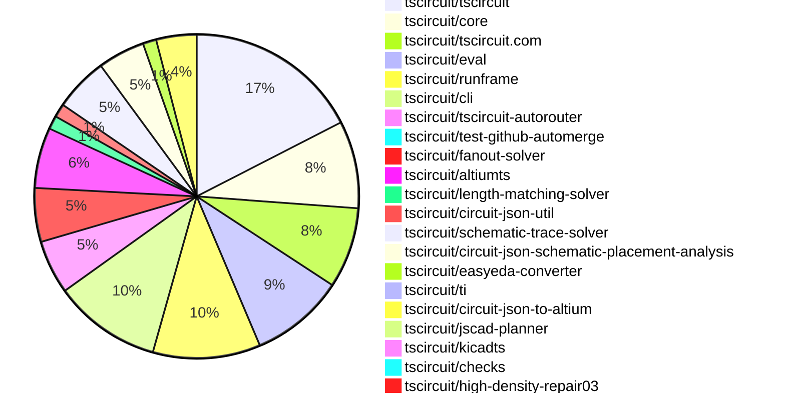

# Contribution Overview 2026-09-08

The current week is shown below. There are 3 major sections:

- [Contributor Overview](#contributor-overview)
- [PRs by Repository](#prs-by-repository)
- [PRs by Contributor](#changes-by-contributor)
- [Scoring & Sponsorship Details](/docs/sponsorship-calculation-explanation.md)

## PRs by Repository

## Contributor Overview

| Contributor | 🐳 Major | 🐙 Minor | 🐌 Tiny | Score | ⭐ |
|-------------|---------|---------|---------|-------|-----|
| [mohan-bee](#mohan-bee) | 4 | 3 | 8 | 33 | ⭐⭐ |
| [ShiboSoftwareDev](#ShiboSoftwareDev) | 3 | 2 | 4 | 32 | ⭐⭐ |
| [seveibar](#seveibar) | 3 | 3 | 2 | 21 | ⭐⭐ |
| [techmannih](#techmannih) | 1 | 1 | 12 | 19 | ⭐⭐ |
| [tscircuitbot](#tscircuitbot) | 0 | 0 | 85 | 12 | ⭐⭐ |
| [imrishabh18](#imrishabh18) | 1 | 3 | 0 | 11 | ⭐⭐ |
| [GokulPandi-M](#GokulPandi-M) | 1 | 1 | 2 | 8 | ⭐ |
| [MustafaMulla29](#MustafaMulla29) | 0 | 2 | 2 | 7 | ⭐ |
| [rushabhcodes](#rushabhcodes) | 0 | 3 | 1 | 7 | ⭐ |
| [AnasSarkiz](#AnasSarkiz) | 1 | 0 | 1 | 6 | ⭐ |
| [hrithik18k](#hrithik18k) | 0 | 1 | 2 | 4 | ⭐ |
| [KrishnaX12](#KrishnaX12) | 0 | 1 | 1 | 3 |  |
| [addibble](#addibble) | 0 | 1 | 0 | 2 |  |

## Staff Pass Ratio (SPR)

| Contributor | Reviewed PRs | Rejections | Approvals | SPR |
|-------------|--------------|------------|-----------|-----|
| [ShiboSoftwareDev](#ShiboSoftwareDev) | 5 | 0 | 5 | 100.0% |
| [mohan-bee](#mohan-bee) | 3 | 1 | 2 | 66.7% |
| [MustafaMulla29](#MustafaMulla29) | 2 | 1 | 2 | 50.0% |
| [techmannih](#techmannih) | 2 | 0 | 2 | 100.0% |
| [addibble](#addibble) | 1 | 0 | 1 | 100.0% |
| [AnasSarkiz](#AnasSarkiz) | 1 | 0 | 1 | 100.0% |
| [GokulPandi-M](#GokulPandi-M) | 1 | 1 | 1 | 0.0% |
| [imrishabh18](#imrishabh18) | 1 | 0 | 1 | 100.0% |

ShiboSoftwareDev SPR PRs (5)

- [#202](https://github.com/tscircuit/fanout-solver/pull/202) Route dense plane fanouts around real copper
- [#199](https://github.com/tscircuit/fanout-solver/pull/199) fix: allow centered outward escapes for plane fanout
- [#195](https://github.com/tscircuit/fanout-solver/pull/195) Add AM62L DDR4 processor fanout repro
- [#194](https://github.com/tscircuit/fanout-solver/pull/194) Add DDR4 memory fanout repro
- [#192](https://github.com/tscircuit/fanout-solver/pull/192) Route AM62L fanout around decoupling vias

mohan-bee SPR PRs (3)

- [#153](https://github.com/tscircuit/circuit-json-util/pull/153) include missing-pin errors in netlist diagnostics
- [#3724](https://github.com/tscircuit/core/pull/3724) deduplicate pcb obstacle connectivity ids
- [#362](https://github.com/tscircuit/contribution-tracker/pull/362) add missing sponsorships csv

MustafaMulla29 SPR PRs (2)

- [#57](https://github.com/tscircuit/circuit-json-schematic-placement-analysis/pull/57) Add buck network and connector placement analyzers
- [#52](https://github.com/tscircuit/circuit-json-schematic-placement-analysis/pull/52) Prefer vertical orientation for rail-connected two-pin components

techmannih SPR PRs (2)

- [#1083](https://github.com/tscircuit/schematic-trace-solver/pull/1083) fix: use shared rails for aligned decoupling capacitor banks
- [#56](https://github.com/tscircuit/circuit-json-schematic-placement-analysis/pull/56) feat: detect scattered same-rail decoupling capacitors

addibble SPR PRs (1)

- [#14](https://github.com/tscircuit/jscad-planner/pull/14) Add serializable mat4 transform operations

AnasSarkiz SPR PRs (1)

- [#2473](https://github.com/tscircuit/tscircuit-autorouter/pull/2473) Reuse port-point output for Pipeline9 node Pf calculations

GokulPandi-M SPR PRs (1)

- [#275](https://github.com/tscircuit/checks/pull/275) Fix plated-hole overlap checks against component courtyards

imrishabh18 SPR PRs (1)

- [#3699](https://github.com/tscircuit/core/pull/3699) Remove electrically isolated copper pours after via stitching

> Note: AI evaluates PRs and assigns 1-3 star ratings automatically. 4 and 5 star ratings require manual staff review.

## Review Table

[reviews-received-hover]: ## "Number of reviews received for PRs for this contributor"
[approvals-received-hover]: ## "Number of approvals received for PRs this contributor authored"
[rejections-received-hover]: ## "Number of rejections received for PRs this contributor authored"
[prs-opened-hover]: ## "Number of PRs opened by this contributor"
[issues-created-hover]: ## "Number of issues created by this contributor"

| Contributor | Reviews Received | Approvals Received | Rejections Received | Approvals | Rejections Given | PRs Opened | PRs Merged | Issues Created |
|---|---|---|---|---|---|---|---|---|
| [0hmX](#0hmX) | 0 | 0 | 0 | 3 | 0 | 1 | 0 | 0 |
| [5p00kyy](#5p00kyy) | 0 | 0 | 0 | 0 | 0 | 1 | 0 | 0 |
| [Abse2001](#Abse2001) | 0 | 0 | 0 | 2 | 0 | 1 | 0 | 0 |
| [addibble](#addibble) | 1 | 1 | 0 | 0 | 0 | 2 | 1 | 0 |
| [AnasSarkiz](#AnasSarkiz) | 2 | 2 | 0 | 1 | 0 | 8 | 2 | 0 |
| [anil08607](#anil08607) | 0 | 0 | 0 | 0 | 0 | 1 | 1 | 0 |
| [Ansukaa](#Ansukaa) | 0 | 0 | 0 | 0 | 0 | 1 | 0 | 0 |
| [antonioscafaro](#antonioscafaro) | 0 | 0 | 0 | 0 | 0 | 2 | 0 | 0 |
| [armorbreak001](#armorbreak001) | 0 | 0 | 0 | 0 | 0 | 1 | 0 | 0 |
| [benthepythondev00](#benthepythondev00) | 0 | 0 | 0 | 0 | 0 | 6 | 0 | 0 |
| [Bhavyansh-Sabharwal](#Bhavyansh-Sabharwal) | 0 | 0 | 0 | 0 | 0 | 1 | 0 | 0 |
| [billythompsons](#billythompsons) | 0 | 0 | 0 | 0 | 0 | 2 | 0 | 0 |
| [dwdcth](#dwdcth) | 0 | 0 | 0 | 0 | 0 | 2 | 0 | 0 |
| [Flame119052](#Flame119052) | 0 | 0 | 0 | 0 | 0 | 56 | 0 | 0 |
| [FU-max-boop](#FU-max-boop) | 0 | 0 | 0 | 0 | 0 | 1 | 0 | 0 |
| [Furox-Art](#Furox-Art) | 0 | 0 | 0 | 0 | 0 | 2 | 0 | 0 |
| [gcoinstash-cmd](#gcoinstash-cmd) | 0 | 0 | 0 | 0 | 0 | 14 | 0 | 0 |
| [GokulPandi-M](#GokulPandi-M) | 10 | 9 | 1 | 0 | 0 | 7 | 4 | 0 |
| [Hello2021Year](#Hello2021Year) | 0 | 0 | 0 | 0 | 0 | 1 | 0 | 0 |
| [hrithik18k](#hrithik18k) | 7 | 6 | 0 | 0 | 0 | 6 | 3 | 0 |
| [ikoomm](#ikoomm) | 0 | 0 | 0 | 0 | 0 | 4 | 0 | 0 |
| [imrishabh18](#imrishabh18) | 1 | 1 | 0 | 9 | 1 | 6 | 4 | 0 |
| [KrishnaX12](#KrishnaX12) | 5 | 2 | 1 | 0 | 0 | 6 | 2 | 0 |
| [krrishray](#krrishray) | 0 | 0 | 0 | 0 | 0 | 1 | 0 | 0 |
| [ksushant6566](#ksushant6566) | 0 | 0 | 0 | 0 | 0 | 1 | 0 | 0 |
| [matiascamaran](#matiascamaran) | 0 | 0 | 0 | 0 | 0 | 1 | 0 | 0 |
| [mohan-bee](#mohan-bee) | 10 | 8 | 1 | 3 | 0 | 21 | 15 | 0 |
| [MushinNakamoto](#MushinNakamoto) | 0 | 0 | 0 | 0 | 0 | 1 | 0 | 0 |
| [MustafaMulla29](#MustafaMulla29) | 4 | 2 | 1 | 9 | 0 | 6 | 4 | 0 |
| [nardeenal](#nardeenal) | 0 | 0 | 0 | 0 | 0 | 1 | 0 | 0 |
| [Prabin-Wagle](#Prabin-Wagle) | 0 | 0 | 0 | 0 | 0 | 1 | 0 | 0 |
| [ranadheer-designs](#ranadheer-designs) | 0 | 0 | 0 | 0 | 0 | 3 | 0 | 0 |
| [rushabhcodes](#rushabhcodes) | 9 | 4 | 0 | 0 | 0 | 5 | 4 | 0 |
| [sen-ye](#sen-ye) | 0 | 0 | 0 | 0 | 0 | 1 | 0 | 0 |
| [seveibar](#seveibar) | 1 | 0 | 0 | 15 | 3 | 31 | 8 | 0 |
| [ShiboSoftwareDev](#ShiboSoftwareDev) | 9 | 9 | 0 | 12 | 0 | 18 | 9 | 0 |
| [singhharsh1708](#singhharsh1708) | 0 | 0 | 0 | 0 | 0 | 1 | 0 | 0 |
| [tbontb-iaq](#tbontb-iaq) | 0 | 0 | 0 | 0 | 0 | 2 | 0 | 0 |
| [techmannih](#techmannih) | 14 | 12 | 0 | 2 | 0 | 21 | 14 | 0 |
| [tscircuitbot](#tscircuitbot) | 0 | 0 | 0 | 0 | 0 | 125 | 85 | 0 |
| [ugin-man](#ugin-man) | 0 | 0 | 0 | 0 | 0 | 18 | 0 | 0 |
| [WhiteEagle-12](#WhiteEagle-12) | 0 | 0 | 0 | 0 | 0 | 5 | 0 | 0 |

## Changes by Repository

### [tscircuit/tscircuit](https://github.com/tscircuit/tscircuit)

🐌 Tiny Contributions (26)

| PR # | Impact | Contributor | Description |
|------|--------|-------------|-------------|
| [#4803](https://github.com/tscircuit/tscircuit/pull/4803) | 🐌 Tiny | tscircuitbot | Automated package update |
| [#4802](https://github.com/tscircuit/tscircuit/pull/4802) | 🐌 Tiny | tscircuitbot | Automated package update |
| [#4801](https://github.com/tscircuit/tscircuit/pull/4801) | 🐌 Tiny | tscircuitbot | Automated package update |
| [#4800](https://github.com/tscircuit/tscircuit/pull/4800) | 🐌 Tiny | tscircuitbot | Automated package update |
| [#4799](https://github.com/tscircuit/tscircuit/pull/4799) | 🐌 Tiny | tscircuitbot | Updates the package version from 0.0.2477 to 0.0.2478 in package.json |
| [#4798](https://github.com/tscircuit/tscircuit/pull/4798) | 🐌 Tiny | tscircuitbot | Automated package update |
| [#4797](https://github.com/tscircuit/tscircuit/pull/4797) | 🐌 Tiny | tscircuitbot | Automated package update |
| [#4796](https://github.com/tscircuit/tscircuit/pull/4796) | 🐌 Tiny | tscircuitbot | Updates the tscircuitcli package version from 0.1.2034 to 0.1.2035 and the tscircuitrunframe package version from 0.0.2689 to 0.0.2690 in package.json |
| [#4795](https://github.com/tscircuit/tscircuit/pull/4795) | 🐌 Tiny | tscircuitbot | Automated package update |
| [#4794](https://github.com/tscircuit/tscircuit/pull/4794) | 🐌 Tiny | tscircuitbot | Automated package update |
| [#4793](https://github.com/tscircuit/tscircuit/pull/4793) | 🐌 Tiny | tscircuitbot | Automated package update |
| [#4792](https://github.com/tscircuit/tscircuit/pull/4792) | 🐌 Tiny | tscircuitbot | Automated package update |
| [#4791](https://github.com/tscircuit/tscircuit/pull/4791) | 🐌 Tiny | tscircuitbot | Automated package update |
| [#4790](https://github.com/tscircuit/tscircuit/pull/4790) | 🐌 Tiny | tscircuitbot | Automated package update |
| [#4789](https://github.com/tscircuit/tscircuit/pull/4789) | 🐌 Tiny | tscircuitbot | Automated package update |
| [#4788](https://github.com/tscircuit/tscircuit/pull/4788) | 🐌 Tiny | tscircuitbot | Automated package update |
| [#4787](https://github.com/tscircuit/tscircuit/pull/4787) | 🐌 Tiny | tscircuitbot | Updates the package version from 0.0.2471 to 0.0.2472 in package.json |
| [#4786](https://github.com/tscircuit/tscircuit/pull/4786) | 🐌 Tiny | tscircuitbot | Automated package update |
| [#4785](https://github.com/tscircuit/tscircuit/pull/4785) | 🐌 Tiny | tscircuitbot | Automated package update |
| [#4784](https://github.com/tscircuit/tscircuit/pull/4784) | 🐌 Tiny | tscircuitbot | Updates the tscircuitcli package and other dependencies to their latest versions. |
| [#4783](https://github.com/tscircuit/tscircuit/pull/4783) | 🐌 Tiny | tscircuitbot | Automated package update to version 0.0.2470 |
| [#4782](https://github.com/tscircuit/tscircuit/pull/4782) | 🐌 Tiny | tscircuitbot | Automated package update |
| [#4781](https://github.com/tscircuit/tscircuit/pull/4781) | 🐌 Tiny | tscircuitbot | Automated package update |
| [#4780](https://github.com/tscircuit/tscircuit/pull/4780) | 🐌 Tiny | tscircuitbot | Automated package update |
| [#4779](https://github.com/tscircuit/tscircuit/pull/4779) | 🐌 Tiny | tscircuitbot | Updates the package version from 0.0.2467 to 0.0.2468 in package.json |
| [#4778](https://github.com/tscircuit/tscircuit/pull/4778) | 🐌 Tiny | tscircuitbot | Automated package update |

### [tscircuit/core](https://github.com/tscircuit/core)

| PR # | Impact | Rating | Contributor | Description |
|------|--------|--------|-------------|-------------|
| [#3724](https://github.com/tscircuit/core/pull/3724) | 🐳 Major | ⭐⭐⭐ | mohan-bee | Fixes timeout issues in the ground routing phase by deduplicating obstacle connectivity IDs, reducing processing time significantly. |
| [#3723](https://github.com/tscircuit/core/pull/3723) | 🐙 Minor | ⭐⭐ | mohan-bee | Reproduces duplicate connectivity IDs that inflate PCB autorouter input by adding a test for duplicate counts in a four-layer TSX circuit. |
| [#3765](https://github.com/tscircuit/core/pull/3765) | 🐙 Minor | ⭐⭐ | seveibar | Normalizes shared schematic terminals for internally connected pushbutton pads to prevent zero-length wires and improve label handling. |
| [#3773](https://github.com/tscircuit/core/pull/3773) | 🐙 Minor | ⭐⭐ | seveibar | Skip the AM62L-to-LPDDR4 progressive fanout test due to PCB tracevia overlap errors and restore the Arduino Uno center reroute PCB snapshot to match the baseline before a previous PR, addressing CI mismatches. |
| [#3699](https://github.com/tscircuit/core/pull/3699) | 🐙 Minor | ⭐⭐ | imrishabh18 | Removes disconnected copper pour fragments that survive the solvers area filter by adding a cleanup phase after via stitching to ensure only connected pours remain. |

🐌 Tiny Contributions (8)

| PR # | Impact | Contributor | Description |
|------|--------|-------------|-------------|
| [#3795](https://github.com/tscircuit/core/pull/3795) | 🐌 Tiny | tscircuitbot | Updates the tscircuitfanout-solver package from version 0.0.66 to 0.0.68 |
| [#3784](https://github.com/tscircuit/core/pull/3784) | 🐌 Tiny | tscircuitbot | Updates the version of the tscircuitchecks package from 0.0.184 to 0.0.185 in package.json |
| [#3779](https://github.com/tscircuit/core/pull/3779) | 🐌 Tiny | mohan-bee | Updates the tscircuitschematic-trace-solver package to version 0.0.189 in the package.json file. |
| [#3781](https://github.com/tscircuit/core/pull/3781) | 🐌 Tiny | techmannih | Reproduces a bug where two parallel V3V3 traces are incorrectly routed beside IOVDD2 and VREG_IN, only 0.04 mm apart, and adds a test to validate the issue. |
| [#3782](https://github.com/tscircuit/core/pull/3782) | 🐌 Tiny | techmannih | Adds a reduced reproduction of the analog routing in allwinner board, where VRA1 crosses the GND label stem and the shared LDOA1V8 rail. |
| [#3793](https://github.com/tscircuit/core/pull/3793) | 🐌 Tiny | rushabhcodes | Reproduces a bug where duplicate vias are emitted for same-net routes crossing PCB layers at the same position, establishing expected behavior for a future fix. |
| [#3785](https://github.com/tscircuit/core/pull/3785) | 🐌 Tiny | seveibar | Updates tscircuitcapacity-autorouter from 0.0.890 to 0.0.892 and refreshes the SOIC-8 sensor to IC header autorouting snapshot, capturing small route-coordinate changes including a 0.001 mm via shift. |
| [#3778](https://github.com/tscircuit/core/pull/3778) | 🐌 Tiny | ShiboSoftwareDev | Updates the tscircuitcapacity-autorouter package from version 0.0.887 to 0.0.890, incorporating the Pipeline 9 explicit-via-endpoint fix and its follow-up formatting release, while superseding the previous pull request targeting version 0.0.888. |

### [tscircuit/tscircuit.com](https://github.com/tscircuit/tscircuit.com)

| PR # | Impact | Rating | Contributor | Description |
|------|--------|--------|-------------|-------------|
| [#4833](https://github.com/tscircuit/tscircuit.com/pull/4833) | 🐙 Minor | ⭐⭐ | rushabhcodes | Fixes the issue where packages with AI-generated descriptions but no manually written descriptions appear without any description in the header search dropdown, ensuring that AI descriptions are displayed when available. |
| [#4820](https://github.com/tscircuit/tscircuit.com/pull/4820) | 🐙 Minor | ⭐⭐ | rushabhcodes | Fixes rendering of related package descriptions by falling back to AI-generated descriptions when manual descriptions are absent, ensuring consistent display across server-rendered and client-hydrated content. |
| [#4819](https://github.com/tscircuit/tscircuit.com/pull/4819) | 🐙 Minor | ⭐⭐ | rushabhcodes | Fixes inconsistency in package card descriptions by falling back to AI-generated descriptions when manually authored descriptions are not available. |
| [#4837](https://github.com/tscircuit/tscircuit.com/pull/4837) | 🐙 Minor | ⭐⭐ | seveibar | Fixes home navigation to ensure that clicking the tscircuit logo directs users to the canonical landing page instead of the old page, and replaces the old landing page with a redirect to the new URL while preserving query strings and hashes. |
| [#4842](https://github.com/tscircuit/tscircuit.com/pull/4842) | 🐙 Minor | ⭐⭐ | imrishabh18 | Adds Download  Altium Project alongside KiCad, allowing users to download circuit projects in Altium format with native files and error reporting. |

🐌 Tiny Contributions (7)

| PR # | Impact | Contributor | Description |
|------|--------|-------------|-------------|
| [#4845](https://github.com/tscircuit/tscircuit.com/pull/4845) | 🐌 Tiny | tscircuitbot | Updates the tscircuitrunframe package from version 0.0.2690 to 0.0.2691 |
| [#4843](https://github.com/tscircuit/tscircuit.com/pull/4843) | 🐌 Tiny | tscircuitbot | Automated package update |
| [#4841](https://github.com/tscircuit/tscircuit.com/pull/4841) | 🐌 Tiny | tscircuitbot | Updates the tscircuitrunframe package from version 0.0.2683 to 0.0.2689 |
| [#4840](https://github.com/tscircuit/tscircuit.com/pull/4840) | 🐌 Tiny | tscircuitbot | Automated package update |
| [#4838](https://github.com/tscircuit/tscircuit.com/pull/4838) | 🐌 Tiny | tscircuitbot | Updates the tscircuiteval package from version 0.0.1375 to 0.0.1376 |
| [#4836](https://github.com/tscircuit/tscircuit.com/pull/4836) | 🐌 Tiny | tscircuitbot | Updates the tscircuiteval package from version 0.0.1370 to 0.0.1375 in the package.json file. |
| [#4828](https://github.com/tscircuit/tscircuit.com/pull/4828) | 🐌 Tiny | seveibar | Updates the runframe dependency to include the Autorouting phase explorer and aligns runtime dependencies to prevent Vite production build failures. |

### [tscircuit/eval](https://github.com/tscircuit/eval)

🐌 Tiny Contributions (14)

| PR # | Impact | Contributor | Description |
|------|--------|-------------|-------------|
| [#4461](https://github.com/tscircuit/eval/pull/4461) | 🐌 Tiny | tscircuitbot | Updates the package version from 0.0.1377 to 0.0.1378 in package.json |
| [#4460](https://github.com/tscircuit/eval/pull/4460) | 🐌 Tiny | tscircuitbot | Automated package update |
| [#4458](https://github.com/tscircuit/eval/pull/4458) | 🐌 Tiny | tscircuitbot | Automated package update |
| [#4457](https://github.com/tscircuit/eval/pull/4457) | 🐌 Tiny | tscircuitbot | Updates the version of the tscircuitcore package from 0.0.1874 to 0.0.1875 in package.json |
| [#4455](https://github.com/tscircuit/eval/pull/4455) | 🐌 Tiny | tscircuitbot | Automated package update |
| [#4454](https://github.com/tscircuit/eval/pull/4454) | 🐌 Tiny | tscircuitbot | Automated package update |
| [#4452](https://github.com/tscircuit/eval/pull/4452) | 🐌 Tiny | tscircuitbot | Automated package update |
| [#4451](https://github.com/tscircuit/eval/pull/4451) | 🐌 Tiny | tscircuitbot | Updates the version of tscircuitcore and tscircuitschematic-trace-solver in package.json |
| [#4449](https://github.com/tscircuit/eval/pull/4449) | 🐌 Tiny | tscircuitbot | Automated package update |
| [#4448](https://github.com/tscircuit/eval/pull/4448) | 🐌 Tiny | tscircuitbot | Updates the version of the tscircuitcore package from 0.0.1871 to 0.0.1872 in package.json |
| [#4445](https://github.com/tscircuit/eval/pull/4445) | 🐌 Tiny | tscircuitbot | Automated package update |
| [#4444](https://github.com/tscircuit/eval/pull/4444) | 🐌 Tiny | tscircuitbot | Automated package update |
| [#4442](https://github.com/tscircuit/eval/pull/4442) | 🐌 Tiny | tscircuitbot | Automated package update |
| [#4441](https://github.com/tscircuit/eval/pull/4441) | 🐌 Tiny | tscircuitbot | Updates the version of the tscircuitcore package from 0.0.1868 to 0.0.1870 in package.json |

### [tscircuit/runframe](https://github.com/tscircuit/runframe)

| PR # | Impact | Rating | Contributor | Description |
|------|--------|--------|-------------|-------------|
| [#5041](https://github.com/tscircuit/runframe/pull/5041) | 🐳 Major | ⭐⭐⭐ | imrishabh18 | Adds Altium Project to runframes export menu, allowing users to export circuit designs as Altium-compatible project files in a ZIP format. |

🐌 Tiny Contributions (15)

| PR # | Impact | Contributor | Description |
|------|--------|-------------|-------------|
| [#5044](https://github.com/tscircuit/runframe/pull/5044) | 🐌 Tiny | tscircuitbot | Automated package update |
| [#5043](https://github.com/tscircuit/runframe/pull/5043) | 🐌 Tiny | tscircuitbot | Updates the tscircuiteval package to version 0.0.1378 in the package.json file. |
| [#5042](https://github.com/tscircuit/runframe/pull/5042) | 🐌 Tiny | tscircuitbot | Automated package update |
| [#5040](https://github.com/tscircuit/runframe/pull/5040) | 🐌 Tiny | tscircuitbot | Automated package update |
| [#5039](https://github.com/tscircuit/runframe/pull/5039) | 🐌 Tiny | tscircuitbot | Updates the tscircuiteval package to version 0.0.1377 in the package.json file. |
| [#5038](https://github.com/tscircuit/runframe/pull/5038) | 🐌 Tiny | tscircuitbot | Automated package update |
| [#5037](https://github.com/tscircuit/runframe/pull/5037) | 🐌 Tiny | tscircuitbot | Updates the tscircuiteval package to version 0.0.1376 in the package.json file. |
| [#5036](https://github.com/tscircuit/runframe/pull/5036) | 🐌 Tiny | tscircuitbot | Automated package update |
| [#5035](https://github.com/tscircuit/runframe/pull/5035) | 🐌 Tiny | tscircuitbot | Updates the tscircuiteval package to version 0.0.1375 in the package.json file. |
| [#5034](https://github.com/tscircuit/runframe/pull/5034) | 🐌 Tiny | tscircuitbot | Automated package update |
| [#5033](https://github.com/tscircuit/runframe/pull/5033) | 🐌 Tiny | tscircuitbot | Updates the tscircuiteval package from version 0.0.1373 to 0.0.1374 in the package.json file. |
| [#5032](https://github.com/tscircuit/runframe/pull/5032) | 🐌 Tiny | tscircuitbot | Automated package update |
| [#5031](https://github.com/tscircuit/runframe/pull/5031) | 🐌 Tiny | tscircuitbot | Updates the tscircuiteval package to version 0.0.1373 in the package.json file. |
| [#5030](https://github.com/tscircuit/runframe/pull/5030) | 🐌 Tiny | tscircuitbot | Automated package update |
| [#5029](https://github.com/tscircuit/runframe/pull/5029) | 🐌 Tiny | tscircuitbot | Updates the tscircuiteval package to version 0.0.1372 in the package.json file. |

### [tscircuit/cli](https://github.com/tscircuit/cli)

| PR # | Impact | Rating | Contributor | Description |
|------|--------|--------|-------------|-------------|
| [#4657](https://github.com/tscircuit/cli/pull/4657) | 🐙 Minor | ⭐⭐ | imrishabh18 | Adds tsci export board.tsx --format altium and the same export for Circuit JSON inputs, generating an Altium project ZIP with necessary files. |

🐌 Tiny Contributions (15)

| PR # | Impact | Contributor | Description |
|------|--------|-------------|-------------|
| [#4661](https://github.com/tscircuit/cli/pull/4661) | 🐌 Tiny | tscircuitbot | Automated package update |
| [#4660](https://github.com/tscircuit/cli/pull/4660) | 🐌 Tiny | tscircuitbot | Updates the tscircuitrunframe package to version 0.0.2691 |
| [#4659](https://github.com/tscircuit/cli/pull/4659) | 🐌 Tiny | tscircuitbot | Automated package update |
| [#4656](https://github.com/tscircuit/cli/pull/4656) | 🐌 Tiny | tscircuitbot | Automated package update |
| [#4655](https://github.com/tscircuit/cli/pull/4655) | 🐌 Tiny | tscircuitbot | Updates the tscircuitrunframe package from version 0.0.2688 to 0.0.2689 |
| [#4653](https://github.com/tscircuit/cli/pull/4653) | 🐌 Tiny | tscircuitbot | Automated package update |
| [#4652](https://github.com/tscircuit/cli/pull/4652) | 🐌 Tiny | tscircuitbot | Updates the tscircuitrunframe package from version 0.0.2687 to 0.0.2688 |
| [#4651](https://github.com/tscircuit/cli/pull/4651) | 🐌 Tiny | tscircuitbot | Automated package update |
| [#4650](https://github.com/tscircuit/cli/pull/4650) | 🐌 Tiny | tscircuitbot | Updates the tscircuitrunframe package to version 0.0.2687 |
| [#4648](https://github.com/tscircuit/cli/pull/4648) | 🐌 Tiny | tscircuitbot | Automated package update |
| [#4647](https://github.com/tscircuit/cli/pull/4647) | 🐌 Tiny | tscircuitbot | Updates the tscircuitrunframe package to version 0.0.2686 |
| [#4644](https://github.com/tscircuit/cli/pull/4644) | 🐌 Tiny | tscircuitbot | Updates the tscircuitrunframe package from version 0.0.2684 to 0.0.2685 |
| [#4643](https://github.com/tscircuit/cli/pull/4643) | 🐌 Tiny | tscircuitbot | Updates the tscircuitrunframe package from version 0.0.2683 to 0.0.2684 |
| [#4645](https://github.com/tscircuit/cli/pull/4645) | 🐌 Tiny | mohan-bee | Fixes npm publishing issues caused by conflicting circuit-json specifications and outdated version tags, aligning the override range and updating the version to 0.1.2030. |
| [#4642](https://github.com/tscircuit/cli/pull/4642) | 🐌 Tiny | mohan-bee | Updates the tscircuitcircuit-json-util package from version 0.0.105 to 0.0.112 in the package.json file. |

### [tscircuit/tscircuit-autorouter](https://github.com/tscircuit/tscircuit-autorouter)

| PR # | Impact | Rating | Contributor | Description |
|------|--------|--------|-------------|-------------|
| [#2456](https://github.com/tscircuit/tscircuit-autorouter/pull/2456) | 🐳 Major | ⭐⭐⭐ | mohan-bee | Passes maxUncoupledLength to length matching, ensuring the autorouter respects the boards requested limit during post-processing. |
| [#2479](https://github.com/tscircuit/tscircuit-autorouter/pull/2479) | 🐳 Major | ⭐⭐⭐ | seveibar | Fixes coupled clearance violations in autorouting, improving DRC pass rate from 62.5 to 75.0 with reduced median runtime. |
| [#2475](https://github.com/tscircuit/tscircuit-autorouter/pull/2475) | 🐳 Major | ⭐⭐⭐ | seveibar | Calculates each high-density nodes failure probability by reusing the complete pathing output for every input node, improving performance without altering existing probability formulas or pipeline stages. |

🐌 Tiny Contributions (5)

| PR # | Impact | Contributor | Description |
|------|--------|-------------|-------------|
| [#2498](https://github.com/tscircuit/tscircuit-autorouter/pull/2498) | 🐌 Tiny | tscircuitbot | Automated package update |
| [#2493](https://github.com/tscircuit/tscircuit-autorouter/pull/2493) | 🐌 Tiny | tscircuitbot | Automated package update |
| [#2485](https://github.com/tscircuit/tscircuit-autorouter/pull/2485) | 🐌 Tiny | tscircuitbot | Automated package update |
| [#2476](https://github.com/tscircuit/tscircuit-autorouter/pull/2476) | 🐌 Tiny | tscircuitbot | Automated package update |
| [#2490](https://github.com/tscircuit/tscircuit-autorouter/pull/2490) | 🐌 Tiny | AnasSarkiz | Avoids duplicate net lookups during DRC repair by pinning high-density-repair03 to a specific commit, ensuring existing repair behavior is preserved without changes to routing policies or DRC rules. |

### [tscircuit/test-github-automerge](https://github.com/tscircuit/test-github-automerge)

🐌 Tiny Contributions (1)

| PR # | Impact | Contributor | Description |
|------|--------|-------------|-------------|
| [#73](https://github.com/tscircuit/test-github-automerge/pull/73) | 🐌 Tiny | tscircuitbot | Updates the tscircuitcircuit-json-util package from version 0.0.110 to 0.0.112 in the development dependencies. |

### [tscircuit/fanout-solver](https://github.com/tscircuit/fanout-solver)

| PR # | Impact | Rating | Contributor | Description |
|------|--------|--------|-------------|-------------|
| [#202](https://github.com/tscircuit/fanout-solver/pull/202) | 🐳 Major | ⭐⭐⭐ | ShiboSoftwareDev | Fixes routing failure for dense plane fanouts around existing copper connections in the AM62L SoC area, ensuring all connections are routed correctly and validated without altering component positions or connections. |
| [#199](https://github.com/tscircuit/fanout-solver/pull/199) | 🐳 Major | ⭐⭐⭐ | ShiboSoftwareDev | Fixes routing failure by allowing centered outward escapes for plane fanout when pad-pair spacing cannot fit a via. |
| [#192](https://github.com/tscircuit/fanout-solver/pull/192) | 🐳 Major | ⭐⭐⭐ | ShiboSoftwareDev | Routes AM62L fanout around decoupling vias by addressing foreign all-layer obstacles and ensuring DRC validation for connections. |

🐌 Tiny Contributions (5)

| PR # | Impact | Contributor | Description |
|------|--------|-------------|-------------|
| [#206](https://github.com/tscircuit/fanout-solver/pull/206) | 🐌 Tiny | tscircuitbot | Automated package update |
| [#205](https://github.com/tscircuit/fanout-solver/pull/205) | 🐌 Tiny | tscircuitbot | Automated package update |
| [#201](https://github.com/tscircuit/fanout-solver/pull/201) | 🐌 Tiny | ShiboSoftwareDev | Add a real TSX circuit with the AM62L32 and MT53E1G16D1ZW components, all 33 DDR connections, and 102 real plane drops, including the actual 60-capacitor bottom-side decoupling network with 120 authored through-vias and cap-to-via traces, capturing the exact Core solver input and adding a visual regression showing the current solver failure. |
| [#198](https://github.com/tscircuit/fanout-solver/pull/198) | 🐌 Tiny | ShiboSoftwareDev | Reproduces the outward plane escape failure with a native RC filter using a specific circuit configuration and provides a visual snapshot of the PCB layout. |
| [#191](https://github.com/tscircuit/fanout-solver/pull/191) | 🐌 Tiny | ShiboSoftwareDev | Adds a test to reproduce the AM62L fanout failure with future decoupling vias as obstacles, without changing the solver functionality. |

### [tscircuit/altiumts](https://github.com/tscircuit/altiumts)

| PR # | Impact | Rating | Contributor | Description |
|------|--------|--------|-------------|-------------|
| [#149](https://github.com/tscircuit/altiumts/pull/149) | 🐙 Minor | ⭐⭐ | ShiboSoftwareDev | Add explicit current date and time inputs to schematic SVG rendering and resolve Altium CurrentDate and CurrentTime special strings deterministically. |
| [#152](https://github.com/tscircuit/altiumts/pull/152) | 🐙 Minor | ⭐⭐ | KrishnaX12 | Fixes SVG rendering issue by including off-board PCB graphics in bounds calculations, ensuring accurate viewport representation without clipping. |
| [#159](https://github.com/tscircuit/altiumts/pull/159) | 🐙 Minor | ⭐⭐ | hrithik18k | Fixes rendering issue where PCB overlay arcs with start angles greater than end angles are incorrectly displayed as short negative sweeps instead of wrapping counterclockwise through zero, ensuring accurate representation of circular component outlines. |

🐌 Tiny Contributions (6)

| PR # | Impact | Contributor | Description |
|------|--------|-------------|-------------|
| [#162](https://github.com/tscircuit/altiumts/pull/162) | 🐌 Tiny | tscircuitbot | Automated package update |
| [#160](https://github.com/tscircuit/altiumts/pull/160) | 🐌 Tiny | tscircuitbot | Automated package update |
| [#153](https://github.com/tscircuit/altiumts/pull/153) | 🐌 Tiny | techmannih | Fixes rendering issues in exported schematics by correctly interpreting native coordinate and text settings, ensuring accurate representation of electrical indicators and font settings. |
| [#151](https://github.com/tscircuit/altiumts/pull/151) | 🐌 Tiny | KrishnaX12 | Adds the open-source STM32 ST-Link V2 PCB as a pinned binary reference fixture and establishes a reproduction baseline capturing rendering differences against Altium 365 for follow-up fixes. |
| [#150](https://github.com/tscircuit/altiumts/pull/150) | 🐌 Tiny | hrithik18k | Fixes rendering of multiline schematic notes to prevent compression and misalignment, ensuring proper display in SVG format. |
| [#156](https://github.com/tscircuit/altiumts/pull/156) | 🐌 Tiny | hrithik18k | Reproduces a bug where multiline note text in schematics is rendered incorrectly due to newline markers being treated literally, causing misalignment. |

### [tscircuit/length-matching-solver](https://github.com/tscircuit/length-matching-solver)

| PR # | Impact | Rating | Contributor | Description |
|------|--------|--------|-------------|-------------|
| [#66](https://github.com/tscircuit/length-matching-solver/pull/66) | 🐳 Major | ⭐⭐⭐ | mohan-bee | Fixes length matching for USB traces to ensure they meet the required length tolerance by preserving valid terminal fanout during differential-pair length matching. |
| [#65](https://github.com/tscircuit/length-matching-solver/pull/65) | 🐳 Major | ⭐⭐⭐ | mohan-bee | Motivation Reproduce the USB length-matching rejection near the MCU pads. Start with the runnable TSX board reproduction in core 3728(https:github.comtscircuitcoreblobc4ebf9fe5edb596dd496a795fc16dc5e5b9c6187testsreprosusb-mcu-differential-pair-skew.test.tsx): it contains the full board, the 0.5 mm skew assertion, and a PCB snapshot.  Before Matching adds a meander, but final validation rejects unchanged fanout and returns routes with 1.319 mm skew, above the 0.5 mm limit.  After This solver regression uses the captured input from that TSX board and records invalid-final-copper. One snapshot shows the original board and returned routes; 66 contains the fix. !USB board with rejected length matching(https:raw.githubusercontent.comtscircuitlength-matching-solverc4e238ftestspost-processing__snapshots__usb-mcu-existing-terminal-clearance.snap.svg) |

### [tscircuit/circuit-json-util](https://github.com/tscircuit/circuit-json-util)

| PR # | Impact | Rating | Contributor | Description |
|------|--------|--------|-------------|-------------|
| [#153](https://github.com/tscircuit/circuit-json-util/pull/153) | 🐙 Minor | ⭐⭐ | mohan-bee | Includes missing-pin errors in netlist diagnostics to ensure that invalid traces are correctly categorized and reported in the CLIs category filter. |

🐌 Tiny Contributions (1)

| PR # | Impact | Contributor | Description |
|------|--------|-------------|-------------|
| [#152](https://github.com/tscircuit/circuit-json-util/pull/152) | 🐌 Tiny | mohan-bee | Reproduces a missing-pin error that is omitted when the CLI filters diagnostics by the netlist category. |

### [tscircuit/schematic-trace-solver](https://github.com/tscircuit/schematic-trace-solver)

| PR # | Impact | Rating | Contributor | Description |
|------|--------|--------|-------------|-------------|
| [#1083](https://github.com/tscircuit/schematic-trace-solver/pull/1083) | 🐳 Major | ⭐⭐⭐ | techmannih | Fixes the issue of distant decoupling branches acquiring alternating supplyGND wires during trace recovery by allowing aligned capacitor banks to use shared rails while preserving local net labels for standalone parallel branches. |
| [#1122](https://github.com/tscircuit/schematic-trace-solver/pull/1122) | 🐳 Major | ⭐⭐⭐ | GokulPandi-M | Collapses redundant same-net cycles before shared endpoint stubs are trimmed, handling cycles formed by two same-net traces and enclosed loops within one routed trace while preserving existing checks. |
| [#1089](https://github.com/tscircuit/schematic-trace-solver/pull/1089) | 🐙 Minor | ⭐⭐ | mohan-bee | Fixes the issue of disconnected ground labels during same-net junction alignment, ensuring labels remain attached to their respective traces after alignment adjustments. |

🐌 Tiny Contributions (5)

| PR # | Impact | Contributor | Description |
|------|--------|-------------|-------------|
| [#1093](https://github.com/tscircuit/schematic-trace-solver/pull/1093) | 🐌 Tiny | mohan-bee | Fixes disconnected trace endpoints and missing connector labels in the robot-controller repro from 1091. |
| [#1091](https://github.com/tscircuit/schematic-trace-solver/pull/1091) | 🐌 Tiny | mohan-bee | Adds a new page and test for reproducing the routing of IMU and ToF components in the robot controller schematic. |
| [#1105](https://github.com/tscircuit/schematic-trace-solver/pull/1105) | 🐌 Tiny | mohan-bee | Fixes the issue of unlabeled connector ends by ensuring that connector labels remain attached and correctly oriented, preventing label collisions and misplacements. |
| [#1088](https://github.com/tscircuit/schematic-trace-solver/pull/1088) | 🐌 Tiny | mohan-bee | Reproduces a bug where the ground label disconnects during alignment in the RP2040 robot controller schematic. |
| [#1101](https://github.com/tscircuit/schematic-trace-solver/pull/1101) | 🐌 Tiny | GokulPandi-M | Adds a focused solver reproduction reduced from the DS1 area of the merged Core clock schematic, capturing repeated junctions around adjacent power rails without changing solver behavior. |

### [tscircuit/circuit-json-schematic-placement-analysis](https://github.com/tscircuit/circuit-json-schematic-placement-analysis)

| PR # | Impact | Rating | Contributor | Description |
|------|--------|--------|-------------|-------------|
| [#51](https://github.com/tscircuit/circuit-json-schematic-placement-analysis/pull/51) | 🐳 Major | ⭐⭐⭐ | seveibar | Live Vercel preview(https:circuit-json-schematic-placement-analysis-439p6xmci-tscircuit.vercel.app?fixture7B22path223A22tests2Frepros2Freal-schematics.page.tsx227D)  automatically deployed from this PR. The repo is now connected to the tscircuit Vercel team; vercel.json builds and serves the Cosmos gallery for future PR previews. Placement reports on complete schematics currently require matching analyzer text to components by hand. This adds a real-schematics Cosmos fixture that renders numbered issue overlays directly on the schematic, with counts for every issue type and filters for sheet, type, and individual issue. The explorer reuses the existing, unchanged wireless-mouse controller and sensor sheet imports and accepts local Circuit JSON exports. It includes zoom, an overlay toggle, raw issue details, and SVGJSON downloads. Overlays use the SVG renderers real-to-screen transform and retain the selected sheets original layout. Thin non-scaling strokes mark the issues, and the SVG viewBox frames the selected issue geometry with approximately half a bounds-widthheight of padding on each side. Toggling overlays preserves that framing. Net-label collision reports now retain their actual intersection bounds; detection rules and textual output remain unchanged.  Real repro  Reported type  Count   ---  ---  ---:   Wireless mouse controller  CrystalNotCenteredOverLoadCapacitors  1   Wireless mouse sensor  TraceCanBeSimplifiedByMovingComponent  3   Wireless mouse sensor  TwoPinComponentCouldBeFlipped  2  Every other type is zero in both examples. These are regression baselines, not assertions that the suggestions are correct. The sensor repro makes a useful review case: its three trace reports suggest different vertical moves for the same U_SENSOR_LDO, and each trace can now be isolated visually. Counts measure emitted issue objects; grouped net-label reports separately expose their collision regions. Run bun start and select real-schematics to inspect or import a repro. The library also exposes getIssues( issueTypes, schematicSheetId ) and getIssueCounts( schematicSheetId ). createSchematicPlacementIssueArtifacts(circuitJson, options?) is exported for CLI artifact generation. It returns one SVG per issue with a stable filename, unpadded schematic bounds, the issue data, and its XML description. Each SVG contains only that issues overlay and XML footer, with no other issue descriptions or count summaries. It accepts the existing analysis plus sheettype filters and performs no filesystem writes. Rendering helpers now live in lib, and circuit-to-svgstack-svgs are runtime dependencies. The README shows how tsci check schematic-placement can write the returned files; CLI command wiring is outside this library PR. Validation: All 59 tests pass, including three new stacked schematicanalysis SVG snapshots for real controller and sensor reports and multi-sheet collision isolation. Typecheck, format check, and Cosmos production build pass. Browser-verified the built explorer: real JSON import, zero-count filtering, repro switching, and individual issue isolation. The local development watcher hit an OS file-watch limit, so browser verification used the production export. Visual snapshots: controller overlay(https:github.comtscircuitcircuit-json-schematic-placement-analysisblob55d88c0499c61c78ee8131553d4d7848421a6598testscases__snapshots__real-controller-issue-overlay.snap.svg), isolated sensor trace(https:github.comtscircuitcircuit-json-schematic-placement-analysisblob55d88c0499c61c78ee8131553d4d7848421a6598testscases__snapshots__real-sensor-issue-overlay.snap.svg), sheet-isolated collision region(https:github.comtscircuitcircuit-json-schematic-placement-analysisblob55d88c0499c61c78ee8131553d4d7848421a6598testscases__snapshots__multi-sheet-issue-overlay.snap.svg). Per-issue artifact snapshot(https:github.comtscircuitcircuit-json-schematic-placement-analysisblob55d88c0499c61c78ee8131553d4d7848421a6598testscases__snapshots__schematic-placement-issue-artifacts.snap.svg). |
| [#53](https://github.com/tscircuit/circuit-json-schematic-placement-analysis/pull/53) | 🐙 Minor | ⭐⭐ | MustafaMulla29 | Adds optional highlights to existing schematic snapshots, allowing users to visualize issues with component placements by highlighting them in the generated SVG output. |
| [#52](https://github.com/tscircuit/circuit-json-schematic-placement-analysis/pull/52) | 🐙 Minor | ⭐⭐ | MustafaMulla29 | Adds a solver to report horizontal two-pin components connected to power or ground, suggesting a vertical orientation to avoid obscuring rail branches. |
| [#56](https://github.com/tscircuit/circuit-json-schematic-placement-analysis/pull/56) | 🐙 Minor | ⭐⭐ | techmannih | Adds DecouplingCapacitorGroupingSolver to detect and report scattered same-rail decoupling capacitors in schematic analysis, improving schematic readability and organization. |
| [#50](https://github.com/tscircuit/circuit-json-schematic-placement-analysis/pull/50) | 🐙 Minor | ⭐⭐ | GokulPandi-M | Fixes XML attribute serialization by ensuring that string values are properly escaped to prevent malformed attributes in emitted XML fragments. |

🐌 Tiny Contributions (2)

| PR # | Impact | Contributor | Description |
|------|--------|-------------|-------------|
| [#55](https://github.com/tscircuit/circuit-json-schematic-placement-analysis/pull/55) | 🐌 Tiny | MustafaMulla29 | Adds five complete RP2040 BLDC controller sheets rebuilt from unchanged sources with tscircuit 0.0.2474 (core 0.0.1874), the latest published version checked on September 9. Circuit JSON comes from that fresh build; snapshots use this repositorys existing renderer and symbol dependencies. Snapshots show all 79 reported issues, with numbered highlights and full descriptions. Overlapping markers are separated, and repeated highlights keep component bodies readable. The sheets are also available in the existing repro explorer.  Full-sheet snapshot  Issues  Review focus   ---  ---:  ---   Controller(https:github.comtscircuitcircuit-json-schematic-placement-analysisblob8c917087ae97f79e9f2452e31fa1967372191876testscases__snapshots__rp2040-full-controller-sheet.snap.svg)  5  Current suggestions miss the USB section; compare RP2040 Figure 9(https:datasheets.raspberrypi.comrp2040hardware-design-with-rp2040.pdfpage12).   Hall(https:github.comtscircuitcircuit-json-schematic-placement-analysisblob8c917087ae97f79e9f2452e31fa1967372191876testscases__snapshots__rp2040-full-hall-sheet.snap.svg)  1  Connector width is flagged; connector detours remain unreported. Compare TI Figure 21(https:www.ti.comlitugslvuaq4aslvuaq4a.pdfpage15).   Encoder(https:github.comtscircuitcircuit-json-schematic-placement-analysisblob8c917087ae97f79e9f2452e31fa1967372191876testscases__snapshots__rp2040-full-encoder-sheet.snap.svg)  1  Same connector-detour gap as Hall.   Power input(https:github.comtscircuitcircuit-json-schematic-placement-analysisblob8c917087ae97f79e9f2452e31fa1967372191876testscases__snapshots__rp2040-full-power-input-sheet.snap.svg)  48  Local ORing suggestions versus the power path in TI Figure 10-1(https:www.ti.comlitdssymlinklm74700-q1.pdfpage16).   Power(https:github.comtscircuitcircuit-json-schematic-placement-analysisblob8c917087ae97f79e9f2452e31fa1967372191876testscases__snapshots__rp2040-full-power-sheet.snap.svg)  24  Buck grouping remains unreported; review the suggested vertical L_BUCK against TI Figure 22(https:www.ti.comlitdssymlinklmr16020.pdfpage19).  These tests record current analyzer output, including missed cases and questionable suggestions. Validation: 66 tests, typecheck, formatting, and explorer build pass.  Reference comparisons Published references are on the left; unchanged repro renders without analyzer highlights are on the right. Relevant sections are enlarged for readability, with complete clean sheets linked below.  1. Controller - USB interface !Controller - USB interface: published reference on the left, unhighlighted tscircuit repro on the right(https:github.comuser-attachmentsassets0a2df7a5-87d5-4423-8f84-11681a7b869f) Reference: Raspberry Pi, Figure 9(https:datasheets.raspberrypi.comrp2040hardware-design-with-rp2040.pdfpage12)  Complete unhighlighted controller sheet(https:github.comuser-attachmentsassetscb2b61d5-6ee0-4f4e-b296-16744b963c2a)  2. Hall sensor inputs !Hall sensor inputs: published reference on the left, unhighlighted tscircuit repro on the right(https:github.comuser-attachmentsassetsc54a2751-0a68-4d0a-adcc-f28a6dcd7625) Reference: TI DRV8305-Q1EVM, Figure 21(https:www.ti.comlitugslvuaq4aslvuaq4a.pdfpage15)  Complete unhighlighted hall sheet(https:github.comuser-attachmentsassets7f784ec8-5098-4c39-9fec-b92192f7379d)  3. Encoder inputs !Encoder inputs: published reference on the left, unhighlighted tscircuit repro on the right(https:github.comuser-attachmentsassets0d0ee24a-3669-465b-948d-b5aaa57a7305) Reference: TI LAUNCHXL-F28069M, Figure 8(https:www.ti.comlitugsprui11bsprui11b.pdfpage15)  Complete unhighlighted encoder sheet(https:github.comuser-attachmentsassets3fe28316-e8ac-4236-b64c-3d4eed9cab76)  4. Power input - reverse-blocking branches !Power input - reverse-blocking branches: published reference on the left, unhighlighted tscircuit repro on the right(https:github.comuser-attachmentsassetse33f0598-0a89-4bc9-a537-440a82dedc7e) Reference: TI LM74700-Q1, Figure 10-1(https:www.ti.comlitdssymlinklm74700-q1.pdfpage16)  Complete unhighlighted power-input sheet(https:github.comuser-attachmentsassets2f63ab10-ce3b-4421-89ce-b1a90fbc043e)  5. Power - 5 V buck regulator !Power - 5 V buck regulator: published reference on the left, unhighlighted tscircuit repro on the right(https:github.comuser-attachmentsassets03d32753-f6fd-472f-9c3a-6b7e14f9e376) Reference: TI LMR16020, Figure 22(https:www.ti.comlitdssymlinklmr16020.pdfpage19)  Complete unhighlighted power sheet(https:github.comuser-attachmentsassets6f06fe89-69db-4989-8ffc-c4e945ace6f3) |
| [#54](https://github.com/tscircuit/circuit-json-schematic-placement-analysis/pull/54) | 🐌 Tiny | techmannih | The reviewed Trellis Core schematic spreads same-rail decoupling capacitors across the CPU sheet and places power LED D1 6.38 schematic units from its paired resistor R4. Add the published techmannihtrellis-core0.2.9 circuit to the real-schematic gallery so these cases can be reproduced before implementing analyzer fixes. The pinned fixture preserves all source and schematic records across five sheets and 92 components. CPU Core and Power tests verify original connectivity and positions, record current analyzer behavior, and provide stacked schematicanalysis SVG snapshots. Fixture provenance and extraction instructions are included. The snapshots retain the existing capacitor symbol-to-trace gaps. The renderers scaling issue is documented in the fixture notes; its fix is deferred to circuit-to-svg. Analyzer behavior and dependencies are unchanged. To inspect: run bun start, open real-schematics, select Trellis Core  all five sheets (v0.2.9), and choose cpu-core or power. Validation: bun test (68 passing), bun run typecheck, bun run format:check, and bun run build:site. |

### [tscircuit/easyeda-converter](https://github.com/tscircuit/easyeda-converter)

🐌 Tiny Contributions (2)

| PR # | Impact | Contributor | Description |
|------|--------|-------------|-------------|
| [#558](https://github.com/tscircuit/easyeda-converter/pull/558) | 🐌 Tiny | MustafaMulla29 | Adds a MOSFET symbol for the STL130N6F7 component and fixes its representation in the schematic. |
| [#555](https://github.com/tscircuit/easyeda-converter/pull/555) | 🐌 Tiny | techmannih | Adds a conversion repro for C20526 (MMBT3904) including schematic snapshot and inline TSX snapshot for pin mapping, footprint, and CAD placement. |

### [tscircuit/ti](https://github.com/tscircuit/ti)

🐌 Tiny Contributions (1)

| PR # | Impact | Contributor | Description |
|------|--------|-------------|-------------|
| [#236](https://github.com/tscircuit/ti/pull/236) | 🐌 Tiny | techmannih | Updates the circuit-json-to-altium dependency to a newer commit and updates the altiumts dependency version in package.json |

### [tscircuit/circuit-json-to-altium](https://github.com/tscircuit/circuit-json-to-altium)

🐌 Tiny Contributions (6)

| PR # | Impact | Contributor | Description |
|------|--------|-------------|-------------|
| [#140](https://github.com/tscircuit/circuit-json-to-altium/pull/140) | 🐌 Tiny | techmannih | Fixes pin name and number font sizes for native Altium export, ensuring correct font rendering and positioning for schematic components. |
| [#137](https://github.com/tscircuit/circuit-json-to-altium/pull/137) | 🐌 Tiny | techmannih | Fixes the export of compact pointed net labels by correcting coordinate representation and ensuring proper visibility and connection to original wire anchors. |
| [#136](https://github.com/tscircuit/circuit-json-to-altium/pull/136) | 🐌 Tiny | techmannih | Fixes the export of ordinary net labels to use native integer sizes, changing them from fractional sizes to Arial 4 pt in the native SchDoc format. |
| [#135](https://github.com/tscircuit/circuit-json-to-altium/pull/135) | 🐌 Tiny | techmannih | Fixes inline trace labels such as SWDIO, SWCLK, NRST and PA0 to export with native integer sizes instead of fractional sizes, ensuring they are rendered as Arial 3 pt in schematics. |
| [#134](https://github.com/tscircuit/circuit-json-to-altium/pull/134) | 🐌 Tiny | techmannih | Fixes font size issues for component references and MPN in Altium exports by ensuring integer point sizes are used instead of fractional sizes. |
| [#129](https://github.com/tscircuit/circuit-json-to-altium/pull/129) | 🐌 Tiny | techmannih | Records exporter failures in Altium 365 by exposing existing export problems in generated schematics, while the converter implementation remains unchanged. |

### [tscircuit/jscad-planner](https://github.com/tscircuit/jscad-planner)

| PR # | Impact | Rating | Contributor | Description |
|------|--------|--------|-------------|-------------|
| [#14](https://github.com/tscircuit/jscad-planner/pull/14) | 🐙 Minor | ⭐⭐ | addibble | Expose JSCADs transforms.transform(matrix, shape) as a serializable operation, allowing callers to preserve an already-calculated placement without decomposing it into Euler angles or reconstructing a nested operation sequence. |

### [tscircuit/kicadts](https://github.com/tscircuit/kicadts)

| PR # | Impact | Rating | Contributor | Description |
|------|--------|--------|-------------|-------------|
| [#69](https://github.com/tscircuit/kicadts/pull/69) | 🐙 Minor | ⭐⭐ | ShiboSoftwareDev | Parses the inline hide flag used by KiCad pin_names nodes, serializes the flag back in its original inline form, and prevents hidden connector pin names from becoming visible generated labels. |

### [tscircuit/checks](https://github.com/tscircuit/checks)

🐌 Tiny Contributions (1)

| PR # | Impact | Contributor | Description |
|------|--------|-------------|-------------|
| [#274](https://github.com/tscircuit/checks/pull/274) | 🐌 Tiny | GokulPandi-M | Adds a test to reproduce the issue where through-hole display pins overlap with the courtyard of a battery holder on the opposite side of the PCB without reporting a placement issue. |

### [tscircuit/high-density-repair03](https://github.com/tscircuit/high-density-repair03)

| PR # | Impact | Rating | Contributor | Description |
|------|--------|--------|-------------|-------------|
| [#119](https://github.com/tscircuit/high-density-repair03/pull/119) | 🐳 Major | ⭐⭐⭐ | AnasSarkiz | Reduces redundant net lookups in the sharesNet function, improving performance during net connectivity checks without altering existing behavior. |

## Changes by Contributor

### [tscircuitbot](https://github.com/tscircuitbot)

🐌 Tiny Contributions (85)

| PR # | Impact | Description |
|------|--------|-------------|
| [#4803](https://github.com/tscircuit/tscircuit/pull/4803) | 🐌 Tiny | Automated package update |
| [#4802](https://github.com/tscircuit/tscircuit/pull/4802) | 🐌 Tiny | Automated package update |
| [#4801](https://github.com/tscircuit/tscircuit/pull/4801) | 🐌 Tiny | Automated package update |
| [#4800](https://github.com/tscircuit/tscircuit/pull/4800) | 🐌 Tiny | Automated package update |
| [#4799](https://github.com/tscircuit/tscircuit/pull/4799) | 🐌 Tiny | Updates the package version from 0.0.2477 to 0.0.2478 in package.json |
| [#4798](https://github.com/tscircuit/tscircuit/pull/4798) | 🐌 Tiny | Automated package update |
| [#4797](https://github.com/tscircuit/tscircuit/pull/4797) | 🐌 Tiny | Automated package update |
| [#4796](https://github.com/tscircuit/tscircuit/pull/4796) | 🐌 Tiny | Updates the tscircuitcli package version from 0.1.2034 to 0.1.2035 and the tscircuitrunframe package version from 0.0.2689 to 0.0.2690 in package.json |
| [#4795](https://github.com/tscircuit/tscircuit/pull/4795) | 🐌 Tiny | Automated package update |
| [#4794](https://github.com/tscircuit/tscircuit/pull/4794) | 🐌 Tiny | Automated package update |
| [#4793](https://github.com/tscircuit/tscircuit/pull/4793) | 🐌 Tiny | Automated package update |
| [#4792](https://github.com/tscircuit/tscircuit/pull/4792) | 🐌 Tiny | Automated package update |
| [#4791](https://github.com/tscircuit/tscircuit/pull/4791) | 🐌 Tiny | Automated package update |
| [#4790](https://github.com/tscircuit/tscircuit/pull/4790) | 🐌 Tiny | Automated package update |
| [#4789](https://github.com/tscircuit/tscircuit/pull/4789) | 🐌 Tiny | Automated package update |
| [#4788](https://github.com/tscircuit/tscircuit/pull/4788) | 🐌 Tiny | Automated package update |
| [#4787](https://github.com/tscircuit/tscircuit/pull/4787) | 🐌 Tiny | Updates the package version from 0.0.2471 to 0.0.2472 in package.json |
| [#4786](https://github.com/tscircuit/tscircuit/pull/4786) | 🐌 Tiny | Automated package update |
| [#4785](https://github.com/tscircuit/tscircuit/pull/4785) | 🐌 Tiny | Automated package update |
| [#4784](https://github.com/tscircuit/tscircuit/pull/4784) | 🐌 Tiny | Updates the tscircuitcli package and other dependencies to their latest versions. |
| [#4783](https://github.com/tscircuit/tscircuit/pull/4783) | 🐌 Tiny | Automated package update to version 0.0.2470 |
| [#4782](https://github.com/tscircuit/tscircuit/pull/4782) | 🐌 Tiny | Automated package update |
| [#4781](https://github.com/tscircuit/tscircuit/pull/4781) | 🐌 Tiny | Automated package update |
| [#4780](https://github.com/tscircuit/tscircuit/pull/4780) | 🐌 Tiny | Automated package update |
| [#4779](https://github.com/tscircuit/tscircuit/pull/4779) | 🐌 Tiny | Updates the package version from 0.0.2467 to 0.0.2468 in package.json |
| [#4778](https://github.com/tscircuit/tscircuit/pull/4778) | 🐌 Tiny | Automated package update |
| [#3795](https://github.com/tscircuit/core/pull/3795) | 🐌 Tiny | Updates the tscircuitfanout-solver package from version 0.0.66 to 0.0.68 |
| [#3784](https://github.com/tscircuit/core/pull/3784) | 🐌 Tiny | Updates the version of the tscircuitchecks package from 0.0.184 to 0.0.185 in package.json |
| [#4845](https://github.com/tscircuit/tscircuit.com/pull/4845) | 🐌 Tiny | Updates the tscircuitrunframe package from version 0.0.2690 to 0.0.2691 |
| [#4843](https://github.com/tscircuit/tscircuit.com/pull/4843) | 🐌 Tiny | Automated package update |
| [#4841](https://github.com/tscircuit/tscircuit.com/pull/4841) | 🐌 Tiny | Updates the tscircuitrunframe package from version 0.0.2683 to 0.0.2689 |
| [#4840](https://github.com/tscircuit/tscircuit.com/pull/4840) | 🐌 Tiny | Automated package update |
| [#4838](https://github.com/tscircuit/tscircuit.com/pull/4838) | 🐌 Tiny | Updates the tscircuiteval package from version 0.0.1375 to 0.0.1376 |
| [#4836](https://github.com/tscircuit/tscircuit.com/pull/4836) | 🐌 Tiny | Updates the tscircuiteval package from version 0.0.1370 to 0.0.1375 in the package.json file. |
| [#4461](https://github.com/tscircuit/eval/pull/4461) | 🐌 Tiny | Updates the package version from 0.0.1377 to 0.0.1378 in package.json |
| [#4460](https://github.com/tscircuit/eval/pull/4460) | 🐌 Tiny | Automated package update |
| [#4458](https://github.com/tscircuit/eval/pull/4458) | 🐌 Tiny | Automated package update |
| [#4457](https://github.com/tscircuit/eval/pull/4457) | 🐌 Tiny | Updates the version of the tscircuitcore package from 0.0.1874 to 0.0.1875 in package.json |
| [#4455](https://github.com/tscircuit/eval/pull/4455) | 🐌 Tiny | Automated package update |
| [#4454](https://github.com/tscircuit/eval/pull/4454) | 🐌 Tiny | Automated package update |
| [#4452](https://github.com/tscircuit/eval/pull/4452) | 🐌 Tiny | Automated package update |
| [#4451](https://github.com/tscircuit/eval/pull/4451) | 🐌 Tiny | Updates the version of tscircuitcore and tscircuitschematic-trace-solver in package.json |
| [#4449](https://github.com/tscircuit/eval/pull/4449) | 🐌 Tiny | Automated package update |
| [#4448](https://github.com/tscircuit/eval/pull/4448) | 🐌 Tiny | Updates the version of the tscircuitcore package from 0.0.1871 to 0.0.1872 in package.json |
| [#4445](https://github.com/tscircuit/eval/pull/4445) | 🐌 Tiny | Automated package update |
| [#4444](https://github.com/tscircuit/eval/pull/4444) | 🐌 Tiny | Automated package update |
| [#4442](https://github.com/tscircuit/eval/pull/4442) | 🐌 Tiny | Automated package update |
| [#4441](https://github.com/tscircuit/eval/pull/4441) | 🐌 Tiny | Updates the version of the tscircuitcore package from 0.0.1868 to 0.0.1870 in package.json |
| [#5044](https://github.com/tscircuit/runframe/pull/5044) | 🐌 Tiny | Automated package update |
| [#5043](https://github.com/tscircuit/runframe/pull/5043) | 🐌 Tiny | Updates the tscircuiteval package to version 0.0.1378 in the package.json file. |
| [#5042](https://github.com/tscircuit/runframe/pull/5042) | 🐌 Tiny | Automated package update |
| [#5040](https://github.com/tscircuit/runframe/pull/5040) | 🐌 Tiny | Automated package update |
| [#5039](https://github.com/tscircuit/runframe/pull/5039) | 🐌 Tiny | Updates the tscircuiteval package to version 0.0.1377 in the package.json file. |
| [#5038](https://github.com/tscircuit/runframe/pull/5038) | 🐌 Tiny | Automated package update |
| [#5037](https://github.com/tscircuit/runframe/pull/5037) | 🐌 Tiny | Updates the tscircuiteval package to version 0.0.1376 in the package.json file. |
| [#5036](https://github.com/tscircuit/runframe/pull/5036) | 🐌 Tiny | Automated package update |
| [#5035](https://github.com/tscircuit/runframe/pull/5035) | 🐌 Tiny | Updates the tscircuiteval package to version 0.0.1375 in the package.json file. |
| [#5034](https://github.com/tscircuit/runframe/pull/5034) | 🐌 Tiny | Automated package update |
| [#5033](https://github.com/tscircuit/runframe/pull/5033) | 🐌 Tiny | Updates the tscircuiteval package from version 0.0.1373 to 0.0.1374 in the package.json file. |
| [#5032](https://github.com/tscircuit/runframe/pull/5032) | 🐌 Tiny | Automated package update |
| [#5031](https://github.com/tscircuit/runframe/pull/5031) | 🐌 Tiny | Updates the tscircuiteval package to version 0.0.1373 in the package.json file. |
| [#5030](https://github.com/tscircuit/runframe/pull/5030) | 🐌 Tiny | Automated package update |
| [#5029](https://github.com/tscircuit/runframe/pull/5029) | 🐌 Tiny | Updates the tscircuiteval package to version 0.0.1372 in the package.json file. |
| [#4661](https://github.com/tscircuit/cli/pull/4661) | 🐌 Tiny | Automated package update |
| [#4660](https://github.com/tscircuit/cli/pull/4660) | 🐌 Tiny | Updates the tscircuitrunframe package to version 0.0.2691 |
| [#4659](https://github.com/tscircuit/cli/pull/4659) | 🐌 Tiny | Automated package update |
| [#4656](https://github.com/tscircuit/cli/pull/4656) | 🐌 Tiny | Automated package update |
| [#4655](https://github.com/tscircuit/cli/pull/4655) | 🐌 Tiny | Updates the tscircuitrunframe package from version 0.0.2688 to 0.0.2689 |
| [#4653](https://github.com/tscircuit/cli/pull/4653) | 🐌 Tiny | Automated package update |
| [#4652](https://github.com/tscircuit/cli/pull/4652) | 🐌 Tiny | Updates the tscircuitrunframe package from version 0.0.2687 to 0.0.2688 |
| [#4651](https://github.com/tscircuit/cli/pull/4651) | 🐌 Tiny | Automated package update |
| [#4650](https://github.com/tscircuit/cli/pull/4650) | 🐌 Tiny | Updates the tscircuitrunframe package to version 0.0.2687 |
| [#4648](https://github.com/tscircuit/cli/pull/4648) | 🐌 Tiny | Automated package update |
| [#4647](https://github.com/tscircuit/cli/pull/4647) | 🐌 Tiny | Updates the tscircuitrunframe package to version 0.0.2686 |
| [#4644](https://github.com/tscircuit/cli/pull/4644) | 🐌 Tiny | Updates the tscircuitrunframe package from version 0.0.2684 to 0.0.2685 |
| [#4643](https://github.com/tscircuit/cli/pull/4643) | 🐌 Tiny | Updates the tscircuitrunframe package from version 0.0.2683 to 0.0.2684 |
| [#2498](https://github.com/tscircuit/tscircuit-autorouter/pull/2498) | 🐌 Tiny | Automated package update |
| [#2493](https://github.com/tscircuit/tscircuit-autorouter/pull/2493) | 🐌 Tiny | Automated package update |
| [#2485](https://github.com/tscircuit/tscircuit-autorouter/pull/2485) | 🐌 Tiny | Automated package update |
| [#2476](https://github.com/tscircuit/tscircuit-autorouter/pull/2476) | 🐌 Tiny | Automated package update |
| [#73](https://github.com/tscircuit/test-github-automerge/pull/73) | 🐌 Tiny | Updates the tscircuitcircuit-json-util package from version 0.0.110 to 0.0.112 in the development dependencies. |
| [#206](https://github.com/tscircuit/fanout-solver/pull/206) | 🐌 Tiny | Automated package update |
| [#205](https://github.com/tscircuit/fanout-solver/pull/205) | 🐌 Tiny | Automated package update |
| [#162](https://github.com/tscircuit/altiumts/pull/162) | 🐌 Tiny | Automated package update |
| [#160](https://github.com/tscircuit/altiumts/pull/160) | 🐌 Tiny | Automated package update |

### [mohan-bee](https://github.com/mohan-bee)

| PRs # | Impact | Rating | Description |
|------|--------|--------|-------------|
| [#3724](https://github.com/tscircuit/core/pull/3724) | 🐳 Major | ⭐⭐⭐ | Fixes timeout issues in the ground routing phase by deduplicating obstacle connectivity IDs, reducing processing time significantly. |
| [#2456](https://github.com/tscircuit/tscircuit-autorouter/pull/2456) | 🐳 Major | ⭐⭐⭐ | Passes maxUncoupledLength to length matching, ensuring the autorouter respects the boards requested limit during post-processing. |
| [#66](https://github.com/tscircuit/length-matching-solver/pull/66) | 🐳 Major | ⭐⭐⭐ | Fixes length matching for USB traces to ensure they meet the required length tolerance by preserving valid terminal fanout during differential-pair length matching. |
| [#65](https://github.com/tscircuit/length-matching-solver/pull/65) | 🐳 Major | ⭐⭐⭐ | Motivation Reproduce the USB length-matching rejection near the MCU pads. Start with the runnable TSX board reproduction in core 3728(https:github.comtscircuitcoreblobc4ebf9fe5edb596dd496a795fc16dc5e5b9c6187testsreprosusb-mcu-differential-pair-skew.test.tsx): it contains the full board, the 0.5 mm skew assertion, and a PCB snapshot.  Before Matching adds a meander, but final validation rejects unchanged fanout and returns routes with 1.319 mm skew, above the 0.5 mm limit.  After This solver regression uses the captured input from that TSX board and records invalid-final-copper. One snapshot shows the original board and returned routes; 66 contains the fix. !USB board with rejected length matching(https:raw.githubusercontent.comtscircuitlength-matching-solverc4e238ftestspost-processing__snapshots__usb-mcu-existing-terminal-clearance.snap.svg) |
| [#153](https://github.com/tscircuit/circuit-json-util/pull/153) | 🐙 Minor | ⭐⭐ | Includes missing-pin errors in netlist diagnostics to ensure that invalid traces are correctly categorized and reported in the CLIs category filter. |
| [#3723](https://github.com/tscircuit/core/pull/3723) | 🐙 Minor | ⭐⭐ | Reproduces duplicate connectivity IDs that inflate PCB autorouter input by adding a test for duplicate counts in a four-layer TSX circuit. |
| [#1089](https://github.com/tscircuit/schematic-trace-solver/pull/1089) | 🐙 Minor | ⭐⭐ | Fixes the issue of disconnected ground labels during same-net junction alignment, ensuring labels remain attached to their respective traces after alignment adjustments. |

🐌 Tiny Contributions (8)

| PR # | Impact | Description |
|------|--------|-------------|
| [#152](https://github.com/tscircuit/circuit-json-util/pull/152) | 🐌 Tiny | Reproduces a missing-pin error that is omitted when the CLI filters diagnostics by the netlist category. |
| [#3779](https://github.com/tscircuit/core/pull/3779) | 🐌 Tiny | Updates the tscircuitschematic-trace-solver package to version 0.0.189 in the package.json file. |
| [#4645](https://github.com/tscircuit/cli/pull/4645) | 🐌 Tiny | Fixes npm publishing issues caused by conflicting circuit-json specifications and outdated version tags, aligning the override range and updating the version to 0.1.2030. |
| [#4642](https://github.com/tscircuit/cli/pull/4642) | 🐌 Tiny | Updates the tscircuitcircuit-json-util package from version 0.0.105 to 0.0.112 in the package.json file. |
| [#1093](https://github.com/tscircuit/schematic-trace-solver/pull/1093) | 🐌 Tiny | Fixes disconnected trace endpoints and missing connector labels in the robot-controller repro from 1091. |
| [#1091](https://github.com/tscircuit/schematic-trace-solver/pull/1091) | 🐌 Tiny | Adds a new page and test for reproducing the routing of IMU and ToF components in the robot controller schematic. |
| [#1105](https://github.com/tscircuit/schematic-trace-solver/pull/1105) | 🐌 Tiny | Fixes the issue of unlabeled connector ends by ensuring that connector labels remain attached and correctly oriented, preventing label collisions and misplacements. |
| [#1088](https://github.com/tscircuit/schematic-trace-solver/pull/1088) | 🐌 Tiny | Reproduces a bug where the ground label disconnects during alignment in the RP2040 robot controller schematic. |

### [MustafaMulla29](https://github.com/MustafaMulla29)

| PRs # | Impact | Rating | Description |
|------|--------|--------|-------------|
| [#53](https://github.com/tscircuit/circuit-json-schematic-placement-analysis/pull/53) | 🐙 Minor | ⭐⭐ | Adds optional highlights to existing schematic snapshots, allowing users to visualize issues with component placements by highlighting them in the generated SVG output. |
| [#52](https://github.com/tscircuit/circuit-json-schematic-placement-analysis/pull/52) | 🐙 Minor | ⭐⭐ | Adds a solver to report horizontal two-pin components connected to power or ground, suggesting a vertical orientation to avoid obscuring rail branches. |

🐌 Tiny Contributions (2)

| PR # | Impact | Description |
|------|--------|-------------|
| [#558](https://github.com/tscircuit/easyeda-converter/pull/558) | 🐌 Tiny | Adds a MOSFET symbol for the STL130N6F7 component and fixes its representation in the schematic. |
| [#55](https://github.com/tscircuit/circuit-json-schematic-placement-analysis/pull/55) | 🐌 Tiny | Adds five complete RP2040 BLDC controller sheets rebuilt from unchanged sources with tscircuit 0.0.2474 (core 0.0.1874), the latest published version checked on September 9. Circuit JSON comes from that fresh build; snapshots use this repositorys existing renderer and symbol dependencies. Snapshots show all 79 reported issues, with numbered highlights and full descriptions. Overlapping markers are separated, and repeated highlights keep component bodies readable. The sheets are also available in the existing repro explorer.  Full-sheet snapshot  Issues  Review focus   ---  ---:  ---   Controller(https:github.comtscircuitcircuit-json-schematic-placement-analysisblob8c917087ae97f79e9f2452e31fa1967372191876testscases__snapshots__rp2040-full-controller-sheet.snap.svg)  5  Current suggestions miss the USB section; compare RP2040 Figure 9(https:datasheets.raspberrypi.comrp2040hardware-design-with-rp2040.pdfpage12).   Hall(https:github.comtscircuitcircuit-json-schematic-placement-analysisblob8c917087ae97f79e9f2452e31fa1967372191876testscases__snapshots__rp2040-full-hall-sheet.snap.svg)  1  Connector width is flagged; connector detours remain unreported. Compare TI Figure 21(https:www.ti.comlitugslvuaq4aslvuaq4a.pdfpage15).   Encoder(https:github.comtscircuitcircuit-json-schematic-placement-analysisblob8c917087ae97f79e9f2452e31fa1967372191876testscases__snapshots__rp2040-full-encoder-sheet.snap.svg)  1  Same connector-detour gap as Hall.   Power input(https:github.comtscircuitcircuit-json-schematic-placement-analysisblob8c917087ae97f79e9f2452e31fa1967372191876testscases__snapshots__rp2040-full-power-input-sheet.snap.svg)  48  Local ORing suggestions versus the power path in TI Figure 10-1(https:www.ti.comlitdssymlinklm74700-q1.pdfpage16).   Power(https:github.comtscircuitcircuit-json-schematic-placement-analysisblob8c917087ae97f79e9f2452e31fa1967372191876testscases__snapshots__rp2040-full-power-sheet.snap.svg)  24  Buck grouping remains unreported; review the suggested vertical L_BUCK against TI Figure 22(https:www.ti.comlitdssymlinklmr16020.pdfpage19).  These tests record current analyzer output, including missed cases and questionable suggestions. Validation: 66 tests, typecheck, formatting, and explorer build pass.  Reference comparisons Published references are on the left; unchanged repro renders without analyzer highlights are on the right. Relevant sections are enlarged for readability, with complete clean sheets linked below.  1. Controller - USB interface !Controller - USB interface: published reference on the left, unhighlighted tscircuit repro on the right(https:github.comuser-attachmentsassets0a2df7a5-87d5-4423-8f84-11681a7b869f) Reference: Raspberry Pi, Figure 9(https:datasheets.raspberrypi.comrp2040hardware-design-with-rp2040.pdfpage12)  Complete unhighlighted controller sheet(https:github.comuser-attachmentsassetscb2b61d5-6ee0-4f4e-b296-16744b963c2a)  2. Hall sensor inputs !Hall sensor inputs: published reference on the left, unhighlighted tscircuit repro on the right(https:github.comuser-attachmentsassetsc54a2751-0a68-4d0a-adcc-f28a6dcd7625) Reference: TI DRV8305-Q1EVM, Figure 21(https:www.ti.comlitugslvuaq4aslvuaq4a.pdfpage15)  Complete unhighlighted hall sheet(https:github.comuser-attachmentsassets7f784ec8-5098-4c39-9fec-b92192f7379d)  3. Encoder inputs !Encoder inputs: published reference on the left, unhighlighted tscircuit repro on the right(https:github.comuser-attachmentsassets0d0ee24a-3669-465b-948d-b5aaa57a7305) Reference: TI LAUNCHXL-F28069M, Figure 8(https:www.ti.comlitugsprui11bsprui11b.pdfpage15)  Complete unhighlighted encoder sheet(https:github.comuser-attachmentsassets3fe28316-e8ac-4236-b64c-3d4eed9cab76)  4. Power input - reverse-blocking branches !Power input - reverse-blocking branches: published reference on the left, unhighlighted tscircuit repro on the right(https:github.comuser-attachmentsassetse33f0598-0a89-4bc9-a537-440a82dedc7e) Reference: TI LM74700-Q1, Figure 10-1(https:www.ti.comlitdssymlinklm74700-q1.pdfpage16)  Complete unhighlighted power-input sheet(https:github.comuser-attachmentsassets2f63ab10-ce3b-4421-89ce-b1a90fbc043e)  5. Power - 5 V buck regulator !Power - 5 V buck regulator: published reference on the left, unhighlighted tscircuit repro on the right(https:github.comuser-attachmentsassets03d32753-f6fd-472f-9c3a-6b7e14f9e376) Reference: TI LMR16020, Figure 22(https:www.ti.comlitdssymlinklmr16020.pdfpage19)  Complete unhighlighted power sheet(https:github.comuser-attachmentsassets6f06fe89-69db-4989-8ffc-c4e945ace6f3) |

### [techmannih](https://github.com/techmannih)

| PRs # | Impact | Rating | Description |
|------|--------|--------|-------------|
| [#1083](https://github.com/tscircuit/schematic-trace-solver/pull/1083) | 🐳 Major | ⭐⭐⭐ | Fixes the issue of distant decoupling branches acquiring alternating supplyGND wires during trace recovery by allowing aligned capacitor banks to use shared rails while preserving local net labels for standalone parallel branches. |
| [#56](https://github.com/tscircuit/circuit-json-schematic-placement-analysis/pull/56) | 🐙 Minor | ⭐⭐ | Adds DecouplingCapacitorGroupingSolver to detect and report scattered same-rail decoupling capacitors in schematic analysis, improving schematic readability and organization. |

🐌 Tiny Contributions (12)

| PR # | Impact | Description |
|------|--------|-------------|
| [#555](https://github.com/tscircuit/easyeda-converter/pull/555) | 🐌 Tiny | Adds a conversion repro for C20526 (MMBT3904) including schematic snapshot and inline TSX snapshot for pin mapping, footprint, and CAD placement. |
| [#3781](https://github.com/tscircuit/core/pull/3781) | 🐌 Tiny | Reproduces a bug where two parallel V3V3 traces are incorrectly routed beside IOVDD2 and VREG_IN, only 0.04 mm apart, and adds a test to validate the issue. |
| [#3782](https://github.com/tscircuit/core/pull/3782) | 🐌 Tiny | Adds a reduced reproduction of the analog routing in allwinner board, where VRA1 crosses the GND label stem and the shared LDOA1V8 rail. |
| [#54](https://github.com/tscircuit/circuit-json-schematic-placement-analysis/pull/54) | 🐌 Tiny | The reviewed Trellis Core schematic spreads same-rail decoupling capacitors across the CPU sheet and places power LED D1 6.38 schematic units from its paired resistor R4. Add the published techmannihtrellis-core0.2.9 circuit to the real-schematic gallery so these cases can be reproduced before implementing analyzer fixes. The pinned fixture preserves all source and schematic records across five sheets and 92 components. CPU Core and Power tests verify original connectivity and positions, record current analyzer behavior, and provide stacked schematicanalysis SVG snapshots. Fixture provenance and extraction instructions are included. The snapshots retain the existing capacitor symbol-to-trace gaps. The renderers scaling issue is documented in the fixture notes; its fix is deferred to circuit-to-svg. Analyzer behavior and dependencies are unchanged. To inspect: run bun start, open real-schematics, select Trellis Core  all five sheets (v0.2.9), and choose cpu-core or power. Validation: bun test (68 passing), bun run typecheck, bun run format:check, and bun run build:site. |
| [#236](https://github.com/tscircuit/ti/pull/236) | 🐌 Tiny | Updates the circuit-json-to-altium dependency to a newer commit and updates the altiumts dependency version in package.json |
| [#153](https://github.com/tscircuit/altiumts/pull/153) | 🐌 Tiny | Fixes rendering issues in exported schematics by correctly interpreting native coordinate and text settings, ensuring accurate representation of electrical indicators and font settings. |
| [#140](https://github.com/tscircuit/circuit-json-to-altium/pull/140) | 🐌 Tiny | Fixes pin name and number font sizes for native Altium export, ensuring correct font rendering and positioning for schematic components. |
| [#137](https://github.com/tscircuit/circuit-json-to-altium/pull/137) | 🐌 Tiny | Fixes the export of compact pointed net labels by correcting coordinate representation and ensuring proper visibility and connection to original wire anchors. |
| [#136](https://github.com/tscircuit/circuit-json-to-altium/pull/136) | 🐌 Tiny | Fixes the export of ordinary net labels to use native integer sizes, changing them from fractional sizes to Arial 4 pt in the native SchDoc format. |
| [#135](https://github.com/tscircuit/circuit-json-to-altium/pull/135) | 🐌 Tiny | Fixes inline trace labels such as SWDIO, SWCLK, NRST and PA0 to export with native integer sizes instead of fractional sizes, ensuring they are rendered as Arial 3 pt in schematics. |
| [#134](https://github.com/tscircuit/circuit-json-to-altium/pull/134) | 🐌 Tiny | Fixes font size issues for component references and MPN in Altium exports by ensuring integer point sizes are used instead of fractional sizes. |
| [#129](https://github.com/tscircuit/circuit-json-to-altium/pull/129) | 🐌 Tiny | Records exporter failures in Altium 365 by exposing existing export problems in generated schematics, while the converter implementation remains unchanged. |

### [addibble](https://github.com/addibble)

| PRs # | Impact | Rating | Description |
|------|--------|--------|-------------|
| [#14](https://github.com/tscircuit/jscad-planner/pull/14) | 🐙 Minor | ⭐⭐ | Expose JSCADs transforms.transform(matrix, shape) as a serializable operation, allowing callers to preserve an already-calculated placement without decomposing it into Euler angles or reconstructing a nested operation sequence. |

### [rushabhcodes](https://github.com/rushabhcodes)

| PRs # | Impact | Rating | Description |
|------|--------|--------|-------------|
| [#4833](https://github.com/tscircuit/tscircuit.com/pull/4833) | 🐙 Minor | ⭐⭐ | Fixes the issue where packages with AI-generated descriptions but no manually written descriptions appear without any description in the header search dropdown, ensuring that AI descriptions are displayed when available. |
| [#4820](https://github.com/tscircuit/tscircuit.com/pull/4820) | 🐙 Minor | ⭐⭐ | Fixes rendering of related package descriptions by falling back to AI-generated descriptions when manual descriptions are absent, ensuring consistent display across server-rendered and client-hydrated content. |
| [#4819](https://github.com/tscircuit/tscircuit.com/pull/4819) | 🐙 Minor | ⭐⭐ | Fixes inconsistency in package card descriptions by falling back to AI-generated descriptions when manually authored descriptions are not available. |

🐌 Tiny Contributions (1)

| PR # | Impact | Description |
|------|--------|-------------|
| [#3793](https://github.com/tscircuit/core/pull/3793) | 🐌 Tiny | Reproduces a bug where duplicate vias are emitted for same-net routes crossing PCB layers at the same position, establishing expected behavior for a future fix. |

### [seveibar](https://github.com/seveibar)

| PRs # | Impact | Rating | Description |
|------|--------|--------|-------------|
| [#2479](https://github.com/tscircuit/tscircuit-autorouter/pull/2479) | 🐳 Major | ⭐⭐⭐ | Fixes coupled clearance violations in autorouting, improving DRC pass rate from 62.5 to 75.0 with reduced median runtime. |
| [#2475](https://github.com/tscircuit/tscircuit-autorouter/pull/2475) | 🐳 Major | ⭐⭐⭐ | Calculates each high-density nodes failure probability by reusing the complete pathing output for every input node, improving performance without altering existing probability formulas or pipeline stages. |
| [#51](https://github.com/tscircuit/circuit-json-schematic-placement-analysis/pull/51) | 🐳 Major | ⭐⭐⭐ | Live Vercel preview(https:circuit-json-schematic-placement-analysis-439p6xmci-tscircuit.vercel.app?fixture7B22path223A22tests2Frepros2Freal-schematics.page.tsx227D)  automatically deployed from this PR. The repo is now connected to the tscircuit Vercel team; vercel.json builds and serves the Cosmos gallery for future PR previews. Placement reports on complete schematics currently require matching analyzer text to components by hand. This adds a real-schematics Cosmos fixture that renders numbered issue overlays directly on the schematic, with counts for every issue type and filters for sheet, type, and individual issue. The explorer reuses the existing, unchanged wireless-mouse controller and sensor sheet imports and accepts local Circuit JSON exports. It includes zoom, an overlay toggle, raw issue details, and SVGJSON downloads. Overlays use the SVG renderers real-to-screen transform and retain the selected sheets original layout. Thin non-scaling strokes mark the issues, and the SVG viewBox frames the selected issue geometry with approximately half a bounds-widthheight of padding on each side. Toggling overlays preserves that framing. Net-label collision reports now retain their actual intersection bounds; detection rules and textual output remain unchanged.  Real repro  Reported type  Count   ---  ---  ---:   Wireless mouse controller  CrystalNotCenteredOverLoadCapacitors  1   Wireless mouse sensor  TraceCanBeSimplifiedByMovingComponent  3   Wireless mouse sensor  TwoPinComponentCouldBeFlipped  2  Every other type is zero in both examples. These are regression baselines, not assertions that the suggestions are correct. The sensor repro makes a useful review case: its three trace reports suggest different vertical moves for the same U_SENSOR_LDO, and each trace can now be isolated visually. Counts measure emitted issue objects; grouped net-label reports separately expose their collision regions. Run bun start and select real-schematics to inspect or import a repro. The library also exposes getIssues( issueTypes, schematicSheetId ) and getIssueCounts( schematicSheetId ). createSchematicPlacementIssueArtifacts(circuitJson, options?) is exported for CLI artifact generation. It returns one SVG per issue with a stable filename, unpadded schematic bounds, the issue data, and its XML description. Each SVG contains only that issues overlay and XML footer, with no other issue descriptions or count summaries. It accepts the existing analysis plus sheettype filters and performs no filesystem writes. Rendering helpers now live in lib, and circuit-to-svgstack-svgs are runtime dependencies. The README shows how tsci check schematic-placement can write the returned files; CLI command wiring is outside this library PR. Validation: All 59 tests pass, including three new stacked schematicanalysis SVG snapshots for real controller and sensor reports and multi-sheet collision isolation. Typecheck, format check, and Cosmos production build pass. Browser-verified the built explorer: real JSON import, zero-count filtering, repro switching, and individual issue isolation. The local development watcher hit an OS file-watch limit, so browser verification used the production export. Visual snapshots: controller overlay(https:github.comtscircuitcircuit-json-schematic-placement-analysisblob55d88c0499c61c78ee8131553d4d7848421a6598testscases__snapshots__real-controller-issue-overlay.snap.svg), isolated sensor trace(https:github.comtscircuitcircuit-json-schematic-placement-analysisblob55d88c0499c61c78ee8131553d4d7848421a6598testscases__snapshots__real-sensor-issue-overlay.snap.svg), sheet-isolated collision region(https:github.comtscircuitcircuit-json-schematic-placement-analysisblob55d88c0499c61c78ee8131553d4d7848421a6598testscases__snapshots__multi-sheet-issue-overlay.snap.svg). Per-issue artifact snapshot(https:github.comtscircuitcircuit-json-schematic-placement-analysisblob55d88c0499c61c78ee8131553d4d7848421a6598testscases__snapshots__schematic-placement-issue-artifacts.snap.svg). |
| [#3765](https://github.com/tscircuit/core/pull/3765) | 🐙 Minor | ⭐⭐ | Normalizes shared schematic terminals for internally connected pushbutton pads to prevent zero-length wires and improve label handling. |
| [#3773](https://github.com/tscircuit/core/pull/3773) | 🐙 Minor | ⭐⭐ | Skip the AM62L-to-LPDDR4 progressive fanout test due to PCB tracevia overlap errors and restore the Arduino Uno center reroute PCB snapshot to match the baseline before a previous PR, addressing CI mismatches. |
| [#4837](https://github.com/tscircuit/tscircuit.com/pull/4837) | 🐙 Minor | ⭐⭐ | Fixes home navigation to ensure that clicking the tscircuit logo directs users to the canonical landing page instead of the old page, and replaces the old landing page with a redirect to the new URL while preserving query strings and hashes. |

🐌 Tiny Contributions (2)

| PR # | Impact | Description |
|------|--------|-------------|
| [#3785](https://github.com/tscircuit/core/pull/3785) | 🐌 Tiny | Updates tscircuitcapacity-autorouter from 0.0.890 to 0.0.892 and refreshes the SOIC-8 sensor to IC header autorouting snapshot, capturing small route-coordinate changes including a 0.001 mm via shift. |
| [#4828](https://github.com/tscircuit/tscircuit.com/pull/4828) | 🐌 Tiny | Updates the runframe dependency to include the Autorouting phase explorer and aligns runtime dependencies to prevent Vite production build failures. |

### [imrishabh18](https://github.com/imrishabh18)

| PRs # | Impact | Rating | Description |
|------|--------|--------|-------------|
| [#5041](https://github.com/tscircuit/runframe/pull/5041) | 🐳 Major | ⭐⭐⭐ | Adds Altium Project to runframes export menu, allowing users to export circuit designs as Altium-compatible project files in a ZIP format. |
| [#3699](https://github.com/tscircuit/core/pull/3699) | 🐙 Minor | ⭐⭐ | Removes disconnected copper pour fragments that survive the solvers area filter by adding a cleanup phase after via stitching to ensure only connected pours remain. |
| [#4842](https://github.com/tscircuit/tscircuit.com/pull/4842) | 🐙 Minor | ⭐⭐ | Adds Download  Altium Project alongside KiCad, allowing users to download circuit projects in Altium format with native files and error reporting. |
| [#4657](https://github.com/tscircuit/cli/pull/4657) | 🐙 Minor | ⭐⭐ | Adds tsci export board.tsx --format altium and the same export for Circuit JSON inputs, generating an Altium project ZIP with necessary files. |

### [ShiboSoftwareDev](https://github.com/ShiboSoftwareDev)

| PRs # | Impact | Rating | Description |
|------|--------|--------|-------------|
| [#202](https://github.com/tscircuit/fanout-solver/pull/202) | 🐳 Major | ⭐⭐⭐ | Fixes routing failure for dense plane fanouts around existing copper connections in the AM62L SoC area, ensuring all connections are routed correctly and validated without altering component positions or connections. |
| [#199](https://github.com/tscircuit/fanout-solver/pull/199) | 🐳 Major | ⭐⭐⭐ | Fixes routing failure by allowing centered outward escapes for plane fanout when pad-pair spacing cannot fit a via. |
| [#192](https://github.com/tscircuit/fanout-solver/pull/192) | 🐳 Major | ⭐⭐⭐ | Routes AM62L fanout around decoupling vias by addressing foreign all-layer obstacles and ensuring DRC validation for connections. |
| [#69](https://github.com/tscircuit/kicadts/pull/69) | 🐙 Minor | ⭐⭐ | Parses the inline hide flag used by KiCad pin_names nodes, serializes the flag back in its original inline form, and prevents hidden connector pin names from becoming visible generated labels. |
| [#149](https://github.com/tscircuit/altiumts/pull/149) | 🐙 Minor | ⭐⭐ | Add explicit current date and time inputs to schematic SVG rendering and resolve Altium CurrentDate and CurrentTime special strings deterministically. |

🐌 Tiny Contributions (4)

| PR # | Impact | Description |
|------|--------|-------------|
| [#3778](https://github.com/tscircuit/core/pull/3778) | 🐌 Tiny | Updates the tscircuitcapacity-autorouter package from version 0.0.887 to 0.0.890, incorporating the Pipeline 9 explicit-via-endpoint fix and its follow-up formatting release, while superseding the previous pull request targeting version 0.0.888. |
| [#201](https://github.com/tscircuit/fanout-solver/pull/201) | 🐌 Tiny | Add a real TSX circuit with the AM62L32 and MT53E1G16D1ZW components, all 33 DDR connections, and 102 real plane drops, including the actual 60-capacitor bottom-side decoupling network with 120 authored through-vias and cap-to-via traces, capturing the exact Core solver input and adding a visual regression showing the current solver failure. |
| [#198](https://github.com/tscircuit/fanout-solver/pull/198) | 🐌 Tiny | Reproduces the outward plane escape failure with a native RC filter using a specific circuit configuration and provides a visual snapshot of the PCB layout. |
| [#191](https://github.com/tscircuit/fanout-solver/pull/191) | 🐌 Tiny | Adds a test to reproduce the AM62L fanout failure with future decoupling vias as obstacles, without changing the solver functionality. |

### [GokulPandi-M](https://github.com/GokulPandi-M)

| PRs # | Impact | Rating | Description |
|------|--------|--------|-------------|
| [#1122](https://github.com/tscircuit/schematic-trace-solver/pull/1122) | 🐳 Major | ⭐⭐⭐ | Collapses redundant same-net cycles before shared endpoint stubs are trimmed, handling cycles formed by two same-net traces and enclosed loops within one routed trace while preserving existing checks. |
| [#50](https://github.com/tscircuit/circuit-json-schematic-placement-analysis/pull/50) | 🐙 Minor | ⭐⭐ | Fixes XML attribute serialization by ensuring that string values are properly escaped to prevent malformed attributes in emitted XML fragments. |

🐌 Tiny Contributions (2)

| PR # | Impact | Description |
|------|--------|-------------|
| [#274](https://github.com/tscircuit/checks/pull/274) | 🐌 Tiny | Adds a test to reproduce the issue where through-hole display pins overlap with the courtyard of a battery holder on the opposite side of the PCB without reporting a placement issue. |
| [#1101](https://github.com/tscircuit/schematic-trace-solver/pull/1101) | 🐌 Tiny | Adds a focused solver reproduction reduced from the DS1 area of the merged Core clock schematic, capturing repeated junctions around adjacent power rails without changing solver behavior. |

### [AnasSarkiz](https://github.com/AnasSarkiz)

| PRs # | Impact | Rating | Description |
|------|--------|--------|-------------|
| [#119](https://github.com/tscircuit/high-density-repair03/pull/119) | 🐳 Major | ⭐⭐⭐ | Reduces redundant net lookups in the sharesNet function, improving performance during net connectivity checks without altering existing behavior. |

🐌 Tiny Contributions (1)

| PR # | Impact | Description |
|------|--------|-------------|
| [#2490](https://github.com/tscircuit/tscircuit-autorouter/pull/2490) | 🐌 Tiny | Avoids duplicate net lookups during DRC repair by pinning high-density-repair03 to a specific commit, ensuring existing repair behavior is preserved without changes to routing policies or DRC rules. |

### [KrishnaX12](https://github.com/KrishnaX12)

| PRs # | Impact | Rating | Description |
|------|--------|--------|-------------|
| [#152](https://github.com/tscircuit/altiumts/pull/152) | 🐙 Minor | ⭐⭐ | Fixes SVG rendering issue by including off-board PCB graphics in bounds calculations, ensuring accurate viewport representation without clipping. |

🐌 Tiny Contributions (1)

| PR # | Impact | Description |
|------|--------|-------------|
| [#151](https://github.com/tscircuit/altiumts/pull/151) | 🐌 Tiny | Adds the open-source STM32 ST-Link V2 PCB as a pinned binary reference fixture and establishes a reproduction baseline capturing rendering differences against Altium 365 for follow-up fixes. |

### [hrithik18k](https://github.com/hrithik18k)

| PRs # | Impact | Rating | Description |
|------|--------|--------|-------------|
| [#159](https://github.com/tscircuit/altiumts/pull/159) | 🐙 Minor | ⭐⭐ | Fixes rendering issue where PCB overlay arcs with start angles greater than end angles are incorrectly displayed as short negative sweeps instead of wrapping counterclockwise through zero, ensuring accurate representation of circular component outlines. |

🐌 Tiny Contributions (2)

| PR # | Impact | Description |
|------|--------|-------------|
| [#150](https://github.com/tscircuit/altiumts/pull/150) | 🐌 Tiny | Fixes rendering of multiline schematic notes to prevent compression and misalignment, ensuring proper display in SVG format. |
| [#156](https://github.com/tscircuit/altiumts/pull/156) | 🐌 Tiny | Reproduces a bug where multiline note text in schematics is rendered incorrectly due to newline markers being treated literally, causing misalignment. |

## Repository Owners

| Repository | Codeowners |
|------------|------------|
| [builder](https://github.com/tscircuit/builder/blob/main/.github/CODEOWNERS) | [seveibar](https://github.com/seveibar)
| [pcb-viewer](https://github.com/tscircuit/pcb-viewer/blob/main/.github/CODEOWNERS) | [seveibar](https://github.com/seveibar), [ShiboSoftwareDev](https://github.com/ShiboSoftwareDev), [Abse2001](https://github.com/Abse2001)
| [footprints-old](https://github.com/tscircuit/footprints-old/blob/main/.github/CODEOWNERS) | [seveibar](https://github.com/seveibar)
| [footprinter](https://github.com/tscircuit/footprinter/blob/main/.github/CODEOWNERS) | [seveibar](https://github.com/seveibar), [techmannih](https://github.com/techmannih)
| [3d-viewer](https://github.com/tscircuit/3d-viewer/blob/main/.github/CODEOWNERS) | [ShiboSoftwareDev](https://github.com/ShiboSoftwareDev), [Abse2001](https://github.com/Abse2001)
| [winterspec](https://github.com/tscircuit/winterspec/blob/main/.github/CODEOWNERS) | [seveibar](https://github.com/seveibar), [ShiboSoftwareDev](https://github.com/ShiboSoftwareDev)
| [jscad-electronics](https://github.com/tscircuit/jscad-electronics/blob/main/.github/CODEOWNERS) | [seveibar](https://github.com/seveibar), [techmannih](https://github.com/techmannih), [ShiboSoftwareDev](https://github.com/ShiboSoftwareDev), [anas-sarkez](https://github.com/anas-sarkez)
| [circuit-to-svg](https://github.com/tscircuit/circuit-to-svg/blob/main/.github/CODEOWNERS) | [imrishabh18](https://github.com/imrishabh18)
| [schematic-symbols](https://github.com/tscircuit/schematic-symbols/blob/main/.github/CODEOWNERS) | [seveibar](https://github.com/seveibar), [imrishabh18](https://github.com/imrishabh18), [techmannih](https://github.com/techmannih)
| [circuit-json-to-gerber](https://github.com/tscircuit/circuit-json-to-gerber/blob/main/.github/CODEOWNERS) | [seveibar](https://github.com/seveibar), [ShiboSoftwareDev](https://github.com/ShiboSoftwareDev)
| [tscircuit.com](https://github.com/tscircuit/tscircuit.com/blob/main/.github/CODEOWNERS) | [seveibar](https://github.com/seveibar), [imrishabh18](https://github.com/imrishabh18)
| [issue-roulette](https://github.com/tscircuit/issue-roulette/blob/main/.github/CODEOWNERS) | [Anshgrover23](https://github.com/Anshgrover23)
| [schematic-corpus](https://github.com/tscircuit/schematic-corpus/blob/main/.github/CODEOWNERS) | [Abse2001](https://github.com/Abse2001)
| [copper-pour-solver](https://github.com/tscircuit/copper-pour-solver/blob/main/.github/CODEOWNERS) | [seveibar](https://github.com/seveibar), [ShiboSoftwareDev](https://github.com/ShiboSoftwareDev)
| [common](https://github.com/tscircuit/common/blob/main/.github/CODEOWNERS) | [seveibar](https://github.com/seveibar), [Abse2001](https://github.com/Abse2001)
| [circuit-to-canvas](https://github.com/tscircuit/circuit-to-canvas/blob/main/.github/CODEOWNERS) | [ShiboSoftwareDev](https://github.com/ShiboSoftwareDev), [Abse2001](https://github.com/Abse2001), [techmannih](https://github.com/techmannih)
| [circuit-json-to-lbrn](https://github.com/tscircuit/circuit-json-to-lbrn/blob/main/.github/CODEOWNERS) | [AnasSarkiz](https://github.com/AnasSarkiz)
| [pcbburn.com](https://github.com/tscircuit/pcbburn.com/blob/main/.github/CODEOWNERS) | [AnasSarkiz](https://github.com/AnasSarkiz)
| [high-density-repair03](https://github.com/tscircuit/high-density-repair03/blob/main/.github/CODEOWNERS) | [Abse2001](https://github.com/Abse2001)
| [fabrication-operator-ui](https://github.com/tscircuit/fabrication-operator-ui/blob/main/.github/CODEOWNERS) | [AnasSarkiz](https://github.com/AnasSarkiz)
| [layerweaver](https://github.com/tscircuit/layerweaver/blob/main/.github/CODEOWNERS) | [0hmx](https://github.com/0hmx)

## Repositories by Owner

| User | Repo |
|------|------|
| [seveibar](https://github.com/seveibar) | [builder](https://github.com/tscircuit/builder/blob/main/.github/CODEOWNERS) |
|  | [pcb-viewer](https://github.com/tscircuit/pcb-viewer/blob/main/.github/CODEOWNERS) |
|  | [footprints-old](https://github.com/tscircuit/footprints-old/blob/main/.github/CODEOWNERS) |
|  | [footprinter](https://github.com/tscircuit/footprinter/blob/main/.github/CODEOWNERS) |
|  | [winterspec](https://github.com/tscircuit/winterspec/blob/main/.github/CODEOWNERS) |
|  | [jscad-electronics](https://github.com/tscircuit/jscad-electronics/blob/main/.github/CODEOWNERS) |
|  | [schematic-symbols](https://github.com/tscircuit/schematic-symbols/blob/main/.github/CODEOWNERS) |
|  | [circuit-json-to-gerber](https://github.com/tscircuit/circuit-json-to-gerber/blob/main/.github/CODEOWNERS) |
|  | [tscircuit.com](https://github.com/tscircuit/tscircuit.com/blob/main/.github/CODEOWNERS) |
|  | [copper-pour-solver](https://github.com/tscircuit/copper-pour-solver/blob/main/.github/CODEOWNERS) |
|  | [common](https://github.com/tscircuit/common/blob/main/.github/CODEOWNERS) |
| [ShiboSoftwareDev](https://github.com/ShiboSoftwareDev) | [pcb-viewer](https://github.com/tscircuit/pcb-viewer/blob/main/.github/CODEOWNERS) |
|  | [3d-viewer](https://github.com/tscircuit/3d-viewer/blob/main/.github/CODEOWNERS) |
|  | [winterspec](https://github.com/tscircuit/winterspec/blob/main/.github/CODEOWNERS) |
|  | [jscad-electronics](https://github.com/tscircuit/jscad-electronics/blob/main/.github/CODEOWNERS) |
|  | [circuit-json-to-gerber](https://github.com/tscircuit/circuit-json-to-gerber/blob/main/.github/CODEOWNERS) |
|  | [copper-pour-solver](https://github.com/tscircuit/copper-pour-solver/blob/main/.github/CODEOWNERS) |
|  | [circuit-to-canvas](https://github.com/tscircuit/circuit-to-canvas/blob/main/.github/CODEOWNERS) |
| [Abse2001](https://github.com/Abse2001) | [pcb-viewer](https://github.com/tscircuit/pcb-viewer/blob/main/.github/CODEOWNERS) |
|  | [3d-viewer](https://github.com/tscircuit/3d-viewer/blob/main/.github/CODEOWNERS) |
|  | [schematic-corpus](https://github.com/tscircuit/schematic-corpus/blob/main/.github/CODEOWNERS) |
|  | [common](https://github.com/tscircuit/common/blob/main/.github/CODEOWNERS) |
|  | [circuit-to-canvas](https://github.com/tscircuit/circuit-to-canvas/blob/main/.github/CODEOWNERS) |
|  | [high-density-repair03](https://github.com/tscircuit/high-density-repair03/blob/main/.github/CODEOWNERS) |
| [techmannih](https://github.com/techmannih) | [footprinter](https://github.com/tscircuit/footprinter/blob/main/.github/CODEOWNERS) |
|  | [jscad-electronics](https://github.com/tscircuit/jscad-electronics/blob/main/.github/CODEOWNERS) |
|  | [schematic-symbols](https://github.com/tscircuit/schematic-symbols/blob/main/.github/CODEOWNERS) |
|  | [circuit-to-canvas](https://github.com/tscircuit/circuit-to-canvas/blob/main/.github/CODEOWNERS) |
| [anas-sarkez](https://github.com/anas-sarkez) | [jscad-electronics](https://github.com/tscircuit/jscad-electronics/blob/main/.github/CODEOWNERS) |
| [imrishabh18](https://github.com/imrishabh18) | [circuit-to-svg](https://github.com/tscircuit/circuit-to-svg/blob/main/.github/CODEOWNERS) |
|  | [schematic-symbols](https://github.com/tscircuit/schematic-symbols/blob/main/.github/CODEOWNERS) |
|  | [tscircuit.com](https://github.com/tscircuit/tscircuit.com/blob/main/.github/CODEOWNERS) |
| [Anshgrover23](https://github.com/Anshgrover23) | [issue-roulette](https://github.com/tscircuit/issue-roulette/blob/main/.github/CODEOWNERS) |
| [AnasSarkiz](https://github.com/AnasSarkiz) | [circuit-json-to-lbrn](https://github.com/tscircuit/circuit-json-to-lbrn/blob/main/.github/CODEOWNERS) |
|  | [pcbburn.com](https://github.com/tscircuit/pcbburn.com/blob/main/.github/CODEOWNERS) |
|  | [fabrication-operator-ui](https://github.com/tscircuit/fabrication-operator-ui/blob/main/.github/CODEOWNERS) |
| [0hmx](https://github.com/0hmx) | [layerweaver](https://github.com/tscircuit/layerweaver/blob/main/.github/CODEOWNERS) |

