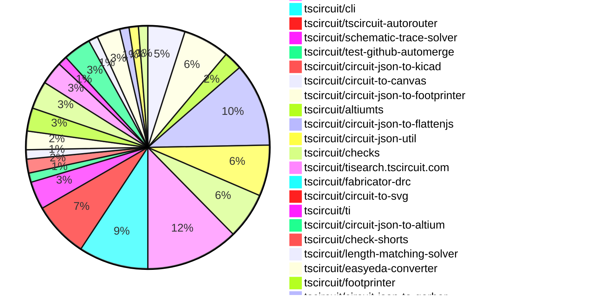

# Contribution Overview 2026-09-15

The current week is shown below. There are 3 major sections:

- [Contributor Overview](#contributor-overview)
- [PRs by Repository](#prs-by-repository)
- [PRs by Contributor](#changes-by-contributor)
- [Scoring & Sponsorship Details](/docs/sponsorship-calculation-explanation.md)

## PRs by Repository

## Contributor Overview

| Contributor | 🐳 Major | 🐙 Minor | 🐌 Tiny | Score | ⭐ |
|-------------|---------|---------|---------|-------|-----|
| [imrishabh18](#imrishabh18) | 11 | 3 | 4 | 55 | ⭐⭐⭐ |
| [ShiboSoftwareDev](#ShiboSoftwareDev) | 5 | 8 | 2 | 44 | ⭐⭐ |
| [seveibar](#seveibar) | 7 | 1 | 6 | 37 | ⭐⭐ |
| [mohan-bee](#mohan-bee) | 1 | 5 | 2 | 21 | ⭐⭐ |
| [techmannih](#techmannih) | 3 | 0 | 6 | 18 | ⭐⭐ |
| [AnasSarkiz](#AnasSarkiz) | 2 | 0 | 0 | 14 | ⭐⭐ |
| [tscircuitbot](#tscircuitbot) | 0 | 0 | 87 | 13 | ⭐⭐ |
| [hrithik18k](#hrithik18k) | 0 | 3 | 4 | 9.5 | ⭐ |
| [rushabhcodes](#rushabhcodes) | 0 | 2 | 3 | 7 | ⭐ |
| [Abse2001](#Abse2001) | 0 | 0 | 3 | 7 | ⭐ |
| [anil08607](#anil08607) | 1 | 0 | 0 | 4 | ⭐ |
| [GokulPandi-M](#GokulPandi-M) | 0 | 0 | 2 | 2 |  |
| [addibble](#addibble) | 0 | 1 | 0 | 2 |  |

## Staff Pass Ratio (SPR)

| Contributor | Reviewed PRs | Rejections | Approvals | SPR |
|-------------|--------------|------------|-----------|-----|
| [ShiboSoftwareDev](#ShiboSoftwareDev) | 4 | 0 | 4 | 100.0% |
| [techmannih](#techmannih) | 4 | 4 | 4 | 0.0% |
| [AnasSarkiz](#AnasSarkiz) | 2 | 1 | 2 | 50.0% |
| [hrithik18k](#hrithik18k) | 2 | 0 | 2 | 100.0% |
| [addibble](#addibble) | 1 | 0 | 1 | 100.0% |
| [imrishabh18](#imrishabh18) | 1 | 0 | 1 | 100.0% |
| [rushabhcodes](#rushabhcodes) | 1 | 1 | 0 | 0.0% |

ShiboSoftwareDev SPR PRs (4)

- [#3967](https://github.com/tscircuit/core/pull/3967) Center routing directives on padded PCB content
- [#2604](https://github.com/tscircuit/tscircuit-autorouter/pull/2604) Ignore zero-length preloaded wire spans in Pipeline9
- [#2598](https://github.com/tscircuit/tscircuit-autorouter/pull/2598) Keep zero-length fixed spans in Pipeline9 regional sections
- [#2581](https://github.com/tscircuit/tscircuit-autorouter/pull/2581) Resolve canonical roots in Pipeline9 via validation

techmannih SPR PRs (4)

- [#1010](https://github.com/tscircuit/pcb-viewer/pull/1010) fix: respect board via tenting and preserve board context in PCB viewer
- [#3991](https://github.com/tscircuit/core/pull/3991) fix: preserve inner-layer via route net identities
- [#752](https://github.com/tscircuit/circuit-to-svg/pull/752) Resolve board defaults for via tenting
- [#288](https://github.com/tscircuit/circuit-to-canvas/pull/288) Render trace vias and resolve board tenting defaults

AnasSarkiz SPR PRs (2)

- [#2631](https://github.com/tscircuit/tscircuit-autorouter/pull/2631) Accelerate high-density routing with cached via occupants
- [#121](https://github.com/tscircuit/high-density-a01/pull/121) Cache via occupants within each A01 and A03 connection search

hrithik18k SPR PRs (2)

- [#1209](https://github.com/tscircuit/schematic-trace-solver/pull/1209) Fix overlapping GND label for shared pin branch
- [#1195](https://github.com/tscircuit/schematic-trace-solver/pull/1195) Fix net-label branch origin at component edge

addibble SPR PRs (1)

- [#192](https://github.com/tscircuit/circuit-json-to-gltf/pull/192) test: cover fixed child CAD rotation and size in GLB snapshots

imrishabh18 SPR PRs (1)

- [#801](https://github.com/tscircuit/circuit-json/pull/801) Add optional pcb_port_ids to pcb_via

rushabhcodes SPR PRs (1)

- [#379](https://github.com/tscircuit/jscad-electronics/pull/379) Add RHB32 VQFN footprint model

> Note: AI evaluates PRs and assigns 1-3 star ratings automatically. 4 and 5 star ratings require manual staff review.

## Review Table

[reviews-received-hover]: ## "Number of reviews received for PRs for this contributor"
[approvals-received-hover]: ## "Number of approvals received for PRs this contributor authored"
[rejections-received-hover]: ## "Number of rejections received for PRs this contributor authored"
[prs-opened-hover]: ## "Number of PRs opened by this contributor"
[issues-created-hover]: ## "Number of issues created by this contributor"

| Contributor | Reviews Received | Approvals Received | Rejections Received | Approvals | Rejections Given | PRs Opened | PRs Merged | Issues Created |
|---|---|---|---|---|---|---|---|---|
| [0hmX](#0hmX) | 0 | 0 | 0 | 2 | 0 | 0 | 0 | 0 |
| [0monish](#0monish) | 0 | 0 | 0 | 0 | 0 | 1 | 0 | 0 |
| [Abse2001](#Abse2001) | 3 | 3 | 0 | 6 | 0 | 11 | 3 | 0 |
| [addibble](#addibble) | 5 | 1 | 0 | 0 | 0 | 4 | 1 | 0 |
| [AnasSarkiz](#AnasSarkiz) | 3 | 2 | 0 | 7 | 0 | 4 | 2 | 0 |
| [anil08607](#anil08607) | 1 | 1 | 0 | 0 | 0 | 2 | 1 | 0 |
| [billythompsons](#billythompsons) | 0 | 0 | 0 | 0 | 0 | 1 | 0 | 0 |
| [diogo2806](#diogo2806) | 0 | 0 | 0 | 0 | 0 | 1 | 0 | 0 |
| [Furox-Art](#Furox-Art) | 0 | 0 | 0 | 0 | 0 | 4 | 0 | 0 |
| [GokulPandi-M](#GokulPandi-M) | 5 | 3 | 1 | 0 | 0 | 4 | 2 | 0 |
| [hrithik18k](#hrithik18k) | 11 | 9 | 0 | 0 | 0 | 8 | 7 | 0 |
| [Ialyahya96](#Ialyahya96) | 0 | 0 | 0 | 0 | 0 | 6 | 0 | 0 |
| [imrishabh18](#imrishabh18) | 2 | 1 | 0 | 11 | 1 | 20 | 18 | 0 |
| [Itachi3355](#Itachi3355) | 0 | 0 | 0 | 0 | 0 | 1 | 0 | 0 |
| [ivan-mihalic](#ivan-mihalic) | 0 | 0 | 0 | 0 | 0 | 1 | 0 | 0 |
| [jkorrr](#jkorrr) | 0 | 0 | 0 | 0 | 0 | 5 | 0 | 0 |
| [KrishnaX12](#KrishnaX12) | 3 | 1 | 0 | 0 | 0 | 2 | 0 | 0 |
| [mohan-bee](#mohan-bee) | 5 | 4 | 0 | 5 | 1 | 8 | 8 | 0 |
| [rushabhcodes](#rushabhcodes) | 31 | 3 | 1 | 0 | 0 | 17 | 5 | 0 |
| [seveibar](#seveibar) | 5 | 1 | 0 | 17 | 3 | 25 | 15 | 0 |
| [ShiboSoftwareDev](#ShiboSoftwareDev) | 18 | 18 | 0 | 6 | 0 | 56 | 15 | 0 |
| [techmannih](#techmannih) | 13 | 8 | 3 | 1 | 0 | 16 | 9 | 0 |
| [tscircuitbot](#tscircuitbot) | 0 | 0 | 0 | 0 | 0 | 122 | 87 | 0 |

## Changes by Repository

### [tscircuit/pcb-viewer](https://github.com/tscircuit/pcb-viewer)

| PR # | Impact | Rating | Contributor | Description |
|------|--------|--------|-------------|-------------|
| [#1010](https://github.com/tscircuit/pcb-viewer/pull/1010) | 🐳 Major | ⭐⭐⭐ | techmannih | Fixes PCB viewer to respect board via tenting and preserve board context when rendering filtered vias, ensuring proper visibility and functionality of vias and traces with hidden copper pours. |
| [#1006](https://github.com/tscircuit/pcb-viewer/pull/1006) | 🐳 Major | ⭐⭐⭐ | seveibar | Reduces the rendering time of the measuring tool by caching SVG paths, significantly improving performance during dragging operations. |
| [#1013](https://github.com/tscircuit/pcb-viewer/pull/1013) | 🐙 Minor | ⭐⭐ | imrishabh18 | Fixes a production bundle issue where React DOM was incorrectly embedded, causing loading failures on the dashboard. |

🐌 Tiny Contributions (5)

| PR # | Impact | Contributor | Description |
|------|--------|-------------|-------------|
| [#1014](https://github.com/tscircuit/pcb-viewer/pull/1014) | 🐌 Tiny | tscircuitbot | Automated package update |
| [#1011](https://github.com/tscircuit/pcb-viewer/pull/1011) | 🐌 Tiny | tscircuitbot | Automated package update |
| [#1007](https://github.com/tscircuit/pcb-viewer/pull/1007) | 🐌 Tiny | tscircuitbot | Automated package update |
| [#1004](https://github.com/tscircuit/pcb-viewer/pull/1004) | 🐌 Tiny | tscircuitbot | Automated package update |
| [#1003](https://github.com/tscircuit/pcb-viewer/pull/1003) | 🐌 Tiny | seveibar | Summary Dense multilayer boards make the selected layer difficult to distinguish. Add a right-click menu with Visibility  Hidden Layer Visibility offering Hide, 10, 20, 40, 60, 80, and 100, with 40 as the default. Hide clears inactive-layer canvases and skips drawing their contents. The selected layer, its associated side details, and shared board geometry and drills remain visible. Changing the selected layer updates which layers are hidden. The menu supports keyboard navigation and dismissal, and adapts its placement near viewport edges. Add an AM3352 dev board fixture using the complete supplied circuit JSON: 10,979 elements and eight copper layers. The large JSON addition is the unchanged fixture input.  Validation bun test: 48 passed. bunx tsc --noEmit: passed. bun run build: passed, including declarations. Formatting and git diff --check: passed. Fixture verified byte-identical to the supplied JSON. Browser verification was blocked by a saved local browser permission. |

### [tscircuit/tscircuit](https://github.com/tscircuit/tscircuit)

🐌 Tiny Contributions (10)

| PR # | Impact | Contributor | Description |
|------|--------|-------------|-------------|
| [#5001](https://github.com/tscircuit/tscircuit/pull/5001) | 🐌 Tiny | tscircuitbot | Automated package update |
| [#5000](https://github.com/tscircuit/tscircuit/pull/5000) | 🐌 Tiny | tscircuitbot | Automated package update |
| [#4999](https://github.com/tscircuit/tscircuit/pull/4999) | 🐌 Tiny | tscircuitbot | Automated package update |
| [#4998](https://github.com/tscircuit/tscircuit/pull/4998) | 🐌 Tiny | tscircuitbot | Automated package update |
| [#4997](https://github.com/tscircuit/tscircuit/pull/4997) | 🐌 Tiny | tscircuitbot | Automated package update |
| [#4996](https://github.com/tscircuit/tscircuit/pull/4996) | 🐌 Tiny | tscircuitbot | Automated package update |
| [#4995](https://github.com/tscircuit/tscircuit/pull/4995) | 🐌 Tiny | tscircuitbot | Automated package update |
| [#4994](https://github.com/tscircuit/tscircuit/pull/4994) | 🐌 Tiny | tscircuitbot | Automated package update |
| [#4993](https://github.com/tscircuit/tscircuit/pull/4993) | 🐌 Tiny | tscircuitbot | Automated package update |
| [#4992](https://github.com/tscircuit/tscircuit/pull/4992) | 🐌 Tiny | imrishabh18 | Updates the CLI, core, and related tscircuit packages to their latest versions and syncs dependencies accordingly. |

### [tscircuit/circuit-json](https://github.com/tscircuit/circuit-json)

| PR # | Impact | Rating | Contributor | Description |
|------|--------|--------|-------------|-------------|
| [#801](https://github.com/tscircuit/circuit-json/pull/801) | 🐳 Major | ⭐⭐⭐ | imrishabh18 | Adds optional pcb_port_ids to the PcbVia interface and Zod schema, allowing for explicit reference to PCB ports associated with a via. |
| [#798](https://github.com/tscircuit/circuit-json/pull/798) | 🐳 Major | ⭐⭐⭐ | seveibar | Add schemas for source bus length-matching requirements and routed length violations as dedicated errors in Circuit JSON. |

🐌 Tiny Contributions (2)

| PR # | Impact | Contributor | Description |
|------|--------|-------------|-------------|
| [#802](https://github.com/tscircuit/circuit-json/pull/802) | 🐌 Tiny | tscircuitbot | Automated package update |
| [#799](https://github.com/tscircuit/circuit-json/pull/799) | 🐌 Tiny | tscircuitbot | Automated package update |

### [tscircuit/core](https://github.com/tscircuit/core)

| PR # | Impact | Rating | Contributor | Description |
|------|--------|--------|-------------|-------------|
| [#4001](https://github.com/tscircuit/core/pull/4001) | 🐳 Major | ⭐⭐⭐ | imrishabh18 | Bumps tscircuitchecks to version 0.0.199 to enhance copper-pour connectivity checks by utilizing explicit pcb_via.pcb_port_ids, and adds regression tests for specific connectivity scenarios. |
| [#4000](https://github.com/tscircuit/core/pull/4000) | 🐳 Major | ⭐⭐⭐ | imrishabh18 | Manual vias now emit pcb_port_ids identifying their rendered layer ports, providing explicit association between a traces via endpoint and the physical barrel, without inferring port ownership from coordinates. |
| [#3992](https://github.com/tscircuit/core/pull/3992) | 🐳 Major | ⭐⭐⭐ | seveibar | Emit source_bus records with resolved trace IDs, max_length_skew, name, and subcircuit ID to ensure downstream checks can enforce bus length-skew requirements in Circuit JSON. |
| [#3965](https://github.com/tscircuit/core/pull/3965) | 🐳 Major | ⭐⭐⭐ | ShiboSoftwareDev | The exact 96-component Allwinner T113-S3 Linux board places every fanout component correctly, but Core stores each auto-sized routing group at its authored pcbXpcbY anchor instead of the center of its padded content. The mismatch produces a false REG18USB overlap and gives later fanout solvers boxes that do not enclose their components. This reproduction keeps the original TSX, supplier Circuit JSON, four copper layers, and default Pipeline9 configuration. It contains no manual routes, vias, breakout points, or route hints. The test calls circuit.render() once so it captures the exact placement and group-bounds failure before downstream autorouting starts; it asserts the incorrect group centers and false placement error on current main. t113-linux-routing-group-bounds-pcb.snap.svg is rendered by circuit-to-svg from that live Circuit JSON with native PCB-group overlays enabled. The stacked winding reproduction and implementation fix update this same real board state, so the Files tab exposes the geometry change directly. Validation: bun test --timeout 60000 testsreprost113-linux-routing-group-bounds.test.tsx  pass in about 6 seconds, 8 assertions SVG contains all 96 real board components and the native PCB-group overlays Biome check on the test and exact TSX fixture git diff --check |
| [#3983](https://github.com/tscircuit/core/pull/3983) | 🐙 Minor | ⭐⭐ | imrishabh18 | Fixes false disconnection reports for plated GND contacts joined by a bottom copper pour when no conventional PCB tracks are present. |
| [#3975](https://github.com/tscircuit/core/pull/3975) | 🐙 Minor | ⭐⭐ | hrithik18k | Summary adds the complete hrithik18kair-mouse(https:tscircuit.comhrithik18kair-mousefiles) board source as a core repro fixture, including all component imports and all six schematic sections captures the full 1200600 schematic sheet, using the supplied air-mouse.svg as the layout reference preserves the currently published solver (0.0.198) output so the ICM-20948 pins 911 GND-routing bug is visible in the baseline repro  Verification sh bun test testsreprosrepro-icm20948-shared-ground-label.test.tsx  Result: 1 pass, 0 fail. The solver fix is tracked separately in tscircuitschematic-trace-solver1209. |
| [#3967](https://github.com/tscircuit/core/pull/3967) | 🐙 Minor | ⭐⭐ | ShiboSoftwareDev | Aligns routing directives with padded content bounds, ensuring consistent center positioning for auto-sized subcircuits and packed groups. |

🐌 Tiny Contributions (11)

| PR # | Impact | Contributor | Description |
|------|--------|-------------|-------------|
| [#3996](https://github.com/tscircuit/core/pull/3996) | 🐌 Tiny | tscircuitbot | Updates the tscircuitchecks package from version 0.0.196 to 0.0.197 |
| [#3995](https://github.com/tscircuit/core/pull/3995) | 🐌 Tiny | tscircuitbot | Updates the tscircuitchecks package from version 0.0.196 to 0.0.197 |
| [#3990](https://github.com/tscircuit/core/pull/3990) | 🐌 Tiny | tscircuitbot | Updates the tscircuitchecks package from version 0.0.195 to 0.0.196 in the package.json file. |
| [#3989](https://github.com/tscircuit/core/pull/3989) | 🐌 Tiny | tscircuitbot | Updates the tscircuitchecks package to version 0.0.196 in package.json |
| [#3981](https://github.com/tscircuit/core/pull/3981) | 🐌 Tiny | imrishabh18 | Reproduces a bug where plated GND contacts are incorrectly reported as disconnected when connected through a bottom copper pour. |
| [#3994](https://github.com/tscircuit/core/pull/3994) | 🐌 Tiny | seveibar | Update tscircuitchecks to 0.0.198 to enable copper-pour short detection and Flatbush improvements without failing on empty schematic-only boards. |
| [#3980](https://github.com/tscircuit/core/pull/3980) | 🐌 Tiny | rushabhcodes | Updates the tscircuitchecks package from version 0.0.193 to 0.0.194, incorporating the courtyard-overlap fix from tscircuitchecks291. |
| [#3999](https://github.com/tscircuit/core/pull/3999) | 🐌 Tiny | hrithik18k | Updates the tscircuitschematic-trace-solver package from version 0.0.198 to 0.0.199, including a fix for shared-ground-label and refreshing the Air Mouse schematic regression snapshot. |
| [#3969](https://github.com/tscircuit/core/pull/3969) | 🐌 Tiny | hrithik18k | Update tscircuitschematic-trace-solver from 0.0.197 to 0.0.198, bringing in a net-label branch placement fix that maintains junctions while placing eligible net-label branches from the component-adjacent edge. |
| [#3966](https://github.com/tscircuit/core/pull/3966) | 🐌 Tiny | ShiboSoftwareDev | Reproduces a winding solver error for the T113 board by adding a test case with specific input data, without changing production code. |
| [#3932](https://github.com/tscircuit/core/pull/3932) | 🐌 Tiny | GokulPandi-M | Fixes redundant parallel routing of VREF branches in schematic, preventing potential electrical issues. |

### [tscircuit/tscircuit.com](https://github.com/tscircuit/tscircuit.com)

🐌 Tiny Contributions (11)

| PR # | Impact | Contributor | Description |
|------|--------|-------------|-------------|
| [#4950](https://github.com/tscircuit/tscircuit.com/pull/4950) | 🐌 Tiny | tscircuitbot | Automated package update |
| [#4948](https://github.com/tscircuit/tscircuit.com/pull/4948) | 🐌 Tiny | tscircuitbot | Updates the tscircuitrunframe package from version 0.0.2745 to 0.0.2746 and the tscircuitpcb-viewer package from version 1.11.397 to 1.11.398. |
| [#4947](https://github.com/tscircuit/tscircuit.com/pull/4947) | 🐌 Tiny | tscircuitbot | Automated package update |
| [#4946](https://github.com/tscircuit/tscircuit.com/pull/4946) | 🐌 Tiny | tscircuitbot | Automated package update |
| [#4944](https://github.com/tscircuit/tscircuit.com/pull/4944) | 🐌 Tiny | tscircuitbot | Automated package update |
| [#4942](https://github.com/tscircuit/tscircuit.com/pull/4942) | 🐌 Tiny | tscircuitbot | Automated package update |
| [#4941](https://github.com/tscircuit/tscircuit.com/pull/4941) | 🐌 Tiny | tscircuitbot | Automated package update |
| [#4939](https://github.com/tscircuit/tscircuit.com/pull/4939) | 🐌 Tiny | tscircuitbot | Updates the tscircuiteval package from version 0.0.1410 to 0.0.1411 |
| [#4938](https://github.com/tscircuit/tscircuit.com/pull/4938) | 🐌 Tiny | tscircuitbot | Updates the tscircuitrunframe package from version 0.0.2738 to 0.0.2739 |
| [#4937](https://github.com/tscircuit/tscircuit.com/pull/4937) | 🐌 Tiny | tscircuitbot | Updates the tscircuiteval package from version 0.0.1409 to 0.0.1410. |
| [#4936](https://github.com/tscircuit/tscircuit.com/pull/4936) | 🐌 Tiny | tscircuitbot | Updates the tscircuitrunframe package from version 0.0.2737 to 0.0.2738 |

### [tscircuit/eval](https://github.com/tscircuit/eval)

🐌 Tiny Contributions (10)

| PR # | Impact | Contributor | Description |
|------|--------|-------------|-------------|
| [#4609](https://github.com/tscircuit/eval/pull/4609) | 🐌 Tiny | tscircuitbot | Automated package update |
| [#4608](https://github.com/tscircuit/eval/pull/4608) | 🐌 Tiny | tscircuitbot | Automated package update |
| [#4598](https://github.com/tscircuit/eval/pull/4598) | 🐌 Tiny | tscircuitbot | Automated package update |
| [#4597](https://github.com/tscircuit/eval/pull/4597) | 🐌 Tiny | tscircuitbot | Automated package update |
| [#4595](https://github.com/tscircuit/eval/pull/4595) | 🐌 Tiny | tscircuitbot | Automated package update |
| [#4594](https://github.com/tscircuit/eval/pull/4594) | 🐌 Tiny | tscircuitbot | Updates package dependencies to their latest versions as part of routine maintenance. |
| [#4592](https://github.com/tscircuit/eval/pull/4592) | 🐌 Tiny | tscircuitbot | Automated package update to version 0.0.1412 |
| [#4591](https://github.com/tscircuit/eval/pull/4591) | 🐌 Tiny | tscircuitbot | Updates the versions of several dependencies in the package.json file. |
| [#4589](https://github.com/tscircuit/eval/pull/4589) | 🐌 Tiny | tscircuitbot | Automated package update |
| [#4588](https://github.com/tscircuit/eval/pull/4588) | 🐌 Tiny | rushabhcodes | Updates package dependencies and regenerates the TL3342 simple 3D snapshot. |

### [tscircuit/runframe](https://github.com/tscircuit/runframe)

🐌 Tiny Contributions (20)

| PR # | Impact | Contributor | Description |
|------|--------|-------------|-------------|
| [#5177](https://github.com/tscircuit/runframe/pull/5177) | 🐌 Tiny | tscircuitbot | Automated package update |
| [#5176](https://github.com/tscircuit/runframe/pull/5176) | 🐌 Tiny | tscircuitbot | Updates the tscircuiteval package from version 0.0.1413 to 0.0.1414 |
| [#5175](https://github.com/tscircuit/runframe/pull/5175) | 🐌 Tiny | tscircuitbot | Automated package update |
| [#5174](https://github.com/tscircuit/runframe/pull/5174) | 🐌 Tiny | tscircuitbot | Updates the tscircuitpcb-viewer package from version 1.11.397 to 1.11.398 |
| [#5173](https://github.com/tscircuit/runframe/pull/5173) | 🐌 Tiny | tscircuitbot | Automated package update |
| [#5172](https://github.com/tscircuit/runframe/pull/5172) | 🐌 Tiny | tscircuitbot | Updates the tscircuitpcb-viewer package from version 1.11.396 to 1.11.397 |
| [#5171](https://github.com/tscircuit/runframe/pull/5171) | 🐌 Tiny | tscircuitbot | Automated package update |
| [#5170](https://github.com/tscircuit/runframe/pull/5170) | 🐌 Tiny | tscircuitbot | Updates the tscircuiteval package from version 0.0.1412 to 0.0.1413 in the package.json file. |
| [#5169](https://github.com/tscircuit/runframe/pull/5169) | 🐌 Tiny | tscircuitbot | Automated package update |
| [#5168](https://github.com/tscircuit/runframe/pull/5168) | 🐌 Tiny | tscircuitbot | Updates the tscircuiteval package from version 0.0.1411 to 0.0.1412 |
| [#5167](https://github.com/tscircuit/runframe/pull/5167) | 🐌 Tiny | tscircuitbot | Automated package update |
| [#5166](https://github.com/tscircuit/runframe/pull/5166) | 🐌 Tiny | tscircuitbot | Updates the tscircuitpcb-viewer package from version 1.11.395 to 1.11.396 |
| [#5165](https://github.com/tscircuit/runframe/pull/5165) | 🐌 Tiny | tscircuitbot | Automated package update |
| [#5164](https://github.com/tscircuit/runframe/pull/5164) | 🐌 Tiny | tscircuitbot | Updates the tscircuitpcb-viewer package to version 1.11.395 |
| [#5163](https://github.com/tscircuit/runframe/pull/5163) | 🐌 Tiny | tscircuitbot | Automated package update |
| [#5162](https://github.com/tscircuit/runframe/pull/5162) | 🐌 Tiny | tscircuitbot | Automated package update |
| [#5161](https://github.com/tscircuit/runframe/pull/5161) | 🐌 Tiny | tscircuitbot | Automated package update |
| [#5160](https://github.com/tscircuit/runframe/pull/5160) | 🐌 Tiny | tscircuitbot | Updates the tscircuiteval package from version 0.0.1409 to 0.0.1410 |
| [#5159](https://github.com/tscircuit/runframe/pull/5159) | 🐌 Tiny | tscircuitbot | Automated package update |
| [#5158](https://github.com/tscircuit/runframe/pull/5158) | 🐌 Tiny | tscircuitbot | Updates the circuit-json-to-kicad package version from 0.0.212 to 0.0.213 in package.json |

### [tscircuit/cli](https://github.com/tscircuit/cli)

| PR # | Impact | Rating | Contributor | Description |
|------|--------|--------|-------------|-------------|
| [#4785](https://github.com/tscircuit/cli/pull/4785) | 🐳 Major | ⭐⭐⭐ | imrishabh18 | Adds tsci search --digikey and tsci search --mouser, using the corresponding tscircuit search services without distributor API credentials. Both flags support combined searches with existing sources and --json. |
| [#4783](https://github.com/tscircuit/cli/pull/4783) | 🐳 Major | ⭐⭐⭐ | imrishabh18 | Add tsci search --ti query to discover Texas Instruments parts through tisearch.tscircuit.com, following the existing JLC search flow. TI-only searches do not query JLC; --ti can also be combined with other source flags. |

🐌 Tiny Contributions (13)

| PR # | Impact | Contributor | Description |
|------|--------|-------------|-------------|
| [#4803](https://github.com/tscircuit/cli/pull/4803) | 🐌 Tiny | tscircuitbot | Automated package update |
| [#4802](https://github.com/tscircuit/cli/pull/4802) | 🐌 Tiny | tscircuitbot | Updates the tscircuitrunframe package to version 0.0.2747 in the package.json file. |
| [#4801](https://github.com/tscircuit/cli/pull/4801) | 🐌 Tiny | tscircuitbot | Automated package update |
| [#4800](https://github.com/tscircuit/cli/pull/4800) | 🐌 Tiny | tscircuitbot | Updates the tscircuitrunframe package from version 0.0.2740 to 0.0.2746 |
| [#4794](https://github.com/tscircuit/cli/pull/4794) | 🐌 Tiny | tscircuitbot | Automated package update |
| [#4793](https://github.com/tscircuit/cli/pull/4793) | 🐌 Tiny | tscircuitbot | Updates the tscircuitrunframe package to version 0.0.2740 in package.json |
| [#4792](https://github.com/tscircuit/cli/pull/4792) | 🐌 Tiny | tscircuitbot | Automated package update |
| [#4791](https://github.com/tscircuit/cli/pull/4791) | 🐌 Tiny | tscircuitbot | Updates the tscircuitrunframe package from version 0.0.2738 to 0.0.2739 |
| [#4789](https://github.com/tscircuit/cli/pull/4789) | 🐌 Tiny | tscircuitbot | Updates the tscircuitrunframe package from version 0.0.2737 to 0.0.2738 |
| [#4788](https://github.com/tscircuit/cli/pull/4788) | 🐌 Tiny | tscircuitbot | Updates the package version from 0.1.2087 to 0.1.2088 in package.json |
| [#4784](https://github.com/tscircuit/cli/pull/4784) | 🐌 Tiny | tscircuitbot | Automated package update |
| [#4786](https://github.com/tscircuit/cli/pull/4786) | 🐌 Tiny | tscircuitbot | Automated package update |
| [#4787](https://github.com/tscircuit/cli/pull/4787) | 🐌 Tiny | ShiboSoftwareDev | Updates the CLIs packagedoffline tscircuitcheck-shorts fallback from version 0.0.19 to 0.0.24, including new boundary contact detection and refreshed test snapshots. |

### [tscircuit/tscircuit-autorouter](https://github.com/tscircuit/tscircuit-autorouter)

| PR # | Impact | Rating | Contributor | Description |
|------|--------|--------|-------------|-------------|
| [#2601](https://github.com/tscircuit/tscircuit-autorouter/pull/2601) | 🐳 Major | ⭐⭐⭐ | seveibar | Updates the length matcher to preserve unchanged leads during DDR tuning by changing the dependency to a commit that includes a fix for retained-lead clearance. |
| [#2598](https://github.com/tscircuit/tscircuit-autorouter/pull/2598) | 🐳 Major | ⭐⭐⭐ | ShiboSoftwareDev | Fixes autorouting failure by retaining zero-length fixed spans during regional section assembly, allowing for proper reconstruction of routes in the Pipeline9 autorouter. |
| [#2592](https://github.com/tscircuit/tscircuit-autorouter/pull/2592) | 🐳 Major | ⭐⭐⭐ | ShiboSoftwareDev | Adds a visual baseline for the T113-S3 Linux boards autorouting failure at the source_trace_194 boundary, rendering the complete board and its preloaded traces. |
| [#2581](https://github.com/tscircuit/tscircuit-autorouter/pull/2581) | 🐳 Major | ⭐⭐⭐ | ShiboSoftwareDev | Fixes autorouting failure by resolving route and obstacle identities to canonical nets in Pipeline9 during regional via validation. |
| [#2631](https://github.com/tscircuit/tscircuit-autorouter/pull/2631) | 🐳 Major | ⭐⭐⭐ | AnasSarkiz | Caches via-occupancy results during connection searches to reduce repeated scans, improving routing efficiency in high-density scenarios. |
| [#2605](https://github.com/tscircuit/tscircuit-autorouter/pull/2605) | 🐙 Minor | ⭐⭐ | ShiboSoftwareDev | Fixes the missing plated-slot copper obstacle for J4 pin 1 in SRJ18 sample002, ensuring accurate routing visualization and output. |

🐌 Tiny Contributions (6)

| PR # | Impact | Contributor | Description |
|------|--------|-------------|-------------|
| [#2633](https://github.com/tscircuit/tscircuit-autorouter/pull/2633) | 🐌 Tiny | tscircuitbot | Automated package update |
| [#2612](https://github.com/tscircuit/tscircuit-autorouter/pull/2612) | 🐌 Tiny | tscircuitbot | Automated package update |
| [#2610](https://github.com/tscircuit/tscircuit-autorouter/pull/2610) | 🐌 Tiny | tscircuitbot | Automated package update |
| [#2602](https://github.com/tscircuit/tscircuit-autorouter/pull/2602) | 🐌 Tiny | tscircuitbot | Automated package update |
| [#2599](https://github.com/tscircuit/tscircuit-autorouter/pull/2599) | 🐌 Tiny | tscircuitbot | Automated package update |
| [#2606](https://github.com/tscircuit/tscircuit-autorouter/pull/2606) | 🐌 Tiny | Abse2001 | Reproduces a bug where Pipeline 9 narrows a requested 0.4 mm trace width to 0.2375 mm instead of finding a legal detour, highlighting a flaw in the autorouting logic. |

### [tscircuit/schematic-trace-solver](https://github.com/tscircuit/schematic-trace-solver)

| PR # | Impact | Rating | Contributor | Description |
|------|--------|--------|-------------|-------------|
| [#1209](https://github.com/tscircuit/schematic-trace-solver/pull/1209) | 🐙 Minor | ⭐⭐ | hrithik18k | Fixes overlapping GND label for shared pin branch by allowing downward GND labels to search past colliding traces and placing the shared GND symbol below nearby signal traces without overlap. |
| [#1195](https://github.com/tscircuit/schematic-trace-solver/pull/1195) | 🐙 Minor | ⭐⭐ | hrithik18k | Fixes the net-label branch origin to prefer the nearest host-trace endpoint pin when placing a vertical label for a two-pin branch of a larger non-ground net, ensuring the V3V3 branch is rooted directly at R8 instead of the interior junction. |

🐌 Tiny Contributions (4)

| PR # | Impact | Contributor | Description |
|------|--------|-------------|-------------|
| [#1208](https://github.com/tscircuit/schematic-trace-solver/pull/1208) | 🐌 Tiny | tscircuitbot | Adds a snapshot-only regression test and debugger page for the attached JSON solver input. |
| [#1187](https://github.com/tscircuit/schematic-trace-solver/pull/1187) | 🐌 Tiny | tscircuitbot | Adds a snapshot-only regression test and debugger page for the attached JSON solver input. |
| [#1205](https://github.com/tscircuit/schematic-trace-solver/pull/1205) | 🐌 Tiny | seveibar | Adds a reduced repro for the J_SD, J_SPI, J_I2C, and J_USB0 connector section on sheet 3 of the AM3352 dev board, providing a baseline for improving power and ground rail routing and label placement. |
| [#1211](https://github.com/tscircuit/schematic-trace-solver/pull/1211) | 🐌 Tiny | GokulPandi-M | Reproduces a bug where two long, near-parallel branches on the same VREF net are generated, leading to redundant traces in the schematic. |

### [tscircuit/test-github-automerge](https://github.com/tscircuit/test-github-automerge)

🐌 Tiny Contributions (2)

| PR # | Impact | Contributor | Description |
|------|--------|-------------|-------------|
| [#77](https://github.com/tscircuit/test-github-automerge/pull/77) | 🐌 Tiny | tscircuitbot | Updates the tscircuitcircuit-json-util package from version 0.0.113 to 0.0.114 in the devDependencies of the project. |
| [#76](https://github.com/tscircuit/test-github-automerge/pull/76) | 🐌 Tiny | tscircuitbot | Automated package update |

### [tscircuit/circuit-json-to-kicad](https://github.com/tscircuit/circuit-json-to-kicad)

| PR # | Impact | Rating | Contributor | Description |
|------|--------|--------|-------------|-------------|
| [#568](https://github.com/tscircuit/circuit-json-to-kicad/pull/568) | 🐙 Minor | ⭐⭐ | ShiboSoftwareDev | Add a documented edgeCutsWidth converter option with the existing 0.1 mm default, carry the native source width through real-board round-trip coverage, and verify the soil sensor keeps its 1.0 mm outline with a side-by-side SVG snapshot. |
| [#564](https://github.com/tscircuit/circuit-json-to-kicad/pull/564) | 🐙 Minor | ⭐⭐ | ShiboSoftwareDev | Fixes the loss of knockout silkscreen text in KiCad exports by ensuring the knockout layer flag is preserved for both standalone and footprint-relative text. |

🐌 Tiny Contributions (1)

| PR # | Impact | Contributor | Description |
|------|--------|-------------|-------------|
| [#566](https://github.com/tscircuit/circuit-json-to-kicad/pull/566) | 🐌 Tiny | tscircuitbot | Automated package update |

### [tscircuit/circuit-to-canvas](https://github.com/tscircuit/circuit-to-canvas)

| PR # | Impact | Rating | Contributor | Description |
|------|--------|--------|-------------|-------------|
| [#288](https://github.com/tscircuit/circuit-to-canvas/pull/288) | 🐳 Major | ⭐⭐⭐ | techmannih | Resolve omitted tenting fields for standalone and trace-route vias from their owning board, ensuring proper rendering and deduplication of vias in PCB designs. |

🐌 Tiny Contributions (1)

| PR # | Impact | Contributor | Description |
|------|--------|-------------|-------------|
| [#289](https://github.com/tscircuit/circuit-to-canvas/pull/289) | 🐌 Tiny | tscircuitbot | Automated package update |

### [tscircuit/circuit-json-to-footprinter](https://github.com/tscircuit/circuit-json-to-footprinter)

🐌 Tiny Contributions (4)

| PR # | Impact | Contributor | Description |
|------|--------|-------------|-------------|
| [#118](https://github.com/tscircuit/circuit-json-to-footprinter/pull/118) | 🐌 Tiny | tscircuitbot | Automated package update |
| [#117](https://github.com/tscircuit/circuit-json-to-footprinter/pull/117) | 🐌 Tiny | tscircuitbot | Automated package update |
| [#116](https://github.com/tscircuit/circuit-json-to-footprinter/pull/116) | 🐌 Tiny | seveibar | Fixes incorrect resolution of TSSOPHTSSOP packages to DFN by generating accurate TSSOP candidates based on metadata, ensuring proper matching and scoring for electronic component footprints. |
| [#115](https://github.com/tscircuit/circuit-json-to-footprinter/pull/115) | 🐌 Tiny | Abse2001 | Recognizes MiniMELF and SOD-80 package names and seeds their supported Footprinter definitions using the measured pitch and land dimensions, allowing for accurate footprint generation for the C68883 component. |

### [tscircuit/altiumts](https://github.com/tscircuit/altiumts)

| PR # | Impact | Rating | Contributor | Description |
|------|--------|--------|-------------|-------------|
| [#197](https://github.com/tscircuit/altiumts/pull/197) | 🐳 Major | ⭐⭐⭐ | anil08607 | Adds typed access to pin-to-pad mappings for schematic Record 47 while preserving raw fields and ensuring accurate roundtrips, along with updated regression tests for various parsing scenarios. |
| [#194](https://github.com/tscircuit/altiumts/pull/194) | 🐙 Minor | ⭐⭐ | ShiboSoftwareDev | Fixes a visual issue where off-board content was clipped in DSP5509 CIII diagnostic snapshots, by adding an opt-in SVG viewport mode to include all visible PCB records. |
| [#193](https://github.com/tscircuit/altiumts/pull/193) | 🐙 Minor | ⭐⭐ | ShiboSoftwareDev | Fixes binary PCB serialization issue where rounded SMD pads reopen as plain rectangles by preserving rounded pad stack metadata and validating new pad fields. |

🐌 Tiny Contributions (2)

| PR # | Impact | Contributor | Description |
|------|--------|-------------|-------------|
| [#201](https://github.com/tscircuit/altiumts/pull/201) | 🐌 Tiny | tscircuitbot | Automated package update |
| [#200](https://github.com/tscircuit/altiumts/pull/200) | 🐌 Tiny | tscircuitbot | Automated package update |

### [tscircuit/circuit-json-to-flattenjs](https://github.com/tscircuit/circuit-json-to-flattenjs)

🐌 Tiny Contributions (1)

| PR # | Impact | Contributor | Description |
|------|--------|-------------|-------------|
| [#1](https://github.com/tscircuit/circuit-json-to-flattenjs/pull/1) | 🐌 Tiny | tscircuitbot | Automated package update |

### [tscircuit/circuit-json-util](https://github.com/tscircuit/circuit-json-util)

| PR # | Impact | Rating | Contributor | Description |
|------|--------|--------|-------------|-------------|
| [#190](https://github.com/tscircuit/circuit-json-util/pull/190) | 🐳 Major | ⭐⭐⭐ | imrishabh18 | Extracts shared polygon helpers for copper geometry from core to circuit-json-util, allowing both core and checks to utilize the same functionality without dependency cycles. |

### [tscircuit/checks](https://github.com/tscircuit/checks)

| PR # | Impact | Rating | Contributor | Description |
|------|--------|--------|-------------|-------------|
| [#303](https://github.com/tscircuit/checks/pull/303) | 🐳 Major | ⭐⭐⭐ | imrishabh18 | Fixes connectivity issues when traces terminate on manual via ports, ensuring that pour-only contacts on the same net are correctly reported as connected. |
| [#293](https://github.com/tscircuit/checks/pull/293) | 🐳 Major | ⭐⭐⭐ | imrishabh18 | Fixes disconnected-port errors for plated GND contacts joined by a bottom copper pour by adding a physical copper connectivity fallback to the port checker and the missing-PCB-trace checker. |
| [#290](https://github.com/tscircuit/checks/pull/290) | 🐳 Major | ⭐⭐⭐ | seveibar | Copper pours were not checked for accidental contact with other copper. The supplied MSPM0G3507 USB-C board reproduces a GND pour touching both USB-C VBUS pads. Add checkCopperPourShorts to the public API and runAllRoutingChecks. It checks pours against traces, pads, plated holes, vias, and other pours, respecting connectivity, copper layers, trace width, drill voids, and BRep cutouts. Use tscircuitcircuit-json-to-flattenjs for both pour shorts and board-edge clearance, removing the local geometry implementation. Pin the published 0.0.2 jscdn tarball as a development dependency and bundle it with tsup; consumers need no separate converter dependency or GitHub Packages authentication. The converter repository includes 73 side-by-side visual snapshots. Use boundary intersections and containment for contact detection. FlattenJS distanceTo can incorrectly return zero between tiny BRep segments and distant arcs; regression coverage prevents these false positives. The supplied board reports exactly the two GND-to-VBUS pad contacts. Index individual copper shapes with Flatbush on each layer, and use one point per polygon face for containment once boundary intersections are ruled out. An alternating local Bun 1.3.2 benchmark on the supplied board improved median runtime from 2.07 s to 227 ms (about 9), including conversion. A standalone rerun measured 241 ms. Flatbush is a runtime dependency; flatqueue is supplied transitively. Neither is bundled. Run bun benchmarkscopper-pour-shorts.ts to reproduce and verify the expected shorts. Validation: bun test: 330 passed, 0 failed. TypeScript, build, changed-file formatting, and diff checks passed. Built-package smoke test detects both VBUS pad contacts. Built JavaScriptdeclarations contain no external converter import. Clean Bun installation from the public jscdn tarball succeeded. |
| [#299](https://github.com/tscircuit/checks/pull/299) | 🐙 Minor | ⭐⭐ | seveibar | Prevents copper-to-board-edge checks from running on empty schematic-only boards, avoiding errors during conversion when no copper exists. |
| [#291](https://github.com/tscircuit/checks/pull/291) | 🐙 Minor | ⭐⭐ | rushabhcodes | Excludes courtyards owned by do-not-place PCB components from overlap checks and adds regression coverage for overlapping same-layer courtyards. |

🐌 Tiny Contributions (1)

| PR # | Impact | Contributor | Description |
|------|--------|-------------|-------------|
| [#297](https://github.com/tscircuit/checks/pull/297) | 🐌 Tiny | seveibar | Clarifies the inferred connector direction when no explicit insertion direction is defined and provides guidance on setting the insertion direction in the footprint. |

### [tscircuit/tisearch.tscircuit.com](https://github.com/tscircuit/tisearch.tscircuit.com)

| PR # | Impact | Rating | Contributor | Description |
|------|--------|--------|-------------|-------------|
| [#15](https://github.com/tscircuit/tisearch.tscircuit.com/pull/15) | 🐳 Major | ⭐⭐⭐ | imrishabh18 | Fills DAC channel counts from explicit TI descriptions to improve channel coverage in the DAC catalog. |
| [#14](https://github.com/tscircuit/tisearch.tscircuit.com/pull/14) | 🐳 Major | ⭐⭐⭐ | imrishabh18 | Fixes the Linux-capable Processors page by correctly querying TI processor families and mapping DACADC channel specifications, improving data accuracy and availability. |
| [#13](https://github.com/tscircuit/tisearch.tscircuit.com/pull/13) | 🐳 Major | ⭐⭐⭐ | imrishabh18 | Fixes incorrect classification of analog switches by using TIs configuration metadata to accurately filter and categorize switches and multiplexers. |
| [#12](https://github.com/tscircuit/tisearch.tscircuit.com/pull/12) | 🐙 Minor | ⭐⭐ | imrishabh18 | Removes the empty LCSC column from HTML tables and hides categories without TI family mappings from the homepage and HTML category directory, while retaining existing category routes and JSON schemas. |

🐌 Tiny Contributions (1)

| PR # | Impact | Contributor | Description |
|------|--------|-------------|-------------|
| [#16](https://github.com/tscircuit/tisearch.tscircuit.com/pull/16) | 🐌 Tiny | imrishabh18 | Removes the unsupported RISC-V family mapping from the navigation filter, ensuring that no unsupported RISC-V tiles are displayed to users. |

### [tscircuit/fabricator-drc](https://github.com/tscircuit/fabricator-drc)

🐌 Tiny Contributions (1)

| PR # | Impact | Contributor | Description |
|------|--------|-------------|-------------|
| [#2](https://github.com/tscircuit/fabricator-drc/pull/2) | 🐌 Tiny | imrishabh18 | Makes circuit-json a peer dependency to ensure a shared schema and upgrades to version 0.0.493 for development, while adding regression tests for source_bus records compatibility. |

### [tscircuit/circuit-to-svg](https://github.com/tscircuit/circuit-to-svg)

| PR # | Impact | Rating | Contributor | Description |
|------|--------|--------|-------------|-------------|
| [#752](https://github.com/tscircuit/circuit-to-svg/pull/752) | 🐳 Major | ⭐⭐⭐ | techmannih | Standalone and trace-route vias inherit omitted tenting fields from their owning board, preserving explicit per-side and legacy overrides. |

### [tscircuit/ti](https://github.com/tscircuit/ti)

🐌 Tiny Contributions (2)

| PR # | Impact | Contributor | Description |
|------|--------|-------------|-------------|
| [#240](https://github.com/tscircuit/ti/pull/240) | 🐌 Tiny | techmannih | Updates the Altium export dependencies to include the latest native pin-label positioning, marker sizing, and pin connection fixes. |
| [#239](https://github.com/tscircuit/ti/pull/239) | 🐌 Tiny | techmannih | Update the System Block UIs Altium export dependencies to use merged native custom-power support, preserving thin GNDVDD symbol strokes. |

### [tscircuit/circuit-json-to-altium](https://github.com/tscircuit/circuit-json-to-altium)

| PR # | Impact | Rating | Contributor | Description |
|------|--------|--------|-------------|-------------|
| [#168](https://github.com/tscircuit/circuit-json-to-altium/pull/168) | 🐙 Minor | ⭐⭐ | ShiboSoftwareDev | Normalizes Altium wraparound arc sweeps to maintain near-full circles and preserves top and bottom solder-layer text as Circuit JSON annotations, restoring the Cobra board circle and title in the SVG round-trip snapshot. |
| [#160](https://github.com/tscircuit/circuit-json-to-altium/pull/160) | 🐙 Minor | ⭐⭐ | ShiboSoftwareDev | Fixes the export of pill and rounded-rectangle SMT pads to ensure they are correctly represented as ROUNDRECT shapes in Altium, preserving their corner radius and improving the accuracy of pad shapes in the Cobra board. |

🐌 Tiny Contributions (4)

| PR # | Impact | Contributor | Description |
|------|--------|-------------|-------------|
| [#165](https://github.com/tscircuit/circuit-json-to-altium/pull/165) | 🐌 Tiny | techmannih | Fixes the placement of native electrical terminals at the converted Circuit JSON schematic port center, ensuring accurate pin connection points in Altium. |
| [#164](https://github.com/tscircuit/circuit-json-to-altium/pull/164) | 🐌 Tiny | techmannih | Adjusts Altium pin markers to match sizes and fill styles defined in Circuit JSON, ensuring proper visual representation and electrical behavior in exported schematics. |
| [#163](https://github.com/tscircuit/circuit-json-to-altium/pull/163) | 🐌 Tiny | techmannih | Changes the font size of native schematic pin numbers to 3 pt to match the Circuit JSON rendering scale, ensuring consistency in the Altium preview. |
| [#162](https://github.com/tscircuit/circuit-json-to-altium/pull/162) | 🐌 Tiny | techmannih | Sets an explicit native pin-number margin of 3 schematic units for the TPS61288 conversion, ensuring pin numbers are positioned closer to the component body in all orientations, while preserving font sizes and colors. |

### [tscircuit/check-shorts](https://github.com/tscircuit/check-shorts)

| PR # | Impact | Rating | Contributor | Description |
|------|--------|--------|-------------|-------------|
| [#58](https://github.com/tscircuit/check-shorts/pull/58) | 🐳 Major | ⭐⭐⭐ | seveibar | Fixes detection of edge contacts between pads and copper pours in bitmap shorts checks, ensuring accurate identification of potential shorts in PCB designs. |

### [tscircuit/length-matching-solver](https://github.com/tscircuit/length-matching-solver)

| PR # | Impact | Rating | Contributor | Description |
|------|--------|--------|-------------|-------------|
| [#70](https://github.com/tscircuit/length-matching-solver/pull/70) | 🐳 Major | ⭐⭐⭐ | seveibar | Fixes the issue where the DDR_D0 matcher rejected meanders due to unchanged lead clearances, allowing for successful matching while preserving existing terminal leads. |

🐌 Tiny Contributions (1)

| PR # | Impact | Contributor | Description |
|------|--------|-------------|-------------|
| [#69](https://github.com/tscircuit/length-matching-solver/pull/69) | 🐌 Tiny | seveibar | This PR reproduces a bug where the LengthMatchingSolver exhausts its meander search for DDR_D0, adding a test to confirm the failure without altering production solver functionality. |

### [tscircuit/easyeda-converter](https://github.com/tscircuit/easyeda-converter)

| PR # | Impact | Rating | Contributor | Description |
|------|--------|--------|-------------|-------------|
| [#569](https://github.com/tscircuit/easyeda-converter/pull/569) | 🐙 Minor | ⭐⭐ | rushabhcodes | Summary derive generated courtyards from the EasyEDA 3D body outline and physical padhole extents use the broad package BBox only when no model outline exists recognize rectangular explicit courtyards so no fallback is added add FS3000-1015 and VCNL4040 regressions and update affected snapshots This fixes oversizedinaccurate courtyards produced by tsci add, including the FS3000-1015 import, without adding a circuit-json dependency or ignoring errors.  Validation bun run format:check bun run build bun test testsconvert-to-soup-tests (30 pass) affected TSXPCB snapshot tests (11 pass) |
| [#567](https://github.com/tscircuit/easyeda-converter/pull/567) | 🐙 Minor | ⭐⭐ | mohan-bee | Fixes the loss of pin names containing punctuation during import, ensuring that multiplexed EasyEDA pin names and connection aliases are preserved correctly. |

🐌 Tiny Contributions (3)

| PR # | Impact | Contributor | Description |
|------|--------|-------------|-------------|
| [#572](https://github.com/tscircuit/easyeda-converter/pull/572) | 🐌 Tiny | hrithik18k | Prefer schematic pin names over footprint pad aliases while preserving both as connection aliases, ensuring stable canonical pin mapping and adding regression coverage for USB-C connectors. |
| [#571](https://github.com/tscircuit/easyeda-converter/pull/571) | 🐌 Tiny | hrithik18k | Adds a reproduction for the incorrect pin naming of the USB-C schematic symbol C2765186, ensuring logical pin names are preserved during import from EasyEDA. |
| [#566](https://github.com/tscircuit/easyeda-converter/pull/566) | 🐌 Tiny | mohan-bee | Reproduces the missing multiplexed pin labels when importing c609652 (attiny1616-snr) by adding the real easyeda fixture and ensuring all source ports and pads remain present. |

### [tscircuit/footprinter](https://github.com/tscircuit/footprinter)

🐌 Tiny Contributions (1)

| PR # | Impact | Contributor | Description |
|------|--------|-------------|-------------|
| [#888](https://github.com/tscircuit/footprinter/pull/888) | 🐌 Tiny | rushabhcodes | Adds explicit identities for DO-219AD and SOD-323HE package footprints, including validated parameters and improved error handling for unsupported parameters. |

### [tscircuit/circuit-json-to-gerber](https://github.com/tscircuit/circuit-json-to-gerber)

| PR # | Impact | Rating | Contributor | Description |
|------|--------|--------|-------------|-------------|
| [#175](https://github.com/tscircuit/circuit-json-to-gerber/pull/175) | 🐳 Major | ⭐⭐⭐ | mohan-bee | motivation capture unwanted mask openings on covered smt pads with one tsx repro and a small layer-overlay snapshot and the routed touch piano full-board snapshot. before all six covered samples incorrectly emit mask openings, matching the six intentionally exposed controls. after add a passing reproduction with labeled shape columns and coveredexposed rows. assertions verify twelve pads and six coverage flags. the piano fixture preserves placement and routing, restoring its eight polygon-workaround keys to equivalent 11 x 27 mm rectangular pads. the focused tests and typecheck pass. snapshots render actual gerber output; schematic output is unaffected. |
| [#176](https://github.com/tscircuit/circuit-json-to-gerber/pull/176) | 🐙 Minor | ⭐⭐ | mohan-bee | Fixes incorrect soldermask coverage on SMT pads that explicitly request coverage, preventing exposed copper in the Gerber output. |

### [tscircuit/matchpack](https://github.com/tscircuit/matchpack)

| PR # | Impact | Rating | Contributor | Description |
|------|--------|--------|-------------|-------------|
| [#265](https://github.com/tscircuit/matchpack/pull/265) | 🐙 Minor | ⭐⭐ | mohan-bee | Fixes the reversed right-side resistorLED branches in the layout, ensuring correct ordering and eliminating overlap issues in the schematic. |
| [#264](https://github.com/tscircuit/matchpack/pull/264) | 🐙 Minor | ⭐⭐ | mohan-bee | Adds a layout snapshot for the acoustic guitar tuner circuit, capturing its configuration for repeatable reviews and ensuring accurate representation in the exported JSON. |

### [tscircuit/circuit-json-schematic-placement-analysis](https://github.com/tscircuit/circuit-json-schematic-placement-analysis)

| PR # | Impact | Rating | Contributor | Description |
|------|--------|--------|-------------|-------------|
| [#74](https://github.com/tscircuit/circuit-json-schematic-placement-analysis/pull/74) | 🐙 Minor | ⭐⭐ | mohan-bee | Fixes misleading padding warnings for singleton schematic pins by skipping bank-end padding checks for sides with one pin. |

🐌 Tiny Contributions (1)

| PR # | Impact | Contributor | Description |
|------|--------|-------------|-------------|
| [#73](https://github.com/tscircuit/circuit-json-schematic-placement-analysis/pull/73) | 🐌 Tiny | mohan-bee | Records existing behavior of padding warnings for centered supply pins without changing it, ensuring all tests pass. |

### [tscircuit/dataset-srj18](https://github.com/tscircuit/dataset-srj18)

| PR # | Impact | Rating | Contributor | Description |
|------|--------|--------|-------------|-------------|
| [#19](https://github.com/tscircuit/dataset-srj18/pull/19) | 🐳 Major | ⭐⭐⭐ | ShiboSoftwareDev | Problem SRJ18 sample002 contains the routing endpoint for J4 pin 1 (pcb_port_157), but its plated-slot copper pad is absent from the obstacle list. This lets autorouters produce output that appears cut off at an unrendered pad. The malformed input is reproduced in tscircuittscircuit-autorouter2603.  Change upgrade tscircuitcore to the first release containing tscircuitcore3704 and align its peer dependency graph regenerate sample002 from its checked-in Circuit JSON assert the plated-slot obstacles identity, layers, center, width, and height in dataset validation The regenerated obstacle is a 2 x 4.5 mm rectangle on both copper layers centered at (-39.2404, -18.2722), matching the source plated hole.  Validation bun scriptsvalidate.mjs git diff --check  Consumer The stacked autorouter fix is tscircuittscircuit-autorouter2605. |

### [tscircuit/jscad-electronics](https://github.com/tscircuit/jscad-electronics)

🐌 Tiny Contributions (1)

| PR # | Impact | Contributor | Description |
|------|--------|-------------|-------------|
| [#363](https://github.com/tscircuit/jscad-electronics/pull/363) | 🐌 Tiny | Abse2001 | Adjusts the MiniMELF component design to ensure proper seating on pads and matches the cylindrical outline as per specifications, improving the fit and visual representation of the component. |

### [tscircuit/high-density-a01](https://github.com/tscircuit/high-density-a01)

| PR # | Impact | Rating | Contributor | Description |
|------|--------|--------|-------------|-------------|
| [#121](https://github.com/tscircuit/high-density-a01/pull/121) | 🐳 Major | ⭐⭐⭐ | AnasSarkiz | Caches via occupants by grid cell during connection searches in A01 and A03 to optimize routing performance. |

### [tscircuit/circuit-json-to-gltf](https://github.com/tscircuit/circuit-json-to-gltf)

| PR # | Impact | Rating | Contributor | Description |
|------|--------|--------|-------------|-------------|
| [#192](https://github.com/tscircuit/circuit-json-to-gltf/pull/192) | 🐙 Minor | ⭐⭐ | addibble | Covers fixed child CAD rotation and size in GLB snapshots, ensuring accurate geometry assertions and type-check fixes with updated dependencies. |

## Changes by Contributor

### [tscircuitbot](https://github.com/tscircuitbot)

🐌 Tiny Contributions (87)

| PR # | Impact | Description |
|------|--------|-------------|
| [#1014](https://github.com/tscircuit/pcb-viewer/pull/1014) | 🐌 Tiny | Automated package update |
| [#1011](https://github.com/tscircuit/pcb-viewer/pull/1011) | 🐌 Tiny | Automated package update |
| [#1007](https://github.com/tscircuit/pcb-viewer/pull/1007) | 🐌 Tiny | Automated package update |
| [#1004](https://github.com/tscircuit/pcb-viewer/pull/1004) | 🐌 Tiny | Automated package update |
| [#5001](https://github.com/tscircuit/tscircuit/pull/5001) | 🐌 Tiny | Automated package update |
| [#5000](https://github.com/tscircuit/tscircuit/pull/5000) | 🐌 Tiny | Automated package update |
| [#4999](https://github.com/tscircuit/tscircuit/pull/4999) | 🐌 Tiny | Automated package update |
| [#4998](https://github.com/tscircuit/tscircuit/pull/4998) | 🐌 Tiny | Automated package update |
| [#4997](https://github.com/tscircuit/tscircuit/pull/4997) | 🐌 Tiny | Automated package update |
| [#4996](https://github.com/tscircuit/tscircuit/pull/4996) | 🐌 Tiny | Automated package update |
| [#4995](https://github.com/tscircuit/tscircuit/pull/4995) | 🐌 Tiny | Automated package update |
| [#4994](https://github.com/tscircuit/tscircuit/pull/4994) | 🐌 Tiny | Automated package update |
| [#4993](https://github.com/tscircuit/tscircuit/pull/4993) | 🐌 Tiny | Automated package update |
| [#802](https://github.com/tscircuit/circuit-json/pull/802) | 🐌 Tiny | Automated package update |
| [#799](https://github.com/tscircuit/circuit-json/pull/799) | 🐌 Tiny | Automated package update |
| [#3996](https://github.com/tscircuit/core/pull/3996) | 🐌 Tiny | Updates the tscircuitchecks package from version 0.0.196 to 0.0.197 |
| [#3995](https://github.com/tscircuit/core/pull/3995) | 🐌 Tiny | Updates the tscircuitchecks package from version 0.0.196 to 0.0.197 |
| [#3990](https://github.com/tscircuit/core/pull/3990) | 🐌 Tiny | Updates the tscircuitchecks package from version 0.0.195 to 0.0.196 in the package.json file. |
| [#3989](https://github.com/tscircuit/core/pull/3989) | 🐌 Tiny | Updates the tscircuitchecks package to version 0.0.196 in package.json |
| [#4950](https://github.com/tscircuit/tscircuit.com/pull/4950) | 🐌 Tiny | Automated package update |
| [#4948](https://github.com/tscircuit/tscircuit.com/pull/4948) | 🐌 Tiny | Updates the tscircuitrunframe package from version 0.0.2745 to 0.0.2746 and the tscircuitpcb-viewer package from version 1.11.397 to 1.11.398. |
| [#4947](https://github.com/tscircuit/tscircuit.com/pull/4947) | 🐌 Tiny | Automated package update |
| [#4946](https://github.com/tscircuit/tscircuit.com/pull/4946) | 🐌 Tiny | Automated package update |
| [#4944](https://github.com/tscircuit/tscircuit.com/pull/4944) | 🐌 Tiny | Automated package update |
| [#4942](https://github.com/tscircuit/tscircuit.com/pull/4942) | 🐌 Tiny | Automated package update |
| [#4941](https://github.com/tscircuit/tscircuit.com/pull/4941) | 🐌 Tiny | Automated package update |
| [#4939](https://github.com/tscircuit/tscircuit.com/pull/4939) | 🐌 Tiny | Updates the tscircuiteval package from version 0.0.1410 to 0.0.1411 |
| [#4938](https://github.com/tscircuit/tscircuit.com/pull/4938) | 🐌 Tiny | Updates the tscircuitrunframe package from version 0.0.2738 to 0.0.2739 |
| [#4937](https://github.com/tscircuit/tscircuit.com/pull/4937) | 🐌 Tiny | Updates the tscircuiteval package from version 0.0.1409 to 0.0.1410. |
| [#4936](https://github.com/tscircuit/tscircuit.com/pull/4936) | 🐌 Tiny | Updates the tscircuitrunframe package from version 0.0.2737 to 0.0.2738 |
| [#4609](https://github.com/tscircuit/eval/pull/4609) | 🐌 Tiny | Automated package update |
| [#4608](https://github.com/tscircuit/eval/pull/4608) | 🐌 Tiny | Automated package update |
| [#4598](https://github.com/tscircuit/eval/pull/4598) | 🐌 Tiny | Automated package update |
| [#4597](https://github.com/tscircuit/eval/pull/4597) | 🐌 Tiny | Automated package update |
| [#4595](https://github.com/tscircuit/eval/pull/4595) | 🐌 Tiny | Automated package update |
| [#4594](https://github.com/tscircuit/eval/pull/4594) | 🐌 Tiny | Updates package dependencies to their latest versions as part of routine maintenance. |
| [#4592](https://github.com/tscircuit/eval/pull/4592) | 🐌 Tiny | Automated package update to version 0.0.1412 |
| [#4591](https://github.com/tscircuit/eval/pull/4591) | 🐌 Tiny | Updates the versions of several dependencies in the package.json file. |
| [#4589](https://github.com/tscircuit/eval/pull/4589) | 🐌 Tiny | Automated package update |
| [#5177](https://github.com/tscircuit/runframe/pull/5177) | 🐌 Tiny | Automated package update |
| [#5176](https://github.com/tscircuit/runframe/pull/5176) | 🐌 Tiny | Updates the tscircuiteval package from version 0.0.1413 to 0.0.1414 |
| [#5175](https://github.com/tscircuit/runframe/pull/5175) | 🐌 Tiny | Automated package update |
| [#5174](https://github.com/tscircuit/runframe/pull/5174) | 🐌 Tiny | Updates the tscircuitpcb-viewer package from version 1.11.397 to 1.11.398 |
| [#5173](https://github.com/tscircuit/runframe/pull/5173) | 🐌 Tiny | Automated package update |
| [#5172](https://github.com/tscircuit/runframe/pull/5172) | 🐌 Tiny | Updates the tscircuitpcb-viewer package from version 1.11.396 to 1.11.397 |
| [#5171](https://github.com/tscircuit/runframe/pull/5171) | 🐌 Tiny | Automated package update |
| [#5170](https://github.com/tscircuit/runframe/pull/5170) | 🐌 Tiny | Updates the tscircuiteval package from version 0.0.1412 to 0.0.1413 in the package.json file. |
| [#5169](https://github.com/tscircuit/runframe/pull/5169) | 🐌 Tiny | Automated package update |
| [#5168](https://github.com/tscircuit/runframe/pull/5168) | 🐌 Tiny | Updates the tscircuiteval package from version 0.0.1411 to 0.0.1412 |
| [#5167](https://github.com/tscircuit/runframe/pull/5167) | 🐌 Tiny | Automated package update |
| [#5166](https://github.com/tscircuit/runframe/pull/5166) | 🐌 Tiny | Updates the tscircuitpcb-viewer package from version 1.11.395 to 1.11.396 |
| [#5165](https://github.com/tscircuit/runframe/pull/5165) | 🐌 Tiny | Automated package update |
| [#5164](https://github.com/tscircuit/runframe/pull/5164) | 🐌 Tiny | Updates the tscircuitpcb-viewer package to version 1.11.395 |
| [#5163](https://github.com/tscircuit/runframe/pull/5163) | 🐌 Tiny | Automated package update |
| [#5162](https://github.com/tscircuit/runframe/pull/5162) | 🐌 Tiny | Automated package update |
| [#5161](https://github.com/tscircuit/runframe/pull/5161) | 🐌 Tiny | Automated package update |
| [#5160](https://github.com/tscircuit/runframe/pull/5160) | 🐌 Tiny | Updates the tscircuiteval package from version 0.0.1409 to 0.0.1410 |
| [#5159](https://github.com/tscircuit/runframe/pull/5159) | 🐌 Tiny | Automated package update |
| [#5158](https://github.com/tscircuit/runframe/pull/5158) | 🐌 Tiny | Updates the circuit-json-to-kicad package version from 0.0.212 to 0.0.213 in package.json |
| [#4803](https://github.com/tscircuit/cli/pull/4803) | 🐌 Tiny | Automated package update |
| [#4802](https://github.com/tscircuit/cli/pull/4802) | 🐌 Tiny | Updates the tscircuitrunframe package to version 0.0.2747 in the package.json file. |
| [#4801](https://github.com/tscircuit/cli/pull/4801) | 🐌 Tiny | Automated package update |
| [#4800](https://github.com/tscircuit/cli/pull/4800) | 🐌 Tiny | Updates the tscircuitrunframe package from version 0.0.2740 to 0.0.2746 |
| [#4794](https://github.com/tscircuit/cli/pull/4794) | 🐌 Tiny | Automated package update |
| [#4793](https://github.com/tscircuit/cli/pull/4793) | 🐌 Tiny | Updates the tscircuitrunframe package to version 0.0.2740 in package.json |
| [#4792](https://github.com/tscircuit/cli/pull/4792) | 🐌 Tiny | Automated package update |
| [#4791](https://github.com/tscircuit/cli/pull/4791) | 🐌 Tiny | Updates the tscircuitrunframe package from version 0.0.2738 to 0.0.2739 |
| [#4789](https://github.com/tscircuit/cli/pull/4789) | 🐌 Tiny | Updates the tscircuitrunframe package from version 0.0.2737 to 0.0.2738 |
| [#4788](https://github.com/tscircuit/cli/pull/4788) | 🐌 Tiny | Updates the package version from 0.1.2087 to 0.1.2088 in package.json |
| [#4784](https://github.com/tscircuit/cli/pull/4784) | 🐌 Tiny | Automated package update |
| [#4786](https://github.com/tscircuit/cli/pull/4786) | 🐌 Tiny | Automated package update |
| [#2633](https://github.com/tscircuit/tscircuit-autorouter/pull/2633) | 🐌 Tiny | Automated package update |
| [#2612](https://github.com/tscircuit/tscircuit-autorouter/pull/2612) | 🐌 Tiny | Automated package update |
| [#2610](https://github.com/tscircuit/tscircuit-autorouter/pull/2610) | 🐌 Tiny | Automated package update |
| [#2602](https://github.com/tscircuit/tscircuit-autorouter/pull/2602) | 🐌 Tiny | Automated package update |
| [#2599](https://github.com/tscircuit/tscircuit-autorouter/pull/2599) | 🐌 Tiny | Automated package update |
| [#1208](https://github.com/tscircuit/schematic-trace-solver/pull/1208) | 🐌 Tiny | Adds a snapshot-only regression test and debugger page for the attached JSON solver input. |
| [#1187](https://github.com/tscircuit/schematic-trace-solver/pull/1187) | 🐌 Tiny | Adds a snapshot-only regression test and debugger page for the attached JSON solver input. |
| [#77](https://github.com/tscircuit/test-github-automerge/pull/77) | 🐌 Tiny | Updates the tscircuitcircuit-json-util package from version 0.0.113 to 0.0.114 in the devDependencies of the project. |
| [#76](https://github.com/tscircuit/test-github-automerge/pull/76) | 🐌 Tiny | Automated package update |
| [#566](https://github.com/tscircuit/circuit-json-to-kicad/pull/566) | 🐌 Tiny | Automated package update |
| [#289](https://github.com/tscircuit/circuit-to-canvas/pull/289) | 🐌 Tiny | Automated package update |
| [#118](https://github.com/tscircuit/circuit-json-to-footprinter/pull/118) | 🐌 Tiny | Automated package update |
| [#117](https://github.com/tscircuit/circuit-json-to-footprinter/pull/117) | 🐌 Tiny | Automated package update |
| [#201](https://github.com/tscircuit/altiumts/pull/201) | 🐌 Tiny | Automated package update |
| [#200](https://github.com/tscircuit/altiumts/pull/200) | 🐌 Tiny | Automated package update |
| [#1](https://github.com/tscircuit/circuit-json-to-flattenjs/pull/1) | 🐌 Tiny | Automated package update |

### [imrishabh18](https://github.com/imrishabh18)

| PRs # | Impact | Rating | Description |
|------|--------|--------|-------------|
| [#801](https://github.com/tscircuit/circuit-json/pull/801) | 🐳 Major | ⭐⭐⭐ | Adds optional pcb_port_ids to the PcbVia interface and Zod schema, allowing for explicit reference to PCB ports associated with a via. |
| [#190](https://github.com/tscircuit/circuit-json-util/pull/190) | 🐳 Major | ⭐⭐⭐ | Extracts shared polygon helpers for copper geometry from core to circuit-json-util, allowing both core and checks to utilize the same functionality without dependency cycles. |
| [#4001](https://github.com/tscircuit/core/pull/4001) | 🐳 Major | ⭐⭐⭐ | Bumps tscircuitchecks to version 0.0.199 to enhance copper-pour connectivity checks by utilizing explicit pcb_via.pcb_port_ids, and adds regression tests for specific connectivity scenarios. |
| [#4000](https://github.com/tscircuit/core/pull/4000) | 🐳 Major | ⭐⭐⭐ | Manual vias now emit pcb_port_ids identifying their rendered layer ports, providing explicit association between a traces via endpoint and the physical barrel, without inferring port ownership from coordinates. |
| [#303](https://github.com/tscircuit/checks/pull/303) | 🐳 Major | ⭐⭐⭐ | Fixes connectivity issues when traces terminate on manual via ports, ensuring that pour-only contacts on the same net are correctly reported as connected. |
| [#293](https://github.com/tscircuit/checks/pull/293) | 🐳 Major | ⭐⭐⭐ | Fixes disconnected-port errors for plated GND contacts joined by a bottom copper pour by adding a physical copper connectivity fallback to the port checker and the missing-PCB-trace checker. |
| [#4785](https://github.com/tscircuit/cli/pull/4785) | 🐳 Major | ⭐⭐⭐ | Adds tsci search --digikey and tsci search --mouser, using the corresponding tscircuit search services without distributor API credentials. Both flags support combined searches with existing sources and --json. |
| [#4783](https://github.com/tscircuit/cli/pull/4783) | 🐳 Major | ⭐⭐⭐ | Add tsci search --ti query to discover Texas Instruments parts through tisearch.tscircuit.com, following the existing JLC search flow. TI-only searches do not query JLC; --ti can also be combined with other source flags. |
| [#15](https://github.com/tscircuit/tisearch.tscircuit.com/pull/15) | 🐳 Major | ⭐⭐⭐ | Fills DAC channel counts from explicit TI descriptions to improve channel coverage in the DAC catalog. |
| [#14](https://github.com/tscircuit/tisearch.tscircuit.com/pull/14) | 🐳 Major | ⭐⭐⭐ | Fixes the Linux-capable Processors page by correctly querying TI processor families and mapping DACADC channel specifications, improving data accuracy and availability. |
| [#13](https://github.com/tscircuit/tisearch.tscircuit.com/pull/13) | 🐳 Major | ⭐⭐⭐ | Fixes incorrect classification of analog switches by using TIs configuration metadata to accurately filter and categorize switches and multiplexers. |
| [#1013](https://github.com/tscircuit/pcb-viewer/pull/1013) | 🐙 Minor | ⭐⭐ | Fixes a production bundle issue where React DOM was incorrectly embedded, causing loading failures on the dashboard. |
| [#3983](https://github.com/tscircuit/core/pull/3983) | 🐙 Minor | ⭐⭐ | Fixes false disconnection reports for plated GND contacts joined by a bottom copper pour when no conventional PCB tracks are present. |
| [#12](https://github.com/tscircuit/tisearch.tscircuit.com/pull/12) | 🐙 Minor | ⭐⭐ | Removes the empty LCSC column from HTML tables and hides categories without TI family mappings from the homepage and HTML category directory, while retaining existing category routes and JSON schemas. |

🐌 Tiny Contributions (4)

| PR # | Impact | Description |
|------|--------|-------------|
| [#4992](https://github.com/tscircuit/tscircuit/pull/4992) | 🐌 Tiny | Updates the CLI, core, and related tscircuit packages to their latest versions and syncs dependencies accordingly. |
| [#3981](https://github.com/tscircuit/core/pull/3981) | 🐌 Tiny | Reproduces a bug where plated GND contacts are incorrectly reported as disconnected when connected through a bottom copper pour. |
| [#16](https://github.com/tscircuit/tisearch.tscircuit.com/pull/16) | 🐌 Tiny | Removes the unsupported RISC-V family mapping from the navigation filter, ensuring that no unsupported RISC-V tiles are displayed to users. |
| [#2](https://github.com/tscircuit/fabricator-drc/pull/2) | 🐌 Tiny | Makes circuit-json a peer dependency to ensure a shared schema and upgrades to version 0.0.493 for development, while adding regression tests for source_bus records compatibility. |

### [techmannih](https://github.com/techmannih)

| PRs # | Impact | Rating | Description |
|------|--------|--------|-------------|
| [#1010](https://github.com/tscircuit/pcb-viewer/pull/1010) | 🐳 Major | ⭐⭐⭐ | Fixes PCB viewer to respect board via tenting and preserve board context when rendering filtered vias, ensuring proper visibility and functionality of vias and traces with hidden copper pours. |
| [#752](https://github.com/tscircuit/circuit-to-svg/pull/752) | 🐳 Major | ⭐⭐⭐ | Standalone and trace-route vias inherit omitted tenting fields from their owning board, preserving explicit per-side and legacy overrides. |
| [#288](https://github.com/tscircuit/circuit-to-canvas/pull/288) | 🐳 Major | ⭐⭐⭐ | Resolve omitted tenting fields for standalone and trace-route vias from their owning board, ensuring proper rendering and deduplication of vias in PCB designs. |

🐌 Tiny Contributions (6)

| PR # | Impact | Description |
|------|--------|-------------|
| [#240](https://github.com/tscircuit/ti/pull/240) | 🐌 Tiny | Updates the Altium export dependencies to include the latest native pin-label positioning, marker sizing, and pin connection fixes. |
| [#239](https://github.com/tscircuit/ti/pull/239) | 🐌 Tiny | Update the System Block UIs Altium export dependencies to use merged native custom-power support, preserving thin GNDVDD symbol strokes. |
| [#165](https://github.com/tscircuit/circuit-json-to-altium/pull/165) | 🐌 Tiny | Fixes the placement of native electrical terminals at the converted Circuit JSON schematic port center, ensuring accurate pin connection points in Altium. |
| [#164](https://github.com/tscircuit/circuit-json-to-altium/pull/164) | 🐌 Tiny | Adjusts Altium pin markers to match sizes and fill styles defined in Circuit JSON, ensuring proper visual representation and electrical behavior in exported schematics. |
| [#163](https://github.com/tscircuit/circuit-json-to-altium/pull/163) | 🐌 Tiny | Changes the font size of native schematic pin numbers to 3 pt to match the Circuit JSON rendering scale, ensuring consistency in the Altium preview. |
| [#162](https://github.com/tscircuit/circuit-json-to-altium/pull/162) | 🐌 Tiny | Sets an explicit native pin-number margin of 3 schematic units for the TPS61288 conversion, ensuring pin numbers are positioned closer to the component body in all orientations, while preserving font sizes and colors. |

### [seveibar](https://github.com/seveibar)

| PRs # | Impact | Rating | Description |
|------|--------|--------|-------------|
| [#1006](https://github.com/tscircuit/pcb-viewer/pull/1006) | 🐳 Major | ⭐⭐⭐ | Reduces the rendering time of the measuring tool by caching SVG paths, significantly improving performance during dragging operations. |
| [#798](https://github.com/tscircuit/circuit-json/pull/798) | 🐳 Major | ⭐⭐⭐ | Add schemas for source bus length-matching requirements and routed length violations as dedicated errors in Circuit JSON. |
| [#3992](https://github.com/tscircuit/core/pull/3992) | 🐳 Major | ⭐⭐⭐ | Emit source_bus records with resolved trace IDs, max_length_skew, name, and subcircuit ID to ensure downstream checks can enforce bus length-skew requirements in Circuit JSON. |
| [#290](https://github.com/tscircuit/checks/pull/290) | 🐳 Major | ⭐⭐⭐ | Copper pours were not checked for accidental contact with other copper. The supplied MSPM0G3507 USB-C board reproduces a GND pour touching both USB-C VBUS pads. Add checkCopperPourShorts to the public API and runAllRoutingChecks. It checks pours against traces, pads, plated holes, vias, and other pours, respecting connectivity, copper layers, trace width, drill voids, and BRep cutouts. Use tscircuitcircuit-json-to-flattenjs for both pour shorts and board-edge clearance, removing the local geometry implementation. Pin the published 0.0.2 jscdn tarball as a development dependency and bundle it with tsup; consumers need no separate converter dependency or GitHub Packages authentication. The converter repository includes 73 side-by-side visual snapshots. Use boundary intersections and containment for contact detection. FlattenJS distanceTo can incorrectly return zero between tiny BRep segments and distant arcs; regression coverage prevents these false positives. The supplied board reports exactly the two GND-to-VBUS pad contacts. Index individual copper shapes with Flatbush on each layer, and use one point per polygon face for containment once boundary intersections are ruled out. An alternating local Bun 1.3.2 benchmark on the supplied board improved median runtime from 2.07 s to 227 ms (about 9), including conversion. A standalone rerun measured 241 ms. Flatbush is a runtime dependency; flatqueue is supplied transitively. Neither is bundled. Run bun benchmarkscopper-pour-shorts.ts to reproduce and verify the expected shorts. Validation: bun test: 330 passed, 0 failed. TypeScript, build, changed-file formatting, and diff checks passed. Built-package smoke test detects both VBUS pad contacts. Built JavaScriptdeclarations contain no external converter import. Clean Bun installation from the public jscdn tarball succeeded. |
| [#2601](https://github.com/tscircuit/tscircuit-autorouter/pull/2601) | 🐳 Major | ⭐⭐⭐ | Updates the length matcher to preserve unchanged leads during DDR tuning by changing the dependency to a commit that includes a fix for retained-lead clearance. |
| [#58](https://github.com/tscircuit/check-shorts/pull/58) | 🐳 Major | ⭐⭐⭐ | Fixes detection of edge contacts between pads and copper pours in bitmap shorts checks, ensuring accurate identification of potential shorts in PCB designs. |
| [#70](https://github.com/tscircuit/length-matching-solver/pull/70) | 🐳 Major | ⭐⭐⭐ | Fixes the issue where the DDR_D0 matcher rejected meanders due to unchanged lead clearances, allowing for successful matching while preserving existing terminal leads. |
| [#299](https://github.com/tscircuit/checks/pull/299) | 🐙 Minor | ⭐⭐ | Prevents copper-to-board-edge checks from running on empty schematic-only boards, avoiding errors during conversion when no copper exists. |

🐌 Tiny Contributions (6)

| PR # | Impact | Description |
|------|--------|-------------|
| [#1003](https://github.com/tscircuit/pcb-viewer/pull/1003) | 🐌 Tiny | Summary Dense multilayer boards make the selected layer difficult to distinguish. Add a right-click menu with Visibility  Hidden Layer Visibility offering Hide, 10, 20, 40, 60, 80, and 100, with 40 as the default. Hide clears inactive-layer canvases and skips drawing their contents. The selected layer, its associated side details, and shared board geometry and drills remain visible. Changing the selected layer updates which layers are hidden. The menu supports keyboard navigation and dismissal, and adapts its placement near viewport edges. Add an AM3352 dev board fixture using the complete supplied circuit JSON: 10,979 elements and eight copper layers. The large JSON addition is the unchanged fixture input.  Validation bun test: 48 passed. bunx tsc --noEmit: passed. bun run build: passed, including declarations. Formatting and git diff --check: passed. Fixture verified byte-identical to the supplied JSON. Browser verification was blocked by a saved local browser permission. |
| [#3994](https://github.com/tscircuit/core/pull/3994) | 🐌 Tiny | Update tscircuitchecks to 0.0.198 to enable copper-pour short detection and Flatbush improvements without failing on empty schematic-only boards. |
| [#297](https://github.com/tscircuit/checks/pull/297) | 🐌 Tiny | Clarifies the inferred connector direction when no explicit insertion direction is defined and provides guidance on setting the insertion direction in the footprint. |
| [#1205](https://github.com/tscircuit/schematic-trace-solver/pull/1205) | 🐌 Tiny | Adds a reduced repro for the J_SD, J_SPI, J_I2C, and J_USB0 connector section on sheet 3 of the AM3352 dev board, providing a baseline for improving power and ground rail routing and label placement. |
| [#69](https://github.com/tscircuit/length-matching-solver/pull/69) | 🐌 Tiny | This PR reproduces a bug where the LengthMatchingSolver exhausts its meander search for DDR_D0, adding a test to confirm the failure without altering production solver functionality. |
| [#116](https://github.com/tscircuit/circuit-json-to-footprinter/pull/116) | 🐌 Tiny | Fixes incorrect resolution of TSSOPHTSSOP packages to DFN by generating accurate TSSOP candidates based on metadata, ensuring proper matching and scoring for electronic component footprints. |

### [rushabhcodes](https://github.com/rushabhcodes)

| PRs # | Impact | Rating | Description |
|------|--------|--------|-------------|
| [#569](https://github.com/tscircuit/easyeda-converter/pull/569) | 🐙 Minor | ⭐⭐ | Summary derive generated courtyards from the EasyEDA 3D body outline and physical padhole extents use the broad package BBox only when no model outline exists recognize rectangular explicit courtyards so no fallback is added add FS3000-1015 and VCNL4040 regressions and update affected snapshots This fixes oversizedinaccurate courtyards produced by tsci add, including the FS3000-1015 import, without adding a circuit-json dependency or ignoring errors.  Validation bun run format:check bun run build bun test testsconvert-to-soup-tests (30 pass) affected TSXPCB snapshot tests (11 pass) |
| [#291](https://github.com/tscircuit/checks/pull/291) | 🐙 Minor | ⭐⭐ | Excludes courtyards owned by do-not-place PCB components from overlap checks and adds regression coverage for overlapping same-layer courtyards. |

🐌 Tiny Contributions (3)

| PR # | Impact | Description |
|------|--------|-------------|
| [#888](https://github.com/tscircuit/footprinter/pull/888) | 🐌 Tiny | Adds explicit identities for DO-219AD and SOD-323HE package footprints, including validated parameters and improved error handling for unsupported parameters. |
| [#3980](https://github.com/tscircuit/core/pull/3980) | 🐌 Tiny | Updates the tscircuitchecks package from version 0.0.193 to 0.0.194, incorporating the courtyard-overlap fix from tscircuitchecks291. |
| [#4588](https://github.com/tscircuit/eval/pull/4588) | 🐌 Tiny | Updates package dependencies and regenerates the TL3342 simple 3D snapshot. |

### [hrithik18k](https://github.com/hrithik18k)

| PRs # | Impact | Rating | Description |
|------|--------|--------|-------------|
| [#3975](https://github.com/tscircuit/core/pull/3975) | 🐙 Minor | ⭐⭐ | Summary adds the complete hrithik18kair-mouse(https:tscircuit.comhrithik18kair-mousefiles) board source as a core repro fixture, including all component imports and all six schematic sections captures the full 1200600 schematic sheet, using the supplied air-mouse.svg as the layout reference preserves the currently published solver (0.0.198) output so the ICM-20948 pins 911 GND-routing bug is visible in the baseline repro  Verification sh bun test testsreprosrepro-icm20948-shared-ground-label.test.tsx  Result: 1 pass, 0 fail. The solver fix is tracked separately in tscircuitschematic-trace-solver1209. |
| [#1209](https://github.com/tscircuit/schematic-trace-solver/pull/1209) | 🐙 Minor | ⭐⭐ | Fixes overlapping GND label for shared pin branch by allowing downward GND labels to search past colliding traces and placing the shared GND symbol below nearby signal traces without overlap. |
| [#1195](https://github.com/tscircuit/schematic-trace-solver/pull/1195) | 🐙 Minor | ⭐⭐ | Fixes the net-label branch origin to prefer the nearest host-trace endpoint pin when placing a vertical label for a two-pin branch of a larger non-ground net, ensuring the V3V3 branch is rooted directly at R8 instead of the interior junction. |

🐌 Tiny Contributions (4)

| PR # | Impact | Description |
|------|--------|-------------|
| [#572](https://github.com/tscircuit/easyeda-converter/pull/572) | 🐌 Tiny | Prefer schematic pin names over footprint pad aliases while preserving both as connection aliases, ensuring stable canonical pin mapping and adding regression coverage for USB-C connectors. |
| [#571](https://github.com/tscircuit/easyeda-converter/pull/571) | 🐌 Tiny | Adds a reproduction for the incorrect pin naming of the USB-C schematic symbol C2765186, ensuring logical pin names are preserved during import from EasyEDA. |
| [#3999](https://github.com/tscircuit/core/pull/3999) | 🐌 Tiny | Updates the tscircuitschematic-trace-solver package from version 0.0.198 to 0.0.199, including a fix for shared-ground-label and refreshing the Air Mouse schematic regression snapshot. |
| [#3969](https://github.com/tscircuit/core/pull/3969) | 🐌 Tiny | Update tscircuitschematic-trace-solver from 0.0.197 to 0.0.198, bringing in a net-label branch placement fix that maintains junctions while placing eligible net-label branches from the component-adjacent edge. |

### [mohan-bee](https://github.com/mohan-bee)

| PRs # | Impact | Rating | Description |
|------|--------|--------|-------------|
| [#175](https://github.com/tscircuit/circuit-json-to-gerber/pull/175) | 🐳 Major | ⭐⭐⭐ | motivation capture unwanted mask openings on covered smt pads with one tsx repro and a small layer-overlay snapshot and the routed touch piano full-board snapshot. before all six covered samples incorrectly emit mask openings, matching the six intentionally exposed controls. after add a passing reproduction with labeled shape columns and coveredexposed rows. assertions verify twelve pads and six coverage flags. the piano fixture preserves placement and routing, restoring its eight polygon-workaround keys to equivalent 11 x 27 mm rectangular pads. the focused tests and typecheck pass. snapshots render actual gerber output; schematic output is unaffected. |
| [#567](https://github.com/tscircuit/easyeda-converter/pull/567) | 🐙 Minor | ⭐⭐ | Fixes the loss of pin names containing punctuation during import, ensuring that multiplexed EasyEDA pin names and connection aliases are preserved correctly. |
| [#176](https://github.com/tscircuit/circuit-json-to-gerber/pull/176) | 🐙 Minor | ⭐⭐ | Fixes incorrect soldermask coverage on SMT pads that explicitly request coverage, preventing exposed copper in the Gerber output. |
| [#265](https://github.com/tscircuit/matchpack/pull/265) | 🐙 Minor | ⭐⭐ | Fixes the reversed right-side resistorLED branches in the layout, ensuring correct ordering and eliminating overlap issues in the schematic. |
| [#264](https://github.com/tscircuit/matchpack/pull/264) | 🐙 Minor | ⭐⭐ | Adds a layout snapshot for the acoustic guitar tuner circuit, capturing its configuration for repeatable reviews and ensuring accurate representation in the exported JSON. |
| [#74](https://github.com/tscircuit/circuit-json-schematic-placement-analysis/pull/74) | 🐙 Minor | ⭐⭐ | Fixes misleading padding warnings for singleton schematic pins by skipping bank-end padding checks for sides with one pin. |

🐌 Tiny Contributions (2)

| PR # | Impact | Description |
|------|--------|-------------|
| [#566](https://github.com/tscircuit/easyeda-converter/pull/566) | 🐌 Tiny | Reproduces the missing multiplexed pin labels when importing c609652 (attiny1616-snr) by adding the real easyeda fixture and ensuring all source ports and pads remain present. |
| [#73](https://github.com/tscircuit/circuit-json-schematic-placement-analysis/pull/73) | 🐌 Tiny | Records existing behavior of padding warnings for centered supply pins without changing it, ensuring all tests pass. |

### [ShiboSoftwareDev](https://github.com/ShiboSoftwareDev)

| PRs # | Impact | Rating | Description |
|------|--------|--------|-------------|
| [#3965](https://github.com/tscircuit/core/pull/3965) | 🐳 Major | ⭐⭐⭐ | The exact 96-component Allwinner T113-S3 Linux board places every fanout component correctly, but Core stores each auto-sized routing group at its authored pcbXpcbY anchor instead of the center of its padded content. The mismatch produces a false REG18USB overlap and gives later fanout solvers boxes that do not enclose their components. This reproduction keeps the original TSX, supplier Circuit JSON, four copper layers, and default Pipeline9 configuration. It contains no manual routes, vias, breakout points, or route hints. The test calls circuit.render() once so it captures the exact placement and group-bounds failure before downstream autorouting starts; it asserts the incorrect group centers and false placement error on current main. t113-linux-routing-group-bounds-pcb.snap.svg is rendered by circuit-to-svg from that live Circuit JSON with native PCB-group overlays enabled. The stacked winding reproduction and implementation fix update this same real board state, so the Files tab exposes the geometry change directly. Validation: bun test --timeout 60000 testsreprost113-linux-routing-group-bounds.test.tsx  pass in about 6 seconds, 8 assertions SVG contains all 96 real board components and the native PCB-group overlays Biome check on the test and exact TSX fixture git diff --check |
| [#2598](https://github.com/tscircuit/tscircuit-autorouter/pull/2598) | 🐳 Major | ⭐⭐⭐ | Fixes autorouting failure by retaining zero-length fixed spans during regional section assembly, allowing for proper reconstruction of routes in the Pipeline9 autorouter. |
| [#2592](https://github.com/tscircuit/tscircuit-autorouter/pull/2592) | 🐳 Major | ⭐⭐⭐ | Adds a visual baseline for the T113-S3 Linux boards autorouting failure at the source_trace_194 boundary, rendering the complete board and its preloaded traces. |
| [#2581](https://github.com/tscircuit/tscircuit-autorouter/pull/2581) | 🐳 Major | ⭐⭐⭐ | Fixes autorouting failure by resolving route and obstacle identities to canonical nets in Pipeline9 during regional via validation. |
| [#19](https://github.com/tscircuit/dataset-srj18/pull/19) | 🐳 Major | ⭐⭐⭐ | Problem SRJ18 sample002 contains the routing endpoint for J4 pin 1 (pcb_port_157), but its plated-slot copper pad is absent from the obstacle list. This lets autorouters produce output that appears cut off at an unrendered pad. The malformed input is reproduced in tscircuittscircuit-autorouter2603.  Change upgrade tscircuitcore to the first release containing tscircuitcore3704 and align its peer dependency graph regenerate sample002 from its checked-in Circuit JSON assert the plated-slot obstacles identity, layers, center, width, and height in dataset validation The regenerated obstacle is a 2 x 4.5 mm rectangle on both copper layers centered at (-39.2404, -18.2722), matching the source plated hole.  Validation bun scriptsvalidate.mjs git diff --check  Consumer The stacked autorouter fix is tscircuittscircuit-autorouter2605. |
| [#3967](https://github.com/tscircuit/core/pull/3967) | 🐙 Minor | ⭐⭐ | Aligns routing directives with padded content bounds, ensuring consistent center positioning for auto-sized subcircuits and packed groups. |
| [#2605](https://github.com/tscircuit/tscircuit-autorouter/pull/2605) | 🐙 Minor | ⭐⭐ | Fixes the missing plated-slot copper obstacle for J4 pin 1 in SRJ18 sample002, ensuring accurate routing visualization and output. |
| [#568](https://github.com/tscircuit/circuit-json-to-kicad/pull/568) | 🐙 Minor | ⭐⭐ | Add a documented edgeCutsWidth converter option with the existing 0.1 mm default, carry the native source width through real-board round-trip coverage, and verify the soil sensor keeps its 1.0 mm outline with a side-by-side SVG snapshot. |
| [#564](https://github.com/tscircuit/circuit-json-to-kicad/pull/564) | 🐙 Minor | ⭐⭐ | Fixes the loss of knockout silkscreen text in KiCad exports by ensuring the knockout layer flag is preserved for both standalone and footprint-relative text. |
| [#194](https://github.com/tscircuit/altiumts/pull/194) | 🐙 Minor | ⭐⭐ | Fixes a visual issue where off-board content was clipped in DSP5509 CIII diagnostic snapshots, by adding an opt-in SVG viewport mode to include all visible PCB records. |
| [#193](https://github.com/tscircuit/altiumts/pull/193) | 🐙 Minor | ⭐⭐ | Fixes binary PCB serialization issue where rounded SMD pads reopen as plain rectangles by preserving rounded pad stack metadata and validating new pad fields. |
| [#168](https://github.com/tscircuit/circuit-json-to-altium/pull/168) | 🐙 Minor | ⭐⭐ | Normalizes Altium wraparound arc sweeps to maintain near-full circles and preserves top and bottom solder-layer text as Circuit JSON annotations, restoring the Cobra board circle and title in the SVG round-trip snapshot. |
| [#160](https://github.com/tscircuit/circuit-json-to-altium/pull/160) | 🐙 Minor | ⭐⭐ | Fixes the export of pill and rounded-rectangle SMT pads to ensure they are correctly represented as ROUNDRECT shapes in Altium, preserving their corner radius and improving the accuracy of pad shapes in the Cobra board. |

🐌 Tiny Contributions (2)

| PR # | Impact | Description |
|------|--------|-------------|
| [#3966](https://github.com/tscircuit/core/pull/3966) | 🐌 Tiny | Reproduces a winding solver error for the T113 board by adding a test case with specific input data, without changing production code. |
| [#4787](https://github.com/tscircuit/cli/pull/4787) | 🐌 Tiny | Updates the CLIs packagedoffline tscircuitcheck-shorts fallback from version 0.0.19 to 0.0.24, including new boundary contact detection and refreshed test snapshots. |

### [GokulPandi-M](https://github.com/GokulPandi-M)

🐌 Tiny Contributions (2)

| PR # | Impact | Description |
|------|--------|-------------|
| [#3932](https://github.com/tscircuit/core/pull/3932) | 🐌 Tiny | Fixes redundant parallel routing of VREF branches in schematic, preventing potential electrical issues. |
| [#1211](https://github.com/tscircuit/schematic-trace-solver/pull/1211) | 🐌 Tiny | Reproduces a bug where two long, near-parallel branches on the same VREF net are generated, leading to redundant traces in the schematic. |

### [Abse2001](https://github.com/Abse2001)

🐌 Tiny Contributions (3)

| PR # | Impact | Description |
|------|--------|-------------|
| [#363](https://github.com/tscircuit/jscad-electronics/pull/363) | 🐌 Tiny | Adjusts the MiniMELF component design to ensure proper seating on pads and matches the cylindrical outline as per specifications, improving the fit and visual representation of the component. |
| [#2606](https://github.com/tscircuit/tscircuit-autorouter/pull/2606) | 🐌 Tiny | Reproduces a bug where Pipeline 9 narrows a requested 0.4 mm trace width to 0.2375 mm instead of finding a legal detour, highlighting a flaw in the autorouting logic. |
| [#115](https://github.com/tscircuit/circuit-json-to-footprinter/pull/115) | 🐌 Tiny | Recognizes MiniMELF and SOD-80 package names and seeds their supported Footprinter definitions using the measured pitch and land dimensions, allowing for accurate footprint generation for the C68883 component. |

### [AnasSarkiz](https://github.com/AnasSarkiz)

| PRs # | Impact | Rating | Description |
|------|--------|--------|-------------|
| [#2631](https://github.com/tscircuit/tscircuit-autorouter/pull/2631) | 🐳 Major | ⭐⭐⭐ | Caches via-occupancy results during connection searches to reduce repeated scans, improving routing efficiency in high-density scenarios. |
| [#121](https://github.com/tscircuit/high-density-a01/pull/121) | 🐳 Major | ⭐⭐⭐ | Caches via occupants by grid cell during connection searches in A01 and A03 to optimize routing performance. |

### [addibble](https://github.com/addibble)

| PRs # | Impact | Rating | Description |
|------|--------|--------|-------------|
| [#192](https://github.com/tscircuit/circuit-json-to-gltf/pull/192) | 🐙 Minor | ⭐⭐ | Covers fixed child CAD rotation and size in GLB snapshots, ensuring accurate geometry assertions and type-check fixes with updated dependencies. |

### [anil08607](https://github.com/anil08607)

| PRs # | Impact | Rating | Description |
|------|--------|--------|-------------|
| [#197](https://github.com/tscircuit/altiumts/pull/197) | 🐳 Major | ⭐⭐⭐ | Adds typed access to pin-to-pad mappings for schematic Record 47 while preserving raw fields and ensuring accurate roundtrips, along with updated regression tests for various parsing scenarios. |

## Repository Owners

| Repository | Codeowners |
|------------|------------|
| [builder](https://github.com/tscircuit/builder/blob/main/.github/CODEOWNERS) | [seveibar](https://github.com/seveibar)
| [pcb-viewer](https://github.com/tscircuit/pcb-viewer/blob/main/.github/CODEOWNERS) | [seveibar](https://github.com/seveibar), [ShiboSoftwareDev](https://github.com/ShiboSoftwareDev), [Abse2001](https://github.com/Abse2001)
| [footprints-old](https://github.com/tscircuit/footprints-old/blob/main/.github/CODEOWNERS) | [seveibar](https://github.com/seveibar)
| [footprinter](https://github.com/tscircuit/footprinter/blob/main/.github/CODEOWNERS) | [seveibar](https://github.com/seveibar), [techmannih](https://github.com/techmannih)
| [3d-viewer](https://github.com/tscircuit/3d-viewer/blob/main/.github/CODEOWNERS) | [ShiboSoftwareDev](https://github.com/ShiboSoftwareDev), [Abse2001](https://github.com/Abse2001)
| [winterspec](https://github.com/tscircuit/winterspec/blob/main/.github/CODEOWNERS) | [seveibar](https://github.com/seveibar), [ShiboSoftwareDev](https://github.com/ShiboSoftwareDev)
| [jscad-electronics](https://github.com/tscircuit/jscad-electronics/blob/main/.github/CODEOWNERS) | [seveibar](https://github.com/seveibar), [techmannih](https://github.com/techmannih), [ShiboSoftwareDev](https://github.com/ShiboSoftwareDev), [anas-sarkez](https://github.com/anas-sarkez)
| [circuit-to-svg](https://github.com/tscircuit/circuit-to-svg/blob/main/.github/CODEOWNERS) | [imrishabh18](https://github.com/imrishabh18)
| [schematic-symbols](https://github.com/tscircuit/schematic-symbols/blob/main/.github/CODEOWNERS) | [seveibar](https://github.com/seveibar), [imrishabh18](https://github.com/imrishabh18), [techmannih](https://github.com/techmannih)
| [circuit-json-to-gerber](https://github.com/tscircuit/circuit-json-to-gerber/blob/main/.github/CODEOWNERS) | [seveibar](https://github.com/seveibar), [ShiboSoftwareDev](https://github.com/ShiboSoftwareDev)
| [tscircuit.com](https://github.com/tscircuit/tscircuit.com/blob/main/.github/CODEOWNERS) | [seveibar](https://github.com/seveibar), [imrishabh18](https://github.com/imrishabh18)
| [issue-roulette](https://github.com/tscircuit/issue-roulette/blob/main/.github/CODEOWNERS) | [Anshgrover23](https://github.com/Anshgrover23)
| [schematic-corpus](https://github.com/tscircuit/schematic-corpus/blob/main/.github/CODEOWNERS) | [Abse2001](https://github.com/Abse2001)
| [copper-pour-solver](https://github.com/tscircuit/copper-pour-solver/blob/main/.github/CODEOWNERS) | [seveibar](https://github.com/seveibar), [ShiboSoftwareDev](https://github.com/ShiboSoftwareDev)
| [common](https://github.com/tscircuit/common/blob/main/.github/CODEOWNERS) | [seveibar](https://github.com/seveibar), [Abse2001](https://github.com/Abse2001)
| [circuit-to-canvas](https://github.com/tscircuit/circuit-to-canvas/blob/main/.github/CODEOWNERS) | [ShiboSoftwareDev](https://github.com/ShiboSoftwareDev), [Abse2001](https://github.com/Abse2001), [techmannih](https://github.com/techmannih)
| [circuit-json-to-lbrn](https://github.com/tscircuit/circuit-json-to-lbrn/blob/main/.github/CODEOWNERS) | [AnasSarkiz](https://github.com/AnasSarkiz)
| [pcbburn.com](https://github.com/tscircuit/pcbburn.com/blob/main/.github/CODEOWNERS) | [AnasSarkiz](https://github.com/AnasSarkiz)
| [high-density-repair03](https://github.com/tscircuit/high-density-repair03/blob/main/.github/CODEOWNERS) | [Abse2001](https://github.com/Abse2001)
| [fabrication-operator-ui](https://github.com/tscircuit/fabrication-operator-ui/blob/main/.github/CODEOWNERS) | [AnasSarkiz](https://github.com/AnasSarkiz)
| [layerweaver](https://github.com/tscircuit/layerweaver/blob/main/.github/CODEOWNERS) | [0hmx](https://github.com/0hmx)

## Repositories by Owner

| User | Repo |
|------|------|
| [seveibar](https://github.com/seveibar) | [builder](https://github.com/tscircuit/builder/blob/main/.github/CODEOWNERS) |
|  | [pcb-viewer](https://github.com/tscircuit/pcb-viewer/blob/main/.github/CODEOWNERS) |
|  | [footprints-old](https://github.com/tscircuit/footprints-old/blob/main/.github/CODEOWNERS) |
|  | [footprinter](https://github.com/tscircuit/footprinter/blob/main/.github/CODEOWNERS) |
|  | [winterspec](https://github.com/tscircuit/winterspec/blob/main/.github/CODEOWNERS) |
|  | [jscad-electronics](https://github.com/tscircuit/jscad-electronics/blob/main/.github/CODEOWNERS) |
|  | [schematic-symbols](https://github.com/tscircuit/schematic-symbols/blob/main/.github/CODEOWNERS) |
|  | [circuit-json-to-gerber](https://github.com/tscircuit/circuit-json-to-gerber/blob/main/.github/CODEOWNERS) |
|  | [tscircuit.com](https://github.com/tscircuit/tscircuit.com/blob/main/.github/CODEOWNERS) |
|  | [copper-pour-solver](https://github.com/tscircuit/copper-pour-solver/blob/main/.github/CODEOWNERS) |
|  | [common](https://github.com/tscircuit/common/blob/main/.github/CODEOWNERS) |
| [ShiboSoftwareDev](https://github.com/ShiboSoftwareDev) | [pcb-viewer](https://github.com/tscircuit/pcb-viewer/blob/main/.github/CODEOWNERS) |
|  | [3d-viewer](https://github.com/tscircuit/3d-viewer/blob/main/.github/CODEOWNERS) |
|  | [winterspec](https://github.com/tscircuit/winterspec/blob/main/.github/CODEOWNERS) |
|  | [jscad-electronics](https://github.com/tscircuit/jscad-electronics/blob/main/.github/CODEOWNERS) |
|  | [circuit-json-to-gerber](https://github.com/tscircuit/circuit-json-to-gerber/blob/main/.github/CODEOWNERS) |
|  | [copper-pour-solver](https://github.com/tscircuit/copper-pour-solver/blob/main/.github/CODEOWNERS) |
|  | [circuit-to-canvas](https://github.com/tscircuit/circuit-to-canvas/blob/main/.github/CODEOWNERS) |
| [Abse2001](https://github.com/Abse2001) | [pcb-viewer](https://github.com/tscircuit/pcb-viewer/blob/main/.github/CODEOWNERS) |
|  | [3d-viewer](https://github.com/tscircuit/3d-viewer/blob/main/.github/CODEOWNERS) |
|  | [schematic-corpus](https://github.com/tscircuit/schematic-corpus/blob/main/.github/CODEOWNERS) |
|  | [common](https://github.com/tscircuit/common/blob/main/.github/CODEOWNERS) |
|  | [circuit-to-canvas](https://github.com/tscircuit/circuit-to-canvas/blob/main/.github/CODEOWNERS) |
|  | [high-density-repair03](https://github.com/tscircuit/high-density-repair03/blob/main/.github/CODEOWNERS) |
| [techmannih](https://github.com/techmannih) | [footprinter](https://github.com/tscircuit/footprinter/blob/main/.github/CODEOWNERS) |
|  | [jscad-electronics](https://github.com/tscircuit/jscad-electronics/blob/main/.github/CODEOWNERS) |
|  | [schematic-symbols](https://github.com/tscircuit/schematic-symbols/blob/main/.github/CODEOWNERS) |
|  | [circuit-to-canvas](https://github.com/tscircuit/circuit-to-canvas/blob/main/.github/CODEOWNERS) |
| [anas-sarkez](https://github.com/anas-sarkez) | [jscad-electronics](https://github.com/tscircuit/jscad-electronics/blob/main/.github/CODEOWNERS) |
| [imrishabh18](https://github.com/imrishabh18) | [circuit-to-svg](https://github.com/tscircuit/circuit-to-svg/blob/main/.github/CODEOWNERS) |
|  | [schematic-symbols](https://github.com/tscircuit/schematic-symbols/blob/main/.github/CODEOWNERS) |
|  | [tscircuit.com](https://github.com/tscircuit/tscircuit.com/blob/main/.github/CODEOWNERS) |
| [Anshgrover23](https://github.com/Anshgrover23) | [issue-roulette](https://github.com/tscircuit/issue-roulette/blob/main/.github/CODEOWNERS) |
| [AnasSarkiz](https://github.com/AnasSarkiz) | [circuit-json-to-lbrn](https://github.com/tscircuit/circuit-json-to-lbrn/blob/main/.github/CODEOWNERS) |
|  | [pcbburn.com](https://github.com/tscircuit/pcbburn.com/blob/main/.github/CODEOWNERS) |
|  | [fabrication-operator-ui](https://github.com/tscircuit/fabrication-operator-ui/blob/main/.github/CODEOWNERS) |
| [0hmx](https://github.com/0hmx) | [layerweaver](https://github.com/tscircuit/layerweaver/blob/main/.github/CODEOWNERS) |

