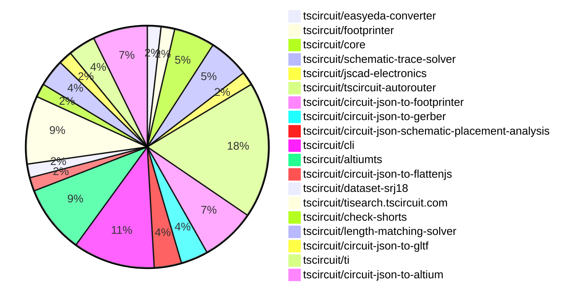

# Contribution Overview 2026-09-15

The current week is shown below. There are 3 major sections:

- [Contributor Overview](#contributor-overview)
- [PRs by Repository](#prs-by-repository)
- [PRs by Contributor](#changes-by-contributor)
- [Scoring & Sponsorship Details](/docs/sponsorship-calculation-explanation.md)

## PRs by Repository

## Contributor Overview

| Contributor | 🐳 Major | 🐙 Minor | 🐌 Tiny | Score | ⭐ |
|-------------|---------|---------|---------|-------|-----|
| [ShiboSoftwareDev](#ShiboSoftwareDev) | 4 | 3 | 1 | 28 | ⭐⭐ |
| [imrishabh18](#imrishabh18) | 5 | 1 | 1 | 24 | ⭐⭐ |
| [seveibar](#seveibar) | 3 | 0 | 3 | 16 | ⭐⭐ |
| [tscircuitbot](#tscircuitbot) | 0 | 0 | 13 | 12.5 | ⭐⭐ |
| [mohan-bee](#mohan-bee) | 1 | 2 | 1 | 12 | ⭐⭐ |
| [techmannih](#techmannih) | 0 | 0 | 6 | 6 | ⭐ |
| [hrithik18k](#hrithik18k) | 0 | 2 | 1 | 4.5 | ⭐ |
| [Abse2001](#Abse2001) | 0 | 0 | 3 | 4 | ⭐ |
| [anil08607](#anil08607) | 1 | 0 | 0 | 4 | ⭐ |
| [rushabhcodes](#rushabhcodes) | 0 | 1 | 1 | 3 |  |
| [addibble](#addibble) | 0 | 1 | 0 | 2 |  |
| [GokulPandi-M](#GokulPandi-M) | 0 | 0 | 1 | 1 |  |

## Staff Pass Ratio (SPR)

| Contributor | Reviewed PRs | Rejections | Approvals | SPR |
|-------------|--------------|------------|-----------|-----|
| [ShiboSoftwareDev](#ShiboSoftwareDev) | 3 | 0 | 3 | 100.0% |
| [addibble](#addibble) | 1 | 0 | 1 | 100.0% |
| [hrithik18k](#hrithik18k) | 1 | 0 | 1 | 100.0% |
| [rushabhcodes](#rushabhcodes) | 1 | 1 | 0 | 0.0% |

ShiboSoftwareDev SPR PRs (3)

- [#2598](https://github.com/tscircuit/tscircuit-autorouter/pull/2598) Keep zero-length fixed spans in Pipeline9 regional sections
- [#2604](https://github.com/tscircuit/tscircuit-autorouter/pull/2604) Ignore zero-length preloaded wire spans in Pipeline9
- [#2581](https://github.com/tscircuit/tscircuit-autorouter/pull/2581) Resolve canonical roots in Pipeline9 via validation

addibble SPR PRs (1)

- [#192](https://github.com/tscircuit/circuit-json-to-gltf/pull/192) test: cover fixed child CAD rotation and size in GLB snapshots

hrithik18k SPR PRs (1)

- [#1195](https://github.com/tscircuit/schematic-trace-solver/pull/1195) Fix net-label branch origin at component edge

rushabhcodes SPR PRs (1)

- [#379](https://github.com/tscircuit/jscad-electronics/pull/379) Add RHB32 VQFN footprint model

> Note: AI evaluates PRs and assigns 1-3 star ratings automatically. 4 and 5 star ratings require manual staff review.

## Review Table

[reviews-received-hover]: ## "Number of reviews received for PRs for this contributor"
[approvals-received-hover]: ## "Number of approvals received for PRs this contributor authored"
[rejections-received-hover]: ## "Number of rejections received for PRs this contributor authored"
[prs-opened-hover]: ## "Number of PRs opened by this contributor"
[issues-created-hover]: ## "Number of issues created by this contributor"

| Contributor | Reviews Received | Approvals Received | Rejections Received | Approvals | Rejections Given | PRs Opened | PRs Merged | Issues Created |
|---|---|---|---|---|---|---|---|---|
| [0hmX](#0hmX) | 0 | 0 | 0 | 2 | 0 | 0 | 0 | 0 |
| [Abse2001](#Abse2001) | 3 | 3 | 0 | 1 | 0 | 10 | 3 | 0 |
| [addibble](#addibble) | 1 | 1 | 0 | 0 | 0 | 2 | 1 | 0 |
| [AnasSarkiz](#AnasSarkiz) | 0 | 0 | 0 | 3 | 0 | 0 | 0 | 0 |
| [anil08607](#anil08607) | 1 | 1 | 0 | 0 | 0 | 1 | 1 | 0 |
| [diogo2806](#diogo2806) | 0 | 0 | 0 | 0 | 0 | 1 | 0 | 0 |
| [Furox-Art](#Furox-Art) | 0 | 0 | 0 | 0 | 0 | 2 | 0 | 0 |
| [GokulPandi-M](#GokulPandi-M) | 3 | 2 | 0 | 0 | 0 | 3 | 1 | 0 |
| [hrithik18k](#hrithik18k) | 7 | 5 | 1 | 0 | 0 | 4 | 3 | 0 |
| [imrishabh18](#imrishabh18) | 0 | 0 | 0 | 5 | 1 | 9 | 7 | 0 |
| [Itachi3355](#Itachi3355) | 0 | 0 | 0 | 0 | 0 | 1 | 0 | 0 |
| [ivan-mihalic](#ivan-mihalic) | 0 | 0 | 0 | 0 | 0 | 1 | 0 | 0 |
| [KrishnaX12](#KrishnaX12) | 3 | 1 | 0 | 0 | 0 | 2 | 0 | 0 |
| [mohan-bee](#mohan-bee) | 5 | 2 | 0 | 3 | 0 | 6 | 4 | 0 |
| [rushabhcodes](#rushabhcodes) | 28 | 3 | 1 | 0 | 0 | 14 | 2 | 0 |
| [seveibar](#seveibar) | 1 | 1 | 0 | 9 | 1 | 9 | 6 | 0 |
| [ShiboSoftwareDev](#ShiboSoftwareDev) | 8 | 8 | 0 | 6 | 0 | 31 | 8 | 0 |
| [techmannih](#techmannih) | 6 | 3 | 1 | 1 | 1 | 10 | 6 | 0 |
| [tscircuitbot](#tscircuitbot) | 0 | 0 | 0 | 0 | 0 | 18 | 13 | 0 |

## Changes by Repository

### [tscircuit/easyeda-converter](https://github.com/tscircuit/easyeda-converter)

| PR # | Impact | Rating | Contributor | Description |
|------|--------|--------|-------------|-------------|
| [#569](https://github.com/tscircuit/easyeda-converter/pull/569) | 🐙 Minor | ⭐⭐ | rushabhcodes | Summary derive generated courtyards from the EasyEDA 3D body outline and physical padhole extents use the broad package BBox only when no model outline exists recognize rectangular explicit courtyards so no fallback is added add FS3000-1015 and VCNL4040 regressions and update affected snapshots This fixes oversizedinaccurate courtyards produced by tsci add, including the FS3000-1015 import, without adding a circuit-json dependency or ignoring errors.  Validation bun run format:check bun run build bun test testsconvert-to-soup-tests (30 pass) affected TSXPCB snapshot tests (11 pass) |

### [tscircuit/footprinter](https://github.com/tscircuit/footprinter)

🐌 Tiny Contributions (1)

| PR # | Impact | Contributor | Description |
|------|--------|-------------|-------------|
| [#888](https://github.com/tscircuit/footprinter/pull/888) | 🐌 Tiny | rushabhcodes | Adds explicit identities for DO-219AD and SOD-323HE package footprints, including validated parameters and improved error handling for unsupported parameters. |

### [tscircuit/core](https://github.com/tscircuit/core)

| PR # | Impact | Rating | Contributor | Description |
|------|--------|--------|-------------|-------------|
| [#3975](https://github.com/tscircuit/core/pull/3975) | 🐙 Minor | ⭐⭐ | hrithik18k | Summary adds the complete hrithik18kair-mouse(https:tscircuit.comhrithik18kair-mousefiles) board source as a core repro fixture, including all component imports and all six schematic sections captures the full 1200600 schematic sheet, using the supplied air-mouse.svg as the layout reference preserves the currently published solver (0.0.198) output so the ICM-20948 pins 911 GND-routing bug is visible in the baseline repro  Verification sh bun test testsreprosrepro-icm20948-shared-ground-label.test.tsx  Result: 1 pass, 0 fail. The solver fix is tracked separately in tscircuitschematic-trace-solver1209. |

🐌 Tiny Contributions (2)

| PR # | Impact | Contributor | Description |
|------|--------|-------------|-------------|
| [#3932](https://github.com/tscircuit/core/pull/3932) | 🐌 Tiny | GokulPandi-M | Fixes redundant parallel routing of VREF branches in schematic, preventing potential electrical issues. |
| [#3969](https://github.com/tscircuit/core/pull/3969) | 🐌 Tiny | hrithik18k | Update tscircuitschematic-trace-solver from 0.0.197 to 0.0.198, bringing in a net-label branch placement fix that maintains junctions while placing eligible net-label branches from the component-adjacent edge. |

### [tscircuit/schematic-trace-solver](https://github.com/tscircuit/schematic-trace-solver)

| PR # | Impact | Rating | Contributor | Description |
|------|--------|--------|-------------|-------------|
| [#1195](https://github.com/tscircuit/schematic-trace-solver/pull/1195) | 🐙 Minor | ⭐⭐ | hrithik18k | Fixes the net-label branch origin to prefer the nearest host-trace endpoint pin when placing a vertical label for a two-pin branch of a larger non-ground net, ensuring the V3V3 branch is rooted directly at R8 instead of the interior junction. |

🐌 Tiny Contributions (2)

| PR # | Impact | Contributor | Description |
|------|--------|-------------|-------------|
| [#1187](https://github.com/tscircuit/schematic-trace-solver/pull/1187) | 🐌 Tiny | tscircuitbot | Adds a snapshot-only regression test and debugger page for the attached JSON solver input. |
| [#1205](https://github.com/tscircuit/schematic-trace-solver/pull/1205) | 🐌 Tiny | seveibar | Adds a reduced repro for the J_SD, J_SPI, J_I2C, and J_USB0 connector section on sheet 3 of the AM3352 dev board, providing a baseline for improving power and ground rail routing and label placement. |

### [tscircuit/jscad-electronics](https://github.com/tscircuit/jscad-electronics)

🐌 Tiny Contributions (1)

| PR # | Impact | Contributor | Description |
|------|--------|-------------|-------------|
| [#363](https://github.com/tscircuit/jscad-electronics/pull/363) | 🐌 Tiny | Abse2001 | Adjusts the MiniMELF component design to ensure proper seating on pads and matches the cylindrical outline as per specifications, improving the fit and visual representation of the component. |

### [tscircuit/tscircuit-autorouter](https://github.com/tscircuit/tscircuit-autorouter)

| PR # | Impact | Rating | Contributor | Description |
|------|--------|--------|-------------|-------------|
| [#2598](https://github.com/tscircuit/tscircuit-autorouter/pull/2598) | 🐳 Major | ⭐⭐⭐ | ShiboSoftwareDev | Fixes autorouting failure by retaining zero-length fixed spans during regional section assembly, allowing for proper reconstruction of routes in the Pipeline9 autorouter. |
| [#2581](https://github.com/tscircuit/tscircuit-autorouter/pull/2581) | 🐳 Major | ⭐⭐⭐ | ShiboSoftwareDev | Fixes autorouting failure by resolving route and obstacle identities to canonical nets in Pipeline9 during regional via validation. |
| [#2592](https://github.com/tscircuit/tscircuit-autorouter/pull/2592) | 🐳 Major | ⭐⭐⭐ | ShiboSoftwareDev | Adds a visual baseline for the T113-S3 Linux boards autorouting failure at the source_trace_194 boundary, rendering the complete board and its preloaded traces. |
| [#2601](https://github.com/tscircuit/tscircuit-autorouter/pull/2601) | 🐳 Major | ⭐⭐⭐ | seveibar | Updates the length matcher to preserve unchanged leads during DDR tuning by changing the dependency to a commit that includes a fix for retained-lead clearance. |
| [#2605](https://github.com/tscircuit/tscircuit-autorouter/pull/2605) | 🐙 Minor | ⭐⭐ | ShiboSoftwareDev | Fixes the missing plated-slot copper obstacle for J4 pin 1 in SRJ18 sample002, ensuring accurate routing visualization and output. |

🐌 Tiny Contributions (5)

| PR # | Impact | Contributor | Description |
|------|--------|-------------|-------------|
| [#2606](https://github.com/tscircuit/tscircuit-autorouter/pull/2606) | 🐌 Tiny | Abse2001 | Reproduces a bug where Pipeline 9 narrows a requested 0.4 mm trace width to 0.2375 mm instead of finding a legal detour, highlighting a flaw in the autorouting logic. |
| [#2612](https://github.com/tscircuit/tscircuit-autorouter/pull/2612) | 🐌 Tiny | tscircuitbot | Automated package update |
| [#2610](https://github.com/tscircuit/tscircuit-autorouter/pull/2610) | 🐌 Tiny | tscircuitbot | Automated package update |
| [#2602](https://github.com/tscircuit/tscircuit-autorouter/pull/2602) | 🐌 Tiny | tscircuitbot | Automated package update |
| [#2599](https://github.com/tscircuit/tscircuit-autorouter/pull/2599) | 🐌 Tiny | tscircuitbot | Automated package update |

### [tscircuit/circuit-json-to-footprinter](https://github.com/tscircuit/circuit-json-to-footprinter)

🐌 Tiny Contributions (4)

| PR # | Impact | Contributor | Description |
|------|--------|-------------|-------------|
| [#115](https://github.com/tscircuit/circuit-json-to-footprinter/pull/115) | 🐌 Tiny | Abse2001 | Recognizes MiniMELF and SOD-80 package names and seeds their supported Footprinter definitions using the measured pitch and land dimensions, allowing for accurate footprint generation for the C68883 component. |
| [#118](https://github.com/tscircuit/circuit-json-to-footprinter/pull/118) | 🐌 Tiny | tscircuitbot | Automated package update |
| [#117](https://github.com/tscircuit/circuit-json-to-footprinter/pull/117) | 🐌 Tiny | tscircuitbot | Automated package update |
| [#116](https://github.com/tscircuit/circuit-json-to-footprinter/pull/116) | 🐌 Tiny | seveibar | Fixes incorrect resolution of TSSOPHTSSOP packages to DFN by generating accurate TSSOP candidates based on metadata, ensuring proper matching and scoring for electronic component footprints. |

### [tscircuit/circuit-json-to-gerber](https://github.com/tscircuit/circuit-json-to-gerber)

| PR # | Impact | Rating | Contributor | Description |
|------|--------|--------|-------------|-------------|
| [#175](https://github.com/tscircuit/circuit-json-to-gerber/pull/175) | 🐳 Major | ⭐⭐⭐ | mohan-bee | motivation capture unwanted mask openings on covered smt pads with one tsx repro and a small layer-overlay snapshot and the routed touch piano full-board snapshot. before all six covered samples incorrectly emit mask openings, matching the six intentionally exposed controls. after add a passing reproduction with labeled shape columns and coveredexposed rows. assertions verify twelve pads and six coverage flags. the piano fixture preserves placement and routing, restoring its eight polygon-workaround keys to equivalent 11 x 27 mm rectangular pads. the focused tests and typecheck pass. snapshots render actual gerber output; schematic output is unaffected. |
| [#176](https://github.com/tscircuit/circuit-json-to-gerber/pull/176) | 🐙 Minor | ⭐⭐ | mohan-bee | Fixes incorrect soldermask coverage on SMT pads that explicitly request coverage, preventing exposed copper in the Gerber output. |

### [tscircuit/circuit-json-schematic-placement-analysis](https://github.com/tscircuit/circuit-json-schematic-placement-analysis)

| PR # | Impact | Rating | Contributor | Description |
|------|--------|--------|-------------|-------------|
| [#74](https://github.com/tscircuit/circuit-json-schematic-placement-analysis/pull/74) | 🐙 Minor | ⭐⭐ | mohan-bee | Fixes misleading padding warnings for singleton schematic pins by skipping bank-end padding checks for sides with one pin. |

🐌 Tiny Contributions (1)

| PR # | Impact | Contributor | Description |
|------|--------|-------------|-------------|
| [#73](https://github.com/tscircuit/circuit-json-schematic-placement-analysis/pull/73) | 🐌 Tiny | mohan-bee | Records existing behavior of padding warnings for centered supply pins without changing it, ensuring all tests pass. |

### [tscircuit/cli](https://github.com/tscircuit/cli)

| PR # | Impact | Rating | Contributor | Description |
|------|--------|--------|-------------|-------------|
| [#4785](https://github.com/tscircuit/cli/pull/4785) | 🐳 Major | ⭐⭐⭐ | imrishabh18 | Adds tsci search --digikey and tsci search --mouser, using the corresponding tscircuit search services without distributor API credentials. Both flags support combined searches with existing sources and --json. |
| [#4783](https://github.com/tscircuit/cli/pull/4783) | 🐳 Major | ⭐⭐⭐ | imrishabh18 | Add tsci search --ti query to discover Texas Instruments parts through tisearch.tscircuit.com, following the existing JLC search flow. TI-only searches do not query JLC; --ti can also be combined with other source flags. |

🐌 Tiny Contributions (4)

| PR # | Impact | Contributor | Description |
|------|--------|-------------|-------------|
| [#4788](https://github.com/tscircuit/cli/pull/4788) | 🐌 Tiny | tscircuitbot | Updates the package version from 0.1.2087 to 0.1.2088 in package.json |
| [#4786](https://github.com/tscircuit/cli/pull/4786) | 🐌 Tiny | tscircuitbot | Automated package update |
| [#4784](https://github.com/tscircuit/cli/pull/4784) | 🐌 Tiny | tscircuitbot | Automated package update |
| [#4787](https://github.com/tscircuit/cli/pull/4787) | 🐌 Tiny | ShiboSoftwareDev | Updates the CLIs packagedoffline tscircuitcheck-shorts fallback from version 0.0.19 to 0.0.24, including new boundary contact detection and refreshed test snapshots. |

### [tscircuit/altiumts](https://github.com/tscircuit/altiumts)

| PR # | Impact | Rating | Contributor | Description |
|------|--------|--------|-------------|-------------|
| [#197](https://github.com/tscircuit/altiumts/pull/197) | 🐳 Major | ⭐⭐⭐ | anil08607 | Adds typed access to pin-to-pad mappings for schematic Record 47 while preserving raw fields and ensuring accurate roundtrips, along with updated regression tests for various parsing scenarios. |
| [#194](https://github.com/tscircuit/altiumts/pull/194) | 🐙 Minor | ⭐⭐ | ShiboSoftwareDev | Fixes a visual issue where off-board content was clipped in DSP5509 CIII diagnostic snapshots, by adding an opt-in SVG viewport mode to include all visible PCB records. |
| [#193](https://github.com/tscircuit/altiumts/pull/193) | 🐙 Minor | ⭐⭐ | ShiboSoftwareDev | Fixes binary PCB serialization issue where rounded SMD pads reopen as plain rectangles by preserving rounded pad stack metadata and validating new pad fields. |

🐌 Tiny Contributions (2)

| PR # | Impact | Contributor | Description |
|------|--------|-------------|-------------|
| [#201](https://github.com/tscircuit/altiumts/pull/201) | 🐌 Tiny | tscircuitbot | Automated package update |
| [#200](https://github.com/tscircuit/altiumts/pull/200) | 🐌 Tiny | tscircuitbot | Automated package update |

### [tscircuit/circuit-json-to-flattenjs](https://github.com/tscircuit/circuit-json-to-flattenjs)

🐌 Tiny Contributions (1)

| PR # | Impact | Contributor | Description |
|------|--------|-------------|-------------|
| [#1](https://github.com/tscircuit/circuit-json-to-flattenjs/pull/1) | 🐌 Tiny | tscircuitbot | Automated package update |

### [tscircuit/dataset-srj18](https://github.com/tscircuit/dataset-srj18)

| PR # | Impact | Rating | Contributor | Description |
|------|--------|--------|-------------|-------------|
| [#19](https://github.com/tscircuit/dataset-srj18/pull/19) | 🐳 Major | ⭐⭐⭐ | ShiboSoftwareDev | Problem SRJ18 sample002 contains the routing endpoint for J4 pin 1 (pcb_port_157), but its plated-slot copper pad is absent from the obstacle list. This lets autorouters produce output that appears cut off at an unrendered pad. The malformed input is reproduced in tscircuittscircuit-autorouter2603.  Change upgrade tscircuitcore to the first release containing tscircuitcore3704 and align its peer dependency graph regenerate sample002 from its checked-in Circuit JSON assert the plated-slot obstacles identity, layers, center, width, and height in dataset validation The regenerated obstacle is a 2 x 4.5 mm rectangle on both copper layers centered at (-39.2404, -18.2722), matching the source plated hole.  Validation bun scriptsvalidate.mjs git diff --check  Consumer The stacked autorouter fix is tscircuittscircuit-autorouter2605. |

### [tscircuit/tisearch.tscircuit.com](https://github.com/tscircuit/tisearch.tscircuit.com)

| PR # | Impact | Rating | Contributor | Description |
|------|--------|--------|-------------|-------------|
| [#15](https://github.com/tscircuit/tisearch.tscircuit.com/pull/15) | 🐳 Major | ⭐⭐⭐ | imrishabh18 | Fills DAC channel counts from explicit TI descriptions to improve channel coverage in the DAC catalog. |
| [#14](https://github.com/tscircuit/tisearch.tscircuit.com/pull/14) | 🐳 Major | ⭐⭐⭐ | imrishabh18 | Fixes the Linux-capable Processors page by correctly querying TI processor families and mapping DACADC channel specifications, improving data accuracy and availability. |
| [#13](https://github.com/tscircuit/tisearch.tscircuit.com/pull/13) | 🐳 Major | ⭐⭐⭐ | imrishabh18 | Fixes incorrect classification of analog switches by using TIs configuration metadata to accurately filter and categorize switches and multiplexers. |
| [#12](https://github.com/tscircuit/tisearch.tscircuit.com/pull/12) | 🐙 Minor | ⭐⭐ | imrishabh18 | Removes the empty LCSC column from HTML tables and hides categories without TI family mappings from the homepage and HTML category directory, while retaining existing category routes and JSON schemas. |

🐌 Tiny Contributions (1)

| PR # | Impact | Contributor | Description |
|------|--------|-------------|-------------|
| [#16](https://github.com/tscircuit/tisearch.tscircuit.com/pull/16) | 🐌 Tiny | imrishabh18 | Removes the unsupported RISC-V family mapping from the navigation filter, ensuring that no unsupported RISC-V tiles are displayed to users. |

### [tscircuit/check-shorts](https://github.com/tscircuit/check-shorts)

| PR # | Impact | Rating | Contributor | Description |
|------|--------|--------|-------------|-------------|
| [#58](https://github.com/tscircuit/check-shorts/pull/58) | 🐳 Major | ⭐⭐⭐ | seveibar | Fixes detection of edge contacts between pads and copper pours in bitmap shorts checks, ensuring accurate identification of potential shorts in PCB designs. |

### [tscircuit/length-matching-solver](https://github.com/tscircuit/length-matching-solver)

| PR # | Impact | Rating | Contributor | Description |
|------|--------|--------|-------------|-------------|
| [#70](https://github.com/tscircuit/length-matching-solver/pull/70) | 🐳 Major | ⭐⭐⭐ | seveibar | Fixes the issue where the DDR_D0 matcher rejected meanders due to unchanged lead clearances, allowing for successful matching while preserving existing terminal leads. |

🐌 Tiny Contributions (1)

| PR # | Impact | Contributor | Description |
|------|--------|-------------|-------------|
| [#69](https://github.com/tscircuit/length-matching-solver/pull/69) | 🐌 Tiny | seveibar | This PR reproduces a bug where the LengthMatchingSolver exhausts its meander search for DDR_D0, adding a test to confirm the failure without altering production solver functionality. |

### [tscircuit/circuit-json-to-gltf](https://github.com/tscircuit/circuit-json-to-gltf)

| PR # | Impact | Rating | Contributor | Description |
|------|--------|--------|-------------|-------------|
| [#192](https://github.com/tscircuit/circuit-json-to-gltf/pull/192) | 🐙 Minor | ⭐⭐ | addibble | Covers fixed child CAD rotation and size in GLB snapshots, ensuring accurate geometry assertions and type-check fixes with updated dependencies. |

### [tscircuit/ti](https://github.com/tscircuit/ti)

🐌 Tiny Contributions (2)

| PR # | Impact | Contributor | Description |
|------|--------|-------------|-------------|
| [#240](https://github.com/tscircuit/ti/pull/240) | 🐌 Tiny | techmannih | Updates the Altium export dependencies to include the latest native pin-label positioning, marker sizing, and pin connection fixes. |
| [#239](https://github.com/tscircuit/ti/pull/239) | 🐌 Tiny | techmannih | Update the System Block UIs Altium export dependencies to use merged native custom-power support, preserving thin GNDVDD symbol strokes. |

### [tscircuit/circuit-json-to-altium](https://github.com/tscircuit/circuit-json-to-altium)

🐌 Tiny Contributions (4)

| PR # | Impact | Contributor | Description |
|------|--------|-------------|-------------|
| [#162](https://github.com/tscircuit/circuit-json-to-altium/pull/162) | 🐌 Tiny | techmannih | Sets an explicit native pin-number margin of 3 schematic units for the TPS61288 conversion, ensuring pin numbers are positioned closer to the component body in all orientations, while preserving font sizes and colors. |
| [#163](https://github.com/tscircuit/circuit-json-to-altium/pull/163) | 🐌 Tiny | techmannih | Changes the font size of native schematic pin numbers to 3 pt to match the Circuit JSON rendering scale, ensuring consistency in the Altium preview. |
| [#164](https://github.com/tscircuit/circuit-json-to-altium/pull/164) | 🐌 Tiny | techmannih | Adjusts Altium pin markers to match sizes and fill styles defined in Circuit JSON, ensuring proper visual representation and electrical behavior in exported schematics. |
| [#165](https://github.com/tscircuit/circuit-json-to-altium/pull/165) | 🐌 Tiny | techmannih | Fixes the placement of native electrical terminals at the converted Circuit JSON schematic port center, ensuring accurate pin connection points in Altium. |

## Changes by Contributor

### [rushabhcodes](https://github.com/rushabhcodes)

| PRs # | Impact | Rating | Description |
|------|--------|--------|-------------|
| [#569](https://github.com/tscircuit/easyeda-converter/pull/569) | 🐙 Minor | ⭐⭐ | Summary derive generated courtyards from the EasyEDA 3D body outline and physical padhole extents use the broad package BBox only when no model outline exists recognize rectangular explicit courtyards so no fallback is added add FS3000-1015 and VCNL4040 regressions and update affected snapshots This fixes oversizedinaccurate courtyards produced by tsci add, including the FS3000-1015 import, without adding a circuit-json dependency or ignoring errors.  Validation bun run format:check bun run build bun test testsconvert-to-soup-tests (30 pass) affected TSXPCB snapshot tests (11 pass) |

🐌 Tiny Contributions (1)

| PR # | Impact | Description |
|------|--------|-------------|
| [#888](https://github.com/tscircuit/footprinter/pull/888) | 🐌 Tiny | Adds explicit identities for DO-219AD and SOD-323HE package footprints, including validated parameters and improved error handling for unsupported parameters. |

### [GokulPandi-M](https://github.com/GokulPandi-M)

🐌 Tiny Contributions (1)

| PR # | Impact | Description |
|------|--------|-------------|
| [#3932](https://github.com/tscircuit/core/pull/3932) | 🐌 Tiny | Fixes redundant parallel routing of VREF branches in schematic, preventing potential electrical issues. |

### [hrithik18k](https://github.com/hrithik18k)

| PRs # | Impact | Rating | Description |
|------|--------|--------|-------------|
| [#3975](https://github.com/tscircuit/core/pull/3975) | 🐙 Minor | ⭐⭐ | Summary adds the complete hrithik18kair-mouse(https:tscircuit.comhrithik18kair-mousefiles) board source as a core repro fixture, including all component imports and all six schematic sections captures the full 1200600 schematic sheet, using the supplied air-mouse.svg as the layout reference preserves the currently published solver (0.0.198) output so the ICM-20948 pins 911 GND-routing bug is visible in the baseline repro  Verification sh bun test testsreprosrepro-icm20948-shared-ground-label.test.tsx  Result: 1 pass, 0 fail. The solver fix is tracked separately in tscircuitschematic-trace-solver1209. |
| [#1195](https://github.com/tscircuit/schematic-trace-solver/pull/1195) | 🐙 Minor | ⭐⭐ | Fixes the net-label branch origin to prefer the nearest host-trace endpoint pin when placing a vertical label for a two-pin branch of a larger non-ground net, ensuring the V3V3 branch is rooted directly at R8 instead of the interior junction. |

🐌 Tiny Contributions (1)

| PR # | Impact | Description |
|------|--------|-------------|
| [#3969](https://github.com/tscircuit/core/pull/3969) | 🐌 Tiny | Update tscircuitschematic-trace-solver from 0.0.197 to 0.0.198, bringing in a net-label branch placement fix that maintains junctions while placing eligible net-label branches from the component-adjacent edge. |

### [Abse2001](https://github.com/Abse2001)

🐌 Tiny Contributions (3)

| PR # | Impact | Description |
|------|--------|-------------|
| [#363](https://github.com/tscircuit/jscad-electronics/pull/363) | 🐌 Tiny | Adjusts the MiniMELF component design to ensure proper seating on pads and matches the cylindrical outline as per specifications, improving the fit and visual representation of the component. |
| [#2606](https://github.com/tscircuit/tscircuit-autorouter/pull/2606) | 🐌 Tiny | Reproduces a bug where Pipeline 9 narrows a requested 0.4 mm trace width to 0.2375 mm instead of finding a legal detour, highlighting a flaw in the autorouting logic. |
| [#115](https://github.com/tscircuit/circuit-json-to-footprinter/pull/115) | 🐌 Tiny | Recognizes MiniMELF and SOD-80 package names and seeds their supported Footprinter definitions using the measured pitch and land dimensions, allowing for accurate footprint generation for the C68883 component. |

### [mohan-bee](https://github.com/mohan-bee)

| PRs # | Impact | Rating | Description |
|------|--------|--------|-------------|
| [#175](https://github.com/tscircuit/circuit-json-to-gerber/pull/175) | 🐳 Major | ⭐⭐⭐ | motivation capture unwanted mask openings on covered smt pads with one tsx repro and a small layer-overlay snapshot and the routed touch piano full-board snapshot. before all six covered samples incorrectly emit mask openings, matching the six intentionally exposed controls. after add a passing reproduction with labeled shape columns and coveredexposed rows. assertions verify twelve pads and six coverage flags. the piano fixture preserves placement and routing, restoring its eight polygon-workaround keys to equivalent 11 x 27 mm rectangular pads. the focused tests and typecheck pass. snapshots render actual gerber output; schematic output is unaffected. |
| [#176](https://github.com/tscircuit/circuit-json-to-gerber/pull/176) | 🐙 Minor | ⭐⭐ | Fixes incorrect soldermask coverage on SMT pads that explicitly request coverage, preventing exposed copper in the Gerber output. |
| [#74](https://github.com/tscircuit/circuit-json-schematic-placement-analysis/pull/74) | 🐙 Minor | ⭐⭐ | Fixes misleading padding warnings for singleton schematic pins by skipping bank-end padding checks for sides with one pin. |

🐌 Tiny Contributions (1)

| PR # | Impact | Description |
|------|--------|-------------|
| [#73](https://github.com/tscircuit/circuit-json-schematic-placement-analysis/pull/73) | 🐌 Tiny | Records existing behavior of padding warnings for centered supply pins without changing it, ensuring all tests pass. |

### [tscircuitbot](https://github.com/tscircuitbot)

🐌 Tiny Contributions (13)

| PR # | Impact | Description |
|------|--------|-------------|
| [#4788](https://github.com/tscircuit/cli/pull/4788) | 🐌 Tiny | Updates the package version from 0.1.2087 to 0.1.2088 in package.json |
| [#4786](https://github.com/tscircuit/cli/pull/4786) | 🐌 Tiny | Automated package update |
| [#4784](https://github.com/tscircuit/cli/pull/4784) | 🐌 Tiny | Automated package update |
| [#2612](https://github.com/tscircuit/tscircuit-autorouter/pull/2612) | 🐌 Tiny | Automated package update |
| [#2610](https://github.com/tscircuit/tscircuit-autorouter/pull/2610) | 🐌 Tiny | Automated package update |
| [#2602](https://github.com/tscircuit/tscircuit-autorouter/pull/2602) | 🐌 Tiny | Automated package update |
| [#2599](https://github.com/tscircuit/tscircuit-autorouter/pull/2599) | 🐌 Tiny | Automated package update |
| [#1187](https://github.com/tscircuit/schematic-trace-solver/pull/1187) | 🐌 Tiny | Adds a snapshot-only regression test and debugger page for the attached JSON solver input. |
| [#118](https://github.com/tscircuit/circuit-json-to-footprinter/pull/118) | 🐌 Tiny | Automated package update |
| [#117](https://github.com/tscircuit/circuit-json-to-footprinter/pull/117) | 🐌 Tiny | Automated package update |
| [#201](https://github.com/tscircuit/altiumts/pull/201) | 🐌 Tiny | Automated package update |
| [#200](https://github.com/tscircuit/altiumts/pull/200) | 🐌 Tiny | Automated package update |
| [#1](https://github.com/tscircuit/circuit-json-to-flattenjs/pull/1) | 🐌 Tiny | Automated package update |

### [ShiboSoftwareDev](https://github.com/ShiboSoftwareDev)

| PRs # | Impact | Rating | Description |
|------|--------|--------|-------------|
| [#2598](https://github.com/tscircuit/tscircuit-autorouter/pull/2598) | 🐳 Major | ⭐⭐⭐ | Fixes autorouting failure by retaining zero-length fixed spans during regional section assembly, allowing for proper reconstruction of routes in the Pipeline9 autorouter. |
| [#2581](https://github.com/tscircuit/tscircuit-autorouter/pull/2581) | 🐳 Major | ⭐⭐⭐ | Fixes autorouting failure by resolving route and obstacle identities to canonical nets in Pipeline9 during regional via validation. |
| [#2592](https://github.com/tscircuit/tscircuit-autorouter/pull/2592) | 🐳 Major | ⭐⭐⭐ | Adds a visual baseline for the T113-S3 Linux boards autorouting failure at the source_trace_194 boundary, rendering the complete board and its preloaded traces. |
| [#19](https://github.com/tscircuit/dataset-srj18/pull/19) | 🐳 Major | ⭐⭐⭐ | Problem SRJ18 sample002 contains the routing endpoint for J4 pin 1 (pcb_port_157), but its plated-slot copper pad is absent from the obstacle list. This lets autorouters produce output that appears cut off at an unrendered pad. The malformed input is reproduced in tscircuittscircuit-autorouter2603.  Change upgrade tscircuitcore to the first release containing tscircuitcore3704 and align its peer dependency graph regenerate sample002 from its checked-in Circuit JSON assert the plated-slot obstacles identity, layers, center, width, and height in dataset validation The regenerated obstacle is a 2 x 4.5 mm rectangle on both copper layers centered at (-39.2404, -18.2722), matching the source plated hole.  Validation bun scriptsvalidate.mjs git diff --check  Consumer The stacked autorouter fix is tscircuittscircuit-autorouter2605. |
| [#2605](https://github.com/tscircuit/tscircuit-autorouter/pull/2605) | 🐙 Minor | ⭐⭐ | Fixes the missing plated-slot copper obstacle for J4 pin 1 in SRJ18 sample002, ensuring accurate routing visualization and output. |
| [#194](https://github.com/tscircuit/altiumts/pull/194) | 🐙 Minor | ⭐⭐ | Fixes a visual issue where off-board content was clipped in DSP5509 CIII diagnostic snapshots, by adding an opt-in SVG viewport mode to include all visible PCB records. |
| [#193](https://github.com/tscircuit/altiumts/pull/193) | 🐙 Minor | ⭐⭐ | Fixes binary PCB serialization issue where rounded SMD pads reopen as plain rectangles by preserving rounded pad stack metadata and validating new pad fields. |

🐌 Tiny Contributions (1)

| PR # | Impact | Description |
|------|--------|-------------|
| [#4787](https://github.com/tscircuit/cli/pull/4787) | 🐌 Tiny | Updates the CLIs packagedoffline tscircuitcheck-shorts fallback from version 0.0.19 to 0.0.24, including new boundary contact detection and refreshed test snapshots. |

### [imrishabh18](https://github.com/imrishabh18)

| PRs # | Impact | Rating | Description |
|------|--------|--------|-------------|
| [#4785](https://github.com/tscircuit/cli/pull/4785) | 🐳 Major | ⭐⭐⭐ | Adds tsci search --digikey and tsci search --mouser, using the corresponding tscircuit search services without distributor API credentials. Both flags support combined searches with existing sources and --json. |
| [#4783](https://github.com/tscircuit/cli/pull/4783) | 🐳 Major | ⭐⭐⭐ | Add tsci search --ti query to discover Texas Instruments parts through tisearch.tscircuit.com, following the existing JLC search flow. TI-only searches do not query JLC; --ti can also be combined with other source flags. |
| [#15](https://github.com/tscircuit/tisearch.tscircuit.com/pull/15) | 🐳 Major | ⭐⭐⭐ | Fills DAC channel counts from explicit TI descriptions to improve channel coverage in the DAC catalog. |
| [#14](https://github.com/tscircuit/tisearch.tscircuit.com/pull/14) | 🐳 Major | ⭐⭐⭐ | Fixes the Linux-capable Processors page by correctly querying TI processor families and mapping DACADC channel specifications, improving data accuracy and availability. |
| [#13](https://github.com/tscircuit/tisearch.tscircuit.com/pull/13) | 🐳 Major | ⭐⭐⭐ | Fixes incorrect classification of analog switches by using TIs configuration metadata to accurately filter and categorize switches and multiplexers. |
| [#12](https://github.com/tscircuit/tisearch.tscircuit.com/pull/12) | 🐙 Minor | ⭐⭐ | Removes the empty LCSC column from HTML tables and hides categories without TI family mappings from the homepage and HTML category directory, while retaining existing category routes and JSON schemas. |

🐌 Tiny Contributions (1)

| PR # | Impact | Description |
|------|--------|-------------|
| [#16](https://github.com/tscircuit/tisearch.tscircuit.com/pull/16) | 🐌 Tiny | Removes the unsupported RISC-V family mapping from the navigation filter, ensuring that no unsupported RISC-V tiles are displayed to users. |

### [seveibar](https://github.com/seveibar)

| PRs # | Impact | Rating | Description |
|------|--------|--------|-------------|
| [#2601](https://github.com/tscircuit/tscircuit-autorouter/pull/2601) | 🐳 Major | ⭐⭐⭐ | Updates the length matcher to preserve unchanged leads during DDR tuning by changing the dependency to a commit that includes a fix for retained-lead clearance. |
| [#58](https://github.com/tscircuit/check-shorts/pull/58) | 🐳 Major | ⭐⭐⭐ | Fixes detection of edge contacts between pads and copper pours in bitmap shorts checks, ensuring accurate identification of potential shorts in PCB designs. |
| [#70](https://github.com/tscircuit/length-matching-solver/pull/70) | 🐳 Major | ⭐⭐⭐ | Fixes the issue where the DDR_D0 matcher rejected meanders due to unchanged lead clearances, allowing for successful matching while preserving existing terminal leads. |

🐌 Tiny Contributions (3)

| PR # | Impact | Description |
|------|--------|-------------|
| [#1205](https://github.com/tscircuit/schematic-trace-solver/pull/1205) | 🐌 Tiny | Adds a reduced repro for the J_SD, J_SPI, J_I2C, and J_USB0 connector section on sheet 3 of the AM3352 dev board, providing a baseline for improving power and ground rail routing and label placement. |
| [#69](https://github.com/tscircuit/length-matching-solver/pull/69) | 🐌 Tiny | This PR reproduces a bug where the LengthMatchingSolver exhausts its meander search for DDR_D0, adding a test to confirm the failure without altering production solver functionality. |
| [#116](https://github.com/tscircuit/circuit-json-to-footprinter/pull/116) | 🐌 Tiny | Fixes incorrect resolution of TSSOPHTSSOP packages to DFN by generating accurate TSSOP candidates based on metadata, ensuring proper matching and scoring for electronic component footprints. |

### [addibble](https://github.com/addibble)

| PRs # | Impact | Rating | Description |
|------|--------|--------|-------------|
| [#192](https://github.com/tscircuit/circuit-json-to-gltf/pull/192) | 🐙 Minor | ⭐⭐ | Covers fixed child CAD rotation and size in GLB snapshots, ensuring accurate geometry assertions and type-check fixes with updated dependencies. |

### [techmannih](https://github.com/techmannih)

🐌 Tiny Contributions (6)

| PR # | Impact | Description |
|------|--------|-------------|
| [#240](https://github.com/tscircuit/ti/pull/240) | 🐌 Tiny | Updates the Altium export dependencies to include the latest native pin-label positioning, marker sizing, and pin connection fixes. |
| [#239](https://github.com/tscircuit/ti/pull/239) | 🐌 Tiny | Update the System Block UIs Altium export dependencies to use merged native custom-power support, preserving thin GNDVDD symbol strokes. |
| [#162](https://github.com/tscircuit/circuit-json-to-altium/pull/162) | 🐌 Tiny | Sets an explicit native pin-number margin of 3 schematic units for the TPS61288 conversion, ensuring pin numbers are positioned closer to the component body in all orientations, while preserving font sizes and colors. |
| [#163](https://github.com/tscircuit/circuit-json-to-altium/pull/163) | 🐌 Tiny | Changes the font size of native schematic pin numbers to 3 pt to match the Circuit JSON rendering scale, ensuring consistency in the Altium preview. |
| [#164](https://github.com/tscircuit/circuit-json-to-altium/pull/164) | 🐌 Tiny | Adjusts Altium pin markers to match sizes and fill styles defined in Circuit JSON, ensuring proper visual representation and electrical behavior in exported schematics. |
| [#165](https://github.com/tscircuit/circuit-json-to-altium/pull/165) | 🐌 Tiny | Fixes the placement of native electrical terminals at the converted Circuit JSON schematic port center, ensuring accurate pin connection points in Altium. |

### [anil08607](https://github.com/anil08607)

| PRs # | Impact | Rating | Description |
|------|--------|--------|-------------|
| [#197](https://github.com/tscircuit/altiumts/pull/197) | 🐳 Major | ⭐⭐⭐ | Adds typed access to pin-to-pad mappings for schematic Record 47 while preserving raw fields and ensuring accurate roundtrips, along with updated regression tests for various parsing scenarios. |

## Repository Owners

| Repository | Codeowners |
|------------|------------|
| [builder](https://github.com/tscircuit/builder/blob/main/.github/CODEOWNERS) | [seveibar](https://github.com/seveibar)
| [pcb-viewer](https://github.com/tscircuit/pcb-viewer/blob/main/.github/CODEOWNERS) | [seveibar](https://github.com/seveibar), [ShiboSoftwareDev](https://github.com/ShiboSoftwareDev), [Abse2001](https://github.com/Abse2001)
| [footprints-old](https://github.com/tscircuit/footprints-old/blob/main/.github/CODEOWNERS) | [seveibar](https://github.com/seveibar)
| [footprinter](https://github.com/tscircuit/footprinter/blob/main/.github/CODEOWNERS) | [seveibar](https://github.com/seveibar), [techmannih](https://github.com/techmannih)
| [3d-viewer](https://github.com/tscircuit/3d-viewer/blob/main/.github/CODEOWNERS) | [ShiboSoftwareDev](https://github.com/ShiboSoftwareDev), [Abse2001](https://github.com/Abse2001)
| [winterspec](https://github.com/tscircuit/winterspec/blob/main/.github/CODEOWNERS) | [seveibar](https://github.com/seveibar), [ShiboSoftwareDev](https://github.com/ShiboSoftwareDev)
| [jscad-electronics](https://github.com/tscircuit/jscad-electronics/blob/main/.github/CODEOWNERS) | [seveibar](https://github.com/seveibar), [techmannih](https://github.com/techmannih), [ShiboSoftwareDev](https://github.com/ShiboSoftwareDev), [anas-sarkez](https://github.com/anas-sarkez)
| [circuit-to-svg](https://github.com/tscircuit/circuit-to-svg/blob/main/.github/CODEOWNERS) | [imrishabh18](https://github.com/imrishabh18)
| [schematic-symbols](https://github.com/tscircuit/schematic-symbols/blob/main/.github/CODEOWNERS) | [seveibar](https://github.com/seveibar), [imrishabh18](https://github.com/imrishabh18), [techmannih](https://github.com/techmannih)
| [circuit-json-to-gerber](https://github.com/tscircuit/circuit-json-to-gerber/blob/main/.github/CODEOWNERS) | [seveibar](https://github.com/seveibar), [ShiboSoftwareDev](https://github.com/ShiboSoftwareDev)
| [tscircuit.com](https://github.com/tscircuit/tscircuit.com/blob/main/.github/CODEOWNERS) | [seveibar](https://github.com/seveibar), [imrishabh18](https://github.com/imrishabh18)
| [issue-roulette](https://github.com/tscircuit/issue-roulette/blob/main/.github/CODEOWNERS) | [Anshgrover23](https://github.com/Anshgrover23)
| [schematic-corpus](https://github.com/tscircuit/schematic-corpus/blob/main/.github/CODEOWNERS) | [Abse2001](https://github.com/Abse2001)
| [copper-pour-solver](https://github.com/tscircuit/copper-pour-solver/blob/main/.github/CODEOWNERS) | [seveibar](https://github.com/seveibar), [ShiboSoftwareDev](https://github.com/ShiboSoftwareDev)
| [common](https://github.com/tscircuit/common/blob/main/.github/CODEOWNERS) | [seveibar](https://github.com/seveibar), [Abse2001](https://github.com/Abse2001)
| [circuit-to-canvas](https://github.com/tscircuit/circuit-to-canvas/blob/main/.github/CODEOWNERS) | [ShiboSoftwareDev](https://github.com/ShiboSoftwareDev), [Abse2001](https://github.com/Abse2001), [techmannih](https://github.com/techmannih)
| [circuit-json-to-lbrn](https://github.com/tscircuit/circuit-json-to-lbrn/blob/main/.github/CODEOWNERS) | [AnasSarkiz](https://github.com/AnasSarkiz)
| [pcbburn.com](https://github.com/tscircuit/pcbburn.com/blob/main/.github/CODEOWNERS) | [AnasSarkiz](https://github.com/AnasSarkiz)
| [high-density-repair03](https://github.com/tscircuit/high-density-repair03/blob/main/.github/CODEOWNERS) | [Abse2001](https://github.com/Abse2001)
| [fabrication-operator-ui](https://github.com/tscircuit/fabrication-operator-ui/blob/main/.github/CODEOWNERS) | [AnasSarkiz](https://github.com/AnasSarkiz)
| [layerweaver](https://github.com/tscircuit/layerweaver/blob/main/.github/CODEOWNERS) | [0hmx](https://github.com/0hmx)

## Repositories by Owner

| User | Repo |
|------|------|
| [seveibar](https://github.com/seveibar) | [builder](https://github.com/tscircuit/builder/blob/main/.github/CODEOWNERS) |
|  | [pcb-viewer](https://github.com/tscircuit/pcb-viewer/blob/main/.github/CODEOWNERS) |
|  | [footprints-old](https://github.com/tscircuit/footprints-old/blob/main/.github/CODEOWNERS) |
|  | [footprinter](https://github.com/tscircuit/footprinter/blob/main/.github/CODEOWNERS) |
|  | [winterspec](https://github.com/tscircuit/winterspec/blob/main/.github/CODEOWNERS) |
|  | [jscad-electronics](https://github.com/tscircuit/jscad-electronics/blob/main/.github/CODEOWNERS) |
|  | [schematic-symbols](https://github.com/tscircuit/schematic-symbols/blob/main/.github/CODEOWNERS) |
|  | [circuit-json-to-gerber](https://github.com/tscircuit/circuit-json-to-gerber/blob/main/.github/CODEOWNERS) |
|  | [tscircuit.com](https://github.com/tscircuit/tscircuit.com/blob/main/.github/CODEOWNERS) |
|  | [copper-pour-solver](https://github.com/tscircuit/copper-pour-solver/blob/main/.github/CODEOWNERS) |
|  | [common](https://github.com/tscircuit/common/blob/main/.github/CODEOWNERS) |
| [ShiboSoftwareDev](https://github.com/ShiboSoftwareDev) | [pcb-viewer](https://github.com/tscircuit/pcb-viewer/blob/main/.github/CODEOWNERS) |
|  | [3d-viewer](https://github.com/tscircuit/3d-viewer/blob/main/.github/CODEOWNERS) |
|  | [winterspec](https://github.com/tscircuit/winterspec/blob/main/.github/CODEOWNERS) |
|  | [jscad-electronics](https://github.com/tscircuit/jscad-electronics/blob/main/.github/CODEOWNERS) |
|  | [circuit-json-to-gerber](https://github.com/tscircuit/circuit-json-to-gerber/blob/main/.github/CODEOWNERS) |
|  | [copper-pour-solver](https://github.com/tscircuit/copper-pour-solver/blob/main/.github/CODEOWNERS) |
|  | [circuit-to-canvas](https://github.com/tscircuit/circuit-to-canvas/blob/main/.github/CODEOWNERS) |
| [Abse2001](https://github.com/Abse2001) | [pcb-viewer](https://github.com/tscircuit/pcb-viewer/blob/main/.github/CODEOWNERS) |
|  | [3d-viewer](https://github.com/tscircuit/3d-viewer/blob/main/.github/CODEOWNERS) |
|  | [schematic-corpus](https://github.com/tscircuit/schematic-corpus/blob/main/.github/CODEOWNERS) |
|  | [common](https://github.com/tscircuit/common/blob/main/.github/CODEOWNERS) |
|  | [circuit-to-canvas](https://github.com/tscircuit/circuit-to-canvas/blob/main/.github/CODEOWNERS) |
|  | [high-density-repair03](https://github.com/tscircuit/high-density-repair03/blob/main/.github/CODEOWNERS) |
| [techmannih](https://github.com/techmannih) | [footprinter](https://github.com/tscircuit/footprinter/blob/main/.github/CODEOWNERS) |
|  | [jscad-electronics](https://github.com/tscircuit/jscad-electronics/blob/main/.github/CODEOWNERS) |
|  | [schematic-symbols](https://github.com/tscircuit/schematic-symbols/blob/main/.github/CODEOWNERS) |
|  | [circuit-to-canvas](https://github.com/tscircuit/circuit-to-canvas/blob/main/.github/CODEOWNERS) |
| [anas-sarkez](https://github.com/anas-sarkez) | [jscad-electronics](https://github.com/tscircuit/jscad-electronics/blob/main/.github/CODEOWNERS) |
| [imrishabh18](https://github.com/imrishabh18) | [circuit-to-svg](https://github.com/tscircuit/circuit-to-svg/blob/main/.github/CODEOWNERS) |
|  | [schematic-symbols](https://github.com/tscircuit/schematic-symbols/blob/main/.github/CODEOWNERS) |
|  | [tscircuit.com](https://github.com/tscircuit/tscircuit.com/blob/main/.github/CODEOWNERS) |
| [Anshgrover23](https://github.com/Anshgrover23) | [issue-roulette](https://github.com/tscircuit/issue-roulette/blob/main/.github/CODEOWNERS) |
| [AnasSarkiz](https://github.com/AnasSarkiz) | [circuit-json-to-lbrn](https://github.com/tscircuit/circuit-json-to-lbrn/blob/main/.github/CODEOWNERS) |
|  | [pcbburn.com](https://github.com/tscircuit/pcbburn.com/blob/main/.github/CODEOWNERS) |
|  | [fabrication-operator-ui](https://github.com/tscircuit/fabrication-operator-ui/blob/main/.github/CODEOWNERS) |
| [0hmx](https://github.com/0hmx) | [layerweaver](https://github.com/tscircuit/layerweaver/blob/main/.github/CODEOWNERS) |

