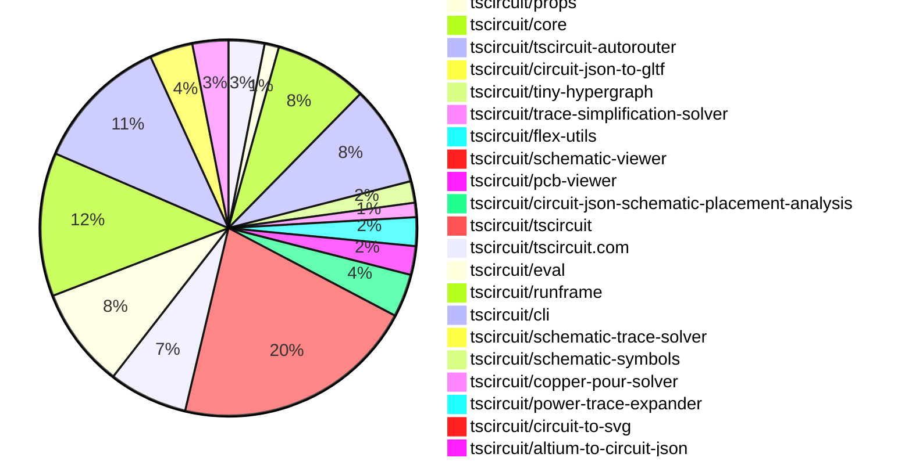

# Contribution Overview 2026-09-22

The current week is shown below. There are 3 major sections:

- [Contributor Overview](#contributor-overview)
- [PRs by Repository](#prs-by-repository)
- [PRs by Contributor](#changes-by-contributor)
- [Scoring & Sponsorship Details](/docs/sponsorship-calculation-explanation.md)

## PRs by Repository

## Contributor Overview

| Contributor | 🐳 Major | 🐙 Minor | 🐌 Tiny | Score | ⭐ |
|-------------|---------|---------|---------|-------|-----|
| [seveibar](#seveibar) | 18 | 7 | 3 | 90 | 👑 |
| [imrishabh18](#imrishabh18) | 3 | 1 | 5 | 20 | ⭐⭐ |
| [MustafaMulla29](#MustafaMulla29) | 2 | 2 | 5 | 16.5 | ⭐⭐ |
| [tscircuitbot](#tscircuitbot) | 0 | 0 | 109 | 13.5 | ⭐⭐ |
| [techmannih](#techmannih) | 0 | 0 | 4 | 5 | ⭐ |
| [mohan-bee](#mohan-bee) | 0 | 1 | 3 | 5 | ⭐ |
| [KrishnaX12](#KrishnaX12) | 0 | 2 | 1 | 5 | ⭐ |
| [ShiboSoftwareDev](#ShiboSoftwareDev) | 1 | 0 | 0 | 4 | ⭐ |
| [GokulPandi-M](#GokulPandi-M) | 0 | 0 | 2 | 1.5 |  |

## Staff Pass Ratio (SPR)

| Contributor | Reviewed PRs | Rejections | Approvals | SPR |
|-------------|--------------|------------|-----------|-----|
| [imrishabh18](#imrishabh18) | 3 | 0 | 3 | 100.0% |
| [MustafaMulla29](#MustafaMulla29) | 3 | 0 | 3 | 100.0% |
| [KrishnaX12](#KrishnaX12) | 2 | 0 | 2 | 100.0% |
| [ShiboSoftwareDev](#ShiboSoftwareDev) | 2 | 2 | 2 | 0.0% |
| [0hmX](#0hmX) | 1 | 2 | 0 | -100.0% |

imrishabh18 SPR PRs (3)

- [#209](https://github.com/tscircuit/tiny-hypergraph/pull/209) fix: precheck reachability before selective blocker search
- [#243](https://github.com/tscircuit/ti/pull/243) Add ti search command for Texas Instruments components
- [#30](https://github.com/tscircuit/power-trace-expander/pull/30) perf: reuse copper alias sets and prune redundant grid checks

MustafaMulla29 SPR PRs (3)

- [#1238](https://github.com/tscircuit/schematic-trace-solver/pull/1238) Recheck power and ground labels after rail alignment
- [#1233](https://github.com/tscircuit/schematic-trace-solver/pull/1233) Fix RP2040 gamepad rail alignment regression
- [#97](https://github.com/tscircuit/circuit-json-schematic-placement-analysis/pull/97) feat: detect separated USB series resistor pairs

KrishnaX12 SPR PRs (2)

- [#100](https://github.com/tscircuit/copper-pour-solver/pull/100) fix rectangular hole copper-pour clearance
- [#91](https://github.com/tscircuit/altium-to-circuit-json/pull/91) Skip hidden Altium component silkscreen text

ShiboSoftwareDev SPR PRs (2)

- [#208](https://github.com/tscircuit/altiumts/pull/208) Expose typed PCB geometry helpers
- [#92](https://github.com/tscircuit/altium-to-circuit-json/pull/92) Refactor conversion into staged pipelines

0hmX SPR PRs (1)

- [#323](https://github.com/tscircuit/checks/pull/323) fix: add a dedicated dangling trace check with focused snapshots

> Note: AI evaluates PRs and assigns 1-3 star ratings automatically. 4 and 5 star ratings require manual staff review.

## Review Table

[reviews-received-hover]: ## "Number of reviews received for PRs for this contributor"
[approvals-received-hover]: ## "Number of approvals received for PRs this contributor authored"
[rejections-received-hover]: ## "Number of rejections received for PRs this contributor authored"
[prs-opened-hover]: ## "Number of PRs opened by this contributor"
[issues-created-hover]: ## "Number of issues created by this contributor"

| Contributor | Reviews Received | Approvals Received | Rejections Received | Approvals | Rejections Given | PRs Opened | PRs Merged | Issues Created |
|---|---|---|---|---|---|---|---|---|
| [0hmX](#0hmX) | 6 | 0 | 2 | 0 | 0 | 7 | 0 | 0 |
| [Devesh36](#Devesh36) | 2 | 1 | 1 | 0 | 0 | 1 | 0 | 0 |
| [furuchanchan](#furuchanchan) | 0 | 0 | 0 | 0 | 0 | 1 | 0 | 0 |
| [GokulPandi-M](#GokulPandi-M) | 4 | 3 | 0 | 0 | 0 | 2 | 2 | 0 |
| [halc8312](#halc8312) | 6 | 0 | 0 | 0 | 0 | 6 | 0 | 0 |
| [hrithik18k](#hrithik18k) | 1 | 0 | 0 | 0 | 0 | 1 | 0 | 0 |
| [imrishabh18](#imrishabh18) | 4 | 4 | 0 | 7 | 0 | 11 | 9 | 0 |
| [infosbighouse-glitch](#infosbighouse-glitch) | 0 | 0 | 0 | 0 | 0 | 1 | 0 | 0 |
| [kavyabhand](#kavyabhand) | 0 | 0 | 0 | 0 | 0 | 2 | 0 | 0 |
| [KrishnaX12](#KrishnaX12) | 3 | 3 | 0 | 0 | 0 | 5 | 3 | 0 |
| [mohan-bee](#mohan-bee) | 2 | 2 | 0 | 0 | 0 | 6 | 4 | 0 |
| [MoreFoam](#MoreFoam) | 0 | 0 | 0 | 0 | 0 | 1 | 0 | 0 |
| [MustafaMulla29](#MustafaMulla29) | 5 | 3 | 0 | 0 | 0 | 10 | 9 | 0 |
| [raykholo](#raykholo) | 0 | 0 | 0 | 0 | 0 | 1 | 0 | 0 |
| [rushabhcodes](#rushabhcodes) | 5 | 1 | 0 | 1 | 0 | 4 | 0 | 0 |
| [seveibar](#seveibar) | 8 | 0 | 0 | 12 | 2 | 36 | 28 | 0 |
| [ShiboSoftwareDev](#ShiboSoftwareDev) | 2 | 2 | 0 | 0 | 0 | 3 | 2 | 0 |
| [techmannih](#techmannih) | 3 | 2 | 0 | 1 | 1 | 6 | 4 | 0 |
| [tscircuitbot](#tscircuitbot) | 0 | 0 | 0 | 0 | 0 | 155 | 110 | 0 |

## Changes by Repository

### [tscircuit/circuit-json](https://github.com/tscircuit/circuit-json)

| PR # | Impact | Rating | Contributor | Description |
|------|--------|--------|-------------|-------------|
| [#820](https://github.com/tscircuit/circuit-json/pull/820) | 🐳 Major | ⭐⭐⭐ | seveibar | Add optional cad_component.is_on_folded_board to distinguish assembled CAD positionrotation from the flat PCB pose. |
| [#816](https://github.com/tscircuit/circuit-json/pull/816) | 🐳 Major | ⭐⭐⭐ | seveibar | Add pcb_bend and pcb_stiffener schemas and types to describe bends and bonded reinforcement in flex PCB designs, ensuring flat layout preservation and unit-aware validation. |
| [#818](https://github.com/tscircuit/circuit-json/pull/818) | 🐙 Minor | ⭐⭐ | seveibar | Adds support for flex as a valid PCB board material in the runtime enum and PcbBoard type, allowing for validation through the Circuit JSON union. |

🐌 Tiny Contributions (2)

| PR # | Impact | Contributor | Description |
|------|--------|-------------|-------------|
| [#821](https://github.com/tscircuit/circuit-json/pull/821) | 🐌 Tiny | tscircuitbot | Automated package update |
| [#819](https://github.com/tscircuit/circuit-json/pull/819) | 🐌 Tiny | tscircuitbot | Automated package update |

### [tscircuit/props](https://github.com/tscircuit/props)

| PR # | Impact | Rating | Contributor | Description |
|------|--------|--------|-------------|-------------|
| [#864](https://github.com/tscircuit/props/pull/864) | 🐳 Major | ⭐⭐⭐ | seveibar | Add exported PcbBendProps and PcbStiffenerProps for pcbbend  and pcbstiffener  components, enabling the definition of bends and stiffeners in flex PCBs with validation for geometry and dimensions. |
| [#863](https://github.com/tscircuit/props/pull/863) | 🐙 Minor | ⭐⭐ | seveibar | Adds an optional algorithmFn prop directly to autoroutingphase , reusing the existing AutorouterConfig callback type and schema validation. Parsing preserves the callback unchanged and rejects non-function values; existing phases remain valid without the prop. |

### [tscircuit/core](https://github.com/tscircuit/core)

| PR # | Impact | Rating | Contributor | Description |
|------|--------|--------|-------------|-------------|
| [#4094](https://github.com/tscircuit/core/pull/4094) | 🐳 Major | ⭐⭐⭐ | seveibar | Large imported boards eagerly build a named phase-state map for every renderable. AM62A has 39,779 renderables, and none of those maps are inspected during its normal unobserved render. Keep ordinary  initialized, dirty  objects in an indexed array. Build the public named map only on first access, using references to those same objects. Render methods directly assign phaseState.initialized and phaseState.dirty: no packed flags, boolean-array synchronization, state reconstruction, or setter helpers. Once the map is exposed, read it to preserve callers replacing individual entries or the entire map. Also avoid temporary arrays when checking previous async effects, check the isolated phase before component fields, and skip lifecycle event preparation when no listeners exist. Phase ordering, async barriers, live subscriptions and custom-rootdebug behavior are preserved. Three fresh processes per variant on the frozen AM62A input, in rotating order, with pours disabled:  Variant  Eval  core render median  Peak RSS median   ---  ---:  ---:   Merged 4093 baseline  5.896 s  1,032 MiB   Previous boolean arrays  4.898 s  801 MiB   Shared state objects  4.970 s  884 MiB  The simpler code retains a 15.7 improvement over baseline in this batch. It takes 0.072 s (1.5) longer and about 83 MiB more peak process memory than boolean arrays. All nine outputs match: 66,219 records, normalizing only software-version metadata. Timings exclude module startup, serialization, transfer and viewer rendering. The 2-second target remains unmet. Benchmark method and comparisons(benchmarkingscriptsrender-state-ablation.md)  Ordered samples(benchmarkingscriptsrender-state-ablation-results.json) Validation: 134 tests pass, one existing skip, five snapshots unchanged; build and typecheck pass. Coverage includes live state inspection, direct mutation, entry and map replacement, first inspection plus replacement inside a handler, dirty propagation, removal, throwing phases, async dependencies, lifecycle subscriptions, custom roots, subcircuits, async footprints and DRC. |
| [#4093](https://github.com/tscircuit/core/pull/4093) | 🐳 Major | ⭐⭐⭐ | seveibar | Completes disabled DRC synchronously, caches construction schemas by original schema identity, and skips empty copper cleanup to optimize rendering performance. |
| [#4091](https://github.com/tscircuit/core/pull/4091) | 🐳 Major | ⭐⭐⭐ | seveibar | Fixes net lookup costs across the full render lifecycle by optimizing the net resolution process, resulting in significant performance improvements during rendering. |
| [#4089](https://github.com/tscircuit/core/pull/4089) | 🐳 Major | ⭐⭐⭐ | seveibar | Add pcbbend and pcbstiffener to cores component catalogue and TSX types. Flex boards now emit pcb_bend and rectangularpolygon pcb_stiffener records with boardgroup ownership, unit-normalized dimensions, adhesive thickness, and resolved authored placementrotation. |
| [#4090](https://github.com/tscircuit/core/pull/4090) | 🐳 Major | ⭐⭐⭐ | seveibar | Reduces the time spent in createNetsFromProps by indexing literal net selectors, significantly improving performance for large imported boards. |
| [#4084](https://github.com/tscircuit/core/pull/4084) | 🐳 Major | ⭐⭐⭐ | seveibar | Fixes autorouting to pass exact preloaded trace geometry to Pipeline9, ensuring that manual PCB paths are preserved and not replaced with rectangle chains during routing. |
| [#4092](https://github.com/tscircuit/core/pull/4092) | 🐙 Minor | ⭐⭐ | seveibar | Create board-mounted CAD components in their assembled positionrotation during rendering, ensuring that folded records carry is_on_folded_board: true while PCB placementrouting remains flat. |
| [#4086](https://github.com/tscircuit/core/pull/4086) | 🐙 Minor | ⭐⭐ | seveibar | Supports autoroutingphase algorithmFn...  by carrying the callback through the routing phase plan and applying it after autorouter preset resolution, allowing phase callbacks to take precedence over inherited or nested callbacks. |
| [#4095](https://github.com/tscircuit/core/pull/4095) | 🐙 Minor | ⭐⭐ | imrishabh18 | Disables the implicit copper pour render phase, ensuring it does not execute even when automatic pours are enabled, while retaining explicit copper pour elements and adding regression tests. |

🐌 Tiny Contributions (4)

| PR # | Impact | Contributor | Description |
|------|--------|-------------|-------------|
| [#4088](https://github.com/tscircuit/core/pull/4088) | 🐌 Tiny | techmannih | Updates dependency versions to ensure merged via-tenting rendering fixes are included for consumers. |
| [#4099](https://github.com/tscircuit/core/pull/4099) | 🐌 Tiny | MustafaMulla29 | Updates tscircuitschematic-trace-solver from 0.0.205 to 0.0.208, including the rail-label corner fix and refreshes the affected schematic snapshots. |
| [#4100](https://github.com/tscircuit/core/pull/4100) | 🐌 Tiny | GokulPandi-M | Update schematic-symbols dependency from version 0.0.246 to 0.0.247, aligning varistor terminals and correcting REF and VAL placement as per related changes in tscircuitschematic-symbols478. |
| [#4098](https://github.com/tscircuit/core/pull/4098) | 🐌 Tiny | mohan-bee | Updates the tscircuitcopper-pour-solver dependency to version 0.0.57 in the package.json file. |

### [tscircuit/tscircuit-autorouter](https://github.com/tscircuit/tscircuit-autorouter)

| PR # | Impact | Rating | Contributor | Description |
|------|--------|--------|-------------|-------------|
| [#2691](https://github.com/tscircuit/tscircuit-autorouter/pull/2691) | 🐳 Major | ⭐⭐⭐ | seveibar | Regional repair can exhaust its search queue with unresolved spans before reaching either work limit. On SRJ18 sample 15, the smaller regions fixed collar blocks coupled routes, but each accepted partial improvement resets the visited regions and repeats the same small context. Prioritize the existing wider context after this stalled-search condition on boards that revisit changed regions. Searches still making progress retain the smaller context. The existing search budgets, physical guards, reference DRC checks, and 360-second benchmark timeout are unchanged. Validation: the cropped sample 15 regression leaves 11 internal errors on main and reaches zero with this change; the full local sample 15 also passes relaxed DRC. The sample 14 repair replay remains clean. Eleven focused tests, the build, and TypeScript checking pass. The full SRJ18 CI benchmark completes all 16 samples with clean relaxed DRC at the unchanged 360-second timeout; sample 15 finishes in 352.7 seconds. All CI checks are green. |
| [#2686](https://github.com/tscircuit/tscircuit-autorouter/pull/2686) | 🐳 Major | ⭐⭐⭐ | seveibar | Preserves negotiated routes during regional rerouting when clearance projection would invalidate them due to via guard violations. |
| [#2681](https://github.com/tscircuit/tscircuit-autorouter/pull/2681) | 🐳 Major | ⭐⭐⭐ | seveibar | Adds the complete AM3352 four-layer board as an unphased routing fixture and fixes three problems it exposes: an exhausted crowded-node search budget, excessive force-improvement work on redundant grid vertices, and an infinite shared-via merge cycle. The initial fixes reached length matching instead of failing in high-density routing or stalling during repair. It still does not complete successfully or produce a clean board. An uncached Pipeline 9 run reached length matching after about 21.5 minutes, then exhausted the meander search for source_net_70 in DDR_BYTE0, which needs 5.1637 mm of additional length.  Changes Updated against main after trace simplification moved into its own package. The shared-via fix now lives in trace-simplification-solver2(https:github.comtscircuittrace-simplification-solverpull2); this PR pins the dependency to the fix commit and keeps an integration regression against its public export. Extend the existing growshrink search budget according to unrelated terminal spacing as well as via diameter, while respecting explicit caller caps and preserving the original attempt order. Clear a stale error when an attempt succeeds. Reduce long collinear grid runs only in pathological regions with at least 4,096 points. Ordinary force-control vertices stay unchanged, since removing them caused regressions in existing routing and repair. Preserve endpoints, layer transitions, vias, terminal metadata, and segment metadata. The captured slow sample drops from 4,735 points to 889 without changing its copper path, and its force solve finishes in about two seconds. Merge a shared physical via only when every attached route can follow it. Reserve whole via locations within each batch. The captured oscillating board case terminates in three passes rather than moving a branch back and forth forever. Add small extracted regressions, update the fixture page, and replace the old partial-routing snapshot with repaired routing labeled explicitly as a length-matching failure. The full-board reproduction is opt-in with RUN_AM3352_FULL_SOLVE1 because of its runtime. The initial broad grid reduction regressed dataset 18 samples 2, 4, and 7. The restricted implementation passes their DRC and repair-budget tests without changing expectations. A new regression also checks that ordinary regions retain every control vertex even when the total board is large.  Remaining problems The board measurements and SVG below are the earlier failing capture from 567ca9a, before narrowing force preprocessing to avoid regressions. A refresh with the latest guard passed dense routing but remained slow in force improvement and was stopped; the current full AM3352 solve is not validated to completion. Dataset 18 validation does not establish that this board is clean. The captured post-repair output has 637 traces and 3,413 relaxed-DRC errors: 1,874 trace errors, 1,008 viatrace clearance errors, 314 padtrace clearance errors, and 217 via clearance errors. The snapshot displays the evaluated DRC count. The existing growshrink strategy creates provisional routing; passing that stage does not establish physical clearance. Before matching, DDR byte-bus skew is 14.0323 mm and 7.1412 mm against a 0.635 mm limit. The DQSclock pairs also exceed their 0.127 mm limits. An isolated experiment with tighter 0.1 mm meander spacing still exhausts all 66 candidates for the first failing member. No bus constraints or routing phases were removed to obtain progress. Congestion and routing space need further work upstream of length matching. The fixture retains 138 connections, 774 terminals, 907 obstacles, four layers, and six bus-skew constraints. It removes saved routing, fanout escapes, and preconnected pours; groundpower are ordinary connections. All four layers are available, and differential-pair couplingimpedance requirements are not encoded. This is a routing reproduction, not a fabrication-ready DDR layout.  Dataset 18 regression validation Latest same-machine benchmark(https:github.comtscircuittscircuit-autorouterpull2681issuecomment-5782770393) compares current main be1e57e with PR cf1f745, after merging latest main and preserving the retry-order correction: 1516 samples complete and pass relaxed DRC on both revisions (93.8), with one timeout on each. Zero outcome regressions, zero DRC issues among solved samples, and identical average via counts (215.87). Median runtime: 101.1s  101.2s; P95: 336.4s  334.4s (0.6). All nine CI test shards, build, types, formatting, and Vercel checks pass on cf1f745. The full Game Boy routing test passes against the existing snapshot; no snapshot refresh was needed. The crowded-terminal test verifies the original attempted nodes remain an unchanged prefix of the expanded search. The sub-via-node regression also passes. The standalone simplifier PR passes all 39 tests, type checking, and formatting checks.  Validation Fresh uncached full Pipeline 9 run with --timeout 9999999: passed routing and repair stages, then reproduced the specific length-matching failure after 1,288 seconds. Replayed the captured post-repair geometry: reproduced the identical 5.1637 mm failure; failure assertions and updated SVG snapshot passed. The revised opt-in full-board test was not rerun from scratch after changing its assertions. Five fixtureextracted regression tests: pass, 5,002 assertions. Existing growthoverlap, via-merger, via-preservation, and clearance-repair visual tests: pass. bun run build: pass. Updated SVG rendered to PNG and visually inspected. Open bug-reportsbugreport108-am3352-four-layer in React Cosmos with bun run start. The README documents provenance, conversion, remaining measurements, and the opt-in full-solve command.  Preserve growshrink retry order Extending the maximum budget had also raised the first retry scale, skipping attempts used by the existing Game Boy routing snapshot. Keep the initial retry bound based on the original budget, and use the expanded budget only for additional attempts. The crowded-terminal regression now verifies that the original failed attempts remain an unchanged prefix of the expanded search. |
| [#2685](https://github.com/tscircuit/tscircuit-autorouter/pull/2685) | 🐳 Major | ⭐⭐⭐ | seveibar | Includes all samples in timing percentiles, counting failed or timed-out samples at their configured timeout, and preserves diagnostic metadata for better reporting. |
| [#2680](https://github.com/tscircuit/tscircuit-autorouter/pull/2680) | 🐳 Major | ⭐⭐⭐ | seveibar | Fixes autorouting failure in SRJ18 sample 6 by implementing a congestion-aware final routing strategy that allows for successful completion of the routing process. |
| [#2694](https://github.com/tscircuit/tscircuit-autorouter/pull/2694) | 🐳 Major | ⭐⭐⭐ | imrishabh18 | Enables bugreport107 for Pipeline 9, asserting successful routing with 141 relaxed DRC errors and generating a routed-board SVG snapshot. |

🐌 Tiny Contributions (8)

| PR # | Impact | Contributor | Description |
|------|--------|-------------|-------------|
| [#2700](https://github.com/tscircuit/tscircuit-autorouter/pull/2700) | 🐌 Tiny | tscircuitbot | Automated package update |
| [#2695](https://github.com/tscircuit/tscircuit-autorouter/pull/2695) | 🐌 Tiny | tscircuitbot | Automated package update |
| [#2692](https://github.com/tscircuit/tscircuit-autorouter/pull/2692) | 🐌 Tiny | tscircuitbot | Automated package update |
| [#2690](https://github.com/tscircuit/tscircuit-autorouter/pull/2690) | 🐌 Tiny | tscircuitbot | Automated package update |
| [#2688](https://github.com/tscircuit/tscircuit-autorouter/pull/2688) | 🐌 Tiny | tscircuitbot | Automated package update |
| [#2687](https://github.com/tscircuit/tscircuit-autorouter/pull/2687) | 🐌 Tiny | tscircuitbot | Automated package update |
| [#2684](https://github.com/tscircuit/tscircuit-autorouter/pull/2684) | 🐌 Tiny | tscircuitbot | Automated package update |
| [#2696](https://github.com/tscircuit/tscircuit-autorouter/pull/2696) | 🐌 Tiny | imrishabh18 | Pins the dependency tscircuitpower-trace-expander to a specific commit that includes optimizations for power trace expansion, improving performance and maintaining routing integrity. |

### [tscircuit/circuit-json-to-gltf](https://github.com/tscircuit/circuit-json-to-gltf)

| PR # | Impact | Rating | Contributor | Description |
|------|--------|--------|-------------|-------------|
| [#221](https://github.com/tscircuit/circuit-json-to-gltf/pull/221) | 🐳 Major | ⭐⭐⭐ | seveibar | Flex PCB records currently render only as a flat board. Add a runtime foldPcbs: true option to the conversion APIs; false or omission renders flat. The same Circuit JSON can produce either pose without changing PCB geometry or stored CAD poses. The included capsule fixture uses three 12 mm discs, two narrow flex links, and four 90-degree bends. It aligns the discs at heights 0, 6, and 12 mm, with the middle disc inverted. Copper textures, CAD models, and FR4 stiffeners follow the fold. A Cosmos fixture provides a flatfolded selector, and an example script exports both GLBs and PNG previews. !Three-disc flex capsule(https:raw.githubusercontent.comtscircuitcircuit-json-to-gltfadd-folded-flex-pcb-renderingtestsintegration__snapshots__three-disc-flex-folded.snap.png) The board mesh is split at bend tangencies and five-degree arc intervals. Original surface identity and interpolated flat UVs keep topbottom textures attached through curved and inverted regions. Rigid models retain existing formatlayer rotations; their positions, orientations, normals, and bounds are transformed afterward. Standalone CAD geometry without a PCB component remains fixed. Large tessellated exports use 32-bit indices when needed. Initial scope is a single board with parallel, non-overlapping bends sharing a moving direction. Geometry determines composition order. Partial-width bend lines, incompatible boardpanel references, and rigid geometry crossing bend zones fail explicitly. Self-collision and manufacturing checks are not implemented. The flex links extend beyond the circular areas and must be included in capsule clearance. Uses temporary structural input types compatible with https:github.comtscircuitcircuit-jsonpull816 while those records await release; no upstream dependency release is required to try this fixture. Validation: Full Bun suite passed: 137 tests before the final standalone-CAD regression was added. Final targeted suite: 10 tests pass, including the four-view snapshot, explicit falsedefault equivalence, and standalone-CAD case, measured three-disc alignment, signedoblique bends, record-order independence, immutable inputs, texture continuity, and exported off-axis geometry across both layers and 03790180270-degree rotations. Three Chromium tests pass: repeated flatfolded exports and existing uploadrecovery flows. TypeScript check, packagedeclaration build, source formatting, and diff whitespace checks pass. Inspected the generated folded snapshot and flatfolded previews visually. A four-view snapshot regression now covers isometric, Z side, X end, and Y top views. The baseline was visually inspected, its comparison passes, and TypeScript checks pass. !Four views of the folded capsule flex(https:raw.githubusercontent.comtscircuitcircuit-json-to-gltfadd-folded-flex-pcb-renderingtestssnapshot__snapshots__three-disc-flex-four-view.snap.png) |

### [tscircuit/tiny-hypergraph](https://github.com/tscircuit/tiny-hypergraph)

| PR # | Impact | Rating | Contributor | Description |
|------|--------|--------|-------------|-------------|
| [#211](https://github.com/tscircuit/tiny-hypergraph/pull/211) | 🐳 Major | ⭐⭐⭐ | seveibar | Adds congestion-aware routing as a candidate for final routing to prevent congested topologies that hinder downstream detailed routing. |
| [#209](https://github.com/tscircuit/tiny-hypergraph/pull/209) | 🐳 Major | ⭐⭐⭐ | imrishabh18 | Adds a reachability check to prevent unnecessary rerouting attempts in the solver when a route is blocked by another route, specifically addressing issues in the routing process for board107-1726. |

🐌 Tiny Contributions (1)

| PR # | Impact | Contributor | Description |
|------|--------|-------------|-------------|
| [#210](https://github.com/tscircuit/tiny-hypergraph/pull/210) | 🐌 Tiny | imrishabh18 | Add a visual regression test for the disconnected, owner-branching blocker search, recording 511 label expansions as the search revisits states for different owner sets. |

### [tscircuit/trace-simplification-solver](https://github.com/tscircuit/trace-simplification-solver)

| PR # | Impact | Rating | Contributor | Description |
|------|--------|--------|-------------|-------------|
| [#2](https://github.com/tscircuit/trace-simplification-solver/pull/2) | 🐳 Major | ⭐⭐⭐ | seveibar | Fixes an issue where a shared via oscillates indefinitely between two occupied sites by requiring all attached routes to move together during a merge. |

🐌 Tiny Contributions (1)

| PR # | Impact | Contributor | Description |
|------|--------|-------------|-------------|
| [#3](https://github.com/tscircuit/trace-simplification-solver/pull/3) | 🐌 Tiny | imrishabh18 | Adds a README introducing the trace simplification pipeline, installation, and a complete TypeScript usage example. Documents constructor options and defaults, incremental solving, visualization, individual solvers, development commands, and the MIT license, with an existing before-and-after SVG snapshot. |

### [tscircuit/flex-utils](https://github.com/tscircuit/flex-utils)

| PR # | Impact | Rating | Contributor | Description |
|------|--------|--------|-------------|-------------|
| [#1](https://github.com/tscircuit/flex-utils/pull/1) | 🐳 Major | ⭐⭐⭐ | seveibar | Introduce a renderer-independent implementation of finite-radius PCB folding and reversible CAD poses, including transformations and geometry handling for PCB components. |

🐌 Tiny Contributions (3)

| PR # | Impact | Contributor | Description |
|------|--------|-------------|-------------|
| [#4](https://github.com/tscircuit/flex-utils/pull/4) | 🐌 Tiny | seveibar | Publish flex-utils to GitHub Packages for token-free tarball installation via jscdn, replacing npm registry and adding versioning support. |
| [#3](https://github.com/tscircuit/flex-utils/pull/3) | 🐌 Tiny | seveibar | Expose CadComponentPlacement and transformCadComponentPlacement for transforming CAD positionrotation before the database record exists, and convert remaining flex-utils helpers with more than two arguments to named arguments. |
| [#2](https://github.com/tscircuit/flex-utils/pull/2) | 🐌 Tiny | seveibar | Disables Bun lockfile writes by modifying bunfig.toml and removes tracked lockfiles from the repository, ensuring that bun install does not create lockfiles during checks and publishing. |

### [tscircuit/schematic-viewer](https://github.com/tscircuit/schematic-viewer)

| PR # | Impact | Rating | Contributor | Description |
|------|--------|--------|-------------|-------------|
| [#278](https://github.com/tscircuit/schematic-viewer/pull/278) | 🐙 Minor | ⭐⭐ | seveibar | Expose useSchematicViewerController() so hosts can focus a component imperatively, including while switching to a tab whose viewer has not mounted yet. |

### [tscircuit/pcb-viewer](https://github.com/tscircuit/pcb-viewer)

| PR # | Impact | Rating | Contributor | Description |
|------|--------|--------|-------------|-------------|
| [#1035](https://github.com/tscircuit/pcb-viewer/pull/1035) | 🐙 Minor | ⭐⭐ | seveibar | Adds functionality to display the manufacturer part number of a component pad in the context menu and enables navigation to the schematic when a callback is provided. |

🐌 Tiny Contributions (3)

| PR # | Impact | Contributor | Description |
|------|--------|-------------|-------------|
| [#1036](https://github.com/tscircuit/pcb-viewer/pull/1036) | 🐌 Tiny | tscircuitbot | Automated package update |
| [#1034](https://github.com/tscircuit/pcb-viewer/pull/1034) | 🐌 Tiny | tscircuitbot | Automated package update |
| [#1033](https://github.com/tscircuit/pcb-viewer/pull/1033) | 🐌 Tiny | techmannih | Updates the circuit-to-canvas dependency to version 0.0.131 to include fixes for pad openings over tented vias and updates the circuit-json-util dependency to version 0.0.116 for utility import. |

### [tscircuit/circuit-json-schematic-placement-analysis](https://github.com/tscircuit/circuit-json-schematic-placement-analysis)

| PR # | Impact | Rating | Contributor | Description |
|------|--------|--------|-------------|-------------|
| [#89](https://github.com/tscircuit/circuit-json-schematic-placement-analysis/pull/89) | 🐙 Minor | ⭐⭐ | seveibar | Allows one extra pin spacing beyond the ideal padding before emitting a warning for centered pin banks with unequal counts, while keeping existing ideal-padding values and resize suggestions for excessive gaps. |
| [#97](https://github.com/tscircuit/circuit-json-schematic-placement-analysis/pull/97) | 🐙 Minor | ⭐⭐ | MustafaMulla29 | Adds UsbSeriesResistorPlacementSolver, which reports a USB DD series-resistor pair drawn end-to-end on the same row (or column) and recommends nearby placement with clear traces to the corresponding USB ports. |

🐌 Tiny Contributions (4)

| PR # | Impact | Contributor | Description |
|------|--------|-------------|-------------|
| [#101](https://github.com/tscircuit/circuit-json-schematic-placement-analysis/pull/101) | 🐌 Tiny | tscircuitbot | Automated package update |
| [#100](https://github.com/tscircuit/circuit-json-schematic-placement-analysis/pull/100) | 🐌 Tiny | tscircuitbot | Automated package update |
| [#99](https://github.com/tscircuit/circuit-json-schematic-placement-analysis/pull/99) | 🐌 Tiny | tscircuitbot | Automated package update |
| [#94](https://github.com/tscircuit/circuit-json-schematic-placement-analysis/pull/94) | 🐌 Tiny | MustafaMulla29 | Solver PR: 97, stacked on this repro. Adds complete, unchanged schematic repros from imrishabh18nema-23-stepper-controller v1.0.4(https:tscircuit.comimrishabh18nema-23-stepper-controller) (the 14-component programming sheet) and pixalynxesp32-usb-ducky v1.2.8(https:tscircuit.compixalynxesp32-usb-ducky) (the complete 46-component sheet). Both place the USB DD series resistors far apart along one row. Current analysis misses the pair arrangement; the ducky board has a separate, existing R3 flip warning. Tests preserve the exported positions and connectivity, with current diagnostics below unhighlighted full-sheet snapshots.  RP2040 reference comparison Raspberry Pi, Figure 9(https:datasheets.raspberrypi.comrp2040hardware-design-with-rp2040.pdfpage12) draws the corresponding resistors in parallel signal rows. !RP2040 reference and unchanged tscircuit sheet(https:github.comuser-attachmentsassets961ad120-5608-47bc-8a55-6f87e36fb048)  ESP32-S3 reference comparison Espressif USB RC schematic(https:docs.espressif.comprojectsesp-hardware-design-guidelinesenlatestesp32s3schematic-checklist.htmlfig-usb-rc-schematic) shows the same paired arrangement. These comparisons concern schematic readability; the reference circuits other parts and PCB-placement requirements are separate. !ESP32-S3 reference and unchanged tscircuit sheet(https:github.comuser-attachmentsassets317893ae-4e07-4b23-b6b1-d1c7c675877e) Validation: 105 tests pass; typecheck and formatting pass. |

### [tscircuit/tscircuit](https://github.com/tscircuit/tscircuit)

🐌 Tiny Contributions (34)

| PR # | Impact | Contributor | Description |
|------|--------|-------------|-------------|
| [#5160](https://github.com/tscircuit/tscircuit/pull/5160) | 🐌 Tiny | tscircuitbot | Automated package update |
| [#5159](https://github.com/tscircuit/tscircuit/pull/5159) | 🐌 Tiny | tscircuitbot | Updates the tscircuitcli package to version 0.1.2138 in the package.json file |
| [#5158](https://github.com/tscircuit/tscircuit/pull/5158) | 🐌 Tiny | tscircuitbot | Automated package update |
| [#5157](https://github.com/tscircuit/tscircuit/pull/5157) | 🐌 Tiny | tscircuitbot | Automated package update |
| [#5156](https://github.com/tscircuit/tscircuit/pull/5156) | 🐌 Tiny | tscircuitbot | Automated package update |
| [#5155](https://github.com/tscircuit/tscircuit/pull/5155) | 🐌 Tiny | tscircuitbot | Updates the tscircuitcli package to version 0.1.2137 |
| [#5154](https://github.com/tscircuit/tscircuit/pull/5154) | 🐌 Tiny | tscircuitbot | Automated package update |
| [#5153](https://github.com/tscircuit/tscircuit/pull/5153) | 🐌 Tiny | tscircuitbot | Automated package update |
| [#5152](https://github.com/tscircuit/tscircuit/pull/5152) | 🐌 Tiny | tscircuitbot | Automated package update |
| [#5151](https://github.com/tscircuit/tscircuit/pull/5151) | 🐌 Tiny | tscircuitbot | Automated package update |
| [#5150](https://github.com/tscircuit/tscircuit/pull/5150) | 🐌 Tiny | tscircuitbot | Automated package update |
| [#5149](https://github.com/tscircuit/tscircuit/pull/5149) | 🐌 Tiny | tscircuitbot | Automated package update |
| [#5148](https://github.com/tscircuit/tscircuit/pull/5148) | 🐌 Tiny | tscircuitbot | Automated package update |
| [#5147](https://github.com/tscircuit/tscircuit/pull/5147) | 🐌 Tiny | tscircuitbot | Updates the tscircuitcli package version from 0.1.2134 to 0.1.2135 in package.json |
| [#5146](https://github.com/tscircuit/tscircuit/pull/5146) | 🐌 Tiny | tscircuitbot | Automated package update |
| [#5145](https://github.com/tscircuit/tscircuit/pull/5145) | 🐌 Tiny | tscircuitbot | Automated package update |
| [#5144](https://github.com/tscircuit/tscircuit/pull/5144) | 🐌 Tiny | tscircuitbot | Automated package update |
| [#5143](https://github.com/tscircuit/tscircuit/pull/5143) | 🐌 Tiny | tscircuitbot | Automated package update |
| [#5141](https://github.com/tscircuit/tscircuit/pull/5141) | 🐌 Tiny | tscircuitbot | Automated package update |
| [#5140](https://github.com/tscircuit/tscircuit/pull/5140) | 🐌 Tiny | tscircuitbot | Updates the tscircuitcli package to version 0.1.2133 in the package.json file |
| [#5139](https://github.com/tscircuit/tscircuit/pull/5139) | 🐌 Tiny | tscircuitbot | Automated package update |
| [#5138](https://github.com/tscircuit/tscircuit/pull/5138) | 🐌 Tiny | tscircuitbot | Automated package update |
| [#5137](https://github.com/tscircuit/tscircuit/pull/5137) | 🐌 Tiny | tscircuitbot | Automated package update |
| [#5136](https://github.com/tscircuit/tscircuit/pull/5136) | 🐌 Tiny | tscircuitbot | Updates the tscircuitcli package version from 0.1.2131 to 0.1.2132 in package.json |
| [#5135](https://github.com/tscircuit/tscircuit/pull/5135) | 🐌 Tiny | tscircuitbot | Automated package update |
| [#5134](https://github.com/tscircuit/tscircuit/pull/5134) | 🐌 Tiny | tscircuitbot | Automated package update |
| [#5133](https://github.com/tscircuit/tscircuit/pull/5133) | 🐌 Tiny | tscircuitbot | Automated package update |
| [#5132](https://github.com/tscircuit/tscircuit/pull/5132) | 🐌 Tiny | tscircuitbot | Updates the tscircuitcli package to version 0.1.2131 in the package.json file |
| [#5131](https://github.com/tscircuit/tscircuit/pull/5131) | 🐌 Tiny | tscircuitbot | Automated package update |
| [#5130](https://github.com/tscircuit/tscircuit/pull/5130) | 🐌 Tiny | tscircuitbot | Automated package update |
| [#5129](https://github.com/tscircuit/tscircuit/pull/5129) | 🐌 Tiny | tscircuitbot | Automated package update |
| [#5128](https://github.com/tscircuit/tscircuit/pull/5128) | 🐌 Tiny | tscircuitbot | Updates the tscircuitcli package to version 0.1.2130 |
| [#5127](https://github.com/tscircuit/tscircuit/pull/5127) | 🐌 Tiny | tscircuitbot | Automated package update |
| [#5126](https://github.com/tscircuit/tscircuit/pull/5126) | 🐌 Tiny | tscircuitbot | Automated package update |

### [tscircuit/tscircuit.com](https://github.com/tscircuit/tscircuit.com)

🐌 Tiny Contributions (11)

| PR # | Impact | Contributor | Description |
|------|--------|-------------|-------------|
| [#5034](https://github.com/tscircuit/tscircuit.com/pull/5034) | 🐌 Tiny | tscircuitbot | Updates the tscircuiteval package from version 0.0.1444 to 0.0.1445 |
| [#5033](https://github.com/tscircuit/tscircuit.com/pull/5033) | 🐌 Tiny | tscircuitbot | Updates the tscircuitrunframe package from version 0.0.2790 to 0.0.2791 |
| [#5032](https://github.com/tscircuit/tscircuit.com/pull/5032) | 🐌 Tiny | tscircuitbot | Automated package update |
| [#5031](https://github.com/tscircuit/tscircuit.com/pull/5031) | 🐌 Tiny | tscircuitbot | Automated package update |
| [#5030](https://github.com/tscircuit/tscircuit.com/pull/5030) | 🐌 Tiny | tscircuitbot | Automated package update |
| [#5029](https://github.com/tscircuit/tscircuit.com/pull/5029) | 🐌 Tiny | tscircuitbot | Updates the tscircuiteval package from version 0.0.1442 to 0.0.1443 |
| [#5026](https://github.com/tscircuit/tscircuit.com/pull/5026) | 🐌 Tiny | tscircuitbot | Automated package update |
| [#5025](https://github.com/tscircuit/tscircuit.com/pull/5025) | 🐌 Tiny | tscircuitbot | Updates the tscircuiteval package from version 0.0.1440 to 0.0.1442 |
| [#5024](https://github.com/tscircuit/tscircuit.com/pull/5024) | 🐌 Tiny | tscircuitbot | Automated package update for tscircuitrunframe from version 0.0.2786 to 0.0.2787 |
| [#5023](https://github.com/tscircuit/tscircuit.com/pull/5023) | 🐌 Tiny | tscircuitbot | Automated package update |
| [#5028](https://github.com/tscircuit/tscircuit.com/pull/5028) | 🐌 Tiny | techmannih | Update tscircuitrunframe from 0.0.2791 to 0.0.2792 so the website editor uses the via-tenting viewer fixes merged in 5269. Refresh the RunFrame lockfile entry. |

### [tscircuit/eval](https://github.com/tscircuit/eval)

🐌 Tiny Contributions (14)

| PR # | Impact | Contributor | Description |
|------|--------|-------------|-------------|
| [#4721](https://github.com/tscircuit/eval/pull/4721) | 🐌 Tiny | tscircuitbot | Automated package update |
| [#4720](https://github.com/tscircuit/eval/pull/4720) | 🐌 Tiny | tscircuitbot | Updates the version of several dependencies in the package.json file. |
| [#4718](https://github.com/tscircuit/eval/pull/4718) | 🐌 Tiny | tscircuitbot | Automated package update |
| [#4717](https://github.com/tscircuit/eval/pull/4717) | 🐌 Tiny | tscircuitbot | Automated package update |
| [#4715](https://github.com/tscircuit/eval/pull/4715) | 🐌 Tiny | tscircuitbot | Automated package update |
| [#4714](https://github.com/tscircuit/eval/pull/4714) | 🐌 Tiny | tscircuitbot | Updates package versions for dependencies in the project. |
| [#4712](https://github.com/tscircuit/eval/pull/4712) | 🐌 Tiny | tscircuitbot | Automated package update |
| [#4711](https://github.com/tscircuit/eval/pull/4711) | 🐌 Tiny | tscircuitbot | Updates the version of the tscircuitcore package from 0.0.1967 to 0.0.1968 in package.json |
| [#4709](https://github.com/tscircuit/eval/pull/4709) | 🐌 Tiny | tscircuitbot | Automated package update |
| [#4708](https://github.com/tscircuit/eval/pull/4708) | 🐌 Tiny | tscircuitbot | Updates package dependencies and the bun version in the workflow configuration |
| [#4702](https://github.com/tscircuit/eval/pull/4702) | 🐌 Tiny | tscircuitbot | Automated package update |
| [#4701](https://github.com/tscircuit/eval/pull/4701) | 🐌 Tiny | tscircuitbot | Automated package update |
| [#4694](https://github.com/tscircuit/eval/pull/4694) | 🐌 Tiny | tscircuitbot | Automated package update |
| [#4693](https://github.com/tscircuit/eval/pull/4693) | 🐌 Tiny | tscircuitbot | Automated package update |

### [tscircuit/runframe](https://github.com/tscircuit/runframe)

🐌 Tiny Contributions (20)

| PR # | Impact | Contributor | Description |
|------|--------|-------------|-------------|
| [#5283](https://github.com/tscircuit/runframe/pull/5283) | 🐌 Tiny | tscircuitbot | Automated package update |
| [#5282](https://github.com/tscircuit/runframe/pull/5282) | 🐌 Tiny | tscircuitbot | Automated package update |
| [#5281](https://github.com/tscircuit/runframe/pull/5281) | 🐌 Tiny | tscircuitbot | Automated package update |
| [#5280](https://github.com/tscircuit/runframe/pull/5280) | 🐌 Tiny | tscircuitbot | Updates the tscircuitschematic-viewer package from version 2.0.95 to 2.0.96 |
| [#5278](https://github.com/tscircuit/runframe/pull/5278) | 🐌 Tiny | tscircuitbot | Automated package update |
| [#5277](https://github.com/tscircuit/runframe/pull/5277) | 🐌 Tiny | tscircuitbot | Updates the tscircuiteval package from version 0.0.1445 to 0.0.1446 |
| [#5276](https://github.com/tscircuit/runframe/pull/5276) | 🐌 Tiny | tscircuitbot | Automated package update |
| [#5275](https://github.com/tscircuit/runframe/pull/5275) | 🐌 Tiny | tscircuitbot | Updates the tscircuiteval package from version 0.0.1444 to 0.0.1445 |
| [#5274](https://github.com/tscircuit/runframe/pull/5274) | 🐌 Tiny | tscircuitbot | Automated package update |
| [#5273](https://github.com/tscircuit/runframe/pull/5273) | 🐌 Tiny | tscircuitbot | Automated package update |
| [#5272](https://github.com/tscircuit/runframe/pull/5272) | 🐌 Tiny | tscircuitbot | Updates the tscircuiteval package from version 0.0.1443 to 0.0.1444 in the package.json file. |
| [#5271](https://github.com/tscircuit/runframe/pull/5271) | 🐌 Tiny | tscircuitbot | Automated package update |
| [#5270](https://github.com/tscircuit/runframe/pull/5270) | 🐌 Tiny | tscircuitbot | Updates the tscircuiteval package from version 0.0.1442 to 0.0.1443 in the package.json file. |
| [#5266](https://github.com/tscircuit/runframe/pull/5266) | 🐌 Tiny | tscircuitbot | Automated package update |
| [#5265](https://github.com/tscircuit/runframe/pull/5265) | 🐌 Tiny | tscircuitbot | Updates the tscircuiteval package from version 0.0.1441 to 0.0.1442 in the package.json file. |
| [#5264](https://github.com/tscircuit/runframe/pull/5264) | 🐌 Tiny | tscircuitbot | Automated package update |
| [#5263](https://github.com/tscircuit/runframe/pull/5263) | 🐌 Tiny | tscircuitbot | Updates the tscircuitpcb-viewer package from version 1.11.405 to 1.11.406 |
| [#5262](https://github.com/tscircuit/runframe/pull/5262) | 🐌 Tiny | tscircuitbot | Automated package update |
| [#5261](https://github.com/tscircuit/runframe/pull/5261) | 🐌 Tiny | tscircuitbot | Updates the tscircuiteval package from version 0.0.1440 to 0.0.1441 in the package.json file. |
| [#5269](https://github.com/tscircuit/runframe/pull/5269) | 🐌 Tiny | techmannih | Updates the 3D and PCB viewers to the latest versions to support via tenting fixes and adds a new dependency for circuit JSON utilities. |

### [tscircuit/cli](https://github.com/tscircuit/cli)

🐌 Tiny Contributions (19)

| PR # | Impact | Contributor | Description |
|------|--------|-------------|-------------|
| [#4906](https://github.com/tscircuit/cli/pull/4906) | 🐌 Tiny | tscircuitbot | Updates the tscircuitrunframe package from version 0.0.2793 to 0.0.2794 |
| [#4905](https://github.com/tscircuit/cli/pull/4905) | 🐌 Tiny | tscircuitbot | Automated package update |
| [#4904](https://github.com/tscircuit/cli/pull/4904) | 🐌 Tiny | tscircuitbot | Updates the tscircuitrunframe package from version 0.0.2792 to 0.0.2793 in the package.json file. |
| [#4903](https://github.com/tscircuit/cli/pull/4903) | 🐌 Tiny | tscircuitbot | Automated package update |
| [#4902](https://github.com/tscircuit/cli/pull/4902) | 🐌 Tiny | tscircuitbot | Updates the tscircuitrunframe package from version 0.0.2791 to 0.0.2792 |
| [#4901](https://github.com/tscircuit/cli/pull/4901) | 🐌 Tiny | tscircuitbot | Automated package update |
| [#4900](https://github.com/tscircuit/cli/pull/4900) | 🐌 Tiny | tscircuitbot | Updates the tscircuitrunframe package from version 0.0.2790 to 0.0.2791 |
| [#4899](https://github.com/tscircuit/cli/pull/4899) | 🐌 Tiny | tscircuitbot | Automated package update |
| [#4898](https://github.com/tscircuit/cli/pull/4898) | 🐌 Tiny | tscircuitbot | Updates the tscircuitrunframe package to version 0.0.2790 in package.json |
| [#4897](https://github.com/tscircuit/cli/pull/4897) | 🐌 Tiny | tscircuitbot | Automated package update |
| [#4896](https://github.com/tscircuit/cli/pull/4896) | 🐌 Tiny | tscircuitbot | Updates the tscircuitrunframe package from version 0.0.2788 to 0.0.2789 |
| [#4895](https://github.com/tscircuit/cli/pull/4895) | 🐌 Tiny | tscircuitbot | Automated package update |
| [#4894](https://github.com/tscircuit/cli/pull/4894) | 🐌 Tiny | tscircuitbot | Updates the tscircuitrunframe package from version 0.0.2787 to 0.0.2788 |
| [#4893](https://github.com/tscircuit/cli/pull/4893) | 🐌 Tiny | tscircuitbot | Automated package update |
| [#4892](https://github.com/tscircuit/cli/pull/4892) | 🐌 Tiny | tscircuitbot | Updates the tscircuitrunframe package to version 0.0.2787 in package.json |
| [#4891](https://github.com/tscircuit/cli/pull/4891) | 🐌 Tiny | tscircuitbot | Automated package update |
| [#4890](https://github.com/tscircuit/cli/pull/4890) | 🐌 Tiny | tscircuitbot | Automated package update |
| [#4889](https://github.com/tscircuit/cli/pull/4889) | 🐌 Tiny | tscircuitbot | Updates the tscircuitrunframe package from version 0.0.2785 to 0.0.2786 |
| [#4884](https://github.com/tscircuit/cli/pull/4884) | 🐌 Tiny | imrishabh18 | Updates circuit-to-svg and the X-ray alias to 0.0.430, adds schematic-symbols and schematic-trace-solver as development dependencies for improved rendering of newer symbol geometry. |

### [tscircuit/schematic-trace-solver](https://github.com/tscircuit/schematic-trace-solver)

| PR # | Impact | Rating | Contributor | Description |
|------|--------|--------|-------------|-------------|
| [#1238](https://github.com/tscircuit/schematic-trace-solver/pull/1238) | 🐳 Major | ⭐⭐⭐ | MustafaMulla29 | Revalidates power and ground labels after rail alignment to prevent trace-label collisions, ensuring correct label placements and avoiding overlaps in the schematic rendering. |
| [#1233](https://github.com/tscircuit/schematic-trace-solver/pull/1233) | 🐳 Major | ⭐⭐⭐ | MustafaMulla29 | Restores the continuous RP2040 gamepad ground rail alignment that regressed due to a previous change, ensuring correct label containment and rail coordinate selection. |
| [#1244](https://github.com/tscircuit/schematic-trace-solver/pull/1244) | 🐙 Minor | ⭐⭐ | MustafaMulla29 | Fixes the issue where rail labels are not correctly repositioned when the associated trace corners are moved during routing, ensuring that power labels remain attached to their respective corners after routing adjustments. |

🐌 Tiny Contributions (3)

| PR # | Impact | Contributor | Description |
|------|--------|-------------|-------------|
| [#1234](https://github.com/tscircuit/schematic-trace-solver/pull/1234) | 🐌 Tiny | MustafaMulla29 | Reproduces the trace crossing the LDOA1V8 power label above AVCC in cores repro184-allwinner-t113-analog-net-label-crossing snapshot, capturing the core tests solver input with net display names retained for readable snapshots. |
| [#1240](https://github.com/tscircuit/schematic-trace-solver/pull/1240) | 🐌 Tiny | MustafaMulla29 | Adds a reproduction test for the V3V3 rail label placement in the QSPI section of the RP2040 schematic, capturing the labels incorrect positioning after routing adjustments. |
| [#1235](https://github.com/tscircuit/schematic-trace-solver/pull/1235) | 🐌 Tiny | MustafaMulla29 | Reproduces the staggered RP2040 gamepad ground rail exposed by the core solver-dependency update in tscircuitcore4081. |

### [tscircuit/schematic-symbols](https://github.com/tscircuit/schematic-symbols)

🐌 Tiny Contributions (1)

| PR # | Impact | Contributor | Description |
|------|--------|-------------|-------------|
| [#478](https://github.com/tscircuit/schematic-symbols/pull/478) | 🐌 Tiny | GokulPandi-M | Aligns the second varistor lead and port with the first terminal, centers the horizontal REF label above the symbol and VAL below it, places the vertical varistor REF and VAL labels on the right, and regenerates only the affected varistor snapshots without renderer or router workarounds. |

### [tscircuit/copper-pour-solver](https://github.com/tscircuit/copper-pour-solver)

| PR # | Impact | Rating | Contributor | Description |
|------|--------|--------|-------------|-------------|
| [#97](https://github.com/tscircuit/copper-pour-solver/pull/97) | 🐙 Minor | ⭐⭐ | mohan-bee | Fixes the missing mounting-slot clearance around non-plated pill holes, ensuring a 0.3 mm clearance is maintained for both openings without altering the schematic output. |
| [#100](https://github.com/tscircuit/copper-pour-solver/pull/100) | 🐙 Minor | ⭐⭐ | KrishnaX12 | Fixes the omission of clearance for rectangular non-plated holes in copper-pour calculations, ensuring they receive the correct clearance similar to round holes. |

🐌 Tiny Contributions (3)

| PR # | Impact | Contributor | Description |
|------|--------|-------------|-------------|
| [#98](https://github.com/tscircuit/copper-pour-solver/pull/98) | 🐌 Tiny | mohan-bee | Syncs the package version from 0.0.45 to 0.0.56 to allow pver to select 0.0.57 for the next release. |
| [#96](https://github.com/tscircuit/copper-pour-solver/pull/96) | 🐌 Tiny | mohan-bee | Reproduces the issue of missing copper-pour clearance around non-plated pill mounting slots, ensuring proper mechanical clearance is maintained in PCB designs. |
| [#99](https://github.com/tscircuit/copper-pour-solver/pull/99) | 🐌 Tiny | KrishnaX12 | Reproduces a bug where non-plated rectangular holes are omitted from copper-pour clearance in the copper-pour solver. |

### [tscircuit/power-trace-expander](https://github.com/tscircuit/power-trace-expander)

| PR # | Impact | Rating | Contributor | Description |
|------|--------|--------|-------------|-------------|
| [#30](https://github.com/tscircuit/power-trace-expander/pull/30) | 🐳 Major | ⭐⭐⭐ | imrishabh18 | Reduces the time taken for power trace expansion by reusing resolved copper aliases and eliminating unnecessary grid collision checks, resulting in a performance improvement of 36.1. |

### [tscircuit/circuit-to-svg](https://github.com/tscircuit/circuit-to-svg)

🐌 Tiny Contributions (1)

| PR # | Impact | Contributor | Description |
|------|--------|-------------|-------------|
| [#782](https://github.com/tscircuit/circuit-to-svg/pull/782) | 🐌 Tiny | imrishabh18 | Update the tscircuit dev dependency from 0.0.2018 to 0.0.2629. Its dependency tree supplies schematic-symbols 0.0.246 in this repository, so no separate symbols dependency or overrides are added. Refresh the snapshots affected by the newer core, symbols, and routingcheck behavior. Filter core-generated styling warnings before explicitly regenerating them in the warning fixtures to avoid duplicates. Use the dedicated via-trace clearance check and refresh inline expectations for the updated checks API while retaining nonempty-error assertions. Validation: bun run build passed. bun test --timeout 20000: 389 passed, 1 existing todo, 0 failures. Verified repository resolution: tscircuit 0.0.2629 and schematic-symbols 0.0.246. Visually inspected representative updated schematic snapshots. Scope: tscircuit remains a dev dependency. This updates the repositorytest dependency tree; it does not guarantee schematic-symbols resolution in a separately installed published package. |

### [tscircuit/altium-to-circuit-json](https://github.com/tscircuit/altium-to-circuit-json)

| PR # | Impact | Rating | Contributor | Description |
|------|--------|--------|-------------|-------------|
| [#91](https://github.com/tscircuit/altium-to-circuit-json/pull/91) | 🐙 Minor | ⭐⭐ | KrishnaX12 | Skip component silkscreen designators and comments when Altium disables NAMEON or COMMENTON, using the text records DESIGNATORCOMMENT flags to keep ordinary labels and visible text unchanged. |

### [tscircuit/altiumts](https://github.com/tscircuit/altiumts)

| PR # | Impact | Rating | Contributor | Description |
|------|--------|--------|-------------|-------------|
| [#208](https://github.com/tscircuit/altiumts/pull/208) | 🐳 Major | ⭐⭐⭐ | ShiboSoftwareDev | Promotes Altium arc sampling and pad-stack geometry to public, unit-explicit APIs, organizes geometry functions, exposes common schematic component fields, and updates SVG serialization without changing output. |

## Changes by Contributor

### [seveibar](https://github.com/seveibar)

| PRs # | Impact | Rating | Description |
|------|--------|--------|-------------|
| [#820](https://github.com/tscircuit/circuit-json/pull/820) | 🐳 Major | ⭐⭐⭐ | Add optional cad_component.is_on_folded_board to distinguish assembled CAD positionrotation from the flat PCB pose. |
| [#816](https://github.com/tscircuit/circuit-json/pull/816) | 🐳 Major | ⭐⭐⭐ | Add pcb_bend and pcb_stiffener schemas and types to describe bends and bonded reinforcement in flex PCB designs, ensuring flat layout preservation and unit-aware validation. |
| [#864](https://github.com/tscircuit/props/pull/864) | 🐳 Major | ⭐⭐⭐ | Add exported PcbBendProps and PcbStiffenerProps for pcbbend  and pcbstiffener  components, enabling the definition of bends and stiffeners in flex PCBs with validation for geometry and dimensions. |
| [#4094](https://github.com/tscircuit/core/pull/4094) | 🐳 Major | ⭐⭐⭐ | Large imported boards eagerly build a named phase-state map for every renderable. AM62A has 39,779 renderables, and none of those maps are inspected during its normal unobserved render. Keep ordinary  initialized, dirty  objects in an indexed array. Build the public named map only on first access, using references to those same objects. Render methods directly assign phaseState.initialized and phaseState.dirty: no packed flags, boolean-array synchronization, state reconstruction, or setter helpers. Once the map is exposed, read it to preserve callers replacing individual entries or the entire map. Also avoid temporary arrays when checking previous async effects, check the isolated phase before component fields, and skip lifecycle event preparation when no listeners exist. Phase ordering, async barriers, live subscriptions and custom-rootdebug behavior are preserved. Three fresh processes per variant on the frozen AM62A input, in rotating order, with pours disabled:  Variant  Eval  core render median  Peak RSS median   ---  ---:  ---:   Merged 4093 baseline  5.896 s  1,032 MiB   Previous boolean arrays  4.898 s  801 MiB   Shared state objects  4.970 s  884 MiB  The simpler code retains a 15.7 improvement over baseline in this batch. It takes 0.072 s (1.5) longer and about 83 MiB more peak process memory than boolean arrays. All nine outputs match: 66,219 records, normalizing only software-version metadata. Timings exclude module startup, serialization, transfer and viewer rendering. The 2-second target remains unmet. Benchmark method and comparisons(benchmarkingscriptsrender-state-ablation.md)  Ordered samples(benchmarkingscriptsrender-state-ablation-results.json) Validation: 134 tests pass, one existing skip, five snapshots unchanged; build and typecheck pass. Coverage includes live state inspection, direct mutation, entry and map replacement, first inspection plus replacement inside a handler, dirty propagation, removal, throwing phases, async dependencies, lifecycle subscriptions, custom roots, subcircuits, async footprints and DRC. |
| [#4093](https://github.com/tscircuit/core/pull/4093) | 🐳 Major | ⭐⭐⭐ | Completes disabled DRC synchronously, caches construction schemas by original schema identity, and skips empty copper cleanup to optimize rendering performance. |
| [#4091](https://github.com/tscircuit/core/pull/4091) | 🐳 Major | ⭐⭐⭐ | Fixes net lookup costs across the full render lifecycle by optimizing the net resolution process, resulting in significant performance improvements during rendering. |
| [#4089](https://github.com/tscircuit/core/pull/4089) | 🐳 Major | ⭐⭐⭐ | Add pcbbend and pcbstiffener to cores component catalogue and TSX types. Flex boards now emit pcb_bend and rectangularpolygon pcb_stiffener records with boardgroup ownership, unit-normalized dimensions, adhesive thickness, and resolved authored placementrotation. |
| [#4090](https://github.com/tscircuit/core/pull/4090) | 🐳 Major | ⭐⭐⭐ | Reduces the time spent in createNetsFromProps by indexing literal net selectors, significantly improving performance for large imported boards. |
| [#4084](https://github.com/tscircuit/core/pull/4084) | 🐳 Major | ⭐⭐⭐ | Fixes autorouting to pass exact preloaded trace geometry to Pipeline9, ensuring that manual PCB paths are preserved and not replaced with rectangle chains during routing. |
| [#2691](https://github.com/tscircuit/tscircuit-autorouter/pull/2691) | 🐳 Major | ⭐⭐⭐ | Regional repair can exhaust its search queue with unresolved spans before reaching either work limit. On SRJ18 sample 15, the smaller regions fixed collar blocks coupled routes, but each accepted partial improvement resets the visited regions and repeats the same small context. Prioritize the existing wider context after this stalled-search condition on boards that revisit changed regions. Searches still making progress retain the smaller context. The existing search budgets, physical guards, reference DRC checks, and 360-second benchmark timeout are unchanged. Validation: the cropped sample 15 regression leaves 11 internal errors on main and reaches zero with this change; the full local sample 15 also passes relaxed DRC. The sample 14 repair replay remains clean. Eleven focused tests, the build, and TypeScript checking pass. The full SRJ18 CI benchmark completes all 16 samples with clean relaxed DRC at the unchanged 360-second timeout; sample 15 finishes in 352.7 seconds. All CI checks are green. |
| [#2686](https://github.com/tscircuit/tscircuit-autorouter/pull/2686) | 🐳 Major | ⭐⭐⭐ | Preserves negotiated routes during regional rerouting when clearance projection would invalidate them due to via guard violations. |
| [#2681](https://github.com/tscircuit/tscircuit-autorouter/pull/2681) | 🐳 Major | ⭐⭐⭐ | Adds the complete AM3352 four-layer board as an unphased routing fixture and fixes three problems it exposes: an exhausted crowded-node search budget, excessive force-improvement work on redundant grid vertices, and an infinite shared-via merge cycle. The initial fixes reached length matching instead of failing in high-density routing or stalling during repair. It still does not complete successfully or produce a clean board. An uncached Pipeline 9 run reached length matching after about 21.5 minutes, then exhausted the meander search for source_net_70 in DDR_BYTE0, which needs 5.1637 mm of additional length.  Changes Updated against main after trace simplification moved into its own package. The shared-via fix now lives in trace-simplification-solver2(https:github.comtscircuittrace-simplification-solverpull2); this PR pins the dependency to the fix commit and keeps an integration regression against its public export. Extend the existing growshrink search budget according to unrelated terminal spacing as well as via diameter, while respecting explicit caller caps and preserving the original attempt order. Clear a stale error when an attempt succeeds. Reduce long collinear grid runs only in pathological regions with at least 4,096 points. Ordinary force-control vertices stay unchanged, since removing them caused regressions in existing routing and repair. Preserve endpoints, layer transitions, vias, terminal metadata, and segment metadata. The captured slow sample drops from 4,735 points to 889 without changing its copper path, and its force solve finishes in about two seconds. Merge a shared physical via only when every attached route can follow it. Reserve whole via locations within each batch. The captured oscillating board case terminates in three passes rather than moving a branch back and forth forever. Add small extracted regressions, update the fixture page, and replace the old partial-routing snapshot with repaired routing labeled explicitly as a length-matching failure. The full-board reproduction is opt-in with RUN_AM3352_FULL_SOLVE1 because of its runtime. The initial broad grid reduction regressed dataset 18 samples 2, 4, and 7. The restricted implementation passes their DRC and repair-budget tests without changing expectations. A new regression also checks that ordinary regions retain every control vertex even when the total board is large.  Remaining problems The board measurements and SVG below are the earlier failing capture from 567ca9a, before narrowing force preprocessing to avoid regressions. A refresh with the latest guard passed dense routing but remained slow in force improvement and was stopped; the current full AM3352 solve is not validated to completion. Dataset 18 validation does not establish that this board is clean. The captured post-repair output has 637 traces and 3,413 relaxed-DRC errors: 1,874 trace errors, 1,008 viatrace clearance errors, 314 padtrace clearance errors, and 217 via clearance errors. The snapshot displays the evaluated DRC count. The existing growshrink strategy creates provisional routing; passing that stage does not establish physical clearance. Before matching, DDR byte-bus skew is 14.0323 mm and 7.1412 mm against a 0.635 mm limit. The DQSclock pairs also exceed their 0.127 mm limits. An isolated experiment with tighter 0.1 mm meander spacing still exhausts all 66 candidates for the first failing member. No bus constraints or routing phases were removed to obtain progress. Congestion and routing space need further work upstream of length matching. The fixture retains 138 connections, 774 terminals, 907 obstacles, four layers, and six bus-skew constraints. It removes saved routing, fanout escapes, and preconnected pours; groundpower are ordinary connections. All four layers are available, and differential-pair couplingimpedance requirements are not encoded. This is a routing reproduction, not a fabrication-ready DDR layout.  Dataset 18 regression validation Latest same-machine benchmark(https:github.comtscircuittscircuit-autorouterpull2681issuecomment-5782770393) compares current main be1e57e with PR cf1f745, after merging latest main and preserving the retry-order correction: 1516 samples complete and pass relaxed DRC on both revisions (93.8), with one timeout on each. Zero outcome regressions, zero DRC issues among solved samples, and identical average via counts (215.87). Median runtime: 101.1s  101.2s; P95: 336.4s  334.4s (0.6). All nine CI test shards, build, types, formatting, and Vercel checks pass on cf1f745. The full Game Boy routing test passes against the existing snapshot; no snapshot refresh was needed. The crowded-terminal test verifies the original attempted nodes remain an unchanged prefix of the expanded search. The sub-via-node regression also passes. The standalone simplifier PR passes all 39 tests, type checking, and formatting checks.  Validation Fresh uncached full Pipeline 9 run with --timeout 9999999: passed routing and repair stages, then reproduced the specific length-matching failure after 1,288 seconds. Replayed the captured post-repair geometry: reproduced the identical 5.1637 mm failure; failure assertions and updated SVG snapshot passed. The revised opt-in full-board test was not rerun from scratch after changing its assertions. Five fixtureextracted regression tests: pass, 5,002 assertions. Existing growthoverlap, via-merger, via-preservation, and clearance-repair visual tests: pass. bun run build: pass. Updated SVG rendered to PNG and visually inspected. Open bug-reportsbugreport108-am3352-four-layer in React Cosmos with bun run start. The README documents provenance, conversion, remaining measurements, and the opt-in full-solve command.  Preserve growshrink retry order Extending the maximum budget had also raised the first retry scale, skipping attempts used by the existing Game Boy routing snapshot. Keep the initial retry bound based on the original budget, and use the expanded budget only for additional attempts. The crowded-terminal regression now verifies that the original failed attempts remain an unchanged prefix of the expanded search. |
| [#2685](https://github.com/tscircuit/tscircuit-autorouter/pull/2685) | 🐳 Major | ⭐⭐⭐ | Includes all samples in timing percentiles, counting failed or timed-out samples at their configured timeout, and preserves diagnostic metadata for better reporting. |
| [#2680](https://github.com/tscircuit/tscircuit-autorouter/pull/2680) | 🐳 Major | ⭐⭐⭐ | Fixes autorouting failure in SRJ18 sample 6 by implementing a congestion-aware final routing strategy that allows for successful completion of the routing process. |
| [#221](https://github.com/tscircuit/circuit-json-to-gltf/pull/221) | 🐳 Major | ⭐⭐⭐ | Flex PCB records currently render only as a flat board. Add a runtime foldPcbs: true option to the conversion APIs; false or omission renders flat. The same Circuit JSON can produce either pose without changing PCB geometry or stored CAD poses. The included capsule fixture uses three 12 mm discs, two narrow flex links, and four 90-degree bends. It aligns the discs at heights 0, 6, and 12 mm, with the middle disc inverted. Copper textures, CAD models, and FR4 stiffeners follow the fold. A Cosmos fixture provides a flatfolded selector, and an example script exports both GLBs and PNG previews. !Three-disc flex capsule(https:raw.githubusercontent.comtscircuitcircuit-json-to-gltfadd-folded-flex-pcb-renderingtestsintegration__snapshots__three-disc-flex-folded.snap.png) The board mesh is split at bend tangencies and five-degree arc intervals. Original surface identity and interpolated flat UVs keep topbottom textures attached through curved and inverted regions. Rigid models retain existing formatlayer rotations; their positions, orientations, normals, and bounds are transformed afterward. Standalone CAD geometry without a PCB component remains fixed. Large tessellated exports use 32-bit indices when needed. Initial scope is a single board with parallel, non-overlapping bends sharing a moving direction. Geometry determines composition order. Partial-width bend lines, incompatible boardpanel references, and rigid geometry crossing bend zones fail explicitly. Self-collision and manufacturing checks are not implemented. The flex links extend beyond the circular areas and must be included in capsule clearance. Uses temporary structural input types compatible with https:github.comtscircuitcircuit-jsonpull816 while those records await release; no upstream dependency release is required to try this fixture. Validation: Full Bun suite passed: 137 tests before the final standalone-CAD regression was added. Final targeted suite: 10 tests pass, including the four-view snapshot, explicit falsedefault equivalence, and standalone-CAD case, measured three-disc alignment, signedoblique bends, record-order independence, immutable inputs, texture continuity, and exported off-axis geometry across both layers and 03790180270-degree rotations. Three Chromium tests pass: repeated flatfolded exports and existing uploadrecovery flows. TypeScript check, packagedeclaration build, source formatting, and diff whitespace checks pass. Inspected the generated folded snapshot and flatfolded previews visually. A four-view snapshot regression now covers isometric, Z side, X end, and Y top views. The baseline was visually inspected, its comparison passes, and TypeScript checks pass. !Four views of the folded capsule flex(https:raw.githubusercontent.comtscircuitcircuit-json-to-gltfadd-folded-flex-pcb-renderingtestssnapshot__snapshots__three-disc-flex-four-view.snap.png) |
| [#211](https://github.com/tscircuit/tiny-hypergraph/pull/211) | 🐳 Major | ⭐⭐⭐ | Adds congestion-aware routing as a candidate for final routing to prevent congested topologies that hinder downstream detailed routing. |
| [#2](https://github.com/tscircuit/trace-simplification-solver/pull/2) | 🐳 Major | ⭐⭐⭐ | Fixes an issue where a shared via oscillates indefinitely between two occupied sites by requiring all attached routes to move together during a merge. |
| [#1](https://github.com/tscircuit/flex-utils/pull/1) | 🐳 Major | ⭐⭐⭐ | Introduce a renderer-independent implementation of finite-radius PCB folding and reversible CAD poses, including transformations and geometry handling for PCB components. |
| [#278](https://github.com/tscircuit/schematic-viewer/pull/278) | 🐙 Minor | ⭐⭐ | Expose useSchematicViewerController() so hosts can focus a component imperatively, including while switching to a tab whose viewer has not mounted yet. |
| [#1035](https://github.com/tscircuit/pcb-viewer/pull/1035) | 🐙 Minor | ⭐⭐ | Adds functionality to display the manufacturer part number of a component pad in the context menu and enables navigation to the schematic when a callback is provided. |
| [#818](https://github.com/tscircuit/circuit-json/pull/818) | 🐙 Minor | ⭐⭐ | Adds support for flex as a valid PCB board material in the runtime enum and PcbBoard type, allowing for validation through the Circuit JSON union. |
| [#863](https://github.com/tscircuit/props/pull/863) | 🐙 Minor | ⭐⭐ | Adds an optional algorithmFn prop directly to autoroutingphase , reusing the existing AutorouterConfig callback type and schema validation. Parsing preserves the callback unchanged and rejects non-function values; existing phases remain valid without the prop. |
| [#4092](https://github.com/tscircuit/core/pull/4092) | 🐙 Minor | ⭐⭐ | Create board-mounted CAD components in their assembled positionrotation during rendering, ensuring that folded records carry is_on_folded_board: true while PCB placementrouting remains flat. |
| [#4086](https://github.com/tscircuit/core/pull/4086) | 🐙 Minor | ⭐⭐ | Supports autoroutingphase algorithmFn...  by carrying the callback through the routing phase plan and applying it after autorouter preset resolution, allowing phase callbacks to take precedence over inherited or nested callbacks. |
| [#89](https://github.com/tscircuit/circuit-json-schematic-placement-analysis/pull/89) | 🐙 Minor | ⭐⭐ | Allows one extra pin spacing beyond the ideal padding before emitting a warning for centered pin banks with unequal counts, while keeping existing ideal-padding values and resize suggestions for excessive gaps. |

🐌 Tiny Contributions (3)

| PR # | Impact | Description |
|------|--------|-------------|
| [#4](https://github.com/tscircuit/flex-utils/pull/4) | 🐌 Tiny | Publish flex-utils to GitHub Packages for token-free tarball installation via jscdn, replacing npm registry and adding versioning support. |
| [#3](https://github.com/tscircuit/flex-utils/pull/3) | 🐌 Tiny | Expose CadComponentPlacement and transformCadComponentPlacement for transforming CAD positionrotation before the database record exists, and convert remaining flex-utils helpers with more than two arguments to named arguments. |
| [#2](https://github.com/tscircuit/flex-utils/pull/2) | 🐌 Tiny | Disables Bun lockfile writes by modifying bunfig.toml and removes tracked lockfiles from the repository, ensuring that bun install does not create lockfiles during checks and publishing. |

### [tscircuitbot](https://github.com/tscircuitbot)

🐌 Tiny Contributions (109)

| PR # | Impact | Description |
|------|--------|-------------|
| [#1036](https://github.com/tscircuit/pcb-viewer/pull/1036) | 🐌 Tiny | Automated package update |
| [#1034](https://github.com/tscircuit/pcb-viewer/pull/1034) | 🐌 Tiny | Automated package update |
| [#5160](https://github.com/tscircuit/tscircuit/pull/5160) | 🐌 Tiny | Automated package update |
| [#5159](https://github.com/tscircuit/tscircuit/pull/5159) | 🐌 Tiny | Updates the tscircuitcli package to version 0.1.2138 in the package.json file |
| [#5158](https://github.com/tscircuit/tscircuit/pull/5158) | 🐌 Tiny | Automated package update |
| [#5157](https://github.com/tscircuit/tscircuit/pull/5157) | 🐌 Tiny | Automated package update |
| [#5156](https://github.com/tscircuit/tscircuit/pull/5156) | 🐌 Tiny | Automated package update |
| [#5155](https://github.com/tscircuit/tscircuit/pull/5155) | 🐌 Tiny | Updates the tscircuitcli package to version 0.1.2137 |
| [#5154](https://github.com/tscircuit/tscircuit/pull/5154) | 🐌 Tiny | Automated package update |
| [#5153](https://github.com/tscircuit/tscircuit/pull/5153) | 🐌 Tiny | Automated package update |
| [#5152](https://github.com/tscircuit/tscircuit/pull/5152) | 🐌 Tiny | Automated package update |
| [#5151](https://github.com/tscircuit/tscircuit/pull/5151) | 🐌 Tiny | Automated package update |
| [#5150](https://github.com/tscircuit/tscircuit/pull/5150) | 🐌 Tiny | Automated package update |
| [#5149](https://github.com/tscircuit/tscircuit/pull/5149) | 🐌 Tiny | Automated package update |
| [#5148](https://github.com/tscircuit/tscircuit/pull/5148) | 🐌 Tiny | Automated package update |
| [#5147](https://github.com/tscircuit/tscircuit/pull/5147) | 🐌 Tiny | Updates the tscircuitcli package version from 0.1.2134 to 0.1.2135 in package.json |
| [#5146](https://github.com/tscircuit/tscircuit/pull/5146) | 🐌 Tiny | Automated package update |
| [#5145](https://github.com/tscircuit/tscircuit/pull/5145) | 🐌 Tiny | Automated package update |
| [#5144](https://github.com/tscircuit/tscircuit/pull/5144) | 🐌 Tiny | Automated package update |
| [#5143](https://github.com/tscircuit/tscircuit/pull/5143) | 🐌 Tiny | Automated package update |
| [#5141](https://github.com/tscircuit/tscircuit/pull/5141) | 🐌 Tiny | Automated package update |
| [#5140](https://github.com/tscircuit/tscircuit/pull/5140) | 🐌 Tiny | Updates the tscircuitcli package to version 0.1.2133 in the package.json file |
| [#5139](https://github.com/tscircuit/tscircuit/pull/5139) | 🐌 Tiny | Automated package update |
| [#5138](https://github.com/tscircuit/tscircuit/pull/5138) | 🐌 Tiny | Automated package update |
| [#5137](https://github.com/tscircuit/tscircuit/pull/5137) | 🐌 Tiny | Automated package update |
| [#5136](https://github.com/tscircuit/tscircuit/pull/5136) | 🐌 Tiny | Updates the tscircuitcli package version from 0.1.2131 to 0.1.2132 in package.json |
| [#5135](https://github.com/tscircuit/tscircuit/pull/5135) | 🐌 Tiny | Automated package update |
| [#5134](https://github.com/tscircuit/tscircuit/pull/5134) | 🐌 Tiny | Automated package update |
| [#5133](https://github.com/tscircuit/tscircuit/pull/5133) | 🐌 Tiny | Automated package update |
| [#5132](https://github.com/tscircuit/tscircuit/pull/5132) | 🐌 Tiny | Updates the tscircuitcli package to version 0.1.2131 in the package.json file |
| [#5131](https://github.com/tscircuit/tscircuit/pull/5131) | 🐌 Tiny | Automated package update |
| [#5130](https://github.com/tscircuit/tscircuit/pull/5130) | 🐌 Tiny | Automated package update |
| [#5129](https://github.com/tscircuit/tscircuit/pull/5129) | 🐌 Tiny | Automated package update |
| [#5128](https://github.com/tscircuit/tscircuit/pull/5128) | 🐌 Tiny | Updates the tscircuitcli package to version 0.1.2130 |
| [#5127](https://github.com/tscircuit/tscircuit/pull/5127) | 🐌 Tiny | Automated package update |
| [#5126](https://github.com/tscircuit/tscircuit/pull/5126) | 🐌 Tiny | Automated package update |
| [#821](https://github.com/tscircuit/circuit-json/pull/821) | 🐌 Tiny | Automated package update |
| [#819](https://github.com/tscircuit/circuit-json/pull/819) | 🐌 Tiny | Automated package update |
| [#5034](https://github.com/tscircuit/tscircuit.com/pull/5034) | 🐌 Tiny | Updates the tscircuiteval package from version 0.0.1444 to 0.0.1445 |
| [#5033](https://github.com/tscircuit/tscircuit.com/pull/5033) | 🐌 Tiny | Updates the tscircuitrunframe package from version 0.0.2790 to 0.0.2791 |
| [#5032](https://github.com/tscircuit/tscircuit.com/pull/5032) | 🐌 Tiny | Automated package update |
| [#5031](https://github.com/tscircuit/tscircuit.com/pull/5031) | 🐌 Tiny | Automated package update |
| [#5030](https://github.com/tscircuit/tscircuit.com/pull/5030) | 🐌 Tiny | Automated package update |
| [#5029](https://github.com/tscircuit/tscircuit.com/pull/5029) | 🐌 Tiny | Updates the tscircuiteval package from version 0.0.1442 to 0.0.1443 |
| [#5026](https://github.com/tscircuit/tscircuit.com/pull/5026) | 🐌 Tiny | Automated package update |
| [#5025](https://github.com/tscircuit/tscircuit.com/pull/5025) | 🐌 Tiny | Updates the tscircuiteval package from version 0.0.1440 to 0.0.1442 |
| [#5024](https://github.com/tscircuit/tscircuit.com/pull/5024) | 🐌 Tiny | Automated package update for tscircuitrunframe from version 0.0.2786 to 0.0.2787 |
| [#5023](https://github.com/tscircuit/tscircuit.com/pull/5023) | 🐌 Tiny | Automated package update |
| [#4721](https://github.com/tscircuit/eval/pull/4721) | 🐌 Tiny | Automated package update |
| [#4720](https://github.com/tscircuit/eval/pull/4720) | 🐌 Tiny | Updates the version of several dependencies in the package.json file. |
| [#4718](https://github.com/tscircuit/eval/pull/4718) | 🐌 Tiny | Automated package update |
| [#4717](https://github.com/tscircuit/eval/pull/4717) | 🐌 Tiny | Automated package update |
| [#4715](https://github.com/tscircuit/eval/pull/4715) | 🐌 Tiny | Automated package update |
| [#4714](https://github.com/tscircuit/eval/pull/4714) | 🐌 Tiny | Updates package versions for dependencies in the project. |
| [#4712](https://github.com/tscircuit/eval/pull/4712) | 🐌 Tiny | Automated package update |
| [#4711](https://github.com/tscircuit/eval/pull/4711) | 🐌 Tiny | Updates the version of the tscircuitcore package from 0.0.1967 to 0.0.1968 in package.json |
| [#4709](https://github.com/tscircuit/eval/pull/4709) | 🐌 Tiny | Automated package update |
| [#4708](https://github.com/tscircuit/eval/pull/4708) | 🐌 Tiny | Updates package dependencies and the bun version in the workflow configuration |
| [#4702](https://github.com/tscircuit/eval/pull/4702) | 🐌 Tiny | Automated package update |
| [#4701](https://github.com/tscircuit/eval/pull/4701) | 🐌 Tiny | Automated package update |
| [#4694](https://github.com/tscircuit/eval/pull/4694) | 🐌 Tiny | Automated package update |
| [#4693](https://github.com/tscircuit/eval/pull/4693) | 🐌 Tiny | Automated package update |
| [#5283](https://github.com/tscircuit/runframe/pull/5283) | 🐌 Tiny | Automated package update |
| [#5282](https://github.com/tscircuit/runframe/pull/5282) | 🐌 Tiny | Automated package update |
| [#5281](https://github.com/tscircuit/runframe/pull/5281) | 🐌 Tiny | Automated package update |
| [#5280](https://github.com/tscircuit/runframe/pull/5280) | 🐌 Tiny | Updates the tscircuitschematic-viewer package from version 2.0.95 to 2.0.96 |
| [#5278](https://github.com/tscircuit/runframe/pull/5278) | 🐌 Tiny | Automated package update |
| [#5277](https://github.com/tscircuit/runframe/pull/5277) | 🐌 Tiny | Updates the tscircuiteval package from version 0.0.1445 to 0.0.1446 |
| [#5276](https://github.com/tscircuit/runframe/pull/5276) | 🐌 Tiny | Automated package update |
| [#5275](https://github.com/tscircuit/runframe/pull/5275) | 🐌 Tiny | Updates the tscircuiteval package from version 0.0.1444 to 0.0.1445 |
| [#5274](https://github.com/tscircuit/runframe/pull/5274) | 🐌 Tiny | Automated package update |
| [#5273](https://github.com/tscircuit/runframe/pull/5273) | 🐌 Tiny | Automated package update |
| [#5272](https://github.com/tscircuit/runframe/pull/5272) | 🐌 Tiny | Updates the tscircuiteval package from version 0.0.1443 to 0.0.1444 in the package.json file. |
| [#5271](https://github.com/tscircuit/runframe/pull/5271) | 🐌 Tiny | Automated package update |
| [#5270](https://github.com/tscircuit/runframe/pull/5270) | 🐌 Tiny | Updates the tscircuiteval package from version 0.0.1442 to 0.0.1443 in the package.json file. |
| [#5266](https://github.com/tscircuit/runframe/pull/5266) | 🐌 Tiny | Automated package update |
| [#5265](https://github.com/tscircuit/runframe/pull/5265) | 🐌 Tiny | Updates the tscircuiteval package from version 0.0.1441 to 0.0.1442 in the package.json file. |
| [#5264](https://github.com/tscircuit/runframe/pull/5264) | 🐌 Tiny | Automated package update |
| [#5263](https://github.com/tscircuit/runframe/pull/5263) | 🐌 Tiny | Updates the tscircuitpcb-viewer package from version 1.11.405 to 1.11.406 |
| [#5262](https://github.com/tscircuit/runframe/pull/5262) | 🐌 Tiny | Automated package update |
| [#5261](https://github.com/tscircuit/runframe/pull/5261) | 🐌 Tiny | Updates the tscircuiteval package from version 0.0.1440 to 0.0.1441 in the package.json file. |
| [#4906](https://github.com/tscircuit/cli/pull/4906) | 🐌 Tiny | Updates the tscircuitrunframe package from version 0.0.2793 to 0.0.2794 |
| [#4905](https://github.com/tscircuit/cli/pull/4905) | 🐌 Tiny | Automated package update |
| [#4904](https://github.com/tscircuit/cli/pull/4904) | 🐌 Tiny | Updates the tscircuitrunframe package from version 0.0.2792 to 0.0.2793 in the package.json file. |
| [#4903](https://github.com/tscircuit/cli/pull/4903) | 🐌 Tiny | Automated package update |
| [#4902](https://github.com/tscircuit/cli/pull/4902) | 🐌 Tiny | Updates the tscircuitrunframe package from version 0.0.2791 to 0.0.2792 |
| [#4901](https://github.com/tscircuit/cli/pull/4901) | 🐌 Tiny | Automated package update |
| [#4900](https://github.com/tscircuit/cli/pull/4900) | 🐌 Tiny | Updates the tscircuitrunframe package from version 0.0.2790 to 0.0.2791 |
| [#4899](https://github.com/tscircuit/cli/pull/4899) | 🐌 Tiny | Automated package update |
| [#4898](https://github.com/tscircuit/cli/pull/4898) | 🐌 Tiny | Updates the tscircuitrunframe package to version 0.0.2790 in package.json |
| [#4897](https://github.com/tscircuit/cli/pull/4897) | 🐌 Tiny | Automated package update |
| [#4896](https://github.com/tscircuit/cli/pull/4896) | 🐌 Tiny | Updates the tscircuitrunframe package from version 0.0.2788 to 0.0.2789 |
| [#4895](https://github.com/tscircuit/cli/pull/4895) | 🐌 Tiny | Automated package update |
| [#4894](https://github.com/tscircuit/cli/pull/4894) | 🐌 Tiny | Updates the tscircuitrunframe package from version 0.0.2787 to 0.0.2788 |
| [#4893](https://github.com/tscircuit/cli/pull/4893) | 🐌 Tiny | Automated package update |
| [#4892](https://github.com/tscircuit/cli/pull/4892) | 🐌 Tiny | Updates the tscircuitrunframe package to version 0.0.2787 in package.json |
| [#4891](https://github.com/tscircuit/cli/pull/4891) | 🐌 Tiny | Automated package update |
| [#4890](https://github.com/tscircuit/cli/pull/4890) | 🐌 Tiny | Automated package update |
| [#4889](https://github.com/tscircuit/cli/pull/4889) | 🐌 Tiny | Updates the tscircuitrunframe package from version 0.0.2785 to 0.0.2786 |
| [#2700](https://github.com/tscircuit/tscircuit-autorouter/pull/2700) | 🐌 Tiny | Automated package update |
| [#2695](https://github.com/tscircuit/tscircuit-autorouter/pull/2695) | 🐌 Tiny | Automated package update |
| [#2692](https://github.com/tscircuit/tscircuit-autorouter/pull/2692) | 🐌 Tiny | Automated package update |
| [#2690](https://github.com/tscircuit/tscircuit-autorouter/pull/2690) | 🐌 Tiny | Automated package update |
| [#2688](https://github.com/tscircuit/tscircuit-autorouter/pull/2688) | 🐌 Tiny | Automated package update |
| [#2687](https://github.com/tscircuit/tscircuit-autorouter/pull/2687) | 🐌 Tiny | Automated package update |
| [#2684](https://github.com/tscircuit/tscircuit-autorouter/pull/2684) | 🐌 Tiny | Automated package update |
| [#101](https://github.com/tscircuit/circuit-json-schematic-placement-analysis/pull/101) | 🐌 Tiny | Automated package update |
| [#100](https://github.com/tscircuit/circuit-json-schematic-placement-analysis/pull/100) | 🐌 Tiny | Automated package update |
| [#99](https://github.com/tscircuit/circuit-json-schematic-placement-analysis/pull/99) | 🐌 Tiny | Automated package update |

### [techmannih](https://github.com/techmannih)

🐌 Tiny Contributions (4)

| PR # | Impact | Description |
|------|--------|-------------|
| [#1033](https://github.com/tscircuit/pcb-viewer/pull/1033) | 🐌 Tiny | Updates the circuit-to-canvas dependency to version 0.0.131 to include fixes for pad openings over tented vias and updates the circuit-json-util dependency to version 0.0.116 for utility import. |
| [#4088](https://github.com/tscircuit/core/pull/4088) | 🐌 Tiny | Updates dependency versions to ensure merged via-tenting rendering fixes are included for consumers. |
| [#5028](https://github.com/tscircuit/tscircuit.com/pull/5028) | 🐌 Tiny | Update tscircuitrunframe from 0.0.2791 to 0.0.2792 so the website editor uses the via-tenting viewer fixes merged in 5269. Refresh the RunFrame lockfile entry. |
| [#5269](https://github.com/tscircuit/runframe/pull/5269) | 🐌 Tiny | Updates the 3D and PCB viewers to the latest versions to support via tenting fixes and adds a new dependency for circuit JSON utilities. |

### [MustafaMulla29](https://github.com/MustafaMulla29)

| PRs # | Impact | Rating | Description |
|------|--------|--------|-------------|
| [#1238](https://github.com/tscircuit/schematic-trace-solver/pull/1238) | 🐳 Major | ⭐⭐⭐ | Revalidates power and ground labels after rail alignment to prevent trace-label collisions, ensuring correct label placements and avoiding overlaps in the schematic rendering. |
| [#1233](https://github.com/tscircuit/schematic-trace-solver/pull/1233) | 🐳 Major | ⭐⭐⭐ | Restores the continuous RP2040 gamepad ground rail alignment that regressed due to a previous change, ensuring correct label containment and rail coordinate selection. |
| [#1244](https://github.com/tscircuit/schematic-trace-solver/pull/1244) | 🐙 Minor | ⭐⭐ | Fixes the issue where rail labels are not correctly repositioned when the associated trace corners are moved during routing, ensuring that power labels remain attached to their respective corners after routing adjustments. |
| [#97](https://github.com/tscircuit/circuit-json-schematic-placement-analysis/pull/97) | 🐙 Minor | ⭐⭐ | Adds UsbSeriesResistorPlacementSolver, which reports a USB DD series-resistor pair drawn end-to-end on the same row (or column) and recommends nearby placement with clear traces to the corresponding USB ports. |

🐌 Tiny Contributions (5)

| PR # | Impact | Description |
|------|--------|-------------|
| [#4099](https://github.com/tscircuit/core/pull/4099) | 🐌 Tiny | Updates tscircuitschematic-trace-solver from 0.0.205 to 0.0.208, including the rail-label corner fix and refreshes the affected schematic snapshots. |
| [#1234](https://github.com/tscircuit/schematic-trace-solver/pull/1234) | 🐌 Tiny | Reproduces the trace crossing the LDOA1V8 power label above AVCC in cores repro184-allwinner-t113-analog-net-label-crossing snapshot, capturing the core tests solver input with net display names retained for readable snapshots. |
| [#1240](https://github.com/tscircuit/schematic-trace-solver/pull/1240) | 🐌 Tiny | Adds a reproduction test for the V3V3 rail label placement in the QSPI section of the RP2040 schematic, capturing the labels incorrect positioning after routing adjustments. |
| [#1235](https://github.com/tscircuit/schematic-trace-solver/pull/1235) | 🐌 Tiny | Reproduces the staggered RP2040 gamepad ground rail exposed by the core solver-dependency update in tscircuitcore4081. |
| [#94](https://github.com/tscircuit/circuit-json-schematic-placement-analysis/pull/94) | 🐌 Tiny | Solver PR: 97, stacked on this repro. Adds complete, unchanged schematic repros from imrishabh18nema-23-stepper-controller v1.0.4(https:tscircuit.comimrishabh18nema-23-stepper-controller) (the 14-component programming sheet) and pixalynxesp32-usb-ducky v1.2.8(https:tscircuit.compixalynxesp32-usb-ducky) (the complete 46-component sheet). Both place the USB DD series resistors far apart along one row. Current analysis misses the pair arrangement; the ducky board has a separate, existing R3 flip warning. Tests preserve the exported positions and connectivity, with current diagnostics below unhighlighted full-sheet snapshots.  RP2040 reference comparison Raspberry Pi, Figure 9(https:datasheets.raspberrypi.comrp2040hardware-design-with-rp2040.pdfpage12) draws the corresponding resistors in parallel signal rows. !RP2040 reference and unchanged tscircuit sheet(https:github.comuser-attachmentsassets961ad120-5608-47bc-8a55-6f87e36fb048)  ESP32-S3 reference comparison Espressif USB RC schematic(https:docs.espressif.comprojectsesp-hardware-design-guidelinesenlatestesp32s3schematic-checklist.htmlfig-usb-rc-schematic) shows the same paired arrangement. These comparisons concern schematic readability; the reference circuits other parts and PCB-placement requirements are separate. !ESP32-S3 reference and unchanged tscircuit sheet(https:github.comuser-attachmentsassets317893ae-4e07-4b23-b6b1-d1c7c675877e) Validation: 105 tests pass; typecheck and formatting pass. |

### [GokulPandi-M](https://github.com/GokulPandi-M)

🐌 Tiny Contributions (2)

| PR # | Impact | Description |
|------|--------|-------------|
| [#4100](https://github.com/tscircuit/core/pull/4100) | 🐌 Tiny | Update schematic-symbols dependency from version 0.0.246 to 0.0.247, aligning varistor terminals and correcting REF and VAL placement as per related changes in tscircuitschematic-symbols478. |
| [#478](https://github.com/tscircuit/schematic-symbols/pull/478) | 🐌 Tiny | Aligns the second varistor lead and port with the first terminal, centers the horizontal REF label above the symbol and VAL below it, places the vertical varistor REF and VAL labels on the right, and regenerates only the affected varistor snapshots without renderer or router workarounds. |

### [mohan-bee](https://github.com/mohan-bee)

| PRs # | Impact | Rating | Description |
|------|--------|--------|-------------|
| [#97](https://github.com/tscircuit/copper-pour-solver/pull/97) | 🐙 Minor | ⭐⭐ | Fixes the missing mounting-slot clearance around non-plated pill holes, ensuring a 0.3 mm clearance is maintained for both openings without altering the schematic output. |

🐌 Tiny Contributions (3)

| PR # | Impact | Description |
|------|--------|-------------|
| [#4098](https://github.com/tscircuit/core/pull/4098) | 🐌 Tiny | Updates the tscircuitcopper-pour-solver dependency to version 0.0.57 in the package.json file. |
| [#98](https://github.com/tscircuit/copper-pour-solver/pull/98) | 🐌 Tiny | Syncs the package version from 0.0.45 to 0.0.56 to allow pver to select 0.0.57 for the next release. |
| [#96](https://github.com/tscircuit/copper-pour-solver/pull/96) | 🐌 Tiny | Reproduces the issue of missing copper-pour clearance around non-plated pill mounting slots, ensuring proper mechanical clearance is maintained in PCB designs. |

### [imrishabh18](https://github.com/imrishabh18)

| PRs # | Impact | Rating | Description |
|------|--------|--------|-------------|
| [#2694](https://github.com/tscircuit/tscircuit-autorouter/pull/2694) | 🐳 Major | ⭐⭐⭐ | Enables bugreport107 for Pipeline 9, asserting successful routing with 141 relaxed DRC errors and generating a routed-board SVG snapshot. |
| [#209](https://github.com/tscircuit/tiny-hypergraph/pull/209) | 🐳 Major | ⭐⭐⭐ | Adds a reachability check to prevent unnecessary rerouting attempts in the solver when a route is blocked by another route, specifically addressing issues in the routing process for board107-1726. |
| [#30](https://github.com/tscircuit/power-trace-expander/pull/30) | 🐳 Major | ⭐⭐⭐ | Reduces the time taken for power trace expansion by reusing resolved copper aliases and eliminating unnecessary grid collision checks, resulting in a performance improvement of 36.1. |
| [#4095](https://github.com/tscircuit/core/pull/4095) | 🐙 Minor | ⭐⭐ | Disables the implicit copper pour render phase, ensuring it does not execute even when automatic pours are enabled, while retaining explicit copper pour elements and adding regression tests. |

🐌 Tiny Contributions (5)

| PR # | Impact | Description |
|------|--------|-------------|
| [#782](https://github.com/tscircuit/circuit-to-svg/pull/782) | 🐌 Tiny | Update the tscircuit dev dependency from 0.0.2018 to 0.0.2629. Its dependency tree supplies schematic-symbols 0.0.246 in this repository, so no separate symbols dependency or overrides are added. Refresh the snapshots affected by the newer core, symbols, and routingcheck behavior. Filter core-generated styling warnings before explicitly regenerating them in the warning fixtures to avoid duplicates. Use the dedicated via-trace clearance check and refresh inline expectations for the updated checks API while retaining nonempty-error assertions. Validation: bun run build passed. bun test --timeout 20000: 389 passed, 1 existing todo, 0 failures. Verified repository resolution: tscircuit 0.0.2629 and schematic-symbols 0.0.246. Visually inspected representative updated schematic snapshots. Scope: tscircuit remains a dev dependency. This updates the repositorytest dependency tree; it does not guarantee schematic-symbols resolution in a separately installed published package. |
| [#4884](https://github.com/tscircuit/cli/pull/4884) | 🐌 Tiny | Updates circuit-to-svg and the X-ray alias to 0.0.430, adds schematic-symbols and schematic-trace-solver as development dependencies for improved rendering of newer symbol geometry. |
| [#2696](https://github.com/tscircuit/tscircuit-autorouter/pull/2696) | 🐌 Tiny | Pins the dependency tscircuitpower-trace-expander to a specific commit that includes optimizations for power trace expansion, improving performance and maintaining routing integrity. |
| [#210](https://github.com/tscircuit/tiny-hypergraph/pull/210) | 🐌 Tiny | Add a visual regression test for the disconnected, owner-branching blocker search, recording 511 label expansions as the search revisits states for different owner sets. |
| [#3](https://github.com/tscircuit/trace-simplification-solver/pull/3) | 🐌 Tiny | Adds a README introducing the trace simplification pipeline, installation, and a complete TypeScript usage example. Documents constructor options and defaults, incremental solving, visualization, individual solvers, development commands, and the MIT license, with an existing before-and-after SVG snapshot. |

### [KrishnaX12](https://github.com/KrishnaX12)

| PRs # | Impact | Rating | Description |
|------|--------|--------|-------------|
| [#100](https://github.com/tscircuit/copper-pour-solver/pull/100) | 🐙 Minor | ⭐⭐ | Fixes the omission of clearance for rectangular non-plated holes in copper-pour calculations, ensuring they receive the correct clearance similar to round holes. |
| [#91](https://github.com/tscircuit/altium-to-circuit-json/pull/91) | 🐙 Minor | ⭐⭐ | Skip component silkscreen designators and comments when Altium disables NAMEON or COMMENTON, using the text records DESIGNATORCOMMENT flags to keep ordinary labels and visible text unchanged. |

🐌 Tiny Contributions (1)

| PR # | Impact | Description |
|------|--------|-------------|
| [#99](https://github.com/tscircuit/copper-pour-solver/pull/99) | 🐌 Tiny | Reproduces a bug where non-plated rectangular holes are omitted from copper-pour clearance in the copper-pour solver. |

### [ShiboSoftwareDev](https://github.com/ShiboSoftwareDev)

| PRs # | Impact | Rating | Description |
|------|--------|--------|-------------|
| [#208](https://github.com/tscircuit/altiumts/pull/208) | 🐳 Major | ⭐⭐⭐ | Promotes Altium arc sampling and pad-stack geometry to public, unit-explicit APIs, organizes geometry functions, exposes common schematic component fields, and updates SVG serialization without changing output. |

## Repository Owners

| Repository | Codeowners |
|------------|------------|
| [builder](https://github.com/tscircuit/builder/blob/main/.github/CODEOWNERS) | [seveibar](https://github.com/seveibar)
| [pcb-viewer](https://github.com/tscircuit/pcb-viewer/blob/main/.github/CODEOWNERS) | [seveibar](https://github.com/seveibar), [ShiboSoftwareDev](https://github.com/ShiboSoftwareDev), [Abse2001](https://github.com/Abse2001)
| [footprints-old](https://github.com/tscircuit/footprints-old/blob/main/.github/CODEOWNERS) | [seveibar](https://github.com/seveibar)
| [footprinter](https://github.com/tscircuit/footprinter/blob/main/.github/CODEOWNERS) | [seveibar](https://github.com/seveibar), [techmannih](https://github.com/techmannih)
| [3d-viewer](https://github.com/tscircuit/3d-viewer/blob/main/.github/CODEOWNERS) | [ShiboSoftwareDev](https://github.com/ShiboSoftwareDev), [Abse2001](https://github.com/Abse2001)
| [winterspec](https://github.com/tscircuit/winterspec/blob/main/.github/CODEOWNERS) | [seveibar](https://github.com/seveibar), [ShiboSoftwareDev](https://github.com/ShiboSoftwareDev)
| [jscad-electronics](https://github.com/tscircuit/jscad-electronics/blob/main/.github/CODEOWNERS) | [seveibar](https://github.com/seveibar), [techmannih](https://github.com/techmannih), [ShiboSoftwareDev](https://github.com/ShiboSoftwareDev), [anas-sarkez](https://github.com/anas-sarkez)
| [circuit-to-svg](https://github.com/tscircuit/circuit-to-svg/blob/main/.github/CODEOWNERS) | [imrishabh18](https://github.com/imrishabh18)
| [schematic-symbols](https://github.com/tscircuit/schematic-symbols/blob/main/.github/CODEOWNERS) | [seveibar](https://github.com/seveibar), [imrishabh18](https://github.com/imrishabh18), [techmannih](https://github.com/techmannih)
| [circuit-json-to-gerber](https://github.com/tscircuit/circuit-json-to-gerber/blob/main/.github/CODEOWNERS) | [seveibar](https://github.com/seveibar), [ShiboSoftwareDev](https://github.com/ShiboSoftwareDev)
| [tscircuit.com](https://github.com/tscircuit/tscircuit.com/blob/main/.github/CODEOWNERS) | [seveibar](https://github.com/seveibar), [imrishabh18](https://github.com/imrishabh18)
| [issue-roulette](https://github.com/tscircuit/issue-roulette/blob/main/.github/CODEOWNERS) | [Anshgrover23](https://github.com/Anshgrover23)
| [schematic-corpus](https://github.com/tscircuit/schematic-corpus/blob/main/.github/CODEOWNERS) | [Abse2001](https://github.com/Abse2001)
| [copper-pour-solver](https://github.com/tscircuit/copper-pour-solver/blob/main/.github/CODEOWNERS) | [seveibar](https://github.com/seveibar), [ShiboSoftwareDev](https://github.com/ShiboSoftwareDev)
| [common](https://github.com/tscircuit/common/blob/main/.github/CODEOWNERS) | [seveibar](https://github.com/seveibar), [Abse2001](https://github.com/Abse2001)
| [circuit-to-canvas](https://github.com/tscircuit/circuit-to-canvas/blob/main/.github/CODEOWNERS) | [ShiboSoftwareDev](https://github.com/ShiboSoftwareDev), [Abse2001](https://github.com/Abse2001), [techmannih](https://github.com/techmannih)
| [circuit-json-to-lbrn](https://github.com/tscircuit/circuit-json-to-lbrn/blob/main/.github/CODEOWNERS) | [AnasSarkiz](https://github.com/AnasSarkiz)
| [pcbburn.com](https://github.com/tscircuit/pcbburn.com/blob/main/.github/CODEOWNERS) | [AnasSarkiz](https://github.com/AnasSarkiz)
| [high-density-repair03](https://github.com/tscircuit/high-density-repair03/blob/main/.github/CODEOWNERS) | [Abse2001](https://github.com/Abse2001)
| [fabrication-operator-ui](https://github.com/tscircuit/fabrication-operator-ui/blob/main/.github/CODEOWNERS) | [AnasSarkiz](https://github.com/AnasSarkiz)
| [layerweaver](https://github.com/tscircuit/layerweaver/blob/main/.github/CODEOWNERS) | [0hmx](https://github.com/0hmx)

## Repositories by Owner

| User | Repo |
|------|------|
| [seveibar](https://github.com/seveibar) | [builder](https://github.com/tscircuit/builder/blob/main/.github/CODEOWNERS) |
|  | [pcb-viewer](https://github.com/tscircuit/pcb-viewer/blob/main/.github/CODEOWNERS) |
|  | [footprints-old](https://github.com/tscircuit/footprints-old/blob/main/.github/CODEOWNERS) |
|  | [footprinter](https://github.com/tscircuit/footprinter/blob/main/.github/CODEOWNERS) |
|  | [winterspec](https://github.com/tscircuit/winterspec/blob/main/.github/CODEOWNERS) |
|  | [jscad-electronics](https://github.com/tscircuit/jscad-electronics/blob/main/.github/CODEOWNERS) |
|  | [schematic-symbols](https://github.com/tscircuit/schematic-symbols/blob/main/.github/CODEOWNERS) |
|  | [circuit-json-to-gerber](https://github.com/tscircuit/circuit-json-to-gerber/blob/main/.github/CODEOWNERS) |
|  | [tscircuit.com](https://github.com/tscircuit/tscircuit.com/blob/main/.github/CODEOWNERS) |
|  | [copper-pour-solver](https://github.com/tscircuit/copper-pour-solver/blob/main/.github/CODEOWNERS) |
|  | [common](https://github.com/tscircuit/common/blob/main/.github/CODEOWNERS) |
| [ShiboSoftwareDev](https://github.com/ShiboSoftwareDev) | [pcb-viewer](https://github.com/tscircuit/pcb-viewer/blob/main/.github/CODEOWNERS) |
|  | [3d-viewer](https://github.com/tscircuit/3d-viewer/blob/main/.github/CODEOWNERS) |
|  | [winterspec](https://github.com/tscircuit/winterspec/blob/main/.github/CODEOWNERS) |
|  | [jscad-electronics](https://github.com/tscircuit/jscad-electronics/blob/main/.github/CODEOWNERS) |
|  | [circuit-json-to-gerber](https://github.com/tscircuit/circuit-json-to-gerber/blob/main/.github/CODEOWNERS) |
|  | [copper-pour-solver](https://github.com/tscircuit/copper-pour-solver/blob/main/.github/CODEOWNERS) |
|  | [circuit-to-canvas](https://github.com/tscircuit/circuit-to-canvas/blob/main/.github/CODEOWNERS) |
| [Abse2001](https://github.com/Abse2001) | [pcb-viewer](https://github.com/tscircuit/pcb-viewer/blob/main/.github/CODEOWNERS) |
|  | [3d-viewer](https://github.com/tscircuit/3d-viewer/blob/main/.github/CODEOWNERS) |
|  | [schematic-corpus](https://github.com/tscircuit/schematic-corpus/blob/main/.github/CODEOWNERS) |
|  | [common](https://github.com/tscircuit/common/blob/main/.github/CODEOWNERS) |
|  | [circuit-to-canvas](https://github.com/tscircuit/circuit-to-canvas/blob/main/.github/CODEOWNERS) |
|  | [high-density-repair03](https://github.com/tscircuit/high-density-repair03/blob/main/.github/CODEOWNERS) |
| [techmannih](https://github.com/techmannih) | [footprinter](https://github.com/tscircuit/footprinter/blob/main/.github/CODEOWNERS) |
|  | [jscad-electronics](https://github.com/tscircuit/jscad-electronics/blob/main/.github/CODEOWNERS) |
|  | [schematic-symbols](https://github.com/tscircuit/schematic-symbols/blob/main/.github/CODEOWNERS) |
|  | [circuit-to-canvas](https://github.com/tscircuit/circuit-to-canvas/blob/main/.github/CODEOWNERS) |
| [anas-sarkez](https://github.com/anas-sarkez) | [jscad-electronics](https://github.com/tscircuit/jscad-electronics/blob/main/.github/CODEOWNERS) |
| [imrishabh18](https://github.com/imrishabh18) | [circuit-to-svg](https://github.com/tscircuit/circuit-to-svg/blob/main/.github/CODEOWNERS) |
|  | [schematic-symbols](https://github.com/tscircuit/schematic-symbols/blob/main/.github/CODEOWNERS) |
|  | [tscircuit.com](https://github.com/tscircuit/tscircuit.com/blob/main/.github/CODEOWNERS) |
| [Anshgrover23](https://github.com/Anshgrover23) | [issue-roulette](https://github.com/tscircuit/issue-roulette/blob/main/.github/CODEOWNERS) |
| [AnasSarkiz](https://github.com/AnasSarkiz) | [circuit-json-to-lbrn](https://github.com/tscircuit/circuit-json-to-lbrn/blob/main/.github/CODEOWNERS) |
|  | [pcbburn.com](https://github.com/tscircuit/pcbburn.com/blob/main/.github/CODEOWNERS) |
|  | [fabrication-operator-ui](https://github.com/tscircuit/fabrication-operator-ui/blob/main/.github/CODEOWNERS) |
| [0hmx](https://github.com/0hmx) | [layerweaver](https://github.com/tscircuit/layerweaver/blob/main/.github/CODEOWNERS) |

