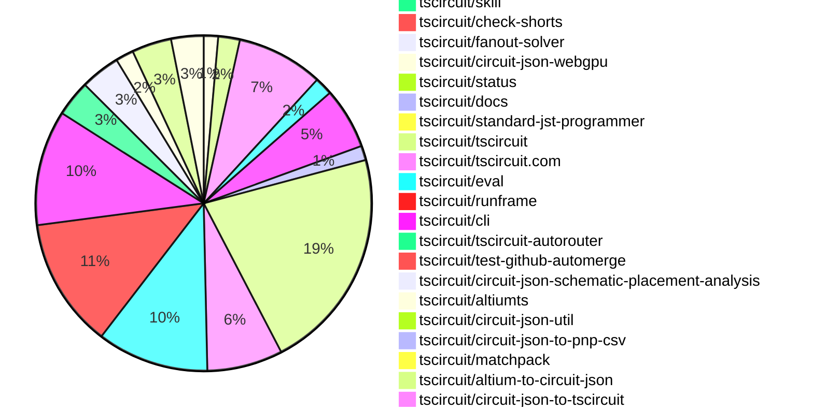

# Contribution Overview 2026-09-29

The current week is shown below. There are 3 major sections:

- [Contributor Overview](#contributor-overview)
- [PRs by Repository](#prs-by-repository)
- [PRs by Contributor](#changes-by-contributor)
- [Scoring & Sponsorship Details](/docs/sponsorship-calculation-explanation.md)

## PRs by Repository

## Contributor Overview

| Contributor | 🐳 Major | 🐙 Minor | 🐌 Tiny | Score | ⭐ |
|-------------|---------|---------|---------|-------|-----|
| [seveibar](#seveibar) | 5 | 16 | 17 | 65 | ⭐⭐⭐ |
| [ShiboSoftwareDev](#ShiboSoftwareDev) | 5 | 7 | 9 | 58 | ⭐⭐⭐ |
| [imrishabh18](#imrishabh18) | 5 | 1 | 1 | 24 | ⭐⭐ |
| [AnasSarkiz](#AnasSarkiz) | 3 | 1 | 5 | 22 | ⭐⭐ |
| [techmannih](#techmannih) | 0 | 5 | 7 | 18 | ⭐⭐ |
| [tscircuitbot](#tscircuitbot) | 0 | 0 | 216 | 14 | ⭐⭐ |
| [MustafaMulla29](#MustafaMulla29) | 2 | 1 | 2 | 13 | ⭐⭐ |
| [mohan-bee](#mohan-bee) | 1 | 1 | 2 | 9 | ⭐ |
| [GokulPandi-M](#GokulPandi-M) | 0 | 2 | 3 | 7 | ⭐ |
| [rushabhcodes](#rushabhcodes) | 0 | 3 | 0 | 7 | ⭐ |
| [KrishnaX12](#KrishnaX12) | 0 | 2 | 2 | 6 | ⭐ |
| [Devesh36](#Devesh36) | 0 | 0 | 1 | 1 |  |

## Staff Pass Ratio (SPR)

| Contributor | Reviewed PRs | Rejections | Approvals | SPR |
|-------------|--------------|------------|-----------|-----|
| [MustafaMulla29](#MustafaMulla29) | 4 | 1 | 3 | 75.0% |
| [imrishabh18](#imrishabh18) | 3 | 0 | 3 | 100.0% |
| [AnasSarkiz](#AnasSarkiz) | 2 | 1 | 2 | 50.0% |
| [ShiboSoftwareDev](#ShiboSoftwareDev) | 2 | 0 | 2 | 100.0% |
| [hrithik18k](#hrithik18k) | 1 | 0 | 1 | 100.0% |
| [KrishnaX12](#KrishnaX12) | 1 | 1 | 0 | 0.0% |
| [mohan-bee](#mohan-bee) | 1 | 0 | 1 | 100.0% |

MustafaMulla29 SPR PRs (4)

- [#146](https://github.com/tscircuit/circuit-json-schematic-placement-analysis/pull/146) feat: detect sideways common-emitter amplifier stages
- [#138](https://github.com/tscircuit/circuit-json-schematic-placement-analysis/pull/138) feat: detect scattered MOSFET gate resistor networks
- [#127](https://github.com/tscircuit/circuit-json-schematic-placement-analysis/pull/127) feat: detect flyback diodes separated from relay coils
- [#124](https://github.com/tscircuit/circuit-json-schematic-placement-analysis/pull/124) feat: detect current-sense shunts separated from their inputs

imrishabh18 SPR PRs (3)

- [#2769](https://github.com/tscircuit/tscircuit-autorouter/pull/2769) Improve Pipeline 9 clearance repair for straight trace spans
- [#2776](https://github.com/tscircuit/tscircuit-autorouter/pull/2776) Reduce bugreport107 DRC errors to 58 on macOS and 59 on Linux
- [#2780](https://github.com/tscircuit/tscircuit-autorouter/pull/2780) Reduce bugreport107 DRC errors to 63 on macOS and 65 on Linux

AnasSarkiz SPR PRs (2)

- [#4204](https://github.com/tscircuit/core/pull/4204) fix: accept saved routes on plated port layers
- [#359](https://github.com/tscircuit/checks/pull/359) fix: enforce via-in-pad restrictions using hole overlap for all nets

ShiboSoftwareDev SPR PRs (2)

- [#4196](https://github.com/tscircuit/core/pull/4196) fix: emit one autorouter connection per electrical net
- [#2779](https://github.com/tscircuit/tscircuit-autorouter/pull/2779) Fix Pipeline9 via regressions after trace simplification

hrithik18k SPR PRs (1)

- [#2790](https://github.com/tscircuit/tscircuit-autorouter/pull/2790) repro: Pipeline 9 violates via-to-pad clearance on metal-touch board

KrishnaX12 SPR PRs (1)

- [#135](https://github.com/tscircuit/circuit-json-schematic-placement-analysis/pull/135) feat: warn when I2C pull-ups are split around a chip

mohan-bee SPR PRs (1)

- [#4246](https://github.com/tscircuit/core/pull/4246) Connect duplicated USB-C shell pads

> Note: AI evaluates PRs and assigns 1-3 star ratings automatically. 4 and 5 star ratings require manual staff review.

## Review Table

[reviews-received-hover]: ## "Number of reviews received for PRs for this contributor"
[approvals-received-hover]: ## "Number of approvals received for PRs this contributor authored"
[rejections-received-hover]: ## "Number of rejections received for PRs this contributor authored"
[prs-opened-hover]: ## "Number of PRs opened by this contributor"
[issues-created-hover]: ## "Number of issues created by this contributor"

| Contributor | Reviews Received | Approvals Received | Rejections Received | Approvals | Rejections Given | PRs Opened | PRs Merged | Issues Created |
|---|---|---|---|---|---|---|---|---|
| [Abse2001](#Abse2001) | 0 | 0 | 0 | 3 | 0 | 1 | 0 | 0 |
| [Ahmed5754](#Ahmed5754) | 0 | 0 | 0 | 0 | 0 | 5 | 0 | 0 |
| [AnasSarkiz](#AnasSarkiz) | 9 | 9 | 0 | 3 | 0 | 15 | 9 | 0 |
| [anil08607](#anil08607) | 0 | 0 | 0 | 0 | 0 | 4 | 0 | 0 |
| [Ante042](#Ante042) | 0 | 0 | 0 | 0 | 0 | 1 | 0 | 0 |
| [Devesh36](#Devesh36) | 1 | 1 | 0 | 0 | 0 | 2 | 1 | 0 |
| [Furox-Art](#Furox-Art) | 0 | 0 | 0 | 0 | 0 | 7 | 0 | 0 |
| [GokulPandi-M](#GokulPandi-M) | 11 | 9 | 1 | 0 | 0 | 13 | 6 | 0 |
| [hrithik18k](#hrithik18k) | 3 | 1 | 1 | 0 | 0 | 2 | 0 | 0 |
| [imrishabh18](#imrishabh18) | 6 | 4 | 0 | 8 | 2 | 13 | 8 | 0 |
| [JoelGellis](#JoelGellis) | 0 | 0 | 0 | 0 | 0 | 1 | 0 | 0 |
| [KrishnaX12](#KrishnaX12) | 5 | 4 | 1 | 0 | 0 | 11 | 4 | 0 |
| [mohan-bee](#mohan-bee) | 1 | 1 | 0 | 1 | 0 | 4 | 4 | 0 |
| [MustafaMulla29](#MustafaMulla29) | 4 | 3 | 1 | 1 | 0 | 7 | 5 | 0 |
| [NOyu015](#NOyu015) | 0 | 0 | 0 | 0 | 0 | 2 | 0 | 0 |
| [ntoledo319](#ntoledo319) | 0 | 0 | 0 | 0 | 0 | 2 | 0 | 0 |
| [rushabhcodes](#rushabhcodes) | 18 | 2 | 1 | 1 | 0 | 14 | 3 | 0 |
| [seveibar](#seveibar) | 6 | 0 | 0 | 16 | 3 | 50 | 40 | 0 |
| [ShiboSoftwareDev](#ShiboSoftwareDev) | 17 | 17 | 0 | 15 | 0 | 27 | 22 | 0 |
| [techmannih](#techmannih) | 7 | 7 | 0 | 10 | 0 | 14 | 12 | 0 |
| [tscircuitbot](#tscircuitbot) | 0 | 0 | 0 | 0 | 0 | 280 | 218 | 0 |

## Changes by Repository

### [tscircuit/circuit-json](https://github.com/tscircuit/circuit-json)

| PR # | Impact | Rating | Contributor | Description |
|------|--------|--------|-------------|-------------|
| [#844](https://github.com/tscircuit/circuit-json/pull/844) | 🐳 Major | ⭐⭐⭐ | seveibar | Add source_runtime_error to represent an unexpected failure while generating or validating a circuit, allowing consumers to distinguish incomplete validation from a clean circuit. |

🐌 Tiny Contributions (1)

| PR # | Impact | Contributor | Description |
|------|--------|-------------|-------------|
| [#845](https://github.com/tscircuit/circuit-json/pull/845) | 🐌 Tiny | tscircuitbot | Automated package update |

### [tscircuit/props](https://github.com/tscircuit/props)

| PR # | Impact | Rating | Contributor | Description |
|------|--------|--------|-------------|-------------|
| [#873](https://github.com/tscircuit/props/pull/873) | 🐳 Major | ⭐⭐⭐ | seveibar | Add model to assembly.device, assembly.screen, assembly.subassembly, and assembly.cadassembly so authors can supply a modelprinterfootprinter string directly, such as modelsoic8 or modelflexscreen_w26.7mm_h19.26mm_sitsflat. |
| [#874](https://github.com/tscircuit/props/pull/874) | 🐙 Minor | ⭐⭐ | seveibar | Add dogbone as a recognized autorouter preset in the props types and schemas, enabling support for local pad-to-via escapes without boundary routing. |
| [#872](https://github.com/tscircuit/props/pull/872) | 🐙 Minor | ⭐⭐ | seveibar | Add optional modelUrl to assembly.device, assembly.screen, assembly.subassembly, and its assembly.cadassembly alias, allowing direct import of models without supplying dimensions or a modelprinter string. |

🐌 Tiny Contributions (1)

| PR # | Impact | Contributor | Description |
|------|--------|-------------|-------------|
| [#871](https://github.com/tscircuit/props/pull/871) | 🐌 Tiny | seveibar | Adds schSize to diode and LED props using the existing SchematicSymbolSize API, enabling typed JSX for compact symbols. |

### [tscircuit/schematic-symbols](https://github.com/tscircuit/schematic-symbols)

| PR # | Impact | Rating | Contributor | Description |
|------|--------|--------|-------------|-------------|
| [#483](https://github.com/tscircuit/schematic-symbols/pull/483) | 🐳 Major | ⭐⭐⭐ | seveibar | Adds _sm and _xs variants for diodes, LEDs, avalanche diodes, and Zener diodes in right, left, up, and down orientations: 32 symbols total. These match the existing compact passive naming and 0.5 mm  0.35 mm pin spans. Shorter leads retain readable diode bodies, LED emission arrows, and the distinct avalancheZener cathode bars. LED annotations have extra clearance for the arrows. All new variants use 1posanode and 2negcathode aliases; existing symbols are unchanged. Includes source SVGs, generated geometry and exports, 32 SVG snapshots, and usage documentation. Regression coverage checks pin spans, polarity, connected leads, closed triangles, and diode body proportions. Validation: 26 tests pass (2,237 assertions); build, TypeScript, formatting, snapshot validation, and diff checks pass. Rendered variants were visually inspected. |

### [tscircuit/circuit-json-to-flattenjs](https://github.com/tscircuit/circuit-json-to-flattenjs)

| PR # | Impact | Rating | Contributor | Description |
|------|--------|--------|-------------|-------------|
| [#3](https://github.com/tscircuit/circuit-json-to-flattenjs/pull/3) | 🐳 Major | ⭐⭐⭐ | seveibar | Fixes boundary conflict in drill geometry calculations by retrying in micrometers and returning results to millimeters, ensuring accurate copper retention and drill exclusion in PCB designs. |

🐌 Tiny Contributions (1)

| PR # | Impact | Contributor | Description |
|------|--------|-------------|-------------|
| [#2](https://github.com/tscircuit/circuit-json-to-flattenjs/pull/2) | 🐌 Tiny | seveibar | Reproduces a tiny trace drill failure with visual baseline snapshots to establish the unfixed baseline for a subsequent fix. |

### [tscircuit/dogbone-solver](https://github.com/tscircuit/dogbone-solver)

| PR # | Impact | Rating | Contributor | Description |
|------|--------|--------|-------------|-------------|
| [#1](https://github.com/tscircuit/dogbone-solver/pull/1) | 🐳 Major | ⭐⭐⭐ | seveibar | Extract the BaseSolver dogbone routing implementation and asynchronous SRJ adapter from core. Includes AM3352, layer selection, infeasible-site and replay snapshots, a Cosmos GenericSolverDebugger, standard Bun CI, and GitHub Packages releases served through jscdn. Follows handbook bootstrapping and official plop templates. Validated with five tests, typechecking, formatting and Cosmos export. |

🐌 Tiny Contributions (2)

| PR # | Impact | Contributor | Description |
|------|--------|-------------|-------------|
| [#2](https://github.com/tscircuit/dogbone-solver/pull/2) | 🐌 Tiny | seveibar | Expose the labeled regression SVGs in the README and document polling mode for hosts with exhausted filesystem watchers. This follow-up change also gives pver its first post-bootstrap commit to version and publish. |
| [#3](https://github.com/tscircuit/dogbone-solver/pull/3) | 🐌 Tiny | tscircuitbot | Automated package update |

### [tscircuit/pcb-viewer](https://github.com/tscircuit/pcb-viewer)

| PR # | Impact | Rating | Contributor | Description |
|------|--------|--------|-------------|-------------|
| [#1046](https://github.com/tscircuit/pcb-viewer/pull/1046) | 🐙 Minor | ⭐⭐ | seveibar | Prevents automatic Canvas rendering when WebGPU is selected, ensuring that unsupported scenes display an error until GPU support is fixed or the user explicitly selects Canvas. |

🐌 Tiny Contributions (5)

| PR # | Impact | Contributor | Description |
|------|--------|-------------|-------------|
| [#1041](https://github.com/tscircuit/pcb-viewer/pull/1041) | 🐌 Tiny | seveibar | Updates the pinned tscircuitcircuit-json-webgpu dependency to bring translucent keepout fills and clipped diagonal hatching into pcb-viewers WebGPU rendering, fixing the missing keepout markings reported on ESP32-E-Reader. |
| [#1044](https://github.com/tscircuit/pcb-viewer/pull/1044) | 🐌 Tiny | seveibar | Fixes the bottom silkscreen rendering color in PCBViewers WebGPU mode to pale yellow instead of blue. |
| [#1047](https://github.com/tscircuit/pcb-viewer/pull/1047) | 🐌 Tiny | tscircuitbot | Automated package update |
| [#1045](https://github.com/tscircuit/pcb-viewer/pull/1045) | 🐌 Tiny | tscircuitbot | Automated package update |
| [#1043](https://github.com/tscircuit/pcb-viewer/pull/1043) | 🐌 Tiny | tscircuitbot | Automated package update |

### [tscircuit/core](https://github.com/tscircuit/core)

| PR # | Impact | Rating | Contributor | Description |
|------|--------|--------|-------------|-------------|
| [#4244](https://github.com/tscircuit/core/pull/4244) | 🐳 Major | ⭐⭐⭐ | ShiboSoftwareDev | Fixes incorrect dimensions of rotated rectangular plated-hole obstacles in SRJ by ensuring proper rotation is applied during obstacle generation. |
| [#4208](https://github.com/tscircuit/core/pull/4208) | 🐳 Major | ⭐⭐⭐ | ShiboSoftwareDev | Fixes the issue where outline keepouts were not being converted to SRJ obstacles in the circuit JSON model, ensuring proper rendering and obstacle generation. |
| [#4248](https://github.com/tscircuit/core/pull/4248) | 🐳 Major | ⭐⭐⭐ | ShiboSoftwareDev | Emit one rectangular SRJ obstacle for circular keepouts and recognize complete circular outlines, reducing the number of obstacles significantly. |
| [#4196](https://github.com/tscircuit/core/pull/4196) | 🐳 Major | ⭐⭐⭐ | ShiboSoftwareDev | Fixes duplicate autorouter connections for electrical nets by ensuring each net is submitted only once, reducing the number of input connections from four to two. |
| [#4204](https://github.com/tscircuit/core/pull/4204) | 🐳 Major | ⭐⭐⭐ | AnasSarkiz | Fixes autorouting failure by validating saved routes against PCB ports conductive layers instead of a single layer for SimpleRouteJson. |
| [#4221](https://github.com/tscircuit/core/pull/4221) | 🐙 Minor | ⭐⭐ | seveibar | Add modelUrl rendering to assembly.device, assembly.screen, assembly.subassembly, and assembly.cadassembly, allowing direct import of housing or display models with connector-relative placement. |
| [#4231](https://github.com/tscircuit/core/pull/4231) | 🐙 Minor | ⭐⭐ | seveibar | Support model... on all assembly elements, accepting direct HTTP(S) model URLs and resolving modelprinterfootprinter strings to modelcdn GLB URLs. |
| [#4228](https://github.com/tscircuit/core/pull/4228) | 🐙 Minor | ⭐⭐ | seveibar | Serializes DRC execution failures in Circuit JSON, ensuring that diagnostics from successful checks are preserved and failures are logged without disrupting the rendering of the circuit. |
| [#4217](https://github.com/tscircuit/core/pull/4217) | 🐙 Minor | ⭐⭐ | seveibar | Integrates courtyard keepout placement DRC into the core, ensuring that component courtyards entering keepouts produce placement DRC errors, including specific cases for battery connectors and mounting holes. |
| [#4216](https://github.com/tscircuit/core/pull/4216) | 🐙 Minor | ⭐⭐ | seveibar | Enables schSizesm and schSizexs for standard, avalanche, and Zener diodes and LEDs, allowing selection of compact symbols with support for boolean shorthands and variant enums. |
| [#4240](https://github.com/tscircuit/core/pull/4240) | 🐙 Minor | ⭐⭐ | imrishabh18 | Updates the cached supplier pin 1 orientation for straight-row connectors by advancing the cache key and updating the dependency to ensure correct orientation is computed. |
| [#4246](https://github.com/tscircuit/core/pull/4246) | 🐙 Minor | ⭐⭐ | mohan-bee | Fixes routing issues for USB-C shell pads by ensuring they connect to the ground header, resolving ambiguities in PCB connections. |

🐌 Tiny Contributions (12)

| PR # | Impact | Contributor | Description |
|------|--------|-------------|-------------|
| [#4230](https://github.com/tscircuit/core/pull/4230) | 🐌 Tiny | seveibar | Skip the three AM62L LPDDR4 northsouthwest orbit routing regressions, which each take roughly 34 minutes. Keep their fixtures and snapshots for re-enabling. The AM62L direct-decoupling regression and other orbit tests continue to run. Balance every discovered test file longest-first across ten shards using measured CI runtimes. Refresh the baseline from the last successful full run and give the three skipped files zero weights so their former cost no longer reserves runners. Estimated shard runtimes are approximately 112s each. In the updated successful CI run, actual test steps ranged from 84157s, down from 122216s before skipping the orbit tests (27 faster at the slowest shard). Add per-shard slow-test summaries, timing-log artifacts for every attempt, and a baseline refresh command. Preserve native crash retries and propagate ordinary test failures through tee with explicit Bash pipefail. Document slow outliers and timing maintenance in .githubtest-timings.md. Validation: plannerparser regression tests pass; targeted run confirms exactly three skipped orbit tests; all 1,483 discovered files are still assigned exactly once. Updated full CI passed all ten shards, timing reports, typecheck, dependency checks, and distribution smoke test: https:github.comtscircuitcoreactionsruns36668064842 |
| [#4236](https://github.com/tscircuit/core/pull/4236) | 🐌 Tiny | seveibar | Raises cores minimum tscircuitchecks version from 0.0.228 to 0.0.230 to ensure the inclusion of a geometry converter fix for tiny trace segments near via drills, preventing copper-pour DRC boundary-conflict exceptions. |
| [#4229](https://github.com/tscircuit/core/pull/4229) | 🐌 Tiny | seveibar | Updates the circuit-json-to-connectivity-map dependency to version 0.0.32, fixing routing issues by allowing traces to connect directly to their via ports and updating related tests accordingly. |
| [#4219](https://github.com/tscircuit/core/pull/4219) | 🐌 Tiny | tscircuitbot | Updates the tscircuitchecks package from version 0.0.226 to 0.0.227 in the package.json file. |
| [#4218](https://github.com/tscircuit/core/pull/4218) | 🐌 Tiny | tscircuitbot | Updates the version of the tscircuitchecks package from 0.0.225 to 0.0.226 in package.json |
| [#4225](https://github.com/tscircuit/core/pull/4225) | 🐌 Tiny | tscircuitbot | Updates the version of the tscircuitchecks package from 0.0.227 to 0.0.228 in package.json |
| [#4220](https://github.com/tscircuit/core/pull/4220) | 🐌 Tiny | tscircuitbot | Updates the version of the tscircuitchecks package from 0.0.226 to 0.0.227 in package.json |
| [#4227](https://github.com/tscircuit/core/pull/4227) | 🐌 Tiny | tscircuitbot | Updates the tscircuitchecks package from version 0.0.227 to 0.0.228 |
| [#4245](https://github.com/tscircuit/core/pull/4245) | 🐌 Tiny | mohan-bee | Reproduces a bug where duplicate USB-C shell pins lose their PCB connections despite being wired to a ground header in the schematic. |
| [#4207](https://github.com/tscircuit/core/pull/4207) | 🐌 Tiny | ShiboSoftwareDev | Reproduces a bug where the outline keepout obstacles are missing from the Simple Route JSON for the TMDS62LEVM board, providing a focused crop from the real board to highlight the issue. |
| [#4195](https://github.com/tscircuit/core/pull/4195) | 🐌 Tiny | ShiboSoftwareDev | Reproduces a bug where the autorouter submits duplicate connections for the same electrical nets in a TSX board, highlighting the issue through a comprehensive test. |
| [#4202](https://github.com/tscircuit/core/pull/4202) | 🐌 Tiny | AnasSarkiz | Reproduces a bug where valid bottom-layer routes between plated pins are incorrectly rejected by the autorouter, capturing the current error state for further fixes. |

### [tscircuit/checks](https://github.com/tscircuit/checks)

| PR # | Impact | Rating | Contributor | Description |
|------|--------|--------|-------------|-------------|
| [#361](https://github.com/tscircuit/checks/pull/361) | 🐙 Minor | ⭐⭐ | seveibar | Fixes detection of component courtyards overlapping placement keepouts, ensuring DRC is triggered even when copper remains clear. |
| [#359](https://github.com/tscircuit/checks/pull/359) | 🐙 Minor | ⭐⭐ | AnasSarkiz | Fixes via placement errors by enforcing restrictions on same-net vias whose drilled holes enter a pad when via-in-pad is disallowed, ensuring proper error reporting for overlapping vias. |

🐌 Tiny Contributions (3)

| PR # | Impact | Contributor | Description |
|------|--------|-------------|-------------|
| [#365](https://github.com/tscircuit/checks/pull/365) | 🐌 Tiny | seveibar | Fixes copper-pour DRC issue by updating to converter 0.0.3, ensuring tiny trace segments near via drills are correctly validated without false shorts. |
| [#362](https://github.com/tscircuit/checks/pull/362) | 🐌 Tiny | seveibar | Fixes Node import issues by bundling calculate-elbow with schematic placement analysis to resolve ERR_UNSUPPORTED_DIR_IMPORT errors and ensure successful builds and imports in Node environments. |
| [#358](https://github.com/tscircuit/checks/pull/358) | 🐌 Tiny | AnasSarkiz | Reproduces a bug where same-net vias inside SMT pads bypass via-in-pad restrictions, capturing the behavior in two separate tests for allowed and disallowed cases. |

### [tscircuit/circuit-json-to-connectivity-map](https://github.com/tscircuit/circuit-json-to-connectivity-map)

| PR # | Impact | Rating | Contributor | Description |
|------|--------|--------|-------------|-------------|
| [#51](https://github.com/tscircuit/circuit-json-to-connectivity-map/pull/51) | 🐙 Minor | ⭐⭐ | seveibar | Fixes a bug where the full connectivity map ignores PCB via port IDs, leading to disconnections in the connectivity map for traces without source trace IDs. |

### [tscircuit/svg.tscircuit.com](https://github.com/tscircuit/svg.tscircuit.com)

| PR # | Impact | Rating | Contributor | Description |
|------|--------|--------|-------------|-------------|
| [#2399](https://github.com/tscircuit/svg.tscircuit.com/pull/2399) | 🐙 Minor | ⭐⭐ | seveibar | Updates the rendering stack using tscircuitchecks0.0.229, which includes the upstream Node compatibility fix from tscircuitchecks362, and refreshes affected libraries while maintaining compatibility with existing versions to prevent breaking changes. |
| [#2389](https://github.com/tscircuit/svg.tscircuit.com/pull/2389) | 🐙 Minor | ⭐⭐ | seveibar | Updates dependencies to support PCB trace teardrops and adds regression tests for rendering behavior. |

🐌 Tiny Contributions (15)

| PR # | Impact | Contributor | Description |
|------|--------|-------------|-------------|
| [#2404](https://github.com/tscircuit/svg.tscircuit.com/pull/2404) | 🐌 Tiny | seveibar | Moves Vercel functions to Bun using bunVersion: 1.x and upgrades the rendering stack to current tscircuit versions, ensuring compatibility and improved performance. |
| [#2417](https://github.com/tscircuit/svg.tscircuit.com/pull/2417) | 🐌 Tiny | tscircuitbot | Updates the tscircuit package version from 0.0.2690 to 0.0.2692 in package.json |
| [#2415](https://github.com/tscircuit/svg.tscircuit.com/pull/2415) | 🐌 Tiny | tscircuitbot | Updates the tscircuit package version from 0.0.2688 to 0.0.2689 in package.json |
| [#2414](https://github.com/tscircuit/svg.tscircuit.com/pull/2414) | 🐌 Tiny | tscircuitbot | Updates the tscircuit package version from 0.0.2686 to 0.0.2688 in package.json |
| [#2412](https://github.com/tscircuit/svg.tscircuit.com/pull/2412) | 🐌 Tiny | tscircuitbot | Updates the tscircuit package version from 0.0.2685 to 0.0.2686 in package.json |
| [#2411](https://github.com/tscircuit/svg.tscircuit.com/pull/2411) | 🐌 Tiny | tscircuitbot | Updates the tscircuit package version from 0.0.2683 to 0.0.2685 in package.json |
| [#2409](https://github.com/tscircuit/svg.tscircuit.com/pull/2409) | 🐌 Tiny | tscircuitbot | Updates the tscircuit package version from 0.0.2682 to 0.0.2683 in package.json |
| [#2408](https://github.com/tscircuit/svg.tscircuit.com/pull/2408) | 🐌 Tiny | tscircuitbot | Updates the tscircuit package version from 0.0.2681 to 0.0.2682 in package.json |
| [#2407](https://github.com/tscircuit/svg.tscircuit.com/pull/2407) | 🐌 Tiny | tscircuitbot | Updates the tscircuit package version from 0.0.2680 to 0.0.2681 in package.json |
| [#2406](https://github.com/tscircuit/svg.tscircuit.com/pull/2406) | 🐌 Tiny | tscircuitbot | Updates the tscircuit package version from 0.0.2679 to 0.0.2680 in package.json |
| [#2405](https://github.com/tscircuit/svg.tscircuit.com/pull/2405) | 🐌 Tiny | tscircuitbot | Automated package update |
| [#2397](https://github.com/tscircuit/svg.tscircuit.com/pull/2397) | 🐌 Tiny | tscircuitbot | Updates the tscircuit package version from 0.0.2673 to 0.0.2674 in package.json |
| [#2395](https://github.com/tscircuit/svg.tscircuit.com/pull/2395) | 🐌 Tiny | tscircuitbot | Updates the tscircuit package version from 0.0.2672 to 0.0.2673 in package.json |
| [#2416](https://github.com/tscircuit/svg.tscircuit.com/pull/2416) | 🐌 Tiny | tscircuitbot | Updates the tscircuit package version from 0.0.2689 to 0.0.2690 in package.json |
| [#2394](https://github.com/tscircuit/svg.tscircuit.com/pull/2394) | 🐌 Tiny | tscircuitbot | Updates the tscircuit package version from 0.0.2668 to 0.0.2672 in package.json |

### [tscircuit/skill](https://github.com/tscircuit/skill)

| PR # | Impact | Rating | Contributor | Description |
|------|--------|--------|-------------|-------------|
| [#50](https://github.com/tscircuit/skill/pull/50) | 🐙 Minor | ⭐⭐ | seveibar | Add documentation for the tsci convert component.tsx --footprinter command, explaining its usage and output. |

### [tscircuit/check-shorts](https://github.com/tscircuit/check-shorts)

| PR # | Impact | Rating | Contributor | Description |
|------|--------|--------|-------------|-------------|
| [#65](https://github.com/tscircuit/check-shorts/pull/65) | 🐙 Minor | ⭐⭐ | seveibar | Fixes the issue where traces without source_trace_id are treated as separate copper instead of being resolved through their PCB trace ID in the connectivity map. |

### [tscircuit/fanout-solver](https://github.com/tscircuit/fanout-solver)

| PR # | Impact | Rating | Contributor | Description |
|------|--------|--------|-------------|-------------|
| [#250](https://github.com/tscircuit/fanout-solver/pull/250) | 🐙 Minor | ⭐⭐ | seveibar | Exposes the existing dogbone pad-site matcher and candidate enumerator at the package root for local pad-to-via fanout without importing private files or running boundary routing. |

🐌 Tiny Contributions (1)

| PR # | Impact | Contributor | Description |
|------|--------|-------------|-------------|
| [#251](https://github.com/tscircuit/fanout-solver/pull/251) | 🐌 Tiny | tscircuitbot | Automated package update |

### [tscircuit/circuit-json-webgpu](https://github.com/tscircuit/circuit-json-webgpu)

| PR # | Impact | Rating | Contributor | Description |
|------|--------|--------|-------------|-------------|
| [#9](https://github.com/tscircuit/circuit-json-webgpu/pull/9) | 🐙 Minor | ⭐⭐ | seveibar | Fixes the bottom-layer silkscreen rendering color from blue to pale yellow to prevent blending with the bottom copper layer. |

### [tscircuit/status](https://github.com/tscircuit/status)

🐌 Tiny Contributions (1)

| PR # | Impact | Contributor | Description |
|------|--------|-------------|-------------|
| [#71](https://github.com/tscircuit/status/pull/71) | 🐌 Tiny | seveibar | Fixes false SVG outages by increasing the timeout for cold-render requests to 15 seconds and improving SVG content validation. |

### [tscircuit/docs](https://github.com/tscircuit/docs)

🐌 Tiny Contributions (4)

| PR # | Impact | Contributor | Description |
|------|--------|-------------|-------------|
| [#900](https://github.com/tscircuit/docs/pull/900) | 🐌 Tiny | seveibar | Document model on assembly elements with compact FlexScreen modelprinter examples and HTTP(S) URL support, focusing on essential props and placement rules. |
| [#899](https://github.com/tscircuit/docs/pull/899) | 🐌 Tiny | seveibar | Document tsci convert --footprinter for replacing explicit pads with a compact string and clarify that optional --json returns a match report, not a footprint file. |
| [#898](https://github.com/tscircuit/docs/pull/898) | 🐌 Tiny | seveibar | Removes the Biscuit Board template guide and its examples from the documentation. |
| [#897](https://github.com/tscircuit/docs/pull/897) | 🐌 Tiny | seveibar | Document direct modelUrl imports on all four assembly elements, including device models at the world origin and displays placed relative to connectors. Lead the subassembly reference with grouping CAD children, and show imported screws aligned with real board holes. All eight code examples across the four element references and mounting guide use CircuitPreview, defaulting to 3D. Partial snippets are expanded into complete circuits. Original demo GLB models replace placeholder URLs, with asset URLs pinned to a committed revision so previews work before deployment. The hosted SVG evaluator is pinned to core from before the assembly API and returns an undefined-element error for these examples. An optional circuitJson prop lets CircuitPreview render data compiled from the displayed source while preserving the original code and editor link. Checked-in preview data includes a regeneration script and instructions; existing previews keep their default behavior. The props and core dependencies are merged: https:github.comtscircuitpropspull872 and https:github.comtscircuitcorepull4221. Validation: bun run typecheck and bun run build pass. Regenerated all eight examples with the updated core and verified their emitted CAD models. Requested the hosted 3D renders and visually inspected the screw placement, housing, cover, bracket, and display. No fenced TSX snippets remain in these five docs; every code example uses CircuitPreview. |

### [tscircuit/standard-jst-programmer](https://github.com/tscircuit/standard-jst-programmer)

🐌 Tiny Contributions (1)

| PR # | Impact | Contributor | Description |
|------|--------|-------------|-------------|
| [#2](https://github.com/tscircuit/standard-jst-programmer/pull/2) | 🐌 Tiny | seveibar | Document how to use the programmers existing three-pin JST interface for Spy-Bi-Wire: CLK to TESTSBWTCK, DIO to RSTSBWTDIO, and common ground. Include a tscircuit wiring example, five-pin adapter mapping, and 3.3 V target-power guidance. |

### [tscircuit/tscircuit](https://github.com/tscircuit/tscircuit)

🐌 Tiny Contributions (62)

| PR # | Impact | Contributor | Description |
|------|--------|-------------|-------------|
| [#5259](https://github.com/tscircuit/tscircuit/pull/5259) | 🐌 Tiny | tscircuitbot | Automated package update |
| [#5258](https://github.com/tscircuit/tscircuit/pull/5258) | 🐌 Tiny | tscircuitbot | Automated package update |
| [#5256](https://github.com/tscircuit/tscircuit/pull/5256) | 🐌 Tiny | tscircuitbot | Automated package update |
| [#5254](https://github.com/tscircuit/tscircuit/pull/5254) | 🐌 Tiny | tscircuitbot | Updates the tscircuitcli package to version 0.1.2201 in package.json |
| [#5245](https://github.com/tscircuit/tscircuit/pull/5245) | 🐌 Tiny | tscircuitbot | Updates the tscircuitcli package from version 0.1.2198 to 0.1.2199 and the tscircuitrunframe package from version 0.0.2854 to 0.0.2855 in the package.json file. |
| [#5241](https://github.com/tscircuit/tscircuit/pull/5241) | 🐌 Tiny | tscircuitbot | Updates the tscircuitcli package to version 0.1.2198 in the package.json file |
| [#5237](https://github.com/tscircuit/tscircuit/pull/5237) | 🐌 Tiny | tscircuitbot | Updates the tscircuitcli package to version 0.1.2197 in the package.json file. |
| [#5235](https://github.com/tscircuit/tscircuit/pull/5235) | 🐌 Tiny | tscircuitbot | Automated package update |
| [#5231](https://github.com/tscircuit/tscircuit/pull/5231) | 🐌 Tiny | tscircuitbot | Automated package update |
| [#5221](https://github.com/tscircuit/tscircuit/pull/5221) | 🐌 Tiny | tscircuitbot | Updates the tscircuitcli package to version 0.1.2192 in the package.json file |
| [#5220](https://github.com/tscircuit/tscircuit/pull/5220) | 🐌 Tiny | tscircuitbot | Automated package update |
| [#5211](https://github.com/tscircuit/tscircuit/pull/5211) | 🐌 Tiny | tscircuitbot | Updates the tscircuitcli package to version 0.1.2189 in the package.json file |
| [#5209](https://github.com/tscircuit/tscircuit/pull/5209) | 🐌 Tiny | tscircuitbot | Updates the version of the tscircuitrunframe package from 0.0.2843 to 0.0.2844 in package.json |
| [#5205](https://github.com/tscircuit/tscircuit/pull/5205) | 🐌 Tiny | tscircuitbot | Automated package update |
| [#5257](https://github.com/tscircuit/tscircuit/pull/5257) | 🐌 Tiny | tscircuitbot | Automated package update |
| [#5255](https://github.com/tscircuit/tscircuit/pull/5255) | 🐌 Tiny | tscircuitbot | Automated package update |
| [#5253](https://github.com/tscircuit/tscircuit/pull/5253) | 🐌 Tiny | tscircuitbot | Updates the package version from 0.0.2691 to 0.0.2692 in package.json |
| [#5252](https://github.com/tscircuit/tscircuit/pull/5252) | 🐌 Tiny | tscircuitbot | Automated package update |
| [#5251](https://github.com/tscircuit/tscircuit/pull/5251) | 🐌 Tiny | tscircuitbot | Updates the package version from 0.0.2690 to 0.0.2691 in package.json |
| [#5250](https://github.com/tscircuit/tscircuit/pull/5250) | 🐌 Tiny | tscircuitbot | Automated package update |
| [#5249](https://github.com/tscircuit/tscircuit/pull/5249) | 🐌 Tiny | tscircuitbot | Automated package update |
| [#5248](https://github.com/tscircuit/tscircuit/pull/5248) | 🐌 Tiny | tscircuitbot | Updates the tscircuitcli package to version 0.1.2200 in the package.json file |
| [#5246](https://github.com/tscircuit/tscircuit/pull/5246) | 🐌 Tiny | tscircuitbot | Automated package update |
| [#5244](https://github.com/tscircuit/tscircuit/pull/5244) | 🐌 Tiny | tscircuitbot | Automated package update |
| [#5243](https://github.com/tscircuit/tscircuit/pull/5243) | 🐌 Tiny | tscircuitbot | Automated package update |
| [#5242](https://github.com/tscircuit/tscircuit/pull/5242) | 🐌 Tiny | tscircuitbot | Automated package update |
| [#5240](https://github.com/tscircuit/tscircuit/pull/5240) | 🐌 Tiny | tscircuitbot | Automated package update |
| [#5239](https://github.com/tscircuit/tscircuit/pull/5239) | 🐌 Tiny | tscircuitbot | Automated package update |
| [#5238](https://github.com/tscircuit/tscircuit/pull/5238) | 🐌 Tiny | tscircuitbot | Automated package update |
| [#5233](https://github.com/tscircuit/tscircuit/pull/5233) | 🐌 Tiny | tscircuitbot | Updates the tscircuitcli package to version 0.1.2196 |
| [#5232](https://github.com/tscircuit/tscircuit/pull/5232) | 🐌 Tiny | tscircuitbot | Automated package update |
| [#5230](https://github.com/tscircuit/tscircuit/pull/5230) | 🐌 Tiny | tscircuitbot | Automated package version bump from 0.0.2680 to 0.0.2681 |
| [#5229](https://github.com/tscircuit/tscircuit/pull/5229) | 🐌 Tiny | tscircuitbot | Updates the tscircuitcli package to version 0.1.2195 in the package.json file. |
| [#5228](https://github.com/tscircuit/tscircuit/pull/5228) | 🐌 Tiny | tscircuitbot | Automated package update |
| [#5227](https://github.com/tscircuit/tscircuit/pull/5227) | 🐌 Tiny | tscircuitbot | Automated package update |
| [#5226](https://github.com/tscircuit/tscircuit/pull/5226) | 🐌 Tiny | tscircuitbot | Automated package update |
| [#5224](https://github.com/tscircuit/tscircuit/pull/5224) | 🐌 Tiny | tscircuitbot | Automated package update |
| [#5223](https://github.com/tscircuit/tscircuit/pull/5223) | 🐌 Tiny | tscircuitbot | Updates the version of the tscircuitrunframe package from 0.0.2847 to 0.0.2848 in package.json |
| [#5222](https://github.com/tscircuit/tscircuit/pull/5222) | 🐌 Tiny | tscircuitbot | Automated package update |
| [#5219](https://github.com/tscircuit/tscircuit/pull/5219) | 🐌 Tiny | tscircuitbot | Automated package update |
| [#5218](https://github.com/tscircuit/tscircuit/pull/5218) | 🐌 Tiny | tscircuitbot | Automated package update |
| [#5217](https://github.com/tscircuit/tscircuit/pull/5217) | 🐌 Tiny | tscircuitbot | Updates the tscircuitcli package to version 0.1.2191 in the package.json file |
| [#5216](https://github.com/tscircuit/tscircuit/pull/5216) | 🐌 Tiny | tscircuitbot | Automated package update |
| [#5215](https://github.com/tscircuit/tscircuit/pull/5215) | 🐌 Tiny | tscircuitbot | Automated package update |
| [#5214](https://github.com/tscircuit/tscircuit/pull/5214) | 🐌 Tiny | tscircuitbot | Automated package update |
| [#5213](https://github.com/tscircuit/tscircuit/pull/5213) | 🐌 Tiny | tscircuitbot | Automated package update |
| [#5212](https://github.com/tscircuit/tscircuit/pull/5212) | 🐌 Tiny | tscircuitbot | Automated package update |
| [#5210](https://github.com/tscircuit/tscircuit/pull/5210) | 🐌 Tiny | tscircuitbot | Automated package update |
| [#5208](https://github.com/tscircuit/tscircuit/pull/5208) | 🐌 Tiny | tscircuitbot | Automated package update |
| [#5207](https://github.com/tscircuit/tscircuit/pull/5207) | 🐌 Tiny | tscircuitbot | Automated package update |
| [#5206](https://github.com/tscircuit/tscircuit/pull/5206) | 🐌 Tiny | tscircuitbot | Automated package update |
| [#5204](https://github.com/tscircuit/tscircuit/pull/5204) | 🐌 Tiny | tscircuitbot | Automated package update to version 0.0.2668 |
| [#5203](https://github.com/tscircuit/tscircuit/pull/5203) | 🐌 Tiny | tscircuitbot | Automated package update |
| [#5202](https://github.com/tscircuit/tscircuit/pull/5202) | 🐌 Tiny | tscircuitbot | Automated package update |
| [#5201](https://github.com/tscircuit/tscircuit/pull/5201) | 🐌 Tiny | tscircuitbot | Automated package update |
| [#5200](https://github.com/tscircuit/tscircuit/pull/5200) | 🐌 Tiny | tscircuitbot | Updates the package version from 0.0.2665 to 0.0.2666 in package.json |
| [#5199](https://github.com/tscircuit/tscircuit/pull/5199) | 🐌 Tiny | tscircuitbot | Automated package update |
| [#5198](https://github.com/tscircuit/tscircuit/pull/5198) | 🐌 Tiny | tscircuitbot | Updates the package version from 0.0.2664 to 0.0.2665 in package.json |
| [#5197](https://github.com/tscircuit/tscircuit/pull/5197) | 🐌 Tiny | tscircuitbot | Updates the tscircuitcli package to version 0.1.2185 |
| [#5236](https://github.com/tscircuit/tscircuit/pull/5236) | 🐌 Tiny | tscircuitbot | Automated package update |
| [#5234](https://github.com/tscircuit/tscircuit/pull/5234) | 🐌 Tiny | tscircuitbot | Updates the package version from 0.0.2682 to 0.0.2683 in package.json |
| [#5225](https://github.com/tscircuit/tscircuit/pull/5225) | 🐌 Tiny | tscircuitbot | Updates the tscircuitcli package version from 0.1.2192 to 0.1.2193 in package.json |

### [tscircuit/tscircuit.com](https://github.com/tscircuit/tscircuit.com)

🐌 Tiny Contributions (21)

| PR # | Impact | Contributor | Description |
|------|--------|-------------|-------------|
| [#5159](https://github.com/tscircuit/tscircuit.com/pull/5159) | 🐌 Tiny | tscircuitbot | Updates the tscircuiteval package from version 0.0.1496 to 0.0.1498 |
| [#5158](https://github.com/tscircuit/tscircuit.com/pull/5158) | 🐌 Tiny | tscircuitbot | Updates the tscircuitrunframe package from version 0.0.2855 to 0.0.2856 |
| [#5157](https://github.com/tscircuit/tscircuit.com/pull/5157) | 🐌 Tiny | tscircuitbot | Updates the tscircuitrunframe package from version 0.0.2854 to 0.0.2855 |
| [#5156](https://github.com/tscircuit/tscircuit.com/pull/5156) | 🐌 Tiny | tscircuitbot | Automated package update |
| [#5153](https://github.com/tscircuit/tscircuit.com/pull/5153) | 🐌 Tiny | tscircuitbot | Updates the tscircuiteval package from version 0.0.1495 to 0.0.1496 |
| [#5151](https://github.com/tscircuit/tscircuit.com/pull/5151) | 🐌 Tiny | tscircuitbot | Updates the tscircuiteval package from version 0.0.1493 to 0.0.1495 in the package.json file. |
| [#5150](https://github.com/tscircuit/tscircuit.com/pull/5150) | 🐌 Tiny | tscircuitbot | Automated package update for tscircuitrunframe from version 0.0.2849 to 0.0.2850 |
| [#5147](https://github.com/tscircuit/tscircuit.com/pull/5147) | 🐌 Tiny | tscircuitbot | Updates the tscircuiteval package from version 0.0.1490 to 0.0.1493 |
| [#5146](https://github.com/tscircuit/tscircuit.com/pull/5146) | 🐌 Tiny | tscircuitbot | Automated package update |
| [#5144](https://github.com/tscircuit/tscircuit.com/pull/5144) | 🐌 Tiny | tscircuitbot | Automated package update |
| [#5141](https://github.com/tscircuit/tscircuit.com/pull/5141) | 🐌 Tiny | tscircuitbot | Updates the tscircuitrunframe package to version 0.0.2846 |
| [#5140](https://github.com/tscircuit/tscircuit.com/pull/5140) | 🐌 Tiny | tscircuitbot | Updates the tscircuiteval package from version 0.0.1488 to 0.0.1490 |
| [#5136](https://github.com/tscircuit/tscircuit.com/pull/5136) | 🐌 Tiny | tscircuitbot | Automated package update |
| [#5135](https://github.com/tscircuit/tscircuit.com/pull/5135) | 🐌 Tiny | tscircuitbot | Updates the tscircuitrunframe package from version 0.0.2842 to 0.0.2843 |
| [#5133](https://github.com/tscircuit/tscircuit.com/pull/5133) | 🐌 Tiny | tscircuitbot | Updates the tscircuitrunframe package from version 0.0.2841 to 0.0.2842 and the tscircuitpcb-viewer package from version 1.11.409 to 1.11.410 in package.json |
| [#5130](https://github.com/tscircuit/tscircuit.com/pull/5130) | 🐌 Tiny | tscircuitbot | Automated package update |
| [#5129](https://github.com/tscircuit/tscircuit.com/pull/5129) | 🐌 Tiny | tscircuitbot | Automated package update |
| [#5160](https://github.com/tscircuit/tscircuit.com/pull/5160) | 🐌 Tiny | tscircuitbot | Updates the tscircuitrunframe package to version 0.0.2857 in package.json |
| [#5142](https://github.com/tscircuit/tscircuit.com/pull/5142) | 🐌 Tiny | tscircuitbot | Updates the tscircuitrunframe package to version 0.0.2847 |
| [#5139](https://github.com/tscircuit/tscircuit.com/pull/5139) | 🐌 Tiny | tscircuitbot | Automated package update |
| [#5134](https://github.com/tscircuit/tscircuit.com/pull/5134) | 🐌 Tiny | tscircuitbot | Automated package update |

### [tscircuit/eval](https://github.com/tscircuit/eval)

🐌 Tiny Contributions (31)

| PR # | Impact | Contributor | Description |
|------|--------|-------------|-------------|
| [#4876](https://github.com/tscircuit/eval/pull/4876) | 🐌 Tiny | tscircuitbot | Automated package update |
| [#4875](https://github.com/tscircuit/eval/pull/4875) | 🐌 Tiny | tscircuitbot | Automated package update |
| [#4873](https://github.com/tscircuit/eval/pull/4873) | 🐌 Tiny | tscircuitbot | Automated package update |
| [#4872](https://github.com/tscircuit/eval/pull/4872) | 🐌 Tiny | tscircuitbot | Updates package dependencies to their latest versions in package.json |
| [#4870](https://github.com/tscircuit/eval/pull/4870) | 🐌 Tiny | tscircuitbot | Automated package update |
| [#4869](https://github.com/tscircuit/eval/pull/4869) | 🐌 Tiny | tscircuitbot | Automated package update |
| [#4867](https://github.com/tscircuit/eval/pull/4867) | 🐌 Tiny | tscircuitbot | Automated package update |
| [#4864](https://github.com/tscircuit/eval/pull/4864) | 🐌 Tiny | tscircuitbot | Automated package update |
| [#4861](https://github.com/tscircuit/eval/pull/4861) | 🐌 Tiny | tscircuitbot | Automated package update |
| [#4860](https://github.com/tscircuit/eval/pull/4860) | 🐌 Tiny | tscircuitbot | Automated package update |
| [#4858](https://github.com/tscircuit/eval/pull/4858) | 🐌 Tiny | tscircuitbot | Automated package update to version 0.0.1493 |
| [#4857](https://github.com/tscircuit/eval/pull/4857) | 🐌 Tiny | tscircuitbot | Updates the versions of the tscircuitcore and circuit-json packages in package.json |
| [#4855](https://github.com/tscircuit/eval/pull/4855) | 🐌 Tiny | tscircuitbot | Automated package update |
| [#4854](https://github.com/tscircuit/eval/pull/4854) | 🐌 Tiny | tscircuitbot | Automated package update |
| [#4852](https://github.com/tscircuit/eval/pull/4852) | 🐌 Tiny | tscircuitbot | Automated package update |
| [#4851](https://github.com/tscircuit/eval/pull/4851) | 🐌 Tiny | tscircuitbot | Automated package update |
| [#4849](https://github.com/tscircuit/eval/pull/4849) | 🐌 Tiny | tscircuitbot | Automated package update |
| [#4848](https://github.com/tscircuit/eval/pull/4848) | 🐌 Tiny | tscircuitbot | Updates the version of the tscircuitcore package from 0.0.2013 to 0.0.2014 in package.json |
| [#4846](https://github.com/tscircuit/eval/pull/4846) | 🐌 Tiny | tscircuitbot | Automated package update |
| [#4845](https://github.com/tscircuit/eval/pull/4845) | 🐌 Tiny | tscircuitbot | Automated package update |
| [#4843](https://github.com/tscircuit/eval/pull/4843) | 🐌 Tiny | tscircuitbot | Automated package update |
| [#4842](https://github.com/tscircuit/eval/pull/4842) | 🐌 Tiny | tscircuitbot | Automated package update |
| [#4840](https://github.com/tscircuit/eval/pull/4840) | 🐌 Tiny | tscircuitbot | Automated package update |
| [#4839](https://github.com/tscircuit/eval/pull/4839) | 🐌 Tiny | tscircuitbot | Automated package update |
| [#4838](https://github.com/tscircuit/eval/pull/4838) | 🐌 Tiny | tscircuitbot | Automated package update |
| [#4836](https://github.com/tscircuit/eval/pull/4836) | 🐌 Tiny | tscircuitbot | Automated package update |
| [#4834](https://github.com/tscircuit/eval/pull/4834) | 🐌 Tiny | tscircuitbot | Updates the version of the tscircuitcore package from 0.0.2008 to 0.0.2009 in package.json |
| [#4831](https://github.com/tscircuit/eval/pull/4831) | 🐌 Tiny | tscircuitbot | Automated package update |
| [#4830](https://github.com/tscircuit/eval/pull/4830) | 🐌 Tiny | tscircuitbot | Automated package update |
| [#4866](https://github.com/tscircuit/eval/pull/4866) | 🐌 Tiny | tscircuitbot | Automated package update |
| [#4863](https://github.com/tscircuit/eval/pull/4863) | 🐌 Tiny | tscircuitbot | Automated package update |

### [tscircuit/runframe](https://github.com/tscircuit/runframe)

🐌 Tiny Contributions (36)

| PR # | Impact | Contributor | Description |
|------|--------|-------------|-------------|
| [#5410](https://github.com/tscircuit/runframe/pull/5410) | 🐌 Tiny | tscircuitbot | Automated package update |
| [#5383](https://github.com/tscircuit/runframe/pull/5383) | 🐌 Tiny | tscircuitbot | Updates the tscircuiteval package from version 0.0.1483 to 0.0.1486 |
| [#5379](https://github.com/tscircuit/runframe/pull/5379) | 🐌 Tiny | tscircuitbot | Updates the tscircuitpcb-viewer package from version 1.11.409 to 1.11.410 |
| [#5414](https://github.com/tscircuit/runframe/pull/5414) | 🐌 Tiny | tscircuitbot | Automated package update |
| [#5413](https://github.com/tscircuit/runframe/pull/5413) | 🐌 Tiny | tscircuitbot | Updates the tscircuiteval package from version 0.0.1497 to 0.0.1498 in the package.json file. |
| [#5412](https://github.com/tscircuit/runframe/pull/5412) | 🐌 Tiny | tscircuitbot | Automated package update |
| [#5411](https://github.com/tscircuit/runframe/pull/5411) | 🐌 Tiny | tscircuitbot | Updates the version of the circuit-json-to-gerber package from 0.0.107 to 0.0.108 in package.json |
| [#5409](https://github.com/tscircuit/runframe/pull/5409) | 🐌 Tiny | tscircuitbot | Updates the circuit-json-to-gerber package from version 0.0.106 to 0.0.107 |
| [#5408](https://github.com/tscircuit/runframe/pull/5408) | 🐌 Tiny | tscircuitbot | Automated package update |
| [#5406](https://github.com/tscircuit/runframe/pull/5406) | 🐌 Tiny | tscircuitbot | Automated package update |
| [#5405](https://github.com/tscircuit/runframe/pull/5405) | 🐌 Tiny | tscircuitbot | Updates the tscircuiteval package from version 0.0.1495 to 0.0.1496 |
| [#5404](https://github.com/tscircuit/runframe/pull/5404) | 🐌 Tiny | tscircuitbot | Automated package update |
| [#5403](https://github.com/tscircuit/runframe/pull/5403) | 🐌 Tiny | tscircuitbot | Updates the tscircuiteval package from version 0.0.1494 to 0.0.1495 |
| [#5402](https://github.com/tscircuit/runframe/pull/5402) | 🐌 Tiny | tscircuitbot | Automated package update |
| [#5401](https://github.com/tscircuit/runframe/pull/5401) | 🐌 Tiny | tscircuitbot | Updates the tscircuiteval package from version 0.0.1493 to 0.0.1494 in the package.json file. |
| [#5400](https://github.com/tscircuit/runframe/pull/5400) | 🐌 Tiny | tscircuitbot | Automated package update |
| [#5399](https://github.com/tscircuit/runframe/pull/5399) | 🐌 Tiny | tscircuitbot | Updates the tscircuiteval package from version 0.0.1492 to 0.0.1493 |
| [#5398](https://github.com/tscircuit/runframe/pull/5398) | 🐌 Tiny | tscircuitbot | Automated package update |
| [#5397](https://github.com/tscircuit/runframe/pull/5397) | 🐌 Tiny | tscircuitbot | Updates the tscircuiteval package from version 0.0.1491 to 0.0.1492 in the package.json file. |
| [#5396](https://github.com/tscircuit/runframe/pull/5396) | 🐌 Tiny | tscircuitbot | Automated package update |
| [#5395](https://github.com/tscircuit/runframe/pull/5395) | 🐌 Tiny | tscircuitbot | Updates the tscircuiteval package from version 0.0.1490 to 0.0.1491 |
| [#5394](https://github.com/tscircuit/runframe/pull/5394) | 🐌 Tiny | tscircuitbot | Automated package update |
| [#5393](https://github.com/tscircuit/runframe/pull/5393) | 🐌 Tiny | tscircuitbot | Updates the tscircuitpcb-viewer package from version 1.11.410 to 1.11.412 |
| [#5392](https://github.com/tscircuit/runframe/pull/5392) | 🐌 Tiny | tscircuitbot | Automated package update |
| [#5391](https://github.com/tscircuit/runframe/pull/5391) | 🐌 Tiny | tscircuitbot | Updates the tscircuiteval package from version 0.0.1489 to 0.0.1490 in the package.json file. |
| [#5390](https://github.com/tscircuit/runframe/pull/5390) | 🐌 Tiny | tscircuitbot | Automated package update |
| [#5389](https://github.com/tscircuit/runframe/pull/5389) | 🐌 Tiny | tscircuitbot | Updates the tscircuiteval package from version 0.0.1488 to 0.0.1489 |
| [#5388](https://github.com/tscircuit/runframe/pull/5388) | 🐌 Tiny | tscircuitbot | Automated package update |
| [#5387](https://github.com/tscircuit/runframe/pull/5387) | 🐌 Tiny | tscircuitbot | Updates the tscircuiteval package from version 0.0.1487 to 0.0.1488 in the package.json file. |
| [#5386](https://github.com/tscircuit/runframe/pull/5386) | 🐌 Tiny | tscircuitbot | Automated package update |
| [#5384](https://github.com/tscircuit/runframe/pull/5384) | 🐌 Tiny | tscircuitbot | Automated package update |
| [#5380](https://github.com/tscircuit/runframe/pull/5380) | 🐌 Tiny | tscircuitbot | Automated package update |
| [#5378](https://github.com/tscircuit/runframe/pull/5378) | 🐌 Tiny | tscircuitbot | Automated package update |
| [#5377](https://github.com/tscircuit/runframe/pull/5377) | 🐌 Tiny | tscircuitbot | Updates the tscircuiteval package from version 0.0.1482 to 0.0.1483 |
| [#5407](https://github.com/tscircuit/runframe/pull/5407) | 🐌 Tiny | tscircuitbot | Updates the tscircuiteval package from version 0.0.1496 to 0.0.1497 |
| [#5385](https://github.com/tscircuit/runframe/pull/5385) | 🐌 Tiny | tscircuitbot | Automated package update |

### [tscircuit/cli](https://github.com/tscircuit/cli)

🐌 Tiny Contributions (32)

| PR # | Impact | Contributor | Description |
|------|--------|-------------|-------------|
| [#5031](https://github.com/tscircuit/cli/pull/5031) | 🐌 Tiny | tscircuitbot | Updates the tscircuitrunframe package to version 0.0.2850 in the package.json file. |
| [#5023](https://github.com/tscircuit/cli/pull/5023) | 🐌 Tiny | tscircuitbot | Automated package update |
| [#5008](https://github.com/tscircuit/cli/pull/5008) | 🐌 Tiny | tscircuitbot | Updates the tscircuitrunframe package from version 0.0.2840 to 0.0.2841 |
| [#5048](https://github.com/tscircuit/cli/pull/5048) | 🐌 Tiny | tscircuitbot | Updates the tscircuitrunframe package from version 0.0.2856 to 0.0.2857 |
| [#5045](https://github.com/tscircuit/cli/pull/5045) | 🐌 Tiny | tscircuitbot | Updates the tscircuitrunframe package from version 0.0.2855 to 0.0.2856 |
| [#5043](https://github.com/tscircuit/cli/pull/5043) | 🐌 Tiny | tscircuitbot | Automated package update |
| [#5041](https://github.com/tscircuit/cli/pull/5041) | 🐌 Tiny | tscircuitbot | Automated package update |
| [#5038](https://github.com/tscircuit/cli/pull/5038) | 🐌 Tiny | tscircuitbot | Updates the tscircuitrunframe package version from 0.0.2852 to 0.0.2853 |
| [#5026](https://github.com/tscircuit/cli/pull/5026) | 🐌 Tiny | tscircuitbot | Automated package update |
| [#5024](https://github.com/tscircuit/cli/pull/5024) | 🐌 Tiny | tscircuitbot | Updates the tscircuitrunframe package from version 0.0.2847 to 0.0.2848 |
| [#5022](https://github.com/tscircuit/cli/pull/5022) | 🐌 Tiny | tscircuitbot | Updates the tscircuitrunframe package to version 0.0.2847 in the package.json file |
| [#5020](https://github.com/tscircuit/cli/pull/5020) | 🐌 Tiny | tscircuitbot | Updates the tscircuitrunframe package from version 0.0.2845 to 0.0.2846 |
| [#5017](https://github.com/tscircuit/cli/pull/5017) | 🐌 Tiny | tscircuitbot | Automated package update |
| [#5016](https://github.com/tscircuit/cli/pull/5016) | 🐌 Tiny | tscircuitbot | Updates the tscircuitrunframe package version from 0.0.2844 to 0.0.2845 in package.json |
| [#5014](https://github.com/tscircuit/cli/pull/5014) | 🐌 Tiny | tscircuitbot | Updates the tscircuitrunframe package version from 0.0.2843 to 0.0.2844 in package.json |
| [#5012](https://github.com/tscircuit/cli/pull/5012) | 🐌 Tiny | tscircuitbot | Updates the tscircuitrunframe package from version 0.0.2842 to 0.0.2843 |
| [#5010](https://github.com/tscircuit/cli/pull/5010) | 🐌 Tiny | tscircuitbot | Updates the tscircuitrunframe package version from 0.0.2841 to 0.0.2842 |
| [#5009](https://github.com/tscircuit/cli/pull/5009) | 🐌 Tiny | tscircuitbot | Automated package update |
| [#5006](https://github.com/tscircuit/cli/pull/5006) | 🐌 Tiny | tscircuitbot | Updates the tscircuitrunframe package to version 0.0.2840 |
| [#5046](https://github.com/tscircuit/cli/pull/5046) | 🐌 Tiny | tscircuitbot | Automated package update |
| [#5034](https://github.com/tscircuit/cli/pull/5034) | 🐌 Tiny | tscircuitbot | Automated package update |
| [#5029](https://github.com/tscircuit/cli/pull/5029) | 🐌 Tiny | tscircuitbot | Automated package update |
| [#5027](https://github.com/tscircuit/cli/pull/5027) | 🐌 Tiny | tscircuitbot | Automated package update |
| [#5021](https://github.com/tscircuit/cli/pull/5021) | 🐌 Tiny | tscircuitbot | Automated package update |
| [#5013](https://github.com/tscircuit/cli/pull/5013) | 🐌 Tiny | tscircuitbot | Automated package update |
| [#5042](https://github.com/tscircuit/cli/pull/5042) | 🐌 Tiny | tscircuitbot | Updates the tscircuitrunframe package from version 0.0.2854 to 0.0.2855 |
| [#5040](https://github.com/tscircuit/cli/pull/5040) | 🐌 Tiny | tscircuitbot | Updates the tscircuitrunframe package from version 0.0.2853 to 0.0.2854 |
| [#5033](https://github.com/tscircuit/cli/pull/5033) | 🐌 Tiny | tscircuitbot | Updates the tscircuitrunframe package from version 0.0.2850 to 0.0.2852 |
| [#5032](https://github.com/tscircuit/cli/pull/5032) | 🐌 Tiny | tscircuitbot | Updates the package version from 0.1.2196 to 0.1.2197 in package.json |
| [#5011](https://github.com/tscircuit/cli/pull/5011) | 🐌 Tiny | tscircuitbot | Automated package update |
| [#5037](https://github.com/tscircuit/cli/pull/5037) | 🐌 Tiny | AnasSarkiz | Restores meaningful signal names for pins in EasyEDA imports, allowing for better schematic representation and connectivity. |
| [#5028](https://github.com/tscircuit/cli/pull/5028) | 🐌 Tiny | techmannih | Fixes false shorts reporting in tsci check shorts when same-net routes contact through-vias without a source_trace_id by updating checker dependencies. |

### [tscircuit/tscircuit-autorouter](https://github.com/tscircuit/tscircuit-autorouter)

| PR # | Impact | Rating | Contributor | Description |
|------|--------|--------|-------------|-------------|
| [#2769](https://github.com/tscircuit/tscircuit-autorouter/pull/2769) | 🐳 Major | ⭐⭐⭐ | imrishabh18 | Long, straight trace spans can remain too close to copper because the clearance projector only moves existing vertices and their endpoints are locked. Add bounded subdivisions to constant-width spans on routes implicated in DRC errors, then run a refinement pass after the existing independent wire repairs. This gives the solver nearby vertices to bend while retaining terminals, junctions, widths, and via sites. |
| [#2778](https://github.com/tscircuit/tscircuit-autorouter/pull/2778) | 🐳 Major | ⭐⭐⭐ | imrishabh18 | Reduces DRC errors in bugreport107 by adjusting clearance segment lengths to improve pad-to-trace clearance without altering existing copper or connections. |
| [#2776](https://github.com/tscircuit/tscircuit-autorouter/pull/2776) | 🐳 Major | ⭐⭐⭐ | imrishabh18 | Reduces DRC errors for bugreport107 to 58 on macOS and 59 on Linux by improving clearance and routing logic in the autorouter. |
| [#2780](https://github.com/tscircuit/tscircuit-autorouter/pull/2780) | 🐳 Major | ⭐⭐⭐ | imrishabh18 | Reduces DRC errors in bugreport107 from 82 to 63 on macOS and 65 on Linux by implementing a final whole-board clearance projection that moves wire bends and vias together. |
| [#2779](https://github.com/tscircuit/tscircuit-autorouter/pull/2779) | 🐳 Major | ⭐⭐⭐ | ShiboSoftwareDev | Fixes the preservation of Pipeline 9 vias in Dataset 18 samples 3 and 11 after updates to the trace simplifier. |

🐌 Tiny Contributions (5)

| PR # | Impact | Contributor | Description |
|------|--------|-------------|-------------|
| [#2788](https://github.com/tscircuit/tscircuit-autorouter/pull/2788) | 🐌 Tiny | tscircuitbot | Automated package update |
| [#2785](https://github.com/tscircuit/tscircuit-autorouter/pull/2785) | 🐌 Tiny | tscircuitbot | Automated package update |
| [#2781](https://github.com/tscircuit/tscircuit-autorouter/pull/2781) | 🐌 Tiny | tscircuitbot | Automated package update |
| [#2775](https://github.com/tscircuit/tscircuit-autorouter/pull/2775) | 🐌 Tiny | tscircuitbot | Automated package update |
| [#2787](https://github.com/tscircuit/tscircuit-autorouter/pull/2787) | 🐌 Tiny | ShiboSoftwareDev | Pins the SRJ24 dataset to a specific merged commit and exposes six TI Altium boards as SRJ24 samples with defined connection and endpoint counts. |

### [tscircuit/test-github-automerge](https://github.com/tscircuit/test-github-automerge)

🐌 Tiny Contributions (1)

| PR # | Impact | Contributor | Description |
|------|--------|-------------|-------------|
| [#82](https://github.com/tscircuit/test-github-automerge/pull/82) | 🐌 Tiny | tscircuitbot | Updates the tscircuitcircuit-json-util package from version 0.0.115 to 0.0.116 in the development dependencies. |

### [tscircuit/circuit-json-schematic-placement-analysis](https://github.com/tscircuit/circuit-json-schematic-placement-analysis)

| PR # | Impact | Rating | Contributor | Description |
|------|--------|--------|-------------|-------------|
| [#127](https://github.com/tscircuit/circuit-json-schematic-placement-analysis/pull/127) | 🐳 Major | ⭐⭐⭐ | MustafaMulla29 | Adds RelayFlybackDiodePlacementSolver, reporting FlybackDiodeSeparatedFromRelayCoil when a local, label-connected protection diode is placed away from its relay coil. |
| [#124](https://github.com/tscircuit/circuit-json-schematic-placement-analysis/pull/124) | 🐳 Major | ⭐⭐⭐ | MustafaMulla29 | Adds CurrentSenseShuntPlacementSolver with the CurrentSenseShuntSeparatedFromInputs advisory to identify and report local low-value shunts connected across current-sense amplifier inputs when they are improperly placed, ensuring correct sensing connections. |
| [#138](https://github.com/tscircuit/circuit-json-schematic-placement-analysis/pull/138) | 🐙 Minor | ⭐⭐ | MustafaMulla29 | Adds MosfetGateNetworkPlacementSolver to report MosfetGateNetworkNotGrouped when gate resistors are separated from their MOSFET, requiring explicit roles and same schematic scope. |

🐌 Tiny Contributions (8)

| PR # | Impact | Contributor | Description |
|------|--------|-------------|-------------|
| [#136](https://github.com/tscircuit/circuit-json-schematic-placement-analysis/pull/136) | 🐌 Tiny | tscircuitbot | Automated package update |
| [#132](https://github.com/tscircuit/circuit-json-schematic-placement-analysis/pull/132) | 🐌 Tiny | tscircuitbot | Automated package update |
| [#142](https://github.com/tscircuit/circuit-json-schematic-placement-analysis/pull/142) | 🐌 Tiny | tscircuitbot | Automated package update |
| [#148](https://github.com/tscircuit/circuit-json-schematic-placement-analysis/pull/148) | 🐌 Tiny | tscircuitbot | Automated package update |
| [#129](https://github.com/tscircuit/circuit-json-schematic-placement-analysis/pull/129) | 🐌 Tiny | GokulPandi-M | Motivation The crystal placement analyzer only evaluates crystals with exactly two source ports. Four-pin crystals also have two grounded case pins, so their load-capacitor placement is skipped even when the signal network should be analyzed.  What this PR does Adds a focused Circuit JSON reproduction derived from a real USB hub board. Models Y2 as a simple_crystal with pin_variant: four_pin and renders the built-in four-pin crystal symbol. Preserves the 24 MHz frequency, 12 pF load capacitance, two signal pins, and two grounded case pins. Keeps only U13, Y2, R33, C31, and C32 so unrelated analyzer findings do not obscure the target behavior. Records the current bug: CrystalLoadCapacitorPlacementSolver reports zero CrystalNotCenteredOverLoadCapacitors issues. This PR only adds the reproduction; it does not change the solver.  References Renesas 8V41NS0412 Evaluation Board User Guide, Figure 5 on page 10(https:www.renesas.comendocumentmah8v41ns0412-evaluation-board-user-guide) shows a four-pin crystal with pins 1 and 3 used for the oscillator signals, pins 2 and 4 grounded, and a load capacitor from each signal to ground. Microchip USB2244 Hardware Design Checklist, section 6(https:ww1.microchip.comdownloadsaemDocumentsdocumentsUNGProductDocumentsDesignChecklistUSB2244-HW-Design-Checklist-00004319.pdfpage8) documents the USB hub oscillator and load-capacitor network. !Focused real-board four-pin crystal reproduction(https:raw.githubusercontent.comGokulPandi-Mcircuit-json-schematic-placement-analysisrepro-four-pin-crystal-load-networktestscases__snapshots__usb-hub-four-pin-crystal-repro-focused.snap.svg)  Validation 120 tests pass Type-checking passes Formatting passes |
| [#134](https://github.com/tscircuit/circuit-json-schematic-placement-analysis/pull/134) | 🐌 Tiny | KrishnaX12 | Motivation The published Watchy schematic(https:tscircuit.comkrishnax12watchy-eink-smartwatchschematic) places R18, the SDA pull-up, above U6 and R20, the SCL pull-up, to its right. Both connect their respective signals to P3V3, but their separated placement makes the pair harder to identify. Existing analysis does not report this arrangement.  Published schematic and reference  Original Watchy placement  TI reference   ---  ---   img width540 altWatchy: R18 above U6 and R20 to its right srchttps:github.comuser-attachmentsassets04c71f93-6d10-4c28-bcaf-a01d38416509   img width540 altTI HDC1080: SDA and SCL pull-ups grouped together with a shared supply srchttps:github.comuser-attachmentsassetsa703e13f-5adc-4f3e-97c0-90139268e7ee    R18 and R20 are drawn on different sides of U6.  The two IC pull-ups are drawn together with a shared supply connection.  TIs HDC1080 datasheet, page 1(https:www.ti.comlitdssymlinkhdc1080.pdfpage1), illustrates the grouping used as a readability reference. It uses a different sensor and does not prescribe schematic spacing or orientation.  Reproduction Preserve the published component positions and electrical connections. Run placement analysis on the controls sheet. Capture U6, R18, and R20 in a cropped snapshot, with diagnostics below it. This PR records existing analyzer behavior and adds no new placement rule.  Follow-up The proposed detector and beforeafter placement example are in 135. |
| [#137](https://github.com/tscircuit/circuit-json-schematic-placement-analysis/pull/137) | 🐌 Tiny | MustafaMulla29 | Adds two unchanged complete sheets where a series gate resistor and gate-to-source resistor are separated from their MOSFET: hrithik18ksmart-switch-pcb v1.0.1(https:tscircuit.comhrithik18ksmart-switch-pcb): published 14-component sheet; R2R3 are across the MCU from Q1. rushabhcodesbldc-controller v1.0.1(https:tscircuit.comrushabhcodesbldc-controller): complete eight-component PhaseA sheet, rendered from unchanged source with core 0.0.1875 because this release has no published Circuit JSON; both gate networks are scattered. Eight files: two circuit assets, import wrappers, tests, and unhighlighted full-sheet snapshots with current diagnostics. Retained source and schematic records are unchanged. Current analysis reports four existing findings on smart-switch and none on PhaseA. TI DRV8351 EVM, page 11(https:www.ti.comlitugslvucx2aslvucx2a.pdfpage11) draws R33R35 beside Q1 and R43R45 beside Q2. Different devices; the comparison is the same series-gate  gate-to-source resistor topology. TIs red crosses belong to the original reference. !TI reference and unchanged smart-switch layout(https:raw.githubusercontent.comtscircuitcircuit-json-schematic-placement-analysisa77093bc2e4c2eaff57de44808d823f6bb2ee3a8smart-reference-comparison.png) !TI reference and unchanged complete PhaseA sheet(https:raw.githubusercontent.comtscircuitcircuit-json-schematic-placement-analysisa77093bc2e4c2eaff57de44808d823f6bb2ee3a8bldc-reference-comparison.png) Validation: 126 tests pass; typecheck and formatting pass. |
| [#141](https://github.com/tscircuit/circuit-json-schematic-placement-analysis/pull/141) | 🐌 Tiny | MustafaMulla29 | Changes the gate-network snapshots to render Q1 with tscircuits native mosfet symbol, using native port names and retaining coverage for imported chips and floating sources. |

### [tscircuit/altiumts](https://github.com/tscircuit/altiumts)

| PR # | Impact | Rating | Contributor | Description |
|------|--------|--------|-------------|-------------|
| [#232](https://github.com/tscircuit/altiumts/pull/232) | 🐙 Minor | ⭐⭐ | ShiboSoftwareDev | Resolves schematic parameters based on the selected project variant, ensuring that variant-specific parameters are correctly prioritized and rendered without leaking values from other variants. |
| [#238](https://github.com/tscircuit/altiumts/pull/238) | 🐙 Minor | ⭐⭐ | rushabhcodes | Add viewSide: top  bottom to the combined PCB SVG renderer, allowing the opposite-side overlay to be painted behind copper while retaining Altium layer and geometry. |

🐌 Tiny Contributions (3)

| PR # | Impact | Contributor | Description |
|------|--------|-------------|-------------|
| [#236](https://github.com/tscircuit/altiumts/pull/236) | 🐌 Tiny | tscircuitbot | Automated package update |
| [#231](https://github.com/tscircuit/altiumts/pull/231) | 🐌 Tiny | tscircuitbot | Automated package update |
| [#229](https://github.com/tscircuit/altiumts/pull/229) | 🐌 Tiny | ShiboSoftwareDev | Fixes rendering issue where blank lines in schematic text frames are collapsed, ensuring proper spacing is maintained in SVG output. |

### [tscircuit/circuit-json-util](https://github.com/tscircuit/circuit-json-util)

| PR # | Impact | Rating | Contributor | Description |
|------|--------|--------|-------------|-------------|
| [#200](https://github.com/tscircuit/circuit-json-util/pull/200) | 🐳 Major | ⭐⭐⭐ | imrishabh18 | Extends the existing analyzers two-pad convention to infer pin 1 orientation for longer straight pad rows with unique, consecutive pin numbers, resolving supplier placement preparation failures. |

### [tscircuit/circuit-json-to-pnp-csv](https://github.com/tscircuit/circuit-json-to-pnp-csv)

🐌 Tiny Contributions (1)

| PR # | Impact | Contributor | Description |
|------|--------|-------------|-------------|
| [#23](https://github.com/tscircuit/circuit-json-to-pnp-csv/pull/23) | 🐌 Tiny | imrishabh18 | Fixes pin orientation detection for JST PH J1 in supplier PnP by updating the dependency to the latest version and ensuring correct rotation without altering board coordinates or CAD geometry. |

### [tscircuit/matchpack](https://github.com/tscircuit/matchpack)

| PR # | Impact | Rating | Contributor | Description |
|------|--------|--------|-------------|-------------|
| [#276](https://github.com/tscircuit/matchpack/pull/276) | 🐳 Major | ⭐⭐⭐ | mohan-bee | Preserves the placement of single net-only decoupling capacitors around isolated multi-pin chips, ensuring correct layout around two-pin components and directly wired groups. |

🐌 Tiny Contributions (1)

| PR # | Impact | Contributor | Description |
|------|--------|-------------|-------------|
| [#275](https://github.com/tscircuit/matchpack/pull/275) | 🐌 Tiny | mohan-bee | Adds a focused matchpack snapshot reproduction for the STM32 regulator section, including two capacitors, a power LED, and a resistor, with validation tests passing. |

### [tscircuit/altium-to-circuit-json](https://github.com/tscircuit/altium-to-circuit-json)

| PR # | Impact | Rating | Contributor | Description |
|------|--------|--------|-------------|-------------|
| [#152](https://github.com/tscircuit/altium-to-circuit-json/pull/152) | 🐙 Minor | ⭐⭐ | ShiboSoftwareDev | Accepts parsed Altium project metadata in PCB conversion options and resolves project parameters in silkscreen text, including apostrophe-delimited concatenated special strings, while preserving unresolved strings when no project context exists. |
| [#151](https://github.com/tscircuit/altium-to-circuit-json/pull/151) | 🐙 Minor | ⭐⭐ | ShiboSoftwareDev | Emit Circuit JSON sheet_width and sheet_height metadata for Altium custom schematic pages, converting page-fitted schematic dimensions into physical millimeter units expected by the renderer. |
| [#150](https://github.com/tscircuit/altium-to-circuit-json/pull/150) | 🐙 Minor | ⭐⭐ | ShiboSoftwareDev | Resolves Altium standard sheet styles instead of treating stale CUSTOMX and CUSTOMY fields as authoritative, honors portrait orientation when selecting the standard page dimensions, and adds a real HERON PAY-SSM regression and refreshes its visual comparison. |
| [#149](https://github.com/tscircuit/altium-to-circuit-json/pull/149) | 🐙 Minor | ⭐⭐ | ShiboSoftwareDev | Recognizes complex custom schematic bodies built from any two supported primitive families and preserves specific transformer and MOSFET graphics while updating affected SVG snapshots for review. |
| [#148](https://github.com/tscircuit/altium-to-circuit-json/pull/148) | 🐙 Minor | ⭐⭐ | ShiboSoftwareDev | Fixes incorrect PCB dimension measurements by projecting Altium linear dimensions onto their stored ANGLE axis, ensuring accurate rendering and reference points in TI EVM imports. |
| [#144](https://github.com/tscircuit/altium-to-circuit-json/pull/144) | 🐙 Minor | ⭐⭐ | ShiboSoftwareDev | Resolves Altium schematic parameter references with document, component, filename, datetime, and parsed project context, while preserving context through semanticcomponent conversion and resolving component fallback values. |
| [#68](https://github.com/tscircuit/altium-to-circuit-json/pull/68) | 🐙 Minor | ⭐⭐ | KrishnaX12 | Fixes the issue where copper geometry is lost in polygon-cutout cases, ensuring linked cutouts are retained and properly exported as BREP inner rings. |

🐌 Tiny Contributions (4)

| PR # | Impact | Contributor | Description |
|------|--------|-------------|-------------|
| [#145](https://github.com/tscircuit/altium-to-circuit-json/pull/145) | 🐌 Tiny | ShiboSoftwareDev | Preserves intentional blank lines and their original row offsets in converted schematic text frames, fixes the upstream altiumts SVG renderer to position every text-frame line absolutely, and adds a regression test for row text and vertical offsets. |
| [#143](https://github.com/tscircuit/altium-to-circuit-json/pull/143) | 🐌 Tiny | ShiboSoftwareDev | Convert Altium sheet-symbol records into filled Circuit JSON bodies, preserving sheet-entry triangles, labels, and sheetfile captions while respecting includeText: false for sheet-entry labels and retaining their geometry. |
| [#147](https://github.com/tscircuit/altium-to-circuit-json/pull/147) | 🐌 Tiny | ShiboSoftwareDev | Adds TI EVM Altium conversion snapshots for DRV8307EVM, LM5155EVM-FLY, LM251772EVM-PD, and LMG342X-BB-EVM including PCB and schematic files. |
| [#135](https://github.com/tscircuit/altium-to-circuit-json/pull/135) | 🐌 Tiny | techmannih | Preserves custom single-input triangular gate bodies instead of degrading them to generic boxes, keeps primitive gate pins, inversion bubbles, clock markers, active-low overbars, and source font sizing aligned with the imported geometry, normalizes only numeric multipart prefixes for gate classification, while retaining original labels such as 1A, 1Y, 2A, and 2Y, preserves both the two-input and Schmitt-trigger gate bodies in TI LMG342X-BB-EVM; power-only multipart sections remain ordinary boxes, includes focused semantic tests and side-by-side AltiumCircuit JSON SVG regressions. |

### [tscircuit/circuit-json-to-tscircuit](https://github.com/tscircuit/circuit-json-to-tscircuit)

🐌 Tiny Contributions (1)

| PR # | Impact | Contributor | Description |
|------|--------|-------------|-------------|
| [#89](https://github.com/tscircuit/circuit-json-to-tscircuit/pull/89) | 🐌 Tiny | ShiboSoftwareDev | Summary add checksum-derived Circuit JSON fixtures for DRV8307EVM, LM5155EVM-FLY, LM251772EVM-PD, and LMG342X-BB-EVM inline-snapshot the generated tscircuit TSX for each board evaluate every generated board with the repositorys existing runTscircuitCode path snapshot source Circuit JSON and evaluated TSX renders side by side for both PCB and schematic views  What the repro shows board outline, pads, holes, silkscreen, and rough footprint placement survive routed copper and copper pours do not survive the conversion the electrical schematic is not reconstructed; the evaluated board renders a generic multi-pin chip symbol outline keepouts are currently reported as unsupported on three fixtures This PR intentionally records the current output as a visual baseline. It does not claim equivalent round-trip fidelity.  Test plan bun test bunx tsc --noEmit bun run format:check |

### [tscircuit/dataset-srj24](https://github.com/tscircuit/dataset-srj24)

🐌 Tiny Contributions (1)

| PR # | Impact | Contributor | Description |
|------|--------|-------------|-------------|
| [#6](https://github.com/tscircuit/dataset-srj24/pull/6) | 🐌 Tiny | ShiboSoftwareDev | Summary add six TI Altium power-reference boards as sample021 through sample026 store Circuit JSON exactly as emitted by the released Altium converter derive SRJ directly from that unmodified Circuit JSON using released Core include three-panel SVG comparisons: original Altium, Circuit JSON, and SRJ pin official TI archive and source-file hashes without redistributing PcbDoc files  No dataset-side repairs There are no hand-authored connectivity repairs, geometry normalizations, synthetic portsnets, or obstacle rewrites. Pinned conversion versions: altium-to-circuit-json0.0.75 altiumtseccc0a7a99bfdff794ee6070adf21587b602e8e2 tscircuitcore0.0.2023 circuit-json0.0.506 circuit-to-svg0.0.436  Generated SRJ  Sample  Board  Connections  Endpoints  Obstacles  Layers   ---  ---  ---:  ---:  ---:  ---:   sample021  PMP23595  75  533  538  6   sample022  PMP23653 main  44  264  277  4   sample023  PMP23653 planar transformer  2  18  55  6   sample024  PMP22650 main  409  2,343  48,616  8   sample025  PMP22712  23  80  80  4   sample026  PMP22773  28  103  106  4  Every connection is source-net owned, has at least two endpoints, references real converted PCB ports, and submits each PCB port at most once. PMP22650 is intentionally large: its 159 thin outline keepouts become 45,782 SRJ routing obstacles. This is preserved as real-board benchmark pressure.  Validation bun run test  validates all 26 samples, connectivity ownership, endpoint uniqueness, source metadata, and 858 through-hole obstacles bun run build source PcbDoc SHA-256 verification during regeneration visual inspection of all six three-panel comparisons  Snapshot comparisons  PMP23595 four-phase GaN buck converter !PMP23595 comparison(https:raw.githubusercontent.comtscircuitdataset-srj248a69ef98340582ebdac471b19276661f8ff33c1esnapshotssample021-pmp23595-comparison.svg)  PMP23653 main isolated USB-C supply !PMP23653 main comparison(https:raw.githubusercontent.comtscircuitdataset-srj248a69ef98340582ebdac471b19276661f8ff33c1esnapshotssample022-pmp23653-main-comparison.svg)  PMP23653 planar transformer !PMP23653 planar transformer comparison(https:raw.githubusercontent.comtscircuitdataset-srj248a69ef98340582ebdac471b19276661f8ff33c1esnapshotssample023-pmp23653-planar-transformer-comparison.svg)  PMP22650 6.6 kW bidirectional GaN onboard charger !PMP22650 comparison(https:raw.githubusercontent.comtscircuitdataset-srj248a69ef98340582ebdac471b19276661f8ff33c1esnapshotssample024-pmp22650-main-comparison.svg)  PMP22712 auxiliary power board !PMP22712 comparison(https:raw.githubusercontent.comtscircuitdataset-srj248a69ef98340582ebdac471b19276661f8ff33c1esnapshotssample025-pmp22712-comparison.svg)  PMP22773 sensing auxiliary board !PMP22773 comparison(https:raw.githubusercontent.comtscircuitdataset-srj248a69ef98340582ebdac471b19276661f8ff33c1esnapshotssample026-pmp22773-comparison.svg) TI-derived outputs remain subject to the TI Terms of Use; the repository license does not relicense them. |

### [tscircuit/circuit-json-to-sysconfig](https://github.com/tscircuit/circuit-json-to-sysconfig)

| PR # | Impact | Rating | Contributor | Description |
|------|--------|--------|-------------|-------------|
| [#4](https://github.com/tscircuit/circuit-json-to-sysconfig/pull/4) | 🐳 Major | ⭐⭐⭐ | AnasSarkiz | Pedometer v0.4.4 uses four pins differently from the supplied development-notes reference. This draft converts the actual boards source-port identities into three GPIO requests (display isolation DIO20, charger low-power control DIO3, accelerometer input DIO12) and one 100 kbits I2C bus (DIO8 SDA  DIO6_A1_AR SCL). Display buscontrol and SWD ownership is reserved explicitly; SPI and a complete pedometer firmware application are outside this scope. The staged API now accepts multiple CC2340 GPIOs and an optional I2C request, with explicit firmware choices, exact MPNpackage resolution, aliasownership checks, conflict rejection, deterministic output and input snapshotting. GPIO electrical declarations are accepted when they agree with supported requested settings; contradictory or unsupported declarations fail. The resolved CC2340 target is carried through pin resolution and document generation, including both header versions. The AM2434 single-GPIO API and its existing testsworkflow remain intact. The public I2C max_bit_rate remains in bitss. The exporter converts 100000 bitss to the SDKs numeric maxBitRate  100 kbits; the independent v0.4.4 reference is corrected too. The regression checks numeric values before and after serializationre-parsing. The historical fixture keeps its original incorrect units unchanged and documents that error separately. The v0.4.4 source archive, per-file hashes and original generated JSON are frozen in testsfixturespedometer. The supplied reference is preserved byte-for-byte as an unmatched parser fixture. A separately authored v0.4.4 GPIOI2C reference is present but is NOT yet used as a TI-validated expectation. Detailed provenance, the four conflicting assignments, reproduction commands and status are in the fixture record(https:github.comtscircuitcircuit-json-to-sysconfigblobadd-cc2340-pedometertestsfixturespedometerREADME.md). Validation completed locally: Published tscircuit 0.0.2463 source build exited 0; rebuilding the archived sources reproduced all circuit records except the project filesystem hash. 160 tests and 3 inline snapshots passed; typecheck, formatting and git diff checks passed. A separate TSX regression circuit was rebuilt after changing pin5DIO12 to pin6DIO13; unchanged converter options follow the regenerated physical pin. The frozen pedometer was not modified. Real AM2434 native, round-trip, converted A7 and converted B7 generationcomparisons passed using SysConfig 1.14.02667 and SDK e7e068494bbd5714d6d34c55b10184a5bd84ed30. The existing green TI SysConfig validation check covers AM2434 only. It is not evidence of CC2340 acceptance. Draft blockers  NOT RUN: Separate approval is pending for SysConfig 1.26.34558 and SimpleLink F3 SDK 9.21.00.36 (official SDK revision c55fa9bae0ec71b103508afac4861d446204669b). CC2340 TI generation has NOT RUN. Independently validate the new reference, round-trip, converter output and changed-pin cases. Inspect actual SimpleLink output for pins, GPIO electrical settings, I2C assignments, no unexpected displaydebug allocations, CONFIG_I2C_0_MAXSPEED  100U, and CONFIG_I2C_0_MAXBITRATE  I2C_100kHz; reject I2C_400kHz. Implement these strict comparisons and the separate CC2340 CI job. No mocked TI acceptance is claimed. BLEFreeRTOSNVS application-preset reuse is deferred pending compatibilityresource checks. This draft explicitly selects NoRTOS and copies no historical application settings. GUI loading, CC2340 pin-change TI execution, firmware compilation and hardware execution remain unverified. Do not merge until the real CC2340 validation work is completed. |
| [#2](https://github.com/tscircuit/circuit-json-to-sysconfig/pull/2) | 🐳 Major | ⭐⭐⭐ | AnasSarkiz | Circuit JSON now produces a single GPIO SysConfig document for AM2434BSDFHIALVR. A source-port ball alias A7 fixes the output to MCU_GPIO0_5; changing that alias to B7 fixes it to MCU_GPIO0_6. Unknown parts, ambiguous identities, ownership errors, and unsupported active functions fail explicitly. |

🐌 Tiny Contributions (1)

| PR # | Impact | Contributor | Description |
|------|--------|-------------|-------------|
| [#3](https://github.com/tscircuit/circuit-json-to-sysconfig/pull/3) | 🐌 Tiny | AnasSarkiz | Adds a dedicated GitHub Actions check for real TI generation, following the local validation completed in 2. Every pull request and push to main runs the unchanged bun run validate:ti runner for native, round-trip, converted A7, and converted B7 inputs. Manual dispatch is also available. |

### [tscircuit/sysconfigts](https://github.com/tscircuit/sysconfigts)

🐌 Tiny Contributions (1)

| PR # | Impact | Contributor | Description |
|------|--------|-------------|-------------|
| [#1](https://github.com/tscircuit/sysconfigts/pull/1) | 🐌 Tiny | AnasSarkiz | Add textual inspection of .syscfg documents and CC2340 pedometer fixture tests to allow review of configuration settings and recorded target headers without executing scripts. |

### [tscircuit/circuit-json-to-gerber](https://github.com/tscircuit/circuit-json-to-gerber)

| PR # | Impact | Rating | Contributor | Description |
|------|--------|--------|-------------|-------------|
| [#184](https://github.com/tscircuit/circuit-json-to-gerber/pull/184) | 🐙 Minor | ⭐⭐ | GokulPandi-M | Fixes the omission of oval NPTH slots in Gerber output, ensuring they are correctly represented as pill-shaped openings in the fabrication viewer. |
| [#183](https://github.com/tscircuit/circuit-json-to-gerber/pull/183) | 🐙 Minor | ⭐⭐ | GokulPandi-M | Fixes omission of oval NPTH drill clearances in Gerber output for USB-C receptacles, ensuring proper copper-pour clearance and soldermask opening are generated. |

### [tscircuit/schematic-trace-solver](https://github.com/tscircuit/schematic-trace-solver)

🐌 Tiny Contributions (1)

| PR # | Impact | Contributor | Description |
|------|--------|-------------|-------------|
| [#1256](https://github.com/tscircuit/schematic-trace-solver/pull/1256) | 🐌 Tiny | GokulPandi-M | Fixes the offset of the junction marker from the visible capacitor branch in the schematic rendering of a crystal branch. |

### [tscircuit/power-trace-expander](https://github.com/tscircuit/power-trace-expander)

🐌 Tiny Contributions (1)

| PR # | Impact | Contributor | Description |
|------|--------|-------------|-------------|
| [#33](https://github.com/tscircuit/power-trace-expander/pull/33) | 🐌 Tiny | GokulPandi-M | Reproduces a bug where the terminal width calculation incorrectly reduces a valid trace width due to fragmented pad representation, without changing solver behavior. |

### [tscircuit/kicad-to-circuit-json](https://github.com/tscircuit/kicad-to-circuit-json)

| PR # | Impact | Rating | Contributor | Description |
|------|--------|--------|-------------|-------------|
| [#236](https://github.com/tscircuit/kicad-to-circuit-json/pull/236) | 🐙 Minor | ⭐⭐ | techmannih | Preserves the chamfered copper lost in 232, ensuring that GMSL Serializer Y1.1 and OCuLink to PCIe Adapter U7.15 import as polygons while retaining terminal identity, layer, and position. |
| [#229](https://github.com/tscircuit/kicad-to-circuit-json/pull/229) | 🐙 Minor | ⭐⭐ | techmannih | Retain the original KiCad footprint Value as source_component.display_value, independently of its manufacturer part number. |
| [#221](https://github.com/tscircuit/kicad-to-circuit-json/pull/221) | 🐙 Minor | ⭐⭐ | techmannih | Preserves explicit KiCad PCB no_connect pin types as Circuit JSON source_port.do_not_connect, ensuring that all no-connect flags are retained while maintaining net membership and pad positions unchanged. |
| [#217](https://github.com/tscircuit/kicad-to-circuit-json/pull/217) | 🐙 Minor | ⭐⭐ | techmannih | Fixes the preservation of fabrication rectangle rotation for PCB designs, ensuring correct dimensions and orientations are maintained during the import process. |
| [#214](https://github.com/tscircuit/kicad-to-circuit-json/pull/214) | 🐙 Minor | ⭐⭐ | techmannih | Fixes incorrect rotation of 13 fabrication rectangles in the import process for Arduino Micro and Dual Camera GMSL Adapter boards, ensuring accurate dimensions are retained during conversion. |
| [#251](https://github.com/tscircuit/kicad-to-circuit-json/pull/251) | 🐙 Minor | ⭐⭐ | rushabhcodes | Why this matters The checked-in Suneater Labs Joule Thief board has five circular Edge.Cuts openings in its battery footprints. Importing them as pcb_hole elements turns them into five standalone drilled-pad footprints on KiCad export. That changes the boards editable geometry and the appearance of the openings.  Change Import those circles as pcb_cutout elements. The existing Joule Thief Circuit JSON, SVG, and PNG snapshots are updated in this PR. Existing Joule Thief snapshot: before the fix(https:raw.githubusercontent.comtscircuitkicad-to-circuit-jsonc68c091testsreprosrepro01-joule-thief__snapshots__repro01-joule-thief-pcb.snap.png)  after the fix(https:raw.githubusercontent.comtscircuitkicad-to-circuit-json93b1aa0testsreprosrepro01-joule-thief__snapshots__repro01-joule-thief-pcb.snap.png). Without the change, the five circles remain pcb_hole elements and become drilled-pad footprints. |

🐌 Tiny Contributions (3)

| PR # | Impact | Contributor | Description |
|------|--------|-------------|-------------|
| [#228](https://github.com/tscircuit/kicad-to-circuit-json/pull/228) | 🐌 Tiny | techmannih | Adds a test to verify that the HDMI EDID Debug Board retains passive values while identifying that 53 component Value labels are lost during the import process. |
| [#220](https://github.com/tscircuit/kicad-to-circuit-json/pull/220) | 🐌 Tiny | techmannih | This PR reproduces a bug where the Corne Keyboard retains net connections but loses explicit no-connect flags for six pads during import. |
| [#232](https://github.com/tscircuit/kicad-to-circuit-json/pull/232) | 🐌 Tiny | techmannih | Reproduces two real-board chamfer losses from tscircuittscircuit4948: GMSL Serializer Y1.1 (45) and OCuLink to PCIe Adapter U7.15 (90). Import retains terminal identity, layer and position but fills the chamfer, increasing copper area from 1.4058 to 1.4300 mm and 2.9008 to 2.9400 mm respectively. |

### [tscircuit/circuit-json-to-kicad](https://github.com/tscircuit/circuit-json-to-kicad)

🐌 Tiny Contributions (3)

| PR # | Impact | Contributor | Description |
|------|--------|-------------|-------------|
| [#604](https://github.com/tscircuit/circuit-json-to-kicad/pull/604) | 🐌 Tiny | techmannih | Fixes the issue where exporting the Arduino Mega 2560 design results in the loss of DNP flags for components R1 and R2, despite retaining the components themselves. |
| [#605](https://github.com/tscircuit/circuit-json-to-kicad/pull/605) | 🐌 Tiny | techmannih | Preserve Circuit JSON pcb_component.do_not_place as KiCad footprint.attr.dnp, ensuring that components R1 and R2 retain their DNP status during export and reimport. |
| [#618](https://github.com/tscircuit/circuit-json-to-kicad/pull/618) | 🐌 Tiny | Devesh36 | Export component-owned pcb_silkscreen_rect elements as KiCad footprint polygons on F.SilkS or B.SilkS, preserving outlinefill, dashed stroke, corner radius, and rectangle rotation. |

### [tscircuit/copper-pour-solver](https://github.com/tscircuit/copper-pour-solver)

| PR # | Impact | Rating | Contributor | Description |
|------|--------|--------|-------------|-------------|
| [#108](https://github.com/tscircuit/copper-pour-solver/pull/108) | 🐙 Minor | ⭐⭐ | KrishnaX12 | Fixes the omission of copper-pour clearance around non-plated oval holes in the circuit design, ensuring proper clearance is applied as intended. |

🐌 Tiny Contributions (1)

| PR # | Impact | Contributor | Description |
|------|--------|-------------|-------------|
| [#107](https://github.com/tscircuit/copper-pour-solver/pull/107) | 🐌 Tiny | KrishnaX12 | Reproduces the issue of missing copper-pour clearance around non-plated oval holes in PCB designs, providing a test case to validate the expected behavior. |

### [tscircuit/circuit-json-to-altium](https://github.com/tscircuit/circuit-json-to-altium)

| PR # | Impact | Rating | Contributor | Description |
|------|--------|--------|-------------|-------------|
| [#173](https://github.com/tscircuit/circuit-json-to-altium/pull/173) | 🐙 Minor | ⭐⭐ | rushabhcodes | Repro A Circuit JSON export of the real SimpleFOC Mini Altium PCB contains 105 pcb_silkscreen_line elements. The current Circuit JSON  Altium exporter omits them, removing the component and pad outlines visible in the source rendering. This PR adds the pinned real-board fixture and a visual snapshot of the current behavior. The snapshot shows the Circuit JSON board on the left and the Altium export with the missing lines on the right. !Real SimpleFOC Mini board showing skipped silkscreen lines(https:raw.githubusercontent.comtscircuitcircuit-json-to-altiumreproreal-board-silkscreentestsassetssimplefoc-mini-silkscreen-comparison.png) Source: simplefocSimpleFOCMini revision 8e10d4ba398624bd0ef970e82c03d7a6bcc2220d, MIT license, source PCB SHA-256 8328cebe97ba8623fb2b707490e3473c6f7dc13fb0502b596b0e40c7e1613d24. Verification: the new visual test, type checking, and formatting pass. A follow-up PR will make the missing-line assertion pass and update the snapshot with the corrected export. |

## Changes by Contributor

### [seveibar](https://github.com/seveibar)

| PRs # | Impact | Rating | Description |
|------|--------|--------|-------------|
| [#844](https://github.com/tscircuit/circuit-json/pull/844) | 🐳 Major | ⭐⭐⭐ | Add source_runtime_error to represent an unexpected failure while generating or validating a circuit, allowing consumers to distinguish incomplete validation from a clean circuit. |
| [#873](https://github.com/tscircuit/props/pull/873) | 🐳 Major | ⭐⭐⭐ | Add model to assembly.device, assembly.screen, assembly.subassembly, and assembly.cadassembly so authors can supply a modelprinterfootprinter string directly, such as modelsoic8 or modelflexscreen_w26.7mm_h19.26mm_sitsflat. |
| [#483](https://github.com/tscircuit/schematic-symbols/pull/483) | 🐳 Major | ⭐⭐⭐ | Adds _sm and _xs variants for diodes, LEDs, avalanche diodes, and Zener diodes in right, left, up, and down orientations: 32 symbols total. These match the existing compact passive naming and 0.5 mm  0.35 mm pin spans. Shorter leads retain readable diode bodies, LED emission arrows, and the distinct avalancheZener cathode bars. LED annotations have extra clearance for the arrows. All new variants use 1posanode and 2negcathode aliases; existing symbols are unchanged. Includes source SVGs, generated geometry and exports, 32 SVG snapshots, and usage documentation. Regression coverage checks pin spans, polarity, connected leads, closed triangles, and diode body proportions. Validation: 26 tests pass (2,237 assertions); build, TypeScript, formatting, snapshot validation, and diff checks pass. Rendered variants were visually inspected. |
| [#3](https://github.com/tscircuit/circuit-json-to-flattenjs/pull/3) | 🐳 Major | ⭐⭐⭐ | Fixes boundary conflict in drill geometry calculations by retrying in micrometers and returning results to millimeters, ensuring accurate copper retention and drill exclusion in PCB designs. |
| [#1](https://github.com/tscircuit/dogbone-solver/pull/1) | 🐳 Major | ⭐⭐⭐ | Extract the BaseSolver dogbone routing implementation and asynchronous SRJ adapter from core. Includes AM3352, layer selection, infeasible-site and replay snapshots, a Cosmos GenericSolverDebugger, standard Bun CI, and GitHub Packages releases served through jscdn. Follows handbook bootstrapping and official plop templates. Validated with five tests, typechecking, formatting and Cosmos export. |
| [#1046](https://github.com/tscircuit/pcb-viewer/pull/1046) | 🐙 Minor | ⭐⭐ | Prevents automatic Canvas rendering when WebGPU is selected, ensuring that unsupported scenes display an error until GPU support is fixed or the user explicitly selects Canvas. |
| [#874](https://github.com/tscircuit/props/pull/874) | 🐙 Minor | ⭐⭐ | Add dogbone as a recognized autorouter preset in the props types and schemas, enabling support for local pad-to-via escapes without boundary routing. |
| [#872](https://github.com/tscircuit/props/pull/872) | 🐙 Minor | ⭐⭐ | Add optional modelUrl to assembly.device, assembly.screen, assembly.subassembly, and its assembly.cadassembly alias, allowing direct import of models without supplying dimensions or a modelprinter string. |
| [#4221](https://github.com/tscircuit/core/pull/4221) | 🐙 Minor | ⭐⭐ | Add modelUrl rendering to assembly.device, assembly.screen, assembly.subassembly, and assembly.cadassembly, allowing direct import of housing or display models with connector-relative placement. |
| [#4231](https://github.com/tscircuit/core/pull/4231) | 🐙 Minor | ⭐⭐ | Support model... on all assembly elements, accepting direct HTTP(S) model URLs and resolving modelprinterfootprinter strings to modelcdn GLB URLs. |
| [#4228](https://github.com/tscircuit/core/pull/4228) | 🐙 Minor | ⭐⭐ | Serializes DRC execution failures in Circuit JSON, ensuring that diagnostics from successful checks are preserved and failures are logged without disrupting the rendering of the circuit. |
| [#4217](https://github.com/tscircuit/core/pull/4217) | 🐙 Minor | ⭐⭐ | Integrates courtyard keepout placement DRC into the core, ensuring that component courtyards entering keepouts produce placement DRC errors, including specific cases for battery connectors and mounting holes. |
| [#4216](https://github.com/tscircuit/core/pull/4216) | 🐙 Minor | ⭐⭐ | Enables schSizesm and schSizexs for standard, avalanche, and Zener diodes and LEDs, allowing selection of compact symbols with support for boolean shorthands and variant enums. |
| [#361](https://github.com/tscircuit/checks/pull/361) | 🐙 Minor | ⭐⭐ | Fixes detection of component courtyards overlapping placement keepouts, ensuring DRC is triggered even when copper remains clear. |
| [#51](https://github.com/tscircuit/circuit-json-to-connectivity-map/pull/51) | 🐙 Minor | ⭐⭐ | Fixes a bug where the full connectivity map ignores PCB via port IDs, leading to disconnections in the connectivity map for traces without source trace IDs. |
| [#2399](https://github.com/tscircuit/svg.tscircuit.com/pull/2399) | 🐙 Minor | ⭐⭐ | Updates the rendering stack using tscircuitchecks0.0.229, which includes the upstream Node compatibility fix from tscircuitchecks362, and refreshes affected libraries while maintaining compatibility with existing versions to prevent breaking changes. |
| [#2389](https://github.com/tscircuit/svg.tscircuit.com/pull/2389) | 🐙 Minor | ⭐⭐ | Updates dependencies to support PCB trace teardrops and adds regression tests for rendering behavior. |
| [#50](https://github.com/tscircuit/skill/pull/50) | 🐙 Minor | ⭐⭐ | Add documentation for the tsci convert component.tsx --footprinter command, explaining its usage and output. |
| [#65](https://github.com/tscircuit/check-shorts/pull/65) | 🐙 Minor | ⭐⭐ | Fixes the issue where traces without source_trace_id are treated as separate copper instead of being resolved through their PCB trace ID in the connectivity map. |
| [#250](https://github.com/tscircuit/fanout-solver/pull/250) | 🐙 Minor | ⭐⭐ | Exposes the existing dogbone pad-site matcher and candidate enumerator at the package root for local pad-to-via fanout without importing private files or running boundary routing. |
| [#9](https://github.com/tscircuit/circuit-json-webgpu/pull/9) | 🐙 Minor | ⭐⭐ | Fixes the bottom-layer silkscreen rendering color from blue to pale yellow to prevent blending with the bottom copper layer. |

🐌 Tiny Contributions (17)

| PR # | Impact | Description |
|------|--------|-------------|
| [#1041](https://github.com/tscircuit/pcb-viewer/pull/1041) | 🐌 Tiny | Updates the pinned tscircuitcircuit-json-webgpu dependency to bring translucent keepout fills and clipped diagonal hatching into pcb-viewers WebGPU rendering, fixing the missing keepout markings reported on ESP32-E-Reader. |
| [#1044](https://github.com/tscircuit/pcb-viewer/pull/1044) | 🐌 Tiny | Fixes the bottom silkscreen rendering color in PCBViewers WebGPU mode to pale yellow instead of blue. |
| [#871](https://github.com/tscircuit/props/pull/871) | 🐌 Tiny | Adds schSize to diode and LED props using the existing SchematicSymbolSize API, enabling typed JSX for compact symbols. |
| [#4230](https://github.com/tscircuit/core/pull/4230) | 🐌 Tiny | Skip the three AM62L LPDDR4 northsouthwest orbit routing regressions, which each take roughly 34 minutes. Keep their fixtures and snapshots for re-enabling. The AM62L direct-decoupling regression and other orbit tests continue to run. Balance every discovered test file longest-first across ten shards using measured CI runtimes. Refresh the baseline from the last successful full run and give the three skipped files zero weights so their former cost no longer reserves runners. Estimated shard runtimes are approximately 112s each. In the updated successful CI run, actual test steps ranged from 84157s, down from 122216s before skipping the orbit tests (27 faster at the slowest shard). Add per-shard slow-test summaries, timing-log artifacts for every attempt, and a baseline refresh command. Preserve native crash retries and propagate ordinary test failures through tee with explicit Bash pipefail. Document slow outliers and timing maintenance in .githubtest-timings.md. Validation: plannerparser regression tests pass; targeted run confirms exactly three skipped orbit tests; all 1,483 discovered files are still assigned exactly once. Updated full CI passed all ten shards, timing reports, typecheck, dependency checks, and distribution smoke test: https:github.comtscircuitcoreactionsruns36668064842 |
| [#4236](https://github.com/tscircuit/core/pull/4236) | 🐌 Tiny | Raises cores minimum tscircuitchecks version from 0.0.228 to 0.0.230 to ensure the inclusion of a geometry converter fix for tiny trace segments near via drills, preventing copper-pour DRC boundary-conflict exceptions. |
| [#4229](https://github.com/tscircuit/core/pull/4229) | 🐌 Tiny | Updates the circuit-json-to-connectivity-map dependency to version 0.0.32, fixing routing issues by allowing traces to connect directly to their via ports and updating related tests accordingly. |
| [#365](https://github.com/tscircuit/checks/pull/365) | 🐌 Tiny | Fixes copper-pour DRC issue by updating to converter 0.0.3, ensuring tiny trace segments near via drills are correctly validated without false shorts. |
| [#362](https://github.com/tscircuit/checks/pull/362) | 🐌 Tiny | Fixes Node import issues by bundling calculate-elbow with schematic placement analysis to resolve ERR_UNSUPPORTED_DIR_IMPORT errors and ensure successful builds and imports in Node environments. |
| [#71](https://github.com/tscircuit/status/pull/71) | 🐌 Tiny | Fixes false SVG outages by increasing the timeout for cold-render requests to 15 seconds and improving SVG content validation. |
| [#2404](https://github.com/tscircuit/svg.tscircuit.com/pull/2404) | 🐌 Tiny | Moves Vercel functions to Bun using bunVersion: 1.x and upgrades the rendering stack to current tscircuit versions, ensuring compatibility and improved performance. |
| [#900](https://github.com/tscircuit/docs/pull/900) | 🐌 Tiny | Document model on assembly elements with compact FlexScreen modelprinter examples and HTTP(S) URL support, focusing on essential props and placement rules. |
| [#899](https://github.com/tscircuit/docs/pull/899) | 🐌 Tiny | Document tsci convert --footprinter for replacing explicit pads with a compact string and clarify that optional --json returns a match report, not a footprint file. |
| [#898](https://github.com/tscircuit/docs/pull/898) | 🐌 Tiny | Removes the Biscuit Board template guide and its examples from the documentation. |
| [#897](https://github.com/tscircuit/docs/pull/897) | 🐌 Tiny | Document direct modelUrl imports on all four assembly elements, including device models at the world origin and displays placed relative to connectors. Lead the subassembly reference with grouping CAD children, and show imported screws aligned with real board holes. All eight code examples across the four element references and mounting guide use CircuitPreview, defaulting to 3D. Partial snippets are expanded into complete circuits. Original demo GLB models replace placeholder URLs, with asset URLs pinned to a committed revision so previews work before deployment. The hosted SVG evaluator is pinned to core from before the assembly API and returns an undefined-element error for these examples. An optional circuitJson prop lets CircuitPreview render data compiled from the displayed source while preserving the original code and editor link. Checked-in preview data includes a regeneration script and instructions; existing previews keep their default behavior. The props and core dependencies are merged: https:github.comtscircuitpropspull872 and https:github.comtscircuitcorepull4221. Validation: bun run typecheck and bun run build pass. Regenerated all eight examples with the updated core and verified their emitted CAD models. Requested the hosted 3D renders and visually inspected the screw placement, housing, cover, bracket, and display. No fenced TSX snippets remain in these five docs; every code example uses CircuitPreview. |
| [#2](https://github.com/tscircuit/circuit-json-to-flattenjs/pull/2) | 🐌 Tiny | Reproduces a tiny trace drill failure with visual baseline snapshots to establish the unfixed baseline for a subsequent fix. |
| [#2](https://github.com/tscircuit/standard-jst-programmer/pull/2) | 🐌 Tiny | Document how to use the programmers existing three-pin JST interface for Spy-Bi-Wire: CLK to TESTSBWTCK, DIO to RSTSBWTDIO, and common ground. Include a tscircuit wiring example, five-pin adapter mapping, and 3.3 V target-power guidance. |
| [#2](https://github.com/tscircuit/dogbone-solver/pull/2) | 🐌 Tiny | Expose the labeled regression SVGs in the README and document polling mode for hosts with exhausted filesystem watchers. This follow-up change also gives pver its first post-bootstrap commit to version and publish. |

### [tscircuitbot](https://github.com/tscircuitbot)

🐌 Tiny Contributions (216)

| PR # | Impact | Description |
|------|--------|-------------|
| [#1047](https://github.com/tscircuit/pcb-viewer/pull/1047) | 🐌 Tiny | Automated package update |
| [#1045](https://github.com/tscircuit/pcb-viewer/pull/1045) | 🐌 Tiny | Automated package update |
| [#1043](https://github.com/tscircuit/pcb-viewer/pull/1043) | 🐌 Tiny | Automated package update |
| [#5259](https://github.com/tscircuit/tscircuit/pull/5259) | 🐌 Tiny | Automated package update |
| [#5258](https://github.com/tscircuit/tscircuit/pull/5258) | 🐌 Tiny | Automated package update |
| [#5256](https://github.com/tscircuit/tscircuit/pull/5256) | 🐌 Tiny | Automated package update |
| [#5254](https://github.com/tscircuit/tscircuit/pull/5254) | 🐌 Tiny | Updates the tscircuitcli package to version 0.1.2201 in package.json |
| [#5245](https://github.com/tscircuit/tscircuit/pull/5245) | 🐌 Tiny | Updates the tscircuitcli package from version 0.1.2198 to 0.1.2199 and the tscircuitrunframe package from version 0.0.2854 to 0.0.2855 in the package.json file. |
| [#5241](https://github.com/tscircuit/tscircuit/pull/5241) | 🐌 Tiny | Updates the tscircuitcli package to version 0.1.2198 in the package.json file |
| [#5237](https://github.com/tscircuit/tscircuit/pull/5237) | 🐌 Tiny | Updates the tscircuitcli package to version 0.1.2197 in the package.json file. |
| [#5235](https://github.com/tscircuit/tscircuit/pull/5235) | 🐌 Tiny | Automated package update |
| [#5231](https://github.com/tscircuit/tscircuit/pull/5231) | 🐌 Tiny | Automated package update |
| [#5221](https://github.com/tscircuit/tscircuit/pull/5221) | 🐌 Tiny | Updates the tscircuitcli package to version 0.1.2192 in the package.json file |
| [#5220](https://github.com/tscircuit/tscircuit/pull/5220) | 🐌 Tiny | Automated package update |
| [#5211](https://github.com/tscircuit/tscircuit/pull/5211) | 🐌 Tiny | Updates the tscircuitcli package to version 0.1.2189 in the package.json file |
| [#5209](https://github.com/tscircuit/tscircuit/pull/5209) | 🐌 Tiny | Updates the version of the tscircuitrunframe package from 0.0.2843 to 0.0.2844 in package.json |
| [#5205](https://github.com/tscircuit/tscircuit/pull/5205) | 🐌 Tiny | Automated package update |
| [#5257](https://github.com/tscircuit/tscircuit/pull/5257) | 🐌 Tiny | Automated package update |
| [#5255](https://github.com/tscircuit/tscircuit/pull/5255) | 🐌 Tiny | Automated package update |
| [#5253](https://github.com/tscircuit/tscircuit/pull/5253) | 🐌 Tiny | Updates the package version from 0.0.2691 to 0.0.2692 in package.json |
| [#5252](https://github.com/tscircuit/tscircuit/pull/5252) | 🐌 Tiny | Automated package update |
| [#5251](https://github.com/tscircuit/tscircuit/pull/5251) | 🐌 Tiny | Updates the package version from 0.0.2690 to 0.0.2691 in package.json |
| [#5250](https://github.com/tscircuit/tscircuit/pull/5250) | 🐌 Tiny | Automated package update |
| [#5249](https://github.com/tscircuit/tscircuit/pull/5249) | 🐌 Tiny | Automated package update |
| [#5248](https://github.com/tscircuit/tscircuit/pull/5248) | 🐌 Tiny | Updates the tscircuitcli package to version 0.1.2200 in the package.json file |
| [#5246](https://github.com/tscircuit/tscircuit/pull/5246) | 🐌 Tiny | Automated package update |
| [#5244](https://github.com/tscircuit/tscircuit/pull/5244) | 🐌 Tiny | Automated package update |
| [#5243](https://github.com/tscircuit/tscircuit/pull/5243) | 🐌 Tiny | Automated package update |
| [#5242](https://github.com/tscircuit/tscircuit/pull/5242) | 🐌 Tiny | Automated package update |
| [#5240](https://github.com/tscircuit/tscircuit/pull/5240) | 🐌 Tiny | Automated package update |
| [#5239](https://github.com/tscircuit/tscircuit/pull/5239) | 🐌 Tiny | Automated package update |
| [#5238](https://github.com/tscircuit/tscircuit/pull/5238) | 🐌 Tiny | Automated package update |
| [#5233](https://github.com/tscircuit/tscircuit/pull/5233) | 🐌 Tiny | Updates the tscircuitcli package to version 0.1.2196 |
| [#5232](https://github.com/tscircuit/tscircuit/pull/5232) | 🐌 Tiny | Automated package update |
| [#5230](https://github.com/tscircuit/tscircuit/pull/5230) | 🐌 Tiny | Automated package version bump from 0.0.2680 to 0.0.2681 |
| [#5229](https://github.com/tscircuit/tscircuit/pull/5229) | 🐌 Tiny | Updates the tscircuitcli package to version 0.1.2195 in the package.json file. |
| [#5228](https://github.com/tscircuit/tscircuit/pull/5228) | 🐌 Tiny | Automated package update |
| [#5227](https://github.com/tscircuit/tscircuit/pull/5227) | 🐌 Tiny | Automated package update |
| [#5226](https://github.com/tscircuit/tscircuit/pull/5226) | 🐌 Tiny | Automated package update |
| [#5224](https://github.com/tscircuit/tscircuit/pull/5224) | 🐌 Tiny | Automated package update |
| [#5223](https://github.com/tscircuit/tscircuit/pull/5223) | 🐌 Tiny | Updates the version of the tscircuitrunframe package from 0.0.2847 to 0.0.2848 in package.json |
| [#5222](https://github.com/tscircuit/tscircuit/pull/5222) | 🐌 Tiny | Automated package update |
| [#5219](https://github.com/tscircuit/tscircuit/pull/5219) | 🐌 Tiny | Automated package update |
| [#5218](https://github.com/tscircuit/tscircuit/pull/5218) | 🐌 Tiny | Automated package update |
| [#5217](https://github.com/tscircuit/tscircuit/pull/5217) | 🐌 Tiny | Updates the tscircuitcli package to version 0.1.2191 in the package.json file |
| [#5216](https://github.com/tscircuit/tscircuit/pull/5216) | 🐌 Tiny | Automated package update |
| [#5215](https://github.com/tscircuit/tscircuit/pull/5215) | 🐌 Tiny | Automated package update |
| [#5214](https://github.com/tscircuit/tscircuit/pull/5214) | 🐌 Tiny | Automated package update |
| [#5213](https://github.com/tscircuit/tscircuit/pull/5213) | 🐌 Tiny | Automated package update |
| [#5212](https://github.com/tscircuit/tscircuit/pull/5212) | 🐌 Tiny | Automated package update |
| [#5210](https://github.com/tscircuit/tscircuit/pull/5210) | 🐌 Tiny | Automated package update |
| [#5208](https://github.com/tscircuit/tscircuit/pull/5208) | 🐌 Tiny | Automated package update |
| [#5207](https://github.com/tscircuit/tscircuit/pull/5207) | 🐌 Tiny | Automated package update |
| [#5206](https://github.com/tscircuit/tscircuit/pull/5206) | 🐌 Tiny | Automated package update |
| [#5204](https://github.com/tscircuit/tscircuit/pull/5204) | 🐌 Tiny | Automated package update to version 0.0.2668 |
| [#5203](https://github.com/tscircuit/tscircuit/pull/5203) | 🐌 Tiny | Automated package update |
| [#5202](https://github.com/tscircuit/tscircuit/pull/5202) | 🐌 Tiny | Automated package update |
| [#5201](https://github.com/tscircuit/tscircuit/pull/5201) | 🐌 Tiny | Automated package update |
| [#5200](https://github.com/tscircuit/tscircuit/pull/5200) | 🐌 Tiny | Updates the package version from 0.0.2665 to 0.0.2666 in package.json |
| [#5199](https://github.com/tscircuit/tscircuit/pull/5199) | 🐌 Tiny | Automated package update |
| [#5198](https://github.com/tscircuit/tscircuit/pull/5198) | 🐌 Tiny | Updates the package version from 0.0.2664 to 0.0.2665 in package.json |
| [#5197](https://github.com/tscircuit/tscircuit/pull/5197) | 🐌 Tiny | Updates the tscircuitcli package to version 0.1.2185 |
| [#5236](https://github.com/tscircuit/tscircuit/pull/5236) | 🐌 Tiny | Automated package update |
| [#5234](https://github.com/tscircuit/tscircuit/pull/5234) | 🐌 Tiny | Updates the package version from 0.0.2682 to 0.0.2683 in package.json |
| [#5225](https://github.com/tscircuit/tscircuit/pull/5225) | 🐌 Tiny | Updates the tscircuitcli package version from 0.1.2192 to 0.1.2193 in package.json |
| [#845](https://github.com/tscircuit/circuit-json/pull/845) | 🐌 Tiny | Automated package update |
| [#4219](https://github.com/tscircuit/core/pull/4219) | 🐌 Tiny | Updates the tscircuitchecks package from version 0.0.226 to 0.0.227 in the package.json file. |
| [#4218](https://github.com/tscircuit/core/pull/4218) | 🐌 Tiny | Updates the version of the tscircuitchecks package from 0.0.225 to 0.0.226 in package.json |
| [#4225](https://github.com/tscircuit/core/pull/4225) | 🐌 Tiny | Updates the version of the tscircuitchecks package from 0.0.227 to 0.0.228 in package.json |
| [#4220](https://github.com/tscircuit/core/pull/4220) | 🐌 Tiny | Updates the version of the tscircuitchecks package from 0.0.226 to 0.0.227 in package.json |
| [#4227](https://github.com/tscircuit/core/pull/4227) | 🐌 Tiny | Updates the tscircuitchecks package from version 0.0.227 to 0.0.228 |
| [#5159](https://github.com/tscircuit/tscircuit.com/pull/5159) | 🐌 Tiny | Updates the tscircuiteval package from version 0.0.1496 to 0.0.1498 |
| [#5158](https://github.com/tscircuit/tscircuit.com/pull/5158) | 🐌 Tiny | Updates the tscircuitrunframe package from version 0.0.2855 to 0.0.2856 |
| [#5157](https://github.com/tscircuit/tscircuit.com/pull/5157) | 🐌 Tiny | Updates the tscircuitrunframe package from version 0.0.2854 to 0.0.2855 |
| [#5156](https://github.com/tscircuit/tscircuit.com/pull/5156) | 🐌 Tiny | Automated package update |
| [#5153](https://github.com/tscircuit/tscircuit.com/pull/5153) | 🐌 Tiny | Updates the tscircuiteval package from version 0.0.1495 to 0.0.1496 |
| [#5151](https://github.com/tscircuit/tscircuit.com/pull/5151) | 🐌 Tiny | Updates the tscircuiteval package from version 0.0.1493 to 0.0.1495 in the package.json file. |
| [#5150](https://github.com/tscircuit/tscircuit.com/pull/5150) | 🐌 Tiny | Automated package update for tscircuitrunframe from version 0.0.2849 to 0.0.2850 |
| [#5147](https://github.com/tscircuit/tscircuit.com/pull/5147) | 🐌 Tiny | Updates the tscircuiteval package from version 0.0.1490 to 0.0.1493 |
| [#5146](https://github.com/tscircuit/tscircuit.com/pull/5146) | 🐌 Tiny | Automated package update |
| [#5144](https://github.com/tscircuit/tscircuit.com/pull/5144) | 🐌 Tiny | Automated package update |
| [#5141](https://github.com/tscircuit/tscircuit.com/pull/5141) | 🐌 Tiny | Updates the tscircuitrunframe package to version 0.0.2846 |
| [#5140](https://github.com/tscircuit/tscircuit.com/pull/5140) | 🐌 Tiny | Updates the tscircuiteval package from version 0.0.1488 to 0.0.1490 |
| [#5136](https://github.com/tscircuit/tscircuit.com/pull/5136) | 🐌 Tiny | Automated package update |
| [#5135](https://github.com/tscircuit/tscircuit.com/pull/5135) | 🐌 Tiny | Updates the tscircuitrunframe package from version 0.0.2842 to 0.0.2843 |
| [#5133](https://github.com/tscircuit/tscircuit.com/pull/5133) | 🐌 Tiny | Updates the tscircuitrunframe package from version 0.0.2841 to 0.0.2842 and the tscircuitpcb-viewer package from version 1.11.409 to 1.11.410 in package.json |
| [#5130](https://github.com/tscircuit/tscircuit.com/pull/5130) | 🐌 Tiny | Automated package update |
| [#5129](https://github.com/tscircuit/tscircuit.com/pull/5129) | 🐌 Tiny | Automated package update |
| [#5160](https://github.com/tscircuit/tscircuit.com/pull/5160) | 🐌 Tiny | Updates the tscircuitrunframe package to version 0.0.2857 in package.json |
| [#5142](https://github.com/tscircuit/tscircuit.com/pull/5142) | 🐌 Tiny | Updates the tscircuitrunframe package to version 0.0.2847 |
| [#5139](https://github.com/tscircuit/tscircuit.com/pull/5139) | 🐌 Tiny | Automated package update |
| [#5134](https://github.com/tscircuit/tscircuit.com/pull/5134) | 🐌 Tiny | Automated package update |
| [#4876](https://github.com/tscircuit/eval/pull/4876) | 🐌 Tiny | Automated package update |
| [#4875](https://github.com/tscircuit/eval/pull/4875) | 🐌 Tiny | Automated package update |
| [#4873](https://github.com/tscircuit/eval/pull/4873) | 🐌 Tiny | Automated package update |
| [#4872](https://github.com/tscircuit/eval/pull/4872) | 🐌 Tiny | Updates package dependencies to their latest versions in package.json |
| [#4870](https://github.com/tscircuit/eval/pull/4870) | 🐌 Tiny | Automated package update |
| [#4869](https://github.com/tscircuit/eval/pull/4869) | 🐌 Tiny | Automated package update |
| [#4867](https://github.com/tscircuit/eval/pull/4867) | 🐌 Tiny | Automated package update |
| [#4864](https://github.com/tscircuit/eval/pull/4864) | 🐌 Tiny | Automated package update |
| [#4861](https://github.com/tscircuit/eval/pull/4861) | 🐌 Tiny | Automated package update |
| [#4860](https://github.com/tscircuit/eval/pull/4860) | 🐌 Tiny | Automated package update |
| [#4858](https://github.com/tscircuit/eval/pull/4858) | 🐌 Tiny | Automated package update to version 0.0.1493 |
| [#4857](https://github.com/tscircuit/eval/pull/4857) | 🐌 Tiny | Updates the versions of the tscircuitcore and circuit-json packages in package.json |
| [#4855](https://github.com/tscircuit/eval/pull/4855) | 🐌 Tiny | Automated package update |
| [#4854](https://github.com/tscircuit/eval/pull/4854) | 🐌 Tiny | Automated package update |
| [#4852](https://github.com/tscircuit/eval/pull/4852) | 🐌 Tiny | Automated package update |
| [#4851](https://github.com/tscircuit/eval/pull/4851) | 🐌 Tiny | Automated package update |
| [#4849](https://github.com/tscircuit/eval/pull/4849) | 🐌 Tiny | Automated package update |
| [#4848](https://github.com/tscircuit/eval/pull/4848) | 🐌 Tiny | Updates the version of the tscircuitcore package from 0.0.2013 to 0.0.2014 in package.json |
| [#4846](https://github.com/tscircuit/eval/pull/4846) | 🐌 Tiny | Automated package update |
| [#4845](https://github.com/tscircuit/eval/pull/4845) | 🐌 Tiny | Automated package update |
| [#4843](https://github.com/tscircuit/eval/pull/4843) | 🐌 Tiny | Automated package update |
| [#4842](https://github.com/tscircuit/eval/pull/4842) | 🐌 Tiny | Automated package update |
| [#4840](https://github.com/tscircuit/eval/pull/4840) | 🐌 Tiny | Automated package update |
| [#4839](https://github.com/tscircuit/eval/pull/4839) | 🐌 Tiny | Automated package update |
| [#4838](https://github.com/tscircuit/eval/pull/4838) | 🐌 Tiny | Automated package update |
| [#4836](https://github.com/tscircuit/eval/pull/4836) | 🐌 Tiny | Automated package update |
| [#4834](https://github.com/tscircuit/eval/pull/4834) | 🐌 Tiny | Updates the version of the tscircuitcore package from 0.0.2008 to 0.0.2009 in package.json |
| [#4831](https://github.com/tscircuit/eval/pull/4831) | 🐌 Tiny | Automated package update |
| [#4830](https://github.com/tscircuit/eval/pull/4830) | 🐌 Tiny | Automated package update |
| [#4866](https://github.com/tscircuit/eval/pull/4866) | 🐌 Tiny | Automated package update |
| [#4863](https://github.com/tscircuit/eval/pull/4863) | 🐌 Tiny | Automated package update |
| [#5410](https://github.com/tscircuit/runframe/pull/5410) | 🐌 Tiny | Automated package update |
| [#5383](https://github.com/tscircuit/runframe/pull/5383) | 🐌 Tiny | Updates the tscircuiteval package from version 0.0.1483 to 0.0.1486 |
| [#5379](https://github.com/tscircuit/runframe/pull/5379) | 🐌 Tiny | Updates the tscircuitpcb-viewer package from version 1.11.409 to 1.11.410 |
| [#5414](https://github.com/tscircuit/runframe/pull/5414) | 🐌 Tiny | Automated package update |
| [#5413](https://github.com/tscircuit/runframe/pull/5413) | 🐌 Tiny | Updates the tscircuiteval package from version 0.0.1497 to 0.0.1498 in the package.json file. |
| [#5412](https://github.com/tscircuit/runframe/pull/5412) | 🐌 Tiny | Automated package update |
| [#5411](https://github.com/tscircuit/runframe/pull/5411) | 🐌 Tiny | Updates the version of the circuit-json-to-gerber package from 0.0.107 to 0.0.108 in package.json |
| [#5409](https://github.com/tscircuit/runframe/pull/5409) | 🐌 Tiny | Updates the circuit-json-to-gerber package from version 0.0.106 to 0.0.107 |
| [#5408](https://github.com/tscircuit/runframe/pull/5408) | 🐌 Tiny | Automated package update |
| [#5406](https://github.com/tscircuit/runframe/pull/5406) | 🐌 Tiny | Automated package update |
| [#5405](https://github.com/tscircuit/runframe/pull/5405) | 🐌 Tiny | Updates the tscircuiteval package from version 0.0.1495 to 0.0.1496 |
| [#5404](https://github.com/tscircuit/runframe/pull/5404) | 🐌 Tiny | Automated package update |
| [#5403](https://github.com/tscircuit/runframe/pull/5403) | 🐌 Tiny | Updates the tscircuiteval package from version 0.0.1494 to 0.0.1495 |
| [#5402](https://github.com/tscircuit/runframe/pull/5402) | 🐌 Tiny | Automated package update |
| [#5401](https://github.com/tscircuit/runframe/pull/5401) | 🐌 Tiny | Updates the tscircuiteval package from version 0.0.1493 to 0.0.1494 in the package.json file. |
| [#5400](https://github.com/tscircuit/runframe/pull/5400) | 🐌 Tiny | Automated package update |
| [#5399](https://github.com/tscircuit/runframe/pull/5399) | 🐌 Tiny | Updates the tscircuiteval package from version 0.0.1492 to 0.0.1493 |
| [#5398](https://github.com/tscircuit/runframe/pull/5398) | 🐌 Tiny | Automated package update |
| [#5397](https://github.com/tscircuit/runframe/pull/5397) | 🐌 Tiny | Updates the tscircuiteval package from version 0.0.1491 to 0.0.1492 in the package.json file. |
| [#5396](https://github.com/tscircuit/runframe/pull/5396) | 🐌 Tiny | Automated package update |
| [#5395](https://github.com/tscircuit/runframe/pull/5395) | 🐌 Tiny | Updates the tscircuiteval package from version 0.0.1490 to 0.0.1491 |
| [#5394](https://github.com/tscircuit/runframe/pull/5394) | 🐌 Tiny | Automated package update |
| [#5393](https://github.com/tscircuit/runframe/pull/5393) | 🐌 Tiny | Updates the tscircuitpcb-viewer package from version 1.11.410 to 1.11.412 |
| [#5392](https://github.com/tscircuit/runframe/pull/5392) | 🐌 Tiny | Automated package update |
| [#5391](https://github.com/tscircuit/runframe/pull/5391) | 🐌 Tiny | Updates the tscircuiteval package from version 0.0.1489 to 0.0.1490 in the package.json file. |
| [#5390](https://github.com/tscircuit/runframe/pull/5390) | 🐌 Tiny | Automated package update |
| [#5389](https://github.com/tscircuit/runframe/pull/5389) | 🐌 Tiny | Updates the tscircuiteval package from version 0.0.1488 to 0.0.1489 |
| [#5388](https://github.com/tscircuit/runframe/pull/5388) | 🐌 Tiny | Automated package update |
| [#5387](https://github.com/tscircuit/runframe/pull/5387) | 🐌 Tiny | Updates the tscircuiteval package from version 0.0.1487 to 0.0.1488 in the package.json file. |
| [#5386](https://github.com/tscircuit/runframe/pull/5386) | 🐌 Tiny | Automated package update |
| [#5384](https://github.com/tscircuit/runframe/pull/5384) | 🐌 Tiny | Automated package update |
| [#5380](https://github.com/tscircuit/runframe/pull/5380) | 🐌 Tiny | Automated package update |
| [#5378](https://github.com/tscircuit/runframe/pull/5378) | 🐌 Tiny | Automated package update |
| [#5377](https://github.com/tscircuit/runframe/pull/5377) | 🐌 Tiny | Updates the tscircuiteval package from version 0.0.1482 to 0.0.1483 |
| [#5407](https://github.com/tscircuit/runframe/pull/5407) | 🐌 Tiny | Updates the tscircuiteval package from version 0.0.1496 to 0.0.1497 |
| [#5385](https://github.com/tscircuit/runframe/pull/5385) | 🐌 Tiny | Automated package update |
| [#5031](https://github.com/tscircuit/cli/pull/5031) | 🐌 Tiny | Updates the tscircuitrunframe package to version 0.0.2850 in the package.json file. |
| [#5023](https://github.com/tscircuit/cli/pull/5023) | 🐌 Tiny | Automated package update |
| [#5008](https://github.com/tscircuit/cli/pull/5008) | 🐌 Tiny | Updates the tscircuitrunframe package from version 0.0.2840 to 0.0.2841 |
| [#5048](https://github.com/tscircuit/cli/pull/5048) | 🐌 Tiny | Updates the tscircuitrunframe package from version 0.0.2856 to 0.0.2857 |
| [#5045](https://github.com/tscircuit/cli/pull/5045) | 🐌 Tiny | Updates the tscircuitrunframe package from version 0.0.2855 to 0.0.2856 |
| [#5043](https://github.com/tscircuit/cli/pull/5043) | 🐌 Tiny | Automated package update |
| [#5041](https://github.com/tscircuit/cli/pull/5041) | 🐌 Tiny | Automated package update |
| [#5038](https://github.com/tscircuit/cli/pull/5038) | 🐌 Tiny | Updates the tscircuitrunframe package version from 0.0.2852 to 0.0.2853 |
| [#5026](https://github.com/tscircuit/cli/pull/5026) | 🐌 Tiny | Automated package update |
| [#5024](https://github.com/tscircuit/cli/pull/5024) | 🐌 Tiny | Updates the tscircuitrunframe package from version 0.0.2847 to 0.0.2848 |
| [#5022](https://github.com/tscircuit/cli/pull/5022) | 🐌 Tiny | Updates the tscircuitrunframe package to version 0.0.2847 in the package.json file |
| [#5020](https://github.com/tscircuit/cli/pull/5020) | 🐌 Tiny | Updates the tscircuitrunframe package from version 0.0.2845 to 0.0.2846 |
| [#5017](https://github.com/tscircuit/cli/pull/5017) | 🐌 Tiny | Automated package update |
| [#5016](https://github.com/tscircuit/cli/pull/5016) | 🐌 Tiny | Updates the tscircuitrunframe package version from 0.0.2844 to 0.0.2845 in package.json |
| [#5014](https://github.com/tscircuit/cli/pull/5014) | 🐌 Tiny | Updates the tscircuitrunframe package version from 0.0.2843 to 0.0.2844 in package.json |
| [#5012](https://github.com/tscircuit/cli/pull/5012) | 🐌 Tiny | Updates the tscircuitrunframe package from version 0.0.2842 to 0.0.2843 |
| [#5010](https://github.com/tscircuit/cli/pull/5010) | 🐌 Tiny | Updates the tscircuitrunframe package version from 0.0.2841 to 0.0.2842 |
| [#5009](https://github.com/tscircuit/cli/pull/5009) | 🐌 Tiny | Automated package update |
| [#5006](https://github.com/tscircuit/cli/pull/5006) | 🐌 Tiny | Updates the tscircuitrunframe package to version 0.0.2840 |
| [#5046](https://github.com/tscircuit/cli/pull/5046) | 🐌 Tiny | Automated package update |
| [#5034](https://github.com/tscircuit/cli/pull/5034) | 🐌 Tiny | Automated package update |
| [#5029](https://github.com/tscircuit/cli/pull/5029) | 🐌 Tiny | Automated package update |
| [#5027](https://github.com/tscircuit/cli/pull/5027) | 🐌 Tiny | Automated package update |
| [#5021](https://github.com/tscircuit/cli/pull/5021) | 🐌 Tiny | Automated package update |
| [#5013](https://github.com/tscircuit/cli/pull/5013) | 🐌 Tiny | Automated package update |
| [#5042](https://github.com/tscircuit/cli/pull/5042) | 🐌 Tiny | Updates the tscircuitrunframe package from version 0.0.2854 to 0.0.2855 |
| [#5040](https://github.com/tscircuit/cli/pull/5040) | 🐌 Tiny | Updates the tscircuitrunframe package from version 0.0.2853 to 0.0.2854 |
| [#5033](https://github.com/tscircuit/cli/pull/5033) | 🐌 Tiny | Updates the tscircuitrunframe package from version 0.0.2850 to 0.0.2852 |
| [#5032](https://github.com/tscircuit/cli/pull/5032) | 🐌 Tiny | Updates the package version from 0.1.2196 to 0.1.2197 in package.json |
| [#5011](https://github.com/tscircuit/cli/pull/5011) | 🐌 Tiny | Automated package update |
| [#2417](https://github.com/tscircuit/svg.tscircuit.com/pull/2417) | 🐌 Tiny | Updates the tscircuit package version from 0.0.2690 to 0.0.2692 in package.json |
| [#2415](https://github.com/tscircuit/svg.tscircuit.com/pull/2415) | 🐌 Tiny | Updates the tscircuit package version from 0.0.2688 to 0.0.2689 in package.json |
| [#2414](https://github.com/tscircuit/svg.tscircuit.com/pull/2414) | 🐌 Tiny | Updates the tscircuit package version from 0.0.2686 to 0.0.2688 in package.json |
| [#2412](https://github.com/tscircuit/svg.tscircuit.com/pull/2412) | 🐌 Tiny | Updates the tscircuit package version from 0.0.2685 to 0.0.2686 in package.json |
| [#2411](https://github.com/tscircuit/svg.tscircuit.com/pull/2411) | 🐌 Tiny | Updates the tscircuit package version from 0.0.2683 to 0.0.2685 in package.json |
| [#2409](https://github.com/tscircuit/svg.tscircuit.com/pull/2409) | 🐌 Tiny | Updates the tscircuit package version from 0.0.2682 to 0.0.2683 in package.json |
| [#2408](https://github.com/tscircuit/svg.tscircuit.com/pull/2408) | 🐌 Tiny | Updates the tscircuit package version from 0.0.2681 to 0.0.2682 in package.json |
| [#2407](https://github.com/tscircuit/svg.tscircuit.com/pull/2407) | 🐌 Tiny | Updates the tscircuit package version from 0.0.2680 to 0.0.2681 in package.json |
| [#2406](https://github.com/tscircuit/svg.tscircuit.com/pull/2406) | 🐌 Tiny | Updates the tscircuit package version from 0.0.2679 to 0.0.2680 in package.json |
| [#2405](https://github.com/tscircuit/svg.tscircuit.com/pull/2405) | 🐌 Tiny | Automated package update |
| [#2397](https://github.com/tscircuit/svg.tscircuit.com/pull/2397) | 🐌 Tiny | Updates the tscircuit package version from 0.0.2673 to 0.0.2674 in package.json |
| [#2395](https://github.com/tscircuit/svg.tscircuit.com/pull/2395) | 🐌 Tiny | Updates the tscircuit package version from 0.0.2672 to 0.0.2673 in package.json |
| [#2416](https://github.com/tscircuit/svg.tscircuit.com/pull/2416) | 🐌 Tiny | Updates the tscircuit package version from 0.0.2689 to 0.0.2690 in package.json |
| [#2394](https://github.com/tscircuit/svg.tscircuit.com/pull/2394) | 🐌 Tiny | Updates the tscircuit package version from 0.0.2668 to 0.0.2672 in package.json |
| [#2788](https://github.com/tscircuit/tscircuit-autorouter/pull/2788) | 🐌 Tiny | Automated package update |
| [#2785](https://github.com/tscircuit/tscircuit-autorouter/pull/2785) | 🐌 Tiny | Automated package update |
| [#2781](https://github.com/tscircuit/tscircuit-autorouter/pull/2781) | 🐌 Tiny | Automated package update |
| [#2775](https://github.com/tscircuit/tscircuit-autorouter/pull/2775) | 🐌 Tiny | Automated package update |
| [#82](https://github.com/tscircuit/test-github-automerge/pull/82) | 🐌 Tiny | Updates the tscircuitcircuit-json-util package from version 0.0.115 to 0.0.116 in the development dependencies. |
| [#136](https://github.com/tscircuit/circuit-json-schematic-placement-analysis/pull/136) | 🐌 Tiny | Automated package update |
| [#132](https://github.com/tscircuit/circuit-json-schematic-placement-analysis/pull/132) | 🐌 Tiny | Automated package update |
| [#142](https://github.com/tscircuit/circuit-json-schematic-placement-analysis/pull/142) | 🐌 Tiny | Automated package update |
| [#148](https://github.com/tscircuit/circuit-json-schematic-placement-analysis/pull/148) | 🐌 Tiny | Automated package update |
| [#251](https://github.com/tscircuit/fanout-solver/pull/251) | 🐌 Tiny | Automated package update |
| [#236](https://github.com/tscircuit/altiumts/pull/236) | 🐌 Tiny | Automated package update |
| [#231](https://github.com/tscircuit/altiumts/pull/231) | 🐌 Tiny | Automated package update |
| [#3](https://github.com/tscircuit/dogbone-solver/pull/3) | 🐌 Tiny | Automated package update |

### [imrishabh18](https://github.com/imrishabh18)

| PRs # | Impact | Rating | Description |
|------|--------|--------|-------------|
| [#200](https://github.com/tscircuit/circuit-json-util/pull/200) | 🐳 Major | ⭐⭐⭐ | Extends the existing analyzers two-pad convention to infer pin 1 orientation for longer straight pad rows with unique, consecutive pin numbers, resolving supplier placement preparation failures. |
| [#2769](https://github.com/tscircuit/tscircuit-autorouter/pull/2769) | 🐳 Major | ⭐⭐⭐ | Long, straight trace spans can remain too close to copper because the clearance projector only moves existing vertices and their endpoints are locked. Add bounded subdivisions to constant-width spans on routes implicated in DRC errors, then run a refinement pass after the existing independent wire repairs. This gives the solver nearby vertices to bend while retaining terminals, junctions, widths, and via sites. |
| [#2778](https://github.com/tscircuit/tscircuit-autorouter/pull/2778) | 🐳 Major | ⭐⭐⭐ | Reduces DRC errors in bugreport107 by adjusting clearance segment lengths to improve pad-to-trace clearance without altering existing copper or connections. |
| [#2776](https://github.com/tscircuit/tscircuit-autorouter/pull/2776) | 🐳 Major | ⭐⭐⭐ | Reduces DRC errors for bugreport107 to 58 on macOS and 59 on Linux by improving clearance and routing logic in the autorouter. |
| [#2780](https://github.com/tscircuit/tscircuit-autorouter/pull/2780) | 🐳 Major | ⭐⭐⭐ | Reduces DRC errors in bugreport107 from 82 to 63 on macOS and 65 on Linux by implementing a final whole-board clearance projection that moves wire bends and vias together. |
| [#4240](https://github.com/tscircuit/core/pull/4240) | 🐙 Minor | ⭐⭐ | Updates the cached supplier pin 1 orientation for straight-row connectors by advancing the cache key and updating the dependency to ensure correct orientation is computed. |

🐌 Tiny Contributions (1)

| PR # | Impact | Description |
|------|--------|-------------|
| [#23](https://github.com/tscircuit/circuit-json-to-pnp-csv/pull/23) | 🐌 Tiny | Fixes pin orientation detection for JST PH J1 in supplier PnP by updating the dependency to the latest version and ensuring correct rotation without altering board coordinates or CAD geometry. |

### [mohan-bee](https://github.com/mohan-bee)

| PRs # | Impact | Rating | Description |
|------|--------|--------|-------------|
| [#276](https://github.com/tscircuit/matchpack/pull/276) | 🐳 Major | ⭐⭐⭐ | Preserves the placement of single net-only decoupling capacitors around isolated multi-pin chips, ensuring correct layout around two-pin components and directly wired groups. |
| [#4246](https://github.com/tscircuit/core/pull/4246) | 🐙 Minor | ⭐⭐ | Fixes routing issues for USB-C shell pads by ensuring they connect to the ground header, resolving ambiguities in PCB connections. |

🐌 Tiny Contributions (2)

| PR # | Impact | Description |
|------|--------|-------------|
| [#4245](https://github.com/tscircuit/core/pull/4245) | 🐌 Tiny | Reproduces a bug where duplicate USB-C shell pins lose their PCB connections despite being wired to a ground header in the schematic. |
| [#275](https://github.com/tscircuit/matchpack/pull/275) | 🐌 Tiny | Adds a focused matchpack snapshot reproduction for the STM32 regulator section, including two capacitors, a power LED, and a resistor, with validation tests passing. |

### [ShiboSoftwareDev](https://github.com/ShiboSoftwareDev)

| PRs # | Impact | Rating | Description |
|------|--------|--------|-------------|
| [#4244](https://github.com/tscircuit/core/pull/4244) | 🐳 Major | ⭐⭐⭐ | Fixes incorrect dimensions of rotated rectangular plated-hole obstacles in SRJ by ensuring proper rotation is applied during obstacle generation. |
| [#4208](https://github.com/tscircuit/core/pull/4208) | 🐳 Major | ⭐⭐⭐ | Fixes the issue where outline keepouts were not being converted to SRJ obstacles in the circuit JSON model, ensuring proper rendering and obstacle generation. |
| [#4248](https://github.com/tscircuit/core/pull/4248) | 🐳 Major | ⭐⭐⭐ | Emit one rectangular SRJ obstacle for circular keepouts and recognize complete circular outlines, reducing the number of obstacles significantly. |
| [#4196](https://github.com/tscircuit/core/pull/4196) | 🐳 Major | ⭐⭐⭐ | Fixes duplicate autorouter connections for electrical nets by ensuring each net is submitted only once, reducing the number of input connections from four to two. |
| [#2779](https://github.com/tscircuit/tscircuit-autorouter/pull/2779) | 🐳 Major | ⭐⭐⭐ | Fixes the preservation of Pipeline 9 vias in Dataset 18 samples 3 and 11 after updates to the trace simplifier. |
| [#232](https://github.com/tscircuit/altiumts/pull/232) | 🐙 Minor | ⭐⭐ | Resolves schematic parameters based on the selected project variant, ensuring that variant-specific parameters are correctly prioritized and rendered without leaking values from other variants. |
| [#152](https://github.com/tscircuit/altium-to-circuit-json/pull/152) | 🐙 Minor | ⭐⭐ | Accepts parsed Altium project metadata in PCB conversion options and resolves project parameters in silkscreen text, including apostrophe-delimited concatenated special strings, while preserving unresolved strings when no project context exists. |
| [#151](https://github.com/tscircuit/altium-to-circuit-json/pull/151) | 🐙 Minor | ⭐⭐ | Emit Circuit JSON sheet_width and sheet_height metadata for Altium custom schematic pages, converting page-fitted schematic dimensions into physical millimeter units expected by the renderer. |
| [#150](https://github.com/tscircuit/altium-to-circuit-json/pull/150) | 🐙 Minor | ⭐⭐ | Resolves Altium standard sheet styles instead of treating stale CUSTOMX and CUSTOMY fields as authoritative, honors portrait orientation when selecting the standard page dimensions, and adds a real HERON PAY-SSM regression and refreshes its visual comparison. |
| [#149](https://github.com/tscircuit/altium-to-circuit-json/pull/149) | 🐙 Minor | ⭐⭐ | Recognizes complex custom schematic bodies built from any two supported primitive families and preserves specific transformer and MOSFET graphics while updating affected SVG snapshots for review. |
| [#148](https://github.com/tscircuit/altium-to-circuit-json/pull/148) | 🐙 Minor | ⭐⭐ | Fixes incorrect PCB dimension measurements by projecting Altium linear dimensions onto their stored ANGLE axis, ensuring accurate rendering and reference points in TI EVM imports. |
| [#144](https://github.com/tscircuit/altium-to-circuit-json/pull/144) | 🐙 Minor | ⭐⭐ | Resolves Altium schematic parameter references with document, component, filename, datetime, and parsed project context, while preserving context through semanticcomponent conversion and resolving component fallback values. |

🐌 Tiny Contributions (9)

| PR # | Impact | Description |
|------|--------|-------------|
| [#4207](https://github.com/tscircuit/core/pull/4207) | 🐌 Tiny | Reproduces a bug where the outline keepout obstacles are missing from the Simple Route JSON for the TMDS62LEVM board, providing a focused crop from the real board to highlight the issue. |
| [#4195](https://github.com/tscircuit/core/pull/4195) | 🐌 Tiny | Reproduces a bug where the autorouter submits duplicate connections for the same electrical nets in a TSX board, highlighting the issue through a comprehensive test. |
| [#89](https://github.com/tscircuit/circuit-json-to-tscircuit/pull/89) | 🐌 Tiny | Summary add checksum-derived Circuit JSON fixtures for DRV8307EVM, LM5155EVM-FLY, LM251772EVM-PD, and LMG342X-BB-EVM inline-snapshot the generated tscircuit TSX for each board evaluate every generated board with the repositorys existing runTscircuitCode path snapshot source Circuit JSON and evaluated TSX renders side by side for both PCB and schematic views  What the repro shows board outline, pads, holes, silkscreen, and rough footprint placement survive routed copper and copper pours do not survive the conversion the electrical schematic is not reconstructed; the evaluated board renders a generic multi-pin chip symbol outline keepouts are currently reported as unsupported on three fixtures This PR intentionally records the current output as a visual baseline. It does not claim equivalent round-trip fidelity.  Test plan bun test bunx tsc --noEmit bun run format:check |
| [#2787](https://github.com/tscircuit/tscircuit-autorouter/pull/2787) | 🐌 Tiny | Pins the SRJ24 dataset to a specific merged commit and exposes six TI Altium boards as SRJ24 samples with defined connection and endpoint counts. |
| [#6](https://github.com/tscircuit/dataset-srj24/pull/6) | 🐌 Tiny | Summary add six TI Altium power-reference boards as sample021 through sample026 store Circuit JSON exactly as emitted by the released Altium converter derive SRJ directly from that unmodified Circuit JSON using released Core include three-panel SVG comparisons: original Altium, Circuit JSON, and SRJ pin official TI archive and source-file hashes without redistributing PcbDoc files  No dataset-side repairs There are no hand-authored connectivity repairs, geometry normalizations, synthetic portsnets, or obstacle rewrites. Pinned conversion versions: altium-to-circuit-json0.0.75 altiumtseccc0a7a99bfdff794ee6070adf21587b602e8e2 tscircuitcore0.0.2023 circuit-json0.0.506 circuit-to-svg0.0.436  Generated SRJ  Sample  Board  Connections  Endpoints  Obstacles  Layers   ---  ---  ---:  ---:  ---:  ---:   sample021  PMP23595  75  533  538  6   sample022  PMP23653 main  44  264  277  4   sample023  PMP23653 planar transformer  2  18  55  6   sample024  PMP22650 main  409  2,343  48,616  8   sample025  PMP22712  23  80  80  4   sample026  PMP22773  28  103  106  4  Every connection is source-net owned, has at least two endpoints, references real converted PCB ports, and submits each PCB port at most once. PMP22650 is intentionally large: its 159 thin outline keepouts become 45,782 SRJ routing obstacles. This is preserved as real-board benchmark pressure.  Validation bun run test  validates all 26 samples, connectivity ownership, endpoint uniqueness, source metadata, and 858 through-hole obstacles bun run build source PcbDoc SHA-256 verification during regeneration visual inspection of all six three-panel comparisons  Snapshot comparisons  PMP23595 four-phase GaN buck converter !PMP23595 comparison(https:raw.githubusercontent.comtscircuitdataset-srj248a69ef98340582ebdac471b19276661f8ff33c1esnapshotssample021-pmp23595-comparison.svg)  PMP23653 main isolated USB-C supply !PMP23653 main comparison(https:raw.githubusercontent.comtscircuitdataset-srj248a69ef98340582ebdac471b19276661f8ff33c1esnapshotssample022-pmp23653-main-comparison.svg)  PMP23653 planar transformer !PMP23653 planar transformer comparison(https:raw.githubusercontent.comtscircuitdataset-srj248a69ef98340582ebdac471b19276661f8ff33c1esnapshotssample023-pmp23653-planar-transformer-comparison.svg)  PMP22650 6.6 kW bidirectional GaN onboard charger !PMP22650 comparison(https:raw.githubusercontent.comtscircuitdataset-srj248a69ef98340582ebdac471b19276661f8ff33c1esnapshotssample024-pmp22650-main-comparison.svg)  PMP22712 auxiliary power board !PMP22712 comparison(https:raw.githubusercontent.comtscircuitdataset-srj248a69ef98340582ebdac471b19276661f8ff33c1esnapshotssample025-pmp22712-comparison.svg)  PMP22773 sensing auxiliary board !PMP22773 comparison(https:raw.githubusercontent.comtscircuitdataset-srj248a69ef98340582ebdac471b19276661f8ff33c1esnapshotssample026-pmp22773-comparison.svg) TI-derived outputs remain subject to the TI Terms of Use; the repository license does not relicense them. |
| [#229](https://github.com/tscircuit/altiumts/pull/229) | 🐌 Tiny | Fixes rendering issue where blank lines in schematic text frames are collapsed, ensuring proper spacing is maintained in SVG output. |
| [#145](https://github.com/tscircuit/altium-to-circuit-json/pull/145) | 🐌 Tiny | Preserves intentional blank lines and their original row offsets in converted schematic text frames, fixes the upstream altiumts SVG renderer to position every text-frame line absolutely, and adds a regression test for row text and vertical offsets. |
| [#143](https://github.com/tscircuit/altium-to-circuit-json/pull/143) | 🐌 Tiny | Convert Altium sheet-symbol records into filled Circuit JSON bodies, preserving sheet-entry triangles, labels, and sheetfile captions while respecting includeText: false for sheet-entry labels and retaining their geometry. |
| [#147](https://github.com/tscircuit/altium-to-circuit-json/pull/147) | 🐌 Tiny | Adds TI EVM Altium conversion snapshots for DRV8307EVM, LM5155EVM-FLY, LM251772EVM-PD, and LMG342X-BB-EVM including PCB and schematic files. |

### [AnasSarkiz](https://github.com/AnasSarkiz)

| PRs # | Impact | Rating | Description |
|------|--------|--------|-------------|
| [#4204](https://github.com/tscircuit/core/pull/4204) | 🐳 Major | ⭐⭐⭐ | Fixes autorouting failure by validating saved routes against PCB ports conductive layers instead of a single layer for SimpleRouteJson. |
| [#4](https://github.com/tscircuit/circuit-json-to-sysconfig/pull/4) | 🐳 Major | ⭐⭐⭐ | Pedometer v0.4.4 uses four pins differently from the supplied development-notes reference. This draft converts the actual boards source-port identities into three GPIO requests (display isolation DIO20, charger low-power control DIO3, accelerometer input DIO12) and one 100 kbits I2C bus (DIO8 SDA  DIO6_A1_AR SCL). Display buscontrol and SWD ownership is reserved explicitly; SPI and a complete pedometer firmware application are outside this scope. The staged API now accepts multiple CC2340 GPIOs and an optional I2C request, with explicit firmware choices, exact MPNpackage resolution, aliasownership checks, conflict rejection, deterministic output and input snapshotting. GPIO electrical declarations are accepted when they agree with supported requested settings; contradictory or unsupported declarations fail. The resolved CC2340 target is carried through pin resolution and document generation, including both header versions. The AM2434 single-GPIO API and its existing testsworkflow remain intact. The public I2C max_bit_rate remains in bitss. The exporter converts 100000 bitss to the SDKs numeric maxBitRate  100 kbits; the independent v0.4.4 reference is corrected too. The regression checks numeric values before and after serializationre-parsing. The historical fixture keeps its original incorrect units unchanged and documents that error separately. The v0.4.4 source archive, per-file hashes and original generated JSON are frozen in testsfixturespedometer. The supplied reference is preserved byte-for-byte as an unmatched parser fixture. A separately authored v0.4.4 GPIOI2C reference is present but is NOT yet used as a TI-validated expectation. Detailed provenance, the four conflicting assignments, reproduction commands and status are in the fixture record(https:github.comtscircuitcircuit-json-to-sysconfigblobadd-cc2340-pedometertestsfixturespedometerREADME.md). Validation completed locally: Published tscircuit 0.0.2463 source build exited 0; rebuilding the archived sources reproduced all circuit records except the project filesystem hash. 160 tests and 3 inline snapshots passed; typecheck, formatting and git diff checks passed. A separate TSX regression circuit was rebuilt after changing pin5DIO12 to pin6DIO13; unchanged converter options follow the regenerated physical pin. The frozen pedometer was not modified. Real AM2434 native, round-trip, converted A7 and converted B7 generationcomparisons passed using SysConfig 1.14.02667 and SDK e7e068494bbd5714d6d34c55b10184a5bd84ed30. The existing green TI SysConfig validation check covers AM2434 only. It is not evidence of CC2340 acceptance. Draft blockers  NOT RUN: Separate approval is pending for SysConfig 1.26.34558 and SimpleLink F3 SDK 9.21.00.36 (official SDK revision c55fa9bae0ec71b103508afac4861d446204669b). CC2340 TI generation has NOT RUN. Independently validate the new reference, round-trip, converter output and changed-pin cases. Inspect actual SimpleLink output for pins, GPIO electrical settings, I2C assignments, no unexpected displaydebug allocations, CONFIG_I2C_0_MAXSPEED  100U, and CONFIG_I2C_0_MAXBITRATE  I2C_100kHz; reject I2C_400kHz. Implement these strict comparisons and the separate CC2340 CI job. No mocked TI acceptance is claimed. BLEFreeRTOSNVS application-preset reuse is deferred pending compatibilityresource checks. This draft explicitly selects NoRTOS and copies no historical application settings. GUI loading, CC2340 pin-change TI execution, firmware compilation and hardware execution remain unverified. Do not merge until the real CC2340 validation work is completed. |
| [#2](https://github.com/tscircuit/circuit-json-to-sysconfig/pull/2) | 🐳 Major | ⭐⭐⭐ | Circuit JSON now produces a single GPIO SysConfig document for AM2434BSDFHIALVR. A source-port ball alias A7 fixes the output to MCU_GPIO0_5; changing that alias to B7 fixes it to MCU_GPIO0_6. Unknown parts, ambiguous identities, ownership errors, and unsupported active functions fail explicitly. |
| [#359](https://github.com/tscircuit/checks/pull/359) | 🐙 Minor | ⭐⭐ | Fixes via placement errors by enforcing restrictions on same-net vias whose drilled holes enter a pad when via-in-pad is disallowed, ensuring proper error reporting for overlapping vias. |

🐌 Tiny Contributions (5)

| PR # | Impact | Description |
|------|--------|-------------|
| [#4202](https://github.com/tscircuit/core/pull/4202) | 🐌 Tiny | Reproduces a bug where valid bottom-layer routes between plated pins are incorrectly rejected by the autorouter, capturing the current error state for further fixes. |
| [#358](https://github.com/tscircuit/checks/pull/358) | 🐌 Tiny | Reproduces a bug where same-net vias inside SMT pads bypass via-in-pad restrictions, capturing the behavior in two separate tests for allowed and disallowed cases. |
| [#5037](https://github.com/tscircuit/cli/pull/5037) | 🐌 Tiny | Restores meaningful signal names for pins in EasyEDA imports, allowing for better schematic representation and connectivity. |
| [#1](https://github.com/tscircuit/sysconfigts/pull/1) | 🐌 Tiny | Add textual inspection of .syscfg documents and CC2340 pedometer fixture tests to allow review of configuration settings and recorded target headers without executing scripts. |
| [#3](https://github.com/tscircuit/circuit-json-to-sysconfig/pull/3) | 🐌 Tiny | Adds a dedicated GitHub Actions check for real TI generation, following the local validation completed in 2. Every pull request and push to main runs the unchanged bun run validate:ti runner for native, round-trip, converted A7, and converted B7 inputs. Manual dispatch is also available. |

### [GokulPandi-M](https://github.com/GokulPandi-M)

| PRs # | Impact | Rating | Description |
|------|--------|--------|-------------|
| [#184](https://github.com/tscircuit/circuit-json-to-gerber/pull/184) | 🐙 Minor | ⭐⭐ | Fixes the omission of oval NPTH slots in Gerber output, ensuring they are correctly represented as pill-shaped openings in the fabrication viewer. |
| [#183](https://github.com/tscircuit/circuit-json-to-gerber/pull/183) | 🐙 Minor | ⭐⭐ | Fixes omission of oval NPTH drill clearances in Gerber output for USB-C receptacles, ensuring proper copper-pour clearance and soldermask opening are generated. |

🐌 Tiny Contributions (3)

| PR # | Impact | Description |
|------|--------|-------------|
| [#1256](https://github.com/tscircuit/schematic-trace-solver/pull/1256) | 🐌 Tiny | Fixes the offset of the junction marker from the visible capacitor branch in the schematic rendering of a crystal branch. |
| [#129](https://github.com/tscircuit/circuit-json-schematic-placement-analysis/pull/129) | 🐌 Tiny | Motivation The crystal placement analyzer only evaluates crystals with exactly two source ports. Four-pin crystals also have two grounded case pins, so their load-capacitor placement is skipped even when the signal network should be analyzed.  What this PR does Adds a focused Circuit JSON reproduction derived from a real USB hub board. Models Y2 as a simple_crystal with pin_variant: four_pin and renders the built-in four-pin crystal symbol. Preserves the 24 MHz frequency, 12 pF load capacitance, two signal pins, and two grounded case pins. Keeps only U13, Y2, R33, C31, and C32 so unrelated analyzer findings do not obscure the target behavior. Records the current bug: CrystalLoadCapacitorPlacementSolver reports zero CrystalNotCenteredOverLoadCapacitors issues. This PR only adds the reproduction; it does not change the solver.  References Renesas 8V41NS0412 Evaluation Board User Guide, Figure 5 on page 10(https:www.renesas.comendocumentmah8v41ns0412-evaluation-board-user-guide) shows a four-pin crystal with pins 1 and 3 used for the oscillator signals, pins 2 and 4 grounded, and a load capacitor from each signal to ground. Microchip USB2244 Hardware Design Checklist, section 6(https:ww1.microchip.comdownloadsaemDocumentsdocumentsUNGProductDocumentsDesignChecklistUSB2244-HW-Design-Checklist-00004319.pdfpage8) documents the USB hub oscillator and load-capacitor network. !Focused real-board four-pin crystal reproduction(https:raw.githubusercontent.comGokulPandi-Mcircuit-json-schematic-placement-analysisrepro-four-pin-crystal-load-networktestscases__snapshots__usb-hub-four-pin-crystal-repro-focused.snap.svg)  Validation 120 tests pass Type-checking passes Formatting passes |
| [#33](https://github.com/tscircuit/power-trace-expander/pull/33) | 🐌 Tiny | Reproduces a bug where the terminal width calculation incorrectly reduces a valid trace width due to fragmented pad representation, without changing solver behavior. |

### [techmannih](https://github.com/techmannih)

| PRs # | Impact | Rating | Description |
|------|--------|--------|-------------|
| [#236](https://github.com/tscircuit/kicad-to-circuit-json/pull/236) | 🐙 Minor | ⭐⭐ | Preserves the chamfered copper lost in 232, ensuring that GMSL Serializer Y1.1 and OCuLink to PCIe Adapter U7.15 import as polygons while retaining terminal identity, layer, and position. |
| [#229](https://github.com/tscircuit/kicad-to-circuit-json/pull/229) | 🐙 Minor | ⭐⭐ | Retain the original KiCad footprint Value as source_component.display_value, independently of its manufacturer part number. |
| [#221](https://github.com/tscircuit/kicad-to-circuit-json/pull/221) | 🐙 Minor | ⭐⭐ | Preserves explicit KiCad PCB no_connect pin types as Circuit JSON source_port.do_not_connect, ensuring that all no-connect flags are retained while maintaining net membership and pad positions unchanged. |
| [#217](https://github.com/tscircuit/kicad-to-circuit-json/pull/217) | 🐙 Minor | ⭐⭐ | Fixes the preservation of fabrication rectangle rotation for PCB designs, ensuring correct dimensions and orientations are maintained during the import process. |
| [#214](https://github.com/tscircuit/kicad-to-circuit-json/pull/214) | 🐙 Minor | ⭐⭐ | Fixes incorrect rotation of 13 fabrication rectangles in the import process for Arduino Micro and Dual Camera GMSL Adapter boards, ensuring accurate dimensions are retained during conversion. |

🐌 Tiny Contributions (7)

| PR # | Impact | Description |
|------|--------|-------------|
| [#5028](https://github.com/tscircuit/cli/pull/5028) | 🐌 Tiny | Fixes false shorts reporting in tsci check shorts when same-net routes contact through-vias without a source_trace_id by updating checker dependencies. |
| [#604](https://github.com/tscircuit/circuit-json-to-kicad/pull/604) | 🐌 Tiny | Fixes the issue where exporting the Arduino Mega 2560 design results in the loss of DNP flags for components R1 and R2, despite retaining the components themselves. |
| [#605](https://github.com/tscircuit/circuit-json-to-kicad/pull/605) | 🐌 Tiny | Preserve Circuit JSON pcb_component.do_not_place as KiCad footprint.attr.dnp, ensuring that components R1 and R2 retain their DNP status during export and reimport. |
| [#228](https://github.com/tscircuit/kicad-to-circuit-json/pull/228) | 🐌 Tiny | Adds a test to verify that the HDMI EDID Debug Board retains passive values while identifying that 53 component Value labels are lost during the import process. |
| [#220](https://github.com/tscircuit/kicad-to-circuit-json/pull/220) | 🐌 Tiny | This PR reproduces a bug where the Corne Keyboard retains net connections but loses explicit no-connect flags for six pads during import. |
| [#232](https://github.com/tscircuit/kicad-to-circuit-json/pull/232) | 🐌 Tiny | Reproduces two real-board chamfer losses from tscircuittscircuit4948: GMSL Serializer Y1.1 (45) and OCuLink to PCIe Adapter U7.15 (90). Import retains terminal identity, layer and position but fills the chamfer, increasing copper area from 1.4058 to 1.4300 mm and 2.9008 to 2.9400 mm respectively. |
| [#135](https://github.com/tscircuit/altium-to-circuit-json/pull/135) | 🐌 Tiny | Preserves custom single-input triangular gate bodies instead of degrading them to generic boxes, keeps primitive gate pins, inversion bubbles, clock markers, active-low overbars, and source font sizing aligned with the imported geometry, normalizes only numeric multipart prefixes for gate classification, while retaining original labels such as 1A, 1Y, 2A, and 2Y, preserves both the two-input and Schmitt-trigger gate bodies in TI LMG342X-BB-EVM; power-only multipart sections remain ordinary boxes, includes focused semantic tests and side-by-side AltiumCircuit JSON SVG regressions. |

### [KrishnaX12](https://github.com/KrishnaX12)

| PRs # | Impact | Rating | Description |
|------|--------|--------|-------------|
| [#108](https://github.com/tscircuit/copper-pour-solver/pull/108) | 🐙 Minor | ⭐⭐ | Fixes the omission of copper-pour clearance around non-plated oval holes in the circuit design, ensuring proper clearance is applied as intended. |
| [#68](https://github.com/tscircuit/altium-to-circuit-json/pull/68) | 🐙 Minor | ⭐⭐ | Fixes the issue where copper geometry is lost in polygon-cutout cases, ensuring linked cutouts are retained and properly exported as BREP inner rings. |

🐌 Tiny Contributions (2)

| PR # | Impact | Description |
|------|--------|-------------|
| [#107](https://github.com/tscircuit/copper-pour-solver/pull/107) | 🐌 Tiny | Reproduces the issue of missing copper-pour clearance around non-plated oval holes in PCB designs, providing a test case to validate the expected behavior. |
| [#134](https://github.com/tscircuit/circuit-json-schematic-placement-analysis/pull/134) | 🐌 Tiny | Motivation The published Watchy schematic(https:tscircuit.comkrishnax12watchy-eink-smartwatchschematic) places R18, the SDA pull-up, above U6 and R20, the SCL pull-up, to its right. Both connect their respective signals to P3V3, but their separated placement makes the pair harder to identify. Existing analysis does not report this arrangement.  Published schematic and reference  Original Watchy placement  TI reference   ---  ---   img width540 altWatchy: R18 above U6 and R20 to its right srchttps:github.comuser-attachmentsassets04c71f93-6d10-4c28-bcaf-a01d38416509   img width540 altTI HDC1080: SDA and SCL pull-ups grouped together with a shared supply srchttps:github.comuser-attachmentsassetsa703e13f-5adc-4f3e-97c0-90139268e7ee    R18 and R20 are drawn on different sides of U6.  The two IC pull-ups are drawn together with a shared supply connection.  TIs HDC1080 datasheet, page 1(https:www.ti.comlitdssymlinkhdc1080.pdfpage1), illustrates the grouping used as a readability reference. It uses a different sensor and does not prescribe schematic spacing or orientation.  Reproduction Preserve the published component positions and electrical connections. Run placement analysis on the controls sheet. Capture U6, R18, and R20 in a cropped snapshot, with diagnostics below it. This PR records existing analyzer behavior and adds no new placement rule.  Follow-up The proposed detector and beforeafter placement example are in 135. |

### [Devesh36](https://github.com/Devesh36)

🐌 Tiny Contributions (1)

| PR # | Impact | Description |
|------|--------|-------------|
| [#618](https://github.com/tscircuit/circuit-json-to-kicad/pull/618) | 🐌 Tiny | Export component-owned pcb_silkscreen_rect elements as KiCad footprint polygons on F.SilkS or B.SilkS, preserving outlinefill, dashed stroke, corner radius, and rectangle rotation. |

### [rushabhcodes](https://github.com/rushabhcodes)

| PRs # | Impact | Rating | Description |
|------|--------|--------|-------------|
| [#251](https://github.com/tscircuit/kicad-to-circuit-json/pull/251) | 🐙 Minor | ⭐⭐ | Why this matters The checked-in Suneater Labs Joule Thief board has five circular Edge.Cuts openings in its battery footprints. Importing them as pcb_hole elements turns them into five standalone drilled-pad footprints on KiCad export. That changes the boards editable geometry and the appearance of the openings.  Change Import those circles as pcb_cutout elements. The existing Joule Thief Circuit JSON, SVG, and PNG snapshots are updated in this PR. Existing Joule Thief snapshot: before the fix(https:raw.githubusercontent.comtscircuitkicad-to-circuit-jsonc68c091testsreprosrepro01-joule-thief__snapshots__repro01-joule-thief-pcb.snap.png)  after the fix(https:raw.githubusercontent.comtscircuitkicad-to-circuit-json93b1aa0testsreprosrepro01-joule-thief__snapshots__repro01-joule-thief-pcb.snap.png). Without the change, the five circles remain pcb_hole elements and become drilled-pad footprints. |
| [#238](https://github.com/tscircuit/altiumts/pull/238) | 🐙 Minor | ⭐⭐ | Add viewSide: top  bottom to the combined PCB SVG renderer, allowing the opposite-side overlay to be painted behind copper while retaining Altium layer and geometry. |
| [#173](https://github.com/tscircuit/circuit-json-to-altium/pull/173) | 🐙 Minor | ⭐⭐ | Repro A Circuit JSON export of the real SimpleFOC Mini Altium PCB contains 105 pcb_silkscreen_line elements. The current Circuit JSON  Altium exporter omits them, removing the component and pad outlines visible in the source rendering. This PR adds the pinned real-board fixture and a visual snapshot of the current behavior. The snapshot shows the Circuit JSON board on the left and the Altium export with the missing lines on the right. !Real SimpleFOC Mini board showing skipped silkscreen lines(https:raw.githubusercontent.comtscircuitcircuit-json-to-altiumreproreal-board-silkscreentestsassetssimplefoc-mini-silkscreen-comparison.png) Source: simplefocSimpleFOCMini revision 8e10d4ba398624bd0ef970e82c03d7a6bcc2220d, MIT license, source PCB SHA-256 8328cebe97ba8623fb2b707490e3473c6f7dc13fb0502b596b0e40c7e1613d24. Verification: the new visual test, type checking, and formatting pass. A follow-up PR will make the missing-line assertion pass and update the snapshot with the corrected export. |

### [MustafaMulla29](https://github.com/MustafaMulla29)

| PRs # | Impact | Rating | Description |
|------|--------|--------|-------------|
| [#127](https://github.com/tscircuit/circuit-json-schematic-placement-analysis/pull/127) | 🐳 Major | ⭐⭐⭐ | Adds RelayFlybackDiodePlacementSolver, reporting FlybackDiodeSeparatedFromRelayCoil when a local, label-connected protection diode is placed away from its relay coil. |
| [#124](https://github.com/tscircuit/circuit-json-schematic-placement-analysis/pull/124) | 🐳 Major | ⭐⭐⭐ | Adds CurrentSenseShuntPlacementSolver with the CurrentSenseShuntSeparatedFromInputs advisory to identify and report local low-value shunts connected across current-sense amplifier inputs when they are improperly placed, ensuring correct sensing connections. |
| [#138](https://github.com/tscircuit/circuit-json-schematic-placement-analysis/pull/138) | 🐙 Minor | ⭐⭐ | Adds MosfetGateNetworkPlacementSolver to report MosfetGateNetworkNotGrouped when gate resistors are separated from their MOSFET, requiring explicit roles and same schematic scope. |

🐌 Tiny Contributions (2)

| PR # | Impact | Description |
|------|--------|-------------|
| [#137](https://github.com/tscircuit/circuit-json-schematic-placement-analysis/pull/137) | 🐌 Tiny | Adds two unchanged complete sheets where a series gate resistor and gate-to-source resistor are separated from their MOSFET: hrithik18ksmart-switch-pcb v1.0.1(https:tscircuit.comhrithik18ksmart-switch-pcb): published 14-component sheet; R2R3 are across the MCU from Q1. rushabhcodesbldc-controller v1.0.1(https:tscircuit.comrushabhcodesbldc-controller): complete eight-component PhaseA sheet, rendered from unchanged source with core 0.0.1875 because this release has no published Circuit JSON; both gate networks are scattered. Eight files: two circuit assets, import wrappers, tests, and unhighlighted full-sheet snapshots with current diagnostics. Retained source and schematic records are unchanged. Current analysis reports four existing findings on smart-switch and none on PhaseA. TI DRV8351 EVM, page 11(https:www.ti.comlitugslvucx2aslvucx2a.pdfpage11) draws R33R35 beside Q1 and R43R45 beside Q2. Different devices; the comparison is the same series-gate  gate-to-source resistor topology. TIs red crosses belong to the original reference. !TI reference and unchanged smart-switch layout(https:raw.githubusercontent.comtscircuitcircuit-json-schematic-placement-analysisa77093bc2e4c2eaff57de44808d823f6bb2ee3a8smart-reference-comparison.png) !TI reference and unchanged complete PhaseA sheet(https:raw.githubusercontent.comtscircuitcircuit-json-schematic-placement-analysisa77093bc2e4c2eaff57de44808d823f6bb2ee3a8bldc-reference-comparison.png) Validation: 126 tests pass; typecheck and formatting pass. |
| [#141](https://github.com/tscircuit/circuit-json-schematic-placement-analysis/pull/141) | 🐌 Tiny | Changes the gate-network snapshots to render Q1 with tscircuits native mosfet symbol, using native port names and retaining coverage for imported chips and floating sources. |

## Repository Owners

| Repository | Codeowners |
|------------|------------|
| [builder](https://github.com/tscircuit/builder/blob/main/.github/CODEOWNERS) | [seveibar](https://github.com/seveibar)
| [pcb-viewer](https://github.com/tscircuit/pcb-viewer/blob/main/.github/CODEOWNERS) | [seveibar](https://github.com/seveibar), [ShiboSoftwareDev](https://github.com/ShiboSoftwareDev), [Abse2001](https://github.com/Abse2001)
| [footprints-old](https://github.com/tscircuit/footprints-old/blob/main/.github/CODEOWNERS) | [seveibar](https://github.com/seveibar)
| [footprinter](https://github.com/tscircuit/footprinter/blob/main/.github/CODEOWNERS) | [seveibar](https://github.com/seveibar), [techmannih](https://github.com/techmannih)
| [3d-viewer](https://github.com/tscircuit/3d-viewer/blob/main/.github/CODEOWNERS) | [ShiboSoftwareDev](https://github.com/ShiboSoftwareDev), [Abse2001](https://github.com/Abse2001)
| [winterspec](https://github.com/tscircuit/winterspec/blob/main/.github/CODEOWNERS) | [seveibar](https://github.com/seveibar), [ShiboSoftwareDev](https://github.com/ShiboSoftwareDev)
| [jscad-electronics](https://github.com/tscircuit/jscad-electronics/blob/main/.github/CODEOWNERS) | [seveibar](https://github.com/seveibar), [techmannih](https://github.com/techmannih), [ShiboSoftwareDev](https://github.com/ShiboSoftwareDev), [anas-sarkez](https://github.com/anas-sarkez)
| [circuit-to-svg](https://github.com/tscircuit/circuit-to-svg/blob/main/.github/CODEOWNERS) | [imrishabh18](https://github.com/imrishabh18)
| [schematic-symbols](https://github.com/tscircuit/schematic-symbols/blob/main/.github/CODEOWNERS) | [seveibar](https://github.com/seveibar), [imrishabh18](https://github.com/imrishabh18), [techmannih](https://github.com/techmannih)
| [circuit-json-to-gerber](https://github.com/tscircuit/circuit-json-to-gerber/blob/main/.github/CODEOWNERS) | [seveibar](https://github.com/seveibar), [ShiboSoftwareDev](https://github.com/ShiboSoftwareDev)
| [tscircuit.com](https://github.com/tscircuit/tscircuit.com/blob/main/.github/CODEOWNERS) | [seveibar](https://github.com/seveibar), [imrishabh18](https://github.com/imrishabh18)
| [issue-roulette](https://github.com/tscircuit/issue-roulette/blob/main/.github/CODEOWNERS) | [Anshgrover23](https://github.com/Anshgrover23)
| [schematic-corpus](https://github.com/tscircuit/schematic-corpus/blob/main/.github/CODEOWNERS) | [Abse2001](https://github.com/Abse2001)
| [copper-pour-solver](https://github.com/tscircuit/copper-pour-solver/blob/main/.github/CODEOWNERS) | [seveibar](https://github.com/seveibar), [ShiboSoftwareDev](https://github.com/ShiboSoftwareDev)
| [common](https://github.com/tscircuit/common/blob/main/.github/CODEOWNERS) | [seveibar](https://github.com/seveibar), [Abse2001](https://github.com/Abse2001)
| [circuit-to-canvas](https://github.com/tscircuit/circuit-to-canvas/blob/main/.github/CODEOWNERS) | [ShiboSoftwareDev](https://github.com/ShiboSoftwareDev), [Abse2001](https://github.com/Abse2001), [techmannih](https://github.com/techmannih)
| [circuit-json-to-lbrn](https://github.com/tscircuit/circuit-json-to-lbrn/blob/main/.github/CODEOWNERS) | [AnasSarkiz](https://github.com/AnasSarkiz)
| [pcbburn.com](https://github.com/tscircuit/pcbburn.com/blob/main/.github/CODEOWNERS) | [AnasSarkiz](https://github.com/AnasSarkiz)
| [high-density-repair03](https://github.com/tscircuit/high-density-repair03/blob/main/.github/CODEOWNERS) | [Abse2001](https://github.com/Abse2001)
| [fabrication-operator-ui](https://github.com/tscircuit/fabrication-operator-ui/blob/main/.github/CODEOWNERS) | [AnasSarkiz](https://github.com/AnasSarkiz)
| [layerweaver](https://github.com/tscircuit/layerweaver/blob/main/.github/CODEOWNERS) | [0hmx](https://github.com/0hmx)

## Repositories by Owner

| User | Repo |
|------|------|
| [seveibar](https://github.com/seveibar) | [builder](https://github.com/tscircuit/builder/blob/main/.github/CODEOWNERS) |
|  | [pcb-viewer](https://github.com/tscircuit/pcb-viewer/blob/main/.github/CODEOWNERS) |
|  | [footprints-old](https://github.com/tscircuit/footprints-old/blob/main/.github/CODEOWNERS) |
|  | [footprinter](https://github.com/tscircuit/footprinter/blob/main/.github/CODEOWNERS) |
|  | [winterspec](https://github.com/tscircuit/winterspec/blob/main/.github/CODEOWNERS) |
|  | [jscad-electronics](https://github.com/tscircuit/jscad-electronics/blob/main/.github/CODEOWNERS) |
|  | [schematic-symbols](https://github.com/tscircuit/schematic-symbols/blob/main/.github/CODEOWNERS) |
|  | [circuit-json-to-gerber](https://github.com/tscircuit/circuit-json-to-gerber/blob/main/.github/CODEOWNERS) |
|  | [tscircuit.com](https://github.com/tscircuit/tscircuit.com/blob/main/.github/CODEOWNERS) |
|  | [copper-pour-solver](https://github.com/tscircuit/copper-pour-solver/blob/main/.github/CODEOWNERS) |
|  | [common](https://github.com/tscircuit/common/blob/main/.github/CODEOWNERS) |
| [ShiboSoftwareDev](https://github.com/ShiboSoftwareDev) | [pcb-viewer](https://github.com/tscircuit/pcb-viewer/blob/main/.github/CODEOWNERS) |
|  | [3d-viewer](https://github.com/tscircuit/3d-viewer/blob/main/.github/CODEOWNERS) |
|  | [winterspec](https://github.com/tscircuit/winterspec/blob/main/.github/CODEOWNERS) |
|  | [jscad-electronics](https://github.com/tscircuit/jscad-electronics/blob/main/.github/CODEOWNERS) |
|  | [circuit-json-to-gerber](https://github.com/tscircuit/circuit-json-to-gerber/blob/main/.github/CODEOWNERS) |
|  | [copper-pour-solver](https://github.com/tscircuit/copper-pour-solver/blob/main/.github/CODEOWNERS) |
|  | [circuit-to-canvas](https://github.com/tscircuit/circuit-to-canvas/blob/main/.github/CODEOWNERS) |
| [Abse2001](https://github.com/Abse2001) | [pcb-viewer](https://github.com/tscircuit/pcb-viewer/blob/main/.github/CODEOWNERS) |
|  | [3d-viewer](https://github.com/tscircuit/3d-viewer/blob/main/.github/CODEOWNERS) |
|  | [schematic-corpus](https://github.com/tscircuit/schematic-corpus/blob/main/.github/CODEOWNERS) |
|  | [common](https://github.com/tscircuit/common/blob/main/.github/CODEOWNERS) |
|  | [circuit-to-canvas](https://github.com/tscircuit/circuit-to-canvas/blob/main/.github/CODEOWNERS) |
|  | [high-density-repair03](https://github.com/tscircuit/high-density-repair03/blob/main/.github/CODEOWNERS) |
| [techmannih](https://github.com/techmannih) | [footprinter](https://github.com/tscircuit/footprinter/blob/main/.github/CODEOWNERS) |
|  | [jscad-electronics](https://github.com/tscircuit/jscad-electronics/blob/main/.github/CODEOWNERS) |
|  | [schematic-symbols](https://github.com/tscircuit/schematic-symbols/blob/main/.github/CODEOWNERS) |
|  | [circuit-to-canvas](https://github.com/tscircuit/circuit-to-canvas/blob/main/.github/CODEOWNERS) |
| [anas-sarkez](https://github.com/anas-sarkez) | [jscad-electronics](https://github.com/tscircuit/jscad-electronics/blob/main/.github/CODEOWNERS) |
| [imrishabh18](https://github.com/imrishabh18) | [circuit-to-svg](https://github.com/tscircuit/circuit-to-svg/blob/main/.github/CODEOWNERS) |
|  | [schematic-symbols](https://github.com/tscircuit/schematic-symbols/blob/main/.github/CODEOWNERS) |
|  | [tscircuit.com](https://github.com/tscircuit/tscircuit.com/blob/main/.github/CODEOWNERS) |
| [Anshgrover23](https://github.com/Anshgrover23) | [issue-roulette](https://github.com/tscircuit/issue-roulette/blob/main/.github/CODEOWNERS) |
| [AnasSarkiz](https://github.com/AnasSarkiz) | [circuit-json-to-lbrn](https://github.com/tscircuit/circuit-json-to-lbrn/blob/main/.github/CODEOWNERS) |
|  | [pcbburn.com](https://github.com/tscircuit/pcbburn.com/blob/main/.github/CODEOWNERS) |
|  | [fabrication-operator-ui](https://github.com/tscircuit/fabrication-operator-ui/blob/main/.github/CODEOWNERS) |
| [0hmx](https://github.com/0hmx) | [layerweaver](https://github.com/tscircuit/layerweaver/blob/main/.github/CODEOWNERS) |

