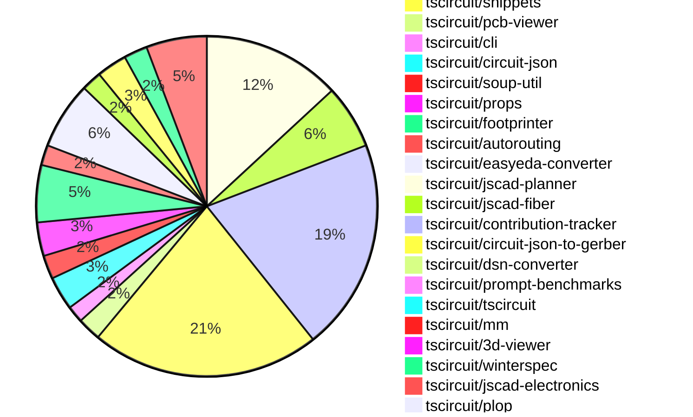

# Contribution Overview 2024-10-01

## PRs by Repository

## Contributor Overview

| Contributor | 🐳 Major | 🐙 Minor | 🐌 Tiny | ⭐ |
|-------------|-------|-------|-------|-------|
| [seveibar](#seveibar) | 38 | 89 | 2 | 👑👑👑 |
| [imrishabh18](#imrishabh18) | 7 | 40 | 6 | 👑👑👑 |
| [anas-sarkez](#anas-sarkez) | 7 | 20 | 0 | 👑 |
| [andrii-balitskyi](#andrii-balitskyi) | 9 | 8 | 0 | 👑 |
| [Timer00](#Timer00) | 9 | 4 | 0 | ⭐⭐⭐ |
| [aman1376](#aman1376) | 7 | 6 | 0 | ⭐⭐⭐ |
| [ShiboSoftwareDev](#ShiboSoftwareDev) | 2 | 11 | 3 | ⭐⭐⭐ |
| [Abse2001](#Abse2001) | 2 | 8 | 1 | ⭐⭐ |
| [mrudulpatil18](#mrudulpatil18) | 2 | 6 | 0 | ⭐⭐ |
| [0xkafkaa](#0xkafkaa) | 2 | 3 | 0 | ⭐⭐ |
| [bbland1](#bbland1) | 0 | 6 | 1 | ⭐⭐ |
| [ni9999](#ni9999) | 2 | 2 | 1 | ⭐⭐ |
| [DhairyaMajmudar](#DhairyaMajmudar) | 0 | 5 | 0 | ⭐ |
| [MandeepPaul](#MandeepPaul) | 2 | 0 | 0 | ⭐ |
| [Complexlity](#Complexlity) | 0 | 3 | 1 | ⭐ |
| [theajmalrazaq](#theajmalrazaq) | 0 | 3 | 0 | ⭐ |
| [sarthak-kumar-shailendra](#sarthak-kumar-shailendra) | 0 | 2 | 0 | ⭐ |
| [anugcodes](#anugcodes) | 0 | 2 | 0 | ⭐ |
| [0SlowPoke0](#0SlowPoke0) | 1 | 0 | 0 | ⭐ |
| [bhavyajain511](#bhavyajain511) | 1 | 0 | 0 | ⭐ |
| [programmersoham](#programmersoham) | 1 | 0 | 0 | ⭐ |
| [qalbun-salim](#qalbun-salim) | 0 | 1 | 0 |  |
| [alex-marinov](#alex-marinov) | 0 | 1 | 0 |  |
| [TSP06](#TSP06) | 0 | 1 | 0 |  |
| [kom-senapati](#kom-senapati) | 0 | 1 | 0 |  |
| [PALLAVIKHEDLE](#PALLAVIKHEDLE) | 0 | 1 | 0 |  |
| [AlexVCS](#AlexVCS) | 0 | 0 | 1 |  |

## Changes by Repository

### [tscircuit/schematic-viewer](https://github.com/tscircuit/schematic-viewer)

| PR # | Impact | Contributor | Description |
|------|--------|-------------|-------------|
| [#68](https://github.com/tscircuit/schematic-viewer/pull/68) | 🐳 Major | imrishabh18 | Ports the schematic design to match the KiCad representation. |
| [#65](https://github.com/tscircuit/schematic-viewer/pull/65) | 🐳 Major | imrishabh18 | Refactor the builder with core, update the schematic viewer, and fix bugs in the core. |
| [#67](https://github.com/tscircuit/schematic-viewer/pull/67) | 🐙 Minor | imrishabh18 | The pull request fixes the port position and formats the project with the Plop tool. |

### [tscircuit/core](https://github.com/tscircuit/core)

| PR # | Impact | Contributor | Description |
|------|--------|-------------|-------------|
| [#139](https://github.com/tscircuit/core/pull/139) | 🐳 Major | imrishabh18 | Fix chip placement by updating dimensions calculation and port distribution logic. |
| [#209](https://github.com/tscircuit/core/pull/209) | 🐳 Major | seveibar | Introduces a "renderUntilSettled" method in the Circuit class and adds support for handling asynchronous effects in the Renderable component. |
| [#186](https://github.com/tscircuit/core/pull/186) | 🐳 Major | seveibar | Fix Schematic Ports using local instead of global positions |
| [#185](https://github.com/tscircuit/core/pull/185) | 🐳 Major | seveibar | Implemented schematic autolayout and fixed routing issues |
| [#177](https://github.com/tscircuit/core/pull/177) | 🐳 Major | seveibar | Introduces a new <battery /> component to the library. |
| [#176](https://github.com/tscircuit/core/pull/176) | 🐳 Major | seveibar | Fix pcbRotation={-90} not rotating smtpads and keepouts properly |
| [#157](https://github.com/tscircuit/core/pull/157) | 🐳 Major | seveibar | Introduce a new `createUseComponent` function that creates a React component with dynamic props and associated traces. |
| [#132](https://github.com/tscircuit/core/pull/132) | 🐳 Major | seveibar | Create a `cad_component` for any component with a footprint. |
| [#196](https://github.com/tscircuit/core/pull/196) | 🐳 Major | Abse2001 | Implemented the `<Inductor>` component. |
| [#211](https://github.com/tscircuit/core/pull/211) | 🐙 Minor | imrishabh18 | Fixes the issue of getting the ports from the footprint instead of relying on the schematic port arrangement. |
| [#206](https://github.com/tscircuit/core/pull/206) | 🐙 Minor | imrishabh18 | Adding the missing trace space between the ports and route |
| [#201](https://github.com/tscircuit/core/pull/201) | 🐙 Minor | imrishabh18 | Fix undefined pin skip in the `getAllDimensionsForSchematicBox` function |
| [#200](https://github.com/tscircuit/core/pull/200) | 🐙 Minor | imrishabh18 | Added port as obstacles to enable routing. |
| [#199](https://github.com/tscircuit/core/pull/199) | 🐙 Minor | imrishabh18 | Fixes the shifting of port position on the edge of the chip |
| [#187](https://github.com/tscircuit/core/pull/187) | 🐙 Minor | imrishabh18 | Adds support for the "-size" suffix in port arrangements for the `NormalComponent` class. |
| [#170](https://github.com/tscircuit/core/pull/170) | 🐙 Minor | imrishabh18 | Adds `schX` and `schY` properties to the `NetAlias` component, allowing the placement of the net alias at a specified position on the schematic. |
| [#169](https://github.com/tscircuit/core/pull/169) | 🐙 Minor | imrishabh18 | Add components PowerSource and NetAlias |
| [#155](https://github.com/tscircuit/core/pull/155) | 🐙 Minor | imrishabh18 | Add aliases "left" and "right" to the ports of the Capacitor and Resistor components. |
| [#153](https://github.com/tscircuit/core/pull/153) | 🐙 Minor | imrishabh18 | Added SilkscreenCircle and SilkscreenRect components to the library. |
| [#151](https://github.com/tscircuit/core/pull/151) | 🐙 Minor | imrishabh18 | This pull request adds a new component called "Via" to the library. |
| [#143](https://github.com/tscircuit/core/pull/143) | 🐙 Minor | imrishabh18 | Update the `@tscircuit/soup-util` package to a smaller bundle size |
| [#141](https://github.com/tscircuit/core/pull/141) | 🐙 Minor | imrishabh18 | Update the project with the latest version of the `@tscircuit/footprinter` package without using `lodash`. |
| [#135](https://github.com/tscircuit/core/pull/135) | 🐙 Minor | imrishabh18 | The pull request fixes an issue where the `circuit-to-svg` tool was not using the `schematic_port` information for placing the ports in the generated SVG. This ensures that the new SVGs have the pins displayed correctly. |
| [#133](https://github.com/tscircuit/core/pull/133) | 🐙 Minor | imrishabh18 | Fix the chip design |
| [#210](https://github.com/tscircuit/core/pull/210) | 🐙 Minor | seveibar | Introduces asynchronous autorouting support, with the ability to specify an autorouting server URL. However, the implementation of obstacles is not yet complete. |
| [#198](https://github.com/tscircuit/core/pull/198) | 🐙 Minor | seveibar | Adds support for pill-shaped plated holes and provides more AI context for the `tscircuit` React props. |
| [#194](https://github.com/tscircuit/core/pull/194) | 🐙 Minor | seveibar | Adds support for rendering schematic debug objects in the circuit visualization. |
| [#188](https://github.com/tscircuit/core/pull/188) | 🐙 Minor | seveibar | Update the `circuit-to-svg` dependency to version 0.0.43 and fix a bug where `pinNumber 0` was not being recognized. |
| [#173](https://github.com/tscircuit/core/pull/173) | 🐙 Minor | seveibar | Add support for shared pin labels in the `NormalComponent` class and update the `Chip` component to handle multiple labels per pin. |
| [#166](https://github.com/tscircuit/core/pull/166) | 🐙 Minor | seveibar | Update the version of the `@tscircuit/footprinter` dependency to `0.0.71`. |
| [#165](https://github.com/tscircuit/core/pull/165) | 🐙 Minor | seveibar | Fixes a bug that caused the trace layer to not be correctly determined for explicitly defined SMT pads. |
| [#163](https://github.com/tscircuit/core/pull/163) | 🐙 Minor | seveibar | Fixes an issue with the rotation of a part in the NormalComponent, ensuring the rotation is properly calculated based on the layer. |
| [#161](https://github.com/tscircuit/core/pull/161) | 🐙 Minor | seveibar | Add support for `cadModel.positionOffset` to adjust the position of the CAD model. |
| [#159](https://github.com/tscircuit/core/pull/159) | 🐙 Minor | seveibar | Adds support for creating a `pcb_hole` component from the parsed soup data. |
| [#158](https://github.com/tscircuit/core/pull/158) | 🐙 Minor | seveibar | Exports the `createUseComponent` function from the `hooks/create-use-component` module. |
| [#149](https://github.com/tscircuit/core/pull/149) | 🐙 Minor | seveibar | Introduce the `useRenderedCircuit` hook and set up a system for testing hooks. |
| [#137](https://github.com/tscircuit/core/pull/137) | 🐙 Minor | seveibar | Improves the error message for invalid prop errors in the `PrimitiveComponent` class. |
| [#130](https://github.com/tscircuit/core/pull/130) | 🐙 Minor | seveibar | The pull request adds error handling when there are ports without a matching PCB primitive, which can happen when a footprint is missing. |
| [#138](https://github.com/tscircuit/core/pull/138) | 🐙 Minor | ShiboSoftwareDev | Update the position of the `pcb_solder_paste` component to match the position of the `pcb_smt_pad` component. |
| [#136](https://github.com/tscircuit/core/pull/136) | 🐙 Minor | ShiboSoftwareDev | Creating a new component `pcb_solder_paste` from `smtpads` |
| [#182](https://github.com/tscircuit/core/pull/182) | 🐙 Minor | Abse2001 | Fixed the `toMatchSchematicSnapshot` test for the `Battery` component by updating the `schematicSymbolName` property. |

### [tscircuit/circuit-to-svg](https://github.com/tscircuit/circuit-to-svg)

| PR # | Impact | Contributor | Description |
|------|--------|-------------|-------------|
| [#96](https://github.com/tscircuit/circuit-to-svg/pull/96) | 🐳 Major | imrishabh18 | Refactor the codebase to switch from using `viewbox` to `transform` for rendering SVG objects. |
| [#81](https://github.com/tscircuit/circuit-to-svg/pull/81) | 🐳 Major | imrishabh18 | Adds support for converting circuit JSON to schematic SVG with KiCAD-style visual styling. |
| [#95](https://github.com/tscircuit/circuit-to-svg/pull/95) | 🐳 Major | seveibar | Refactors the schematic drawing code to remove the usage of viewport and `flipY`, and rely on the `transform` matrix for computing all positions. |
| [#94](https://github.com/tscircuit/circuit-to-svg/pull/94) | 🐳 Major | seveibar | Introduces a labeled grid feature to the schematic SVG conversion function. |
| [#101](https://github.com/tscircuit/circuit-to-svg/pull/101) | 🐙 Minor | imrishabh18 | Hide the ports on center |
| [#100](https://github.com/tscircuit/circuit-to-svg/pull/100) | 🐙 Minor | imrishabh18 | Fixing a bug with port position by removing the negative Y direction scale in the schematic SVG conversion. |
| [#90](https://github.com/tscircuit/circuit-to-svg/pull/90) | 🐙 Minor | imrishabh18 | Revert a change that broke the position of pins |
| [#82](https://github.com/tscircuit/circuit-to-svg/pull/82) | 🐙 Minor | imrishabh18 | The pull request fixes the placement of chip ports in the circuit schematic SVG. |
| [#99](https://github.com/tscircuit/circuit-to-svg/pull/99) | 🐙 Minor | seveibar | Fix the schematic trace by adjusting the X and Y coordinates. |
| [#98](https://github.com/tscircuit/circuit-to-svg/pull/98) | 🐙 Minor | seveibar | This pull request fixes bugs in the `create-svg-objects-from-sch-debug-object.ts` function, which is responsible for generating SVG objects from a debug object. |
| [#97](https://github.com/tscircuit/circuit-to-svg/pull/97) | 🐙 Minor | seveibar | The pull request fixes the handling of undefined `pinNumber` and improves the logic for finding the pin number in the schematic port processing. |
| [#93](https://github.com/tscircuit/circuit-to-svg/pull/93) | 🐙 Minor | seveibar | Adds support for drawing a grid and labeled points in the schematic SVG |
| [#92](https://github.com/tscircuit/circuit-to-svg/pull/92) | 🐙 Minor | seveibar | Adds support for drawing schematic debug objects in the circuit JSON specification. |
| [#88](https://github.com/tscircuit/circuit-to-svg/pull/88) | 🐙 Minor | seveibar | Fix the schematic port's position using a relative position |
| [#87](https://github.com/tscircuit/circuit-to-svg/pull/87) | 🐙 Minor | seveibar | Fix silkscreen paths being erroneously closed |
| [#89](https://github.com/tscircuit/circuit-to-svg/pull/89) | 🐙 Minor | Abse2001 | Updated schematic-symbols dependency from version 0.0.79 to 0.0.90. |
| [#86](https://github.com/tscircuit/circuit-to-svg/pull/86) | 🐙 Minor | Abse2001 | Updated the schematic symbols to fix the battery in core and formatted the code. |
| [#80](https://github.com/tscircuit/circuit-to-svg/pull/80) | 🐙 Minor | anas-sarkez | Removed regular expressions and handling of cleaned text |
| [#102](https://github.com/tscircuit/circuit-to-svg/pull/102) | 🐌 Tiny | ni9999 | Updates the documentation in the README.md file to reflect the latest API changes. |

### [tscircuit/schematic-symbols](https://github.com/tscircuit/schematic-symbols)

| PR # | Impact | Contributor | Description |
|------|--------|-------------|-------------|
| [#135](https://github.com/tscircuit/schematic-symbols/pull/135) | 🐳 Major | imrishabh18 | Adding support for cubic bezier curve in the `svgPathToPoints` function. |
| [#185](https://github.com/tscircuit/schematic-symbols/pull/185) | 🐳 Major | Abse2001 | Implemented SVG Arc support and added an inductor symbol. |
| [#176](https://github.com/tscircuit/schematic-symbols/pull/176) | 🐳 Major | aman1376 | Adds a new SVG symbol and JSON data for a light-dependent resistor. |
| [#162](https://github.com/tscircuit/schematic-symbols/pull/162) | 🐳 Major | aman1376 | Adds a new JSON file and SVG image for a DPST switch symbol. |
| [#151](https://github.com/tscircuit/schematic-symbols/pull/151) | 🐳 Major | aman1376 | Adds a new n-channel depletion mode MOSFET transistor symbol as a JSON file and SVG image. |
| [#152](https://github.com/tscircuit/schematic-symbols/pull/152) | 🐳 Major | aman1376 | Add a new P-channel DMOSFET transistor symbol |
| [#150](https://github.com/tscircuit/schematic-symbols/pull/150) | 🐳 Major | aman1376 | Add a new NJFET transistor symbol. |
| [#149](https://github.com/tscircuit/schematic-symbols/pull/149) | 🐳 Major | aman1376 | Adds a new P-JFET transistor symbol and its associated JSON data. |
| [#130](https://github.com/tscircuit/schematic-symbols/pull/130) | 🐳 Major | aman1376 | Introduces a new TypeScript type for base symbol names by reading the symbol names from a set and generating the type. |
| [#78](https://github.com/tscircuit/schematic-symbols/pull/78) | 🐳 Major | Timer00 | Introduces a new symbol for a wattmeter. |
| [#95](https://github.com/tscircuit/schematic-symbols/pull/95) | 🐳 Major | Timer00 | Introduces a new symbol called "varmeter". |
| [#96](https://github.com/tscircuit/schematic-symbols/pull/96) | 🐳 Major | Timer00 | Introduces a new symbol "watt_hour_meter" with a JSON definition and an SVG representation. |
| [#97](https://github.com/tscircuit/schematic-symbols/pull/97) | 🐳 Major | Timer00 | Introduces a new symbol called "frequency_meter" |
| [#100](https://github.com/tscircuit/schematic-symbols/pull/100) | 🐳 Major | Timer00 | Introduces a new symbol called "tachometer" |
| [#77](https://github.com/tscircuit/schematic-symbols/pull/77) | 🐳 Major | Timer00 | Introduces a new DC ammeter symbol |
| [#94](https://github.com/tscircuit/schematic-symbols/pull/94) | 🐳 Major | Timer00 | Introduces a new AC voltmeter symbol |
| [#89](https://github.com/tscircuit/schematic-symbols/pull/89) | 🐳 Major | Timer00 | This pull request introduces type guards for various drawing types, such as PathPrimitive, TextPrimitive, CirclePrimitive, BoxPrimitive, and more, to ensure type safety when working with these objects. |
| [#74](https://github.com/tscircuit/schematic-symbols/pull/74) | 🐳 Major | Timer00 | Introduces a new component, the DC voltmeter, with JSON and SVG definitions. |
| [#156](https://github.com/tscircuit/schematic-symbols/pull/156) | 🐳 Major | mrudulpatil18 | Adds an NPN bipolar transistor symbol to the project. |
| [#169](https://github.com/tscircuit/schematic-symbols/pull/169) | 🐳 Major | MandeepPaul | Introduces a new Mushroom Head Normally Open Momentary component |
| [#101](https://github.com/tscircuit/schematic-symbols/pull/101) | 🐳 Major | MandeepPaul | Introduce a new component called "igbt_transistor" |
| [#157](https://github.com/tscircuit/schematic-symbols/pull/157) | 🐳 Major | 0SlowPoke0 | Adds a new symbol for a filled diode. |
| [#145](https://github.com/tscircuit/schematic-symbols/pull/145) | 🐳 Major | 0xkafkaa | Adds a new symbol for a crystal |
| [#146](https://github.com/tscircuit/schematic-symbols/pull/146) | 🐳 Major | 0xkafkaa | Adds a new resonator feature with various paths and text elements. |
| [#113](https://github.com/tscircuit/schematic-symbols/pull/113) | 🐳 Major | bhavyajain511 | Introduces a new symbol called "var_meter" |
| [#107](https://github.com/tscircuit/schematic-symbols/pull/107) | 🐳 Major | programmersoham | Adds SVG symbols for NPN bipolar transistor, PNP bipolar transistor, and phototransistor. |
| [#184](https://github.com/tscircuit/schematic-symbols/pull/184) | 🐙 Minor | imrishabh18 | Updated the lockfile to fix the failing npm publish |
| [#172](https://github.com/tscircuit/schematic-symbols/pull/172) | 🐙 Minor | imrishabh18 | Fix the calculation for the height of the SPDT switch and boxresistor components. |
| [#106](https://github.com/tscircuit/schematic-symbols/pull/106) | 🐙 Minor | imrishabh18 | Adds support for the "Q" command in the SVG path parsing function, allowing for the handling of quadratic Bézier curves. |
| [#86](https://github.com/tscircuit/schematic-symbols/pull/86) | 🐙 Minor | imrishabh18 | Fixes a reference point added for the port in the boxresistor symbol |
| [#98](https://github.com/tscircuit/schematic-symbols/pull/98) | 🐙 Minor | seveibar | Update the `vercel-build` script to first run the `build` script and then the `build.ts` script. |
| [#174](https://github.com/tscircuit/schematic-symbols/pull/174) | 🐙 Minor | Abse2001 | Added a new battery symbol. |
| [#85](https://github.com/tscircuit/schematic-symbols/pull/85) | 🐙 Minor | anas-sarkez | Added a new symbol for a tunnel diode |
| [#82](https://github.com/tscircuit/schematic-symbols/pull/82) | 🐙 Minor | anas-sarkez | Added an avalanche diode symbol |
| [#81](https://github.com/tscircuit/schematic-symbols/pull/81) | 🐙 Minor | anas-sarkez | Added a zener diode symbol to the project. |
| [#80](https://github.com/tscircuit/schematic-symbols/pull/80) | 🐙 Minor | anas-sarkez | Added a varactor diode symbol and its JSON configuration. |
| [#168](https://github.com/tscircuit/schematic-symbols/pull/168) | 🐙 Minor | aman1376 | Add a new n-channel MOSFET transistor symbol |
| [#158](https://github.com/tscircuit/schematic-symbols/pull/158) | 🐙 Minor | aman1376 | Adds a new SPST (Single Pole Single Throw) switch symbol to the project. |
| [#154](https://github.com/tscircuit/schematic-symbols/pull/154) | 🐙 Minor | aman1376 | Adds a new P-channel enhancement-mode MOSFET transistor symbol |
| [#129](https://github.com/tscircuit/schematic-symbols/pull/129) | 🐙 Minor | aman1376 | Adds a new symbol for a constant current diode. |
| [#117](https://github.com/tscircuit/schematic-symbols/pull/117) | 🐙 Minor | aman1376 | Adds a new SVG symbol for a laser diode component. |
| [#132](https://github.com/tscircuit/schematic-symbols/pull/132) | 🐙 Minor | bbland1 | Fixes the issue where the green center dot was off-center for some symbols by improving the code that calculates the bounds of the SVG JSON. |
| [#110](https://github.com/tscircuit/schematic-symbols/pull/110) | 🐙 Minor | bbland1 | Add SVG and TypeScript files for a DIAC symbol |
| [#111](https://github.com/tscircuit/schematic-symbols/pull/111) | 🐙 Minor | bbland1 | Adds an SVG and TypeScript definition for a unijunction transistor symbol. |
| [#108](https://github.com/tscircuit/schematic-symbols/pull/108) | 🐙 Minor | bbland1 | Adds SVG and TypeScript files for a silicon-controlled rectifier symbol. |
| [#109](https://github.com/tscircuit/schematic-symbols/pull/109) | 🐙 Minor | bbland1 | Created SVG and TypeScript files for the Triac symbol. |
| [#182](https://github.com/tscircuit/schematic-symbols/pull/182) | 🐙 Minor | TSP06 | Added a new ground symbol |
| [#136](https://github.com/tscircuit/schematic-symbols/pull/136) | 🐙 Minor | Timer00 | Adds snapshot tests for SVG symbols |
| [#105](https://github.com/tscircuit/schematic-symbols/pull/105) | 🐙 Minor | Timer00 | Adds a step to commit and push any changes before publishing to npm |
| [#103](https://github.com/tscircuit/schematic-symbols/pull/103) | 🐙 Minor | Timer00 | Updates the lockfile to fix npm publish |
| [#76](https://github.com/tscircuit/schematic-symbols/pull/76) | 🐙 Minor | Timer00 | Adds a formatting step to the instructions for adding a new symbol. |
| [#153](https://github.com/tscircuit/schematic-symbols/pull/153) | 🐙 Minor | mrudulpatil18 | Added a new rectifier diode symbol to the project. |
| [#166](https://github.com/tscircuit/schematic-symbols/pull/166) | 🐙 Minor | mrudulpatil18 | Adds a count of unique schematic symbols and a GitHub stars badge to the header of the schematic symbols webpage. |
| [#161](https://github.com/tscircuit/schematic-symbols/pull/161) | 🐙 Minor | mrudulpatil18 | Added a new PNP bipolar transistor symbol. |
| [#167](https://github.com/tscircuit/schematic-symbols/pull/167) | 🐙 Minor | anugcodes | Adds a new symbol for a Darlington pair transistor. |
| [#160](https://github.com/tscircuit/schematic-symbols/pull/160) | 🐙 Minor | anugcodes | Added a new SPDT (Single-Pole Double-Throw) switch symbol to the project. |
| [#102](https://github.com/tscircuit/schematic-symbols/pull/102) | 🐙 Minor | Complexlity | Modify the `generate` function to add the `Primitive` type for the `texts` array in the generated TS file. |
| [#137](https://github.com/tscircuit/schematic-symbols/pull/137) | 🐙 Minor | 0xkafkaa | Add a step recovery diode symbol |
| [#133](https://github.com/tscircuit/schematic-symbols/pull/133) | 🐙 Minor | 0xkafkaa | Adds a new JSON file and an SVG file for a Gunn diode symbol. |
| [#91](https://github.com/tscircuit/schematic-symbols/pull/91) | 🐙 Minor | 0xkafkaa | Create a new power factor meter symbol |
| [#183](https://github.com/tscircuit/schematic-symbols/pull/183) | 🐌 Tiny | imrishabh18 | Update .gitignore to ignore .diff.png files |
| [#104](https://github.com/tscircuit/schematic-symbols/pull/104) | 🐌 Tiny | imrishabh18 | Removes the `package-lock.json` file, which is a duplicate of the `yarn.lock` file. |
| [#131](https://github.com/tscircuit/schematic-symbols/pull/131) | 🐌 Tiny | bbland1 | Fixing the reference position on the diac symbol. |

### [tscircuit/snippets](https://github.com/tscircuit/snippets)

| PR # | Impact | Contributor | Description |
|------|--------|-------------|-------------|
| [#131](https://github.com/tscircuit/snippets/pull/131) | 🐳 Major | imrishabh18 | Integrate schematic viewer into the application |
| [#61](https://github.com/tscircuit/snippets/pull/61) | 🐳 Major | seveibar | Adds a feature to delete a snippet from the application. |
| [#54](https://github.com/tscircuit/snippets/pull/54) | 🐳 Major | seveibar | Adds a new API endpoint for searching snippets and a corresponding dialog component in the frontend to import snippets. |
| [#53](https://github.com/tscircuit/snippets/pull/53) | 🐳 Major | seveibar | The pull request adds the core to the runtime, adds a format button, and a 404 snippet page, and includes minor fixes. |
| [#48](https://github.com/tscircuit/snippets/pull/48) | 🐳 Major | seveibar | Imports the Runner module and fixes the dashboard always loading from a hardcoded "seveibar/" path. |
| [#40](https://github.com/tscircuit/snippets/pull/40) | 🐳 Major | seveibar | Adds database seeding, fixes view snippets page, and loads TypeScript types for imported snippets. |
| [#39](https://github.com/tscircuit/snippets/pull/39) | 🐳 Major | seveibar | Introduces a new CodeEditor component using the Codemirror library, which provides more advanced features like TypeScript support, autocomplete, and linting. |
| [#32](https://github.com/tscircuit/snippets/pull/32) | 🐳 Major | seveibar |  |
| [#23](https://github.com/tscircuit/snippets/pull/23) | 🐳 Major | seveibar | Introduces improvements and fixes for the AI chat feature, including link improvements. |
| [#12](https://github.com/tscircuit/snippets/pull/12) | 🐳 Major | seveibar | Adds support for login functionality, including sessions, login pages, and accounts. |
| [#88](https://github.com/tscircuit/snippets/pull/88) | 🐳 Major | andrii-balitskyi | The pull request adds a country dropdown and a state dropdown to the shipping information section. |
| [#89](https://github.com/tscircuit/snippets/pull/89) | 🐳 Major | andrii-balitskyi | Add order preview functionality, including PCB viewer, 3D viewer, and JSON table viewer. |
| [#82](https://github.com/tscircuit/snippets/pull/82) | 🐳 Major | andrii-balitskyi | The pull request allows users to edit their shipping information in the profile settings. |
| [#68](https://github.com/tscircuit/snippets/pull/68) | 🐳 Major | andrii-balitskyi | Adds tests for the orders API, including creating, getting, listing, and updating orders, as well as uploading and getting order files. |
| [#78](https://github.com/tscircuit/snippets/pull/78) | 🐳 Major | andrii-balitskyi | Adds a submit order button to the editor nav bar and a create order dialog with various checkpoints. |
| [#69](https://github.com/tscircuit/snippets/pull/69) | 🐳 Major | andrii-balitskyi | Introduces a new `/orders/{order_id}` page to view the details of a specific order. |
| [#46](https://github.com/tscircuit/snippets/pull/46) | 🐳 Major | andrii-balitskyi | Introduces the initial ordering API and UI, including adding order and order file resources, endpoints, and pages. |
| [#125](https://github.com/tscircuit/snippets/pull/125) | 🐳 Major | ni9999 | Implements a "Fork" feature on the ViewSnippetHeader component, allowing users to create a forked version of the current snippet. |
| [#117](https://github.com/tscircuit/snippets/pull/117) | 🐳 Major | mrudulpatil18 | Added a command palette (CmdKMenu) that allows users to quickly access recent snippets, start new snippets, and import from various sources. |
| [#141](https://github.com/tscircuit/snippets/pull/141) | 🐙 Minor | imrishabh18 | Fix for updating the current file in the code editor |
| [#134](https://github.com/tscircuit/snippets/pull/134) | 🐙 Minor | imrishabh18 | Adds the "manual-edits.json" file to the dropdown, allowing manual edits to the code. |
| [#138](https://github.com/tscircuit/snippets/pull/138) | 🐙 Minor | seveibar | Revert code reload check and add a test to ensure snippet loads on page load on the editor page. |
| [#126](https://github.com/tscircuit/snippets/pull/126) | 🐙 Minor | seveibar | Update dependencies for the Pill Holes project. |
| [#122](https://github.com/tscircuit/snippets/pull/122) | 🐙 Minor | seveibar | Adds a new endpoint to allow users to star a code snippet. |
| [#118](https://github.com/tscircuit/snippets/pull/118) | 🐙 Minor | seveibar | Fix broken search and cmd+click functionality in the code editor and dashboard pages. |
| [#115](https://github.com/tscircuit/snippets/pull/115) | 🐙 Minor | seveibar | Introduces the ability to open snippets by clicking on them while holding the Ctrl/Cmd key. |
| [#114](https://github.com/tscircuit/snippets/pull/114) | 🐙 Minor | seveibar | Add files dialog to inspect build files |
| [#108](https://github.com/tscircuit/snippets/pull/108) | 🐙 Minor | seveibar | Order My Snippets by last created time |
| [#84](https://github.com/tscircuit/snippets/pull/84) | 🐙 Minor | seveibar | Fix tab indent in the CodeEditor component |
| [#80](https://github.com/tscircuit/snippets/pull/80) | 🐙 Minor | seveibar | Fixes JLCPCB import issues, updates for shared pin label support, and fixes local development errors to show JLCPCB import errors. |
| [#74](https://github.com/tscircuit/snippets/pull/74) | 🐙 Minor | seveibar | Updates dependencies and fixes for fabrication file downloads. |
| [#73](https://github.com/tscircuit/snippets/pull/73) | 🐙 Minor | seveibar | Adds functionality to download fabrication files (gerber, pnp, bom) for the circuit JSON |
| [#67](https://github.com/tscircuit/snippets/pull/67) | 🐙 Minor | seveibar | Fix an issue with importing modules on the first run of the application. |
| [#66](https://github.com/tscircuit/snippets/pull/66) | 🐙 Minor | seveibar | Updates the version of the "@tscircuit/core" package to fix a bun dependency issue and a routing issue. |
| [#65](https://github.com/tscircuit/snippets/pull/65) | 🐙 Minor | seveibar | Footprinter Fixes, Import Caching for runtime imports |
| [#63](https://github.com/tscircuit/snippets/pull/63) | 🐙 Minor | seveibar | Update easyeda dependency to fix issue importing diode |
| [#62](https://github.com/tscircuit/snippets/pull/62) | 🐙 Minor | seveibar | Adds a new snippet that outputs a square waveform using the a555timer, and fixes a recursive importing issue. |
| [#58](https://github.com/tscircuit/snippets/pull/58) | 🐙 Minor | seveibar | Fixes an issue with the early return in the AI page test in the Playwright tests. |
| [#57](https://github.com/tscircuit/snippets/pull/57) | 🐙 Minor | seveibar | Adds a new "rename" functionality to the EditorNav component. |
| [#56](https://github.com/tscircuit/snippets/pull/56) | 🐙 Minor | seveibar | Add Playwright test workflows and configuration, update dependencies, and refactor file structure |
| [#52](https://github.com/tscircuit/snippets/pull/52) | 🐙 Minor | seveibar | Adds support for anonymous user editing, improves empty state handling for the code editor and AI page, and fixes issues with the code editor scrolling. |
| [#51](https://github.com/tscircuit/snippets/pull/51) | 🐙 Minor | seveibar | Fix code editor scrolling overflow and support exporting hooks |
| [#50](https://github.com/tscircuit/snippets/pull/50) | 🐙 Minor | seveibar | Refactors the code for explicit runs and fixes importing issues |
| [#45](https://github.com/tscircuit/snippets/pull/45) | 🐙 Minor | seveibar | Adds the ability to save the generated DTS content to the database along with the code snippet. |
| [#42](https://github.com/tscircuit/snippets/pull/42) | 🐙 Minor | seveibar | Adds support for storing compiled JavaScript files in the database schema and handling them in the API routes. |
| [#35](https://github.com/tscircuit/snippets/pull/35) | 🐙 Minor | seveibar | Reverts the "new button hover changes" in the `tscircuit/snippets#33` pull request. |
| [#36](https://github.com/tscircuit/snippets/pull/36) | 🐙 Minor | seveibar | Adds a feature to use a fake API when the Snippets API URL is not provided. |
| [#21](https://github.com/tscircuit/snippets/pull/21) | 🐙 Minor | seveibar | Add an empty state for the AI chat interface and display the account balance in the header. |
| [#13](https://github.com/tscircuit/snippets/pull/13) | 🐙 Minor | seveibar | Formats repository, adds Vercel rewrites, and makes minor fixes. |
| [#49](https://github.com/tscircuit/snippets/pull/49) | 🐙 Minor | Abse2001 | Implemented a download function for the circuitJson download button. |
| [#124](https://github.com/tscircuit/snippets/pull/124) | 🐙 Minor | andrii-balitskyi | Fixes the width of the SearchableSelect options dropdown to match the width of the trigger element. |
| [#37](https://github.com/tscircuit/snippets/pull/37) | 🐙 Minor | DhairyaMajmudar | Feat: Home page made responsive |
| [#28](https://github.com/tscircuit/snippets/pull/28) | 🐙 Minor | DhairyaMajmudar | Adds camelCase naming convention rules for the biome.json file. |
| [#10](https://github.com/tscircuit/snippets/pull/10) | 🐙 Minor | DhairyaMajmudar | The cross button will now hide the Onboarding Tips section after clicking. |
| [#127](https://github.com/tscircuit/snippets/pull/127) | 🐙 Minor | ni9999 | Add a new option to the download dropdown menu to download the schematic SVG. |
| [#137](https://github.com/tscircuit/snippets/pull/137) | 🐙 Minor | mrudulpatil18 | Adds snippet type to the URL for copy URL functionality. |
| [#77](https://github.com/tscircuit/snippets/pull/77) | 🐙 Minor | mrudulpatil18 | Adds a search component to the header, allowing users to search for code snippets and navigate to the editor view. |
| [#43](https://github.com/tscircuit/snippets/pull/43) | 🐙 Minor | mrudulpatil18 | Persist the visibility of the onboarding tips in the global store and update the LandingHero component to use the global store for managing the visibility. |
| [#9](https://github.com/tscircuit/snippets/pull/9) | 🐙 Minor | Complexlity | Adds a new dropdown component to the header with options for creating blank templates. |
| [#6](https://github.com/tscircuit/snippets/pull/6) | 🐙 Minor | Complexlity | Remove package-lock.json file, leaving only the Bun lock file. |
| [#95](https://github.com/tscircuit/snippets/pull/95) | 🐙 Minor | theajmalrazaq | Fixed the responsiveness of the Quickstart page |
| [#97](https://github.com/tscircuit/snippets/pull/97) | 🐙 Minor | theajmalrazaq | Added Playwright tests for the AI Page and Quickstart Page, added viewports to the existing tests, and updated the snapshots. |
| [#85](https://github.com/tscircuit/snippets/pull/85) | 🐙 Minor | theajmalrazaq | Fixed the search box rendering and improved the dashboard responsiveness. |
| [#86](https://github.com/tscircuit/snippets/pull/86) | 🐙 Minor | kom-senapati | Updates the page title to display the snippet name and owner name in the format `tscircuit - <owner>/<package>`. |
| [#33](https://github.com/tscircuit/snippets/pull/33) | 🐙 Minor | PALLAVIKHEDLE | The pull request introduces changes to the hover behavior of the 'New' button, including a dropdown menu and navigation to the '/editor' page. |
| [#96](https://github.com/tscircuit/snippets/pull/96) | 🐌 Tiny | Abse2001 | Upgrades the "winterspec" dependency to version 0.0.94 |
| [#4](https://github.com/tscircuit/snippets/pull/4) | 🐌 Tiny | Complexlity | Updates the favicon to the same one used on tscircuits sites. |
| [#110](https://github.com/tscircuit/snippets/pull/110) | 🐌 Tiny | AlexVCS | Adds a favicon to the website. |

### [tscircuit/pcb-viewer](https://github.com/tscircuit/pcb-viewer)

| PR # | Impact | Contributor | Description |
|------|--------|-------------|-------------|
| [#71](https://github.com/tscircuit/pcb-viewer/pull/71) | 🐳 Major | seveibar | Reverts a previous change that broke the PCB viewer bounds computation. |
| [#70](https://github.com/tscircuit/pcb-viewer/pull/70) | 🐳 Major | seveibar | Converts the children rendering to use the core library, removing the dependency on the `@tscircuit/builder` package. |
| [#74](https://github.com/tscircuit/pcb-viewer/pull/74) | 🐙 Minor | imrishabh18 | Remove the circuit builder and update the dependency version |
| [#73](https://github.com/tscircuit/pcb-viewer/pull/73) | 🐙 Minor | imrishabh18 | Refactor the PCBViewer component by removing the builder and using the `useRenderedCircuit` hook from `@tscircuit/core` instead. |
| [#76](https://github.com/tscircuit/pcb-viewer/pull/76) | 🐙 Minor | seveibar | Fixes the formatting and minor issues in the silkscreen path story so that it renders correctly. |
| [#69](https://github.com/tscircuit/pcb-viewer/pull/69) | 🐙 Minor | Abse2001 | Increased the zIndex for the ElementOverlayBox to make it show above the traces. |
| [#75](https://github.com/tscircuit/pcb-viewer/pull/75) | 🐌 Tiny | ShiboSoftwareDev | Added a CODEOWNERS file to specify code owners for the repository. |

### [tscircuit/cli](https://github.com/tscircuit/cli)

| PR # | Impact | Contributor | Description |
|------|--------|-------------|-------------|
| [#210](https://github.com/tscircuit/cli/pull/210) | 🐳 Major | andrii-balitskyi | Adds a new command `gen jlcpcb <jlcpcbPartNumberOrUrl>` to generate JLCPCB-specific files. |
| [#226](https://github.com/tscircuit/cli/pull/226) | 🐙 Minor | imrishabh18 | Update the `circuit-to-svg` dependency to the latest version |
| [#222](https://github.com/tscircuit/cli/pull/222) | 🐙 Minor | Abse2001 | Updated the pcb_viewer library to fix the via hover and resistor example |
| [#217](https://github.com/tscircuit/cli/pull/217) | 🐙 Minor | qalbun-salim | Add `export pnp_csv` command to the command line interface to export Plug n Play CSV file from an example file. |
| [#215](https://github.com/tscircuit/cli/pull/215) | 🐙 Minor | DhairyaMajmudar | Refactors the codebase to use better TypeScript types, removing the usage of `any` and unused imports. |

### [tscircuit/circuit-json](https://github.com/tscircuit/circuit-json)

| PR # | Impact | Contributor | Description |
|------|--------|-------------|-------------|
| [#61](https://github.com/tscircuit/circuit-json/pull/61) | 🐳 Major | seveibar | Introduces a new `schematic_debug_object` feature, which includes two types of debug objects: `schematic_debug_rect` and `schematic_debug_line`. |
| [#56](https://github.com/tscircuit/circuit-json/pull/56) | 🐳 Major | ShiboSoftwareDev | Introduces a new `pcb_solder_paste` component for defining solder paste on a PCB. |
| [#65](https://github.com/tscircuit/circuit-json/pull/65) | 🐙 Minor | imrishabh18 | Adds a `color` property to the `SchematicTextInput` type with a default value of `#000000`. |
| [#58](https://github.com/tscircuit/circuit-json/pull/58) | 🐙 Minor | imrishabh18 | Adds a new optional field `display_value` to the `SourceComponentBase` type. |
| [#64](https://github.com/tscircuit/circuit-json/pull/64) | 🐙 Minor | seveibar | Add useful meta information, true index, side of component etc. to schematic_port |
| [#62](https://github.com/tscircuit/circuit-json/pull/62) | 🐙 Minor | seveibar | This pull request adds a new script to generate a Schematic Component Overview document, which describes the various types and interfaces used in the Circuit JSON specification. |
| [#59](https://github.com/tscircuit/circuit-json/pull/59) | 🐙 Minor | seveibar | Adds a new circuit element type, "simple_battery", with a capacity property. |
| [#55](https://github.com/tscircuit/circuit-json/pull/55) | 🐙 Minor | seveibar | Adds a GitHub Actions workflow to run tests using Bun |
| [#60](https://github.com/tscircuit/circuit-json/pull/60) | 🐙 Minor | Abse2001 | Added the `source_simple_inductor` component to the `any_source_component` union and exported it from the `index.ts` file. |
| [#57](https://github.com/tscircuit/circuit-json/pull/57) | 🐙 Minor | anas-sarkez | Add mil unit and format script |

### [tscircuit/soup-util](https://github.com/tscircuit/soup-util)

| PR # | Impact | Contributor | Description |
|------|--------|-------------|-------------|
| [#23](https://github.com/tscircuit/soup-util/pull/23) | 🐙 Minor | imrishabh18 | Fix type issue in the `find-bounds-and-center.ts` file by adding type annotation to `elm` in the `flatMap` function. |
| [#22](https://github.com/tscircuit/soup-util/pull/22) | 🐙 Minor | imrishabh18 | Reverts the previous change that exported the "find-bounds-and-center" function. |
| [#21](https://github.com/tscircuit/soup-util/pull/21) | 🐙 Minor | imrishabh18 | Exports the `find-bounds-and-center` function from the module. |
| [#20](https://github.com/tscircuit/soup-util/pull/20) | 🐙 Minor | imrishabh18 | Ports the `findBoundsAndCenter` function from the `builder` repository to the current repository. |
| [#19](https://github.com/tscircuit/soup-util/pull/19) | 🐌 Tiny | imrishabh18 | Updates the lock file to ensure dependencies are consistent across environments. |
| [#18](https://github.com/tscircuit/soup-util/pull/18) | 🐌 Tiny | imrishabh18 | Update the `circuit-json` dependency to the latest version. |
| [#17](https://github.com/tscircuit/soup-util/pull/17) | 🐌 Tiny | imrishabh18 | Deletes an unused dependency from the project |

### [tscircuit/props](https://github.com/tscircuit/props)

| PR # | Impact | Contributor | Description |
|------|--------|-------------|-------------|
| [#67](https://github.com/tscircuit/props/pull/67) | 🐳 Major | seveibar | Adds a comprehensive overview of all the prop types available in the @tscircuit/props package, including detailed documentation and examples. |
| [#62](https://github.com/tscircuit/props/pull/62) | 🐙 Minor | imrishabh18 | Reverts the changes to the `width` and `height` properties in the `commonLayoutProps` and `commonComponentProps` types. |
| [#60](https://github.com/tscircuit/props/pull/60) | 🐙 Minor | imrishabh18 | Adds new properties `schWidth` and `schHeight` to the `commonLayoutProps` interface, replacing the existing `width` and `height` properties. |
| [#58](https://github.com/tscircuit/props/pull/58) | 🐙 Minor | imrishabh18 | Add `width` and `height` properties to the `commonComponentProps` in the `layout.ts` file. |
| [#66](https://github.com/tscircuit/props/pull/66) | 🐙 Minor | seveibar | Add support for "pill" shaped plated holes in the PCB component specification. |
| [#65](https://github.com/tscircuit/props/pull/65) | 🐙 Minor | seveibar | Add support for the `schAutoLayoutEnabled` prop on the `<group />` component. |
| [#63](https://github.com/tscircuit/props/pull/63) | 🐙 Minor | seveibar | Adds new battery-related types, props, and pins to the library |
| [#61](https://github.com/tscircuit/props/pull/61) | 🐙 Minor | seveibar | Reverts the changes made in the previous pull request (tscircuit/props#60) which introduced `schWidth`, `schHeight`, `pcbWidth`, and `pcbHeight` props. |
| [#56](https://github.com/tscircuit/props/pull/56) | 🐙 Minor | ShiboSoftwareDev | Adds a new component called "solderpaste" with support for rectangular and circular shapes. |
| [#59](https://github.com/tscircuit/props/pull/59) | 🐌 Tiny | imrishabh18 | Updated the project's lockfile |

### [tscircuit/footprinter](https://github.com/tscircuit/footprinter)

| PR # | Impact | Contributor | Description |
|------|--------|-------------|-------------|
| [#67](https://github.com/tscircuit/footprinter/pull/67) | 🐳 Major | seveibar | Introduces a new feature to automatically generate a gallery page for SVG files in the project. |
| [#47](https://github.com/tscircuit/footprinter/pull/47) | 🐳 Major | seveibar | Create axial footprint and add circuitJson |
| [#71](https://github.com/tscircuit/footprinter/pull/71) | 🐳 Major | anas-sarkez | Supports holes for stampboard and modifies pad length and holes position of stampboard. |
| [#68](https://github.com/tscircuit/footprinter/pull/68) | 🐳 Major | anas-sarkez | Implemented a new function called `stampboard` that generates the circuit elements (rectangular pads and plated holes) for a stampboard layout. |
| [#55](https://github.com/tscircuit/footprinter/pull/55) | 🐙 Minor | imrishabh18 | Update the `@tscircuit/mm` dependency to the latest version without using the `lodash` library. |
| [#66](https://github.com/tscircuit/footprinter/pull/66) | 🐙 Minor | seveibar | Introduce a new pushbutton footprint and update the circuit-to-svg dependency. |
| [#63](https://github.com/tscircuit/footprinter/pull/63) | 🐙 Minor | seveibar | Removing the "bun" dependency to reduce the overall bundle size |
| [#61](https://github.com/tscircuit/footprinter/pull/61) | 🐙 Minor | seveibar | Add error handling for invalid footprint function names in the footprinter string. |
| [#48](https://github.com/tscircuit/footprinter/pull/48) | 🐙 Minor | DhairyaMajmudar | Adding SOT363 circuit |
| [#70](https://github.com/tscircuit/footprinter/pull/70) | 🐙 Minor | anas-sarkez | Implemented a function to generate a stampreceiver footprint |
| [#69](https://github.com/tscircuit/footprinter/pull/69) | 🐙 Minor | anas-sarkez | Implement silkscreen reference for every component and added silkscreenRef function to helpers |
| [#62](https://github.com/tscircuit/footprinter/pull/62) | 🐙 Minor | anas-sarkez | Modified and fixed the default value of qfp according to data sheet |
| [#58](https://github.com/tscircuit/footprinter/pull/58) | 🐙 Minor | anas-sarkez | Modified test files and added preload |
| [#56](https://github.com/tscircuit/footprinter/pull/56) | 🐙 Minor | anas-sarkez | Migrates the project's testing framework from AVA to Bun. |
| [#49](https://github.com/tscircuit/footprinter/pull/49) | 🐙 Minor | anas-sarkez | Implements _silkscreenpins for dip components |
| [#72](https://github.com/tscircuit/footprinter/pull/72) | 🐙 Minor | aman1376 | Adds a new component 'lqfp' to the 'fn' module. |
| [#60](https://github.com/tscircuit/footprinter/pull/60) | 🐙 Minor | bbland1 | Adds types for parameters returned using .json() in the footprinter library. |

### [tscircuit/autorouting](https://github.com/tscircuit/autorouting)

| PR # | Impact | Contributor | Description |
|------|--------|-------------|-------------|
| [#89](https://github.com/tscircuit/autorouting/pull/89) | 🐳 Major | seveibar | Defines the initial API for the Autorouting feature |
| [#85](https://github.com/tscircuit/autorouting/pull/85) | 🐳 Major | seveibar | Switches the deployed application to use NextJS. |
| [#82](https://github.com/tscircuit/autorouting/pull/82) | 🐙 Minor | imrishabh18 | Refactors the `get-debug-svg` function by removing the builder pattern and simplifying the imports. |
| [#88](https://github.com/tscircuit/autorouting/pull/88) | 🐙 Minor | seveibar | The pull request removes a path loop fix to simplify the output routes. |
| [#84](https://github.com/tscircuit/autorouting/pull/84) | 🐙 Minor | seveibar | Adds a feature to allow pasting SimpleRouteJson on the homepage and automatically converting it to the required soup format. |
| [#81](https://github.com/tscircuit/autorouting/pull/81) | 🐙 Minor | seveibar | Updates dependency types from `@tscircuit/soup` to `circuit-json`. |

### [tscircuit/easyeda-converter](https://github.com/tscircuit/easyeda-converter)

| PR # | Impact | Contributor | Description |
|------|--------|-------------|-------------|
| [#74](https://github.com/tscircuit/easyeda-converter/pull/74) | 🐳 Major | seveibar | Introduces a new script for quickly adding tests for parts and fixes an issue with the `importFlag` field in the `easy-eda-json-schema.ts` file. |
| [#60](https://github.com/tscircuit/easyeda-converter/pull/60) | 🐳 Major | seveibar | The pull request introduces a new footprint generation mechanism for more stable units and adds support for the `<hole />` element. |
| [#59](https://github.com/tscircuit/easyeda-converter/pull/59) | 🐳 Major | seveibar | Fix Hole Creation, Add snapshot testing |
| [#56](https://github.com/tscircuit/easyeda-converter/pull/56) | 🐳 Major | seveibar | Adds a benchmark script to convert EasyEDA JSON files to various formats and write the results to a file. |
| [#43](https://github.com/tscircuit/easyeda-converter/pull/43) | 🐳 Major | andrii-balitskyi | Expose 'convert' CLI command functionality under a separate function |
| [#71](https://github.com/tscircuit/easyeda-converter/pull/71) | 🐙 Minor | seveibar | Fixes the issue with importing arc data in the package-detail-shape-schema.ts file. |
| [#66](https://github.com/tscircuit/easyeda-converter/pull/66) | 🐙 Minor | seveibar | Adds the `supplierPartNumbers` prop to the `soupTypescriptComponentTemplate` function and the `Chip` component. |
| [#64](https://github.com/tscircuit/easyeda-converter/pull/64) | 🐙 Minor | seveibar | Adds support for parsing and handling "PT" (path) shapes in the single-letter shape schema. |
| [#62](https://github.com/tscircuit/easyeda-converter/pull/62) | 🐙 Minor | seveibar | Fix pcb_component offset and check for large dimensions in test |
| [#61](https://github.com/tscircuit/easyeda-converter/pull/61) | 🐙 Minor | seveibar | Fixes a double flip of the y-axis in the PCB element transformation. |
| [#46](https://github.com/tscircuit/easyeda-converter/pull/46) | 🐙 Minor | seveibar | Converts the project to use ECMAScript modules (ESM) instead of CommonJS. |
| [#45](https://github.com/tscircuit/easyeda-converter/pull/45) | 🐙 Minor | seveibar | Adds more usage details to the README, migrates to using circuit-json and @tscircuit/soup-util, and removes the builder dependency. |
| [#85](https://github.com/tscircuit/easyeda-converter/pull/85) | 🐙 Minor | andrii-balitskyi | String pin numbers are converted to type number when converting to TSX. |
| [#83](https://github.com/tscircuit/easyeda-converter/pull/83) | 🐙 Minor | andrii-balitskyi | The pull request converts oval pads with hole radius to pill-shaped plated holes in the EasyEDA JSON to TSCircuit JSON conversion. |
| [#84](https://github.com/tscircuit/easyeda-converter/pull/84) | 🐙 Minor | andrii-balitskyi | Fix stroke width calculation in the EasyEDA to TSCircuit converter |
| [#78](https://github.com/tscircuit/easyeda-converter/pull/78) | 🐙 Minor | andrii-balitskyi | Adds support for `T~` text shapes and fixes a script that was causing an error. |
| [#77](https://github.com/tscircuit/easyeda-converter/pull/77) | 🐙 Minor | andrii-balitskyi | Fix incorrect error message for the 'convert' command. |
| [#49](https://github.com/tscircuit/easyeda-converter/pull/49) | 🐙 Minor | andrii-balitskyi | Accounts for string/number values for the `number` prop in `PadSchema` and `pinNumber` prop in `PinShapeOutputSchema`. |
| [#44](https://github.com/tscircuit/easyeda-converter/pull/44) | 🐙 Minor | andrii-balitskyi | Fixes the build and adds a typecheck workflow. |
| [#54](https://github.com/tscircuit/easyeda-converter/pull/54) | 🐌 Tiny | seveibar | Importing `createUseComponent` from `@tscircuit/core` instead of `tscircuit` |

### [tscircuit/jscad-planner](https://github.com/tscircuit/jscad-planner)

| PR # | Impact | Contributor | Description |
|------|--------|-------------|-------------|
| [#3](https://github.com/tscircuit/jscad-planner/pull/3) | 🐳 Major | seveibar | Implement cuboid and polygon shapes in the JSCAD library. |

### [tscircuit/jscad-fiber](https://github.com/tscircuit/jscad-fiber)

| PR # | Impact | Contributor | Description |
|------|--------|-------------|-------------|
| [#84](https://github.com/tscircuit/jscad-fiber/pull/84) | 🐳 Major | seveibar | Implements the "subtract" operation in the 3D modeling library, allowing users to subtract one 3D object from another. |
| [#80](https://github.com/tscircuit/jscad-fiber/pull/80) | 🐳 Major | seveibar | Adds the `ExtrudeFromSlices` component to the project. |
| [#82](https://github.com/tscircuit/jscad-fiber/pull/82) | 🐙 Minor | seveibar | Add Cylinder.rotation property to allow rotating cylinders. |
| [#81](https://github.com/tscircuit/jscad-fiber/pull/81) | 🐙 Minor | seveibar | Add a "center" prop for the sphere component |
| [#78](https://github.com/tscircuit/jscad-fiber/pull/78) | 🐙 Minor | seveibar | Fixes grid orientation with z axis up and converts the project from npm to bun. |
| [#85](https://github.com/tscircuit/jscad-fiber/pull/85) | 🐙 Minor | alex-marinov | Fixes the issue where `<Translate />` component could not accept multiple children by adding a recursive function to handle CSG array. |

### [tscircuit/contribution-tracker](https://github.com/tscircuit/contribution-tracker)

| PR # | Impact | Contributor | Description |
|------|--------|-------------|-------------|
| [#4](https://github.com/tscircuit/contribution-tracker/pull/4) | 🐳 Major | seveibar | Introduces nicknames, a star system, and better sorting for the project. |

### [tscircuit/circuit-json-to-gerber](https://github.com/tscircuit/circuit-json-to-gerber)

| PR # | Impact | Contributor | Description |
|------|--------|-------------|-------------|
| [#26](https://github.com/tscircuit/circuit-json-to-gerber/pull/26) | 🐳 Major | seveibar |  |
| [#25](https://github.com/tscircuit/circuit-json-to-gerber/pull/25) | 🐙 Minor | seveibar | Adds a new PCB component type called `PcbSilkscreenPill` to represent a pill-shaped silkscreen element on the PCB. |
| [#22](https://github.com/tscircuit/circuit-json-to-gerber/pull/22) | 🐙 Minor | ShiboSoftwareDev | Implemented silkscreen path rendering in the Gerber conversion process. |
| [#19](https://github.com/tscircuit/circuit-json-to-gerber/pull/19) | 🐙 Minor | ShiboSoftwareDev | Fixed excellon-drill snapshot test to ensure the file diffs correctly and doesn't concatenate like it used to. |
| [#18](https://github.com/tscircuit/circuit-json-to-gerber/pull/18) | 🐙 Minor | ShiboSoftwareDev | Implemented the `pcb_solder_paste` feature, which adds support for defining solder paste apertures in the Gerber file generation process. |
| [#14](https://github.com/tscircuit/circuit-json-to-gerber/pull/14) | 🐙 Minor | ShiboSoftwareDev | The pull request adds support for displaying pcb_via elements in the copper layer of the gerber output. |
| [#13](https://github.com/tscircuit/circuit-json-to-gerber/pull/13) | 🐙 Minor | ShiboSoftwareDev | Changes the representation of plated holes from an outline to a filled circle with copper and soldermask. |
| [#20](https://github.com/tscircuit/circuit-json-to-gerber/pull/20) | 🐌 Tiny | ShiboSoftwareDev | Added a CODEOWNERS file to specify the code owners for the repository. |
| [#16](https://github.com/tscircuit/circuit-json-to-gerber/pull/16) | 🐌 Tiny | ShiboSoftwareDev | Updates snapshots for the excellon-drill-builder test. |

### [tscircuit/dsn-converter](https://github.com/tscircuit/dsn-converter)

| PR # | Impact | Contributor | Description |
|------|--------|-------------|-------------|
| [#8](https://github.com/tscircuit/dsn-converter/pull/8) | 🐳 Major | seveibar | This pull request introduces a major refactor of the project, improving code separation, adding tests, build, release, and stringification functionality, as well as adding usage examples to the README. |

### [tscircuit/prompt-benchmarks](https://github.com/tscircuit/prompt-benchmarks)

| PR # | Impact | Contributor | Description |
|------|--------|-------------|-------------|
| [#3](https://github.com/tscircuit/prompt-benchmarks/pull/3) | 🐳 Major | seveibar | Adds a new function `safeCompileDts` to safely compile TypeScript code to a declaration (`.d.ts`) file using a virtual TypeScript environment. |
| [#2](https://github.com/tscircuit/prompt-benchmarks/pull/2) | 🐳 Major | seveibar | Introduces a script to run tests with a threshold acceptance criteria. |

### [tscircuit/tscircuit](https://github.com/tscircuit/tscircuit)

| PR # | Impact | Contributor | Description |
|------|--------|-------------|-------------|
| [#465](https://github.com/tscircuit/tscircuit/pull/465) | 🐙 Minor | seveibar | Require bun to use tscircuit and use bun as the CLI runtime. |

### [tscircuit/mm](https://github.com/tscircuit/mm)

| PR # | Impact | Contributor | Description |
|------|--------|-------------|-------------|
| [#5](https://github.com/tscircuit/mm/pull/5) | 🐙 Minor | seveibar | Adds a new function `mil2mm` to convert millimeters to thousandths of an inch. |

### [tscircuit/3d-viewer](https://github.com/tscircuit/3d-viewer)

| PR # | Impact | Contributor | Description |
|------|--------|-------------|-------------|
| [#23](https://github.com/tscircuit/3d-viewer/pull/23) | 🐙 Minor | seveibar | Improve README and add support for 3D components generated by footprint |

### [tscircuit/winterspec](https://github.com/tscircuit/winterspec)

| PR # | Impact | Contributor | Description |
|------|--------|-------------|-------------|
| [#20](https://github.com/tscircuit/winterspec/pull/20) | 🐳 Major | ShiboSoftwareDev | Adds Windows support and fixes issues for Linux/macOS |
| [#12](https://github.com/tscircuit/winterspec/pull/12) | 🐙 Minor | seveibar | Fixes the routes directory loading issue and updates the smoke test to use the correct directory. |
| [#15](https://github.com/tscircuit/winterspec/pull/15) | 🐙 Minor | seveibar | Fix dev exports in the package.json file. |
| [#14](https://github.com/tscircuit/winterspec/pull/14) | 🐙 Minor | seveibar | The pull request removes the requirement to have a "Content-Type" header for JSON and URL-encoded form data, and only parses the request body if the content type is set correctly. |
| [#13](https://github.com/tscircuit/winterspec/pull/13) | 🐙 Minor | seveibar | Ensure that the content-type header is not required when the form data is optional. |
| [#18](https://github.com/tscircuit/winterspec/pull/18) | 🐙 Minor | ShiboSoftwareDev | Update the `construct-manifest.ts` file to handle Windows-specific path separators. |
| [#17](https://github.com/tscircuit/winterspec/pull/17) | 🐙 Minor | ShiboSoftwareDev | The pull request fixes an esbuild bug on Windows by modifying the file paths to use Unix-based file paths. |

### [tscircuit/jscad-electronics](https://github.com/tscircuit/jscad-electronics)

| PR # | Impact | Contributor | Description |
|------|--------|-------------|-------------|
| [#75](https://github.com/tscircuit/jscad-electronics/pull/75) | 🐳 Major | anas-sarkez | Implementing a 3D model for a pin row component and refactoring the footprint plated holes to use a better representation. |
| [#68](https://github.com/tscircuit/jscad-electronics/pull/68) | 🐳 Major | anas-sarkez | Implements a 3D component for a USB-C female port. |
| [#67](https://github.com/tscircuit/jscad-electronics/pull/67) | 🐳 Major | anas-sarkez | Implementing a USB-A female connector component with customizable dimensions and colors. |
| [#65](https://github.com/tscircuit/jscad-electronics/pull/65) | 🐳 Major | anas-sarkez | Refactor QFP component to support customizable pitch, lead width, and body dimensions, and add QFP 128 3D footprint. |
| [#62](https://github.com/tscircuit/jscad-electronics/pull/62) | 🐳 Major | anas-sarkez | Updated the soup dependency to circuit-json. |
| [#66](https://github.com/tscircuit/jscad-electronics/pull/66) | 🐳 Major | ni9999 | Added a new component `AxialCapacitor` that can be used to render an axial capacitor in a 3D environment. |
| [#61](https://github.com/tscircuit/jscad-electronics/pull/61) | 🐙 Minor | seveibar | Create a CODEOWNERS file to specify the owners of the repository code. |
| [#46](https://github.com/tscircuit/jscad-electronics/pull/46) | 🐙 Minor | seveibar | Adds a build system, checkpoint axis flipping, and related configuration files. |
| [#76](https://github.com/tscircuit/jscad-electronics/pull/76) | 🐙 Minor | anas-sarkez | Added a new example for the "pinrow6" footprint in the Footprinter3D component. |
| [#72](https://github.com/tscircuit/jscad-electronics/pull/72) | 🐙 Minor | anas-sarkez | Refactored the USB_C component to use the Subtract function for creating the curved metal casing, replacing complex calculations. |
| [#71](https://github.com/tscircuit/jscad-electronics/pull/71) | 🐙 Minor | anas-sarkez | Updated the jscad-fiber dependency and subtracted a curved slice from the sides of the smdLED component. |
| [#69](https://github.com/tscircuit/jscad-electronics/pull/69) | 🐙 Minor | anas-sarkez | Implementing SmdLED packages with different colors |
| [#64](https://github.com/tscircuit/jscad-electronics/pull/64) | 🐙 Minor | anas-sarkez | Added a new example for a DIP16 wide footprint and fixed the length calculation for the DIP model. |
| [#60](https://github.com/tscircuit/jscad-electronics/pull/60) | 🐙 Minor | anas-sarkez | Added the `showGrid` property to all test examples. |
| [#58](https://github.com/tscircuit/jscad-electronics/pull/58) | 🐙 Minor | anas-sarkez | Fixed the footprints of SOT-23, SOT-563, and SOT-723 models to match their actual dimensions. |
| [#47](https://github.com/tscircuit/jscad-electronics/pull/47) | 🐙 Minor | anas-sarkez | Fixed the 3D component legs with footprints for TSSOP packages |
| [#59](https://github.com/tscircuit/jscad-electronics/pull/59) | 🐙 Minor | ni9999 | Added an `AxialLed` component to the project, which includes the necessary geometry for an axial LED with customizable pitch. |
| [#70](https://github.com/tscircuit/jscad-electronics/pull/70) | 🐌 Tiny | seveibar | Add anas as a codeowner |

### [tscircuit/plop](https://github.com/tscircuit/plop)

| PR # | Impact | Contributor | Description |
|------|--------|-------------|-------------|
| [#5](https://github.com/tscircuit/plop/pull/5) | 🐙 Minor | seveibar | Adds support for checking the latest version of the package and downloading remote template files to better support AI context summarization. |

### [tscircuit/circuit-json-to-bom-csv](https://github.com/tscircuit/circuit-json-to-bom-csv)

| PR # | Impact | Contributor | Description |
|------|--------|-------------|-------------|
| [#3](https://github.com/tscircuit/circuit-json-to-bom-csv/pull/3) | 🐙 Minor | seveibar | Adds support for mixed-supplier BOM configuration by updating the format of the "JLCPCB Part#" column to "JLCPCB Part #". |
| [#2](https://github.com/tscircuit/circuit-json-to-bom-csv/pull/2) | 🐙 Minor | seveibar | Adds a test directory, a test for bom conversion with real sample data, and fixes a minor issue with invalid source components by switching to source_component.name designators. |

### [tscircuit/circuit-json-to-pnp-csv](https://github.com/tscircuit/circuit-json-to-pnp-csv)

| PR # | Impact | Contributor | Description |
|------|--------|-------------|-------------|
| [#2](https://github.com/tscircuit/circuit-json-to-pnp-csv/pull/2) | 🐙 Minor | seveibar | Fix the designator logic and add a test for the nine key keyboard |

### [tscircuit/checks](https://github.com/tscircuit/checks)

| PR # | Impact | Contributor | Description |
|------|--------|-------------|-------------|
| [#17](https://github.com/tscircuit/checks/pull/17) | 🐙 Minor | ShiboSoftwareDev | Refactored the code to use `circuit-json` types instead of `@tscircuit/soup` types. |

### [tscircuit/docs](https://github.com/tscircuit/docs)

| PR # | Impact | Contributor | Description |
|------|--------|-------------|-------------|
| [#29](https://github.com/tscircuit/docs/pull/29) | 🐙 Minor | sarthak-kumar-shailendra | Fixes the icon and URL for the Twitter/X entry in the sidebar and footer. |
| [#28](https://github.com/tscircuit/docs/pull/28) | 🐙 Minor | sarthak-kumar-shailendra | Update the Twitter icon to a generic "x" icon to reflect the change in the Twitter logo. |

## Changes by Contributor

### [imrishabh18](https://github.com/imrishabh18)

| PR # | Impact | Description |
|------|--------|-------------|
| [#68](https://github.com/tscircuit/schematic-viewer/pull/68) | 🐳 Major | Ports the schematic design to match the KiCad representation. |
| [#65](https://github.com/tscircuit/schematic-viewer/pull/65) | 🐳 Major | Refactor the builder with core, update the schematic viewer, and fix bugs in the core. |
| [#139](https://github.com/tscircuit/core/pull/139) | 🐳 Major | Fix chip placement by updating dimensions calculation and port distribution logic. |
| [#96](https://github.com/tscircuit/circuit-to-svg/pull/96) | 🐳 Major | Refactor the codebase to switch from using `viewbox` to `transform` for rendering SVG objects. |
| [#81](https://github.com/tscircuit/circuit-to-svg/pull/81) | 🐳 Major | Adds support for converting circuit JSON to schematic SVG with KiCAD-style visual styling. |
| [#135](https://github.com/tscircuit/schematic-symbols/pull/135) | 🐳 Major | Adding support for cubic bezier curve in the `svgPathToPoints` function. |
| [#131](https://github.com/tscircuit/snippets/pull/131) | 🐳 Major | Integrate schematic viewer into the application |
| [#67](https://github.com/tscircuit/schematic-viewer/pull/67) | 🐙 Minor | The pull request fixes the port position and formats the project with the Plop tool. |
| [#74](https://github.com/tscircuit/pcb-viewer/pull/74) | 🐙 Minor | Remove the circuit builder and update the dependency version |
| [#73](https://github.com/tscircuit/pcb-viewer/pull/73) | 🐙 Minor | Refactor the PCBViewer component by removing the builder and using the `useRenderedCircuit` hook from `@tscircuit/core` instead. |
| [#226](https://github.com/tscircuit/cli/pull/226) | 🐙 Minor | Update the `circuit-to-svg` dependency to the latest version |
| [#65](https://github.com/tscircuit/circuit-json/pull/65) | 🐙 Minor | Adds a `color` property to the `SchematicTextInput` type with a default value of `#000000`. |
| [#58](https://github.com/tscircuit/circuit-json/pull/58) | 🐙 Minor | Adds a new optional field `display_value` to the `SourceComponentBase` type. |
| [#23](https://github.com/tscircuit/soup-util/pull/23) | 🐙 Minor | Fix type issue in the `find-bounds-and-center.ts` file by adding type annotation to `elm` in the `flatMap` function. |
| [#22](https://github.com/tscircuit/soup-util/pull/22) | 🐙 Minor | Reverts the previous change that exported the "find-bounds-and-center" function. |
| [#21](https://github.com/tscircuit/soup-util/pull/21) | 🐙 Minor | Exports the `find-bounds-and-center` function from the module. |
| [#20](https://github.com/tscircuit/soup-util/pull/20) | 🐙 Minor | Ports the `findBoundsAndCenter` function from the `builder` repository to the current repository. |
| [#62](https://github.com/tscircuit/props/pull/62) | 🐙 Minor | Reverts the changes to the `width` and `height` properties in the `commonLayoutProps` and `commonComponentProps` types. |
| [#60](https://github.com/tscircuit/props/pull/60) | 🐙 Minor | Adds new properties `schWidth` and `schHeight` to the `commonLayoutProps` interface, replacing the existing `width` and `height` properties. |
| [#58](https://github.com/tscircuit/props/pull/58) | 🐙 Minor | Add `width` and `height` properties to the `commonComponentProps` in the `layout.ts` file. |
| [#55](https://github.com/tscircuit/footprinter/pull/55) | 🐙 Minor | Update the `@tscircuit/mm` dependency to the latest version without using the `lodash` library. |
| [#211](https://github.com/tscircuit/core/pull/211) | 🐙 Minor | Fixes the issue of getting the ports from the footprint instead of relying on the schematic port arrangement. |
| [#206](https://github.com/tscircuit/core/pull/206) | 🐙 Minor | Adding the missing trace space between the ports and route |
| [#201](https://github.com/tscircuit/core/pull/201) | 🐙 Minor | Fix undefined pin skip in the `getAllDimensionsForSchematicBox` function |
| [#200](https://github.com/tscircuit/core/pull/200) | 🐙 Minor | Added port as obstacles to enable routing. |
| [#199](https://github.com/tscircuit/core/pull/199) | 🐙 Minor | Fixes the shifting of port position on the edge of the chip |
| [#187](https://github.com/tscircuit/core/pull/187) | 🐙 Minor | Adds support for the "-size" suffix in port arrangements for the `NormalComponent` class. |
| [#170](https://github.com/tscircuit/core/pull/170) | 🐙 Minor | Adds `schX` and `schY` properties to the `NetAlias` component, allowing the placement of the net alias at a specified position on the schematic. |
| [#169](https://github.com/tscircuit/core/pull/169) | 🐙 Minor | Add components PowerSource and NetAlias |
| [#155](https://github.com/tscircuit/core/pull/155) | 🐙 Minor | Add aliases "left" and "right" to the ports of the Capacitor and Resistor components. |
| [#153](https://github.com/tscircuit/core/pull/153) | 🐙 Minor | Added SilkscreenCircle and SilkscreenRect components to the library. |
| [#151](https://github.com/tscircuit/core/pull/151) | 🐙 Minor | This pull request adds a new component called "Via" to the library. |
| [#143](https://github.com/tscircuit/core/pull/143) | 🐙 Minor | Update the `@tscircuit/soup-util` package to a smaller bundle size |
| [#141](https://github.com/tscircuit/core/pull/141) | 🐙 Minor | Update the project with the latest version of the `@tscircuit/footprinter` package without using `lodash`. |
| [#135](https://github.com/tscircuit/core/pull/135) | 🐙 Minor | The pull request fixes an issue where the `circuit-to-svg` tool was not using the `schematic_port` information for placing the ports in the generated SVG. This ensures that the new SVGs have the pins displayed correctly. |
| [#133](https://github.com/tscircuit/core/pull/133) | 🐙 Minor | Fix the chip design |
| [#101](https://github.com/tscircuit/circuit-to-svg/pull/101) | 🐙 Minor | Hide the ports on center |
| [#100](https://github.com/tscircuit/circuit-to-svg/pull/100) | 🐙 Minor | Fixing a bug with port position by removing the negative Y direction scale in the schematic SVG conversion. |
| [#90](https://github.com/tscircuit/circuit-to-svg/pull/90) | 🐙 Minor | Revert a change that broke the position of pins |
| [#82](https://github.com/tscircuit/circuit-to-svg/pull/82) | 🐙 Minor | The pull request fixes the placement of chip ports in the circuit schematic SVG. |
| [#82](https://github.com/tscircuit/autorouting/pull/82) | 🐙 Minor | Refactors the `get-debug-svg` function by removing the builder pattern and simplifying the imports. |
| [#184](https://github.com/tscircuit/schematic-symbols/pull/184) | 🐙 Minor | Updated the lockfile to fix the failing npm publish |
| [#172](https://github.com/tscircuit/schematic-symbols/pull/172) | 🐙 Minor | Fix the calculation for the height of the SPDT switch and boxresistor components. |
| [#106](https://github.com/tscircuit/schematic-symbols/pull/106) | 🐙 Minor | Adds support for the "Q" command in the SVG path parsing function, allowing for the handling of quadratic Bézier curves. |
| [#86](https://github.com/tscircuit/schematic-symbols/pull/86) | 🐙 Minor | Fixes a reference point added for the port in the boxresistor symbol |
| [#141](https://github.com/tscircuit/snippets/pull/141) | 🐙 Minor | Fix for updating the current file in the code editor |
| [#134](https://github.com/tscircuit/snippets/pull/134) | 🐙 Minor | Adds the "manual-edits.json" file to the dropdown, allowing manual edits to the code. |
| [#19](https://github.com/tscircuit/soup-util/pull/19) | 🐌 Tiny | Updates the lock file to ensure dependencies are consistent across environments. |
| [#18](https://github.com/tscircuit/soup-util/pull/18) | 🐌 Tiny | Update the `circuit-json` dependency to the latest version. |
| [#17](https://github.com/tscircuit/soup-util/pull/17) | 🐌 Tiny | Deletes an unused dependency from the project |
| [#59](https://github.com/tscircuit/props/pull/59) | 🐌 Tiny | Updated the project's lockfile |
| [#183](https://github.com/tscircuit/schematic-symbols/pull/183) | 🐌 Tiny | Update .gitignore to ignore .diff.png files |
| [#104](https://github.com/tscircuit/schematic-symbols/pull/104) | 🐌 Tiny | Removes the `package-lock.json` file, which is a duplicate of the `yarn.lock` file. |

### [seveibar](https://github.com/seveibar)

| PR # | Impact | Description |
|------|--------|-------------|
| [#71](https://github.com/tscircuit/pcb-viewer/pull/71) | 🐳 Major | Reverts a previous change that broke the PCB viewer bounds computation. |
| [#70](https://github.com/tscircuit/pcb-viewer/pull/70) | 🐳 Major | Converts the children rendering to use the core library, removing the dependency on the `@tscircuit/builder` package. |
| [#61](https://github.com/tscircuit/circuit-json/pull/61) | 🐳 Major | Introduces a new `schematic_debug_object` feature, which includes two types of debug objects: `schematic_debug_rect` and `schematic_debug_line`. |
| [#67](https://github.com/tscircuit/props/pull/67) | 🐳 Major | Adds a comprehensive overview of all the prop types available in the @tscircuit/props package, including detailed documentation and examples. |
| [#67](https://github.com/tscircuit/footprinter/pull/67) | 🐳 Major | Introduces a new feature to automatically generate a gallery page for SVG files in the project. |
| [#47](https://github.com/tscircuit/footprinter/pull/47) | 🐳 Major | Create axial footprint and add circuitJson |
| [#74](https://github.com/tscircuit/easyeda-converter/pull/74) | 🐳 Major | Introduces a new script for quickly adding tests for parts and fixes an issue with the `importFlag` field in the `easy-eda-json-schema.ts` file. |
| [#60](https://github.com/tscircuit/easyeda-converter/pull/60) | 🐳 Major | The pull request introduces a new footprint generation mechanism for more stable units and adds support for the `<hole />` element. |
| [#59](https://github.com/tscircuit/easyeda-converter/pull/59) | 🐳 Major | Fix Hole Creation, Add snapshot testing |
| [#56](https://github.com/tscircuit/easyeda-converter/pull/56) | 🐳 Major | Adds a benchmark script to convert EasyEDA JSON files to various formats and write the results to a file. |
| [#3](https://github.com/tscircuit/jscad-planner/pull/3) | 🐳 Major | Implement cuboid and polygon shapes in the JSCAD library. |
| [#209](https://github.com/tscircuit/core/pull/209) | 🐳 Major | Introduces a "renderUntilSettled" method in the Circuit class and adds support for handling asynchronous effects in the Renderable component. |
| [#186](https://github.com/tscircuit/core/pull/186) | 🐳 Major | Fix Schematic Ports using local instead of global positions |
| [#185](https://github.com/tscircuit/core/pull/185) | 🐳 Major | Implemented schematic autolayout and fixed routing issues |
| [#177](https://github.com/tscircuit/core/pull/177) | 🐳 Major | Introduces a new <battery /> component to the library. |
| [#176](https://github.com/tscircuit/core/pull/176) | 🐳 Major | Fix pcbRotation={-90} not rotating smtpads and keepouts properly |
| [#157](https://github.com/tscircuit/core/pull/157) | 🐳 Major | Introduce a new `createUseComponent` function that creates a React component with dynamic props and associated traces. |
| [#132](https://github.com/tscircuit/core/pull/132) | 🐳 Major | Create a `cad_component` for any component with a footprint. |
| [#84](https://github.com/tscircuit/jscad-fiber/pull/84) | 🐳 Major | Implements the "subtract" operation in the 3D modeling library, allowing users to subtract one 3D object from another. |
| [#80](https://github.com/tscircuit/jscad-fiber/pull/80) | 🐳 Major | Adds the `ExtrudeFromSlices` component to the project. |
| [#4](https://github.com/tscircuit/contribution-tracker/pull/4) | 🐳 Major | Introduces nicknames, a star system, and better sorting for the project. |
| [#95](https://github.com/tscircuit/circuit-to-svg/pull/95) | 🐳 Major | Refactors the schematic drawing code to remove the usage of viewport and `flipY`, and rely on the `transform` matrix for computing all positions. |
| [#94](https://github.com/tscircuit/circuit-to-svg/pull/94) | 🐳 Major | Introduces a labeled grid feature to the schematic SVG conversion function. |
| [#89](https://github.com/tscircuit/autorouting/pull/89) | 🐳 Major | Defines the initial API for the Autorouting feature |
| [#85](https://github.com/tscircuit/autorouting/pull/85) | 🐳 Major | Switches the deployed application to use NextJS. |
| [#26](https://github.com/tscircuit/circuit-json-to-gerber/pull/26) | 🐳 Major |  |
| [#8](https://github.com/tscircuit/dsn-converter/pull/8) | 🐳 Major | This pull request introduces a major refactor of the project, improving code separation, adding tests, build, release, and stringification functionality, as well as adding usage examples to the README. |
| [#61](https://github.com/tscircuit/snippets/pull/61) | 🐳 Major | Adds a feature to delete a snippet from the application. |
| [#54](https://github.com/tscircuit/snippets/pull/54) | 🐳 Major | Adds a new API endpoint for searching snippets and a corresponding dialog component in the frontend to import snippets. |
| [#53](https://github.com/tscircuit/snippets/pull/53) | 🐳 Major | The pull request adds the core to the runtime, adds a format button, and a 404 snippet page, and includes minor fixes. |
| [#48](https://github.com/tscircuit/snippets/pull/48) | 🐳 Major | Imports the Runner module and fixes the dashboard always loading from a hardcoded "seveibar/" path. |
| [#40](https://github.com/tscircuit/snippets/pull/40) | 🐳 Major | Adds database seeding, fixes view snippets page, and loads TypeScript types for imported snippets. |
| [#39](https://github.com/tscircuit/snippets/pull/39) | 🐳 Major | Introduces a new CodeEditor component using the Codemirror library, which provides more advanced features like TypeScript support, autocomplete, and linting. |
| [#32](https://github.com/tscircuit/snippets/pull/32) | 🐳 Major |  |
| [#23](https://github.com/tscircuit/snippets/pull/23) | 🐳 Major | Introduces improvements and fixes for the AI chat feature, including link improvements. |
| [#12](https://github.com/tscircuit/snippets/pull/12) | 🐳 Major | Adds support for login functionality, including sessions, login pages, and accounts. |
| [#3](https://github.com/tscircuit/prompt-benchmarks/pull/3) | 🐳 Major | Adds a new function `safeCompileDts` to safely compile TypeScript code to a declaration (`.d.ts`) file using a virtual TypeScript environment. |
| [#2](https://github.com/tscircuit/prompt-benchmarks/pull/2) | 🐳 Major | Introduces a script to run tests with a threshold acceptance criteria. |
| [#76](https://github.com/tscircuit/pcb-viewer/pull/76) | 🐙 Minor | Fixes the formatting and minor issues in the silkscreen path story so that it renders correctly. |
| [#465](https://github.com/tscircuit/tscircuit/pull/465) | 🐙 Minor | Require bun to use tscircuit and use bun as the CLI runtime. |
| [#5](https://github.com/tscircuit/mm/pull/5) | 🐙 Minor | Adds a new function `mil2mm` to convert millimeters to thousandths of an inch. |
| [#64](https://github.com/tscircuit/circuit-json/pull/64) | 🐙 Minor | Add useful meta information, true index, side of component etc. to schematic_port |
| [#62](https://github.com/tscircuit/circuit-json/pull/62) | 🐙 Minor | This pull request adds a new script to generate a Schematic Component Overview document, which describes the various types and interfaces used in the Circuit JSON specification. |
| [#59](https://github.com/tscircuit/circuit-json/pull/59) | 🐙 Minor | Adds a new circuit element type, "simple_battery", with a capacity property. |
| [#55](https://github.com/tscircuit/circuit-json/pull/55) | 🐙 Minor | Adds a GitHub Actions workflow to run tests using Bun |
| [#66](https://github.com/tscircuit/props/pull/66) | 🐙 Minor | Add support for "pill" shaped plated holes in the PCB component specification. |
| [#65](https://github.com/tscircuit/props/pull/65) | 🐙 Minor | Add support for the `schAutoLayoutEnabled` prop on the `<group />` component. |
| [#63](https://github.com/tscircuit/props/pull/63) | 🐙 Minor | Adds new battery-related types, props, and pins to the library |
| [#61](https://github.com/tscircuit/props/pull/61) | 🐙 Minor | Reverts the changes made in the previous pull request (tscircuit/props#60) which introduced `schWidth`, `schHeight`, `pcbWidth`, and `pcbHeight` props. |
| [#66](https://github.com/tscircuit/footprinter/pull/66) | 🐙 Minor | Introduce a new pushbutton footprint and update the circuit-to-svg dependency. |
| [#63](https://github.com/tscircuit/footprinter/pull/63) | 🐙 Minor | Removing the "bun" dependency to reduce the overall bundle size |
| [#61](https://github.com/tscircuit/footprinter/pull/61) | 🐙 Minor | Add error handling for invalid footprint function names in the footprinter string. |
| [#71](https://github.com/tscircuit/easyeda-converter/pull/71) | 🐙 Minor | Fixes the issue with importing arc data in the package-detail-shape-schema.ts file. |
| [#66](https://github.com/tscircuit/easyeda-converter/pull/66) | 🐙 Minor | Adds the `supplierPartNumbers` prop to the `soupTypescriptComponentTemplate` function and the `Chip` component. |
| [#64](https://github.com/tscircuit/easyeda-converter/pull/64) | 🐙 Minor | Adds support for parsing and handling "PT" (path) shapes in the single-letter shape schema. |
| [#62](https://github.com/tscircuit/easyeda-converter/pull/62) | 🐙 Minor | Fix pcb_component offset and check for large dimensions in test |
| [#61](https://github.com/tscircuit/easyeda-converter/pull/61) | 🐙 Minor | Fixes a double flip of the y-axis in the PCB element transformation. |
| [#46](https://github.com/tscircuit/easyeda-converter/pull/46) | 🐙 Minor | Converts the project to use ECMAScript modules (ESM) instead of CommonJS. |
| [#45](https://github.com/tscircuit/easyeda-converter/pull/45) | 🐙 Minor | Adds more usage details to the README, migrates to using circuit-json and @tscircuit/soup-util, and removes the builder dependency. |
| [#23](https://github.com/tscircuit/3d-viewer/pull/23) | 🐙 Minor | Improve README and add support for 3D components generated by footprint |
| [#12](https://github.com/tscircuit/winterspec/pull/12) | 🐙 Minor | Fixes the routes directory loading issue and updates the smoke test to use the correct directory. |
| [#15](https://github.com/tscircuit/winterspec/pull/15) | 🐙 Minor | Fix dev exports in the package.json file. |
| [#14](https://github.com/tscircuit/winterspec/pull/14) | 🐙 Minor | The pull request removes the requirement to have a "Content-Type" header for JSON and URL-encoded form data, and only parses the request body if the content type is set correctly. |
| [#13](https://github.com/tscircuit/winterspec/pull/13) | 🐙 Minor | Ensure that the content-type header is not required when the form data is optional. |
| [#210](https://github.com/tscircuit/core/pull/210) | 🐙 Minor | Introduces asynchronous autorouting support, with the ability to specify an autorouting server URL. However, the implementation of obstacles is not yet complete. |
| [#198](https://github.com/tscircuit/core/pull/198) | 🐙 Minor | Adds support for pill-shaped plated holes and provides more AI context for the `tscircuit` React props. |
| [#194](https://github.com/tscircuit/core/pull/194) | 🐙 Minor | Adds support for rendering schematic debug objects in the circuit visualization. |
| [#188](https://github.com/tscircuit/core/pull/188) | 🐙 Minor | Update the `circuit-to-svg` dependency to version 0.0.43 and fix a bug where `pinNumber 0` was not being recognized. |
| [#173](https://github.com/tscircuit/core/pull/173) | 🐙 Minor | Add support for shared pin labels in the `NormalComponent` class and update the `Chip` component to handle multiple labels per pin. |
| [#166](https://github.com/tscircuit/core/pull/166) | 🐙 Minor | Update the version of the `@tscircuit/footprinter` dependency to `0.0.71`. |
| [#165](https://github.com/tscircuit/core/pull/165) | 🐙 Minor | Fixes a bug that caused the trace layer to not be correctly determined for explicitly defined SMT pads. |
| [#163](https://github.com/tscircuit/core/pull/163) | 🐙 Minor | Fixes an issue with the rotation of a part in the NormalComponent, ensuring the rotation is properly calculated based on the layer. |
| [#161](https://github.com/tscircuit/core/pull/161) | 🐙 Minor | Add support for `cadModel.positionOffset` to adjust the position of the CAD model. |
| [#159](https://github.com/tscircuit/core/pull/159) | 🐙 Minor | Adds support for creating a `pcb_hole` component from the parsed soup data. |
| [#158](https://github.com/tscircuit/core/pull/158) | 🐙 Minor | Exports the `createUseComponent` function from the `hooks/create-use-component` module. |
| [#149](https://github.com/tscircuit/core/pull/149) | 🐙 Minor | Introduce the `useRenderedCircuit` hook and set up a system for testing hooks. |
| [#137](https://github.com/tscircuit/core/pull/137) | 🐙 Minor | Improves the error message for invalid prop errors in the `PrimitiveComponent` class. |
| [#130](https://github.com/tscircuit/core/pull/130) | 🐙 Minor | The pull request adds error handling when there are ports without a matching PCB primitive, which can happen when a footprint is missing. |
| [#61](https://github.com/tscircuit/jscad-electronics/pull/61) | 🐙 Minor | Create a CODEOWNERS file to specify the owners of the repository code. |
| [#46](https://github.com/tscircuit/jscad-electronics/pull/46) | 🐙 Minor | Adds a build system, checkpoint axis flipping, and related configuration files. |
| [#82](https://github.com/tscircuit/jscad-fiber/pull/82) | 🐙 Minor | Add Cylinder.rotation property to allow rotating cylinders. |
| [#81](https://github.com/tscircuit/jscad-fiber/pull/81) | 🐙 Minor | Add a "center" prop for the sphere component |
| [#78](https://github.com/tscircuit/jscad-fiber/pull/78) | 🐙 Minor | Fixes grid orientation with z axis up and converts the project from npm to bun. |
| [#5](https://github.com/tscircuit/plop/pull/5) | 🐙 Minor | Adds support for checking the latest version of the package and downloading remote template files to better support AI context summarization. |
| [#99](https://github.com/tscircuit/circuit-to-svg/pull/99) | 🐙 Minor | Fix the schematic trace by adjusting the X and Y coordinates. |
| [#98](https://github.com/tscircuit/circuit-to-svg/pull/98) | 🐙 Minor | This pull request fixes bugs in the `create-svg-objects-from-sch-debug-object.ts` function, which is responsible for generating SVG objects from a debug object. |
| [#97](https://github.com/tscircuit/circuit-to-svg/pull/97) | 🐙 Minor | The pull request fixes the handling of undefined `pinNumber` and improves the logic for finding the pin number in the schematic port processing. |
| [#93](https://github.com/tscircuit/circuit-to-svg/pull/93) | 🐙 Minor | Adds support for drawing a grid and labeled points in the schematic SVG |
| [#92](https://github.com/tscircuit/circuit-to-svg/pull/92) | 🐙 Minor | Adds support for drawing schematic debug objects in the circuit JSON specification. |
| [#88](https://github.com/tscircuit/circuit-to-svg/pull/88) | 🐙 Minor | Fix the schematic port's position using a relative position |
| [#87](https://github.com/tscircuit/circuit-to-svg/pull/87) | 🐙 Minor | Fix silkscreen paths being erroneously closed |
| [#88](https://github.com/tscircuit/autorouting/pull/88) | 🐙 Minor | The pull request removes a path loop fix to simplify the output routes. |
| [#84](https://github.com/tscircuit/autorouting/pull/84) | 🐙 Minor | Adds a feature to allow pasting SimpleRouteJson on the homepage and automatically converting it to the required soup format. |
| [#81](https://github.com/tscircuit/autorouting/pull/81) | 🐙 Minor | Updates dependency types from `@tscircuit/soup` to `circuit-json`. |
| [#98](https://github.com/tscircuit/schematic-symbols/pull/98) | 🐙 Minor | Update the `vercel-build` script to first run the `build` script and then the `build.ts` script. |
| [#25](https://github.com/tscircuit/circuit-json-to-gerber/pull/25) | 🐙 Minor | Adds a new PCB component type called `PcbSilkscreenPill` to represent a pill-shaped silkscreen element on the PCB. |
| [#3](https://github.com/tscircuit/circuit-json-to-bom-csv/pull/3) | 🐙 Minor | Adds support for mixed-supplier BOM configuration by updating the format of the "JLCPCB Part#" column to "JLCPCB Part #". |
| [#2](https://github.com/tscircuit/circuit-json-to-bom-csv/pull/2) | 🐙 Minor | Adds a test directory, a test for bom conversion with real sample data, and fixes a minor issue with invalid source components by switching to source_component.name designators. |
| [#2](https://github.com/tscircuit/circuit-json-to-pnp-csv/pull/2) | 🐙 Minor | Fix the designator logic and add a test for the nine key keyboard |
| [#138](https://github.com/tscircuit/snippets/pull/138) | 🐙 Minor | Revert code reload check and add a test to ensure snippet loads on page load on the editor page. |
| [#126](https://github.com/tscircuit/snippets/pull/126) | 🐙 Minor | Update dependencies for the Pill Holes project. |
| [#122](https://github.com/tscircuit/snippets/pull/122) | 🐙 Minor | Adds a new endpoint to allow users to star a code snippet. |
| [#118](https://github.com/tscircuit/snippets/pull/118) | 🐙 Minor | Fix broken search and cmd+click functionality in the code editor and dashboard pages. |
| [#115](https://github.com/tscircuit/snippets/pull/115) | 🐙 Minor | Introduces the ability to open snippets by clicking on them while holding the Ctrl/Cmd key. |
| [#114](https://github.com/tscircuit/snippets/pull/114) | 🐙 Minor | Add files dialog to inspect build files |
| [#108](https://github.com/tscircuit/snippets/pull/108) | 🐙 Minor | Order My Snippets by last created time |
| [#84](https://github.com/tscircuit/snippets/pull/84) | 🐙 Minor | Fix tab indent in the CodeEditor component |
| [#80](https://github.com/tscircuit/snippets/pull/80) | 🐙 Minor | Fixes JLCPCB import issues, updates for shared pin label support, and fixes local development errors to show JLCPCB import errors. |
| [#74](https://github.com/tscircuit/snippets/pull/74) | 🐙 Minor | Updates dependencies and fixes for fabrication file downloads. |
| [#73](https://github.com/tscircuit/snippets/pull/73) | 🐙 Minor | Adds functionality to download fabrication files (gerber, pnp, bom) for the circuit JSON |
| [#67](https://github.com/tscircuit/snippets/pull/67) | 🐙 Minor | Fix an issue with importing modules on the first run of the application. |
| [#66](https://github.com/tscircuit/snippets/pull/66) | 🐙 Minor | Updates the version of the "@tscircuit/core" package to fix a bun dependency issue and a routing issue. |
| [#65](https://github.com/tscircuit/snippets/pull/65) | 🐙 Minor | Footprinter Fixes, Import Caching for runtime imports |
| [#63](https://github.com/tscircuit/snippets/pull/63) | 🐙 Minor | Update easyeda dependency to fix issue importing diode |
| [#62](https://github.com/tscircuit/snippets/pull/62) | 🐙 Minor | Adds a new snippet that outputs a square waveform using the a555timer, and fixes a recursive importing issue. |
| [#58](https://github.com/tscircuit/snippets/pull/58) | 🐙 Minor | Fixes an issue with the early return in the AI page test in the Playwright tests. |
| [#57](https://github.com/tscircuit/snippets/pull/57) | 🐙 Minor | Adds a new "rename" functionality to the EditorNav component. |
| [#56](https://github.com/tscircuit/snippets/pull/56) | 🐙 Minor | Add Playwright test workflows and configuration, update dependencies, and refactor file structure |
| [#52](https://github.com/tscircuit/snippets/pull/52) | 🐙 Minor | Adds support for anonymous user editing, improves empty state handling for the code editor and AI page, and fixes issues with the code editor scrolling. |
| [#51](https://github.com/tscircuit/snippets/pull/51) | 🐙 Minor | Fix code editor scrolling overflow and support exporting hooks |
| [#50](https://github.com/tscircuit/snippets/pull/50) | 🐙 Minor | Refactors the code for explicit runs and fixes importing issues |
| [#45](https://github.com/tscircuit/snippets/pull/45) | 🐙 Minor | Adds the ability to save the generated DTS content to the database along with the code snippet. |
| [#42](https://github.com/tscircuit/snippets/pull/42) | 🐙 Minor | Adds support for storing compiled JavaScript files in the database schema and handling them in the API routes. |
| [#35](https://github.com/tscircuit/snippets/pull/35) | 🐙 Minor | Reverts the "new button hover changes" in the `tscircuit/snippets#33` pull request. |
| [#36](https://github.com/tscircuit/snippets/pull/36) | 🐙 Minor | Adds a feature to use a fake API when the Snippets API URL is not provided. |
| [#21](https://github.com/tscircuit/snippets/pull/21) | 🐙 Minor | Add an empty state for the AI chat interface and display the account balance in the header. |
| [#13](https://github.com/tscircuit/snippets/pull/13) | 🐙 Minor | Formats repository, adds Vercel rewrites, and makes minor fixes. |
| [#54](https://github.com/tscircuit/easyeda-converter/pull/54) | 🐌 Tiny | Importing `createUseComponent` from `@tscircuit/core` instead of `tscircuit` |
| [#70](https://github.com/tscircuit/jscad-electronics/pull/70) | 🐌 Tiny | Add anas as a codeowner |

### [ShiboSoftwareDev](https://github.com/ShiboSoftwareDev)

| PR # | Impact | Description |
|------|--------|-------------|
| [#56](https://github.com/tscircuit/circuit-json/pull/56) | 🐳 Major | Introduces a new `pcb_solder_paste` component for defining solder paste on a PCB. |
| [#20](https://github.com/tscircuit/winterspec/pull/20) | 🐳 Major | Adds Windows support and fixes issues for Linux/macOS |
| [#56](https://github.com/tscircuit/props/pull/56) | 🐙 Minor | Adds a new component called "solderpaste" with support for rectangular and circular shapes. |
| [#18](https://github.com/tscircuit/winterspec/pull/18) | 🐙 Minor | Update the `construct-manifest.ts` file to handle Windows-specific path separators. |
| [#17](https://github.com/tscircuit/winterspec/pull/17) | 🐙 Minor | The pull request fixes an esbuild bug on Windows by modifying the file paths to use Unix-based file paths. |
| [#138](https://github.com/tscircuit/core/pull/138) | 🐙 Minor | Update the position of the `pcb_solder_paste` component to match the position of the `pcb_smt_pad` component. |
| [#136](https://github.com/tscircuit/core/pull/136) | 🐙 Minor | Creating a new component `pcb_solder_paste` from `smtpads` |
| [#17](https://github.com/tscircuit/checks/pull/17) | 🐙 Minor | Refactored the code to use `circuit-json` types instead of `@tscircuit/soup` types. |
| [#22](https://github.com/tscircuit/circuit-json-to-gerber/pull/22) | 🐙 Minor | Implemented silkscreen path rendering in the Gerber conversion process. |
| [#19](https://github.com/tscircuit/circuit-json-to-gerber/pull/19) | 🐙 Minor | Fixed excellon-drill snapshot test to ensure the file diffs correctly and doesn't concatenate like it used to. |
| [#18](https://github.com/tscircuit/circuit-json-to-gerber/pull/18) | 🐙 Minor | Implemented the `pcb_solder_paste` feature, which adds support for defining solder paste apertures in the Gerber file generation process. |
| [#14](https://github.com/tscircuit/circuit-json-to-gerber/pull/14) | 🐙 Minor | The pull request adds support for displaying pcb_via elements in the copper layer of the gerber output. |
| [#13](https://github.com/tscircuit/circuit-json-to-gerber/pull/13) | 🐙 Minor | Changes the representation of plated holes from an outline to a filled circle with copper and soldermask. |
| [#75](https://github.com/tscircuit/pcb-viewer/pull/75) | 🐌 Tiny | Added a CODEOWNERS file to specify code owners for the repository. |
| [#20](https://github.com/tscircuit/circuit-json-to-gerber/pull/20) | 🐌 Tiny | Added a CODEOWNERS file to specify the code owners for the repository. |
| [#16](https://github.com/tscircuit/circuit-json-to-gerber/pull/16) | 🐌 Tiny | Updates snapshots for the excellon-drill-builder test. |

### [Abse2001](https://github.com/Abse2001)

| PR # | Impact | Description |
|------|--------|-------------|
| [#196](https://github.com/tscircuit/core/pull/196) | 🐳 Major | Implemented the `<Inductor>` component. |
| [#185](https://github.com/tscircuit/schematic-symbols/pull/185) | 🐳 Major | Implemented SVG Arc support and added an inductor symbol. |
| [#69](https://github.com/tscircuit/pcb-viewer/pull/69) | 🐙 Minor | Increased the zIndex for the ElementOverlayBox to make it show above the traces. |
| [#222](https://github.com/tscircuit/cli/pull/222) | 🐙 Minor | Updated the pcb_viewer library to fix the via hover and resistor example |
| [#60](https://github.com/tscircuit/circuit-json/pull/60) | 🐙 Minor | Added the `source_simple_inductor` component to the `any_source_component` union and exported it from the `index.ts` file. |
| [#182](https://github.com/tscircuit/core/pull/182) | 🐙 Minor | Fixed the `toMatchSchematicSnapshot` test for the `Battery` component by updating the `schematicSymbolName` property. |
| [#89](https://github.com/tscircuit/circuit-to-svg/pull/89) | 🐙 Minor | Updated schematic-symbols dependency from version 0.0.79 to 0.0.90. |
| [#86](https://github.com/tscircuit/circuit-to-svg/pull/86) | 🐙 Minor | Updated the schematic symbols to fix the battery in core and formatted the code. |
| [#174](https://github.com/tscircuit/schematic-symbols/pull/174) | 🐙 Minor | Added a new battery symbol. |
| [#49](https://github.com/tscircuit/snippets/pull/49) | 🐙 Minor | Implemented a download function for the circuitJson download button. |
| [#96](https://github.com/tscircuit/snippets/pull/96) | 🐌 Tiny | Upgrades the "winterspec" dependency to version 0.0.94 |

### [andrii-balitskyi](https://github.com/andrii-balitskyi)

| PR # | Impact | Description |
|------|--------|-------------|
| [#210](https://github.com/tscircuit/cli/pull/210) | 🐳 Major | Adds a new command `gen jlcpcb <jlcpcbPartNumberOrUrl>` to generate JLCPCB-specific files. |
| [#43](https://github.com/tscircuit/easyeda-converter/pull/43) | 🐳 Major | Expose 'convert' CLI command functionality under a separate function |
| [#88](https://github.com/tscircuit/snippets/pull/88) | 🐳 Major | The pull request adds a country dropdown and a state dropdown to the shipping information section. |
| [#89](https://github.com/tscircuit/snippets/pull/89) | 🐳 Major | Add order preview functionality, including PCB viewer, 3D viewer, and JSON table viewer. |
| [#82](https://github.com/tscircuit/snippets/pull/82) | 🐳 Major | The pull request allows users to edit their shipping information in the profile settings. |
| [#68](https://github.com/tscircuit/snippets/pull/68) | 🐳 Major | Adds tests for the orders API, including creating, getting, listing, and updating orders, as well as uploading and getting order files. |
| [#78](https://github.com/tscircuit/snippets/pull/78) | 🐳 Major | Adds a submit order button to the editor nav bar and a create order dialog with various checkpoints. |
| [#69](https://github.com/tscircuit/snippets/pull/69) | 🐳 Major | Introduces a new `/orders/{order_id}` page to view the details of a specific order. |
| [#46](https://github.com/tscircuit/snippets/pull/46) | 🐳 Major | Introduces the initial ordering API and UI, including adding order and order file resources, endpoints, and pages. |
| [#85](https://github.com/tscircuit/easyeda-converter/pull/85) | 🐙 Minor | String pin numbers are converted to type number when converting to TSX. |
| [#83](https://github.com/tscircuit/easyeda-converter/pull/83) | 🐙 Minor | The pull request converts oval pads with hole radius to pill-shaped plated holes in the EasyEDA JSON to TSCircuit JSON conversion. |
| [#84](https://github.com/tscircuit/easyeda-converter/pull/84) | 🐙 Minor | Fix stroke width calculation in the EasyEDA to TSCircuit converter |
| [#78](https://github.com/tscircuit/easyeda-converter/pull/78) | 🐙 Minor | Adds support for `T~` text shapes and fixes a script that was causing an error. |
| [#77](https://github.com/tscircuit/easyeda-converter/pull/77) | 🐙 Minor | Fix incorrect error message for the 'convert' command. |
| [#49](https://github.com/tscircuit/easyeda-converter/pull/49) | 🐙 Minor | Accounts for string/number values for the `number` prop in `PadSchema` and `pinNumber` prop in `PinShapeOutputSchema`. |
| [#44](https://github.com/tscircuit/easyeda-converter/pull/44) | 🐙 Minor | Fixes the build and adds a typecheck workflow. |
| [#124](https://github.com/tscircuit/snippets/pull/124) | 🐙 Minor | Fixes the width of the SearchableSelect options dropdown to match the width of the trigger element. |

### [qalbun-salim](https://github.com/qalbun-salim)

| PR # | Impact | Description |
|------|--------|-------------|
| [#217](https://github.com/tscircuit/cli/pull/217) | 🐙 Minor | Add `export pnp_csv` command to the command line interface to export Plug n Play CSV file from an example file. |

### [DhairyaMajmudar](https://github.com/DhairyaMajmudar)

| PR # | Impact | Description |
|------|--------|-------------|
| [#215](https://github.com/tscircuit/cli/pull/215) | 🐙 Minor | Refactors the codebase to use better TypeScript types, removing the usage of `any` and unused imports. |
| [#48](https://github.com/tscircuit/footprinter/pull/48) | 🐙 Minor | Adding SOT363 circuit |
| [#37](https://github.com/tscircuit/snippets/pull/37) | 🐙 Minor | Feat: Home page made responsive |
| [#28](https://github.com/tscircuit/snippets/pull/28) | 🐙 Minor | Adds camelCase naming convention rules for the biome.json file. |
| [#10](https://github.com/tscircuit/snippets/pull/10) | 🐙 Minor | The cross button will now hide the Onboarding Tips section after clicking. |

### [anas-sarkez](https://github.com/anas-sarkez)

| PR # | Impact | Description |
|------|--------|-------------|
| [#71](https://github.com/tscircuit/footprinter/pull/71) | 🐳 Major | Supports holes for stampboard and modifies pad length and holes position of stampboard. |
| [#68](https://github.com/tscircuit/footprinter/pull/68) | 🐳 Major | Implemented a new function called `stampboard` that generates the circuit elements (rectangular pads and plated holes) for a stampboard layout. |
| [#75](https://github.com/tscircuit/jscad-electronics/pull/75) | 🐳 Major | Implementing a 3D model for a pin row component and refactoring the footprint plated holes to use a better representation. |
| [#68](https://github.com/tscircuit/jscad-electronics/pull/68) | 🐳 Major | Implements a 3D component for a USB-C female port. |
| [#67](https://github.com/tscircuit/jscad-electronics/pull/67) | 🐳 Major | Implementing a USB-A female connector component with customizable dimensions and colors. |
| [#65](https://github.com/tscircuit/jscad-electronics/pull/65) | 🐳 Major | Refactor QFP component to support customizable pitch, lead width, and body dimensions, and add QFP 128 3D footprint. |
| [#62](https://github.com/tscircuit/jscad-electronics/pull/62) | 🐳 Major | Updated the soup dependency to circuit-json. |
| [#57](https://github.com/tscircuit/circuit-json/pull/57) | 🐙 Minor | Add mil unit and format script |
| [#70](https://github.com/tscircuit/footprinter/pull/70) | 🐙 Minor | Implemented a function to generate a stampreceiver footprint |
| [#69](https://github.com/tscircuit/footprinter/pull/69) | 🐙 Minor | Implement silkscreen reference for every component and added silkscreenRef function to helpers |
| [#62](https://github.com/tscircuit/footprinter/pull/62) | 🐙 Minor | Modified and fixed the default value of qfp according to data sheet |
| [#58](https://github.com/tscircuit/footprinter/pull/58) | 🐙 Minor | Modified test files and added preload |
| [#56](https://github.com/tscircuit/footprinter/pull/56) | 🐙 Minor | Migrates the project's testing framework from AVA to Bun. |
| [#49](https://github.com/tscircuit/footprinter/pull/49) | 🐙 Minor | Implements _silkscreenpins for dip components |
| [#76](https://github.com/tscircuit/jscad-electronics/pull/76) | 🐙 Minor | Added a new example for the "pinrow6" footprint in the Footprinter3D component. |
| [#72](https://github.com/tscircuit/jscad-electronics/pull/72) | 🐙 Minor | Refactored the USB_C component to use the Subtract function for creating the curved metal casing, replacing complex calculations. |
| [#71](https://github.com/tscircuit/jscad-electronics/pull/71) | 🐙 Minor | Updated the jscad-fiber dependency and subtracted a curved slice from the sides of the smdLED component. |
| [#69](https://github.com/tscircuit/jscad-electronics/pull/69) | 🐙 Minor | Implementing SmdLED packages with different colors |
| [#64](https://github.com/tscircuit/jscad-electronics/pull/64) | 🐙 Minor | Added a new example for a DIP16 wide footprint and fixed the length calculation for the DIP model. |
| [#60](https://github.com/tscircuit/jscad-electronics/pull/60) | 🐙 Minor | Added the `showGrid` property to all test examples. |
| [#58](https://github.com/tscircuit/jscad-electronics/pull/58) | 🐙 Minor | Fixed the footprints of SOT-23, SOT-563, and SOT-723 models to match their actual dimensions. |
| [#47](https://github.com/tscircuit/jscad-electronics/pull/47) | 🐙 Minor | Fixed the 3D component legs with footprints for TSSOP packages |
| [#80](https://github.com/tscircuit/circuit-to-svg/pull/80) | 🐙 Minor | Removed regular expressions and handling of cleaned text |
| [#85](https://github.com/tscircuit/schematic-symbols/pull/85) | 🐙 Minor | Added a new symbol for a tunnel diode |
| [#82](https://github.com/tscircuit/schematic-symbols/pull/82) | 🐙 Minor | Added an avalanche diode symbol |
| [#81](https://github.com/tscircuit/schematic-symbols/pull/81) | 🐙 Minor | Added a zener diode symbol to the project. |
| [#80](https://github.com/tscircuit/schematic-symbols/pull/80) | 🐙 Minor | Added a varactor diode symbol and its JSON configuration. |

### [sarthak-kumar-shailendra](https://github.com/sarthak-kumar-shailendra)

| PR # | Impact | Description |
|------|--------|-------------|
| [#29](https://github.com/tscircuit/docs/pull/29) | 🐙 Minor | Fixes the icon and URL for the Twitter/X entry in the sidebar and footer. |
| [#28](https://github.com/tscircuit/docs/pull/28) | 🐙 Minor | Update the Twitter icon to a generic "x" icon to reflect the change in the Twitter logo. |

### [aman1376](https://github.com/aman1376)

| PR # | Impact | Description |
|------|--------|-------------|
| [#176](https://github.com/tscircuit/schematic-symbols/pull/176) | 🐳 Major | Adds a new SVG symbol and JSON data for a light-dependent resistor. |
| [#162](https://github.com/tscircuit/schematic-symbols/pull/162) | 🐳 Major | Adds a new JSON file and SVG image for a DPST switch symbol. |
| [#151](https://github.com/tscircuit/schematic-symbols/pull/151) | 🐳 Major | Adds a new n-channel depletion mode MOSFET transistor symbol as a JSON file and SVG image. |
| [#152](https://github.com/tscircuit/schematic-symbols/pull/152) | 🐳 Major | Add a new P-channel DMOSFET transistor symbol |
| [#150](https://github.com/tscircuit/schematic-symbols/pull/150) | 🐳 Major | Add a new NJFET transistor symbol. |
| [#149](https://github.com/tscircuit/schematic-symbols/pull/149) | 🐳 Major | Adds a new P-JFET transistor symbol and its associated JSON data. |
| [#130](https://github.com/tscircuit/schematic-symbols/pull/130) | 🐳 Major | Introduces a new TypeScript type for base symbol names by reading the symbol names from a set and generating the type. |
| [#72](https://github.com/tscircuit/footprinter/pull/72) | 🐙 Minor | Adds a new component 'lqfp' to the 'fn' module. |
| [#168](https://github.com/tscircuit/schematic-symbols/pull/168) | 🐙 Minor | Add a new n-channel MOSFET transistor symbol |
| [#158](https://github.com/tscircuit/schematic-symbols/pull/158) | 🐙 Minor | Adds a new SPST (Single Pole Single Throw) switch symbol to the project. |
| [#154](https://github.com/tscircuit/schematic-symbols/pull/154) | 🐙 Minor | Adds a new P-channel enhancement-mode MOSFET transistor symbol |
| [#129](https://github.com/tscircuit/schematic-symbols/pull/129) | 🐙 Minor | Adds a new symbol for a constant current diode. |
| [#117](https://github.com/tscircuit/schematic-symbols/pull/117) | 🐙 Minor | Adds a new SVG symbol for a laser diode component. |

### [bbland1](https://github.com/bbland1)

| PR # | Impact | Description |
|------|--------|-------------|
| [#60](https://github.com/tscircuit/footprinter/pull/60) | 🐙 Minor | Adds types for parameters returned using .json() in the footprinter library. |
| [#132](https://github.com/tscircuit/schematic-symbols/pull/132) | 🐙 Minor | Fixes the issue where the green center dot was off-center for some symbols by improving the code that calculates the bounds of the SVG JSON. |
| [#110](https://github.com/tscircuit/schematic-symbols/pull/110) | 🐙 Minor | Add SVG and TypeScript files for a DIAC symbol |
| [#111](https://github.com/tscircuit/schematic-symbols/pull/111) | 🐙 Minor | Adds an SVG and TypeScript definition for a unijunction transistor symbol. |
| [#108](https://github.com/tscircuit/schematic-symbols/pull/108) | 🐙 Minor | Adds SVG and TypeScript files for a silicon-controlled rectifier symbol. |
| [#109](https://github.com/tscircuit/schematic-symbols/pull/109) | 🐙 Minor | Created SVG and TypeScript files for the Triac symbol. |
| [#131](https://github.com/tscircuit/schematic-symbols/pull/131) | 🐌 Tiny | Fixing the reference position on the diac symbol. |

### [ni9999](https://github.com/ni9999)

| PR # | Impact | Description |
|------|--------|-------------|
| [#66](https://github.com/tscircuit/jscad-electronics/pull/66) | 🐳 Major | Added a new component `AxialCapacitor` that can be used to render an axial capacitor in a 3D environment. |
| [#125](https://github.com/tscircuit/snippets/pull/125) | 🐳 Major | Implements a "Fork" feature on the ViewSnippetHeader component, allowing users to create a forked version of the current snippet. |
| [#59](https://github.com/tscircuit/jscad-electronics/pull/59) | 🐙 Minor | Added an `AxialLed` component to the project, which includes the necessary geometry for an axial LED with customizable pitch. |
| [#127](https://github.com/tscircuit/snippets/pull/127) | 🐙 Minor | Add a new option to the download dropdown menu to download the schematic SVG. |
| [#102](https://github.com/tscircuit/circuit-to-svg/pull/102) | 🐌 Tiny | Updates the documentation in the README.md file to reflect the latest API changes. |

### [alex-marinov](https://github.com/alex-marinov)

| PR # | Impact | Description |
|------|--------|-------------|
| [#85](https://github.com/tscircuit/jscad-fiber/pull/85) | 🐙 Minor | Fixes the issue where `<Translate />` component could not accept multiple children by adding a recursive function to handle CSG array. |

### [TSP06](https://github.com/TSP06)

| PR # | Impact | Description |
|------|--------|-------------|
| [#182](https://github.com/tscircuit/schematic-symbols/pull/182) | 🐙 Minor | Added a new ground symbol |

### [Timer00](https://github.com/Timer00)

| PR # | Impact | Description |
|------|--------|-------------|
| [#78](https://github.com/tscircuit/schematic-symbols/pull/78) | 🐳 Major | Introduces a new symbol for a wattmeter. |
| [#95](https://github.com/tscircuit/schematic-symbols/pull/95) | 🐳 Major | Introduces a new symbol called "varmeter". |
| [#96](https://github.com/tscircuit/schematic-symbols/pull/96) | 🐳 Major | Introduces a new symbol "watt_hour_meter" with a JSON definition and an SVG representation. |
| [#97](https://github.com/tscircuit/schematic-symbols/pull/97) | 🐳 Major | Introduces a new symbol called "frequency_meter" |
| [#100](https://github.com/tscircuit/schematic-symbols/pull/100) | 🐳 Major | Introduces a new symbol called "tachometer" |
| [#77](https://github.com/tscircuit/schematic-symbols/pull/77) | 🐳 Major | Introduces a new DC ammeter symbol |
| [#94](https://github.com/tscircuit/schematic-symbols/pull/94) | 🐳 Major | Introduces a new AC voltmeter symbol |
| [#89](https://github.com/tscircuit/schematic-symbols/pull/89) | 🐳 Major | This pull request introduces type guards for various drawing types, such as PathPrimitive, TextPrimitive, CirclePrimitive, BoxPrimitive, and more, to ensure type safety when working with these objects. |
| [#74](https://github.com/tscircuit/schematic-symbols/pull/74) | 🐳 Major | Introduces a new component, the DC voltmeter, with JSON and SVG definitions. |
| [#136](https://github.com/tscircuit/schematic-symbols/pull/136) | 🐙 Minor | Adds snapshot tests for SVG symbols |
| [#105](https://github.com/tscircuit/schematic-symbols/pull/105) | 🐙 Minor | Adds a step to commit and push any changes before publishing to npm |
| [#103](https://github.com/tscircuit/schematic-symbols/pull/103) | 🐙 Minor | Updates the lockfile to fix npm publish |
| [#76](https://github.com/tscircuit/schematic-symbols/pull/76) | 🐙 Minor | Adds a formatting step to the instructions for adding a new symbol. |

### [mrudulpatil18](https://github.com/mrudulpatil18)

| PR # | Impact | Description |
|------|--------|-------------|
| [#156](https://github.com/tscircuit/schematic-symbols/pull/156) | 🐳 Major | Adds an NPN bipolar transistor symbol to the project. |
| [#117](https://github.com/tscircuit/snippets/pull/117) | 🐳 Major | Added a command palette (CmdKMenu) that allows users to quickly access recent snippets, start new snippets, and import from various sources. |
| [#153](https://github.com/tscircuit/schematic-symbols/pull/153) | 🐙 Minor | Added a new rectifier diode symbol to the project. |
| [#166](https://github.com/tscircuit/schematic-symbols/pull/166) | 🐙 Minor | Adds a count of unique schematic symbols and a GitHub stars badge to the header of the schematic symbols webpage. |
| [#161](https://github.com/tscircuit/schematic-symbols/pull/161) | 🐙 Minor | Added a new PNP bipolar transistor symbol. |
| [#137](https://github.com/tscircuit/snippets/pull/137) | 🐙 Minor | Adds snippet type to the URL for copy URL functionality. |
| [#77](https://github.com/tscircuit/snippets/pull/77) | 🐙 Minor | Adds a search component to the header, allowing users to search for code snippets and navigate to the editor view. |
| [#43](https://github.com/tscircuit/snippets/pull/43) | 🐙 Minor | Persist the visibility of the onboarding tips in the global store and update the LandingHero component to use the global store for managing the visibility. |

### [anugcodes](https://github.com/anugcodes)

| PR # | Impact | Description |
|------|--------|-------------|
| [#167](https://github.com/tscircuit/schematic-symbols/pull/167) | 🐙 Minor | Adds a new symbol for a Darlington pair transistor. |
| [#160](https://github.com/tscircuit/schematic-symbols/pull/160) | 🐙 Minor | Added a new SPDT (Single-Pole Double-Throw) switch symbol to the project. |

### [MandeepPaul](https://github.com/MandeepPaul)

| PR # | Impact | Description |
|------|--------|-------------|
| [#169](https://github.com/tscircuit/schematic-symbols/pull/169) | 🐳 Major | Introduces a new Mushroom Head Normally Open Momentary component |
| [#101](https://github.com/tscircuit/schematic-symbols/pull/101) | 🐳 Major | Introduce a new component called "igbt_transistor" |

### [0SlowPoke0](https://github.com/0SlowPoke0)

| PR # | Impact | Description |
|------|--------|-------------|
| [#157](https://github.com/tscircuit/schematic-symbols/pull/157) | 🐳 Major | Adds a new symbol for a filled diode. |

### [Complexlity](https://github.com/Complexlity)

| PR # | Impact | Description |
|------|--------|-------------|
| [#102](https://github.com/tscircuit/schematic-symbols/pull/102) | 🐙 Minor | Modify the `generate` function to add the `Primitive` type for the `texts` array in the generated TS file. |
| [#9](https://github.com/tscircuit/snippets/pull/9) | 🐙 Minor | Adds a new dropdown component to the header with options for creating blank templates. |
| [#6](https://github.com/tscircuit/snippets/pull/6) | 🐙 Minor | Remove package-lock.json file, leaving only the Bun lock file. |
| [#4](https://github.com/tscircuit/snippets/pull/4) | 🐌 Tiny | Updates the favicon to the same one used on tscircuits sites. |

### [0xkafkaa](https://github.com/0xkafkaa)

| PR # | Impact | Description |
|------|--------|-------------|
| [#145](https://github.com/tscircuit/schematic-symbols/pull/145) | 🐳 Major | Adds a new symbol for a crystal |
| [#146](https://github.com/tscircuit/schematic-symbols/pull/146) | 🐳 Major | Adds a new resonator feature with various paths and text elements. |
| [#137](https://github.com/tscircuit/schematic-symbols/pull/137) | 🐙 Minor | Add a step recovery diode symbol |
| [#133](https://github.com/tscircuit/schematic-symbols/pull/133) | 🐙 Minor | Adds a new JSON file and an SVG file for a Gunn diode symbol. |
| [#91](https://github.com/tscircuit/schematic-symbols/pull/91) | 🐙 Minor | Create a new power factor meter symbol |

### [bhavyajain511](https://github.com/bhavyajain511)

| PR # | Impact | Description |
|------|--------|-------------|
| [#113](https://github.com/tscircuit/schematic-symbols/pull/113) | 🐳 Major | Introduces a new symbol called "var_meter" |

### [programmersoham](https://github.com/programmersoham)

| PR # | Impact | Description |
|------|--------|-------------|
| [#107](https://github.com/tscircuit/schematic-symbols/pull/107) | 🐳 Major | Adds SVG symbols for NPN bipolar transistor, PNP bipolar transistor, and phototransistor. |

### [AlexVCS](https://github.com/AlexVCS)

| PR # | Impact | Description |
|------|--------|-------------|
| [#110](https://github.com/tscircuit/snippets/pull/110) | 🐌 Tiny | Adds a favicon to the website. |

### [theajmalrazaq](https://github.com/theajmalrazaq)

| PR # | Impact | Description |
|------|--------|-------------|
| [#95](https://github.com/tscircuit/snippets/pull/95) | 🐙 Minor | Fixed the responsiveness of the Quickstart page |
| [#97](https://github.com/tscircuit/snippets/pull/97) | 🐙 Minor | Added Playwright tests for the AI Page and Quickstart Page, added viewports to the existing tests, and updated the snapshots. |
| [#85](https://github.com/tscircuit/snippets/pull/85) | 🐙 Minor | Fixed the search box rendering and improved the dashboard responsiveness. |

### [kom-senapati](https://github.com/kom-senapati)

| PR # | Impact | Description |
|------|--------|-------------|
| [#86](https://github.com/tscircuit/snippets/pull/86) | 🐙 Minor | Updates the page title to display the snippet name and owner name in the format `tscircuit - <owner>/<package>`. |

### [PALLAVIKHEDLE](https://github.com/PALLAVIKHEDLE)

| PR # | Impact | Description |
|------|--------|-------------|
| [#33](https://github.com/tscircuit/snippets/pull/33) | 🐙 Minor | The pull request introduces changes to the hover behavior of the 'New' button, including a dropdown menu and navigation to the '/editor' page. |

