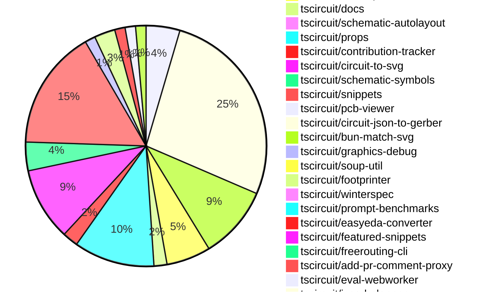

# Contribution Overview 2024-11-01

## PRs by Repository

## Contributor Overview

| Contributor | 🐳 Major | 🐙 Minor | 🐌 Tiny | ⭐ | Issues Created |
|-------------|---------|---------|---------|-----|----------------|
| [seveibar](#seveibar) | 25 | 81 | 5 | 👑👑👑 |
| [imrishabh18](#imrishabh18) | 10 | 46 | 2 | 👑👑👑 |
| [ShiboSoftwareDev](#ShiboSoftwareDev) | 7 | 29 | 4 | 👑👑 |
| [AnasSarkiz](#AnasSarkiz) | 12 | 20 | 2 | 👑👑 |
| [Abse2001](#Abse2001) | 1 | 20 | 2 | ⭐⭐⭐ |
| [mrudulpatil18](#mrudulpatil18) | 1 | 11 | 0 | ⭐⭐ |
| [RohittCodes](#RohittCodes) | 1 | 7 | 0 | ⭐⭐ |
| [Anshgrover23](#Anshgrover23) | 0 | 8 | 0 | ⭐⭐ |
| [DhairyaMajmudar](#DhairyaMajmudar) | 1 | 1 | 0 | ⭐ |
| [tscircuitbot](#tscircuitbot) | 0 | 3 | 0 | ⭐ |
| [andrii-balitskyi](#andrii-balitskyi) | 0 | 3 | 0 | ⭐ |
| [divanshu-go](#divanshu-go) | 1 | 1 | 0 | ⭐ |
| [kom-senapati](#kom-senapati) | 0 | 2 | 0 | ⭐ |
| [Niharika0104](#Niharika0104) | 0 | 1 | 0 |  |
| [hunxjunedo](#hunxjunedo) | 0 | 1 | 0 |  |

## Review Table

| Contributor | Reviews Received | Approvals | Rejections | Changes Requested | PRs Opened | PRs Closed | Issues created |
|-------------|------------------|-----------|------------|-------------------|------------|------------|----------------|
| [imrishabh18](https://github.com/imrishabh18) | 85 | 29 | 13 | 10 | 69 | 67 | 0 |
| [Abse2001](https://github.com/Abse2001) | 39 | 23 | 9 | 5 | 25 | 25 | 0 |
| [ShiboSoftwareDev](https://github.com/ShiboSoftwareDev) | 57 | 41 | 22 | 3 | 51 | 50 | 0 |
| [seveibar](https://github.com/seveibar) | 6 | 1 | 31 | 0 | 131 | 129 | 0 |
| [DhairyaMajmudar](https://github.com/DhairyaMajmudar) | 28 | 2 | 1 | 10 | 7 | 7 | 0 |
| [Niharika0104](https://github.com/Niharika0104) | 2 | 1 | 2 | 0 | 2 | 2 | 0 |
| [tscircuitbot](https://github.com/tscircuitbot) | 2 | 1 | 0 | 1 | 5 | 4 | 0 |
| [AnasSarkiz](https://github.com/AnasSarkiz) | 90 | 35 | 23 | 11 | 38 | 37 | 0 |
| [mrudulpatil18](https://github.com/mrudulpatil18) | 22 | 15 | 0 | 2 | 15 | 14 | 0 |
| [Anshgrover23](https://github.com/Anshgrover23) | 35 | 7 | 4 | 11 | 15 | 12 | 0 |
| [developerfred](https://github.com/developerfred) | 0 | 0 | 0 | 0 | 2 | 2 | 0 |
| [vishwamartur](https://github.com/vishwamartur) | 8 | 0 | 2 | 5 | 5 | 5 | 0 |
| [andrii-balitskyi](https://github.com/andrii-balitskyi) | 3 | 3 | 0 | 0 | 3 | 3 | 0 |
| [DevGajjar28](https://github.com/DevGajjar28) | 2 | 0 | 0 | 2 | 1 | 0 | 0 |
| [kom-senapati](https://github.com/kom-senapati) | 6 | 2 | 0 | 2 | 2 | 2 | 0 |
| [AkashJana18](https://github.com/AkashJana18) | 2 | 0 | 1 | 1 | 1 | 0 | 0 |
| [divanshu-go](https://github.com/divanshu-go) | 4 | 2 | 0 | 1 | 2 | 2 | 0 |
| [ni9999](https://github.com/ni9999) | 5 | 1 | 2 | 2 | 1 | 1 | 0 |
| [melmathari](https://github.com/melmathari) | 8 | 1 | 3 | 2 | 5 | 5 | 0 |
| [hunxjunedo](https://github.com/hunxjunedo) | 2 | 1 | 1 | 0 | 2 | 2 | 0 |
| [techmannih](https://github.com/techmannih) | 1 | 1 | 1 | 0 | 1 | 0 | 0 |
| [RohittCodes](https://github.com/RohittCodes) | 71 | 13 | 6 | 16 | 17 | 13 | 0 |
| [krushnarout](https://github.com/krushnarout) | 4 | 0 | 1 | 2 | 1 | 0 | 0 |
| [aybanda](https://github.com/aybanda) | 2 | 0 | 0 | 2 | 1 | 1 | 0 |
| [ahmedhalac](https://github.com/ahmedhalac) | 3 | 1 | 0 | 1 | 1 | 1 | 0 |
| [Satvik1769](https://github.com/Satvik1769) | 1 | 1 | 0 | 0 | 1 | 1 | 0 |

## Changes by Repository

### [tscircuit/3d-viewer](https://github.com/tscircuit/3d-viewer)

| PR # | Impact | Contributor | Description |
|------|--------|-------------|-------------|
| [#40](https://github.com/tscircuit/3d-viewer/pull/40) | 🐳 Major | imrishabh18 | Reverts a previous update to the `fiber` version, which was breaking the 3D viewer. |
| [#44](https://github.com/tscircuit/3d-viewer/pull/44) | 🐳 Major | ShiboSoftwareDev | Allow plated holes to be either horizontal or vertical. |
| [#50](https://github.com/tscircuit/3d-viewer/pull/50) | 🐙 Minor | Abse2001 | Fixed the issue where the bottom trace between vias was not showing and added a test for it. |
| [#47](https://github.com/tscircuit/3d-viewer/pull/47) | 🐙 Minor | Abse2001 | Fixed misalignment of 3D viewer components |
| [#46](https://github.com/tscircuit/3d-viewer/pull/46) | 🐙 Minor | Abse2001 | Updates the jscad-electronics dependency to version 0.0.22 which includes the use of the sot235 in the snippet for the or gate. |
| [#41](https://github.com/tscircuit/3d-viewer/pull/41) | 🐙 Minor | Abse2001 | Update jscad-electronics dependency to version 0.0.21 to fix an issue with capacitor footprints not changing the 3D capacitor color in snippets. |
| [#33](https://github.com/tscircuit/3d-viewer/pull/33) | 🐙 Minor | ShiboSoftwareDev | Adds a hover feature to the CAD viewer components, allowing users to highlight and view the reference designator of a component by hovering over it. |
| [#34](https://github.com/tscircuit/3d-viewer/pull/34) | 🐙 Minor | ShiboSoftwareDev | Changed the highlight color for the 3D model from a grayish color to blue. |
| [#32](https://github.com/tscircuit/3d-viewer/pull/32) | 🐙 Minor | ShiboSoftwareDev | Fixes 3D model rotation in the CAD viewer component |
| [#39](https://github.com/tscircuit/3d-viewer/pull/39) | 🐙 Minor | AnasSarkiz | Update dependencies for the project, including upgrades to `@tscircuit/core`, `@tscircuit/react-fiber`, `jscad-electronics`, and `jscad-fiber`. |
| [#38](https://github.com/tscircuit/3d-viewer/pull/38) | 🐙 Minor | AnasSarkiz | The change adds support for pill-shaped board cutouts (holes) in the 3D viewer. |
| [#37](https://github.com/tscircuit/3d-viewer/pull/37) | 🐙 Minor | mrudulpatil18 | This pull request changes the position of the hover label to be below the pointer, and updates the position of the label frame-by-frame to prevent it from drifting away when the camera view changes. |
| [#42](https://github.com/tscircuit/3d-viewer/pull/42) | 🐌 Tiny | Abse2001 | Updates the project's lockfile after running `npm update`. |

### [tscircuit/core](https://github.com/tscircuit/core)

| PR # | Impact | Contributor | Description |
|------|--------|-------------|-------------|
| [#333](https://github.com/tscircuit/core/pull/333) | 🐳 Major | imrishabh18 | Adds caching of PCB trace routes to improve rendering performance. |
| [#270](https://github.com/tscircuit/core/pull/270) | 🐳 Major | imrishabh18 | Normalize function for pin labels moved from easyeda to core |
| [#224](https://github.com/tscircuit/core/pull/224) | 🐳 Major | imrishabh18 | Adds support for manual edits to the PCB layout in the `PrimitiveComponent` class. |
| [#319](https://github.com/tscircuit/core/pull/319) | 🐳 Major | Abse2001 | Introduce a new `<pushbutton />` component. |
| [#364](https://github.com/tscircuit/core/pull/364) | 🐳 Major | ShiboSoftwareDev | Adds support for the "rotated_rect" shape in the SmtPad component. |
| [#374](https://github.com/tscircuit/core/pull/374) | 🐳 Major | seveibar | Fixes a production issue related to differences in GET/POST request handling for autorouting job creation. |
| [#373](https://github.com/tscircuit/core/pull/373) | 🐳 Major | seveibar | Introduce job autorouting mode in the Group component. |
| [#336](https://github.com/tscircuit/core/pull/336) | 🐳 Major | seveibar | Change the default format for async autorouting from SimpleRouteJson to CircuitJson, fix issues with the async autorouter, and add testing for production usage. |
| [#316](https://github.com/tscircuit/core/pull/316) | 🐳 Major | seveibar | Fixes the issue of subcircuit refdes selection, which is part of the larger Subcircuit Isolation feature. |
| [#297](https://github.com/tscircuit/core/pull/297) | 🐳 Major | seveibar | Fixes the handling of complex crossings in the schematic trace rendering logic. |
| [#292](https://github.com/tscircuit/core/pull/292) | 🐳 Major | seveibar | Allows the `schPortArrangement` property to accept strings in addition to numbers, enabling more flexible port arrangement configuration. |
| [#274](https://github.com/tscircuit/core/pull/274) | 🐳 Major | seveibar | Adds a new feature to the NormalComponent class to handle supplier part numbers using a parts engine. |
| [#264](https://github.com/tscircuit/core/pull/264) | 🐳 Major | seveibar | Adds support for schematic symbol rotation in the NormalComponent class, with the ability to handle different symbol orientations. |
| [#260](https://github.com/tscircuit/core/pull/260) | 🐳 Major | seveibar | Adds support for junctions in schematic traces, including fixing issues with trace pushes when connected to the same net. |
| [#252](https://github.com/tscircuit/core/pull/252) | 🐳 Major | seveibar | Adds `is_crossing` and splits schematic trace segments to enable the "trace hop" feature. |
| [#251](https://github.com/tscircuit/core/pull/251) | 🐳 Major | seveibar | Introduces a new algorithm to push schematic trace segments away from other overlapping traces to avoid clutter. |
| [#235](https://github.com/tscircuit/core/pull/235) | 🐳 Major | seveibar | Adds support for pinheaders and implied footprint strings |
| [#253](https://github.com/tscircuit/core/pull/253) | 🐳 Major | DhairyaMajmudar | Adds error handling for missing footprint in the `NormalComponent` class. |
| [#362](https://github.com/tscircuit/core/pull/362) | 🐳 Major | AnasSarkiz | Implemented a new event `renderable:renderLifecycle:anyEvent` to make it easier to listen to renderable events. |
| [#349](https://github.com/tscircuit/core/pull/349) | 🐙 Minor | imrishabh18 | Add a new component called "Crystal" to the library. |
| [#350](https://github.com/tscircuit/core/pull/350) | 🐙 Minor | imrishabh18 | Add "circuit-to-svg" as a dev dependency to reduce bundle size |
| [#300](https://github.com/tscircuit/core/pull/300) | 🐙 Minor | imrishabh18 | Adds a new Potentiometer component to the library. |
| [#295](https://github.com/tscircuit/core/pull/295) | 🐙 Minor | imrishabh18 | Fix the pin header width by adding padding to the box only when the label is present. |
| [#294](https://github.com/tscircuit/core/pull/294) | 🐙 Minor | imrishabh18 | Adds a new `facingDirection` prop to the `PinHeader` component and updates the `_getSchematicPortArrangement()` method accordingly. |
| [#245](https://github.com/tscircuit/core/pull/245) | 🐙 Minor | imrishabh18 | Fixes an issue where port dots were being displayed on the center of a chip component when a port arrangement was present. |
| [#229](https://github.com/tscircuit/core/pull/229) | 🐙 Minor | imrishabh18 | Adds the pin number as an alias for portHints in the NormalComponent class. |
| [#351](https://github.com/tscircuit/core/pull/351) | 🐙 Minor | Abse2001 | Added `pin_count` and `gender` properties to the `<pinheader />` component. |
| [#342](https://github.com/tscircuit/core/pull/342) | 🐙 Minor | Abse2001 | Fixed manufacturer Part Number positioning for four-sided pin layouts, handled three-pin layouts, and added tests for it. |
| [#339](https://github.com/tscircuit/core/pull/339) | 🐙 Minor | Abse2001 | Implemented the `getInheritedProperty` method on the `PrimitiveComponent` class to retrieve a property from the component or its parent components. |
| [#369](https://github.com/tscircuit/core/pull/369) | 🐙 Minor | ShiboSoftwareDev | Added a test case to ensure that 90-degree rotation of SMT pads draws the correct rectangular shapes. |
| [#368](https://github.com/tscircuit/core/pull/368) | 🐙 Minor | ShiboSoftwareDev | Fix a bug where rectangular SMT pads were not drawn correctly when the component was rotated 90 degrees. |
| [#315](https://github.com/tscircuit/core/pull/315) | 🐙 Minor | ShiboSoftwareDev | Fixed an issue where non-port elements were being added as ports for custom footprints. |
| [#269](https://github.com/tscircuit/core/pull/269) | 🐙 Minor | ShiboSoftwareDev | The change makes the `schematic_port.facing_direction` more accurate by using the `localPortInfo.side` property to determine the facing direction. |
| [#268](https://github.com/tscircuit/core/pull/268) | 🐙 Minor | ShiboSoftwareDev | Added support for schematic rotation of capacitor, inductor, diode, and LED components. |
| [#259](https://github.com/tscircuit/core/pull/259) | 🐙 Minor | ShiboSoftwareDev | Schematic box components now expand to fit the label text. |
| [#357](https://github.com/tscircuit/core/pull/357) | 🐙 Minor | seveibar | Adds a function to get the client origin and a method to add a cachebust parameter to the model URL to avoid CORS issues. |
| [#334](https://github.com/tscircuit/core/pull/334) | 🐙 Minor | seveibar | Adds a GitHub Actions workflow for closing stale issues and pull requests. |
| [#326](https://github.com/tscircuit/core/pull/326) | 🐙 Minor | seveibar | Allows disabling trace rendering inside of subcircuits |
| [#323](https://github.com/tscircuit/core/pull/323) | 🐙 Minor | seveibar | Fix for bundle size reporting for non-org members |
| [#309](https://github.com/tscircuit/core/pull/309) | 🐙 Minor | seveibar | Fix pin number type inference for createUseComponent hooks |
| [#305](https://github.com/tscircuit/core/pull/305) | 🐙 Minor | seveibar | Update the schematic symbols package to version 0.0.98, which likely includes updates to the capacitor symbols and their directions. |
| [#303](https://github.com/tscircuit/core/pull/303) | 🐙 Minor | seveibar | Adds directional symbol names to the PrimitiveComponent class. |
| [#299](https://github.com/tscircuit/core/pull/299) | 🐙 Minor | seveibar | Fix an issue where the trace overshoots the end of the edge. |
| [#296](https://github.com/tscircuit/core/pull/296) | 🐙 Minor | seveibar | Fix the facing direction of net labels based on the port's side. |
| [#287](https://github.com/tscircuit/core/pull/287) | 🐙 Minor | seveibar | Adds a new SVG file to the test snapshot for a complex schematic component with crossing traces. |
| [#285](https://github.com/tscircuit/core/pull/285) | 🐙 Minor | seveibar | Fixes an issue where stub edges were not appearing for some edges. |
| [#284](https://github.com/tscircuit/core/pull/284) | 🐙 Minor | seveibar | Fix a visual bug in the crossing direction calculation for schematic traces. |
| [#283](https://github.com/tscircuit/core/pull/283) | 🐙 Minor | seveibar | Increases the line thickness of schematic traces to prevent overlaps and updates a dependency. |
| [#277](https://github.com/tscircuit/core/pull/277) | 🐙 Minor | seveibar | Adapt the parts engine to use the footprinterString in the NormalComponent. |
| [#262](https://github.com/tscircuit/core/pull/262) | 🐙 Minor | seveibar | Fixes an issue with the parsing of props for the schematic component rotation. |
| [#261](https://github.com/tscircuit/core/pull/261) | 🐙 Minor | seveibar | Add anchor_position to schematic_net_label and add net labels when schematic trace is connected to a net on one side. |
| [#257](https://github.com/tscircuit/core/pull/257) | 🐙 Minor | seveibar | Implement source_trace.subcircuit_connectivity_map_key |
| [#247](https://github.com/tscircuit/core/pull/247) | 🐙 Minor | seveibar | Adds the `display_pin_label` property to schematic ports and the `symbol_display_value` property to schematic components. |
| [#239](https://github.com/tscircuit/core/pull/239) | 🐙 Minor | seveibar | Fixes an issue with stub edges on schematic traces, ensuring proper connection to the end port. |
| [#238](https://github.com/tscircuit/core/pull/238) | 🐙 Minor | seveibar | Refactor the computation of the schematic box dimensions to simplify the logic and improve maintainability. |
| [#236](https://github.com/tscircuit/core/pull/236) | 🐙 Minor | seveibar | Improves schematic box rendering for components other than chips, removes ghost code. |
| [#227](https://github.com/tscircuit/core/pull/227) | 🐙 Minor | seveibar | Fix the issue where components have weird drag and drop issues where you can't click them in the center. |
| [#379](https://github.com/tscircuit/core/pull/379) | 🐙 Minor | AnasSarkiz | Removed schematic text logic from `Jumper.ts` |
| [#378](https://github.com/tscircuit/core/pull/378) | 🐙 Minor | AnasSarkiz | Moved the schematic text logic for the manufacturer part number and component name to the `SchematicComponentRenderWithSchematicBoxDimensions` function, centralizing the rendering of these text elements. |
| [#376](https://github.com/tscircuit/core/pull/376) | 🐙 Minor | AnasSarkiz | Adds a new `schematicDisabled` property to the `Circuit` class to skip rendering all schematic components. |
| [#358](https://github.com/tscircuit/core/pull/358) | 🐙 Minor | AnasSarkiz | Updated the version of the `bun-match-svg` dependency and the `@tscircuit/footprinter` dependency in the `package.json` file. |
| [#352](https://github.com/tscircuit/core/pull/352) | 🐙 Minor | AnasSarkiz | Implemented `getCurrentRenderPhase` and `getRenderGraph` methods for debugging the render process. |
| [#338](https://github.com/tscircuit/core/pull/338) | 🐙 Minor | AnasSarkiz | Added support for tracing schematic_box obstacles in the Trace component. |
| [#335](https://github.com/tscircuit/core/pull/335) | 🐙 Minor | AnasSarkiz | Resolved an issue where pin labels for the PinHeader component were not being drawn in SVG. |
| [#325](https://github.com/tscircuit/core/pull/325) | 🐙 Minor | AnasSarkiz | Modify the position of manufacturer part number and name label based on the arrangement of pins. |
| [#322](https://github.com/tscircuit/core/pull/322) | 🐙 Minor | AnasSarkiz | Refactor the trace so it does not get passed to the chip manufacturer part number and name |
| [#355](https://github.com/tscircuit/core/pull/355) | 🐙 Minor | mrudulpatil18 | The pull request ensures that the name passed directly when using the component takes precedence over the default name from `useRedLed`, and it adds a test to verify the behavior. |
| [#363](https://github.com/tscircuit/core/pull/363) | 🐙 Minor | Anshgrover23 | Fix the `bundle-size.yml` workflow to run on pull requests from forks. |
| [#242](https://github.com/tscircuit/core/pull/242) | 🐙 Minor | andrii-balitskyi | Adds a test for the `useDiode` hook to ensure it creates diode components with the correct props and traces. |
| [#244](https://github.com/tscircuit/core/pull/244) | 🐙 Minor | andrii-balitskyi | Adds a GitHub Actions workflow to automatically format the code in pull requests. |
| [#243](https://github.com/tscircuit/core/pull/243) | 🐙 Minor | andrii-balitskyi | Adds a new `useLed` hook to the library. |
| [#275](https://github.com/tscircuit/core/pull/275) | 🐌 Tiny | imrishabh18 | Reduce the dependency size of the `@tscircuit/schematic-autolayout` package from `0.0.5` to `0.0.6`. |
| [#228](https://github.com/tscircuit/core/pull/228) | 🐌 Tiny | imrishabh18 | Updates the package lockfile to include the latest dependency versions. |
| [#367](https://github.com/tscircuit/core/pull/367) | 🐌 Tiny | Abse2001 | Skips two tests related to remote autorouting |
| [#314](https://github.com/tscircuit/core/pull/314) | 🐌 Tiny | ShiboSoftwareDev | Fixed the rendering of the battery symbol. |
| [#330](https://github.com/tscircuit/core/pull/330) | 🐌 Tiny | AnasSarkiz | Updates the bun lockfile |
| [#329](https://github.com/tscircuit/core/pull/329) | 🐌 Tiny | AnasSarkiz | Updates the dependency lockfile |

### [tscircuit/dsn-converter](https://github.com/tscircuit/dsn-converter)

| PR # | Impact | Contributor | Description |
|------|--------|-------------|-------------|
| [#37](https://github.com/tscircuit/dsn-converter/pull/37) | 🐳 Major | imrishabh18 | Add support for processing vias in the DSN to Circuit JSON conversion. |
| [#32](https://github.com/tscircuit/dsn-converter/pull/32) | 🐳 Major | imrishabh18 | Fix the conversion of `pcb_trace` and `source_net` to a network of DSN. |
| [#29](https://github.com/tscircuit/dsn-converter/pull/29) | 🐳 Major | imrishabh18 | This pull request groups the components and images together in the DSN file format, similar to how they are organized in the KiCAD DSN file format. |
| [#19](https://github.com/tscircuit/dsn-converter/pull/19) | 🐳 Major | imrishabh18 | Adds support for plated holes and rotation on SMT pads in the PCB conversion process. |
| [#16](https://github.com/tscircuit/dsn-converter/pull/16) | 🐳 Major | imrishabh18 | The pull request fix the conversion from circuit JSON to DSN file by adding support for processing PCB traces. |
| [#13](https://github.com/tscircuit/dsn-converter/pull/13) | 🐳 Major | imrishabh18 | Implements the conversion of circuit JSON to DSN JSON format, including processing of components, pads, and nets. |
| [#39](https://github.com/tscircuit/dsn-converter/pull/39) | 🐳 Major | seveibar | Correctly size plated holes for homogenous components |
| [#24](https://github.com/tscircuit/dsn-converter/pull/24) | 🐳 Major | seveibar | Converts a Circuit JSON representation to a DSN session, which includes placing components and routing traces. |
| [#20](https://github.com/tscircuit/dsn-converter/pull/20) | 🐳 Major | seveibar | Introduces initial support for parsing DSN session files and converting them to circuit JSON format. |
| [#45](https://github.com/tscircuit/dsn-converter/pull/45) | 🐙 Minor | imrishabh18 | Refactor to remove the `processChips` function, as chip components are now processed along with other components and pads. |
| [#43](https://github.com/tscircuit/dsn-converter/pull/43) | 🐙 Minor | imrishabh18 | Removes hardcoded size of smtpads and uses the default trace width of the circuit JSON. |
| [#38](https://github.com/tscircuit/dsn-converter/pull/38) | 🐙 Minor | imrishabh18 | Adds `from_layer` and `to_layer` properties to the `via` object in the `convert-via-to-pcb-via.ts` file. |
| [#36](https://github.com/tscircuit/dsn-converter/pull/36) | 🐙 Minor | imrishabh18 | Fixes a bug where the circle shape was missing, causing the x and y coordinates to be null. |
| [#35](https://github.com/tscircuit/dsn-converter/pull/35) | 🐙 Minor | imrishabh18 | The pull request fixes an issue where the trace ID was not being generated correctly, leading to incorrect connection visualization on hover. |
| [#34](https://github.com/tscircuit/dsn-converter/pull/34) | 🐙 Minor | imrishabh18 | Adds a GitHub Actions workflow to automatically format code using the `@biomejs/biome` package. |
| [#33](https://github.com/tscircuit/dsn-converter/pull/33) | 🐙 Minor | imrishabh18 | Adds a test to check the motor driver DSN format and fixes the parseDsnJson function for conversion. |
| [#31](https://github.com/tscircuit/dsn-converter/pull/31) | 🐙 Minor | imrishabh18 | Converts simple_chip components to DSN format |
| [#30](https://github.com/tscircuit/dsn-converter/pull/30) | 🐙 Minor | imrishabh18 | The change groups the plated holes for the components together and adds images only once, similar to the KiCad format. |
| [#28](https://github.com/tscircuit/dsn-converter/pull/28) | 🐙 Minor | imrishabh18 | Fix plated hole DSN file format and net |
| [#27](https://github.com/tscircuit/dsn-converter/pull/27) | 🐙 Minor | imrishabh18 | Fix a scaling issue in the session |
| [#23](https://github.com/tscircuit/dsn-converter/pull/23) | 🐙 Minor | imrishabh18 | Restores the processing of PCB traces in the circuit-json-to-dsn-json conversion process. |
| [#18](https://github.com/tscircuit/dsn-converter/pull/18) | 🐙 Minor | imrishabh18 | Removes the processing of traces in the PCB conversion process, as it will be handled by the autorouter. |
| [#15](https://github.com/tscircuit/dsn-converter/pull/15) | 🐙 Minor | imrishabh18 | Add support for the polygon shape in the conversion from DSN JSON to Circuit JSON. |
| [#26](https://github.com/tscircuit/dsn-converter/pull/26) | 🐙 Minor | seveibar | Adjusts the scale factor for converting DSN session to circuit JSON from 1/1000 to 1/10000. |
| [#25](https://github.com/tscircuit/dsn-converter/pull/25) | 🐙 Minor | seveibar | Fixes the session JSON file by adding the necessary files to the .gitignore and updating the code to use the correct variables. |
| [#22](https://github.com/tscircuit/dsn-converter/pull/22) | 🐙 Minor | seveibar | Adds support for stringifying DSN sessions. |
| [#21](https://github.com/tscircuit/dsn-converter/pull/21) | 🐙 Minor | seveibar | Fix Session Parsing |
| [#14](https://github.com/tscircuit/dsn-converter/pull/14) | 🐌 Tiny | seveibar | Update the README file with additional information about the library's usage and features. |

### [tscircuit/schematic-viewer](https://github.com/tscircuit/schematic-viewer)

| PR # | Impact | Contributor | Description |
|------|--------|-------------|-------------|
| [#71](https://github.com/tscircuit/schematic-viewer/pull/71) | 🐙 Minor | imrishabh18 | Fix the issue where drag sensitivity is not constant throughout the movement. |

### [tscircuit/circuit-json](https://github.com/tscircuit/circuit-json)

| PR # | Impact | Contributor | Description |
|------|--------|-------------|-------------|
| [#78](https://github.com/tscircuit/circuit-json/pull/78) | 🐳 Major | seveibar | Adds a new source component overview documentation file and improves the `expectTypesMatch` function. |
| [#81](https://github.com/tscircuit/circuit-json/pull/81) | 🐙 Minor | imrishabh18 | Adds a new source component for a simple crystal |
| [#80](https://github.com/tscircuit/circuit-json/pull/80) | 🐙 Minor | imrishabh18 | Add support for exporting potentiometer as a source component. |
| [#79](https://github.com/tscircuit/circuit-json/pull/79) | 🐙 Minor | imrishabh18 | Adds a new source component for a simple potentiometer |
| [#84](https://github.com/tscircuit/circuit-json/pull/84) | 🐙 Minor | Abse2001 | Added an optional `gender` property to the `source_simple_pin_header` type. |
| [#83](https://github.com/tscircuit/circuit-json/pull/83) | 🐙 Minor | Abse2001 | Implemented source_simple_pin_header |
| [#76](https://github.com/tscircuit/circuit-json/pull/76) | 🐙 Minor | Abse2001 | Added a new source component for a simple push button |
| [#82](https://github.com/tscircuit/circuit-json/pull/82) | 🐙 Minor | ShiboSoftwareDev | Adds a new "rotated_rect" shape type to the PCB SMT pad definition. |
| [#74](https://github.com/tscircuit/circuit-json/pull/74) | 🐙 Minor | seveibar | Add `anchor_position` field to `SchematicNetLabel` type and make `symbol_name` field optional. |
| [#63](https://github.com/tscircuit/circuit-json/pull/63) | 🐙 Minor | seveibar | Improve the definition of the schematic debug object by introducing new interfaces for `SchematicDebugRect` and `SchematicDebugLine`, and removing the use of Zod for type inference. |
| [#73](https://github.com/tscircuit/circuit-json/pull/73) | 🐙 Minor | seveibar | Adds the `junctions` property to the `SchematicTrace` type, which contains an array of objects with `x` and `y` coordinates. |
| [#72](https://github.com/tscircuit/circuit-json/pull/72) | 🐙 Minor | seveibar | Add `is_crossing` field to `SchematicTraceEdge` interface and update the corresponding Zod schema. |
| [#70](https://github.com/tscircuit/circuit-json/pull/70) | 🐙 Minor | seveibar | Fixes parsing of unitless resistance values in the `convert-si-unit-to-number` utility. |
| [#69](https://github.com/tscircuit/circuit-json/pull/69) | 🐙 Minor | seveibar | Refactor the `schematic_component` type to use a zodless interface, and add a new `symbol_display_value` property. |
| [#68](https://github.com/tscircuit/circuit-json/pull/68) | 🐙 Minor | seveibar | Add a new optional field `display_pin_label` to the `SchematicPort` interface and the corresponding Zod schema. |
| [#67](https://github.com/tscircuit/circuit-json/pull/67) | 🐙 Minor | seveibar | Improves SI unit parsing by using a more robust regular expression to extract the unit from the input string. |
| [#77](https://github.com/tscircuit/circuit-json/pull/77) | 🐙 Minor | DhairyaMajmudar | Adding a new PCBMissingFootprintError component to the library. |

### [tscircuit/docs](https://github.com/tscircuit/docs)

| PR # | Impact | Contributor | Description |
|------|--------|-------------|-------------|
| [#37](https://github.com/tscircuit/docs/pull/37) | 🐙 Minor | imrishabh18 | Add documentation for the motor driver circuit |
| [#41](https://github.com/tscircuit/docs/pull/41) | 🐙 Minor | Abse2001 | Added a tutorial for an OR gate logic circuit with USB power, push buttons, and LEDs. |
| [#36](https://github.com/tscircuit/docs/pull/36) | 🐙 Minor | ShiboSoftwareDev | Added a new tutorial circuit for a pushbutton LED |
| [#40](https://github.com/tscircuit/docs/pull/40) | 🐙 Minor | Niharika0104 | Added a tutorial for creating an AND gate circuit using the XD74LS08 chip, including USB-C power, push buttons, resistors, and LEDs to display the output. |
| [#38](https://github.com/tscircuit/docs/pull/38) | 🐌 Tiny | ShiboSoftwareDev | Fixes a typo in the "pushbutton-led-circuit.mdx" tutorial. |

### [tscircuit/schematic-autolayout](https://github.com/tscircuit/schematic-autolayout)

| PR # | Impact | Contributor | Description |
|------|--------|-------------|-------------|
| [#4](https://github.com/tscircuit/schematic-autolayout/pull/4) | 🐙 Minor | imrishabh18 | Add the auto publish workflow for the project on the main branch. |
| [#3](https://github.com/tscircuit/schematic-autolayout/pull/3) | 🐙 Minor | imrishabh18 | Update dependency by migrating to bun from npm, shifting the dependency to devDependency, and removing the builder. |

### [tscircuit/props](https://github.com/tscircuit/props)

| PR # | Impact | Contributor | Description |
|------|--------|-------------|-------------|
| [#72](https://github.com/tscircuit/props/pull/72) | 🐳 Major | seveibar | Introduces a new component called "header" with various properties. |
| [#106](https://github.com/tscircuit/props/pull/106) | 🐙 Minor | imrishabh18 | Adds export for crystal component and fixes npm publish issue |
| [#102](https://github.com/tscircuit/props/pull/102) | 🐙 Minor | imrishabh18 | Exports the `PcbRouteCache` interface to make it accessible outside the file. |
| [#101](https://github.com/tscircuit/props/pull/101) | 🐙 Minor | imrishabh18 | Add `pcbRouteCache` property to the `SubcircuitGroupProps` interface. |
| [#100](https://github.com/tscircuit/props/pull/100) | 🐙 Minor | imrishabh18 | Adds a new component for a crystal with frequency and load capacitance properties |
| [#96](https://github.com/tscircuit/props/pull/96) | 🐙 Minor | imrishabh18 | Adds a new component called "potentiometer" to the library |
| [#93](https://github.com/tscircuit/props/pull/93) | 🐙 Minor | imrishabh18 | Adds the ability to specify the facing direction of the pin header component. |
| [#80](https://github.com/tscircuit/props/pull/80) | 🐙 Minor | imrishabh18 | Replaces the dependency on "@tscircuit/soup" with "circuit-json" in various files. |
| [#79](https://github.com/tscircuit/props/pull/79) | 🐙 Minor | imrishabh18 | Adds support for string-based pins in the `PinSideDefinition` interface |
| [#70](https://github.com/tscircuit/props/pull/70) | 🐙 Minor | imrishabh18 | The pull request adds "manualEdits" as a new prop to the "BoardProps" and "SubcircuitGroupProps" interfaces. |
| [#110](https://github.com/tscircuit/props/pull/110) | 🐙 Minor | Abse2001 | Added a new optional `schDisplayLabel` prop to the `trace` component. |
| [#108](https://github.com/tscircuit/props/pull/108) | 🐙 Minor | Abse2001 | Set the default gender for pin headers to male. |
| [#84](https://github.com/tscircuit/props/pull/84) | 🐙 Minor | Abse2001 | Adds a new `pushButtonProps` type and exports it from the library. |
| [#104](https://github.com/tscircuit/props/pull/104) | 🐙 Minor | ShiboSoftwareDev | Add support for rotated rectangular SMT pads in the smtpad component. |
| [#109](https://github.com/tscircuit/props/pull/109) | 🐙 Minor | seveibar | Adds a new `serverMode` property to the `AutorouterConfig` interface, which can be set to either "job" or "solve-endpoint". |
| [#105](https://github.com/tscircuit/props/pull/105) | 🐙 Minor | seveibar | Adds "sequential-trace" and "subcircuit" as new autorouter presets. |
| [#103](https://github.com/tscircuit/props/pull/103) | 🐙 Minor | seveibar | Adds an "autorouter" property to the `SubcircuitGroupProps` interface, which can be an `AutorouterConfig` object, the string "auto", "auto-local", or "auto-cloud". |
| [#99](https://github.com/tscircuit/props/pull/99) | 🐙 Minor | seveibar | Introduce a new `NonSubcircuitGroupProps` interface to handle non-subcircuit group props, and modify the `groupProps` type to use a discriminated union. |
| [#98](https://github.com/tscircuit/props/pull/98) | 🐙 Minor | seveibar | Removes the requirement for the `subcircuit: true` boolean property on subcircuits, allowing them to be defined without it. |
| [#97](https://github.com/tscircuit/props/pull/97) | 🐙 Minor | seveibar | Add subcircuit file |
| [#92](https://github.com/tscircuit/props/pull/92) | 🐙 Minor | seveibar | Allow strings and numbers to be defined together for pinLabels and improve `expectTypesMatch` errors |
| [#90](https://github.com/tscircuit/props/pull/90) | 🐙 Minor | seveibar | Adds a new optional parameter `footprinterString` to the `findPart` function in the `PartsEngine` type. |
| [#89](https://github.com/tscircuit/props/pull/89) | 🐙 Minor | seveibar | Add `minTraceWidth` property to subcircuits. |
| [#88](https://github.com/tscircuit/props/pull/88) | 🐙 Minor | seveibar | Fix schRotation for netalias component |
| [#87](https://github.com/tscircuit/props/pull/87) | 🐙 Minor | seveibar | Introduce partsEngine prop, minor refactoring, and fix netalias schX definition |
| [#83](https://github.com/tscircuit/props/pull/83) | 🐙 Minor | seveibar | Add `netAlias` component props |
| [#82](https://github.com/tscircuit/props/pull/82) | 🐙 Minor | seveibar | Change the type of `pinLabels` property in the `ChipProps` interface to accept read-only arrays. |
| [#68](https://github.com/tscircuit/props/pull/68) | 🐙 Minor | seveibar | This pull request adds a workflow to generate a props overview document and commit the changes. |
| [#86](https://github.com/tscircuit/props/pull/86) | 🐙 Minor | tscircuitbot | Add `polarized: z.boolean().optional().default(false)` to `<capacitor />` component. |
| [#76](https://github.com/tscircuit/props/pull/76) | 🐙 Minor | tscircuitbot | Rename `headerProps` to `pinHeaderProps`, add `pinHeader.pinLabels` |
| [#74](https://github.com/tscircuit/props/pull/74) | 🐙 Minor | tscircuitbot | Add new parameters `holeDiameter` and `platedDiameter` to the `header` component. |

### [tscircuit/contribution-tracker](https://github.com/tscircuit/contribution-tracker)

| PR # | Impact | Contributor | Description |
|------|--------|-------------|-------------|
| [#12](https://github.com/tscircuit/contribution-tracker/pull/12) | 🐙 Minor | imrishabh18 | Reverts the previous fix to the review table. |
| [#14](https://github.com/tscircuit/contribution-tracker/pull/14) | 🐙 Minor | ShiboSoftwareDev | Fixed the formatting of the review table in the generated Markdown |
| [#8](https://github.com/tscircuit/contribution-tracker/pull/8) | 🐙 Minor | AnasSarkiz | Adds a new column "Issues Created" to the reviews table, displaying the number of issues created by each contributor. |
| [#13](https://github.com/tscircuit/contribution-tracker/pull/13) | 🐙 Minor | Anshgrover23 | Fix the contributor overview table by adding a new column for "Issues Created" and using the fallback value of 0 for contributors without the `issuesCreated` property. |
| [#11](https://github.com/tscircuit/contribution-tracker/pull/11) | 🐙 Minor | Anshgrover23 | Fix issues with the review table display |
| [#6](https://github.com/tscircuit/contribution-tracker/pull/6) | 🐙 Minor | kom-senapati | Added a review table under the Contributor Overview section. |

### [tscircuit/circuit-to-svg](https://github.com/tscircuit/circuit-to-svg)

| PR # | Impact | Contributor | Description |
|------|--------|-------------|-------------|
| [#117](https://github.com/tscircuit/circuit-to-svg/pull/117) | 🐳 Major | seveibar | Adds nonexistent symbol handling, fixes snapshot, and adds error message when symbol ports don't align. |
| [#113](https://github.com/tscircuit/circuit-to-svg/pull/113) | 🐳 Major | seveibar | Introduces comprehensive calculations for Netlabel size and position, including support for `center` and `anchor_position`. |
| [#112](https://github.com/tscircuit/circuit-to-svg/pull/112) | 🐳 Major | seveibar | Adds support for junctions and improves the drawing of wire crossings in the schematic. |
| [#110](https://github.com/tscircuit/circuit-to-svg/pull/110) | 🐳 Major | seveibar | Implements the initial crossing trace feature for the schematic SVG rendering. |
| [#104](https://github.com/tscircuit/circuit-to-svg/pull/104) | 🐳 Major | seveibar | Major refactor to all schematic objects, using absolute coordinates, breaking up functions, and fixing offsets. |
| [#132](https://github.com/tscircuit/circuit-to-svg/pull/132) | 🐳 Major | AnasSarkiz | Implemented the create svg schematic text function. |
| [#120](https://github.com/tscircuit/circuit-to-svg/pull/120) | 🐙 Minor | imrishabh18 | Fixed the top and bottom anchor position for the net label. |
| [#115](https://github.com/tscircuit/circuit-to-svg/pull/115) | 🐙 Minor | imrishabh18 | Use the source port name for the pin text instead of the port's pin number. |
| [#106](https://github.com/tscircuit/circuit-to-svg/pull/106) | 🐙 Minor | imrishabh18 | Add support for rendering schematic net labels in the SVG output. |
| [#137](https://github.com/tscircuit/circuit-to-svg/pull/137) | 🐙 Minor | ShiboSoftwareDev | Rotate rectangular SMT pads counter-clockwise instead of clockwise. |
| [#136](https://github.com/tscircuit/circuit-to-svg/pull/136) | 🐙 Minor | ShiboSoftwareDev | Adds support for rendering rotated rectangular SMT pads in the PCB SVG renderer. |
| [#114](https://github.com/tscircuit/circuit-to-svg/pull/114) | 🐙 Minor | ShiboSoftwareDev | Adds the ability to draw PCB trace errors in the SVG output. |
| [#130](https://github.com/tscircuit/circuit-to-svg/pull/130) | 🐙 Minor | seveibar | Fixes the outline scaling for trace stroke sizes and improves hovering over traces. |
| [#129](https://github.com/tscircuit/circuit-to-svg/pull/129) | 🐙 Minor | seveibar | Fixes an issue where the pin number text was getting offset with large bounds. |
| [#127](https://github.com/tscircuit/circuit-to-svg/pull/127) | 🐙 Minor | seveibar | Move `circuit-json` and `schematic-symbols` packages from `dependencies` to `peerDependencies`. |
| [#126](https://github.com/tscircuit/circuit-to-svg/pull/126) | 🐙 Minor | seveibar | Fix grid not appearing at boundaries and fix traces not being used in bounds calculation. |
| [#124](https://github.com/tscircuit/circuit-to-svg/pull/124) | 🐙 Minor | seveibar | Change the trace color on hover and make the paths rounded. |
| [#121](https://github.com/tscircuit/circuit-to-svg/pull/121) | 🐙 Minor | seveibar | Reverts the change made in tscircuit/circuit-to-svg#120 that fixed the top and bottom anchor position of the net label. |
| [#116](https://github.com/tscircuit/circuit-to-svg/pull/116) | 🐙 Minor | seveibar | Reverts the change that used the source port name for the pin text. |
| [#111](https://github.com/tscircuit/circuit-to-svg/pull/111) | 🐙 Minor | seveibar | Fixes the position of labeled points and changes the font to sans-serif |
| [#109](https://github.com/tscircuit/circuit-to-svg/pull/109) | 🐙 Minor | seveibar | Fix schematic port label name, fix anchoring of bottom text on components, and update core dependency |
| [#108](https://github.com/tscircuit/circuit-to-svg/pull/108) | 🐙 Minor | seveibar | Change the way symbol values are displayed by using `symbol_display_value` instead of `display_value`, `capacitance`, or `resistance`. |
| [#107](https://github.com/tscircuit/circuit-to-svg/pull/107) | 🐙 Minor | seveibar | Add a format check workflow to the project, format the code, and add a `noConsole` rule. |
| [#103](https://github.com/tscircuit/circuit-to-svg/pull/103) | 🐙 Minor | seveibar | Fixes schematic component rendering by updating the rendering logic to rely on standard component properties instead of non-standard ones. |
| [#134](https://github.com/tscircuit/circuit-to-svg/pull/134) | 🐙 Minor | AnasSarkiz | Render pin labels for the PinHeader component in SVG |
| [#133](https://github.com/tscircuit/circuit-to-svg/pull/133) | 🐙 Minor | AnasSarkiz | Removes the drawing of manufacturer part numbers in the SVG output. |
| [#140](https://github.com/tscircuit/circuit-to-svg/pull/140) | 🐙 Minor | divanshu-go | Adds a GitHub Actions workflow to calculate the bundle and install size differences between the base branch and the pull request branch. |
| [#105](https://github.com/tscircuit/circuit-to-svg/pull/105) | 🐌 Tiny | seveibar | Update the version of the "@tscircuit/core" package from 0.0.147 to 0.0.148. |

### [tscircuit/schematic-symbols](https://github.com/tscircuit/schematic-symbols)

| PR # | Impact | Contributor | Description |
|------|--------|-------------|-------------|
| [#204](https://github.com/tscircuit/schematic-symbols/pull/204) | 🐳 Major | seveibar | The pull request flips the y coordinates in the "getSvg" function, effectively making the y-up direction positive in the exported JSON symbols. |
| [#198](https://github.com/tscircuit/schematic-symbols/pull/198) | 🐳 Major | AnasSarkiz | Implemented flipSymbolOverYAxis and flipSymbolOverXAxis functions to modify LED arrows directions |
| [#195](https://github.com/tscircuit/schematic-symbols/pull/195) | 🐳 Major | AnasSarkiz | The pull request changes the LED symbol from horizontal and vertical orientations to up, right, left, and down orientations. |
| [#194](https://github.com/tscircuit/schematic-symbols/pull/194) | 🐳 Major | AnasSarkiz | Refactor the `rotateAnchor` function to handle all orientations (up, down, left, right) for a nine-point anchor. |
| [#197](https://github.com/tscircuit/schematic-symbols/pull/197) | 🐙 Minor | imrishabh18 | Fix the position of the potentiometer label in the horizontal and vertical symbols. |
| [#215](https://github.com/tscircuit/schematic-symbols/pull/215) | 🐙 Minor | Abse2001 | Improved the normally open and closed push buttons symbols |
| [#212](https://github.com/tscircuit/schematic-symbols/pull/212) | 🐙 Minor | Abse2001 | Create approximateBezier function to improve 'C' case handling and add new symbol capacitor_polarized |
| [#199](https://github.com/tscircuit/schematic-symbols/pull/199) | 🐙 Minor | seveibar | Add new capacitor symbol directions (up, down, left, right) |
| [#206](https://github.com/tscircuit/schematic-symbols/pull/206) | 🐌 Tiny | seveibar | Move the `modifySymbol` function from the `scripts/lib/modify-symbol` directory to the `drawing` directory for export. |
| [#190](https://github.com/tscircuit/schematic-symbols/pull/190) | 🟣 | AnasSarkiz | Diode components now have left/right/up/down variants instead of horizontal/vertical variants. |
| [#211](https://github.com/tscircuit/schematic-symbols/pull/211) | 🐙 Minor | hunxjunedo | Fixes the y-coordinates of various symbol elements in the SPST switch, constant current diode, and Darlington pair transistor symbols. |

### [tscircuit/snippets](https://github.com/tscircuit/snippets)

| PR # | Impact | Contributor | Description |
|------|--------|-------------|-------------|
| [#291](https://github.com/tscircuit/snippets/pull/291) | 🐳 Major | ShiboSoftwareDev | Adds a new GitHub Actions workflow to generate a bundle size report for pull requests. |
| [#246](https://github.com/tscircuit/snippets/pull/246) | 🐳 Major | ShiboSoftwareDev | Adds a new feature to insert chip footprints into the code editor |
| [#252](https://github.com/tscircuit/snippets/pull/252) | 🐳 Major | seveibar | Revert a change that caused a regression where every snippet has red underlines until modified. |
| [#179](https://github.com/tscircuit/snippets/pull/179) | 🐳 Major | mrudulpatil18 | Adds a new `/preview` route, creates a preview page to view the `<PreviewContent>` component, and modifies the sidebar to allow copying embed code according to this route. |
| [#285](https://github.com/tscircuit/snippets/pull/285) | 🐳 Major | RohittCodes | Adds a full-screen mode to the preview component in the code editor. |
| [#303](https://github.com/tscircuit/snippets/pull/303) | 🐙 Minor | imrishabh18 | Adds a new dev login page to the application. |
| [#298](https://github.com/tscircuit/snippets/pull/298) | 🐙 Minor | imrishabh18 | Fixes the issue with `auth generate` failing when not using `localhost` |
| [#235](https://github.com/tscircuit/snippets/pull/235) | 🐙 Minor | imrishabh18 | Update the `@tscircuit/3d-viewer` dependency to fix a 3D view issue |
| [#208](https://github.com/tscircuit/snippets/pull/208) | 🐙 Minor | imrishabh18 | Adds a new feature to download the DSN file of the circuit. |
| [#309](https://github.com/tscircuit/snippets/pull/309) | 🐙 Minor | Abse2001 | Updating the `@tscircuit/core` dependency to version `0.0.208` to fix an issue where components were not rendering when `pcbRotation="90"`. |
| [#280](https://github.com/tscircuit/snippets/pull/280) | 🐙 Minor | Abse2001 | Implement Capacitor BOM Search functionality in the JLC Parts Engine. |
| [#247](https://github.com/tscircuit/snippets/pull/247) | 🐙 Minor | Abse2001 | Fixes the issue where 3D capacitor color doesn't change when using cap footprints. |
| [#332](https://github.com/tscircuit/snippets/pull/332) | 🐙 Minor | ShiboSoftwareDev | Fixed a test flakiness issue caused by non-random port generation |
| [#311](https://github.com/tscircuit/snippets/pull/311) | 🐙 Minor | ShiboSoftwareDev | Runs the bundle size analysis only when the dependency files (package.json, bun.lockb) are changed. |
| [#294](https://github.com/tscircuit/snippets/pull/294) | 🐙 Minor | ShiboSoftwareDev | The pull request adds a new workflow that compares the bundle size between the PR branch and the main branch. |
| [#282](https://github.com/tscircuit/snippets/pull/282) | 🐙 Minor | ShiboSoftwareDev | Implemented pin header BOM generation in the JLC Parts Engine. |
| [#277](https://github.com/tscircuit/snippets/pull/277) | 🐙 Minor | ShiboSoftwareDev | Adds a new ErrorFallback component to display error messages in the 3D viewer |
| [#267](https://github.com/tscircuit/snippets/pull/267) | 🐙 Minor | ShiboSoftwareDev | Adds a spinner icon to the run button when the code is running. |
| [#257](https://github.com/tscircuit/snippets/pull/257) | 🐙 Minor | ShiboSoftwareDev | Improves the user experience of the footprint insertion feature by adding a dropdown menu for the "Insert" button and enhancing the parameter editing experience. |
| [#325](https://github.com/tscircuit/snippets/pull/325) | 🐙 Minor | seveibar | Update the `@tscircuit/core` dependency to version `0.0.211` and fix the expand button styles in the `PreviewContent` component. |
| [#264](https://github.com/tscircuit/snippets/pull/264) | 🐙 Minor | seveibar | Improve keying for circuit JSON in the `use-run-tsx` hook |
| [#263](https://github.com/tscircuit/snippets/pull/263) | 🐙 Minor | seveibar | Update the @tscircuit/core dependency to version 0.0.193, enabling cloud autorouting. |
| [#242](https://github.com/tscircuit/snippets/pull/242) | 🐙 Minor | seveibar | Redirect the "/playground" URL to the editor with a blank circuit board template. |
| [#254](https://github.com/tscircuit/snippets/pull/254) | 🐙 Minor | seveibar | Add a GitHub link to the landing page. |
| [#240](https://github.com/tscircuit/snippets/pull/240) | 🐙 Minor | seveibar | Update renovate settings to include "circuit-json" in the list of excluded packages and enable automatic merging of dependency updates. |
| [#220](https://github.com/tscircuit/snippets/pull/220) | 🐙 Minor | seveibar | Update the core and circuit-to-svg dependencies to fix issues with capacitor rotation. |
| [#213](https://github.com/tscircuit/snippets/pull/213) | 🐙 Minor | seveibar | Introduces a new `circuitJsonKey` property to the `useRunTsx` hook and the `PreviewContent` component, which is used to uniquely identify the circuit JSON data and improve the reloading of the PCB viewer. |
| [#287](https://github.com/tscircuit/snippets/pull/287) | 🐙 Minor | AnasSarkiz | Fixed responsiveness issue in EditorNav component |
| [#318](https://github.com/tscircuit/snippets/pull/318) | 🐙 Minor | mrudulpatil18 | Adds a Playwright test to check for underlined and clickable imports in the editor. |
| [#236](https://github.com/tscircuit/snippets/pull/236) | 🐙 Minor | mrudulpatil18 | Update the iframe embedding link for code snippets to include the `/preview` path. |
| [#176](https://github.com/tscircuit/snippets/pull/176) | 🐙 Minor | mrudulpatil18 | Improves the UI of the CMDK (command menu) by adding keyboard navigation, selecting entries, and adding a footer section. |
| [#206](https://github.com/tscircuit/snippets/pull/206) | 🐙 Minor | mrudulpatil18 | Added `circuit_json` field to the snippet schema and update routes to handle the new field. |
| [#317](https://github.com/tscircuit/snippets/pull/317) | 🐙 Minor | Anshgrover23 | Fix for the broken Cmd Click functionality for clicking on snippets |
| [#302](https://github.com/tscircuit/snippets/pull/302) | 🐙 Minor | Anshgrover23 | Fix the regular expression to properly import names with dashes in the package name. |
| [#233](https://github.com/tscircuit/snippets/pull/233) | 🐙 Minor | Anshgrover23 | Fix the issue where hovering over traces does not change the color. |
| [#218](https://github.com/tscircuit/snippets/pull/218) | 🐙 Minor | kom-senapati | Adds a utility function to get the React TypeScript syntax error message and uses it within the `use-run-tsx` hook to return the error message. |
| [#245](https://github.com/tscircuit/snippets/pull/245) | 🐙 Minor | RohittCodes | Removed the delete operation for `searchParams` to make the `template` parameter persist during navigation. |
| [#202](https://github.com/tscircuit/snippets/pull/202) | 🐙 Minor | RohittCodes | Adds a feature to remove the star from snippets. |
| [#270](https://github.com/tscircuit/snippets/pull/270) | 🐙 Minor | RohittCodes | Fix the exact cursor position without reflecting the code and its types. |
| [#268](https://github.com/tscircuit/snippets/pull/268) | 🐙 Minor | RohittCodes | Fixes a bug where the `manualEditsFileContent` was not being initialized correctly, causing the "Unsaved Changes" message to be displayed incorrectly. |
| [#248](https://github.com/tscircuit/snippets/pull/248) | 🐙 Minor | RohittCodes | Adds support for manual edits to the `snippets.manual_edits_json` field and implements an update function for it. |
| [#250](https://github.com/tscircuit/snippets/pull/250) | 🐙 Minor | RohittCodes | Removes an unnecessary dispatch that causes the editor's cursor to reset to the beginning of the document. |
| [#237](https://github.com/tscircuit/snippets/pull/237) | 🐙 Minor | RohittCodes | Implements a route for fetching SVG images of PCB and schematic for a given snippet. |
| [#306](https://github.com/tscircuit/snippets/pull/306) | 🐌 Tiny | ShiboSoftwareDev | Updated the version of the `@tscircuit/3d-viewer` dependency from `0.0.43` to `0.0.44`. |
| [#304](https://github.com/tscircuit/snippets/pull/304) | 🐌 Tiny | ShiboSoftwareDev | Removed an unused workflow file "trigger-size-check.yml" |
| [#258](https://github.com/tscircuit/snippets/pull/258) | 🐌 Tiny | seveibar | Skips the parts engine test on the CI environment. |

### [tscircuit/pcb-viewer](https://github.com/tscircuit/pcb-viewer)

| PR # | Impact | Contributor | Description |
|------|--------|-------------|-------------|
| [#83](https://github.com/tscircuit/pcb-viewer/pull/83) | 🐙 Minor | Abse2001 | Fixed a type error where a parameter of type 'string' was not assignable to a parameter of type 'string | undefined'. |
| [#82](https://github.com/tscircuit/pcb-viewer/pull/82) | 🐙 Minor | ShiboSoftwareDev | Added a biome format script to the project |
| [#81](https://github.com/tscircuit/pcb-viewer/pull/81) | 🐙 Minor | seveibar | Updates the README.md file with additional usage details, including the ability to pass a `circuitJson` prop to the `PCBViewer` component. |

### [tscircuit/circuit-json-to-gerber](https://github.com/tscircuit/circuit-json-to-gerber)

| PR # | Impact | Contributor | Description |
|------|--------|-------------|-------------|
| [#27](https://github.com/tscircuit/circuit-json-to-gerber/pull/27) | 🐳 Major | ShiboSoftwareDev | Added support for silkscreen text rendering in the Gerber converter. |

### [tscircuit/bun-match-svg](https://github.com/tscircuit/bun-match-svg)

| PR # | Impact | Contributor | Description |
|------|--------|-------------|-------------|
| [#4](https://github.com/tscircuit/bun-match-svg/pull/4) | 🐳 Major | ShiboSoftwareDev | Implemented a CLI tool that initializes the project in other repositories. |

### [tscircuit/graphics-debug](https://github.com/tscircuit/graphics-debug)

| PR # | Impact | Contributor | Description |
|------|--------|-------------|-------------|
| [#10](https://github.com/tscircuit/graphics-debug/pull/10) | 🐳 Major | ShiboSoftwareDev | Introduce a table that lists all objects and highlights the corresponding object when hovering over a table entry. |
| [#9](https://github.com/tscircuit/graphics-debug/pull/9) | 🐙 Minor | ShiboSoftwareDev | Adds error handling to the graphics visualization feature, displaying an error message if the input cannot be parsed or no graphics objects are found. |
| [#8](https://github.com/tscircuit/graphics-debug/pull/8) | 🐙 Minor | mrudulpatil18 | Fixes the issue with crosshair visibility on the website by adding a custom SVGRenderer component to handle SVGs generated with script correctly. |
| [#7](https://github.com/tscircuit/graphics-debug/pull/7) | 🐙 Minor | mrudulpatil18 | Added a "See Example" button to load sample graphics data in the input element. |

### [tscircuit/soup-util](https://github.com/tscircuit/soup-util)

| PR # | Impact | Contributor | Description |
|------|--------|-------------|-------------|
| [#25](https://github.com/tscircuit/soup-util/pull/25) | 🐙 Minor | ShiboSoftwareDev | Updated the `circuit-json` dependency to version `0.0.106`. |
| [#24](https://github.com/tscircuit/soup-util/pull/24) | 🐙 Minor | seveibar | Fix update method to update the correct objects based on the component type and id. |

### [tscircuit/footprinter](https://github.com/tscircuit/footprinter)

| PR # | Impact | Contributor | Description |
|------|--------|-------------|-------------|
| [#86](https://github.com/tscircuit/footprinter/pull/86) | 🐳 Major | AnasSarkiz | Refactor Stampboard and Stampreceiver functions to separate SMD pads and holes into individual pins. |
| [#78](https://github.com/tscircuit/footprinter/pull/78) | 🐳 Major | AnasSarkiz | Implemented sot235 (sot23-5) footprint with testing |
| [#77](https://github.com/tscircuit/footprinter/pull/77) | 🐙 Minor | ShiboSoftwareDev | `getFootprintNames` is now a method of `footprinter` |
| [#76](https://github.com/tscircuit/footprinter/pull/76) | 🐙 Minor | ShiboSoftwareDev | Adds a new method `getFootprintNames()` to the `Footprinter` object to retrieve an array of available footprint names. |
| [#81](https://github.com/tscircuit/footprinter/pull/81) | 🐙 Minor | seveibar | Adds a new test case for a PCB with a custom-sized thermal pad. |
| [#80](https://github.com/tscircuit/footprinter/pull/80) | 🐙 Minor | seveibar | Fix the default outer diameter of plated holes to be 1.5mm. |
| [#87](https://github.com/tscircuit/footprinter/pull/87) | 🐙 Minor | AnasSarkiz | Rearranged the positions of the sot23-5 component pins to match the anti-clockwise arrangement specified in the datasheet. |
| [#83](https://github.com/tscircuit/footprinter/pull/83) | 🐙 Minor | AnasSarkiz | Refactor all footprinter functions by updating their scheme, setting the default value of `num_pins` for all footprints. |

### [tscircuit/winterspec](https://github.com/tscircuit/winterspec)

| PR # | Impact | Contributor | Description |
|------|--------|-------------|-------------|
| [#22](https://github.com/tscircuit/winterspec/pull/22) | 🐙 Minor | ShiboSoftwareDev | Exports common middleware functions with testing |

### [tscircuit/prompt-benchmarks](https://github.com/tscircuit/prompt-benchmarks)

| PR # | Impact | Contributor | Description |
|------|--------|-------------|-------------|
| [#5](https://github.com/tscircuit/prompt-benchmarks/pull/5) | 🐳 Major | seveibar | Introduces tscircuit snippets integration for prompt generation |
| [#4](https://github.com/tscircuit/prompt-benchmarks/pull/4) | 🐙 Minor | seveibar | Adds new prompt templates and test cases for circuit board and module creation |

### [tscircuit/easyeda-converter](https://github.com/tscircuit/easyeda-converter)

| PR # | Impact | Contributor | Description |
|------|--------|-------------|-------------|
| [#112](https://github.com/tscircuit/easyeda-converter/pull/112) | 🐙 Minor | seveibar | Fix for fetching short part numbers correctly |
| [#108](https://github.com/tscircuit/easyeda-converter/pull/108) | 🐙 Minor | seveibar | Add a new `manufacturerPartNumber` prop to the `soupTypescriptComponentTemplate` function and the corresponding TypeScript interface. |
| [#107](https://github.com/tscircuit/easyeda-converter/pull/107) | 🐙 Minor | seveibar | Change the supplier part numbers to use JLCPCB instead of LCSC. |
| [#101](https://github.com/tscircuit/easyeda-converter/pull/101) | 🐌 Tiny | seveibar | Removes the `schPinSpacing` prop from the `SoupTypescriptComponentTemplate` component. |

### [tscircuit/featured-snippets](https://github.com/tscircuit/featured-snippets)

| PR # | Impact | Contributor | Description |
|------|--------|-------------|-------------|
| [#2](https://github.com/tscircuit/featured-snippets/pull/2) | 🐙 Minor | seveibar | Exports file content to help with building prompts |

### [tscircuit/freerouting-cli](https://github.com/tscircuit/freerouting-cli)

| PR # | Impact | Contributor | Description |
|------|--------|-------------|-------------|
| [#3](https://github.com/tscircuit/freerouting-cli/pull/3) | 🐙 Minor | seveibar | Add a command to start a local freerouting server |
| [#2](https://github.com/tscircuit/freerouting-cli/pull/2) | 🐙 Minor | seveibar | Adds a dependency on the biome package, fixes configuration commands, and makes various other fixes. |

### [tscircuit/add-pr-comment-proxy](https://github.com/tscircuit/add-pr-comment-proxy)

| PR # | Impact | Contributor | Description |
|------|--------|-------------|-------------|
| [#6](https://github.com/tscircuit/add-pr-comment-proxy/pull/6) | 🐙 Minor | seveibar | Ports the project to Vercel |

### [tscircuit/eval-webworker](https://github.com/tscircuit/eval-webworker)

| PR # | Impact | Contributor | Description |
|------|--------|-------------|-------------|
| [#5](https://github.com/tscircuit/eval-webworker/pull/5) | 🟣 | seveibar | Add Workflows, Fix Test, Publish v0.0.1 |
| [#10](https://github.com/tscircuit/eval-webworker/pull/10) | 🐙 Minor | mrudulpatil18 | Configures the build process to generate declaration files. |
| [#8](https://github.com/tscircuit/eval-webworker/pull/8) | 🐙 Minor | mrudulpatil18 | Adds a build step to the release workflow to ensure the project builds before releasing. |
| [#6](https://github.com/tscircuit/eval-webworker/pull/6) | 🐙 Minor | mrudulpatil18 | Re-emit all events from the web worker API to the client-side application |

### [tscircuit/jscad-planner](https://github.com/tscircuit/jscad-planner)

| PR # | Impact | Contributor | Description |
|------|--------|-------------|-------------|
| [#4](https://github.com/tscircuit/jscad-planner/pull/4) | 🐳 Major | AnasSarkiz | Added support for "hull" and "hullChain" operations in the JSCAD library, including their types and tests. |

### [tscircuit/jscad-electronics](https://github.com/tscircuit/jscad-electronics)

| PR # | Impact | Contributor | Description |
|------|--------|-------------|-------------|
| [#81](https://github.com/tscircuit/jscad-electronics/pull/81) | 🐳 Major | AnasSarkiz | Implemented `SOT235` (SOT-23-5) 3D component and added a Footprinter3d example for it. |
| [#79](https://github.com/tscircuit/jscad-electronics/pull/79) | 🐳 Major | AnasSarkiz | Implemented a 3D component for a StampBoard with customizable features like body width, lead count, and optional inner holes. |
| [#78](https://github.com/tscircuit/jscad-electronics/pull/78) | 🐳 Major | AnasSarkiz | Refactored the QFN component and added a new example for the Footprinter3d component that generates a 3D model of a QFN package. |
| [#77](https://github.com/tscircuit/jscad-electronics/pull/77) | 🐙 Minor | AnasSarkiz | Added support for a different color for capacitors and updated dependencies. |

### [tscircuit/jscad-fiber](https://github.com/tscircuit/jscad-fiber)

| PR # | Impact | Contributor | Description |
|------|--------|-------------|-------------|
| [#86](https://github.com/tscircuit/jscad-fiber/pull/86) | 🐳 Major | AnasSarkiz | Refactor the `createHostConfig` function to support array-based subtraction of React elements, including flattening and validating nested elements and improving error handling. |
| [#91](https://github.com/tscircuit/jscad-fiber/pull/91) | 🐙 Minor | AnasSarkiz | Add an ExampleWrapper component with code toggle functionality to each example fixture |
| [#87](https://github.com/tscircuit/jscad-fiber/pull/87) | 🐙 Minor | AnasSarkiz | Fixed type errors in the createInstance function calls. |

### [tscircuit/dsn-viewer](https://github.com/tscircuit/dsn-viewer)

| PR # | Impact | Contributor | Description |
|------|--------|-------------|-------------|
| [#7](https://github.com/tscircuit/dsn-viewer/pull/7) | 🐳 Major | divanshu-go | Adds the ability to handle multiple drag-and-drop files or clipboard content, including support for both DSN PCB and session files. |
| [#8](https://github.com/tscircuit/dsn-viewer/pull/8) | 🐙 Minor | Anshgrover23 | Set up a basic Playwright test for the project. |

### [tscircuit/status](https://github.com/tscircuit/status)

| PR # | Impact | Contributor | Description |
|------|--------|-------------|-------------|
| [#3](https://github.com/tscircuit/status/pull/3) | 🐙 Minor | Anshgrover23 | Fixes an issue where bars in the graph are getting cut off. |

## Changes by Contributor

### [imrishabh18](https://github.com/imrishabh18)

| PR # | Impact | Description |
|------|--------|-------------|
| [#40](https://github.com/tscircuit/3d-viewer/pull/40) | 🐳 Major | Reverts a previous update to the `fiber` version, which was breaking the 3D viewer. |
| [#333](https://github.com/tscircuit/core/pull/333) | 🐳 Major | Adds caching of PCB trace routes to improve rendering performance. |
| [#270](https://github.com/tscircuit/core/pull/270) | 🐳 Major | Normalize function for pin labels moved from easyeda to core |
| [#224](https://github.com/tscircuit/core/pull/224) | 🐳 Major | Adds support for manual edits to the PCB layout in the `PrimitiveComponent` class. |
| [#37](https://github.com/tscircuit/dsn-converter/pull/37) | 🐳 Major | Add support for processing vias in the DSN to Circuit JSON conversion. |
| [#32](https://github.com/tscircuit/dsn-converter/pull/32) | 🐳 Major | Fix the conversion of `pcb_trace` and `source_net` to a network of DSN. |
| [#29](https://github.com/tscircuit/dsn-converter/pull/29) | 🐳 Major | This pull request groups the components and images together in the DSN file format, similar to how they are organized in the KiCAD DSN file format. |
| [#19](https://github.com/tscircuit/dsn-converter/pull/19) | 🐳 Major | Adds support for plated holes and rotation on SMT pads in the PCB conversion process. |
| [#16](https://github.com/tscircuit/dsn-converter/pull/16) | 🐳 Major | The pull request fix the conversion from circuit JSON to DSN file by adding support for processing PCB traces. |
| [#13](https://github.com/tscircuit/dsn-converter/pull/13) | 🐳 Major | Implements the conversion of circuit JSON to DSN JSON format, including processing of components, pads, and nets. |
| [#71](https://github.com/tscircuit/schematic-viewer/pull/71) | 🐙 Minor | Fix the issue where drag sensitivity is not constant throughout the movement. |
| [#81](https://github.com/tscircuit/circuit-json/pull/81) | 🐙 Minor | Adds a new source component for a simple crystal |
| [#80](https://github.com/tscircuit/circuit-json/pull/80) | 🐙 Minor | Add support for exporting potentiometer as a source component. |
| [#79](https://github.com/tscircuit/circuit-json/pull/79) | 🐙 Minor | Adds a new source component for a simple potentiometer |
| [#37](https://github.com/tscircuit/docs/pull/37) | 🐙 Minor | Add documentation for the motor driver circuit |
| [#4](https://github.com/tscircuit/schematic-autolayout/pull/4) | 🐙 Minor | Add the auto publish workflow for the project on the main branch. |
| [#3](https://github.com/tscircuit/schematic-autolayout/pull/3) | 🐙 Minor | Update dependency by migrating to bun from npm, shifting the dependency to devDependency, and removing the builder. |
| [#106](https://github.com/tscircuit/props/pull/106) | 🐙 Minor | Adds export for crystal component and fixes npm publish issue |
| [#102](https://github.com/tscircuit/props/pull/102) | 🐙 Minor | Exports the `PcbRouteCache` interface to make it accessible outside the file. |
| [#101](https://github.com/tscircuit/props/pull/101) | 🐙 Minor | Add `pcbRouteCache` property to the `SubcircuitGroupProps` interface. |
| [#100](https://github.com/tscircuit/props/pull/100) | 🐙 Minor | Adds a new component for a crystal with frequency and load capacitance properties |
| [#96](https://github.com/tscircuit/props/pull/96) | 🐙 Minor | Adds a new component called "potentiometer" to the library |
| [#93](https://github.com/tscircuit/props/pull/93) | 🐙 Minor | Adds the ability to specify the facing direction of the pin header component. |
| [#80](https://github.com/tscircuit/props/pull/80) | 🐙 Minor | Replaces the dependency on "@tscircuit/soup" with "circuit-json" in various files. |
| [#79](https://github.com/tscircuit/props/pull/79) | 🐙 Minor | Adds support for string-based pins in the `PinSideDefinition` interface |
| [#70](https://github.com/tscircuit/props/pull/70) | 🐙 Minor | The pull request adds "manualEdits" as a new prop to the "BoardProps" and "SubcircuitGroupProps" interfaces. |
| [#349](https://github.com/tscircuit/core/pull/349) | 🐙 Minor | Add a new component called "Crystal" to the library. |
| [#350](https://github.com/tscircuit/core/pull/350) | 🐙 Minor | Add "circuit-to-svg" as a dev dependency to reduce bundle size |
| [#300](https://github.com/tscircuit/core/pull/300) | 🐙 Minor | Adds a new Potentiometer component to the library. |
| [#295](https://github.com/tscircuit/core/pull/295) | 🐙 Minor | Fix the pin header width by adding padding to the box only when the label is present. |
| [#294](https://github.com/tscircuit/core/pull/294) | 🐙 Minor | Adds a new `facingDirection` prop to the `PinHeader` component and updates the `_getSchematicPortArrangement()` method accordingly. |
| [#245](https://github.com/tscircuit/core/pull/245) | 🐙 Minor | Fixes an issue where port dots were being displayed on the center of a chip component when a port arrangement was present. |
| [#229](https://github.com/tscircuit/core/pull/229) | 🐙 Minor | Adds the pin number as an alias for portHints in the NormalComponent class. |
| [#12](https://github.com/tscircuit/contribution-tracker/pull/12) | 🐙 Minor | Reverts the previous fix to the review table. |
| [#120](https://github.com/tscircuit/circuit-to-svg/pull/120) | 🐙 Minor | Fixed the top and bottom anchor position for the net label. |
| [#115](https://github.com/tscircuit/circuit-to-svg/pull/115) | 🐙 Minor | Use the source port name for the pin text instead of the port's pin number. |
| [#106](https://github.com/tscircuit/circuit-to-svg/pull/106) | 🐙 Minor | Add support for rendering schematic net labels in the SVG output. |
| [#197](https://github.com/tscircuit/schematic-symbols/pull/197) | 🐙 Minor | Fix the position of the potentiometer label in the horizontal and vertical symbols. |
| [#45](https://github.com/tscircuit/dsn-converter/pull/45) | 🐙 Minor | Refactor to remove the `processChips` function, as chip components are now processed along with other components and pads. |
| [#43](https://github.com/tscircuit/dsn-converter/pull/43) | 🐙 Minor | Removes hardcoded size of smtpads and uses the default trace width of the circuit JSON. |
| [#38](https://github.com/tscircuit/dsn-converter/pull/38) | 🐙 Minor | Adds `from_layer` and `to_layer` properties to the `via` object in the `convert-via-to-pcb-via.ts` file. |
| [#36](https://github.com/tscircuit/dsn-converter/pull/36) | 🐙 Minor | Fixes a bug where the circle shape was missing, causing the x and y coordinates to be null. |
| [#35](https://github.com/tscircuit/dsn-converter/pull/35) | 🐙 Minor | The pull request fixes an issue where the trace ID was not being generated correctly, leading to incorrect connection visualization on hover. |
| [#34](https://github.com/tscircuit/dsn-converter/pull/34) | 🐙 Minor | Adds a GitHub Actions workflow to automatically format code using the `@biomejs/biome` package. |
| [#33](https://github.com/tscircuit/dsn-converter/pull/33) | 🐙 Minor | Adds a test to check the motor driver DSN format and fixes the parseDsnJson function for conversion. |
| [#31](https://github.com/tscircuit/dsn-converter/pull/31) | 🐙 Minor | Converts simple_chip components to DSN format |
| [#30](https://github.com/tscircuit/dsn-converter/pull/30) | 🐙 Minor | The change groups the plated holes for the components together and adds images only once, similar to the KiCad format. |
| [#28](https://github.com/tscircuit/dsn-converter/pull/28) | 🐙 Minor | Fix plated hole DSN file format and net |
| [#27](https://github.com/tscircuit/dsn-converter/pull/27) | 🐙 Minor | Fix a scaling issue in the session |
| [#23](https://github.com/tscircuit/dsn-converter/pull/23) | 🐙 Minor | Restores the processing of PCB traces in the circuit-json-to-dsn-json conversion process. |
| [#18](https://github.com/tscircuit/dsn-converter/pull/18) | 🐙 Minor | Removes the processing of traces in the PCB conversion process, as it will be handled by the autorouter. |
| [#15](https://github.com/tscircuit/dsn-converter/pull/15) | 🐙 Minor | Add support for the polygon shape in the conversion from DSN JSON to Circuit JSON. |
| [#303](https://github.com/tscircuit/snippets/pull/303) | 🐙 Minor | Adds a new dev login page to the application. |
| [#298](https://github.com/tscircuit/snippets/pull/298) | 🐙 Minor | Fixes the issue with `auth generate` failing when not using `localhost` |
| [#235](https://github.com/tscircuit/snippets/pull/235) | 🐙 Minor | Update the `@tscircuit/3d-viewer` dependency to fix a 3D view issue |
| [#208](https://github.com/tscircuit/snippets/pull/208) | 🐙 Minor | Adds a new feature to download the DSN file of the circuit. |
| [#275](https://github.com/tscircuit/core/pull/275) | 🐌 Tiny | Reduce the dependency size of the `@tscircuit/schematic-autolayout` package from `0.0.5` to `0.0.6`. |
| [#228](https://github.com/tscircuit/core/pull/228) | 🐌 Tiny | Updates the package lockfile to include the latest dependency versions. |

### [Abse2001](https://github.com/Abse2001)

| PR # | Impact | Description |
|------|--------|-------------|
| [#319](https://github.com/tscircuit/core/pull/319) | 🐳 Major | Introduce a new `<pushbutton />` component. |
| [#83](https://github.com/tscircuit/pcb-viewer/pull/83) | 🐙 Minor | Fixed a type error where a parameter of type 'string' was not assignable to a parameter of type 'string | undefined'. |
| [#84](https://github.com/tscircuit/circuit-json/pull/84) | 🐙 Minor | Added an optional `gender` property to the `source_simple_pin_header` type. |
| [#83](https://github.com/tscircuit/circuit-json/pull/83) | 🐙 Minor | Implemented source_simple_pin_header |
| [#76](https://github.com/tscircuit/circuit-json/pull/76) | 🐙 Minor | Added a new source component for a simple push button |
| [#41](https://github.com/tscircuit/docs/pull/41) | 🐙 Minor | Added a tutorial for an OR gate logic circuit with USB power, push buttons, and LEDs. |
| [#110](https://github.com/tscircuit/props/pull/110) | 🐙 Minor | Added a new optional `schDisplayLabel` prop to the `trace` component. |
| [#108](https://github.com/tscircuit/props/pull/108) | 🐙 Minor | Set the default gender for pin headers to male. |
| [#84](https://github.com/tscircuit/props/pull/84) | 🐙 Minor | Adds a new `pushButtonProps` type and exports it from the library. |
| [#50](https://github.com/tscircuit/3d-viewer/pull/50) | 🐙 Minor | Fixed the issue where the bottom trace between vias was not showing and added a test for it. |
| [#47](https://github.com/tscircuit/3d-viewer/pull/47) | 🐙 Minor | Fixed misalignment of 3D viewer components |
| [#46](https://github.com/tscircuit/3d-viewer/pull/46) | 🐙 Minor | Updates the jscad-electronics dependency to version 0.0.22 which includes the use of the sot235 in the snippet for the or gate. |
| [#41](https://github.com/tscircuit/3d-viewer/pull/41) | 🐙 Minor | Update jscad-electronics dependency to version 0.0.21 to fix an issue with capacitor footprints not changing the 3D capacitor color in snippets. |
| [#351](https://github.com/tscircuit/core/pull/351) | 🐙 Minor | Added `pin_count` and `gender` properties to the `<pinheader />` component. |
| [#342](https://github.com/tscircuit/core/pull/342) | 🐙 Minor | Fixed manufacturer Part Number positioning for four-sided pin layouts, handled three-pin layouts, and added tests for it. |
| [#339](https://github.com/tscircuit/core/pull/339) | 🐙 Minor | Implemented the `getInheritedProperty` method on the `PrimitiveComponent` class to retrieve a property from the component or its parent components. |
| [#215](https://github.com/tscircuit/schematic-symbols/pull/215) | 🐙 Minor | Improved the normally open and closed push buttons symbols |
| [#212](https://github.com/tscircuit/schematic-symbols/pull/212) | 🐙 Minor | Create approximateBezier function to improve 'C' case handling and add new symbol capacitor_polarized |
| [#309](https://github.com/tscircuit/snippets/pull/309) | 🐙 Minor | Updating the `@tscircuit/core` dependency to version `0.0.208` to fix an issue where components were not rendering when `pcbRotation="90"`. |
| [#280](https://github.com/tscircuit/snippets/pull/280) | 🐙 Minor | Implement Capacitor BOM Search functionality in the JLC Parts Engine. |
| [#247](https://github.com/tscircuit/snippets/pull/247) | 🐙 Minor | Fixes the issue where 3D capacitor color doesn't change when using cap footprints. |
| [#42](https://github.com/tscircuit/3d-viewer/pull/42) | 🐌 Tiny | Updates the project's lockfile after running `npm update`. |
| [#367](https://github.com/tscircuit/core/pull/367) | 🐌 Tiny | Skips two tests related to remote autorouting |

### [ShiboSoftwareDev](https://github.com/ShiboSoftwareDev)

| PR # | Impact | Description |
|------|--------|-------------|
| [#44](https://github.com/tscircuit/3d-viewer/pull/44) | 🐳 Major | Allow plated holes to be either horizontal or vertical. |
| [#364](https://github.com/tscircuit/core/pull/364) | 🐳 Major | Adds support for the "rotated_rect" shape in the SmtPad component. |
| [#27](https://github.com/tscircuit/circuit-json-to-gerber/pull/27) | 🐳 Major | Added support for silkscreen text rendering in the Gerber converter. |
| [#4](https://github.com/tscircuit/bun-match-svg/pull/4) | 🐳 Major | Implemented a CLI tool that initializes the project in other repositories. |
| [#291](https://github.com/tscircuit/snippets/pull/291) | 🐳 Major | Adds a new GitHub Actions workflow to generate a bundle size report for pull requests. |
| [#246](https://github.com/tscircuit/snippets/pull/246) | 🐳 Major | Adds a new feature to insert chip footprints into the code editor |
| [#10](https://github.com/tscircuit/graphics-debug/pull/10) | 🐳 Major | Introduce a table that lists all objects and highlights the corresponding object when hovering over a table entry. |
| [#82](https://github.com/tscircuit/pcb-viewer/pull/82) | 🐙 Minor | Added a biome format script to the project |
| [#82](https://github.com/tscircuit/circuit-json/pull/82) | 🐙 Minor | Adds a new "rotated_rect" shape type to the PCB SMT pad definition. |
| [#36](https://github.com/tscircuit/docs/pull/36) | 🐙 Minor | Added a new tutorial circuit for a pushbutton LED |
| [#25](https://github.com/tscircuit/soup-util/pull/25) | 🐙 Minor | Updated the `circuit-json` dependency to version `0.0.106`. |
| [#104](https://github.com/tscircuit/props/pull/104) | 🐙 Minor | Add support for rotated rectangular SMT pads in the smtpad component. |
| [#77](https://github.com/tscircuit/footprinter/pull/77) | 🐙 Minor | `getFootprintNames` is now a method of `footprinter` |
| [#76](https://github.com/tscircuit/footprinter/pull/76) | 🐙 Minor | Adds a new method `getFootprintNames()` to the `Footprinter` object to retrieve an array of available footprint names. |
| [#33](https://github.com/tscircuit/3d-viewer/pull/33) | 🐙 Minor | Adds a hover feature to the CAD viewer components, allowing users to highlight and view the reference designator of a component by hovering over it. |
| [#34](https://github.com/tscircuit/3d-viewer/pull/34) | 🐙 Minor | Changed the highlight color for the 3D model from a grayish color to blue. |
| [#32](https://github.com/tscircuit/3d-viewer/pull/32) | 🐙 Minor | Fixes 3D model rotation in the CAD viewer component |
| [#22](https://github.com/tscircuit/winterspec/pull/22) | 🐙 Minor | Exports common middleware functions with testing |
| [#369](https://github.com/tscircuit/core/pull/369) | 🐙 Minor | Added a test case to ensure that 90-degree rotation of SMT pads draws the correct rectangular shapes. |
| [#368](https://github.com/tscircuit/core/pull/368) | 🐙 Minor | Fix a bug where rectangular SMT pads were not drawn correctly when the component was rotated 90 degrees. |
| [#315](https://github.com/tscircuit/core/pull/315) | 🐙 Minor | Fixed an issue where non-port elements were being added as ports for custom footprints. |
| [#269](https://github.com/tscircuit/core/pull/269) | 🐙 Minor | The change makes the `schematic_port.facing_direction` more accurate by using the `localPortInfo.side` property to determine the facing direction. |
| [#268](https://github.com/tscircuit/core/pull/268) | 🐙 Minor | Added support for schematic rotation of capacitor, inductor, diode, and LED components. |
| [#259](https://github.com/tscircuit/core/pull/259) | 🐙 Minor | Schematic box components now expand to fit the label text. |
| [#14](https://github.com/tscircuit/contribution-tracker/pull/14) | 🐙 Minor | Fixed the formatting of the review table in the generated Markdown |
| [#137](https://github.com/tscircuit/circuit-to-svg/pull/137) | 🐙 Minor | Rotate rectangular SMT pads counter-clockwise instead of clockwise. |
| [#136](https://github.com/tscircuit/circuit-to-svg/pull/136) | 🐙 Minor | Adds support for rendering rotated rectangular SMT pads in the PCB SVG renderer. |
| [#114](https://github.com/tscircuit/circuit-to-svg/pull/114) | 🐙 Minor | Adds the ability to draw PCB trace errors in the SVG output. |
| [#332](https://github.com/tscircuit/snippets/pull/332) | 🐙 Minor | Fixed a test flakiness issue caused by non-random port generation |
| [#311](https://github.com/tscircuit/snippets/pull/311) | 🐙 Minor | Runs the bundle size analysis only when the dependency files (package.json, bun.lockb) are changed. |
| [#294](https://github.com/tscircuit/snippets/pull/294) | 🐙 Minor | The pull request adds a new workflow that compares the bundle size between the PR branch and the main branch. |
| [#282](https://github.com/tscircuit/snippets/pull/282) | 🐙 Minor | Implemented pin header BOM generation in the JLC Parts Engine. |
| [#277](https://github.com/tscircuit/snippets/pull/277) | 🐙 Minor | Adds a new ErrorFallback component to display error messages in the 3D viewer |
| [#267](https://github.com/tscircuit/snippets/pull/267) | 🐙 Minor | Adds a spinner icon to the run button when the code is running. |
| [#257](https://github.com/tscircuit/snippets/pull/257) | 🐙 Minor | Improves the user experience of the footprint insertion feature by adding a dropdown menu for the "Insert" button and enhancing the parameter editing experience. |
| [#9](https://github.com/tscircuit/graphics-debug/pull/9) | 🐙 Minor | Adds error handling to the graphics visualization feature, displaying an error message if the input cannot be parsed or no graphics objects are found. |
| [#38](https://github.com/tscircuit/docs/pull/38) | 🐌 Tiny | Fixes a typo in the "pushbutton-led-circuit.mdx" tutorial. |
| [#314](https://github.com/tscircuit/core/pull/314) | 🐌 Tiny | Fixed the rendering of the battery symbol. |
| [#306](https://github.com/tscircuit/snippets/pull/306) | 🐌 Tiny | Updated the version of the `@tscircuit/3d-viewer` dependency from `0.0.43` to `0.0.44`. |
| [#304](https://github.com/tscircuit/snippets/pull/304) | 🐌 Tiny | Removed an unused workflow file "trigger-size-check.yml" |

### [seveibar](https://github.com/seveibar)

| PR # | Impact | Description |
|------|--------|-------------|
| [#78](https://github.com/tscircuit/circuit-json/pull/78) | 🐳 Major | Adds a new source component overview documentation file and improves the `expectTypesMatch` function. |
| [#72](https://github.com/tscircuit/props/pull/72) | 🐳 Major | Introduces a new component called "header" with various properties. |
| [#374](https://github.com/tscircuit/core/pull/374) | 🐳 Major | Fixes a production issue related to differences in GET/POST request handling for autorouting job creation. |
| [#373](https://github.com/tscircuit/core/pull/373) | 🐳 Major | Introduce job autorouting mode in the Group component. |
| [#336](https://github.com/tscircuit/core/pull/336) | 🐳 Major | Change the default format for async autorouting from SimpleRouteJson to CircuitJson, fix issues with the async autorouter, and add testing for production usage. |
| [#316](https://github.com/tscircuit/core/pull/316) | 🐳 Major | Fixes the issue of subcircuit refdes selection, which is part of the larger Subcircuit Isolation feature. |
| [#297](https://github.com/tscircuit/core/pull/297) | 🐳 Major | Fixes the handling of complex crossings in the schematic trace rendering logic. |
| [#292](https://github.com/tscircuit/core/pull/292) | 🐳 Major | Allows the `schPortArrangement` property to accept strings in addition to numbers, enabling more flexible port arrangement configuration. |
| [#274](https://github.com/tscircuit/core/pull/274) | 🐳 Major | Adds a new feature to the NormalComponent class to handle supplier part numbers using a parts engine. |
| [#264](https://github.com/tscircuit/core/pull/264) | 🐳 Major | Adds support for schematic symbol rotation in the NormalComponent class, with the ability to handle different symbol orientations. |
| [#260](https://github.com/tscircuit/core/pull/260) | 🐳 Major | Adds support for junctions in schematic traces, including fixing issues with trace pushes when connected to the same net. |
| [#252](https://github.com/tscircuit/core/pull/252) | 🐳 Major | Adds `is_crossing` and splits schematic trace segments to enable the "trace hop" feature. |
| [#251](https://github.com/tscircuit/core/pull/251) | 🐳 Major | Introduces a new algorithm to push schematic trace segments away from other overlapping traces to avoid clutter. |
| [#235](https://github.com/tscircuit/core/pull/235) | 🐳 Major | Adds support for pinheaders and implied footprint strings |
| [#117](https://github.com/tscircuit/circuit-to-svg/pull/117) | 🐳 Major | Adds nonexistent symbol handling, fixes snapshot, and adds error message when symbol ports don't align. |
| [#113](https://github.com/tscircuit/circuit-to-svg/pull/113) | 🐳 Major | Introduces comprehensive calculations for Netlabel size and position, including support for `center` and `anchor_position`. |
| [#112](https://github.com/tscircuit/circuit-to-svg/pull/112) | 🐳 Major | Adds support for junctions and improves the drawing of wire crossings in the schematic. |
| [#110](https://github.com/tscircuit/circuit-to-svg/pull/110) | 🐳 Major | Implements the initial crossing trace feature for the schematic SVG rendering. |
| [#104](https://github.com/tscircuit/circuit-to-svg/pull/104) | 🐳 Major | Major refactor to all schematic objects, using absolute coordinates, breaking up functions, and fixing offsets. |
| [#204](https://github.com/tscircuit/schematic-symbols/pull/204) | 🐳 Major | The pull request flips the y coordinates in the "getSvg" function, effectively making the y-up direction positive in the exported JSON symbols. |
| [#39](https://github.com/tscircuit/dsn-converter/pull/39) | 🐳 Major | Correctly size plated holes for homogenous components |
| [#24](https://github.com/tscircuit/dsn-converter/pull/24) | 🐳 Major | Converts a Circuit JSON representation to a DSN session, which includes placing components and routing traces. |
| [#20](https://github.com/tscircuit/dsn-converter/pull/20) | 🐳 Major | Introduces initial support for parsing DSN session files and converting them to circuit JSON format. |
| [#252](https://github.com/tscircuit/snippets/pull/252) | 🐳 Major | Revert a change that caused a regression where every snippet has red underlines until modified. |
| [#5](https://github.com/tscircuit/prompt-benchmarks/pull/5) | 🐳 Major | Introduces tscircuit snippets integration for prompt generation |
| [#81](https://github.com/tscircuit/pcb-viewer/pull/81) | 🐙 Minor | Updates the README.md file with additional usage details, including the ability to pass a `circuitJson` prop to the `PCBViewer` component. |
| [#74](https://github.com/tscircuit/circuit-json/pull/74) | 🐙 Minor | Add `anchor_position` field to `SchematicNetLabel` type and make `symbol_name` field optional. |
| [#63](https://github.com/tscircuit/circuit-json/pull/63) | 🐙 Minor | Improve the definition of the schematic debug object by introducing new interfaces for `SchematicDebugRect` and `SchematicDebugLine`, and removing the use of Zod for type inference. |
| [#73](https://github.com/tscircuit/circuit-json/pull/73) | 🐙 Minor | Adds the `junctions` property to the `SchematicTrace` type, which contains an array of objects with `x` and `y` coordinates. |
| [#72](https://github.com/tscircuit/circuit-json/pull/72) | 🐙 Minor | Add `is_crossing` field to `SchematicTraceEdge` interface and update the corresponding Zod schema. |
| [#70](https://github.com/tscircuit/circuit-json/pull/70) | 🐙 Minor | Fixes parsing of unitless resistance values in the `convert-si-unit-to-number` utility. |
| [#69](https://github.com/tscircuit/circuit-json/pull/69) | 🐙 Minor | Refactor the `schematic_component` type to use a zodless interface, and add a new `symbol_display_value` property. |
| [#68](https://github.com/tscircuit/circuit-json/pull/68) | 🐙 Minor | Add a new optional field `display_pin_label` to the `SchematicPort` interface and the corresponding Zod schema. |
| [#67](https://github.com/tscircuit/circuit-json/pull/67) | 🐙 Minor | Improves SI unit parsing by using a more robust regular expression to extract the unit from the input string. |
| [#24](https://github.com/tscircuit/soup-util/pull/24) | 🐙 Minor | Fix update method to update the correct objects based on the component type and id. |
| [#109](https://github.com/tscircuit/props/pull/109) | 🐙 Minor | Adds a new `serverMode` property to the `AutorouterConfig` interface, which can be set to either "job" or "solve-endpoint". |
| [#105](https://github.com/tscircuit/props/pull/105) | 🐙 Minor | Adds "sequential-trace" and "subcircuit" as new autorouter presets. |
| [#103](https://github.com/tscircuit/props/pull/103) | 🐙 Minor | Adds an "autorouter" property to the `SubcircuitGroupProps` interface, which can be an `AutorouterConfig` object, the string "auto", "auto-local", or "auto-cloud". |
| [#99](https://github.com/tscircuit/props/pull/99) | 🐙 Minor | Introduce a new `NonSubcircuitGroupProps` interface to handle non-subcircuit group props, and modify the `groupProps` type to use a discriminated union. |
| [#98](https://github.com/tscircuit/props/pull/98) | 🐙 Minor | Removes the requirement for the `subcircuit: true` boolean property on subcircuits, allowing them to be defined without it. |
| [#97](https://github.com/tscircuit/props/pull/97) | 🐙 Minor | Add subcircuit file |
| [#92](https://github.com/tscircuit/props/pull/92) | 🐙 Minor | Allow strings and numbers to be defined together for pinLabels and improve `expectTypesMatch` errors |
| [#90](https://github.com/tscircuit/props/pull/90) | 🐙 Minor | Adds a new optional parameter `footprinterString` to the `findPart` function in the `PartsEngine` type. |
| [#89](https://github.com/tscircuit/props/pull/89) | 🐙 Minor | Add `minTraceWidth` property to subcircuits. |
| [#88](https://github.com/tscircuit/props/pull/88) | 🐙 Minor | Fix schRotation for netalias component |
| [#87](https://github.com/tscircuit/props/pull/87) | 🐙 Minor | Introduce partsEngine prop, minor refactoring, and fix netalias schX definition |
| [#83](https://github.com/tscircuit/props/pull/83) | 🐙 Minor | Add `netAlias` component props |
| [#82](https://github.com/tscircuit/props/pull/82) | 🐙 Minor | Change the type of `pinLabels` property in the `ChipProps` interface to accept read-only arrays. |
| [#68](https://github.com/tscircuit/props/pull/68) | 🐙 Minor | This pull request adds a workflow to generate a props overview document and commit the changes. |
| [#81](https://github.com/tscircuit/footprinter/pull/81) | 🐙 Minor | Adds a new test case for a PCB with a custom-sized thermal pad. |
| [#80](https://github.com/tscircuit/footprinter/pull/80) | 🐙 Minor | Fix the default outer diameter of plated holes to be 1.5mm. |
| [#112](https://github.com/tscircuit/easyeda-converter/pull/112) | 🐙 Minor | Fix for fetching short part numbers correctly |
| [#108](https://github.com/tscircuit/easyeda-converter/pull/108) | 🐙 Minor | Add a new `manufacturerPartNumber` prop to the `soupTypescriptComponentTemplate` function and the corresponding TypeScript interface. |
| [#107](https://github.com/tscircuit/easyeda-converter/pull/107) | 🐙 Minor | Change the supplier part numbers to use JLCPCB instead of LCSC. |
| [#357](https://github.com/tscircuit/core/pull/357) | 🐙 Minor | Adds a function to get the client origin and a method to add a cachebust parameter to the model URL to avoid CORS issues. |
| [#334](https://github.com/tscircuit/core/pull/334) | 🐙 Minor | Adds a GitHub Actions workflow for closing stale issues and pull requests. |
| [#326](https://github.com/tscircuit/core/pull/326) | 🐙 Minor | Allows disabling trace rendering inside of subcircuits |
| [#323](https://github.com/tscircuit/core/pull/323) | 🐙 Minor | Fix for bundle size reporting for non-org members |
| [#309](https://github.com/tscircuit/core/pull/309) | 🐙 Minor | Fix pin number type inference for createUseComponent hooks |
| [#305](https://github.com/tscircuit/core/pull/305) | 🐙 Minor | Update the schematic symbols package to version 0.0.98, which likely includes updates to the capacitor symbols and their directions. |
| [#303](https://github.com/tscircuit/core/pull/303) | 🐙 Minor | Adds directional symbol names to the PrimitiveComponent class. |
| [#299](https://github.com/tscircuit/core/pull/299) | 🐙 Minor | Fix an issue where the trace overshoots the end of the edge. |
| [#296](https://github.com/tscircuit/core/pull/296) | 🐙 Minor | Fix the facing direction of net labels based on the port's side. |
| [#287](https://github.com/tscircuit/core/pull/287) | 🐙 Minor | Adds a new SVG file to the test snapshot for a complex schematic component with crossing traces. |
| [#285](https://github.com/tscircuit/core/pull/285) | 🐙 Minor | Fixes an issue where stub edges were not appearing for some edges. |
| [#284](https://github.com/tscircuit/core/pull/284) | 🐙 Minor | Fix a visual bug in the crossing direction calculation for schematic traces. |
| [#283](https://github.com/tscircuit/core/pull/283) | 🐙 Minor | Increases the line thickness of schematic traces to prevent overlaps and updates a dependency. |
| [#277](https://github.com/tscircuit/core/pull/277) | 🐙 Minor | Adapt the parts engine to use the footprinterString in the NormalComponent. |
| [#262](https://github.com/tscircuit/core/pull/262) | 🐙 Minor | Fixes an issue with the parsing of props for the schematic component rotation. |
| [#261](https://github.com/tscircuit/core/pull/261) | 🐙 Minor | Add anchor_position to schematic_net_label and add net labels when schematic trace is connected to a net on one side. |
| [#257](https://github.com/tscircuit/core/pull/257) | 🐙 Minor | Implement source_trace.subcircuit_connectivity_map_key |
| [#247](https://github.com/tscircuit/core/pull/247) | 🐙 Minor | Adds the `display_pin_label` property to schematic ports and the `symbol_display_value` property to schematic components. |
| [#239](https://github.com/tscircuit/core/pull/239) | 🐙 Minor | Fixes an issue with stub edges on schematic traces, ensuring proper connection to the end port. |
| [#238](https://github.com/tscircuit/core/pull/238) | 🐙 Minor | Refactor the computation of the schematic box dimensions to simplify the logic and improve maintainability. |
| [#236](https://github.com/tscircuit/core/pull/236) | 🐙 Minor | Improves schematic box rendering for components other than chips, removes ghost code. |
| [#227](https://github.com/tscircuit/core/pull/227) | 🐙 Minor | Fix the issue where components have weird drag and drop issues where you can't click them in the center. |
| [#130](https://github.com/tscircuit/circuit-to-svg/pull/130) | 🐙 Minor | Fixes the outline scaling for trace stroke sizes and improves hovering over traces. |
| [#129](https://github.com/tscircuit/circuit-to-svg/pull/129) | 🐙 Minor | Fixes an issue where the pin number text was getting offset with large bounds. |
| [#127](https://github.com/tscircuit/circuit-to-svg/pull/127) | 🐙 Minor | Move `circuit-json` and `schematic-symbols` packages from `dependencies` to `peerDependencies`. |
| [#126](https://github.com/tscircuit/circuit-to-svg/pull/126) | 🐙 Minor | Fix grid not appearing at boundaries and fix traces not being used in bounds calculation. |
| [#124](https://github.com/tscircuit/circuit-to-svg/pull/124) | 🐙 Minor | Change the trace color on hover and make the paths rounded. |
| [#121](https://github.com/tscircuit/circuit-to-svg/pull/121) | 🐙 Minor | Reverts the change made in tscircuit/circuit-to-svg#120 that fixed the top and bottom anchor position of the net label. |
| [#116](https://github.com/tscircuit/circuit-to-svg/pull/116) | 🐙 Minor | Reverts the change that used the source port name for the pin text. |
| [#111](https://github.com/tscircuit/circuit-to-svg/pull/111) | 🐙 Minor | Fixes the position of labeled points and changes the font to sans-serif |
| [#109](https://github.com/tscircuit/circuit-to-svg/pull/109) | 🐙 Minor | Fix schematic port label name, fix anchoring of bottom text on components, and update core dependency |
| [#108](https://github.com/tscircuit/circuit-to-svg/pull/108) | 🐙 Minor | Change the way symbol values are displayed by using `symbol_display_value` instead of `display_value`, `capacitance`, or `resistance`. |
| [#107](https://github.com/tscircuit/circuit-to-svg/pull/107) | 🐙 Minor | Add a format check workflow to the project, format the code, and add a `noConsole` rule. |
| [#103](https://github.com/tscircuit/circuit-to-svg/pull/103) | 🐙 Minor | Fixes schematic component rendering by updating the rendering logic to rely on standard component properties instead of non-standard ones. |
| [#199](https://github.com/tscircuit/schematic-symbols/pull/199) | 🐙 Minor | Add new capacitor symbol directions (up, down, left, right) |
| [#26](https://github.com/tscircuit/dsn-converter/pull/26) | 🐙 Minor | Adjusts the scale factor for converting DSN session to circuit JSON from 1/1000 to 1/10000. |
| [#25](https://github.com/tscircuit/dsn-converter/pull/25) | 🐙 Minor | Fixes the session JSON file by adding the necessary files to the .gitignore and updating the code to use the correct variables. |
| [#22](https://github.com/tscircuit/dsn-converter/pull/22) | 🐙 Minor | Adds support for stringifying DSN sessions. |
| [#21](https://github.com/tscircuit/dsn-converter/pull/21) | 🐙 Minor | Fix Session Parsing |
| [#325](https://github.com/tscircuit/snippets/pull/325) | 🐙 Minor | Update the `@tscircuit/core` dependency to version `0.0.211` and fix the expand button styles in the `PreviewContent` component. |
| [#264](https://github.com/tscircuit/snippets/pull/264) | 🐙 Minor | Improve keying for circuit JSON in the `use-run-tsx` hook |
| [#263](https://github.com/tscircuit/snippets/pull/263) | 🐙 Minor | Update the @tscircuit/core dependency to version 0.0.193, enabling cloud autorouting. |
| [#242](https://github.com/tscircuit/snippets/pull/242) | 🐙 Minor | Redirect the "/playground" URL to the editor with a blank circuit board template. |
| [#254](https://github.com/tscircuit/snippets/pull/254) | 🐙 Minor | Add a GitHub link to the landing page. |
| [#240](https://github.com/tscircuit/snippets/pull/240) | 🐙 Minor | Update renovate settings to include "circuit-json" in the list of excluded packages and enable automatic merging of dependency updates. |
| [#220](https://github.com/tscircuit/snippets/pull/220) | 🐙 Minor | Update the core and circuit-to-svg dependencies to fix issues with capacitor rotation. |
| [#213](https://github.com/tscircuit/snippets/pull/213) | 🐙 Minor | Introduces a new `circuitJsonKey` property to the `useRunTsx` hook and the `PreviewContent` component, which is used to uniquely identify the circuit JSON data and improve the reloading of the PCB viewer. |
| [#4](https://github.com/tscircuit/prompt-benchmarks/pull/4) | 🐙 Minor | Adds new prompt templates and test cases for circuit board and module creation |
| [#2](https://github.com/tscircuit/featured-snippets/pull/2) | 🐙 Minor | Exports file content to help with building prompts |
| [#3](https://github.com/tscircuit/freerouting-cli/pull/3) | 🐙 Minor | Add a command to start a local freerouting server |
| [#2](https://github.com/tscircuit/freerouting-cli/pull/2) | 🐙 Minor | Adds a dependency on the biome package, fixes configuration commands, and makes various other fixes. |
| [#6](https://github.com/tscircuit/add-pr-comment-proxy/pull/6) | 🐙 Minor | Ports the project to Vercel |
| [#101](https://github.com/tscircuit/easyeda-converter/pull/101) | 🐌 Tiny | Removes the `schPinSpacing` prop from the `SoupTypescriptComponentTemplate` component. |
| [#105](https://github.com/tscircuit/circuit-to-svg/pull/105) | 🐌 Tiny | Update the version of the "@tscircuit/core" package from 0.0.147 to 0.0.148. |
| [#206](https://github.com/tscircuit/schematic-symbols/pull/206) | 🐌 Tiny | Move the `modifySymbol` function from the `scripts/lib/modify-symbol` directory to the `drawing` directory for export. |
| [#14](https://github.com/tscircuit/dsn-converter/pull/14) | 🐌 Tiny | Update the README file with additional information about the library's usage and features. |
| [#258](https://github.com/tscircuit/snippets/pull/258) | 🐌 Tiny | Skips the parts engine test on the CI environment. |
| [#5](https://github.com/tscircuit/eval-webworker/pull/5) | 🟣 | Add Workflows, Fix Test, Publish v0.0.1 |

### [DhairyaMajmudar](https://github.com/DhairyaMajmudar)

| PR # | Impact | Description |
|------|--------|-------------|
| [#253](https://github.com/tscircuit/core/pull/253) | 🐳 Major | Adds error handling for missing footprint in the `NormalComponent` class. |
| [#77](https://github.com/tscircuit/circuit-json/pull/77) | 🐙 Minor | Adding a new PCBMissingFootprintError component to the library. |

### [Niharika0104](https://github.com/Niharika0104)

| PR # | Impact | Description |
|------|--------|-------------|
| [#40](https://github.com/tscircuit/docs/pull/40) | 🐙 Minor | Added a tutorial for creating an AND gate circuit using the XD74LS08 chip, including USB-C power, push buttons, resistors, and LEDs to display the output. |

### [tscircuitbot](https://github.com/tscircuitbot)

| PR # | Impact | Description |
|------|--------|-------------|
| [#86](https://github.com/tscircuit/props/pull/86) | 🐙 Minor | Add `polarized: z.boolean().optional().default(false)` to `<capacitor />` component. |
| [#76](https://github.com/tscircuit/props/pull/76) | 🐙 Minor | Rename `headerProps` to `pinHeaderProps`, add `pinHeader.pinLabels` |
| [#74](https://github.com/tscircuit/props/pull/74) | 🐙 Minor | Add new parameters `holeDiameter` and `platedDiameter` to the `header` component. |

### [AnasSarkiz](https://github.com/AnasSarkiz)

| PR # | Impact | Description |
|------|--------|-------------|
| [#86](https://github.com/tscircuit/footprinter/pull/86) | 🐳 Major | Refactor Stampboard and Stampreceiver functions to separate SMD pads and holes into individual pins. |
| [#78](https://github.com/tscircuit/footprinter/pull/78) | 🐳 Major | Implemented sot235 (sot23-5) footprint with testing |
| [#4](https://github.com/tscircuit/jscad-planner/pull/4) | 🐳 Major | Added support for "hull" and "hullChain" operations in the JSCAD library, including their types and tests. |
| [#362](https://github.com/tscircuit/core/pull/362) | 🐳 Major | Implemented a new event `renderable:renderLifecycle:anyEvent` to make it easier to listen to renderable events. |
| [#81](https://github.com/tscircuit/jscad-electronics/pull/81) | 🐳 Major | Implemented `SOT235` (SOT-23-5) 3D component and added a Footprinter3d example for it. |
| [#79](https://github.com/tscircuit/jscad-electronics/pull/79) | 🐳 Major | Implemented a 3D component for a StampBoard with customizable features like body width, lead count, and optional inner holes. |
| [#78](https://github.com/tscircuit/jscad-electronics/pull/78) | 🐳 Major | Refactored the QFN component and added a new example for the Footprinter3d component that generates a 3D model of a QFN package. |
| [#86](https://github.com/tscircuit/jscad-fiber/pull/86) | 🐳 Major | Refactor the `createHostConfig` function to support array-based subtraction of React elements, including flattening and validating nested elements and improving error handling. |
| [#132](https://github.com/tscircuit/circuit-to-svg/pull/132) | 🐳 Major | Implemented the create svg schematic text function. |
| [#198](https://github.com/tscircuit/schematic-symbols/pull/198) | 🐳 Major | Implemented flipSymbolOverYAxis and flipSymbolOverXAxis functions to modify LED arrows directions |
| [#195](https://github.com/tscircuit/schematic-symbols/pull/195) | 🐳 Major | The pull request changes the LED symbol from horizontal and vertical orientations to up, right, left, and down orientations. |
| [#194](https://github.com/tscircuit/schematic-symbols/pull/194) | 🐳 Major | Refactor the `rotateAnchor` function to handle all orientations (up, down, left, right) for a nine-point anchor. |
| [#87](https://github.com/tscircuit/footprinter/pull/87) | 🐙 Minor | Rearranged the positions of the sot23-5 component pins to match the anti-clockwise arrangement specified in the datasheet. |
| [#83](https://github.com/tscircuit/footprinter/pull/83) | 🐙 Minor | Refactor all footprinter functions by updating their scheme, setting the default value of `num_pins` for all footprints. |
| [#39](https://github.com/tscircuit/3d-viewer/pull/39) | 🐙 Minor | Update dependencies for the project, including upgrades to `@tscircuit/core`, `@tscircuit/react-fiber`, `jscad-electronics`, and `jscad-fiber`. |
| [#38](https://github.com/tscircuit/3d-viewer/pull/38) | 🐙 Minor | The change adds support for pill-shaped board cutouts (holes) in the 3D viewer. |
| [#379](https://github.com/tscircuit/core/pull/379) | 🐙 Minor | Removed schematic text logic from `Jumper.ts` |
| [#378](https://github.com/tscircuit/core/pull/378) | 🐙 Minor | Moved the schematic text logic for the manufacturer part number and component name to the `SchematicComponentRenderWithSchematicBoxDimensions` function, centralizing the rendering of these text elements. |
| [#376](https://github.com/tscircuit/core/pull/376) | 🐙 Minor | Adds a new `schematicDisabled` property to the `Circuit` class to skip rendering all schematic components. |
| [#358](https://github.com/tscircuit/core/pull/358) | 🐙 Minor | Updated the version of the `bun-match-svg` dependency and the `@tscircuit/footprinter` dependency in the `package.json` file. |
| [#352](https://github.com/tscircuit/core/pull/352) | 🐙 Minor | Implemented `getCurrentRenderPhase` and `getRenderGraph` methods for debugging the render process. |
| [#338](https://github.com/tscircuit/core/pull/338) | 🐙 Minor | Added support for tracing schematic_box obstacles in the Trace component. |
| [#335](https://github.com/tscircuit/core/pull/335) | 🐙 Minor | Resolved an issue where pin labels for the PinHeader component were not being drawn in SVG. |
| [#325](https://github.com/tscircuit/core/pull/325) | 🐙 Minor | Modify the position of manufacturer part number and name label based on the arrangement of pins. |
| [#322](https://github.com/tscircuit/core/pull/322) | 🐙 Minor | Refactor the trace so it does not get passed to the chip manufacturer part number and name |
| [#77](https://github.com/tscircuit/jscad-electronics/pull/77) | 🐙 Minor | Added support for a different color for capacitors and updated dependencies. |
| [#91](https://github.com/tscircuit/jscad-fiber/pull/91) | 🐙 Minor | Add an ExampleWrapper component with code toggle functionality to each example fixture |
| [#87](https://github.com/tscircuit/jscad-fiber/pull/87) | 🐙 Minor | Fixed type errors in the createInstance function calls. |
| [#8](https://github.com/tscircuit/contribution-tracker/pull/8) | 🐙 Minor | Adds a new column "Issues Created" to the reviews table, displaying the number of issues created by each contributor. |
| [#134](https://github.com/tscircuit/circuit-to-svg/pull/134) | 🐙 Minor | Render pin labels for the PinHeader component in SVG |
| [#133](https://github.com/tscircuit/circuit-to-svg/pull/133) | 🐙 Minor | Removes the drawing of manufacturer part numbers in the SVG output. |
| [#330](https://github.com/tscircuit/core/pull/330) | 🐌 Tiny | Updates the bun lockfile |
| [#329](https://github.com/tscircuit/core/pull/329) | 🐌 Tiny | Updates the dependency lockfile |
| [#190](https://github.com/tscircuit/schematic-symbols/pull/190) | 🟣 | Diode components now have left/right/up/down variants instead of horizontal/vertical variants. |
| [#287](https://github.com/tscircuit/snippets/pull/287) | 🐙 Minor | Fixed responsiveness issue in EditorNav component |

### [mrudulpatil18](https://github.com/mrudulpatil18)

| PR # | Impact | Description |
|------|--------|-------------|
| [#179](https://github.com/tscircuit/snippets/pull/179) | 🐳 Major | Adds a new `/preview` route, creates a preview page to view the `<PreviewContent>` component, and modifies the sidebar to allow copying embed code according to this route. |
| [#37](https://github.com/tscircuit/3d-viewer/pull/37) | 🐙 Minor | This pull request changes the position of the hover label to be below the pointer, and updates the position of the label frame-by-frame to prevent it from drifting away when the camera view changes. |
| [#355](https://github.com/tscircuit/core/pull/355) | 🐙 Minor | The pull request ensures that the name passed directly when using the component takes precedence over the default name from `useRedLed`, and it adds a test to verify the behavior. |
| [#318](https://github.com/tscircuit/snippets/pull/318) | 🐙 Minor | Adds a Playwright test to check for underlined and clickable imports in the editor. |
| [#236](https://github.com/tscircuit/snippets/pull/236) | 🐙 Minor | Update the iframe embedding link for code snippets to include the `/preview` path. |
| [#176](https://github.com/tscircuit/snippets/pull/176) | 🐙 Minor | Improves the UI of the CMDK (command menu) by adding keyboard navigation, selecting entries, and adding a footer section. |
| [#206](https://github.com/tscircuit/snippets/pull/206) | 🐙 Minor | Added `circuit_json` field to the snippet schema and update routes to handle the new field. |
| [#8](https://github.com/tscircuit/graphics-debug/pull/8) | 🐙 Minor | Fixes the issue with crosshair visibility on the website by adding a custom SVGRenderer component to handle SVGs generated with script correctly. |
| [#7](https://github.com/tscircuit/graphics-debug/pull/7) | 🐙 Minor | Added a "See Example" button to load sample graphics data in the input element. |
| [#10](https://github.com/tscircuit/eval-webworker/pull/10) | 🐙 Minor | Configures the build process to generate declaration files. |
| [#8](https://github.com/tscircuit/eval-webworker/pull/8) | 🐙 Minor | Adds a build step to the release workflow to ensure the project builds before releasing. |
| [#6](https://github.com/tscircuit/eval-webworker/pull/6) | 🐙 Minor | Re-emit all events from the web worker API to the client-side application |

### [Anshgrover23](https://github.com/Anshgrover23)

| PR # | Impact | Description |
|------|--------|-------------|
| [#363](https://github.com/tscircuit/core/pull/363) | 🐙 Minor | Fix the `bundle-size.yml` workflow to run on pull requests from forks. |
| [#13](https://github.com/tscircuit/contribution-tracker/pull/13) | 🐙 Minor | Fix the contributor overview table by adding a new column for "Issues Created" and using the fallback value of 0 for contributors without the `issuesCreated` property. |
| [#11](https://github.com/tscircuit/contribution-tracker/pull/11) | 🐙 Minor | Fix issues with the review table display |
| [#317](https://github.com/tscircuit/snippets/pull/317) | 🐙 Minor | Fix for the broken Cmd Click functionality for clicking on snippets |
| [#302](https://github.com/tscircuit/snippets/pull/302) | 🐙 Minor | Fix the regular expression to properly import names with dashes in the package name. |
| [#233](https://github.com/tscircuit/snippets/pull/233) | 🐙 Minor | Fix the issue where hovering over traces does not change the color. |
| [#8](https://github.com/tscircuit/dsn-viewer/pull/8) | 🐙 Minor | Set up a basic Playwright test for the project. |
| [#3](https://github.com/tscircuit/status/pull/3) | 🐙 Minor | Fixes an issue where bars in the graph are getting cut off. |

### [andrii-balitskyi](https://github.com/andrii-balitskyi)

| PR # | Impact | Description |
|------|--------|-------------|
| [#242](https://github.com/tscircuit/core/pull/242) | 🐙 Minor | Adds a test for the `useDiode` hook to ensure it creates diode components with the correct props and traces. |
| [#244](https://github.com/tscircuit/core/pull/244) | 🐙 Minor | Adds a GitHub Actions workflow to automatically format the code in pull requests. |
| [#243](https://github.com/tscircuit/core/pull/243) | 🐙 Minor | Adds a new `useLed` hook to the library. |

### [kom-senapati](https://github.com/kom-senapati)

| PR # | Impact | Description |
|------|--------|-------------|
| [#6](https://github.com/tscircuit/contribution-tracker/pull/6) | 🐙 Minor | Added a review table under the Contributor Overview section. |
| [#218](https://github.com/tscircuit/snippets/pull/218) | 🐙 Minor | Adds a utility function to get the React TypeScript syntax error message and uses it within the `use-run-tsx` hook to return the error message. |

### [divanshu-go](https://github.com/divanshu-go)

| PR # | Impact | Description |
|------|--------|-------------|
| [#7](https://github.com/tscircuit/dsn-viewer/pull/7) | 🐳 Major | Adds the ability to handle multiple drag-and-drop files or clipboard content, including support for both DSN PCB and session files. |
| [#140](https://github.com/tscircuit/circuit-to-svg/pull/140) | 🐙 Minor | Adds a GitHub Actions workflow to calculate the bundle and install size differences between the base branch and the pull request branch. |

### [hunxjunedo](https://github.com/hunxjunedo)

| PR # | Impact | Description |
|------|--------|-------------|
| [#211](https://github.com/tscircuit/schematic-symbols/pull/211) | 🐙 Minor | Fixes the y-coordinates of various symbol elements in the SPST switch, constant current diode, and Darlington pair transistor symbols. |

### [RohittCodes](https://github.com/RohittCodes)

| PR # | Impact | Description |
|------|--------|-------------|
| [#285](https://github.com/tscircuit/snippets/pull/285) | 🐳 Major | Adds a full-screen mode to the preview component in the code editor. |
| [#245](https://github.com/tscircuit/snippets/pull/245) | 🐙 Minor | Removed the delete operation for `searchParams` to make the `template` parameter persist during navigation. |
| [#202](https://github.com/tscircuit/snippets/pull/202) | 🐙 Minor | Adds a feature to remove the star from snippets. |
| [#270](https://github.com/tscircuit/snippets/pull/270) | 🐙 Minor | Fix the exact cursor position without reflecting the code and its types. |
| [#268](https://github.com/tscircuit/snippets/pull/268) | 🐙 Minor | Fixes a bug where the `manualEditsFileContent` was not being initialized correctly, causing the "Unsaved Changes" message to be displayed incorrectly. |
| [#248](https://github.com/tscircuit/snippets/pull/248) | 🐙 Minor | Adds support for manual edits to the `snippets.manual_edits_json` field and implements an update function for it. |
| [#250](https://github.com/tscircuit/snippets/pull/250) | 🐙 Minor | Removes an unnecessary dispatch that causes the editor's cursor to reset to the beginning of the document. |
| [#237](https://github.com/tscircuit/snippets/pull/237) | 🐙 Minor | Implements a route for fetching SVG images of PCB and schematic for a given snippet. |

